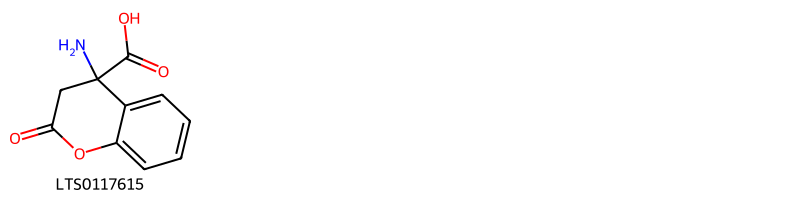
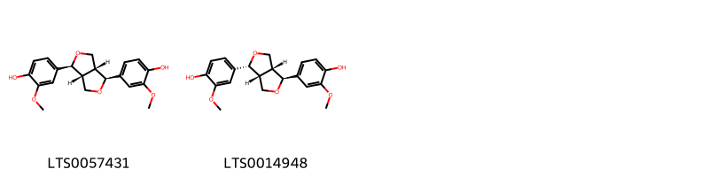
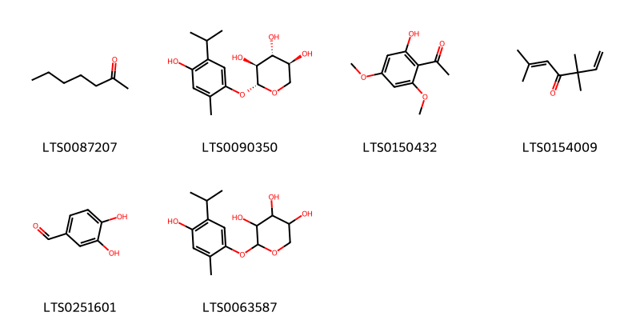

!!! abstract "Tóm tắt"

    Cóc mẳn (Centipeda minima (L.) A. Braun & Asch., họ Cúc - Asteraceae) là một loại cỏ nhỏ, mọc bò lan trên đất ẩm, phân bố rộng rãi tại các vùng nhiệt đới và cận nhiệt đới, bao gồm Trung Quốc, Ấn Độ, Nhật Bản, và Việt Nam. Tại Việt Nam, cây thường gặp ở các vùng đất ẩm, ruộng bỏ hoang, đặc biệt là khu vực xung quanh Hà Nội. Trong y học cổ truyền, cóc mẳn được dùng để khu phong, tán hàn, thông khiếu, tiêu sưng, và chủ trị các bệnh như cảm, tắc mũi, đau họng, ho gà, hen hàn, và chấn thương. Cóc mẳn có tác dụng chống viêm, kháng khuẩn, chống oxy hóa và kích thích thần kinh. Thành phần hóa học chính của cây bao gồm tinh dầu, taraxasterol, taraxasterol axetat, và arnidiol.

## Thông tin về thực vật

Dược liệu **Cóc Mẳn** từ bộ phận **Trên mặt đất** từ loài *Centipeda minima*.

**Mô tả thực vật:** Cóc mẳn là một loại cỏ nhỏ mềm, mọc bò lan trên mặt đất ẩm, phân rất nhiều cành, ở ngọn có lỏng mịn trắng, nhưng toàn thân trong nhẫn bóng, lá đơn mọc so le, hơi hình 3 cạnh, đầu tù, phía cuống hẹp lại, mép có 2 răng cưa, có khi I hay 3, dài 10-18mm, rộng 6-10mm, gần chính hơi nổi ở mặt dưới lá, gần phụ không rõ, không có cuống. Cụm hoa hình đầu mọc ở nách lá, hoa cái gồm nhiều lớp, cánh hoa hình ống màu trắng, trên có răng cưa, hoa lưỡng tĩnh ít hơn, tràng hoa hình chuông có 4 răng hình trứng, rộng, màu hơi tím. Quả bế 4 cạnh, trên cạnh có lông mịn nhỏ. Mùa hoa: các tháng 2-5, mùa quả: các tháng 4-7.

*Tài liệu tham khảo:* "Những cây thuốc và vị thuốc Việt Nam" - Đỗ Tất Lợi 
Trong dược điển Việt nam, một loài được sử dụng làm dược liệu là *Centipeda minima*.

!!! info "Phân loại thực vật của *Centipeda minima*"
    - **Kingdom:** Plantae
    - **Phylum:** Tracheophyta
    - **Order:** Asterales
    - **Family:** Asteraceae
    - **Genus:** Centipeda
    - **Species:** *Centipeda minima*

**Phân bố trên thế giới:** Russian Federation, Chinese Taipei, China, New Zealand, Australia, Japan, Korea, Republic of

**Phân bố tại Việt nam:** Không có ghi nhận ở Việt Nam

## Thông tin về dược liệu 

### Định danh

!!! info "Thông tin về tên gọi"

    - Dược liệu tiếng Việt: cóc mắn
    - Dược liệu tiếng Trung: 鹅不食草 (E Bu Shi Cao)
    - Dược liệu tiếng Anh: Centipeda Minima
    - Dược liệu latin thông dụng: Herba Centipedae minimaenCentipedae Herba
    - Dược liệu latin kiểu DĐVN: *herba centipedae minimae*
    - Dược liệu latin kiểu DĐVN: *Centipedae Herba*
    - Dược liệu latin kiểu thông tư: **
    - Bộ phận dùng: Trên mặt đất (Herba)

### Mô tả dược liệu 

- **Theo dược điển Việt nam V:** Thân mảnh, nhỏ, mềm, phân nhánh nhỏ, màu xanh nhạt hoặc nâu xám dài 5 – 20 cm. Trên thân, có lá nhỏ không cuống, mọc so le, mép có 1 đến 3 răng cưa nhỏ ở mỗi bên mép. Gân chính nổi rõ ở mặt dưới lá. Có nhiều rễ nhỏ, màu vàng nâu. Cụm hoa hình đầu, màu vàng nhạt, mọc ở ngọn, ở kẽ lá, đối diện với lá.

- **Mô tả dược liệu theo thông tư chế biến dược liệu theo phương pháp cổ truyền:** 

### Chế biến 

- **Chế biến theo dược điển việt nam V**: Thu hái vào khoảng tháng 1 đến tháng 3. chủ yếu là cây mọc hoang. Sau khi nhổ lấy cả cây, rửa sạch, phơi hoặc sấy khô. Bào chế Trước khi dùng, rửa sạch, phơi khô, cắt nhỏ. Vi sao.

- **Chế biến theo thông tư:** 

--- 

## Thành phần hóa học

- Theo tài liệu của GS. Đỗ Tất Lợi:  1. Nhóm hóa học: triterpenoid
2. Hoạt chất: trong cây có tinh dầu, có taraxasterol, taraxasteril axetat và arnidiol
    

**Thành phần hóa học từ loài **Centipeda minima**

Theo cơ sở dữ liệu lotus, loài *Centipeda minima* đã phân lập và xác định được **87** hoạt chất thuộc về các nhóm Steroids and steroid derivatives, Organooxygen compounds, 3,4-dihydrocoumarins, Fatty Acyls, Flavonoids, Isoflavonoids, Furanoid lignans, Benzofurans, Phenols, Carboxylic acids and derivatives, Benzene and substituted derivatives, Stilbenes, Prenol lipids trong bảng dưới đây. Danh sách các hoạt chất như sau 2-(hydroxymethyl)-6-(2-isopropyl-5-methylphenoxy)oxane-3,4,5-triol [(LTS0198251)](https://lotus.naturalproducts.net/compound/lotus_id/LTS0198251), 2,7,7-trimethylbicyclo[3.1.1]hept-2-en-6-ol [(LTS0023857)](https://lotus.naturalproducts.net/compound/lotus_id/LTS0023857), 2,2,6a,6b,9,9,12a-heptamethyl-4a-{[(3,4,5-trihydroxyoxan-2-yl)oxy]methyl}-1,3,4,5,6,7,8,8a,10,11,12,12b,13,14b-tetradecahydropicene-3,4,5,10-tetrol [(LTS0015444)](https://lotus.naturalproducts.net/compound/lotus_id/LTS0015444), 5-hydroxy-5-methyl-3,8-dimethylidene-2-oxo-octahydroazuleno[6,5-b]furan-7-yl 2-methylpropanoate [(LTS0170981)](https://lotus.naturalproducts.net/compound/lotus_id/LTS0170981), 3,4a,8-trimethyl-2,5-dioxo-3h,3ah,4h,7ah,8h,9h,9ah-azuleno[6,5-b]furan-4-yl 3-methylbutanoate [(LTS0203730)](https://lotus.naturalproducts.net/compound/lotus_id/LTS0203730), 2-heptanone [(LTS0087207)](https://lotus.naturalproducts.net/compound/lotus_id/LTS0087207), ethyl palmitate [(LTS0111042)](https://lotus.naturalproducts.net/compound/lotus_id/LTS0111042), 3,4,5-trihydroxyoxan-2-yl 1,10,12-trihydroxy-9-(hydroxymethyl)-1,2,6a,6b,9,12a-hexamethyl-2,3,4,5,6,7,8,8a,10,11,12,12b,13,14b-tetradecahydropicene-4a-carboxylate [(LTS0253205)](https://lotus.naturalproducts.net/compound/lotus_id/LTS0253205), (3s,3ar,4r,4ar,7ar,8r,9ar)-3,4a,8-trimethyl-2,5-dioxo-3h,3ah,4h,7ah,8h,9h,9ah-azuleno[6,5-b]furan-4-yl 3-methylbut-2-enoate [(LTS0153336)](https://lotus.naturalproducts.net/compound/lotus_id/LTS0153336), (3z)-2-methyloct-3-en-2-ol [(LTS0220152)](https://lotus.naturalproducts.net/compound/lotus_id/LTS0220152), methyl palmitate [(LTS0139222)](https://lotus.naturalproducts.net/compound/lotus_id/LTS0139222), (6ar,6br,8ar,14br)-4,4,6a,6b,8a,12,14b-heptamethyl-11-methylidene-hexadecahydropicen-3-ol [(LTS0274865)](https://lotus.naturalproducts.net/compound/lotus_id/LTS0274865), benzyl alcohol [(LTS0125638)](https://lotus.naturalproducts.net/compound/lotus_id/LTS0125638), (3s,3ar,4s,4ar,7ar,8r,9ar)-3,4a,8-trimethyl-2,5-dioxo-3h,3ah,4h,7ah,8h,9h,9ah-azuleno[6,5-b]furan-4-yl 3-methylbut-2-enoate [(LTS0110250)](https://lotus.naturalproducts.net/compound/lotus_id/LTS0110250), 5-hydroxy-3-(3-hydroxy-4-methoxyphenyl)-6-methoxy-7-{[(2s,3r,4s,5s,6r)-3,4,5-trihydroxy-6-(hydroxymethyl)oxan-2-yl]oxy}chromen-4-one [(LTS0070076)](https://lotus.naturalproducts.net/compound/lotus_id/LTS0070076), dihydroactinidiolide [(LTS0041341)](https://lotus.naturalproducts.net/compound/lotus_id/LTS0041341), isoartemisia ketone [(LTS0154009)](https://lotus.naturalproducts.net/compound/lotus_id/LTS0154009), 3,4a,8-trimethyl-2,5-dioxo-3h,3ah,4h,7ah,8h,9h,9ah-azuleno[6,5-b]furan-4-yl 2-methylprop-2-enoate [(LTS0059210)](https://lotus.naturalproducts.net/compound/lotus_id/LTS0059210), quercetin 3-methyl ether [(LTS0194170)](https://lotus.naturalproducts.net/compound/lotus_id/LTS0194170), 3,4a,8-trimethyl-2,5-dioxo-3h,3ah,4h,7ah,8h,9h,9ah-azuleno[6,5-b]furan-4-yl 2-methylbutanoate [(LTS0046135)](https://lotus.naturalproducts.net/compound/lotus_id/LTS0046135), 2-[4-(hydroxymethyl)-2,2-dimethyl-1,3-dioxolan-4-yl]-5-methylphenol [(LTS0242717)](https://lotus.naturalproducts.net/compound/lotus_id/LTS0242717), (3s,3ar,4r,4ar,7ar,8r,9ar)-3,4a,8-trimethyl-2,5-dioxo-3h,3ah,4h,7ah,8h,9h,9ah-azuleno[6,5-b]furan-4-yl 3-methylbutanoate [(LTS0166006)](https://lotus.naturalproducts.net/compound/lotus_id/LTS0166006), arnidiol [(LTS0153317)](https://lotus.naturalproducts.net/compound/lotus_id/LTS0153317), (2r,3r,4s,5r)-2-{[(3s,4r,4ar,6as,6br,8ar,10r,12ar,12br,14bs)-3,4,10-trihydroxy-2,2,6a,6b,9,9,12a-heptamethyl-1,3,4,5,6,7,8,8a,10,11,12,12b,13,14b-tetradecahydropicen-4a-yl]methoxy}oxane-3,4,5-triol [(LTS0160513)](https://lotus.naturalproducts.net/compound/lotus_id/LTS0160513), (1r,3ar,3br,7r,9as,9br,11ar)-1-[(2s,3z,5s)-5-ethyl-6-methylhept-3-en-2-yl]-9a,11a-dimethyl-1h,2h,3h,3ah,3bh,4h,6h,7h,8h,9h,9bh,10h,11h-cyclopenta[a]phenanthren-7-ol [(LTS0145971)](https://lotus.naturalproducts.net/compound/lotus_id/LTS0145971), helenalin [(LTS0155034)](https://lotus.naturalproducts.net/compound/lotus_id/LTS0155034), 3,4a,8-trimethyl-2,5-dioxo-3h,3ah,4h,7ah,8h,9h,9ah-azuleno[6,5-b]furan-4-yl (2e)-2-methylbut-2-enoate [(LTS0017992)](https://lotus.naturalproducts.net/compound/lotus_id/LTS0017992), 2,3-dihydroxy-2-(2-hydroxy-4-methylphenyl)propyl 2-methylbutanoate [(LTS0002819)](https://lotus.naturalproducts.net/compound/lotus_id/LTS0002819), (2s,3r,4s,5r)-3,4,5-trihydroxyoxan-2-yl (1r,2r,4as,6as,6br,8ar,9r,10s,12s,12ar,12bs,14bs)-1,10,12-trihydroxy-9-(hydroxymethyl)-1,2,6a,6b,9,12a-hexamethyl-2,3,4,5,6,7,8,8a,10,11,12,12b,13,14b-tetradecahydropicene-4a-carboxylate [(LTS0033242)](https://lotus.naturalproducts.net/compound/lotus_id/LTS0033242), (3ar,4ar,5r,7s,7as,9ar)-5-hydroxy-5-methyl-3,8-dimethylidene-2-oxo-octahydroazuleno[6,5-b]furan-7-yl 2-methylpropanoate [(LTS0111654)](https://lotus.naturalproducts.net/compound/lotus_id/LTS0111654), (3s,4r,4ar,5r,6as,6br,8ar,10s,12ar,12br,14bs)-2,2,6a,6b,9,9,12a-heptamethyl-4a-({[(2r,3r,4s,5r)-3,4,5-trihydroxyoxan-2-yl]oxy}methyl)-1,3,4,5,6,7,8,8a,10,11,12,12b,13,14b-tetradecahydropicene-3,4,5,10-tetrol [(LTS0123025)](https://lotus.naturalproducts.net/compound/lotus_id/LTS0123025), (3s,3ar,4s,4ar,7ar,8r,9ar)-3,4a,8-trimethyl-2,5-dioxo-3h,3ah,4h,7ah,8h,9h,9ah-azuleno[6,5-b]furan-4-yl (2r)-2-methylbutanoate [(LTS0078347)](https://lotus.naturalproducts.net/compound/lotus_id/LTS0078347), (3s,3ar,4r,4ar,7ar,8r,9ar)-3,4a,8-trimethyl-2,5-dioxo-3h,3ah,4h,7ah,8h,9h,9ah-azuleno[6,5-b]furan-4-yl (2z)-2-methylbut-2-enoate [(LTS0013796)](https://lotus.naturalproducts.net/compound/lotus_id/LTS0013796), 4-[(1s,3ar,4r,6ar)-4-(4-hydroxy-3-methoxyphenyl)-hexahydrofuro[3,4-c]furan-1-yl]-2-methoxyphenol [(LTS0014948)](https://lotus.naturalproducts.net/compound/lotus_id/LTS0014948), (3s,3as,4s,4ar,7ar,8r,9ar)-3,4a,8-trimethyl-2,5-dioxo-3h,3ah,4h,7ah,8h,9h,9ah-azuleno[6,5-b]furan-4-yl 3-methylbut-2-enoate [(LTS0272117)](https://lotus.naturalproducts.net/compound/lotus_id/LTS0272117), 3,4,5-trihydroxyoxan-2-yl 1,10,11,12-tetrahydroxy-9-(hydroxymethyl)-1,2,6a,6b,9,12a-hexamethyl-2,3,4,5,6,7,8,8a,10,11,12,12b,13,14b-tetradecahydropicene-4a-carboxylate [(LTS0003952)](https://lotus.naturalproducts.net/compound/lotus_id/LTS0003952), phytol [(LTS0096073)](https://lotus.naturalproducts.net/compound/lotus_id/LTS0096073), (3s,3ar,4s,4ar,7ar,8r,9ar)-3,4a,8-trimethyl-2,5-dioxo-3h,3ah,4h,7ah,8h,9h,9ah-azuleno[6,5-b]furan-4-yl 2-methylpropanoate [(LTS0182791)](https://lotus.naturalproducts.net/compound/lotus_id/LTS0182791), (3s,3ar,4s,4ar,7ar,8r,9ar)-3,4a,8-trimethyl-2,5-dioxo-3h,3ah,4h,7ah,8h,9h,9ah-azuleno[6,5-b]furan-4-yl 2-methylbutanoate [(LTS0136513)](https://lotus.naturalproducts.net/compound/lotus_id/LTS0136513), (2s)-n-[(2r)-3-(acetyloxy)-2-benzylpropyl]-2-{[hydroxy(phenyl)methylidene]amino}-3-phenylpropanimidic acid [(LTS0263202)](https://lotus.naturalproducts.net/compound/lotus_id/LTS0263202), 3,4a,8-trimethyl-2,5-dioxo-3h,3ah,4h,7ah,8h,9h,9ah-azuleno[6,5-b]furan-4-yl 2-methylpropanoate [(LTS0031453)](https://lotus.naturalproducts.net/compound/lotus_id/LTS0031453), methyl linoleate [(LTS0116588)](https://lotus.naturalproducts.net/compound/lotus_id/LTS0116588), lupeol acetate [(LTS0077599)](https://lotus.naturalproducts.net/compound/lotus_id/LTS0077599), stigmast-5-en-3-ol, (3β)- [(LTS0204616)](https://lotus.naturalproducts.net/compound/lotus_id/LTS0204616), (2r)-2,3-dihydroxy-2-(2-hydroxy-4-methylphenyl)propyl 2-methylpropanoate [(LTS0111791)](https://lotus.naturalproducts.net/compound/lotus_id/LTS0111791), 2-[(3,4,10-trihydroxy-2,2,6a,6b,9,9,12a-heptamethyl-1,3,4,5,6,7,8,8a,10,11,12,12b,13,14b-tetradecahydropicen-4a-yl)methoxy]oxane-3,4,5-triol [(LTS0103622)](https://lotus.naturalproducts.net/compound/lotus_id/LTS0103622), 2,3-dihydroxy-2-(2-hydroxy-4-methylphenyl)propyl 2-methylpropanoate [(LTS0118074)](https://lotus.naturalproducts.net/compound/lotus_id/LTS0118074), 1-[(1e)-2-(3,5-dimethoxyphenyl)ethenyl]-3,5-dimethoxybenzene [(LTS0010963)](https://lotus.naturalproducts.net/compound/lotus_id/LTS0010963), (3as,4ar,7as,9ar)-3,4a,8-trimethyl-2,5-dioxo-3h,3ah,4h,7ah,8h,9h,9ah-azuleno[6,5-b]furan-4-yl 2-methylpropanoate [(LTS0074847)](https://lotus.naturalproducts.net/compound/lotus_id/LTS0074847), pinoresinol [(LTS0057431)](https://lotus.naturalproducts.net/compound/lotus_id/LTS0057431), n-[(2s)-1-(acetyloxy)-3-phenylpropan-2-yl]-2-{[hydroxy(phenyl)methylidene]amino}-3-phenylpropanimidic acid [(LTS0163723)](https://lotus.naturalproducts.net/compound/lotus_id/LTS0163723), (2s,3r,4s,5r)-3,4,5-trihydroxyoxan-2-yl (1r,2r,4as,6as,6br,8ar,9r,10r,11r,12s,12ar,12bs,14bs)-1,10,11,12-tetrahydroxy-9-(hydroxymethyl)-1,2,6a,6b,9,12a-hexamethyl-2,3,4,5,6,7,8,8a,10,11,12,12b,13,14b-tetradecahydropicene-4a-carboxylate [(LTS0009709)](https://lotus.naturalproducts.net/compound/lotus_id/LTS0009709), 3,4-dihydroxybenzaldehyde [(LTS0251601)](https://lotus.naturalproducts.net/compound/lotus_id/LTS0251601), 2-heptanol [(LTS0147404)](https://lotus.naturalproducts.net/compound/lotus_id/LTS0147404), 4,4,6a,6b,8a,12,14b-heptamethyl-11-methylidene-hexadecahydropicene-3,8-diol [(LTS0195877)](https://lotus.naturalproducts.net/compound/lotus_id/LTS0195877), stigmast-5-en-3-ol [(LTS0071224)](https://lotus.naturalproducts.net/compound/lotus_id/LTS0071224), 2-(2-hydroxy-4-methylphenyl)propane-1,2,3-triol [(LTS0027154)](https://lotus.naturalproducts.net/compound/lotus_id/LTS0027154), (2s)-n-[(2s)-1-(acetyloxy)-3-phenylpropan-2-yl]-2-{[hydroxy(phenyl)methylidene]amino}-3-phenylpropanimidic acid [(LTS0004100)](https://lotus.naturalproducts.net/compound/lotus_id/LTS0004100), n-[1-(acetyloxy)-3-phenylpropan-2-yl]-2-{[hydroxy(phenyl)methylidene]amino}-3-phenylpropanimidic acid [(LTS0156307)](https://lotus.naturalproducts.net/compound/lotus_id/LTS0156307), (3s,4r,4ar,5r,6as,6br,8ar,10r,12ar,12br,14bs)-2,2,6a,6b,9,9,12a-heptamethyl-4a-({[(2r,3r,4s,5r)-3,4,5-trihydroxyoxan-2-yl]oxy}methyl)-1,3,4,5,6,7,8,8a,10,11,12,12b,13,14b-tetradecahydropicene-3,4,5,10-tetrol [(LTS0044250)](https://lotus.naturalproducts.net/compound/lotus_id/LTS0044250), (3s,3ar,4s,4ar,7ar,8r,9ar)-3,4a,8-trimethyl-2,5-dioxo-3h,3ah,4h,7ah,8h,9h,9ah-azuleno[6,5-b]furan-4-yl 2-methylprop-2-enoate [(LTS0060046)](https://lotus.naturalproducts.net/compound/lotus_id/LTS0060046), 2-[(2s)-1-hydroxypropan-2-yl]-5-methylphenol [(LTS0163898)](https://lotus.naturalproducts.net/compound/lotus_id/LTS0163898), 1-[2-(3,5-dimethoxyphenyl)ethenyl]-3,5-dimethoxybenzene [(LTS0188919)](https://lotus.naturalproducts.net/compound/lotus_id/LTS0188919), phytol [(LTS0031808)](https://lotus.naturalproducts.net/compound/lotus_id/LTS0031808), (2r)-2,3-dihydroxy-2-(2-hydroxy-4-methylphenyl)propyl (2r)-2-methylbutanoate [(LTS0157167)](https://lotus.naturalproducts.net/compound/lotus_id/LTS0157167), 2-(1-hydroxypropan-2-yl)-5-methylphenol [(LTS0142990)](https://lotus.naturalproducts.net/compound/lotus_id/LTS0142990), (2r,3s,4r,5s)-2-(4-hydroxy-5-isopropyl-2-methylphenoxy)oxane-3,4,5-triol [(LTS0090350)](https://lotus.naturalproducts.net/compound/lotus_id/LTS0090350), isobutyric acid [(LTS0128574)](https://lotus.naturalproducts.net/compound/lotus_id/LTS0128574), chamomile [(LTS0104946)](https://lotus.naturalproducts.net/compound/lotus_id/LTS0104946), tetratriacontyl nonadecanoate [(LTS0021448)](https://lotus.naturalproducts.net/compound/lotus_id/LTS0021448), xanthoxylin [(LTS0150432)](https://lotus.naturalproducts.net/compound/lotus_id/LTS0150432), calenduladiol [(LTS0017475)](https://lotus.naturalproducts.net/compound/lotus_id/LTS0017475), (3s,3ar,4s,4ar,7ar,8r,9ar)-3,4a,8-trimethyl-2,5-dioxo-3h,3ah,4h,7ah,8h,9h,9ah-azuleno[6,5-b]furan-4-yl 3-methylbutanoate [(LTS0113428)](https://lotus.naturalproducts.net/compound/lotus_id/LTS0113428), phenylalanin [(LTS0062777)](https://lotus.naturalproducts.net/compound/lotus_id/LTS0062777), 3,4a,8-trimethyl-2,5-dioxo-3h,3ah,4h,7ah,8h,9h,9ah-azuleno[6,5-b]furan-4-yl 3-methylbut-2-enoate [(LTS0049044)](https://lotus.naturalproducts.net/compound/lotus_id/LTS0049044), 2-[(4r)-4-(hydroxymethyl)-2,2-dimethyl-1,3-dioxolan-4-yl]-5-methylphenol [(LTS0138575)](https://lotus.naturalproducts.net/compound/lotus_id/LTS0138575), (2r,3s,4s,5r,6s)-2-(hydroxymethyl)-6-(2-isopropyl-5-methylphenoxy)oxane-3,4,5-triol [(LTS0095575)](https://lotus.naturalproducts.net/compound/lotus_id/LTS0095575), leucine [(LTS0102123)](https://lotus.naturalproducts.net/compound/lotus_id/LTS0102123), 3,4a,8-trimethyl-2,5-dioxo-3h,3ah,4h,7ah,8h,9h,9ah-azuleno[6,5-b]furan-4-yl 2-methylbut-2-enoate [(LTS0200590)](https://lotus.naturalproducts.net/compound/lotus_id/LTS0200590), 3,3'-di-o-methylquercetin [(LTS0065557)](https://lotus.naturalproducts.net/compound/lotus_id/LTS0065557), 2-hydroxy-2-(2-hydroxy-4-methylphenyl)-3-[(2-methylpropanoyl)oxy]propyl 2-methylpropanoate [(LTS0034787)](https://lotus.naturalproducts.net/compound/lotus_id/LTS0034787), sitosterol [(LTS0168132)](https://lotus.naturalproducts.net/compound/lotus_id/LTS0168132), 2-(4-hydroxy-5-isopropyl-2-methylphenoxy)oxane-3,4,5-triol [(LTS0063587)](https://lotus.naturalproducts.net/compound/lotus_id/LTS0063587), 3a,5a,5b,8,8,11a-hexamethyl-1-(prop-1-en-2-yl)-hexadecahydrocyclopenta[a]chrysene-4,9-diol [(LTS0031215)](https://lotus.naturalproducts.net/compound/lotus_id/LTS0031215), β-gurjunene [(LTS0225922)](https://lotus.naturalproducts.net/compound/lotus_id/LTS0225922), stigmasterol [(LTS0024262)](https://lotus.naturalproducts.net/compound/lotus_id/LTS0024262), 4-amino-2-oxo-3h-1-benzopyran-4-carboxylic acid [(LTS0117615)](https://lotus.naturalproducts.net/compound/lotus_id/LTS0117615). 
        
| chemicalTaxonomyClassyfireClass     |   smiles_count |
|:------------------------------------|---------------:|
| 3,4-dihydrocoumarins                |             27 |
| Benzene and substituted derivatives |             10 |
| Benzofurans                         |             29 |
| Carboxylic acids and derivatives    |            276 |
| Fatty Acyls                         |            143 |
| Flavonoids                          |            117 |
| Furanoid lignans                    |            119 |
| Isoflavonoids                       |             81 |
| Organooxygen compounds              |            163 |
| Phenols                             |            280 |
| Prenol lipids                       |           3239 |
| Steroids and steroid derivatives    |            357 |
| Stilbenes                           |             72 |

            
### Nhóm 3,4-dihydrocoumarins
<figure markdown="span">
    { width=100% }
<figcaption>Hình ảnh cấu trúc hóa học của hoạt chất thuộc nhóm *3,4-dihydrocoumarins*. Tên thường gọi của các hoạt chất tương ứng là 4-amino-2-oxo-3h-1-benzopyran-4-carboxylic acid [(LTS0117615)](https://lotus.naturalproducts.net/compound/lotus_id/LTS0117615).</figcaption>
</figure>

            
            
### Nhóm 3,4-dihydrocoumarins
<figure markdown="span">
    { width=100% }
<figcaption>Hình ảnh cấu trúc hóa học của hoạt chất thuộc nhóm *3,4-dihydrocoumarins*. Tên thường gọi của các hoạt chất tương ứng là 4-amino-2-oxo-3h-1-benzopyran-4-carboxylic acid [(LTS0117615)](https://lotus.naturalproducts.net/compound/lotus_id/LTS0117615).</figcaption>
</figure>

### Nhóm Benzene and substituted derivatives
<figure markdown="span">
    { width=100% }
<figcaption>Hình ảnh cấu trúc hóa học của hoạt chất thuộc nhóm *Benzene and substituted derivatives*. Tên thường gọi của các hoạt chất tương ứng là benzyl alcohol [(LTS0125638)](https://lotus.naturalproducts.net/compound/lotus_id/LTS0125638).</figcaption>
</figure>

            
            
### Nhóm 3,4-dihydrocoumarins
<figure markdown="span">
    { width=100% }
<figcaption>Hình ảnh cấu trúc hóa học của hoạt chất thuộc nhóm *3,4-dihydrocoumarins*. Tên thường gọi của các hoạt chất tương ứng là 4-amino-2-oxo-3h-1-benzopyran-4-carboxylic acid [(LTS0117615)](https://lotus.naturalproducts.net/compound/lotus_id/LTS0117615).</figcaption>
</figure>

### Nhóm Benzene and substituted derivatives
<figure markdown="span">
    { width=100% }
<figcaption>Hình ảnh cấu trúc hóa học của hoạt chất thuộc nhóm *Benzene and substituted derivatives*. Tên thường gọi của các hoạt chất tương ứng là benzyl alcohol [(LTS0125638)](https://lotus.naturalproducts.net/compound/lotus_id/LTS0125638).</figcaption>
</figure>

### Nhóm Benzofurans
<figure markdown="span">
    { width=100% }
<figcaption>Hình ảnh cấu trúc hóa học của hoạt chất thuộc nhóm *Benzofurans*. Tên thường gọi của các hoạt chất tương ứng là dihydroactinidiolide [(LTS0041341)](https://lotus.naturalproducts.net/compound/lotus_id/LTS0041341).</figcaption>
</figure>

            
            
### Nhóm 3,4-dihydrocoumarins
<figure markdown="span">
    { width=100% }
<figcaption>Hình ảnh cấu trúc hóa học của hoạt chất thuộc nhóm *3,4-dihydrocoumarins*. Tên thường gọi của các hoạt chất tương ứng là 4-amino-2-oxo-3h-1-benzopyran-4-carboxylic acid [(LTS0117615)](https://lotus.naturalproducts.net/compound/lotus_id/LTS0117615).</figcaption>
</figure>

### Nhóm Benzene and substituted derivatives
<figure markdown="span">
    { width=100% }
<figcaption>Hình ảnh cấu trúc hóa học của hoạt chất thuộc nhóm *Benzene and substituted derivatives*. Tên thường gọi của các hoạt chất tương ứng là benzyl alcohol [(LTS0125638)](https://lotus.naturalproducts.net/compound/lotus_id/LTS0125638).</figcaption>
</figure>

### Nhóm Benzofurans
<figure markdown="span">
    { width=100% }
<figcaption>Hình ảnh cấu trúc hóa học của hoạt chất thuộc nhóm *Benzofurans*. Tên thường gọi của các hoạt chất tương ứng là dihydroactinidiolide [(LTS0041341)](https://lotus.naturalproducts.net/compound/lotus_id/LTS0041341).</figcaption>
</figure>

### Nhóm Carboxylic acids and derivatives
<figure markdown="span">
    { width=100% }
<figcaption>Hình ảnh cấu trúc hóa học của hoạt chất thuộc nhóm *Carboxylic acids and derivatives*. Tên thường gọi của các hoạt chất tương ứng là n-[1-(acetyloxy)-3-phenylpropan-2-yl]-2-{[hydroxy(phenyl)methylidene]amino}-3-phenylpropanimidic acid [(LTS0156307)](https://lotus.naturalproducts.net/compound/lotus_id/LTS0156307), n-[(2s)-1-(acetyloxy)-3-phenylpropan-2-yl]-2-{[hydroxy(phenyl)methylidene]amino}-3-phenylpropanimidic acid [(LTS0163723)](https://lotus.naturalproducts.net/compound/lotus_id/LTS0163723), (2s)-n-[(2r)-3-(acetyloxy)-2-benzylpropyl]-2-{[hydroxy(phenyl)methylidene]amino}-3-phenylpropanimidic acid [(LTS0263202)](https://lotus.naturalproducts.net/compound/lotus_id/LTS0263202), phenylalanin [(LTS0062777)](https://lotus.naturalproducts.net/compound/lotus_id/LTS0062777), isobutyric acid [(LTS0128574)](https://lotus.naturalproducts.net/compound/lotus_id/LTS0128574), (2s)-n-[(2s)-1-(acetyloxy)-3-phenylpropan-2-yl]-2-{[hydroxy(phenyl)methylidene]amino}-3-phenylpropanimidic acid [(LTS0004100)](https://lotus.naturalproducts.net/compound/lotus_id/LTS0004100), leucine [(LTS0102123)](https://lotus.naturalproducts.net/compound/lotus_id/LTS0102123).</figcaption>
</figure>

            
            
### Nhóm 3,4-dihydrocoumarins
<figure markdown="span">
    { width=100% }
<figcaption>Hình ảnh cấu trúc hóa học của hoạt chất thuộc nhóm *3,4-dihydrocoumarins*. Tên thường gọi của các hoạt chất tương ứng là 4-amino-2-oxo-3h-1-benzopyran-4-carboxylic acid [(LTS0117615)](https://lotus.naturalproducts.net/compound/lotus_id/LTS0117615).</figcaption>
</figure>

### Nhóm Benzene and substituted derivatives
<figure markdown="span">
    { width=100% }
<figcaption>Hình ảnh cấu trúc hóa học của hoạt chất thuộc nhóm *Benzene and substituted derivatives*. Tên thường gọi của các hoạt chất tương ứng là benzyl alcohol [(LTS0125638)](https://lotus.naturalproducts.net/compound/lotus_id/LTS0125638).</figcaption>
</figure>

### Nhóm Benzofurans
<figure markdown="span">
    { width=100% }
<figcaption>Hình ảnh cấu trúc hóa học của hoạt chất thuộc nhóm *Benzofurans*. Tên thường gọi của các hoạt chất tương ứng là dihydroactinidiolide [(LTS0041341)](https://lotus.naturalproducts.net/compound/lotus_id/LTS0041341).</figcaption>
</figure>

### Nhóm Carboxylic acids and derivatives
<figure markdown="span">
    { width=100% }
<figcaption>Hình ảnh cấu trúc hóa học của hoạt chất thuộc nhóm *Carboxylic acids and derivatives*. Tên thường gọi của các hoạt chất tương ứng là n-[1-(acetyloxy)-3-phenylpropan-2-yl]-2-{[hydroxy(phenyl)methylidene]amino}-3-phenylpropanimidic acid [(LTS0156307)](https://lotus.naturalproducts.net/compound/lotus_id/LTS0156307), n-[(2s)-1-(acetyloxy)-3-phenylpropan-2-yl]-2-{[hydroxy(phenyl)methylidene]amino}-3-phenylpropanimidic acid [(LTS0163723)](https://lotus.naturalproducts.net/compound/lotus_id/LTS0163723), (2s)-n-[(2r)-3-(acetyloxy)-2-benzylpropyl]-2-{[hydroxy(phenyl)methylidene]amino}-3-phenylpropanimidic acid [(LTS0263202)](https://lotus.naturalproducts.net/compound/lotus_id/LTS0263202), phenylalanin [(LTS0062777)](https://lotus.naturalproducts.net/compound/lotus_id/LTS0062777), isobutyric acid [(LTS0128574)](https://lotus.naturalproducts.net/compound/lotus_id/LTS0128574), (2s)-n-[(2s)-1-(acetyloxy)-3-phenylpropan-2-yl]-2-{[hydroxy(phenyl)methylidene]amino}-3-phenylpropanimidic acid [(LTS0004100)](https://lotus.naturalproducts.net/compound/lotus_id/LTS0004100), leucine [(LTS0102123)](https://lotus.naturalproducts.net/compound/lotus_id/LTS0102123).</figcaption>
</figure>

### Nhóm Fatty Acyls
<figure markdown="span">
    { width=100% }
<figcaption>Hình ảnh cấu trúc hóa học của hoạt chất thuộc nhóm *Fatty Acyls*. Tên thường gọi của các hoạt chất tương ứng là methyl linoleate [(LTS0116588)](https://lotus.naturalproducts.net/compound/lotus_id/LTS0116588), 2-heptanol [(LTS0147404)](https://lotus.naturalproducts.net/compound/lotus_id/LTS0147404), methyl palmitate [(LTS0139222)](https://lotus.naturalproducts.net/compound/lotus_id/LTS0139222), ethyl palmitate [(LTS0111042)](https://lotus.naturalproducts.net/compound/lotus_id/LTS0111042), tetratriacontyl nonadecanoate [(LTS0021448)](https://lotus.naturalproducts.net/compound/lotus_id/LTS0021448).</figcaption>
</figure>

            
            
### Nhóm 3,4-dihydrocoumarins
<figure markdown="span">
    { width=100% }
<figcaption>Hình ảnh cấu trúc hóa học của hoạt chất thuộc nhóm *3,4-dihydrocoumarins*. Tên thường gọi của các hoạt chất tương ứng là 4-amino-2-oxo-3h-1-benzopyran-4-carboxylic acid [(LTS0117615)](https://lotus.naturalproducts.net/compound/lotus_id/LTS0117615).</figcaption>
</figure>

### Nhóm Benzene and substituted derivatives
<figure markdown="span">
    { width=100% }
<figcaption>Hình ảnh cấu trúc hóa học của hoạt chất thuộc nhóm *Benzene and substituted derivatives*. Tên thường gọi của các hoạt chất tương ứng là benzyl alcohol [(LTS0125638)](https://lotus.naturalproducts.net/compound/lotus_id/LTS0125638).</figcaption>
</figure>

### Nhóm Benzofurans
<figure markdown="span">
    { width=100% }
<figcaption>Hình ảnh cấu trúc hóa học của hoạt chất thuộc nhóm *Benzofurans*. Tên thường gọi của các hoạt chất tương ứng là dihydroactinidiolide [(LTS0041341)](https://lotus.naturalproducts.net/compound/lotus_id/LTS0041341).</figcaption>
</figure>

### Nhóm Carboxylic acids and derivatives
<figure markdown="span">
    { width=100% }
<figcaption>Hình ảnh cấu trúc hóa học của hoạt chất thuộc nhóm *Carboxylic acids and derivatives*. Tên thường gọi của các hoạt chất tương ứng là n-[1-(acetyloxy)-3-phenylpropan-2-yl]-2-{[hydroxy(phenyl)methylidene]amino}-3-phenylpropanimidic acid [(LTS0156307)](https://lotus.naturalproducts.net/compound/lotus_id/LTS0156307), n-[(2s)-1-(acetyloxy)-3-phenylpropan-2-yl]-2-{[hydroxy(phenyl)methylidene]amino}-3-phenylpropanimidic acid [(LTS0163723)](https://lotus.naturalproducts.net/compound/lotus_id/LTS0163723), (2s)-n-[(2r)-3-(acetyloxy)-2-benzylpropyl]-2-{[hydroxy(phenyl)methylidene]amino}-3-phenylpropanimidic acid [(LTS0263202)](https://lotus.naturalproducts.net/compound/lotus_id/LTS0263202), phenylalanin [(LTS0062777)](https://lotus.naturalproducts.net/compound/lotus_id/LTS0062777), isobutyric acid [(LTS0128574)](https://lotus.naturalproducts.net/compound/lotus_id/LTS0128574), (2s)-n-[(2s)-1-(acetyloxy)-3-phenylpropan-2-yl]-2-{[hydroxy(phenyl)methylidene]amino}-3-phenylpropanimidic acid [(LTS0004100)](https://lotus.naturalproducts.net/compound/lotus_id/LTS0004100), leucine [(LTS0102123)](https://lotus.naturalproducts.net/compound/lotus_id/LTS0102123).</figcaption>
</figure>

### Nhóm Fatty Acyls
<figure markdown="span">
    { width=100% }
<figcaption>Hình ảnh cấu trúc hóa học của hoạt chất thuộc nhóm *Fatty Acyls*. Tên thường gọi của các hoạt chất tương ứng là methyl linoleate [(LTS0116588)](https://lotus.naturalproducts.net/compound/lotus_id/LTS0116588), 2-heptanol [(LTS0147404)](https://lotus.naturalproducts.net/compound/lotus_id/LTS0147404), methyl palmitate [(LTS0139222)](https://lotus.naturalproducts.net/compound/lotus_id/LTS0139222), ethyl palmitate [(LTS0111042)](https://lotus.naturalproducts.net/compound/lotus_id/LTS0111042), tetratriacontyl nonadecanoate [(LTS0021448)](https://lotus.naturalproducts.net/compound/lotus_id/LTS0021448).</figcaption>
</figure>

### Nhóm Flavonoids
<figure markdown="span">
    { width=100% }
<figcaption>Hình ảnh cấu trúc hóa học của hoạt chất thuộc nhóm *Flavonoids*. Tên thường gọi của các hoạt chất tương ứng là chamomile [(LTS0104946)](https://lotus.naturalproducts.net/compound/lotus_id/LTS0104946), quercetin 3-methyl ether [(LTS0194170)](https://lotus.naturalproducts.net/compound/lotus_id/LTS0194170), 3,3'-di-o-methylquercetin [(LTS0065557)](https://lotus.naturalproducts.net/compound/lotus_id/LTS0065557).</figcaption>
</figure>

            
            
### Nhóm 3,4-dihydrocoumarins
<figure markdown="span">
    { width=100% }
<figcaption>Hình ảnh cấu trúc hóa học của hoạt chất thuộc nhóm *3,4-dihydrocoumarins*. Tên thường gọi của các hoạt chất tương ứng là 4-amino-2-oxo-3h-1-benzopyran-4-carboxylic acid [(LTS0117615)](https://lotus.naturalproducts.net/compound/lotus_id/LTS0117615).</figcaption>
</figure>

### Nhóm Benzene and substituted derivatives
<figure markdown="span">
    { width=100% }
<figcaption>Hình ảnh cấu trúc hóa học của hoạt chất thuộc nhóm *Benzene and substituted derivatives*. Tên thường gọi của các hoạt chất tương ứng là benzyl alcohol [(LTS0125638)](https://lotus.naturalproducts.net/compound/lotus_id/LTS0125638).</figcaption>
</figure>

### Nhóm Benzofurans
<figure markdown="span">
    { width=100% }
<figcaption>Hình ảnh cấu trúc hóa học của hoạt chất thuộc nhóm *Benzofurans*. Tên thường gọi của các hoạt chất tương ứng là dihydroactinidiolide [(LTS0041341)](https://lotus.naturalproducts.net/compound/lotus_id/LTS0041341).</figcaption>
</figure>

### Nhóm Carboxylic acids and derivatives
<figure markdown="span">
    { width=100% }
<figcaption>Hình ảnh cấu trúc hóa học của hoạt chất thuộc nhóm *Carboxylic acids and derivatives*. Tên thường gọi của các hoạt chất tương ứng là n-[1-(acetyloxy)-3-phenylpropan-2-yl]-2-{[hydroxy(phenyl)methylidene]amino}-3-phenylpropanimidic acid [(LTS0156307)](https://lotus.naturalproducts.net/compound/lotus_id/LTS0156307), n-[(2s)-1-(acetyloxy)-3-phenylpropan-2-yl]-2-{[hydroxy(phenyl)methylidene]amino}-3-phenylpropanimidic acid [(LTS0163723)](https://lotus.naturalproducts.net/compound/lotus_id/LTS0163723), (2s)-n-[(2r)-3-(acetyloxy)-2-benzylpropyl]-2-{[hydroxy(phenyl)methylidene]amino}-3-phenylpropanimidic acid [(LTS0263202)](https://lotus.naturalproducts.net/compound/lotus_id/LTS0263202), phenylalanin [(LTS0062777)](https://lotus.naturalproducts.net/compound/lotus_id/LTS0062777), isobutyric acid [(LTS0128574)](https://lotus.naturalproducts.net/compound/lotus_id/LTS0128574), (2s)-n-[(2s)-1-(acetyloxy)-3-phenylpropan-2-yl]-2-{[hydroxy(phenyl)methylidene]amino}-3-phenylpropanimidic acid [(LTS0004100)](https://lotus.naturalproducts.net/compound/lotus_id/LTS0004100), leucine [(LTS0102123)](https://lotus.naturalproducts.net/compound/lotus_id/LTS0102123).</figcaption>
</figure>

### Nhóm Fatty Acyls
<figure markdown="span">
    { width=100% }
<figcaption>Hình ảnh cấu trúc hóa học của hoạt chất thuộc nhóm *Fatty Acyls*. Tên thường gọi của các hoạt chất tương ứng là methyl linoleate [(LTS0116588)](https://lotus.naturalproducts.net/compound/lotus_id/LTS0116588), 2-heptanol [(LTS0147404)](https://lotus.naturalproducts.net/compound/lotus_id/LTS0147404), methyl palmitate [(LTS0139222)](https://lotus.naturalproducts.net/compound/lotus_id/LTS0139222), ethyl palmitate [(LTS0111042)](https://lotus.naturalproducts.net/compound/lotus_id/LTS0111042), tetratriacontyl nonadecanoate [(LTS0021448)](https://lotus.naturalproducts.net/compound/lotus_id/LTS0021448).</figcaption>
</figure>

### Nhóm Flavonoids
<figure markdown="span">
    { width=100% }
<figcaption>Hình ảnh cấu trúc hóa học của hoạt chất thuộc nhóm *Flavonoids*. Tên thường gọi của các hoạt chất tương ứng là chamomile [(LTS0104946)](https://lotus.naturalproducts.net/compound/lotus_id/LTS0104946), quercetin 3-methyl ether [(LTS0194170)](https://lotus.naturalproducts.net/compound/lotus_id/LTS0194170), 3,3'-di-o-methylquercetin [(LTS0065557)](https://lotus.naturalproducts.net/compound/lotus_id/LTS0065557).</figcaption>
</figure>

### Nhóm Furanoid lignans
<figure markdown="span">
    { width=100% }
<figcaption>Hình ảnh cấu trúc hóa học của hoạt chất thuộc nhóm *Furanoid lignans*. Tên thường gọi của các hoạt chất tương ứng là pinoresinol [(LTS0057431)](https://lotus.naturalproducts.net/compound/lotus_id/LTS0057431), 4-[(1s,3ar,4r,6ar)-4-(4-hydroxy-3-methoxyphenyl)-hexahydrofuro[3,4-c]furan-1-yl]-2-methoxyphenol [(LTS0014948)](https://lotus.naturalproducts.net/compound/lotus_id/LTS0014948).</figcaption>
</figure>

            
            
### Nhóm 3,4-dihydrocoumarins
<figure markdown="span">
    { width=100% }
<figcaption>Hình ảnh cấu trúc hóa học của hoạt chất thuộc nhóm *3,4-dihydrocoumarins*. Tên thường gọi của các hoạt chất tương ứng là 4-amino-2-oxo-3h-1-benzopyran-4-carboxylic acid [(LTS0117615)](https://lotus.naturalproducts.net/compound/lotus_id/LTS0117615).</figcaption>
</figure>

### Nhóm Benzene and substituted derivatives
<figure markdown="span">
    { width=100% }
<figcaption>Hình ảnh cấu trúc hóa học của hoạt chất thuộc nhóm *Benzene and substituted derivatives*. Tên thường gọi của các hoạt chất tương ứng là benzyl alcohol [(LTS0125638)](https://lotus.naturalproducts.net/compound/lotus_id/LTS0125638).</figcaption>
</figure>

### Nhóm Benzofurans
<figure markdown="span">
    { width=100% }
<figcaption>Hình ảnh cấu trúc hóa học của hoạt chất thuộc nhóm *Benzofurans*. Tên thường gọi của các hoạt chất tương ứng là dihydroactinidiolide [(LTS0041341)](https://lotus.naturalproducts.net/compound/lotus_id/LTS0041341).</figcaption>
</figure>

### Nhóm Carboxylic acids and derivatives
<figure markdown="span">
    { width=100% }
<figcaption>Hình ảnh cấu trúc hóa học của hoạt chất thuộc nhóm *Carboxylic acids and derivatives*. Tên thường gọi của các hoạt chất tương ứng là n-[1-(acetyloxy)-3-phenylpropan-2-yl]-2-{[hydroxy(phenyl)methylidene]amino}-3-phenylpropanimidic acid [(LTS0156307)](https://lotus.naturalproducts.net/compound/lotus_id/LTS0156307), n-[(2s)-1-(acetyloxy)-3-phenylpropan-2-yl]-2-{[hydroxy(phenyl)methylidene]amino}-3-phenylpropanimidic acid [(LTS0163723)](https://lotus.naturalproducts.net/compound/lotus_id/LTS0163723), (2s)-n-[(2r)-3-(acetyloxy)-2-benzylpropyl]-2-{[hydroxy(phenyl)methylidene]amino}-3-phenylpropanimidic acid [(LTS0263202)](https://lotus.naturalproducts.net/compound/lotus_id/LTS0263202), phenylalanin [(LTS0062777)](https://lotus.naturalproducts.net/compound/lotus_id/LTS0062777), isobutyric acid [(LTS0128574)](https://lotus.naturalproducts.net/compound/lotus_id/LTS0128574), (2s)-n-[(2s)-1-(acetyloxy)-3-phenylpropan-2-yl]-2-{[hydroxy(phenyl)methylidene]amino}-3-phenylpropanimidic acid [(LTS0004100)](https://lotus.naturalproducts.net/compound/lotus_id/LTS0004100), leucine [(LTS0102123)](https://lotus.naturalproducts.net/compound/lotus_id/LTS0102123).</figcaption>
</figure>

### Nhóm Fatty Acyls
<figure markdown="span">
    { width=100% }
<figcaption>Hình ảnh cấu trúc hóa học của hoạt chất thuộc nhóm *Fatty Acyls*. Tên thường gọi của các hoạt chất tương ứng là methyl linoleate [(LTS0116588)](https://lotus.naturalproducts.net/compound/lotus_id/LTS0116588), 2-heptanol [(LTS0147404)](https://lotus.naturalproducts.net/compound/lotus_id/LTS0147404), methyl palmitate [(LTS0139222)](https://lotus.naturalproducts.net/compound/lotus_id/LTS0139222), ethyl palmitate [(LTS0111042)](https://lotus.naturalproducts.net/compound/lotus_id/LTS0111042), tetratriacontyl nonadecanoate [(LTS0021448)](https://lotus.naturalproducts.net/compound/lotus_id/LTS0021448).</figcaption>
</figure>

### Nhóm Flavonoids
<figure markdown="span">
    { width=100% }
<figcaption>Hình ảnh cấu trúc hóa học của hoạt chất thuộc nhóm *Flavonoids*. Tên thường gọi của các hoạt chất tương ứng là chamomile [(LTS0104946)](https://lotus.naturalproducts.net/compound/lotus_id/LTS0104946), quercetin 3-methyl ether [(LTS0194170)](https://lotus.naturalproducts.net/compound/lotus_id/LTS0194170), 3,3'-di-o-methylquercetin [(LTS0065557)](https://lotus.naturalproducts.net/compound/lotus_id/LTS0065557).</figcaption>
</figure>

### Nhóm Furanoid lignans
<figure markdown="span">
    { width=100% }
<figcaption>Hình ảnh cấu trúc hóa học của hoạt chất thuộc nhóm *Furanoid lignans*. Tên thường gọi của các hoạt chất tương ứng là pinoresinol [(LTS0057431)](https://lotus.naturalproducts.net/compound/lotus_id/LTS0057431), 4-[(1s,3ar,4r,6ar)-4-(4-hydroxy-3-methoxyphenyl)-hexahydrofuro[3,4-c]furan-1-yl]-2-methoxyphenol [(LTS0014948)](https://lotus.naturalproducts.net/compound/lotus_id/LTS0014948).</figcaption>
</figure>

### Nhóm Isoflavonoids
<figure markdown="span">
    { width=100% }
<figcaption>Hình ảnh cấu trúc hóa học của hoạt chất thuộc nhóm *Isoflavonoids*. Tên thường gọi của các hoạt chất tương ứng là 5-hydroxy-3-(3-hydroxy-4-methoxyphenyl)-6-methoxy-7-{[(2s,3r,4s,5s,6r)-3,4,5-trihydroxy-6-(hydroxymethyl)oxan-2-yl]oxy}chromen-4-one [(LTS0070076)](https://lotus.naturalproducts.net/compound/lotus_id/LTS0070076).</figcaption>
</figure>

            
            
### Nhóm 3,4-dihydrocoumarins
<figure markdown="span">
    { width=100% }
<figcaption>Hình ảnh cấu trúc hóa học của hoạt chất thuộc nhóm *3,4-dihydrocoumarins*. Tên thường gọi của các hoạt chất tương ứng là 4-amino-2-oxo-3h-1-benzopyran-4-carboxylic acid [(LTS0117615)](https://lotus.naturalproducts.net/compound/lotus_id/LTS0117615).</figcaption>
</figure>

### Nhóm Benzene and substituted derivatives
<figure markdown="span">
    { width=100% }
<figcaption>Hình ảnh cấu trúc hóa học của hoạt chất thuộc nhóm *Benzene and substituted derivatives*. Tên thường gọi của các hoạt chất tương ứng là benzyl alcohol [(LTS0125638)](https://lotus.naturalproducts.net/compound/lotus_id/LTS0125638).</figcaption>
</figure>

### Nhóm Benzofurans
<figure markdown="span">
    { width=100% }
<figcaption>Hình ảnh cấu trúc hóa học của hoạt chất thuộc nhóm *Benzofurans*. Tên thường gọi của các hoạt chất tương ứng là dihydroactinidiolide [(LTS0041341)](https://lotus.naturalproducts.net/compound/lotus_id/LTS0041341).</figcaption>
</figure>

### Nhóm Carboxylic acids and derivatives
<figure markdown="span">
    { width=100% }
<figcaption>Hình ảnh cấu trúc hóa học của hoạt chất thuộc nhóm *Carboxylic acids and derivatives*. Tên thường gọi của các hoạt chất tương ứng là n-[1-(acetyloxy)-3-phenylpropan-2-yl]-2-{[hydroxy(phenyl)methylidene]amino}-3-phenylpropanimidic acid [(LTS0156307)](https://lotus.naturalproducts.net/compound/lotus_id/LTS0156307), n-[(2s)-1-(acetyloxy)-3-phenylpropan-2-yl]-2-{[hydroxy(phenyl)methylidene]amino}-3-phenylpropanimidic acid [(LTS0163723)](https://lotus.naturalproducts.net/compound/lotus_id/LTS0163723), (2s)-n-[(2r)-3-(acetyloxy)-2-benzylpropyl]-2-{[hydroxy(phenyl)methylidene]amino}-3-phenylpropanimidic acid [(LTS0263202)](https://lotus.naturalproducts.net/compound/lotus_id/LTS0263202), phenylalanin [(LTS0062777)](https://lotus.naturalproducts.net/compound/lotus_id/LTS0062777), isobutyric acid [(LTS0128574)](https://lotus.naturalproducts.net/compound/lotus_id/LTS0128574), (2s)-n-[(2s)-1-(acetyloxy)-3-phenylpropan-2-yl]-2-{[hydroxy(phenyl)methylidene]amino}-3-phenylpropanimidic acid [(LTS0004100)](https://lotus.naturalproducts.net/compound/lotus_id/LTS0004100), leucine [(LTS0102123)](https://lotus.naturalproducts.net/compound/lotus_id/LTS0102123).</figcaption>
</figure>

### Nhóm Fatty Acyls
<figure markdown="span">
    { width=100% }
<figcaption>Hình ảnh cấu trúc hóa học của hoạt chất thuộc nhóm *Fatty Acyls*. Tên thường gọi của các hoạt chất tương ứng là methyl linoleate [(LTS0116588)](https://lotus.naturalproducts.net/compound/lotus_id/LTS0116588), 2-heptanol [(LTS0147404)](https://lotus.naturalproducts.net/compound/lotus_id/LTS0147404), methyl palmitate [(LTS0139222)](https://lotus.naturalproducts.net/compound/lotus_id/LTS0139222), ethyl palmitate [(LTS0111042)](https://lotus.naturalproducts.net/compound/lotus_id/LTS0111042), tetratriacontyl nonadecanoate [(LTS0021448)](https://lotus.naturalproducts.net/compound/lotus_id/LTS0021448).</figcaption>
</figure>

### Nhóm Flavonoids
<figure markdown="span">
    { width=100% }
<figcaption>Hình ảnh cấu trúc hóa học của hoạt chất thuộc nhóm *Flavonoids*. Tên thường gọi của các hoạt chất tương ứng là chamomile [(LTS0104946)](https://lotus.naturalproducts.net/compound/lotus_id/LTS0104946), quercetin 3-methyl ether [(LTS0194170)](https://lotus.naturalproducts.net/compound/lotus_id/LTS0194170), 3,3'-di-o-methylquercetin [(LTS0065557)](https://lotus.naturalproducts.net/compound/lotus_id/LTS0065557).</figcaption>
</figure>

### Nhóm Furanoid lignans
<figure markdown="span">
    { width=100% }
<figcaption>Hình ảnh cấu trúc hóa học của hoạt chất thuộc nhóm *Furanoid lignans*. Tên thường gọi của các hoạt chất tương ứng là pinoresinol [(LTS0057431)](https://lotus.naturalproducts.net/compound/lotus_id/LTS0057431), 4-[(1s,3ar,4r,6ar)-4-(4-hydroxy-3-methoxyphenyl)-hexahydrofuro[3,4-c]furan-1-yl]-2-methoxyphenol [(LTS0014948)](https://lotus.naturalproducts.net/compound/lotus_id/LTS0014948).</figcaption>
</figure>

### Nhóm Isoflavonoids
<figure markdown="span">
    { width=100% }
<figcaption>Hình ảnh cấu trúc hóa học của hoạt chất thuộc nhóm *Isoflavonoids*. Tên thường gọi của các hoạt chất tương ứng là 5-hydroxy-3-(3-hydroxy-4-methoxyphenyl)-6-methoxy-7-{[(2s,3r,4s,5s,6r)-3,4,5-trihydroxy-6-(hydroxymethyl)oxan-2-yl]oxy}chromen-4-one [(LTS0070076)](https://lotus.naturalproducts.net/compound/lotus_id/LTS0070076).</figcaption>
</figure>

### Nhóm Organooxygen compounds
<figure markdown="span">
    { width=100% }
<figcaption>Hình ảnh cấu trúc hóa học của hoạt chất thuộc nhóm *Organooxygen compounds*. Tên thường gọi của các hoạt chất tương ứng là 2-heptanone [(LTS0087207)](https://lotus.naturalproducts.net/compound/lotus_id/LTS0087207), (2r,3s,4r,5s)-2-(4-hydroxy-5-isopropyl-2-methylphenoxy)oxane-3,4,5-triol [(LTS0090350)](https://lotus.naturalproducts.net/compound/lotus_id/LTS0090350), xanthoxylin [(LTS0150432)](https://lotus.naturalproducts.net/compound/lotus_id/LTS0150432), isoartemisia ketone [(LTS0154009)](https://lotus.naturalproducts.net/compound/lotus_id/LTS0154009), 3,4-dihydroxybenzaldehyde [(LTS0251601)](https://lotus.naturalproducts.net/compound/lotus_id/LTS0251601), 2-(4-hydroxy-5-isopropyl-2-methylphenoxy)oxane-3,4,5-triol [(LTS0063587)](https://lotus.naturalproducts.net/compound/lotus_id/LTS0063587).</figcaption>
</figure>

            
            
### Nhóm 3,4-dihydrocoumarins
<figure markdown="span">
    { width=100% }
<figcaption>Hình ảnh cấu trúc hóa học của hoạt chất thuộc nhóm *3,4-dihydrocoumarins*. Tên thường gọi của các hoạt chất tương ứng là 4-amino-2-oxo-3h-1-benzopyran-4-carboxylic acid [(LTS0117615)](https://lotus.naturalproducts.net/compound/lotus_id/LTS0117615).</figcaption>
</figure>

### Nhóm Benzene and substituted derivatives
<figure markdown="span">
    { width=100% }
<figcaption>Hình ảnh cấu trúc hóa học của hoạt chất thuộc nhóm *Benzene and substituted derivatives*. Tên thường gọi của các hoạt chất tương ứng là benzyl alcohol [(LTS0125638)](https://lotus.naturalproducts.net/compound/lotus_id/LTS0125638).</figcaption>
</figure>

### Nhóm Benzofurans
<figure markdown="span">
    { width=100% }
<figcaption>Hình ảnh cấu trúc hóa học của hoạt chất thuộc nhóm *Benzofurans*. Tên thường gọi của các hoạt chất tương ứng là dihydroactinidiolide [(LTS0041341)](https://lotus.naturalproducts.net/compound/lotus_id/LTS0041341).</figcaption>
</figure>

### Nhóm Carboxylic acids and derivatives
<figure markdown="span">
    { width=100% }
<figcaption>Hình ảnh cấu trúc hóa học của hoạt chất thuộc nhóm *Carboxylic acids and derivatives*. Tên thường gọi của các hoạt chất tương ứng là n-[1-(acetyloxy)-3-phenylpropan-2-yl]-2-{[hydroxy(phenyl)methylidene]amino}-3-phenylpropanimidic acid [(LTS0156307)](https://lotus.naturalproducts.net/compound/lotus_id/LTS0156307), n-[(2s)-1-(acetyloxy)-3-phenylpropan-2-yl]-2-{[hydroxy(phenyl)methylidene]amino}-3-phenylpropanimidic acid [(LTS0163723)](https://lotus.naturalproducts.net/compound/lotus_id/LTS0163723), (2s)-n-[(2r)-3-(acetyloxy)-2-benzylpropyl]-2-{[hydroxy(phenyl)methylidene]amino}-3-phenylpropanimidic acid [(LTS0263202)](https://lotus.naturalproducts.net/compound/lotus_id/LTS0263202), phenylalanin [(LTS0062777)](https://lotus.naturalproducts.net/compound/lotus_id/LTS0062777), isobutyric acid [(LTS0128574)](https://lotus.naturalproducts.net/compound/lotus_id/LTS0128574), (2s)-n-[(2s)-1-(acetyloxy)-3-phenylpropan-2-yl]-2-{[hydroxy(phenyl)methylidene]amino}-3-phenylpropanimidic acid [(LTS0004100)](https://lotus.naturalproducts.net/compound/lotus_id/LTS0004100), leucine [(LTS0102123)](https://lotus.naturalproducts.net/compound/lotus_id/LTS0102123).</figcaption>
</figure>

### Nhóm Fatty Acyls
<figure markdown="span">
    { width=100% }
<figcaption>Hình ảnh cấu trúc hóa học của hoạt chất thuộc nhóm *Fatty Acyls*. Tên thường gọi của các hoạt chất tương ứng là methyl linoleate [(LTS0116588)](https://lotus.naturalproducts.net/compound/lotus_id/LTS0116588), 2-heptanol [(LTS0147404)](https://lotus.naturalproducts.net/compound/lotus_id/LTS0147404), methyl palmitate [(LTS0139222)](https://lotus.naturalproducts.net/compound/lotus_id/LTS0139222), ethyl palmitate [(LTS0111042)](https://lotus.naturalproducts.net/compound/lotus_id/LTS0111042), tetratriacontyl nonadecanoate [(LTS0021448)](https://lotus.naturalproducts.net/compound/lotus_id/LTS0021448).</figcaption>
</figure>

### Nhóm Flavonoids
<figure markdown="span">
    { width=100% }
<figcaption>Hình ảnh cấu trúc hóa học của hoạt chất thuộc nhóm *Flavonoids*. Tên thường gọi của các hoạt chất tương ứng là chamomile [(LTS0104946)](https://lotus.naturalproducts.net/compound/lotus_id/LTS0104946), quercetin 3-methyl ether [(LTS0194170)](https://lotus.naturalproducts.net/compound/lotus_id/LTS0194170), 3,3'-di-o-methylquercetin [(LTS0065557)](https://lotus.naturalproducts.net/compound/lotus_id/LTS0065557).</figcaption>
</figure>

### Nhóm Furanoid lignans
<figure markdown="span">
    { width=100% }
<figcaption>Hình ảnh cấu trúc hóa học của hoạt chất thuộc nhóm *Furanoid lignans*. Tên thường gọi của các hoạt chất tương ứng là pinoresinol [(LTS0057431)](https://lotus.naturalproducts.net/compound/lotus_id/LTS0057431), 4-[(1s,3ar,4r,6ar)-4-(4-hydroxy-3-methoxyphenyl)-hexahydrofuro[3,4-c]furan-1-yl]-2-methoxyphenol [(LTS0014948)](https://lotus.naturalproducts.net/compound/lotus_id/LTS0014948).</figcaption>
</figure>

### Nhóm Isoflavonoids
<figure markdown="span">
    { width=100% }
<figcaption>Hình ảnh cấu trúc hóa học của hoạt chất thuộc nhóm *Isoflavonoids*. Tên thường gọi của các hoạt chất tương ứng là 5-hydroxy-3-(3-hydroxy-4-methoxyphenyl)-6-methoxy-7-{[(2s,3r,4s,5s,6r)-3,4,5-trihydroxy-6-(hydroxymethyl)oxan-2-yl]oxy}chromen-4-one [(LTS0070076)](https://lotus.naturalproducts.net/compound/lotus_id/LTS0070076).</figcaption>
</figure>

### Nhóm Organooxygen compounds
<figure markdown="span">
    { width=100% }
<figcaption>Hình ảnh cấu trúc hóa học của hoạt chất thuộc nhóm *Organooxygen compounds*. Tên thường gọi của các hoạt chất tương ứng là 2-heptanone [(LTS0087207)](https://lotus.naturalproducts.net/compound/lotus_id/LTS0087207), (2r,3s,4r,5s)-2-(4-hydroxy-5-isopropyl-2-methylphenoxy)oxane-3,4,5-triol [(LTS0090350)](https://lotus.naturalproducts.net/compound/lotus_id/LTS0090350), xanthoxylin [(LTS0150432)](https://lotus.naturalproducts.net/compound/lotus_id/LTS0150432), isoartemisia ketone [(LTS0154009)](https://lotus.naturalproducts.net/compound/lotus_id/LTS0154009), 3,4-dihydroxybenzaldehyde [(LTS0251601)](https://lotus.naturalproducts.net/compound/lotus_id/LTS0251601), 2-(4-hydroxy-5-isopropyl-2-methylphenoxy)oxane-3,4,5-triol [(LTS0063587)](https://lotus.naturalproducts.net/compound/lotus_id/LTS0063587).</figcaption>
</figure>

### Nhóm Phenols
<figure markdown="span">
    { width=100% }
<figcaption>Hình ảnh cấu trúc hóa học của hoạt chất thuộc nhóm *Phenols*. Tên thường gọi của các hoạt chất tương ứng là 2-hydroxy-2-(2-hydroxy-4-methylphenyl)-3-[(2-methylpropanoyl)oxy]propyl 2-methylpropanoate [(LTS0034787)](https://lotus.naturalproducts.net/compound/lotus_id/LTS0034787), 2,3-dihydroxy-2-(2-hydroxy-4-methylphenyl)propyl 2-methylpropanoate [(LTS0118074)](https://lotus.naturalproducts.net/compound/lotus_id/LTS0118074), (2r)-2,3-dihydroxy-2-(2-hydroxy-4-methylphenyl)propyl 2-methylpropanoate [(LTS0111791)](https://lotus.naturalproducts.net/compound/lotus_id/LTS0111791), 2-[(4r)-4-(hydroxymethyl)-2,2-dimethyl-1,3-dioxolan-4-yl]-5-methylphenol [(LTS0138575)](https://lotus.naturalproducts.net/compound/lotus_id/LTS0138575), (2r)-2,3-dihydroxy-2-(2-hydroxy-4-methylphenyl)propyl (2r)-2-methylbutanoate [(LTS0157167)](https://lotus.naturalproducts.net/compound/lotus_id/LTS0157167), 2-[4-(hydroxymethyl)-2,2-dimethyl-1,3-dioxolan-4-yl]-5-methylphenol [(LTS0242717)](https://lotus.naturalproducts.net/compound/lotus_id/LTS0242717), 2-(2-hydroxy-4-methylphenyl)propane-1,2,3-triol [(LTS0027154)](https://lotus.naturalproducts.net/compound/lotus_id/LTS0027154), 2,3-dihydroxy-2-(2-hydroxy-4-methylphenyl)propyl 2-methylbutanoate [(LTS0002819)](https://lotus.naturalproducts.net/compound/lotus_id/LTS0002819).</figcaption>
</figure>

            
            
### Nhóm 3,4-dihydrocoumarins
<figure markdown="span">
    { width=100% }
<figcaption>Hình ảnh cấu trúc hóa học của hoạt chất thuộc nhóm *3,4-dihydrocoumarins*. Tên thường gọi của các hoạt chất tương ứng là 4-amino-2-oxo-3h-1-benzopyran-4-carboxylic acid [(LTS0117615)](https://lotus.naturalproducts.net/compound/lotus_id/LTS0117615).</figcaption>
</figure>

### Nhóm Benzene and substituted derivatives
<figure markdown="span">
    { width=100% }
<figcaption>Hình ảnh cấu trúc hóa học của hoạt chất thuộc nhóm *Benzene and substituted derivatives*. Tên thường gọi của các hoạt chất tương ứng là benzyl alcohol [(LTS0125638)](https://lotus.naturalproducts.net/compound/lotus_id/LTS0125638).</figcaption>
</figure>

### Nhóm Benzofurans
<figure markdown="span">
    { width=100% }
<figcaption>Hình ảnh cấu trúc hóa học của hoạt chất thuộc nhóm *Benzofurans*. Tên thường gọi của các hoạt chất tương ứng là dihydroactinidiolide [(LTS0041341)](https://lotus.naturalproducts.net/compound/lotus_id/LTS0041341).</figcaption>
</figure>

### Nhóm Carboxylic acids and derivatives
<figure markdown="span">
    { width=100% }
<figcaption>Hình ảnh cấu trúc hóa học của hoạt chất thuộc nhóm *Carboxylic acids and derivatives*. Tên thường gọi của các hoạt chất tương ứng là n-[1-(acetyloxy)-3-phenylpropan-2-yl]-2-{[hydroxy(phenyl)methylidene]amino}-3-phenylpropanimidic acid [(LTS0156307)](https://lotus.naturalproducts.net/compound/lotus_id/LTS0156307), n-[(2s)-1-(acetyloxy)-3-phenylpropan-2-yl]-2-{[hydroxy(phenyl)methylidene]amino}-3-phenylpropanimidic acid [(LTS0163723)](https://lotus.naturalproducts.net/compound/lotus_id/LTS0163723), (2s)-n-[(2r)-3-(acetyloxy)-2-benzylpropyl]-2-{[hydroxy(phenyl)methylidene]amino}-3-phenylpropanimidic acid [(LTS0263202)](https://lotus.naturalproducts.net/compound/lotus_id/LTS0263202), phenylalanin [(LTS0062777)](https://lotus.naturalproducts.net/compound/lotus_id/LTS0062777), isobutyric acid [(LTS0128574)](https://lotus.naturalproducts.net/compound/lotus_id/LTS0128574), (2s)-n-[(2s)-1-(acetyloxy)-3-phenylpropan-2-yl]-2-{[hydroxy(phenyl)methylidene]amino}-3-phenylpropanimidic acid [(LTS0004100)](https://lotus.naturalproducts.net/compound/lotus_id/LTS0004100), leucine [(LTS0102123)](https://lotus.naturalproducts.net/compound/lotus_id/LTS0102123).</figcaption>
</figure>

### Nhóm Fatty Acyls
<figure markdown="span">
    { width=100% }
<figcaption>Hình ảnh cấu trúc hóa học của hoạt chất thuộc nhóm *Fatty Acyls*. Tên thường gọi của các hoạt chất tương ứng là methyl linoleate [(LTS0116588)](https://lotus.naturalproducts.net/compound/lotus_id/LTS0116588), 2-heptanol [(LTS0147404)](https://lotus.naturalproducts.net/compound/lotus_id/LTS0147404), methyl palmitate [(LTS0139222)](https://lotus.naturalproducts.net/compound/lotus_id/LTS0139222), ethyl palmitate [(LTS0111042)](https://lotus.naturalproducts.net/compound/lotus_id/LTS0111042), tetratriacontyl nonadecanoate [(LTS0021448)](https://lotus.naturalproducts.net/compound/lotus_id/LTS0021448).</figcaption>
</figure>

### Nhóm Flavonoids
<figure markdown="span">
    { width=100% }
<figcaption>Hình ảnh cấu trúc hóa học của hoạt chất thuộc nhóm *Flavonoids*. Tên thường gọi của các hoạt chất tương ứng là chamomile [(LTS0104946)](https://lotus.naturalproducts.net/compound/lotus_id/LTS0104946), quercetin 3-methyl ether [(LTS0194170)](https://lotus.naturalproducts.net/compound/lotus_id/LTS0194170), 3,3'-di-o-methylquercetin [(LTS0065557)](https://lotus.naturalproducts.net/compound/lotus_id/LTS0065557).</figcaption>
</figure>

### Nhóm Furanoid lignans
<figure markdown="span">
    { width=100% }
<figcaption>Hình ảnh cấu trúc hóa học của hoạt chất thuộc nhóm *Furanoid lignans*. Tên thường gọi của các hoạt chất tương ứng là pinoresinol [(LTS0057431)](https://lotus.naturalproducts.net/compound/lotus_id/LTS0057431), 4-[(1s,3ar,4r,6ar)-4-(4-hydroxy-3-methoxyphenyl)-hexahydrofuro[3,4-c]furan-1-yl]-2-methoxyphenol [(LTS0014948)](https://lotus.naturalproducts.net/compound/lotus_id/LTS0014948).</figcaption>
</figure>

### Nhóm Isoflavonoids
<figure markdown="span">
    { width=100% }
<figcaption>Hình ảnh cấu trúc hóa học của hoạt chất thuộc nhóm *Isoflavonoids*. Tên thường gọi của các hoạt chất tương ứng là 5-hydroxy-3-(3-hydroxy-4-methoxyphenyl)-6-methoxy-7-{[(2s,3r,4s,5s,6r)-3,4,5-trihydroxy-6-(hydroxymethyl)oxan-2-yl]oxy}chromen-4-one [(LTS0070076)](https://lotus.naturalproducts.net/compound/lotus_id/LTS0070076).</figcaption>
</figure>

### Nhóm Organooxygen compounds
<figure markdown="span">
    { width=100% }
<figcaption>Hình ảnh cấu trúc hóa học của hoạt chất thuộc nhóm *Organooxygen compounds*. Tên thường gọi của các hoạt chất tương ứng là 2-heptanone [(LTS0087207)](https://lotus.naturalproducts.net/compound/lotus_id/LTS0087207), (2r,3s,4r,5s)-2-(4-hydroxy-5-isopropyl-2-methylphenoxy)oxane-3,4,5-triol [(LTS0090350)](https://lotus.naturalproducts.net/compound/lotus_id/LTS0090350), xanthoxylin [(LTS0150432)](https://lotus.naturalproducts.net/compound/lotus_id/LTS0150432), isoartemisia ketone [(LTS0154009)](https://lotus.naturalproducts.net/compound/lotus_id/LTS0154009), 3,4-dihydroxybenzaldehyde [(LTS0251601)](https://lotus.naturalproducts.net/compound/lotus_id/LTS0251601), 2-(4-hydroxy-5-isopropyl-2-methylphenoxy)oxane-3,4,5-triol [(LTS0063587)](https://lotus.naturalproducts.net/compound/lotus_id/LTS0063587).</figcaption>
</figure>

### Nhóm Phenols
<figure markdown="span">
    { width=100% }
<figcaption>Hình ảnh cấu trúc hóa học của hoạt chất thuộc nhóm *Phenols*. Tên thường gọi của các hoạt chất tương ứng là 2-hydroxy-2-(2-hydroxy-4-methylphenyl)-3-[(2-methylpropanoyl)oxy]propyl 2-methylpropanoate [(LTS0034787)](https://lotus.naturalproducts.net/compound/lotus_id/LTS0034787), 2,3-dihydroxy-2-(2-hydroxy-4-methylphenyl)propyl 2-methylpropanoate [(LTS0118074)](https://lotus.naturalproducts.net/compound/lotus_id/LTS0118074), (2r)-2,3-dihydroxy-2-(2-hydroxy-4-methylphenyl)propyl 2-methylpropanoate [(LTS0111791)](https://lotus.naturalproducts.net/compound/lotus_id/LTS0111791), 2-[(4r)-4-(hydroxymethyl)-2,2-dimethyl-1,3-dioxolan-4-yl]-5-methylphenol [(LTS0138575)](https://lotus.naturalproducts.net/compound/lotus_id/LTS0138575), (2r)-2,3-dihydroxy-2-(2-hydroxy-4-methylphenyl)propyl (2r)-2-methylbutanoate [(LTS0157167)](https://lotus.naturalproducts.net/compound/lotus_id/LTS0157167), 2-[4-(hydroxymethyl)-2,2-dimethyl-1,3-dioxolan-4-yl]-5-methylphenol [(LTS0242717)](https://lotus.naturalproducts.net/compound/lotus_id/LTS0242717), 2-(2-hydroxy-4-methylphenyl)propane-1,2,3-triol [(LTS0027154)](https://lotus.naturalproducts.net/compound/lotus_id/LTS0027154), 2,3-dihydroxy-2-(2-hydroxy-4-methylphenyl)propyl 2-methylbutanoate [(LTS0002819)](https://lotus.naturalproducts.net/compound/lotus_id/LTS0002819).</figcaption>
</figure>

### Nhóm Prenol lipids
<figure markdown="span">
    { width=100% }
<figcaption>Hình ảnh cấu trúc hóa học của hoạt chất thuộc nhóm *Prenol lipids*. Tên thường gọi của các hoạt chất tương ứng là (3ar,4ar,5r,7s,7as,9ar)-5-hydroxy-5-methyl-3,8-dimethylidene-2-oxo-octahydroazuleno[6,5-b]furan-7-yl 2-methylpropanoate [(LTS0111654)](https://lotus.naturalproducts.net/compound/lotus_id/LTS0111654), (3s,3ar,4s,4ar,7ar,8r,9ar)-3,4a,8-trimethyl-2,5-dioxo-3h,3ah,4h,7ah,8h,9h,9ah-azuleno[6,5-b]furan-4-yl 2-methylprop-2-enoate [(LTS0060046)](https://lotus.naturalproducts.net/compound/lotus_id/LTS0060046), 3,4a,8-trimethyl-2,5-dioxo-3h,3ah,4h,7ah,8h,9h,9ah-azuleno[6,5-b]furan-4-yl 2-methylbut-2-enoate [(LTS0200590)](https://lotus.naturalproducts.net/compound/lotus_id/LTS0200590), β-gurjunene [(LTS0225922)](https://lotus.naturalproducts.net/compound/lotus_id/LTS0225922), lupeol acetate [(LTS0077599)](https://lotus.naturalproducts.net/compound/lotus_id/LTS0077599), (3s,3ar,4s,4ar,7ar,8r,9ar)-3,4a,8-trimethyl-2,5-dioxo-3h,3ah,4h,7ah,8h,9h,9ah-azuleno[6,5-b]furan-4-yl (2r)-2-methylbutanoate [(LTS0078347)](https://lotus.naturalproducts.net/compound/lotus_id/LTS0078347), phytol [(LTS0031808)](https://lotus.naturalproducts.net/compound/lotus_id/LTS0031808), phytol [(LTS0096073)](https://lotus.naturalproducts.net/compound/lotus_id/LTS0096073), 3,4a,8-trimethyl-2,5-dioxo-3h,3ah,4h,7ah,8h,9h,9ah-azuleno[6,5-b]furan-4-yl 2-methylbutanoate [(LTS0046135)](https://lotus.naturalproducts.net/compound/lotus_id/LTS0046135), 4,4,6a,6b,8a,12,14b-heptamethyl-11-methylidene-hexadecahydropicene-3,8-diol [(LTS0195877)](https://lotus.naturalproducts.net/compound/lotus_id/LTS0195877), (3s,4r,4ar,5r,6as,6br,8ar,10s,12ar,12br,14bs)-2,2,6a,6b,9,9,12a-heptamethyl-4a-({[(2r,3r,4s,5r)-3,4,5-trihydroxyoxan-2-yl]oxy}methyl)-1,3,4,5,6,7,8,8a,10,11,12,12b,13,14b-tetradecahydropicene-3,4,5,10-tetrol [(LTS0123025)](https://lotus.naturalproducts.net/compound/lotus_id/LTS0123025), 3,4a,8-trimethyl-2,5-dioxo-3h,3ah,4h,7ah,8h,9h,9ah-azuleno[6,5-b]furan-4-yl 3-methylbutanoate [(LTS0203730)](https://lotus.naturalproducts.net/compound/lotus_id/LTS0203730), 2-(hydroxymethyl)-6-(2-isopropyl-5-methylphenoxy)oxane-3,4,5-triol [(LTS0198251)](https://lotus.naturalproducts.net/compound/lotus_id/LTS0198251), arnidiol [(LTS0153317)](https://lotus.naturalproducts.net/compound/lotus_id/LTS0153317), (3s,3ar,4r,4ar,7ar,8r,9ar)-3,4a,8-trimethyl-2,5-dioxo-3h,3ah,4h,7ah,8h,9h,9ah-azuleno[6,5-b]furan-4-yl 3-methylbut-2-enoate [(LTS0153336)](https://lotus.naturalproducts.net/compound/lotus_id/LTS0153336), 2-[(2s)-1-hydroxypropan-2-yl]-5-methylphenol [(LTS0163898)](https://lotus.naturalproducts.net/compound/lotus_id/LTS0163898), helenalin [(LTS0155034)](https://lotus.naturalproducts.net/compound/lotus_id/LTS0155034), 2-(1-hydroxypropan-2-yl)-5-methylphenol [(LTS0142990)](https://lotus.naturalproducts.net/compound/lotus_id/LTS0142990), (3s,3ar,4r,4ar,7ar,8r,9ar)-3,4a,8-trimethyl-2,5-dioxo-3h,3ah,4h,7ah,8h,9h,9ah-azuleno[6,5-b]furan-4-yl 3-methylbutanoate [(LTS0166006)](https://lotus.naturalproducts.net/compound/lotus_id/LTS0166006), (2r,3s,4s,5r,6s)-2-(hydroxymethyl)-6-(2-isopropyl-5-methylphenoxy)oxane-3,4,5-triol [(LTS0095575)](https://lotus.naturalproducts.net/compound/lotus_id/LTS0095575), (2r,3r,4s,5r)-2-{[(3s,4r,4ar,6as,6br,8ar,10r,12ar,12br,14bs)-3,4,10-trihydroxy-2,2,6a,6b,9,9,12a-heptamethyl-1,3,4,5,6,7,8,8a,10,11,12,12b,13,14b-tetradecahydropicen-4a-yl]methoxy}oxane-3,4,5-triol [(LTS0160513)](https://lotus.naturalproducts.net/compound/lotus_id/LTS0160513), 5-hydroxy-5-methyl-3,8-dimethylidene-2-oxo-octahydroazuleno[6,5-b]furan-7-yl 2-methylpropanoate [(LTS0170981)](https://lotus.naturalproducts.net/compound/lotus_id/LTS0170981), 2-[(3,4,10-trihydroxy-2,2,6a,6b,9,9,12a-heptamethyl-1,3,4,5,6,7,8,8a,10,11,12,12b,13,14b-tetradecahydropicen-4a-yl)methoxy]oxane-3,4,5-triol [(LTS0103622)](https://lotus.naturalproducts.net/compound/lotus_id/LTS0103622), (3s,3ar,4s,4ar,7ar,8r,9ar)-3,4a,8-trimethyl-2,5-dioxo-3h,3ah,4h,7ah,8h,9h,9ah-azuleno[6,5-b]furan-4-yl 2-methylbutanoate [(LTS0136513)](https://lotus.naturalproducts.net/compound/lotus_id/LTS0136513), (3s,3as,4s,4ar,7ar,8r,9ar)-3,4a,8-trimethyl-2,5-dioxo-3h,3ah,4h,7ah,8h,9h,9ah-azuleno[6,5-b]furan-4-yl 3-methylbut-2-enoate [(LTS0272117)](https://lotus.naturalproducts.net/compound/lotus_id/LTS0272117), (3s,3ar,4s,4ar,7ar,8r,9ar)-3,4a,8-trimethyl-2,5-dioxo-3h,3ah,4h,7ah,8h,9h,9ah-azuleno[6,5-b]furan-4-yl 2-methylpropanoate [(LTS0182791)](https://lotus.naturalproducts.net/compound/lotus_id/LTS0182791), (6ar,6br,8ar,14br)-4,4,6a,6b,8a,12,14b-heptamethyl-11-methylidene-hexadecahydropicen-3-ol [(LTS0274865)](https://lotus.naturalproducts.net/compound/lotus_id/LTS0274865), calenduladiol [(LTS0017475)](https://lotus.naturalproducts.net/compound/lotus_id/LTS0017475), 3,4,5-trihydroxyoxan-2-yl 1,10,12-trihydroxy-9-(hydroxymethyl)-1,2,6a,6b,9,12a-hexamethyl-2,3,4,5,6,7,8,8a,10,11,12,12b,13,14b-tetradecahydropicene-4a-carboxylate [(LTS0253205)](https://lotus.naturalproducts.net/compound/lotus_id/LTS0253205), 2,7,7-trimethylbicyclo[3.1.1]hept-2-en-6-ol [(LTS0023857)](https://lotus.naturalproducts.net/compound/lotus_id/LTS0023857), 3,4a,8-trimethyl-2,5-dioxo-3h,3ah,4h,7ah,8h,9h,9ah-azuleno[6,5-b]furan-4-yl 2-methylprop-2-enoate [(LTS0059210)](https://lotus.naturalproducts.net/compound/lotus_id/LTS0059210), 3a,5a,5b,8,8,11a-hexamethyl-1-(prop-1-en-2-yl)-hexadecahydrocyclopenta[a]chrysene-4,9-diol [(LTS0031215)](https://lotus.naturalproducts.net/compound/lotus_id/LTS0031215), 2,2,6a,6b,9,9,12a-heptamethyl-4a-{[(3,4,5-trihydroxyoxan-2-yl)oxy]methyl}-1,3,4,5,6,7,8,8a,10,11,12,12b,13,14b-tetradecahydropicene-3,4,5,10-tetrol [(LTS0015444)](https://lotus.naturalproducts.net/compound/lotus_id/LTS0015444), (3s,3ar,4r,4ar,7ar,8r,9ar)-3,4a,8-trimethyl-2,5-dioxo-3h,3ah,4h,7ah,8h,9h,9ah-azuleno[6,5-b]furan-4-yl (2z)-2-methylbut-2-enoate [(LTS0013796)](https://lotus.naturalproducts.net/compound/lotus_id/LTS0013796), 3,4a,8-trimethyl-2,5-dioxo-3h,3ah,4h,7ah,8h,9h,9ah-azuleno[6,5-b]furan-4-yl (2e)-2-methylbut-2-enoate [(LTS0017992)](https://lotus.naturalproducts.net/compound/lotus_id/LTS0017992), 3,4,5-trihydroxyoxan-2-yl 1,10,11,12-tetrahydroxy-9-(hydroxymethyl)-1,2,6a,6b,9,12a-hexamethyl-2,3,4,5,6,7,8,8a,10,11,12,12b,13,14b-tetradecahydropicene-4a-carboxylate [(LTS0003952)](https://lotus.naturalproducts.net/compound/lotus_id/LTS0003952), (2s,3r,4s,5r)-3,4,5-trihydroxyoxan-2-yl (1r,2r,4as,6as,6br,8ar,9r,10r,11r,12s,12ar,12bs,14bs)-1,10,11,12-tetrahydroxy-9-(hydroxymethyl)-1,2,6a,6b,9,12a-hexamethyl-2,3,4,5,6,7,8,8a,10,11,12,12b,13,14b-tetradecahydropicene-4a-carboxylate [(LTS0009709)](https://lotus.naturalproducts.net/compound/lotus_id/LTS0009709), (3s,3ar,4s,4ar,7ar,8r,9ar)-3,4a,8-trimethyl-2,5-dioxo-3h,3ah,4h,7ah,8h,9h,9ah-azuleno[6,5-b]furan-4-yl 3-methylbut-2-enoate [(LTS0110250)](https://lotus.naturalproducts.net/compound/lotus_id/LTS0110250), (2s,3r,4s,5r)-3,4,5-trihydroxyoxan-2-yl (1r,2r,4as,6as,6br,8ar,9r,10s,12s,12ar,12bs,14bs)-1,10,12-trihydroxy-9-(hydroxymethyl)-1,2,6a,6b,9,12a-hexamethyl-2,3,4,5,6,7,8,8a,10,11,12,12b,13,14b-tetradecahydropicene-4a-carboxylate [(LTS0033242)](https://lotus.naturalproducts.net/compound/lotus_id/LTS0033242), (3as,4ar,7as,9ar)-3,4a,8-trimethyl-2,5-dioxo-3h,3ah,4h,7ah,8h,9h,9ah-azuleno[6,5-b]furan-4-yl 2-methylpropanoate [(LTS0074847)](https://lotus.naturalproducts.net/compound/lotus_id/LTS0074847), 3,4a,8-trimethyl-2,5-dioxo-3h,3ah,4h,7ah,8h,9h,9ah-azuleno[6,5-b]furan-4-yl 2-methylpropanoate [(LTS0031453)](https://lotus.naturalproducts.net/compound/lotus_id/LTS0031453), (3s,3ar,4s,4ar,7ar,8r,9ar)-3,4a,8-trimethyl-2,5-dioxo-3h,3ah,4h,7ah,8h,9h,9ah-azuleno[6,5-b]furan-4-yl 3-methylbutanoate [(LTS0113428)](https://lotus.naturalproducts.net/compound/lotus_id/LTS0113428), (3s,4r,4ar,5r,6as,6br,8ar,10r,12ar,12br,14bs)-2,2,6a,6b,9,9,12a-heptamethyl-4a-({[(2r,3r,4s,5r)-3,4,5-trihydroxyoxan-2-yl]oxy}methyl)-1,3,4,5,6,7,8,8a,10,11,12,12b,13,14b-tetradecahydropicene-3,4,5,10-tetrol [(LTS0044250)](https://lotus.naturalproducts.net/compound/lotus_id/LTS0044250), 3,4a,8-trimethyl-2,5-dioxo-3h,3ah,4h,7ah,8h,9h,9ah-azuleno[6,5-b]furan-4-yl 3-methylbut-2-enoate [(LTS0049044)](https://lotus.naturalproducts.net/compound/lotus_id/LTS0049044).</figcaption>
</figure>

            
            
### Nhóm 3,4-dihydrocoumarins
<figure markdown="span">
    { width=100% }
<figcaption>Hình ảnh cấu trúc hóa học của hoạt chất thuộc nhóm *3,4-dihydrocoumarins*. Tên thường gọi của các hoạt chất tương ứng là 4-amino-2-oxo-3h-1-benzopyran-4-carboxylic acid [(LTS0117615)](https://lotus.naturalproducts.net/compound/lotus_id/LTS0117615).</figcaption>
</figure>

### Nhóm Benzene and substituted derivatives
<figure markdown="span">
    { width=100% }
<figcaption>Hình ảnh cấu trúc hóa học của hoạt chất thuộc nhóm *Benzene and substituted derivatives*. Tên thường gọi của các hoạt chất tương ứng là benzyl alcohol [(LTS0125638)](https://lotus.naturalproducts.net/compound/lotus_id/LTS0125638).</figcaption>
</figure>

### Nhóm Benzofurans
<figure markdown="span">
    { width=100% }
<figcaption>Hình ảnh cấu trúc hóa học của hoạt chất thuộc nhóm *Benzofurans*. Tên thường gọi của các hoạt chất tương ứng là dihydroactinidiolide [(LTS0041341)](https://lotus.naturalproducts.net/compound/lotus_id/LTS0041341).</figcaption>
</figure>

### Nhóm Carboxylic acids and derivatives
<figure markdown="span">
    { width=100% }
<figcaption>Hình ảnh cấu trúc hóa học của hoạt chất thuộc nhóm *Carboxylic acids and derivatives*. Tên thường gọi của các hoạt chất tương ứng là n-[1-(acetyloxy)-3-phenylpropan-2-yl]-2-{[hydroxy(phenyl)methylidene]amino}-3-phenylpropanimidic acid [(LTS0156307)](https://lotus.naturalproducts.net/compound/lotus_id/LTS0156307), n-[(2s)-1-(acetyloxy)-3-phenylpropan-2-yl]-2-{[hydroxy(phenyl)methylidene]amino}-3-phenylpropanimidic acid [(LTS0163723)](https://lotus.naturalproducts.net/compound/lotus_id/LTS0163723), (2s)-n-[(2r)-3-(acetyloxy)-2-benzylpropyl]-2-{[hydroxy(phenyl)methylidene]amino}-3-phenylpropanimidic acid [(LTS0263202)](https://lotus.naturalproducts.net/compound/lotus_id/LTS0263202), phenylalanin [(LTS0062777)](https://lotus.naturalproducts.net/compound/lotus_id/LTS0062777), isobutyric acid [(LTS0128574)](https://lotus.naturalproducts.net/compound/lotus_id/LTS0128574), (2s)-n-[(2s)-1-(acetyloxy)-3-phenylpropan-2-yl]-2-{[hydroxy(phenyl)methylidene]amino}-3-phenylpropanimidic acid [(LTS0004100)](https://lotus.naturalproducts.net/compound/lotus_id/LTS0004100), leucine [(LTS0102123)](https://lotus.naturalproducts.net/compound/lotus_id/LTS0102123).</figcaption>
</figure>

### Nhóm Fatty Acyls
<figure markdown="span">
    { width=100% }
<figcaption>Hình ảnh cấu trúc hóa học của hoạt chất thuộc nhóm *Fatty Acyls*. Tên thường gọi của các hoạt chất tương ứng là methyl linoleate [(LTS0116588)](https://lotus.naturalproducts.net/compound/lotus_id/LTS0116588), 2-heptanol [(LTS0147404)](https://lotus.naturalproducts.net/compound/lotus_id/LTS0147404), methyl palmitate [(LTS0139222)](https://lotus.naturalproducts.net/compound/lotus_id/LTS0139222), ethyl palmitate [(LTS0111042)](https://lotus.naturalproducts.net/compound/lotus_id/LTS0111042), tetratriacontyl nonadecanoate [(LTS0021448)](https://lotus.naturalproducts.net/compound/lotus_id/LTS0021448).</figcaption>
</figure>

### Nhóm Flavonoids
<figure markdown="span">
    { width=100% }
<figcaption>Hình ảnh cấu trúc hóa học của hoạt chất thuộc nhóm *Flavonoids*. Tên thường gọi của các hoạt chất tương ứng là chamomile [(LTS0104946)](https://lotus.naturalproducts.net/compound/lotus_id/LTS0104946), quercetin 3-methyl ether [(LTS0194170)](https://lotus.naturalproducts.net/compound/lotus_id/LTS0194170), 3,3'-di-o-methylquercetin [(LTS0065557)](https://lotus.naturalproducts.net/compound/lotus_id/LTS0065557).</figcaption>
</figure>

### Nhóm Furanoid lignans
<figure markdown="span">
    { width=100% }
<figcaption>Hình ảnh cấu trúc hóa học của hoạt chất thuộc nhóm *Furanoid lignans*. Tên thường gọi của các hoạt chất tương ứng là pinoresinol [(LTS0057431)](https://lotus.naturalproducts.net/compound/lotus_id/LTS0057431), 4-[(1s,3ar,4r,6ar)-4-(4-hydroxy-3-methoxyphenyl)-hexahydrofuro[3,4-c]furan-1-yl]-2-methoxyphenol [(LTS0014948)](https://lotus.naturalproducts.net/compound/lotus_id/LTS0014948).</figcaption>
</figure>

### Nhóm Isoflavonoids
<figure markdown="span">
    { width=100% }
<figcaption>Hình ảnh cấu trúc hóa học của hoạt chất thuộc nhóm *Isoflavonoids*. Tên thường gọi của các hoạt chất tương ứng là 5-hydroxy-3-(3-hydroxy-4-methoxyphenyl)-6-methoxy-7-{[(2s,3r,4s,5s,6r)-3,4,5-trihydroxy-6-(hydroxymethyl)oxan-2-yl]oxy}chromen-4-one [(LTS0070076)](https://lotus.naturalproducts.net/compound/lotus_id/LTS0070076).</figcaption>
</figure>

### Nhóm Organooxygen compounds
<figure markdown="span">
    { width=100% }
<figcaption>Hình ảnh cấu trúc hóa học của hoạt chất thuộc nhóm *Organooxygen compounds*. Tên thường gọi của các hoạt chất tương ứng là 2-heptanone [(LTS0087207)](https://lotus.naturalproducts.net/compound/lotus_id/LTS0087207), (2r,3s,4r,5s)-2-(4-hydroxy-5-isopropyl-2-methylphenoxy)oxane-3,4,5-triol [(LTS0090350)](https://lotus.naturalproducts.net/compound/lotus_id/LTS0090350), xanthoxylin [(LTS0150432)](https://lotus.naturalproducts.net/compound/lotus_id/LTS0150432), isoartemisia ketone [(LTS0154009)](https://lotus.naturalproducts.net/compound/lotus_id/LTS0154009), 3,4-dihydroxybenzaldehyde [(LTS0251601)](https://lotus.naturalproducts.net/compound/lotus_id/LTS0251601), 2-(4-hydroxy-5-isopropyl-2-methylphenoxy)oxane-3,4,5-triol [(LTS0063587)](https://lotus.naturalproducts.net/compound/lotus_id/LTS0063587).</figcaption>
</figure>

### Nhóm Phenols
<figure markdown="span">
    { width=100% }
<figcaption>Hình ảnh cấu trúc hóa học của hoạt chất thuộc nhóm *Phenols*. Tên thường gọi của các hoạt chất tương ứng là 2-hydroxy-2-(2-hydroxy-4-methylphenyl)-3-[(2-methylpropanoyl)oxy]propyl 2-methylpropanoate [(LTS0034787)](https://lotus.naturalproducts.net/compound/lotus_id/LTS0034787), 2,3-dihydroxy-2-(2-hydroxy-4-methylphenyl)propyl 2-methylpropanoate [(LTS0118074)](https://lotus.naturalproducts.net/compound/lotus_id/LTS0118074), (2r)-2,3-dihydroxy-2-(2-hydroxy-4-methylphenyl)propyl 2-methylpropanoate [(LTS0111791)](https://lotus.naturalproducts.net/compound/lotus_id/LTS0111791), 2-[(4r)-4-(hydroxymethyl)-2,2-dimethyl-1,3-dioxolan-4-yl]-5-methylphenol [(LTS0138575)](https://lotus.naturalproducts.net/compound/lotus_id/LTS0138575), (2r)-2,3-dihydroxy-2-(2-hydroxy-4-methylphenyl)propyl (2r)-2-methylbutanoate [(LTS0157167)](https://lotus.naturalproducts.net/compound/lotus_id/LTS0157167), 2-[4-(hydroxymethyl)-2,2-dimethyl-1,3-dioxolan-4-yl]-5-methylphenol [(LTS0242717)](https://lotus.naturalproducts.net/compound/lotus_id/LTS0242717), 2-(2-hydroxy-4-methylphenyl)propane-1,2,3-triol [(LTS0027154)](https://lotus.naturalproducts.net/compound/lotus_id/LTS0027154), 2,3-dihydroxy-2-(2-hydroxy-4-methylphenyl)propyl 2-methylbutanoate [(LTS0002819)](https://lotus.naturalproducts.net/compound/lotus_id/LTS0002819).</figcaption>
</figure>

### Nhóm Prenol lipids
<figure markdown="span">
    { width=100% }
<figcaption>Hình ảnh cấu trúc hóa học của hoạt chất thuộc nhóm *Prenol lipids*. Tên thường gọi của các hoạt chất tương ứng là (3ar,4ar,5r,7s,7as,9ar)-5-hydroxy-5-methyl-3,8-dimethylidene-2-oxo-octahydroazuleno[6,5-b]furan-7-yl 2-methylpropanoate [(LTS0111654)](https://lotus.naturalproducts.net/compound/lotus_id/LTS0111654), (3s,3ar,4s,4ar,7ar,8r,9ar)-3,4a,8-trimethyl-2,5-dioxo-3h,3ah,4h,7ah,8h,9h,9ah-azuleno[6,5-b]furan-4-yl 2-methylprop-2-enoate [(LTS0060046)](https://lotus.naturalproducts.net/compound/lotus_id/LTS0060046), 3,4a,8-trimethyl-2,5-dioxo-3h,3ah,4h,7ah,8h,9h,9ah-azuleno[6,5-b]furan-4-yl 2-methylbut-2-enoate [(LTS0200590)](https://lotus.naturalproducts.net/compound/lotus_id/LTS0200590), β-gurjunene [(LTS0225922)](https://lotus.naturalproducts.net/compound/lotus_id/LTS0225922), lupeol acetate [(LTS0077599)](https://lotus.naturalproducts.net/compound/lotus_id/LTS0077599), (3s,3ar,4s,4ar,7ar,8r,9ar)-3,4a,8-trimethyl-2,5-dioxo-3h,3ah,4h,7ah,8h,9h,9ah-azuleno[6,5-b]furan-4-yl (2r)-2-methylbutanoate [(LTS0078347)](https://lotus.naturalproducts.net/compound/lotus_id/LTS0078347), phytol [(LTS0031808)](https://lotus.naturalproducts.net/compound/lotus_id/LTS0031808), phytol [(LTS0096073)](https://lotus.naturalproducts.net/compound/lotus_id/LTS0096073), 3,4a,8-trimethyl-2,5-dioxo-3h,3ah,4h,7ah,8h,9h,9ah-azuleno[6,5-b]furan-4-yl 2-methylbutanoate [(LTS0046135)](https://lotus.naturalproducts.net/compound/lotus_id/LTS0046135), 4,4,6a,6b,8a,12,14b-heptamethyl-11-methylidene-hexadecahydropicene-3,8-diol [(LTS0195877)](https://lotus.naturalproducts.net/compound/lotus_id/LTS0195877), (3s,4r,4ar,5r,6as,6br,8ar,10s,12ar,12br,14bs)-2,2,6a,6b,9,9,12a-heptamethyl-4a-({[(2r,3r,4s,5r)-3,4,5-trihydroxyoxan-2-yl]oxy}methyl)-1,3,4,5,6,7,8,8a,10,11,12,12b,13,14b-tetradecahydropicene-3,4,5,10-tetrol [(LTS0123025)](https://lotus.naturalproducts.net/compound/lotus_id/LTS0123025), 3,4a,8-trimethyl-2,5-dioxo-3h,3ah,4h,7ah,8h,9h,9ah-azuleno[6,5-b]furan-4-yl 3-methylbutanoate [(LTS0203730)](https://lotus.naturalproducts.net/compound/lotus_id/LTS0203730), 2-(hydroxymethyl)-6-(2-isopropyl-5-methylphenoxy)oxane-3,4,5-triol [(LTS0198251)](https://lotus.naturalproducts.net/compound/lotus_id/LTS0198251), arnidiol [(LTS0153317)](https://lotus.naturalproducts.net/compound/lotus_id/LTS0153317), (3s,3ar,4r,4ar,7ar,8r,9ar)-3,4a,8-trimethyl-2,5-dioxo-3h,3ah,4h,7ah,8h,9h,9ah-azuleno[6,5-b]furan-4-yl 3-methylbut-2-enoate [(LTS0153336)](https://lotus.naturalproducts.net/compound/lotus_id/LTS0153336), 2-[(2s)-1-hydroxypropan-2-yl]-5-methylphenol [(LTS0163898)](https://lotus.naturalproducts.net/compound/lotus_id/LTS0163898), helenalin [(LTS0155034)](https://lotus.naturalproducts.net/compound/lotus_id/LTS0155034), 2-(1-hydroxypropan-2-yl)-5-methylphenol [(LTS0142990)](https://lotus.naturalproducts.net/compound/lotus_id/LTS0142990), (3s,3ar,4r,4ar,7ar,8r,9ar)-3,4a,8-trimethyl-2,5-dioxo-3h,3ah,4h,7ah,8h,9h,9ah-azuleno[6,5-b]furan-4-yl 3-methylbutanoate [(LTS0166006)](https://lotus.naturalproducts.net/compound/lotus_id/LTS0166006), (2r,3s,4s,5r,6s)-2-(hydroxymethyl)-6-(2-isopropyl-5-methylphenoxy)oxane-3,4,5-triol [(LTS0095575)](https://lotus.naturalproducts.net/compound/lotus_id/LTS0095575), (2r,3r,4s,5r)-2-{[(3s,4r,4ar,6as,6br,8ar,10r,12ar,12br,14bs)-3,4,10-trihydroxy-2,2,6a,6b,9,9,12a-heptamethyl-1,3,4,5,6,7,8,8a,10,11,12,12b,13,14b-tetradecahydropicen-4a-yl]methoxy}oxane-3,4,5-triol [(LTS0160513)](https://lotus.naturalproducts.net/compound/lotus_id/LTS0160513), 5-hydroxy-5-methyl-3,8-dimethylidene-2-oxo-octahydroazuleno[6,5-b]furan-7-yl 2-methylpropanoate [(LTS0170981)](https://lotus.naturalproducts.net/compound/lotus_id/LTS0170981), 2-[(3,4,10-trihydroxy-2,2,6a,6b,9,9,12a-heptamethyl-1,3,4,5,6,7,8,8a,10,11,12,12b,13,14b-tetradecahydropicen-4a-yl)methoxy]oxane-3,4,5-triol [(LTS0103622)](https://lotus.naturalproducts.net/compound/lotus_id/LTS0103622), (3s,3ar,4s,4ar,7ar,8r,9ar)-3,4a,8-trimethyl-2,5-dioxo-3h,3ah,4h,7ah,8h,9h,9ah-azuleno[6,5-b]furan-4-yl 2-methylbutanoate [(LTS0136513)](https://lotus.naturalproducts.net/compound/lotus_id/LTS0136513), (3s,3as,4s,4ar,7ar,8r,9ar)-3,4a,8-trimethyl-2,5-dioxo-3h,3ah,4h,7ah,8h,9h,9ah-azuleno[6,5-b]furan-4-yl 3-methylbut-2-enoate [(LTS0272117)](https://lotus.naturalproducts.net/compound/lotus_id/LTS0272117), (3s,3ar,4s,4ar,7ar,8r,9ar)-3,4a,8-trimethyl-2,5-dioxo-3h,3ah,4h,7ah,8h,9h,9ah-azuleno[6,5-b]furan-4-yl 2-methylpropanoate [(LTS0182791)](https://lotus.naturalproducts.net/compound/lotus_id/LTS0182791), (6ar,6br,8ar,14br)-4,4,6a,6b,8a,12,14b-heptamethyl-11-methylidene-hexadecahydropicen-3-ol [(LTS0274865)](https://lotus.naturalproducts.net/compound/lotus_id/LTS0274865), calenduladiol [(LTS0017475)](https://lotus.naturalproducts.net/compound/lotus_id/LTS0017475), 3,4,5-trihydroxyoxan-2-yl 1,10,12-trihydroxy-9-(hydroxymethyl)-1,2,6a,6b,9,12a-hexamethyl-2,3,4,5,6,7,8,8a,10,11,12,12b,13,14b-tetradecahydropicene-4a-carboxylate [(LTS0253205)](https://lotus.naturalproducts.net/compound/lotus_id/LTS0253205), 2,7,7-trimethylbicyclo[3.1.1]hept-2-en-6-ol [(LTS0023857)](https://lotus.naturalproducts.net/compound/lotus_id/LTS0023857), 3,4a,8-trimethyl-2,5-dioxo-3h,3ah,4h,7ah,8h,9h,9ah-azuleno[6,5-b]furan-4-yl 2-methylprop-2-enoate [(LTS0059210)](https://lotus.naturalproducts.net/compound/lotus_id/LTS0059210), 3a,5a,5b,8,8,11a-hexamethyl-1-(prop-1-en-2-yl)-hexadecahydrocyclopenta[a]chrysene-4,9-diol [(LTS0031215)](https://lotus.naturalproducts.net/compound/lotus_id/LTS0031215), 2,2,6a,6b,9,9,12a-heptamethyl-4a-{[(3,4,5-trihydroxyoxan-2-yl)oxy]methyl}-1,3,4,5,6,7,8,8a,10,11,12,12b,13,14b-tetradecahydropicene-3,4,5,10-tetrol [(LTS0015444)](https://lotus.naturalproducts.net/compound/lotus_id/LTS0015444), (3s,3ar,4r,4ar,7ar,8r,9ar)-3,4a,8-trimethyl-2,5-dioxo-3h,3ah,4h,7ah,8h,9h,9ah-azuleno[6,5-b]furan-4-yl (2z)-2-methylbut-2-enoate [(LTS0013796)](https://lotus.naturalproducts.net/compound/lotus_id/LTS0013796), 3,4a,8-trimethyl-2,5-dioxo-3h,3ah,4h,7ah,8h,9h,9ah-azuleno[6,5-b]furan-4-yl (2e)-2-methylbut-2-enoate [(LTS0017992)](https://lotus.naturalproducts.net/compound/lotus_id/LTS0017992), 3,4,5-trihydroxyoxan-2-yl 1,10,11,12-tetrahydroxy-9-(hydroxymethyl)-1,2,6a,6b,9,12a-hexamethyl-2,3,4,5,6,7,8,8a,10,11,12,12b,13,14b-tetradecahydropicene-4a-carboxylate [(LTS0003952)](https://lotus.naturalproducts.net/compound/lotus_id/LTS0003952), (2s,3r,4s,5r)-3,4,5-trihydroxyoxan-2-yl (1r,2r,4as,6as,6br,8ar,9r,10r,11r,12s,12ar,12bs,14bs)-1,10,11,12-tetrahydroxy-9-(hydroxymethyl)-1,2,6a,6b,9,12a-hexamethyl-2,3,4,5,6,7,8,8a,10,11,12,12b,13,14b-tetradecahydropicene-4a-carboxylate [(LTS0009709)](https://lotus.naturalproducts.net/compound/lotus_id/LTS0009709), (3s,3ar,4s,4ar,7ar,8r,9ar)-3,4a,8-trimethyl-2,5-dioxo-3h,3ah,4h,7ah,8h,9h,9ah-azuleno[6,5-b]furan-4-yl 3-methylbut-2-enoate [(LTS0110250)](https://lotus.naturalproducts.net/compound/lotus_id/LTS0110250), (2s,3r,4s,5r)-3,4,5-trihydroxyoxan-2-yl (1r,2r,4as,6as,6br,8ar,9r,10s,12s,12ar,12bs,14bs)-1,10,12-trihydroxy-9-(hydroxymethyl)-1,2,6a,6b,9,12a-hexamethyl-2,3,4,5,6,7,8,8a,10,11,12,12b,13,14b-tetradecahydropicene-4a-carboxylate [(LTS0033242)](https://lotus.naturalproducts.net/compound/lotus_id/LTS0033242), (3as,4ar,7as,9ar)-3,4a,8-trimethyl-2,5-dioxo-3h,3ah,4h,7ah,8h,9h,9ah-azuleno[6,5-b]furan-4-yl 2-methylpropanoate [(LTS0074847)](https://lotus.naturalproducts.net/compound/lotus_id/LTS0074847), 3,4a,8-trimethyl-2,5-dioxo-3h,3ah,4h,7ah,8h,9h,9ah-azuleno[6,5-b]furan-4-yl 2-methylpropanoate [(LTS0031453)](https://lotus.naturalproducts.net/compound/lotus_id/LTS0031453), (3s,3ar,4s,4ar,7ar,8r,9ar)-3,4a,8-trimethyl-2,5-dioxo-3h,3ah,4h,7ah,8h,9h,9ah-azuleno[6,5-b]furan-4-yl 3-methylbutanoate [(LTS0113428)](https://lotus.naturalproducts.net/compound/lotus_id/LTS0113428), (3s,4r,4ar,5r,6as,6br,8ar,10r,12ar,12br,14bs)-2,2,6a,6b,9,9,12a-heptamethyl-4a-({[(2r,3r,4s,5r)-3,4,5-trihydroxyoxan-2-yl]oxy}methyl)-1,3,4,5,6,7,8,8a,10,11,12,12b,13,14b-tetradecahydropicene-3,4,5,10-tetrol [(LTS0044250)](https://lotus.naturalproducts.net/compound/lotus_id/LTS0044250), 3,4a,8-trimethyl-2,5-dioxo-3h,3ah,4h,7ah,8h,9h,9ah-azuleno[6,5-b]furan-4-yl 3-methylbut-2-enoate [(LTS0049044)](https://lotus.naturalproducts.net/compound/lotus_id/LTS0049044).</figcaption>
</figure>

### Nhóm Steroids and steroid derivatives
<figure markdown="span">
    { width=100% }
<figcaption>Hình ảnh cấu trúc hóa học của hoạt chất thuộc nhóm *Steroids and steroid derivatives*. Tên thường gọi của các hoạt chất tương ứng là stigmast-5-en-3-ol [(LTS0071224)](https://lotus.naturalproducts.net/compound/lotus_id/LTS0071224), sitosterol [(LTS0168132)](https://lotus.naturalproducts.net/compound/lotus_id/LTS0168132), stigmast-5-en-3-ol, (3β)- [(LTS0204616)](https://lotus.naturalproducts.net/compound/lotus_id/LTS0204616), (1r,3ar,3br,7r,9as,9br,11ar)-1-[(2s,3z,5s)-5-ethyl-6-methylhept-3-en-2-yl]-9a,11a-dimethyl-1h,2h,3h,3ah,3bh,4h,6h,7h,8h,9h,9bh,10h,11h-cyclopenta[a]phenanthren-7-ol [(LTS0145971)](https://lotus.naturalproducts.net/compound/lotus_id/LTS0145971), stigmasterol [(LTS0024262)](https://lotus.naturalproducts.net/compound/lotus_id/LTS0024262).</figcaption>
</figure>

            
            
### Nhóm 3,4-dihydrocoumarins
<figure markdown="span">
    { width=100% }
<figcaption>Hình ảnh cấu trúc hóa học của hoạt chất thuộc nhóm *3,4-dihydrocoumarins*. Tên thường gọi của các hoạt chất tương ứng là 4-amino-2-oxo-3h-1-benzopyran-4-carboxylic acid [(LTS0117615)](https://lotus.naturalproducts.net/compound/lotus_id/LTS0117615).</figcaption>
</figure>

### Nhóm Benzene and substituted derivatives
<figure markdown="span">
    { width=100% }
<figcaption>Hình ảnh cấu trúc hóa học của hoạt chất thuộc nhóm *Benzene and substituted derivatives*. Tên thường gọi của các hoạt chất tương ứng là benzyl alcohol [(LTS0125638)](https://lotus.naturalproducts.net/compound/lotus_id/LTS0125638).</figcaption>
</figure>

### Nhóm Benzofurans
<figure markdown="span">
    { width=100% }
<figcaption>Hình ảnh cấu trúc hóa học của hoạt chất thuộc nhóm *Benzofurans*. Tên thường gọi của các hoạt chất tương ứng là dihydroactinidiolide [(LTS0041341)](https://lotus.naturalproducts.net/compound/lotus_id/LTS0041341).</figcaption>
</figure>

### Nhóm Carboxylic acids and derivatives
<figure markdown="span">
    { width=100% }
<figcaption>Hình ảnh cấu trúc hóa học của hoạt chất thuộc nhóm *Carboxylic acids and derivatives*. Tên thường gọi của các hoạt chất tương ứng là n-[1-(acetyloxy)-3-phenylpropan-2-yl]-2-{[hydroxy(phenyl)methylidene]amino}-3-phenylpropanimidic acid [(LTS0156307)](https://lotus.naturalproducts.net/compound/lotus_id/LTS0156307), n-[(2s)-1-(acetyloxy)-3-phenylpropan-2-yl]-2-{[hydroxy(phenyl)methylidene]amino}-3-phenylpropanimidic acid [(LTS0163723)](https://lotus.naturalproducts.net/compound/lotus_id/LTS0163723), (2s)-n-[(2r)-3-(acetyloxy)-2-benzylpropyl]-2-{[hydroxy(phenyl)methylidene]amino}-3-phenylpropanimidic acid [(LTS0263202)](https://lotus.naturalproducts.net/compound/lotus_id/LTS0263202), phenylalanin [(LTS0062777)](https://lotus.naturalproducts.net/compound/lotus_id/LTS0062777), isobutyric acid [(LTS0128574)](https://lotus.naturalproducts.net/compound/lotus_id/LTS0128574), (2s)-n-[(2s)-1-(acetyloxy)-3-phenylpropan-2-yl]-2-{[hydroxy(phenyl)methylidene]amino}-3-phenylpropanimidic acid [(LTS0004100)](https://lotus.naturalproducts.net/compound/lotus_id/LTS0004100), leucine [(LTS0102123)](https://lotus.naturalproducts.net/compound/lotus_id/LTS0102123).</figcaption>
</figure>

### Nhóm Fatty Acyls
<figure markdown="span">
    { width=100% }
<figcaption>Hình ảnh cấu trúc hóa học của hoạt chất thuộc nhóm *Fatty Acyls*. Tên thường gọi của các hoạt chất tương ứng là methyl linoleate [(LTS0116588)](https://lotus.naturalproducts.net/compound/lotus_id/LTS0116588), 2-heptanol [(LTS0147404)](https://lotus.naturalproducts.net/compound/lotus_id/LTS0147404), methyl palmitate [(LTS0139222)](https://lotus.naturalproducts.net/compound/lotus_id/LTS0139222), ethyl palmitate [(LTS0111042)](https://lotus.naturalproducts.net/compound/lotus_id/LTS0111042), tetratriacontyl nonadecanoate [(LTS0021448)](https://lotus.naturalproducts.net/compound/lotus_id/LTS0021448).</figcaption>
</figure>

### Nhóm Flavonoids
<figure markdown="span">
    { width=100% }
<figcaption>Hình ảnh cấu trúc hóa học của hoạt chất thuộc nhóm *Flavonoids*. Tên thường gọi của các hoạt chất tương ứng là chamomile [(LTS0104946)](https://lotus.naturalproducts.net/compound/lotus_id/LTS0104946), quercetin 3-methyl ether [(LTS0194170)](https://lotus.naturalproducts.net/compound/lotus_id/LTS0194170), 3,3'-di-o-methylquercetin [(LTS0065557)](https://lotus.naturalproducts.net/compound/lotus_id/LTS0065557).</figcaption>
</figure>

### Nhóm Furanoid lignans
<figure markdown="span">
    { width=100% }
<figcaption>Hình ảnh cấu trúc hóa học của hoạt chất thuộc nhóm *Furanoid lignans*. Tên thường gọi của các hoạt chất tương ứng là pinoresinol [(LTS0057431)](https://lotus.naturalproducts.net/compound/lotus_id/LTS0057431), 4-[(1s,3ar,4r,6ar)-4-(4-hydroxy-3-methoxyphenyl)-hexahydrofuro[3,4-c]furan-1-yl]-2-methoxyphenol [(LTS0014948)](https://lotus.naturalproducts.net/compound/lotus_id/LTS0014948).</figcaption>
</figure>

### Nhóm Isoflavonoids
<figure markdown="span">
    { width=100% }
<figcaption>Hình ảnh cấu trúc hóa học của hoạt chất thuộc nhóm *Isoflavonoids*. Tên thường gọi của các hoạt chất tương ứng là 5-hydroxy-3-(3-hydroxy-4-methoxyphenyl)-6-methoxy-7-{[(2s,3r,4s,5s,6r)-3,4,5-trihydroxy-6-(hydroxymethyl)oxan-2-yl]oxy}chromen-4-one [(LTS0070076)](https://lotus.naturalproducts.net/compound/lotus_id/LTS0070076).</figcaption>
</figure>

### Nhóm Organooxygen compounds
<figure markdown="span">
    { width=100% }
<figcaption>Hình ảnh cấu trúc hóa học của hoạt chất thuộc nhóm *Organooxygen compounds*. Tên thường gọi của các hoạt chất tương ứng là 2-heptanone [(LTS0087207)](https://lotus.naturalproducts.net/compound/lotus_id/LTS0087207), (2r,3s,4r,5s)-2-(4-hydroxy-5-isopropyl-2-methylphenoxy)oxane-3,4,5-triol [(LTS0090350)](https://lotus.naturalproducts.net/compound/lotus_id/LTS0090350), xanthoxylin [(LTS0150432)](https://lotus.naturalproducts.net/compound/lotus_id/LTS0150432), isoartemisia ketone [(LTS0154009)](https://lotus.naturalproducts.net/compound/lotus_id/LTS0154009), 3,4-dihydroxybenzaldehyde [(LTS0251601)](https://lotus.naturalproducts.net/compound/lotus_id/LTS0251601), 2-(4-hydroxy-5-isopropyl-2-methylphenoxy)oxane-3,4,5-triol [(LTS0063587)](https://lotus.naturalproducts.net/compound/lotus_id/LTS0063587).</figcaption>
</figure>

### Nhóm Phenols
<figure markdown="span">
    { width=100% }
<figcaption>Hình ảnh cấu trúc hóa học của hoạt chất thuộc nhóm *Phenols*. Tên thường gọi của các hoạt chất tương ứng là 2-hydroxy-2-(2-hydroxy-4-methylphenyl)-3-[(2-methylpropanoyl)oxy]propyl 2-methylpropanoate [(LTS0034787)](https://lotus.naturalproducts.net/compound/lotus_id/LTS0034787), 2,3-dihydroxy-2-(2-hydroxy-4-methylphenyl)propyl 2-methylpropanoate [(LTS0118074)](https://lotus.naturalproducts.net/compound/lotus_id/LTS0118074), (2r)-2,3-dihydroxy-2-(2-hydroxy-4-methylphenyl)propyl 2-methylpropanoate [(LTS0111791)](https://lotus.naturalproducts.net/compound/lotus_id/LTS0111791), 2-[(4r)-4-(hydroxymethyl)-2,2-dimethyl-1,3-dioxolan-4-yl]-5-methylphenol [(LTS0138575)](https://lotus.naturalproducts.net/compound/lotus_id/LTS0138575), (2r)-2,3-dihydroxy-2-(2-hydroxy-4-methylphenyl)propyl (2r)-2-methylbutanoate [(LTS0157167)](https://lotus.naturalproducts.net/compound/lotus_id/LTS0157167), 2-[4-(hydroxymethyl)-2,2-dimethyl-1,3-dioxolan-4-yl]-5-methylphenol [(LTS0242717)](https://lotus.naturalproducts.net/compound/lotus_id/LTS0242717), 2-(2-hydroxy-4-methylphenyl)propane-1,2,3-triol [(LTS0027154)](https://lotus.naturalproducts.net/compound/lotus_id/LTS0027154), 2,3-dihydroxy-2-(2-hydroxy-4-methylphenyl)propyl 2-methylbutanoate [(LTS0002819)](https://lotus.naturalproducts.net/compound/lotus_id/LTS0002819).</figcaption>
</figure>

### Nhóm Prenol lipids
<figure markdown="span">
    { width=100% }
<figcaption>Hình ảnh cấu trúc hóa học của hoạt chất thuộc nhóm *Prenol lipids*. Tên thường gọi của các hoạt chất tương ứng là (3ar,4ar,5r,7s,7as,9ar)-5-hydroxy-5-methyl-3,8-dimethylidene-2-oxo-octahydroazuleno[6,5-b]furan-7-yl 2-methylpropanoate [(LTS0111654)](https://lotus.naturalproducts.net/compound/lotus_id/LTS0111654), (3s,3ar,4s,4ar,7ar,8r,9ar)-3,4a,8-trimethyl-2,5-dioxo-3h,3ah,4h,7ah,8h,9h,9ah-azuleno[6,5-b]furan-4-yl 2-methylprop-2-enoate [(LTS0060046)](https://lotus.naturalproducts.net/compound/lotus_id/LTS0060046), 3,4a,8-trimethyl-2,5-dioxo-3h,3ah,4h,7ah,8h,9h,9ah-azuleno[6,5-b]furan-4-yl 2-methylbut-2-enoate [(LTS0200590)](https://lotus.naturalproducts.net/compound/lotus_id/LTS0200590), β-gurjunene [(LTS0225922)](https://lotus.naturalproducts.net/compound/lotus_id/LTS0225922), lupeol acetate [(LTS0077599)](https://lotus.naturalproducts.net/compound/lotus_id/LTS0077599), (3s,3ar,4s,4ar,7ar,8r,9ar)-3,4a,8-trimethyl-2,5-dioxo-3h,3ah,4h,7ah,8h,9h,9ah-azuleno[6,5-b]furan-4-yl (2r)-2-methylbutanoate [(LTS0078347)](https://lotus.naturalproducts.net/compound/lotus_id/LTS0078347), phytol [(LTS0031808)](https://lotus.naturalproducts.net/compound/lotus_id/LTS0031808), phytol [(LTS0096073)](https://lotus.naturalproducts.net/compound/lotus_id/LTS0096073), 3,4a,8-trimethyl-2,5-dioxo-3h,3ah,4h,7ah,8h,9h,9ah-azuleno[6,5-b]furan-4-yl 2-methylbutanoate [(LTS0046135)](https://lotus.naturalproducts.net/compound/lotus_id/LTS0046135), 4,4,6a,6b,8a,12,14b-heptamethyl-11-methylidene-hexadecahydropicene-3,8-diol [(LTS0195877)](https://lotus.naturalproducts.net/compound/lotus_id/LTS0195877), (3s,4r,4ar,5r,6as,6br,8ar,10s,12ar,12br,14bs)-2,2,6a,6b,9,9,12a-heptamethyl-4a-({[(2r,3r,4s,5r)-3,4,5-trihydroxyoxan-2-yl]oxy}methyl)-1,3,4,5,6,7,8,8a,10,11,12,12b,13,14b-tetradecahydropicene-3,4,5,10-tetrol [(LTS0123025)](https://lotus.naturalproducts.net/compound/lotus_id/LTS0123025), 3,4a,8-trimethyl-2,5-dioxo-3h,3ah,4h,7ah,8h,9h,9ah-azuleno[6,5-b]furan-4-yl 3-methylbutanoate [(LTS0203730)](https://lotus.naturalproducts.net/compound/lotus_id/LTS0203730), 2-(hydroxymethyl)-6-(2-isopropyl-5-methylphenoxy)oxane-3,4,5-triol [(LTS0198251)](https://lotus.naturalproducts.net/compound/lotus_id/LTS0198251), arnidiol [(LTS0153317)](https://lotus.naturalproducts.net/compound/lotus_id/LTS0153317), (3s,3ar,4r,4ar,7ar,8r,9ar)-3,4a,8-trimethyl-2,5-dioxo-3h,3ah,4h,7ah,8h,9h,9ah-azuleno[6,5-b]furan-4-yl 3-methylbut-2-enoate [(LTS0153336)](https://lotus.naturalproducts.net/compound/lotus_id/LTS0153336), 2-[(2s)-1-hydroxypropan-2-yl]-5-methylphenol [(LTS0163898)](https://lotus.naturalproducts.net/compound/lotus_id/LTS0163898), helenalin [(LTS0155034)](https://lotus.naturalproducts.net/compound/lotus_id/LTS0155034), 2-(1-hydroxypropan-2-yl)-5-methylphenol [(LTS0142990)](https://lotus.naturalproducts.net/compound/lotus_id/LTS0142990), (3s,3ar,4r,4ar,7ar,8r,9ar)-3,4a,8-trimethyl-2,5-dioxo-3h,3ah,4h,7ah,8h,9h,9ah-azuleno[6,5-b]furan-4-yl 3-methylbutanoate [(LTS0166006)](https://lotus.naturalproducts.net/compound/lotus_id/LTS0166006), (2r,3s,4s,5r,6s)-2-(hydroxymethyl)-6-(2-isopropyl-5-methylphenoxy)oxane-3,4,5-triol [(LTS0095575)](https://lotus.naturalproducts.net/compound/lotus_id/LTS0095575), (2r,3r,4s,5r)-2-{[(3s,4r,4ar,6as,6br,8ar,10r,12ar,12br,14bs)-3,4,10-trihydroxy-2,2,6a,6b,9,9,12a-heptamethyl-1,3,4,5,6,7,8,8a,10,11,12,12b,13,14b-tetradecahydropicen-4a-yl]methoxy}oxane-3,4,5-triol [(LTS0160513)](https://lotus.naturalproducts.net/compound/lotus_id/LTS0160513), 5-hydroxy-5-methyl-3,8-dimethylidene-2-oxo-octahydroazuleno[6,5-b]furan-7-yl 2-methylpropanoate [(LTS0170981)](https://lotus.naturalproducts.net/compound/lotus_id/LTS0170981), 2-[(3,4,10-trihydroxy-2,2,6a,6b,9,9,12a-heptamethyl-1,3,4,5,6,7,8,8a,10,11,12,12b,13,14b-tetradecahydropicen-4a-yl)methoxy]oxane-3,4,5-triol [(LTS0103622)](https://lotus.naturalproducts.net/compound/lotus_id/LTS0103622), (3s,3ar,4s,4ar,7ar,8r,9ar)-3,4a,8-trimethyl-2,5-dioxo-3h,3ah,4h,7ah,8h,9h,9ah-azuleno[6,5-b]furan-4-yl 2-methylbutanoate [(LTS0136513)](https://lotus.naturalproducts.net/compound/lotus_id/LTS0136513), (3s,3as,4s,4ar,7ar,8r,9ar)-3,4a,8-trimethyl-2,5-dioxo-3h,3ah,4h,7ah,8h,9h,9ah-azuleno[6,5-b]furan-4-yl 3-methylbut-2-enoate [(LTS0272117)](https://lotus.naturalproducts.net/compound/lotus_id/LTS0272117), (3s,3ar,4s,4ar,7ar,8r,9ar)-3,4a,8-trimethyl-2,5-dioxo-3h,3ah,4h,7ah,8h,9h,9ah-azuleno[6,5-b]furan-4-yl 2-methylpropanoate [(LTS0182791)](https://lotus.naturalproducts.net/compound/lotus_id/LTS0182791), (6ar,6br,8ar,14br)-4,4,6a,6b,8a,12,14b-heptamethyl-11-methylidene-hexadecahydropicen-3-ol [(LTS0274865)](https://lotus.naturalproducts.net/compound/lotus_id/LTS0274865), calenduladiol [(LTS0017475)](https://lotus.naturalproducts.net/compound/lotus_id/LTS0017475), 3,4,5-trihydroxyoxan-2-yl 1,10,12-trihydroxy-9-(hydroxymethyl)-1,2,6a,6b,9,12a-hexamethyl-2,3,4,5,6,7,8,8a,10,11,12,12b,13,14b-tetradecahydropicene-4a-carboxylate [(LTS0253205)](https://lotus.naturalproducts.net/compound/lotus_id/LTS0253205), 2,7,7-trimethylbicyclo[3.1.1]hept-2-en-6-ol [(LTS0023857)](https://lotus.naturalproducts.net/compound/lotus_id/LTS0023857), 3,4a,8-trimethyl-2,5-dioxo-3h,3ah,4h,7ah,8h,9h,9ah-azuleno[6,5-b]furan-4-yl 2-methylprop-2-enoate [(LTS0059210)](https://lotus.naturalproducts.net/compound/lotus_id/LTS0059210), 3a,5a,5b,8,8,11a-hexamethyl-1-(prop-1-en-2-yl)-hexadecahydrocyclopenta[a]chrysene-4,9-diol [(LTS0031215)](https://lotus.naturalproducts.net/compound/lotus_id/LTS0031215), 2,2,6a,6b,9,9,12a-heptamethyl-4a-{[(3,4,5-trihydroxyoxan-2-yl)oxy]methyl}-1,3,4,5,6,7,8,8a,10,11,12,12b,13,14b-tetradecahydropicene-3,4,5,10-tetrol [(LTS0015444)](https://lotus.naturalproducts.net/compound/lotus_id/LTS0015444), (3s,3ar,4r,4ar,7ar,8r,9ar)-3,4a,8-trimethyl-2,5-dioxo-3h,3ah,4h,7ah,8h,9h,9ah-azuleno[6,5-b]furan-4-yl (2z)-2-methylbut-2-enoate [(LTS0013796)](https://lotus.naturalproducts.net/compound/lotus_id/LTS0013796), 3,4a,8-trimethyl-2,5-dioxo-3h,3ah,4h,7ah,8h,9h,9ah-azuleno[6,5-b]furan-4-yl (2e)-2-methylbut-2-enoate [(LTS0017992)](https://lotus.naturalproducts.net/compound/lotus_id/LTS0017992), 3,4,5-trihydroxyoxan-2-yl 1,10,11,12-tetrahydroxy-9-(hydroxymethyl)-1,2,6a,6b,9,12a-hexamethyl-2,3,4,5,6,7,8,8a,10,11,12,12b,13,14b-tetradecahydropicene-4a-carboxylate [(LTS0003952)](https://lotus.naturalproducts.net/compound/lotus_id/LTS0003952), (2s,3r,4s,5r)-3,4,5-trihydroxyoxan-2-yl (1r,2r,4as,6as,6br,8ar,9r,10r,11r,12s,12ar,12bs,14bs)-1,10,11,12-tetrahydroxy-9-(hydroxymethyl)-1,2,6a,6b,9,12a-hexamethyl-2,3,4,5,6,7,8,8a,10,11,12,12b,13,14b-tetradecahydropicene-4a-carboxylate [(LTS0009709)](https://lotus.naturalproducts.net/compound/lotus_id/LTS0009709), (3s,3ar,4s,4ar,7ar,8r,9ar)-3,4a,8-trimethyl-2,5-dioxo-3h,3ah,4h,7ah,8h,9h,9ah-azuleno[6,5-b]furan-4-yl 3-methylbut-2-enoate [(LTS0110250)](https://lotus.naturalproducts.net/compound/lotus_id/LTS0110250), (2s,3r,4s,5r)-3,4,5-trihydroxyoxan-2-yl (1r,2r,4as,6as,6br,8ar,9r,10s,12s,12ar,12bs,14bs)-1,10,12-trihydroxy-9-(hydroxymethyl)-1,2,6a,6b,9,12a-hexamethyl-2,3,4,5,6,7,8,8a,10,11,12,12b,13,14b-tetradecahydropicene-4a-carboxylate [(LTS0033242)](https://lotus.naturalproducts.net/compound/lotus_id/LTS0033242), (3as,4ar,7as,9ar)-3,4a,8-trimethyl-2,5-dioxo-3h,3ah,4h,7ah,8h,9h,9ah-azuleno[6,5-b]furan-4-yl 2-methylpropanoate [(LTS0074847)](https://lotus.naturalproducts.net/compound/lotus_id/LTS0074847), 3,4a,8-trimethyl-2,5-dioxo-3h,3ah,4h,7ah,8h,9h,9ah-azuleno[6,5-b]furan-4-yl 2-methylpropanoate [(LTS0031453)](https://lotus.naturalproducts.net/compound/lotus_id/LTS0031453), (3s,3ar,4s,4ar,7ar,8r,9ar)-3,4a,8-trimethyl-2,5-dioxo-3h,3ah,4h,7ah,8h,9h,9ah-azuleno[6,5-b]furan-4-yl 3-methylbutanoate [(LTS0113428)](https://lotus.naturalproducts.net/compound/lotus_id/LTS0113428), (3s,4r,4ar,5r,6as,6br,8ar,10r,12ar,12br,14bs)-2,2,6a,6b,9,9,12a-heptamethyl-4a-({[(2r,3r,4s,5r)-3,4,5-trihydroxyoxan-2-yl]oxy}methyl)-1,3,4,5,6,7,8,8a,10,11,12,12b,13,14b-tetradecahydropicene-3,4,5,10-tetrol [(LTS0044250)](https://lotus.naturalproducts.net/compound/lotus_id/LTS0044250), 3,4a,8-trimethyl-2,5-dioxo-3h,3ah,4h,7ah,8h,9h,9ah-azuleno[6,5-b]furan-4-yl 3-methylbut-2-enoate [(LTS0049044)](https://lotus.naturalproducts.net/compound/lotus_id/LTS0049044).</figcaption>
</figure>

### Nhóm Steroids and steroid derivatives
<figure markdown="span">
    { width=100% }
<figcaption>Hình ảnh cấu trúc hóa học của hoạt chất thuộc nhóm *Steroids and steroid derivatives*. Tên thường gọi của các hoạt chất tương ứng là stigmast-5-en-3-ol [(LTS0071224)](https://lotus.naturalproducts.net/compound/lotus_id/LTS0071224), sitosterol [(LTS0168132)](https://lotus.naturalproducts.net/compound/lotus_id/LTS0168132), stigmast-5-en-3-ol, (3β)- [(LTS0204616)](https://lotus.naturalproducts.net/compound/lotus_id/LTS0204616), (1r,3ar,3br,7r,9as,9br,11ar)-1-[(2s,3z,5s)-5-ethyl-6-methylhept-3-en-2-yl]-9a,11a-dimethyl-1h,2h,3h,3ah,3bh,4h,6h,7h,8h,9h,9bh,10h,11h-cyclopenta[a]phenanthren-7-ol [(LTS0145971)](https://lotus.naturalproducts.net/compound/lotus_id/LTS0145971), stigmasterol [(LTS0024262)](https://lotus.naturalproducts.net/compound/lotus_id/LTS0024262).</figcaption>
</figure>

### Nhóm Stilbenes
<figure markdown="span">
    { width=100% }
<figcaption>Hình ảnh cấu trúc hóa học của hoạt chất thuộc nhóm *Stilbenes*. Tên thường gọi của các hoạt chất tương ứng là 1-[2-(3,5-dimethoxyphenyl)ethenyl]-3,5-dimethoxybenzene [(LTS0188919)](https://lotus.naturalproducts.net/compound/lotus_id/LTS0188919), 1-[(1e)-2-(3,5-dimethoxyphenyl)ethenyl]-3,5-dimethoxybenzene [(LTS0010963)](https://lotus.naturalproducts.net/compound/lotus_id/LTS0010963).</figcaption>
</figure>

            

---

## Tác dụng dược lý

Theo tài liệu "Những cây thuốc và vị thuốc Việt Nam" - Đỗ Tất Lợi:Chống viêm
Kháng khuẩn
Chống oxy hóa
Kích thích thần kinh

Theo tài liệu quốc tế: To relieve nasal obstruction and cough.

---

## Dược điển Việt Nam V

### Soi bột:

Bột có màu xanh lục nhạt, xanh xám hoặc nâu xám, mùi hắc, vị đắng hơi tê. Quan sát dưới kính hiển vi thấy: mảnh biểu bì gồm những tế bào thành mỏng ngoằn ngoèo có nhiều lỗ khí, đường kính lỗ khí khoảng 25 pm có 4 tế bào đến 6 tế bào phụ, hình dạng không cố định. Lông che chở đa bào ở hoa (quả) dài 175 pm đến 200 pm thường bị gãy vụn- lông tiết đầu đa bào đường kính 40 pm đến 44 pm. Hạt phấn hoa hình cầu, màu vàng nâu, đường kính khoảng 20 pm có 3 lỗ nảy mầm, mặt ngoài có nhiều gai sần. Mảnh mạch xoắn, mạch mạng, mạch điểm. Chất tiết màu vàng nâu, nâu vàng, đỏ nâu.

<!-- Hình ảnh soi bột sẽ được tự động chèn vào đây sau -->

### Vi phẫu:

Thân: Ngoài cùng là lớp biểu bì gồm các tế bào hình chữ nhật, thành khá dày, dài 20 pm đến 30 pm, rộng 20 pm đến 25 pm, xếp đều đặn, mang lông tiết đa bào và lỗ khí; lớp cutin mỏng bên ngoài biểu bì thường có răng cưa mịn. Mô mềm vỏ gồm các tế bào hình cầu, thành mỏng, đường kính 75 pm đến 125 pm; các khuyết to cùng với các túi tiết tinh dầu nằm rải rác trong mô mềm. Các bó libe-gỗ gồm 7 đến 8 bó xếp thành vòng tròn; mô mềm ruột là những tế bào hình cầu xếp cạnh nhau, còn có những khoảng gian bào nhỏ ở các vách tiếp xúc. Lá: Phần gân chính gồm có: biểu bì trên gồm 1 lớp tế bào hình chữ nhật có các lỗ khí rải rác. Mô mềm dưới lớp biểu bì gồm những tế bào hình cầu, thành mỏng. Bó libe-gỗ hình trứng: gỗ với những mạch gỗ nhỏ ở phía trên, libe ở phía dưới. Biểu bì mặt dưới lá có nhiều lỗ khí và đôi khi có lông tiết đa bào. Phần phiến lá: Mô mềm giậu gồm 2 đến 3 lớp tế bào hình chữ nhật hay hình nhiều cạnh, nằm dưới lớp biểu bì. Mô mềm khuyết gồm 2 đến 3 lớp tế bào hình bầu dục hay hình bầu dục dài, có những khuyết nhỏ. Giữa 2 lớp mô mềm là dấu vết các bó libe-gỗ.

<!-- Hình ảnh vi phẫu sẽ được tự động chèn vào đây sau -->

### Định tính

a. Cân khoảng 10 g bột thô dược liệu, cho vào bình nón có nút mài. thể tích 100 ml. Thêm 50 ml ethanol 80 % (TT). Đun trên cách thủy sôi 10 min. Gạn, lọc dịch chiết. Thu hồi dung môi dưới áp suất giảm. Thêm vào cắn 5 ml nước cất. Loại tạp bằng cách lắc với ether dầu hỏa (30 °c đến 60 oC) (TT) 3 lần, mỗi lần 5 ml, loại bỏ lớp ether dầu hỏa, và làm bay hết dung môi trên cách thủy sôi. Lấy dịch chiết nước còn lại, làm các phản ứng sau: Lấy 1 ml dịch chiết trên, thêm 1 ml dung dịch vanilin 1 % trong ethanol (TT). thêm vài giọt acid sulfuric (TT), xuất hiện màu tím hoa cà. Lấy lượng dịch chiết còn lại ở trên, thêm 10 ml dung dịch acid sulfuric 10 % (TT), đun cách thủy sôi 30 min. Để nguội rồi lắc với cloroform (TT) 3 lần, mỗi lần 5 ml. Lấy 5 ml dịch chiết cloroform vào ống nghiệm, cô trên cách thủy đến cạn, thêm 2 ml anhydrid acetic (TT), thêm 2 giọt đến 3 giọt acid sulfuric (TT), xuất hiện màu đỏ tía. Phương pháp sắc ký lớp mòng (Phụ lục 5.4). Bản mỏng: Silica gel G. Dung môi khai triển: n-Butanol – ethyl acetat – nước (4:1: 5). Dung dịch thử: Hòa cắn thu được ở phần Định lượng trong 5 ml methanol (TT) được dung dịch thử. Dung dịch đối chiếu: Lấy khoảng 10 g Cóc mắn (mẫu chuẩn), chiết như mô tả ở phần Dung dịch thử. Cách tiến hành: Chấm riêng biệt lên bản mỏng 20 µl dung mỗi dung dịch trên. Sau khi triển khai sắc ký, lấy bản mỏng ra, để khô trong không khí ở nhiệt độ phòng, phun hỗn hợp thuốc thử gồm dung dịch vanilin 1 % trong ethanol 96 % (TT). sấy bản mỏng ở nhiệt độ 105 °c đến khi các vết hiện rõ. Trên sắc ký đồ của dung dịch thử phải có các vết cùng màu sắc và giá trị Rf với các vết của dung dịch đối chiếu.

### Định lượng

Cân chính xác khoảng 10 g bột dược liệu (qua rây số 355), loại tạp bằng ether dầu hỏa (30 °C đến 60 °C) (TT) trong bình Soxhlet, tãi mỏng bã dược liệu để bay hơi hết dung môi. Tiếp tục chiết saponin bằng ethanol 80 % (TT) trong bình Soxhlet trong 1 h. Thu hồi ethanol trong dịch chiết dưới áp suất giảm tới dạng cao đặc. Hòa tan cao bằng 5 ml nước cất. Lắc kỹ với n-butanol (TT) 5 lần. mỗi lần 5 ml. Gộp các dịch butanol, cất thu hồi dung môi n-butanol. Sấy cắn ở nhiệt độ dưới 70 °C tới khối lượng không đổi. Cân cắn. Hàm lượng chất tan trong butanol không ít hơn 3,0 % tính theo dược liệu khô kiệt.

### Thông tin khác 

- ** Độ ẩm: ** Không quá 14,8 % (Phụ lục 9.8).
- ** Bảo quản:** Trong bao bì kín, để nơi khô ráo.nn

## Dược điển Hồng kong

<!-- PDF sẽ được tự động chèn vào đây sau -->

---

## Y dược học cổ truyền

- **Tên vị thuốc:** 
- **Tính vị quy kinh:** Tân, ôn. Vào kinh phế.
- **Công năng chủ trị:** Khu phong thắng thấp, tán hàn thông khiếu, tiêu sưng.
Chủ trị: Cảm, tắc mũi trĩ mũi, đau họng, ho gà, hen hàn, chấn thương.
- **Chú ý:** 
- **Kiêng kỵ:** 

## Bình luận

