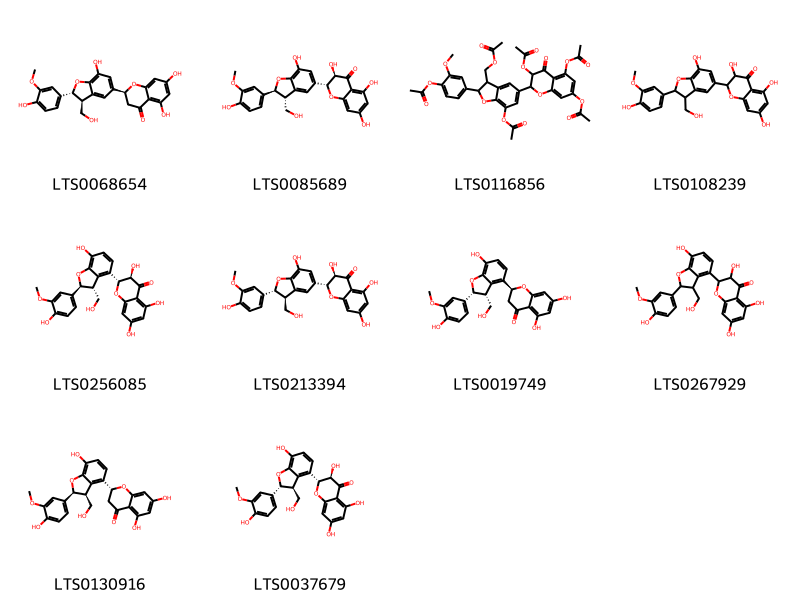

!!! abstract "Tóm tắt"

    Cây cúc gai (Silybum marianum (L.) Gaertn) hay còn được gọi là kế sữa, thuộc họ Cúc (Asteraceae). Cây mọc hoang có nguồn gốc từ Địa Trung Hải, hiện có mặt ở nhiều nơi trên thế giới như: Trung Âu, Bắc Phi, Trung Quốc, Ấn Độ, Nam Mỹ… Cây kế sữa ở Việt Nam rất hiếm được tìm thấy. Trong y học cổ truyền, cây kế sữa được sử dụng để bảo vệ gan, hỗ trợ tiêu hóa và làm dịu các triệu chứng viêm. Tác dụng dược lý của cây kế sữa là để điều trị các vấn đề về gan như viêm gan, xơ gan, gan nhiễm mỡ. Thành phần hóa học chính của cây kế sữa là silymarin. Silymarin là một hỗn hợp các flavonoid có tác dụng bảo vệ gan rất mạnh.

## Thông tin về thực vật

Dược liệu **Cúc Gai (Quả)** từ bộ phận **nan** từ loài *Silybum marianum*.

**Mô tả thực vật:** Kế sữa là một loại cây thân thảo sống một năm hoặc hai năm một lần, thân cứng, tán rộng và có răng cưa. Cây cao tới 2,5m và có tán rộng 0,9m. Mỗi cây tạo ra tối đa bốn nhánh, hình cầu và chứa đầy Nhựa màu trắng đục. Lá to, rộng và có màu xanh bóng, đặc trưng bởi các vân trắng giống như đánh dấu, có mép gai. Lá trưởng thành có thùy xẻ sâu hơn với mép lượn sóng, trong khi những chiếc lá non có thùy nông với hình tròn, ôm vào thân cây. 
Cụm hoa đầu màu tím, hiếm khi màu trắng, mọc đơn lẻ, hoa có 5 cánh, 5 nhị. Chúng có nhiều hoa con hình ống có đường kính khoảng 6cm và được bao quanh bởi các lá bắc cứng có đầu như gai nhọn. Sau khi ra hoa, cây kế có lông dày màu trắng phát triển và phát tán hạt. Quả hình bầu dục, dài 7-8cm, màu đen bóng có vân vàng, chứa hạt. Hạt hình trứng xiên, dài 6-7mm và rộng 3mm. Hạt màu nâu và có một vòng mở rộng ngoại suy màu vàng ở đầu và một lỗ rốn hình ống ở đầu kia.

*Tài liệu tham khảo:* "Những cây thuốc và vị thuốc Việt Nam" - Đỗ Tất Lợi 
Trong dược điển Việt nam, một loài được sử dụng làm dược liệu là *Silybum marianum*.

!!! info "Phân loại thực vật của *Silybum marianum*"
    - **Kingdom:** Plantae
    - **Phylum:** Tracheophyta
    - **Order:** Asterales
    - **Family:** Asteraceae
    - **Genus:** Silybum
    - **Species:** *Silybum marianum*

**Phân bố trên thế giới:** France, nan, Israel, Germany, Switzerland, Albania, Chile, Netherlands, Spain, Mexico, Australia, Palestine, State of, Jordan, Portugal, United Kingdom of Great Britain and Northern Ireland, Türkiye, United States of America, Pakistan, Italy, New Zealand, Canada, Iran (Islamic Republic of), Greece, Belgium

**Phân bố tại Việt nam:** Không có ghi nhận ở Việt Nam

## Thông tin về dược liệu 

### Định danh

!!! info "Thông tin về tên gọi"

    - Dược liệu tiếng Việt: nan
    - Dược liệu tiếng Trung: nan (nan)
    - Dược liệu tiếng Anh: nan
    - Dược liệu latin thông dụng: nan
    - Dược liệu latin kiểu DĐVN: *silybum marianum (l.) gaertn.*
    - Dược liệu latin kiểu DĐVN: *nan*
    - Dược liệu latin kiểu thông tư: *nan*
    - Bộ phận dùng: nan (nan)

### Mô tả dược liệu 

- **Theo dược điển Việt nam V:** nan

- **Mô tả dược liệu theo thông tư chế biến dược liệu theo phương pháp cổ truyền:** nan

### Chế biến 

- **Chế biến theo dược điển việt nam V**: nan

- **Chế biến theo thông tư:** nan

--- 

## Thành phần hóa học

- Theo tài liệu của GS. Đỗ Tất Lợi:  (1) Nhóm hóa học: Flavonoid
(2)Tên hoạt chất: Silymarin
    

**Thành phần hóa học từ loài **Silybum marianum**

Theo cơ sở dữ liệu lotus, loài *Silybum marianum* đã phân lập và xác định được **87** hoạt chất thuộc về các nhóm Steroids and steroid derivatives, Fatty Acyls, Flavonoids, Flavonolignans, 2-arylbenzofuran flavonoids, Prenol lipids trong bảng dưới đây. Danh sách các hoạt chất như sau marianine [(LTS0142102)](https://lotus.naturalproducts.net/compound/lotus_id/LTS0142102), 2,3-dihydroquercetin [(LTS0040950)](https://lotus.naturalproducts.net/compound/lotus_id/LTS0040950), kaempherol [(LTS0155822)](https://lotus.naturalproducts.net/compound/lotus_id/LTS0155822), 1-(6-hydroxy-6-methyl-5-methylideneheptan-2-yl)-6-(hydroxymethyl)-3a,6,9a,11a-tetramethyl-7-{[3,4,5-trihydroxy-6-(hydroxymethyl)oxan-2-yl]oxy}-1h,2h,3h,5h,5ah,7h,8h,9h,10h,11h-cyclopenta[a]phenanthren-4-one [(LTS0048150)](https://lotus.naturalproducts.net/compound/lotus_id/LTS0048150), ethyl (2s,3r,4s,5r,6s)-3,4,5-trihydroxy-6-{[5-hydroxy-2-(4-hydroxyphenyl)-4-oxochromen-7-yl]oxy}oxane-2-carboxylate [(LTS0178253)](https://lotus.naturalproducts.net/compound/lotus_id/LTS0178253), stearic acid [(LTS0237766)](https://lotus.naturalproducts.net/compound/lotus_id/LTS0237766), (2r,3r)-3,5,7-trihydroxy-2-[(2r,3r)-2-(3-hydroxy-5-methoxyphenyl)-3-(hydroxymethyl)-2,3-dihydro-1,4-benzodioxin-6-yl]-2,3-dihydro-1-benzopyran-4-one [(LTS0222853)](https://lotus.naturalproducts.net/compound/lotus_id/LTS0222853), (2s,3r,4s,5r,6s)-3,4,5-trihydroxy-6-{[8-hydroxy-2-(4-hydroxyphenyl)-4-oxo-3-{[(2s,3r,4r,5r,6s)-3,4,5-trihydroxy-6-methyloxan-2-yl]oxy}chromen-6-yl]oxy}oxane-2-carboxylic acid [(LTS0155187)](https://lotus.naturalproducts.net/compound/lotus_id/LTS0155187), (3s,4ar,6ar,6br,8ar,10s,12as,12br,14bs)-3,10-dihydroxy-2,2,6a,6b,9,9,12a-heptamethyl-7-oxo-3,4,5,6,8,8a,10,11,12,12b,13,14b-dodecahydro-1h-picene-4a-carboxylic acid [(LTS0144575)](https://lotus.naturalproducts.net/compound/lotus_id/LTS0144575), 3,5,7-trihydroxy-2-[7-hydroxy-2-(4-hydroxy-3-methoxyphenyl)-3-(hydroxymethyl)-2,3-dihydro-1-benzofuran-5-yl]-2,3-dihydro-1-benzopyran-4-one [(LTS0108239)](https://lotus.naturalproducts.net/compound/lotus_id/LTS0108239), (2s,3r,4s,5r,6s)-3,4,5-trihydroxy-6-{[5-hydroxy-2-(4-hydroxyphenyl)-4-oxo-3-{[(2s,3r,4r,5r,6s)-3,4,5-trihydroxy-6-methyloxan-2-yl]oxy}chromen-7-yl]oxy}oxane-2-carboxylic acid [(LTS0026495)](https://lotus.naturalproducts.net/compound/lotus_id/LTS0026495), 2-{[3a,6,6,9a,11a-pentamethyl-1-(6-methyl-5-methylideneheptan-2-yl)-1h,2h,3h,4h,5h,5ah,7h,8h,9h,10h,11h-cyclopenta[a]phenanthren-7-yl]oxy}-6-(hydroxymethyl)oxane-3,4,5-triol [(LTS0163261)](https://lotus.naturalproducts.net/compound/lotus_id/LTS0163261), silidianin [(LTS0255450)](https://lotus.naturalproducts.net/compound/lotus_id/LTS0255450), (2r,3r)-3,5,7-trihydroxy-2-[(2s,3r)-7-hydroxy-2-(4-hydroxy-3-methoxyphenyl)-3-(hydroxymethyl)-2,3-dihydro-1-benzofuran-5-yl]-2,3-dihydro-1-benzopyran-4-one [(LTS0085689)](https://lotus.naturalproducts.net/compound/lotus_id/LTS0085689), (6ar,6br,8ar,14br)-4,4,6a,6b,8a,12,14b-heptamethyl-11-methylidene-hexadecahydropicen-3-ol [(LTS0274865)](https://lotus.naturalproducts.net/compound/lotus_id/LTS0274865), luteolin 7-o-glucoside [(LTS0227450)](https://lotus.naturalproducts.net/compound/lotus_id/LTS0227450), (3r)-3,5,7-trihydroxy-2-[(3r)-3-(4-hydroxy-3-methoxyphenyl)-2-(hydroxymethyl)-2,3-dihydro-1,4-benzodioxin-6-yl]-2,3-dihydro-1-benzopyran-4-one [(LTS0246473)](https://lotus.naturalproducts.net/compound/lotus_id/LTS0246473), (2s)-5,7-dihydroxy-2-[(2r,3r)-7-hydroxy-2-(4-hydroxy-3-methoxyphenyl)-3-(hydroxymethyl)-2,3-dihydro-1-benzofuran-4-yl]-2,3-dihydro-1-benzopyran-4-one [(LTS0019749)](https://lotus.naturalproducts.net/compound/lotus_id/LTS0019749), ethyl (2s,3s,4s,5r,6s)-3,4,5-trihydroxy-6-{[8-hydroxy-2-(4-hydroxyphenyl)-4-oxochromen-7-yl]oxy}oxane-2-carboxylate [(LTS0211796)](https://lotus.naturalproducts.net/compound/lotus_id/LTS0211796), silandrin [(LTS0103673)](https://lotus.naturalproducts.net/compound/lotus_id/LTS0103673), luteolin [(LTS0017052)](https://lotus.naturalproducts.net/compound/lotus_id/LTS0017052), (2r)-2,5,7,8-tetramethyl-2-(4,8,12-trimethyltridecyl)-3,4-dihydro-1-benzopyran-6-ol [(LTS0118303)](https://lotus.naturalproducts.net/compound/lotus_id/LTS0118303), (2r,3r)-3,5,7-trihydroxy-2-[(2r,3r)-3-(3-hydroxy-4-methoxyphenyl)-2-(hydroxymethyl)-2,3-dihydro-1,4-benzodioxin-6-yl]-2,3-dihydro-1-benzopyran-4-one [(LTS0165267)](https://lotus.naturalproducts.net/compound/lotus_id/LTS0165267), 3,5,7-trihydroxy-2-[3-(4-hydroxy-3-methoxyphenyl)-2-(hydroxymethyl)-2,3-dihydro-1,4-benzodioxin-6-yl]chromen-4-one [(LTS0177071)](https://lotus.naturalproducts.net/compound/lotus_id/LTS0177071), vitamin e [(LTS0263269)](https://lotus.naturalproducts.net/compound/lotus_id/LTS0263269), 3,5,7-trihydroxy-2-[3-(3-hydroxy-4-methoxyphenyl)-2-(hydroxymethyl)-2,3-dihydro-1,4-benzodioxin-6-yl]-2,3-dihydro-1-benzopyran-4-one [(LTS0029136)](https://lotus.naturalproducts.net/compound/lotus_id/LTS0029136), (2r,3r)-3,5,7-trihydroxy-2-[(2s,3s)-2-(3-hydroxy-5-methoxyphenyl)-3-(hydroxymethyl)-2,3-dihydro-1,4-benzodioxin-6-yl]-2,3-dihydro-1-benzopyran-4-one [(LTS0209006)](https://lotus.naturalproducts.net/compound/lotus_id/LTS0209006), 3,10-dihydroxy-1,6a,6b,9,9,12a-hexamethyl-2-methylidene-7-oxo-3,4,5,6,8,8a,10,11,12,12b,13,14b-dodecahydro-1h-picene-4a-carboxylic acid [(LTS0049387)](https://lotus.naturalproducts.net/compound/lotus_id/LTS0049387), (4ar,6ar,6br,8as,12ar,12br,14ar,14br)-4,4,6a,6b,8a,11,12,14b-octamethyl-2,3,4a,5,6,7,8,9,12,12a,12b,13,14,14a-tetradecahydro-1h-picen-3-ol [(LTS0269929)](https://lotus.naturalproducts.net/compound/lotus_id/LTS0269929), (2s)-5,7-dihydroxy-2-[(2r,3s)-7-hydroxy-2-(4-hydroxy-3-methoxyphenyl)-3-(hydroxymethyl)-2,3-dihydro-1-benzofuran-5-yl]-2,3-dihydro-1-benzopyran-4-one [(LTS0068654)](https://lotus.naturalproducts.net/compound/lotus_id/LTS0068654), amyrin [(LTS0222826)](https://lotus.naturalproducts.net/compound/lotus_id/LTS0222826), silychristin [(LTS0213394)](https://lotus.naturalproducts.net/compound/lotus_id/LTS0213394), 3,4,5-trihydroxy-6-{[8-hydroxy-2-(4-hydroxyphenyl)-4-oxo-3-[(3,4,5-trihydroxy-6-methyloxan-2-yl)oxy]chromen-6-yl]oxy}oxane-2-carboxylic acid [(LTS0037427)](https://lotus.naturalproducts.net/compound/lotus_id/LTS0037427), 2-(3,5-dihydroxyphenyl)-3,5,7-trihydroxy-2,3-dihydro-1-benzopyran-4-one [(LTS0220398)](https://lotus.naturalproducts.net/compound/lotus_id/LTS0220398), (1r,3ar,5ar,6r,7s,9as,11ar)-1-[(2r)-6-hydroxy-6-methyl-5-methylideneheptan-2-yl]-6-(hydroxymethyl)-3a,6,9a,11a-tetramethyl-7-{[(2r,3r,4s,5s,6r)-3,4,5-trihydroxy-6-(hydroxymethyl)oxan-2-yl]oxy}-1h,2h,3h,5h,5ah,7h,8h,9h,10h,11h-cyclopenta[a]phenanthren-4-one [(LTS0264200)](https://lotus.naturalproducts.net/compound/lotus_id/LTS0264200), (1s,3s,4ar,6ar,6br,8ar,10s,12as,12br,14bs)-3,10-dihydroxy-1,6a,6b,9,9,12a-hexamethyl-2-methylidene-7-oxo-3,4,5,6,8,8a,10,11,12,12b,13,14b-dodecahydro-1h-picene-4a-carboxylic acid [(LTS0053872)](https://lotus.naturalproducts.net/compound/lotus_id/LTS0053872), (2r,3s,4s,5s,6r)-3,4,5-trihydroxy-6-methyloxan-2-yl (2s,3r,4s,5r,6s)-3,4,5-trihydroxy-6-{[5-hydroxy-2-(4-hydroxyphenyl)-4-oxochromen-7-yl]oxy}oxane-2-carboxylate [(LTS0222928)](https://lotus.naturalproducts.net/compound/lotus_id/LTS0222928), stigmast-5-en-3-ol, (3β)- [(LTS0204616)](https://lotus.naturalproducts.net/compound/lotus_id/LTS0204616), [7-(acetyloxy)-2-[4-(acetyloxy)-3-methoxyphenyl]-5-[3,5,7-tris(acetyloxy)-4-oxo-2,3-dihydro-1-benzopyran-2-yl]-2,3-dihydro-1-benzofuran-3-yl]methyl acetate [(LTS0116856)](https://lotus.naturalproducts.net/compound/lotus_id/LTS0116856), taraxasterol [(LTS0006950)](https://lotus.naturalproducts.net/compound/lotus_id/LTS0006950), palmitic acid [(LTS0079439)](https://lotus.naturalproducts.net/compound/lotus_id/LTS0079439), 24-methylene-cycloartanol [(LTS0077845)](https://lotus.naturalproducts.net/compound/lotus_id/LTS0077845), (+)-dihydrokaempferol [(LTS0134832)](https://lotus.naturalproducts.net/compound/lotus_id/LTS0134832), 3,10-dihydroxy-2,2,6a,6b,9,9,12a-heptamethyl-7-oxo-3,4,5,6,8,8a,10,11,12,12b,13,14b-dodecahydro-1h-picene-4a-carboxylic acid [(LTS0258476)](https://lotus.naturalproducts.net/compound/lotus_id/LTS0258476), silymarin [(LTS0228416)](https://lotus.naturalproducts.net/compound/lotus_id/LTS0228416), 3-hydroxy-10-(4-hydroxy-3-methoxyphenyl)-8-(3,5,7-trihydroxy-4-oxo-2,3-dihydro-1-benzopyran-2-yl)-4-oxatricyclo[4.3.1.0³,⁷]dec-8-en-2-one [(LTS0158475)](https://lotus.naturalproducts.net/compound/lotus_id/LTS0158475), quercetin [(LTS0004651)](https://lotus.naturalproducts.net/compound/lotus_id/LTS0004651), 2,7,8-trimethyl-2-(4,8,12-trimethyltridecyl)-3,4-dihydro-1-benzopyran-6-ol [(LTS0095444)](https://lotus.naturalproducts.net/compound/lotus_id/LTS0095444), (2s,3r,4s,5r,6s)-3,4-dihydroxy-6-{[5-hydroxy-2-(4-hydroxyphenyl)-4-oxochromen-7-yl]oxy}-5-{[(2s,3r,4r,5r,6s)-3,4,5-trihydroxy-6-methyloxan-2-yl]oxy}oxane-2-carboxylic acid [(LTS0086800)](https://lotus.naturalproducts.net/compound/lotus_id/LTS0086800), (2r,3r)-3,5,7-trihydroxy-2-[(2s,3r)-7-hydroxy-2-(4-hydroxy-3-methoxyphenyl)-3-(hydroxymethyl)-2,3-dihydro-1-benzofuran-4-yl]-2,3-dihydro-1-benzopyran-4-one [(LTS0256085)](https://lotus.naturalproducts.net/compound/lotus_id/LTS0256085), (2r,3r)-3,5,7-trihydroxy-2-[(2r,3s)-7-hydroxy-2-(4-hydroxy-3-methoxyphenyl)-3-(hydroxymethyl)-2,3-dihydro-1-benzofuran-4-yl]-2,3-dihydro-1-benzopyran-4-one [(LTS0037679)](https://lotus.naturalproducts.net/compound/lotus_id/LTS0037679), 3,5,7-trihydroxy-2-[2-(4-hydroxy-3-methoxyphenyl)-3-(hydroxymethyl)-2,3-dihydro-1,4-benzodioxin-6-yl]-2,3-dihydro-1-benzopyran-4-one [(LTS0122333)](https://lotus.naturalproducts.net/compound/lotus_id/LTS0122333), (1r,3s,6r,7s,10r)-3-hydroxy-10-(4-hydroxy-3-methoxyphenyl)-8-[(2r,3r)-3,5,7-trihydroxy-4-oxo-2,3-dihydro-1-benzopyran-2-yl]-4-oxatricyclo[4.3.1.0³,⁷]dec-8-en-2-one [(LTS0112654)](https://lotus.naturalproducts.net/compound/lotus_id/LTS0112654), (2r,3r,4s,5s,6r)-2-{[(1r,3ar,5as,7s,9ar,11ar)-3a,6,6,9a,11a-pentamethyl-1-[(2r)-6-methyl-5-methylideneheptan-2-yl]-1h,2h,3h,4h,5h,5ah,7h,8h,9h,10h,11h-cyclopenta[a]phenanthren-7-yl]oxy}-6-(hydroxymethyl)oxane-3,4,5-triol [(LTS0083676)](https://lotus.naturalproducts.net/compound/lotus_id/LTS0083676), 3,4,5-trihydroxy-6-{[8-hydroxy-2-(4-hydroxyphenyl)-4-oxochromen-7-yl]oxy}oxane-2-carboxylic acid [(LTS0019728)](https://lotus.naturalproducts.net/compound/lotus_id/LTS0019728), (+)-taxifolin [(LTS0090664)](https://lotus.naturalproducts.net/compound/lotus_id/LTS0090664), silibinin [(LTS0276467)](https://lotus.naturalproducts.net/compound/lotus_id/LTS0276467), chamomile [(LTS0104946)](https://lotus.naturalproducts.net/compound/lotus_id/LTS0104946), (2r,3s)-3,5,7-trihydroxy-2-[(2r,3r)-2-(4-hydroxy-3-methoxyphenyl)-3-(hydroxymethyl)-2,3-dihydro-1,4-benzodioxin-6-yl]-2,3-dihydro-1-benzopyran-4-one [(LTS0116779)](https://lotus.naturalproducts.net/compound/lotus_id/LTS0116779), isosilybin b [(LTS0037870)](https://lotus.naturalproducts.net/compound/lotus_id/LTS0037870), apigenin 7-galactoside [(LTS0204933)](https://lotus.naturalproducts.net/compound/lotus_id/LTS0204933), silibinin b [(LTS0068471)](https://lotus.naturalproducts.net/compound/lotus_id/LTS0068471), marianoside a [(LTS0037114)](https://lotus.naturalproducts.net/compound/lotus_id/LTS0037114), (2s,3s,4s,5r,6s)-3,4,5-trihydroxy-6-{[8-hydroxy-2-(4-hydroxyphenyl)-4-oxochromen-7-yl]oxy}oxane-2-carboxylic acid [(LTS0164477)](https://lotus.naturalproducts.net/compound/lotus_id/LTS0164477), myristic acid [(LTS0102566)](https://lotus.naturalproducts.net/compound/lotus_id/LTS0102566), isosilybin a [(LTS0259754)](https://lotus.naturalproducts.net/compound/lotus_id/LTS0259754), kaempferol 3-o-sulfate [(LTS0130811)](https://lotus.naturalproducts.net/compound/lotus_id/LTS0130811), apigenin 7-o-glucoside [(LTS0007959)](https://lotus.naturalproducts.net/compound/lotus_id/LTS0007959), β-amyrin [(LTS0251864)](https://lotus.naturalproducts.net/compound/lotus_id/LTS0251864), (1r,3r,6s,7r)-3-hydroxy-10-(4-hydroxy-3-methoxyphenyl)-8-(3,5,7-trihydroxy-4-oxo-2,3-dihydro-1-benzopyran-2-yl)-4-oxatricyclo[4.3.1.0³,⁷]dec-8-en-2-one [(LTS0116135)](https://lotus.naturalproducts.net/compound/lotus_id/LTS0116135), (3s)-3,5,7-trihydroxy-2-[2-(4-hydroxy-3-methoxyphenyl)-3-(hydroxymethyl)-2,3-dihydro-1,4-benzodioxin-6-yl]-2,3-dihydro-1-benzopyran-4-one [(LTS0101575)](https://lotus.naturalproducts.net/compound/lotus_id/LTS0101575), (2r,3r)-3,5,7-trihydroxy-2-[(2r,3s)-2-(4-hydroxy-3-methoxyphenyl)-3-(hydroxymethyl)-2,3-dihydro-1,4-benzodioxin-6-yl]-2,3-dihydro-1-benzopyran-4-one [(LTS0226367)](https://lotus.naturalproducts.net/compound/lotus_id/LTS0226367), ethyl 3,4,5-trihydroxy-6-{[8-hydroxy-2-(4-hydroxyphenyl)-4-oxochromen-7-yl]oxy}oxane-2-carboxylate [(LTS0239425)](https://lotus.naturalproducts.net/compound/lotus_id/LTS0239425), (2r,3r,4s,5s,6r)-2-{[(1r,3ar,5ar,6r,7s,9ar,11ar)-1-[(2r)-6-hydroxy-6-methyl-5-methylideneheptan-2-yl]-6-(hydroxymethyl)-3a,6,9a,11a-tetramethyl-1h,2h,3h,4h,5h,5ah,7h,8h,9h,10h,11h-cyclopenta[a]phenanthren-7-yl]oxy}-6-(hydroxymethyl)oxane-3,4,5-triol [(LTS0135940)](https://lotus.naturalproducts.net/compound/lotus_id/LTS0135940), lupeol [(LTS0256952)](https://lotus.naturalproducts.net/compound/lotus_id/LTS0256952), (1r,3r,6r,7r,10r)-3-hydroxy-10-(4-hydroxy-3-methoxyphenyl)-8-[(2r)-3,5,7-trihydroxy-4-oxo-2,3-dihydro-1-benzopyran-2-yl]-4-oxatricyclo[4.3.1.0³,⁷]dec-8-en-2-one [(LTS0273069)](https://lotus.naturalproducts.net/compound/lotus_id/LTS0273069), kaempferol 7-o-glucoside [(LTS0025882)](https://lotus.naturalproducts.net/compound/lotus_id/LTS0025882), oleic acid [(LTS0256910)](https://lotus.naturalproducts.net/compound/lotus_id/LTS0256910), 5,7-dihydroxy-2-[2-(4-hydroxy-3-methoxyphenyl)-3-(hydroxymethyl)-2,3-dihydro-1,4-benzodioxin-6-yl]-2,3-dihydro-1-benzopyran-4-one [(LTS0097211)](https://lotus.naturalproducts.net/compound/lotus_id/LTS0097211), marianoside b [(LTS0157791)](https://lotus.naturalproducts.net/compound/lotus_id/LTS0157791), 24-methylenecycloartanol [(LTS0018584)](https://lotus.naturalproducts.net/compound/lotus_id/LTS0018584), 3,5,7-trihydroxy-2-[7-hydroxy-2-(4-hydroxy-3-methoxyphenyl)-3-(hydroxymethyl)-2,3-dihydro-1-benzofuran-4-yl]-2,3-dihydro-1-benzopyran-4-one [(LTS0267929)](https://lotus.naturalproducts.net/compound/lotus_id/LTS0267929), apigenin 7-o-β-glucoside [(LTS0252743)](https://lotus.naturalproducts.net/compound/lotus_id/LTS0252743), 3,4-dihydroxy-6-{[5-hydroxy-2-(4-hydroxyphenyl)-4-oxochromen-7-yl]oxy}-5-[(3,4,5-trihydroxy-6-methyloxan-2-yl)oxy]oxane-2-carboxylic acid [(LTS0243526)](https://lotus.naturalproducts.net/compound/lotus_id/LTS0243526), aromadendrin [(LTS0153299)](https://lotus.naturalproducts.net/compound/lotus_id/LTS0153299), (2r)-5,7-dihydroxy-2-[(2s,3s)-7-hydroxy-2-(4-hydroxy-3-methoxyphenyl)-3-(hydroxymethyl)-2,3-dihydro-1-benzofuran-4-yl]-2,3-dihydro-1-benzopyran-4-one [(LTS0130916)](https://lotus.naturalproducts.net/compound/lotus_id/LTS0130916), 7-hydroxy-1-(6-hydroxy-6-methyl-5-methylideneheptan-2-yl)-3a,6,6,9a,11a-pentamethyl-1h,2h,3h,5h,5ah,7h,8h,9h,10h,11h-cyclopenta[a]phenanthren-4-one [(LTS0126221)](https://lotus.naturalproducts.net/compound/lotus_id/LTS0126221). 
        
| chemicalTaxonomyClassyfireClass   |   smiles_count |
|:----------------------------------|---------------:|
| 2-arylbenzofuran flavonoids       |            726 |
| Fatty Acyls                       |             89 |
| Flavonoids                        |           2195 |
| Flavonolignans                    |           1142 |
| Prenol lipids                     |           2055 |
| Steroids and steroid derivatives  |            234 |

            
### Nhóm 2-arylbenzofuran flavonoids
<figure markdown="span">
    { width=100% }
<figcaption>Hình ảnh cấu trúc hóa học của hoạt chất thuộc nhóm *2-arylbenzofuran flavonoids*. Tên thường gọi của các hoạt chất tương ứng là (2s)-5,7-dihydroxy-2-[(2r,3s)-7-hydroxy-2-(4-hydroxy-3-methoxyphenyl)-3-(hydroxymethyl)-2,3-dihydro-1-benzofuran-5-yl]-2,3-dihydro-1-benzopyran-4-one [(LTS0068654)](https://lotus.naturalproducts.net/compound/lotus_id/LTS0068654), (2r,3r)-3,5,7-trihydroxy-2-[(2s,3r)-7-hydroxy-2-(4-hydroxy-3-methoxyphenyl)-3-(hydroxymethyl)-2,3-dihydro-1-benzofuran-5-yl]-2,3-dihydro-1-benzopyran-4-one [(LTS0085689)](https://lotus.naturalproducts.net/compound/lotus_id/LTS0085689), [7-(acetyloxy)-2-[4-(acetyloxy)-3-methoxyphenyl]-5-[3,5,7-tris(acetyloxy)-4-oxo-2,3-dihydro-1-benzopyran-2-yl]-2,3-dihydro-1-benzofuran-3-yl]methyl acetate [(LTS0116856)](https://lotus.naturalproducts.net/compound/lotus_id/LTS0116856), 3,5,7-trihydroxy-2-[7-hydroxy-2-(4-hydroxy-3-methoxyphenyl)-3-(hydroxymethyl)-2,3-dihydro-1-benzofuran-5-yl]-2,3-dihydro-1-benzopyran-4-one [(LTS0108239)](https://lotus.naturalproducts.net/compound/lotus_id/LTS0108239), (2r,3r)-3,5,7-trihydroxy-2-[(2s,3r)-7-hydroxy-2-(4-hydroxy-3-methoxyphenyl)-3-(hydroxymethyl)-2,3-dihydro-1-benzofuran-4-yl]-2,3-dihydro-1-benzopyran-4-one [(LTS0256085)](https://lotus.naturalproducts.net/compound/lotus_id/LTS0256085), silychristin [(LTS0213394)](https://lotus.naturalproducts.net/compound/lotus_id/LTS0213394), (2s)-5,7-dihydroxy-2-[(2r,3r)-7-hydroxy-2-(4-hydroxy-3-methoxyphenyl)-3-(hydroxymethyl)-2,3-dihydro-1-benzofuran-4-yl]-2,3-dihydro-1-benzopyran-4-one [(LTS0019749)](https://lotus.naturalproducts.net/compound/lotus_id/LTS0019749), 3,5,7-trihydroxy-2-[7-hydroxy-2-(4-hydroxy-3-methoxyphenyl)-3-(hydroxymethyl)-2,3-dihydro-1-benzofuran-4-yl]-2,3-dihydro-1-benzopyran-4-one [(LTS0267929)](https://lotus.naturalproducts.net/compound/lotus_id/LTS0267929), (2r)-5,7-dihydroxy-2-[(2s,3s)-7-hydroxy-2-(4-hydroxy-3-methoxyphenyl)-3-(hydroxymethyl)-2,3-dihydro-1-benzofuran-4-yl]-2,3-dihydro-1-benzopyran-4-one [(LTS0130916)](https://lotus.naturalproducts.net/compound/lotus_id/LTS0130916), (2r,3r)-3,5,7-trihydroxy-2-[(2r,3s)-7-hydroxy-2-(4-hydroxy-3-methoxyphenyl)-3-(hydroxymethyl)-2,3-dihydro-1-benzofuran-4-yl]-2,3-dihydro-1-benzopyran-4-one [(LTS0037679)](https://lotus.naturalproducts.net/compound/lotus_id/LTS0037679).</figcaption>
</figure>

            
            
### Nhóm 2-arylbenzofuran flavonoids
<figure markdown="span">
    { width=100% }
<figcaption>Hình ảnh cấu trúc hóa học của hoạt chất thuộc nhóm *2-arylbenzofuran flavonoids*. Tên thường gọi của các hoạt chất tương ứng là (2s)-5,7-dihydroxy-2-[(2r,3s)-7-hydroxy-2-(4-hydroxy-3-methoxyphenyl)-3-(hydroxymethyl)-2,3-dihydro-1-benzofuran-5-yl]-2,3-dihydro-1-benzopyran-4-one [(LTS0068654)](https://lotus.naturalproducts.net/compound/lotus_id/LTS0068654), (2r,3r)-3,5,7-trihydroxy-2-[(2s,3r)-7-hydroxy-2-(4-hydroxy-3-methoxyphenyl)-3-(hydroxymethyl)-2,3-dihydro-1-benzofuran-5-yl]-2,3-dihydro-1-benzopyran-4-one [(LTS0085689)](https://lotus.naturalproducts.net/compound/lotus_id/LTS0085689), [7-(acetyloxy)-2-[4-(acetyloxy)-3-methoxyphenyl]-5-[3,5,7-tris(acetyloxy)-4-oxo-2,3-dihydro-1-benzopyran-2-yl]-2,3-dihydro-1-benzofuran-3-yl]methyl acetate [(LTS0116856)](https://lotus.naturalproducts.net/compound/lotus_id/LTS0116856), 3,5,7-trihydroxy-2-[7-hydroxy-2-(4-hydroxy-3-methoxyphenyl)-3-(hydroxymethyl)-2,3-dihydro-1-benzofuran-5-yl]-2,3-dihydro-1-benzopyran-4-one [(LTS0108239)](https://lotus.naturalproducts.net/compound/lotus_id/LTS0108239), (2r,3r)-3,5,7-trihydroxy-2-[(2s,3r)-7-hydroxy-2-(4-hydroxy-3-methoxyphenyl)-3-(hydroxymethyl)-2,3-dihydro-1-benzofuran-4-yl]-2,3-dihydro-1-benzopyran-4-one [(LTS0256085)](https://lotus.naturalproducts.net/compound/lotus_id/LTS0256085), silychristin [(LTS0213394)](https://lotus.naturalproducts.net/compound/lotus_id/LTS0213394), (2s)-5,7-dihydroxy-2-[(2r,3r)-7-hydroxy-2-(4-hydroxy-3-methoxyphenyl)-3-(hydroxymethyl)-2,3-dihydro-1-benzofuran-4-yl]-2,3-dihydro-1-benzopyran-4-one [(LTS0019749)](https://lotus.naturalproducts.net/compound/lotus_id/LTS0019749), 3,5,7-trihydroxy-2-[7-hydroxy-2-(4-hydroxy-3-methoxyphenyl)-3-(hydroxymethyl)-2,3-dihydro-1-benzofuran-4-yl]-2,3-dihydro-1-benzopyran-4-one [(LTS0267929)](https://lotus.naturalproducts.net/compound/lotus_id/LTS0267929), (2r)-5,7-dihydroxy-2-[(2s,3s)-7-hydroxy-2-(4-hydroxy-3-methoxyphenyl)-3-(hydroxymethyl)-2,3-dihydro-1-benzofuran-4-yl]-2,3-dihydro-1-benzopyran-4-one [(LTS0130916)](https://lotus.naturalproducts.net/compound/lotus_id/LTS0130916), (2r,3r)-3,5,7-trihydroxy-2-[(2r,3s)-7-hydroxy-2-(4-hydroxy-3-methoxyphenyl)-3-(hydroxymethyl)-2,3-dihydro-1-benzofuran-4-yl]-2,3-dihydro-1-benzopyran-4-one [(LTS0037679)](https://lotus.naturalproducts.net/compound/lotus_id/LTS0037679).</figcaption>
</figure>

### Nhóm Fatty Acyls
<figure markdown="span">
    { width=100% }
<figcaption>Hình ảnh cấu trúc hóa học của hoạt chất thuộc nhóm *Fatty Acyls*. Tên thường gọi của các hoạt chất tương ứng là palmitic acid [(LTS0079439)](https://lotus.naturalproducts.net/compound/lotus_id/LTS0079439), oleic acid [(LTS0256910)](https://lotus.naturalproducts.net/compound/lotus_id/LTS0256910), myristic acid [(LTS0102566)](https://lotus.naturalproducts.net/compound/lotus_id/LTS0102566), stearic acid [(LTS0237766)](https://lotus.naturalproducts.net/compound/lotus_id/LTS0237766).</figcaption>
</figure>

            
            
### Nhóm 2-arylbenzofuran flavonoids
<figure markdown="span">
    { width=100% }
<figcaption>Hình ảnh cấu trúc hóa học của hoạt chất thuộc nhóm *2-arylbenzofuran flavonoids*. Tên thường gọi của các hoạt chất tương ứng là (2s)-5,7-dihydroxy-2-[(2r,3s)-7-hydroxy-2-(4-hydroxy-3-methoxyphenyl)-3-(hydroxymethyl)-2,3-dihydro-1-benzofuran-5-yl]-2,3-dihydro-1-benzopyran-4-one [(LTS0068654)](https://lotus.naturalproducts.net/compound/lotus_id/LTS0068654), (2r,3r)-3,5,7-trihydroxy-2-[(2s,3r)-7-hydroxy-2-(4-hydroxy-3-methoxyphenyl)-3-(hydroxymethyl)-2,3-dihydro-1-benzofuran-5-yl]-2,3-dihydro-1-benzopyran-4-one [(LTS0085689)](https://lotus.naturalproducts.net/compound/lotus_id/LTS0085689), [7-(acetyloxy)-2-[4-(acetyloxy)-3-methoxyphenyl]-5-[3,5,7-tris(acetyloxy)-4-oxo-2,3-dihydro-1-benzopyran-2-yl]-2,3-dihydro-1-benzofuran-3-yl]methyl acetate [(LTS0116856)](https://lotus.naturalproducts.net/compound/lotus_id/LTS0116856), 3,5,7-trihydroxy-2-[7-hydroxy-2-(4-hydroxy-3-methoxyphenyl)-3-(hydroxymethyl)-2,3-dihydro-1-benzofuran-5-yl]-2,3-dihydro-1-benzopyran-4-one [(LTS0108239)](https://lotus.naturalproducts.net/compound/lotus_id/LTS0108239), (2r,3r)-3,5,7-trihydroxy-2-[(2s,3r)-7-hydroxy-2-(4-hydroxy-3-methoxyphenyl)-3-(hydroxymethyl)-2,3-dihydro-1-benzofuran-4-yl]-2,3-dihydro-1-benzopyran-4-one [(LTS0256085)](https://lotus.naturalproducts.net/compound/lotus_id/LTS0256085), silychristin [(LTS0213394)](https://lotus.naturalproducts.net/compound/lotus_id/LTS0213394), (2s)-5,7-dihydroxy-2-[(2r,3r)-7-hydroxy-2-(4-hydroxy-3-methoxyphenyl)-3-(hydroxymethyl)-2,3-dihydro-1-benzofuran-4-yl]-2,3-dihydro-1-benzopyran-4-one [(LTS0019749)](https://lotus.naturalproducts.net/compound/lotus_id/LTS0019749), 3,5,7-trihydroxy-2-[7-hydroxy-2-(4-hydroxy-3-methoxyphenyl)-3-(hydroxymethyl)-2,3-dihydro-1-benzofuran-4-yl]-2,3-dihydro-1-benzopyran-4-one [(LTS0267929)](https://lotus.naturalproducts.net/compound/lotus_id/LTS0267929), (2r)-5,7-dihydroxy-2-[(2s,3s)-7-hydroxy-2-(4-hydroxy-3-methoxyphenyl)-3-(hydroxymethyl)-2,3-dihydro-1-benzofuran-4-yl]-2,3-dihydro-1-benzopyran-4-one [(LTS0130916)](https://lotus.naturalproducts.net/compound/lotus_id/LTS0130916), (2r,3r)-3,5,7-trihydroxy-2-[(2r,3s)-7-hydroxy-2-(4-hydroxy-3-methoxyphenyl)-3-(hydroxymethyl)-2,3-dihydro-1-benzofuran-4-yl]-2,3-dihydro-1-benzopyran-4-one [(LTS0037679)](https://lotus.naturalproducts.net/compound/lotus_id/LTS0037679).</figcaption>
</figure>

### Nhóm Fatty Acyls
<figure markdown="span">
    { width=100% }
<figcaption>Hình ảnh cấu trúc hóa học của hoạt chất thuộc nhóm *Fatty Acyls*. Tên thường gọi của các hoạt chất tương ứng là palmitic acid [(LTS0079439)](https://lotus.naturalproducts.net/compound/lotus_id/LTS0079439), oleic acid [(LTS0256910)](https://lotus.naturalproducts.net/compound/lotus_id/LTS0256910), myristic acid [(LTS0102566)](https://lotus.naturalproducts.net/compound/lotus_id/LTS0102566), stearic acid [(LTS0237766)](https://lotus.naturalproducts.net/compound/lotus_id/LTS0237766).</figcaption>
</figure>

### Nhóm Flavonoids
<figure markdown="span">
    { width=100% }
<figcaption>Hình ảnh cấu trúc hóa học của hoạt chất thuộc nhóm *Flavonoids*. Tên thường gọi của các hoạt chất tương ứng là (+)-dihydrokaempferol [(LTS0134832)](https://lotus.naturalproducts.net/compound/lotus_id/LTS0134832), (2s,3s,4s,5r,6s)-3,4,5-trihydroxy-6-{[8-hydroxy-2-(4-hydroxyphenyl)-4-oxochromen-7-yl]oxy}oxane-2-carboxylic acid [(LTS0164477)](https://lotus.naturalproducts.net/compound/lotus_id/LTS0164477), (+)-taxifolin [(LTS0090664)](https://lotus.naturalproducts.net/compound/lotus_id/LTS0090664), chamomile [(LTS0104946)](https://lotus.naturalproducts.net/compound/lotus_id/LTS0104946), kaempferol 3-o-sulfate [(LTS0130811)](https://lotus.naturalproducts.net/compound/lotus_id/LTS0130811), ethyl (2s,3r,4s,5r,6s)-3,4,5-trihydroxy-6-{[5-hydroxy-2-(4-hydroxyphenyl)-4-oxochromen-7-yl]oxy}oxane-2-carboxylate [(LTS0178253)](https://lotus.naturalproducts.net/compound/lotus_id/LTS0178253), (2s,3r,4s,5r,6s)-3,4,5-trihydroxy-6-{[8-hydroxy-2-(4-hydroxyphenyl)-4-oxo-3-{[(2s,3r,4r,5r,6s)-3,4,5-trihydroxy-6-methyloxan-2-yl]oxy}chromen-6-yl]oxy}oxane-2-carboxylic acid [(LTS0155187)](https://lotus.naturalproducts.net/compound/lotus_id/LTS0155187), aromadendrin [(LTS0153299)](https://lotus.naturalproducts.net/compound/lotus_id/LTS0153299), apigenin 7-o-β-glucoside [(LTS0252743)](https://lotus.naturalproducts.net/compound/lotus_id/LTS0252743), (1r,3s,6r,7s,10r)-3-hydroxy-10-(4-hydroxy-3-methoxyphenyl)-8-[(2r,3r)-3,5,7-trihydroxy-4-oxo-2,3-dihydro-1-benzopyran-2-yl]-4-oxatricyclo[4.3.1.0³,⁷]dec-8-en-2-one [(LTS0112654)](https://lotus.naturalproducts.net/compound/lotus_id/LTS0112654), 3-hydroxy-10-(4-hydroxy-3-methoxyphenyl)-8-(3,5,7-trihydroxy-4-oxo-2,3-dihydro-1-benzopyran-2-yl)-4-oxatricyclo[4.3.1.0³,⁷]dec-8-en-2-one [(LTS0158475)](https://lotus.naturalproducts.net/compound/lotus_id/LTS0158475), (1r,3r,6r,7r,10r)-3-hydroxy-10-(4-hydroxy-3-methoxyphenyl)-8-[(2r)-3,5,7-trihydroxy-4-oxo-2,3-dihydro-1-benzopyran-2-yl]-4-oxatricyclo[4.3.1.0³,⁷]dec-8-en-2-one [(LTS0273069)](https://lotus.naturalproducts.net/compound/lotus_id/LTS0273069), ethyl 3,4,5-trihydroxy-6-{[8-hydroxy-2-(4-hydroxyphenyl)-4-oxochromen-7-yl]oxy}oxane-2-carboxylate [(LTS0239425)](https://lotus.naturalproducts.net/compound/lotus_id/LTS0239425), kaempherol [(LTS0155822)](https://lotus.naturalproducts.net/compound/lotus_id/LTS0155822), (2r,3s,4s,5s,6r)-3,4,5-trihydroxy-6-methyloxan-2-yl (2s,3r,4s,5r,6s)-3,4,5-trihydroxy-6-{[5-hydroxy-2-(4-hydroxyphenyl)-4-oxochromen-7-yl]oxy}oxane-2-carboxylate [(LTS0222928)](https://lotus.naturalproducts.net/compound/lotus_id/LTS0222928), apigenin 7-galactoside [(LTS0204933)](https://lotus.naturalproducts.net/compound/lotus_id/LTS0204933), ethyl (2s,3s,4s,5r,6s)-3,4,5-trihydroxy-6-{[8-hydroxy-2-(4-hydroxyphenyl)-4-oxochromen-7-yl]oxy}oxane-2-carboxylate [(LTS0211796)](https://lotus.naturalproducts.net/compound/lotus_id/LTS0211796), 2-(3,5-dihydroxyphenyl)-3,5,7-trihydroxy-2,3-dihydro-1-benzopyran-4-one [(LTS0220398)](https://lotus.naturalproducts.net/compound/lotus_id/LTS0220398), (2s,3r,4s,5r,6s)-3,4,5-trihydroxy-6-{[5-hydroxy-2-(4-hydroxyphenyl)-4-oxo-3-{[(2s,3r,4r,5r,6s)-3,4,5-trihydroxy-6-methyloxan-2-yl]oxy}chromen-7-yl]oxy}oxane-2-carboxylic acid [(LTS0026495)](https://lotus.naturalproducts.net/compound/lotus_id/LTS0026495), 2,3-dihydroquercetin [(LTS0040950)](https://lotus.naturalproducts.net/compound/lotus_id/LTS0040950), luteolin 7-o-glucoside [(LTS0227450)](https://lotus.naturalproducts.net/compound/lotus_id/LTS0227450), 3,4,5-trihydroxy-6-{[8-hydroxy-2-(4-hydroxyphenyl)-4-oxo-3-[(3,4,5-trihydroxy-6-methyloxan-2-yl)oxy]chromen-6-yl]oxy}oxane-2-carboxylic acid [(LTS0037427)](https://lotus.naturalproducts.net/compound/lotus_id/LTS0037427), 3,4-dihydroxy-6-{[5-hydroxy-2-(4-hydroxyphenyl)-4-oxochromen-7-yl]oxy}-5-[(3,4,5-trihydroxy-6-methyloxan-2-yl)oxy]oxane-2-carboxylic acid [(LTS0243526)](https://lotus.naturalproducts.net/compound/lotus_id/LTS0243526), silidianin [(LTS0255450)](https://lotus.naturalproducts.net/compound/lotus_id/LTS0255450), quercetin [(LTS0004651)](https://lotus.naturalproducts.net/compound/lotus_id/LTS0004651), apigenin 7-o-glucoside [(LTS0007959)](https://lotus.naturalproducts.net/compound/lotus_id/LTS0007959), kaempferol 7-o-glucoside [(LTS0025882)](https://lotus.naturalproducts.net/compound/lotus_id/LTS0025882), 3,4,5-trihydroxy-6-{[8-hydroxy-2-(4-hydroxyphenyl)-4-oxochromen-7-yl]oxy}oxane-2-carboxylic acid [(LTS0019728)](https://lotus.naturalproducts.net/compound/lotus_id/LTS0019728), luteolin [(LTS0017052)](https://lotus.naturalproducts.net/compound/lotus_id/LTS0017052), (2s,3r,4s,5r,6s)-3,4-dihydroxy-6-{[5-hydroxy-2-(4-hydroxyphenyl)-4-oxochromen-7-yl]oxy}-5-{[(2s,3r,4r,5r,6s)-3,4,5-trihydroxy-6-methyloxan-2-yl]oxy}oxane-2-carboxylic acid [(LTS0086800)](https://lotus.naturalproducts.net/compound/lotus_id/LTS0086800), (1r,3r,6s,7r)-3-hydroxy-10-(4-hydroxy-3-methoxyphenyl)-8-(3,5,7-trihydroxy-4-oxo-2,3-dihydro-1-benzopyran-2-yl)-4-oxatricyclo[4.3.1.0³,⁷]dec-8-en-2-one [(LTS0116135)](https://lotus.naturalproducts.net/compound/lotus_id/LTS0116135).</figcaption>
</figure>

            
            
### Nhóm 2-arylbenzofuran flavonoids
<figure markdown="span">
    { width=100% }
<figcaption>Hình ảnh cấu trúc hóa học của hoạt chất thuộc nhóm *2-arylbenzofuran flavonoids*. Tên thường gọi của các hoạt chất tương ứng là (2s)-5,7-dihydroxy-2-[(2r,3s)-7-hydroxy-2-(4-hydroxy-3-methoxyphenyl)-3-(hydroxymethyl)-2,3-dihydro-1-benzofuran-5-yl]-2,3-dihydro-1-benzopyran-4-one [(LTS0068654)](https://lotus.naturalproducts.net/compound/lotus_id/LTS0068654), (2r,3r)-3,5,7-trihydroxy-2-[(2s,3r)-7-hydroxy-2-(4-hydroxy-3-methoxyphenyl)-3-(hydroxymethyl)-2,3-dihydro-1-benzofuran-5-yl]-2,3-dihydro-1-benzopyran-4-one [(LTS0085689)](https://lotus.naturalproducts.net/compound/lotus_id/LTS0085689), [7-(acetyloxy)-2-[4-(acetyloxy)-3-methoxyphenyl]-5-[3,5,7-tris(acetyloxy)-4-oxo-2,3-dihydro-1-benzopyran-2-yl]-2,3-dihydro-1-benzofuran-3-yl]methyl acetate [(LTS0116856)](https://lotus.naturalproducts.net/compound/lotus_id/LTS0116856), 3,5,7-trihydroxy-2-[7-hydroxy-2-(4-hydroxy-3-methoxyphenyl)-3-(hydroxymethyl)-2,3-dihydro-1-benzofuran-5-yl]-2,3-dihydro-1-benzopyran-4-one [(LTS0108239)](https://lotus.naturalproducts.net/compound/lotus_id/LTS0108239), (2r,3r)-3,5,7-trihydroxy-2-[(2s,3r)-7-hydroxy-2-(4-hydroxy-3-methoxyphenyl)-3-(hydroxymethyl)-2,3-dihydro-1-benzofuran-4-yl]-2,3-dihydro-1-benzopyran-4-one [(LTS0256085)](https://lotus.naturalproducts.net/compound/lotus_id/LTS0256085), silychristin [(LTS0213394)](https://lotus.naturalproducts.net/compound/lotus_id/LTS0213394), (2s)-5,7-dihydroxy-2-[(2r,3r)-7-hydroxy-2-(4-hydroxy-3-methoxyphenyl)-3-(hydroxymethyl)-2,3-dihydro-1-benzofuran-4-yl]-2,3-dihydro-1-benzopyran-4-one [(LTS0019749)](https://lotus.naturalproducts.net/compound/lotus_id/LTS0019749), 3,5,7-trihydroxy-2-[7-hydroxy-2-(4-hydroxy-3-methoxyphenyl)-3-(hydroxymethyl)-2,3-dihydro-1-benzofuran-4-yl]-2,3-dihydro-1-benzopyran-4-one [(LTS0267929)](https://lotus.naturalproducts.net/compound/lotus_id/LTS0267929), (2r)-5,7-dihydroxy-2-[(2s,3s)-7-hydroxy-2-(4-hydroxy-3-methoxyphenyl)-3-(hydroxymethyl)-2,3-dihydro-1-benzofuran-4-yl]-2,3-dihydro-1-benzopyran-4-one [(LTS0130916)](https://lotus.naturalproducts.net/compound/lotus_id/LTS0130916), (2r,3r)-3,5,7-trihydroxy-2-[(2r,3s)-7-hydroxy-2-(4-hydroxy-3-methoxyphenyl)-3-(hydroxymethyl)-2,3-dihydro-1-benzofuran-4-yl]-2,3-dihydro-1-benzopyran-4-one [(LTS0037679)](https://lotus.naturalproducts.net/compound/lotus_id/LTS0037679).</figcaption>
</figure>

### Nhóm Fatty Acyls
<figure markdown="span">
    { width=100% }
<figcaption>Hình ảnh cấu trúc hóa học của hoạt chất thuộc nhóm *Fatty Acyls*. Tên thường gọi của các hoạt chất tương ứng là palmitic acid [(LTS0079439)](https://lotus.naturalproducts.net/compound/lotus_id/LTS0079439), oleic acid [(LTS0256910)](https://lotus.naturalproducts.net/compound/lotus_id/LTS0256910), myristic acid [(LTS0102566)](https://lotus.naturalproducts.net/compound/lotus_id/LTS0102566), stearic acid [(LTS0237766)](https://lotus.naturalproducts.net/compound/lotus_id/LTS0237766).</figcaption>
</figure>

### Nhóm Flavonoids
<figure markdown="span">
    { width=100% }
<figcaption>Hình ảnh cấu trúc hóa học của hoạt chất thuộc nhóm *Flavonoids*. Tên thường gọi của các hoạt chất tương ứng là (+)-dihydrokaempferol [(LTS0134832)](https://lotus.naturalproducts.net/compound/lotus_id/LTS0134832), (2s,3s,4s,5r,6s)-3,4,5-trihydroxy-6-{[8-hydroxy-2-(4-hydroxyphenyl)-4-oxochromen-7-yl]oxy}oxane-2-carboxylic acid [(LTS0164477)](https://lotus.naturalproducts.net/compound/lotus_id/LTS0164477), (+)-taxifolin [(LTS0090664)](https://lotus.naturalproducts.net/compound/lotus_id/LTS0090664), chamomile [(LTS0104946)](https://lotus.naturalproducts.net/compound/lotus_id/LTS0104946), kaempferol 3-o-sulfate [(LTS0130811)](https://lotus.naturalproducts.net/compound/lotus_id/LTS0130811), ethyl (2s,3r,4s,5r,6s)-3,4,5-trihydroxy-6-{[5-hydroxy-2-(4-hydroxyphenyl)-4-oxochromen-7-yl]oxy}oxane-2-carboxylate [(LTS0178253)](https://lotus.naturalproducts.net/compound/lotus_id/LTS0178253), (2s,3r,4s,5r,6s)-3,4,5-trihydroxy-6-{[8-hydroxy-2-(4-hydroxyphenyl)-4-oxo-3-{[(2s,3r,4r,5r,6s)-3,4,5-trihydroxy-6-methyloxan-2-yl]oxy}chromen-6-yl]oxy}oxane-2-carboxylic acid [(LTS0155187)](https://lotus.naturalproducts.net/compound/lotus_id/LTS0155187), aromadendrin [(LTS0153299)](https://lotus.naturalproducts.net/compound/lotus_id/LTS0153299), apigenin 7-o-β-glucoside [(LTS0252743)](https://lotus.naturalproducts.net/compound/lotus_id/LTS0252743), (1r,3s,6r,7s,10r)-3-hydroxy-10-(4-hydroxy-3-methoxyphenyl)-8-[(2r,3r)-3,5,7-trihydroxy-4-oxo-2,3-dihydro-1-benzopyran-2-yl]-4-oxatricyclo[4.3.1.0³,⁷]dec-8-en-2-one [(LTS0112654)](https://lotus.naturalproducts.net/compound/lotus_id/LTS0112654), 3-hydroxy-10-(4-hydroxy-3-methoxyphenyl)-8-(3,5,7-trihydroxy-4-oxo-2,3-dihydro-1-benzopyran-2-yl)-4-oxatricyclo[4.3.1.0³,⁷]dec-8-en-2-one [(LTS0158475)](https://lotus.naturalproducts.net/compound/lotus_id/LTS0158475), (1r,3r,6r,7r,10r)-3-hydroxy-10-(4-hydroxy-3-methoxyphenyl)-8-[(2r)-3,5,7-trihydroxy-4-oxo-2,3-dihydro-1-benzopyran-2-yl]-4-oxatricyclo[4.3.1.0³,⁷]dec-8-en-2-one [(LTS0273069)](https://lotus.naturalproducts.net/compound/lotus_id/LTS0273069), ethyl 3,4,5-trihydroxy-6-{[8-hydroxy-2-(4-hydroxyphenyl)-4-oxochromen-7-yl]oxy}oxane-2-carboxylate [(LTS0239425)](https://lotus.naturalproducts.net/compound/lotus_id/LTS0239425), kaempherol [(LTS0155822)](https://lotus.naturalproducts.net/compound/lotus_id/LTS0155822), (2r,3s,4s,5s,6r)-3,4,5-trihydroxy-6-methyloxan-2-yl (2s,3r,4s,5r,6s)-3,4,5-trihydroxy-6-{[5-hydroxy-2-(4-hydroxyphenyl)-4-oxochromen-7-yl]oxy}oxane-2-carboxylate [(LTS0222928)](https://lotus.naturalproducts.net/compound/lotus_id/LTS0222928), apigenin 7-galactoside [(LTS0204933)](https://lotus.naturalproducts.net/compound/lotus_id/LTS0204933), ethyl (2s,3s,4s,5r,6s)-3,4,5-trihydroxy-6-{[8-hydroxy-2-(4-hydroxyphenyl)-4-oxochromen-7-yl]oxy}oxane-2-carboxylate [(LTS0211796)](https://lotus.naturalproducts.net/compound/lotus_id/LTS0211796), 2-(3,5-dihydroxyphenyl)-3,5,7-trihydroxy-2,3-dihydro-1-benzopyran-4-one [(LTS0220398)](https://lotus.naturalproducts.net/compound/lotus_id/LTS0220398), (2s,3r,4s,5r,6s)-3,4,5-trihydroxy-6-{[5-hydroxy-2-(4-hydroxyphenyl)-4-oxo-3-{[(2s,3r,4r,5r,6s)-3,4,5-trihydroxy-6-methyloxan-2-yl]oxy}chromen-7-yl]oxy}oxane-2-carboxylic acid [(LTS0026495)](https://lotus.naturalproducts.net/compound/lotus_id/LTS0026495), 2,3-dihydroquercetin [(LTS0040950)](https://lotus.naturalproducts.net/compound/lotus_id/LTS0040950), luteolin 7-o-glucoside [(LTS0227450)](https://lotus.naturalproducts.net/compound/lotus_id/LTS0227450), 3,4,5-trihydroxy-6-{[8-hydroxy-2-(4-hydroxyphenyl)-4-oxo-3-[(3,4,5-trihydroxy-6-methyloxan-2-yl)oxy]chromen-6-yl]oxy}oxane-2-carboxylic acid [(LTS0037427)](https://lotus.naturalproducts.net/compound/lotus_id/LTS0037427), 3,4-dihydroxy-6-{[5-hydroxy-2-(4-hydroxyphenyl)-4-oxochromen-7-yl]oxy}-5-[(3,4,5-trihydroxy-6-methyloxan-2-yl)oxy]oxane-2-carboxylic acid [(LTS0243526)](https://lotus.naturalproducts.net/compound/lotus_id/LTS0243526), silidianin [(LTS0255450)](https://lotus.naturalproducts.net/compound/lotus_id/LTS0255450), quercetin [(LTS0004651)](https://lotus.naturalproducts.net/compound/lotus_id/LTS0004651), apigenin 7-o-glucoside [(LTS0007959)](https://lotus.naturalproducts.net/compound/lotus_id/LTS0007959), kaempferol 7-o-glucoside [(LTS0025882)](https://lotus.naturalproducts.net/compound/lotus_id/LTS0025882), 3,4,5-trihydroxy-6-{[8-hydroxy-2-(4-hydroxyphenyl)-4-oxochromen-7-yl]oxy}oxane-2-carboxylic acid [(LTS0019728)](https://lotus.naturalproducts.net/compound/lotus_id/LTS0019728), luteolin [(LTS0017052)](https://lotus.naturalproducts.net/compound/lotus_id/LTS0017052), (2s,3r,4s,5r,6s)-3,4-dihydroxy-6-{[5-hydroxy-2-(4-hydroxyphenyl)-4-oxochromen-7-yl]oxy}-5-{[(2s,3r,4r,5r,6s)-3,4,5-trihydroxy-6-methyloxan-2-yl]oxy}oxane-2-carboxylic acid [(LTS0086800)](https://lotus.naturalproducts.net/compound/lotus_id/LTS0086800), (1r,3r,6s,7r)-3-hydroxy-10-(4-hydroxy-3-methoxyphenyl)-8-(3,5,7-trihydroxy-4-oxo-2,3-dihydro-1-benzopyran-2-yl)-4-oxatricyclo[4.3.1.0³,⁷]dec-8-en-2-one [(LTS0116135)](https://lotus.naturalproducts.net/compound/lotus_id/LTS0116135).</figcaption>
</figure>

### Nhóm Flavonolignans
<figure markdown="span">
    { width=100% }
<figcaption>Hình ảnh cấu trúc hóa học của hoạt chất thuộc nhóm *Flavonolignans*. Tên thường gọi của các hoạt chất tương ứng là 5,7-dihydroxy-2-[2-(4-hydroxy-3-methoxyphenyl)-3-(hydroxymethyl)-2,3-dihydro-1,4-benzodioxin-6-yl]-2,3-dihydro-1-benzopyran-4-one [(LTS0097211)](https://lotus.naturalproducts.net/compound/lotus_id/LTS0097211), 3,5,7-trihydroxy-2-[3-(4-hydroxy-3-methoxyphenyl)-2-(hydroxymethyl)-2,3-dihydro-1,4-benzodioxin-6-yl]chromen-4-one [(LTS0177071)](https://lotus.naturalproducts.net/compound/lotus_id/LTS0177071), silandrin [(LTS0103673)](https://lotus.naturalproducts.net/compound/lotus_id/LTS0103673), silibinin [(LTS0276467)](https://lotus.naturalproducts.net/compound/lotus_id/LTS0276467), (2r,3r)-3,5,7-trihydroxy-2-[(2r,3r)-3-(3-hydroxy-4-methoxyphenyl)-2-(hydroxymethyl)-2,3-dihydro-1,4-benzodioxin-6-yl]-2,3-dihydro-1-benzopyran-4-one [(LTS0165267)](https://lotus.naturalproducts.net/compound/lotus_id/LTS0165267), (3s)-3,5,7-trihydroxy-2-[2-(4-hydroxy-3-methoxyphenyl)-3-(hydroxymethyl)-2,3-dihydro-1,4-benzodioxin-6-yl]-2,3-dihydro-1-benzopyran-4-one [(LTS0101575)](https://lotus.naturalproducts.net/compound/lotus_id/LTS0101575), (2r,3r)-3,5,7-trihydroxy-2-[(2r,3r)-2-(3-hydroxy-5-methoxyphenyl)-3-(hydroxymethyl)-2,3-dihydro-1,4-benzodioxin-6-yl]-2,3-dihydro-1-benzopyran-4-one [(LTS0222853)](https://lotus.naturalproducts.net/compound/lotus_id/LTS0222853), silymarin [(LTS0228416)](https://lotus.naturalproducts.net/compound/lotus_id/LTS0228416), (2r,3s)-3,5,7-trihydroxy-2-[(2r,3r)-2-(4-hydroxy-3-methoxyphenyl)-3-(hydroxymethyl)-2,3-dihydro-1,4-benzodioxin-6-yl]-2,3-dihydro-1-benzopyran-4-one [(LTS0116779)](https://lotus.naturalproducts.net/compound/lotus_id/LTS0116779), (2r,3r)-3,5,7-trihydroxy-2-[(2s,3s)-2-(3-hydroxy-5-methoxyphenyl)-3-(hydroxymethyl)-2,3-dihydro-1,4-benzodioxin-6-yl]-2,3-dihydro-1-benzopyran-4-one [(LTS0209006)](https://lotus.naturalproducts.net/compound/lotus_id/LTS0209006), (2r,3r)-3,5,7-trihydroxy-2-[(2r,3s)-2-(4-hydroxy-3-methoxyphenyl)-3-(hydroxymethyl)-2,3-dihydro-1,4-benzodioxin-6-yl]-2,3-dihydro-1-benzopyran-4-one [(LTS0226367)](https://lotus.naturalproducts.net/compound/lotus_id/LTS0226367), isosilybin b [(LTS0037870)](https://lotus.naturalproducts.net/compound/lotus_id/LTS0037870), 3,5,7-trihydroxy-2-[3-(3-hydroxy-4-methoxyphenyl)-2-(hydroxymethyl)-2,3-dihydro-1,4-benzodioxin-6-yl]-2,3-dihydro-1-benzopyran-4-one [(LTS0029136)](https://lotus.naturalproducts.net/compound/lotus_id/LTS0029136), silibinin b [(LTS0068471)](https://lotus.naturalproducts.net/compound/lotus_id/LTS0068471), (3r)-3,5,7-trihydroxy-2-[(3r)-3-(4-hydroxy-3-methoxyphenyl)-2-(hydroxymethyl)-2,3-dihydro-1,4-benzodioxin-6-yl]-2,3-dihydro-1-benzopyran-4-one [(LTS0246473)](https://lotus.naturalproducts.net/compound/lotus_id/LTS0246473), isosilybin a [(LTS0259754)](https://lotus.naturalproducts.net/compound/lotus_id/LTS0259754), 3,5,7-trihydroxy-2-[2-(4-hydroxy-3-methoxyphenyl)-3-(hydroxymethyl)-2,3-dihydro-1,4-benzodioxin-6-yl]-2,3-dihydro-1-benzopyran-4-one [(LTS0122333)](https://lotus.naturalproducts.net/compound/lotus_id/LTS0122333).</figcaption>
</figure>

            
            
### Nhóm 2-arylbenzofuran flavonoids
<figure markdown="span">
    { width=100% }
<figcaption>Hình ảnh cấu trúc hóa học của hoạt chất thuộc nhóm *2-arylbenzofuran flavonoids*. Tên thường gọi của các hoạt chất tương ứng là (2s)-5,7-dihydroxy-2-[(2r,3s)-7-hydroxy-2-(4-hydroxy-3-methoxyphenyl)-3-(hydroxymethyl)-2,3-dihydro-1-benzofuran-5-yl]-2,3-dihydro-1-benzopyran-4-one [(LTS0068654)](https://lotus.naturalproducts.net/compound/lotus_id/LTS0068654), (2r,3r)-3,5,7-trihydroxy-2-[(2s,3r)-7-hydroxy-2-(4-hydroxy-3-methoxyphenyl)-3-(hydroxymethyl)-2,3-dihydro-1-benzofuran-5-yl]-2,3-dihydro-1-benzopyran-4-one [(LTS0085689)](https://lotus.naturalproducts.net/compound/lotus_id/LTS0085689), [7-(acetyloxy)-2-[4-(acetyloxy)-3-methoxyphenyl]-5-[3,5,7-tris(acetyloxy)-4-oxo-2,3-dihydro-1-benzopyran-2-yl]-2,3-dihydro-1-benzofuran-3-yl]methyl acetate [(LTS0116856)](https://lotus.naturalproducts.net/compound/lotus_id/LTS0116856), 3,5,7-trihydroxy-2-[7-hydroxy-2-(4-hydroxy-3-methoxyphenyl)-3-(hydroxymethyl)-2,3-dihydro-1-benzofuran-5-yl]-2,3-dihydro-1-benzopyran-4-one [(LTS0108239)](https://lotus.naturalproducts.net/compound/lotus_id/LTS0108239), (2r,3r)-3,5,7-trihydroxy-2-[(2s,3r)-7-hydroxy-2-(4-hydroxy-3-methoxyphenyl)-3-(hydroxymethyl)-2,3-dihydro-1-benzofuran-4-yl]-2,3-dihydro-1-benzopyran-4-one [(LTS0256085)](https://lotus.naturalproducts.net/compound/lotus_id/LTS0256085), silychristin [(LTS0213394)](https://lotus.naturalproducts.net/compound/lotus_id/LTS0213394), (2s)-5,7-dihydroxy-2-[(2r,3r)-7-hydroxy-2-(4-hydroxy-3-methoxyphenyl)-3-(hydroxymethyl)-2,3-dihydro-1-benzofuran-4-yl]-2,3-dihydro-1-benzopyran-4-one [(LTS0019749)](https://lotus.naturalproducts.net/compound/lotus_id/LTS0019749), 3,5,7-trihydroxy-2-[7-hydroxy-2-(4-hydroxy-3-methoxyphenyl)-3-(hydroxymethyl)-2,3-dihydro-1-benzofuran-4-yl]-2,3-dihydro-1-benzopyran-4-one [(LTS0267929)](https://lotus.naturalproducts.net/compound/lotus_id/LTS0267929), (2r)-5,7-dihydroxy-2-[(2s,3s)-7-hydroxy-2-(4-hydroxy-3-methoxyphenyl)-3-(hydroxymethyl)-2,3-dihydro-1-benzofuran-4-yl]-2,3-dihydro-1-benzopyran-4-one [(LTS0130916)](https://lotus.naturalproducts.net/compound/lotus_id/LTS0130916), (2r,3r)-3,5,7-trihydroxy-2-[(2r,3s)-7-hydroxy-2-(4-hydroxy-3-methoxyphenyl)-3-(hydroxymethyl)-2,3-dihydro-1-benzofuran-4-yl]-2,3-dihydro-1-benzopyran-4-one [(LTS0037679)](https://lotus.naturalproducts.net/compound/lotus_id/LTS0037679).</figcaption>
</figure>

### Nhóm Fatty Acyls
<figure markdown="span">
    { width=100% }
<figcaption>Hình ảnh cấu trúc hóa học của hoạt chất thuộc nhóm *Fatty Acyls*. Tên thường gọi của các hoạt chất tương ứng là palmitic acid [(LTS0079439)](https://lotus.naturalproducts.net/compound/lotus_id/LTS0079439), oleic acid [(LTS0256910)](https://lotus.naturalproducts.net/compound/lotus_id/LTS0256910), myristic acid [(LTS0102566)](https://lotus.naturalproducts.net/compound/lotus_id/LTS0102566), stearic acid [(LTS0237766)](https://lotus.naturalproducts.net/compound/lotus_id/LTS0237766).</figcaption>
</figure>

### Nhóm Flavonoids
<figure markdown="span">
    { width=100% }
<figcaption>Hình ảnh cấu trúc hóa học của hoạt chất thuộc nhóm *Flavonoids*. Tên thường gọi của các hoạt chất tương ứng là (+)-dihydrokaempferol [(LTS0134832)](https://lotus.naturalproducts.net/compound/lotus_id/LTS0134832), (2s,3s,4s,5r,6s)-3,4,5-trihydroxy-6-{[8-hydroxy-2-(4-hydroxyphenyl)-4-oxochromen-7-yl]oxy}oxane-2-carboxylic acid [(LTS0164477)](https://lotus.naturalproducts.net/compound/lotus_id/LTS0164477), (+)-taxifolin [(LTS0090664)](https://lotus.naturalproducts.net/compound/lotus_id/LTS0090664), chamomile [(LTS0104946)](https://lotus.naturalproducts.net/compound/lotus_id/LTS0104946), kaempferol 3-o-sulfate [(LTS0130811)](https://lotus.naturalproducts.net/compound/lotus_id/LTS0130811), ethyl (2s,3r,4s,5r,6s)-3,4,5-trihydroxy-6-{[5-hydroxy-2-(4-hydroxyphenyl)-4-oxochromen-7-yl]oxy}oxane-2-carboxylate [(LTS0178253)](https://lotus.naturalproducts.net/compound/lotus_id/LTS0178253), (2s,3r,4s,5r,6s)-3,4,5-trihydroxy-6-{[8-hydroxy-2-(4-hydroxyphenyl)-4-oxo-3-{[(2s,3r,4r,5r,6s)-3,4,5-trihydroxy-6-methyloxan-2-yl]oxy}chromen-6-yl]oxy}oxane-2-carboxylic acid [(LTS0155187)](https://lotus.naturalproducts.net/compound/lotus_id/LTS0155187), aromadendrin [(LTS0153299)](https://lotus.naturalproducts.net/compound/lotus_id/LTS0153299), apigenin 7-o-β-glucoside [(LTS0252743)](https://lotus.naturalproducts.net/compound/lotus_id/LTS0252743), (1r,3s,6r,7s,10r)-3-hydroxy-10-(4-hydroxy-3-methoxyphenyl)-8-[(2r,3r)-3,5,7-trihydroxy-4-oxo-2,3-dihydro-1-benzopyran-2-yl]-4-oxatricyclo[4.3.1.0³,⁷]dec-8-en-2-one [(LTS0112654)](https://lotus.naturalproducts.net/compound/lotus_id/LTS0112654), 3-hydroxy-10-(4-hydroxy-3-methoxyphenyl)-8-(3,5,7-trihydroxy-4-oxo-2,3-dihydro-1-benzopyran-2-yl)-4-oxatricyclo[4.3.1.0³,⁷]dec-8-en-2-one [(LTS0158475)](https://lotus.naturalproducts.net/compound/lotus_id/LTS0158475), (1r,3r,6r,7r,10r)-3-hydroxy-10-(4-hydroxy-3-methoxyphenyl)-8-[(2r)-3,5,7-trihydroxy-4-oxo-2,3-dihydro-1-benzopyran-2-yl]-4-oxatricyclo[4.3.1.0³,⁷]dec-8-en-2-one [(LTS0273069)](https://lotus.naturalproducts.net/compound/lotus_id/LTS0273069), ethyl 3,4,5-trihydroxy-6-{[8-hydroxy-2-(4-hydroxyphenyl)-4-oxochromen-7-yl]oxy}oxane-2-carboxylate [(LTS0239425)](https://lotus.naturalproducts.net/compound/lotus_id/LTS0239425), kaempherol [(LTS0155822)](https://lotus.naturalproducts.net/compound/lotus_id/LTS0155822), (2r,3s,4s,5s,6r)-3,4,5-trihydroxy-6-methyloxan-2-yl (2s,3r,4s,5r,6s)-3,4,5-trihydroxy-6-{[5-hydroxy-2-(4-hydroxyphenyl)-4-oxochromen-7-yl]oxy}oxane-2-carboxylate [(LTS0222928)](https://lotus.naturalproducts.net/compound/lotus_id/LTS0222928), apigenin 7-galactoside [(LTS0204933)](https://lotus.naturalproducts.net/compound/lotus_id/LTS0204933), ethyl (2s,3s,4s,5r,6s)-3,4,5-trihydroxy-6-{[8-hydroxy-2-(4-hydroxyphenyl)-4-oxochromen-7-yl]oxy}oxane-2-carboxylate [(LTS0211796)](https://lotus.naturalproducts.net/compound/lotus_id/LTS0211796), 2-(3,5-dihydroxyphenyl)-3,5,7-trihydroxy-2,3-dihydro-1-benzopyran-4-one [(LTS0220398)](https://lotus.naturalproducts.net/compound/lotus_id/LTS0220398), (2s,3r,4s,5r,6s)-3,4,5-trihydroxy-6-{[5-hydroxy-2-(4-hydroxyphenyl)-4-oxo-3-{[(2s,3r,4r,5r,6s)-3,4,5-trihydroxy-6-methyloxan-2-yl]oxy}chromen-7-yl]oxy}oxane-2-carboxylic acid [(LTS0026495)](https://lotus.naturalproducts.net/compound/lotus_id/LTS0026495), 2,3-dihydroquercetin [(LTS0040950)](https://lotus.naturalproducts.net/compound/lotus_id/LTS0040950), luteolin 7-o-glucoside [(LTS0227450)](https://lotus.naturalproducts.net/compound/lotus_id/LTS0227450), 3,4,5-trihydroxy-6-{[8-hydroxy-2-(4-hydroxyphenyl)-4-oxo-3-[(3,4,5-trihydroxy-6-methyloxan-2-yl)oxy]chromen-6-yl]oxy}oxane-2-carboxylic acid [(LTS0037427)](https://lotus.naturalproducts.net/compound/lotus_id/LTS0037427), 3,4-dihydroxy-6-{[5-hydroxy-2-(4-hydroxyphenyl)-4-oxochromen-7-yl]oxy}-5-[(3,4,5-trihydroxy-6-methyloxan-2-yl)oxy]oxane-2-carboxylic acid [(LTS0243526)](https://lotus.naturalproducts.net/compound/lotus_id/LTS0243526), silidianin [(LTS0255450)](https://lotus.naturalproducts.net/compound/lotus_id/LTS0255450), quercetin [(LTS0004651)](https://lotus.naturalproducts.net/compound/lotus_id/LTS0004651), apigenin 7-o-glucoside [(LTS0007959)](https://lotus.naturalproducts.net/compound/lotus_id/LTS0007959), kaempferol 7-o-glucoside [(LTS0025882)](https://lotus.naturalproducts.net/compound/lotus_id/LTS0025882), 3,4,5-trihydroxy-6-{[8-hydroxy-2-(4-hydroxyphenyl)-4-oxochromen-7-yl]oxy}oxane-2-carboxylic acid [(LTS0019728)](https://lotus.naturalproducts.net/compound/lotus_id/LTS0019728), luteolin [(LTS0017052)](https://lotus.naturalproducts.net/compound/lotus_id/LTS0017052), (2s,3r,4s,5r,6s)-3,4-dihydroxy-6-{[5-hydroxy-2-(4-hydroxyphenyl)-4-oxochromen-7-yl]oxy}-5-{[(2s,3r,4r,5r,6s)-3,4,5-trihydroxy-6-methyloxan-2-yl]oxy}oxane-2-carboxylic acid [(LTS0086800)](https://lotus.naturalproducts.net/compound/lotus_id/LTS0086800), (1r,3r,6s,7r)-3-hydroxy-10-(4-hydroxy-3-methoxyphenyl)-8-(3,5,7-trihydroxy-4-oxo-2,3-dihydro-1-benzopyran-2-yl)-4-oxatricyclo[4.3.1.0³,⁷]dec-8-en-2-one [(LTS0116135)](https://lotus.naturalproducts.net/compound/lotus_id/LTS0116135).</figcaption>
</figure>

### Nhóm Flavonolignans
<figure markdown="span">
    { width=100% }
<figcaption>Hình ảnh cấu trúc hóa học của hoạt chất thuộc nhóm *Flavonolignans*. Tên thường gọi của các hoạt chất tương ứng là 5,7-dihydroxy-2-[2-(4-hydroxy-3-methoxyphenyl)-3-(hydroxymethyl)-2,3-dihydro-1,4-benzodioxin-6-yl]-2,3-dihydro-1-benzopyran-4-one [(LTS0097211)](https://lotus.naturalproducts.net/compound/lotus_id/LTS0097211), 3,5,7-trihydroxy-2-[3-(4-hydroxy-3-methoxyphenyl)-2-(hydroxymethyl)-2,3-dihydro-1,4-benzodioxin-6-yl]chromen-4-one [(LTS0177071)](https://lotus.naturalproducts.net/compound/lotus_id/LTS0177071), silandrin [(LTS0103673)](https://lotus.naturalproducts.net/compound/lotus_id/LTS0103673), silibinin [(LTS0276467)](https://lotus.naturalproducts.net/compound/lotus_id/LTS0276467), (2r,3r)-3,5,7-trihydroxy-2-[(2r,3r)-3-(3-hydroxy-4-methoxyphenyl)-2-(hydroxymethyl)-2,3-dihydro-1,4-benzodioxin-6-yl]-2,3-dihydro-1-benzopyran-4-one [(LTS0165267)](https://lotus.naturalproducts.net/compound/lotus_id/LTS0165267), (3s)-3,5,7-trihydroxy-2-[2-(4-hydroxy-3-methoxyphenyl)-3-(hydroxymethyl)-2,3-dihydro-1,4-benzodioxin-6-yl]-2,3-dihydro-1-benzopyran-4-one [(LTS0101575)](https://lotus.naturalproducts.net/compound/lotus_id/LTS0101575), (2r,3r)-3,5,7-trihydroxy-2-[(2r,3r)-2-(3-hydroxy-5-methoxyphenyl)-3-(hydroxymethyl)-2,3-dihydro-1,4-benzodioxin-6-yl]-2,3-dihydro-1-benzopyran-4-one [(LTS0222853)](https://lotus.naturalproducts.net/compound/lotus_id/LTS0222853), silymarin [(LTS0228416)](https://lotus.naturalproducts.net/compound/lotus_id/LTS0228416), (2r,3s)-3,5,7-trihydroxy-2-[(2r,3r)-2-(4-hydroxy-3-methoxyphenyl)-3-(hydroxymethyl)-2,3-dihydro-1,4-benzodioxin-6-yl]-2,3-dihydro-1-benzopyran-4-one [(LTS0116779)](https://lotus.naturalproducts.net/compound/lotus_id/LTS0116779), (2r,3r)-3,5,7-trihydroxy-2-[(2s,3s)-2-(3-hydroxy-5-methoxyphenyl)-3-(hydroxymethyl)-2,3-dihydro-1,4-benzodioxin-6-yl]-2,3-dihydro-1-benzopyran-4-one [(LTS0209006)](https://lotus.naturalproducts.net/compound/lotus_id/LTS0209006), (2r,3r)-3,5,7-trihydroxy-2-[(2r,3s)-2-(4-hydroxy-3-methoxyphenyl)-3-(hydroxymethyl)-2,3-dihydro-1,4-benzodioxin-6-yl]-2,3-dihydro-1-benzopyran-4-one [(LTS0226367)](https://lotus.naturalproducts.net/compound/lotus_id/LTS0226367), isosilybin b [(LTS0037870)](https://lotus.naturalproducts.net/compound/lotus_id/LTS0037870), 3,5,7-trihydroxy-2-[3-(3-hydroxy-4-methoxyphenyl)-2-(hydroxymethyl)-2,3-dihydro-1,4-benzodioxin-6-yl]-2,3-dihydro-1-benzopyran-4-one [(LTS0029136)](https://lotus.naturalproducts.net/compound/lotus_id/LTS0029136), silibinin b [(LTS0068471)](https://lotus.naturalproducts.net/compound/lotus_id/LTS0068471), (3r)-3,5,7-trihydroxy-2-[(3r)-3-(4-hydroxy-3-methoxyphenyl)-2-(hydroxymethyl)-2,3-dihydro-1,4-benzodioxin-6-yl]-2,3-dihydro-1-benzopyran-4-one [(LTS0246473)](https://lotus.naturalproducts.net/compound/lotus_id/LTS0246473), isosilybin a [(LTS0259754)](https://lotus.naturalproducts.net/compound/lotus_id/LTS0259754), 3,5,7-trihydroxy-2-[2-(4-hydroxy-3-methoxyphenyl)-3-(hydroxymethyl)-2,3-dihydro-1,4-benzodioxin-6-yl]-2,3-dihydro-1-benzopyran-4-one [(LTS0122333)](https://lotus.naturalproducts.net/compound/lotus_id/LTS0122333).</figcaption>
</figure>

### Nhóm Prenol lipids
<figure markdown="span">
    { width=100% }
<figcaption>Hình ảnh cấu trúc hóa học của hoạt chất thuộc nhóm *Prenol lipids*. Tên thường gọi của các hoạt chất tương ứng là (2r,3r,4s,5s,6r)-2-{[(1r,3ar,5ar,6r,7s,9ar,11ar)-1-[(2r)-6-hydroxy-6-methyl-5-methylideneheptan-2-yl]-6-(hydroxymethyl)-3a,6,9a,11a-tetramethyl-1h,2h,3h,4h,5h,5ah,7h,8h,9h,10h,11h-cyclopenta[a]phenanthren-7-yl]oxy}-6-(hydroxymethyl)oxane-3,4,5-triol [(LTS0135940)](https://lotus.naturalproducts.net/compound/lotus_id/LTS0135940), amyrin [(LTS0222826)](https://lotus.naturalproducts.net/compound/lotus_id/LTS0222826), 2,7,8-trimethyl-2-(4,8,12-trimethyltridecyl)-3,4-dihydro-1-benzopyran-6-ol [(LTS0095444)](https://lotus.naturalproducts.net/compound/lotus_id/LTS0095444), marianoside a [(LTS0037114)](https://lotus.naturalproducts.net/compound/lotus_id/LTS0037114), (2r)-2,5,7,8-tetramethyl-2-(4,8,12-trimethyltridecyl)-3,4-dihydro-1-benzopyran-6-ol [(LTS0118303)](https://lotus.naturalproducts.net/compound/lotus_id/LTS0118303), (4ar,6ar,6br,8as,12ar,12br,14ar,14br)-4,4,6a,6b,8a,11,12,14b-octamethyl-2,3,4a,5,6,7,8,9,12,12a,12b,13,14,14a-tetradecahydro-1h-picen-3-ol [(LTS0269929)](https://lotus.naturalproducts.net/compound/lotus_id/LTS0269929), 7-hydroxy-1-(6-hydroxy-6-methyl-5-methylideneheptan-2-yl)-3a,6,6,9a,11a-pentamethyl-1h,2h,3h,5h,5ah,7h,8h,9h,10h,11h-cyclopenta[a]phenanthren-4-one [(LTS0126221)](https://lotus.naturalproducts.net/compound/lotus_id/LTS0126221), (3s,4ar,6ar,6br,8ar,10s,12as,12br,14bs)-3,10-dihydroxy-2,2,6a,6b,9,9,12a-heptamethyl-7-oxo-3,4,5,6,8,8a,10,11,12,12b,13,14b-dodecahydro-1h-picene-4a-carboxylic acid [(LTS0144575)](https://lotus.naturalproducts.net/compound/lotus_id/LTS0144575), marianine [(LTS0142102)](https://lotus.naturalproducts.net/compound/lotus_id/LTS0142102), β-amyrin [(LTS0251864)](https://lotus.naturalproducts.net/compound/lotus_id/LTS0251864), 2-{[3a,6,6,9a,11a-pentamethyl-1-(6-methyl-5-methylideneheptan-2-yl)-1h,2h,3h,4h,5h,5ah,7h,8h,9h,10h,11h-cyclopenta[a]phenanthren-7-yl]oxy}-6-(hydroxymethyl)oxane-3,4,5-triol [(LTS0163261)](https://lotus.naturalproducts.net/compound/lotus_id/LTS0163261), lupeol [(LTS0256952)](https://lotus.naturalproducts.net/compound/lotus_id/LTS0256952), (1r,3ar,5ar,6r,7s,9as,11ar)-1-[(2r)-6-hydroxy-6-methyl-5-methylideneheptan-2-yl]-6-(hydroxymethyl)-3a,6,9a,11a-tetramethyl-7-{[(2r,3r,4s,5s,6r)-3,4,5-trihydroxy-6-(hydroxymethyl)oxan-2-yl]oxy}-1h,2h,3h,5h,5ah,7h,8h,9h,10h,11h-cyclopenta[a]phenanthren-4-one [(LTS0264200)](https://lotus.naturalproducts.net/compound/lotus_id/LTS0264200), (6ar,6br,8ar,14br)-4,4,6a,6b,8a,12,14b-heptamethyl-11-methylidene-hexadecahydropicen-3-ol [(LTS0274865)](https://lotus.naturalproducts.net/compound/lotus_id/LTS0274865), vitamin e [(LTS0263269)](https://lotus.naturalproducts.net/compound/lotus_id/LTS0263269), (2r,3r,4s,5s,6r)-2-{[(1r,3ar,5as,7s,9ar,11ar)-3a,6,6,9a,11a-pentamethyl-1-[(2r)-6-methyl-5-methylideneheptan-2-yl]-1h,2h,3h,4h,5h,5ah,7h,8h,9h,10h,11h-cyclopenta[a]phenanthren-7-yl]oxy}-6-(hydroxymethyl)oxane-3,4,5-triol [(LTS0083676)](https://lotus.naturalproducts.net/compound/lotus_id/LTS0083676), taraxasterol [(LTS0006950)](https://lotus.naturalproducts.net/compound/lotus_id/LTS0006950), marianoside b [(LTS0157791)](https://lotus.naturalproducts.net/compound/lotus_id/LTS0157791), 1-(6-hydroxy-6-methyl-5-methylideneheptan-2-yl)-6-(hydroxymethyl)-3a,6,9a,11a-tetramethyl-7-{[3,4,5-trihydroxy-6-(hydroxymethyl)oxan-2-yl]oxy}-1h,2h,3h,5h,5ah,7h,8h,9h,10h,11h-cyclopenta[a]phenanthren-4-one [(LTS0048150)](https://lotus.naturalproducts.net/compound/lotus_id/LTS0048150), (1s,3s,4ar,6ar,6br,8ar,10s,12as,12br,14bs)-3,10-dihydroxy-1,6a,6b,9,9,12a-hexamethyl-2-methylidene-7-oxo-3,4,5,6,8,8a,10,11,12,12b,13,14b-dodecahydro-1h-picene-4a-carboxylic acid [(LTS0053872)](https://lotus.naturalproducts.net/compound/lotus_id/LTS0053872), 3,10-dihydroxy-2,2,6a,6b,9,9,12a-heptamethyl-7-oxo-3,4,5,6,8,8a,10,11,12,12b,13,14b-dodecahydro-1h-picene-4a-carboxylic acid [(LTS0258476)](https://lotus.naturalproducts.net/compound/lotus_id/LTS0258476), 3,10-dihydroxy-1,6a,6b,9,9,12a-hexamethyl-2-methylidene-7-oxo-3,4,5,6,8,8a,10,11,12,12b,13,14b-dodecahydro-1h-picene-4a-carboxylic acid [(LTS0049387)](https://lotus.naturalproducts.net/compound/lotus_id/LTS0049387).</figcaption>
</figure>

            
            
### Nhóm 2-arylbenzofuran flavonoids
<figure markdown="span">
    { width=100% }
<figcaption>Hình ảnh cấu trúc hóa học của hoạt chất thuộc nhóm *2-arylbenzofuran flavonoids*. Tên thường gọi của các hoạt chất tương ứng là (2s)-5,7-dihydroxy-2-[(2r,3s)-7-hydroxy-2-(4-hydroxy-3-methoxyphenyl)-3-(hydroxymethyl)-2,3-dihydro-1-benzofuran-5-yl]-2,3-dihydro-1-benzopyran-4-one [(LTS0068654)](https://lotus.naturalproducts.net/compound/lotus_id/LTS0068654), (2r,3r)-3,5,7-trihydroxy-2-[(2s,3r)-7-hydroxy-2-(4-hydroxy-3-methoxyphenyl)-3-(hydroxymethyl)-2,3-dihydro-1-benzofuran-5-yl]-2,3-dihydro-1-benzopyran-4-one [(LTS0085689)](https://lotus.naturalproducts.net/compound/lotus_id/LTS0085689), [7-(acetyloxy)-2-[4-(acetyloxy)-3-methoxyphenyl]-5-[3,5,7-tris(acetyloxy)-4-oxo-2,3-dihydro-1-benzopyran-2-yl]-2,3-dihydro-1-benzofuran-3-yl]methyl acetate [(LTS0116856)](https://lotus.naturalproducts.net/compound/lotus_id/LTS0116856), 3,5,7-trihydroxy-2-[7-hydroxy-2-(4-hydroxy-3-methoxyphenyl)-3-(hydroxymethyl)-2,3-dihydro-1-benzofuran-5-yl]-2,3-dihydro-1-benzopyran-4-one [(LTS0108239)](https://lotus.naturalproducts.net/compound/lotus_id/LTS0108239), (2r,3r)-3,5,7-trihydroxy-2-[(2s,3r)-7-hydroxy-2-(4-hydroxy-3-methoxyphenyl)-3-(hydroxymethyl)-2,3-dihydro-1-benzofuran-4-yl]-2,3-dihydro-1-benzopyran-4-one [(LTS0256085)](https://lotus.naturalproducts.net/compound/lotus_id/LTS0256085), silychristin [(LTS0213394)](https://lotus.naturalproducts.net/compound/lotus_id/LTS0213394), (2s)-5,7-dihydroxy-2-[(2r,3r)-7-hydroxy-2-(4-hydroxy-3-methoxyphenyl)-3-(hydroxymethyl)-2,3-dihydro-1-benzofuran-4-yl]-2,3-dihydro-1-benzopyran-4-one [(LTS0019749)](https://lotus.naturalproducts.net/compound/lotus_id/LTS0019749), 3,5,7-trihydroxy-2-[7-hydroxy-2-(4-hydroxy-3-methoxyphenyl)-3-(hydroxymethyl)-2,3-dihydro-1-benzofuran-4-yl]-2,3-dihydro-1-benzopyran-4-one [(LTS0267929)](https://lotus.naturalproducts.net/compound/lotus_id/LTS0267929), (2r)-5,7-dihydroxy-2-[(2s,3s)-7-hydroxy-2-(4-hydroxy-3-methoxyphenyl)-3-(hydroxymethyl)-2,3-dihydro-1-benzofuran-4-yl]-2,3-dihydro-1-benzopyran-4-one [(LTS0130916)](https://lotus.naturalproducts.net/compound/lotus_id/LTS0130916), (2r,3r)-3,5,7-trihydroxy-2-[(2r,3s)-7-hydroxy-2-(4-hydroxy-3-methoxyphenyl)-3-(hydroxymethyl)-2,3-dihydro-1-benzofuran-4-yl]-2,3-dihydro-1-benzopyran-4-one [(LTS0037679)](https://lotus.naturalproducts.net/compound/lotus_id/LTS0037679).</figcaption>
</figure>

### Nhóm Fatty Acyls
<figure markdown="span">
    { width=100% }
<figcaption>Hình ảnh cấu trúc hóa học của hoạt chất thuộc nhóm *Fatty Acyls*. Tên thường gọi của các hoạt chất tương ứng là palmitic acid [(LTS0079439)](https://lotus.naturalproducts.net/compound/lotus_id/LTS0079439), oleic acid [(LTS0256910)](https://lotus.naturalproducts.net/compound/lotus_id/LTS0256910), myristic acid [(LTS0102566)](https://lotus.naturalproducts.net/compound/lotus_id/LTS0102566), stearic acid [(LTS0237766)](https://lotus.naturalproducts.net/compound/lotus_id/LTS0237766).</figcaption>
</figure>

### Nhóm Flavonoids
<figure markdown="span">
    { width=100% }
<figcaption>Hình ảnh cấu trúc hóa học của hoạt chất thuộc nhóm *Flavonoids*. Tên thường gọi của các hoạt chất tương ứng là (+)-dihydrokaempferol [(LTS0134832)](https://lotus.naturalproducts.net/compound/lotus_id/LTS0134832), (2s,3s,4s,5r,6s)-3,4,5-trihydroxy-6-{[8-hydroxy-2-(4-hydroxyphenyl)-4-oxochromen-7-yl]oxy}oxane-2-carboxylic acid [(LTS0164477)](https://lotus.naturalproducts.net/compound/lotus_id/LTS0164477), (+)-taxifolin [(LTS0090664)](https://lotus.naturalproducts.net/compound/lotus_id/LTS0090664), chamomile [(LTS0104946)](https://lotus.naturalproducts.net/compound/lotus_id/LTS0104946), kaempferol 3-o-sulfate [(LTS0130811)](https://lotus.naturalproducts.net/compound/lotus_id/LTS0130811), ethyl (2s,3r,4s,5r,6s)-3,4,5-trihydroxy-6-{[5-hydroxy-2-(4-hydroxyphenyl)-4-oxochromen-7-yl]oxy}oxane-2-carboxylate [(LTS0178253)](https://lotus.naturalproducts.net/compound/lotus_id/LTS0178253), (2s,3r,4s,5r,6s)-3,4,5-trihydroxy-6-{[8-hydroxy-2-(4-hydroxyphenyl)-4-oxo-3-{[(2s,3r,4r,5r,6s)-3,4,5-trihydroxy-6-methyloxan-2-yl]oxy}chromen-6-yl]oxy}oxane-2-carboxylic acid [(LTS0155187)](https://lotus.naturalproducts.net/compound/lotus_id/LTS0155187), aromadendrin [(LTS0153299)](https://lotus.naturalproducts.net/compound/lotus_id/LTS0153299), apigenin 7-o-β-glucoside [(LTS0252743)](https://lotus.naturalproducts.net/compound/lotus_id/LTS0252743), (1r,3s,6r,7s,10r)-3-hydroxy-10-(4-hydroxy-3-methoxyphenyl)-8-[(2r,3r)-3,5,7-trihydroxy-4-oxo-2,3-dihydro-1-benzopyran-2-yl]-4-oxatricyclo[4.3.1.0³,⁷]dec-8-en-2-one [(LTS0112654)](https://lotus.naturalproducts.net/compound/lotus_id/LTS0112654), 3-hydroxy-10-(4-hydroxy-3-methoxyphenyl)-8-(3,5,7-trihydroxy-4-oxo-2,3-dihydro-1-benzopyran-2-yl)-4-oxatricyclo[4.3.1.0³,⁷]dec-8-en-2-one [(LTS0158475)](https://lotus.naturalproducts.net/compound/lotus_id/LTS0158475), (1r,3r,6r,7r,10r)-3-hydroxy-10-(4-hydroxy-3-methoxyphenyl)-8-[(2r)-3,5,7-trihydroxy-4-oxo-2,3-dihydro-1-benzopyran-2-yl]-4-oxatricyclo[4.3.1.0³,⁷]dec-8-en-2-one [(LTS0273069)](https://lotus.naturalproducts.net/compound/lotus_id/LTS0273069), ethyl 3,4,5-trihydroxy-6-{[8-hydroxy-2-(4-hydroxyphenyl)-4-oxochromen-7-yl]oxy}oxane-2-carboxylate [(LTS0239425)](https://lotus.naturalproducts.net/compound/lotus_id/LTS0239425), kaempherol [(LTS0155822)](https://lotus.naturalproducts.net/compound/lotus_id/LTS0155822), (2r,3s,4s,5s,6r)-3,4,5-trihydroxy-6-methyloxan-2-yl (2s,3r,4s,5r,6s)-3,4,5-trihydroxy-6-{[5-hydroxy-2-(4-hydroxyphenyl)-4-oxochromen-7-yl]oxy}oxane-2-carboxylate [(LTS0222928)](https://lotus.naturalproducts.net/compound/lotus_id/LTS0222928), apigenin 7-galactoside [(LTS0204933)](https://lotus.naturalproducts.net/compound/lotus_id/LTS0204933), ethyl (2s,3s,4s,5r,6s)-3,4,5-trihydroxy-6-{[8-hydroxy-2-(4-hydroxyphenyl)-4-oxochromen-7-yl]oxy}oxane-2-carboxylate [(LTS0211796)](https://lotus.naturalproducts.net/compound/lotus_id/LTS0211796), 2-(3,5-dihydroxyphenyl)-3,5,7-trihydroxy-2,3-dihydro-1-benzopyran-4-one [(LTS0220398)](https://lotus.naturalproducts.net/compound/lotus_id/LTS0220398), (2s,3r,4s,5r,6s)-3,4,5-trihydroxy-6-{[5-hydroxy-2-(4-hydroxyphenyl)-4-oxo-3-{[(2s,3r,4r,5r,6s)-3,4,5-trihydroxy-6-methyloxan-2-yl]oxy}chromen-7-yl]oxy}oxane-2-carboxylic acid [(LTS0026495)](https://lotus.naturalproducts.net/compound/lotus_id/LTS0026495), 2,3-dihydroquercetin [(LTS0040950)](https://lotus.naturalproducts.net/compound/lotus_id/LTS0040950), luteolin 7-o-glucoside [(LTS0227450)](https://lotus.naturalproducts.net/compound/lotus_id/LTS0227450), 3,4,5-trihydroxy-6-{[8-hydroxy-2-(4-hydroxyphenyl)-4-oxo-3-[(3,4,5-trihydroxy-6-methyloxan-2-yl)oxy]chromen-6-yl]oxy}oxane-2-carboxylic acid [(LTS0037427)](https://lotus.naturalproducts.net/compound/lotus_id/LTS0037427), 3,4-dihydroxy-6-{[5-hydroxy-2-(4-hydroxyphenyl)-4-oxochromen-7-yl]oxy}-5-[(3,4,5-trihydroxy-6-methyloxan-2-yl)oxy]oxane-2-carboxylic acid [(LTS0243526)](https://lotus.naturalproducts.net/compound/lotus_id/LTS0243526), silidianin [(LTS0255450)](https://lotus.naturalproducts.net/compound/lotus_id/LTS0255450), quercetin [(LTS0004651)](https://lotus.naturalproducts.net/compound/lotus_id/LTS0004651), apigenin 7-o-glucoside [(LTS0007959)](https://lotus.naturalproducts.net/compound/lotus_id/LTS0007959), kaempferol 7-o-glucoside [(LTS0025882)](https://lotus.naturalproducts.net/compound/lotus_id/LTS0025882), 3,4,5-trihydroxy-6-{[8-hydroxy-2-(4-hydroxyphenyl)-4-oxochromen-7-yl]oxy}oxane-2-carboxylic acid [(LTS0019728)](https://lotus.naturalproducts.net/compound/lotus_id/LTS0019728), luteolin [(LTS0017052)](https://lotus.naturalproducts.net/compound/lotus_id/LTS0017052), (2s,3r,4s,5r,6s)-3,4-dihydroxy-6-{[5-hydroxy-2-(4-hydroxyphenyl)-4-oxochromen-7-yl]oxy}-5-{[(2s,3r,4r,5r,6s)-3,4,5-trihydroxy-6-methyloxan-2-yl]oxy}oxane-2-carboxylic acid [(LTS0086800)](https://lotus.naturalproducts.net/compound/lotus_id/LTS0086800), (1r,3r,6s,7r)-3-hydroxy-10-(4-hydroxy-3-methoxyphenyl)-8-(3,5,7-trihydroxy-4-oxo-2,3-dihydro-1-benzopyran-2-yl)-4-oxatricyclo[4.3.1.0³,⁷]dec-8-en-2-one [(LTS0116135)](https://lotus.naturalproducts.net/compound/lotus_id/LTS0116135).</figcaption>
</figure>

### Nhóm Flavonolignans
<figure markdown="span">
    { width=100% }
<figcaption>Hình ảnh cấu trúc hóa học của hoạt chất thuộc nhóm *Flavonolignans*. Tên thường gọi của các hoạt chất tương ứng là 5,7-dihydroxy-2-[2-(4-hydroxy-3-methoxyphenyl)-3-(hydroxymethyl)-2,3-dihydro-1,4-benzodioxin-6-yl]-2,3-dihydro-1-benzopyran-4-one [(LTS0097211)](https://lotus.naturalproducts.net/compound/lotus_id/LTS0097211), 3,5,7-trihydroxy-2-[3-(4-hydroxy-3-methoxyphenyl)-2-(hydroxymethyl)-2,3-dihydro-1,4-benzodioxin-6-yl]chromen-4-one [(LTS0177071)](https://lotus.naturalproducts.net/compound/lotus_id/LTS0177071), silandrin [(LTS0103673)](https://lotus.naturalproducts.net/compound/lotus_id/LTS0103673), silibinin [(LTS0276467)](https://lotus.naturalproducts.net/compound/lotus_id/LTS0276467), (2r,3r)-3,5,7-trihydroxy-2-[(2r,3r)-3-(3-hydroxy-4-methoxyphenyl)-2-(hydroxymethyl)-2,3-dihydro-1,4-benzodioxin-6-yl]-2,3-dihydro-1-benzopyran-4-one [(LTS0165267)](https://lotus.naturalproducts.net/compound/lotus_id/LTS0165267), (3s)-3,5,7-trihydroxy-2-[2-(4-hydroxy-3-methoxyphenyl)-3-(hydroxymethyl)-2,3-dihydro-1,4-benzodioxin-6-yl]-2,3-dihydro-1-benzopyran-4-one [(LTS0101575)](https://lotus.naturalproducts.net/compound/lotus_id/LTS0101575), (2r,3r)-3,5,7-trihydroxy-2-[(2r,3r)-2-(3-hydroxy-5-methoxyphenyl)-3-(hydroxymethyl)-2,3-dihydro-1,4-benzodioxin-6-yl]-2,3-dihydro-1-benzopyran-4-one [(LTS0222853)](https://lotus.naturalproducts.net/compound/lotus_id/LTS0222853), silymarin [(LTS0228416)](https://lotus.naturalproducts.net/compound/lotus_id/LTS0228416), (2r,3s)-3,5,7-trihydroxy-2-[(2r,3r)-2-(4-hydroxy-3-methoxyphenyl)-3-(hydroxymethyl)-2,3-dihydro-1,4-benzodioxin-6-yl]-2,3-dihydro-1-benzopyran-4-one [(LTS0116779)](https://lotus.naturalproducts.net/compound/lotus_id/LTS0116779), (2r,3r)-3,5,7-trihydroxy-2-[(2s,3s)-2-(3-hydroxy-5-methoxyphenyl)-3-(hydroxymethyl)-2,3-dihydro-1,4-benzodioxin-6-yl]-2,3-dihydro-1-benzopyran-4-one [(LTS0209006)](https://lotus.naturalproducts.net/compound/lotus_id/LTS0209006), (2r,3r)-3,5,7-trihydroxy-2-[(2r,3s)-2-(4-hydroxy-3-methoxyphenyl)-3-(hydroxymethyl)-2,3-dihydro-1,4-benzodioxin-6-yl]-2,3-dihydro-1-benzopyran-4-one [(LTS0226367)](https://lotus.naturalproducts.net/compound/lotus_id/LTS0226367), isosilybin b [(LTS0037870)](https://lotus.naturalproducts.net/compound/lotus_id/LTS0037870), 3,5,7-trihydroxy-2-[3-(3-hydroxy-4-methoxyphenyl)-2-(hydroxymethyl)-2,3-dihydro-1,4-benzodioxin-6-yl]-2,3-dihydro-1-benzopyran-4-one [(LTS0029136)](https://lotus.naturalproducts.net/compound/lotus_id/LTS0029136), silibinin b [(LTS0068471)](https://lotus.naturalproducts.net/compound/lotus_id/LTS0068471), (3r)-3,5,7-trihydroxy-2-[(3r)-3-(4-hydroxy-3-methoxyphenyl)-2-(hydroxymethyl)-2,3-dihydro-1,4-benzodioxin-6-yl]-2,3-dihydro-1-benzopyran-4-one [(LTS0246473)](https://lotus.naturalproducts.net/compound/lotus_id/LTS0246473), isosilybin a [(LTS0259754)](https://lotus.naturalproducts.net/compound/lotus_id/LTS0259754), 3,5,7-trihydroxy-2-[2-(4-hydroxy-3-methoxyphenyl)-3-(hydroxymethyl)-2,3-dihydro-1,4-benzodioxin-6-yl]-2,3-dihydro-1-benzopyran-4-one [(LTS0122333)](https://lotus.naturalproducts.net/compound/lotus_id/LTS0122333).</figcaption>
</figure>

### Nhóm Prenol lipids
<figure markdown="span">
    { width=100% }
<figcaption>Hình ảnh cấu trúc hóa học của hoạt chất thuộc nhóm *Prenol lipids*. Tên thường gọi của các hoạt chất tương ứng là (2r,3r,4s,5s,6r)-2-{[(1r,3ar,5ar,6r,7s,9ar,11ar)-1-[(2r)-6-hydroxy-6-methyl-5-methylideneheptan-2-yl]-6-(hydroxymethyl)-3a,6,9a,11a-tetramethyl-1h,2h,3h,4h,5h,5ah,7h,8h,9h,10h,11h-cyclopenta[a]phenanthren-7-yl]oxy}-6-(hydroxymethyl)oxane-3,4,5-triol [(LTS0135940)](https://lotus.naturalproducts.net/compound/lotus_id/LTS0135940), amyrin [(LTS0222826)](https://lotus.naturalproducts.net/compound/lotus_id/LTS0222826), 2,7,8-trimethyl-2-(4,8,12-trimethyltridecyl)-3,4-dihydro-1-benzopyran-6-ol [(LTS0095444)](https://lotus.naturalproducts.net/compound/lotus_id/LTS0095444), marianoside a [(LTS0037114)](https://lotus.naturalproducts.net/compound/lotus_id/LTS0037114), (2r)-2,5,7,8-tetramethyl-2-(4,8,12-trimethyltridecyl)-3,4-dihydro-1-benzopyran-6-ol [(LTS0118303)](https://lotus.naturalproducts.net/compound/lotus_id/LTS0118303), (4ar,6ar,6br,8as,12ar,12br,14ar,14br)-4,4,6a,6b,8a,11,12,14b-octamethyl-2,3,4a,5,6,7,8,9,12,12a,12b,13,14,14a-tetradecahydro-1h-picen-3-ol [(LTS0269929)](https://lotus.naturalproducts.net/compound/lotus_id/LTS0269929), 7-hydroxy-1-(6-hydroxy-6-methyl-5-methylideneheptan-2-yl)-3a,6,6,9a,11a-pentamethyl-1h,2h,3h,5h,5ah,7h,8h,9h,10h,11h-cyclopenta[a]phenanthren-4-one [(LTS0126221)](https://lotus.naturalproducts.net/compound/lotus_id/LTS0126221), (3s,4ar,6ar,6br,8ar,10s,12as,12br,14bs)-3,10-dihydroxy-2,2,6a,6b,9,9,12a-heptamethyl-7-oxo-3,4,5,6,8,8a,10,11,12,12b,13,14b-dodecahydro-1h-picene-4a-carboxylic acid [(LTS0144575)](https://lotus.naturalproducts.net/compound/lotus_id/LTS0144575), marianine [(LTS0142102)](https://lotus.naturalproducts.net/compound/lotus_id/LTS0142102), β-amyrin [(LTS0251864)](https://lotus.naturalproducts.net/compound/lotus_id/LTS0251864), 2-{[3a,6,6,9a,11a-pentamethyl-1-(6-methyl-5-methylideneheptan-2-yl)-1h,2h,3h,4h,5h,5ah,7h,8h,9h,10h,11h-cyclopenta[a]phenanthren-7-yl]oxy}-6-(hydroxymethyl)oxane-3,4,5-triol [(LTS0163261)](https://lotus.naturalproducts.net/compound/lotus_id/LTS0163261), lupeol [(LTS0256952)](https://lotus.naturalproducts.net/compound/lotus_id/LTS0256952), (1r,3ar,5ar,6r,7s,9as,11ar)-1-[(2r)-6-hydroxy-6-methyl-5-methylideneheptan-2-yl]-6-(hydroxymethyl)-3a,6,9a,11a-tetramethyl-7-{[(2r,3r,4s,5s,6r)-3,4,5-trihydroxy-6-(hydroxymethyl)oxan-2-yl]oxy}-1h,2h,3h,5h,5ah,7h,8h,9h,10h,11h-cyclopenta[a]phenanthren-4-one [(LTS0264200)](https://lotus.naturalproducts.net/compound/lotus_id/LTS0264200), (6ar,6br,8ar,14br)-4,4,6a,6b,8a,12,14b-heptamethyl-11-methylidene-hexadecahydropicen-3-ol [(LTS0274865)](https://lotus.naturalproducts.net/compound/lotus_id/LTS0274865), vitamin e [(LTS0263269)](https://lotus.naturalproducts.net/compound/lotus_id/LTS0263269), (2r,3r,4s,5s,6r)-2-{[(1r,3ar,5as,7s,9ar,11ar)-3a,6,6,9a,11a-pentamethyl-1-[(2r)-6-methyl-5-methylideneheptan-2-yl]-1h,2h,3h,4h,5h,5ah,7h,8h,9h,10h,11h-cyclopenta[a]phenanthren-7-yl]oxy}-6-(hydroxymethyl)oxane-3,4,5-triol [(LTS0083676)](https://lotus.naturalproducts.net/compound/lotus_id/LTS0083676), taraxasterol [(LTS0006950)](https://lotus.naturalproducts.net/compound/lotus_id/LTS0006950), marianoside b [(LTS0157791)](https://lotus.naturalproducts.net/compound/lotus_id/LTS0157791), 1-(6-hydroxy-6-methyl-5-methylideneheptan-2-yl)-6-(hydroxymethyl)-3a,6,9a,11a-tetramethyl-7-{[3,4,5-trihydroxy-6-(hydroxymethyl)oxan-2-yl]oxy}-1h,2h,3h,5h,5ah,7h,8h,9h,10h,11h-cyclopenta[a]phenanthren-4-one [(LTS0048150)](https://lotus.naturalproducts.net/compound/lotus_id/LTS0048150), (1s,3s,4ar,6ar,6br,8ar,10s,12as,12br,14bs)-3,10-dihydroxy-1,6a,6b,9,9,12a-hexamethyl-2-methylidene-7-oxo-3,4,5,6,8,8a,10,11,12,12b,13,14b-dodecahydro-1h-picene-4a-carboxylic acid [(LTS0053872)](https://lotus.naturalproducts.net/compound/lotus_id/LTS0053872), 3,10-dihydroxy-2,2,6a,6b,9,9,12a-heptamethyl-7-oxo-3,4,5,6,8,8a,10,11,12,12b,13,14b-dodecahydro-1h-picene-4a-carboxylic acid [(LTS0258476)](https://lotus.naturalproducts.net/compound/lotus_id/LTS0258476), 3,10-dihydroxy-1,6a,6b,9,9,12a-hexamethyl-2-methylidene-7-oxo-3,4,5,6,8,8a,10,11,12,12b,13,14b-dodecahydro-1h-picene-4a-carboxylic acid [(LTS0049387)](https://lotus.naturalproducts.net/compound/lotus_id/LTS0049387).</figcaption>
</figure>

### Nhóm Steroids and steroid derivatives
<figure markdown="span">
    { width=100% }
<figcaption>Hình ảnh cấu trúc hóa học của hoạt chất thuộc nhóm *Steroids and steroid derivatives*. Tên thường gọi của các hoạt chất tương ứng là 24-methylene-cycloartanol [(LTS0077845)](https://lotus.naturalproducts.net/compound/lotus_id/LTS0077845), stigmast-5-en-3-ol, (3β)- [(LTS0204616)](https://lotus.naturalproducts.net/compound/lotus_id/LTS0204616), 24-methylenecycloartanol [(LTS0018584)](https://lotus.naturalproducts.net/compound/lotus_id/LTS0018584).</figcaption>
</figure>

            

---

## Tác dụng dược lý

Theo tài liệu "Những cây thuốc và vị thuốc Việt Nam" - Đỗ Tất Lợi:- Giải độc gan, ngăn ngừa xơ gan
- Bảo vệ thần kinh
- Chống tiểu đường
- Chống ung thư
- Tăng tiết sữa mẹ
- Cải thiện mụn trứng cá
- Ngăn ngừa loãng xương

Theo tài liệu quốc tế: nan

---

## Dược điển Việt Nam V

### Soi bột:

nan

<!-- Hình ảnh soi bột sẽ được tự động chèn vào đây sau -->

### Vi phẫu:

nan

<!-- Hình ảnh vi phẫu sẽ được tự động chèn vào đây sau -->

### Định tính

nan

### Định lượng

nan

### Thông tin khác 

- ** Độ ẩm: ** nan
- ** Bảo quản:** nan

## Dược điển Hồng kong

<!-- PDF sẽ được tự động chèn vào đây sau -->

---

## Y dược học cổ truyền

- **Tên vị thuốc:** nan
- **Tính vị quy kinh:** Vị đắng, tính hàn. Vào kinh can, đởm, phế
- **Công năng chủ trị:** Thanh trừ thấp nhiệt.
Chủ trị: Chứng thấp nhiệt (viêm gan, viêm túi mật, bệnh đau gan, vàng da), chứng phế nhiệt (ho suyễn lâu ngày, có bội nhiễm).
- **Chú ý:** nan
- **Kiêng kỵ:** nan

## Bình luận

