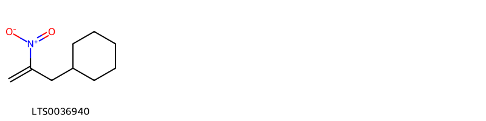
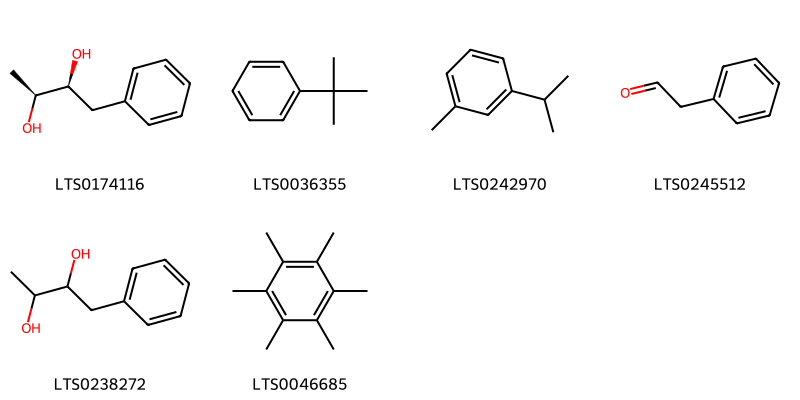
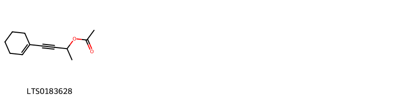
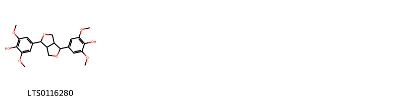
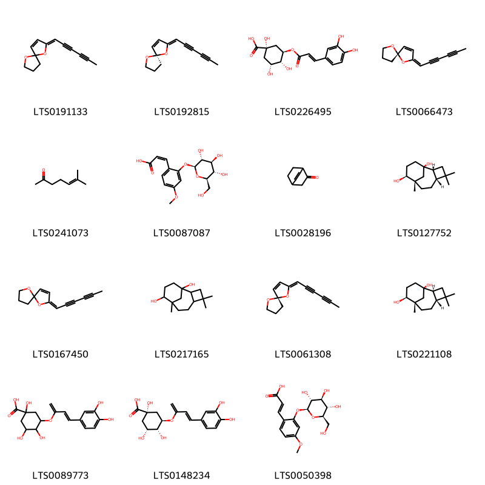
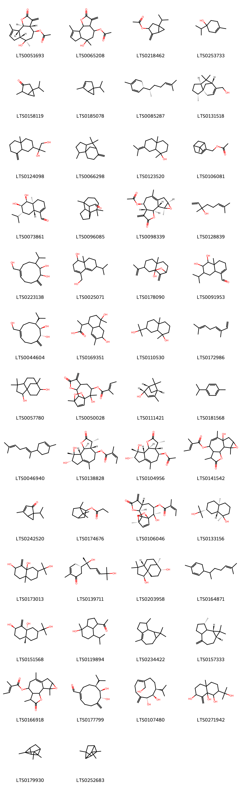
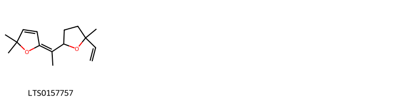

!!! abstract "Tóm tắt"

    Cúc hoa vàng có tên khoa học là Chrysanthemum indicum L., thuộc họ Cúc (Asteraceae). Phân bố trên thế giới tại China North-Central, China South-Central, China Southeast, East Himalaya, Inner Mongolia, Japan, Korea, Laos, Manchuria, Nepal, Taiwan, Vietnam. Ở Việt Nam được trồng nhiều tại các làng Nghĩa Trai (Hưng Yên), Nhật Tân (Hà Nội) và Tế Tiêu (Hà Tây). Trong dân gian cây được dùng làm thuốc chữa các chứng nhức đầu, đau mắt, chảy nước mắt, cao huyết áp, sốt, thanh nhiệt giải độc, kháng khuẩn, chống viêm. Trong cây chứa nhiều hoạt chất như flavonoid (Luteolin), vitamin A và tinh dầu.

## Thông tin về thực vật

Dược liệu **Cúc Hoa Vàng (Cụm Hoa)** từ bộ phận **nan** từ loài *Chrysanthemum indicum*.

**Mô tả thực vật:** Lá mọc so le, có thùy sâu, mép có nhiều răng, không cuống. Cụm hoa hình đầu ở nách lá hay ở đỉnh cành, đường kính 1-1,5cm, cuống dài 2-5cm. Lá bắc xếp 3-4 hàng. Các hoa vòng ngoài hình lưỡi xếp 2 vòng, các hoa ở trong hình ống, màu vàng. Quả bế, không có mào lông.

*Tài liệu tham khảo:* "Từ điển cây thuốc Việt Nam" - Võ Văn Chi 
Trong dược điển Việt nam, một loài được sử dụng làm dược liệu là *Chrysanthemum indicum*.

!!! info "Phân loại thực vật của *Chrysanthemum indicum*"
    - **Kingdom:** Plantae
    - **Phylum:** Tracheophyta
    - **Order:** Asterales
    - **Family:** Asteraceae
    - **Genus:** Chrysanthemum
    - **Species:** *Chrysanthemum indicum*

**Phân bố trên thế giới:** Germany, France, Spain, Switzerland, Chinese Taipei, China, Portugal, Hong Kong, Bulgaria, Italy, New Zealand, Japan, India, Korea, Republic of, Macao, Ukraine, Viet Nam

**Phân bố tại Việt nam:** Không có ghi nhận ở Việt Nam

## Thông tin về dược liệu 

### Định danh

!!! info "Thông tin về tên gọi"

    - Dược liệu tiếng Việt: nan
    - Dược liệu tiếng Trung: nan (nan)
    - Dược liệu tiếng Anh: nan
    - Dược liệu latin thông dụng: nan
    - Dược liệu latin kiểu DĐVN: *chrysanthemum indicum l.*
    - Dược liệu latin kiểu DĐVN: *nan*
    - Dược liệu latin kiểu thông tư: *nan*
    - Bộ phận dùng: nan (nan)

### Mô tả dược liệu 

- **Theo dược điển Việt nam V:** nan

- **Mô tả dược liệu theo thông tư chế biến dược liệu theo phương pháp cổ truyền:** nan

### Chế biến 

- **Chế biến theo dược điển việt nam V**: nan

- **Chế biến theo thông tư:** nan

--- 

## Thành phần hóa học

- Theo tài liệu của GS. Đỗ Tất Lợi:  - Cây chứa tinh dầu trong đó có Chrysol, chrysanthenone, artoglasin A, acaciin, linarin còn có yejuhualactone, chrysanthemin. Chất màu của hoa là do có chrysanthemaxanthin . Có Flavonoid (luteolin) dưới dạng glucosid, các hydrocacbon. Hạt chứa 15,8 % chất dầu nửa khô. Trong các hoa có các chất adenin, cholin, stachydrin, vitamin A.
    

**Thành phần hóa học từ loài **Chrysanthemum indicum**

Theo cơ sở dữ liệu lotus, loài *Chrysanthemum indicum* đã phân lập và xác định được **152** hoạt chất thuộc về các nhóm Polycyclic hydrocarbons, Organooxygen compounds, Allyl-type 1,3-dipolar organic compounds, Flavonoids, Fatty Acyls, Furanoid lignans, Tetrahydrofurans, Carboxylic acids and derivatives, Benzene and substituted derivatives, Saturated hydrocarbons, Unsaturated hydrocarbons, Prenol lipids trong bảng dưới đây. Danh sách các hoạt chất như sau 1-isopropyl-4-methylbicyclo[3.1.0]hex-3-en-2-ol [(LTS0217646)](https://lotus.naturalproducts.net/compound/lotus_id/LTS0217646), (1s,2r,3r,5s,9s,10s,11r)-2-hydroxy-2,11-dimethyl-6-methylidene-7-oxo-8,12,13-trioxatetracyclo[9.2.2.0¹,¹⁰.0⁵,⁹]pentadec-14-en-3-yl (2z)-2-methylbut-2-enoate [(LTS0106046)](https://lotus.naturalproducts.net/compound/lotus_id/LTS0106046), myrtenyl acetate [(LTS0106081)](https://lotus.naturalproducts.net/compound/lotus_id/LTS0106081), 6,10,14-trimethylpentadecan-2-one [(LTS0258077)](https://lotus.naturalproducts.net/compound/lotus_id/LTS0258077), 4-terpineol [(LTS0253733)](https://lotus.naturalproducts.net/compound/lotus_id/LTS0253733), (2s,3s,4s,5r,6s)-6-{[(2r)-2-(3,4-dihydroxyphenyl)-5-hydroxy-4-oxo-2,3-dihydro-1-benzopyran-7-yl]oxy}-3,4,5-trihydroxyoxane-2-carboxylic acid [(LTS0206422)](https://lotus.naturalproducts.net/compound/lotus_id/LTS0206422), (1r,2s,5s,6r,7s,10s,12r,14s)-10-hydroxy-5,9,14-trimethyl-4-oxo-3,13-dioxatetracyclo[8.4.0.0²,⁶.0¹²,¹⁴]tetradec-8-en-7-yl (2z)-2-methylbut-2-enoate [(LTS0014104)](https://lotus.naturalproducts.net/compound/lotus_id/LTS0014104), 7-(2-hydroxypropan-2-yl)-4a-methyl-1-methylidene-hexahydro-2h-naphthalene-2,8a-diol [(LTS0173013)](https://lotus.naturalproducts.net/compound/lotus_id/LTS0173013), (e)-α-bisabolene [(LTS0046940)](https://lotus.naturalproducts.net/compound/lotus_id/LTS0046940), (2s,3s)-1-phenylbutane-2,3-diol [(LTS0174116)](https://lotus.naturalproducts.net/compound/lotus_id/LTS0174116), (6,7-dihydroxy-8-isopropyl-5-methylidenecyclodec-1-en-1-yl)methyl acetate [(LTS0222184)](https://lotus.naturalproducts.net/compound/lotus_id/LTS0222184), 6-(hydroxymethyl)-3-isopropyl-10-methylidenecyclodec-6-ene-1,2-diol [(LTS0223138)](https://lotus.naturalproducts.net/compound/lotus_id/LTS0223138), 6-methyl-5-hepten-2-one [(LTS0241073)](https://lotus.naturalproducts.net/compound/lotus_id/LTS0241073), 1-[(1s,3ar,4r,7s,7as)-4-hydroxy-7-isopropyl-4-methyl-octahydroinden-1-yl]ethanone [(LTS0258092)](https://lotus.naturalproducts.net/compound/lotus_id/LTS0258092), proximadiol [(LTS0133156)](https://lotus.naturalproducts.net/compound/lotus_id/LTS0133156), (2r)-2-[(2r,4ar,8as)-4a-methyl-8-methylidene-octahydronaphthalen-2-yl]propane-1,2-diol [(LTS0019600)](https://lotus.naturalproducts.net/compound/lotus_id/LTS0019600), chlorogenic acid [(LTS0226495)](https://lotus.naturalproducts.net/compound/lotus_id/LTS0226495), hexamethylbenzene [(LTS0046685)](https://lotus.naturalproducts.net/compound/lotus_id/LTS0046685), eupatilin [(LTS0193182)](https://lotus.naturalproducts.net/compound/lotus_id/LTS0193182), (2r,3r,4s,5s,6r)-2-{[(2s,3s)-3-hydroxy-4-phenylbutan-2-yl]oxy}-6-(hydroxymethyl)oxane-3,4,5-triol [(LTS0008358)](https://lotus.naturalproducts.net/compound/lotus_id/LTS0008358), 8,9-dihydroxy-3,6,9-trimethyl-2-oxo-3h,3ah,4h,5h,7h,8h,9ah,9bh-azuleno[4,5-b]furan-4-yl acetate [(LTS0001798)](https://lotus.naturalproducts.net/compound/lotus_id/LTS0001798), (-)-α-curcumene [(LTS0216936)](https://lotus.naturalproducts.net/compound/lotus_id/LTS0216936), luteolin 7-o-glucoside [(LTS0227450)](https://lotus.naturalproducts.net/compound/lotus_id/LTS0227450), 2-[(3-hydroxy-4-phenylbutan-2-yl)oxy]-6-(hydroxymethyl)oxane-3,4,5-triol [(LTS0165592)](https://lotus.naturalproducts.net/compound/lotus_id/LTS0165592), (s)-cis-verbenol [(LTS0111421)](https://lotus.naturalproducts.net/compound/lotus_id/LTS0111421), thymol [(LTS0168527)](https://lotus.naturalproducts.net/compound/lotus_id/LTS0168527), umbellulone [(LTS0242520)](https://lotus.naturalproducts.net/compound/lotus_id/LTS0242520), (2s)-2-[(1s,4s,4as,6r,8as)-4,6-dihydroxy-4,7-dimethyl-2,3,4a,5,6,8a-hexahydro-1h-naphthalen-1-yl]propanoic acid [(LTS0256045)](https://lotus.naturalproducts.net/compound/lotus_id/LTS0256045), (2z,5s)-2-(hexa-2,4-diyn-1-ylidene)-1,6-dioxaspiro[4.4]non-3-ene [(LTS0061308)](https://lotus.naturalproducts.net/compound/lotus_id/LTS0061308), 4,4,8-trimethyltricyclo[6.3.1.0¹,⁵]dodecane-2,9-diol [(LTS0057780)](https://lotus.naturalproducts.net/compound/lotus_id/LTS0057780), luteolin [(LTS0017052)](https://lotus.naturalproducts.net/compound/lotus_id/LTS0017052), 4,7,7-trimethylbicyclo[4.1.0]hept-2-ene [(LTS0156738)](https://lotus.naturalproducts.net/compound/lotus_id/LTS0156738), 1,2,3,4,5,6,7,8,9,10,11,12,13,14-tetradecahydrononalene [(LTS0136966)](https://lotus.naturalproducts.net/compound/lotus_id/LTS0136966), 2-methyl-5-(6-methylhept-5-en-2-yl)cyclohexa-1,3-diene [(LTS0164871)](https://lotus.naturalproducts.net/compound/lotus_id/LTS0164871), 4,4,8-trimethyltricyclo[6.3.1.0²,⁵]dodecane-1,9-diol [(LTS0217165)](https://lotus.naturalproducts.net/compound/lotus_id/LTS0217165), 4-(cyclohex-1-en-1-yl)but-3-yn-2-yl acetate [(LTS0183628)](https://lotus.naturalproducts.net/compound/lotus_id/LTS0183628), 1,1,4,7-tetramethyl-1ah,2h,3h,5h,6h,7h,7ah,7bh-cyclopropa[e]azulene [(LTS0234422)](https://lotus.naturalproducts.net/compound/lotus_id/LTS0234422), 6-hydroxy-6,9-dimethyl-3-methylidene-2-oxo-3ah,4h,5h,6ah,7h,9ah,9bh-azuleno[4,5-b]furan-4-yl acetate [(LTS0065208)](https://lotus.naturalproducts.net/compound/lotus_id/LTS0065208), tricyclene [(LTS0179930)](https://lotus.naturalproducts.net/compound/lotus_id/LTS0179930), 2-(4a-methyl-8-methylidene-octahydronaphthalen-2-yl)propane-1,2-diol [(LTS0124098)](https://lotus.naturalproducts.net/compound/lotus_id/LTS0124098), 5-hydroxy-2-(3-hydroxy-4-methoxyphenyl)-7-{[(2s,3r,4s,5s,6r)-3,4,5-trihydroxy-6-(hydroxymethyl)oxan-2-yl]oxy}chromen-4-one [(LTS0261873)](https://lotus.naturalproducts.net/compound/lotus_id/LTS0261873), cymene [(LTS0181568)](https://lotus.naturalproducts.net/compound/lotus_id/LTS0181568), quercetin 3,7-diglucoside [(LTS0059170)](https://lotus.naturalproducts.net/compound/lotus_id/LTS0059170), 2-(3,4-dihydroxyphenyl)-5-hydroxy-3,7-bis({[3,4,5-trihydroxy-6-(hydroxymethyl)oxan-2-yl]oxy})chromen-4-one [(LTS0206247)](https://lotus.naturalproducts.net/compound/lotus_id/LTS0206247), (1s,2r,3r,5s,9s,10s,11r)-2-hydroxy-2,11-dimethyl-6-methylidene-7-oxo-8,12,13-trioxatetracyclo[9.2.2.0¹,¹⁰.0⁵,⁹]pentadec-14-en-3-yl acetate [(LTS0100237)](https://lotus.naturalproducts.net/compound/lotus_id/LTS0100237), 5-hydroxy-2-(4-methoxyphenyl)-7-[(3,4,5-trihydroxy-6-{[(3,4,5-trihydroxy-6-methyloxan-2-yl)oxy]methyl}oxan-2-yl)oxy]chromen-4-one [(LTS0103484)](https://lotus.naturalproducts.net/compound/lotus_id/LTS0103484), 3,7-dimethyl-1,3,6-octatriene [(LTS0172986)](https://lotus.naturalproducts.net/compound/lotus_id/LTS0172986), (3r,3ar,4s,8s,9r,9as,9bs)-8,9-dihydroxy-3,6,9-trimethyl-2-oxo-3h,3ah,4h,5h,7h,8h,9ah,9bh-azuleno[4,5-b]furan-4-yl acetate [(LTS0104956)](https://lotus.naturalproducts.net/compound/lotus_id/LTS0104956), 6,7-dihydroxy-8-isopropyl-5-methylidenecyclodec-1-ene-1-carbaldehyde [(LTS0272785)](https://lotus.naturalproducts.net/compound/lotus_id/LTS0272785), [(1e,6r,7r,8s)-6,7-dihydroxy-8-isopropyl-5-methylidenecyclodec-1-en-1-yl]methyl acetate [(LTS0064054)](https://lotus.naturalproducts.net/compound/lotus_id/LTS0064054), (4as,5s,6r,7r,8ar)-5,6-dihydroxy-7-isopropyl-4a-methyl-4,5,6,7,8,8a-hexahydro-3h-naphthalene-1-carbaldehyde [(LTS0073861)](https://lotus.naturalproducts.net/compound/lotus_id/LTS0073861), 5,9,14-trimethyl-4-oxo-3,13-dioxatetracyclo[8.4.0.0²,⁶.0¹²,¹⁴]tetradec-9-en-7-yl 2-methylbut-2-enoate [(LTS0166918)](https://lotus.naturalproducts.net/compound/lotus_id/LTS0166918), indicumenone [(LTS0139711)](https://lotus.naturalproducts.net/compound/lotus_id/LTS0139711), 1-isopropyl-4-methylbicyclo[3.1.0]hexan-3-ol [(LTS0051406)](https://lotus.naturalproducts.net/compound/lotus_id/LTS0051406), undecane [(LTS0081068)](https://lotus.naturalproducts.net/compound/lotus_id/LTS0081068), (2e,5s)-2-(hexa-2,4-diyn-1-ylidene)-1,6-dioxaspiro[4.4]non-3-ene [(LTS0066473)](https://lotus.naturalproducts.net/compound/lotus_id/LTS0066473), chrysantherol [(LTS0178090)](https://lotus.naturalproducts.net/compound/lotus_id/LTS0178090), (1s,2s,5s,6r,7s,12r,14s)-5,9,14-trimethyl-4-oxo-3,13-dioxatetracyclo[8.4.0.0²,⁶.0¹²,¹⁴]tetradec-9-en-7-yl (2z)-2-methylbut-2-enoate [(LTS0068312)](https://lotus.naturalproducts.net/compound/lotus_id/LTS0068312), 2-hydroxy-2,11-dimethyl-6-methylidene-7-oxo-8,12,13-trioxatetracyclo[9.2.2.0¹,¹⁰.0⁵,⁹]pentadec-14-en-3-yl acetate [(LTS0091949)](https://lotus.naturalproducts.net/compound/lotus_id/LTS0091949), m-cymene [(LTS0242970)](https://lotus.naturalproducts.net/compound/lotus_id/LTS0242970), octadecanal [(LTS0181748)](https://lotus.naturalproducts.net/compound/lotus_id/LTS0181748), verbenone [(LTS0264577)](https://lotus.naturalproducts.net/compound/lotus_id/LTS0264577), isoamyl 2-methylbutyrate [(LTS0246376)](https://lotus.naturalproducts.net/compound/lotus_id/LTS0246376), 4-isopropyl-6-methyl-1-methylidene-3,4,4a,7,8,8a-hexahydro-2h-naphthalene [(LTS0111070)](https://lotus.naturalproducts.net/compound/lotus_id/LTS0111070), 2-(hexa-2,4-diyn-1-ylidene)-1,6-dioxaspiro[4.4]non-3-ene [(LTS0191133)](https://lotus.naturalproducts.net/compound/lotus_id/LTS0191133), [(1z,6r,7r,8s)-6,7-dihydroxy-8-isopropyl-5-methylidenecyclodec-1-en-1-yl]methyl acetate [(LTS0235997)](https://lotus.naturalproducts.net/compound/lotus_id/LTS0235997), [(1s,2r,5s,7r)-2,6,6-trimethyltricyclo[5.3.1.0¹,⁵]undec-8-en-8-yl]methanol [(LTS0131518)](https://lotus.naturalproducts.net/compound/lotus_id/LTS0131518), terpineol; terpineols [(LTS0223935)](https://lotus.naturalproducts.net/compound/lotus_id/LTS0223935), clovanediol [(LTS0203958)](https://lotus.naturalproducts.net/compound/lotus_id/LTS0203958), (1r,2r,4as,7s,8as)-2-(2-hydroxypropan-2-yl)-4a-methyl-8-methylidene-hexahydro-1h-naphthalene-1,7,8a-triol [(LTS0050012)](https://lotus.naturalproducts.net/compound/lotus_id/LTS0050012), 1-phenylbutane-2,3-diol [(LTS0238272)](https://lotus.naturalproducts.net/compound/lotus_id/LTS0238272), linarin [(LTS0160284)](https://lotus.naturalproducts.net/compound/lotus_id/LTS0160284), kikkanol d [(LTS0044604)](https://lotus.naturalproducts.net/compound/lotus_id/LTS0044604), phenylacetaldehyde [(LTS0245512)](https://lotus.naturalproducts.net/compound/lotus_id/LTS0245512), apigetrin [(LTS0157591)](https://lotus.naturalproducts.net/compound/lotus_id/LTS0157591), (3r,3ar,4s,8s,9r,9as,9bs)-8,9-dihydroxy-3,6,9-trimethyl-2-oxo-3h,3ah,4h,5h,7h,8h,9ah,9bh-azuleno[4,5-b]furan-4-yl (2z)-2-methylbut-2-enoate [(LTS0138828)](https://lotus.naturalproducts.net/compound/lotus_id/LTS0138828), 8,9-dihydroxy-3,6,9-trimethyl-2-oxo-3h,3ah,4h,5h,7h,8h,9ah,9bh-azuleno[4,5-b]furan-4-yl 2-methylbut-2-enoate [(LTS0184066)](https://lotus.naturalproducts.net/compound/lotus_id/LTS0184066), (4r,4as,7s,7as)-1,1,4,7-tetramethyl-octahydro-1ah-cyclopropa[e]azulen-4-ol [(LTS0001594)](https://lotus.naturalproducts.net/compound/lotus_id/LTS0001594), 2-[(5r)-6,10-dimethylspiro[4.5]dec-6-en-2-yl]propan-2-ol [(LTS0220783)](https://lotus.naturalproducts.net/compound/lotus_id/LTS0220783), (1ar,7s,7bs)-1,1,7-trimethyl-4-methylidene-octahydro-1ah-cyclopropa[e]azulene [(LTS0157333)](https://lotus.naturalproducts.net/compound/lotus_id/LTS0157333), t-butylbenzene [(LTS0036355)](https://lotus.naturalproducts.net/compound/lotus_id/LTS0036355), (1s,3r,4r,5r)-3-{[(3e)-4-(3,4-dihydroxyphenyl)buta-1,3-dien-2-yl]oxy}-1,4,5-trihydroxycyclohexane-1-carboxylic acid [(LTS0148234)](https://lotus.naturalproducts.net/compound/lotus_id/LTS0148234), 10-hydroxy-5,9,14-trimethyl-4-oxo-3,13-dioxatetracyclo[8.4.0.0²,⁶.0¹²,¹⁴]tetradec-8-en-7-yl 2-methylbut-2-enoate [(LTS0141542)](https://lotus.naturalproducts.net/compound/lotus_id/LTS0141542), bicyclo[2.2.2]oct-5-en-2-one [(LTS0028196)](https://lotus.naturalproducts.net/compound/lotus_id/LTS0028196), (1r,2r,5r,8s,9s)-4,4,8-trimethyltricyclo[6.3.1.0²,⁵]dodecane-1,9-diol [(LTS0127752)](https://lotus.naturalproducts.net/compound/lotus_id/LTS0127752), (1s,2s,5s,6r,7s,12r,14s)-5,9,14-trimethyl-4-oxo-3,13-dioxatetracyclo[8.4.0.0²,⁶.0¹²,¹⁴]tetradec-9-en-7-yl (2e)-2-methylbut-2-enoate [(LTS0049425)](https://lotus.naturalproducts.net/compound/lotus_id/LTS0049425), cuminol [(LTS0021403)](https://lotus.naturalproducts.net/compound/lotus_id/LTS0021403), 4-(hydroxymethyl)-6-isopropyl-8a-methyl-2,6,7,8-tetrahydro-1h-naphthalen-1-ol [(LTS0025071)](https://lotus.naturalproducts.net/compound/lotus_id/LTS0025071), eriodictyol 7-glucuronide [(LTS0121078)](https://lotus.naturalproducts.net/compound/lotus_id/LTS0121078), 5-hydroxy-2-(4-methoxyphenyl)-7-{[3,4,5-trihydroxy-6-(hydroxymethyl)oxan-2-yl]oxy}chromen-4-one [(LTS0024665)](https://lotus.naturalproducts.net/compound/lotus_id/LTS0024665), tricin [(LTS0271018)](https://lotus.naturalproducts.net/compound/lotus_id/LTS0271018), kikkanol e [(LTS0177799)](https://lotus.naturalproducts.net/compound/lotus_id/LTS0177799), syringaresinol [(LTS0116280)](https://lotus.naturalproducts.net/compound/lotus_id/LTS0116280), 2-(2-hydroxypropan-2-yl)-4a-methyl-8-methylidene-hexahydro-1h-naphthalene-1,7,8a-triol [(LTS0271942)](https://lotus.naturalproducts.net/compound/lotus_id/LTS0271942), curcumene [(LTS0190074)](https://lotus.naturalproducts.net/compound/lotus_id/LTS0190074), (5e)-5-[1-(5-ethenyl-5-methyloxolan-2-yl)ethylidene]-2,2-dimethylfuran [(LTS0157757)](https://lotus.naturalproducts.net/compound/lotus_id/LTS0157757), kikkanol c [(LTS0152811)](https://lotus.naturalproducts.net/compound/lotus_id/LTS0152811), 1-isopropyl-4-methylidenebicyclo[3.1.0]hexan-3-yl acetate [(LTS0218462)](https://lotus.naturalproducts.net/compound/lotus_id/LTS0218462), (e)-tonghaosu [(LTS0167450)](https://lotus.naturalproducts.net/compound/lotus_id/LTS0167450), kikkanol b [(LTS0064169)](https://lotus.naturalproducts.net/compound/lotus_id/LTS0064169), 7-(2-hydroxypropan-2-yl)-1,4a-dimethyl-octahydronaphthalen-1-ol [(LTS0110530)](https://lotus.naturalproducts.net/compound/lotus_id/LTS0110530), 1,3,3-trimethyltricyclo[2.2.1.0²,⁶]heptane [(LTS0252683)](https://lotus.naturalproducts.net/compound/lotus_id/LTS0252683), pentylcyclohexane [(LTS0262287)](https://lotus.naturalproducts.net/compound/lotus_id/LTS0262287), chamomile [(LTS0104946)](https://lotus.naturalproducts.net/compound/lotus_id/LTS0104946), (1r,2s,5r,8s,9s)-4,4,8-trimethyltricyclo[6.3.1.0²,⁵]dodecane-1,9-diol [(LTS0221108)](https://lotus.naturalproducts.net/compound/lotus_id/LTS0221108), (2z,5r)-2-(hexa-2,4-diyn-1-ylidene)-1,6-dioxaspiro[4.4]non-3-ene [(LTS0192815)](https://lotus.naturalproducts.net/compound/lotus_id/LTS0192815), α-bisabolol [(LTS0250984)](https://lotus.naturalproducts.net/compound/lotus_id/LTS0250984), 3,3,7-trimethyltricyclo[5.4.0.0²,⁹]undecane-8-carbaldehyde [(LTS0096085)](https://lotus.naturalproducts.net/compound/lotus_id/LTS0096085), arteglasin a [(LTS0098339)](https://lotus.naturalproducts.net/compound/lotus_id/LTS0098339), isobornyl propionate [(LTS0174676)](https://lotus.naturalproducts.net/compound/lotus_id/LTS0174676), (2s,3s,4s,5r,6s)-6-{[(2s)-2-(3,4-dihydroxyphenyl)-5-hydroxy-4-oxo-2,3-dihydro-1-benzopyran-7-yl]oxy}-3,4,5-trihydroxyoxane-2-carboxylic acid [(LTS0176664)](https://lotus.naturalproducts.net/compound/lotus_id/LTS0176664), heneicosane [(LTS0039017)](https://lotus.naturalproducts.net/compound/lotus_id/LTS0039017), acacetin [(LTS0020151)](https://lotus.naturalproducts.net/compound/lotus_id/LTS0020151), luteolin 7-o-glucuronide [(LTS0081420)](https://lotus.naturalproducts.net/compound/lotus_id/LTS0081420), nerolidol isomers [(LTS0007569)](https://lotus.naturalproducts.net/compound/lotus_id/LTS0007569), 3,5,6-trimethylcyclohex-3-ene-1-carbaldehyde; vertonal [(LTS0180492)](https://lotus.naturalproducts.net/compound/lotus_id/LTS0180492), bornyl acetate [(LTS0060565)](https://lotus.naturalproducts.net/compound/lotus_id/LTS0060565), sabinene hydrate [(LTS0236165)](https://lotus.naturalproducts.net/compound/lotus_id/LTS0236165), (+/-)-eriodictyol [(LTS0106920)](https://lotus.naturalproducts.net/compound/lotus_id/LTS0106920), terpinene [(LTS0136858)](https://lotus.naturalproducts.net/compound/lotus_id/LTS0136858), 5-hydroxy-2-(3-hydroxy-4-methoxyphenyl)-7-{[3,4,5-trihydroxy-6-(hydroxymethyl)oxan-2-yl]oxy}chromen-4-one [(LTS0237371)](https://lotus.naturalproducts.net/compound/lotus_id/LTS0237371), (2r,4ar,7s,8ar)-7-(2-hydroxypropan-2-yl)-4a-methyl-1-methylidene-hexahydro-2h-naphthalene-2,8a-diol [(LTS0151568)](https://lotus.naturalproducts.net/compound/lotus_id/LTS0151568), (e,z)-α-farnesene [(LTS0061525)](https://lotus.naturalproducts.net/compound/lotus_id/LTS0061525), α-thujene [(LTS0185078)](https://lotus.naturalproducts.net/compound/lotus_id/LTS0185078), eriodictyol [(LTS0220769)](https://lotus.naturalproducts.net/compound/lotus_id/LTS0220769), cedrene [(LTS0023956)](https://lotus.naturalproducts.net/compound/lotus_id/LTS0023956), 6-isopropyl-8a-methyl-4-methylidene-hexahydro-1h-naphthalene-1,4a,5-triol [(LTS0051728)](https://lotus.naturalproducts.net/compound/lotus_id/LTS0051728), (2z)-3-(4-methoxy-2-{[(2s,3r,4s,5s,6r)-3,4,5-trihydroxy-6-(hydroxymethyl)oxan-2-yl]oxy}phenyl)prop-2-enoic acid [(LTS0087087)](https://lotus.naturalproducts.net/compound/lotus_id/LTS0087087), chrysanthenone [(LTS0001245)](https://lotus.naturalproducts.net/compound/lotus_id/LTS0001245), 2-(3,4-dihydroxyphenyl)-5-hydroxy-7-{[3,4,5-trihydroxy-6-(hydroxymethyl)oxan-2-yl]oxy}chromen-4-one [(LTS0158292)](https://lotus.naturalproducts.net/compound/lotus_id/LTS0158292), 5,6-dihydroxy-7-isopropyl-4a-methyl-4,5,6,7,8,8a-hexahydro-3h-naphthalene-1-carbaldehyde [(LTS0091953)](https://lotus.naturalproducts.net/compound/lotus_id/LTS0091953), 2-(4,6-dihydroxy-4,7-dimethyl-2,3,4a,5,6,8a-hexahydro-1h-naphthalen-1-yl)propanoic acid [(LTS0169351)](https://lotus.naturalproducts.net/compound/lotus_id/LTS0169351), 6-{[2-(3,4-dihydroxyphenyl)-5-hydroxy-4-oxochromen-7-yl]oxy}-3,4,5-trihydroxyoxane-2-carboxylic acid [(LTS0175049)](https://lotus.naturalproducts.net/compound/lotus_id/LTS0175049), 3-isothujone [(LTS0158119)](https://lotus.naturalproducts.net/compound/lotus_id/LTS0158119), 1,4a-dimethyl-7-(propan-2-ylidene)-hexahydro-2h-naphthalen-1-ol [(LTS0123520)](https://lotus.naturalproducts.net/compound/lotus_id/LTS0123520), 5-ethylidene-1-methylcyclohept-1-ene [(LTS0119180)](https://lotus.naturalproducts.net/compound/lotus_id/LTS0119180), (2e)-3-(4-methoxy-2-{[(2s,3r,4s,5s,6r)-3,4,5-trihydroxy-6-(hydroxymethyl)oxan-2-yl]oxy}phenyl)prop-2-enoic acid [(LTS0050398)](https://lotus.naturalproducts.net/compound/lotus_id/LTS0050398), (3e,5e)-3,7-dimethylocta-1,3,5-triene [(LTS0270900)](https://lotus.naturalproducts.net/compound/lotus_id/LTS0270900), diosmetin [(LTS0252065)](https://lotus.naturalproducts.net/compound/lotus_id/LTS0252065), 2,6,6-trimethyl-8-methylidenetricyclo[5.3.1.0¹,⁵]undecane [(LTS0066298)](https://lotus.naturalproducts.net/compound/lotus_id/LTS0066298), zingiberene [(LTS0085287)](https://lotus.naturalproducts.net/compound/lotus_id/LTS0085287), (3ar,4s,6r,6ar,9ar,9br)-6-hydroxy-6,9-dimethyl-3-methylidene-2-oxo-3ah,4h,5h,6ah,7h,9ah,9bh-azuleno[4,5-b]furan-4-yl acetate [(LTS0051693)](https://lotus.naturalproducts.net/compound/lotus_id/LTS0051693), apigenin 7-o-β-glucoside [(LTS0252743)](https://lotus.naturalproducts.net/compound/lotus_id/LTS0252743), 2-hydroxy-2,11-dimethyl-6-methylidene-7-oxo-8,12,13-trioxatetracyclo[9.2.2.0¹,¹⁰.0⁵,⁹]pentadec-14-en-3-yl 2-methylbut-2-enoate [(LTS0050028)](https://lotus.naturalproducts.net/compound/lotus_id/LTS0050028), 1-(4-hydroxy-7-isopropyl-4-methyl-octahydroinden-1-yl)ethanone [(LTS0119894)](https://lotus.naturalproducts.net/compound/lotus_id/LTS0119894), 3-{[4-(3,4-dihydroxyphenyl)buta-1,3-dien-2-yl]oxy}-1,4,5-trihydroxycyclohexane-1-carboxylic acid [(LTS0089773)](https://lotus.naturalproducts.net/compound/lotus_id/LTS0089773), kikkanol f [(LTS0107480)](https://lotus.naturalproducts.net/compound/lotus_id/LTS0107480), 5-hydroxy-2-(4-methoxyphenyl)-7-{[(2s,3r,4s,5r,6r)-3,4,5-trihydroxy-6-(hydroxymethyl)oxan-2-yl]oxy}chromen-4-one [(LTS0067215)](https://lotus.naturalproducts.net/compound/lotus_id/LTS0067215), linalool, (+-)- [(LTS0128839)](https://lotus.naturalproducts.net/compound/lotus_id/LTS0128839), (2-nitroprop-2-en-1-yl)cyclohexane [(LTS0036940)](https://lotus.naturalproducts.net/compound/lotus_id/LTS0036940), kikkanol a [(LTS0221193)](https://lotus.naturalproducts.net/compound/lotus_id/LTS0221193), 1,1,4,7-tetramethyl-1ah,2h,3h,4h,5h,6h,7h,7bh-cyclopropa[e]azulene [(LTS0245173)](https://lotus.naturalproducts.net/compound/lotus_id/LTS0245173). 
        
| chemicalTaxonomyClassyfireClass          |   smiles_count |
|:-----------------------------------------|---------------:|
| Allyl-type 1,3-dipolar organic compounds |             26 |
| Benzene and substituted derivatives      |            111 |
| Carboxylic acids and derivatives         |             23 |
| Fatty Acyls                              |            144 |
| Flavonoids                               |           1635 |
| Furanoid lignans                         |             50 |
| Organooxygen compounds                   |            611 |
| Polycyclic hydrocarbons                  |             49 |
| Prenol lipids                            |           3400 |
| Saturated hydrocarbons                   |             45 |
| Tetrahydrofurans                         |             36 |
| Unsaturated hydrocarbons                 |             36 |

            
### Nhóm Allyl-type 1,3-dipolar organic compounds
<figure markdown="span">
    { width=100% }
<figcaption>Hình ảnh cấu trúc hóa học của hoạt chất thuộc nhóm *Allyl-type 1,3-dipolar organic compounds*. Tên thường gọi của các hoạt chất tương ứng là (2-nitroprop-2-en-1-yl)cyclohexane [(LTS0036940)](https://lotus.naturalproducts.net/compound/lotus_id/LTS0036940).</figcaption>
</figure>

            
            
### Nhóm Allyl-type 1,3-dipolar organic compounds
<figure markdown="span">
    { width=100% }
<figcaption>Hình ảnh cấu trúc hóa học của hoạt chất thuộc nhóm *Allyl-type 1,3-dipolar organic compounds*. Tên thường gọi của các hoạt chất tương ứng là (2-nitroprop-2-en-1-yl)cyclohexane [(LTS0036940)](https://lotus.naturalproducts.net/compound/lotus_id/LTS0036940).</figcaption>
</figure>

### Nhóm Benzene and substituted derivatives
<figure markdown="span">
    { width=100% }
<figcaption>Hình ảnh cấu trúc hóa học của hoạt chất thuộc nhóm *Benzene and substituted derivatives*. Tên thường gọi của các hoạt chất tương ứng là (2s,3s)-1-phenylbutane-2,3-diol [(LTS0174116)](https://lotus.naturalproducts.net/compound/lotus_id/LTS0174116), t-butylbenzene [(LTS0036355)](https://lotus.naturalproducts.net/compound/lotus_id/LTS0036355), m-cymene [(LTS0242970)](https://lotus.naturalproducts.net/compound/lotus_id/LTS0242970), phenylacetaldehyde [(LTS0245512)](https://lotus.naturalproducts.net/compound/lotus_id/LTS0245512), 1-phenylbutane-2,3-diol [(LTS0238272)](https://lotus.naturalproducts.net/compound/lotus_id/LTS0238272), hexamethylbenzene [(LTS0046685)](https://lotus.naturalproducts.net/compound/lotus_id/LTS0046685).</figcaption>
</figure>

            
            
### Nhóm Allyl-type 1,3-dipolar organic compounds
<figure markdown="span">
    { width=100% }
<figcaption>Hình ảnh cấu trúc hóa học của hoạt chất thuộc nhóm *Allyl-type 1,3-dipolar organic compounds*. Tên thường gọi của các hoạt chất tương ứng là (2-nitroprop-2-en-1-yl)cyclohexane [(LTS0036940)](https://lotus.naturalproducts.net/compound/lotus_id/LTS0036940).</figcaption>
</figure>

### Nhóm Benzene and substituted derivatives
<figure markdown="span">
    { width=100% }
<figcaption>Hình ảnh cấu trúc hóa học của hoạt chất thuộc nhóm *Benzene and substituted derivatives*. Tên thường gọi của các hoạt chất tương ứng là (2s,3s)-1-phenylbutane-2,3-diol [(LTS0174116)](https://lotus.naturalproducts.net/compound/lotus_id/LTS0174116), t-butylbenzene [(LTS0036355)](https://lotus.naturalproducts.net/compound/lotus_id/LTS0036355), m-cymene [(LTS0242970)](https://lotus.naturalproducts.net/compound/lotus_id/LTS0242970), phenylacetaldehyde [(LTS0245512)](https://lotus.naturalproducts.net/compound/lotus_id/LTS0245512), 1-phenylbutane-2,3-diol [(LTS0238272)](https://lotus.naturalproducts.net/compound/lotus_id/LTS0238272), hexamethylbenzene [(LTS0046685)](https://lotus.naturalproducts.net/compound/lotus_id/LTS0046685).</figcaption>
</figure>

### Nhóm Carboxylic acids and derivatives
<figure markdown="span">
    { width=100% }
<figcaption>Hình ảnh cấu trúc hóa học của hoạt chất thuộc nhóm *Carboxylic acids and derivatives*. Tên thường gọi của các hoạt chất tương ứng là 4-(cyclohex-1-en-1-yl)but-3-yn-2-yl acetate [(LTS0183628)](https://lotus.naturalproducts.net/compound/lotus_id/LTS0183628).</figcaption>
</figure>

            
            
### Nhóm Allyl-type 1,3-dipolar organic compounds
<figure markdown="span">
    { width=100% }
<figcaption>Hình ảnh cấu trúc hóa học của hoạt chất thuộc nhóm *Allyl-type 1,3-dipolar organic compounds*. Tên thường gọi của các hoạt chất tương ứng là (2-nitroprop-2-en-1-yl)cyclohexane [(LTS0036940)](https://lotus.naturalproducts.net/compound/lotus_id/LTS0036940).</figcaption>
</figure>

### Nhóm Benzene and substituted derivatives
<figure markdown="span">
    { width=100% }
<figcaption>Hình ảnh cấu trúc hóa học của hoạt chất thuộc nhóm *Benzene and substituted derivatives*. Tên thường gọi của các hoạt chất tương ứng là (2s,3s)-1-phenylbutane-2,3-diol [(LTS0174116)](https://lotus.naturalproducts.net/compound/lotus_id/LTS0174116), t-butylbenzene [(LTS0036355)](https://lotus.naturalproducts.net/compound/lotus_id/LTS0036355), m-cymene [(LTS0242970)](https://lotus.naturalproducts.net/compound/lotus_id/LTS0242970), phenylacetaldehyde [(LTS0245512)](https://lotus.naturalproducts.net/compound/lotus_id/LTS0245512), 1-phenylbutane-2,3-diol [(LTS0238272)](https://lotus.naturalproducts.net/compound/lotus_id/LTS0238272), hexamethylbenzene [(LTS0046685)](https://lotus.naturalproducts.net/compound/lotus_id/LTS0046685).</figcaption>
</figure>

### Nhóm Carboxylic acids and derivatives
<figure markdown="span">
    { width=100% }
<figcaption>Hình ảnh cấu trúc hóa học của hoạt chất thuộc nhóm *Carboxylic acids and derivatives*. Tên thường gọi của các hoạt chất tương ứng là 4-(cyclohex-1-en-1-yl)but-3-yn-2-yl acetate [(LTS0183628)](https://lotus.naturalproducts.net/compound/lotus_id/LTS0183628).</figcaption>
</figure>

### Nhóm Fatty Acyls
<figure markdown="span">
    { width=100% }
<figcaption>Hình ảnh cấu trúc hóa học của hoạt chất thuộc nhóm *Fatty Acyls*. Tên thường gọi của các hoạt chất tương ứng là 2-[(3-hydroxy-4-phenylbutan-2-yl)oxy]-6-(hydroxymethyl)oxane-3,4,5-triol [(LTS0165592)](https://lotus.naturalproducts.net/compound/lotus_id/LTS0165592), isoamyl 2-methylbutyrate [(LTS0246376)](https://lotus.naturalproducts.net/compound/lotus_id/LTS0246376), octadecanal [(LTS0181748)](https://lotus.naturalproducts.net/compound/lotus_id/LTS0181748), (2r,3r,4s,5s,6r)-2-{[(2s,3s)-3-hydroxy-4-phenylbutan-2-yl]oxy}-6-(hydroxymethyl)oxane-3,4,5-triol [(LTS0008358)](https://lotus.naturalproducts.net/compound/lotus_id/LTS0008358).</figcaption>
</figure>

            
            
### Nhóm Allyl-type 1,3-dipolar organic compounds
<figure markdown="span">
    { width=100% }
<figcaption>Hình ảnh cấu trúc hóa học của hoạt chất thuộc nhóm *Allyl-type 1,3-dipolar organic compounds*. Tên thường gọi của các hoạt chất tương ứng là (2-nitroprop-2-en-1-yl)cyclohexane [(LTS0036940)](https://lotus.naturalproducts.net/compound/lotus_id/LTS0036940).</figcaption>
</figure>

### Nhóm Benzene and substituted derivatives
<figure markdown="span">
    { width=100% }
<figcaption>Hình ảnh cấu trúc hóa học của hoạt chất thuộc nhóm *Benzene and substituted derivatives*. Tên thường gọi của các hoạt chất tương ứng là (2s,3s)-1-phenylbutane-2,3-diol [(LTS0174116)](https://lotus.naturalproducts.net/compound/lotus_id/LTS0174116), t-butylbenzene [(LTS0036355)](https://lotus.naturalproducts.net/compound/lotus_id/LTS0036355), m-cymene [(LTS0242970)](https://lotus.naturalproducts.net/compound/lotus_id/LTS0242970), phenylacetaldehyde [(LTS0245512)](https://lotus.naturalproducts.net/compound/lotus_id/LTS0245512), 1-phenylbutane-2,3-diol [(LTS0238272)](https://lotus.naturalproducts.net/compound/lotus_id/LTS0238272), hexamethylbenzene [(LTS0046685)](https://lotus.naturalproducts.net/compound/lotus_id/LTS0046685).</figcaption>
</figure>

### Nhóm Carboxylic acids and derivatives
<figure markdown="span">
    { width=100% }
<figcaption>Hình ảnh cấu trúc hóa học của hoạt chất thuộc nhóm *Carboxylic acids and derivatives*. Tên thường gọi của các hoạt chất tương ứng là 4-(cyclohex-1-en-1-yl)but-3-yn-2-yl acetate [(LTS0183628)](https://lotus.naturalproducts.net/compound/lotus_id/LTS0183628).</figcaption>
</figure>

### Nhóm Fatty Acyls
<figure markdown="span">
    { width=100% }
<figcaption>Hình ảnh cấu trúc hóa học của hoạt chất thuộc nhóm *Fatty Acyls*. Tên thường gọi của các hoạt chất tương ứng là 2-[(3-hydroxy-4-phenylbutan-2-yl)oxy]-6-(hydroxymethyl)oxane-3,4,5-triol [(LTS0165592)](https://lotus.naturalproducts.net/compound/lotus_id/LTS0165592), isoamyl 2-methylbutyrate [(LTS0246376)](https://lotus.naturalproducts.net/compound/lotus_id/LTS0246376), octadecanal [(LTS0181748)](https://lotus.naturalproducts.net/compound/lotus_id/LTS0181748), (2r,3r,4s,5s,6r)-2-{[(2s,3s)-3-hydroxy-4-phenylbutan-2-yl]oxy}-6-(hydroxymethyl)oxane-3,4,5-triol [(LTS0008358)](https://lotus.naturalproducts.net/compound/lotus_id/LTS0008358).</figcaption>
</figure>

### Nhóm Flavonoids
<figure markdown="span">
    { width=100% }
<figcaption>Hình ảnh cấu trúc hóa học của hoạt chất thuộc nhóm *Flavonoids*. Tên thường gọi của các hoạt chất tương ứng là chamomile [(LTS0104946)](https://lotus.naturalproducts.net/compound/lotus_id/LTS0104946), linarin [(LTS0160284)](https://lotus.naturalproducts.net/compound/lotus_id/LTS0160284), 2-(3,4-dihydroxyphenyl)-5-hydroxy-7-{[3,4,5-trihydroxy-6-(hydroxymethyl)oxan-2-yl]oxy}chromen-4-one [(LTS0158292)](https://lotus.naturalproducts.net/compound/lotus_id/LTS0158292), (+/-)-eriodictyol [(LTS0106920)](https://lotus.naturalproducts.net/compound/lotus_id/LTS0106920), eriodictyol [(LTS0220769)](https://lotus.naturalproducts.net/compound/lotus_id/LTS0220769), luteolin 7-o-glucoside [(LTS0227450)](https://lotus.naturalproducts.net/compound/lotus_id/LTS0227450), acacetin [(LTS0020151)](https://lotus.naturalproducts.net/compound/lotus_id/LTS0020151), luteolin [(LTS0017052)](https://lotus.naturalproducts.net/compound/lotus_id/LTS0017052), 5-hydroxy-2-(4-methoxyphenyl)-7-[(3,4,5-trihydroxy-6-{[(3,4,5-trihydroxy-6-methyloxan-2-yl)oxy]methyl}oxan-2-yl)oxy]chromen-4-one [(LTS0103484)](https://lotus.naturalproducts.net/compound/lotus_id/LTS0103484), apigenin 7-o-β-glucoside [(LTS0252743)](https://lotus.naturalproducts.net/compound/lotus_id/LTS0252743), luteolin 7-o-glucuronide [(LTS0081420)](https://lotus.naturalproducts.net/compound/lotus_id/LTS0081420), diosmetin [(LTS0252065)](https://lotus.naturalproducts.net/compound/lotus_id/LTS0252065), 5-hydroxy-2-(4-methoxyphenyl)-7-{[(2s,3r,4s,5r,6r)-3,4,5-trihydroxy-6-(hydroxymethyl)oxan-2-yl]oxy}chromen-4-one [(LTS0067215)](https://lotus.naturalproducts.net/compound/lotus_id/LTS0067215), 5-hydroxy-2-(4-methoxyphenyl)-7-{[3,4,5-trihydroxy-6-(hydroxymethyl)oxan-2-yl]oxy}chromen-4-one [(LTS0024665)](https://lotus.naturalproducts.net/compound/lotus_id/LTS0024665), eriodictyol 7-glucuronide [(LTS0121078)](https://lotus.naturalproducts.net/compound/lotus_id/LTS0121078), (2s,3s,4s,5r,6s)-6-{[(2s)-2-(3,4-dihydroxyphenyl)-5-hydroxy-4-oxo-2,3-dihydro-1-benzopyran-7-yl]oxy}-3,4,5-trihydroxyoxane-2-carboxylic acid [(LTS0176664)](https://lotus.naturalproducts.net/compound/lotus_id/LTS0176664), 2-(3,4-dihydroxyphenyl)-5-hydroxy-3,7-bis({[3,4,5-trihydroxy-6-(hydroxymethyl)oxan-2-yl]oxy})chromen-4-one [(LTS0206247)](https://lotus.naturalproducts.net/compound/lotus_id/LTS0206247), apigetrin [(LTS0157591)](https://lotus.naturalproducts.net/compound/lotus_id/LTS0157591), eupatilin [(LTS0193182)](https://lotus.naturalproducts.net/compound/lotus_id/LTS0193182), (2s,3s,4s,5r,6s)-6-{[(2r)-2-(3,4-dihydroxyphenyl)-5-hydroxy-4-oxo-2,3-dihydro-1-benzopyran-7-yl]oxy}-3,4,5-trihydroxyoxane-2-carboxylic acid [(LTS0206422)](https://lotus.naturalproducts.net/compound/lotus_id/LTS0206422), 5-hydroxy-2-(3-hydroxy-4-methoxyphenyl)-7-{[3,4,5-trihydroxy-6-(hydroxymethyl)oxan-2-yl]oxy}chromen-4-one [(LTS0237371)](https://lotus.naturalproducts.net/compound/lotus_id/LTS0237371), 6-{[2-(3,4-dihydroxyphenyl)-5-hydroxy-4-oxochromen-7-yl]oxy}-3,4,5-trihydroxyoxane-2-carboxylic acid [(LTS0175049)](https://lotus.naturalproducts.net/compound/lotus_id/LTS0175049), quercetin 3,7-diglucoside [(LTS0059170)](https://lotus.naturalproducts.net/compound/lotus_id/LTS0059170), 5-hydroxy-2-(3-hydroxy-4-methoxyphenyl)-7-{[(2s,3r,4s,5s,6r)-3,4,5-trihydroxy-6-(hydroxymethyl)oxan-2-yl]oxy}chromen-4-one [(LTS0261873)](https://lotus.naturalproducts.net/compound/lotus_id/LTS0261873), tricin [(LTS0271018)](https://lotus.naturalproducts.net/compound/lotus_id/LTS0271018).</figcaption>
</figure>

            
            
### Nhóm Allyl-type 1,3-dipolar organic compounds
<figure markdown="span">
    { width=100% }
<figcaption>Hình ảnh cấu trúc hóa học của hoạt chất thuộc nhóm *Allyl-type 1,3-dipolar organic compounds*. Tên thường gọi của các hoạt chất tương ứng là (2-nitroprop-2-en-1-yl)cyclohexane [(LTS0036940)](https://lotus.naturalproducts.net/compound/lotus_id/LTS0036940).</figcaption>
</figure>

### Nhóm Benzene and substituted derivatives
<figure markdown="span">
    { width=100% }
<figcaption>Hình ảnh cấu trúc hóa học của hoạt chất thuộc nhóm *Benzene and substituted derivatives*. Tên thường gọi của các hoạt chất tương ứng là (2s,3s)-1-phenylbutane-2,3-diol [(LTS0174116)](https://lotus.naturalproducts.net/compound/lotus_id/LTS0174116), t-butylbenzene [(LTS0036355)](https://lotus.naturalproducts.net/compound/lotus_id/LTS0036355), m-cymene [(LTS0242970)](https://lotus.naturalproducts.net/compound/lotus_id/LTS0242970), phenylacetaldehyde [(LTS0245512)](https://lotus.naturalproducts.net/compound/lotus_id/LTS0245512), 1-phenylbutane-2,3-diol [(LTS0238272)](https://lotus.naturalproducts.net/compound/lotus_id/LTS0238272), hexamethylbenzene [(LTS0046685)](https://lotus.naturalproducts.net/compound/lotus_id/LTS0046685).</figcaption>
</figure>

### Nhóm Carboxylic acids and derivatives
<figure markdown="span">
    { width=100% }
<figcaption>Hình ảnh cấu trúc hóa học của hoạt chất thuộc nhóm *Carboxylic acids and derivatives*. Tên thường gọi của các hoạt chất tương ứng là 4-(cyclohex-1-en-1-yl)but-3-yn-2-yl acetate [(LTS0183628)](https://lotus.naturalproducts.net/compound/lotus_id/LTS0183628).</figcaption>
</figure>

### Nhóm Fatty Acyls
<figure markdown="span">
    { width=100% }
<figcaption>Hình ảnh cấu trúc hóa học của hoạt chất thuộc nhóm *Fatty Acyls*. Tên thường gọi của các hoạt chất tương ứng là 2-[(3-hydroxy-4-phenylbutan-2-yl)oxy]-6-(hydroxymethyl)oxane-3,4,5-triol [(LTS0165592)](https://lotus.naturalproducts.net/compound/lotus_id/LTS0165592), isoamyl 2-methylbutyrate [(LTS0246376)](https://lotus.naturalproducts.net/compound/lotus_id/LTS0246376), octadecanal [(LTS0181748)](https://lotus.naturalproducts.net/compound/lotus_id/LTS0181748), (2r,3r,4s,5s,6r)-2-{[(2s,3s)-3-hydroxy-4-phenylbutan-2-yl]oxy}-6-(hydroxymethyl)oxane-3,4,5-triol [(LTS0008358)](https://lotus.naturalproducts.net/compound/lotus_id/LTS0008358).</figcaption>
</figure>

### Nhóm Flavonoids
<figure markdown="span">
    { width=100% }
<figcaption>Hình ảnh cấu trúc hóa học của hoạt chất thuộc nhóm *Flavonoids*. Tên thường gọi của các hoạt chất tương ứng là chamomile [(LTS0104946)](https://lotus.naturalproducts.net/compound/lotus_id/LTS0104946), linarin [(LTS0160284)](https://lotus.naturalproducts.net/compound/lotus_id/LTS0160284), 2-(3,4-dihydroxyphenyl)-5-hydroxy-7-{[3,4,5-trihydroxy-6-(hydroxymethyl)oxan-2-yl]oxy}chromen-4-one [(LTS0158292)](https://lotus.naturalproducts.net/compound/lotus_id/LTS0158292), (+/-)-eriodictyol [(LTS0106920)](https://lotus.naturalproducts.net/compound/lotus_id/LTS0106920), eriodictyol [(LTS0220769)](https://lotus.naturalproducts.net/compound/lotus_id/LTS0220769), luteolin 7-o-glucoside [(LTS0227450)](https://lotus.naturalproducts.net/compound/lotus_id/LTS0227450), acacetin [(LTS0020151)](https://lotus.naturalproducts.net/compound/lotus_id/LTS0020151), luteolin [(LTS0017052)](https://lotus.naturalproducts.net/compound/lotus_id/LTS0017052), 5-hydroxy-2-(4-methoxyphenyl)-7-[(3,4,5-trihydroxy-6-{[(3,4,5-trihydroxy-6-methyloxan-2-yl)oxy]methyl}oxan-2-yl)oxy]chromen-4-one [(LTS0103484)](https://lotus.naturalproducts.net/compound/lotus_id/LTS0103484), apigenin 7-o-β-glucoside [(LTS0252743)](https://lotus.naturalproducts.net/compound/lotus_id/LTS0252743), luteolin 7-o-glucuronide [(LTS0081420)](https://lotus.naturalproducts.net/compound/lotus_id/LTS0081420), diosmetin [(LTS0252065)](https://lotus.naturalproducts.net/compound/lotus_id/LTS0252065), 5-hydroxy-2-(4-methoxyphenyl)-7-{[(2s,3r,4s,5r,6r)-3,4,5-trihydroxy-6-(hydroxymethyl)oxan-2-yl]oxy}chromen-4-one [(LTS0067215)](https://lotus.naturalproducts.net/compound/lotus_id/LTS0067215), 5-hydroxy-2-(4-methoxyphenyl)-7-{[3,4,5-trihydroxy-6-(hydroxymethyl)oxan-2-yl]oxy}chromen-4-one [(LTS0024665)](https://lotus.naturalproducts.net/compound/lotus_id/LTS0024665), eriodictyol 7-glucuronide [(LTS0121078)](https://lotus.naturalproducts.net/compound/lotus_id/LTS0121078), (2s,3s,4s,5r,6s)-6-{[(2s)-2-(3,4-dihydroxyphenyl)-5-hydroxy-4-oxo-2,3-dihydro-1-benzopyran-7-yl]oxy}-3,4,5-trihydroxyoxane-2-carboxylic acid [(LTS0176664)](https://lotus.naturalproducts.net/compound/lotus_id/LTS0176664), 2-(3,4-dihydroxyphenyl)-5-hydroxy-3,7-bis({[3,4,5-trihydroxy-6-(hydroxymethyl)oxan-2-yl]oxy})chromen-4-one [(LTS0206247)](https://lotus.naturalproducts.net/compound/lotus_id/LTS0206247), apigetrin [(LTS0157591)](https://lotus.naturalproducts.net/compound/lotus_id/LTS0157591), eupatilin [(LTS0193182)](https://lotus.naturalproducts.net/compound/lotus_id/LTS0193182), (2s,3s,4s,5r,6s)-6-{[(2r)-2-(3,4-dihydroxyphenyl)-5-hydroxy-4-oxo-2,3-dihydro-1-benzopyran-7-yl]oxy}-3,4,5-trihydroxyoxane-2-carboxylic acid [(LTS0206422)](https://lotus.naturalproducts.net/compound/lotus_id/LTS0206422), 5-hydroxy-2-(3-hydroxy-4-methoxyphenyl)-7-{[3,4,5-trihydroxy-6-(hydroxymethyl)oxan-2-yl]oxy}chromen-4-one [(LTS0237371)](https://lotus.naturalproducts.net/compound/lotus_id/LTS0237371), 6-{[2-(3,4-dihydroxyphenyl)-5-hydroxy-4-oxochromen-7-yl]oxy}-3,4,5-trihydroxyoxane-2-carboxylic acid [(LTS0175049)](https://lotus.naturalproducts.net/compound/lotus_id/LTS0175049), quercetin 3,7-diglucoside [(LTS0059170)](https://lotus.naturalproducts.net/compound/lotus_id/LTS0059170), 5-hydroxy-2-(3-hydroxy-4-methoxyphenyl)-7-{[(2s,3r,4s,5s,6r)-3,4,5-trihydroxy-6-(hydroxymethyl)oxan-2-yl]oxy}chromen-4-one [(LTS0261873)](https://lotus.naturalproducts.net/compound/lotus_id/LTS0261873), tricin [(LTS0271018)](https://lotus.naturalproducts.net/compound/lotus_id/LTS0271018).</figcaption>
</figure>

### Nhóm Furanoid lignans
<figure markdown="span">
    { width=100% }
<figcaption>Hình ảnh cấu trúc hóa học của hoạt chất thuộc nhóm *Furanoid lignans*. Tên thường gọi của các hoạt chất tương ứng là syringaresinol [(LTS0116280)](https://lotus.naturalproducts.net/compound/lotus_id/LTS0116280).</figcaption>
</figure>

            
            
### Nhóm Allyl-type 1,3-dipolar organic compounds
<figure markdown="span">
    { width=100% }
<figcaption>Hình ảnh cấu trúc hóa học của hoạt chất thuộc nhóm *Allyl-type 1,3-dipolar organic compounds*. Tên thường gọi của các hoạt chất tương ứng là (2-nitroprop-2-en-1-yl)cyclohexane [(LTS0036940)](https://lotus.naturalproducts.net/compound/lotus_id/LTS0036940).</figcaption>
</figure>

### Nhóm Benzene and substituted derivatives
<figure markdown="span">
    { width=100% }
<figcaption>Hình ảnh cấu trúc hóa học của hoạt chất thuộc nhóm *Benzene and substituted derivatives*. Tên thường gọi của các hoạt chất tương ứng là (2s,3s)-1-phenylbutane-2,3-diol [(LTS0174116)](https://lotus.naturalproducts.net/compound/lotus_id/LTS0174116), t-butylbenzene [(LTS0036355)](https://lotus.naturalproducts.net/compound/lotus_id/LTS0036355), m-cymene [(LTS0242970)](https://lotus.naturalproducts.net/compound/lotus_id/LTS0242970), phenylacetaldehyde [(LTS0245512)](https://lotus.naturalproducts.net/compound/lotus_id/LTS0245512), 1-phenylbutane-2,3-diol [(LTS0238272)](https://lotus.naturalproducts.net/compound/lotus_id/LTS0238272), hexamethylbenzene [(LTS0046685)](https://lotus.naturalproducts.net/compound/lotus_id/LTS0046685).</figcaption>
</figure>

### Nhóm Carboxylic acids and derivatives
<figure markdown="span">
    { width=100% }
<figcaption>Hình ảnh cấu trúc hóa học của hoạt chất thuộc nhóm *Carboxylic acids and derivatives*. Tên thường gọi của các hoạt chất tương ứng là 4-(cyclohex-1-en-1-yl)but-3-yn-2-yl acetate [(LTS0183628)](https://lotus.naturalproducts.net/compound/lotus_id/LTS0183628).</figcaption>
</figure>

### Nhóm Fatty Acyls
<figure markdown="span">
    { width=100% }
<figcaption>Hình ảnh cấu trúc hóa học của hoạt chất thuộc nhóm *Fatty Acyls*. Tên thường gọi của các hoạt chất tương ứng là 2-[(3-hydroxy-4-phenylbutan-2-yl)oxy]-6-(hydroxymethyl)oxane-3,4,5-triol [(LTS0165592)](https://lotus.naturalproducts.net/compound/lotus_id/LTS0165592), isoamyl 2-methylbutyrate [(LTS0246376)](https://lotus.naturalproducts.net/compound/lotus_id/LTS0246376), octadecanal [(LTS0181748)](https://lotus.naturalproducts.net/compound/lotus_id/LTS0181748), (2r,3r,4s,5s,6r)-2-{[(2s,3s)-3-hydroxy-4-phenylbutan-2-yl]oxy}-6-(hydroxymethyl)oxane-3,4,5-triol [(LTS0008358)](https://lotus.naturalproducts.net/compound/lotus_id/LTS0008358).</figcaption>
</figure>

### Nhóm Flavonoids
<figure markdown="span">
    { width=100% }
<figcaption>Hình ảnh cấu trúc hóa học của hoạt chất thuộc nhóm *Flavonoids*. Tên thường gọi của các hoạt chất tương ứng là chamomile [(LTS0104946)](https://lotus.naturalproducts.net/compound/lotus_id/LTS0104946), linarin [(LTS0160284)](https://lotus.naturalproducts.net/compound/lotus_id/LTS0160284), 2-(3,4-dihydroxyphenyl)-5-hydroxy-7-{[3,4,5-trihydroxy-6-(hydroxymethyl)oxan-2-yl]oxy}chromen-4-one [(LTS0158292)](https://lotus.naturalproducts.net/compound/lotus_id/LTS0158292), (+/-)-eriodictyol [(LTS0106920)](https://lotus.naturalproducts.net/compound/lotus_id/LTS0106920), eriodictyol [(LTS0220769)](https://lotus.naturalproducts.net/compound/lotus_id/LTS0220769), luteolin 7-o-glucoside [(LTS0227450)](https://lotus.naturalproducts.net/compound/lotus_id/LTS0227450), acacetin [(LTS0020151)](https://lotus.naturalproducts.net/compound/lotus_id/LTS0020151), luteolin [(LTS0017052)](https://lotus.naturalproducts.net/compound/lotus_id/LTS0017052), 5-hydroxy-2-(4-methoxyphenyl)-7-[(3,4,5-trihydroxy-6-{[(3,4,5-trihydroxy-6-methyloxan-2-yl)oxy]methyl}oxan-2-yl)oxy]chromen-4-one [(LTS0103484)](https://lotus.naturalproducts.net/compound/lotus_id/LTS0103484), apigenin 7-o-β-glucoside [(LTS0252743)](https://lotus.naturalproducts.net/compound/lotus_id/LTS0252743), luteolin 7-o-glucuronide [(LTS0081420)](https://lotus.naturalproducts.net/compound/lotus_id/LTS0081420), diosmetin [(LTS0252065)](https://lotus.naturalproducts.net/compound/lotus_id/LTS0252065), 5-hydroxy-2-(4-methoxyphenyl)-7-{[(2s,3r,4s,5r,6r)-3,4,5-trihydroxy-6-(hydroxymethyl)oxan-2-yl]oxy}chromen-4-one [(LTS0067215)](https://lotus.naturalproducts.net/compound/lotus_id/LTS0067215), 5-hydroxy-2-(4-methoxyphenyl)-7-{[3,4,5-trihydroxy-6-(hydroxymethyl)oxan-2-yl]oxy}chromen-4-one [(LTS0024665)](https://lotus.naturalproducts.net/compound/lotus_id/LTS0024665), eriodictyol 7-glucuronide [(LTS0121078)](https://lotus.naturalproducts.net/compound/lotus_id/LTS0121078), (2s,3s,4s,5r,6s)-6-{[(2s)-2-(3,4-dihydroxyphenyl)-5-hydroxy-4-oxo-2,3-dihydro-1-benzopyran-7-yl]oxy}-3,4,5-trihydroxyoxane-2-carboxylic acid [(LTS0176664)](https://lotus.naturalproducts.net/compound/lotus_id/LTS0176664), 2-(3,4-dihydroxyphenyl)-5-hydroxy-3,7-bis({[3,4,5-trihydroxy-6-(hydroxymethyl)oxan-2-yl]oxy})chromen-4-one [(LTS0206247)](https://lotus.naturalproducts.net/compound/lotus_id/LTS0206247), apigetrin [(LTS0157591)](https://lotus.naturalproducts.net/compound/lotus_id/LTS0157591), eupatilin [(LTS0193182)](https://lotus.naturalproducts.net/compound/lotus_id/LTS0193182), (2s,3s,4s,5r,6s)-6-{[(2r)-2-(3,4-dihydroxyphenyl)-5-hydroxy-4-oxo-2,3-dihydro-1-benzopyran-7-yl]oxy}-3,4,5-trihydroxyoxane-2-carboxylic acid [(LTS0206422)](https://lotus.naturalproducts.net/compound/lotus_id/LTS0206422), 5-hydroxy-2-(3-hydroxy-4-methoxyphenyl)-7-{[3,4,5-trihydroxy-6-(hydroxymethyl)oxan-2-yl]oxy}chromen-4-one [(LTS0237371)](https://lotus.naturalproducts.net/compound/lotus_id/LTS0237371), 6-{[2-(3,4-dihydroxyphenyl)-5-hydroxy-4-oxochromen-7-yl]oxy}-3,4,5-trihydroxyoxane-2-carboxylic acid [(LTS0175049)](https://lotus.naturalproducts.net/compound/lotus_id/LTS0175049), quercetin 3,7-diglucoside [(LTS0059170)](https://lotus.naturalproducts.net/compound/lotus_id/LTS0059170), 5-hydroxy-2-(3-hydroxy-4-methoxyphenyl)-7-{[(2s,3r,4s,5s,6r)-3,4,5-trihydroxy-6-(hydroxymethyl)oxan-2-yl]oxy}chromen-4-one [(LTS0261873)](https://lotus.naturalproducts.net/compound/lotus_id/LTS0261873), tricin [(LTS0271018)](https://lotus.naturalproducts.net/compound/lotus_id/LTS0271018).</figcaption>
</figure>

### Nhóm Furanoid lignans
<figure markdown="span">
    { width=100% }
<figcaption>Hình ảnh cấu trúc hóa học của hoạt chất thuộc nhóm *Furanoid lignans*. Tên thường gọi của các hoạt chất tương ứng là syringaresinol [(LTS0116280)](https://lotus.naturalproducts.net/compound/lotus_id/LTS0116280).</figcaption>
</figure>

### Nhóm Organooxygen compounds
<figure markdown="span">
    { width=100% }
<figcaption>Hình ảnh cấu trúc hóa học của hoạt chất thuộc nhóm *Organooxygen compounds*. Tên thường gọi của các hoạt chất tương ứng là 2-(hexa-2,4-diyn-1-ylidene)-1,6-dioxaspiro[4.4]non-3-ene [(LTS0191133)](https://lotus.naturalproducts.net/compound/lotus_id/LTS0191133), (2z,5r)-2-(hexa-2,4-diyn-1-ylidene)-1,6-dioxaspiro[4.4]non-3-ene [(LTS0192815)](https://lotus.naturalproducts.net/compound/lotus_id/LTS0192815), chlorogenic acid [(LTS0226495)](https://lotus.naturalproducts.net/compound/lotus_id/LTS0226495), (2e,5s)-2-(hexa-2,4-diyn-1-ylidene)-1,6-dioxaspiro[4.4]non-3-ene [(LTS0066473)](https://lotus.naturalproducts.net/compound/lotus_id/LTS0066473), 6-methyl-5-hepten-2-one [(LTS0241073)](https://lotus.naturalproducts.net/compound/lotus_id/LTS0241073), (2z)-3-(4-methoxy-2-{[(2s,3r,4s,5s,6r)-3,4,5-trihydroxy-6-(hydroxymethyl)oxan-2-yl]oxy}phenyl)prop-2-enoic acid [(LTS0087087)](https://lotus.naturalproducts.net/compound/lotus_id/LTS0087087), bicyclo[2.2.2]oct-5-en-2-one [(LTS0028196)](https://lotus.naturalproducts.net/compound/lotus_id/LTS0028196), (1r,2r,5r,8s,9s)-4,4,8-trimethyltricyclo[6.3.1.0²,⁵]dodecane-1,9-diol [(LTS0127752)](https://lotus.naturalproducts.net/compound/lotus_id/LTS0127752), (e)-tonghaosu [(LTS0167450)](https://lotus.naturalproducts.net/compound/lotus_id/LTS0167450), 4,4,8-trimethyltricyclo[6.3.1.0²,⁵]dodecane-1,9-diol [(LTS0217165)](https://lotus.naturalproducts.net/compound/lotus_id/LTS0217165), (2z,5s)-2-(hexa-2,4-diyn-1-ylidene)-1,6-dioxaspiro[4.4]non-3-ene [(LTS0061308)](https://lotus.naturalproducts.net/compound/lotus_id/LTS0061308), (1r,2s,5r,8s,9s)-4,4,8-trimethyltricyclo[6.3.1.0²,⁵]dodecane-1,9-diol [(LTS0221108)](https://lotus.naturalproducts.net/compound/lotus_id/LTS0221108), 3-{[4-(3,4-dihydroxyphenyl)buta-1,3-dien-2-yl]oxy}-1,4,5-trihydroxycyclohexane-1-carboxylic acid [(LTS0089773)](https://lotus.naturalproducts.net/compound/lotus_id/LTS0089773), (1s,3r,4r,5r)-3-{[(3e)-4-(3,4-dihydroxyphenyl)buta-1,3-dien-2-yl]oxy}-1,4,5-trihydroxycyclohexane-1-carboxylic acid [(LTS0148234)](https://lotus.naturalproducts.net/compound/lotus_id/LTS0148234), (2e)-3-(4-methoxy-2-{[(2s,3r,4s,5s,6r)-3,4,5-trihydroxy-6-(hydroxymethyl)oxan-2-yl]oxy}phenyl)prop-2-enoic acid [(LTS0050398)](https://lotus.naturalproducts.net/compound/lotus_id/LTS0050398).</figcaption>
</figure>

            
            
### Nhóm Allyl-type 1,3-dipolar organic compounds
<figure markdown="span">
    { width=100% }
<figcaption>Hình ảnh cấu trúc hóa học của hoạt chất thuộc nhóm *Allyl-type 1,3-dipolar organic compounds*. Tên thường gọi của các hoạt chất tương ứng là (2-nitroprop-2-en-1-yl)cyclohexane [(LTS0036940)](https://lotus.naturalproducts.net/compound/lotus_id/LTS0036940).</figcaption>
</figure>

### Nhóm Benzene and substituted derivatives
<figure markdown="span">
    { width=100% }
<figcaption>Hình ảnh cấu trúc hóa học của hoạt chất thuộc nhóm *Benzene and substituted derivatives*. Tên thường gọi của các hoạt chất tương ứng là (2s,3s)-1-phenylbutane-2,3-diol [(LTS0174116)](https://lotus.naturalproducts.net/compound/lotus_id/LTS0174116), t-butylbenzene [(LTS0036355)](https://lotus.naturalproducts.net/compound/lotus_id/LTS0036355), m-cymene [(LTS0242970)](https://lotus.naturalproducts.net/compound/lotus_id/LTS0242970), phenylacetaldehyde [(LTS0245512)](https://lotus.naturalproducts.net/compound/lotus_id/LTS0245512), 1-phenylbutane-2,3-diol [(LTS0238272)](https://lotus.naturalproducts.net/compound/lotus_id/LTS0238272), hexamethylbenzene [(LTS0046685)](https://lotus.naturalproducts.net/compound/lotus_id/LTS0046685).</figcaption>
</figure>

### Nhóm Carboxylic acids and derivatives
<figure markdown="span">
    { width=100% }
<figcaption>Hình ảnh cấu trúc hóa học của hoạt chất thuộc nhóm *Carboxylic acids and derivatives*. Tên thường gọi của các hoạt chất tương ứng là 4-(cyclohex-1-en-1-yl)but-3-yn-2-yl acetate [(LTS0183628)](https://lotus.naturalproducts.net/compound/lotus_id/LTS0183628).</figcaption>
</figure>

### Nhóm Fatty Acyls
<figure markdown="span">
    { width=100% }
<figcaption>Hình ảnh cấu trúc hóa học của hoạt chất thuộc nhóm *Fatty Acyls*. Tên thường gọi của các hoạt chất tương ứng là 2-[(3-hydroxy-4-phenylbutan-2-yl)oxy]-6-(hydroxymethyl)oxane-3,4,5-triol [(LTS0165592)](https://lotus.naturalproducts.net/compound/lotus_id/LTS0165592), isoamyl 2-methylbutyrate [(LTS0246376)](https://lotus.naturalproducts.net/compound/lotus_id/LTS0246376), octadecanal [(LTS0181748)](https://lotus.naturalproducts.net/compound/lotus_id/LTS0181748), (2r,3r,4s,5s,6r)-2-{[(2s,3s)-3-hydroxy-4-phenylbutan-2-yl]oxy}-6-(hydroxymethyl)oxane-3,4,5-triol [(LTS0008358)](https://lotus.naturalproducts.net/compound/lotus_id/LTS0008358).</figcaption>
</figure>

### Nhóm Flavonoids
<figure markdown="span">
    { width=100% }
<figcaption>Hình ảnh cấu trúc hóa học của hoạt chất thuộc nhóm *Flavonoids*. Tên thường gọi của các hoạt chất tương ứng là chamomile [(LTS0104946)](https://lotus.naturalproducts.net/compound/lotus_id/LTS0104946), linarin [(LTS0160284)](https://lotus.naturalproducts.net/compound/lotus_id/LTS0160284), 2-(3,4-dihydroxyphenyl)-5-hydroxy-7-{[3,4,5-trihydroxy-6-(hydroxymethyl)oxan-2-yl]oxy}chromen-4-one [(LTS0158292)](https://lotus.naturalproducts.net/compound/lotus_id/LTS0158292), (+/-)-eriodictyol [(LTS0106920)](https://lotus.naturalproducts.net/compound/lotus_id/LTS0106920), eriodictyol [(LTS0220769)](https://lotus.naturalproducts.net/compound/lotus_id/LTS0220769), luteolin 7-o-glucoside [(LTS0227450)](https://lotus.naturalproducts.net/compound/lotus_id/LTS0227450), acacetin [(LTS0020151)](https://lotus.naturalproducts.net/compound/lotus_id/LTS0020151), luteolin [(LTS0017052)](https://lotus.naturalproducts.net/compound/lotus_id/LTS0017052), 5-hydroxy-2-(4-methoxyphenyl)-7-[(3,4,5-trihydroxy-6-{[(3,4,5-trihydroxy-6-methyloxan-2-yl)oxy]methyl}oxan-2-yl)oxy]chromen-4-one [(LTS0103484)](https://lotus.naturalproducts.net/compound/lotus_id/LTS0103484), apigenin 7-o-β-glucoside [(LTS0252743)](https://lotus.naturalproducts.net/compound/lotus_id/LTS0252743), luteolin 7-o-glucuronide [(LTS0081420)](https://lotus.naturalproducts.net/compound/lotus_id/LTS0081420), diosmetin [(LTS0252065)](https://lotus.naturalproducts.net/compound/lotus_id/LTS0252065), 5-hydroxy-2-(4-methoxyphenyl)-7-{[(2s,3r,4s,5r,6r)-3,4,5-trihydroxy-6-(hydroxymethyl)oxan-2-yl]oxy}chromen-4-one [(LTS0067215)](https://lotus.naturalproducts.net/compound/lotus_id/LTS0067215), 5-hydroxy-2-(4-methoxyphenyl)-7-{[3,4,5-trihydroxy-6-(hydroxymethyl)oxan-2-yl]oxy}chromen-4-one [(LTS0024665)](https://lotus.naturalproducts.net/compound/lotus_id/LTS0024665), eriodictyol 7-glucuronide [(LTS0121078)](https://lotus.naturalproducts.net/compound/lotus_id/LTS0121078), (2s,3s,4s,5r,6s)-6-{[(2s)-2-(3,4-dihydroxyphenyl)-5-hydroxy-4-oxo-2,3-dihydro-1-benzopyran-7-yl]oxy}-3,4,5-trihydroxyoxane-2-carboxylic acid [(LTS0176664)](https://lotus.naturalproducts.net/compound/lotus_id/LTS0176664), 2-(3,4-dihydroxyphenyl)-5-hydroxy-3,7-bis({[3,4,5-trihydroxy-6-(hydroxymethyl)oxan-2-yl]oxy})chromen-4-one [(LTS0206247)](https://lotus.naturalproducts.net/compound/lotus_id/LTS0206247), apigetrin [(LTS0157591)](https://lotus.naturalproducts.net/compound/lotus_id/LTS0157591), eupatilin [(LTS0193182)](https://lotus.naturalproducts.net/compound/lotus_id/LTS0193182), (2s,3s,4s,5r,6s)-6-{[(2r)-2-(3,4-dihydroxyphenyl)-5-hydroxy-4-oxo-2,3-dihydro-1-benzopyran-7-yl]oxy}-3,4,5-trihydroxyoxane-2-carboxylic acid [(LTS0206422)](https://lotus.naturalproducts.net/compound/lotus_id/LTS0206422), 5-hydroxy-2-(3-hydroxy-4-methoxyphenyl)-7-{[3,4,5-trihydroxy-6-(hydroxymethyl)oxan-2-yl]oxy}chromen-4-one [(LTS0237371)](https://lotus.naturalproducts.net/compound/lotus_id/LTS0237371), 6-{[2-(3,4-dihydroxyphenyl)-5-hydroxy-4-oxochromen-7-yl]oxy}-3,4,5-trihydroxyoxane-2-carboxylic acid [(LTS0175049)](https://lotus.naturalproducts.net/compound/lotus_id/LTS0175049), quercetin 3,7-diglucoside [(LTS0059170)](https://lotus.naturalproducts.net/compound/lotus_id/LTS0059170), 5-hydroxy-2-(3-hydroxy-4-methoxyphenyl)-7-{[(2s,3r,4s,5s,6r)-3,4,5-trihydroxy-6-(hydroxymethyl)oxan-2-yl]oxy}chromen-4-one [(LTS0261873)](https://lotus.naturalproducts.net/compound/lotus_id/LTS0261873), tricin [(LTS0271018)](https://lotus.naturalproducts.net/compound/lotus_id/LTS0271018).</figcaption>
</figure>

### Nhóm Furanoid lignans
<figure markdown="span">
    { width=100% }
<figcaption>Hình ảnh cấu trúc hóa học của hoạt chất thuộc nhóm *Furanoid lignans*. Tên thường gọi của các hoạt chất tương ứng là syringaresinol [(LTS0116280)](https://lotus.naturalproducts.net/compound/lotus_id/LTS0116280).</figcaption>
</figure>

### Nhóm Organooxygen compounds
<figure markdown="span">
    { width=100% }
<figcaption>Hình ảnh cấu trúc hóa học của hoạt chất thuộc nhóm *Organooxygen compounds*. Tên thường gọi của các hoạt chất tương ứng là 2-(hexa-2,4-diyn-1-ylidene)-1,6-dioxaspiro[4.4]non-3-ene [(LTS0191133)](https://lotus.naturalproducts.net/compound/lotus_id/LTS0191133), (2z,5r)-2-(hexa-2,4-diyn-1-ylidene)-1,6-dioxaspiro[4.4]non-3-ene [(LTS0192815)](https://lotus.naturalproducts.net/compound/lotus_id/LTS0192815), chlorogenic acid [(LTS0226495)](https://lotus.naturalproducts.net/compound/lotus_id/LTS0226495), (2e,5s)-2-(hexa-2,4-diyn-1-ylidene)-1,6-dioxaspiro[4.4]non-3-ene [(LTS0066473)](https://lotus.naturalproducts.net/compound/lotus_id/LTS0066473), 6-methyl-5-hepten-2-one [(LTS0241073)](https://lotus.naturalproducts.net/compound/lotus_id/LTS0241073), (2z)-3-(4-methoxy-2-{[(2s,3r,4s,5s,6r)-3,4,5-trihydroxy-6-(hydroxymethyl)oxan-2-yl]oxy}phenyl)prop-2-enoic acid [(LTS0087087)](https://lotus.naturalproducts.net/compound/lotus_id/LTS0087087), bicyclo[2.2.2]oct-5-en-2-one [(LTS0028196)](https://lotus.naturalproducts.net/compound/lotus_id/LTS0028196), (1r,2r,5r,8s,9s)-4,4,8-trimethyltricyclo[6.3.1.0²,⁵]dodecane-1,9-diol [(LTS0127752)](https://lotus.naturalproducts.net/compound/lotus_id/LTS0127752), (e)-tonghaosu [(LTS0167450)](https://lotus.naturalproducts.net/compound/lotus_id/LTS0167450), 4,4,8-trimethyltricyclo[6.3.1.0²,⁵]dodecane-1,9-diol [(LTS0217165)](https://lotus.naturalproducts.net/compound/lotus_id/LTS0217165), (2z,5s)-2-(hexa-2,4-diyn-1-ylidene)-1,6-dioxaspiro[4.4]non-3-ene [(LTS0061308)](https://lotus.naturalproducts.net/compound/lotus_id/LTS0061308), (1r,2s,5r,8s,9s)-4,4,8-trimethyltricyclo[6.3.1.0²,⁵]dodecane-1,9-diol [(LTS0221108)](https://lotus.naturalproducts.net/compound/lotus_id/LTS0221108), 3-{[4-(3,4-dihydroxyphenyl)buta-1,3-dien-2-yl]oxy}-1,4,5-trihydroxycyclohexane-1-carboxylic acid [(LTS0089773)](https://lotus.naturalproducts.net/compound/lotus_id/LTS0089773), (1s,3r,4r,5r)-3-{[(3e)-4-(3,4-dihydroxyphenyl)buta-1,3-dien-2-yl]oxy}-1,4,5-trihydroxycyclohexane-1-carboxylic acid [(LTS0148234)](https://lotus.naturalproducts.net/compound/lotus_id/LTS0148234), (2e)-3-(4-methoxy-2-{[(2s,3r,4s,5s,6r)-3,4,5-trihydroxy-6-(hydroxymethyl)oxan-2-yl]oxy}phenyl)prop-2-enoic acid [(LTS0050398)](https://lotus.naturalproducts.net/compound/lotus_id/LTS0050398).</figcaption>
</figure>

### Nhóm Polycyclic hydrocarbons
<figure markdown="span">
    { width=100% }
<figcaption>Hình ảnh cấu trúc hóa học của hoạt chất thuộc nhóm *Polycyclic hydrocarbons*. Tên thường gọi của các hoạt chất tương ứng là 1,2,3,4,5,6,7,8,9,10,11,12,13,14-tetradecahydrononalene [(LTS0136966)](https://lotus.naturalproducts.net/compound/lotus_id/LTS0136966), 1,1,4,7-tetramethyl-1ah,2h,3h,4h,5h,6h,7h,7bh-cyclopropa[e]azulene [(LTS0245173)](https://lotus.naturalproducts.net/compound/lotus_id/LTS0245173).</figcaption>
</figure>

            
            
### Nhóm Allyl-type 1,3-dipolar organic compounds
<figure markdown="span">
    { width=100% }
<figcaption>Hình ảnh cấu trúc hóa học của hoạt chất thuộc nhóm *Allyl-type 1,3-dipolar organic compounds*. Tên thường gọi của các hoạt chất tương ứng là (2-nitroprop-2-en-1-yl)cyclohexane [(LTS0036940)](https://lotus.naturalproducts.net/compound/lotus_id/LTS0036940).</figcaption>
</figure>

### Nhóm Benzene and substituted derivatives
<figure markdown="span">
    { width=100% }
<figcaption>Hình ảnh cấu trúc hóa học của hoạt chất thuộc nhóm *Benzene and substituted derivatives*. Tên thường gọi của các hoạt chất tương ứng là (2s,3s)-1-phenylbutane-2,3-diol [(LTS0174116)](https://lotus.naturalproducts.net/compound/lotus_id/LTS0174116), t-butylbenzene [(LTS0036355)](https://lotus.naturalproducts.net/compound/lotus_id/LTS0036355), m-cymene [(LTS0242970)](https://lotus.naturalproducts.net/compound/lotus_id/LTS0242970), phenylacetaldehyde [(LTS0245512)](https://lotus.naturalproducts.net/compound/lotus_id/LTS0245512), 1-phenylbutane-2,3-diol [(LTS0238272)](https://lotus.naturalproducts.net/compound/lotus_id/LTS0238272), hexamethylbenzene [(LTS0046685)](https://lotus.naturalproducts.net/compound/lotus_id/LTS0046685).</figcaption>
</figure>

### Nhóm Carboxylic acids and derivatives
<figure markdown="span">
    { width=100% }
<figcaption>Hình ảnh cấu trúc hóa học của hoạt chất thuộc nhóm *Carboxylic acids and derivatives*. Tên thường gọi của các hoạt chất tương ứng là 4-(cyclohex-1-en-1-yl)but-3-yn-2-yl acetate [(LTS0183628)](https://lotus.naturalproducts.net/compound/lotus_id/LTS0183628).</figcaption>
</figure>

### Nhóm Fatty Acyls
<figure markdown="span">
    { width=100% }
<figcaption>Hình ảnh cấu trúc hóa học của hoạt chất thuộc nhóm *Fatty Acyls*. Tên thường gọi của các hoạt chất tương ứng là 2-[(3-hydroxy-4-phenylbutan-2-yl)oxy]-6-(hydroxymethyl)oxane-3,4,5-triol [(LTS0165592)](https://lotus.naturalproducts.net/compound/lotus_id/LTS0165592), isoamyl 2-methylbutyrate [(LTS0246376)](https://lotus.naturalproducts.net/compound/lotus_id/LTS0246376), octadecanal [(LTS0181748)](https://lotus.naturalproducts.net/compound/lotus_id/LTS0181748), (2r,3r,4s,5s,6r)-2-{[(2s,3s)-3-hydroxy-4-phenylbutan-2-yl]oxy}-6-(hydroxymethyl)oxane-3,4,5-triol [(LTS0008358)](https://lotus.naturalproducts.net/compound/lotus_id/LTS0008358).</figcaption>
</figure>

### Nhóm Flavonoids
<figure markdown="span">
    { width=100% }
<figcaption>Hình ảnh cấu trúc hóa học của hoạt chất thuộc nhóm *Flavonoids*. Tên thường gọi của các hoạt chất tương ứng là chamomile [(LTS0104946)](https://lotus.naturalproducts.net/compound/lotus_id/LTS0104946), linarin [(LTS0160284)](https://lotus.naturalproducts.net/compound/lotus_id/LTS0160284), 2-(3,4-dihydroxyphenyl)-5-hydroxy-7-{[3,4,5-trihydroxy-6-(hydroxymethyl)oxan-2-yl]oxy}chromen-4-one [(LTS0158292)](https://lotus.naturalproducts.net/compound/lotus_id/LTS0158292), (+/-)-eriodictyol [(LTS0106920)](https://lotus.naturalproducts.net/compound/lotus_id/LTS0106920), eriodictyol [(LTS0220769)](https://lotus.naturalproducts.net/compound/lotus_id/LTS0220769), luteolin 7-o-glucoside [(LTS0227450)](https://lotus.naturalproducts.net/compound/lotus_id/LTS0227450), acacetin [(LTS0020151)](https://lotus.naturalproducts.net/compound/lotus_id/LTS0020151), luteolin [(LTS0017052)](https://lotus.naturalproducts.net/compound/lotus_id/LTS0017052), 5-hydroxy-2-(4-methoxyphenyl)-7-[(3,4,5-trihydroxy-6-{[(3,4,5-trihydroxy-6-methyloxan-2-yl)oxy]methyl}oxan-2-yl)oxy]chromen-4-one [(LTS0103484)](https://lotus.naturalproducts.net/compound/lotus_id/LTS0103484), apigenin 7-o-β-glucoside [(LTS0252743)](https://lotus.naturalproducts.net/compound/lotus_id/LTS0252743), luteolin 7-o-glucuronide [(LTS0081420)](https://lotus.naturalproducts.net/compound/lotus_id/LTS0081420), diosmetin [(LTS0252065)](https://lotus.naturalproducts.net/compound/lotus_id/LTS0252065), 5-hydroxy-2-(4-methoxyphenyl)-7-{[(2s,3r,4s,5r,6r)-3,4,5-trihydroxy-6-(hydroxymethyl)oxan-2-yl]oxy}chromen-4-one [(LTS0067215)](https://lotus.naturalproducts.net/compound/lotus_id/LTS0067215), 5-hydroxy-2-(4-methoxyphenyl)-7-{[3,4,5-trihydroxy-6-(hydroxymethyl)oxan-2-yl]oxy}chromen-4-one [(LTS0024665)](https://lotus.naturalproducts.net/compound/lotus_id/LTS0024665), eriodictyol 7-glucuronide [(LTS0121078)](https://lotus.naturalproducts.net/compound/lotus_id/LTS0121078), (2s,3s,4s,5r,6s)-6-{[(2s)-2-(3,4-dihydroxyphenyl)-5-hydroxy-4-oxo-2,3-dihydro-1-benzopyran-7-yl]oxy}-3,4,5-trihydroxyoxane-2-carboxylic acid [(LTS0176664)](https://lotus.naturalproducts.net/compound/lotus_id/LTS0176664), 2-(3,4-dihydroxyphenyl)-5-hydroxy-3,7-bis({[3,4,5-trihydroxy-6-(hydroxymethyl)oxan-2-yl]oxy})chromen-4-one [(LTS0206247)](https://lotus.naturalproducts.net/compound/lotus_id/LTS0206247), apigetrin [(LTS0157591)](https://lotus.naturalproducts.net/compound/lotus_id/LTS0157591), eupatilin [(LTS0193182)](https://lotus.naturalproducts.net/compound/lotus_id/LTS0193182), (2s,3s,4s,5r,6s)-6-{[(2r)-2-(3,4-dihydroxyphenyl)-5-hydroxy-4-oxo-2,3-dihydro-1-benzopyran-7-yl]oxy}-3,4,5-trihydroxyoxane-2-carboxylic acid [(LTS0206422)](https://lotus.naturalproducts.net/compound/lotus_id/LTS0206422), 5-hydroxy-2-(3-hydroxy-4-methoxyphenyl)-7-{[3,4,5-trihydroxy-6-(hydroxymethyl)oxan-2-yl]oxy}chromen-4-one [(LTS0237371)](https://lotus.naturalproducts.net/compound/lotus_id/LTS0237371), 6-{[2-(3,4-dihydroxyphenyl)-5-hydroxy-4-oxochromen-7-yl]oxy}-3,4,5-trihydroxyoxane-2-carboxylic acid [(LTS0175049)](https://lotus.naturalproducts.net/compound/lotus_id/LTS0175049), quercetin 3,7-diglucoside [(LTS0059170)](https://lotus.naturalproducts.net/compound/lotus_id/LTS0059170), 5-hydroxy-2-(3-hydroxy-4-methoxyphenyl)-7-{[(2s,3r,4s,5s,6r)-3,4,5-trihydroxy-6-(hydroxymethyl)oxan-2-yl]oxy}chromen-4-one [(LTS0261873)](https://lotus.naturalproducts.net/compound/lotus_id/LTS0261873), tricin [(LTS0271018)](https://lotus.naturalproducts.net/compound/lotus_id/LTS0271018).</figcaption>
</figure>

### Nhóm Furanoid lignans
<figure markdown="span">
    { width=100% }
<figcaption>Hình ảnh cấu trúc hóa học của hoạt chất thuộc nhóm *Furanoid lignans*. Tên thường gọi của các hoạt chất tương ứng là syringaresinol [(LTS0116280)](https://lotus.naturalproducts.net/compound/lotus_id/LTS0116280).</figcaption>
</figure>

### Nhóm Organooxygen compounds
<figure markdown="span">
    { width=100% }
<figcaption>Hình ảnh cấu trúc hóa học của hoạt chất thuộc nhóm *Organooxygen compounds*. Tên thường gọi của các hoạt chất tương ứng là 2-(hexa-2,4-diyn-1-ylidene)-1,6-dioxaspiro[4.4]non-3-ene [(LTS0191133)](https://lotus.naturalproducts.net/compound/lotus_id/LTS0191133), (2z,5r)-2-(hexa-2,4-diyn-1-ylidene)-1,6-dioxaspiro[4.4]non-3-ene [(LTS0192815)](https://lotus.naturalproducts.net/compound/lotus_id/LTS0192815), chlorogenic acid [(LTS0226495)](https://lotus.naturalproducts.net/compound/lotus_id/LTS0226495), (2e,5s)-2-(hexa-2,4-diyn-1-ylidene)-1,6-dioxaspiro[4.4]non-3-ene [(LTS0066473)](https://lotus.naturalproducts.net/compound/lotus_id/LTS0066473), 6-methyl-5-hepten-2-one [(LTS0241073)](https://lotus.naturalproducts.net/compound/lotus_id/LTS0241073), (2z)-3-(4-methoxy-2-{[(2s,3r,4s,5s,6r)-3,4,5-trihydroxy-6-(hydroxymethyl)oxan-2-yl]oxy}phenyl)prop-2-enoic acid [(LTS0087087)](https://lotus.naturalproducts.net/compound/lotus_id/LTS0087087), bicyclo[2.2.2]oct-5-en-2-one [(LTS0028196)](https://lotus.naturalproducts.net/compound/lotus_id/LTS0028196), (1r,2r,5r,8s,9s)-4,4,8-trimethyltricyclo[6.3.1.0²,⁵]dodecane-1,9-diol [(LTS0127752)](https://lotus.naturalproducts.net/compound/lotus_id/LTS0127752), (e)-tonghaosu [(LTS0167450)](https://lotus.naturalproducts.net/compound/lotus_id/LTS0167450), 4,4,8-trimethyltricyclo[6.3.1.0²,⁵]dodecane-1,9-diol [(LTS0217165)](https://lotus.naturalproducts.net/compound/lotus_id/LTS0217165), (2z,5s)-2-(hexa-2,4-diyn-1-ylidene)-1,6-dioxaspiro[4.4]non-3-ene [(LTS0061308)](https://lotus.naturalproducts.net/compound/lotus_id/LTS0061308), (1r,2s,5r,8s,9s)-4,4,8-trimethyltricyclo[6.3.1.0²,⁵]dodecane-1,9-diol [(LTS0221108)](https://lotus.naturalproducts.net/compound/lotus_id/LTS0221108), 3-{[4-(3,4-dihydroxyphenyl)buta-1,3-dien-2-yl]oxy}-1,4,5-trihydroxycyclohexane-1-carboxylic acid [(LTS0089773)](https://lotus.naturalproducts.net/compound/lotus_id/LTS0089773), (1s,3r,4r,5r)-3-{[(3e)-4-(3,4-dihydroxyphenyl)buta-1,3-dien-2-yl]oxy}-1,4,5-trihydroxycyclohexane-1-carboxylic acid [(LTS0148234)](https://lotus.naturalproducts.net/compound/lotus_id/LTS0148234), (2e)-3-(4-methoxy-2-{[(2s,3r,4s,5s,6r)-3,4,5-trihydroxy-6-(hydroxymethyl)oxan-2-yl]oxy}phenyl)prop-2-enoic acid [(LTS0050398)](https://lotus.naturalproducts.net/compound/lotus_id/LTS0050398).</figcaption>
</figure>

### Nhóm Polycyclic hydrocarbons
<figure markdown="span">
    { width=100% }
<figcaption>Hình ảnh cấu trúc hóa học của hoạt chất thuộc nhóm *Polycyclic hydrocarbons*. Tên thường gọi của các hoạt chất tương ứng là 1,2,3,4,5,6,7,8,9,10,11,12,13,14-tetradecahydrononalene [(LTS0136966)](https://lotus.naturalproducts.net/compound/lotus_id/LTS0136966), 1,1,4,7-tetramethyl-1ah,2h,3h,4h,5h,6h,7h,7bh-cyclopropa[e]azulene [(LTS0245173)](https://lotus.naturalproducts.net/compound/lotus_id/LTS0245173).</figcaption>
</figure>

### Nhóm Prenol lipids
<figure markdown="span">
    { width=100% }
<figcaption>Hình ảnh cấu trúc hóa học của hoạt chất thuộc nhóm *Prenol lipids*. Tên thường gọi của các hoạt chất tương ứng là (3ar,4s,6r,6ar,9ar,9br)-6-hydroxy-6,9-dimethyl-3-methylidene-2-oxo-3ah,4h,5h,6ah,7h,9ah,9bh-azuleno[4,5-b]furan-4-yl acetate [(LTS0051693)](https://lotus.naturalproducts.net/compound/lotus_id/LTS0051693), 6-hydroxy-6,9-dimethyl-3-methylidene-2-oxo-3ah,4h,5h,6ah,7h,9ah,9bh-azuleno[4,5-b]furan-4-yl acetate [(LTS0065208)](https://lotus.naturalproducts.net/compound/lotus_id/LTS0065208), 1-isopropyl-4-methylidenebicyclo[3.1.0]hexan-3-yl acetate [(LTS0218462)](https://lotus.naturalproducts.net/compound/lotus_id/LTS0218462), 4-terpineol [(LTS0253733)](https://lotus.naturalproducts.net/compound/lotus_id/LTS0253733), 3-isothujone [(LTS0158119)](https://lotus.naturalproducts.net/compound/lotus_id/LTS0158119), α-thujene [(LTS0185078)](https://lotus.naturalproducts.net/compound/lotus_id/LTS0185078), zingiberene [(LTS0085287)](https://lotus.naturalproducts.net/compound/lotus_id/LTS0085287), [(1s,2r,5s,7r)-2,6,6-trimethyltricyclo[5.3.1.0¹,⁵]undec-8-en-8-yl]methanol [(LTS0131518)](https://lotus.naturalproducts.net/compound/lotus_id/LTS0131518), 2-(4a-methyl-8-methylidene-octahydronaphthalen-2-yl)propane-1,2-diol [(LTS0124098)](https://lotus.naturalproducts.net/compound/lotus_id/LTS0124098), 2,6,6-trimethyl-8-methylidenetricyclo[5.3.1.0¹,⁵]undecane [(LTS0066298)](https://lotus.naturalproducts.net/compound/lotus_id/LTS0066298), 1,4a-dimethyl-7-(propan-2-ylidene)-hexahydro-2h-naphthalen-1-ol [(LTS0123520)](https://lotus.naturalproducts.net/compound/lotus_id/LTS0123520), myrtenyl acetate [(LTS0106081)](https://lotus.naturalproducts.net/compound/lotus_id/LTS0106081), (4as,5s,6r,7r,8ar)-5,6-dihydroxy-7-isopropyl-4a-methyl-4,5,6,7,8,8a-hexahydro-3h-naphthalene-1-carbaldehyde [(LTS0073861)](https://lotus.naturalproducts.net/compound/lotus_id/LTS0073861), 3,3,7-trimethyltricyclo[5.4.0.0²,⁹]undecane-8-carbaldehyde [(LTS0096085)](https://lotus.naturalproducts.net/compound/lotus_id/LTS0096085), arteglasin a [(LTS0098339)](https://lotus.naturalproducts.net/compound/lotus_id/LTS0098339), linalool, (+-)- [(LTS0128839)](https://lotus.naturalproducts.net/compound/lotus_id/LTS0128839), 6-(hydroxymethyl)-3-isopropyl-10-methylidenecyclodec-6-ene-1,2-diol [(LTS0223138)](https://lotus.naturalproducts.net/compound/lotus_id/LTS0223138), 4-(hydroxymethyl)-6-isopropyl-8a-methyl-2,6,7,8-tetrahydro-1h-naphthalen-1-ol [(LTS0025071)](https://lotus.naturalproducts.net/compound/lotus_id/LTS0025071), chrysantherol [(LTS0178090)](https://lotus.naturalproducts.net/compound/lotus_id/LTS0178090), 5,6-dihydroxy-7-isopropyl-4a-methyl-4,5,6,7,8,8a-hexahydro-3h-naphthalene-1-carbaldehyde [(LTS0091953)](https://lotus.naturalproducts.net/compound/lotus_id/LTS0091953), kikkanol d [(LTS0044604)](https://lotus.naturalproducts.net/compound/lotus_id/LTS0044604), 2-(4,6-dihydroxy-4,7-dimethyl-2,3,4a,5,6,8a-hexahydro-1h-naphthalen-1-yl)propanoic acid [(LTS0169351)](https://lotus.naturalproducts.net/compound/lotus_id/LTS0169351), 7-(2-hydroxypropan-2-yl)-1,4a-dimethyl-octahydronaphthalen-1-ol [(LTS0110530)](https://lotus.naturalproducts.net/compound/lotus_id/LTS0110530), 3,7-dimethyl-1,3,6-octatriene [(LTS0172986)](https://lotus.naturalproducts.net/compound/lotus_id/LTS0172986), 4,4,8-trimethyltricyclo[6.3.1.0¹,⁵]dodecane-2,9-diol [(LTS0057780)](https://lotus.naturalproducts.net/compound/lotus_id/LTS0057780), 2-hydroxy-2,11-dimethyl-6-methylidene-7-oxo-8,12,13-trioxatetracyclo[9.2.2.0¹,¹⁰.0⁵,⁹]pentadec-14-en-3-yl 2-methylbut-2-enoate [(LTS0050028)](https://lotus.naturalproducts.net/compound/lotus_id/LTS0050028), (s)-cis-verbenol [(LTS0111421)](https://lotus.naturalproducts.net/compound/lotus_id/LTS0111421), cymene [(LTS0181568)](https://lotus.naturalproducts.net/compound/lotus_id/LTS0181568), (e)-α-bisabolene [(LTS0046940)](https://lotus.naturalproducts.net/compound/lotus_id/LTS0046940), (3r,3ar,4s,8s,9r,9as,9bs)-8,9-dihydroxy-3,6,9-trimethyl-2-oxo-3h,3ah,4h,5h,7h,8h,9ah,9bh-azuleno[4,5-b]furan-4-yl (2z)-2-methylbut-2-enoate [(LTS0138828)](https://lotus.naturalproducts.net/compound/lotus_id/LTS0138828), (3r,3ar,4s,8s,9r,9as,9bs)-8,9-dihydroxy-3,6,9-trimethyl-2-oxo-3h,3ah,4h,5h,7h,8h,9ah,9bh-azuleno[4,5-b]furan-4-yl acetate [(LTS0104956)](https://lotus.naturalproducts.net/compound/lotus_id/LTS0104956), 10-hydroxy-5,9,14-trimethyl-4-oxo-3,13-dioxatetracyclo[8.4.0.0²,⁶.0¹²,¹⁴]tetradec-8-en-7-yl 2-methylbut-2-enoate [(LTS0141542)](https://lotus.naturalproducts.net/compound/lotus_id/LTS0141542), umbellulone [(LTS0242520)](https://lotus.naturalproducts.net/compound/lotus_id/LTS0242520), isobornyl propionate [(LTS0174676)](https://lotus.naturalproducts.net/compound/lotus_id/LTS0174676), (1s,2r,3r,5s,9s,10s,11r)-2-hydroxy-2,11-dimethyl-6-methylidene-7-oxo-8,12,13-trioxatetracyclo[9.2.2.0¹,¹⁰.0⁵,⁹]pentadec-14-en-3-yl (2z)-2-methylbut-2-enoate [(LTS0106046)](https://lotus.naturalproducts.net/compound/lotus_id/LTS0106046), proximadiol [(LTS0133156)](https://lotus.naturalproducts.net/compound/lotus_id/LTS0133156), 7-(2-hydroxypropan-2-yl)-4a-methyl-1-methylidene-hexahydro-2h-naphthalene-2,8a-diol [(LTS0173013)](https://lotus.naturalproducts.net/compound/lotus_id/LTS0173013), indicumenone [(LTS0139711)](https://lotus.naturalproducts.net/compound/lotus_id/LTS0139711), clovanediol [(LTS0203958)](https://lotus.naturalproducts.net/compound/lotus_id/LTS0203958), 2-methyl-5-(6-methylhept-5-en-2-yl)cyclohexa-1,3-diene [(LTS0164871)](https://lotus.naturalproducts.net/compound/lotus_id/LTS0164871), (2r,4ar,7s,8ar)-7-(2-hydroxypropan-2-yl)-4a-methyl-1-methylidene-hexahydro-2h-naphthalene-2,8a-diol [(LTS0151568)](https://lotus.naturalproducts.net/compound/lotus_id/LTS0151568), 1-(4-hydroxy-7-isopropyl-4-methyl-octahydroinden-1-yl)ethanone [(LTS0119894)](https://lotus.naturalproducts.net/compound/lotus_id/LTS0119894), 1,1,4,7-tetramethyl-1ah,2h,3h,5h,6h,7h,7ah,7bh-cyclopropa[e]azulene [(LTS0234422)](https://lotus.naturalproducts.net/compound/lotus_id/LTS0234422), (1ar,7s,7bs)-1,1,7-trimethyl-4-methylidene-octahydro-1ah-cyclopropa[e]azulene [(LTS0157333)](https://lotus.naturalproducts.net/compound/lotus_id/LTS0157333), 5,9,14-trimethyl-4-oxo-3,13-dioxatetracyclo[8.4.0.0²,⁶.0¹²,¹⁴]tetradec-9-en-7-yl 2-methylbut-2-enoate [(LTS0166918)](https://lotus.naturalproducts.net/compound/lotus_id/LTS0166918), kikkanol e [(LTS0177799)](https://lotus.naturalproducts.net/compound/lotus_id/LTS0177799), kikkanol f [(LTS0107480)](https://lotus.naturalproducts.net/compound/lotus_id/LTS0107480), 2-(2-hydroxypropan-2-yl)-4a-methyl-8-methylidene-hexahydro-1h-naphthalene-1,7,8a-triol [(LTS0271942)](https://lotus.naturalproducts.net/compound/lotus_id/LTS0271942), tricyclene [(LTS0179930)](https://lotus.naturalproducts.net/compound/lotus_id/LTS0179930), 1,3,3-trimethyltricyclo[2.2.1.0²,⁶]heptane [(LTS0252683)](https://lotus.naturalproducts.net/compound/lotus_id/LTS0252683), 8,9-dihydroxy-3,6,9-trimethyl-2-oxo-3h,3ah,4h,5h,7h,8h,9ah,9bh-azuleno[4,5-b]furan-4-yl 2-methylbut-2-enoate [(LTS0184066)](https://lotus.naturalproducts.net/compound/lotus_id/LTS0184066), α-bisabolol [(LTS0250984)](https://lotus.naturalproducts.net/compound/lotus_id/LTS0250984), 1-[(1s,3ar,4r,7s,7as)-4-hydroxy-7-isopropyl-4-methyl-octahydroinden-1-yl]ethanone [(LTS0258092)](https://lotus.naturalproducts.net/compound/lotus_id/LTS0258092), (-)-α-curcumene [(LTS0216936)](https://lotus.naturalproducts.net/compound/lotus_id/LTS0216936), (1r,2r,4as,7s,8as)-2-(2-hydroxypropan-2-yl)-4a-methyl-8-methylidene-hexahydro-1h-naphthalene-1,7,8a-triol [(LTS0050012)](https://lotus.naturalproducts.net/compound/lotus_id/LTS0050012), 6,7-dihydroxy-8-isopropyl-5-methylidenecyclodec-1-ene-1-carbaldehyde [(LTS0272785)](https://lotus.naturalproducts.net/compound/lotus_id/LTS0272785), (6,7-dihydroxy-8-isopropyl-5-methylidenecyclodec-1-en-1-yl)methyl acetate [(LTS0222184)](https://lotus.naturalproducts.net/compound/lotus_id/LTS0222184), verbenone [(LTS0264577)](https://lotus.naturalproducts.net/compound/lotus_id/LTS0264577), kikkanol b [(LTS0064169)](https://lotus.naturalproducts.net/compound/lotus_id/LTS0064169), bornyl acetate [(LTS0060565)](https://lotus.naturalproducts.net/compound/lotus_id/LTS0060565), 1-isopropyl-4-methylbicyclo[3.1.0]hex-3-en-2-ol [(LTS0217646)](https://lotus.naturalproducts.net/compound/lotus_id/LTS0217646), 2-[(5r)-6,10-dimethylspiro[4.5]dec-6-en-2-yl]propan-2-ol [(LTS0220783)](https://lotus.naturalproducts.net/compound/lotus_id/LTS0220783), (1s,2r,3r,5s,9s,10s,11r)-2-hydroxy-2,11-dimethyl-6-methylidene-7-oxo-8,12,13-trioxatetracyclo[9.2.2.0¹,¹⁰.0⁵,⁹]pentadec-14-en-3-yl acetate [(LTS0100237)](https://lotus.naturalproducts.net/compound/lotus_id/LTS0100237), kikkanol a [(LTS0221193)](https://lotus.naturalproducts.net/compound/lotus_id/LTS0221193), kikkanol c [(LTS0152811)](https://lotus.naturalproducts.net/compound/lotus_id/LTS0152811), 6-isopropyl-8a-methyl-4-methylidene-hexahydro-1h-naphthalene-1,4a,5-triol [(LTS0051728)](https://lotus.naturalproducts.net/compound/lotus_id/LTS0051728), thymol [(LTS0168527)](https://lotus.naturalproducts.net/compound/lotus_id/LTS0168527), 1-isopropyl-4-methylbicyclo[3.1.0]hexan-3-ol [(LTS0051406)](https://lotus.naturalproducts.net/compound/lotus_id/LTS0051406), (1s,2s,5s,6r,7s,12r,14s)-5,9,14-trimethyl-4-oxo-3,13-dioxatetracyclo[8.4.0.0²,⁶.0¹²,¹⁴]tetradec-9-en-7-yl (2z)-2-methylbut-2-enoate [(LTS0068312)](https://lotus.naturalproducts.net/compound/lotus_id/LTS0068312), 6,10,14-trimethylpentadecan-2-one [(LTS0258077)](https://lotus.naturalproducts.net/compound/lotus_id/LTS0258077), 4,7,7-trimethylbicyclo[4.1.0]hept-2-ene [(LTS0156738)](https://lotus.naturalproducts.net/compound/lotus_id/LTS0156738), curcumene [(LTS0190074)](https://lotus.naturalproducts.net/compound/lotus_id/LTS0190074), nerolidol isomers [(LTS0007569)](https://lotus.naturalproducts.net/compound/lotus_id/LTS0007569), (e,z)-α-farnesene [(LTS0061525)](https://lotus.naturalproducts.net/compound/lotus_id/LTS0061525), (2s)-2-[(1s,4s,4as,6r,8as)-4,6-dihydroxy-4,7-dimethyl-2,3,4a,5,6,8a-hexahydro-1h-naphthalen-1-yl]propanoic acid [(LTS0256045)](https://lotus.naturalproducts.net/compound/lotus_id/LTS0256045), [(1e,6r,7r,8s)-6,7-dihydroxy-8-isopropyl-5-methylidenecyclodec-1-en-1-yl]methyl acetate [(LTS0064054)](https://lotus.naturalproducts.net/compound/lotus_id/LTS0064054), terpinene [(LTS0136858)](https://lotus.naturalproducts.net/compound/lotus_id/LTS0136858), (1r,2s,5s,6r,7s,10s,12r,14s)-10-hydroxy-5,9,14-trimethyl-4-oxo-3,13-dioxatetracyclo[8.4.0.0²,⁶.0¹²,¹⁴]tetradec-8-en-7-yl (2z)-2-methylbut-2-enoate [(LTS0014104)](https://lotus.naturalproducts.net/compound/lotus_id/LTS0014104), chrysanthenone [(LTS0001245)](https://lotus.naturalproducts.net/compound/lotus_id/LTS0001245), (2r)-2-[(2r,4ar,8as)-4a-methyl-8-methylidene-octahydronaphthalen-2-yl]propane-1,2-diol [(LTS0019600)](https://lotus.naturalproducts.net/compound/lotus_id/LTS0019600), cedrene [(LTS0023956)](https://lotus.naturalproducts.net/compound/lotus_id/LTS0023956), [(1z,6r,7r,8s)-6,7-dihydroxy-8-isopropyl-5-methylidenecyclodec-1-en-1-yl]methyl acetate [(LTS0235997)](https://lotus.naturalproducts.net/compound/lotus_id/LTS0235997), cuminol [(LTS0021403)](https://lotus.naturalproducts.net/compound/lotus_id/LTS0021403), 8,9-dihydroxy-3,6,9-trimethyl-2-oxo-3h,3ah,4h,5h,7h,8h,9ah,9bh-azuleno[4,5-b]furan-4-yl acetate [(LTS0001798)](https://lotus.naturalproducts.net/compound/lotus_id/LTS0001798), sabinene hydrate [(LTS0236165)](https://lotus.naturalproducts.net/compound/lotus_id/LTS0236165), 2-hydroxy-2,11-dimethyl-6-methylidene-7-oxo-8,12,13-trioxatetracyclo[9.2.2.0¹,¹⁰.0⁵,⁹]pentadec-14-en-3-yl acetate [(LTS0091949)](https://lotus.naturalproducts.net/compound/lotus_id/LTS0091949), (1s,2s,5s,6r,7s,12r,14s)-5,9,14-trimethyl-4-oxo-3,13-dioxatetracyclo[8.4.0.0²,⁶.0¹²,¹⁴]tetradec-9-en-7-yl (2e)-2-methylbut-2-enoate [(LTS0049425)](https://lotus.naturalproducts.net/compound/lotus_id/LTS0049425), 4-isopropyl-6-methyl-1-methylidene-3,4,4a,7,8,8a-hexahydro-2h-naphthalene [(LTS0111070)](https://lotus.naturalproducts.net/compound/lotus_id/LTS0111070).</figcaption>
</figure>

            
            
### Nhóm Allyl-type 1,3-dipolar organic compounds
<figure markdown="span">
    { width=100% }
<figcaption>Hình ảnh cấu trúc hóa học của hoạt chất thuộc nhóm *Allyl-type 1,3-dipolar organic compounds*. Tên thường gọi của các hoạt chất tương ứng là (2-nitroprop-2-en-1-yl)cyclohexane [(LTS0036940)](https://lotus.naturalproducts.net/compound/lotus_id/LTS0036940).</figcaption>
</figure>

### Nhóm Benzene and substituted derivatives
<figure markdown="span">
    { width=100% }
<figcaption>Hình ảnh cấu trúc hóa học của hoạt chất thuộc nhóm *Benzene and substituted derivatives*. Tên thường gọi của các hoạt chất tương ứng là (2s,3s)-1-phenylbutane-2,3-diol [(LTS0174116)](https://lotus.naturalproducts.net/compound/lotus_id/LTS0174116), t-butylbenzene [(LTS0036355)](https://lotus.naturalproducts.net/compound/lotus_id/LTS0036355), m-cymene [(LTS0242970)](https://lotus.naturalproducts.net/compound/lotus_id/LTS0242970), phenylacetaldehyde [(LTS0245512)](https://lotus.naturalproducts.net/compound/lotus_id/LTS0245512), 1-phenylbutane-2,3-diol [(LTS0238272)](https://lotus.naturalproducts.net/compound/lotus_id/LTS0238272), hexamethylbenzene [(LTS0046685)](https://lotus.naturalproducts.net/compound/lotus_id/LTS0046685).</figcaption>
</figure>

### Nhóm Carboxylic acids and derivatives
<figure markdown="span">
    { width=100% }
<figcaption>Hình ảnh cấu trúc hóa học của hoạt chất thuộc nhóm *Carboxylic acids and derivatives*. Tên thường gọi của các hoạt chất tương ứng là 4-(cyclohex-1-en-1-yl)but-3-yn-2-yl acetate [(LTS0183628)](https://lotus.naturalproducts.net/compound/lotus_id/LTS0183628).</figcaption>
</figure>

### Nhóm Fatty Acyls
<figure markdown="span">
    { width=100% }
<figcaption>Hình ảnh cấu trúc hóa học của hoạt chất thuộc nhóm *Fatty Acyls*. Tên thường gọi của các hoạt chất tương ứng là 2-[(3-hydroxy-4-phenylbutan-2-yl)oxy]-6-(hydroxymethyl)oxane-3,4,5-triol [(LTS0165592)](https://lotus.naturalproducts.net/compound/lotus_id/LTS0165592), isoamyl 2-methylbutyrate [(LTS0246376)](https://lotus.naturalproducts.net/compound/lotus_id/LTS0246376), octadecanal [(LTS0181748)](https://lotus.naturalproducts.net/compound/lotus_id/LTS0181748), (2r,3r,4s,5s,6r)-2-{[(2s,3s)-3-hydroxy-4-phenylbutan-2-yl]oxy}-6-(hydroxymethyl)oxane-3,4,5-triol [(LTS0008358)](https://lotus.naturalproducts.net/compound/lotus_id/LTS0008358).</figcaption>
</figure>

### Nhóm Flavonoids
<figure markdown="span">
    { width=100% }
<figcaption>Hình ảnh cấu trúc hóa học của hoạt chất thuộc nhóm *Flavonoids*. Tên thường gọi của các hoạt chất tương ứng là chamomile [(LTS0104946)](https://lotus.naturalproducts.net/compound/lotus_id/LTS0104946), linarin [(LTS0160284)](https://lotus.naturalproducts.net/compound/lotus_id/LTS0160284), 2-(3,4-dihydroxyphenyl)-5-hydroxy-7-{[3,4,5-trihydroxy-6-(hydroxymethyl)oxan-2-yl]oxy}chromen-4-one [(LTS0158292)](https://lotus.naturalproducts.net/compound/lotus_id/LTS0158292), (+/-)-eriodictyol [(LTS0106920)](https://lotus.naturalproducts.net/compound/lotus_id/LTS0106920), eriodictyol [(LTS0220769)](https://lotus.naturalproducts.net/compound/lotus_id/LTS0220769), luteolin 7-o-glucoside [(LTS0227450)](https://lotus.naturalproducts.net/compound/lotus_id/LTS0227450), acacetin [(LTS0020151)](https://lotus.naturalproducts.net/compound/lotus_id/LTS0020151), luteolin [(LTS0017052)](https://lotus.naturalproducts.net/compound/lotus_id/LTS0017052), 5-hydroxy-2-(4-methoxyphenyl)-7-[(3,4,5-trihydroxy-6-{[(3,4,5-trihydroxy-6-methyloxan-2-yl)oxy]methyl}oxan-2-yl)oxy]chromen-4-one [(LTS0103484)](https://lotus.naturalproducts.net/compound/lotus_id/LTS0103484), apigenin 7-o-β-glucoside [(LTS0252743)](https://lotus.naturalproducts.net/compound/lotus_id/LTS0252743), luteolin 7-o-glucuronide [(LTS0081420)](https://lotus.naturalproducts.net/compound/lotus_id/LTS0081420), diosmetin [(LTS0252065)](https://lotus.naturalproducts.net/compound/lotus_id/LTS0252065), 5-hydroxy-2-(4-methoxyphenyl)-7-{[(2s,3r,4s,5r,6r)-3,4,5-trihydroxy-6-(hydroxymethyl)oxan-2-yl]oxy}chromen-4-one [(LTS0067215)](https://lotus.naturalproducts.net/compound/lotus_id/LTS0067215), 5-hydroxy-2-(4-methoxyphenyl)-7-{[3,4,5-trihydroxy-6-(hydroxymethyl)oxan-2-yl]oxy}chromen-4-one [(LTS0024665)](https://lotus.naturalproducts.net/compound/lotus_id/LTS0024665), eriodictyol 7-glucuronide [(LTS0121078)](https://lotus.naturalproducts.net/compound/lotus_id/LTS0121078), (2s,3s,4s,5r,6s)-6-{[(2s)-2-(3,4-dihydroxyphenyl)-5-hydroxy-4-oxo-2,3-dihydro-1-benzopyran-7-yl]oxy}-3,4,5-trihydroxyoxane-2-carboxylic acid [(LTS0176664)](https://lotus.naturalproducts.net/compound/lotus_id/LTS0176664), 2-(3,4-dihydroxyphenyl)-5-hydroxy-3,7-bis({[3,4,5-trihydroxy-6-(hydroxymethyl)oxan-2-yl]oxy})chromen-4-one [(LTS0206247)](https://lotus.naturalproducts.net/compound/lotus_id/LTS0206247), apigetrin [(LTS0157591)](https://lotus.naturalproducts.net/compound/lotus_id/LTS0157591), eupatilin [(LTS0193182)](https://lotus.naturalproducts.net/compound/lotus_id/LTS0193182), (2s,3s,4s,5r,6s)-6-{[(2r)-2-(3,4-dihydroxyphenyl)-5-hydroxy-4-oxo-2,3-dihydro-1-benzopyran-7-yl]oxy}-3,4,5-trihydroxyoxane-2-carboxylic acid [(LTS0206422)](https://lotus.naturalproducts.net/compound/lotus_id/LTS0206422), 5-hydroxy-2-(3-hydroxy-4-methoxyphenyl)-7-{[3,4,5-trihydroxy-6-(hydroxymethyl)oxan-2-yl]oxy}chromen-4-one [(LTS0237371)](https://lotus.naturalproducts.net/compound/lotus_id/LTS0237371), 6-{[2-(3,4-dihydroxyphenyl)-5-hydroxy-4-oxochromen-7-yl]oxy}-3,4,5-trihydroxyoxane-2-carboxylic acid [(LTS0175049)](https://lotus.naturalproducts.net/compound/lotus_id/LTS0175049), quercetin 3,7-diglucoside [(LTS0059170)](https://lotus.naturalproducts.net/compound/lotus_id/LTS0059170), 5-hydroxy-2-(3-hydroxy-4-methoxyphenyl)-7-{[(2s,3r,4s,5s,6r)-3,4,5-trihydroxy-6-(hydroxymethyl)oxan-2-yl]oxy}chromen-4-one [(LTS0261873)](https://lotus.naturalproducts.net/compound/lotus_id/LTS0261873), tricin [(LTS0271018)](https://lotus.naturalproducts.net/compound/lotus_id/LTS0271018).</figcaption>
</figure>

### Nhóm Furanoid lignans
<figure markdown="span">
    { width=100% }
<figcaption>Hình ảnh cấu trúc hóa học của hoạt chất thuộc nhóm *Furanoid lignans*. Tên thường gọi của các hoạt chất tương ứng là syringaresinol [(LTS0116280)](https://lotus.naturalproducts.net/compound/lotus_id/LTS0116280).</figcaption>
</figure>

### Nhóm Organooxygen compounds
<figure markdown="span">
    { width=100% }
<figcaption>Hình ảnh cấu trúc hóa học của hoạt chất thuộc nhóm *Organooxygen compounds*. Tên thường gọi của các hoạt chất tương ứng là 2-(hexa-2,4-diyn-1-ylidene)-1,6-dioxaspiro[4.4]non-3-ene [(LTS0191133)](https://lotus.naturalproducts.net/compound/lotus_id/LTS0191133), (2z,5r)-2-(hexa-2,4-diyn-1-ylidene)-1,6-dioxaspiro[4.4]non-3-ene [(LTS0192815)](https://lotus.naturalproducts.net/compound/lotus_id/LTS0192815), chlorogenic acid [(LTS0226495)](https://lotus.naturalproducts.net/compound/lotus_id/LTS0226495), (2e,5s)-2-(hexa-2,4-diyn-1-ylidene)-1,6-dioxaspiro[4.4]non-3-ene [(LTS0066473)](https://lotus.naturalproducts.net/compound/lotus_id/LTS0066473), 6-methyl-5-hepten-2-one [(LTS0241073)](https://lotus.naturalproducts.net/compound/lotus_id/LTS0241073), (2z)-3-(4-methoxy-2-{[(2s,3r,4s,5s,6r)-3,4,5-trihydroxy-6-(hydroxymethyl)oxan-2-yl]oxy}phenyl)prop-2-enoic acid [(LTS0087087)](https://lotus.naturalproducts.net/compound/lotus_id/LTS0087087), bicyclo[2.2.2]oct-5-en-2-one [(LTS0028196)](https://lotus.naturalproducts.net/compound/lotus_id/LTS0028196), (1r,2r,5r,8s,9s)-4,4,8-trimethyltricyclo[6.3.1.0²,⁵]dodecane-1,9-diol [(LTS0127752)](https://lotus.naturalproducts.net/compound/lotus_id/LTS0127752), (e)-tonghaosu [(LTS0167450)](https://lotus.naturalproducts.net/compound/lotus_id/LTS0167450), 4,4,8-trimethyltricyclo[6.3.1.0²,⁵]dodecane-1,9-diol [(LTS0217165)](https://lotus.naturalproducts.net/compound/lotus_id/LTS0217165), (2z,5s)-2-(hexa-2,4-diyn-1-ylidene)-1,6-dioxaspiro[4.4]non-3-ene [(LTS0061308)](https://lotus.naturalproducts.net/compound/lotus_id/LTS0061308), (1r,2s,5r,8s,9s)-4,4,8-trimethyltricyclo[6.3.1.0²,⁵]dodecane-1,9-diol [(LTS0221108)](https://lotus.naturalproducts.net/compound/lotus_id/LTS0221108), 3-{[4-(3,4-dihydroxyphenyl)buta-1,3-dien-2-yl]oxy}-1,4,5-trihydroxycyclohexane-1-carboxylic acid [(LTS0089773)](https://lotus.naturalproducts.net/compound/lotus_id/LTS0089773), (1s,3r,4r,5r)-3-{[(3e)-4-(3,4-dihydroxyphenyl)buta-1,3-dien-2-yl]oxy}-1,4,5-trihydroxycyclohexane-1-carboxylic acid [(LTS0148234)](https://lotus.naturalproducts.net/compound/lotus_id/LTS0148234), (2e)-3-(4-methoxy-2-{[(2s,3r,4s,5s,6r)-3,4,5-trihydroxy-6-(hydroxymethyl)oxan-2-yl]oxy}phenyl)prop-2-enoic acid [(LTS0050398)](https://lotus.naturalproducts.net/compound/lotus_id/LTS0050398).</figcaption>
</figure>

### Nhóm Polycyclic hydrocarbons
<figure markdown="span">
    { width=100% }
<figcaption>Hình ảnh cấu trúc hóa học của hoạt chất thuộc nhóm *Polycyclic hydrocarbons*. Tên thường gọi của các hoạt chất tương ứng là 1,2,3,4,5,6,7,8,9,10,11,12,13,14-tetradecahydrononalene [(LTS0136966)](https://lotus.naturalproducts.net/compound/lotus_id/LTS0136966), 1,1,4,7-tetramethyl-1ah,2h,3h,4h,5h,6h,7h,7bh-cyclopropa[e]azulene [(LTS0245173)](https://lotus.naturalproducts.net/compound/lotus_id/LTS0245173).</figcaption>
</figure>

### Nhóm Prenol lipids
<figure markdown="span">
    { width=100% }
<figcaption>Hình ảnh cấu trúc hóa học của hoạt chất thuộc nhóm *Prenol lipids*. Tên thường gọi của các hoạt chất tương ứng là (3ar,4s,6r,6ar,9ar,9br)-6-hydroxy-6,9-dimethyl-3-methylidene-2-oxo-3ah,4h,5h,6ah,7h,9ah,9bh-azuleno[4,5-b]furan-4-yl acetate [(LTS0051693)](https://lotus.naturalproducts.net/compound/lotus_id/LTS0051693), 6-hydroxy-6,9-dimethyl-3-methylidene-2-oxo-3ah,4h,5h,6ah,7h,9ah,9bh-azuleno[4,5-b]furan-4-yl acetate [(LTS0065208)](https://lotus.naturalproducts.net/compound/lotus_id/LTS0065208), 1-isopropyl-4-methylidenebicyclo[3.1.0]hexan-3-yl acetate [(LTS0218462)](https://lotus.naturalproducts.net/compound/lotus_id/LTS0218462), 4-terpineol [(LTS0253733)](https://lotus.naturalproducts.net/compound/lotus_id/LTS0253733), 3-isothujone [(LTS0158119)](https://lotus.naturalproducts.net/compound/lotus_id/LTS0158119), α-thujene [(LTS0185078)](https://lotus.naturalproducts.net/compound/lotus_id/LTS0185078), zingiberene [(LTS0085287)](https://lotus.naturalproducts.net/compound/lotus_id/LTS0085287), [(1s,2r,5s,7r)-2,6,6-trimethyltricyclo[5.3.1.0¹,⁵]undec-8-en-8-yl]methanol [(LTS0131518)](https://lotus.naturalproducts.net/compound/lotus_id/LTS0131518), 2-(4a-methyl-8-methylidene-octahydronaphthalen-2-yl)propane-1,2-diol [(LTS0124098)](https://lotus.naturalproducts.net/compound/lotus_id/LTS0124098), 2,6,6-trimethyl-8-methylidenetricyclo[5.3.1.0¹,⁵]undecane [(LTS0066298)](https://lotus.naturalproducts.net/compound/lotus_id/LTS0066298), 1,4a-dimethyl-7-(propan-2-ylidene)-hexahydro-2h-naphthalen-1-ol [(LTS0123520)](https://lotus.naturalproducts.net/compound/lotus_id/LTS0123520), myrtenyl acetate [(LTS0106081)](https://lotus.naturalproducts.net/compound/lotus_id/LTS0106081), (4as,5s,6r,7r,8ar)-5,6-dihydroxy-7-isopropyl-4a-methyl-4,5,6,7,8,8a-hexahydro-3h-naphthalene-1-carbaldehyde [(LTS0073861)](https://lotus.naturalproducts.net/compound/lotus_id/LTS0073861), 3,3,7-trimethyltricyclo[5.4.0.0²,⁹]undecane-8-carbaldehyde [(LTS0096085)](https://lotus.naturalproducts.net/compound/lotus_id/LTS0096085), arteglasin a [(LTS0098339)](https://lotus.naturalproducts.net/compound/lotus_id/LTS0098339), linalool, (+-)- [(LTS0128839)](https://lotus.naturalproducts.net/compound/lotus_id/LTS0128839), 6-(hydroxymethyl)-3-isopropyl-10-methylidenecyclodec-6-ene-1,2-diol [(LTS0223138)](https://lotus.naturalproducts.net/compound/lotus_id/LTS0223138), 4-(hydroxymethyl)-6-isopropyl-8a-methyl-2,6,7,8-tetrahydro-1h-naphthalen-1-ol [(LTS0025071)](https://lotus.naturalproducts.net/compound/lotus_id/LTS0025071), chrysantherol [(LTS0178090)](https://lotus.naturalproducts.net/compound/lotus_id/LTS0178090), 5,6-dihydroxy-7-isopropyl-4a-methyl-4,5,6,7,8,8a-hexahydro-3h-naphthalene-1-carbaldehyde [(LTS0091953)](https://lotus.naturalproducts.net/compound/lotus_id/LTS0091953), kikkanol d [(LTS0044604)](https://lotus.naturalproducts.net/compound/lotus_id/LTS0044604), 2-(4,6-dihydroxy-4,7-dimethyl-2,3,4a,5,6,8a-hexahydro-1h-naphthalen-1-yl)propanoic acid [(LTS0169351)](https://lotus.naturalproducts.net/compound/lotus_id/LTS0169351), 7-(2-hydroxypropan-2-yl)-1,4a-dimethyl-octahydronaphthalen-1-ol [(LTS0110530)](https://lotus.naturalproducts.net/compound/lotus_id/LTS0110530), 3,7-dimethyl-1,3,6-octatriene [(LTS0172986)](https://lotus.naturalproducts.net/compound/lotus_id/LTS0172986), 4,4,8-trimethyltricyclo[6.3.1.0¹,⁵]dodecane-2,9-diol [(LTS0057780)](https://lotus.naturalproducts.net/compound/lotus_id/LTS0057780), 2-hydroxy-2,11-dimethyl-6-methylidene-7-oxo-8,12,13-trioxatetracyclo[9.2.2.0¹,¹⁰.0⁵,⁹]pentadec-14-en-3-yl 2-methylbut-2-enoate [(LTS0050028)](https://lotus.naturalproducts.net/compound/lotus_id/LTS0050028), (s)-cis-verbenol [(LTS0111421)](https://lotus.naturalproducts.net/compound/lotus_id/LTS0111421), cymene [(LTS0181568)](https://lotus.naturalproducts.net/compound/lotus_id/LTS0181568), (e)-α-bisabolene [(LTS0046940)](https://lotus.naturalproducts.net/compound/lotus_id/LTS0046940), (3r,3ar,4s,8s,9r,9as,9bs)-8,9-dihydroxy-3,6,9-trimethyl-2-oxo-3h,3ah,4h,5h,7h,8h,9ah,9bh-azuleno[4,5-b]furan-4-yl (2z)-2-methylbut-2-enoate [(LTS0138828)](https://lotus.naturalproducts.net/compound/lotus_id/LTS0138828), (3r,3ar,4s,8s,9r,9as,9bs)-8,9-dihydroxy-3,6,9-trimethyl-2-oxo-3h,3ah,4h,5h,7h,8h,9ah,9bh-azuleno[4,5-b]furan-4-yl acetate [(LTS0104956)](https://lotus.naturalproducts.net/compound/lotus_id/LTS0104956), 10-hydroxy-5,9,14-trimethyl-4-oxo-3,13-dioxatetracyclo[8.4.0.0²,⁶.0¹²,¹⁴]tetradec-8-en-7-yl 2-methylbut-2-enoate [(LTS0141542)](https://lotus.naturalproducts.net/compound/lotus_id/LTS0141542), umbellulone [(LTS0242520)](https://lotus.naturalproducts.net/compound/lotus_id/LTS0242520), isobornyl propionate [(LTS0174676)](https://lotus.naturalproducts.net/compound/lotus_id/LTS0174676), (1s,2r,3r,5s,9s,10s,11r)-2-hydroxy-2,11-dimethyl-6-methylidene-7-oxo-8,12,13-trioxatetracyclo[9.2.2.0¹,¹⁰.0⁵,⁹]pentadec-14-en-3-yl (2z)-2-methylbut-2-enoate [(LTS0106046)](https://lotus.naturalproducts.net/compound/lotus_id/LTS0106046), proximadiol [(LTS0133156)](https://lotus.naturalproducts.net/compound/lotus_id/LTS0133156), 7-(2-hydroxypropan-2-yl)-4a-methyl-1-methylidene-hexahydro-2h-naphthalene-2,8a-diol [(LTS0173013)](https://lotus.naturalproducts.net/compound/lotus_id/LTS0173013), indicumenone [(LTS0139711)](https://lotus.naturalproducts.net/compound/lotus_id/LTS0139711), clovanediol [(LTS0203958)](https://lotus.naturalproducts.net/compound/lotus_id/LTS0203958), 2-methyl-5-(6-methylhept-5-en-2-yl)cyclohexa-1,3-diene [(LTS0164871)](https://lotus.naturalproducts.net/compound/lotus_id/LTS0164871), (2r,4ar,7s,8ar)-7-(2-hydroxypropan-2-yl)-4a-methyl-1-methylidene-hexahydro-2h-naphthalene-2,8a-diol [(LTS0151568)](https://lotus.naturalproducts.net/compound/lotus_id/LTS0151568), 1-(4-hydroxy-7-isopropyl-4-methyl-octahydroinden-1-yl)ethanone [(LTS0119894)](https://lotus.naturalproducts.net/compound/lotus_id/LTS0119894), 1,1,4,7-tetramethyl-1ah,2h,3h,5h,6h,7h,7ah,7bh-cyclopropa[e]azulene [(LTS0234422)](https://lotus.naturalproducts.net/compound/lotus_id/LTS0234422), (1ar,7s,7bs)-1,1,7-trimethyl-4-methylidene-octahydro-1ah-cyclopropa[e]azulene [(LTS0157333)](https://lotus.naturalproducts.net/compound/lotus_id/LTS0157333), 5,9,14-trimethyl-4-oxo-3,13-dioxatetracyclo[8.4.0.0²,⁶.0¹²,¹⁴]tetradec-9-en-7-yl 2-methylbut-2-enoate [(LTS0166918)](https://lotus.naturalproducts.net/compound/lotus_id/LTS0166918), kikkanol e [(LTS0177799)](https://lotus.naturalproducts.net/compound/lotus_id/LTS0177799), kikkanol f [(LTS0107480)](https://lotus.naturalproducts.net/compound/lotus_id/LTS0107480), 2-(2-hydroxypropan-2-yl)-4a-methyl-8-methylidene-hexahydro-1h-naphthalene-1,7,8a-triol [(LTS0271942)](https://lotus.naturalproducts.net/compound/lotus_id/LTS0271942), tricyclene [(LTS0179930)](https://lotus.naturalproducts.net/compound/lotus_id/LTS0179930), 1,3,3-trimethyltricyclo[2.2.1.0²,⁶]heptane [(LTS0252683)](https://lotus.naturalproducts.net/compound/lotus_id/LTS0252683), 8,9-dihydroxy-3,6,9-trimethyl-2-oxo-3h,3ah,4h,5h,7h,8h,9ah,9bh-azuleno[4,5-b]furan-4-yl 2-methylbut-2-enoate [(LTS0184066)](https://lotus.naturalproducts.net/compound/lotus_id/LTS0184066), α-bisabolol [(LTS0250984)](https://lotus.naturalproducts.net/compound/lotus_id/LTS0250984), 1-[(1s,3ar,4r,7s,7as)-4-hydroxy-7-isopropyl-4-methyl-octahydroinden-1-yl]ethanone [(LTS0258092)](https://lotus.naturalproducts.net/compound/lotus_id/LTS0258092), (-)-α-curcumene [(LTS0216936)](https://lotus.naturalproducts.net/compound/lotus_id/LTS0216936), (1r,2r,4as,7s,8as)-2-(2-hydroxypropan-2-yl)-4a-methyl-8-methylidene-hexahydro-1h-naphthalene-1,7,8a-triol [(LTS0050012)](https://lotus.naturalproducts.net/compound/lotus_id/LTS0050012), 6,7-dihydroxy-8-isopropyl-5-methylidenecyclodec-1-ene-1-carbaldehyde [(LTS0272785)](https://lotus.naturalproducts.net/compound/lotus_id/LTS0272785), (6,7-dihydroxy-8-isopropyl-5-methylidenecyclodec-1-en-1-yl)methyl acetate [(LTS0222184)](https://lotus.naturalproducts.net/compound/lotus_id/LTS0222184), verbenone [(LTS0264577)](https://lotus.naturalproducts.net/compound/lotus_id/LTS0264577), kikkanol b [(LTS0064169)](https://lotus.naturalproducts.net/compound/lotus_id/LTS0064169), bornyl acetate [(LTS0060565)](https://lotus.naturalproducts.net/compound/lotus_id/LTS0060565), 1-isopropyl-4-methylbicyclo[3.1.0]hex-3-en-2-ol [(LTS0217646)](https://lotus.naturalproducts.net/compound/lotus_id/LTS0217646), 2-[(5r)-6,10-dimethylspiro[4.5]dec-6-en-2-yl]propan-2-ol [(LTS0220783)](https://lotus.naturalproducts.net/compound/lotus_id/LTS0220783), (1s,2r,3r,5s,9s,10s,11r)-2-hydroxy-2,11-dimethyl-6-methylidene-7-oxo-8,12,13-trioxatetracyclo[9.2.2.0¹,¹⁰.0⁵,⁹]pentadec-14-en-3-yl acetate [(LTS0100237)](https://lotus.naturalproducts.net/compound/lotus_id/LTS0100237), kikkanol a [(LTS0221193)](https://lotus.naturalproducts.net/compound/lotus_id/LTS0221193), kikkanol c [(LTS0152811)](https://lotus.naturalproducts.net/compound/lotus_id/LTS0152811), 6-isopropyl-8a-methyl-4-methylidene-hexahydro-1h-naphthalene-1,4a,5-triol [(LTS0051728)](https://lotus.naturalproducts.net/compound/lotus_id/LTS0051728), thymol [(LTS0168527)](https://lotus.naturalproducts.net/compound/lotus_id/LTS0168527), 1-isopropyl-4-methylbicyclo[3.1.0]hexan-3-ol [(LTS0051406)](https://lotus.naturalproducts.net/compound/lotus_id/LTS0051406), (1s,2s,5s,6r,7s,12r,14s)-5,9,14-trimethyl-4-oxo-3,13-dioxatetracyclo[8.4.0.0²,⁶.0¹²,¹⁴]tetradec-9-en-7-yl (2z)-2-methylbut-2-enoate [(LTS0068312)](https://lotus.naturalproducts.net/compound/lotus_id/LTS0068312), 6,10,14-trimethylpentadecan-2-one [(LTS0258077)](https://lotus.naturalproducts.net/compound/lotus_id/LTS0258077), 4,7,7-trimethylbicyclo[4.1.0]hept-2-ene [(LTS0156738)](https://lotus.naturalproducts.net/compound/lotus_id/LTS0156738), curcumene [(LTS0190074)](https://lotus.naturalproducts.net/compound/lotus_id/LTS0190074), nerolidol isomers [(LTS0007569)](https://lotus.naturalproducts.net/compound/lotus_id/LTS0007569), (e,z)-α-farnesene [(LTS0061525)](https://lotus.naturalproducts.net/compound/lotus_id/LTS0061525), (2s)-2-[(1s,4s,4as,6r,8as)-4,6-dihydroxy-4,7-dimethyl-2,3,4a,5,6,8a-hexahydro-1h-naphthalen-1-yl]propanoic acid [(LTS0256045)](https://lotus.naturalproducts.net/compound/lotus_id/LTS0256045), [(1e,6r,7r,8s)-6,7-dihydroxy-8-isopropyl-5-methylidenecyclodec-1-en-1-yl]methyl acetate [(LTS0064054)](https://lotus.naturalproducts.net/compound/lotus_id/LTS0064054), terpinene [(LTS0136858)](https://lotus.naturalproducts.net/compound/lotus_id/LTS0136858), (1r,2s,5s,6r,7s,10s,12r,14s)-10-hydroxy-5,9,14-trimethyl-4-oxo-3,13-dioxatetracyclo[8.4.0.0²,⁶.0¹²,¹⁴]tetradec-8-en-7-yl (2z)-2-methylbut-2-enoate [(LTS0014104)](https://lotus.naturalproducts.net/compound/lotus_id/LTS0014104), chrysanthenone [(LTS0001245)](https://lotus.naturalproducts.net/compound/lotus_id/LTS0001245), (2r)-2-[(2r,4ar,8as)-4a-methyl-8-methylidene-octahydronaphthalen-2-yl]propane-1,2-diol [(LTS0019600)](https://lotus.naturalproducts.net/compound/lotus_id/LTS0019600), cedrene [(LTS0023956)](https://lotus.naturalproducts.net/compound/lotus_id/LTS0023956), [(1z,6r,7r,8s)-6,7-dihydroxy-8-isopropyl-5-methylidenecyclodec-1-en-1-yl]methyl acetate [(LTS0235997)](https://lotus.naturalproducts.net/compound/lotus_id/LTS0235997), cuminol [(LTS0021403)](https://lotus.naturalproducts.net/compound/lotus_id/LTS0021403), 8,9-dihydroxy-3,6,9-trimethyl-2-oxo-3h,3ah,4h,5h,7h,8h,9ah,9bh-azuleno[4,5-b]furan-4-yl acetate [(LTS0001798)](https://lotus.naturalproducts.net/compound/lotus_id/LTS0001798), sabinene hydrate [(LTS0236165)](https://lotus.naturalproducts.net/compound/lotus_id/LTS0236165), 2-hydroxy-2,11-dimethyl-6-methylidene-7-oxo-8,12,13-trioxatetracyclo[9.2.2.0¹,¹⁰.0⁵,⁹]pentadec-14-en-3-yl acetate [(LTS0091949)](https://lotus.naturalproducts.net/compound/lotus_id/LTS0091949), (1s,2s,5s,6r,7s,12r,14s)-5,9,14-trimethyl-4-oxo-3,13-dioxatetracyclo[8.4.0.0²,⁶.0¹²,¹⁴]tetradec-9-en-7-yl (2e)-2-methylbut-2-enoate [(LTS0049425)](https://lotus.naturalproducts.net/compound/lotus_id/LTS0049425), 4-isopropyl-6-methyl-1-methylidene-3,4,4a,7,8,8a-hexahydro-2h-naphthalene [(LTS0111070)](https://lotus.naturalproducts.net/compound/lotus_id/LTS0111070).</figcaption>
</figure>

### Nhóm Saturated hydrocarbons
<figure markdown="span">
    { width=100% }
<figcaption>Hình ảnh cấu trúc hóa học của hoạt chất thuộc nhóm *Saturated hydrocarbons*. Tên thường gọi của các hoạt chất tương ứng là undecane [(LTS0081068)](https://lotus.naturalproducts.net/compound/lotus_id/LTS0081068), pentylcyclohexane [(LTS0262287)](https://lotus.naturalproducts.net/compound/lotus_id/LTS0262287), heneicosane [(LTS0039017)](https://lotus.naturalproducts.net/compound/lotus_id/LTS0039017).</figcaption>
</figure>

            
            
### Nhóm Allyl-type 1,3-dipolar organic compounds
<figure markdown="span">
    { width=100% }
<figcaption>Hình ảnh cấu trúc hóa học của hoạt chất thuộc nhóm *Allyl-type 1,3-dipolar organic compounds*. Tên thường gọi của các hoạt chất tương ứng là (2-nitroprop-2-en-1-yl)cyclohexane [(LTS0036940)](https://lotus.naturalproducts.net/compound/lotus_id/LTS0036940).</figcaption>
</figure>

### Nhóm Benzene and substituted derivatives
<figure markdown="span">
    { width=100% }
<figcaption>Hình ảnh cấu trúc hóa học của hoạt chất thuộc nhóm *Benzene and substituted derivatives*. Tên thường gọi của các hoạt chất tương ứng là (2s,3s)-1-phenylbutane-2,3-diol [(LTS0174116)](https://lotus.naturalproducts.net/compound/lotus_id/LTS0174116), t-butylbenzene [(LTS0036355)](https://lotus.naturalproducts.net/compound/lotus_id/LTS0036355), m-cymene [(LTS0242970)](https://lotus.naturalproducts.net/compound/lotus_id/LTS0242970), phenylacetaldehyde [(LTS0245512)](https://lotus.naturalproducts.net/compound/lotus_id/LTS0245512), 1-phenylbutane-2,3-diol [(LTS0238272)](https://lotus.naturalproducts.net/compound/lotus_id/LTS0238272), hexamethylbenzene [(LTS0046685)](https://lotus.naturalproducts.net/compound/lotus_id/LTS0046685).</figcaption>
</figure>

### Nhóm Carboxylic acids and derivatives
<figure markdown="span">
    { width=100% }
<figcaption>Hình ảnh cấu trúc hóa học của hoạt chất thuộc nhóm *Carboxylic acids and derivatives*. Tên thường gọi của các hoạt chất tương ứng là 4-(cyclohex-1-en-1-yl)but-3-yn-2-yl acetate [(LTS0183628)](https://lotus.naturalproducts.net/compound/lotus_id/LTS0183628).</figcaption>
</figure>

### Nhóm Fatty Acyls
<figure markdown="span">
    { width=100% }
<figcaption>Hình ảnh cấu trúc hóa học của hoạt chất thuộc nhóm *Fatty Acyls*. Tên thường gọi của các hoạt chất tương ứng là 2-[(3-hydroxy-4-phenylbutan-2-yl)oxy]-6-(hydroxymethyl)oxane-3,4,5-triol [(LTS0165592)](https://lotus.naturalproducts.net/compound/lotus_id/LTS0165592), isoamyl 2-methylbutyrate [(LTS0246376)](https://lotus.naturalproducts.net/compound/lotus_id/LTS0246376), octadecanal [(LTS0181748)](https://lotus.naturalproducts.net/compound/lotus_id/LTS0181748), (2r,3r,4s,5s,6r)-2-{[(2s,3s)-3-hydroxy-4-phenylbutan-2-yl]oxy}-6-(hydroxymethyl)oxane-3,4,5-triol [(LTS0008358)](https://lotus.naturalproducts.net/compound/lotus_id/LTS0008358).</figcaption>
</figure>

### Nhóm Flavonoids
<figure markdown="span">
    { width=100% }
<figcaption>Hình ảnh cấu trúc hóa học của hoạt chất thuộc nhóm *Flavonoids*. Tên thường gọi của các hoạt chất tương ứng là chamomile [(LTS0104946)](https://lotus.naturalproducts.net/compound/lotus_id/LTS0104946), linarin [(LTS0160284)](https://lotus.naturalproducts.net/compound/lotus_id/LTS0160284), 2-(3,4-dihydroxyphenyl)-5-hydroxy-7-{[3,4,5-trihydroxy-6-(hydroxymethyl)oxan-2-yl]oxy}chromen-4-one [(LTS0158292)](https://lotus.naturalproducts.net/compound/lotus_id/LTS0158292), (+/-)-eriodictyol [(LTS0106920)](https://lotus.naturalproducts.net/compound/lotus_id/LTS0106920), eriodictyol [(LTS0220769)](https://lotus.naturalproducts.net/compound/lotus_id/LTS0220769), luteolin 7-o-glucoside [(LTS0227450)](https://lotus.naturalproducts.net/compound/lotus_id/LTS0227450), acacetin [(LTS0020151)](https://lotus.naturalproducts.net/compound/lotus_id/LTS0020151), luteolin [(LTS0017052)](https://lotus.naturalproducts.net/compound/lotus_id/LTS0017052), 5-hydroxy-2-(4-methoxyphenyl)-7-[(3,4,5-trihydroxy-6-{[(3,4,5-trihydroxy-6-methyloxan-2-yl)oxy]methyl}oxan-2-yl)oxy]chromen-4-one [(LTS0103484)](https://lotus.naturalproducts.net/compound/lotus_id/LTS0103484), apigenin 7-o-β-glucoside [(LTS0252743)](https://lotus.naturalproducts.net/compound/lotus_id/LTS0252743), luteolin 7-o-glucuronide [(LTS0081420)](https://lotus.naturalproducts.net/compound/lotus_id/LTS0081420), diosmetin [(LTS0252065)](https://lotus.naturalproducts.net/compound/lotus_id/LTS0252065), 5-hydroxy-2-(4-methoxyphenyl)-7-{[(2s,3r,4s,5r,6r)-3,4,5-trihydroxy-6-(hydroxymethyl)oxan-2-yl]oxy}chromen-4-one [(LTS0067215)](https://lotus.naturalproducts.net/compound/lotus_id/LTS0067215), 5-hydroxy-2-(4-methoxyphenyl)-7-{[3,4,5-trihydroxy-6-(hydroxymethyl)oxan-2-yl]oxy}chromen-4-one [(LTS0024665)](https://lotus.naturalproducts.net/compound/lotus_id/LTS0024665), eriodictyol 7-glucuronide [(LTS0121078)](https://lotus.naturalproducts.net/compound/lotus_id/LTS0121078), (2s,3s,4s,5r,6s)-6-{[(2s)-2-(3,4-dihydroxyphenyl)-5-hydroxy-4-oxo-2,3-dihydro-1-benzopyran-7-yl]oxy}-3,4,5-trihydroxyoxane-2-carboxylic acid [(LTS0176664)](https://lotus.naturalproducts.net/compound/lotus_id/LTS0176664), 2-(3,4-dihydroxyphenyl)-5-hydroxy-3,7-bis({[3,4,5-trihydroxy-6-(hydroxymethyl)oxan-2-yl]oxy})chromen-4-one [(LTS0206247)](https://lotus.naturalproducts.net/compound/lotus_id/LTS0206247), apigetrin [(LTS0157591)](https://lotus.naturalproducts.net/compound/lotus_id/LTS0157591), eupatilin [(LTS0193182)](https://lotus.naturalproducts.net/compound/lotus_id/LTS0193182), (2s,3s,4s,5r,6s)-6-{[(2r)-2-(3,4-dihydroxyphenyl)-5-hydroxy-4-oxo-2,3-dihydro-1-benzopyran-7-yl]oxy}-3,4,5-trihydroxyoxane-2-carboxylic acid [(LTS0206422)](https://lotus.naturalproducts.net/compound/lotus_id/LTS0206422), 5-hydroxy-2-(3-hydroxy-4-methoxyphenyl)-7-{[3,4,5-trihydroxy-6-(hydroxymethyl)oxan-2-yl]oxy}chromen-4-one [(LTS0237371)](https://lotus.naturalproducts.net/compound/lotus_id/LTS0237371), 6-{[2-(3,4-dihydroxyphenyl)-5-hydroxy-4-oxochromen-7-yl]oxy}-3,4,5-trihydroxyoxane-2-carboxylic acid [(LTS0175049)](https://lotus.naturalproducts.net/compound/lotus_id/LTS0175049), quercetin 3,7-diglucoside [(LTS0059170)](https://lotus.naturalproducts.net/compound/lotus_id/LTS0059170), 5-hydroxy-2-(3-hydroxy-4-methoxyphenyl)-7-{[(2s,3r,4s,5s,6r)-3,4,5-trihydroxy-6-(hydroxymethyl)oxan-2-yl]oxy}chromen-4-one [(LTS0261873)](https://lotus.naturalproducts.net/compound/lotus_id/LTS0261873), tricin [(LTS0271018)](https://lotus.naturalproducts.net/compound/lotus_id/LTS0271018).</figcaption>
</figure>

### Nhóm Furanoid lignans
<figure markdown="span">
    { width=100% }
<figcaption>Hình ảnh cấu trúc hóa học của hoạt chất thuộc nhóm *Furanoid lignans*. Tên thường gọi của các hoạt chất tương ứng là syringaresinol [(LTS0116280)](https://lotus.naturalproducts.net/compound/lotus_id/LTS0116280).</figcaption>
</figure>

### Nhóm Organooxygen compounds
<figure markdown="span">
    { width=100% }
<figcaption>Hình ảnh cấu trúc hóa học của hoạt chất thuộc nhóm *Organooxygen compounds*. Tên thường gọi của các hoạt chất tương ứng là 2-(hexa-2,4-diyn-1-ylidene)-1,6-dioxaspiro[4.4]non-3-ene [(LTS0191133)](https://lotus.naturalproducts.net/compound/lotus_id/LTS0191133), (2z,5r)-2-(hexa-2,4-diyn-1-ylidene)-1,6-dioxaspiro[4.4]non-3-ene [(LTS0192815)](https://lotus.naturalproducts.net/compound/lotus_id/LTS0192815), chlorogenic acid [(LTS0226495)](https://lotus.naturalproducts.net/compound/lotus_id/LTS0226495), (2e,5s)-2-(hexa-2,4-diyn-1-ylidene)-1,6-dioxaspiro[4.4]non-3-ene [(LTS0066473)](https://lotus.naturalproducts.net/compound/lotus_id/LTS0066473), 6-methyl-5-hepten-2-one [(LTS0241073)](https://lotus.naturalproducts.net/compound/lotus_id/LTS0241073), (2z)-3-(4-methoxy-2-{[(2s,3r,4s,5s,6r)-3,4,5-trihydroxy-6-(hydroxymethyl)oxan-2-yl]oxy}phenyl)prop-2-enoic acid [(LTS0087087)](https://lotus.naturalproducts.net/compound/lotus_id/LTS0087087), bicyclo[2.2.2]oct-5-en-2-one [(LTS0028196)](https://lotus.naturalproducts.net/compound/lotus_id/LTS0028196), (1r,2r,5r,8s,9s)-4,4,8-trimethyltricyclo[6.3.1.0²,⁵]dodecane-1,9-diol [(LTS0127752)](https://lotus.naturalproducts.net/compound/lotus_id/LTS0127752), (e)-tonghaosu [(LTS0167450)](https://lotus.naturalproducts.net/compound/lotus_id/LTS0167450), 4,4,8-trimethyltricyclo[6.3.1.0²,⁵]dodecane-1,9-diol [(LTS0217165)](https://lotus.naturalproducts.net/compound/lotus_id/LTS0217165), (2z,5s)-2-(hexa-2,4-diyn-1-ylidene)-1,6-dioxaspiro[4.4]non-3-ene [(LTS0061308)](https://lotus.naturalproducts.net/compound/lotus_id/LTS0061308), (1r,2s,5r,8s,9s)-4,4,8-trimethyltricyclo[6.3.1.0²,⁵]dodecane-1,9-diol [(LTS0221108)](https://lotus.naturalproducts.net/compound/lotus_id/LTS0221108), 3-{[4-(3,4-dihydroxyphenyl)buta-1,3-dien-2-yl]oxy}-1,4,5-trihydroxycyclohexane-1-carboxylic acid [(LTS0089773)](https://lotus.naturalproducts.net/compound/lotus_id/LTS0089773), (1s,3r,4r,5r)-3-{[(3e)-4-(3,4-dihydroxyphenyl)buta-1,3-dien-2-yl]oxy}-1,4,5-trihydroxycyclohexane-1-carboxylic acid [(LTS0148234)](https://lotus.naturalproducts.net/compound/lotus_id/LTS0148234), (2e)-3-(4-methoxy-2-{[(2s,3r,4s,5s,6r)-3,4,5-trihydroxy-6-(hydroxymethyl)oxan-2-yl]oxy}phenyl)prop-2-enoic acid [(LTS0050398)](https://lotus.naturalproducts.net/compound/lotus_id/LTS0050398).</figcaption>
</figure>

### Nhóm Polycyclic hydrocarbons
<figure markdown="span">
    { width=100% }
<figcaption>Hình ảnh cấu trúc hóa học của hoạt chất thuộc nhóm *Polycyclic hydrocarbons*. Tên thường gọi của các hoạt chất tương ứng là 1,2,3,4,5,6,7,8,9,10,11,12,13,14-tetradecahydrononalene [(LTS0136966)](https://lotus.naturalproducts.net/compound/lotus_id/LTS0136966), 1,1,4,7-tetramethyl-1ah,2h,3h,4h,5h,6h,7h,7bh-cyclopropa[e]azulene [(LTS0245173)](https://lotus.naturalproducts.net/compound/lotus_id/LTS0245173).</figcaption>
</figure>

### Nhóm Prenol lipids
<figure markdown="span">
    { width=100% }
<figcaption>Hình ảnh cấu trúc hóa học của hoạt chất thuộc nhóm *Prenol lipids*. Tên thường gọi của các hoạt chất tương ứng là (3ar,4s,6r,6ar,9ar,9br)-6-hydroxy-6,9-dimethyl-3-methylidene-2-oxo-3ah,4h,5h,6ah,7h,9ah,9bh-azuleno[4,5-b]furan-4-yl acetate [(LTS0051693)](https://lotus.naturalproducts.net/compound/lotus_id/LTS0051693), 6-hydroxy-6,9-dimethyl-3-methylidene-2-oxo-3ah,4h,5h,6ah,7h,9ah,9bh-azuleno[4,5-b]furan-4-yl acetate [(LTS0065208)](https://lotus.naturalproducts.net/compound/lotus_id/LTS0065208), 1-isopropyl-4-methylidenebicyclo[3.1.0]hexan-3-yl acetate [(LTS0218462)](https://lotus.naturalproducts.net/compound/lotus_id/LTS0218462), 4-terpineol [(LTS0253733)](https://lotus.naturalproducts.net/compound/lotus_id/LTS0253733), 3-isothujone [(LTS0158119)](https://lotus.naturalproducts.net/compound/lotus_id/LTS0158119), α-thujene [(LTS0185078)](https://lotus.naturalproducts.net/compound/lotus_id/LTS0185078), zingiberene [(LTS0085287)](https://lotus.naturalproducts.net/compound/lotus_id/LTS0085287), [(1s,2r,5s,7r)-2,6,6-trimethyltricyclo[5.3.1.0¹,⁵]undec-8-en-8-yl]methanol [(LTS0131518)](https://lotus.naturalproducts.net/compound/lotus_id/LTS0131518), 2-(4a-methyl-8-methylidene-octahydronaphthalen-2-yl)propane-1,2-diol [(LTS0124098)](https://lotus.naturalproducts.net/compound/lotus_id/LTS0124098), 2,6,6-trimethyl-8-methylidenetricyclo[5.3.1.0¹,⁵]undecane [(LTS0066298)](https://lotus.naturalproducts.net/compound/lotus_id/LTS0066298), 1,4a-dimethyl-7-(propan-2-ylidene)-hexahydro-2h-naphthalen-1-ol [(LTS0123520)](https://lotus.naturalproducts.net/compound/lotus_id/LTS0123520), myrtenyl acetate [(LTS0106081)](https://lotus.naturalproducts.net/compound/lotus_id/LTS0106081), (4as,5s,6r,7r,8ar)-5,6-dihydroxy-7-isopropyl-4a-methyl-4,5,6,7,8,8a-hexahydro-3h-naphthalene-1-carbaldehyde [(LTS0073861)](https://lotus.naturalproducts.net/compound/lotus_id/LTS0073861), 3,3,7-trimethyltricyclo[5.4.0.0²,⁹]undecane-8-carbaldehyde [(LTS0096085)](https://lotus.naturalproducts.net/compound/lotus_id/LTS0096085), arteglasin a [(LTS0098339)](https://lotus.naturalproducts.net/compound/lotus_id/LTS0098339), linalool, (+-)- [(LTS0128839)](https://lotus.naturalproducts.net/compound/lotus_id/LTS0128839), 6-(hydroxymethyl)-3-isopropyl-10-methylidenecyclodec-6-ene-1,2-diol [(LTS0223138)](https://lotus.naturalproducts.net/compound/lotus_id/LTS0223138), 4-(hydroxymethyl)-6-isopropyl-8a-methyl-2,6,7,8-tetrahydro-1h-naphthalen-1-ol [(LTS0025071)](https://lotus.naturalproducts.net/compound/lotus_id/LTS0025071), chrysantherol [(LTS0178090)](https://lotus.naturalproducts.net/compound/lotus_id/LTS0178090), 5,6-dihydroxy-7-isopropyl-4a-methyl-4,5,6,7,8,8a-hexahydro-3h-naphthalene-1-carbaldehyde [(LTS0091953)](https://lotus.naturalproducts.net/compound/lotus_id/LTS0091953), kikkanol d [(LTS0044604)](https://lotus.naturalproducts.net/compound/lotus_id/LTS0044604), 2-(4,6-dihydroxy-4,7-dimethyl-2,3,4a,5,6,8a-hexahydro-1h-naphthalen-1-yl)propanoic acid [(LTS0169351)](https://lotus.naturalproducts.net/compound/lotus_id/LTS0169351), 7-(2-hydroxypropan-2-yl)-1,4a-dimethyl-octahydronaphthalen-1-ol [(LTS0110530)](https://lotus.naturalproducts.net/compound/lotus_id/LTS0110530), 3,7-dimethyl-1,3,6-octatriene [(LTS0172986)](https://lotus.naturalproducts.net/compound/lotus_id/LTS0172986), 4,4,8-trimethyltricyclo[6.3.1.0¹,⁵]dodecane-2,9-diol [(LTS0057780)](https://lotus.naturalproducts.net/compound/lotus_id/LTS0057780), 2-hydroxy-2,11-dimethyl-6-methylidene-7-oxo-8,12,13-trioxatetracyclo[9.2.2.0¹,¹⁰.0⁵,⁹]pentadec-14-en-3-yl 2-methylbut-2-enoate [(LTS0050028)](https://lotus.naturalproducts.net/compound/lotus_id/LTS0050028), (s)-cis-verbenol [(LTS0111421)](https://lotus.naturalproducts.net/compound/lotus_id/LTS0111421), cymene [(LTS0181568)](https://lotus.naturalproducts.net/compound/lotus_id/LTS0181568), (e)-α-bisabolene [(LTS0046940)](https://lotus.naturalproducts.net/compound/lotus_id/LTS0046940), (3r,3ar,4s,8s,9r,9as,9bs)-8,9-dihydroxy-3,6,9-trimethyl-2-oxo-3h,3ah,4h,5h,7h,8h,9ah,9bh-azuleno[4,5-b]furan-4-yl (2z)-2-methylbut-2-enoate [(LTS0138828)](https://lotus.naturalproducts.net/compound/lotus_id/LTS0138828), (3r,3ar,4s,8s,9r,9as,9bs)-8,9-dihydroxy-3,6,9-trimethyl-2-oxo-3h,3ah,4h,5h,7h,8h,9ah,9bh-azuleno[4,5-b]furan-4-yl acetate [(LTS0104956)](https://lotus.naturalproducts.net/compound/lotus_id/LTS0104956), 10-hydroxy-5,9,14-trimethyl-4-oxo-3,13-dioxatetracyclo[8.4.0.0²,⁶.0¹²,¹⁴]tetradec-8-en-7-yl 2-methylbut-2-enoate [(LTS0141542)](https://lotus.naturalproducts.net/compound/lotus_id/LTS0141542), umbellulone [(LTS0242520)](https://lotus.naturalproducts.net/compound/lotus_id/LTS0242520), isobornyl propionate [(LTS0174676)](https://lotus.naturalproducts.net/compound/lotus_id/LTS0174676), (1s,2r,3r,5s,9s,10s,11r)-2-hydroxy-2,11-dimethyl-6-methylidene-7-oxo-8,12,13-trioxatetracyclo[9.2.2.0¹,¹⁰.0⁵,⁹]pentadec-14-en-3-yl (2z)-2-methylbut-2-enoate [(LTS0106046)](https://lotus.naturalproducts.net/compound/lotus_id/LTS0106046), proximadiol [(LTS0133156)](https://lotus.naturalproducts.net/compound/lotus_id/LTS0133156), 7-(2-hydroxypropan-2-yl)-4a-methyl-1-methylidene-hexahydro-2h-naphthalene-2,8a-diol [(LTS0173013)](https://lotus.naturalproducts.net/compound/lotus_id/LTS0173013), indicumenone [(LTS0139711)](https://lotus.naturalproducts.net/compound/lotus_id/LTS0139711), clovanediol [(LTS0203958)](https://lotus.naturalproducts.net/compound/lotus_id/LTS0203958), 2-methyl-5-(6-methylhept-5-en-2-yl)cyclohexa-1,3-diene [(LTS0164871)](https://lotus.naturalproducts.net/compound/lotus_id/LTS0164871), (2r,4ar,7s,8ar)-7-(2-hydroxypropan-2-yl)-4a-methyl-1-methylidene-hexahydro-2h-naphthalene-2,8a-diol [(LTS0151568)](https://lotus.naturalproducts.net/compound/lotus_id/LTS0151568), 1-(4-hydroxy-7-isopropyl-4-methyl-octahydroinden-1-yl)ethanone [(LTS0119894)](https://lotus.naturalproducts.net/compound/lotus_id/LTS0119894), 1,1,4,7-tetramethyl-1ah,2h,3h,5h,6h,7h,7ah,7bh-cyclopropa[e]azulene [(LTS0234422)](https://lotus.naturalproducts.net/compound/lotus_id/LTS0234422), (1ar,7s,7bs)-1,1,7-trimethyl-4-methylidene-octahydro-1ah-cyclopropa[e]azulene [(LTS0157333)](https://lotus.naturalproducts.net/compound/lotus_id/LTS0157333), 5,9,14-trimethyl-4-oxo-3,13-dioxatetracyclo[8.4.0.0²,⁶.0¹²,¹⁴]tetradec-9-en-7-yl 2-methylbut-2-enoate [(LTS0166918)](https://lotus.naturalproducts.net/compound/lotus_id/LTS0166918), kikkanol e [(LTS0177799)](https://lotus.naturalproducts.net/compound/lotus_id/LTS0177799), kikkanol f [(LTS0107480)](https://lotus.naturalproducts.net/compound/lotus_id/LTS0107480), 2-(2-hydroxypropan-2-yl)-4a-methyl-8-methylidene-hexahydro-1h-naphthalene-1,7,8a-triol [(LTS0271942)](https://lotus.naturalproducts.net/compound/lotus_id/LTS0271942), tricyclene [(LTS0179930)](https://lotus.naturalproducts.net/compound/lotus_id/LTS0179930), 1,3,3-trimethyltricyclo[2.2.1.0²,⁶]heptane [(LTS0252683)](https://lotus.naturalproducts.net/compound/lotus_id/LTS0252683), 8,9-dihydroxy-3,6,9-trimethyl-2-oxo-3h,3ah,4h,5h,7h,8h,9ah,9bh-azuleno[4,5-b]furan-4-yl 2-methylbut-2-enoate [(LTS0184066)](https://lotus.naturalproducts.net/compound/lotus_id/LTS0184066), α-bisabolol [(LTS0250984)](https://lotus.naturalproducts.net/compound/lotus_id/LTS0250984), 1-[(1s,3ar,4r,7s,7as)-4-hydroxy-7-isopropyl-4-methyl-octahydroinden-1-yl]ethanone [(LTS0258092)](https://lotus.naturalproducts.net/compound/lotus_id/LTS0258092), (-)-α-curcumene [(LTS0216936)](https://lotus.naturalproducts.net/compound/lotus_id/LTS0216936), (1r,2r,4as,7s,8as)-2-(2-hydroxypropan-2-yl)-4a-methyl-8-methylidene-hexahydro-1h-naphthalene-1,7,8a-triol [(LTS0050012)](https://lotus.naturalproducts.net/compound/lotus_id/LTS0050012), 6,7-dihydroxy-8-isopropyl-5-methylidenecyclodec-1-ene-1-carbaldehyde [(LTS0272785)](https://lotus.naturalproducts.net/compound/lotus_id/LTS0272785), (6,7-dihydroxy-8-isopropyl-5-methylidenecyclodec-1-en-1-yl)methyl acetate [(LTS0222184)](https://lotus.naturalproducts.net/compound/lotus_id/LTS0222184), verbenone [(LTS0264577)](https://lotus.naturalproducts.net/compound/lotus_id/LTS0264577), kikkanol b [(LTS0064169)](https://lotus.naturalproducts.net/compound/lotus_id/LTS0064169), bornyl acetate [(LTS0060565)](https://lotus.naturalproducts.net/compound/lotus_id/LTS0060565), 1-isopropyl-4-methylbicyclo[3.1.0]hex-3-en-2-ol [(LTS0217646)](https://lotus.naturalproducts.net/compound/lotus_id/LTS0217646), 2-[(5r)-6,10-dimethylspiro[4.5]dec-6-en-2-yl]propan-2-ol [(LTS0220783)](https://lotus.naturalproducts.net/compound/lotus_id/LTS0220783), (1s,2r,3r,5s,9s,10s,11r)-2-hydroxy-2,11-dimethyl-6-methylidene-7-oxo-8,12,13-trioxatetracyclo[9.2.2.0¹,¹⁰.0⁵,⁹]pentadec-14-en-3-yl acetate [(LTS0100237)](https://lotus.naturalproducts.net/compound/lotus_id/LTS0100237), kikkanol a [(LTS0221193)](https://lotus.naturalproducts.net/compound/lotus_id/LTS0221193), kikkanol c [(LTS0152811)](https://lotus.naturalproducts.net/compound/lotus_id/LTS0152811), 6-isopropyl-8a-methyl-4-methylidene-hexahydro-1h-naphthalene-1,4a,5-triol [(LTS0051728)](https://lotus.naturalproducts.net/compound/lotus_id/LTS0051728), thymol [(LTS0168527)](https://lotus.naturalproducts.net/compound/lotus_id/LTS0168527), 1-isopropyl-4-methylbicyclo[3.1.0]hexan-3-ol [(LTS0051406)](https://lotus.naturalproducts.net/compound/lotus_id/LTS0051406), (1s,2s,5s,6r,7s,12r,14s)-5,9,14-trimethyl-4-oxo-3,13-dioxatetracyclo[8.4.0.0²,⁶.0¹²,¹⁴]tetradec-9-en-7-yl (2z)-2-methylbut-2-enoate [(LTS0068312)](https://lotus.naturalproducts.net/compound/lotus_id/LTS0068312), 6,10,14-trimethylpentadecan-2-one [(LTS0258077)](https://lotus.naturalproducts.net/compound/lotus_id/LTS0258077), 4,7,7-trimethylbicyclo[4.1.0]hept-2-ene [(LTS0156738)](https://lotus.naturalproducts.net/compound/lotus_id/LTS0156738), curcumene [(LTS0190074)](https://lotus.naturalproducts.net/compound/lotus_id/LTS0190074), nerolidol isomers [(LTS0007569)](https://lotus.naturalproducts.net/compound/lotus_id/LTS0007569), (e,z)-α-farnesene [(LTS0061525)](https://lotus.naturalproducts.net/compound/lotus_id/LTS0061525), (2s)-2-[(1s,4s,4as,6r,8as)-4,6-dihydroxy-4,7-dimethyl-2,3,4a,5,6,8a-hexahydro-1h-naphthalen-1-yl]propanoic acid [(LTS0256045)](https://lotus.naturalproducts.net/compound/lotus_id/LTS0256045), [(1e,6r,7r,8s)-6,7-dihydroxy-8-isopropyl-5-methylidenecyclodec-1-en-1-yl]methyl acetate [(LTS0064054)](https://lotus.naturalproducts.net/compound/lotus_id/LTS0064054), terpinene [(LTS0136858)](https://lotus.naturalproducts.net/compound/lotus_id/LTS0136858), (1r,2s,5s,6r,7s,10s,12r,14s)-10-hydroxy-5,9,14-trimethyl-4-oxo-3,13-dioxatetracyclo[8.4.0.0²,⁶.0¹²,¹⁴]tetradec-8-en-7-yl (2z)-2-methylbut-2-enoate [(LTS0014104)](https://lotus.naturalproducts.net/compound/lotus_id/LTS0014104), chrysanthenone [(LTS0001245)](https://lotus.naturalproducts.net/compound/lotus_id/LTS0001245), (2r)-2-[(2r,4ar,8as)-4a-methyl-8-methylidene-octahydronaphthalen-2-yl]propane-1,2-diol [(LTS0019600)](https://lotus.naturalproducts.net/compound/lotus_id/LTS0019600), cedrene [(LTS0023956)](https://lotus.naturalproducts.net/compound/lotus_id/LTS0023956), [(1z,6r,7r,8s)-6,7-dihydroxy-8-isopropyl-5-methylidenecyclodec-1-en-1-yl]methyl acetate [(LTS0235997)](https://lotus.naturalproducts.net/compound/lotus_id/LTS0235997), cuminol [(LTS0021403)](https://lotus.naturalproducts.net/compound/lotus_id/LTS0021403), 8,9-dihydroxy-3,6,9-trimethyl-2-oxo-3h,3ah,4h,5h,7h,8h,9ah,9bh-azuleno[4,5-b]furan-4-yl acetate [(LTS0001798)](https://lotus.naturalproducts.net/compound/lotus_id/LTS0001798), sabinene hydrate [(LTS0236165)](https://lotus.naturalproducts.net/compound/lotus_id/LTS0236165), 2-hydroxy-2,11-dimethyl-6-methylidene-7-oxo-8,12,13-trioxatetracyclo[9.2.2.0¹,¹⁰.0⁵,⁹]pentadec-14-en-3-yl acetate [(LTS0091949)](https://lotus.naturalproducts.net/compound/lotus_id/LTS0091949), (1s,2s,5s,6r,7s,12r,14s)-5,9,14-trimethyl-4-oxo-3,13-dioxatetracyclo[8.4.0.0²,⁶.0¹²,¹⁴]tetradec-9-en-7-yl (2e)-2-methylbut-2-enoate [(LTS0049425)](https://lotus.naturalproducts.net/compound/lotus_id/LTS0049425), 4-isopropyl-6-methyl-1-methylidene-3,4,4a,7,8,8a-hexahydro-2h-naphthalene [(LTS0111070)](https://lotus.naturalproducts.net/compound/lotus_id/LTS0111070).</figcaption>
</figure>

### Nhóm Saturated hydrocarbons
<figure markdown="span">
    { width=100% }
<figcaption>Hình ảnh cấu trúc hóa học của hoạt chất thuộc nhóm *Saturated hydrocarbons*. Tên thường gọi của các hoạt chất tương ứng là undecane [(LTS0081068)](https://lotus.naturalproducts.net/compound/lotus_id/LTS0081068), pentylcyclohexane [(LTS0262287)](https://lotus.naturalproducts.net/compound/lotus_id/LTS0262287), heneicosane [(LTS0039017)](https://lotus.naturalproducts.net/compound/lotus_id/LTS0039017).</figcaption>
</figure>

### Nhóm Tetrahydrofurans
<figure markdown="span">
    { width=100% }
<figcaption>Hình ảnh cấu trúc hóa học của hoạt chất thuộc nhóm *Tetrahydrofurans*. Tên thường gọi của các hoạt chất tương ứng là (5e)-5-[1-(5-ethenyl-5-methyloxolan-2-yl)ethylidene]-2,2-dimethylfuran [(LTS0157757)](https://lotus.naturalproducts.net/compound/lotus_id/LTS0157757).</figcaption>
</figure>

            
            
### Nhóm Allyl-type 1,3-dipolar organic compounds
<figure markdown="span">
    { width=100% }
<figcaption>Hình ảnh cấu trúc hóa học của hoạt chất thuộc nhóm *Allyl-type 1,3-dipolar organic compounds*. Tên thường gọi của các hoạt chất tương ứng là (2-nitroprop-2-en-1-yl)cyclohexane [(LTS0036940)](https://lotus.naturalproducts.net/compound/lotus_id/LTS0036940).</figcaption>
</figure>

### Nhóm Benzene and substituted derivatives
<figure markdown="span">
    { width=100% }
<figcaption>Hình ảnh cấu trúc hóa học của hoạt chất thuộc nhóm *Benzene and substituted derivatives*. Tên thường gọi của các hoạt chất tương ứng là (2s,3s)-1-phenylbutane-2,3-diol [(LTS0174116)](https://lotus.naturalproducts.net/compound/lotus_id/LTS0174116), t-butylbenzene [(LTS0036355)](https://lotus.naturalproducts.net/compound/lotus_id/LTS0036355), m-cymene [(LTS0242970)](https://lotus.naturalproducts.net/compound/lotus_id/LTS0242970), phenylacetaldehyde [(LTS0245512)](https://lotus.naturalproducts.net/compound/lotus_id/LTS0245512), 1-phenylbutane-2,3-diol [(LTS0238272)](https://lotus.naturalproducts.net/compound/lotus_id/LTS0238272), hexamethylbenzene [(LTS0046685)](https://lotus.naturalproducts.net/compound/lotus_id/LTS0046685).</figcaption>
</figure>

### Nhóm Carboxylic acids and derivatives
<figure markdown="span">
    { width=100% }
<figcaption>Hình ảnh cấu trúc hóa học của hoạt chất thuộc nhóm *Carboxylic acids and derivatives*. Tên thường gọi của các hoạt chất tương ứng là 4-(cyclohex-1-en-1-yl)but-3-yn-2-yl acetate [(LTS0183628)](https://lotus.naturalproducts.net/compound/lotus_id/LTS0183628).</figcaption>
</figure>

### Nhóm Fatty Acyls
<figure markdown="span">
    { width=100% }
<figcaption>Hình ảnh cấu trúc hóa học của hoạt chất thuộc nhóm *Fatty Acyls*. Tên thường gọi của các hoạt chất tương ứng là 2-[(3-hydroxy-4-phenylbutan-2-yl)oxy]-6-(hydroxymethyl)oxane-3,4,5-triol [(LTS0165592)](https://lotus.naturalproducts.net/compound/lotus_id/LTS0165592), isoamyl 2-methylbutyrate [(LTS0246376)](https://lotus.naturalproducts.net/compound/lotus_id/LTS0246376), octadecanal [(LTS0181748)](https://lotus.naturalproducts.net/compound/lotus_id/LTS0181748), (2r,3r,4s,5s,6r)-2-{[(2s,3s)-3-hydroxy-4-phenylbutan-2-yl]oxy}-6-(hydroxymethyl)oxane-3,4,5-triol [(LTS0008358)](https://lotus.naturalproducts.net/compound/lotus_id/LTS0008358).</figcaption>
</figure>

### Nhóm Flavonoids
<figure markdown="span">
    { width=100% }
<figcaption>Hình ảnh cấu trúc hóa học của hoạt chất thuộc nhóm *Flavonoids*. Tên thường gọi của các hoạt chất tương ứng là chamomile [(LTS0104946)](https://lotus.naturalproducts.net/compound/lotus_id/LTS0104946), linarin [(LTS0160284)](https://lotus.naturalproducts.net/compound/lotus_id/LTS0160284), 2-(3,4-dihydroxyphenyl)-5-hydroxy-7-{[3,4,5-trihydroxy-6-(hydroxymethyl)oxan-2-yl]oxy}chromen-4-one [(LTS0158292)](https://lotus.naturalproducts.net/compound/lotus_id/LTS0158292), (+/-)-eriodictyol [(LTS0106920)](https://lotus.naturalproducts.net/compound/lotus_id/LTS0106920), eriodictyol [(LTS0220769)](https://lotus.naturalproducts.net/compound/lotus_id/LTS0220769), luteolin 7-o-glucoside [(LTS0227450)](https://lotus.naturalproducts.net/compound/lotus_id/LTS0227450), acacetin [(LTS0020151)](https://lotus.naturalproducts.net/compound/lotus_id/LTS0020151), luteolin [(LTS0017052)](https://lotus.naturalproducts.net/compound/lotus_id/LTS0017052), 5-hydroxy-2-(4-methoxyphenyl)-7-[(3,4,5-trihydroxy-6-{[(3,4,5-trihydroxy-6-methyloxan-2-yl)oxy]methyl}oxan-2-yl)oxy]chromen-4-one [(LTS0103484)](https://lotus.naturalproducts.net/compound/lotus_id/LTS0103484), apigenin 7-o-β-glucoside [(LTS0252743)](https://lotus.naturalproducts.net/compound/lotus_id/LTS0252743), luteolin 7-o-glucuronide [(LTS0081420)](https://lotus.naturalproducts.net/compound/lotus_id/LTS0081420), diosmetin [(LTS0252065)](https://lotus.naturalproducts.net/compound/lotus_id/LTS0252065), 5-hydroxy-2-(4-methoxyphenyl)-7-{[(2s,3r,4s,5r,6r)-3,4,5-trihydroxy-6-(hydroxymethyl)oxan-2-yl]oxy}chromen-4-one [(LTS0067215)](https://lotus.naturalproducts.net/compound/lotus_id/LTS0067215), 5-hydroxy-2-(4-methoxyphenyl)-7-{[3,4,5-trihydroxy-6-(hydroxymethyl)oxan-2-yl]oxy}chromen-4-one [(LTS0024665)](https://lotus.naturalproducts.net/compound/lotus_id/LTS0024665), eriodictyol 7-glucuronide [(LTS0121078)](https://lotus.naturalproducts.net/compound/lotus_id/LTS0121078), (2s,3s,4s,5r,6s)-6-{[(2s)-2-(3,4-dihydroxyphenyl)-5-hydroxy-4-oxo-2,3-dihydro-1-benzopyran-7-yl]oxy}-3,4,5-trihydroxyoxane-2-carboxylic acid [(LTS0176664)](https://lotus.naturalproducts.net/compound/lotus_id/LTS0176664), 2-(3,4-dihydroxyphenyl)-5-hydroxy-3,7-bis({[3,4,5-trihydroxy-6-(hydroxymethyl)oxan-2-yl]oxy})chromen-4-one [(LTS0206247)](https://lotus.naturalproducts.net/compound/lotus_id/LTS0206247), apigetrin [(LTS0157591)](https://lotus.naturalproducts.net/compound/lotus_id/LTS0157591), eupatilin [(LTS0193182)](https://lotus.naturalproducts.net/compound/lotus_id/LTS0193182), (2s,3s,4s,5r,6s)-6-{[(2r)-2-(3,4-dihydroxyphenyl)-5-hydroxy-4-oxo-2,3-dihydro-1-benzopyran-7-yl]oxy}-3,4,5-trihydroxyoxane-2-carboxylic acid [(LTS0206422)](https://lotus.naturalproducts.net/compound/lotus_id/LTS0206422), 5-hydroxy-2-(3-hydroxy-4-methoxyphenyl)-7-{[3,4,5-trihydroxy-6-(hydroxymethyl)oxan-2-yl]oxy}chromen-4-one [(LTS0237371)](https://lotus.naturalproducts.net/compound/lotus_id/LTS0237371), 6-{[2-(3,4-dihydroxyphenyl)-5-hydroxy-4-oxochromen-7-yl]oxy}-3,4,5-trihydroxyoxane-2-carboxylic acid [(LTS0175049)](https://lotus.naturalproducts.net/compound/lotus_id/LTS0175049), quercetin 3,7-diglucoside [(LTS0059170)](https://lotus.naturalproducts.net/compound/lotus_id/LTS0059170), 5-hydroxy-2-(3-hydroxy-4-methoxyphenyl)-7-{[(2s,3r,4s,5s,6r)-3,4,5-trihydroxy-6-(hydroxymethyl)oxan-2-yl]oxy}chromen-4-one [(LTS0261873)](https://lotus.naturalproducts.net/compound/lotus_id/LTS0261873), tricin [(LTS0271018)](https://lotus.naturalproducts.net/compound/lotus_id/LTS0271018).</figcaption>
</figure>

### Nhóm Furanoid lignans
<figure markdown="span">
    { width=100% }
<figcaption>Hình ảnh cấu trúc hóa học của hoạt chất thuộc nhóm *Furanoid lignans*. Tên thường gọi của các hoạt chất tương ứng là syringaresinol [(LTS0116280)](https://lotus.naturalproducts.net/compound/lotus_id/LTS0116280).</figcaption>
</figure>

### Nhóm Organooxygen compounds
<figure markdown="span">
    { width=100% }
<figcaption>Hình ảnh cấu trúc hóa học của hoạt chất thuộc nhóm *Organooxygen compounds*. Tên thường gọi của các hoạt chất tương ứng là 2-(hexa-2,4-diyn-1-ylidene)-1,6-dioxaspiro[4.4]non-3-ene [(LTS0191133)](https://lotus.naturalproducts.net/compound/lotus_id/LTS0191133), (2z,5r)-2-(hexa-2,4-diyn-1-ylidene)-1,6-dioxaspiro[4.4]non-3-ene [(LTS0192815)](https://lotus.naturalproducts.net/compound/lotus_id/LTS0192815), chlorogenic acid [(LTS0226495)](https://lotus.naturalproducts.net/compound/lotus_id/LTS0226495), (2e,5s)-2-(hexa-2,4-diyn-1-ylidene)-1,6-dioxaspiro[4.4]non-3-ene [(LTS0066473)](https://lotus.naturalproducts.net/compound/lotus_id/LTS0066473), 6-methyl-5-hepten-2-one [(LTS0241073)](https://lotus.naturalproducts.net/compound/lotus_id/LTS0241073), (2z)-3-(4-methoxy-2-{[(2s,3r,4s,5s,6r)-3,4,5-trihydroxy-6-(hydroxymethyl)oxan-2-yl]oxy}phenyl)prop-2-enoic acid [(LTS0087087)](https://lotus.naturalproducts.net/compound/lotus_id/LTS0087087), bicyclo[2.2.2]oct-5-en-2-one [(LTS0028196)](https://lotus.naturalproducts.net/compound/lotus_id/LTS0028196), (1r,2r,5r,8s,9s)-4,4,8-trimethyltricyclo[6.3.1.0²,⁵]dodecane-1,9-diol [(LTS0127752)](https://lotus.naturalproducts.net/compound/lotus_id/LTS0127752), (e)-tonghaosu [(LTS0167450)](https://lotus.naturalproducts.net/compound/lotus_id/LTS0167450), 4,4,8-trimethyltricyclo[6.3.1.0²,⁵]dodecane-1,9-diol [(LTS0217165)](https://lotus.naturalproducts.net/compound/lotus_id/LTS0217165), (2z,5s)-2-(hexa-2,4-diyn-1-ylidene)-1,6-dioxaspiro[4.4]non-3-ene [(LTS0061308)](https://lotus.naturalproducts.net/compound/lotus_id/LTS0061308), (1r,2s,5r,8s,9s)-4,4,8-trimethyltricyclo[6.3.1.0²,⁵]dodecane-1,9-diol [(LTS0221108)](https://lotus.naturalproducts.net/compound/lotus_id/LTS0221108), 3-{[4-(3,4-dihydroxyphenyl)buta-1,3-dien-2-yl]oxy}-1,4,5-trihydroxycyclohexane-1-carboxylic acid [(LTS0089773)](https://lotus.naturalproducts.net/compound/lotus_id/LTS0089773), (1s,3r,4r,5r)-3-{[(3e)-4-(3,4-dihydroxyphenyl)buta-1,3-dien-2-yl]oxy}-1,4,5-trihydroxycyclohexane-1-carboxylic acid [(LTS0148234)](https://lotus.naturalproducts.net/compound/lotus_id/LTS0148234), (2e)-3-(4-methoxy-2-{[(2s,3r,4s,5s,6r)-3,4,5-trihydroxy-6-(hydroxymethyl)oxan-2-yl]oxy}phenyl)prop-2-enoic acid [(LTS0050398)](https://lotus.naturalproducts.net/compound/lotus_id/LTS0050398).</figcaption>
</figure>

### Nhóm Polycyclic hydrocarbons
<figure markdown="span">
    { width=100% }
<figcaption>Hình ảnh cấu trúc hóa học của hoạt chất thuộc nhóm *Polycyclic hydrocarbons*. Tên thường gọi của các hoạt chất tương ứng là 1,2,3,4,5,6,7,8,9,10,11,12,13,14-tetradecahydrononalene [(LTS0136966)](https://lotus.naturalproducts.net/compound/lotus_id/LTS0136966), 1,1,4,7-tetramethyl-1ah,2h,3h,4h,5h,6h,7h,7bh-cyclopropa[e]azulene [(LTS0245173)](https://lotus.naturalproducts.net/compound/lotus_id/LTS0245173).</figcaption>
</figure>

### Nhóm Prenol lipids
<figure markdown="span">
    { width=100% }
<figcaption>Hình ảnh cấu trúc hóa học của hoạt chất thuộc nhóm *Prenol lipids*. Tên thường gọi của các hoạt chất tương ứng là (3ar,4s,6r,6ar,9ar,9br)-6-hydroxy-6,9-dimethyl-3-methylidene-2-oxo-3ah,4h,5h,6ah,7h,9ah,9bh-azuleno[4,5-b]furan-4-yl acetate [(LTS0051693)](https://lotus.naturalproducts.net/compound/lotus_id/LTS0051693), 6-hydroxy-6,9-dimethyl-3-methylidene-2-oxo-3ah,4h,5h,6ah,7h,9ah,9bh-azuleno[4,5-b]furan-4-yl acetate [(LTS0065208)](https://lotus.naturalproducts.net/compound/lotus_id/LTS0065208), 1-isopropyl-4-methylidenebicyclo[3.1.0]hexan-3-yl acetate [(LTS0218462)](https://lotus.naturalproducts.net/compound/lotus_id/LTS0218462), 4-terpineol [(LTS0253733)](https://lotus.naturalproducts.net/compound/lotus_id/LTS0253733), 3-isothujone [(LTS0158119)](https://lotus.naturalproducts.net/compound/lotus_id/LTS0158119), α-thujene [(LTS0185078)](https://lotus.naturalproducts.net/compound/lotus_id/LTS0185078), zingiberene [(LTS0085287)](https://lotus.naturalproducts.net/compound/lotus_id/LTS0085287), [(1s,2r,5s,7r)-2,6,6-trimethyltricyclo[5.3.1.0¹,⁵]undec-8-en-8-yl]methanol [(LTS0131518)](https://lotus.naturalproducts.net/compound/lotus_id/LTS0131518), 2-(4a-methyl-8-methylidene-octahydronaphthalen-2-yl)propane-1,2-diol [(LTS0124098)](https://lotus.naturalproducts.net/compound/lotus_id/LTS0124098), 2,6,6-trimethyl-8-methylidenetricyclo[5.3.1.0¹,⁵]undecane [(LTS0066298)](https://lotus.naturalproducts.net/compound/lotus_id/LTS0066298), 1,4a-dimethyl-7-(propan-2-ylidene)-hexahydro-2h-naphthalen-1-ol [(LTS0123520)](https://lotus.naturalproducts.net/compound/lotus_id/LTS0123520), myrtenyl acetate [(LTS0106081)](https://lotus.naturalproducts.net/compound/lotus_id/LTS0106081), (4as,5s,6r,7r,8ar)-5,6-dihydroxy-7-isopropyl-4a-methyl-4,5,6,7,8,8a-hexahydro-3h-naphthalene-1-carbaldehyde [(LTS0073861)](https://lotus.naturalproducts.net/compound/lotus_id/LTS0073861), 3,3,7-trimethyltricyclo[5.4.0.0²,⁹]undecane-8-carbaldehyde [(LTS0096085)](https://lotus.naturalproducts.net/compound/lotus_id/LTS0096085), arteglasin a [(LTS0098339)](https://lotus.naturalproducts.net/compound/lotus_id/LTS0098339), linalool, (+-)- [(LTS0128839)](https://lotus.naturalproducts.net/compound/lotus_id/LTS0128839), 6-(hydroxymethyl)-3-isopropyl-10-methylidenecyclodec-6-ene-1,2-diol [(LTS0223138)](https://lotus.naturalproducts.net/compound/lotus_id/LTS0223138), 4-(hydroxymethyl)-6-isopropyl-8a-methyl-2,6,7,8-tetrahydro-1h-naphthalen-1-ol [(LTS0025071)](https://lotus.naturalproducts.net/compound/lotus_id/LTS0025071), chrysantherol [(LTS0178090)](https://lotus.naturalproducts.net/compound/lotus_id/LTS0178090), 5,6-dihydroxy-7-isopropyl-4a-methyl-4,5,6,7,8,8a-hexahydro-3h-naphthalene-1-carbaldehyde [(LTS0091953)](https://lotus.naturalproducts.net/compound/lotus_id/LTS0091953), kikkanol d [(LTS0044604)](https://lotus.naturalproducts.net/compound/lotus_id/LTS0044604), 2-(4,6-dihydroxy-4,7-dimethyl-2,3,4a,5,6,8a-hexahydro-1h-naphthalen-1-yl)propanoic acid [(LTS0169351)](https://lotus.naturalproducts.net/compound/lotus_id/LTS0169351), 7-(2-hydroxypropan-2-yl)-1,4a-dimethyl-octahydronaphthalen-1-ol [(LTS0110530)](https://lotus.naturalproducts.net/compound/lotus_id/LTS0110530), 3,7-dimethyl-1,3,6-octatriene [(LTS0172986)](https://lotus.naturalproducts.net/compound/lotus_id/LTS0172986), 4,4,8-trimethyltricyclo[6.3.1.0¹,⁵]dodecane-2,9-diol [(LTS0057780)](https://lotus.naturalproducts.net/compound/lotus_id/LTS0057780), 2-hydroxy-2,11-dimethyl-6-methylidene-7-oxo-8,12,13-trioxatetracyclo[9.2.2.0¹,¹⁰.0⁵,⁹]pentadec-14-en-3-yl 2-methylbut-2-enoate [(LTS0050028)](https://lotus.naturalproducts.net/compound/lotus_id/LTS0050028), (s)-cis-verbenol [(LTS0111421)](https://lotus.naturalproducts.net/compound/lotus_id/LTS0111421), cymene [(LTS0181568)](https://lotus.naturalproducts.net/compound/lotus_id/LTS0181568), (e)-α-bisabolene [(LTS0046940)](https://lotus.naturalproducts.net/compound/lotus_id/LTS0046940), (3r,3ar,4s,8s,9r,9as,9bs)-8,9-dihydroxy-3,6,9-trimethyl-2-oxo-3h,3ah,4h,5h,7h,8h,9ah,9bh-azuleno[4,5-b]furan-4-yl (2z)-2-methylbut-2-enoate [(LTS0138828)](https://lotus.naturalproducts.net/compound/lotus_id/LTS0138828), (3r,3ar,4s,8s,9r,9as,9bs)-8,9-dihydroxy-3,6,9-trimethyl-2-oxo-3h,3ah,4h,5h,7h,8h,9ah,9bh-azuleno[4,5-b]furan-4-yl acetate [(LTS0104956)](https://lotus.naturalproducts.net/compound/lotus_id/LTS0104956), 10-hydroxy-5,9,14-trimethyl-4-oxo-3,13-dioxatetracyclo[8.4.0.0²,⁶.0¹²,¹⁴]tetradec-8-en-7-yl 2-methylbut-2-enoate [(LTS0141542)](https://lotus.naturalproducts.net/compound/lotus_id/LTS0141542), umbellulone [(LTS0242520)](https://lotus.naturalproducts.net/compound/lotus_id/LTS0242520), isobornyl propionate [(LTS0174676)](https://lotus.naturalproducts.net/compound/lotus_id/LTS0174676), (1s,2r,3r,5s,9s,10s,11r)-2-hydroxy-2,11-dimethyl-6-methylidene-7-oxo-8,12,13-trioxatetracyclo[9.2.2.0¹,¹⁰.0⁵,⁹]pentadec-14-en-3-yl (2z)-2-methylbut-2-enoate [(LTS0106046)](https://lotus.naturalproducts.net/compound/lotus_id/LTS0106046), proximadiol [(LTS0133156)](https://lotus.naturalproducts.net/compound/lotus_id/LTS0133156), 7-(2-hydroxypropan-2-yl)-4a-methyl-1-methylidene-hexahydro-2h-naphthalene-2,8a-diol [(LTS0173013)](https://lotus.naturalproducts.net/compound/lotus_id/LTS0173013), indicumenone [(LTS0139711)](https://lotus.naturalproducts.net/compound/lotus_id/LTS0139711), clovanediol [(LTS0203958)](https://lotus.naturalproducts.net/compound/lotus_id/LTS0203958), 2-methyl-5-(6-methylhept-5-en-2-yl)cyclohexa-1,3-diene [(LTS0164871)](https://lotus.naturalproducts.net/compound/lotus_id/LTS0164871), (2r,4ar,7s,8ar)-7-(2-hydroxypropan-2-yl)-4a-methyl-1-methylidene-hexahydro-2h-naphthalene-2,8a-diol [(LTS0151568)](https://lotus.naturalproducts.net/compound/lotus_id/LTS0151568), 1-(4-hydroxy-7-isopropyl-4-methyl-octahydroinden-1-yl)ethanone [(LTS0119894)](https://lotus.naturalproducts.net/compound/lotus_id/LTS0119894), 1,1,4,7-tetramethyl-1ah,2h,3h,5h,6h,7h,7ah,7bh-cyclopropa[e]azulene [(LTS0234422)](https://lotus.naturalproducts.net/compound/lotus_id/LTS0234422), (1ar,7s,7bs)-1,1,7-trimethyl-4-methylidene-octahydro-1ah-cyclopropa[e]azulene [(LTS0157333)](https://lotus.naturalproducts.net/compound/lotus_id/LTS0157333), 5,9,14-trimethyl-4-oxo-3,13-dioxatetracyclo[8.4.0.0²,⁶.0¹²,¹⁴]tetradec-9-en-7-yl 2-methylbut-2-enoate [(LTS0166918)](https://lotus.naturalproducts.net/compound/lotus_id/LTS0166918), kikkanol e [(LTS0177799)](https://lotus.naturalproducts.net/compound/lotus_id/LTS0177799), kikkanol f [(LTS0107480)](https://lotus.naturalproducts.net/compound/lotus_id/LTS0107480), 2-(2-hydroxypropan-2-yl)-4a-methyl-8-methylidene-hexahydro-1h-naphthalene-1,7,8a-triol [(LTS0271942)](https://lotus.naturalproducts.net/compound/lotus_id/LTS0271942), tricyclene [(LTS0179930)](https://lotus.naturalproducts.net/compound/lotus_id/LTS0179930), 1,3,3-trimethyltricyclo[2.2.1.0²,⁶]heptane [(LTS0252683)](https://lotus.naturalproducts.net/compound/lotus_id/LTS0252683), 8,9-dihydroxy-3,6,9-trimethyl-2-oxo-3h,3ah,4h,5h,7h,8h,9ah,9bh-azuleno[4,5-b]furan-4-yl 2-methylbut-2-enoate [(LTS0184066)](https://lotus.naturalproducts.net/compound/lotus_id/LTS0184066), α-bisabolol [(LTS0250984)](https://lotus.naturalproducts.net/compound/lotus_id/LTS0250984), 1-[(1s,3ar,4r,7s,7as)-4-hydroxy-7-isopropyl-4-methyl-octahydroinden-1-yl]ethanone [(LTS0258092)](https://lotus.naturalproducts.net/compound/lotus_id/LTS0258092), (-)-α-curcumene [(LTS0216936)](https://lotus.naturalproducts.net/compound/lotus_id/LTS0216936), (1r,2r,4as,7s,8as)-2-(2-hydroxypropan-2-yl)-4a-methyl-8-methylidene-hexahydro-1h-naphthalene-1,7,8a-triol [(LTS0050012)](https://lotus.naturalproducts.net/compound/lotus_id/LTS0050012), 6,7-dihydroxy-8-isopropyl-5-methylidenecyclodec-1-ene-1-carbaldehyde [(LTS0272785)](https://lotus.naturalproducts.net/compound/lotus_id/LTS0272785), (6,7-dihydroxy-8-isopropyl-5-methylidenecyclodec-1-en-1-yl)methyl acetate [(LTS0222184)](https://lotus.naturalproducts.net/compound/lotus_id/LTS0222184), verbenone [(LTS0264577)](https://lotus.naturalproducts.net/compound/lotus_id/LTS0264577), kikkanol b [(LTS0064169)](https://lotus.naturalproducts.net/compound/lotus_id/LTS0064169), bornyl acetate [(LTS0060565)](https://lotus.naturalproducts.net/compound/lotus_id/LTS0060565), 1-isopropyl-4-methylbicyclo[3.1.0]hex-3-en-2-ol [(LTS0217646)](https://lotus.naturalproducts.net/compound/lotus_id/LTS0217646), 2-[(5r)-6,10-dimethylspiro[4.5]dec-6-en-2-yl]propan-2-ol [(LTS0220783)](https://lotus.naturalproducts.net/compound/lotus_id/LTS0220783), (1s,2r,3r,5s,9s,10s,11r)-2-hydroxy-2,11-dimethyl-6-methylidene-7-oxo-8,12,13-trioxatetracyclo[9.2.2.0¹,¹⁰.0⁵,⁹]pentadec-14-en-3-yl acetate [(LTS0100237)](https://lotus.naturalproducts.net/compound/lotus_id/LTS0100237), kikkanol a [(LTS0221193)](https://lotus.naturalproducts.net/compound/lotus_id/LTS0221193), kikkanol c [(LTS0152811)](https://lotus.naturalproducts.net/compound/lotus_id/LTS0152811), 6-isopropyl-8a-methyl-4-methylidene-hexahydro-1h-naphthalene-1,4a,5-triol [(LTS0051728)](https://lotus.naturalproducts.net/compound/lotus_id/LTS0051728), thymol [(LTS0168527)](https://lotus.naturalproducts.net/compound/lotus_id/LTS0168527), 1-isopropyl-4-methylbicyclo[3.1.0]hexan-3-ol [(LTS0051406)](https://lotus.naturalproducts.net/compound/lotus_id/LTS0051406), (1s,2s,5s,6r,7s,12r,14s)-5,9,14-trimethyl-4-oxo-3,13-dioxatetracyclo[8.4.0.0²,⁶.0¹²,¹⁴]tetradec-9-en-7-yl (2z)-2-methylbut-2-enoate [(LTS0068312)](https://lotus.naturalproducts.net/compound/lotus_id/LTS0068312), 6,10,14-trimethylpentadecan-2-one [(LTS0258077)](https://lotus.naturalproducts.net/compound/lotus_id/LTS0258077), 4,7,7-trimethylbicyclo[4.1.0]hept-2-ene [(LTS0156738)](https://lotus.naturalproducts.net/compound/lotus_id/LTS0156738), curcumene [(LTS0190074)](https://lotus.naturalproducts.net/compound/lotus_id/LTS0190074), nerolidol isomers [(LTS0007569)](https://lotus.naturalproducts.net/compound/lotus_id/LTS0007569), (e,z)-α-farnesene [(LTS0061525)](https://lotus.naturalproducts.net/compound/lotus_id/LTS0061525), (2s)-2-[(1s,4s,4as,6r,8as)-4,6-dihydroxy-4,7-dimethyl-2,3,4a,5,6,8a-hexahydro-1h-naphthalen-1-yl]propanoic acid [(LTS0256045)](https://lotus.naturalproducts.net/compound/lotus_id/LTS0256045), [(1e,6r,7r,8s)-6,7-dihydroxy-8-isopropyl-5-methylidenecyclodec-1-en-1-yl]methyl acetate [(LTS0064054)](https://lotus.naturalproducts.net/compound/lotus_id/LTS0064054), terpinene [(LTS0136858)](https://lotus.naturalproducts.net/compound/lotus_id/LTS0136858), (1r,2s,5s,6r,7s,10s,12r,14s)-10-hydroxy-5,9,14-trimethyl-4-oxo-3,13-dioxatetracyclo[8.4.0.0²,⁶.0¹²,¹⁴]tetradec-8-en-7-yl (2z)-2-methylbut-2-enoate [(LTS0014104)](https://lotus.naturalproducts.net/compound/lotus_id/LTS0014104), chrysanthenone [(LTS0001245)](https://lotus.naturalproducts.net/compound/lotus_id/LTS0001245), (2r)-2-[(2r,4ar,8as)-4a-methyl-8-methylidene-octahydronaphthalen-2-yl]propane-1,2-diol [(LTS0019600)](https://lotus.naturalproducts.net/compound/lotus_id/LTS0019600), cedrene [(LTS0023956)](https://lotus.naturalproducts.net/compound/lotus_id/LTS0023956), [(1z,6r,7r,8s)-6,7-dihydroxy-8-isopropyl-5-methylidenecyclodec-1-en-1-yl]methyl acetate [(LTS0235997)](https://lotus.naturalproducts.net/compound/lotus_id/LTS0235997), cuminol [(LTS0021403)](https://lotus.naturalproducts.net/compound/lotus_id/LTS0021403), 8,9-dihydroxy-3,6,9-trimethyl-2-oxo-3h,3ah,4h,5h,7h,8h,9ah,9bh-azuleno[4,5-b]furan-4-yl acetate [(LTS0001798)](https://lotus.naturalproducts.net/compound/lotus_id/LTS0001798), sabinene hydrate [(LTS0236165)](https://lotus.naturalproducts.net/compound/lotus_id/LTS0236165), 2-hydroxy-2,11-dimethyl-6-methylidene-7-oxo-8,12,13-trioxatetracyclo[9.2.2.0¹,¹⁰.0⁵,⁹]pentadec-14-en-3-yl acetate [(LTS0091949)](https://lotus.naturalproducts.net/compound/lotus_id/LTS0091949), (1s,2s,5s,6r,7s,12r,14s)-5,9,14-trimethyl-4-oxo-3,13-dioxatetracyclo[8.4.0.0²,⁶.0¹²,¹⁴]tetradec-9-en-7-yl (2e)-2-methylbut-2-enoate [(LTS0049425)](https://lotus.naturalproducts.net/compound/lotus_id/LTS0049425), 4-isopropyl-6-methyl-1-methylidene-3,4,4a,7,8,8a-hexahydro-2h-naphthalene [(LTS0111070)](https://lotus.naturalproducts.net/compound/lotus_id/LTS0111070).</figcaption>
</figure>

### Nhóm Saturated hydrocarbons
<figure markdown="span">
    { width=100% }
<figcaption>Hình ảnh cấu trúc hóa học của hoạt chất thuộc nhóm *Saturated hydrocarbons*. Tên thường gọi của các hoạt chất tương ứng là undecane [(LTS0081068)](https://lotus.naturalproducts.net/compound/lotus_id/LTS0081068), pentylcyclohexane [(LTS0262287)](https://lotus.naturalproducts.net/compound/lotus_id/LTS0262287), heneicosane [(LTS0039017)](https://lotus.naturalproducts.net/compound/lotus_id/LTS0039017).</figcaption>
</figure>

### Nhóm Tetrahydrofurans
<figure markdown="span">
    { width=100% }
<figcaption>Hình ảnh cấu trúc hóa học của hoạt chất thuộc nhóm *Tetrahydrofurans*. Tên thường gọi của các hoạt chất tương ứng là (5e)-5-[1-(5-ethenyl-5-methyloxolan-2-yl)ethylidene]-2,2-dimethylfuran [(LTS0157757)](https://lotus.naturalproducts.net/compound/lotus_id/LTS0157757).</figcaption>
</figure>

### Nhóm Unsaturated hydrocarbons
<figure markdown="span">
    { width=100% }
<figcaption>Hình ảnh cấu trúc hóa học của hoạt chất thuộc nhóm *Unsaturated hydrocarbons*. Tên thường gọi của các hoạt chất tương ứng là 5-ethylidene-1-methylcyclohept-1-ene [(LTS0119180)](https://lotus.naturalproducts.net/compound/lotus_id/LTS0119180), (3e,5e)-3,7-dimethylocta-1,3,5-triene [(LTS0270900)](https://lotus.naturalproducts.net/compound/lotus_id/LTS0270900).</figcaption>
</figure>

            

---

## Tác dụng dược lý

Theo tài liệu "Từ điển cây thuốc Việt Nam" - Võ Văn Chi:- Tán phong thấp, thanh đấu, mục, giảng hoa, giải độc.
- Chữa phong mà sinh hoa mắt, nhức đầu, mắt đỏ đau, nhiều nước mắt, đinh nhọt.
- Chữa các chứng nhức đầu, đau mắt, chảy nước mắt, cao huyết áp, sốt, kháng viêm.

Theo tài liệu quốc tế: nan

---

## Dược điển Việt Nam V

### Soi bột:

nan

<!-- Hình ảnh soi bột sẽ được tự động chèn vào đây sau -->

### Vi phẫu:

nan

<!-- Hình ảnh vi phẫu sẽ được tự động chèn vào đây sau -->

### Định tính

nan

### Định lượng

nan

### Thông tin khác 

- ** Độ ẩm: ** nan
- ** Bảo quản:** nan

## Dược điển Hồng kong

<!-- PDF sẽ được tự động chèn vào đây sau -->

---

## Y dược học cổ truyền

- **Tên vị thuốc:** nan
- **Tính vị quy kinh:** Vị ngọt hơi đắng, tính mát. Vào các kinh tỳ vị, phế, thận
- **Công năng chủ trị:** Thanh nhiệt, giải độc, tán phong, minh mục.
Chủ trị: Các chứng hoa mắt, chóng mặt, nhức đầu, đau mắt đỏ, chảy nhiều nước mắt, huyết áp cao, đinh độc mụn nhọt, sưng đau.
- **Chú ý:** nan
- **Kiêng kỵ:** nan

## Bình luận

