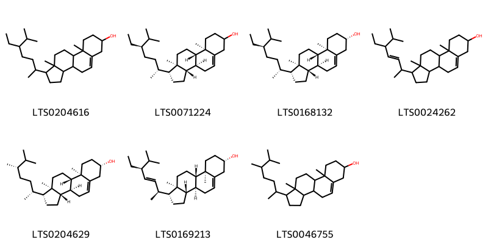

!!! abstract "Tóm tắt"

    Cơm cháy (Lá) có tên khoa học là Folium Sambuci javanicae, thuộc loài Sambucus javanica Blume, họ Sambucaceae. Cây mọc hoang và được trồng ở hầu khắp đất nước ta. Theo y học cổ truyền, lá cây cơm cháy có tác dụng lợi tiểu, tiêu ung, tiêu thũng, nhuận tràng, chi thống. Các thầy thuốc thường dùng lá cây cơm cháy để chữa viêm thận, phù thũng, sang chấn đụng dập, gãy xương, ngã tổn thương, nhuận tràng, lở ngứa, eczema. Các nhà nghiên cứu đã phát hiện ra thành phần hoá học trong lá cơm cháy có chứa nhóm: Flavonoid, glycosid, anthracton glycosid, saponin, triterpenoid, tanin, alkaloid với tác dụng dược lý được chứng minh có khả năng chống viêm tốt, kháng khuẩn- virus, kích thích miễn dịch và nhuận tràng.

## Thông tin về thực vật

Dược liệu **Cơm Cháy (Lá)** từ bộ phận **** từ loài *Sambucus javanica*.

**Mô tả thực vật:** Loài cây này có thể sống đến nhiều năm và có chiều cao lên tới 3m. Thân cây tròn gần như xốp, màu lục nhạt và mịn. Cành cây lớn trong và rỗng, có tủy trắng xốp và nhiều lỗ bên ngoài. Lá cây mềm, mọc đối và có các lá chét kép lông chim lẻ, bao gồm từ 3 đến 9 lá chét, có kích thước dài 8-15cm, rộng 3-5cm, với các mặt lá có khía răng. Cuống lá có rãnh phía trên và loe rộng ở phía gốc, trở thành bẹ. Cây có hoa nhỏ màu trắng, mọc thành xim, giống như tán kép. Quả mọng của cây có hình cầu, màu đỏ hoặc đen sau khi chín, và chứa 3 hạt dẹt.

*Tài liệu tham khảo:* "Từ điển cây thuốc Việt Nam" - Võ Văn Chi 
Trong dược điển Việt nam, một loài được sử dụng làm dược liệu là *Sambucus javanica*.

!!! info "Phân loại thực vật của *Sambucus javanica*"
    - **Kingdom:** Plantae
    - **Phylum:** Tracheophyta
    - **Order:** Dipsacales
    - **Family:** Viburnaceae
    - **Genus:** Sambucus
    - **Species:** *Sambucus javanica*

**Phân bố trên thế giới:** Chinese Taipei, China

**Phân bố tại Việt nam:** Không có ghi nhận ở Việt Nam

## Thông tin về dược liệu 

### Định danh

!!! info "Thông tin về tên gọi"

    - Dược liệu tiếng Việt: cơm cháy
    - Dược liệu tiếng Trung:  ()
    - Dược liệu tiếng Anh: 
    - Dược liệu latin thông dụng: Folium Sambuci javanicae
    - Dược liệu latin kiểu DĐVN: *folium sambuci javanicae*
    - Dược liệu latin kiểu DĐVN: **
    - Dược liệu latin kiểu thông tư: **
    - Bộ phận dùng:  (Folium)

### Mô tả dược liệu 

- **Theo dược điển Việt nam V:** Lá khô nhăn nheo, có mùi đặc biệt, dài 9 cm đến 10 cm, rộng 3 cm đến 4 cm, hình trứng nhọn, mép lá xẻ răng cưa, mặt trên màu lục sẫm, mặt dưới màu lục nhạt. Gân lá hình lông chim, có 9 đến 12 đôi gân phụ, nổi rõ ở mặt dưới.

- **Mô tả dược liệu theo thông tư chế biến dược liệu theo phương pháp cổ truyền:** 

### Chế biến 

- **Chế biến theo dược điển việt nam V**: Thu hái lá vào khoảng tháng 5 đến 6, lúc cây chưa ra hoa, phơi hoặc sấy nhẹ đến khô. Bào chế Loại bỏ tạp chất, rửa sạch, cắt đoạn, phơi hay sấy khô.

- **Chế biến theo thông tư:** 

--- 

## Thành phần hóa học

- Theo tài liệu của GS. Đỗ Tất Lợi:  1. Flavonoid, glycosid, anthracton glycosid saponin, triterpenoid và tanin, alkaloid
    

**Thành phần hóa học từ loài **Sambucus javanica**

Theo cơ sở dữ liệu lotus, loài *Sambucus javanica* đã phân lập và xác định được **14** hoạt chất thuộc về các nhóm Steroids and steroid derivatives, Prenol lipids trong bảng dưới đây. Danh sách các hoạt chất như sau 22,23-dihydrobrassicasterol [(LTS0204629)](https://lotus.naturalproducts.net/compound/lotus_id/LTS0204629), 10-hydroxy-1,2,6a,6b,9,9,12a-heptamethyl-2,3,4,5,6,7,8,8a,10,11,12,12b,13,14b-tetradecahydro-1h-picene-4a-carboxylic acid [(LTS0166564)](https://lotus.naturalproducts.net/compound/lotus_id/LTS0166564), stigmast-5-en-3-ol, (3β)- [(LTS0204616)](https://lotus.naturalproducts.net/compound/lotus_id/LTS0204616), 4,4,6a,6b,8a,11,12,14b-octamethyl-2,3,4a,5,6,7,8,9,10,11,12,12a,14,14a-tetradecahydro-1h-picen-3-yl hexadecanoate [(LTS0181514)](https://lotus.naturalproducts.net/compound/lotus_id/LTS0181514), amyrin [(LTS0222826)](https://lotus.naturalproducts.net/compound/lotus_id/LTS0222826), ursolic acid [(LTS0250838)](https://lotus.naturalproducts.net/compound/lotus_id/LTS0250838), sitosterol [(LTS0168132)](https://lotus.naturalproducts.net/compound/lotus_id/LTS0168132), β-amyrin [(LTS0251864)](https://lotus.naturalproducts.net/compound/lotus_id/LTS0251864), stigmasterol [(LTS0024262)](https://lotus.naturalproducts.net/compound/lotus_id/LTS0024262), (3s,4ar,6ar,6bs,8ar,11r,12s,12ar,14ar,14br)-4,4,6a,6b,8a,11,12,14b-octamethyl-2,3,4a,5,6,7,8,9,10,11,12,12a,14,14a-tetradecahydro-1h-picen-3-yl hexadecanoate [(LTS0013204)](https://lotus.naturalproducts.net/compound/lotus_id/LTS0013204), campesterol [(LTS0046755)](https://lotus.naturalproducts.net/compound/lotus_id/LTS0046755), oleanolic acid [(LTS0117717)](https://lotus.naturalproducts.net/compound/lotus_id/LTS0117717), (1r,3as,3bs,7s,9ar,9bs,11ar)-1-[(2s,3e,5s)-5-ethyl-6-methylhept-3-en-2-yl]-9a,11a-dimethyl-1h,2h,3h,3ah,3bh,4h,6h,7h,8h,9h,9bh,10h,11h-cyclopenta[a]phenanthren-7-ol [(LTS0169213)](https://lotus.naturalproducts.net/compound/lotus_id/LTS0169213), stigmast-5-en-3-ol [(LTS0071224)](https://lotus.naturalproducts.net/compound/lotus_id/LTS0071224). 
        
| chemicalTaxonomyClassyfireClass   |   smiles_count |
|:----------------------------------|---------------:|
| Prenol lipids                     |            639 |
| Steroids and steroid derivatives  |            492 |

            
### Nhóm Prenol lipids
<figure markdown="span">
    { width=100% }
<figcaption>Hình ảnh cấu trúc hóa học của hoạt chất thuộc nhóm *Prenol lipids*. Tên thường gọi của các hoạt chất tương ứng là β-amyrin [(LTS0251864)](https://lotus.naturalproducts.net/compound/lotus_id/LTS0251864), amyrin [(LTS0222826)](https://lotus.naturalproducts.net/compound/lotus_id/LTS0222826), ursolic acid [(LTS0250838)](https://lotus.naturalproducts.net/compound/lotus_id/LTS0250838), oleanolic acid [(LTS0117717)](https://lotus.naturalproducts.net/compound/lotus_id/LTS0117717), 10-hydroxy-1,2,6a,6b,9,9,12a-heptamethyl-2,3,4,5,6,7,8,8a,10,11,12,12b,13,14b-tetradecahydro-1h-picene-4a-carboxylic acid [(LTS0166564)](https://lotus.naturalproducts.net/compound/lotus_id/LTS0166564), 4,4,6a,6b,8a,11,12,14b-octamethyl-2,3,4a,5,6,7,8,9,10,11,12,12a,14,14a-tetradecahydro-1h-picen-3-yl hexadecanoate [(LTS0181514)](https://lotus.naturalproducts.net/compound/lotus_id/LTS0181514), (3s,4ar,6ar,6bs,8ar,11r,12s,12ar,14ar,14br)-4,4,6a,6b,8a,11,12,14b-octamethyl-2,3,4a,5,6,7,8,9,10,11,12,12a,14,14a-tetradecahydro-1h-picen-3-yl hexadecanoate [(LTS0013204)](https://lotus.naturalproducts.net/compound/lotus_id/LTS0013204).</figcaption>
</figure>

            
            
### Nhóm Prenol lipids
<figure markdown="span">
    { width=100% }
<figcaption>Hình ảnh cấu trúc hóa học của hoạt chất thuộc nhóm *Prenol lipids*. Tên thường gọi của các hoạt chất tương ứng là β-amyrin [(LTS0251864)](https://lotus.naturalproducts.net/compound/lotus_id/LTS0251864), amyrin [(LTS0222826)](https://lotus.naturalproducts.net/compound/lotus_id/LTS0222826), ursolic acid [(LTS0250838)](https://lotus.naturalproducts.net/compound/lotus_id/LTS0250838), oleanolic acid [(LTS0117717)](https://lotus.naturalproducts.net/compound/lotus_id/LTS0117717), 10-hydroxy-1,2,6a,6b,9,9,12a-heptamethyl-2,3,4,5,6,7,8,8a,10,11,12,12b,13,14b-tetradecahydro-1h-picene-4a-carboxylic acid [(LTS0166564)](https://lotus.naturalproducts.net/compound/lotus_id/LTS0166564), 4,4,6a,6b,8a,11,12,14b-octamethyl-2,3,4a,5,6,7,8,9,10,11,12,12a,14,14a-tetradecahydro-1h-picen-3-yl hexadecanoate [(LTS0181514)](https://lotus.naturalproducts.net/compound/lotus_id/LTS0181514), (3s,4ar,6ar,6bs,8ar,11r,12s,12ar,14ar,14br)-4,4,6a,6b,8a,11,12,14b-octamethyl-2,3,4a,5,6,7,8,9,10,11,12,12a,14,14a-tetradecahydro-1h-picen-3-yl hexadecanoate [(LTS0013204)](https://lotus.naturalproducts.net/compound/lotus_id/LTS0013204).</figcaption>
</figure>

### Nhóm Steroids and steroid derivatives
<figure markdown="span">
    { width=100% }
<figcaption>Hình ảnh cấu trúc hóa học của hoạt chất thuộc nhóm *Steroids and steroid derivatives*. Tên thường gọi của các hoạt chất tương ứng là stigmast-5-en-3-ol, (3β)- [(LTS0204616)](https://lotus.naturalproducts.net/compound/lotus_id/LTS0204616), stigmast-5-en-3-ol [(LTS0071224)](https://lotus.naturalproducts.net/compound/lotus_id/LTS0071224), sitosterol [(LTS0168132)](https://lotus.naturalproducts.net/compound/lotus_id/LTS0168132), stigmasterol [(LTS0024262)](https://lotus.naturalproducts.net/compound/lotus_id/LTS0024262), 22,23-dihydrobrassicasterol [(LTS0204629)](https://lotus.naturalproducts.net/compound/lotus_id/LTS0204629), (1r,3as,3bs,7s,9ar,9bs,11ar)-1-[(2s,3e,5s)-5-ethyl-6-methylhept-3-en-2-yl]-9a,11a-dimethyl-1h,2h,3h,3ah,3bh,4h,6h,7h,8h,9h,9bh,10h,11h-cyclopenta[a]phenanthren-7-ol [(LTS0169213)](https://lotus.naturalproducts.net/compound/lotus_id/LTS0169213), campesterol [(LTS0046755)](https://lotus.naturalproducts.net/compound/lotus_id/LTS0046755).</figcaption>
</figure>

            

---

## Tác dụng dược lý

Theo tài liệu "Từ điển cây thuốc Việt Nam" - Võ Văn Chi:có khả năng chống viêm tốt, kháng khuẩn- virus, kích thích miễn dịch và nhuận tràng.

Theo tài liệu quốc tế: 

---

## Dược điển Việt Nam V

### Soi bột:

Bột lá màu xanh xám, mùi đặc biệt, không vị. Lông che chở đơn bào có đầu tù, bề mặt nhẵn. Mảnh mô mềm phiến lá gồm những tế bào thành mỏng, mang lỗ khí và mạch xoắn. Mảnh mạch xoắn. Lỗ khí có 3 tế bào đến 4 tế bào phụ.

<!-- Hình ảnh soi bột sẽ được tự động chèn vào đây sau -->

### Vi phẫu:

Gân lá: Gân lá lồi lên ở cả mặt trên và mặt dưới. Biểu bì trên gồm một hàng tế bào kích thước tương đối đều nhau, xếp đều đặn, mang lông che chở đơn bào. Mô dày gồm các tế bào có thành dày ở góc, xếp đều đặn ở dưới lớp biểu bì. Mô mềm gồm những tế bào thành mỏng, hình đa giác, kích thước không đều, xếp sít nhau. Giữa gân lá có ba đám libe- gỗ xếp thành hình vòng cung. Đám ở giữa lớn hơn đám ở hai bên. Libe gồm nhiều lớp tế bào nhỏ xếp thành cung ôm lấy gỗ. Biểu bì dưới gồm một hàng tế bào xếp đều đặn, ít hoặc không mang lông che chở. Phiến lá: Biểu bì trên gồm một hàng tế bào kích thước tương đối đều nhau, xếp đều đặn, mang lông che chở đơn bào. Mô giậu gồm hai hàng tế bào hình chữ nhật xếp vuông góc với biểu bì trên. Biểu bì dưới gồm một hàng tế bào xếp đều đặn, ít hoặc không mang lông che chở. nn

<!-- Hình ảnh vi phẫu sẽ được tự động chèn vào đây sau -->

### Định tính

Lấy 3 g bột dược liệu, loại chất màu bằng cách đun hồi lưu trên cách thủy ở nhiệt độ 80 °C với ether dầu hỏa (30 °C đến 60 °C) (TT) 2 lần, mỗi lần 30 ml. Lấy bà ra để bay hơi hết ether dầu hỏa. Cho bã vào bình nón, thêm 10 ml ethanol 90 % (TT), đun cách thủy 15 min, lọc nóng. Lấy dịch chiết làm các phản ứng: Nhỏ 1 giọt dịch chiết lên tờ giấy lọc, để khô rồi hơ lên miệng lọ có chứa amoniac (TT), màu vàng sẽ tăng lên. Cho 2 ml dịch chiết vào ống nghiệm, thêm một ít bột magnesi (TT) và 3 giọt đến 4 giọt acid hydrocloric (TT) rồi đun trong cách thủy khoảng 1 min, dung dịch xuất hiện màu hồng.

### Định lượng

### Thông tin khác 

- ** Độ ẩm: ** Không quá 13,0 % (Phụ lục 9.6. 1 g, 85 °c, 4 h).
- ** Bảo quản:** Để nơi khô ráo, thường xuyên phơi lại, tránh mốc. nn

## Dược điển Hồng kong

<!-- PDF sẽ được tự động chèn vào đây sau -->

---

## Y dược học cổ truyền

- **Tên vị thuốc:** 
- **Tính vị quy kinh:** Khổ, ôn, tiêu độc. Vào các kinh thận, bàng quang, đại tràng
- **Công năng chủ trị:** Lợi tiểu, tiêu ung, tiêu thũng, nhuận tràng, chi thống. Chủ trị:viêm thận, phù thũng, sang chấn đụng dập, gãy xương, ngã tổn thương, nhuận tràng, lở ngứa, eczema
- **Chú ý:** 
- **Kiêng kỵ:** Không dùng liều cao kéo dài và khi người hư nhược. Không dùng cho phụ nữ có thai và cho con bú.nn

## Bình luận

