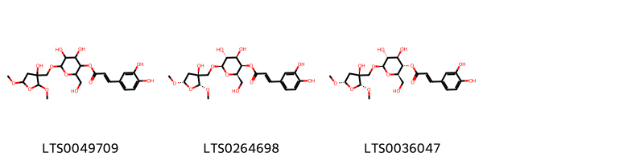
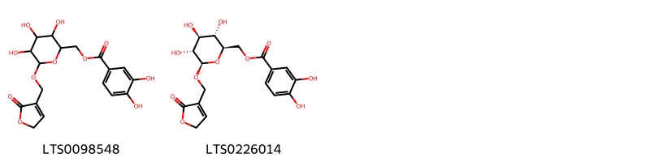

!!! abstract "Tóm tắt"

    Cẩu Tích (Rhizoma Cibotii Culi) là phần thân rễ đã loại bỏ lông và phơi hay sấy khô của cây Cẩu tích [Cibotium barometz (L.) J. Sm.], họ Cẩu tích (Dicksoniaceae). Trên thế giới, cây phân bố chủ yếu ở các nước nhiệt đới châu Á. Tại Việt Nam, cây có ở Lai Châu, Lào Cai, Hà Giang, Quảng Ninh qua Nghệ An, Hà Tĩnh, đến Bà Rịa - Vũng Tàu. Trong y học cổ truyền, Cẩu tích được xem là vị thuốc có tính ấm, vị đắng ngọt, quy vào kinh can, thận, giúp bổ can thận, mạnh gân xương, trừ phong thấp. Lông Cẩu tích có khả năng cầm máu. Cây thường được dùng để trị các chứng đau lưng, nhức mỏi tay chân, thấp tê, đau dây thần kinh tọa, tiểu són, di tinh, bạch đới, và giảm viêm hiệu quả. Cẩu tích chứa nhiều thành phần hóa học đa dạng như dầu dễ bay hơi, pterosin, hợp chất phenolic tan trong nước, flavonoid, axit amin, và các nguyên tố vi lượng. Cẩu tích có các tác dụng dược lý quan trọng, bao gồm chống loãng xương, bảo vệ gan, chống oxy hóa và chống viêm.

## Thông tin về thực vật

Dược liệu **Cẩu Tích (Thân Rễ)** từ bộ phận **Thân rễ** từ loài *Cibotium barometz*.

**Mô tả thực vật:** Cây lớn đạt chiều cao 1–3 m có thân đồ sộ, phủ phục đến dựng đứng, ngọn non và gốc phủ đầy lông dài, cứng, màu nâu vàng, dài. Các lá mọc thành chùm ở đỉnh của thân cây, dài 1–2m, lưỡng tính kép, hình trứng đến hình elip ở đường viền, kích thước lên đến 2 × 1m, mặt dưới màu xám nhạt, mặt trên màu xanh đậm hơn, có cuống dày, dài tới 1m hoặc hơn, hình tam giác ở mặt cắt ngang ở gốc, mang dày đặc các lông tơ hình quả trám, cuống và trục lá màu xanh lục, bên dưới chuyển sang màu tía theo tuổi; gốc cuống có một khối lông dài (1–1,5cm), phần trên của cuống và trục lá được bao phủ bởi những sợi lông mềm nhỏ, ép chặt trở nên sáng bóng; loa tai nhiều, xen kẽ, hình lông chim, có viền thuôn dài đến hình mũi mác, đỉnh nhọn; lá chét nhiều, thường có một vài cặp lá chét cấp ba ở gốc, có lông chim sâu trong suốt, có cuống rất ngắn hoặc không cuống ở phần xa của loa tai, các đoạn lá chét hình răng cưa nhẹ, có chóp nhọn, mép khía thành răng cưa. 
Mặt dưới lá có các ổ túi bào tử - cách tái sinh của cây. Ổ túi bào tử 1 hay 2, có khi 3 hoặc 4 ở về mỗi bên của gân giữa bậc 3, có màu nâu, hai môi không đều nhau; cái ở ngoài hình cầu, cái ở trong hẹp hơn và thuôn.
Do thân rể vị thuốc (cả lông) khi chưa thái trông giống lưng con chó nên được tên Cẩu tích (cẩu là chó, tích là xương sống hay sống lưng).

*Tài liệu tham khảo:* "Từ điển cây thuốc Việt Nam" - Võ Văn Chi 
Trong dược điển Việt nam, một loài được sử dụng làm dược liệu là *Cibotium barometz*.

!!! info "Phân loại thực vật của *Cibotium barometz*"
    - **Kingdom:** Plantae
    - **Phylum:** Tracheophyta
    - **Order:** Cyatheales
    - **Family:** Cibotiaceae
    - **Genus:** Cibotium
    - **Species:** *Cibotium barometz*

**Phân bố trên thế giới:** Thailand, nan, Brunei Darussalam, Chinese Taipei, China, Hong Kong, Cambodia, Malaysia, Japan, Viet Nam

**Phân bố tại Việt nam:** Quang Tri, Lam Dong (林同省)

## Thông tin về dược liệu 

### Định danh

!!! info "Thông tin về tên gọi"

    - Dược liệu tiếng Việt: cẩu tích
    - Dược liệu tiếng Trung:  ()
    - Dược liệu tiếng Anh: 
    - Dược liệu latin thông dụng: Rhizoma Cibotii CulinCibotii Rhizoma
    - Dược liệu latin kiểu DĐVN: *rhizoma cibotii culi*
    - Dược liệu latin kiểu DĐVN: *Cibotii Rhizoma*
    - Dược liệu latin kiểu thông tư: **
    - Bộ phận dùng: Thân rễ (Rhizoma)

### Mô tả dược liệu 

- **Theo dược điển Việt nam V:** Đoạn thân rễ đã loại bỏ lớp lông màu vàng nâu bên ngoài, mặt ngoài rất gồ ghề, khúc khuỷu, có những chỗ lồi lên thành mấu, màu nâu hoặc nâu hơi đỏ, đường kính 2 cm đến 5 cm, dài 4 cm đến 10 cm, rất cứng, khó cắt, khó bẻ gãy; đôi khi còn sót lại ít lông màu vàng nâu. Dược liệu khi dùng thường đã thái thành phiến mỏng hình dạng thay đổi, mặt cắt ngang nhẵn, màu nâu hồng hay nâu nhạt, có vân.

- **Mô tả dược liệu theo thông tư chế biến dược liệu theo phương pháp cổ truyền:** 

### Chế biến 

- **Chế biến theo dược điển việt nam V**: Thu hái vào mùa thu hoặc mùa đông. Thân rễ tươi được làm sạch lông bên ngoài, cắt thành đoạn dài 4 cm đến 10 cm hay thái phiến, phơi hoặc sấy đến khô.

- **Chế biến theo thông tư:** 

--- 

## Thành phần hóa học

- Theo tài liệu của GS. Đỗ Tất Lợi:  (1) Nhóm hóa học:
- Acid hữu cơ: Pterosin R, pterosin Z, ptaquiloside, axit palmitic, axit linoleic,...
- Tinh dầu: axit oleic, axit linoleic, axit palmitic, axit pentadecanoic, 7,10,13-hexadecatrienoic axit metyl este, linolenic axit metyl este.
- Hợp chất Phenolic: axit protocatechuic, axit caffeic,...
- Sesquiterpen
- Carbohydrat: 1- O -caffeyl- d -glucopyranose; 6- O -caffeyl- d -glucopyranose; 3- O -caffeyl- d -glucopyranose,...
- Flavonoid: kaempferol và onychin.
- Các nguyên tố vi lượng: Fe, Ca, Zn, Mg, Ni, Mn, Cu.
- Các hợp chất khác: dẫn xuất furan, glycoglycerolipid, tanin.
(2)Theo Dược điển Đài Loan 2022, Biomaker là hoạt chất: protocatechuic aldehyde và protocatechuic acid
    

**Thành phần hóa học từ loài **Cibotium barometz**

Theo cơ sở dữ liệu lotus, loài *Cibotium barometz* đã phân lập và xác định được **19** hoạt chất thuộc về các nhóm Organooxygen compounds, Fatty Acyls, Glycerophospholipids, Indanes, Cinnamic acids and derivatives, Sphingolipids, Glycerolipids trong bảng dưới đây. Danh sách các hoạt chất như sau {3,4,5-trihydroxy-6-[(2-oxo-5h-furan-3-yl)methoxy]oxan-2-yl}methyl 3,4-dihydroxybenzoate [(LTS0098548)](https://lotus.naturalproducts.net/compound/lotus_id/LTS0098548), 2-hydroxy-3-{[3,4,5-trihydroxy-6-(hydroxymethyl)oxan-2-yl]oxy}propyl hexadecanoate [(LTS0194543)](https://lotus.naturalproducts.net/compound/lotus_id/LTS0194543), [(2r,3s,4s,5r,6r)-3,4,5-trihydroxy-6-[(2-oxo-5h-furan-3-yl)methoxy]oxan-2-yl]methyl 3,4-dihydroxybenzoate [(LTS0226014)](https://lotus.naturalproducts.net/compound/lotus_id/LTS0226014), (2s)-2-hydroxy-3-{[(2r,3r,4s,5r,6r)-3,4,5-trihydroxy-6-(hydroxymethyl)oxan-2-yl]oxy}propyl (9z,12z)-octadeca-9,12-dienoate [(LTS0248778)](https://lotus.naturalproducts.net/compound/lotus_id/LTS0248778), 4,5-dihydroxy-6-[(3-hydroxy-2,5-dimethoxyoxolan-3-yl)methoxy]-2-(hydroxymethyl)oxan-3-yl 3-(3,4-dihydroxyphenyl)prop-2-enoate [(LTS0049709)](https://lotus.naturalproducts.net/compound/lotus_id/LTS0049709), (2s)-2-hydroxy-3-{[(2r,3r,4s,5r,6r)-3,4,5-trihydroxy-6-(hydroxymethyl)oxan-2-yl]oxy}propyl hexadecanoate [(LTS0076770)](https://lotus.naturalproducts.net/compound/lotus_id/LTS0076770), (2r,3r,4r,5r,6r)-4,5-dihydroxy-6-{[(2r,3s,5s)-3-hydroxy-2,5-dimethoxyoxolan-3-yl]methoxy}-2-(hydroxymethyl)oxan-3-yl (2e)-3-(3,4-dihydroxyphenyl)prop-2-enoate [(LTS0264698)](https://lotus.naturalproducts.net/compound/lotus_id/LTS0264698), (4s)-4-hydroxy-3,5,5-trimethyl-4-[(1e,3s)-3-{[(2r,3r,4s,5s,6r)-3,4,5-trihydroxy-6-(hydroxymethyl)oxan-2-yl]oxy}but-1-en-1-yl]cyclohex-2-en-1-one [(LTS0020614)](https://lotus.naturalproducts.net/compound/lotus_id/LTS0020614), 2-hydroxy-n-[(4e,8z)-3-hydroxy-1-{[(2r,3r,4s,5s,6r)-3,4,5-trihydroxy-6-(hydroxymethyl)oxan-2-yl]oxy}octadeca-4,8-dien-2-yl]hexadecanimidic acid [(LTS0221646)](https://lotus.naturalproducts.net/compound/lotus_id/LTS0221646), [(2s,3s,4s,5r,6s)-3,4,5-trihydroxy-6-[(2s)-2-hydroxy-3-[(2z,9z)-octadeca-2,9-dienoyloxy]propoxy]oxan-2-yl]methanesulfonic acid [(LTS0084987)](https://lotus.naturalproducts.net/compound/lotus_id/LTS0084987), (2s)-2-hydroxy-n-[(2r,3s,4e,8z)-3-hydroxy-1-{[(2r,3r,4s,5s,6r)-3,4,5-trihydroxy-6-(hydroxymethyl)oxan-2-yl]oxy}octadeca-4,8-dien-2-yl]octadecanimidic acid [(LTS0070301)](https://lotus.naturalproducts.net/compound/lotus_id/LTS0070301), 4-hydroxy-3,5,5-trimethyl-4-(3-{[3,4,5-trihydroxy-6-(hydroxymethyl)oxan-2-yl]oxy}but-1-en-1-yl)cyclohex-2-en-1-one [(LTS0170985)](https://lotus.naturalproducts.net/compound/lotus_id/LTS0170985), (2r,3s,4r,5r,6r)-4,5-dihydroxy-6-{[(2r,3s,5s)-3-hydroxy-2,5-dimethoxyoxolan-3-yl]methoxy}-2-(hydroxymethyl)oxan-3-yl (2e)-3-(3,4-dihydroxyphenyl)prop-2-enoate [(LTS0036047)](https://lotus.naturalproducts.net/compound/lotus_id/LTS0036047), (4r)-4-hydroxy-3,5,5-trimethyl-4-[(1e,3r)-3-{[(2s,3s,4r,5r,6s)-3,4,5-trihydroxy-6-(hydroxymethyl)oxan-2-yl]oxy}but-1-en-1-yl]cyclohex-2-en-1-one [(LTS0039936)](https://lotus.naturalproducts.net/compound/lotus_id/LTS0039936), 2-hydroxy-n-(3-hydroxy-1-{[3,4,5-trihydroxy-6-(hydroxymethyl)oxan-2-yl]oxy}octadeca-4,8-dien-2-yl)octadecanimidic acid [(LTS0212997)](https://lotus.naturalproducts.net/compound/lotus_id/LTS0212997), 2-hydroxy-3-{[3,4,5-trihydroxy-6-(hydroxymethyl)oxan-2-yl]oxy}propyl octadeca-9,12-dienoate [(LTS0041965)](https://lotus.naturalproducts.net/compound/lotus_id/LTS0041965), (2r)-2-hydroxy-n-[(3r,4e,8z)-3-hydroxy-1-{[(2s,3r,4s,5s,6r)-3,4,5-trihydroxy-6-(hydroxymethyl)oxan-2-yl]oxy}octadeca-4,8-dien-2-yl]hexadecanimidic acid [(LTS0266056)](https://lotus.naturalproducts.net/compound/lotus_id/LTS0266056), popc [(LTS0188202)](https://lotus.naturalproducts.net/compound/lotus_id/LTS0188202), 4-hydroxy-6-(2-hydroxyethyl)-2,2,5,7-tetramethyl-3h-inden-1-one [(LTS0206833)](https://lotus.naturalproducts.net/compound/lotus_id/LTS0206833). 
        
| chemicalTaxonomyClassyfireClass   |   smiles_count |
|:----------------------------------|---------------:|
| Cinnamic acids and derivatives    |            254 |
| Fatty Acyls                       |            215 |
| Glycerolipids                     |            342 |
| Glycerophospholipids              |             82 |
| Indanes                           |             35 |
| Organooxygen compounds            |            122 |
| Sphingolipids                     |            380 |

            
### Nhóm Cinnamic acids and derivatives
<figure markdown="span">
    { width=100% }
<figcaption>Hình ảnh cấu trúc hóa học của hoạt chất thuộc nhóm *Cinnamic acids and derivatives*. Tên thường gọi của các hoạt chất tương ứng là 4,5-dihydroxy-6-[(3-hydroxy-2,5-dimethoxyoxolan-3-yl)methoxy]-2-(hydroxymethyl)oxan-3-yl 3-(3,4-dihydroxyphenyl)prop-2-enoate [(LTS0049709)](https://lotus.naturalproducts.net/compound/lotus_id/LTS0049709), (2r,3r,4r,5r,6r)-4,5-dihydroxy-6-{[(2r,3s,5s)-3-hydroxy-2,5-dimethoxyoxolan-3-yl]methoxy}-2-(hydroxymethyl)oxan-3-yl (2e)-3-(3,4-dihydroxyphenyl)prop-2-enoate [(LTS0264698)](https://lotus.naturalproducts.net/compound/lotus_id/LTS0264698), (2r,3s,4r,5r,6r)-4,5-dihydroxy-6-{[(2r,3s,5s)-3-hydroxy-2,5-dimethoxyoxolan-3-yl]methoxy}-2-(hydroxymethyl)oxan-3-yl (2e)-3-(3,4-dihydroxyphenyl)prop-2-enoate [(LTS0036047)](https://lotus.naturalproducts.net/compound/lotus_id/LTS0036047).</figcaption>
</figure>

            
            
### Nhóm Cinnamic acids and derivatives
<figure markdown="span">
    { width=100% }
<figcaption>Hình ảnh cấu trúc hóa học của hoạt chất thuộc nhóm *Cinnamic acids and derivatives*. Tên thường gọi của các hoạt chất tương ứng là 4,5-dihydroxy-6-[(3-hydroxy-2,5-dimethoxyoxolan-3-yl)methoxy]-2-(hydroxymethyl)oxan-3-yl 3-(3,4-dihydroxyphenyl)prop-2-enoate [(LTS0049709)](https://lotus.naturalproducts.net/compound/lotus_id/LTS0049709), (2r,3r,4r,5r,6r)-4,5-dihydroxy-6-{[(2r,3s,5s)-3-hydroxy-2,5-dimethoxyoxolan-3-yl]methoxy}-2-(hydroxymethyl)oxan-3-yl (2e)-3-(3,4-dihydroxyphenyl)prop-2-enoate [(LTS0264698)](https://lotus.naturalproducts.net/compound/lotus_id/LTS0264698), (2r,3s,4r,5r,6r)-4,5-dihydroxy-6-{[(2r,3s,5s)-3-hydroxy-2,5-dimethoxyoxolan-3-yl]methoxy}-2-(hydroxymethyl)oxan-3-yl (2e)-3-(3,4-dihydroxyphenyl)prop-2-enoate [(LTS0036047)](https://lotus.naturalproducts.net/compound/lotus_id/LTS0036047).</figcaption>
</figure>

### Nhóm Fatty Acyls
<figure markdown="span">
    { width=100% }
<figcaption>Hình ảnh cấu trúc hóa học của hoạt chất thuộc nhóm *Fatty Acyls*. Tên thường gọi của các hoạt chất tương ứng là (4s)-4-hydroxy-3,5,5-trimethyl-4-[(1e,3s)-3-{[(2r,3r,4s,5s,6r)-3,4,5-trihydroxy-6-(hydroxymethyl)oxan-2-yl]oxy}but-1-en-1-yl]cyclohex-2-en-1-one [(LTS0020614)](https://lotus.naturalproducts.net/compound/lotus_id/LTS0020614), 4-hydroxy-3,5,5-trimethyl-4-(3-{[3,4,5-trihydroxy-6-(hydroxymethyl)oxan-2-yl]oxy}but-1-en-1-yl)cyclohex-2-en-1-one [(LTS0170985)](https://lotus.naturalproducts.net/compound/lotus_id/LTS0170985), (4r)-4-hydroxy-3,5,5-trimethyl-4-[(1e,3r)-3-{[(2s,3s,4r,5r,6s)-3,4,5-trihydroxy-6-(hydroxymethyl)oxan-2-yl]oxy}but-1-en-1-yl]cyclohex-2-en-1-one [(LTS0039936)](https://lotus.naturalproducts.net/compound/lotus_id/LTS0039936).</figcaption>
</figure>

            
            
### Nhóm Cinnamic acids and derivatives
<figure markdown="span">
    { width=100% }
<figcaption>Hình ảnh cấu trúc hóa học của hoạt chất thuộc nhóm *Cinnamic acids and derivatives*. Tên thường gọi của các hoạt chất tương ứng là 4,5-dihydroxy-6-[(3-hydroxy-2,5-dimethoxyoxolan-3-yl)methoxy]-2-(hydroxymethyl)oxan-3-yl 3-(3,4-dihydroxyphenyl)prop-2-enoate [(LTS0049709)](https://lotus.naturalproducts.net/compound/lotus_id/LTS0049709), (2r,3r,4r,5r,6r)-4,5-dihydroxy-6-{[(2r,3s,5s)-3-hydroxy-2,5-dimethoxyoxolan-3-yl]methoxy}-2-(hydroxymethyl)oxan-3-yl (2e)-3-(3,4-dihydroxyphenyl)prop-2-enoate [(LTS0264698)](https://lotus.naturalproducts.net/compound/lotus_id/LTS0264698), (2r,3s,4r,5r,6r)-4,5-dihydroxy-6-{[(2r,3s,5s)-3-hydroxy-2,5-dimethoxyoxolan-3-yl]methoxy}-2-(hydroxymethyl)oxan-3-yl (2e)-3-(3,4-dihydroxyphenyl)prop-2-enoate [(LTS0036047)](https://lotus.naturalproducts.net/compound/lotus_id/LTS0036047).</figcaption>
</figure>

### Nhóm Fatty Acyls
<figure markdown="span">
    { width=100% }
<figcaption>Hình ảnh cấu trúc hóa học của hoạt chất thuộc nhóm *Fatty Acyls*. Tên thường gọi của các hoạt chất tương ứng là (4s)-4-hydroxy-3,5,5-trimethyl-4-[(1e,3s)-3-{[(2r,3r,4s,5s,6r)-3,4,5-trihydroxy-6-(hydroxymethyl)oxan-2-yl]oxy}but-1-en-1-yl]cyclohex-2-en-1-one [(LTS0020614)](https://lotus.naturalproducts.net/compound/lotus_id/LTS0020614), 4-hydroxy-3,5,5-trimethyl-4-(3-{[3,4,5-trihydroxy-6-(hydroxymethyl)oxan-2-yl]oxy}but-1-en-1-yl)cyclohex-2-en-1-one [(LTS0170985)](https://lotus.naturalproducts.net/compound/lotus_id/LTS0170985), (4r)-4-hydroxy-3,5,5-trimethyl-4-[(1e,3r)-3-{[(2s,3s,4r,5r,6s)-3,4,5-trihydroxy-6-(hydroxymethyl)oxan-2-yl]oxy}but-1-en-1-yl]cyclohex-2-en-1-one [(LTS0039936)](https://lotus.naturalproducts.net/compound/lotus_id/LTS0039936).</figcaption>
</figure>

### Nhóm Glycerolipids
<figure markdown="span">
    { width=100% }
<figcaption>Hình ảnh cấu trúc hóa học của hoạt chất thuộc nhóm *Glycerolipids*. Tên thường gọi của các hoạt chất tương ứng là (2s)-2-hydroxy-3-{[(2r,3r,4s,5r,6r)-3,4,5-trihydroxy-6-(hydroxymethyl)oxan-2-yl]oxy}propyl hexadecanoate [(LTS0076770)](https://lotus.naturalproducts.net/compound/lotus_id/LTS0076770), [(2s,3s,4s,5r,6s)-3,4,5-trihydroxy-6-[(2s)-2-hydroxy-3-[(2z,9z)-octadeca-2,9-dienoyloxy]propoxy]oxan-2-yl]methanesulfonic acid [(LTS0084987)](https://lotus.naturalproducts.net/compound/lotus_id/LTS0084987), 2-hydroxy-3-{[3,4,5-trihydroxy-6-(hydroxymethyl)oxan-2-yl]oxy}propyl octadeca-9,12-dienoate [(LTS0041965)](https://lotus.naturalproducts.net/compound/lotus_id/LTS0041965), 2-hydroxy-3-{[3,4,5-trihydroxy-6-(hydroxymethyl)oxan-2-yl]oxy}propyl hexadecanoate [(LTS0194543)](https://lotus.naturalproducts.net/compound/lotus_id/LTS0194543), (2s)-2-hydroxy-3-{[(2r,3r,4s,5r,6r)-3,4,5-trihydroxy-6-(hydroxymethyl)oxan-2-yl]oxy}propyl (9z,12z)-octadeca-9,12-dienoate [(LTS0248778)](https://lotus.naturalproducts.net/compound/lotus_id/LTS0248778).</figcaption>
</figure>

            
            
### Nhóm Cinnamic acids and derivatives
<figure markdown="span">
    { width=100% }
<figcaption>Hình ảnh cấu trúc hóa học của hoạt chất thuộc nhóm *Cinnamic acids and derivatives*. Tên thường gọi của các hoạt chất tương ứng là 4,5-dihydroxy-6-[(3-hydroxy-2,5-dimethoxyoxolan-3-yl)methoxy]-2-(hydroxymethyl)oxan-3-yl 3-(3,4-dihydroxyphenyl)prop-2-enoate [(LTS0049709)](https://lotus.naturalproducts.net/compound/lotus_id/LTS0049709), (2r,3r,4r,5r,6r)-4,5-dihydroxy-6-{[(2r,3s,5s)-3-hydroxy-2,5-dimethoxyoxolan-3-yl]methoxy}-2-(hydroxymethyl)oxan-3-yl (2e)-3-(3,4-dihydroxyphenyl)prop-2-enoate [(LTS0264698)](https://lotus.naturalproducts.net/compound/lotus_id/LTS0264698), (2r,3s,4r,5r,6r)-4,5-dihydroxy-6-{[(2r,3s,5s)-3-hydroxy-2,5-dimethoxyoxolan-3-yl]methoxy}-2-(hydroxymethyl)oxan-3-yl (2e)-3-(3,4-dihydroxyphenyl)prop-2-enoate [(LTS0036047)](https://lotus.naturalproducts.net/compound/lotus_id/LTS0036047).</figcaption>
</figure>

### Nhóm Fatty Acyls
<figure markdown="span">
    { width=100% }
<figcaption>Hình ảnh cấu trúc hóa học của hoạt chất thuộc nhóm *Fatty Acyls*. Tên thường gọi của các hoạt chất tương ứng là (4s)-4-hydroxy-3,5,5-trimethyl-4-[(1e,3s)-3-{[(2r,3r,4s,5s,6r)-3,4,5-trihydroxy-6-(hydroxymethyl)oxan-2-yl]oxy}but-1-en-1-yl]cyclohex-2-en-1-one [(LTS0020614)](https://lotus.naturalproducts.net/compound/lotus_id/LTS0020614), 4-hydroxy-3,5,5-trimethyl-4-(3-{[3,4,5-trihydroxy-6-(hydroxymethyl)oxan-2-yl]oxy}but-1-en-1-yl)cyclohex-2-en-1-one [(LTS0170985)](https://lotus.naturalproducts.net/compound/lotus_id/LTS0170985), (4r)-4-hydroxy-3,5,5-trimethyl-4-[(1e,3r)-3-{[(2s,3s,4r,5r,6s)-3,4,5-trihydroxy-6-(hydroxymethyl)oxan-2-yl]oxy}but-1-en-1-yl]cyclohex-2-en-1-one [(LTS0039936)](https://lotus.naturalproducts.net/compound/lotus_id/LTS0039936).</figcaption>
</figure>

### Nhóm Glycerolipids
<figure markdown="span">
    { width=100% }
<figcaption>Hình ảnh cấu trúc hóa học của hoạt chất thuộc nhóm *Glycerolipids*. Tên thường gọi của các hoạt chất tương ứng là (2s)-2-hydroxy-3-{[(2r,3r,4s,5r,6r)-3,4,5-trihydroxy-6-(hydroxymethyl)oxan-2-yl]oxy}propyl hexadecanoate [(LTS0076770)](https://lotus.naturalproducts.net/compound/lotus_id/LTS0076770), [(2s,3s,4s,5r,6s)-3,4,5-trihydroxy-6-[(2s)-2-hydroxy-3-[(2z,9z)-octadeca-2,9-dienoyloxy]propoxy]oxan-2-yl]methanesulfonic acid [(LTS0084987)](https://lotus.naturalproducts.net/compound/lotus_id/LTS0084987), 2-hydroxy-3-{[3,4,5-trihydroxy-6-(hydroxymethyl)oxan-2-yl]oxy}propyl octadeca-9,12-dienoate [(LTS0041965)](https://lotus.naturalproducts.net/compound/lotus_id/LTS0041965), 2-hydroxy-3-{[3,4,5-trihydroxy-6-(hydroxymethyl)oxan-2-yl]oxy}propyl hexadecanoate [(LTS0194543)](https://lotus.naturalproducts.net/compound/lotus_id/LTS0194543), (2s)-2-hydroxy-3-{[(2r,3r,4s,5r,6r)-3,4,5-trihydroxy-6-(hydroxymethyl)oxan-2-yl]oxy}propyl (9z,12z)-octadeca-9,12-dienoate [(LTS0248778)](https://lotus.naturalproducts.net/compound/lotus_id/LTS0248778).</figcaption>
</figure>

### Nhóm Glycerophospholipids
<figure markdown="span">
    { width=100% }
<figcaption>Hình ảnh cấu trúc hóa học của hoạt chất thuộc nhóm *Glycerophospholipids*. Tên thường gọi của các hoạt chất tương ứng là popc [(LTS0188202)](https://lotus.naturalproducts.net/compound/lotus_id/LTS0188202).</figcaption>
</figure>

            
            
### Nhóm Cinnamic acids and derivatives
<figure markdown="span">
    { width=100% }
<figcaption>Hình ảnh cấu trúc hóa học của hoạt chất thuộc nhóm *Cinnamic acids and derivatives*. Tên thường gọi của các hoạt chất tương ứng là 4,5-dihydroxy-6-[(3-hydroxy-2,5-dimethoxyoxolan-3-yl)methoxy]-2-(hydroxymethyl)oxan-3-yl 3-(3,4-dihydroxyphenyl)prop-2-enoate [(LTS0049709)](https://lotus.naturalproducts.net/compound/lotus_id/LTS0049709), (2r,3r,4r,5r,6r)-4,5-dihydroxy-6-{[(2r,3s,5s)-3-hydroxy-2,5-dimethoxyoxolan-3-yl]methoxy}-2-(hydroxymethyl)oxan-3-yl (2e)-3-(3,4-dihydroxyphenyl)prop-2-enoate [(LTS0264698)](https://lotus.naturalproducts.net/compound/lotus_id/LTS0264698), (2r,3s,4r,5r,6r)-4,5-dihydroxy-6-{[(2r,3s,5s)-3-hydroxy-2,5-dimethoxyoxolan-3-yl]methoxy}-2-(hydroxymethyl)oxan-3-yl (2e)-3-(3,4-dihydroxyphenyl)prop-2-enoate [(LTS0036047)](https://lotus.naturalproducts.net/compound/lotus_id/LTS0036047).</figcaption>
</figure>

### Nhóm Fatty Acyls
<figure markdown="span">
    { width=100% }
<figcaption>Hình ảnh cấu trúc hóa học của hoạt chất thuộc nhóm *Fatty Acyls*. Tên thường gọi của các hoạt chất tương ứng là (4s)-4-hydroxy-3,5,5-trimethyl-4-[(1e,3s)-3-{[(2r,3r,4s,5s,6r)-3,4,5-trihydroxy-6-(hydroxymethyl)oxan-2-yl]oxy}but-1-en-1-yl]cyclohex-2-en-1-one [(LTS0020614)](https://lotus.naturalproducts.net/compound/lotus_id/LTS0020614), 4-hydroxy-3,5,5-trimethyl-4-(3-{[3,4,5-trihydroxy-6-(hydroxymethyl)oxan-2-yl]oxy}but-1-en-1-yl)cyclohex-2-en-1-one [(LTS0170985)](https://lotus.naturalproducts.net/compound/lotus_id/LTS0170985), (4r)-4-hydroxy-3,5,5-trimethyl-4-[(1e,3r)-3-{[(2s,3s,4r,5r,6s)-3,4,5-trihydroxy-6-(hydroxymethyl)oxan-2-yl]oxy}but-1-en-1-yl]cyclohex-2-en-1-one [(LTS0039936)](https://lotus.naturalproducts.net/compound/lotus_id/LTS0039936).</figcaption>
</figure>

### Nhóm Glycerolipids
<figure markdown="span">
    { width=100% }
<figcaption>Hình ảnh cấu trúc hóa học của hoạt chất thuộc nhóm *Glycerolipids*. Tên thường gọi của các hoạt chất tương ứng là (2s)-2-hydroxy-3-{[(2r,3r,4s,5r,6r)-3,4,5-trihydroxy-6-(hydroxymethyl)oxan-2-yl]oxy}propyl hexadecanoate [(LTS0076770)](https://lotus.naturalproducts.net/compound/lotus_id/LTS0076770), [(2s,3s,4s,5r,6s)-3,4,5-trihydroxy-6-[(2s)-2-hydroxy-3-[(2z,9z)-octadeca-2,9-dienoyloxy]propoxy]oxan-2-yl]methanesulfonic acid [(LTS0084987)](https://lotus.naturalproducts.net/compound/lotus_id/LTS0084987), 2-hydroxy-3-{[3,4,5-trihydroxy-6-(hydroxymethyl)oxan-2-yl]oxy}propyl octadeca-9,12-dienoate [(LTS0041965)](https://lotus.naturalproducts.net/compound/lotus_id/LTS0041965), 2-hydroxy-3-{[3,4,5-trihydroxy-6-(hydroxymethyl)oxan-2-yl]oxy}propyl hexadecanoate [(LTS0194543)](https://lotus.naturalproducts.net/compound/lotus_id/LTS0194543), (2s)-2-hydroxy-3-{[(2r,3r,4s,5r,6r)-3,4,5-trihydroxy-6-(hydroxymethyl)oxan-2-yl]oxy}propyl (9z,12z)-octadeca-9,12-dienoate [(LTS0248778)](https://lotus.naturalproducts.net/compound/lotus_id/LTS0248778).</figcaption>
</figure>

### Nhóm Glycerophospholipids
<figure markdown="span">
    { width=100% }
<figcaption>Hình ảnh cấu trúc hóa học của hoạt chất thuộc nhóm *Glycerophospholipids*. Tên thường gọi của các hoạt chất tương ứng là popc [(LTS0188202)](https://lotus.naturalproducts.net/compound/lotus_id/LTS0188202).</figcaption>
</figure>

### Nhóm Indanes
<figure markdown="span">
    { width=100% }
<figcaption>Hình ảnh cấu trúc hóa học của hoạt chất thuộc nhóm *Indanes*. Tên thường gọi của các hoạt chất tương ứng là 4-hydroxy-6-(2-hydroxyethyl)-2,2,5,7-tetramethyl-3h-inden-1-one [(LTS0206833)](https://lotus.naturalproducts.net/compound/lotus_id/LTS0206833).</figcaption>
</figure>

            
            
### Nhóm Cinnamic acids and derivatives
<figure markdown="span">
    { width=100% }
<figcaption>Hình ảnh cấu trúc hóa học của hoạt chất thuộc nhóm *Cinnamic acids and derivatives*. Tên thường gọi của các hoạt chất tương ứng là 4,5-dihydroxy-6-[(3-hydroxy-2,5-dimethoxyoxolan-3-yl)methoxy]-2-(hydroxymethyl)oxan-3-yl 3-(3,4-dihydroxyphenyl)prop-2-enoate [(LTS0049709)](https://lotus.naturalproducts.net/compound/lotus_id/LTS0049709), (2r,3r,4r,5r,6r)-4,5-dihydroxy-6-{[(2r,3s,5s)-3-hydroxy-2,5-dimethoxyoxolan-3-yl]methoxy}-2-(hydroxymethyl)oxan-3-yl (2e)-3-(3,4-dihydroxyphenyl)prop-2-enoate [(LTS0264698)](https://lotus.naturalproducts.net/compound/lotus_id/LTS0264698), (2r,3s,4r,5r,6r)-4,5-dihydroxy-6-{[(2r,3s,5s)-3-hydroxy-2,5-dimethoxyoxolan-3-yl]methoxy}-2-(hydroxymethyl)oxan-3-yl (2e)-3-(3,4-dihydroxyphenyl)prop-2-enoate [(LTS0036047)](https://lotus.naturalproducts.net/compound/lotus_id/LTS0036047).</figcaption>
</figure>

### Nhóm Fatty Acyls
<figure markdown="span">
    { width=100% }
<figcaption>Hình ảnh cấu trúc hóa học của hoạt chất thuộc nhóm *Fatty Acyls*. Tên thường gọi của các hoạt chất tương ứng là (4s)-4-hydroxy-3,5,5-trimethyl-4-[(1e,3s)-3-{[(2r,3r,4s,5s,6r)-3,4,5-trihydroxy-6-(hydroxymethyl)oxan-2-yl]oxy}but-1-en-1-yl]cyclohex-2-en-1-one [(LTS0020614)](https://lotus.naturalproducts.net/compound/lotus_id/LTS0020614), 4-hydroxy-3,5,5-trimethyl-4-(3-{[3,4,5-trihydroxy-6-(hydroxymethyl)oxan-2-yl]oxy}but-1-en-1-yl)cyclohex-2-en-1-one [(LTS0170985)](https://lotus.naturalproducts.net/compound/lotus_id/LTS0170985), (4r)-4-hydroxy-3,5,5-trimethyl-4-[(1e,3r)-3-{[(2s,3s,4r,5r,6s)-3,4,5-trihydroxy-6-(hydroxymethyl)oxan-2-yl]oxy}but-1-en-1-yl]cyclohex-2-en-1-one [(LTS0039936)](https://lotus.naturalproducts.net/compound/lotus_id/LTS0039936).</figcaption>
</figure>

### Nhóm Glycerolipids
<figure markdown="span">
    { width=100% }
<figcaption>Hình ảnh cấu trúc hóa học của hoạt chất thuộc nhóm *Glycerolipids*. Tên thường gọi của các hoạt chất tương ứng là (2s)-2-hydroxy-3-{[(2r,3r,4s,5r,6r)-3,4,5-trihydroxy-6-(hydroxymethyl)oxan-2-yl]oxy}propyl hexadecanoate [(LTS0076770)](https://lotus.naturalproducts.net/compound/lotus_id/LTS0076770), [(2s,3s,4s,5r,6s)-3,4,5-trihydroxy-6-[(2s)-2-hydroxy-3-[(2z,9z)-octadeca-2,9-dienoyloxy]propoxy]oxan-2-yl]methanesulfonic acid [(LTS0084987)](https://lotus.naturalproducts.net/compound/lotus_id/LTS0084987), 2-hydroxy-3-{[3,4,5-trihydroxy-6-(hydroxymethyl)oxan-2-yl]oxy}propyl octadeca-9,12-dienoate [(LTS0041965)](https://lotus.naturalproducts.net/compound/lotus_id/LTS0041965), 2-hydroxy-3-{[3,4,5-trihydroxy-6-(hydroxymethyl)oxan-2-yl]oxy}propyl hexadecanoate [(LTS0194543)](https://lotus.naturalproducts.net/compound/lotus_id/LTS0194543), (2s)-2-hydroxy-3-{[(2r,3r,4s,5r,6r)-3,4,5-trihydroxy-6-(hydroxymethyl)oxan-2-yl]oxy}propyl (9z,12z)-octadeca-9,12-dienoate [(LTS0248778)](https://lotus.naturalproducts.net/compound/lotus_id/LTS0248778).</figcaption>
</figure>

### Nhóm Glycerophospholipids
<figure markdown="span">
    { width=100% }
<figcaption>Hình ảnh cấu trúc hóa học của hoạt chất thuộc nhóm *Glycerophospholipids*. Tên thường gọi của các hoạt chất tương ứng là popc [(LTS0188202)](https://lotus.naturalproducts.net/compound/lotus_id/LTS0188202).</figcaption>
</figure>

### Nhóm Indanes
<figure markdown="span">
    { width=100% }
<figcaption>Hình ảnh cấu trúc hóa học của hoạt chất thuộc nhóm *Indanes*. Tên thường gọi của các hoạt chất tương ứng là 4-hydroxy-6-(2-hydroxyethyl)-2,2,5,7-tetramethyl-3h-inden-1-one [(LTS0206833)](https://lotus.naturalproducts.net/compound/lotus_id/LTS0206833).</figcaption>
</figure>

### Nhóm Organooxygen compounds
<figure markdown="span">
    { width=100% }
<figcaption>Hình ảnh cấu trúc hóa học của hoạt chất thuộc nhóm *Organooxygen compounds*. Tên thường gọi của các hoạt chất tương ứng là {3,4,5-trihydroxy-6-[(2-oxo-5h-furan-3-yl)methoxy]oxan-2-yl}methyl 3,4-dihydroxybenzoate [(LTS0098548)](https://lotus.naturalproducts.net/compound/lotus_id/LTS0098548), [(2r,3s,4s,5r,6r)-3,4,5-trihydroxy-6-[(2-oxo-5h-furan-3-yl)methoxy]oxan-2-yl]methyl 3,4-dihydroxybenzoate [(LTS0226014)](https://lotus.naturalproducts.net/compound/lotus_id/LTS0226014).</figcaption>
</figure>

            
            
### Nhóm Cinnamic acids and derivatives
<figure markdown="span">
    { width=100% }
<figcaption>Hình ảnh cấu trúc hóa học của hoạt chất thuộc nhóm *Cinnamic acids and derivatives*. Tên thường gọi của các hoạt chất tương ứng là 4,5-dihydroxy-6-[(3-hydroxy-2,5-dimethoxyoxolan-3-yl)methoxy]-2-(hydroxymethyl)oxan-3-yl 3-(3,4-dihydroxyphenyl)prop-2-enoate [(LTS0049709)](https://lotus.naturalproducts.net/compound/lotus_id/LTS0049709), (2r,3r,4r,5r,6r)-4,5-dihydroxy-6-{[(2r,3s,5s)-3-hydroxy-2,5-dimethoxyoxolan-3-yl]methoxy}-2-(hydroxymethyl)oxan-3-yl (2e)-3-(3,4-dihydroxyphenyl)prop-2-enoate [(LTS0264698)](https://lotus.naturalproducts.net/compound/lotus_id/LTS0264698), (2r,3s,4r,5r,6r)-4,5-dihydroxy-6-{[(2r,3s,5s)-3-hydroxy-2,5-dimethoxyoxolan-3-yl]methoxy}-2-(hydroxymethyl)oxan-3-yl (2e)-3-(3,4-dihydroxyphenyl)prop-2-enoate [(LTS0036047)](https://lotus.naturalproducts.net/compound/lotus_id/LTS0036047).</figcaption>
</figure>

### Nhóm Fatty Acyls
<figure markdown="span">
    { width=100% }
<figcaption>Hình ảnh cấu trúc hóa học của hoạt chất thuộc nhóm *Fatty Acyls*. Tên thường gọi của các hoạt chất tương ứng là (4s)-4-hydroxy-3,5,5-trimethyl-4-[(1e,3s)-3-{[(2r,3r,4s,5s,6r)-3,4,5-trihydroxy-6-(hydroxymethyl)oxan-2-yl]oxy}but-1-en-1-yl]cyclohex-2-en-1-one [(LTS0020614)](https://lotus.naturalproducts.net/compound/lotus_id/LTS0020614), 4-hydroxy-3,5,5-trimethyl-4-(3-{[3,4,5-trihydroxy-6-(hydroxymethyl)oxan-2-yl]oxy}but-1-en-1-yl)cyclohex-2-en-1-one [(LTS0170985)](https://lotus.naturalproducts.net/compound/lotus_id/LTS0170985), (4r)-4-hydroxy-3,5,5-trimethyl-4-[(1e,3r)-3-{[(2s,3s,4r,5r,6s)-3,4,5-trihydroxy-6-(hydroxymethyl)oxan-2-yl]oxy}but-1-en-1-yl]cyclohex-2-en-1-one [(LTS0039936)](https://lotus.naturalproducts.net/compound/lotus_id/LTS0039936).</figcaption>
</figure>

### Nhóm Glycerolipids
<figure markdown="span">
    { width=100% }
<figcaption>Hình ảnh cấu trúc hóa học của hoạt chất thuộc nhóm *Glycerolipids*. Tên thường gọi của các hoạt chất tương ứng là (2s)-2-hydroxy-3-{[(2r,3r,4s,5r,6r)-3,4,5-trihydroxy-6-(hydroxymethyl)oxan-2-yl]oxy}propyl hexadecanoate [(LTS0076770)](https://lotus.naturalproducts.net/compound/lotus_id/LTS0076770), [(2s,3s,4s,5r,6s)-3,4,5-trihydroxy-6-[(2s)-2-hydroxy-3-[(2z,9z)-octadeca-2,9-dienoyloxy]propoxy]oxan-2-yl]methanesulfonic acid [(LTS0084987)](https://lotus.naturalproducts.net/compound/lotus_id/LTS0084987), 2-hydroxy-3-{[3,4,5-trihydroxy-6-(hydroxymethyl)oxan-2-yl]oxy}propyl octadeca-9,12-dienoate [(LTS0041965)](https://lotus.naturalproducts.net/compound/lotus_id/LTS0041965), 2-hydroxy-3-{[3,4,5-trihydroxy-6-(hydroxymethyl)oxan-2-yl]oxy}propyl hexadecanoate [(LTS0194543)](https://lotus.naturalproducts.net/compound/lotus_id/LTS0194543), (2s)-2-hydroxy-3-{[(2r,3r,4s,5r,6r)-3,4,5-trihydroxy-6-(hydroxymethyl)oxan-2-yl]oxy}propyl (9z,12z)-octadeca-9,12-dienoate [(LTS0248778)](https://lotus.naturalproducts.net/compound/lotus_id/LTS0248778).</figcaption>
</figure>

### Nhóm Glycerophospholipids
<figure markdown="span">
    { width=100% }
<figcaption>Hình ảnh cấu trúc hóa học của hoạt chất thuộc nhóm *Glycerophospholipids*. Tên thường gọi của các hoạt chất tương ứng là popc [(LTS0188202)](https://lotus.naturalproducts.net/compound/lotus_id/LTS0188202).</figcaption>
</figure>

### Nhóm Indanes
<figure markdown="span">
    { width=100% }
<figcaption>Hình ảnh cấu trúc hóa học của hoạt chất thuộc nhóm *Indanes*. Tên thường gọi của các hoạt chất tương ứng là 4-hydroxy-6-(2-hydroxyethyl)-2,2,5,7-tetramethyl-3h-inden-1-one [(LTS0206833)](https://lotus.naturalproducts.net/compound/lotus_id/LTS0206833).</figcaption>
</figure>

### Nhóm Organooxygen compounds
<figure markdown="span">
    { width=100% }
<figcaption>Hình ảnh cấu trúc hóa học của hoạt chất thuộc nhóm *Organooxygen compounds*. Tên thường gọi của các hoạt chất tương ứng là {3,4,5-trihydroxy-6-[(2-oxo-5h-furan-3-yl)methoxy]oxan-2-yl}methyl 3,4-dihydroxybenzoate [(LTS0098548)](https://lotus.naturalproducts.net/compound/lotus_id/LTS0098548), [(2r,3s,4s,5r,6r)-3,4,5-trihydroxy-6-[(2-oxo-5h-furan-3-yl)methoxy]oxan-2-yl]methyl 3,4-dihydroxybenzoate [(LTS0226014)](https://lotus.naturalproducts.net/compound/lotus_id/LTS0226014).</figcaption>
</figure>

### Nhóm Sphingolipids
<figure markdown="span">
    { width=100% }
<figcaption>Hình ảnh cấu trúc hóa học của hoạt chất thuộc nhóm *Sphingolipids*. Tên thường gọi của các hoạt chất tương ứng là 2-hydroxy-n-[(4e,8z)-3-hydroxy-1-{[(2r,3r,4s,5s,6r)-3,4,5-trihydroxy-6-(hydroxymethyl)oxan-2-yl]oxy}octadeca-4,8-dien-2-yl]hexadecanimidic acid [(LTS0221646)](https://lotus.naturalproducts.net/compound/lotus_id/LTS0221646), (2s)-2-hydroxy-n-[(2r,3s,4e,8z)-3-hydroxy-1-{[(2r,3r,4s,5s,6r)-3,4,5-trihydroxy-6-(hydroxymethyl)oxan-2-yl]oxy}octadeca-4,8-dien-2-yl]octadecanimidic acid [(LTS0070301)](https://lotus.naturalproducts.net/compound/lotus_id/LTS0070301), 2-hydroxy-n-(3-hydroxy-1-{[3,4,5-trihydroxy-6-(hydroxymethyl)oxan-2-yl]oxy}octadeca-4,8-dien-2-yl)octadecanimidic acid [(LTS0212997)](https://lotus.naturalproducts.net/compound/lotus_id/LTS0212997), (2r)-2-hydroxy-n-[(3r,4e,8z)-3-hydroxy-1-{[(2s,3r,4s,5s,6r)-3,4,5-trihydroxy-6-(hydroxymethyl)oxan-2-yl]oxy}octadeca-4,8-dien-2-yl]hexadecanimidic acid [(LTS0266056)](https://lotus.naturalproducts.net/compound/lotus_id/LTS0266056).</figcaption>
</figure>

            

---

## Tác dụng dược lý

Theo tài liệu "Từ điển cây thuốc Việt Nam" - Võ Văn Chi:- Chống loãng xương
- Hoạt động bảo vệ gan
- Chống oxy hóa, chống viêm

Theo tài liệu quốc tế: 

---

## Dược điển Việt Nam V

### Soi bột:

Mảnh biểu bì màu vàng, đôi khi có ít sợi lông màu nâu hoặc vàng còn sót lại. Mảnh mô mềm gồm các tế bào hình nhiều cạnh hơi dài, rải rác có chứa các hạt tinh bột đơn lẻ hay tụ lại thành đám 2 đến 3 hạt (ở dược liệu chưa chế biến) hoặc các khối tinh bột đã bị hồ hoá (ở dược liệu đã qua chế biến). Các hạt tinh bột hình đĩa, hình trứng, đường kính 5 – 49 µm, đôi khi thấy rốn hạt hình vạch. Mạch gỗ hình thang. Các quản bào có mạng hình thang, đường kính 22 – 73 pm. Tế bào đá màu nâu vàng đến nâu đỏ, hình gần chữ nhật, thành dày lỗ trao đổi rõ. Tế bào nội bì màu nâu vàng hình gần vuông, hình chữ nhật hoặc hình đa giác, thành hơi dày và hơi nhăn.

<!-- Hình ảnh soi bột sẽ được tự động chèn vào đây sau -->

### Vi phẫu:

Biểu bì gồm một đến ba hàng tế bào, bên ngoài phủ lớp cutin màu vàng, đôi khi có lông che chở màu vàng còn sót lại; bên trong biểu bì có trên 10 hàng tế bào mô cứng màu vàng nâu, lỗ rõ. Gỗ xếp thành vòng, gồm các quản bào, cả ngoài và trong đều có libe và tế bào hạ bì. vỏ và ruột gồm các tế bào mô mềm chứa các hạt tinh bột (đã bị hồ hoá đối với dược liệu đã chế biến), đôi khi có chứa chất màu nâu vàng.

<!-- Hình ảnh vi phẫu sẽ được tự động chèn vào đây sau -->

### Định tính

Lấy 2 g bột dược liệu, thêm 20 ml ethanol 90 % (TT), đun trên cách thủy 15 min, lọc. Lấy dịch lọc làm các phản ứng sau: Nhỏ một giọt dịch lọc lên giấy lọc, để khô dung môi và quan sát dưới ánh sáng tử ngoại ở bước sóng 366 nm. Phần bên trong của vết có huỳnh quang màu vàng nhạt, rìa ngoài của vết có huỳnh quang màu lơ sáng. Lấy 2 ml dịch lọc, thêm 3 giọt đến 4 giọt dung dịch natri hydroxyd 10 % (TT), xuất hiện tủa đục màu đỏ gạch. Thêm tiếp 3 giọt đến 4 giọt dung dịch natri hydroxyd 10 % (TT), dung dịch chuyển sang màu nâu đỏ, trong suốt. Lấy 2 ml dịch lọc, thêm 2 giọt dung dịch sắt (III) clorid 5 % (TT), dung dịch có màu xanh rêu. Lấy 2 ml dịch lọc, cô trên cách thủy tới cắn sền sệt. Thêm vào cắn 20 ml nước nóng, khuấy kỹ, để nguội, lọc vào ống nghiệm. Lắc mạnh sẽ có bọt bền. Phương pháp sắc ký lớp mỏng (Phụ lục 5.4) Bản mỏng: Silica gel G. Dung môi khai triển: Toluen – cloroform – ethyl acetat – acid formic (3:5:6; 1). Dung dịch thử: Lấy 2 g bột dược liệu, thêm 50 ml methanol (TT), siêu âm trong 30 min, lọc. Bay hơi dịch lọc đến khô, hòa tan cắn trong 1 ml methanol (TT). Dung dịch đối chiếu: Lấy 2 g bột cẩu tích (mẫu chuẩn), chiết như mô tả ở phần dịch thử. Cách tiến hành: Chấm riêng biệt lên bản mỏng 10 µl mỗi dung dịch trên. Sau khi triển khai, lấy bản mỏng ra để khô trong không khí. Phun hỗn hợp dung môi gồm dung dịch sắt (III) clorid 2 % (TT) và dung dịch kali fericyanid 1 % (TT) tỷ lệ 1 : 1 (được chuẩn bị trước khi dùng) đến khi các vết hiện rõ. Quan sát dưới ánh sáng thường. Trên sắc ký đồ của dung dịch thử phải có các vết cùng màu sắc và giá trị Rf với các vết trên sắc ký đồ của dung dịch đối chiếu.

### Định lượng

Chất chiết được trong dược liệu Không được ít hơn 20,0 % tính theo dược liệu khô kiệt. Tiến hành theo phương pháp chiết nóng (Phụ lục 12.10), dùng ethanol 96 % (TT) làm dung môi-

### Thông tin khác 

- ** Độ ẩm: ** Không quá 13,0 % (Phụ lục 9.6, 1 g, 100 °c đến 105 °C,
- ** Bảo quản:** 

## Dược điển Hồng kong

<!-- PDF sẽ được tự động chèn vào đây sau -->

---

## Y dược học cổ truyền

- **Tên vị thuốc:** 
- **Tính vị quy kinh:** Khô, cam, ôn. Vào hai kinh can, thận.
- **Công năng chủ trị:** Bổ can thận, mạnh gân xương, trừ phong thấp.
Chủ trị: Phong hàn thấp, tay chân nhức mỏi, đau lưng, đau dây thần kinh tọa, đi tiểu nhiều.
- **Chú ý:** 
- **Kiêng kỵ:** Thận hư nhiệt, nước tiểu vàng không nên dùng.nn

## Bình luận

