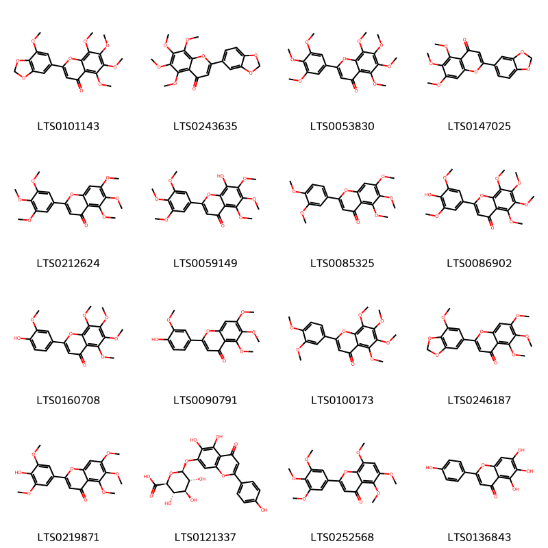
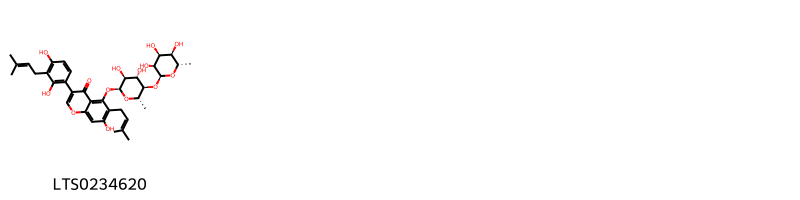
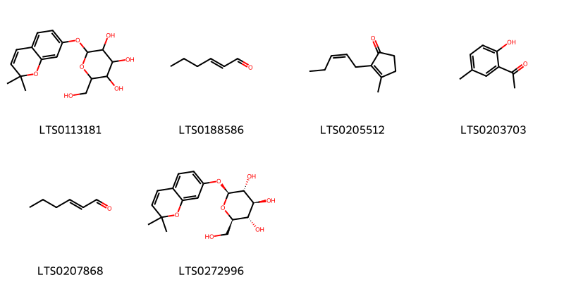

!!! abstract "Tóm tắt"

    Cỏ cứt lợn có tên khoa học là Ageratum conyzoides L, thuộc họ Cúc (Asteraceae), phân bố rộng rãi ở nhiều vùng nhiệt đới và cận nhiệt đới, bao gồm cả Việt Nam. Cây mọc hoang ở nhiều nơi, thường được thu hái lá và toàn cây để làm thuốc( trừ rễ). Từ lâu, cỏ cứt lợn đã được sử dụng trong y học dân gian để điều trị nhiều bệnh khác nhau như rong huyết, đa kinh, chảy máu cam, chảy máu chân răng, viêm mũi, viêm xoang mũi dị ứng,gàu ngứa.. Theo y học cổ truyền, cây Vị hơi đắng, mùi thơm, tính bình có tác dụng cầm máu, tiêu sưng rất hiệu quả. Các nghiên cứu hiện đại đã chỉ ra rằng, cây cứt lợn chứa nhiều thành phần hóa học có hoạt tính sinh học như flavonoid, diterpen,coumarin, sesquiterpen, chromen,alcaloid ,saponin, phytosterol ,monoterpene,.. trong đó các hợp chất như flavonoid, diterpen có hoạt tính chống viêm, kháng khuẩn, giảm đau hiệu quả. Tuy nhiên, việc sử dụng cỏ cứt lợn cần thận trọng và tuân theo hướng dẫn của thầy thuốc để tránh tác dụng phụ không mong muốn

## Thông tin về thực vật

Dược liệu **Cỏ Cứt Lợn( Cây)** từ bộ phận **** từ loài *Ageratum conyzoides*.

**Mô tả thực vật:** Cây hoa cứt lợn là một cây nhỏ, mọc hàng năm, thân có nhiều lông nhỏ mềm, 
cao chừng 25-50cm. Lá mọc đối hình trứng hay 3 cạnh, dài 2-6cm, rộng 1-3cm, mép có răng cưa tròn, hai mặt đều có lòng, mặt dưới của lá nhạt hơn. Hoa nhỏ, màu tím, xanh. Quả bế màu đen, có 5 sống dọc

*Tài liệu tham khảo:* "Những cây thuốc và vị thuốc Việt Nam" - Đỗ Tất Lợi 
Trong dược điển Việt nam, một loài được sử dụng làm dược liệu là *Ageratum conyzoides*.

!!! info "Phân loại thực vật của *Ageratum conyzoides*"
    - **Kingdom:** Plantae
    - **Phylum:** Tracheophyta
    - **Order:** Asterales
    - **Family:** Asteraceae
    - **Genus:** Ageratum
    - **Species:** *Ageratum conyzoides*

**Phân bố trên thế giới:** Tanzania, United Republic of, Kenya, Sri Lanka, Antigua and Barbuda, Ghana, Cabo Verde, French Guiana, Virgin Islands (British), Chinese Taipei, Colombia, Rwanda, Hong Kong, Réunion, South Africa, Bangladesh, Australia, Yemen, Indonesia, Madagascar, Virgin Islands (U.S.), Mauritius, Nigeria, India, Brazil, Costa Rica, Peru, Argentina, Viet Nam, Zimbabwe, Thailand, United States of America, Montserrat, Philippines, China, Uganda, Ecuador, Puerto Rico, Macao

**Phân bố tại Việt nam:** Nghệ An, Đồng Nai, Thừa Thiên - Huế

## Thông tin về dược liệu 

### Định danh

!!! info "Thông tin về tên gọi"

    - Dược liệu tiếng Việt: cỏ cứt lợn
    - Dược liệu tiếng Trung:  ()
    - Dược liệu tiếng Anh: 
    - Dược liệu latin thông dụng: Herba Agerati conyzoides
    - Dược liệu latin kiểu DĐVN: *herba agerati conyzoides*
    - Dược liệu latin kiểu DĐVN: **
    - Dược liệu latin kiểu thông tư: **
    - Bộ phận dùng:  (Herba)

### Mô tả dược liệu 

- **Theo dược điển Việt nam V:** Thân hình trụ, phân cành nhiều, dài 20 cm đến 40 cm, đường kính 2 mm đến 4 mm. Mặt ngoài thân màu vàng nhạt đến vàng nâu hoặc có màu tím, có lông mềm, màu trắng. Lá mọc đối, hình trứng hoặc tam giác, đầu nhọn, dài 2 cm đến 6 cm, rộng 0,5 cm đến 5 cm, mép có răng tròn, mặt dưới màu xám nhạt, có 3 gân tỏa từ gốc lá, mặt trên sẫm hơn; hai mặt lá đều có lông mịn, lá có mùi thơm đặc biệt. Cụm hoa hình đẩu xếp thành ngù ở ngọn thân hoặc đầu cành, cuống cụm hoa có lông mềm; tổng bao hình đầu gồm những lá bắc xếp thành hai dãy; đầu nhỏ chứa hoa hình ống bé và đều nhau; tràng ngắn có 5 thùy tam giác, hoa màu tím nhạt hoặc trắng ngà; hoa có 5 nhị. Quả bế, màu đen, có 5 sống dọc.

- **Mô tả dược liệu theo thông tư chế biến dược liệu theo phương pháp cổ truyền:** 

### Chế biến 

- **Chế biến theo dược điển việt nam V**: Thu hái quanh năm, tốt nhất là vào tháng 9, khi cây vừa ra hoa, lúc trời khô ráo, cắt lấy phần trên mặt đất, rửa sạch, dùng tươi hoặc phơi trong bóng râm hay sấy ở 30 °c đến 40 °c đến khô. cắt thành đoạn dài 3 cm đến 5 cm, khi dùng sao vàng.

- **Chế biến theo thông tư:** 

--- 

## Thành phần hóa học

- Theo tài liệu của GS. Đỗ Tất Lợi:  (1)flavonoid, diterpen,coumarin, sesquiterpen, chromen,alcaloid ,saponin, phytosterol ,monoterpene, phenylpropanoid.
(2) Theo Dược điển Việt Nam V, hiện chưa có hoạt chất nào trong cây cứt lợn được công nhận là biomarker để định tính hoặc định lượng.
    

**Thành phần hóa học từ loài **Ageratum conyzoides**

Theo cơ sở dữ liệu lotus, loài *Ageratum conyzoides* đã phân lập và xác định được **147** hoạt chất thuộc về các nhóm Steroids and steroid derivatives, Organooxygen compounds, Flavonoids, Fatty Acyls, Benzopyrans, Furanoid lignans, Isoflavonoids, Benzofurans, Phenols, Carboxylic acids and derivatives, Benzene and substituted derivatives, Coumarins and derivatives, Saturated hydrocarbons, Prenol lipids trong bảng dưới đây. Danh sách các hoạt chất như sau 4-isopropyl-1,6-dimethyl-2,3,4,4a,7,8-hexahydronaphthalene [(LTS0270743)](https://lotus.naturalproducts.net/compound/lotus_id/LTS0270743), sesamin [(LTS0228898)](https://lotus.naturalproducts.net/compound/lotus_id/LTS0228898), (7ar)-1,1,7-trimethyl-4-methylidene-octahydrocyclopropa[e]azulen-7-ol [(LTS0091612)](https://lotus.naturalproducts.net/compound/lotus_id/LTS0091612), α pinene [(LTS0132416)](https://lotus.naturalproducts.net/compound/lotus_id/LTS0132416), pinocarveol [(LTS0090950)](https://lotus.naturalproducts.net/compound/lotus_id/LTS0090950), ageconyflavone c [(LTS0219871)](https://lotus.naturalproducts.net/compound/lotus_id/LTS0219871), scutellarin [(LTS0121337)](https://lotus.naturalproducts.net/compound/lotus_id/LTS0121337), octane [(LTS0186469)](https://lotus.naturalproducts.net/compound/lotus_id/LTS0186469), 6-[(1r)-1-ethoxyethyl]-7-methoxy-2,2-dimethylchromene [(LTS0089564)](https://lotus.naturalproducts.net/compound/lotus_id/LTS0089564), 7,7-dimethyl-2-methylidenebicyclo[2.2.1]heptane [(LTS0092282)](https://lotus.naturalproducts.net/compound/lotus_id/LTS0092282), eugenol [(LTS0052342)](https://lotus.naturalproducts.net/compound/lotus_id/LTS0052342), nobiletin [(LTS0100173)](https://lotus.naturalproducts.net/compound/lotus_id/LTS0100173), 6,7-dimethoxy-2-methyl-2-(2-methylprop-1-en-1-yl)-3h-1-benzopyran-4-one [(LTS0188729)](https://lotus.naturalproducts.net/compound/lotus_id/LTS0188729), 1-[6-hydroxy-2-(3-hydroxyprop-1-en-2-yl)-2,3-dihydro-1-benzofuran-5-yl]ethanone [(LTS0119057)](https://lotus.naturalproducts.net/compound/lotus_id/LTS0119057), 7-methoxy-6-{1-[1-(7-methoxy-2,2-dimethylchromen-6-yl)ethoxy]ethyl}-2,2-dimethylchromene [(LTS0015577)](https://lotus.naturalproducts.net/compound/lotus_id/LTS0015577), (1r)-1-(7-methoxy-2,2-dimethylchromen-6-yl)ethanol [(LTS0238819)](https://lotus.naturalproducts.net/compound/lotus_id/LTS0238819), [(7s,7as)-7-hydroxy-5,6,7,7a-tetrahydro-3h-pyrrolizin-1-yl]methyl 2-hydroxy-2-[(1s)-1-hydroxyethyl]-3-methylbutanoate [(LTS0247627)](https://lotus.naturalproducts.net/compound/lotus_id/LTS0247627), 7-methoxy-6-[(1s)-1-[(1r)-1-(7-methoxy-2,2-dimethylchromen-6-yl)ethoxy]ethyl]-2,2-dimethylchromene [(LTS0222533)](https://lotus.naturalproducts.net/compound/lotus_id/LTS0222533), 6-(1-ethoxyethyl)-7-methoxy-2,2-dimethylchromene [(LTS0029958)](https://lotus.naturalproducts.net/compound/lotus_id/LTS0029958), (r)-β-bisabolene [(LTS0077209)](https://lotus.naturalproducts.net/compound/lotus_id/LTS0077209), (1s,3ar,3br,7r,9as,9br,11ar)-1-[(2r,5r)-5-ethyl-6-methylheptan-2-yl]-9a,11a-dimethyl-1h,2h,3h,3ah,3bh,4h,6h,7h,8h,9h,9bh,10h,11h-cyclopenta[a]phenanthren-7-ol [(LTS0234781)](https://lotus.naturalproducts.net/compound/lotus_id/LTS0234781), 1-ethenyl-1,2-dimethyl-2-(prop-1-en-2-yl)-4-(propan-2-ylidene)cyclohexane [(LTS0102139)](https://lotus.naturalproducts.net/compound/lotus_id/LTS0102139), linderoflavone b [(LTS0243635)](https://lotus.naturalproducts.net/compound/lotus_id/LTS0243635), eicosane [(LTS0268882)](https://lotus.naturalproducts.net/compound/lotus_id/LTS0268882), pentadeca-6,9-dien-1-ol [(LTS0171453)](https://lotus.naturalproducts.net/compound/lotus_id/LTS0171453), β-caryophyllene oxide [(LTS0213960)](https://lotus.naturalproducts.net/compound/lotus_id/LTS0213960), 1,7,7-trimethylbicyclo[2.2.1]heptan-2-yl formate [(LTS0148901)](https://lotus.naturalproducts.net/compound/lotus_id/LTS0148901), 3-[(2s)-6-methylhept-5-en-2-yl]-6-methylidenecyclohex-1-ene [(LTS0195839)](https://lotus.naturalproducts.net/compound/lotus_id/LTS0195839), (1as,4as,7s,7ar,7bs)-1,1,7-trimethyl-4-methylidene-octahydrocyclopropa[e]azulen-7-ol [(LTS0073517)](https://lotus.naturalproducts.net/compound/lotus_id/LTS0073517), tricyclene [(LTS0179930)](https://lotus.naturalproducts.net/compound/lotus_id/LTS0179930), nerolidol [(LTS0262980)](https://lotus.naturalproducts.net/compound/lotus_id/LTS0262980), friedelin [(LTS0213494)](https://lotus.naturalproducts.net/compound/lotus_id/LTS0213494), camphor [(LTS0091905)](https://lotus.naturalproducts.net/compound/lotus_id/LTS0091905), cymene [(LTS0181568)](https://lotus.naturalproducts.net/compound/lotus_id/LTS0181568), terpineol [(LTS0136148)](https://lotus.naturalproducts.net/compound/lotus_id/LTS0136148), precocene i [(LTS0128290)](https://lotus.naturalproducts.net/compound/lotus_id/LTS0128290), humulene [(LTS0263171)](https://lotus.naturalproducts.net/compound/lotus_id/LTS0263171), (2s,3r,4s,5s,6r)-2-[(2,2-dimethylchromen-7-yl)oxy]-6-(hydroxymethyl)oxane-3,4,5-triol [(LTS0272996)](https://lotus.naturalproducts.net/compound/lotus_id/LTS0272996), cis-3-hexenol [(LTS0132156)](https://lotus.naturalproducts.net/compound/lotus_id/LTS0132156), 6,8-dimethoxy-2-methyl-3-(2-methylpropyl)chromen-4-one [(LTS0268819)](https://lotus.naturalproducts.net/compound/lotus_id/LTS0268819), β-bourbonene [(LTS0167513)](https://lotus.naturalproducts.net/compound/lotus_id/LTS0167513), 3-hexenol [(LTS0009177)](https://lotus.naturalproducts.net/compound/lotus_id/LTS0009177), 2h-1-benzopyran-2-one [(LTS0069773)](https://lotus.naturalproducts.net/compound/lotus_id/LTS0069773), sesamin [(LTS0120161)](https://lotus.naturalproducts.net/compound/lotus_id/LTS0120161), 7-methoxy-6-[(1r)-1-methoxyethyl]-2,2-dimethylchromene [(LTS0182291)](https://lotus.naturalproducts.net/compound/lotus_id/LTS0182291), 2-(4-hydroxy-3-methoxyphenyl)-5,6,7,8-tetramethoxychromen-4-one [(LTS0160708)](https://lotus.naturalproducts.net/compound/lotus_id/LTS0160708), 1-(7-methoxy-2,2-dimethylchromen-6-yl)ethanol [(LTS0210767)](https://lotus.naturalproducts.net/compound/lotus_id/LTS0210767), fenchone [(LTS0126716)](https://lotus.naturalproducts.net/compound/lotus_id/LTS0126716), α-copaene [(LTS0207598)](https://lotus.naturalproducts.net/compound/lotus_id/LTS0207598), trans-β-ocimene [(LTS0049765)](https://lotus.naturalproducts.net/compound/lotus_id/LTS0049765), ageconyflavone b [(LTS0090791)](https://lotus.naturalproducts.net/compound/lotus_id/LTS0090791), (1z,6z,8s)-8-isopropyl-1-methyl-5-methylidenecyclodeca-1,6-diene [(LTS0065195)](https://lotus.naturalproducts.net/compound/lotus_id/LTS0065195), 3,7,7-trimethylbicyclo[4.1.0]hept-2-ene [(LTS0237770)](https://lotus.naturalproducts.net/compound/lotus_id/LTS0237770), 4-isopropyl-6-methyl-1-methylidene-3,4,4a,7,8,8a-hexahydro-2h-naphthalene [(LTS0111070)](https://lotus.naturalproducts.net/compound/lotus_id/LTS0111070), (1s,5r,7s,10r)-7-isopropyl-4,10-dimethyltricyclo[4.4.0.0¹,⁵]dec-3-ene [(LTS0064715)](https://lotus.naturalproducts.net/compound/lotus_id/LTS0064715), myrtenal [(LTS0202475)](https://lotus.naturalproducts.net/compound/lotus_id/LTS0202475), β-pinene [(LTS0117550)](https://lotus.naturalproducts.net/compound/lotus_id/LTS0117550), 2-(4-hydroxy-3,5-dimethoxyphenyl)-5,6,7,8-tetramethoxychromen-4-one [(LTS0086902)](https://lotus.naturalproducts.net/compound/lotus_id/LTS0086902), β-cadinene [(LTS0049088)](https://lotus.naturalproducts.net/compound/lotus_id/LTS0049088), encecalin [(LTS0034147)](https://lotus.naturalproducts.net/compound/lotus_id/LTS0034147), [(7s,7as)-7-hydroxy-5,6,7,7a-tetrahydro-3h-pyrrolizin-1-yl]methyl (2s)-2-hydroxy-2-[(1s)-1-hydroxyethyl]-3-methylbutanoate [(LTS0269268)](https://lotus.naturalproducts.net/compound/lotus_id/LTS0269268), 7-methoxy-2,2-dimethylchromen-6-yl (2e)-2-methylbut-2-enoate [(LTS0006007)](https://lotus.naturalproducts.net/compound/lotus_id/LTS0006007), hexenal [(LTS0188586)](https://lotus.naturalproducts.net/compound/lotus_id/LTS0188586), stigmast-5-en-3-ol, (3β)- [(LTS0204616)](https://lotus.naturalproducts.net/compound/lotus_id/LTS0204616), (1s,2s)-1-ethenyl-1-methyl-2-(prop-1-en-2-yl)-4-(propan-2-ylidene)cyclohexane [(LTS0135613)](https://lotus.naturalproducts.net/compound/lotus_id/LTS0135613), β-sesquiphellandrene [(LTS0106193)](https://lotus.naturalproducts.net/compound/lotus_id/LTS0106193), 4,10,11,11-tetramethyltricyclo[5.3.1.0¹,⁵]undecane [(LTS0237662)](https://lotus.naturalproducts.net/compound/lotus_id/LTS0237662), 5,6,7-trimethoxy-2-(7-methoxy-2h-1,3-benzodioxol-5-yl)chromen-4-one [(LTS0246187)](https://lotus.naturalproducts.net/compound/lotus_id/LTS0246187), palmitic acid [(LTS0079439)](https://lotus.naturalproducts.net/compound/lotus_id/LTS0079439), jasmone [(LTS0205512)](https://lotus.naturalproducts.net/compound/lotus_id/LTS0205512), β-elemene [(LTS0225699)](https://lotus.naturalproducts.net/compound/lotus_id/LTS0225699), n-[(2s)-1-(acetyloxy)-3-phenylpropan-2-yl]-2-{[hydroxy(phenyl)methylidene]amino}-3-phenylpropanimidic acid [(LTS0163723)](https://lotus.naturalproducts.net/compound/lotus_id/LTS0163723), scutellarein [(LTS0136843)](https://lotus.naturalproducts.net/compound/lotus_id/LTS0136843), farnesol [(LTS0059667)](https://lotus.naturalproducts.net/compound/lotus_id/LTS0059667), delta-cadinol [(LTS0008282)](https://lotus.naturalproducts.net/compound/lotus_id/LTS0008282), methyl linolelaidate [(LTS0083433)](https://lotus.naturalproducts.net/compound/lotus_id/LTS0083433), (1s,3as,3bs,7s,9ar,9bs,11ar)-1-[(2s,3e,5s)-5-ethyl-6-methylhept-3-en-2-yl]-9a,11a-dimethyl-1h,2h,3h,3ah,3bh,4h,6h,7h,8h,9h,9bh,10h,11h-cyclopenta[a]phenanthren-7-ol [(LTS0257749)](https://lotus.naturalproducts.net/compound/lotus_id/LTS0257749), 9,12-octadecadienoic acid [(LTS0101463)](https://lotus.naturalproducts.net/compound/lotus_id/LTS0101463), monoterpenes [(LTS0106881)](https://lotus.naturalproducts.net/compound/lotus_id/LTS0106881), 6-ethenyl-7-methoxy-2,2-dimethylchromene [(LTS0064830)](https://lotus.naturalproducts.net/compound/lotus_id/LTS0064830), β-bourbonene [(LTS0074484)](https://lotus.naturalproducts.net/compound/lotus_id/LTS0074484), farnesene [(LTS0057150)](https://lotus.naturalproducts.net/compound/lotus_id/LTS0057150), terpinolene [(LTS0104525)](https://lotus.naturalproducts.net/compound/lotus_id/LTS0104525), 1-(7-methoxy-2,2-dimethyl-3,4-dihydro-1-benzopyran-6-yl)ethanone [(LTS0160613)](https://lotus.naturalproducts.net/compound/lotus_id/LTS0160613), β phellandrene [(LTS0124668)](https://lotus.naturalproducts.net/compound/lotus_id/LTS0124668), (+)-gamma-cadinene [(LTS0103949)](https://lotus.naturalproducts.net/compound/lotus_id/LTS0103949), delta-cadinene [(LTS0019321)](https://lotus.naturalproducts.net/compound/lotus_id/LTS0019321), (-)-β-cubebene [(LTS0123697)](https://lotus.naturalproducts.net/compound/lotus_id/LTS0123697), conyzorigun [(LTS0101143)](https://lotus.naturalproducts.net/compound/lotus_id/LTS0101143), (-)-β-bisabolene [(LTS0009940)](https://lotus.naturalproducts.net/compound/lotus_id/LTS0009940), (3r)-6,6-dimethyl-2-methylidenebicyclo[3.1.1]heptan-3-ol [(LTS0009265)](https://lotus.naturalproducts.net/compound/lotus_id/LTS0009265), 1-(6,7-dimethoxy-2-methylchromen-2-yl)-2-methylpropan-1-one [(LTS0162784)](https://lotus.naturalproducts.net/compound/lotus_id/LTS0162784), 5,6,7,8-tetramethoxy-2-(3,4,5-trimethoxyphenyl)chromen-4-one [(LTS0053830)](https://lotus.naturalproducts.net/compound/lotus_id/LTS0053830), (6e)-2,6-dimethyl-10-methylidenedodeca-2,6-diene [(LTS0154516)](https://lotus.naturalproducts.net/compound/lotus_id/LTS0154516), (-)-borneol [(LTS0242824)](https://lotus.naturalproducts.net/compound/lotus_id/LTS0242824), 1-(2,2-dimethylchromen-6-yl)ethanone [(LTS0151425)](https://lotus.naturalproducts.net/compound/lotus_id/LTS0151425), ageconyflavone a [(LTS0147025)](https://lotus.naturalproducts.net/compound/lotus_id/LTS0147025), α-muurolene [(LTS0022607)](https://lotus.naturalproducts.net/compound/lotus_id/LTS0022607), caryophyllene [(LTS0085212)](https://lotus.naturalproducts.net/compound/lotus_id/LTS0085212), (e)-2-hexenal [(LTS0207868)](https://lotus.naturalproducts.net/compound/lotus_id/LTS0207868), 2-isopropyl-5,6-dimethoxy-1-benzofuran [(LTS0152282)](https://lotus.naturalproducts.net/compound/lotus_id/LTS0152282), 2-[(2,2-dimethylchromen-7-yl)oxy]-6-(hydroxymethyl)oxane-3,4,5-triol [(LTS0113181)](https://lotus.naturalproducts.net/compound/lotus_id/LTS0113181), (-)-α-cubebene [(LTS0042045)](https://lotus.naturalproducts.net/compound/lotus_id/LTS0042045), 3-[2,4-dihydroxy-3-(3-methylbut-2-en-1-yl)phenyl]-5-{[(2s,3s,4s,5r,6s)-3,4-dihydroxy-6-methyl-5-{[(2s,3s,4s,5r,6s)-3,4,5-trihydroxy-6-methyloxan-2-yl]oxy}oxan-2-yl]oxy}-7-hydroxy-6-(3-methylbut-2-en-1-yl)chromen-4-one [(LTS0234620)](https://lotus.naturalproducts.net/compound/lotus_id/LTS0234620), β-selinene [(LTS0096341)](https://lotus.naturalproducts.net/compound/lotus_id/LTS0096341), phytosterol [(LTS0029311)](https://lotus.naturalproducts.net/compound/lotus_id/LTS0029311), methyl octadeca-9,12-dienoate [(LTS0275654)](https://lotus.naturalproducts.net/compound/lotus_id/LTS0275654), dotriacontane [(LTS0101459)](https://lotus.naturalproducts.net/compound/lotus_id/LTS0101459), nerolidol isomers [(LTS0007569)](https://lotus.naturalproducts.net/compound/lotus_id/LTS0007569), (-)-germacrene d [(LTS0059194)](https://lotus.naturalproducts.net/compound/lotus_id/LTS0059194), bornyl acetate [(LTS0060565)](https://lotus.naturalproducts.net/compound/lotus_id/LTS0060565), (-)-friedelin [(LTS0041645)](https://lotus.naturalproducts.net/compound/lotus_id/LTS0041645), terpinene [(LTS0136858)](https://lotus.naturalproducts.net/compound/lotus_id/LTS0136858), sabinene [(LTS0224133)](https://lotus.naturalproducts.net/compound/lotus_id/LTS0224133), 7-methoxy-2,2-dimethylchromen-6-yl 2-methylbut-2-enoate [(LTS0105018)](https://lotus.naturalproducts.net/compound/lotus_id/LTS0105018), 5,6,7-trimethoxy-2-(3,4,5-trimethoxyphenyl)chromen-4-one [(LTS0212624)](https://lotus.naturalproducts.net/compound/lotus_id/LTS0212624), (2r)-6,7-dimethoxy-2-methyl-2-(2-methylprop-1-en-1-yl)-3h-1-benzopyran-4-one [(LTS0083819)](https://lotus.naturalproducts.net/compound/lotus_id/LTS0083819), (e,z)-farnesol [(LTS0182151)](https://lotus.naturalproducts.net/compound/lotus_id/LTS0182151), sinensetin [(LTS0085325)](https://lotus.naturalproducts.net/compound/lotus_id/LTS0085325), (z)-β-farnesene [(LTS0254048)](https://lotus.naturalproducts.net/compound/lotus_id/LTS0254048), (6z,9z)-pentadeca-6,9-dien-1-ol [(LTS0085925)](https://lotus.naturalproducts.net/compound/lotus_id/LTS0085925), 8-hydroxy-5,6,7-trimethoxy-2-(3,4,5-trimethoxyphenyl)chromen-4-one [(LTS0059149)](https://lotus.naturalproducts.net/compound/lotus_id/LTS0059149), lycopsamine [(LTS0048426)](https://lotus.naturalproducts.net/compound/lotus_id/LTS0048426), 1-[(2r)-6-hydroxy-2-(3-hydroxyprop-1-en-2-yl)-2,3-dihydro-1-benzofuran-5-yl]ethanone [(LTS0147589)](https://lotus.naturalproducts.net/compound/lotus_id/LTS0147589), caryophyllene oxide [(LTS0159789)](https://lotus.naturalproducts.net/compound/lotus_id/LTS0159789), (5s)-1-isopropyl-4-methylidenebicyclo[3.1.0]hexane [(LTS0129854)](https://lotus.naturalproducts.net/compound/lotus_id/LTS0129854), 4-isopropyl-1,6-dimethyl-3,4,4a,7,8,8a-hexahydronaphthalene [(LTS0154650)](https://lotus.naturalproducts.net/compound/lotus_id/LTS0154650), methyl octadeca-9,12,15-trienoate [(LTS0228704)](https://lotus.naturalproducts.net/compound/lotus_id/LTS0228704), grape seed oils [(LTS0103152)](https://lotus.naturalproducts.net/compound/lotus_id/LTS0103152), α-bergamotene [(LTS0226115)](https://lotus.naturalproducts.net/compound/lotus_id/LTS0226115), methyl elaidolinolenate [(LTS0266092)](https://lotus.naturalproducts.net/compound/lotus_id/LTS0266092), (+)-borneol [(LTS0189059)](https://lotus.naturalproducts.net/compound/lotus_id/LTS0189059), (1r,4ar,8as)-4-isopropyl-1,6-dimethyl-3,4,4a,7,8,8a-hexahydro-2h-naphthalen-1-ol [(LTS0136437)](https://lotus.naturalproducts.net/compound/lotus_id/LTS0136437), 2-acetyl-4-methylphenol [(LTS0203703)](https://lotus.naturalproducts.net/compound/lotus_id/LTS0203703), α-myrcene [(LTS0115731)](https://lotus.naturalproducts.net/compound/lotus_id/LTS0115731), precocene ii [(LTS0156982)](https://lotus.naturalproducts.net/compound/lotus_id/LTS0156982), limonene,  [(LTS0155981)](https://lotus.naturalproducts.net/compound/lotus_id/LTS0155981), 5,6,8-trimethoxy-2-(3,4,5-trimethoxyphenyl)chromen-4-one [(LTS0252568)](https://lotus.naturalproducts.net/compound/lotus_id/LTS0252568), (2s,4r)-1,7,7-trimethylbicyclo[2.2.1]heptan-2-ol [(LTS0010050)](https://lotus.naturalproducts.net/compound/lotus_id/LTS0010050), 1-[(2s)-6,7-dimethoxy-2-methylchromen-2-yl]-2-methylpropan-1-one [(LTS0228949)](https://lotus.naturalproducts.net/compound/lotus_id/LTS0228949), (1r,2s,7s,8s)-8-isopropyl-1,3-dimethyltricyclo[4.4.0.0²,⁷]dec-3-ene [(LTS0190031)](https://lotus.naturalproducts.net/compound/lotus_id/LTS0190031), camphene [(LTS0267242)](https://lotus.naturalproducts.net/compound/lotus_id/LTS0267242), borneol [(LTS0264960)](https://lotus.naturalproducts.net/compound/lotus_id/LTS0264960), 7-methoxy-6-[(1s)-1-[(1s)-1-(7-methoxy-2,2-dimethylchromen-6-yl)ethoxy]ethyl]-2,2-dimethylchromene [(LTS0031278)](https://lotus.naturalproducts.net/compound/lotus_id/LTS0031278), stigmasterol [(LTS0024262)](https://lotus.naturalproducts.net/compound/lotus_id/LTS0024262), linalool, (+-)- [(LTS0128839)](https://lotus.naturalproducts.net/compound/lotus_id/LTS0128839), 7-methoxy-6-(1-methoxyethyl)-2,2-dimethylchromene [(LTS0142576)](https://lotus.naturalproducts.net/compound/lotus_id/LTS0142576). 
        
| chemicalTaxonomyClassyfireClass     |   smiles_count |
|:------------------------------------|---------------:|
|                                     |            112 |
| Benzene and substituted derivatives |             66 |
| Benzofurans                         |             24 |
| Benzopyrans                         |            827 |
| Carboxylic acids and derivatives    |             56 |
| Coumarins and derivatives           |             16 |
| Fatty Acyls                         |            249 |
| Flavonoids                          |            803 |
| Furanoid lignans                    |            106 |
| Isoflavonoids                       |            138 |
| Organooxygen compounds              |            163 |
| Phenols                             |             19 |
| Prenol lipids                       |           2170 |
| Saturated hydrocarbons              |             60 |
| Steroids and steroid derivatives    |            366 |

            
### Nhóm 
<figure markdown="span">
    { width=100% }
<figcaption>Hình ảnh cấu trúc hóa học của hoạt chất thuộc nhóm **. Tên thường gọi của các hoạt chất tương ứng là lycopsamine [(LTS0048426)](https://lotus.naturalproducts.net/compound/lotus_id/LTS0048426), [(7s,7as)-7-hydroxy-5,6,7,7a-tetrahydro-3h-pyrrolizin-1-yl]methyl (2s)-2-hydroxy-2-[(1s)-1-hydroxyethyl]-3-methylbutanoate [(LTS0269268)](https://lotus.naturalproducts.net/compound/lotus_id/LTS0269268).</figcaption>
</figure>

            
            
### Nhóm 
<figure markdown="span">
    { width=100% }
<figcaption>Hình ảnh cấu trúc hóa học của hoạt chất thuộc nhóm **. Tên thường gọi của các hoạt chất tương ứng là lycopsamine [(LTS0048426)](https://lotus.naturalproducts.net/compound/lotus_id/LTS0048426), [(7s,7as)-7-hydroxy-5,6,7,7a-tetrahydro-3h-pyrrolizin-1-yl]methyl (2s)-2-hydroxy-2-[(1s)-1-hydroxyethyl]-3-methylbutanoate [(LTS0269268)](https://lotus.naturalproducts.net/compound/lotus_id/LTS0269268).</figcaption>
</figure>

### Nhóm Benzene and substituted derivatives
<figure markdown="span">
    { width=100% }
<figcaption>Hình ảnh cấu trúc hóa học của hoạt chất thuộc nhóm *Benzene and substituted derivatives*. Tên thường gọi của các hoạt chất tương ứng là 1-[6-hydroxy-2-(3-hydroxyprop-1-en-2-yl)-2,3-dihydro-1-benzofuran-5-yl]ethanone [(LTS0119057)](https://lotus.naturalproducts.net/compound/lotus_id/LTS0119057), 1-[(2r)-6-hydroxy-2-(3-hydroxyprop-1-en-2-yl)-2,3-dihydro-1-benzofuran-5-yl]ethanone [(LTS0147589)](https://lotus.naturalproducts.net/compound/lotus_id/LTS0147589).</figcaption>
</figure>

            
            
### Nhóm 
<figure markdown="span">
    { width=100% }
<figcaption>Hình ảnh cấu trúc hóa học của hoạt chất thuộc nhóm **. Tên thường gọi của các hoạt chất tương ứng là lycopsamine [(LTS0048426)](https://lotus.naturalproducts.net/compound/lotus_id/LTS0048426), [(7s,7as)-7-hydroxy-5,6,7,7a-tetrahydro-3h-pyrrolizin-1-yl]methyl (2s)-2-hydroxy-2-[(1s)-1-hydroxyethyl]-3-methylbutanoate [(LTS0269268)](https://lotus.naturalproducts.net/compound/lotus_id/LTS0269268).</figcaption>
</figure>

### Nhóm Benzene and substituted derivatives
<figure markdown="span">
    { width=100% }
<figcaption>Hình ảnh cấu trúc hóa học của hoạt chất thuộc nhóm *Benzene and substituted derivatives*. Tên thường gọi của các hoạt chất tương ứng là 1-[6-hydroxy-2-(3-hydroxyprop-1-en-2-yl)-2,3-dihydro-1-benzofuran-5-yl]ethanone [(LTS0119057)](https://lotus.naturalproducts.net/compound/lotus_id/LTS0119057), 1-[(2r)-6-hydroxy-2-(3-hydroxyprop-1-en-2-yl)-2,3-dihydro-1-benzofuran-5-yl]ethanone [(LTS0147589)](https://lotus.naturalproducts.net/compound/lotus_id/LTS0147589).</figcaption>
</figure>

### Nhóm Benzofurans
<figure markdown="span">
    { width=100% }
<figcaption>Hình ảnh cấu trúc hóa học của hoạt chất thuộc nhóm *Benzofurans*. Tên thường gọi của các hoạt chất tương ứng là 2-isopropyl-5,6-dimethoxy-1-benzofuran [(LTS0152282)](https://lotus.naturalproducts.net/compound/lotus_id/LTS0152282).</figcaption>
</figure>

            
            
### Nhóm 
<figure markdown="span">
    { width=100% }
<figcaption>Hình ảnh cấu trúc hóa học của hoạt chất thuộc nhóm **. Tên thường gọi của các hoạt chất tương ứng là lycopsamine [(LTS0048426)](https://lotus.naturalproducts.net/compound/lotus_id/LTS0048426), [(7s,7as)-7-hydroxy-5,6,7,7a-tetrahydro-3h-pyrrolizin-1-yl]methyl (2s)-2-hydroxy-2-[(1s)-1-hydroxyethyl]-3-methylbutanoate [(LTS0269268)](https://lotus.naturalproducts.net/compound/lotus_id/LTS0269268).</figcaption>
</figure>

### Nhóm Benzene and substituted derivatives
<figure markdown="span">
    { width=100% }
<figcaption>Hình ảnh cấu trúc hóa học của hoạt chất thuộc nhóm *Benzene and substituted derivatives*. Tên thường gọi của các hoạt chất tương ứng là 1-[6-hydroxy-2-(3-hydroxyprop-1-en-2-yl)-2,3-dihydro-1-benzofuran-5-yl]ethanone [(LTS0119057)](https://lotus.naturalproducts.net/compound/lotus_id/LTS0119057), 1-[(2r)-6-hydroxy-2-(3-hydroxyprop-1-en-2-yl)-2,3-dihydro-1-benzofuran-5-yl]ethanone [(LTS0147589)](https://lotus.naturalproducts.net/compound/lotus_id/LTS0147589).</figcaption>
</figure>

### Nhóm Benzofurans
<figure markdown="span">
    { width=100% }
<figcaption>Hình ảnh cấu trúc hóa học của hoạt chất thuộc nhóm *Benzofurans*. Tên thường gọi của các hoạt chất tương ứng là 2-isopropyl-5,6-dimethoxy-1-benzofuran [(LTS0152282)](https://lotus.naturalproducts.net/compound/lotus_id/LTS0152282).</figcaption>
</figure>

### Nhóm Benzopyrans
<figure markdown="span">
    { width=100% }
<figcaption>Hình ảnh cấu trúc hóa học của hoạt chất thuộc nhóm *Benzopyrans*. Tên thường gọi của các hoạt chất tương ứng là precocene i [(LTS0128290)](https://lotus.naturalproducts.net/compound/lotus_id/LTS0128290), precocene ii [(LTS0156982)](https://lotus.naturalproducts.net/compound/lotus_id/LTS0156982), 7-methoxy-6-[(1s)-1-[(1r)-1-(7-methoxy-2,2-dimethylchromen-6-yl)ethoxy]ethyl]-2,2-dimethylchromene [(LTS0222533)](https://lotus.naturalproducts.net/compound/lotus_id/LTS0222533), 7-methoxy-2,2-dimethylchromen-6-yl 2-methylbut-2-enoate [(LTS0105018)](https://lotus.naturalproducts.net/compound/lotus_id/LTS0105018), (2r)-6,7-dimethoxy-2-methyl-2-(2-methylprop-1-en-1-yl)-3h-1-benzopyran-4-one [(LTS0083819)](https://lotus.naturalproducts.net/compound/lotus_id/LTS0083819), 7-methoxy-6-[(1s)-1-[(1s)-1-(7-methoxy-2,2-dimethylchromen-6-yl)ethoxy]ethyl]-2,2-dimethylchromene [(LTS0031278)](https://lotus.naturalproducts.net/compound/lotus_id/LTS0031278), encecalin [(LTS0034147)](https://lotus.naturalproducts.net/compound/lotus_id/LTS0034147), 1-(7-methoxy-2,2-dimethyl-3,4-dihydro-1-benzopyran-6-yl)ethanone [(LTS0160613)](https://lotus.naturalproducts.net/compound/lotus_id/LTS0160613), 7-methoxy-6-(1-methoxyethyl)-2,2-dimethylchromene [(LTS0142576)](https://lotus.naturalproducts.net/compound/lotus_id/LTS0142576), 1-(2,2-dimethylchromen-6-yl)ethanone [(LTS0151425)](https://lotus.naturalproducts.net/compound/lotus_id/LTS0151425), (1r)-1-(7-methoxy-2,2-dimethylchromen-6-yl)ethanol [(LTS0238819)](https://lotus.naturalproducts.net/compound/lotus_id/LTS0238819), 6-[(1r)-1-ethoxyethyl]-7-methoxy-2,2-dimethylchromene [(LTS0089564)](https://lotus.naturalproducts.net/compound/lotus_id/LTS0089564), 1-(7-methoxy-2,2-dimethylchromen-6-yl)ethanol [(LTS0210767)](https://lotus.naturalproducts.net/compound/lotus_id/LTS0210767), 1-(6,7-dimethoxy-2-methylchromen-2-yl)-2-methylpropan-1-one [(LTS0162784)](https://lotus.naturalproducts.net/compound/lotus_id/LTS0162784), 6,7-dimethoxy-2-methyl-2-(2-methylprop-1-en-1-yl)-3h-1-benzopyran-4-one [(LTS0188729)](https://lotus.naturalproducts.net/compound/lotus_id/LTS0188729), 7-methoxy-6-[(1r)-1-methoxyethyl]-2,2-dimethylchromene [(LTS0182291)](https://lotus.naturalproducts.net/compound/lotus_id/LTS0182291), 7-methoxy-6-{1-[1-(7-methoxy-2,2-dimethylchromen-6-yl)ethoxy]ethyl}-2,2-dimethylchromene [(LTS0015577)](https://lotus.naturalproducts.net/compound/lotus_id/LTS0015577), 6-ethenyl-7-methoxy-2,2-dimethylchromene [(LTS0064830)](https://lotus.naturalproducts.net/compound/lotus_id/LTS0064830), 6,8-dimethoxy-2-methyl-3-(2-methylpropyl)chromen-4-one [(LTS0268819)](https://lotus.naturalproducts.net/compound/lotus_id/LTS0268819), 6-(1-ethoxyethyl)-7-methoxy-2,2-dimethylchromene [(LTS0029958)](https://lotus.naturalproducts.net/compound/lotus_id/LTS0029958), 7-methoxy-2,2-dimethylchromen-6-yl (2e)-2-methylbut-2-enoate [(LTS0006007)](https://lotus.naturalproducts.net/compound/lotus_id/LTS0006007), 1-[(2s)-6,7-dimethoxy-2-methylchromen-2-yl]-2-methylpropan-1-one [(LTS0228949)](https://lotus.naturalproducts.net/compound/lotus_id/LTS0228949).</figcaption>
</figure>

            
            
### Nhóm 
<figure markdown="span">
    { width=100% }
<figcaption>Hình ảnh cấu trúc hóa học của hoạt chất thuộc nhóm **. Tên thường gọi của các hoạt chất tương ứng là lycopsamine [(LTS0048426)](https://lotus.naturalproducts.net/compound/lotus_id/LTS0048426), [(7s,7as)-7-hydroxy-5,6,7,7a-tetrahydro-3h-pyrrolizin-1-yl]methyl (2s)-2-hydroxy-2-[(1s)-1-hydroxyethyl]-3-methylbutanoate [(LTS0269268)](https://lotus.naturalproducts.net/compound/lotus_id/LTS0269268).</figcaption>
</figure>

### Nhóm Benzene and substituted derivatives
<figure markdown="span">
    { width=100% }
<figcaption>Hình ảnh cấu trúc hóa học của hoạt chất thuộc nhóm *Benzene and substituted derivatives*. Tên thường gọi của các hoạt chất tương ứng là 1-[6-hydroxy-2-(3-hydroxyprop-1-en-2-yl)-2,3-dihydro-1-benzofuran-5-yl]ethanone [(LTS0119057)](https://lotus.naturalproducts.net/compound/lotus_id/LTS0119057), 1-[(2r)-6-hydroxy-2-(3-hydroxyprop-1-en-2-yl)-2,3-dihydro-1-benzofuran-5-yl]ethanone [(LTS0147589)](https://lotus.naturalproducts.net/compound/lotus_id/LTS0147589).</figcaption>
</figure>

### Nhóm Benzofurans
<figure markdown="span">
    { width=100% }
<figcaption>Hình ảnh cấu trúc hóa học của hoạt chất thuộc nhóm *Benzofurans*. Tên thường gọi của các hoạt chất tương ứng là 2-isopropyl-5,6-dimethoxy-1-benzofuran [(LTS0152282)](https://lotus.naturalproducts.net/compound/lotus_id/LTS0152282).</figcaption>
</figure>

### Nhóm Benzopyrans
<figure markdown="span">
    { width=100% }
<figcaption>Hình ảnh cấu trúc hóa học của hoạt chất thuộc nhóm *Benzopyrans*. Tên thường gọi của các hoạt chất tương ứng là precocene i [(LTS0128290)](https://lotus.naturalproducts.net/compound/lotus_id/LTS0128290), precocene ii [(LTS0156982)](https://lotus.naturalproducts.net/compound/lotus_id/LTS0156982), 7-methoxy-6-[(1s)-1-[(1r)-1-(7-methoxy-2,2-dimethylchromen-6-yl)ethoxy]ethyl]-2,2-dimethylchromene [(LTS0222533)](https://lotus.naturalproducts.net/compound/lotus_id/LTS0222533), 7-methoxy-2,2-dimethylchromen-6-yl 2-methylbut-2-enoate [(LTS0105018)](https://lotus.naturalproducts.net/compound/lotus_id/LTS0105018), (2r)-6,7-dimethoxy-2-methyl-2-(2-methylprop-1-en-1-yl)-3h-1-benzopyran-4-one [(LTS0083819)](https://lotus.naturalproducts.net/compound/lotus_id/LTS0083819), 7-methoxy-6-[(1s)-1-[(1s)-1-(7-methoxy-2,2-dimethylchromen-6-yl)ethoxy]ethyl]-2,2-dimethylchromene [(LTS0031278)](https://lotus.naturalproducts.net/compound/lotus_id/LTS0031278), encecalin [(LTS0034147)](https://lotus.naturalproducts.net/compound/lotus_id/LTS0034147), 1-(7-methoxy-2,2-dimethyl-3,4-dihydro-1-benzopyran-6-yl)ethanone [(LTS0160613)](https://lotus.naturalproducts.net/compound/lotus_id/LTS0160613), 7-methoxy-6-(1-methoxyethyl)-2,2-dimethylchromene [(LTS0142576)](https://lotus.naturalproducts.net/compound/lotus_id/LTS0142576), 1-(2,2-dimethylchromen-6-yl)ethanone [(LTS0151425)](https://lotus.naturalproducts.net/compound/lotus_id/LTS0151425), (1r)-1-(7-methoxy-2,2-dimethylchromen-6-yl)ethanol [(LTS0238819)](https://lotus.naturalproducts.net/compound/lotus_id/LTS0238819), 6-[(1r)-1-ethoxyethyl]-7-methoxy-2,2-dimethylchromene [(LTS0089564)](https://lotus.naturalproducts.net/compound/lotus_id/LTS0089564), 1-(7-methoxy-2,2-dimethylchromen-6-yl)ethanol [(LTS0210767)](https://lotus.naturalproducts.net/compound/lotus_id/LTS0210767), 1-(6,7-dimethoxy-2-methylchromen-2-yl)-2-methylpropan-1-one [(LTS0162784)](https://lotus.naturalproducts.net/compound/lotus_id/LTS0162784), 6,7-dimethoxy-2-methyl-2-(2-methylprop-1-en-1-yl)-3h-1-benzopyran-4-one [(LTS0188729)](https://lotus.naturalproducts.net/compound/lotus_id/LTS0188729), 7-methoxy-6-[(1r)-1-methoxyethyl]-2,2-dimethylchromene [(LTS0182291)](https://lotus.naturalproducts.net/compound/lotus_id/LTS0182291), 7-methoxy-6-{1-[1-(7-methoxy-2,2-dimethylchromen-6-yl)ethoxy]ethyl}-2,2-dimethylchromene [(LTS0015577)](https://lotus.naturalproducts.net/compound/lotus_id/LTS0015577), 6-ethenyl-7-methoxy-2,2-dimethylchromene [(LTS0064830)](https://lotus.naturalproducts.net/compound/lotus_id/LTS0064830), 6,8-dimethoxy-2-methyl-3-(2-methylpropyl)chromen-4-one [(LTS0268819)](https://lotus.naturalproducts.net/compound/lotus_id/LTS0268819), 6-(1-ethoxyethyl)-7-methoxy-2,2-dimethylchromene [(LTS0029958)](https://lotus.naturalproducts.net/compound/lotus_id/LTS0029958), 7-methoxy-2,2-dimethylchromen-6-yl (2e)-2-methylbut-2-enoate [(LTS0006007)](https://lotus.naturalproducts.net/compound/lotus_id/LTS0006007), 1-[(2s)-6,7-dimethoxy-2-methylchromen-2-yl]-2-methylpropan-1-one [(LTS0228949)](https://lotus.naturalproducts.net/compound/lotus_id/LTS0228949).</figcaption>
</figure>

### Nhóm Carboxylic acids and derivatives
<figure markdown="span">
    { width=100% }
<figcaption>Hình ảnh cấu trúc hóa học của hoạt chất thuộc nhóm *Carboxylic acids and derivatives*. Tên thường gọi của các hoạt chất tương ứng là n-[(2s)-1-(acetyloxy)-3-phenylpropan-2-yl]-2-{[hydroxy(phenyl)methylidene]amino}-3-phenylpropanimidic acid [(LTS0163723)](https://lotus.naturalproducts.net/compound/lotus_id/LTS0163723).</figcaption>
</figure>

            
            
### Nhóm 
<figure markdown="span">
    { width=100% }
<figcaption>Hình ảnh cấu trúc hóa học của hoạt chất thuộc nhóm **. Tên thường gọi của các hoạt chất tương ứng là lycopsamine [(LTS0048426)](https://lotus.naturalproducts.net/compound/lotus_id/LTS0048426), [(7s,7as)-7-hydroxy-5,6,7,7a-tetrahydro-3h-pyrrolizin-1-yl]methyl (2s)-2-hydroxy-2-[(1s)-1-hydroxyethyl]-3-methylbutanoate [(LTS0269268)](https://lotus.naturalproducts.net/compound/lotus_id/LTS0269268).</figcaption>
</figure>

### Nhóm Benzene and substituted derivatives
<figure markdown="span">
    { width=100% }
<figcaption>Hình ảnh cấu trúc hóa học của hoạt chất thuộc nhóm *Benzene and substituted derivatives*. Tên thường gọi của các hoạt chất tương ứng là 1-[6-hydroxy-2-(3-hydroxyprop-1-en-2-yl)-2,3-dihydro-1-benzofuran-5-yl]ethanone [(LTS0119057)](https://lotus.naturalproducts.net/compound/lotus_id/LTS0119057), 1-[(2r)-6-hydroxy-2-(3-hydroxyprop-1-en-2-yl)-2,3-dihydro-1-benzofuran-5-yl]ethanone [(LTS0147589)](https://lotus.naturalproducts.net/compound/lotus_id/LTS0147589).</figcaption>
</figure>

### Nhóm Benzofurans
<figure markdown="span">
    { width=100% }
<figcaption>Hình ảnh cấu trúc hóa học của hoạt chất thuộc nhóm *Benzofurans*. Tên thường gọi của các hoạt chất tương ứng là 2-isopropyl-5,6-dimethoxy-1-benzofuran [(LTS0152282)](https://lotus.naturalproducts.net/compound/lotus_id/LTS0152282).</figcaption>
</figure>

### Nhóm Benzopyrans
<figure markdown="span">
    { width=100% }
<figcaption>Hình ảnh cấu trúc hóa học của hoạt chất thuộc nhóm *Benzopyrans*. Tên thường gọi của các hoạt chất tương ứng là precocene i [(LTS0128290)](https://lotus.naturalproducts.net/compound/lotus_id/LTS0128290), precocene ii [(LTS0156982)](https://lotus.naturalproducts.net/compound/lotus_id/LTS0156982), 7-methoxy-6-[(1s)-1-[(1r)-1-(7-methoxy-2,2-dimethylchromen-6-yl)ethoxy]ethyl]-2,2-dimethylchromene [(LTS0222533)](https://lotus.naturalproducts.net/compound/lotus_id/LTS0222533), 7-methoxy-2,2-dimethylchromen-6-yl 2-methylbut-2-enoate [(LTS0105018)](https://lotus.naturalproducts.net/compound/lotus_id/LTS0105018), (2r)-6,7-dimethoxy-2-methyl-2-(2-methylprop-1-en-1-yl)-3h-1-benzopyran-4-one [(LTS0083819)](https://lotus.naturalproducts.net/compound/lotus_id/LTS0083819), 7-methoxy-6-[(1s)-1-[(1s)-1-(7-methoxy-2,2-dimethylchromen-6-yl)ethoxy]ethyl]-2,2-dimethylchromene [(LTS0031278)](https://lotus.naturalproducts.net/compound/lotus_id/LTS0031278), encecalin [(LTS0034147)](https://lotus.naturalproducts.net/compound/lotus_id/LTS0034147), 1-(7-methoxy-2,2-dimethyl-3,4-dihydro-1-benzopyran-6-yl)ethanone [(LTS0160613)](https://lotus.naturalproducts.net/compound/lotus_id/LTS0160613), 7-methoxy-6-(1-methoxyethyl)-2,2-dimethylchromene [(LTS0142576)](https://lotus.naturalproducts.net/compound/lotus_id/LTS0142576), 1-(2,2-dimethylchromen-6-yl)ethanone [(LTS0151425)](https://lotus.naturalproducts.net/compound/lotus_id/LTS0151425), (1r)-1-(7-methoxy-2,2-dimethylchromen-6-yl)ethanol [(LTS0238819)](https://lotus.naturalproducts.net/compound/lotus_id/LTS0238819), 6-[(1r)-1-ethoxyethyl]-7-methoxy-2,2-dimethylchromene [(LTS0089564)](https://lotus.naturalproducts.net/compound/lotus_id/LTS0089564), 1-(7-methoxy-2,2-dimethylchromen-6-yl)ethanol [(LTS0210767)](https://lotus.naturalproducts.net/compound/lotus_id/LTS0210767), 1-(6,7-dimethoxy-2-methylchromen-2-yl)-2-methylpropan-1-one [(LTS0162784)](https://lotus.naturalproducts.net/compound/lotus_id/LTS0162784), 6,7-dimethoxy-2-methyl-2-(2-methylprop-1-en-1-yl)-3h-1-benzopyran-4-one [(LTS0188729)](https://lotus.naturalproducts.net/compound/lotus_id/LTS0188729), 7-methoxy-6-[(1r)-1-methoxyethyl]-2,2-dimethylchromene [(LTS0182291)](https://lotus.naturalproducts.net/compound/lotus_id/LTS0182291), 7-methoxy-6-{1-[1-(7-methoxy-2,2-dimethylchromen-6-yl)ethoxy]ethyl}-2,2-dimethylchromene [(LTS0015577)](https://lotus.naturalproducts.net/compound/lotus_id/LTS0015577), 6-ethenyl-7-methoxy-2,2-dimethylchromene [(LTS0064830)](https://lotus.naturalproducts.net/compound/lotus_id/LTS0064830), 6,8-dimethoxy-2-methyl-3-(2-methylpropyl)chromen-4-one [(LTS0268819)](https://lotus.naturalproducts.net/compound/lotus_id/LTS0268819), 6-(1-ethoxyethyl)-7-methoxy-2,2-dimethylchromene [(LTS0029958)](https://lotus.naturalproducts.net/compound/lotus_id/LTS0029958), 7-methoxy-2,2-dimethylchromen-6-yl (2e)-2-methylbut-2-enoate [(LTS0006007)](https://lotus.naturalproducts.net/compound/lotus_id/LTS0006007), 1-[(2s)-6,7-dimethoxy-2-methylchromen-2-yl]-2-methylpropan-1-one [(LTS0228949)](https://lotus.naturalproducts.net/compound/lotus_id/LTS0228949).</figcaption>
</figure>

### Nhóm Carboxylic acids and derivatives
<figure markdown="span">
    { width=100% }
<figcaption>Hình ảnh cấu trúc hóa học của hoạt chất thuộc nhóm *Carboxylic acids and derivatives*. Tên thường gọi của các hoạt chất tương ứng là n-[(2s)-1-(acetyloxy)-3-phenylpropan-2-yl]-2-{[hydroxy(phenyl)methylidene]amino}-3-phenylpropanimidic acid [(LTS0163723)](https://lotus.naturalproducts.net/compound/lotus_id/LTS0163723).</figcaption>
</figure>

### Nhóm Coumarins and derivatives
<figure markdown="span">
    { width=100% }
<figcaption>Hình ảnh cấu trúc hóa học của hoạt chất thuộc nhóm *Coumarins and derivatives*. Tên thường gọi của các hoạt chất tương ứng là 2h-1-benzopyran-2-one [(LTS0069773)](https://lotus.naturalproducts.net/compound/lotus_id/LTS0069773).</figcaption>
</figure>

            
            
### Nhóm 
<figure markdown="span">
    { width=100% }
<figcaption>Hình ảnh cấu trúc hóa học của hoạt chất thuộc nhóm **. Tên thường gọi của các hoạt chất tương ứng là lycopsamine [(LTS0048426)](https://lotus.naturalproducts.net/compound/lotus_id/LTS0048426), [(7s,7as)-7-hydroxy-5,6,7,7a-tetrahydro-3h-pyrrolizin-1-yl]methyl (2s)-2-hydroxy-2-[(1s)-1-hydroxyethyl]-3-methylbutanoate [(LTS0269268)](https://lotus.naturalproducts.net/compound/lotus_id/LTS0269268).</figcaption>
</figure>

### Nhóm Benzene and substituted derivatives
<figure markdown="span">
    { width=100% }
<figcaption>Hình ảnh cấu trúc hóa học của hoạt chất thuộc nhóm *Benzene and substituted derivatives*. Tên thường gọi của các hoạt chất tương ứng là 1-[6-hydroxy-2-(3-hydroxyprop-1-en-2-yl)-2,3-dihydro-1-benzofuran-5-yl]ethanone [(LTS0119057)](https://lotus.naturalproducts.net/compound/lotus_id/LTS0119057), 1-[(2r)-6-hydroxy-2-(3-hydroxyprop-1-en-2-yl)-2,3-dihydro-1-benzofuran-5-yl]ethanone [(LTS0147589)](https://lotus.naturalproducts.net/compound/lotus_id/LTS0147589).</figcaption>
</figure>

### Nhóm Benzofurans
<figure markdown="span">
    { width=100% }
<figcaption>Hình ảnh cấu trúc hóa học của hoạt chất thuộc nhóm *Benzofurans*. Tên thường gọi của các hoạt chất tương ứng là 2-isopropyl-5,6-dimethoxy-1-benzofuran [(LTS0152282)](https://lotus.naturalproducts.net/compound/lotus_id/LTS0152282).</figcaption>
</figure>

### Nhóm Benzopyrans
<figure markdown="span">
    { width=100% }
<figcaption>Hình ảnh cấu trúc hóa học của hoạt chất thuộc nhóm *Benzopyrans*. Tên thường gọi của các hoạt chất tương ứng là precocene i [(LTS0128290)](https://lotus.naturalproducts.net/compound/lotus_id/LTS0128290), precocene ii [(LTS0156982)](https://lotus.naturalproducts.net/compound/lotus_id/LTS0156982), 7-methoxy-6-[(1s)-1-[(1r)-1-(7-methoxy-2,2-dimethylchromen-6-yl)ethoxy]ethyl]-2,2-dimethylchromene [(LTS0222533)](https://lotus.naturalproducts.net/compound/lotus_id/LTS0222533), 7-methoxy-2,2-dimethylchromen-6-yl 2-methylbut-2-enoate [(LTS0105018)](https://lotus.naturalproducts.net/compound/lotus_id/LTS0105018), (2r)-6,7-dimethoxy-2-methyl-2-(2-methylprop-1-en-1-yl)-3h-1-benzopyran-4-one [(LTS0083819)](https://lotus.naturalproducts.net/compound/lotus_id/LTS0083819), 7-methoxy-6-[(1s)-1-[(1s)-1-(7-methoxy-2,2-dimethylchromen-6-yl)ethoxy]ethyl]-2,2-dimethylchromene [(LTS0031278)](https://lotus.naturalproducts.net/compound/lotus_id/LTS0031278), encecalin [(LTS0034147)](https://lotus.naturalproducts.net/compound/lotus_id/LTS0034147), 1-(7-methoxy-2,2-dimethyl-3,4-dihydro-1-benzopyran-6-yl)ethanone [(LTS0160613)](https://lotus.naturalproducts.net/compound/lotus_id/LTS0160613), 7-methoxy-6-(1-methoxyethyl)-2,2-dimethylchromene [(LTS0142576)](https://lotus.naturalproducts.net/compound/lotus_id/LTS0142576), 1-(2,2-dimethylchromen-6-yl)ethanone [(LTS0151425)](https://lotus.naturalproducts.net/compound/lotus_id/LTS0151425), (1r)-1-(7-methoxy-2,2-dimethylchromen-6-yl)ethanol [(LTS0238819)](https://lotus.naturalproducts.net/compound/lotus_id/LTS0238819), 6-[(1r)-1-ethoxyethyl]-7-methoxy-2,2-dimethylchromene [(LTS0089564)](https://lotus.naturalproducts.net/compound/lotus_id/LTS0089564), 1-(7-methoxy-2,2-dimethylchromen-6-yl)ethanol [(LTS0210767)](https://lotus.naturalproducts.net/compound/lotus_id/LTS0210767), 1-(6,7-dimethoxy-2-methylchromen-2-yl)-2-methylpropan-1-one [(LTS0162784)](https://lotus.naturalproducts.net/compound/lotus_id/LTS0162784), 6,7-dimethoxy-2-methyl-2-(2-methylprop-1-en-1-yl)-3h-1-benzopyran-4-one [(LTS0188729)](https://lotus.naturalproducts.net/compound/lotus_id/LTS0188729), 7-methoxy-6-[(1r)-1-methoxyethyl]-2,2-dimethylchromene [(LTS0182291)](https://lotus.naturalproducts.net/compound/lotus_id/LTS0182291), 7-methoxy-6-{1-[1-(7-methoxy-2,2-dimethylchromen-6-yl)ethoxy]ethyl}-2,2-dimethylchromene [(LTS0015577)](https://lotus.naturalproducts.net/compound/lotus_id/LTS0015577), 6-ethenyl-7-methoxy-2,2-dimethylchromene [(LTS0064830)](https://lotus.naturalproducts.net/compound/lotus_id/LTS0064830), 6,8-dimethoxy-2-methyl-3-(2-methylpropyl)chromen-4-one [(LTS0268819)](https://lotus.naturalproducts.net/compound/lotus_id/LTS0268819), 6-(1-ethoxyethyl)-7-methoxy-2,2-dimethylchromene [(LTS0029958)](https://lotus.naturalproducts.net/compound/lotus_id/LTS0029958), 7-methoxy-2,2-dimethylchromen-6-yl (2e)-2-methylbut-2-enoate [(LTS0006007)](https://lotus.naturalproducts.net/compound/lotus_id/LTS0006007), 1-[(2s)-6,7-dimethoxy-2-methylchromen-2-yl]-2-methylpropan-1-one [(LTS0228949)](https://lotus.naturalproducts.net/compound/lotus_id/LTS0228949).</figcaption>
</figure>

### Nhóm Carboxylic acids and derivatives
<figure markdown="span">
    { width=100% }
<figcaption>Hình ảnh cấu trúc hóa học của hoạt chất thuộc nhóm *Carboxylic acids and derivatives*. Tên thường gọi của các hoạt chất tương ứng là n-[(2s)-1-(acetyloxy)-3-phenylpropan-2-yl]-2-{[hydroxy(phenyl)methylidene]amino}-3-phenylpropanimidic acid [(LTS0163723)](https://lotus.naturalproducts.net/compound/lotus_id/LTS0163723).</figcaption>
</figure>

### Nhóm Coumarins and derivatives
<figure markdown="span">
    { width=100% }
<figcaption>Hình ảnh cấu trúc hóa học của hoạt chất thuộc nhóm *Coumarins and derivatives*. Tên thường gọi của các hoạt chất tương ứng là 2h-1-benzopyran-2-one [(LTS0069773)](https://lotus.naturalproducts.net/compound/lotus_id/LTS0069773).</figcaption>
</figure>

### Nhóm Fatty Acyls
<figure markdown="span">
    { width=100% }
<figcaption>Hình ảnh cấu trúc hóa học của hoạt chất thuộc nhóm *Fatty Acyls*. Tên thường gọi của các hoạt chất tương ứng là palmitic acid [(LTS0079439)](https://lotus.naturalproducts.net/compound/lotus_id/LTS0079439), 9,12-octadecadienoic acid [(LTS0101463)](https://lotus.naturalproducts.net/compound/lotus_id/LTS0101463), (6z,9z)-pentadeca-6,9-dien-1-ol [(LTS0085925)](https://lotus.naturalproducts.net/compound/lotus_id/LTS0085925), grape seed oils [(LTS0103152)](https://lotus.naturalproducts.net/compound/lotus_id/LTS0103152), cis-3-hexenol [(LTS0132156)](https://lotus.naturalproducts.net/compound/lotus_id/LTS0132156), methyl elaidolinolenate [(LTS0266092)](https://lotus.naturalproducts.net/compound/lotus_id/LTS0266092), pentadeca-6,9-dien-1-ol [(LTS0171453)](https://lotus.naturalproducts.net/compound/lotus_id/LTS0171453), methyl octadeca-9,12,15-trienoate [(LTS0228704)](https://lotus.naturalproducts.net/compound/lotus_id/LTS0228704), methyl linolelaidate [(LTS0083433)](https://lotus.naturalproducts.net/compound/lotus_id/LTS0083433), methyl octadeca-9,12-dienoate [(LTS0275654)](https://lotus.naturalproducts.net/compound/lotus_id/LTS0275654), 3-hexenol [(LTS0009177)](https://lotus.naturalproducts.net/compound/lotus_id/LTS0009177).</figcaption>
</figure>

            
            
### Nhóm 
<figure markdown="span">
    { width=100% }
<figcaption>Hình ảnh cấu trúc hóa học của hoạt chất thuộc nhóm **. Tên thường gọi của các hoạt chất tương ứng là lycopsamine [(LTS0048426)](https://lotus.naturalproducts.net/compound/lotus_id/LTS0048426), [(7s,7as)-7-hydroxy-5,6,7,7a-tetrahydro-3h-pyrrolizin-1-yl]methyl (2s)-2-hydroxy-2-[(1s)-1-hydroxyethyl]-3-methylbutanoate [(LTS0269268)](https://lotus.naturalproducts.net/compound/lotus_id/LTS0269268).</figcaption>
</figure>

### Nhóm Benzene and substituted derivatives
<figure markdown="span">
    { width=100% }
<figcaption>Hình ảnh cấu trúc hóa học của hoạt chất thuộc nhóm *Benzene and substituted derivatives*. Tên thường gọi của các hoạt chất tương ứng là 1-[6-hydroxy-2-(3-hydroxyprop-1-en-2-yl)-2,3-dihydro-1-benzofuran-5-yl]ethanone [(LTS0119057)](https://lotus.naturalproducts.net/compound/lotus_id/LTS0119057), 1-[(2r)-6-hydroxy-2-(3-hydroxyprop-1-en-2-yl)-2,3-dihydro-1-benzofuran-5-yl]ethanone [(LTS0147589)](https://lotus.naturalproducts.net/compound/lotus_id/LTS0147589).</figcaption>
</figure>

### Nhóm Benzofurans
<figure markdown="span">
    { width=100% }
<figcaption>Hình ảnh cấu trúc hóa học của hoạt chất thuộc nhóm *Benzofurans*. Tên thường gọi của các hoạt chất tương ứng là 2-isopropyl-5,6-dimethoxy-1-benzofuran [(LTS0152282)](https://lotus.naturalproducts.net/compound/lotus_id/LTS0152282).</figcaption>
</figure>

### Nhóm Benzopyrans
<figure markdown="span">
    { width=100% }
<figcaption>Hình ảnh cấu trúc hóa học của hoạt chất thuộc nhóm *Benzopyrans*. Tên thường gọi của các hoạt chất tương ứng là precocene i [(LTS0128290)](https://lotus.naturalproducts.net/compound/lotus_id/LTS0128290), precocene ii [(LTS0156982)](https://lotus.naturalproducts.net/compound/lotus_id/LTS0156982), 7-methoxy-6-[(1s)-1-[(1r)-1-(7-methoxy-2,2-dimethylchromen-6-yl)ethoxy]ethyl]-2,2-dimethylchromene [(LTS0222533)](https://lotus.naturalproducts.net/compound/lotus_id/LTS0222533), 7-methoxy-2,2-dimethylchromen-6-yl 2-methylbut-2-enoate [(LTS0105018)](https://lotus.naturalproducts.net/compound/lotus_id/LTS0105018), (2r)-6,7-dimethoxy-2-methyl-2-(2-methylprop-1-en-1-yl)-3h-1-benzopyran-4-one [(LTS0083819)](https://lotus.naturalproducts.net/compound/lotus_id/LTS0083819), 7-methoxy-6-[(1s)-1-[(1s)-1-(7-methoxy-2,2-dimethylchromen-6-yl)ethoxy]ethyl]-2,2-dimethylchromene [(LTS0031278)](https://lotus.naturalproducts.net/compound/lotus_id/LTS0031278), encecalin [(LTS0034147)](https://lotus.naturalproducts.net/compound/lotus_id/LTS0034147), 1-(7-methoxy-2,2-dimethyl-3,4-dihydro-1-benzopyran-6-yl)ethanone [(LTS0160613)](https://lotus.naturalproducts.net/compound/lotus_id/LTS0160613), 7-methoxy-6-(1-methoxyethyl)-2,2-dimethylchromene [(LTS0142576)](https://lotus.naturalproducts.net/compound/lotus_id/LTS0142576), 1-(2,2-dimethylchromen-6-yl)ethanone [(LTS0151425)](https://lotus.naturalproducts.net/compound/lotus_id/LTS0151425), (1r)-1-(7-methoxy-2,2-dimethylchromen-6-yl)ethanol [(LTS0238819)](https://lotus.naturalproducts.net/compound/lotus_id/LTS0238819), 6-[(1r)-1-ethoxyethyl]-7-methoxy-2,2-dimethylchromene [(LTS0089564)](https://lotus.naturalproducts.net/compound/lotus_id/LTS0089564), 1-(7-methoxy-2,2-dimethylchromen-6-yl)ethanol [(LTS0210767)](https://lotus.naturalproducts.net/compound/lotus_id/LTS0210767), 1-(6,7-dimethoxy-2-methylchromen-2-yl)-2-methylpropan-1-one [(LTS0162784)](https://lotus.naturalproducts.net/compound/lotus_id/LTS0162784), 6,7-dimethoxy-2-methyl-2-(2-methylprop-1-en-1-yl)-3h-1-benzopyran-4-one [(LTS0188729)](https://lotus.naturalproducts.net/compound/lotus_id/LTS0188729), 7-methoxy-6-[(1r)-1-methoxyethyl]-2,2-dimethylchromene [(LTS0182291)](https://lotus.naturalproducts.net/compound/lotus_id/LTS0182291), 7-methoxy-6-{1-[1-(7-methoxy-2,2-dimethylchromen-6-yl)ethoxy]ethyl}-2,2-dimethylchromene [(LTS0015577)](https://lotus.naturalproducts.net/compound/lotus_id/LTS0015577), 6-ethenyl-7-methoxy-2,2-dimethylchromene [(LTS0064830)](https://lotus.naturalproducts.net/compound/lotus_id/LTS0064830), 6,8-dimethoxy-2-methyl-3-(2-methylpropyl)chromen-4-one [(LTS0268819)](https://lotus.naturalproducts.net/compound/lotus_id/LTS0268819), 6-(1-ethoxyethyl)-7-methoxy-2,2-dimethylchromene [(LTS0029958)](https://lotus.naturalproducts.net/compound/lotus_id/LTS0029958), 7-methoxy-2,2-dimethylchromen-6-yl (2e)-2-methylbut-2-enoate [(LTS0006007)](https://lotus.naturalproducts.net/compound/lotus_id/LTS0006007), 1-[(2s)-6,7-dimethoxy-2-methylchromen-2-yl]-2-methylpropan-1-one [(LTS0228949)](https://lotus.naturalproducts.net/compound/lotus_id/LTS0228949).</figcaption>
</figure>

### Nhóm Carboxylic acids and derivatives
<figure markdown="span">
    { width=100% }
<figcaption>Hình ảnh cấu trúc hóa học của hoạt chất thuộc nhóm *Carboxylic acids and derivatives*. Tên thường gọi của các hoạt chất tương ứng là n-[(2s)-1-(acetyloxy)-3-phenylpropan-2-yl]-2-{[hydroxy(phenyl)methylidene]amino}-3-phenylpropanimidic acid [(LTS0163723)](https://lotus.naturalproducts.net/compound/lotus_id/LTS0163723).</figcaption>
</figure>

### Nhóm Coumarins and derivatives
<figure markdown="span">
    { width=100% }
<figcaption>Hình ảnh cấu trúc hóa học của hoạt chất thuộc nhóm *Coumarins and derivatives*. Tên thường gọi của các hoạt chất tương ứng là 2h-1-benzopyran-2-one [(LTS0069773)](https://lotus.naturalproducts.net/compound/lotus_id/LTS0069773).</figcaption>
</figure>

### Nhóm Fatty Acyls
<figure markdown="span">
    { width=100% }
<figcaption>Hình ảnh cấu trúc hóa học của hoạt chất thuộc nhóm *Fatty Acyls*. Tên thường gọi của các hoạt chất tương ứng là palmitic acid [(LTS0079439)](https://lotus.naturalproducts.net/compound/lotus_id/LTS0079439), 9,12-octadecadienoic acid [(LTS0101463)](https://lotus.naturalproducts.net/compound/lotus_id/LTS0101463), (6z,9z)-pentadeca-6,9-dien-1-ol [(LTS0085925)](https://lotus.naturalproducts.net/compound/lotus_id/LTS0085925), grape seed oils [(LTS0103152)](https://lotus.naturalproducts.net/compound/lotus_id/LTS0103152), cis-3-hexenol [(LTS0132156)](https://lotus.naturalproducts.net/compound/lotus_id/LTS0132156), methyl elaidolinolenate [(LTS0266092)](https://lotus.naturalproducts.net/compound/lotus_id/LTS0266092), pentadeca-6,9-dien-1-ol [(LTS0171453)](https://lotus.naturalproducts.net/compound/lotus_id/LTS0171453), methyl octadeca-9,12,15-trienoate [(LTS0228704)](https://lotus.naturalproducts.net/compound/lotus_id/LTS0228704), methyl linolelaidate [(LTS0083433)](https://lotus.naturalproducts.net/compound/lotus_id/LTS0083433), methyl octadeca-9,12-dienoate [(LTS0275654)](https://lotus.naturalproducts.net/compound/lotus_id/LTS0275654), 3-hexenol [(LTS0009177)](https://lotus.naturalproducts.net/compound/lotus_id/LTS0009177).</figcaption>
</figure>

### Nhóm Flavonoids
<figure markdown="span">
    { width=100% }
<figcaption>Hình ảnh cấu trúc hóa học của hoạt chất thuộc nhóm *Flavonoids*. Tên thường gọi của các hoạt chất tương ứng là conyzorigun [(LTS0101143)](https://lotus.naturalproducts.net/compound/lotus_id/LTS0101143), linderoflavone b [(LTS0243635)](https://lotus.naturalproducts.net/compound/lotus_id/LTS0243635), 5,6,7,8-tetramethoxy-2-(3,4,5-trimethoxyphenyl)chromen-4-one [(LTS0053830)](https://lotus.naturalproducts.net/compound/lotus_id/LTS0053830), ageconyflavone a [(LTS0147025)](https://lotus.naturalproducts.net/compound/lotus_id/LTS0147025), 5,6,7-trimethoxy-2-(3,4,5-trimethoxyphenyl)chromen-4-one [(LTS0212624)](https://lotus.naturalproducts.net/compound/lotus_id/LTS0212624), 8-hydroxy-5,6,7-trimethoxy-2-(3,4,5-trimethoxyphenyl)chromen-4-one [(LTS0059149)](https://lotus.naturalproducts.net/compound/lotus_id/LTS0059149), sinensetin [(LTS0085325)](https://lotus.naturalproducts.net/compound/lotus_id/LTS0085325), 2-(4-hydroxy-3,5-dimethoxyphenyl)-5,6,7,8-tetramethoxychromen-4-one [(LTS0086902)](https://lotus.naturalproducts.net/compound/lotus_id/LTS0086902), 2-(4-hydroxy-3-methoxyphenyl)-5,6,7,8-tetramethoxychromen-4-one [(LTS0160708)](https://lotus.naturalproducts.net/compound/lotus_id/LTS0160708), ageconyflavone b [(LTS0090791)](https://lotus.naturalproducts.net/compound/lotus_id/LTS0090791), nobiletin [(LTS0100173)](https://lotus.naturalproducts.net/compound/lotus_id/LTS0100173), 5,6,7-trimethoxy-2-(7-methoxy-2h-1,3-benzodioxol-5-yl)chromen-4-one [(LTS0246187)](https://lotus.naturalproducts.net/compound/lotus_id/LTS0246187), ageconyflavone c [(LTS0219871)](https://lotus.naturalproducts.net/compound/lotus_id/LTS0219871), scutellarin [(LTS0121337)](https://lotus.naturalproducts.net/compound/lotus_id/LTS0121337), 5,6,8-trimethoxy-2-(3,4,5-trimethoxyphenyl)chromen-4-one [(LTS0252568)](https://lotus.naturalproducts.net/compound/lotus_id/LTS0252568), scutellarein [(LTS0136843)](https://lotus.naturalproducts.net/compound/lotus_id/LTS0136843).</figcaption>
</figure>

            
            
### Nhóm 
<figure markdown="span">
    { width=100% }
<figcaption>Hình ảnh cấu trúc hóa học của hoạt chất thuộc nhóm **. Tên thường gọi của các hoạt chất tương ứng là lycopsamine [(LTS0048426)](https://lotus.naturalproducts.net/compound/lotus_id/LTS0048426), [(7s,7as)-7-hydroxy-5,6,7,7a-tetrahydro-3h-pyrrolizin-1-yl]methyl (2s)-2-hydroxy-2-[(1s)-1-hydroxyethyl]-3-methylbutanoate [(LTS0269268)](https://lotus.naturalproducts.net/compound/lotus_id/LTS0269268).</figcaption>
</figure>

### Nhóm Benzene and substituted derivatives
<figure markdown="span">
    { width=100% }
<figcaption>Hình ảnh cấu trúc hóa học của hoạt chất thuộc nhóm *Benzene and substituted derivatives*. Tên thường gọi của các hoạt chất tương ứng là 1-[6-hydroxy-2-(3-hydroxyprop-1-en-2-yl)-2,3-dihydro-1-benzofuran-5-yl]ethanone [(LTS0119057)](https://lotus.naturalproducts.net/compound/lotus_id/LTS0119057), 1-[(2r)-6-hydroxy-2-(3-hydroxyprop-1-en-2-yl)-2,3-dihydro-1-benzofuran-5-yl]ethanone [(LTS0147589)](https://lotus.naturalproducts.net/compound/lotus_id/LTS0147589).</figcaption>
</figure>

### Nhóm Benzofurans
<figure markdown="span">
    { width=100% }
<figcaption>Hình ảnh cấu trúc hóa học của hoạt chất thuộc nhóm *Benzofurans*. Tên thường gọi của các hoạt chất tương ứng là 2-isopropyl-5,6-dimethoxy-1-benzofuran [(LTS0152282)](https://lotus.naturalproducts.net/compound/lotus_id/LTS0152282).</figcaption>
</figure>

### Nhóm Benzopyrans
<figure markdown="span">
    { width=100% }
<figcaption>Hình ảnh cấu trúc hóa học của hoạt chất thuộc nhóm *Benzopyrans*. Tên thường gọi của các hoạt chất tương ứng là precocene i [(LTS0128290)](https://lotus.naturalproducts.net/compound/lotus_id/LTS0128290), precocene ii [(LTS0156982)](https://lotus.naturalproducts.net/compound/lotus_id/LTS0156982), 7-methoxy-6-[(1s)-1-[(1r)-1-(7-methoxy-2,2-dimethylchromen-6-yl)ethoxy]ethyl]-2,2-dimethylchromene [(LTS0222533)](https://lotus.naturalproducts.net/compound/lotus_id/LTS0222533), 7-methoxy-2,2-dimethylchromen-6-yl 2-methylbut-2-enoate [(LTS0105018)](https://lotus.naturalproducts.net/compound/lotus_id/LTS0105018), (2r)-6,7-dimethoxy-2-methyl-2-(2-methylprop-1-en-1-yl)-3h-1-benzopyran-4-one [(LTS0083819)](https://lotus.naturalproducts.net/compound/lotus_id/LTS0083819), 7-methoxy-6-[(1s)-1-[(1s)-1-(7-methoxy-2,2-dimethylchromen-6-yl)ethoxy]ethyl]-2,2-dimethylchromene [(LTS0031278)](https://lotus.naturalproducts.net/compound/lotus_id/LTS0031278), encecalin [(LTS0034147)](https://lotus.naturalproducts.net/compound/lotus_id/LTS0034147), 1-(7-methoxy-2,2-dimethyl-3,4-dihydro-1-benzopyran-6-yl)ethanone [(LTS0160613)](https://lotus.naturalproducts.net/compound/lotus_id/LTS0160613), 7-methoxy-6-(1-methoxyethyl)-2,2-dimethylchromene [(LTS0142576)](https://lotus.naturalproducts.net/compound/lotus_id/LTS0142576), 1-(2,2-dimethylchromen-6-yl)ethanone [(LTS0151425)](https://lotus.naturalproducts.net/compound/lotus_id/LTS0151425), (1r)-1-(7-methoxy-2,2-dimethylchromen-6-yl)ethanol [(LTS0238819)](https://lotus.naturalproducts.net/compound/lotus_id/LTS0238819), 6-[(1r)-1-ethoxyethyl]-7-methoxy-2,2-dimethylchromene [(LTS0089564)](https://lotus.naturalproducts.net/compound/lotus_id/LTS0089564), 1-(7-methoxy-2,2-dimethylchromen-6-yl)ethanol [(LTS0210767)](https://lotus.naturalproducts.net/compound/lotus_id/LTS0210767), 1-(6,7-dimethoxy-2-methylchromen-2-yl)-2-methylpropan-1-one [(LTS0162784)](https://lotus.naturalproducts.net/compound/lotus_id/LTS0162784), 6,7-dimethoxy-2-methyl-2-(2-methylprop-1-en-1-yl)-3h-1-benzopyran-4-one [(LTS0188729)](https://lotus.naturalproducts.net/compound/lotus_id/LTS0188729), 7-methoxy-6-[(1r)-1-methoxyethyl]-2,2-dimethylchromene [(LTS0182291)](https://lotus.naturalproducts.net/compound/lotus_id/LTS0182291), 7-methoxy-6-{1-[1-(7-methoxy-2,2-dimethylchromen-6-yl)ethoxy]ethyl}-2,2-dimethylchromene [(LTS0015577)](https://lotus.naturalproducts.net/compound/lotus_id/LTS0015577), 6-ethenyl-7-methoxy-2,2-dimethylchromene [(LTS0064830)](https://lotus.naturalproducts.net/compound/lotus_id/LTS0064830), 6,8-dimethoxy-2-methyl-3-(2-methylpropyl)chromen-4-one [(LTS0268819)](https://lotus.naturalproducts.net/compound/lotus_id/LTS0268819), 6-(1-ethoxyethyl)-7-methoxy-2,2-dimethylchromene [(LTS0029958)](https://lotus.naturalproducts.net/compound/lotus_id/LTS0029958), 7-methoxy-2,2-dimethylchromen-6-yl (2e)-2-methylbut-2-enoate [(LTS0006007)](https://lotus.naturalproducts.net/compound/lotus_id/LTS0006007), 1-[(2s)-6,7-dimethoxy-2-methylchromen-2-yl]-2-methylpropan-1-one [(LTS0228949)](https://lotus.naturalproducts.net/compound/lotus_id/LTS0228949).</figcaption>
</figure>

### Nhóm Carboxylic acids and derivatives
<figure markdown="span">
    { width=100% }
<figcaption>Hình ảnh cấu trúc hóa học của hoạt chất thuộc nhóm *Carboxylic acids and derivatives*. Tên thường gọi của các hoạt chất tương ứng là n-[(2s)-1-(acetyloxy)-3-phenylpropan-2-yl]-2-{[hydroxy(phenyl)methylidene]amino}-3-phenylpropanimidic acid [(LTS0163723)](https://lotus.naturalproducts.net/compound/lotus_id/LTS0163723).</figcaption>
</figure>

### Nhóm Coumarins and derivatives
<figure markdown="span">
    { width=100% }
<figcaption>Hình ảnh cấu trúc hóa học của hoạt chất thuộc nhóm *Coumarins and derivatives*. Tên thường gọi của các hoạt chất tương ứng là 2h-1-benzopyran-2-one [(LTS0069773)](https://lotus.naturalproducts.net/compound/lotus_id/LTS0069773).</figcaption>
</figure>

### Nhóm Fatty Acyls
<figure markdown="span">
    { width=100% }
<figcaption>Hình ảnh cấu trúc hóa học của hoạt chất thuộc nhóm *Fatty Acyls*. Tên thường gọi của các hoạt chất tương ứng là palmitic acid [(LTS0079439)](https://lotus.naturalproducts.net/compound/lotus_id/LTS0079439), 9,12-octadecadienoic acid [(LTS0101463)](https://lotus.naturalproducts.net/compound/lotus_id/LTS0101463), (6z,9z)-pentadeca-6,9-dien-1-ol [(LTS0085925)](https://lotus.naturalproducts.net/compound/lotus_id/LTS0085925), grape seed oils [(LTS0103152)](https://lotus.naturalproducts.net/compound/lotus_id/LTS0103152), cis-3-hexenol [(LTS0132156)](https://lotus.naturalproducts.net/compound/lotus_id/LTS0132156), methyl elaidolinolenate [(LTS0266092)](https://lotus.naturalproducts.net/compound/lotus_id/LTS0266092), pentadeca-6,9-dien-1-ol [(LTS0171453)](https://lotus.naturalproducts.net/compound/lotus_id/LTS0171453), methyl octadeca-9,12,15-trienoate [(LTS0228704)](https://lotus.naturalproducts.net/compound/lotus_id/LTS0228704), methyl linolelaidate [(LTS0083433)](https://lotus.naturalproducts.net/compound/lotus_id/LTS0083433), methyl octadeca-9,12-dienoate [(LTS0275654)](https://lotus.naturalproducts.net/compound/lotus_id/LTS0275654), 3-hexenol [(LTS0009177)](https://lotus.naturalproducts.net/compound/lotus_id/LTS0009177).</figcaption>
</figure>

### Nhóm Flavonoids
<figure markdown="span">
    { width=100% }
<figcaption>Hình ảnh cấu trúc hóa học của hoạt chất thuộc nhóm *Flavonoids*. Tên thường gọi của các hoạt chất tương ứng là conyzorigun [(LTS0101143)](https://lotus.naturalproducts.net/compound/lotus_id/LTS0101143), linderoflavone b [(LTS0243635)](https://lotus.naturalproducts.net/compound/lotus_id/LTS0243635), 5,6,7,8-tetramethoxy-2-(3,4,5-trimethoxyphenyl)chromen-4-one [(LTS0053830)](https://lotus.naturalproducts.net/compound/lotus_id/LTS0053830), ageconyflavone a [(LTS0147025)](https://lotus.naturalproducts.net/compound/lotus_id/LTS0147025), 5,6,7-trimethoxy-2-(3,4,5-trimethoxyphenyl)chromen-4-one [(LTS0212624)](https://lotus.naturalproducts.net/compound/lotus_id/LTS0212624), 8-hydroxy-5,6,7-trimethoxy-2-(3,4,5-trimethoxyphenyl)chromen-4-one [(LTS0059149)](https://lotus.naturalproducts.net/compound/lotus_id/LTS0059149), sinensetin [(LTS0085325)](https://lotus.naturalproducts.net/compound/lotus_id/LTS0085325), 2-(4-hydroxy-3,5-dimethoxyphenyl)-5,6,7,8-tetramethoxychromen-4-one [(LTS0086902)](https://lotus.naturalproducts.net/compound/lotus_id/LTS0086902), 2-(4-hydroxy-3-methoxyphenyl)-5,6,7,8-tetramethoxychromen-4-one [(LTS0160708)](https://lotus.naturalproducts.net/compound/lotus_id/LTS0160708), ageconyflavone b [(LTS0090791)](https://lotus.naturalproducts.net/compound/lotus_id/LTS0090791), nobiletin [(LTS0100173)](https://lotus.naturalproducts.net/compound/lotus_id/LTS0100173), 5,6,7-trimethoxy-2-(7-methoxy-2h-1,3-benzodioxol-5-yl)chromen-4-one [(LTS0246187)](https://lotus.naturalproducts.net/compound/lotus_id/LTS0246187), ageconyflavone c [(LTS0219871)](https://lotus.naturalproducts.net/compound/lotus_id/LTS0219871), scutellarin [(LTS0121337)](https://lotus.naturalproducts.net/compound/lotus_id/LTS0121337), 5,6,8-trimethoxy-2-(3,4,5-trimethoxyphenyl)chromen-4-one [(LTS0252568)](https://lotus.naturalproducts.net/compound/lotus_id/LTS0252568), scutellarein [(LTS0136843)](https://lotus.naturalproducts.net/compound/lotus_id/LTS0136843).</figcaption>
</figure>

### Nhóm Furanoid lignans
<figure markdown="span">
    { width=100% }
<figcaption>Hình ảnh cấu trúc hóa học của hoạt chất thuộc nhóm *Furanoid lignans*. Tên thường gọi của các hoạt chất tương ứng là sesamin [(LTS0228898)](https://lotus.naturalproducts.net/compound/lotus_id/LTS0228898), sesamin [(LTS0120161)](https://lotus.naturalproducts.net/compound/lotus_id/LTS0120161).</figcaption>
</figure>

            
            
### Nhóm 
<figure markdown="span">
    { width=100% }
<figcaption>Hình ảnh cấu trúc hóa học của hoạt chất thuộc nhóm **. Tên thường gọi của các hoạt chất tương ứng là lycopsamine [(LTS0048426)](https://lotus.naturalproducts.net/compound/lotus_id/LTS0048426), [(7s,7as)-7-hydroxy-5,6,7,7a-tetrahydro-3h-pyrrolizin-1-yl]methyl (2s)-2-hydroxy-2-[(1s)-1-hydroxyethyl]-3-methylbutanoate [(LTS0269268)](https://lotus.naturalproducts.net/compound/lotus_id/LTS0269268).</figcaption>
</figure>

### Nhóm Benzene and substituted derivatives
<figure markdown="span">
    { width=100% }
<figcaption>Hình ảnh cấu trúc hóa học của hoạt chất thuộc nhóm *Benzene and substituted derivatives*. Tên thường gọi của các hoạt chất tương ứng là 1-[6-hydroxy-2-(3-hydroxyprop-1-en-2-yl)-2,3-dihydro-1-benzofuran-5-yl]ethanone [(LTS0119057)](https://lotus.naturalproducts.net/compound/lotus_id/LTS0119057), 1-[(2r)-6-hydroxy-2-(3-hydroxyprop-1-en-2-yl)-2,3-dihydro-1-benzofuran-5-yl]ethanone [(LTS0147589)](https://lotus.naturalproducts.net/compound/lotus_id/LTS0147589).</figcaption>
</figure>

### Nhóm Benzofurans
<figure markdown="span">
    { width=100% }
<figcaption>Hình ảnh cấu trúc hóa học của hoạt chất thuộc nhóm *Benzofurans*. Tên thường gọi của các hoạt chất tương ứng là 2-isopropyl-5,6-dimethoxy-1-benzofuran [(LTS0152282)](https://lotus.naturalproducts.net/compound/lotus_id/LTS0152282).</figcaption>
</figure>

### Nhóm Benzopyrans
<figure markdown="span">
    { width=100% }
<figcaption>Hình ảnh cấu trúc hóa học của hoạt chất thuộc nhóm *Benzopyrans*. Tên thường gọi của các hoạt chất tương ứng là precocene i [(LTS0128290)](https://lotus.naturalproducts.net/compound/lotus_id/LTS0128290), precocene ii [(LTS0156982)](https://lotus.naturalproducts.net/compound/lotus_id/LTS0156982), 7-methoxy-6-[(1s)-1-[(1r)-1-(7-methoxy-2,2-dimethylchromen-6-yl)ethoxy]ethyl]-2,2-dimethylchromene [(LTS0222533)](https://lotus.naturalproducts.net/compound/lotus_id/LTS0222533), 7-methoxy-2,2-dimethylchromen-6-yl 2-methylbut-2-enoate [(LTS0105018)](https://lotus.naturalproducts.net/compound/lotus_id/LTS0105018), (2r)-6,7-dimethoxy-2-methyl-2-(2-methylprop-1-en-1-yl)-3h-1-benzopyran-4-one [(LTS0083819)](https://lotus.naturalproducts.net/compound/lotus_id/LTS0083819), 7-methoxy-6-[(1s)-1-[(1s)-1-(7-methoxy-2,2-dimethylchromen-6-yl)ethoxy]ethyl]-2,2-dimethylchromene [(LTS0031278)](https://lotus.naturalproducts.net/compound/lotus_id/LTS0031278), encecalin [(LTS0034147)](https://lotus.naturalproducts.net/compound/lotus_id/LTS0034147), 1-(7-methoxy-2,2-dimethyl-3,4-dihydro-1-benzopyran-6-yl)ethanone [(LTS0160613)](https://lotus.naturalproducts.net/compound/lotus_id/LTS0160613), 7-methoxy-6-(1-methoxyethyl)-2,2-dimethylchromene [(LTS0142576)](https://lotus.naturalproducts.net/compound/lotus_id/LTS0142576), 1-(2,2-dimethylchromen-6-yl)ethanone [(LTS0151425)](https://lotus.naturalproducts.net/compound/lotus_id/LTS0151425), (1r)-1-(7-methoxy-2,2-dimethylchromen-6-yl)ethanol [(LTS0238819)](https://lotus.naturalproducts.net/compound/lotus_id/LTS0238819), 6-[(1r)-1-ethoxyethyl]-7-methoxy-2,2-dimethylchromene [(LTS0089564)](https://lotus.naturalproducts.net/compound/lotus_id/LTS0089564), 1-(7-methoxy-2,2-dimethylchromen-6-yl)ethanol [(LTS0210767)](https://lotus.naturalproducts.net/compound/lotus_id/LTS0210767), 1-(6,7-dimethoxy-2-methylchromen-2-yl)-2-methylpropan-1-one [(LTS0162784)](https://lotus.naturalproducts.net/compound/lotus_id/LTS0162784), 6,7-dimethoxy-2-methyl-2-(2-methylprop-1-en-1-yl)-3h-1-benzopyran-4-one [(LTS0188729)](https://lotus.naturalproducts.net/compound/lotus_id/LTS0188729), 7-methoxy-6-[(1r)-1-methoxyethyl]-2,2-dimethylchromene [(LTS0182291)](https://lotus.naturalproducts.net/compound/lotus_id/LTS0182291), 7-methoxy-6-{1-[1-(7-methoxy-2,2-dimethylchromen-6-yl)ethoxy]ethyl}-2,2-dimethylchromene [(LTS0015577)](https://lotus.naturalproducts.net/compound/lotus_id/LTS0015577), 6-ethenyl-7-methoxy-2,2-dimethylchromene [(LTS0064830)](https://lotus.naturalproducts.net/compound/lotus_id/LTS0064830), 6,8-dimethoxy-2-methyl-3-(2-methylpropyl)chromen-4-one [(LTS0268819)](https://lotus.naturalproducts.net/compound/lotus_id/LTS0268819), 6-(1-ethoxyethyl)-7-methoxy-2,2-dimethylchromene [(LTS0029958)](https://lotus.naturalproducts.net/compound/lotus_id/LTS0029958), 7-methoxy-2,2-dimethylchromen-6-yl (2e)-2-methylbut-2-enoate [(LTS0006007)](https://lotus.naturalproducts.net/compound/lotus_id/LTS0006007), 1-[(2s)-6,7-dimethoxy-2-methylchromen-2-yl]-2-methylpropan-1-one [(LTS0228949)](https://lotus.naturalproducts.net/compound/lotus_id/LTS0228949).</figcaption>
</figure>

### Nhóm Carboxylic acids and derivatives
<figure markdown="span">
    { width=100% }
<figcaption>Hình ảnh cấu trúc hóa học của hoạt chất thuộc nhóm *Carboxylic acids and derivatives*. Tên thường gọi của các hoạt chất tương ứng là n-[(2s)-1-(acetyloxy)-3-phenylpropan-2-yl]-2-{[hydroxy(phenyl)methylidene]amino}-3-phenylpropanimidic acid [(LTS0163723)](https://lotus.naturalproducts.net/compound/lotus_id/LTS0163723).</figcaption>
</figure>

### Nhóm Coumarins and derivatives
<figure markdown="span">
    { width=100% }
<figcaption>Hình ảnh cấu trúc hóa học của hoạt chất thuộc nhóm *Coumarins and derivatives*. Tên thường gọi của các hoạt chất tương ứng là 2h-1-benzopyran-2-one [(LTS0069773)](https://lotus.naturalproducts.net/compound/lotus_id/LTS0069773).</figcaption>
</figure>

### Nhóm Fatty Acyls
<figure markdown="span">
    { width=100% }
<figcaption>Hình ảnh cấu trúc hóa học của hoạt chất thuộc nhóm *Fatty Acyls*. Tên thường gọi của các hoạt chất tương ứng là palmitic acid [(LTS0079439)](https://lotus.naturalproducts.net/compound/lotus_id/LTS0079439), 9,12-octadecadienoic acid [(LTS0101463)](https://lotus.naturalproducts.net/compound/lotus_id/LTS0101463), (6z,9z)-pentadeca-6,9-dien-1-ol [(LTS0085925)](https://lotus.naturalproducts.net/compound/lotus_id/LTS0085925), grape seed oils [(LTS0103152)](https://lotus.naturalproducts.net/compound/lotus_id/LTS0103152), cis-3-hexenol [(LTS0132156)](https://lotus.naturalproducts.net/compound/lotus_id/LTS0132156), methyl elaidolinolenate [(LTS0266092)](https://lotus.naturalproducts.net/compound/lotus_id/LTS0266092), pentadeca-6,9-dien-1-ol [(LTS0171453)](https://lotus.naturalproducts.net/compound/lotus_id/LTS0171453), methyl octadeca-9,12,15-trienoate [(LTS0228704)](https://lotus.naturalproducts.net/compound/lotus_id/LTS0228704), methyl linolelaidate [(LTS0083433)](https://lotus.naturalproducts.net/compound/lotus_id/LTS0083433), methyl octadeca-9,12-dienoate [(LTS0275654)](https://lotus.naturalproducts.net/compound/lotus_id/LTS0275654), 3-hexenol [(LTS0009177)](https://lotus.naturalproducts.net/compound/lotus_id/LTS0009177).</figcaption>
</figure>

### Nhóm Flavonoids
<figure markdown="span">
    { width=100% }
<figcaption>Hình ảnh cấu trúc hóa học của hoạt chất thuộc nhóm *Flavonoids*. Tên thường gọi của các hoạt chất tương ứng là conyzorigun [(LTS0101143)](https://lotus.naturalproducts.net/compound/lotus_id/LTS0101143), linderoflavone b [(LTS0243635)](https://lotus.naturalproducts.net/compound/lotus_id/LTS0243635), 5,6,7,8-tetramethoxy-2-(3,4,5-trimethoxyphenyl)chromen-4-one [(LTS0053830)](https://lotus.naturalproducts.net/compound/lotus_id/LTS0053830), ageconyflavone a [(LTS0147025)](https://lotus.naturalproducts.net/compound/lotus_id/LTS0147025), 5,6,7-trimethoxy-2-(3,4,5-trimethoxyphenyl)chromen-4-one [(LTS0212624)](https://lotus.naturalproducts.net/compound/lotus_id/LTS0212624), 8-hydroxy-5,6,7-trimethoxy-2-(3,4,5-trimethoxyphenyl)chromen-4-one [(LTS0059149)](https://lotus.naturalproducts.net/compound/lotus_id/LTS0059149), sinensetin [(LTS0085325)](https://lotus.naturalproducts.net/compound/lotus_id/LTS0085325), 2-(4-hydroxy-3,5-dimethoxyphenyl)-5,6,7,8-tetramethoxychromen-4-one [(LTS0086902)](https://lotus.naturalproducts.net/compound/lotus_id/LTS0086902), 2-(4-hydroxy-3-methoxyphenyl)-5,6,7,8-tetramethoxychromen-4-one [(LTS0160708)](https://lotus.naturalproducts.net/compound/lotus_id/LTS0160708), ageconyflavone b [(LTS0090791)](https://lotus.naturalproducts.net/compound/lotus_id/LTS0090791), nobiletin [(LTS0100173)](https://lotus.naturalproducts.net/compound/lotus_id/LTS0100173), 5,6,7-trimethoxy-2-(7-methoxy-2h-1,3-benzodioxol-5-yl)chromen-4-one [(LTS0246187)](https://lotus.naturalproducts.net/compound/lotus_id/LTS0246187), ageconyflavone c [(LTS0219871)](https://lotus.naturalproducts.net/compound/lotus_id/LTS0219871), scutellarin [(LTS0121337)](https://lotus.naturalproducts.net/compound/lotus_id/LTS0121337), 5,6,8-trimethoxy-2-(3,4,5-trimethoxyphenyl)chromen-4-one [(LTS0252568)](https://lotus.naturalproducts.net/compound/lotus_id/LTS0252568), scutellarein [(LTS0136843)](https://lotus.naturalproducts.net/compound/lotus_id/LTS0136843).</figcaption>
</figure>

### Nhóm Furanoid lignans
<figure markdown="span">
    { width=100% }
<figcaption>Hình ảnh cấu trúc hóa học của hoạt chất thuộc nhóm *Furanoid lignans*. Tên thường gọi của các hoạt chất tương ứng là sesamin [(LTS0228898)](https://lotus.naturalproducts.net/compound/lotus_id/LTS0228898), sesamin [(LTS0120161)](https://lotus.naturalproducts.net/compound/lotus_id/LTS0120161).</figcaption>
</figure>

### Nhóm Isoflavonoids
<figure markdown="span">
    { width=100% }
<figcaption>Hình ảnh cấu trúc hóa học của hoạt chất thuộc nhóm *Isoflavonoids*. Tên thường gọi của các hoạt chất tương ứng là 3-[2,4-dihydroxy-3-(3-methylbut-2-en-1-yl)phenyl]-5-{[(2s,3s,4s,5r,6s)-3,4-dihydroxy-6-methyl-5-{[(2s,3s,4s,5r,6s)-3,4,5-trihydroxy-6-methyloxan-2-yl]oxy}oxan-2-yl]oxy}-7-hydroxy-6-(3-methylbut-2-en-1-yl)chromen-4-one [(LTS0234620)](https://lotus.naturalproducts.net/compound/lotus_id/LTS0234620).</figcaption>
</figure>

            
            
### Nhóm 
<figure markdown="span">
    { width=100% }
<figcaption>Hình ảnh cấu trúc hóa học của hoạt chất thuộc nhóm **. Tên thường gọi của các hoạt chất tương ứng là lycopsamine [(LTS0048426)](https://lotus.naturalproducts.net/compound/lotus_id/LTS0048426), [(7s,7as)-7-hydroxy-5,6,7,7a-tetrahydro-3h-pyrrolizin-1-yl]methyl (2s)-2-hydroxy-2-[(1s)-1-hydroxyethyl]-3-methylbutanoate [(LTS0269268)](https://lotus.naturalproducts.net/compound/lotus_id/LTS0269268).</figcaption>
</figure>

### Nhóm Benzene and substituted derivatives
<figure markdown="span">
    { width=100% }
<figcaption>Hình ảnh cấu trúc hóa học của hoạt chất thuộc nhóm *Benzene and substituted derivatives*. Tên thường gọi của các hoạt chất tương ứng là 1-[6-hydroxy-2-(3-hydroxyprop-1-en-2-yl)-2,3-dihydro-1-benzofuran-5-yl]ethanone [(LTS0119057)](https://lotus.naturalproducts.net/compound/lotus_id/LTS0119057), 1-[(2r)-6-hydroxy-2-(3-hydroxyprop-1-en-2-yl)-2,3-dihydro-1-benzofuran-5-yl]ethanone [(LTS0147589)](https://lotus.naturalproducts.net/compound/lotus_id/LTS0147589).</figcaption>
</figure>

### Nhóm Benzofurans
<figure markdown="span">
    { width=100% }
<figcaption>Hình ảnh cấu trúc hóa học của hoạt chất thuộc nhóm *Benzofurans*. Tên thường gọi của các hoạt chất tương ứng là 2-isopropyl-5,6-dimethoxy-1-benzofuran [(LTS0152282)](https://lotus.naturalproducts.net/compound/lotus_id/LTS0152282).</figcaption>
</figure>

### Nhóm Benzopyrans
<figure markdown="span">
    { width=100% }
<figcaption>Hình ảnh cấu trúc hóa học của hoạt chất thuộc nhóm *Benzopyrans*. Tên thường gọi của các hoạt chất tương ứng là precocene i [(LTS0128290)](https://lotus.naturalproducts.net/compound/lotus_id/LTS0128290), precocene ii [(LTS0156982)](https://lotus.naturalproducts.net/compound/lotus_id/LTS0156982), 7-methoxy-6-[(1s)-1-[(1r)-1-(7-methoxy-2,2-dimethylchromen-6-yl)ethoxy]ethyl]-2,2-dimethylchromene [(LTS0222533)](https://lotus.naturalproducts.net/compound/lotus_id/LTS0222533), 7-methoxy-2,2-dimethylchromen-6-yl 2-methylbut-2-enoate [(LTS0105018)](https://lotus.naturalproducts.net/compound/lotus_id/LTS0105018), (2r)-6,7-dimethoxy-2-methyl-2-(2-methylprop-1-en-1-yl)-3h-1-benzopyran-4-one [(LTS0083819)](https://lotus.naturalproducts.net/compound/lotus_id/LTS0083819), 7-methoxy-6-[(1s)-1-[(1s)-1-(7-methoxy-2,2-dimethylchromen-6-yl)ethoxy]ethyl]-2,2-dimethylchromene [(LTS0031278)](https://lotus.naturalproducts.net/compound/lotus_id/LTS0031278), encecalin [(LTS0034147)](https://lotus.naturalproducts.net/compound/lotus_id/LTS0034147), 1-(7-methoxy-2,2-dimethyl-3,4-dihydro-1-benzopyran-6-yl)ethanone [(LTS0160613)](https://lotus.naturalproducts.net/compound/lotus_id/LTS0160613), 7-methoxy-6-(1-methoxyethyl)-2,2-dimethylchromene [(LTS0142576)](https://lotus.naturalproducts.net/compound/lotus_id/LTS0142576), 1-(2,2-dimethylchromen-6-yl)ethanone [(LTS0151425)](https://lotus.naturalproducts.net/compound/lotus_id/LTS0151425), (1r)-1-(7-methoxy-2,2-dimethylchromen-6-yl)ethanol [(LTS0238819)](https://lotus.naturalproducts.net/compound/lotus_id/LTS0238819), 6-[(1r)-1-ethoxyethyl]-7-methoxy-2,2-dimethylchromene [(LTS0089564)](https://lotus.naturalproducts.net/compound/lotus_id/LTS0089564), 1-(7-methoxy-2,2-dimethylchromen-6-yl)ethanol [(LTS0210767)](https://lotus.naturalproducts.net/compound/lotus_id/LTS0210767), 1-(6,7-dimethoxy-2-methylchromen-2-yl)-2-methylpropan-1-one [(LTS0162784)](https://lotus.naturalproducts.net/compound/lotus_id/LTS0162784), 6,7-dimethoxy-2-methyl-2-(2-methylprop-1-en-1-yl)-3h-1-benzopyran-4-one [(LTS0188729)](https://lotus.naturalproducts.net/compound/lotus_id/LTS0188729), 7-methoxy-6-[(1r)-1-methoxyethyl]-2,2-dimethylchromene [(LTS0182291)](https://lotus.naturalproducts.net/compound/lotus_id/LTS0182291), 7-methoxy-6-{1-[1-(7-methoxy-2,2-dimethylchromen-6-yl)ethoxy]ethyl}-2,2-dimethylchromene [(LTS0015577)](https://lotus.naturalproducts.net/compound/lotus_id/LTS0015577), 6-ethenyl-7-methoxy-2,2-dimethylchromene [(LTS0064830)](https://lotus.naturalproducts.net/compound/lotus_id/LTS0064830), 6,8-dimethoxy-2-methyl-3-(2-methylpropyl)chromen-4-one [(LTS0268819)](https://lotus.naturalproducts.net/compound/lotus_id/LTS0268819), 6-(1-ethoxyethyl)-7-methoxy-2,2-dimethylchromene [(LTS0029958)](https://lotus.naturalproducts.net/compound/lotus_id/LTS0029958), 7-methoxy-2,2-dimethylchromen-6-yl (2e)-2-methylbut-2-enoate [(LTS0006007)](https://lotus.naturalproducts.net/compound/lotus_id/LTS0006007), 1-[(2s)-6,7-dimethoxy-2-methylchromen-2-yl]-2-methylpropan-1-one [(LTS0228949)](https://lotus.naturalproducts.net/compound/lotus_id/LTS0228949).</figcaption>
</figure>

### Nhóm Carboxylic acids and derivatives
<figure markdown="span">
    { width=100% }
<figcaption>Hình ảnh cấu trúc hóa học của hoạt chất thuộc nhóm *Carboxylic acids and derivatives*. Tên thường gọi của các hoạt chất tương ứng là n-[(2s)-1-(acetyloxy)-3-phenylpropan-2-yl]-2-{[hydroxy(phenyl)methylidene]amino}-3-phenylpropanimidic acid [(LTS0163723)](https://lotus.naturalproducts.net/compound/lotus_id/LTS0163723).</figcaption>
</figure>

### Nhóm Coumarins and derivatives
<figure markdown="span">
    { width=100% }
<figcaption>Hình ảnh cấu trúc hóa học của hoạt chất thuộc nhóm *Coumarins and derivatives*. Tên thường gọi của các hoạt chất tương ứng là 2h-1-benzopyran-2-one [(LTS0069773)](https://lotus.naturalproducts.net/compound/lotus_id/LTS0069773).</figcaption>
</figure>

### Nhóm Fatty Acyls
<figure markdown="span">
    { width=100% }
<figcaption>Hình ảnh cấu trúc hóa học của hoạt chất thuộc nhóm *Fatty Acyls*. Tên thường gọi của các hoạt chất tương ứng là palmitic acid [(LTS0079439)](https://lotus.naturalproducts.net/compound/lotus_id/LTS0079439), 9,12-octadecadienoic acid [(LTS0101463)](https://lotus.naturalproducts.net/compound/lotus_id/LTS0101463), (6z,9z)-pentadeca-6,9-dien-1-ol [(LTS0085925)](https://lotus.naturalproducts.net/compound/lotus_id/LTS0085925), grape seed oils [(LTS0103152)](https://lotus.naturalproducts.net/compound/lotus_id/LTS0103152), cis-3-hexenol [(LTS0132156)](https://lotus.naturalproducts.net/compound/lotus_id/LTS0132156), methyl elaidolinolenate [(LTS0266092)](https://lotus.naturalproducts.net/compound/lotus_id/LTS0266092), pentadeca-6,9-dien-1-ol [(LTS0171453)](https://lotus.naturalproducts.net/compound/lotus_id/LTS0171453), methyl octadeca-9,12,15-trienoate [(LTS0228704)](https://lotus.naturalproducts.net/compound/lotus_id/LTS0228704), methyl linolelaidate [(LTS0083433)](https://lotus.naturalproducts.net/compound/lotus_id/LTS0083433), methyl octadeca-9,12-dienoate [(LTS0275654)](https://lotus.naturalproducts.net/compound/lotus_id/LTS0275654), 3-hexenol [(LTS0009177)](https://lotus.naturalproducts.net/compound/lotus_id/LTS0009177).</figcaption>
</figure>

### Nhóm Flavonoids
<figure markdown="span">
    { width=100% }
<figcaption>Hình ảnh cấu trúc hóa học của hoạt chất thuộc nhóm *Flavonoids*. Tên thường gọi của các hoạt chất tương ứng là conyzorigun [(LTS0101143)](https://lotus.naturalproducts.net/compound/lotus_id/LTS0101143), linderoflavone b [(LTS0243635)](https://lotus.naturalproducts.net/compound/lotus_id/LTS0243635), 5,6,7,8-tetramethoxy-2-(3,4,5-trimethoxyphenyl)chromen-4-one [(LTS0053830)](https://lotus.naturalproducts.net/compound/lotus_id/LTS0053830), ageconyflavone a [(LTS0147025)](https://lotus.naturalproducts.net/compound/lotus_id/LTS0147025), 5,6,7-trimethoxy-2-(3,4,5-trimethoxyphenyl)chromen-4-one [(LTS0212624)](https://lotus.naturalproducts.net/compound/lotus_id/LTS0212624), 8-hydroxy-5,6,7-trimethoxy-2-(3,4,5-trimethoxyphenyl)chromen-4-one [(LTS0059149)](https://lotus.naturalproducts.net/compound/lotus_id/LTS0059149), sinensetin [(LTS0085325)](https://lotus.naturalproducts.net/compound/lotus_id/LTS0085325), 2-(4-hydroxy-3,5-dimethoxyphenyl)-5,6,7,8-tetramethoxychromen-4-one [(LTS0086902)](https://lotus.naturalproducts.net/compound/lotus_id/LTS0086902), 2-(4-hydroxy-3-methoxyphenyl)-5,6,7,8-tetramethoxychromen-4-one [(LTS0160708)](https://lotus.naturalproducts.net/compound/lotus_id/LTS0160708), ageconyflavone b [(LTS0090791)](https://lotus.naturalproducts.net/compound/lotus_id/LTS0090791), nobiletin [(LTS0100173)](https://lotus.naturalproducts.net/compound/lotus_id/LTS0100173), 5,6,7-trimethoxy-2-(7-methoxy-2h-1,3-benzodioxol-5-yl)chromen-4-one [(LTS0246187)](https://lotus.naturalproducts.net/compound/lotus_id/LTS0246187), ageconyflavone c [(LTS0219871)](https://lotus.naturalproducts.net/compound/lotus_id/LTS0219871), scutellarin [(LTS0121337)](https://lotus.naturalproducts.net/compound/lotus_id/LTS0121337), 5,6,8-trimethoxy-2-(3,4,5-trimethoxyphenyl)chromen-4-one [(LTS0252568)](https://lotus.naturalproducts.net/compound/lotus_id/LTS0252568), scutellarein [(LTS0136843)](https://lotus.naturalproducts.net/compound/lotus_id/LTS0136843).</figcaption>
</figure>

### Nhóm Furanoid lignans
<figure markdown="span">
    { width=100% }
<figcaption>Hình ảnh cấu trúc hóa học của hoạt chất thuộc nhóm *Furanoid lignans*. Tên thường gọi của các hoạt chất tương ứng là sesamin [(LTS0228898)](https://lotus.naturalproducts.net/compound/lotus_id/LTS0228898), sesamin [(LTS0120161)](https://lotus.naturalproducts.net/compound/lotus_id/LTS0120161).</figcaption>
</figure>

### Nhóm Isoflavonoids
<figure markdown="span">
    { width=100% }
<figcaption>Hình ảnh cấu trúc hóa học của hoạt chất thuộc nhóm *Isoflavonoids*. Tên thường gọi của các hoạt chất tương ứng là 3-[2,4-dihydroxy-3-(3-methylbut-2-en-1-yl)phenyl]-5-{[(2s,3s,4s,5r,6s)-3,4-dihydroxy-6-methyl-5-{[(2s,3s,4s,5r,6s)-3,4,5-trihydroxy-6-methyloxan-2-yl]oxy}oxan-2-yl]oxy}-7-hydroxy-6-(3-methylbut-2-en-1-yl)chromen-4-one [(LTS0234620)](https://lotus.naturalproducts.net/compound/lotus_id/LTS0234620).</figcaption>
</figure>

### Nhóm Organooxygen compounds
<figure markdown="span">
    { width=100% }
<figcaption>Hình ảnh cấu trúc hóa học của hoạt chất thuộc nhóm *Organooxygen compounds*. Tên thường gọi của các hoạt chất tương ứng là 2-[(2,2-dimethylchromen-7-yl)oxy]-6-(hydroxymethyl)oxane-3,4,5-triol [(LTS0113181)](https://lotus.naturalproducts.net/compound/lotus_id/LTS0113181), hexenal [(LTS0188586)](https://lotus.naturalproducts.net/compound/lotus_id/LTS0188586), jasmone [(LTS0205512)](https://lotus.naturalproducts.net/compound/lotus_id/LTS0205512), 2-acetyl-4-methylphenol [(LTS0203703)](https://lotus.naturalproducts.net/compound/lotus_id/LTS0203703), (e)-2-hexenal [(LTS0207868)](https://lotus.naturalproducts.net/compound/lotus_id/LTS0207868), (2s,3r,4s,5s,6r)-2-[(2,2-dimethylchromen-7-yl)oxy]-6-(hydroxymethyl)oxane-3,4,5-triol [(LTS0272996)](https://lotus.naturalproducts.net/compound/lotus_id/LTS0272996).</figcaption>
</figure>

            
            
### Nhóm 
<figure markdown="span">
    { width=100% }
<figcaption>Hình ảnh cấu trúc hóa học của hoạt chất thuộc nhóm **. Tên thường gọi của các hoạt chất tương ứng là lycopsamine [(LTS0048426)](https://lotus.naturalproducts.net/compound/lotus_id/LTS0048426), [(7s,7as)-7-hydroxy-5,6,7,7a-tetrahydro-3h-pyrrolizin-1-yl]methyl (2s)-2-hydroxy-2-[(1s)-1-hydroxyethyl]-3-methylbutanoate [(LTS0269268)](https://lotus.naturalproducts.net/compound/lotus_id/LTS0269268).</figcaption>
</figure>

### Nhóm Benzene and substituted derivatives
<figure markdown="span">
    { width=100% }
<figcaption>Hình ảnh cấu trúc hóa học của hoạt chất thuộc nhóm *Benzene and substituted derivatives*. Tên thường gọi của các hoạt chất tương ứng là 1-[6-hydroxy-2-(3-hydroxyprop-1-en-2-yl)-2,3-dihydro-1-benzofuran-5-yl]ethanone [(LTS0119057)](https://lotus.naturalproducts.net/compound/lotus_id/LTS0119057), 1-[(2r)-6-hydroxy-2-(3-hydroxyprop-1-en-2-yl)-2,3-dihydro-1-benzofuran-5-yl]ethanone [(LTS0147589)](https://lotus.naturalproducts.net/compound/lotus_id/LTS0147589).</figcaption>
</figure>

### Nhóm Benzofurans
<figure markdown="span">
    { width=100% }
<figcaption>Hình ảnh cấu trúc hóa học của hoạt chất thuộc nhóm *Benzofurans*. Tên thường gọi của các hoạt chất tương ứng là 2-isopropyl-5,6-dimethoxy-1-benzofuran [(LTS0152282)](https://lotus.naturalproducts.net/compound/lotus_id/LTS0152282).</figcaption>
</figure>

### Nhóm Benzopyrans
<figure markdown="span">
    { width=100% }
<figcaption>Hình ảnh cấu trúc hóa học của hoạt chất thuộc nhóm *Benzopyrans*. Tên thường gọi của các hoạt chất tương ứng là precocene i [(LTS0128290)](https://lotus.naturalproducts.net/compound/lotus_id/LTS0128290), precocene ii [(LTS0156982)](https://lotus.naturalproducts.net/compound/lotus_id/LTS0156982), 7-methoxy-6-[(1s)-1-[(1r)-1-(7-methoxy-2,2-dimethylchromen-6-yl)ethoxy]ethyl]-2,2-dimethylchromene [(LTS0222533)](https://lotus.naturalproducts.net/compound/lotus_id/LTS0222533), 7-methoxy-2,2-dimethylchromen-6-yl 2-methylbut-2-enoate [(LTS0105018)](https://lotus.naturalproducts.net/compound/lotus_id/LTS0105018), (2r)-6,7-dimethoxy-2-methyl-2-(2-methylprop-1-en-1-yl)-3h-1-benzopyran-4-one [(LTS0083819)](https://lotus.naturalproducts.net/compound/lotus_id/LTS0083819), 7-methoxy-6-[(1s)-1-[(1s)-1-(7-methoxy-2,2-dimethylchromen-6-yl)ethoxy]ethyl]-2,2-dimethylchromene [(LTS0031278)](https://lotus.naturalproducts.net/compound/lotus_id/LTS0031278), encecalin [(LTS0034147)](https://lotus.naturalproducts.net/compound/lotus_id/LTS0034147), 1-(7-methoxy-2,2-dimethyl-3,4-dihydro-1-benzopyran-6-yl)ethanone [(LTS0160613)](https://lotus.naturalproducts.net/compound/lotus_id/LTS0160613), 7-methoxy-6-(1-methoxyethyl)-2,2-dimethylchromene [(LTS0142576)](https://lotus.naturalproducts.net/compound/lotus_id/LTS0142576), 1-(2,2-dimethylchromen-6-yl)ethanone [(LTS0151425)](https://lotus.naturalproducts.net/compound/lotus_id/LTS0151425), (1r)-1-(7-methoxy-2,2-dimethylchromen-6-yl)ethanol [(LTS0238819)](https://lotus.naturalproducts.net/compound/lotus_id/LTS0238819), 6-[(1r)-1-ethoxyethyl]-7-methoxy-2,2-dimethylchromene [(LTS0089564)](https://lotus.naturalproducts.net/compound/lotus_id/LTS0089564), 1-(7-methoxy-2,2-dimethylchromen-6-yl)ethanol [(LTS0210767)](https://lotus.naturalproducts.net/compound/lotus_id/LTS0210767), 1-(6,7-dimethoxy-2-methylchromen-2-yl)-2-methylpropan-1-one [(LTS0162784)](https://lotus.naturalproducts.net/compound/lotus_id/LTS0162784), 6,7-dimethoxy-2-methyl-2-(2-methylprop-1-en-1-yl)-3h-1-benzopyran-4-one [(LTS0188729)](https://lotus.naturalproducts.net/compound/lotus_id/LTS0188729), 7-methoxy-6-[(1r)-1-methoxyethyl]-2,2-dimethylchromene [(LTS0182291)](https://lotus.naturalproducts.net/compound/lotus_id/LTS0182291), 7-methoxy-6-{1-[1-(7-methoxy-2,2-dimethylchromen-6-yl)ethoxy]ethyl}-2,2-dimethylchromene [(LTS0015577)](https://lotus.naturalproducts.net/compound/lotus_id/LTS0015577), 6-ethenyl-7-methoxy-2,2-dimethylchromene [(LTS0064830)](https://lotus.naturalproducts.net/compound/lotus_id/LTS0064830), 6,8-dimethoxy-2-methyl-3-(2-methylpropyl)chromen-4-one [(LTS0268819)](https://lotus.naturalproducts.net/compound/lotus_id/LTS0268819), 6-(1-ethoxyethyl)-7-methoxy-2,2-dimethylchromene [(LTS0029958)](https://lotus.naturalproducts.net/compound/lotus_id/LTS0029958), 7-methoxy-2,2-dimethylchromen-6-yl (2e)-2-methylbut-2-enoate [(LTS0006007)](https://lotus.naturalproducts.net/compound/lotus_id/LTS0006007), 1-[(2s)-6,7-dimethoxy-2-methylchromen-2-yl]-2-methylpropan-1-one [(LTS0228949)](https://lotus.naturalproducts.net/compound/lotus_id/LTS0228949).</figcaption>
</figure>

### Nhóm Carboxylic acids and derivatives
<figure markdown="span">
    { width=100% }
<figcaption>Hình ảnh cấu trúc hóa học của hoạt chất thuộc nhóm *Carboxylic acids and derivatives*. Tên thường gọi của các hoạt chất tương ứng là n-[(2s)-1-(acetyloxy)-3-phenylpropan-2-yl]-2-{[hydroxy(phenyl)methylidene]amino}-3-phenylpropanimidic acid [(LTS0163723)](https://lotus.naturalproducts.net/compound/lotus_id/LTS0163723).</figcaption>
</figure>

### Nhóm Coumarins and derivatives
<figure markdown="span">
    { width=100% }
<figcaption>Hình ảnh cấu trúc hóa học của hoạt chất thuộc nhóm *Coumarins and derivatives*. Tên thường gọi của các hoạt chất tương ứng là 2h-1-benzopyran-2-one [(LTS0069773)](https://lotus.naturalproducts.net/compound/lotus_id/LTS0069773).</figcaption>
</figure>

### Nhóm Fatty Acyls
<figure markdown="span">
    { width=100% }
<figcaption>Hình ảnh cấu trúc hóa học của hoạt chất thuộc nhóm *Fatty Acyls*. Tên thường gọi của các hoạt chất tương ứng là palmitic acid [(LTS0079439)](https://lotus.naturalproducts.net/compound/lotus_id/LTS0079439), 9,12-octadecadienoic acid [(LTS0101463)](https://lotus.naturalproducts.net/compound/lotus_id/LTS0101463), (6z,9z)-pentadeca-6,9-dien-1-ol [(LTS0085925)](https://lotus.naturalproducts.net/compound/lotus_id/LTS0085925), grape seed oils [(LTS0103152)](https://lotus.naturalproducts.net/compound/lotus_id/LTS0103152), cis-3-hexenol [(LTS0132156)](https://lotus.naturalproducts.net/compound/lotus_id/LTS0132156), methyl elaidolinolenate [(LTS0266092)](https://lotus.naturalproducts.net/compound/lotus_id/LTS0266092), pentadeca-6,9-dien-1-ol [(LTS0171453)](https://lotus.naturalproducts.net/compound/lotus_id/LTS0171453), methyl octadeca-9,12,15-trienoate [(LTS0228704)](https://lotus.naturalproducts.net/compound/lotus_id/LTS0228704), methyl linolelaidate [(LTS0083433)](https://lotus.naturalproducts.net/compound/lotus_id/LTS0083433), methyl octadeca-9,12-dienoate [(LTS0275654)](https://lotus.naturalproducts.net/compound/lotus_id/LTS0275654), 3-hexenol [(LTS0009177)](https://lotus.naturalproducts.net/compound/lotus_id/LTS0009177).</figcaption>
</figure>

### Nhóm Flavonoids
<figure markdown="span">
    { width=100% }
<figcaption>Hình ảnh cấu trúc hóa học của hoạt chất thuộc nhóm *Flavonoids*. Tên thường gọi của các hoạt chất tương ứng là conyzorigun [(LTS0101143)](https://lotus.naturalproducts.net/compound/lotus_id/LTS0101143), linderoflavone b [(LTS0243635)](https://lotus.naturalproducts.net/compound/lotus_id/LTS0243635), 5,6,7,8-tetramethoxy-2-(3,4,5-trimethoxyphenyl)chromen-4-one [(LTS0053830)](https://lotus.naturalproducts.net/compound/lotus_id/LTS0053830), ageconyflavone a [(LTS0147025)](https://lotus.naturalproducts.net/compound/lotus_id/LTS0147025), 5,6,7-trimethoxy-2-(3,4,5-trimethoxyphenyl)chromen-4-one [(LTS0212624)](https://lotus.naturalproducts.net/compound/lotus_id/LTS0212624), 8-hydroxy-5,6,7-trimethoxy-2-(3,4,5-trimethoxyphenyl)chromen-4-one [(LTS0059149)](https://lotus.naturalproducts.net/compound/lotus_id/LTS0059149), sinensetin [(LTS0085325)](https://lotus.naturalproducts.net/compound/lotus_id/LTS0085325), 2-(4-hydroxy-3,5-dimethoxyphenyl)-5,6,7,8-tetramethoxychromen-4-one [(LTS0086902)](https://lotus.naturalproducts.net/compound/lotus_id/LTS0086902), 2-(4-hydroxy-3-methoxyphenyl)-5,6,7,8-tetramethoxychromen-4-one [(LTS0160708)](https://lotus.naturalproducts.net/compound/lotus_id/LTS0160708), ageconyflavone b [(LTS0090791)](https://lotus.naturalproducts.net/compound/lotus_id/LTS0090791), nobiletin [(LTS0100173)](https://lotus.naturalproducts.net/compound/lotus_id/LTS0100173), 5,6,7-trimethoxy-2-(7-methoxy-2h-1,3-benzodioxol-5-yl)chromen-4-one [(LTS0246187)](https://lotus.naturalproducts.net/compound/lotus_id/LTS0246187), ageconyflavone c [(LTS0219871)](https://lotus.naturalproducts.net/compound/lotus_id/LTS0219871), scutellarin [(LTS0121337)](https://lotus.naturalproducts.net/compound/lotus_id/LTS0121337), 5,6,8-trimethoxy-2-(3,4,5-trimethoxyphenyl)chromen-4-one [(LTS0252568)](https://lotus.naturalproducts.net/compound/lotus_id/LTS0252568), scutellarein [(LTS0136843)](https://lotus.naturalproducts.net/compound/lotus_id/LTS0136843).</figcaption>
</figure>

### Nhóm Furanoid lignans
<figure markdown="span">
    { width=100% }
<figcaption>Hình ảnh cấu trúc hóa học của hoạt chất thuộc nhóm *Furanoid lignans*. Tên thường gọi của các hoạt chất tương ứng là sesamin [(LTS0228898)](https://lotus.naturalproducts.net/compound/lotus_id/LTS0228898), sesamin [(LTS0120161)](https://lotus.naturalproducts.net/compound/lotus_id/LTS0120161).</figcaption>
</figure>

### Nhóm Isoflavonoids
<figure markdown="span">
    { width=100% }
<figcaption>Hình ảnh cấu trúc hóa học của hoạt chất thuộc nhóm *Isoflavonoids*. Tên thường gọi của các hoạt chất tương ứng là 3-[2,4-dihydroxy-3-(3-methylbut-2-en-1-yl)phenyl]-5-{[(2s,3s,4s,5r,6s)-3,4-dihydroxy-6-methyl-5-{[(2s,3s,4s,5r,6s)-3,4,5-trihydroxy-6-methyloxan-2-yl]oxy}oxan-2-yl]oxy}-7-hydroxy-6-(3-methylbut-2-en-1-yl)chromen-4-one [(LTS0234620)](https://lotus.naturalproducts.net/compound/lotus_id/LTS0234620).</figcaption>
</figure>

### Nhóm Organooxygen compounds
<figure markdown="span">
    { width=100% }
<figcaption>Hình ảnh cấu trúc hóa học của hoạt chất thuộc nhóm *Organooxygen compounds*. Tên thường gọi của các hoạt chất tương ứng là 2-[(2,2-dimethylchromen-7-yl)oxy]-6-(hydroxymethyl)oxane-3,4,5-triol [(LTS0113181)](https://lotus.naturalproducts.net/compound/lotus_id/LTS0113181), hexenal [(LTS0188586)](https://lotus.naturalproducts.net/compound/lotus_id/LTS0188586), jasmone [(LTS0205512)](https://lotus.naturalproducts.net/compound/lotus_id/LTS0205512), 2-acetyl-4-methylphenol [(LTS0203703)](https://lotus.naturalproducts.net/compound/lotus_id/LTS0203703), (e)-2-hexenal [(LTS0207868)](https://lotus.naturalproducts.net/compound/lotus_id/LTS0207868), (2s,3r,4s,5s,6r)-2-[(2,2-dimethylchromen-7-yl)oxy]-6-(hydroxymethyl)oxane-3,4,5-triol [(LTS0272996)](https://lotus.naturalproducts.net/compound/lotus_id/LTS0272996).</figcaption>
</figure>

### Nhóm Phenols
<figure markdown="span">
    { width=100% }
<figcaption>Hình ảnh cấu trúc hóa học của hoạt chất thuộc nhóm *Phenols*. Tên thường gọi của các hoạt chất tương ứng là eugenol [(LTS0052342)](https://lotus.naturalproducts.net/compound/lotus_id/LTS0052342).</figcaption>
</figure>

            
            
### Nhóm 
<figure markdown="span">
    { width=100% }
<figcaption>Hình ảnh cấu trúc hóa học của hoạt chất thuộc nhóm **. Tên thường gọi của các hoạt chất tương ứng là lycopsamine [(LTS0048426)](https://lotus.naturalproducts.net/compound/lotus_id/LTS0048426), [(7s,7as)-7-hydroxy-5,6,7,7a-tetrahydro-3h-pyrrolizin-1-yl]methyl (2s)-2-hydroxy-2-[(1s)-1-hydroxyethyl]-3-methylbutanoate [(LTS0269268)](https://lotus.naturalproducts.net/compound/lotus_id/LTS0269268).</figcaption>
</figure>

### Nhóm Benzene and substituted derivatives
<figure markdown="span">
    { width=100% }
<figcaption>Hình ảnh cấu trúc hóa học của hoạt chất thuộc nhóm *Benzene and substituted derivatives*. Tên thường gọi của các hoạt chất tương ứng là 1-[6-hydroxy-2-(3-hydroxyprop-1-en-2-yl)-2,3-dihydro-1-benzofuran-5-yl]ethanone [(LTS0119057)](https://lotus.naturalproducts.net/compound/lotus_id/LTS0119057), 1-[(2r)-6-hydroxy-2-(3-hydroxyprop-1-en-2-yl)-2,3-dihydro-1-benzofuran-5-yl]ethanone [(LTS0147589)](https://lotus.naturalproducts.net/compound/lotus_id/LTS0147589).</figcaption>
</figure>

### Nhóm Benzofurans
<figure markdown="span">
    { width=100% }
<figcaption>Hình ảnh cấu trúc hóa học của hoạt chất thuộc nhóm *Benzofurans*. Tên thường gọi của các hoạt chất tương ứng là 2-isopropyl-5,6-dimethoxy-1-benzofuran [(LTS0152282)](https://lotus.naturalproducts.net/compound/lotus_id/LTS0152282).</figcaption>
</figure>

### Nhóm Benzopyrans
<figure markdown="span">
    { width=100% }
<figcaption>Hình ảnh cấu trúc hóa học của hoạt chất thuộc nhóm *Benzopyrans*. Tên thường gọi của các hoạt chất tương ứng là precocene i [(LTS0128290)](https://lotus.naturalproducts.net/compound/lotus_id/LTS0128290), precocene ii [(LTS0156982)](https://lotus.naturalproducts.net/compound/lotus_id/LTS0156982), 7-methoxy-6-[(1s)-1-[(1r)-1-(7-methoxy-2,2-dimethylchromen-6-yl)ethoxy]ethyl]-2,2-dimethylchromene [(LTS0222533)](https://lotus.naturalproducts.net/compound/lotus_id/LTS0222533), 7-methoxy-2,2-dimethylchromen-6-yl 2-methylbut-2-enoate [(LTS0105018)](https://lotus.naturalproducts.net/compound/lotus_id/LTS0105018), (2r)-6,7-dimethoxy-2-methyl-2-(2-methylprop-1-en-1-yl)-3h-1-benzopyran-4-one [(LTS0083819)](https://lotus.naturalproducts.net/compound/lotus_id/LTS0083819), 7-methoxy-6-[(1s)-1-[(1s)-1-(7-methoxy-2,2-dimethylchromen-6-yl)ethoxy]ethyl]-2,2-dimethylchromene [(LTS0031278)](https://lotus.naturalproducts.net/compound/lotus_id/LTS0031278), encecalin [(LTS0034147)](https://lotus.naturalproducts.net/compound/lotus_id/LTS0034147), 1-(7-methoxy-2,2-dimethyl-3,4-dihydro-1-benzopyran-6-yl)ethanone [(LTS0160613)](https://lotus.naturalproducts.net/compound/lotus_id/LTS0160613), 7-methoxy-6-(1-methoxyethyl)-2,2-dimethylchromene [(LTS0142576)](https://lotus.naturalproducts.net/compound/lotus_id/LTS0142576), 1-(2,2-dimethylchromen-6-yl)ethanone [(LTS0151425)](https://lotus.naturalproducts.net/compound/lotus_id/LTS0151425), (1r)-1-(7-methoxy-2,2-dimethylchromen-6-yl)ethanol [(LTS0238819)](https://lotus.naturalproducts.net/compound/lotus_id/LTS0238819), 6-[(1r)-1-ethoxyethyl]-7-methoxy-2,2-dimethylchromene [(LTS0089564)](https://lotus.naturalproducts.net/compound/lotus_id/LTS0089564), 1-(7-methoxy-2,2-dimethylchromen-6-yl)ethanol [(LTS0210767)](https://lotus.naturalproducts.net/compound/lotus_id/LTS0210767), 1-(6,7-dimethoxy-2-methylchromen-2-yl)-2-methylpropan-1-one [(LTS0162784)](https://lotus.naturalproducts.net/compound/lotus_id/LTS0162784), 6,7-dimethoxy-2-methyl-2-(2-methylprop-1-en-1-yl)-3h-1-benzopyran-4-one [(LTS0188729)](https://lotus.naturalproducts.net/compound/lotus_id/LTS0188729), 7-methoxy-6-[(1r)-1-methoxyethyl]-2,2-dimethylchromene [(LTS0182291)](https://lotus.naturalproducts.net/compound/lotus_id/LTS0182291), 7-methoxy-6-{1-[1-(7-methoxy-2,2-dimethylchromen-6-yl)ethoxy]ethyl}-2,2-dimethylchromene [(LTS0015577)](https://lotus.naturalproducts.net/compound/lotus_id/LTS0015577), 6-ethenyl-7-methoxy-2,2-dimethylchromene [(LTS0064830)](https://lotus.naturalproducts.net/compound/lotus_id/LTS0064830), 6,8-dimethoxy-2-methyl-3-(2-methylpropyl)chromen-4-one [(LTS0268819)](https://lotus.naturalproducts.net/compound/lotus_id/LTS0268819), 6-(1-ethoxyethyl)-7-methoxy-2,2-dimethylchromene [(LTS0029958)](https://lotus.naturalproducts.net/compound/lotus_id/LTS0029958), 7-methoxy-2,2-dimethylchromen-6-yl (2e)-2-methylbut-2-enoate [(LTS0006007)](https://lotus.naturalproducts.net/compound/lotus_id/LTS0006007), 1-[(2s)-6,7-dimethoxy-2-methylchromen-2-yl]-2-methylpropan-1-one [(LTS0228949)](https://lotus.naturalproducts.net/compound/lotus_id/LTS0228949).</figcaption>
</figure>

### Nhóm Carboxylic acids and derivatives
<figure markdown="span">
    { width=100% }
<figcaption>Hình ảnh cấu trúc hóa học của hoạt chất thuộc nhóm *Carboxylic acids and derivatives*. Tên thường gọi của các hoạt chất tương ứng là n-[(2s)-1-(acetyloxy)-3-phenylpropan-2-yl]-2-{[hydroxy(phenyl)methylidene]amino}-3-phenylpropanimidic acid [(LTS0163723)](https://lotus.naturalproducts.net/compound/lotus_id/LTS0163723).</figcaption>
</figure>

### Nhóm Coumarins and derivatives
<figure markdown="span">
    { width=100% }
<figcaption>Hình ảnh cấu trúc hóa học của hoạt chất thuộc nhóm *Coumarins and derivatives*. Tên thường gọi của các hoạt chất tương ứng là 2h-1-benzopyran-2-one [(LTS0069773)](https://lotus.naturalproducts.net/compound/lotus_id/LTS0069773).</figcaption>
</figure>

### Nhóm Fatty Acyls
<figure markdown="span">
    { width=100% }
<figcaption>Hình ảnh cấu trúc hóa học của hoạt chất thuộc nhóm *Fatty Acyls*. Tên thường gọi của các hoạt chất tương ứng là palmitic acid [(LTS0079439)](https://lotus.naturalproducts.net/compound/lotus_id/LTS0079439), 9,12-octadecadienoic acid [(LTS0101463)](https://lotus.naturalproducts.net/compound/lotus_id/LTS0101463), (6z,9z)-pentadeca-6,9-dien-1-ol [(LTS0085925)](https://lotus.naturalproducts.net/compound/lotus_id/LTS0085925), grape seed oils [(LTS0103152)](https://lotus.naturalproducts.net/compound/lotus_id/LTS0103152), cis-3-hexenol [(LTS0132156)](https://lotus.naturalproducts.net/compound/lotus_id/LTS0132156), methyl elaidolinolenate [(LTS0266092)](https://lotus.naturalproducts.net/compound/lotus_id/LTS0266092), pentadeca-6,9-dien-1-ol [(LTS0171453)](https://lotus.naturalproducts.net/compound/lotus_id/LTS0171453), methyl octadeca-9,12,15-trienoate [(LTS0228704)](https://lotus.naturalproducts.net/compound/lotus_id/LTS0228704), methyl linolelaidate [(LTS0083433)](https://lotus.naturalproducts.net/compound/lotus_id/LTS0083433), methyl octadeca-9,12-dienoate [(LTS0275654)](https://lotus.naturalproducts.net/compound/lotus_id/LTS0275654), 3-hexenol [(LTS0009177)](https://lotus.naturalproducts.net/compound/lotus_id/LTS0009177).</figcaption>
</figure>

### Nhóm Flavonoids
<figure markdown="span">
    { width=100% }
<figcaption>Hình ảnh cấu trúc hóa học của hoạt chất thuộc nhóm *Flavonoids*. Tên thường gọi của các hoạt chất tương ứng là conyzorigun [(LTS0101143)](https://lotus.naturalproducts.net/compound/lotus_id/LTS0101143), linderoflavone b [(LTS0243635)](https://lotus.naturalproducts.net/compound/lotus_id/LTS0243635), 5,6,7,8-tetramethoxy-2-(3,4,5-trimethoxyphenyl)chromen-4-one [(LTS0053830)](https://lotus.naturalproducts.net/compound/lotus_id/LTS0053830), ageconyflavone a [(LTS0147025)](https://lotus.naturalproducts.net/compound/lotus_id/LTS0147025), 5,6,7-trimethoxy-2-(3,4,5-trimethoxyphenyl)chromen-4-one [(LTS0212624)](https://lotus.naturalproducts.net/compound/lotus_id/LTS0212624), 8-hydroxy-5,6,7-trimethoxy-2-(3,4,5-trimethoxyphenyl)chromen-4-one [(LTS0059149)](https://lotus.naturalproducts.net/compound/lotus_id/LTS0059149), sinensetin [(LTS0085325)](https://lotus.naturalproducts.net/compound/lotus_id/LTS0085325), 2-(4-hydroxy-3,5-dimethoxyphenyl)-5,6,7,8-tetramethoxychromen-4-one [(LTS0086902)](https://lotus.naturalproducts.net/compound/lotus_id/LTS0086902), 2-(4-hydroxy-3-methoxyphenyl)-5,6,7,8-tetramethoxychromen-4-one [(LTS0160708)](https://lotus.naturalproducts.net/compound/lotus_id/LTS0160708), ageconyflavone b [(LTS0090791)](https://lotus.naturalproducts.net/compound/lotus_id/LTS0090791), nobiletin [(LTS0100173)](https://lotus.naturalproducts.net/compound/lotus_id/LTS0100173), 5,6,7-trimethoxy-2-(7-methoxy-2h-1,3-benzodioxol-5-yl)chromen-4-one [(LTS0246187)](https://lotus.naturalproducts.net/compound/lotus_id/LTS0246187), ageconyflavone c [(LTS0219871)](https://lotus.naturalproducts.net/compound/lotus_id/LTS0219871), scutellarin [(LTS0121337)](https://lotus.naturalproducts.net/compound/lotus_id/LTS0121337), 5,6,8-trimethoxy-2-(3,4,5-trimethoxyphenyl)chromen-4-one [(LTS0252568)](https://lotus.naturalproducts.net/compound/lotus_id/LTS0252568), scutellarein [(LTS0136843)](https://lotus.naturalproducts.net/compound/lotus_id/LTS0136843).</figcaption>
</figure>

### Nhóm Furanoid lignans
<figure markdown="span">
    { width=100% }
<figcaption>Hình ảnh cấu trúc hóa học của hoạt chất thuộc nhóm *Furanoid lignans*. Tên thường gọi của các hoạt chất tương ứng là sesamin [(LTS0228898)](https://lotus.naturalproducts.net/compound/lotus_id/LTS0228898), sesamin [(LTS0120161)](https://lotus.naturalproducts.net/compound/lotus_id/LTS0120161).</figcaption>
</figure>

### Nhóm Isoflavonoids
<figure markdown="span">
    { width=100% }
<figcaption>Hình ảnh cấu trúc hóa học của hoạt chất thuộc nhóm *Isoflavonoids*. Tên thường gọi của các hoạt chất tương ứng là 3-[2,4-dihydroxy-3-(3-methylbut-2-en-1-yl)phenyl]-5-{[(2s,3s,4s,5r,6s)-3,4-dihydroxy-6-methyl-5-{[(2s,3s,4s,5r,6s)-3,4,5-trihydroxy-6-methyloxan-2-yl]oxy}oxan-2-yl]oxy}-7-hydroxy-6-(3-methylbut-2-en-1-yl)chromen-4-one [(LTS0234620)](https://lotus.naturalproducts.net/compound/lotus_id/LTS0234620).</figcaption>
</figure>

### Nhóm Organooxygen compounds
<figure markdown="span">
    { width=100% }
<figcaption>Hình ảnh cấu trúc hóa học của hoạt chất thuộc nhóm *Organooxygen compounds*. Tên thường gọi của các hoạt chất tương ứng là 2-[(2,2-dimethylchromen-7-yl)oxy]-6-(hydroxymethyl)oxane-3,4,5-triol [(LTS0113181)](https://lotus.naturalproducts.net/compound/lotus_id/LTS0113181), hexenal [(LTS0188586)](https://lotus.naturalproducts.net/compound/lotus_id/LTS0188586), jasmone [(LTS0205512)](https://lotus.naturalproducts.net/compound/lotus_id/LTS0205512), 2-acetyl-4-methylphenol [(LTS0203703)](https://lotus.naturalproducts.net/compound/lotus_id/LTS0203703), (e)-2-hexenal [(LTS0207868)](https://lotus.naturalproducts.net/compound/lotus_id/LTS0207868), (2s,3r,4s,5s,6r)-2-[(2,2-dimethylchromen-7-yl)oxy]-6-(hydroxymethyl)oxane-3,4,5-triol [(LTS0272996)](https://lotus.naturalproducts.net/compound/lotus_id/LTS0272996).</figcaption>
</figure>

### Nhóm Phenols
<figure markdown="span">
    { width=100% }
<figcaption>Hình ảnh cấu trúc hóa học của hoạt chất thuộc nhóm *Phenols*. Tên thường gọi của các hoạt chất tương ứng là eugenol [(LTS0052342)](https://lotus.naturalproducts.net/compound/lotus_id/LTS0052342).</figcaption>
</figure>

### Nhóm Prenol lipids
<figure markdown="span">
    { width=100% }
<figcaption>Hình ảnh cấu trúc hóa học của hoạt chất thuộc nhóm *Prenol lipids*. Tên thường gọi của các hoạt chất tương ứng là (-)-germacrene d [(LTS0059194)](https://lotus.naturalproducts.net/compound/lotus_id/LTS0059194), cymene [(LTS0181568)](https://lotus.naturalproducts.net/compound/lotus_id/LTS0181568), humulene [(LTS0263171)](https://lotus.naturalproducts.net/compound/lotus_id/LTS0263171), camphene [(LTS0267242)](https://lotus.naturalproducts.net/compound/lotus_id/LTS0267242), β-elemene [(LTS0225699)](https://lotus.naturalproducts.net/compound/lotus_id/LTS0225699), borneol [(LTS0264960)](https://lotus.naturalproducts.net/compound/lotus_id/LTS0264960), caryophyllene [(LTS0085212)](https://lotus.naturalproducts.net/compound/lotus_id/LTS0085212), sabinene [(LTS0224133)](https://lotus.naturalproducts.net/compound/lotus_id/LTS0224133), (2s,4r)-1,7,7-trimethylbicyclo[2.2.1]heptan-2-ol [(LTS0010050)](https://lotus.naturalproducts.net/compound/lotus_id/LTS0010050), terpineol [(LTS0136148)](https://lotus.naturalproducts.net/compound/lotus_id/LTS0136148), farnesene [(LTS0057150)](https://lotus.naturalproducts.net/compound/lotus_id/LTS0057150), 1-ethenyl-1,2-dimethyl-2-(prop-1-en-2-yl)-4-(propan-2-ylidene)cyclohexane [(LTS0102139)](https://lotus.naturalproducts.net/compound/lotus_id/LTS0102139), (1s,2s)-1-ethenyl-1-methyl-2-(prop-1-en-2-yl)-4-(propan-2-ylidene)cyclohexane [(LTS0135613)](https://lotus.naturalproducts.net/compound/lotus_id/LTS0135613), linalool, (+-)- [(LTS0128839)](https://lotus.naturalproducts.net/compound/lotus_id/LTS0128839), (r)-β-bisabolene [(LTS0077209)](https://lotus.naturalproducts.net/compound/lotus_id/LTS0077209), β phellandrene [(LTS0124668)](https://lotus.naturalproducts.net/compound/lotus_id/LTS0124668), (1as,4as,7s,7ar,7bs)-1,1,7-trimethyl-4-methylidene-octahydrocyclopropa[e]azulen-7-ol [(LTS0073517)](https://lotus.naturalproducts.net/compound/lotus_id/LTS0073517), caryophyllene oxide [(LTS0159789)](https://lotus.naturalproducts.net/compound/lotus_id/LTS0159789), β-bourbonene [(LTS0074484)](https://lotus.naturalproducts.net/compound/lotus_id/LTS0074484), (+)-borneol [(LTS0189059)](https://lotus.naturalproducts.net/compound/lotus_id/LTS0189059), α-myrcene [(LTS0115731)](https://lotus.naturalproducts.net/compound/lotus_id/LTS0115731), (e,z)-farnesol [(LTS0182151)](https://lotus.naturalproducts.net/compound/lotus_id/LTS0182151), 7,7-dimethyl-2-methylidenebicyclo[2.2.1]heptane [(LTS0092282)](https://lotus.naturalproducts.net/compound/lotus_id/LTS0092282), β-sesquiphellandrene [(LTS0106193)](https://lotus.naturalproducts.net/compound/lotus_id/LTS0106193), β-selinene [(LTS0096341)](https://lotus.naturalproducts.net/compound/lotus_id/LTS0096341), camphor [(LTS0091905)](https://lotus.naturalproducts.net/compound/lotus_id/LTS0091905), β-bourbonene [(LTS0167513)](https://lotus.naturalproducts.net/compound/lotus_id/LTS0167513), terpinolene [(LTS0104525)](https://lotus.naturalproducts.net/compound/lotus_id/LTS0104525), (1s,5r,7s,10r)-7-isopropyl-4,10-dimethyltricyclo[4.4.0.0¹,⁵]dec-3-ene [(LTS0064715)](https://lotus.naturalproducts.net/compound/lotus_id/LTS0064715), trans-β-ocimene [(LTS0049765)](https://lotus.naturalproducts.net/compound/lotus_id/LTS0049765), β-pinene [(LTS0117550)](https://lotus.naturalproducts.net/compound/lotus_id/LTS0117550), 3-[(2s)-6-methylhept-5-en-2-yl]-6-methylidenecyclohex-1-ene [(LTS0195839)](https://lotus.naturalproducts.net/compound/lotus_id/LTS0195839), (1r,4ar,8as)-4-isopropyl-1,6-dimethyl-3,4,4a,7,8,8a-hexahydro-2h-naphthalen-1-ol [(LTS0136437)](https://lotus.naturalproducts.net/compound/lotus_id/LTS0136437), monoterpenes [(LTS0106881)](https://lotus.naturalproducts.net/compound/lotus_id/LTS0106881), α pinene [(LTS0132416)](https://lotus.naturalproducts.net/compound/lotus_id/LTS0132416), myrtenal [(LTS0202475)](https://lotus.naturalproducts.net/compound/lotus_id/LTS0202475), 4-isopropyl-1,6-dimethyl-2,3,4,4a,7,8-hexahydronaphthalene [(LTS0270743)](https://lotus.naturalproducts.net/compound/lotus_id/LTS0270743), 4-isopropyl-1,6-dimethyl-3,4,4a,7,8,8a-hexahydronaphthalene [(LTS0154650)](https://lotus.naturalproducts.net/compound/lotus_id/LTS0154650), (5s)-1-isopropyl-4-methylidenebicyclo[3.1.0]hexane [(LTS0129854)](https://lotus.naturalproducts.net/compound/lotus_id/LTS0129854), (6e)-2,6-dimethyl-10-methylidenedodeca-2,6-diene [(LTS0154516)](https://lotus.naturalproducts.net/compound/lotus_id/LTS0154516), limonene,  [(LTS0155981)](https://lotus.naturalproducts.net/compound/lotus_id/LTS0155981), 1,7,7-trimethylbicyclo[2.2.1]heptan-2-yl formate [(LTS0148901)](https://lotus.naturalproducts.net/compound/lotus_id/LTS0148901), 3,7,7-trimethylbicyclo[4.1.0]hept-2-ene [(LTS0237770)](https://lotus.naturalproducts.net/compound/lotus_id/LTS0237770), (+)-gamma-cadinene [(LTS0103949)](https://lotus.naturalproducts.net/compound/lotus_id/LTS0103949), α-bergamotene [(LTS0226115)](https://lotus.naturalproducts.net/compound/lotus_id/LTS0226115), tricyclene [(LTS0179930)](https://lotus.naturalproducts.net/compound/lotus_id/LTS0179930), nerolidol [(LTS0262980)](https://lotus.naturalproducts.net/compound/lotus_id/LTS0262980), 4,10,11,11-tetramethyltricyclo[5.3.1.0¹,⁵]undecane [(LTS0237662)](https://lotus.naturalproducts.net/compound/lotus_id/LTS0237662), bornyl acetate [(LTS0060565)](https://lotus.naturalproducts.net/compound/lotus_id/LTS0060565), (1z,6z,8s)-8-isopropyl-1-methyl-5-methylidenecyclodeca-1,6-diene [(LTS0065195)](https://lotus.naturalproducts.net/compound/lotus_id/LTS0065195), β-caryophyllene oxide [(LTS0213960)](https://lotus.naturalproducts.net/compound/lotus_id/LTS0213960), α-copaene [(LTS0207598)](https://lotus.naturalproducts.net/compound/lotus_id/LTS0207598), delta-cadinol [(LTS0008282)](https://lotus.naturalproducts.net/compound/lotus_id/LTS0008282), (-)-friedelin [(LTS0041645)](https://lotus.naturalproducts.net/compound/lotus_id/LTS0041645), (1r,2s,7s,8s)-8-isopropyl-1,3-dimethyltricyclo[4.4.0.0²,⁷]dec-3-ene [(LTS0190031)](https://lotus.naturalproducts.net/compound/lotus_id/LTS0190031), nerolidol isomers [(LTS0007569)](https://lotus.naturalproducts.net/compound/lotus_id/LTS0007569), farnesol [(LTS0059667)](https://lotus.naturalproducts.net/compound/lotus_id/LTS0059667), β-cadinene [(LTS0049088)](https://lotus.naturalproducts.net/compound/lotus_id/LTS0049088), terpinene [(LTS0136858)](https://lotus.naturalproducts.net/compound/lotus_id/LTS0136858), (-)-β-bisabolene [(LTS0009940)](https://lotus.naturalproducts.net/compound/lotus_id/LTS0009940), (3r)-6,6-dimethyl-2-methylidenebicyclo[3.1.1]heptan-3-ol [(LTS0009265)](https://lotus.naturalproducts.net/compound/lotus_id/LTS0009265), α-muurolene [(LTS0022607)](https://lotus.naturalproducts.net/compound/lotus_id/LTS0022607), fenchone [(LTS0126716)](https://lotus.naturalproducts.net/compound/lotus_id/LTS0126716), delta-cadinene [(LTS0019321)](https://lotus.naturalproducts.net/compound/lotus_id/LTS0019321), pinocarveol [(LTS0090950)](https://lotus.naturalproducts.net/compound/lotus_id/LTS0090950), (7ar)-1,1,7-trimethyl-4-methylidene-octahydrocyclopropa[e]azulen-7-ol [(LTS0091612)](https://lotus.naturalproducts.net/compound/lotus_id/LTS0091612), (-)-borneol [(LTS0242824)](https://lotus.naturalproducts.net/compound/lotus_id/LTS0242824), friedelin [(LTS0213494)](https://lotus.naturalproducts.net/compound/lotus_id/LTS0213494), (z)-β-farnesene [(LTS0254048)](https://lotus.naturalproducts.net/compound/lotus_id/LTS0254048), (-)-α-cubebene [(LTS0042045)](https://lotus.naturalproducts.net/compound/lotus_id/LTS0042045), 4-isopropyl-6-methyl-1-methylidene-3,4,4a,7,8,8a-hexahydro-2h-naphthalene [(LTS0111070)](https://lotus.naturalproducts.net/compound/lotus_id/LTS0111070), (-)-β-cubebene [(LTS0123697)](https://lotus.naturalproducts.net/compound/lotus_id/LTS0123697).</figcaption>
</figure>

            
            
### Nhóm 
<figure markdown="span">
    { width=100% }
<figcaption>Hình ảnh cấu trúc hóa học của hoạt chất thuộc nhóm **. Tên thường gọi của các hoạt chất tương ứng là lycopsamine [(LTS0048426)](https://lotus.naturalproducts.net/compound/lotus_id/LTS0048426), [(7s,7as)-7-hydroxy-5,6,7,7a-tetrahydro-3h-pyrrolizin-1-yl]methyl (2s)-2-hydroxy-2-[(1s)-1-hydroxyethyl]-3-methylbutanoate [(LTS0269268)](https://lotus.naturalproducts.net/compound/lotus_id/LTS0269268).</figcaption>
</figure>

### Nhóm Benzene and substituted derivatives
<figure markdown="span">
    { width=100% }
<figcaption>Hình ảnh cấu trúc hóa học của hoạt chất thuộc nhóm *Benzene and substituted derivatives*. Tên thường gọi của các hoạt chất tương ứng là 1-[6-hydroxy-2-(3-hydroxyprop-1-en-2-yl)-2,3-dihydro-1-benzofuran-5-yl]ethanone [(LTS0119057)](https://lotus.naturalproducts.net/compound/lotus_id/LTS0119057), 1-[(2r)-6-hydroxy-2-(3-hydroxyprop-1-en-2-yl)-2,3-dihydro-1-benzofuran-5-yl]ethanone [(LTS0147589)](https://lotus.naturalproducts.net/compound/lotus_id/LTS0147589).</figcaption>
</figure>

### Nhóm Benzofurans
<figure markdown="span">
    { width=100% }
<figcaption>Hình ảnh cấu trúc hóa học của hoạt chất thuộc nhóm *Benzofurans*. Tên thường gọi của các hoạt chất tương ứng là 2-isopropyl-5,6-dimethoxy-1-benzofuran [(LTS0152282)](https://lotus.naturalproducts.net/compound/lotus_id/LTS0152282).</figcaption>
</figure>

### Nhóm Benzopyrans
<figure markdown="span">
    { width=100% }
<figcaption>Hình ảnh cấu trúc hóa học của hoạt chất thuộc nhóm *Benzopyrans*. Tên thường gọi của các hoạt chất tương ứng là precocene i [(LTS0128290)](https://lotus.naturalproducts.net/compound/lotus_id/LTS0128290), precocene ii [(LTS0156982)](https://lotus.naturalproducts.net/compound/lotus_id/LTS0156982), 7-methoxy-6-[(1s)-1-[(1r)-1-(7-methoxy-2,2-dimethylchromen-6-yl)ethoxy]ethyl]-2,2-dimethylchromene [(LTS0222533)](https://lotus.naturalproducts.net/compound/lotus_id/LTS0222533), 7-methoxy-2,2-dimethylchromen-6-yl 2-methylbut-2-enoate [(LTS0105018)](https://lotus.naturalproducts.net/compound/lotus_id/LTS0105018), (2r)-6,7-dimethoxy-2-methyl-2-(2-methylprop-1-en-1-yl)-3h-1-benzopyran-4-one [(LTS0083819)](https://lotus.naturalproducts.net/compound/lotus_id/LTS0083819), 7-methoxy-6-[(1s)-1-[(1s)-1-(7-methoxy-2,2-dimethylchromen-6-yl)ethoxy]ethyl]-2,2-dimethylchromene [(LTS0031278)](https://lotus.naturalproducts.net/compound/lotus_id/LTS0031278), encecalin [(LTS0034147)](https://lotus.naturalproducts.net/compound/lotus_id/LTS0034147), 1-(7-methoxy-2,2-dimethyl-3,4-dihydro-1-benzopyran-6-yl)ethanone [(LTS0160613)](https://lotus.naturalproducts.net/compound/lotus_id/LTS0160613), 7-methoxy-6-(1-methoxyethyl)-2,2-dimethylchromene [(LTS0142576)](https://lotus.naturalproducts.net/compound/lotus_id/LTS0142576), 1-(2,2-dimethylchromen-6-yl)ethanone [(LTS0151425)](https://lotus.naturalproducts.net/compound/lotus_id/LTS0151425), (1r)-1-(7-methoxy-2,2-dimethylchromen-6-yl)ethanol [(LTS0238819)](https://lotus.naturalproducts.net/compound/lotus_id/LTS0238819), 6-[(1r)-1-ethoxyethyl]-7-methoxy-2,2-dimethylchromene [(LTS0089564)](https://lotus.naturalproducts.net/compound/lotus_id/LTS0089564), 1-(7-methoxy-2,2-dimethylchromen-6-yl)ethanol [(LTS0210767)](https://lotus.naturalproducts.net/compound/lotus_id/LTS0210767), 1-(6,7-dimethoxy-2-methylchromen-2-yl)-2-methylpropan-1-one [(LTS0162784)](https://lotus.naturalproducts.net/compound/lotus_id/LTS0162784), 6,7-dimethoxy-2-methyl-2-(2-methylprop-1-en-1-yl)-3h-1-benzopyran-4-one [(LTS0188729)](https://lotus.naturalproducts.net/compound/lotus_id/LTS0188729), 7-methoxy-6-[(1r)-1-methoxyethyl]-2,2-dimethylchromene [(LTS0182291)](https://lotus.naturalproducts.net/compound/lotus_id/LTS0182291), 7-methoxy-6-{1-[1-(7-methoxy-2,2-dimethylchromen-6-yl)ethoxy]ethyl}-2,2-dimethylchromene [(LTS0015577)](https://lotus.naturalproducts.net/compound/lotus_id/LTS0015577), 6-ethenyl-7-methoxy-2,2-dimethylchromene [(LTS0064830)](https://lotus.naturalproducts.net/compound/lotus_id/LTS0064830), 6,8-dimethoxy-2-methyl-3-(2-methylpropyl)chromen-4-one [(LTS0268819)](https://lotus.naturalproducts.net/compound/lotus_id/LTS0268819), 6-(1-ethoxyethyl)-7-methoxy-2,2-dimethylchromene [(LTS0029958)](https://lotus.naturalproducts.net/compound/lotus_id/LTS0029958), 7-methoxy-2,2-dimethylchromen-6-yl (2e)-2-methylbut-2-enoate [(LTS0006007)](https://lotus.naturalproducts.net/compound/lotus_id/LTS0006007), 1-[(2s)-6,7-dimethoxy-2-methylchromen-2-yl]-2-methylpropan-1-one [(LTS0228949)](https://lotus.naturalproducts.net/compound/lotus_id/LTS0228949).</figcaption>
</figure>

### Nhóm Carboxylic acids and derivatives
<figure markdown="span">
    { width=100% }
<figcaption>Hình ảnh cấu trúc hóa học của hoạt chất thuộc nhóm *Carboxylic acids and derivatives*. Tên thường gọi của các hoạt chất tương ứng là n-[(2s)-1-(acetyloxy)-3-phenylpropan-2-yl]-2-{[hydroxy(phenyl)methylidene]amino}-3-phenylpropanimidic acid [(LTS0163723)](https://lotus.naturalproducts.net/compound/lotus_id/LTS0163723).</figcaption>
</figure>

### Nhóm Coumarins and derivatives
<figure markdown="span">
    { width=100% }
<figcaption>Hình ảnh cấu trúc hóa học của hoạt chất thuộc nhóm *Coumarins and derivatives*. Tên thường gọi của các hoạt chất tương ứng là 2h-1-benzopyran-2-one [(LTS0069773)](https://lotus.naturalproducts.net/compound/lotus_id/LTS0069773).</figcaption>
</figure>

### Nhóm Fatty Acyls
<figure markdown="span">
    { width=100% }
<figcaption>Hình ảnh cấu trúc hóa học của hoạt chất thuộc nhóm *Fatty Acyls*. Tên thường gọi của các hoạt chất tương ứng là palmitic acid [(LTS0079439)](https://lotus.naturalproducts.net/compound/lotus_id/LTS0079439), 9,12-octadecadienoic acid [(LTS0101463)](https://lotus.naturalproducts.net/compound/lotus_id/LTS0101463), (6z,9z)-pentadeca-6,9-dien-1-ol [(LTS0085925)](https://lotus.naturalproducts.net/compound/lotus_id/LTS0085925), grape seed oils [(LTS0103152)](https://lotus.naturalproducts.net/compound/lotus_id/LTS0103152), cis-3-hexenol [(LTS0132156)](https://lotus.naturalproducts.net/compound/lotus_id/LTS0132156), methyl elaidolinolenate [(LTS0266092)](https://lotus.naturalproducts.net/compound/lotus_id/LTS0266092), pentadeca-6,9-dien-1-ol [(LTS0171453)](https://lotus.naturalproducts.net/compound/lotus_id/LTS0171453), methyl octadeca-9,12,15-trienoate [(LTS0228704)](https://lotus.naturalproducts.net/compound/lotus_id/LTS0228704), methyl linolelaidate [(LTS0083433)](https://lotus.naturalproducts.net/compound/lotus_id/LTS0083433), methyl octadeca-9,12-dienoate [(LTS0275654)](https://lotus.naturalproducts.net/compound/lotus_id/LTS0275654), 3-hexenol [(LTS0009177)](https://lotus.naturalproducts.net/compound/lotus_id/LTS0009177).</figcaption>
</figure>

### Nhóm Flavonoids
<figure markdown="span">
    { width=100% }
<figcaption>Hình ảnh cấu trúc hóa học của hoạt chất thuộc nhóm *Flavonoids*. Tên thường gọi của các hoạt chất tương ứng là conyzorigun [(LTS0101143)](https://lotus.naturalproducts.net/compound/lotus_id/LTS0101143), linderoflavone b [(LTS0243635)](https://lotus.naturalproducts.net/compound/lotus_id/LTS0243635), 5,6,7,8-tetramethoxy-2-(3,4,5-trimethoxyphenyl)chromen-4-one [(LTS0053830)](https://lotus.naturalproducts.net/compound/lotus_id/LTS0053830), ageconyflavone a [(LTS0147025)](https://lotus.naturalproducts.net/compound/lotus_id/LTS0147025), 5,6,7-trimethoxy-2-(3,4,5-trimethoxyphenyl)chromen-4-one [(LTS0212624)](https://lotus.naturalproducts.net/compound/lotus_id/LTS0212624), 8-hydroxy-5,6,7-trimethoxy-2-(3,4,5-trimethoxyphenyl)chromen-4-one [(LTS0059149)](https://lotus.naturalproducts.net/compound/lotus_id/LTS0059149), sinensetin [(LTS0085325)](https://lotus.naturalproducts.net/compound/lotus_id/LTS0085325), 2-(4-hydroxy-3,5-dimethoxyphenyl)-5,6,7,8-tetramethoxychromen-4-one [(LTS0086902)](https://lotus.naturalproducts.net/compound/lotus_id/LTS0086902), 2-(4-hydroxy-3-methoxyphenyl)-5,6,7,8-tetramethoxychromen-4-one [(LTS0160708)](https://lotus.naturalproducts.net/compound/lotus_id/LTS0160708), ageconyflavone b [(LTS0090791)](https://lotus.naturalproducts.net/compound/lotus_id/LTS0090791), nobiletin [(LTS0100173)](https://lotus.naturalproducts.net/compound/lotus_id/LTS0100173), 5,6,7-trimethoxy-2-(7-methoxy-2h-1,3-benzodioxol-5-yl)chromen-4-one [(LTS0246187)](https://lotus.naturalproducts.net/compound/lotus_id/LTS0246187), ageconyflavone c [(LTS0219871)](https://lotus.naturalproducts.net/compound/lotus_id/LTS0219871), scutellarin [(LTS0121337)](https://lotus.naturalproducts.net/compound/lotus_id/LTS0121337), 5,6,8-trimethoxy-2-(3,4,5-trimethoxyphenyl)chromen-4-one [(LTS0252568)](https://lotus.naturalproducts.net/compound/lotus_id/LTS0252568), scutellarein [(LTS0136843)](https://lotus.naturalproducts.net/compound/lotus_id/LTS0136843).</figcaption>
</figure>

### Nhóm Furanoid lignans
<figure markdown="span">
    { width=100% }
<figcaption>Hình ảnh cấu trúc hóa học của hoạt chất thuộc nhóm *Furanoid lignans*. Tên thường gọi của các hoạt chất tương ứng là sesamin [(LTS0228898)](https://lotus.naturalproducts.net/compound/lotus_id/LTS0228898), sesamin [(LTS0120161)](https://lotus.naturalproducts.net/compound/lotus_id/LTS0120161).</figcaption>
</figure>

### Nhóm Isoflavonoids
<figure markdown="span">
    { width=100% }
<figcaption>Hình ảnh cấu trúc hóa học của hoạt chất thuộc nhóm *Isoflavonoids*. Tên thường gọi của các hoạt chất tương ứng là 3-[2,4-dihydroxy-3-(3-methylbut-2-en-1-yl)phenyl]-5-{[(2s,3s,4s,5r,6s)-3,4-dihydroxy-6-methyl-5-{[(2s,3s,4s,5r,6s)-3,4,5-trihydroxy-6-methyloxan-2-yl]oxy}oxan-2-yl]oxy}-7-hydroxy-6-(3-methylbut-2-en-1-yl)chromen-4-one [(LTS0234620)](https://lotus.naturalproducts.net/compound/lotus_id/LTS0234620).</figcaption>
</figure>

### Nhóm Organooxygen compounds
<figure markdown="span">
    { width=100% }
<figcaption>Hình ảnh cấu trúc hóa học của hoạt chất thuộc nhóm *Organooxygen compounds*. Tên thường gọi của các hoạt chất tương ứng là 2-[(2,2-dimethylchromen-7-yl)oxy]-6-(hydroxymethyl)oxane-3,4,5-triol [(LTS0113181)](https://lotus.naturalproducts.net/compound/lotus_id/LTS0113181), hexenal [(LTS0188586)](https://lotus.naturalproducts.net/compound/lotus_id/LTS0188586), jasmone [(LTS0205512)](https://lotus.naturalproducts.net/compound/lotus_id/LTS0205512), 2-acetyl-4-methylphenol [(LTS0203703)](https://lotus.naturalproducts.net/compound/lotus_id/LTS0203703), (e)-2-hexenal [(LTS0207868)](https://lotus.naturalproducts.net/compound/lotus_id/LTS0207868), (2s,3r,4s,5s,6r)-2-[(2,2-dimethylchromen-7-yl)oxy]-6-(hydroxymethyl)oxane-3,4,5-triol [(LTS0272996)](https://lotus.naturalproducts.net/compound/lotus_id/LTS0272996).</figcaption>
</figure>

### Nhóm Phenols
<figure markdown="span">
    { width=100% }
<figcaption>Hình ảnh cấu trúc hóa học của hoạt chất thuộc nhóm *Phenols*. Tên thường gọi của các hoạt chất tương ứng là eugenol [(LTS0052342)](https://lotus.naturalproducts.net/compound/lotus_id/LTS0052342).</figcaption>
</figure>

### Nhóm Prenol lipids
<figure markdown="span">
    { width=100% }
<figcaption>Hình ảnh cấu trúc hóa học của hoạt chất thuộc nhóm *Prenol lipids*. Tên thường gọi của các hoạt chất tương ứng là (-)-germacrene d [(LTS0059194)](https://lotus.naturalproducts.net/compound/lotus_id/LTS0059194), cymene [(LTS0181568)](https://lotus.naturalproducts.net/compound/lotus_id/LTS0181568), humulene [(LTS0263171)](https://lotus.naturalproducts.net/compound/lotus_id/LTS0263171), camphene [(LTS0267242)](https://lotus.naturalproducts.net/compound/lotus_id/LTS0267242), β-elemene [(LTS0225699)](https://lotus.naturalproducts.net/compound/lotus_id/LTS0225699), borneol [(LTS0264960)](https://lotus.naturalproducts.net/compound/lotus_id/LTS0264960), caryophyllene [(LTS0085212)](https://lotus.naturalproducts.net/compound/lotus_id/LTS0085212), sabinene [(LTS0224133)](https://lotus.naturalproducts.net/compound/lotus_id/LTS0224133), (2s,4r)-1,7,7-trimethylbicyclo[2.2.1]heptan-2-ol [(LTS0010050)](https://lotus.naturalproducts.net/compound/lotus_id/LTS0010050), terpineol [(LTS0136148)](https://lotus.naturalproducts.net/compound/lotus_id/LTS0136148), farnesene [(LTS0057150)](https://lotus.naturalproducts.net/compound/lotus_id/LTS0057150), 1-ethenyl-1,2-dimethyl-2-(prop-1-en-2-yl)-4-(propan-2-ylidene)cyclohexane [(LTS0102139)](https://lotus.naturalproducts.net/compound/lotus_id/LTS0102139), (1s,2s)-1-ethenyl-1-methyl-2-(prop-1-en-2-yl)-4-(propan-2-ylidene)cyclohexane [(LTS0135613)](https://lotus.naturalproducts.net/compound/lotus_id/LTS0135613), linalool, (+-)- [(LTS0128839)](https://lotus.naturalproducts.net/compound/lotus_id/LTS0128839), (r)-β-bisabolene [(LTS0077209)](https://lotus.naturalproducts.net/compound/lotus_id/LTS0077209), β phellandrene [(LTS0124668)](https://lotus.naturalproducts.net/compound/lotus_id/LTS0124668), (1as,4as,7s,7ar,7bs)-1,1,7-trimethyl-4-methylidene-octahydrocyclopropa[e]azulen-7-ol [(LTS0073517)](https://lotus.naturalproducts.net/compound/lotus_id/LTS0073517), caryophyllene oxide [(LTS0159789)](https://lotus.naturalproducts.net/compound/lotus_id/LTS0159789), β-bourbonene [(LTS0074484)](https://lotus.naturalproducts.net/compound/lotus_id/LTS0074484), (+)-borneol [(LTS0189059)](https://lotus.naturalproducts.net/compound/lotus_id/LTS0189059), α-myrcene [(LTS0115731)](https://lotus.naturalproducts.net/compound/lotus_id/LTS0115731), (e,z)-farnesol [(LTS0182151)](https://lotus.naturalproducts.net/compound/lotus_id/LTS0182151), 7,7-dimethyl-2-methylidenebicyclo[2.2.1]heptane [(LTS0092282)](https://lotus.naturalproducts.net/compound/lotus_id/LTS0092282), β-sesquiphellandrene [(LTS0106193)](https://lotus.naturalproducts.net/compound/lotus_id/LTS0106193), β-selinene [(LTS0096341)](https://lotus.naturalproducts.net/compound/lotus_id/LTS0096341), camphor [(LTS0091905)](https://lotus.naturalproducts.net/compound/lotus_id/LTS0091905), β-bourbonene [(LTS0167513)](https://lotus.naturalproducts.net/compound/lotus_id/LTS0167513), terpinolene [(LTS0104525)](https://lotus.naturalproducts.net/compound/lotus_id/LTS0104525), (1s,5r,7s,10r)-7-isopropyl-4,10-dimethyltricyclo[4.4.0.0¹,⁵]dec-3-ene [(LTS0064715)](https://lotus.naturalproducts.net/compound/lotus_id/LTS0064715), trans-β-ocimene [(LTS0049765)](https://lotus.naturalproducts.net/compound/lotus_id/LTS0049765), β-pinene [(LTS0117550)](https://lotus.naturalproducts.net/compound/lotus_id/LTS0117550), 3-[(2s)-6-methylhept-5-en-2-yl]-6-methylidenecyclohex-1-ene [(LTS0195839)](https://lotus.naturalproducts.net/compound/lotus_id/LTS0195839), (1r,4ar,8as)-4-isopropyl-1,6-dimethyl-3,4,4a,7,8,8a-hexahydro-2h-naphthalen-1-ol [(LTS0136437)](https://lotus.naturalproducts.net/compound/lotus_id/LTS0136437), monoterpenes [(LTS0106881)](https://lotus.naturalproducts.net/compound/lotus_id/LTS0106881), α pinene [(LTS0132416)](https://lotus.naturalproducts.net/compound/lotus_id/LTS0132416), myrtenal [(LTS0202475)](https://lotus.naturalproducts.net/compound/lotus_id/LTS0202475), 4-isopropyl-1,6-dimethyl-2,3,4,4a,7,8-hexahydronaphthalene [(LTS0270743)](https://lotus.naturalproducts.net/compound/lotus_id/LTS0270743), 4-isopropyl-1,6-dimethyl-3,4,4a,7,8,8a-hexahydronaphthalene [(LTS0154650)](https://lotus.naturalproducts.net/compound/lotus_id/LTS0154650), (5s)-1-isopropyl-4-methylidenebicyclo[3.1.0]hexane [(LTS0129854)](https://lotus.naturalproducts.net/compound/lotus_id/LTS0129854), (6e)-2,6-dimethyl-10-methylidenedodeca-2,6-diene [(LTS0154516)](https://lotus.naturalproducts.net/compound/lotus_id/LTS0154516), limonene,  [(LTS0155981)](https://lotus.naturalproducts.net/compound/lotus_id/LTS0155981), 1,7,7-trimethylbicyclo[2.2.1]heptan-2-yl formate [(LTS0148901)](https://lotus.naturalproducts.net/compound/lotus_id/LTS0148901), 3,7,7-trimethylbicyclo[4.1.0]hept-2-ene [(LTS0237770)](https://lotus.naturalproducts.net/compound/lotus_id/LTS0237770), (+)-gamma-cadinene [(LTS0103949)](https://lotus.naturalproducts.net/compound/lotus_id/LTS0103949), α-bergamotene [(LTS0226115)](https://lotus.naturalproducts.net/compound/lotus_id/LTS0226115), tricyclene [(LTS0179930)](https://lotus.naturalproducts.net/compound/lotus_id/LTS0179930), nerolidol [(LTS0262980)](https://lotus.naturalproducts.net/compound/lotus_id/LTS0262980), 4,10,11,11-tetramethyltricyclo[5.3.1.0¹,⁵]undecane [(LTS0237662)](https://lotus.naturalproducts.net/compound/lotus_id/LTS0237662), bornyl acetate [(LTS0060565)](https://lotus.naturalproducts.net/compound/lotus_id/LTS0060565), (1z,6z,8s)-8-isopropyl-1-methyl-5-methylidenecyclodeca-1,6-diene [(LTS0065195)](https://lotus.naturalproducts.net/compound/lotus_id/LTS0065195), β-caryophyllene oxide [(LTS0213960)](https://lotus.naturalproducts.net/compound/lotus_id/LTS0213960), α-copaene [(LTS0207598)](https://lotus.naturalproducts.net/compound/lotus_id/LTS0207598), delta-cadinol [(LTS0008282)](https://lotus.naturalproducts.net/compound/lotus_id/LTS0008282), (-)-friedelin [(LTS0041645)](https://lotus.naturalproducts.net/compound/lotus_id/LTS0041645), (1r,2s,7s,8s)-8-isopropyl-1,3-dimethyltricyclo[4.4.0.0²,⁷]dec-3-ene [(LTS0190031)](https://lotus.naturalproducts.net/compound/lotus_id/LTS0190031), nerolidol isomers [(LTS0007569)](https://lotus.naturalproducts.net/compound/lotus_id/LTS0007569), farnesol [(LTS0059667)](https://lotus.naturalproducts.net/compound/lotus_id/LTS0059667), β-cadinene [(LTS0049088)](https://lotus.naturalproducts.net/compound/lotus_id/LTS0049088), terpinene [(LTS0136858)](https://lotus.naturalproducts.net/compound/lotus_id/LTS0136858), (-)-β-bisabolene [(LTS0009940)](https://lotus.naturalproducts.net/compound/lotus_id/LTS0009940), (3r)-6,6-dimethyl-2-methylidenebicyclo[3.1.1]heptan-3-ol [(LTS0009265)](https://lotus.naturalproducts.net/compound/lotus_id/LTS0009265), α-muurolene [(LTS0022607)](https://lotus.naturalproducts.net/compound/lotus_id/LTS0022607), fenchone [(LTS0126716)](https://lotus.naturalproducts.net/compound/lotus_id/LTS0126716), delta-cadinene [(LTS0019321)](https://lotus.naturalproducts.net/compound/lotus_id/LTS0019321), pinocarveol [(LTS0090950)](https://lotus.naturalproducts.net/compound/lotus_id/LTS0090950), (7ar)-1,1,7-trimethyl-4-methylidene-octahydrocyclopropa[e]azulen-7-ol [(LTS0091612)](https://lotus.naturalproducts.net/compound/lotus_id/LTS0091612), (-)-borneol [(LTS0242824)](https://lotus.naturalproducts.net/compound/lotus_id/LTS0242824), friedelin [(LTS0213494)](https://lotus.naturalproducts.net/compound/lotus_id/LTS0213494), (z)-β-farnesene [(LTS0254048)](https://lotus.naturalproducts.net/compound/lotus_id/LTS0254048), (-)-α-cubebene [(LTS0042045)](https://lotus.naturalproducts.net/compound/lotus_id/LTS0042045), 4-isopropyl-6-methyl-1-methylidene-3,4,4a,7,8,8a-hexahydro-2h-naphthalene [(LTS0111070)](https://lotus.naturalproducts.net/compound/lotus_id/LTS0111070), (-)-β-cubebene [(LTS0123697)](https://lotus.naturalproducts.net/compound/lotus_id/LTS0123697).</figcaption>
</figure>

### Nhóm Saturated hydrocarbons
<figure markdown="span">
    { width=100% }
<figcaption>Hình ảnh cấu trúc hóa học của hoạt chất thuộc nhóm *Saturated hydrocarbons*. Tên thường gọi của các hoạt chất tương ứng là dotriacontane [(LTS0101459)](https://lotus.naturalproducts.net/compound/lotus_id/LTS0101459), octane [(LTS0186469)](https://lotus.naturalproducts.net/compound/lotus_id/LTS0186469), eicosane [(LTS0268882)](https://lotus.naturalproducts.net/compound/lotus_id/LTS0268882).</figcaption>
</figure>

            
            
### Nhóm 
<figure markdown="span">
    { width=100% }
<figcaption>Hình ảnh cấu trúc hóa học của hoạt chất thuộc nhóm **. Tên thường gọi của các hoạt chất tương ứng là lycopsamine [(LTS0048426)](https://lotus.naturalproducts.net/compound/lotus_id/LTS0048426), [(7s,7as)-7-hydroxy-5,6,7,7a-tetrahydro-3h-pyrrolizin-1-yl]methyl (2s)-2-hydroxy-2-[(1s)-1-hydroxyethyl]-3-methylbutanoate [(LTS0269268)](https://lotus.naturalproducts.net/compound/lotus_id/LTS0269268).</figcaption>
</figure>

### Nhóm Benzene and substituted derivatives
<figure markdown="span">
    { width=100% }
<figcaption>Hình ảnh cấu trúc hóa học của hoạt chất thuộc nhóm *Benzene and substituted derivatives*. Tên thường gọi của các hoạt chất tương ứng là 1-[6-hydroxy-2-(3-hydroxyprop-1-en-2-yl)-2,3-dihydro-1-benzofuran-5-yl]ethanone [(LTS0119057)](https://lotus.naturalproducts.net/compound/lotus_id/LTS0119057), 1-[(2r)-6-hydroxy-2-(3-hydroxyprop-1-en-2-yl)-2,3-dihydro-1-benzofuran-5-yl]ethanone [(LTS0147589)](https://lotus.naturalproducts.net/compound/lotus_id/LTS0147589).</figcaption>
</figure>

### Nhóm Benzofurans
<figure markdown="span">
    { width=100% }
<figcaption>Hình ảnh cấu trúc hóa học của hoạt chất thuộc nhóm *Benzofurans*. Tên thường gọi của các hoạt chất tương ứng là 2-isopropyl-5,6-dimethoxy-1-benzofuran [(LTS0152282)](https://lotus.naturalproducts.net/compound/lotus_id/LTS0152282).</figcaption>
</figure>

### Nhóm Benzopyrans
<figure markdown="span">
    { width=100% }
<figcaption>Hình ảnh cấu trúc hóa học của hoạt chất thuộc nhóm *Benzopyrans*. Tên thường gọi của các hoạt chất tương ứng là precocene i [(LTS0128290)](https://lotus.naturalproducts.net/compound/lotus_id/LTS0128290), precocene ii [(LTS0156982)](https://lotus.naturalproducts.net/compound/lotus_id/LTS0156982), 7-methoxy-6-[(1s)-1-[(1r)-1-(7-methoxy-2,2-dimethylchromen-6-yl)ethoxy]ethyl]-2,2-dimethylchromene [(LTS0222533)](https://lotus.naturalproducts.net/compound/lotus_id/LTS0222533), 7-methoxy-2,2-dimethylchromen-6-yl 2-methylbut-2-enoate [(LTS0105018)](https://lotus.naturalproducts.net/compound/lotus_id/LTS0105018), (2r)-6,7-dimethoxy-2-methyl-2-(2-methylprop-1-en-1-yl)-3h-1-benzopyran-4-one [(LTS0083819)](https://lotus.naturalproducts.net/compound/lotus_id/LTS0083819), 7-methoxy-6-[(1s)-1-[(1s)-1-(7-methoxy-2,2-dimethylchromen-6-yl)ethoxy]ethyl]-2,2-dimethylchromene [(LTS0031278)](https://lotus.naturalproducts.net/compound/lotus_id/LTS0031278), encecalin [(LTS0034147)](https://lotus.naturalproducts.net/compound/lotus_id/LTS0034147), 1-(7-methoxy-2,2-dimethyl-3,4-dihydro-1-benzopyran-6-yl)ethanone [(LTS0160613)](https://lotus.naturalproducts.net/compound/lotus_id/LTS0160613), 7-methoxy-6-(1-methoxyethyl)-2,2-dimethylchromene [(LTS0142576)](https://lotus.naturalproducts.net/compound/lotus_id/LTS0142576), 1-(2,2-dimethylchromen-6-yl)ethanone [(LTS0151425)](https://lotus.naturalproducts.net/compound/lotus_id/LTS0151425), (1r)-1-(7-methoxy-2,2-dimethylchromen-6-yl)ethanol [(LTS0238819)](https://lotus.naturalproducts.net/compound/lotus_id/LTS0238819), 6-[(1r)-1-ethoxyethyl]-7-methoxy-2,2-dimethylchromene [(LTS0089564)](https://lotus.naturalproducts.net/compound/lotus_id/LTS0089564), 1-(7-methoxy-2,2-dimethylchromen-6-yl)ethanol [(LTS0210767)](https://lotus.naturalproducts.net/compound/lotus_id/LTS0210767), 1-(6,7-dimethoxy-2-methylchromen-2-yl)-2-methylpropan-1-one [(LTS0162784)](https://lotus.naturalproducts.net/compound/lotus_id/LTS0162784), 6,7-dimethoxy-2-methyl-2-(2-methylprop-1-en-1-yl)-3h-1-benzopyran-4-one [(LTS0188729)](https://lotus.naturalproducts.net/compound/lotus_id/LTS0188729), 7-methoxy-6-[(1r)-1-methoxyethyl]-2,2-dimethylchromene [(LTS0182291)](https://lotus.naturalproducts.net/compound/lotus_id/LTS0182291), 7-methoxy-6-{1-[1-(7-methoxy-2,2-dimethylchromen-6-yl)ethoxy]ethyl}-2,2-dimethylchromene [(LTS0015577)](https://lotus.naturalproducts.net/compound/lotus_id/LTS0015577), 6-ethenyl-7-methoxy-2,2-dimethylchromene [(LTS0064830)](https://lotus.naturalproducts.net/compound/lotus_id/LTS0064830), 6,8-dimethoxy-2-methyl-3-(2-methylpropyl)chromen-4-one [(LTS0268819)](https://lotus.naturalproducts.net/compound/lotus_id/LTS0268819), 6-(1-ethoxyethyl)-7-methoxy-2,2-dimethylchromene [(LTS0029958)](https://lotus.naturalproducts.net/compound/lotus_id/LTS0029958), 7-methoxy-2,2-dimethylchromen-6-yl (2e)-2-methylbut-2-enoate [(LTS0006007)](https://lotus.naturalproducts.net/compound/lotus_id/LTS0006007), 1-[(2s)-6,7-dimethoxy-2-methylchromen-2-yl]-2-methylpropan-1-one [(LTS0228949)](https://lotus.naturalproducts.net/compound/lotus_id/LTS0228949).</figcaption>
</figure>

### Nhóm Carboxylic acids and derivatives
<figure markdown="span">
    { width=100% }
<figcaption>Hình ảnh cấu trúc hóa học của hoạt chất thuộc nhóm *Carboxylic acids and derivatives*. Tên thường gọi của các hoạt chất tương ứng là n-[(2s)-1-(acetyloxy)-3-phenylpropan-2-yl]-2-{[hydroxy(phenyl)methylidene]amino}-3-phenylpropanimidic acid [(LTS0163723)](https://lotus.naturalproducts.net/compound/lotus_id/LTS0163723).</figcaption>
</figure>

### Nhóm Coumarins and derivatives
<figure markdown="span">
    { width=100% }
<figcaption>Hình ảnh cấu trúc hóa học của hoạt chất thuộc nhóm *Coumarins and derivatives*. Tên thường gọi của các hoạt chất tương ứng là 2h-1-benzopyran-2-one [(LTS0069773)](https://lotus.naturalproducts.net/compound/lotus_id/LTS0069773).</figcaption>
</figure>

### Nhóm Fatty Acyls
<figure markdown="span">
    { width=100% }
<figcaption>Hình ảnh cấu trúc hóa học của hoạt chất thuộc nhóm *Fatty Acyls*. Tên thường gọi của các hoạt chất tương ứng là palmitic acid [(LTS0079439)](https://lotus.naturalproducts.net/compound/lotus_id/LTS0079439), 9,12-octadecadienoic acid [(LTS0101463)](https://lotus.naturalproducts.net/compound/lotus_id/LTS0101463), (6z,9z)-pentadeca-6,9-dien-1-ol [(LTS0085925)](https://lotus.naturalproducts.net/compound/lotus_id/LTS0085925), grape seed oils [(LTS0103152)](https://lotus.naturalproducts.net/compound/lotus_id/LTS0103152), cis-3-hexenol [(LTS0132156)](https://lotus.naturalproducts.net/compound/lotus_id/LTS0132156), methyl elaidolinolenate [(LTS0266092)](https://lotus.naturalproducts.net/compound/lotus_id/LTS0266092), pentadeca-6,9-dien-1-ol [(LTS0171453)](https://lotus.naturalproducts.net/compound/lotus_id/LTS0171453), methyl octadeca-9,12,15-trienoate [(LTS0228704)](https://lotus.naturalproducts.net/compound/lotus_id/LTS0228704), methyl linolelaidate [(LTS0083433)](https://lotus.naturalproducts.net/compound/lotus_id/LTS0083433), methyl octadeca-9,12-dienoate [(LTS0275654)](https://lotus.naturalproducts.net/compound/lotus_id/LTS0275654), 3-hexenol [(LTS0009177)](https://lotus.naturalproducts.net/compound/lotus_id/LTS0009177).</figcaption>
</figure>

### Nhóm Flavonoids
<figure markdown="span">
    { width=100% }
<figcaption>Hình ảnh cấu trúc hóa học của hoạt chất thuộc nhóm *Flavonoids*. Tên thường gọi của các hoạt chất tương ứng là conyzorigun [(LTS0101143)](https://lotus.naturalproducts.net/compound/lotus_id/LTS0101143), linderoflavone b [(LTS0243635)](https://lotus.naturalproducts.net/compound/lotus_id/LTS0243635), 5,6,7,8-tetramethoxy-2-(3,4,5-trimethoxyphenyl)chromen-4-one [(LTS0053830)](https://lotus.naturalproducts.net/compound/lotus_id/LTS0053830), ageconyflavone a [(LTS0147025)](https://lotus.naturalproducts.net/compound/lotus_id/LTS0147025), 5,6,7-trimethoxy-2-(3,4,5-trimethoxyphenyl)chromen-4-one [(LTS0212624)](https://lotus.naturalproducts.net/compound/lotus_id/LTS0212624), 8-hydroxy-5,6,7-trimethoxy-2-(3,4,5-trimethoxyphenyl)chromen-4-one [(LTS0059149)](https://lotus.naturalproducts.net/compound/lotus_id/LTS0059149), sinensetin [(LTS0085325)](https://lotus.naturalproducts.net/compound/lotus_id/LTS0085325), 2-(4-hydroxy-3,5-dimethoxyphenyl)-5,6,7,8-tetramethoxychromen-4-one [(LTS0086902)](https://lotus.naturalproducts.net/compound/lotus_id/LTS0086902), 2-(4-hydroxy-3-methoxyphenyl)-5,6,7,8-tetramethoxychromen-4-one [(LTS0160708)](https://lotus.naturalproducts.net/compound/lotus_id/LTS0160708), ageconyflavone b [(LTS0090791)](https://lotus.naturalproducts.net/compound/lotus_id/LTS0090791), nobiletin [(LTS0100173)](https://lotus.naturalproducts.net/compound/lotus_id/LTS0100173), 5,6,7-trimethoxy-2-(7-methoxy-2h-1,3-benzodioxol-5-yl)chromen-4-one [(LTS0246187)](https://lotus.naturalproducts.net/compound/lotus_id/LTS0246187), ageconyflavone c [(LTS0219871)](https://lotus.naturalproducts.net/compound/lotus_id/LTS0219871), scutellarin [(LTS0121337)](https://lotus.naturalproducts.net/compound/lotus_id/LTS0121337), 5,6,8-trimethoxy-2-(3,4,5-trimethoxyphenyl)chromen-4-one [(LTS0252568)](https://lotus.naturalproducts.net/compound/lotus_id/LTS0252568), scutellarein [(LTS0136843)](https://lotus.naturalproducts.net/compound/lotus_id/LTS0136843).</figcaption>
</figure>

### Nhóm Furanoid lignans
<figure markdown="span">
    { width=100% }
<figcaption>Hình ảnh cấu trúc hóa học của hoạt chất thuộc nhóm *Furanoid lignans*. Tên thường gọi của các hoạt chất tương ứng là sesamin [(LTS0228898)](https://lotus.naturalproducts.net/compound/lotus_id/LTS0228898), sesamin [(LTS0120161)](https://lotus.naturalproducts.net/compound/lotus_id/LTS0120161).</figcaption>
</figure>

### Nhóm Isoflavonoids
<figure markdown="span">
    { width=100% }
<figcaption>Hình ảnh cấu trúc hóa học của hoạt chất thuộc nhóm *Isoflavonoids*. Tên thường gọi của các hoạt chất tương ứng là 3-[2,4-dihydroxy-3-(3-methylbut-2-en-1-yl)phenyl]-5-{[(2s,3s,4s,5r,6s)-3,4-dihydroxy-6-methyl-5-{[(2s,3s,4s,5r,6s)-3,4,5-trihydroxy-6-methyloxan-2-yl]oxy}oxan-2-yl]oxy}-7-hydroxy-6-(3-methylbut-2-en-1-yl)chromen-4-one [(LTS0234620)](https://lotus.naturalproducts.net/compound/lotus_id/LTS0234620).</figcaption>
</figure>

### Nhóm Organooxygen compounds
<figure markdown="span">
    { width=100% }
<figcaption>Hình ảnh cấu trúc hóa học của hoạt chất thuộc nhóm *Organooxygen compounds*. Tên thường gọi của các hoạt chất tương ứng là 2-[(2,2-dimethylchromen-7-yl)oxy]-6-(hydroxymethyl)oxane-3,4,5-triol [(LTS0113181)](https://lotus.naturalproducts.net/compound/lotus_id/LTS0113181), hexenal [(LTS0188586)](https://lotus.naturalproducts.net/compound/lotus_id/LTS0188586), jasmone [(LTS0205512)](https://lotus.naturalproducts.net/compound/lotus_id/LTS0205512), 2-acetyl-4-methylphenol [(LTS0203703)](https://lotus.naturalproducts.net/compound/lotus_id/LTS0203703), (e)-2-hexenal [(LTS0207868)](https://lotus.naturalproducts.net/compound/lotus_id/LTS0207868), (2s,3r,4s,5s,6r)-2-[(2,2-dimethylchromen-7-yl)oxy]-6-(hydroxymethyl)oxane-3,4,5-triol [(LTS0272996)](https://lotus.naturalproducts.net/compound/lotus_id/LTS0272996).</figcaption>
</figure>

### Nhóm Phenols
<figure markdown="span">
    { width=100% }
<figcaption>Hình ảnh cấu trúc hóa học của hoạt chất thuộc nhóm *Phenols*. Tên thường gọi của các hoạt chất tương ứng là eugenol [(LTS0052342)](https://lotus.naturalproducts.net/compound/lotus_id/LTS0052342).</figcaption>
</figure>

### Nhóm Prenol lipids
<figure markdown="span">
    { width=100% }
<figcaption>Hình ảnh cấu trúc hóa học của hoạt chất thuộc nhóm *Prenol lipids*. Tên thường gọi của các hoạt chất tương ứng là (-)-germacrene d [(LTS0059194)](https://lotus.naturalproducts.net/compound/lotus_id/LTS0059194), cymene [(LTS0181568)](https://lotus.naturalproducts.net/compound/lotus_id/LTS0181568), humulene [(LTS0263171)](https://lotus.naturalproducts.net/compound/lotus_id/LTS0263171), camphene [(LTS0267242)](https://lotus.naturalproducts.net/compound/lotus_id/LTS0267242), β-elemene [(LTS0225699)](https://lotus.naturalproducts.net/compound/lotus_id/LTS0225699), borneol [(LTS0264960)](https://lotus.naturalproducts.net/compound/lotus_id/LTS0264960), caryophyllene [(LTS0085212)](https://lotus.naturalproducts.net/compound/lotus_id/LTS0085212), sabinene [(LTS0224133)](https://lotus.naturalproducts.net/compound/lotus_id/LTS0224133), (2s,4r)-1,7,7-trimethylbicyclo[2.2.1]heptan-2-ol [(LTS0010050)](https://lotus.naturalproducts.net/compound/lotus_id/LTS0010050), terpineol [(LTS0136148)](https://lotus.naturalproducts.net/compound/lotus_id/LTS0136148), farnesene [(LTS0057150)](https://lotus.naturalproducts.net/compound/lotus_id/LTS0057150), 1-ethenyl-1,2-dimethyl-2-(prop-1-en-2-yl)-4-(propan-2-ylidene)cyclohexane [(LTS0102139)](https://lotus.naturalproducts.net/compound/lotus_id/LTS0102139), (1s,2s)-1-ethenyl-1-methyl-2-(prop-1-en-2-yl)-4-(propan-2-ylidene)cyclohexane [(LTS0135613)](https://lotus.naturalproducts.net/compound/lotus_id/LTS0135613), linalool, (+-)- [(LTS0128839)](https://lotus.naturalproducts.net/compound/lotus_id/LTS0128839), (r)-β-bisabolene [(LTS0077209)](https://lotus.naturalproducts.net/compound/lotus_id/LTS0077209), β phellandrene [(LTS0124668)](https://lotus.naturalproducts.net/compound/lotus_id/LTS0124668), (1as,4as,7s,7ar,7bs)-1,1,7-trimethyl-4-methylidene-octahydrocyclopropa[e]azulen-7-ol [(LTS0073517)](https://lotus.naturalproducts.net/compound/lotus_id/LTS0073517), caryophyllene oxide [(LTS0159789)](https://lotus.naturalproducts.net/compound/lotus_id/LTS0159789), β-bourbonene [(LTS0074484)](https://lotus.naturalproducts.net/compound/lotus_id/LTS0074484), (+)-borneol [(LTS0189059)](https://lotus.naturalproducts.net/compound/lotus_id/LTS0189059), α-myrcene [(LTS0115731)](https://lotus.naturalproducts.net/compound/lotus_id/LTS0115731), (e,z)-farnesol [(LTS0182151)](https://lotus.naturalproducts.net/compound/lotus_id/LTS0182151), 7,7-dimethyl-2-methylidenebicyclo[2.2.1]heptane [(LTS0092282)](https://lotus.naturalproducts.net/compound/lotus_id/LTS0092282), β-sesquiphellandrene [(LTS0106193)](https://lotus.naturalproducts.net/compound/lotus_id/LTS0106193), β-selinene [(LTS0096341)](https://lotus.naturalproducts.net/compound/lotus_id/LTS0096341), camphor [(LTS0091905)](https://lotus.naturalproducts.net/compound/lotus_id/LTS0091905), β-bourbonene [(LTS0167513)](https://lotus.naturalproducts.net/compound/lotus_id/LTS0167513), terpinolene [(LTS0104525)](https://lotus.naturalproducts.net/compound/lotus_id/LTS0104525), (1s,5r,7s,10r)-7-isopropyl-4,10-dimethyltricyclo[4.4.0.0¹,⁵]dec-3-ene [(LTS0064715)](https://lotus.naturalproducts.net/compound/lotus_id/LTS0064715), trans-β-ocimene [(LTS0049765)](https://lotus.naturalproducts.net/compound/lotus_id/LTS0049765), β-pinene [(LTS0117550)](https://lotus.naturalproducts.net/compound/lotus_id/LTS0117550), 3-[(2s)-6-methylhept-5-en-2-yl]-6-methylidenecyclohex-1-ene [(LTS0195839)](https://lotus.naturalproducts.net/compound/lotus_id/LTS0195839), (1r,4ar,8as)-4-isopropyl-1,6-dimethyl-3,4,4a,7,8,8a-hexahydro-2h-naphthalen-1-ol [(LTS0136437)](https://lotus.naturalproducts.net/compound/lotus_id/LTS0136437), monoterpenes [(LTS0106881)](https://lotus.naturalproducts.net/compound/lotus_id/LTS0106881), α pinene [(LTS0132416)](https://lotus.naturalproducts.net/compound/lotus_id/LTS0132416), myrtenal [(LTS0202475)](https://lotus.naturalproducts.net/compound/lotus_id/LTS0202475), 4-isopropyl-1,6-dimethyl-2,3,4,4a,7,8-hexahydronaphthalene [(LTS0270743)](https://lotus.naturalproducts.net/compound/lotus_id/LTS0270743), 4-isopropyl-1,6-dimethyl-3,4,4a,7,8,8a-hexahydronaphthalene [(LTS0154650)](https://lotus.naturalproducts.net/compound/lotus_id/LTS0154650), (5s)-1-isopropyl-4-methylidenebicyclo[3.1.0]hexane [(LTS0129854)](https://lotus.naturalproducts.net/compound/lotus_id/LTS0129854), (6e)-2,6-dimethyl-10-methylidenedodeca-2,6-diene [(LTS0154516)](https://lotus.naturalproducts.net/compound/lotus_id/LTS0154516), limonene,  [(LTS0155981)](https://lotus.naturalproducts.net/compound/lotus_id/LTS0155981), 1,7,7-trimethylbicyclo[2.2.1]heptan-2-yl formate [(LTS0148901)](https://lotus.naturalproducts.net/compound/lotus_id/LTS0148901), 3,7,7-trimethylbicyclo[4.1.0]hept-2-ene [(LTS0237770)](https://lotus.naturalproducts.net/compound/lotus_id/LTS0237770), (+)-gamma-cadinene [(LTS0103949)](https://lotus.naturalproducts.net/compound/lotus_id/LTS0103949), α-bergamotene [(LTS0226115)](https://lotus.naturalproducts.net/compound/lotus_id/LTS0226115), tricyclene [(LTS0179930)](https://lotus.naturalproducts.net/compound/lotus_id/LTS0179930), nerolidol [(LTS0262980)](https://lotus.naturalproducts.net/compound/lotus_id/LTS0262980), 4,10,11,11-tetramethyltricyclo[5.3.1.0¹,⁵]undecane [(LTS0237662)](https://lotus.naturalproducts.net/compound/lotus_id/LTS0237662), bornyl acetate [(LTS0060565)](https://lotus.naturalproducts.net/compound/lotus_id/LTS0060565), (1z,6z,8s)-8-isopropyl-1-methyl-5-methylidenecyclodeca-1,6-diene [(LTS0065195)](https://lotus.naturalproducts.net/compound/lotus_id/LTS0065195), β-caryophyllene oxide [(LTS0213960)](https://lotus.naturalproducts.net/compound/lotus_id/LTS0213960), α-copaene [(LTS0207598)](https://lotus.naturalproducts.net/compound/lotus_id/LTS0207598), delta-cadinol [(LTS0008282)](https://lotus.naturalproducts.net/compound/lotus_id/LTS0008282), (-)-friedelin [(LTS0041645)](https://lotus.naturalproducts.net/compound/lotus_id/LTS0041645), (1r,2s,7s,8s)-8-isopropyl-1,3-dimethyltricyclo[4.4.0.0²,⁷]dec-3-ene [(LTS0190031)](https://lotus.naturalproducts.net/compound/lotus_id/LTS0190031), nerolidol isomers [(LTS0007569)](https://lotus.naturalproducts.net/compound/lotus_id/LTS0007569), farnesol [(LTS0059667)](https://lotus.naturalproducts.net/compound/lotus_id/LTS0059667), β-cadinene [(LTS0049088)](https://lotus.naturalproducts.net/compound/lotus_id/LTS0049088), terpinene [(LTS0136858)](https://lotus.naturalproducts.net/compound/lotus_id/LTS0136858), (-)-β-bisabolene [(LTS0009940)](https://lotus.naturalproducts.net/compound/lotus_id/LTS0009940), (3r)-6,6-dimethyl-2-methylidenebicyclo[3.1.1]heptan-3-ol [(LTS0009265)](https://lotus.naturalproducts.net/compound/lotus_id/LTS0009265), α-muurolene [(LTS0022607)](https://lotus.naturalproducts.net/compound/lotus_id/LTS0022607), fenchone [(LTS0126716)](https://lotus.naturalproducts.net/compound/lotus_id/LTS0126716), delta-cadinene [(LTS0019321)](https://lotus.naturalproducts.net/compound/lotus_id/LTS0019321), pinocarveol [(LTS0090950)](https://lotus.naturalproducts.net/compound/lotus_id/LTS0090950), (7ar)-1,1,7-trimethyl-4-methylidene-octahydrocyclopropa[e]azulen-7-ol [(LTS0091612)](https://lotus.naturalproducts.net/compound/lotus_id/LTS0091612), (-)-borneol [(LTS0242824)](https://lotus.naturalproducts.net/compound/lotus_id/LTS0242824), friedelin [(LTS0213494)](https://lotus.naturalproducts.net/compound/lotus_id/LTS0213494), (z)-β-farnesene [(LTS0254048)](https://lotus.naturalproducts.net/compound/lotus_id/LTS0254048), (-)-α-cubebene [(LTS0042045)](https://lotus.naturalproducts.net/compound/lotus_id/LTS0042045), 4-isopropyl-6-methyl-1-methylidene-3,4,4a,7,8,8a-hexahydro-2h-naphthalene [(LTS0111070)](https://lotus.naturalproducts.net/compound/lotus_id/LTS0111070), (-)-β-cubebene [(LTS0123697)](https://lotus.naturalproducts.net/compound/lotus_id/LTS0123697).</figcaption>
</figure>

### Nhóm Saturated hydrocarbons
<figure markdown="span">
    { width=100% }
<figcaption>Hình ảnh cấu trúc hóa học của hoạt chất thuộc nhóm *Saturated hydrocarbons*. Tên thường gọi của các hoạt chất tương ứng là dotriacontane [(LTS0101459)](https://lotus.naturalproducts.net/compound/lotus_id/LTS0101459), octane [(LTS0186469)](https://lotus.naturalproducts.net/compound/lotus_id/LTS0186469), eicosane [(LTS0268882)](https://lotus.naturalproducts.net/compound/lotus_id/LTS0268882).</figcaption>
</figure>

### Nhóm Steroids and steroid derivatives
<figure markdown="span">
    { width=100% }
<figcaption>Hình ảnh cấu trúc hóa học của hoạt chất thuộc nhóm *Steroids and steroid derivatives*. Tên thường gọi của các hoạt chất tương ứng là stigmast-5-en-3-ol, (3β)- [(LTS0204616)](https://lotus.naturalproducts.net/compound/lotus_id/LTS0204616), (1s,3ar,3br,7r,9as,9br,11ar)-1-[(2r,5r)-5-ethyl-6-methylheptan-2-yl]-9a,11a-dimethyl-1h,2h,3h,3ah,3bh,4h,6h,7h,8h,9h,9bh,10h,11h-cyclopenta[a]phenanthren-7-ol [(LTS0234781)](https://lotus.naturalproducts.net/compound/lotus_id/LTS0234781), phytosterol [(LTS0029311)](https://lotus.naturalproducts.net/compound/lotus_id/LTS0029311), stigmasterol [(LTS0024262)](https://lotus.naturalproducts.net/compound/lotus_id/LTS0024262), (1s,3as,3bs,7s,9ar,9bs,11ar)-1-[(2s,3e,5s)-5-ethyl-6-methylhept-3-en-2-yl]-9a,11a-dimethyl-1h,2h,3h,3ah,3bh,4h,6h,7h,8h,9h,9bh,10h,11h-cyclopenta[a]phenanthren-7-ol [(LTS0257749)](https://lotus.naturalproducts.net/compound/lotus_id/LTS0257749).</figcaption>
</figure>

            

---

## Tác dụng dược lý

Theo tài liệu "Những cây thuốc và vị thuốc Việt Nam" - Đỗ Tất Lợi:chữa viêm xoang mũi dị ứng
chống viêm, chống phù nề, chống dị ứng
viêm mũi cấp và mãn

Theo tài liệu quốc tế: 

---

## Dược điển Việt Nam V

### Soi bột:

Bột màu lục vàng, mùi thơm, vị hơi cay. Soi bột dược liệu dưới kính hiển vi thấy: Mảnh biểu bì lá gồm các tế bào thành mỏng chứa nhiều lỗ khí. Lông che chở đa bào. Mảnh mô mềm gồm các tế bào hình đa giác, thành mỏng. Mảnh mạch vạch, mạch xoắn. Hạt phấn hoa hình cầu gai, đường kính từ 15 pm đến 25 pm, màu vàng nhạt. Mảnh nhụy hoa có đầu tròn, kết lớp lên nhau. Mảnh cánh hoa cấu tạo bởi những tế bào thành mỏng, bề mặt sần sùi, có chất tế bào. Sợi đứng riêng lẻ hoặc tập trung thành bó. Các bó sợi có mấu lồi nhọn.

<!-- Hình ảnh soi bột sẽ được tự động chèn vào đây sau -->

### Vi phẫu:

Lá: Gân lá lồi về 2 phía, lồi nhiều về phía dưới. Hiểu bì gồm tế bào hình tròn, mang lông che chở đa bào. Sát lớp biểu bì là hàng tế bào mô dày tròn; mô mềm hẹp. Bó libe-gỗ nằm chính giữa, xếp vòng cung uốn theo gân lá (lồi nhiều về phía dưới). Tế bào libe nhỏ, xếp xung quanh gỗ. Mạch gỗ đều xếp thành hàng. Biểu bì phiến lá mang nhiều lỗ khí; hàng tế bào mô giậu không rõ. Thân: Biểu bì gồm 1 đến 2 hàng tế bào hình bầu dục nằm ngang, xếp sít nhau mang lông che chở đa bào. Dưới lớp biểu bì là 2 đến 3 hàng tế bào mô dày. Mô mềm vỏ hẹp. Rải rác sau mô mềm vỏ là đám tế bào mô cứng. Libe hẹp ở ngoài, gỗ ở trong. Bó gỗ xếp thành vòng tròn, những chỗ lồi bên trong ứng với đám mô cứng ở bên ngoài. Mạch gỗ to nằm rải rác, tập trung nhiều ở những chỗ lồi. Mô mềm gỗ hình chữ nhật, xếp thành hàng. Tầng phát sinh libe-gỗ uốn lượn thành vòng tròn. Tế bào mô mềm ruột to, tròn, thành mỏng.

<!-- Hình ảnh vi phẫu sẽ được tự động chèn vào đây sau -->

### Định tính

Lấy 2 g bột dược liệu, thêm 30 ml ethanol 90 % (TT), đun sôi hồi lưu trên cách thủy 30 min. lọc. Lấy 1 ml dịch lọc cho vào bát sứ, để bay hơi tự nhiên đến cắn, nhỏ lên cắn 1 giọt acid sulfuric (TT), sẽ thấy các chỗ khác nhau có màu xanh, vàng cam. Các màu này chuyển dần sang nâu rồi nâu xỉn. Phương pháp sắc ký lớp mỏng (Phụ lục 5.4). Bản mỏng: Silica gel G. Dung môi khai triển: Toluen – ethyl acetat (93 : 7). Dung dịch thử: Lấy 1,0 g bột dược liệu, thêm 10 ml n-hexan (TT), lắc trên máy lắc trong 30 min, lọc. Dùng dịch lọc để chấm sắc ký. Dung dịch đối chiếu: Lấy 1,0 g bột cây Hoa ngũ sắc (mẫu chuẩn) tiến hành chiết như mô tả ở phần Dung dịch thử. Cách tiến hành: Chấm riêng biệt lên bản mỏng 10 pl mỗi dung dịch trên. Sau khi triển khai sắc ký, lấy bản mỏng ra, để khô ngoài không khí, phun lên bản mỏng dung dịch vanilin 1 % trong acid sulfuric (TT), sấy ở 120 °C đến khi hiện rõ vết. Quan sát dưới ánh sáng thường. Trên sắc ký đồ của dung dịch thử phải có các vết cùng màu sắc và giá trị Rf với các vết trên sắc ký đồ của dung dịch đối chiếu.

### Định lượng

Tiến hành theo phương pháp định lượng tinh dầu trong dược liệu (Phụ lục 12.7). ^ Dùng 50 g dược liệu đã cắt nhỏ. cất kéo hơi nước với 300 ml nước trong 3 h, tốc độ cất 2 – 3 ml/min, dùng 0,2 – 0,3 ml xylen (TT). Dược liệu phải chứa ít nhất 0,3 % tinh dầu, tính theo dược liệu khô kiệt.

### Thông tin khác 

- ** Độ ẩm: ** Không quá 13,0 % (Phụ lục 12.13) đối với dược liệu khô.
- ** Bảo quản:** 

## Dược điển Hồng kong

<!-- PDF sẽ được tự động chèn vào đây sau -->

---

## Y dược học cổ truyền

- **Tên vị thuốc:** 
- **Tính vị quy kinh:** Vị hơi đắng, mùi thơm. 
Tính bình. 
Vào kinh phế, tâm.
- **Công năng chủ trị:** Chỉ huyết, tiêu viêm.
Chủ trị băng huyết, rong huyết, đa kinh, chảy máu cam, chảy máu chân răng, viêm mũi, viêm xoang mũi dị ứng.
- **Chú ý:** 
- **Kiêng kỵ:** 

## Bình luận

