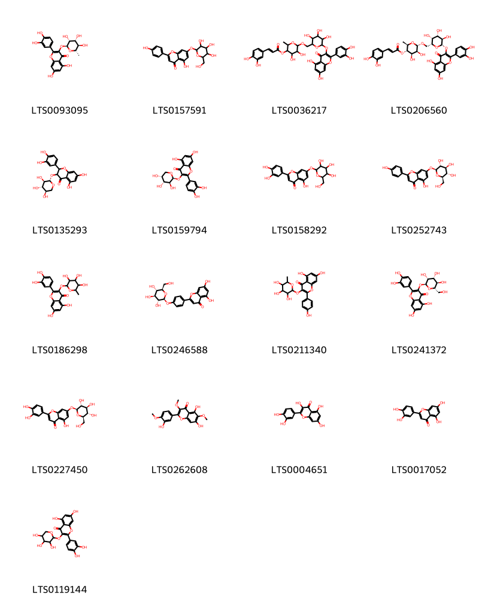

!!! abstract "Tóm tắt"

    Lá Cỏ ngọt (Folium Steviae rebaudianae) là lá thu hái ở những cây sắp ra hoa phơi hay sấy khô của cây Cỏ ngọt [Stevia rebaudiana (Bertoni) Hemsley], họ Cúc (Asteraceae). Cây có ở Ấn Độ, Trung Quốc, Nhật Bản. Ở Việt Nam, cây tập trung ở một số nơi như: Thái Nguyên, Hà Nội, Đăk Lăk,... Theo tài liệu cổ, lá cỏ ngọt có vị ngọt, tính mát, vào kinh phế tỳ thận. Dươc liệu này được dùng để trừ tiêu khát, lợi tiểu, hạ huyết áp dùng trong các trường hợp đái tháo đường, đái tháo nhạt, bí tiểu tiện, huyết áp cao. Thành phần hóa học của lá cỏ ngọt gồm có steviosid, diterpen glucosid, triterpenoid, sterol, tanin, tinh dầu, protex, lipid.…

## Thông tin về thực vật

Dược liệu **Cỏ Ngọt (Lá)** từ bộ phận **nan** từ loài *Stevia rebaudiana*.

**Mô tả thực vật:** Cây thảo lưu niên, caо 30-50cm, сó khi tới 120cm; mảnh, mọc thẳng đứng, có rãnh dọc và có lông lún phún, đường kính 5-80mm. Lá mọc đối, phiến lá hình thuôn-ngọn giáo, dài 3-7cm, rộng 0,8-1,9cm, mép có răng cưa tù, hai mặt lá phủ lông mịn, cuống dài 0,3-0,5cm. Cụm hoa đầu, hợp thành ngù, ở ngọn hay ở nách lá; mỗi cụm hoa đầu có 5 hoa nhỏ, đồng hình, lưỡng tỉnh. Tổng bao gồm 5-6 lá bắc. Để hoa trầm, phẳng, không có lông. Hoa hình ống, màu trắng, phớt hồng. Quả bế rất nhỏ.

*Tài liệu tham khảo:* "Từ điển cây thuốc Việt Nam" - Võ Văn Chi 
Trong dược điển Việt nam, một loài được sử dụng làm dược liệu là *Stevia rebaudiana*.

!!! info "Phân loại thực vật của *Stevia rebaudiana*"
    - **Kingdom:** Plantae
    - **Phylum:** Tracheophyta
    - **Order:** Asterales
    - **Family:** Asteraceae
    - **Genus:** Stevia
    - **Species:** *Stevia rebaudiana*

**Phân bố trên thế giới:** Germany, nan, Korea, Republic of, Chile, Cuba, Singapore, Spain, Chinese Taipei, Colombia, unknown or invalid, Japan, Australia, Paraguay, Portugal, Estonia, Guatemala, India, Brazil, Argentina, United States of America, Bolivia (Plurinational State of), China, Pakistan, Italy, Malaysia, New Zealand, Norway, Ecuador, El Salvador, Austria, Belgium

**Phân bố tại Việt nam:** Không có ghi nhận ở Việt Nam

## Thông tin về dược liệu 

### Định danh

!!! info "Thông tin về tên gọi"

    - Dược liệu tiếng Việt: nan
    - Dược liệu tiếng Trung: nan (nan)
    - Dược liệu tiếng Anh: nan
    - Dược liệu latin thông dụng: nan
    - Dược liệu latin kiểu DĐVN: *folium steviae rebaudiana*
    - Dược liệu latin kiểu DĐVN: *nan*
    - Dược liệu latin kiểu thông tư: *nan*
    - Bộ phận dùng: nan (nan)

### Mô tả dược liệu 

- **Theo dược điển Việt nam V:** nan

- **Mô tả dược liệu theo thông tư chế biến dược liệu theo phương pháp cổ truyền:** nan

### Chế biến 

- **Chế biến theo dược điển việt nam V**: nan

- **Chế biến theo thông tư:** nan

--- 

## Thành phần hóa học

- Theo tài liệu của GS. Đỗ Tất Lợi:  (1) Thành phần chính trong cỏ ngọt là steviosid, một diterpen glucosid có độ ngọt gấp 200-300 lần đường. Ngoài ra, còn có dulcosid A (0,5%), rebaudiosid A (2- 3%), C (1,5-2%) và steviolbiosid, rebaudiosid B, D, E ở dạng vết. Còn có một số dẫn chất diterpenoid khác, triterpenoid, sterol, tanin, tinh dầu, protex (6,2%), lipid (5,6%).
(2)Dược điển Việt Nam: steviosid
    

**Thành phần hóa học từ loài **Stevia rebaudiana**

Theo cơ sở dữ liệu lotus, loài *Stevia rebaudiana* đã phân lập và xác định được **168** hoạt chất thuộc về các nhóm Indolizidines, Heteroaromatic compounds, Organooxygen compounds, Flavonoids, Fatty Acyls, Phenol ethers, Phenols, Benzene and substituted derivatives, Unsaturated hydrocarbons, Prenol lipids trong bảng dưới đây. Danh sách các hoạt chất như sau 1,3-dihydroxy-3,4a,8,8-tetramethyl-4-(3-oxobut-1-en-1-yl)-hexahydro-1h-naphthalen-2-yl acetate [(LTS0029009)](https://lotus.naturalproducts.net/compound/lotus_id/LTS0029009), 3,4,5-trihydroxy-6-(hydroxymethyl)oxan-2-yl 13-{[5-hydroxy-6-(hydroxymethyl)-3-{[3,4,5-trihydroxy-6-(hydroxymethyl)oxan-2-yl]oxy}-4-[(3,4,5-trihydroxyoxan-2-yl)oxy]oxan-2-yl]oxy}-5,9-dimethyl-14-methylidenetetracyclo[11.2.1.0¹,¹⁰.0⁴,⁹]hexadecane-5-carboxylate [(LTS0100337)](https://lotus.naturalproducts.net/compound/lotus_id/LTS0100337), n-valeric acid [(LTS0025746)](https://lotus.naturalproducts.net/compound/lotus_id/LTS0025746), 4-isopropyl-1,6-dimethyl-2,3,4,4a,7,8-hexahydronaphthalene [(LTS0270743)](https://lotus.naturalproducts.net/compound/lotus_id/LTS0270743), (2s,3r,4s,5s,6r)-3,4,5-trihydroxy-6-(hydroxymethyl)oxan-2-yl (1r,4s,5r,9s,10r,13s)-13-{[(2s,3r,4s,5r,6r)-5-hydroxy-6-(hydroxymethyl)-4-{[(2s,3r,4s,5s,6r)-3,4,5-trihydroxy-6-(hydroxymethyl)oxan-2-yl]oxy}-3-{[(2r,3r,4r,5r,6s)-3,4,5-trihydroxy-6-methyloxan-2-yl]oxy}oxan-2-yl]oxy}-5,9-dimethyl-14-methylidenetetracyclo[11.2.1.0¹,¹⁰.0⁴,⁹]hexadecane-5-carboxylate [(LTS0018871)](https://lotus.naturalproducts.net/compound/lotus_id/LTS0018871), (1r,2s,3s,4r,4as,8as)-3,4a,8,8-tetramethyl-4-[(2z)-3-methylpenta-2,4-dien-1-yl]-hexahydro-1h-naphthalene-1,2,3-triol [(LTS0080139)](https://lotus.naturalproducts.net/compound/lotus_id/LTS0080139), (1r,2s,3s,4r,4as,8as)-4-[(1e,3z)-5-hydroxy-3-methylpenta-1,3-dien-1-yl]-3,4a,8,8-tetramethyl-hexahydro-1h-naphthalene-1,2,3-triol [(LTS0005788)](https://lotus.naturalproducts.net/compound/lotus_id/LTS0005788), (7ar)-1,1,7-trimethyl-4-methylidene-octahydrocyclopropa[e]azulen-7-ol [(LTS0091612)](https://lotus.naturalproducts.net/compound/lotus_id/LTS0091612), α pinene [(LTS0132416)](https://lotus.naturalproducts.net/compound/lotus_id/LTS0132416), pinocarveol [(LTS0090950)](https://lotus.naturalproducts.net/compound/lotus_id/LTS0090950), steviol [(LTS0206657)](https://lotus.naturalproducts.net/compound/lotus_id/LTS0206657), 3,4-bis({[3-(3,4-dihydroxyphenyl)prop-2-enoyl]oxy})-1,5-dihydroxycyclohexane-1-carboxylic acid [(LTS0233490)](https://lotus.naturalproducts.net/compound/lotus_id/LTS0233490), 4-[(1e)-4,5-dihydroxy-3-methylidenepent-1-en-1-yl]-3,4a,8,8-tetramethyl-hexahydro-1h-naphthalene-1,2,3-triol [(LTS0273112)](https://lotus.naturalproducts.net/compound/lotus_id/LTS0273112), 4-[(1e)-5-methoxy-3-methylpenta-1,3-dien-1-yl]-3,4a,8,8-tetramethyl-hexahydro-1h-naphthalene-1,2,3-triol [(LTS0042719)](https://lotus.naturalproducts.net/compound/lotus_id/LTS0042719), (1r,2s,3s,4r,4ar,8as)-4-[(1e,3r)-3-hydroxy-3-methylpenta-1,4-dien-1-yl]-3,4a,8,8-tetramethyl-hexahydro-1h-naphthalene-1,2,3-triol [(LTS0082319)](https://lotus.naturalproducts.net/compound/lotus_id/LTS0082319), eugenol [(LTS0052342)](https://lotus.naturalproducts.net/compound/lotus_id/LTS0052342), stevioside [(LTS0071721)](https://lotus.naturalproducts.net/compound/lotus_id/LTS0071721), 6-[(6-{[2-(3,4-dihydroxyphenyl)-5,7-dihydroxy-4-oxochromen-3-yl]oxy}-3,4,5-trihydroxyoxan-2-yl)methoxy]-4,5-dihydroxy-2-methyloxan-3-yl 3-(3,4-dihydroxyphenyl)prop-2-enoate [(LTS0036217)](https://lotus.naturalproducts.net/compound/lotus_id/LTS0036217), rebaudioside b [(LTS0021693)](https://lotus.naturalproducts.net/compound/lotus_id/LTS0021693), steviol [(LTS0036571)](https://lotus.naturalproducts.net/compound/lotus_id/LTS0036571), (z)-γ-bisabolene [(LTS0143321)](https://lotus.naturalproducts.net/compound/lotus_id/LTS0143321), (3e)-4-[(1r,2s,3s,4r,4as,8as)-2,3,4-trihydroxy-2,5,5,8a-tetramethyl-hexahydro-1h-naphthalen-1-yl]but-3-en-2-one [(LTS0125515)](https://lotus.naturalproducts.net/compound/lotus_id/LTS0125515), (1r,2s,3s,4r,4as,8as)-4-[(1e,3e)-5-methoxy-3-methylpenta-1,3-dien-1-yl]-3,4a,8,8-tetramethyl-hexahydro-1h-naphthalene-1,2,3-triol [(LTS0174562)](https://lotus.naturalproducts.net/compound/lotus_id/LTS0174562), luteolin 7-o-glucoside [(LTS0227450)](https://lotus.naturalproducts.net/compound/lotus_id/LTS0227450), (2z,4e)-5-[(1r,2s,3s,4r,4as,8as)-2,3,4-trihydroxy-2,5,5,8a-tetramethyl-hexahydro-1h-naphthalen-1-yl]-3-methylpenta-2,4-dienal [(LTS0041295)](https://lotus.naturalproducts.net/compound/lotus_id/LTS0041295), guaijaverin [(LTS0119144)](https://lotus.naturalproducts.net/compound/lotus_id/LTS0119144), (1s,4s)-4-isopropyl-1,6-dimethyl-1,2,3,4-tetrahydronaphthalene [(LTS0139634)](https://lotus.naturalproducts.net/compound/lotus_id/LTS0139634), (s)-trans-verbenol [(LTS0175186)](https://lotus.naturalproducts.net/compound/lotus_id/LTS0175186), 3,4-dihydrocadalene [(LTS0015523)](https://lotus.naturalproducts.net/compound/lotus_id/LTS0015523), quercitrin [(LTS0093095)](https://lotus.naturalproducts.net/compound/lotus_id/LTS0093095), stevioside [(LTS0176468)](https://lotus.naturalproducts.net/compound/lotus_id/LTS0176468), 1-ethenyl-1,2-dimethyl-2-(prop-1-en-2-yl)-4-(propan-2-ylidene)cyclohexane [(LTS0102139)](https://lotus.naturalproducts.net/compound/lotus_id/LTS0102139), (1r,2s,3s,4r,4as,8as)-2,3-dihydroxy-3,4a,8,8-tetramethyl-4-[(1e)-3-oxobut-1-en-1-yl]-hexahydro-1h-naphthalen-1-yl acetate [(LTS0097866)](https://lotus.naturalproducts.net/compound/lotus_id/LTS0097866), 2,3-dihydroxy-3,4a,8,8-tetramethyl-4-(3-oxobut-1-en-1-yl)-hexahydro-1h-naphthalen-1-yl acetate [(LTS0193982)](https://lotus.naturalproducts.net/compound/lotus_id/LTS0193982), 3-(hydroxymethyl)-5-methyl-octahydroindolizine-1,2-diol [(LTS0263302)](https://lotus.naturalproducts.net/compound/lotus_id/LTS0263302), (1r,2s,3s,4r,4as,8ar)-4-[(1e,3z)-5-hydroxy-3-methylpenta-1,3-dien-1-yl]-3,4a,8,8-tetramethyl-hexahydro-1h-naphthalene-1,2,3-triol [(LTS0225216)](https://lotus.naturalproducts.net/compound/lotus_id/LTS0225216), luteolin [(LTS0017052)](https://lotus.naturalproducts.net/compound/lotus_id/LTS0017052), (e)-calamene [(LTS0228241)](https://lotus.naturalproducts.net/compound/lotus_id/LTS0228241), 2,4-dihydroxypyrimidine-5-carboxylic acid [(LTS0022204)](https://lotus.naturalproducts.net/compound/lotus_id/LTS0022204), p-propenylanisole [(LTS0177188)](https://lotus.naturalproducts.net/compound/lotus_id/LTS0177188), [(3r,4ar,6ar,7r,10as,10bs)-3-ethenyl-3,4a,7,10a-tetramethyl-octahydro-1h-naphtho[2,1-b]pyran-7-yl]methanol [(LTS0239734)](https://lotus.naturalproducts.net/compound/lotus_id/LTS0239734), rebaudioside c [(LTS0172455)](https://lotus.naturalproducts.net/compound/lotus_id/LTS0172455), β-caryophyllene oxide [(LTS0213960)](https://lotus.naturalproducts.net/compound/lotus_id/LTS0213960), dulcoside a [(LTS0087416)](https://lotus.naturalproducts.net/compound/lotus_id/LTS0087416), (1as,4as,7s,7ar,7bs)-1,1,7-trimethyl-4-methylidene-octahydrocyclopropa[e]azulen-7-ol [(LTS0073517)](https://lotus.naturalproducts.net/compound/lotus_id/LTS0073517), β-ionone [(LTS0155301)](https://lotus.naturalproducts.net/compound/lotus_id/LTS0155301), methyl eugenol [(LTS0098881)](https://lotus.naturalproducts.net/compound/lotus_id/LTS0098881), amylfuran [(LTS0044471)](https://lotus.naturalproducts.net/compound/lotus_id/LTS0044471), (1r,2s,3r,5r,8ar)-3-(hydroxymethyl)-5-methyl-octahydroindolizine-1,2-diol [(LTS0147196)](https://lotus.naturalproducts.net/compound/lotus_id/LTS0147196), cymene [(LTS0181568)](https://lotus.naturalproducts.net/compound/lotus_id/LTS0181568), terpineol [(LTS0136148)](https://lotus.naturalproducts.net/compound/lotus_id/LTS0136148), anethole [(LTS0033696)](https://lotus.naturalproducts.net/compound/lotus_id/LTS0033696), humulene [(LTS0263171)](https://lotus.naturalproducts.net/compound/lotus_id/LTS0263171), carvacrol [(LTS0012882)](https://lotus.naturalproducts.net/compound/lotus_id/LTS0012882), rebaudioside f [(LTS0083118)](https://lotus.naturalproducts.net/compound/lotus_id/LTS0083118), (2e,4e)-5-[(1r,2s,3s,4r,4as,8ar)-2,3,4-trihydroxy-2,5,5,8a-tetramethyl-hexahydro-1h-naphthalen-1-yl]-3-methylpenta-2,4-dienal [(LTS0085323)](https://lotus.naturalproducts.net/compound/lotus_id/LTS0085323), (3e)-4-(2,3,4-trihydroxy-2,5,5,8a-tetramethyl-hexahydro-1h-naphthalen-1-yl)but-3-en-2-one [(LTS0143840)](https://lotus.naturalproducts.net/compound/lotus_id/LTS0143840), 2-(3,4-dihydroxyphenyl)-5,7-dihydroxy-3-{[(2s,3r,4r,5r,6s)-3,4,5-trihydroxy-6-(hydroxymethyl)oxan-2-yl]oxy}chromen-4-one [(LTS0241372)](https://lotus.naturalproducts.net/compound/lotus_id/LTS0241372), β-bourbonene [(LTS0167513)](https://lotus.naturalproducts.net/compound/lotus_id/LTS0167513), (2s,3s,4s,5s,6r)-3,4,5-trihydroxy-6-(hydroxymethyl)oxan-2-yl (1r,4s,5r,9s,10r,13s)-13-{[(2s,3r,4s,5r,6r)-4,5-dihydroxy-6-(hydroxymethyl)-3-{[(2s,3s,4s,5s,6r)-3,4,5-trihydroxy-6-(hydroxymethyl)oxan-2-yl]oxy}oxan-2-yl]oxy}-5,9-dimethyl-14-methylidenetetracyclo[11.2.1.0¹,¹⁰.0⁴,⁹]hexadecane-5-carboxylate [(LTS0036234)](https://lotus.naturalproducts.net/compound/lotus_id/LTS0036234), (3r,6e)-nerolidol [(LTS0145065)](https://lotus.naturalproducts.net/compound/lotus_id/LTS0145065), (2s,3r,4s,5s,6r)-3,4,5-trihydroxy-6-(hydroxymethyl)oxan-2-yl (1r,4s,5r,9s,10s,13s)-13-{[(2r,3s,4r,5s,6s)-5-hydroxy-6-(hydroxymethyl)-3,4-bis({[(2r,3s,4r,5r,6s)-3,4,5-trihydroxy-6-(hydroxymethyl)oxan-2-yl]oxy})oxan-2-yl]oxy}-5,9-dimethyl-14-methylidenetetracyclo[11.2.1.0¹,¹⁰.0⁴,⁹]hexadecane-5-carboxylate [(LTS0159793)](https://lotus.naturalproducts.net/compound/lotus_id/LTS0159793), (1r,2s,3s,4r,4as,8as)-4-[(1e,4s)-4,5-dihydroxy-3-methylidenepent-1-en-1-yl]-3,4a,8,8-tetramethyl-hexahydro-1h-naphthalene-1,2,3-triol [(LTS0123036)](https://lotus.naturalproducts.net/compound/lotus_id/LTS0123036), α-copaene [(LTS0207598)](https://lotus.naturalproducts.net/compound/lotus_id/LTS0207598), 4-[(1e,3z)-5-hydroxy-3-methylpenta-1,3-dien-1-yl]-3,4a,8,8-tetramethyl-hexahydro-1h-naphthalene-1,2,3-triol [(LTS0115951)](https://lotus.naturalproducts.net/compound/lotus_id/LTS0115951), (1z,6z,8s)-8-isopropyl-1-methyl-5-methylidenecyclodeca-1,6-diene [(LTS0065195)](https://lotus.naturalproducts.net/compound/lotus_id/LTS0065195), 3,4,5-trihydroxy-6-(hydroxymethyl)oxan-2-yl 13-{[5-hydroxy-6-(hydroxymethyl)-4-{[3,4,5-trihydroxy-6-(hydroxymethyl)oxan-2-yl]oxy}-3-[(3,4,5-trihydroxyoxan-2-yl)oxy]oxan-2-yl]oxy}-5,9-dimethyl-14-methylidenetetracyclo[11.2.1.0¹,¹⁰.0⁴,⁹]hexadecane-5-carboxylate [(LTS0270663)](https://lotus.naturalproducts.net/compound/lotus_id/LTS0270663), (3e)-2-oxo-4-(2,6,6-trimethylcyclohex-1-en-1-yl)but-3-enal [(LTS0198571)](https://lotus.naturalproducts.net/compound/lotus_id/LTS0198571), 1-octen-3-ol [(LTS0057101)](https://lotus.naturalproducts.net/compound/lotus_id/LTS0057101), 4-isopropyl-6-methyl-1-methylidene-3,4,4a,7,8,8a-hexahydro-2h-naphthalene [(LTS0111070)](https://lotus.naturalproducts.net/compound/lotus_id/LTS0111070), (1r,4s,5r,9s,10s,13s)-13-{[(2r,3s,4r,5s,6s)-5-hydroxy-6-(hydroxymethyl)-3,4-bis({[(2r,3s,4r,5r,6s)-3,4,5-trihydroxy-6-(hydroxymethyl)oxan-2-yl]oxy})oxan-2-yl]oxy}-5,9-dimethyl-14-methylidenetetracyclo[11.2.1.0¹,¹⁰.0⁴,⁹]hexadecane-5-carboxylic acid [(LTS0105616)](https://lotus.naturalproducts.net/compound/lotus_id/LTS0105616), nerolidol [(LTS0197738)](https://lotus.naturalproducts.net/compound/lotus_id/LTS0197738), (2r,3s,4r,5s,6s)-6-{[(2r,3r,4s,5r,6s)-6-{[2-(3,4-dihydroxyphenyl)-5,7-dihydroxy-4-oxochromen-3-yl]oxy}-3,4,5-trihydroxyoxan-2-yl]methoxy}-4,5-dihydroxy-2-methyloxan-3-yl (2e)-3-(3,4-dihydroxyphenyl)prop-2-enoate [(LTS0206560)](https://lotus.naturalproducts.net/compound/lotus_id/LTS0206560), centaureidin [(LTS0262608)](https://lotus.naturalproducts.net/compound/lotus_id/LTS0262608), (1s,5r,7s,10r)-7-isopropyl-4,10-dimethyltricyclo[4.4.0.0¹,⁵]dec-3-ene [(LTS0064715)](https://lotus.naturalproducts.net/compound/lotus_id/LTS0064715), myrtenal [(LTS0202475)](https://lotus.naturalproducts.net/compound/lotus_id/LTS0202475), β-pinene [(LTS0117550)](https://lotus.naturalproducts.net/compound/lotus_id/LTS0117550), (2s,3r,4s,5s,6r)-3,4,5-trihydroxy-6-(hydroxymethyl)oxan-2-yl (1r,4s,5r,9s,10r,13s)-13-{[(2r,3r,4s,5s,6r)-4,5-dihydroxy-6-(hydroxymethyl)-3-{[(2s,3r,4s,5s,6r)-3,4,5-trihydroxy-6-(hydroxymethyl)oxan-2-yl]oxy}oxan-2-yl]oxy}-5,9-dimethyl-14-methylidenetetracyclo[11.2.1.0¹,¹⁰.0⁴,⁹]hexadecane-5-carboxylate [(LTS0071885)](https://lotus.naturalproducts.net/compound/lotus_id/LTS0071885), (1r,5r,9s,13s)-13-{[(2r,3s,4r,5s,6s)-5-hydroxy-6-(hydroxymethyl)-3,4-bis({[(2r,3s,4r,5r,6s)-3,4,5-trihydroxy-6-(hydroxymethyl)oxan-2-yl]oxy})oxan-2-yl]oxy}-5,9-dimethyl-14-methylidenetetracyclo[11.2.1.0¹,¹⁰.0⁴,⁹]hexadecane-5-carboxylic acid [(LTS0194967)](https://lotus.naturalproducts.net/compound/lotus_id/LTS0194967), (1r,2s,3s,4r,4as,8as)-2,3-dihydroxy-3,4a,8,8-tetramethyl-4-[(2z)-3-methylpenta-2,4-dien-1-yl]-hexahydro-1h-naphthalen-1-yl acetate [(LTS0268787)](https://lotus.naturalproducts.net/compound/lotus_id/LTS0268787), apigetrin [(LTS0157591)](https://lotus.naturalproducts.net/compound/lotus_id/LTS0157591), quercitrin [(LTS0186298)](https://lotus.naturalproducts.net/compound/lotus_id/LTS0186298), [(3r,4ar,6ar,7r,10as,10br)-3-ethenyl-3,4a,7,10a-tetramethyl-octahydro-1h-naphtho[2,1-b]pyran-7-yl]methanol [(LTS0041383)](https://lotus.naturalproducts.net/compound/lotus_id/LTS0041383), 4-(4,5-dihydroxy-3-methylidenepent-1-en-1-yl)-3,4a,8,8-tetramethyl-hexahydro-1h-naphthalene-1,2,3-triol [(LTS0009844)](https://lotus.naturalproducts.net/compound/lotus_id/LTS0009844), 4-(5-methoxy-3-methylpenta-1,3-dien-1-yl)-3,4a,8,8-tetramethyl-hexahydro-1h-naphthalene-1,2,3-triol [(LTS0226732)](https://lotus.naturalproducts.net/compound/lotus_id/LTS0226732), (2s,3r,4s,5s,6r)-3,4,5-trihydroxy-6-(hydroxymethyl)oxan-2-yl (1r,4s,5r,9s,10r,13s)-13-{[(2s,3r,4s,5r,6r)-5-hydroxy-6-(hydroxymethyl)-3-{[(2s,3r,4s,5s,6r)-3,4,5-trihydroxy-6-(hydroxymethyl)oxan-2-yl]oxy}-4-{[(2s,3r,4s,5r)-3,4,5-trihydroxyoxan-2-yl]oxy}oxan-2-yl]oxy}-5,9-dimethyl-14-methylidenetetracyclo[11.2.1.0¹,¹⁰.0⁴,⁹]hexadecane-5-carboxylate [(LTS0074854)](https://lotus.naturalproducts.net/compound/lotus_id/LTS0074854), 2-methylbutanoic acid; 3-hexenol [(LTS0131967)](https://lotus.naturalproducts.net/compound/lotus_id/LTS0131967), 3,4,5-trihydroxy-6-(hydroxymethyl)oxan-2-yl 13-{[4,5-dihydroxy-6-(hydroxymethyl)-3-{[3,4,5-trihydroxy-6-(hydroxymethyl)oxan-2-yl]oxy}oxan-2-yl]oxy}-4,5,9,10-tetramethyl-14-methylidenetetracyclo[11.2.1.0¹,¹⁰.0⁴,⁹]hexadecane-5-carboxylate [(LTS0019036)](https://lotus.naturalproducts.net/compound/lotus_id/LTS0019036), (1r,2s,3s,4r,4ar,8as)-4-[(1e,3s)-3-hydroxy-3-methylpenta-1,4-dien-1-yl]-3,4a,8,8-tetramethyl-hexahydro-1h-naphthalene-1,2,3-triol [(LTS0209970)](https://lotus.naturalproducts.net/compound/lotus_id/LTS0209970), 4-(2,3,4-trihydroxy-2,5,5,8a-tetramethyl-hexahydro-1h-naphthalen-1-yl)but-3-en-2-one [(LTS0029484)](https://lotus.naturalproducts.net/compound/lotus_id/LTS0029484), 1,3-dihydroxy-3,4a,8,8-tetramethyl-4-(3-methylpenta-2,4-dien-1-yl)-hexahydro-1h-naphthalen-2-yl acetate [(LTS0099328)](https://lotus.naturalproducts.net/compound/lotus_id/LTS0099328), (1s,2s)-1-ethenyl-1-methyl-2-(prop-1-en-2-yl)-4-(propan-2-ylidene)cyclohexane [(LTS0135613)](https://lotus.naturalproducts.net/compound/lotus_id/LTS0135613), 2,3-dihydroxy-3,4a,8,8-tetramethyl-4-[(1e)-3-oxobut-1-en-1-yl]-hexahydro-1h-naphthalen-1-yl acetate [(LTS0138522)](https://lotus.naturalproducts.net/compound/lotus_id/LTS0138522), 13-{[5-hydroxy-6-(hydroxymethyl)-3,4-bis({[3,4,5-trihydroxy-6-(hydroxymethyl)oxan-2-yl]oxy})oxan-2-yl]oxy}-5,9-dimethyl-14-methylidenetetracyclo[11.2.1.0¹,¹⁰.0⁴,⁹]hexadecane-5-carboxylic acid [(LTS0134379)](https://lotus.naturalproducts.net/compound/lotus_id/LTS0134379), β-elemene [(LTS0225699)](https://lotus.naturalproducts.net/compound/lotus_id/LTS0225699), (1r,2s,3s,4r,4as,8as)-4-[(1e,3e)-5-hydroxy-3-methylpenta-1,3-dien-1-yl]-3,4a,8,8-tetramethyl-hexahydro-1h-naphthalene-1,2,3-triol [(LTS0226145)](https://lotus.naturalproducts.net/compound/lotus_id/LTS0226145), 3,4,5-trihydroxy-6-(hydroxymethyl)oxan-2-yl 13-{[5-hydroxy-6-(hydroxymethyl)-4-{[3,4,5-trihydroxy-6-(hydroxymethyl)oxan-2-yl]oxy}-3-[(3,4,5-trihydroxy-6-methyloxan-2-yl)oxy]oxan-2-yl]oxy}-5,9-dimethyl-14-methylidenetetracyclo[11.2.1.0¹,¹⁰.0⁴,⁹]hexadecane-5-carboxylate [(LTS0135154)](https://lotus.naturalproducts.net/compound/lotus_id/LTS0135154), (1s,2r,3r,4s,4ar,8as)-3,4a,8,8-tetramethyl-4-[(2z)-3-methylpenta-2,4-dien-1-yl]-hexahydro-1h-naphthalene-1,2,3-triol [(LTS0097063)](https://lotus.naturalproducts.net/compound/lotus_id/LTS0097063), (2s,3r,4r,5s,6r)-3,4,5-trihydroxy-6-(hydroxymethyl)oxan-2-yl (1r,4s,5r,9s,10r,13s)-13-{[(2s,3r,4s,5s,6r)-4,5-dihydroxy-6-(hydroxymethyl)-3-{[(2s,3r,4s,5s,6r)-3,4,5-trihydroxy-6-(hydroxymethyl)oxan-2-yl]oxy}oxan-2-yl]oxy}-5,9-dimethyl-14-methylidenetetracyclo[11.2.1.0¹,¹⁰.0⁴,⁹]hexadecane-5-carboxylate [(LTS0036984)](https://lotus.naturalproducts.net/compound/lotus_id/LTS0036984), delta-cadinol [(LTS0008282)](https://lotus.naturalproducts.net/compound/lotus_id/LTS0008282), 4-(2,3-dihydroxy-2,5,5,8a-tetramethyl-hexahydro-1h-naphthalen-1-yl)but-3-en-2-one [(LTS0268038)](https://lotus.naturalproducts.net/compound/lotus_id/LTS0268038), (1r,4s,5r,9s,10r,13s)-13-{[(2s)-4,5-dihydroxy-6-(hydroxymethyl)-3-{[(2s)-3,4,5-trihydroxy-6-(hydroxymethyl)oxan-2-yl]oxy}oxan-2-yl]oxy}-5,9-dimethyl-14-methylidenetetracyclo[11.2.1.0¹,¹⁰.0⁴,⁹]hexadecane-5-carboxylic acid [(LTS0020884)](https://lotus.naturalproducts.net/compound/lotus_id/LTS0020884), quercetin [(LTS0004651)](https://lotus.naturalproducts.net/compound/lotus_id/LTS0004651), β-bourbonene [(LTS0074484)](https://lotus.naturalproducts.net/compound/lotus_id/LTS0074484), terpinolene [(LTS0104525)](https://lotus.naturalproducts.net/compound/lotus_id/LTS0104525), (+)-gamma-cadinene [(LTS0103949)](https://lotus.naturalproducts.net/compound/lotus_id/LTS0103949), delta-cadinene [(LTS0019321)](https://lotus.naturalproducts.net/compound/lotus_id/LTS0019321), (1s,2r,3r,4s,4ar,8ar)-1,3-dihydroxy-3,4a,8,8-tetramethyl-4-[(2z)-3-methylpenta-2,4-dien-1-yl]-hexahydro-1h-naphthalen-2-yl acetate [(LTS0233331)](https://lotus.naturalproducts.net/compound/lotus_id/LTS0233331), (1r,2s,3s,4r,4as,8as)-4-[(1e,4r)-4,5-dihydroxy-3-methylidenepent-1-en-1-yl]-3,4a,8,8-tetramethyl-hexahydro-1h-naphthalene-1,2,3-triol [(LTS0061952)](https://lotus.naturalproducts.net/compound/lotus_id/LTS0061952), 4-(5-hydroxy-3-methylpenta-1,3-dien-1-yl)-3,4a,8,8-tetramethyl-hexahydro-1h-naphthalene-1,2,3-triol [(LTS0246531)](https://lotus.naturalproducts.net/compound/lotus_id/LTS0246531), (-)-β-cubebene [(LTS0123697)](https://lotus.naturalproducts.net/compound/lotus_id/LTS0123697), (2s,3s,4s,5s,6r)-3,4,5-trihydroxy-6-(hydroxymethyl)oxan-2-yl (1r,4s,5r,9s,10r,13s)-13-{[(2s,3r,4s,5r,6r)-5-hydroxy-6-(hydroxymethyl)-3,4-bis({[(2s,3r,4s,5s,6r)-3,4,5-trihydroxy-6-(hydroxymethyl)oxan-2-yl]oxy})oxan-2-yl]oxy}-5,9-dimethyl-14-methylidenetetracyclo[11.2.1.0¹,¹⁰.0⁴,⁹]hexadecane-5-carboxylate [(LTS0189651)](https://lotus.naturalproducts.net/compound/lotus_id/LTS0189651), 3,4a,8,8-tetramethyl-4-(3-methylpenta-2,4-dien-1-yl)-hexahydro-1h-naphthalene-1,2,3-triol [(LTS0272012)](https://lotus.naturalproducts.net/compound/lotus_id/LTS0272012), austroinulin [(LTS0257641)](https://lotus.naturalproducts.net/compound/lotus_id/LTS0257641), (2r,3r,4s,5s,6r)-3,4,5-trihydroxy-6-(hydroxymethyl)oxan-2-yl (1r,4s,5r,9s,10r,13s)-13-{[(2s,3r,4s,5r,6r)-5-hydroxy-6-(hydroxymethyl)-4-{[(2s,3r,4s,5s,6r)-3,4,5-trihydroxy-6-(hydroxymethyl)oxan-2-yl]oxy}-3-{[(2s,3r,4s,5r)-3,4,5-trihydroxyoxan-2-yl]oxy}oxan-2-yl]oxy}-5,9-dimethyl-14-methylidenetetracyclo[11.2.1.0¹,¹⁰.0⁴,⁹]hexadecane-5-carboxylate [(LTS0183429)](https://lotus.naturalproducts.net/compound/lotus_id/LTS0183429), (2s,3r,4s,5s,6r)-3,4,5-trihydroxy-6-(hydroxymethyl)oxan-2-yl (1r,5r,13s)-13-{[(2s,3r,4s,5r,6r)-5-hydroxy-6-(hydroxymethyl)-4-{[(2s,3r,4s,5s,6r)-3,4,5-trihydroxy-6-(hydroxymethyl)oxan-2-yl]oxy}-3-{[(2s,3r,4s,5r)-3,4,5-trihydroxyoxan-2-yl]oxy}oxan-2-yl]oxy}-5,9-dimethyl-14-methylidenetetracyclo[11.2.1.0¹,¹⁰.0⁴,⁹]hexadecane-5-carboxylate [(LTS0269689)](https://lotus.naturalproducts.net/compound/lotus_id/LTS0269689), (1r,2s,3s,4r,4as,8as)-4-[(1e,3z)-5-methoxy-3-methylpenta-1,3-dien-1-yl]-3,4a,8,8-tetramethyl-hexahydro-1h-naphthalene-1,2,3-triol [(LTS0255667)](https://lotus.naturalproducts.net/compound/lotus_id/LTS0255667), caryophyllene [(LTS0085212)](https://lotus.naturalproducts.net/compound/lotus_id/LTS0085212), cuminaldehyde [(LTS0037806)](https://lotus.naturalproducts.net/compound/lotus_id/LTS0037806), (3e)-4-[(1r,2s,3s,4as,8as)-2,3-dihydroxy-2,5,5,8a-tetramethyl-hexahydro-1h-naphthalen-1-yl]but-3-en-2-one [(LTS0026252)](https://lotus.naturalproducts.net/compound/lotus_id/LTS0026252), rebaudioside e [(LTS0174145)](https://lotus.naturalproducts.net/compound/lotus_id/LTS0174145), (-)-α-cubebene [(LTS0042045)](https://lotus.naturalproducts.net/compound/lotus_id/LTS0042045), (2s,3r,4s,5s,6r)-3,4,5-trihydroxy-6-(hydroxymethyl)oxan-2-yl (1r,4s,5r,9s,10r,13s)-13-{[(2s,3r,4s,5r,6r)-5-hydroxy-6-(hydroxymethyl)-3-{[(2r,3s,4r,5r,6s)-3,4,5-trihydroxy-6-(hydroxymethyl)oxan-2-yl]oxy}-4-{[(2s,3r,4s,5s,6r)-3,4,5-trihydroxy-6-(hydroxymethyl)oxan-2-yl]oxy}oxan-2-yl]oxy}-5,9-dimethyl-14-methylidenetetracyclo[11.2.1.0¹,¹⁰.0⁴,⁹]hexadecane-5-carboxylate [(LTS0194439)](https://lotus.naturalproducts.net/compound/lotus_id/LTS0194439), (2r,3s,4r,5r,6s)-3,4,5-trihydroxy-6-(hydroxymethyl)oxan-2-yl (1s,4r,5s,9r,10s,13r)-13-{[(2r,3s,4r,5s,6s)-5-hydroxy-6-(hydroxymethyl)-4-{[(2r,3s,4r,5r,6s)-3,4,5-trihydroxy-6-(hydroxymethyl)oxan-2-yl]oxy}-3-{[(2r,3s,4r,5s)-3,4,5-trihydroxyoxan-2-yl]oxy}oxan-2-yl]oxy}-5,9-dimethyl-14-methylidenetetracyclo[11.2.1.0¹,¹⁰.0⁴,⁹]hexadecane-5-carboxylate [(LTS0258184)](https://lotus.naturalproducts.net/compound/lotus_id/LTS0258184), (2e,4e)-5-[(1r,2s,3s,4r,4as,8as)-2,3,4-trihydroxy-2,5,5,8a-tetramethyl-hexahydro-1h-naphthalen-1-yl]-3-methylpenta-2,4-dienal [(LTS0073547)](https://lotus.naturalproducts.net/compound/lotus_id/LTS0073547), myrtenol [(LTS0130529)](https://lotus.naturalproducts.net/compound/lotus_id/LTS0130529), rebaudioside d [(LTS0152415)](https://lotus.naturalproducts.net/compound/lotus_id/LTS0152415), 3-methyl-5-(2,3,4-trihydroxy-2,5,5,8a-tetramethyl-hexahydro-1h-naphthalen-1-yl)penta-2,4-dienal [(LTS0037670)](https://lotus.naturalproducts.net/compound/lotus_id/LTS0037670), α terpinene [(LTS0232891)](https://lotus.naturalproducts.net/compound/lotus_id/LTS0232891), pinocarvone [(LTS0084836)](https://lotus.naturalproducts.net/compound/lotus_id/LTS0084836), (1s,2r,3r,4s,4ar,8as)-2,3-dihydroxy-3,4a,8,8-tetramethyl-4-[(2z)-3-methylpenta-2,4-dien-1-yl]-hexahydro-1h-naphthalen-1-yl acetate [(LTS0091509)](https://lotus.naturalproducts.net/compound/lotus_id/LTS0091509), rebaudioside a [(LTS0056777)](https://lotus.naturalproducts.net/compound/lotus_id/LTS0056777), (-)-germacrene d [(LTS0059194)](https://lotus.naturalproducts.net/compound/lotus_id/LTS0059194), 2-(3,4-dihydroxyphenyl)-5,7-dihydroxy-3-{[(2s,3r,4s,5r)-3,4,5-trihydroxyoxan-2-yl]oxy}-2,3-dihydro-1-benzopyran-4-one [(LTS0135293)](https://lotus.naturalproducts.net/compound/lotus_id/LTS0135293), phenethyl valerate [(LTS0225639)](https://lotus.naturalproducts.net/compound/lotus_id/LTS0225639), sabinene [(LTS0224133)](https://lotus.naturalproducts.net/compound/lotus_id/LTS0224133), (1r,4s,4ar)-4-isopropyl-1,6-dimethyl-3,4,4a,7,8,8a-hexahydro-2h-naphthalen-1-ol [(LTS0164497)](https://lotus.naturalproducts.net/compound/lotus_id/LTS0164497), (2s,3r,4s,5s,6r)-3,4,5-trihydroxy-6-(hydroxymethyl)oxan-2-yl (1r,4r,5r,9s,10s,13s)-13-{[(2r,3r,4s,5r,6r)-5-hydroxy-6-(hydroxymethyl)-3,4-bis({[(2s,3r,4s,5s,6r)-3,4,5-trihydroxy-6-(hydroxymethyl)oxan-2-yl]oxy})oxan-2-yl]oxy}-5,9-dimethyl-14-methylidenetetracyclo[11.2.1.0¹,¹⁰.0⁴,⁹]hexadecane-5-carboxylate [(LTS0073532)](https://lotus.naturalproducts.net/compound/lotus_id/LTS0073532), rebaudioside c [(LTS0029436)](https://lotus.naturalproducts.net/compound/lotus_id/LTS0029436), caryophyllene oxide [(LTS0159789)](https://lotus.naturalproducts.net/compound/lotus_id/LTS0159789), (3e)-4-(2,3-dihydroxy-2,5,5,8a-tetramethyl-hexahydro-1h-naphthalen-1-yl)but-3-en-2-one [(LTS0106068)](https://lotus.naturalproducts.net/compound/lotus_id/LTS0106068), 2-(3,4-dihydroxyphenyl)-5-hydroxy-7-{[3,4,5-trihydroxy-6-(hydroxymethyl)oxan-2-yl]oxy}chromen-4-one [(LTS0158292)](https://lotus.naturalproducts.net/compound/lotus_id/LTS0158292), 2,3-dihydroxy-3,4a,8,8-tetramethyl-4-(3-methylpenta-2,4-dien-1-yl)-hexahydro-1h-naphthalen-1-yl acetate [(LTS0166534)](https://lotus.naturalproducts.net/compound/lotus_id/LTS0166534), 1,3-dihydroxy-3,4a,8,8-tetramethyl-4-[(1e)-3-oxobut-1-en-1-yl]-hexahydro-1h-naphthalen-2-yl acetate [(LTS0081254)](https://lotus.naturalproducts.net/compound/lotus_id/LTS0081254), 5,7-dihydroxy-2-(4-hydroxyphenyl)-3-[(3,4,5-trihydroxy-6-methyloxan-2-yl)oxy]chromen-4-one [(LTS0211340)](https://lotus.naturalproducts.net/compound/lotus_id/LTS0211340), (1r,2s,3s,4r,4as,8as)-1,3-dihydroxy-3,4a,8,8-tetramethyl-4-[(1e)-3-oxobut-1-en-1-yl]-hexahydro-1h-naphthalen-2-yl acetate [(LTS0261155)](https://lotus.naturalproducts.net/compound/lotus_id/LTS0261155), α-bergamotene [(LTS0226115)](https://lotus.naturalproducts.net/compound/lotus_id/LTS0226115), (2z,4e)-5-[(1r,2s,3s,4r,4as,8ar)-2,3,4-trihydroxy-2,5,5,8a-tetramethyl-hexahydro-1h-naphthalen-1-yl]-3-methylpenta-2,4-dienal [(LTS0075297)](https://lotus.naturalproducts.net/compound/lotus_id/LTS0075297), (1r,4ar,8as)-4-isopropyl-1,6-dimethyl-3,4,4a,7,8,8a-hexahydro-2h-naphthalen-1-ol [(LTS0136437)](https://lotus.naturalproducts.net/compound/lotus_id/LTS0136437), α-myrcene [(LTS0115731)](https://lotus.naturalproducts.net/compound/lotus_id/LTS0115731), β-farnesene [(LTS0067925)](https://lotus.naturalproducts.net/compound/lotus_id/LTS0067925), limonene,  [(LTS0155981)](https://lotus.naturalproducts.net/compound/lotus_id/LTS0155981), {3-ethenyl-3,4a,7,10a-tetramethyl-octahydro-1h-naphtho[2,1-b]pyran-7-yl}methanol [(LTS0219124)](https://lotus.naturalproducts.net/compound/lotus_id/LTS0219124), (2s,4r)-1,7,7-trimethylbicyclo[2.2.1]heptan-2-ol [(LTS0010050)](https://lotus.naturalproducts.net/compound/lotus_id/LTS0010050), 3,4,5-trihydroxy-6-(hydroxymethyl)oxan-2-yl 13-{[5-hydroxy-6-(hydroxymethyl)-3,4-bis({[3,4,5-trihydroxy-6-(hydroxymethyl)oxan-2-yl]oxy})oxan-2-yl]oxy}-5,9-dimethyl-14-methylidenetetracyclo[11.2.1.0¹,¹⁰.0⁴,⁹]hexadecane-5-carboxylate [(LTS0033223)](https://lotus.naturalproducts.net/compound/lotus_id/LTS0033223), 3,4-dicaffeoylquinic acid [(LTS0134972)](https://lotus.naturalproducts.net/compound/lotus_id/LTS0134972), (2s,3r,4s,5s,6r)-3,4,5-trihydroxy-6-(hydroxymethyl)oxan-2-yl (1r,4s,5r,9s,10r,13s)-13-{[(2s,3r,4s,5r,6r)-5-hydroxy-6-(hydroxymethyl)-4-{[(2s,3r,4s,5s,6r)-3,4,5-trihydroxy-6-(hydroxymethyl)oxan-2-yl]oxy}-3-{[(2r,3s,4s,5s,6r)-3,4,5-trihydroxy-6-methyloxan-2-yl]oxy}oxan-2-yl]oxy}-5,9-dimethyl-14-methylidenetetracyclo[11.2.1.0¹,¹⁰.0⁴,⁹]hexadecane-5-carboxylate [(LTS0148066)](https://lotus.naturalproducts.net/compound/lotus_id/LTS0148066), 3-octanol [(LTS0055953)](https://lotus.naturalproducts.net/compound/lotus_id/LTS0055953), apigenin 7-o-β-glucoside [(LTS0252743)](https://lotus.naturalproducts.net/compound/lotus_id/LTS0252743), (1r,2s,7s,8s)-8-isopropyl-1,3-dimethyltricyclo[4.4.0.0²,⁷]dec-3-ene [(LTS0190031)](https://lotus.naturalproducts.net/compound/lotus_id/LTS0190031), α-cadinol [(LTS0206935)](https://lotus.naturalproducts.net/compound/lotus_id/LTS0206935), borneol [(LTS0264960)](https://lotus.naturalproducts.net/compound/lotus_id/LTS0264960), 5,7-dihydroxy-2-(4-{[(2s,3r,4s,5s,6r)-3,4,5-trihydroxy-6-(hydroxymethyl)oxan-2-yl]oxy}phenyl)chromen-4-one [(LTS0246588)](https://lotus.naturalproducts.net/compound/lotus_id/LTS0246588), 2-(3,4-dihydroxyphenyl)-5,7-dihydroxy-3-{[(2s,3s,4r,5r)-3,4,5-trihydroxyoxan-2-yl]oxy}chromen-4-one [(LTS0159794)](https://lotus.naturalproducts.net/compound/lotus_id/LTS0159794), linalool, (+-)- [(LTS0128839)](https://lotus.naturalproducts.net/compound/lotus_id/LTS0128839), (1r,2s,5r)-4,6,6-trimethylbicyclo[3.1.1]hept-3-en-2-ol [(LTS0122167)](https://lotus.naturalproducts.net/compound/lotus_id/LTS0122167), (3ar,5ar,5br,7ar,11ar,11br,13ar,13br)-3a,5a,5b,8,8,11a-hexamethyl-1-(prop-1-en-2-yl)-hexadecahydrocyclopenta[a]chrysen-9-yl hexadecanoate [(LTS0228586)](https://lotus.naturalproducts.net/compound/lotus_id/LTS0228586), (2s,3r,4s,5s,6r)-3,4,5-trihydroxy-6-(hydroxymethyl)oxan-2-yl (1r,4s,5r,9s,10r,13s)-13-{[(2s,3r,4s,5s,6r)-4,5-dihydroxy-6-(hydroxymethyl)-3-{[(2r,3r,4s,5s,6r)-3,4,5-trihydroxy-6-(hydroxymethyl)oxan-2-yl]oxy}oxan-2-yl]oxy}-4,5,9,10-tetramethyl-14-methylidenetetracyclo[11.2.1.0¹,¹⁰.0⁴,⁹]hexadecane-5-carboxylate [(LTS0178833)](https://lotus.naturalproducts.net/compound/lotus_id/LTS0178833). 
        
| chemicalTaxonomyClassyfireClass     |   smiles_count |
|:------------------------------------|---------------:|
| Benzene and substituted derivatives |             20 |
| Fatty Acyls                         |             74 |
| Flavonoids                          |           1200 |
| Heteroaromatic compounds            |             12 |
| Indolizidines                       |             73 |
| Organooxygen compounds              |            155 |
| Phenol ethers                       |             34 |
| Phenols                             |             19 |
| Prenol lipids                       |          10806 |
| Unsaturated hydrocarbons            |             18 |

            
### Nhóm Benzene and substituted derivatives
<figure markdown="span">
    { width=100% }
<figcaption>Hình ảnh cấu trúc hóa học của hoạt chất thuộc nhóm *Benzene and substituted derivatives*. Tên thường gọi của các hoạt chất tương ứng là methyl eugenol [(LTS0098881)](https://lotus.naturalproducts.net/compound/lotus_id/LTS0098881).</figcaption>
</figure>

            
            
### Nhóm Benzene and substituted derivatives
<figure markdown="span">
    { width=100% }
<figcaption>Hình ảnh cấu trúc hóa học của hoạt chất thuộc nhóm *Benzene and substituted derivatives*. Tên thường gọi của các hoạt chất tương ứng là methyl eugenol [(LTS0098881)](https://lotus.naturalproducts.net/compound/lotus_id/LTS0098881).</figcaption>
</figure>

### Nhóm Fatty Acyls
<figure markdown="span">
    { width=100% }
<figcaption>Hình ảnh cấu trúc hóa học của hoạt chất thuộc nhóm *Fatty Acyls*. Tên thường gọi của các hoạt chất tương ứng là 2-methylbutanoic acid; 3-hexenol [(LTS0131967)](https://lotus.naturalproducts.net/compound/lotus_id/LTS0131967), 3-octanol [(LTS0055953)](https://lotus.naturalproducts.net/compound/lotus_id/LTS0055953), phenethyl valerate [(LTS0225639)](https://lotus.naturalproducts.net/compound/lotus_id/LTS0225639), 1-octen-3-ol [(LTS0057101)](https://lotus.naturalproducts.net/compound/lotus_id/LTS0057101), n-valeric acid [(LTS0025746)](https://lotus.naturalproducts.net/compound/lotus_id/LTS0025746).</figcaption>
</figure>

            
            
### Nhóm Benzene and substituted derivatives
<figure markdown="span">
    { width=100% }
<figcaption>Hình ảnh cấu trúc hóa học của hoạt chất thuộc nhóm *Benzene and substituted derivatives*. Tên thường gọi của các hoạt chất tương ứng là methyl eugenol [(LTS0098881)](https://lotus.naturalproducts.net/compound/lotus_id/LTS0098881).</figcaption>
</figure>

### Nhóm Fatty Acyls
<figure markdown="span">
    { width=100% }
<figcaption>Hình ảnh cấu trúc hóa học của hoạt chất thuộc nhóm *Fatty Acyls*. Tên thường gọi của các hoạt chất tương ứng là 2-methylbutanoic acid; 3-hexenol [(LTS0131967)](https://lotus.naturalproducts.net/compound/lotus_id/LTS0131967), 3-octanol [(LTS0055953)](https://lotus.naturalproducts.net/compound/lotus_id/LTS0055953), phenethyl valerate [(LTS0225639)](https://lotus.naturalproducts.net/compound/lotus_id/LTS0225639), 1-octen-3-ol [(LTS0057101)](https://lotus.naturalproducts.net/compound/lotus_id/LTS0057101), n-valeric acid [(LTS0025746)](https://lotus.naturalproducts.net/compound/lotus_id/LTS0025746).</figcaption>
</figure>

### Nhóm Flavonoids
<figure markdown="span">
    { width=100% }
<figcaption>Hình ảnh cấu trúc hóa học của hoạt chất thuộc nhóm *Flavonoids*. Tên thường gọi của các hoạt chất tương ứng là quercitrin [(LTS0093095)](https://lotus.naturalproducts.net/compound/lotus_id/LTS0093095), apigetrin [(LTS0157591)](https://lotus.naturalproducts.net/compound/lotus_id/LTS0157591), 6-[(6-{[2-(3,4-dihydroxyphenyl)-5,7-dihydroxy-4-oxochromen-3-yl]oxy}-3,4,5-trihydroxyoxan-2-yl)methoxy]-4,5-dihydroxy-2-methyloxan-3-yl 3-(3,4-dihydroxyphenyl)prop-2-enoate [(LTS0036217)](https://lotus.naturalproducts.net/compound/lotus_id/LTS0036217), (2r,3s,4r,5s,6s)-6-{[(2r,3r,4s,5r,6s)-6-{[2-(3,4-dihydroxyphenyl)-5,7-dihydroxy-4-oxochromen-3-yl]oxy}-3,4,5-trihydroxyoxan-2-yl]methoxy}-4,5-dihydroxy-2-methyloxan-3-yl (2e)-3-(3,4-dihydroxyphenyl)prop-2-enoate [(LTS0206560)](https://lotus.naturalproducts.net/compound/lotus_id/LTS0206560), 2-(3,4-dihydroxyphenyl)-5,7-dihydroxy-3-{[(2s,3r,4s,5r)-3,4,5-trihydroxyoxan-2-yl]oxy}-2,3-dihydro-1-benzopyran-4-one [(LTS0135293)](https://lotus.naturalproducts.net/compound/lotus_id/LTS0135293), 2-(3,4-dihydroxyphenyl)-5,7-dihydroxy-3-{[(2s,3s,4r,5r)-3,4,5-trihydroxyoxan-2-yl]oxy}chromen-4-one [(LTS0159794)](https://lotus.naturalproducts.net/compound/lotus_id/LTS0159794), 2-(3,4-dihydroxyphenyl)-5-hydroxy-7-{[3,4,5-trihydroxy-6-(hydroxymethyl)oxan-2-yl]oxy}chromen-4-one [(LTS0158292)](https://lotus.naturalproducts.net/compound/lotus_id/LTS0158292), apigenin 7-o-β-glucoside [(LTS0252743)](https://lotus.naturalproducts.net/compound/lotus_id/LTS0252743), quercitrin [(LTS0186298)](https://lotus.naturalproducts.net/compound/lotus_id/LTS0186298), 5,7-dihydroxy-2-(4-{[(2s,3r,4s,5s,6r)-3,4,5-trihydroxy-6-(hydroxymethyl)oxan-2-yl]oxy}phenyl)chromen-4-one [(LTS0246588)](https://lotus.naturalproducts.net/compound/lotus_id/LTS0246588), 5,7-dihydroxy-2-(4-hydroxyphenyl)-3-[(3,4,5-trihydroxy-6-methyloxan-2-yl)oxy]chromen-4-one [(LTS0211340)](https://lotus.naturalproducts.net/compound/lotus_id/LTS0211340), 2-(3,4-dihydroxyphenyl)-5,7-dihydroxy-3-{[(2s,3r,4r,5r,6s)-3,4,5-trihydroxy-6-(hydroxymethyl)oxan-2-yl]oxy}chromen-4-one [(LTS0241372)](https://lotus.naturalproducts.net/compound/lotus_id/LTS0241372), luteolin 7-o-glucoside [(LTS0227450)](https://lotus.naturalproducts.net/compound/lotus_id/LTS0227450), centaureidin [(LTS0262608)](https://lotus.naturalproducts.net/compound/lotus_id/LTS0262608), quercetin [(LTS0004651)](https://lotus.naturalproducts.net/compound/lotus_id/LTS0004651), luteolin [(LTS0017052)](https://lotus.naturalproducts.net/compound/lotus_id/LTS0017052), guaijaverin [(LTS0119144)](https://lotus.naturalproducts.net/compound/lotus_id/LTS0119144).</figcaption>
</figure>

            
            
### Nhóm Benzene and substituted derivatives
<figure markdown="span">
    { width=100% }
<figcaption>Hình ảnh cấu trúc hóa học của hoạt chất thuộc nhóm *Benzene and substituted derivatives*. Tên thường gọi của các hoạt chất tương ứng là methyl eugenol [(LTS0098881)](https://lotus.naturalproducts.net/compound/lotus_id/LTS0098881).</figcaption>
</figure>

### Nhóm Fatty Acyls
<figure markdown="span">
    { width=100% }
<figcaption>Hình ảnh cấu trúc hóa học của hoạt chất thuộc nhóm *Fatty Acyls*. Tên thường gọi của các hoạt chất tương ứng là 2-methylbutanoic acid; 3-hexenol [(LTS0131967)](https://lotus.naturalproducts.net/compound/lotus_id/LTS0131967), 3-octanol [(LTS0055953)](https://lotus.naturalproducts.net/compound/lotus_id/LTS0055953), phenethyl valerate [(LTS0225639)](https://lotus.naturalproducts.net/compound/lotus_id/LTS0225639), 1-octen-3-ol [(LTS0057101)](https://lotus.naturalproducts.net/compound/lotus_id/LTS0057101), n-valeric acid [(LTS0025746)](https://lotus.naturalproducts.net/compound/lotus_id/LTS0025746).</figcaption>
</figure>

### Nhóm Flavonoids
<figure markdown="span">
    { width=100% }
<figcaption>Hình ảnh cấu trúc hóa học của hoạt chất thuộc nhóm *Flavonoids*. Tên thường gọi của các hoạt chất tương ứng là quercitrin [(LTS0093095)](https://lotus.naturalproducts.net/compound/lotus_id/LTS0093095), apigetrin [(LTS0157591)](https://lotus.naturalproducts.net/compound/lotus_id/LTS0157591), 6-[(6-{[2-(3,4-dihydroxyphenyl)-5,7-dihydroxy-4-oxochromen-3-yl]oxy}-3,4,5-trihydroxyoxan-2-yl)methoxy]-4,5-dihydroxy-2-methyloxan-3-yl 3-(3,4-dihydroxyphenyl)prop-2-enoate [(LTS0036217)](https://lotus.naturalproducts.net/compound/lotus_id/LTS0036217), (2r,3s,4r,5s,6s)-6-{[(2r,3r,4s,5r,6s)-6-{[2-(3,4-dihydroxyphenyl)-5,7-dihydroxy-4-oxochromen-3-yl]oxy}-3,4,5-trihydroxyoxan-2-yl]methoxy}-4,5-dihydroxy-2-methyloxan-3-yl (2e)-3-(3,4-dihydroxyphenyl)prop-2-enoate [(LTS0206560)](https://lotus.naturalproducts.net/compound/lotus_id/LTS0206560), 2-(3,4-dihydroxyphenyl)-5,7-dihydroxy-3-{[(2s,3r,4s,5r)-3,4,5-trihydroxyoxan-2-yl]oxy}-2,3-dihydro-1-benzopyran-4-one [(LTS0135293)](https://lotus.naturalproducts.net/compound/lotus_id/LTS0135293), 2-(3,4-dihydroxyphenyl)-5,7-dihydroxy-3-{[(2s,3s,4r,5r)-3,4,5-trihydroxyoxan-2-yl]oxy}chromen-4-one [(LTS0159794)](https://lotus.naturalproducts.net/compound/lotus_id/LTS0159794), 2-(3,4-dihydroxyphenyl)-5-hydroxy-7-{[3,4,5-trihydroxy-6-(hydroxymethyl)oxan-2-yl]oxy}chromen-4-one [(LTS0158292)](https://lotus.naturalproducts.net/compound/lotus_id/LTS0158292), apigenin 7-o-β-glucoside [(LTS0252743)](https://lotus.naturalproducts.net/compound/lotus_id/LTS0252743), quercitrin [(LTS0186298)](https://lotus.naturalproducts.net/compound/lotus_id/LTS0186298), 5,7-dihydroxy-2-(4-{[(2s,3r,4s,5s,6r)-3,4,5-trihydroxy-6-(hydroxymethyl)oxan-2-yl]oxy}phenyl)chromen-4-one [(LTS0246588)](https://lotus.naturalproducts.net/compound/lotus_id/LTS0246588), 5,7-dihydroxy-2-(4-hydroxyphenyl)-3-[(3,4,5-trihydroxy-6-methyloxan-2-yl)oxy]chromen-4-one [(LTS0211340)](https://lotus.naturalproducts.net/compound/lotus_id/LTS0211340), 2-(3,4-dihydroxyphenyl)-5,7-dihydroxy-3-{[(2s,3r,4r,5r,6s)-3,4,5-trihydroxy-6-(hydroxymethyl)oxan-2-yl]oxy}chromen-4-one [(LTS0241372)](https://lotus.naturalproducts.net/compound/lotus_id/LTS0241372), luteolin 7-o-glucoside [(LTS0227450)](https://lotus.naturalproducts.net/compound/lotus_id/LTS0227450), centaureidin [(LTS0262608)](https://lotus.naturalproducts.net/compound/lotus_id/LTS0262608), quercetin [(LTS0004651)](https://lotus.naturalproducts.net/compound/lotus_id/LTS0004651), luteolin [(LTS0017052)](https://lotus.naturalproducts.net/compound/lotus_id/LTS0017052), guaijaverin [(LTS0119144)](https://lotus.naturalproducts.net/compound/lotus_id/LTS0119144).</figcaption>
</figure>

### Nhóm Heteroaromatic compounds
<figure markdown="span">
    { width=100% }
<figcaption>Hình ảnh cấu trúc hóa học của hoạt chất thuộc nhóm *Heteroaromatic compounds*. Tên thường gọi của các hoạt chất tương ứng là amylfuran [(LTS0044471)](https://lotus.naturalproducts.net/compound/lotus_id/LTS0044471).</figcaption>
</figure>

            
            
### Nhóm Benzene and substituted derivatives
<figure markdown="span">
    { width=100% }
<figcaption>Hình ảnh cấu trúc hóa học của hoạt chất thuộc nhóm *Benzene and substituted derivatives*. Tên thường gọi của các hoạt chất tương ứng là methyl eugenol [(LTS0098881)](https://lotus.naturalproducts.net/compound/lotus_id/LTS0098881).</figcaption>
</figure>

### Nhóm Fatty Acyls
<figure markdown="span">
    { width=100% }
<figcaption>Hình ảnh cấu trúc hóa học của hoạt chất thuộc nhóm *Fatty Acyls*. Tên thường gọi của các hoạt chất tương ứng là 2-methylbutanoic acid; 3-hexenol [(LTS0131967)](https://lotus.naturalproducts.net/compound/lotus_id/LTS0131967), 3-octanol [(LTS0055953)](https://lotus.naturalproducts.net/compound/lotus_id/LTS0055953), phenethyl valerate [(LTS0225639)](https://lotus.naturalproducts.net/compound/lotus_id/LTS0225639), 1-octen-3-ol [(LTS0057101)](https://lotus.naturalproducts.net/compound/lotus_id/LTS0057101), n-valeric acid [(LTS0025746)](https://lotus.naturalproducts.net/compound/lotus_id/LTS0025746).</figcaption>
</figure>

### Nhóm Flavonoids
<figure markdown="span">
    { width=100% }
<figcaption>Hình ảnh cấu trúc hóa học của hoạt chất thuộc nhóm *Flavonoids*. Tên thường gọi của các hoạt chất tương ứng là quercitrin [(LTS0093095)](https://lotus.naturalproducts.net/compound/lotus_id/LTS0093095), apigetrin [(LTS0157591)](https://lotus.naturalproducts.net/compound/lotus_id/LTS0157591), 6-[(6-{[2-(3,4-dihydroxyphenyl)-5,7-dihydroxy-4-oxochromen-3-yl]oxy}-3,4,5-trihydroxyoxan-2-yl)methoxy]-4,5-dihydroxy-2-methyloxan-3-yl 3-(3,4-dihydroxyphenyl)prop-2-enoate [(LTS0036217)](https://lotus.naturalproducts.net/compound/lotus_id/LTS0036217), (2r,3s,4r,5s,6s)-6-{[(2r,3r,4s,5r,6s)-6-{[2-(3,4-dihydroxyphenyl)-5,7-dihydroxy-4-oxochromen-3-yl]oxy}-3,4,5-trihydroxyoxan-2-yl]methoxy}-4,5-dihydroxy-2-methyloxan-3-yl (2e)-3-(3,4-dihydroxyphenyl)prop-2-enoate [(LTS0206560)](https://lotus.naturalproducts.net/compound/lotus_id/LTS0206560), 2-(3,4-dihydroxyphenyl)-5,7-dihydroxy-3-{[(2s,3r,4s,5r)-3,4,5-trihydroxyoxan-2-yl]oxy}-2,3-dihydro-1-benzopyran-4-one [(LTS0135293)](https://lotus.naturalproducts.net/compound/lotus_id/LTS0135293), 2-(3,4-dihydroxyphenyl)-5,7-dihydroxy-3-{[(2s,3s,4r,5r)-3,4,5-trihydroxyoxan-2-yl]oxy}chromen-4-one [(LTS0159794)](https://lotus.naturalproducts.net/compound/lotus_id/LTS0159794), 2-(3,4-dihydroxyphenyl)-5-hydroxy-7-{[3,4,5-trihydroxy-6-(hydroxymethyl)oxan-2-yl]oxy}chromen-4-one [(LTS0158292)](https://lotus.naturalproducts.net/compound/lotus_id/LTS0158292), apigenin 7-o-β-glucoside [(LTS0252743)](https://lotus.naturalproducts.net/compound/lotus_id/LTS0252743), quercitrin [(LTS0186298)](https://lotus.naturalproducts.net/compound/lotus_id/LTS0186298), 5,7-dihydroxy-2-(4-{[(2s,3r,4s,5s,6r)-3,4,5-trihydroxy-6-(hydroxymethyl)oxan-2-yl]oxy}phenyl)chromen-4-one [(LTS0246588)](https://lotus.naturalproducts.net/compound/lotus_id/LTS0246588), 5,7-dihydroxy-2-(4-hydroxyphenyl)-3-[(3,4,5-trihydroxy-6-methyloxan-2-yl)oxy]chromen-4-one [(LTS0211340)](https://lotus.naturalproducts.net/compound/lotus_id/LTS0211340), 2-(3,4-dihydroxyphenyl)-5,7-dihydroxy-3-{[(2s,3r,4r,5r,6s)-3,4,5-trihydroxy-6-(hydroxymethyl)oxan-2-yl]oxy}chromen-4-one [(LTS0241372)](https://lotus.naturalproducts.net/compound/lotus_id/LTS0241372), luteolin 7-o-glucoside [(LTS0227450)](https://lotus.naturalproducts.net/compound/lotus_id/LTS0227450), centaureidin [(LTS0262608)](https://lotus.naturalproducts.net/compound/lotus_id/LTS0262608), quercetin [(LTS0004651)](https://lotus.naturalproducts.net/compound/lotus_id/LTS0004651), luteolin [(LTS0017052)](https://lotus.naturalproducts.net/compound/lotus_id/LTS0017052), guaijaverin [(LTS0119144)](https://lotus.naturalproducts.net/compound/lotus_id/LTS0119144).</figcaption>
</figure>

### Nhóm Heteroaromatic compounds
<figure markdown="span">
    { width=100% }
<figcaption>Hình ảnh cấu trúc hóa học của hoạt chất thuộc nhóm *Heteroaromatic compounds*. Tên thường gọi của các hoạt chất tương ứng là amylfuran [(LTS0044471)](https://lotus.naturalproducts.net/compound/lotus_id/LTS0044471).</figcaption>
</figure>

### Nhóm Indolizidines
<figure markdown="span">
    { width=100% }
<figcaption>Hình ảnh cấu trúc hóa học của hoạt chất thuộc nhóm *Indolizidines*. Tên thường gọi của các hoạt chất tương ứng là (1r,2s,3r,5r,8ar)-3-(hydroxymethyl)-5-methyl-octahydroindolizine-1,2-diol [(LTS0147196)](https://lotus.naturalproducts.net/compound/lotus_id/LTS0147196), 3-(hydroxymethyl)-5-methyl-octahydroindolizine-1,2-diol [(LTS0263302)](https://lotus.naturalproducts.net/compound/lotus_id/LTS0263302).</figcaption>
</figure>

            
            
### Nhóm Benzene and substituted derivatives
<figure markdown="span">
    { width=100% }
<figcaption>Hình ảnh cấu trúc hóa học của hoạt chất thuộc nhóm *Benzene and substituted derivatives*. Tên thường gọi của các hoạt chất tương ứng là methyl eugenol [(LTS0098881)](https://lotus.naturalproducts.net/compound/lotus_id/LTS0098881).</figcaption>
</figure>

### Nhóm Fatty Acyls
<figure markdown="span">
    { width=100% }
<figcaption>Hình ảnh cấu trúc hóa học của hoạt chất thuộc nhóm *Fatty Acyls*. Tên thường gọi của các hoạt chất tương ứng là 2-methylbutanoic acid; 3-hexenol [(LTS0131967)](https://lotus.naturalproducts.net/compound/lotus_id/LTS0131967), 3-octanol [(LTS0055953)](https://lotus.naturalproducts.net/compound/lotus_id/LTS0055953), phenethyl valerate [(LTS0225639)](https://lotus.naturalproducts.net/compound/lotus_id/LTS0225639), 1-octen-3-ol [(LTS0057101)](https://lotus.naturalproducts.net/compound/lotus_id/LTS0057101), n-valeric acid [(LTS0025746)](https://lotus.naturalproducts.net/compound/lotus_id/LTS0025746).</figcaption>
</figure>

### Nhóm Flavonoids
<figure markdown="span">
    { width=100% }
<figcaption>Hình ảnh cấu trúc hóa học của hoạt chất thuộc nhóm *Flavonoids*. Tên thường gọi của các hoạt chất tương ứng là quercitrin [(LTS0093095)](https://lotus.naturalproducts.net/compound/lotus_id/LTS0093095), apigetrin [(LTS0157591)](https://lotus.naturalproducts.net/compound/lotus_id/LTS0157591), 6-[(6-{[2-(3,4-dihydroxyphenyl)-5,7-dihydroxy-4-oxochromen-3-yl]oxy}-3,4,5-trihydroxyoxan-2-yl)methoxy]-4,5-dihydroxy-2-methyloxan-3-yl 3-(3,4-dihydroxyphenyl)prop-2-enoate [(LTS0036217)](https://lotus.naturalproducts.net/compound/lotus_id/LTS0036217), (2r,3s,4r,5s,6s)-6-{[(2r,3r,4s,5r,6s)-6-{[2-(3,4-dihydroxyphenyl)-5,7-dihydroxy-4-oxochromen-3-yl]oxy}-3,4,5-trihydroxyoxan-2-yl]methoxy}-4,5-dihydroxy-2-methyloxan-3-yl (2e)-3-(3,4-dihydroxyphenyl)prop-2-enoate [(LTS0206560)](https://lotus.naturalproducts.net/compound/lotus_id/LTS0206560), 2-(3,4-dihydroxyphenyl)-5,7-dihydroxy-3-{[(2s,3r,4s,5r)-3,4,5-trihydroxyoxan-2-yl]oxy}-2,3-dihydro-1-benzopyran-4-one [(LTS0135293)](https://lotus.naturalproducts.net/compound/lotus_id/LTS0135293), 2-(3,4-dihydroxyphenyl)-5,7-dihydroxy-3-{[(2s,3s,4r,5r)-3,4,5-trihydroxyoxan-2-yl]oxy}chromen-4-one [(LTS0159794)](https://lotus.naturalproducts.net/compound/lotus_id/LTS0159794), 2-(3,4-dihydroxyphenyl)-5-hydroxy-7-{[3,4,5-trihydroxy-6-(hydroxymethyl)oxan-2-yl]oxy}chromen-4-one [(LTS0158292)](https://lotus.naturalproducts.net/compound/lotus_id/LTS0158292), apigenin 7-o-β-glucoside [(LTS0252743)](https://lotus.naturalproducts.net/compound/lotus_id/LTS0252743), quercitrin [(LTS0186298)](https://lotus.naturalproducts.net/compound/lotus_id/LTS0186298), 5,7-dihydroxy-2-(4-{[(2s,3r,4s,5s,6r)-3,4,5-trihydroxy-6-(hydroxymethyl)oxan-2-yl]oxy}phenyl)chromen-4-one [(LTS0246588)](https://lotus.naturalproducts.net/compound/lotus_id/LTS0246588), 5,7-dihydroxy-2-(4-hydroxyphenyl)-3-[(3,4,5-trihydroxy-6-methyloxan-2-yl)oxy]chromen-4-one [(LTS0211340)](https://lotus.naturalproducts.net/compound/lotus_id/LTS0211340), 2-(3,4-dihydroxyphenyl)-5,7-dihydroxy-3-{[(2s,3r,4r,5r,6s)-3,4,5-trihydroxy-6-(hydroxymethyl)oxan-2-yl]oxy}chromen-4-one [(LTS0241372)](https://lotus.naturalproducts.net/compound/lotus_id/LTS0241372), luteolin 7-o-glucoside [(LTS0227450)](https://lotus.naturalproducts.net/compound/lotus_id/LTS0227450), centaureidin [(LTS0262608)](https://lotus.naturalproducts.net/compound/lotus_id/LTS0262608), quercetin [(LTS0004651)](https://lotus.naturalproducts.net/compound/lotus_id/LTS0004651), luteolin [(LTS0017052)](https://lotus.naturalproducts.net/compound/lotus_id/LTS0017052), guaijaverin [(LTS0119144)](https://lotus.naturalproducts.net/compound/lotus_id/LTS0119144).</figcaption>
</figure>

### Nhóm Heteroaromatic compounds
<figure markdown="span">
    { width=100% }
<figcaption>Hình ảnh cấu trúc hóa học của hoạt chất thuộc nhóm *Heteroaromatic compounds*. Tên thường gọi của các hoạt chất tương ứng là amylfuran [(LTS0044471)](https://lotus.naturalproducts.net/compound/lotus_id/LTS0044471).</figcaption>
</figure>

### Nhóm Indolizidines
<figure markdown="span">
    { width=100% }
<figcaption>Hình ảnh cấu trúc hóa học của hoạt chất thuộc nhóm *Indolizidines*. Tên thường gọi của các hoạt chất tương ứng là (1r,2s,3r,5r,8ar)-3-(hydroxymethyl)-5-methyl-octahydroindolizine-1,2-diol [(LTS0147196)](https://lotus.naturalproducts.net/compound/lotus_id/LTS0147196), 3-(hydroxymethyl)-5-methyl-octahydroindolizine-1,2-diol [(LTS0263302)](https://lotus.naturalproducts.net/compound/lotus_id/LTS0263302).</figcaption>
</figure>

### Nhóm Organooxygen compounds
<figure markdown="span">
    { width=100% }
<figcaption>Hình ảnh cấu trúc hóa học của hoạt chất thuộc nhóm *Organooxygen compounds*. Tên thường gọi của các hoạt chất tương ứng là 3,4-dicaffeoylquinic acid [(LTS0134972)](https://lotus.naturalproducts.net/compound/lotus_id/LTS0134972), 3,4-bis({[3-(3,4-dihydroxyphenyl)prop-2-enoyl]oxy})-1,5-dihydroxycyclohexane-1-carboxylic acid [(LTS0233490)](https://lotus.naturalproducts.net/compound/lotus_id/LTS0233490).</figcaption>
</figure>

            
            
### Nhóm Benzene and substituted derivatives
<figure markdown="span">
    { width=100% }
<figcaption>Hình ảnh cấu trúc hóa học của hoạt chất thuộc nhóm *Benzene and substituted derivatives*. Tên thường gọi của các hoạt chất tương ứng là methyl eugenol [(LTS0098881)](https://lotus.naturalproducts.net/compound/lotus_id/LTS0098881).</figcaption>
</figure>

### Nhóm Fatty Acyls
<figure markdown="span">
    { width=100% }
<figcaption>Hình ảnh cấu trúc hóa học của hoạt chất thuộc nhóm *Fatty Acyls*. Tên thường gọi của các hoạt chất tương ứng là 2-methylbutanoic acid; 3-hexenol [(LTS0131967)](https://lotus.naturalproducts.net/compound/lotus_id/LTS0131967), 3-octanol [(LTS0055953)](https://lotus.naturalproducts.net/compound/lotus_id/LTS0055953), phenethyl valerate [(LTS0225639)](https://lotus.naturalproducts.net/compound/lotus_id/LTS0225639), 1-octen-3-ol [(LTS0057101)](https://lotus.naturalproducts.net/compound/lotus_id/LTS0057101), n-valeric acid [(LTS0025746)](https://lotus.naturalproducts.net/compound/lotus_id/LTS0025746).</figcaption>
</figure>

### Nhóm Flavonoids
<figure markdown="span">
    { width=100% }
<figcaption>Hình ảnh cấu trúc hóa học của hoạt chất thuộc nhóm *Flavonoids*. Tên thường gọi của các hoạt chất tương ứng là quercitrin [(LTS0093095)](https://lotus.naturalproducts.net/compound/lotus_id/LTS0093095), apigetrin [(LTS0157591)](https://lotus.naturalproducts.net/compound/lotus_id/LTS0157591), 6-[(6-{[2-(3,4-dihydroxyphenyl)-5,7-dihydroxy-4-oxochromen-3-yl]oxy}-3,4,5-trihydroxyoxan-2-yl)methoxy]-4,5-dihydroxy-2-methyloxan-3-yl 3-(3,4-dihydroxyphenyl)prop-2-enoate [(LTS0036217)](https://lotus.naturalproducts.net/compound/lotus_id/LTS0036217), (2r,3s,4r,5s,6s)-6-{[(2r,3r,4s,5r,6s)-6-{[2-(3,4-dihydroxyphenyl)-5,7-dihydroxy-4-oxochromen-3-yl]oxy}-3,4,5-trihydroxyoxan-2-yl]methoxy}-4,5-dihydroxy-2-methyloxan-3-yl (2e)-3-(3,4-dihydroxyphenyl)prop-2-enoate [(LTS0206560)](https://lotus.naturalproducts.net/compound/lotus_id/LTS0206560), 2-(3,4-dihydroxyphenyl)-5,7-dihydroxy-3-{[(2s,3r,4s,5r)-3,4,5-trihydroxyoxan-2-yl]oxy}-2,3-dihydro-1-benzopyran-4-one [(LTS0135293)](https://lotus.naturalproducts.net/compound/lotus_id/LTS0135293), 2-(3,4-dihydroxyphenyl)-5,7-dihydroxy-3-{[(2s,3s,4r,5r)-3,4,5-trihydroxyoxan-2-yl]oxy}chromen-4-one [(LTS0159794)](https://lotus.naturalproducts.net/compound/lotus_id/LTS0159794), 2-(3,4-dihydroxyphenyl)-5-hydroxy-7-{[3,4,5-trihydroxy-6-(hydroxymethyl)oxan-2-yl]oxy}chromen-4-one [(LTS0158292)](https://lotus.naturalproducts.net/compound/lotus_id/LTS0158292), apigenin 7-o-β-glucoside [(LTS0252743)](https://lotus.naturalproducts.net/compound/lotus_id/LTS0252743), quercitrin [(LTS0186298)](https://lotus.naturalproducts.net/compound/lotus_id/LTS0186298), 5,7-dihydroxy-2-(4-{[(2s,3r,4s,5s,6r)-3,4,5-trihydroxy-6-(hydroxymethyl)oxan-2-yl]oxy}phenyl)chromen-4-one [(LTS0246588)](https://lotus.naturalproducts.net/compound/lotus_id/LTS0246588), 5,7-dihydroxy-2-(4-hydroxyphenyl)-3-[(3,4,5-trihydroxy-6-methyloxan-2-yl)oxy]chromen-4-one [(LTS0211340)](https://lotus.naturalproducts.net/compound/lotus_id/LTS0211340), 2-(3,4-dihydroxyphenyl)-5,7-dihydroxy-3-{[(2s,3r,4r,5r,6s)-3,4,5-trihydroxy-6-(hydroxymethyl)oxan-2-yl]oxy}chromen-4-one [(LTS0241372)](https://lotus.naturalproducts.net/compound/lotus_id/LTS0241372), luteolin 7-o-glucoside [(LTS0227450)](https://lotus.naturalproducts.net/compound/lotus_id/LTS0227450), centaureidin [(LTS0262608)](https://lotus.naturalproducts.net/compound/lotus_id/LTS0262608), quercetin [(LTS0004651)](https://lotus.naturalproducts.net/compound/lotus_id/LTS0004651), luteolin [(LTS0017052)](https://lotus.naturalproducts.net/compound/lotus_id/LTS0017052), guaijaverin [(LTS0119144)](https://lotus.naturalproducts.net/compound/lotus_id/LTS0119144).</figcaption>
</figure>

### Nhóm Heteroaromatic compounds
<figure markdown="span">
    { width=100% }
<figcaption>Hình ảnh cấu trúc hóa học của hoạt chất thuộc nhóm *Heteroaromatic compounds*. Tên thường gọi của các hoạt chất tương ứng là amylfuran [(LTS0044471)](https://lotus.naturalproducts.net/compound/lotus_id/LTS0044471).</figcaption>
</figure>

### Nhóm Indolizidines
<figure markdown="span">
    { width=100% }
<figcaption>Hình ảnh cấu trúc hóa học của hoạt chất thuộc nhóm *Indolizidines*. Tên thường gọi của các hoạt chất tương ứng là (1r,2s,3r,5r,8ar)-3-(hydroxymethyl)-5-methyl-octahydroindolizine-1,2-diol [(LTS0147196)](https://lotus.naturalproducts.net/compound/lotus_id/LTS0147196), 3-(hydroxymethyl)-5-methyl-octahydroindolizine-1,2-diol [(LTS0263302)](https://lotus.naturalproducts.net/compound/lotus_id/LTS0263302).</figcaption>
</figure>

### Nhóm Organooxygen compounds
<figure markdown="span">
    { width=100% }
<figcaption>Hình ảnh cấu trúc hóa học của hoạt chất thuộc nhóm *Organooxygen compounds*. Tên thường gọi của các hoạt chất tương ứng là 3,4-dicaffeoylquinic acid [(LTS0134972)](https://lotus.naturalproducts.net/compound/lotus_id/LTS0134972), 3,4-bis({[3-(3,4-dihydroxyphenyl)prop-2-enoyl]oxy})-1,5-dihydroxycyclohexane-1-carboxylic acid [(LTS0233490)](https://lotus.naturalproducts.net/compound/lotus_id/LTS0233490).</figcaption>
</figure>

### Nhóm Phenol ethers
<figure markdown="span">
    { width=100% }
<figcaption>Hình ảnh cấu trúc hóa học của hoạt chất thuộc nhóm *Phenol ethers*. Tên thường gọi của các hoạt chất tương ứng là p-propenylanisole [(LTS0177188)](https://lotus.naturalproducts.net/compound/lotus_id/LTS0177188), anethole [(LTS0033696)](https://lotus.naturalproducts.net/compound/lotus_id/LTS0033696).</figcaption>
</figure>

            
            
### Nhóm Benzene and substituted derivatives
<figure markdown="span">
    { width=100% }
<figcaption>Hình ảnh cấu trúc hóa học của hoạt chất thuộc nhóm *Benzene and substituted derivatives*. Tên thường gọi của các hoạt chất tương ứng là methyl eugenol [(LTS0098881)](https://lotus.naturalproducts.net/compound/lotus_id/LTS0098881).</figcaption>
</figure>

### Nhóm Fatty Acyls
<figure markdown="span">
    { width=100% }
<figcaption>Hình ảnh cấu trúc hóa học của hoạt chất thuộc nhóm *Fatty Acyls*. Tên thường gọi của các hoạt chất tương ứng là 2-methylbutanoic acid; 3-hexenol [(LTS0131967)](https://lotus.naturalproducts.net/compound/lotus_id/LTS0131967), 3-octanol [(LTS0055953)](https://lotus.naturalproducts.net/compound/lotus_id/LTS0055953), phenethyl valerate [(LTS0225639)](https://lotus.naturalproducts.net/compound/lotus_id/LTS0225639), 1-octen-3-ol [(LTS0057101)](https://lotus.naturalproducts.net/compound/lotus_id/LTS0057101), n-valeric acid [(LTS0025746)](https://lotus.naturalproducts.net/compound/lotus_id/LTS0025746).</figcaption>
</figure>

### Nhóm Flavonoids
<figure markdown="span">
    { width=100% }
<figcaption>Hình ảnh cấu trúc hóa học của hoạt chất thuộc nhóm *Flavonoids*. Tên thường gọi của các hoạt chất tương ứng là quercitrin [(LTS0093095)](https://lotus.naturalproducts.net/compound/lotus_id/LTS0093095), apigetrin [(LTS0157591)](https://lotus.naturalproducts.net/compound/lotus_id/LTS0157591), 6-[(6-{[2-(3,4-dihydroxyphenyl)-5,7-dihydroxy-4-oxochromen-3-yl]oxy}-3,4,5-trihydroxyoxan-2-yl)methoxy]-4,5-dihydroxy-2-methyloxan-3-yl 3-(3,4-dihydroxyphenyl)prop-2-enoate [(LTS0036217)](https://lotus.naturalproducts.net/compound/lotus_id/LTS0036217), (2r,3s,4r,5s,6s)-6-{[(2r,3r,4s,5r,6s)-6-{[2-(3,4-dihydroxyphenyl)-5,7-dihydroxy-4-oxochromen-3-yl]oxy}-3,4,5-trihydroxyoxan-2-yl]methoxy}-4,5-dihydroxy-2-methyloxan-3-yl (2e)-3-(3,4-dihydroxyphenyl)prop-2-enoate [(LTS0206560)](https://lotus.naturalproducts.net/compound/lotus_id/LTS0206560), 2-(3,4-dihydroxyphenyl)-5,7-dihydroxy-3-{[(2s,3r,4s,5r)-3,4,5-trihydroxyoxan-2-yl]oxy}-2,3-dihydro-1-benzopyran-4-one [(LTS0135293)](https://lotus.naturalproducts.net/compound/lotus_id/LTS0135293), 2-(3,4-dihydroxyphenyl)-5,7-dihydroxy-3-{[(2s,3s,4r,5r)-3,4,5-trihydroxyoxan-2-yl]oxy}chromen-4-one [(LTS0159794)](https://lotus.naturalproducts.net/compound/lotus_id/LTS0159794), 2-(3,4-dihydroxyphenyl)-5-hydroxy-7-{[3,4,5-trihydroxy-6-(hydroxymethyl)oxan-2-yl]oxy}chromen-4-one [(LTS0158292)](https://lotus.naturalproducts.net/compound/lotus_id/LTS0158292), apigenin 7-o-β-glucoside [(LTS0252743)](https://lotus.naturalproducts.net/compound/lotus_id/LTS0252743), quercitrin [(LTS0186298)](https://lotus.naturalproducts.net/compound/lotus_id/LTS0186298), 5,7-dihydroxy-2-(4-{[(2s,3r,4s,5s,6r)-3,4,5-trihydroxy-6-(hydroxymethyl)oxan-2-yl]oxy}phenyl)chromen-4-one [(LTS0246588)](https://lotus.naturalproducts.net/compound/lotus_id/LTS0246588), 5,7-dihydroxy-2-(4-hydroxyphenyl)-3-[(3,4,5-trihydroxy-6-methyloxan-2-yl)oxy]chromen-4-one [(LTS0211340)](https://lotus.naturalproducts.net/compound/lotus_id/LTS0211340), 2-(3,4-dihydroxyphenyl)-5,7-dihydroxy-3-{[(2s,3r,4r,5r,6s)-3,4,5-trihydroxy-6-(hydroxymethyl)oxan-2-yl]oxy}chromen-4-one [(LTS0241372)](https://lotus.naturalproducts.net/compound/lotus_id/LTS0241372), luteolin 7-o-glucoside [(LTS0227450)](https://lotus.naturalproducts.net/compound/lotus_id/LTS0227450), centaureidin [(LTS0262608)](https://lotus.naturalproducts.net/compound/lotus_id/LTS0262608), quercetin [(LTS0004651)](https://lotus.naturalproducts.net/compound/lotus_id/LTS0004651), luteolin [(LTS0017052)](https://lotus.naturalproducts.net/compound/lotus_id/LTS0017052), guaijaverin [(LTS0119144)](https://lotus.naturalproducts.net/compound/lotus_id/LTS0119144).</figcaption>
</figure>

### Nhóm Heteroaromatic compounds
<figure markdown="span">
    { width=100% }
<figcaption>Hình ảnh cấu trúc hóa học của hoạt chất thuộc nhóm *Heteroaromatic compounds*. Tên thường gọi của các hoạt chất tương ứng là amylfuran [(LTS0044471)](https://lotus.naturalproducts.net/compound/lotus_id/LTS0044471).</figcaption>
</figure>

### Nhóm Indolizidines
<figure markdown="span">
    { width=100% }
<figcaption>Hình ảnh cấu trúc hóa học của hoạt chất thuộc nhóm *Indolizidines*. Tên thường gọi của các hoạt chất tương ứng là (1r,2s,3r,5r,8ar)-3-(hydroxymethyl)-5-methyl-octahydroindolizine-1,2-diol [(LTS0147196)](https://lotus.naturalproducts.net/compound/lotus_id/LTS0147196), 3-(hydroxymethyl)-5-methyl-octahydroindolizine-1,2-diol [(LTS0263302)](https://lotus.naturalproducts.net/compound/lotus_id/LTS0263302).</figcaption>
</figure>

### Nhóm Organooxygen compounds
<figure markdown="span">
    { width=100% }
<figcaption>Hình ảnh cấu trúc hóa học của hoạt chất thuộc nhóm *Organooxygen compounds*. Tên thường gọi của các hoạt chất tương ứng là 3,4-dicaffeoylquinic acid [(LTS0134972)](https://lotus.naturalproducts.net/compound/lotus_id/LTS0134972), 3,4-bis({[3-(3,4-dihydroxyphenyl)prop-2-enoyl]oxy})-1,5-dihydroxycyclohexane-1-carboxylic acid [(LTS0233490)](https://lotus.naturalproducts.net/compound/lotus_id/LTS0233490).</figcaption>
</figure>

### Nhóm Phenol ethers
<figure markdown="span">
    { width=100% }
<figcaption>Hình ảnh cấu trúc hóa học của hoạt chất thuộc nhóm *Phenol ethers*. Tên thường gọi của các hoạt chất tương ứng là p-propenylanisole [(LTS0177188)](https://lotus.naturalproducts.net/compound/lotus_id/LTS0177188), anethole [(LTS0033696)](https://lotus.naturalproducts.net/compound/lotus_id/LTS0033696).</figcaption>
</figure>

### Nhóm Phenols
<figure markdown="span">
    { width=100% }
<figcaption>Hình ảnh cấu trúc hóa học của hoạt chất thuộc nhóm *Phenols*. Tên thường gọi của các hoạt chất tương ứng là eugenol [(LTS0052342)](https://lotus.naturalproducts.net/compound/lotus_id/LTS0052342).</figcaption>
</figure>

            
            
### Nhóm Benzene and substituted derivatives
<figure markdown="span">
    { width=100% }
<figcaption>Hình ảnh cấu trúc hóa học của hoạt chất thuộc nhóm *Benzene and substituted derivatives*. Tên thường gọi của các hoạt chất tương ứng là methyl eugenol [(LTS0098881)](https://lotus.naturalproducts.net/compound/lotus_id/LTS0098881).</figcaption>
</figure>

### Nhóm Fatty Acyls
<figure markdown="span">
    { width=100% }
<figcaption>Hình ảnh cấu trúc hóa học của hoạt chất thuộc nhóm *Fatty Acyls*. Tên thường gọi của các hoạt chất tương ứng là 2-methylbutanoic acid; 3-hexenol [(LTS0131967)](https://lotus.naturalproducts.net/compound/lotus_id/LTS0131967), 3-octanol [(LTS0055953)](https://lotus.naturalproducts.net/compound/lotus_id/LTS0055953), phenethyl valerate [(LTS0225639)](https://lotus.naturalproducts.net/compound/lotus_id/LTS0225639), 1-octen-3-ol [(LTS0057101)](https://lotus.naturalproducts.net/compound/lotus_id/LTS0057101), n-valeric acid [(LTS0025746)](https://lotus.naturalproducts.net/compound/lotus_id/LTS0025746).</figcaption>
</figure>

### Nhóm Flavonoids
<figure markdown="span">
    { width=100% }
<figcaption>Hình ảnh cấu trúc hóa học của hoạt chất thuộc nhóm *Flavonoids*. Tên thường gọi của các hoạt chất tương ứng là quercitrin [(LTS0093095)](https://lotus.naturalproducts.net/compound/lotus_id/LTS0093095), apigetrin [(LTS0157591)](https://lotus.naturalproducts.net/compound/lotus_id/LTS0157591), 6-[(6-{[2-(3,4-dihydroxyphenyl)-5,7-dihydroxy-4-oxochromen-3-yl]oxy}-3,4,5-trihydroxyoxan-2-yl)methoxy]-4,5-dihydroxy-2-methyloxan-3-yl 3-(3,4-dihydroxyphenyl)prop-2-enoate [(LTS0036217)](https://lotus.naturalproducts.net/compound/lotus_id/LTS0036217), (2r,3s,4r,5s,6s)-6-{[(2r,3r,4s,5r,6s)-6-{[2-(3,4-dihydroxyphenyl)-5,7-dihydroxy-4-oxochromen-3-yl]oxy}-3,4,5-trihydroxyoxan-2-yl]methoxy}-4,5-dihydroxy-2-methyloxan-3-yl (2e)-3-(3,4-dihydroxyphenyl)prop-2-enoate [(LTS0206560)](https://lotus.naturalproducts.net/compound/lotus_id/LTS0206560), 2-(3,4-dihydroxyphenyl)-5,7-dihydroxy-3-{[(2s,3r,4s,5r)-3,4,5-trihydroxyoxan-2-yl]oxy}-2,3-dihydro-1-benzopyran-4-one [(LTS0135293)](https://lotus.naturalproducts.net/compound/lotus_id/LTS0135293), 2-(3,4-dihydroxyphenyl)-5,7-dihydroxy-3-{[(2s,3s,4r,5r)-3,4,5-trihydroxyoxan-2-yl]oxy}chromen-4-one [(LTS0159794)](https://lotus.naturalproducts.net/compound/lotus_id/LTS0159794), 2-(3,4-dihydroxyphenyl)-5-hydroxy-7-{[3,4,5-trihydroxy-6-(hydroxymethyl)oxan-2-yl]oxy}chromen-4-one [(LTS0158292)](https://lotus.naturalproducts.net/compound/lotus_id/LTS0158292), apigenin 7-o-β-glucoside [(LTS0252743)](https://lotus.naturalproducts.net/compound/lotus_id/LTS0252743), quercitrin [(LTS0186298)](https://lotus.naturalproducts.net/compound/lotus_id/LTS0186298), 5,7-dihydroxy-2-(4-{[(2s,3r,4s,5s,6r)-3,4,5-trihydroxy-6-(hydroxymethyl)oxan-2-yl]oxy}phenyl)chromen-4-one [(LTS0246588)](https://lotus.naturalproducts.net/compound/lotus_id/LTS0246588), 5,7-dihydroxy-2-(4-hydroxyphenyl)-3-[(3,4,5-trihydroxy-6-methyloxan-2-yl)oxy]chromen-4-one [(LTS0211340)](https://lotus.naturalproducts.net/compound/lotus_id/LTS0211340), 2-(3,4-dihydroxyphenyl)-5,7-dihydroxy-3-{[(2s,3r,4r,5r,6s)-3,4,5-trihydroxy-6-(hydroxymethyl)oxan-2-yl]oxy}chromen-4-one [(LTS0241372)](https://lotus.naturalproducts.net/compound/lotus_id/LTS0241372), luteolin 7-o-glucoside [(LTS0227450)](https://lotus.naturalproducts.net/compound/lotus_id/LTS0227450), centaureidin [(LTS0262608)](https://lotus.naturalproducts.net/compound/lotus_id/LTS0262608), quercetin [(LTS0004651)](https://lotus.naturalproducts.net/compound/lotus_id/LTS0004651), luteolin [(LTS0017052)](https://lotus.naturalproducts.net/compound/lotus_id/LTS0017052), guaijaverin [(LTS0119144)](https://lotus.naturalproducts.net/compound/lotus_id/LTS0119144).</figcaption>
</figure>

### Nhóm Heteroaromatic compounds
<figure markdown="span">
    { width=100% }
<figcaption>Hình ảnh cấu trúc hóa học của hoạt chất thuộc nhóm *Heteroaromatic compounds*. Tên thường gọi của các hoạt chất tương ứng là amylfuran [(LTS0044471)](https://lotus.naturalproducts.net/compound/lotus_id/LTS0044471).</figcaption>
</figure>

### Nhóm Indolizidines
<figure markdown="span">
    { width=100% }
<figcaption>Hình ảnh cấu trúc hóa học của hoạt chất thuộc nhóm *Indolizidines*. Tên thường gọi của các hoạt chất tương ứng là (1r,2s,3r,5r,8ar)-3-(hydroxymethyl)-5-methyl-octahydroindolizine-1,2-diol [(LTS0147196)](https://lotus.naturalproducts.net/compound/lotus_id/LTS0147196), 3-(hydroxymethyl)-5-methyl-octahydroindolizine-1,2-diol [(LTS0263302)](https://lotus.naturalproducts.net/compound/lotus_id/LTS0263302).</figcaption>
</figure>

### Nhóm Organooxygen compounds
<figure markdown="span">
    { width=100% }
<figcaption>Hình ảnh cấu trúc hóa học của hoạt chất thuộc nhóm *Organooxygen compounds*. Tên thường gọi của các hoạt chất tương ứng là 3,4-dicaffeoylquinic acid [(LTS0134972)](https://lotus.naturalproducts.net/compound/lotus_id/LTS0134972), 3,4-bis({[3-(3,4-dihydroxyphenyl)prop-2-enoyl]oxy})-1,5-dihydroxycyclohexane-1-carboxylic acid [(LTS0233490)](https://lotus.naturalproducts.net/compound/lotus_id/LTS0233490).</figcaption>
</figure>

### Nhóm Phenol ethers
<figure markdown="span">
    { width=100% }
<figcaption>Hình ảnh cấu trúc hóa học của hoạt chất thuộc nhóm *Phenol ethers*. Tên thường gọi của các hoạt chất tương ứng là p-propenylanisole [(LTS0177188)](https://lotus.naturalproducts.net/compound/lotus_id/LTS0177188), anethole [(LTS0033696)](https://lotus.naturalproducts.net/compound/lotus_id/LTS0033696).</figcaption>
</figure>

### Nhóm Phenols
<figure markdown="span">
    { width=100% }
<figcaption>Hình ảnh cấu trúc hóa học của hoạt chất thuộc nhóm *Phenols*. Tên thường gọi của các hoạt chất tương ứng là eugenol [(LTS0052342)](https://lotus.naturalproducts.net/compound/lotus_id/LTS0052342).</figcaption>
</figure>

### Nhóm Prenol lipids
<figure markdown="span">
    { width=100% }
<figcaption>Hình ảnh cấu trúc hóa học của hoạt chất thuộc nhóm *Prenol lipids*. Tên thường gọi của các hoạt chất tương ứng là rebaudioside a [(LTS0056777)](https://lotus.naturalproducts.net/compound/lotus_id/LTS0056777), terpineol [(LTS0136148)](https://lotus.naturalproducts.net/compound/lotus_id/LTS0136148), (-)-germacrene d [(LTS0059194)](https://lotus.naturalproducts.net/compound/lotus_id/LTS0059194), (2s,3s,4s,5s,6r)-3,4,5-trihydroxy-6-(hydroxymethyl)oxan-2-yl (1r,4s,5r,9s,10r,13s)-13-{[(2s,3r,4s,5r,6r)-5-hydroxy-6-(hydroxymethyl)-3,4-bis({[(2s,3r,4s,5s,6r)-3,4,5-trihydroxy-6-(hydroxymethyl)oxan-2-yl]oxy})oxan-2-yl]oxy}-5,9-dimethyl-14-methylidenetetracyclo[11.2.1.0¹,¹⁰.0⁴,⁹]hexadecane-5-carboxylate [(LTS0189651)](https://lotus.naturalproducts.net/compound/lotus_id/LTS0189651), (1r,2s,5r)-4,6,6-trimethylbicyclo[3.1.1]hept-3-en-2-ol [(LTS0122167)](https://lotus.naturalproducts.net/compound/lotus_id/LTS0122167), (1r,2s,3s,4r,4as,8as)-4-[(1e,4s)-4,5-dihydroxy-3-methylidenepent-1-en-1-yl]-3,4a,8,8-tetramethyl-hexahydro-1h-naphthalene-1,2,3-triol [(LTS0123036)](https://lotus.naturalproducts.net/compound/lotus_id/LTS0123036), stevioside [(LTS0176468)](https://lotus.naturalproducts.net/compound/lotus_id/LTS0176468), steviol [(LTS0206657)](https://lotus.naturalproducts.net/compound/lotus_id/LTS0206657), 1-ethenyl-1,2-dimethyl-2-(prop-1-en-2-yl)-4-(propan-2-ylidene)cyclohexane [(LTS0102139)](https://lotus.naturalproducts.net/compound/lotus_id/LTS0102139), (1s,2s)-1-ethenyl-1-methyl-2-(prop-1-en-2-yl)-4-(propan-2-ylidene)cyclohexane [(LTS0135613)](https://lotus.naturalproducts.net/compound/lotus_id/LTS0135613), myrtenol [(LTS0130529)](https://lotus.naturalproducts.net/compound/lotus_id/LTS0130529), {3-ethenyl-3,4a,7,10a-tetramethyl-octahydro-1h-naphtho[2,1-b]pyran-7-yl}methanol [(LTS0219124)](https://lotus.naturalproducts.net/compound/lotus_id/LTS0219124), 3,4,5-trihydroxy-6-(hydroxymethyl)oxan-2-yl 13-{[5-hydroxy-6-(hydroxymethyl)-4-{[3,4,5-trihydroxy-6-(hydroxymethyl)oxan-2-yl]oxy}-3-[(3,4,5-trihydroxy-6-methyloxan-2-yl)oxy]oxan-2-yl]oxy}-5,9-dimethyl-14-methylidenetetracyclo[11.2.1.0¹,¹⁰.0⁴,⁹]hexadecane-5-carboxylate [(LTS0135154)](https://lotus.naturalproducts.net/compound/lotus_id/LTS0135154), 1,3-dihydroxy-3,4a,8,8-tetramethyl-4-[(1e)-3-oxobut-1-en-1-yl]-hexahydro-1h-naphthalen-2-yl acetate [(LTS0081254)](https://lotus.naturalproducts.net/compound/lotus_id/LTS0081254), linalool, (+-)- [(LTS0128839)](https://lotus.naturalproducts.net/compound/lotus_id/LTS0128839), 1,3-dihydroxy-3,4a,8,8-tetramethyl-4-(3-methylpenta-2,4-dien-1-yl)-hexahydro-1h-naphthalen-2-yl acetate [(LTS0099328)](https://lotus.naturalproducts.net/compound/lotus_id/LTS0099328), (2e,4e)-5-[(1r,2s,3s,4r,4as,8ar)-2,3,4-trihydroxy-2,5,5,8a-tetramethyl-hexahydro-1h-naphthalen-1-yl]-3-methylpenta-2,4-dienal [(LTS0085323)](https://lotus.naturalproducts.net/compound/lotus_id/LTS0085323), dulcoside a [(LTS0087416)](https://lotus.naturalproducts.net/compound/lotus_id/LTS0087416), (2s,3r,4s,5s,6r)-3,4,5-trihydroxy-6-(hydroxymethyl)oxan-2-yl (1r,4s,5r,9s,10r,13s)-13-{[(2r,3r,4s,5s,6r)-4,5-dihydroxy-6-(hydroxymethyl)-3-{[(2s,3r,4s,5s,6r)-3,4,5-trihydroxy-6-(hydroxymethyl)oxan-2-yl]oxy}oxan-2-yl]oxy}-5,9-dimethyl-14-methylidenetetracyclo[11.2.1.0¹,¹⁰.0⁴,⁹]hexadecane-5-carboxylate [(LTS0071885)](https://lotus.naturalproducts.net/compound/lotus_id/LTS0071885), (e)-calamene [(LTS0228241)](https://lotus.naturalproducts.net/compound/lotus_id/LTS0228241), (2s,3r,4s,5s,6r)-3,4,5-trihydroxy-6-(hydroxymethyl)oxan-2-yl (1r,4r,5r,9s,10s,13s)-13-{[(2r,3r,4s,5r,6r)-5-hydroxy-6-(hydroxymethyl)-3,4-bis({[(2s,3r,4s,5s,6r)-3,4,5-trihydroxy-6-(hydroxymethyl)oxan-2-yl]oxy})oxan-2-yl]oxy}-5,9-dimethyl-14-methylidenetetracyclo[11.2.1.0¹,¹⁰.0⁴,⁹]hexadecane-5-carboxylate [(LTS0073532)](https://lotus.naturalproducts.net/compound/lotus_id/LTS0073532), (2z,4e)-5-[(1r,2s,3s,4r,4as,8ar)-2,3,4-trihydroxy-2,5,5,8a-tetramethyl-hexahydro-1h-naphthalen-1-yl]-3-methylpenta-2,4-dienal [(LTS0075297)](https://lotus.naturalproducts.net/compound/lotus_id/LTS0075297), (1as,4as,7s,7ar,7bs)-1,1,7-trimethyl-4-methylidene-octahydrocyclopropa[e]azulen-7-ol [(LTS0073517)](https://lotus.naturalproducts.net/compound/lotus_id/LTS0073517), 3,4,5-trihydroxy-6-(hydroxymethyl)oxan-2-yl 13-{[5-hydroxy-6-(hydroxymethyl)-3-{[3,4,5-trihydroxy-6-(hydroxymethyl)oxan-2-yl]oxy}-4-[(3,4,5-trihydroxyoxan-2-yl)oxy]oxan-2-yl]oxy}-5,9-dimethyl-14-methylidenetetracyclo[11.2.1.0¹,¹⁰.0⁴,⁹]hexadecane-5-carboxylate [(LTS0100337)](https://lotus.naturalproducts.net/compound/lotus_id/LTS0100337), 1,3-dihydroxy-3,4a,8,8-tetramethyl-4-(3-oxobut-1-en-1-yl)-hexahydro-1h-naphthalen-2-yl acetate [(LTS0029009)](https://lotus.naturalproducts.net/compound/lotus_id/LTS0029009), (1r,2s,3s,4r,4as,8as)-2,3-dihydroxy-3,4a,8,8-tetramethyl-4-[(1e)-3-oxobut-1-en-1-yl]-hexahydro-1h-naphthalen-1-yl acetate [(LTS0097866)](https://lotus.naturalproducts.net/compound/lotus_id/LTS0097866), caryophyllene oxide [(LTS0159789)](https://lotus.naturalproducts.net/compound/lotus_id/LTS0159789), β-bourbonene [(LTS0074484)](https://lotus.naturalproducts.net/compound/lotus_id/LTS0074484), (2s,3r,4r,5s,6r)-3,4,5-trihydroxy-6-(hydroxymethyl)oxan-2-yl (1r,4s,5r,9s,10r,13s)-13-{[(2s,3r,4s,5s,6r)-4,5-dihydroxy-6-(hydroxymethyl)-3-{[(2s,3r,4s,5s,6r)-3,4,5-trihydroxy-6-(hydroxymethyl)oxan-2-yl]oxy}oxan-2-yl]oxy}-5,9-dimethyl-14-methylidenetetracyclo[11.2.1.0¹,¹⁰.0⁴,⁹]hexadecane-5-carboxylate [(LTS0036984)](https://lotus.naturalproducts.net/compound/lotus_id/LTS0036984), 2,3-dihydroxy-3,4a,8,8-tetramethyl-4-(3-methylpenta-2,4-dien-1-yl)-hexahydro-1h-naphthalen-1-yl acetate [(LTS0166534)](https://lotus.naturalproducts.net/compound/lotus_id/LTS0166534), (2s,3r,4s,5s,6r)-3,4,5-trihydroxy-6-(hydroxymethyl)oxan-2-yl (1r,4s,5r,9s,10r,13s)-13-{[(2s,3r,4s,5r,6r)-5-hydroxy-6-(hydroxymethyl)-3-{[(2s,3r,4s,5s,6r)-3,4,5-trihydroxy-6-(hydroxymethyl)oxan-2-yl]oxy}-4-{[(2s,3r,4s,5r)-3,4,5-trihydroxyoxan-2-yl]oxy}oxan-2-yl]oxy}-5,9-dimethyl-14-methylidenetetracyclo[11.2.1.0¹,¹⁰.0⁴,⁹]hexadecane-5-carboxylate [(LTS0074854)](https://lotus.naturalproducts.net/compound/lotus_id/LTS0074854), rebaudioside b [(LTS0021693)](https://lotus.naturalproducts.net/compound/lotus_id/LTS0021693), α-myrcene [(LTS0115731)](https://lotus.naturalproducts.net/compound/lotus_id/LTS0115731), β-bourbonene [(LTS0167513)](https://lotus.naturalproducts.net/compound/lotus_id/LTS0167513), terpinolene [(LTS0104525)](https://lotus.naturalproducts.net/compound/lotus_id/LTS0104525), (1s,5r,7s,10r)-7-isopropyl-4,10-dimethyltricyclo[4.4.0.0¹,⁵]dec-3-ene [(LTS0064715)](https://lotus.naturalproducts.net/compound/lotus_id/LTS0064715), rebaudioside e [(LTS0174145)](https://lotus.naturalproducts.net/compound/lotus_id/LTS0174145), 2,3-dihydroxy-3,4a,8,8-tetramethyl-4-(3-oxobut-1-en-1-yl)-hexahydro-1h-naphthalen-1-yl acetate [(LTS0193982)](https://lotus.naturalproducts.net/compound/lotus_id/LTS0193982), (2s,3r,4s,5s,6r)-3,4,5-trihydroxy-6-(hydroxymethyl)oxan-2-yl (1r,4s,5r,9s,10r,13s)-13-{[(2s,3r,4s,5r,6r)-5-hydroxy-6-(hydroxymethyl)-3-{[(2r,3s,4r,5r,6s)-3,4,5-trihydroxy-6-(hydroxymethyl)oxan-2-yl]oxy}-4-{[(2s,3r,4s,5s,6r)-3,4,5-trihydroxy-6-(hydroxymethyl)oxan-2-yl]oxy}oxan-2-yl]oxy}-5,9-dimethyl-14-methylidenetetracyclo[11.2.1.0¹,¹⁰.0⁴,⁹]hexadecane-5-carboxylate [(LTS0194439)](https://lotus.naturalproducts.net/compound/lotus_id/LTS0194439), (2s,3s,4s,5s,6r)-3,4,5-trihydroxy-6-(hydroxymethyl)oxan-2-yl (1r,4s,5r,9s,10r,13s)-13-{[(2s,3r,4s,5r,6r)-4,5-dihydroxy-6-(hydroxymethyl)-3-{[(2s,3s,4s,5s,6r)-3,4,5-trihydroxy-6-(hydroxymethyl)oxan-2-yl]oxy}oxan-2-yl]oxy}-5,9-dimethyl-14-methylidenetetracyclo[11.2.1.0¹,¹⁰.0⁴,⁹]hexadecane-5-carboxylate [(LTS0036234)](https://lotus.naturalproducts.net/compound/lotus_id/LTS0036234), β-pinene [(LTS0117550)](https://lotus.naturalproducts.net/compound/lotus_id/LTS0117550), 4-[(1e,3z)-5-hydroxy-3-methylpenta-1,3-dien-1-yl]-3,4a,8,8-tetramethyl-hexahydro-1h-naphthalene-1,2,3-triol [(LTS0115951)](https://lotus.naturalproducts.net/compound/lotus_id/LTS0115951), cymene [(LTS0181568)](https://lotus.naturalproducts.net/compound/lotus_id/LTS0181568), (2s,3r,4s,5s,6r)-3,4,5-trihydroxy-6-(hydroxymethyl)oxan-2-yl (1r,4s,5r,9s,10r,13s)-13-{[(2s,3r,4s,5r,6r)-5-hydroxy-6-(hydroxymethyl)-4-{[(2s,3r,4s,5s,6r)-3,4,5-trihydroxy-6-(hydroxymethyl)oxan-2-yl]oxy}-3-{[(2r,3s,4s,5s,6r)-3,4,5-trihydroxy-6-methyloxan-2-yl]oxy}oxan-2-yl]oxy}-5,9-dimethyl-14-methylidenetetracyclo[11.2.1.0¹,¹⁰.0⁴,⁹]hexadecane-5-carboxylate [(LTS0148066)](https://lotus.naturalproducts.net/compound/lotus_id/LTS0148066), nerolidol [(LTS0197738)](https://lotus.naturalproducts.net/compound/lotus_id/LTS0197738), (1r,4ar,8as)-4-isopropyl-1,6-dimethyl-3,4,4a,7,8,8a-hexahydro-2h-naphthalen-1-ol [(LTS0136437)](https://lotus.naturalproducts.net/compound/lotus_id/LTS0136437), (1r,5r,9s,13s)-13-{[(2r,3s,4r,5s,6s)-5-hydroxy-6-(hydroxymethyl)-3,4-bis({[(2r,3s,4r,5r,6s)-3,4,5-trihydroxy-6-(hydroxymethyl)oxan-2-yl]oxy})oxan-2-yl]oxy}-5,9-dimethyl-14-methylidenetetracyclo[11.2.1.0¹,¹⁰.0⁴,⁹]hexadecane-5-carboxylic acid [(LTS0194967)](https://lotus.naturalproducts.net/compound/lotus_id/LTS0194967), α pinene [(LTS0132416)](https://lotus.naturalproducts.net/compound/lotus_id/LTS0132416), 4-[(1e)-4,5-dihydroxy-3-methylidenepent-1-en-1-yl]-3,4a,8,8-tetramethyl-hexahydro-1h-naphthalene-1,2,3-triol [(LTS0273112)](https://lotus.naturalproducts.net/compound/lotus_id/LTS0273112), rebaudioside d [(LTS0152415)](https://lotus.naturalproducts.net/compound/lotus_id/LTS0152415), myrtenal [(LTS0202475)](https://lotus.naturalproducts.net/compound/lotus_id/LTS0202475), (1s,4s)-4-isopropyl-1,6-dimethyl-1,2,3,4-tetrahydronaphthalene [(LTS0139634)](https://lotus.naturalproducts.net/compound/lotus_id/LTS0139634), α-cadinol [(LTS0206935)](https://lotus.naturalproducts.net/compound/lotus_id/LTS0206935), humulene [(LTS0263171)](https://lotus.naturalproducts.net/compound/lotus_id/LTS0263171), 4-(5-hydroxy-3-methylpenta-1,3-dien-1-yl)-3,4a,8,8-tetramethyl-hexahydro-1h-naphthalene-1,2,3-triol [(LTS0246531)](https://lotus.naturalproducts.net/compound/lotus_id/LTS0246531), (1r,2s,3s,4r,4as,8as)-4-[(1e,3e)-5-methoxy-3-methylpenta-1,3-dien-1-yl]-3,4a,8,8-tetramethyl-hexahydro-1h-naphthalene-1,2,3-triol [(LTS0174562)](https://lotus.naturalproducts.net/compound/lotus_id/LTS0174562), (3e)-4-(2,3-dihydroxy-2,5,5,8a-tetramethyl-hexahydro-1h-naphthalen-1-yl)but-3-en-2-one [(LTS0106068)](https://lotus.naturalproducts.net/compound/lotus_id/LTS0106068), 4-isopropyl-1,6-dimethyl-2,3,4,4a,7,8-hexahydronaphthalene [(LTS0270743)](https://lotus.naturalproducts.net/compound/lotus_id/LTS0270743), (3r,6e)-nerolidol [(LTS0145065)](https://lotus.naturalproducts.net/compound/lotus_id/LTS0145065), limonene,  [(LTS0155981)](https://lotus.naturalproducts.net/compound/lotus_id/LTS0155981), (3e)-4-(2,3,4-trihydroxy-2,5,5,8a-tetramethyl-hexahydro-1h-naphthalen-1-yl)but-3-en-2-one [(LTS0143840)](https://lotus.naturalproducts.net/compound/lotus_id/LTS0143840), β-ionone [(LTS0155301)](https://lotus.naturalproducts.net/compound/lotus_id/LTS0155301), 2,3-dihydroxy-3,4a,8,8-tetramethyl-4-[(1e)-3-oxobut-1-en-1-yl]-hexahydro-1h-naphthalen-1-yl acetate [(LTS0138522)](https://lotus.naturalproducts.net/compound/lotus_id/LTS0138522), pinocarvone [(LTS0084836)](https://lotus.naturalproducts.net/compound/lotus_id/LTS0084836), rebaudioside c [(LTS0172455)](https://lotus.naturalproducts.net/compound/lotus_id/LTS0172455), β-elemene [(LTS0225699)](https://lotus.naturalproducts.net/compound/lotus_id/LTS0225699), (z)-γ-bisabolene [(LTS0143321)](https://lotus.naturalproducts.net/compound/lotus_id/LTS0143321), (1r,4s,4ar)-4-isopropyl-1,6-dimethyl-3,4,4a,7,8,8a-hexahydro-2h-naphthalen-1-ol [(LTS0164497)](https://lotus.naturalproducts.net/compound/lotus_id/LTS0164497), austroinulin [(LTS0257641)](https://lotus.naturalproducts.net/compound/lotus_id/LTS0257641), (2r,3r,4s,5s,6r)-3,4,5-trihydroxy-6-(hydroxymethyl)oxan-2-yl (1r,4s,5r,9s,10r,13s)-13-{[(2s,3r,4s,5r,6r)-5-hydroxy-6-(hydroxymethyl)-4-{[(2s,3r,4s,5s,6r)-3,4,5-trihydroxy-6-(hydroxymethyl)oxan-2-yl]oxy}-3-{[(2s,3r,4s,5r)-3,4,5-trihydroxyoxan-2-yl]oxy}oxan-2-yl]oxy}-5,9-dimethyl-14-methylidenetetracyclo[11.2.1.0¹,¹⁰.0⁴,⁹]hexadecane-5-carboxylate [(LTS0183429)](https://lotus.naturalproducts.net/compound/lotus_id/LTS0183429), borneol [(LTS0264960)](https://lotus.naturalproducts.net/compound/lotus_id/LTS0264960), (+)-gamma-cadinene [(LTS0103949)](https://lotus.naturalproducts.net/compound/lotus_id/LTS0103949), α-bergamotene [(LTS0226115)](https://lotus.naturalproducts.net/compound/lotus_id/LTS0226115), (1r,4s,5r,9s,10s,13s)-13-{[(2r,3s,4r,5s,6s)-5-hydroxy-6-(hydroxymethyl)-3,4-bis({[(2r,3s,4r,5r,6s)-3,4,5-trihydroxy-6-(hydroxymethyl)oxan-2-yl]oxy})oxan-2-yl]oxy}-5,9-dimethyl-14-methylidenetetracyclo[11.2.1.0¹,¹⁰.0⁴,⁹]hexadecane-5-carboxylic acid [(LTS0105616)](https://lotus.naturalproducts.net/compound/lotus_id/LTS0105616), (1r,2s,3s,4r,4as,8as)-1,3-dihydroxy-3,4a,8,8-tetramethyl-4-[(1e)-3-oxobut-1-en-1-yl]-hexahydro-1h-naphthalen-2-yl acetate [(LTS0261155)](https://lotus.naturalproducts.net/compound/lotus_id/LTS0261155), (2s,3r,4s,5s,6r)-3,4,5-trihydroxy-6-(hydroxymethyl)oxan-2-yl (1r,4s,5r,9s,10r,13s)-13-{[(2s,3r,4s,5s,6r)-4,5-dihydroxy-6-(hydroxymethyl)-3-{[(2r,3r,4s,5s,6r)-3,4,5-trihydroxy-6-(hydroxymethyl)oxan-2-yl]oxy}oxan-2-yl]oxy}-4,5,9,10-tetramethyl-14-methylidenetetracyclo[11.2.1.0¹,¹⁰.0⁴,⁹]hexadecane-5-carboxylate [(LTS0178833)](https://lotus.naturalproducts.net/compound/lotus_id/LTS0178833), caryophyllene [(LTS0085212)](https://lotus.naturalproducts.net/compound/lotus_id/LTS0085212), 4-(2,3-dihydroxy-2,5,5,8a-tetramethyl-hexahydro-1h-naphthalen-1-yl)but-3-en-2-one [(LTS0268038)](https://lotus.naturalproducts.net/compound/lotus_id/LTS0268038), (1r,2s,3s,4r,4ar,8as)-4-[(1e,3r)-3-hydroxy-3-methylpenta-1,4-dien-1-yl]-3,4a,8,8-tetramethyl-hexahydro-1h-naphthalene-1,2,3-triol [(LTS0082319)](https://lotus.naturalproducts.net/compound/lotus_id/LTS0082319), stevioside [(LTS0071721)](https://lotus.naturalproducts.net/compound/lotus_id/LTS0071721), (1r,2s,3s,4r,4ar,8as)-4-[(1e,3s)-3-hydroxy-3-methylpenta-1,4-dien-1-yl]-3,4a,8,8-tetramethyl-hexahydro-1h-naphthalene-1,2,3-triol [(LTS0209970)](https://lotus.naturalproducts.net/compound/lotus_id/LTS0209970), (2e,4e)-5-[(1r,2s,3s,4r,4as,8as)-2,3,4-trihydroxy-2,5,5,8a-tetramethyl-hexahydro-1h-naphthalen-1-yl]-3-methylpenta-2,4-dienal [(LTS0073547)](https://lotus.naturalproducts.net/compound/lotus_id/LTS0073547), β-farnesene [(LTS0067925)](https://lotus.naturalproducts.net/compound/lotus_id/LTS0067925), 3,4a,8,8-tetramethyl-4-(3-methylpenta-2,4-dien-1-yl)-hexahydro-1h-naphthalene-1,2,3-triol [(LTS0272012)](https://lotus.naturalproducts.net/compound/lotus_id/LTS0272012), (1z,6z,8s)-8-isopropyl-1-methyl-5-methylidenecyclodeca-1,6-diene [(LTS0065195)](https://lotus.naturalproducts.net/compound/lotus_id/LTS0065195), (1r,2s,3s,4r,4as,8ar)-4-[(1e,3z)-5-hydroxy-3-methylpenta-1,3-dien-1-yl]-3,4a,8,8-tetramethyl-hexahydro-1h-naphthalene-1,2,3-triol [(LTS0225216)](https://lotus.naturalproducts.net/compound/lotus_id/LTS0225216), β-caryophyllene oxide [(LTS0213960)](https://lotus.naturalproducts.net/compound/lotus_id/LTS0213960), α-copaene [(LTS0207598)](https://lotus.naturalproducts.net/compound/lotus_id/LTS0207598), sabinene [(LTS0224133)](https://lotus.naturalproducts.net/compound/lotus_id/LTS0224133), (3e)-2-oxo-4-(2,6,6-trimethylcyclohex-1-en-1-yl)but-3-enal [(LTS0198571)](https://lotus.naturalproducts.net/compound/lotus_id/LTS0198571), 4-(4,5-dihydroxy-3-methylidenepent-1-en-1-yl)-3,4a,8,8-tetramethyl-hexahydro-1h-naphthalene-1,2,3-triol [(LTS0009844)](https://lotus.naturalproducts.net/compound/lotus_id/LTS0009844), 3,4,5-trihydroxy-6-(hydroxymethyl)oxan-2-yl 13-{[5-hydroxy-6-(hydroxymethyl)-3,4-bis({[3,4,5-trihydroxy-6-(hydroxymethyl)oxan-2-yl]oxy})oxan-2-yl]oxy}-5,9-dimethyl-14-methylidenetetracyclo[11.2.1.0¹,¹⁰.0⁴,⁹]hexadecane-5-carboxylate [(LTS0033223)](https://lotus.naturalproducts.net/compound/lotus_id/LTS0033223), 3,4,5-trihydroxy-6-(hydroxymethyl)oxan-2-yl 13-{[4,5-dihydroxy-6-(hydroxymethyl)-3-{[3,4,5-trihydroxy-6-(hydroxymethyl)oxan-2-yl]oxy}oxan-2-yl]oxy}-4,5,9,10-tetramethyl-14-methylidenetetracyclo[11.2.1.0¹,¹⁰.0⁴,⁹]hexadecane-5-carboxylate [(LTS0019036)](https://lotus.naturalproducts.net/compound/lotus_id/LTS0019036), (1r,2s,3s,4r,4as,8as)-4-[(1e,3e)-5-hydroxy-3-methylpenta-1,3-dien-1-yl]-3,4a,8,8-tetramethyl-hexahydro-1h-naphthalene-1,2,3-triol [(LTS0226145)](https://lotus.naturalproducts.net/compound/lotus_id/LTS0226145), (2s,3r,4s,5s,6r)-3,4,5-trihydroxy-6-(hydroxymethyl)oxan-2-yl (1r,4s,5r,9s,10s,13s)-13-{[(2r,3s,4r,5s,6s)-5-hydroxy-6-(hydroxymethyl)-3,4-bis({[(2r,3s,4r,5r,6s)-3,4,5-trihydroxy-6-(hydroxymethyl)oxan-2-yl]oxy})oxan-2-yl]oxy}-5,9-dimethyl-14-methylidenetetracyclo[11.2.1.0¹,¹⁰.0⁴,⁹]hexadecane-5-carboxylate [(LTS0159793)](https://lotus.naturalproducts.net/compound/lotus_id/LTS0159793), delta-cadinol [(LTS0008282)](https://lotus.naturalproducts.net/compound/lotus_id/LTS0008282), cuminaldehyde [(LTS0037806)](https://lotus.naturalproducts.net/compound/lotus_id/LTS0037806), 4-(5-methoxy-3-methylpenta-1,3-dien-1-yl)-3,4a,8,8-tetramethyl-hexahydro-1h-naphthalene-1,2,3-triol [(LTS0226732)](https://lotus.naturalproducts.net/compound/lotus_id/LTS0226732), (1r,2s,3s,4r,4as,8as)-4-[(1e,3z)-5-methoxy-3-methylpenta-1,3-dien-1-yl]-3,4a,8,8-tetramethyl-hexahydro-1h-naphthalene-1,2,3-triol [(LTS0255667)](https://lotus.naturalproducts.net/compound/lotus_id/LTS0255667), (2s,3r,4s,5s,6r)-3,4,5-trihydroxy-6-(hydroxymethyl)oxan-2-yl (1r,4s,5r,9s,10r,13s)-13-{[(2s,3r,4s,5r,6r)-5-hydroxy-6-(hydroxymethyl)-4-{[(2s,3r,4s,5s,6r)-3,4,5-trihydroxy-6-(hydroxymethyl)oxan-2-yl]oxy}-3-{[(2r,3r,4r,5r,6s)-3,4,5-trihydroxy-6-methyloxan-2-yl]oxy}oxan-2-yl]oxy}-5,9-dimethyl-14-methylidenetetracyclo[11.2.1.0¹,¹⁰.0⁴,⁹]hexadecane-5-carboxylate [(LTS0018871)](https://lotus.naturalproducts.net/compound/lotus_id/LTS0018871), (s)-trans-verbenol [(LTS0175186)](https://lotus.naturalproducts.net/compound/lotus_id/LTS0175186), (1r,2s,7s,8s)-8-isopropyl-1,3-dimethyltricyclo[4.4.0.0²,⁷]dec-3-ene [(LTS0190031)](https://lotus.naturalproducts.net/compound/lotus_id/LTS0190031), (2s,4r)-1,7,7-trimethylbicyclo[2.2.1]heptan-2-ol [(LTS0010050)](https://lotus.naturalproducts.net/compound/lotus_id/LTS0010050), 3,4,5-trihydroxy-6-(hydroxymethyl)oxan-2-yl 13-{[5-hydroxy-6-(hydroxymethyl)-4-{[3,4,5-trihydroxy-6-(hydroxymethyl)oxan-2-yl]oxy}-3-[(3,4,5-trihydroxyoxan-2-yl)oxy]oxan-2-yl]oxy}-5,9-dimethyl-14-methylidenetetracyclo[11.2.1.0¹,¹⁰.0⁴,⁹]hexadecane-5-carboxylate [(LTS0270663)](https://lotus.naturalproducts.net/compound/lotus_id/LTS0270663), (1r,2s,3s,4r,4as,8as)-4-[(1e,4r)-4,5-dihydroxy-3-methylidenepent-1-en-1-yl]-3,4a,8,8-tetramethyl-hexahydro-1h-naphthalene-1,2,3-triol [(LTS0061952)](https://lotus.naturalproducts.net/compound/lotus_id/LTS0061952), (2z,4e)-5-[(1r,2s,3s,4r,4as,8as)-2,3,4-trihydroxy-2,5,5,8a-tetramethyl-hexahydro-1h-naphthalen-1-yl]-3-methylpenta-2,4-dienal [(LTS0041295)](https://lotus.naturalproducts.net/compound/lotus_id/LTS0041295), (3e)-4-[(1r,2s,3s,4r,4as,8as)-2,3,4-trihydroxy-2,5,5,8a-tetramethyl-hexahydro-1h-naphthalen-1-yl]but-3-en-2-one [(LTS0125515)](https://lotus.naturalproducts.net/compound/lotus_id/LTS0125515), 3-methyl-5-(2,3,4-trihydroxy-2,5,5,8a-tetramethyl-hexahydro-1h-naphthalen-1-yl)penta-2,4-dienal [(LTS0037670)](https://lotus.naturalproducts.net/compound/lotus_id/LTS0037670), carvacrol [(LTS0012882)](https://lotus.naturalproducts.net/compound/lotus_id/LTS0012882), (1r,2s,3s,4r,4as,8as)-4-[(1e,3z)-5-hydroxy-3-methylpenta-1,3-dien-1-yl]-3,4a,8,8-tetramethyl-hexahydro-1h-naphthalene-1,2,3-triol [(LTS0005788)](https://lotus.naturalproducts.net/compound/lotus_id/LTS0005788), 3,4-dihydrocadalene [(LTS0015523)](https://lotus.naturalproducts.net/compound/lotus_id/LTS0015523), (1s,2r,3r,4s,4ar,8as)-2,3-dihydroxy-3,4a,8,8-tetramethyl-4-[(2z)-3-methylpenta-2,4-dien-1-yl]-hexahydro-1h-naphthalen-1-yl acetate [(LTS0091509)](https://lotus.naturalproducts.net/compound/lotus_id/LTS0091509), rebaudioside f [(LTS0083118)](https://lotus.naturalproducts.net/compound/lotus_id/LTS0083118), (1s,2r,3r,4s,4ar,8ar)-1,3-dihydroxy-3,4a,8,8-tetramethyl-4-[(2z)-3-methylpenta-2,4-dien-1-yl]-hexahydro-1h-naphthalen-2-yl acetate [(LTS0233331)](https://lotus.naturalproducts.net/compound/lotus_id/LTS0233331), (1r,2s,3s,4r,4as,8as)-3,4a,8,8-tetramethyl-4-[(2z)-3-methylpenta-2,4-dien-1-yl]-hexahydro-1h-naphthalene-1,2,3-triol [(LTS0080139)](https://lotus.naturalproducts.net/compound/lotus_id/LTS0080139), delta-cadinene [(LTS0019321)](https://lotus.naturalproducts.net/compound/lotus_id/LTS0019321), pinocarveol [(LTS0090950)](https://lotus.naturalproducts.net/compound/lotus_id/LTS0090950), (7ar)-1,1,7-trimethyl-4-methylidene-octahydrocyclopropa[e]azulen-7-ol [(LTS0091612)](https://lotus.naturalproducts.net/compound/lotus_id/LTS0091612), (1r,4s,5r,9s,10r,13s)-13-{[(2s)-4,5-dihydroxy-6-(hydroxymethyl)-3-{[(2s)-3,4,5-trihydroxy-6-(hydroxymethyl)oxan-2-yl]oxy}oxan-2-yl]oxy}-5,9-dimethyl-14-methylidenetetracyclo[11.2.1.0¹,¹⁰.0⁴,⁹]hexadecane-5-carboxylic acid [(LTS0020884)](https://lotus.naturalproducts.net/compound/lotus_id/LTS0020884), rebaudioside c [(LTS0029436)](https://lotus.naturalproducts.net/compound/lotus_id/LTS0029436), [(3r,4ar,6ar,7r,10as,10bs)-3-ethenyl-3,4a,7,10a-tetramethyl-octahydro-1h-naphtho[2,1-b]pyran-7-yl]methanol [(LTS0239734)](https://lotus.naturalproducts.net/compound/lotus_id/LTS0239734), (3ar,5ar,5br,7ar,11ar,11br,13ar,13br)-3a,5a,5b,8,8,11a-hexamethyl-1-(prop-1-en-2-yl)-hexadecahydrocyclopenta[a]chrysen-9-yl hexadecanoate [(LTS0228586)](https://lotus.naturalproducts.net/compound/lotus_id/LTS0228586), 13-{[5-hydroxy-6-(hydroxymethyl)-3,4-bis({[3,4,5-trihydroxy-6-(hydroxymethyl)oxan-2-yl]oxy})oxan-2-yl]oxy}-5,9-dimethyl-14-methylidenetetracyclo[11.2.1.0¹,¹⁰.0⁴,⁹]hexadecane-5-carboxylic acid [(LTS0134379)](https://lotus.naturalproducts.net/compound/lotus_id/LTS0134379), (2s,3r,4s,5s,6r)-3,4,5-trihydroxy-6-(hydroxymethyl)oxan-2-yl (1r,5r,13s)-13-{[(2s,3r,4s,5r,6r)-5-hydroxy-6-(hydroxymethyl)-4-{[(2s,3r,4s,5s,6r)-3,4,5-trihydroxy-6-(hydroxymethyl)oxan-2-yl]oxy}-3-{[(2s,3r,4s,5r)-3,4,5-trihydroxyoxan-2-yl]oxy}oxan-2-yl]oxy}-5,9-dimethyl-14-methylidenetetracyclo[11.2.1.0¹,¹⁰.0⁴,⁹]hexadecane-5-carboxylate [(LTS0269689)](https://lotus.naturalproducts.net/compound/lotus_id/LTS0269689), 4-(2,3,4-trihydroxy-2,5,5,8a-tetramethyl-hexahydro-1h-naphthalen-1-yl)but-3-en-2-one [(LTS0029484)](https://lotus.naturalproducts.net/compound/lotus_id/LTS0029484), (1s,2r,3r,4s,4ar,8as)-3,4a,8,8-tetramethyl-4-[(2z)-3-methylpenta-2,4-dien-1-yl]-hexahydro-1h-naphthalene-1,2,3-triol [(LTS0097063)](https://lotus.naturalproducts.net/compound/lotus_id/LTS0097063), (-)-α-cubebene [(LTS0042045)](https://lotus.naturalproducts.net/compound/lotus_id/LTS0042045), (1r,2s,3s,4r,4as,8as)-2,3-dihydroxy-3,4a,8,8-tetramethyl-4-[(2z)-3-methylpenta-2,4-dien-1-yl]-hexahydro-1h-naphthalen-1-yl acetate [(LTS0268787)](https://lotus.naturalproducts.net/compound/lotus_id/LTS0268787), (3e)-4-[(1r,2s,3s,4as,8as)-2,3-dihydroxy-2,5,5,8a-tetramethyl-hexahydro-1h-naphthalen-1-yl]but-3-en-2-one [(LTS0026252)](https://lotus.naturalproducts.net/compound/lotus_id/LTS0026252), 4-isopropyl-6-methyl-1-methylidene-3,4,4a,7,8,8a-hexahydro-2h-naphthalene [(LTS0111070)](https://lotus.naturalproducts.net/compound/lotus_id/LTS0111070), 4-[(1e)-5-methoxy-3-methylpenta-1,3-dien-1-yl]-3,4a,8,8-tetramethyl-hexahydro-1h-naphthalene-1,2,3-triol [(LTS0042719)](https://lotus.naturalproducts.net/compound/lotus_id/LTS0042719), steviol [(LTS0036571)](https://lotus.naturalproducts.net/compound/lotus_id/LTS0036571), (-)-β-cubebene [(LTS0123697)](https://lotus.naturalproducts.net/compound/lotus_id/LTS0123697), [(3r,4ar,6ar,7r,10as,10br)-3-ethenyl-3,4a,7,10a-tetramethyl-octahydro-1h-naphtho[2,1-b]pyran-7-yl]methanol [(LTS0041383)](https://lotus.naturalproducts.net/compound/lotus_id/LTS0041383), (2r,3s,4r,5r,6s)-3,4,5-trihydroxy-6-(hydroxymethyl)oxan-2-yl (1s,4r,5s,9r,10s,13r)-13-{[(2r,3s,4r,5s,6s)-5-hydroxy-6-(hydroxymethyl)-4-{[(2r,3s,4r,5r,6s)-3,4,5-trihydroxy-6-(hydroxymethyl)oxan-2-yl]oxy}-3-{[(2r,3s,4r,5s)-3,4,5-trihydroxyoxan-2-yl]oxy}oxan-2-yl]oxy}-5,9-dimethyl-14-methylidenetetracyclo[11.2.1.0¹,¹⁰.0⁴,⁹]hexadecane-5-carboxylate [(LTS0258184)](https://lotus.naturalproducts.net/compound/lotus_id/LTS0258184).</figcaption>
</figure>

            
            
### Nhóm Benzene and substituted derivatives
<figure markdown="span">
    { width=100% }
<figcaption>Hình ảnh cấu trúc hóa học của hoạt chất thuộc nhóm *Benzene and substituted derivatives*. Tên thường gọi của các hoạt chất tương ứng là methyl eugenol [(LTS0098881)](https://lotus.naturalproducts.net/compound/lotus_id/LTS0098881).</figcaption>
</figure>

### Nhóm Fatty Acyls
<figure markdown="span">
    { width=100% }
<figcaption>Hình ảnh cấu trúc hóa học của hoạt chất thuộc nhóm *Fatty Acyls*. Tên thường gọi của các hoạt chất tương ứng là 2-methylbutanoic acid; 3-hexenol [(LTS0131967)](https://lotus.naturalproducts.net/compound/lotus_id/LTS0131967), 3-octanol [(LTS0055953)](https://lotus.naturalproducts.net/compound/lotus_id/LTS0055953), phenethyl valerate [(LTS0225639)](https://lotus.naturalproducts.net/compound/lotus_id/LTS0225639), 1-octen-3-ol [(LTS0057101)](https://lotus.naturalproducts.net/compound/lotus_id/LTS0057101), n-valeric acid [(LTS0025746)](https://lotus.naturalproducts.net/compound/lotus_id/LTS0025746).</figcaption>
</figure>

### Nhóm Flavonoids
<figure markdown="span">
    { width=100% }
<figcaption>Hình ảnh cấu trúc hóa học của hoạt chất thuộc nhóm *Flavonoids*. Tên thường gọi của các hoạt chất tương ứng là quercitrin [(LTS0093095)](https://lotus.naturalproducts.net/compound/lotus_id/LTS0093095), apigetrin [(LTS0157591)](https://lotus.naturalproducts.net/compound/lotus_id/LTS0157591), 6-[(6-{[2-(3,4-dihydroxyphenyl)-5,7-dihydroxy-4-oxochromen-3-yl]oxy}-3,4,5-trihydroxyoxan-2-yl)methoxy]-4,5-dihydroxy-2-methyloxan-3-yl 3-(3,4-dihydroxyphenyl)prop-2-enoate [(LTS0036217)](https://lotus.naturalproducts.net/compound/lotus_id/LTS0036217), (2r,3s,4r,5s,6s)-6-{[(2r,3r,4s,5r,6s)-6-{[2-(3,4-dihydroxyphenyl)-5,7-dihydroxy-4-oxochromen-3-yl]oxy}-3,4,5-trihydroxyoxan-2-yl]methoxy}-4,5-dihydroxy-2-methyloxan-3-yl (2e)-3-(3,4-dihydroxyphenyl)prop-2-enoate [(LTS0206560)](https://lotus.naturalproducts.net/compound/lotus_id/LTS0206560), 2-(3,4-dihydroxyphenyl)-5,7-dihydroxy-3-{[(2s,3r,4s,5r)-3,4,5-trihydroxyoxan-2-yl]oxy}-2,3-dihydro-1-benzopyran-4-one [(LTS0135293)](https://lotus.naturalproducts.net/compound/lotus_id/LTS0135293), 2-(3,4-dihydroxyphenyl)-5,7-dihydroxy-3-{[(2s,3s,4r,5r)-3,4,5-trihydroxyoxan-2-yl]oxy}chromen-4-one [(LTS0159794)](https://lotus.naturalproducts.net/compound/lotus_id/LTS0159794), 2-(3,4-dihydroxyphenyl)-5-hydroxy-7-{[3,4,5-trihydroxy-6-(hydroxymethyl)oxan-2-yl]oxy}chromen-4-one [(LTS0158292)](https://lotus.naturalproducts.net/compound/lotus_id/LTS0158292), apigenin 7-o-β-glucoside [(LTS0252743)](https://lotus.naturalproducts.net/compound/lotus_id/LTS0252743), quercitrin [(LTS0186298)](https://lotus.naturalproducts.net/compound/lotus_id/LTS0186298), 5,7-dihydroxy-2-(4-{[(2s,3r,4s,5s,6r)-3,4,5-trihydroxy-6-(hydroxymethyl)oxan-2-yl]oxy}phenyl)chromen-4-one [(LTS0246588)](https://lotus.naturalproducts.net/compound/lotus_id/LTS0246588), 5,7-dihydroxy-2-(4-hydroxyphenyl)-3-[(3,4,5-trihydroxy-6-methyloxan-2-yl)oxy]chromen-4-one [(LTS0211340)](https://lotus.naturalproducts.net/compound/lotus_id/LTS0211340), 2-(3,4-dihydroxyphenyl)-5,7-dihydroxy-3-{[(2s,3r,4r,5r,6s)-3,4,5-trihydroxy-6-(hydroxymethyl)oxan-2-yl]oxy}chromen-4-one [(LTS0241372)](https://lotus.naturalproducts.net/compound/lotus_id/LTS0241372), luteolin 7-o-glucoside [(LTS0227450)](https://lotus.naturalproducts.net/compound/lotus_id/LTS0227450), centaureidin [(LTS0262608)](https://lotus.naturalproducts.net/compound/lotus_id/LTS0262608), quercetin [(LTS0004651)](https://lotus.naturalproducts.net/compound/lotus_id/LTS0004651), luteolin [(LTS0017052)](https://lotus.naturalproducts.net/compound/lotus_id/LTS0017052), guaijaverin [(LTS0119144)](https://lotus.naturalproducts.net/compound/lotus_id/LTS0119144).</figcaption>
</figure>

### Nhóm Heteroaromatic compounds
<figure markdown="span">
    { width=100% }
<figcaption>Hình ảnh cấu trúc hóa học của hoạt chất thuộc nhóm *Heteroaromatic compounds*. Tên thường gọi của các hoạt chất tương ứng là amylfuran [(LTS0044471)](https://lotus.naturalproducts.net/compound/lotus_id/LTS0044471).</figcaption>
</figure>

### Nhóm Indolizidines
<figure markdown="span">
    { width=100% }
<figcaption>Hình ảnh cấu trúc hóa học của hoạt chất thuộc nhóm *Indolizidines*. Tên thường gọi của các hoạt chất tương ứng là (1r,2s,3r,5r,8ar)-3-(hydroxymethyl)-5-methyl-octahydroindolizine-1,2-diol [(LTS0147196)](https://lotus.naturalproducts.net/compound/lotus_id/LTS0147196), 3-(hydroxymethyl)-5-methyl-octahydroindolizine-1,2-diol [(LTS0263302)](https://lotus.naturalproducts.net/compound/lotus_id/LTS0263302).</figcaption>
</figure>

### Nhóm Organooxygen compounds
<figure markdown="span">
    { width=100% }
<figcaption>Hình ảnh cấu trúc hóa học của hoạt chất thuộc nhóm *Organooxygen compounds*. Tên thường gọi của các hoạt chất tương ứng là 3,4-dicaffeoylquinic acid [(LTS0134972)](https://lotus.naturalproducts.net/compound/lotus_id/LTS0134972), 3,4-bis({[3-(3,4-dihydroxyphenyl)prop-2-enoyl]oxy})-1,5-dihydroxycyclohexane-1-carboxylic acid [(LTS0233490)](https://lotus.naturalproducts.net/compound/lotus_id/LTS0233490).</figcaption>
</figure>

### Nhóm Phenol ethers
<figure markdown="span">
    { width=100% }
<figcaption>Hình ảnh cấu trúc hóa học của hoạt chất thuộc nhóm *Phenol ethers*. Tên thường gọi của các hoạt chất tương ứng là p-propenylanisole [(LTS0177188)](https://lotus.naturalproducts.net/compound/lotus_id/LTS0177188), anethole [(LTS0033696)](https://lotus.naturalproducts.net/compound/lotus_id/LTS0033696).</figcaption>
</figure>

### Nhóm Phenols
<figure markdown="span">
    { width=100% }
<figcaption>Hình ảnh cấu trúc hóa học của hoạt chất thuộc nhóm *Phenols*. Tên thường gọi của các hoạt chất tương ứng là eugenol [(LTS0052342)](https://lotus.naturalproducts.net/compound/lotus_id/LTS0052342).</figcaption>
</figure>

### Nhóm Prenol lipids
<figure markdown="span">
    { width=100% }
<figcaption>Hình ảnh cấu trúc hóa học của hoạt chất thuộc nhóm *Prenol lipids*. Tên thường gọi của các hoạt chất tương ứng là rebaudioside a [(LTS0056777)](https://lotus.naturalproducts.net/compound/lotus_id/LTS0056777), terpineol [(LTS0136148)](https://lotus.naturalproducts.net/compound/lotus_id/LTS0136148), (-)-germacrene d [(LTS0059194)](https://lotus.naturalproducts.net/compound/lotus_id/LTS0059194), (2s,3s,4s,5s,6r)-3,4,5-trihydroxy-6-(hydroxymethyl)oxan-2-yl (1r,4s,5r,9s,10r,13s)-13-{[(2s,3r,4s,5r,6r)-5-hydroxy-6-(hydroxymethyl)-3,4-bis({[(2s,3r,4s,5s,6r)-3,4,5-trihydroxy-6-(hydroxymethyl)oxan-2-yl]oxy})oxan-2-yl]oxy}-5,9-dimethyl-14-methylidenetetracyclo[11.2.1.0¹,¹⁰.0⁴,⁹]hexadecane-5-carboxylate [(LTS0189651)](https://lotus.naturalproducts.net/compound/lotus_id/LTS0189651), (1r,2s,5r)-4,6,6-trimethylbicyclo[3.1.1]hept-3-en-2-ol [(LTS0122167)](https://lotus.naturalproducts.net/compound/lotus_id/LTS0122167), (1r,2s,3s,4r,4as,8as)-4-[(1e,4s)-4,5-dihydroxy-3-methylidenepent-1-en-1-yl]-3,4a,8,8-tetramethyl-hexahydro-1h-naphthalene-1,2,3-triol [(LTS0123036)](https://lotus.naturalproducts.net/compound/lotus_id/LTS0123036), stevioside [(LTS0176468)](https://lotus.naturalproducts.net/compound/lotus_id/LTS0176468), steviol [(LTS0206657)](https://lotus.naturalproducts.net/compound/lotus_id/LTS0206657), 1-ethenyl-1,2-dimethyl-2-(prop-1-en-2-yl)-4-(propan-2-ylidene)cyclohexane [(LTS0102139)](https://lotus.naturalproducts.net/compound/lotus_id/LTS0102139), (1s,2s)-1-ethenyl-1-methyl-2-(prop-1-en-2-yl)-4-(propan-2-ylidene)cyclohexane [(LTS0135613)](https://lotus.naturalproducts.net/compound/lotus_id/LTS0135613), myrtenol [(LTS0130529)](https://lotus.naturalproducts.net/compound/lotus_id/LTS0130529), {3-ethenyl-3,4a,7,10a-tetramethyl-octahydro-1h-naphtho[2,1-b]pyran-7-yl}methanol [(LTS0219124)](https://lotus.naturalproducts.net/compound/lotus_id/LTS0219124), 3,4,5-trihydroxy-6-(hydroxymethyl)oxan-2-yl 13-{[5-hydroxy-6-(hydroxymethyl)-4-{[3,4,5-trihydroxy-6-(hydroxymethyl)oxan-2-yl]oxy}-3-[(3,4,5-trihydroxy-6-methyloxan-2-yl)oxy]oxan-2-yl]oxy}-5,9-dimethyl-14-methylidenetetracyclo[11.2.1.0¹,¹⁰.0⁴,⁹]hexadecane-5-carboxylate [(LTS0135154)](https://lotus.naturalproducts.net/compound/lotus_id/LTS0135154), 1,3-dihydroxy-3,4a,8,8-tetramethyl-4-[(1e)-3-oxobut-1-en-1-yl]-hexahydro-1h-naphthalen-2-yl acetate [(LTS0081254)](https://lotus.naturalproducts.net/compound/lotus_id/LTS0081254), linalool, (+-)- [(LTS0128839)](https://lotus.naturalproducts.net/compound/lotus_id/LTS0128839), 1,3-dihydroxy-3,4a,8,8-tetramethyl-4-(3-methylpenta-2,4-dien-1-yl)-hexahydro-1h-naphthalen-2-yl acetate [(LTS0099328)](https://lotus.naturalproducts.net/compound/lotus_id/LTS0099328), (2e,4e)-5-[(1r,2s,3s,4r,4as,8ar)-2,3,4-trihydroxy-2,5,5,8a-tetramethyl-hexahydro-1h-naphthalen-1-yl]-3-methylpenta-2,4-dienal [(LTS0085323)](https://lotus.naturalproducts.net/compound/lotus_id/LTS0085323), dulcoside a [(LTS0087416)](https://lotus.naturalproducts.net/compound/lotus_id/LTS0087416), (2s,3r,4s,5s,6r)-3,4,5-trihydroxy-6-(hydroxymethyl)oxan-2-yl (1r,4s,5r,9s,10r,13s)-13-{[(2r,3r,4s,5s,6r)-4,5-dihydroxy-6-(hydroxymethyl)-3-{[(2s,3r,4s,5s,6r)-3,4,5-trihydroxy-6-(hydroxymethyl)oxan-2-yl]oxy}oxan-2-yl]oxy}-5,9-dimethyl-14-methylidenetetracyclo[11.2.1.0¹,¹⁰.0⁴,⁹]hexadecane-5-carboxylate [(LTS0071885)](https://lotus.naturalproducts.net/compound/lotus_id/LTS0071885), (e)-calamene [(LTS0228241)](https://lotus.naturalproducts.net/compound/lotus_id/LTS0228241), (2s,3r,4s,5s,6r)-3,4,5-trihydroxy-6-(hydroxymethyl)oxan-2-yl (1r,4r,5r,9s,10s,13s)-13-{[(2r,3r,4s,5r,6r)-5-hydroxy-6-(hydroxymethyl)-3,4-bis({[(2s,3r,4s,5s,6r)-3,4,5-trihydroxy-6-(hydroxymethyl)oxan-2-yl]oxy})oxan-2-yl]oxy}-5,9-dimethyl-14-methylidenetetracyclo[11.2.1.0¹,¹⁰.0⁴,⁹]hexadecane-5-carboxylate [(LTS0073532)](https://lotus.naturalproducts.net/compound/lotus_id/LTS0073532), (2z,4e)-5-[(1r,2s,3s,4r,4as,8ar)-2,3,4-trihydroxy-2,5,5,8a-tetramethyl-hexahydro-1h-naphthalen-1-yl]-3-methylpenta-2,4-dienal [(LTS0075297)](https://lotus.naturalproducts.net/compound/lotus_id/LTS0075297), (1as,4as,7s,7ar,7bs)-1,1,7-trimethyl-4-methylidene-octahydrocyclopropa[e]azulen-7-ol [(LTS0073517)](https://lotus.naturalproducts.net/compound/lotus_id/LTS0073517), 3,4,5-trihydroxy-6-(hydroxymethyl)oxan-2-yl 13-{[5-hydroxy-6-(hydroxymethyl)-3-{[3,4,5-trihydroxy-6-(hydroxymethyl)oxan-2-yl]oxy}-4-[(3,4,5-trihydroxyoxan-2-yl)oxy]oxan-2-yl]oxy}-5,9-dimethyl-14-methylidenetetracyclo[11.2.1.0¹,¹⁰.0⁴,⁹]hexadecane-5-carboxylate [(LTS0100337)](https://lotus.naturalproducts.net/compound/lotus_id/LTS0100337), 1,3-dihydroxy-3,4a,8,8-tetramethyl-4-(3-oxobut-1-en-1-yl)-hexahydro-1h-naphthalen-2-yl acetate [(LTS0029009)](https://lotus.naturalproducts.net/compound/lotus_id/LTS0029009), (1r,2s,3s,4r,4as,8as)-2,3-dihydroxy-3,4a,8,8-tetramethyl-4-[(1e)-3-oxobut-1-en-1-yl]-hexahydro-1h-naphthalen-1-yl acetate [(LTS0097866)](https://lotus.naturalproducts.net/compound/lotus_id/LTS0097866), caryophyllene oxide [(LTS0159789)](https://lotus.naturalproducts.net/compound/lotus_id/LTS0159789), β-bourbonene [(LTS0074484)](https://lotus.naturalproducts.net/compound/lotus_id/LTS0074484), (2s,3r,4r,5s,6r)-3,4,5-trihydroxy-6-(hydroxymethyl)oxan-2-yl (1r,4s,5r,9s,10r,13s)-13-{[(2s,3r,4s,5s,6r)-4,5-dihydroxy-6-(hydroxymethyl)-3-{[(2s,3r,4s,5s,6r)-3,4,5-trihydroxy-6-(hydroxymethyl)oxan-2-yl]oxy}oxan-2-yl]oxy}-5,9-dimethyl-14-methylidenetetracyclo[11.2.1.0¹,¹⁰.0⁴,⁹]hexadecane-5-carboxylate [(LTS0036984)](https://lotus.naturalproducts.net/compound/lotus_id/LTS0036984), 2,3-dihydroxy-3,4a,8,8-tetramethyl-4-(3-methylpenta-2,4-dien-1-yl)-hexahydro-1h-naphthalen-1-yl acetate [(LTS0166534)](https://lotus.naturalproducts.net/compound/lotus_id/LTS0166534), (2s,3r,4s,5s,6r)-3,4,5-trihydroxy-6-(hydroxymethyl)oxan-2-yl (1r,4s,5r,9s,10r,13s)-13-{[(2s,3r,4s,5r,6r)-5-hydroxy-6-(hydroxymethyl)-3-{[(2s,3r,4s,5s,6r)-3,4,5-trihydroxy-6-(hydroxymethyl)oxan-2-yl]oxy}-4-{[(2s,3r,4s,5r)-3,4,5-trihydroxyoxan-2-yl]oxy}oxan-2-yl]oxy}-5,9-dimethyl-14-methylidenetetracyclo[11.2.1.0¹,¹⁰.0⁴,⁹]hexadecane-5-carboxylate [(LTS0074854)](https://lotus.naturalproducts.net/compound/lotus_id/LTS0074854), rebaudioside b [(LTS0021693)](https://lotus.naturalproducts.net/compound/lotus_id/LTS0021693), α-myrcene [(LTS0115731)](https://lotus.naturalproducts.net/compound/lotus_id/LTS0115731), β-bourbonene [(LTS0167513)](https://lotus.naturalproducts.net/compound/lotus_id/LTS0167513), terpinolene [(LTS0104525)](https://lotus.naturalproducts.net/compound/lotus_id/LTS0104525), (1s,5r,7s,10r)-7-isopropyl-4,10-dimethyltricyclo[4.4.0.0¹,⁵]dec-3-ene [(LTS0064715)](https://lotus.naturalproducts.net/compound/lotus_id/LTS0064715), rebaudioside e [(LTS0174145)](https://lotus.naturalproducts.net/compound/lotus_id/LTS0174145), 2,3-dihydroxy-3,4a,8,8-tetramethyl-4-(3-oxobut-1-en-1-yl)-hexahydro-1h-naphthalen-1-yl acetate [(LTS0193982)](https://lotus.naturalproducts.net/compound/lotus_id/LTS0193982), (2s,3r,4s,5s,6r)-3,4,5-trihydroxy-6-(hydroxymethyl)oxan-2-yl (1r,4s,5r,9s,10r,13s)-13-{[(2s,3r,4s,5r,6r)-5-hydroxy-6-(hydroxymethyl)-3-{[(2r,3s,4r,5r,6s)-3,4,5-trihydroxy-6-(hydroxymethyl)oxan-2-yl]oxy}-4-{[(2s,3r,4s,5s,6r)-3,4,5-trihydroxy-6-(hydroxymethyl)oxan-2-yl]oxy}oxan-2-yl]oxy}-5,9-dimethyl-14-methylidenetetracyclo[11.2.1.0¹,¹⁰.0⁴,⁹]hexadecane-5-carboxylate [(LTS0194439)](https://lotus.naturalproducts.net/compound/lotus_id/LTS0194439), (2s,3s,4s,5s,6r)-3,4,5-trihydroxy-6-(hydroxymethyl)oxan-2-yl (1r,4s,5r,9s,10r,13s)-13-{[(2s,3r,4s,5r,6r)-4,5-dihydroxy-6-(hydroxymethyl)-3-{[(2s,3s,4s,5s,6r)-3,4,5-trihydroxy-6-(hydroxymethyl)oxan-2-yl]oxy}oxan-2-yl]oxy}-5,9-dimethyl-14-methylidenetetracyclo[11.2.1.0¹,¹⁰.0⁴,⁹]hexadecane-5-carboxylate [(LTS0036234)](https://lotus.naturalproducts.net/compound/lotus_id/LTS0036234), β-pinene [(LTS0117550)](https://lotus.naturalproducts.net/compound/lotus_id/LTS0117550), 4-[(1e,3z)-5-hydroxy-3-methylpenta-1,3-dien-1-yl]-3,4a,8,8-tetramethyl-hexahydro-1h-naphthalene-1,2,3-triol [(LTS0115951)](https://lotus.naturalproducts.net/compound/lotus_id/LTS0115951), cymene [(LTS0181568)](https://lotus.naturalproducts.net/compound/lotus_id/LTS0181568), (2s,3r,4s,5s,6r)-3,4,5-trihydroxy-6-(hydroxymethyl)oxan-2-yl (1r,4s,5r,9s,10r,13s)-13-{[(2s,3r,4s,5r,6r)-5-hydroxy-6-(hydroxymethyl)-4-{[(2s,3r,4s,5s,6r)-3,4,5-trihydroxy-6-(hydroxymethyl)oxan-2-yl]oxy}-3-{[(2r,3s,4s,5s,6r)-3,4,5-trihydroxy-6-methyloxan-2-yl]oxy}oxan-2-yl]oxy}-5,9-dimethyl-14-methylidenetetracyclo[11.2.1.0¹,¹⁰.0⁴,⁹]hexadecane-5-carboxylate [(LTS0148066)](https://lotus.naturalproducts.net/compound/lotus_id/LTS0148066), nerolidol [(LTS0197738)](https://lotus.naturalproducts.net/compound/lotus_id/LTS0197738), (1r,4ar,8as)-4-isopropyl-1,6-dimethyl-3,4,4a,7,8,8a-hexahydro-2h-naphthalen-1-ol [(LTS0136437)](https://lotus.naturalproducts.net/compound/lotus_id/LTS0136437), (1r,5r,9s,13s)-13-{[(2r,3s,4r,5s,6s)-5-hydroxy-6-(hydroxymethyl)-3,4-bis({[(2r,3s,4r,5r,6s)-3,4,5-trihydroxy-6-(hydroxymethyl)oxan-2-yl]oxy})oxan-2-yl]oxy}-5,9-dimethyl-14-methylidenetetracyclo[11.2.1.0¹,¹⁰.0⁴,⁹]hexadecane-5-carboxylic acid [(LTS0194967)](https://lotus.naturalproducts.net/compound/lotus_id/LTS0194967), α pinene [(LTS0132416)](https://lotus.naturalproducts.net/compound/lotus_id/LTS0132416), 4-[(1e)-4,5-dihydroxy-3-methylidenepent-1-en-1-yl]-3,4a,8,8-tetramethyl-hexahydro-1h-naphthalene-1,2,3-triol [(LTS0273112)](https://lotus.naturalproducts.net/compound/lotus_id/LTS0273112), rebaudioside d [(LTS0152415)](https://lotus.naturalproducts.net/compound/lotus_id/LTS0152415), myrtenal [(LTS0202475)](https://lotus.naturalproducts.net/compound/lotus_id/LTS0202475), (1s,4s)-4-isopropyl-1,6-dimethyl-1,2,3,4-tetrahydronaphthalene [(LTS0139634)](https://lotus.naturalproducts.net/compound/lotus_id/LTS0139634), α-cadinol [(LTS0206935)](https://lotus.naturalproducts.net/compound/lotus_id/LTS0206935), humulene [(LTS0263171)](https://lotus.naturalproducts.net/compound/lotus_id/LTS0263171), 4-(5-hydroxy-3-methylpenta-1,3-dien-1-yl)-3,4a,8,8-tetramethyl-hexahydro-1h-naphthalene-1,2,3-triol [(LTS0246531)](https://lotus.naturalproducts.net/compound/lotus_id/LTS0246531), (1r,2s,3s,4r,4as,8as)-4-[(1e,3e)-5-methoxy-3-methylpenta-1,3-dien-1-yl]-3,4a,8,8-tetramethyl-hexahydro-1h-naphthalene-1,2,3-triol [(LTS0174562)](https://lotus.naturalproducts.net/compound/lotus_id/LTS0174562), (3e)-4-(2,3-dihydroxy-2,5,5,8a-tetramethyl-hexahydro-1h-naphthalen-1-yl)but-3-en-2-one [(LTS0106068)](https://lotus.naturalproducts.net/compound/lotus_id/LTS0106068), 4-isopropyl-1,6-dimethyl-2,3,4,4a,7,8-hexahydronaphthalene [(LTS0270743)](https://lotus.naturalproducts.net/compound/lotus_id/LTS0270743), (3r,6e)-nerolidol [(LTS0145065)](https://lotus.naturalproducts.net/compound/lotus_id/LTS0145065), limonene,  [(LTS0155981)](https://lotus.naturalproducts.net/compound/lotus_id/LTS0155981), (3e)-4-(2,3,4-trihydroxy-2,5,5,8a-tetramethyl-hexahydro-1h-naphthalen-1-yl)but-3-en-2-one [(LTS0143840)](https://lotus.naturalproducts.net/compound/lotus_id/LTS0143840), β-ionone [(LTS0155301)](https://lotus.naturalproducts.net/compound/lotus_id/LTS0155301), 2,3-dihydroxy-3,4a,8,8-tetramethyl-4-[(1e)-3-oxobut-1-en-1-yl]-hexahydro-1h-naphthalen-1-yl acetate [(LTS0138522)](https://lotus.naturalproducts.net/compound/lotus_id/LTS0138522), pinocarvone [(LTS0084836)](https://lotus.naturalproducts.net/compound/lotus_id/LTS0084836), rebaudioside c [(LTS0172455)](https://lotus.naturalproducts.net/compound/lotus_id/LTS0172455), β-elemene [(LTS0225699)](https://lotus.naturalproducts.net/compound/lotus_id/LTS0225699), (z)-γ-bisabolene [(LTS0143321)](https://lotus.naturalproducts.net/compound/lotus_id/LTS0143321), (1r,4s,4ar)-4-isopropyl-1,6-dimethyl-3,4,4a,7,8,8a-hexahydro-2h-naphthalen-1-ol [(LTS0164497)](https://lotus.naturalproducts.net/compound/lotus_id/LTS0164497), austroinulin [(LTS0257641)](https://lotus.naturalproducts.net/compound/lotus_id/LTS0257641), (2r,3r,4s,5s,6r)-3,4,5-trihydroxy-6-(hydroxymethyl)oxan-2-yl (1r,4s,5r,9s,10r,13s)-13-{[(2s,3r,4s,5r,6r)-5-hydroxy-6-(hydroxymethyl)-4-{[(2s,3r,4s,5s,6r)-3,4,5-trihydroxy-6-(hydroxymethyl)oxan-2-yl]oxy}-3-{[(2s,3r,4s,5r)-3,4,5-trihydroxyoxan-2-yl]oxy}oxan-2-yl]oxy}-5,9-dimethyl-14-methylidenetetracyclo[11.2.1.0¹,¹⁰.0⁴,⁹]hexadecane-5-carboxylate [(LTS0183429)](https://lotus.naturalproducts.net/compound/lotus_id/LTS0183429), borneol [(LTS0264960)](https://lotus.naturalproducts.net/compound/lotus_id/LTS0264960), (+)-gamma-cadinene [(LTS0103949)](https://lotus.naturalproducts.net/compound/lotus_id/LTS0103949), α-bergamotene [(LTS0226115)](https://lotus.naturalproducts.net/compound/lotus_id/LTS0226115), (1r,4s,5r,9s,10s,13s)-13-{[(2r,3s,4r,5s,6s)-5-hydroxy-6-(hydroxymethyl)-3,4-bis({[(2r,3s,4r,5r,6s)-3,4,5-trihydroxy-6-(hydroxymethyl)oxan-2-yl]oxy})oxan-2-yl]oxy}-5,9-dimethyl-14-methylidenetetracyclo[11.2.1.0¹,¹⁰.0⁴,⁹]hexadecane-5-carboxylic acid [(LTS0105616)](https://lotus.naturalproducts.net/compound/lotus_id/LTS0105616), (1r,2s,3s,4r,4as,8as)-1,3-dihydroxy-3,4a,8,8-tetramethyl-4-[(1e)-3-oxobut-1-en-1-yl]-hexahydro-1h-naphthalen-2-yl acetate [(LTS0261155)](https://lotus.naturalproducts.net/compound/lotus_id/LTS0261155), (2s,3r,4s,5s,6r)-3,4,5-trihydroxy-6-(hydroxymethyl)oxan-2-yl (1r,4s,5r,9s,10r,13s)-13-{[(2s,3r,4s,5s,6r)-4,5-dihydroxy-6-(hydroxymethyl)-3-{[(2r,3r,4s,5s,6r)-3,4,5-trihydroxy-6-(hydroxymethyl)oxan-2-yl]oxy}oxan-2-yl]oxy}-4,5,9,10-tetramethyl-14-methylidenetetracyclo[11.2.1.0¹,¹⁰.0⁴,⁹]hexadecane-5-carboxylate [(LTS0178833)](https://lotus.naturalproducts.net/compound/lotus_id/LTS0178833), caryophyllene [(LTS0085212)](https://lotus.naturalproducts.net/compound/lotus_id/LTS0085212), 4-(2,3-dihydroxy-2,5,5,8a-tetramethyl-hexahydro-1h-naphthalen-1-yl)but-3-en-2-one [(LTS0268038)](https://lotus.naturalproducts.net/compound/lotus_id/LTS0268038), (1r,2s,3s,4r,4ar,8as)-4-[(1e,3r)-3-hydroxy-3-methylpenta-1,4-dien-1-yl]-3,4a,8,8-tetramethyl-hexahydro-1h-naphthalene-1,2,3-triol [(LTS0082319)](https://lotus.naturalproducts.net/compound/lotus_id/LTS0082319), stevioside [(LTS0071721)](https://lotus.naturalproducts.net/compound/lotus_id/LTS0071721), (1r,2s,3s,4r,4ar,8as)-4-[(1e,3s)-3-hydroxy-3-methylpenta-1,4-dien-1-yl]-3,4a,8,8-tetramethyl-hexahydro-1h-naphthalene-1,2,3-triol [(LTS0209970)](https://lotus.naturalproducts.net/compound/lotus_id/LTS0209970), (2e,4e)-5-[(1r,2s,3s,4r,4as,8as)-2,3,4-trihydroxy-2,5,5,8a-tetramethyl-hexahydro-1h-naphthalen-1-yl]-3-methylpenta-2,4-dienal [(LTS0073547)](https://lotus.naturalproducts.net/compound/lotus_id/LTS0073547), β-farnesene [(LTS0067925)](https://lotus.naturalproducts.net/compound/lotus_id/LTS0067925), 3,4a,8,8-tetramethyl-4-(3-methylpenta-2,4-dien-1-yl)-hexahydro-1h-naphthalene-1,2,3-triol [(LTS0272012)](https://lotus.naturalproducts.net/compound/lotus_id/LTS0272012), (1z,6z,8s)-8-isopropyl-1-methyl-5-methylidenecyclodeca-1,6-diene [(LTS0065195)](https://lotus.naturalproducts.net/compound/lotus_id/LTS0065195), (1r,2s,3s,4r,4as,8ar)-4-[(1e,3z)-5-hydroxy-3-methylpenta-1,3-dien-1-yl]-3,4a,8,8-tetramethyl-hexahydro-1h-naphthalene-1,2,3-triol [(LTS0225216)](https://lotus.naturalproducts.net/compound/lotus_id/LTS0225216), β-caryophyllene oxide [(LTS0213960)](https://lotus.naturalproducts.net/compound/lotus_id/LTS0213960), α-copaene [(LTS0207598)](https://lotus.naturalproducts.net/compound/lotus_id/LTS0207598), sabinene [(LTS0224133)](https://lotus.naturalproducts.net/compound/lotus_id/LTS0224133), (3e)-2-oxo-4-(2,6,6-trimethylcyclohex-1-en-1-yl)but-3-enal [(LTS0198571)](https://lotus.naturalproducts.net/compound/lotus_id/LTS0198571), 4-(4,5-dihydroxy-3-methylidenepent-1-en-1-yl)-3,4a,8,8-tetramethyl-hexahydro-1h-naphthalene-1,2,3-triol [(LTS0009844)](https://lotus.naturalproducts.net/compound/lotus_id/LTS0009844), 3,4,5-trihydroxy-6-(hydroxymethyl)oxan-2-yl 13-{[5-hydroxy-6-(hydroxymethyl)-3,4-bis({[3,4,5-trihydroxy-6-(hydroxymethyl)oxan-2-yl]oxy})oxan-2-yl]oxy}-5,9-dimethyl-14-methylidenetetracyclo[11.2.1.0¹,¹⁰.0⁴,⁹]hexadecane-5-carboxylate [(LTS0033223)](https://lotus.naturalproducts.net/compound/lotus_id/LTS0033223), 3,4,5-trihydroxy-6-(hydroxymethyl)oxan-2-yl 13-{[4,5-dihydroxy-6-(hydroxymethyl)-3-{[3,4,5-trihydroxy-6-(hydroxymethyl)oxan-2-yl]oxy}oxan-2-yl]oxy}-4,5,9,10-tetramethyl-14-methylidenetetracyclo[11.2.1.0¹,¹⁰.0⁴,⁹]hexadecane-5-carboxylate [(LTS0019036)](https://lotus.naturalproducts.net/compound/lotus_id/LTS0019036), (1r,2s,3s,4r,4as,8as)-4-[(1e,3e)-5-hydroxy-3-methylpenta-1,3-dien-1-yl]-3,4a,8,8-tetramethyl-hexahydro-1h-naphthalene-1,2,3-triol [(LTS0226145)](https://lotus.naturalproducts.net/compound/lotus_id/LTS0226145), (2s,3r,4s,5s,6r)-3,4,5-trihydroxy-6-(hydroxymethyl)oxan-2-yl (1r,4s,5r,9s,10s,13s)-13-{[(2r,3s,4r,5s,6s)-5-hydroxy-6-(hydroxymethyl)-3,4-bis({[(2r,3s,4r,5r,6s)-3,4,5-trihydroxy-6-(hydroxymethyl)oxan-2-yl]oxy})oxan-2-yl]oxy}-5,9-dimethyl-14-methylidenetetracyclo[11.2.1.0¹,¹⁰.0⁴,⁹]hexadecane-5-carboxylate [(LTS0159793)](https://lotus.naturalproducts.net/compound/lotus_id/LTS0159793), delta-cadinol [(LTS0008282)](https://lotus.naturalproducts.net/compound/lotus_id/LTS0008282), cuminaldehyde [(LTS0037806)](https://lotus.naturalproducts.net/compound/lotus_id/LTS0037806), 4-(5-methoxy-3-methylpenta-1,3-dien-1-yl)-3,4a,8,8-tetramethyl-hexahydro-1h-naphthalene-1,2,3-triol [(LTS0226732)](https://lotus.naturalproducts.net/compound/lotus_id/LTS0226732), (1r,2s,3s,4r,4as,8as)-4-[(1e,3z)-5-methoxy-3-methylpenta-1,3-dien-1-yl]-3,4a,8,8-tetramethyl-hexahydro-1h-naphthalene-1,2,3-triol [(LTS0255667)](https://lotus.naturalproducts.net/compound/lotus_id/LTS0255667), (2s,3r,4s,5s,6r)-3,4,5-trihydroxy-6-(hydroxymethyl)oxan-2-yl (1r,4s,5r,9s,10r,13s)-13-{[(2s,3r,4s,5r,6r)-5-hydroxy-6-(hydroxymethyl)-4-{[(2s,3r,4s,5s,6r)-3,4,5-trihydroxy-6-(hydroxymethyl)oxan-2-yl]oxy}-3-{[(2r,3r,4r,5r,6s)-3,4,5-trihydroxy-6-methyloxan-2-yl]oxy}oxan-2-yl]oxy}-5,9-dimethyl-14-methylidenetetracyclo[11.2.1.0¹,¹⁰.0⁴,⁹]hexadecane-5-carboxylate [(LTS0018871)](https://lotus.naturalproducts.net/compound/lotus_id/LTS0018871), (s)-trans-verbenol [(LTS0175186)](https://lotus.naturalproducts.net/compound/lotus_id/LTS0175186), (1r,2s,7s,8s)-8-isopropyl-1,3-dimethyltricyclo[4.4.0.0²,⁷]dec-3-ene [(LTS0190031)](https://lotus.naturalproducts.net/compound/lotus_id/LTS0190031), (2s,4r)-1,7,7-trimethylbicyclo[2.2.1]heptan-2-ol [(LTS0010050)](https://lotus.naturalproducts.net/compound/lotus_id/LTS0010050), 3,4,5-trihydroxy-6-(hydroxymethyl)oxan-2-yl 13-{[5-hydroxy-6-(hydroxymethyl)-4-{[3,4,5-trihydroxy-6-(hydroxymethyl)oxan-2-yl]oxy}-3-[(3,4,5-trihydroxyoxan-2-yl)oxy]oxan-2-yl]oxy}-5,9-dimethyl-14-methylidenetetracyclo[11.2.1.0¹,¹⁰.0⁴,⁹]hexadecane-5-carboxylate [(LTS0270663)](https://lotus.naturalproducts.net/compound/lotus_id/LTS0270663), (1r,2s,3s,4r,4as,8as)-4-[(1e,4r)-4,5-dihydroxy-3-methylidenepent-1-en-1-yl]-3,4a,8,8-tetramethyl-hexahydro-1h-naphthalene-1,2,3-triol [(LTS0061952)](https://lotus.naturalproducts.net/compound/lotus_id/LTS0061952), (2z,4e)-5-[(1r,2s,3s,4r,4as,8as)-2,3,4-trihydroxy-2,5,5,8a-tetramethyl-hexahydro-1h-naphthalen-1-yl]-3-methylpenta-2,4-dienal [(LTS0041295)](https://lotus.naturalproducts.net/compound/lotus_id/LTS0041295), (3e)-4-[(1r,2s,3s,4r,4as,8as)-2,3,4-trihydroxy-2,5,5,8a-tetramethyl-hexahydro-1h-naphthalen-1-yl]but-3-en-2-one [(LTS0125515)](https://lotus.naturalproducts.net/compound/lotus_id/LTS0125515), 3-methyl-5-(2,3,4-trihydroxy-2,5,5,8a-tetramethyl-hexahydro-1h-naphthalen-1-yl)penta-2,4-dienal [(LTS0037670)](https://lotus.naturalproducts.net/compound/lotus_id/LTS0037670), carvacrol [(LTS0012882)](https://lotus.naturalproducts.net/compound/lotus_id/LTS0012882), (1r,2s,3s,4r,4as,8as)-4-[(1e,3z)-5-hydroxy-3-methylpenta-1,3-dien-1-yl]-3,4a,8,8-tetramethyl-hexahydro-1h-naphthalene-1,2,3-triol [(LTS0005788)](https://lotus.naturalproducts.net/compound/lotus_id/LTS0005788), 3,4-dihydrocadalene [(LTS0015523)](https://lotus.naturalproducts.net/compound/lotus_id/LTS0015523), (1s,2r,3r,4s,4ar,8as)-2,3-dihydroxy-3,4a,8,8-tetramethyl-4-[(2z)-3-methylpenta-2,4-dien-1-yl]-hexahydro-1h-naphthalen-1-yl acetate [(LTS0091509)](https://lotus.naturalproducts.net/compound/lotus_id/LTS0091509), rebaudioside f [(LTS0083118)](https://lotus.naturalproducts.net/compound/lotus_id/LTS0083118), (1s,2r,3r,4s,4ar,8ar)-1,3-dihydroxy-3,4a,8,8-tetramethyl-4-[(2z)-3-methylpenta-2,4-dien-1-yl]-hexahydro-1h-naphthalen-2-yl acetate [(LTS0233331)](https://lotus.naturalproducts.net/compound/lotus_id/LTS0233331), (1r,2s,3s,4r,4as,8as)-3,4a,8,8-tetramethyl-4-[(2z)-3-methylpenta-2,4-dien-1-yl]-hexahydro-1h-naphthalene-1,2,3-triol [(LTS0080139)](https://lotus.naturalproducts.net/compound/lotus_id/LTS0080139), delta-cadinene [(LTS0019321)](https://lotus.naturalproducts.net/compound/lotus_id/LTS0019321), pinocarveol [(LTS0090950)](https://lotus.naturalproducts.net/compound/lotus_id/LTS0090950), (7ar)-1,1,7-trimethyl-4-methylidene-octahydrocyclopropa[e]azulen-7-ol [(LTS0091612)](https://lotus.naturalproducts.net/compound/lotus_id/LTS0091612), (1r,4s,5r,9s,10r,13s)-13-{[(2s)-4,5-dihydroxy-6-(hydroxymethyl)-3-{[(2s)-3,4,5-trihydroxy-6-(hydroxymethyl)oxan-2-yl]oxy}oxan-2-yl]oxy}-5,9-dimethyl-14-methylidenetetracyclo[11.2.1.0¹,¹⁰.0⁴,⁹]hexadecane-5-carboxylic acid [(LTS0020884)](https://lotus.naturalproducts.net/compound/lotus_id/LTS0020884), rebaudioside c [(LTS0029436)](https://lotus.naturalproducts.net/compound/lotus_id/LTS0029436), [(3r,4ar,6ar,7r,10as,10bs)-3-ethenyl-3,4a,7,10a-tetramethyl-octahydro-1h-naphtho[2,1-b]pyran-7-yl]methanol [(LTS0239734)](https://lotus.naturalproducts.net/compound/lotus_id/LTS0239734), (3ar,5ar,5br,7ar,11ar,11br,13ar,13br)-3a,5a,5b,8,8,11a-hexamethyl-1-(prop-1-en-2-yl)-hexadecahydrocyclopenta[a]chrysen-9-yl hexadecanoate [(LTS0228586)](https://lotus.naturalproducts.net/compound/lotus_id/LTS0228586), 13-{[5-hydroxy-6-(hydroxymethyl)-3,4-bis({[3,4,5-trihydroxy-6-(hydroxymethyl)oxan-2-yl]oxy})oxan-2-yl]oxy}-5,9-dimethyl-14-methylidenetetracyclo[11.2.1.0¹,¹⁰.0⁴,⁹]hexadecane-5-carboxylic acid [(LTS0134379)](https://lotus.naturalproducts.net/compound/lotus_id/LTS0134379), (2s,3r,4s,5s,6r)-3,4,5-trihydroxy-6-(hydroxymethyl)oxan-2-yl (1r,5r,13s)-13-{[(2s,3r,4s,5r,6r)-5-hydroxy-6-(hydroxymethyl)-4-{[(2s,3r,4s,5s,6r)-3,4,5-trihydroxy-6-(hydroxymethyl)oxan-2-yl]oxy}-3-{[(2s,3r,4s,5r)-3,4,5-trihydroxyoxan-2-yl]oxy}oxan-2-yl]oxy}-5,9-dimethyl-14-methylidenetetracyclo[11.2.1.0¹,¹⁰.0⁴,⁹]hexadecane-5-carboxylate [(LTS0269689)](https://lotus.naturalproducts.net/compound/lotus_id/LTS0269689), 4-(2,3,4-trihydroxy-2,5,5,8a-tetramethyl-hexahydro-1h-naphthalen-1-yl)but-3-en-2-one [(LTS0029484)](https://lotus.naturalproducts.net/compound/lotus_id/LTS0029484), (1s,2r,3r,4s,4ar,8as)-3,4a,8,8-tetramethyl-4-[(2z)-3-methylpenta-2,4-dien-1-yl]-hexahydro-1h-naphthalene-1,2,3-triol [(LTS0097063)](https://lotus.naturalproducts.net/compound/lotus_id/LTS0097063), (-)-α-cubebene [(LTS0042045)](https://lotus.naturalproducts.net/compound/lotus_id/LTS0042045), (1r,2s,3s,4r,4as,8as)-2,3-dihydroxy-3,4a,8,8-tetramethyl-4-[(2z)-3-methylpenta-2,4-dien-1-yl]-hexahydro-1h-naphthalen-1-yl acetate [(LTS0268787)](https://lotus.naturalproducts.net/compound/lotus_id/LTS0268787), (3e)-4-[(1r,2s,3s,4as,8as)-2,3-dihydroxy-2,5,5,8a-tetramethyl-hexahydro-1h-naphthalen-1-yl]but-3-en-2-one [(LTS0026252)](https://lotus.naturalproducts.net/compound/lotus_id/LTS0026252), 4-isopropyl-6-methyl-1-methylidene-3,4,4a,7,8,8a-hexahydro-2h-naphthalene [(LTS0111070)](https://lotus.naturalproducts.net/compound/lotus_id/LTS0111070), 4-[(1e)-5-methoxy-3-methylpenta-1,3-dien-1-yl]-3,4a,8,8-tetramethyl-hexahydro-1h-naphthalene-1,2,3-triol [(LTS0042719)](https://lotus.naturalproducts.net/compound/lotus_id/LTS0042719), steviol [(LTS0036571)](https://lotus.naturalproducts.net/compound/lotus_id/LTS0036571), (-)-β-cubebene [(LTS0123697)](https://lotus.naturalproducts.net/compound/lotus_id/LTS0123697), [(3r,4ar,6ar,7r,10as,10br)-3-ethenyl-3,4a,7,10a-tetramethyl-octahydro-1h-naphtho[2,1-b]pyran-7-yl]methanol [(LTS0041383)](https://lotus.naturalproducts.net/compound/lotus_id/LTS0041383), (2r,3s,4r,5r,6s)-3,4,5-trihydroxy-6-(hydroxymethyl)oxan-2-yl (1s,4r,5s,9r,10s,13r)-13-{[(2r,3s,4r,5s,6s)-5-hydroxy-6-(hydroxymethyl)-4-{[(2r,3s,4r,5r,6s)-3,4,5-trihydroxy-6-(hydroxymethyl)oxan-2-yl]oxy}-3-{[(2r,3s,4r,5s)-3,4,5-trihydroxyoxan-2-yl]oxy}oxan-2-yl]oxy}-5,9-dimethyl-14-methylidenetetracyclo[11.2.1.0¹,¹⁰.0⁴,⁹]hexadecane-5-carboxylate [(LTS0258184)](https://lotus.naturalproducts.net/compound/lotus_id/LTS0258184).</figcaption>
</figure>

### Nhóm Unsaturated hydrocarbons
<figure markdown="span">
    { width=100% }
<figcaption>Hình ảnh cấu trúc hóa học của hoạt chất thuộc nhóm *Unsaturated hydrocarbons*. Tên thường gọi của các hoạt chất tương ứng là α terpinene [(LTS0232891)](https://lotus.naturalproducts.net/compound/lotus_id/LTS0232891).</figcaption>
</figure>

            

---

## Tác dụng dược lý

Theo tài liệu "Từ điển cây thuốc Việt Nam" - Võ Văn Chi:Tác dụng hạ đường huyết 
Tác dụng giãn mạch
Tác dụng trên thận và huyết áp
Tác dụng tránh thai
Tác dụng kháng khuẩn
….

Theo tài liệu quốc tế: nan

---

## Dược điển Việt Nam V

### Soi bột:

nan

<!-- Hình ảnh soi bột sẽ được tự động chèn vào đây sau -->

### Vi phẫu:

nan

<!-- Hình ảnh vi phẫu sẽ được tự động chèn vào đây sau -->

### Định tính

nan

### Định lượng

nan

### Thông tin khác 

- ** Độ ẩm: ** nan
- ** Bảo quản:** nan

## Dược điển Hồng kong

<!-- PDF sẽ được tự động chèn vào đây sau -->

---

## Y dược học cổ truyền

- **Tên vị thuốc:** nan
- **Tính vị quy kinh:** Vị ngọt, tính mát, vào kinh phế tỳ thận
- **Công năng chủ trị:** Trừ tiêu khát, lợi tiểu, hạ huyết áp dùng trong các trường hợp đái tháo đường, đái tháo nhạt, bí tiểu tiện, huyết áp cao.
- **Chú ý:** nan
- **Kiêng kỵ:** nan

## Bình luận

