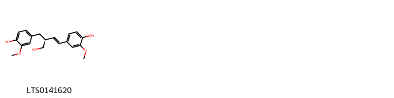
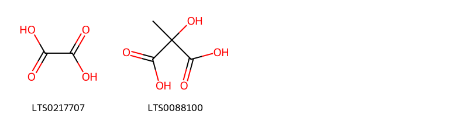
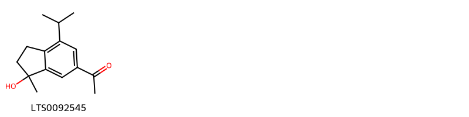
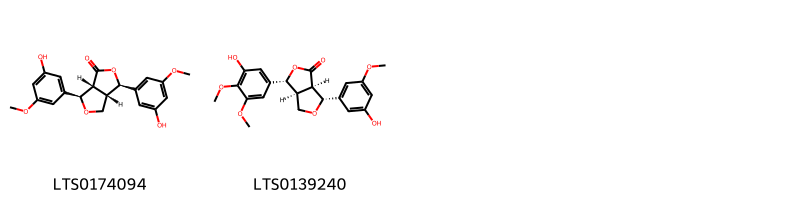
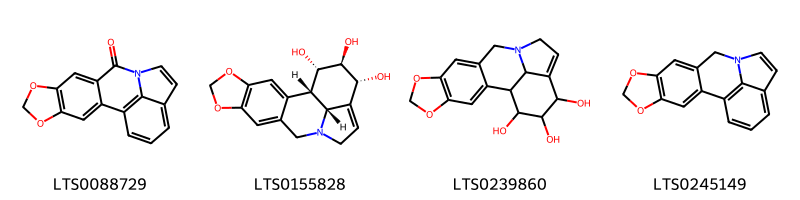
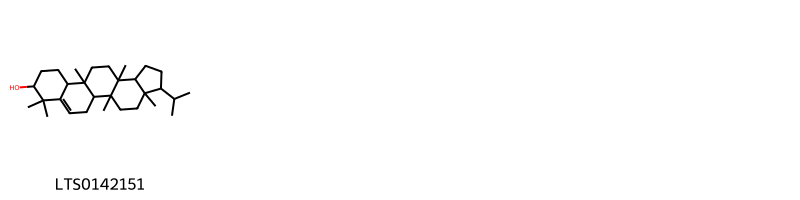

!!! abstract "Tóm tắt"

    Cỏ tranh (Rhizoma Imperatae cylindricae) là thân rễ đã phơi hay sấy khô của cây Cỏ tranh (Imperata cylindrica p. Beauv), thuộc họ Lúa (Poaccae). phân bố rộng rãi ở các vùng nhiệt đới, ôn đới và cận nhiệt đới, bao gồm châu Âu (Pháp, Ý, Hy Lạp, Tây Ban Nha), châu Phi, và châu Á (các nước Đông Nam Á). Trong y học dân gian, thân rễ cỏ tranh được sử dụng phổ biến để nấu chè lợi tiểu và làm thuốc chữa bệnh, điển hình như bài Như Thần Thang (trong sách Thánh Huệ Phương) chữa phổi nóng và Ma Căn Thang chữa đái ra máu. Cỏ tranh có các tác dụng dược lý chính như lợi tiểu, cầm máu, thanh nhiệt giải độc, chống viêm và giảm an thần nhẹ. Thành phần hóa học của thân rễ cỏ tranh bao gồm các loại đường (glucose, fructose, sucrose), acid hữu cơ (malic, citric, oxalic), flavonoid (luteolin, apigenin, orientin), phenolic (imperanene, acid p-coumaric), saponin, lignan (gravinol A, B) và các khoáng chất như silica, potassium, calcium.

## Thông tin về thực vật

Dược liệu **Cỏ Tranh (Thân Rễ)** từ bộ phận **** từ loài *Imperata cylindrica*.

**Mô tả thực vật:** Cây cỏ tranh là một loại cỏ sống dai, thân rễ khỏe chắc. Thân cao 30-90cm, lá hẹp dài 15- 30cm, rộng 3-6mm, gân lá ở giữa phát triển, ráp ở mặt trên, nhẫn ở mặt dưới, mép lá sắc. Cụm hoa hình chùy nhưng hình bắp dài 5-20cm màu trắng bạc, bỏng nhỏ phủ đầy lông nhỏ niềm, rất dài.

*Tài liệu tham khảo:* "Những cây thuốc và vị thuốc Việt Nam" - Đỗ Tất Lợi 
Trong dược điển Việt nam, một loài được sử dụng làm dược liệu là *Imperata cylindrica*.

!!! info "Phân loại thực vật của *Imperata cylindrica*"
    - **Kingdom:** Plantae
    - **Phylum:** Tracheophyta
    - **Order:** Poales
    - **Family:** Poaceae
    - **Genus:** Imperata
    - **Species:** *Imperata cylindrica*

**Phân bố trên thế giới:** Thailand, United States of America, Philippines, Peru, China, Algeria, Chinese Taipei, Hong Kong, Madagascar, Honduras, South Africa, Malaysia, Iraq, India, Australia, Singapore, Indonesia, Sri Lanka

**Phân bố tại Việt nam:** Không có ghi nhận ở Việt Nam

## Thông tin về dược liệu 

### Định danh

!!! info "Thông tin về tên gọi"

    - Dược liệu tiếng Việt: 
    - Dược liệu tiếng Trung:  ()
    - Dược liệu tiếng Anh: 
    - Dược liệu latin thông dụng: Rhizoma Imperatae cylindricae
    - Dược liệu latin kiểu DĐVN: *rhizoma imperatae cylindricae*
    - Dược liệu latin kiểu DĐVN: **
    - Dược liệu latin kiểu thông tư: **
    - Bộ phận dùng:  (Rhizoma)

### Mô tả dược liệu 

- **Theo dược điển Việt nam V:** Thân rễ hình trụ, dài 30 cm đến 40 cm, đường kính 0,2 cm đến 0,4 cm. Mặt ngoài trắng ngà hay vàng nhạt, có nhiều nếp nhăn dọc và nhiều đốt, mỗi đốt dài 1 cm đến 3,5 cm, trên các đốt còn sót lại vết tích của lá vẩy và của rễ con. Dược liệu dai, dễ bẻ gãy ờ đốt, mặt bẻ có sợi. Mặt cắt ngang gần hình tròn, mặt ngoài lồi lõm không đều, ở giữa thường rách nứt. Dưới ánh sáng đèn tử ngoại 366 mn, phần tủy có phát quang màu xanh lơ, phần vỏ phát quang màu vàng nhạt. Dược liệu không mùi, không vị, sau hơi ngọt. Vi phẫu Biểu bì gồm một lớp tế bào đều đặn. Mô cứng gồm 2 tế bào đến 4 tế bào hình đa giác, màng dày và xếp sát biểu bì. Mô mềm vỏ được cấu tạo bởi các tế bào tròn to. Giữa mô mềm vỏ có các bó libe-gỗ nhỏ là vết tích của phần rễ con Vòng nội bì gồm 1 lớp tế bào xếp đều đặn có thành phía trong rất dày, thành 2 bên và phía ngoài mỏng. Trụ bì hóa mô cứng thành vòng liên tục. Các bó libe-gỗ tập trung ngay sát lớp trụ bì và rải rác trong phần mô mềm tùy. Mỗi bó libe-gỗ gồm 1 bao mô cứng ở xung quanh, 1 đám libe 1 hay 2 mạch gỗ to nằm trong mô mềm gỗ, bên trong còn có thể có những tế bào nhuộm màu hồng vì còn chất cellulose. ở những phần thân già giữa mô mềm tủy thường có khuyết to, khuyết này nhỏ và mất dần khi gần đốt.

- **Mô tả dược liệu theo thông tư chế biến dược liệu theo phương pháp cổ truyền:** 

### Chế biến 

- **Chế biến theo dược điển việt nam V**: Thu hoạch vào mùa thu hoặc mùa xuân, lúc trời khô ráo, đào lấy thân rễ dưới đất (không dùng rễ nổi trên mặt đất), rửa sạch, tuốt bỏ sạch bẹ. bỏ hết rễ con, đem phơi. Bào chế Bạch mao căn: Rửa sạch, tẩm nước cho hơi mềm rồi cắt thành đọan phơi khô, sàng bỏ chất vụn. Mao căn thán: Lấy những đoạn Bạch mao căn, cho vào nồi sao lửa mạnh tới màu nâu đen. nhưng phải tồn tính, phun nước trong, lấy ra phơi khô. nn

- **Chế biến theo thông tư:** 

--- 

## Thành phần hóa học

- Theo tài liệu của GS. Đỗ Tất Lợi:  Nhóm hóa học:
Đường: Glucose, fructose
Acid hữu cơ: Acid oxalic, acid malic
Phenol: Imperanen
Sesquiterpene: Cylindren
Lignan: Gravinon A và B
Saponin
Flavonoid
Glycoside
    

**Thành phần hóa học từ loài **Imperata cylindrica**

Theo cơ sở dữ liệu lotus, loài *Imperata cylindrica* đã phân lập và xác định được **44** hoạt chất thuộc về các nhóm Steroids and steroid derivatives, Lignan lactones, Organooxygen compounds, Coumarans, Flavonoids, Amaryllidaceae alkaloids, Cinnamic acids and derivatives, Benzopyrans, Quinolines and derivatives, Indanes, Phenols, Carboxylic acids and derivatives, Benzene and substituted derivatives, Linear 1,3-diarylpropanoids, Coumarins and derivatives trong bảng dưới đây. Danh sách các hoạt chất như sau 5,7-dioxa-12-azapentacyclo[10.6.1.0²,¹⁰.0⁴,⁸.0¹⁵,¹⁹]nonadeca-1(19),2,4(8),9,13,15,17-heptaene [(LTS0245149)](https://lotus.naturalproducts.net/compound/lotus_id/LTS0245149), (2s)-5-methoxy-2-(4-methoxyphenyl)-3,4-dihydro-2h-1-benzopyran-7-ol [(LTS0222121)](https://lotus.naturalproducts.net/compound/lotus_id/LTS0222121), 5-methoxy-2-(4-methoxyphenyl)chromen-7-one [(LTS0080897)](https://lotus.naturalproducts.net/compound/lotus_id/LTS0080897), 5,7-dioxa-12-azapentacyclo[10.6.1.0²,¹⁰.0⁴,⁸.0¹⁵,¹⁹]nonadeca-1(19),2(10),3,8,13,15,17-heptaen-11-one [(LTS0088729)](https://lotus.naturalproducts.net/compound/lotus_id/LTS0088729), (1s,16r,17r,18s,19r)-5,7-dioxa-12-azapentacyclo[10.6.1.0²,¹⁰.0⁴,⁸.0¹⁵,¹⁹]nonadeca-2,4(8),9,14-tetraene-16,17,18-triol [(LTS0155828)](https://lotus.naturalproducts.net/compound/lotus_id/LTS0155828), 5-hydroxy-2-(2-phenylethenyl)chromen-4-one [(LTS0160886)](https://lotus.naturalproducts.net/compound/lotus_id/LTS0160886), coumaran [(LTS0098724)](https://lotus.naturalproducts.net/compound/lotus_id/LTS0098724), (5ar,9s,11as)-3-isopropyl-3a,5a,8,8,11a,13a-hexamethyl-1h,2h,3h,4h,5h,5bh,6h,7h,7ah,9h,10h,11h,13h,13bh-cyclopenta[a]chrysen-9-ol [(LTS0072202)](https://lotus.naturalproducts.net/compound/lotus_id/LTS0072202), isovanillic acid [(LTS0247446)](https://lotus.naturalproducts.net/compound/lotus_id/LTS0247446), 5,7-dioxa-12-azapentacyclo[10.6.1.0²,¹⁰.0⁴,⁸.0¹⁵,¹⁹]nonadeca-2,4(8),9,14-tetraene-16,17,18-triol [(LTS0239860)](https://lotus.naturalproducts.net/compound/lotus_id/LTS0239860), 5-hydroxy-2-(2-phenylethyl)chromen-4-one [(LTS0048542)](https://lotus.naturalproducts.net/compound/lotus_id/LTS0048542), 5-hydroxy-2-[2-(2-hydroxyphenyl)ethyl]chromen-4-one [(LTS0204018)](https://lotus.naturalproducts.net/compound/lotus_id/LTS0204018), 7-hydroxy-4'-methoxyflavan [(LTS0198582)](https://lotus.naturalproducts.net/compound/lotus_id/LTS0198582), siderin [(LTS0149582)](https://lotus.naturalproducts.net/compound/lotus_id/LTS0149582), oxalic acid [(LTS0217707)](https://lotus.naturalproducts.net/compound/lotus_id/LTS0217707), isoferulic acid [(LTS0227619)](https://lotus.naturalproducts.net/compound/lotus_id/LTS0227619), salicin [(LTS0129975)](https://lotus.naturalproducts.net/compound/lotus_id/LTS0129975), (6br,8ar,12ar,14ar)-4,4,6b,8a,11,11,12b,14a-octamethyl-2,6,6a,7,8,9,10,12,12a,13,14,14b-dodecahydro-1h-picen-3-one [(LTS0087797)](https://lotus.naturalproducts.net/compound/lotus_id/LTS0087797), 3-(2,4-dihydroxy-6-methoxyphenyl)-1-(4-methoxyphenyl)prop-2-en-1-one [(LTS0208291)](https://lotus.naturalproducts.net/compound/lotus_id/LTS0208291), (3as,5bs,9s,11as,13ar)-3-isopropyl-9-methoxy-3a,5a,8,8,11a,13a-hexamethyl-1h,2h,3h,4h,5h,5bh,6h,7h,7ah,9h,10h,11h,13h,13bh-cyclopenta[a]chrysene [(LTS0080127)](https://lotus.naturalproducts.net/compound/lotus_id/LTS0080127), para-coumaric acid [(LTS0266252)](https://lotus.naturalproducts.net/compound/lotus_id/LTS0266252), syringaldehyde [(LTS0201406)](https://lotus.naturalproducts.net/compound/lotus_id/LTS0201406), p-hydroxybenzoic acid [(LTS0263634)](https://lotus.naturalproducts.net/compound/lotus_id/LTS0263634), (3r,3as,6r,6ar)-3,6-bis(3-hydroxy-5-methoxyphenyl)-tetrahydro-3h-furo[3,4-c]furan-1-one [(LTS0174094)](https://lotus.naturalproducts.net/compound/lotus_id/LTS0174094), luteolinidin [(LTS0102344)](https://lotus.naturalproducts.net/compound/lotus_id/LTS0102344), 1-(3-hydroxy-7-isopropyl-3-methyl-1,2-dihydroinden-5-yl)ethanone [(LTS0092545)](https://lotus.naturalproducts.net/compound/lotus_id/LTS0092545), methyl 2-hydroxy-5-[4-hydroxy-3-(methoxycarbonyl)phenoxy]benzoate [(LTS0233337)](https://lotus.naturalproducts.net/compound/lotus_id/LTS0233337), 5-methoxy-2-(4-methoxyphenyl)-3,4-dihydro-2h-1-benzopyran-7-ol [(LTS0272888)](https://lotus.naturalproducts.net/compound/lotus_id/LTS0272888), graminone b [(LTS0139240)](https://lotus.naturalproducts.net/compound/lotus_id/LTS0139240), broussin [(LTS0268788)](https://lotus.naturalproducts.net/compound/lotus_id/LTS0268788), 2-(2-phenylethyl)chromone [(LTS0159717)](https://lotus.naturalproducts.net/compound/lotus_id/LTS0159717), 5-ethenyl-2-methoxyphenol [(LTS0076260)](https://lotus.naturalproducts.net/compound/lotus_id/LTS0076260), (2z)-3-(2,4-dihydroxy-6-methoxyphenyl)-1-(4-methoxyphenyl)prop-2-en-1-one [(LTS0161315)](https://lotus.naturalproducts.net/compound/lotus_id/LTS0161315), 2-hydroxy-2-methylpropanedioic acid [(LTS0088100)](https://lotus.naturalproducts.net/compound/lotus_id/LTS0088100), 4-[(1e,3s)-4-hydroxy-3-[(4-hydroxy-3-methoxyphenyl)methyl]but-1-en-1-yl]-2-methoxyphenol [(LTS0141620)](https://lotus.naturalproducts.net/compound/lotus_id/LTS0141620), lycorine [(LTS0186544)](https://lotus.naturalproducts.net/compound/lotus_id/LTS0186544), 5-hydroxy-2-[(1e)-2-phenylethenyl]chromen-4-one [(LTS0219282)](https://lotus.naturalproducts.net/compound/lotus_id/LTS0219282), 5-methoxy-2-phenylchromen-4-one [(LTS0202013)](https://lotus.naturalproducts.net/compound/lotus_id/LTS0202013), ethylparaben [(LTS0259455)](https://lotus.naturalproducts.net/compound/lotus_id/LTS0259455), cylindol a [(LTS0058199)](https://lotus.naturalproducts.net/compound/lotus_id/LTS0058199), apocynin [(LTS0211279)](https://lotus.naturalproducts.net/compound/lotus_id/LTS0211279), 3-isopropyl-3a,5a,8,8,11b,13a-hexamethyl-1h,2h,3h,4h,5h,5bh,6h,9h,10h,11h,11ah,12h,13h,13bh-cyclopenta[a]chrysen-9-ol [(LTS0142151)](https://lotus.naturalproducts.net/compound/lotus_id/LTS0142151), lycorine [(LTS0250349)](https://lotus.naturalproducts.net/compound/lotus_id/LTS0250349), (5ar,9s,11as,13br)-3-isopropyl-9-methoxy-3a,5a,8,8,11a,13a-hexamethyl-1h,2h,3h,4h,5h,5bh,6h,7h,7ah,9h,10h,11h,13h,13bh-cyclopenta[a]chrysene [(LTS0172602)](https://lotus.naturalproducts.net/compound/lotus_id/LTS0172602). 
        
| chemicalTaxonomyClassyfireClass     |   smiles_count |
|:------------------------------------|---------------:|
|                                     |             44 |
| Amaryllidaceae alkaloids            |             90 |
| Benzene and substituted derivatives |            133 |
| Benzopyrans                         |            157 |
| Carboxylic acids and derivatives    |             31 |
| Cinnamic acids and derivatives      |             46 |
| Coumarans                           |             15 |
| Coumarins and derivatives           |             27 |
| Flavonoids                          |            208 |
| Indanes                             |             34 |
| Lignan lactones                     |            133 |
| Linear 1,3-diarylpropanoids         |             74 |
| Organooxygen compounds              |             71 |
| Phenols                             |             38 |
| Quinolines and derivatives          |            168 |
| Steroids and steroid derivatives    |             56 |

            
### Nhóm 
<figure markdown="span">
    { width=100% }
<figcaption>Hình ảnh cấu trúc hóa học của hoạt chất thuộc nhóm **. Tên thường gọi của các hoạt chất tương ứng là 4-[(1e,3s)-4-hydroxy-3-[(4-hydroxy-3-methoxyphenyl)methyl]but-1-en-1-yl]-2-methoxyphenol [(LTS0141620)](https://lotus.naturalproducts.net/compound/lotus_id/LTS0141620).</figcaption>
</figure>

            
            
### Nhóm 
<figure markdown="span">
    { width=100% }
<figcaption>Hình ảnh cấu trúc hóa học của hoạt chất thuộc nhóm **. Tên thường gọi của các hoạt chất tương ứng là 4-[(1e,3s)-4-hydroxy-3-[(4-hydroxy-3-methoxyphenyl)methyl]but-1-en-1-yl]-2-methoxyphenol [(LTS0141620)](https://lotus.naturalproducts.net/compound/lotus_id/LTS0141620).</figcaption>
</figure>

### Nhóm Amaryllidaceae alkaloids
<figure markdown="span">
    { width=100% }
<figcaption>Hình ảnh cấu trúc hóa học của hoạt chất thuộc nhóm *Amaryllidaceae alkaloids*. Tên thường gọi của các hoạt chất tương ứng là lycorine [(LTS0186544)](https://lotus.naturalproducts.net/compound/lotus_id/LTS0186544), lycorine [(LTS0250349)](https://lotus.naturalproducts.net/compound/lotus_id/LTS0250349).</figcaption>
</figure>

            
            
### Nhóm 
<figure markdown="span">
    { width=100% }
<figcaption>Hình ảnh cấu trúc hóa học của hoạt chất thuộc nhóm **. Tên thường gọi của các hoạt chất tương ứng là 4-[(1e,3s)-4-hydroxy-3-[(4-hydroxy-3-methoxyphenyl)methyl]but-1-en-1-yl]-2-methoxyphenol [(LTS0141620)](https://lotus.naturalproducts.net/compound/lotus_id/LTS0141620).</figcaption>
</figure>

### Nhóm Amaryllidaceae alkaloids
<figure markdown="span">
    { width=100% }
<figcaption>Hình ảnh cấu trúc hóa học của hoạt chất thuộc nhóm *Amaryllidaceae alkaloids*. Tên thường gọi của các hoạt chất tương ứng là lycorine [(LTS0186544)](https://lotus.naturalproducts.net/compound/lotus_id/LTS0186544), lycorine [(LTS0250349)](https://lotus.naturalproducts.net/compound/lotus_id/LTS0250349).</figcaption>
</figure>

### Nhóm Benzene and substituted derivatives
<figure markdown="span">
    { width=100% }
<figcaption>Hình ảnh cấu trúc hóa học của hoạt chất thuộc nhóm *Benzene and substituted derivatives*. Tên thường gọi của các hoạt chất tương ứng là cylindol a [(LTS0058199)](https://lotus.naturalproducts.net/compound/lotus_id/LTS0058199), methyl 2-hydroxy-5-[4-hydroxy-3-(methoxycarbonyl)phenoxy]benzoate [(LTS0233337)](https://lotus.naturalproducts.net/compound/lotus_id/LTS0233337), isovanillic acid [(LTS0247446)](https://lotus.naturalproducts.net/compound/lotus_id/LTS0247446), ethylparaben [(LTS0259455)](https://lotus.naturalproducts.net/compound/lotus_id/LTS0259455), p-hydroxybenzoic acid [(LTS0263634)](https://lotus.naturalproducts.net/compound/lotus_id/LTS0263634).</figcaption>
</figure>

            
            
### Nhóm 
<figure markdown="span">
    { width=100% }
<figcaption>Hình ảnh cấu trúc hóa học của hoạt chất thuộc nhóm **. Tên thường gọi của các hoạt chất tương ứng là 4-[(1e,3s)-4-hydroxy-3-[(4-hydroxy-3-methoxyphenyl)methyl]but-1-en-1-yl]-2-methoxyphenol [(LTS0141620)](https://lotus.naturalproducts.net/compound/lotus_id/LTS0141620).</figcaption>
</figure>

### Nhóm Amaryllidaceae alkaloids
<figure markdown="span">
    { width=100% }
<figcaption>Hình ảnh cấu trúc hóa học của hoạt chất thuộc nhóm *Amaryllidaceae alkaloids*. Tên thường gọi của các hoạt chất tương ứng là lycorine [(LTS0186544)](https://lotus.naturalproducts.net/compound/lotus_id/LTS0186544), lycorine [(LTS0250349)](https://lotus.naturalproducts.net/compound/lotus_id/LTS0250349).</figcaption>
</figure>

### Nhóm Benzene and substituted derivatives
<figure markdown="span">
    { width=100% }
<figcaption>Hình ảnh cấu trúc hóa học của hoạt chất thuộc nhóm *Benzene and substituted derivatives*. Tên thường gọi của các hoạt chất tương ứng là cylindol a [(LTS0058199)](https://lotus.naturalproducts.net/compound/lotus_id/LTS0058199), methyl 2-hydroxy-5-[4-hydroxy-3-(methoxycarbonyl)phenoxy]benzoate [(LTS0233337)](https://lotus.naturalproducts.net/compound/lotus_id/LTS0233337), isovanillic acid [(LTS0247446)](https://lotus.naturalproducts.net/compound/lotus_id/LTS0247446), ethylparaben [(LTS0259455)](https://lotus.naturalproducts.net/compound/lotus_id/LTS0259455), p-hydroxybenzoic acid [(LTS0263634)](https://lotus.naturalproducts.net/compound/lotus_id/LTS0263634).</figcaption>
</figure>

### Nhóm Benzopyrans
<figure markdown="span">
    { width=100% }
<figcaption>Hình ảnh cấu trúc hóa học của hoạt chất thuộc nhóm *Benzopyrans*. Tên thường gọi của các hoạt chất tương ứng là 5-hydroxy-2-[2-(2-hydroxyphenyl)ethyl]chromen-4-one [(LTS0204018)](https://lotus.naturalproducts.net/compound/lotus_id/LTS0204018), 5-hydroxy-2-(2-phenylethenyl)chromen-4-one [(LTS0160886)](https://lotus.naturalproducts.net/compound/lotus_id/LTS0160886), 2-(2-phenylethyl)chromone [(LTS0159717)](https://lotus.naturalproducts.net/compound/lotus_id/LTS0159717), 5-hydroxy-2-[(1e)-2-phenylethenyl]chromen-4-one [(LTS0219282)](https://lotus.naturalproducts.net/compound/lotus_id/LTS0219282), 5-hydroxy-2-(2-phenylethyl)chromen-4-one [(LTS0048542)](https://lotus.naturalproducts.net/compound/lotus_id/LTS0048542).</figcaption>
</figure>

            
            
### Nhóm 
<figure markdown="span">
    { width=100% }
<figcaption>Hình ảnh cấu trúc hóa học của hoạt chất thuộc nhóm **. Tên thường gọi của các hoạt chất tương ứng là 4-[(1e,3s)-4-hydroxy-3-[(4-hydroxy-3-methoxyphenyl)methyl]but-1-en-1-yl]-2-methoxyphenol [(LTS0141620)](https://lotus.naturalproducts.net/compound/lotus_id/LTS0141620).</figcaption>
</figure>

### Nhóm Amaryllidaceae alkaloids
<figure markdown="span">
    { width=100% }
<figcaption>Hình ảnh cấu trúc hóa học của hoạt chất thuộc nhóm *Amaryllidaceae alkaloids*. Tên thường gọi của các hoạt chất tương ứng là lycorine [(LTS0186544)](https://lotus.naturalproducts.net/compound/lotus_id/LTS0186544), lycorine [(LTS0250349)](https://lotus.naturalproducts.net/compound/lotus_id/LTS0250349).</figcaption>
</figure>

### Nhóm Benzene and substituted derivatives
<figure markdown="span">
    { width=100% }
<figcaption>Hình ảnh cấu trúc hóa học của hoạt chất thuộc nhóm *Benzene and substituted derivatives*. Tên thường gọi của các hoạt chất tương ứng là cylindol a [(LTS0058199)](https://lotus.naturalproducts.net/compound/lotus_id/LTS0058199), methyl 2-hydroxy-5-[4-hydroxy-3-(methoxycarbonyl)phenoxy]benzoate [(LTS0233337)](https://lotus.naturalproducts.net/compound/lotus_id/LTS0233337), isovanillic acid [(LTS0247446)](https://lotus.naturalproducts.net/compound/lotus_id/LTS0247446), ethylparaben [(LTS0259455)](https://lotus.naturalproducts.net/compound/lotus_id/LTS0259455), p-hydroxybenzoic acid [(LTS0263634)](https://lotus.naturalproducts.net/compound/lotus_id/LTS0263634).</figcaption>
</figure>

### Nhóm Benzopyrans
<figure markdown="span">
    { width=100% }
<figcaption>Hình ảnh cấu trúc hóa học của hoạt chất thuộc nhóm *Benzopyrans*. Tên thường gọi của các hoạt chất tương ứng là 5-hydroxy-2-[2-(2-hydroxyphenyl)ethyl]chromen-4-one [(LTS0204018)](https://lotus.naturalproducts.net/compound/lotus_id/LTS0204018), 5-hydroxy-2-(2-phenylethenyl)chromen-4-one [(LTS0160886)](https://lotus.naturalproducts.net/compound/lotus_id/LTS0160886), 2-(2-phenylethyl)chromone [(LTS0159717)](https://lotus.naturalproducts.net/compound/lotus_id/LTS0159717), 5-hydroxy-2-[(1e)-2-phenylethenyl]chromen-4-one [(LTS0219282)](https://lotus.naturalproducts.net/compound/lotus_id/LTS0219282), 5-hydroxy-2-(2-phenylethyl)chromen-4-one [(LTS0048542)](https://lotus.naturalproducts.net/compound/lotus_id/LTS0048542).</figcaption>
</figure>

### Nhóm Carboxylic acids and derivatives
<figure markdown="span">
    { width=100% }
<figcaption>Hình ảnh cấu trúc hóa học của hoạt chất thuộc nhóm *Carboxylic acids and derivatives*. Tên thường gọi của các hoạt chất tương ứng là oxalic acid [(LTS0217707)](https://lotus.naturalproducts.net/compound/lotus_id/LTS0217707), 2-hydroxy-2-methylpropanedioic acid [(LTS0088100)](https://lotus.naturalproducts.net/compound/lotus_id/LTS0088100).</figcaption>
</figure>

            
            
### Nhóm 
<figure markdown="span">
    { width=100% }
<figcaption>Hình ảnh cấu trúc hóa học của hoạt chất thuộc nhóm **. Tên thường gọi của các hoạt chất tương ứng là 4-[(1e,3s)-4-hydroxy-3-[(4-hydroxy-3-methoxyphenyl)methyl]but-1-en-1-yl]-2-methoxyphenol [(LTS0141620)](https://lotus.naturalproducts.net/compound/lotus_id/LTS0141620).</figcaption>
</figure>

### Nhóm Amaryllidaceae alkaloids
<figure markdown="span">
    { width=100% }
<figcaption>Hình ảnh cấu trúc hóa học của hoạt chất thuộc nhóm *Amaryllidaceae alkaloids*. Tên thường gọi của các hoạt chất tương ứng là lycorine [(LTS0186544)](https://lotus.naturalproducts.net/compound/lotus_id/LTS0186544), lycorine [(LTS0250349)](https://lotus.naturalproducts.net/compound/lotus_id/LTS0250349).</figcaption>
</figure>

### Nhóm Benzene and substituted derivatives
<figure markdown="span">
    { width=100% }
<figcaption>Hình ảnh cấu trúc hóa học của hoạt chất thuộc nhóm *Benzene and substituted derivatives*. Tên thường gọi của các hoạt chất tương ứng là cylindol a [(LTS0058199)](https://lotus.naturalproducts.net/compound/lotus_id/LTS0058199), methyl 2-hydroxy-5-[4-hydroxy-3-(methoxycarbonyl)phenoxy]benzoate [(LTS0233337)](https://lotus.naturalproducts.net/compound/lotus_id/LTS0233337), isovanillic acid [(LTS0247446)](https://lotus.naturalproducts.net/compound/lotus_id/LTS0247446), ethylparaben [(LTS0259455)](https://lotus.naturalproducts.net/compound/lotus_id/LTS0259455), p-hydroxybenzoic acid [(LTS0263634)](https://lotus.naturalproducts.net/compound/lotus_id/LTS0263634).</figcaption>
</figure>

### Nhóm Benzopyrans
<figure markdown="span">
    { width=100% }
<figcaption>Hình ảnh cấu trúc hóa học của hoạt chất thuộc nhóm *Benzopyrans*. Tên thường gọi của các hoạt chất tương ứng là 5-hydroxy-2-[2-(2-hydroxyphenyl)ethyl]chromen-4-one [(LTS0204018)](https://lotus.naturalproducts.net/compound/lotus_id/LTS0204018), 5-hydroxy-2-(2-phenylethenyl)chromen-4-one [(LTS0160886)](https://lotus.naturalproducts.net/compound/lotus_id/LTS0160886), 2-(2-phenylethyl)chromone [(LTS0159717)](https://lotus.naturalproducts.net/compound/lotus_id/LTS0159717), 5-hydroxy-2-[(1e)-2-phenylethenyl]chromen-4-one [(LTS0219282)](https://lotus.naturalproducts.net/compound/lotus_id/LTS0219282), 5-hydroxy-2-(2-phenylethyl)chromen-4-one [(LTS0048542)](https://lotus.naturalproducts.net/compound/lotus_id/LTS0048542).</figcaption>
</figure>

### Nhóm Carboxylic acids and derivatives
<figure markdown="span">
    { width=100% }
<figcaption>Hình ảnh cấu trúc hóa học của hoạt chất thuộc nhóm *Carboxylic acids and derivatives*. Tên thường gọi của các hoạt chất tương ứng là oxalic acid [(LTS0217707)](https://lotus.naturalproducts.net/compound/lotus_id/LTS0217707), 2-hydroxy-2-methylpropanedioic acid [(LTS0088100)](https://lotus.naturalproducts.net/compound/lotus_id/LTS0088100).</figcaption>
</figure>

### Nhóm Cinnamic acids and derivatives
<figure markdown="span">
    { width=100% }
<figcaption>Hình ảnh cấu trúc hóa học của hoạt chất thuộc nhóm *Cinnamic acids and derivatives*. Tên thường gọi của các hoạt chất tương ứng là isoferulic acid [(LTS0227619)](https://lotus.naturalproducts.net/compound/lotus_id/LTS0227619), para-coumaric acid [(LTS0266252)](https://lotus.naturalproducts.net/compound/lotus_id/LTS0266252).</figcaption>
</figure>

            
            
### Nhóm 
<figure markdown="span">
    { width=100% }
<figcaption>Hình ảnh cấu trúc hóa học của hoạt chất thuộc nhóm **. Tên thường gọi của các hoạt chất tương ứng là 4-[(1e,3s)-4-hydroxy-3-[(4-hydroxy-3-methoxyphenyl)methyl]but-1-en-1-yl]-2-methoxyphenol [(LTS0141620)](https://lotus.naturalproducts.net/compound/lotus_id/LTS0141620).</figcaption>
</figure>

### Nhóm Amaryllidaceae alkaloids
<figure markdown="span">
    { width=100% }
<figcaption>Hình ảnh cấu trúc hóa học của hoạt chất thuộc nhóm *Amaryllidaceae alkaloids*. Tên thường gọi của các hoạt chất tương ứng là lycorine [(LTS0186544)](https://lotus.naturalproducts.net/compound/lotus_id/LTS0186544), lycorine [(LTS0250349)](https://lotus.naturalproducts.net/compound/lotus_id/LTS0250349).</figcaption>
</figure>

### Nhóm Benzene and substituted derivatives
<figure markdown="span">
    { width=100% }
<figcaption>Hình ảnh cấu trúc hóa học của hoạt chất thuộc nhóm *Benzene and substituted derivatives*. Tên thường gọi của các hoạt chất tương ứng là cylindol a [(LTS0058199)](https://lotus.naturalproducts.net/compound/lotus_id/LTS0058199), methyl 2-hydroxy-5-[4-hydroxy-3-(methoxycarbonyl)phenoxy]benzoate [(LTS0233337)](https://lotus.naturalproducts.net/compound/lotus_id/LTS0233337), isovanillic acid [(LTS0247446)](https://lotus.naturalproducts.net/compound/lotus_id/LTS0247446), ethylparaben [(LTS0259455)](https://lotus.naturalproducts.net/compound/lotus_id/LTS0259455), p-hydroxybenzoic acid [(LTS0263634)](https://lotus.naturalproducts.net/compound/lotus_id/LTS0263634).</figcaption>
</figure>

### Nhóm Benzopyrans
<figure markdown="span">
    { width=100% }
<figcaption>Hình ảnh cấu trúc hóa học của hoạt chất thuộc nhóm *Benzopyrans*. Tên thường gọi của các hoạt chất tương ứng là 5-hydroxy-2-[2-(2-hydroxyphenyl)ethyl]chromen-4-one [(LTS0204018)](https://lotus.naturalproducts.net/compound/lotus_id/LTS0204018), 5-hydroxy-2-(2-phenylethenyl)chromen-4-one [(LTS0160886)](https://lotus.naturalproducts.net/compound/lotus_id/LTS0160886), 2-(2-phenylethyl)chromone [(LTS0159717)](https://lotus.naturalproducts.net/compound/lotus_id/LTS0159717), 5-hydroxy-2-[(1e)-2-phenylethenyl]chromen-4-one [(LTS0219282)](https://lotus.naturalproducts.net/compound/lotus_id/LTS0219282), 5-hydroxy-2-(2-phenylethyl)chromen-4-one [(LTS0048542)](https://lotus.naturalproducts.net/compound/lotus_id/LTS0048542).</figcaption>
</figure>

### Nhóm Carboxylic acids and derivatives
<figure markdown="span">
    { width=100% }
<figcaption>Hình ảnh cấu trúc hóa học của hoạt chất thuộc nhóm *Carboxylic acids and derivatives*. Tên thường gọi của các hoạt chất tương ứng là oxalic acid [(LTS0217707)](https://lotus.naturalproducts.net/compound/lotus_id/LTS0217707), 2-hydroxy-2-methylpropanedioic acid [(LTS0088100)](https://lotus.naturalproducts.net/compound/lotus_id/LTS0088100).</figcaption>
</figure>

### Nhóm Cinnamic acids and derivatives
<figure markdown="span">
    { width=100% }
<figcaption>Hình ảnh cấu trúc hóa học của hoạt chất thuộc nhóm *Cinnamic acids and derivatives*. Tên thường gọi của các hoạt chất tương ứng là isoferulic acid [(LTS0227619)](https://lotus.naturalproducts.net/compound/lotus_id/LTS0227619), para-coumaric acid [(LTS0266252)](https://lotus.naturalproducts.net/compound/lotus_id/LTS0266252).</figcaption>
</figure>

### Nhóm Coumarans
<figure markdown="span">
    { width=100% }
<figcaption>Hình ảnh cấu trúc hóa học của hoạt chất thuộc nhóm *Coumarans*. Tên thường gọi của các hoạt chất tương ứng là coumaran [(LTS0098724)](https://lotus.naturalproducts.net/compound/lotus_id/LTS0098724).</figcaption>
</figure>

            
            
### Nhóm 
<figure markdown="span">
    { width=100% }
<figcaption>Hình ảnh cấu trúc hóa học của hoạt chất thuộc nhóm **. Tên thường gọi của các hoạt chất tương ứng là 4-[(1e,3s)-4-hydroxy-3-[(4-hydroxy-3-methoxyphenyl)methyl]but-1-en-1-yl]-2-methoxyphenol [(LTS0141620)](https://lotus.naturalproducts.net/compound/lotus_id/LTS0141620).</figcaption>
</figure>

### Nhóm Amaryllidaceae alkaloids
<figure markdown="span">
    { width=100% }
<figcaption>Hình ảnh cấu trúc hóa học của hoạt chất thuộc nhóm *Amaryllidaceae alkaloids*. Tên thường gọi của các hoạt chất tương ứng là lycorine [(LTS0186544)](https://lotus.naturalproducts.net/compound/lotus_id/LTS0186544), lycorine [(LTS0250349)](https://lotus.naturalproducts.net/compound/lotus_id/LTS0250349).</figcaption>
</figure>

### Nhóm Benzene and substituted derivatives
<figure markdown="span">
    { width=100% }
<figcaption>Hình ảnh cấu trúc hóa học của hoạt chất thuộc nhóm *Benzene and substituted derivatives*. Tên thường gọi của các hoạt chất tương ứng là cylindol a [(LTS0058199)](https://lotus.naturalproducts.net/compound/lotus_id/LTS0058199), methyl 2-hydroxy-5-[4-hydroxy-3-(methoxycarbonyl)phenoxy]benzoate [(LTS0233337)](https://lotus.naturalproducts.net/compound/lotus_id/LTS0233337), isovanillic acid [(LTS0247446)](https://lotus.naturalproducts.net/compound/lotus_id/LTS0247446), ethylparaben [(LTS0259455)](https://lotus.naturalproducts.net/compound/lotus_id/LTS0259455), p-hydroxybenzoic acid [(LTS0263634)](https://lotus.naturalproducts.net/compound/lotus_id/LTS0263634).</figcaption>
</figure>

### Nhóm Benzopyrans
<figure markdown="span">
    { width=100% }
<figcaption>Hình ảnh cấu trúc hóa học của hoạt chất thuộc nhóm *Benzopyrans*. Tên thường gọi của các hoạt chất tương ứng là 5-hydroxy-2-[2-(2-hydroxyphenyl)ethyl]chromen-4-one [(LTS0204018)](https://lotus.naturalproducts.net/compound/lotus_id/LTS0204018), 5-hydroxy-2-(2-phenylethenyl)chromen-4-one [(LTS0160886)](https://lotus.naturalproducts.net/compound/lotus_id/LTS0160886), 2-(2-phenylethyl)chromone [(LTS0159717)](https://lotus.naturalproducts.net/compound/lotus_id/LTS0159717), 5-hydroxy-2-[(1e)-2-phenylethenyl]chromen-4-one [(LTS0219282)](https://lotus.naturalproducts.net/compound/lotus_id/LTS0219282), 5-hydroxy-2-(2-phenylethyl)chromen-4-one [(LTS0048542)](https://lotus.naturalproducts.net/compound/lotus_id/LTS0048542).</figcaption>
</figure>

### Nhóm Carboxylic acids and derivatives
<figure markdown="span">
    { width=100% }
<figcaption>Hình ảnh cấu trúc hóa học của hoạt chất thuộc nhóm *Carboxylic acids and derivatives*. Tên thường gọi của các hoạt chất tương ứng là oxalic acid [(LTS0217707)](https://lotus.naturalproducts.net/compound/lotus_id/LTS0217707), 2-hydroxy-2-methylpropanedioic acid [(LTS0088100)](https://lotus.naturalproducts.net/compound/lotus_id/LTS0088100).</figcaption>
</figure>

### Nhóm Cinnamic acids and derivatives
<figure markdown="span">
    { width=100% }
<figcaption>Hình ảnh cấu trúc hóa học của hoạt chất thuộc nhóm *Cinnamic acids and derivatives*. Tên thường gọi của các hoạt chất tương ứng là isoferulic acid [(LTS0227619)](https://lotus.naturalproducts.net/compound/lotus_id/LTS0227619), para-coumaric acid [(LTS0266252)](https://lotus.naturalproducts.net/compound/lotus_id/LTS0266252).</figcaption>
</figure>

### Nhóm Coumarans
<figure markdown="span">
    { width=100% }
<figcaption>Hình ảnh cấu trúc hóa học của hoạt chất thuộc nhóm *Coumarans*. Tên thường gọi của các hoạt chất tương ứng là coumaran [(LTS0098724)](https://lotus.naturalproducts.net/compound/lotus_id/LTS0098724).</figcaption>
</figure>

### Nhóm Coumarins and derivatives
<figure markdown="span">
    { width=100% }
<figcaption>Hình ảnh cấu trúc hóa học của hoạt chất thuộc nhóm *Coumarins and derivatives*. Tên thường gọi của các hoạt chất tương ứng là siderin [(LTS0149582)](https://lotus.naturalproducts.net/compound/lotus_id/LTS0149582).</figcaption>
</figure>

            
            
### Nhóm 
<figure markdown="span">
    { width=100% }
<figcaption>Hình ảnh cấu trúc hóa học của hoạt chất thuộc nhóm **. Tên thường gọi của các hoạt chất tương ứng là 4-[(1e,3s)-4-hydroxy-3-[(4-hydroxy-3-methoxyphenyl)methyl]but-1-en-1-yl]-2-methoxyphenol [(LTS0141620)](https://lotus.naturalproducts.net/compound/lotus_id/LTS0141620).</figcaption>
</figure>

### Nhóm Amaryllidaceae alkaloids
<figure markdown="span">
    { width=100% }
<figcaption>Hình ảnh cấu trúc hóa học của hoạt chất thuộc nhóm *Amaryllidaceae alkaloids*. Tên thường gọi của các hoạt chất tương ứng là lycorine [(LTS0186544)](https://lotus.naturalproducts.net/compound/lotus_id/LTS0186544), lycorine [(LTS0250349)](https://lotus.naturalproducts.net/compound/lotus_id/LTS0250349).</figcaption>
</figure>

### Nhóm Benzene and substituted derivatives
<figure markdown="span">
    { width=100% }
<figcaption>Hình ảnh cấu trúc hóa học của hoạt chất thuộc nhóm *Benzene and substituted derivatives*. Tên thường gọi của các hoạt chất tương ứng là cylindol a [(LTS0058199)](https://lotus.naturalproducts.net/compound/lotus_id/LTS0058199), methyl 2-hydroxy-5-[4-hydroxy-3-(methoxycarbonyl)phenoxy]benzoate [(LTS0233337)](https://lotus.naturalproducts.net/compound/lotus_id/LTS0233337), isovanillic acid [(LTS0247446)](https://lotus.naturalproducts.net/compound/lotus_id/LTS0247446), ethylparaben [(LTS0259455)](https://lotus.naturalproducts.net/compound/lotus_id/LTS0259455), p-hydroxybenzoic acid [(LTS0263634)](https://lotus.naturalproducts.net/compound/lotus_id/LTS0263634).</figcaption>
</figure>

### Nhóm Benzopyrans
<figure markdown="span">
    { width=100% }
<figcaption>Hình ảnh cấu trúc hóa học của hoạt chất thuộc nhóm *Benzopyrans*. Tên thường gọi của các hoạt chất tương ứng là 5-hydroxy-2-[2-(2-hydroxyphenyl)ethyl]chromen-4-one [(LTS0204018)](https://lotus.naturalproducts.net/compound/lotus_id/LTS0204018), 5-hydroxy-2-(2-phenylethenyl)chromen-4-one [(LTS0160886)](https://lotus.naturalproducts.net/compound/lotus_id/LTS0160886), 2-(2-phenylethyl)chromone [(LTS0159717)](https://lotus.naturalproducts.net/compound/lotus_id/LTS0159717), 5-hydroxy-2-[(1e)-2-phenylethenyl]chromen-4-one [(LTS0219282)](https://lotus.naturalproducts.net/compound/lotus_id/LTS0219282), 5-hydroxy-2-(2-phenylethyl)chromen-4-one [(LTS0048542)](https://lotus.naturalproducts.net/compound/lotus_id/LTS0048542).</figcaption>
</figure>

### Nhóm Carboxylic acids and derivatives
<figure markdown="span">
    { width=100% }
<figcaption>Hình ảnh cấu trúc hóa học của hoạt chất thuộc nhóm *Carboxylic acids and derivatives*. Tên thường gọi của các hoạt chất tương ứng là oxalic acid [(LTS0217707)](https://lotus.naturalproducts.net/compound/lotus_id/LTS0217707), 2-hydroxy-2-methylpropanedioic acid [(LTS0088100)](https://lotus.naturalproducts.net/compound/lotus_id/LTS0088100).</figcaption>
</figure>

### Nhóm Cinnamic acids and derivatives
<figure markdown="span">
    { width=100% }
<figcaption>Hình ảnh cấu trúc hóa học của hoạt chất thuộc nhóm *Cinnamic acids and derivatives*. Tên thường gọi của các hoạt chất tương ứng là isoferulic acid [(LTS0227619)](https://lotus.naturalproducts.net/compound/lotus_id/LTS0227619), para-coumaric acid [(LTS0266252)](https://lotus.naturalproducts.net/compound/lotus_id/LTS0266252).</figcaption>
</figure>

### Nhóm Coumarans
<figure markdown="span">
    { width=100% }
<figcaption>Hình ảnh cấu trúc hóa học của hoạt chất thuộc nhóm *Coumarans*. Tên thường gọi của các hoạt chất tương ứng là coumaran [(LTS0098724)](https://lotus.naturalproducts.net/compound/lotus_id/LTS0098724).</figcaption>
</figure>

### Nhóm Coumarins and derivatives
<figure markdown="span">
    { width=100% }
<figcaption>Hình ảnh cấu trúc hóa học của hoạt chất thuộc nhóm *Coumarins and derivatives*. Tên thường gọi của các hoạt chất tương ứng là siderin [(LTS0149582)](https://lotus.naturalproducts.net/compound/lotus_id/LTS0149582).</figcaption>
</figure>

### Nhóm Flavonoids
<figure markdown="span">
    { width=100% }
<figcaption>Hình ảnh cấu trúc hóa học của hoạt chất thuộc nhóm *Flavonoids*. Tên thường gọi của các hoạt chất tương ứng là 5-methoxy-2-(4-methoxyphenyl)chromen-7-one [(LTS0080897)](https://lotus.naturalproducts.net/compound/lotus_id/LTS0080897), luteolinidin [(LTS0102344)](https://lotus.naturalproducts.net/compound/lotus_id/LTS0102344), 7-hydroxy-4'-methoxyflavan [(LTS0198582)](https://lotus.naturalproducts.net/compound/lotus_id/LTS0198582), broussin [(LTS0268788)](https://lotus.naturalproducts.net/compound/lotus_id/LTS0268788), (2s)-5-methoxy-2-(4-methoxyphenyl)-3,4-dihydro-2h-1-benzopyran-7-ol [(LTS0222121)](https://lotus.naturalproducts.net/compound/lotus_id/LTS0222121), 5-methoxy-2-(4-methoxyphenyl)-3,4-dihydro-2h-1-benzopyran-7-ol [(LTS0272888)](https://lotus.naturalproducts.net/compound/lotus_id/LTS0272888).</figcaption>
</figure>

            
            
### Nhóm 
<figure markdown="span">
    { width=100% }
<figcaption>Hình ảnh cấu trúc hóa học của hoạt chất thuộc nhóm **. Tên thường gọi của các hoạt chất tương ứng là 4-[(1e,3s)-4-hydroxy-3-[(4-hydroxy-3-methoxyphenyl)methyl]but-1-en-1-yl]-2-methoxyphenol [(LTS0141620)](https://lotus.naturalproducts.net/compound/lotus_id/LTS0141620).</figcaption>
</figure>

### Nhóm Amaryllidaceae alkaloids
<figure markdown="span">
    { width=100% }
<figcaption>Hình ảnh cấu trúc hóa học của hoạt chất thuộc nhóm *Amaryllidaceae alkaloids*. Tên thường gọi của các hoạt chất tương ứng là lycorine [(LTS0186544)](https://lotus.naturalproducts.net/compound/lotus_id/LTS0186544), lycorine [(LTS0250349)](https://lotus.naturalproducts.net/compound/lotus_id/LTS0250349).</figcaption>
</figure>

### Nhóm Benzene and substituted derivatives
<figure markdown="span">
    { width=100% }
<figcaption>Hình ảnh cấu trúc hóa học của hoạt chất thuộc nhóm *Benzene and substituted derivatives*. Tên thường gọi của các hoạt chất tương ứng là cylindol a [(LTS0058199)](https://lotus.naturalproducts.net/compound/lotus_id/LTS0058199), methyl 2-hydroxy-5-[4-hydroxy-3-(methoxycarbonyl)phenoxy]benzoate [(LTS0233337)](https://lotus.naturalproducts.net/compound/lotus_id/LTS0233337), isovanillic acid [(LTS0247446)](https://lotus.naturalproducts.net/compound/lotus_id/LTS0247446), ethylparaben [(LTS0259455)](https://lotus.naturalproducts.net/compound/lotus_id/LTS0259455), p-hydroxybenzoic acid [(LTS0263634)](https://lotus.naturalproducts.net/compound/lotus_id/LTS0263634).</figcaption>
</figure>

### Nhóm Benzopyrans
<figure markdown="span">
    { width=100% }
<figcaption>Hình ảnh cấu trúc hóa học của hoạt chất thuộc nhóm *Benzopyrans*. Tên thường gọi của các hoạt chất tương ứng là 5-hydroxy-2-[2-(2-hydroxyphenyl)ethyl]chromen-4-one [(LTS0204018)](https://lotus.naturalproducts.net/compound/lotus_id/LTS0204018), 5-hydroxy-2-(2-phenylethenyl)chromen-4-one [(LTS0160886)](https://lotus.naturalproducts.net/compound/lotus_id/LTS0160886), 2-(2-phenylethyl)chromone [(LTS0159717)](https://lotus.naturalproducts.net/compound/lotus_id/LTS0159717), 5-hydroxy-2-[(1e)-2-phenylethenyl]chromen-4-one [(LTS0219282)](https://lotus.naturalproducts.net/compound/lotus_id/LTS0219282), 5-hydroxy-2-(2-phenylethyl)chromen-4-one [(LTS0048542)](https://lotus.naturalproducts.net/compound/lotus_id/LTS0048542).</figcaption>
</figure>

### Nhóm Carboxylic acids and derivatives
<figure markdown="span">
    { width=100% }
<figcaption>Hình ảnh cấu trúc hóa học của hoạt chất thuộc nhóm *Carboxylic acids and derivatives*. Tên thường gọi của các hoạt chất tương ứng là oxalic acid [(LTS0217707)](https://lotus.naturalproducts.net/compound/lotus_id/LTS0217707), 2-hydroxy-2-methylpropanedioic acid [(LTS0088100)](https://lotus.naturalproducts.net/compound/lotus_id/LTS0088100).</figcaption>
</figure>

### Nhóm Cinnamic acids and derivatives
<figure markdown="span">
    { width=100% }
<figcaption>Hình ảnh cấu trúc hóa học của hoạt chất thuộc nhóm *Cinnamic acids and derivatives*. Tên thường gọi của các hoạt chất tương ứng là isoferulic acid [(LTS0227619)](https://lotus.naturalproducts.net/compound/lotus_id/LTS0227619), para-coumaric acid [(LTS0266252)](https://lotus.naturalproducts.net/compound/lotus_id/LTS0266252).</figcaption>
</figure>

### Nhóm Coumarans
<figure markdown="span">
    { width=100% }
<figcaption>Hình ảnh cấu trúc hóa học của hoạt chất thuộc nhóm *Coumarans*. Tên thường gọi của các hoạt chất tương ứng là coumaran [(LTS0098724)](https://lotus.naturalproducts.net/compound/lotus_id/LTS0098724).</figcaption>
</figure>

### Nhóm Coumarins and derivatives
<figure markdown="span">
    { width=100% }
<figcaption>Hình ảnh cấu trúc hóa học của hoạt chất thuộc nhóm *Coumarins and derivatives*. Tên thường gọi của các hoạt chất tương ứng là siderin [(LTS0149582)](https://lotus.naturalproducts.net/compound/lotus_id/LTS0149582).</figcaption>
</figure>

### Nhóm Flavonoids
<figure markdown="span">
    { width=100% }
<figcaption>Hình ảnh cấu trúc hóa học của hoạt chất thuộc nhóm *Flavonoids*. Tên thường gọi của các hoạt chất tương ứng là 5-methoxy-2-(4-methoxyphenyl)chromen-7-one [(LTS0080897)](https://lotus.naturalproducts.net/compound/lotus_id/LTS0080897), luteolinidin [(LTS0102344)](https://lotus.naturalproducts.net/compound/lotus_id/LTS0102344), 7-hydroxy-4'-methoxyflavan [(LTS0198582)](https://lotus.naturalproducts.net/compound/lotus_id/LTS0198582), broussin [(LTS0268788)](https://lotus.naturalproducts.net/compound/lotus_id/LTS0268788), (2s)-5-methoxy-2-(4-methoxyphenyl)-3,4-dihydro-2h-1-benzopyran-7-ol [(LTS0222121)](https://lotus.naturalproducts.net/compound/lotus_id/LTS0222121), 5-methoxy-2-(4-methoxyphenyl)-3,4-dihydro-2h-1-benzopyran-7-ol [(LTS0272888)](https://lotus.naturalproducts.net/compound/lotus_id/LTS0272888).</figcaption>
</figure>

### Nhóm Indanes
<figure markdown="span">
    { width=100% }
<figcaption>Hình ảnh cấu trúc hóa học của hoạt chất thuộc nhóm *Indanes*. Tên thường gọi của các hoạt chất tương ứng là 1-(3-hydroxy-7-isopropyl-3-methyl-1,2-dihydroinden-5-yl)ethanone [(LTS0092545)](https://lotus.naturalproducts.net/compound/lotus_id/LTS0092545).</figcaption>
</figure>

            
            
### Nhóm 
<figure markdown="span">
    { width=100% }
<figcaption>Hình ảnh cấu trúc hóa học của hoạt chất thuộc nhóm **. Tên thường gọi của các hoạt chất tương ứng là 4-[(1e,3s)-4-hydroxy-3-[(4-hydroxy-3-methoxyphenyl)methyl]but-1-en-1-yl]-2-methoxyphenol [(LTS0141620)](https://lotus.naturalproducts.net/compound/lotus_id/LTS0141620).</figcaption>
</figure>

### Nhóm Amaryllidaceae alkaloids
<figure markdown="span">
    { width=100% }
<figcaption>Hình ảnh cấu trúc hóa học của hoạt chất thuộc nhóm *Amaryllidaceae alkaloids*. Tên thường gọi của các hoạt chất tương ứng là lycorine [(LTS0186544)](https://lotus.naturalproducts.net/compound/lotus_id/LTS0186544), lycorine [(LTS0250349)](https://lotus.naturalproducts.net/compound/lotus_id/LTS0250349).</figcaption>
</figure>

### Nhóm Benzene and substituted derivatives
<figure markdown="span">
    { width=100% }
<figcaption>Hình ảnh cấu trúc hóa học của hoạt chất thuộc nhóm *Benzene and substituted derivatives*. Tên thường gọi của các hoạt chất tương ứng là cylindol a [(LTS0058199)](https://lotus.naturalproducts.net/compound/lotus_id/LTS0058199), methyl 2-hydroxy-5-[4-hydroxy-3-(methoxycarbonyl)phenoxy]benzoate [(LTS0233337)](https://lotus.naturalproducts.net/compound/lotus_id/LTS0233337), isovanillic acid [(LTS0247446)](https://lotus.naturalproducts.net/compound/lotus_id/LTS0247446), ethylparaben [(LTS0259455)](https://lotus.naturalproducts.net/compound/lotus_id/LTS0259455), p-hydroxybenzoic acid [(LTS0263634)](https://lotus.naturalproducts.net/compound/lotus_id/LTS0263634).</figcaption>
</figure>

### Nhóm Benzopyrans
<figure markdown="span">
    { width=100% }
<figcaption>Hình ảnh cấu trúc hóa học của hoạt chất thuộc nhóm *Benzopyrans*. Tên thường gọi của các hoạt chất tương ứng là 5-hydroxy-2-[2-(2-hydroxyphenyl)ethyl]chromen-4-one [(LTS0204018)](https://lotus.naturalproducts.net/compound/lotus_id/LTS0204018), 5-hydroxy-2-(2-phenylethenyl)chromen-4-one [(LTS0160886)](https://lotus.naturalproducts.net/compound/lotus_id/LTS0160886), 2-(2-phenylethyl)chromone [(LTS0159717)](https://lotus.naturalproducts.net/compound/lotus_id/LTS0159717), 5-hydroxy-2-[(1e)-2-phenylethenyl]chromen-4-one [(LTS0219282)](https://lotus.naturalproducts.net/compound/lotus_id/LTS0219282), 5-hydroxy-2-(2-phenylethyl)chromen-4-one [(LTS0048542)](https://lotus.naturalproducts.net/compound/lotus_id/LTS0048542).</figcaption>
</figure>

### Nhóm Carboxylic acids and derivatives
<figure markdown="span">
    { width=100% }
<figcaption>Hình ảnh cấu trúc hóa học của hoạt chất thuộc nhóm *Carboxylic acids and derivatives*. Tên thường gọi của các hoạt chất tương ứng là oxalic acid [(LTS0217707)](https://lotus.naturalproducts.net/compound/lotus_id/LTS0217707), 2-hydroxy-2-methylpropanedioic acid [(LTS0088100)](https://lotus.naturalproducts.net/compound/lotus_id/LTS0088100).</figcaption>
</figure>

### Nhóm Cinnamic acids and derivatives
<figure markdown="span">
    { width=100% }
<figcaption>Hình ảnh cấu trúc hóa học của hoạt chất thuộc nhóm *Cinnamic acids and derivatives*. Tên thường gọi của các hoạt chất tương ứng là isoferulic acid [(LTS0227619)](https://lotus.naturalproducts.net/compound/lotus_id/LTS0227619), para-coumaric acid [(LTS0266252)](https://lotus.naturalproducts.net/compound/lotus_id/LTS0266252).</figcaption>
</figure>

### Nhóm Coumarans
<figure markdown="span">
    { width=100% }
<figcaption>Hình ảnh cấu trúc hóa học của hoạt chất thuộc nhóm *Coumarans*. Tên thường gọi của các hoạt chất tương ứng là coumaran [(LTS0098724)](https://lotus.naturalproducts.net/compound/lotus_id/LTS0098724).</figcaption>
</figure>

### Nhóm Coumarins and derivatives
<figure markdown="span">
    { width=100% }
<figcaption>Hình ảnh cấu trúc hóa học của hoạt chất thuộc nhóm *Coumarins and derivatives*. Tên thường gọi của các hoạt chất tương ứng là siderin [(LTS0149582)](https://lotus.naturalproducts.net/compound/lotus_id/LTS0149582).</figcaption>
</figure>

### Nhóm Flavonoids
<figure markdown="span">
    { width=100% }
<figcaption>Hình ảnh cấu trúc hóa học của hoạt chất thuộc nhóm *Flavonoids*. Tên thường gọi của các hoạt chất tương ứng là 5-methoxy-2-(4-methoxyphenyl)chromen-7-one [(LTS0080897)](https://lotus.naturalproducts.net/compound/lotus_id/LTS0080897), luteolinidin [(LTS0102344)](https://lotus.naturalproducts.net/compound/lotus_id/LTS0102344), 7-hydroxy-4'-methoxyflavan [(LTS0198582)](https://lotus.naturalproducts.net/compound/lotus_id/LTS0198582), broussin [(LTS0268788)](https://lotus.naturalproducts.net/compound/lotus_id/LTS0268788), (2s)-5-methoxy-2-(4-methoxyphenyl)-3,4-dihydro-2h-1-benzopyran-7-ol [(LTS0222121)](https://lotus.naturalproducts.net/compound/lotus_id/LTS0222121), 5-methoxy-2-(4-methoxyphenyl)-3,4-dihydro-2h-1-benzopyran-7-ol [(LTS0272888)](https://lotus.naturalproducts.net/compound/lotus_id/LTS0272888).</figcaption>
</figure>

### Nhóm Indanes
<figure markdown="span">
    { width=100% }
<figcaption>Hình ảnh cấu trúc hóa học của hoạt chất thuộc nhóm *Indanes*. Tên thường gọi của các hoạt chất tương ứng là 1-(3-hydroxy-7-isopropyl-3-methyl-1,2-dihydroinden-5-yl)ethanone [(LTS0092545)](https://lotus.naturalproducts.net/compound/lotus_id/LTS0092545).</figcaption>
</figure>

### Nhóm Lignan lactones
<figure markdown="span">
    { width=100% }
<figcaption>Hình ảnh cấu trúc hóa học của hoạt chất thuộc nhóm *Lignan lactones*. Tên thường gọi của các hoạt chất tương ứng là (3r,3as,6r,6ar)-3,6-bis(3-hydroxy-5-methoxyphenyl)-tetrahydro-3h-furo[3,4-c]furan-1-one [(LTS0174094)](https://lotus.naturalproducts.net/compound/lotus_id/LTS0174094), graminone b [(LTS0139240)](https://lotus.naturalproducts.net/compound/lotus_id/LTS0139240).</figcaption>
</figure>

            
            
### Nhóm 
<figure markdown="span">
    { width=100% }
<figcaption>Hình ảnh cấu trúc hóa học của hoạt chất thuộc nhóm **. Tên thường gọi của các hoạt chất tương ứng là 4-[(1e,3s)-4-hydroxy-3-[(4-hydroxy-3-methoxyphenyl)methyl]but-1-en-1-yl]-2-methoxyphenol [(LTS0141620)](https://lotus.naturalproducts.net/compound/lotus_id/LTS0141620).</figcaption>
</figure>

### Nhóm Amaryllidaceae alkaloids
<figure markdown="span">
    { width=100% }
<figcaption>Hình ảnh cấu trúc hóa học của hoạt chất thuộc nhóm *Amaryllidaceae alkaloids*. Tên thường gọi của các hoạt chất tương ứng là lycorine [(LTS0186544)](https://lotus.naturalproducts.net/compound/lotus_id/LTS0186544), lycorine [(LTS0250349)](https://lotus.naturalproducts.net/compound/lotus_id/LTS0250349).</figcaption>
</figure>

### Nhóm Benzene and substituted derivatives
<figure markdown="span">
    { width=100% }
<figcaption>Hình ảnh cấu trúc hóa học của hoạt chất thuộc nhóm *Benzene and substituted derivatives*. Tên thường gọi của các hoạt chất tương ứng là cylindol a [(LTS0058199)](https://lotus.naturalproducts.net/compound/lotus_id/LTS0058199), methyl 2-hydroxy-5-[4-hydroxy-3-(methoxycarbonyl)phenoxy]benzoate [(LTS0233337)](https://lotus.naturalproducts.net/compound/lotus_id/LTS0233337), isovanillic acid [(LTS0247446)](https://lotus.naturalproducts.net/compound/lotus_id/LTS0247446), ethylparaben [(LTS0259455)](https://lotus.naturalproducts.net/compound/lotus_id/LTS0259455), p-hydroxybenzoic acid [(LTS0263634)](https://lotus.naturalproducts.net/compound/lotus_id/LTS0263634).</figcaption>
</figure>

### Nhóm Benzopyrans
<figure markdown="span">
    { width=100% }
<figcaption>Hình ảnh cấu trúc hóa học của hoạt chất thuộc nhóm *Benzopyrans*. Tên thường gọi của các hoạt chất tương ứng là 5-hydroxy-2-[2-(2-hydroxyphenyl)ethyl]chromen-4-one [(LTS0204018)](https://lotus.naturalproducts.net/compound/lotus_id/LTS0204018), 5-hydroxy-2-(2-phenylethenyl)chromen-4-one [(LTS0160886)](https://lotus.naturalproducts.net/compound/lotus_id/LTS0160886), 2-(2-phenylethyl)chromone [(LTS0159717)](https://lotus.naturalproducts.net/compound/lotus_id/LTS0159717), 5-hydroxy-2-[(1e)-2-phenylethenyl]chromen-4-one [(LTS0219282)](https://lotus.naturalproducts.net/compound/lotus_id/LTS0219282), 5-hydroxy-2-(2-phenylethyl)chromen-4-one [(LTS0048542)](https://lotus.naturalproducts.net/compound/lotus_id/LTS0048542).</figcaption>
</figure>

### Nhóm Carboxylic acids and derivatives
<figure markdown="span">
    { width=100% }
<figcaption>Hình ảnh cấu trúc hóa học của hoạt chất thuộc nhóm *Carboxylic acids and derivatives*. Tên thường gọi của các hoạt chất tương ứng là oxalic acid [(LTS0217707)](https://lotus.naturalproducts.net/compound/lotus_id/LTS0217707), 2-hydroxy-2-methylpropanedioic acid [(LTS0088100)](https://lotus.naturalproducts.net/compound/lotus_id/LTS0088100).</figcaption>
</figure>

### Nhóm Cinnamic acids and derivatives
<figure markdown="span">
    { width=100% }
<figcaption>Hình ảnh cấu trúc hóa học của hoạt chất thuộc nhóm *Cinnamic acids and derivatives*. Tên thường gọi của các hoạt chất tương ứng là isoferulic acid [(LTS0227619)](https://lotus.naturalproducts.net/compound/lotus_id/LTS0227619), para-coumaric acid [(LTS0266252)](https://lotus.naturalproducts.net/compound/lotus_id/LTS0266252).</figcaption>
</figure>

### Nhóm Coumarans
<figure markdown="span">
    { width=100% }
<figcaption>Hình ảnh cấu trúc hóa học của hoạt chất thuộc nhóm *Coumarans*. Tên thường gọi của các hoạt chất tương ứng là coumaran [(LTS0098724)](https://lotus.naturalproducts.net/compound/lotus_id/LTS0098724).</figcaption>
</figure>

### Nhóm Coumarins and derivatives
<figure markdown="span">
    { width=100% }
<figcaption>Hình ảnh cấu trúc hóa học của hoạt chất thuộc nhóm *Coumarins and derivatives*. Tên thường gọi của các hoạt chất tương ứng là siderin [(LTS0149582)](https://lotus.naturalproducts.net/compound/lotus_id/LTS0149582).</figcaption>
</figure>

### Nhóm Flavonoids
<figure markdown="span">
    { width=100% }
<figcaption>Hình ảnh cấu trúc hóa học của hoạt chất thuộc nhóm *Flavonoids*. Tên thường gọi của các hoạt chất tương ứng là 5-methoxy-2-(4-methoxyphenyl)chromen-7-one [(LTS0080897)](https://lotus.naturalproducts.net/compound/lotus_id/LTS0080897), luteolinidin [(LTS0102344)](https://lotus.naturalproducts.net/compound/lotus_id/LTS0102344), 7-hydroxy-4'-methoxyflavan [(LTS0198582)](https://lotus.naturalproducts.net/compound/lotus_id/LTS0198582), broussin [(LTS0268788)](https://lotus.naturalproducts.net/compound/lotus_id/LTS0268788), (2s)-5-methoxy-2-(4-methoxyphenyl)-3,4-dihydro-2h-1-benzopyran-7-ol [(LTS0222121)](https://lotus.naturalproducts.net/compound/lotus_id/LTS0222121), 5-methoxy-2-(4-methoxyphenyl)-3,4-dihydro-2h-1-benzopyran-7-ol [(LTS0272888)](https://lotus.naturalproducts.net/compound/lotus_id/LTS0272888).</figcaption>
</figure>

### Nhóm Indanes
<figure markdown="span">
    { width=100% }
<figcaption>Hình ảnh cấu trúc hóa học của hoạt chất thuộc nhóm *Indanes*. Tên thường gọi của các hoạt chất tương ứng là 1-(3-hydroxy-7-isopropyl-3-methyl-1,2-dihydroinden-5-yl)ethanone [(LTS0092545)](https://lotus.naturalproducts.net/compound/lotus_id/LTS0092545).</figcaption>
</figure>

### Nhóm Lignan lactones
<figure markdown="span">
    { width=100% }
<figcaption>Hình ảnh cấu trúc hóa học của hoạt chất thuộc nhóm *Lignan lactones*. Tên thường gọi của các hoạt chất tương ứng là (3r,3as,6r,6ar)-3,6-bis(3-hydroxy-5-methoxyphenyl)-tetrahydro-3h-furo[3,4-c]furan-1-one [(LTS0174094)](https://lotus.naturalproducts.net/compound/lotus_id/LTS0174094), graminone b [(LTS0139240)](https://lotus.naturalproducts.net/compound/lotus_id/LTS0139240).</figcaption>
</figure>

### Nhóm Linear 1,3-diarylpropanoids
<figure markdown="span">
    { width=100% }
<figcaption>Hình ảnh cấu trúc hóa học của hoạt chất thuộc nhóm *Linear 1,3-diarylpropanoids*. Tên thường gọi của các hoạt chất tương ứng là 3-(2,4-dihydroxy-6-methoxyphenyl)-1-(4-methoxyphenyl)prop-2-en-1-one [(LTS0208291)](https://lotus.naturalproducts.net/compound/lotus_id/LTS0208291), (2z)-3-(2,4-dihydroxy-6-methoxyphenyl)-1-(4-methoxyphenyl)prop-2-en-1-one [(LTS0161315)](https://lotus.naturalproducts.net/compound/lotus_id/LTS0161315).</figcaption>
</figure>

            
            
### Nhóm 
<figure markdown="span">
    { width=100% }
<figcaption>Hình ảnh cấu trúc hóa học của hoạt chất thuộc nhóm **. Tên thường gọi của các hoạt chất tương ứng là 4-[(1e,3s)-4-hydroxy-3-[(4-hydroxy-3-methoxyphenyl)methyl]but-1-en-1-yl]-2-methoxyphenol [(LTS0141620)](https://lotus.naturalproducts.net/compound/lotus_id/LTS0141620).</figcaption>
</figure>

### Nhóm Amaryllidaceae alkaloids
<figure markdown="span">
    { width=100% }
<figcaption>Hình ảnh cấu trúc hóa học của hoạt chất thuộc nhóm *Amaryllidaceae alkaloids*. Tên thường gọi của các hoạt chất tương ứng là lycorine [(LTS0186544)](https://lotus.naturalproducts.net/compound/lotus_id/LTS0186544), lycorine [(LTS0250349)](https://lotus.naturalproducts.net/compound/lotus_id/LTS0250349).</figcaption>
</figure>

### Nhóm Benzene and substituted derivatives
<figure markdown="span">
    { width=100% }
<figcaption>Hình ảnh cấu trúc hóa học của hoạt chất thuộc nhóm *Benzene and substituted derivatives*. Tên thường gọi của các hoạt chất tương ứng là cylindol a [(LTS0058199)](https://lotus.naturalproducts.net/compound/lotus_id/LTS0058199), methyl 2-hydroxy-5-[4-hydroxy-3-(methoxycarbonyl)phenoxy]benzoate [(LTS0233337)](https://lotus.naturalproducts.net/compound/lotus_id/LTS0233337), isovanillic acid [(LTS0247446)](https://lotus.naturalproducts.net/compound/lotus_id/LTS0247446), ethylparaben [(LTS0259455)](https://lotus.naturalproducts.net/compound/lotus_id/LTS0259455), p-hydroxybenzoic acid [(LTS0263634)](https://lotus.naturalproducts.net/compound/lotus_id/LTS0263634).</figcaption>
</figure>

### Nhóm Benzopyrans
<figure markdown="span">
    { width=100% }
<figcaption>Hình ảnh cấu trúc hóa học của hoạt chất thuộc nhóm *Benzopyrans*. Tên thường gọi của các hoạt chất tương ứng là 5-hydroxy-2-[2-(2-hydroxyphenyl)ethyl]chromen-4-one [(LTS0204018)](https://lotus.naturalproducts.net/compound/lotus_id/LTS0204018), 5-hydroxy-2-(2-phenylethenyl)chromen-4-one [(LTS0160886)](https://lotus.naturalproducts.net/compound/lotus_id/LTS0160886), 2-(2-phenylethyl)chromone [(LTS0159717)](https://lotus.naturalproducts.net/compound/lotus_id/LTS0159717), 5-hydroxy-2-[(1e)-2-phenylethenyl]chromen-4-one [(LTS0219282)](https://lotus.naturalproducts.net/compound/lotus_id/LTS0219282), 5-hydroxy-2-(2-phenylethyl)chromen-4-one [(LTS0048542)](https://lotus.naturalproducts.net/compound/lotus_id/LTS0048542).</figcaption>
</figure>

### Nhóm Carboxylic acids and derivatives
<figure markdown="span">
    { width=100% }
<figcaption>Hình ảnh cấu trúc hóa học của hoạt chất thuộc nhóm *Carboxylic acids and derivatives*. Tên thường gọi của các hoạt chất tương ứng là oxalic acid [(LTS0217707)](https://lotus.naturalproducts.net/compound/lotus_id/LTS0217707), 2-hydroxy-2-methylpropanedioic acid [(LTS0088100)](https://lotus.naturalproducts.net/compound/lotus_id/LTS0088100).</figcaption>
</figure>

### Nhóm Cinnamic acids and derivatives
<figure markdown="span">
    { width=100% }
<figcaption>Hình ảnh cấu trúc hóa học của hoạt chất thuộc nhóm *Cinnamic acids and derivatives*. Tên thường gọi của các hoạt chất tương ứng là isoferulic acid [(LTS0227619)](https://lotus.naturalproducts.net/compound/lotus_id/LTS0227619), para-coumaric acid [(LTS0266252)](https://lotus.naturalproducts.net/compound/lotus_id/LTS0266252).</figcaption>
</figure>

### Nhóm Coumarans
<figure markdown="span">
    { width=100% }
<figcaption>Hình ảnh cấu trúc hóa học của hoạt chất thuộc nhóm *Coumarans*. Tên thường gọi của các hoạt chất tương ứng là coumaran [(LTS0098724)](https://lotus.naturalproducts.net/compound/lotus_id/LTS0098724).</figcaption>
</figure>

### Nhóm Coumarins and derivatives
<figure markdown="span">
    { width=100% }
<figcaption>Hình ảnh cấu trúc hóa học của hoạt chất thuộc nhóm *Coumarins and derivatives*. Tên thường gọi của các hoạt chất tương ứng là siderin [(LTS0149582)](https://lotus.naturalproducts.net/compound/lotus_id/LTS0149582).</figcaption>
</figure>

### Nhóm Flavonoids
<figure markdown="span">
    { width=100% }
<figcaption>Hình ảnh cấu trúc hóa học của hoạt chất thuộc nhóm *Flavonoids*. Tên thường gọi của các hoạt chất tương ứng là 5-methoxy-2-(4-methoxyphenyl)chromen-7-one [(LTS0080897)](https://lotus.naturalproducts.net/compound/lotus_id/LTS0080897), luteolinidin [(LTS0102344)](https://lotus.naturalproducts.net/compound/lotus_id/LTS0102344), 7-hydroxy-4'-methoxyflavan [(LTS0198582)](https://lotus.naturalproducts.net/compound/lotus_id/LTS0198582), broussin [(LTS0268788)](https://lotus.naturalproducts.net/compound/lotus_id/LTS0268788), (2s)-5-methoxy-2-(4-methoxyphenyl)-3,4-dihydro-2h-1-benzopyran-7-ol [(LTS0222121)](https://lotus.naturalproducts.net/compound/lotus_id/LTS0222121), 5-methoxy-2-(4-methoxyphenyl)-3,4-dihydro-2h-1-benzopyran-7-ol [(LTS0272888)](https://lotus.naturalproducts.net/compound/lotus_id/LTS0272888).</figcaption>
</figure>

### Nhóm Indanes
<figure markdown="span">
    { width=100% }
<figcaption>Hình ảnh cấu trúc hóa học của hoạt chất thuộc nhóm *Indanes*. Tên thường gọi của các hoạt chất tương ứng là 1-(3-hydroxy-7-isopropyl-3-methyl-1,2-dihydroinden-5-yl)ethanone [(LTS0092545)](https://lotus.naturalproducts.net/compound/lotus_id/LTS0092545).</figcaption>
</figure>

### Nhóm Lignan lactones
<figure markdown="span">
    { width=100% }
<figcaption>Hình ảnh cấu trúc hóa học của hoạt chất thuộc nhóm *Lignan lactones*. Tên thường gọi của các hoạt chất tương ứng là (3r,3as,6r,6ar)-3,6-bis(3-hydroxy-5-methoxyphenyl)-tetrahydro-3h-furo[3,4-c]furan-1-one [(LTS0174094)](https://lotus.naturalproducts.net/compound/lotus_id/LTS0174094), graminone b [(LTS0139240)](https://lotus.naturalproducts.net/compound/lotus_id/LTS0139240).</figcaption>
</figure>

### Nhóm Linear 1,3-diarylpropanoids
<figure markdown="span">
    { width=100% }
<figcaption>Hình ảnh cấu trúc hóa học của hoạt chất thuộc nhóm *Linear 1,3-diarylpropanoids*. Tên thường gọi của các hoạt chất tương ứng là 3-(2,4-dihydroxy-6-methoxyphenyl)-1-(4-methoxyphenyl)prop-2-en-1-one [(LTS0208291)](https://lotus.naturalproducts.net/compound/lotus_id/LTS0208291), (2z)-3-(2,4-dihydroxy-6-methoxyphenyl)-1-(4-methoxyphenyl)prop-2-en-1-one [(LTS0161315)](https://lotus.naturalproducts.net/compound/lotus_id/LTS0161315).</figcaption>
</figure>

### Nhóm Organooxygen compounds
<figure markdown="span">
    { width=100% }
<figcaption>Hình ảnh cấu trúc hóa học của hoạt chất thuộc nhóm *Organooxygen compounds*. Tên thường gọi của các hoạt chất tương ứng là salicin [(LTS0129975)](https://lotus.naturalproducts.net/compound/lotus_id/LTS0129975), apocynin [(LTS0211279)](https://lotus.naturalproducts.net/compound/lotus_id/LTS0211279).</figcaption>
</figure>

            
            
### Nhóm 
<figure markdown="span">
    { width=100% }
<figcaption>Hình ảnh cấu trúc hóa học của hoạt chất thuộc nhóm **. Tên thường gọi của các hoạt chất tương ứng là 4-[(1e,3s)-4-hydroxy-3-[(4-hydroxy-3-methoxyphenyl)methyl]but-1-en-1-yl]-2-methoxyphenol [(LTS0141620)](https://lotus.naturalproducts.net/compound/lotus_id/LTS0141620).</figcaption>
</figure>

### Nhóm Amaryllidaceae alkaloids
<figure markdown="span">
    { width=100% }
<figcaption>Hình ảnh cấu trúc hóa học của hoạt chất thuộc nhóm *Amaryllidaceae alkaloids*. Tên thường gọi của các hoạt chất tương ứng là lycorine [(LTS0186544)](https://lotus.naturalproducts.net/compound/lotus_id/LTS0186544), lycorine [(LTS0250349)](https://lotus.naturalproducts.net/compound/lotus_id/LTS0250349).</figcaption>
</figure>

### Nhóm Benzene and substituted derivatives
<figure markdown="span">
    { width=100% }
<figcaption>Hình ảnh cấu trúc hóa học của hoạt chất thuộc nhóm *Benzene and substituted derivatives*. Tên thường gọi của các hoạt chất tương ứng là cylindol a [(LTS0058199)](https://lotus.naturalproducts.net/compound/lotus_id/LTS0058199), methyl 2-hydroxy-5-[4-hydroxy-3-(methoxycarbonyl)phenoxy]benzoate [(LTS0233337)](https://lotus.naturalproducts.net/compound/lotus_id/LTS0233337), isovanillic acid [(LTS0247446)](https://lotus.naturalproducts.net/compound/lotus_id/LTS0247446), ethylparaben [(LTS0259455)](https://lotus.naturalproducts.net/compound/lotus_id/LTS0259455), p-hydroxybenzoic acid [(LTS0263634)](https://lotus.naturalproducts.net/compound/lotus_id/LTS0263634).</figcaption>
</figure>

### Nhóm Benzopyrans
<figure markdown="span">
    { width=100% }
<figcaption>Hình ảnh cấu trúc hóa học của hoạt chất thuộc nhóm *Benzopyrans*. Tên thường gọi của các hoạt chất tương ứng là 5-hydroxy-2-[2-(2-hydroxyphenyl)ethyl]chromen-4-one [(LTS0204018)](https://lotus.naturalproducts.net/compound/lotus_id/LTS0204018), 5-hydroxy-2-(2-phenylethenyl)chromen-4-one [(LTS0160886)](https://lotus.naturalproducts.net/compound/lotus_id/LTS0160886), 2-(2-phenylethyl)chromone [(LTS0159717)](https://lotus.naturalproducts.net/compound/lotus_id/LTS0159717), 5-hydroxy-2-[(1e)-2-phenylethenyl]chromen-4-one [(LTS0219282)](https://lotus.naturalproducts.net/compound/lotus_id/LTS0219282), 5-hydroxy-2-(2-phenylethyl)chromen-4-one [(LTS0048542)](https://lotus.naturalproducts.net/compound/lotus_id/LTS0048542).</figcaption>
</figure>

### Nhóm Carboxylic acids and derivatives
<figure markdown="span">
    { width=100% }
<figcaption>Hình ảnh cấu trúc hóa học của hoạt chất thuộc nhóm *Carboxylic acids and derivatives*. Tên thường gọi của các hoạt chất tương ứng là oxalic acid [(LTS0217707)](https://lotus.naturalproducts.net/compound/lotus_id/LTS0217707), 2-hydroxy-2-methylpropanedioic acid [(LTS0088100)](https://lotus.naturalproducts.net/compound/lotus_id/LTS0088100).</figcaption>
</figure>

### Nhóm Cinnamic acids and derivatives
<figure markdown="span">
    { width=100% }
<figcaption>Hình ảnh cấu trúc hóa học của hoạt chất thuộc nhóm *Cinnamic acids and derivatives*. Tên thường gọi của các hoạt chất tương ứng là isoferulic acid [(LTS0227619)](https://lotus.naturalproducts.net/compound/lotus_id/LTS0227619), para-coumaric acid [(LTS0266252)](https://lotus.naturalproducts.net/compound/lotus_id/LTS0266252).</figcaption>
</figure>

### Nhóm Coumarans
<figure markdown="span">
    { width=100% }
<figcaption>Hình ảnh cấu trúc hóa học của hoạt chất thuộc nhóm *Coumarans*. Tên thường gọi của các hoạt chất tương ứng là coumaran [(LTS0098724)](https://lotus.naturalproducts.net/compound/lotus_id/LTS0098724).</figcaption>
</figure>

### Nhóm Coumarins and derivatives
<figure markdown="span">
    { width=100% }
<figcaption>Hình ảnh cấu trúc hóa học của hoạt chất thuộc nhóm *Coumarins and derivatives*. Tên thường gọi của các hoạt chất tương ứng là siderin [(LTS0149582)](https://lotus.naturalproducts.net/compound/lotus_id/LTS0149582).</figcaption>
</figure>

### Nhóm Flavonoids
<figure markdown="span">
    { width=100% }
<figcaption>Hình ảnh cấu trúc hóa học của hoạt chất thuộc nhóm *Flavonoids*. Tên thường gọi của các hoạt chất tương ứng là 5-methoxy-2-(4-methoxyphenyl)chromen-7-one [(LTS0080897)](https://lotus.naturalproducts.net/compound/lotus_id/LTS0080897), luteolinidin [(LTS0102344)](https://lotus.naturalproducts.net/compound/lotus_id/LTS0102344), 7-hydroxy-4'-methoxyflavan [(LTS0198582)](https://lotus.naturalproducts.net/compound/lotus_id/LTS0198582), broussin [(LTS0268788)](https://lotus.naturalproducts.net/compound/lotus_id/LTS0268788), (2s)-5-methoxy-2-(4-methoxyphenyl)-3,4-dihydro-2h-1-benzopyran-7-ol [(LTS0222121)](https://lotus.naturalproducts.net/compound/lotus_id/LTS0222121), 5-methoxy-2-(4-methoxyphenyl)-3,4-dihydro-2h-1-benzopyran-7-ol [(LTS0272888)](https://lotus.naturalproducts.net/compound/lotus_id/LTS0272888).</figcaption>
</figure>

### Nhóm Indanes
<figure markdown="span">
    { width=100% }
<figcaption>Hình ảnh cấu trúc hóa học của hoạt chất thuộc nhóm *Indanes*. Tên thường gọi của các hoạt chất tương ứng là 1-(3-hydroxy-7-isopropyl-3-methyl-1,2-dihydroinden-5-yl)ethanone [(LTS0092545)](https://lotus.naturalproducts.net/compound/lotus_id/LTS0092545).</figcaption>
</figure>

### Nhóm Lignan lactones
<figure markdown="span">
    { width=100% }
<figcaption>Hình ảnh cấu trúc hóa học của hoạt chất thuộc nhóm *Lignan lactones*. Tên thường gọi của các hoạt chất tương ứng là (3r,3as,6r,6ar)-3,6-bis(3-hydroxy-5-methoxyphenyl)-tetrahydro-3h-furo[3,4-c]furan-1-one [(LTS0174094)](https://lotus.naturalproducts.net/compound/lotus_id/LTS0174094), graminone b [(LTS0139240)](https://lotus.naturalproducts.net/compound/lotus_id/LTS0139240).</figcaption>
</figure>

### Nhóm Linear 1,3-diarylpropanoids
<figure markdown="span">
    { width=100% }
<figcaption>Hình ảnh cấu trúc hóa học của hoạt chất thuộc nhóm *Linear 1,3-diarylpropanoids*. Tên thường gọi của các hoạt chất tương ứng là 3-(2,4-dihydroxy-6-methoxyphenyl)-1-(4-methoxyphenyl)prop-2-en-1-one [(LTS0208291)](https://lotus.naturalproducts.net/compound/lotus_id/LTS0208291), (2z)-3-(2,4-dihydroxy-6-methoxyphenyl)-1-(4-methoxyphenyl)prop-2-en-1-one [(LTS0161315)](https://lotus.naturalproducts.net/compound/lotus_id/LTS0161315).</figcaption>
</figure>

### Nhóm Organooxygen compounds
<figure markdown="span">
    { width=100% }
<figcaption>Hình ảnh cấu trúc hóa học của hoạt chất thuộc nhóm *Organooxygen compounds*. Tên thường gọi của các hoạt chất tương ứng là salicin [(LTS0129975)](https://lotus.naturalproducts.net/compound/lotus_id/LTS0129975), apocynin [(LTS0211279)](https://lotus.naturalproducts.net/compound/lotus_id/LTS0211279).</figcaption>
</figure>

### Nhóm Phenols
<figure markdown="span">
    { width=100% }
<figcaption>Hình ảnh cấu trúc hóa học của hoạt chất thuộc nhóm *Phenols*. Tên thường gọi của các hoạt chất tương ứng là syringaldehyde [(LTS0201406)](https://lotus.naturalproducts.net/compound/lotus_id/LTS0201406), 5-ethenyl-2-methoxyphenol [(LTS0076260)](https://lotus.naturalproducts.net/compound/lotus_id/LTS0076260).</figcaption>
</figure>

            
            
### Nhóm 
<figure markdown="span">
    { width=100% }
<figcaption>Hình ảnh cấu trúc hóa học của hoạt chất thuộc nhóm **. Tên thường gọi của các hoạt chất tương ứng là 4-[(1e,3s)-4-hydroxy-3-[(4-hydroxy-3-methoxyphenyl)methyl]but-1-en-1-yl]-2-methoxyphenol [(LTS0141620)](https://lotus.naturalproducts.net/compound/lotus_id/LTS0141620).</figcaption>
</figure>

### Nhóm Amaryllidaceae alkaloids
<figure markdown="span">
    { width=100% }
<figcaption>Hình ảnh cấu trúc hóa học của hoạt chất thuộc nhóm *Amaryllidaceae alkaloids*. Tên thường gọi của các hoạt chất tương ứng là lycorine [(LTS0186544)](https://lotus.naturalproducts.net/compound/lotus_id/LTS0186544), lycorine [(LTS0250349)](https://lotus.naturalproducts.net/compound/lotus_id/LTS0250349).</figcaption>
</figure>

### Nhóm Benzene and substituted derivatives
<figure markdown="span">
    { width=100% }
<figcaption>Hình ảnh cấu trúc hóa học của hoạt chất thuộc nhóm *Benzene and substituted derivatives*. Tên thường gọi của các hoạt chất tương ứng là cylindol a [(LTS0058199)](https://lotus.naturalproducts.net/compound/lotus_id/LTS0058199), methyl 2-hydroxy-5-[4-hydroxy-3-(methoxycarbonyl)phenoxy]benzoate [(LTS0233337)](https://lotus.naturalproducts.net/compound/lotus_id/LTS0233337), isovanillic acid [(LTS0247446)](https://lotus.naturalproducts.net/compound/lotus_id/LTS0247446), ethylparaben [(LTS0259455)](https://lotus.naturalproducts.net/compound/lotus_id/LTS0259455), p-hydroxybenzoic acid [(LTS0263634)](https://lotus.naturalproducts.net/compound/lotus_id/LTS0263634).</figcaption>
</figure>

### Nhóm Benzopyrans
<figure markdown="span">
    { width=100% }
<figcaption>Hình ảnh cấu trúc hóa học của hoạt chất thuộc nhóm *Benzopyrans*. Tên thường gọi của các hoạt chất tương ứng là 5-hydroxy-2-[2-(2-hydroxyphenyl)ethyl]chromen-4-one [(LTS0204018)](https://lotus.naturalproducts.net/compound/lotus_id/LTS0204018), 5-hydroxy-2-(2-phenylethenyl)chromen-4-one [(LTS0160886)](https://lotus.naturalproducts.net/compound/lotus_id/LTS0160886), 2-(2-phenylethyl)chromone [(LTS0159717)](https://lotus.naturalproducts.net/compound/lotus_id/LTS0159717), 5-hydroxy-2-[(1e)-2-phenylethenyl]chromen-4-one [(LTS0219282)](https://lotus.naturalproducts.net/compound/lotus_id/LTS0219282), 5-hydroxy-2-(2-phenylethyl)chromen-4-one [(LTS0048542)](https://lotus.naturalproducts.net/compound/lotus_id/LTS0048542).</figcaption>
</figure>

### Nhóm Carboxylic acids and derivatives
<figure markdown="span">
    { width=100% }
<figcaption>Hình ảnh cấu trúc hóa học của hoạt chất thuộc nhóm *Carboxylic acids and derivatives*. Tên thường gọi của các hoạt chất tương ứng là oxalic acid [(LTS0217707)](https://lotus.naturalproducts.net/compound/lotus_id/LTS0217707), 2-hydroxy-2-methylpropanedioic acid [(LTS0088100)](https://lotus.naturalproducts.net/compound/lotus_id/LTS0088100).</figcaption>
</figure>

### Nhóm Cinnamic acids and derivatives
<figure markdown="span">
    { width=100% }
<figcaption>Hình ảnh cấu trúc hóa học của hoạt chất thuộc nhóm *Cinnamic acids and derivatives*. Tên thường gọi của các hoạt chất tương ứng là isoferulic acid [(LTS0227619)](https://lotus.naturalproducts.net/compound/lotus_id/LTS0227619), para-coumaric acid [(LTS0266252)](https://lotus.naturalproducts.net/compound/lotus_id/LTS0266252).</figcaption>
</figure>

### Nhóm Coumarans
<figure markdown="span">
    { width=100% }
<figcaption>Hình ảnh cấu trúc hóa học của hoạt chất thuộc nhóm *Coumarans*. Tên thường gọi của các hoạt chất tương ứng là coumaran [(LTS0098724)](https://lotus.naturalproducts.net/compound/lotus_id/LTS0098724).</figcaption>
</figure>

### Nhóm Coumarins and derivatives
<figure markdown="span">
    { width=100% }
<figcaption>Hình ảnh cấu trúc hóa học của hoạt chất thuộc nhóm *Coumarins and derivatives*. Tên thường gọi của các hoạt chất tương ứng là siderin [(LTS0149582)](https://lotus.naturalproducts.net/compound/lotus_id/LTS0149582).</figcaption>
</figure>

### Nhóm Flavonoids
<figure markdown="span">
    { width=100% }
<figcaption>Hình ảnh cấu trúc hóa học của hoạt chất thuộc nhóm *Flavonoids*. Tên thường gọi của các hoạt chất tương ứng là 5-methoxy-2-(4-methoxyphenyl)chromen-7-one [(LTS0080897)](https://lotus.naturalproducts.net/compound/lotus_id/LTS0080897), luteolinidin [(LTS0102344)](https://lotus.naturalproducts.net/compound/lotus_id/LTS0102344), 7-hydroxy-4'-methoxyflavan [(LTS0198582)](https://lotus.naturalproducts.net/compound/lotus_id/LTS0198582), broussin [(LTS0268788)](https://lotus.naturalproducts.net/compound/lotus_id/LTS0268788), (2s)-5-methoxy-2-(4-methoxyphenyl)-3,4-dihydro-2h-1-benzopyran-7-ol [(LTS0222121)](https://lotus.naturalproducts.net/compound/lotus_id/LTS0222121), 5-methoxy-2-(4-methoxyphenyl)-3,4-dihydro-2h-1-benzopyran-7-ol [(LTS0272888)](https://lotus.naturalproducts.net/compound/lotus_id/LTS0272888).</figcaption>
</figure>

### Nhóm Indanes
<figure markdown="span">
    { width=100% }
<figcaption>Hình ảnh cấu trúc hóa học của hoạt chất thuộc nhóm *Indanes*. Tên thường gọi của các hoạt chất tương ứng là 1-(3-hydroxy-7-isopropyl-3-methyl-1,2-dihydroinden-5-yl)ethanone [(LTS0092545)](https://lotus.naturalproducts.net/compound/lotus_id/LTS0092545).</figcaption>
</figure>

### Nhóm Lignan lactones
<figure markdown="span">
    { width=100% }
<figcaption>Hình ảnh cấu trúc hóa học của hoạt chất thuộc nhóm *Lignan lactones*. Tên thường gọi của các hoạt chất tương ứng là (3r,3as,6r,6ar)-3,6-bis(3-hydroxy-5-methoxyphenyl)-tetrahydro-3h-furo[3,4-c]furan-1-one [(LTS0174094)](https://lotus.naturalproducts.net/compound/lotus_id/LTS0174094), graminone b [(LTS0139240)](https://lotus.naturalproducts.net/compound/lotus_id/LTS0139240).</figcaption>
</figure>

### Nhóm Linear 1,3-diarylpropanoids
<figure markdown="span">
    { width=100% }
<figcaption>Hình ảnh cấu trúc hóa học của hoạt chất thuộc nhóm *Linear 1,3-diarylpropanoids*. Tên thường gọi của các hoạt chất tương ứng là 3-(2,4-dihydroxy-6-methoxyphenyl)-1-(4-methoxyphenyl)prop-2-en-1-one [(LTS0208291)](https://lotus.naturalproducts.net/compound/lotus_id/LTS0208291), (2z)-3-(2,4-dihydroxy-6-methoxyphenyl)-1-(4-methoxyphenyl)prop-2-en-1-one [(LTS0161315)](https://lotus.naturalproducts.net/compound/lotus_id/LTS0161315).</figcaption>
</figure>

### Nhóm Organooxygen compounds
<figure markdown="span">
    { width=100% }
<figcaption>Hình ảnh cấu trúc hóa học của hoạt chất thuộc nhóm *Organooxygen compounds*. Tên thường gọi của các hoạt chất tương ứng là salicin [(LTS0129975)](https://lotus.naturalproducts.net/compound/lotus_id/LTS0129975), apocynin [(LTS0211279)](https://lotus.naturalproducts.net/compound/lotus_id/LTS0211279).</figcaption>
</figure>

### Nhóm Phenols
<figure markdown="span">
    { width=100% }
<figcaption>Hình ảnh cấu trúc hóa học của hoạt chất thuộc nhóm *Phenols*. Tên thường gọi của các hoạt chất tương ứng là syringaldehyde [(LTS0201406)](https://lotus.naturalproducts.net/compound/lotus_id/LTS0201406), 5-ethenyl-2-methoxyphenol [(LTS0076260)](https://lotus.naturalproducts.net/compound/lotus_id/LTS0076260).</figcaption>
</figure>

### Nhóm Quinolines and derivatives
<figure markdown="span">
    { width=100% }
<figcaption>Hình ảnh cấu trúc hóa học của hoạt chất thuộc nhóm *Quinolines and derivatives*. Tên thường gọi của các hoạt chất tương ứng là 5,7-dioxa-12-azapentacyclo[10.6.1.0²,¹⁰.0⁴,⁸.0¹⁵,¹⁹]nonadeca-1(19),2(10),3,8,13,15,17-heptaen-11-one [(LTS0088729)](https://lotus.naturalproducts.net/compound/lotus_id/LTS0088729), (1s,16r,17r,18s,19r)-5,7-dioxa-12-azapentacyclo[10.6.1.0²,¹⁰.0⁴,⁸.0¹⁵,¹⁹]nonadeca-2,4(8),9,14-tetraene-16,17,18-triol [(LTS0155828)](https://lotus.naturalproducts.net/compound/lotus_id/LTS0155828), 5,7-dioxa-12-azapentacyclo[10.6.1.0²,¹⁰.0⁴,⁸.0¹⁵,¹⁹]nonadeca-2,4(8),9,14-tetraene-16,17,18-triol [(LTS0239860)](https://lotus.naturalproducts.net/compound/lotus_id/LTS0239860), 5,7-dioxa-12-azapentacyclo[10.6.1.0²,¹⁰.0⁴,⁸.0¹⁵,¹⁹]nonadeca-1(19),2,4(8),9,13,15,17-heptaene [(LTS0245149)](https://lotus.naturalproducts.net/compound/lotus_id/LTS0245149).</figcaption>
</figure>

            
            
### Nhóm 
<figure markdown="span">
    { width=100% }
<figcaption>Hình ảnh cấu trúc hóa học của hoạt chất thuộc nhóm **. Tên thường gọi của các hoạt chất tương ứng là 4-[(1e,3s)-4-hydroxy-3-[(4-hydroxy-3-methoxyphenyl)methyl]but-1-en-1-yl]-2-methoxyphenol [(LTS0141620)](https://lotus.naturalproducts.net/compound/lotus_id/LTS0141620).</figcaption>
</figure>

### Nhóm Amaryllidaceae alkaloids
<figure markdown="span">
    { width=100% }
<figcaption>Hình ảnh cấu trúc hóa học của hoạt chất thuộc nhóm *Amaryllidaceae alkaloids*. Tên thường gọi của các hoạt chất tương ứng là lycorine [(LTS0186544)](https://lotus.naturalproducts.net/compound/lotus_id/LTS0186544), lycorine [(LTS0250349)](https://lotus.naturalproducts.net/compound/lotus_id/LTS0250349).</figcaption>
</figure>

### Nhóm Benzene and substituted derivatives
<figure markdown="span">
    { width=100% }
<figcaption>Hình ảnh cấu trúc hóa học của hoạt chất thuộc nhóm *Benzene and substituted derivatives*. Tên thường gọi của các hoạt chất tương ứng là cylindol a [(LTS0058199)](https://lotus.naturalproducts.net/compound/lotus_id/LTS0058199), methyl 2-hydroxy-5-[4-hydroxy-3-(methoxycarbonyl)phenoxy]benzoate [(LTS0233337)](https://lotus.naturalproducts.net/compound/lotus_id/LTS0233337), isovanillic acid [(LTS0247446)](https://lotus.naturalproducts.net/compound/lotus_id/LTS0247446), ethylparaben [(LTS0259455)](https://lotus.naturalproducts.net/compound/lotus_id/LTS0259455), p-hydroxybenzoic acid [(LTS0263634)](https://lotus.naturalproducts.net/compound/lotus_id/LTS0263634).</figcaption>
</figure>

### Nhóm Benzopyrans
<figure markdown="span">
    { width=100% }
<figcaption>Hình ảnh cấu trúc hóa học của hoạt chất thuộc nhóm *Benzopyrans*. Tên thường gọi của các hoạt chất tương ứng là 5-hydroxy-2-[2-(2-hydroxyphenyl)ethyl]chromen-4-one [(LTS0204018)](https://lotus.naturalproducts.net/compound/lotus_id/LTS0204018), 5-hydroxy-2-(2-phenylethenyl)chromen-4-one [(LTS0160886)](https://lotus.naturalproducts.net/compound/lotus_id/LTS0160886), 2-(2-phenylethyl)chromone [(LTS0159717)](https://lotus.naturalproducts.net/compound/lotus_id/LTS0159717), 5-hydroxy-2-[(1e)-2-phenylethenyl]chromen-4-one [(LTS0219282)](https://lotus.naturalproducts.net/compound/lotus_id/LTS0219282), 5-hydroxy-2-(2-phenylethyl)chromen-4-one [(LTS0048542)](https://lotus.naturalproducts.net/compound/lotus_id/LTS0048542).</figcaption>
</figure>

### Nhóm Carboxylic acids and derivatives
<figure markdown="span">
    { width=100% }
<figcaption>Hình ảnh cấu trúc hóa học của hoạt chất thuộc nhóm *Carboxylic acids and derivatives*. Tên thường gọi của các hoạt chất tương ứng là oxalic acid [(LTS0217707)](https://lotus.naturalproducts.net/compound/lotus_id/LTS0217707), 2-hydroxy-2-methylpropanedioic acid [(LTS0088100)](https://lotus.naturalproducts.net/compound/lotus_id/LTS0088100).</figcaption>
</figure>

### Nhóm Cinnamic acids and derivatives
<figure markdown="span">
    { width=100% }
<figcaption>Hình ảnh cấu trúc hóa học của hoạt chất thuộc nhóm *Cinnamic acids and derivatives*. Tên thường gọi của các hoạt chất tương ứng là isoferulic acid [(LTS0227619)](https://lotus.naturalproducts.net/compound/lotus_id/LTS0227619), para-coumaric acid [(LTS0266252)](https://lotus.naturalproducts.net/compound/lotus_id/LTS0266252).</figcaption>
</figure>

### Nhóm Coumarans
<figure markdown="span">
    { width=100% }
<figcaption>Hình ảnh cấu trúc hóa học của hoạt chất thuộc nhóm *Coumarans*. Tên thường gọi của các hoạt chất tương ứng là coumaran [(LTS0098724)](https://lotus.naturalproducts.net/compound/lotus_id/LTS0098724).</figcaption>
</figure>

### Nhóm Coumarins and derivatives
<figure markdown="span">
    { width=100% }
<figcaption>Hình ảnh cấu trúc hóa học của hoạt chất thuộc nhóm *Coumarins and derivatives*. Tên thường gọi của các hoạt chất tương ứng là siderin [(LTS0149582)](https://lotus.naturalproducts.net/compound/lotus_id/LTS0149582).</figcaption>
</figure>

### Nhóm Flavonoids
<figure markdown="span">
    { width=100% }
<figcaption>Hình ảnh cấu trúc hóa học của hoạt chất thuộc nhóm *Flavonoids*. Tên thường gọi của các hoạt chất tương ứng là 5-methoxy-2-(4-methoxyphenyl)chromen-7-one [(LTS0080897)](https://lotus.naturalproducts.net/compound/lotus_id/LTS0080897), luteolinidin [(LTS0102344)](https://lotus.naturalproducts.net/compound/lotus_id/LTS0102344), 7-hydroxy-4'-methoxyflavan [(LTS0198582)](https://lotus.naturalproducts.net/compound/lotus_id/LTS0198582), broussin [(LTS0268788)](https://lotus.naturalproducts.net/compound/lotus_id/LTS0268788), (2s)-5-methoxy-2-(4-methoxyphenyl)-3,4-dihydro-2h-1-benzopyran-7-ol [(LTS0222121)](https://lotus.naturalproducts.net/compound/lotus_id/LTS0222121), 5-methoxy-2-(4-methoxyphenyl)-3,4-dihydro-2h-1-benzopyran-7-ol [(LTS0272888)](https://lotus.naturalproducts.net/compound/lotus_id/LTS0272888).</figcaption>
</figure>

### Nhóm Indanes
<figure markdown="span">
    { width=100% }
<figcaption>Hình ảnh cấu trúc hóa học của hoạt chất thuộc nhóm *Indanes*. Tên thường gọi của các hoạt chất tương ứng là 1-(3-hydroxy-7-isopropyl-3-methyl-1,2-dihydroinden-5-yl)ethanone [(LTS0092545)](https://lotus.naturalproducts.net/compound/lotus_id/LTS0092545).</figcaption>
</figure>

### Nhóm Lignan lactones
<figure markdown="span">
    { width=100% }
<figcaption>Hình ảnh cấu trúc hóa học của hoạt chất thuộc nhóm *Lignan lactones*. Tên thường gọi của các hoạt chất tương ứng là (3r,3as,6r,6ar)-3,6-bis(3-hydroxy-5-methoxyphenyl)-tetrahydro-3h-furo[3,4-c]furan-1-one [(LTS0174094)](https://lotus.naturalproducts.net/compound/lotus_id/LTS0174094), graminone b [(LTS0139240)](https://lotus.naturalproducts.net/compound/lotus_id/LTS0139240).</figcaption>
</figure>

### Nhóm Linear 1,3-diarylpropanoids
<figure markdown="span">
    { width=100% }
<figcaption>Hình ảnh cấu trúc hóa học của hoạt chất thuộc nhóm *Linear 1,3-diarylpropanoids*. Tên thường gọi của các hoạt chất tương ứng là 3-(2,4-dihydroxy-6-methoxyphenyl)-1-(4-methoxyphenyl)prop-2-en-1-one [(LTS0208291)](https://lotus.naturalproducts.net/compound/lotus_id/LTS0208291), (2z)-3-(2,4-dihydroxy-6-methoxyphenyl)-1-(4-methoxyphenyl)prop-2-en-1-one [(LTS0161315)](https://lotus.naturalproducts.net/compound/lotus_id/LTS0161315).</figcaption>
</figure>

### Nhóm Organooxygen compounds
<figure markdown="span">
    { width=100% }
<figcaption>Hình ảnh cấu trúc hóa học của hoạt chất thuộc nhóm *Organooxygen compounds*. Tên thường gọi của các hoạt chất tương ứng là salicin [(LTS0129975)](https://lotus.naturalproducts.net/compound/lotus_id/LTS0129975), apocynin [(LTS0211279)](https://lotus.naturalproducts.net/compound/lotus_id/LTS0211279).</figcaption>
</figure>

### Nhóm Phenols
<figure markdown="span">
    { width=100% }
<figcaption>Hình ảnh cấu trúc hóa học của hoạt chất thuộc nhóm *Phenols*. Tên thường gọi của các hoạt chất tương ứng là syringaldehyde [(LTS0201406)](https://lotus.naturalproducts.net/compound/lotus_id/LTS0201406), 5-ethenyl-2-methoxyphenol [(LTS0076260)](https://lotus.naturalproducts.net/compound/lotus_id/LTS0076260).</figcaption>
</figure>

### Nhóm Quinolines and derivatives
<figure markdown="span">
    { width=100% }
<figcaption>Hình ảnh cấu trúc hóa học của hoạt chất thuộc nhóm *Quinolines and derivatives*. Tên thường gọi của các hoạt chất tương ứng là 5,7-dioxa-12-azapentacyclo[10.6.1.0²,¹⁰.0⁴,⁸.0¹⁵,¹⁹]nonadeca-1(19),2(10),3,8,13,15,17-heptaen-11-one [(LTS0088729)](https://lotus.naturalproducts.net/compound/lotus_id/LTS0088729), (1s,16r,17r,18s,19r)-5,7-dioxa-12-azapentacyclo[10.6.1.0²,¹⁰.0⁴,⁸.0¹⁵,¹⁹]nonadeca-2,4(8),9,14-tetraene-16,17,18-triol [(LTS0155828)](https://lotus.naturalproducts.net/compound/lotus_id/LTS0155828), 5,7-dioxa-12-azapentacyclo[10.6.1.0²,¹⁰.0⁴,⁸.0¹⁵,¹⁹]nonadeca-2,4(8),9,14-tetraene-16,17,18-triol [(LTS0239860)](https://lotus.naturalproducts.net/compound/lotus_id/LTS0239860), 5,7-dioxa-12-azapentacyclo[10.6.1.0²,¹⁰.0⁴,⁸.0¹⁵,¹⁹]nonadeca-1(19),2,4(8),9,13,15,17-heptaene [(LTS0245149)](https://lotus.naturalproducts.net/compound/lotus_id/LTS0245149).</figcaption>
</figure>

### Nhóm Steroids and steroid derivatives
<figure markdown="span">
    { width=100% }
<figcaption>Hình ảnh cấu trúc hóa học của hoạt chất thuộc nhóm *Steroids and steroid derivatives*. Tên thường gọi của các hoạt chất tương ứng là 3-isopropyl-3a,5a,8,8,11b,13a-hexamethyl-1h,2h,3h,4h,5h,5bh,6h,9h,10h,11h,11ah,12h,13h,13bh-cyclopenta[a]chrysen-9-ol [(LTS0142151)](https://lotus.naturalproducts.net/compound/lotus_id/LTS0142151).</figcaption>
</figure>

            

---

## Tác dụng dược lý

Theo tài liệu "Những cây thuốc và vị thuốc Việt Nam" - Đỗ Tất Lợi:- Tác dụng lợi tiểu 
- Cầm máu 
- Thanh nhiệt giải độc 
- Chống viêm và kháng khuẩn 
- Tác dụng an thần nhẹ

Theo tài liệu quốc tế: 

---

## Dược điển Việt Nam V

### Soi bột:

Biểu bì gồm những tế bào hình chữ nhật, vách nhăn nheo, xếp thành dãy dọc. Có 2 dạng sợi: có loại khoang rộng và có vách ngang; có loại thành rất dày, khoang hẹp tạo thành bó hay riêng lẻ. Nhiều loại mạch: mạch vạch, mạch chấm, mạch xoắn. Mảnh mô mềm gồm những tế bào thành mỏng.

<!-- Hình ảnh soi bột sẽ được tự động chèn vào đây sau -->

### Vi phẫu:

<!-- Hình ảnh vi phẫu sẽ được tự động chèn vào đây sau -->

### Định tính

Lấy 2 g bột dược liệu cho vào bình nón nút mài 50 ml, thêm 20 ml cloroform (TT), đun hồi lưu trên cách thủy trong 20 min, thỉnh thoảng lắc, để nguội, lọc. Lấy 1 ml dịch lọc cho vào ống nghiệm, thêm 1 ml anhydrid acetic (TT), lắc đều, Để nghiêng ống nghiệm, thêm nhẹ nhàng 0,5 ml acid sulfuric (TT) theo thành ống. Mặt ngăn cách giữa 2 lớp xuất hiện vòng màu nâu đỏ, lớp dung dịch phía trên có màu xanh bần và dần dần chuyển sang màu xanh xám. Lấy 2 g bột dược liệu cho vào bình nón nút mài 50 ml, thêm 15 ml ethanol 96 % (TT), đun hồi lưu trên cách thủy trong 10 min, lọc. Dịch lọc được chia ra các ống nghiệm và làm các phản ứng định tính sau: Lấy 2 ml dịch lọc, thêm vài giọt dung dịch sắt (III) clorid 1 % (TT), xuất hiện màu xanh đen. Lấy 2 ml dịch lọc, thêm vài giọt dung dịch chì acetat 1 % (TT), cho tủa màu vàng. Lấy 2 ml dịch lọc, thêm vài giọt dung dịch natri hydroxyd 5 % (TT), xuất hiện tủa vàng. Đun sôi 2 g dược liệu với 10 ml nước trong 10 min, lọc. Lấy 3 ml dịch lọc, thêm 1 ml thuốc thử Fehling A (TT), 1 ml thuốc thử Fehling B (TT), đun cách thủy trong 10 min sẽ thấy tủa màu đỏ gạch. Phương pháp sắc ký lớp mỏng (Phụ lục 5.4). Bản mỏng: Silica gel F254- Dung môi khai triển: Toluen – ethyl acetat (8 : 2). Dung dịch thử: Lấy 2 g bột dược liệu, thêm 20 ml ethanol 96 % (TT), đun sôi 10 min, để nguội, lọc và bốc hơi dịch lọc tới khô. Hòa tan cắn trong 5 ml cloroform (TT), lọc, được dung dịch thử. Dung dịch đối chiếu: Lấy 2 g bột Cỏ tranh (mẫu chuẩn), chiết như mô tả ở phần Dung dịch thử. Cách tiến hành: Chấm riêng biệt lên bản mỏng 5 pl mỗi dung dịch trên. Sau khi triển khai sắc ký, lấy bản mỏng ra, để khô ở nhiệt độ phòng rồi phun dung dịch vanilin – acid sulfuric (TT). Sấy bản mỏng ở 110 °C cho đến khi các vết hiện màu. Quan sát dưới ánh sáng thường. Trên sắc ký đồ của dung dịch thử phải có các vết cùng màu và giá trị Rf với các vết trên sắc ký đồ của dung dịch đối chiếu.

### Định lượng

### Thông tin khác 

- ** Độ ẩm: ** Không quá 12,0 % (Phụ lục 9.6. 1 g, 100 °c, 5 h).
- ** Bảo quản:** Để nơi khô ráo.nn

## Dược điển Hồng kong

<!-- PDF sẽ được tự động chèn vào đây sau -->

---

## Y dược học cổ truyền

- **Tên vị thuốc:** 
- **Tính vị quy kinh:** Cam, hàn. Vào kinh phế, vị, bàng quang
- **Công năng chủ trị:** Lương huyết, cầm huyết, thanh nhiệt, lợi tiểu.

Chủ trị: Thổ huyết, nục huyết, tiểu tiện ra máu, chảy máu cam do huyết nhiệt, nhiệt bệnh khát nước bứt rứt. hoàng đản, thủy thũng do viêm thận cấp tính. Tiểu khó, ít, buốt.
- **Chú ý:** 
- **Kiêng kỵ:** Người hư hỏa, không thực nhiệt, kiêng dùng. Phụ nữ có thai, dùng thận trọng.nn

## Bình luận

