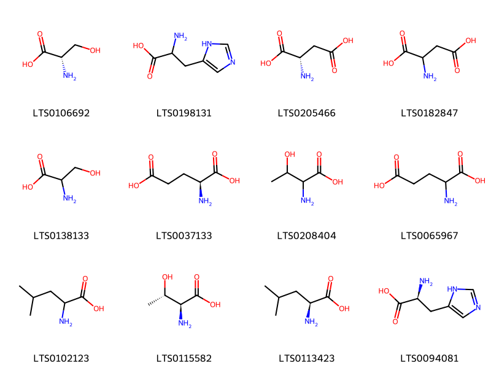
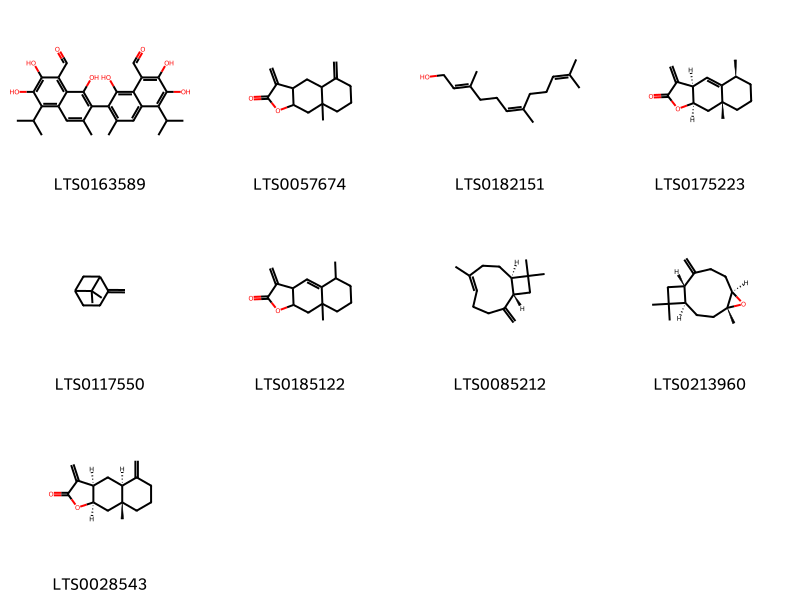

!!! abstract "Tóm tắt"

    Cối xay hay tên gọi khác là ma bàn thảo, giằng xay có tên khoa học là Abutilon indicum (L.) Sweet thuộc họ Bông (Malvaceae). Mọc dại khắp nơi trên toàn Việt Nam, phân bố nhiều nơi trên toàn thế giới, nguồn gốc từ các nước châu á, châu phi, nam mĩ sau đó được di thực sang nhiều nước châu âu và Bắc Mĩ. Thành phần hóa học của Cối xay khá đa dạng gồm những flavonoid, phenol, acid amin, acid hữu cơ, đường. Có tác dụng dược lý hạ sốt, chống viêm và lợi tiểu. Cối xay là vị thuốc được sử dụng theo kinh nghiệm nhân dân, chữa cảm sốt, đau đầu, bí tiểu, phù thũng sau khi đẻ, kiết lị. Lá giã nát đắp ngoài chữa mụn nhọt.

## Thông tin về thực vật

Dược liệu **Cối Xay (Phần Trên Mặt Đất Đã Phơi, Sấy Khô)** từ bộ phận **nan** từ loài *Abutilon indicum*.

**Mô tả thực vật:** Cây nhỏ mọc thành bụi, cao chừng 1 - 1,5m. Toàn thân và các bộ phận mang lông măng. Lá mềm, hình tim, đầu nhọn dài rộng chừng 10cm. Hoa mọc ở kẽ lá. Đài 5 răng không có tiểu đài. Nhị nhiều. Nhụy gồm tới 20 lá noãn. Toàn bộ trông giống cái bánh xe hay cái cối xay. Mỗi lá noãn chứa tới 3 hạt, nhẵn.

*Tài liệu tham khảo:* "Những cây thuốc và vị thuốc Việt Nam" - Đỗ Tất Lợi 
Trong dược điển Việt nam, một loài được sử dụng làm dược liệu là *Abutilon indicum*.

!!! info "Phân loại thực vật của *Abutilon indicum*"
    - **Kingdom:** Plantae
    - **Phylum:** Tracheophyta
    - **Order:** Malvales
    - **Family:** Malvaceae
    - **Genus:** Abutilon
    - **Species:** *Abutilon indicum*

**Phân bố trên thế giới:** Thailand, Cabo Verde, United States of America, Guadeloupe, Philippines, Virgin Islands (British), Chinese Taipei, China, Hong Kong, Réunion, New Caledonia, Saint Kitts and Nevis, India, Australia, Panama, Indonesia, Sri Lanka, Viet Nam

**Phân bố tại Việt nam:** Khánh Hòa, Nam Định

## Thông tin về dược liệu 

### Định danh

!!! info "Thông tin về tên gọi"

    - Dược liệu tiếng Việt: nan
    - Dược liệu tiếng Trung: nan (nan)
    - Dược liệu tiếng Anh: nan
    - Dược liệu latin thông dụng: nan
    - Dược liệu latin kiểu DĐVN: *herba abutili indici*
    - Dược liệu latin kiểu DĐVN: *nan*
    - Dược liệu latin kiểu thông tư: *nan*
    - Bộ phận dùng: nan (nan)

### Mô tả dược liệu 

- **Theo dược điển Việt nam V:** nan

- **Mô tả dược liệu theo thông tư chế biến dược liệu theo phương pháp cổ truyền:** nan

### Chế biến 

- **Chế biến theo dược điển việt nam V**: nan

- **Chế biến theo thông tư:** nan

--- 

## Thành phần hóa học

- Theo tài liệu của GS. Đỗ Tất Lợi:  (1) Flavonoid, phenol, acid amin, acid hữu cơ, đường
(2) Flavonoid là: gosyypin, gossypitin, cyanidin - 3 - rutinosid
      Acid amin là: alanin, acid glutamic, arginin, valin
      Đường: glucose, fructose, galactose
    

**Thành phần hóa học từ loài **Abutilon indicum**

Theo cơ sở dữ liệu lotus, loài *Abutilon indicum* đã phân lập và xác định được **40** hoạt chất thuộc về các nhóm Organooxygen compounds, Fatty Acyls, Cinnamic acids and derivatives, Carboxylic acids and derivatives, Benzene and substituted derivatives, Saturated hydrocarbons, Prenol lipids trong bảng dưới đây. Danh sách các hoạt chất như sau alantolactone [(LTS0175223)](https://lotus.naturalproducts.net/compound/lotus_id/LTS0175223), aspartic acid [(LTS0182847)](https://lotus.naturalproducts.net/compound/lotus_id/LTS0182847), isoalantolactone [(LTS0028543)](https://lotus.naturalproducts.net/compound/lotus_id/LTS0028543), tetracosane [(LTS0090497)](https://lotus.naturalproducts.net/compound/lotus_id/LTS0090497), hentriacontane [(LTS0046415)](https://lotus.naturalproducts.net/compound/lotus_id/LTS0046415), leucine [(LTS0102123)](https://lotus.naturalproducts.net/compound/lotus_id/LTS0102123), (e,z)-farnesol [(LTS0182151)](https://lotus.naturalproducts.net/compound/lotus_id/LTS0182151), tricosane [(LTS0089836)](https://lotus.naturalproducts.net/compound/lotus_id/LTS0089836), alantolactone [(LTS0185122)](https://lotus.naturalproducts.net/compound/lotus_id/LTS0185122), galop [(LTS0222857)](https://lotus.naturalproducts.net/compound/lotus_id/LTS0222857), para-coumaric acid [(LTS0266252)](https://lotus.naturalproducts.net/compound/lotus_id/LTS0266252), geranyl acetate [(LTS0093224)](https://lotus.naturalproducts.net/compound/lotus_id/LTS0093224), p-hydroxybenzoic acid [(LTS0263634)](https://lotus.naturalproducts.net/compound/lotus_id/LTS0263634), glucuronic acid [(LTS0028036)](https://lotus.naturalproducts.net/compound/lotus_id/LTS0028036), 8a-methyl-3,5-dimethylidene-octahydronaphtho[2,3-b]furan-2-one [(LTS0057674)](https://lotus.naturalproducts.net/compound/lotus_id/LTS0057674), threonine(l) [(LTS0208404)](https://lotus.naturalproducts.net/compound/lotus_id/LTS0208404), l-allothreonine [(LTS0115582)](https://lotus.naturalproducts.net/compound/lotus_id/LTS0115582), l-aspartic acid [(LTS0205466)](https://lotus.naturalproducts.net/compound/lotus_id/LTS0205466), l-serine [(LTS0106692)](https://lotus.naturalproducts.net/compound/lotus_id/LTS0106692), (2r,3s,4r,5r)-2,3,4,5-tetrahydroxy-6-oxohexanoic acid [(LTS0110351)](https://lotus.naturalproducts.net/compound/lotus_id/LTS0110351), l-histidine [(LTS0094081)](https://lotus.naturalproducts.net/compound/lotus_id/LTS0094081), serin [(LTS0138133)](https://lotus.naturalproducts.net/compound/lotus_id/LTS0138133), caffeic acid [(LTS0027481)](https://lotus.naturalproducts.net/compound/lotus_id/LTS0027481), 3,4-dihydroxycinnamic acid [(LTS0128050)](https://lotus.naturalproducts.net/compound/lotus_id/LTS0128050), triacontane [(LTS0250709)](https://lotus.naturalproducts.net/compound/lotus_id/LTS0250709), pentacosane [(LTS0080764)](https://lotus.naturalproducts.net/compound/lotus_id/LTS0080764), l-glutamic acid [(LTS0037133)](https://lotus.naturalproducts.net/compound/lotus_id/LTS0037133), hydroxycinnamic acid [(LTS0233023)](https://lotus.naturalproducts.net/compound/lotus_id/LTS0233023), β-pinene [(LTS0117550)](https://lotus.naturalproducts.net/compound/lotus_id/LTS0117550), nonacosane [(LTS0062747)](https://lotus.naturalproducts.net/compound/lotus_id/LTS0062747), (-)-gossypol [(LTS0163589)](https://lotus.naturalproducts.net/compound/lotus_id/LTS0163589), hexacosane [(LTS0079361)](https://lotus.naturalproducts.net/compound/lotus_id/LTS0079361), glutaminsaeure [(LTS0065967)](https://lotus.naturalproducts.net/compound/lotus_id/LTS0065967), vanillic acid [(LTS0229113)](https://lotus.naturalproducts.net/compound/lotus_id/LTS0229113), histidine [(LTS0198131)](https://lotus.naturalproducts.net/compound/lotus_id/LTS0198131), octacosane [(LTS0242387)](https://lotus.naturalproducts.net/compound/lotus_id/LTS0242387), caryophyllene [(LTS0085212)](https://lotus.naturalproducts.net/compound/lotus_id/LTS0085212), l-leucine [(LTS0113423)](https://lotus.naturalproducts.net/compound/lotus_id/LTS0113423), heptacosane [(LTS0150428)](https://lotus.naturalproducts.net/compound/lotus_id/LTS0150428), β-caryophyllene oxide [(LTS0213960)](https://lotus.naturalproducts.net/compound/lotus_id/LTS0213960). 
        
| chemicalTaxonomyClassyfireClass     |   smiles_count |
|:------------------------------------|---------------:|
| Benzene and substituted derivatives |             59 |
| Carboxylic acids and derivatives    |            230 |
| Cinnamic acids and derivatives      |             90 |
| Fatty Acyls                         |             25 |
| Organooxygen compounds              |             67 |
| Prenol lipids                       |            363 |
| Saturated hydrocarbons              |            243 |

            
### Nhóm Benzene and substituted derivatives
<figure markdown="span">
    { width=100% }
<figcaption>Hình ảnh cấu trúc hóa học của hoạt chất thuộc nhóm *Benzene and substituted derivatives*. Tên thường gọi của các hoạt chất tương ứng là galop [(LTS0222857)](https://lotus.naturalproducts.net/compound/lotus_id/LTS0222857), p-hydroxybenzoic acid [(LTS0263634)](https://lotus.naturalproducts.net/compound/lotus_id/LTS0263634), vanillic acid [(LTS0229113)](https://lotus.naturalproducts.net/compound/lotus_id/LTS0229113).</figcaption>
</figure>

            
            
### Nhóm Benzene and substituted derivatives
<figure markdown="span">
    { width=100% }
<figcaption>Hình ảnh cấu trúc hóa học của hoạt chất thuộc nhóm *Benzene and substituted derivatives*. Tên thường gọi của các hoạt chất tương ứng là galop [(LTS0222857)](https://lotus.naturalproducts.net/compound/lotus_id/LTS0222857), p-hydroxybenzoic acid [(LTS0263634)](https://lotus.naturalproducts.net/compound/lotus_id/LTS0263634), vanillic acid [(LTS0229113)](https://lotus.naturalproducts.net/compound/lotus_id/LTS0229113).</figcaption>
</figure>

### Nhóm Carboxylic acids and derivatives
<figure markdown="span">
    { width=100% }
<figcaption>Hình ảnh cấu trúc hóa học của hoạt chất thuộc nhóm *Carboxylic acids and derivatives*. Tên thường gọi của các hoạt chất tương ứng là l-serine [(LTS0106692)](https://lotus.naturalproducts.net/compound/lotus_id/LTS0106692), histidine [(LTS0198131)](https://lotus.naturalproducts.net/compound/lotus_id/LTS0198131), l-aspartic acid [(LTS0205466)](https://lotus.naturalproducts.net/compound/lotus_id/LTS0205466), aspartic acid [(LTS0182847)](https://lotus.naturalproducts.net/compound/lotus_id/LTS0182847), serin [(LTS0138133)](https://lotus.naturalproducts.net/compound/lotus_id/LTS0138133), l-glutamic acid [(LTS0037133)](https://lotus.naturalproducts.net/compound/lotus_id/LTS0037133), threonine(l) [(LTS0208404)](https://lotus.naturalproducts.net/compound/lotus_id/LTS0208404), glutaminsaeure [(LTS0065967)](https://lotus.naturalproducts.net/compound/lotus_id/LTS0065967), leucine [(LTS0102123)](https://lotus.naturalproducts.net/compound/lotus_id/LTS0102123), l-allothreonine [(LTS0115582)](https://lotus.naturalproducts.net/compound/lotus_id/LTS0115582), l-leucine [(LTS0113423)](https://lotus.naturalproducts.net/compound/lotus_id/LTS0113423), l-histidine [(LTS0094081)](https://lotus.naturalproducts.net/compound/lotus_id/LTS0094081).</figcaption>
</figure>

            
            
### Nhóm Benzene and substituted derivatives
<figure markdown="span">
    { width=100% }
<figcaption>Hình ảnh cấu trúc hóa học của hoạt chất thuộc nhóm *Benzene and substituted derivatives*. Tên thường gọi của các hoạt chất tương ứng là galop [(LTS0222857)](https://lotus.naturalproducts.net/compound/lotus_id/LTS0222857), p-hydroxybenzoic acid [(LTS0263634)](https://lotus.naturalproducts.net/compound/lotus_id/LTS0263634), vanillic acid [(LTS0229113)](https://lotus.naturalproducts.net/compound/lotus_id/LTS0229113).</figcaption>
</figure>

### Nhóm Carboxylic acids and derivatives
<figure markdown="span">
    { width=100% }
<figcaption>Hình ảnh cấu trúc hóa học của hoạt chất thuộc nhóm *Carboxylic acids and derivatives*. Tên thường gọi của các hoạt chất tương ứng là l-serine [(LTS0106692)](https://lotus.naturalproducts.net/compound/lotus_id/LTS0106692), histidine [(LTS0198131)](https://lotus.naturalproducts.net/compound/lotus_id/LTS0198131), l-aspartic acid [(LTS0205466)](https://lotus.naturalproducts.net/compound/lotus_id/LTS0205466), aspartic acid [(LTS0182847)](https://lotus.naturalproducts.net/compound/lotus_id/LTS0182847), serin [(LTS0138133)](https://lotus.naturalproducts.net/compound/lotus_id/LTS0138133), l-glutamic acid [(LTS0037133)](https://lotus.naturalproducts.net/compound/lotus_id/LTS0037133), threonine(l) [(LTS0208404)](https://lotus.naturalproducts.net/compound/lotus_id/LTS0208404), glutaminsaeure [(LTS0065967)](https://lotus.naturalproducts.net/compound/lotus_id/LTS0065967), leucine [(LTS0102123)](https://lotus.naturalproducts.net/compound/lotus_id/LTS0102123), l-allothreonine [(LTS0115582)](https://lotus.naturalproducts.net/compound/lotus_id/LTS0115582), l-leucine [(LTS0113423)](https://lotus.naturalproducts.net/compound/lotus_id/LTS0113423), l-histidine [(LTS0094081)](https://lotus.naturalproducts.net/compound/lotus_id/LTS0094081).</figcaption>
</figure>

### Nhóm Cinnamic acids and derivatives
<figure markdown="span">
    { width=100% }
<figcaption>Hình ảnh cấu trúc hóa học của hoạt chất thuộc nhóm *Cinnamic acids and derivatives*. Tên thường gọi của các hoạt chất tương ứng là 3,4-dihydroxycinnamic acid [(LTS0128050)](https://lotus.naturalproducts.net/compound/lotus_id/LTS0128050), para-coumaric acid [(LTS0266252)](https://lotus.naturalproducts.net/compound/lotus_id/LTS0266252), caffeic acid [(LTS0027481)](https://lotus.naturalproducts.net/compound/lotus_id/LTS0027481), hydroxycinnamic acid [(LTS0233023)](https://lotus.naturalproducts.net/compound/lotus_id/LTS0233023).</figcaption>
</figure>

            
            
### Nhóm Benzene and substituted derivatives
<figure markdown="span">
    { width=100% }
<figcaption>Hình ảnh cấu trúc hóa học của hoạt chất thuộc nhóm *Benzene and substituted derivatives*. Tên thường gọi của các hoạt chất tương ứng là galop [(LTS0222857)](https://lotus.naturalproducts.net/compound/lotus_id/LTS0222857), p-hydroxybenzoic acid [(LTS0263634)](https://lotus.naturalproducts.net/compound/lotus_id/LTS0263634), vanillic acid [(LTS0229113)](https://lotus.naturalproducts.net/compound/lotus_id/LTS0229113).</figcaption>
</figure>

### Nhóm Carboxylic acids and derivatives
<figure markdown="span">
    { width=100% }
<figcaption>Hình ảnh cấu trúc hóa học của hoạt chất thuộc nhóm *Carboxylic acids and derivatives*. Tên thường gọi của các hoạt chất tương ứng là l-serine [(LTS0106692)](https://lotus.naturalproducts.net/compound/lotus_id/LTS0106692), histidine [(LTS0198131)](https://lotus.naturalproducts.net/compound/lotus_id/LTS0198131), l-aspartic acid [(LTS0205466)](https://lotus.naturalproducts.net/compound/lotus_id/LTS0205466), aspartic acid [(LTS0182847)](https://lotus.naturalproducts.net/compound/lotus_id/LTS0182847), serin [(LTS0138133)](https://lotus.naturalproducts.net/compound/lotus_id/LTS0138133), l-glutamic acid [(LTS0037133)](https://lotus.naturalproducts.net/compound/lotus_id/LTS0037133), threonine(l) [(LTS0208404)](https://lotus.naturalproducts.net/compound/lotus_id/LTS0208404), glutaminsaeure [(LTS0065967)](https://lotus.naturalproducts.net/compound/lotus_id/LTS0065967), leucine [(LTS0102123)](https://lotus.naturalproducts.net/compound/lotus_id/LTS0102123), l-allothreonine [(LTS0115582)](https://lotus.naturalproducts.net/compound/lotus_id/LTS0115582), l-leucine [(LTS0113423)](https://lotus.naturalproducts.net/compound/lotus_id/LTS0113423), l-histidine [(LTS0094081)](https://lotus.naturalproducts.net/compound/lotus_id/LTS0094081).</figcaption>
</figure>

### Nhóm Cinnamic acids and derivatives
<figure markdown="span">
    { width=100% }
<figcaption>Hình ảnh cấu trúc hóa học của hoạt chất thuộc nhóm *Cinnamic acids and derivatives*. Tên thường gọi của các hoạt chất tương ứng là 3,4-dihydroxycinnamic acid [(LTS0128050)](https://lotus.naturalproducts.net/compound/lotus_id/LTS0128050), para-coumaric acid [(LTS0266252)](https://lotus.naturalproducts.net/compound/lotus_id/LTS0266252), caffeic acid [(LTS0027481)](https://lotus.naturalproducts.net/compound/lotus_id/LTS0027481), hydroxycinnamic acid [(LTS0233023)](https://lotus.naturalproducts.net/compound/lotus_id/LTS0233023).</figcaption>
</figure>

### Nhóm Fatty Acyls
<figure markdown="span">
    { width=100% }
<figcaption>Hình ảnh cấu trúc hóa học của hoạt chất thuộc nhóm *Fatty Acyls*. Tên thường gọi của các hoạt chất tương ứng là geranyl acetate [(LTS0093224)](https://lotus.naturalproducts.net/compound/lotus_id/LTS0093224).</figcaption>
</figure>

            
            
### Nhóm Benzene and substituted derivatives
<figure markdown="span">
    { width=100% }
<figcaption>Hình ảnh cấu trúc hóa học của hoạt chất thuộc nhóm *Benzene and substituted derivatives*. Tên thường gọi của các hoạt chất tương ứng là galop [(LTS0222857)](https://lotus.naturalproducts.net/compound/lotus_id/LTS0222857), p-hydroxybenzoic acid [(LTS0263634)](https://lotus.naturalproducts.net/compound/lotus_id/LTS0263634), vanillic acid [(LTS0229113)](https://lotus.naturalproducts.net/compound/lotus_id/LTS0229113).</figcaption>
</figure>

### Nhóm Carboxylic acids and derivatives
<figure markdown="span">
    { width=100% }
<figcaption>Hình ảnh cấu trúc hóa học của hoạt chất thuộc nhóm *Carboxylic acids and derivatives*. Tên thường gọi của các hoạt chất tương ứng là l-serine [(LTS0106692)](https://lotus.naturalproducts.net/compound/lotus_id/LTS0106692), histidine [(LTS0198131)](https://lotus.naturalproducts.net/compound/lotus_id/LTS0198131), l-aspartic acid [(LTS0205466)](https://lotus.naturalproducts.net/compound/lotus_id/LTS0205466), aspartic acid [(LTS0182847)](https://lotus.naturalproducts.net/compound/lotus_id/LTS0182847), serin [(LTS0138133)](https://lotus.naturalproducts.net/compound/lotus_id/LTS0138133), l-glutamic acid [(LTS0037133)](https://lotus.naturalproducts.net/compound/lotus_id/LTS0037133), threonine(l) [(LTS0208404)](https://lotus.naturalproducts.net/compound/lotus_id/LTS0208404), glutaminsaeure [(LTS0065967)](https://lotus.naturalproducts.net/compound/lotus_id/LTS0065967), leucine [(LTS0102123)](https://lotus.naturalproducts.net/compound/lotus_id/LTS0102123), l-allothreonine [(LTS0115582)](https://lotus.naturalproducts.net/compound/lotus_id/LTS0115582), l-leucine [(LTS0113423)](https://lotus.naturalproducts.net/compound/lotus_id/LTS0113423), l-histidine [(LTS0094081)](https://lotus.naturalproducts.net/compound/lotus_id/LTS0094081).</figcaption>
</figure>

### Nhóm Cinnamic acids and derivatives
<figure markdown="span">
    { width=100% }
<figcaption>Hình ảnh cấu trúc hóa học của hoạt chất thuộc nhóm *Cinnamic acids and derivatives*. Tên thường gọi của các hoạt chất tương ứng là 3,4-dihydroxycinnamic acid [(LTS0128050)](https://lotus.naturalproducts.net/compound/lotus_id/LTS0128050), para-coumaric acid [(LTS0266252)](https://lotus.naturalproducts.net/compound/lotus_id/LTS0266252), caffeic acid [(LTS0027481)](https://lotus.naturalproducts.net/compound/lotus_id/LTS0027481), hydroxycinnamic acid [(LTS0233023)](https://lotus.naturalproducts.net/compound/lotus_id/LTS0233023).</figcaption>
</figure>

### Nhóm Fatty Acyls
<figure markdown="span">
    { width=100% }
<figcaption>Hình ảnh cấu trúc hóa học của hoạt chất thuộc nhóm *Fatty Acyls*. Tên thường gọi của các hoạt chất tương ứng là geranyl acetate [(LTS0093224)](https://lotus.naturalproducts.net/compound/lotus_id/LTS0093224).</figcaption>
</figure>

### Nhóm Organooxygen compounds
<figure markdown="span">
    { width=100% }
<figcaption>Hình ảnh cấu trúc hóa học của hoạt chất thuộc nhóm *Organooxygen compounds*. Tên thường gọi của các hoạt chất tương ứng là glucuronic acid [(LTS0028036)](https://lotus.naturalproducts.net/compound/lotus_id/LTS0028036), (2r,3s,4r,5r)-2,3,4,5-tetrahydroxy-6-oxohexanoic acid [(LTS0110351)](https://lotus.naturalproducts.net/compound/lotus_id/LTS0110351).</figcaption>
</figure>

            
            
### Nhóm Benzene and substituted derivatives
<figure markdown="span">
    { width=100% }
<figcaption>Hình ảnh cấu trúc hóa học của hoạt chất thuộc nhóm *Benzene and substituted derivatives*. Tên thường gọi của các hoạt chất tương ứng là galop [(LTS0222857)](https://lotus.naturalproducts.net/compound/lotus_id/LTS0222857), p-hydroxybenzoic acid [(LTS0263634)](https://lotus.naturalproducts.net/compound/lotus_id/LTS0263634), vanillic acid [(LTS0229113)](https://lotus.naturalproducts.net/compound/lotus_id/LTS0229113).</figcaption>
</figure>

### Nhóm Carboxylic acids and derivatives
<figure markdown="span">
    { width=100% }
<figcaption>Hình ảnh cấu trúc hóa học của hoạt chất thuộc nhóm *Carboxylic acids and derivatives*. Tên thường gọi của các hoạt chất tương ứng là l-serine [(LTS0106692)](https://lotus.naturalproducts.net/compound/lotus_id/LTS0106692), histidine [(LTS0198131)](https://lotus.naturalproducts.net/compound/lotus_id/LTS0198131), l-aspartic acid [(LTS0205466)](https://lotus.naturalproducts.net/compound/lotus_id/LTS0205466), aspartic acid [(LTS0182847)](https://lotus.naturalproducts.net/compound/lotus_id/LTS0182847), serin [(LTS0138133)](https://lotus.naturalproducts.net/compound/lotus_id/LTS0138133), l-glutamic acid [(LTS0037133)](https://lotus.naturalproducts.net/compound/lotus_id/LTS0037133), threonine(l) [(LTS0208404)](https://lotus.naturalproducts.net/compound/lotus_id/LTS0208404), glutaminsaeure [(LTS0065967)](https://lotus.naturalproducts.net/compound/lotus_id/LTS0065967), leucine [(LTS0102123)](https://lotus.naturalproducts.net/compound/lotus_id/LTS0102123), l-allothreonine [(LTS0115582)](https://lotus.naturalproducts.net/compound/lotus_id/LTS0115582), l-leucine [(LTS0113423)](https://lotus.naturalproducts.net/compound/lotus_id/LTS0113423), l-histidine [(LTS0094081)](https://lotus.naturalproducts.net/compound/lotus_id/LTS0094081).</figcaption>
</figure>

### Nhóm Cinnamic acids and derivatives
<figure markdown="span">
    { width=100% }
<figcaption>Hình ảnh cấu trúc hóa học của hoạt chất thuộc nhóm *Cinnamic acids and derivatives*. Tên thường gọi của các hoạt chất tương ứng là 3,4-dihydroxycinnamic acid [(LTS0128050)](https://lotus.naturalproducts.net/compound/lotus_id/LTS0128050), para-coumaric acid [(LTS0266252)](https://lotus.naturalproducts.net/compound/lotus_id/LTS0266252), caffeic acid [(LTS0027481)](https://lotus.naturalproducts.net/compound/lotus_id/LTS0027481), hydroxycinnamic acid [(LTS0233023)](https://lotus.naturalproducts.net/compound/lotus_id/LTS0233023).</figcaption>
</figure>

### Nhóm Fatty Acyls
<figure markdown="span">
    { width=100% }
<figcaption>Hình ảnh cấu trúc hóa học của hoạt chất thuộc nhóm *Fatty Acyls*. Tên thường gọi của các hoạt chất tương ứng là geranyl acetate [(LTS0093224)](https://lotus.naturalproducts.net/compound/lotus_id/LTS0093224).</figcaption>
</figure>

### Nhóm Organooxygen compounds
<figure markdown="span">
    { width=100% }
<figcaption>Hình ảnh cấu trúc hóa học của hoạt chất thuộc nhóm *Organooxygen compounds*. Tên thường gọi của các hoạt chất tương ứng là glucuronic acid [(LTS0028036)](https://lotus.naturalproducts.net/compound/lotus_id/LTS0028036), (2r,3s,4r,5r)-2,3,4,5-tetrahydroxy-6-oxohexanoic acid [(LTS0110351)](https://lotus.naturalproducts.net/compound/lotus_id/LTS0110351).</figcaption>
</figure>

### Nhóm Prenol lipids
<figure markdown="span">
    { width=100% }
<figcaption>Hình ảnh cấu trúc hóa học của hoạt chất thuộc nhóm *Prenol lipids*. Tên thường gọi của các hoạt chất tương ứng là (-)-gossypol [(LTS0163589)](https://lotus.naturalproducts.net/compound/lotus_id/LTS0163589), 8a-methyl-3,5-dimethylidene-octahydronaphtho[2,3-b]furan-2-one [(LTS0057674)](https://lotus.naturalproducts.net/compound/lotus_id/LTS0057674), (e,z)-farnesol [(LTS0182151)](https://lotus.naturalproducts.net/compound/lotus_id/LTS0182151), alantolactone [(LTS0175223)](https://lotus.naturalproducts.net/compound/lotus_id/LTS0175223), β-pinene [(LTS0117550)](https://lotus.naturalproducts.net/compound/lotus_id/LTS0117550), alantolactone [(LTS0185122)](https://lotus.naturalproducts.net/compound/lotus_id/LTS0185122), caryophyllene [(LTS0085212)](https://lotus.naturalproducts.net/compound/lotus_id/LTS0085212), β-caryophyllene oxide [(LTS0213960)](https://lotus.naturalproducts.net/compound/lotus_id/LTS0213960), isoalantolactone [(LTS0028543)](https://lotus.naturalproducts.net/compound/lotus_id/LTS0028543).</figcaption>
</figure>

            
            
### Nhóm Benzene and substituted derivatives
<figure markdown="span">
    { width=100% }
<figcaption>Hình ảnh cấu trúc hóa học của hoạt chất thuộc nhóm *Benzene and substituted derivatives*. Tên thường gọi của các hoạt chất tương ứng là galop [(LTS0222857)](https://lotus.naturalproducts.net/compound/lotus_id/LTS0222857), p-hydroxybenzoic acid [(LTS0263634)](https://lotus.naturalproducts.net/compound/lotus_id/LTS0263634), vanillic acid [(LTS0229113)](https://lotus.naturalproducts.net/compound/lotus_id/LTS0229113).</figcaption>
</figure>

### Nhóm Carboxylic acids and derivatives
<figure markdown="span">
    { width=100% }
<figcaption>Hình ảnh cấu trúc hóa học của hoạt chất thuộc nhóm *Carboxylic acids and derivatives*. Tên thường gọi của các hoạt chất tương ứng là l-serine [(LTS0106692)](https://lotus.naturalproducts.net/compound/lotus_id/LTS0106692), histidine [(LTS0198131)](https://lotus.naturalproducts.net/compound/lotus_id/LTS0198131), l-aspartic acid [(LTS0205466)](https://lotus.naturalproducts.net/compound/lotus_id/LTS0205466), aspartic acid [(LTS0182847)](https://lotus.naturalproducts.net/compound/lotus_id/LTS0182847), serin [(LTS0138133)](https://lotus.naturalproducts.net/compound/lotus_id/LTS0138133), l-glutamic acid [(LTS0037133)](https://lotus.naturalproducts.net/compound/lotus_id/LTS0037133), threonine(l) [(LTS0208404)](https://lotus.naturalproducts.net/compound/lotus_id/LTS0208404), glutaminsaeure [(LTS0065967)](https://lotus.naturalproducts.net/compound/lotus_id/LTS0065967), leucine [(LTS0102123)](https://lotus.naturalproducts.net/compound/lotus_id/LTS0102123), l-allothreonine [(LTS0115582)](https://lotus.naturalproducts.net/compound/lotus_id/LTS0115582), l-leucine [(LTS0113423)](https://lotus.naturalproducts.net/compound/lotus_id/LTS0113423), l-histidine [(LTS0094081)](https://lotus.naturalproducts.net/compound/lotus_id/LTS0094081).</figcaption>
</figure>

### Nhóm Cinnamic acids and derivatives
<figure markdown="span">
    { width=100% }
<figcaption>Hình ảnh cấu trúc hóa học của hoạt chất thuộc nhóm *Cinnamic acids and derivatives*. Tên thường gọi của các hoạt chất tương ứng là 3,4-dihydroxycinnamic acid [(LTS0128050)](https://lotus.naturalproducts.net/compound/lotus_id/LTS0128050), para-coumaric acid [(LTS0266252)](https://lotus.naturalproducts.net/compound/lotus_id/LTS0266252), caffeic acid [(LTS0027481)](https://lotus.naturalproducts.net/compound/lotus_id/LTS0027481), hydroxycinnamic acid [(LTS0233023)](https://lotus.naturalproducts.net/compound/lotus_id/LTS0233023).</figcaption>
</figure>

### Nhóm Fatty Acyls
<figure markdown="span">
    { width=100% }
<figcaption>Hình ảnh cấu trúc hóa học của hoạt chất thuộc nhóm *Fatty Acyls*. Tên thường gọi của các hoạt chất tương ứng là geranyl acetate [(LTS0093224)](https://lotus.naturalproducts.net/compound/lotus_id/LTS0093224).</figcaption>
</figure>

### Nhóm Organooxygen compounds
<figure markdown="span">
    { width=100% }
<figcaption>Hình ảnh cấu trúc hóa học của hoạt chất thuộc nhóm *Organooxygen compounds*. Tên thường gọi của các hoạt chất tương ứng là glucuronic acid [(LTS0028036)](https://lotus.naturalproducts.net/compound/lotus_id/LTS0028036), (2r,3s,4r,5r)-2,3,4,5-tetrahydroxy-6-oxohexanoic acid [(LTS0110351)](https://lotus.naturalproducts.net/compound/lotus_id/LTS0110351).</figcaption>
</figure>

### Nhóm Prenol lipids
<figure markdown="span">
    { width=100% }
<figcaption>Hình ảnh cấu trúc hóa học của hoạt chất thuộc nhóm *Prenol lipids*. Tên thường gọi của các hoạt chất tương ứng là (-)-gossypol [(LTS0163589)](https://lotus.naturalproducts.net/compound/lotus_id/LTS0163589), 8a-methyl-3,5-dimethylidene-octahydronaphtho[2,3-b]furan-2-one [(LTS0057674)](https://lotus.naturalproducts.net/compound/lotus_id/LTS0057674), (e,z)-farnesol [(LTS0182151)](https://lotus.naturalproducts.net/compound/lotus_id/LTS0182151), alantolactone [(LTS0175223)](https://lotus.naturalproducts.net/compound/lotus_id/LTS0175223), β-pinene [(LTS0117550)](https://lotus.naturalproducts.net/compound/lotus_id/LTS0117550), alantolactone [(LTS0185122)](https://lotus.naturalproducts.net/compound/lotus_id/LTS0185122), caryophyllene [(LTS0085212)](https://lotus.naturalproducts.net/compound/lotus_id/LTS0085212), β-caryophyllene oxide [(LTS0213960)](https://lotus.naturalproducts.net/compound/lotus_id/LTS0213960), isoalantolactone [(LTS0028543)](https://lotus.naturalproducts.net/compound/lotus_id/LTS0028543).</figcaption>
</figure>

### Nhóm Saturated hydrocarbons
<figure markdown="span">
    { width=100% }
<figcaption>Hình ảnh cấu trúc hóa học của hoạt chất thuộc nhóm *Saturated hydrocarbons*. Tên thường gọi của các hoạt chất tương ứng là hexacosane [(LTS0079361)](https://lotus.naturalproducts.net/compound/lotus_id/LTS0079361), nonacosane [(LTS0062747)](https://lotus.naturalproducts.net/compound/lotus_id/LTS0062747), pentacosane [(LTS0080764)](https://lotus.naturalproducts.net/compound/lotus_id/LTS0080764), tetracosane [(LTS0090497)](https://lotus.naturalproducts.net/compound/lotus_id/LTS0090497), heptacosane [(LTS0150428)](https://lotus.naturalproducts.net/compound/lotus_id/LTS0150428), tricosane [(LTS0089836)](https://lotus.naturalproducts.net/compound/lotus_id/LTS0089836), triacontane [(LTS0250709)](https://lotus.naturalproducts.net/compound/lotus_id/LTS0250709), hentriacontane [(LTS0046415)](https://lotus.naturalproducts.net/compound/lotus_id/LTS0046415), octacosane [(LTS0242387)](https://lotus.naturalproducts.net/compound/lotus_id/LTS0242387).</figcaption>
</figure>

            

---

## Tác dụng dược lý

Theo tài liệu "Những cây thuốc và vị thuốc Việt Nam" - Đỗ Tất Lợi:- Hạ nhiệt
- Lợi tiểu 
- Chống viêm

Theo tài liệu quốc tế: nan

---

## Dược điển Việt Nam V

### Soi bột:

nan

<!-- Hình ảnh soi bột sẽ được tự động chèn vào đây sau -->

### Vi phẫu:

nan

<!-- Hình ảnh vi phẫu sẽ được tự động chèn vào đây sau -->

### Định tính

nan

### Định lượng

nan

### Thông tin khác 

- ** Độ ẩm: ** nan
- ** Bảo quản:** nan

## Dược điển Hồng kong

<!-- PDF sẽ được tự động chèn vào đây sau -->

---

## Y dược học cổ truyền

- **Tên vị thuốc:** nan
- **Tính vị quy kinh:** Cam, bình. Vào các kinh tâm, đởm.
- **Công năng chủ trị:** Giải biểu nhiệt, hoạt huyết, lợi tiểu.
- **Chú ý:** nan
- **Kiêng kỵ:** nan

## Bình luận

