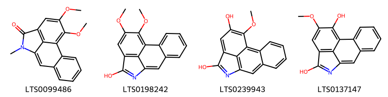
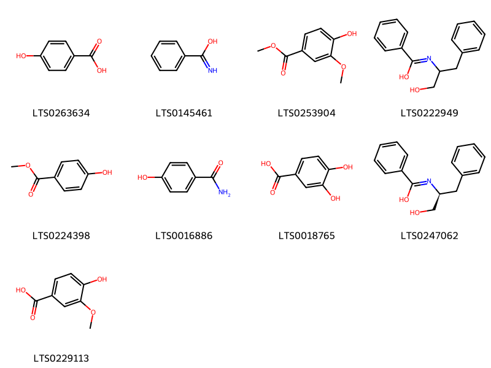
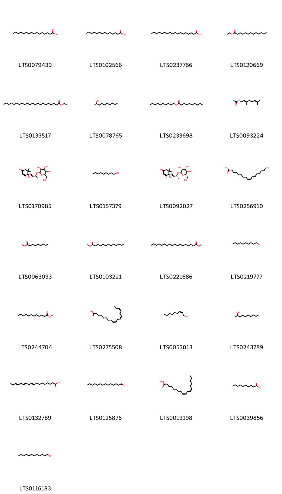
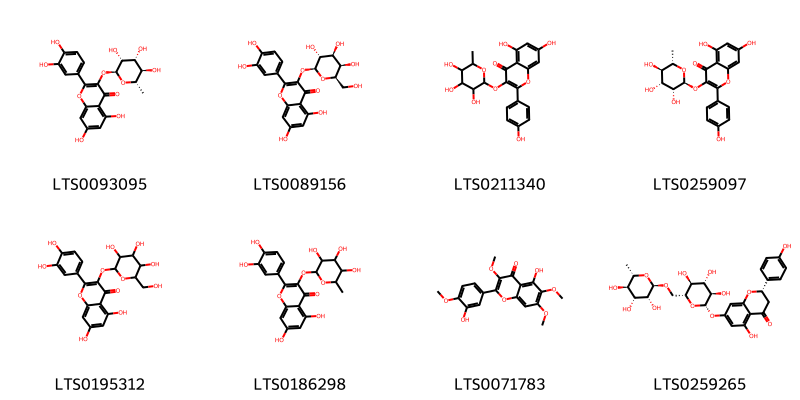
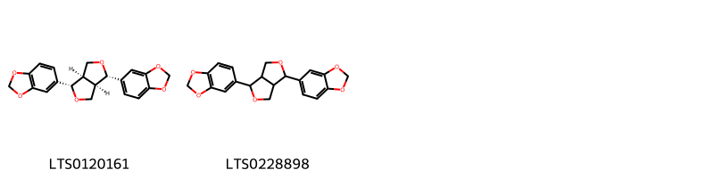
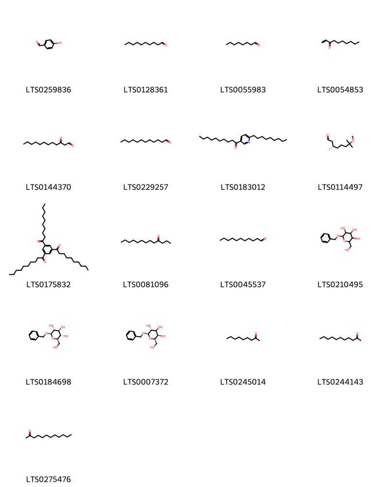
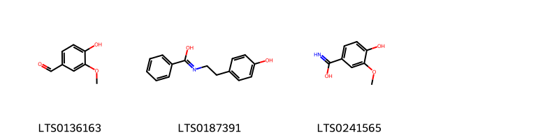
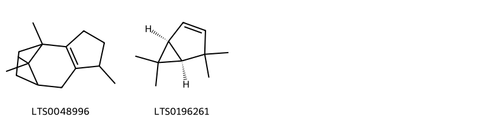
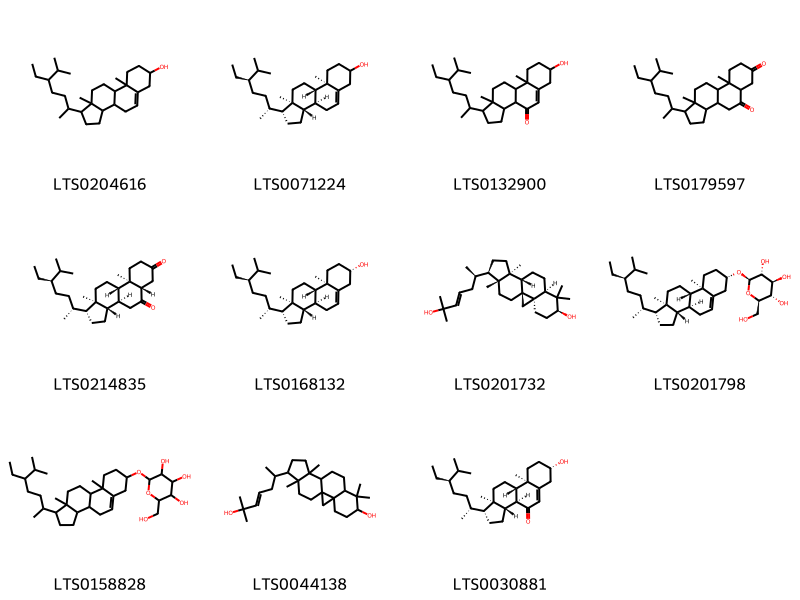
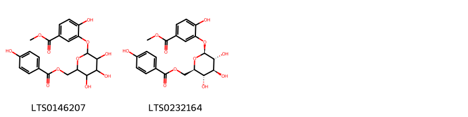

!!! abstract "Tóm tắt"

    Cây Diếp Cá có tên khoa học là Houttuynia cordata Thunb. thuộc họ Lá giấp (Saururaceae). Cây có nguồn gốc từ Assam, Bangladesh, Campuchia, Trung Quốc, Đông Himalaya, Hải Nam, Nhật Bản, Hàn Quốc, Việt Nam... Tại Việt Nam cây mọc hoang ở khắp nơi ẩm thấp. Trong y học cổ truyền, dùng để chữa bệnh viêm sưng tai giữa, sưng tắc tia sữa, đau mắt đỏ có tụ máu, trĩ lòi dom, thông tiểu, chữa bệnh mụn nhọt, kinh nguyệt không đều, thanh nhiệt, giải độc. Tác dụng dược lý của cây gồm: Lợi tiểu, thông tiểu; kháng virus, kháng viêm, kháng khuẩn, kích thích da, gây phồng, làm bền mao mạch, giảm đau.  Thành phần hoá học gồm có: Tinh dầu (thành phần chủ yếu là methylnonylceton (có mùi rất khó chịu), laurylaldehyd, caprylaldehyd và decanonyl acetaldehyd), Flavonoid (Quercitrin, isoquercitrin), Alkaloid (Cordalin), hoa và quả chứa chất isoquercitrin và không chứa quercetin. Độ tro trung bình là 11,4%, tro không tan trong HCl là 2,7%.

## Thông tin về thực vật

Dược liệu **Diếp Cá** từ bộ phận **nan** từ loài *Houttuynia cordata*.

**Mô tả thực vật:** Cây diếp cá là một loại cỏ nhỏ, mọc lâu năm, ưa chỗ ẩm ướt có thân rễ mọc ngầm dưới đất. Rễ nhỏ mọc ở các đốt. Thân hình trụ tròn hay dẹt, dài 20 cm đến 35 cm, có lông hoặc ít lông, chất giòn dễ gãy. Lá mọc cách, hình tim, đầu lá hơi nhọn hay nhọn hẳn. Phiến lá gấp cuộn lại, cuống đính ở gốc lá dài 2-3cm. Hoa nhỏ màu vàng nhạt, không có bao hoa, mọc thành bóng, có 4 lá bắc màu trắng; trong toàn bộ bề ngoài của cụm hoa và lá bắc giống như một cây hoa đơn độc, toàn cây và có mùi tanh như cá. Hoa nở về mùa hạ vào các tháng 5-8.

*Tài liệu tham khảo:* Tài liệu khác 
Trong dược điển Việt nam, một loài được sử dụng làm dược liệu là *Houttuynia cordata*.

!!! info "Phân loại thực vật của *Houttuynia cordata*"
    - **Kingdom:** Plantae
    - **Phylum:** Tracheophyta
    - **Order:** Piperales
    - **Family:** Saururaceae
    - **Genus:** Houttuynia
    - **Species:** *Houttuynia cordata*

**Phân bố trên thế giới:** Germany, United States of America, Chinese Taipei, China, Hong Kong, United Kingdom of Great Britain and Northern Ireland, New Zealand, Brazil, Japan, Nepal, Australia, Netherlands, Macao, India, Costa Rica, Viet Nam, Belgium

**Phân bố tại Việt nam:** Quảng Nam

## Thông tin về dược liệu 

### Định danh

!!! info "Thông tin về tên gọi"

    - Dược liệu tiếng Việt: nan
    - Dược liệu tiếng Trung: nan (nan)
    - Dược liệu tiếng Anh: nan
    - Dược liệu latin thông dụng: nan
    - Dược liệu latin kiểu DĐVN: *houttuynia cordata thunb.*
    - Dược liệu latin kiểu DĐVN: *nan*
    - Dược liệu latin kiểu thông tư: *nan*
    - Bộ phận dùng: nan (nan)

### Mô tả dược liệu 

- **Theo dược điển Việt nam V:** nan

- **Mô tả dược liệu theo thông tư chế biến dược liệu theo phương pháp cổ truyền:** nan

### Chế biến 

- **Chế biến theo dược điển việt nam V**: nan

- **Chế biến theo thông tư:** nan

--- 

## Thành phần hóa học

- Theo tài liệu của GS. Đỗ Tất Lợi:  (1) Tinh dầu; Flavonoid; Alkaloid
(2) Tinh dầu: Thành phần chủ yếu là methylnonylceton, laurylaldehyd, caprylaldehyd và decanonyl acetaldehyd.
Flavonoid: Quercitrin, isoquercitrin 
Alkaloid: Cordalin
    

**Thành phần hóa học từ loài **Houttuynia cordata**

Theo cơ sở dữ liệu lotus, loài *Houttuynia cordata* đã phân lập và xác định được **156** hoạt chất thuộc về các nhóm Epoxides, Amaryllidaceae alkaloids, Fatty Acyls, Quinolines and derivatives, Phenols, Tannins, Diazanaphthalenes, Carboxylic acids and derivatives, Unsaturated hydrocarbons, Saturated hydrocarbons, Steroids and steroid derivatives, Flavonoids, Furanoid lignans, Aristolactams, Heteroaromatic compounds, Benzene and substituted derivatives, Prenol lipids, Polycyclic hydrocarbons, Organooxygen compounds, Cinnamic acids and derivatives, Aporphines, Indoles and derivatives trong bảng dưới đây. Danh sách các hoạt chất như sau 4-terpineol [(LTS0253733)](https://lotus.naturalproducts.net/compound/lotus_id/LTS0253733), 8-chloro-15,16-dimethoxy-10-azatetracyclo[7.7.1.0²,⁷.0¹³,¹⁷]heptadeca-1(17),2(7),3,5,8,13,15-heptaene-11,12-dione [(LTS0262364)](https://lotus.naturalproducts.net/compound/lotus_id/LTS0262364), paraben [(LTS0224398)](https://lotus.naturalproducts.net/compound/lotus_id/LTS0224398), sesamin [(LTS0228898)](https://lotus.naturalproducts.net/compound/lotus_id/LTS0228898), 4-hydroxy-3-methoxybenzenecarboximidic acid [(LTS0241565)](https://lotus.naturalproducts.net/compound/lotus_id/LTS0241565), α pinene [(LTS0132416)](https://lotus.naturalproducts.net/compound/lotus_id/LTS0132416), phellandrene [(LTS0157173)](https://lotus.naturalproducts.net/compound/lotus_id/LTS0157173), stearic acid [(LTS0237766)](https://lotus.naturalproducts.net/compound/lotus_id/LTS0237766), 2-methylundecanoic acid; undecanoic acid [(LTS0268007)](https://lotus.naturalproducts.net/compound/lotus_id/LTS0268007), 15-(6-hydroxy-6-methylhept-4-en-2-yl)-7,7,12,16-tetramethylpentacyclo[9.7.0.0¹,³.0³,⁸.0¹²,¹⁶]octadecan-6-ol [(LTS0044138)](https://lotus.naturalproducts.net/compound/lotus_id/LTS0044138), capric acid [(LTS0039856)](https://lotus.naturalproducts.net/compound/lotus_id/LTS0039856), linoleic [(LTS0013198)](https://lotus.naturalproducts.net/compound/lotus_id/LTS0013198), geranyl acetate [(LTS0093224)](https://lotus.naturalproducts.net/compound/lotus_id/LTS0093224), (1r,3s,5r)-6,6-dimethyl-2-methylidenebicyclo[3.1.1]heptan-3-yl acetate [(LTS0272806)](https://lotus.naturalproducts.net/compound/lotus_id/LTS0272806), benzyl β-d-glucoside [(LTS0184698)](https://lotus.naturalproducts.net/compound/lotus_id/LTS0184698), 1,5,11,11-tetramethyltricyclo[6.2.1.0²,⁶]undec-2(6)-ene [(LTS0048996)](https://lotus.naturalproducts.net/compound/lotus_id/LTS0048996), 1-[3,5-bis(decanoyl)phenyl]decan-1-one [(LTS0175832)](https://lotus.naturalproducts.net/compound/lotus_id/LTS0175832), (1s,2r,5s,8r)-2,6-dimethyl-9-(propan-2-ylidene)-11-oxatricyclo[6.2.1.0¹,⁵]undec-6-en-8-ol [(LTS0086735)](https://lotus.naturalproducts.net/compound/lotus_id/LTS0086735), 12,15,16-trimethoxy-10-azatetracyclo[7.7.1.0²,⁷.0¹³,¹⁷]heptadeca-1(16),2,4,6,9(17),10,12,14-octaen-8-one [(LTS0057198)](https://lotus.naturalproducts.net/compound/lotus_id/LTS0057198), 15,16-dimethoxy-10-methyl-10-azatetracyclo[7.7.1.0²,⁷.0¹³,¹⁷]heptadeca-1(17),2(7),3,5,8,13,15-heptaene-11,12-dione [(LTS0109417)](https://lotus.naturalproducts.net/compound/lotus_id/LTS0109417), dihydrocarveol [(LTS0111467)](https://lotus.naturalproducts.net/compound/lotus_id/LTS0111467), α-toluimidic acid [(LTS0145461)](https://lotus.naturalproducts.net/compound/lotus_id/LTS0145461), methyl ferulate [(LTS0265853)](https://lotus.naturalproducts.net/compound/lotus_id/LTS0265853), (+)-neodihydrocarveol [(LTS0207780)](https://lotus.naturalproducts.net/compound/lotus_id/LTS0207780), 16-hydroxy-15-methoxy-10-azatetracyclo[7.7.1.0²,⁷.0¹³,¹⁷]heptadeca-1(17),2(7),3,5,8,13,15-heptaene-11,12-dione [(LTS0029887)](https://lotus.naturalproducts.net/compound/lotus_id/LTS0029887), (2r,3r,5r,6r)-2-(benzyloxy)-6-(hydroxymethyl)oxane-3,4,5-triol [(LTS0007372)](https://lotus.naturalproducts.net/compound/lotus_id/LTS0007372), 3,4-dihydroxybenzoic acid [(LTS0018765)](https://lotus.naturalproducts.net/compound/lotus_id/LTS0018765), lysicamine [(LTS0013970)](https://lotus.naturalproducts.net/compound/lotus_id/LTS0013970), decanal [(LTS0128361)](https://lotus.naturalproducts.net/compound/lotus_id/LTS0128361), decan-2-ol [(LTS0243789)](https://lotus.naturalproducts.net/compound/lotus_id/LTS0243789), quercitrin [(LTS0093095)](https://lotus.naturalproducts.net/compound/lotus_id/LTS0093095), undecan-2-one [(LTS0244143)](https://lotus.naturalproducts.net/compound/lotus_id/LTS0244143), n-(1-hydroxy-3-phenylpropan-2-yl)benzenecarboximidic acid [(LTS0222949)](https://lotus.naturalproducts.net/compound/lotus_id/LTS0222949), hyperoside [(LTS0089156)](https://lotus.naturalproducts.net/compound/lotus_id/LTS0089156), 4,7,7-trimethylbicyclo[4.1.0]hept-2-ene [(LTS0156738)](https://lotus.naturalproducts.net/compound/lotus_id/LTS0156738), dodecanal [(LTS0229257)](https://lotus.naturalproducts.net/compound/lotus_id/LTS0229257), vanillate [(LTS0253904)](https://lotus.naturalproducts.net/compound/lotus_id/LTS0253904), 6,7-dimethyl-1-(1,2,3,4,5-pentahydroxypentyl)-4h-quinoxaline-2,3-dione [(LTS0093125)](https://lotus.naturalproducts.net/compound/lotus_id/LTS0093125), 2-(3,4-dihydroxyphenyl)-5,7-dihydroxy-3-{[3,4,5-trihydroxy-6-(hydroxymethyl)oxan-2-yl]oxy}chromen-4-one [(LTS0195312)](https://lotus.naturalproducts.net/compound/lotus_id/LTS0195312), methyl 4-hydroxy-3-({3,4,5-trihydroxy-6-[(4-hydroxybenzoyloxy)methyl]oxan-2-yl}oxy)benzoate [(LTS0146207)](https://lotus.naturalproducts.net/compound/lotus_id/LTS0146207), β-caryophyllene oxide [(LTS0213960)](https://lotus.naturalproducts.net/compound/lotus_id/LTS0213960), 1-(5-ethyl-6-methylheptan-2-yl)-9a,11a-dimethyl-dodecahydro-1h-cyclopenta[a]phenanthrene-5,7-dione [(LTS0179597)](https://lotus.naturalproducts.net/compound/lotus_id/LTS0179597), perillene [(LTS0083458)](https://lotus.naturalproducts.net/compound/lotus_id/LTS0083458), camphor [(LTS0091905)](https://lotus.naturalproducts.net/compound/lotus_id/LTS0091905), α linolenic acid [(LTS0132789)](https://lotus.naturalproducts.net/compound/lotus_id/LTS0132789), terpineol [(LTS0136148)](https://lotus.naturalproducts.net/compound/lotus_id/LTS0136148), nonan-1-ol [(LTS0157379)](https://lotus.naturalproducts.net/compound/lotus_id/LTS0157379), octanal [(LTS0055983)](https://lotus.naturalproducts.net/compound/lotus_id/LTS0055983), (3s)-7-methoxy-3,7-dimethyloctanal [(LTS0114497)](https://lotus.naturalproducts.net/compound/lotus_id/LTS0114497), carvacrol [(LTS0012882)](https://lotus.naturalproducts.net/compound/lotus_id/LTS0012882), (+)-α-terpineol [(LTS0258249)](https://lotus.naturalproducts.net/compound/lotus_id/LTS0258249), decanol [(LTS0219777)](https://lotus.naturalproducts.net/compound/lotus_id/LTS0219777), 2-nonanone [(LTS0245014)](https://lotus.naturalproducts.net/compound/lotus_id/LTS0245014), (3r,6e)-nerolidol [(LTS0145065)](https://lotus.naturalproducts.net/compound/lotus_id/LTS0145065), methyl nonanoate (ester) [(LTS0063033)](https://lotus.naturalproducts.net/compound/lotus_id/LTS0063033), methyl stearate [(LTS0221686)](https://lotus.naturalproducts.net/compound/lotus_id/LTS0221686), sesamin [(LTS0120161)](https://lotus.naturalproducts.net/compound/lotus_id/LTS0120161), (-)-linalool [(LTS0200382)](https://lotus.naturalproducts.net/compound/lotus_id/LTS0200382), trans-β-ocimene [(LTS0049765)](https://lotus.naturalproducts.net/compound/lotus_id/LTS0049765), dodecane [(LTS0146085)](https://lotus.naturalproducts.net/compound/lotus_id/LTS0146085), 3,7,7-trimethylbicyclo[4.1.0]hept-2-ene [(LTS0237770)](https://lotus.naturalproducts.net/compound/lotus_id/LTS0237770), 1-(6-nonylpyridin-3-yl)decan-1-one [(LTS0183012)](https://lotus.naturalproducts.net/compound/lotus_id/LTS0183012), ethyl tridecanoate [(LTS0120669)](https://lotus.naturalproducts.net/compound/lotus_id/LTS0120669), (+)-4-terpineol [(LTS0140257)](https://lotus.naturalproducts.net/compound/lotus_id/LTS0140257), lauron [(LTS0275476)](https://lotus.naturalproducts.net/compound/lotus_id/LTS0275476), 3,4-dihydroxycinnamic acid [(LTS0128050)](https://lotus.naturalproducts.net/compound/lotus_id/LTS0128050), 1-dodecanol [(LTS0116183)](https://lotus.naturalproducts.net/compound/lotus_id/LTS0116183), (1r,4s,6r,9s)-6,10,10-trimethyl-2-methylidene-5-oxatricyclo[7.2.0.0⁴,⁶]undecane [(LTS0106902)](https://lotus.naturalproducts.net/compound/lotus_id/LTS0106902), phytol [(LTS0096073)](https://lotus.naturalproducts.net/compound/lotus_id/LTS0096073), β-pinene [(LTS0117550)](https://lotus.naturalproducts.net/compound/lotus_id/LTS0117550), [(5r)-2,5,6,6-tetramethylcyclohex-1-en-1-yl]methyl acetate [(LTS0202065)](https://lotus.naturalproducts.net/compound/lotus_id/LTS0202065), tridecan-4-one [(LTS0081096)](https://lotus.naturalproducts.net/compound/lotus_id/LTS0081096), α-limonene [(LTS0244943)](https://lotus.naturalproducts.net/compound/lotus_id/LTS0244943), quercitrin [(LTS0186298)](https://lotus.naturalproducts.net/compound/lotus_id/LTS0186298), aldehyde c11 [(LTS0045537)](https://lotus.naturalproducts.net/compound/lotus_id/LTS0045537), capryl caprate [(LTS0233698)](https://lotus.naturalproducts.net/compound/lotus_id/LTS0233698), 6,7-dimethyl-1-[(1s,2r,3r,4r)-1,2,3,4,5-pentahydroxypentyl]-4h-quinoxaline-2,3-dione [(LTS0247212)](https://lotus.naturalproducts.net/compound/lotus_id/LTS0247212), (-)-α-phellandrene [(LTS0226766)](https://lotus.naturalproducts.net/compound/lotus_id/LTS0226766), (2z)-non-2-en-1-ol [(LTS0053013)](https://lotus.naturalproducts.net/compound/lotus_id/LTS0053013), 14,15-dimethoxy-10-azatetracyclo[7.6.1.0²,⁷.0¹²,¹⁶]hexadeca-1(16),2(7),3,5,8,10,12,14-octaen-11-ol [(LTS0198242)](https://lotus.naturalproducts.net/compound/lotus_id/LTS0198242), p-hydroxybenzaldehyde [(LTS0259836)](https://lotus.naturalproducts.net/compound/lotus_id/LTS0259836), decanoyl acetaldehyde [(LTS0144370)](https://lotus.naturalproducts.net/compound/lotus_id/LTS0144370), stigmast-5-en-3-ol, (3β)- [(LTS0204616)](https://lotus.naturalproducts.net/compound/lotus_id/LTS0204616), 14-methoxy-10-azatetracyclo[7.6.1.0²,⁷.0¹²,¹⁶]hexadeca-1(16),2(7),3,5,8,10,12,14-octaene-11,15-diol [(LTS0137147)](https://lotus.naturalproducts.net/compound/lotus_id/LTS0137147), β-ocimene [(LTS0242381)](https://lotus.naturalproducts.net/compound/lotus_id/LTS0242381), benzyl glucopyranoside [(LTS0210495)](https://lotus.naturalproducts.net/compound/lotus_id/LTS0210495), methyl 4-hydroxy-3-{[(2s,3r,4s,5s,6r)-3,4,5-trihydroxy-6-[(4-hydroxybenzoyloxy)methyl]oxan-2-yl]oxy}benzoate [(LTS0232164)](https://lotus.naturalproducts.net/compound/lotus_id/LTS0232164), 2-methyldecanoic acid; capric acid [(LTS0243959)](https://lotus.naturalproducts.net/compound/lotus_id/LTS0243959), palmitic acid [(LTS0079439)](https://lotus.naturalproducts.net/compound/lotus_id/LTS0079439), α-hydroxyquinoline [(LTS0227000)](https://lotus.naturalproducts.net/compound/lotus_id/LTS0227000), tetradecanal [(LTS0125876)](https://lotus.naturalproducts.net/compound/lotus_id/LTS0125876), narirutin [(LTS0259265)](https://lotus.naturalproducts.net/compound/lotus_id/LTS0259265), (1s)-4,4,6,6-tetramethylbicyclo[3.1.0]hex-2-ene [(LTS0196261)](https://lotus.naturalproducts.net/compound/lotus_id/LTS0196261), afzelin [(LTS0259097)](https://lotus.naturalproducts.net/compound/lotus_id/LTS0259097), 3,4-dihydroxy-n-[2-(4-hydroxyphenyl)ethyl]benzenecarboximidic acid [(LTS0143225)](https://lotus.naturalproducts.net/compound/lotus_id/LTS0143225), (-)-α-pinene [(LTS0032699)](https://lotus.naturalproducts.net/compound/lotus_id/LTS0032699), sitogluside [(LTS0201798)](https://lotus.naturalproducts.net/compound/lotus_id/LTS0201798), dec-1-en-3-one [(LTS0054853)](https://lotus.naturalproducts.net/compound/lotus_id/LTS0054853), n-[(2s)-1-hydroxy-3-phenylpropan-2-yl]benzenecarboximidic acid [(LTS0247062)](https://lotus.naturalproducts.net/compound/lotus_id/LTS0247062), vanillin [(LTS0136163)](https://lotus.naturalproducts.net/compound/lotus_id/LTS0136163), monoterpenes [(LTS0106881)](https://lotus.naturalproducts.net/compound/lotus_id/LTS0106881), nonene [(LTS0022235)](https://lotus.naturalproducts.net/compound/lotus_id/LTS0022235), stigmast-5-en-3-ol [(LTS0071224)](https://lotus.naturalproducts.net/compound/lotus_id/LTS0071224), farnesene [(LTS0057150)](https://lotus.naturalproducts.net/compound/lotus_id/LTS0057150), terpinolene [(LTS0104525)](https://lotus.naturalproducts.net/compound/lotus_id/LTS0104525), (1r,6s)-3,7,7-trimethylbicyclo[4.1.0]hept-2-ene [(LTS0256301)](https://lotus.naturalproducts.net/compound/lotus_id/LTS0256301), (-)-β-pinene [(LTS0108757)](https://lotus.naturalproducts.net/compound/lotus_id/LTS0108757), 4-hydroxybenzamide [(LTS0016886)](https://lotus.naturalproducts.net/compound/lotus_id/LTS0016886), 14,15-dimethoxy-10-methyl-10-azatetracyclo[7.6.1.0²,⁷.0¹²,¹⁶]hexadeca-1(16),2(7),3,5,8,12,14-heptaen-11-one [(LTS0099486)](https://lotus.naturalproducts.net/compound/lotus_id/LTS0099486), 6,10,10-trimethyl-2-methylidene-5-oxatricyclo[7.2.0.0⁴,⁶]undecane [(LTS0010272)](https://lotus.naturalproducts.net/compound/lotus_id/LTS0010272), (+)-camphene [(LTS0109845)](https://lotus.naturalproducts.net/compound/lotus_id/LTS0109845), caffeic acid [(LTS0027481)](https://lotus.naturalproducts.net/compound/lotus_id/LTS0027481), dehydrovomifoliol [(LTS0209706)](https://lotus.naturalproducts.net/compound/lotus_id/LTS0209706), 4-hydroxy-4-(3-hydroxybut-1-en-1-yl)-3,5,5-trimethylcyclohex-2-en-1-one [(LTS0183737)](https://lotus.naturalproducts.net/compound/lotus_id/LTS0183737), 1-(5-ethyl-6-methylheptan-2-yl)-7-hydroxy-9a,11a-dimethyl-1h,2h,3h,3ah,3bh,6h,7h,8h,9h,9bh,10h,11h-cyclopenta[a]phenanthren-4-one [(LTS0132900)](https://lotus.naturalproducts.net/compound/lotus_id/LTS0132900), phytol [(LTS0031808)](https://lotus.naturalproducts.net/compound/lotus_id/LTS0031808), n-[2-(4-hydroxyphenyl)ethyl]benzenecarboximidic acid [(LTS0187391)](https://lotus.naturalproducts.net/compound/lotus_id/LTS0187391), vanillic acid [(LTS0229113)](https://lotus.naturalproducts.net/compound/lotus_id/LTS0229113), caryophyllene [(LTS0085212)](https://lotus.naturalproducts.net/compound/lotus_id/LTS0085212), (2r)-decan-2-ol [(LTS0078765)](https://lotus.naturalproducts.net/compound/lotus_id/LTS0078765), ethyl behenate [(LTS0133517)](https://lotus.naturalproducts.net/compound/lotus_id/LTS0133517), 2-{[1-(5-ethyl-6-methylheptan-2-yl)-9a,11a-dimethyl-1h,2h,3h,3ah,3bh,4h,6h,7h,8h,9h,9bh,10h,11h-cyclopenta[a]phenanthren-7-yl]oxy}-6-(hydroxymethyl)oxane-3,4,5-triol [(LTS0158828)](https://lotus.naturalproducts.net/compound/lotus_id/LTS0158828), α terpinene [(LTS0232891)](https://lotus.naturalproducts.net/compound/lotus_id/LTS0232891), (1r,3as,3bs,7s,9ar,9bs,11ar)-1-[(2r,5r)-5-ethyl-6-methylheptan-2-yl]-7-hydroxy-9a,11a-dimethyl-1h,2h,3h,3ah,3bh,6h,7h,8h,9h,9bh,10h,11h-cyclopenta[a]phenanthren-4-one [(LTS0030881)](https://lotus.naturalproducts.net/compound/lotus_id/LTS0030881), methyl laurate [(LTS0244704)](https://lotus.naturalproducts.net/compound/lotus_id/LTS0244704), (4s)-4-hydroxy-3,5,5-trimethyl-4-[(1e,3r)-3-{[(2r,3r,4r,5r,6s)-3,4,5-trihydroxy-6-(hydroxymethyl)oxan-2-yl]oxy}but-1-en-1-yl]cyclohex-2-en-1-one [(LTS0092027)](https://lotus.naturalproducts.net/compound/lotus_id/LTS0092027), bornyl acetate [(LTS0060565)](https://lotus.naturalproducts.net/compound/lotus_id/LTS0060565), myristic acid [(LTS0102566)](https://lotus.naturalproducts.net/compound/lotus_id/LTS0102566), terpinene [(LTS0136858)](https://lotus.naturalproducts.net/compound/lotus_id/LTS0136858), (z)-methyl ferulate [(LTS0130447)](https://lotus.naturalproducts.net/compound/lotus_id/LTS0130447), 15-methoxy-10-azatetracyclo[7.6.1.0²,⁷.0¹²,¹⁶]hexadeca-1(16),2(7),3,5,8,10,12,14-octaene-11,14-diol [(LTS0239943)](https://lotus.naturalproducts.net/compound/lotus_id/LTS0239943), 3-methylideneundecane [(LTS0085393)](https://lotus.naturalproducts.net/compound/lotus_id/LTS0085393), p-hydroxybenzoic acid [(LTS0263634)](https://lotus.naturalproducts.net/compound/lotus_id/LTS0263634), casticin [(LTS0071783)](https://lotus.naturalproducts.net/compound/lotus_id/LTS0071783), (-)-delta(3)-carene [(LTS0104784)](https://lotus.naturalproducts.net/compound/lotus_id/LTS0104784), caryophyllene oxide [(LTS0159789)](https://lotus.naturalproducts.net/compound/lotus_id/LTS0159789), indole - 3 carboxylic acid [(LTS0271539)](https://lotus.naturalproducts.net/compound/lotus_id/LTS0271539), 1-dodecene [(LTS0071043)](https://lotus.naturalproducts.net/compound/lotus_id/LTS0071043), 5,7-dihydroxy-2-(4-hydroxyphenyl)-3-[(3,4,5-trihydroxy-6-methyloxan-2-yl)oxy]chromen-4-one [(LTS0211340)](https://lotus.naturalproducts.net/compound/lotus_id/LTS0211340), 15,16-dimethoxy-10-azatetracyclo[7.7.1.0²,⁷.0¹³,¹⁷]heptadeca-1(17),2(7),3,5,8,13,15-heptaene-11,12-dione [(LTS0160285)](https://lotus.naturalproducts.net/compound/lotus_id/LTS0160285), methyl cocoate [(LTS0103221)](https://lotus.naturalproducts.net/compound/lotus_id/LTS0103221), α-linolenic acid [(LTS0275508)](https://lotus.naturalproducts.net/compound/lotus_id/LTS0275508), sitosterol [(LTS0168132)](https://lotus.naturalproducts.net/compound/lotus_id/LTS0168132), α-myrcene [(LTS0115731)](https://lotus.naturalproducts.net/compound/lotus_id/LTS0115731), oleic acid [(LTS0256910)](https://lotus.naturalproducts.net/compound/lotus_id/LTS0256910), β-farnesene [(LTS0067925)](https://lotus.naturalproducts.net/compound/lotus_id/LTS0067925), (4s)-4-hydroxy-4-(3-hydroxybut-1-en-1-yl)-3,5,5-trimethylcyclohex-2-en-1-one [(LTS0225700)](https://lotus.naturalproducts.net/compound/lotus_id/LTS0225700), (1r,3as,3bs,5as,9ar,9bs,11ar)-1-[(2r,5r)-5-ethyl-6-methylheptan-2-yl]-9a,11a-dimethyl-dodecahydro-1h-cyclopenta[a]phenanthrene-5,7-dione [(LTS0214835)](https://lotus.naturalproducts.net/compound/lotus_id/LTS0214835), (6s,9r)-vomifoliol [(LTS0052786)](https://lotus.naturalproducts.net/compound/lotus_id/LTS0052786), 4-hydroxy-3,5,5-trimethyl-4-(3-{[3,4,5-trihydroxy-6-(hydroxymethyl)oxan-2-yl]oxy}but-1-en-1-yl)cyclohex-2-en-1-one [(LTS0170985)](https://lotus.naturalproducts.net/compound/lotus_id/LTS0170985), camphene [(LTS0267242)](https://lotus.naturalproducts.net/compound/lotus_id/LTS0267242), methyl ferulate [(LTS0047572)](https://lotus.naturalproducts.net/compound/lotus_id/LTS0047572), 4-hydroxy-3,5,5-trimethyl-4-(3-oxobut-1-en-1-yl)cyclohex-2-en-1-one [(LTS0180042)](https://lotus.naturalproducts.net/compound/lotus_id/LTS0180042), borneol [(LTS0264960)](https://lotus.naturalproducts.net/compound/lotus_id/LTS0264960), cycloart-23-ene-3β,25-diol [(LTS0201732)](https://lotus.naturalproducts.net/compound/lotus_id/LTS0201732), (-)-bornyl acetate [(LTS0267397)](https://lotus.naturalproducts.net/compound/lotus_id/LTS0267397). 
        
| chemicalTaxonomyClassyfireClass     |   smiles_count |
|:------------------------------------|---------------:|
| Amaryllidaceae alkaloids            |             33 |
| Aporphines                          |            226 |
| Aristolactams                       |            131 |
| Benzene and substituted derivatives |            187 |
| Carboxylic acids and derivatives    |             32 |
| Cinnamic acids and derivatives      |            127 |
| Diazanaphthalenes                   |            111 |
| Epoxides                            |             68 |
| Fatty Acyls                         |            600 |
| Flavonoids                          |            579 |
| Furanoid lignans                    |            106 |
| Heteroaromatic compounds            |             16 |
| Indoles and derivatives             |             22 |
| Organooxygen compounds              |            395 |
| Phenols                             |             62 |
| Polycyclic hydrocarbons             |             54 |
| Prenol lipids                       |           1217 |
| Quinolines and derivatives          |             15 |
| Saturated hydrocarbons              |             12 |
| Steroids and steroid derivatives    |            854 |
| Tannins                             |            134 |
| Unsaturated hydrocarbons            |             56 |

            
### Nhóm Amaryllidaceae alkaloids
<figure markdown="span">
    { width=100% }
<figcaption>Hình ảnh cấu trúc hóa học của hoạt chất thuộc nhóm *Amaryllidaceae alkaloids*. Tên thường gọi của các hoạt chất tương ứng là 3,4-dihydroxy-n-[2-(4-hydroxyphenyl)ethyl]benzenecarboximidic acid [(LTS0143225)](https://lotus.naturalproducts.net/compound/lotus_id/LTS0143225).</figcaption>
</figure>

            
            
### Nhóm Amaryllidaceae alkaloids
<figure markdown="span">
    { width=100% }
<figcaption>Hình ảnh cấu trúc hóa học của hoạt chất thuộc nhóm *Amaryllidaceae alkaloids*. Tên thường gọi của các hoạt chất tương ứng là 3,4-dihydroxy-n-[2-(4-hydroxyphenyl)ethyl]benzenecarboximidic acid [(LTS0143225)](https://lotus.naturalproducts.net/compound/lotus_id/LTS0143225).</figcaption>
</figure>

### Nhóm Aporphines
<figure markdown="span">
    { width=100% }
<figcaption>Hình ảnh cấu trúc hóa học của hoạt chất thuộc nhóm *Aporphines*. Tên thường gọi của các hoạt chất tương ứng là 15,16-dimethoxy-10-azatetracyclo[7.7.1.0²,⁷.0¹³,¹⁷]heptadeca-1(17),2(7),3,5,8,13,15-heptaene-11,12-dione [(LTS0160285)](https://lotus.naturalproducts.net/compound/lotus_id/LTS0160285), 16-hydroxy-15-methoxy-10-azatetracyclo[7.7.1.0²,⁷.0¹³,¹⁷]heptadeca-1(17),2(7),3,5,8,13,15-heptaene-11,12-dione [(LTS0029887)](https://lotus.naturalproducts.net/compound/lotus_id/LTS0029887), 15,16-dimethoxy-10-methyl-10-azatetracyclo[7.7.1.0²,⁷.0¹³,¹⁷]heptadeca-1(17),2(7),3,5,8,13,15-heptaene-11,12-dione [(LTS0109417)](https://lotus.naturalproducts.net/compound/lotus_id/LTS0109417), 12,15,16-trimethoxy-10-azatetracyclo[7.7.1.0²,⁷.0¹³,¹⁷]heptadeca-1(16),2,4,6,9(17),10,12,14-octaen-8-one [(LTS0057198)](https://lotus.naturalproducts.net/compound/lotus_id/LTS0057198), lysicamine [(LTS0013970)](https://lotus.naturalproducts.net/compound/lotus_id/LTS0013970), 8-chloro-15,16-dimethoxy-10-azatetracyclo[7.7.1.0²,⁷.0¹³,¹⁷]heptadeca-1(17),2(7),3,5,8,13,15-heptaene-11,12-dione [(LTS0262364)](https://lotus.naturalproducts.net/compound/lotus_id/LTS0262364).</figcaption>
</figure>

            
            
### Nhóm Amaryllidaceae alkaloids
<figure markdown="span">
    { width=100% }
<figcaption>Hình ảnh cấu trúc hóa học của hoạt chất thuộc nhóm *Amaryllidaceae alkaloids*. Tên thường gọi của các hoạt chất tương ứng là 3,4-dihydroxy-n-[2-(4-hydroxyphenyl)ethyl]benzenecarboximidic acid [(LTS0143225)](https://lotus.naturalproducts.net/compound/lotus_id/LTS0143225).</figcaption>
</figure>

### Nhóm Aporphines
<figure markdown="span">
    { width=100% }
<figcaption>Hình ảnh cấu trúc hóa học của hoạt chất thuộc nhóm *Aporphines*. Tên thường gọi của các hoạt chất tương ứng là 15,16-dimethoxy-10-azatetracyclo[7.7.1.0²,⁷.0¹³,¹⁷]heptadeca-1(17),2(7),3,5,8,13,15-heptaene-11,12-dione [(LTS0160285)](https://lotus.naturalproducts.net/compound/lotus_id/LTS0160285), 16-hydroxy-15-methoxy-10-azatetracyclo[7.7.1.0²,⁷.0¹³,¹⁷]heptadeca-1(17),2(7),3,5,8,13,15-heptaene-11,12-dione [(LTS0029887)](https://lotus.naturalproducts.net/compound/lotus_id/LTS0029887), 15,16-dimethoxy-10-methyl-10-azatetracyclo[7.7.1.0²,⁷.0¹³,¹⁷]heptadeca-1(17),2(7),3,5,8,13,15-heptaene-11,12-dione [(LTS0109417)](https://lotus.naturalproducts.net/compound/lotus_id/LTS0109417), 12,15,16-trimethoxy-10-azatetracyclo[7.7.1.0²,⁷.0¹³,¹⁷]heptadeca-1(16),2,4,6,9(17),10,12,14-octaen-8-one [(LTS0057198)](https://lotus.naturalproducts.net/compound/lotus_id/LTS0057198), lysicamine [(LTS0013970)](https://lotus.naturalproducts.net/compound/lotus_id/LTS0013970), 8-chloro-15,16-dimethoxy-10-azatetracyclo[7.7.1.0²,⁷.0¹³,¹⁷]heptadeca-1(17),2(7),3,5,8,13,15-heptaene-11,12-dione [(LTS0262364)](https://lotus.naturalproducts.net/compound/lotus_id/LTS0262364).</figcaption>
</figure>

### Nhóm Aristolactams
<figure markdown="span">
    { width=100% }
<figcaption>Hình ảnh cấu trúc hóa học của hoạt chất thuộc nhóm *Aristolactams*. Tên thường gọi của các hoạt chất tương ứng là 14,15-dimethoxy-10-methyl-10-azatetracyclo[7.6.1.0²,⁷.0¹²,¹⁶]hexadeca-1(16),2(7),3,5,8,12,14-heptaen-11-one [(LTS0099486)](https://lotus.naturalproducts.net/compound/lotus_id/LTS0099486), 14,15-dimethoxy-10-azatetracyclo[7.6.1.0²,⁷.0¹²,¹⁶]hexadeca-1(16),2(7),3,5,8,10,12,14-octaen-11-ol [(LTS0198242)](https://lotus.naturalproducts.net/compound/lotus_id/LTS0198242), 15-methoxy-10-azatetracyclo[7.6.1.0²,⁷.0¹²,¹⁶]hexadeca-1(16),2(7),3,5,8,10,12,14-octaene-11,14-diol [(LTS0239943)](https://lotus.naturalproducts.net/compound/lotus_id/LTS0239943), 14-methoxy-10-azatetracyclo[7.6.1.0²,⁷.0¹²,¹⁶]hexadeca-1(16),2(7),3,5,8,10,12,14-octaene-11,15-diol [(LTS0137147)](https://lotus.naturalproducts.net/compound/lotus_id/LTS0137147).</figcaption>
</figure>

            
            
### Nhóm Amaryllidaceae alkaloids
<figure markdown="span">
    { width=100% }
<figcaption>Hình ảnh cấu trúc hóa học của hoạt chất thuộc nhóm *Amaryllidaceae alkaloids*. Tên thường gọi của các hoạt chất tương ứng là 3,4-dihydroxy-n-[2-(4-hydroxyphenyl)ethyl]benzenecarboximidic acid [(LTS0143225)](https://lotus.naturalproducts.net/compound/lotus_id/LTS0143225).</figcaption>
</figure>

### Nhóm Aporphines
<figure markdown="span">
    { width=100% }
<figcaption>Hình ảnh cấu trúc hóa học của hoạt chất thuộc nhóm *Aporphines*. Tên thường gọi của các hoạt chất tương ứng là 15,16-dimethoxy-10-azatetracyclo[7.7.1.0²,⁷.0¹³,¹⁷]heptadeca-1(17),2(7),3,5,8,13,15-heptaene-11,12-dione [(LTS0160285)](https://lotus.naturalproducts.net/compound/lotus_id/LTS0160285), 16-hydroxy-15-methoxy-10-azatetracyclo[7.7.1.0²,⁷.0¹³,¹⁷]heptadeca-1(17),2(7),3,5,8,13,15-heptaene-11,12-dione [(LTS0029887)](https://lotus.naturalproducts.net/compound/lotus_id/LTS0029887), 15,16-dimethoxy-10-methyl-10-azatetracyclo[7.7.1.0²,⁷.0¹³,¹⁷]heptadeca-1(17),2(7),3,5,8,13,15-heptaene-11,12-dione [(LTS0109417)](https://lotus.naturalproducts.net/compound/lotus_id/LTS0109417), 12,15,16-trimethoxy-10-azatetracyclo[7.7.1.0²,⁷.0¹³,¹⁷]heptadeca-1(16),2,4,6,9(17),10,12,14-octaen-8-one [(LTS0057198)](https://lotus.naturalproducts.net/compound/lotus_id/LTS0057198), lysicamine [(LTS0013970)](https://lotus.naturalproducts.net/compound/lotus_id/LTS0013970), 8-chloro-15,16-dimethoxy-10-azatetracyclo[7.7.1.0²,⁷.0¹³,¹⁷]heptadeca-1(17),2(7),3,5,8,13,15-heptaene-11,12-dione [(LTS0262364)](https://lotus.naturalproducts.net/compound/lotus_id/LTS0262364).</figcaption>
</figure>

### Nhóm Aristolactams
<figure markdown="span">
    { width=100% }
<figcaption>Hình ảnh cấu trúc hóa học của hoạt chất thuộc nhóm *Aristolactams*. Tên thường gọi của các hoạt chất tương ứng là 14,15-dimethoxy-10-methyl-10-azatetracyclo[7.6.1.0²,⁷.0¹²,¹⁶]hexadeca-1(16),2(7),3,5,8,12,14-heptaen-11-one [(LTS0099486)](https://lotus.naturalproducts.net/compound/lotus_id/LTS0099486), 14,15-dimethoxy-10-azatetracyclo[7.6.1.0²,⁷.0¹²,¹⁶]hexadeca-1(16),2(7),3,5,8,10,12,14-octaen-11-ol [(LTS0198242)](https://lotus.naturalproducts.net/compound/lotus_id/LTS0198242), 15-methoxy-10-azatetracyclo[7.6.1.0²,⁷.0¹²,¹⁶]hexadeca-1(16),2(7),3,5,8,10,12,14-octaene-11,14-diol [(LTS0239943)](https://lotus.naturalproducts.net/compound/lotus_id/LTS0239943), 14-methoxy-10-azatetracyclo[7.6.1.0²,⁷.0¹²,¹⁶]hexadeca-1(16),2(7),3,5,8,10,12,14-octaene-11,15-diol [(LTS0137147)](https://lotus.naturalproducts.net/compound/lotus_id/LTS0137147).</figcaption>
</figure>

### Nhóm Benzene and substituted derivatives
<figure markdown="span">
    { width=100% }
<figcaption>Hình ảnh cấu trúc hóa học của hoạt chất thuộc nhóm *Benzene and substituted derivatives*. Tên thường gọi của các hoạt chất tương ứng là p-hydroxybenzoic acid [(LTS0263634)](https://lotus.naturalproducts.net/compound/lotus_id/LTS0263634), α-toluimidic acid [(LTS0145461)](https://lotus.naturalproducts.net/compound/lotus_id/LTS0145461), vanillate [(LTS0253904)](https://lotus.naturalproducts.net/compound/lotus_id/LTS0253904), n-(1-hydroxy-3-phenylpropan-2-yl)benzenecarboximidic acid [(LTS0222949)](https://lotus.naturalproducts.net/compound/lotus_id/LTS0222949), paraben [(LTS0224398)](https://lotus.naturalproducts.net/compound/lotus_id/LTS0224398), 4-hydroxybenzamide [(LTS0016886)](https://lotus.naturalproducts.net/compound/lotus_id/LTS0016886), 3,4-dihydroxybenzoic acid [(LTS0018765)](https://lotus.naturalproducts.net/compound/lotus_id/LTS0018765), n-[(2s)-1-hydroxy-3-phenylpropan-2-yl]benzenecarboximidic acid [(LTS0247062)](https://lotus.naturalproducts.net/compound/lotus_id/LTS0247062), vanillic acid [(LTS0229113)](https://lotus.naturalproducts.net/compound/lotus_id/LTS0229113).</figcaption>
</figure>

            
            
### Nhóm Amaryllidaceae alkaloids
<figure markdown="span">
    { width=100% }
<figcaption>Hình ảnh cấu trúc hóa học của hoạt chất thuộc nhóm *Amaryllidaceae alkaloids*. Tên thường gọi của các hoạt chất tương ứng là 3,4-dihydroxy-n-[2-(4-hydroxyphenyl)ethyl]benzenecarboximidic acid [(LTS0143225)](https://lotus.naturalproducts.net/compound/lotus_id/LTS0143225).</figcaption>
</figure>

### Nhóm Aporphines
<figure markdown="span">
    { width=100% }
<figcaption>Hình ảnh cấu trúc hóa học của hoạt chất thuộc nhóm *Aporphines*. Tên thường gọi của các hoạt chất tương ứng là 15,16-dimethoxy-10-azatetracyclo[7.7.1.0²,⁷.0¹³,¹⁷]heptadeca-1(17),2(7),3,5,8,13,15-heptaene-11,12-dione [(LTS0160285)](https://lotus.naturalproducts.net/compound/lotus_id/LTS0160285), 16-hydroxy-15-methoxy-10-azatetracyclo[7.7.1.0²,⁷.0¹³,¹⁷]heptadeca-1(17),2(7),3,5,8,13,15-heptaene-11,12-dione [(LTS0029887)](https://lotus.naturalproducts.net/compound/lotus_id/LTS0029887), 15,16-dimethoxy-10-methyl-10-azatetracyclo[7.7.1.0²,⁷.0¹³,¹⁷]heptadeca-1(17),2(7),3,5,8,13,15-heptaene-11,12-dione [(LTS0109417)](https://lotus.naturalproducts.net/compound/lotus_id/LTS0109417), 12,15,16-trimethoxy-10-azatetracyclo[7.7.1.0²,⁷.0¹³,¹⁷]heptadeca-1(16),2,4,6,9(17),10,12,14-octaen-8-one [(LTS0057198)](https://lotus.naturalproducts.net/compound/lotus_id/LTS0057198), lysicamine [(LTS0013970)](https://lotus.naturalproducts.net/compound/lotus_id/LTS0013970), 8-chloro-15,16-dimethoxy-10-azatetracyclo[7.7.1.0²,⁷.0¹³,¹⁷]heptadeca-1(17),2(7),3,5,8,13,15-heptaene-11,12-dione [(LTS0262364)](https://lotus.naturalproducts.net/compound/lotus_id/LTS0262364).</figcaption>
</figure>

### Nhóm Aristolactams
<figure markdown="span">
    { width=100% }
<figcaption>Hình ảnh cấu trúc hóa học của hoạt chất thuộc nhóm *Aristolactams*. Tên thường gọi của các hoạt chất tương ứng là 14,15-dimethoxy-10-methyl-10-azatetracyclo[7.6.1.0²,⁷.0¹²,¹⁶]hexadeca-1(16),2(7),3,5,8,12,14-heptaen-11-one [(LTS0099486)](https://lotus.naturalproducts.net/compound/lotus_id/LTS0099486), 14,15-dimethoxy-10-azatetracyclo[7.6.1.0²,⁷.0¹²,¹⁶]hexadeca-1(16),2(7),3,5,8,10,12,14-octaen-11-ol [(LTS0198242)](https://lotus.naturalproducts.net/compound/lotus_id/LTS0198242), 15-methoxy-10-azatetracyclo[7.6.1.0²,⁷.0¹²,¹⁶]hexadeca-1(16),2(7),3,5,8,10,12,14-octaene-11,14-diol [(LTS0239943)](https://lotus.naturalproducts.net/compound/lotus_id/LTS0239943), 14-methoxy-10-azatetracyclo[7.6.1.0²,⁷.0¹²,¹⁶]hexadeca-1(16),2(7),3,5,8,10,12,14-octaene-11,15-diol [(LTS0137147)](https://lotus.naturalproducts.net/compound/lotus_id/LTS0137147).</figcaption>
</figure>

### Nhóm Benzene and substituted derivatives
<figure markdown="span">
    { width=100% }
<figcaption>Hình ảnh cấu trúc hóa học của hoạt chất thuộc nhóm *Benzene and substituted derivatives*. Tên thường gọi của các hoạt chất tương ứng là p-hydroxybenzoic acid [(LTS0263634)](https://lotus.naturalproducts.net/compound/lotus_id/LTS0263634), α-toluimidic acid [(LTS0145461)](https://lotus.naturalproducts.net/compound/lotus_id/LTS0145461), vanillate [(LTS0253904)](https://lotus.naturalproducts.net/compound/lotus_id/LTS0253904), n-(1-hydroxy-3-phenylpropan-2-yl)benzenecarboximidic acid [(LTS0222949)](https://lotus.naturalproducts.net/compound/lotus_id/LTS0222949), paraben [(LTS0224398)](https://lotus.naturalproducts.net/compound/lotus_id/LTS0224398), 4-hydroxybenzamide [(LTS0016886)](https://lotus.naturalproducts.net/compound/lotus_id/LTS0016886), 3,4-dihydroxybenzoic acid [(LTS0018765)](https://lotus.naturalproducts.net/compound/lotus_id/LTS0018765), n-[(2s)-1-hydroxy-3-phenylpropan-2-yl]benzenecarboximidic acid [(LTS0247062)](https://lotus.naturalproducts.net/compound/lotus_id/LTS0247062), vanillic acid [(LTS0229113)](https://lotus.naturalproducts.net/compound/lotus_id/LTS0229113).</figcaption>
</figure>

### Nhóm Carboxylic acids and derivatives
<figure markdown="span">
    { width=100% }
<figcaption>Hình ảnh cấu trúc hóa học của hoạt chất thuộc nhóm *Carboxylic acids and derivatives*. Tên thường gọi của các hoạt chất tương ứng là [(5r)-2,5,6,6-tetramethylcyclohex-1-en-1-yl]methyl acetate [(LTS0202065)](https://lotus.naturalproducts.net/compound/lotus_id/LTS0202065).</figcaption>
</figure>

            
            
### Nhóm Amaryllidaceae alkaloids
<figure markdown="span">
    { width=100% }
<figcaption>Hình ảnh cấu trúc hóa học của hoạt chất thuộc nhóm *Amaryllidaceae alkaloids*. Tên thường gọi của các hoạt chất tương ứng là 3,4-dihydroxy-n-[2-(4-hydroxyphenyl)ethyl]benzenecarboximidic acid [(LTS0143225)](https://lotus.naturalproducts.net/compound/lotus_id/LTS0143225).</figcaption>
</figure>

### Nhóm Aporphines
<figure markdown="span">
    { width=100% }
<figcaption>Hình ảnh cấu trúc hóa học của hoạt chất thuộc nhóm *Aporphines*. Tên thường gọi của các hoạt chất tương ứng là 15,16-dimethoxy-10-azatetracyclo[7.7.1.0²,⁷.0¹³,¹⁷]heptadeca-1(17),2(7),3,5,8,13,15-heptaene-11,12-dione [(LTS0160285)](https://lotus.naturalproducts.net/compound/lotus_id/LTS0160285), 16-hydroxy-15-methoxy-10-azatetracyclo[7.7.1.0²,⁷.0¹³,¹⁷]heptadeca-1(17),2(7),3,5,8,13,15-heptaene-11,12-dione [(LTS0029887)](https://lotus.naturalproducts.net/compound/lotus_id/LTS0029887), 15,16-dimethoxy-10-methyl-10-azatetracyclo[7.7.1.0²,⁷.0¹³,¹⁷]heptadeca-1(17),2(7),3,5,8,13,15-heptaene-11,12-dione [(LTS0109417)](https://lotus.naturalproducts.net/compound/lotus_id/LTS0109417), 12,15,16-trimethoxy-10-azatetracyclo[7.7.1.0²,⁷.0¹³,¹⁷]heptadeca-1(16),2,4,6,9(17),10,12,14-octaen-8-one [(LTS0057198)](https://lotus.naturalproducts.net/compound/lotus_id/LTS0057198), lysicamine [(LTS0013970)](https://lotus.naturalproducts.net/compound/lotus_id/LTS0013970), 8-chloro-15,16-dimethoxy-10-azatetracyclo[7.7.1.0²,⁷.0¹³,¹⁷]heptadeca-1(17),2(7),3,5,8,13,15-heptaene-11,12-dione [(LTS0262364)](https://lotus.naturalproducts.net/compound/lotus_id/LTS0262364).</figcaption>
</figure>

### Nhóm Aristolactams
<figure markdown="span">
    { width=100% }
<figcaption>Hình ảnh cấu trúc hóa học của hoạt chất thuộc nhóm *Aristolactams*. Tên thường gọi của các hoạt chất tương ứng là 14,15-dimethoxy-10-methyl-10-azatetracyclo[7.6.1.0²,⁷.0¹²,¹⁶]hexadeca-1(16),2(7),3,5,8,12,14-heptaen-11-one [(LTS0099486)](https://lotus.naturalproducts.net/compound/lotus_id/LTS0099486), 14,15-dimethoxy-10-azatetracyclo[7.6.1.0²,⁷.0¹²,¹⁶]hexadeca-1(16),2(7),3,5,8,10,12,14-octaen-11-ol [(LTS0198242)](https://lotus.naturalproducts.net/compound/lotus_id/LTS0198242), 15-methoxy-10-azatetracyclo[7.6.1.0²,⁷.0¹²,¹⁶]hexadeca-1(16),2(7),3,5,8,10,12,14-octaene-11,14-diol [(LTS0239943)](https://lotus.naturalproducts.net/compound/lotus_id/LTS0239943), 14-methoxy-10-azatetracyclo[7.6.1.0²,⁷.0¹²,¹⁶]hexadeca-1(16),2(7),3,5,8,10,12,14-octaene-11,15-diol [(LTS0137147)](https://lotus.naturalproducts.net/compound/lotus_id/LTS0137147).</figcaption>
</figure>

### Nhóm Benzene and substituted derivatives
<figure markdown="span">
    { width=100% }
<figcaption>Hình ảnh cấu trúc hóa học của hoạt chất thuộc nhóm *Benzene and substituted derivatives*. Tên thường gọi của các hoạt chất tương ứng là p-hydroxybenzoic acid [(LTS0263634)](https://lotus.naturalproducts.net/compound/lotus_id/LTS0263634), α-toluimidic acid [(LTS0145461)](https://lotus.naturalproducts.net/compound/lotus_id/LTS0145461), vanillate [(LTS0253904)](https://lotus.naturalproducts.net/compound/lotus_id/LTS0253904), n-(1-hydroxy-3-phenylpropan-2-yl)benzenecarboximidic acid [(LTS0222949)](https://lotus.naturalproducts.net/compound/lotus_id/LTS0222949), paraben [(LTS0224398)](https://lotus.naturalproducts.net/compound/lotus_id/LTS0224398), 4-hydroxybenzamide [(LTS0016886)](https://lotus.naturalproducts.net/compound/lotus_id/LTS0016886), 3,4-dihydroxybenzoic acid [(LTS0018765)](https://lotus.naturalproducts.net/compound/lotus_id/LTS0018765), n-[(2s)-1-hydroxy-3-phenylpropan-2-yl]benzenecarboximidic acid [(LTS0247062)](https://lotus.naturalproducts.net/compound/lotus_id/LTS0247062), vanillic acid [(LTS0229113)](https://lotus.naturalproducts.net/compound/lotus_id/LTS0229113).</figcaption>
</figure>

### Nhóm Carboxylic acids and derivatives
<figure markdown="span">
    { width=100% }
<figcaption>Hình ảnh cấu trúc hóa học của hoạt chất thuộc nhóm *Carboxylic acids and derivatives*. Tên thường gọi của các hoạt chất tương ứng là [(5r)-2,5,6,6-tetramethylcyclohex-1-en-1-yl]methyl acetate [(LTS0202065)](https://lotus.naturalproducts.net/compound/lotus_id/LTS0202065).</figcaption>
</figure>

### Nhóm Cinnamic acids and derivatives
<figure markdown="span">
    { width=100% }
<figcaption>Hình ảnh cấu trúc hóa học của hoạt chất thuộc nhóm *Cinnamic acids and derivatives*. Tên thường gọi của các hoạt chất tương ứng là (z)-methyl ferulate [(LTS0130447)](https://lotus.naturalproducts.net/compound/lotus_id/LTS0130447), methyl ferulate [(LTS0047572)](https://lotus.naturalproducts.net/compound/lotus_id/LTS0047572), 3,4-dihydroxycinnamic acid [(LTS0128050)](https://lotus.naturalproducts.net/compound/lotus_id/LTS0128050), caffeic acid [(LTS0027481)](https://lotus.naturalproducts.net/compound/lotus_id/LTS0027481), methyl ferulate [(LTS0265853)](https://lotus.naturalproducts.net/compound/lotus_id/LTS0265853).</figcaption>
</figure>

            
            
### Nhóm Amaryllidaceae alkaloids
<figure markdown="span">
    { width=100% }
<figcaption>Hình ảnh cấu trúc hóa học của hoạt chất thuộc nhóm *Amaryllidaceae alkaloids*. Tên thường gọi của các hoạt chất tương ứng là 3,4-dihydroxy-n-[2-(4-hydroxyphenyl)ethyl]benzenecarboximidic acid [(LTS0143225)](https://lotus.naturalproducts.net/compound/lotus_id/LTS0143225).</figcaption>
</figure>

### Nhóm Aporphines
<figure markdown="span">
    { width=100% }
<figcaption>Hình ảnh cấu trúc hóa học của hoạt chất thuộc nhóm *Aporphines*. Tên thường gọi của các hoạt chất tương ứng là 15,16-dimethoxy-10-azatetracyclo[7.7.1.0²,⁷.0¹³,¹⁷]heptadeca-1(17),2(7),3,5,8,13,15-heptaene-11,12-dione [(LTS0160285)](https://lotus.naturalproducts.net/compound/lotus_id/LTS0160285), 16-hydroxy-15-methoxy-10-azatetracyclo[7.7.1.0²,⁷.0¹³,¹⁷]heptadeca-1(17),2(7),3,5,8,13,15-heptaene-11,12-dione [(LTS0029887)](https://lotus.naturalproducts.net/compound/lotus_id/LTS0029887), 15,16-dimethoxy-10-methyl-10-azatetracyclo[7.7.1.0²,⁷.0¹³,¹⁷]heptadeca-1(17),2(7),3,5,8,13,15-heptaene-11,12-dione [(LTS0109417)](https://lotus.naturalproducts.net/compound/lotus_id/LTS0109417), 12,15,16-trimethoxy-10-azatetracyclo[7.7.1.0²,⁷.0¹³,¹⁷]heptadeca-1(16),2,4,6,9(17),10,12,14-octaen-8-one [(LTS0057198)](https://lotus.naturalproducts.net/compound/lotus_id/LTS0057198), lysicamine [(LTS0013970)](https://lotus.naturalproducts.net/compound/lotus_id/LTS0013970), 8-chloro-15,16-dimethoxy-10-azatetracyclo[7.7.1.0²,⁷.0¹³,¹⁷]heptadeca-1(17),2(7),3,5,8,13,15-heptaene-11,12-dione [(LTS0262364)](https://lotus.naturalproducts.net/compound/lotus_id/LTS0262364).</figcaption>
</figure>

### Nhóm Aristolactams
<figure markdown="span">
    { width=100% }
<figcaption>Hình ảnh cấu trúc hóa học của hoạt chất thuộc nhóm *Aristolactams*. Tên thường gọi của các hoạt chất tương ứng là 14,15-dimethoxy-10-methyl-10-azatetracyclo[7.6.1.0²,⁷.0¹²,¹⁶]hexadeca-1(16),2(7),3,5,8,12,14-heptaen-11-one [(LTS0099486)](https://lotus.naturalproducts.net/compound/lotus_id/LTS0099486), 14,15-dimethoxy-10-azatetracyclo[7.6.1.0²,⁷.0¹²,¹⁶]hexadeca-1(16),2(7),3,5,8,10,12,14-octaen-11-ol [(LTS0198242)](https://lotus.naturalproducts.net/compound/lotus_id/LTS0198242), 15-methoxy-10-azatetracyclo[7.6.1.0²,⁷.0¹²,¹⁶]hexadeca-1(16),2(7),3,5,8,10,12,14-octaene-11,14-diol [(LTS0239943)](https://lotus.naturalproducts.net/compound/lotus_id/LTS0239943), 14-methoxy-10-azatetracyclo[7.6.1.0²,⁷.0¹²,¹⁶]hexadeca-1(16),2(7),3,5,8,10,12,14-octaene-11,15-diol [(LTS0137147)](https://lotus.naturalproducts.net/compound/lotus_id/LTS0137147).</figcaption>
</figure>

### Nhóm Benzene and substituted derivatives
<figure markdown="span">
    { width=100% }
<figcaption>Hình ảnh cấu trúc hóa học của hoạt chất thuộc nhóm *Benzene and substituted derivatives*. Tên thường gọi của các hoạt chất tương ứng là p-hydroxybenzoic acid [(LTS0263634)](https://lotus.naturalproducts.net/compound/lotus_id/LTS0263634), α-toluimidic acid [(LTS0145461)](https://lotus.naturalproducts.net/compound/lotus_id/LTS0145461), vanillate [(LTS0253904)](https://lotus.naturalproducts.net/compound/lotus_id/LTS0253904), n-(1-hydroxy-3-phenylpropan-2-yl)benzenecarboximidic acid [(LTS0222949)](https://lotus.naturalproducts.net/compound/lotus_id/LTS0222949), paraben [(LTS0224398)](https://lotus.naturalproducts.net/compound/lotus_id/LTS0224398), 4-hydroxybenzamide [(LTS0016886)](https://lotus.naturalproducts.net/compound/lotus_id/LTS0016886), 3,4-dihydroxybenzoic acid [(LTS0018765)](https://lotus.naturalproducts.net/compound/lotus_id/LTS0018765), n-[(2s)-1-hydroxy-3-phenylpropan-2-yl]benzenecarboximidic acid [(LTS0247062)](https://lotus.naturalproducts.net/compound/lotus_id/LTS0247062), vanillic acid [(LTS0229113)](https://lotus.naturalproducts.net/compound/lotus_id/LTS0229113).</figcaption>
</figure>

### Nhóm Carboxylic acids and derivatives
<figure markdown="span">
    { width=100% }
<figcaption>Hình ảnh cấu trúc hóa học của hoạt chất thuộc nhóm *Carboxylic acids and derivatives*. Tên thường gọi của các hoạt chất tương ứng là [(5r)-2,5,6,6-tetramethylcyclohex-1-en-1-yl]methyl acetate [(LTS0202065)](https://lotus.naturalproducts.net/compound/lotus_id/LTS0202065).</figcaption>
</figure>

### Nhóm Cinnamic acids and derivatives
<figure markdown="span">
    { width=100% }
<figcaption>Hình ảnh cấu trúc hóa học của hoạt chất thuộc nhóm *Cinnamic acids and derivatives*. Tên thường gọi của các hoạt chất tương ứng là (z)-methyl ferulate [(LTS0130447)](https://lotus.naturalproducts.net/compound/lotus_id/LTS0130447), methyl ferulate [(LTS0047572)](https://lotus.naturalproducts.net/compound/lotus_id/LTS0047572), 3,4-dihydroxycinnamic acid [(LTS0128050)](https://lotus.naturalproducts.net/compound/lotus_id/LTS0128050), caffeic acid [(LTS0027481)](https://lotus.naturalproducts.net/compound/lotus_id/LTS0027481), methyl ferulate [(LTS0265853)](https://lotus.naturalproducts.net/compound/lotus_id/LTS0265853).</figcaption>
</figure>

### Nhóm Diazanaphthalenes
<figure markdown="span">
    { width=100% }
<figcaption>Hình ảnh cấu trúc hóa học của hoạt chất thuộc nhóm *Diazanaphthalenes*. Tên thường gọi của các hoạt chất tương ứng là 6,7-dimethyl-1-[(1s,2r,3r,4r)-1,2,3,4,5-pentahydroxypentyl]-4h-quinoxaline-2,3-dione [(LTS0247212)](https://lotus.naturalproducts.net/compound/lotus_id/LTS0247212), 6,7-dimethyl-1-(1,2,3,4,5-pentahydroxypentyl)-4h-quinoxaline-2,3-dione [(LTS0093125)](https://lotus.naturalproducts.net/compound/lotus_id/LTS0093125).</figcaption>
</figure>

            
            
### Nhóm Amaryllidaceae alkaloids
<figure markdown="span">
    { width=100% }
<figcaption>Hình ảnh cấu trúc hóa học của hoạt chất thuộc nhóm *Amaryllidaceae alkaloids*. Tên thường gọi của các hoạt chất tương ứng là 3,4-dihydroxy-n-[2-(4-hydroxyphenyl)ethyl]benzenecarboximidic acid [(LTS0143225)](https://lotus.naturalproducts.net/compound/lotus_id/LTS0143225).</figcaption>
</figure>

### Nhóm Aporphines
<figure markdown="span">
    { width=100% }
<figcaption>Hình ảnh cấu trúc hóa học của hoạt chất thuộc nhóm *Aporphines*. Tên thường gọi của các hoạt chất tương ứng là 15,16-dimethoxy-10-azatetracyclo[7.7.1.0²,⁷.0¹³,¹⁷]heptadeca-1(17),2(7),3,5,8,13,15-heptaene-11,12-dione [(LTS0160285)](https://lotus.naturalproducts.net/compound/lotus_id/LTS0160285), 16-hydroxy-15-methoxy-10-azatetracyclo[7.7.1.0²,⁷.0¹³,¹⁷]heptadeca-1(17),2(7),3,5,8,13,15-heptaene-11,12-dione [(LTS0029887)](https://lotus.naturalproducts.net/compound/lotus_id/LTS0029887), 15,16-dimethoxy-10-methyl-10-azatetracyclo[7.7.1.0²,⁷.0¹³,¹⁷]heptadeca-1(17),2(7),3,5,8,13,15-heptaene-11,12-dione [(LTS0109417)](https://lotus.naturalproducts.net/compound/lotus_id/LTS0109417), 12,15,16-trimethoxy-10-azatetracyclo[7.7.1.0²,⁷.0¹³,¹⁷]heptadeca-1(16),2,4,6,9(17),10,12,14-octaen-8-one [(LTS0057198)](https://lotus.naturalproducts.net/compound/lotus_id/LTS0057198), lysicamine [(LTS0013970)](https://lotus.naturalproducts.net/compound/lotus_id/LTS0013970), 8-chloro-15,16-dimethoxy-10-azatetracyclo[7.7.1.0²,⁷.0¹³,¹⁷]heptadeca-1(17),2(7),3,5,8,13,15-heptaene-11,12-dione [(LTS0262364)](https://lotus.naturalproducts.net/compound/lotus_id/LTS0262364).</figcaption>
</figure>

### Nhóm Aristolactams
<figure markdown="span">
    { width=100% }
<figcaption>Hình ảnh cấu trúc hóa học của hoạt chất thuộc nhóm *Aristolactams*. Tên thường gọi của các hoạt chất tương ứng là 14,15-dimethoxy-10-methyl-10-azatetracyclo[7.6.1.0²,⁷.0¹²,¹⁶]hexadeca-1(16),2(7),3,5,8,12,14-heptaen-11-one [(LTS0099486)](https://lotus.naturalproducts.net/compound/lotus_id/LTS0099486), 14,15-dimethoxy-10-azatetracyclo[7.6.1.0²,⁷.0¹²,¹⁶]hexadeca-1(16),2(7),3,5,8,10,12,14-octaen-11-ol [(LTS0198242)](https://lotus.naturalproducts.net/compound/lotus_id/LTS0198242), 15-methoxy-10-azatetracyclo[7.6.1.0²,⁷.0¹²,¹⁶]hexadeca-1(16),2(7),3,5,8,10,12,14-octaene-11,14-diol [(LTS0239943)](https://lotus.naturalproducts.net/compound/lotus_id/LTS0239943), 14-methoxy-10-azatetracyclo[7.6.1.0²,⁷.0¹²,¹⁶]hexadeca-1(16),2(7),3,5,8,10,12,14-octaene-11,15-diol [(LTS0137147)](https://lotus.naturalproducts.net/compound/lotus_id/LTS0137147).</figcaption>
</figure>

### Nhóm Benzene and substituted derivatives
<figure markdown="span">
    { width=100% }
<figcaption>Hình ảnh cấu trúc hóa học của hoạt chất thuộc nhóm *Benzene and substituted derivatives*. Tên thường gọi của các hoạt chất tương ứng là p-hydroxybenzoic acid [(LTS0263634)](https://lotus.naturalproducts.net/compound/lotus_id/LTS0263634), α-toluimidic acid [(LTS0145461)](https://lotus.naturalproducts.net/compound/lotus_id/LTS0145461), vanillate [(LTS0253904)](https://lotus.naturalproducts.net/compound/lotus_id/LTS0253904), n-(1-hydroxy-3-phenylpropan-2-yl)benzenecarboximidic acid [(LTS0222949)](https://lotus.naturalproducts.net/compound/lotus_id/LTS0222949), paraben [(LTS0224398)](https://lotus.naturalproducts.net/compound/lotus_id/LTS0224398), 4-hydroxybenzamide [(LTS0016886)](https://lotus.naturalproducts.net/compound/lotus_id/LTS0016886), 3,4-dihydroxybenzoic acid [(LTS0018765)](https://lotus.naturalproducts.net/compound/lotus_id/LTS0018765), n-[(2s)-1-hydroxy-3-phenylpropan-2-yl]benzenecarboximidic acid [(LTS0247062)](https://lotus.naturalproducts.net/compound/lotus_id/LTS0247062), vanillic acid [(LTS0229113)](https://lotus.naturalproducts.net/compound/lotus_id/LTS0229113).</figcaption>
</figure>

### Nhóm Carboxylic acids and derivatives
<figure markdown="span">
    { width=100% }
<figcaption>Hình ảnh cấu trúc hóa học của hoạt chất thuộc nhóm *Carboxylic acids and derivatives*. Tên thường gọi của các hoạt chất tương ứng là [(5r)-2,5,6,6-tetramethylcyclohex-1-en-1-yl]methyl acetate [(LTS0202065)](https://lotus.naturalproducts.net/compound/lotus_id/LTS0202065).</figcaption>
</figure>

### Nhóm Cinnamic acids and derivatives
<figure markdown="span">
    { width=100% }
<figcaption>Hình ảnh cấu trúc hóa học của hoạt chất thuộc nhóm *Cinnamic acids and derivatives*. Tên thường gọi của các hoạt chất tương ứng là (z)-methyl ferulate [(LTS0130447)](https://lotus.naturalproducts.net/compound/lotus_id/LTS0130447), methyl ferulate [(LTS0047572)](https://lotus.naturalproducts.net/compound/lotus_id/LTS0047572), 3,4-dihydroxycinnamic acid [(LTS0128050)](https://lotus.naturalproducts.net/compound/lotus_id/LTS0128050), caffeic acid [(LTS0027481)](https://lotus.naturalproducts.net/compound/lotus_id/LTS0027481), methyl ferulate [(LTS0265853)](https://lotus.naturalproducts.net/compound/lotus_id/LTS0265853).</figcaption>
</figure>

### Nhóm Diazanaphthalenes
<figure markdown="span">
    { width=100% }
<figcaption>Hình ảnh cấu trúc hóa học của hoạt chất thuộc nhóm *Diazanaphthalenes*. Tên thường gọi của các hoạt chất tương ứng là 6,7-dimethyl-1-[(1s,2r,3r,4r)-1,2,3,4,5-pentahydroxypentyl]-4h-quinoxaline-2,3-dione [(LTS0247212)](https://lotus.naturalproducts.net/compound/lotus_id/LTS0247212), 6,7-dimethyl-1-(1,2,3,4,5-pentahydroxypentyl)-4h-quinoxaline-2,3-dione [(LTS0093125)](https://lotus.naturalproducts.net/compound/lotus_id/LTS0093125).</figcaption>
</figure>

### Nhóm Epoxides
<figure markdown="span">
    { width=100% }
<figcaption>Hình ảnh cấu trúc hóa học của hoạt chất thuộc nhóm *Epoxides*. Tên thường gọi của các hoạt chất tương ứng là 6,10,10-trimethyl-2-methylidene-5-oxatricyclo[7.2.0.0⁴,⁶]undecane [(LTS0010272)](https://lotus.naturalproducts.net/compound/lotus_id/LTS0010272), (1r,4s,6r,9s)-6,10,10-trimethyl-2-methylidene-5-oxatricyclo[7.2.0.0⁴,⁶]undecane [(LTS0106902)](https://lotus.naturalproducts.net/compound/lotus_id/LTS0106902).</figcaption>
</figure>

            
            
### Nhóm Amaryllidaceae alkaloids
<figure markdown="span">
    { width=100% }
<figcaption>Hình ảnh cấu trúc hóa học của hoạt chất thuộc nhóm *Amaryllidaceae alkaloids*. Tên thường gọi của các hoạt chất tương ứng là 3,4-dihydroxy-n-[2-(4-hydroxyphenyl)ethyl]benzenecarboximidic acid [(LTS0143225)](https://lotus.naturalproducts.net/compound/lotus_id/LTS0143225).</figcaption>
</figure>

### Nhóm Aporphines
<figure markdown="span">
    { width=100% }
<figcaption>Hình ảnh cấu trúc hóa học của hoạt chất thuộc nhóm *Aporphines*. Tên thường gọi của các hoạt chất tương ứng là 15,16-dimethoxy-10-azatetracyclo[7.7.1.0²,⁷.0¹³,¹⁷]heptadeca-1(17),2(7),3,5,8,13,15-heptaene-11,12-dione [(LTS0160285)](https://lotus.naturalproducts.net/compound/lotus_id/LTS0160285), 16-hydroxy-15-methoxy-10-azatetracyclo[7.7.1.0²,⁷.0¹³,¹⁷]heptadeca-1(17),2(7),3,5,8,13,15-heptaene-11,12-dione [(LTS0029887)](https://lotus.naturalproducts.net/compound/lotus_id/LTS0029887), 15,16-dimethoxy-10-methyl-10-azatetracyclo[7.7.1.0²,⁷.0¹³,¹⁷]heptadeca-1(17),2(7),3,5,8,13,15-heptaene-11,12-dione [(LTS0109417)](https://lotus.naturalproducts.net/compound/lotus_id/LTS0109417), 12,15,16-trimethoxy-10-azatetracyclo[7.7.1.0²,⁷.0¹³,¹⁷]heptadeca-1(16),2,4,6,9(17),10,12,14-octaen-8-one [(LTS0057198)](https://lotus.naturalproducts.net/compound/lotus_id/LTS0057198), lysicamine [(LTS0013970)](https://lotus.naturalproducts.net/compound/lotus_id/LTS0013970), 8-chloro-15,16-dimethoxy-10-azatetracyclo[7.7.1.0²,⁷.0¹³,¹⁷]heptadeca-1(17),2(7),3,5,8,13,15-heptaene-11,12-dione [(LTS0262364)](https://lotus.naturalproducts.net/compound/lotus_id/LTS0262364).</figcaption>
</figure>

### Nhóm Aristolactams
<figure markdown="span">
    { width=100% }
<figcaption>Hình ảnh cấu trúc hóa học của hoạt chất thuộc nhóm *Aristolactams*. Tên thường gọi của các hoạt chất tương ứng là 14,15-dimethoxy-10-methyl-10-azatetracyclo[7.6.1.0²,⁷.0¹²,¹⁶]hexadeca-1(16),2(7),3,5,8,12,14-heptaen-11-one [(LTS0099486)](https://lotus.naturalproducts.net/compound/lotus_id/LTS0099486), 14,15-dimethoxy-10-azatetracyclo[7.6.1.0²,⁷.0¹²,¹⁶]hexadeca-1(16),2(7),3,5,8,10,12,14-octaen-11-ol [(LTS0198242)](https://lotus.naturalproducts.net/compound/lotus_id/LTS0198242), 15-methoxy-10-azatetracyclo[7.6.1.0²,⁷.0¹²,¹⁶]hexadeca-1(16),2(7),3,5,8,10,12,14-octaene-11,14-diol [(LTS0239943)](https://lotus.naturalproducts.net/compound/lotus_id/LTS0239943), 14-methoxy-10-azatetracyclo[7.6.1.0²,⁷.0¹²,¹⁶]hexadeca-1(16),2(7),3,5,8,10,12,14-octaene-11,15-diol [(LTS0137147)](https://lotus.naturalproducts.net/compound/lotus_id/LTS0137147).</figcaption>
</figure>

### Nhóm Benzene and substituted derivatives
<figure markdown="span">
    { width=100% }
<figcaption>Hình ảnh cấu trúc hóa học của hoạt chất thuộc nhóm *Benzene and substituted derivatives*. Tên thường gọi của các hoạt chất tương ứng là p-hydroxybenzoic acid [(LTS0263634)](https://lotus.naturalproducts.net/compound/lotus_id/LTS0263634), α-toluimidic acid [(LTS0145461)](https://lotus.naturalproducts.net/compound/lotus_id/LTS0145461), vanillate [(LTS0253904)](https://lotus.naturalproducts.net/compound/lotus_id/LTS0253904), n-(1-hydroxy-3-phenylpropan-2-yl)benzenecarboximidic acid [(LTS0222949)](https://lotus.naturalproducts.net/compound/lotus_id/LTS0222949), paraben [(LTS0224398)](https://lotus.naturalproducts.net/compound/lotus_id/LTS0224398), 4-hydroxybenzamide [(LTS0016886)](https://lotus.naturalproducts.net/compound/lotus_id/LTS0016886), 3,4-dihydroxybenzoic acid [(LTS0018765)](https://lotus.naturalproducts.net/compound/lotus_id/LTS0018765), n-[(2s)-1-hydroxy-3-phenylpropan-2-yl]benzenecarboximidic acid [(LTS0247062)](https://lotus.naturalproducts.net/compound/lotus_id/LTS0247062), vanillic acid [(LTS0229113)](https://lotus.naturalproducts.net/compound/lotus_id/LTS0229113).</figcaption>
</figure>

### Nhóm Carboxylic acids and derivatives
<figure markdown="span">
    { width=100% }
<figcaption>Hình ảnh cấu trúc hóa học của hoạt chất thuộc nhóm *Carboxylic acids and derivatives*. Tên thường gọi của các hoạt chất tương ứng là [(5r)-2,5,6,6-tetramethylcyclohex-1-en-1-yl]methyl acetate [(LTS0202065)](https://lotus.naturalproducts.net/compound/lotus_id/LTS0202065).</figcaption>
</figure>

### Nhóm Cinnamic acids and derivatives
<figure markdown="span">
    { width=100% }
<figcaption>Hình ảnh cấu trúc hóa học của hoạt chất thuộc nhóm *Cinnamic acids and derivatives*. Tên thường gọi của các hoạt chất tương ứng là (z)-methyl ferulate [(LTS0130447)](https://lotus.naturalproducts.net/compound/lotus_id/LTS0130447), methyl ferulate [(LTS0047572)](https://lotus.naturalproducts.net/compound/lotus_id/LTS0047572), 3,4-dihydroxycinnamic acid [(LTS0128050)](https://lotus.naturalproducts.net/compound/lotus_id/LTS0128050), caffeic acid [(LTS0027481)](https://lotus.naturalproducts.net/compound/lotus_id/LTS0027481), methyl ferulate [(LTS0265853)](https://lotus.naturalproducts.net/compound/lotus_id/LTS0265853).</figcaption>
</figure>

### Nhóm Diazanaphthalenes
<figure markdown="span">
    { width=100% }
<figcaption>Hình ảnh cấu trúc hóa học của hoạt chất thuộc nhóm *Diazanaphthalenes*. Tên thường gọi của các hoạt chất tương ứng là 6,7-dimethyl-1-[(1s,2r,3r,4r)-1,2,3,4,5-pentahydroxypentyl]-4h-quinoxaline-2,3-dione [(LTS0247212)](https://lotus.naturalproducts.net/compound/lotus_id/LTS0247212), 6,7-dimethyl-1-(1,2,3,4,5-pentahydroxypentyl)-4h-quinoxaline-2,3-dione [(LTS0093125)](https://lotus.naturalproducts.net/compound/lotus_id/LTS0093125).</figcaption>
</figure>

### Nhóm Epoxides
<figure markdown="span">
    { width=100% }
<figcaption>Hình ảnh cấu trúc hóa học của hoạt chất thuộc nhóm *Epoxides*. Tên thường gọi của các hoạt chất tương ứng là 6,10,10-trimethyl-2-methylidene-5-oxatricyclo[7.2.0.0⁴,⁶]undecane [(LTS0010272)](https://lotus.naturalproducts.net/compound/lotus_id/LTS0010272), (1r,4s,6r,9s)-6,10,10-trimethyl-2-methylidene-5-oxatricyclo[7.2.0.0⁴,⁶]undecane [(LTS0106902)](https://lotus.naturalproducts.net/compound/lotus_id/LTS0106902).</figcaption>
</figure>

### Nhóm Fatty Acyls
<figure markdown="span">
    { width=100% }
<figcaption>Hình ảnh cấu trúc hóa học của hoạt chất thuộc nhóm *Fatty Acyls*. Tên thường gọi của các hoạt chất tương ứng là palmitic acid [(LTS0079439)](https://lotus.naturalproducts.net/compound/lotus_id/LTS0079439), myristic acid [(LTS0102566)](https://lotus.naturalproducts.net/compound/lotus_id/LTS0102566), stearic acid [(LTS0237766)](https://lotus.naturalproducts.net/compound/lotus_id/LTS0237766), ethyl tridecanoate [(LTS0120669)](https://lotus.naturalproducts.net/compound/lotus_id/LTS0120669), ethyl behenate [(LTS0133517)](https://lotus.naturalproducts.net/compound/lotus_id/LTS0133517), (2r)-decan-2-ol [(LTS0078765)](https://lotus.naturalproducts.net/compound/lotus_id/LTS0078765), capryl caprate [(LTS0233698)](https://lotus.naturalproducts.net/compound/lotus_id/LTS0233698), geranyl acetate [(LTS0093224)](https://lotus.naturalproducts.net/compound/lotus_id/LTS0093224), 4-hydroxy-3,5,5-trimethyl-4-(3-{[3,4,5-trihydroxy-6-(hydroxymethyl)oxan-2-yl]oxy}but-1-en-1-yl)cyclohex-2-en-1-one [(LTS0170985)](https://lotus.naturalproducts.net/compound/lotus_id/LTS0170985), nonan-1-ol [(LTS0157379)](https://lotus.naturalproducts.net/compound/lotus_id/LTS0157379), (4s)-4-hydroxy-3,5,5-trimethyl-4-[(1e,3r)-3-{[(2r,3r,4r,5r,6s)-3,4,5-trihydroxy-6-(hydroxymethyl)oxan-2-yl]oxy}but-1-en-1-yl]cyclohex-2-en-1-one [(LTS0092027)](https://lotus.naturalproducts.net/compound/lotus_id/LTS0092027), oleic acid [(LTS0256910)](https://lotus.naturalproducts.net/compound/lotus_id/LTS0256910), methyl nonanoate (ester) [(LTS0063033)](https://lotus.naturalproducts.net/compound/lotus_id/LTS0063033), methyl cocoate [(LTS0103221)](https://lotus.naturalproducts.net/compound/lotus_id/LTS0103221), methyl stearate [(LTS0221686)](https://lotus.naturalproducts.net/compound/lotus_id/LTS0221686), decanol [(LTS0219777)](https://lotus.naturalproducts.net/compound/lotus_id/LTS0219777), methyl laurate [(LTS0244704)](https://lotus.naturalproducts.net/compound/lotus_id/LTS0244704), α-linolenic acid [(LTS0275508)](https://lotus.naturalproducts.net/compound/lotus_id/LTS0275508), (2z)-non-2-en-1-ol [(LTS0053013)](https://lotus.naturalproducts.net/compound/lotus_id/LTS0053013), decan-2-ol [(LTS0243789)](https://lotus.naturalproducts.net/compound/lotus_id/LTS0243789), α linolenic acid [(LTS0132789)](https://lotus.naturalproducts.net/compound/lotus_id/LTS0132789), tetradecanal [(LTS0125876)](https://lotus.naturalproducts.net/compound/lotus_id/LTS0125876), linoleic [(LTS0013198)](https://lotus.naturalproducts.net/compound/lotus_id/LTS0013198), capric acid [(LTS0039856)](https://lotus.naturalproducts.net/compound/lotus_id/LTS0039856), 1-dodecanol [(LTS0116183)](https://lotus.naturalproducts.net/compound/lotus_id/LTS0116183).</figcaption>
</figure>

            
            
### Nhóm Amaryllidaceae alkaloids
<figure markdown="span">
    { width=100% }
<figcaption>Hình ảnh cấu trúc hóa học của hoạt chất thuộc nhóm *Amaryllidaceae alkaloids*. Tên thường gọi của các hoạt chất tương ứng là 3,4-dihydroxy-n-[2-(4-hydroxyphenyl)ethyl]benzenecarboximidic acid [(LTS0143225)](https://lotus.naturalproducts.net/compound/lotus_id/LTS0143225).</figcaption>
</figure>

### Nhóm Aporphines
<figure markdown="span">
    { width=100% }
<figcaption>Hình ảnh cấu trúc hóa học của hoạt chất thuộc nhóm *Aporphines*. Tên thường gọi của các hoạt chất tương ứng là 15,16-dimethoxy-10-azatetracyclo[7.7.1.0²,⁷.0¹³,¹⁷]heptadeca-1(17),2(7),3,5,8,13,15-heptaene-11,12-dione [(LTS0160285)](https://lotus.naturalproducts.net/compound/lotus_id/LTS0160285), 16-hydroxy-15-methoxy-10-azatetracyclo[7.7.1.0²,⁷.0¹³,¹⁷]heptadeca-1(17),2(7),3,5,8,13,15-heptaene-11,12-dione [(LTS0029887)](https://lotus.naturalproducts.net/compound/lotus_id/LTS0029887), 15,16-dimethoxy-10-methyl-10-azatetracyclo[7.7.1.0²,⁷.0¹³,¹⁷]heptadeca-1(17),2(7),3,5,8,13,15-heptaene-11,12-dione [(LTS0109417)](https://lotus.naturalproducts.net/compound/lotus_id/LTS0109417), 12,15,16-trimethoxy-10-azatetracyclo[7.7.1.0²,⁷.0¹³,¹⁷]heptadeca-1(16),2,4,6,9(17),10,12,14-octaen-8-one [(LTS0057198)](https://lotus.naturalproducts.net/compound/lotus_id/LTS0057198), lysicamine [(LTS0013970)](https://lotus.naturalproducts.net/compound/lotus_id/LTS0013970), 8-chloro-15,16-dimethoxy-10-azatetracyclo[7.7.1.0²,⁷.0¹³,¹⁷]heptadeca-1(17),2(7),3,5,8,13,15-heptaene-11,12-dione [(LTS0262364)](https://lotus.naturalproducts.net/compound/lotus_id/LTS0262364).</figcaption>
</figure>

### Nhóm Aristolactams
<figure markdown="span">
    { width=100% }
<figcaption>Hình ảnh cấu trúc hóa học của hoạt chất thuộc nhóm *Aristolactams*. Tên thường gọi của các hoạt chất tương ứng là 14,15-dimethoxy-10-methyl-10-azatetracyclo[7.6.1.0²,⁷.0¹²,¹⁶]hexadeca-1(16),2(7),3,5,8,12,14-heptaen-11-one [(LTS0099486)](https://lotus.naturalproducts.net/compound/lotus_id/LTS0099486), 14,15-dimethoxy-10-azatetracyclo[7.6.1.0²,⁷.0¹²,¹⁶]hexadeca-1(16),2(7),3,5,8,10,12,14-octaen-11-ol [(LTS0198242)](https://lotus.naturalproducts.net/compound/lotus_id/LTS0198242), 15-methoxy-10-azatetracyclo[7.6.1.0²,⁷.0¹²,¹⁶]hexadeca-1(16),2(7),3,5,8,10,12,14-octaene-11,14-diol [(LTS0239943)](https://lotus.naturalproducts.net/compound/lotus_id/LTS0239943), 14-methoxy-10-azatetracyclo[7.6.1.0²,⁷.0¹²,¹⁶]hexadeca-1(16),2(7),3,5,8,10,12,14-octaene-11,15-diol [(LTS0137147)](https://lotus.naturalproducts.net/compound/lotus_id/LTS0137147).</figcaption>
</figure>

### Nhóm Benzene and substituted derivatives
<figure markdown="span">
    { width=100% }
<figcaption>Hình ảnh cấu trúc hóa học của hoạt chất thuộc nhóm *Benzene and substituted derivatives*. Tên thường gọi của các hoạt chất tương ứng là p-hydroxybenzoic acid [(LTS0263634)](https://lotus.naturalproducts.net/compound/lotus_id/LTS0263634), α-toluimidic acid [(LTS0145461)](https://lotus.naturalproducts.net/compound/lotus_id/LTS0145461), vanillate [(LTS0253904)](https://lotus.naturalproducts.net/compound/lotus_id/LTS0253904), n-(1-hydroxy-3-phenylpropan-2-yl)benzenecarboximidic acid [(LTS0222949)](https://lotus.naturalproducts.net/compound/lotus_id/LTS0222949), paraben [(LTS0224398)](https://lotus.naturalproducts.net/compound/lotus_id/LTS0224398), 4-hydroxybenzamide [(LTS0016886)](https://lotus.naturalproducts.net/compound/lotus_id/LTS0016886), 3,4-dihydroxybenzoic acid [(LTS0018765)](https://lotus.naturalproducts.net/compound/lotus_id/LTS0018765), n-[(2s)-1-hydroxy-3-phenylpropan-2-yl]benzenecarboximidic acid [(LTS0247062)](https://lotus.naturalproducts.net/compound/lotus_id/LTS0247062), vanillic acid [(LTS0229113)](https://lotus.naturalproducts.net/compound/lotus_id/LTS0229113).</figcaption>
</figure>

### Nhóm Carboxylic acids and derivatives
<figure markdown="span">
    { width=100% }
<figcaption>Hình ảnh cấu trúc hóa học của hoạt chất thuộc nhóm *Carboxylic acids and derivatives*. Tên thường gọi của các hoạt chất tương ứng là [(5r)-2,5,6,6-tetramethylcyclohex-1-en-1-yl]methyl acetate [(LTS0202065)](https://lotus.naturalproducts.net/compound/lotus_id/LTS0202065).</figcaption>
</figure>

### Nhóm Cinnamic acids and derivatives
<figure markdown="span">
    { width=100% }
<figcaption>Hình ảnh cấu trúc hóa học của hoạt chất thuộc nhóm *Cinnamic acids and derivatives*. Tên thường gọi của các hoạt chất tương ứng là (z)-methyl ferulate [(LTS0130447)](https://lotus.naturalproducts.net/compound/lotus_id/LTS0130447), methyl ferulate [(LTS0047572)](https://lotus.naturalproducts.net/compound/lotus_id/LTS0047572), 3,4-dihydroxycinnamic acid [(LTS0128050)](https://lotus.naturalproducts.net/compound/lotus_id/LTS0128050), caffeic acid [(LTS0027481)](https://lotus.naturalproducts.net/compound/lotus_id/LTS0027481), methyl ferulate [(LTS0265853)](https://lotus.naturalproducts.net/compound/lotus_id/LTS0265853).</figcaption>
</figure>

### Nhóm Diazanaphthalenes
<figure markdown="span">
    { width=100% }
<figcaption>Hình ảnh cấu trúc hóa học của hoạt chất thuộc nhóm *Diazanaphthalenes*. Tên thường gọi của các hoạt chất tương ứng là 6,7-dimethyl-1-[(1s,2r,3r,4r)-1,2,3,4,5-pentahydroxypentyl]-4h-quinoxaline-2,3-dione [(LTS0247212)](https://lotus.naturalproducts.net/compound/lotus_id/LTS0247212), 6,7-dimethyl-1-(1,2,3,4,5-pentahydroxypentyl)-4h-quinoxaline-2,3-dione [(LTS0093125)](https://lotus.naturalproducts.net/compound/lotus_id/LTS0093125).</figcaption>
</figure>

### Nhóm Epoxides
<figure markdown="span">
    { width=100% }
<figcaption>Hình ảnh cấu trúc hóa học của hoạt chất thuộc nhóm *Epoxides*. Tên thường gọi của các hoạt chất tương ứng là 6,10,10-trimethyl-2-methylidene-5-oxatricyclo[7.2.0.0⁴,⁶]undecane [(LTS0010272)](https://lotus.naturalproducts.net/compound/lotus_id/LTS0010272), (1r,4s,6r,9s)-6,10,10-trimethyl-2-methylidene-5-oxatricyclo[7.2.0.0⁴,⁶]undecane [(LTS0106902)](https://lotus.naturalproducts.net/compound/lotus_id/LTS0106902).</figcaption>
</figure>

### Nhóm Fatty Acyls
<figure markdown="span">
    { width=100% }
<figcaption>Hình ảnh cấu trúc hóa học của hoạt chất thuộc nhóm *Fatty Acyls*. Tên thường gọi của các hoạt chất tương ứng là palmitic acid [(LTS0079439)](https://lotus.naturalproducts.net/compound/lotus_id/LTS0079439), myristic acid [(LTS0102566)](https://lotus.naturalproducts.net/compound/lotus_id/LTS0102566), stearic acid [(LTS0237766)](https://lotus.naturalproducts.net/compound/lotus_id/LTS0237766), ethyl tridecanoate [(LTS0120669)](https://lotus.naturalproducts.net/compound/lotus_id/LTS0120669), ethyl behenate [(LTS0133517)](https://lotus.naturalproducts.net/compound/lotus_id/LTS0133517), (2r)-decan-2-ol [(LTS0078765)](https://lotus.naturalproducts.net/compound/lotus_id/LTS0078765), capryl caprate [(LTS0233698)](https://lotus.naturalproducts.net/compound/lotus_id/LTS0233698), geranyl acetate [(LTS0093224)](https://lotus.naturalproducts.net/compound/lotus_id/LTS0093224), 4-hydroxy-3,5,5-trimethyl-4-(3-{[3,4,5-trihydroxy-6-(hydroxymethyl)oxan-2-yl]oxy}but-1-en-1-yl)cyclohex-2-en-1-one [(LTS0170985)](https://lotus.naturalproducts.net/compound/lotus_id/LTS0170985), nonan-1-ol [(LTS0157379)](https://lotus.naturalproducts.net/compound/lotus_id/LTS0157379), (4s)-4-hydroxy-3,5,5-trimethyl-4-[(1e,3r)-3-{[(2r,3r,4r,5r,6s)-3,4,5-trihydroxy-6-(hydroxymethyl)oxan-2-yl]oxy}but-1-en-1-yl]cyclohex-2-en-1-one [(LTS0092027)](https://lotus.naturalproducts.net/compound/lotus_id/LTS0092027), oleic acid [(LTS0256910)](https://lotus.naturalproducts.net/compound/lotus_id/LTS0256910), methyl nonanoate (ester) [(LTS0063033)](https://lotus.naturalproducts.net/compound/lotus_id/LTS0063033), methyl cocoate [(LTS0103221)](https://lotus.naturalproducts.net/compound/lotus_id/LTS0103221), methyl stearate [(LTS0221686)](https://lotus.naturalproducts.net/compound/lotus_id/LTS0221686), decanol [(LTS0219777)](https://lotus.naturalproducts.net/compound/lotus_id/LTS0219777), methyl laurate [(LTS0244704)](https://lotus.naturalproducts.net/compound/lotus_id/LTS0244704), α-linolenic acid [(LTS0275508)](https://lotus.naturalproducts.net/compound/lotus_id/LTS0275508), (2z)-non-2-en-1-ol [(LTS0053013)](https://lotus.naturalproducts.net/compound/lotus_id/LTS0053013), decan-2-ol [(LTS0243789)](https://lotus.naturalproducts.net/compound/lotus_id/LTS0243789), α linolenic acid [(LTS0132789)](https://lotus.naturalproducts.net/compound/lotus_id/LTS0132789), tetradecanal [(LTS0125876)](https://lotus.naturalproducts.net/compound/lotus_id/LTS0125876), linoleic [(LTS0013198)](https://lotus.naturalproducts.net/compound/lotus_id/LTS0013198), capric acid [(LTS0039856)](https://lotus.naturalproducts.net/compound/lotus_id/LTS0039856), 1-dodecanol [(LTS0116183)](https://lotus.naturalproducts.net/compound/lotus_id/LTS0116183).</figcaption>
</figure>

### Nhóm Flavonoids
<figure markdown="span">
    { width=100% }
<figcaption>Hình ảnh cấu trúc hóa học của hoạt chất thuộc nhóm *Flavonoids*. Tên thường gọi của các hoạt chất tương ứng là quercitrin [(LTS0093095)](https://lotus.naturalproducts.net/compound/lotus_id/LTS0093095), hyperoside [(LTS0089156)](https://lotus.naturalproducts.net/compound/lotus_id/LTS0089156), 5,7-dihydroxy-2-(4-hydroxyphenyl)-3-[(3,4,5-trihydroxy-6-methyloxan-2-yl)oxy]chromen-4-one [(LTS0211340)](https://lotus.naturalproducts.net/compound/lotus_id/LTS0211340), afzelin [(LTS0259097)](https://lotus.naturalproducts.net/compound/lotus_id/LTS0259097), 2-(3,4-dihydroxyphenyl)-5,7-dihydroxy-3-{[3,4,5-trihydroxy-6-(hydroxymethyl)oxan-2-yl]oxy}chromen-4-one [(LTS0195312)](https://lotus.naturalproducts.net/compound/lotus_id/LTS0195312), quercitrin [(LTS0186298)](https://lotus.naturalproducts.net/compound/lotus_id/LTS0186298), casticin [(LTS0071783)](https://lotus.naturalproducts.net/compound/lotus_id/LTS0071783), narirutin [(LTS0259265)](https://lotus.naturalproducts.net/compound/lotus_id/LTS0259265).</figcaption>
</figure>

            
            
### Nhóm Amaryllidaceae alkaloids
<figure markdown="span">
    { width=100% }
<figcaption>Hình ảnh cấu trúc hóa học của hoạt chất thuộc nhóm *Amaryllidaceae alkaloids*. Tên thường gọi của các hoạt chất tương ứng là 3,4-dihydroxy-n-[2-(4-hydroxyphenyl)ethyl]benzenecarboximidic acid [(LTS0143225)](https://lotus.naturalproducts.net/compound/lotus_id/LTS0143225).</figcaption>
</figure>

### Nhóm Aporphines
<figure markdown="span">
    { width=100% }
<figcaption>Hình ảnh cấu trúc hóa học của hoạt chất thuộc nhóm *Aporphines*. Tên thường gọi của các hoạt chất tương ứng là 15,16-dimethoxy-10-azatetracyclo[7.7.1.0²,⁷.0¹³,¹⁷]heptadeca-1(17),2(7),3,5,8,13,15-heptaene-11,12-dione [(LTS0160285)](https://lotus.naturalproducts.net/compound/lotus_id/LTS0160285), 16-hydroxy-15-methoxy-10-azatetracyclo[7.7.1.0²,⁷.0¹³,¹⁷]heptadeca-1(17),2(7),3,5,8,13,15-heptaene-11,12-dione [(LTS0029887)](https://lotus.naturalproducts.net/compound/lotus_id/LTS0029887), 15,16-dimethoxy-10-methyl-10-azatetracyclo[7.7.1.0²,⁷.0¹³,¹⁷]heptadeca-1(17),2(7),3,5,8,13,15-heptaene-11,12-dione [(LTS0109417)](https://lotus.naturalproducts.net/compound/lotus_id/LTS0109417), 12,15,16-trimethoxy-10-azatetracyclo[7.7.1.0²,⁷.0¹³,¹⁷]heptadeca-1(16),2,4,6,9(17),10,12,14-octaen-8-one [(LTS0057198)](https://lotus.naturalproducts.net/compound/lotus_id/LTS0057198), lysicamine [(LTS0013970)](https://lotus.naturalproducts.net/compound/lotus_id/LTS0013970), 8-chloro-15,16-dimethoxy-10-azatetracyclo[7.7.1.0²,⁷.0¹³,¹⁷]heptadeca-1(17),2(7),3,5,8,13,15-heptaene-11,12-dione [(LTS0262364)](https://lotus.naturalproducts.net/compound/lotus_id/LTS0262364).</figcaption>
</figure>

### Nhóm Aristolactams
<figure markdown="span">
    { width=100% }
<figcaption>Hình ảnh cấu trúc hóa học của hoạt chất thuộc nhóm *Aristolactams*. Tên thường gọi của các hoạt chất tương ứng là 14,15-dimethoxy-10-methyl-10-azatetracyclo[7.6.1.0²,⁷.0¹²,¹⁶]hexadeca-1(16),2(7),3,5,8,12,14-heptaen-11-one [(LTS0099486)](https://lotus.naturalproducts.net/compound/lotus_id/LTS0099486), 14,15-dimethoxy-10-azatetracyclo[7.6.1.0²,⁷.0¹²,¹⁶]hexadeca-1(16),2(7),3,5,8,10,12,14-octaen-11-ol [(LTS0198242)](https://lotus.naturalproducts.net/compound/lotus_id/LTS0198242), 15-methoxy-10-azatetracyclo[7.6.1.0²,⁷.0¹²,¹⁶]hexadeca-1(16),2(7),3,5,8,10,12,14-octaene-11,14-diol [(LTS0239943)](https://lotus.naturalproducts.net/compound/lotus_id/LTS0239943), 14-methoxy-10-azatetracyclo[7.6.1.0²,⁷.0¹²,¹⁶]hexadeca-1(16),2(7),3,5,8,10,12,14-octaene-11,15-diol [(LTS0137147)](https://lotus.naturalproducts.net/compound/lotus_id/LTS0137147).</figcaption>
</figure>

### Nhóm Benzene and substituted derivatives
<figure markdown="span">
    { width=100% }
<figcaption>Hình ảnh cấu trúc hóa học của hoạt chất thuộc nhóm *Benzene and substituted derivatives*. Tên thường gọi của các hoạt chất tương ứng là p-hydroxybenzoic acid [(LTS0263634)](https://lotus.naturalproducts.net/compound/lotus_id/LTS0263634), α-toluimidic acid [(LTS0145461)](https://lotus.naturalproducts.net/compound/lotus_id/LTS0145461), vanillate [(LTS0253904)](https://lotus.naturalproducts.net/compound/lotus_id/LTS0253904), n-(1-hydroxy-3-phenylpropan-2-yl)benzenecarboximidic acid [(LTS0222949)](https://lotus.naturalproducts.net/compound/lotus_id/LTS0222949), paraben [(LTS0224398)](https://lotus.naturalproducts.net/compound/lotus_id/LTS0224398), 4-hydroxybenzamide [(LTS0016886)](https://lotus.naturalproducts.net/compound/lotus_id/LTS0016886), 3,4-dihydroxybenzoic acid [(LTS0018765)](https://lotus.naturalproducts.net/compound/lotus_id/LTS0018765), n-[(2s)-1-hydroxy-3-phenylpropan-2-yl]benzenecarboximidic acid [(LTS0247062)](https://lotus.naturalproducts.net/compound/lotus_id/LTS0247062), vanillic acid [(LTS0229113)](https://lotus.naturalproducts.net/compound/lotus_id/LTS0229113).</figcaption>
</figure>

### Nhóm Carboxylic acids and derivatives
<figure markdown="span">
    { width=100% }
<figcaption>Hình ảnh cấu trúc hóa học của hoạt chất thuộc nhóm *Carboxylic acids and derivatives*. Tên thường gọi của các hoạt chất tương ứng là [(5r)-2,5,6,6-tetramethylcyclohex-1-en-1-yl]methyl acetate [(LTS0202065)](https://lotus.naturalproducts.net/compound/lotus_id/LTS0202065).</figcaption>
</figure>

### Nhóm Cinnamic acids and derivatives
<figure markdown="span">
    { width=100% }
<figcaption>Hình ảnh cấu trúc hóa học của hoạt chất thuộc nhóm *Cinnamic acids and derivatives*. Tên thường gọi của các hoạt chất tương ứng là (z)-methyl ferulate [(LTS0130447)](https://lotus.naturalproducts.net/compound/lotus_id/LTS0130447), methyl ferulate [(LTS0047572)](https://lotus.naturalproducts.net/compound/lotus_id/LTS0047572), 3,4-dihydroxycinnamic acid [(LTS0128050)](https://lotus.naturalproducts.net/compound/lotus_id/LTS0128050), caffeic acid [(LTS0027481)](https://lotus.naturalproducts.net/compound/lotus_id/LTS0027481), methyl ferulate [(LTS0265853)](https://lotus.naturalproducts.net/compound/lotus_id/LTS0265853).</figcaption>
</figure>

### Nhóm Diazanaphthalenes
<figure markdown="span">
    { width=100% }
<figcaption>Hình ảnh cấu trúc hóa học của hoạt chất thuộc nhóm *Diazanaphthalenes*. Tên thường gọi của các hoạt chất tương ứng là 6,7-dimethyl-1-[(1s,2r,3r,4r)-1,2,3,4,5-pentahydroxypentyl]-4h-quinoxaline-2,3-dione [(LTS0247212)](https://lotus.naturalproducts.net/compound/lotus_id/LTS0247212), 6,7-dimethyl-1-(1,2,3,4,5-pentahydroxypentyl)-4h-quinoxaline-2,3-dione [(LTS0093125)](https://lotus.naturalproducts.net/compound/lotus_id/LTS0093125).</figcaption>
</figure>

### Nhóm Epoxides
<figure markdown="span">
    { width=100% }
<figcaption>Hình ảnh cấu trúc hóa học của hoạt chất thuộc nhóm *Epoxides*. Tên thường gọi của các hoạt chất tương ứng là 6,10,10-trimethyl-2-methylidene-5-oxatricyclo[7.2.0.0⁴,⁶]undecane [(LTS0010272)](https://lotus.naturalproducts.net/compound/lotus_id/LTS0010272), (1r,4s,6r,9s)-6,10,10-trimethyl-2-methylidene-5-oxatricyclo[7.2.0.0⁴,⁶]undecane [(LTS0106902)](https://lotus.naturalproducts.net/compound/lotus_id/LTS0106902).</figcaption>
</figure>

### Nhóm Fatty Acyls
<figure markdown="span">
    { width=100% }
<figcaption>Hình ảnh cấu trúc hóa học của hoạt chất thuộc nhóm *Fatty Acyls*. Tên thường gọi của các hoạt chất tương ứng là palmitic acid [(LTS0079439)](https://lotus.naturalproducts.net/compound/lotus_id/LTS0079439), myristic acid [(LTS0102566)](https://lotus.naturalproducts.net/compound/lotus_id/LTS0102566), stearic acid [(LTS0237766)](https://lotus.naturalproducts.net/compound/lotus_id/LTS0237766), ethyl tridecanoate [(LTS0120669)](https://lotus.naturalproducts.net/compound/lotus_id/LTS0120669), ethyl behenate [(LTS0133517)](https://lotus.naturalproducts.net/compound/lotus_id/LTS0133517), (2r)-decan-2-ol [(LTS0078765)](https://lotus.naturalproducts.net/compound/lotus_id/LTS0078765), capryl caprate [(LTS0233698)](https://lotus.naturalproducts.net/compound/lotus_id/LTS0233698), geranyl acetate [(LTS0093224)](https://lotus.naturalproducts.net/compound/lotus_id/LTS0093224), 4-hydroxy-3,5,5-trimethyl-4-(3-{[3,4,5-trihydroxy-6-(hydroxymethyl)oxan-2-yl]oxy}but-1-en-1-yl)cyclohex-2-en-1-one [(LTS0170985)](https://lotus.naturalproducts.net/compound/lotus_id/LTS0170985), nonan-1-ol [(LTS0157379)](https://lotus.naturalproducts.net/compound/lotus_id/LTS0157379), (4s)-4-hydroxy-3,5,5-trimethyl-4-[(1e,3r)-3-{[(2r,3r,4r,5r,6s)-3,4,5-trihydroxy-6-(hydroxymethyl)oxan-2-yl]oxy}but-1-en-1-yl]cyclohex-2-en-1-one [(LTS0092027)](https://lotus.naturalproducts.net/compound/lotus_id/LTS0092027), oleic acid [(LTS0256910)](https://lotus.naturalproducts.net/compound/lotus_id/LTS0256910), methyl nonanoate (ester) [(LTS0063033)](https://lotus.naturalproducts.net/compound/lotus_id/LTS0063033), methyl cocoate [(LTS0103221)](https://lotus.naturalproducts.net/compound/lotus_id/LTS0103221), methyl stearate [(LTS0221686)](https://lotus.naturalproducts.net/compound/lotus_id/LTS0221686), decanol [(LTS0219777)](https://lotus.naturalproducts.net/compound/lotus_id/LTS0219777), methyl laurate [(LTS0244704)](https://lotus.naturalproducts.net/compound/lotus_id/LTS0244704), α-linolenic acid [(LTS0275508)](https://lotus.naturalproducts.net/compound/lotus_id/LTS0275508), (2z)-non-2-en-1-ol [(LTS0053013)](https://lotus.naturalproducts.net/compound/lotus_id/LTS0053013), decan-2-ol [(LTS0243789)](https://lotus.naturalproducts.net/compound/lotus_id/LTS0243789), α linolenic acid [(LTS0132789)](https://lotus.naturalproducts.net/compound/lotus_id/LTS0132789), tetradecanal [(LTS0125876)](https://lotus.naturalproducts.net/compound/lotus_id/LTS0125876), linoleic [(LTS0013198)](https://lotus.naturalproducts.net/compound/lotus_id/LTS0013198), capric acid [(LTS0039856)](https://lotus.naturalproducts.net/compound/lotus_id/LTS0039856), 1-dodecanol [(LTS0116183)](https://lotus.naturalproducts.net/compound/lotus_id/LTS0116183).</figcaption>
</figure>

### Nhóm Flavonoids
<figure markdown="span">
    { width=100% }
<figcaption>Hình ảnh cấu trúc hóa học của hoạt chất thuộc nhóm *Flavonoids*. Tên thường gọi của các hoạt chất tương ứng là quercitrin [(LTS0093095)](https://lotus.naturalproducts.net/compound/lotus_id/LTS0093095), hyperoside [(LTS0089156)](https://lotus.naturalproducts.net/compound/lotus_id/LTS0089156), 5,7-dihydroxy-2-(4-hydroxyphenyl)-3-[(3,4,5-trihydroxy-6-methyloxan-2-yl)oxy]chromen-4-one [(LTS0211340)](https://lotus.naturalproducts.net/compound/lotus_id/LTS0211340), afzelin [(LTS0259097)](https://lotus.naturalproducts.net/compound/lotus_id/LTS0259097), 2-(3,4-dihydroxyphenyl)-5,7-dihydroxy-3-{[3,4,5-trihydroxy-6-(hydroxymethyl)oxan-2-yl]oxy}chromen-4-one [(LTS0195312)](https://lotus.naturalproducts.net/compound/lotus_id/LTS0195312), quercitrin [(LTS0186298)](https://lotus.naturalproducts.net/compound/lotus_id/LTS0186298), casticin [(LTS0071783)](https://lotus.naturalproducts.net/compound/lotus_id/LTS0071783), narirutin [(LTS0259265)](https://lotus.naturalproducts.net/compound/lotus_id/LTS0259265).</figcaption>
</figure>

### Nhóm Furanoid lignans
<figure markdown="span">
    { width=100% }
<figcaption>Hình ảnh cấu trúc hóa học của hoạt chất thuộc nhóm *Furanoid lignans*. Tên thường gọi của các hoạt chất tương ứng là sesamin [(LTS0120161)](https://lotus.naturalproducts.net/compound/lotus_id/LTS0120161), sesamin [(LTS0228898)](https://lotus.naturalproducts.net/compound/lotus_id/LTS0228898).</figcaption>
</figure>

            
            
### Nhóm Amaryllidaceae alkaloids
<figure markdown="span">
    { width=100% }
<figcaption>Hình ảnh cấu trúc hóa học của hoạt chất thuộc nhóm *Amaryllidaceae alkaloids*. Tên thường gọi của các hoạt chất tương ứng là 3,4-dihydroxy-n-[2-(4-hydroxyphenyl)ethyl]benzenecarboximidic acid [(LTS0143225)](https://lotus.naturalproducts.net/compound/lotus_id/LTS0143225).</figcaption>
</figure>

### Nhóm Aporphines
<figure markdown="span">
    { width=100% }
<figcaption>Hình ảnh cấu trúc hóa học của hoạt chất thuộc nhóm *Aporphines*. Tên thường gọi của các hoạt chất tương ứng là 15,16-dimethoxy-10-azatetracyclo[7.7.1.0²,⁷.0¹³,¹⁷]heptadeca-1(17),2(7),3,5,8,13,15-heptaene-11,12-dione [(LTS0160285)](https://lotus.naturalproducts.net/compound/lotus_id/LTS0160285), 16-hydroxy-15-methoxy-10-azatetracyclo[7.7.1.0²,⁷.0¹³,¹⁷]heptadeca-1(17),2(7),3,5,8,13,15-heptaene-11,12-dione [(LTS0029887)](https://lotus.naturalproducts.net/compound/lotus_id/LTS0029887), 15,16-dimethoxy-10-methyl-10-azatetracyclo[7.7.1.0²,⁷.0¹³,¹⁷]heptadeca-1(17),2(7),3,5,8,13,15-heptaene-11,12-dione [(LTS0109417)](https://lotus.naturalproducts.net/compound/lotus_id/LTS0109417), 12,15,16-trimethoxy-10-azatetracyclo[7.7.1.0²,⁷.0¹³,¹⁷]heptadeca-1(16),2,4,6,9(17),10,12,14-octaen-8-one [(LTS0057198)](https://lotus.naturalproducts.net/compound/lotus_id/LTS0057198), lysicamine [(LTS0013970)](https://lotus.naturalproducts.net/compound/lotus_id/LTS0013970), 8-chloro-15,16-dimethoxy-10-azatetracyclo[7.7.1.0²,⁷.0¹³,¹⁷]heptadeca-1(17),2(7),3,5,8,13,15-heptaene-11,12-dione [(LTS0262364)](https://lotus.naturalproducts.net/compound/lotus_id/LTS0262364).</figcaption>
</figure>

### Nhóm Aristolactams
<figure markdown="span">
    { width=100% }
<figcaption>Hình ảnh cấu trúc hóa học của hoạt chất thuộc nhóm *Aristolactams*. Tên thường gọi của các hoạt chất tương ứng là 14,15-dimethoxy-10-methyl-10-azatetracyclo[7.6.1.0²,⁷.0¹²,¹⁶]hexadeca-1(16),2(7),3,5,8,12,14-heptaen-11-one [(LTS0099486)](https://lotus.naturalproducts.net/compound/lotus_id/LTS0099486), 14,15-dimethoxy-10-azatetracyclo[7.6.1.0²,⁷.0¹²,¹⁶]hexadeca-1(16),2(7),3,5,8,10,12,14-octaen-11-ol [(LTS0198242)](https://lotus.naturalproducts.net/compound/lotus_id/LTS0198242), 15-methoxy-10-azatetracyclo[7.6.1.0²,⁷.0¹²,¹⁶]hexadeca-1(16),2(7),3,5,8,10,12,14-octaene-11,14-diol [(LTS0239943)](https://lotus.naturalproducts.net/compound/lotus_id/LTS0239943), 14-methoxy-10-azatetracyclo[7.6.1.0²,⁷.0¹²,¹⁶]hexadeca-1(16),2(7),3,5,8,10,12,14-octaene-11,15-diol [(LTS0137147)](https://lotus.naturalproducts.net/compound/lotus_id/LTS0137147).</figcaption>
</figure>

### Nhóm Benzene and substituted derivatives
<figure markdown="span">
    { width=100% }
<figcaption>Hình ảnh cấu trúc hóa học của hoạt chất thuộc nhóm *Benzene and substituted derivatives*. Tên thường gọi của các hoạt chất tương ứng là p-hydroxybenzoic acid [(LTS0263634)](https://lotus.naturalproducts.net/compound/lotus_id/LTS0263634), α-toluimidic acid [(LTS0145461)](https://lotus.naturalproducts.net/compound/lotus_id/LTS0145461), vanillate [(LTS0253904)](https://lotus.naturalproducts.net/compound/lotus_id/LTS0253904), n-(1-hydroxy-3-phenylpropan-2-yl)benzenecarboximidic acid [(LTS0222949)](https://lotus.naturalproducts.net/compound/lotus_id/LTS0222949), paraben [(LTS0224398)](https://lotus.naturalproducts.net/compound/lotus_id/LTS0224398), 4-hydroxybenzamide [(LTS0016886)](https://lotus.naturalproducts.net/compound/lotus_id/LTS0016886), 3,4-dihydroxybenzoic acid [(LTS0018765)](https://lotus.naturalproducts.net/compound/lotus_id/LTS0018765), n-[(2s)-1-hydroxy-3-phenylpropan-2-yl]benzenecarboximidic acid [(LTS0247062)](https://lotus.naturalproducts.net/compound/lotus_id/LTS0247062), vanillic acid [(LTS0229113)](https://lotus.naturalproducts.net/compound/lotus_id/LTS0229113).</figcaption>
</figure>

### Nhóm Carboxylic acids and derivatives
<figure markdown="span">
    { width=100% }
<figcaption>Hình ảnh cấu trúc hóa học của hoạt chất thuộc nhóm *Carboxylic acids and derivatives*. Tên thường gọi của các hoạt chất tương ứng là [(5r)-2,5,6,6-tetramethylcyclohex-1-en-1-yl]methyl acetate [(LTS0202065)](https://lotus.naturalproducts.net/compound/lotus_id/LTS0202065).</figcaption>
</figure>

### Nhóm Cinnamic acids and derivatives
<figure markdown="span">
    { width=100% }
<figcaption>Hình ảnh cấu trúc hóa học của hoạt chất thuộc nhóm *Cinnamic acids and derivatives*. Tên thường gọi của các hoạt chất tương ứng là (z)-methyl ferulate [(LTS0130447)](https://lotus.naturalproducts.net/compound/lotus_id/LTS0130447), methyl ferulate [(LTS0047572)](https://lotus.naturalproducts.net/compound/lotus_id/LTS0047572), 3,4-dihydroxycinnamic acid [(LTS0128050)](https://lotus.naturalproducts.net/compound/lotus_id/LTS0128050), caffeic acid [(LTS0027481)](https://lotus.naturalproducts.net/compound/lotus_id/LTS0027481), methyl ferulate [(LTS0265853)](https://lotus.naturalproducts.net/compound/lotus_id/LTS0265853).</figcaption>
</figure>

### Nhóm Diazanaphthalenes
<figure markdown="span">
    { width=100% }
<figcaption>Hình ảnh cấu trúc hóa học của hoạt chất thuộc nhóm *Diazanaphthalenes*. Tên thường gọi của các hoạt chất tương ứng là 6,7-dimethyl-1-[(1s,2r,3r,4r)-1,2,3,4,5-pentahydroxypentyl]-4h-quinoxaline-2,3-dione [(LTS0247212)](https://lotus.naturalproducts.net/compound/lotus_id/LTS0247212), 6,7-dimethyl-1-(1,2,3,4,5-pentahydroxypentyl)-4h-quinoxaline-2,3-dione [(LTS0093125)](https://lotus.naturalproducts.net/compound/lotus_id/LTS0093125).</figcaption>
</figure>

### Nhóm Epoxides
<figure markdown="span">
    { width=100% }
<figcaption>Hình ảnh cấu trúc hóa học của hoạt chất thuộc nhóm *Epoxides*. Tên thường gọi của các hoạt chất tương ứng là 6,10,10-trimethyl-2-methylidene-5-oxatricyclo[7.2.0.0⁴,⁶]undecane [(LTS0010272)](https://lotus.naturalproducts.net/compound/lotus_id/LTS0010272), (1r,4s,6r,9s)-6,10,10-trimethyl-2-methylidene-5-oxatricyclo[7.2.0.0⁴,⁶]undecane [(LTS0106902)](https://lotus.naturalproducts.net/compound/lotus_id/LTS0106902).</figcaption>
</figure>

### Nhóm Fatty Acyls
<figure markdown="span">
    { width=100% }
<figcaption>Hình ảnh cấu trúc hóa học của hoạt chất thuộc nhóm *Fatty Acyls*. Tên thường gọi của các hoạt chất tương ứng là palmitic acid [(LTS0079439)](https://lotus.naturalproducts.net/compound/lotus_id/LTS0079439), myristic acid [(LTS0102566)](https://lotus.naturalproducts.net/compound/lotus_id/LTS0102566), stearic acid [(LTS0237766)](https://lotus.naturalproducts.net/compound/lotus_id/LTS0237766), ethyl tridecanoate [(LTS0120669)](https://lotus.naturalproducts.net/compound/lotus_id/LTS0120669), ethyl behenate [(LTS0133517)](https://lotus.naturalproducts.net/compound/lotus_id/LTS0133517), (2r)-decan-2-ol [(LTS0078765)](https://lotus.naturalproducts.net/compound/lotus_id/LTS0078765), capryl caprate [(LTS0233698)](https://lotus.naturalproducts.net/compound/lotus_id/LTS0233698), geranyl acetate [(LTS0093224)](https://lotus.naturalproducts.net/compound/lotus_id/LTS0093224), 4-hydroxy-3,5,5-trimethyl-4-(3-{[3,4,5-trihydroxy-6-(hydroxymethyl)oxan-2-yl]oxy}but-1-en-1-yl)cyclohex-2-en-1-one [(LTS0170985)](https://lotus.naturalproducts.net/compound/lotus_id/LTS0170985), nonan-1-ol [(LTS0157379)](https://lotus.naturalproducts.net/compound/lotus_id/LTS0157379), (4s)-4-hydroxy-3,5,5-trimethyl-4-[(1e,3r)-3-{[(2r,3r,4r,5r,6s)-3,4,5-trihydroxy-6-(hydroxymethyl)oxan-2-yl]oxy}but-1-en-1-yl]cyclohex-2-en-1-one [(LTS0092027)](https://lotus.naturalproducts.net/compound/lotus_id/LTS0092027), oleic acid [(LTS0256910)](https://lotus.naturalproducts.net/compound/lotus_id/LTS0256910), methyl nonanoate (ester) [(LTS0063033)](https://lotus.naturalproducts.net/compound/lotus_id/LTS0063033), methyl cocoate [(LTS0103221)](https://lotus.naturalproducts.net/compound/lotus_id/LTS0103221), methyl stearate [(LTS0221686)](https://lotus.naturalproducts.net/compound/lotus_id/LTS0221686), decanol [(LTS0219777)](https://lotus.naturalproducts.net/compound/lotus_id/LTS0219777), methyl laurate [(LTS0244704)](https://lotus.naturalproducts.net/compound/lotus_id/LTS0244704), α-linolenic acid [(LTS0275508)](https://lotus.naturalproducts.net/compound/lotus_id/LTS0275508), (2z)-non-2-en-1-ol [(LTS0053013)](https://lotus.naturalproducts.net/compound/lotus_id/LTS0053013), decan-2-ol [(LTS0243789)](https://lotus.naturalproducts.net/compound/lotus_id/LTS0243789), α linolenic acid [(LTS0132789)](https://lotus.naturalproducts.net/compound/lotus_id/LTS0132789), tetradecanal [(LTS0125876)](https://lotus.naturalproducts.net/compound/lotus_id/LTS0125876), linoleic [(LTS0013198)](https://lotus.naturalproducts.net/compound/lotus_id/LTS0013198), capric acid [(LTS0039856)](https://lotus.naturalproducts.net/compound/lotus_id/LTS0039856), 1-dodecanol [(LTS0116183)](https://lotus.naturalproducts.net/compound/lotus_id/LTS0116183).</figcaption>
</figure>

### Nhóm Flavonoids
<figure markdown="span">
    { width=100% }
<figcaption>Hình ảnh cấu trúc hóa học của hoạt chất thuộc nhóm *Flavonoids*. Tên thường gọi của các hoạt chất tương ứng là quercitrin [(LTS0093095)](https://lotus.naturalproducts.net/compound/lotus_id/LTS0093095), hyperoside [(LTS0089156)](https://lotus.naturalproducts.net/compound/lotus_id/LTS0089156), 5,7-dihydroxy-2-(4-hydroxyphenyl)-3-[(3,4,5-trihydroxy-6-methyloxan-2-yl)oxy]chromen-4-one [(LTS0211340)](https://lotus.naturalproducts.net/compound/lotus_id/LTS0211340), afzelin [(LTS0259097)](https://lotus.naturalproducts.net/compound/lotus_id/LTS0259097), 2-(3,4-dihydroxyphenyl)-5,7-dihydroxy-3-{[3,4,5-trihydroxy-6-(hydroxymethyl)oxan-2-yl]oxy}chromen-4-one [(LTS0195312)](https://lotus.naturalproducts.net/compound/lotus_id/LTS0195312), quercitrin [(LTS0186298)](https://lotus.naturalproducts.net/compound/lotus_id/LTS0186298), casticin [(LTS0071783)](https://lotus.naturalproducts.net/compound/lotus_id/LTS0071783), narirutin [(LTS0259265)](https://lotus.naturalproducts.net/compound/lotus_id/LTS0259265).</figcaption>
</figure>

### Nhóm Furanoid lignans
<figure markdown="span">
    { width=100% }
<figcaption>Hình ảnh cấu trúc hóa học của hoạt chất thuộc nhóm *Furanoid lignans*. Tên thường gọi của các hoạt chất tương ứng là sesamin [(LTS0120161)](https://lotus.naturalproducts.net/compound/lotus_id/LTS0120161), sesamin [(LTS0228898)](https://lotus.naturalproducts.net/compound/lotus_id/LTS0228898).</figcaption>
</figure>

### Nhóm Heteroaromatic compounds
<figure markdown="span">
    { width=100% }
<figcaption>Hình ảnh cấu trúc hóa học của hoạt chất thuộc nhóm *Heteroaromatic compounds*. Tên thường gọi của các hoạt chất tương ứng là perillene [(LTS0083458)](https://lotus.naturalproducts.net/compound/lotus_id/LTS0083458).</figcaption>
</figure>

            
            
### Nhóm Amaryllidaceae alkaloids
<figure markdown="span">
    { width=100% }
<figcaption>Hình ảnh cấu trúc hóa học của hoạt chất thuộc nhóm *Amaryllidaceae alkaloids*. Tên thường gọi của các hoạt chất tương ứng là 3,4-dihydroxy-n-[2-(4-hydroxyphenyl)ethyl]benzenecarboximidic acid [(LTS0143225)](https://lotus.naturalproducts.net/compound/lotus_id/LTS0143225).</figcaption>
</figure>

### Nhóm Aporphines
<figure markdown="span">
    { width=100% }
<figcaption>Hình ảnh cấu trúc hóa học của hoạt chất thuộc nhóm *Aporphines*. Tên thường gọi của các hoạt chất tương ứng là 15,16-dimethoxy-10-azatetracyclo[7.7.1.0²,⁷.0¹³,¹⁷]heptadeca-1(17),2(7),3,5,8,13,15-heptaene-11,12-dione [(LTS0160285)](https://lotus.naturalproducts.net/compound/lotus_id/LTS0160285), 16-hydroxy-15-methoxy-10-azatetracyclo[7.7.1.0²,⁷.0¹³,¹⁷]heptadeca-1(17),2(7),3,5,8,13,15-heptaene-11,12-dione [(LTS0029887)](https://lotus.naturalproducts.net/compound/lotus_id/LTS0029887), 15,16-dimethoxy-10-methyl-10-azatetracyclo[7.7.1.0²,⁷.0¹³,¹⁷]heptadeca-1(17),2(7),3,5,8,13,15-heptaene-11,12-dione [(LTS0109417)](https://lotus.naturalproducts.net/compound/lotus_id/LTS0109417), 12,15,16-trimethoxy-10-azatetracyclo[7.7.1.0²,⁷.0¹³,¹⁷]heptadeca-1(16),2,4,6,9(17),10,12,14-octaen-8-one [(LTS0057198)](https://lotus.naturalproducts.net/compound/lotus_id/LTS0057198), lysicamine [(LTS0013970)](https://lotus.naturalproducts.net/compound/lotus_id/LTS0013970), 8-chloro-15,16-dimethoxy-10-azatetracyclo[7.7.1.0²,⁷.0¹³,¹⁷]heptadeca-1(17),2(7),3,5,8,13,15-heptaene-11,12-dione [(LTS0262364)](https://lotus.naturalproducts.net/compound/lotus_id/LTS0262364).</figcaption>
</figure>

### Nhóm Aristolactams
<figure markdown="span">
    { width=100% }
<figcaption>Hình ảnh cấu trúc hóa học của hoạt chất thuộc nhóm *Aristolactams*. Tên thường gọi của các hoạt chất tương ứng là 14,15-dimethoxy-10-methyl-10-azatetracyclo[7.6.1.0²,⁷.0¹²,¹⁶]hexadeca-1(16),2(7),3,5,8,12,14-heptaen-11-one [(LTS0099486)](https://lotus.naturalproducts.net/compound/lotus_id/LTS0099486), 14,15-dimethoxy-10-azatetracyclo[7.6.1.0²,⁷.0¹²,¹⁶]hexadeca-1(16),2(7),3,5,8,10,12,14-octaen-11-ol [(LTS0198242)](https://lotus.naturalproducts.net/compound/lotus_id/LTS0198242), 15-methoxy-10-azatetracyclo[7.6.1.0²,⁷.0¹²,¹⁶]hexadeca-1(16),2(7),3,5,8,10,12,14-octaene-11,14-diol [(LTS0239943)](https://lotus.naturalproducts.net/compound/lotus_id/LTS0239943), 14-methoxy-10-azatetracyclo[7.6.1.0²,⁷.0¹²,¹⁶]hexadeca-1(16),2(7),3,5,8,10,12,14-octaene-11,15-diol [(LTS0137147)](https://lotus.naturalproducts.net/compound/lotus_id/LTS0137147).</figcaption>
</figure>

### Nhóm Benzene and substituted derivatives
<figure markdown="span">
    { width=100% }
<figcaption>Hình ảnh cấu trúc hóa học của hoạt chất thuộc nhóm *Benzene and substituted derivatives*. Tên thường gọi của các hoạt chất tương ứng là p-hydroxybenzoic acid [(LTS0263634)](https://lotus.naturalproducts.net/compound/lotus_id/LTS0263634), α-toluimidic acid [(LTS0145461)](https://lotus.naturalproducts.net/compound/lotus_id/LTS0145461), vanillate [(LTS0253904)](https://lotus.naturalproducts.net/compound/lotus_id/LTS0253904), n-(1-hydroxy-3-phenylpropan-2-yl)benzenecarboximidic acid [(LTS0222949)](https://lotus.naturalproducts.net/compound/lotus_id/LTS0222949), paraben [(LTS0224398)](https://lotus.naturalproducts.net/compound/lotus_id/LTS0224398), 4-hydroxybenzamide [(LTS0016886)](https://lotus.naturalproducts.net/compound/lotus_id/LTS0016886), 3,4-dihydroxybenzoic acid [(LTS0018765)](https://lotus.naturalproducts.net/compound/lotus_id/LTS0018765), n-[(2s)-1-hydroxy-3-phenylpropan-2-yl]benzenecarboximidic acid [(LTS0247062)](https://lotus.naturalproducts.net/compound/lotus_id/LTS0247062), vanillic acid [(LTS0229113)](https://lotus.naturalproducts.net/compound/lotus_id/LTS0229113).</figcaption>
</figure>

### Nhóm Carboxylic acids and derivatives
<figure markdown="span">
    { width=100% }
<figcaption>Hình ảnh cấu trúc hóa học của hoạt chất thuộc nhóm *Carboxylic acids and derivatives*. Tên thường gọi của các hoạt chất tương ứng là [(5r)-2,5,6,6-tetramethylcyclohex-1-en-1-yl]methyl acetate [(LTS0202065)](https://lotus.naturalproducts.net/compound/lotus_id/LTS0202065).</figcaption>
</figure>

### Nhóm Cinnamic acids and derivatives
<figure markdown="span">
    { width=100% }
<figcaption>Hình ảnh cấu trúc hóa học của hoạt chất thuộc nhóm *Cinnamic acids and derivatives*. Tên thường gọi của các hoạt chất tương ứng là (z)-methyl ferulate [(LTS0130447)](https://lotus.naturalproducts.net/compound/lotus_id/LTS0130447), methyl ferulate [(LTS0047572)](https://lotus.naturalproducts.net/compound/lotus_id/LTS0047572), 3,4-dihydroxycinnamic acid [(LTS0128050)](https://lotus.naturalproducts.net/compound/lotus_id/LTS0128050), caffeic acid [(LTS0027481)](https://lotus.naturalproducts.net/compound/lotus_id/LTS0027481), methyl ferulate [(LTS0265853)](https://lotus.naturalproducts.net/compound/lotus_id/LTS0265853).</figcaption>
</figure>

### Nhóm Diazanaphthalenes
<figure markdown="span">
    { width=100% }
<figcaption>Hình ảnh cấu trúc hóa học của hoạt chất thuộc nhóm *Diazanaphthalenes*. Tên thường gọi của các hoạt chất tương ứng là 6,7-dimethyl-1-[(1s,2r,3r,4r)-1,2,3,4,5-pentahydroxypentyl]-4h-quinoxaline-2,3-dione [(LTS0247212)](https://lotus.naturalproducts.net/compound/lotus_id/LTS0247212), 6,7-dimethyl-1-(1,2,3,4,5-pentahydroxypentyl)-4h-quinoxaline-2,3-dione [(LTS0093125)](https://lotus.naturalproducts.net/compound/lotus_id/LTS0093125).</figcaption>
</figure>

### Nhóm Epoxides
<figure markdown="span">
    { width=100% }
<figcaption>Hình ảnh cấu trúc hóa học của hoạt chất thuộc nhóm *Epoxides*. Tên thường gọi của các hoạt chất tương ứng là 6,10,10-trimethyl-2-methylidene-5-oxatricyclo[7.2.0.0⁴,⁶]undecane [(LTS0010272)](https://lotus.naturalproducts.net/compound/lotus_id/LTS0010272), (1r,4s,6r,9s)-6,10,10-trimethyl-2-methylidene-5-oxatricyclo[7.2.0.0⁴,⁶]undecane [(LTS0106902)](https://lotus.naturalproducts.net/compound/lotus_id/LTS0106902).</figcaption>
</figure>

### Nhóm Fatty Acyls
<figure markdown="span">
    { width=100% }
<figcaption>Hình ảnh cấu trúc hóa học của hoạt chất thuộc nhóm *Fatty Acyls*. Tên thường gọi của các hoạt chất tương ứng là palmitic acid [(LTS0079439)](https://lotus.naturalproducts.net/compound/lotus_id/LTS0079439), myristic acid [(LTS0102566)](https://lotus.naturalproducts.net/compound/lotus_id/LTS0102566), stearic acid [(LTS0237766)](https://lotus.naturalproducts.net/compound/lotus_id/LTS0237766), ethyl tridecanoate [(LTS0120669)](https://lotus.naturalproducts.net/compound/lotus_id/LTS0120669), ethyl behenate [(LTS0133517)](https://lotus.naturalproducts.net/compound/lotus_id/LTS0133517), (2r)-decan-2-ol [(LTS0078765)](https://lotus.naturalproducts.net/compound/lotus_id/LTS0078765), capryl caprate [(LTS0233698)](https://lotus.naturalproducts.net/compound/lotus_id/LTS0233698), geranyl acetate [(LTS0093224)](https://lotus.naturalproducts.net/compound/lotus_id/LTS0093224), 4-hydroxy-3,5,5-trimethyl-4-(3-{[3,4,5-trihydroxy-6-(hydroxymethyl)oxan-2-yl]oxy}but-1-en-1-yl)cyclohex-2-en-1-one [(LTS0170985)](https://lotus.naturalproducts.net/compound/lotus_id/LTS0170985), nonan-1-ol [(LTS0157379)](https://lotus.naturalproducts.net/compound/lotus_id/LTS0157379), (4s)-4-hydroxy-3,5,5-trimethyl-4-[(1e,3r)-3-{[(2r,3r,4r,5r,6s)-3,4,5-trihydroxy-6-(hydroxymethyl)oxan-2-yl]oxy}but-1-en-1-yl]cyclohex-2-en-1-one [(LTS0092027)](https://lotus.naturalproducts.net/compound/lotus_id/LTS0092027), oleic acid [(LTS0256910)](https://lotus.naturalproducts.net/compound/lotus_id/LTS0256910), methyl nonanoate (ester) [(LTS0063033)](https://lotus.naturalproducts.net/compound/lotus_id/LTS0063033), methyl cocoate [(LTS0103221)](https://lotus.naturalproducts.net/compound/lotus_id/LTS0103221), methyl stearate [(LTS0221686)](https://lotus.naturalproducts.net/compound/lotus_id/LTS0221686), decanol [(LTS0219777)](https://lotus.naturalproducts.net/compound/lotus_id/LTS0219777), methyl laurate [(LTS0244704)](https://lotus.naturalproducts.net/compound/lotus_id/LTS0244704), α-linolenic acid [(LTS0275508)](https://lotus.naturalproducts.net/compound/lotus_id/LTS0275508), (2z)-non-2-en-1-ol [(LTS0053013)](https://lotus.naturalproducts.net/compound/lotus_id/LTS0053013), decan-2-ol [(LTS0243789)](https://lotus.naturalproducts.net/compound/lotus_id/LTS0243789), α linolenic acid [(LTS0132789)](https://lotus.naturalproducts.net/compound/lotus_id/LTS0132789), tetradecanal [(LTS0125876)](https://lotus.naturalproducts.net/compound/lotus_id/LTS0125876), linoleic [(LTS0013198)](https://lotus.naturalproducts.net/compound/lotus_id/LTS0013198), capric acid [(LTS0039856)](https://lotus.naturalproducts.net/compound/lotus_id/LTS0039856), 1-dodecanol [(LTS0116183)](https://lotus.naturalproducts.net/compound/lotus_id/LTS0116183).</figcaption>
</figure>

### Nhóm Flavonoids
<figure markdown="span">
    { width=100% }
<figcaption>Hình ảnh cấu trúc hóa học của hoạt chất thuộc nhóm *Flavonoids*. Tên thường gọi của các hoạt chất tương ứng là quercitrin [(LTS0093095)](https://lotus.naturalproducts.net/compound/lotus_id/LTS0093095), hyperoside [(LTS0089156)](https://lotus.naturalproducts.net/compound/lotus_id/LTS0089156), 5,7-dihydroxy-2-(4-hydroxyphenyl)-3-[(3,4,5-trihydroxy-6-methyloxan-2-yl)oxy]chromen-4-one [(LTS0211340)](https://lotus.naturalproducts.net/compound/lotus_id/LTS0211340), afzelin [(LTS0259097)](https://lotus.naturalproducts.net/compound/lotus_id/LTS0259097), 2-(3,4-dihydroxyphenyl)-5,7-dihydroxy-3-{[3,4,5-trihydroxy-6-(hydroxymethyl)oxan-2-yl]oxy}chromen-4-one [(LTS0195312)](https://lotus.naturalproducts.net/compound/lotus_id/LTS0195312), quercitrin [(LTS0186298)](https://lotus.naturalproducts.net/compound/lotus_id/LTS0186298), casticin [(LTS0071783)](https://lotus.naturalproducts.net/compound/lotus_id/LTS0071783), narirutin [(LTS0259265)](https://lotus.naturalproducts.net/compound/lotus_id/LTS0259265).</figcaption>
</figure>

### Nhóm Furanoid lignans
<figure markdown="span">
    { width=100% }
<figcaption>Hình ảnh cấu trúc hóa học của hoạt chất thuộc nhóm *Furanoid lignans*. Tên thường gọi của các hoạt chất tương ứng là sesamin [(LTS0120161)](https://lotus.naturalproducts.net/compound/lotus_id/LTS0120161), sesamin [(LTS0228898)](https://lotus.naturalproducts.net/compound/lotus_id/LTS0228898).</figcaption>
</figure>

### Nhóm Heteroaromatic compounds
<figure markdown="span">
    { width=100% }
<figcaption>Hình ảnh cấu trúc hóa học của hoạt chất thuộc nhóm *Heteroaromatic compounds*. Tên thường gọi của các hoạt chất tương ứng là perillene [(LTS0083458)](https://lotus.naturalproducts.net/compound/lotus_id/LTS0083458).</figcaption>
</figure>

### Nhóm Indoles and derivatives
<figure markdown="span">
    { width=100% }
<figcaption>Hình ảnh cấu trúc hóa học của hoạt chất thuộc nhóm *Indoles and derivatives*. Tên thường gọi của các hoạt chất tương ứng là indole - 3 carboxylic acid [(LTS0271539)](https://lotus.naturalproducts.net/compound/lotus_id/LTS0271539).</figcaption>
</figure>

            
            
### Nhóm Amaryllidaceae alkaloids
<figure markdown="span">
    { width=100% }
<figcaption>Hình ảnh cấu trúc hóa học của hoạt chất thuộc nhóm *Amaryllidaceae alkaloids*. Tên thường gọi của các hoạt chất tương ứng là 3,4-dihydroxy-n-[2-(4-hydroxyphenyl)ethyl]benzenecarboximidic acid [(LTS0143225)](https://lotus.naturalproducts.net/compound/lotus_id/LTS0143225).</figcaption>
</figure>

### Nhóm Aporphines
<figure markdown="span">
    { width=100% }
<figcaption>Hình ảnh cấu trúc hóa học của hoạt chất thuộc nhóm *Aporphines*. Tên thường gọi của các hoạt chất tương ứng là 15,16-dimethoxy-10-azatetracyclo[7.7.1.0²,⁷.0¹³,¹⁷]heptadeca-1(17),2(7),3,5,8,13,15-heptaene-11,12-dione [(LTS0160285)](https://lotus.naturalproducts.net/compound/lotus_id/LTS0160285), 16-hydroxy-15-methoxy-10-azatetracyclo[7.7.1.0²,⁷.0¹³,¹⁷]heptadeca-1(17),2(7),3,5,8,13,15-heptaene-11,12-dione [(LTS0029887)](https://lotus.naturalproducts.net/compound/lotus_id/LTS0029887), 15,16-dimethoxy-10-methyl-10-azatetracyclo[7.7.1.0²,⁷.0¹³,¹⁷]heptadeca-1(17),2(7),3,5,8,13,15-heptaene-11,12-dione [(LTS0109417)](https://lotus.naturalproducts.net/compound/lotus_id/LTS0109417), 12,15,16-trimethoxy-10-azatetracyclo[7.7.1.0²,⁷.0¹³,¹⁷]heptadeca-1(16),2,4,6,9(17),10,12,14-octaen-8-one [(LTS0057198)](https://lotus.naturalproducts.net/compound/lotus_id/LTS0057198), lysicamine [(LTS0013970)](https://lotus.naturalproducts.net/compound/lotus_id/LTS0013970), 8-chloro-15,16-dimethoxy-10-azatetracyclo[7.7.1.0²,⁷.0¹³,¹⁷]heptadeca-1(17),2(7),3,5,8,13,15-heptaene-11,12-dione [(LTS0262364)](https://lotus.naturalproducts.net/compound/lotus_id/LTS0262364).</figcaption>
</figure>

### Nhóm Aristolactams
<figure markdown="span">
    { width=100% }
<figcaption>Hình ảnh cấu trúc hóa học của hoạt chất thuộc nhóm *Aristolactams*. Tên thường gọi của các hoạt chất tương ứng là 14,15-dimethoxy-10-methyl-10-azatetracyclo[7.6.1.0²,⁷.0¹²,¹⁶]hexadeca-1(16),2(7),3,5,8,12,14-heptaen-11-one [(LTS0099486)](https://lotus.naturalproducts.net/compound/lotus_id/LTS0099486), 14,15-dimethoxy-10-azatetracyclo[7.6.1.0²,⁷.0¹²,¹⁶]hexadeca-1(16),2(7),3,5,8,10,12,14-octaen-11-ol [(LTS0198242)](https://lotus.naturalproducts.net/compound/lotus_id/LTS0198242), 15-methoxy-10-azatetracyclo[7.6.1.0²,⁷.0¹²,¹⁶]hexadeca-1(16),2(7),3,5,8,10,12,14-octaene-11,14-diol [(LTS0239943)](https://lotus.naturalproducts.net/compound/lotus_id/LTS0239943), 14-methoxy-10-azatetracyclo[7.6.1.0²,⁷.0¹²,¹⁶]hexadeca-1(16),2(7),3,5,8,10,12,14-octaene-11,15-diol [(LTS0137147)](https://lotus.naturalproducts.net/compound/lotus_id/LTS0137147).</figcaption>
</figure>

### Nhóm Benzene and substituted derivatives
<figure markdown="span">
    { width=100% }
<figcaption>Hình ảnh cấu trúc hóa học của hoạt chất thuộc nhóm *Benzene and substituted derivatives*. Tên thường gọi của các hoạt chất tương ứng là p-hydroxybenzoic acid [(LTS0263634)](https://lotus.naturalproducts.net/compound/lotus_id/LTS0263634), α-toluimidic acid [(LTS0145461)](https://lotus.naturalproducts.net/compound/lotus_id/LTS0145461), vanillate [(LTS0253904)](https://lotus.naturalproducts.net/compound/lotus_id/LTS0253904), n-(1-hydroxy-3-phenylpropan-2-yl)benzenecarboximidic acid [(LTS0222949)](https://lotus.naturalproducts.net/compound/lotus_id/LTS0222949), paraben [(LTS0224398)](https://lotus.naturalproducts.net/compound/lotus_id/LTS0224398), 4-hydroxybenzamide [(LTS0016886)](https://lotus.naturalproducts.net/compound/lotus_id/LTS0016886), 3,4-dihydroxybenzoic acid [(LTS0018765)](https://lotus.naturalproducts.net/compound/lotus_id/LTS0018765), n-[(2s)-1-hydroxy-3-phenylpropan-2-yl]benzenecarboximidic acid [(LTS0247062)](https://lotus.naturalproducts.net/compound/lotus_id/LTS0247062), vanillic acid [(LTS0229113)](https://lotus.naturalproducts.net/compound/lotus_id/LTS0229113).</figcaption>
</figure>

### Nhóm Carboxylic acids and derivatives
<figure markdown="span">
    { width=100% }
<figcaption>Hình ảnh cấu trúc hóa học của hoạt chất thuộc nhóm *Carboxylic acids and derivatives*. Tên thường gọi của các hoạt chất tương ứng là [(5r)-2,5,6,6-tetramethylcyclohex-1-en-1-yl]methyl acetate [(LTS0202065)](https://lotus.naturalproducts.net/compound/lotus_id/LTS0202065).</figcaption>
</figure>

### Nhóm Cinnamic acids and derivatives
<figure markdown="span">
    { width=100% }
<figcaption>Hình ảnh cấu trúc hóa học của hoạt chất thuộc nhóm *Cinnamic acids and derivatives*. Tên thường gọi của các hoạt chất tương ứng là (z)-methyl ferulate [(LTS0130447)](https://lotus.naturalproducts.net/compound/lotus_id/LTS0130447), methyl ferulate [(LTS0047572)](https://lotus.naturalproducts.net/compound/lotus_id/LTS0047572), 3,4-dihydroxycinnamic acid [(LTS0128050)](https://lotus.naturalproducts.net/compound/lotus_id/LTS0128050), caffeic acid [(LTS0027481)](https://lotus.naturalproducts.net/compound/lotus_id/LTS0027481), methyl ferulate [(LTS0265853)](https://lotus.naturalproducts.net/compound/lotus_id/LTS0265853).</figcaption>
</figure>

### Nhóm Diazanaphthalenes
<figure markdown="span">
    { width=100% }
<figcaption>Hình ảnh cấu trúc hóa học của hoạt chất thuộc nhóm *Diazanaphthalenes*. Tên thường gọi của các hoạt chất tương ứng là 6,7-dimethyl-1-[(1s,2r,3r,4r)-1,2,3,4,5-pentahydroxypentyl]-4h-quinoxaline-2,3-dione [(LTS0247212)](https://lotus.naturalproducts.net/compound/lotus_id/LTS0247212), 6,7-dimethyl-1-(1,2,3,4,5-pentahydroxypentyl)-4h-quinoxaline-2,3-dione [(LTS0093125)](https://lotus.naturalproducts.net/compound/lotus_id/LTS0093125).</figcaption>
</figure>

### Nhóm Epoxides
<figure markdown="span">
    { width=100% }
<figcaption>Hình ảnh cấu trúc hóa học của hoạt chất thuộc nhóm *Epoxides*. Tên thường gọi của các hoạt chất tương ứng là 6,10,10-trimethyl-2-methylidene-5-oxatricyclo[7.2.0.0⁴,⁶]undecane [(LTS0010272)](https://lotus.naturalproducts.net/compound/lotus_id/LTS0010272), (1r,4s,6r,9s)-6,10,10-trimethyl-2-methylidene-5-oxatricyclo[7.2.0.0⁴,⁶]undecane [(LTS0106902)](https://lotus.naturalproducts.net/compound/lotus_id/LTS0106902).</figcaption>
</figure>

### Nhóm Fatty Acyls
<figure markdown="span">
    { width=100% }
<figcaption>Hình ảnh cấu trúc hóa học của hoạt chất thuộc nhóm *Fatty Acyls*. Tên thường gọi của các hoạt chất tương ứng là palmitic acid [(LTS0079439)](https://lotus.naturalproducts.net/compound/lotus_id/LTS0079439), myristic acid [(LTS0102566)](https://lotus.naturalproducts.net/compound/lotus_id/LTS0102566), stearic acid [(LTS0237766)](https://lotus.naturalproducts.net/compound/lotus_id/LTS0237766), ethyl tridecanoate [(LTS0120669)](https://lotus.naturalproducts.net/compound/lotus_id/LTS0120669), ethyl behenate [(LTS0133517)](https://lotus.naturalproducts.net/compound/lotus_id/LTS0133517), (2r)-decan-2-ol [(LTS0078765)](https://lotus.naturalproducts.net/compound/lotus_id/LTS0078765), capryl caprate [(LTS0233698)](https://lotus.naturalproducts.net/compound/lotus_id/LTS0233698), geranyl acetate [(LTS0093224)](https://lotus.naturalproducts.net/compound/lotus_id/LTS0093224), 4-hydroxy-3,5,5-trimethyl-4-(3-{[3,4,5-trihydroxy-6-(hydroxymethyl)oxan-2-yl]oxy}but-1-en-1-yl)cyclohex-2-en-1-one [(LTS0170985)](https://lotus.naturalproducts.net/compound/lotus_id/LTS0170985), nonan-1-ol [(LTS0157379)](https://lotus.naturalproducts.net/compound/lotus_id/LTS0157379), (4s)-4-hydroxy-3,5,5-trimethyl-4-[(1e,3r)-3-{[(2r,3r,4r,5r,6s)-3,4,5-trihydroxy-6-(hydroxymethyl)oxan-2-yl]oxy}but-1-en-1-yl]cyclohex-2-en-1-one [(LTS0092027)](https://lotus.naturalproducts.net/compound/lotus_id/LTS0092027), oleic acid [(LTS0256910)](https://lotus.naturalproducts.net/compound/lotus_id/LTS0256910), methyl nonanoate (ester) [(LTS0063033)](https://lotus.naturalproducts.net/compound/lotus_id/LTS0063033), methyl cocoate [(LTS0103221)](https://lotus.naturalproducts.net/compound/lotus_id/LTS0103221), methyl stearate [(LTS0221686)](https://lotus.naturalproducts.net/compound/lotus_id/LTS0221686), decanol [(LTS0219777)](https://lotus.naturalproducts.net/compound/lotus_id/LTS0219777), methyl laurate [(LTS0244704)](https://lotus.naturalproducts.net/compound/lotus_id/LTS0244704), α-linolenic acid [(LTS0275508)](https://lotus.naturalproducts.net/compound/lotus_id/LTS0275508), (2z)-non-2-en-1-ol [(LTS0053013)](https://lotus.naturalproducts.net/compound/lotus_id/LTS0053013), decan-2-ol [(LTS0243789)](https://lotus.naturalproducts.net/compound/lotus_id/LTS0243789), α linolenic acid [(LTS0132789)](https://lotus.naturalproducts.net/compound/lotus_id/LTS0132789), tetradecanal [(LTS0125876)](https://lotus.naturalproducts.net/compound/lotus_id/LTS0125876), linoleic [(LTS0013198)](https://lotus.naturalproducts.net/compound/lotus_id/LTS0013198), capric acid [(LTS0039856)](https://lotus.naturalproducts.net/compound/lotus_id/LTS0039856), 1-dodecanol [(LTS0116183)](https://lotus.naturalproducts.net/compound/lotus_id/LTS0116183).</figcaption>
</figure>

### Nhóm Flavonoids
<figure markdown="span">
    { width=100% }
<figcaption>Hình ảnh cấu trúc hóa học của hoạt chất thuộc nhóm *Flavonoids*. Tên thường gọi của các hoạt chất tương ứng là quercitrin [(LTS0093095)](https://lotus.naturalproducts.net/compound/lotus_id/LTS0093095), hyperoside [(LTS0089156)](https://lotus.naturalproducts.net/compound/lotus_id/LTS0089156), 5,7-dihydroxy-2-(4-hydroxyphenyl)-3-[(3,4,5-trihydroxy-6-methyloxan-2-yl)oxy]chromen-4-one [(LTS0211340)](https://lotus.naturalproducts.net/compound/lotus_id/LTS0211340), afzelin [(LTS0259097)](https://lotus.naturalproducts.net/compound/lotus_id/LTS0259097), 2-(3,4-dihydroxyphenyl)-5,7-dihydroxy-3-{[3,4,5-trihydroxy-6-(hydroxymethyl)oxan-2-yl]oxy}chromen-4-one [(LTS0195312)](https://lotus.naturalproducts.net/compound/lotus_id/LTS0195312), quercitrin [(LTS0186298)](https://lotus.naturalproducts.net/compound/lotus_id/LTS0186298), casticin [(LTS0071783)](https://lotus.naturalproducts.net/compound/lotus_id/LTS0071783), narirutin [(LTS0259265)](https://lotus.naturalproducts.net/compound/lotus_id/LTS0259265).</figcaption>
</figure>

### Nhóm Furanoid lignans
<figure markdown="span">
    { width=100% }
<figcaption>Hình ảnh cấu trúc hóa học của hoạt chất thuộc nhóm *Furanoid lignans*. Tên thường gọi của các hoạt chất tương ứng là sesamin [(LTS0120161)](https://lotus.naturalproducts.net/compound/lotus_id/LTS0120161), sesamin [(LTS0228898)](https://lotus.naturalproducts.net/compound/lotus_id/LTS0228898).</figcaption>
</figure>

### Nhóm Heteroaromatic compounds
<figure markdown="span">
    { width=100% }
<figcaption>Hình ảnh cấu trúc hóa học của hoạt chất thuộc nhóm *Heteroaromatic compounds*. Tên thường gọi của các hoạt chất tương ứng là perillene [(LTS0083458)](https://lotus.naturalproducts.net/compound/lotus_id/LTS0083458).</figcaption>
</figure>

### Nhóm Indoles and derivatives
<figure markdown="span">
    { width=100% }
<figcaption>Hình ảnh cấu trúc hóa học của hoạt chất thuộc nhóm *Indoles and derivatives*. Tên thường gọi của các hoạt chất tương ứng là indole - 3 carboxylic acid [(LTS0271539)](https://lotus.naturalproducts.net/compound/lotus_id/LTS0271539).</figcaption>
</figure>

### Nhóm Organooxygen compounds
<figure markdown="span">
    { width=100% }
<figcaption>Hình ảnh cấu trúc hóa học của hoạt chất thuộc nhóm *Organooxygen compounds*. Tên thường gọi của các hoạt chất tương ứng là p-hydroxybenzaldehyde [(LTS0259836)](https://lotus.naturalproducts.net/compound/lotus_id/LTS0259836), decanal [(LTS0128361)](https://lotus.naturalproducts.net/compound/lotus_id/LTS0128361), octanal [(LTS0055983)](https://lotus.naturalproducts.net/compound/lotus_id/LTS0055983), dec-1-en-3-one [(LTS0054853)](https://lotus.naturalproducts.net/compound/lotus_id/LTS0054853), decanoyl acetaldehyde [(LTS0144370)](https://lotus.naturalproducts.net/compound/lotus_id/LTS0144370), dodecanal [(LTS0229257)](https://lotus.naturalproducts.net/compound/lotus_id/LTS0229257), 1-(6-nonylpyridin-3-yl)decan-1-one [(LTS0183012)](https://lotus.naturalproducts.net/compound/lotus_id/LTS0183012), (3s)-7-methoxy-3,7-dimethyloctanal [(LTS0114497)](https://lotus.naturalproducts.net/compound/lotus_id/LTS0114497), 1-[3,5-bis(decanoyl)phenyl]decan-1-one [(LTS0175832)](https://lotus.naturalproducts.net/compound/lotus_id/LTS0175832), tridecan-4-one [(LTS0081096)](https://lotus.naturalproducts.net/compound/lotus_id/LTS0081096), aldehyde c11 [(LTS0045537)](https://lotus.naturalproducts.net/compound/lotus_id/LTS0045537), benzyl glucopyranoside [(LTS0210495)](https://lotus.naturalproducts.net/compound/lotus_id/LTS0210495), benzyl β-d-glucoside [(LTS0184698)](https://lotus.naturalproducts.net/compound/lotus_id/LTS0184698), (2r,3r,5r,6r)-2-(benzyloxy)-6-(hydroxymethyl)oxane-3,4,5-triol [(LTS0007372)](https://lotus.naturalproducts.net/compound/lotus_id/LTS0007372), 2-nonanone [(LTS0245014)](https://lotus.naturalproducts.net/compound/lotus_id/LTS0245014), undecan-2-one [(LTS0244143)](https://lotus.naturalproducts.net/compound/lotus_id/LTS0244143), lauron [(LTS0275476)](https://lotus.naturalproducts.net/compound/lotus_id/LTS0275476).</figcaption>
</figure>

            
            
### Nhóm Amaryllidaceae alkaloids
<figure markdown="span">
    { width=100% }
<figcaption>Hình ảnh cấu trúc hóa học của hoạt chất thuộc nhóm *Amaryllidaceae alkaloids*. Tên thường gọi của các hoạt chất tương ứng là 3,4-dihydroxy-n-[2-(4-hydroxyphenyl)ethyl]benzenecarboximidic acid [(LTS0143225)](https://lotus.naturalproducts.net/compound/lotus_id/LTS0143225).</figcaption>
</figure>

### Nhóm Aporphines
<figure markdown="span">
    { width=100% }
<figcaption>Hình ảnh cấu trúc hóa học của hoạt chất thuộc nhóm *Aporphines*. Tên thường gọi của các hoạt chất tương ứng là 15,16-dimethoxy-10-azatetracyclo[7.7.1.0²,⁷.0¹³,¹⁷]heptadeca-1(17),2(7),3,5,8,13,15-heptaene-11,12-dione [(LTS0160285)](https://lotus.naturalproducts.net/compound/lotus_id/LTS0160285), 16-hydroxy-15-methoxy-10-azatetracyclo[7.7.1.0²,⁷.0¹³,¹⁷]heptadeca-1(17),2(7),3,5,8,13,15-heptaene-11,12-dione [(LTS0029887)](https://lotus.naturalproducts.net/compound/lotus_id/LTS0029887), 15,16-dimethoxy-10-methyl-10-azatetracyclo[7.7.1.0²,⁷.0¹³,¹⁷]heptadeca-1(17),2(7),3,5,8,13,15-heptaene-11,12-dione [(LTS0109417)](https://lotus.naturalproducts.net/compound/lotus_id/LTS0109417), 12,15,16-trimethoxy-10-azatetracyclo[7.7.1.0²,⁷.0¹³,¹⁷]heptadeca-1(16),2,4,6,9(17),10,12,14-octaen-8-one [(LTS0057198)](https://lotus.naturalproducts.net/compound/lotus_id/LTS0057198), lysicamine [(LTS0013970)](https://lotus.naturalproducts.net/compound/lotus_id/LTS0013970), 8-chloro-15,16-dimethoxy-10-azatetracyclo[7.7.1.0²,⁷.0¹³,¹⁷]heptadeca-1(17),2(7),3,5,8,13,15-heptaene-11,12-dione [(LTS0262364)](https://lotus.naturalproducts.net/compound/lotus_id/LTS0262364).</figcaption>
</figure>

### Nhóm Aristolactams
<figure markdown="span">
    { width=100% }
<figcaption>Hình ảnh cấu trúc hóa học của hoạt chất thuộc nhóm *Aristolactams*. Tên thường gọi của các hoạt chất tương ứng là 14,15-dimethoxy-10-methyl-10-azatetracyclo[7.6.1.0²,⁷.0¹²,¹⁶]hexadeca-1(16),2(7),3,5,8,12,14-heptaen-11-one [(LTS0099486)](https://lotus.naturalproducts.net/compound/lotus_id/LTS0099486), 14,15-dimethoxy-10-azatetracyclo[7.6.1.0²,⁷.0¹²,¹⁶]hexadeca-1(16),2(7),3,5,8,10,12,14-octaen-11-ol [(LTS0198242)](https://lotus.naturalproducts.net/compound/lotus_id/LTS0198242), 15-methoxy-10-azatetracyclo[7.6.1.0²,⁷.0¹²,¹⁶]hexadeca-1(16),2(7),3,5,8,10,12,14-octaene-11,14-diol [(LTS0239943)](https://lotus.naturalproducts.net/compound/lotus_id/LTS0239943), 14-methoxy-10-azatetracyclo[7.6.1.0²,⁷.0¹²,¹⁶]hexadeca-1(16),2(7),3,5,8,10,12,14-octaene-11,15-diol [(LTS0137147)](https://lotus.naturalproducts.net/compound/lotus_id/LTS0137147).</figcaption>
</figure>

### Nhóm Benzene and substituted derivatives
<figure markdown="span">
    { width=100% }
<figcaption>Hình ảnh cấu trúc hóa học của hoạt chất thuộc nhóm *Benzene and substituted derivatives*. Tên thường gọi của các hoạt chất tương ứng là p-hydroxybenzoic acid [(LTS0263634)](https://lotus.naturalproducts.net/compound/lotus_id/LTS0263634), α-toluimidic acid [(LTS0145461)](https://lotus.naturalproducts.net/compound/lotus_id/LTS0145461), vanillate [(LTS0253904)](https://lotus.naturalproducts.net/compound/lotus_id/LTS0253904), n-(1-hydroxy-3-phenylpropan-2-yl)benzenecarboximidic acid [(LTS0222949)](https://lotus.naturalproducts.net/compound/lotus_id/LTS0222949), paraben [(LTS0224398)](https://lotus.naturalproducts.net/compound/lotus_id/LTS0224398), 4-hydroxybenzamide [(LTS0016886)](https://lotus.naturalproducts.net/compound/lotus_id/LTS0016886), 3,4-dihydroxybenzoic acid [(LTS0018765)](https://lotus.naturalproducts.net/compound/lotus_id/LTS0018765), n-[(2s)-1-hydroxy-3-phenylpropan-2-yl]benzenecarboximidic acid [(LTS0247062)](https://lotus.naturalproducts.net/compound/lotus_id/LTS0247062), vanillic acid [(LTS0229113)](https://lotus.naturalproducts.net/compound/lotus_id/LTS0229113).</figcaption>
</figure>

### Nhóm Carboxylic acids and derivatives
<figure markdown="span">
    { width=100% }
<figcaption>Hình ảnh cấu trúc hóa học của hoạt chất thuộc nhóm *Carboxylic acids and derivatives*. Tên thường gọi của các hoạt chất tương ứng là [(5r)-2,5,6,6-tetramethylcyclohex-1-en-1-yl]methyl acetate [(LTS0202065)](https://lotus.naturalproducts.net/compound/lotus_id/LTS0202065).</figcaption>
</figure>

### Nhóm Cinnamic acids and derivatives
<figure markdown="span">
    { width=100% }
<figcaption>Hình ảnh cấu trúc hóa học của hoạt chất thuộc nhóm *Cinnamic acids and derivatives*. Tên thường gọi của các hoạt chất tương ứng là (z)-methyl ferulate [(LTS0130447)](https://lotus.naturalproducts.net/compound/lotus_id/LTS0130447), methyl ferulate [(LTS0047572)](https://lotus.naturalproducts.net/compound/lotus_id/LTS0047572), 3,4-dihydroxycinnamic acid [(LTS0128050)](https://lotus.naturalproducts.net/compound/lotus_id/LTS0128050), caffeic acid [(LTS0027481)](https://lotus.naturalproducts.net/compound/lotus_id/LTS0027481), methyl ferulate [(LTS0265853)](https://lotus.naturalproducts.net/compound/lotus_id/LTS0265853).</figcaption>
</figure>

### Nhóm Diazanaphthalenes
<figure markdown="span">
    { width=100% }
<figcaption>Hình ảnh cấu trúc hóa học của hoạt chất thuộc nhóm *Diazanaphthalenes*. Tên thường gọi của các hoạt chất tương ứng là 6,7-dimethyl-1-[(1s,2r,3r,4r)-1,2,3,4,5-pentahydroxypentyl]-4h-quinoxaline-2,3-dione [(LTS0247212)](https://lotus.naturalproducts.net/compound/lotus_id/LTS0247212), 6,7-dimethyl-1-(1,2,3,4,5-pentahydroxypentyl)-4h-quinoxaline-2,3-dione [(LTS0093125)](https://lotus.naturalproducts.net/compound/lotus_id/LTS0093125).</figcaption>
</figure>

### Nhóm Epoxides
<figure markdown="span">
    { width=100% }
<figcaption>Hình ảnh cấu trúc hóa học của hoạt chất thuộc nhóm *Epoxides*. Tên thường gọi của các hoạt chất tương ứng là 6,10,10-trimethyl-2-methylidene-5-oxatricyclo[7.2.0.0⁴,⁶]undecane [(LTS0010272)](https://lotus.naturalproducts.net/compound/lotus_id/LTS0010272), (1r,4s,6r,9s)-6,10,10-trimethyl-2-methylidene-5-oxatricyclo[7.2.0.0⁴,⁶]undecane [(LTS0106902)](https://lotus.naturalproducts.net/compound/lotus_id/LTS0106902).</figcaption>
</figure>

### Nhóm Fatty Acyls
<figure markdown="span">
    { width=100% }
<figcaption>Hình ảnh cấu trúc hóa học của hoạt chất thuộc nhóm *Fatty Acyls*. Tên thường gọi của các hoạt chất tương ứng là palmitic acid [(LTS0079439)](https://lotus.naturalproducts.net/compound/lotus_id/LTS0079439), myristic acid [(LTS0102566)](https://lotus.naturalproducts.net/compound/lotus_id/LTS0102566), stearic acid [(LTS0237766)](https://lotus.naturalproducts.net/compound/lotus_id/LTS0237766), ethyl tridecanoate [(LTS0120669)](https://lotus.naturalproducts.net/compound/lotus_id/LTS0120669), ethyl behenate [(LTS0133517)](https://lotus.naturalproducts.net/compound/lotus_id/LTS0133517), (2r)-decan-2-ol [(LTS0078765)](https://lotus.naturalproducts.net/compound/lotus_id/LTS0078765), capryl caprate [(LTS0233698)](https://lotus.naturalproducts.net/compound/lotus_id/LTS0233698), geranyl acetate [(LTS0093224)](https://lotus.naturalproducts.net/compound/lotus_id/LTS0093224), 4-hydroxy-3,5,5-trimethyl-4-(3-{[3,4,5-trihydroxy-6-(hydroxymethyl)oxan-2-yl]oxy}but-1-en-1-yl)cyclohex-2-en-1-one [(LTS0170985)](https://lotus.naturalproducts.net/compound/lotus_id/LTS0170985), nonan-1-ol [(LTS0157379)](https://lotus.naturalproducts.net/compound/lotus_id/LTS0157379), (4s)-4-hydroxy-3,5,5-trimethyl-4-[(1e,3r)-3-{[(2r,3r,4r,5r,6s)-3,4,5-trihydroxy-6-(hydroxymethyl)oxan-2-yl]oxy}but-1-en-1-yl]cyclohex-2-en-1-one [(LTS0092027)](https://lotus.naturalproducts.net/compound/lotus_id/LTS0092027), oleic acid [(LTS0256910)](https://lotus.naturalproducts.net/compound/lotus_id/LTS0256910), methyl nonanoate (ester) [(LTS0063033)](https://lotus.naturalproducts.net/compound/lotus_id/LTS0063033), methyl cocoate [(LTS0103221)](https://lotus.naturalproducts.net/compound/lotus_id/LTS0103221), methyl stearate [(LTS0221686)](https://lotus.naturalproducts.net/compound/lotus_id/LTS0221686), decanol [(LTS0219777)](https://lotus.naturalproducts.net/compound/lotus_id/LTS0219777), methyl laurate [(LTS0244704)](https://lotus.naturalproducts.net/compound/lotus_id/LTS0244704), α-linolenic acid [(LTS0275508)](https://lotus.naturalproducts.net/compound/lotus_id/LTS0275508), (2z)-non-2-en-1-ol [(LTS0053013)](https://lotus.naturalproducts.net/compound/lotus_id/LTS0053013), decan-2-ol [(LTS0243789)](https://lotus.naturalproducts.net/compound/lotus_id/LTS0243789), α linolenic acid [(LTS0132789)](https://lotus.naturalproducts.net/compound/lotus_id/LTS0132789), tetradecanal [(LTS0125876)](https://lotus.naturalproducts.net/compound/lotus_id/LTS0125876), linoleic [(LTS0013198)](https://lotus.naturalproducts.net/compound/lotus_id/LTS0013198), capric acid [(LTS0039856)](https://lotus.naturalproducts.net/compound/lotus_id/LTS0039856), 1-dodecanol [(LTS0116183)](https://lotus.naturalproducts.net/compound/lotus_id/LTS0116183).</figcaption>
</figure>

### Nhóm Flavonoids
<figure markdown="span">
    { width=100% }
<figcaption>Hình ảnh cấu trúc hóa học của hoạt chất thuộc nhóm *Flavonoids*. Tên thường gọi của các hoạt chất tương ứng là quercitrin [(LTS0093095)](https://lotus.naturalproducts.net/compound/lotus_id/LTS0093095), hyperoside [(LTS0089156)](https://lotus.naturalproducts.net/compound/lotus_id/LTS0089156), 5,7-dihydroxy-2-(4-hydroxyphenyl)-3-[(3,4,5-trihydroxy-6-methyloxan-2-yl)oxy]chromen-4-one [(LTS0211340)](https://lotus.naturalproducts.net/compound/lotus_id/LTS0211340), afzelin [(LTS0259097)](https://lotus.naturalproducts.net/compound/lotus_id/LTS0259097), 2-(3,4-dihydroxyphenyl)-5,7-dihydroxy-3-{[3,4,5-trihydroxy-6-(hydroxymethyl)oxan-2-yl]oxy}chromen-4-one [(LTS0195312)](https://lotus.naturalproducts.net/compound/lotus_id/LTS0195312), quercitrin [(LTS0186298)](https://lotus.naturalproducts.net/compound/lotus_id/LTS0186298), casticin [(LTS0071783)](https://lotus.naturalproducts.net/compound/lotus_id/LTS0071783), narirutin [(LTS0259265)](https://lotus.naturalproducts.net/compound/lotus_id/LTS0259265).</figcaption>
</figure>

### Nhóm Furanoid lignans
<figure markdown="span">
    { width=100% }
<figcaption>Hình ảnh cấu trúc hóa học của hoạt chất thuộc nhóm *Furanoid lignans*. Tên thường gọi của các hoạt chất tương ứng là sesamin [(LTS0120161)](https://lotus.naturalproducts.net/compound/lotus_id/LTS0120161), sesamin [(LTS0228898)](https://lotus.naturalproducts.net/compound/lotus_id/LTS0228898).</figcaption>
</figure>

### Nhóm Heteroaromatic compounds
<figure markdown="span">
    { width=100% }
<figcaption>Hình ảnh cấu trúc hóa học của hoạt chất thuộc nhóm *Heteroaromatic compounds*. Tên thường gọi của các hoạt chất tương ứng là perillene [(LTS0083458)](https://lotus.naturalproducts.net/compound/lotus_id/LTS0083458).</figcaption>
</figure>

### Nhóm Indoles and derivatives
<figure markdown="span">
    { width=100% }
<figcaption>Hình ảnh cấu trúc hóa học của hoạt chất thuộc nhóm *Indoles and derivatives*. Tên thường gọi của các hoạt chất tương ứng là indole - 3 carboxylic acid [(LTS0271539)](https://lotus.naturalproducts.net/compound/lotus_id/LTS0271539).</figcaption>
</figure>

### Nhóm Organooxygen compounds
<figure markdown="span">
    { width=100% }
<figcaption>Hình ảnh cấu trúc hóa học của hoạt chất thuộc nhóm *Organooxygen compounds*. Tên thường gọi của các hoạt chất tương ứng là p-hydroxybenzaldehyde [(LTS0259836)](https://lotus.naturalproducts.net/compound/lotus_id/LTS0259836), decanal [(LTS0128361)](https://lotus.naturalproducts.net/compound/lotus_id/LTS0128361), octanal [(LTS0055983)](https://lotus.naturalproducts.net/compound/lotus_id/LTS0055983), dec-1-en-3-one [(LTS0054853)](https://lotus.naturalproducts.net/compound/lotus_id/LTS0054853), decanoyl acetaldehyde [(LTS0144370)](https://lotus.naturalproducts.net/compound/lotus_id/LTS0144370), dodecanal [(LTS0229257)](https://lotus.naturalproducts.net/compound/lotus_id/LTS0229257), 1-(6-nonylpyridin-3-yl)decan-1-one [(LTS0183012)](https://lotus.naturalproducts.net/compound/lotus_id/LTS0183012), (3s)-7-methoxy-3,7-dimethyloctanal [(LTS0114497)](https://lotus.naturalproducts.net/compound/lotus_id/LTS0114497), 1-[3,5-bis(decanoyl)phenyl]decan-1-one [(LTS0175832)](https://lotus.naturalproducts.net/compound/lotus_id/LTS0175832), tridecan-4-one [(LTS0081096)](https://lotus.naturalproducts.net/compound/lotus_id/LTS0081096), aldehyde c11 [(LTS0045537)](https://lotus.naturalproducts.net/compound/lotus_id/LTS0045537), benzyl glucopyranoside [(LTS0210495)](https://lotus.naturalproducts.net/compound/lotus_id/LTS0210495), benzyl β-d-glucoside [(LTS0184698)](https://lotus.naturalproducts.net/compound/lotus_id/LTS0184698), (2r,3r,5r,6r)-2-(benzyloxy)-6-(hydroxymethyl)oxane-3,4,5-triol [(LTS0007372)](https://lotus.naturalproducts.net/compound/lotus_id/LTS0007372), 2-nonanone [(LTS0245014)](https://lotus.naturalproducts.net/compound/lotus_id/LTS0245014), undecan-2-one [(LTS0244143)](https://lotus.naturalproducts.net/compound/lotus_id/LTS0244143), lauron [(LTS0275476)](https://lotus.naturalproducts.net/compound/lotus_id/LTS0275476).</figcaption>
</figure>

### Nhóm Phenols
<figure markdown="span">
    { width=100% }
<figcaption>Hình ảnh cấu trúc hóa học của hoạt chất thuộc nhóm *Phenols*. Tên thường gọi của các hoạt chất tương ứng là vanillin [(LTS0136163)](https://lotus.naturalproducts.net/compound/lotus_id/LTS0136163), n-[2-(4-hydroxyphenyl)ethyl]benzenecarboximidic acid [(LTS0187391)](https://lotus.naturalproducts.net/compound/lotus_id/LTS0187391), 4-hydroxy-3-methoxybenzenecarboximidic acid [(LTS0241565)](https://lotus.naturalproducts.net/compound/lotus_id/LTS0241565).</figcaption>
</figure>

            
            
### Nhóm Amaryllidaceae alkaloids
<figure markdown="span">
    { width=100% }
<figcaption>Hình ảnh cấu trúc hóa học của hoạt chất thuộc nhóm *Amaryllidaceae alkaloids*. Tên thường gọi của các hoạt chất tương ứng là 3,4-dihydroxy-n-[2-(4-hydroxyphenyl)ethyl]benzenecarboximidic acid [(LTS0143225)](https://lotus.naturalproducts.net/compound/lotus_id/LTS0143225).</figcaption>
</figure>

### Nhóm Aporphines
<figure markdown="span">
    { width=100% }
<figcaption>Hình ảnh cấu trúc hóa học của hoạt chất thuộc nhóm *Aporphines*. Tên thường gọi của các hoạt chất tương ứng là 15,16-dimethoxy-10-azatetracyclo[7.7.1.0²,⁷.0¹³,¹⁷]heptadeca-1(17),2(7),3,5,8,13,15-heptaene-11,12-dione [(LTS0160285)](https://lotus.naturalproducts.net/compound/lotus_id/LTS0160285), 16-hydroxy-15-methoxy-10-azatetracyclo[7.7.1.0²,⁷.0¹³,¹⁷]heptadeca-1(17),2(7),3,5,8,13,15-heptaene-11,12-dione [(LTS0029887)](https://lotus.naturalproducts.net/compound/lotus_id/LTS0029887), 15,16-dimethoxy-10-methyl-10-azatetracyclo[7.7.1.0²,⁷.0¹³,¹⁷]heptadeca-1(17),2(7),3,5,8,13,15-heptaene-11,12-dione [(LTS0109417)](https://lotus.naturalproducts.net/compound/lotus_id/LTS0109417), 12,15,16-trimethoxy-10-azatetracyclo[7.7.1.0²,⁷.0¹³,¹⁷]heptadeca-1(16),2,4,6,9(17),10,12,14-octaen-8-one [(LTS0057198)](https://lotus.naturalproducts.net/compound/lotus_id/LTS0057198), lysicamine [(LTS0013970)](https://lotus.naturalproducts.net/compound/lotus_id/LTS0013970), 8-chloro-15,16-dimethoxy-10-azatetracyclo[7.7.1.0²,⁷.0¹³,¹⁷]heptadeca-1(17),2(7),3,5,8,13,15-heptaene-11,12-dione [(LTS0262364)](https://lotus.naturalproducts.net/compound/lotus_id/LTS0262364).</figcaption>
</figure>

### Nhóm Aristolactams
<figure markdown="span">
    { width=100% }
<figcaption>Hình ảnh cấu trúc hóa học của hoạt chất thuộc nhóm *Aristolactams*. Tên thường gọi của các hoạt chất tương ứng là 14,15-dimethoxy-10-methyl-10-azatetracyclo[7.6.1.0²,⁷.0¹²,¹⁶]hexadeca-1(16),2(7),3,5,8,12,14-heptaen-11-one [(LTS0099486)](https://lotus.naturalproducts.net/compound/lotus_id/LTS0099486), 14,15-dimethoxy-10-azatetracyclo[7.6.1.0²,⁷.0¹²,¹⁶]hexadeca-1(16),2(7),3,5,8,10,12,14-octaen-11-ol [(LTS0198242)](https://lotus.naturalproducts.net/compound/lotus_id/LTS0198242), 15-methoxy-10-azatetracyclo[7.6.1.0²,⁷.0¹²,¹⁶]hexadeca-1(16),2(7),3,5,8,10,12,14-octaene-11,14-diol [(LTS0239943)](https://lotus.naturalproducts.net/compound/lotus_id/LTS0239943), 14-methoxy-10-azatetracyclo[7.6.1.0²,⁷.0¹²,¹⁶]hexadeca-1(16),2(7),3,5,8,10,12,14-octaene-11,15-diol [(LTS0137147)](https://lotus.naturalproducts.net/compound/lotus_id/LTS0137147).</figcaption>
</figure>

### Nhóm Benzene and substituted derivatives
<figure markdown="span">
    { width=100% }
<figcaption>Hình ảnh cấu trúc hóa học của hoạt chất thuộc nhóm *Benzene and substituted derivatives*. Tên thường gọi của các hoạt chất tương ứng là p-hydroxybenzoic acid [(LTS0263634)](https://lotus.naturalproducts.net/compound/lotus_id/LTS0263634), α-toluimidic acid [(LTS0145461)](https://lotus.naturalproducts.net/compound/lotus_id/LTS0145461), vanillate [(LTS0253904)](https://lotus.naturalproducts.net/compound/lotus_id/LTS0253904), n-(1-hydroxy-3-phenylpropan-2-yl)benzenecarboximidic acid [(LTS0222949)](https://lotus.naturalproducts.net/compound/lotus_id/LTS0222949), paraben [(LTS0224398)](https://lotus.naturalproducts.net/compound/lotus_id/LTS0224398), 4-hydroxybenzamide [(LTS0016886)](https://lotus.naturalproducts.net/compound/lotus_id/LTS0016886), 3,4-dihydroxybenzoic acid [(LTS0018765)](https://lotus.naturalproducts.net/compound/lotus_id/LTS0018765), n-[(2s)-1-hydroxy-3-phenylpropan-2-yl]benzenecarboximidic acid [(LTS0247062)](https://lotus.naturalproducts.net/compound/lotus_id/LTS0247062), vanillic acid [(LTS0229113)](https://lotus.naturalproducts.net/compound/lotus_id/LTS0229113).</figcaption>
</figure>

### Nhóm Carboxylic acids and derivatives
<figure markdown="span">
    { width=100% }
<figcaption>Hình ảnh cấu trúc hóa học của hoạt chất thuộc nhóm *Carboxylic acids and derivatives*. Tên thường gọi của các hoạt chất tương ứng là [(5r)-2,5,6,6-tetramethylcyclohex-1-en-1-yl]methyl acetate [(LTS0202065)](https://lotus.naturalproducts.net/compound/lotus_id/LTS0202065).</figcaption>
</figure>

### Nhóm Cinnamic acids and derivatives
<figure markdown="span">
    { width=100% }
<figcaption>Hình ảnh cấu trúc hóa học của hoạt chất thuộc nhóm *Cinnamic acids and derivatives*. Tên thường gọi của các hoạt chất tương ứng là (z)-methyl ferulate [(LTS0130447)](https://lotus.naturalproducts.net/compound/lotus_id/LTS0130447), methyl ferulate [(LTS0047572)](https://lotus.naturalproducts.net/compound/lotus_id/LTS0047572), 3,4-dihydroxycinnamic acid [(LTS0128050)](https://lotus.naturalproducts.net/compound/lotus_id/LTS0128050), caffeic acid [(LTS0027481)](https://lotus.naturalproducts.net/compound/lotus_id/LTS0027481), methyl ferulate [(LTS0265853)](https://lotus.naturalproducts.net/compound/lotus_id/LTS0265853).</figcaption>
</figure>

### Nhóm Diazanaphthalenes
<figure markdown="span">
    { width=100% }
<figcaption>Hình ảnh cấu trúc hóa học của hoạt chất thuộc nhóm *Diazanaphthalenes*. Tên thường gọi của các hoạt chất tương ứng là 6,7-dimethyl-1-[(1s,2r,3r,4r)-1,2,3,4,5-pentahydroxypentyl]-4h-quinoxaline-2,3-dione [(LTS0247212)](https://lotus.naturalproducts.net/compound/lotus_id/LTS0247212), 6,7-dimethyl-1-(1,2,3,4,5-pentahydroxypentyl)-4h-quinoxaline-2,3-dione [(LTS0093125)](https://lotus.naturalproducts.net/compound/lotus_id/LTS0093125).</figcaption>
</figure>

### Nhóm Epoxides
<figure markdown="span">
    { width=100% }
<figcaption>Hình ảnh cấu trúc hóa học của hoạt chất thuộc nhóm *Epoxides*. Tên thường gọi của các hoạt chất tương ứng là 6,10,10-trimethyl-2-methylidene-5-oxatricyclo[7.2.0.0⁴,⁶]undecane [(LTS0010272)](https://lotus.naturalproducts.net/compound/lotus_id/LTS0010272), (1r,4s,6r,9s)-6,10,10-trimethyl-2-methylidene-5-oxatricyclo[7.2.0.0⁴,⁶]undecane [(LTS0106902)](https://lotus.naturalproducts.net/compound/lotus_id/LTS0106902).</figcaption>
</figure>

### Nhóm Fatty Acyls
<figure markdown="span">
    { width=100% }
<figcaption>Hình ảnh cấu trúc hóa học của hoạt chất thuộc nhóm *Fatty Acyls*. Tên thường gọi của các hoạt chất tương ứng là palmitic acid [(LTS0079439)](https://lotus.naturalproducts.net/compound/lotus_id/LTS0079439), myristic acid [(LTS0102566)](https://lotus.naturalproducts.net/compound/lotus_id/LTS0102566), stearic acid [(LTS0237766)](https://lotus.naturalproducts.net/compound/lotus_id/LTS0237766), ethyl tridecanoate [(LTS0120669)](https://lotus.naturalproducts.net/compound/lotus_id/LTS0120669), ethyl behenate [(LTS0133517)](https://lotus.naturalproducts.net/compound/lotus_id/LTS0133517), (2r)-decan-2-ol [(LTS0078765)](https://lotus.naturalproducts.net/compound/lotus_id/LTS0078765), capryl caprate [(LTS0233698)](https://lotus.naturalproducts.net/compound/lotus_id/LTS0233698), geranyl acetate [(LTS0093224)](https://lotus.naturalproducts.net/compound/lotus_id/LTS0093224), 4-hydroxy-3,5,5-trimethyl-4-(3-{[3,4,5-trihydroxy-6-(hydroxymethyl)oxan-2-yl]oxy}but-1-en-1-yl)cyclohex-2-en-1-one [(LTS0170985)](https://lotus.naturalproducts.net/compound/lotus_id/LTS0170985), nonan-1-ol [(LTS0157379)](https://lotus.naturalproducts.net/compound/lotus_id/LTS0157379), (4s)-4-hydroxy-3,5,5-trimethyl-4-[(1e,3r)-3-{[(2r,3r,4r,5r,6s)-3,4,5-trihydroxy-6-(hydroxymethyl)oxan-2-yl]oxy}but-1-en-1-yl]cyclohex-2-en-1-one [(LTS0092027)](https://lotus.naturalproducts.net/compound/lotus_id/LTS0092027), oleic acid [(LTS0256910)](https://lotus.naturalproducts.net/compound/lotus_id/LTS0256910), methyl nonanoate (ester) [(LTS0063033)](https://lotus.naturalproducts.net/compound/lotus_id/LTS0063033), methyl cocoate [(LTS0103221)](https://lotus.naturalproducts.net/compound/lotus_id/LTS0103221), methyl stearate [(LTS0221686)](https://lotus.naturalproducts.net/compound/lotus_id/LTS0221686), decanol [(LTS0219777)](https://lotus.naturalproducts.net/compound/lotus_id/LTS0219777), methyl laurate [(LTS0244704)](https://lotus.naturalproducts.net/compound/lotus_id/LTS0244704), α-linolenic acid [(LTS0275508)](https://lotus.naturalproducts.net/compound/lotus_id/LTS0275508), (2z)-non-2-en-1-ol [(LTS0053013)](https://lotus.naturalproducts.net/compound/lotus_id/LTS0053013), decan-2-ol [(LTS0243789)](https://lotus.naturalproducts.net/compound/lotus_id/LTS0243789), α linolenic acid [(LTS0132789)](https://lotus.naturalproducts.net/compound/lotus_id/LTS0132789), tetradecanal [(LTS0125876)](https://lotus.naturalproducts.net/compound/lotus_id/LTS0125876), linoleic [(LTS0013198)](https://lotus.naturalproducts.net/compound/lotus_id/LTS0013198), capric acid [(LTS0039856)](https://lotus.naturalproducts.net/compound/lotus_id/LTS0039856), 1-dodecanol [(LTS0116183)](https://lotus.naturalproducts.net/compound/lotus_id/LTS0116183).</figcaption>
</figure>

### Nhóm Flavonoids
<figure markdown="span">
    { width=100% }
<figcaption>Hình ảnh cấu trúc hóa học của hoạt chất thuộc nhóm *Flavonoids*. Tên thường gọi của các hoạt chất tương ứng là quercitrin [(LTS0093095)](https://lotus.naturalproducts.net/compound/lotus_id/LTS0093095), hyperoside [(LTS0089156)](https://lotus.naturalproducts.net/compound/lotus_id/LTS0089156), 5,7-dihydroxy-2-(4-hydroxyphenyl)-3-[(3,4,5-trihydroxy-6-methyloxan-2-yl)oxy]chromen-4-one [(LTS0211340)](https://lotus.naturalproducts.net/compound/lotus_id/LTS0211340), afzelin [(LTS0259097)](https://lotus.naturalproducts.net/compound/lotus_id/LTS0259097), 2-(3,4-dihydroxyphenyl)-5,7-dihydroxy-3-{[3,4,5-trihydroxy-6-(hydroxymethyl)oxan-2-yl]oxy}chromen-4-one [(LTS0195312)](https://lotus.naturalproducts.net/compound/lotus_id/LTS0195312), quercitrin [(LTS0186298)](https://lotus.naturalproducts.net/compound/lotus_id/LTS0186298), casticin [(LTS0071783)](https://lotus.naturalproducts.net/compound/lotus_id/LTS0071783), narirutin [(LTS0259265)](https://lotus.naturalproducts.net/compound/lotus_id/LTS0259265).</figcaption>
</figure>

### Nhóm Furanoid lignans
<figure markdown="span">
    { width=100% }
<figcaption>Hình ảnh cấu trúc hóa học của hoạt chất thuộc nhóm *Furanoid lignans*. Tên thường gọi của các hoạt chất tương ứng là sesamin [(LTS0120161)](https://lotus.naturalproducts.net/compound/lotus_id/LTS0120161), sesamin [(LTS0228898)](https://lotus.naturalproducts.net/compound/lotus_id/LTS0228898).</figcaption>
</figure>

### Nhóm Heteroaromatic compounds
<figure markdown="span">
    { width=100% }
<figcaption>Hình ảnh cấu trúc hóa học của hoạt chất thuộc nhóm *Heteroaromatic compounds*. Tên thường gọi của các hoạt chất tương ứng là perillene [(LTS0083458)](https://lotus.naturalproducts.net/compound/lotus_id/LTS0083458).</figcaption>
</figure>

### Nhóm Indoles and derivatives
<figure markdown="span">
    { width=100% }
<figcaption>Hình ảnh cấu trúc hóa học của hoạt chất thuộc nhóm *Indoles and derivatives*. Tên thường gọi của các hoạt chất tương ứng là indole - 3 carboxylic acid [(LTS0271539)](https://lotus.naturalproducts.net/compound/lotus_id/LTS0271539).</figcaption>
</figure>

### Nhóm Organooxygen compounds
<figure markdown="span">
    { width=100% }
<figcaption>Hình ảnh cấu trúc hóa học của hoạt chất thuộc nhóm *Organooxygen compounds*. Tên thường gọi của các hoạt chất tương ứng là p-hydroxybenzaldehyde [(LTS0259836)](https://lotus.naturalproducts.net/compound/lotus_id/LTS0259836), decanal [(LTS0128361)](https://lotus.naturalproducts.net/compound/lotus_id/LTS0128361), octanal [(LTS0055983)](https://lotus.naturalproducts.net/compound/lotus_id/LTS0055983), dec-1-en-3-one [(LTS0054853)](https://lotus.naturalproducts.net/compound/lotus_id/LTS0054853), decanoyl acetaldehyde [(LTS0144370)](https://lotus.naturalproducts.net/compound/lotus_id/LTS0144370), dodecanal [(LTS0229257)](https://lotus.naturalproducts.net/compound/lotus_id/LTS0229257), 1-(6-nonylpyridin-3-yl)decan-1-one [(LTS0183012)](https://lotus.naturalproducts.net/compound/lotus_id/LTS0183012), (3s)-7-methoxy-3,7-dimethyloctanal [(LTS0114497)](https://lotus.naturalproducts.net/compound/lotus_id/LTS0114497), 1-[3,5-bis(decanoyl)phenyl]decan-1-one [(LTS0175832)](https://lotus.naturalproducts.net/compound/lotus_id/LTS0175832), tridecan-4-one [(LTS0081096)](https://lotus.naturalproducts.net/compound/lotus_id/LTS0081096), aldehyde c11 [(LTS0045537)](https://lotus.naturalproducts.net/compound/lotus_id/LTS0045537), benzyl glucopyranoside [(LTS0210495)](https://lotus.naturalproducts.net/compound/lotus_id/LTS0210495), benzyl β-d-glucoside [(LTS0184698)](https://lotus.naturalproducts.net/compound/lotus_id/LTS0184698), (2r,3r,5r,6r)-2-(benzyloxy)-6-(hydroxymethyl)oxane-3,4,5-triol [(LTS0007372)](https://lotus.naturalproducts.net/compound/lotus_id/LTS0007372), 2-nonanone [(LTS0245014)](https://lotus.naturalproducts.net/compound/lotus_id/LTS0245014), undecan-2-one [(LTS0244143)](https://lotus.naturalproducts.net/compound/lotus_id/LTS0244143), lauron [(LTS0275476)](https://lotus.naturalproducts.net/compound/lotus_id/LTS0275476).</figcaption>
</figure>

### Nhóm Phenols
<figure markdown="span">
    { width=100% }
<figcaption>Hình ảnh cấu trúc hóa học của hoạt chất thuộc nhóm *Phenols*. Tên thường gọi của các hoạt chất tương ứng là vanillin [(LTS0136163)](https://lotus.naturalproducts.net/compound/lotus_id/LTS0136163), n-[2-(4-hydroxyphenyl)ethyl]benzenecarboximidic acid [(LTS0187391)](https://lotus.naturalproducts.net/compound/lotus_id/LTS0187391), 4-hydroxy-3-methoxybenzenecarboximidic acid [(LTS0241565)](https://lotus.naturalproducts.net/compound/lotus_id/LTS0241565).</figcaption>
</figure>

### Nhóm Polycyclic hydrocarbons
<figure markdown="span">
    { width=100% }
<figcaption>Hình ảnh cấu trúc hóa học của hoạt chất thuộc nhóm *Polycyclic hydrocarbons*. Tên thường gọi của các hoạt chất tương ứng là 1,5,11,11-tetramethyltricyclo[6.2.1.0²,⁶]undec-2(6)-ene [(LTS0048996)](https://lotus.naturalproducts.net/compound/lotus_id/LTS0048996), (1s)-4,4,6,6-tetramethylbicyclo[3.1.0]hex-2-ene [(LTS0196261)](https://lotus.naturalproducts.net/compound/lotus_id/LTS0196261).</figcaption>
</figure>

            
            
### Nhóm Amaryllidaceae alkaloids
<figure markdown="span">
    { width=100% }
<figcaption>Hình ảnh cấu trúc hóa học của hoạt chất thuộc nhóm *Amaryllidaceae alkaloids*. Tên thường gọi của các hoạt chất tương ứng là 3,4-dihydroxy-n-[2-(4-hydroxyphenyl)ethyl]benzenecarboximidic acid [(LTS0143225)](https://lotus.naturalproducts.net/compound/lotus_id/LTS0143225).</figcaption>
</figure>

### Nhóm Aporphines
<figure markdown="span">
    { width=100% }
<figcaption>Hình ảnh cấu trúc hóa học của hoạt chất thuộc nhóm *Aporphines*. Tên thường gọi của các hoạt chất tương ứng là 15,16-dimethoxy-10-azatetracyclo[7.7.1.0²,⁷.0¹³,¹⁷]heptadeca-1(17),2(7),3,5,8,13,15-heptaene-11,12-dione [(LTS0160285)](https://lotus.naturalproducts.net/compound/lotus_id/LTS0160285), 16-hydroxy-15-methoxy-10-azatetracyclo[7.7.1.0²,⁷.0¹³,¹⁷]heptadeca-1(17),2(7),3,5,8,13,15-heptaene-11,12-dione [(LTS0029887)](https://lotus.naturalproducts.net/compound/lotus_id/LTS0029887), 15,16-dimethoxy-10-methyl-10-azatetracyclo[7.7.1.0²,⁷.0¹³,¹⁷]heptadeca-1(17),2(7),3,5,8,13,15-heptaene-11,12-dione [(LTS0109417)](https://lotus.naturalproducts.net/compound/lotus_id/LTS0109417), 12,15,16-trimethoxy-10-azatetracyclo[7.7.1.0²,⁷.0¹³,¹⁷]heptadeca-1(16),2,4,6,9(17),10,12,14-octaen-8-one [(LTS0057198)](https://lotus.naturalproducts.net/compound/lotus_id/LTS0057198), lysicamine [(LTS0013970)](https://lotus.naturalproducts.net/compound/lotus_id/LTS0013970), 8-chloro-15,16-dimethoxy-10-azatetracyclo[7.7.1.0²,⁷.0¹³,¹⁷]heptadeca-1(17),2(7),3,5,8,13,15-heptaene-11,12-dione [(LTS0262364)](https://lotus.naturalproducts.net/compound/lotus_id/LTS0262364).</figcaption>
</figure>

### Nhóm Aristolactams
<figure markdown="span">
    { width=100% }
<figcaption>Hình ảnh cấu trúc hóa học của hoạt chất thuộc nhóm *Aristolactams*. Tên thường gọi của các hoạt chất tương ứng là 14,15-dimethoxy-10-methyl-10-azatetracyclo[7.6.1.0²,⁷.0¹²,¹⁶]hexadeca-1(16),2(7),3,5,8,12,14-heptaen-11-one [(LTS0099486)](https://lotus.naturalproducts.net/compound/lotus_id/LTS0099486), 14,15-dimethoxy-10-azatetracyclo[7.6.1.0²,⁷.0¹²,¹⁶]hexadeca-1(16),2(7),3,5,8,10,12,14-octaen-11-ol [(LTS0198242)](https://lotus.naturalproducts.net/compound/lotus_id/LTS0198242), 15-methoxy-10-azatetracyclo[7.6.1.0²,⁷.0¹²,¹⁶]hexadeca-1(16),2(7),3,5,8,10,12,14-octaene-11,14-diol [(LTS0239943)](https://lotus.naturalproducts.net/compound/lotus_id/LTS0239943), 14-methoxy-10-azatetracyclo[7.6.1.0²,⁷.0¹²,¹⁶]hexadeca-1(16),2(7),3,5,8,10,12,14-octaene-11,15-diol [(LTS0137147)](https://lotus.naturalproducts.net/compound/lotus_id/LTS0137147).</figcaption>
</figure>

### Nhóm Benzene and substituted derivatives
<figure markdown="span">
    { width=100% }
<figcaption>Hình ảnh cấu trúc hóa học của hoạt chất thuộc nhóm *Benzene and substituted derivatives*. Tên thường gọi của các hoạt chất tương ứng là p-hydroxybenzoic acid [(LTS0263634)](https://lotus.naturalproducts.net/compound/lotus_id/LTS0263634), α-toluimidic acid [(LTS0145461)](https://lotus.naturalproducts.net/compound/lotus_id/LTS0145461), vanillate [(LTS0253904)](https://lotus.naturalproducts.net/compound/lotus_id/LTS0253904), n-(1-hydroxy-3-phenylpropan-2-yl)benzenecarboximidic acid [(LTS0222949)](https://lotus.naturalproducts.net/compound/lotus_id/LTS0222949), paraben [(LTS0224398)](https://lotus.naturalproducts.net/compound/lotus_id/LTS0224398), 4-hydroxybenzamide [(LTS0016886)](https://lotus.naturalproducts.net/compound/lotus_id/LTS0016886), 3,4-dihydroxybenzoic acid [(LTS0018765)](https://lotus.naturalproducts.net/compound/lotus_id/LTS0018765), n-[(2s)-1-hydroxy-3-phenylpropan-2-yl]benzenecarboximidic acid [(LTS0247062)](https://lotus.naturalproducts.net/compound/lotus_id/LTS0247062), vanillic acid [(LTS0229113)](https://lotus.naturalproducts.net/compound/lotus_id/LTS0229113).</figcaption>
</figure>

### Nhóm Carboxylic acids and derivatives
<figure markdown="span">
    { width=100% }
<figcaption>Hình ảnh cấu trúc hóa học của hoạt chất thuộc nhóm *Carboxylic acids and derivatives*. Tên thường gọi của các hoạt chất tương ứng là [(5r)-2,5,6,6-tetramethylcyclohex-1-en-1-yl]methyl acetate [(LTS0202065)](https://lotus.naturalproducts.net/compound/lotus_id/LTS0202065).</figcaption>
</figure>

### Nhóm Cinnamic acids and derivatives
<figure markdown="span">
    { width=100% }
<figcaption>Hình ảnh cấu trúc hóa học của hoạt chất thuộc nhóm *Cinnamic acids and derivatives*. Tên thường gọi của các hoạt chất tương ứng là (z)-methyl ferulate [(LTS0130447)](https://lotus.naturalproducts.net/compound/lotus_id/LTS0130447), methyl ferulate [(LTS0047572)](https://lotus.naturalproducts.net/compound/lotus_id/LTS0047572), 3,4-dihydroxycinnamic acid [(LTS0128050)](https://lotus.naturalproducts.net/compound/lotus_id/LTS0128050), caffeic acid [(LTS0027481)](https://lotus.naturalproducts.net/compound/lotus_id/LTS0027481), methyl ferulate [(LTS0265853)](https://lotus.naturalproducts.net/compound/lotus_id/LTS0265853).</figcaption>
</figure>

### Nhóm Diazanaphthalenes
<figure markdown="span">
    { width=100% }
<figcaption>Hình ảnh cấu trúc hóa học của hoạt chất thuộc nhóm *Diazanaphthalenes*. Tên thường gọi của các hoạt chất tương ứng là 6,7-dimethyl-1-[(1s,2r,3r,4r)-1,2,3,4,5-pentahydroxypentyl]-4h-quinoxaline-2,3-dione [(LTS0247212)](https://lotus.naturalproducts.net/compound/lotus_id/LTS0247212), 6,7-dimethyl-1-(1,2,3,4,5-pentahydroxypentyl)-4h-quinoxaline-2,3-dione [(LTS0093125)](https://lotus.naturalproducts.net/compound/lotus_id/LTS0093125).</figcaption>
</figure>

### Nhóm Epoxides
<figure markdown="span">
    { width=100% }
<figcaption>Hình ảnh cấu trúc hóa học của hoạt chất thuộc nhóm *Epoxides*. Tên thường gọi của các hoạt chất tương ứng là 6,10,10-trimethyl-2-methylidene-5-oxatricyclo[7.2.0.0⁴,⁶]undecane [(LTS0010272)](https://lotus.naturalproducts.net/compound/lotus_id/LTS0010272), (1r,4s,6r,9s)-6,10,10-trimethyl-2-methylidene-5-oxatricyclo[7.2.0.0⁴,⁶]undecane [(LTS0106902)](https://lotus.naturalproducts.net/compound/lotus_id/LTS0106902).</figcaption>
</figure>

### Nhóm Fatty Acyls
<figure markdown="span">
    { width=100% }
<figcaption>Hình ảnh cấu trúc hóa học của hoạt chất thuộc nhóm *Fatty Acyls*. Tên thường gọi của các hoạt chất tương ứng là palmitic acid [(LTS0079439)](https://lotus.naturalproducts.net/compound/lotus_id/LTS0079439), myristic acid [(LTS0102566)](https://lotus.naturalproducts.net/compound/lotus_id/LTS0102566), stearic acid [(LTS0237766)](https://lotus.naturalproducts.net/compound/lotus_id/LTS0237766), ethyl tridecanoate [(LTS0120669)](https://lotus.naturalproducts.net/compound/lotus_id/LTS0120669), ethyl behenate [(LTS0133517)](https://lotus.naturalproducts.net/compound/lotus_id/LTS0133517), (2r)-decan-2-ol [(LTS0078765)](https://lotus.naturalproducts.net/compound/lotus_id/LTS0078765), capryl caprate [(LTS0233698)](https://lotus.naturalproducts.net/compound/lotus_id/LTS0233698), geranyl acetate [(LTS0093224)](https://lotus.naturalproducts.net/compound/lotus_id/LTS0093224), 4-hydroxy-3,5,5-trimethyl-4-(3-{[3,4,5-trihydroxy-6-(hydroxymethyl)oxan-2-yl]oxy}but-1-en-1-yl)cyclohex-2-en-1-one [(LTS0170985)](https://lotus.naturalproducts.net/compound/lotus_id/LTS0170985), nonan-1-ol [(LTS0157379)](https://lotus.naturalproducts.net/compound/lotus_id/LTS0157379), (4s)-4-hydroxy-3,5,5-trimethyl-4-[(1e,3r)-3-{[(2r,3r,4r,5r,6s)-3,4,5-trihydroxy-6-(hydroxymethyl)oxan-2-yl]oxy}but-1-en-1-yl]cyclohex-2-en-1-one [(LTS0092027)](https://lotus.naturalproducts.net/compound/lotus_id/LTS0092027), oleic acid [(LTS0256910)](https://lotus.naturalproducts.net/compound/lotus_id/LTS0256910), methyl nonanoate (ester) [(LTS0063033)](https://lotus.naturalproducts.net/compound/lotus_id/LTS0063033), methyl cocoate [(LTS0103221)](https://lotus.naturalproducts.net/compound/lotus_id/LTS0103221), methyl stearate [(LTS0221686)](https://lotus.naturalproducts.net/compound/lotus_id/LTS0221686), decanol [(LTS0219777)](https://lotus.naturalproducts.net/compound/lotus_id/LTS0219777), methyl laurate [(LTS0244704)](https://lotus.naturalproducts.net/compound/lotus_id/LTS0244704), α-linolenic acid [(LTS0275508)](https://lotus.naturalproducts.net/compound/lotus_id/LTS0275508), (2z)-non-2-en-1-ol [(LTS0053013)](https://lotus.naturalproducts.net/compound/lotus_id/LTS0053013), decan-2-ol [(LTS0243789)](https://lotus.naturalproducts.net/compound/lotus_id/LTS0243789), α linolenic acid [(LTS0132789)](https://lotus.naturalproducts.net/compound/lotus_id/LTS0132789), tetradecanal [(LTS0125876)](https://lotus.naturalproducts.net/compound/lotus_id/LTS0125876), linoleic [(LTS0013198)](https://lotus.naturalproducts.net/compound/lotus_id/LTS0013198), capric acid [(LTS0039856)](https://lotus.naturalproducts.net/compound/lotus_id/LTS0039856), 1-dodecanol [(LTS0116183)](https://lotus.naturalproducts.net/compound/lotus_id/LTS0116183).</figcaption>
</figure>

### Nhóm Flavonoids
<figure markdown="span">
    { width=100% }
<figcaption>Hình ảnh cấu trúc hóa học của hoạt chất thuộc nhóm *Flavonoids*. Tên thường gọi của các hoạt chất tương ứng là quercitrin [(LTS0093095)](https://lotus.naturalproducts.net/compound/lotus_id/LTS0093095), hyperoside [(LTS0089156)](https://lotus.naturalproducts.net/compound/lotus_id/LTS0089156), 5,7-dihydroxy-2-(4-hydroxyphenyl)-3-[(3,4,5-trihydroxy-6-methyloxan-2-yl)oxy]chromen-4-one [(LTS0211340)](https://lotus.naturalproducts.net/compound/lotus_id/LTS0211340), afzelin [(LTS0259097)](https://lotus.naturalproducts.net/compound/lotus_id/LTS0259097), 2-(3,4-dihydroxyphenyl)-5,7-dihydroxy-3-{[3,4,5-trihydroxy-6-(hydroxymethyl)oxan-2-yl]oxy}chromen-4-one [(LTS0195312)](https://lotus.naturalproducts.net/compound/lotus_id/LTS0195312), quercitrin [(LTS0186298)](https://lotus.naturalproducts.net/compound/lotus_id/LTS0186298), casticin [(LTS0071783)](https://lotus.naturalproducts.net/compound/lotus_id/LTS0071783), narirutin [(LTS0259265)](https://lotus.naturalproducts.net/compound/lotus_id/LTS0259265).</figcaption>
</figure>

### Nhóm Furanoid lignans
<figure markdown="span">
    { width=100% }
<figcaption>Hình ảnh cấu trúc hóa học của hoạt chất thuộc nhóm *Furanoid lignans*. Tên thường gọi của các hoạt chất tương ứng là sesamin [(LTS0120161)](https://lotus.naturalproducts.net/compound/lotus_id/LTS0120161), sesamin [(LTS0228898)](https://lotus.naturalproducts.net/compound/lotus_id/LTS0228898).</figcaption>
</figure>

### Nhóm Heteroaromatic compounds
<figure markdown="span">
    { width=100% }
<figcaption>Hình ảnh cấu trúc hóa học của hoạt chất thuộc nhóm *Heteroaromatic compounds*. Tên thường gọi của các hoạt chất tương ứng là perillene [(LTS0083458)](https://lotus.naturalproducts.net/compound/lotus_id/LTS0083458).</figcaption>
</figure>

### Nhóm Indoles and derivatives
<figure markdown="span">
    { width=100% }
<figcaption>Hình ảnh cấu trúc hóa học của hoạt chất thuộc nhóm *Indoles and derivatives*. Tên thường gọi của các hoạt chất tương ứng là indole - 3 carboxylic acid [(LTS0271539)](https://lotus.naturalproducts.net/compound/lotus_id/LTS0271539).</figcaption>
</figure>

### Nhóm Organooxygen compounds
<figure markdown="span">
    { width=100% }
<figcaption>Hình ảnh cấu trúc hóa học của hoạt chất thuộc nhóm *Organooxygen compounds*. Tên thường gọi của các hoạt chất tương ứng là p-hydroxybenzaldehyde [(LTS0259836)](https://lotus.naturalproducts.net/compound/lotus_id/LTS0259836), decanal [(LTS0128361)](https://lotus.naturalproducts.net/compound/lotus_id/LTS0128361), octanal [(LTS0055983)](https://lotus.naturalproducts.net/compound/lotus_id/LTS0055983), dec-1-en-3-one [(LTS0054853)](https://lotus.naturalproducts.net/compound/lotus_id/LTS0054853), decanoyl acetaldehyde [(LTS0144370)](https://lotus.naturalproducts.net/compound/lotus_id/LTS0144370), dodecanal [(LTS0229257)](https://lotus.naturalproducts.net/compound/lotus_id/LTS0229257), 1-(6-nonylpyridin-3-yl)decan-1-one [(LTS0183012)](https://lotus.naturalproducts.net/compound/lotus_id/LTS0183012), (3s)-7-methoxy-3,7-dimethyloctanal [(LTS0114497)](https://lotus.naturalproducts.net/compound/lotus_id/LTS0114497), 1-[3,5-bis(decanoyl)phenyl]decan-1-one [(LTS0175832)](https://lotus.naturalproducts.net/compound/lotus_id/LTS0175832), tridecan-4-one [(LTS0081096)](https://lotus.naturalproducts.net/compound/lotus_id/LTS0081096), aldehyde c11 [(LTS0045537)](https://lotus.naturalproducts.net/compound/lotus_id/LTS0045537), benzyl glucopyranoside [(LTS0210495)](https://lotus.naturalproducts.net/compound/lotus_id/LTS0210495), benzyl β-d-glucoside [(LTS0184698)](https://lotus.naturalproducts.net/compound/lotus_id/LTS0184698), (2r,3r,5r,6r)-2-(benzyloxy)-6-(hydroxymethyl)oxane-3,4,5-triol [(LTS0007372)](https://lotus.naturalproducts.net/compound/lotus_id/LTS0007372), 2-nonanone [(LTS0245014)](https://lotus.naturalproducts.net/compound/lotus_id/LTS0245014), undecan-2-one [(LTS0244143)](https://lotus.naturalproducts.net/compound/lotus_id/LTS0244143), lauron [(LTS0275476)](https://lotus.naturalproducts.net/compound/lotus_id/LTS0275476).</figcaption>
</figure>

### Nhóm Phenols
<figure markdown="span">
    { width=100% }
<figcaption>Hình ảnh cấu trúc hóa học của hoạt chất thuộc nhóm *Phenols*. Tên thường gọi của các hoạt chất tương ứng là vanillin [(LTS0136163)](https://lotus.naturalproducts.net/compound/lotus_id/LTS0136163), n-[2-(4-hydroxyphenyl)ethyl]benzenecarboximidic acid [(LTS0187391)](https://lotus.naturalproducts.net/compound/lotus_id/LTS0187391), 4-hydroxy-3-methoxybenzenecarboximidic acid [(LTS0241565)](https://lotus.naturalproducts.net/compound/lotus_id/LTS0241565).</figcaption>
</figure>

### Nhóm Polycyclic hydrocarbons
<figure markdown="span">
    { width=100% }
<figcaption>Hình ảnh cấu trúc hóa học của hoạt chất thuộc nhóm *Polycyclic hydrocarbons*. Tên thường gọi của các hoạt chất tương ứng là 1,5,11,11-tetramethyltricyclo[6.2.1.0²,⁶]undec-2(6)-ene [(LTS0048996)](https://lotus.naturalproducts.net/compound/lotus_id/LTS0048996), (1s)-4,4,6,6-tetramethylbicyclo[3.1.0]hex-2-ene [(LTS0196261)](https://lotus.naturalproducts.net/compound/lotus_id/LTS0196261).</figcaption>
</figure>

### Nhóm Prenol lipids
<figure markdown="span">
    { width=100% }
<figcaption>Hình ảnh cấu trúc hóa học của hoạt chất thuộc nhóm *Prenol lipids*. Tên thường gọi của các hoạt chất tương ứng là α-myrcene [(LTS0115731)](https://lotus.naturalproducts.net/compound/lotus_id/LTS0115731), β-pinene [(LTS0117550)](https://lotus.naturalproducts.net/compound/lotus_id/LTS0117550), α pinene [(LTS0132416)](https://lotus.naturalproducts.net/compound/lotus_id/LTS0132416), camphene [(LTS0267242)](https://lotus.naturalproducts.net/compound/lotus_id/LTS0267242), (-)-linalool [(LTS0200382)](https://lotus.naturalproducts.net/compound/lotus_id/LTS0200382), terpineol [(LTS0136148)](https://lotus.naturalproducts.net/compound/lotus_id/LTS0136148), farnesene [(LTS0057150)](https://lotus.naturalproducts.net/compound/lotus_id/LTS0057150), caryophyllene oxide [(LTS0159789)](https://lotus.naturalproducts.net/compound/lotus_id/LTS0159789), phytol [(LTS0031808)](https://lotus.naturalproducts.net/compound/lotus_id/LTS0031808), 4-hydroxy-3,5,5-trimethyl-4-(3-oxobut-1-en-1-yl)cyclohex-2-en-1-one [(LTS0180042)](https://lotus.naturalproducts.net/compound/lotus_id/LTS0180042), phytol [(LTS0096073)](https://lotus.naturalproducts.net/compound/lotus_id/LTS0096073), camphor [(LTS0091905)](https://lotus.naturalproducts.net/compound/lotus_id/LTS0091905), (-)-α-pinene [(LTS0032699)](https://lotus.naturalproducts.net/compound/lotus_id/LTS0032699), (+)-camphene [(LTS0109845)](https://lotus.naturalproducts.net/compound/lotus_id/LTS0109845), terpinolene [(LTS0104525)](https://lotus.naturalproducts.net/compound/lotus_id/LTS0104525), trans-β-ocimene [(LTS0049765)](https://lotus.naturalproducts.net/compound/lotus_id/LTS0049765), monoterpenes [(LTS0106881)](https://lotus.naturalproducts.net/compound/lotus_id/LTS0106881), (3r,6e)-nerolidol [(LTS0145065)](https://lotus.naturalproducts.net/compound/lotus_id/LTS0145065), (+)-4-terpineol [(LTS0140257)](https://lotus.naturalproducts.net/compound/lotus_id/LTS0140257), (1r,6s)-3,7,7-trimethylbicyclo[4.1.0]hept-2-ene [(LTS0256301)](https://lotus.naturalproducts.net/compound/lotus_id/LTS0256301), phellandrene [(LTS0157173)](https://lotus.naturalproducts.net/compound/lotus_id/LTS0157173), (1s,2r,5s,8r)-2,6-dimethyl-9-(propan-2-ylidene)-11-oxatricyclo[6.2.1.0¹,⁵]undec-6-en-8-ol [(LTS0086735)](https://lotus.naturalproducts.net/compound/lotus_id/LTS0086735), (-)-β-pinene [(LTS0108757)](https://lotus.naturalproducts.net/compound/lotus_id/LTS0108757), 4-terpineol [(LTS0253733)](https://lotus.naturalproducts.net/compound/lotus_id/LTS0253733), borneol [(LTS0264960)](https://lotus.naturalproducts.net/compound/lotus_id/LTS0264960), 3,7,7-trimethylbicyclo[4.1.0]hept-2-ene [(LTS0237770)](https://lotus.naturalproducts.net/compound/lotus_id/LTS0237770), 4-hydroxy-4-(3-hydroxybut-1-en-1-yl)-3,5,5-trimethylcyclohex-2-en-1-one [(LTS0183737)](https://lotus.naturalproducts.net/compound/lotus_id/LTS0183737), (-)-bornyl acetate [(LTS0267397)](https://lotus.naturalproducts.net/compound/lotus_id/LTS0267397), caryophyllene [(LTS0085212)](https://lotus.naturalproducts.net/compound/lotus_id/LTS0085212), (1r,3s,5r)-6,6-dimethyl-2-methylidenebicyclo[3.1.1]heptan-3-yl acetate [(LTS0272806)](https://lotus.naturalproducts.net/compound/lotus_id/LTS0272806), α-limonene [(LTS0244943)](https://lotus.naturalproducts.net/compound/lotus_id/LTS0244943), β-farnesene [(LTS0067925)](https://lotus.naturalproducts.net/compound/lotus_id/LTS0067925), bornyl acetate [(LTS0060565)](https://lotus.naturalproducts.net/compound/lotus_id/LTS0060565), (+)-neodihydrocarveol [(LTS0207780)](https://lotus.naturalproducts.net/compound/lotus_id/LTS0207780), β-caryophyllene oxide [(LTS0213960)](https://lotus.naturalproducts.net/compound/lotus_id/LTS0213960), (4s)-4-hydroxy-4-(3-hydroxybut-1-en-1-yl)-3,5,5-trimethylcyclohex-2-en-1-one [(LTS0225700)](https://lotus.naturalproducts.net/compound/lotus_id/LTS0225700), (-)-α-phellandrene [(LTS0226766)](https://lotus.naturalproducts.net/compound/lotus_id/LTS0226766), 4,7,7-trimethylbicyclo[4.1.0]hept-2-ene [(LTS0156738)](https://lotus.naturalproducts.net/compound/lotus_id/LTS0156738), β-ocimene [(LTS0242381)](https://lotus.naturalproducts.net/compound/lotus_id/LTS0242381), (+)-α-terpineol [(LTS0258249)](https://lotus.naturalproducts.net/compound/lotus_id/LTS0258249), (6s,9r)-vomifoliol [(LTS0052786)](https://lotus.naturalproducts.net/compound/lotus_id/LTS0052786), terpinene [(LTS0136858)](https://lotus.naturalproducts.net/compound/lotus_id/LTS0136858), carvacrol [(LTS0012882)](https://lotus.naturalproducts.net/compound/lotus_id/LTS0012882), (-)-delta(3)-carene [(LTS0104784)](https://lotus.naturalproducts.net/compound/lotus_id/LTS0104784), dehydrovomifoliol [(LTS0209706)](https://lotus.naturalproducts.net/compound/lotus_id/LTS0209706), dihydrocarveol [(LTS0111467)](https://lotus.naturalproducts.net/compound/lotus_id/LTS0111467).</figcaption>
</figure>

            
            
### Nhóm Amaryllidaceae alkaloids
<figure markdown="span">
    { width=100% }
<figcaption>Hình ảnh cấu trúc hóa học của hoạt chất thuộc nhóm *Amaryllidaceae alkaloids*. Tên thường gọi của các hoạt chất tương ứng là 3,4-dihydroxy-n-[2-(4-hydroxyphenyl)ethyl]benzenecarboximidic acid [(LTS0143225)](https://lotus.naturalproducts.net/compound/lotus_id/LTS0143225).</figcaption>
</figure>

### Nhóm Aporphines
<figure markdown="span">
    { width=100% }
<figcaption>Hình ảnh cấu trúc hóa học của hoạt chất thuộc nhóm *Aporphines*. Tên thường gọi của các hoạt chất tương ứng là 15,16-dimethoxy-10-azatetracyclo[7.7.1.0²,⁷.0¹³,¹⁷]heptadeca-1(17),2(7),3,5,8,13,15-heptaene-11,12-dione [(LTS0160285)](https://lotus.naturalproducts.net/compound/lotus_id/LTS0160285), 16-hydroxy-15-methoxy-10-azatetracyclo[7.7.1.0²,⁷.0¹³,¹⁷]heptadeca-1(17),2(7),3,5,8,13,15-heptaene-11,12-dione [(LTS0029887)](https://lotus.naturalproducts.net/compound/lotus_id/LTS0029887), 15,16-dimethoxy-10-methyl-10-azatetracyclo[7.7.1.0²,⁷.0¹³,¹⁷]heptadeca-1(17),2(7),3,5,8,13,15-heptaene-11,12-dione [(LTS0109417)](https://lotus.naturalproducts.net/compound/lotus_id/LTS0109417), 12,15,16-trimethoxy-10-azatetracyclo[7.7.1.0²,⁷.0¹³,¹⁷]heptadeca-1(16),2,4,6,9(17),10,12,14-octaen-8-one [(LTS0057198)](https://lotus.naturalproducts.net/compound/lotus_id/LTS0057198), lysicamine [(LTS0013970)](https://lotus.naturalproducts.net/compound/lotus_id/LTS0013970), 8-chloro-15,16-dimethoxy-10-azatetracyclo[7.7.1.0²,⁷.0¹³,¹⁷]heptadeca-1(17),2(7),3,5,8,13,15-heptaene-11,12-dione [(LTS0262364)](https://lotus.naturalproducts.net/compound/lotus_id/LTS0262364).</figcaption>
</figure>

### Nhóm Aristolactams
<figure markdown="span">
    { width=100% }
<figcaption>Hình ảnh cấu trúc hóa học của hoạt chất thuộc nhóm *Aristolactams*. Tên thường gọi của các hoạt chất tương ứng là 14,15-dimethoxy-10-methyl-10-azatetracyclo[7.6.1.0²,⁷.0¹²,¹⁶]hexadeca-1(16),2(7),3,5,8,12,14-heptaen-11-one [(LTS0099486)](https://lotus.naturalproducts.net/compound/lotus_id/LTS0099486), 14,15-dimethoxy-10-azatetracyclo[7.6.1.0²,⁷.0¹²,¹⁶]hexadeca-1(16),2(7),3,5,8,10,12,14-octaen-11-ol [(LTS0198242)](https://lotus.naturalproducts.net/compound/lotus_id/LTS0198242), 15-methoxy-10-azatetracyclo[7.6.1.0²,⁷.0¹²,¹⁶]hexadeca-1(16),2(7),3,5,8,10,12,14-octaene-11,14-diol [(LTS0239943)](https://lotus.naturalproducts.net/compound/lotus_id/LTS0239943), 14-methoxy-10-azatetracyclo[7.6.1.0²,⁷.0¹²,¹⁶]hexadeca-1(16),2(7),3,5,8,10,12,14-octaene-11,15-diol [(LTS0137147)](https://lotus.naturalproducts.net/compound/lotus_id/LTS0137147).</figcaption>
</figure>

### Nhóm Benzene and substituted derivatives
<figure markdown="span">
    { width=100% }
<figcaption>Hình ảnh cấu trúc hóa học của hoạt chất thuộc nhóm *Benzene and substituted derivatives*. Tên thường gọi của các hoạt chất tương ứng là p-hydroxybenzoic acid [(LTS0263634)](https://lotus.naturalproducts.net/compound/lotus_id/LTS0263634), α-toluimidic acid [(LTS0145461)](https://lotus.naturalproducts.net/compound/lotus_id/LTS0145461), vanillate [(LTS0253904)](https://lotus.naturalproducts.net/compound/lotus_id/LTS0253904), n-(1-hydroxy-3-phenylpropan-2-yl)benzenecarboximidic acid [(LTS0222949)](https://lotus.naturalproducts.net/compound/lotus_id/LTS0222949), paraben [(LTS0224398)](https://lotus.naturalproducts.net/compound/lotus_id/LTS0224398), 4-hydroxybenzamide [(LTS0016886)](https://lotus.naturalproducts.net/compound/lotus_id/LTS0016886), 3,4-dihydroxybenzoic acid [(LTS0018765)](https://lotus.naturalproducts.net/compound/lotus_id/LTS0018765), n-[(2s)-1-hydroxy-3-phenylpropan-2-yl]benzenecarboximidic acid [(LTS0247062)](https://lotus.naturalproducts.net/compound/lotus_id/LTS0247062), vanillic acid [(LTS0229113)](https://lotus.naturalproducts.net/compound/lotus_id/LTS0229113).</figcaption>
</figure>

### Nhóm Carboxylic acids and derivatives
<figure markdown="span">
    { width=100% }
<figcaption>Hình ảnh cấu trúc hóa học của hoạt chất thuộc nhóm *Carboxylic acids and derivatives*. Tên thường gọi của các hoạt chất tương ứng là [(5r)-2,5,6,6-tetramethylcyclohex-1-en-1-yl]methyl acetate [(LTS0202065)](https://lotus.naturalproducts.net/compound/lotus_id/LTS0202065).</figcaption>
</figure>

### Nhóm Cinnamic acids and derivatives
<figure markdown="span">
    { width=100% }
<figcaption>Hình ảnh cấu trúc hóa học của hoạt chất thuộc nhóm *Cinnamic acids and derivatives*. Tên thường gọi của các hoạt chất tương ứng là (z)-methyl ferulate [(LTS0130447)](https://lotus.naturalproducts.net/compound/lotus_id/LTS0130447), methyl ferulate [(LTS0047572)](https://lotus.naturalproducts.net/compound/lotus_id/LTS0047572), 3,4-dihydroxycinnamic acid [(LTS0128050)](https://lotus.naturalproducts.net/compound/lotus_id/LTS0128050), caffeic acid [(LTS0027481)](https://lotus.naturalproducts.net/compound/lotus_id/LTS0027481), methyl ferulate [(LTS0265853)](https://lotus.naturalproducts.net/compound/lotus_id/LTS0265853).</figcaption>
</figure>

### Nhóm Diazanaphthalenes
<figure markdown="span">
    { width=100% }
<figcaption>Hình ảnh cấu trúc hóa học của hoạt chất thuộc nhóm *Diazanaphthalenes*. Tên thường gọi của các hoạt chất tương ứng là 6,7-dimethyl-1-[(1s,2r,3r,4r)-1,2,3,4,5-pentahydroxypentyl]-4h-quinoxaline-2,3-dione [(LTS0247212)](https://lotus.naturalproducts.net/compound/lotus_id/LTS0247212), 6,7-dimethyl-1-(1,2,3,4,5-pentahydroxypentyl)-4h-quinoxaline-2,3-dione [(LTS0093125)](https://lotus.naturalproducts.net/compound/lotus_id/LTS0093125).</figcaption>
</figure>

### Nhóm Epoxides
<figure markdown="span">
    { width=100% }
<figcaption>Hình ảnh cấu trúc hóa học của hoạt chất thuộc nhóm *Epoxides*. Tên thường gọi của các hoạt chất tương ứng là 6,10,10-trimethyl-2-methylidene-5-oxatricyclo[7.2.0.0⁴,⁶]undecane [(LTS0010272)](https://lotus.naturalproducts.net/compound/lotus_id/LTS0010272), (1r,4s,6r,9s)-6,10,10-trimethyl-2-methylidene-5-oxatricyclo[7.2.0.0⁴,⁶]undecane [(LTS0106902)](https://lotus.naturalproducts.net/compound/lotus_id/LTS0106902).</figcaption>
</figure>

### Nhóm Fatty Acyls
<figure markdown="span">
    { width=100% }
<figcaption>Hình ảnh cấu trúc hóa học của hoạt chất thuộc nhóm *Fatty Acyls*. Tên thường gọi của các hoạt chất tương ứng là palmitic acid [(LTS0079439)](https://lotus.naturalproducts.net/compound/lotus_id/LTS0079439), myristic acid [(LTS0102566)](https://lotus.naturalproducts.net/compound/lotus_id/LTS0102566), stearic acid [(LTS0237766)](https://lotus.naturalproducts.net/compound/lotus_id/LTS0237766), ethyl tridecanoate [(LTS0120669)](https://lotus.naturalproducts.net/compound/lotus_id/LTS0120669), ethyl behenate [(LTS0133517)](https://lotus.naturalproducts.net/compound/lotus_id/LTS0133517), (2r)-decan-2-ol [(LTS0078765)](https://lotus.naturalproducts.net/compound/lotus_id/LTS0078765), capryl caprate [(LTS0233698)](https://lotus.naturalproducts.net/compound/lotus_id/LTS0233698), geranyl acetate [(LTS0093224)](https://lotus.naturalproducts.net/compound/lotus_id/LTS0093224), 4-hydroxy-3,5,5-trimethyl-4-(3-{[3,4,5-trihydroxy-6-(hydroxymethyl)oxan-2-yl]oxy}but-1-en-1-yl)cyclohex-2-en-1-one [(LTS0170985)](https://lotus.naturalproducts.net/compound/lotus_id/LTS0170985), nonan-1-ol [(LTS0157379)](https://lotus.naturalproducts.net/compound/lotus_id/LTS0157379), (4s)-4-hydroxy-3,5,5-trimethyl-4-[(1e,3r)-3-{[(2r,3r,4r,5r,6s)-3,4,5-trihydroxy-6-(hydroxymethyl)oxan-2-yl]oxy}but-1-en-1-yl]cyclohex-2-en-1-one [(LTS0092027)](https://lotus.naturalproducts.net/compound/lotus_id/LTS0092027), oleic acid [(LTS0256910)](https://lotus.naturalproducts.net/compound/lotus_id/LTS0256910), methyl nonanoate (ester) [(LTS0063033)](https://lotus.naturalproducts.net/compound/lotus_id/LTS0063033), methyl cocoate [(LTS0103221)](https://lotus.naturalproducts.net/compound/lotus_id/LTS0103221), methyl stearate [(LTS0221686)](https://lotus.naturalproducts.net/compound/lotus_id/LTS0221686), decanol [(LTS0219777)](https://lotus.naturalproducts.net/compound/lotus_id/LTS0219777), methyl laurate [(LTS0244704)](https://lotus.naturalproducts.net/compound/lotus_id/LTS0244704), α-linolenic acid [(LTS0275508)](https://lotus.naturalproducts.net/compound/lotus_id/LTS0275508), (2z)-non-2-en-1-ol [(LTS0053013)](https://lotus.naturalproducts.net/compound/lotus_id/LTS0053013), decan-2-ol [(LTS0243789)](https://lotus.naturalproducts.net/compound/lotus_id/LTS0243789), α linolenic acid [(LTS0132789)](https://lotus.naturalproducts.net/compound/lotus_id/LTS0132789), tetradecanal [(LTS0125876)](https://lotus.naturalproducts.net/compound/lotus_id/LTS0125876), linoleic [(LTS0013198)](https://lotus.naturalproducts.net/compound/lotus_id/LTS0013198), capric acid [(LTS0039856)](https://lotus.naturalproducts.net/compound/lotus_id/LTS0039856), 1-dodecanol [(LTS0116183)](https://lotus.naturalproducts.net/compound/lotus_id/LTS0116183).</figcaption>
</figure>

### Nhóm Flavonoids
<figure markdown="span">
    { width=100% }
<figcaption>Hình ảnh cấu trúc hóa học của hoạt chất thuộc nhóm *Flavonoids*. Tên thường gọi của các hoạt chất tương ứng là quercitrin [(LTS0093095)](https://lotus.naturalproducts.net/compound/lotus_id/LTS0093095), hyperoside [(LTS0089156)](https://lotus.naturalproducts.net/compound/lotus_id/LTS0089156), 5,7-dihydroxy-2-(4-hydroxyphenyl)-3-[(3,4,5-trihydroxy-6-methyloxan-2-yl)oxy]chromen-4-one [(LTS0211340)](https://lotus.naturalproducts.net/compound/lotus_id/LTS0211340), afzelin [(LTS0259097)](https://lotus.naturalproducts.net/compound/lotus_id/LTS0259097), 2-(3,4-dihydroxyphenyl)-5,7-dihydroxy-3-{[3,4,5-trihydroxy-6-(hydroxymethyl)oxan-2-yl]oxy}chromen-4-one [(LTS0195312)](https://lotus.naturalproducts.net/compound/lotus_id/LTS0195312), quercitrin [(LTS0186298)](https://lotus.naturalproducts.net/compound/lotus_id/LTS0186298), casticin [(LTS0071783)](https://lotus.naturalproducts.net/compound/lotus_id/LTS0071783), narirutin [(LTS0259265)](https://lotus.naturalproducts.net/compound/lotus_id/LTS0259265).</figcaption>
</figure>

### Nhóm Furanoid lignans
<figure markdown="span">
    { width=100% }
<figcaption>Hình ảnh cấu trúc hóa học của hoạt chất thuộc nhóm *Furanoid lignans*. Tên thường gọi của các hoạt chất tương ứng là sesamin [(LTS0120161)](https://lotus.naturalproducts.net/compound/lotus_id/LTS0120161), sesamin [(LTS0228898)](https://lotus.naturalproducts.net/compound/lotus_id/LTS0228898).</figcaption>
</figure>

### Nhóm Heteroaromatic compounds
<figure markdown="span">
    { width=100% }
<figcaption>Hình ảnh cấu trúc hóa học của hoạt chất thuộc nhóm *Heteroaromatic compounds*. Tên thường gọi của các hoạt chất tương ứng là perillene [(LTS0083458)](https://lotus.naturalproducts.net/compound/lotus_id/LTS0083458).</figcaption>
</figure>

### Nhóm Indoles and derivatives
<figure markdown="span">
    { width=100% }
<figcaption>Hình ảnh cấu trúc hóa học của hoạt chất thuộc nhóm *Indoles and derivatives*. Tên thường gọi của các hoạt chất tương ứng là indole - 3 carboxylic acid [(LTS0271539)](https://lotus.naturalproducts.net/compound/lotus_id/LTS0271539).</figcaption>
</figure>

### Nhóm Organooxygen compounds
<figure markdown="span">
    { width=100% }
<figcaption>Hình ảnh cấu trúc hóa học của hoạt chất thuộc nhóm *Organooxygen compounds*. Tên thường gọi của các hoạt chất tương ứng là p-hydroxybenzaldehyde [(LTS0259836)](https://lotus.naturalproducts.net/compound/lotus_id/LTS0259836), decanal [(LTS0128361)](https://lotus.naturalproducts.net/compound/lotus_id/LTS0128361), octanal [(LTS0055983)](https://lotus.naturalproducts.net/compound/lotus_id/LTS0055983), dec-1-en-3-one [(LTS0054853)](https://lotus.naturalproducts.net/compound/lotus_id/LTS0054853), decanoyl acetaldehyde [(LTS0144370)](https://lotus.naturalproducts.net/compound/lotus_id/LTS0144370), dodecanal [(LTS0229257)](https://lotus.naturalproducts.net/compound/lotus_id/LTS0229257), 1-(6-nonylpyridin-3-yl)decan-1-one [(LTS0183012)](https://lotus.naturalproducts.net/compound/lotus_id/LTS0183012), (3s)-7-methoxy-3,7-dimethyloctanal [(LTS0114497)](https://lotus.naturalproducts.net/compound/lotus_id/LTS0114497), 1-[3,5-bis(decanoyl)phenyl]decan-1-one [(LTS0175832)](https://lotus.naturalproducts.net/compound/lotus_id/LTS0175832), tridecan-4-one [(LTS0081096)](https://lotus.naturalproducts.net/compound/lotus_id/LTS0081096), aldehyde c11 [(LTS0045537)](https://lotus.naturalproducts.net/compound/lotus_id/LTS0045537), benzyl glucopyranoside [(LTS0210495)](https://lotus.naturalproducts.net/compound/lotus_id/LTS0210495), benzyl β-d-glucoside [(LTS0184698)](https://lotus.naturalproducts.net/compound/lotus_id/LTS0184698), (2r,3r,5r,6r)-2-(benzyloxy)-6-(hydroxymethyl)oxane-3,4,5-triol [(LTS0007372)](https://lotus.naturalproducts.net/compound/lotus_id/LTS0007372), 2-nonanone [(LTS0245014)](https://lotus.naturalproducts.net/compound/lotus_id/LTS0245014), undecan-2-one [(LTS0244143)](https://lotus.naturalproducts.net/compound/lotus_id/LTS0244143), lauron [(LTS0275476)](https://lotus.naturalproducts.net/compound/lotus_id/LTS0275476).</figcaption>
</figure>

### Nhóm Phenols
<figure markdown="span">
    { width=100% }
<figcaption>Hình ảnh cấu trúc hóa học của hoạt chất thuộc nhóm *Phenols*. Tên thường gọi của các hoạt chất tương ứng là vanillin [(LTS0136163)](https://lotus.naturalproducts.net/compound/lotus_id/LTS0136163), n-[2-(4-hydroxyphenyl)ethyl]benzenecarboximidic acid [(LTS0187391)](https://lotus.naturalproducts.net/compound/lotus_id/LTS0187391), 4-hydroxy-3-methoxybenzenecarboximidic acid [(LTS0241565)](https://lotus.naturalproducts.net/compound/lotus_id/LTS0241565).</figcaption>
</figure>

### Nhóm Polycyclic hydrocarbons
<figure markdown="span">
    { width=100% }
<figcaption>Hình ảnh cấu trúc hóa học của hoạt chất thuộc nhóm *Polycyclic hydrocarbons*. Tên thường gọi của các hoạt chất tương ứng là 1,5,11,11-tetramethyltricyclo[6.2.1.0²,⁶]undec-2(6)-ene [(LTS0048996)](https://lotus.naturalproducts.net/compound/lotus_id/LTS0048996), (1s)-4,4,6,6-tetramethylbicyclo[3.1.0]hex-2-ene [(LTS0196261)](https://lotus.naturalproducts.net/compound/lotus_id/LTS0196261).</figcaption>
</figure>

### Nhóm Prenol lipids
<figure markdown="span">
    { width=100% }
<figcaption>Hình ảnh cấu trúc hóa học của hoạt chất thuộc nhóm *Prenol lipids*. Tên thường gọi của các hoạt chất tương ứng là α-myrcene [(LTS0115731)](https://lotus.naturalproducts.net/compound/lotus_id/LTS0115731), β-pinene [(LTS0117550)](https://lotus.naturalproducts.net/compound/lotus_id/LTS0117550), α pinene [(LTS0132416)](https://lotus.naturalproducts.net/compound/lotus_id/LTS0132416), camphene [(LTS0267242)](https://lotus.naturalproducts.net/compound/lotus_id/LTS0267242), (-)-linalool [(LTS0200382)](https://lotus.naturalproducts.net/compound/lotus_id/LTS0200382), terpineol [(LTS0136148)](https://lotus.naturalproducts.net/compound/lotus_id/LTS0136148), farnesene [(LTS0057150)](https://lotus.naturalproducts.net/compound/lotus_id/LTS0057150), caryophyllene oxide [(LTS0159789)](https://lotus.naturalproducts.net/compound/lotus_id/LTS0159789), phytol [(LTS0031808)](https://lotus.naturalproducts.net/compound/lotus_id/LTS0031808), 4-hydroxy-3,5,5-trimethyl-4-(3-oxobut-1-en-1-yl)cyclohex-2-en-1-one [(LTS0180042)](https://lotus.naturalproducts.net/compound/lotus_id/LTS0180042), phytol [(LTS0096073)](https://lotus.naturalproducts.net/compound/lotus_id/LTS0096073), camphor [(LTS0091905)](https://lotus.naturalproducts.net/compound/lotus_id/LTS0091905), (-)-α-pinene [(LTS0032699)](https://lotus.naturalproducts.net/compound/lotus_id/LTS0032699), (+)-camphene [(LTS0109845)](https://lotus.naturalproducts.net/compound/lotus_id/LTS0109845), terpinolene [(LTS0104525)](https://lotus.naturalproducts.net/compound/lotus_id/LTS0104525), trans-β-ocimene [(LTS0049765)](https://lotus.naturalproducts.net/compound/lotus_id/LTS0049765), monoterpenes [(LTS0106881)](https://lotus.naturalproducts.net/compound/lotus_id/LTS0106881), (3r,6e)-nerolidol [(LTS0145065)](https://lotus.naturalproducts.net/compound/lotus_id/LTS0145065), (+)-4-terpineol [(LTS0140257)](https://lotus.naturalproducts.net/compound/lotus_id/LTS0140257), (1r,6s)-3,7,7-trimethylbicyclo[4.1.0]hept-2-ene [(LTS0256301)](https://lotus.naturalproducts.net/compound/lotus_id/LTS0256301), phellandrene [(LTS0157173)](https://lotus.naturalproducts.net/compound/lotus_id/LTS0157173), (1s,2r,5s,8r)-2,6-dimethyl-9-(propan-2-ylidene)-11-oxatricyclo[6.2.1.0¹,⁵]undec-6-en-8-ol [(LTS0086735)](https://lotus.naturalproducts.net/compound/lotus_id/LTS0086735), (-)-β-pinene [(LTS0108757)](https://lotus.naturalproducts.net/compound/lotus_id/LTS0108757), 4-terpineol [(LTS0253733)](https://lotus.naturalproducts.net/compound/lotus_id/LTS0253733), borneol [(LTS0264960)](https://lotus.naturalproducts.net/compound/lotus_id/LTS0264960), 3,7,7-trimethylbicyclo[4.1.0]hept-2-ene [(LTS0237770)](https://lotus.naturalproducts.net/compound/lotus_id/LTS0237770), 4-hydroxy-4-(3-hydroxybut-1-en-1-yl)-3,5,5-trimethylcyclohex-2-en-1-one [(LTS0183737)](https://lotus.naturalproducts.net/compound/lotus_id/LTS0183737), (-)-bornyl acetate [(LTS0267397)](https://lotus.naturalproducts.net/compound/lotus_id/LTS0267397), caryophyllene [(LTS0085212)](https://lotus.naturalproducts.net/compound/lotus_id/LTS0085212), (1r,3s,5r)-6,6-dimethyl-2-methylidenebicyclo[3.1.1]heptan-3-yl acetate [(LTS0272806)](https://lotus.naturalproducts.net/compound/lotus_id/LTS0272806), α-limonene [(LTS0244943)](https://lotus.naturalproducts.net/compound/lotus_id/LTS0244943), β-farnesene [(LTS0067925)](https://lotus.naturalproducts.net/compound/lotus_id/LTS0067925), bornyl acetate [(LTS0060565)](https://lotus.naturalproducts.net/compound/lotus_id/LTS0060565), (+)-neodihydrocarveol [(LTS0207780)](https://lotus.naturalproducts.net/compound/lotus_id/LTS0207780), β-caryophyllene oxide [(LTS0213960)](https://lotus.naturalproducts.net/compound/lotus_id/LTS0213960), (4s)-4-hydroxy-4-(3-hydroxybut-1-en-1-yl)-3,5,5-trimethylcyclohex-2-en-1-one [(LTS0225700)](https://lotus.naturalproducts.net/compound/lotus_id/LTS0225700), (-)-α-phellandrene [(LTS0226766)](https://lotus.naturalproducts.net/compound/lotus_id/LTS0226766), 4,7,7-trimethylbicyclo[4.1.0]hept-2-ene [(LTS0156738)](https://lotus.naturalproducts.net/compound/lotus_id/LTS0156738), β-ocimene [(LTS0242381)](https://lotus.naturalproducts.net/compound/lotus_id/LTS0242381), (+)-α-terpineol [(LTS0258249)](https://lotus.naturalproducts.net/compound/lotus_id/LTS0258249), (6s,9r)-vomifoliol [(LTS0052786)](https://lotus.naturalproducts.net/compound/lotus_id/LTS0052786), terpinene [(LTS0136858)](https://lotus.naturalproducts.net/compound/lotus_id/LTS0136858), carvacrol [(LTS0012882)](https://lotus.naturalproducts.net/compound/lotus_id/LTS0012882), (-)-delta(3)-carene [(LTS0104784)](https://lotus.naturalproducts.net/compound/lotus_id/LTS0104784), dehydrovomifoliol [(LTS0209706)](https://lotus.naturalproducts.net/compound/lotus_id/LTS0209706), dihydrocarveol [(LTS0111467)](https://lotus.naturalproducts.net/compound/lotus_id/LTS0111467).</figcaption>
</figure>

### Nhóm Quinolines and derivatives
<figure markdown="span">
    { width=100% }
<figcaption>Hình ảnh cấu trúc hóa học của hoạt chất thuộc nhóm *Quinolines and derivatives*. Tên thường gọi của các hoạt chất tương ứng là α-hydroxyquinoline [(LTS0227000)](https://lotus.naturalproducts.net/compound/lotus_id/LTS0227000).</figcaption>
</figure>

            
            
### Nhóm Amaryllidaceae alkaloids
<figure markdown="span">
    { width=100% }
<figcaption>Hình ảnh cấu trúc hóa học của hoạt chất thuộc nhóm *Amaryllidaceae alkaloids*. Tên thường gọi của các hoạt chất tương ứng là 3,4-dihydroxy-n-[2-(4-hydroxyphenyl)ethyl]benzenecarboximidic acid [(LTS0143225)](https://lotus.naturalproducts.net/compound/lotus_id/LTS0143225).</figcaption>
</figure>

### Nhóm Aporphines
<figure markdown="span">
    { width=100% }
<figcaption>Hình ảnh cấu trúc hóa học của hoạt chất thuộc nhóm *Aporphines*. Tên thường gọi của các hoạt chất tương ứng là 15,16-dimethoxy-10-azatetracyclo[7.7.1.0²,⁷.0¹³,¹⁷]heptadeca-1(17),2(7),3,5,8,13,15-heptaene-11,12-dione [(LTS0160285)](https://lotus.naturalproducts.net/compound/lotus_id/LTS0160285), 16-hydroxy-15-methoxy-10-azatetracyclo[7.7.1.0²,⁷.0¹³,¹⁷]heptadeca-1(17),2(7),3,5,8,13,15-heptaene-11,12-dione [(LTS0029887)](https://lotus.naturalproducts.net/compound/lotus_id/LTS0029887), 15,16-dimethoxy-10-methyl-10-azatetracyclo[7.7.1.0²,⁷.0¹³,¹⁷]heptadeca-1(17),2(7),3,5,8,13,15-heptaene-11,12-dione [(LTS0109417)](https://lotus.naturalproducts.net/compound/lotus_id/LTS0109417), 12,15,16-trimethoxy-10-azatetracyclo[7.7.1.0²,⁷.0¹³,¹⁷]heptadeca-1(16),2,4,6,9(17),10,12,14-octaen-8-one [(LTS0057198)](https://lotus.naturalproducts.net/compound/lotus_id/LTS0057198), lysicamine [(LTS0013970)](https://lotus.naturalproducts.net/compound/lotus_id/LTS0013970), 8-chloro-15,16-dimethoxy-10-azatetracyclo[7.7.1.0²,⁷.0¹³,¹⁷]heptadeca-1(17),2(7),3,5,8,13,15-heptaene-11,12-dione [(LTS0262364)](https://lotus.naturalproducts.net/compound/lotus_id/LTS0262364).</figcaption>
</figure>

### Nhóm Aristolactams
<figure markdown="span">
    { width=100% }
<figcaption>Hình ảnh cấu trúc hóa học của hoạt chất thuộc nhóm *Aristolactams*. Tên thường gọi của các hoạt chất tương ứng là 14,15-dimethoxy-10-methyl-10-azatetracyclo[7.6.1.0²,⁷.0¹²,¹⁶]hexadeca-1(16),2(7),3,5,8,12,14-heptaen-11-one [(LTS0099486)](https://lotus.naturalproducts.net/compound/lotus_id/LTS0099486), 14,15-dimethoxy-10-azatetracyclo[7.6.1.0²,⁷.0¹²,¹⁶]hexadeca-1(16),2(7),3,5,8,10,12,14-octaen-11-ol [(LTS0198242)](https://lotus.naturalproducts.net/compound/lotus_id/LTS0198242), 15-methoxy-10-azatetracyclo[7.6.1.0²,⁷.0¹²,¹⁶]hexadeca-1(16),2(7),3,5,8,10,12,14-octaene-11,14-diol [(LTS0239943)](https://lotus.naturalproducts.net/compound/lotus_id/LTS0239943), 14-methoxy-10-azatetracyclo[7.6.1.0²,⁷.0¹²,¹⁶]hexadeca-1(16),2(7),3,5,8,10,12,14-octaene-11,15-diol [(LTS0137147)](https://lotus.naturalproducts.net/compound/lotus_id/LTS0137147).</figcaption>
</figure>

### Nhóm Benzene and substituted derivatives
<figure markdown="span">
    { width=100% }
<figcaption>Hình ảnh cấu trúc hóa học của hoạt chất thuộc nhóm *Benzene and substituted derivatives*. Tên thường gọi của các hoạt chất tương ứng là p-hydroxybenzoic acid [(LTS0263634)](https://lotus.naturalproducts.net/compound/lotus_id/LTS0263634), α-toluimidic acid [(LTS0145461)](https://lotus.naturalproducts.net/compound/lotus_id/LTS0145461), vanillate [(LTS0253904)](https://lotus.naturalproducts.net/compound/lotus_id/LTS0253904), n-(1-hydroxy-3-phenylpropan-2-yl)benzenecarboximidic acid [(LTS0222949)](https://lotus.naturalproducts.net/compound/lotus_id/LTS0222949), paraben [(LTS0224398)](https://lotus.naturalproducts.net/compound/lotus_id/LTS0224398), 4-hydroxybenzamide [(LTS0016886)](https://lotus.naturalproducts.net/compound/lotus_id/LTS0016886), 3,4-dihydroxybenzoic acid [(LTS0018765)](https://lotus.naturalproducts.net/compound/lotus_id/LTS0018765), n-[(2s)-1-hydroxy-3-phenylpropan-2-yl]benzenecarboximidic acid [(LTS0247062)](https://lotus.naturalproducts.net/compound/lotus_id/LTS0247062), vanillic acid [(LTS0229113)](https://lotus.naturalproducts.net/compound/lotus_id/LTS0229113).</figcaption>
</figure>

### Nhóm Carboxylic acids and derivatives
<figure markdown="span">
    { width=100% }
<figcaption>Hình ảnh cấu trúc hóa học của hoạt chất thuộc nhóm *Carboxylic acids and derivatives*. Tên thường gọi của các hoạt chất tương ứng là [(5r)-2,5,6,6-tetramethylcyclohex-1-en-1-yl]methyl acetate [(LTS0202065)](https://lotus.naturalproducts.net/compound/lotus_id/LTS0202065).</figcaption>
</figure>

### Nhóm Cinnamic acids and derivatives
<figure markdown="span">
    { width=100% }
<figcaption>Hình ảnh cấu trúc hóa học của hoạt chất thuộc nhóm *Cinnamic acids and derivatives*. Tên thường gọi của các hoạt chất tương ứng là (z)-methyl ferulate [(LTS0130447)](https://lotus.naturalproducts.net/compound/lotus_id/LTS0130447), methyl ferulate [(LTS0047572)](https://lotus.naturalproducts.net/compound/lotus_id/LTS0047572), 3,4-dihydroxycinnamic acid [(LTS0128050)](https://lotus.naturalproducts.net/compound/lotus_id/LTS0128050), caffeic acid [(LTS0027481)](https://lotus.naturalproducts.net/compound/lotus_id/LTS0027481), methyl ferulate [(LTS0265853)](https://lotus.naturalproducts.net/compound/lotus_id/LTS0265853).</figcaption>
</figure>

### Nhóm Diazanaphthalenes
<figure markdown="span">
    { width=100% }
<figcaption>Hình ảnh cấu trúc hóa học của hoạt chất thuộc nhóm *Diazanaphthalenes*. Tên thường gọi của các hoạt chất tương ứng là 6,7-dimethyl-1-[(1s,2r,3r,4r)-1,2,3,4,5-pentahydroxypentyl]-4h-quinoxaline-2,3-dione [(LTS0247212)](https://lotus.naturalproducts.net/compound/lotus_id/LTS0247212), 6,7-dimethyl-1-(1,2,3,4,5-pentahydroxypentyl)-4h-quinoxaline-2,3-dione [(LTS0093125)](https://lotus.naturalproducts.net/compound/lotus_id/LTS0093125).</figcaption>
</figure>

### Nhóm Epoxides
<figure markdown="span">
    { width=100% }
<figcaption>Hình ảnh cấu trúc hóa học của hoạt chất thuộc nhóm *Epoxides*. Tên thường gọi của các hoạt chất tương ứng là 6,10,10-trimethyl-2-methylidene-5-oxatricyclo[7.2.0.0⁴,⁶]undecane [(LTS0010272)](https://lotus.naturalproducts.net/compound/lotus_id/LTS0010272), (1r,4s,6r,9s)-6,10,10-trimethyl-2-methylidene-5-oxatricyclo[7.2.0.0⁴,⁶]undecane [(LTS0106902)](https://lotus.naturalproducts.net/compound/lotus_id/LTS0106902).</figcaption>
</figure>

### Nhóm Fatty Acyls
<figure markdown="span">
    { width=100% }
<figcaption>Hình ảnh cấu trúc hóa học của hoạt chất thuộc nhóm *Fatty Acyls*. Tên thường gọi của các hoạt chất tương ứng là palmitic acid [(LTS0079439)](https://lotus.naturalproducts.net/compound/lotus_id/LTS0079439), myristic acid [(LTS0102566)](https://lotus.naturalproducts.net/compound/lotus_id/LTS0102566), stearic acid [(LTS0237766)](https://lotus.naturalproducts.net/compound/lotus_id/LTS0237766), ethyl tridecanoate [(LTS0120669)](https://lotus.naturalproducts.net/compound/lotus_id/LTS0120669), ethyl behenate [(LTS0133517)](https://lotus.naturalproducts.net/compound/lotus_id/LTS0133517), (2r)-decan-2-ol [(LTS0078765)](https://lotus.naturalproducts.net/compound/lotus_id/LTS0078765), capryl caprate [(LTS0233698)](https://lotus.naturalproducts.net/compound/lotus_id/LTS0233698), geranyl acetate [(LTS0093224)](https://lotus.naturalproducts.net/compound/lotus_id/LTS0093224), 4-hydroxy-3,5,5-trimethyl-4-(3-{[3,4,5-trihydroxy-6-(hydroxymethyl)oxan-2-yl]oxy}but-1-en-1-yl)cyclohex-2-en-1-one [(LTS0170985)](https://lotus.naturalproducts.net/compound/lotus_id/LTS0170985), nonan-1-ol [(LTS0157379)](https://lotus.naturalproducts.net/compound/lotus_id/LTS0157379), (4s)-4-hydroxy-3,5,5-trimethyl-4-[(1e,3r)-3-{[(2r,3r,4r,5r,6s)-3,4,5-trihydroxy-6-(hydroxymethyl)oxan-2-yl]oxy}but-1-en-1-yl]cyclohex-2-en-1-one [(LTS0092027)](https://lotus.naturalproducts.net/compound/lotus_id/LTS0092027), oleic acid [(LTS0256910)](https://lotus.naturalproducts.net/compound/lotus_id/LTS0256910), methyl nonanoate (ester) [(LTS0063033)](https://lotus.naturalproducts.net/compound/lotus_id/LTS0063033), methyl cocoate [(LTS0103221)](https://lotus.naturalproducts.net/compound/lotus_id/LTS0103221), methyl stearate [(LTS0221686)](https://lotus.naturalproducts.net/compound/lotus_id/LTS0221686), decanol [(LTS0219777)](https://lotus.naturalproducts.net/compound/lotus_id/LTS0219777), methyl laurate [(LTS0244704)](https://lotus.naturalproducts.net/compound/lotus_id/LTS0244704), α-linolenic acid [(LTS0275508)](https://lotus.naturalproducts.net/compound/lotus_id/LTS0275508), (2z)-non-2-en-1-ol [(LTS0053013)](https://lotus.naturalproducts.net/compound/lotus_id/LTS0053013), decan-2-ol [(LTS0243789)](https://lotus.naturalproducts.net/compound/lotus_id/LTS0243789), α linolenic acid [(LTS0132789)](https://lotus.naturalproducts.net/compound/lotus_id/LTS0132789), tetradecanal [(LTS0125876)](https://lotus.naturalproducts.net/compound/lotus_id/LTS0125876), linoleic [(LTS0013198)](https://lotus.naturalproducts.net/compound/lotus_id/LTS0013198), capric acid [(LTS0039856)](https://lotus.naturalproducts.net/compound/lotus_id/LTS0039856), 1-dodecanol [(LTS0116183)](https://lotus.naturalproducts.net/compound/lotus_id/LTS0116183).</figcaption>
</figure>

### Nhóm Flavonoids
<figure markdown="span">
    { width=100% }
<figcaption>Hình ảnh cấu trúc hóa học của hoạt chất thuộc nhóm *Flavonoids*. Tên thường gọi của các hoạt chất tương ứng là quercitrin [(LTS0093095)](https://lotus.naturalproducts.net/compound/lotus_id/LTS0093095), hyperoside [(LTS0089156)](https://lotus.naturalproducts.net/compound/lotus_id/LTS0089156), 5,7-dihydroxy-2-(4-hydroxyphenyl)-3-[(3,4,5-trihydroxy-6-methyloxan-2-yl)oxy]chromen-4-one [(LTS0211340)](https://lotus.naturalproducts.net/compound/lotus_id/LTS0211340), afzelin [(LTS0259097)](https://lotus.naturalproducts.net/compound/lotus_id/LTS0259097), 2-(3,4-dihydroxyphenyl)-5,7-dihydroxy-3-{[3,4,5-trihydroxy-6-(hydroxymethyl)oxan-2-yl]oxy}chromen-4-one [(LTS0195312)](https://lotus.naturalproducts.net/compound/lotus_id/LTS0195312), quercitrin [(LTS0186298)](https://lotus.naturalproducts.net/compound/lotus_id/LTS0186298), casticin [(LTS0071783)](https://lotus.naturalproducts.net/compound/lotus_id/LTS0071783), narirutin [(LTS0259265)](https://lotus.naturalproducts.net/compound/lotus_id/LTS0259265).</figcaption>
</figure>

### Nhóm Furanoid lignans
<figure markdown="span">
    { width=100% }
<figcaption>Hình ảnh cấu trúc hóa học của hoạt chất thuộc nhóm *Furanoid lignans*. Tên thường gọi của các hoạt chất tương ứng là sesamin [(LTS0120161)](https://lotus.naturalproducts.net/compound/lotus_id/LTS0120161), sesamin [(LTS0228898)](https://lotus.naturalproducts.net/compound/lotus_id/LTS0228898).</figcaption>
</figure>

### Nhóm Heteroaromatic compounds
<figure markdown="span">
    { width=100% }
<figcaption>Hình ảnh cấu trúc hóa học của hoạt chất thuộc nhóm *Heteroaromatic compounds*. Tên thường gọi của các hoạt chất tương ứng là perillene [(LTS0083458)](https://lotus.naturalproducts.net/compound/lotus_id/LTS0083458).</figcaption>
</figure>

### Nhóm Indoles and derivatives
<figure markdown="span">
    { width=100% }
<figcaption>Hình ảnh cấu trúc hóa học của hoạt chất thuộc nhóm *Indoles and derivatives*. Tên thường gọi của các hoạt chất tương ứng là indole - 3 carboxylic acid [(LTS0271539)](https://lotus.naturalproducts.net/compound/lotus_id/LTS0271539).</figcaption>
</figure>

### Nhóm Organooxygen compounds
<figure markdown="span">
    { width=100% }
<figcaption>Hình ảnh cấu trúc hóa học của hoạt chất thuộc nhóm *Organooxygen compounds*. Tên thường gọi của các hoạt chất tương ứng là p-hydroxybenzaldehyde [(LTS0259836)](https://lotus.naturalproducts.net/compound/lotus_id/LTS0259836), decanal [(LTS0128361)](https://lotus.naturalproducts.net/compound/lotus_id/LTS0128361), octanal [(LTS0055983)](https://lotus.naturalproducts.net/compound/lotus_id/LTS0055983), dec-1-en-3-one [(LTS0054853)](https://lotus.naturalproducts.net/compound/lotus_id/LTS0054853), decanoyl acetaldehyde [(LTS0144370)](https://lotus.naturalproducts.net/compound/lotus_id/LTS0144370), dodecanal [(LTS0229257)](https://lotus.naturalproducts.net/compound/lotus_id/LTS0229257), 1-(6-nonylpyridin-3-yl)decan-1-one [(LTS0183012)](https://lotus.naturalproducts.net/compound/lotus_id/LTS0183012), (3s)-7-methoxy-3,7-dimethyloctanal [(LTS0114497)](https://lotus.naturalproducts.net/compound/lotus_id/LTS0114497), 1-[3,5-bis(decanoyl)phenyl]decan-1-one [(LTS0175832)](https://lotus.naturalproducts.net/compound/lotus_id/LTS0175832), tridecan-4-one [(LTS0081096)](https://lotus.naturalproducts.net/compound/lotus_id/LTS0081096), aldehyde c11 [(LTS0045537)](https://lotus.naturalproducts.net/compound/lotus_id/LTS0045537), benzyl glucopyranoside [(LTS0210495)](https://lotus.naturalproducts.net/compound/lotus_id/LTS0210495), benzyl β-d-glucoside [(LTS0184698)](https://lotus.naturalproducts.net/compound/lotus_id/LTS0184698), (2r,3r,5r,6r)-2-(benzyloxy)-6-(hydroxymethyl)oxane-3,4,5-triol [(LTS0007372)](https://lotus.naturalproducts.net/compound/lotus_id/LTS0007372), 2-nonanone [(LTS0245014)](https://lotus.naturalproducts.net/compound/lotus_id/LTS0245014), undecan-2-one [(LTS0244143)](https://lotus.naturalproducts.net/compound/lotus_id/LTS0244143), lauron [(LTS0275476)](https://lotus.naturalproducts.net/compound/lotus_id/LTS0275476).</figcaption>
</figure>

### Nhóm Phenols
<figure markdown="span">
    { width=100% }
<figcaption>Hình ảnh cấu trúc hóa học của hoạt chất thuộc nhóm *Phenols*. Tên thường gọi của các hoạt chất tương ứng là vanillin [(LTS0136163)](https://lotus.naturalproducts.net/compound/lotus_id/LTS0136163), n-[2-(4-hydroxyphenyl)ethyl]benzenecarboximidic acid [(LTS0187391)](https://lotus.naturalproducts.net/compound/lotus_id/LTS0187391), 4-hydroxy-3-methoxybenzenecarboximidic acid [(LTS0241565)](https://lotus.naturalproducts.net/compound/lotus_id/LTS0241565).</figcaption>
</figure>

### Nhóm Polycyclic hydrocarbons
<figure markdown="span">
    { width=100% }
<figcaption>Hình ảnh cấu trúc hóa học của hoạt chất thuộc nhóm *Polycyclic hydrocarbons*. Tên thường gọi của các hoạt chất tương ứng là 1,5,11,11-tetramethyltricyclo[6.2.1.0²,⁶]undec-2(6)-ene [(LTS0048996)](https://lotus.naturalproducts.net/compound/lotus_id/LTS0048996), (1s)-4,4,6,6-tetramethylbicyclo[3.1.0]hex-2-ene [(LTS0196261)](https://lotus.naturalproducts.net/compound/lotus_id/LTS0196261).</figcaption>
</figure>

### Nhóm Prenol lipids
<figure markdown="span">
    { width=100% }
<figcaption>Hình ảnh cấu trúc hóa học của hoạt chất thuộc nhóm *Prenol lipids*. Tên thường gọi của các hoạt chất tương ứng là α-myrcene [(LTS0115731)](https://lotus.naturalproducts.net/compound/lotus_id/LTS0115731), β-pinene [(LTS0117550)](https://lotus.naturalproducts.net/compound/lotus_id/LTS0117550), α pinene [(LTS0132416)](https://lotus.naturalproducts.net/compound/lotus_id/LTS0132416), camphene [(LTS0267242)](https://lotus.naturalproducts.net/compound/lotus_id/LTS0267242), (-)-linalool [(LTS0200382)](https://lotus.naturalproducts.net/compound/lotus_id/LTS0200382), terpineol [(LTS0136148)](https://lotus.naturalproducts.net/compound/lotus_id/LTS0136148), farnesene [(LTS0057150)](https://lotus.naturalproducts.net/compound/lotus_id/LTS0057150), caryophyllene oxide [(LTS0159789)](https://lotus.naturalproducts.net/compound/lotus_id/LTS0159789), phytol [(LTS0031808)](https://lotus.naturalproducts.net/compound/lotus_id/LTS0031808), 4-hydroxy-3,5,5-trimethyl-4-(3-oxobut-1-en-1-yl)cyclohex-2-en-1-one [(LTS0180042)](https://lotus.naturalproducts.net/compound/lotus_id/LTS0180042), phytol [(LTS0096073)](https://lotus.naturalproducts.net/compound/lotus_id/LTS0096073), camphor [(LTS0091905)](https://lotus.naturalproducts.net/compound/lotus_id/LTS0091905), (-)-α-pinene [(LTS0032699)](https://lotus.naturalproducts.net/compound/lotus_id/LTS0032699), (+)-camphene [(LTS0109845)](https://lotus.naturalproducts.net/compound/lotus_id/LTS0109845), terpinolene [(LTS0104525)](https://lotus.naturalproducts.net/compound/lotus_id/LTS0104525), trans-β-ocimene [(LTS0049765)](https://lotus.naturalproducts.net/compound/lotus_id/LTS0049765), monoterpenes [(LTS0106881)](https://lotus.naturalproducts.net/compound/lotus_id/LTS0106881), (3r,6e)-nerolidol [(LTS0145065)](https://lotus.naturalproducts.net/compound/lotus_id/LTS0145065), (+)-4-terpineol [(LTS0140257)](https://lotus.naturalproducts.net/compound/lotus_id/LTS0140257), (1r,6s)-3,7,7-trimethylbicyclo[4.1.0]hept-2-ene [(LTS0256301)](https://lotus.naturalproducts.net/compound/lotus_id/LTS0256301), phellandrene [(LTS0157173)](https://lotus.naturalproducts.net/compound/lotus_id/LTS0157173), (1s,2r,5s,8r)-2,6-dimethyl-9-(propan-2-ylidene)-11-oxatricyclo[6.2.1.0¹,⁵]undec-6-en-8-ol [(LTS0086735)](https://lotus.naturalproducts.net/compound/lotus_id/LTS0086735), (-)-β-pinene [(LTS0108757)](https://lotus.naturalproducts.net/compound/lotus_id/LTS0108757), 4-terpineol [(LTS0253733)](https://lotus.naturalproducts.net/compound/lotus_id/LTS0253733), borneol [(LTS0264960)](https://lotus.naturalproducts.net/compound/lotus_id/LTS0264960), 3,7,7-trimethylbicyclo[4.1.0]hept-2-ene [(LTS0237770)](https://lotus.naturalproducts.net/compound/lotus_id/LTS0237770), 4-hydroxy-4-(3-hydroxybut-1-en-1-yl)-3,5,5-trimethylcyclohex-2-en-1-one [(LTS0183737)](https://lotus.naturalproducts.net/compound/lotus_id/LTS0183737), (-)-bornyl acetate [(LTS0267397)](https://lotus.naturalproducts.net/compound/lotus_id/LTS0267397), caryophyllene [(LTS0085212)](https://lotus.naturalproducts.net/compound/lotus_id/LTS0085212), (1r,3s,5r)-6,6-dimethyl-2-methylidenebicyclo[3.1.1]heptan-3-yl acetate [(LTS0272806)](https://lotus.naturalproducts.net/compound/lotus_id/LTS0272806), α-limonene [(LTS0244943)](https://lotus.naturalproducts.net/compound/lotus_id/LTS0244943), β-farnesene [(LTS0067925)](https://lotus.naturalproducts.net/compound/lotus_id/LTS0067925), bornyl acetate [(LTS0060565)](https://lotus.naturalproducts.net/compound/lotus_id/LTS0060565), (+)-neodihydrocarveol [(LTS0207780)](https://lotus.naturalproducts.net/compound/lotus_id/LTS0207780), β-caryophyllene oxide [(LTS0213960)](https://lotus.naturalproducts.net/compound/lotus_id/LTS0213960), (4s)-4-hydroxy-4-(3-hydroxybut-1-en-1-yl)-3,5,5-trimethylcyclohex-2-en-1-one [(LTS0225700)](https://lotus.naturalproducts.net/compound/lotus_id/LTS0225700), (-)-α-phellandrene [(LTS0226766)](https://lotus.naturalproducts.net/compound/lotus_id/LTS0226766), 4,7,7-trimethylbicyclo[4.1.0]hept-2-ene [(LTS0156738)](https://lotus.naturalproducts.net/compound/lotus_id/LTS0156738), β-ocimene [(LTS0242381)](https://lotus.naturalproducts.net/compound/lotus_id/LTS0242381), (+)-α-terpineol [(LTS0258249)](https://lotus.naturalproducts.net/compound/lotus_id/LTS0258249), (6s,9r)-vomifoliol [(LTS0052786)](https://lotus.naturalproducts.net/compound/lotus_id/LTS0052786), terpinene [(LTS0136858)](https://lotus.naturalproducts.net/compound/lotus_id/LTS0136858), carvacrol [(LTS0012882)](https://lotus.naturalproducts.net/compound/lotus_id/LTS0012882), (-)-delta(3)-carene [(LTS0104784)](https://lotus.naturalproducts.net/compound/lotus_id/LTS0104784), dehydrovomifoliol [(LTS0209706)](https://lotus.naturalproducts.net/compound/lotus_id/LTS0209706), dihydrocarveol [(LTS0111467)](https://lotus.naturalproducts.net/compound/lotus_id/LTS0111467).</figcaption>
</figure>

### Nhóm Quinolines and derivatives
<figure markdown="span">
    { width=100% }
<figcaption>Hình ảnh cấu trúc hóa học của hoạt chất thuộc nhóm *Quinolines and derivatives*. Tên thường gọi của các hoạt chất tương ứng là α-hydroxyquinoline [(LTS0227000)](https://lotus.naturalproducts.net/compound/lotus_id/LTS0227000).</figcaption>
</figure>

### Nhóm Saturated hydrocarbons
<figure markdown="span">
    { width=100% }
<figcaption>Hình ảnh cấu trúc hóa học của hoạt chất thuộc nhóm *Saturated hydrocarbons*. Tên thường gọi của các hoạt chất tương ứng là dodecane [(LTS0146085)](https://lotus.naturalproducts.net/compound/lotus_id/LTS0146085).</figcaption>
</figure>

            
            
### Nhóm Amaryllidaceae alkaloids
<figure markdown="span">
    { width=100% }
<figcaption>Hình ảnh cấu trúc hóa học của hoạt chất thuộc nhóm *Amaryllidaceae alkaloids*. Tên thường gọi của các hoạt chất tương ứng là 3,4-dihydroxy-n-[2-(4-hydroxyphenyl)ethyl]benzenecarboximidic acid [(LTS0143225)](https://lotus.naturalproducts.net/compound/lotus_id/LTS0143225).</figcaption>
</figure>

### Nhóm Aporphines
<figure markdown="span">
    { width=100% }
<figcaption>Hình ảnh cấu trúc hóa học của hoạt chất thuộc nhóm *Aporphines*. Tên thường gọi của các hoạt chất tương ứng là 15,16-dimethoxy-10-azatetracyclo[7.7.1.0²,⁷.0¹³,¹⁷]heptadeca-1(17),2(7),3,5,8,13,15-heptaene-11,12-dione [(LTS0160285)](https://lotus.naturalproducts.net/compound/lotus_id/LTS0160285), 16-hydroxy-15-methoxy-10-azatetracyclo[7.7.1.0²,⁷.0¹³,¹⁷]heptadeca-1(17),2(7),3,5,8,13,15-heptaene-11,12-dione [(LTS0029887)](https://lotus.naturalproducts.net/compound/lotus_id/LTS0029887), 15,16-dimethoxy-10-methyl-10-azatetracyclo[7.7.1.0²,⁷.0¹³,¹⁷]heptadeca-1(17),2(7),3,5,8,13,15-heptaene-11,12-dione [(LTS0109417)](https://lotus.naturalproducts.net/compound/lotus_id/LTS0109417), 12,15,16-trimethoxy-10-azatetracyclo[7.7.1.0²,⁷.0¹³,¹⁷]heptadeca-1(16),2,4,6,9(17),10,12,14-octaen-8-one [(LTS0057198)](https://lotus.naturalproducts.net/compound/lotus_id/LTS0057198), lysicamine [(LTS0013970)](https://lotus.naturalproducts.net/compound/lotus_id/LTS0013970), 8-chloro-15,16-dimethoxy-10-azatetracyclo[7.7.1.0²,⁷.0¹³,¹⁷]heptadeca-1(17),2(7),3,5,8,13,15-heptaene-11,12-dione [(LTS0262364)](https://lotus.naturalproducts.net/compound/lotus_id/LTS0262364).</figcaption>
</figure>

### Nhóm Aristolactams
<figure markdown="span">
    { width=100% }
<figcaption>Hình ảnh cấu trúc hóa học của hoạt chất thuộc nhóm *Aristolactams*. Tên thường gọi của các hoạt chất tương ứng là 14,15-dimethoxy-10-methyl-10-azatetracyclo[7.6.1.0²,⁷.0¹²,¹⁶]hexadeca-1(16),2(7),3,5,8,12,14-heptaen-11-one [(LTS0099486)](https://lotus.naturalproducts.net/compound/lotus_id/LTS0099486), 14,15-dimethoxy-10-azatetracyclo[7.6.1.0²,⁷.0¹²,¹⁶]hexadeca-1(16),2(7),3,5,8,10,12,14-octaen-11-ol [(LTS0198242)](https://lotus.naturalproducts.net/compound/lotus_id/LTS0198242), 15-methoxy-10-azatetracyclo[7.6.1.0²,⁷.0¹²,¹⁶]hexadeca-1(16),2(7),3,5,8,10,12,14-octaene-11,14-diol [(LTS0239943)](https://lotus.naturalproducts.net/compound/lotus_id/LTS0239943), 14-methoxy-10-azatetracyclo[7.6.1.0²,⁷.0¹²,¹⁶]hexadeca-1(16),2(7),3,5,8,10,12,14-octaene-11,15-diol [(LTS0137147)](https://lotus.naturalproducts.net/compound/lotus_id/LTS0137147).</figcaption>
</figure>

### Nhóm Benzene and substituted derivatives
<figure markdown="span">
    { width=100% }
<figcaption>Hình ảnh cấu trúc hóa học của hoạt chất thuộc nhóm *Benzene and substituted derivatives*. Tên thường gọi của các hoạt chất tương ứng là p-hydroxybenzoic acid [(LTS0263634)](https://lotus.naturalproducts.net/compound/lotus_id/LTS0263634), α-toluimidic acid [(LTS0145461)](https://lotus.naturalproducts.net/compound/lotus_id/LTS0145461), vanillate [(LTS0253904)](https://lotus.naturalproducts.net/compound/lotus_id/LTS0253904), n-(1-hydroxy-3-phenylpropan-2-yl)benzenecarboximidic acid [(LTS0222949)](https://lotus.naturalproducts.net/compound/lotus_id/LTS0222949), paraben [(LTS0224398)](https://lotus.naturalproducts.net/compound/lotus_id/LTS0224398), 4-hydroxybenzamide [(LTS0016886)](https://lotus.naturalproducts.net/compound/lotus_id/LTS0016886), 3,4-dihydroxybenzoic acid [(LTS0018765)](https://lotus.naturalproducts.net/compound/lotus_id/LTS0018765), n-[(2s)-1-hydroxy-3-phenylpropan-2-yl]benzenecarboximidic acid [(LTS0247062)](https://lotus.naturalproducts.net/compound/lotus_id/LTS0247062), vanillic acid [(LTS0229113)](https://lotus.naturalproducts.net/compound/lotus_id/LTS0229113).</figcaption>
</figure>

### Nhóm Carboxylic acids and derivatives
<figure markdown="span">
    { width=100% }
<figcaption>Hình ảnh cấu trúc hóa học của hoạt chất thuộc nhóm *Carboxylic acids and derivatives*. Tên thường gọi của các hoạt chất tương ứng là [(5r)-2,5,6,6-tetramethylcyclohex-1-en-1-yl]methyl acetate [(LTS0202065)](https://lotus.naturalproducts.net/compound/lotus_id/LTS0202065).</figcaption>
</figure>

### Nhóm Cinnamic acids and derivatives
<figure markdown="span">
    { width=100% }
<figcaption>Hình ảnh cấu trúc hóa học của hoạt chất thuộc nhóm *Cinnamic acids and derivatives*. Tên thường gọi của các hoạt chất tương ứng là (z)-methyl ferulate [(LTS0130447)](https://lotus.naturalproducts.net/compound/lotus_id/LTS0130447), methyl ferulate [(LTS0047572)](https://lotus.naturalproducts.net/compound/lotus_id/LTS0047572), 3,4-dihydroxycinnamic acid [(LTS0128050)](https://lotus.naturalproducts.net/compound/lotus_id/LTS0128050), caffeic acid [(LTS0027481)](https://lotus.naturalproducts.net/compound/lotus_id/LTS0027481), methyl ferulate [(LTS0265853)](https://lotus.naturalproducts.net/compound/lotus_id/LTS0265853).</figcaption>
</figure>

### Nhóm Diazanaphthalenes
<figure markdown="span">
    { width=100% }
<figcaption>Hình ảnh cấu trúc hóa học của hoạt chất thuộc nhóm *Diazanaphthalenes*. Tên thường gọi của các hoạt chất tương ứng là 6,7-dimethyl-1-[(1s,2r,3r,4r)-1,2,3,4,5-pentahydroxypentyl]-4h-quinoxaline-2,3-dione [(LTS0247212)](https://lotus.naturalproducts.net/compound/lotus_id/LTS0247212), 6,7-dimethyl-1-(1,2,3,4,5-pentahydroxypentyl)-4h-quinoxaline-2,3-dione [(LTS0093125)](https://lotus.naturalproducts.net/compound/lotus_id/LTS0093125).</figcaption>
</figure>

### Nhóm Epoxides
<figure markdown="span">
    { width=100% }
<figcaption>Hình ảnh cấu trúc hóa học của hoạt chất thuộc nhóm *Epoxides*. Tên thường gọi của các hoạt chất tương ứng là 6,10,10-trimethyl-2-methylidene-5-oxatricyclo[7.2.0.0⁴,⁶]undecane [(LTS0010272)](https://lotus.naturalproducts.net/compound/lotus_id/LTS0010272), (1r,4s,6r,9s)-6,10,10-trimethyl-2-methylidene-5-oxatricyclo[7.2.0.0⁴,⁶]undecane [(LTS0106902)](https://lotus.naturalproducts.net/compound/lotus_id/LTS0106902).</figcaption>
</figure>

### Nhóm Fatty Acyls
<figure markdown="span">
    { width=100% }
<figcaption>Hình ảnh cấu trúc hóa học của hoạt chất thuộc nhóm *Fatty Acyls*. Tên thường gọi của các hoạt chất tương ứng là palmitic acid [(LTS0079439)](https://lotus.naturalproducts.net/compound/lotus_id/LTS0079439), myristic acid [(LTS0102566)](https://lotus.naturalproducts.net/compound/lotus_id/LTS0102566), stearic acid [(LTS0237766)](https://lotus.naturalproducts.net/compound/lotus_id/LTS0237766), ethyl tridecanoate [(LTS0120669)](https://lotus.naturalproducts.net/compound/lotus_id/LTS0120669), ethyl behenate [(LTS0133517)](https://lotus.naturalproducts.net/compound/lotus_id/LTS0133517), (2r)-decan-2-ol [(LTS0078765)](https://lotus.naturalproducts.net/compound/lotus_id/LTS0078765), capryl caprate [(LTS0233698)](https://lotus.naturalproducts.net/compound/lotus_id/LTS0233698), geranyl acetate [(LTS0093224)](https://lotus.naturalproducts.net/compound/lotus_id/LTS0093224), 4-hydroxy-3,5,5-trimethyl-4-(3-{[3,4,5-trihydroxy-6-(hydroxymethyl)oxan-2-yl]oxy}but-1-en-1-yl)cyclohex-2-en-1-one [(LTS0170985)](https://lotus.naturalproducts.net/compound/lotus_id/LTS0170985), nonan-1-ol [(LTS0157379)](https://lotus.naturalproducts.net/compound/lotus_id/LTS0157379), (4s)-4-hydroxy-3,5,5-trimethyl-4-[(1e,3r)-3-{[(2r,3r,4r,5r,6s)-3,4,5-trihydroxy-6-(hydroxymethyl)oxan-2-yl]oxy}but-1-en-1-yl]cyclohex-2-en-1-one [(LTS0092027)](https://lotus.naturalproducts.net/compound/lotus_id/LTS0092027), oleic acid [(LTS0256910)](https://lotus.naturalproducts.net/compound/lotus_id/LTS0256910), methyl nonanoate (ester) [(LTS0063033)](https://lotus.naturalproducts.net/compound/lotus_id/LTS0063033), methyl cocoate [(LTS0103221)](https://lotus.naturalproducts.net/compound/lotus_id/LTS0103221), methyl stearate [(LTS0221686)](https://lotus.naturalproducts.net/compound/lotus_id/LTS0221686), decanol [(LTS0219777)](https://lotus.naturalproducts.net/compound/lotus_id/LTS0219777), methyl laurate [(LTS0244704)](https://lotus.naturalproducts.net/compound/lotus_id/LTS0244704), α-linolenic acid [(LTS0275508)](https://lotus.naturalproducts.net/compound/lotus_id/LTS0275508), (2z)-non-2-en-1-ol [(LTS0053013)](https://lotus.naturalproducts.net/compound/lotus_id/LTS0053013), decan-2-ol [(LTS0243789)](https://lotus.naturalproducts.net/compound/lotus_id/LTS0243789), α linolenic acid [(LTS0132789)](https://lotus.naturalproducts.net/compound/lotus_id/LTS0132789), tetradecanal [(LTS0125876)](https://lotus.naturalproducts.net/compound/lotus_id/LTS0125876), linoleic [(LTS0013198)](https://lotus.naturalproducts.net/compound/lotus_id/LTS0013198), capric acid [(LTS0039856)](https://lotus.naturalproducts.net/compound/lotus_id/LTS0039856), 1-dodecanol [(LTS0116183)](https://lotus.naturalproducts.net/compound/lotus_id/LTS0116183).</figcaption>
</figure>

### Nhóm Flavonoids
<figure markdown="span">
    { width=100% }
<figcaption>Hình ảnh cấu trúc hóa học của hoạt chất thuộc nhóm *Flavonoids*. Tên thường gọi của các hoạt chất tương ứng là quercitrin [(LTS0093095)](https://lotus.naturalproducts.net/compound/lotus_id/LTS0093095), hyperoside [(LTS0089156)](https://lotus.naturalproducts.net/compound/lotus_id/LTS0089156), 5,7-dihydroxy-2-(4-hydroxyphenyl)-3-[(3,4,5-trihydroxy-6-methyloxan-2-yl)oxy]chromen-4-one [(LTS0211340)](https://lotus.naturalproducts.net/compound/lotus_id/LTS0211340), afzelin [(LTS0259097)](https://lotus.naturalproducts.net/compound/lotus_id/LTS0259097), 2-(3,4-dihydroxyphenyl)-5,7-dihydroxy-3-{[3,4,5-trihydroxy-6-(hydroxymethyl)oxan-2-yl]oxy}chromen-4-one [(LTS0195312)](https://lotus.naturalproducts.net/compound/lotus_id/LTS0195312), quercitrin [(LTS0186298)](https://lotus.naturalproducts.net/compound/lotus_id/LTS0186298), casticin [(LTS0071783)](https://lotus.naturalproducts.net/compound/lotus_id/LTS0071783), narirutin [(LTS0259265)](https://lotus.naturalproducts.net/compound/lotus_id/LTS0259265).</figcaption>
</figure>

### Nhóm Furanoid lignans
<figure markdown="span">
    { width=100% }
<figcaption>Hình ảnh cấu trúc hóa học của hoạt chất thuộc nhóm *Furanoid lignans*. Tên thường gọi của các hoạt chất tương ứng là sesamin [(LTS0120161)](https://lotus.naturalproducts.net/compound/lotus_id/LTS0120161), sesamin [(LTS0228898)](https://lotus.naturalproducts.net/compound/lotus_id/LTS0228898).</figcaption>
</figure>

### Nhóm Heteroaromatic compounds
<figure markdown="span">
    { width=100% }
<figcaption>Hình ảnh cấu trúc hóa học của hoạt chất thuộc nhóm *Heteroaromatic compounds*. Tên thường gọi của các hoạt chất tương ứng là perillene [(LTS0083458)](https://lotus.naturalproducts.net/compound/lotus_id/LTS0083458).</figcaption>
</figure>

### Nhóm Indoles and derivatives
<figure markdown="span">
    { width=100% }
<figcaption>Hình ảnh cấu trúc hóa học của hoạt chất thuộc nhóm *Indoles and derivatives*. Tên thường gọi của các hoạt chất tương ứng là indole - 3 carboxylic acid [(LTS0271539)](https://lotus.naturalproducts.net/compound/lotus_id/LTS0271539).</figcaption>
</figure>

### Nhóm Organooxygen compounds
<figure markdown="span">
    { width=100% }
<figcaption>Hình ảnh cấu trúc hóa học của hoạt chất thuộc nhóm *Organooxygen compounds*. Tên thường gọi của các hoạt chất tương ứng là p-hydroxybenzaldehyde [(LTS0259836)](https://lotus.naturalproducts.net/compound/lotus_id/LTS0259836), decanal [(LTS0128361)](https://lotus.naturalproducts.net/compound/lotus_id/LTS0128361), octanal [(LTS0055983)](https://lotus.naturalproducts.net/compound/lotus_id/LTS0055983), dec-1-en-3-one [(LTS0054853)](https://lotus.naturalproducts.net/compound/lotus_id/LTS0054853), decanoyl acetaldehyde [(LTS0144370)](https://lotus.naturalproducts.net/compound/lotus_id/LTS0144370), dodecanal [(LTS0229257)](https://lotus.naturalproducts.net/compound/lotus_id/LTS0229257), 1-(6-nonylpyridin-3-yl)decan-1-one [(LTS0183012)](https://lotus.naturalproducts.net/compound/lotus_id/LTS0183012), (3s)-7-methoxy-3,7-dimethyloctanal [(LTS0114497)](https://lotus.naturalproducts.net/compound/lotus_id/LTS0114497), 1-[3,5-bis(decanoyl)phenyl]decan-1-one [(LTS0175832)](https://lotus.naturalproducts.net/compound/lotus_id/LTS0175832), tridecan-4-one [(LTS0081096)](https://lotus.naturalproducts.net/compound/lotus_id/LTS0081096), aldehyde c11 [(LTS0045537)](https://lotus.naturalproducts.net/compound/lotus_id/LTS0045537), benzyl glucopyranoside [(LTS0210495)](https://lotus.naturalproducts.net/compound/lotus_id/LTS0210495), benzyl β-d-glucoside [(LTS0184698)](https://lotus.naturalproducts.net/compound/lotus_id/LTS0184698), (2r,3r,5r,6r)-2-(benzyloxy)-6-(hydroxymethyl)oxane-3,4,5-triol [(LTS0007372)](https://lotus.naturalproducts.net/compound/lotus_id/LTS0007372), 2-nonanone [(LTS0245014)](https://lotus.naturalproducts.net/compound/lotus_id/LTS0245014), undecan-2-one [(LTS0244143)](https://lotus.naturalproducts.net/compound/lotus_id/LTS0244143), lauron [(LTS0275476)](https://lotus.naturalproducts.net/compound/lotus_id/LTS0275476).</figcaption>
</figure>

### Nhóm Phenols
<figure markdown="span">
    { width=100% }
<figcaption>Hình ảnh cấu trúc hóa học của hoạt chất thuộc nhóm *Phenols*. Tên thường gọi của các hoạt chất tương ứng là vanillin [(LTS0136163)](https://lotus.naturalproducts.net/compound/lotus_id/LTS0136163), n-[2-(4-hydroxyphenyl)ethyl]benzenecarboximidic acid [(LTS0187391)](https://lotus.naturalproducts.net/compound/lotus_id/LTS0187391), 4-hydroxy-3-methoxybenzenecarboximidic acid [(LTS0241565)](https://lotus.naturalproducts.net/compound/lotus_id/LTS0241565).</figcaption>
</figure>

### Nhóm Polycyclic hydrocarbons
<figure markdown="span">
    { width=100% }
<figcaption>Hình ảnh cấu trúc hóa học của hoạt chất thuộc nhóm *Polycyclic hydrocarbons*. Tên thường gọi của các hoạt chất tương ứng là 1,5,11,11-tetramethyltricyclo[6.2.1.0²,⁶]undec-2(6)-ene [(LTS0048996)](https://lotus.naturalproducts.net/compound/lotus_id/LTS0048996), (1s)-4,4,6,6-tetramethylbicyclo[3.1.0]hex-2-ene [(LTS0196261)](https://lotus.naturalproducts.net/compound/lotus_id/LTS0196261).</figcaption>
</figure>

### Nhóm Prenol lipids
<figure markdown="span">
    { width=100% }
<figcaption>Hình ảnh cấu trúc hóa học của hoạt chất thuộc nhóm *Prenol lipids*. Tên thường gọi của các hoạt chất tương ứng là α-myrcene [(LTS0115731)](https://lotus.naturalproducts.net/compound/lotus_id/LTS0115731), β-pinene [(LTS0117550)](https://lotus.naturalproducts.net/compound/lotus_id/LTS0117550), α pinene [(LTS0132416)](https://lotus.naturalproducts.net/compound/lotus_id/LTS0132416), camphene [(LTS0267242)](https://lotus.naturalproducts.net/compound/lotus_id/LTS0267242), (-)-linalool [(LTS0200382)](https://lotus.naturalproducts.net/compound/lotus_id/LTS0200382), terpineol [(LTS0136148)](https://lotus.naturalproducts.net/compound/lotus_id/LTS0136148), farnesene [(LTS0057150)](https://lotus.naturalproducts.net/compound/lotus_id/LTS0057150), caryophyllene oxide [(LTS0159789)](https://lotus.naturalproducts.net/compound/lotus_id/LTS0159789), phytol [(LTS0031808)](https://lotus.naturalproducts.net/compound/lotus_id/LTS0031808), 4-hydroxy-3,5,5-trimethyl-4-(3-oxobut-1-en-1-yl)cyclohex-2-en-1-one [(LTS0180042)](https://lotus.naturalproducts.net/compound/lotus_id/LTS0180042), phytol [(LTS0096073)](https://lotus.naturalproducts.net/compound/lotus_id/LTS0096073), camphor [(LTS0091905)](https://lotus.naturalproducts.net/compound/lotus_id/LTS0091905), (-)-α-pinene [(LTS0032699)](https://lotus.naturalproducts.net/compound/lotus_id/LTS0032699), (+)-camphene [(LTS0109845)](https://lotus.naturalproducts.net/compound/lotus_id/LTS0109845), terpinolene [(LTS0104525)](https://lotus.naturalproducts.net/compound/lotus_id/LTS0104525), trans-β-ocimene [(LTS0049765)](https://lotus.naturalproducts.net/compound/lotus_id/LTS0049765), monoterpenes [(LTS0106881)](https://lotus.naturalproducts.net/compound/lotus_id/LTS0106881), (3r,6e)-nerolidol [(LTS0145065)](https://lotus.naturalproducts.net/compound/lotus_id/LTS0145065), (+)-4-terpineol [(LTS0140257)](https://lotus.naturalproducts.net/compound/lotus_id/LTS0140257), (1r,6s)-3,7,7-trimethylbicyclo[4.1.0]hept-2-ene [(LTS0256301)](https://lotus.naturalproducts.net/compound/lotus_id/LTS0256301), phellandrene [(LTS0157173)](https://lotus.naturalproducts.net/compound/lotus_id/LTS0157173), (1s,2r,5s,8r)-2,6-dimethyl-9-(propan-2-ylidene)-11-oxatricyclo[6.2.1.0¹,⁵]undec-6-en-8-ol [(LTS0086735)](https://lotus.naturalproducts.net/compound/lotus_id/LTS0086735), (-)-β-pinene [(LTS0108757)](https://lotus.naturalproducts.net/compound/lotus_id/LTS0108757), 4-terpineol [(LTS0253733)](https://lotus.naturalproducts.net/compound/lotus_id/LTS0253733), borneol [(LTS0264960)](https://lotus.naturalproducts.net/compound/lotus_id/LTS0264960), 3,7,7-trimethylbicyclo[4.1.0]hept-2-ene [(LTS0237770)](https://lotus.naturalproducts.net/compound/lotus_id/LTS0237770), 4-hydroxy-4-(3-hydroxybut-1-en-1-yl)-3,5,5-trimethylcyclohex-2-en-1-one [(LTS0183737)](https://lotus.naturalproducts.net/compound/lotus_id/LTS0183737), (-)-bornyl acetate [(LTS0267397)](https://lotus.naturalproducts.net/compound/lotus_id/LTS0267397), caryophyllene [(LTS0085212)](https://lotus.naturalproducts.net/compound/lotus_id/LTS0085212), (1r,3s,5r)-6,6-dimethyl-2-methylidenebicyclo[3.1.1]heptan-3-yl acetate [(LTS0272806)](https://lotus.naturalproducts.net/compound/lotus_id/LTS0272806), α-limonene [(LTS0244943)](https://lotus.naturalproducts.net/compound/lotus_id/LTS0244943), β-farnesene [(LTS0067925)](https://lotus.naturalproducts.net/compound/lotus_id/LTS0067925), bornyl acetate [(LTS0060565)](https://lotus.naturalproducts.net/compound/lotus_id/LTS0060565), (+)-neodihydrocarveol [(LTS0207780)](https://lotus.naturalproducts.net/compound/lotus_id/LTS0207780), β-caryophyllene oxide [(LTS0213960)](https://lotus.naturalproducts.net/compound/lotus_id/LTS0213960), (4s)-4-hydroxy-4-(3-hydroxybut-1-en-1-yl)-3,5,5-trimethylcyclohex-2-en-1-one [(LTS0225700)](https://lotus.naturalproducts.net/compound/lotus_id/LTS0225700), (-)-α-phellandrene [(LTS0226766)](https://lotus.naturalproducts.net/compound/lotus_id/LTS0226766), 4,7,7-trimethylbicyclo[4.1.0]hept-2-ene [(LTS0156738)](https://lotus.naturalproducts.net/compound/lotus_id/LTS0156738), β-ocimene [(LTS0242381)](https://lotus.naturalproducts.net/compound/lotus_id/LTS0242381), (+)-α-terpineol [(LTS0258249)](https://lotus.naturalproducts.net/compound/lotus_id/LTS0258249), (6s,9r)-vomifoliol [(LTS0052786)](https://lotus.naturalproducts.net/compound/lotus_id/LTS0052786), terpinene [(LTS0136858)](https://lotus.naturalproducts.net/compound/lotus_id/LTS0136858), carvacrol [(LTS0012882)](https://lotus.naturalproducts.net/compound/lotus_id/LTS0012882), (-)-delta(3)-carene [(LTS0104784)](https://lotus.naturalproducts.net/compound/lotus_id/LTS0104784), dehydrovomifoliol [(LTS0209706)](https://lotus.naturalproducts.net/compound/lotus_id/LTS0209706), dihydrocarveol [(LTS0111467)](https://lotus.naturalproducts.net/compound/lotus_id/LTS0111467).</figcaption>
</figure>

### Nhóm Quinolines and derivatives
<figure markdown="span">
    { width=100% }
<figcaption>Hình ảnh cấu trúc hóa học của hoạt chất thuộc nhóm *Quinolines and derivatives*. Tên thường gọi của các hoạt chất tương ứng là α-hydroxyquinoline [(LTS0227000)](https://lotus.naturalproducts.net/compound/lotus_id/LTS0227000).</figcaption>
</figure>

### Nhóm Saturated hydrocarbons
<figure markdown="span">
    { width=100% }
<figcaption>Hình ảnh cấu trúc hóa học của hoạt chất thuộc nhóm *Saturated hydrocarbons*. Tên thường gọi của các hoạt chất tương ứng là dodecane [(LTS0146085)](https://lotus.naturalproducts.net/compound/lotus_id/LTS0146085).</figcaption>
</figure>

### Nhóm Steroids and steroid derivatives
<figure markdown="span">
    { width=100% }
<figcaption>Hình ảnh cấu trúc hóa học của hoạt chất thuộc nhóm *Steroids and steroid derivatives*. Tên thường gọi của các hoạt chất tương ứng là stigmast-5-en-3-ol, (3β)- [(LTS0204616)](https://lotus.naturalproducts.net/compound/lotus_id/LTS0204616), stigmast-5-en-3-ol [(LTS0071224)](https://lotus.naturalproducts.net/compound/lotus_id/LTS0071224), 1-(5-ethyl-6-methylheptan-2-yl)-7-hydroxy-9a,11a-dimethyl-1h,2h,3h,3ah,3bh,6h,7h,8h,9h,9bh,10h,11h-cyclopenta[a]phenanthren-4-one [(LTS0132900)](https://lotus.naturalproducts.net/compound/lotus_id/LTS0132900), 1-(5-ethyl-6-methylheptan-2-yl)-9a,11a-dimethyl-dodecahydro-1h-cyclopenta[a]phenanthrene-5,7-dione [(LTS0179597)](https://lotus.naturalproducts.net/compound/lotus_id/LTS0179597), (1r,3as,3bs,5as,9ar,9bs,11ar)-1-[(2r,5r)-5-ethyl-6-methylheptan-2-yl]-9a,11a-dimethyl-dodecahydro-1h-cyclopenta[a]phenanthrene-5,7-dione [(LTS0214835)](https://lotus.naturalproducts.net/compound/lotus_id/LTS0214835), sitosterol [(LTS0168132)](https://lotus.naturalproducts.net/compound/lotus_id/LTS0168132), cycloart-23-ene-3β,25-diol [(LTS0201732)](https://lotus.naturalproducts.net/compound/lotus_id/LTS0201732), sitogluside [(LTS0201798)](https://lotus.naturalproducts.net/compound/lotus_id/LTS0201798), 2-{[1-(5-ethyl-6-methylheptan-2-yl)-9a,11a-dimethyl-1h,2h,3h,3ah,3bh,4h,6h,7h,8h,9h,9bh,10h,11h-cyclopenta[a]phenanthren-7-yl]oxy}-6-(hydroxymethyl)oxane-3,4,5-triol [(LTS0158828)](https://lotus.naturalproducts.net/compound/lotus_id/LTS0158828), 15-(6-hydroxy-6-methylhept-4-en-2-yl)-7,7,12,16-tetramethylpentacyclo[9.7.0.0¹,³.0³,⁸.0¹²,¹⁶]octadecan-6-ol [(LTS0044138)](https://lotus.naturalproducts.net/compound/lotus_id/LTS0044138), (1r,3as,3bs,7s,9ar,9bs,11ar)-1-[(2r,5r)-5-ethyl-6-methylheptan-2-yl]-7-hydroxy-9a,11a-dimethyl-1h,2h,3h,3ah,3bh,6h,7h,8h,9h,9bh,10h,11h-cyclopenta[a]phenanthren-4-one [(LTS0030881)](https://lotus.naturalproducts.net/compound/lotus_id/LTS0030881).</figcaption>
</figure>

            
            
### Nhóm Amaryllidaceae alkaloids
<figure markdown="span">
    { width=100% }
<figcaption>Hình ảnh cấu trúc hóa học của hoạt chất thuộc nhóm *Amaryllidaceae alkaloids*. Tên thường gọi của các hoạt chất tương ứng là 3,4-dihydroxy-n-[2-(4-hydroxyphenyl)ethyl]benzenecarboximidic acid [(LTS0143225)](https://lotus.naturalproducts.net/compound/lotus_id/LTS0143225).</figcaption>
</figure>

### Nhóm Aporphines
<figure markdown="span">
    { width=100% }
<figcaption>Hình ảnh cấu trúc hóa học của hoạt chất thuộc nhóm *Aporphines*. Tên thường gọi của các hoạt chất tương ứng là 15,16-dimethoxy-10-azatetracyclo[7.7.1.0²,⁷.0¹³,¹⁷]heptadeca-1(17),2(7),3,5,8,13,15-heptaene-11,12-dione [(LTS0160285)](https://lotus.naturalproducts.net/compound/lotus_id/LTS0160285), 16-hydroxy-15-methoxy-10-azatetracyclo[7.7.1.0²,⁷.0¹³,¹⁷]heptadeca-1(17),2(7),3,5,8,13,15-heptaene-11,12-dione [(LTS0029887)](https://lotus.naturalproducts.net/compound/lotus_id/LTS0029887), 15,16-dimethoxy-10-methyl-10-azatetracyclo[7.7.1.0²,⁷.0¹³,¹⁷]heptadeca-1(17),2(7),3,5,8,13,15-heptaene-11,12-dione [(LTS0109417)](https://lotus.naturalproducts.net/compound/lotus_id/LTS0109417), 12,15,16-trimethoxy-10-azatetracyclo[7.7.1.0²,⁷.0¹³,¹⁷]heptadeca-1(16),2,4,6,9(17),10,12,14-octaen-8-one [(LTS0057198)](https://lotus.naturalproducts.net/compound/lotus_id/LTS0057198), lysicamine [(LTS0013970)](https://lotus.naturalproducts.net/compound/lotus_id/LTS0013970), 8-chloro-15,16-dimethoxy-10-azatetracyclo[7.7.1.0²,⁷.0¹³,¹⁷]heptadeca-1(17),2(7),3,5,8,13,15-heptaene-11,12-dione [(LTS0262364)](https://lotus.naturalproducts.net/compound/lotus_id/LTS0262364).</figcaption>
</figure>

### Nhóm Aristolactams
<figure markdown="span">
    { width=100% }
<figcaption>Hình ảnh cấu trúc hóa học của hoạt chất thuộc nhóm *Aristolactams*. Tên thường gọi của các hoạt chất tương ứng là 14,15-dimethoxy-10-methyl-10-azatetracyclo[7.6.1.0²,⁷.0¹²,¹⁶]hexadeca-1(16),2(7),3,5,8,12,14-heptaen-11-one [(LTS0099486)](https://lotus.naturalproducts.net/compound/lotus_id/LTS0099486), 14,15-dimethoxy-10-azatetracyclo[7.6.1.0²,⁷.0¹²,¹⁶]hexadeca-1(16),2(7),3,5,8,10,12,14-octaen-11-ol [(LTS0198242)](https://lotus.naturalproducts.net/compound/lotus_id/LTS0198242), 15-methoxy-10-azatetracyclo[7.6.1.0²,⁷.0¹²,¹⁶]hexadeca-1(16),2(7),3,5,8,10,12,14-octaene-11,14-diol [(LTS0239943)](https://lotus.naturalproducts.net/compound/lotus_id/LTS0239943), 14-methoxy-10-azatetracyclo[7.6.1.0²,⁷.0¹²,¹⁶]hexadeca-1(16),2(7),3,5,8,10,12,14-octaene-11,15-diol [(LTS0137147)](https://lotus.naturalproducts.net/compound/lotus_id/LTS0137147).</figcaption>
</figure>

### Nhóm Benzene and substituted derivatives
<figure markdown="span">
    { width=100% }
<figcaption>Hình ảnh cấu trúc hóa học của hoạt chất thuộc nhóm *Benzene and substituted derivatives*. Tên thường gọi của các hoạt chất tương ứng là p-hydroxybenzoic acid [(LTS0263634)](https://lotus.naturalproducts.net/compound/lotus_id/LTS0263634), α-toluimidic acid [(LTS0145461)](https://lotus.naturalproducts.net/compound/lotus_id/LTS0145461), vanillate [(LTS0253904)](https://lotus.naturalproducts.net/compound/lotus_id/LTS0253904), n-(1-hydroxy-3-phenylpropan-2-yl)benzenecarboximidic acid [(LTS0222949)](https://lotus.naturalproducts.net/compound/lotus_id/LTS0222949), paraben [(LTS0224398)](https://lotus.naturalproducts.net/compound/lotus_id/LTS0224398), 4-hydroxybenzamide [(LTS0016886)](https://lotus.naturalproducts.net/compound/lotus_id/LTS0016886), 3,4-dihydroxybenzoic acid [(LTS0018765)](https://lotus.naturalproducts.net/compound/lotus_id/LTS0018765), n-[(2s)-1-hydroxy-3-phenylpropan-2-yl]benzenecarboximidic acid [(LTS0247062)](https://lotus.naturalproducts.net/compound/lotus_id/LTS0247062), vanillic acid [(LTS0229113)](https://lotus.naturalproducts.net/compound/lotus_id/LTS0229113).</figcaption>
</figure>

### Nhóm Carboxylic acids and derivatives
<figure markdown="span">
    { width=100% }
<figcaption>Hình ảnh cấu trúc hóa học của hoạt chất thuộc nhóm *Carboxylic acids and derivatives*. Tên thường gọi của các hoạt chất tương ứng là [(5r)-2,5,6,6-tetramethylcyclohex-1-en-1-yl]methyl acetate [(LTS0202065)](https://lotus.naturalproducts.net/compound/lotus_id/LTS0202065).</figcaption>
</figure>

### Nhóm Cinnamic acids and derivatives
<figure markdown="span">
    { width=100% }
<figcaption>Hình ảnh cấu trúc hóa học của hoạt chất thuộc nhóm *Cinnamic acids and derivatives*. Tên thường gọi của các hoạt chất tương ứng là (z)-methyl ferulate [(LTS0130447)](https://lotus.naturalproducts.net/compound/lotus_id/LTS0130447), methyl ferulate [(LTS0047572)](https://lotus.naturalproducts.net/compound/lotus_id/LTS0047572), 3,4-dihydroxycinnamic acid [(LTS0128050)](https://lotus.naturalproducts.net/compound/lotus_id/LTS0128050), caffeic acid [(LTS0027481)](https://lotus.naturalproducts.net/compound/lotus_id/LTS0027481), methyl ferulate [(LTS0265853)](https://lotus.naturalproducts.net/compound/lotus_id/LTS0265853).</figcaption>
</figure>

### Nhóm Diazanaphthalenes
<figure markdown="span">
    { width=100% }
<figcaption>Hình ảnh cấu trúc hóa học của hoạt chất thuộc nhóm *Diazanaphthalenes*. Tên thường gọi của các hoạt chất tương ứng là 6,7-dimethyl-1-[(1s,2r,3r,4r)-1,2,3,4,5-pentahydroxypentyl]-4h-quinoxaline-2,3-dione [(LTS0247212)](https://lotus.naturalproducts.net/compound/lotus_id/LTS0247212), 6,7-dimethyl-1-(1,2,3,4,5-pentahydroxypentyl)-4h-quinoxaline-2,3-dione [(LTS0093125)](https://lotus.naturalproducts.net/compound/lotus_id/LTS0093125).</figcaption>
</figure>

### Nhóm Epoxides
<figure markdown="span">
    { width=100% }
<figcaption>Hình ảnh cấu trúc hóa học của hoạt chất thuộc nhóm *Epoxides*. Tên thường gọi của các hoạt chất tương ứng là 6,10,10-trimethyl-2-methylidene-5-oxatricyclo[7.2.0.0⁴,⁶]undecane [(LTS0010272)](https://lotus.naturalproducts.net/compound/lotus_id/LTS0010272), (1r,4s,6r,9s)-6,10,10-trimethyl-2-methylidene-5-oxatricyclo[7.2.0.0⁴,⁶]undecane [(LTS0106902)](https://lotus.naturalproducts.net/compound/lotus_id/LTS0106902).</figcaption>
</figure>

### Nhóm Fatty Acyls
<figure markdown="span">
    { width=100% }
<figcaption>Hình ảnh cấu trúc hóa học của hoạt chất thuộc nhóm *Fatty Acyls*. Tên thường gọi của các hoạt chất tương ứng là palmitic acid [(LTS0079439)](https://lotus.naturalproducts.net/compound/lotus_id/LTS0079439), myristic acid [(LTS0102566)](https://lotus.naturalproducts.net/compound/lotus_id/LTS0102566), stearic acid [(LTS0237766)](https://lotus.naturalproducts.net/compound/lotus_id/LTS0237766), ethyl tridecanoate [(LTS0120669)](https://lotus.naturalproducts.net/compound/lotus_id/LTS0120669), ethyl behenate [(LTS0133517)](https://lotus.naturalproducts.net/compound/lotus_id/LTS0133517), (2r)-decan-2-ol [(LTS0078765)](https://lotus.naturalproducts.net/compound/lotus_id/LTS0078765), capryl caprate [(LTS0233698)](https://lotus.naturalproducts.net/compound/lotus_id/LTS0233698), geranyl acetate [(LTS0093224)](https://lotus.naturalproducts.net/compound/lotus_id/LTS0093224), 4-hydroxy-3,5,5-trimethyl-4-(3-{[3,4,5-trihydroxy-6-(hydroxymethyl)oxan-2-yl]oxy}but-1-en-1-yl)cyclohex-2-en-1-one [(LTS0170985)](https://lotus.naturalproducts.net/compound/lotus_id/LTS0170985), nonan-1-ol [(LTS0157379)](https://lotus.naturalproducts.net/compound/lotus_id/LTS0157379), (4s)-4-hydroxy-3,5,5-trimethyl-4-[(1e,3r)-3-{[(2r,3r,4r,5r,6s)-3,4,5-trihydroxy-6-(hydroxymethyl)oxan-2-yl]oxy}but-1-en-1-yl]cyclohex-2-en-1-one [(LTS0092027)](https://lotus.naturalproducts.net/compound/lotus_id/LTS0092027), oleic acid [(LTS0256910)](https://lotus.naturalproducts.net/compound/lotus_id/LTS0256910), methyl nonanoate (ester) [(LTS0063033)](https://lotus.naturalproducts.net/compound/lotus_id/LTS0063033), methyl cocoate [(LTS0103221)](https://lotus.naturalproducts.net/compound/lotus_id/LTS0103221), methyl stearate [(LTS0221686)](https://lotus.naturalproducts.net/compound/lotus_id/LTS0221686), decanol [(LTS0219777)](https://lotus.naturalproducts.net/compound/lotus_id/LTS0219777), methyl laurate [(LTS0244704)](https://lotus.naturalproducts.net/compound/lotus_id/LTS0244704), α-linolenic acid [(LTS0275508)](https://lotus.naturalproducts.net/compound/lotus_id/LTS0275508), (2z)-non-2-en-1-ol [(LTS0053013)](https://lotus.naturalproducts.net/compound/lotus_id/LTS0053013), decan-2-ol [(LTS0243789)](https://lotus.naturalproducts.net/compound/lotus_id/LTS0243789), α linolenic acid [(LTS0132789)](https://lotus.naturalproducts.net/compound/lotus_id/LTS0132789), tetradecanal [(LTS0125876)](https://lotus.naturalproducts.net/compound/lotus_id/LTS0125876), linoleic [(LTS0013198)](https://lotus.naturalproducts.net/compound/lotus_id/LTS0013198), capric acid [(LTS0039856)](https://lotus.naturalproducts.net/compound/lotus_id/LTS0039856), 1-dodecanol [(LTS0116183)](https://lotus.naturalproducts.net/compound/lotus_id/LTS0116183).</figcaption>
</figure>

### Nhóm Flavonoids
<figure markdown="span">
    { width=100% }
<figcaption>Hình ảnh cấu trúc hóa học của hoạt chất thuộc nhóm *Flavonoids*. Tên thường gọi của các hoạt chất tương ứng là quercitrin [(LTS0093095)](https://lotus.naturalproducts.net/compound/lotus_id/LTS0093095), hyperoside [(LTS0089156)](https://lotus.naturalproducts.net/compound/lotus_id/LTS0089156), 5,7-dihydroxy-2-(4-hydroxyphenyl)-3-[(3,4,5-trihydroxy-6-methyloxan-2-yl)oxy]chromen-4-one [(LTS0211340)](https://lotus.naturalproducts.net/compound/lotus_id/LTS0211340), afzelin [(LTS0259097)](https://lotus.naturalproducts.net/compound/lotus_id/LTS0259097), 2-(3,4-dihydroxyphenyl)-5,7-dihydroxy-3-{[3,4,5-trihydroxy-6-(hydroxymethyl)oxan-2-yl]oxy}chromen-4-one [(LTS0195312)](https://lotus.naturalproducts.net/compound/lotus_id/LTS0195312), quercitrin [(LTS0186298)](https://lotus.naturalproducts.net/compound/lotus_id/LTS0186298), casticin [(LTS0071783)](https://lotus.naturalproducts.net/compound/lotus_id/LTS0071783), narirutin [(LTS0259265)](https://lotus.naturalproducts.net/compound/lotus_id/LTS0259265).</figcaption>
</figure>

### Nhóm Furanoid lignans
<figure markdown="span">
    { width=100% }
<figcaption>Hình ảnh cấu trúc hóa học của hoạt chất thuộc nhóm *Furanoid lignans*. Tên thường gọi của các hoạt chất tương ứng là sesamin [(LTS0120161)](https://lotus.naturalproducts.net/compound/lotus_id/LTS0120161), sesamin [(LTS0228898)](https://lotus.naturalproducts.net/compound/lotus_id/LTS0228898).</figcaption>
</figure>

### Nhóm Heteroaromatic compounds
<figure markdown="span">
    { width=100% }
<figcaption>Hình ảnh cấu trúc hóa học của hoạt chất thuộc nhóm *Heteroaromatic compounds*. Tên thường gọi của các hoạt chất tương ứng là perillene [(LTS0083458)](https://lotus.naturalproducts.net/compound/lotus_id/LTS0083458).</figcaption>
</figure>

### Nhóm Indoles and derivatives
<figure markdown="span">
    { width=100% }
<figcaption>Hình ảnh cấu trúc hóa học của hoạt chất thuộc nhóm *Indoles and derivatives*. Tên thường gọi của các hoạt chất tương ứng là indole - 3 carboxylic acid [(LTS0271539)](https://lotus.naturalproducts.net/compound/lotus_id/LTS0271539).</figcaption>
</figure>

### Nhóm Organooxygen compounds
<figure markdown="span">
    { width=100% }
<figcaption>Hình ảnh cấu trúc hóa học của hoạt chất thuộc nhóm *Organooxygen compounds*. Tên thường gọi của các hoạt chất tương ứng là p-hydroxybenzaldehyde [(LTS0259836)](https://lotus.naturalproducts.net/compound/lotus_id/LTS0259836), decanal [(LTS0128361)](https://lotus.naturalproducts.net/compound/lotus_id/LTS0128361), octanal [(LTS0055983)](https://lotus.naturalproducts.net/compound/lotus_id/LTS0055983), dec-1-en-3-one [(LTS0054853)](https://lotus.naturalproducts.net/compound/lotus_id/LTS0054853), decanoyl acetaldehyde [(LTS0144370)](https://lotus.naturalproducts.net/compound/lotus_id/LTS0144370), dodecanal [(LTS0229257)](https://lotus.naturalproducts.net/compound/lotus_id/LTS0229257), 1-(6-nonylpyridin-3-yl)decan-1-one [(LTS0183012)](https://lotus.naturalproducts.net/compound/lotus_id/LTS0183012), (3s)-7-methoxy-3,7-dimethyloctanal [(LTS0114497)](https://lotus.naturalproducts.net/compound/lotus_id/LTS0114497), 1-[3,5-bis(decanoyl)phenyl]decan-1-one [(LTS0175832)](https://lotus.naturalproducts.net/compound/lotus_id/LTS0175832), tridecan-4-one [(LTS0081096)](https://lotus.naturalproducts.net/compound/lotus_id/LTS0081096), aldehyde c11 [(LTS0045537)](https://lotus.naturalproducts.net/compound/lotus_id/LTS0045537), benzyl glucopyranoside [(LTS0210495)](https://lotus.naturalproducts.net/compound/lotus_id/LTS0210495), benzyl β-d-glucoside [(LTS0184698)](https://lotus.naturalproducts.net/compound/lotus_id/LTS0184698), (2r,3r,5r,6r)-2-(benzyloxy)-6-(hydroxymethyl)oxane-3,4,5-triol [(LTS0007372)](https://lotus.naturalproducts.net/compound/lotus_id/LTS0007372), 2-nonanone [(LTS0245014)](https://lotus.naturalproducts.net/compound/lotus_id/LTS0245014), undecan-2-one [(LTS0244143)](https://lotus.naturalproducts.net/compound/lotus_id/LTS0244143), lauron [(LTS0275476)](https://lotus.naturalproducts.net/compound/lotus_id/LTS0275476).</figcaption>
</figure>

### Nhóm Phenols
<figure markdown="span">
    { width=100% }
<figcaption>Hình ảnh cấu trúc hóa học của hoạt chất thuộc nhóm *Phenols*. Tên thường gọi của các hoạt chất tương ứng là vanillin [(LTS0136163)](https://lotus.naturalproducts.net/compound/lotus_id/LTS0136163), n-[2-(4-hydroxyphenyl)ethyl]benzenecarboximidic acid [(LTS0187391)](https://lotus.naturalproducts.net/compound/lotus_id/LTS0187391), 4-hydroxy-3-methoxybenzenecarboximidic acid [(LTS0241565)](https://lotus.naturalproducts.net/compound/lotus_id/LTS0241565).</figcaption>
</figure>

### Nhóm Polycyclic hydrocarbons
<figure markdown="span">
    { width=100% }
<figcaption>Hình ảnh cấu trúc hóa học của hoạt chất thuộc nhóm *Polycyclic hydrocarbons*. Tên thường gọi của các hoạt chất tương ứng là 1,5,11,11-tetramethyltricyclo[6.2.1.0²,⁶]undec-2(6)-ene [(LTS0048996)](https://lotus.naturalproducts.net/compound/lotus_id/LTS0048996), (1s)-4,4,6,6-tetramethylbicyclo[3.1.0]hex-2-ene [(LTS0196261)](https://lotus.naturalproducts.net/compound/lotus_id/LTS0196261).</figcaption>
</figure>

### Nhóm Prenol lipids
<figure markdown="span">
    { width=100% }
<figcaption>Hình ảnh cấu trúc hóa học của hoạt chất thuộc nhóm *Prenol lipids*. Tên thường gọi của các hoạt chất tương ứng là α-myrcene [(LTS0115731)](https://lotus.naturalproducts.net/compound/lotus_id/LTS0115731), β-pinene [(LTS0117550)](https://lotus.naturalproducts.net/compound/lotus_id/LTS0117550), α pinene [(LTS0132416)](https://lotus.naturalproducts.net/compound/lotus_id/LTS0132416), camphene [(LTS0267242)](https://lotus.naturalproducts.net/compound/lotus_id/LTS0267242), (-)-linalool [(LTS0200382)](https://lotus.naturalproducts.net/compound/lotus_id/LTS0200382), terpineol [(LTS0136148)](https://lotus.naturalproducts.net/compound/lotus_id/LTS0136148), farnesene [(LTS0057150)](https://lotus.naturalproducts.net/compound/lotus_id/LTS0057150), caryophyllene oxide [(LTS0159789)](https://lotus.naturalproducts.net/compound/lotus_id/LTS0159789), phytol [(LTS0031808)](https://lotus.naturalproducts.net/compound/lotus_id/LTS0031808), 4-hydroxy-3,5,5-trimethyl-4-(3-oxobut-1-en-1-yl)cyclohex-2-en-1-one [(LTS0180042)](https://lotus.naturalproducts.net/compound/lotus_id/LTS0180042), phytol [(LTS0096073)](https://lotus.naturalproducts.net/compound/lotus_id/LTS0096073), camphor [(LTS0091905)](https://lotus.naturalproducts.net/compound/lotus_id/LTS0091905), (-)-α-pinene [(LTS0032699)](https://lotus.naturalproducts.net/compound/lotus_id/LTS0032699), (+)-camphene [(LTS0109845)](https://lotus.naturalproducts.net/compound/lotus_id/LTS0109845), terpinolene [(LTS0104525)](https://lotus.naturalproducts.net/compound/lotus_id/LTS0104525), trans-β-ocimene [(LTS0049765)](https://lotus.naturalproducts.net/compound/lotus_id/LTS0049765), monoterpenes [(LTS0106881)](https://lotus.naturalproducts.net/compound/lotus_id/LTS0106881), (3r,6e)-nerolidol [(LTS0145065)](https://lotus.naturalproducts.net/compound/lotus_id/LTS0145065), (+)-4-terpineol [(LTS0140257)](https://lotus.naturalproducts.net/compound/lotus_id/LTS0140257), (1r,6s)-3,7,7-trimethylbicyclo[4.1.0]hept-2-ene [(LTS0256301)](https://lotus.naturalproducts.net/compound/lotus_id/LTS0256301), phellandrene [(LTS0157173)](https://lotus.naturalproducts.net/compound/lotus_id/LTS0157173), (1s,2r,5s,8r)-2,6-dimethyl-9-(propan-2-ylidene)-11-oxatricyclo[6.2.1.0¹,⁵]undec-6-en-8-ol [(LTS0086735)](https://lotus.naturalproducts.net/compound/lotus_id/LTS0086735), (-)-β-pinene [(LTS0108757)](https://lotus.naturalproducts.net/compound/lotus_id/LTS0108757), 4-terpineol [(LTS0253733)](https://lotus.naturalproducts.net/compound/lotus_id/LTS0253733), borneol [(LTS0264960)](https://lotus.naturalproducts.net/compound/lotus_id/LTS0264960), 3,7,7-trimethylbicyclo[4.1.0]hept-2-ene [(LTS0237770)](https://lotus.naturalproducts.net/compound/lotus_id/LTS0237770), 4-hydroxy-4-(3-hydroxybut-1-en-1-yl)-3,5,5-trimethylcyclohex-2-en-1-one [(LTS0183737)](https://lotus.naturalproducts.net/compound/lotus_id/LTS0183737), (-)-bornyl acetate [(LTS0267397)](https://lotus.naturalproducts.net/compound/lotus_id/LTS0267397), caryophyllene [(LTS0085212)](https://lotus.naturalproducts.net/compound/lotus_id/LTS0085212), (1r,3s,5r)-6,6-dimethyl-2-methylidenebicyclo[3.1.1]heptan-3-yl acetate [(LTS0272806)](https://lotus.naturalproducts.net/compound/lotus_id/LTS0272806), α-limonene [(LTS0244943)](https://lotus.naturalproducts.net/compound/lotus_id/LTS0244943), β-farnesene [(LTS0067925)](https://lotus.naturalproducts.net/compound/lotus_id/LTS0067925), bornyl acetate [(LTS0060565)](https://lotus.naturalproducts.net/compound/lotus_id/LTS0060565), (+)-neodihydrocarveol [(LTS0207780)](https://lotus.naturalproducts.net/compound/lotus_id/LTS0207780), β-caryophyllene oxide [(LTS0213960)](https://lotus.naturalproducts.net/compound/lotus_id/LTS0213960), (4s)-4-hydroxy-4-(3-hydroxybut-1-en-1-yl)-3,5,5-trimethylcyclohex-2-en-1-one [(LTS0225700)](https://lotus.naturalproducts.net/compound/lotus_id/LTS0225700), (-)-α-phellandrene [(LTS0226766)](https://lotus.naturalproducts.net/compound/lotus_id/LTS0226766), 4,7,7-trimethylbicyclo[4.1.0]hept-2-ene [(LTS0156738)](https://lotus.naturalproducts.net/compound/lotus_id/LTS0156738), β-ocimene [(LTS0242381)](https://lotus.naturalproducts.net/compound/lotus_id/LTS0242381), (+)-α-terpineol [(LTS0258249)](https://lotus.naturalproducts.net/compound/lotus_id/LTS0258249), (6s,9r)-vomifoliol [(LTS0052786)](https://lotus.naturalproducts.net/compound/lotus_id/LTS0052786), terpinene [(LTS0136858)](https://lotus.naturalproducts.net/compound/lotus_id/LTS0136858), carvacrol [(LTS0012882)](https://lotus.naturalproducts.net/compound/lotus_id/LTS0012882), (-)-delta(3)-carene [(LTS0104784)](https://lotus.naturalproducts.net/compound/lotus_id/LTS0104784), dehydrovomifoliol [(LTS0209706)](https://lotus.naturalproducts.net/compound/lotus_id/LTS0209706), dihydrocarveol [(LTS0111467)](https://lotus.naturalproducts.net/compound/lotus_id/LTS0111467).</figcaption>
</figure>

### Nhóm Quinolines and derivatives
<figure markdown="span">
    { width=100% }
<figcaption>Hình ảnh cấu trúc hóa học của hoạt chất thuộc nhóm *Quinolines and derivatives*. Tên thường gọi của các hoạt chất tương ứng là α-hydroxyquinoline [(LTS0227000)](https://lotus.naturalproducts.net/compound/lotus_id/LTS0227000).</figcaption>
</figure>

### Nhóm Saturated hydrocarbons
<figure markdown="span">
    { width=100% }
<figcaption>Hình ảnh cấu trúc hóa học của hoạt chất thuộc nhóm *Saturated hydrocarbons*. Tên thường gọi của các hoạt chất tương ứng là dodecane [(LTS0146085)](https://lotus.naturalproducts.net/compound/lotus_id/LTS0146085).</figcaption>
</figure>

### Nhóm Steroids and steroid derivatives
<figure markdown="span">
    { width=100% }
<figcaption>Hình ảnh cấu trúc hóa học của hoạt chất thuộc nhóm *Steroids and steroid derivatives*. Tên thường gọi của các hoạt chất tương ứng là stigmast-5-en-3-ol, (3β)- [(LTS0204616)](https://lotus.naturalproducts.net/compound/lotus_id/LTS0204616), stigmast-5-en-3-ol [(LTS0071224)](https://lotus.naturalproducts.net/compound/lotus_id/LTS0071224), 1-(5-ethyl-6-methylheptan-2-yl)-7-hydroxy-9a,11a-dimethyl-1h,2h,3h,3ah,3bh,6h,7h,8h,9h,9bh,10h,11h-cyclopenta[a]phenanthren-4-one [(LTS0132900)](https://lotus.naturalproducts.net/compound/lotus_id/LTS0132900), 1-(5-ethyl-6-methylheptan-2-yl)-9a,11a-dimethyl-dodecahydro-1h-cyclopenta[a]phenanthrene-5,7-dione [(LTS0179597)](https://lotus.naturalproducts.net/compound/lotus_id/LTS0179597), (1r,3as,3bs,5as,9ar,9bs,11ar)-1-[(2r,5r)-5-ethyl-6-methylheptan-2-yl]-9a,11a-dimethyl-dodecahydro-1h-cyclopenta[a]phenanthrene-5,7-dione [(LTS0214835)](https://lotus.naturalproducts.net/compound/lotus_id/LTS0214835), sitosterol [(LTS0168132)](https://lotus.naturalproducts.net/compound/lotus_id/LTS0168132), cycloart-23-ene-3β,25-diol [(LTS0201732)](https://lotus.naturalproducts.net/compound/lotus_id/LTS0201732), sitogluside [(LTS0201798)](https://lotus.naturalproducts.net/compound/lotus_id/LTS0201798), 2-{[1-(5-ethyl-6-methylheptan-2-yl)-9a,11a-dimethyl-1h,2h,3h,3ah,3bh,4h,6h,7h,8h,9h,9bh,10h,11h-cyclopenta[a]phenanthren-7-yl]oxy}-6-(hydroxymethyl)oxane-3,4,5-triol [(LTS0158828)](https://lotus.naturalproducts.net/compound/lotus_id/LTS0158828), 15-(6-hydroxy-6-methylhept-4-en-2-yl)-7,7,12,16-tetramethylpentacyclo[9.7.0.0¹,³.0³,⁸.0¹²,¹⁶]octadecan-6-ol [(LTS0044138)](https://lotus.naturalproducts.net/compound/lotus_id/LTS0044138), (1r,3as,3bs,7s,9ar,9bs,11ar)-1-[(2r,5r)-5-ethyl-6-methylheptan-2-yl]-7-hydroxy-9a,11a-dimethyl-1h,2h,3h,3ah,3bh,6h,7h,8h,9h,9bh,10h,11h-cyclopenta[a]phenanthren-4-one [(LTS0030881)](https://lotus.naturalproducts.net/compound/lotus_id/LTS0030881).</figcaption>
</figure>

### Nhóm Tannins
<figure markdown="span">
    { width=100% }
<figcaption>Hình ảnh cấu trúc hóa học của hoạt chất thuộc nhóm *Tannins*. Tên thường gọi của các hoạt chất tương ứng là methyl 4-hydroxy-3-({3,4,5-trihydroxy-6-[(4-hydroxybenzoyloxy)methyl]oxan-2-yl}oxy)benzoate [(LTS0146207)](https://lotus.naturalproducts.net/compound/lotus_id/LTS0146207), methyl 4-hydroxy-3-{[(2s,3r,4s,5s,6r)-3,4,5-trihydroxy-6-[(4-hydroxybenzoyloxy)methyl]oxan-2-yl]oxy}benzoate [(LTS0232164)](https://lotus.naturalproducts.net/compound/lotus_id/LTS0232164).</figcaption>
</figure>

            
            
### Nhóm Amaryllidaceae alkaloids
<figure markdown="span">
    { width=100% }
<figcaption>Hình ảnh cấu trúc hóa học của hoạt chất thuộc nhóm *Amaryllidaceae alkaloids*. Tên thường gọi của các hoạt chất tương ứng là 3,4-dihydroxy-n-[2-(4-hydroxyphenyl)ethyl]benzenecarboximidic acid [(LTS0143225)](https://lotus.naturalproducts.net/compound/lotus_id/LTS0143225).</figcaption>
</figure>

### Nhóm Aporphines
<figure markdown="span">
    { width=100% }
<figcaption>Hình ảnh cấu trúc hóa học của hoạt chất thuộc nhóm *Aporphines*. Tên thường gọi của các hoạt chất tương ứng là 15,16-dimethoxy-10-azatetracyclo[7.7.1.0²,⁷.0¹³,¹⁷]heptadeca-1(17),2(7),3,5,8,13,15-heptaene-11,12-dione [(LTS0160285)](https://lotus.naturalproducts.net/compound/lotus_id/LTS0160285), 16-hydroxy-15-methoxy-10-azatetracyclo[7.7.1.0²,⁷.0¹³,¹⁷]heptadeca-1(17),2(7),3,5,8,13,15-heptaene-11,12-dione [(LTS0029887)](https://lotus.naturalproducts.net/compound/lotus_id/LTS0029887), 15,16-dimethoxy-10-methyl-10-azatetracyclo[7.7.1.0²,⁷.0¹³,¹⁷]heptadeca-1(17),2(7),3,5,8,13,15-heptaene-11,12-dione [(LTS0109417)](https://lotus.naturalproducts.net/compound/lotus_id/LTS0109417), 12,15,16-trimethoxy-10-azatetracyclo[7.7.1.0²,⁷.0¹³,¹⁷]heptadeca-1(16),2,4,6,9(17),10,12,14-octaen-8-one [(LTS0057198)](https://lotus.naturalproducts.net/compound/lotus_id/LTS0057198), lysicamine [(LTS0013970)](https://lotus.naturalproducts.net/compound/lotus_id/LTS0013970), 8-chloro-15,16-dimethoxy-10-azatetracyclo[7.7.1.0²,⁷.0¹³,¹⁷]heptadeca-1(17),2(7),3,5,8,13,15-heptaene-11,12-dione [(LTS0262364)](https://lotus.naturalproducts.net/compound/lotus_id/LTS0262364).</figcaption>
</figure>

### Nhóm Aristolactams
<figure markdown="span">
    { width=100% }
<figcaption>Hình ảnh cấu trúc hóa học của hoạt chất thuộc nhóm *Aristolactams*. Tên thường gọi của các hoạt chất tương ứng là 14,15-dimethoxy-10-methyl-10-azatetracyclo[7.6.1.0²,⁷.0¹²,¹⁶]hexadeca-1(16),2(7),3,5,8,12,14-heptaen-11-one [(LTS0099486)](https://lotus.naturalproducts.net/compound/lotus_id/LTS0099486), 14,15-dimethoxy-10-azatetracyclo[7.6.1.0²,⁷.0¹²,¹⁶]hexadeca-1(16),2(7),3,5,8,10,12,14-octaen-11-ol [(LTS0198242)](https://lotus.naturalproducts.net/compound/lotus_id/LTS0198242), 15-methoxy-10-azatetracyclo[7.6.1.0²,⁷.0¹²,¹⁶]hexadeca-1(16),2(7),3,5,8,10,12,14-octaene-11,14-diol [(LTS0239943)](https://lotus.naturalproducts.net/compound/lotus_id/LTS0239943), 14-methoxy-10-azatetracyclo[7.6.1.0²,⁷.0¹²,¹⁶]hexadeca-1(16),2(7),3,5,8,10,12,14-octaene-11,15-diol [(LTS0137147)](https://lotus.naturalproducts.net/compound/lotus_id/LTS0137147).</figcaption>
</figure>

### Nhóm Benzene and substituted derivatives
<figure markdown="span">
    { width=100% }
<figcaption>Hình ảnh cấu trúc hóa học của hoạt chất thuộc nhóm *Benzene and substituted derivatives*. Tên thường gọi của các hoạt chất tương ứng là p-hydroxybenzoic acid [(LTS0263634)](https://lotus.naturalproducts.net/compound/lotus_id/LTS0263634), α-toluimidic acid [(LTS0145461)](https://lotus.naturalproducts.net/compound/lotus_id/LTS0145461), vanillate [(LTS0253904)](https://lotus.naturalproducts.net/compound/lotus_id/LTS0253904), n-(1-hydroxy-3-phenylpropan-2-yl)benzenecarboximidic acid [(LTS0222949)](https://lotus.naturalproducts.net/compound/lotus_id/LTS0222949), paraben [(LTS0224398)](https://lotus.naturalproducts.net/compound/lotus_id/LTS0224398), 4-hydroxybenzamide [(LTS0016886)](https://lotus.naturalproducts.net/compound/lotus_id/LTS0016886), 3,4-dihydroxybenzoic acid [(LTS0018765)](https://lotus.naturalproducts.net/compound/lotus_id/LTS0018765), n-[(2s)-1-hydroxy-3-phenylpropan-2-yl]benzenecarboximidic acid [(LTS0247062)](https://lotus.naturalproducts.net/compound/lotus_id/LTS0247062), vanillic acid [(LTS0229113)](https://lotus.naturalproducts.net/compound/lotus_id/LTS0229113).</figcaption>
</figure>

### Nhóm Carboxylic acids and derivatives
<figure markdown="span">
    { width=100% }
<figcaption>Hình ảnh cấu trúc hóa học của hoạt chất thuộc nhóm *Carboxylic acids and derivatives*. Tên thường gọi của các hoạt chất tương ứng là [(5r)-2,5,6,6-tetramethylcyclohex-1-en-1-yl]methyl acetate [(LTS0202065)](https://lotus.naturalproducts.net/compound/lotus_id/LTS0202065).</figcaption>
</figure>

### Nhóm Cinnamic acids and derivatives
<figure markdown="span">
    { width=100% }
<figcaption>Hình ảnh cấu trúc hóa học của hoạt chất thuộc nhóm *Cinnamic acids and derivatives*. Tên thường gọi của các hoạt chất tương ứng là (z)-methyl ferulate [(LTS0130447)](https://lotus.naturalproducts.net/compound/lotus_id/LTS0130447), methyl ferulate [(LTS0047572)](https://lotus.naturalproducts.net/compound/lotus_id/LTS0047572), 3,4-dihydroxycinnamic acid [(LTS0128050)](https://lotus.naturalproducts.net/compound/lotus_id/LTS0128050), caffeic acid [(LTS0027481)](https://lotus.naturalproducts.net/compound/lotus_id/LTS0027481), methyl ferulate [(LTS0265853)](https://lotus.naturalproducts.net/compound/lotus_id/LTS0265853).</figcaption>
</figure>

### Nhóm Diazanaphthalenes
<figure markdown="span">
    { width=100% }
<figcaption>Hình ảnh cấu trúc hóa học của hoạt chất thuộc nhóm *Diazanaphthalenes*. Tên thường gọi của các hoạt chất tương ứng là 6,7-dimethyl-1-[(1s,2r,3r,4r)-1,2,3,4,5-pentahydroxypentyl]-4h-quinoxaline-2,3-dione [(LTS0247212)](https://lotus.naturalproducts.net/compound/lotus_id/LTS0247212), 6,7-dimethyl-1-(1,2,3,4,5-pentahydroxypentyl)-4h-quinoxaline-2,3-dione [(LTS0093125)](https://lotus.naturalproducts.net/compound/lotus_id/LTS0093125).</figcaption>
</figure>

### Nhóm Epoxides
<figure markdown="span">
    { width=100% }
<figcaption>Hình ảnh cấu trúc hóa học của hoạt chất thuộc nhóm *Epoxides*. Tên thường gọi của các hoạt chất tương ứng là 6,10,10-trimethyl-2-methylidene-5-oxatricyclo[7.2.0.0⁴,⁶]undecane [(LTS0010272)](https://lotus.naturalproducts.net/compound/lotus_id/LTS0010272), (1r,4s,6r,9s)-6,10,10-trimethyl-2-methylidene-5-oxatricyclo[7.2.0.0⁴,⁶]undecane [(LTS0106902)](https://lotus.naturalproducts.net/compound/lotus_id/LTS0106902).</figcaption>
</figure>

### Nhóm Fatty Acyls
<figure markdown="span">
    { width=100% }
<figcaption>Hình ảnh cấu trúc hóa học của hoạt chất thuộc nhóm *Fatty Acyls*. Tên thường gọi của các hoạt chất tương ứng là palmitic acid [(LTS0079439)](https://lotus.naturalproducts.net/compound/lotus_id/LTS0079439), myristic acid [(LTS0102566)](https://lotus.naturalproducts.net/compound/lotus_id/LTS0102566), stearic acid [(LTS0237766)](https://lotus.naturalproducts.net/compound/lotus_id/LTS0237766), ethyl tridecanoate [(LTS0120669)](https://lotus.naturalproducts.net/compound/lotus_id/LTS0120669), ethyl behenate [(LTS0133517)](https://lotus.naturalproducts.net/compound/lotus_id/LTS0133517), (2r)-decan-2-ol [(LTS0078765)](https://lotus.naturalproducts.net/compound/lotus_id/LTS0078765), capryl caprate [(LTS0233698)](https://lotus.naturalproducts.net/compound/lotus_id/LTS0233698), geranyl acetate [(LTS0093224)](https://lotus.naturalproducts.net/compound/lotus_id/LTS0093224), 4-hydroxy-3,5,5-trimethyl-4-(3-{[3,4,5-trihydroxy-6-(hydroxymethyl)oxan-2-yl]oxy}but-1-en-1-yl)cyclohex-2-en-1-one [(LTS0170985)](https://lotus.naturalproducts.net/compound/lotus_id/LTS0170985), nonan-1-ol [(LTS0157379)](https://lotus.naturalproducts.net/compound/lotus_id/LTS0157379), (4s)-4-hydroxy-3,5,5-trimethyl-4-[(1e,3r)-3-{[(2r,3r,4r,5r,6s)-3,4,5-trihydroxy-6-(hydroxymethyl)oxan-2-yl]oxy}but-1-en-1-yl]cyclohex-2-en-1-one [(LTS0092027)](https://lotus.naturalproducts.net/compound/lotus_id/LTS0092027), oleic acid [(LTS0256910)](https://lotus.naturalproducts.net/compound/lotus_id/LTS0256910), methyl nonanoate (ester) [(LTS0063033)](https://lotus.naturalproducts.net/compound/lotus_id/LTS0063033), methyl cocoate [(LTS0103221)](https://lotus.naturalproducts.net/compound/lotus_id/LTS0103221), methyl stearate [(LTS0221686)](https://lotus.naturalproducts.net/compound/lotus_id/LTS0221686), decanol [(LTS0219777)](https://lotus.naturalproducts.net/compound/lotus_id/LTS0219777), methyl laurate [(LTS0244704)](https://lotus.naturalproducts.net/compound/lotus_id/LTS0244704), α-linolenic acid [(LTS0275508)](https://lotus.naturalproducts.net/compound/lotus_id/LTS0275508), (2z)-non-2-en-1-ol [(LTS0053013)](https://lotus.naturalproducts.net/compound/lotus_id/LTS0053013), decan-2-ol [(LTS0243789)](https://lotus.naturalproducts.net/compound/lotus_id/LTS0243789), α linolenic acid [(LTS0132789)](https://lotus.naturalproducts.net/compound/lotus_id/LTS0132789), tetradecanal [(LTS0125876)](https://lotus.naturalproducts.net/compound/lotus_id/LTS0125876), linoleic [(LTS0013198)](https://lotus.naturalproducts.net/compound/lotus_id/LTS0013198), capric acid [(LTS0039856)](https://lotus.naturalproducts.net/compound/lotus_id/LTS0039856), 1-dodecanol [(LTS0116183)](https://lotus.naturalproducts.net/compound/lotus_id/LTS0116183).</figcaption>
</figure>

### Nhóm Flavonoids
<figure markdown="span">
    { width=100% }
<figcaption>Hình ảnh cấu trúc hóa học của hoạt chất thuộc nhóm *Flavonoids*. Tên thường gọi của các hoạt chất tương ứng là quercitrin [(LTS0093095)](https://lotus.naturalproducts.net/compound/lotus_id/LTS0093095), hyperoside [(LTS0089156)](https://lotus.naturalproducts.net/compound/lotus_id/LTS0089156), 5,7-dihydroxy-2-(4-hydroxyphenyl)-3-[(3,4,5-trihydroxy-6-methyloxan-2-yl)oxy]chromen-4-one [(LTS0211340)](https://lotus.naturalproducts.net/compound/lotus_id/LTS0211340), afzelin [(LTS0259097)](https://lotus.naturalproducts.net/compound/lotus_id/LTS0259097), 2-(3,4-dihydroxyphenyl)-5,7-dihydroxy-3-{[3,4,5-trihydroxy-6-(hydroxymethyl)oxan-2-yl]oxy}chromen-4-one [(LTS0195312)](https://lotus.naturalproducts.net/compound/lotus_id/LTS0195312), quercitrin [(LTS0186298)](https://lotus.naturalproducts.net/compound/lotus_id/LTS0186298), casticin [(LTS0071783)](https://lotus.naturalproducts.net/compound/lotus_id/LTS0071783), narirutin [(LTS0259265)](https://lotus.naturalproducts.net/compound/lotus_id/LTS0259265).</figcaption>
</figure>

### Nhóm Furanoid lignans
<figure markdown="span">
    { width=100% }
<figcaption>Hình ảnh cấu trúc hóa học của hoạt chất thuộc nhóm *Furanoid lignans*. Tên thường gọi của các hoạt chất tương ứng là sesamin [(LTS0120161)](https://lotus.naturalproducts.net/compound/lotus_id/LTS0120161), sesamin [(LTS0228898)](https://lotus.naturalproducts.net/compound/lotus_id/LTS0228898).</figcaption>
</figure>

### Nhóm Heteroaromatic compounds
<figure markdown="span">
    { width=100% }
<figcaption>Hình ảnh cấu trúc hóa học của hoạt chất thuộc nhóm *Heteroaromatic compounds*. Tên thường gọi của các hoạt chất tương ứng là perillene [(LTS0083458)](https://lotus.naturalproducts.net/compound/lotus_id/LTS0083458).</figcaption>
</figure>

### Nhóm Indoles and derivatives
<figure markdown="span">
    { width=100% }
<figcaption>Hình ảnh cấu trúc hóa học của hoạt chất thuộc nhóm *Indoles and derivatives*. Tên thường gọi của các hoạt chất tương ứng là indole - 3 carboxylic acid [(LTS0271539)](https://lotus.naturalproducts.net/compound/lotus_id/LTS0271539).</figcaption>
</figure>

### Nhóm Organooxygen compounds
<figure markdown="span">
    { width=100% }
<figcaption>Hình ảnh cấu trúc hóa học của hoạt chất thuộc nhóm *Organooxygen compounds*. Tên thường gọi của các hoạt chất tương ứng là p-hydroxybenzaldehyde [(LTS0259836)](https://lotus.naturalproducts.net/compound/lotus_id/LTS0259836), decanal [(LTS0128361)](https://lotus.naturalproducts.net/compound/lotus_id/LTS0128361), octanal [(LTS0055983)](https://lotus.naturalproducts.net/compound/lotus_id/LTS0055983), dec-1-en-3-one [(LTS0054853)](https://lotus.naturalproducts.net/compound/lotus_id/LTS0054853), decanoyl acetaldehyde [(LTS0144370)](https://lotus.naturalproducts.net/compound/lotus_id/LTS0144370), dodecanal [(LTS0229257)](https://lotus.naturalproducts.net/compound/lotus_id/LTS0229257), 1-(6-nonylpyridin-3-yl)decan-1-one [(LTS0183012)](https://lotus.naturalproducts.net/compound/lotus_id/LTS0183012), (3s)-7-methoxy-3,7-dimethyloctanal [(LTS0114497)](https://lotus.naturalproducts.net/compound/lotus_id/LTS0114497), 1-[3,5-bis(decanoyl)phenyl]decan-1-one [(LTS0175832)](https://lotus.naturalproducts.net/compound/lotus_id/LTS0175832), tridecan-4-one [(LTS0081096)](https://lotus.naturalproducts.net/compound/lotus_id/LTS0081096), aldehyde c11 [(LTS0045537)](https://lotus.naturalproducts.net/compound/lotus_id/LTS0045537), benzyl glucopyranoside [(LTS0210495)](https://lotus.naturalproducts.net/compound/lotus_id/LTS0210495), benzyl β-d-glucoside [(LTS0184698)](https://lotus.naturalproducts.net/compound/lotus_id/LTS0184698), (2r,3r,5r,6r)-2-(benzyloxy)-6-(hydroxymethyl)oxane-3,4,5-triol [(LTS0007372)](https://lotus.naturalproducts.net/compound/lotus_id/LTS0007372), 2-nonanone [(LTS0245014)](https://lotus.naturalproducts.net/compound/lotus_id/LTS0245014), undecan-2-one [(LTS0244143)](https://lotus.naturalproducts.net/compound/lotus_id/LTS0244143), lauron [(LTS0275476)](https://lotus.naturalproducts.net/compound/lotus_id/LTS0275476).</figcaption>
</figure>

### Nhóm Phenols
<figure markdown="span">
    { width=100% }
<figcaption>Hình ảnh cấu trúc hóa học của hoạt chất thuộc nhóm *Phenols*. Tên thường gọi của các hoạt chất tương ứng là vanillin [(LTS0136163)](https://lotus.naturalproducts.net/compound/lotus_id/LTS0136163), n-[2-(4-hydroxyphenyl)ethyl]benzenecarboximidic acid [(LTS0187391)](https://lotus.naturalproducts.net/compound/lotus_id/LTS0187391), 4-hydroxy-3-methoxybenzenecarboximidic acid [(LTS0241565)](https://lotus.naturalproducts.net/compound/lotus_id/LTS0241565).</figcaption>
</figure>

### Nhóm Polycyclic hydrocarbons
<figure markdown="span">
    { width=100% }
<figcaption>Hình ảnh cấu trúc hóa học của hoạt chất thuộc nhóm *Polycyclic hydrocarbons*. Tên thường gọi của các hoạt chất tương ứng là 1,5,11,11-tetramethyltricyclo[6.2.1.0²,⁶]undec-2(6)-ene [(LTS0048996)](https://lotus.naturalproducts.net/compound/lotus_id/LTS0048996), (1s)-4,4,6,6-tetramethylbicyclo[3.1.0]hex-2-ene [(LTS0196261)](https://lotus.naturalproducts.net/compound/lotus_id/LTS0196261).</figcaption>
</figure>

### Nhóm Prenol lipids
<figure markdown="span">
    { width=100% }
<figcaption>Hình ảnh cấu trúc hóa học của hoạt chất thuộc nhóm *Prenol lipids*. Tên thường gọi của các hoạt chất tương ứng là α-myrcene [(LTS0115731)](https://lotus.naturalproducts.net/compound/lotus_id/LTS0115731), β-pinene [(LTS0117550)](https://lotus.naturalproducts.net/compound/lotus_id/LTS0117550), α pinene [(LTS0132416)](https://lotus.naturalproducts.net/compound/lotus_id/LTS0132416), camphene [(LTS0267242)](https://lotus.naturalproducts.net/compound/lotus_id/LTS0267242), (-)-linalool [(LTS0200382)](https://lotus.naturalproducts.net/compound/lotus_id/LTS0200382), terpineol [(LTS0136148)](https://lotus.naturalproducts.net/compound/lotus_id/LTS0136148), farnesene [(LTS0057150)](https://lotus.naturalproducts.net/compound/lotus_id/LTS0057150), caryophyllene oxide [(LTS0159789)](https://lotus.naturalproducts.net/compound/lotus_id/LTS0159789), phytol [(LTS0031808)](https://lotus.naturalproducts.net/compound/lotus_id/LTS0031808), 4-hydroxy-3,5,5-trimethyl-4-(3-oxobut-1-en-1-yl)cyclohex-2-en-1-one [(LTS0180042)](https://lotus.naturalproducts.net/compound/lotus_id/LTS0180042), phytol [(LTS0096073)](https://lotus.naturalproducts.net/compound/lotus_id/LTS0096073), camphor [(LTS0091905)](https://lotus.naturalproducts.net/compound/lotus_id/LTS0091905), (-)-α-pinene [(LTS0032699)](https://lotus.naturalproducts.net/compound/lotus_id/LTS0032699), (+)-camphene [(LTS0109845)](https://lotus.naturalproducts.net/compound/lotus_id/LTS0109845), terpinolene [(LTS0104525)](https://lotus.naturalproducts.net/compound/lotus_id/LTS0104525), trans-β-ocimene [(LTS0049765)](https://lotus.naturalproducts.net/compound/lotus_id/LTS0049765), monoterpenes [(LTS0106881)](https://lotus.naturalproducts.net/compound/lotus_id/LTS0106881), (3r,6e)-nerolidol [(LTS0145065)](https://lotus.naturalproducts.net/compound/lotus_id/LTS0145065), (+)-4-terpineol [(LTS0140257)](https://lotus.naturalproducts.net/compound/lotus_id/LTS0140257), (1r,6s)-3,7,7-trimethylbicyclo[4.1.0]hept-2-ene [(LTS0256301)](https://lotus.naturalproducts.net/compound/lotus_id/LTS0256301), phellandrene [(LTS0157173)](https://lotus.naturalproducts.net/compound/lotus_id/LTS0157173), (1s,2r,5s,8r)-2,6-dimethyl-9-(propan-2-ylidene)-11-oxatricyclo[6.2.1.0¹,⁵]undec-6-en-8-ol [(LTS0086735)](https://lotus.naturalproducts.net/compound/lotus_id/LTS0086735), (-)-β-pinene [(LTS0108757)](https://lotus.naturalproducts.net/compound/lotus_id/LTS0108757), 4-terpineol [(LTS0253733)](https://lotus.naturalproducts.net/compound/lotus_id/LTS0253733), borneol [(LTS0264960)](https://lotus.naturalproducts.net/compound/lotus_id/LTS0264960), 3,7,7-trimethylbicyclo[4.1.0]hept-2-ene [(LTS0237770)](https://lotus.naturalproducts.net/compound/lotus_id/LTS0237770), 4-hydroxy-4-(3-hydroxybut-1-en-1-yl)-3,5,5-trimethylcyclohex-2-en-1-one [(LTS0183737)](https://lotus.naturalproducts.net/compound/lotus_id/LTS0183737), (-)-bornyl acetate [(LTS0267397)](https://lotus.naturalproducts.net/compound/lotus_id/LTS0267397), caryophyllene [(LTS0085212)](https://lotus.naturalproducts.net/compound/lotus_id/LTS0085212), (1r,3s,5r)-6,6-dimethyl-2-methylidenebicyclo[3.1.1]heptan-3-yl acetate [(LTS0272806)](https://lotus.naturalproducts.net/compound/lotus_id/LTS0272806), α-limonene [(LTS0244943)](https://lotus.naturalproducts.net/compound/lotus_id/LTS0244943), β-farnesene [(LTS0067925)](https://lotus.naturalproducts.net/compound/lotus_id/LTS0067925), bornyl acetate [(LTS0060565)](https://lotus.naturalproducts.net/compound/lotus_id/LTS0060565), (+)-neodihydrocarveol [(LTS0207780)](https://lotus.naturalproducts.net/compound/lotus_id/LTS0207780), β-caryophyllene oxide [(LTS0213960)](https://lotus.naturalproducts.net/compound/lotus_id/LTS0213960), (4s)-4-hydroxy-4-(3-hydroxybut-1-en-1-yl)-3,5,5-trimethylcyclohex-2-en-1-one [(LTS0225700)](https://lotus.naturalproducts.net/compound/lotus_id/LTS0225700), (-)-α-phellandrene [(LTS0226766)](https://lotus.naturalproducts.net/compound/lotus_id/LTS0226766), 4,7,7-trimethylbicyclo[4.1.0]hept-2-ene [(LTS0156738)](https://lotus.naturalproducts.net/compound/lotus_id/LTS0156738), β-ocimene [(LTS0242381)](https://lotus.naturalproducts.net/compound/lotus_id/LTS0242381), (+)-α-terpineol [(LTS0258249)](https://lotus.naturalproducts.net/compound/lotus_id/LTS0258249), (6s,9r)-vomifoliol [(LTS0052786)](https://lotus.naturalproducts.net/compound/lotus_id/LTS0052786), terpinene [(LTS0136858)](https://lotus.naturalproducts.net/compound/lotus_id/LTS0136858), carvacrol [(LTS0012882)](https://lotus.naturalproducts.net/compound/lotus_id/LTS0012882), (-)-delta(3)-carene [(LTS0104784)](https://lotus.naturalproducts.net/compound/lotus_id/LTS0104784), dehydrovomifoliol [(LTS0209706)](https://lotus.naturalproducts.net/compound/lotus_id/LTS0209706), dihydrocarveol [(LTS0111467)](https://lotus.naturalproducts.net/compound/lotus_id/LTS0111467).</figcaption>
</figure>

### Nhóm Quinolines and derivatives
<figure markdown="span">
    { width=100% }
<figcaption>Hình ảnh cấu trúc hóa học của hoạt chất thuộc nhóm *Quinolines and derivatives*. Tên thường gọi của các hoạt chất tương ứng là α-hydroxyquinoline [(LTS0227000)](https://lotus.naturalproducts.net/compound/lotus_id/LTS0227000).</figcaption>
</figure>

### Nhóm Saturated hydrocarbons
<figure markdown="span">
    { width=100% }
<figcaption>Hình ảnh cấu trúc hóa học của hoạt chất thuộc nhóm *Saturated hydrocarbons*. Tên thường gọi của các hoạt chất tương ứng là dodecane [(LTS0146085)](https://lotus.naturalproducts.net/compound/lotus_id/LTS0146085).</figcaption>
</figure>

### Nhóm Steroids and steroid derivatives
<figure markdown="span">
    { width=100% }
<figcaption>Hình ảnh cấu trúc hóa học của hoạt chất thuộc nhóm *Steroids and steroid derivatives*. Tên thường gọi của các hoạt chất tương ứng là stigmast-5-en-3-ol, (3β)- [(LTS0204616)](https://lotus.naturalproducts.net/compound/lotus_id/LTS0204616), stigmast-5-en-3-ol [(LTS0071224)](https://lotus.naturalproducts.net/compound/lotus_id/LTS0071224), 1-(5-ethyl-6-methylheptan-2-yl)-7-hydroxy-9a,11a-dimethyl-1h,2h,3h,3ah,3bh,6h,7h,8h,9h,9bh,10h,11h-cyclopenta[a]phenanthren-4-one [(LTS0132900)](https://lotus.naturalproducts.net/compound/lotus_id/LTS0132900), 1-(5-ethyl-6-methylheptan-2-yl)-9a,11a-dimethyl-dodecahydro-1h-cyclopenta[a]phenanthrene-5,7-dione [(LTS0179597)](https://lotus.naturalproducts.net/compound/lotus_id/LTS0179597), (1r,3as,3bs,5as,9ar,9bs,11ar)-1-[(2r,5r)-5-ethyl-6-methylheptan-2-yl]-9a,11a-dimethyl-dodecahydro-1h-cyclopenta[a]phenanthrene-5,7-dione [(LTS0214835)](https://lotus.naturalproducts.net/compound/lotus_id/LTS0214835), sitosterol [(LTS0168132)](https://lotus.naturalproducts.net/compound/lotus_id/LTS0168132), cycloart-23-ene-3β,25-diol [(LTS0201732)](https://lotus.naturalproducts.net/compound/lotus_id/LTS0201732), sitogluside [(LTS0201798)](https://lotus.naturalproducts.net/compound/lotus_id/LTS0201798), 2-{[1-(5-ethyl-6-methylheptan-2-yl)-9a,11a-dimethyl-1h,2h,3h,3ah,3bh,4h,6h,7h,8h,9h,9bh,10h,11h-cyclopenta[a]phenanthren-7-yl]oxy}-6-(hydroxymethyl)oxane-3,4,5-triol [(LTS0158828)](https://lotus.naturalproducts.net/compound/lotus_id/LTS0158828), 15-(6-hydroxy-6-methylhept-4-en-2-yl)-7,7,12,16-tetramethylpentacyclo[9.7.0.0¹,³.0³,⁸.0¹²,¹⁶]octadecan-6-ol [(LTS0044138)](https://lotus.naturalproducts.net/compound/lotus_id/LTS0044138), (1r,3as,3bs,7s,9ar,9bs,11ar)-1-[(2r,5r)-5-ethyl-6-methylheptan-2-yl]-7-hydroxy-9a,11a-dimethyl-1h,2h,3h,3ah,3bh,6h,7h,8h,9h,9bh,10h,11h-cyclopenta[a]phenanthren-4-one [(LTS0030881)](https://lotus.naturalproducts.net/compound/lotus_id/LTS0030881).</figcaption>
</figure>

### Nhóm Tannins
<figure markdown="span">
    { width=100% }
<figcaption>Hình ảnh cấu trúc hóa học của hoạt chất thuộc nhóm *Tannins*. Tên thường gọi của các hoạt chất tương ứng là methyl 4-hydroxy-3-({3,4,5-trihydroxy-6-[(4-hydroxybenzoyloxy)methyl]oxan-2-yl}oxy)benzoate [(LTS0146207)](https://lotus.naturalproducts.net/compound/lotus_id/LTS0146207), methyl 4-hydroxy-3-{[(2s,3r,4s,5s,6r)-3,4,5-trihydroxy-6-[(4-hydroxybenzoyloxy)methyl]oxan-2-yl]oxy}benzoate [(LTS0232164)](https://lotus.naturalproducts.net/compound/lotus_id/LTS0232164).</figcaption>
</figure>

### Nhóm Unsaturated hydrocarbons
<figure markdown="span">
    { width=100% }
<figcaption>Hình ảnh cấu trúc hóa học của hoạt chất thuộc nhóm *Unsaturated hydrocarbons*. Tên thường gọi của các hoạt chất tương ứng là 3-methylideneundecane [(LTS0085393)](https://lotus.naturalproducts.net/compound/lotus_id/LTS0085393), 1-dodecene [(LTS0071043)](https://lotus.naturalproducts.net/compound/lotus_id/LTS0071043), α terpinene [(LTS0232891)](https://lotus.naturalproducts.net/compound/lotus_id/LTS0232891), nonene [(LTS0022235)](https://lotus.naturalproducts.net/compound/lotus_id/LTS0022235).</figcaption>
</figure>

            

---

## Tác dụng dược lý

Theo tài liệu Tài liệu khác:- Lợi tiểu, thông tiểu
- Kháng virus, kháng viêm, kháng khuẩn 
- Kích thích da, gây phồng 
- Làm bền mao mạch
- Giảm đau

Theo tài liệu quốc tế: nan

---

## Dược điển Việt Nam V

### Soi bột:

nan

<!-- Hình ảnh soi bột sẽ được tự động chèn vào đây sau -->

### Vi phẫu:

nan

<!-- Hình ảnh vi phẫu sẽ được tự động chèn vào đây sau -->

### Định tính

nan

### Định lượng

nan

### Thông tin khác 

- ** Độ ẩm: ** nan
- ** Bảo quản:** nan

## Dược điển Hồng kong

<!-- PDF sẽ được tự động chèn vào đây sau -->

---

## Y dược học cổ truyền

- **Tên vị thuốc:** nan
- **Tính vị quy kinh:** Vị cay, chua, mùi tanh, tính mát. Vào kinh phế.
- **Công năng chủ trị:** Thanh nhiệt giải độc, bài nùng, tiêu sưng.
Chủ trị: Phế ung, phế nhiệt, thực nhiệt lỵ, nhiệt lâm, mụn nhọt, đau mắt, trĩ, kinh nguyệt không đều.
- **Chú ý:** nan
- **Kiêng kỵ:** nan

## Bình luận

