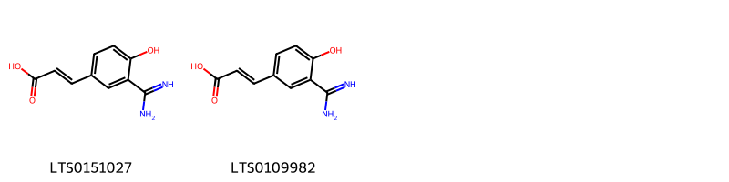
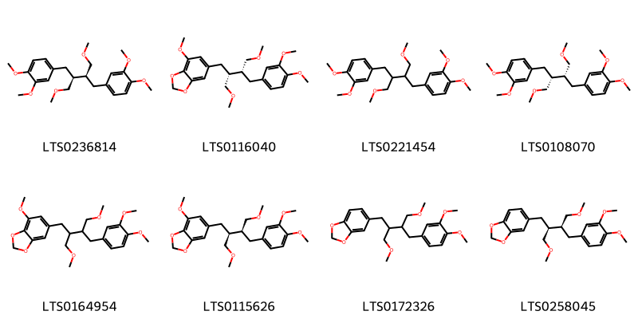
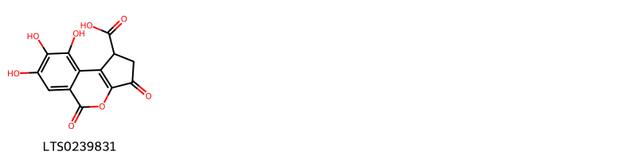

!!! abstract "Tóm tắt"

    Diệp hạ châu (Herba Phyllanthi urinariae) là toàn cây tươi hoặc đã phơi khô của cây chó đẻ răng cưa (Phyllanthus urinaria L.), thuộc họ Thầu dầu (Euphorbiaceae). Cây phân bố rộng khắp ở Việt Nam và các nước Đông Nam Á. Từ xa xưa, người dân đã sử dụng diệp hạ châu để điều trị các bệnh về gan, mật, đường tiêu hóa.  Nhờ chứa nhiều hoạt chất có lợi như Phyllanthin, Hypophyllanthin Niranthin, Nirtetralin và Phylteralin diệp hạ châu có tác dụng bảo vệ gan, chống viêm gan, hạ men gan, chống oxy hóa, giải độc, lợi tiểu, kháng khuẩn, chống viêm, giảm đường huyết.

## Thông tin về thực vật

Dược liệu **Diệp Hạ Châu (Toàn Cây)** từ bộ phận **nan** từ loài *Phyllanthus urinaria*.

**Mô tả thực vật:** Cây cao khoảng 30 cm, thân gần như nhẵn, mang nhiều cành nhỏ màu hơi tía. Lá mọc so le xếp thành hai dãy sít nhau trông như lá kép lông chim. Phiến lá thuôn bầu dục hay trái xoan ngược, dài 5 mm đến 15 mm, đầu nhọn hay hơi tù, màu xanh sẫm ở mặt trên, xanh nhạt ở mặt dưới, không cuống hay có cuống rất ngắn. Hoa màu trắng mọc ờ dưới lá, đơn tính, hoa đực hoa cái cùng gốc, hoa đực ở đầu cành, hoa cái ở dưới. Hoa không có cuống hoặc có cuống rất ngắn. Quả nang hình cầu, đường kính có thể tới 2 mm, sần sùi, nằm sát dưới lá. Quả có sáu hạt. Hạt hình tam giác màu nâu nhạt, lưng hạt có vân ngang.

*Tài liệu tham khảo:* "Những cây thuốc và vị thuốc Việt Nam" - Đỗ Tất Lợi 
Trong dược điển Việt nam, một loài được sử dụng làm dược liệu là *Phyllanthus urinaria*.

!!! info "Phân loại thực vật của *Phyllanthus urinaria*"
    - **Kingdom:** Plantae
    - **Phylum:** Tracheophyta
    - **Order:** Malpighiales
    - **Family:** Phyllanthaceae
    - **Genus:** Phyllanthus
    - **Species:** *Phyllanthus urinaria*

**Phân bố trên thế giới:** Thailand, United States of America, French Guiana, Costa Rica, Chinese Taipei, China, Puerto Rico, Malaysia, India, Indonesia, Brazil, Japan, Singapore, El Salvador

**Phân bố tại Việt nam:** Không có ghi nhận ở Việt Nam

## Thông tin về dược liệu 

### Định danh

!!! info "Thông tin về tên gọi"

    - Dược liệu tiếng Việt: nan
    - Dược liệu tiếng Trung: nan (nan)
    - Dược liệu tiếng Anh: nan
    - Dược liệu latin thông dụng: nan
    - Dược liệu latin kiểu DĐVN: *herba phyllanthi urinariae*
    - Dược liệu latin kiểu DĐVN: *nan*
    - Dược liệu latin kiểu thông tư: *nan*
    - Bộ phận dùng: nan (nan)

### Mô tả dược liệu 

- **Theo dược điển Việt nam V:** nan

- **Mô tả dược liệu theo thông tư chế biến dược liệu theo phương pháp cổ truyền:** nan

### Chế biến 

- **Chế biến theo dược điển việt nam V**: nan

- **Chế biến theo thông tư:** nan

--- 

## Thành phần hóa học

- Theo tài liệu của GS. Đỗ Tất Lợi:  (1) Nhóm hóa học : Phyllathin C24H34O6; Hypophyllanthin C24H30O7; Niranthin C24H32O7; Nirtetralin C24H30O7 và Phylteralin C24H34O6.
(2) Biomaker : corilagin (C27H22O18)
    

**Thành phần hóa học từ loài **Phyllanthus urinaria**

Theo cơ sở dữ liệu lotus, loài *Phyllanthus urinaria* đã phân lập và xác định được **74** hoạt chất thuộc về các nhóm Steroids and steroid derivatives, Organooxygen compounds, Flavonoids, Fatty Acyls, Aryltetralin lignans, Cinnamic acids and derivatives, Isocoumarins and derivatives, Furanoid lignans, Tannins, Carboxylic acids and derivatives, Benzene and substituted derivatives, Prenol lipids, Dibenzylbutane lignans trong bảng dưới đây. Danh sách các hoạt chất như sau 5-[(1r,2s,3s)-6,7-dimethoxy-2,3-bis(methoxymethyl)-1,2,3,4-tetrahydronaphthalen-1-yl]-2h-1,3-benzodioxole [(LTS0146629)](https://lotus.naturalproducts.net/compound/lotus_id/LTS0146629), 5-[(2s,3s)-3-[(3,4-dimethoxyphenyl)methyl]-4-methoxy-2-(methoxymethyl)butyl]-2h-1,3-benzodioxole [(LTS0258045)](https://lotus.naturalproducts.net/compound/lotus_id/LTS0258045), lupeol acetate [(LTS0077599)](https://lotus.naturalproducts.net/compound/lotus_id/LTS0077599), hinokinin [(LTS0118756)](https://lotus.naturalproducts.net/compound/lotus_id/LTS0118756), 4-[(2r,3r)-3-[(3,4-dimethoxyphenyl)methyl]-4-methoxy-2-(methoxymethyl)butyl]-1,2-dimethoxybenzene [(LTS0108070)](https://lotus.naturalproducts.net/compound/lotus_id/LTS0108070), phytosterol [(LTS0029311)](https://lotus.naturalproducts.net/compound/lotus_id/LTS0029311), stigmast-5-en-3-ol, (3β)- [(LTS0204616)](https://lotus.naturalproducts.net/compound/lotus_id/LTS0204616), xanthoxylin [(LTS0150432)](https://lotus.naturalproducts.net/compound/lotus_id/LTS0150432), 1,13,14,15,18,19,20,34,35,39,39-undecahydroxy-2,5,10,23,31-pentaoxo-6,9,24,27,30,40-hexaoxaoctacyclo[34.3.1.0⁴,³⁸.0⁷,²⁶.0⁸,²⁹.0¹¹,¹⁶.0¹⁷,²².0³²,³⁷]tetraconta-3,11(16),12,14,17,19,21,32,34,36-decaen-28-yl 3,4,5-trihydroxybenzoate [(LTS0129733)](https://lotus.naturalproducts.net/compound/lotus_id/LTS0129733), (1r,38r)-1,13,14,15,18,19,20,34,35,39,39-undecahydroxy-2,5,10,23,31-pentaoxo-6,9,24,27,30,40-hexaoxaoctacyclo[34.3.1.0⁴,³⁸.0⁷,²⁶.0⁸,²⁹.0¹¹,¹⁶.0¹⁷,²².0³²,³⁷]tetraconta-3,11(16),12,14,17,19,21,32,34,36-decaen-28-yl 3,4,5-trihydroxybenzoate [(LTS0043003)](https://lotus.naturalproducts.net/compound/lotus_id/LTS0043003), 5-(3,4-dimethoxyphenyl)-4-methoxy-6,7-bis(methoxymethyl)-2h,5h,6h,7h,8h-naphtho[2,3-d][1,3]dioxole [(LTS0268754)](https://lotus.naturalproducts.net/compound/lotus_id/LTS0268754), succinic acid [(LTS0237204)](https://lotus.naturalproducts.net/compound/lotus_id/LTS0237204), (7r,8s,26r,28s,29s)-1,13,14,15,18,19,20,34,35,39,39-undecahydroxy-2,5,10,23,31-pentaoxo-6,9,24,27,30,40-hexaoxaoctacyclo[34.3.1.0⁴,³⁸.0⁷,²⁶.0⁸,²⁹.0¹¹,¹⁶.0¹⁷,²².0³²,³⁷]tetraconta-3,11,13,15,17(22),18,20,32,34,36-decaen-28-yl 3,4,5-trihydroxybenzoate [(LTS0238381)](https://lotus.naturalproducts.net/compound/lotus_id/LTS0238381), 6-{3-[(3,4-dimethoxyphenyl)methyl]-4-methoxy-2-(methoxymethyl)butyl}-4-methoxy-2h-1,3-benzodioxole [(LTS0164954)](https://lotus.naturalproducts.net/compound/lotus_id/LTS0164954), 1-(2r)-2,5-dimethylhexyl 2-(2s)-2,5-dimethylhexyl phthalate [(LTS0081124)](https://lotus.naturalproducts.net/compound/lotus_id/LTS0081124), 4-({[(1e)-3-(4-carboxyphenoxy)-3-oxoprop-1-en-1-yl]oxy}carbonyl)benzoic acid [(LTS0140291)](https://lotus.naturalproducts.net/compound/lotus_id/LTS0140291), (3s,4s)-3,4-bis(2h-1,3-benzodioxol-5-ylmethyl)oxolan-2-one [(LTS0115450)](https://lotus.naturalproducts.net/compound/lotus_id/LTS0115450), 5-[5-(3,4-dimethoxyphenyl)-3,4-bis(methoxymethyl)oxolan-2-yl]-2h-1,3-benzodioxole [(LTS0055294)](https://lotus.naturalproducts.net/compound/lotus_id/LTS0055294), β-amyrin [(LTS0075776)](https://lotus.naturalproducts.net/compound/lotus_id/LTS0075776), 5-[(2s,3s,4s,5r)-5-(3,4-dimethoxyphenyl)-3,4-bis(methoxymethyl)oxolan-2-yl]-2h-1,3-benzodioxole [(LTS0002521)](https://lotus.naturalproducts.net/compound/lotus_id/LTS0002521), (5r,6s,7r)-5-(3,4-dimethoxyphenyl)-4-methoxy-6,7-bis(methoxymethyl)-2h,5h,6h,7h,8h-naphtho[2,3-d][1,3]dioxole [(LTS0133267)](https://lotus.naturalproducts.net/compound/lotus_id/LTS0133267), (6r,7as)-6-{[(2r,3r,4s,5s,6r)-3,4,5-trihydroxy-6-(hydroxymethyl)oxan-2-yl]oxy}-7,7a-dihydro-6h-1-benzofuran-2-one [(LTS0028703)](https://lotus.naturalproducts.net/compound/lotus_id/LTS0028703), 1,2-bis(2,5-dimethylhexyl) phthalate [(LTS0120436)](https://lotus.naturalproducts.net/compound/lotus_id/LTS0120436), (-)-friedelin [(LTS0041645)](https://lotus.naturalproducts.net/compound/lotus_id/LTS0041645), 1-(3,4-dimethoxyphenyl)-6,7-dimethoxy-2,3-bis(methoxymethyl)-1,2,3,4-tetrahydronaphthalene [(LTS0075121)](https://lotus.naturalproducts.net/compound/lotus_id/LTS0075121), methyl gallate [(LTS0043810)](https://lotus.naturalproducts.net/compound/lotus_id/LTS0043810), 5-[6,7-dimethoxy-2,3-bis(methoxymethyl)-1,2,3,4-tetrahydronaphthalen-1-yl]-2h-1,3-benzodioxole [(LTS0142097)](https://lotus.naturalproducts.net/compound/lotus_id/LTS0142097), pentahydroxybenzoic acid [(LTS0155544)](https://lotus.naturalproducts.net/compound/lotus_id/LTS0155544), hexacosanoic acid [(LTS0240902)](https://lotus.naturalproducts.net/compound/lotus_id/LTS0240902), (1r,2s,3s)-1-(3,4-dimethoxyphenyl)-6,7-dimethoxy-2,3-bis(methoxymethyl)-1,2,3,4-tetrahydronaphthalene [(LTS0097156)](https://lotus.naturalproducts.net/compound/lotus_id/LTS0097156), 7,8,9-trihydroxy-3,5-dioxo-1h,2h-cyclopenta[c]isochromene-1-carboxylic acid [(LTS0239831)](https://lotus.naturalproducts.net/compound/lotus_id/LTS0239831), (3s,4s)-4-(2h-1,3-benzodioxol-5-ylmethyl)-3-[(3,4-dimethoxyphenyl)methyl]oxolan-2-one [(LTS0173921)](https://lotus.naturalproducts.net/compound/lotus_id/LTS0173921), galop [(LTS0222857)](https://lotus.naturalproducts.net/compound/lotus_id/LTS0222857), 6-[(2r,3r)-3-[(3,4-dimethoxyphenyl)methyl]-4-methoxy-2-(methoxymethyl)butyl]-4-methoxy-2h-1,3-benzodioxole [(LTS0116040)](https://lotus.naturalproducts.net/compound/lotus_id/LTS0116040), 5-(3,4-dimethoxyphenyl)-6,7-bis(methoxymethyl)-2h,5h,6h,7h,8h-naphtho[2,3-d][1,3]dioxole [(LTS0273107)](https://lotus.naturalproducts.net/compound/lotus_id/LTS0273107), 3,4-bis(2h-1,3-benzodioxol-5-ylmethyl)oxolan-2-one [(LTS0079231)](https://lotus.naturalproducts.net/compound/lotus_id/LTS0079231), 9-(3,4-dimethoxyphenyl)-4-methoxy-7,8-bis(methoxymethyl)-2h,6h,7h,8h,9h-naphtho[1,2-d][1,3]dioxole [(LTS0273109)](https://lotus.naturalproducts.net/compound/lotus_id/LTS0273109), 5-[(2s,3r,4s,5s)-5-(3,4-dimethoxyphenyl)-3,4-bis(methoxymethyl)oxolan-2-yl]-2h-1,3-benzodioxole [(LTS0227570)](https://lotus.naturalproducts.net/compound/lotus_id/LTS0227570), phyllanthin [(LTS0236814)](https://lotus.naturalproducts.net/compound/lotus_id/LTS0236814), β-amyrin [(LTS0251864)](https://lotus.naturalproducts.net/compound/lotus_id/LTS0251864), hypophyllanthin [(LTS0230397)](https://lotus.naturalproducts.net/compound/lotus_id/LTS0230397), 3-rutinosyl quercetin [(LTS0032845)](https://lotus.naturalproducts.net/compound/lotus_id/LTS0032845), 6-{[3,4,5-trihydroxy-6-(hydroxymethyl)oxan-2-yl]oxy}-7,7a-dihydro-6h-1-benzofuran-2-one [(LTS0241633)](https://lotus.naturalproducts.net/compound/lotus_id/LTS0241633), 3a,5a,5b,8,8,11a-hexamethyl-1-(prop-1-en-2-yl)-hexadecahydrocyclopenta[a]chrysen-9-yl acetate [(LTS0081577)](https://lotus.naturalproducts.net/compound/lotus_id/LTS0081577), 4-{3-[(3,4-dimethoxyphenyl)methyl]-4-methoxy-2-(methoxymethyl)butyl}-1,2-dimethoxybenzene [(LTS0221454)](https://lotus.naturalproducts.net/compound/lotus_id/LTS0221454), (10r,11s,13r,14r,15s)-3,4,5,14,20,21,22-heptahydroxy-13-(hydroxymethyl)-8,17-dioxo-9,12,16-trioxatetracyclo[16.4.0.0²,⁷.0¹⁰,¹⁵]docosa-1(22),2(7),3,5,18,20-hexaen-11-yl 3,4,5-trihydroxybenzoate [(LTS0041434)](https://lotus.naturalproducts.net/compound/lotus_id/LTS0041434), stigmast-5-en-3-ol [(LTS0071224)](https://lotus.naturalproducts.net/compound/lotus_id/LTS0071224), (7r,9s)-9-(3,4-dimethoxyphenyl)-4-methoxy-7,8-bis(methoxymethyl)-2h,6h,7h,8h,9h-naphtho[1,2-d][1,3]dioxole [(LTS0109019)](https://lotus.naturalproducts.net/compound/lotus_id/LTS0109019), (7s,8s,9r)-9-(3,4-dimethoxyphenyl)-4-methoxy-7,8-bis(methoxymethyl)-2h,6h,7h,8h,9h-naphtho[1,2-d][1,3]dioxole [(LTS0166230)](https://lotus.naturalproducts.net/compound/lotus_id/LTS0166230), 5-[(2s,3s,4s,5r)-5-(2h-1,3-benzodioxol-5-yl)-3,4-bis(methoxymethyl)oxolan-2-yl]-2h-1,3-benzodioxole [(LTS0081252)](https://lotus.naturalproducts.net/compound/lotus_id/LTS0081252), 5-[(5r,6s,7s)-6,7-bis(methoxymethyl)-2h,5h,6h,7h,8h-naphtho[2,3-d][1,3]dioxol-5-yl]-2h-1,3-benzodioxole [(LTS0094358)](https://lotus.naturalproducts.net/compound/lotus_id/LTS0094358), (1r,3ar,5ar,5br,7ar,9r,11ar,11br,13ar,13br)-3a,5a,5b,8,8,11a-hexamethyl-1-(prop-1-en-2-yl)-hexadecahydrocyclopenta[a]chrysen-9-yl acetate [(LTS0102246)](https://lotus.naturalproducts.net/compound/lotus_id/LTS0102246), (1r,7r,8s,26r,28s,29r,38r)-1,13,14,15,18,19,20,34,35,39,39-undecahydroxy-2,5,10,23,31-pentaoxo-6,9,24,27,30,40-hexaoxaoctacyclo[34.3.1.0⁴,³⁸.0⁷,²⁶.0⁸,²⁹.0¹¹,¹⁶.0¹⁷,²².0³²,³⁷]tetraconta-3,11,13,15,17(22),18,20,32,34,36-decaen-28-yl 3,4,5-trihydroxybenzoate [(LTS0223783)](https://lotus.naturalproducts.net/compound/lotus_id/LTS0223783), 3,4-dihydroxybenzoic acid [(LTS0018765)](https://lotus.naturalproducts.net/compound/lotus_id/LTS0018765), (1s,19r,21s,22r,23r)-6,7,8,11,12,13,22,23-octahydroxy-3,16-dioxo-2,17,20-trioxatetracyclo[17.3.1.0⁴,⁹.0¹⁰,¹⁵]tricosa-4(9),5,7,10,12,14-hexaen-21-yl 3,4,5-trihydroxybenzoate [(LTS0089285)](https://lotus.naturalproducts.net/compound/lotus_id/LTS0089285), 6-[(2s,3s)-3-[(3,4-dimethoxyphenyl)methyl]-4-methoxy-2-(methoxymethyl)butyl]-4-methoxy-2h-1,3-benzodioxole [(LTS0115626)](https://lotus.naturalproducts.net/compound/lotus_id/LTS0115626), sitosterol [(LTS0168132)](https://lotus.naturalproducts.net/compound/lotus_id/LTS0168132), (2e)-3-(3-carbamimidoyl-4-hydroxyphenyl)prop-2-enoic acid [(LTS0151027)](https://lotus.naturalproducts.net/compound/lotus_id/LTS0151027), ellagic acid [(LTS0037297)](https://lotus.naturalproducts.net/compound/lotus_id/LTS0037297), methyl octacosanoate [(LTS0228394)](https://lotus.naturalproducts.net/compound/lotus_id/LTS0228394), (5r,6s,7s)-5-(3,4-dimethoxyphenyl)-4-methoxy-6,7-bis(methoxymethyl)-2h,5h,6h,7h,8h-naphtho[2,3-d][1,3]dioxole [(LTS0157121)](https://lotus.naturalproducts.net/compound/lotus_id/LTS0157121), ethyl gallate [(LTS0270645)](https://lotus.naturalproducts.net/compound/lotus_id/LTS0270645), (5r,6s,7s)-5-(3,4-dimethoxyphenyl)-6,7-bis(methoxymethyl)-2h,5h,6h,7h,8h-naphtho[2,3-d][1,3]dioxole [(LTS0042830)](https://lotus.naturalproducts.net/compound/lotus_id/LTS0042830), 6,7,8,11,12,13,22,23-octahydroxy-3,16-dioxo-2,17,20-trioxatetracyclo[17.3.1.0⁴,⁹.0¹⁰,¹⁵]tricosa-4(9),5,7,10,12,14-hexaen-21-yl 3,4,5-trihydroxybenzoate [(LTS0069732)](https://lotus.naturalproducts.net/compound/lotus_id/LTS0069732), 4-(2h-1,3-benzodioxol-5-ylmethyl)-3-[(3,4-dimethoxyphenyl)methyl]oxolan-2-one [(LTS0006428)](https://lotus.naturalproducts.net/compound/lotus_id/LTS0006428), triacontanol [(LTS0026833)](https://lotus.naturalproducts.net/compound/lotus_id/LTS0026833), (6s,7ar)-6-{[(2r,3r,4s,5s,6r)-3,4,5-trihydroxy-6-(hydroxymethyl)oxan-2-yl]oxy}-7,7a-dihydro-6h-1-benzofuran-2-one [(LTS0036216)](https://lotus.naturalproducts.net/compound/lotus_id/LTS0036216), 4-({[3-(4-carboxyphenoxy)-3-oxoprop-1-en-1-yl]oxy}carbonyl)benzoic acid [(LTS0177328)](https://lotus.naturalproducts.net/compound/lotus_id/LTS0177328), 5-[5-(2h-1,3-benzodioxol-5-yl)-3,4-bis(methoxymethyl)oxolan-2-yl]-2h-1,3-benzodioxole [(LTS0266355)](https://lotus.naturalproducts.net/compound/lotus_id/LTS0266355), 5-[(2r,3s,4s,5r)-5-(2h-1,3-benzodioxol-5-yl)-3,4-bis(methoxymethyl)oxolan-2-yl]-2h-1,3-benzodioxole [(LTS0109007)](https://lotus.naturalproducts.net/compound/lotus_id/LTS0109007), 3-(3-carbamimidoyl-4-hydroxyphenyl)prop-2-enoic acid [(LTS0109982)](https://lotus.naturalproducts.net/compound/lotus_id/LTS0109982), 5-[(1s,2r,3r)-6,7-dimethoxy-2,3-bis(methoxymethyl)-1,2,3,4-tetrahydronaphthalen-1-yl]-2h-1,3-benzodioxole [(LTS0038469)](https://lotus.naturalproducts.net/compound/lotus_id/LTS0038469), 5-{3-[(3,4-dimethoxyphenyl)methyl]-4-methoxy-2-(methoxymethyl)butyl}-2h-1,3-benzodioxole [(LTS0172326)](https://lotus.naturalproducts.net/compound/lotus_id/LTS0172326), 5-[6,7-bis(methoxymethyl)-2h,5h,6h,7h,8h-naphtho[2,3-d][1,3]dioxol-5-yl]-2h-1,3-benzodioxole [(LTS0020679)](https://lotus.naturalproducts.net/compound/lotus_id/LTS0020679). 
        
| chemicalTaxonomyClassyfireClass     |   smiles_count |
|:------------------------------------|---------------:|
| Aryltetralin lignans                |            822 |
| Benzene and substituted derivatives |            188 |
| Carboxylic acids and derivatives    |            110 |
| Cinnamic acids and derivatives      |             54 |
| Dibenzylbutane lignans              |            421 |
| Fatty Acyls                         |             96 |
| Flavonoids                          |            122 |
| Furanoid lignans                    |            598 |
| Isocoumarins and derivatives        |             42 |
| Organooxygen compounds              |            204 |
| Prenol lipids                       |            540 |
| Steroids and steroid derivatives    |            308 |
| Tannins                             |            947 |

            
### Nhóm Aryltetralin lignans
<figure markdown="span">
    { width=100% }
<figcaption>Hình ảnh cấu trúc hóa học của hoạt chất thuộc nhóm *Aryltetralin lignans*. Tên thường gọi của các hoạt chất tương ứng là (7s,8s,9r)-9-(3,4-dimethoxyphenyl)-4-methoxy-7,8-bis(methoxymethyl)-2h,6h,7h,8h,9h-naphtho[1,2-d][1,3]dioxole [(LTS0166230)](https://lotus.naturalproducts.net/compound/lotus_id/LTS0166230), 1-(3,4-dimethoxyphenyl)-6,7-dimethoxy-2,3-bis(methoxymethyl)-1,2,3,4-tetrahydronaphthalene [(LTS0075121)](https://lotus.naturalproducts.net/compound/lotus_id/LTS0075121), 5-(3,4-dimethoxyphenyl)-6,7-bis(methoxymethyl)-2h,5h,6h,7h,8h-naphtho[2,3-d][1,3]dioxole [(LTS0273107)](https://lotus.naturalproducts.net/compound/lotus_id/LTS0273107), 9-(3,4-dimethoxyphenyl)-4-methoxy-7,8-bis(methoxymethyl)-2h,6h,7h,8h,9h-naphtho[1,2-d][1,3]dioxole [(LTS0273109)](https://lotus.naturalproducts.net/compound/lotus_id/LTS0273109), (5r,6s,7r)-5-(3,4-dimethoxyphenyl)-4-methoxy-6,7-bis(methoxymethyl)-2h,5h,6h,7h,8h-naphtho[2,3-d][1,3]dioxole [(LTS0133267)](https://lotus.naturalproducts.net/compound/lotus_id/LTS0133267), 5-[(1r,2s,3s)-6,7-dimethoxy-2,3-bis(methoxymethyl)-1,2,3,4-tetrahydronaphthalen-1-yl]-2h-1,3-benzodioxole [(LTS0146629)](https://lotus.naturalproducts.net/compound/lotus_id/LTS0146629), (5r,6s,7s)-5-(3,4-dimethoxyphenyl)-4-methoxy-6,7-bis(methoxymethyl)-2h,5h,6h,7h,8h-naphtho[2,3-d][1,3]dioxole [(LTS0157121)](https://lotus.naturalproducts.net/compound/lotus_id/LTS0157121), hypophyllanthin [(LTS0230397)](https://lotus.naturalproducts.net/compound/lotus_id/LTS0230397), 5-(3,4-dimethoxyphenyl)-4-methoxy-6,7-bis(methoxymethyl)-2h,5h,6h,7h,8h-naphtho[2,3-d][1,3]dioxole [(LTS0268754)](https://lotus.naturalproducts.net/compound/lotus_id/LTS0268754), (1r,2s,3s)-1-(3,4-dimethoxyphenyl)-6,7-dimethoxy-2,3-bis(methoxymethyl)-1,2,3,4-tetrahydronaphthalene [(LTS0097156)](https://lotus.naturalproducts.net/compound/lotus_id/LTS0097156), 5-[6,7-bis(methoxymethyl)-2h,5h,6h,7h,8h-naphtho[2,3-d][1,3]dioxol-5-yl]-2h-1,3-benzodioxole [(LTS0020679)](https://lotus.naturalproducts.net/compound/lotus_id/LTS0020679), 5-[(1s,2r,3r)-6,7-dimethoxy-2,3-bis(methoxymethyl)-1,2,3,4-tetrahydronaphthalen-1-yl]-2h-1,3-benzodioxole [(LTS0038469)](https://lotus.naturalproducts.net/compound/lotus_id/LTS0038469), 5-[6,7-dimethoxy-2,3-bis(methoxymethyl)-1,2,3,4-tetrahydronaphthalen-1-yl]-2h-1,3-benzodioxole [(LTS0142097)](https://lotus.naturalproducts.net/compound/lotus_id/LTS0142097), 5-[(5r,6s,7s)-6,7-bis(methoxymethyl)-2h,5h,6h,7h,8h-naphtho[2,3-d][1,3]dioxol-5-yl]-2h-1,3-benzodioxole [(LTS0094358)](https://lotus.naturalproducts.net/compound/lotus_id/LTS0094358), (5r,6s,7s)-5-(3,4-dimethoxyphenyl)-6,7-bis(methoxymethyl)-2h,5h,6h,7h,8h-naphtho[2,3-d][1,3]dioxole [(LTS0042830)](https://lotus.naturalproducts.net/compound/lotus_id/LTS0042830).</figcaption>
</figure>

            
            
### Nhóm Aryltetralin lignans
<figure markdown="span">
    { width=100% }
<figcaption>Hình ảnh cấu trúc hóa học của hoạt chất thuộc nhóm *Aryltetralin lignans*. Tên thường gọi của các hoạt chất tương ứng là (7s,8s,9r)-9-(3,4-dimethoxyphenyl)-4-methoxy-7,8-bis(methoxymethyl)-2h,6h,7h,8h,9h-naphtho[1,2-d][1,3]dioxole [(LTS0166230)](https://lotus.naturalproducts.net/compound/lotus_id/LTS0166230), 1-(3,4-dimethoxyphenyl)-6,7-dimethoxy-2,3-bis(methoxymethyl)-1,2,3,4-tetrahydronaphthalene [(LTS0075121)](https://lotus.naturalproducts.net/compound/lotus_id/LTS0075121), 5-(3,4-dimethoxyphenyl)-6,7-bis(methoxymethyl)-2h,5h,6h,7h,8h-naphtho[2,3-d][1,3]dioxole [(LTS0273107)](https://lotus.naturalproducts.net/compound/lotus_id/LTS0273107), 9-(3,4-dimethoxyphenyl)-4-methoxy-7,8-bis(methoxymethyl)-2h,6h,7h,8h,9h-naphtho[1,2-d][1,3]dioxole [(LTS0273109)](https://lotus.naturalproducts.net/compound/lotus_id/LTS0273109), (5r,6s,7r)-5-(3,4-dimethoxyphenyl)-4-methoxy-6,7-bis(methoxymethyl)-2h,5h,6h,7h,8h-naphtho[2,3-d][1,3]dioxole [(LTS0133267)](https://lotus.naturalproducts.net/compound/lotus_id/LTS0133267), 5-[(1r,2s,3s)-6,7-dimethoxy-2,3-bis(methoxymethyl)-1,2,3,4-tetrahydronaphthalen-1-yl]-2h-1,3-benzodioxole [(LTS0146629)](https://lotus.naturalproducts.net/compound/lotus_id/LTS0146629), (5r,6s,7s)-5-(3,4-dimethoxyphenyl)-4-methoxy-6,7-bis(methoxymethyl)-2h,5h,6h,7h,8h-naphtho[2,3-d][1,3]dioxole [(LTS0157121)](https://lotus.naturalproducts.net/compound/lotus_id/LTS0157121), hypophyllanthin [(LTS0230397)](https://lotus.naturalproducts.net/compound/lotus_id/LTS0230397), 5-(3,4-dimethoxyphenyl)-4-methoxy-6,7-bis(methoxymethyl)-2h,5h,6h,7h,8h-naphtho[2,3-d][1,3]dioxole [(LTS0268754)](https://lotus.naturalproducts.net/compound/lotus_id/LTS0268754), (1r,2s,3s)-1-(3,4-dimethoxyphenyl)-6,7-dimethoxy-2,3-bis(methoxymethyl)-1,2,3,4-tetrahydronaphthalene [(LTS0097156)](https://lotus.naturalproducts.net/compound/lotus_id/LTS0097156), 5-[6,7-bis(methoxymethyl)-2h,5h,6h,7h,8h-naphtho[2,3-d][1,3]dioxol-5-yl]-2h-1,3-benzodioxole [(LTS0020679)](https://lotus.naturalproducts.net/compound/lotus_id/LTS0020679), 5-[(1s,2r,3r)-6,7-dimethoxy-2,3-bis(methoxymethyl)-1,2,3,4-tetrahydronaphthalen-1-yl]-2h-1,3-benzodioxole [(LTS0038469)](https://lotus.naturalproducts.net/compound/lotus_id/LTS0038469), 5-[6,7-dimethoxy-2,3-bis(methoxymethyl)-1,2,3,4-tetrahydronaphthalen-1-yl]-2h-1,3-benzodioxole [(LTS0142097)](https://lotus.naturalproducts.net/compound/lotus_id/LTS0142097), 5-[(5r,6s,7s)-6,7-bis(methoxymethyl)-2h,5h,6h,7h,8h-naphtho[2,3-d][1,3]dioxol-5-yl]-2h-1,3-benzodioxole [(LTS0094358)](https://lotus.naturalproducts.net/compound/lotus_id/LTS0094358), (5r,6s,7s)-5-(3,4-dimethoxyphenyl)-6,7-bis(methoxymethyl)-2h,5h,6h,7h,8h-naphtho[2,3-d][1,3]dioxole [(LTS0042830)](https://lotus.naturalproducts.net/compound/lotus_id/LTS0042830).</figcaption>
</figure>

### Nhóm Benzene and substituted derivatives
<figure markdown="span">
    { width=100% }
<figcaption>Hình ảnh cấu trúc hóa học của hoạt chất thuộc nhóm *Benzene and substituted derivatives*. Tên thường gọi của các hoạt chất tương ứng là galop [(LTS0222857)](https://lotus.naturalproducts.net/compound/lotus_id/LTS0222857), ethyl gallate [(LTS0270645)](https://lotus.naturalproducts.net/compound/lotus_id/LTS0270645), 3,4-dihydroxybenzoic acid [(LTS0018765)](https://lotus.naturalproducts.net/compound/lotus_id/LTS0018765), methyl gallate [(LTS0043810)](https://lotus.naturalproducts.net/compound/lotus_id/LTS0043810), 1-(2r)-2,5-dimethylhexyl 2-(2s)-2,5-dimethylhexyl phthalate [(LTS0081124)](https://lotus.naturalproducts.net/compound/lotus_id/LTS0081124), 1,2-bis(2,5-dimethylhexyl) phthalate [(LTS0120436)](https://lotus.naturalproducts.net/compound/lotus_id/LTS0120436).</figcaption>
</figure>

            
            
### Nhóm Aryltetralin lignans
<figure markdown="span">
    { width=100% }
<figcaption>Hình ảnh cấu trúc hóa học của hoạt chất thuộc nhóm *Aryltetralin lignans*. Tên thường gọi của các hoạt chất tương ứng là (7s,8s,9r)-9-(3,4-dimethoxyphenyl)-4-methoxy-7,8-bis(methoxymethyl)-2h,6h,7h,8h,9h-naphtho[1,2-d][1,3]dioxole [(LTS0166230)](https://lotus.naturalproducts.net/compound/lotus_id/LTS0166230), 1-(3,4-dimethoxyphenyl)-6,7-dimethoxy-2,3-bis(methoxymethyl)-1,2,3,4-tetrahydronaphthalene [(LTS0075121)](https://lotus.naturalproducts.net/compound/lotus_id/LTS0075121), 5-(3,4-dimethoxyphenyl)-6,7-bis(methoxymethyl)-2h,5h,6h,7h,8h-naphtho[2,3-d][1,3]dioxole [(LTS0273107)](https://lotus.naturalproducts.net/compound/lotus_id/LTS0273107), 9-(3,4-dimethoxyphenyl)-4-methoxy-7,8-bis(methoxymethyl)-2h,6h,7h,8h,9h-naphtho[1,2-d][1,3]dioxole [(LTS0273109)](https://lotus.naturalproducts.net/compound/lotus_id/LTS0273109), (5r,6s,7r)-5-(3,4-dimethoxyphenyl)-4-methoxy-6,7-bis(methoxymethyl)-2h,5h,6h,7h,8h-naphtho[2,3-d][1,3]dioxole [(LTS0133267)](https://lotus.naturalproducts.net/compound/lotus_id/LTS0133267), 5-[(1r,2s,3s)-6,7-dimethoxy-2,3-bis(methoxymethyl)-1,2,3,4-tetrahydronaphthalen-1-yl]-2h-1,3-benzodioxole [(LTS0146629)](https://lotus.naturalproducts.net/compound/lotus_id/LTS0146629), (5r,6s,7s)-5-(3,4-dimethoxyphenyl)-4-methoxy-6,7-bis(methoxymethyl)-2h,5h,6h,7h,8h-naphtho[2,3-d][1,3]dioxole [(LTS0157121)](https://lotus.naturalproducts.net/compound/lotus_id/LTS0157121), hypophyllanthin [(LTS0230397)](https://lotus.naturalproducts.net/compound/lotus_id/LTS0230397), 5-(3,4-dimethoxyphenyl)-4-methoxy-6,7-bis(methoxymethyl)-2h,5h,6h,7h,8h-naphtho[2,3-d][1,3]dioxole [(LTS0268754)](https://lotus.naturalproducts.net/compound/lotus_id/LTS0268754), (1r,2s,3s)-1-(3,4-dimethoxyphenyl)-6,7-dimethoxy-2,3-bis(methoxymethyl)-1,2,3,4-tetrahydronaphthalene [(LTS0097156)](https://lotus.naturalproducts.net/compound/lotus_id/LTS0097156), 5-[6,7-bis(methoxymethyl)-2h,5h,6h,7h,8h-naphtho[2,3-d][1,3]dioxol-5-yl]-2h-1,3-benzodioxole [(LTS0020679)](https://lotus.naturalproducts.net/compound/lotus_id/LTS0020679), 5-[(1s,2r,3r)-6,7-dimethoxy-2,3-bis(methoxymethyl)-1,2,3,4-tetrahydronaphthalen-1-yl]-2h-1,3-benzodioxole [(LTS0038469)](https://lotus.naturalproducts.net/compound/lotus_id/LTS0038469), 5-[6,7-dimethoxy-2,3-bis(methoxymethyl)-1,2,3,4-tetrahydronaphthalen-1-yl]-2h-1,3-benzodioxole [(LTS0142097)](https://lotus.naturalproducts.net/compound/lotus_id/LTS0142097), 5-[(5r,6s,7s)-6,7-bis(methoxymethyl)-2h,5h,6h,7h,8h-naphtho[2,3-d][1,3]dioxol-5-yl]-2h-1,3-benzodioxole [(LTS0094358)](https://lotus.naturalproducts.net/compound/lotus_id/LTS0094358), (5r,6s,7s)-5-(3,4-dimethoxyphenyl)-6,7-bis(methoxymethyl)-2h,5h,6h,7h,8h-naphtho[2,3-d][1,3]dioxole [(LTS0042830)](https://lotus.naturalproducts.net/compound/lotus_id/LTS0042830).</figcaption>
</figure>

### Nhóm Benzene and substituted derivatives
<figure markdown="span">
    { width=100% }
<figcaption>Hình ảnh cấu trúc hóa học của hoạt chất thuộc nhóm *Benzene and substituted derivatives*. Tên thường gọi của các hoạt chất tương ứng là galop [(LTS0222857)](https://lotus.naturalproducts.net/compound/lotus_id/LTS0222857), ethyl gallate [(LTS0270645)](https://lotus.naturalproducts.net/compound/lotus_id/LTS0270645), 3,4-dihydroxybenzoic acid [(LTS0018765)](https://lotus.naturalproducts.net/compound/lotus_id/LTS0018765), methyl gallate [(LTS0043810)](https://lotus.naturalproducts.net/compound/lotus_id/LTS0043810), 1-(2r)-2,5-dimethylhexyl 2-(2s)-2,5-dimethylhexyl phthalate [(LTS0081124)](https://lotus.naturalproducts.net/compound/lotus_id/LTS0081124), 1,2-bis(2,5-dimethylhexyl) phthalate [(LTS0120436)](https://lotus.naturalproducts.net/compound/lotus_id/LTS0120436).</figcaption>
</figure>

### Nhóm Carboxylic acids and derivatives
<figure markdown="span">
    { width=100% }
<figcaption>Hình ảnh cấu trúc hóa học của hoạt chất thuộc nhóm *Carboxylic acids and derivatives*. Tên thường gọi của các hoạt chất tương ứng là 4-({[(1e)-3-(4-carboxyphenoxy)-3-oxoprop-1-en-1-yl]oxy}carbonyl)benzoic acid [(LTS0140291)](https://lotus.naturalproducts.net/compound/lotus_id/LTS0140291), succinic acid [(LTS0237204)](https://lotus.naturalproducts.net/compound/lotus_id/LTS0237204), 4-({[3-(4-carboxyphenoxy)-3-oxoprop-1-en-1-yl]oxy}carbonyl)benzoic acid [(LTS0177328)](https://lotus.naturalproducts.net/compound/lotus_id/LTS0177328).</figcaption>
</figure>

            
            
### Nhóm Aryltetralin lignans
<figure markdown="span">
    { width=100% }
<figcaption>Hình ảnh cấu trúc hóa học của hoạt chất thuộc nhóm *Aryltetralin lignans*. Tên thường gọi của các hoạt chất tương ứng là (7s,8s,9r)-9-(3,4-dimethoxyphenyl)-4-methoxy-7,8-bis(methoxymethyl)-2h,6h,7h,8h,9h-naphtho[1,2-d][1,3]dioxole [(LTS0166230)](https://lotus.naturalproducts.net/compound/lotus_id/LTS0166230), 1-(3,4-dimethoxyphenyl)-6,7-dimethoxy-2,3-bis(methoxymethyl)-1,2,3,4-tetrahydronaphthalene [(LTS0075121)](https://lotus.naturalproducts.net/compound/lotus_id/LTS0075121), 5-(3,4-dimethoxyphenyl)-6,7-bis(methoxymethyl)-2h,5h,6h,7h,8h-naphtho[2,3-d][1,3]dioxole [(LTS0273107)](https://lotus.naturalproducts.net/compound/lotus_id/LTS0273107), 9-(3,4-dimethoxyphenyl)-4-methoxy-7,8-bis(methoxymethyl)-2h,6h,7h,8h,9h-naphtho[1,2-d][1,3]dioxole [(LTS0273109)](https://lotus.naturalproducts.net/compound/lotus_id/LTS0273109), (5r,6s,7r)-5-(3,4-dimethoxyphenyl)-4-methoxy-6,7-bis(methoxymethyl)-2h,5h,6h,7h,8h-naphtho[2,3-d][1,3]dioxole [(LTS0133267)](https://lotus.naturalproducts.net/compound/lotus_id/LTS0133267), 5-[(1r,2s,3s)-6,7-dimethoxy-2,3-bis(methoxymethyl)-1,2,3,4-tetrahydronaphthalen-1-yl]-2h-1,3-benzodioxole [(LTS0146629)](https://lotus.naturalproducts.net/compound/lotus_id/LTS0146629), (5r,6s,7s)-5-(3,4-dimethoxyphenyl)-4-methoxy-6,7-bis(methoxymethyl)-2h,5h,6h,7h,8h-naphtho[2,3-d][1,3]dioxole [(LTS0157121)](https://lotus.naturalproducts.net/compound/lotus_id/LTS0157121), hypophyllanthin [(LTS0230397)](https://lotus.naturalproducts.net/compound/lotus_id/LTS0230397), 5-(3,4-dimethoxyphenyl)-4-methoxy-6,7-bis(methoxymethyl)-2h,5h,6h,7h,8h-naphtho[2,3-d][1,3]dioxole [(LTS0268754)](https://lotus.naturalproducts.net/compound/lotus_id/LTS0268754), (1r,2s,3s)-1-(3,4-dimethoxyphenyl)-6,7-dimethoxy-2,3-bis(methoxymethyl)-1,2,3,4-tetrahydronaphthalene [(LTS0097156)](https://lotus.naturalproducts.net/compound/lotus_id/LTS0097156), 5-[6,7-bis(methoxymethyl)-2h,5h,6h,7h,8h-naphtho[2,3-d][1,3]dioxol-5-yl]-2h-1,3-benzodioxole [(LTS0020679)](https://lotus.naturalproducts.net/compound/lotus_id/LTS0020679), 5-[(1s,2r,3r)-6,7-dimethoxy-2,3-bis(methoxymethyl)-1,2,3,4-tetrahydronaphthalen-1-yl]-2h-1,3-benzodioxole [(LTS0038469)](https://lotus.naturalproducts.net/compound/lotus_id/LTS0038469), 5-[6,7-dimethoxy-2,3-bis(methoxymethyl)-1,2,3,4-tetrahydronaphthalen-1-yl]-2h-1,3-benzodioxole [(LTS0142097)](https://lotus.naturalproducts.net/compound/lotus_id/LTS0142097), 5-[(5r,6s,7s)-6,7-bis(methoxymethyl)-2h,5h,6h,7h,8h-naphtho[2,3-d][1,3]dioxol-5-yl]-2h-1,3-benzodioxole [(LTS0094358)](https://lotus.naturalproducts.net/compound/lotus_id/LTS0094358), (5r,6s,7s)-5-(3,4-dimethoxyphenyl)-6,7-bis(methoxymethyl)-2h,5h,6h,7h,8h-naphtho[2,3-d][1,3]dioxole [(LTS0042830)](https://lotus.naturalproducts.net/compound/lotus_id/LTS0042830).</figcaption>
</figure>

### Nhóm Benzene and substituted derivatives
<figure markdown="span">
    { width=100% }
<figcaption>Hình ảnh cấu trúc hóa học của hoạt chất thuộc nhóm *Benzene and substituted derivatives*. Tên thường gọi của các hoạt chất tương ứng là galop [(LTS0222857)](https://lotus.naturalproducts.net/compound/lotus_id/LTS0222857), ethyl gallate [(LTS0270645)](https://lotus.naturalproducts.net/compound/lotus_id/LTS0270645), 3,4-dihydroxybenzoic acid [(LTS0018765)](https://lotus.naturalproducts.net/compound/lotus_id/LTS0018765), methyl gallate [(LTS0043810)](https://lotus.naturalproducts.net/compound/lotus_id/LTS0043810), 1-(2r)-2,5-dimethylhexyl 2-(2s)-2,5-dimethylhexyl phthalate [(LTS0081124)](https://lotus.naturalproducts.net/compound/lotus_id/LTS0081124), 1,2-bis(2,5-dimethylhexyl) phthalate [(LTS0120436)](https://lotus.naturalproducts.net/compound/lotus_id/LTS0120436).</figcaption>
</figure>

### Nhóm Carboxylic acids and derivatives
<figure markdown="span">
    { width=100% }
<figcaption>Hình ảnh cấu trúc hóa học của hoạt chất thuộc nhóm *Carboxylic acids and derivatives*. Tên thường gọi của các hoạt chất tương ứng là 4-({[(1e)-3-(4-carboxyphenoxy)-3-oxoprop-1-en-1-yl]oxy}carbonyl)benzoic acid [(LTS0140291)](https://lotus.naturalproducts.net/compound/lotus_id/LTS0140291), succinic acid [(LTS0237204)](https://lotus.naturalproducts.net/compound/lotus_id/LTS0237204), 4-({[3-(4-carboxyphenoxy)-3-oxoprop-1-en-1-yl]oxy}carbonyl)benzoic acid [(LTS0177328)](https://lotus.naturalproducts.net/compound/lotus_id/LTS0177328).</figcaption>
</figure>

### Nhóm Cinnamic acids and derivatives
<figure markdown="span">
    { width=100% }
<figcaption>Hình ảnh cấu trúc hóa học của hoạt chất thuộc nhóm *Cinnamic acids and derivatives*. Tên thường gọi của các hoạt chất tương ứng là (2e)-3-(3-carbamimidoyl-4-hydroxyphenyl)prop-2-enoic acid [(LTS0151027)](https://lotus.naturalproducts.net/compound/lotus_id/LTS0151027), 3-(3-carbamimidoyl-4-hydroxyphenyl)prop-2-enoic acid [(LTS0109982)](https://lotus.naturalproducts.net/compound/lotus_id/LTS0109982).</figcaption>
</figure>

            
            
### Nhóm Aryltetralin lignans
<figure markdown="span">
    { width=100% }
<figcaption>Hình ảnh cấu trúc hóa học của hoạt chất thuộc nhóm *Aryltetralin lignans*. Tên thường gọi của các hoạt chất tương ứng là (7s,8s,9r)-9-(3,4-dimethoxyphenyl)-4-methoxy-7,8-bis(methoxymethyl)-2h,6h,7h,8h,9h-naphtho[1,2-d][1,3]dioxole [(LTS0166230)](https://lotus.naturalproducts.net/compound/lotus_id/LTS0166230), 1-(3,4-dimethoxyphenyl)-6,7-dimethoxy-2,3-bis(methoxymethyl)-1,2,3,4-tetrahydronaphthalene [(LTS0075121)](https://lotus.naturalproducts.net/compound/lotus_id/LTS0075121), 5-(3,4-dimethoxyphenyl)-6,7-bis(methoxymethyl)-2h,5h,6h,7h,8h-naphtho[2,3-d][1,3]dioxole [(LTS0273107)](https://lotus.naturalproducts.net/compound/lotus_id/LTS0273107), 9-(3,4-dimethoxyphenyl)-4-methoxy-7,8-bis(methoxymethyl)-2h,6h,7h,8h,9h-naphtho[1,2-d][1,3]dioxole [(LTS0273109)](https://lotus.naturalproducts.net/compound/lotus_id/LTS0273109), (5r,6s,7r)-5-(3,4-dimethoxyphenyl)-4-methoxy-6,7-bis(methoxymethyl)-2h,5h,6h,7h,8h-naphtho[2,3-d][1,3]dioxole [(LTS0133267)](https://lotus.naturalproducts.net/compound/lotus_id/LTS0133267), 5-[(1r,2s,3s)-6,7-dimethoxy-2,3-bis(methoxymethyl)-1,2,3,4-tetrahydronaphthalen-1-yl]-2h-1,3-benzodioxole [(LTS0146629)](https://lotus.naturalproducts.net/compound/lotus_id/LTS0146629), (5r,6s,7s)-5-(3,4-dimethoxyphenyl)-4-methoxy-6,7-bis(methoxymethyl)-2h,5h,6h,7h,8h-naphtho[2,3-d][1,3]dioxole [(LTS0157121)](https://lotus.naturalproducts.net/compound/lotus_id/LTS0157121), hypophyllanthin [(LTS0230397)](https://lotus.naturalproducts.net/compound/lotus_id/LTS0230397), 5-(3,4-dimethoxyphenyl)-4-methoxy-6,7-bis(methoxymethyl)-2h,5h,6h,7h,8h-naphtho[2,3-d][1,3]dioxole [(LTS0268754)](https://lotus.naturalproducts.net/compound/lotus_id/LTS0268754), (1r,2s,3s)-1-(3,4-dimethoxyphenyl)-6,7-dimethoxy-2,3-bis(methoxymethyl)-1,2,3,4-tetrahydronaphthalene [(LTS0097156)](https://lotus.naturalproducts.net/compound/lotus_id/LTS0097156), 5-[6,7-bis(methoxymethyl)-2h,5h,6h,7h,8h-naphtho[2,3-d][1,3]dioxol-5-yl]-2h-1,3-benzodioxole [(LTS0020679)](https://lotus.naturalproducts.net/compound/lotus_id/LTS0020679), 5-[(1s,2r,3r)-6,7-dimethoxy-2,3-bis(methoxymethyl)-1,2,3,4-tetrahydronaphthalen-1-yl]-2h-1,3-benzodioxole [(LTS0038469)](https://lotus.naturalproducts.net/compound/lotus_id/LTS0038469), 5-[6,7-dimethoxy-2,3-bis(methoxymethyl)-1,2,3,4-tetrahydronaphthalen-1-yl]-2h-1,3-benzodioxole [(LTS0142097)](https://lotus.naturalproducts.net/compound/lotus_id/LTS0142097), 5-[(5r,6s,7s)-6,7-bis(methoxymethyl)-2h,5h,6h,7h,8h-naphtho[2,3-d][1,3]dioxol-5-yl]-2h-1,3-benzodioxole [(LTS0094358)](https://lotus.naturalproducts.net/compound/lotus_id/LTS0094358), (5r,6s,7s)-5-(3,4-dimethoxyphenyl)-6,7-bis(methoxymethyl)-2h,5h,6h,7h,8h-naphtho[2,3-d][1,3]dioxole [(LTS0042830)](https://lotus.naturalproducts.net/compound/lotus_id/LTS0042830).</figcaption>
</figure>

### Nhóm Benzene and substituted derivatives
<figure markdown="span">
    { width=100% }
<figcaption>Hình ảnh cấu trúc hóa học của hoạt chất thuộc nhóm *Benzene and substituted derivatives*. Tên thường gọi của các hoạt chất tương ứng là galop [(LTS0222857)](https://lotus.naturalproducts.net/compound/lotus_id/LTS0222857), ethyl gallate [(LTS0270645)](https://lotus.naturalproducts.net/compound/lotus_id/LTS0270645), 3,4-dihydroxybenzoic acid [(LTS0018765)](https://lotus.naturalproducts.net/compound/lotus_id/LTS0018765), methyl gallate [(LTS0043810)](https://lotus.naturalproducts.net/compound/lotus_id/LTS0043810), 1-(2r)-2,5-dimethylhexyl 2-(2s)-2,5-dimethylhexyl phthalate [(LTS0081124)](https://lotus.naturalproducts.net/compound/lotus_id/LTS0081124), 1,2-bis(2,5-dimethylhexyl) phthalate [(LTS0120436)](https://lotus.naturalproducts.net/compound/lotus_id/LTS0120436).</figcaption>
</figure>

### Nhóm Carboxylic acids and derivatives
<figure markdown="span">
    { width=100% }
<figcaption>Hình ảnh cấu trúc hóa học của hoạt chất thuộc nhóm *Carboxylic acids and derivatives*. Tên thường gọi của các hoạt chất tương ứng là 4-({[(1e)-3-(4-carboxyphenoxy)-3-oxoprop-1-en-1-yl]oxy}carbonyl)benzoic acid [(LTS0140291)](https://lotus.naturalproducts.net/compound/lotus_id/LTS0140291), succinic acid [(LTS0237204)](https://lotus.naturalproducts.net/compound/lotus_id/LTS0237204), 4-({[3-(4-carboxyphenoxy)-3-oxoprop-1-en-1-yl]oxy}carbonyl)benzoic acid [(LTS0177328)](https://lotus.naturalproducts.net/compound/lotus_id/LTS0177328).</figcaption>
</figure>

### Nhóm Cinnamic acids and derivatives
<figure markdown="span">
    { width=100% }
<figcaption>Hình ảnh cấu trúc hóa học của hoạt chất thuộc nhóm *Cinnamic acids and derivatives*. Tên thường gọi của các hoạt chất tương ứng là (2e)-3-(3-carbamimidoyl-4-hydroxyphenyl)prop-2-enoic acid [(LTS0151027)](https://lotus.naturalproducts.net/compound/lotus_id/LTS0151027), 3-(3-carbamimidoyl-4-hydroxyphenyl)prop-2-enoic acid [(LTS0109982)](https://lotus.naturalproducts.net/compound/lotus_id/LTS0109982).</figcaption>
</figure>

### Nhóm Dibenzylbutane lignans
<figure markdown="span">
    { width=100% }
<figcaption>Hình ảnh cấu trúc hóa học của hoạt chất thuộc nhóm *Dibenzylbutane lignans*. Tên thường gọi của các hoạt chất tương ứng là phyllanthin [(LTS0236814)](https://lotus.naturalproducts.net/compound/lotus_id/LTS0236814), 6-[(2r,3r)-3-[(3,4-dimethoxyphenyl)methyl]-4-methoxy-2-(methoxymethyl)butyl]-4-methoxy-2h-1,3-benzodioxole [(LTS0116040)](https://lotus.naturalproducts.net/compound/lotus_id/LTS0116040), 4-{3-[(3,4-dimethoxyphenyl)methyl]-4-methoxy-2-(methoxymethyl)butyl}-1,2-dimethoxybenzene [(LTS0221454)](https://lotus.naturalproducts.net/compound/lotus_id/LTS0221454), 4-[(2r,3r)-3-[(3,4-dimethoxyphenyl)methyl]-4-methoxy-2-(methoxymethyl)butyl]-1,2-dimethoxybenzene [(LTS0108070)](https://lotus.naturalproducts.net/compound/lotus_id/LTS0108070), 6-{3-[(3,4-dimethoxyphenyl)methyl]-4-methoxy-2-(methoxymethyl)butyl}-4-methoxy-2h-1,3-benzodioxole [(LTS0164954)](https://lotus.naturalproducts.net/compound/lotus_id/LTS0164954), 6-[(2s,3s)-3-[(3,4-dimethoxyphenyl)methyl]-4-methoxy-2-(methoxymethyl)butyl]-4-methoxy-2h-1,3-benzodioxole [(LTS0115626)](https://lotus.naturalproducts.net/compound/lotus_id/LTS0115626), 5-{3-[(3,4-dimethoxyphenyl)methyl]-4-methoxy-2-(methoxymethyl)butyl}-2h-1,3-benzodioxole [(LTS0172326)](https://lotus.naturalproducts.net/compound/lotus_id/LTS0172326), 5-[(2s,3s)-3-[(3,4-dimethoxyphenyl)methyl]-4-methoxy-2-(methoxymethyl)butyl]-2h-1,3-benzodioxole [(LTS0258045)](https://lotus.naturalproducts.net/compound/lotus_id/LTS0258045).</figcaption>
</figure>

            
            
### Nhóm Aryltetralin lignans
<figure markdown="span">
    { width=100% }
<figcaption>Hình ảnh cấu trúc hóa học của hoạt chất thuộc nhóm *Aryltetralin lignans*. Tên thường gọi của các hoạt chất tương ứng là (7s,8s,9r)-9-(3,4-dimethoxyphenyl)-4-methoxy-7,8-bis(methoxymethyl)-2h,6h,7h,8h,9h-naphtho[1,2-d][1,3]dioxole [(LTS0166230)](https://lotus.naturalproducts.net/compound/lotus_id/LTS0166230), 1-(3,4-dimethoxyphenyl)-6,7-dimethoxy-2,3-bis(methoxymethyl)-1,2,3,4-tetrahydronaphthalene [(LTS0075121)](https://lotus.naturalproducts.net/compound/lotus_id/LTS0075121), 5-(3,4-dimethoxyphenyl)-6,7-bis(methoxymethyl)-2h,5h,6h,7h,8h-naphtho[2,3-d][1,3]dioxole [(LTS0273107)](https://lotus.naturalproducts.net/compound/lotus_id/LTS0273107), 9-(3,4-dimethoxyphenyl)-4-methoxy-7,8-bis(methoxymethyl)-2h,6h,7h,8h,9h-naphtho[1,2-d][1,3]dioxole [(LTS0273109)](https://lotus.naturalproducts.net/compound/lotus_id/LTS0273109), (5r,6s,7r)-5-(3,4-dimethoxyphenyl)-4-methoxy-6,7-bis(methoxymethyl)-2h,5h,6h,7h,8h-naphtho[2,3-d][1,3]dioxole [(LTS0133267)](https://lotus.naturalproducts.net/compound/lotus_id/LTS0133267), 5-[(1r,2s,3s)-6,7-dimethoxy-2,3-bis(methoxymethyl)-1,2,3,4-tetrahydronaphthalen-1-yl]-2h-1,3-benzodioxole [(LTS0146629)](https://lotus.naturalproducts.net/compound/lotus_id/LTS0146629), (5r,6s,7s)-5-(3,4-dimethoxyphenyl)-4-methoxy-6,7-bis(methoxymethyl)-2h,5h,6h,7h,8h-naphtho[2,3-d][1,3]dioxole [(LTS0157121)](https://lotus.naturalproducts.net/compound/lotus_id/LTS0157121), hypophyllanthin [(LTS0230397)](https://lotus.naturalproducts.net/compound/lotus_id/LTS0230397), 5-(3,4-dimethoxyphenyl)-4-methoxy-6,7-bis(methoxymethyl)-2h,5h,6h,7h,8h-naphtho[2,3-d][1,3]dioxole [(LTS0268754)](https://lotus.naturalproducts.net/compound/lotus_id/LTS0268754), (1r,2s,3s)-1-(3,4-dimethoxyphenyl)-6,7-dimethoxy-2,3-bis(methoxymethyl)-1,2,3,4-tetrahydronaphthalene [(LTS0097156)](https://lotus.naturalproducts.net/compound/lotus_id/LTS0097156), 5-[6,7-bis(methoxymethyl)-2h,5h,6h,7h,8h-naphtho[2,3-d][1,3]dioxol-5-yl]-2h-1,3-benzodioxole [(LTS0020679)](https://lotus.naturalproducts.net/compound/lotus_id/LTS0020679), 5-[(1s,2r,3r)-6,7-dimethoxy-2,3-bis(methoxymethyl)-1,2,3,4-tetrahydronaphthalen-1-yl]-2h-1,3-benzodioxole [(LTS0038469)](https://lotus.naturalproducts.net/compound/lotus_id/LTS0038469), 5-[6,7-dimethoxy-2,3-bis(methoxymethyl)-1,2,3,4-tetrahydronaphthalen-1-yl]-2h-1,3-benzodioxole [(LTS0142097)](https://lotus.naturalproducts.net/compound/lotus_id/LTS0142097), 5-[(5r,6s,7s)-6,7-bis(methoxymethyl)-2h,5h,6h,7h,8h-naphtho[2,3-d][1,3]dioxol-5-yl]-2h-1,3-benzodioxole [(LTS0094358)](https://lotus.naturalproducts.net/compound/lotus_id/LTS0094358), (5r,6s,7s)-5-(3,4-dimethoxyphenyl)-6,7-bis(methoxymethyl)-2h,5h,6h,7h,8h-naphtho[2,3-d][1,3]dioxole [(LTS0042830)](https://lotus.naturalproducts.net/compound/lotus_id/LTS0042830).</figcaption>
</figure>

### Nhóm Benzene and substituted derivatives
<figure markdown="span">
    { width=100% }
<figcaption>Hình ảnh cấu trúc hóa học của hoạt chất thuộc nhóm *Benzene and substituted derivatives*. Tên thường gọi của các hoạt chất tương ứng là galop [(LTS0222857)](https://lotus.naturalproducts.net/compound/lotus_id/LTS0222857), ethyl gallate [(LTS0270645)](https://lotus.naturalproducts.net/compound/lotus_id/LTS0270645), 3,4-dihydroxybenzoic acid [(LTS0018765)](https://lotus.naturalproducts.net/compound/lotus_id/LTS0018765), methyl gallate [(LTS0043810)](https://lotus.naturalproducts.net/compound/lotus_id/LTS0043810), 1-(2r)-2,5-dimethylhexyl 2-(2s)-2,5-dimethylhexyl phthalate [(LTS0081124)](https://lotus.naturalproducts.net/compound/lotus_id/LTS0081124), 1,2-bis(2,5-dimethylhexyl) phthalate [(LTS0120436)](https://lotus.naturalproducts.net/compound/lotus_id/LTS0120436).</figcaption>
</figure>

### Nhóm Carboxylic acids and derivatives
<figure markdown="span">
    { width=100% }
<figcaption>Hình ảnh cấu trúc hóa học của hoạt chất thuộc nhóm *Carboxylic acids and derivatives*. Tên thường gọi của các hoạt chất tương ứng là 4-({[(1e)-3-(4-carboxyphenoxy)-3-oxoprop-1-en-1-yl]oxy}carbonyl)benzoic acid [(LTS0140291)](https://lotus.naturalproducts.net/compound/lotus_id/LTS0140291), succinic acid [(LTS0237204)](https://lotus.naturalproducts.net/compound/lotus_id/LTS0237204), 4-({[3-(4-carboxyphenoxy)-3-oxoprop-1-en-1-yl]oxy}carbonyl)benzoic acid [(LTS0177328)](https://lotus.naturalproducts.net/compound/lotus_id/LTS0177328).</figcaption>
</figure>

### Nhóm Cinnamic acids and derivatives
<figure markdown="span">
    { width=100% }
<figcaption>Hình ảnh cấu trúc hóa học của hoạt chất thuộc nhóm *Cinnamic acids and derivatives*. Tên thường gọi của các hoạt chất tương ứng là (2e)-3-(3-carbamimidoyl-4-hydroxyphenyl)prop-2-enoic acid [(LTS0151027)](https://lotus.naturalproducts.net/compound/lotus_id/LTS0151027), 3-(3-carbamimidoyl-4-hydroxyphenyl)prop-2-enoic acid [(LTS0109982)](https://lotus.naturalproducts.net/compound/lotus_id/LTS0109982).</figcaption>
</figure>

### Nhóm Dibenzylbutane lignans
<figure markdown="span">
    { width=100% }
<figcaption>Hình ảnh cấu trúc hóa học của hoạt chất thuộc nhóm *Dibenzylbutane lignans*. Tên thường gọi của các hoạt chất tương ứng là phyllanthin [(LTS0236814)](https://lotus.naturalproducts.net/compound/lotus_id/LTS0236814), 6-[(2r,3r)-3-[(3,4-dimethoxyphenyl)methyl]-4-methoxy-2-(methoxymethyl)butyl]-4-methoxy-2h-1,3-benzodioxole [(LTS0116040)](https://lotus.naturalproducts.net/compound/lotus_id/LTS0116040), 4-{3-[(3,4-dimethoxyphenyl)methyl]-4-methoxy-2-(methoxymethyl)butyl}-1,2-dimethoxybenzene [(LTS0221454)](https://lotus.naturalproducts.net/compound/lotus_id/LTS0221454), 4-[(2r,3r)-3-[(3,4-dimethoxyphenyl)methyl]-4-methoxy-2-(methoxymethyl)butyl]-1,2-dimethoxybenzene [(LTS0108070)](https://lotus.naturalproducts.net/compound/lotus_id/LTS0108070), 6-{3-[(3,4-dimethoxyphenyl)methyl]-4-methoxy-2-(methoxymethyl)butyl}-4-methoxy-2h-1,3-benzodioxole [(LTS0164954)](https://lotus.naturalproducts.net/compound/lotus_id/LTS0164954), 6-[(2s,3s)-3-[(3,4-dimethoxyphenyl)methyl]-4-methoxy-2-(methoxymethyl)butyl]-4-methoxy-2h-1,3-benzodioxole [(LTS0115626)](https://lotus.naturalproducts.net/compound/lotus_id/LTS0115626), 5-{3-[(3,4-dimethoxyphenyl)methyl]-4-methoxy-2-(methoxymethyl)butyl}-2h-1,3-benzodioxole [(LTS0172326)](https://lotus.naturalproducts.net/compound/lotus_id/LTS0172326), 5-[(2s,3s)-3-[(3,4-dimethoxyphenyl)methyl]-4-methoxy-2-(methoxymethyl)butyl]-2h-1,3-benzodioxole [(LTS0258045)](https://lotus.naturalproducts.net/compound/lotus_id/LTS0258045).</figcaption>
</figure>

### Nhóm Fatty Acyls
<figure markdown="span">
    { width=100% }
<figcaption>Hình ảnh cấu trúc hóa học của hoạt chất thuộc nhóm *Fatty Acyls*. Tên thường gọi của các hoạt chất tương ứng là triacontanol [(LTS0026833)](https://lotus.naturalproducts.net/compound/lotus_id/LTS0026833), hexacosanoic acid [(LTS0240902)](https://lotus.naturalproducts.net/compound/lotus_id/LTS0240902), methyl octacosanoate [(LTS0228394)](https://lotus.naturalproducts.net/compound/lotus_id/LTS0228394).</figcaption>
</figure>

            
            
### Nhóm Aryltetralin lignans
<figure markdown="span">
    { width=100% }
<figcaption>Hình ảnh cấu trúc hóa học của hoạt chất thuộc nhóm *Aryltetralin lignans*. Tên thường gọi của các hoạt chất tương ứng là (7s,8s,9r)-9-(3,4-dimethoxyphenyl)-4-methoxy-7,8-bis(methoxymethyl)-2h,6h,7h,8h,9h-naphtho[1,2-d][1,3]dioxole [(LTS0166230)](https://lotus.naturalproducts.net/compound/lotus_id/LTS0166230), 1-(3,4-dimethoxyphenyl)-6,7-dimethoxy-2,3-bis(methoxymethyl)-1,2,3,4-tetrahydronaphthalene [(LTS0075121)](https://lotus.naturalproducts.net/compound/lotus_id/LTS0075121), 5-(3,4-dimethoxyphenyl)-6,7-bis(methoxymethyl)-2h,5h,6h,7h,8h-naphtho[2,3-d][1,3]dioxole [(LTS0273107)](https://lotus.naturalproducts.net/compound/lotus_id/LTS0273107), 9-(3,4-dimethoxyphenyl)-4-methoxy-7,8-bis(methoxymethyl)-2h,6h,7h,8h,9h-naphtho[1,2-d][1,3]dioxole [(LTS0273109)](https://lotus.naturalproducts.net/compound/lotus_id/LTS0273109), (5r,6s,7r)-5-(3,4-dimethoxyphenyl)-4-methoxy-6,7-bis(methoxymethyl)-2h,5h,6h,7h,8h-naphtho[2,3-d][1,3]dioxole [(LTS0133267)](https://lotus.naturalproducts.net/compound/lotus_id/LTS0133267), 5-[(1r,2s,3s)-6,7-dimethoxy-2,3-bis(methoxymethyl)-1,2,3,4-tetrahydronaphthalen-1-yl]-2h-1,3-benzodioxole [(LTS0146629)](https://lotus.naturalproducts.net/compound/lotus_id/LTS0146629), (5r,6s,7s)-5-(3,4-dimethoxyphenyl)-4-methoxy-6,7-bis(methoxymethyl)-2h,5h,6h,7h,8h-naphtho[2,3-d][1,3]dioxole [(LTS0157121)](https://lotus.naturalproducts.net/compound/lotus_id/LTS0157121), hypophyllanthin [(LTS0230397)](https://lotus.naturalproducts.net/compound/lotus_id/LTS0230397), 5-(3,4-dimethoxyphenyl)-4-methoxy-6,7-bis(methoxymethyl)-2h,5h,6h,7h,8h-naphtho[2,3-d][1,3]dioxole [(LTS0268754)](https://lotus.naturalproducts.net/compound/lotus_id/LTS0268754), (1r,2s,3s)-1-(3,4-dimethoxyphenyl)-6,7-dimethoxy-2,3-bis(methoxymethyl)-1,2,3,4-tetrahydronaphthalene [(LTS0097156)](https://lotus.naturalproducts.net/compound/lotus_id/LTS0097156), 5-[6,7-bis(methoxymethyl)-2h,5h,6h,7h,8h-naphtho[2,3-d][1,3]dioxol-5-yl]-2h-1,3-benzodioxole [(LTS0020679)](https://lotus.naturalproducts.net/compound/lotus_id/LTS0020679), 5-[(1s,2r,3r)-6,7-dimethoxy-2,3-bis(methoxymethyl)-1,2,3,4-tetrahydronaphthalen-1-yl]-2h-1,3-benzodioxole [(LTS0038469)](https://lotus.naturalproducts.net/compound/lotus_id/LTS0038469), 5-[6,7-dimethoxy-2,3-bis(methoxymethyl)-1,2,3,4-tetrahydronaphthalen-1-yl]-2h-1,3-benzodioxole [(LTS0142097)](https://lotus.naturalproducts.net/compound/lotus_id/LTS0142097), 5-[(5r,6s,7s)-6,7-bis(methoxymethyl)-2h,5h,6h,7h,8h-naphtho[2,3-d][1,3]dioxol-5-yl]-2h-1,3-benzodioxole [(LTS0094358)](https://lotus.naturalproducts.net/compound/lotus_id/LTS0094358), (5r,6s,7s)-5-(3,4-dimethoxyphenyl)-6,7-bis(methoxymethyl)-2h,5h,6h,7h,8h-naphtho[2,3-d][1,3]dioxole [(LTS0042830)](https://lotus.naturalproducts.net/compound/lotus_id/LTS0042830).</figcaption>
</figure>

### Nhóm Benzene and substituted derivatives
<figure markdown="span">
    { width=100% }
<figcaption>Hình ảnh cấu trúc hóa học của hoạt chất thuộc nhóm *Benzene and substituted derivatives*. Tên thường gọi của các hoạt chất tương ứng là galop [(LTS0222857)](https://lotus.naturalproducts.net/compound/lotus_id/LTS0222857), ethyl gallate [(LTS0270645)](https://lotus.naturalproducts.net/compound/lotus_id/LTS0270645), 3,4-dihydroxybenzoic acid [(LTS0018765)](https://lotus.naturalproducts.net/compound/lotus_id/LTS0018765), methyl gallate [(LTS0043810)](https://lotus.naturalproducts.net/compound/lotus_id/LTS0043810), 1-(2r)-2,5-dimethylhexyl 2-(2s)-2,5-dimethylhexyl phthalate [(LTS0081124)](https://lotus.naturalproducts.net/compound/lotus_id/LTS0081124), 1,2-bis(2,5-dimethylhexyl) phthalate [(LTS0120436)](https://lotus.naturalproducts.net/compound/lotus_id/LTS0120436).</figcaption>
</figure>

### Nhóm Carboxylic acids and derivatives
<figure markdown="span">
    { width=100% }
<figcaption>Hình ảnh cấu trúc hóa học của hoạt chất thuộc nhóm *Carboxylic acids and derivatives*. Tên thường gọi của các hoạt chất tương ứng là 4-({[(1e)-3-(4-carboxyphenoxy)-3-oxoprop-1-en-1-yl]oxy}carbonyl)benzoic acid [(LTS0140291)](https://lotus.naturalproducts.net/compound/lotus_id/LTS0140291), succinic acid [(LTS0237204)](https://lotus.naturalproducts.net/compound/lotus_id/LTS0237204), 4-({[3-(4-carboxyphenoxy)-3-oxoprop-1-en-1-yl]oxy}carbonyl)benzoic acid [(LTS0177328)](https://lotus.naturalproducts.net/compound/lotus_id/LTS0177328).</figcaption>
</figure>

### Nhóm Cinnamic acids and derivatives
<figure markdown="span">
    { width=100% }
<figcaption>Hình ảnh cấu trúc hóa học của hoạt chất thuộc nhóm *Cinnamic acids and derivatives*. Tên thường gọi của các hoạt chất tương ứng là (2e)-3-(3-carbamimidoyl-4-hydroxyphenyl)prop-2-enoic acid [(LTS0151027)](https://lotus.naturalproducts.net/compound/lotus_id/LTS0151027), 3-(3-carbamimidoyl-4-hydroxyphenyl)prop-2-enoic acid [(LTS0109982)](https://lotus.naturalproducts.net/compound/lotus_id/LTS0109982).</figcaption>
</figure>

### Nhóm Dibenzylbutane lignans
<figure markdown="span">
    { width=100% }
<figcaption>Hình ảnh cấu trúc hóa học của hoạt chất thuộc nhóm *Dibenzylbutane lignans*. Tên thường gọi của các hoạt chất tương ứng là phyllanthin [(LTS0236814)](https://lotus.naturalproducts.net/compound/lotus_id/LTS0236814), 6-[(2r,3r)-3-[(3,4-dimethoxyphenyl)methyl]-4-methoxy-2-(methoxymethyl)butyl]-4-methoxy-2h-1,3-benzodioxole [(LTS0116040)](https://lotus.naturalproducts.net/compound/lotus_id/LTS0116040), 4-{3-[(3,4-dimethoxyphenyl)methyl]-4-methoxy-2-(methoxymethyl)butyl}-1,2-dimethoxybenzene [(LTS0221454)](https://lotus.naturalproducts.net/compound/lotus_id/LTS0221454), 4-[(2r,3r)-3-[(3,4-dimethoxyphenyl)methyl]-4-methoxy-2-(methoxymethyl)butyl]-1,2-dimethoxybenzene [(LTS0108070)](https://lotus.naturalproducts.net/compound/lotus_id/LTS0108070), 6-{3-[(3,4-dimethoxyphenyl)methyl]-4-methoxy-2-(methoxymethyl)butyl}-4-methoxy-2h-1,3-benzodioxole [(LTS0164954)](https://lotus.naturalproducts.net/compound/lotus_id/LTS0164954), 6-[(2s,3s)-3-[(3,4-dimethoxyphenyl)methyl]-4-methoxy-2-(methoxymethyl)butyl]-4-methoxy-2h-1,3-benzodioxole [(LTS0115626)](https://lotus.naturalproducts.net/compound/lotus_id/LTS0115626), 5-{3-[(3,4-dimethoxyphenyl)methyl]-4-methoxy-2-(methoxymethyl)butyl}-2h-1,3-benzodioxole [(LTS0172326)](https://lotus.naturalproducts.net/compound/lotus_id/LTS0172326), 5-[(2s,3s)-3-[(3,4-dimethoxyphenyl)methyl]-4-methoxy-2-(methoxymethyl)butyl]-2h-1,3-benzodioxole [(LTS0258045)](https://lotus.naturalproducts.net/compound/lotus_id/LTS0258045).</figcaption>
</figure>

### Nhóm Fatty Acyls
<figure markdown="span">
    { width=100% }
<figcaption>Hình ảnh cấu trúc hóa học của hoạt chất thuộc nhóm *Fatty Acyls*. Tên thường gọi của các hoạt chất tương ứng là triacontanol [(LTS0026833)](https://lotus.naturalproducts.net/compound/lotus_id/LTS0026833), hexacosanoic acid [(LTS0240902)](https://lotus.naturalproducts.net/compound/lotus_id/LTS0240902), methyl octacosanoate [(LTS0228394)](https://lotus.naturalproducts.net/compound/lotus_id/LTS0228394).</figcaption>
</figure>

### Nhóm Flavonoids
<figure markdown="span">
    { width=100% }
<figcaption>Hình ảnh cấu trúc hóa học của hoạt chất thuộc nhóm *Flavonoids*. Tên thường gọi của các hoạt chất tương ứng là 3-rutinosyl quercetin [(LTS0032845)](https://lotus.naturalproducts.net/compound/lotus_id/LTS0032845).</figcaption>
</figure>

            
            
### Nhóm Aryltetralin lignans
<figure markdown="span">
    { width=100% }
<figcaption>Hình ảnh cấu trúc hóa học của hoạt chất thuộc nhóm *Aryltetralin lignans*. Tên thường gọi của các hoạt chất tương ứng là (7s,8s,9r)-9-(3,4-dimethoxyphenyl)-4-methoxy-7,8-bis(methoxymethyl)-2h,6h,7h,8h,9h-naphtho[1,2-d][1,3]dioxole [(LTS0166230)](https://lotus.naturalproducts.net/compound/lotus_id/LTS0166230), 1-(3,4-dimethoxyphenyl)-6,7-dimethoxy-2,3-bis(methoxymethyl)-1,2,3,4-tetrahydronaphthalene [(LTS0075121)](https://lotus.naturalproducts.net/compound/lotus_id/LTS0075121), 5-(3,4-dimethoxyphenyl)-6,7-bis(methoxymethyl)-2h,5h,6h,7h,8h-naphtho[2,3-d][1,3]dioxole [(LTS0273107)](https://lotus.naturalproducts.net/compound/lotus_id/LTS0273107), 9-(3,4-dimethoxyphenyl)-4-methoxy-7,8-bis(methoxymethyl)-2h,6h,7h,8h,9h-naphtho[1,2-d][1,3]dioxole [(LTS0273109)](https://lotus.naturalproducts.net/compound/lotus_id/LTS0273109), (5r,6s,7r)-5-(3,4-dimethoxyphenyl)-4-methoxy-6,7-bis(methoxymethyl)-2h,5h,6h,7h,8h-naphtho[2,3-d][1,3]dioxole [(LTS0133267)](https://lotus.naturalproducts.net/compound/lotus_id/LTS0133267), 5-[(1r,2s,3s)-6,7-dimethoxy-2,3-bis(methoxymethyl)-1,2,3,4-tetrahydronaphthalen-1-yl]-2h-1,3-benzodioxole [(LTS0146629)](https://lotus.naturalproducts.net/compound/lotus_id/LTS0146629), (5r,6s,7s)-5-(3,4-dimethoxyphenyl)-4-methoxy-6,7-bis(methoxymethyl)-2h,5h,6h,7h,8h-naphtho[2,3-d][1,3]dioxole [(LTS0157121)](https://lotus.naturalproducts.net/compound/lotus_id/LTS0157121), hypophyllanthin [(LTS0230397)](https://lotus.naturalproducts.net/compound/lotus_id/LTS0230397), 5-(3,4-dimethoxyphenyl)-4-methoxy-6,7-bis(methoxymethyl)-2h,5h,6h,7h,8h-naphtho[2,3-d][1,3]dioxole [(LTS0268754)](https://lotus.naturalproducts.net/compound/lotus_id/LTS0268754), (1r,2s,3s)-1-(3,4-dimethoxyphenyl)-6,7-dimethoxy-2,3-bis(methoxymethyl)-1,2,3,4-tetrahydronaphthalene [(LTS0097156)](https://lotus.naturalproducts.net/compound/lotus_id/LTS0097156), 5-[6,7-bis(methoxymethyl)-2h,5h,6h,7h,8h-naphtho[2,3-d][1,3]dioxol-5-yl]-2h-1,3-benzodioxole [(LTS0020679)](https://lotus.naturalproducts.net/compound/lotus_id/LTS0020679), 5-[(1s,2r,3r)-6,7-dimethoxy-2,3-bis(methoxymethyl)-1,2,3,4-tetrahydronaphthalen-1-yl]-2h-1,3-benzodioxole [(LTS0038469)](https://lotus.naturalproducts.net/compound/lotus_id/LTS0038469), 5-[6,7-dimethoxy-2,3-bis(methoxymethyl)-1,2,3,4-tetrahydronaphthalen-1-yl]-2h-1,3-benzodioxole [(LTS0142097)](https://lotus.naturalproducts.net/compound/lotus_id/LTS0142097), 5-[(5r,6s,7s)-6,7-bis(methoxymethyl)-2h,5h,6h,7h,8h-naphtho[2,3-d][1,3]dioxol-5-yl]-2h-1,3-benzodioxole [(LTS0094358)](https://lotus.naturalproducts.net/compound/lotus_id/LTS0094358), (5r,6s,7s)-5-(3,4-dimethoxyphenyl)-6,7-bis(methoxymethyl)-2h,5h,6h,7h,8h-naphtho[2,3-d][1,3]dioxole [(LTS0042830)](https://lotus.naturalproducts.net/compound/lotus_id/LTS0042830).</figcaption>
</figure>

### Nhóm Benzene and substituted derivatives
<figure markdown="span">
    { width=100% }
<figcaption>Hình ảnh cấu trúc hóa học của hoạt chất thuộc nhóm *Benzene and substituted derivatives*. Tên thường gọi của các hoạt chất tương ứng là galop [(LTS0222857)](https://lotus.naturalproducts.net/compound/lotus_id/LTS0222857), ethyl gallate [(LTS0270645)](https://lotus.naturalproducts.net/compound/lotus_id/LTS0270645), 3,4-dihydroxybenzoic acid [(LTS0018765)](https://lotus.naturalproducts.net/compound/lotus_id/LTS0018765), methyl gallate [(LTS0043810)](https://lotus.naturalproducts.net/compound/lotus_id/LTS0043810), 1-(2r)-2,5-dimethylhexyl 2-(2s)-2,5-dimethylhexyl phthalate [(LTS0081124)](https://lotus.naturalproducts.net/compound/lotus_id/LTS0081124), 1,2-bis(2,5-dimethylhexyl) phthalate [(LTS0120436)](https://lotus.naturalproducts.net/compound/lotus_id/LTS0120436).</figcaption>
</figure>

### Nhóm Carboxylic acids and derivatives
<figure markdown="span">
    { width=100% }
<figcaption>Hình ảnh cấu trúc hóa học của hoạt chất thuộc nhóm *Carboxylic acids and derivatives*. Tên thường gọi của các hoạt chất tương ứng là 4-({[(1e)-3-(4-carboxyphenoxy)-3-oxoprop-1-en-1-yl]oxy}carbonyl)benzoic acid [(LTS0140291)](https://lotus.naturalproducts.net/compound/lotus_id/LTS0140291), succinic acid [(LTS0237204)](https://lotus.naturalproducts.net/compound/lotus_id/LTS0237204), 4-({[3-(4-carboxyphenoxy)-3-oxoprop-1-en-1-yl]oxy}carbonyl)benzoic acid [(LTS0177328)](https://lotus.naturalproducts.net/compound/lotus_id/LTS0177328).</figcaption>
</figure>

### Nhóm Cinnamic acids and derivatives
<figure markdown="span">
    { width=100% }
<figcaption>Hình ảnh cấu trúc hóa học của hoạt chất thuộc nhóm *Cinnamic acids and derivatives*. Tên thường gọi của các hoạt chất tương ứng là (2e)-3-(3-carbamimidoyl-4-hydroxyphenyl)prop-2-enoic acid [(LTS0151027)](https://lotus.naturalproducts.net/compound/lotus_id/LTS0151027), 3-(3-carbamimidoyl-4-hydroxyphenyl)prop-2-enoic acid [(LTS0109982)](https://lotus.naturalproducts.net/compound/lotus_id/LTS0109982).</figcaption>
</figure>

### Nhóm Dibenzylbutane lignans
<figure markdown="span">
    { width=100% }
<figcaption>Hình ảnh cấu trúc hóa học của hoạt chất thuộc nhóm *Dibenzylbutane lignans*. Tên thường gọi của các hoạt chất tương ứng là phyllanthin [(LTS0236814)](https://lotus.naturalproducts.net/compound/lotus_id/LTS0236814), 6-[(2r,3r)-3-[(3,4-dimethoxyphenyl)methyl]-4-methoxy-2-(methoxymethyl)butyl]-4-methoxy-2h-1,3-benzodioxole [(LTS0116040)](https://lotus.naturalproducts.net/compound/lotus_id/LTS0116040), 4-{3-[(3,4-dimethoxyphenyl)methyl]-4-methoxy-2-(methoxymethyl)butyl}-1,2-dimethoxybenzene [(LTS0221454)](https://lotus.naturalproducts.net/compound/lotus_id/LTS0221454), 4-[(2r,3r)-3-[(3,4-dimethoxyphenyl)methyl]-4-methoxy-2-(methoxymethyl)butyl]-1,2-dimethoxybenzene [(LTS0108070)](https://lotus.naturalproducts.net/compound/lotus_id/LTS0108070), 6-{3-[(3,4-dimethoxyphenyl)methyl]-4-methoxy-2-(methoxymethyl)butyl}-4-methoxy-2h-1,3-benzodioxole [(LTS0164954)](https://lotus.naturalproducts.net/compound/lotus_id/LTS0164954), 6-[(2s,3s)-3-[(3,4-dimethoxyphenyl)methyl]-4-methoxy-2-(methoxymethyl)butyl]-4-methoxy-2h-1,3-benzodioxole [(LTS0115626)](https://lotus.naturalproducts.net/compound/lotus_id/LTS0115626), 5-{3-[(3,4-dimethoxyphenyl)methyl]-4-methoxy-2-(methoxymethyl)butyl}-2h-1,3-benzodioxole [(LTS0172326)](https://lotus.naturalproducts.net/compound/lotus_id/LTS0172326), 5-[(2s,3s)-3-[(3,4-dimethoxyphenyl)methyl]-4-methoxy-2-(methoxymethyl)butyl]-2h-1,3-benzodioxole [(LTS0258045)](https://lotus.naturalproducts.net/compound/lotus_id/LTS0258045).</figcaption>
</figure>

### Nhóm Fatty Acyls
<figure markdown="span">
    { width=100% }
<figcaption>Hình ảnh cấu trúc hóa học của hoạt chất thuộc nhóm *Fatty Acyls*. Tên thường gọi của các hoạt chất tương ứng là triacontanol [(LTS0026833)](https://lotus.naturalproducts.net/compound/lotus_id/LTS0026833), hexacosanoic acid [(LTS0240902)](https://lotus.naturalproducts.net/compound/lotus_id/LTS0240902), methyl octacosanoate [(LTS0228394)](https://lotus.naturalproducts.net/compound/lotus_id/LTS0228394).</figcaption>
</figure>

### Nhóm Flavonoids
<figure markdown="span">
    { width=100% }
<figcaption>Hình ảnh cấu trúc hóa học của hoạt chất thuộc nhóm *Flavonoids*. Tên thường gọi của các hoạt chất tương ứng là 3-rutinosyl quercetin [(LTS0032845)](https://lotus.naturalproducts.net/compound/lotus_id/LTS0032845).</figcaption>
</figure>

### Nhóm Furanoid lignans
<figure markdown="span">
    { width=100% }
<figcaption>Hình ảnh cấu trúc hóa học của hoạt chất thuộc nhóm *Furanoid lignans*. Tên thường gọi của các hoạt chất tương ứng là 3,4-bis(2h-1,3-benzodioxol-5-ylmethyl)oxolan-2-one [(LTS0079231)](https://lotus.naturalproducts.net/compound/lotus_id/LTS0079231), hinokinin [(LTS0118756)](https://lotus.naturalproducts.net/compound/lotus_id/LTS0118756), 5-[5-(3,4-dimethoxyphenyl)-3,4-bis(methoxymethyl)oxolan-2-yl]-2h-1,3-benzodioxole [(LTS0055294)](https://lotus.naturalproducts.net/compound/lotus_id/LTS0055294), 5-[(2s,3s,4s,5r)-5-(2h-1,3-benzodioxol-5-yl)-3,4-bis(methoxymethyl)oxolan-2-yl]-2h-1,3-benzodioxole [(LTS0081252)](https://lotus.naturalproducts.net/compound/lotus_id/LTS0081252), 5-[(2r,3s,4s,5r)-5-(2h-1,3-benzodioxol-5-yl)-3,4-bis(methoxymethyl)oxolan-2-yl]-2h-1,3-benzodioxole [(LTS0109007)](https://lotus.naturalproducts.net/compound/lotus_id/LTS0109007), (3s,4s)-3,4-bis(2h-1,3-benzodioxol-5-ylmethyl)oxolan-2-one [(LTS0115450)](https://lotus.naturalproducts.net/compound/lotus_id/LTS0115450), (3s,4s)-4-(2h-1,3-benzodioxol-5-ylmethyl)-3-[(3,4-dimethoxyphenyl)methyl]oxolan-2-one [(LTS0173921)](https://lotus.naturalproducts.net/compound/lotus_id/LTS0173921), 5-[5-(2h-1,3-benzodioxol-5-yl)-3,4-bis(methoxymethyl)oxolan-2-yl]-2h-1,3-benzodioxole [(LTS0266355)](https://lotus.naturalproducts.net/compound/lotus_id/LTS0266355), 5-[(2s,3r,4s,5s)-5-(3,4-dimethoxyphenyl)-3,4-bis(methoxymethyl)oxolan-2-yl]-2h-1,3-benzodioxole [(LTS0227570)](https://lotus.naturalproducts.net/compound/lotus_id/LTS0227570), 4-(2h-1,3-benzodioxol-5-ylmethyl)-3-[(3,4-dimethoxyphenyl)methyl]oxolan-2-one [(LTS0006428)](https://lotus.naturalproducts.net/compound/lotus_id/LTS0006428), 5-[(2s,3s,4s,5r)-5-(3,4-dimethoxyphenyl)-3,4-bis(methoxymethyl)oxolan-2-yl]-2h-1,3-benzodioxole [(LTS0002521)](https://lotus.naturalproducts.net/compound/lotus_id/LTS0002521).</figcaption>
</figure>

            
            
### Nhóm Aryltetralin lignans
<figure markdown="span">
    { width=100% }
<figcaption>Hình ảnh cấu trúc hóa học của hoạt chất thuộc nhóm *Aryltetralin lignans*. Tên thường gọi của các hoạt chất tương ứng là (7s,8s,9r)-9-(3,4-dimethoxyphenyl)-4-methoxy-7,8-bis(methoxymethyl)-2h,6h,7h,8h,9h-naphtho[1,2-d][1,3]dioxole [(LTS0166230)](https://lotus.naturalproducts.net/compound/lotus_id/LTS0166230), 1-(3,4-dimethoxyphenyl)-6,7-dimethoxy-2,3-bis(methoxymethyl)-1,2,3,4-tetrahydronaphthalene [(LTS0075121)](https://lotus.naturalproducts.net/compound/lotus_id/LTS0075121), 5-(3,4-dimethoxyphenyl)-6,7-bis(methoxymethyl)-2h,5h,6h,7h,8h-naphtho[2,3-d][1,3]dioxole [(LTS0273107)](https://lotus.naturalproducts.net/compound/lotus_id/LTS0273107), 9-(3,4-dimethoxyphenyl)-4-methoxy-7,8-bis(methoxymethyl)-2h,6h,7h,8h,9h-naphtho[1,2-d][1,3]dioxole [(LTS0273109)](https://lotus.naturalproducts.net/compound/lotus_id/LTS0273109), (5r,6s,7r)-5-(3,4-dimethoxyphenyl)-4-methoxy-6,7-bis(methoxymethyl)-2h,5h,6h,7h,8h-naphtho[2,3-d][1,3]dioxole [(LTS0133267)](https://lotus.naturalproducts.net/compound/lotus_id/LTS0133267), 5-[(1r,2s,3s)-6,7-dimethoxy-2,3-bis(methoxymethyl)-1,2,3,4-tetrahydronaphthalen-1-yl]-2h-1,3-benzodioxole [(LTS0146629)](https://lotus.naturalproducts.net/compound/lotus_id/LTS0146629), (5r,6s,7s)-5-(3,4-dimethoxyphenyl)-4-methoxy-6,7-bis(methoxymethyl)-2h,5h,6h,7h,8h-naphtho[2,3-d][1,3]dioxole [(LTS0157121)](https://lotus.naturalproducts.net/compound/lotus_id/LTS0157121), hypophyllanthin [(LTS0230397)](https://lotus.naturalproducts.net/compound/lotus_id/LTS0230397), 5-(3,4-dimethoxyphenyl)-4-methoxy-6,7-bis(methoxymethyl)-2h,5h,6h,7h,8h-naphtho[2,3-d][1,3]dioxole [(LTS0268754)](https://lotus.naturalproducts.net/compound/lotus_id/LTS0268754), (1r,2s,3s)-1-(3,4-dimethoxyphenyl)-6,7-dimethoxy-2,3-bis(methoxymethyl)-1,2,3,4-tetrahydronaphthalene [(LTS0097156)](https://lotus.naturalproducts.net/compound/lotus_id/LTS0097156), 5-[6,7-bis(methoxymethyl)-2h,5h,6h,7h,8h-naphtho[2,3-d][1,3]dioxol-5-yl]-2h-1,3-benzodioxole [(LTS0020679)](https://lotus.naturalproducts.net/compound/lotus_id/LTS0020679), 5-[(1s,2r,3r)-6,7-dimethoxy-2,3-bis(methoxymethyl)-1,2,3,4-tetrahydronaphthalen-1-yl]-2h-1,3-benzodioxole [(LTS0038469)](https://lotus.naturalproducts.net/compound/lotus_id/LTS0038469), 5-[6,7-dimethoxy-2,3-bis(methoxymethyl)-1,2,3,4-tetrahydronaphthalen-1-yl]-2h-1,3-benzodioxole [(LTS0142097)](https://lotus.naturalproducts.net/compound/lotus_id/LTS0142097), 5-[(5r,6s,7s)-6,7-bis(methoxymethyl)-2h,5h,6h,7h,8h-naphtho[2,3-d][1,3]dioxol-5-yl]-2h-1,3-benzodioxole [(LTS0094358)](https://lotus.naturalproducts.net/compound/lotus_id/LTS0094358), (5r,6s,7s)-5-(3,4-dimethoxyphenyl)-6,7-bis(methoxymethyl)-2h,5h,6h,7h,8h-naphtho[2,3-d][1,3]dioxole [(LTS0042830)](https://lotus.naturalproducts.net/compound/lotus_id/LTS0042830).</figcaption>
</figure>

### Nhóm Benzene and substituted derivatives
<figure markdown="span">
    { width=100% }
<figcaption>Hình ảnh cấu trúc hóa học của hoạt chất thuộc nhóm *Benzene and substituted derivatives*. Tên thường gọi của các hoạt chất tương ứng là galop [(LTS0222857)](https://lotus.naturalproducts.net/compound/lotus_id/LTS0222857), ethyl gallate [(LTS0270645)](https://lotus.naturalproducts.net/compound/lotus_id/LTS0270645), 3,4-dihydroxybenzoic acid [(LTS0018765)](https://lotus.naturalproducts.net/compound/lotus_id/LTS0018765), methyl gallate [(LTS0043810)](https://lotus.naturalproducts.net/compound/lotus_id/LTS0043810), 1-(2r)-2,5-dimethylhexyl 2-(2s)-2,5-dimethylhexyl phthalate [(LTS0081124)](https://lotus.naturalproducts.net/compound/lotus_id/LTS0081124), 1,2-bis(2,5-dimethylhexyl) phthalate [(LTS0120436)](https://lotus.naturalproducts.net/compound/lotus_id/LTS0120436).</figcaption>
</figure>

### Nhóm Carboxylic acids and derivatives
<figure markdown="span">
    { width=100% }
<figcaption>Hình ảnh cấu trúc hóa học của hoạt chất thuộc nhóm *Carboxylic acids and derivatives*. Tên thường gọi của các hoạt chất tương ứng là 4-({[(1e)-3-(4-carboxyphenoxy)-3-oxoprop-1-en-1-yl]oxy}carbonyl)benzoic acid [(LTS0140291)](https://lotus.naturalproducts.net/compound/lotus_id/LTS0140291), succinic acid [(LTS0237204)](https://lotus.naturalproducts.net/compound/lotus_id/LTS0237204), 4-({[3-(4-carboxyphenoxy)-3-oxoprop-1-en-1-yl]oxy}carbonyl)benzoic acid [(LTS0177328)](https://lotus.naturalproducts.net/compound/lotus_id/LTS0177328).</figcaption>
</figure>

### Nhóm Cinnamic acids and derivatives
<figure markdown="span">
    { width=100% }
<figcaption>Hình ảnh cấu trúc hóa học của hoạt chất thuộc nhóm *Cinnamic acids and derivatives*. Tên thường gọi của các hoạt chất tương ứng là (2e)-3-(3-carbamimidoyl-4-hydroxyphenyl)prop-2-enoic acid [(LTS0151027)](https://lotus.naturalproducts.net/compound/lotus_id/LTS0151027), 3-(3-carbamimidoyl-4-hydroxyphenyl)prop-2-enoic acid [(LTS0109982)](https://lotus.naturalproducts.net/compound/lotus_id/LTS0109982).</figcaption>
</figure>

### Nhóm Dibenzylbutane lignans
<figure markdown="span">
    { width=100% }
<figcaption>Hình ảnh cấu trúc hóa học của hoạt chất thuộc nhóm *Dibenzylbutane lignans*. Tên thường gọi của các hoạt chất tương ứng là phyllanthin [(LTS0236814)](https://lotus.naturalproducts.net/compound/lotus_id/LTS0236814), 6-[(2r,3r)-3-[(3,4-dimethoxyphenyl)methyl]-4-methoxy-2-(methoxymethyl)butyl]-4-methoxy-2h-1,3-benzodioxole [(LTS0116040)](https://lotus.naturalproducts.net/compound/lotus_id/LTS0116040), 4-{3-[(3,4-dimethoxyphenyl)methyl]-4-methoxy-2-(methoxymethyl)butyl}-1,2-dimethoxybenzene [(LTS0221454)](https://lotus.naturalproducts.net/compound/lotus_id/LTS0221454), 4-[(2r,3r)-3-[(3,4-dimethoxyphenyl)methyl]-4-methoxy-2-(methoxymethyl)butyl]-1,2-dimethoxybenzene [(LTS0108070)](https://lotus.naturalproducts.net/compound/lotus_id/LTS0108070), 6-{3-[(3,4-dimethoxyphenyl)methyl]-4-methoxy-2-(methoxymethyl)butyl}-4-methoxy-2h-1,3-benzodioxole [(LTS0164954)](https://lotus.naturalproducts.net/compound/lotus_id/LTS0164954), 6-[(2s,3s)-3-[(3,4-dimethoxyphenyl)methyl]-4-methoxy-2-(methoxymethyl)butyl]-4-methoxy-2h-1,3-benzodioxole [(LTS0115626)](https://lotus.naturalproducts.net/compound/lotus_id/LTS0115626), 5-{3-[(3,4-dimethoxyphenyl)methyl]-4-methoxy-2-(methoxymethyl)butyl}-2h-1,3-benzodioxole [(LTS0172326)](https://lotus.naturalproducts.net/compound/lotus_id/LTS0172326), 5-[(2s,3s)-3-[(3,4-dimethoxyphenyl)methyl]-4-methoxy-2-(methoxymethyl)butyl]-2h-1,3-benzodioxole [(LTS0258045)](https://lotus.naturalproducts.net/compound/lotus_id/LTS0258045).</figcaption>
</figure>

### Nhóm Fatty Acyls
<figure markdown="span">
    { width=100% }
<figcaption>Hình ảnh cấu trúc hóa học của hoạt chất thuộc nhóm *Fatty Acyls*. Tên thường gọi của các hoạt chất tương ứng là triacontanol [(LTS0026833)](https://lotus.naturalproducts.net/compound/lotus_id/LTS0026833), hexacosanoic acid [(LTS0240902)](https://lotus.naturalproducts.net/compound/lotus_id/LTS0240902), methyl octacosanoate [(LTS0228394)](https://lotus.naturalproducts.net/compound/lotus_id/LTS0228394).</figcaption>
</figure>

### Nhóm Flavonoids
<figure markdown="span">
    { width=100% }
<figcaption>Hình ảnh cấu trúc hóa học của hoạt chất thuộc nhóm *Flavonoids*. Tên thường gọi của các hoạt chất tương ứng là 3-rutinosyl quercetin [(LTS0032845)](https://lotus.naturalproducts.net/compound/lotus_id/LTS0032845).</figcaption>
</figure>

### Nhóm Furanoid lignans
<figure markdown="span">
    { width=100% }
<figcaption>Hình ảnh cấu trúc hóa học của hoạt chất thuộc nhóm *Furanoid lignans*. Tên thường gọi của các hoạt chất tương ứng là 3,4-bis(2h-1,3-benzodioxol-5-ylmethyl)oxolan-2-one [(LTS0079231)](https://lotus.naturalproducts.net/compound/lotus_id/LTS0079231), hinokinin [(LTS0118756)](https://lotus.naturalproducts.net/compound/lotus_id/LTS0118756), 5-[5-(3,4-dimethoxyphenyl)-3,4-bis(methoxymethyl)oxolan-2-yl]-2h-1,3-benzodioxole [(LTS0055294)](https://lotus.naturalproducts.net/compound/lotus_id/LTS0055294), 5-[(2s,3s,4s,5r)-5-(2h-1,3-benzodioxol-5-yl)-3,4-bis(methoxymethyl)oxolan-2-yl]-2h-1,3-benzodioxole [(LTS0081252)](https://lotus.naturalproducts.net/compound/lotus_id/LTS0081252), 5-[(2r,3s,4s,5r)-5-(2h-1,3-benzodioxol-5-yl)-3,4-bis(methoxymethyl)oxolan-2-yl]-2h-1,3-benzodioxole [(LTS0109007)](https://lotus.naturalproducts.net/compound/lotus_id/LTS0109007), (3s,4s)-3,4-bis(2h-1,3-benzodioxol-5-ylmethyl)oxolan-2-one [(LTS0115450)](https://lotus.naturalproducts.net/compound/lotus_id/LTS0115450), (3s,4s)-4-(2h-1,3-benzodioxol-5-ylmethyl)-3-[(3,4-dimethoxyphenyl)methyl]oxolan-2-one [(LTS0173921)](https://lotus.naturalproducts.net/compound/lotus_id/LTS0173921), 5-[5-(2h-1,3-benzodioxol-5-yl)-3,4-bis(methoxymethyl)oxolan-2-yl]-2h-1,3-benzodioxole [(LTS0266355)](https://lotus.naturalproducts.net/compound/lotus_id/LTS0266355), 5-[(2s,3r,4s,5s)-5-(3,4-dimethoxyphenyl)-3,4-bis(methoxymethyl)oxolan-2-yl]-2h-1,3-benzodioxole [(LTS0227570)](https://lotus.naturalproducts.net/compound/lotus_id/LTS0227570), 4-(2h-1,3-benzodioxol-5-ylmethyl)-3-[(3,4-dimethoxyphenyl)methyl]oxolan-2-one [(LTS0006428)](https://lotus.naturalproducts.net/compound/lotus_id/LTS0006428), 5-[(2s,3s,4s,5r)-5-(3,4-dimethoxyphenyl)-3,4-bis(methoxymethyl)oxolan-2-yl]-2h-1,3-benzodioxole [(LTS0002521)](https://lotus.naturalproducts.net/compound/lotus_id/LTS0002521).</figcaption>
</figure>

### Nhóm Isocoumarins and derivatives
<figure markdown="span">
    { width=100% }
<figcaption>Hình ảnh cấu trúc hóa học của hoạt chất thuộc nhóm *Isocoumarins and derivatives*. Tên thường gọi của các hoạt chất tương ứng là 7,8,9-trihydroxy-3,5-dioxo-1h,2h-cyclopenta[c]isochromene-1-carboxylic acid [(LTS0239831)](https://lotus.naturalproducts.net/compound/lotus_id/LTS0239831).</figcaption>
</figure>

            
            
### Nhóm Aryltetralin lignans
<figure markdown="span">
    { width=100% }
<figcaption>Hình ảnh cấu trúc hóa học của hoạt chất thuộc nhóm *Aryltetralin lignans*. Tên thường gọi của các hoạt chất tương ứng là (7s,8s,9r)-9-(3,4-dimethoxyphenyl)-4-methoxy-7,8-bis(methoxymethyl)-2h,6h,7h,8h,9h-naphtho[1,2-d][1,3]dioxole [(LTS0166230)](https://lotus.naturalproducts.net/compound/lotus_id/LTS0166230), 1-(3,4-dimethoxyphenyl)-6,7-dimethoxy-2,3-bis(methoxymethyl)-1,2,3,4-tetrahydronaphthalene [(LTS0075121)](https://lotus.naturalproducts.net/compound/lotus_id/LTS0075121), 5-(3,4-dimethoxyphenyl)-6,7-bis(methoxymethyl)-2h,5h,6h,7h,8h-naphtho[2,3-d][1,3]dioxole [(LTS0273107)](https://lotus.naturalproducts.net/compound/lotus_id/LTS0273107), 9-(3,4-dimethoxyphenyl)-4-methoxy-7,8-bis(methoxymethyl)-2h,6h,7h,8h,9h-naphtho[1,2-d][1,3]dioxole [(LTS0273109)](https://lotus.naturalproducts.net/compound/lotus_id/LTS0273109), (5r,6s,7r)-5-(3,4-dimethoxyphenyl)-4-methoxy-6,7-bis(methoxymethyl)-2h,5h,6h,7h,8h-naphtho[2,3-d][1,3]dioxole [(LTS0133267)](https://lotus.naturalproducts.net/compound/lotus_id/LTS0133267), 5-[(1r,2s,3s)-6,7-dimethoxy-2,3-bis(methoxymethyl)-1,2,3,4-tetrahydronaphthalen-1-yl]-2h-1,3-benzodioxole [(LTS0146629)](https://lotus.naturalproducts.net/compound/lotus_id/LTS0146629), (5r,6s,7s)-5-(3,4-dimethoxyphenyl)-4-methoxy-6,7-bis(methoxymethyl)-2h,5h,6h,7h,8h-naphtho[2,3-d][1,3]dioxole [(LTS0157121)](https://lotus.naturalproducts.net/compound/lotus_id/LTS0157121), hypophyllanthin [(LTS0230397)](https://lotus.naturalproducts.net/compound/lotus_id/LTS0230397), 5-(3,4-dimethoxyphenyl)-4-methoxy-6,7-bis(methoxymethyl)-2h,5h,6h,7h,8h-naphtho[2,3-d][1,3]dioxole [(LTS0268754)](https://lotus.naturalproducts.net/compound/lotus_id/LTS0268754), (1r,2s,3s)-1-(3,4-dimethoxyphenyl)-6,7-dimethoxy-2,3-bis(methoxymethyl)-1,2,3,4-tetrahydronaphthalene [(LTS0097156)](https://lotus.naturalproducts.net/compound/lotus_id/LTS0097156), 5-[6,7-bis(methoxymethyl)-2h,5h,6h,7h,8h-naphtho[2,3-d][1,3]dioxol-5-yl]-2h-1,3-benzodioxole [(LTS0020679)](https://lotus.naturalproducts.net/compound/lotus_id/LTS0020679), 5-[(1s,2r,3r)-6,7-dimethoxy-2,3-bis(methoxymethyl)-1,2,3,4-tetrahydronaphthalen-1-yl]-2h-1,3-benzodioxole [(LTS0038469)](https://lotus.naturalproducts.net/compound/lotus_id/LTS0038469), 5-[6,7-dimethoxy-2,3-bis(methoxymethyl)-1,2,3,4-tetrahydronaphthalen-1-yl]-2h-1,3-benzodioxole [(LTS0142097)](https://lotus.naturalproducts.net/compound/lotus_id/LTS0142097), 5-[(5r,6s,7s)-6,7-bis(methoxymethyl)-2h,5h,6h,7h,8h-naphtho[2,3-d][1,3]dioxol-5-yl]-2h-1,3-benzodioxole [(LTS0094358)](https://lotus.naturalproducts.net/compound/lotus_id/LTS0094358), (5r,6s,7s)-5-(3,4-dimethoxyphenyl)-6,7-bis(methoxymethyl)-2h,5h,6h,7h,8h-naphtho[2,3-d][1,3]dioxole [(LTS0042830)](https://lotus.naturalproducts.net/compound/lotus_id/LTS0042830).</figcaption>
</figure>

### Nhóm Benzene and substituted derivatives
<figure markdown="span">
    { width=100% }
<figcaption>Hình ảnh cấu trúc hóa học của hoạt chất thuộc nhóm *Benzene and substituted derivatives*. Tên thường gọi của các hoạt chất tương ứng là galop [(LTS0222857)](https://lotus.naturalproducts.net/compound/lotus_id/LTS0222857), ethyl gallate [(LTS0270645)](https://lotus.naturalproducts.net/compound/lotus_id/LTS0270645), 3,4-dihydroxybenzoic acid [(LTS0018765)](https://lotus.naturalproducts.net/compound/lotus_id/LTS0018765), methyl gallate [(LTS0043810)](https://lotus.naturalproducts.net/compound/lotus_id/LTS0043810), 1-(2r)-2,5-dimethylhexyl 2-(2s)-2,5-dimethylhexyl phthalate [(LTS0081124)](https://lotus.naturalproducts.net/compound/lotus_id/LTS0081124), 1,2-bis(2,5-dimethylhexyl) phthalate [(LTS0120436)](https://lotus.naturalproducts.net/compound/lotus_id/LTS0120436).</figcaption>
</figure>

### Nhóm Carboxylic acids and derivatives
<figure markdown="span">
    { width=100% }
<figcaption>Hình ảnh cấu trúc hóa học của hoạt chất thuộc nhóm *Carboxylic acids and derivatives*. Tên thường gọi của các hoạt chất tương ứng là 4-({[(1e)-3-(4-carboxyphenoxy)-3-oxoprop-1-en-1-yl]oxy}carbonyl)benzoic acid [(LTS0140291)](https://lotus.naturalproducts.net/compound/lotus_id/LTS0140291), succinic acid [(LTS0237204)](https://lotus.naturalproducts.net/compound/lotus_id/LTS0237204), 4-({[3-(4-carboxyphenoxy)-3-oxoprop-1-en-1-yl]oxy}carbonyl)benzoic acid [(LTS0177328)](https://lotus.naturalproducts.net/compound/lotus_id/LTS0177328).</figcaption>
</figure>

### Nhóm Cinnamic acids and derivatives
<figure markdown="span">
    { width=100% }
<figcaption>Hình ảnh cấu trúc hóa học của hoạt chất thuộc nhóm *Cinnamic acids and derivatives*. Tên thường gọi của các hoạt chất tương ứng là (2e)-3-(3-carbamimidoyl-4-hydroxyphenyl)prop-2-enoic acid [(LTS0151027)](https://lotus.naturalproducts.net/compound/lotus_id/LTS0151027), 3-(3-carbamimidoyl-4-hydroxyphenyl)prop-2-enoic acid [(LTS0109982)](https://lotus.naturalproducts.net/compound/lotus_id/LTS0109982).</figcaption>
</figure>

### Nhóm Dibenzylbutane lignans
<figure markdown="span">
    { width=100% }
<figcaption>Hình ảnh cấu trúc hóa học của hoạt chất thuộc nhóm *Dibenzylbutane lignans*. Tên thường gọi của các hoạt chất tương ứng là phyllanthin [(LTS0236814)](https://lotus.naturalproducts.net/compound/lotus_id/LTS0236814), 6-[(2r,3r)-3-[(3,4-dimethoxyphenyl)methyl]-4-methoxy-2-(methoxymethyl)butyl]-4-methoxy-2h-1,3-benzodioxole [(LTS0116040)](https://lotus.naturalproducts.net/compound/lotus_id/LTS0116040), 4-{3-[(3,4-dimethoxyphenyl)methyl]-4-methoxy-2-(methoxymethyl)butyl}-1,2-dimethoxybenzene [(LTS0221454)](https://lotus.naturalproducts.net/compound/lotus_id/LTS0221454), 4-[(2r,3r)-3-[(3,4-dimethoxyphenyl)methyl]-4-methoxy-2-(methoxymethyl)butyl]-1,2-dimethoxybenzene [(LTS0108070)](https://lotus.naturalproducts.net/compound/lotus_id/LTS0108070), 6-{3-[(3,4-dimethoxyphenyl)methyl]-4-methoxy-2-(methoxymethyl)butyl}-4-methoxy-2h-1,3-benzodioxole [(LTS0164954)](https://lotus.naturalproducts.net/compound/lotus_id/LTS0164954), 6-[(2s,3s)-3-[(3,4-dimethoxyphenyl)methyl]-4-methoxy-2-(methoxymethyl)butyl]-4-methoxy-2h-1,3-benzodioxole [(LTS0115626)](https://lotus.naturalproducts.net/compound/lotus_id/LTS0115626), 5-{3-[(3,4-dimethoxyphenyl)methyl]-4-methoxy-2-(methoxymethyl)butyl}-2h-1,3-benzodioxole [(LTS0172326)](https://lotus.naturalproducts.net/compound/lotus_id/LTS0172326), 5-[(2s,3s)-3-[(3,4-dimethoxyphenyl)methyl]-4-methoxy-2-(methoxymethyl)butyl]-2h-1,3-benzodioxole [(LTS0258045)](https://lotus.naturalproducts.net/compound/lotus_id/LTS0258045).</figcaption>
</figure>

### Nhóm Fatty Acyls
<figure markdown="span">
    { width=100% }
<figcaption>Hình ảnh cấu trúc hóa học của hoạt chất thuộc nhóm *Fatty Acyls*. Tên thường gọi của các hoạt chất tương ứng là triacontanol [(LTS0026833)](https://lotus.naturalproducts.net/compound/lotus_id/LTS0026833), hexacosanoic acid [(LTS0240902)](https://lotus.naturalproducts.net/compound/lotus_id/LTS0240902), methyl octacosanoate [(LTS0228394)](https://lotus.naturalproducts.net/compound/lotus_id/LTS0228394).</figcaption>
</figure>

### Nhóm Flavonoids
<figure markdown="span">
    { width=100% }
<figcaption>Hình ảnh cấu trúc hóa học của hoạt chất thuộc nhóm *Flavonoids*. Tên thường gọi của các hoạt chất tương ứng là 3-rutinosyl quercetin [(LTS0032845)](https://lotus.naturalproducts.net/compound/lotus_id/LTS0032845).</figcaption>
</figure>

### Nhóm Furanoid lignans
<figure markdown="span">
    { width=100% }
<figcaption>Hình ảnh cấu trúc hóa học của hoạt chất thuộc nhóm *Furanoid lignans*. Tên thường gọi của các hoạt chất tương ứng là 3,4-bis(2h-1,3-benzodioxol-5-ylmethyl)oxolan-2-one [(LTS0079231)](https://lotus.naturalproducts.net/compound/lotus_id/LTS0079231), hinokinin [(LTS0118756)](https://lotus.naturalproducts.net/compound/lotus_id/LTS0118756), 5-[5-(3,4-dimethoxyphenyl)-3,4-bis(methoxymethyl)oxolan-2-yl]-2h-1,3-benzodioxole [(LTS0055294)](https://lotus.naturalproducts.net/compound/lotus_id/LTS0055294), 5-[(2s,3s,4s,5r)-5-(2h-1,3-benzodioxol-5-yl)-3,4-bis(methoxymethyl)oxolan-2-yl]-2h-1,3-benzodioxole [(LTS0081252)](https://lotus.naturalproducts.net/compound/lotus_id/LTS0081252), 5-[(2r,3s,4s,5r)-5-(2h-1,3-benzodioxol-5-yl)-3,4-bis(methoxymethyl)oxolan-2-yl]-2h-1,3-benzodioxole [(LTS0109007)](https://lotus.naturalproducts.net/compound/lotus_id/LTS0109007), (3s,4s)-3,4-bis(2h-1,3-benzodioxol-5-ylmethyl)oxolan-2-one [(LTS0115450)](https://lotus.naturalproducts.net/compound/lotus_id/LTS0115450), (3s,4s)-4-(2h-1,3-benzodioxol-5-ylmethyl)-3-[(3,4-dimethoxyphenyl)methyl]oxolan-2-one [(LTS0173921)](https://lotus.naturalproducts.net/compound/lotus_id/LTS0173921), 5-[5-(2h-1,3-benzodioxol-5-yl)-3,4-bis(methoxymethyl)oxolan-2-yl]-2h-1,3-benzodioxole [(LTS0266355)](https://lotus.naturalproducts.net/compound/lotus_id/LTS0266355), 5-[(2s,3r,4s,5s)-5-(3,4-dimethoxyphenyl)-3,4-bis(methoxymethyl)oxolan-2-yl]-2h-1,3-benzodioxole [(LTS0227570)](https://lotus.naturalproducts.net/compound/lotus_id/LTS0227570), 4-(2h-1,3-benzodioxol-5-ylmethyl)-3-[(3,4-dimethoxyphenyl)methyl]oxolan-2-one [(LTS0006428)](https://lotus.naturalproducts.net/compound/lotus_id/LTS0006428), 5-[(2s,3s,4s,5r)-5-(3,4-dimethoxyphenyl)-3,4-bis(methoxymethyl)oxolan-2-yl]-2h-1,3-benzodioxole [(LTS0002521)](https://lotus.naturalproducts.net/compound/lotus_id/LTS0002521).</figcaption>
</figure>

### Nhóm Isocoumarins and derivatives
<figure markdown="span">
    { width=100% }
<figcaption>Hình ảnh cấu trúc hóa học của hoạt chất thuộc nhóm *Isocoumarins and derivatives*. Tên thường gọi của các hoạt chất tương ứng là 7,8,9-trihydroxy-3,5-dioxo-1h,2h-cyclopenta[c]isochromene-1-carboxylic acid [(LTS0239831)](https://lotus.naturalproducts.net/compound/lotus_id/LTS0239831).</figcaption>
</figure>

### Nhóm Organooxygen compounds
<figure markdown="span">
    { width=100% }
<figcaption>Hình ảnh cấu trúc hóa học của hoạt chất thuộc nhóm *Organooxygen compounds*. Tên thường gọi của các hoạt chất tương ứng là xanthoxylin [(LTS0150432)](https://lotus.naturalproducts.net/compound/lotus_id/LTS0150432), 6-{[3,4,5-trihydroxy-6-(hydroxymethyl)oxan-2-yl]oxy}-7,7a-dihydro-6h-1-benzofuran-2-one [(LTS0241633)](https://lotus.naturalproducts.net/compound/lotus_id/LTS0241633), (6r,7as)-6-{[(2r,3r,4s,5s,6r)-3,4,5-trihydroxy-6-(hydroxymethyl)oxan-2-yl]oxy}-7,7a-dihydro-6h-1-benzofuran-2-one [(LTS0028703)](https://lotus.naturalproducts.net/compound/lotus_id/LTS0028703), (6s,7ar)-6-{[(2r,3r,4s,5s,6r)-3,4,5-trihydroxy-6-(hydroxymethyl)oxan-2-yl]oxy}-7,7a-dihydro-6h-1-benzofuran-2-one [(LTS0036216)](https://lotus.naturalproducts.net/compound/lotus_id/LTS0036216).</figcaption>
</figure>

            
            
### Nhóm Aryltetralin lignans
<figure markdown="span">
    { width=100% }
<figcaption>Hình ảnh cấu trúc hóa học của hoạt chất thuộc nhóm *Aryltetralin lignans*. Tên thường gọi của các hoạt chất tương ứng là (7s,8s,9r)-9-(3,4-dimethoxyphenyl)-4-methoxy-7,8-bis(methoxymethyl)-2h,6h,7h,8h,9h-naphtho[1,2-d][1,3]dioxole [(LTS0166230)](https://lotus.naturalproducts.net/compound/lotus_id/LTS0166230), 1-(3,4-dimethoxyphenyl)-6,7-dimethoxy-2,3-bis(methoxymethyl)-1,2,3,4-tetrahydronaphthalene [(LTS0075121)](https://lotus.naturalproducts.net/compound/lotus_id/LTS0075121), 5-(3,4-dimethoxyphenyl)-6,7-bis(methoxymethyl)-2h,5h,6h,7h,8h-naphtho[2,3-d][1,3]dioxole [(LTS0273107)](https://lotus.naturalproducts.net/compound/lotus_id/LTS0273107), 9-(3,4-dimethoxyphenyl)-4-methoxy-7,8-bis(methoxymethyl)-2h,6h,7h,8h,9h-naphtho[1,2-d][1,3]dioxole [(LTS0273109)](https://lotus.naturalproducts.net/compound/lotus_id/LTS0273109), (5r,6s,7r)-5-(3,4-dimethoxyphenyl)-4-methoxy-6,7-bis(methoxymethyl)-2h,5h,6h,7h,8h-naphtho[2,3-d][1,3]dioxole [(LTS0133267)](https://lotus.naturalproducts.net/compound/lotus_id/LTS0133267), 5-[(1r,2s,3s)-6,7-dimethoxy-2,3-bis(methoxymethyl)-1,2,3,4-tetrahydronaphthalen-1-yl]-2h-1,3-benzodioxole [(LTS0146629)](https://lotus.naturalproducts.net/compound/lotus_id/LTS0146629), (5r,6s,7s)-5-(3,4-dimethoxyphenyl)-4-methoxy-6,7-bis(methoxymethyl)-2h,5h,6h,7h,8h-naphtho[2,3-d][1,3]dioxole [(LTS0157121)](https://lotus.naturalproducts.net/compound/lotus_id/LTS0157121), hypophyllanthin [(LTS0230397)](https://lotus.naturalproducts.net/compound/lotus_id/LTS0230397), 5-(3,4-dimethoxyphenyl)-4-methoxy-6,7-bis(methoxymethyl)-2h,5h,6h,7h,8h-naphtho[2,3-d][1,3]dioxole [(LTS0268754)](https://lotus.naturalproducts.net/compound/lotus_id/LTS0268754), (1r,2s,3s)-1-(3,4-dimethoxyphenyl)-6,7-dimethoxy-2,3-bis(methoxymethyl)-1,2,3,4-tetrahydronaphthalene [(LTS0097156)](https://lotus.naturalproducts.net/compound/lotus_id/LTS0097156), 5-[6,7-bis(methoxymethyl)-2h,5h,6h,7h,8h-naphtho[2,3-d][1,3]dioxol-5-yl]-2h-1,3-benzodioxole [(LTS0020679)](https://lotus.naturalproducts.net/compound/lotus_id/LTS0020679), 5-[(1s,2r,3r)-6,7-dimethoxy-2,3-bis(methoxymethyl)-1,2,3,4-tetrahydronaphthalen-1-yl]-2h-1,3-benzodioxole [(LTS0038469)](https://lotus.naturalproducts.net/compound/lotus_id/LTS0038469), 5-[6,7-dimethoxy-2,3-bis(methoxymethyl)-1,2,3,4-tetrahydronaphthalen-1-yl]-2h-1,3-benzodioxole [(LTS0142097)](https://lotus.naturalproducts.net/compound/lotus_id/LTS0142097), 5-[(5r,6s,7s)-6,7-bis(methoxymethyl)-2h,5h,6h,7h,8h-naphtho[2,3-d][1,3]dioxol-5-yl]-2h-1,3-benzodioxole [(LTS0094358)](https://lotus.naturalproducts.net/compound/lotus_id/LTS0094358), (5r,6s,7s)-5-(3,4-dimethoxyphenyl)-6,7-bis(methoxymethyl)-2h,5h,6h,7h,8h-naphtho[2,3-d][1,3]dioxole [(LTS0042830)](https://lotus.naturalproducts.net/compound/lotus_id/LTS0042830).</figcaption>
</figure>

### Nhóm Benzene and substituted derivatives
<figure markdown="span">
    { width=100% }
<figcaption>Hình ảnh cấu trúc hóa học của hoạt chất thuộc nhóm *Benzene and substituted derivatives*. Tên thường gọi của các hoạt chất tương ứng là galop [(LTS0222857)](https://lotus.naturalproducts.net/compound/lotus_id/LTS0222857), ethyl gallate [(LTS0270645)](https://lotus.naturalproducts.net/compound/lotus_id/LTS0270645), 3,4-dihydroxybenzoic acid [(LTS0018765)](https://lotus.naturalproducts.net/compound/lotus_id/LTS0018765), methyl gallate [(LTS0043810)](https://lotus.naturalproducts.net/compound/lotus_id/LTS0043810), 1-(2r)-2,5-dimethylhexyl 2-(2s)-2,5-dimethylhexyl phthalate [(LTS0081124)](https://lotus.naturalproducts.net/compound/lotus_id/LTS0081124), 1,2-bis(2,5-dimethylhexyl) phthalate [(LTS0120436)](https://lotus.naturalproducts.net/compound/lotus_id/LTS0120436).</figcaption>
</figure>

### Nhóm Carboxylic acids and derivatives
<figure markdown="span">
    { width=100% }
<figcaption>Hình ảnh cấu trúc hóa học của hoạt chất thuộc nhóm *Carboxylic acids and derivatives*. Tên thường gọi của các hoạt chất tương ứng là 4-({[(1e)-3-(4-carboxyphenoxy)-3-oxoprop-1-en-1-yl]oxy}carbonyl)benzoic acid [(LTS0140291)](https://lotus.naturalproducts.net/compound/lotus_id/LTS0140291), succinic acid [(LTS0237204)](https://lotus.naturalproducts.net/compound/lotus_id/LTS0237204), 4-({[3-(4-carboxyphenoxy)-3-oxoprop-1-en-1-yl]oxy}carbonyl)benzoic acid [(LTS0177328)](https://lotus.naturalproducts.net/compound/lotus_id/LTS0177328).</figcaption>
</figure>

### Nhóm Cinnamic acids and derivatives
<figure markdown="span">
    { width=100% }
<figcaption>Hình ảnh cấu trúc hóa học của hoạt chất thuộc nhóm *Cinnamic acids and derivatives*. Tên thường gọi của các hoạt chất tương ứng là (2e)-3-(3-carbamimidoyl-4-hydroxyphenyl)prop-2-enoic acid [(LTS0151027)](https://lotus.naturalproducts.net/compound/lotus_id/LTS0151027), 3-(3-carbamimidoyl-4-hydroxyphenyl)prop-2-enoic acid [(LTS0109982)](https://lotus.naturalproducts.net/compound/lotus_id/LTS0109982).</figcaption>
</figure>

### Nhóm Dibenzylbutane lignans
<figure markdown="span">
    { width=100% }
<figcaption>Hình ảnh cấu trúc hóa học của hoạt chất thuộc nhóm *Dibenzylbutane lignans*. Tên thường gọi của các hoạt chất tương ứng là phyllanthin [(LTS0236814)](https://lotus.naturalproducts.net/compound/lotus_id/LTS0236814), 6-[(2r,3r)-3-[(3,4-dimethoxyphenyl)methyl]-4-methoxy-2-(methoxymethyl)butyl]-4-methoxy-2h-1,3-benzodioxole [(LTS0116040)](https://lotus.naturalproducts.net/compound/lotus_id/LTS0116040), 4-{3-[(3,4-dimethoxyphenyl)methyl]-4-methoxy-2-(methoxymethyl)butyl}-1,2-dimethoxybenzene [(LTS0221454)](https://lotus.naturalproducts.net/compound/lotus_id/LTS0221454), 4-[(2r,3r)-3-[(3,4-dimethoxyphenyl)methyl]-4-methoxy-2-(methoxymethyl)butyl]-1,2-dimethoxybenzene [(LTS0108070)](https://lotus.naturalproducts.net/compound/lotus_id/LTS0108070), 6-{3-[(3,4-dimethoxyphenyl)methyl]-4-methoxy-2-(methoxymethyl)butyl}-4-methoxy-2h-1,3-benzodioxole [(LTS0164954)](https://lotus.naturalproducts.net/compound/lotus_id/LTS0164954), 6-[(2s,3s)-3-[(3,4-dimethoxyphenyl)methyl]-4-methoxy-2-(methoxymethyl)butyl]-4-methoxy-2h-1,3-benzodioxole [(LTS0115626)](https://lotus.naturalproducts.net/compound/lotus_id/LTS0115626), 5-{3-[(3,4-dimethoxyphenyl)methyl]-4-methoxy-2-(methoxymethyl)butyl}-2h-1,3-benzodioxole [(LTS0172326)](https://lotus.naturalproducts.net/compound/lotus_id/LTS0172326), 5-[(2s,3s)-3-[(3,4-dimethoxyphenyl)methyl]-4-methoxy-2-(methoxymethyl)butyl]-2h-1,3-benzodioxole [(LTS0258045)](https://lotus.naturalproducts.net/compound/lotus_id/LTS0258045).</figcaption>
</figure>

### Nhóm Fatty Acyls
<figure markdown="span">
    { width=100% }
<figcaption>Hình ảnh cấu trúc hóa học của hoạt chất thuộc nhóm *Fatty Acyls*. Tên thường gọi của các hoạt chất tương ứng là triacontanol [(LTS0026833)](https://lotus.naturalproducts.net/compound/lotus_id/LTS0026833), hexacosanoic acid [(LTS0240902)](https://lotus.naturalproducts.net/compound/lotus_id/LTS0240902), methyl octacosanoate [(LTS0228394)](https://lotus.naturalproducts.net/compound/lotus_id/LTS0228394).</figcaption>
</figure>

### Nhóm Flavonoids
<figure markdown="span">
    { width=100% }
<figcaption>Hình ảnh cấu trúc hóa học của hoạt chất thuộc nhóm *Flavonoids*. Tên thường gọi của các hoạt chất tương ứng là 3-rutinosyl quercetin [(LTS0032845)](https://lotus.naturalproducts.net/compound/lotus_id/LTS0032845).</figcaption>
</figure>

### Nhóm Furanoid lignans
<figure markdown="span">
    { width=100% }
<figcaption>Hình ảnh cấu trúc hóa học của hoạt chất thuộc nhóm *Furanoid lignans*. Tên thường gọi của các hoạt chất tương ứng là 3,4-bis(2h-1,3-benzodioxol-5-ylmethyl)oxolan-2-one [(LTS0079231)](https://lotus.naturalproducts.net/compound/lotus_id/LTS0079231), hinokinin [(LTS0118756)](https://lotus.naturalproducts.net/compound/lotus_id/LTS0118756), 5-[5-(3,4-dimethoxyphenyl)-3,4-bis(methoxymethyl)oxolan-2-yl]-2h-1,3-benzodioxole [(LTS0055294)](https://lotus.naturalproducts.net/compound/lotus_id/LTS0055294), 5-[(2s,3s,4s,5r)-5-(2h-1,3-benzodioxol-5-yl)-3,4-bis(methoxymethyl)oxolan-2-yl]-2h-1,3-benzodioxole [(LTS0081252)](https://lotus.naturalproducts.net/compound/lotus_id/LTS0081252), 5-[(2r,3s,4s,5r)-5-(2h-1,3-benzodioxol-5-yl)-3,4-bis(methoxymethyl)oxolan-2-yl]-2h-1,3-benzodioxole [(LTS0109007)](https://lotus.naturalproducts.net/compound/lotus_id/LTS0109007), (3s,4s)-3,4-bis(2h-1,3-benzodioxol-5-ylmethyl)oxolan-2-one [(LTS0115450)](https://lotus.naturalproducts.net/compound/lotus_id/LTS0115450), (3s,4s)-4-(2h-1,3-benzodioxol-5-ylmethyl)-3-[(3,4-dimethoxyphenyl)methyl]oxolan-2-one [(LTS0173921)](https://lotus.naturalproducts.net/compound/lotus_id/LTS0173921), 5-[5-(2h-1,3-benzodioxol-5-yl)-3,4-bis(methoxymethyl)oxolan-2-yl]-2h-1,3-benzodioxole [(LTS0266355)](https://lotus.naturalproducts.net/compound/lotus_id/LTS0266355), 5-[(2s,3r,4s,5s)-5-(3,4-dimethoxyphenyl)-3,4-bis(methoxymethyl)oxolan-2-yl]-2h-1,3-benzodioxole [(LTS0227570)](https://lotus.naturalproducts.net/compound/lotus_id/LTS0227570), 4-(2h-1,3-benzodioxol-5-ylmethyl)-3-[(3,4-dimethoxyphenyl)methyl]oxolan-2-one [(LTS0006428)](https://lotus.naturalproducts.net/compound/lotus_id/LTS0006428), 5-[(2s,3s,4s,5r)-5-(3,4-dimethoxyphenyl)-3,4-bis(methoxymethyl)oxolan-2-yl]-2h-1,3-benzodioxole [(LTS0002521)](https://lotus.naturalproducts.net/compound/lotus_id/LTS0002521).</figcaption>
</figure>

### Nhóm Isocoumarins and derivatives
<figure markdown="span">
    { width=100% }
<figcaption>Hình ảnh cấu trúc hóa học của hoạt chất thuộc nhóm *Isocoumarins and derivatives*. Tên thường gọi của các hoạt chất tương ứng là 7,8,9-trihydroxy-3,5-dioxo-1h,2h-cyclopenta[c]isochromene-1-carboxylic acid [(LTS0239831)](https://lotus.naturalproducts.net/compound/lotus_id/LTS0239831).</figcaption>
</figure>

### Nhóm Organooxygen compounds
<figure markdown="span">
    { width=100% }
<figcaption>Hình ảnh cấu trúc hóa học của hoạt chất thuộc nhóm *Organooxygen compounds*. Tên thường gọi của các hoạt chất tương ứng là xanthoxylin [(LTS0150432)](https://lotus.naturalproducts.net/compound/lotus_id/LTS0150432), 6-{[3,4,5-trihydroxy-6-(hydroxymethyl)oxan-2-yl]oxy}-7,7a-dihydro-6h-1-benzofuran-2-one [(LTS0241633)](https://lotus.naturalproducts.net/compound/lotus_id/LTS0241633), (6r,7as)-6-{[(2r,3r,4s,5s,6r)-3,4,5-trihydroxy-6-(hydroxymethyl)oxan-2-yl]oxy}-7,7a-dihydro-6h-1-benzofuran-2-one [(LTS0028703)](https://lotus.naturalproducts.net/compound/lotus_id/LTS0028703), (6s,7ar)-6-{[(2r,3r,4s,5s,6r)-3,4,5-trihydroxy-6-(hydroxymethyl)oxan-2-yl]oxy}-7,7a-dihydro-6h-1-benzofuran-2-one [(LTS0036216)](https://lotus.naturalproducts.net/compound/lotus_id/LTS0036216).</figcaption>
</figure>

### Nhóm Prenol lipids
<figure markdown="span">
    { width=100% }
<figcaption>Hình ảnh cấu trúc hóa học của hoạt chất thuộc nhóm *Prenol lipids*. Tên thường gọi của các hoạt chất tương ứng là (-)-friedelin [(LTS0041645)](https://lotus.naturalproducts.net/compound/lotus_id/LTS0041645), β-amyrin [(LTS0251864)](https://lotus.naturalproducts.net/compound/lotus_id/LTS0251864), β-amyrin [(LTS0075776)](https://lotus.naturalproducts.net/compound/lotus_id/LTS0075776), (1r,3ar,5ar,5br,7ar,9r,11ar,11br,13ar,13br)-3a,5a,5b,8,8,11a-hexamethyl-1-(prop-1-en-2-yl)-hexadecahydrocyclopenta[a]chrysen-9-yl acetate [(LTS0102246)](https://lotus.naturalproducts.net/compound/lotus_id/LTS0102246), lupeol acetate [(LTS0077599)](https://lotus.naturalproducts.net/compound/lotus_id/LTS0077599), 3a,5a,5b,8,8,11a-hexamethyl-1-(prop-1-en-2-yl)-hexadecahydrocyclopenta[a]chrysen-9-yl acetate [(LTS0081577)](https://lotus.naturalproducts.net/compound/lotus_id/LTS0081577), pentahydroxybenzoic acid [(LTS0155544)](https://lotus.naturalproducts.net/compound/lotus_id/LTS0155544).</figcaption>
</figure>

            
            
### Nhóm Aryltetralin lignans
<figure markdown="span">
    { width=100% }
<figcaption>Hình ảnh cấu trúc hóa học của hoạt chất thuộc nhóm *Aryltetralin lignans*. Tên thường gọi của các hoạt chất tương ứng là (7s,8s,9r)-9-(3,4-dimethoxyphenyl)-4-methoxy-7,8-bis(methoxymethyl)-2h,6h,7h,8h,9h-naphtho[1,2-d][1,3]dioxole [(LTS0166230)](https://lotus.naturalproducts.net/compound/lotus_id/LTS0166230), 1-(3,4-dimethoxyphenyl)-6,7-dimethoxy-2,3-bis(methoxymethyl)-1,2,3,4-tetrahydronaphthalene [(LTS0075121)](https://lotus.naturalproducts.net/compound/lotus_id/LTS0075121), 5-(3,4-dimethoxyphenyl)-6,7-bis(methoxymethyl)-2h,5h,6h,7h,8h-naphtho[2,3-d][1,3]dioxole [(LTS0273107)](https://lotus.naturalproducts.net/compound/lotus_id/LTS0273107), 9-(3,4-dimethoxyphenyl)-4-methoxy-7,8-bis(methoxymethyl)-2h,6h,7h,8h,9h-naphtho[1,2-d][1,3]dioxole [(LTS0273109)](https://lotus.naturalproducts.net/compound/lotus_id/LTS0273109), (5r,6s,7r)-5-(3,4-dimethoxyphenyl)-4-methoxy-6,7-bis(methoxymethyl)-2h,5h,6h,7h,8h-naphtho[2,3-d][1,3]dioxole [(LTS0133267)](https://lotus.naturalproducts.net/compound/lotus_id/LTS0133267), 5-[(1r,2s,3s)-6,7-dimethoxy-2,3-bis(methoxymethyl)-1,2,3,4-tetrahydronaphthalen-1-yl]-2h-1,3-benzodioxole [(LTS0146629)](https://lotus.naturalproducts.net/compound/lotus_id/LTS0146629), (5r,6s,7s)-5-(3,4-dimethoxyphenyl)-4-methoxy-6,7-bis(methoxymethyl)-2h,5h,6h,7h,8h-naphtho[2,3-d][1,3]dioxole [(LTS0157121)](https://lotus.naturalproducts.net/compound/lotus_id/LTS0157121), hypophyllanthin [(LTS0230397)](https://lotus.naturalproducts.net/compound/lotus_id/LTS0230397), 5-(3,4-dimethoxyphenyl)-4-methoxy-6,7-bis(methoxymethyl)-2h,5h,6h,7h,8h-naphtho[2,3-d][1,3]dioxole [(LTS0268754)](https://lotus.naturalproducts.net/compound/lotus_id/LTS0268754), (1r,2s,3s)-1-(3,4-dimethoxyphenyl)-6,7-dimethoxy-2,3-bis(methoxymethyl)-1,2,3,4-tetrahydronaphthalene [(LTS0097156)](https://lotus.naturalproducts.net/compound/lotus_id/LTS0097156), 5-[6,7-bis(methoxymethyl)-2h,5h,6h,7h,8h-naphtho[2,3-d][1,3]dioxol-5-yl]-2h-1,3-benzodioxole [(LTS0020679)](https://lotus.naturalproducts.net/compound/lotus_id/LTS0020679), 5-[(1s,2r,3r)-6,7-dimethoxy-2,3-bis(methoxymethyl)-1,2,3,4-tetrahydronaphthalen-1-yl]-2h-1,3-benzodioxole [(LTS0038469)](https://lotus.naturalproducts.net/compound/lotus_id/LTS0038469), 5-[6,7-dimethoxy-2,3-bis(methoxymethyl)-1,2,3,4-tetrahydronaphthalen-1-yl]-2h-1,3-benzodioxole [(LTS0142097)](https://lotus.naturalproducts.net/compound/lotus_id/LTS0142097), 5-[(5r,6s,7s)-6,7-bis(methoxymethyl)-2h,5h,6h,7h,8h-naphtho[2,3-d][1,3]dioxol-5-yl]-2h-1,3-benzodioxole [(LTS0094358)](https://lotus.naturalproducts.net/compound/lotus_id/LTS0094358), (5r,6s,7s)-5-(3,4-dimethoxyphenyl)-6,7-bis(methoxymethyl)-2h,5h,6h,7h,8h-naphtho[2,3-d][1,3]dioxole [(LTS0042830)](https://lotus.naturalproducts.net/compound/lotus_id/LTS0042830).</figcaption>
</figure>

### Nhóm Benzene and substituted derivatives
<figure markdown="span">
    { width=100% }
<figcaption>Hình ảnh cấu trúc hóa học của hoạt chất thuộc nhóm *Benzene and substituted derivatives*. Tên thường gọi của các hoạt chất tương ứng là galop [(LTS0222857)](https://lotus.naturalproducts.net/compound/lotus_id/LTS0222857), ethyl gallate [(LTS0270645)](https://lotus.naturalproducts.net/compound/lotus_id/LTS0270645), 3,4-dihydroxybenzoic acid [(LTS0018765)](https://lotus.naturalproducts.net/compound/lotus_id/LTS0018765), methyl gallate [(LTS0043810)](https://lotus.naturalproducts.net/compound/lotus_id/LTS0043810), 1-(2r)-2,5-dimethylhexyl 2-(2s)-2,5-dimethylhexyl phthalate [(LTS0081124)](https://lotus.naturalproducts.net/compound/lotus_id/LTS0081124), 1,2-bis(2,5-dimethylhexyl) phthalate [(LTS0120436)](https://lotus.naturalproducts.net/compound/lotus_id/LTS0120436).</figcaption>
</figure>

### Nhóm Carboxylic acids and derivatives
<figure markdown="span">
    { width=100% }
<figcaption>Hình ảnh cấu trúc hóa học của hoạt chất thuộc nhóm *Carboxylic acids and derivatives*. Tên thường gọi của các hoạt chất tương ứng là 4-({[(1e)-3-(4-carboxyphenoxy)-3-oxoprop-1-en-1-yl]oxy}carbonyl)benzoic acid [(LTS0140291)](https://lotus.naturalproducts.net/compound/lotus_id/LTS0140291), succinic acid [(LTS0237204)](https://lotus.naturalproducts.net/compound/lotus_id/LTS0237204), 4-({[3-(4-carboxyphenoxy)-3-oxoprop-1-en-1-yl]oxy}carbonyl)benzoic acid [(LTS0177328)](https://lotus.naturalproducts.net/compound/lotus_id/LTS0177328).</figcaption>
</figure>

### Nhóm Cinnamic acids and derivatives
<figure markdown="span">
    { width=100% }
<figcaption>Hình ảnh cấu trúc hóa học của hoạt chất thuộc nhóm *Cinnamic acids and derivatives*. Tên thường gọi của các hoạt chất tương ứng là (2e)-3-(3-carbamimidoyl-4-hydroxyphenyl)prop-2-enoic acid [(LTS0151027)](https://lotus.naturalproducts.net/compound/lotus_id/LTS0151027), 3-(3-carbamimidoyl-4-hydroxyphenyl)prop-2-enoic acid [(LTS0109982)](https://lotus.naturalproducts.net/compound/lotus_id/LTS0109982).</figcaption>
</figure>

### Nhóm Dibenzylbutane lignans
<figure markdown="span">
    { width=100% }
<figcaption>Hình ảnh cấu trúc hóa học của hoạt chất thuộc nhóm *Dibenzylbutane lignans*. Tên thường gọi của các hoạt chất tương ứng là phyllanthin [(LTS0236814)](https://lotus.naturalproducts.net/compound/lotus_id/LTS0236814), 6-[(2r,3r)-3-[(3,4-dimethoxyphenyl)methyl]-4-methoxy-2-(methoxymethyl)butyl]-4-methoxy-2h-1,3-benzodioxole [(LTS0116040)](https://lotus.naturalproducts.net/compound/lotus_id/LTS0116040), 4-{3-[(3,4-dimethoxyphenyl)methyl]-4-methoxy-2-(methoxymethyl)butyl}-1,2-dimethoxybenzene [(LTS0221454)](https://lotus.naturalproducts.net/compound/lotus_id/LTS0221454), 4-[(2r,3r)-3-[(3,4-dimethoxyphenyl)methyl]-4-methoxy-2-(methoxymethyl)butyl]-1,2-dimethoxybenzene [(LTS0108070)](https://lotus.naturalproducts.net/compound/lotus_id/LTS0108070), 6-{3-[(3,4-dimethoxyphenyl)methyl]-4-methoxy-2-(methoxymethyl)butyl}-4-methoxy-2h-1,3-benzodioxole [(LTS0164954)](https://lotus.naturalproducts.net/compound/lotus_id/LTS0164954), 6-[(2s,3s)-3-[(3,4-dimethoxyphenyl)methyl]-4-methoxy-2-(methoxymethyl)butyl]-4-methoxy-2h-1,3-benzodioxole [(LTS0115626)](https://lotus.naturalproducts.net/compound/lotus_id/LTS0115626), 5-{3-[(3,4-dimethoxyphenyl)methyl]-4-methoxy-2-(methoxymethyl)butyl}-2h-1,3-benzodioxole [(LTS0172326)](https://lotus.naturalproducts.net/compound/lotus_id/LTS0172326), 5-[(2s,3s)-3-[(3,4-dimethoxyphenyl)methyl]-4-methoxy-2-(methoxymethyl)butyl]-2h-1,3-benzodioxole [(LTS0258045)](https://lotus.naturalproducts.net/compound/lotus_id/LTS0258045).</figcaption>
</figure>

### Nhóm Fatty Acyls
<figure markdown="span">
    { width=100% }
<figcaption>Hình ảnh cấu trúc hóa học của hoạt chất thuộc nhóm *Fatty Acyls*. Tên thường gọi của các hoạt chất tương ứng là triacontanol [(LTS0026833)](https://lotus.naturalproducts.net/compound/lotus_id/LTS0026833), hexacosanoic acid [(LTS0240902)](https://lotus.naturalproducts.net/compound/lotus_id/LTS0240902), methyl octacosanoate [(LTS0228394)](https://lotus.naturalproducts.net/compound/lotus_id/LTS0228394).</figcaption>
</figure>

### Nhóm Flavonoids
<figure markdown="span">
    { width=100% }
<figcaption>Hình ảnh cấu trúc hóa học của hoạt chất thuộc nhóm *Flavonoids*. Tên thường gọi của các hoạt chất tương ứng là 3-rutinosyl quercetin [(LTS0032845)](https://lotus.naturalproducts.net/compound/lotus_id/LTS0032845).</figcaption>
</figure>

### Nhóm Furanoid lignans
<figure markdown="span">
    { width=100% }
<figcaption>Hình ảnh cấu trúc hóa học của hoạt chất thuộc nhóm *Furanoid lignans*. Tên thường gọi của các hoạt chất tương ứng là 3,4-bis(2h-1,3-benzodioxol-5-ylmethyl)oxolan-2-one [(LTS0079231)](https://lotus.naturalproducts.net/compound/lotus_id/LTS0079231), hinokinin [(LTS0118756)](https://lotus.naturalproducts.net/compound/lotus_id/LTS0118756), 5-[5-(3,4-dimethoxyphenyl)-3,4-bis(methoxymethyl)oxolan-2-yl]-2h-1,3-benzodioxole [(LTS0055294)](https://lotus.naturalproducts.net/compound/lotus_id/LTS0055294), 5-[(2s,3s,4s,5r)-5-(2h-1,3-benzodioxol-5-yl)-3,4-bis(methoxymethyl)oxolan-2-yl]-2h-1,3-benzodioxole [(LTS0081252)](https://lotus.naturalproducts.net/compound/lotus_id/LTS0081252), 5-[(2r,3s,4s,5r)-5-(2h-1,3-benzodioxol-5-yl)-3,4-bis(methoxymethyl)oxolan-2-yl]-2h-1,3-benzodioxole [(LTS0109007)](https://lotus.naturalproducts.net/compound/lotus_id/LTS0109007), (3s,4s)-3,4-bis(2h-1,3-benzodioxol-5-ylmethyl)oxolan-2-one [(LTS0115450)](https://lotus.naturalproducts.net/compound/lotus_id/LTS0115450), (3s,4s)-4-(2h-1,3-benzodioxol-5-ylmethyl)-3-[(3,4-dimethoxyphenyl)methyl]oxolan-2-one [(LTS0173921)](https://lotus.naturalproducts.net/compound/lotus_id/LTS0173921), 5-[5-(2h-1,3-benzodioxol-5-yl)-3,4-bis(methoxymethyl)oxolan-2-yl]-2h-1,3-benzodioxole [(LTS0266355)](https://lotus.naturalproducts.net/compound/lotus_id/LTS0266355), 5-[(2s,3r,4s,5s)-5-(3,4-dimethoxyphenyl)-3,4-bis(methoxymethyl)oxolan-2-yl]-2h-1,3-benzodioxole [(LTS0227570)](https://lotus.naturalproducts.net/compound/lotus_id/LTS0227570), 4-(2h-1,3-benzodioxol-5-ylmethyl)-3-[(3,4-dimethoxyphenyl)methyl]oxolan-2-one [(LTS0006428)](https://lotus.naturalproducts.net/compound/lotus_id/LTS0006428), 5-[(2s,3s,4s,5r)-5-(3,4-dimethoxyphenyl)-3,4-bis(methoxymethyl)oxolan-2-yl]-2h-1,3-benzodioxole [(LTS0002521)](https://lotus.naturalproducts.net/compound/lotus_id/LTS0002521).</figcaption>
</figure>

### Nhóm Isocoumarins and derivatives
<figure markdown="span">
    { width=100% }
<figcaption>Hình ảnh cấu trúc hóa học của hoạt chất thuộc nhóm *Isocoumarins and derivatives*. Tên thường gọi của các hoạt chất tương ứng là 7,8,9-trihydroxy-3,5-dioxo-1h,2h-cyclopenta[c]isochromene-1-carboxylic acid [(LTS0239831)](https://lotus.naturalproducts.net/compound/lotus_id/LTS0239831).</figcaption>
</figure>

### Nhóm Organooxygen compounds
<figure markdown="span">
    { width=100% }
<figcaption>Hình ảnh cấu trúc hóa học của hoạt chất thuộc nhóm *Organooxygen compounds*. Tên thường gọi của các hoạt chất tương ứng là xanthoxylin [(LTS0150432)](https://lotus.naturalproducts.net/compound/lotus_id/LTS0150432), 6-{[3,4,5-trihydroxy-6-(hydroxymethyl)oxan-2-yl]oxy}-7,7a-dihydro-6h-1-benzofuran-2-one [(LTS0241633)](https://lotus.naturalproducts.net/compound/lotus_id/LTS0241633), (6r,7as)-6-{[(2r,3r,4s,5s,6r)-3,4,5-trihydroxy-6-(hydroxymethyl)oxan-2-yl]oxy}-7,7a-dihydro-6h-1-benzofuran-2-one [(LTS0028703)](https://lotus.naturalproducts.net/compound/lotus_id/LTS0028703), (6s,7ar)-6-{[(2r,3r,4s,5s,6r)-3,4,5-trihydroxy-6-(hydroxymethyl)oxan-2-yl]oxy}-7,7a-dihydro-6h-1-benzofuran-2-one [(LTS0036216)](https://lotus.naturalproducts.net/compound/lotus_id/LTS0036216).</figcaption>
</figure>

### Nhóm Prenol lipids
<figure markdown="span">
    { width=100% }
<figcaption>Hình ảnh cấu trúc hóa học của hoạt chất thuộc nhóm *Prenol lipids*. Tên thường gọi của các hoạt chất tương ứng là (-)-friedelin [(LTS0041645)](https://lotus.naturalproducts.net/compound/lotus_id/LTS0041645), β-amyrin [(LTS0251864)](https://lotus.naturalproducts.net/compound/lotus_id/LTS0251864), β-amyrin [(LTS0075776)](https://lotus.naturalproducts.net/compound/lotus_id/LTS0075776), (1r,3ar,5ar,5br,7ar,9r,11ar,11br,13ar,13br)-3a,5a,5b,8,8,11a-hexamethyl-1-(prop-1-en-2-yl)-hexadecahydrocyclopenta[a]chrysen-9-yl acetate [(LTS0102246)](https://lotus.naturalproducts.net/compound/lotus_id/LTS0102246), lupeol acetate [(LTS0077599)](https://lotus.naturalproducts.net/compound/lotus_id/LTS0077599), 3a,5a,5b,8,8,11a-hexamethyl-1-(prop-1-en-2-yl)-hexadecahydrocyclopenta[a]chrysen-9-yl acetate [(LTS0081577)](https://lotus.naturalproducts.net/compound/lotus_id/LTS0081577), pentahydroxybenzoic acid [(LTS0155544)](https://lotus.naturalproducts.net/compound/lotus_id/LTS0155544).</figcaption>
</figure>

### Nhóm Steroids and steroid derivatives
<figure markdown="span">
    { width=100% }
<figcaption>Hình ảnh cấu trúc hóa học của hoạt chất thuộc nhóm *Steroids and steroid derivatives*. Tên thường gọi của các hoạt chất tương ứng là stigmast-5-en-3-ol, (3β)- [(LTS0204616)](https://lotus.naturalproducts.net/compound/lotus_id/LTS0204616), sitosterol [(LTS0168132)](https://lotus.naturalproducts.net/compound/lotus_id/LTS0168132), stigmast-5-en-3-ol [(LTS0071224)](https://lotus.naturalproducts.net/compound/lotus_id/LTS0071224), phytosterol [(LTS0029311)](https://lotus.naturalproducts.net/compound/lotus_id/LTS0029311).</figcaption>
</figure>

            
            
### Nhóm Aryltetralin lignans
<figure markdown="span">
    { width=100% }
<figcaption>Hình ảnh cấu trúc hóa học của hoạt chất thuộc nhóm *Aryltetralin lignans*. Tên thường gọi của các hoạt chất tương ứng là (7s,8s,9r)-9-(3,4-dimethoxyphenyl)-4-methoxy-7,8-bis(methoxymethyl)-2h,6h,7h,8h,9h-naphtho[1,2-d][1,3]dioxole [(LTS0166230)](https://lotus.naturalproducts.net/compound/lotus_id/LTS0166230), 1-(3,4-dimethoxyphenyl)-6,7-dimethoxy-2,3-bis(methoxymethyl)-1,2,3,4-tetrahydronaphthalene [(LTS0075121)](https://lotus.naturalproducts.net/compound/lotus_id/LTS0075121), 5-(3,4-dimethoxyphenyl)-6,7-bis(methoxymethyl)-2h,5h,6h,7h,8h-naphtho[2,3-d][1,3]dioxole [(LTS0273107)](https://lotus.naturalproducts.net/compound/lotus_id/LTS0273107), 9-(3,4-dimethoxyphenyl)-4-methoxy-7,8-bis(methoxymethyl)-2h,6h,7h,8h,9h-naphtho[1,2-d][1,3]dioxole [(LTS0273109)](https://lotus.naturalproducts.net/compound/lotus_id/LTS0273109), (5r,6s,7r)-5-(3,4-dimethoxyphenyl)-4-methoxy-6,7-bis(methoxymethyl)-2h,5h,6h,7h,8h-naphtho[2,3-d][1,3]dioxole [(LTS0133267)](https://lotus.naturalproducts.net/compound/lotus_id/LTS0133267), 5-[(1r,2s,3s)-6,7-dimethoxy-2,3-bis(methoxymethyl)-1,2,3,4-tetrahydronaphthalen-1-yl]-2h-1,3-benzodioxole [(LTS0146629)](https://lotus.naturalproducts.net/compound/lotus_id/LTS0146629), (5r,6s,7s)-5-(3,4-dimethoxyphenyl)-4-methoxy-6,7-bis(methoxymethyl)-2h,5h,6h,7h,8h-naphtho[2,3-d][1,3]dioxole [(LTS0157121)](https://lotus.naturalproducts.net/compound/lotus_id/LTS0157121), hypophyllanthin [(LTS0230397)](https://lotus.naturalproducts.net/compound/lotus_id/LTS0230397), 5-(3,4-dimethoxyphenyl)-4-methoxy-6,7-bis(methoxymethyl)-2h,5h,6h,7h,8h-naphtho[2,3-d][1,3]dioxole [(LTS0268754)](https://lotus.naturalproducts.net/compound/lotus_id/LTS0268754), (1r,2s,3s)-1-(3,4-dimethoxyphenyl)-6,7-dimethoxy-2,3-bis(methoxymethyl)-1,2,3,4-tetrahydronaphthalene [(LTS0097156)](https://lotus.naturalproducts.net/compound/lotus_id/LTS0097156), 5-[6,7-bis(methoxymethyl)-2h,5h,6h,7h,8h-naphtho[2,3-d][1,3]dioxol-5-yl]-2h-1,3-benzodioxole [(LTS0020679)](https://lotus.naturalproducts.net/compound/lotus_id/LTS0020679), 5-[(1s,2r,3r)-6,7-dimethoxy-2,3-bis(methoxymethyl)-1,2,3,4-tetrahydronaphthalen-1-yl]-2h-1,3-benzodioxole [(LTS0038469)](https://lotus.naturalproducts.net/compound/lotus_id/LTS0038469), 5-[6,7-dimethoxy-2,3-bis(methoxymethyl)-1,2,3,4-tetrahydronaphthalen-1-yl]-2h-1,3-benzodioxole [(LTS0142097)](https://lotus.naturalproducts.net/compound/lotus_id/LTS0142097), 5-[(5r,6s,7s)-6,7-bis(methoxymethyl)-2h,5h,6h,7h,8h-naphtho[2,3-d][1,3]dioxol-5-yl]-2h-1,3-benzodioxole [(LTS0094358)](https://lotus.naturalproducts.net/compound/lotus_id/LTS0094358), (5r,6s,7s)-5-(3,4-dimethoxyphenyl)-6,7-bis(methoxymethyl)-2h,5h,6h,7h,8h-naphtho[2,3-d][1,3]dioxole [(LTS0042830)](https://lotus.naturalproducts.net/compound/lotus_id/LTS0042830).</figcaption>
</figure>

### Nhóm Benzene and substituted derivatives
<figure markdown="span">
    { width=100% }
<figcaption>Hình ảnh cấu trúc hóa học của hoạt chất thuộc nhóm *Benzene and substituted derivatives*. Tên thường gọi của các hoạt chất tương ứng là galop [(LTS0222857)](https://lotus.naturalproducts.net/compound/lotus_id/LTS0222857), ethyl gallate [(LTS0270645)](https://lotus.naturalproducts.net/compound/lotus_id/LTS0270645), 3,4-dihydroxybenzoic acid [(LTS0018765)](https://lotus.naturalproducts.net/compound/lotus_id/LTS0018765), methyl gallate [(LTS0043810)](https://lotus.naturalproducts.net/compound/lotus_id/LTS0043810), 1-(2r)-2,5-dimethylhexyl 2-(2s)-2,5-dimethylhexyl phthalate [(LTS0081124)](https://lotus.naturalproducts.net/compound/lotus_id/LTS0081124), 1,2-bis(2,5-dimethylhexyl) phthalate [(LTS0120436)](https://lotus.naturalproducts.net/compound/lotus_id/LTS0120436).</figcaption>
</figure>

### Nhóm Carboxylic acids and derivatives
<figure markdown="span">
    { width=100% }
<figcaption>Hình ảnh cấu trúc hóa học của hoạt chất thuộc nhóm *Carboxylic acids and derivatives*. Tên thường gọi của các hoạt chất tương ứng là 4-({[(1e)-3-(4-carboxyphenoxy)-3-oxoprop-1-en-1-yl]oxy}carbonyl)benzoic acid [(LTS0140291)](https://lotus.naturalproducts.net/compound/lotus_id/LTS0140291), succinic acid [(LTS0237204)](https://lotus.naturalproducts.net/compound/lotus_id/LTS0237204), 4-({[3-(4-carboxyphenoxy)-3-oxoprop-1-en-1-yl]oxy}carbonyl)benzoic acid [(LTS0177328)](https://lotus.naturalproducts.net/compound/lotus_id/LTS0177328).</figcaption>
</figure>

### Nhóm Cinnamic acids and derivatives
<figure markdown="span">
    { width=100% }
<figcaption>Hình ảnh cấu trúc hóa học của hoạt chất thuộc nhóm *Cinnamic acids and derivatives*. Tên thường gọi của các hoạt chất tương ứng là (2e)-3-(3-carbamimidoyl-4-hydroxyphenyl)prop-2-enoic acid [(LTS0151027)](https://lotus.naturalproducts.net/compound/lotus_id/LTS0151027), 3-(3-carbamimidoyl-4-hydroxyphenyl)prop-2-enoic acid [(LTS0109982)](https://lotus.naturalproducts.net/compound/lotus_id/LTS0109982).</figcaption>
</figure>

### Nhóm Dibenzylbutane lignans
<figure markdown="span">
    { width=100% }
<figcaption>Hình ảnh cấu trúc hóa học của hoạt chất thuộc nhóm *Dibenzylbutane lignans*. Tên thường gọi của các hoạt chất tương ứng là phyllanthin [(LTS0236814)](https://lotus.naturalproducts.net/compound/lotus_id/LTS0236814), 6-[(2r,3r)-3-[(3,4-dimethoxyphenyl)methyl]-4-methoxy-2-(methoxymethyl)butyl]-4-methoxy-2h-1,3-benzodioxole [(LTS0116040)](https://lotus.naturalproducts.net/compound/lotus_id/LTS0116040), 4-{3-[(3,4-dimethoxyphenyl)methyl]-4-methoxy-2-(methoxymethyl)butyl}-1,2-dimethoxybenzene [(LTS0221454)](https://lotus.naturalproducts.net/compound/lotus_id/LTS0221454), 4-[(2r,3r)-3-[(3,4-dimethoxyphenyl)methyl]-4-methoxy-2-(methoxymethyl)butyl]-1,2-dimethoxybenzene [(LTS0108070)](https://lotus.naturalproducts.net/compound/lotus_id/LTS0108070), 6-{3-[(3,4-dimethoxyphenyl)methyl]-4-methoxy-2-(methoxymethyl)butyl}-4-methoxy-2h-1,3-benzodioxole [(LTS0164954)](https://lotus.naturalproducts.net/compound/lotus_id/LTS0164954), 6-[(2s,3s)-3-[(3,4-dimethoxyphenyl)methyl]-4-methoxy-2-(methoxymethyl)butyl]-4-methoxy-2h-1,3-benzodioxole [(LTS0115626)](https://lotus.naturalproducts.net/compound/lotus_id/LTS0115626), 5-{3-[(3,4-dimethoxyphenyl)methyl]-4-methoxy-2-(methoxymethyl)butyl}-2h-1,3-benzodioxole [(LTS0172326)](https://lotus.naturalproducts.net/compound/lotus_id/LTS0172326), 5-[(2s,3s)-3-[(3,4-dimethoxyphenyl)methyl]-4-methoxy-2-(methoxymethyl)butyl]-2h-1,3-benzodioxole [(LTS0258045)](https://lotus.naturalproducts.net/compound/lotus_id/LTS0258045).</figcaption>
</figure>

### Nhóm Fatty Acyls
<figure markdown="span">
    { width=100% }
<figcaption>Hình ảnh cấu trúc hóa học của hoạt chất thuộc nhóm *Fatty Acyls*. Tên thường gọi của các hoạt chất tương ứng là triacontanol [(LTS0026833)](https://lotus.naturalproducts.net/compound/lotus_id/LTS0026833), hexacosanoic acid [(LTS0240902)](https://lotus.naturalproducts.net/compound/lotus_id/LTS0240902), methyl octacosanoate [(LTS0228394)](https://lotus.naturalproducts.net/compound/lotus_id/LTS0228394).</figcaption>
</figure>

### Nhóm Flavonoids
<figure markdown="span">
    { width=100% }
<figcaption>Hình ảnh cấu trúc hóa học của hoạt chất thuộc nhóm *Flavonoids*. Tên thường gọi của các hoạt chất tương ứng là 3-rutinosyl quercetin [(LTS0032845)](https://lotus.naturalproducts.net/compound/lotus_id/LTS0032845).</figcaption>
</figure>

### Nhóm Furanoid lignans
<figure markdown="span">
    { width=100% }
<figcaption>Hình ảnh cấu trúc hóa học của hoạt chất thuộc nhóm *Furanoid lignans*. Tên thường gọi của các hoạt chất tương ứng là 3,4-bis(2h-1,3-benzodioxol-5-ylmethyl)oxolan-2-one [(LTS0079231)](https://lotus.naturalproducts.net/compound/lotus_id/LTS0079231), hinokinin [(LTS0118756)](https://lotus.naturalproducts.net/compound/lotus_id/LTS0118756), 5-[5-(3,4-dimethoxyphenyl)-3,4-bis(methoxymethyl)oxolan-2-yl]-2h-1,3-benzodioxole [(LTS0055294)](https://lotus.naturalproducts.net/compound/lotus_id/LTS0055294), 5-[(2s,3s,4s,5r)-5-(2h-1,3-benzodioxol-5-yl)-3,4-bis(methoxymethyl)oxolan-2-yl]-2h-1,3-benzodioxole [(LTS0081252)](https://lotus.naturalproducts.net/compound/lotus_id/LTS0081252), 5-[(2r,3s,4s,5r)-5-(2h-1,3-benzodioxol-5-yl)-3,4-bis(methoxymethyl)oxolan-2-yl]-2h-1,3-benzodioxole [(LTS0109007)](https://lotus.naturalproducts.net/compound/lotus_id/LTS0109007), (3s,4s)-3,4-bis(2h-1,3-benzodioxol-5-ylmethyl)oxolan-2-one [(LTS0115450)](https://lotus.naturalproducts.net/compound/lotus_id/LTS0115450), (3s,4s)-4-(2h-1,3-benzodioxol-5-ylmethyl)-3-[(3,4-dimethoxyphenyl)methyl]oxolan-2-one [(LTS0173921)](https://lotus.naturalproducts.net/compound/lotus_id/LTS0173921), 5-[5-(2h-1,3-benzodioxol-5-yl)-3,4-bis(methoxymethyl)oxolan-2-yl]-2h-1,3-benzodioxole [(LTS0266355)](https://lotus.naturalproducts.net/compound/lotus_id/LTS0266355), 5-[(2s,3r,4s,5s)-5-(3,4-dimethoxyphenyl)-3,4-bis(methoxymethyl)oxolan-2-yl]-2h-1,3-benzodioxole [(LTS0227570)](https://lotus.naturalproducts.net/compound/lotus_id/LTS0227570), 4-(2h-1,3-benzodioxol-5-ylmethyl)-3-[(3,4-dimethoxyphenyl)methyl]oxolan-2-one [(LTS0006428)](https://lotus.naturalproducts.net/compound/lotus_id/LTS0006428), 5-[(2s,3s,4s,5r)-5-(3,4-dimethoxyphenyl)-3,4-bis(methoxymethyl)oxolan-2-yl]-2h-1,3-benzodioxole [(LTS0002521)](https://lotus.naturalproducts.net/compound/lotus_id/LTS0002521).</figcaption>
</figure>

### Nhóm Isocoumarins and derivatives
<figure markdown="span">
    { width=100% }
<figcaption>Hình ảnh cấu trúc hóa học của hoạt chất thuộc nhóm *Isocoumarins and derivatives*. Tên thường gọi của các hoạt chất tương ứng là 7,8,9-trihydroxy-3,5-dioxo-1h,2h-cyclopenta[c]isochromene-1-carboxylic acid [(LTS0239831)](https://lotus.naturalproducts.net/compound/lotus_id/LTS0239831).</figcaption>
</figure>

### Nhóm Organooxygen compounds
<figure markdown="span">
    { width=100% }
<figcaption>Hình ảnh cấu trúc hóa học của hoạt chất thuộc nhóm *Organooxygen compounds*. Tên thường gọi của các hoạt chất tương ứng là xanthoxylin [(LTS0150432)](https://lotus.naturalproducts.net/compound/lotus_id/LTS0150432), 6-{[3,4,5-trihydroxy-6-(hydroxymethyl)oxan-2-yl]oxy}-7,7a-dihydro-6h-1-benzofuran-2-one [(LTS0241633)](https://lotus.naturalproducts.net/compound/lotus_id/LTS0241633), (6r,7as)-6-{[(2r,3r,4s,5s,6r)-3,4,5-trihydroxy-6-(hydroxymethyl)oxan-2-yl]oxy}-7,7a-dihydro-6h-1-benzofuran-2-one [(LTS0028703)](https://lotus.naturalproducts.net/compound/lotus_id/LTS0028703), (6s,7ar)-6-{[(2r,3r,4s,5s,6r)-3,4,5-trihydroxy-6-(hydroxymethyl)oxan-2-yl]oxy}-7,7a-dihydro-6h-1-benzofuran-2-one [(LTS0036216)](https://lotus.naturalproducts.net/compound/lotus_id/LTS0036216).</figcaption>
</figure>

### Nhóm Prenol lipids
<figure markdown="span">
    { width=100% }
<figcaption>Hình ảnh cấu trúc hóa học của hoạt chất thuộc nhóm *Prenol lipids*. Tên thường gọi của các hoạt chất tương ứng là (-)-friedelin [(LTS0041645)](https://lotus.naturalproducts.net/compound/lotus_id/LTS0041645), β-amyrin [(LTS0251864)](https://lotus.naturalproducts.net/compound/lotus_id/LTS0251864), β-amyrin [(LTS0075776)](https://lotus.naturalproducts.net/compound/lotus_id/LTS0075776), (1r,3ar,5ar,5br,7ar,9r,11ar,11br,13ar,13br)-3a,5a,5b,8,8,11a-hexamethyl-1-(prop-1-en-2-yl)-hexadecahydrocyclopenta[a]chrysen-9-yl acetate [(LTS0102246)](https://lotus.naturalproducts.net/compound/lotus_id/LTS0102246), lupeol acetate [(LTS0077599)](https://lotus.naturalproducts.net/compound/lotus_id/LTS0077599), 3a,5a,5b,8,8,11a-hexamethyl-1-(prop-1-en-2-yl)-hexadecahydrocyclopenta[a]chrysen-9-yl acetate [(LTS0081577)](https://lotus.naturalproducts.net/compound/lotus_id/LTS0081577), pentahydroxybenzoic acid [(LTS0155544)](https://lotus.naturalproducts.net/compound/lotus_id/LTS0155544).</figcaption>
</figure>

### Nhóm Steroids and steroid derivatives
<figure markdown="span">
    { width=100% }
<figcaption>Hình ảnh cấu trúc hóa học của hoạt chất thuộc nhóm *Steroids and steroid derivatives*. Tên thường gọi của các hoạt chất tương ứng là stigmast-5-en-3-ol, (3β)- [(LTS0204616)](https://lotus.naturalproducts.net/compound/lotus_id/LTS0204616), sitosterol [(LTS0168132)](https://lotus.naturalproducts.net/compound/lotus_id/LTS0168132), stigmast-5-en-3-ol [(LTS0071224)](https://lotus.naturalproducts.net/compound/lotus_id/LTS0071224), phytosterol [(LTS0029311)](https://lotus.naturalproducts.net/compound/lotus_id/LTS0029311).</figcaption>
</figure>

### Nhóm Tannins
<figure markdown="span">
    { width=100% }
<figcaption>Hình ảnh cấu trúc hóa học của hoạt chất thuộc nhóm *Tannins*. Tên thường gọi của các hoạt chất tương ứng là (1r,38r)-1,13,14,15,18,19,20,34,35,39,39-undecahydroxy-2,5,10,23,31-pentaoxo-6,9,24,27,30,40-hexaoxaoctacyclo[34.3.1.0⁴,³⁸.0⁷,²⁶.0⁸,²⁹.0¹¹,¹⁶.0¹⁷,²².0³²,³⁷]tetraconta-3,11(16),12,14,17,19,21,32,34,36-decaen-28-yl 3,4,5-trihydroxybenzoate [(LTS0043003)](https://lotus.naturalproducts.net/compound/lotus_id/LTS0043003), (7r,8s,26r,28s,29s)-1,13,14,15,18,19,20,34,35,39,39-undecahydroxy-2,5,10,23,31-pentaoxo-6,9,24,27,30,40-hexaoxaoctacyclo[34.3.1.0⁴,³⁸.0⁷,²⁶.0⁸,²⁹.0¹¹,¹⁶.0¹⁷,²².0³²,³⁷]tetraconta-3,11,13,15,17(22),18,20,32,34,36-decaen-28-yl 3,4,5-trihydroxybenzoate [(LTS0238381)](https://lotus.naturalproducts.net/compound/lotus_id/LTS0238381), (1s,19r,21s,22r,23r)-6,7,8,11,12,13,22,23-octahydroxy-3,16-dioxo-2,17,20-trioxatetracyclo[17.3.1.0⁴,⁹.0¹⁰,¹⁵]tricosa-4(9),5,7,10,12,14-hexaen-21-yl 3,4,5-trihydroxybenzoate [(LTS0089285)](https://lotus.naturalproducts.net/compound/lotus_id/LTS0089285), 6,7,8,11,12,13,22,23-octahydroxy-3,16-dioxo-2,17,20-trioxatetracyclo[17.3.1.0⁴,⁹.0¹⁰,¹⁵]tricosa-4(9),5,7,10,12,14-hexaen-21-yl 3,4,5-trihydroxybenzoate [(LTS0069732)](https://lotus.naturalproducts.net/compound/lotus_id/LTS0069732), 1,13,14,15,18,19,20,34,35,39,39-undecahydroxy-2,5,10,23,31-pentaoxo-6,9,24,27,30,40-hexaoxaoctacyclo[34.3.1.0⁴,³⁸.0⁷,²⁶.0⁸,²⁹.0¹¹,¹⁶.0¹⁷,²².0³²,³⁷]tetraconta-3,11(16),12,14,17,19,21,32,34,36-decaen-28-yl 3,4,5-trihydroxybenzoate [(LTS0129733)](https://lotus.naturalproducts.net/compound/lotus_id/LTS0129733), (1r,7r,8s,26r,28s,29r,38r)-1,13,14,15,18,19,20,34,35,39,39-undecahydroxy-2,5,10,23,31-pentaoxo-6,9,24,27,30,40-hexaoxaoctacyclo[34.3.1.0⁴,³⁸.0⁷,²⁶.0⁸,²⁹.0¹¹,¹⁶.0¹⁷,²².0³²,³⁷]tetraconta-3,11,13,15,17(22),18,20,32,34,36-decaen-28-yl 3,4,5-trihydroxybenzoate [(LTS0223783)](https://lotus.naturalproducts.net/compound/lotus_id/LTS0223783), ellagic acid [(LTS0037297)](https://lotus.naturalproducts.net/compound/lotus_id/LTS0037297), (10r,11s,13r,14r,15s)-3,4,5,14,20,21,22-heptahydroxy-13-(hydroxymethyl)-8,17-dioxo-9,12,16-trioxatetracyclo[16.4.0.0²,⁷.0¹⁰,¹⁵]docosa-1(22),2(7),3,5,18,20-hexaen-11-yl 3,4,5-trihydroxybenzoate [(LTS0041434)](https://lotus.naturalproducts.net/compound/lotus_id/LTS0041434).</figcaption>
</figure>

            

---

## Tác dụng dược lý

Theo tài liệu "Những cây thuốc và vị thuốc Việt Nam" - Đỗ Tất Lợi:-	Bảo vệ gan
-	Chống viêm gan
-	Hạ men gan
-	Chống oxy hóa
-	Giải độc
-	Lợi tiểu.
-	Kháng khuẩn, chống viêm
-	Giảm đường huyết

Theo tài liệu quốc tế: nan

---

## Dược điển Việt Nam V

### Soi bột:

nan

<!-- Hình ảnh soi bột sẽ được tự động chèn vào đây sau -->

### Vi phẫu:

nan

<!-- Hình ảnh vi phẫu sẽ được tự động chèn vào đây sau -->

### Định tính

nan

### Định lượng

nan

### Thông tin khác 

- ** Độ ẩm: ** nan
- ** Bảo quản:** nan

## Dược điển Hồng kong

<!-- PDF sẽ được tự động chèn vào đây sau -->

---

## Y dược học cổ truyền

- **Tên vị thuốc:** nan
- **Tính vị quy kinh:** Cam, khổ, lương. Vào các kinh can, phế.
- **Công năng chủ trị:** -	Tiêu độc, sát trùng, tiêu viêm, tán ứ, thông huyết.
-	Chủ trị: viêm họng, mụn nhọt, viêm da thần kinh, chàm, sản hậu ứ huyết đau bụng.
- **Chú ý:** nan
- **Kiêng kỵ:** nan

## Bình luận

