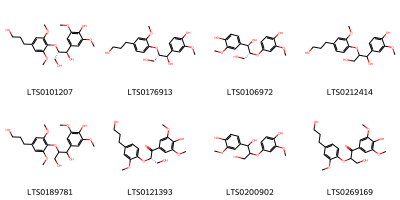
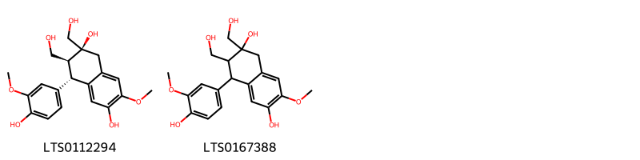
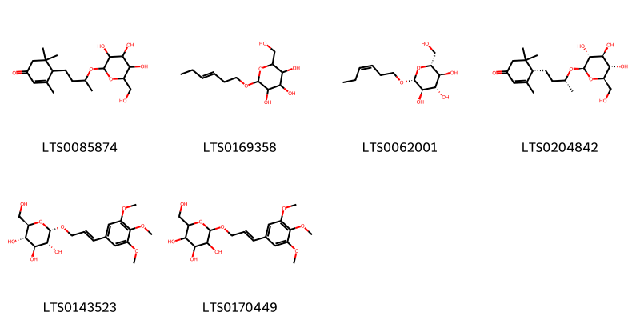
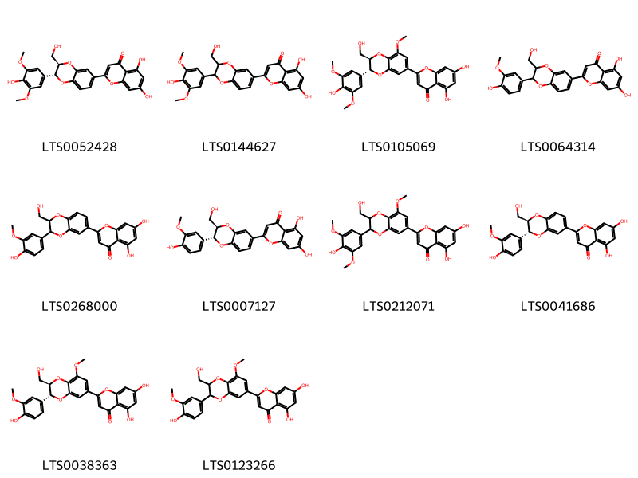
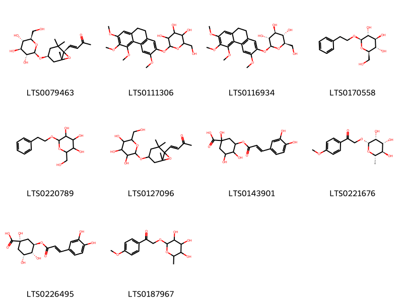

!!! abstract "Tóm tắt"

    Dâm dương hoắc, tên khoa học Herba Epimedii, thuộc họ Hoàng liên gai (Berberidaceae), là dược liệu quý phân bố chủ yếu ở Trung Quốc, Nhật Bản, Hàn Quốc và một số vùng núi ở Việt Nam. Trong y học cổ truyền, dâm dương hoắc được coi là vị thuốc bổ dương, có vị ngọt, tính ấm, quy vào kinh can và thận, thường dùng để tăng cường sinh lực, điều trị liệt dương, kinh nguyệt không đều, đau lưng, và yếu gối. Tác dụng dược lý cho thấy dâm dương hoắc có tác dụng tăng cường nội tiết tố sinh dục, cải thiện tuần hoàn máu, chống loãng xương, bảo vệ thần kinh và chống oxy hóa. Thành phần hóa học chính gồm flavonoid (đặc biệt là icariin – biomarker quan trọng), alkaloid, saponin và polysaccharide, đóng vai trò chính trong các tác dụng dược lý của dược liệu này.

## Thông tin về thực vật

Dược liệu **Dâm Dương Hoắc** từ bộ phận **nan** từ loài *Epimedium sagittatum*.

**Mô tả thực vật:** Gồm 3 loài:
- Dâm dương hoắc lá hình tim
- Dâm dương hoắc lá to
- Dâm dương hoắc dạng lá mác
Cả ba cây dâm dương hoắc đều là những cây sống lâu năm, cây dâm dương hoắc lá to và dâm dương hoắc lá hình tim cao hơn, đạt 30 - 40cm, còn cây dâm dương hoắc lá mác hơi thấp hơn 30 - 35cm. Lá dâm dương hoắc lá to và dâm dương hoắc lá mác dài 4 -9cm, còn dâm dương hoắc lá hình tim chỉ dài 2,5 đến 5cm, những chi tiết khác có thể tóm tắt sau đây:
1. Phiến lá to, dài 4 -9cm, hoa họp thành chùm, cuống hoa không có lông tiết.
a. Lá 2 lần kép với 3 lá chét, hoa to, đường kính 20mm, mỗi cụm hoa gồm 4 -6 hoa, tràng có cựa dài...Epimedium macranthum
b. Lá một lần kép với 3 lá chét, hoa hơi nhỏ, đường kính 6 -8mm, cụm hoa gồm nhiều hoa, tràng có cựa ngắn hay như không có cựa... Epimedium sagitatum.
2. Phiến lá nhỏ, dài 2,5 - 5cm, cụm hoa họp thành tán tụ, cuống hoa lông tiết rõ... Epimedium brevicornu.

*Tài liệu tham khảo:* "Những cây thuốc và vị thuốc Việt Nam" - Đỗ Tất Lợi 
Trong dược điển Việt nam, một loài được sử dụng làm dược liệu là *Epimedium sagittatum*.

!!! info "Phân loại thực vật của *Epimedium sagittatum*"
    - **Kingdom:** Plantae
    - **Phylum:** Tracheophyta
    - **Order:** Ranunculales
    - **Family:** Berberidaceae
    - **Genus:** Epimedium
    - **Species:** *Epimedium sagittatum*

**Phân bố trên thế giới:** United States of America, China, Chinese Taipei, unknown or invalid, Japan, Korea, Republic of

**Phân bố tại Việt nam:** Không có ghi nhận ở Việt Nam

## Thông tin về dược liệu 

### Định danh

!!! info "Thông tin về tên gọi"

    - Dược liệu tiếng Việt: nan
    - Dược liệu tiếng Trung: nan (nan)
    - Dược liệu tiếng Anh: nan
    - Dược liệu latin thông dụng: nan
    - Dược liệu latin kiểu DĐVN: *herba epimedii*
    - Dược liệu latin kiểu DĐVN: *nan*
    - Dược liệu latin kiểu thông tư: *nan*
    - Bộ phận dùng: nan (nan)

### Mô tả dược liệu 

- **Theo dược điển Việt nam V:** nan

- **Mô tả dược liệu theo thông tư chế biến dược liệu theo phương pháp cổ truyền:** nan

### Chế biến 

- **Chế biến theo dược điển việt nam V**: nan

- **Chế biến theo thông tư:** nan

--- 

## Thành phần hóa học

- Theo tài liệu của GS. Đỗ Tất Lợi:  Thân và lá chứa Flavonoid: icariin(C33H42O16) thủy phân cho icaritin (C21H22O7)
Thân rễ: dexosymetylicariin, magnoflorin (C20H24O4N)
    

**Thành phần hóa học từ loài **Epimedium sagittatum**

Theo cơ sở dữ liệu lotus, loài *Epimedium sagittatum* đã phân lập và xác định được **160** hoạt chất thuộc về các nhóm Steroids and steroid derivatives, Organooxygen compounds, Lignan glycosides, Flavonoids, Fatty Acyls, Aryltetralin lignans, Flavonolignans, Furanoid lignans, Cinnamic acids and derivatives, 2-arylbenzofuran flavonoids, Coumarins and derivatives, Prenol lipids trong bảng dưới đây. Danh sách các hoạt chất như sau 3-[(4,5-dihydroxy-6-methyl-3-{[(2s)-3,4,5-trihydroxy-6-methyloxan-2-yl]oxy}oxan-2-yl)oxy]-5-hydroxy-2-(4-methoxyphenyl)-8-(3-methylbut-2-en-1-yl)-7-{[3,4,5-trihydroxy-6-(hydroxymethyl)oxan-2-yl]oxy}chromen-4-one [(LTS0142736)](https://lotus.naturalproducts.net/compound/lotus_id/LTS0142736), 5-hydroxy-2-(4-methoxyphenyl)-8-(3-methylbut-2-en-1-yl)-7-{[3,4,5-trihydroxy-6-(hydroxymethyl)oxan-2-yl]oxy}-3-[(3,4,5-trihydroxy-6-methyloxan-2-yl)oxy]chromen-4-one [(LTS0011517)](https://lotus.naturalproducts.net/compound/lotus_id/LTS0011517), 5,7-dihydroxy-2-(4-hydroxyphenyl)-8-(3-methylbut-2-en-1-yl)-3-{[(2s,3r,4r,5r,6s)-3,4,5-trihydroxy-6-methyloxan-2-yl]oxy}chromen-4-one [(LTS0011650)](https://lotus.naturalproducts.net/compound/lotus_id/LTS0011650), 3-({4,5-dihydroxy-6-methyl-3-[(3,4,5-trihydroxy-6-methyloxan-2-yl)oxy]oxan-2-yl}oxy)-5-hydroxy-2-(4-methoxyphenyl)-8-(3-methylbut-2-en-1-yl)-7-{[3,4,5-trihydroxy-6-(hydroxymethyl)oxan-2-yl]oxy}chromen-4-one [(LTS0124109)](https://lotus.naturalproducts.net/compound/lotus_id/LTS0124109), kaempherol [(LTS0155822)](https://lotus.naturalproducts.net/compound/lotus_id/LTS0155822), sagittatin a [(LTS0217981)](https://lotus.naturalproducts.net/compound/lotus_id/LTS0217981), 5-(4-hydroxy-3-methoxyphenyl)-3-[(4-hydroxy-3-methoxyphenyl)methyl]-4-(hydroxymethyl)oxolan-3-ol [(LTS0230969)](https://lotus.naturalproducts.net/compound/lotus_id/LTS0230969), (1r,2r)-2-(4-hydroxy-3-methoxyphenoxy)-1-(4-hydroxy-3-methoxyphenyl)propane-1,3-diol [(LTS0106972)](https://lotus.naturalproducts.net/compound/lotus_id/LTS0106972), 4-[(2r,4s)-2,4-dihydroxy-2,6,6-trimethylcyclohexylidene]but-3-en-2-one [(LTS0233974)](https://lotus.naturalproducts.net/compound/lotus_id/LTS0233974), (2s,3s,4s,5s,6r)-5-hydroxy-6-{[5-hydroxy-2-(4-hydroxyphenyl)-4-oxo-7-{[(2s,3r,4s,5r,6r)-3,4,5-trihydroxy-6-methyloxan-2-yl]oxy}chromen-3-yl]oxy}-2-methyl-4-{[(2s,3s,4s,5s)-3,4,5-trihydroxyoxan-2-yl]oxy}oxan-3-yl acetate [(LTS0088881)](https://lotus.naturalproducts.net/compound/lotus_id/LTS0088881), para-coumaric acid [(LTS0266252)](https://lotus.naturalproducts.net/compound/lotus_id/LTS0266252), (2s,3s,4s,6s)-6-{[2-(4-hydroxyphenyl)-4-oxo-7-{[(2s,3r,4r,5r,6s)-3,4,5-trihydroxy-6-methyloxan-2-yl]oxy}chromen-3-yl]oxy}-2-methyl-4-{[(2r,3r,4s,5r)-3,4,5-trihydroxyoxan-2-yl]oxy}oxan-3-yl acetate [(LTS0149799)](https://lotus.naturalproducts.net/compound/lotus_id/LTS0149799), (2s,3s,4r,5r,6r)-3-hydroxy-6-{[5-hydroxy-2-(4-methoxyphenyl)-8-(3-methylbut-2-en-1-yl)-4-oxo-7-{[(2s,3r,4s,5s,6r)-3,4,5-trihydroxy-6-(hydroxymethyl)oxan-2-yl]oxy}chromen-3-yl]oxy}-2-methyl-5-{[(2s,3r,4s,5s,6r)-3,4,5-trihydroxy-6-(hydroxymethyl)oxan-2-yl]oxy}oxan-4-yl acetate [(LTS0141750)](https://lotus.naturalproducts.net/compound/lotus_id/LTS0141750), 4-[(2s,3r)-3-(hydroxymethyl)-5-(3-hydroxypropyl)-7-methoxy-2,3-dihydro-1-benzofuran-2-yl]-2-methoxyphenol [(LTS0153479)](https://lotus.naturalproducts.net/compound/lotus_id/LTS0153479), 5,7-dihydroxy-2-[(2r,3r)-2-(4-hydroxy-3-methoxyphenyl)-3-(hydroxymethyl)-2,3-dihydro-1,4-benzodioxin-6-yl]chromen-4-one [(LTS0007127)](https://lotus.naturalproducts.net/compound/lotus_id/LTS0007127), yinyanghuo a [(LTS0003340)](https://lotus.naturalproducts.net/compound/lotus_id/LTS0003340), chlorogenic acid [(LTS0226495)](https://lotus.naturalproducts.net/compound/lotus_id/LTS0226495), 2-{4-[4-(4-hydroxy-3-methoxyphenyl)-hexahydrofuro[3,4-c]furan-1-yl]-2-methoxyphenoxy}-6-(hydroxymethyl)oxane-3,4,5-triol [(LTS0002400)](https://lotus.naturalproducts.net/compound/lotus_id/LTS0002400), 5,7-dihydroxy-8-(3-hydroxy-3-methylbutyl)-2-(4-methoxyphenyl)-3-{[(2r,3s,4s,5s,6r)-3,4,5-trihydroxy-6-methyloxan-2-yl]oxy}chromen-4-one [(LTS0150350)](https://lotus.naturalproducts.net/compound/lotus_id/LTS0150350), (2s,3r,4s,5s,6s)-2-{[5,7-dihydroxy-2-(4-hydroxyphenyl)-4-oxochromen-3-yl]oxy}-3-hydroxy-5-{[(2e)-3-(4-hydroxyphenyl)prop-2-enoyl]oxy}-6-methyloxan-4-yl (2z)-3-(4-hydroxyphenyl)prop-2-enoate [(LTS0088993)](https://lotus.naturalproducts.net/compound/lotus_id/LTS0088993), olivil [(LTS0178537)](https://lotus.naturalproducts.net/compound/lotus_id/LTS0178537), (1r,2s)-1-(4-hydroxy-3,5-dimethoxyphenyl)-2-[4-(3-hydroxypropyl)-2,6-dimethoxyphenoxy]propane-1,3-diol [(LTS0101207)](https://lotus.naturalproducts.net/compound/lotus_id/LTS0101207), 3-{[(2r,3r,4r,5r,6s)-4,5-dihydroxy-6-methyl-3-{[(2s,3r,4s,5r)-3,4,5-trihydroxyoxan-2-yl]oxy}oxan-2-yl]oxy}-5-hydroxy-2-(4-methoxyphenyl)-8-(3-methylbut-2-en-1-yl)-7-{[(2s,3r,4s,5s,6r)-3,4,5-trihydroxy-6-(hydroxymethyl)oxan-2-yl]oxy}chromen-4-one [(LTS0087809)](https://lotus.naturalproducts.net/compound/lotus_id/LTS0087809), 1-(4-methoxyphenyl)-2-[(3,4,5-trihydroxy-6-methyloxan-2-yl)oxy]ethanone [(LTS0187967)](https://lotus.naturalproducts.net/compound/lotus_id/LTS0187967), 5,7-dihydroxy-2-(4-hydroxyphenyl)-3-{[(2s,3s,4r,5r,6s)-3,4,5-trihydroxy-6-methyloxan-2-yl]oxy}chromen-4-one [(LTS0017739)](https://lotus.naturalproducts.net/compound/lotus_id/LTS0017739), 2-{2,6-dimethoxy-4-[4-(3,4,5-trimethoxyphenyl)-hexahydrofuro[3,4-c]furan-1-yl]phenoxy}-6-(hydroxymethyl)oxane-3,4,5-triol [(LTS0028214)](https://lotus.naturalproducts.net/compound/lotus_id/LTS0028214), 3-{[(2s,3s,4r,5r,6s)-4,5-dihydroxy-6-methyl-3-{[(2r,3s,4s,5r)-3,4,5-trihydroxyoxan-2-yl]oxy}oxan-2-yl]oxy}-5-hydroxy-2-(4-hydroxyphenyl)-7-{[(2s,3s,4s,5r,6r)-3,4,5-trihydroxy-6-methyloxan-2-yl]oxy}chromen-4-one [(LTS0151855)](https://lotus.naturalproducts.net/compound/lotus_id/LTS0151855), (2s,3r,4r,5r,6s)-2-{[5,7-dihydroxy-2-(4-hydroxyphenyl)-4-oxochromen-3-yl]oxy}-4-hydroxy-5-{[(2e)-3-(4-hydroxyphenyl)prop-2-enoyl]oxy}-6-methyloxan-3-yl (2z)-3-(4-hydroxyphenyl)prop-2-enoate [(LTS0012233)](https://lotus.naturalproducts.net/compound/lotus_id/LTS0012233), 5,7-dihydroxy-2-[2-(4-hydroxy-3-methoxyphenyl)-3-(hydroxymethyl)-2,3-dihydro-1,4-benzodioxin-6-yl]chromen-4-one [(LTS0064314)](https://lotus.naturalproducts.net/compound/lotus_id/LTS0064314), (2r,3r,4s,5s,6r)-2-[(3z)-hex-3-en-1-yloxy]-6-(hydroxymethyl)oxane-3,4,5-triol [(LTS0062001)](https://lotus.naturalproducts.net/compound/lotus_id/LTS0062001), (2s,3r,4r,5r,6s)-2-{[5,7-dihydroxy-2-(4-hydroxyphenyl)-4-oxochromen-3-yl]oxy}-4-hydroxy-5-{[(2e)-3-(4-hydroxyphenyl)prop-2-enoyl]oxy}-6-methyloxan-3-yl (2e)-3-(4-hydroxyphenyl)prop-2-enoate [(LTS0049869)](https://lotus.naturalproducts.net/compound/lotus_id/LTS0049869), yinyanghuo d [(LTS0063487)](https://lotus.naturalproducts.net/compound/lotus_id/LTS0063487), (2r,3s,4s,5r,6s)-2-(hydroxymethyl)-6-{[(2e)-3-(3,4,5-trimethoxyphenyl)prop-2-en-1-yl]oxy}oxane-3,4,5-triol [(LTS0143523)](https://lotus.naturalproducts.net/compound/lotus_id/LTS0143523), quercitrin [(LTS0093095)](https://lotus.naturalproducts.net/compound/lotus_id/LTS0093095), 3-({4,5-dihydroxy-6-methyl-3-[(3,4,5-trihydroxy-6-methyloxan-2-yl)oxy]oxan-2-yl}oxy)-2-(3,4-dihydroxyphenyl)-5,7-dihydroxychromen-4-one [(LTS0208604)](https://lotus.naturalproducts.net/compound/lotus_id/LTS0208604), hyperoside [(LTS0089156)](https://lotus.naturalproducts.net/compound/lotus_id/LTS0089156), 2-(4-hydroxy-3-methoxyphenoxy)-1-(4-hydroxy-3-methoxyphenyl)propane-1,3-diol [(LTS0200902)](https://lotus.naturalproducts.net/compound/lotus_id/LTS0200902), 3-[(4,5-dihydroxy-6-methyl-3-{[3,4,5-trihydroxy-6-(hydroxymethyl)oxan-2-yl]oxy}oxan-2-yl)oxy]-5,7-dihydroxy-2-(4-methoxyphenyl)-8-(3-methylbut-2-en-1-yl)chromen-4-one [(LTS0223688)](https://lotus.naturalproducts.net/compound/lotus_id/LTS0223688), yinyanghuo b [(LTS0054689)](https://lotus.naturalproducts.net/compound/lotus_id/LTS0054689), (2s,3r,4r,5r,6s)-2-[3-(4-{[(1r,2s)-1,3-dihydroxy-1-(4-hydroxy-3-methoxyphenyl)propan-2-yl]oxy}-3-methoxyphenyl)propoxy]-6-methyloxane-3,4,5-triol [(LTS0213481)](https://lotus.naturalproducts.net/compound/lotus_id/LTS0213481), luteolin [(LTS0017052)](https://lotus.naturalproducts.net/compound/lotus_id/LTS0017052), (2r,3r,4s,5s,6r)-2-{4-[(1s,3ar,4s,6ar)-4-(4-hydroxy-3,5-dimethoxyphenyl)-hexahydrofuro[3,4-c]furan-1-yl]-2,6-dimethoxyphenoxy}-6-(hydroxymethyl)oxane-3,4,5-triol [(LTS0222334)](https://lotus.naturalproducts.net/compound/lotus_id/LTS0222334), 2-(hydroxymethyl)-6-[(3,5,6,7-tetramethoxy-9,10-dihydrophenanthren-2-yl)oxy]oxane-3,4,5-triol [(LTS0111306)](https://lotus.naturalproducts.net/compound/lotus_id/LTS0111306), 3-({4,5-dihydroxy-6-methyl-3-[(3,4,5-trihydroxyoxan-2-yl)oxy]oxan-2-yl}oxy)-5-hydroxy-2-(4-methoxyphenyl)-8-(3-methylbut-2-en-1-yl)-7-{[3,4,5-trihydroxy-6-(hydroxymethyl)oxan-2-yl]oxy}chromen-4-one [(LTS0161786)](https://lotus.naturalproducts.net/compound/lotus_id/LTS0161786), 5,7-dihydroxy-2-(4-methoxyphenyl)-8-(3-methylbut-2-en-1-yl)-3-{[(2s,3s,4r,5r,6s)-3,4,5-trihydroxy-6-methyloxan-2-yl]oxy}chromen-4-one [(LTS0196196)](https://lotus.naturalproducts.net/compound/lotus_id/LTS0196196), 3,5-dihydroxy-2-(4-methoxyphenyl)-8-(3-methylbut-2-en-1-yl)-7-{[(2s,3r,4s,5s,6r)-3,4,5-trihydroxy-6-(hydroxymethyl)oxan-2-yl]oxy}chromen-4-one [(LTS0194791)](https://lotus.naturalproducts.net/compound/lotus_id/LTS0194791), 5,7-dihydroxy-2-{4-hydroxy-3-[(2r)-2-hydroxy-3-methylbut-3-en-1-yl]-5-(3-methylbut-2-en-1-yl)phenyl}chromen-4-one [(LTS0114158)](https://lotus.naturalproducts.net/compound/lotus_id/LTS0114158), 2-(3,4-dihydroxyphenyl)-5,7-dihydroxy-3-{[3,4,5-trihydroxy-6-(hydroxymethyl)oxan-2-yl]oxy}chromen-4-one [(LTS0195312)](https://lotus.naturalproducts.net/compound/lotus_id/LTS0195312), 3-{[(2s,3r,4r,5r,6s)-4,5-dihydroxy-6-methyl-3-{[(2s,3r,4r,5r,6s)-3,4,5-trihydroxy-6-methyloxan-2-yl]oxy}oxan-2-yl]oxy}-5-hydroxy-2-(4-hydroxyphenyl)-8-(3-methylbut-2-en-1-yl)-7-{[(2s,3r,4s,5s,6r)-3,4,5-trihydroxy-6-(hydroxymethyl)oxan-2-yl]oxy}chromen-4-one [(LTS0146000)](https://lotus.naturalproducts.net/compound/lotus_id/LTS0146000), 2-{[5,7-dihydroxy-2-(4-hydroxyphenyl)-4-oxochromen-3-yl]oxy}-4-hydroxy-5-{[3-(4-hydroxyphenyl)prop-2-enoyl]oxy}-6-methyloxan-3-yl 3-(4-hydroxyphenyl)prop-2-enoate [(LTS0151649)](https://lotus.naturalproducts.net/compound/lotus_id/LTS0151649), 3-{[(2s,3s,4r,5r,6s)-4,5-dihydroxy-6-methyl-3-{[(2s,3r,4r,5r)-3,4,5-trihydroxyoxan-2-yl]oxy}oxan-2-yl]oxy}-5,7-dihydroxy-2-(4-methoxyphenyl)-8-(3-methylbut-2-en-1-yl)chromen-4-one [(LTS0276025)](https://lotus.naturalproducts.net/compound/lotus_id/LTS0276025), (2r,3r,4r,5s,6s)-2-{[5,7-dihydroxy-2-(4-methoxyphenyl)-8-(3-methylbut-2-en-1-yl)-4-oxochromen-3-yl]oxy}-5-hydroxy-6-methyl-3-{[(2s,3r,4s,5s,6r)-3,4,5-trihydroxy-6-(hydroxymethyl)oxan-2-yl]oxy}oxan-4-yl acetate [(LTS0015679)](https://lotus.naturalproducts.net/compound/lotus_id/LTS0015679), [(2r,3s,4s,5r,6s)-6-{[(2s,3s,4s,5r,6s)-3-(acetyloxy)-5-hydroxy-6-{[5-hydroxy-2-(4-methoxyphenyl)-8-(3-methylbut-2-en-1-yl)-4-oxo-7-{[(2s,3r,4s,5s,6r)-3,4,5-trihydroxy-6-(hydroxymethyl)oxan-2-yl]oxy}chromen-3-yl]oxy}-2-methyloxan-4-yl]oxy}-3,4,5-trihydroxyoxan-2-yl]methyl acetate [(LTS0123571)](https://lotus.naturalproducts.net/compound/lotus_id/LTS0123571), 3-{[(2s,3r,4r,5r,6s)-4,5-dihydroxy-6-methyl-3-{[(2s,3r,4s,5r)-3,4,5-trihydroxyoxan-2-yl]oxy}oxan-2-yl]oxy}-5-hydroxy-2-(4-methoxyphenyl)-8-(3-methylbut-2-en-1-yl)-7-{[(2s,3r,4s,5s,6r)-3,4,5-trihydroxy-6-(hydroxymethyl)oxan-2-yl]oxy}chromen-4-one [(LTS0249709)](https://lotus.naturalproducts.net/compound/lotus_id/LTS0249709), icariin [(LTS0085291)](https://lotus.naturalproducts.net/compound/lotus_id/LTS0085291), 3-{[(2s,3r,4r,5r,6s)-4,5-dihydroxy-6-methyl-3-{[(2s,3r,4r,5r,6s)-3,4,5-trihydroxy-6-methyloxan-2-yl]oxy}oxan-2-yl]oxy}-2-(3,4-dihydroxyphenyl)-5,7-dihydroxychromen-4-one [(LTS0198406)](https://lotus.naturalproducts.net/compound/lotus_id/LTS0198406), (2s,3r,4s,5r)-2-{[(1r,2s,3s)-7-hydroxy-1-(4-hydroxy-3,5-dimethoxyphenyl)-3-(hydroxymethyl)-6,8-dimethoxy-1,2,3,4-tetrahydronaphthalen-2-yl]methoxy}oxane-3,4,5-triol [(LTS0052923)](https://lotus.naturalproducts.net/compound/lotus_id/LTS0052923), 3,5-dihydroxy-2-(4-methoxyphenyl)-8-(3-methylbut-2-en-1-yl)-7-{[3,4,5-trihydroxy-6-(hydroxymethyl)oxan-2-yl]oxy}chromen-4-one [(LTS0207163)](https://lotus.naturalproducts.net/compound/lotus_id/LTS0207163), 5-hydroxy-2-(4-methoxyphenyl)-8-(3-methylbut-2-en-1-yl)-7-{[(2s,3r,4s,5s,6r)-3,4,5-trihydroxy-6-(hydroxymethyl)oxan-2-yl]oxy}-3-{[(2r,3s,4s,5s,6r)-3,4,5-trihydroxy-6-methyloxan-2-yl]oxy}chromen-4-one [(LTS0077273)](https://lotus.naturalproducts.net/compound/lotus_id/LTS0077273), 2-[3-(4-{[1,3-dihydroxy-1-(4-hydroxy-3,5-dimethoxyphenyl)propan-2-yl]oxy}-3-methoxyphenyl)propoxy]-6-methyloxane-3,4,5-triol [(LTS0236017)](https://lotus.naturalproducts.net/compound/lotus_id/LTS0236017), (2s,3r,4r,5s,6s)-2-{[5,7-dihydroxy-2-(4-methoxyphenyl)-8-(3-methylbut-2-en-1-yl)-4-oxochromen-3-yl]oxy}-5-hydroxy-6-methyl-3-{[(3r,4s,5s,6r)-3,4,5-trihydroxy-6-(hydroxymethyl)oxan-2-yl]oxy}oxan-4-yl acetate [(LTS0008393)](https://lotus.naturalproducts.net/compound/lotus_id/LTS0008393), 3-{[(2s,3s,4r,5r)-4,5-dihydroxy-6-methyl-3-{[(2s,3s,4s,5r,6s)-3,4,5-trihydroxy-6-methyloxan-2-yl]oxy}oxan-2-yl]oxy}-5,7-dihydroxy-2-(4-hydroxyphenyl)chromen-4-one [(LTS0153220)](https://lotus.naturalproducts.net/compound/lotus_id/LTS0153220), 2-(3,4-dihydroxyphenyl)-5,7-dihydroxy-3-{[(2s,3s,4r,5r,6r)-3,4,5-trihydroxy-6-(hydroxymethyl)oxan-2-yl]oxy}chromen-4-one [(LTS0134432)](https://lotus.naturalproducts.net/compound/lotus_id/LTS0134432), epimedoside a [(LTS0097022)](https://lotus.naturalproducts.net/compound/lotus_id/LTS0097022), 4-(2,4-dihydroxy-2,6,6-trimethylcyclohexylidene)but-3-en-2-one [(LTS0273775)](https://lotus.naturalproducts.net/compound/lotus_id/LTS0273775), 5,7-dihydroxy-2-(4-hydroxyphenyl)-8-(3-methylbut-2-en-1-yl)-3-[(3,4,5-trihydroxy-6-methyloxan-2-yl)oxy]chromen-4-one [(LTS0012484)](https://lotus.naturalproducts.net/compound/lotus_id/LTS0012484), 5,7-dihydroxy-2-[(2r,3r)-2-(4-hydroxy-3,5-dimethoxyphenyl)-3-(hydroxymethyl)-2,3-dihydro-1,4-benzodioxin-6-yl]chromen-4-one [(LTS0052428)](https://lotus.naturalproducts.net/compound/lotus_id/LTS0052428), 5,7-dihydroxy-8-(3-hydroxy-3-methylbutyl)-2-(4-methoxyphenyl)-3-[(3,4,5-trihydroxy-6-methyloxan-2-yl)oxy]chromen-4-one [(LTS0188224)](https://lotus.naturalproducts.net/compound/lotus_id/LTS0188224), 4-[5-(4-hydroxy-3,5-dimethoxyphenyl)-3,4-bis(hydroxymethyl)oxolan-2-yl]-2,6-dimethoxyphenol [(LTS0098779)](https://lotus.naturalproducts.net/compound/lotus_id/LTS0098779), yinyanghuo e [(LTS0086325)](https://lotus.naturalproducts.net/compound/lotus_id/LTS0086325), selgin [(LTS0145712)](https://lotus.naturalproducts.net/compound/lotus_id/LTS0145712), (2s,3r,4s,5s,6r)-2-{4-[(1s,3ar,4s,6ar)-4-(4-hydroxy-3-methoxyphenyl)-hexahydrofuro[3,4-c]furan-1-yl]-2-methoxyphenoxy}-6-(hydroxymethyl)oxane-3,4,5-triol [(LTS0193542)](https://lotus.naturalproducts.net/compound/lotus_id/LTS0193542), 4-[3-(hydroxymethyl)-5-(3-hydroxypropyl)-7-methoxy-2,3-dihydro-1-benzofuran-2-yl]-2-methoxyphenol [(LTS0259518)](https://lotus.naturalproducts.net/compound/lotus_id/LTS0259518), (2s,3s,4s)-4-(4-hydroxy-3-methoxyphenyl)-2,3-bis(hydroxymethyl)-7-methoxy-3,4-dihydro-1h-naphthalene-2,6-diol [(LTS0112294)](https://lotus.naturalproducts.net/compound/lotus_id/LTS0112294), 3-{[(2r,3r,4r,5r,6s)-4,5-dihydroxy-6-methyl-3-{[(2s,3r,4s,5s,6r)-3,4,5-trihydroxy-6-(hydroxymethyl)oxan-2-yl]oxy}oxan-2-yl]oxy}-5,7-dihydroxy-2-(4-methoxyphenyl)-8-(3-methylbut-2-en-1-yl)chromen-4-one [(LTS0060422)](https://lotus.naturalproducts.net/compound/lotus_id/LTS0060422), icariside ii [(LTS0252690)](https://lotus.naturalproducts.net/compound/lotus_id/LTS0252690), 3-{[(2s,3s,4r,5r,6s)-4,5-dihydroxy-6-methyl-3-{[(2s,3s,4s,5r,6s)-3,4,5-trihydroxy-6-methyloxan-2-yl]oxy}oxan-2-yl]oxy}-5,7-dihydroxy-2-(4-hydroxyphenyl)chromen-4-one [(LTS0018003)](https://lotus.naturalproducts.net/compound/lotus_id/LTS0018003), quercitrin [(LTS0186298)](https://lotus.naturalproducts.net/compound/lotus_id/LTS0186298), (3e)-4-[(1s,4s,6r)-2,2,6-trimethyl-4-{[(2r,3r,4s,5s,6r)-3,4,5-trihydroxy-6-(hydroxymethyl)oxan-2-yl]oxy}-7-oxabicyclo[4.1.0]heptan-1-yl]but-3-en-2-one [(LTS0079463)](https://lotus.naturalproducts.net/compound/lotus_id/LTS0079463), 1-(4-hydroxy-3-methoxyphenyl)-2-[4-(3-hydroxypropyl)-2-methoxyphenoxy]propane-1,3-diol [(LTS0212414)](https://lotus.naturalproducts.net/compound/lotus_id/LTS0212414), stigmast-5-en-3-ol, (3β)- [(LTS0204616)](https://lotus.naturalproducts.net/compound/lotus_id/LTS0204616), yinyanghuo c [(LTS0267592)](https://lotus.naturalproducts.net/compound/lotus_id/LTS0267592), trifolin [(LTS0237581)](https://lotus.naturalproducts.net/compound/lotus_id/LTS0237581), 6-demethoxycapillarisin [(LTS0273268)](https://lotus.naturalproducts.net/compound/lotus_id/LTS0273268), (2s,3r,4s,5s,6s)-2-{[5,7-dihydroxy-2-(4-hydroxyphenyl)-4-oxochromen-3-yl]oxy}-3-hydroxy-5-{[(2e)-3-(4-hydroxyphenyl)prop-2-enoyl]oxy}-6-methyloxan-4-yl (2e)-3-(4-hydroxyphenyl)prop-2-enoate [(LTS0152781)](https://lotus.naturalproducts.net/compound/lotus_id/LTS0152781), 3-{[(2s,3s,4r,5r,6s)-4,5-dihydroxy-6-methyl-3-{[(2s,3s,4r,5r,6r)-3,4,5-trihydroxy-6-methyloxan-2-yl]oxy}oxan-2-yl]oxy}-5-hydroxy-2-(4-methoxyphenyl)-8-(3-methylbut-2-en-1-yl)-7-{[(2s,3s,4s,5s,6s)-3,4,5-trihydroxy-6-(hydroxymethyl)oxan-2-yl]oxy}chromen-4-one [(LTS0076782)](https://lotus.naturalproducts.net/compound/lotus_id/LTS0076782), 3,5,5-trimethyl-4-(3-{[3,4,5-trihydroxy-6-(hydroxymethyl)oxan-2-yl]oxy}butyl)cyclohex-2-en-1-one [(LTS0085874)](https://lotus.naturalproducts.net/compound/lotus_id/LTS0085874), 2-{[5,7-dihydroxy-2-(4-hydroxyphenyl)-4-oxochromen-3-yl]oxy}-3-hydroxy-5-{[3-(4-hydroxyphenyl)prop-2-enoyl]oxy}-6-methyloxan-4-yl 3-(4-hydroxyphenyl)prop-2-enoate [(LTS0047059)](https://lotus.naturalproducts.net/compound/lotus_id/LTS0047059), (2r,3r)-3,5,7-trihydroxy-2-(4-{[(2s,3r,4s,5s,6r)-3,4,5-trihydroxy-6-(hydroxymethyl)oxan-2-yl]oxy}phenyl)-2,3-dihydro-1-benzopyran-4-one [(LTS0157903)](https://lotus.naturalproducts.net/compound/lotus_id/LTS0157903), (2s,3r,4r,5r,6s)-2-[3-(4-{[(1r,2s)-1,3-dihydroxy-1-(4-hydroxy-3,5-dimethoxyphenyl)propan-2-yl]oxy}-3-methoxyphenyl)propoxy]-6-methyloxane-3,4,5-triol [(LTS0049596)](https://lotus.naturalproducts.net/compound/lotus_id/LTS0049596), afzelin [(LTS0259097)](https://lotus.naturalproducts.net/compound/lotus_id/LTS0259097), sitogluside [(LTS0201798)](https://lotus.naturalproducts.net/compound/lotus_id/LTS0201798), 3-{[(2s,3r,4r,5r,6s)-4,5-dihydroxy-6-methyl-3-{[(2s,3r,4s,5s,6r)-3,4,5-trihydroxy-6-(hydroxymethyl)oxan-2-yl]oxy}oxan-2-yl]oxy}-5-hydroxy-2-(4-methoxyphenyl)-8-(3-methylbut-2-en-1-yl)-7-{[(2s,3r,4s,5s,6r)-3,4,5-trihydroxy-6-(hydroxymethyl)oxan-2-yl]oxy}chromen-4-one [(LTS0177315)](https://lotus.naturalproducts.net/compound/lotus_id/LTS0177315), 5-hydroxy-2-(4-hydroxyphenyl)-8-(3-methylbut-2-en-1-yl)-7-{[3,4,5-trihydroxy-6-(hydroxymethyl)oxan-2-yl]oxy}-3-[(3,4,5-trihydroxy-6-methyloxan-2-yl)oxy]chromen-4-one [(LTS0044450)](https://lotus.naturalproducts.net/compound/lotus_id/LTS0044450), 1-(4-hydroxy-3,5-dimethoxyphenyl)-2-[4-(3-hydroxypropyl)-2,6-dimethoxyphenoxy]propane-1,3-diol [(LTS0189781)](https://lotus.naturalproducts.net/compound/lotus_id/LTS0189781), 4-[(2s,3r,4r,5s)-5-(4-hydroxy-3,5-dimethoxyphenyl)-3,4-bis(hydroxymethyl)oxolan-2-yl]-2,6-dimethoxyphenol [(LTS0025234)](https://lotus.naturalproducts.net/compound/lotus_id/LTS0025234), (6-{[3-(acetyloxy)-5-hydroxy-6-{[5-hydroxy-2-(4-methoxyphenyl)-8-(3-methylbut-2-en-1-yl)-4-oxo-7-{[3,4,5-trihydroxy-6-(hydroxymethyl)oxan-2-yl]oxy}chromen-3-yl]oxy}-2-methyloxan-4-yl]oxy}-3,4,5-trihydroxyoxan-2-yl)methyl acetate [(LTS0023007)](https://lotus.naturalproducts.net/compound/lotus_id/LTS0023007), 3-[(3,5-dihydroxy-6-methyl-4-{[3,4,5-trihydroxy-6-(hydroxymethyl)oxan-2-yl]oxy}oxan-2-yl)oxy]-5-hydroxy-2-(4-methoxyphenyl)-8-(3-methylbut-2-en-1-yl)-7-{[3,4,5-trihydroxy-6-(hydroxymethyl)oxan-2-yl]oxy}chromen-4-one [(LTS0218580)](https://lotus.naturalproducts.net/compound/lotus_id/LTS0218580), (2s)-3-hydroxy-1-(4-hydroxy-3,5-dimethoxyphenyl)-2-[4-(3-hydroxypropyl)-2-methoxyphenoxy]propan-1-one [(LTS0121393)](https://lotus.naturalproducts.net/compound/lotus_id/LTS0121393), 5,7-dihydroxy-2-[3-(4-hydroxy-3-methoxyphenyl)-2-(hydroxymethyl)-8-methoxy-2,3-dihydro-1,4-benzodioxin-6-yl]chromen-4-one [(LTS0123266)](https://lotus.naturalproducts.net/compound/lotus_id/LTS0123266), 5,7-dihydroxy-2-(4-methoxyphenyl)-8-(3-methylbut-2-en-1-yl)-3-{[(2r,3s,4s,5s,6r)-3,4,5-trihydroxy-6-methyloxan-2-yl]oxy}chromen-4-one [(LTS0250402)](https://lotus.naturalproducts.net/compound/lotus_id/LTS0250402), quercetin [(LTS0004651)](https://lotus.naturalproducts.net/compound/lotus_id/LTS0004651), 3-({4,5-dihydroxy-6-methyl-3-[(3,4,5-trihydroxy-6-methyloxan-2-yl)oxy]oxan-2-yl}oxy)-5-hydroxy-2-(4-hydroxyphenyl)-8-(3-methylbut-2-en-1-yl)-7-{[3,4,5-trihydroxy-6-(hydroxymethyl)oxan-2-yl]oxy}chromen-4-one [(LTS0081380)](https://lotus.naturalproducts.net/compound/lotus_id/LTS0081380), 5,7-dihydroxy-2-[3-(4-hydroxy-3-methoxyphenyl)-2-(hydroxymethyl)-2,3-dihydro-1,4-benzodioxin-6-yl]chromen-4-one [(LTS0268000)](https://lotus.naturalproducts.net/compound/lotus_id/LTS0268000), 5,7-dihydroxy-2-[2-(4-hydroxy-3,5-dimethoxyphenyl)-3-(hydroxymethyl)-2,3-dihydro-1,4-benzodioxin-6-yl]chromen-4-one [(LTS0144627)](https://lotus.naturalproducts.net/compound/lotus_id/LTS0144627), tricin [(LTS0271018)](https://lotus.naturalproducts.net/compound/lotus_id/LTS0271018), 3-{[3-(3,4-dihydroxyphenyl)prop-2-enoyl]oxy}-1,4,5-trihydroxycyclohexane-1-carboxylic acid [(LTS0143901)](https://lotus.naturalproducts.net/compound/lotus_id/LTS0143901), 3-({4,5-dihydroxy-6-methyl-3-[(3,4,5-trihydroxy-6-methyloxan-2-yl)oxy]oxan-2-yl}oxy)-5,7-dihydroxy-2-(4-hydroxyphenyl)chromen-4-one [(LTS0028303)](https://lotus.naturalproducts.net/compound/lotus_id/LTS0028303), 3-{[(2s,3s,4s,5s,6r)-3,5-dihydroxy-6-methyl-4-{[(2s,3r,4r,5s,6r)-3,4,5-trihydroxy-6-(hydroxymethyl)oxan-2-yl]oxy}oxan-2-yl]oxy}-5-hydroxy-2-(4-methoxyphenyl)-8-(3-methylbut-2-en-1-yl)-7-{[(2s,3s,4s,5s,6s)-3,4,5-trihydroxy-6-(hydroxymethyl)oxan-2-yl]oxy}chromen-4-one [(LTS0232361)](https://lotus.naturalproducts.net/compound/lotus_id/LTS0232361), 3-({4,5-dihydroxy-6-methyl-3-[(3,4,5-trihydroxyoxan-2-yl)oxy]oxan-2-yl}oxy)-5,7-dihydroxy-2-(4-methoxyphenyl)-8-(3-methylbut-2-en-1-yl)chromen-4-one [(LTS0168267)](https://lotus.naturalproducts.net/compound/lotus_id/LTS0168267), (2r,3r,4s,5s,6r)-2-{4-[(1s,3ar,4s,6ar)-4-(3,4,5-trimethoxyphenyl)-hexahydrofuro[3,4-c]furan-1-yl]-2,6-dimethoxyphenoxy}-6-(hydroxymethyl)oxane-3,4,5-triol [(LTS0020017)](https://lotus.naturalproducts.net/compound/lotus_id/LTS0020017), 3-{[(2s,3r,4r,5r,6s)-4,5-dihydroxy-6-methyl-3-{[(2s,3r,4r,5r,6s)-3,4,5-trihydroxy-6-methyloxan-2-yl]oxy}oxan-2-yl]oxy}-5-hydroxy-2-(4-methoxyphenyl)-8-(3-methylbut-2-en-1-yl)-7-{[(2s,3r,4s,5s,6r)-3,4,5-trihydroxy-6-(hydroxymethyl)oxan-2-yl]oxy}chromen-4-one [(LTS0014819)](https://lotus.naturalproducts.net/compound/lotus_id/LTS0014819), 2-(hydroxymethyl)-6-(2-phenylethoxy)oxane-3,4,5-triol [(LTS0220789)](https://lotus.naturalproducts.net/compound/lotus_id/LTS0220789), (2r,3s,4s,5r,6r)-2-(hydroxymethyl)-6-(2-phenylethoxy)oxane-3,4,5-triol [(LTS0170558)](https://lotus.naturalproducts.net/compound/lotus_id/LTS0170558), (2s,3s,4r,5s,6r)-2-{[5,7-dihydroxy-2-(4-methoxyphenyl)-8-(3-methylbut-2-en-1-yl)-4-oxochromen-3-yl]oxy}-5-hydroxy-6-methyl-3-{[(2s,3r,4s,5s,6r)-3,4,5-trihydroxy-6-(hydroxymethyl)oxan-2-yl]oxy}oxan-4-yl acetate [(LTS0222066)](https://lotus.naturalproducts.net/compound/lotus_id/LTS0222066), 3-hydroxy-6-{[5-hydroxy-2-(4-methoxyphenyl)-8-(3-methylbut-2-en-1-yl)-4-oxo-7-{[3,4,5-trihydroxy-6-(hydroxymethyl)oxan-2-yl]oxy}chromen-3-yl]oxy}-2-methyl-5-{[3,4,5-trihydroxy-6-(hydroxymethyl)oxan-2-yl]oxy}oxan-4-yl acetate [(LTS0019961)](https://lotus.naturalproducts.net/compound/lotus_id/LTS0019961), 5-hydroxy-2-(4-hydroxyphenyl)-8-(3-methylbut-2-en-1-yl)-7-{[(2s,3r,4s,5s,6r)-3,4,5-trihydroxy-6-(hydroxymethyl)oxan-2-yl]oxy}-3-{[(2s,3r,4r,5r,6s)-3,4,5-trihydroxy-6-methyloxan-2-yl]oxy}chromen-4-one [(LTS0171943)](https://lotus.naturalproducts.net/compound/lotus_id/LTS0171943), 3-{[(2s,3r,4s,5s,6r)-4,5-dihydroxy-6-(hydroxymethyl)-3-{[(2s,3r,4r,5r,6s)-3,4,5-trihydroxy-6-methyloxan-2-yl]oxy}oxan-2-yl]oxy}-2-(4-methoxyphenyl)-8-(3-methylbut-2-en-1-yl)-7-{[(2s,3r,4s,5s,6r)-3,4,5-trihydroxy-6-(hydroxymethyl)oxan-2-yl]oxy}chromen-4-one [(LTS0092001)](https://lotus.naturalproducts.net/compound/lotus_id/LTS0092001), chamomile [(LTS0104946)](https://lotus.naturalproducts.net/compound/lotus_id/LTS0104946), chrysoeriol [(LTS0095766)](https://lotus.naturalproducts.net/compound/lotus_id/LTS0095766), 4-(2,2,6-trimethyl-4-{[3,4,5-trihydroxy-6-(hydroxymethyl)oxan-2-yl]oxy}-7-oxabicyclo[4.1.0]heptan-1-yl)but-3-en-2-one [(LTS0127096)](https://lotus.naturalproducts.net/compound/lotus_id/LTS0127096), 4-(2,6,6-trimethyl-4-{[3,4,5-trihydroxy-6-(hydroxymethyl)oxan-2-yl]oxy}cyclohex-1-en-1-yl)butan-2-one [(LTS0218078)](https://lotus.naturalproducts.net/compound/lotus_id/LTS0218078), 2-{[7-hydroxy-1-(4-hydroxy-3,5-dimethoxyphenyl)-3-(hydroxymethyl)-6,8-dimethoxy-1,2,3,4-tetrahydronaphthalen-2-yl]methoxy}oxane-3,4,5-triol [(LTS0256435)](https://lotus.naturalproducts.net/compound/lotus_id/LTS0256435), (2r,3s,4s,5r,6s)-2-(hydroxymethyl)-6-[(3,5,6,7-tetramethoxy-9,10-dihydrophenanthren-2-yl)oxy]oxane-3,4,5-triol [(LTS0116934)](https://lotus.naturalproducts.net/compound/lotus_id/LTS0116934), 3,5-dihydroxy-2-(4-methoxyphenyl)-8-(3-methylbut-2-en-1-yl)-7-{[(2r,3r,4s,5s,6r)-3,4,5-trihydroxy-6-(hydroxymethyl)oxan-2-yl]oxy}chromen-4-one [(LTS0195274)](https://lotus.naturalproducts.net/compound/lotus_id/LTS0195274), 1-(4-methoxyphenyl)-2-{[(2s,3r,4r,5r,6s)-3,4,5-trihydroxy-6-methyloxan-2-yl]oxy}ethanone [(LTS0221676)](https://lotus.naturalproducts.net/compound/lotus_id/LTS0221676), 5-hydroxy-2-(4-methoxyphenyl)-8-(3-methylbut-2-en-1-yl)-7-{[(2s,3r,4s,5s,6r)-3,4,5-trihydroxy-6-(hydroxymethyl)oxan-2-yl]oxy}-3-{[(2s,3s,4r,5r,6s)-3,4,5-trihydroxy-6-methyloxan-2-yl]oxy}chromen-4-one [(LTS0096384)](https://lotus.naturalproducts.net/compound/lotus_id/LTS0096384), (4s)-3,5,5-trimethyl-4-[(3r)-3-{[(2r,3r,4s,5s,6r)-3,4,5-trihydroxy-6-(hydroxymethyl)oxan-2-yl]oxy}butyl]cyclohex-2-en-1-one [(LTS0204842)](https://lotus.naturalproducts.net/compound/lotus_id/LTS0204842), 5,7-dihydroxy-2-[(2r,3r)-3-(4-hydroxy-3-methoxyphenyl)-2-(hydroxymethyl)-2,3-dihydro-1,4-benzodioxin-6-yl]chromen-4-one [(LTS0041686)](https://lotus.naturalproducts.net/compound/lotus_id/LTS0041686), 5'-methoxyhydnocarpin [(LTS0038363)](https://lotus.naturalproducts.net/compound/lotus_id/LTS0038363), 2-(hydroxymethyl)-6-{[3-(3,4,5-trimethoxyphenyl)prop-2-en-1-yl]oxy}oxane-3,4,5-triol [(LTS0170449)](https://lotus.naturalproducts.net/compound/lotus_id/LTS0170449), 5,7-dihydroxy-2-{4-hydroxy-3-[(2r)-2-hydroxy-3-methylbut-3-en-1-yl]phenyl}chromen-4-one [(LTS0185261)](https://lotus.naturalproducts.net/compound/lotus_id/LTS0185261), (1r,2s)-1-(4-hydroxy-3-methoxyphenyl)-2-[4-(3-hydroxypropyl)-2-methoxyphenoxy]propane-1,3-diol [(LTS0176913)](https://lotus.naturalproducts.net/compound/lotus_id/LTS0176913), 2-{4-[4-(4-hydroxy-3,5-dimethoxyphenyl)-hexahydrofuro[3,4-c]furan-1-yl]-2,6-dimethoxyphenoxy}-6-(hydroxymethyl)oxane-3,4,5-triol [(LTS0209275)](https://lotus.naturalproducts.net/compound/lotus_id/LTS0209275), 2-(hydroxymethyl)-6-{4-[3-(hydroxymethyl)-5-(3-hydroxypropyl)-7-methoxy-2,3-dihydro-1-benzofuran-2-yl]-2-methoxyphenoxy}oxane-3,4,5-triol [(LTS0214372)](https://lotus.naturalproducts.net/compound/lotus_id/LTS0214372), 3-{[(2r,3r,4r,5r,6s)-4,5-dihydroxy-6-methyl-3-{[(2s,3r,4s,5s,6r)-3,4,5-trihydroxy-6-(hydroxymethyl)oxan-2-yl]oxy}oxan-2-yl]oxy}-5-hydroxy-2-(4-methoxyphenyl)-8-(3-methylbut-2-en-1-yl)-7-{[(2s,3r,4s,5s,6r)-3,4,5-trihydroxy-6-(hydroxymethyl)oxan-2-yl]oxy}chromen-4-one [(LTS0054595)](https://lotus.naturalproducts.net/compound/lotus_id/LTS0054595), 3-{[(2r,3r,4r,5r,6s)-4,5-dihydroxy-6-methyl-3-{[(2s,3r,4s,5r)-3,4,5-trihydroxyoxan-2-yl]oxy}oxan-2-yl]oxy}-5,7-dihydroxy-2-(4-methoxyphenyl)-8-(3-methylbut-2-en-1-yl)chromen-4-one [(LTS0110813)](https://lotus.naturalproducts.net/compound/lotus_id/LTS0110813), 3-{[(2s,3r,4r,5r,6s)-4,5-dihydroxy-6-methyl-3-{[(2s,3r,4r,5r,6s)-3,4,5-trihydroxy-6-methyloxan-2-yl]oxy}oxan-2-yl]oxy}-5,7-dihydroxy-2-(4-hydroxyphenyl)chromen-4-one [(LTS0169612)](https://lotus.naturalproducts.net/compound/lotus_id/LTS0169612), 5,7-dihydroxy-2-[3-(4-hydroxy-3,5-dimethoxyphenyl)-2-(hydroxymethyl)-8-methoxy-2,3-dihydro-1,4-benzodioxin-6-yl]chromen-4-one [(LTS0212071)](https://lotus.naturalproducts.net/compound/lotus_id/LTS0212071), (2r,3s,4s,5r,6s)-2-(hydroxymethyl)-6-{4-[(2r,3s)-3-(hydroxymethyl)-5-(3-hydroxypropyl)-7-methoxy-2,3-dihydro-1-benzofuran-2-yl]-2-methoxyphenoxy}oxane-3,4,5-triol [(LTS0133507)](https://lotus.naturalproducts.net/compound/lotus_id/LTS0133507), trifolin [(LTS0267055)](https://lotus.naturalproducts.net/compound/lotus_id/LTS0267055), 2-[3-(4-{[1,3-dihydroxy-1-(4-hydroxy-3-methoxyphenyl)propan-2-yl]oxy}-3-methoxyphenyl)propoxy]-6-methyloxane-3,4,5-triol [(LTS0261265)](https://lotus.naturalproducts.net/compound/lotus_id/LTS0261265), 3-[(4,5-dihydroxy-6-methyl-3-{[(2r)-3,4,5-trihydroxyoxan-2-yl]oxy}oxan-2-yl)oxy]-5,7-dihydroxy-2-(4-methoxyphenyl)-8-(3-methylbut-2-en-1-yl)chromen-4-one [(LTS0134490)](https://lotus.naturalproducts.net/compound/lotus_id/LTS0134490), 2-(hex-3-en-1-yloxy)-6-(hydroxymethyl)oxane-3,4,5-triol [(LTS0169358)](https://lotus.naturalproducts.net/compound/lotus_id/LTS0169358), 5,7-dihydroxy-2-(4-hydroxyphenyl)-3-[(3,4,5-trihydroxy-6-methyloxan-2-yl)oxy]chromen-4-one [(LTS0211340)](https://lotus.naturalproducts.net/compound/lotus_id/LTS0211340), 5,7-dihydroxy-8-(3-hydroxy-3-methylbutyl)-2-(4-methoxyphenyl)-3-{[(2s,3s,4s,5r,6r)-3,4,5-trihydroxy-6-methyloxan-2-yl]oxy}chromen-4-one [(LTS0065391)](https://lotus.naturalproducts.net/compound/lotus_id/LTS0065391), 3-[(4,5-dihydroxy-6-methyl-3-{[3,4,5-trihydroxy-6-(hydroxymethyl)oxan-2-yl]oxy}oxan-2-yl)oxy]-5-hydroxy-2-(4-methoxyphenyl)-8-(3-methylbut-2-en-1-yl)-7-{[3,4,5-trihydroxy-6-(hydroxymethyl)oxan-2-yl]oxy}chromen-4-one [(LTS0069608)](https://lotus.naturalproducts.net/compound/lotus_id/LTS0069608), 5,7-dihydroxy-2-[4-hydroxy-3-(2-hydroxy-3-methylbut-3-en-1-yl)phenyl]chromen-4-one [(LTS0124969)](https://lotus.naturalproducts.net/compound/lotus_id/LTS0124969), 2-{[5,7-dihydroxy-2-(4-methoxyphenyl)-8-(3-methylbut-2-en-1-yl)-4-oxochromen-3-yl]oxy}-5-hydroxy-6-methyl-3-{[3,4,5-trihydroxy-6-(hydroxymethyl)oxan-2-yl]oxy}oxan-4-yl acetate [(LTS0233434)](https://lotus.naturalproducts.net/compound/lotus_id/LTS0233434), 5,7-dihydroxy-2-(4-methoxyphenyl)-8-(3-methylbut-2-en-1-yl)-3-[(3,4,5-trihydroxy-6-methyloxan-2-yl)oxy]chromen-4-one [(LTS0051540)](https://lotus.naturalproducts.net/compound/lotus_id/LTS0051540), 4-[(4r)-2,6,6-trimethyl-4-{[(2s,3r,4s,5s,6r)-3,4,5-trihydroxy-6-(hydroxymethyl)oxan-2-yl]oxy}cyclohex-1-en-1-yl]butan-2-one [(LTS0131850)](https://lotus.naturalproducts.net/compound/lotus_id/LTS0131850), 3-{[(2s,3r,4r,5r,6s)-4,5-dihydroxy-6-methyl-3-{[(2s,3r,4s,5s,6r)-3,4,5-trihydroxy-6-(hydroxymethyl)oxan-2-yl]oxy}oxan-2-yl]oxy}-5,7-dihydroxy-2-(4-methoxyphenyl)-8-(3-methylbut-2-en-1-yl)chromen-4-one [(LTS0266237)](https://lotus.naturalproducts.net/compound/lotus_id/LTS0266237), 5,7-dihydroxy-8'-[(2s)-2-hydroxy-3-methylbut-3-en-1-yl]-2',2'-dimethyl-[2,6'-bichromen]-4-one [(LTS0150727)](https://lotus.naturalproducts.net/compound/lotus_id/LTS0150727), hydroxycinnamic acid [(LTS0233023)](https://lotus.naturalproducts.net/compound/lotus_id/LTS0233023), 3-hydroxy-1-(4-hydroxy-3,5-dimethoxyphenyl)-2-[4-(3-hydroxypropyl)-2-methoxyphenoxy]propan-1-one [(LTS0269169)](https://lotus.naturalproducts.net/compound/lotus_id/LTS0269169), 4-(4-hydroxy-3-methoxyphenyl)-2,3-bis(hydroxymethyl)-7-methoxy-3,4-dihydro-1h-naphthalene-2,6-diol [(LTS0167388)](https://lotus.naturalproducts.net/compound/lotus_id/LTS0167388), 5,7-dihydroxy-2-[(2r,3r)-3-(4-hydroxy-3,5-dimethoxyphenyl)-2-(hydroxymethyl)-8-methoxy-2,3-dihydro-1,4-benzodioxin-6-yl]chromen-4-one [(LTS0105069)](https://lotus.naturalproducts.net/compound/lotus_id/LTS0105069), 3-{[(2s,3s,4r,5r,6r)-4,5-dihydroxy-6-methyl-3-{[(2s,3s,4s,5r,6r)-3,4,5-trihydroxy-6-methyloxan-2-yl]oxy}oxan-2-yl]oxy}-5-hydroxy-2-(4-hydroxyphenyl)-8-(3-methylbut-2-en-1-yl)-7-{[(2s,3r,4s,5r,6s)-3,4,5-trihydroxy-6-(hydroxymethyl)oxan-2-yl]oxy}chromen-4-one [(LTS0006101)](https://lotus.naturalproducts.net/compound/lotus_id/LTS0006101), 3-{[(2s,3r,4r,5s,6s)-3,5-dihydroxy-6-methyl-4-{[(2s,3r,4s,5s,6r)-3,4,5-trihydroxy-6-(hydroxymethyl)oxan-2-yl]oxy}oxan-2-yl]oxy}-5-hydroxy-2-(4-methoxyphenyl)-8-(3-methylbut-2-en-1-yl)-7-{[(2s,3r,4s,5s,6r)-3,4,5-trihydroxy-6-(hydroxymethyl)oxan-2-yl]oxy}chromen-4-one [(LTS0070632)](https://lotus.naturalproducts.net/compound/lotus_id/LTS0070632), 3-{[(2s,3r,4s,5r,6s)-4,5-dihydroxy-6-methyl-3-{[(2s,3s,4s,5s)-3,4,5-trihydroxyoxan-2-yl]oxy}oxan-2-yl]oxy}-5-hydroxy-2-(4-hydroxyphenyl)-8-(3-methylbut-2-en-1-yl)-7-{[(2s,3r,4s,5s,6r)-3,4,5-trihydroxy-6-(hydroxymethyl)oxan-2-yl]oxy}chromen-4-one [(LTS0017456)](https://lotus.naturalproducts.net/compound/lotus_id/LTS0017456). 
        
| chemicalTaxonomyClassyfireClass   |   smiles_count |
|:----------------------------------|---------------:|
|                                   |            371 |
| 2-arylbenzofuran flavonoids       |            230 |
| Aryltetralin lignans              |             99 |
| Cinnamic acids and derivatives    |             42 |
| Coumarins and derivatives         |             36 |
| Fatty Acyls                       |            309 |
| Flavonoids                        |           9685 |
| Flavonolignans                    |            637 |
| Furanoid lignans                  |            218 |
| Lignan glycosides                 |            976 |
| Organooxygen compounds            |            560 |
| Prenol lipids                     |            188 |
| Steroids and steroid derivatives  |            177 |

            
### Nhóm 
<figure markdown="span">
    { width=100% }
<figcaption>Hình ảnh cấu trúc hóa học của hoạt chất thuộc nhóm **. Tên thường gọi của các hoạt chất tương ứng là (1r,2s)-1-(4-hydroxy-3,5-dimethoxyphenyl)-2-[4-(3-hydroxypropyl)-2,6-dimethoxyphenoxy]propane-1,3-diol [(LTS0101207)](https://lotus.naturalproducts.net/compound/lotus_id/LTS0101207), (1r,2s)-1-(4-hydroxy-3-methoxyphenyl)-2-[4-(3-hydroxypropyl)-2-methoxyphenoxy]propane-1,3-diol [(LTS0176913)](https://lotus.naturalproducts.net/compound/lotus_id/LTS0176913), (1r,2r)-2-(4-hydroxy-3-methoxyphenoxy)-1-(4-hydroxy-3-methoxyphenyl)propane-1,3-diol [(LTS0106972)](https://lotus.naturalproducts.net/compound/lotus_id/LTS0106972), 1-(4-hydroxy-3-methoxyphenyl)-2-[4-(3-hydroxypropyl)-2-methoxyphenoxy]propane-1,3-diol [(LTS0212414)](https://lotus.naturalproducts.net/compound/lotus_id/LTS0212414), 1-(4-hydroxy-3,5-dimethoxyphenyl)-2-[4-(3-hydroxypropyl)-2,6-dimethoxyphenoxy]propane-1,3-diol [(LTS0189781)](https://lotus.naturalproducts.net/compound/lotus_id/LTS0189781), (2s)-3-hydroxy-1-(4-hydroxy-3,5-dimethoxyphenyl)-2-[4-(3-hydroxypropyl)-2-methoxyphenoxy]propan-1-one [(LTS0121393)](https://lotus.naturalproducts.net/compound/lotus_id/LTS0121393), 2-(4-hydroxy-3-methoxyphenoxy)-1-(4-hydroxy-3-methoxyphenyl)propane-1,3-diol [(LTS0200902)](https://lotus.naturalproducts.net/compound/lotus_id/LTS0200902), 3-hydroxy-1-(4-hydroxy-3,5-dimethoxyphenyl)-2-[4-(3-hydroxypropyl)-2-methoxyphenoxy]propan-1-one [(LTS0269169)](https://lotus.naturalproducts.net/compound/lotus_id/LTS0269169).</figcaption>
</figure>

            
            
### Nhóm 
<figure markdown="span">
    { width=100% }
<figcaption>Hình ảnh cấu trúc hóa học của hoạt chất thuộc nhóm **. Tên thường gọi của các hoạt chất tương ứng là (1r,2s)-1-(4-hydroxy-3,5-dimethoxyphenyl)-2-[4-(3-hydroxypropyl)-2,6-dimethoxyphenoxy]propane-1,3-diol [(LTS0101207)](https://lotus.naturalproducts.net/compound/lotus_id/LTS0101207), (1r,2s)-1-(4-hydroxy-3-methoxyphenyl)-2-[4-(3-hydroxypropyl)-2-methoxyphenoxy]propane-1,3-diol [(LTS0176913)](https://lotus.naturalproducts.net/compound/lotus_id/LTS0176913), (1r,2r)-2-(4-hydroxy-3-methoxyphenoxy)-1-(4-hydroxy-3-methoxyphenyl)propane-1,3-diol [(LTS0106972)](https://lotus.naturalproducts.net/compound/lotus_id/LTS0106972), 1-(4-hydroxy-3-methoxyphenyl)-2-[4-(3-hydroxypropyl)-2-methoxyphenoxy]propane-1,3-diol [(LTS0212414)](https://lotus.naturalproducts.net/compound/lotus_id/LTS0212414), 1-(4-hydroxy-3,5-dimethoxyphenyl)-2-[4-(3-hydroxypropyl)-2,6-dimethoxyphenoxy]propane-1,3-diol [(LTS0189781)](https://lotus.naturalproducts.net/compound/lotus_id/LTS0189781), (2s)-3-hydroxy-1-(4-hydroxy-3,5-dimethoxyphenyl)-2-[4-(3-hydroxypropyl)-2-methoxyphenoxy]propan-1-one [(LTS0121393)](https://lotus.naturalproducts.net/compound/lotus_id/LTS0121393), 2-(4-hydroxy-3-methoxyphenoxy)-1-(4-hydroxy-3-methoxyphenyl)propane-1,3-diol [(LTS0200902)](https://lotus.naturalproducts.net/compound/lotus_id/LTS0200902), 3-hydroxy-1-(4-hydroxy-3,5-dimethoxyphenyl)-2-[4-(3-hydroxypropyl)-2-methoxyphenoxy]propan-1-one [(LTS0269169)](https://lotus.naturalproducts.net/compound/lotus_id/LTS0269169).</figcaption>
</figure>

### Nhóm 2-arylbenzofuran flavonoids
<figure markdown="span">
    { width=100% }
<figcaption>Hình ảnh cấu trúc hóa học của hoạt chất thuộc nhóm *2-arylbenzofuran flavonoids*. Tên thường gọi của các hoạt chất tương ứng là (2r,3s,4s,5r,6s)-2-(hydroxymethyl)-6-{4-[(2r,3s)-3-(hydroxymethyl)-5-(3-hydroxypropyl)-7-methoxy-2,3-dihydro-1-benzofuran-2-yl]-2-methoxyphenoxy}oxane-3,4,5-triol [(LTS0133507)](https://lotus.naturalproducts.net/compound/lotus_id/LTS0133507), 4-[(2s,3r)-3-(hydroxymethyl)-5-(3-hydroxypropyl)-7-methoxy-2,3-dihydro-1-benzofuran-2-yl]-2-methoxyphenol [(LTS0153479)](https://lotus.naturalproducts.net/compound/lotus_id/LTS0153479), 4-[3-(hydroxymethyl)-5-(3-hydroxypropyl)-7-methoxy-2,3-dihydro-1-benzofuran-2-yl]-2-methoxyphenol [(LTS0259518)](https://lotus.naturalproducts.net/compound/lotus_id/LTS0259518), 2-(hydroxymethyl)-6-{4-[3-(hydroxymethyl)-5-(3-hydroxypropyl)-7-methoxy-2,3-dihydro-1-benzofuran-2-yl]-2-methoxyphenoxy}oxane-3,4,5-triol [(LTS0214372)](https://lotus.naturalproducts.net/compound/lotus_id/LTS0214372).</figcaption>
</figure>

            
            
### Nhóm 
<figure markdown="span">
    { width=100% }
<figcaption>Hình ảnh cấu trúc hóa học của hoạt chất thuộc nhóm **. Tên thường gọi của các hoạt chất tương ứng là (1r,2s)-1-(4-hydroxy-3,5-dimethoxyphenyl)-2-[4-(3-hydroxypropyl)-2,6-dimethoxyphenoxy]propane-1,3-diol [(LTS0101207)](https://lotus.naturalproducts.net/compound/lotus_id/LTS0101207), (1r,2s)-1-(4-hydroxy-3-methoxyphenyl)-2-[4-(3-hydroxypropyl)-2-methoxyphenoxy]propane-1,3-diol [(LTS0176913)](https://lotus.naturalproducts.net/compound/lotus_id/LTS0176913), (1r,2r)-2-(4-hydroxy-3-methoxyphenoxy)-1-(4-hydroxy-3-methoxyphenyl)propane-1,3-diol [(LTS0106972)](https://lotus.naturalproducts.net/compound/lotus_id/LTS0106972), 1-(4-hydroxy-3-methoxyphenyl)-2-[4-(3-hydroxypropyl)-2-methoxyphenoxy]propane-1,3-diol [(LTS0212414)](https://lotus.naturalproducts.net/compound/lotus_id/LTS0212414), 1-(4-hydroxy-3,5-dimethoxyphenyl)-2-[4-(3-hydroxypropyl)-2,6-dimethoxyphenoxy]propane-1,3-diol [(LTS0189781)](https://lotus.naturalproducts.net/compound/lotus_id/LTS0189781), (2s)-3-hydroxy-1-(4-hydroxy-3,5-dimethoxyphenyl)-2-[4-(3-hydroxypropyl)-2-methoxyphenoxy]propan-1-one [(LTS0121393)](https://lotus.naturalproducts.net/compound/lotus_id/LTS0121393), 2-(4-hydroxy-3-methoxyphenoxy)-1-(4-hydroxy-3-methoxyphenyl)propane-1,3-diol [(LTS0200902)](https://lotus.naturalproducts.net/compound/lotus_id/LTS0200902), 3-hydroxy-1-(4-hydroxy-3,5-dimethoxyphenyl)-2-[4-(3-hydroxypropyl)-2-methoxyphenoxy]propan-1-one [(LTS0269169)](https://lotus.naturalproducts.net/compound/lotus_id/LTS0269169).</figcaption>
</figure>

### Nhóm 2-arylbenzofuran flavonoids
<figure markdown="span">
    { width=100% }
<figcaption>Hình ảnh cấu trúc hóa học của hoạt chất thuộc nhóm *2-arylbenzofuran flavonoids*. Tên thường gọi của các hoạt chất tương ứng là (2r,3s,4s,5r,6s)-2-(hydroxymethyl)-6-{4-[(2r,3s)-3-(hydroxymethyl)-5-(3-hydroxypropyl)-7-methoxy-2,3-dihydro-1-benzofuran-2-yl]-2-methoxyphenoxy}oxane-3,4,5-triol [(LTS0133507)](https://lotus.naturalproducts.net/compound/lotus_id/LTS0133507), 4-[(2s,3r)-3-(hydroxymethyl)-5-(3-hydroxypropyl)-7-methoxy-2,3-dihydro-1-benzofuran-2-yl]-2-methoxyphenol [(LTS0153479)](https://lotus.naturalproducts.net/compound/lotus_id/LTS0153479), 4-[3-(hydroxymethyl)-5-(3-hydroxypropyl)-7-methoxy-2,3-dihydro-1-benzofuran-2-yl]-2-methoxyphenol [(LTS0259518)](https://lotus.naturalproducts.net/compound/lotus_id/LTS0259518), 2-(hydroxymethyl)-6-{4-[3-(hydroxymethyl)-5-(3-hydroxypropyl)-7-methoxy-2,3-dihydro-1-benzofuran-2-yl]-2-methoxyphenoxy}oxane-3,4,5-triol [(LTS0214372)](https://lotus.naturalproducts.net/compound/lotus_id/LTS0214372).</figcaption>
</figure>

### Nhóm Aryltetralin lignans
<figure markdown="span">
    { width=100% }
<figcaption>Hình ảnh cấu trúc hóa học của hoạt chất thuộc nhóm *Aryltetralin lignans*. Tên thường gọi của các hoạt chất tương ứng là (2s,3s,4s)-4-(4-hydroxy-3-methoxyphenyl)-2,3-bis(hydroxymethyl)-7-methoxy-3,4-dihydro-1h-naphthalene-2,6-diol [(LTS0112294)](https://lotus.naturalproducts.net/compound/lotus_id/LTS0112294), 4-(4-hydroxy-3-methoxyphenyl)-2,3-bis(hydroxymethyl)-7-methoxy-3,4-dihydro-1h-naphthalene-2,6-diol [(LTS0167388)](https://lotus.naturalproducts.net/compound/lotus_id/LTS0167388).</figcaption>
</figure>

            
            
### Nhóm 
<figure markdown="span">
    { width=100% }
<figcaption>Hình ảnh cấu trúc hóa học của hoạt chất thuộc nhóm **. Tên thường gọi của các hoạt chất tương ứng là (1r,2s)-1-(4-hydroxy-3,5-dimethoxyphenyl)-2-[4-(3-hydroxypropyl)-2,6-dimethoxyphenoxy]propane-1,3-diol [(LTS0101207)](https://lotus.naturalproducts.net/compound/lotus_id/LTS0101207), (1r,2s)-1-(4-hydroxy-3-methoxyphenyl)-2-[4-(3-hydroxypropyl)-2-methoxyphenoxy]propane-1,3-diol [(LTS0176913)](https://lotus.naturalproducts.net/compound/lotus_id/LTS0176913), (1r,2r)-2-(4-hydroxy-3-methoxyphenoxy)-1-(4-hydroxy-3-methoxyphenyl)propane-1,3-diol [(LTS0106972)](https://lotus.naturalproducts.net/compound/lotus_id/LTS0106972), 1-(4-hydroxy-3-methoxyphenyl)-2-[4-(3-hydroxypropyl)-2-methoxyphenoxy]propane-1,3-diol [(LTS0212414)](https://lotus.naturalproducts.net/compound/lotus_id/LTS0212414), 1-(4-hydroxy-3,5-dimethoxyphenyl)-2-[4-(3-hydroxypropyl)-2,6-dimethoxyphenoxy]propane-1,3-diol [(LTS0189781)](https://lotus.naturalproducts.net/compound/lotus_id/LTS0189781), (2s)-3-hydroxy-1-(4-hydroxy-3,5-dimethoxyphenyl)-2-[4-(3-hydroxypropyl)-2-methoxyphenoxy]propan-1-one [(LTS0121393)](https://lotus.naturalproducts.net/compound/lotus_id/LTS0121393), 2-(4-hydroxy-3-methoxyphenoxy)-1-(4-hydroxy-3-methoxyphenyl)propane-1,3-diol [(LTS0200902)](https://lotus.naturalproducts.net/compound/lotus_id/LTS0200902), 3-hydroxy-1-(4-hydroxy-3,5-dimethoxyphenyl)-2-[4-(3-hydroxypropyl)-2-methoxyphenoxy]propan-1-one [(LTS0269169)](https://lotus.naturalproducts.net/compound/lotus_id/LTS0269169).</figcaption>
</figure>

### Nhóm 2-arylbenzofuran flavonoids
<figure markdown="span">
    { width=100% }
<figcaption>Hình ảnh cấu trúc hóa học của hoạt chất thuộc nhóm *2-arylbenzofuran flavonoids*. Tên thường gọi của các hoạt chất tương ứng là (2r,3s,4s,5r,6s)-2-(hydroxymethyl)-6-{4-[(2r,3s)-3-(hydroxymethyl)-5-(3-hydroxypropyl)-7-methoxy-2,3-dihydro-1-benzofuran-2-yl]-2-methoxyphenoxy}oxane-3,4,5-triol [(LTS0133507)](https://lotus.naturalproducts.net/compound/lotus_id/LTS0133507), 4-[(2s,3r)-3-(hydroxymethyl)-5-(3-hydroxypropyl)-7-methoxy-2,3-dihydro-1-benzofuran-2-yl]-2-methoxyphenol [(LTS0153479)](https://lotus.naturalproducts.net/compound/lotus_id/LTS0153479), 4-[3-(hydroxymethyl)-5-(3-hydroxypropyl)-7-methoxy-2,3-dihydro-1-benzofuran-2-yl]-2-methoxyphenol [(LTS0259518)](https://lotus.naturalproducts.net/compound/lotus_id/LTS0259518), 2-(hydroxymethyl)-6-{4-[3-(hydroxymethyl)-5-(3-hydroxypropyl)-7-methoxy-2,3-dihydro-1-benzofuran-2-yl]-2-methoxyphenoxy}oxane-3,4,5-triol [(LTS0214372)](https://lotus.naturalproducts.net/compound/lotus_id/LTS0214372).</figcaption>
</figure>

### Nhóm Aryltetralin lignans
<figure markdown="span">
    { width=100% }
<figcaption>Hình ảnh cấu trúc hóa học của hoạt chất thuộc nhóm *Aryltetralin lignans*. Tên thường gọi của các hoạt chất tương ứng là (2s,3s,4s)-4-(4-hydroxy-3-methoxyphenyl)-2,3-bis(hydroxymethyl)-7-methoxy-3,4-dihydro-1h-naphthalene-2,6-diol [(LTS0112294)](https://lotus.naturalproducts.net/compound/lotus_id/LTS0112294), 4-(4-hydroxy-3-methoxyphenyl)-2,3-bis(hydroxymethyl)-7-methoxy-3,4-dihydro-1h-naphthalene-2,6-diol [(LTS0167388)](https://lotus.naturalproducts.net/compound/lotus_id/LTS0167388).</figcaption>
</figure>

### Nhóm Cinnamic acids and derivatives
<figure markdown="span">
    { width=100% }
<figcaption>Hình ảnh cấu trúc hóa học của hoạt chất thuộc nhóm *Cinnamic acids and derivatives*. Tên thường gọi của các hoạt chất tương ứng là para-coumaric acid [(LTS0266252)](https://lotus.naturalproducts.net/compound/lotus_id/LTS0266252), hydroxycinnamic acid [(LTS0233023)](https://lotus.naturalproducts.net/compound/lotus_id/LTS0233023).</figcaption>
</figure>

            
            
### Nhóm 
<figure markdown="span">
    { width=100% }
<figcaption>Hình ảnh cấu trúc hóa học của hoạt chất thuộc nhóm **. Tên thường gọi của các hoạt chất tương ứng là (1r,2s)-1-(4-hydroxy-3,5-dimethoxyphenyl)-2-[4-(3-hydroxypropyl)-2,6-dimethoxyphenoxy]propane-1,3-diol [(LTS0101207)](https://lotus.naturalproducts.net/compound/lotus_id/LTS0101207), (1r,2s)-1-(4-hydroxy-3-methoxyphenyl)-2-[4-(3-hydroxypropyl)-2-methoxyphenoxy]propane-1,3-diol [(LTS0176913)](https://lotus.naturalproducts.net/compound/lotus_id/LTS0176913), (1r,2r)-2-(4-hydroxy-3-methoxyphenoxy)-1-(4-hydroxy-3-methoxyphenyl)propane-1,3-diol [(LTS0106972)](https://lotus.naturalproducts.net/compound/lotus_id/LTS0106972), 1-(4-hydroxy-3-methoxyphenyl)-2-[4-(3-hydroxypropyl)-2-methoxyphenoxy]propane-1,3-diol [(LTS0212414)](https://lotus.naturalproducts.net/compound/lotus_id/LTS0212414), 1-(4-hydroxy-3,5-dimethoxyphenyl)-2-[4-(3-hydroxypropyl)-2,6-dimethoxyphenoxy]propane-1,3-diol [(LTS0189781)](https://lotus.naturalproducts.net/compound/lotus_id/LTS0189781), (2s)-3-hydroxy-1-(4-hydroxy-3,5-dimethoxyphenyl)-2-[4-(3-hydroxypropyl)-2-methoxyphenoxy]propan-1-one [(LTS0121393)](https://lotus.naturalproducts.net/compound/lotus_id/LTS0121393), 2-(4-hydroxy-3-methoxyphenoxy)-1-(4-hydroxy-3-methoxyphenyl)propane-1,3-diol [(LTS0200902)](https://lotus.naturalproducts.net/compound/lotus_id/LTS0200902), 3-hydroxy-1-(4-hydroxy-3,5-dimethoxyphenyl)-2-[4-(3-hydroxypropyl)-2-methoxyphenoxy]propan-1-one [(LTS0269169)](https://lotus.naturalproducts.net/compound/lotus_id/LTS0269169).</figcaption>
</figure>

### Nhóm 2-arylbenzofuran flavonoids
<figure markdown="span">
    { width=100% }
<figcaption>Hình ảnh cấu trúc hóa học của hoạt chất thuộc nhóm *2-arylbenzofuran flavonoids*. Tên thường gọi của các hoạt chất tương ứng là (2r,3s,4s,5r,6s)-2-(hydroxymethyl)-6-{4-[(2r,3s)-3-(hydroxymethyl)-5-(3-hydroxypropyl)-7-methoxy-2,3-dihydro-1-benzofuran-2-yl]-2-methoxyphenoxy}oxane-3,4,5-triol [(LTS0133507)](https://lotus.naturalproducts.net/compound/lotus_id/LTS0133507), 4-[(2s,3r)-3-(hydroxymethyl)-5-(3-hydroxypropyl)-7-methoxy-2,3-dihydro-1-benzofuran-2-yl]-2-methoxyphenol [(LTS0153479)](https://lotus.naturalproducts.net/compound/lotus_id/LTS0153479), 4-[3-(hydroxymethyl)-5-(3-hydroxypropyl)-7-methoxy-2,3-dihydro-1-benzofuran-2-yl]-2-methoxyphenol [(LTS0259518)](https://lotus.naturalproducts.net/compound/lotus_id/LTS0259518), 2-(hydroxymethyl)-6-{4-[3-(hydroxymethyl)-5-(3-hydroxypropyl)-7-methoxy-2,3-dihydro-1-benzofuran-2-yl]-2-methoxyphenoxy}oxane-3,4,5-triol [(LTS0214372)](https://lotus.naturalproducts.net/compound/lotus_id/LTS0214372).</figcaption>
</figure>

### Nhóm Aryltetralin lignans
<figure markdown="span">
    { width=100% }
<figcaption>Hình ảnh cấu trúc hóa học của hoạt chất thuộc nhóm *Aryltetralin lignans*. Tên thường gọi của các hoạt chất tương ứng là (2s,3s,4s)-4-(4-hydroxy-3-methoxyphenyl)-2,3-bis(hydroxymethyl)-7-methoxy-3,4-dihydro-1h-naphthalene-2,6-diol [(LTS0112294)](https://lotus.naturalproducts.net/compound/lotus_id/LTS0112294), 4-(4-hydroxy-3-methoxyphenyl)-2,3-bis(hydroxymethyl)-7-methoxy-3,4-dihydro-1h-naphthalene-2,6-diol [(LTS0167388)](https://lotus.naturalproducts.net/compound/lotus_id/LTS0167388).</figcaption>
</figure>

### Nhóm Cinnamic acids and derivatives
<figure markdown="span">
    { width=100% }
<figcaption>Hình ảnh cấu trúc hóa học của hoạt chất thuộc nhóm *Cinnamic acids and derivatives*. Tên thường gọi của các hoạt chất tương ứng là para-coumaric acid [(LTS0266252)](https://lotus.naturalproducts.net/compound/lotus_id/LTS0266252), hydroxycinnamic acid [(LTS0233023)](https://lotus.naturalproducts.net/compound/lotus_id/LTS0233023).</figcaption>
</figure>

### Nhóm Coumarins and derivatives
<figure markdown="span">
    { width=100% }
<figcaption>Hình ảnh cấu trúc hóa học của hoạt chất thuộc nhóm *Coumarins and derivatives*. Tên thường gọi của các hoạt chất tương ứng là 6-demethoxycapillarisin [(LTS0273268)](https://lotus.naturalproducts.net/compound/lotus_id/LTS0273268).</figcaption>
</figure>

            
            
### Nhóm 
<figure markdown="span">
    { width=100% }
<figcaption>Hình ảnh cấu trúc hóa học của hoạt chất thuộc nhóm **. Tên thường gọi của các hoạt chất tương ứng là (1r,2s)-1-(4-hydroxy-3,5-dimethoxyphenyl)-2-[4-(3-hydroxypropyl)-2,6-dimethoxyphenoxy]propane-1,3-diol [(LTS0101207)](https://lotus.naturalproducts.net/compound/lotus_id/LTS0101207), (1r,2s)-1-(4-hydroxy-3-methoxyphenyl)-2-[4-(3-hydroxypropyl)-2-methoxyphenoxy]propane-1,3-diol [(LTS0176913)](https://lotus.naturalproducts.net/compound/lotus_id/LTS0176913), (1r,2r)-2-(4-hydroxy-3-methoxyphenoxy)-1-(4-hydroxy-3-methoxyphenyl)propane-1,3-diol [(LTS0106972)](https://lotus.naturalproducts.net/compound/lotus_id/LTS0106972), 1-(4-hydroxy-3-methoxyphenyl)-2-[4-(3-hydroxypropyl)-2-methoxyphenoxy]propane-1,3-diol [(LTS0212414)](https://lotus.naturalproducts.net/compound/lotus_id/LTS0212414), 1-(4-hydroxy-3,5-dimethoxyphenyl)-2-[4-(3-hydroxypropyl)-2,6-dimethoxyphenoxy]propane-1,3-diol [(LTS0189781)](https://lotus.naturalproducts.net/compound/lotus_id/LTS0189781), (2s)-3-hydroxy-1-(4-hydroxy-3,5-dimethoxyphenyl)-2-[4-(3-hydroxypropyl)-2-methoxyphenoxy]propan-1-one [(LTS0121393)](https://lotus.naturalproducts.net/compound/lotus_id/LTS0121393), 2-(4-hydroxy-3-methoxyphenoxy)-1-(4-hydroxy-3-methoxyphenyl)propane-1,3-diol [(LTS0200902)](https://lotus.naturalproducts.net/compound/lotus_id/LTS0200902), 3-hydroxy-1-(4-hydroxy-3,5-dimethoxyphenyl)-2-[4-(3-hydroxypropyl)-2-methoxyphenoxy]propan-1-one [(LTS0269169)](https://lotus.naturalproducts.net/compound/lotus_id/LTS0269169).</figcaption>
</figure>

### Nhóm 2-arylbenzofuran flavonoids
<figure markdown="span">
    { width=100% }
<figcaption>Hình ảnh cấu trúc hóa học của hoạt chất thuộc nhóm *2-arylbenzofuran flavonoids*. Tên thường gọi của các hoạt chất tương ứng là (2r,3s,4s,5r,6s)-2-(hydroxymethyl)-6-{4-[(2r,3s)-3-(hydroxymethyl)-5-(3-hydroxypropyl)-7-methoxy-2,3-dihydro-1-benzofuran-2-yl]-2-methoxyphenoxy}oxane-3,4,5-triol [(LTS0133507)](https://lotus.naturalproducts.net/compound/lotus_id/LTS0133507), 4-[(2s,3r)-3-(hydroxymethyl)-5-(3-hydroxypropyl)-7-methoxy-2,3-dihydro-1-benzofuran-2-yl]-2-methoxyphenol [(LTS0153479)](https://lotus.naturalproducts.net/compound/lotus_id/LTS0153479), 4-[3-(hydroxymethyl)-5-(3-hydroxypropyl)-7-methoxy-2,3-dihydro-1-benzofuran-2-yl]-2-methoxyphenol [(LTS0259518)](https://lotus.naturalproducts.net/compound/lotus_id/LTS0259518), 2-(hydroxymethyl)-6-{4-[3-(hydroxymethyl)-5-(3-hydroxypropyl)-7-methoxy-2,3-dihydro-1-benzofuran-2-yl]-2-methoxyphenoxy}oxane-3,4,5-triol [(LTS0214372)](https://lotus.naturalproducts.net/compound/lotus_id/LTS0214372).</figcaption>
</figure>

### Nhóm Aryltetralin lignans
<figure markdown="span">
    { width=100% }
<figcaption>Hình ảnh cấu trúc hóa học của hoạt chất thuộc nhóm *Aryltetralin lignans*. Tên thường gọi của các hoạt chất tương ứng là (2s,3s,4s)-4-(4-hydroxy-3-methoxyphenyl)-2,3-bis(hydroxymethyl)-7-methoxy-3,4-dihydro-1h-naphthalene-2,6-diol [(LTS0112294)](https://lotus.naturalproducts.net/compound/lotus_id/LTS0112294), 4-(4-hydroxy-3-methoxyphenyl)-2,3-bis(hydroxymethyl)-7-methoxy-3,4-dihydro-1h-naphthalene-2,6-diol [(LTS0167388)](https://lotus.naturalproducts.net/compound/lotus_id/LTS0167388).</figcaption>
</figure>

### Nhóm Cinnamic acids and derivatives
<figure markdown="span">
    { width=100% }
<figcaption>Hình ảnh cấu trúc hóa học của hoạt chất thuộc nhóm *Cinnamic acids and derivatives*. Tên thường gọi của các hoạt chất tương ứng là para-coumaric acid [(LTS0266252)](https://lotus.naturalproducts.net/compound/lotus_id/LTS0266252), hydroxycinnamic acid [(LTS0233023)](https://lotus.naturalproducts.net/compound/lotus_id/LTS0233023).</figcaption>
</figure>

### Nhóm Coumarins and derivatives
<figure markdown="span">
    { width=100% }
<figcaption>Hình ảnh cấu trúc hóa học của hoạt chất thuộc nhóm *Coumarins and derivatives*. Tên thường gọi của các hoạt chất tương ứng là 6-demethoxycapillarisin [(LTS0273268)](https://lotus.naturalproducts.net/compound/lotus_id/LTS0273268).</figcaption>
</figure>

### Nhóm Fatty Acyls
<figure markdown="span">
    { width=100% }
<figcaption>Hình ảnh cấu trúc hóa học của hoạt chất thuộc nhóm *Fatty Acyls*. Tên thường gọi của các hoạt chất tương ứng là 3,5,5-trimethyl-4-(3-{[3,4,5-trihydroxy-6-(hydroxymethyl)oxan-2-yl]oxy}butyl)cyclohex-2-en-1-one [(LTS0085874)](https://lotus.naturalproducts.net/compound/lotus_id/LTS0085874), 2-(hex-3-en-1-yloxy)-6-(hydroxymethyl)oxane-3,4,5-triol [(LTS0169358)](https://lotus.naturalproducts.net/compound/lotus_id/LTS0169358), (2r,3r,4s,5s,6r)-2-[(3z)-hex-3-en-1-yloxy]-6-(hydroxymethyl)oxane-3,4,5-triol [(LTS0062001)](https://lotus.naturalproducts.net/compound/lotus_id/LTS0062001), (4s)-3,5,5-trimethyl-4-[(3r)-3-{[(2r,3r,4s,5s,6r)-3,4,5-trihydroxy-6-(hydroxymethyl)oxan-2-yl]oxy}butyl]cyclohex-2-en-1-one [(LTS0204842)](https://lotus.naturalproducts.net/compound/lotus_id/LTS0204842), (2r,3s,4s,5r,6s)-2-(hydroxymethyl)-6-{[(2e)-3-(3,4,5-trimethoxyphenyl)prop-2-en-1-yl]oxy}oxane-3,4,5-triol [(LTS0143523)](https://lotus.naturalproducts.net/compound/lotus_id/LTS0143523), 2-(hydroxymethyl)-6-{[3-(3,4,5-trimethoxyphenyl)prop-2-en-1-yl]oxy}oxane-3,4,5-triol [(LTS0170449)](https://lotus.naturalproducts.net/compound/lotus_id/LTS0170449).</figcaption>
</figure>

            
            
### Nhóm 
<figure markdown="span">
    { width=100% }
<figcaption>Hình ảnh cấu trúc hóa học của hoạt chất thuộc nhóm **. Tên thường gọi của các hoạt chất tương ứng là (1r,2s)-1-(4-hydroxy-3,5-dimethoxyphenyl)-2-[4-(3-hydroxypropyl)-2,6-dimethoxyphenoxy]propane-1,3-diol [(LTS0101207)](https://lotus.naturalproducts.net/compound/lotus_id/LTS0101207), (1r,2s)-1-(4-hydroxy-3-methoxyphenyl)-2-[4-(3-hydroxypropyl)-2-methoxyphenoxy]propane-1,3-diol [(LTS0176913)](https://lotus.naturalproducts.net/compound/lotus_id/LTS0176913), (1r,2r)-2-(4-hydroxy-3-methoxyphenoxy)-1-(4-hydroxy-3-methoxyphenyl)propane-1,3-diol [(LTS0106972)](https://lotus.naturalproducts.net/compound/lotus_id/LTS0106972), 1-(4-hydroxy-3-methoxyphenyl)-2-[4-(3-hydroxypropyl)-2-methoxyphenoxy]propane-1,3-diol [(LTS0212414)](https://lotus.naturalproducts.net/compound/lotus_id/LTS0212414), 1-(4-hydroxy-3,5-dimethoxyphenyl)-2-[4-(3-hydroxypropyl)-2,6-dimethoxyphenoxy]propane-1,3-diol [(LTS0189781)](https://lotus.naturalproducts.net/compound/lotus_id/LTS0189781), (2s)-3-hydroxy-1-(4-hydroxy-3,5-dimethoxyphenyl)-2-[4-(3-hydroxypropyl)-2-methoxyphenoxy]propan-1-one [(LTS0121393)](https://lotus.naturalproducts.net/compound/lotus_id/LTS0121393), 2-(4-hydroxy-3-methoxyphenoxy)-1-(4-hydroxy-3-methoxyphenyl)propane-1,3-diol [(LTS0200902)](https://lotus.naturalproducts.net/compound/lotus_id/LTS0200902), 3-hydroxy-1-(4-hydroxy-3,5-dimethoxyphenyl)-2-[4-(3-hydroxypropyl)-2-methoxyphenoxy]propan-1-one [(LTS0269169)](https://lotus.naturalproducts.net/compound/lotus_id/LTS0269169).</figcaption>
</figure>

### Nhóm 2-arylbenzofuran flavonoids
<figure markdown="span">
    { width=100% }
<figcaption>Hình ảnh cấu trúc hóa học của hoạt chất thuộc nhóm *2-arylbenzofuran flavonoids*. Tên thường gọi của các hoạt chất tương ứng là (2r,3s,4s,5r,6s)-2-(hydroxymethyl)-6-{4-[(2r,3s)-3-(hydroxymethyl)-5-(3-hydroxypropyl)-7-methoxy-2,3-dihydro-1-benzofuran-2-yl]-2-methoxyphenoxy}oxane-3,4,5-triol [(LTS0133507)](https://lotus.naturalproducts.net/compound/lotus_id/LTS0133507), 4-[(2s,3r)-3-(hydroxymethyl)-5-(3-hydroxypropyl)-7-methoxy-2,3-dihydro-1-benzofuran-2-yl]-2-methoxyphenol [(LTS0153479)](https://lotus.naturalproducts.net/compound/lotus_id/LTS0153479), 4-[3-(hydroxymethyl)-5-(3-hydroxypropyl)-7-methoxy-2,3-dihydro-1-benzofuran-2-yl]-2-methoxyphenol [(LTS0259518)](https://lotus.naturalproducts.net/compound/lotus_id/LTS0259518), 2-(hydroxymethyl)-6-{4-[3-(hydroxymethyl)-5-(3-hydroxypropyl)-7-methoxy-2,3-dihydro-1-benzofuran-2-yl]-2-methoxyphenoxy}oxane-3,4,5-triol [(LTS0214372)](https://lotus.naturalproducts.net/compound/lotus_id/LTS0214372).</figcaption>
</figure>

### Nhóm Aryltetralin lignans
<figure markdown="span">
    { width=100% }
<figcaption>Hình ảnh cấu trúc hóa học của hoạt chất thuộc nhóm *Aryltetralin lignans*. Tên thường gọi của các hoạt chất tương ứng là (2s,3s,4s)-4-(4-hydroxy-3-methoxyphenyl)-2,3-bis(hydroxymethyl)-7-methoxy-3,4-dihydro-1h-naphthalene-2,6-diol [(LTS0112294)](https://lotus.naturalproducts.net/compound/lotus_id/LTS0112294), 4-(4-hydroxy-3-methoxyphenyl)-2,3-bis(hydroxymethyl)-7-methoxy-3,4-dihydro-1h-naphthalene-2,6-diol [(LTS0167388)](https://lotus.naturalproducts.net/compound/lotus_id/LTS0167388).</figcaption>
</figure>

### Nhóm Cinnamic acids and derivatives
<figure markdown="span">
    { width=100% }
<figcaption>Hình ảnh cấu trúc hóa học của hoạt chất thuộc nhóm *Cinnamic acids and derivatives*. Tên thường gọi của các hoạt chất tương ứng là para-coumaric acid [(LTS0266252)](https://lotus.naturalproducts.net/compound/lotus_id/LTS0266252), hydroxycinnamic acid [(LTS0233023)](https://lotus.naturalproducts.net/compound/lotus_id/LTS0233023).</figcaption>
</figure>

### Nhóm Coumarins and derivatives
<figure markdown="span">
    { width=100% }
<figcaption>Hình ảnh cấu trúc hóa học của hoạt chất thuộc nhóm *Coumarins and derivatives*. Tên thường gọi của các hoạt chất tương ứng là 6-demethoxycapillarisin [(LTS0273268)](https://lotus.naturalproducts.net/compound/lotus_id/LTS0273268).</figcaption>
</figure>

### Nhóm Fatty Acyls
<figure markdown="span">
    { width=100% }
<figcaption>Hình ảnh cấu trúc hóa học của hoạt chất thuộc nhóm *Fatty Acyls*. Tên thường gọi của các hoạt chất tương ứng là 3,5,5-trimethyl-4-(3-{[3,4,5-trihydroxy-6-(hydroxymethyl)oxan-2-yl]oxy}butyl)cyclohex-2-en-1-one [(LTS0085874)](https://lotus.naturalproducts.net/compound/lotus_id/LTS0085874), 2-(hex-3-en-1-yloxy)-6-(hydroxymethyl)oxane-3,4,5-triol [(LTS0169358)](https://lotus.naturalproducts.net/compound/lotus_id/LTS0169358), (2r,3r,4s,5s,6r)-2-[(3z)-hex-3-en-1-yloxy]-6-(hydroxymethyl)oxane-3,4,5-triol [(LTS0062001)](https://lotus.naturalproducts.net/compound/lotus_id/LTS0062001), (4s)-3,5,5-trimethyl-4-[(3r)-3-{[(2r,3r,4s,5s,6r)-3,4,5-trihydroxy-6-(hydroxymethyl)oxan-2-yl]oxy}butyl]cyclohex-2-en-1-one [(LTS0204842)](https://lotus.naturalproducts.net/compound/lotus_id/LTS0204842), (2r,3s,4s,5r,6s)-2-(hydroxymethyl)-6-{[(2e)-3-(3,4,5-trimethoxyphenyl)prop-2-en-1-yl]oxy}oxane-3,4,5-triol [(LTS0143523)](https://lotus.naturalproducts.net/compound/lotus_id/LTS0143523), 2-(hydroxymethyl)-6-{[3-(3,4,5-trimethoxyphenyl)prop-2-en-1-yl]oxy}oxane-3,4,5-triol [(LTS0170449)](https://lotus.naturalproducts.net/compound/lotus_id/LTS0170449).</figcaption>
</figure>

### Nhóm Flavonoids
<figure markdown="span">
    { width=100% }
<figcaption>Hình ảnh cấu trúc hóa học của hoạt chất thuộc nhóm *Flavonoids*. Tên thường gọi của các hoạt chất tương ứng là quercetin [(LTS0004651)](https://lotus.naturalproducts.net/compound/lotus_id/LTS0004651), chamomile [(LTS0104946)](https://lotus.naturalproducts.net/compound/lotus_id/LTS0104946), luteolin [(LTS0017052)](https://lotus.naturalproducts.net/compound/lotus_id/LTS0017052), kaempherol [(LTS0155822)](https://lotus.naturalproducts.net/compound/lotus_id/LTS0155822), icariin [(LTS0085291)](https://lotus.naturalproducts.net/compound/lotus_id/LTS0085291), 3-[(4,5-dihydroxy-6-methyl-3-{[(2s)-3,4,5-trihydroxy-6-methyloxan-2-yl]oxy}oxan-2-yl)oxy]-5-hydroxy-2-(4-methoxyphenyl)-8-(3-methylbut-2-en-1-yl)-7-{[3,4,5-trihydroxy-6-(hydroxymethyl)oxan-2-yl]oxy}chromen-4-one [(LTS0142736)](https://lotus.naturalproducts.net/compound/lotus_id/LTS0142736), 3-{[(2s,3r,4r,5r,6s)-4,5-dihydroxy-6-methyl-3-{[(2s,3r,4s,5r)-3,4,5-trihydroxyoxan-2-yl]oxy}oxan-2-yl]oxy}-5-hydroxy-2-(4-methoxyphenyl)-8-(3-methylbut-2-en-1-yl)-7-{[(2s,3r,4s,5s,6r)-3,4,5-trihydroxy-6-(hydroxymethyl)oxan-2-yl]oxy}chromen-4-one [(LTS0249709)](https://lotus.naturalproducts.net/compound/lotus_id/LTS0249709), icariside ii [(LTS0252690)](https://lotus.naturalproducts.net/compound/lotus_id/LTS0252690), 5-hydroxy-2-(4-hydroxyphenyl)-8-(3-methylbut-2-en-1-yl)-7-{[(2s,3r,4s,5s,6r)-3,4,5-trihydroxy-6-(hydroxymethyl)oxan-2-yl]oxy}-3-{[(2s,3r,4r,5r,6s)-3,4,5-trihydroxy-6-methyloxan-2-yl]oxy}chromen-4-one [(LTS0171943)](https://lotus.naturalproducts.net/compound/lotus_id/LTS0171943), 5-hydroxy-2-(4-methoxyphenyl)-8-(3-methylbut-2-en-1-yl)-7-{[3,4,5-trihydroxy-6-(hydroxymethyl)oxan-2-yl]oxy}-3-[(3,4,5-trihydroxy-6-methyloxan-2-yl)oxy]chromen-4-one [(LTS0011517)](https://lotus.naturalproducts.net/compound/lotus_id/LTS0011517), 3,5-dihydroxy-2-(4-methoxyphenyl)-8-(3-methylbut-2-en-1-yl)-7-{[(2s,3r,4s,5s,6r)-3,4,5-trihydroxy-6-(hydroxymethyl)oxan-2-yl]oxy}chromen-4-one [(LTS0194791)](https://lotus.naturalproducts.net/compound/lotus_id/LTS0194791), epimedoside a [(LTS0097022)](https://lotus.naturalproducts.net/compound/lotus_id/LTS0097022), quercitrin [(LTS0093095)](https://lotus.naturalproducts.net/compound/lotus_id/LTS0093095), tricin [(LTS0271018)](https://lotus.naturalproducts.net/compound/lotus_id/LTS0271018), 5,7-dihydroxy-2-(4-hydroxyphenyl)-8-(3-methylbut-2-en-1-yl)-3-{[(2s,3r,4r,5r,6s)-3,4,5-trihydroxy-6-methyloxan-2-yl]oxy}chromen-4-one [(LTS0011650)](https://lotus.naturalproducts.net/compound/lotus_id/LTS0011650), 3-[(4,5-dihydroxy-6-methyl-3-{[3,4,5-trihydroxy-6-(hydroxymethyl)oxan-2-yl]oxy}oxan-2-yl)oxy]-5-hydroxy-2-(4-methoxyphenyl)-8-(3-methylbut-2-en-1-yl)-7-{[3,4,5-trihydroxy-6-(hydroxymethyl)oxan-2-yl]oxy}chromen-4-one [(LTS0069608)](https://lotus.naturalproducts.net/compound/lotus_id/LTS0069608), 3-[(4,5-dihydroxy-6-methyl-3-{[(2r)-3,4,5-trihydroxyoxan-2-yl]oxy}oxan-2-yl)oxy]-5,7-dihydroxy-2-(4-methoxyphenyl)-8-(3-methylbut-2-en-1-yl)chromen-4-one [(LTS0134490)](https://lotus.naturalproducts.net/compound/lotus_id/LTS0134490), hyperoside [(LTS0089156)](https://lotus.naturalproducts.net/compound/lotus_id/LTS0089156), 5,7-dihydroxy-2-(4-methoxyphenyl)-8-(3-methylbut-2-en-1-yl)-3-[(3,4,5-trihydroxy-6-methyloxan-2-yl)oxy]chromen-4-one [(LTS0051540)](https://lotus.naturalproducts.net/compound/lotus_id/LTS0051540), 3-{[(2s,3r,4s,5s,6r)-4,5-dihydroxy-6-(hydroxymethyl)-3-{[(2s,3r,4r,5r,6s)-3,4,5-trihydroxy-6-methyloxan-2-yl]oxy}oxan-2-yl]oxy}-2-(4-methoxyphenyl)-8-(3-methylbut-2-en-1-yl)-7-{[(2s,3r,4s,5s,6r)-3,4,5-trihydroxy-6-(hydroxymethyl)oxan-2-yl]oxy}chromen-4-one [(LTS0092001)](https://lotus.naturalproducts.net/compound/lotus_id/LTS0092001), 3-({4,5-dihydroxy-6-methyl-3-[(3,4,5-trihydroxy-6-methyloxan-2-yl)oxy]oxan-2-yl}oxy)-5-hydroxy-2-(4-methoxyphenyl)-8-(3-methylbut-2-en-1-yl)-7-{[3,4,5-trihydroxy-6-(hydroxymethyl)oxan-2-yl]oxy}chromen-4-one [(LTS0124109)](https://lotus.naturalproducts.net/compound/lotus_id/LTS0124109), 3-{[(2s,3r,4r,5r,6s)-4,5-dihydroxy-6-methyl-3-{[(2s,3r,4s,5s,6r)-3,4,5-trihydroxy-6-(hydroxymethyl)oxan-2-yl]oxy}oxan-2-yl]oxy}-5,7-dihydroxy-2-(4-methoxyphenyl)-8-(3-methylbut-2-en-1-yl)chromen-4-one [(LTS0266237)](https://lotus.naturalproducts.net/compound/lotus_id/LTS0266237), (2s,3r,4r,5s,6s)-2-{[5,7-dihydroxy-2-(4-methoxyphenyl)-8-(3-methylbut-2-en-1-yl)-4-oxochromen-3-yl]oxy}-5-hydroxy-6-methyl-3-{[(3r,4s,5s,6r)-3,4,5-trihydroxy-6-(hydroxymethyl)oxan-2-yl]oxy}oxan-4-yl acetate [(LTS0008393)](https://lotus.naturalproducts.net/compound/lotus_id/LTS0008393), 5-hydroxy-2-(4-hydroxyphenyl)-8-(3-methylbut-2-en-1-yl)-7-{[3,4,5-trihydroxy-6-(hydroxymethyl)oxan-2-yl]oxy}-3-[(3,4,5-trihydroxy-6-methyloxan-2-yl)oxy]chromen-4-one [(LTS0044450)](https://lotus.naturalproducts.net/compound/lotus_id/LTS0044450), 5,7-dihydroxy-2-(4-methoxyphenyl)-8-(3-methylbut-2-en-1-yl)-3-{[(2s,3s,4r,5r,6s)-3,4,5-trihydroxy-6-methyloxan-2-yl]oxy}chromen-4-one [(LTS0196196)](https://lotus.naturalproducts.net/compound/lotus_id/LTS0196196), 3-[(4,5-dihydroxy-6-methyl-3-{[3,4,5-trihydroxy-6-(hydroxymethyl)oxan-2-yl]oxy}oxan-2-yl)oxy]-5,7-dihydroxy-2-(4-methoxyphenyl)-8-(3-methylbut-2-en-1-yl)chromen-4-one [(LTS0223688)](https://lotus.naturalproducts.net/compound/lotus_id/LTS0223688), 5-hydroxy-2-(4-methoxyphenyl)-8-(3-methylbut-2-en-1-yl)-7-{[(2s,3r,4s,5s,6r)-3,4,5-trihydroxy-6-(hydroxymethyl)oxan-2-yl]oxy}-3-{[(2r,3s,4s,5s,6r)-3,4,5-trihydroxy-6-methyloxan-2-yl]oxy}chromen-4-one [(LTS0077273)](https://lotus.naturalproducts.net/compound/lotus_id/LTS0077273), 3-{[(2s,3r,4r,5r,6s)-4,5-dihydroxy-6-methyl-3-{[(2s,3r,4r,5r,6s)-3,4,5-trihydroxy-6-methyloxan-2-yl]oxy}oxan-2-yl]oxy}-5-hydroxy-2-(4-methoxyphenyl)-8-(3-methylbut-2-en-1-yl)-7-{[(2s,3r,4s,5s,6r)-3,4,5-trihydroxy-6-(hydroxymethyl)oxan-2-yl]oxy}chromen-4-one [(LTS0014819)](https://lotus.naturalproducts.net/compound/lotus_id/LTS0014819), (6-{[3-(acetyloxy)-5-hydroxy-6-{[5-hydroxy-2-(4-methoxyphenyl)-8-(3-methylbut-2-en-1-yl)-4-oxo-7-{[3,4,5-trihydroxy-6-(hydroxymethyl)oxan-2-yl]oxy}chromen-3-yl]oxy}-2-methyloxan-4-yl]oxy}-3,4,5-trihydroxyoxan-2-yl)methyl acetate [(LTS0023007)](https://lotus.naturalproducts.net/compound/lotus_id/LTS0023007), 3,5-dihydroxy-2-(4-methoxyphenyl)-8-(3-methylbut-2-en-1-yl)-7-{[3,4,5-trihydroxy-6-(hydroxymethyl)oxan-2-yl]oxy}chromen-4-one [(LTS0207163)](https://lotus.naturalproducts.net/compound/lotus_id/LTS0207163), 3-{[(2s,3r,4r,5r,6s)-4,5-dihydroxy-6-methyl-3-{[(2s,3r,4s,5s,6r)-3,4,5-trihydroxy-6-(hydroxymethyl)oxan-2-yl]oxy}oxan-2-yl]oxy}-5-hydroxy-2-(4-methoxyphenyl)-8-(3-methylbut-2-en-1-yl)-7-{[(2s,3r,4s,5s,6r)-3,4,5-trihydroxy-6-(hydroxymethyl)oxan-2-yl]oxy}chromen-4-one [(LTS0177315)](https://lotus.naturalproducts.net/compound/lotus_id/LTS0177315), 3-({4,5-dihydroxy-6-methyl-3-[(3,4,5-trihydroxyoxan-2-yl)oxy]oxan-2-yl}oxy)-5-hydroxy-2-(4-methoxyphenyl)-8-(3-methylbut-2-en-1-yl)-7-{[3,4,5-trihydroxy-6-(hydroxymethyl)oxan-2-yl]oxy}chromen-4-one [(LTS0161786)](https://lotus.naturalproducts.net/compound/lotus_id/LTS0161786), [(2r,3s,4s,5r,6s)-6-{[(2s,3s,4s,5r,6s)-3-(acetyloxy)-5-hydroxy-6-{[5-hydroxy-2-(4-methoxyphenyl)-8-(3-methylbut-2-en-1-yl)-4-oxo-7-{[(2s,3r,4s,5s,6r)-3,4,5-trihydroxy-6-(hydroxymethyl)oxan-2-yl]oxy}chromen-3-yl]oxy}-2-methyloxan-4-yl]oxy}-3,4,5-trihydroxyoxan-2-yl]methyl acetate [(LTS0123571)](https://lotus.naturalproducts.net/compound/lotus_id/LTS0123571), 5,7-dihydroxy-8-(3-hydroxy-3-methylbutyl)-2-(4-methoxyphenyl)-3-[(3,4,5-trihydroxy-6-methyloxan-2-yl)oxy]chromen-4-one [(LTS0188224)](https://lotus.naturalproducts.net/compound/lotus_id/LTS0188224), 5,7-dihydroxy-2-(4-hydroxyphenyl)-8-(3-methylbut-2-en-1-yl)-3-[(3,4,5-trihydroxy-6-methyloxan-2-yl)oxy]chromen-4-one [(LTS0012484)](https://lotus.naturalproducts.net/compound/lotus_id/LTS0012484), 3-({4,5-dihydroxy-6-methyl-3-[(3,4,5-trihydroxy-6-methyloxan-2-yl)oxy]oxan-2-yl}oxy)-5-hydroxy-2-(4-hydroxyphenyl)-8-(3-methylbut-2-en-1-yl)-7-{[3,4,5-trihydroxy-6-(hydroxymethyl)oxan-2-yl]oxy}chromen-4-one [(LTS0081380)](https://lotus.naturalproducts.net/compound/lotus_id/LTS0081380), 5,7-dihydroxy-2-(4-hydroxyphenyl)-3-[(3,4,5-trihydroxy-6-methyloxan-2-yl)oxy]chromen-4-one [(LTS0211340)](https://lotus.naturalproducts.net/compound/lotus_id/LTS0211340), yinyanghuo d [(LTS0063487)](https://lotus.naturalproducts.net/compound/lotus_id/LTS0063487), 3-[(3,5-dihydroxy-6-methyl-4-{[3,4,5-trihydroxy-6-(hydroxymethyl)oxan-2-yl]oxy}oxan-2-yl)oxy]-5-hydroxy-2-(4-methoxyphenyl)-8-(3-methylbut-2-en-1-yl)-7-{[3,4,5-trihydroxy-6-(hydroxymethyl)oxan-2-yl]oxy}chromen-4-one [(LTS0218580)](https://lotus.naturalproducts.net/compound/lotus_id/LTS0218580), 3-{[(2s,3r,4r,5r,6s)-4,5-dihydroxy-6-methyl-3-{[(2s,3r,4r,5r,6s)-3,4,5-trihydroxy-6-methyloxan-2-yl]oxy}oxan-2-yl]oxy}-2-(3,4-dihydroxyphenyl)-5,7-dihydroxychromen-4-one [(LTS0198406)](https://lotus.naturalproducts.net/compound/lotus_id/LTS0198406), yinyanghuo b [(LTS0054689)](https://lotus.naturalproducts.net/compound/lotus_id/LTS0054689), chrysoeriol [(LTS0095766)](https://lotus.naturalproducts.net/compound/lotus_id/LTS0095766), 3-{[(2s,3s,4s,5s,6r)-3,5-dihydroxy-6-methyl-4-{[(2s,3r,4r,5s,6r)-3,4,5-trihydroxy-6-(hydroxymethyl)oxan-2-yl]oxy}oxan-2-yl]oxy}-5-hydroxy-2-(4-methoxyphenyl)-8-(3-methylbut-2-en-1-yl)-7-{[(2s,3s,4s,5s,6s)-3,4,5-trihydroxy-6-(hydroxymethyl)oxan-2-yl]oxy}chromen-4-one [(LTS0232361)](https://lotus.naturalproducts.net/compound/lotus_id/LTS0232361), 3,5-dihydroxy-2-(4-methoxyphenyl)-8-(3-methylbut-2-en-1-yl)-7-{[(2r,3r,4s,5s,6r)-3,4,5-trihydroxy-6-(hydroxymethyl)oxan-2-yl]oxy}chromen-4-one [(LTS0195274)](https://lotus.naturalproducts.net/compound/lotus_id/LTS0195274), 5-hydroxy-2-(4-methoxyphenyl)-8-(3-methylbut-2-en-1-yl)-7-{[(2s,3r,4s,5s,6r)-3,4,5-trihydroxy-6-(hydroxymethyl)oxan-2-yl]oxy}-3-{[(2s,3s,4r,5r,6s)-3,4,5-trihydroxy-6-methyloxan-2-yl]oxy}chromen-4-one [(LTS0096384)](https://lotus.naturalproducts.net/compound/lotus_id/LTS0096384), 2-{[5,7-dihydroxy-2-(4-hydroxyphenyl)-4-oxochromen-3-yl]oxy}-3-hydroxy-5-{[3-(4-hydroxyphenyl)prop-2-enoyl]oxy}-6-methyloxan-4-yl 3-(4-hydroxyphenyl)prop-2-enoate [(LTS0047059)](https://lotus.naturalproducts.net/compound/lotus_id/LTS0047059), 3-{[(2r,3r,4r,5r,6s)-4,5-dihydroxy-6-methyl-3-{[(2s,3r,4s,5s,6r)-3,4,5-trihydroxy-6-(hydroxymethyl)oxan-2-yl]oxy}oxan-2-yl]oxy}-5,7-dihydroxy-2-(4-methoxyphenyl)-8-(3-methylbut-2-en-1-yl)chromen-4-one [(LTS0060422)](https://lotus.naturalproducts.net/compound/lotus_id/LTS0060422), 5,7-dihydroxy-2-{4-hydroxy-3-[(2r)-2-hydroxy-3-methylbut-3-en-1-yl]-5-(3-methylbut-2-en-1-yl)phenyl}chromen-4-one [(LTS0114158)](https://lotus.naturalproducts.net/compound/lotus_id/LTS0114158), 2-(3,4-dihydroxyphenyl)-5,7-dihydroxy-3-{[3,4,5-trihydroxy-6-(hydroxymethyl)oxan-2-yl]oxy}chromen-4-one [(LTS0195312)](https://lotus.naturalproducts.net/compound/lotus_id/LTS0195312), 3-{[(2r,3r,4r,5r,6s)-4,5-dihydroxy-6-methyl-3-{[(2s,3r,4s,5r)-3,4,5-trihydroxyoxan-2-yl]oxy}oxan-2-yl]oxy}-5,7-dihydroxy-2-(4-methoxyphenyl)-8-(3-methylbut-2-en-1-yl)chromen-4-one [(LTS0110813)](https://lotus.naturalproducts.net/compound/lotus_id/LTS0110813), 2-(3,4-dihydroxyphenyl)-5,7-dihydroxy-3-{[(2s,3s,4r,5r,6r)-3,4,5-trihydroxy-6-(hydroxymethyl)oxan-2-yl]oxy}chromen-4-one [(LTS0134432)](https://lotus.naturalproducts.net/compound/lotus_id/LTS0134432), yinyanghuo c [(LTS0267592)](https://lotus.naturalproducts.net/compound/lotus_id/LTS0267592), 3-{[(2s,3r,4r,5r,6s)-4,5-dihydroxy-6-methyl-3-{[(2s,3r,4r,5r,6s)-3,4,5-trihydroxy-6-methyloxan-2-yl]oxy}oxan-2-yl]oxy}-5-hydroxy-2-(4-hydroxyphenyl)-8-(3-methylbut-2-en-1-yl)-7-{[(2s,3r,4s,5s,6r)-3,4,5-trihydroxy-6-(hydroxymethyl)oxan-2-yl]oxy}chromen-4-one [(LTS0146000)](https://lotus.naturalproducts.net/compound/lotus_id/LTS0146000), 3-{[(2s,3s,4r,5r,6s)-4,5-dihydroxy-6-methyl-3-{[(2r,3s,4s,5r)-3,4,5-trihydroxyoxan-2-yl]oxy}oxan-2-yl]oxy}-5-hydroxy-2-(4-hydroxyphenyl)-7-{[(2s,3s,4s,5r,6r)-3,4,5-trihydroxy-6-methyloxan-2-yl]oxy}chromen-4-one [(LTS0151855)](https://lotus.naturalproducts.net/compound/lotus_id/LTS0151855), selgin [(LTS0145712)](https://lotus.naturalproducts.net/compound/lotus_id/LTS0145712), (2s,3s,4r,5r,6r)-3-hydroxy-6-{[5-hydroxy-2-(4-methoxyphenyl)-8-(3-methylbut-2-en-1-yl)-4-oxo-7-{[(2s,3r,4s,5s,6r)-3,4,5-trihydroxy-6-(hydroxymethyl)oxan-2-yl]oxy}chromen-3-yl]oxy}-2-methyl-5-{[(2s,3r,4s,5s,6r)-3,4,5-trihydroxy-6-(hydroxymethyl)oxan-2-yl]oxy}oxan-4-yl acetate [(LTS0141750)](https://lotus.naturalproducts.net/compound/lotus_id/LTS0141750), (2s,3s,4s,6s)-6-{[2-(4-hydroxyphenyl)-4-oxo-7-{[(2s,3r,4r,5r,6s)-3,4,5-trihydroxy-6-methyloxan-2-yl]oxy}chromen-3-yl]oxy}-2-methyl-4-{[(2r,3r,4s,5r)-3,4,5-trihydroxyoxan-2-yl]oxy}oxan-3-yl acetate [(LTS0149799)](https://lotus.naturalproducts.net/compound/lotus_id/LTS0149799), 5,7-dihydroxy-8-(3-hydroxy-3-methylbutyl)-2-(4-methoxyphenyl)-3-{[(2r,3s,4s,5s,6r)-3,4,5-trihydroxy-6-methyloxan-2-yl]oxy}chromen-4-one [(LTS0150350)](https://lotus.naturalproducts.net/compound/lotus_id/LTS0150350), (2r,3r)-3,5,7-trihydroxy-2-(4-{[(2s,3r,4s,5s,6r)-3,4,5-trihydroxy-6-(hydroxymethyl)oxan-2-yl]oxy}phenyl)-2,3-dihydro-1-benzopyran-4-one [(LTS0157903)](https://lotus.naturalproducts.net/compound/lotus_id/LTS0157903), 5,7-dihydroxy-8'-[(2s)-2-hydroxy-3-methylbut-3-en-1-yl]-2',2'-dimethyl-[2,6'-bichromen]-4-one [(LTS0150727)](https://lotus.naturalproducts.net/compound/lotus_id/LTS0150727), 2-{[5,7-dihydroxy-2-(4-hydroxyphenyl)-4-oxochromen-3-yl]oxy}-4-hydroxy-5-{[3-(4-hydroxyphenyl)prop-2-enoyl]oxy}-6-methyloxan-3-yl 3-(4-hydroxyphenyl)prop-2-enoate [(LTS0151649)](https://lotus.naturalproducts.net/compound/lotus_id/LTS0151649), (2s,3r,4s,5s,6s)-2-{[5,7-dihydroxy-2-(4-hydroxyphenyl)-4-oxochromen-3-yl]oxy}-3-hydroxy-5-{[(2e)-3-(4-hydroxyphenyl)prop-2-enoyl]oxy}-6-methyloxan-4-yl (2e)-3-(4-hydroxyphenyl)prop-2-enoate [(LTS0152781)](https://lotus.naturalproducts.net/compound/lotus_id/LTS0152781), 3-({4,5-dihydroxy-6-methyl-3-[(3,4,5-trihydroxyoxan-2-yl)oxy]oxan-2-yl}oxy)-5,7-dihydroxy-2-(4-methoxyphenyl)-8-(3-methylbut-2-en-1-yl)chromen-4-one [(LTS0168267)](https://lotus.naturalproducts.net/compound/lotus_id/LTS0168267), (2s,3s,4s,5s,6r)-5-hydroxy-6-{[5-hydroxy-2-(4-hydroxyphenyl)-4-oxo-7-{[(2s,3r,4s,5r,6r)-3,4,5-trihydroxy-6-methyloxan-2-yl]oxy}chromen-3-yl]oxy}-2-methyl-4-{[(2s,3s,4s,5s)-3,4,5-trihydroxyoxan-2-yl]oxy}oxan-3-yl acetate [(LTS0088881)](https://lotus.naturalproducts.net/compound/lotus_id/LTS0088881), 3-{[(2s,3r,4r,5r,6s)-4,5-dihydroxy-6-methyl-3-{[(2s,3r,4r,5r,6s)-3,4,5-trihydroxy-6-methyloxan-2-yl]oxy}oxan-2-yl]oxy}-5,7-dihydroxy-2-(4-hydroxyphenyl)chromen-4-one [(LTS0169612)](https://lotus.naturalproducts.net/compound/lotus_id/LTS0169612), 3-{[(2s,3s,4r,5r,6s)-4,5-dihydroxy-6-methyl-3-{[(2s,3r,4r,5r)-3,4,5-trihydroxyoxan-2-yl]oxy}oxan-2-yl]oxy}-5,7-dihydroxy-2-(4-methoxyphenyl)-8-(3-methylbut-2-en-1-yl)chromen-4-one [(LTS0276025)](https://lotus.naturalproducts.net/compound/lotus_id/LTS0276025), quercitrin [(LTS0186298)](https://lotus.naturalproducts.net/compound/lotus_id/LTS0186298), (2s,3r,4s,5s,6s)-2-{[5,7-dihydroxy-2-(4-hydroxyphenyl)-4-oxochromen-3-yl]oxy}-3-hydroxy-5-{[(2e)-3-(4-hydroxyphenyl)prop-2-enoyl]oxy}-6-methyloxan-4-yl (2z)-3-(4-hydroxyphenyl)prop-2-enoate [(LTS0088993)](https://lotus.naturalproducts.net/compound/lotus_id/LTS0088993), trifolin [(LTS0267055)](https://lotus.naturalproducts.net/compound/lotus_id/LTS0267055), 5,7-dihydroxy-8-(3-hydroxy-3-methylbutyl)-2-(4-methoxyphenyl)-3-{[(2s,3s,4s,5r,6r)-3,4,5-trihydroxy-6-methyloxan-2-yl]oxy}chromen-4-one [(LTS0065391)](https://lotus.naturalproducts.net/compound/lotus_id/LTS0065391), 3-({4,5-dihydroxy-6-methyl-3-[(3,4,5-trihydroxy-6-methyloxan-2-yl)oxy]oxan-2-yl}oxy)-2-(3,4-dihydroxyphenyl)-5,7-dihydroxychromen-4-one [(LTS0208604)](https://lotus.naturalproducts.net/compound/lotus_id/LTS0208604), sagittatin a [(LTS0217981)](https://lotus.naturalproducts.net/compound/lotus_id/LTS0217981), 3-{[(2r,3r,4r,5r,6s)-4,5-dihydroxy-6-methyl-3-{[(2s,3r,4s,5s,6r)-3,4,5-trihydroxy-6-(hydroxymethyl)oxan-2-yl]oxy}oxan-2-yl]oxy}-5-hydroxy-2-(4-methoxyphenyl)-8-(3-methylbut-2-en-1-yl)-7-{[(2s,3r,4s,5s,6r)-3,4,5-trihydroxy-6-(hydroxymethyl)oxan-2-yl]oxy}chromen-4-one [(LTS0054595)](https://lotus.naturalproducts.net/compound/lotus_id/LTS0054595), trifolin [(LTS0237581)](https://lotus.naturalproducts.net/compound/lotus_id/LTS0237581), 3-{[(2r,3r,4r,5r,6s)-4,5-dihydroxy-6-methyl-3-{[(2s,3r,4s,5r)-3,4,5-trihydroxyoxan-2-yl]oxy}oxan-2-yl]oxy}-5-hydroxy-2-(4-methoxyphenyl)-8-(3-methylbut-2-en-1-yl)-7-{[(2s,3r,4s,5s,6r)-3,4,5-trihydroxy-6-(hydroxymethyl)oxan-2-yl]oxy}chromen-4-one [(LTS0087809)](https://lotus.naturalproducts.net/compound/lotus_id/LTS0087809), 3-{[(2s,3r,4r,5s,6s)-3,5-dihydroxy-6-methyl-4-{[(2s,3r,4s,5s,6r)-3,4,5-trihydroxy-6-(hydroxymethyl)oxan-2-yl]oxy}oxan-2-yl]oxy}-5-hydroxy-2-(4-methoxyphenyl)-8-(3-methylbut-2-en-1-yl)-7-{[(2s,3r,4s,5s,6r)-3,4,5-trihydroxy-6-(hydroxymethyl)oxan-2-yl]oxy}chromen-4-one [(LTS0070632)](https://lotus.naturalproducts.net/compound/lotus_id/LTS0070632), 3-{[(2s,3s,4r,5r,6s)-4,5-dihydroxy-6-methyl-3-{[(2s,3s,4r,5r,6r)-3,4,5-trihydroxy-6-methyloxan-2-yl]oxy}oxan-2-yl]oxy}-5-hydroxy-2-(4-methoxyphenyl)-8-(3-methylbut-2-en-1-yl)-7-{[(2s,3s,4s,5s,6s)-3,4,5-trihydroxy-6-(hydroxymethyl)oxan-2-yl]oxy}chromen-4-one [(LTS0076782)](https://lotus.naturalproducts.net/compound/lotus_id/LTS0076782), (2s,3s,4r,5s,6r)-2-{[5,7-dihydroxy-2-(4-methoxyphenyl)-8-(3-methylbut-2-en-1-yl)-4-oxochromen-3-yl]oxy}-5-hydroxy-6-methyl-3-{[(2s,3r,4s,5s,6r)-3,4,5-trihydroxy-6-(hydroxymethyl)oxan-2-yl]oxy}oxan-4-yl acetate [(LTS0222066)](https://lotus.naturalproducts.net/compound/lotus_id/LTS0222066), 3-{[(2s,3s,4r,5r)-4,5-dihydroxy-6-methyl-3-{[(2s,3s,4s,5r,6s)-3,4,5-trihydroxy-6-methyloxan-2-yl]oxy}oxan-2-yl]oxy}-5,7-dihydroxy-2-(4-hydroxyphenyl)chromen-4-one [(LTS0153220)](https://lotus.naturalproducts.net/compound/lotus_id/LTS0153220), 2-{[5,7-dihydroxy-2-(4-methoxyphenyl)-8-(3-methylbut-2-en-1-yl)-4-oxochromen-3-yl]oxy}-5-hydroxy-6-methyl-3-{[3,4,5-trihydroxy-6-(hydroxymethyl)oxan-2-yl]oxy}oxan-4-yl acetate [(LTS0233434)](https://lotus.naturalproducts.net/compound/lotus_id/LTS0233434), 5,7-dihydroxy-2-{4-hydroxy-3-[(2r)-2-hydroxy-3-methylbut-3-en-1-yl]phenyl}chromen-4-one [(LTS0185261)](https://lotus.naturalproducts.net/compound/lotus_id/LTS0185261), 5,7-dihydroxy-2-(4-methoxyphenyl)-8-(3-methylbut-2-en-1-yl)-3-{[(2r,3s,4s,5s,6r)-3,4,5-trihydroxy-6-methyloxan-2-yl]oxy}chromen-4-one [(LTS0250402)](https://lotus.naturalproducts.net/compound/lotus_id/LTS0250402), (2r,3r,4r,5s,6s)-2-{[5,7-dihydroxy-2-(4-methoxyphenyl)-8-(3-methylbut-2-en-1-yl)-4-oxochromen-3-yl]oxy}-5-hydroxy-6-methyl-3-{[(2s,3r,4s,5s,6r)-3,4,5-trihydroxy-6-(hydroxymethyl)oxan-2-yl]oxy}oxan-4-yl acetate [(LTS0015679)](https://lotus.naturalproducts.net/compound/lotus_id/LTS0015679), (2s,3r,4r,5r,6s)-2-{[5,7-dihydroxy-2-(4-hydroxyphenyl)-4-oxochromen-3-yl]oxy}-4-hydroxy-5-{[(2e)-3-(4-hydroxyphenyl)prop-2-enoyl]oxy}-6-methyloxan-3-yl (2z)-3-(4-hydroxyphenyl)prop-2-enoate [(LTS0012233)](https://lotus.naturalproducts.net/compound/lotus_id/LTS0012233), 3-({4,5-dihydroxy-6-methyl-3-[(3,4,5-trihydroxy-6-methyloxan-2-yl)oxy]oxan-2-yl}oxy)-5,7-dihydroxy-2-(4-hydroxyphenyl)chromen-4-one [(LTS0028303)](https://lotus.naturalproducts.net/compound/lotus_id/LTS0028303), 3-{[(2s,3s,4r,5r,6r)-4,5-dihydroxy-6-methyl-3-{[(2s,3s,4s,5r,6r)-3,4,5-trihydroxy-6-methyloxan-2-yl]oxy}oxan-2-yl]oxy}-5-hydroxy-2-(4-hydroxyphenyl)-8-(3-methylbut-2-en-1-yl)-7-{[(2s,3r,4s,5r,6s)-3,4,5-trihydroxy-6-(hydroxymethyl)oxan-2-yl]oxy}chromen-4-one [(LTS0006101)](https://lotus.naturalproducts.net/compound/lotus_id/LTS0006101), yinyanghuo a [(LTS0003340)](https://lotus.naturalproducts.net/compound/lotus_id/LTS0003340), 5,7-dihydroxy-2-(4-hydroxyphenyl)-3-{[(2s,3s,4r,5r,6s)-3,4,5-trihydroxy-6-methyloxan-2-yl]oxy}chromen-4-one [(LTS0017739)](https://lotus.naturalproducts.net/compound/lotus_id/LTS0017739), 3-hydroxy-6-{[5-hydroxy-2-(4-methoxyphenyl)-8-(3-methylbut-2-en-1-yl)-4-oxo-7-{[3,4,5-trihydroxy-6-(hydroxymethyl)oxan-2-yl]oxy}chromen-3-yl]oxy}-2-methyl-5-{[3,4,5-trihydroxy-6-(hydroxymethyl)oxan-2-yl]oxy}oxan-4-yl acetate [(LTS0019961)](https://lotus.naturalproducts.net/compound/lotus_id/LTS0019961), yinyanghuo e [(LTS0086325)](https://lotus.naturalproducts.net/compound/lotus_id/LTS0086325), (2s,3r,4r,5r,6s)-2-{[5,7-dihydroxy-2-(4-hydroxyphenyl)-4-oxochromen-3-yl]oxy}-4-hydroxy-5-{[(2e)-3-(4-hydroxyphenyl)prop-2-enoyl]oxy}-6-methyloxan-3-yl (2e)-3-(4-hydroxyphenyl)prop-2-enoate [(LTS0049869)](https://lotus.naturalproducts.net/compound/lotus_id/LTS0049869), afzelin [(LTS0259097)](https://lotus.naturalproducts.net/compound/lotus_id/LTS0259097), 3-{[(2s,3r,4s,5r,6s)-4,5-dihydroxy-6-methyl-3-{[(2s,3s,4s,5s)-3,4,5-trihydroxyoxan-2-yl]oxy}oxan-2-yl]oxy}-5-hydroxy-2-(4-hydroxyphenyl)-8-(3-methylbut-2-en-1-yl)-7-{[(2s,3r,4s,5s,6r)-3,4,5-trihydroxy-6-(hydroxymethyl)oxan-2-yl]oxy}chromen-4-one [(LTS0017456)](https://lotus.naturalproducts.net/compound/lotus_id/LTS0017456), 3-{[(2s,3s,4r,5r,6s)-4,5-dihydroxy-6-methyl-3-{[(2s,3s,4s,5r,6s)-3,4,5-trihydroxy-6-methyloxan-2-yl]oxy}oxan-2-yl]oxy}-5,7-dihydroxy-2-(4-hydroxyphenyl)chromen-4-one [(LTS0018003)](https://lotus.naturalproducts.net/compound/lotus_id/LTS0018003), 5,7-dihydroxy-2-[4-hydroxy-3-(2-hydroxy-3-methylbut-3-en-1-yl)phenyl]chromen-4-one [(LTS0124969)](https://lotus.naturalproducts.net/compound/lotus_id/LTS0124969).</figcaption>
</figure>

            
            
### Nhóm 
<figure markdown="span">
    { width=100% }
<figcaption>Hình ảnh cấu trúc hóa học của hoạt chất thuộc nhóm **. Tên thường gọi của các hoạt chất tương ứng là (1r,2s)-1-(4-hydroxy-3,5-dimethoxyphenyl)-2-[4-(3-hydroxypropyl)-2,6-dimethoxyphenoxy]propane-1,3-diol [(LTS0101207)](https://lotus.naturalproducts.net/compound/lotus_id/LTS0101207), (1r,2s)-1-(4-hydroxy-3-methoxyphenyl)-2-[4-(3-hydroxypropyl)-2-methoxyphenoxy]propane-1,3-diol [(LTS0176913)](https://lotus.naturalproducts.net/compound/lotus_id/LTS0176913), (1r,2r)-2-(4-hydroxy-3-methoxyphenoxy)-1-(4-hydroxy-3-methoxyphenyl)propane-1,3-diol [(LTS0106972)](https://lotus.naturalproducts.net/compound/lotus_id/LTS0106972), 1-(4-hydroxy-3-methoxyphenyl)-2-[4-(3-hydroxypropyl)-2-methoxyphenoxy]propane-1,3-diol [(LTS0212414)](https://lotus.naturalproducts.net/compound/lotus_id/LTS0212414), 1-(4-hydroxy-3,5-dimethoxyphenyl)-2-[4-(3-hydroxypropyl)-2,6-dimethoxyphenoxy]propane-1,3-diol [(LTS0189781)](https://lotus.naturalproducts.net/compound/lotus_id/LTS0189781), (2s)-3-hydroxy-1-(4-hydroxy-3,5-dimethoxyphenyl)-2-[4-(3-hydroxypropyl)-2-methoxyphenoxy]propan-1-one [(LTS0121393)](https://lotus.naturalproducts.net/compound/lotus_id/LTS0121393), 2-(4-hydroxy-3-methoxyphenoxy)-1-(4-hydroxy-3-methoxyphenyl)propane-1,3-diol [(LTS0200902)](https://lotus.naturalproducts.net/compound/lotus_id/LTS0200902), 3-hydroxy-1-(4-hydroxy-3,5-dimethoxyphenyl)-2-[4-(3-hydroxypropyl)-2-methoxyphenoxy]propan-1-one [(LTS0269169)](https://lotus.naturalproducts.net/compound/lotus_id/LTS0269169).</figcaption>
</figure>

### Nhóm 2-arylbenzofuran flavonoids
<figure markdown="span">
    { width=100% }
<figcaption>Hình ảnh cấu trúc hóa học của hoạt chất thuộc nhóm *2-arylbenzofuran flavonoids*. Tên thường gọi của các hoạt chất tương ứng là (2r,3s,4s,5r,6s)-2-(hydroxymethyl)-6-{4-[(2r,3s)-3-(hydroxymethyl)-5-(3-hydroxypropyl)-7-methoxy-2,3-dihydro-1-benzofuran-2-yl]-2-methoxyphenoxy}oxane-3,4,5-triol [(LTS0133507)](https://lotus.naturalproducts.net/compound/lotus_id/LTS0133507), 4-[(2s,3r)-3-(hydroxymethyl)-5-(3-hydroxypropyl)-7-methoxy-2,3-dihydro-1-benzofuran-2-yl]-2-methoxyphenol [(LTS0153479)](https://lotus.naturalproducts.net/compound/lotus_id/LTS0153479), 4-[3-(hydroxymethyl)-5-(3-hydroxypropyl)-7-methoxy-2,3-dihydro-1-benzofuran-2-yl]-2-methoxyphenol [(LTS0259518)](https://lotus.naturalproducts.net/compound/lotus_id/LTS0259518), 2-(hydroxymethyl)-6-{4-[3-(hydroxymethyl)-5-(3-hydroxypropyl)-7-methoxy-2,3-dihydro-1-benzofuran-2-yl]-2-methoxyphenoxy}oxane-3,4,5-triol [(LTS0214372)](https://lotus.naturalproducts.net/compound/lotus_id/LTS0214372).</figcaption>
</figure>

### Nhóm Aryltetralin lignans
<figure markdown="span">
    { width=100% }
<figcaption>Hình ảnh cấu trúc hóa học của hoạt chất thuộc nhóm *Aryltetralin lignans*. Tên thường gọi của các hoạt chất tương ứng là (2s,3s,4s)-4-(4-hydroxy-3-methoxyphenyl)-2,3-bis(hydroxymethyl)-7-methoxy-3,4-dihydro-1h-naphthalene-2,6-diol [(LTS0112294)](https://lotus.naturalproducts.net/compound/lotus_id/LTS0112294), 4-(4-hydroxy-3-methoxyphenyl)-2,3-bis(hydroxymethyl)-7-methoxy-3,4-dihydro-1h-naphthalene-2,6-diol [(LTS0167388)](https://lotus.naturalproducts.net/compound/lotus_id/LTS0167388).</figcaption>
</figure>

### Nhóm Cinnamic acids and derivatives
<figure markdown="span">
    { width=100% }
<figcaption>Hình ảnh cấu trúc hóa học của hoạt chất thuộc nhóm *Cinnamic acids and derivatives*. Tên thường gọi của các hoạt chất tương ứng là para-coumaric acid [(LTS0266252)](https://lotus.naturalproducts.net/compound/lotus_id/LTS0266252), hydroxycinnamic acid [(LTS0233023)](https://lotus.naturalproducts.net/compound/lotus_id/LTS0233023).</figcaption>
</figure>

### Nhóm Coumarins and derivatives
<figure markdown="span">
    { width=100% }
<figcaption>Hình ảnh cấu trúc hóa học của hoạt chất thuộc nhóm *Coumarins and derivatives*. Tên thường gọi của các hoạt chất tương ứng là 6-demethoxycapillarisin [(LTS0273268)](https://lotus.naturalproducts.net/compound/lotus_id/LTS0273268).</figcaption>
</figure>

### Nhóm Fatty Acyls
<figure markdown="span">
    { width=100% }
<figcaption>Hình ảnh cấu trúc hóa học của hoạt chất thuộc nhóm *Fatty Acyls*. Tên thường gọi của các hoạt chất tương ứng là 3,5,5-trimethyl-4-(3-{[3,4,5-trihydroxy-6-(hydroxymethyl)oxan-2-yl]oxy}butyl)cyclohex-2-en-1-one [(LTS0085874)](https://lotus.naturalproducts.net/compound/lotus_id/LTS0085874), 2-(hex-3-en-1-yloxy)-6-(hydroxymethyl)oxane-3,4,5-triol [(LTS0169358)](https://lotus.naturalproducts.net/compound/lotus_id/LTS0169358), (2r,3r,4s,5s,6r)-2-[(3z)-hex-3-en-1-yloxy]-6-(hydroxymethyl)oxane-3,4,5-triol [(LTS0062001)](https://lotus.naturalproducts.net/compound/lotus_id/LTS0062001), (4s)-3,5,5-trimethyl-4-[(3r)-3-{[(2r,3r,4s,5s,6r)-3,4,5-trihydroxy-6-(hydroxymethyl)oxan-2-yl]oxy}butyl]cyclohex-2-en-1-one [(LTS0204842)](https://lotus.naturalproducts.net/compound/lotus_id/LTS0204842), (2r,3s,4s,5r,6s)-2-(hydroxymethyl)-6-{[(2e)-3-(3,4,5-trimethoxyphenyl)prop-2-en-1-yl]oxy}oxane-3,4,5-triol [(LTS0143523)](https://lotus.naturalproducts.net/compound/lotus_id/LTS0143523), 2-(hydroxymethyl)-6-{[3-(3,4,5-trimethoxyphenyl)prop-2-en-1-yl]oxy}oxane-3,4,5-triol [(LTS0170449)](https://lotus.naturalproducts.net/compound/lotus_id/LTS0170449).</figcaption>
</figure>

### Nhóm Flavonoids
<figure markdown="span">
    { width=100% }
<figcaption>Hình ảnh cấu trúc hóa học của hoạt chất thuộc nhóm *Flavonoids*. Tên thường gọi của các hoạt chất tương ứng là quercetin [(LTS0004651)](https://lotus.naturalproducts.net/compound/lotus_id/LTS0004651), chamomile [(LTS0104946)](https://lotus.naturalproducts.net/compound/lotus_id/LTS0104946), luteolin [(LTS0017052)](https://lotus.naturalproducts.net/compound/lotus_id/LTS0017052), kaempherol [(LTS0155822)](https://lotus.naturalproducts.net/compound/lotus_id/LTS0155822), icariin [(LTS0085291)](https://lotus.naturalproducts.net/compound/lotus_id/LTS0085291), 3-[(4,5-dihydroxy-6-methyl-3-{[(2s)-3,4,5-trihydroxy-6-methyloxan-2-yl]oxy}oxan-2-yl)oxy]-5-hydroxy-2-(4-methoxyphenyl)-8-(3-methylbut-2-en-1-yl)-7-{[3,4,5-trihydroxy-6-(hydroxymethyl)oxan-2-yl]oxy}chromen-4-one [(LTS0142736)](https://lotus.naturalproducts.net/compound/lotus_id/LTS0142736), 3-{[(2s,3r,4r,5r,6s)-4,5-dihydroxy-6-methyl-3-{[(2s,3r,4s,5r)-3,4,5-trihydroxyoxan-2-yl]oxy}oxan-2-yl]oxy}-5-hydroxy-2-(4-methoxyphenyl)-8-(3-methylbut-2-en-1-yl)-7-{[(2s,3r,4s,5s,6r)-3,4,5-trihydroxy-6-(hydroxymethyl)oxan-2-yl]oxy}chromen-4-one [(LTS0249709)](https://lotus.naturalproducts.net/compound/lotus_id/LTS0249709), icariside ii [(LTS0252690)](https://lotus.naturalproducts.net/compound/lotus_id/LTS0252690), 5-hydroxy-2-(4-hydroxyphenyl)-8-(3-methylbut-2-en-1-yl)-7-{[(2s,3r,4s,5s,6r)-3,4,5-trihydroxy-6-(hydroxymethyl)oxan-2-yl]oxy}-3-{[(2s,3r,4r,5r,6s)-3,4,5-trihydroxy-6-methyloxan-2-yl]oxy}chromen-4-one [(LTS0171943)](https://lotus.naturalproducts.net/compound/lotus_id/LTS0171943), 5-hydroxy-2-(4-methoxyphenyl)-8-(3-methylbut-2-en-1-yl)-7-{[3,4,5-trihydroxy-6-(hydroxymethyl)oxan-2-yl]oxy}-3-[(3,4,5-trihydroxy-6-methyloxan-2-yl)oxy]chromen-4-one [(LTS0011517)](https://lotus.naturalproducts.net/compound/lotus_id/LTS0011517), 3,5-dihydroxy-2-(4-methoxyphenyl)-8-(3-methylbut-2-en-1-yl)-7-{[(2s,3r,4s,5s,6r)-3,4,5-trihydroxy-6-(hydroxymethyl)oxan-2-yl]oxy}chromen-4-one [(LTS0194791)](https://lotus.naturalproducts.net/compound/lotus_id/LTS0194791), epimedoside a [(LTS0097022)](https://lotus.naturalproducts.net/compound/lotus_id/LTS0097022), quercitrin [(LTS0093095)](https://lotus.naturalproducts.net/compound/lotus_id/LTS0093095), tricin [(LTS0271018)](https://lotus.naturalproducts.net/compound/lotus_id/LTS0271018), 5,7-dihydroxy-2-(4-hydroxyphenyl)-8-(3-methylbut-2-en-1-yl)-3-{[(2s,3r,4r,5r,6s)-3,4,5-trihydroxy-6-methyloxan-2-yl]oxy}chromen-4-one [(LTS0011650)](https://lotus.naturalproducts.net/compound/lotus_id/LTS0011650), 3-[(4,5-dihydroxy-6-methyl-3-{[3,4,5-trihydroxy-6-(hydroxymethyl)oxan-2-yl]oxy}oxan-2-yl)oxy]-5-hydroxy-2-(4-methoxyphenyl)-8-(3-methylbut-2-en-1-yl)-7-{[3,4,5-trihydroxy-6-(hydroxymethyl)oxan-2-yl]oxy}chromen-4-one [(LTS0069608)](https://lotus.naturalproducts.net/compound/lotus_id/LTS0069608), 3-[(4,5-dihydroxy-6-methyl-3-{[(2r)-3,4,5-trihydroxyoxan-2-yl]oxy}oxan-2-yl)oxy]-5,7-dihydroxy-2-(4-methoxyphenyl)-8-(3-methylbut-2-en-1-yl)chromen-4-one [(LTS0134490)](https://lotus.naturalproducts.net/compound/lotus_id/LTS0134490), hyperoside [(LTS0089156)](https://lotus.naturalproducts.net/compound/lotus_id/LTS0089156), 5,7-dihydroxy-2-(4-methoxyphenyl)-8-(3-methylbut-2-en-1-yl)-3-[(3,4,5-trihydroxy-6-methyloxan-2-yl)oxy]chromen-4-one [(LTS0051540)](https://lotus.naturalproducts.net/compound/lotus_id/LTS0051540), 3-{[(2s,3r,4s,5s,6r)-4,5-dihydroxy-6-(hydroxymethyl)-3-{[(2s,3r,4r,5r,6s)-3,4,5-trihydroxy-6-methyloxan-2-yl]oxy}oxan-2-yl]oxy}-2-(4-methoxyphenyl)-8-(3-methylbut-2-en-1-yl)-7-{[(2s,3r,4s,5s,6r)-3,4,5-trihydroxy-6-(hydroxymethyl)oxan-2-yl]oxy}chromen-4-one [(LTS0092001)](https://lotus.naturalproducts.net/compound/lotus_id/LTS0092001), 3-({4,5-dihydroxy-6-methyl-3-[(3,4,5-trihydroxy-6-methyloxan-2-yl)oxy]oxan-2-yl}oxy)-5-hydroxy-2-(4-methoxyphenyl)-8-(3-methylbut-2-en-1-yl)-7-{[3,4,5-trihydroxy-6-(hydroxymethyl)oxan-2-yl]oxy}chromen-4-one [(LTS0124109)](https://lotus.naturalproducts.net/compound/lotus_id/LTS0124109), 3-{[(2s,3r,4r,5r,6s)-4,5-dihydroxy-6-methyl-3-{[(2s,3r,4s,5s,6r)-3,4,5-trihydroxy-6-(hydroxymethyl)oxan-2-yl]oxy}oxan-2-yl]oxy}-5,7-dihydroxy-2-(4-methoxyphenyl)-8-(3-methylbut-2-en-1-yl)chromen-4-one [(LTS0266237)](https://lotus.naturalproducts.net/compound/lotus_id/LTS0266237), (2s,3r,4r,5s,6s)-2-{[5,7-dihydroxy-2-(4-methoxyphenyl)-8-(3-methylbut-2-en-1-yl)-4-oxochromen-3-yl]oxy}-5-hydroxy-6-methyl-3-{[(3r,4s,5s,6r)-3,4,5-trihydroxy-6-(hydroxymethyl)oxan-2-yl]oxy}oxan-4-yl acetate [(LTS0008393)](https://lotus.naturalproducts.net/compound/lotus_id/LTS0008393), 5-hydroxy-2-(4-hydroxyphenyl)-8-(3-methylbut-2-en-1-yl)-7-{[3,4,5-trihydroxy-6-(hydroxymethyl)oxan-2-yl]oxy}-3-[(3,4,5-trihydroxy-6-methyloxan-2-yl)oxy]chromen-4-one [(LTS0044450)](https://lotus.naturalproducts.net/compound/lotus_id/LTS0044450), 5,7-dihydroxy-2-(4-methoxyphenyl)-8-(3-methylbut-2-en-1-yl)-3-{[(2s,3s,4r,5r,6s)-3,4,5-trihydroxy-6-methyloxan-2-yl]oxy}chromen-4-one [(LTS0196196)](https://lotus.naturalproducts.net/compound/lotus_id/LTS0196196), 3-[(4,5-dihydroxy-6-methyl-3-{[3,4,5-trihydroxy-6-(hydroxymethyl)oxan-2-yl]oxy}oxan-2-yl)oxy]-5,7-dihydroxy-2-(4-methoxyphenyl)-8-(3-methylbut-2-en-1-yl)chromen-4-one [(LTS0223688)](https://lotus.naturalproducts.net/compound/lotus_id/LTS0223688), 5-hydroxy-2-(4-methoxyphenyl)-8-(3-methylbut-2-en-1-yl)-7-{[(2s,3r,4s,5s,6r)-3,4,5-trihydroxy-6-(hydroxymethyl)oxan-2-yl]oxy}-3-{[(2r,3s,4s,5s,6r)-3,4,5-trihydroxy-6-methyloxan-2-yl]oxy}chromen-4-one [(LTS0077273)](https://lotus.naturalproducts.net/compound/lotus_id/LTS0077273), 3-{[(2s,3r,4r,5r,6s)-4,5-dihydroxy-6-methyl-3-{[(2s,3r,4r,5r,6s)-3,4,5-trihydroxy-6-methyloxan-2-yl]oxy}oxan-2-yl]oxy}-5-hydroxy-2-(4-methoxyphenyl)-8-(3-methylbut-2-en-1-yl)-7-{[(2s,3r,4s,5s,6r)-3,4,5-trihydroxy-6-(hydroxymethyl)oxan-2-yl]oxy}chromen-4-one [(LTS0014819)](https://lotus.naturalproducts.net/compound/lotus_id/LTS0014819), (6-{[3-(acetyloxy)-5-hydroxy-6-{[5-hydroxy-2-(4-methoxyphenyl)-8-(3-methylbut-2-en-1-yl)-4-oxo-7-{[3,4,5-trihydroxy-6-(hydroxymethyl)oxan-2-yl]oxy}chromen-3-yl]oxy}-2-methyloxan-4-yl]oxy}-3,4,5-trihydroxyoxan-2-yl)methyl acetate [(LTS0023007)](https://lotus.naturalproducts.net/compound/lotus_id/LTS0023007), 3,5-dihydroxy-2-(4-methoxyphenyl)-8-(3-methylbut-2-en-1-yl)-7-{[3,4,5-trihydroxy-6-(hydroxymethyl)oxan-2-yl]oxy}chromen-4-one [(LTS0207163)](https://lotus.naturalproducts.net/compound/lotus_id/LTS0207163), 3-{[(2s,3r,4r,5r,6s)-4,5-dihydroxy-6-methyl-3-{[(2s,3r,4s,5s,6r)-3,4,5-trihydroxy-6-(hydroxymethyl)oxan-2-yl]oxy}oxan-2-yl]oxy}-5-hydroxy-2-(4-methoxyphenyl)-8-(3-methylbut-2-en-1-yl)-7-{[(2s,3r,4s,5s,6r)-3,4,5-trihydroxy-6-(hydroxymethyl)oxan-2-yl]oxy}chromen-4-one [(LTS0177315)](https://lotus.naturalproducts.net/compound/lotus_id/LTS0177315), 3-({4,5-dihydroxy-6-methyl-3-[(3,4,5-trihydroxyoxan-2-yl)oxy]oxan-2-yl}oxy)-5-hydroxy-2-(4-methoxyphenyl)-8-(3-methylbut-2-en-1-yl)-7-{[3,4,5-trihydroxy-6-(hydroxymethyl)oxan-2-yl]oxy}chromen-4-one [(LTS0161786)](https://lotus.naturalproducts.net/compound/lotus_id/LTS0161786), [(2r,3s,4s,5r,6s)-6-{[(2s,3s,4s,5r,6s)-3-(acetyloxy)-5-hydroxy-6-{[5-hydroxy-2-(4-methoxyphenyl)-8-(3-methylbut-2-en-1-yl)-4-oxo-7-{[(2s,3r,4s,5s,6r)-3,4,5-trihydroxy-6-(hydroxymethyl)oxan-2-yl]oxy}chromen-3-yl]oxy}-2-methyloxan-4-yl]oxy}-3,4,5-trihydroxyoxan-2-yl]methyl acetate [(LTS0123571)](https://lotus.naturalproducts.net/compound/lotus_id/LTS0123571), 5,7-dihydroxy-8-(3-hydroxy-3-methylbutyl)-2-(4-methoxyphenyl)-3-[(3,4,5-trihydroxy-6-methyloxan-2-yl)oxy]chromen-4-one [(LTS0188224)](https://lotus.naturalproducts.net/compound/lotus_id/LTS0188224), 5,7-dihydroxy-2-(4-hydroxyphenyl)-8-(3-methylbut-2-en-1-yl)-3-[(3,4,5-trihydroxy-6-methyloxan-2-yl)oxy]chromen-4-one [(LTS0012484)](https://lotus.naturalproducts.net/compound/lotus_id/LTS0012484), 3-({4,5-dihydroxy-6-methyl-3-[(3,4,5-trihydroxy-6-methyloxan-2-yl)oxy]oxan-2-yl}oxy)-5-hydroxy-2-(4-hydroxyphenyl)-8-(3-methylbut-2-en-1-yl)-7-{[3,4,5-trihydroxy-6-(hydroxymethyl)oxan-2-yl]oxy}chromen-4-one [(LTS0081380)](https://lotus.naturalproducts.net/compound/lotus_id/LTS0081380), 5,7-dihydroxy-2-(4-hydroxyphenyl)-3-[(3,4,5-trihydroxy-6-methyloxan-2-yl)oxy]chromen-4-one [(LTS0211340)](https://lotus.naturalproducts.net/compound/lotus_id/LTS0211340), yinyanghuo d [(LTS0063487)](https://lotus.naturalproducts.net/compound/lotus_id/LTS0063487), 3-[(3,5-dihydroxy-6-methyl-4-{[3,4,5-trihydroxy-6-(hydroxymethyl)oxan-2-yl]oxy}oxan-2-yl)oxy]-5-hydroxy-2-(4-methoxyphenyl)-8-(3-methylbut-2-en-1-yl)-7-{[3,4,5-trihydroxy-6-(hydroxymethyl)oxan-2-yl]oxy}chromen-4-one [(LTS0218580)](https://lotus.naturalproducts.net/compound/lotus_id/LTS0218580), 3-{[(2s,3r,4r,5r,6s)-4,5-dihydroxy-6-methyl-3-{[(2s,3r,4r,5r,6s)-3,4,5-trihydroxy-6-methyloxan-2-yl]oxy}oxan-2-yl]oxy}-2-(3,4-dihydroxyphenyl)-5,7-dihydroxychromen-4-one [(LTS0198406)](https://lotus.naturalproducts.net/compound/lotus_id/LTS0198406), yinyanghuo b [(LTS0054689)](https://lotus.naturalproducts.net/compound/lotus_id/LTS0054689), chrysoeriol [(LTS0095766)](https://lotus.naturalproducts.net/compound/lotus_id/LTS0095766), 3-{[(2s,3s,4s,5s,6r)-3,5-dihydroxy-6-methyl-4-{[(2s,3r,4r,5s,6r)-3,4,5-trihydroxy-6-(hydroxymethyl)oxan-2-yl]oxy}oxan-2-yl]oxy}-5-hydroxy-2-(4-methoxyphenyl)-8-(3-methylbut-2-en-1-yl)-7-{[(2s,3s,4s,5s,6s)-3,4,5-trihydroxy-6-(hydroxymethyl)oxan-2-yl]oxy}chromen-4-one [(LTS0232361)](https://lotus.naturalproducts.net/compound/lotus_id/LTS0232361), 3,5-dihydroxy-2-(4-methoxyphenyl)-8-(3-methylbut-2-en-1-yl)-7-{[(2r,3r,4s,5s,6r)-3,4,5-trihydroxy-6-(hydroxymethyl)oxan-2-yl]oxy}chromen-4-one [(LTS0195274)](https://lotus.naturalproducts.net/compound/lotus_id/LTS0195274), 5-hydroxy-2-(4-methoxyphenyl)-8-(3-methylbut-2-en-1-yl)-7-{[(2s,3r,4s,5s,6r)-3,4,5-trihydroxy-6-(hydroxymethyl)oxan-2-yl]oxy}-3-{[(2s,3s,4r,5r,6s)-3,4,5-trihydroxy-6-methyloxan-2-yl]oxy}chromen-4-one [(LTS0096384)](https://lotus.naturalproducts.net/compound/lotus_id/LTS0096384), 2-{[5,7-dihydroxy-2-(4-hydroxyphenyl)-4-oxochromen-3-yl]oxy}-3-hydroxy-5-{[3-(4-hydroxyphenyl)prop-2-enoyl]oxy}-6-methyloxan-4-yl 3-(4-hydroxyphenyl)prop-2-enoate [(LTS0047059)](https://lotus.naturalproducts.net/compound/lotus_id/LTS0047059), 3-{[(2r,3r,4r,5r,6s)-4,5-dihydroxy-6-methyl-3-{[(2s,3r,4s,5s,6r)-3,4,5-trihydroxy-6-(hydroxymethyl)oxan-2-yl]oxy}oxan-2-yl]oxy}-5,7-dihydroxy-2-(4-methoxyphenyl)-8-(3-methylbut-2-en-1-yl)chromen-4-one [(LTS0060422)](https://lotus.naturalproducts.net/compound/lotus_id/LTS0060422), 5,7-dihydroxy-2-{4-hydroxy-3-[(2r)-2-hydroxy-3-methylbut-3-en-1-yl]-5-(3-methylbut-2-en-1-yl)phenyl}chromen-4-one [(LTS0114158)](https://lotus.naturalproducts.net/compound/lotus_id/LTS0114158), 2-(3,4-dihydroxyphenyl)-5,7-dihydroxy-3-{[3,4,5-trihydroxy-6-(hydroxymethyl)oxan-2-yl]oxy}chromen-4-one [(LTS0195312)](https://lotus.naturalproducts.net/compound/lotus_id/LTS0195312), 3-{[(2r,3r,4r,5r,6s)-4,5-dihydroxy-6-methyl-3-{[(2s,3r,4s,5r)-3,4,5-trihydroxyoxan-2-yl]oxy}oxan-2-yl]oxy}-5,7-dihydroxy-2-(4-methoxyphenyl)-8-(3-methylbut-2-en-1-yl)chromen-4-one [(LTS0110813)](https://lotus.naturalproducts.net/compound/lotus_id/LTS0110813), 2-(3,4-dihydroxyphenyl)-5,7-dihydroxy-3-{[(2s,3s,4r,5r,6r)-3,4,5-trihydroxy-6-(hydroxymethyl)oxan-2-yl]oxy}chromen-4-one [(LTS0134432)](https://lotus.naturalproducts.net/compound/lotus_id/LTS0134432), yinyanghuo c [(LTS0267592)](https://lotus.naturalproducts.net/compound/lotus_id/LTS0267592), 3-{[(2s,3r,4r,5r,6s)-4,5-dihydroxy-6-methyl-3-{[(2s,3r,4r,5r,6s)-3,4,5-trihydroxy-6-methyloxan-2-yl]oxy}oxan-2-yl]oxy}-5-hydroxy-2-(4-hydroxyphenyl)-8-(3-methylbut-2-en-1-yl)-7-{[(2s,3r,4s,5s,6r)-3,4,5-trihydroxy-6-(hydroxymethyl)oxan-2-yl]oxy}chromen-4-one [(LTS0146000)](https://lotus.naturalproducts.net/compound/lotus_id/LTS0146000), 3-{[(2s,3s,4r,5r,6s)-4,5-dihydroxy-6-methyl-3-{[(2r,3s,4s,5r)-3,4,5-trihydroxyoxan-2-yl]oxy}oxan-2-yl]oxy}-5-hydroxy-2-(4-hydroxyphenyl)-7-{[(2s,3s,4s,5r,6r)-3,4,5-trihydroxy-6-methyloxan-2-yl]oxy}chromen-4-one [(LTS0151855)](https://lotus.naturalproducts.net/compound/lotus_id/LTS0151855), selgin [(LTS0145712)](https://lotus.naturalproducts.net/compound/lotus_id/LTS0145712), (2s,3s,4r,5r,6r)-3-hydroxy-6-{[5-hydroxy-2-(4-methoxyphenyl)-8-(3-methylbut-2-en-1-yl)-4-oxo-7-{[(2s,3r,4s,5s,6r)-3,4,5-trihydroxy-6-(hydroxymethyl)oxan-2-yl]oxy}chromen-3-yl]oxy}-2-methyl-5-{[(2s,3r,4s,5s,6r)-3,4,5-trihydroxy-6-(hydroxymethyl)oxan-2-yl]oxy}oxan-4-yl acetate [(LTS0141750)](https://lotus.naturalproducts.net/compound/lotus_id/LTS0141750), (2s,3s,4s,6s)-6-{[2-(4-hydroxyphenyl)-4-oxo-7-{[(2s,3r,4r,5r,6s)-3,4,5-trihydroxy-6-methyloxan-2-yl]oxy}chromen-3-yl]oxy}-2-methyl-4-{[(2r,3r,4s,5r)-3,4,5-trihydroxyoxan-2-yl]oxy}oxan-3-yl acetate [(LTS0149799)](https://lotus.naturalproducts.net/compound/lotus_id/LTS0149799), 5,7-dihydroxy-8-(3-hydroxy-3-methylbutyl)-2-(4-methoxyphenyl)-3-{[(2r,3s,4s,5s,6r)-3,4,5-trihydroxy-6-methyloxan-2-yl]oxy}chromen-4-one [(LTS0150350)](https://lotus.naturalproducts.net/compound/lotus_id/LTS0150350), (2r,3r)-3,5,7-trihydroxy-2-(4-{[(2s,3r,4s,5s,6r)-3,4,5-trihydroxy-6-(hydroxymethyl)oxan-2-yl]oxy}phenyl)-2,3-dihydro-1-benzopyran-4-one [(LTS0157903)](https://lotus.naturalproducts.net/compound/lotus_id/LTS0157903), 5,7-dihydroxy-8'-[(2s)-2-hydroxy-3-methylbut-3-en-1-yl]-2',2'-dimethyl-[2,6'-bichromen]-4-one [(LTS0150727)](https://lotus.naturalproducts.net/compound/lotus_id/LTS0150727), 2-{[5,7-dihydroxy-2-(4-hydroxyphenyl)-4-oxochromen-3-yl]oxy}-4-hydroxy-5-{[3-(4-hydroxyphenyl)prop-2-enoyl]oxy}-6-methyloxan-3-yl 3-(4-hydroxyphenyl)prop-2-enoate [(LTS0151649)](https://lotus.naturalproducts.net/compound/lotus_id/LTS0151649), (2s,3r,4s,5s,6s)-2-{[5,7-dihydroxy-2-(4-hydroxyphenyl)-4-oxochromen-3-yl]oxy}-3-hydroxy-5-{[(2e)-3-(4-hydroxyphenyl)prop-2-enoyl]oxy}-6-methyloxan-4-yl (2e)-3-(4-hydroxyphenyl)prop-2-enoate [(LTS0152781)](https://lotus.naturalproducts.net/compound/lotus_id/LTS0152781), 3-({4,5-dihydroxy-6-methyl-3-[(3,4,5-trihydroxyoxan-2-yl)oxy]oxan-2-yl}oxy)-5,7-dihydroxy-2-(4-methoxyphenyl)-8-(3-methylbut-2-en-1-yl)chromen-4-one [(LTS0168267)](https://lotus.naturalproducts.net/compound/lotus_id/LTS0168267), (2s,3s,4s,5s,6r)-5-hydroxy-6-{[5-hydroxy-2-(4-hydroxyphenyl)-4-oxo-7-{[(2s,3r,4s,5r,6r)-3,4,5-trihydroxy-6-methyloxan-2-yl]oxy}chromen-3-yl]oxy}-2-methyl-4-{[(2s,3s,4s,5s)-3,4,5-trihydroxyoxan-2-yl]oxy}oxan-3-yl acetate [(LTS0088881)](https://lotus.naturalproducts.net/compound/lotus_id/LTS0088881), 3-{[(2s,3r,4r,5r,6s)-4,5-dihydroxy-6-methyl-3-{[(2s,3r,4r,5r,6s)-3,4,5-trihydroxy-6-methyloxan-2-yl]oxy}oxan-2-yl]oxy}-5,7-dihydroxy-2-(4-hydroxyphenyl)chromen-4-one [(LTS0169612)](https://lotus.naturalproducts.net/compound/lotus_id/LTS0169612), 3-{[(2s,3s,4r,5r,6s)-4,5-dihydroxy-6-methyl-3-{[(2s,3r,4r,5r)-3,4,5-trihydroxyoxan-2-yl]oxy}oxan-2-yl]oxy}-5,7-dihydroxy-2-(4-methoxyphenyl)-8-(3-methylbut-2-en-1-yl)chromen-4-one [(LTS0276025)](https://lotus.naturalproducts.net/compound/lotus_id/LTS0276025), quercitrin [(LTS0186298)](https://lotus.naturalproducts.net/compound/lotus_id/LTS0186298), (2s,3r,4s,5s,6s)-2-{[5,7-dihydroxy-2-(4-hydroxyphenyl)-4-oxochromen-3-yl]oxy}-3-hydroxy-5-{[(2e)-3-(4-hydroxyphenyl)prop-2-enoyl]oxy}-6-methyloxan-4-yl (2z)-3-(4-hydroxyphenyl)prop-2-enoate [(LTS0088993)](https://lotus.naturalproducts.net/compound/lotus_id/LTS0088993), trifolin [(LTS0267055)](https://lotus.naturalproducts.net/compound/lotus_id/LTS0267055), 5,7-dihydroxy-8-(3-hydroxy-3-methylbutyl)-2-(4-methoxyphenyl)-3-{[(2s,3s,4s,5r,6r)-3,4,5-trihydroxy-6-methyloxan-2-yl]oxy}chromen-4-one [(LTS0065391)](https://lotus.naturalproducts.net/compound/lotus_id/LTS0065391), 3-({4,5-dihydroxy-6-methyl-3-[(3,4,5-trihydroxy-6-methyloxan-2-yl)oxy]oxan-2-yl}oxy)-2-(3,4-dihydroxyphenyl)-5,7-dihydroxychromen-4-one [(LTS0208604)](https://lotus.naturalproducts.net/compound/lotus_id/LTS0208604), sagittatin a [(LTS0217981)](https://lotus.naturalproducts.net/compound/lotus_id/LTS0217981), 3-{[(2r,3r,4r,5r,6s)-4,5-dihydroxy-6-methyl-3-{[(2s,3r,4s,5s,6r)-3,4,5-trihydroxy-6-(hydroxymethyl)oxan-2-yl]oxy}oxan-2-yl]oxy}-5-hydroxy-2-(4-methoxyphenyl)-8-(3-methylbut-2-en-1-yl)-7-{[(2s,3r,4s,5s,6r)-3,4,5-trihydroxy-6-(hydroxymethyl)oxan-2-yl]oxy}chromen-4-one [(LTS0054595)](https://lotus.naturalproducts.net/compound/lotus_id/LTS0054595), trifolin [(LTS0237581)](https://lotus.naturalproducts.net/compound/lotus_id/LTS0237581), 3-{[(2r,3r,4r,5r,6s)-4,5-dihydroxy-6-methyl-3-{[(2s,3r,4s,5r)-3,4,5-trihydroxyoxan-2-yl]oxy}oxan-2-yl]oxy}-5-hydroxy-2-(4-methoxyphenyl)-8-(3-methylbut-2-en-1-yl)-7-{[(2s,3r,4s,5s,6r)-3,4,5-trihydroxy-6-(hydroxymethyl)oxan-2-yl]oxy}chromen-4-one [(LTS0087809)](https://lotus.naturalproducts.net/compound/lotus_id/LTS0087809), 3-{[(2s,3r,4r,5s,6s)-3,5-dihydroxy-6-methyl-4-{[(2s,3r,4s,5s,6r)-3,4,5-trihydroxy-6-(hydroxymethyl)oxan-2-yl]oxy}oxan-2-yl]oxy}-5-hydroxy-2-(4-methoxyphenyl)-8-(3-methylbut-2-en-1-yl)-7-{[(2s,3r,4s,5s,6r)-3,4,5-trihydroxy-6-(hydroxymethyl)oxan-2-yl]oxy}chromen-4-one [(LTS0070632)](https://lotus.naturalproducts.net/compound/lotus_id/LTS0070632), 3-{[(2s,3s,4r,5r,6s)-4,5-dihydroxy-6-methyl-3-{[(2s,3s,4r,5r,6r)-3,4,5-trihydroxy-6-methyloxan-2-yl]oxy}oxan-2-yl]oxy}-5-hydroxy-2-(4-methoxyphenyl)-8-(3-methylbut-2-en-1-yl)-7-{[(2s,3s,4s,5s,6s)-3,4,5-trihydroxy-6-(hydroxymethyl)oxan-2-yl]oxy}chromen-4-one [(LTS0076782)](https://lotus.naturalproducts.net/compound/lotus_id/LTS0076782), (2s,3s,4r,5s,6r)-2-{[5,7-dihydroxy-2-(4-methoxyphenyl)-8-(3-methylbut-2-en-1-yl)-4-oxochromen-3-yl]oxy}-5-hydroxy-6-methyl-3-{[(2s,3r,4s,5s,6r)-3,4,5-trihydroxy-6-(hydroxymethyl)oxan-2-yl]oxy}oxan-4-yl acetate [(LTS0222066)](https://lotus.naturalproducts.net/compound/lotus_id/LTS0222066), 3-{[(2s,3s,4r,5r)-4,5-dihydroxy-6-methyl-3-{[(2s,3s,4s,5r,6s)-3,4,5-trihydroxy-6-methyloxan-2-yl]oxy}oxan-2-yl]oxy}-5,7-dihydroxy-2-(4-hydroxyphenyl)chromen-4-one [(LTS0153220)](https://lotus.naturalproducts.net/compound/lotus_id/LTS0153220), 2-{[5,7-dihydroxy-2-(4-methoxyphenyl)-8-(3-methylbut-2-en-1-yl)-4-oxochromen-3-yl]oxy}-5-hydroxy-6-methyl-3-{[3,4,5-trihydroxy-6-(hydroxymethyl)oxan-2-yl]oxy}oxan-4-yl acetate [(LTS0233434)](https://lotus.naturalproducts.net/compound/lotus_id/LTS0233434), 5,7-dihydroxy-2-{4-hydroxy-3-[(2r)-2-hydroxy-3-methylbut-3-en-1-yl]phenyl}chromen-4-one [(LTS0185261)](https://lotus.naturalproducts.net/compound/lotus_id/LTS0185261), 5,7-dihydroxy-2-(4-methoxyphenyl)-8-(3-methylbut-2-en-1-yl)-3-{[(2r,3s,4s,5s,6r)-3,4,5-trihydroxy-6-methyloxan-2-yl]oxy}chromen-4-one [(LTS0250402)](https://lotus.naturalproducts.net/compound/lotus_id/LTS0250402), (2r,3r,4r,5s,6s)-2-{[5,7-dihydroxy-2-(4-methoxyphenyl)-8-(3-methylbut-2-en-1-yl)-4-oxochromen-3-yl]oxy}-5-hydroxy-6-methyl-3-{[(2s,3r,4s,5s,6r)-3,4,5-trihydroxy-6-(hydroxymethyl)oxan-2-yl]oxy}oxan-4-yl acetate [(LTS0015679)](https://lotus.naturalproducts.net/compound/lotus_id/LTS0015679), (2s,3r,4r,5r,6s)-2-{[5,7-dihydroxy-2-(4-hydroxyphenyl)-4-oxochromen-3-yl]oxy}-4-hydroxy-5-{[(2e)-3-(4-hydroxyphenyl)prop-2-enoyl]oxy}-6-methyloxan-3-yl (2z)-3-(4-hydroxyphenyl)prop-2-enoate [(LTS0012233)](https://lotus.naturalproducts.net/compound/lotus_id/LTS0012233), 3-({4,5-dihydroxy-6-methyl-3-[(3,4,5-trihydroxy-6-methyloxan-2-yl)oxy]oxan-2-yl}oxy)-5,7-dihydroxy-2-(4-hydroxyphenyl)chromen-4-one [(LTS0028303)](https://lotus.naturalproducts.net/compound/lotus_id/LTS0028303), 3-{[(2s,3s,4r,5r,6r)-4,5-dihydroxy-6-methyl-3-{[(2s,3s,4s,5r,6r)-3,4,5-trihydroxy-6-methyloxan-2-yl]oxy}oxan-2-yl]oxy}-5-hydroxy-2-(4-hydroxyphenyl)-8-(3-methylbut-2-en-1-yl)-7-{[(2s,3r,4s,5r,6s)-3,4,5-trihydroxy-6-(hydroxymethyl)oxan-2-yl]oxy}chromen-4-one [(LTS0006101)](https://lotus.naturalproducts.net/compound/lotus_id/LTS0006101), yinyanghuo a [(LTS0003340)](https://lotus.naturalproducts.net/compound/lotus_id/LTS0003340), 5,7-dihydroxy-2-(4-hydroxyphenyl)-3-{[(2s,3s,4r,5r,6s)-3,4,5-trihydroxy-6-methyloxan-2-yl]oxy}chromen-4-one [(LTS0017739)](https://lotus.naturalproducts.net/compound/lotus_id/LTS0017739), 3-hydroxy-6-{[5-hydroxy-2-(4-methoxyphenyl)-8-(3-methylbut-2-en-1-yl)-4-oxo-7-{[3,4,5-trihydroxy-6-(hydroxymethyl)oxan-2-yl]oxy}chromen-3-yl]oxy}-2-methyl-5-{[3,4,5-trihydroxy-6-(hydroxymethyl)oxan-2-yl]oxy}oxan-4-yl acetate [(LTS0019961)](https://lotus.naturalproducts.net/compound/lotus_id/LTS0019961), yinyanghuo e [(LTS0086325)](https://lotus.naturalproducts.net/compound/lotus_id/LTS0086325), (2s,3r,4r,5r,6s)-2-{[5,7-dihydroxy-2-(4-hydroxyphenyl)-4-oxochromen-3-yl]oxy}-4-hydroxy-5-{[(2e)-3-(4-hydroxyphenyl)prop-2-enoyl]oxy}-6-methyloxan-3-yl (2e)-3-(4-hydroxyphenyl)prop-2-enoate [(LTS0049869)](https://lotus.naturalproducts.net/compound/lotus_id/LTS0049869), afzelin [(LTS0259097)](https://lotus.naturalproducts.net/compound/lotus_id/LTS0259097), 3-{[(2s,3r,4s,5r,6s)-4,5-dihydroxy-6-methyl-3-{[(2s,3s,4s,5s)-3,4,5-trihydroxyoxan-2-yl]oxy}oxan-2-yl]oxy}-5-hydroxy-2-(4-hydroxyphenyl)-8-(3-methylbut-2-en-1-yl)-7-{[(2s,3r,4s,5s,6r)-3,4,5-trihydroxy-6-(hydroxymethyl)oxan-2-yl]oxy}chromen-4-one [(LTS0017456)](https://lotus.naturalproducts.net/compound/lotus_id/LTS0017456), 3-{[(2s,3s,4r,5r,6s)-4,5-dihydroxy-6-methyl-3-{[(2s,3s,4s,5r,6s)-3,4,5-trihydroxy-6-methyloxan-2-yl]oxy}oxan-2-yl]oxy}-5,7-dihydroxy-2-(4-hydroxyphenyl)chromen-4-one [(LTS0018003)](https://lotus.naturalproducts.net/compound/lotus_id/LTS0018003), 5,7-dihydroxy-2-[4-hydroxy-3-(2-hydroxy-3-methylbut-3-en-1-yl)phenyl]chromen-4-one [(LTS0124969)](https://lotus.naturalproducts.net/compound/lotus_id/LTS0124969).</figcaption>
</figure>

### Nhóm Flavonolignans
<figure markdown="span">
    { width=100% }
<figcaption>Hình ảnh cấu trúc hóa học của hoạt chất thuộc nhóm *Flavonolignans*. Tên thường gọi của các hoạt chất tương ứng là 5,7-dihydroxy-2-[(2r,3r)-2-(4-hydroxy-3,5-dimethoxyphenyl)-3-(hydroxymethyl)-2,3-dihydro-1,4-benzodioxin-6-yl]chromen-4-one [(LTS0052428)](https://lotus.naturalproducts.net/compound/lotus_id/LTS0052428), 5,7-dihydroxy-2-[2-(4-hydroxy-3,5-dimethoxyphenyl)-3-(hydroxymethyl)-2,3-dihydro-1,4-benzodioxin-6-yl]chromen-4-one [(LTS0144627)](https://lotus.naturalproducts.net/compound/lotus_id/LTS0144627), 5,7-dihydroxy-2-[(2r,3r)-3-(4-hydroxy-3,5-dimethoxyphenyl)-2-(hydroxymethyl)-8-methoxy-2,3-dihydro-1,4-benzodioxin-6-yl]chromen-4-one [(LTS0105069)](https://lotus.naturalproducts.net/compound/lotus_id/LTS0105069), 5,7-dihydroxy-2-[2-(4-hydroxy-3-methoxyphenyl)-3-(hydroxymethyl)-2,3-dihydro-1,4-benzodioxin-6-yl]chromen-4-one [(LTS0064314)](https://lotus.naturalproducts.net/compound/lotus_id/LTS0064314), 5,7-dihydroxy-2-[3-(4-hydroxy-3-methoxyphenyl)-2-(hydroxymethyl)-2,3-dihydro-1,4-benzodioxin-6-yl]chromen-4-one [(LTS0268000)](https://lotus.naturalproducts.net/compound/lotus_id/LTS0268000), 5,7-dihydroxy-2-[(2r,3r)-2-(4-hydroxy-3-methoxyphenyl)-3-(hydroxymethyl)-2,3-dihydro-1,4-benzodioxin-6-yl]chromen-4-one [(LTS0007127)](https://lotus.naturalproducts.net/compound/lotus_id/LTS0007127), 5,7-dihydroxy-2-[3-(4-hydroxy-3,5-dimethoxyphenyl)-2-(hydroxymethyl)-8-methoxy-2,3-dihydro-1,4-benzodioxin-6-yl]chromen-4-one [(LTS0212071)](https://lotus.naturalproducts.net/compound/lotus_id/LTS0212071), 5,7-dihydroxy-2-[(2r,3r)-3-(4-hydroxy-3-methoxyphenyl)-2-(hydroxymethyl)-2,3-dihydro-1,4-benzodioxin-6-yl]chromen-4-one [(LTS0041686)](https://lotus.naturalproducts.net/compound/lotus_id/LTS0041686), 5'-methoxyhydnocarpin [(LTS0038363)](https://lotus.naturalproducts.net/compound/lotus_id/LTS0038363), 5,7-dihydroxy-2-[3-(4-hydroxy-3-methoxyphenyl)-2-(hydroxymethyl)-8-methoxy-2,3-dihydro-1,4-benzodioxin-6-yl]chromen-4-one [(LTS0123266)](https://lotus.naturalproducts.net/compound/lotus_id/LTS0123266).</figcaption>
</figure>

            
            
### Nhóm 
<figure markdown="span">
    { width=100% }
<figcaption>Hình ảnh cấu trúc hóa học của hoạt chất thuộc nhóm **. Tên thường gọi của các hoạt chất tương ứng là (1r,2s)-1-(4-hydroxy-3,5-dimethoxyphenyl)-2-[4-(3-hydroxypropyl)-2,6-dimethoxyphenoxy]propane-1,3-diol [(LTS0101207)](https://lotus.naturalproducts.net/compound/lotus_id/LTS0101207), (1r,2s)-1-(4-hydroxy-3-methoxyphenyl)-2-[4-(3-hydroxypropyl)-2-methoxyphenoxy]propane-1,3-diol [(LTS0176913)](https://lotus.naturalproducts.net/compound/lotus_id/LTS0176913), (1r,2r)-2-(4-hydroxy-3-methoxyphenoxy)-1-(4-hydroxy-3-methoxyphenyl)propane-1,3-diol [(LTS0106972)](https://lotus.naturalproducts.net/compound/lotus_id/LTS0106972), 1-(4-hydroxy-3-methoxyphenyl)-2-[4-(3-hydroxypropyl)-2-methoxyphenoxy]propane-1,3-diol [(LTS0212414)](https://lotus.naturalproducts.net/compound/lotus_id/LTS0212414), 1-(4-hydroxy-3,5-dimethoxyphenyl)-2-[4-(3-hydroxypropyl)-2,6-dimethoxyphenoxy]propane-1,3-diol [(LTS0189781)](https://lotus.naturalproducts.net/compound/lotus_id/LTS0189781), (2s)-3-hydroxy-1-(4-hydroxy-3,5-dimethoxyphenyl)-2-[4-(3-hydroxypropyl)-2-methoxyphenoxy]propan-1-one [(LTS0121393)](https://lotus.naturalproducts.net/compound/lotus_id/LTS0121393), 2-(4-hydroxy-3-methoxyphenoxy)-1-(4-hydroxy-3-methoxyphenyl)propane-1,3-diol [(LTS0200902)](https://lotus.naturalproducts.net/compound/lotus_id/LTS0200902), 3-hydroxy-1-(4-hydroxy-3,5-dimethoxyphenyl)-2-[4-(3-hydroxypropyl)-2-methoxyphenoxy]propan-1-one [(LTS0269169)](https://lotus.naturalproducts.net/compound/lotus_id/LTS0269169).</figcaption>
</figure>

### Nhóm 2-arylbenzofuran flavonoids
<figure markdown="span">
    { width=100% }
<figcaption>Hình ảnh cấu trúc hóa học của hoạt chất thuộc nhóm *2-arylbenzofuran flavonoids*. Tên thường gọi của các hoạt chất tương ứng là (2r,3s,4s,5r,6s)-2-(hydroxymethyl)-6-{4-[(2r,3s)-3-(hydroxymethyl)-5-(3-hydroxypropyl)-7-methoxy-2,3-dihydro-1-benzofuran-2-yl]-2-methoxyphenoxy}oxane-3,4,5-triol [(LTS0133507)](https://lotus.naturalproducts.net/compound/lotus_id/LTS0133507), 4-[(2s,3r)-3-(hydroxymethyl)-5-(3-hydroxypropyl)-7-methoxy-2,3-dihydro-1-benzofuran-2-yl]-2-methoxyphenol [(LTS0153479)](https://lotus.naturalproducts.net/compound/lotus_id/LTS0153479), 4-[3-(hydroxymethyl)-5-(3-hydroxypropyl)-7-methoxy-2,3-dihydro-1-benzofuran-2-yl]-2-methoxyphenol [(LTS0259518)](https://lotus.naturalproducts.net/compound/lotus_id/LTS0259518), 2-(hydroxymethyl)-6-{4-[3-(hydroxymethyl)-5-(3-hydroxypropyl)-7-methoxy-2,3-dihydro-1-benzofuran-2-yl]-2-methoxyphenoxy}oxane-3,4,5-triol [(LTS0214372)](https://lotus.naturalproducts.net/compound/lotus_id/LTS0214372).</figcaption>
</figure>

### Nhóm Aryltetralin lignans
<figure markdown="span">
    { width=100% }
<figcaption>Hình ảnh cấu trúc hóa học của hoạt chất thuộc nhóm *Aryltetralin lignans*. Tên thường gọi của các hoạt chất tương ứng là (2s,3s,4s)-4-(4-hydroxy-3-methoxyphenyl)-2,3-bis(hydroxymethyl)-7-methoxy-3,4-dihydro-1h-naphthalene-2,6-diol [(LTS0112294)](https://lotus.naturalproducts.net/compound/lotus_id/LTS0112294), 4-(4-hydroxy-3-methoxyphenyl)-2,3-bis(hydroxymethyl)-7-methoxy-3,4-dihydro-1h-naphthalene-2,6-diol [(LTS0167388)](https://lotus.naturalproducts.net/compound/lotus_id/LTS0167388).</figcaption>
</figure>

### Nhóm Cinnamic acids and derivatives
<figure markdown="span">
    { width=100% }
<figcaption>Hình ảnh cấu trúc hóa học của hoạt chất thuộc nhóm *Cinnamic acids and derivatives*. Tên thường gọi của các hoạt chất tương ứng là para-coumaric acid [(LTS0266252)](https://lotus.naturalproducts.net/compound/lotus_id/LTS0266252), hydroxycinnamic acid [(LTS0233023)](https://lotus.naturalproducts.net/compound/lotus_id/LTS0233023).</figcaption>
</figure>

### Nhóm Coumarins and derivatives
<figure markdown="span">
    { width=100% }
<figcaption>Hình ảnh cấu trúc hóa học của hoạt chất thuộc nhóm *Coumarins and derivatives*. Tên thường gọi của các hoạt chất tương ứng là 6-demethoxycapillarisin [(LTS0273268)](https://lotus.naturalproducts.net/compound/lotus_id/LTS0273268).</figcaption>
</figure>

### Nhóm Fatty Acyls
<figure markdown="span">
    { width=100% }
<figcaption>Hình ảnh cấu trúc hóa học của hoạt chất thuộc nhóm *Fatty Acyls*. Tên thường gọi của các hoạt chất tương ứng là 3,5,5-trimethyl-4-(3-{[3,4,5-trihydroxy-6-(hydroxymethyl)oxan-2-yl]oxy}butyl)cyclohex-2-en-1-one [(LTS0085874)](https://lotus.naturalproducts.net/compound/lotus_id/LTS0085874), 2-(hex-3-en-1-yloxy)-6-(hydroxymethyl)oxane-3,4,5-triol [(LTS0169358)](https://lotus.naturalproducts.net/compound/lotus_id/LTS0169358), (2r,3r,4s,5s,6r)-2-[(3z)-hex-3-en-1-yloxy]-6-(hydroxymethyl)oxane-3,4,5-triol [(LTS0062001)](https://lotus.naturalproducts.net/compound/lotus_id/LTS0062001), (4s)-3,5,5-trimethyl-4-[(3r)-3-{[(2r,3r,4s,5s,6r)-3,4,5-trihydroxy-6-(hydroxymethyl)oxan-2-yl]oxy}butyl]cyclohex-2-en-1-one [(LTS0204842)](https://lotus.naturalproducts.net/compound/lotus_id/LTS0204842), (2r,3s,4s,5r,6s)-2-(hydroxymethyl)-6-{[(2e)-3-(3,4,5-trimethoxyphenyl)prop-2-en-1-yl]oxy}oxane-3,4,5-triol [(LTS0143523)](https://lotus.naturalproducts.net/compound/lotus_id/LTS0143523), 2-(hydroxymethyl)-6-{[3-(3,4,5-trimethoxyphenyl)prop-2-en-1-yl]oxy}oxane-3,4,5-triol [(LTS0170449)](https://lotus.naturalproducts.net/compound/lotus_id/LTS0170449).</figcaption>
</figure>

### Nhóm Flavonoids
<figure markdown="span">
    { width=100% }
<figcaption>Hình ảnh cấu trúc hóa học của hoạt chất thuộc nhóm *Flavonoids*. Tên thường gọi của các hoạt chất tương ứng là quercetin [(LTS0004651)](https://lotus.naturalproducts.net/compound/lotus_id/LTS0004651), chamomile [(LTS0104946)](https://lotus.naturalproducts.net/compound/lotus_id/LTS0104946), luteolin [(LTS0017052)](https://lotus.naturalproducts.net/compound/lotus_id/LTS0017052), kaempherol [(LTS0155822)](https://lotus.naturalproducts.net/compound/lotus_id/LTS0155822), icariin [(LTS0085291)](https://lotus.naturalproducts.net/compound/lotus_id/LTS0085291), 3-[(4,5-dihydroxy-6-methyl-3-{[(2s)-3,4,5-trihydroxy-6-methyloxan-2-yl]oxy}oxan-2-yl)oxy]-5-hydroxy-2-(4-methoxyphenyl)-8-(3-methylbut-2-en-1-yl)-7-{[3,4,5-trihydroxy-6-(hydroxymethyl)oxan-2-yl]oxy}chromen-4-one [(LTS0142736)](https://lotus.naturalproducts.net/compound/lotus_id/LTS0142736), 3-{[(2s,3r,4r,5r,6s)-4,5-dihydroxy-6-methyl-3-{[(2s,3r,4s,5r)-3,4,5-trihydroxyoxan-2-yl]oxy}oxan-2-yl]oxy}-5-hydroxy-2-(4-methoxyphenyl)-8-(3-methylbut-2-en-1-yl)-7-{[(2s,3r,4s,5s,6r)-3,4,5-trihydroxy-6-(hydroxymethyl)oxan-2-yl]oxy}chromen-4-one [(LTS0249709)](https://lotus.naturalproducts.net/compound/lotus_id/LTS0249709), icariside ii [(LTS0252690)](https://lotus.naturalproducts.net/compound/lotus_id/LTS0252690), 5-hydroxy-2-(4-hydroxyphenyl)-8-(3-methylbut-2-en-1-yl)-7-{[(2s,3r,4s,5s,6r)-3,4,5-trihydroxy-6-(hydroxymethyl)oxan-2-yl]oxy}-3-{[(2s,3r,4r,5r,6s)-3,4,5-trihydroxy-6-methyloxan-2-yl]oxy}chromen-4-one [(LTS0171943)](https://lotus.naturalproducts.net/compound/lotus_id/LTS0171943), 5-hydroxy-2-(4-methoxyphenyl)-8-(3-methylbut-2-en-1-yl)-7-{[3,4,5-trihydroxy-6-(hydroxymethyl)oxan-2-yl]oxy}-3-[(3,4,5-trihydroxy-6-methyloxan-2-yl)oxy]chromen-4-one [(LTS0011517)](https://lotus.naturalproducts.net/compound/lotus_id/LTS0011517), 3,5-dihydroxy-2-(4-methoxyphenyl)-8-(3-methylbut-2-en-1-yl)-7-{[(2s,3r,4s,5s,6r)-3,4,5-trihydroxy-6-(hydroxymethyl)oxan-2-yl]oxy}chromen-4-one [(LTS0194791)](https://lotus.naturalproducts.net/compound/lotus_id/LTS0194791), epimedoside a [(LTS0097022)](https://lotus.naturalproducts.net/compound/lotus_id/LTS0097022), quercitrin [(LTS0093095)](https://lotus.naturalproducts.net/compound/lotus_id/LTS0093095), tricin [(LTS0271018)](https://lotus.naturalproducts.net/compound/lotus_id/LTS0271018), 5,7-dihydroxy-2-(4-hydroxyphenyl)-8-(3-methylbut-2-en-1-yl)-3-{[(2s,3r,4r,5r,6s)-3,4,5-trihydroxy-6-methyloxan-2-yl]oxy}chromen-4-one [(LTS0011650)](https://lotus.naturalproducts.net/compound/lotus_id/LTS0011650), 3-[(4,5-dihydroxy-6-methyl-3-{[3,4,5-trihydroxy-6-(hydroxymethyl)oxan-2-yl]oxy}oxan-2-yl)oxy]-5-hydroxy-2-(4-methoxyphenyl)-8-(3-methylbut-2-en-1-yl)-7-{[3,4,5-trihydroxy-6-(hydroxymethyl)oxan-2-yl]oxy}chromen-4-one [(LTS0069608)](https://lotus.naturalproducts.net/compound/lotus_id/LTS0069608), 3-[(4,5-dihydroxy-6-methyl-3-{[(2r)-3,4,5-trihydroxyoxan-2-yl]oxy}oxan-2-yl)oxy]-5,7-dihydroxy-2-(4-methoxyphenyl)-8-(3-methylbut-2-en-1-yl)chromen-4-one [(LTS0134490)](https://lotus.naturalproducts.net/compound/lotus_id/LTS0134490), hyperoside [(LTS0089156)](https://lotus.naturalproducts.net/compound/lotus_id/LTS0089156), 5,7-dihydroxy-2-(4-methoxyphenyl)-8-(3-methylbut-2-en-1-yl)-3-[(3,4,5-trihydroxy-6-methyloxan-2-yl)oxy]chromen-4-one [(LTS0051540)](https://lotus.naturalproducts.net/compound/lotus_id/LTS0051540), 3-{[(2s,3r,4s,5s,6r)-4,5-dihydroxy-6-(hydroxymethyl)-3-{[(2s,3r,4r,5r,6s)-3,4,5-trihydroxy-6-methyloxan-2-yl]oxy}oxan-2-yl]oxy}-2-(4-methoxyphenyl)-8-(3-methylbut-2-en-1-yl)-7-{[(2s,3r,4s,5s,6r)-3,4,5-trihydroxy-6-(hydroxymethyl)oxan-2-yl]oxy}chromen-4-one [(LTS0092001)](https://lotus.naturalproducts.net/compound/lotus_id/LTS0092001), 3-({4,5-dihydroxy-6-methyl-3-[(3,4,5-trihydroxy-6-methyloxan-2-yl)oxy]oxan-2-yl}oxy)-5-hydroxy-2-(4-methoxyphenyl)-8-(3-methylbut-2-en-1-yl)-7-{[3,4,5-trihydroxy-6-(hydroxymethyl)oxan-2-yl]oxy}chromen-4-one [(LTS0124109)](https://lotus.naturalproducts.net/compound/lotus_id/LTS0124109), 3-{[(2s,3r,4r,5r,6s)-4,5-dihydroxy-6-methyl-3-{[(2s,3r,4s,5s,6r)-3,4,5-trihydroxy-6-(hydroxymethyl)oxan-2-yl]oxy}oxan-2-yl]oxy}-5,7-dihydroxy-2-(4-methoxyphenyl)-8-(3-methylbut-2-en-1-yl)chromen-4-one [(LTS0266237)](https://lotus.naturalproducts.net/compound/lotus_id/LTS0266237), (2s,3r,4r,5s,6s)-2-{[5,7-dihydroxy-2-(4-methoxyphenyl)-8-(3-methylbut-2-en-1-yl)-4-oxochromen-3-yl]oxy}-5-hydroxy-6-methyl-3-{[(3r,4s,5s,6r)-3,4,5-trihydroxy-6-(hydroxymethyl)oxan-2-yl]oxy}oxan-4-yl acetate [(LTS0008393)](https://lotus.naturalproducts.net/compound/lotus_id/LTS0008393), 5-hydroxy-2-(4-hydroxyphenyl)-8-(3-methylbut-2-en-1-yl)-7-{[3,4,5-trihydroxy-6-(hydroxymethyl)oxan-2-yl]oxy}-3-[(3,4,5-trihydroxy-6-methyloxan-2-yl)oxy]chromen-4-one [(LTS0044450)](https://lotus.naturalproducts.net/compound/lotus_id/LTS0044450), 5,7-dihydroxy-2-(4-methoxyphenyl)-8-(3-methylbut-2-en-1-yl)-3-{[(2s,3s,4r,5r,6s)-3,4,5-trihydroxy-6-methyloxan-2-yl]oxy}chromen-4-one [(LTS0196196)](https://lotus.naturalproducts.net/compound/lotus_id/LTS0196196), 3-[(4,5-dihydroxy-6-methyl-3-{[3,4,5-trihydroxy-6-(hydroxymethyl)oxan-2-yl]oxy}oxan-2-yl)oxy]-5,7-dihydroxy-2-(4-methoxyphenyl)-8-(3-methylbut-2-en-1-yl)chromen-4-one [(LTS0223688)](https://lotus.naturalproducts.net/compound/lotus_id/LTS0223688), 5-hydroxy-2-(4-methoxyphenyl)-8-(3-methylbut-2-en-1-yl)-7-{[(2s,3r,4s,5s,6r)-3,4,5-trihydroxy-6-(hydroxymethyl)oxan-2-yl]oxy}-3-{[(2r,3s,4s,5s,6r)-3,4,5-trihydroxy-6-methyloxan-2-yl]oxy}chromen-4-one [(LTS0077273)](https://lotus.naturalproducts.net/compound/lotus_id/LTS0077273), 3-{[(2s,3r,4r,5r,6s)-4,5-dihydroxy-6-methyl-3-{[(2s,3r,4r,5r,6s)-3,4,5-trihydroxy-6-methyloxan-2-yl]oxy}oxan-2-yl]oxy}-5-hydroxy-2-(4-methoxyphenyl)-8-(3-methylbut-2-en-1-yl)-7-{[(2s,3r,4s,5s,6r)-3,4,5-trihydroxy-6-(hydroxymethyl)oxan-2-yl]oxy}chromen-4-one [(LTS0014819)](https://lotus.naturalproducts.net/compound/lotus_id/LTS0014819), (6-{[3-(acetyloxy)-5-hydroxy-6-{[5-hydroxy-2-(4-methoxyphenyl)-8-(3-methylbut-2-en-1-yl)-4-oxo-7-{[3,4,5-trihydroxy-6-(hydroxymethyl)oxan-2-yl]oxy}chromen-3-yl]oxy}-2-methyloxan-4-yl]oxy}-3,4,5-trihydroxyoxan-2-yl)methyl acetate [(LTS0023007)](https://lotus.naturalproducts.net/compound/lotus_id/LTS0023007), 3,5-dihydroxy-2-(4-methoxyphenyl)-8-(3-methylbut-2-en-1-yl)-7-{[3,4,5-trihydroxy-6-(hydroxymethyl)oxan-2-yl]oxy}chromen-4-one [(LTS0207163)](https://lotus.naturalproducts.net/compound/lotus_id/LTS0207163), 3-{[(2s,3r,4r,5r,6s)-4,5-dihydroxy-6-methyl-3-{[(2s,3r,4s,5s,6r)-3,4,5-trihydroxy-6-(hydroxymethyl)oxan-2-yl]oxy}oxan-2-yl]oxy}-5-hydroxy-2-(4-methoxyphenyl)-8-(3-methylbut-2-en-1-yl)-7-{[(2s,3r,4s,5s,6r)-3,4,5-trihydroxy-6-(hydroxymethyl)oxan-2-yl]oxy}chromen-4-one [(LTS0177315)](https://lotus.naturalproducts.net/compound/lotus_id/LTS0177315), 3-({4,5-dihydroxy-6-methyl-3-[(3,4,5-trihydroxyoxan-2-yl)oxy]oxan-2-yl}oxy)-5-hydroxy-2-(4-methoxyphenyl)-8-(3-methylbut-2-en-1-yl)-7-{[3,4,5-trihydroxy-6-(hydroxymethyl)oxan-2-yl]oxy}chromen-4-one [(LTS0161786)](https://lotus.naturalproducts.net/compound/lotus_id/LTS0161786), [(2r,3s,4s,5r,6s)-6-{[(2s,3s,4s,5r,6s)-3-(acetyloxy)-5-hydroxy-6-{[5-hydroxy-2-(4-methoxyphenyl)-8-(3-methylbut-2-en-1-yl)-4-oxo-7-{[(2s,3r,4s,5s,6r)-3,4,5-trihydroxy-6-(hydroxymethyl)oxan-2-yl]oxy}chromen-3-yl]oxy}-2-methyloxan-4-yl]oxy}-3,4,5-trihydroxyoxan-2-yl]methyl acetate [(LTS0123571)](https://lotus.naturalproducts.net/compound/lotus_id/LTS0123571), 5,7-dihydroxy-8-(3-hydroxy-3-methylbutyl)-2-(4-methoxyphenyl)-3-[(3,4,5-trihydroxy-6-methyloxan-2-yl)oxy]chromen-4-one [(LTS0188224)](https://lotus.naturalproducts.net/compound/lotus_id/LTS0188224), 5,7-dihydroxy-2-(4-hydroxyphenyl)-8-(3-methylbut-2-en-1-yl)-3-[(3,4,5-trihydroxy-6-methyloxan-2-yl)oxy]chromen-4-one [(LTS0012484)](https://lotus.naturalproducts.net/compound/lotus_id/LTS0012484), 3-({4,5-dihydroxy-6-methyl-3-[(3,4,5-trihydroxy-6-methyloxan-2-yl)oxy]oxan-2-yl}oxy)-5-hydroxy-2-(4-hydroxyphenyl)-8-(3-methylbut-2-en-1-yl)-7-{[3,4,5-trihydroxy-6-(hydroxymethyl)oxan-2-yl]oxy}chromen-4-one [(LTS0081380)](https://lotus.naturalproducts.net/compound/lotus_id/LTS0081380), 5,7-dihydroxy-2-(4-hydroxyphenyl)-3-[(3,4,5-trihydroxy-6-methyloxan-2-yl)oxy]chromen-4-one [(LTS0211340)](https://lotus.naturalproducts.net/compound/lotus_id/LTS0211340), yinyanghuo d [(LTS0063487)](https://lotus.naturalproducts.net/compound/lotus_id/LTS0063487), 3-[(3,5-dihydroxy-6-methyl-4-{[3,4,5-trihydroxy-6-(hydroxymethyl)oxan-2-yl]oxy}oxan-2-yl)oxy]-5-hydroxy-2-(4-methoxyphenyl)-8-(3-methylbut-2-en-1-yl)-7-{[3,4,5-trihydroxy-6-(hydroxymethyl)oxan-2-yl]oxy}chromen-4-one [(LTS0218580)](https://lotus.naturalproducts.net/compound/lotus_id/LTS0218580), 3-{[(2s,3r,4r,5r,6s)-4,5-dihydroxy-6-methyl-3-{[(2s,3r,4r,5r,6s)-3,4,5-trihydroxy-6-methyloxan-2-yl]oxy}oxan-2-yl]oxy}-2-(3,4-dihydroxyphenyl)-5,7-dihydroxychromen-4-one [(LTS0198406)](https://lotus.naturalproducts.net/compound/lotus_id/LTS0198406), yinyanghuo b [(LTS0054689)](https://lotus.naturalproducts.net/compound/lotus_id/LTS0054689), chrysoeriol [(LTS0095766)](https://lotus.naturalproducts.net/compound/lotus_id/LTS0095766), 3-{[(2s,3s,4s,5s,6r)-3,5-dihydroxy-6-methyl-4-{[(2s,3r,4r,5s,6r)-3,4,5-trihydroxy-6-(hydroxymethyl)oxan-2-yl]oxy}oxan-2-yl]oxy}-5-hydroxy-2-(4-methoxyphenyl)-8-(3-methylbut-2-en-1-yl)-7-{[(2s,3s,4s,5s,6s)-3,4,5-trihydroxy-6-(hydroxymethyl)oxan-2-yl]oxy}chromen-4-one [(LTS0232361)](https://lotus.naturalproducts.net/compound/lotus_id/LTS0232361), 3,5-dihydroxy-2-(4-methoxyphenyl)-8-(3-methylbut-2-en-1-yl)-7-{[(2r,3r,4s,5s,6r)-3,4,5-trihydroxy-6-(hydroxymethyl)oxan-2-yl]oxy}chromen-4-one [(LTS0195274)](https://lotus.naturalproducts.net/compound/lotus_id/LTS0195274), 5-hydroxy-2-(4-methoxyphenyl)-8-(3-methylbut-2-en-1-yl)-7-{[(2s,3r,4s,5s,6r)-3,4,5-trihydroxy-6-(hydroxymethyl)oxan-2-yl]oxy}-3-{[(2s,3s,4r,5r,6s)-3,4,5-trihydroxy-6-methyloxan-2-yl]oxy}chromen-4-one [(LTS0096384)](https://lotus.naturalproducts.net/compound/lotus_id/LTS0096384), 2-{[5,7-dihydroxy-2-(4-hydroxyphenyl)-4-oxochromen-3-yl]oxy}-3-hydroxy-5-{[3-(4-hydroxyphenyl)prop-2-enoyl]oxy}-6-methyloxan-4-yl 3-(4-hydroxyphenyl)prop-2-enoate [(LTS0047059)](https://lotus.naturalproducts.net/compound/lotus_id/LTS0047059), 3-{[(2r,3r,4r,5r,6s)-4,5-dihydroxy-6-methyl-3-{[(2s,3r,4s,5s,6r)-3,4,5-trihydroxy-6-(hydroxymethyl)oxan-2-yl]oxy}oxan-2-yl]oxy}-5,7-dihydroxy-2-(4-methoxyphenyl)-8-(3-methylbut-2-en-1-yl)chromen-4-one [(LTS0060422)](https://lotus.naturalproducts.net/compound/lotus_id/LTS0060422), 5,7-dihydroxy-2-{4-hydroxy-3-[(2r)-2-hydroxy-3-methylbut-3-en-1-yl]-5-(3-methylbut-2-en-1-yl)phenyl}chromen-4-one [(LTS0114158)](https://lotus.naturalproducts.net/compound/lotus_id/LTS0114158), 2-(3,4-dihydroxyphenyl)-5,7-dihydroxy-3-{[3,4,5-trihydroxy-6-(hydroxymethyl)oxan-2-yl]oxy}chromen-4-one [(LTS0195312)](https://lotus.naturalproducts.net/compound/lotus_id/LTS0195312), 3-{[(2r,3r,4r,5r,6s)-4,5-dihydroxy-6-methyl-3-{[(2s,3r,4s,5r)-3,4,5-trihydroxyoxan-2-yl]oxy}oxan-2-yl]oxy}-5,7-dihydroxy-2-(4-methoxyphenyl)-8-(3-methylbut-2-en-1-yl)chromen-4-one [(LTS0110813)](https://lotus.naturalproducts.net/compound/lotus_id/LTS0110813), 2-(3,4-dihydroxyphenyl)-5,7-dihydroxy-3-{[(2s,3s,4r,5r,6r)-3,4,5-trihydroxy-6-(hydroxymethyl)oxan-2-yl]oxy}chromen-4-one [(LTS0134432)](https://lotus.naturalproducts.net/compound/lotus_id/LTS0134432), yinyanghuo c [(LTS0267592)](https://lotus.naturalproducts.net/compound/lotus_id/LTS0267592), 3-{[(2s,3r,4r,5r,6s)-4,5-dihydroxy-6-methyl-3-{[(2s,3r,4r,5r,6s)-3,4,5-trihydroxy-6-methyloxan-2-yl]oxy}oxan-2-yl]oxy}-5-hydroxy-2-(4-hydroxyphenyl)-8-(3-methylbut-2-en-1-yl)-7-{[(2s,3r,4s,5s,6r)-3,4,5-trihydroxy-6-(hydroxymethyl)oxan-2-yl]oxy}chromen-4-one [(LTS0146000)](https://lotus.naturalproducts.net/compound/lotus_id/LTS0146000), 3-{[(2s,3s,4r,5r,6s)-4,5-dihydroxy-6-methyl-3-{[(2r,3s,4s,5r)-3,4,5-trihydroxyoxan-2-yl]oxy}oxan-2-yl]oxy}-5-hydroxy-2-(4-hydroxyphenyl)-7-{[(2s,3s,4s,5r,6r)-3,4,5-trihydroxy-6-methyloxan-2-yl]oxy}chromen-4-one [(LTS0151855)](https://lotus.naturalproducts.net/compound/lotus_id/LTS0151855), selgin [(LTS0145712)](https://lotus.naturalproducts.net/compound/lotus_id/LTS0145712), (2s,3s,4r,5r,6r)-3-hydroxy-6-{[5-hydroxy-2-(4-methoxyphenyl)-8-(3-methylbut-2-en-1-yl)-4-oxo-7-{[(2s,3r,4s,5s,6r)-3,4,5-trihydroxy-6-(hydroxymethyl)oxan-2-yl]oxy}chromen-3-yl]oxy}-2-methyl-5-{[(2s,3r,4s,5s,6r)-3,4,5-trihydroxy-6-(hydroxymethyl)oxan-2-yl]oxy}oxan-4-yl acetate [(LTS0141750)](https://lotus.naturalproducts.net/compound/lotus_id/LTS0141750), (2s,3s,4s,6s)-6-{[2-(4-hydroxyphenyl)-4-oxo-7-{[(2s,3r,4r,5r,6s)-3,4,5-trihydroxy-6-methyloxan-2-yl]oxy}chromen-3-yl]oxy}-2-methyl-4-{[(2r,3r,4s,5r)-3,4,5-trihydroxyoxan-2-yl]oxy}oxan-3-yl acetate [(LTS0149799)](https://lotus.naturalproducts.net/compound/lotus_id/LTS0149799), 5,7-dihydroxy-8-(3-hydroxy-3-methylbutyl)-2-(4-methoxyphenyl)-3-{[(2r,3s,4s,5s,6r)-3,4,5-trihydroxy-6-methyloxan-2-yl]oxy}chromen-4-one [(LTS0150350)](https://lotus.naturalproducts.net/compound/lotus_id/LTS0150350), (2r,3r)-3,5,7-trihydroxy-2-(4-{[(2s,3r,4s,5s,6r)-3,4,5-trihydroxy-6-(hydroxymethyl)oxan-2-yl]oxy}phenyl)-2,3-dihydro-1-benzopyran-4-one [(LTS0157903)](https://lotus.naturalproducts.net/compound/lotus_id/LTS0157903), 5,7-dihydroxy-8'-[(2s)-2-hydroxy-3-methylbut-3-en-1-yl]-2',2'-dimethyl-[2,6'-bichromen]-4-one [(LTS0150727)](https://lotus.naturalproducts.net/compound/lotus_id/LTS0150727), 2-{[5,7-dihydroxy-2-(4-hydroxyphenyl)-4-oxochromen-3-yl]oxy}-4-hydroxy-5-{[3-(4-hydroxyphenyl)prop-2-enoyl]oxy}-6-methyloxan-3-yl 3-(4-hydroxyphenyl)prop-2-enoate [(LTS0151649)](https://lotus.naturalproducts.net/compound/lotus_id/LTS0151649), (2s,3r,4s,5s,6s)-2-{[5,7-dihydroxy-2-(4-hydroxyphenyl)-4-oxochromen-3-yl]oxy}-3-hydroxy-5-{[(2e)-3-(4-hydroxyphenyl)prop-2-enoyl]oxy}-6-methyloxan-4-yl (2e)-3-(4-hydroxyphenyl)prop-2-enoate [(LTS0152781)](https://lotus.naturalproducts.net/compound/lotus_id/LTS0152781), 3-({4,5-dihydroxy-6-methyl-3-[(3,4,5-trihydroxyoxan-2-yl)oxy]oxan-2-yl}oxy)-5,7-dihydroxy-2-(4-methoxyphenyl)-8-(3-methylbut-2-en-1-yl)chromen-4-one [(LTS0168267)](https://lotus.naturalproducts.net/compound/lotus_id/LTS0168267), (2s,3s,4s,5s,6r)-5-hydroxy-6-{[5-hydroxy-2-(4-hydroxyphenyl)-4-oxo-7-{[(2s,3r,4s,5r,6r)-3,4,5-trihydroxy-6-methyloxan-2-yl]oxy}chromen-3-yl]oxy}-2-methyl-4-{[(2s,3s,4s,5s)-3,4,5-trihydroxyoxan-2-yl]oxy}oxan-3-yl acetate [(LTS0088881)](https://lotus.naturalproducts.net/compound/lotus_id/LTS0088881), 3-{[(2s,3r,4r,5r,6s)-4,5-dihydroxy-6-methyl-3-{[(2s,3r,4r,5r,6s)-3,4,5-trihydroxy-6-methyloxan-2-yl]oxy}oxan-2-yl]oxy}-5,7-dihydroxy-2-(4-hydroxyphenyl)chromen-4-one [(LTS0169612)](https://lotus.naturalproducts.net/compound/lotus_id/LTS0169612), 3-{[(2s,3s,4r,5r,6s)-4,5-dihydroxy-6-methyl-3-{[(2s,3r,4r,5r)-3,4,5-trihydroxyoxan-2-yl]oxy}oxan-2-yl]oxy}-5,7-dihydroxy-2-(4-methoxyphenyl)-8-(3-methylbut-2-en-1-yl)chromen-4-one [(LTS0276025)](https://lotus.naturalproducts.net/compound/lotus_id/LTS0276025), quercitrin [(LTS0186298)](https://lotus.naturalproducts.net/compound/lotus_id/LTS0186298), (2s,3r,4s,5s,6s)-2-{[5,7-dihydroxy-2-(4-hydroxyphenyl)-4-oxochromen-3-yl]oxy}-3-hydroxy-5-{[(2e)-3-(4-hydroxyphenyl)prop-2-enoyl]oxy}-6-methyloxan-4-yl (2z)-3-(4-hydroxyphenyl)prop-2-enoate [(LTS0088993)](https://lotus.naturalproducts.net/compound/lotus_id/LTS0088993), trifolin [(LTS0267055)](https://lotus.naturalproducts.net/compound/lotus_id/LTS0267055), 5,7-dihydroxy-8-(3-hydroxy-3-methylbutyl)-2-(4-methoxyphenyl)-3-{[(2s,3s,4s,5r,6r)-3,4,5-trihydroxy-6-methyloxan-2-yl]oxy}chromen-4-one [(LTS0065391)](https://lotus.naturalproducts.net/compound/lotus_id/LTS0065391), 3-({4,5-dihydroxy-6-methyl-3-[(3,4,5-trihydroxy-6-methyloxan-2-yl)oxy]oxan-2-yl}oxy)-2-(3,4-dihydroxyphenyl)-5,7-dihydroxychromen-4-one [(LTS0208604)](https://lotus.naturalproducts.net/compound/lotus_id/LTS0208604), sagittatin a [(LTS0217981)](https://lotus.naturalproducts.net/compound/lotus_id/LTS0217981), 3-{[(2r,3r,4r,5r,6s)-4,5-dihydroxy-6-methyl-3-{[(2s,3r,4s,5s,6r)-3,4,5-trihydroxy-6-(hydroxymethyl)oxan-2-yl]oxy}oxan-2-yl]oxy}-5-hydroxy-2-(4-methoxyphenyl)-8-(3-methylbut-2-en-1-yl)-7-{[(2s,3r,4s,5s,6r)-3,4,5-trihydroxy-6-(hydroxymethyl)oxan-2-yl]oxy}chromen-4-one [(LTS0054595)](https://lotus.naturalproducts.net/compound/lotus_id/LTS0054595), trifolin [(LTS0237581)](https://lotus.naturalproducts.net/compound/lotus_id/LTS0237581), 3-{[(2r,3r,4r,5r,6s)-4,5-dihydroxy-6-methyl-3-{[(2s,3r,4s,5r)-3,4,5-trihydroxyoxan-2-yl]oxy}oxan-2-yl]oxy}-5-hydroxy-2-(4-methoxyphenyl)-8-(3-methylbut-2-en-1-yl)-7-{[(2s,3r,4s,5s,6r)-3,4,5-trihydroxy-6-(hydroxymethyl)oxan-2-yl]oxy}chromen-4-one [(LTS0087809)](https://lotus.naturalproducts.net/compound/lotus_id/LTS0087809), 3-{[(2s,3r,4r,5s,6s)-3,5-dihydroxy-6-methyl-4-{[(2s,3r,4s,5s,6r)-3,4,5-trihydroxy-6-(hydroxymethyl)oxan-2-yl]oxy}oxan-2-yl]oxy}-5-hydroxy-2-(4-methoxyphenyl)-8-(3-methylbut-2-en-1-yl)-7-{[(2s,3r,4s,5s,6r)-3,4,5-trihydroxy-6-(hydroxymethyl)oxan-2-yl]oxy}chromen-4-one [(LTS0070632)](https://lotus.naturalproducts.net/compound/lotus_id/LTS0070632), 3-{[(2s,3s,4r,5r,6s)-4,5-dihydroxy-6-methyl-3-{[(2s,3s,4r,5r,6r)-3,4,5-trihydroxy-6-methyloxan-2-yl]oxy}oxan-2-yl]oxy}-5-hydroxy-2-(4-methoxyphenyl)-8-(3-methylbut-2-en-1-yl)-7-{[(2s,3s,4s,5s,6s)-3,4,5-trihydroxy-6-(hydroxymethyl)oxan-2-yl]oxy}chromen-4-one [(LTS0076782)](https://lotus.naturalproducts.net/compound/lotus_id/LTS0076782), (2s,3s,4r,5s,6r)-2-{[5,7-dihydroxy-2-(4-methoxyphenyl)-8-(3-methylbut-2-en-1-yl)-4-oxochromen-3-yl]oxy}-5-hydroxy-6-methyl-3-{[(2s,3r,4s,5s,6r)-3,4,5-trihydroxy-6-(hydroxymethyl)oxan-2-yl]oxy}oxan-4-yl acetate [(LTS0222066)](https://lotus.naturalproducts.net/compound/lotus_id/LTS0222066), 3-{[(2s,3s,4r,5r)-4,5-dihydroxy-6-methyl-3-{[(2s,3s,4s,5r,6s)-3,4,5-trihydroxy-6-methyloxan-2-yl]oxy}oxan-2-yl]oxy}-5,7-dihydroxy-2-(4-hydroxyphenyl)chromen-4-one [(LTS0153220)](https://lotus.naturalproducts.net/compound/lotus_id/LTS0153220), 2-{[5,7-dihydroxy-2-(4-methoxyphenyl)-8-(3-methylbut-2-en-1-yl)-4-oxochromen-3-yl]oxy}-5-hydroxy-6-methyl-3-{[3,4,5-trihydroxy-6-(hydroxymethyl)oxan-2-yl]oxy}oxan-4-yl acetate [(LTS0233434)](https://lotus.naturalproducts.net/compound/lotus_id/LTS0233434), 5,7-dihydroxy-2-{4-hydroxy-3-[(2r)-2-hydroxy-3-methylbut-3-en-1-yl]phenyl}chromen-4-one [(LTS0185261)](https://lotus.naturalproducts.net/compound/lotus_id/LTS0185261), 5,7-dihydroxy-2-(4-methoxyphenyl)-8-(3-methylbut-2-en-1-yl)-3-{[(2r,3s,4s,5s,6r)-3,4,5-trihydroxy-6-methyloxan-2-yl]oxy}chromen-4-one [(LTS0250402)](https://lotus.naturalproducts.net/compound/lotus_id/LTS0250402), (2r,3r,4r,5s,6s)-2-{[5,7-dihydroxy-2-(4-methoxyphenyl)-8-(3-methylbut-2-en-1-yl)-4-oxochromen-3-yl]oxy}-5-hydroxy-6-methyl-3-{[(2s,3r,4s,5s,6r)-3,4,5-trihydroxy-6-(hydroxymethyl)oxan-2-yl]oxy}oxan-4-yl acetate [(LTS0015679)](https://lotus.naturalproducts.net/compound/lotus_id/LTS0015679), (2s,3r,4r,5r,6s)-2-{[5,7-dihydroxy-2-(4-hydroxyphenyl)-4-oxochromen-3-yl]oxy}-4-hydroxy-5-{[(2e)-3-(4-hydroxyphenyl)prop-2-enoyl]oxy}-6-methyloxan-3-yl (2z)-3-(4-hydroxyphenyl)prop-2-enoate [(LTS0012233)](https://lotus.naturalproducts.net/compound/lotus_id/LTS0012233), 3-({4,5-dihydroxy-6-methyl-3-[(3,4,5-trihydroxy-6-methyloxan-2-yl)oxy]oxan-2-yl}oxy)-5,7-dihydroxy-2-(4-hydroxyphenyl)chromen-4-one [(LTS0028303)](https://lotus.naturalproducts.net/compound/lotus_id/LTS0028303), 3-{[(2s,3s,4r,5r,6r)-4,5-dihydroxy-6-methyl-3-{[(2s,3s,4s,5r,6r)-3,4,5-trihydroxy-6-methyloxan-2-yl]oxy}oxan-2-yl]oxy}-5-hydroxy-2-(4-hydroxyphenyl)-8-(3-methylbut-2-en-1-yl)-7-{[(2s,3r,4s,5r,6s)-3,4,5-trihydroxy-6-(hydroxymethyl)oxan-2-yl]oxy}chromen-4-one [(LTS0006101)](https://lotus.naturalproducts.net/compound/lotus_id/LTS0006101), yinyanghuo a [(LTS0003340)](https://lotus.naturalproducts.net/compound/lotus_id/LTS0003340), 5,7-dihydroxy-2-(4-hydroxyphenyl)-3-{[(2s,3s,4r,5r,6s)-3,4,5-trihydroxy-6-methyloxan-2-yl]oxy}chromen-4-one [(LTS0017739)](https://lotus.naturalproducts.net/compound/lotus_id/LTS0017739), 3-hydroxy-6-{[5-hydroxy-2-(4-methoxyphenyl)-8-(3-methylbut-2-en-1-yl)-4-oxo-7-{[3,4,5-trihydroxy-6-(hydroxymethyl)oxan-2-yl]oxy}chromen-3-yl]oxy}-2-methyl-5-{[3,4,5-trihydroxy-6-(hydroxymethyl)oxan-2-yl]oxy}oxan-4-yl acetate [(LTS0019961)](https://lotus.naturalproducts.net/compound/lotus_id/LTS0019961), yinyanghuo e [(LTS0086325)](https://lotus.naturalproducts.net/compound/lotus_id/LTS0086325), (2s,3r,4r,5r,6s)-2-{[5,7-dihydroxy-2-(4-hydroxyphenyl)-4-oxochromen-3-yl]oxy}-4-hydroxy-5-{[(2e)-3-(4-hydroxyphenyl)prop-2-enoyl]oxy}-6-methyloxan-3-yl (2e)-3-(4-hydroxyphenyl)prop-2-enoate [(LTS0049869)](https://lotus.naturalproducts.net/compound/lotus_id/LTS0049869), afzelin [(LTS0259097)](https://lotus.naturalproducts.net/compound/lotus_id/LTS0259097), 3-{[(2s,3r,4s,5r,6s)-4,5-dihydroxy-6-methyl-3-{[(2s,3s,4s,5s)-3,4,5-trihydroxyoxan-2-yl]oxy}oxan-2-yl]oxy}-5-hydroxy-2-(4-hydroxyphenyl)-8-(3-methylbut-2-en-1-yl)-7-{[(2s,3r,4s,5s,6r)-3,4,5-trihydroxy-6-(hydroxymethyl)oxan-2-yl]oxy}chromen-4-one [(LTS0017456)](https://lotus.naturalproducts.net/compound/lotus_id/LTS0017456), 3-{[(2s,3s,4r,5r,6s)-4,5-dihydroxy-6-methyl-3-{[(2s,3s,4s,5r,6s)-3,4,5-trihydroxy-6-methyloxan-2-yl]oxy}oxan-2-yl]oxy}-5,7-dihydroxy-2-(4-hydroxyphenyl)chromen-4-one [(LTS0018003)](https://lotus.naturalproducts.net/compound/lotus_id/LTS0018003), 5,7-dihydroxy-2-[4-hydroxy-3-(2-hydroxy-3-methylbut-3-en-1-yl)phenyl]chromen-4-one [(LTS0124969)](https://lotus.naturalproducts.net/compound/lotus_id/LTS0124969).</figcaption>
</figure>

### Nhóm Flavonolignans
<figure markdown="span">
    { width=100% }
<figcaption>Hình ảnh cấu trúc hóa học của hoạt chất thuộc nhóm *Flavonolignans*. Tên thường gọi của các hoạt chất tương ứng là 5,7-dihydroxy-2-[(2r,3r)-2-(4-hydroxy-3,5-dimethoxyphenyl)-3-(hydroxymethyl)-2,3-dihydro-1,4-benzodioxin-6-yl]chromen-4-one [(LTS0052428)](https://lotus.naturalproducts.net/compound/lotus_id/LTS0052428), 5,7-dihydroxy-2-[2-(4-hydroxy-3,5-dimethoxyphenyl)-3-(hydroxymethyl)-2,3-dihydro-1,4-benzodioxin-6-yl]chromen-4-one [(LTS0144627)](https://lotus.naturalproducts.net/compound/lotus_id/LTS0144627), 5,7-dihydroxy-2-[(2r,3r)-3-(4-hydroxy-3,5-dimethoxyphenyl)-2-(hydroxymethyl)-8-methoxy-2,3-dihydro-1,4-benzodioxin-6-yl]chromen-4-one [(LTS0105069)](https://lotus.naturalproducts.net/compound/lotus_id/LTS0105069), 5,7-dihydroxy-2-[2-(4-hydroxy-3-methoxyphenyl)-3-(hydroxymethyl)-2,3-dihydro-1,4-benzodioxin-6-yl]chromen-4-one [(LTS0064314)](https://lotus.naturalproducts.net/compound/lotus_id/LTS0064314), 5,7-dihydroxy-2-[3-(4-hydroxy-3-methoxyphenyl)-2-(hydroxymethyl)-2,3-dihydro-1,4-benzodioxin-6-yl]chromen-4-one [(LTS0268000)](https://lotus.naturalproducts.net/compound/lotus_id/LTS0268000), 5,7-dihydroxy-2-[(2r,3r)-2-(4-hydroxy-3-methoxyphenyl)-3-(hydroxymethyl)-2,3-dihydro-1,4-benzodioxin-6-yl]chromen-4-one [(LTS0007127)](https://lotus.naturalproducts.net/compound/lotus_id/LTS0007127), 5,7-dihydroxy-2-[3-(4-hydroxy-3,5-dimethoxyphenyl)-2-(hydroxymethyl)-8-methoxy-2,3-dihydro-1,4-benzodioxin-6-yl]chromen-4-one [(LTS0212071)](https://lotus.naturalproducts.net/compound/lotus_id/LTS0212071), 5,7-dihydroxy-2-[(2r,3r)-3-(4-hydroxy-3-methoxyphenyl)-2-(hydroxymethyl)-2,3-dihydro-1,4-benzodioxin-6-yl]chromen-4-one [(LTS0041686)](https://lotus.naturalproducts.net/compound/lotus_id/LTS0041686), 5'-methoxyhydnocarpin [(LTS0038363)](https://lotus.naturalproducts.net/compound/lotus_id/LTS0038363), 5,7-dihydroxy-2-[3-(4-hydroxy-3-methoxyphenyl)-2-(hydroxymethyl)-8-methoxy-2,3-dihydro-1,4-benzodioxin-6-yl]chromen-4-one [(LTS0123266)](https://lotus.naturalproducts.net/compound/lotus_id/LTS0123266).</figcaption>
</figure>

### Nhóm Furanoid lignans
<figure markdown="span">
    { width=100% }
<figcaption>Hình ảnh cấu trúc hóa học của hoạt chất thuộc nhóm *Furanoid lignans*. Tên thường gọi của các hoạt chất tương ứng là 4-[5-(4-hydroxy-3,5-dimethoxyphenyl)-3,4-bis(hydroxymethyl)oxolan-2-yl]-2,6-dimethoxyphenol [(LTS0098779)](https://lotus.naturalproducts.net/compound/lotus_id/LTS0098779), 4-[(2s,3r,4r,5s)-5-(4-hydroxy-3,5-dimethoxyphenyl)-3,4-bis(hydroxymethyl)oxolan-2-yl]-2,6-dimethoxyphenol [(LTS0025234)](https://lotus.naturalproducts.net/compound/lotus_id/LTS0025234), 5-(4-hydroxy-3-methoxyphenyl)-3-[(4-hydroxy-3-methoxyphenyl)methyl]-4-(hydroxymethyl)oxolan-3-ol [(LTS0230969)](https://lotus.naturalproducts.net/compound/lotus_id/LTS0230969), olivil [(LTS0178537)](https://lotus.naturalproducts.net/compound/lotus_id/LTS0178537).</figcaption>
</figure>

            
            
### Nhóm 
<figure markdown="span">
    { width=100% }
<figcaption>Hình ảnh cấu trúc hóa học của hoạt chất thuộc nhóm **. Tên thường gọi của các hoạt chất tương ứng là (1r,2s)-1-(4-hydroxy-3,5-dimethoxyphenyl)-2-[4-(3-hydroxypropyl)-2,6-dimethoxyphenoxy]propane-1,3-diol [(LTS0101207)](https://lotus.naturalproducts.net/compound/lotus_id/LTS0101207), (1r,2s)-1-(4-hydroxy-3-methoxyphenyl)-2-[4-(3-hydroxypropyl)-2-methoxyphenoxy]propane-1,3-diol [(LTS0176913)](https://lotus.naturalproducts.net/compound/lotus_id/LTS0176913), (1r,2r)-2-(4-hydroxy-3-methoxyphenoxy)-1-(4-hydroxy-3-methoxyphenyl)propane-1,3-diol [(LTS0106972)](https://lotus.naturalproducts.net/compound/lotus_id/LTS0106972), 1-(4-hydroxy-3-methoxyphenyl)-2-[4-(3-hydroxypropyl)-2-methoxyphenoxy]propane-1,3-diol [(LTS0212414)](https://lotus.naturalproducts.net/compound/lotus_id/LTS0212414), 1-(4-hydroxy-3,5-dimethoxyphenyl)-2-[4-(3-hydroxypropyl)-2,6-dimethoxyphenoxy]propane-1,3-diol [(LTS0189781)](https://lotus.naturalproducts.net/compound/lotus_id/LTS0189781), (2s)-3-hydroxy-1-(4-hydroxy-3,5-dimethoxyphenyl)-2-[4-(3-hydroxypropyl)-2-methoxyphenoxy]propan-1-one [(LTS0121393)](https://lotus.naturalproducts.net/compound/lotus_id/LTS0121393), 2-(4-hydroxy-3-methoxyphenoxy)-1-(4-hydroxy-3-methoxyphenyl)propane-1,3-diol [(LTS0200902)](https://lotus.naturalproducts.net/compound/lotus_id/LTS0200902), 3-hydroxy-1-(4-hydroxy-3,5-dimethoxyphenyl)-2-[4-(3-hydroxypropyl)-2-methoxyphenoxy]propan-1-one [(LTS0269169)](https://lotus.naturalproducts.net/compound/lotus_id/LTS0269169).</figcaption>
</figure>

### Nhóm 2-arylbenzofuran flavonoids
<figure markdown="span">
    { width=100% }
<figcaption>Hình ảnh cấu trúc hóa học của hoạt chất thuộc nhóm *2-arylbenzofuran flavonoids*. Tên thường gọi của các hoạt chất tương ứng là (2r,3s,4s,5r,6s)-2-(hydroxymethyl)-6-{4-[(2r,3s)-3-(hydroxymethyl)-5-(3-hydroxypropyl)-7-methoxy-2,3-dihydro-1-benzofuran-2-yl]-2-methoxyphenoxy}oxane-3,4,5-triol [(LTS0133507)](https://lotus.naturalproducts.net/compound/lotus_id/LTS0133507), 4-[(2s,3r)-3-(hydroxymethyl)-5-(3-hydroxypropyl)-7-methoxy-2,3-dihydro-1-benzofuran-2-yl]-2-methoxyphenol [(LTS0153479)](https://lotus.naturalproducts.net/compound/lotus_id/LTS0153479), 4-[3-(hydroxymethyl)-5-(3-hydroxypropyl)-7-methoxy-2,3-dihydro-1-benzofuran-2-yl]-2-methoxyphenol [(LTS0259518)](https://lotus.naturalproducts.net/compound/lotus_id/LTS0259518), 2-(hydroxymethyl)-6-{4-[3-(hydroxymethyl)-5-(3-hydroxypropyl)-7-methoxy-2,3-dihydro-1-benzofuran-2-yl]-2-methoxyphenoxy}oxane-3,4,5-triol [(LTS0214372)](https://lotus.naturalproducts.net/compound/lotus_id/LTS0214372).</figcaption>
</figure>

### Nhóm Aryltetralin lignans
<figure markdown="span">
    { width=100% }
<figcaption>Hình ảnh cấu trúc hóa học của hoạt chất thuộc nhóm *Aryltetralin lignans*. Tên thường gọi của các hoạt chất tương ứng là (2s,3s,4s)-4-(4-hydroxy-3-methoxyphenyl)-2,3-bis(hydroxymethyl)-7-methoxy-3,4-dihydro-1h-naphthalene-2,6-diol [(LTS0112294)](https://lotus.naturalproducts.net/compound/lotus_id/LTS0112294), 4-(4-hydroxy-3-methoxyphenyl)-2,3-bis(hydroxymethyl)-7-methoxy-3,4-dihydro-1h-naphthalene-2,6-diol [(LTS0167388)](https://lotus.naturalproducts.net/compound/lotus_id/LTS0167388).</figcaption>
</figure>

### Nhóm Cinnamic acids and derivatives
<figure markdown="span">
    { width=100% }
<figcaption>Hình ảnh cấu trúc hóa học của hoạt chất thuộc nhóm *Cinnamic acids and derivatives*. Tên thường gọi của các hoạt chất tương ứng là para-coumaric acid [(LTS0266252)](https://lotus.naturalproducts.net/compound/lotus_id/LTS0266252), hydroxycinnamic acid [(LTS0233023)](https://lotus.naturalproducts.net/compound/lotus_id/LTS0233023).</figcaption>
</figure>

### Nhóm Coumarins and derivatives
<figure markdown="span">
    { width=100% }
<figcaption>Hình ảnh cấu trúc hóa học của hoạt chất thuộc nhóm *Coumarins and derivatives*. Tên thường gọi của các hoạt chất tương ứng là 6-demethoxycapillarisin [(LTS0273268)](https://lotus.naturalproducts.net/compound/lotus_id/LTS0273268).</figcaption>
</figure>

### Nhóm Fatty Acyls
<figure markdown="span">
    { width=100% }
<figcaption>Hình ảnh cấu trúc hóa học của hoạt chất thuộc nhóm *Fatty Acyls*. Tên thường gọi của các hoạt chất tương ứng là 3,5,5-trimethyl-4-(3-{[3,4,5-trihydroxy-6-(hydroxymethyl)oxan-2-yl]oxy}butyl)cyclohex-2-en-1-one [(LTS0085874)](https://lotus.naturalproducts.net/compound/lotus_id/LTS0085874), 2-(hex-3-en-1-yloxy)-6-(hydroxymethyl)oxane-3,4,5-triol [(LTS0169358)](https://lotus.naturalproducts.net/compound/lotus_id/LTS0169358), (2r,3r,4s,5s,6r)-2-[(3z)-hex-3-en-1-yloxy]-6-(hydroxymethyl)oxane-3,4,5-triol [(LTS0062001)](https://lotus.naturalproducts.net/compound/lotus_id/LTS0062001), (4s)-3,5,5-trimethyl-4-[(3r)-3-{[(2r,3r,4s,5s,6r)-3,4,5-trihydroxy-6-(hydroxymethyl)oxan-2-yl]oxy}butyl]cyclohex-2-en-1-one [(LTS0204842)](https://lotus.naturalproducts.net/compound/lotus_id/LTS0204842), (2r,3s,4s,5r,6s)-2-(hydroxymethyl)-6-{[(2e)-3-(3,4,5-trimethoxyphenyl)prop-2-en-1-yl]oxy}oxane-3,4,5-triol [(LTS0143523)](https://lotus.naturalproducts.net/compound/lotus_id/LTS0143523), 2-(hydroxymethyl)-6-{[3-(3,4,5-trimethoxyphenyl)prop-2-en-1-yl]oxy}oxane-3,4,5-triol [(LTS0170449)](https://lotus.naturalproducts.net/compound/lotus_id/LTS0170449).</figcaption>
</figure>

### Nhóm Flavonoids
<figure markdown="span">
    { width=100% }
<figcaption>Hình ảnh cấu trúc hóa học của hoạt chất thuộc nhóm *Flavonoids*. Tên thường gọi của các hoạt chất tương ứng là quercetin [(LTS0004651)](https://lotus.naturalproducts.net/compound/lotus_id/LTS0004651), chamomile [(LTS0104946)](https://lotus.naturalproducts.net/compound/lotus_id/LTS0104946), luteolin [(LTS0017052)](https://lotus.naturalproducts.net/compound/lotus_id/LTS0017052), kaempherol [(LTS0155822)](https://lotus.naturalproducts.net/compound/lotus_id/LTS0155822), icariin [(LTS0085291)](https://lotus.naturalproducts.net/compound/lotus_id/LTS0085291), 3-[(4,5-dihydroxy-6-methyl-3-{[(2s)-3,4,5-trihydroxy-6-methyloxan-2-yl]oxy}oxan-2-yl)oxy]-5-hydroxy-2-(4-methoxyphenyl)-8-(3-methylbut-2-en-1-yl)-7-{[3,4,5-trihydroxy-6-(hydroxymethyl)oxan-2-yl]oxy}chromen-4-one [(LTS0142736)](https://lotus.naturalproducts.net/compound/lotus_id/LTS0142736), 3-{[(2s,3r,4r,5r,6s)-4,5-dihydroxy-6-methyl-3-{[(2s,3r,4s,5r)-3,4,5-trihydroxyoxan-2-yl]oxy}oxan-2-yl]oxy}-5-hydroxy-2-(4-methoxyphenyl)-8-(3-methylbut-2-en-1-yl)-7-{[(2s,3r,4s,5s,6r)-3,4,5-trihydroxy-6-(hydroxymethyl)oxan-2-yl]oxy}chromen-4-one [(LTS0249709)](https://lotus.naturalproducts.net/compound/lotus_id/LTS0249709), icariside ii [(LTS0252690)](https://lotus.naturalproducts.net/compound/lotus_id/LTS0252690), 5-hydroxy-2-(4-hydroxyphenyl)-8-(3-methylbut-2-en-1-yl)-7-{[(2s,3r,4s,5s,6r)-3,4,5-trihydroxy-6-(hydroxymethyl)oxan-2-yl]oxy}-3-{[(2s,3r,4r,5r,6s)-3,4,5-trihydroxy-6-methyloxan-2-yl]oxy}chromen-4-one [(LTS0171943)](https://lotus.naturalproducts.net/compound/lotus_id/LTS0171943), 5-hydroxy-2-(4-methoxyphenyl)-8-(3-methylbut-2-en-1-yl)-7-{[3,4,5-trihydroxy-6-(hydroxymethyl)oxan-2-yl]oxy}-3-[(3,4,5-trihydroxy-6-methyloxan-2-yl)oxy]chromen-4-one [(LTS0011517)](https://lotus.naturalproducts.net/compound/lotus_id/LTS0011517), 3,5-dihydroxy-2-(4-methoxyphenyl)-8-(3-methylbut-2-en-1-yl)-7-{[(2s,3r,4s,5s,6r)-3,4,5-trihydroxy-6-(hydroxymethyl)oxan-2-yl]oxy}chromen-4-one [(LTS0194791)](https://lotus.naturalproducts.net/compound/lotus_id/LTS0194791), epimedoside a [(LTS0097022)](https://lotus.naturalproducts.net/compound/lotus_id/LTS0097022), quercitrin [(LTS0093095)](https://lotus.naturalproducts.net/compound/lotus_id/LTS0093095), tricin [(LTS0271018)](https://lotus.naturalproducts.net/compound/lotus_id/LTS0271018), 5,7-dihydroxy-2-(4-hydroxyphenyl)-8-(3-methylbut-2-en-1-yl)-3-{[(2s,3r,4r,5r,6s)-3,4,5-trihydroxy-6-methyloxan-2-yl]oxy}chromen-4-one [(LTS0011650)](https://lotus.naturalproducts.net/compound/lotus_id/LTS0011650), 3-[(4,5-dihydroxy-6-methyl-3-{[3,4,5-trihydroxy-6-(hydroxymethyl)oxan-2-yl]oxy}oxan-2-yl)oxy]-5-hydroxy-2-(4-methoxyphenyl)-8-(3-methylbut-2-en-1-yl)-7-{[3,4,5-trihydroxy-6-(hydroxymethyl)oxan-2-yl]oxy}chromen-4-one [(LTS0069608)](https://lotus.naturalproducts.net/compound/lotus_id/LTS0069608), 3-[(4,5-dihydroxy-6-methyl-3-{[(2r)-3,4,5-trihydroxyoxan-2-yl]oxy}oxan-2-yl)oxy]-5,7-dihydroxy-2-(4-methoxyphenyl)-8-(3-methylbut-2-en-1-yl)chromen-4-one [(LTS0134490)](https://lotus.naturalproducts.net/compound/lotus_id/LTS0134490), hyperoside [(LTS0089156)](https://lotus.naturalproducts.net/compound/lotus_id/LTS0089156), 5,7-dihydroxy-2-(4-methoxyphenyl)-8-(3-methylbut-2-en-1-yl)-3-[(3,4,5-trihydroxy-6-methyloxan-2-yl)oxy]chromen-4-one [(LTS0051540)](https://lotus.naturalproducts.net/compound/lotus_id/LTS0051540), 3-{[(2s,3r,4s,5s,6r)-4,5-dihydroxy-6-(hydroxymethyl)-3-{[(2s,3r,4r,5r,6s)-3,4,5-trihydroxy-6-methyloxan-2-yl]oxy}oxan-2-yl]oxy}-2-(4-methoxyphenyl)-8-(3-methylbut-2-en-1-yl)-7-{[(2s,3r,4s,5s,6r)-3,4,5-trihydroxy-6-(hydroxymethyl)oxan-2-yl]oxy}chromen-4-one [(LTS0092001)](https://lotus.naturalproducts.net/compound/lotus_id/LTS0092001), 3-({4,5-dihydroxy-6-methyl-3-[(3,4,5-trihydroxy-6-methyloxan-2-yl)oxy]oxan-2-yl}oxy)-5-hydroxy-2-(4-methoxyphenyl)-8-(3-methylbut-2-en-1-yl)-7-{[3,4,5-trihydroxy-6-(hydroxymethyl)oxan-2-yl]oxy}chromen-4-one [(LTS0124109)](https://lotus.naturalproducts.net/compound/lotus_id/LTS0124109), 3-{[(2s,3r,4r,5r,6s)-4,5-dihydroxy-6-methyl-3-{[(2s,3r,4s,5s,6r)-3,4,5-trihydroxy-6-(hydroxymethyl)oxan-2-yl]oxy}oxan-2-yl]oxy}-5,7-dihydroxy-2-(4-methoxyphenyl)-8-(3-methylbut-2-en-1-yl)chromen-4-one [(LTS0266237)](https://lotus.naturalproducts.net/compound/lotus_id/LTS0266237), (2s,3r,4r,5s,6s)-2-{[5,7-dihydroxy-2-(4-methoxyphenyl)-8-(3-methylbut-2-en-1-yl)-4-oxochromen-3-yl]oxy}-5-hydroxy-6-methyl-3-{[(3r,4s,5s,6r)-3,4,5-trihydroxy-6-(hydroxymethyl)oxan-2-yl]oxy}oxan-4-yl acetate [(LTS0008393)](https://lotus.naturalproducts.net/compound/lotus_id/LTS0008393), 5-hydroxy-2-(4-hydroxyphenyl)-8-(3-methylbut-2-en-1-yl)-7-{[3,4,5-trihydroxy-6-(hydroxymethyl)oxan-2-yl]oxy}-3-[(3,4,5-trihydroxy-6-methyloxan-2-yl)oxy]chromen-4-one [(LTS0044450)](https://lotus.naturalproducts.net/compound/lotus_id/LTS0044450), 5,7-dihydroxy-2-(4-methoxyphenyl)-8-(3-methylbut-2-en-1-yl)-3-{[(2s,3s,4r,5r,6s)-3,4,5-trihydroxy-6-methyloxan-2-yl]oxy}chromen-4-one [(LTS0196196)](https://lotus.naturalproducts.net/compound/lotus_id/LTS0196196), 3-[(4,5-dihydroxy-6-methyl-3-{[3,4,5-trihydroxy-6-(hydroxymethyl)oxan-2-yl]oxy}oxan-2-yl)oxy]-5,7-dihydroxy-2-(4-methoxyphenyl)-8-(3-methylbut-2-en-1-yl)chromen-4-one [(LTS0223688)](https://lotus.naturalproducts.net/compound/lotus_id/LTS0223688), 5-hydroxy-2-(4-methoxyphenyl)-8-(3-methylbut-2-en-1-yl)-7-{[(2s,3r,4s,5s,6r)-3,4,5-trihydroxy-6-(hydroxymethyl)oxan-2-yl]oxy}-3-{[(2r,3s,4s,5s,6r)-3,4,5-trihydroxy-6-methyloxan-2-yl]oxy}chromen-4-one [(LTS0077273)](https://lotus.naturalproducts.net/compound/lotus_id/LTS0077273), 3-{[(2s,3r,4r,5r,6s)-4,5-dihydroxy-6-methyl-3-{[(2s,3r,4r,5r,6s)-3,4,5-trihydroxy-6-methyloxan-2-yl]oxy}oxan-2-yl]oxy}-5-hydroxy-2-(4-methoxyphenyl)-8-(3-methylbut-2-en-1-yl)-7-{[(2s,3r,4s,5s,6r)-3,4,5-trihydroxy-6-(hydroxymethyl)oxan-2-yl]oxy}chromen-4-one [(LTS0014819)](https://lotus.naturalproducts.net/compound/lotus_id/LTS0014819), (6-{[3-(acetyloxy)-5-hydroxy-6-{[5-hydroxy-2-(4-methoxyphenyl)-8-(3-methylbut-2-en-1-yl)-4-oxo-7-{[3,4,5-trihydroxy-6-(hydroxymethyl)oxan-2-yl]oxy}chromen-3-yl]oxy}-2-methyloxan-4-yl]oxy}-3,4,5-trihydroxyoxan-2-yl)methyl acetate [(LTS0023007)](https://lotus.naturalproducts.net/compound/lotus_id/LTS0023007), 3,5-dihydroxy-2-(4-methoxyphenyl)-8-(3-methylbut-2-en-1-yl)-7-{[3,4,5-trihydroxy-6-(hydroxymethyl)oxan-2-yl]oxy}chromen-4-one [(LTS0207163)](https://lotus.naturalproducts.net/compound/lotus_id/LTS0207163), 3-{[(2s,3r,4r,5r,6s)-4,5-dihydroxy-6-methyl-3-{[(2s,3r,4s,5s,6r)-3,4,5-trihydroxy-6-(hydroxymethyl)oxan-2-yl]oxy}oxan-2-yl]oxy}-5-hydroxy-2-(4-methoxyphenyl)-8-(3-methylbut-2-en-1-yl)-7-{[(2s,3r,4s,5s,6r)-3,4,5-trihydroxy-6-(hydroxymethyl)oxan-2-yl]oxy}chromen-4-one [(LTS0177315)](https://lotus.naturalproducts.net/compound/lotus_id/LTS0177315), 3-({4,5-dihydroxy-6-methyl-3-[(3,4,5-trihydroxyoxan-2-yl)oxy]oxan-2-yl}oxy)-5-hydroxy-2-(4-methoxyphenyl)-8-(3-methylbut-2-en-1-yl)-7-{[3,4,5-trihydroxy-6-(hydroxymethyl)oxan-2-yl]oxy}chromen-4-one [(LTS0161786)](https://lotus.naturalproducts.net/compound/lotus_id/LTS0161786), [(2r,3s,4s,5r,6s)-6-{[(2s,3s,4s,5r,6s)-3-(acetyloxy)-5-hydroxy-6-{[5-hydroxy-2-(4-methoxyphenyl)-8-(3-methylbut-2-en-1-yl)-4-oxo-7-{[(2s,3r,4s,5s,6r)-3,4,5-trihydroxy-6-(hydroxymethyl)oxan-2-yl]oxy}chromen-3-yl]oxy}-2-methyloxan-4-yl]oxy}-3,4,5-trihydroxyoxan-2-yl]methyl acetate [(LTS0123571)](https://lotus.naturalproducts.net/compound/lotus_id/LTS0123571), 5,7-dihydroxy-8-(3-hydroxy-3-methylbutyl)-2-(4-methoxyphenyl)-3-[(3,4,5-trihydroxy-6-methyloxan-2-yl)oxy]chromen-4-one [(LTS0188224)](https://lotus.naturalproducts.net/compound/lotus_id/LTS0188224), 5,7-dihydroxy-2-(4-hydroxyphenyl)-8-(3-methylbut-2-en-1-yl)-3-[(3,4,5-trihydroxy-6-methyloxan-2-yl)oxy]chromen-4-one [(LTS0012484)](https://lotus.naturalproducts.net/compound/lotus_id/LTS0012484), 3-({4,5-dihydroxy-6-methyl-3-[(3,4,5-trihydroxy-6-methyloxan-2-yl)oxy]oxan-2-yl}oxy)-5-hydroxy-2-(4-hydroxyphenyl)-8-(3-methylbut-2-en-1-yl)-7-{[3,4,5-trihydroxy-6-(hydroxymethyl)oxan-2-yl]oxy}chromen-4-one [(LTS0081380)](https://lotus.naturalproducts.net/compound/lotus_id/LTS0081380), 5,7-dihydroxy-2-(4-hydroxyphenyl)-3-[(3,4,5-trihydroxy-6-methyloxan-2-yl)oxy]chromen-4-one [(LTS0211340)](https://lotus.naturalproducts.net/compound/lotus_id/LTS0211340), yinyanghuo d [(LTS0063487)](https://lotus.naturalproducts.net/compound/lotus_id/LTS0063487), 3-[(3,5-dihydroxy-6-methyl-4-{[3,4,5-trihydroxy-6-(hydroxymethyl)oxan-2-yl]oxy}oxan-2-yl)oxy]-5-hydroxy-2-(4-methoxyphenyl)-8-(3-methylbut-2-en-1-yl)-7-{[3,4,5-trihydroxy-6-(hydroxymethyl)oxan-2-yl]oxy}chromen-4-one [(LTS0218580)](https://lotus.naturalproducts.net/compound/lotus_id/LTS0218580), 3-{[(2s,3r,4r,5r,6s)-4,5-dihydroxy-6-methyl-3-{[(2s,3r,4r,5r,6s)-3,4,5-trihydroxy-6-methyloxan-2-yl]oxy}oxan-2-yl]oxy}-2-(3,4-dihydroxyphenyl)-5,7-dihydroxychromen-4-one [(LTS0198406)](https://lotus.naturalproducts.net/compound/lotus_id/LTS0198406), yinyanghuo b [(LTS0054689)](https://lotus.naturalproducts.net/compound/lotus_id/LTS0054689), chrysoeriol [(LTS0095766)](https://lotus.naturalproducts.net/compound/lotus_id/LTS0095766), 3-{[(2s,3s,4s,5s,6r)-3,5-dihydroxy-6-methyl-4-{[(2s,3r,4r,5s,6r)-3,4,5-trihydroxy-6-(hydroxymethyl)oxan-2-yl]oxy}oxan-2-yl]oxy}-5-hydroxy-2-(4-methoxyphenyl)-8-(3-methylbut-2-en-1-yl)-7-{[(2s,3s,4s,5s,6s)-3,4,5-trihydroxy-6-(hydroxymethyl)oxan-2-yl]oxy}chromen-4-one [(LTS0232361)](https://lotus.naturalproducts.net/compound/lotus_id/LTS0232361), 3,5-dihydroxy-2-(4-methoxyphenyl)-8-(3-methylbut-2-en-1-yl)-7-{[(2r,3r,4s,5s,6r)-3,4,5-trihydroxy-6-(hydroxymethyl)oxan-2-yl]oxy}chromen-4-one [(LTS0195274)](https://lotus.naturalproducts.net/compound/lotus_id/LTS0195274), 5-hydroxy-2-(4-methoxyphenyl)-8-(3-methylbut-2-en-1-yl)-7-{[(2s,3r,4s,5s,6r)-3,4,5-trihydroxy-6-(hydroxymethyl)oxan-2-yl]oxy}-3-{[(2s,3s,4r,5r,6s)-3,4,5-trihydroxy-6-methyloxan-2-yl]oxy}chromen-4-one [(LTS0096384)](https://lotus.naturalproducts.net/compound/lotus_id/LTS0096384), 2-{[5,7-dihydroxy-2-(4-hydroxyphenyl)-4-oxochromen-3-yl]oxy}-3-hydroxy-5-{[3-(4-hydroxyphenyl)prop-2-enoyl]oxy}-6-methyloxan-4-yl 3-(4-hydroxyphenyl)prop-2-enoate [(LTS0047059)](https://lotus.naturalproducts.net/compound/lotus_id/LTS0047059), 3-{[(2r,3r,4r,5r,6s)-4,5-dihydroxy-6-methyl-3-{[(2s,3r,4s,5s,6r)-3,4,5-trihydroxy-6-(hydroxymethyl)oxan-2-yl]oxy}oxan-2-yl]oxy}-5,7-dihydroxy-2-(4-methoxyphenyl)-8-(3-methylbut-2-en-1-yl)chromen-4-one [(LTS0060422)](https://lotus.naturalproducts.net/compound/lotus_id/LTS0060422), 5,7-dihydroxy-2-{4-hydroxy-3-[(2r)-2-hydroxy-3-methylbut-3-en-1-yl]-5-(3-methylbut-2-en-1-yl)phenyl}chromen-4-one [(LTS0114158)](https://lotus.naturalproducts.net/compound/lotus_id/LTS0114158), 2-(3,4-dihydroxyphenyl)-5,7-dihydroxy-3-{[3,4,5-trihydroxy-6-(hydroxymethyl)oxan-2-yl]oxy}chromen-4-one [(LTS0195312)](https://lotus.naturalproducts.net/compound/lotus_id/LTS0195312), 3-{[(2r,3r,4r,5r,6s)-4,5-dihydroxy-6-methyl-3-{[(2s,3r,4s,5r)-3,4,5-trihydroxyoxan-2-yl]oxy}oxan-2-yl]oxy}-5,7-dihydroxy-2-(4-methoxyphenyl)-8-(3-methylbut-2-en-1-yl)chromen-4-one [(LTS0110813)](https://lotus.naturalproducts.net/compound/lotus_id/LTS0110813), 2-(3,4-dihydroxyphenyl)-5,7-dihydroxy-3-{[(2s,3s,4r,5r,6r)-3,4,5-trihydroxy-6-(hydroxymethyl)oxan-2-yl]oxy}chromen-4-one [(LTS0134432)](https://lotus.naturalproducts.net/compound/lotus_id/LTS0134432), yinyanghuo c [(LTS0267592)](https://lotus.naturalproducts.net/compound/lotus_id/LTS0267592), 3-{[(2s,3r,4r,5r,6s)-4,5-dihydroxy-6-methyl-3-{[(2s,3r,4r,5r,6s)-3,4,5-trihydroxy-6-methyloxan-2-yl]oxy}oxan-2-yl]oxy}-5-hydroxy-2-(4-hydroxyphenyl)-8-(3-methylbut-2-en-1-yl)-7-{[(2s,3r,4s,5s,6r)-3,4,5-trihydroxy-6-(hydroxymethyl)oxan-2-yl]oxy}chromen-4-one [(LTS0146000)](https://lotus.naturalproducts.net/compound/lotus_id/LTS0146000), 3-{[(2s,3s,4r,5r,6s)-4,5-dihydroxy-6-methyl-3-{[(2r,3s,4s,5r)-3,4,5-trihydroxyoxan-2-yl]oxy}oxan-2-yl]oxy}-5-hydroxy-2-(4-hydroxyphenyl)-7-{[(2s,3s,4s,5r,6r)-3,4,5-trihydroxy-6-methyloxan-2-yl]oxy}chromen-4-one [(LTS0151855)](https://lotus.naturalproducts.net/compound/lotus_id/LTS0151855), selgin [(LTS0145712)](https://lotus.naturalproducts.net/compound/lotus_id/LTS0145712), (2s,3s,4r,5r,6r)-3-hydroxy-6-{[5-hydroxy-2-(4-methoxyphenyl)-8-(3-methylbut-2-en-1-yl)-4-oxo-7-{[(2s,3r,4s,5s,6r)-3,4,5-trihydroxy-6-(hydroxymethyl)oxan-2-yl]oxy}chromen-3-yl]oxy}-2-methyl-5-{[(2s,3r,4s,5s,6r)-3,4,5-trihydroxy-6-(hydroxymethyl)oxan-2-yl]oxy}oxan-4-yl acetate [(LTS0141750)](https://lotus.naturalproducts.net/compound/lotus_id/LTS0141750), (2s,3s,4s,6s)-6-{[2-(4-hydroxyphenyl)-4-oxo-7-{[(2s,3r,4r,5r,6s)-3,4,5-trihydroxy-6-methyloxan-2-yl]oxy}chromen-3-yl]oxy}-2-methyl-4-{[(2r,3r,4s,5r)-3,4,5-trihydroxyoxan-2-yl]oxy}oxan-3-yl acetate [(LTS0149799)](https://lotus.naturalproducts.net/compound/lotus_id/LTS0149799), 5,7-dihydroxy-8-(3-hydroxy-3-methylbutyl)-2-(4-methoxyphenyl)-3-{[(2r,3s,4s,5s,6r)-3,4,5-trihydroxy-6-methyloxan-2-yl]oxy}chromen-4-one [(LTS0150350)](https://lotus.naturalproducts.net/compound/lotus_id/LTS0150350), (2r,3r)-3,5,7-trihydroxy-2-(4-{[(2s,3r,4s,5s,6r)-3,4,5-trihydroxy-6-(hydroxymethyl)oxan-2-yl]oxy}phenyl)-2,3-dihydro-1-benzopyran-4-one [(LTS0157903)](https://lotus.naturalproducts.net/compound/lotus_id/LTS0157903), 5,7-dihydroxy-8'-[(2s)-2-hydroxy-3-methylbut-3-en-1-yl]-2',2'-dimethyl-[2,6'-bichromen]-4-one [(LTS0150727)](https://lotus.naturalproducts.net/compound/lotus_id/LTS0150727), 2-{[5,7-dihydroxy-2-(4-hydroxyphenyl)-4-oxochromen-3-yl]oxy}-4-hydroxy-5-{[3-(4-hydroxyphenyl)prop-2-enoyl]oxy}-6-methyloxan-3-yl 3-(4-hydroxyphenyl)prop-2-enoate [(LTS0151649)](https://lotus.naturalproducts.net/compound/lotus_id/LTS0151649), (2s,3r,4s,5s,6s)-2-{[5,7-dihydroxy-2-(4-hydroxyphenyl)-4-oxochromen-3-yl]oxy}-3-hydroxy-5-{[(2e)-3-(4-hydroxyphenyl)prop-2-enoyl]oxy}-6-methyloxan-4-yl (2e)-3-(4-hydroxyphenyl)prop-2-enoate [(LTS0152781)](https://lotus.naturalproducts.net/compound/lotus_id/LTS0152781), 3-({4,5-dihydroxy-6-methyl-3-[(3,4,5-trihydroxyoxan-2-yl)oxy]oxan-2-yl}oxy)-5,7-dihydroxy-2-(4-methoxyphenyl)-8-(3-methylbut-2-en-1-yl)chromen-4-one [(LTS0168267)](https://lotus.naturalproducts.net/compound/lotus_id/LTS0168267), (2s,3s,4s,5s,6r)-5-hydroxy-6-{[5-hydroxy-2-(4-hydroxyphenyl)-4-oxo-7-{[(2s,3r,4s,5r,6r)-3,4,5-trihydroxy-6-methyloxan-2-yl]oxy}chromen-3-yl]oxy}-2-methyl-4-{[(2s,3s,4s,5s)-3,4,5-trihydroxyoxan-2-yl]oxy}oxan-3-yl acetate [(LTS0088881)](https://lotus.naturalproducts.net/compound/lotus_id/LTS0088881), 3-{[(2s,3r,4r,5r,6s)-4,5-dihydroxy-6-methyl-3-{[(2s,3r,4r,5r,6s)-3,4,5-trihydroxy-6-methyloxan-2-yl]oxy}oxan-2-yl]oxy}-5,7-dihydroxy-2-(4-hydroxyphenyl)chromen-4-one [(LTS0169612)](https://lotus.naturalproducts.net/compound/lotus_id/LTS0169612), 3-{[(2s,3s,4r,5r,6s)-4,5-dihydroxy-6-methyl-3-{[(2s,3r,4r,5r)-3,4,5-trihydroxyoxan-2-yl]oxy}oxan-2-yl]oxy}-5,7-dihydroxy-2-(4-methoxyphenyl)-8-(3-methylbut-2-en-1-yl)chromen-4-one [(LTS0276025)](https://lotus.naturalproducts.net/compound/lotus_id/LTS0276025), quercitrin [(LTS0186298)](https://lotus.naturalproducts.net/compound/lotus_id/LTS0186298), (2s,3r,4s,5s,6s)-2-{[5,7-dihydroxy-2-(4-hydroxyphenyl)-4-oxochromen-3-yl]oxy}-3-hydroxy-5-{[(2e)-3-(4-hydroxyphenyl)prop-2-enoyl]oxy}-6-methyloxan-4-yl (2z)-3-(4-hydroxyphenyl)prop-2-enoate [(LTS0088993)](https://lotus.naturalproducts.net/compound/lotus_id/LTS0088993), trifolin [(LTS0267055)](https://lotus.naturalproducts.net/compound/lotus_id/LTS0267055), 5,7-dihydroxy-8-(3-hydroxy-3-methylbutyl)-2-(4-methoxyphenyl)-3-{[(2s,3s,4s,5r,6r)-3,4,5-trihydroxy-6-methyloxan-2-yl]oxy}chromen-4-one [(LTS0065391)](https://lotus.naturalproducts.net/compound/lotus_id/LTS0065391), 3-({4,5-dihydroxy-6-methyl-3-[(3,4,5-trihydroxy-6-methyloxan-2-yl)oxy]oxan-2-yl}oxy)-2-(3,4-dihydroxyphenyl)-5,7-dihydroxychromen-4-one [(LTS0208604)](https://lotus.naturalproducts.net/compound/lotus_id/LTS0208604), sagittatin a [(LTS0217981)](https://lotus.naturalproducts.net/compound/lotus_id/LTS0217981), 3-{[(2r,3r,4r,5r,6s)-4,5-dihydroxy-6-methyl-3-{[(2s,3r,4s,5s,6r)-3,4,5-trihydroxy-6-(hydroxymethyl)oxan-2-yl]oxy}oxan-2-yl]oxy}-5-hydroxy-2-(4-methoxyphenyl)-8-(3-methylbut-2-en-1-yl)-7-{[(2s,3r,4s,5s,6r)-3,4,5-trihydroxy-6-(hydroxymethyl)oxan-2-yl]oxy}chromen-4-one [(LTS0054595)](https://lotus.naturalproducts.net/compound/lotus_id/LTS0054595), trifolin [(LTS0237581)](https://lotus.naturalproducts.net/compound/lotus_id/LTS0237581), 3-{[(2r,3r,4r,5r,6s)-4,5-dihydroxy-6-methyl-3-{[(2s,3r,4s,5r)-3,4,5-trihydroxyoxan-2-yl]oxy}oxan-2-yl]oxy}-5-hydroxy-2-(4-methoxyphenyl)-8-(3-methylbut-2-en-1-yl)-7-{[(2s,3r,4s,5s,6r)-3,4,5-trihydroxy-6-(hydroxymethyl)oxan-2-yl]oxy}chromen-4-one [(LTS0087809)](https://lotus.naturalproducts.net/compound/lotus_id/LTS0087809), 3-{[(2s,3r,4r,5s,6s)-3,5-dihydroxy-6-methyl-4-{[(2s,3r,4s,5s,6r)-3,4,5-trihydroxy-6-(hydroxymethyl)oxan-2-yl]oxy}oxan-2-yl]oxy}-5-hydroxy-2-(4-methoxyphenyl)-8-(3-methylbut-2-en-1-yl)-7-{[(2s,3r,4s,5s,6r)-3,4,5-trihydroxy-6-(hydroxymethyl)oxan-2-yl]oxy}chromen-4-one [(LTS0070632)](https://lotus.naturalproducts.net/compound/lotus_id/LTS0070632), 3-{[(2s,3s,4r,5r,6s)-4,5-dihydroxy-6-methyl-3-{[(2s,3s,4r,5r,6r)-3,4,5-trihydroxy-6-methyloxan-2-yl]oxy}oxan-2-yl]oxy}-5-hydroxy-2-(4-methoxyphenyl)-8-(3-methylbut-2-en-1-yl)-7-{[(2s,3s,4s,5s,6s)-3,4,5-trihydroxy-6-(hydroxymethyl)oxan-2-yl]oxy}chromen-4-one [(LTS0076782)](https://lotus.naturalproducts.net/compound/lotus_id/LTS0076782), (2s,3s,4r,5s,6r)-2-{[5,7-dihydroxy-2-(4-methoxyphenyl)-8-(3-methylbut-2-en-1-yl)-4-oxochromen-3-yl]oxy}-5-hydroxy-6-methyl-3-{[(2s,3r,4s,5s,6r)-3,4,5-trihydroxy-6-(hydroxymethyl)oxan-2-yl]oxy}oxan-4-yl acetate [(LTS0222066)](https://lotus.naturalproducts.net/compound/lotus_id/LTS0222066), 3-{[(2s,3s,4r,5r)-4,5-dihydroxy-6-methyl-3-{[(2s,3s,4s,5r,6s)-3,4,5-trihydroxy-6-methyloxan-2-yl]oxy}oxan-2-yl]oxy}-5,7-dihydroxy-2-(4-hydroxyphenyl)chromen-4-one [(LTS0153220)](https://lotus.naturalproducts.net/compound/lotus_id/LTS0153220), 2-{[5,7-dihydroxy-2-(4-methoxyphenyl)-8-(3-methylbut-2-en-1-yl)-4-oxochromen-3-yl]oxy}-5-hydroxy-6-methyl-3-{[3,4,5-trihydroxy-6-(hydroxymethyl)oxan-2-yl]oxy}oxan-4-yl acetate [(LTS0233434)](https://lotus.naturalproducts.net/compound/lotus_id/LTS0233434), 5,7-dihydroxy-2-{4-hydroxy-3-[(2r)-2-hydroxy-3-methylbut-3-en-1-yl]phenyl}chromen-4-one [(LTS0185261)](https://lotus.naturalproducts.net/compound/lotus_id/LTS0185261), 5,7-dihydroxy-2-(4-methoxyphenyl)-8-(3-methylbut-2-en-1-yl)-3-{[(2r,3s,4s,5s,6r)-3,4,5-trihydroxy-6-methyloxan-2-yl]oxy}chromen-4-one [(LTS0250402)](https://lotus.naturalproducts.net/compound/lotus_id/LTS0250402), (2r,3r,4r,5s,6s)-2-{[5,7-dihydroxy-2-(4-methoxyphenyl)-8-(3-methylbut-2-en-1-yl)-4-oxochromen-3-yl]oxy}-5-hydroxy-6-methyl-3-{[(2s,3r,4s,5s,6r)-3,4,5-trihydroxy-6-(hydroxymethyl)oxan-2-yl]oxy}oxan-4-yl acetate [(LTS0015679)](https://lotus.naturalproducts.net/compound/lotus_id/LTS0015679), (2s,3r,4r,5r,6s)-2-{[5,7-dihydroxy-2-(4-hydroxyphenyl)-4-oxochromen-3-yl]oxy}-4-hydroxy-5-{[(2e)-3-(4-hydroxyphenyl)prop-2-enoyl]oxy}-6-methyloxan-3-yl (2z)-3-(4-hydroxyphenyl)prop-2-enoate [(LTS0012233)](https://lotus.naturalproducts.net/compound/lotus_id/LTS0012233), 3-({4,5-dihydroxy-6-methyl-3-[(3,4,5-trihydroxy-6-methyloxan-2-yl)oxy]oxan-2-yl}oxy)-5,7-dihydroxy-2-(4-hydroxyphenyl)chromen-4-one [(LTS0028303)](https://lotus.naturalproducts.net/compound/lotus_id/LTS0028303), 3-{[(2s,3s,4r,5r,6r)-4,5-dihydroxy-6-methyl-3-{[(2s,3s,4s,5r,6r)-3,4,5-trihydroxy-6-methyloxan-2-yl]oxy}oxan-2-yl]oxy}-5-hydroxy-2-(4-hydroxyphenyl)-8-(3-methylbut-2-en-1-yl)-7-{[(2s,3r,4s,5r,6s)-3,4,5-trihydroxy-6-(hydroxymethyl)oxan-2-yl]oxy}chromen-4-one [(LTS0006101)](https://lotus.naturalproducts.net/compound/lotus_id/LTS0006101), yinyanghuo a [(LTS0003340)](https://lotus.naturalproducts.net/compound/lotus_id/LTS0003340), 5,7-dihydroxy-2-(4-hydroxyphenyl)-3-{[(2s,3s,4r,5r,6s)-3,4,5-trihydroxy-6-methyloxan-2-yl]oxy}chromen-4-one [(LTS0017739)](https://lotus.naturalproducts.net/compound/lotus_id/LTS0017739), 3-hydroxy-6-{[5-hydroxy-2-(4-methoxyphenyl)-8-(3-methylbut-2-en-1-yl)-4-oxo-7-{[3,4,5-trihydroxy-6-(hydroxymethyl)oxan-2-yl]oxy}chromen-3-yl]oxy}-2-methyl-5-{[3,4,5-trihydroxy-6-(hydroxymethyl)oxan-2-yl]oxy}oxan-4-yl acetate [(LTS0019961)](https://lotus.naturalproducts.net/compound/lotus_id/LTS0019961), yinyanghuo e [(LTS0086325)](https://lotus.naturalproducts.net/compound/lotus_id/LTS0086325), (2s,3r,4r,5r,6s)-2-{[5,7-dihydroxy-2-(4-hydroxyphenyl)-4-oxochromen-3-yl]oxy}-4-hydroxy-5-{[(2e)-3-(4-hydroxyphenyl)prop-2-enoyl]oxy}-6-methyloxan-3-yl (2e)-3-(4-hydroxyphenyl)prop-2-enoate [(LTS0049869)](https://lotus.naturalproducts.net/compound/lotus_id/LTS0049869), afzelin [(LTS0259097)](https://lotus.naturalproducts.net/compound/lotus_id/LTS0259097), 3-{[(2s,3r,4s,5r,6s)-4,5-dihydroxy-6-methyl-3-{[(2s,3s,4s,5s)-3,4,5-trihydroxyoxan-2-yl]oxy}oxan-2-yl]oxy}-5-hydroxy-2-(4-hydroxyphenyl)-8-(3-methylbut-2-en-1-yl)-7-{[(2s,3r,4s,5s,6r)-3,4,5-trihydroxy-6-(hydroxymethyl)oxan-2-yl]oxy}chromen-4-one [(LTS0017456)](https://lotus.naturalproducts.net/compound/lotus_id/LTS0017456), 3-{[(2s,3s,4r,5r,6s)-4,5-dihydroxy-6-methyl-3-{[(2s,3s,4s,5r,6s)-3,4,5-trihydroxy-6-methyloxan-2-yl]oxy}oxan-2-yl]oxy}-5,7-dihydroxy-2-(4-hydroxyphenyl)chromen-4-one [(LTS0018003)](https://lotus.naturalproducts.net/compound/lotus_id/LTS0018003), 5,7-dihydroxy-2-[4-hydroxy-3-(2-hydroxy-3-methylbut-3-en-1-yl)phenyl]chromen-4-one [(LTS0124969)](https://lotus.naturalproducts.net/compound/lotus_id/LTS0124969).</figcaption>
</figure>

### Nhóm Flavonolignans
<figure markdown="span">
    { width=100% }
<figcaption>Hình ảnh cấu trúc hóa học của hoạt chất thuộc nhóm *Flavonolignans*. Tên thường gọi của các hoạt chất tương ứng là 5,7-dihydroxy-2-[(2r,3r)-2-(4-hydroxy-3,5-dimethoxyphenyl)-3-(hydroxymethyl)-2,3-dihydro-1,4-benzodioxin-6-yl]chromen-4-one [(LTS0052428)](https://lotus.naturalproducts.net/compound/lotus_id/LTS0052428), 5,7-dihydroxy-2-[2-(4-hydroxy-3,5-dimethoxyphenyl)-3-(hydroxymethyl)-2,3-dihydro-1,4-benzodioxin-6-yl]chromen-4-one [(LTS0144627)](https://lotus.naturalproducts.net/compound/lotus_id/LTS0144627), 5,7-dihydroxy-2-[(2r,3r)-3-(4-hydroxy-3,5-dimethoxyphenyl)-2-(hydroxymethyl)-8-methoxy-2,3-dihydro-1,4-benzodioxin-6-yl]chromen-4-one [(LTS0105069)](https://lotus.naturalproducts.net/compound/lotus_id/LTS0105069), 5,7-dihydroxy-2-[2-(4-hydroxy-3-methoxyphenyl)-3-(hydroxymethyl)-2,3-dihydro-1,4-benzodioxin-6-yl]chromen-4-one [(LTS0064314)](https://lotus.naturalproducts.net/compound/lotus_id/LTS0064314), 5,7-dihydroxy-2-[3-(4-hydroxy-3-methoxyphenyl)-2-(hydroxymethyl)-2,3-dihydro-1,4-benzodioxin-6-yl]chromen-4-one [(LTS0268000)](https://lotus.naturalproducts.net/compound/lotus_id/LTS0268000), 5,7-dihydroxy-2-[(2r,3r)-2-(4-hydroxy-3-methoxyphenyl)-3-(hydroxymethyl)-2,3-dihydro-1,4-benzodioxin-6-yl]chromen-4-one [(LTS0007127)](https://lotus.naturalproducts.net/compound/lotus_id/LTS0007127), 5,7-dihydroxy-2-[3-(4-hydroxy-3,5-dimethoxyphenyl)-2-(hydroxymethyl)-8-methoxy-2,3-dihydro-1,4-benzodioxin-6-yl]chromen-4-one [(LTS0212071)](https://lotus.naturalproducts.net/compound/lotus_id/LTS0212071), 5,7-dihydroxy-2-[(2r,3r)-3-(4-hydroxy-3-methoxyphenyl)-2-(hydroxymethyl)-2,3-dihydro-1,4-benzodioxin-6-yl]chromen-4-one [(LTS0041686)](https://lotus.naturalproducts.net/compound/lotus_id/LTS0041686), 5'-methoxyhydnocarpin [(LTS0038363)](https://lotus.naturalproducts.net/compound/lotus_id/LTS0038363), 5,7-dihydroxy-2-[3-(4-hydroxy-3-methoxyphenyl)-2-(hydroxymethyl)-8-methoxy-2,3-dihydro-1,4-benzodioxin-6-yl]chromen-4-one [(LTS0123266)](https://lotus.naturalproducts.net/compound/lotus_id/LTS0123266).</figcaption>
</figure>

### Nhóm Furanoid lignans
<figure markdown="span">
    { width=100% }
<figcaption>Hình ảnh cấu trúc hóa học của hoạt chất thuộc nhóm *Furanoid lignans*. Tên thường gọi của các hoạt chất tương ứng là 4-[5-(4-hydroxy-3,5-dimethoxyphenyl)-3,4-bis(hydroxymethyl)oxolan-2-yl]-2,6-dimethoxyphenol [(LTS0098779)](https://lotus.naturalproducts.net/compound/lotus_id/LTS0098779), 4-[(2s,3r,4r,5s)-5-(4-hydroxy-3,5-dimethoxyphenyl)-3,4-bis(hydroxymethyl)oxolan-2-yl]-2,6-dimethoxyphenol [(LTS0025234)](https://lotus.naturalproducts.net/compound/lotus_id/LTS0025234), 5-(4-hydroxy-3-methoxyphenyl)-3-[(4-hydroxy-3-methoxyphenyl)methyl]-4-(hydroxymethyl)oxolan-3-ol [(LTS0230969)](https://lotus.naturalproducts.net/compound/lotus_id/LTS0230969), olivil [(LTS0178537)](https://lotus.naturalproducts.net/compound/lotus_id/LTS0178537).</figcaption>
</figure>

### Nhóm Lignan glycosides
<figure markdown="span">
    { width=100% }
<figcaption>Hình ảnh cấu trúc hóa học của hoạt chất thuộc nhóm *Lignan glycosides*. Tên thường gọi của các hoạt chất tương ứng là 2-{4-[4-(4-hydroxy-3,5-dimethoxyphenyl)-hexahydrofuro[3,4-c]furan-1-yl]-2,6-dimethoxyphenoxy}-6-(hydroxymethyl)oxane-3,4,5-triol [(LTS0209275)](https://lotus.naturalproducts.net/compound/lotus_id/LTS0209275), (2s,3r,4s,5r)-2-{[(1r,2s,3s)-7-hydroxy-1-(4-hydroxy-3,5-dimethoxyphenyl)-3-(hydroxymethyl)-6,8-dimethoxy-1,2,3,4-tetrahydronaphthalen-2-yl]methoxy}oxane-3,4,5-triol [(LTS0052923)](https://lotus.naturalproducts.net/compound/lotus_id/LTS0052923), 2-{2,6-dimethoxy-4-[4-(3,4,5-trimethoxyphenyl)-hexahydrofuro[3,4-c]furan-1-yl]phenoxy}-6-(hydroxymethyl)oxane-3,4,5-triol [(LTS0028214)](https://lotus.naturalproducts.net/compound/lotus_id/LTS0028214), (2r,3r,4s,5s,6r)-2-{4-[(1s,3ar,4s,6ar)-4-(4-hydroxy-3,5-dimethoxyphenyl)-hexahydrofuro[3,4-c]furan-1-yl]-2,6-dimethoxyphenoxy}-6-(hydroxymethyl)oxane-3,4,5-triol [(LTS0222334)](https://lotus.naturalproducts.net/compound/lotus_id/LTS0222334), 2-{[7-hydroxy-1-(4-hydroxy-3,5-dimethoxyphenyl)-3-(hydroxymethyl)-6,8-dimethoxy-1,2,3,4-tetrahydronaphthalen-2-yl]methoxy}oxane-3,4,5-triol [(LTS0256435)](https://lotus.naturalproducts.net/compound/lotus_id/LTS0256435), 2-[3-(4-{[1,3-dihydroxy-1-(4-hydroxy-3-methoxyphenyl)propan-2-yl]oxy}-3-methoxyphenyl)propoxy]-6-methyloxane-3,4,5-triol [(LTS0261265)](https://lotus.naturalproducts.net/compound/lotus_id/LTS0261265), (2s,3r,4s,5s,6r)-2-{4-[(1s,3ar,4s,6ar)-4-(4-hydroxy-3-methoxyphenyl)-hexahydrofuro[3,4-c]furan-1-yl]-2-methoxyphenoxy}-6-(hydroxymethyl)oxane-3,4,5-triol [(LTS0193542)](https://lotus.naturalproducts.net/compound/lotus_id/LTS0193542), (2s,3r,4r,5r,6s)-2-[3-(4-{[(1r,2s)-1,3-dihydroxy-1-(4-hydroxy-3-methoxyphenyl)propan-2-yl]oxy}-3-methoxyphenyl)propoxy]-6-methyloxane-3,4,5-triol [(LTS0213481)](https://lotus.naturalproducts.net/compound/lotus_id/LTS0213481), (2s,3r,4r,5r,6s)-2-[3-(4-{[(1r,2s)-1,3-dihydroxy-1-(4-hydroxy-3,5-dimethoxyphenyl)propan-2-yl]oxy}-3-methoxyphenyl)propoxy]-6-methyloxane-3,4,5-triol [(LTS0049596)](https://lotus.naturalproducts.net/compound/lotus_id/LTS0049596), 2-[3-(4-{[1,3-dihydroxy-1-(4-hydroxy-3,5-dimethoxyphenyl)propan-2-yl]oxy}-3-methoxyphenyl)propoxy]-6-methyloxane-3,4,5-triol [(LTS0236017)](https://lotus.naturalproducts.net/compound/lotus_id/LTS0236017), 2-{4-[4-(4-hydroxy-3-methoxyphenyl)-hexahydrofuro[3,4-c]furan-1-yl]-2-methoxyphenoxy}-6-(hydroxymethyl)oxane-3,4,5-triol [(LTS0002400)](https://lotus.naturalproducts.net/compound/lotus_id/LTS0002400), (2r,3r,4s,5s,6r)-2-{4-[(1s,3ar,4s,6ar)-4-(3,4,5-trimethoxyphenyl)-hexahydrofuro[3,4-c]furan-1-yl]-2,6-dimethoxyphenoxy}-6-(hydroxymethyl)oxane-3,4,5-triol [(LTS0020017)](https://lotus.naturalproducts.net/compound/lotus_id/LTS0020017).</figcaption>
</figure>

            
            
### Nhóm 
<figure markdown="span">
    { width=100% }
<figcaption>Hình ảnh cấu trúc hóa học của hoạt chất thuộc nhóm **. Tên thường gọi của các hoạt chất tương ứng là (1r,2s)-1-(4-hydroxy-3,5-dimethoxyphenyl)-2-[4-(3-hydroxypropyl)-2,6-dimethoxyphenoxy]propane-1,3-diol [(LTS0101207)](https://lotus.naturalproducts.net/compound/lotus_id/LTS0101207), (1r,2s)-1-(4-hydroxy-3-methoxyphenyl)-2-[4-(3-hydroxypropyl)-2-methoxyphenoxy]propane-1,3-diol [(LTS0176913)](https://lotus.naturalproducts.net/compound/lotus_id/LTS0176913), (1r,2r)-2-(4-hydroxy-3-methoxyphenoxy)-1-(4-hydroxy-3-methoxyphenyl)propane-1,3-diol [(LTS0106972)](https://lotus.naturalproducts.net/compound/lotus_id/LTS0106972), 1-(4-hydroxy-3-methoxyphenyl)-2-[4-(3-hydroxypropyl)-2-methoxyphenoxy]propane-1,3-diol [(LTS0212414)](https://lotus.naturalproducts.net/compound/lotus_id/LTS0212414), 1-(4-hydroxy-3,5-dimethoxyphenyl)-2-[4-(3-hydroxypropyl)-2,6-dimethoxyphenoxy]propane-1,3-diol [(LTS0189781)](https://lotus.naturalproducts.net/compound/lotus_id/LTS0189781), (2s)-3-hydroxy-1-(4-hydroxy-3,5-dimethoxyphenyl)-2-[4-(3-hydroxypropyl)-2-methoxyphenoxy]propan-1-one [(LTS0121393)](https://lotus.naturalproducts.net/compound/lotus_id/LTS0121393), 2-(4-hydroxy-3-methoxyphenoxy)-1-(4-hydroxy-3-methoxyphenyl)propane-1,3-diol [(LTS0200902)](https://lotus.naturalproducts.net/compound/lotus_id/LTS0200902), 3-hydroxy-1-(4-hydroxy-3,5-dimethoxyphenyl)-2-[4-(3-hydroxypropyl)-2-methoxyphenoxy]propan-1-one [(LTS0269169)](https://lotus.naturalproducts.net/compound/lotus_id/LTS0269169).</figcaption>
</figure>

### Nhóm 2-arylbenzofuran flavonoids
<figure markdown="span">
    { width=100% }
<figcaption>Hình ảnh cấu trúc hóa học của hoạt chất thuộc nhóm *2-arylbenzofuran flavonoids*. Tên thường gọi của các hoạt chất tương ứng là (2r,3s,4s,5r,6s)-2-(hydroxymethyl)-6-{4-[(2r,3s)-3-(hydroxymethyl)-5-(3-hydroxypropyl)-7-methoxy-2,3-dihydro-1-benzofuran-2-yl]-2-methoxyphenoxy}oxane-3,4,5-triol [(LTS0133507)](https://lotus.naturalproducts.net/compound/lotus_id/LTS0133507), 4-[(2s,3r)-3-(hydroxymethyl)-5-(3-hydroxypropyl)-7-methoxy-2,3-dihydro-1-benzofuran-2-yl]-2-methoxyphenol [(LTS0153479)](https://lotus.naturalproducts.net/compound/lotus_id/LTS0153479), 4-[3-(hydroxymethyl)-5-(3-hydroxypropyl)-7-methoxy-2,3-dihydro-1-benzofuran-2-yl]-2-methoxyphenol [(LTS0259518)](https://lotus.naturalproducts.net/compound/lotus_id/LTS0259518), 2-(hydroxymethyl)-6-{4-[3-(hydroxymethyl)-5-(3-hydroxypropyl)-7-methoxy-2,3-dihydro-1-benzofuran-2-yl]-2-methoxyphenoxy}oxane-3,4,5-triol [(LTS0214372)](https://lotus.naturalproducts.net/compound/lotus_id/LTS0214372).</figcaption>
</figure>

### Nhóm Aryltetralin lignans
<figure markdown="span">
    { width=100% }
<figcaption>Hình ảnh cấu trúc hóa học của hoạt chất thuộc nhóm *Aryltetralin lignans*. Tên thường gọi của các hoạt chất tương ứng là (2s,3s,4s)-4-(4-hydroxy-3-methoxyphenyl)-2,3-bis(hydroxymethyl)-7-methoxy-3,4-dihydro-1h-naphthalene-2,6-diol [(LTS0112294)](https://lotus.naturalproducts.net/compound/lotus_id/LTS0112294), 4-(4-hydroxy-3-methoxyphenyl)-2,3-bis(hydroxymethyl)-7-methoxy-3,4-dihydro-1h-naphthalene-2,6-diol [(LTS0167388)](https://lotus.naturalproducts.net/compound/lotus_id/LTS0167388).</figcaption>
</figure>

### Nhóm Cinnamic acids and derivatives
<figure markdown="span">
    { width=100% }
<figcaption>Hình ảnh cấu trúc hóa học của hoạt chất thuộc nhóm *Cinnamic acids and derivatives*. Tên thường gọi của các hoạt chất tương ứng là para-coumaric acid [(LTS0266252)](https://lotus.naturalproducts.net/compound/lotus_id/LTS0266252), hydroxycinnamic acid [(LTS0233023)](https://lotus.naturalproducts.net/compound/lotus_id/LTS0233023).</figcaption>
</figure>

### Nhóm Coumarins and derivatives
<figure markdown="span">
    { width=100% }
<figcaption>Hình ảnh cấu trúc hóa học của hoạt chất thuộc nhóm *Coumarins and derivatives*. Tên thường gọi của các hoạt chất tương ứng là 6-demethoxycapillarisin [(LTS0273268)](https://lotus.naturalproducts.net/compound/lotus_id/LTS0273268).</figcaption>
</figure>

### Nhóm Fatty Acyls
<figure markdown="span">
    { width=100% }
<figcaption>Hình ảnh cấu trúc hóa học của hoạt chất thuộc nhóm *Fatty Acyls*. Tên thường gọi của các hoạt chất tương ứng là 3,5,5-trimethyl-4-(3-{[3,4,5-trihydroxy-6-(hydroxymethyl)oxan-2-yl]oxy}butyl)cyclohex-2-en-1-one [(LTS0085874)](https://lotus.naturalproducts.net/compound/lotus_id/LTS0085874), 2-(hex-3-en-1-yloxy)-6-(hydroxymethyl)oxane-3,4,5-triol [(LTS0169358)](https://lotus.naturalproducts.net/compound/lotus_id/LTS0169358), (2r,3r,4s,5s,6r)-2-[(3z)-hex-3-en-1-yloxy]-6-(hydroxymethyl)oxane-3,4,5-triol [(LTS0062001)](https://lotus.naturalproducts.net/compound/lotus_id/LTS0062001), (4s)-3,5,5-trimethyl-4-[(3r)-3-{[(2r,3r,4s,5s,6r)-3,4,5-trihydroxy-6-(hydroxymethyl)oxan-2-yl]oxy}butyl]cyclohex-2-en-1-one [(LTS0204842)](https://lotus.naturalproducts.net/compound/lotus_id/LTS0204842), (2r,3s,4s,5r,6s)-2-(hydroxymethyl)-6-{[(2e)-3-(3,4,5-trimethoxyphenyl)prop-2-en-1-yl]oxy}oxane-3,4,5-triol [(LTS0143523)](https://lotus.naturalproducts.net/compound/lotus_id/LTS0143523), 2-(hydroxymethyl)-6-{[3-(3,4,5-trimethoxyphenyl)prop-2-en-1-yl]oxy}oxane-3,4,5-triol [(LTS0170449)](https://lotus.naturalproducts.net/compound/lotus_id/LTS0170449).</figcaption>
</figure>

### Nhóm Flavonoids
<figure markdown="span">
    { width=100% }
<figcaption>Hình ảnh cấu trúc hóa học của hoạt chất thuộc nhóm *Flavonoids*. Tên thường gọi của các hoạt chất tương ứng là quercetin [(LTS0004651)](https://lotus.naturalproducts.net/compound/lotus_id/LTS0004651), chamomile [(LTS0104946)](https://lotus.naturalproducts.net/compound/lotus_id/LTS0104946), luteolin [(LTS0017052)](https://lotus.naturalproducts.net/compound/lotus_id/LTS0017052), kaempherol [(LTS0155822)](https://lotus.naturalproducts.net/compound/lotus_id/LTS0155822), icariin [(LTS0085291)](https://lotus.naturalproducts.net/compound/lotus_id/LTS0085291), 3-[(4,5-dihydroxy-6-methyl-3-{[(2s)-3,4,5-trihydroxy-6-methyloxan-2-yl]oxy}oxan-2-yl)oxy]-5-hydroxy-2-(4-methoxyphenyl)-8-(3-methylbut-2-en-1-yl)-7-{[3,4,5-trihydroxy-6-(hydroxymethyl)oxan-2-yl]oxy}chromen-4-one [(LTS0142736)](https://lotus.naturalproducts.net/compound/lotus_id/LTS0142736), 3-{[(2s,3r,4r,5r,6s)-4,5-dihydroxy-6-methyl-3-{[(2s,3r,4s,5r)-3,4,5-trihydroxyoxan-2-yl]oxy}oxan-2-yl]oxy}-5-hydroxy-2-(4-methoxyphenyl)-8-(3-methylbut-2-en-1-yl)-7-{[(2s,3r,4s,5s,6r)-3,4,5-trihydroxy-6-(hydroxymethyl)oxan-2-yl]oxy}chromen-4-one [(LTS0249709)](https://lotus.naturalproducts.net/compound/lotus_id/LTS0249709), icariside ii [(LTS0252690)](https://lotus.naturalproducts.net/compound/lotus_id/LTS0252690), 5-hydroxy-2-(4-hydroxyphenyl)-8-(3-methylbut-2-en-1-yl)-7-{[(2s,3r,4s,5s,6r)-3,4,5-trihydroxy-6-(hydroxymethyl)oxan-2-yl]oxy}-3-{[(2s,3r,4r,5r,6s)-3,4,5-trihydroxy-6-methyloxan-2-yl]oxy}chromen-4-one [(LTS0171943)](https://lotus.naturalproducts.net/compound/lotus_id/LTS0171943), 5-hydroxy-2-(4-methoxyphenyl)-8-(3-methylbut-2-en-1-yl)-7-{[3,4,5-trihydroxy-6-(hydroxymethyl)oxan-2-yl]oxy}-3-[(3,4,5-trihydroxy-6-methyloxan-2-yl)oxy]chromen-4-one [(LTS0011517)](https://lotus.naturalproducts.net/compound/lotus_id/LTS0011517), 3,5-dihydroxy-2-(4-methoxyphenyl)-8-(3-methylbut-2-en-1-yl)-7-{[(2s,3r,4s,5s,6r)-3,4,5-trihydroxy-6-(hydroxymethyl)oxan-2-yl]oxy}chromen-4-one [(LTS0194791)](https://lotus.naturalproducts.net/compound/lotus_id/LTS0194791), epimedoside a [(LTS0097022)](https://lotus.naturalproducts.net/compound/lotus_id/LTS0097022), quercitrin [(LTS0093095)](https://lotus.naturalproducts.net/compound/lotus_id/LTS0093095), tricin [(LTS0271018)](https://lotus.naturalproducts.net/compound/lotus_id/LTS0271018), 5,7-dihydroxy-2-(4-hydroxyphenyl)-8-(3-methylbut-2-en-1-yl)-3-{[(2s,3r,4r,5r,6s)-3,4,5-trihydroxy-6-methyloxan-2-yl]oxy}chromen-4-one [(LTS0011650)](https://lotus.naturalproducts.net/compound/lotus_id/LTS0011650), 3-[(4,5-dihydroxy-6-methyl-3-{[3,4,5-trihydroxy-6-(hydroxymethyl)oxan-2-yl]oxy}oxan-2-yl)oxy]-5-hydroxy-2-(4-methoxyphenyl)-8-(3-methylbut-2-en-1-yl)-7-{[3,4,5-trihydroxy-6-(hydroxymethyl)oxan-2-yl]oxy}chromen-4-one [(LTS0069608)](https://lotus.naturalproducts.net/compound/lotus_id/LTS0069608), 3-[(4,5-dihydroxy-6-methyl-3-{[(2r)-3,4,5-trihydroxyoxan-2-yl]oxy}oxan-2-yl)oxy]-5,7-dihydroxy-2-(4-methoxyphenyl)-8-(3-methylbut-2-en-1-yl)chromen-4-one [(LTS0134490)](https://lotus.naturalproducts.net/compound/lotus_id/LTS0134490), hyperoside [(LTS0089156)](https://lotus.naturalproducts.net/compound/lotus_id/LTS0089156), 5,7-dihydroxy-2-(4-methoxyphenyl)-8-(3-methylbut-2-en-1-yl)-3-[(3,4,5-trihydroxy-6-methyloxan-2-yl)oxy]chromen-4-one [(LTS0051540)](https://lotus.naturalproducts.net/compound/lotus_id/LTS0051540), 3-{[(2s,3r,4s,5s,6r)-4,5-dihydroxy-6-(hydroxymethyl)-3-{[(2s,3r,4r,5r,6s)-3,4,5-trihydroxy-6-methyloxan-2-yl]oxy}oxan-2-yl]oxy}-2-(4-methoxyphenyl)-8-(3-methylbut-2-en-1-yl)-7-{[(2s,3r,4s,5s,6r)-3,4,5-trihydroxy-6-(hydroxymethyl)oxan-2-yl]oxy}chromen-4-one [(LTS0092001)](https://lotus.naturalproducts.net/compound/lotus_id/LTS0092001), 3-({4,5-dihydroxy-6-methyl-3-[(3,4,5-trihydroxy-6-methyloxan-2-yl)oxy]oxan-2-yl}oxy)-5-hydroxy-2-(4-methoxyphenyl)-8-(3-methylbut-2-en-1-yl)-7-{[3,4,5-trihydroxy-6-(hydroxymethyl)oxan-2-yl]oxy}chromen-4-one [(LTS0124109)](https://lotus.naturalproducts.net/compound/lotus_id/LTS0124109), 3-{[(2s,3r,4r,5r,6s)-4,5-dihydroxy-6-methyl-3-{[(2s,3r,4s,5s,6r)-3,4,5-trihydroxy-6-(hydroxymethyl)oxan-2-yl]oxy}oxan-2-yl]oxy}-5,7-dihydroxy-2-(4-methoxyphenyl)-8-(3-methylbut-2-en-1-yl)chromen-4-one [(LTS0266237)](https://lotus.naturalproducts.net/compound/lotus_id/LTS0266237), (2s,3r,4r,5s,6s)-2-{[5,7-dihydroxy-2-(4-methoxyphenyl)-8-(3-methylbut-2-en-1-yl)-4-oxochromen-3-yl]oxy}-5-hydroxy-6-methyl-3-{[(3r,4s,5s,6r)-3,4,5-trihydroxy-6-(hydroxymethyl)oxan-2-yl]oxy}oxan-4-yl acetate [(LTS0008393)](https://lotus.naturalproducts.net/compound/lotus_id/LTS0008393), 5-hydroxy-2-(4-hydroxyphenyl)-8-(3-methylbut-2-en-1-yl)-7-{[3,4,5-trihydroxy-6-(hydroxymethyl)oxan-2-yl]oxy}-3-[(3,4,5-trihydroxy-6-methyloxan-2-yl)oxy]chromen-4-one [(LTS0044450)](https://lotus.naturalproducts.net/compound/lotus_id/LTS0044450), 5,7-dihydroxy-2-(4-methoxyphenyl)-8-(3-methylbut-2-en-1-yl)-3-{[(2s,3s,4r,5r,6s)-3,4,5-trihydroxy-6-methyloxan-2-yl]oxy}chromen-4-one [(LTS0196196)](https://lotus.naturalproducts.net/compound/lotus_id/LTS0196196), 3-[(4,5-dihydroxy-6-methyl-3-{[3,4,5-trihydroxy-6-(hydroxymethyl)oxan-2-yl]oxy}oxan-2-yl)oxy]-5,7-dihydroxy-2-(4-methoxyphenyl)-8-(3-methylbut-2-en-1-yl)chromen-4-one [(LTS0223688)](https://lotus.naturalproducts.net/compound/lotus_id/LTS0223688), 5-hydroxy-2-(4-methoxyphenyl)-8-(3-methylbut-2-en-1-yl)-7-{[(2s,3r,4s,5s,6r)-3,4,5-trihydroxy-6-(hydroxymethyl)oxan-2-yl]oxy}-3-{[(2r,3s,4s,5s,6r)-3,4,5-trihydroxy-6-methyloxan-2-yl]oxy}chromen-4-one [(LTS0077273)](https://lotus.naturalproducts.net/compound/lotus_id/LTS0077273), 3-{[(2s,3r,4r,5r,6s)-4,5-dihydroxy-6-methyl-3-{[(2s,3r,4r,5r,6s)-3,4,5-trihydroxy-6-methyloxan-2-yl]oxy}oxan-2-yl]oxy}-5-hydroxy-2-(4-methoxyphenyl)-8-(3-methylbut-2-en-1-yl)-7-{[(2s,3r,4s,5s,6r)-3,4,5-trihydroxy-6-(hydroxymethyl)oxan-2-yl]oxy}chromen-4-one [(LTS0014819)](https://lotus.naturalproducts.net/compound/lotus_id/LTS0014819), (6-{[3-(acetyloxy)-5-hydroxy-6-{[5-hydroxy-2-(4-methoxyphenyl)-8-(3-methylbut-2-en-1-yl)-4-oxo-7-{[3,4,5-trihydroxy-6-(hydroxymethyl)oxan-2-yl]oxy}chromen-3-yl]oxy}-2-methyloxan-4-yl]oxy}-3,4,5-trihydroxyoxan-2-yl)methyl acetate [(LTS0023007)](https://lotus.naturalproducts.net/compound/lotus_id/LTS0023007), 3,5-dihydroxy-2-(4-methoxyphenyl)-8-(3-methylbut-2-en-1-yl)-7-{[3,4,5-trihydroxy-6-(hydroxymethyl)oxan-2-yl]oxy}chromen-4-one [(LTS0207163)](https://lotus.naturalproducts.net/compound/lotus_id/LTS0207163), 3-{[(2s,3r,4r,5r,6s)-4,5-dihydroxy-6-methyl-3-{[(2s,3r,4s,5s,6r)-3,4,5-trihydroxy-6-(hydroxymethyl)oxan-2-yl]oxy}oxan-2-yl]oxy}-5-hydroxy-2-(4-methoxyphenyl)-8-(3-methylbut-2-en-1-yl)-7-{[(2s,3r,4s,5s,6r)-3,4,5-trihydroxy-6-(hydroxymethyl)oxan-2-yl]oxy}chromen-4-one [(LTS0177315)](https://lotus.naturalproducts.net/compound/lotus_id/LTS0177315), 3-({4,5-dihydroxy-6-methyl-3-[(3,4,5-trihydroxyoxan-2-yl)oxy]oxan-2-yl}oxy)-5-hydroxy-2-(4-methoxyphenyl)-8-(3-methylbut-2-en-1-yl)-7-{[3,4,5-trihydroxy-6-(hydroxymethyl)oxan-2-yl]oxy}chromen-4-one [(LTS0161786)](https://lotus.naturalproducts.net/compound/lotus_id/LTS0161786), [(2r,3s,4s,5r,6s)-6-{[(2s,3s,4s,5r,6s)-3-(acetyloxy)-5-hydroxy-6-{[5-hydroxy-2-(4-methoxyphenyl)-8-(3-methylbut-2-en-1-yl)-4-oxo-7-{[(2s,3r,4s,5s,6r)-3,4,5-trihydroxy-6-(hydroxymethyl)oxan-2-yl]oxy}chromen-3-yl]oxy}-2-methyloxan-4-yl]oxy}-3,4,5-trihydroxyoxan-2-yl]methyl acetate [(LTS0123571)](https://lotus.naturalproducts.net/compound/lotus_id/LTS0123571), 5,7-dihydroxy-8-(3-hydroxy-3-methylbutyl)-2-(4-methoxyphenyl)-3-[(3,4,5-trihydroxy-6-methyloxan-2-yl)oxy]chromen-4-one [(LTS0188224)](https://lotus.naturalproducts.net/compound/lotus_id/LTS0188224), 5,7-dihydroxy-2-(4-hydroxyphenyl)-8-(3-methylbut-2-en-1-yl)-3-[(3,4,5-trihydroxy-6-methyloxan-2-yl)oxy]chromen-4-one [(LTS0012484)](https://lotus.naturalproducts.net/compound/lotus_id/LTS0012484), 3-({4,5-dihydroxy-6-methyl-3-[(3,4,5-trihydroxy-6-methyloxan-2-yl)oxy]oxan-2-yl}oxy)-5-hydroxy-2-(4-hydroxyphenyl)-8-(3-methylbut-2-en-1-yl)-7-{[3,4,5-trihydroxy-6-(hydroxymethyl)oxan-2-yl]oxy}chromen-4-one [(LTS0081380)](https://lotus.naturalproducts.net/compound/lotus_id/LTS0081380), 5,7-dihydroxy-2-(4-hydroxyphenyl)-3-[(3,4,5-trihydroxy-6-methyloxan-2-yl)oxy]chromen-4-one [(LTS0211340)](https://lotus.naturalproducts.net/compound/lotus_id/LTS0211340), yinyanghuo d [(LTS0063487)](https://lotus.naturalproducts.net/compound/lotus_id/LTS0063487), 3-[(3,5-dihydroxy-6-methyl-4-{[3,4,5-trihydroxy-6-(hydroxymethyl)oxan-2-yl]oxy}oxan-2-yl)oxy]-5-hydroxy-2-(4-methoxyphenyl)-8-(3-methylbut-2-en-1-yl)-7-{[3,4,5-trihydroxy-6-(hydroxymethyl)oxan-2-yl]oxy}chromen-4-one [(LTS0218580)](https://lotus.naturalproducts.net/compound/lotus_id/LTS0218580), 3-{[(2s,3r,4r,5r,6s)-4,5-dihydroxy-6-methyl-3-{[(2s,3r,4r,5r,6s)-3,4,5-trihydroxy-6-methyloxan-2-yl]oxy}oxan-2-yl]oxy}-2-(3,4-dihydroxyphenyl)-5,7-dihydroxychromen-4-one [(LTS0198406)](https://lotus.naturalproducts.net/compound/lotus_id/LTS0198406), yinyanghuo b [(LTS0054689)](https://lotus.naturalproducts.net/compound/lotus_id/LTS0054689), chrysoeriol [(LTS0095766)](https://lotus.naturalproducts.net/compound/lotus_id/LTS0095766), 3-{[(2s,3s,4s,5s,6r)-3,5-dihydroxy-6-methyl-4-{[(2s,3r,4r,5s,6r)-3,4,5-trihydroxy-6-(hydroxymethyl)oxan-2-yl]oxy}oxan-2-yl]oxy}-5-hydroxy-2-(4-methoxyphenyl)-8-(3-methylbut-2-en-1-yl)-7-{[(2s,3s,4s,5s,6s)-3,4,5-trihydroxy-6-(hydroxymethyl)oxan-2-yl]oxy}chromen-4-one [(LTS0232361)](https://lotus.naturalproducts.net/compound/lotus_id/LTS0232361), 3,5-dihydroxy-2-(4-methoxyphenyl)-8-(3-methylbut-2-en-1-yl)-7-{[(2r,3r,4s,5s,6r)-3,4,5-trihydroxy-6-(hydroxymethyl)oxan-2-yl]oxy}chromen-4-one [(LTS0195274)](https://lotus.naturalproducts.net/compound/lotus_id/LTS0195274), 5-hydroxy-2-(4-methoxyphenyl)-8-(3-methylbut-2-en-1-yl)-7-{[(2s,3r,4s,5s,6r)-3,4,5-trihydroxy-6-(hydroxymethyl)oxan-2-yl]oxy}-3-{[(2s,3s,4r,5r,6s)-3,4,5-trihydroxy-6-methyloxan-2-yl]oxy}chromen-4-one [(LTS0096384)](https://lotus.naturalproducts.net/compound/lotus_id/LTS0096384), 2-{[5,7-dihydroxy-2-(4-hydroxyphenyl)-4-oxochromen-3-yl]oxy}-3-hydroxy-5-{[3-(4-hydroxyphenyl)prop-2-enoyl]oxy}-6-methyloxan-4-yl 3-(4-hydroxyphenyl)prop-2-enoate [(LTS0047059)](https://lotus.naturalproducts.net/compound/lotus_id/LTS0047059), 3-{[(2r,3r,4r,5r,6s)-4,5-dihydroxy-6-methyl-3-{[(2s,3r,4s,5s,6r)-3,4,5-trihydroxy-6-(hydroxymethyl)oxan-2-yl]oxy}oxan-2-yl]oxy}-5,7-dihydroxy-2-(4-methoxyphenyl)-8-(3-methylbut-2-en-1-yl)chromen-4-one [(LTS0060422)](https://lotus.naturalproducts.net/compound/lotus_id/LTS0060422), 5,7-dihydroxy-2-{4-hydroxy-3-[(2r)-2-hydroxy-3-methylbut-3-en-1-yl]-5-(3-methylbut-2-en-1-yl)phenyl}chromen-4-one [(LTS0114158)](https://lotus.naturalproducts.net/compound/lotus_id/LTS0114158), 2-(3,4-dihydroxyphenyl)-5,7-dihydroxy-3-{[3,4,5-trihydroxy-6-(hydroxymethyl)oxan-2-yl]oxy}chromen-4-one [(LTS0195312)](https://lotus.naturalproducts.net/compound/lotus_id/LTS0195312), 3-{[(2r,3r,4r,5r,6s)-4,5-dihydroxy-6-methyl-3-{[(2s,3r,4s,5r)-3,4,5-trihydroxyoxan-2-yl]oxy}oxan-2-yl]oxy}-5,7-dihydroxy-2-(4-methoxyphenyl)-8-(3-methylbut-2-en-1-yl)chromen-4-one [(LTS0110813)](https://lotus.naturalproducts.net/compound/lotus_id/LTS0110813), 2-(3,4-dihydroxyphenyl)-5,7-dihydroxy-3-{[(2s,3s,4r,5r,6r)-3,4,5-trihydroxy-6-(hydroxymethyl)oxan-2-yl]oxy}chromen-4-one [(LTS0134432)](https://lotus.naturalproducts.net/compound/lotus_id/LTS0134432), yinyanghuo c [(LTS0267592)](https://lotus.naturalproducts.net/compound/lotus_id/LTS0267592), 3-{[(2s,3r,4r,5r,6s)-4,5-dihydroxy-6-methyl-3-{[(2s,3r,4r,5r,6s)-3,4,5-trihydroxy-6-methyloxan-2-yl]oxy}oxan-2-yl]oxy}-5-hydroxy-2-(4-hydroxyphenyl)-8-(3-methylbut-2-en-1-yl)-7-{[(2s,3r,4s,5s,6r)-3,4,5-trihydroxy-6-(hydroxymethyl)oxan-2-yl]oxy}chromen-4-one [(LTS0146000)](https://lotus.naturalproducts.net/compound/lotus_id/LTS0146000), 3-{[(2s,3s,4r,5r,6s)-4,5-dihydroxy-6-methyl-3-{[(2r,3s,4s,5r)-3,4,5-trihydroxyoxan-2-yl]oxy}oxan-2-yl]oxy}-5-hydroxy-2-(4-hydroxyphenyl)-7-{[(2s,3s,4s,5r,6r)-3,4,5-trihydroxy-6-methyloxan-2-yl]oxy}chromen-4-one [(LTS0151855)](https://lotus.naturalproducts.net/compound/lotus_id/LTS0151855), selgin [(LTS0145712)](https://lotus.naturalproducts.net/compound/lotus_id/LTS0145712), (2s,3s,4r,5r,6r)-3-hydroxy-6-{[5-hydroxy-2-(4-methoxyphenyl)-8-(3-methylbut-2-en-1-yl)-4-oxo-7-{[(2s,3r,4s,5s,6r)-3,4,5-trihydroxy-6-(hydroxymethyl)oxan-2-yl]oxy}chromen-3-yl]oxy}-2-methyl-5-{[(2s,3r,4s,5s,6r)-3,4,5-trihydroxy-6-(hydroxymethyl)oxan-2-yl]oxy}oxan-4-yl acetate [(LTS0141750)](https://lotus.naturalproducts.net/compound/lotus_id/LTS0141750), (2s,3s,4s,6s)-6-{[2-(4-hydroxyphenyl)-4-oxo-7-{[(2s,3r,4r,5r,6s)-3,4,5-trihydroxy-6-methyloxan-2-yl]oxy}chromen-3-yl]oxy}-2-methyl-4-{[(2r,3r,4s,5r)-3,4,5-trihydroxyoxan-2-yl]oxy}oxan-3-yl acetate [(LTS0149799)](https://lotus.naturalproducts.net/compound/lotus_id/LTS0149799), 5,7-dihydroxy-8-(3-hydroxy-3-methylbutyl)-2-(4-methoxyphenyl)-3-{[(2r,3s,4s,5s,6r)-3,4,5-trihydroxy-6-methyloxan-2-yl]oxy}chromen-4-one [(LTS0150350)](https://lotus.naturalproducts.net/compound/lotus_id/LTS0150350), (2r,3r)-3,5,7-trihydroxy-2-(4-{[(2s,3r,4s,5s,6r)-3,4,5-trihydroxy-6-(hydroxymethyl)oxan-2-yl]oxy}phenyl)-2,3-dihydro-1-benzopyran-4-one [(LTS0157903)](https://lotus.naturalproducts.net/compound/lotus_id/LTS0157903), 5,7-dihydroxy-8'-[(2s)-2-hydroxy-3-methylbut-3-en-1-yl]-2',2'-dimethyl-[2,6'-bichromen]-4-one [(LTS0150727)](https://lotus.naturalproducts.net/compound/lotus_id/LTS0150727), 2-{[5,7-dihydroxy-2-(4-hydroxyphenyl)-4-oxochromen-3-yl]oxy}-4-hydroxy-5-{[3-(4-hydroxyphenyl)prop-2-enoyl]oxy}-6-methyloxan-3-yl 3-(4-hydroxyphenyl)prop-2-enoate [(LTS0151649)](https://lotus.naturalproducts.net/compound/lotus_id/LTS0151649), (2s,3r,4s,5s,6s)-2-{[5,7-dihydroxy-2-(4-hydroxyphenyl)-4-oxochromen-3-yl]oxy}-3-hydroxy-5-{[(2e)-3-(4-hydroxyphenyl)prop-2-enoyl]oxy}-6-methyloxan-4-yl (2e)-3-(4-hydroxyphenyl)prop-2-enoate [(LTS0152781)](https://lotus.naturalproducts.net/compound/lotus_id/LTS0152781), 3-({4,5-dihydroxy-6-methyl-3-[(3,4,5-trihydroxyoxan-2-yl)oxy]oxan-2-yl}oxy)-5,7-dihydroxy-2-(4-methoxyphenyl)-8-(3-methylbut-2-en-1-yl)chromen-4-one [(LTS0168267)](https://lotus.naturalproducts.net/compound/lotus_id/LTS0168267), (2s,3s,4s,5s,6r)-5-hydroxy-6-{[5-hydroxy-2-(4-hydroxyphenyl)-4-oxo-7-{[(2s,3r,4s,5r,6r)-3,4,5-trihydroxy-6-methyloxan-2-yl]oxy}chromen-3-yl]oxy}-2-methyl-4-{[(2s,3s,4s,5s)-3,4,5-trihydroxyoxan-2-yl]oxy}oxan-3-yl acetate [(LTS0088881)](https://lotus.naturalproducts.net/compound/lotus_id/LTS0088881), 3-{[(2s,3r,4r,5r,6s)-4,5-dihydroxy-6-methyl-3-{[(2s,3r,4r,5r,6s)-3,4,5-trihydroxy-6-methyloxan-2-yl]oxy}oxan-2-yl]oxy}-5,7-dihydroxy-2-(4-hydroxyphenyl)chromen-4-one [(LTS0169612)](https://lotus.naturalproducts.net/compound/lotus_id/LTS0169612), 3-{[(2s,3s,4r,5r,6s)-4,5-dihydroxy-6-methyl-3-{[(2s,3r,4r,5r)-3,4,5-trihydroxyoxan-2-yl]oxy}oxan-2-yl]oxy}-5,7-dihydroxy-2-(4-methoxyphenyl)-8-(3-methylbut-2-en-1-yl)chromen-4-one [(LTS0276025)](https://lotus.naturalproducts.net/compound/lotus_id/LTS0276025), quercitrin [(LTS0186298)](https://lotus.naturalproducts.net/compound/lotus_id/LTS0186298), (2s,3r,4s,5s,6s)-2-{[5,7-dihydroxy-2-(4-hydroxyphenyl)-4-oxochromen-3-yl]oxy}-3-hydroxy-5-{[(2e)-3-(4-hydroxyphenyl)prop-2-enoyl]oxy}-6-methyloxan-4-yl (2z)-3-(4-hydroxyphenyl)prop-2-enoate [(LTS0088993)](https://lotus.naturalproducts.net/compound/lotus_id/LTS0088993), trifolin [(LTS0267055)](https://lotus.naturalproducts.net/compound/lotus_id/LTS0267055), 5,7-dihydroxy-8-(3-hydroxy-3-methylbutyl)-2-(4-methoxyphenyl)-3-{[(2s,3s,4s,5r,6r)-3,4,5-trihydroxy-6-methyloxan-2-yl]oxy}chromen-4-one [(LTS0065391)](https://lotus.naturalproducts.net/compound/lotus_id/LTS0065391), 3-({4,5-dihydroxy-6-methyl-3-[(3,4,5-trihydroxy-6-methyloxan-2-yl)oxy]oxan-2-yl}oxy)-2-(3,4-dihydroxyphenyl)-5,7-dihydroxychromen-4-one [(LTS0208604)](https://lotus.naturalproducts.net/compound/lotus_id/LTS0208604), sagittatin a [(LTS0217981)](https://lotus.naturalproducts.net/compound/lotus_id/LTS0217981), 3-{[(2r,3r,4r,5r,6s)-4,5-dihydroxy-6-methyl-3-{[(2s,3r,4s,5s,6r)-3,4,5-trihydroxy-6-(hydroxymethyl)oxan-2-yl]oxy}oxan-2-yl]oxy}-5-hydroxy-2-(4-methoxyphenyl)-8-(3-methylbut-2-en-1-yl)-7-{[(2s,3r,4s,5s,6r)-3,4,5-trihydroxy-6-(hydroxymethyl)oxan-2-yl]oxy}chromen-4-one [(LTS0054595)](https://lotus.naturalproducts.net/compound/lotus_id/LTS0054595), trifolin [(LTS0237581)](https://lotus.naturalproducts.net/compound/lotus_id/LTS0237581), 3-{[(2r,3r,4r,5r,6s)-4,5-dihydroxy-6-methyl-3-{[(2s,3r,4s,5r)-3,4,5-trihydroxyoxan-2-yl]oxy}oxan-2-yl]oxy}-5-hydroxy-2-(4-methoxyphenyl)-8-(3-methylbut-2-en-1-yl)-7-{[(2s,3r,4s,5s,6r)-3,4,5-trihydroxy-6-(hydroxymethyl)oxan-2-yl]oxy}chromen-4-one [(LTS0087809)](https://lotus.naturalproducts.net/compound/lotus_id/LTS0087809), 3-{[(2s,3r,4r,5s,6s)-3,5-dihydroxy-6-methyl-4-{[(2s,3r,4s,5s,6r)-3,4,5-trihydroxy-6-(hydroxymethyl)oxan-2-yl]oxy}oxan-2-yl]oxy}-5-hydroxy-2-(4-methoxyphenyl)-8-(3-methylbut-2-en-1-yl)-7-{[(2s,3r,4s,5s,6r)-3,4,5-trihydroxy-6-(hydroxymethyl)oxan-2-yl]oxy}chromen-4-one [(LTS0070632)](https://lotus.naturalproducts.net/compound/lotus_id/LTS0070632), 3-{[(2s,3s,4r,5r,6s)-4,5-dihydroxy-6-methyl-3-{[(2s,3s,4r,5r,6r)-3,4,5-trihydroxy-6-methyloxan-2-yl]oxy}oxan-2-yl]oxy}-5-hydroxy-2-(4-methoxyphenyl)-8-(3-methylbut-2-en-1-yl)-7-{[(2s,3s,4s,5s,6s)-3,4,5-trihydroxy-6-(hydroxymethyl)oxan-2-yl]oxy}chromen-4-one [(LTS0076782)](https://lotus.naturalproducts.net/compound/lotus_id/LTS0076782), (2s,3s,4r,5s,6r)-2-{[5,7-dihydroxy-2-(4-methoxyphenyl)-8-(3-methylbut-2-en-1-yl)-4-oxochromen-3-yl]oxy}-5-hydroxy-6-methyl-3-{[(2s,3r,4s,5s,6r)-3,4,5-trihydroxy-6-(hydroxymethyl)oxan-2-yl]oxy}oxan-4-yl acetate [(LTS0222066)](https://lotus.naturalproducts.net/compound/lotus_id/LTS0222066), 3-{[(2s,3s,4r,5r)-4,5-dihydroxy-6-methyl-3-{[(2s,3s,4s,5r,6s)-3,4,5-trihydroxy-6-methyloxan-2-yl]oxy}oxan-2-yl]oxy}-5,7-dihydroxy-2-(4-hydroxyphenyl)chromen-4-one [(LTS0153220)](https://lotus.naturalproducts.net/compound/lotus_id/LTS0153220), 2-{[5,7-dihydroxy-2-(4-methoxyphenyl)-8-(3-methylbut-2-en-1-yl)-4-oxochromen-3-yl]oxy}-5-hydroxy-6-methyl-3-{[3,4,5-trihydroxy-6-(hydroxymethyl)oxan-2-yl]oxy}oxan-4-yl acetate [(LTS0233434)](https://lotus.naturalproducts.net/compound/lotus_id/LTS0233434), 5,7-dihydroxy-2-{4-hydroxy-3-[(2r)-2-hydroxy-3-methylbut-3-en-1-yl]phenyl}chromen-4-one [(LTS0185261)](https://lotus.naturalproducts.net/compound/lotus_id/LTS0185261), 5,7-dihydroxy-2-(4-methoxyphenyl)-8-(3-methylbut-2-en-1-yl)-3-{[(2r,3s,4s,5s,6r)-3,4,5-trihydroxy-6-methyloxan-2-yl]oxy}chromen-4-one [(LTS0250402)](https://lotus.naturalproducts.net/compound/lotus_id/LTS0250402), (2r,3r,4r,5s,6s)-2-{[5,7-dihydroxy-2-(4-methoxyphenyl)-8-(3-methylbut-2-en-1-yl)-4-oxochromen-3-yl]oxy}-5-hydroxy-6-methyl-3-{[(2s,3r,4s,5s,6r)-3,4,5-trihydroxy-6-(hydroxymethyl)oxan-2-yl]oxy}oxan-4-yl acetate [(LTS0015679)](https://lotus.naturalproducts.net/compound/lotus_id/LTS0015679), (2s,3r,4r,5r,6s)-2-{[5,7-dihydroxy-2-(4-hydroxyphenyl)-4-oxochromen-3-yl]oxy}-4-hydroxy-5-{[(2e)-3-(4-hydroxyphenyl)prop-2-enoyl]oxy}-6-methyloxan-3-yl (2z)-3-(4-hydroxyphenyl)prop-2-enoate [(LTS0012233)](https://lotus.naturalproducts.net/compound/lotus_id/LTS0012233), 3-({4,5-dihydroxy-6-methyl-3-[(3,4,5-trihydroxy-6-methyloxan-2-yl)oxy]oxan-2-yl}oxy)-5,7-dihydroxy-2-(4-hydroxyphenyl)chromen-4-one [(LTS0028303)](https://lotus.naturalproducts.net/compound/lotus_id/LTS0028303), 3-{[(2s,3s,4r,5r,6r)-4,5-dihydroxy-6-methyl-3-{[(2s,3s,4s,5r,6r)-3,4,5-trihydroxy-6-methyloxan-2-yl]oxy}oxan-2-yl]oxy}-5-hydroxy-2-(4-hydroxyphenyl)-8-(3-methylbut-2-en-1-yl)-7-{[(2s,3r,4s,5r,6s)-3,4,5-trihydroxy-6-(hydroxymethyl)oxan-2-yl]oxy}chromen-4-one [(LTS0006101)](https://lotus.naturalproducts.net/compound/lotus_id/LTS0006101), yinyanghuo a [(LTS0003340)](https://lotus.naturalproducts.net/compound/lotus_id/LTS0003340), 5,7-dihydroxy-2-(4-hydroxyphenyl)-3-{[(2s,3s,4r,5r,6s)-3,4,5-trihydroxy-6-methyloxan-2-yl]oxy}chromen-4-one [(LTS0017739)](https://lotus.naturalproducts.net/compound/lotus_id/LTS0017739), 3-hydroxy-6-{[5-hydroxy-2-(4-methoxyphenyl)-8-(3-methylbut-2-en-1-yl)-4-oxo-7-{[3,4,5-trihydroxy-6-(hydroxymethyl)oxan-2-yl]oxy}chromen-3-yl]oxy}-2-methyl-5-{[3,4,5-trihydroxy-6-(hydroxymethyl)oxan-2-yl]oxy}oxan-4-yl acetate [(LTS0019961)](https://lotus.naturalproducts.net/compound/lotus_id/LTS0019961), yinyanghuo e [(LTS0086325)](https://lotus.naturalproducts.net/compound/lotus_id/LTS0086325), (2s,3r,4r,5r,6s)-2-{[5,7-dihydroxy-2-(4-hydroxyphenyl)-4-oxochromen-3-yl]oxy}-4-hydroxy-5-{[(2e)-3-(4-hydroxyphenyl)prop-2-enoyl]oxy}-6-methyloxan-3-yl (2e)-3-(4-hydroxyphenyl)prop-2-enoate [(LTS0049869)](https://lotus.naturalproducts.net/compound/lotus_id/LTS0049869), afzelin [(LTS0259097)](https://lotus.naturalproducts.net/compound/lotus_id/LTS0259097), 3-{[(2s,3r,4s,5r,6s)-4,5-dihydroxy-6-methyl-3-{[(2s,3s,4s,5s)-3,4,5-trihydroxyoxan-2-yl]oxy}oxan-2-yl]oxy}-5-hydroxy-2-(4-hydroxyphenyl)-8-(3-methylbut-2-en-1-yl)-7-{[(2s,3r,4s,5s,6r)-3,4,5-trihydroxy-6-(hydroxymethyl)oxan-2-yl]oxy}chromen-4-one [(LTS0017456)](https://lotus.naturalproducts.net/compound/lotus_id/LTS0017456), 3-{[(2s,3s,4r,5r,6s)-4,5-dihydroxy-6-methyl-3-{[(2s,3s,4s,5r,6s)-3,4,5-trihydroxy-6-methyloxan-2-yl]oxy}oxan-2-yl]oxy}-5,7-dihydroxy-2-(4-hydroxyphenyl)chromen-4-one [(LTS0018003)](https://lotus.naturalproducts.net/compound/lotus_id/LTS0018003), 5,7-dihydroxy-2-[4-hydroxy-3-(2-hydroxy-3-methylbut-3-en-1-yl)phenyl]chromen-4-one [(LTS0124969)](https://lotus.naturalproducts.net/compound/lotus_id/LTS0124969).</figcaption>
</figure>

### Nhóm Flavonolignans
<figure markdown="span">
    { width=100% }
<figcaption>Hình ảnh cấu trúc hóa học của hoạt chất thuộc nhóm *Flavonolignans*. Tên thường gọi của các hoạt chất tương ứng là 5,7-dihydroxy-2-[(2r,3r)-2-(4-hydroxy-3,5-dimethoxyphenyl)-3-(hydroxymethyl)-2,3-dihydro-1,4-benzodioxin-6-yl]chromen-4-one [(LTS0052428)](https://lotus.naturalproducts.net/compound/lotus_id/LTS0052428), 5,7-dihydroxy-2-[2-(4-hydroxy-3,5-dimethoxyphenyl)-3-(hydroxymethyl)-2,3-dihydro-1,4-benzodioxin-6-yl]chromen-4-one [(LTS0144627)](https://lotus.naturalproducts.net/compound/lotus_id/LTS0144627), 5,7-dihydroxy-2-[(2r,3r)-3-(4-hydroxy-3,5-dimethoxyphenyl)-2-(hydroxymethyl)-8-methoxy-2,3-dihydro-1,4-benzodioxin-6-yl]chromen-4-one [(LTS0105069)](https://lotus.naturalproducts.net/compound/lotus_id/LTS0105069), 5,7-dihydroxy-2-[2-(4-hydroxy-3-methoxyphenyl)-3-(hydroxymethyl)-2,3-dihydro-1,4-benzodioxin-6-yl]chromen-4-one [(LTS0064314)](https://lotus.naturalproducts.net/compound/lotus_id/LTS0064314), 5,7-dihydroxy-2-[3-(4-hydroxy-3-methoxyphenyl)-2-(hydroxymethyl)-2,3-dihydro-1,4-benzodioxin-6-yl]chromen-4-one [(LTS0268000)](https://lotus.naturalproducts.net/compound/lotus_id/LTS0268000), 5,7-dihydroxy-2-[(2r,3r)-2-(4-hydroxy-3-methoxyphenyl)-3-(hydroxymethyl)-2,3-dihydro-1,4-benzodioxin-6-yl]chromen-4-one [(LTS0007127)](https://lotus.naturalproducts.net/compound/lotus_id/LTS0007127), 5,7-dihydroxy-2-[3-(4-hydroxy-3,5-dimethoxyphenyl)-2-(hydroxymethyl)-8-methoxy-2,3-dihydro-1,4-benzodioxin-6-yl]chromen-4-one [(LTS0212071)](https://lotus.naturalproducts.net/compound/lotus_id/LTS0212071), 5,7-dihydroxy-2-[(2r,3r)-3-(4-hydroxy-3-methoxyphenyl)-2-(hydroxymethyl)-2,3-dihydro-1,4-benzodioxin-6-yl]chromen-4-one [(LTS0041686)](https://lotus.naturalproducts.net/compound/lotus_id/LTS0041686), 5'-methoxyhydnocarpin [(LTS0038363)](https://lotus.naturalproducts.net/compound/lotus_id/LTS0038363), 5,7-dihydroxy-2-[3-(4-hydroxy-3-methoxyphenyl)-2-(hydroxymethyl)-8-methoxy-2,3-dihydro-1,4-benzodioxin-6-yl]chromen-4-one [(LTS0123266)](https://lotus.naturalproducts.net/compound/lotus_id/LTS0123266).</figcaption>
</figure>

### Nhóm Furanoid lignans
<figure markdown="span">
    { width=100% }
<figcaption>Hình ảnh cấu trúc hóa học của hoạt chất thuộc nhóm *Furanoid lignans*. Tên thường gọi của các hoạt chất tương ứng là 4-[5-(4-hydroxy-3,5-dimethoxyphenyl)-3,4-bis(hydroxymethyl)oxolan-2-yl]-2,6-dimethoxyphenol [(LTS0098779)](https://lotus.naturalproducts.net/compound/lotus_id/LTS0098779), 4-[(2s,3r,4r,5s)-5-(4-hydroxy-3,5-dimethoxyphenyl)-3,4-bis(hydroxymethyl)oxolan-2-yl]-2,6-dimethoxyphenol [(LTS0025234)](https://lotus.naturalproducts.net/compound/lotus_id/LTS0025234), 5-(4-hydroxy-3-methoxyphenyl)-3-[(4-hydroxy-3-methoxyphenyl)methyl]-4-(hydroxymethyl)oxolan-3-ol [(LTS0230969)](https://lotus.naturalproducts.net/compound/lotus_id/LTS0230969), olivil [(LTS0178537)](https://lotus.naturalproducts.net/compound/lotus_id/LTS0178537).</figcaption>
</figure>

### Nhóm Lignan glycosides
<figure markdown="span">
    { width=100% }
<figcaption>Hình ảnh cấu trúc hóa học của hoạt chất thuộc nhóm *Lignan glycosides*. Tên thường gọi của các hoạt chất tương ứng là 2-{4-[4-(4-hydroxy-3,5-dimethoxyphenyl)-hexahydrofuro[3,4-c]furan-1-yl]-2,6-dimethoxyphenoxy}-6-(hydroxymethyl)oxane-3,4,5-triol [(LTS0209275)](https://lotus.naturalproducts.net/compound/lotus_id/LTS0209275), (2s,3r,4s,5r)-2-{[(1r,2s,3s)-7-hydroxy-1-(4-hydroxy-3,5-dimethoxyphenyl)-3-(hydroxymethyl)-6,8-dimethoxy-1,2,3,4-tetrahydronaphthalen-2-yl]methoxy}oxane-3,4,5-triol [(LTS0052923)](https://lotus.naturalproducts.net/compound/lotus_id/LTS0052923), 2-{2,6-dimethoxy-4-[4-(3,4,5-trimethoxyphenyl)-hexahydrofuro[3,4-c]furan-1-yl]phenoxy}-6-(hydroxymethyl)oxane-3,4,5-triol [(LTS0028214)](https://lotus.naturalproducts.net/compound/lotus_id/LTS0028214), (2r,3r,4s,5s,6r)-2-{4-[(1s,3ar,4s,6ar)-4-(4-hydroxy-3,5-dimethoxyphenyl)-hexahydrofuro[3,4-c]furan-1-yl]-2,6-dimethoxyphenoxy}-6-(hydroxymethyl)oxane-3,4,5-triol [(LTS0222334)](https://lotus.naturalproducts.net/compound/lotus_id/LTS0222334), 2-{[7-hydroxy-1-(4-hydroxy-3,5-dimethoxyphenyl)-3-(hydroxymethyl)-6,8-dimethoxy-1,2,3,4-tetrahydronaphthalen-2-yl]methoxy}oxane-3,4,5-triol [(LTS0256435)](https://lotus.naturalproducts.net/compound/lotus_id/LTS0256435), 2-[3-(4-{[1,3-dihydroxy-1-(4-hydroxy-3-methoxyphenyl)propan-2-yl]oxy}-3-methoxyphenyl)propoxy]-6-methyloxane-3,4,5-triol [(LTS0261265)](https://lotus.naturalproducts.net/compound/lotus_id/LTS0261265), (2s,3r,4s,5s,6r)-2-{4-[(1s,3ar,4s,6ar)-4-(4-hydroxy-3-methoxyphenyl)-hexahydrofuro[3,4-c]furan-1-yl]-2-methoxyphenoxy}-6-(hydroxymethyl)oxane-3,4,5-triol [(LTS0193542)](https://lotus.naturalproducts.net/compound/lotus_id/LTS0193542), (2s,3r,4r,5r,6s)-2-[3-(4-{[(1r,2s)-1,3-dihydroxy-1-(4-hydroxy-3-methoxyphenyl)propan-2-yl]oxy}-3-methoxyphenyl)propoxy]-6-methyloxane-3,4,5-triol [(LTS0213481)](https://lotus.naturalproducts.net/compound/lotus_id/LTS0213481), (2s,3r,4r,5r,6s)-2-[3-(4-{[(1r,2s)-1,3-dihydroxy-1-(4-hydroxy-3,5-dimethoxyphenyl)propan-2-yl]oxy}-3-methoxyphenyl)propoxy]-6-methyloxane-3,4,5-triol [(LTS0049596)](https://lotus.naturalproducts.net/compound/lotus_id/LTS0049596), 2-[3-(4-{[1,3-dihydroxy-1-(4-hydroxy-3,5-dimethoxyphenyl)propan-2-yl]oxy}-3-methoxyphenyl)propoxy]-6-methyloxane-3,4,5-triol [(LTS0236017)](https://lotus.naturalproducts.net/compound/lotus_id/LTS0236017), 2-{4-[4-(4-hydroxy-3-methoxyphenyl)-hexahydrofuro[3,4-c]furan-1-yl]-2-methoxyphenoxy}-6-(hydroxymethyl)oxane-3,4,5-triol [(LTS0002400)](https://lotus.naturalproducts.net/compound/lotus_id/LTS0002400), (2r,3r,4s,5s,6r)-2-{4-[(1s,3ar,4s,6ar)-4-(3,4,5-trimethoxyphenyl)-hexahydrofuro[3,4-c]furan-1-yl]-2,6-dimethoxyphenoxy}-6-(hydroxymethyl)oxane-3,4,5-triol [(LTS0020017)](https://lotus.naturalproducts.net/compound/lotus_id/LTS0020017).</figcaption>
</figure>

### Nhóm Organooxygen compounds
<figure markdown="span">
    { width=100% }
<figcaption>Hình ảnh cấu trúc hóa học của hoạt chất thuộc nhóm *Organooxygen compounds*. Tên thường gọi của các hoạt chất tương ứng là (3e)-4-[(1s,4s,6r)-2,2,6-trimethyl-4-{[(2r,3r,4s,5s,6r)-3,4,5-trihydroxy-6-(hydroxymethyl)oxan-2-yl]oxy}-7-oxabicyclo[4.1.0]heptan-1-yl]but-3-en-2-one [(LTS0079463)](https://lotus.naturalproducts.net/compound/lotus_id/LTS0079463), 2-(hydroxymethyl)-6-[(3,5,6,7-tetramethoxy-9,10-dihydrophenanthren-2-yl)oxy]oxane-3,4,5-triol [(LTS0111306)](https://lotus.naturalproducts.net/compound/lotus_id/LTS0111306), (2r,3s,4s,5r,6s)-2-(hydroxymethyl)-6-[(3,5,6,7-tetramethoxy-9,10-dihydrophenanthren-2-yl)oxy]oxane-3,4,5-triol [(LTS0116934)](https://lotus.naturalproducts.net/compound/lotus_id/LTS0116934), (2r,3s,4s,5r,6r)-2-(hydroxymethyl)-6-(2-phenylethoxy)oxane-3,4,5-triol [(LTS0170558)](https://lotus.naturalproducts.net/compound/lotus_id/LTS0170558), 2-(hydroxymethyl)-6-(2-phenylethoxy)oxane-3,4,5-triol [(LTS0220789)](https://lotus.naturalproducts.net/compound/lotus_id/LTS0220789), 4-(2,2,6-trimethyl-4-{[3,4,5-trihydroxy-6-(hydroxymethyl)oxan-2-yl]oxy}-7-oxabicyclo[4.1.0]heptan-1-yl)but-3-en-2-one [(LTS0127096)](https://lotus.naturalproducts.net/compound/lotus_id/LTS0127096), 3-{[3-(3,4-dihydroxyphenyl)prop-2-enoyl]oxy}-1,4,5-trihydroxycyclohexane-1-carboxylic acid [(LTS0143901)](https://lotus.naturalproducts.net/compound/lotus_id/LTS0143901), 1-(4-methoxyphenyl)-2-{[(2s,3r,4r,5r,6s)-3,4,5-trihydroxy-6-methyloxan-2-yl]oxy}ethanone [(LTS0221676)](https://lotus.naturalproducts.net/compound/lotus_id/LTS0221676), chlorogenic acid [(LTS0226495)](https://lotus.naturalproducts.net/compound/lotus_id/LTS0226495), 1-(4-methoxyphenyl)-2-[(3,4,5-trihydroxy-6-methyloxan-2-yl)oxy]ethanone [(LTS0187967)](https://lotus.naturalproducts.net/compound/lotus_id/LTS0187967).</figcaption>
</figure>

            
            
### Nhóm 
<figure markdown="span">
    { width=100% }
<figcaption>Hình ảnh cấu trúc hóa học của hoạt chất thuộc nhóm **. Tên thường gọi của các hoạt chất tương ứng là (1r,2s)-1-(4-hydroxy-3,5-dimethoxyphenyl)-2-[4-(3-hydroxypropyl)-2,6-dimethoxyphenoxy]propane-1,3-diol [(LTS0101207)](https://lotus.naturalproducts.net/compound/lotus_id/LTS0101207), (1r,2s)-1-(4-hydroxy-3-methoxyphenyl)-2-[4-(3-hydroxypropyl)-2-methoxyphenoxy]propane-1,3-diol [(LTS0176913)](https://lotus.naturalproducts.net/compound/lotus_id/LTS0176913), (1r,2r)-2-(4-hydroxy-3-methoxyphenoxy)-1-(4-hydroxy-3-methoxyphenyl)propane-1,3-diol [(LTS0106972)](https://lotus.naturalproducts.net/compound/lotus_id/LTS0106972), 1-(4-hydroxy-3-methoxyphenyl)-2-[4-(3-hydroxypropyl)-2-methoxyphenoxy]propane-1,3-diol [(LTS0212414)](https://lotus.naturalproducts.net/compound/lotus_id/LTS0212414), 1-(4-hydroxy-3,5-dimethoxyphenyl)-2-[4-(3-hydroxypropyl)-2,6-dimethoxyphenoxy]propane-1,3-diol [(LTS0189781)](https://lotus.naturalproducts.net/compound/lotus_id/LTS0189781), (2s)-3-hydroxy-1-(4-hydroxy-3,5-dimethoxyphenyl)-2-[4-(3-hydroxypropyl)-2-methoxyphenoxy]propan-1-one [(LTS0121393)](https://lotus.naturalproducts.net/compound/lotus_id/LTS0121393), 2-(4-hydroxy-3-methoxyphenoxy)-1-(4-hydroxy-3-methoxyphenyl)propane-1,3-diol [(LTS0200902)](https://lotus.naturalproducts.net/compound/lotus_id/LTS0200902), 3-hydroxy-1-(4-hydroxy-3,5-dimethoxyphenyl)-2-[4-(3-hydroxypropyl)-2-methoxyphenoxy]propan-1-one [(LTS0269169)](https://lotus.naturalproducts.net/compound/lotus_id/LTS0269169).</figcaption>
</figure>

### Nhóm 2-arylbenzofuran flavonoids
<figure markdown="span">
    { width=100% }
<figcaption>Hình ảnh cấu trúc hóa học của hoạt chất thuộc nhóm *2-arylbenzofuran flavonoids*. Tên thường gọi của các hoạt chất tương ứng là (2r,3s,4s,5r,6s)-2-(hydroxymethyl)-6-{4-[(2r,3s)-3-(hydroxymethyl)-5-(3-hydroxypropyl)-7-methoxy-2,3-dihydro-1-benzofuran-2-yl]-2-methoxyphenoxy}oxane-3,4,5-triol [(LTS0133507)](https://lotus.naturalproducts.net/compound/lotus_id/LTS0133507), 4-[(2s,3r)-3-(hydroxymethyl)-5-(3-hydroxypropyl)-7-methoxy-2,3-dihydro-1-benzofuran-2-yl]-2-methoxyphenol [(LTS0153479)](https://lotus.naturalproducts.net/compound/lotus_id/LTS0153479), 4-[3-(hydroxymethyl)-5-(3-hydroxypropyl)-7-methoxy-2,3-dihydro-1-benzofuran-2-yl]-2-methoxyphenol [(LTS0259518)](https://lotus.naturalproducts.net/compound/lotus_id/LTS0259518), 2-(hydroxymethyl)-6-{4-[3-(hydroxymethyl)-5-(3-hydroxypropyl)-7-methoxy-2,3-dihydro-1-benzofuran-2-yl]-2-methoxyphenoxy}oxane-3,4,5-triol [(LTS0214372)](https://lotus.naturalproducts.net/compound/lotus_id/LTS0214372).</figcaption>
</figure>

### Nhóm Aryltetralin lignans
<figure markdown="span">
    { width=100% }
<figcaption>Hình ảnh cấu trúc hóa học của hoạt chất thuộc nhóm *Aryltetralin lignans*. Tên thường gọi của các hoạt chất tương ứng là (2s,3s,4s)-4-(4-hydroxy-3-methoxyphenyl)-2,3-bis(hydroxymethyl)-7-methoxy-3,4-dihydro-1h-naphthalene-2,6-diol [(LTS0112294)](https://lotus.naturalproducts.net/compound/lotus_id/LTS0112294), 4-(4-hydroxy-3-methoxyphenyl)-2,3-bis(hydroxymethyl)-7-methoxy-3,4-dihydro-1h-naphthalene-2,6-diol [(LTS0167388)](https://lotus.naturalproducts.net/compound/lotus_id/LTS0167388).</figcaption>
</figure>

### Nhóm Cinnamic acids and derivatives
<figure markdown="span">
    { width=100% }
<figcaption>Hình ảnh cấu trúc hóa học của hoạt chất thuộc nhóm *Cinnamic acids and derivatives*. Tên thường gọi của các hoạt chất tương ứng là para-coumaric acid [(LTS0266252)](https://lotus.naturalproducts.net/compound/lotus_id/LTS0266252), hydroxycinnamic acid [(LTS0233023)](https://lotus.naturalproducts.net/compound/lotus_id/LTS0233023).</figcaption>
</figure>

### Nhóm Coumarins and derivatives
<figure markdown="span">
    { width=100% }
<figcaption>Hình ảnh cấu trúc hóa học của hoạt chất thuộc nhóm *Coumarins and derivatives*. Tên thường gọi của các hoạt chất tương ứng là 6-demethoxycapillarisin [(LTS0273268)](https://lotus.naturalproducts.net/compound/lotus_id/LTS0273268).</figcaption>
</figure>

### Nhóm Fatty Acyls
<figure markdown="span">
    { width=100% }
<figcaption>Hình ảnh cấu trúc hóa học của hoạt chất thuộc nhóm *Fatty Acyls*. Tên thường gọi của các hoạt chất tương ứng là 3,5,5-trimethyl-4-(3-{[3,4,5-trihydroxy-6-(hydroxymethyl)oxan-2-yl]oxy}butyl)cyclohex-2-en-1-one [(LTS0085874)](https://lotus.naturalproducts.net/compound/lotus_id/LTS0085874), 2-(hex-3-en-1-yloxy)-6-(hydroxymethyl)oxane-3,4,5-triol [(LTS0169358)](https://lotus.naturalproducts.net/compound/lotus_id/LTS0169358), (2r,3r,4s,5s,6r)-2-[(3z)-hex-3-en-1-yloxy]-6-(hydroxymethyl)oxane-3,4,5-triol [(LTS0062001)](https://lotus.naturalproducts.net/compound/lotus_id/LTS0062001), (4s)-3,5,5-trimethyl-4-[(3r)-3-{[(2r,3r,4s,5s,6r)-3,4,5-trihydroxy-6-(hydroxymethyl)oxan-2-yl]oxy}butyl]cyclohex-2-en-1-one [(LTS0204842)](https://lotus.naturalproducts.net/compound/lotus_id/LTS0204842), (2r,3s,4s,5r,6s)-2-(hydroxymethyl)-6-{[(2e)-3-(3,4,5-trimethoxyphenyl)prop-2-en-1-yl]oxy}oxane-3,4,5-triol [(LTS0143523)](https://lotus.naturalproducts.net/compound/lotus_id/LTS0143523), 2-(hydroxymethyl)-6-{[3-(3,4,5-trimethoxyphenyl)prop-2-en-1-yl]oxy}oxane-3,4,5-triol [(LTS0170449)](https://lotus.naturalproducts.net/compound/lotus_id/LTS0170449).</figcaption>
</figure>

### Nhóm Flavonoids
<figure markdown="span">
    { width=100% }
<figcaption>Hình ảnh cấu trúc hóa học của hoạt chất thuộc nhóm *Flavonoids*. Tên thường gọi của các hoạt chất tương ứng là quercetin [(LTS0004651)](https://lotus.naturalproducts.net/compound/lotus_id/LTS0004651), chamomile [(LTS0104946)](https://lotus.naturalproducts.net/compound/lotus_id/LTS0104946), luteolin [(LTS0017052)](https://lotus.naturalproducts.net/compound/lotus_id/LTS0017052), kaempherol [(LTS0155822)](https://lotus.naturalproducts.net/compound/lotus_id/LTS0155822), icariin [(LTS0085291)](https://lotus.naturalproducts.net/compound/lotus_id/LTS0085291), 3-[(4,5-dihydroxy-6-methyl-3-{[(2s)-3,4,5-trihydroxy-6-methyloxan-2-yl]oxy}oxan-2-yl)oxy]-5-hydroxy-2-(4-methoxyphenyl)-8-(3-methylbut-2-en-1-yl)-7-{[3,4,5-trihydroxy-6-(hydroxymethyl)oxan-2-yl]oxy}chromen-4-one [(LTS0142736)](https://lotus.naturalproducts.net/compound/lotus_id/LTS0142736), 3-{[(2s,3r,4r,5r,6s)-4,5-dihydroxy-6-methyl-3-{[(2s,3r,4s,5r)-3,4,5-trihydroxyoxan-2-yl]oxy}oxan-2-yl]oxy}-5-hydroxy-2-(4-methoxyphenyl)-8-(3-methylbut-2-en-1-yl)-7-{[(2s,3r,4s,5s,6r)-3,4,5-trihydroxy-6-(hydroxymethyl)oxan-2-yl]oxy}chromen-4-one [(LTS0249709)](https://lotus.naturalproducts.net/compound/lotus_id/LTS0249709), icariside ii [(LTS0252690)](https://lotus.naturalproducts.net/compound/lotus_id/LTS0252690), 5-hydroxy-2-(4-hydroxyphenyl)-8-(3-methylbut-2-en-1-yl)-7-{[(2s,3r,4s,5s,6r)-3,4,5-trihydroxy-6-(hydroxymethyl)oxan-2-yl]oxy}-3-{[(2s,3r,4r,5r,6s)-3,4,5-trihydroxy-6-methyloxan-2-yl]oxy}chromen-4-one [(LTS0171943)](https://lotus.naturalproducts.net/compound/lotus_id/LTS0171943), 5-hydroxy-2-(4-methoxyphenyl)-8-(3-methylbut-2-en-1-yl)-7-{[3,4,5-trihydroxy-6-(hydroxymethyl)oxan-2-yl]oxy}-3-[(3,4,5-trihydroxy-6-methyloxan-2-yl)oxy]chromen-4-one [(LTS0011517)](https://lotus.naturalproducts.net/compound/lotus_id/LTS0011517), 3,5-dihydroxy-2-(4-methoxyphenyl)-8-(3-methylbut-2-en-1-yl)-7-{[(2s,3r,4s,5s,6r)-3,4,5-trihydroxy-6-(hydroxymethyl)oxan-2-yl]oxy}chromen-4-one [(LTS0194791)](https://lotus.naturalproducts.net/compound/lotus_id/LTS0194791), epimedoside a [(LTS0097022)](https://lotus.naturalproducts.net/compound/lotus_id/LTS0097022), quercitrin [(LTS0093095)](https://lotus.naturalproducts.net/compound/lotus_id/LTS0093095), tricin [(LTS0271018)](https://lotus.naturalproducts.net/compound/lotus_id/LTS0271018), 5,7-dihydroxy-2-(4-hydroxyphenyl)-8-(3-methylbut-2-en-1-yl)-3-{[(2s,3r,4r,5r,6s)-3,4,5-trihydroxy-6-methyloxan-2-yl]oxy}chromen-4-one [(LTS0011650)](https://lotus.naturalproducts.net/compound/lotus_id/LTS0011650), 3-[(4,5-dihydroxy-6-methyl-3-{[3,4,5-trihydroxy-6-(hydroxymethyl)oxan-2-yl]oxy}oxan-2-yl)oxy]-5-hydroxy-2-(4-methoxyphenyl)-8-(3-methylbut-2-en-1-yl)-7-{[3,4,5-trihydroxy-6-(hydroxymethyl)oxan-2-yl]oxy}chromen-4-one [(LTS0069608)](https://lotus.naturalproducts.net/compound/lotus_id/LTS0069608), 3-[(4,5-dihydroxy-6-methyl-3-{[(2r)-3,4,5-trihydroxyoxan-2-yl]oxy}oxan-2-yl)oxy]-5,7-dihydroxy-2-(4-methoxyphenyl)-8-(3-methylbut-2-en-1-yl)chromen-4-one [(LTS0134490)](https://lotus.naturalproducts.net/compound/lotus_id/LTS0134490), hyperoside [(LTS0089156)](https://lotus.naturalproducts.net/compound/lotus_id/LTS0089156), 5,7-dihydroxy-2-(4-methoxyphenyl)-8-(3-methylbut-2-en-1-yl)-3-[(3,4,5-trihydroxy-6-methyloxan-2-yl)oxy]chromen-4-one [(LTS0051540)](https://lotus.naturalproducts.net/compound/lotus_id/LTS0051540), 3-{[(2s,3r,4s,5s,6r)-4,5-dihydroxy-6-(hydroxymethyl)-3-{[(2s,3r,4r,5r,6s)-3,4,5-trihydroxy-6-methyloxan-2-yl]oxy}oxan-2-yl]oxy}-2-(4-methoxyphenyl)-8-(3-methylbut-2-en-1-yl)-7-{[(2s,3r,4s,5s,6r)-3,4,5-trihydroxy-6-(hydroxymethyl)oxan-2-yl]oxy}chromen-4-one [(LTS0092001)](https://lotus.naturalproducts.net/compound/lotus_id/LTS0092001), 3-({4,5-dihydroxy-6-methyl-3-[(3,4,5-trihydroxy-6-methyloxan-2-yl)oxy]oxan-2-yl}oxy)-5-hydroxy-2-(4-methoxyphenyl)-8-(3-methylbut-2-en-1-yl)-7-{[3,4,5-trihydroxy-6-(hydroxymethyl)oxan-2-yl]oxy}chromen-4-one [(LTS0124109)](https://lotus.naturalproducts.net/compound/lotus_id/LTS0124109), 3-{[(2s,3r,4r,5r,6s)-4,5-dihydroxy-6-methyl-3-{[(2s,3r,4s,5s,6r)-3,4,5-trihydroxy-6-(hydroxymethyl)oxan-2-yl]oxy}oxan-2-yl]oxy}-5,7-dihydroxy-2-(4-methoxyphenyl)-8-(3-methylbut-2-en-1-yl)chromen-4-one [(LTS0266237)](https://lotus.naturalproducts.net/compound/lotus_id/LTS0266237), (2s,3r,4r,5s,6s)-2-{[5,7-dihydroxy-2-(4-methoxyphenyl)-8-(3-methylbut-2-en-1-yl)-4-oxochromen-3-yl]oxy}-5-hydroxy-6-methyl-3-{[(3r,4s,5s,6r)-3,4,5-trihydroxy-6-(hydroxymethyl)oxan-2-yl]oxy}oxan-4-yl acetate [(LTS0008393)](https://lotus.naturalproducts.net/compound/lotus_id/LTS0008393), 5-hydroxy-2-(4-hydroxyphenyl)-8-(3-methylbut-2-en-1-yl)-7-{[3,4,5-trihydroxy-6-(hydroxymethyl)oxan-2-yl]oxy}-3-[(3,4,5-trihydroxy-6-methyloxan-2-yl)oxy]chromen-4-one [(LTS0044450)](https://lotus.naturalproducts.net/compound/lotus_id/LTS0044450), 5,7-dihydroxy-2-(4-methoxyphenyl)-8-(3-methylbut-2-en-1-yl)-3-{[(2s,3s,4r,5r,6s)-3,4,5-trihydroxy-6-methyloxan-2-yl]oxy}chromen-4-one [(LTS0196196)](https://lotus.naturalproducts.net/compound/lotus_id/LTS0196196), 3-[(4,5-dihydroxy-6-methyl-3-{[3,4,5-trihydroxy-6-(hydroxymethyl)oxan-2-yl]oxy}oxan-2-yl)oxy]-5,7-dihydroxy-2-(4-methoxyphenyl)-8-(3-methylbut-2-en-1-yl)chromen-4-one [(LTS0223688)](https://lotus.naturalproducts.net/compound/lotus_id/LTS0223688), 5-hydroxy-2-(4-methoxyphenyl)-8-(3-methylbut-2-en-1-yl)-7-{[(2s,3r,4s,5s,6r)-3,4,5-trihydroxy-6-(hydroxymethyl)oxan-2-yl]oxy}-3-{[(2r,3s,4s,5s,6r)-3,4,5-trihydroxy-6-methyloxan-2-yl]oxy}chromen-4-one [(LTS0077273)](https://lotus.naturalproducts.net/compound/lotus_id/LTS0077273), 3-{[(2s,3r,4r,5r,6s)-4,5-dihydroxy-6-methyl-3-{[(2s,3r,4r,5r,6s)-3,4,5-trihydroxy-6-methyloxan-2-yl]oxy}oxan-2-yl]oxy}-5-hydroxy-2-(4-methoxyphenyl)-8-(3-methylbut-2-en-1-yl)-7-{[(2s,3r,4s,5s,6r)-3,4,5-trihydroxy-6-(hydroxymethyl)oxan-2-yl]oxy}chromen-4-one [(LTS0014819)](https://lotus.naturalproducts.net/compound/lotus_id/LTS0014819), (6-{[3-(acetyloxy)-5-hydroxy-6-{[5-hydroxy-2-(4-methoxyphenyl)-8-(3-methylbut-2-en-1-yl)-4-oxo-7-{[3,4,5-trihydroxy-6-(hydroxymethyl)oxan-2-yl]oxy}chromen-3-yl]oxy}-2-methyloxan-4-yl]oxy}-3,4,5-trihydroxyoxan-2-yl)methyl acetate [(LTS0023007)](https://lotus.naturalproducts.net/compound/lotus_id/LTS0023007), 3,5-dihydroxy-2-(4-methoxyphenyl)-8-(3-methylbut-2-en-1-yl)-7-{[3,4,5-trihydroxy-6-(hydroxymethyl)oxan-2-yl]oxy}chromen-4-one [(LTS0207163)](https://lotus.naturalproducts.net/compound/lotus_id/LTS0207163), 3-{[(2s,3r,4r,5r,6s)-4,5-dihydroxy-6-methyl-3-{[(2s,3r,4s,5s,6r)-3,4,5-trihydroxy-6-(hydroxymethyl)oxan-2-yl]oxy}oxan-2-yl]oxy}-5-hydroxy-2-(4-methoxyphenyl)-8-(3-methylbut-2-en-1-yl)-7-{[(2s,3r,4s,5s,6r)-3,4,5-trihydroxy-6-(hydroxymethyl)oxan-2-yl]oxy}chromen-4-one [(LTS0177315)](https://lotus.naturalproducts.net/compound/lotus_id/LTS0177315), 3-({4,5-dihydroxy-6-methyl-3-[(3,4,5-trihydroxyoxan-2-yl)oxy]oxan-2-yl}oxy)-5-hydroxy-2-(4-methoxyphenyl)-8-(3-methylbut-2-en-1-yl)-7-{[3,4,5-trihydroxy-6-(hydroxymethyl)oxan-2-yl]oxy}chromen-4-one [(LTS0161786)](https://lotus.naturalproducts.net/compound/lotus_id/LTS0161786), [(2r,3s,4s,5r,6s)-6-{[(2s,3s,4s,5r,6s)-3-(acetyloxy)-5-hydroxy-6-{[5-hydroxy-2-(4-methoxyphenyl)-8-(3-methylbut-2-en-1-yl)-4-oxo-7-{[(2s,3r,4s,5s,6r)-3,4,5-trihydroxy-6-(hydroxymethyl)oxan-2-yl]oxy}chromen-3-yl]oxy}-2-methyloxan-4-yl]oxy}-3,4,5-trihydroxyoxan-2-yl]methyl acetate [(LTS0123571)](https://lotus.naturalproducts.net/compound/lotus_id/LTS0123571), 5,7-dihydroxy-8-(3-hydroxy-3-methylbutyl)-2-(4-methoxyphenyl)-3-[(3,4,5-trihydroxy-6-methyloxan-2-yl)oxy]chromen-4-one [(LTS0188224)](https://lotus.naturalproducts.net/compound/lotus_id/LTS0188224), 5,7-dihydroxy-2-(4-hydroxyphenyl)-8-(3-methylbut-2-en-1-yl)-3-[(3,4,5-trihydroxy-6-methyloxan-2-yl)oxy]chromen-4-one [(LTS0012484)](https://lotus.naturalproducts.net/compound/lotus_id/LTS0012484), 3-({4,5-dihydroxy-6-methyl-3-[(3,4,5-trihydroxy-6-methyloxan-2-yl)oxy]oxan-2-yl}oxy)-5-hydroxy-2-(4-hydroxyphenyl)-8-(3-methylbut-2-en-1-yl)-7-{[3,4,5-trihydroxy-6-(hydroxymethyl)oxan-2-yl]oxy}chromen-4-one [(LTS0081380)](https://lotus.naturalproducts.net/compound/lotus_id/LTS0081380), 5,7-dihydroxy-2-(4-hydroxyphenyl)-3-[(3,4,5-trihydroxy-6-methyloxan-2-yl)oxy]chromen-4-one [(LTS0211340)](https://lotus.naturalproducts.net/compound/lotus_id/LTS0211340), yinyanghuo d [(LTS0063487)](https://lotus.naturalproducts.net/compound/lotus_id/LTS0063487), 3-[(3,5-dihydroxy-6-methyl-4-{[3,4,5-trihydroxy-6-(hydroxymethyl)oxan-2-yl]oxy}oxan-2-yl)oxy]-5-hydroxy-2-(4-methoxyphenyl)-8-(3-methylbut-2-en-1-yl)-7-{[3,4,5-trihydroxy-6-(hydroxymethyl)oxan-2-yl]oxy}chromen-4-one [(LTS0218580)](https://lotus.naturalproducts.net/compound/lotus_id/LTS0218580), 3-{[(2s,3r,4r,5r,6s)-4,5-dihydroxy-6-methyl-3-{[(2s,3r,4r,5r,6s)-3,4,5-trihydroxy-6-methyloxan-2-yl]oxy}oxan-2-yl]oxy}-2-(3,4-dihydroxyphenyl)-5,7-dihydroxychromen-4-one [(LTS0198406)](https://lotus.naturalproducts.net/compound/lotus_id/LTS0198406), yinyanghuo b [(LTS0054689)](https://lotus.naturalproducts.net/compound/lotus_id/LTS0054689), chrysoeriol [(LTS0095766)](https://lotus.naturalproducts.net/compound/lotus_id/LTS0095766), 3-{[(2s,3s,4s,5s,6r)-3,5-dihydroxy-6-methyl-4-{[(2s,3r,4r,5s,6r)-3,4,5-trihydroxy-6-(hydroxymethyl)oxan-2-yl]oxy}oxan-2-yl]oxy}-5-hydroxy-2-(4-methoxyphenyl)-8-(3-methylbut-2-en-1-yl)-7-{[(2s,3s,4s,5s,6s)-3,4,5-trihydroxy-6-(hydroxymethyl)oxan-2-yl]oxy}chromen-4-one [(LTS0232361)](https://lotus.naturalproducts.net/compound/lotus_id/LTS0232361), 3,5-dihydroxy-2-(4-methoxyphenyl)-8-(3-methylbut-2-en-1-yl)-7-{[(2r,3r,4s,5s,6r)-3,4,5-trihydroxy-6-(hydroxymethyl)oxan-2-yl]oxy}chromen-4-one [(LTS0195274)](https://lotus.naturalproducts.net/compound/lotus_id/LTS0195274), 5-hydroxy-2-(4-methoxyphenyl)-8-(3-methylbut-2-en-1-yl)-7-{[(2s,3r,4s,5s,6r)-3,4,5-trihydroxy-6-(hydroxymethyl)oxan-2-yl]oxy}-3-{[(2s,3s,4r,5r,6s)-3,4,5-trihydroxy-6-methyloxan-2-yl]oxy}chromen-4-one [(LTS0096384)](https://lotus.naturalproducts.net/compound/lotus_id/LTS0096384), 2-{[5,7-dihydroxy-2-(4-hydroxyphenyl)-4-oxochromen-3-yl]oxy}-3-hydroxy-5-{[3-(4-hydroxyphenyl)prop-2-enoyl]oxy}-6-methyloxan-4-yl 3-(4-hydroxyphenyl)prop-2-enoate [(LTS0047059)](https://lotus.naturalproducts.net/compound/lotus_id/LTS0047059), 3-{[(2r,3r,4r,5r,6s)-4,5-dihydroxy-6-methyl-3-{[(2s,3r,4s,5s,6r)-3,4,5-trihydroxy-6-(hydroxymethyl)oxan-2-yl]oxy}oxan-2-yl]oxy}-5,7-dihydroxy-2-(4-methoxyphenyl)-8-(3-methylbut-2-en-1-yl)chromen-4-one [(LTS0060422)](https://lotus.naturalproducts.net/compound/lotus_id/LTS0060422), 5,7-dihydroxy-2-{4-hydroxy-3-[(2r)-2-hydroxy-3-methylbut-3-en-1-yl]-5-(3-methylbut-2-en-1-yl)phenyl}chromen-4-one [(LTS0114158)](https://lotus.naturalproducts.net/compound/lotus_id/LTS0114158), 2-(3,4-dihydroxyphenyl)-5,7-dihydroxy-3-{[3,4,5-trihydroxy-6-(hydroxymethyl)oxan-2-yl]oxy}chromen-4-one [(LTS0195312)](https://lotus.naturalproducts.net/compound/lotus_id/LTS0195312), 3-{[(2r,3r,4r,5r,6s)-4,5-dihydroxy-6-methyl-3-{[(2s,3r,4s,5r)-3,4,5-trihydroxyoxan-2-yl]oxy}oxan-2-yl]oxy}-5,7-dihydroxy-2-(4-methoxyphenyl)-8-(3-methylbut-2-en-1-yl)chromen-4-one [(LTS0110813)](https://lotus.naturalproducts.net/compound/lotus_id/LTS0110813), 2-(3,4-dihydroxyphenyl)-5,7-dihydroxy-3-{[(2s,3s,4r,5r,6r)-3,4,5-trihydroxy-6-(hydroxymethyl)oxan-2-yl]oxy}chromen-4-one [(LTS0134432)](https://lotus.naturalproducts.net/compound/lotus_id/LTS0134432), yinyanghuo c [(LTS0267592)](https://lotus.naturalproducts.net/compound/lotus_id/LTS0267592), 3-{[(2s,3r,4r,5r,6s)-4,5-dihydroxy-6-methyl-3-{[(2s,3r,4r,5r,6s)-3,4,5-trihydroxy-6-methyloxan-2-yl]oxy}oxan-2-yl]oxy}-5-hydroxy-2-(4-hydroxyphenyl)-8-(3-methylbut-2-en-1-yl)-7-{[(2s,3r,4s,5s,6r)-3,4,5-trihydroxy-6-(hydroxymethyl)oxan-2-yl]oxy}chromen-4-one [(LTS0146000)](https://lotus.naturalproducts.net/compound/lotus_id/LTS0146000), 3-{[(2s,3s,4r,5r,6s)-4,5-dihydroxy-6-methyl-3-{[(2r,3s,4s,5r)-3,4,5-trihydroxyoxan-2-yl]oxy}oxan-2-yl]oxy}-5-hydroxy-2-(4-hydroxyphenyl)-7-{[(2s,3s,4s,5r,6r)-3,4,5-trihydroxy-6-methyloxan-2-yl]oxy}chromen-4-one [(LTS0151855)](https://lotus.naturalproducts.net/compound/lotus_id/LTS0151855), selgin [(LTS0145712)](https://lotus.naturalproducts.net/compound/lotus_id/LTS0145712), (2s,3s,4r,5r,6r)-3-hydroxy-6-{[5-hydroxy-2-(4-methoxyphenyl)-8-(3-methylbut-2-en-1-yl)-4-oxo-7-{[(2s,3r,4s,5s,6r)-3,4,5-trihydroxy-6-(hydroxymethyl)oxan-2-yl]oxy}chromen-3-yl]oxy}-2-methyl-5-{[(2s,3r,4s,5s,6r)-3,4,5-trihydroxy-6-(hydroxymethyl)oxan-2-yl]oxy}oxan-4-yl acetate [(LTS0141750)](https://lotus.naturalproducts.net/compound/lotus_id/LTS0141750), (2s,3s,4s,6s)-6-{[2-(4-hydroxyphenyl)-4-oxo-7-{[(2s,3r,4r,5r,6s)-3,4,5-trihydroxy-6-methyloxan-2-yl]oxy}chromen-3-yl]oxy}-2-methyl-4-{[(2r,3r,4s,5r)-3,4,5-trihydroxyoxan-2-yl]oxy}oxan-3-yl acetate [(LTS0149799)](https://lotus.naturalproducts.net/compound/lotus_id/LTS0149799), 5,7-dihydroxy-8-(3-hydroxy-3-methylbutyl)-2-(4-methoxyphenyl)-3-{[(2r,3s,4s,5s,6r)-3,4,5-trihydroxy-6-methyloxan-2-yl]oxy}chromen-4-one [(LTS0150350)](https://lotus.naturalproducts.net/compound/lotus_id/LTS0150350), (2r,3r)-3,5,7-trihydroxy-2-(4-{[(2s,3r,4s,5s,6r)-3,4,5-trihydroxy-6-(hydroxymethyl)oxan-2-yl]oxy}phenyl)-2,3-dihydro-1-benzopyran-4-one [(LTS0157903)](https://lotus.naturalproducts.net/compound/lotus_id/LTS0157903), 5,7-dihydroxy-8'-[(2s)-2-hydroxy-3-methylbut-3-en-1-yl]-2',2'-dimethyl-[2,6'-bichromen]-4-one [(LTS0150727)](https://lotus.naturalproducts.net/compound/lotus_id/LTS0150727), 2-{[5,7-dihydroxy-2-(4-hydroxyphenyl)-4-oxochromen-3-yl]oxy}-4-hydroxy-5-{[3-(4-hydroxyphenyl)prop-2-enoyl]oxy}-6-methyloxan-3-yl 3-(4-hydroxyphenyl)prop-2-enoate [(LTS0151649)](https://lotus.naturalproducts.net/compound/lotus_id/LTS0151649), (2s,3r,4s,5s,6s)-2-{[5,7-dihydroxy-2-(4-hydroxyphenyl)-4-oxochromen-3-yl]oxy}-3-hydroxy-5-{[(2e)-3-(4-hydroxyphenyl)prop-2-enoyl]oxy}-6-methyloxan-4-yl (2e)-3-(4-hydroxyphenyl)prop-2-enoate [(LTS0152781)](https://lotus.naturalproducts.net/compound/lotus_id/LTS0152781), 3-({4,5-dihydroxy-6-methyl-3-[(3,4,5-trihydroxyoxan-2-yl)oxy]oxan-2-yl}oxy)-5,7-dihydroxy-2-(4-methoxyphenyl)-8-(3-methylbut-2-en-1-yl)chromen-4-one [(LTS0168267)](https://lotus.naturalproducts.net/compound/lotus_id/LTS0168267), (2s,3s,4s,5s,6r)-5-hydroxy-6-{[5-hydroxy-2-(4-hydroxyphenyl)-4-oxo-7-{[(2s,3r,4s,5r,6r)-3,4,5-trihydroxy-6-methyloxan-2-yl]oxy}chromen-3-yl]oxy}-2-methyl-4-{[(2s,3s,4s,5s)-3,4,5-trihydroxyoxan-2-yl]oxy}oxan-3-yl acetate [(LTS0088881)](https://lotus.naturalproducts.net/compound/lotus_id/LTS0088881), 3-{[(2s,3r,4r,5r,6s)-4,5-dihydroxy-6-methyl-3-{[(2s,3r,4r,5r,6s)-3,4,5-trihydroxy-6-methyloxan-2-yl]oxy}oxan-2-yl]oxy}-5,7-dihydroxy-2-(4-hydroxyphenyl)chromen-4-one [(LTS0169612)](https://lotus.naturalproducts.net/compound/lotus_id/LTS0169612), 3-{[(2s,3s,4r,5r,6s)-4,5-dihydroxy-6-methyl-3-{[(2s,3r,4r,5r)-3,4,5-trihydroxyoxan-2-yl]oxy}oxan-2-yl]oxy}-5,7-dihydroxy-2-(4-methoxyphenyl)-8-(3-methylbut-2-en-1-yl)chromen-4-one [(LTS0276025)](https://lotus.naturalproducts.net/compound/lotus_id/LTS0276025), quercitrin [(LTS0186298)](https://lotus.naturalproducts.net/compound/lotus_id/LTS0186298), (2s,3r,4s,5s,6s)-2-{[5,7-dihydroxy-2-(4-hydroxyphenyl)-4-oxochromen-3-yl]oxy}-3-hydroxy-5-{[(2e)-3-(4-hydroxyphenyl)prop-2-enoyl]oxy}-6-methyloxan-4-yl (2z)-3-(4-hydroxyphenyl)prop-2-enoate [(LTS0088993)](https://lotus.naturalproducts.net/compound/lotus_id/LTS0088993), trifolin [(LTS0267055)](https://lotus.naturalproducts.net/compound/lotus_id/LTS0267055), 5,7-dihydroxy-8-(3-hydroxy-3-methylbutyl)-2-(4-methoxyphenyl)-3-{[(2s,3s,4s,5r,6r)-3,4,5-trihydroxy-6-methyloxan-2-yl]oxy}chromen-4-one [(LTS0065391)](https://lotus.naturalproducts.net/compound/lotus_id/LTS0065391), 3-({4,5-dihydroxy-6-methyl-3-[(3,4,5-trihydroxy-6-methyloxan-2-yl)oxy]oxan-2-yl}oxy)-2-(3,4-dihydroxyphenyl)-5,7-dihydroxychromen-4-one [(LTS0208604)](https://lotus.naturalproducts.net/compound/lotus_id/LTS0208604), sagittatin a [(LTS0217981)](https://lotus.naturalproducts.net/compound/lotus_id/LTS0217981), 3-{[(2r,3r,4r,5r,6s)-4,5-dihydroxy-6-methyl-3-{[(2s,3r,4s,5s,6r)-3,4,5-trihydroxy-6-(hydroxymethyl)oxan-2-yl]oxy}oxan-2-yl]oxy}-5-hydroxy-2-(4-methoxyphenyl)-8-(3-methylbut-2-en-1-yl)-7-{[(2s,3r,4s,5s,6r)-3,4,5-trihydroxy-6-(hydroxymethyl)oxan-2-yl]oxy}chromen-4-one [(LTS0054595)](https://lotus.naturalproducts.net/compound/lotus_id/LTS0054595), trifolin [(LTS0237581)](https://lotus.naturalproducts.net/compound/lotus_id/LTS0237581), 3-{[(2r,3r,4r,5r,6s)-4,5-dihydroxy-6-methyl-3-{[(2s,3r,4s,5r)-3,4,5-trihydroxyoxan-2-yl]oxy}oxan-2-yl]oxy}-5-hydroxy-2-(4-methoxyphenyl)-8-(3-methylbut-2-en-1-yl)-7-{[(2s,3r,4s,5s,6r)-3,4,5-trihydroxy-6-(hydroxymethyl)oxan-2-yl]oxy}chromen-4-one [(LTS0087809)](https://lotus.naturalproducts.net/compound/lotus_id/LTS0087809), 3-{[(2s,3r,4r,5s,6s)-3,5-dihydroxy-6-methyl-4-{[(2s,3r,4s,5s,6r)-3,4,5-trihydroxy-6-(hydroxymethyl)oxan-2-yl]oxy}oxan-2-yl]oxy}-5-hydroxy-2-(4-methoxyphenyl)-8-(3-methylbut-2-en-1-yl)-7-{[(2s,3r,4s,5s,6r)-3,4,5-trihydroxy-6-(hydroxymethyl)oxan-2-yl]oxy}chromen-4-one [(LTS0070632)](https://lotus.naturalproducts.net/compound/lotus_id/LTS0070632), 3-{[(2s,3s,4r,5r,6s)-4,5-dihydroxy-6-methyl-3-{[(2s,3s,4r,5r,6r)-3,4,5-trihydroxy-6-methyloxan-2-yl]oxy}oxan-2-yl]oxy}-5-hydroxy-2-(4-methoxyphenyl)-8-(3-methylbut-2-en-1-yl)-7-{[(2s,3s,4s,5s,6s)-3,4,5-trihydroxy-6-(hydroxymethyl)oxan-2-yl]oxy}chromen-4-one [(LTS0076782)](https://lotus.naturalproducts.net/compound/lotus_id/LTS0076782), (2s,3s,4r,5s,6r)-2-{[5,7-dihydroxy-2-(4-methoxyphenyl)-8-(3-methylbut-2-en-1-yl)-4-oxochromen-3-yl]oxy}-5-hydroxy-6-methyl-3-{[(2s,3r,4s,5s,6r)-3,4,5-trihydroxy-6-(hydroxymethyl)oxan-2-yl]oxy}oxan-4-yl acetate [(LTS0222066)](https://lotus.naturalproducts.net/compound/lotus_id/LTS0222066), 3-{[(2s,3s,4r,5r)-4,5-dihydroxy-6-methyl-3-{[(2s,3s,4s,5r,6s)-3,4,5-trihydroxy-6-methyloxan-2-yl]oxy}oxan-2-yl]oxy}-5,7-dihydroxy-2-(4-hydroxyphenyl)chromen-4-one [(LTS0153220)](https://lotus.naturalproducts.net/compound/lotus_id/LTS0153220), 2-{[5,7-dihydroxy-2-(4-methoxyphenyl)-8-(3-methylbut-2-en-1-yl)-4-oxochromen-3-yl]oxy}-5-hydroxy-6-methyl-3-{[3,4,5-trihydroxy-6-(hydroxymethyl)oxan-2-yl]oxy}oxan-4-yl acetate [(LTS0233434)](https://lotus.naturalproducts.net/compound/lotus_id/LTS0233434), 5,7-dihydroxy-2-{4-hydroxy-3-[(2r)-2-hydroxy-3-methylbut-3-en-1-yl]phenyl}chromen-4-one [(LTS0185261)](https://lotus.naturalproducts.net/compound/lotus_id/LTS0185261), 5,7-dihydroxy-2-(4-methoxyphenyl)-8-(3-methylbut-2-en-1-yl)-3-{[(2r,3s,4s,5s,6r)-3,4,5-trihydroxy-6-methyloxan-2-yl]oxy}chromen-4-one [(LTS0250402)](https://lotus.naturalproducts.net/compound/lotus_id/LTS0250402), (2r,3r,4r,5s,6s)-2-{[5,7-dihydroxy-2-(4-methoxyphenyl)-8-(3-methylbut-2-en-1-yl)-4-oxochromen-3-yl]oxy}-5-hydroxy-6-methyl-3-{[(2s,3r,4s,5s,6r)-3,4,5-trihydroxy-6-(hydroxymethyl)oxan-2-yl]oxy}oxan-4-yl acetate [(LTS0015679)](https://lotus.naturalproducts.net/compound/lotus_id/LTS0015679), (2s,3r,4r,5r,6s)-2-{[5,7-dihydroxy-2-(4-hydroxyphenyl)-4-oxochromen-3-yl]oxy}-4-hydroxy-5-{[(2e)-3-(4-hydroxyphenyl)prop-2-enoyl]oxy}-6-methyloxan-3-yl (2z)-3-(4-hydroxyphenyl)prop-2-enoate [(LTS0012233)](https://lotus.naturalproducts.net/compound/lotus_id/LTS0012233), 3-({4,5-dihydroxy-6-methyl-3-[(3,4,5-trihydroxy-6-methyloxan-2-yl)oxy]oxan-2-yl}oxy)-5,7-dihydroxy-2-(4-hydroxyphenyl)chromen-4-one [(LTS0028303)](https://lotus.naturalproducts.net/compound/lotus_id/LTS0028303), 3-{[(2s,3s,4r,5r,6r)-4,5-dihydroxy-6-methyl-3-{[(2s,3s,4s,5r,6r)-3,4,5-trihydroxy-6-methyloxan-2-yl]oxy}oxan-2-yl]oxy}-5-hydroxy-2-(4-hydroxyphenyl)-8-(3-methylbut-2-en-1-yl)-7-{[(2s,3r,4s,5r,6s)-3,4,5-trihydroxy-6-(hydroxymethyl)oxan-2-yl]oxy}chromen-4-one [(LTS0006101)](https://lotus.naturalproducts.net/compound/lotus_id/LTS0006101), yinyanghuo a [(LTS0003340)](https://lotus.naturalproducts.net/compound/lotus_id/LTS0003340), 5,7-dihydroxy-2-(4-hydroxyphenyl)-3-{[(2s,3s,4r,5r,6s)-3,4,5-trihydroxy-6-methyloxan-2-yl]oxy}chromen-4-one [(LTS0017739)](https://lotus.naturalproducts.net/compound/lotus_id/LTS0017739), 3-hydroxy-6-{[5-hydroxy-2-(4-methoxyphenyl)-8-(3-methylbut-2-en-1-yl)-4-oxo-7-{[3,4,5-trihydroxy-6-(hydroxymethyl)oxan-2-yl]oxy}chromen-3-yl]oxy}-2-methyl-5-{[3,4,5-trihydroxy-6-(hydroxymethyl)oxan-2-yl]oxy}oxan-4-yl acetate [(LTS0019961)](https://lotus.naturalproducts.net/compound/lotus_id/LTS0019961), yinyanghuo e [(LTS0086325)](https://lotus.naturalproducts.net/compound/lotus_id/LTS0086325), (2s,3r,4r,5r,6s)-2-{[5,7-dihydroxy-2-(4-hydroxyphenyl)-4-oxochromen-3-yl]oxy}-4-hydroxy-5-{[(2e)-3-(4-hydroxyphenyl)prop-2-enoyl]oxy}-6-methyloxan-3-yl (2e)-3-(4-hydroxyphenyl)prop-2-enoate [(LTS0049869)](https://lotus.naturalproducts.net/compound/lotus_id/LTS0049869), afzelin [(LTS0259097)](https://lotus.naturalproducts.net/compound/lotus_id/LTS0259097), 3-{[(2s,3r,4s,5r,6s)-4,5-dihydroxy-6-methyl-3-{[(2s,3s,4s,5s)-3,4,5-trihydroxyoxan-2-yl]oxy}oxan-2-yl]oxy}-5-hydroxy-2-(4-hydroxyphenyl)-8-(3-methylbut-2-en-1-yl)-7-{[(2s,3r,4s,5s,6r)-3,4,5-trihydroxy-6-(hydroxymethyl)oxan-2-yl]oxy}chromen-4-one [(LTS0017456)](https://lotus.naturalproducts.net/compound/lotus_id/LTS0017456), 3-{[(2s,3s,4r,5r,6s)-4,5-dihydroxy-6-methyl-3-{[(2s,3s,4s,5r,6s)-3,4,5-trihydroxy-6-methyloxan-2-yl]oxy}oxan-2-yl]oxy}-5,7-dihydroxy-2-(4-hydroxyphenyl)chromen-4-one [(LTS0018003)](https://lotus.naturalproducts.net/compound/lotus_id/LTS0018003), 5,7-dihydroxy-2-[4-hydroxy-3-(2-hydroxy-3-methylbut-3-en-1-yl)phenyl]chromen-4-one [(LTS0124969)](https://lotus.naturalproducts.net/compound/lotus_id/LTS0124969).</figcaption>
</figure>

### Nhóm Flavonolignans
<figure markdown="span">
    { width=100% }
<figcaption>Hình ảnh cấu trúc hóa học của hoạt chất thuộc nhóm *Flavonolignans*. Tên thường gọi của các hoạt chất tương ứng là 5,7-dihydroxy-2-[(2r,3r)-2-(4-hydroxy-3,5-dimethoxyphenyl)-3-(hydroxymethyl)-2,3-dihydro-1,4-benzodioxin-6-yl]chromen-4-one [(LTS0052428)](https://lotus.naturalproducts.net/compound/lotus_id/LTS0052428), 5,7-dihydroxy-2-[2-(4-hydroxy-3,5-dimethoxyphenyl)-3-(hydroxymethyl)-2,3-dihydro-1,4-benzodioxin-6-yl]chromen-4-one [(LTS0144627)](https://lotus.naturalproducts.net/compound/lotus_id/LTS0144627), 5,7-dihydroxy-2-[(2r,3r)-3-(4-hydroxy-3,5-dimethoxyphenyl)-2-(hydroxymethyl)-8-methoxy-2,3-dihydro-1,4-benzodioxin-6-yl]chromen-4-one [(LTS0105069)](https://lotus.naturalproducts.net/compound/lotus_id/LTS0105069), 5,7-dihydroxy-2-[2-(4-hydroxy-3-methoxyphenyl)-3-(hydroxymethyl)-2,3-dihydro-1,4-benzodioxin-6-yl]chromen-4-one [(LTS0064314)](https://lotus.naturalproducts.net/compound/lotus_id/LTS0064314), 5,7-dihydroxy-2-[3-(4-hydroxy-3-methoxyphenyl)-2-(hydroxymethyl)-2,3-dihydro-1,4-benzodioxin-6-yl]chromen-4-one [(LTS0268000)](https://lotus.naturalproducts.net/compound/lotus_id/LTS0268000), 5,7-dihydroxy-2-[(2r,3r)-2-(4-hydroxy-3-methoxyphenyl)-3-(hydroxymethyl)-2,3-dihydro-1,4-benzodioxin-6-yl]chromen-4-one [(LTS0007127)](https://lotus.naturalproducts.net/compound/lotus_id/LTS0007127), 5,7-dihydroxy-2-[3-(4-hydroxy-3,5-dimethoxyphenyl)-2-(hydroxymethyl)-8-methoxy-2,3-dihydro-1,4-benzodioxin-6-yl]chromen-4-one [(LTS0212071)](https://lotus.naturalproducts.net/compound/lotus_id/LTS0212071), 5,7-dihydroxy-2-[(2r,3r)-3-(4-hydroxy-3-methoxyphenyl)-2-(hydroxymethyl)-2,3-dihydro-1,4-benzodioxin-6-yl]chromen-4-one [(LTS0041686)](https://lotus.naturalproducts.net/compound/lotus_id/LTS0041686), 5'-methoxyhydnocarpin [(LTS0038363)](https://lotus.naturalproducts.net/compound/lotus_id/LTS0038363), 5,7-dihydroxy-2-[3-(4-hydroxy-3-methoxyphenyl)-2-(hydroxymethyl)-8-methoxy-2,3-dihydro-1,4-benzodioxin-6-yl]chromen-4-one [(LTS0123266)](https://lotus.naturalproducts.net/compound/lotus_id/LTS0123266).</figcaption>
</figure>

### Nhóm Furanoid lignans
<figure markdown="span">
    { width=100% }
<figcaption>Hình ảnh cấu trúc hóa học của hoạt chất thuộc nhóm *Furanoid lignans*. Tên thường gọi của các hoạt chất tương ứng là 4-[5-(4-hydroxy-3,5-dimethoxyphenyl)-3,4-bis(hydroxymethyl)oxolan-2-yl]-2,6-dimethoxyphenol [(LTS0098779)](https://lotus.naturalproducts.net/compound/lotus_id/LTS0098779), 4-[(2s,3r,4r,5s)-5-(4-hydroxy-3,5-dimethoxyphenyl)-3,4-bis(hydroxymethyl)oxolan-2-yl]-2,6-dimethoxyphenol [(LTS0025234)](https://lotus.naturalproducts.net/compound/lotus_id/LTS0025234), 5-(4-hydroxy-3-methoxyphenyl)-3-[(4-hydroxy-3-methoxyphenyl)methyl]-4-(hydroxymethyl)oxolan-3-ol [(LTS0230969)](https://lotus.naturalproducts.net/compound/lotus_id/LTS0230969), olivil [(LTS0178537)](https://lotus.naturalproducts.net/compound/lotus_id/LTS0178537).</figcaption>
</figure>

### Nhóm Lignan glycosides
<figure markdown="span">
    { width=100% }
<figcaption>Hình ảnh cấu trúc hóa học của hoạt chất thuộc nhóm *Lignan glycosides*. Tên thường gọi của các hoạt chất tương ứng là 2-{4-[4-(4-hydroxy-3,5-dimethoxyphenyl)-hexahydrofuro[3,4-c]furan-1-yl]-2,6-dimethoxyphenoxy}-6-(hydroxymethyl)oxane-3,4,5-triol [(LTS0209275)](https://lotus.naturalproducts.net/compound/lotus_id/LTS0209275), (2s,3r,4s,5r)-2-{[(1r,2s,3s)-7-hydroxy-1-(4-hydroxy-3,5-dimethoxyphenyl)-3-(hydroxymethyl)-6,8-dimethoxy-1,2,3,4-tetrahydronaphthalen-2-yl]methoxy}oxane-3,4,5-triol [(LTS0052923)](https://lotus.naturalproducts.net/compound/lotus_id/LTS0052923), 2-{2,6-dimethoxy-4-[4-(3,4,5-trimethoxyphenyl)-hexahydrofuro[3,4-c]furan-1-yl]phenoxy}-6-(hydroxymethyl)oxane-3,4,5-triol [(LTS0028214)](https://lotus.naturalproducts.net/compound/lotus_id/LTS0028214), (2r,3r,4s,5s,6r)-2-{4-[(1s,3ar,4s,6ar)-4-(4-hydroxy-3,5-dimethoxyphenyl)-hexahydrofuro[3,4-c]furan-1-yl]-2,6-dimethoxyphenoxy}-6-(hydroxymethyl)oxane-3,4,5-triol [(LTS0222334)](https://lotus.naturalproducts.net/compound/lotus_id/LTS0222334), 2-{[7-hydroxy-1-(4-hydroxy-3,5-dimethoxyphenyl)-3-(hydroxymethyl)-6,8-dimethoxy-1,2,3,4-tetrahydronaphthalen-2-yl]methoxy}oxane-3,4,5-triol [(LTS0256435)](https://lotus.naturalproducts.net/compound/lotus_id/LTS0256435), 2-[3-(4-{[1,3-dihydroxy-1-(4-hydroxy-3-methoxyphenyl)propan-2-yl]oxy}-3-methoxyphenyl)propoxy]-6-methyloxane-3,4,5-triol [(LTS0261265)](https://lotus.naturalproducts.net/compound/lotus_id/LTS0261265), (2s,3r,4s,5s,6r)-2-{4-[(1s,3ar,4s,6ar)-4-(4-hydroxy-3-methoxyphenyl)-hexahydrofuro[3,4-c]furan-1-yl]-2-methoxyphenoxy}-6-(hydroxymethyl)oxane-3,4,5-triol [(LTS0193542)](https://lotus.naturalproducts.net/compound/lotus_id/LTS0193542), (2s,3r,4r,5r,6s)-2-[3-(4-{[(1r,2s)-1,3-dihydroxy-1-(4-hydroxy-3-methoxyphenyl)propan-2-yl]oxy}-3-methoxyphenyl)propoxy]-6-methyloxane-3,4,5-triol [(LTS0213481)](https://lotus.naturalproducts.net/compound/lotus_id/LTS0213481), (2s,3r,4r,5r,6s)-2-[3-(4-{[(1r,2s)-1,3-dihydroxy-1-(4-hydroxy-3,5-dimethoxyphenyl)propan-2-yl]oxy}-3-methoxyphenyl)propoxy]-6-methyloxane-3,4,5-triol [(LTS0049596)](https://lotus.naturalproducts.net/compound/lotus_id/LTS0049596), 2-[3-(4-{[1,3-dihydroxy-1-(4-hydroxy-3,5-dimethoxyphenyl)propan-2-yl]oxy}-3-methoxyphenyl)propoxy]-6-methyloxane-3,4,5-triol [(LTS0236017)](https://lotus.naturalproducts.net/compound/lotus_id/LTS0236017), 2-{4-[4-(4-hydroxy-3-methoxyphenyl)-hexahydrofuro[3,4-c]furan-1-yl]-2-methoxyphenoxy}-6-(hydroxymethyl)oxane-3,4,5-triol [(LTS0002400)](https://lotus.naturalproducts.net/compound/lotus_id/LTS0002400), (2r,3r,4s,5s,6r)-2-{4-[(1s,3ar,4s,6ar)-4-(3,4,5-trimethoxyphenyl)-hexahydrofuro[3,4-c]furan-1-yl]-2,6-dimethoxyphenoxy}-6-(hydroxymethyl)oxane-3,4,5-triol [(LTS0020017)](https://lotus.naturalproducts.net/compound/lotus_id/LTS0020017).</figcaption>
</figure>

### Nhóm Organooxygen compounds
<figure markdown="span">
    { width=100% }
<figcaption>Hình ảnh cấu trúc hóa học của hoạt chất thuộc nhóm *Organooxygen compounds*. Tên thường gọi của các hoạt chất tương ứng là (3e)-4-[(1s,4s,6r)-2,2,6-trimethyl-4-{[(2r,3r,4s,5s,6r)-3,4,5-trihydroxy-6-(hydroxymethyl)oxan-2-yl]oxy}-7-oxabicyclo[4.1.0]heptan-1-yl]but-3-en-2-one [(LTS0079463)](https://lotus.naturalproducts.net/compound/lotus_id/LTS0079463), 2-(hydroxymethyl)-6-[(3,5,6,7-tetramethoxy-9,10-dihydrophenanthren-2-yl)oxy]oxane-3,4,5-triol [(LTS0111306)](https://lotus.naturalproducts.net/compound/lotus_id/LTS0111306), (2r,3s,4s,5r,6s)-2-(hydroxymethyl)-6-[(3,5,6,7-tetramethoxy-9,10-dihydrophenanthren-2-yl)oxy]oxane-3,4,5-triol [(LTS0116934)](https://lotus.naturalproducts.net/compound/lotus_id/LTS0116934), (2r,3s,4s,5r,6r)-2-(hydroxymethyl)-6-(2-phenylethoxy)oxane-3,4,5-triol [(LTS0170558)](https://lotus.naturalproducts.net/compound/lotus_id/LTS0170558), 2-(hydroxymethyl)-6-(2-phenylethoxy)oxane-3,4,5-triol [(LTS0220789)](https://lotus.naturalproducts.net/compound/lotus_id/LTS0220789), 4-(2,2,6-trimethyl-4-{[3,4,5-trihydroxy-6-(hydroxymethyl)oxan-2-yl]oxy}-7-oxabicyclo[4.1.0]heptan-1-yl)but-3-en-2-one [(LTS0127096)](https://lotus.naturalproducts.net/compound/lotus_id/LTS0127096), 3-{[3-(3,4-dihydroxyphenyl)prop-2-enoyl]oxy}-1,4,5-trihydroxycyclohexane-1-carboxylic acid [(LTS0143901)](https://lotus.naturalproducts.net/compound/lotus_id/LTS0143901), 1-(4-methoxyphenyl)-2-{[(2s,3r,4r,5r,6s)-3,4,5-trihydroxy-6-methyloxan-2-yl]oxy}ethanone [(LTS0221676)](https://lotus.naturalproducts.net/compound/lotus_id/LTS0221676), chlorogenic acid [(LTS0226495)](https://lotus.naturalproducts.net/compound/lotus_id/LTS0226495), 1-(4-methoxyphenyl)-2-[(3,4,5-trihydroxy-6-methyloxan-2-yl)oxy]ethanone [(LTS0187967)](https://lotus.naturalproducts.net/compound/lotus_id/LTS0187967).</figcaption>
</figure>

### Nhóm Prenol lipids
<figure markdown="span">
    { width=100% }
<figcaption>Hình ảnh cấu trúc hóa học của hoạt chất thuộc nhóm *Prenol lipids*. Tên thường gọi của các hoạt chất tương ứng là 4-(2,6,6-trimethyl-4-{[3,4,5-trihydroxy-6-(hydroxymethyl)oxan-2-yl]oxy}cyclohex-1-en-1-yl)butan-2-one [(LTS0218078)](https://lotus.naturalproducts.net/compound/lotus_id/LTS0218078), 4-[(4r)-2,6,6-trimethyl-4-{[(2s,3r,4s,5s,6r)-3,4,5-trihydroxy-6-(hydroxymethyl)oxan-2-yl]oxy}cyclohex-1-en-1-yl]butan-2-one [(LTS0131850)](https://lotus.naturalproducts.net/compound/lotus_id/LTS0131850), 4-(2,4-dihydroxy-2,6,6-trimethylcyclohexylidene)but-3-en-2-one [(LTS0273775)](https://lotus.naturalproducts.net/compound/lotus_id/LTS0273775), 4-[(2r,4s)-2,4-dihydroxy-2,6,6-trimethylcyclohexylidene]but-3-en-2-one [(LTS0233974)](https://lotus.naturalproducts.net/compound/lotus_id/LTS0233974).</figcaption>
</figure>

            
            
### Nhóm 
<figure markdown="span">
    { width=100% }
<figcaption>Hình ảnh cấu trúc hóa học của hoạt chất thuộc nhóm **. Tên thường gọi của các hoạt chất tương ứng là (1r,2s)-1-(4-hydroxy-3,5-dimethoxyphenyl)-2-[4-(3-hydroxypropyl)-2,6-dimethoxyphenoxy]propane-1,3-diol [(LTS0101207)](https://lotus.naturalproducts.net/compound/lotus_id/LTS0101207), (1r,2s)-1-(4-hydroxy-3-methoxyphenyl)-2-[4-(3-hydroxypropyl)-2-methoxyphenoxy]propane-1,3-diol [(LTS0176913)](https://lotus.naturalproducts.net/compound/lotus_id/LTS0176913), (1r,2r)-2-(4-hydroxy-3-methoxyphenoxy)-1-(4-hydroxy-3-methoxyphenyl)propane-1,3-diol [(LTS0106972)](https://lotus.naturalproducts.net/compound/lotus_id/LTS0106972), 1-(4-hydroxy-3-methoxyphenyl)-2-[4-(3-hydroxypropyl)-2-methoxyphenoxy]propane-1,3-diol [(LTS0212414)](https://lotus.naturalproducts.net/compound/lotus_id/LTS0212414), 1-(4-hydroxy-3,5-dimethoxyphenyl)-2-[4-(3-hydroxypropyl)-2,6-dimethoxyphenoxy]propane-1,3-diol [(LTS0189781)](https://lotus.naturalproducts.net/compound/lotus_id/LTS0189781), (2s)-3-hydroxy-1-(4-hydroxy-3,5-dimethoxyphenyl)-2-[4-(3-hydroxypropyl)-2-methoxyphenoxy]propan-1-one [(LTS0121393)](https://lotus.naturalproducts.net/compound/lotus_id/LTS0121393), 2-(4-hydroxy-3-methoxyphenoxy)-1-(4-hydroxy-3-methoxyphenyl)propane-1,3-diol [(LTS0200902)](https://lotus.naturalproducts.net/compound/lotus_id/LTS0200902), 3-hydroxy-1-(4-hydroxy-3,5-dimethoxyphenyl)-2-[4-(3-hydroxypropyl)-2-methoxyphenoxy]propan-1-one [(LTS0269169)](https://lotus.naturalproducts.net/compound/lotus_id/LTS0269169).</figcaption>
</figure>

### Nhóm 2-arylbenzofuran flavonoids
<figure markdown="span">
    { width=100% }
<figcaption>Hình ảnh cấu trúc hóa học của hoạt chất thuộc nhóm *2-arylbenzofuran flavonoids*. Tên thường gọi của các hoạt chất tương ứng là (2r,3s,4s,5r,6s)-2-(hydroxymethyl)-6-{4-[(2r,3s)-3-(hydroxymethyl)-5-(3-hydroxypropyl)-7-methoxy-2,3-dihydro-1-benzofuran-2-yl]-2-methoxyphenoxy}oxane-3,4,5-triol [(LTS0133507)](https://lotus.naturalproducts.net/compound/lotus_id/LTS0133507), 4-[(2s,3r)-3-(hydroxymethyl)-5-(3-hydroxypropyl)-7-methoxy-2,3-dihydro-1-benzofuran-2-yl]-2-methoxyphenol [(LTS0153479)](https://lotus.naturalproducts.net/compound/lotus_id/LTS0153479), 4-[3-(hydroxymethyl)-5-(3-hydroxypropyl)-7-methoxy-2,3-dihydro-1-benzofuran-2-yl]-2-methoxyphenol [(LTS0259518)](https://lotus.naturalproducts.net/compound/lotus_id/LTS0259518), 2-(hydroxymethyl)-6-{4-[3-(hydroxymethyl)-5-(3-hydroxypropyl)-7-methoxy-2,3-dihydro-1-benzofuran-2-yl]-2-methoxyphenoxy}oxane-3,4,5-triol [(LTS0214372)](https://lotus.naturalproducts.net/compound/lotus_id/LTS0214372).</figcaption>
</figure>

### Nhóm Aryltetralin lignans
<figure markdown="span">
    { width=100% }
<figcaption>Hình ảnh cấu trúc hóa học của hoạt chất thuộc nhóm *Aryltetralin lignans*. Tên thường gọi của các hoạt chất tương ứng là (2s,3s,4s)-4-(4-hydroxy-3-methoxyphenyl)-2,3-bis(hydroxymethyl)-7-methoxy-3,4-dihydro-1h-naphthalene-2,6-diol [(LTS0112294)](https://lotus.naturalproducts.net/compound/lotus_id/LTS0112294), 4-(4-hydroxy-3-methoxyphenyl)-2,3-bis(hydroxymethyl)-7-methoxy-3,4-dihydro-1h-naphthalene-2,6-diol [(LTS0167388)](https://lotus.naturalproducts.net/compound/lotus_id/LTS0167388).</figcaption>
</figure>

### Nhóm Cinnamic acids and derivatives
<figure markdown="span">
    { width=100% }
<figcaption>Hình ảnh cấu trúc hóa học của hoạt chất thuộc nhóm *Cinnamic acids and derivatives*. Tên thường gọi của các hoạt chất tương ứng là para-coumaric acid [(LTS0266252)](https://lotus.naturalproducts.net/compound/lotus_id/LTS0266252), hydroxycinnamic acid [(LTS0233023)](https://lotus.naturalproducts.net/compound/lotus_id/LTS0233023).</figcaption>
</figure>

### Nhóm Coumarins and derivatives
<figure markdown="span">
    { width=100% }
<figcaption>Hình ảnh cấu trúc hóa học của hoạt chất thuộc nhóm *Coumarins and derivatives*. Tên thường gọi của các hoạt chất tương ứng là 6-demethoxycapillarisin [(LTS0273268)](https://lotus.naturalproducts.net/compound/lotus_id/LTS0273268).</figcaption>
</figure>

### Nhóm Fatty Acyls
<figure markdown="span">
    { width=100% }
<figcaption>Hình ảnh cấu trúc hóa học của hoạt chất thuộc nhóm *Fatty Acyls*. Tên thường gọi của các hoạt chất tương ứng là 3,5,5-trimethyl-4-(3-{[3,4,5-trihydroxy-6-(hydroxymethyl)oxan-2-yl]oxy}butyl)cyclohex-2-en-1-one [(LTS0085874)](https://lotus.naturalproducts.net/compound/lotus_id/LTS0085874), 2-(hex-3-en-1-yloxy)-6-(hydroxymethyl)oxane-3,4,5-triol [(LTS0169358)](https://lotus.naturalproducts.net/compound/lotus_id/LTS0169358), (2r,3r,4s,5s,6r)-2-[(3z)-hex-3-en-1-yloxy]-6-(hydroxymethyl)oxane-3,4,5-triol [(LTS0062001)](https://lotus.naturalproducts.net/compound/lotus_id/LTS0062001), (4s)-3,5,5-trimethyl-4-[(3r)-3-{[(2r,3r,4s,5s,6r)-3,4,5-trihydroxy-6-(hydroxymethyl)oxan-2-yl]oxy}butyl]cyclohex-2-en-1-one [(LTS0204842)](https://lotus.naturalproducts.net/compound/lotus_id/LTS0204842), (2r,3s,4s,5r,6s)-2-(hydroxymethyl)-6-{[(2e)-3-(3,4,5-trimethoxyphenyl)prop-2-en-1-yl]oxy}oxane-3,4,5-triol [(LTS0143523)](https://lotus.naturalproducts.net/compound/lotus_id/LTS0143523), 2-(hydroxymethyl)-6-{[3-(3,4,5-trimethoxyphenyl)prop-2-en-1-yl]oxy}oxane-3,4,5-triol [(LTS0170449)](https://lotus.naturalproducts.net/compound/lotus_id/LTS0170449).</figcaption>
</figure>

### Nhóm Flavonoids
<figure markdown="span">
    { width=100% }
<figcaption>Hình ảnh cấu trúc hóa học của hoạt chất thuộc nhóm *Flavonoids*. Tên thường gọi của các hoạt chất tương ứng là quercetin [(LTS0004651)](https://lotus.naturalproducts.net/compound/lotus_id/LTS0004651), chamomile [(LTS0104946)](https://lotus.naturalproducts.net/compound/lotus_id/LTS0104946), luteolin [(LTS0017052)](https://lotus.naturalproducts.net/compound/lotus_id/LTS0017052), kaempherol [(LTS0155822)](https://lotus.naturalproducts.net/compound/lotus_id/LTS0155822), icariin [(LTS0085291)](https://lotus.naturalproducts.net/compound/lotus_id/LTS0085291), 3-[(4,5-dihydroxy-6-methyl-3-{[(2s)-3,4,5-trihydroxy-6-methyloxan-2-yl]oxy}oxan-2-yl)oxy]-5-hydroxy-2-(4-methoxyphenyl)-8-(3-methylbut-2-en-1-yl)-7-{[3,4,5-trihydroxy-6-(hydroxymethyl)oxan-2-yl]oxy}chromen-4-one [(LTS0142736)](https://lotus.naturalproducts.net/compound/lotus_id/LTS0142736), 3-{[(2s,3r,4r,5r,6s)-4,5-dihydroxy-6-methyl-3-{[(2s,3r,4s,5r)-3,4,5-trihydroxyoxan-2-yl]oxy}oxan-2-yl]oxy}-5-hydroxy-2-(4-methoxyphenyl)-8-(3-methylbut-2-en-1-yl)-7-{[(2s,3r,4s,5s,6r)-3,4,5-trihydroxy-6-(hydroxymethyl)oxan-2-yl]oxy}chromen-4-one [(LTS0249709)](https://lotus.naturalproducts.net/compound/lotus_id/LTS0249709), icariside ii [(LTS0252690)](https://lotus.naturalproducts.net/compound/lotus_id/LTS0252690), 5-hydroxy-2-(4-hydroxyphenyl)-8-(3-methylbut-2-en-1-yl)-7-{[(2s,3r,4s,5s,6r)-3,4,5-trihydroxy-6-(hydroxymethyl)oxan-2-yl]oxy}-3-{[(2s,3r,4r,5r,6s)-3,4,5-trihydroxy-6-methyloxan-2-yl]oxy}chromen-4-one [(LTS0171943)](https://lotus.naturalproducts.net/compound/lotus_id/LTS0171943), 5-hydroxy-2-(4-methoxyphenyl)-8-(3-methylbut-2-en-1-yl)-7-{[3,4,5-trihydroxy-6-(hydroxymethyl)oxan-2-yl]oxy}-3-[(3,4,5-trihydroxy-6-methyloxan-2-yl)oxy]chromen-4-one [(LTS0011517)](https://lotus.naturalproducts.net/compound/lotus_id/LTS0011517), 3,5-dihydroxy-2-(4-methoxyphenyl)-8-(3-methylbut-2-en-1-yl)-7-{[(2s,3r,4s,5s,6r)-3,4,5-trihydroxy-6-(hydroxymethyl)oxan-2-yl]oxy}chromen-4-one [(LTS0194791)](https://lotus.naturalproducts.net/compound/lotus_id/LTS0194791), epimedoside a [(LTS0097022)](https://lotus.naturalproducts.net/compound/lotus_id/LTS0097022), quercitrin [(LTS0093095)](https://lotus.naturalproducts.net/compound/lotus_id/LTS0093095), tricin [(LTS0271018)](https://lotus.naturalproducts.net/compound/lotus_id/LTS0271018), 5,7-dihydroxy-2-(4-hydroxyphenyl)-8-(3-methylbut-2-en-1-yl)-3-{[(2s,3r,4r,5r,6s)-3,4,5-trihydroxy-6-methyloxan-2-yl]oxy}chromen-4-one [(LTS0011650)](https://lotus.naturalproducts.net/compound/lotus_id/LTS0011650), 3-[(4,5-dihydroxy-6-methyl-3-{[3,4,5-trihydroxy-6-(hydroxymethyl)oxan-2-yl]oxy}oxan-2-yl)oxy]-5-hydroxy-2-(4-methoxyphenyl)-8-(3-methylbut-2-en-1-yl)-7-{[3,4,5-trihydroxy-6-(hydroxymethyl)oxan-2-yl]oxy}chromen-4-one [(LTS0069608)](https://lotus.naturalproducts.net/compound/lotus_id/LTS0069608), 3-[(4,5-dihydroxy-6-methyl-3-{[(2r)-3,4,5-trihydroxyoxan-2-yl]oxy}oxan-2-yl)oxy]-5,7-dihydroxy-2-(4-methoxyphenyl)-8-(3-methylbut-2-en-1-yl)chromen-4-one [(LTS0134490)](https://lotus.naturalproducts.net/compound/lotus_id/LTS0134490), hyperoside [(LTS0089156)](https://lotus.naturalproducts.net/compound/lotus_id/LTS0089156), 5,7-dihydroxy-2-(4-methoxyphenyl)-8-(3-methylbut-2-en-1-yl)-3-[(3,4,5-trihydroxy-6-methyloxan-2-yl)oxy]chromen-4-one [(LTS0051540)](https://lotus.naturalproducts.net/compound/lotus_id/LTS0051540), 3-{[(2s,3r,4s,5s,6r)-4,5-dihydroxy-6-(hydroxymethyl)-3-{[(2s,3r,4r,5r,6s)-3,4,5-trihydroxy-6-methyloxan-2-yl]oxy}oxan-2-yl]oxy}-2-(4-methoxyphenyl)-8-(3-methylbut-2-en-1-yl)-7-{[(2s,3r,4s,5s,6r)-3,4,5-trihydroxy-6-(hydroxymethyl)oxan-2-yl]oxy}chromen-4-one [(LTS0092001)](https://lotus.naturalproducts.net/compound/lotus_id/LTS0092001), 3-({4,5-dihydroxy-6-methyl-3-[(3,4,5-trihydroxy-6-methyloxan-2-yl)oxy]oxan-2-yl}oxy)-5-hydroxy-2-(4-methoxyphenyl)-8-(3-methylbut-2-en-1-yl)-7-{[3,4,5-trihydroxy-6-(hydroxymethyl)oxan-2-yl]oxy}chromen-4-one [(LTS0124109)](https://lotus.naturalproducts.net/compound/lotus_id/LTS0124109), 3-{[(2s,3r,4r,5r,6s)-4,5-dihydroxy-6-methyl-3-{[(2s,3r,4s,5s,6r)-3,4,5-trihydroxy-6-(hydroxymethyl)oxan-2-yl]oxy}oxan-2-yl]oxy}-5,7-dihydroxy-2-(4-methoxyphenyl)-8-(3-methylbut-2-en-1-yl)chromen-4-one [(LTS0266237)](https://lotus.naturalproducts.net/compound/lotus_id/LTS0266237), (2s,3r,4r,5s,6s)-2-{[5,7-dihydroxy-2-(4-methoxyphenyl)-8-(3-methylbut-2-en-1-yl)-4-oxochromen-3-yl]oxy}-5-hydroxy-6-methyl-3-{[(3r,4s,5s,6r)-3,4,5-trihydroxy-6-(hydroxymethyl)oxan-2-yl]oxy}oxan-4-yl acetate [(LTS0008393)](https://lotus.naturalproducts.net/compound/lotus_id/LTS0008393), 5-hydroxy-2-(4-hydroxyphenyl)-8-(3-methylbut-2-en-1-yl)-7-{[3,4,5-trihydroxy-6-(hydroxymethyl)oxan-2-yl]oxy}-3-[(3,4,5-trihydroxy-6-methyloxan-2-yl)oxy]chromen-4-one [(LTS0044450)](https://lotus.naturalproducts.net/compound/lotus_id/LTS0044450), 5,7-dihydroxy-2-(4-methoxyphenyl)-8-(3-methylbut-2-en-1-yl)-3-{[(2s,3s,4r,5r,6s)-3,4,5-trihydroxy-6-methyloxan-2-yl]oxy}chromen-4-one [(LTS0196196)](https://lotus.naturalproducts.net/compound/lotus_id/LTS0196196), 3-[(4,5-dihydroxy-6-methyl-3-{[3,4,5-trihydroxy-6-(hydroxymethyl)oxan-2-yl]oxy}oxan-2-yl)oxy]-5,7-dihydroxy-2-(4-methoxyphenyl)-8-(3-methylbut-2-en-1-yl)chromen-4-one [(LTS0223688)](https://lotus.naturalproducts.net/compound/lotus_id/LTS0223688), 5-hydroxy-2-(4-methoxyphenyl)-8-(3-methylbut-2-en-1-yl)-7-{[(2s,3r,4s,5s,6r)-3,4,5-trihydroxy-6-(hydroxymethyl)oxan-2-yl]oxy}-3-{[(2r,3s,4s,5s,6r)-3,4,5-trihydroxy-6-methyloxan-2-yl]oxy}chromen-4-one [(LTS0077273)](https://lotus.naturalproducts.net/compound/lotus_id/LTS0077273), 3-{[(2s,3r,4r,5r,6s)-4,5-dihydroxy-6-methyl-3-{[(2s,3r,4r,5r,6s)-3,4,5-trihydroxy-6-methyloxan-2-yl]oxy}oxan-2-yl]oxy}-5-hydroxy-2-(4-methoxyphenyl)-8-(3-methylbut-2-en-1-yl)-7-{[(2s,3r,4s,5s,6r)-3,4,5-trihydroxy-6-(hydroxymethyl)oxan-2-yl]oxy}chromen-4-one [(LTS0014819)](https://lotus.naturalproducts.net/compound/lotus_id/LTS0014819), (6-{[3-(acetyloxy)-5-hydroxy-6-{[5-hydroxy-2-(4-methoxyphenyl)-8-(3-methylbut-2-en-1-yl)-4-oxo-7-{[3,4,5-trihydroxy-6-(hydroxymethyl)oxan-2-yl]oxy}chromen-3-yl]oxy}-2-methyloxan-4-yl]oxy}-3,4,5-trihydroxyoxan-2-yl)methyl acetate [(LTS0023007)](https://lotus.naturalproducts.net/compound/lotus_id/LTS0023007), 3,5-dihydroxy-2-(4-methoxyphenyl)-8-(3-methylbut-2-en-1-yl)-7-{[3,4,5-trihydroxy-6-(hydroxymethyl)oxan-2-yl]oxy}chromen-4-one [(LTS0207163)](https://lotus.naturalproducts.net/compound/lotus_id/LTS0207163), 3-{[(2s,3r,4r,5r,6s)-4,5-dihydroxy-6-methyl-3-{[(2s,3r,4s,5s,6r)-3,4,5-trihydroxy-6-(hydroxymethyl)oxan-2-yl]oxy}oxan-2-yl]oxy}-5-hydroxy-2-(4-methoxyphenyl)-8-(3-methylbut-2-en-1-yl)-7-{[(2s,3r,4s,5s,6r)-3,4,5-trihydroxy-6-(hydroxymethyl)oxan-2-yl]oxy}chromen-4-one [(LTS0177315)](https://lotus.naturalproducts.net/compound/lotus_id/LTS0177315), 3-({4,5-dihydroxy-6-methyl-3-[(3,4,5-trihydroxyoxan-2-yl)oxy]oxan-2-yl}oxy)-5-hydroxy-2-(4-methoxyphenyl)-8-(3-methylbut-2-en-1-yl)-7-{[3,4,5-trihydroxy-6-(hydroxymethyl)oxan-2-yl]oxy}chromen-4-one [(LTS0161786)](https://lotus.naturalproducts.net/compound/lotus_id/LTS0161786), [(2r,3s,4s,5r,6s)-6-{[(2s,3s,4s,5r,6s)-3-(acetyloxy)-5-hydroxy-6-{[5-hydroxy-2-(4-methoxyphenyl)-8-(3-methylbut-2-en-1-yl)-4-oxo-7-{[(2s,3r,4s,5s,6r)-3,4,5-trihydroxy-6-(hydroxymethyl)oxan-2-yl]oxy}chromen-3-yl]oxy}-2-methyloxan-4-yl]oxy}-3,4,5-trihydroxyoxan-2-yl]methyl acetate [(LTS0123571)](https://lotus.naturalproducts.net/compound/lotus_id/LTS0123571), 5,7-dihydroxy-8-(3-hydroxy-3-methylbutyl)-2-(4-methoxyphenyl)-3-[(3,4,5-trihydroxy-6-methyloxan-2-yl)oxy]chromen-4-one [(LTS0188224)](https://lotus.naturalproducts.net/compound/lotus_id/LTS0188224), 5,7-dihydroxy-2-(4-hydroxyphenyl)-8-(3-methylbut-2-en-1-yl)-3-[(3,4,5-trihydroxy-6-methyloxan-2-yl)oxy]chromen-4-one [(LTS0012484)](https://lotus.naturalproducts.net/compound/lotus_id/LTS0012484), 3-({4,5-dihydroxy-6-methyl-3-[(3,4,5-trihydroxy-6-methyloxan-2-yl)oxy]oxan-2-yl}oxy)-5-hydroxy-2-(4-hydroxyphenyl)-8-(3-methylbut-2-en-1-yl)-7-{[3,4,5-trihydroxy-6-(hydroxymethyl)oxan-2-yl]oxy}chromen-4-one [(LTS0081380)](https://lotus.naturalproducts.net/compound/lotus_id/LTS0081380), 5,7-dihydroxy-2-(4-hydroxyphenyl)-3-[(3,4,5-trihydroxy-6-methyloxan-2-yl)oxy]chromen-4-one [(LTS0211340)](https://lotus.naturalproducts.net/compound/lotus_id/LTS0211340), yinyanghuo d [(LTS0063487)](https://lotus.naturalproducts.net/compound/lotus_id/LTS0063487), 3-[(3,5-dihydroxy-6-methyl-4-{[3,4,5-trihydroxy-6-(hydroxymethyl)oxan-2-yl]oxy}oxan-2-yl)oxy]-5-hydroxy-2-(4-methoxyphenyl)-8-(3-methylbut-2-en-1-yl)-7-{[3,4,5-trihydroxy-6-(hydroxymethyl)oxan-2-yl]oxy}chromen-4-one [(LTS0218580)](https://lotus.naturalproducts.net/compound/lotus_id/LTS0218580), 3-{[(2s,3r,4r,5r,6s)-4,5-dihydroxy-6-methyl-3-{[(2s,3r,4r,5r,6s)-3,4,5-trihydroxy-6-methyloxan-2-yl]oxy}oxan-2-yl]oxy}-2-(3,4-dihydroxyphenyl)-5,7-dihydroxychromen-4-one [(LTS0198406)](https://lotus.naturalproducts.net/compound/lotus_id/LTS0198406), yinyanghuo b [(LTS0054689)](https://lotus.naturalproducts.net/compound/lotus_id/LTS0054689), chrysoeriol [(LTS0095766)](https://lotus.naturalproducts.net/compound/lotus_id/LTS0095766), 3-{[(2s,3s,4s,5s,6r)-3,5-dihydroxy-6-methyl-4-{[(2s,3r,4r,5s,6r)-3,4,5-trihydroxy-6-(hydroxymethyl)oxan-2-yl]oxy}oxan-2-yl]oxy}-5-hydroxy-2-(4-methoxyphenyl)-8-(3-methylbut-2-en-1-yl)-7-{[(2s,3s,4s,5s,6s)-3,4,5-trihydroxy-6-(hydroxymethyl)oxan-2-yl]oxy}chromen-4-one [(LTS0232361)](https://lotus.naturalproducts.net/compound/lotus_id/LTS0232361), 3,5-dihydroxy-2-(4-methoxyphenyl)-8-(3-methylbut-2-en-1-yl)-7-{[(2r,3r,4s,5s,6r)-3,4,5-trihydroxy-6-(hydroxymethyl)oxan-2-yl]oxy}chromen-4-one [(LTS0195274)](https://lotus.naturalproducts.net/compound/lotus_id/LTS0195274), 5-hydroxy-2-(4-methoxyphenyl)-8-(3-methylbut-2-en-1-yl)-7-{[(2s,3r,4s,5s,6r)-3,4,5-trihydroxy-6-(hydroxymethyl)oxan-2-yl]oxy}-3-{[(2s,3s,4r,5r,6s)-3,4,5-trihydroxy-6-methyloxan-2-yl]oxy}chromen-4-one [(LTS0096384)](https://lotus.naturalproducts.net/compound/lotus_id/LTS0096384), 2-{[5,7-dihydroxy-2-(4-hydroxyphenyl)-4-oxochromen-3-yl]oxy}-3-hydroxy-5-{[3-(4-hydroxyphenyl)prop-2-enoyl]oxy}-6-methyloxan-4-yl 3-(4-hydroxyphenyl)prop-2-enoate [(LTS0047059)](https://lotus.naturalproducts.net/compound/lotus_id/LTS0047059), 3-{[(2r,3r,4r,5r,6s)-4,5-dihydroxy-6-methyl-3-{[(2s,3r,4s,5s,6r)-3,4,5-trihydroxy-6-(hydroxymethyl)oxan-2-yl]oxy}oxan-2-yl]oxy}-5,7-dihydroxy-2-(4-methoxyphenyl)-8-(3-methylbut-2-en-1-yl)chromen-4-one [(LTS0060422)](https://lotus.naturalproducts.net/compound/lotus_id/LTS0060422), 5,7-dihydroxy-2-{4-hydroxy-3-[(2r)-2-hydroxy-3-methylbut-3-en-1-yl]-5-(3-methylbut-2-en-1-yl)phenyl}chromen-4-one [(LTS0114158)](https://lotus.naturalproducts.net/compound/lotus_id/LTS0114158), 2-(3,4-dihydroxyphenyl)-5,7-dihydroxy-3-{[3,4,5-trihydroxy-6-(hydroxymethyl)oxan-2-yl]oxy}chromen-4-one [(LTS0195312)](https://lotus.naturalproducts.net/compound/lotus_id/LTS0195312), 3-{[(2r,3r,4r,5r,6s)-4,5-dihydroxy-6-methyl-3-{[(2s,3r,4s,5r)-3,4,5-trihydroxyoxan-2-yl]oxy}oxan-2-yl]oxy}-5,7-dihydroxy-2-(4-methoxyphenyl)-8-(3-methylbut-2-en-1-yl)chromen-4-one [(LTS0110813)](https://lotus.naturalproducts.net/compound/lotus_id/LTS0110813), 2-(3,4-dihydroxyphenyl)-5,7-dihydroxy-3-{[(2s,3s,4r,5r,6r)-3,4,5-trihydroxy-6-(hydroxymethyl)oxan-2-yl]oxy}chromen-4-one [(LTS0134432)](https://lotus.naturalproducts.net/compound/lotus_id/LTS0134432), yinyanghuo c [(LTS0267592)](https://lotus.naturalproducts.net/compound/lotus_id/LTS0267592), 3-{[(2s,3r,4r,5r,6s)-4,5-dihydroxy-6-methyl-3-{[(2s,3r,4r,5r,6s)-3,4,5-trihydroxy-6-methyloxan-2-yl]oxy}oxan-2-yl]oxy}-5-hydroxy-2-(4-hydroxyphenyl)-8-(3-methylbut-2-en-1-yl)-7-{[(2s,3r,4s,5s,6r)-3,4,5-trihydroxy-6-(hydroxymethyl)oxan-2-yl]oxy}chromen-4-one [(LTS0146000)](https://lotus.naturalproducts.net/compound/lotus_id/LTS0146000), 3-{[(2s,3s,4r,5r,6s)-4,5-dihydroxy-6-methyl-3-{[(2r,3s,4s,5r)-3,4,5-trihydroxyoxan-2-yl]oxy}oxan-2-yl]oxy}-5-hydroxy-2-(4-hydroxyphenyl)-7-{[(2s,3s,4s,5r,6r)-3,4,5-trihydroxy-6-methyloxan-2-yl]oxy}chromen-4-one [(LTS0151855)](https://lotus.naturalproducts.net/compound/lotus_id/LTS0151855), selgin [(LTS0145712)](https://lotus.naturalproducts.net/compound/lotus_id/LTS0145712), (2s,3s,4r,5r,6r)-3-hydroxy-6-{[5-hydroxy-2-(4-methoxyphenyl)-8-(3-methylbut-2-en-1-yl)-4-oxo-7-{[(2s,3r,4s,5s,6r)-3,4,5-trihydroxy-6-(hydroxymethyl)oxan-2-yl]oxy}chromen-3-yl]oxy}-2-methyl-5-{[(2s,3r,4s,5s,6r)-3,4,5-trihydroxy-6-(hydroxymethyl)oxan-2-yl]oxy}oxan-4-yl acetate [(LTS0141750)](https://lotus.naturalproducts.net/compound/lotus_id/LTS0141750), (2s,3s,4s,6s)-6-{[2-(4-hydroxyphenyl)-4-oxo-7-{[(2s,3r,4r,5r,6s)-3,4,5-trihydroxy-6-methyloxan-2-yl]oxy}chromen-3-yl]oxy}-2-methyl-4-{[(2r,3r,4s,5r)-3,4,5-trihydroxyoxan-2-yl]oxy}oxan-3-yl acetate [(LTS0149799)](https://lotus.naturalproducts.net/compound/lotus_id/LTS0149799), 5,7-dihydroxy-8-(3-hydroxy-3-methylbutyl)-2-(4-methoxyphenyl)-3-{[(2r,3s,4s,5s,6r)-3,4,5-trihydroxy-6-methyloxan-2-yl]oxy}chromen-4-one [(LTS0150350)](https://lotus.naturalproducts.net/compound/lotus_id/LTS0150350), (2r,3r)-3,5,7-trihydroxy-2-(4-{[(2s,3r,4s,5s,6r)-3,4,5-trihydroxy-6-(hydroxymethyl)oxan-2-yl]oxy}phenyl)-2,3-dihydro-1-benzopyran-4-one [(LTS0157903)](https://lotus.naturalproducts.net/compound/lotus_id/LTS0157903), 5,7-dihydroxy-8'-[(2s)-2-hydroxy-3-methylbut-3-en-1-yl]-2',2'-dimethyl-[2,6'-bichromen]-4-one [(LTS0150727)](https://lotus.naturalproducts.net/compound/lotus_id/LTS0150727), 2-{[5,7-dihydroxy-2-(4-hydroxyphenyl)-4-oxochromen-3-yl]oxy}-4-hydroxy-5-{[3-(4-hydroxyphenyl)prop-2-enoyl]oxy}-6-methyloxan-3-yl 3-(4-hydroxyphenyl)prop-2-enoate [(LTS0151649)](https://lotus.naturalproducts.net/compound/lotus_id/LTS0151649), (2s,3r,4s,5s,6s)-2-{[5,7-dihydroxy-2-(4-hydroxyphenyl)-4-oxochromen-3-yl]oxy}-3-hydroxy-5-{[(2e)-3-(4-hydroxyphenyl)prop-2-enoyl]oxy}-6-methyloxan-4-yl (2e)-3-(4-hydroxyphenyl)prop-2-enoate [(LTS0152781)](https://lotus.naturalproducts.net/compound/lotus_id/LTS0152781), 3-({4,5-dihydroxy-6-methyl-3-[(3,4,5-trihydroxyoxan-2-yl)oxy]oxan-2-yl}oxy)-5,7-dihydroxy-2-(4-methoxyphenyl)-8-(3-methylbut-2-en-1-yl)chromen-4-one [(LTS0168267)](https://lotus.naturalproducts.net/compound/lotus_id/LTS0168267), (2s,3s,4s,5s,6r)-5-hydroxy-6-{[5-hydroxy-2-(4-hydroxyphenyl)-4-oxo-7-{[(2s,3r,4s,5r,6r)-3,4,5-trihydroxy-6-methyloxan-2-yl]oxy}chromen-3-yl]oxy}-2-methyl-4-{[(2s,3s,4s,5s)-3,4,5-trihydroxyoxan-2-yl]oxy}oxan-3-yl acetate [(LTS0088881)](https://lotus.naturalproducts.net/compound/lotus_id/LTS0088881), 3-{[(2s,3r,4r,5r,6s)-4,5-dihydroxy-6-methyl-3-{[(2s,3r,4r,5r,6s)-3,4,5-trihydroxy-6-methyloxan-2-yl]oxy}oxan-2-yl]oxy}-5,7-dihydroxy-2-(4-hydroxyphenyl)chromen-4-one [(LTS0169612)](https://lotus.naturalproducts.net/compound/lotus_id/LTS0169612), 3-{[(2s,3s,4r,5r,6s)-4,5-dihydroxy-6-methyl-3-{[(2s,3r,4r,5r)-3,4,5-trihydroxyoxan-2-yl]oxy}oxan-2-yl]oxy}-5,7-dihydroxy-2-(4-methoxyphenyl)-8-(3-methylbut-2-en-1-yl)chromen-4-one [(LTS0276025)](https://lotus.naturalproducts.net/compound/lotus_id/LTS0276025), quercitrin [(LTS0186298)](https://lotus.naturalproducts.net/compound/lotus_id/LTS0186298), (2s,3r,4s,5s,6s)-2-{[5,7-dihydroxy-2-(4-hydroxyphenyl)-4-oxochromen-3-yl]oxy}-3-hydroxy-5-{[(2e)-3-(4-hydroxyphenyl)prop-2-enoyl]oxy}-6-methyloxan-4-yl (2z)-3-(4-hydroxyphenyl)prop-2-enoate [(LTS0088993)](https://lotus.naturalproducts.net/compound/lotus_id/LTS0088993), trifolin [(LTS0267055)](https://lotus.naturalproducts.net/compound/lotus_id/LTS0267055), 5,7-dihydroxy-8-(3-hydroxy-3-methylbutyl)-2-(4-methoxyphenyl)-3-{[(2s,3s,4s,5r,6r)-3,4,5-trihydroxy-6-methyloxan-2-yl]oxy}chromen-4-one [(LTS0065391)](https://lotus.naturalproducts.net/compound/lotus_id/LTS0065391), 3-({4,5-dihydroxy-6-methyl-3-[(3,4,5-trihydroxy-6-methyloxan-2-yl)oxy]oxan-2-yl}oxy)-2-(3,4-dihydroxyphenyl)-5,7-dihydroxychromen-4-one [(LTS0208604)](https://lotus.naturalproducts.net/compound/lotus_id/LTS0208604), sagittatin a [(LTS0217981)](https://lotus.naturalproducts.net/compound/lotus_id/LTS0217981), 3-{[(2r,3r,4r,5r,6s)-4,5-dihydroxy-6-methyl-3-{[(2s,3r,4s,5s,6r)-3,4,5-trihydroxy-6-(hydroxymethyl)oxan-2-yl]oxy}oxan-2-yl]oxy}-5-hydroxy-2-(4-methoxyphenyl)-8-(3-methylbut-2-en-1-yl)-7-{[(2s,3r,4s,5s,6r)-3,4,5-trihydroxy-6-(hydroxymethyl)oxan-2-yl]oxy}chromen-4-one [(LTS0054595)](https://lotus.naturalproducts.net/compound/lotus_id/LTS0054595), trifolin [(LTS0237581)](https://lotus.naturalproducts.net/compound/lotus_id/LTS0237581), 3-{[(2r,3r,4r,5r,6s)-4,5-dihydroxy-6-methyl-3-{[(2s,3r,4s,5r)-3,4,5-trihydroxyoxan-2-yl]oxy}oxan-2-yl]oxy}-5-hydroxy-2-(4-methoxyphenyl)-8-(3-methylbut-2-en-1-yl)-7-{[(2s,3r,4s,5s,6r)-3,4,5-trihydroxy-6-(hydroxymethyl)oxan-2-yl]oxy}chromen-4-one [(LTS0087809)](https://lotus.naturalproducts.net/compound/lotus_id/LTS0087809), 3-{[(2s,3r,4r,5s,6s)-3,5-dihydroxy-6-methyl-4-{[(2s,3r,4s,5s,6r)-3,4,5-trihydroxy-6-(hydroxymethyl)oxan-2-yl]oxy}oxan-2-yl]oxy}-5-hydroxy-2-(4-methoxyphenyl)-8-(3-methylbut-2-en-1-yl)-7-{[(2s,3r,4s,5s,6r)-3,4,5-trihydroxy-6-(hydroxymethyl)oxan-2-yl]oxy}chromen-4-one [(LTS0070632)](https://lotus.naturalproducts.net/compound/lotus_id/LTS0070632), 3-{[(2s,3s,4r,5r,6s)-4,5-dihydroxy-6-methyl-3-{[(2s,3s,4r,5r,6r)-3,4,5-trihydroxy-6-methyloxan-2-yl]oxy}oxan-2-yl]oxy}-5-hydroxy-2-(4-methoxyphenyl)-8-(3-methylbut-2-en-1-yl)-7-{[(2s,3s,4s,5s,6s)-3,4,5-trihydroxy-6-(hydroxymethyl)oxan-2-yl]oxy}chromen-4-one [(LTS0076782)](https://lotus.naturalproducts.net/compound/lotus_id/LTS0076782), (2s,3s,4r,5s,6r)-2-{[5,7-dihydroxy-2-(4-methoxyphenyl)-8-(3-methylbut-2-en-1-yl)-4-oxochromen-3-yl]oxy}-5-hydroxy-6-methyl-3-{[(2s,3r,4s,5s,6r)-3,4,5-trihydroxy-6-(hydroxymethyl)oxan-2-yl]oxy}oxan-4-yl acetate [(LTS0222066)](https://lotus.naturalproducts.net/compound/lotus_id/LTS0222066), 3-{[(2s,3s,4r,5r)-4,5-dihydroxy-6-methyl-3-{[(2s,3s,4s,5r,6s)-3,4,5-trihydroxy-6-methyloxan-2-yl]oxy}oxan-2-yl]oxy}-5,7-dihydroxy-2-(4-hydroxyphenyl)chromen-4-one [(LTS0153220)](https://lotus.naturalproducts.net/compound/lotus_id/LTS0153220), 2-{[5,7-dihydroxy-2-(4-methoxyphenyl)-8-(3-methylbut-2-en-1-yl)-4-oxochromen-3-yl]oxy}-5-hydroxy-6-methyl-3-{[3,4,5-trihydroxy-6-(hydroxymethyl)oxan-2-yl]oxy}oxan-4-yl acetate [(LTS0233434)](https://lotus.naturalproducts.net/compound/lotus_id/LTS0233434), 5,7-dihydroxy-2-{4-hydroxy-3-[(2r)-2-hydroxy-3-methylbut-3-en-1-yl]phenyl}chromen-4-one [(LTS0185261)](https://lotus.naturalproducts.net/compound/lotus_id/LTS0185261), 5,7-dihydroxy-2-(4-methoxyphenyl)-8-(3-methylbut-2-en-1-yl)-3-{[(2r,3s,4s,5s,6r)-3,4,5-trihydroxy-6-methyloxan-2-yl]oxy}chromen-4-one [(LTS0250402)](https://lotus.naturalproducts.net/compound/lotus_id/LTS0250402), (2r,3r,4r,5s,6s)-2-{[5,7-dihydroxy-2-(4-methoxyphenyl)-8-(3-methylbut-2-en-1-yl)-4-oxochromen-3-yl]oxy}-5-hydroxy-6-methyl-3-{[(2s,3r,4s,5s,6r)-3,4,5-trihydroxy-6-(hydroxymethyl)oxan-2-yl]oxy}oxan-4-yl acetate [(LTS0015679)](https://lotus.naturalproducts.net/compound/lotus_id/LTS0015679), (2s,3r,4r,5r,6s)-2-{[5,7-dihydroxy-2-(4-hydroxyphenyl)-4-oxochromen-3-yl]oxy}-4-hydroxy-5-{[(2e)-3-(4-hydroxyphenyl)prop-2-enoyl]oxy}-6-methyloxan-3-yl (2z)-3-(4-hydroxyphenyl)prop-2-enoate [(LTS0012233)](https://lotus.naturalproducts.net/compound/lotus_id/LTS0012233), 3-({4,5-dihydroxy-6-methyl-3-[(3,4,5-trihydroxy-6-methyloxan-2-yl)oxy]oxan-2-yl}oxy)-5,7-dihydroxy-2-(4-hydroxyphenyl)chromen-4-one [(LTS0028303)](https://lotus.naturalproducts.net/compound/lotus_id/LTS0028303), 3-{[(2s,3s,4r,5r,6r)-4,5-dihydroxy-6-methyl-3-{[(2s,3s,4s,5r,6r)-3,4,5-trihydroxy-6-methyloxan-2-yl]oxy}oxan-2-yl]oxy}-5-hydroxy-2-(4-hydroxyphenyl)-8-(3-methylbut-2-en-1-yl)-7-{[(2s,3r,4s,5r,6s)-3,4,5-trihydroxy-6-(hydroxymethyl)oxan-2-yl]oxy}chromen-4-one [(LTS0006101)](https://lotus.naturalproducts.net/compound/lotus_id/LTS0006101), yinyanghuo a [(LTS0003340)](https://lotus.naturalproducts.net/compound/lotus_id/LTS0003340), 5,7-dihydroxy-2-(4-hydroxyphenyl)-3-{[(2s,3s,4r,5r,6s)-3,4,5-trihydroxy-6-methyloxan-2-yl]oxy}chromen-4-one [(LTS0017739)](https://lotus.naturalproducts.net/compound/lotus_id/LTS0017739), 3-hydroxy-6-{[5-hydroxy-2-(4-methoxyphenyl)-8-(3-methylbut-2-en-1-yl)-4-oxo-7-{[3,4,5-trihydroxy-6-(hydroxymethyl)oxan-2-yl]oxy}chromen-3-yl]oxy}-2-methyl-5-{[3,4,5-trihydroxy-6-(hydroxymethyl)oxan-2-yl]oxy}oxan-4-yl acetate [(LTS0019961)](https://lotus.naturalproducts.net/compound/lotus_id/LTS0019961), yinyanghuo e [(LTS0086325)](https://lotus.naturalproducts.net/compound/lotus_id/LTS0086325), (2s,3r,4r,5r,6s)-2-{[5,7-dihydroxy-2-(4-hydroxyphenyl)-4-oxochromen-3-yl]oxy}-4-hydroxy-5-{[(2e)-3-(4-hydroxyphenyl)prop-2-enoyl]oxy}-6-methyloxan-3-yl (2e)-3-(4-hydroxyphenyl)prop-2-enoate [(LTS0049869)](https://lotus.naturalproducts.net/compound/lotus_id/LTS0049869), afzelin [(LTS0259097)](https://lotus.naturalproducts.net/compound/lotus_id/LTS0259097), 3-{[(2s,3r,4s,5r,6s)-4,5-dihydroxy-6-methyl-3-{[(2s,3s,4s,5s)-3,4,5-trihydroxyoxan-2-yl]oxy}oxan-2-yl]oxy}-5-hydroxy-2-(4-hydroxyphenyl)-8-(3-methylbut-2-en-1-yl)-7-{[(2s,3r,4s,5s,6r)-3,4,5-trihydroxy-6-(hydroxymethyl)oxan-2-yl]oxy}chromen-4-one [(LTS0017456)](https://lotus.naturalproducts.net/compound/lotus_id/LTS0017456), 3-{[(2s,3s,4r,5r,6s)-4,5-dihydroxy-6-methyl-3-{[(2s,3s,4s,5r,6s)-3,4,5-trihydroxy-6-methyloxan-2-yl]oxy}oxan-2-yl]oxy}-5,7-dihydroxy-2-(4-hydroxyphenyl)chromen-4-one [(LTS0018003)](https://lotus.naturalproducts.net/compound/lotus_id/LTS0018003), 5,7-dihydroxy-2-[4-hydroxy-3-(2-hydroxy-3-methylbut-3-en-1-yl)phenyl]chromen-4-one [(LTS0124969)](https://lotus.naturalproducts.net/compound/lotus_id/LTS0124969).</figcaption>
</figure>

### Nhóm Flavonolignans
<figure markdown="span">
    { width=100% }
<figcaption>Hình ảnh cấu trúc hóa học của hoạt chất thuộc nhóm *Flavonolignans*. Tên thường gọi của các hoạt chất tương ứng là 5,7-dihydroxy-2-[(2r,3r)-2-(4-hydroxy-3,5-dimethoxyphenyl)-3-(hydroxymethyl)-2,3-dihydro-1,4-benzodioxin-6-yl]chromen-4-one [(LTS0052428)](https://lotus.naturalproducts.net/compound/lotus_id/LTS0052428), 5,7-dihydroxy-2-[2-(4-hydroxy-3,5-dimethoxyphenyl)-3-(hydroxymethyl)-2,3-dihydro-1,4-benzodioxin-6-yl]chromen-4-one [(LTS0144627)](https://lotus.naturalproducts.net/compound/lotus_id/LTS0144627), 5,7-dihydroxy-2-[(2r,3r)-3-(4-hydroxy-3,5-dimethoxyphenyl)-2-(hydroxymethyl)-8-methoxy-2,3-dihydro-1,4-benzodioxin-6-yl]chromen-4-one [(LTS0105069)](https://lotus.naturalproducts.net/compound/lotus_id/LTS0105069), 5,7-dihydroxy-2-[2-(4-hydroxy-3-methoxyphenyl)-3-(hydroxymethyl)-2,3-dihydro-1,4-benzodioxin-6-yl]chromen-4-one [(LTS0064314)](https://lotus.naturalproducts.net/compound/lotus_id/LTS0064314), 5,7-dihydroxy-2-[3-(4-hydroxy-3-methoxyphenyl)-2-(hydroxymethyl)-2,3-dihydro-1,4-benzodioxin-6-yl]chromen-4-one [(LTS0268000)](https://lotus.naturalproducts.net/compound/lotus_id/LTS0268000), 5,7-dihydroxy-2-[(2r,3r)-2-(4-hydroxy-3-methoxyphenyl)-3-(hydroxymethyl)-2,3-dihydro-1,4-benzodioxin-6-yl]chromen-4-one [(LTS0007127)](https://lotus.naturalproducts.net/compound/lotus_id/LTS0007127), 5,7-dihydroxy-2-[3-(4-hydroxy-3,5-dimethoxyphenyl)-2-(hydroxymethyl)-8-methoxy-2,3-dihydro-1,4-benzodioxin-6-yl]chromen-4-one [(LTS0212071)](https://lotus.naturalproducts.net/compound/lotus_id/LTS0212071), 5,7-dihydroxy-2-[(2r,3r)-3-(4-hydroxy-3-methoxyphenyl)-2-(hydroxymethyl)-2,3-dihydro-1,4-benzodioxin-6-yl]chromen-4-one [(LTS0041686)](https://lotus.naturalproducts.net/compound/lotus_id/LTS0041686), 5'-methoxyhydnocarpin [(LTS0038363)](https://lotus.naturalproducts.net/compound/lotus_id/LTS0038363), 5,7-dihydroxy-2-[3-(4-hydroxy-3-methoxyphenyl)-2-(hydroxymethyl)-8-methoxy-2,3-dihydro-1,4-benzodioxin-6-yl]chromen-4-one [(LTS0123266)](https://lotus.naturalproducts.net/compound/lotus_id/LTS0123266).</figcaption>
</figure>

### Nhóm Furanoid lignans
<figure markdown="span">
    { width=100% }
<figcaption>Hình ảnh cấu trúc hóa học của hoạt chất thuộc nhóm *Furanoid lignans*. Tên thường gọi của các hoạt chất tương ứng là 4-[5-(4-hydroxy-3,5-dimethoxyphenyl)-3,4-bis(hydroxymethyl)oxolan-2-yl]-2,6-dimethoxyphenol [(LTS0098779)](https://lotus.naturalproducts.net/compound/lotus_id/LTS0098779), 4-[(2s,3r,4r,5s)-5-(4-hydroxy-3,5-dimethoxyphenyl)-3,4-bis(hydroxymethyl)oxolan-2-yl]-2,6-dimethoxyphenol [(LTS0025234)](https://lotus.naturalproducts.net/compound/lotus_id/LTS0025234), 5-(4-hydroxy-3-methoxyphenyl)-3-[(4-hydroxy-3-methoxyphenyl)methyl]-4-(hydroxymethyl)oxolan-3-ol [(LTS0230969)](https://lotus.naturalproducts.net/compound/lotus_id/LTS0230969), olivil [(LTS0178537)](https://lotus.naturalproducts.net/compound/lotus_id/LTS0178537).</figcaption>
</figure>

### Nhóm Lignan glycosides
<figure markdown="span">
    { width=100% }
<figcaption>Hình ảnh cấu trúc hóa học của hoạt chất thuộc nhóm *Lignan glycosides*. Tên thường gọi của các hoạt chất tương ứng là 2-{4-[4-(4-hydroxy-3,5-dimethoxyphenyl)-hexahydrofuro[3,4-c]furan-1-yl]-2,6-dimethoxyphenoxy}-6-(hydroxymethyl)oxane-3,4,5-triol [(LTS0209275)](https://lotus.naturalproducts.net/compound/lotus_id/LTS0209275), (2s,3r,4s,5r)-2-{[(1r,2s,3s)-7-hydroxy-1-(4-hydroxy-3,5-dimethoxyphenyl)-3-(hydroxymethyl)-6,8-dimethoxy-1,2,3,4-tetrahydronaphthalen-2-yl]methoxy}oxane-3,4,5-triol [(LTS0052923)](https://lotus.naturalproducts.net/compound/lotus_id/LTS0052923), 2-{2,6-dimethoxy-4-[4-(3,4,5-trimethoxyphenyl)-hexahydrofuro[3,4-c]furan-1-yl]phenoxy}-6-(hydroxymethyl)oxane-3,4,5-triol [(LTS0028214)](https://lotus.naturalproducts.net/compound/lotus_id/LTS0028214), (2r,3r,4s,5s,6r)-2-{4-[(1s,3ar,4s,6ar)-4-(4-hydroxy-3,5-dimethoxyphenyl)-hexahydrofuro[3,4-c]furan-1-yl]-2,6-dimethoxyphenoxy}-6-(hydroxymethyl)oxane-3,4,5-triol [(LTS0222334)](https://lotus.naturalproducts.net/compound/lotus_id/LTS0222334), 2-{[7-hydroxy-1-(4-hydroxy-3,5-dimethoxyphenyl)-3-(hydroxymethyl)-6,8-dimethoxy-1,2,3,4-tetrahydronaphthalen-2-yl]methoxy}oxane-3,4,5-triol [(LTS0256435)](https://lotus.naturalproducts.net/compound/lotus_id/LTS0256435), 2-[3-(4-{[1,3-dihydroxy-1-(4-hydroxy-3-methoxyphenyl)propan-2-yl]oxy}-3-methoxyphenyl)propoxy]-6-methyloxane-3,4,5-triol [(LTS0261265)](https://lotus.naturalproducts.net/compound/lotus_id/LTS0261265), (2s,3r,4s,5s,6r)-2-{4-[(1s,3ar,4s,6ar)-4-(4-hydroxy-3-methoxyphenyl)-hexahydrofuro[3,4-c]furan-1-yl]-2-methoxyphenoxy}-6-(hydroxymethyl)oxane-3,4,5-triol [(LTS0193542)](https://lotus.naturalproducts.net/compound/lotus_id/LTS0193542), (2s,3r,4r,5r,6s)-2-[3-(4-{[(1r,2s)-1,3-dihydroxy-1-(4-hydroxy-3-methoxyphenyl)propan-2-yl]oxy}-3-methoxyphenyl)propoxy]-6-methyloxane-3,4,5-triol [(LTS0213481)](https://lotus.naturalproducts.net/compound/lotus_id/LTS0213481), (2s,3r,4r,5r,6s)-2-[3-(4-{[(1r,2s)-1,3-dihydroxy-1-(4-hydroxy-3,5-dimethoxyphenyl)propan-2-yl]oxy}-3-methoxyphenyl)propoxy]-6-methyloxane-3,4,5-triol [(LTS0049596)](https://lotus.naturalproducts.net/compound/lotus_id/LTS0049596), 2-[3-(4-{[1,3-dihydroxy-1-(4-hydroxy-3,5-dimethoxyphenyl)propan-2-yl]oxy}-3-methoxyphenyl)propoxy]-6-methyloxane-3,4,5-triol [(LTS0236017)](https://lotus.naturalproducts.net/compound/lotus_id/LTS0236017), 2-{4-[4-(4-hydroxy-3-methoxyphenyl)-hexahydrofuro[3,4-c]furan-1-yl]-2-methoxyphenoxy}-6-(hydroxymethyl)oxane-3,4,5-triol [(LTS0002400)](https://lotus.naturalproducts.net/compound/lotus_id/LTS0002400), (2r,3r,4s,5s,6r)-2-{4-[(1s,3ar,4s,6ar)-4-(3,4,5-trimethoxyphenyl)-hexahydrofuro[3,4-c]furan-1-yl]-2,6-dimethoxyphenoxy}-6-(hydroxymethyl)oxane-3,4,5-triol [(LTS0020017)](https://lotus.naturalproducts.net/compound/lotus_id/LTS0020017).</figcaption>
</figure>

### Nhóm Organooxygen compounds
<figure markdown="span">
    { width=100% }
<figcaption>Hình ảnh cấu trúc hóa học của hoạt chất thuộc nhóm *Organooxygen compounds*. Tên thường gọi của các hoạt chất tương ứng là (3e)-4-[(1s,4s,6r)-2,2,6-trimethyl-4-{[(2r,3r,4s,5s,6r)-3,4,5-trihydroxy-6-(hydroxymethyl)oxan-2-yl]oxy}-7-oxabicyclo[4.1.0]heptan-1-yl]but-3-en-2-one [(LTS0079463)](https://lotus.naturalproducts.net/compound/lotus_id/LTS0079463), 2-(hydroxymethyl)-6-[(3,5,6,7-tetramethoxy-9,10-dihydrophenanthren-2-yl)oxy]oxane-3,4,5-triol [(LTS0111306)](https://lotus.naturalproducts.net/compound/lotus_id/LTS0111306), (2r,3s,4s,5r,6s)-2-(hydroxymethyl)-6-[(3,5,6,7-tetramethoxy-9,10-dihydrophenanthren-2-yl)oxy]oxane-3,4,5-triol [(LTS0116934)](https://lotus.naturalproducts.net/compound/lotus_id/LTS0116934), (2r,3s,4s,5r,6r)-2-(hydroxymethyl)-6-(2-phenylethoxy)oxane-3,4,5-triol [(LTS0170558)](https://lotus.naturalproducts.net/compound/lotus_id/LTS0170558), 2-(hydroxymethyl)-6-(2-phenylethoxy)oxane-3,4,5-triol [(LTS0220789)](https://lotus.naturalproducts.net/compound/lotus_id/LTS0220789), 4-(2,2,6-trimethyl-4-{[3,4,5-trihydroxy-6-(hydroxymethyl)oxan-2-yl]oxy}-7-oxabicyclo[4.1.0]heptan-1-yl)but-3-en-2-one [(LTS0127096)](https://lotus.naturalproducts.net/compound/lotus_id/LTS0127096), 3-{[3-(3,4-dihydroxyphenyl)prop-2-enoyl]oxy}-1,4,5-trihydroxycyclohexane-1-carboxylic acid [(LTS0143901)](https://lotus.naturalproducts.net/compound/lotus_id/LTS0143901), 1-(4-methoxyphenyl)-2-{[(2s,3r,4r,5r,6s)-3,4,5-trihydroxy-6-methyloxan-2-yl]oxy}ethanone [(LTS0221676)](https://lotus.naturalproducts.net/compound/lotus_id/LTS0221676), chlorogenic acid [(LTS0226495)](https://lotus.naturalproducts.net/compound/lotus_id/LTS0226495), 1-(4-methoxyphenyl)-2-[(3,4,5-trihydroxy-6-methyloxan-2-yl)oxy]ethanone [(LTS0187967)](https://lotus.naturalproducts.net/compound/lotus_id/LTS0187967).</figcaption>
</figure>

### Nhóm Prenol lipids
<figure markdown="span">
    { width=100% }
<figcaption>Hình ảnh cấu trúc hóa học của hoạt chất thuộc nhóm *Prenol lipids*. Tên thường gọi của các hoạt chất tương ứng là 4-(2,6,6-trimethyl-4-{[3,4,5-trihydroxy-6-(hydroxymethyl)oxan-2-yl]oxy}cyclohex-1-en-1-yl)butan-2-one [(LTS0218078)](https://lotus.naturalproducts.net/compound/lotus_id/LTS0218078), 4-[(4r)-2,6,6-trimethyl-4-{[(2s,3r,4s,5s,6r)-3,4,5-trihydroxy-6-(hydroxymethyl)oxan-2-yl]oxy}cyclohex-1-en-1-yl]butan-2-one [(LTS0131850)](https://lotus.naturalproducts.net/compound/lotus_id/LTS0131850), 4-(2,4-dihydroxy-2,6,6-trimethylcyclohexylidene)but-3-en-2-one [(LTS0273775)](https://lotus.naturalproducts.net/compound/lotus_id/LTS0273775), 4-[(2r,4s)-2,4-dihydroxy-2,6,6-trimethylcyclohexylidene]but-3-en-2-one [(LTS0233974)](https://lotus.naturalproducts.net/compound/lotus_id/LTS0233974).</figcaption>
</figure>

### Nhóm Steroids and steroid derivatives
<figure markdown="span">
    { width=100% }
<figcaption>Hình ảnh cấu trúc hóa học của hoạt chất thuộc nhóm *Steroids and steroid derivatives*. Tên thường gọi của các hoạt chất tương ứng là stigmast-5-en-3-ol, (3β)- [(LTS0204616)](https://lotus.naturalproducts.net/compound/lotus_id/LTS0204616), sitogluside [(LTS0201798)](https://lotus.naturalproducts.net/compound/lotus_id/LTS0201798).</figcaption>
</figure>

            

---

## Tác dụng dược lý

Theo tài liệu "Những cây thuốc và vị thuốc Việt Nam" - Đỗ Tất Lợi:- Hạ huyết áp
- Xúc tiến bài tiết nước tiểu

Theo tài liệu quốc tế: nan

---

## Dược điển Việt Nam V

### Soi bột:

nan

<!-- Hình ảnh soi bột sẽ được tự động chèn vào đây sau -->

### Vi phẫu:

nan

<!-- Hình ảnh vi phẫu sẽ được tự động chèn vào đây sau -->

### Định tính

nan

### Định lượng

nan

### Thông tin khác 

- ** Độ ẩm: ** nan
- ** Bảo quản:** nan

## Dược điển Hồng kong

<!-- PDF sẽ được tự động chèn vào đây sau -->

---

## Y dược học cổ truyền

- **Tên vị thuốc:** nan
- **Tính vị quy kinh:** Tân, ôn. Qui vào các kinh can, thận
- **Công năng chủ trị:** Bổ thận dương, cường cân cốt. trừ phong thấp.
Chủ trị: Liệt dương, hoạt tinh, yếu chân tay, phong thấp đau tê bại, co rút cơ.
- **Chú ý:** nan
- **Kiêng kỵ:** nan

## Bình luận

