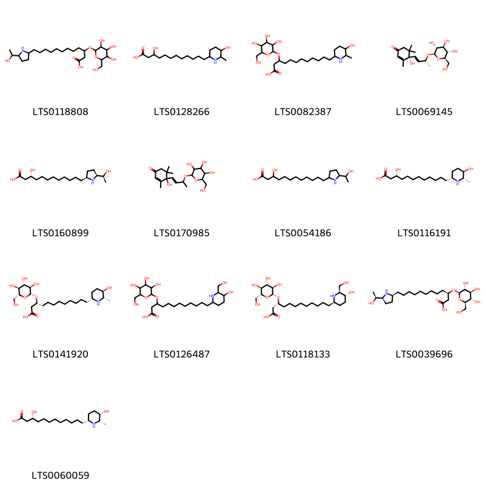
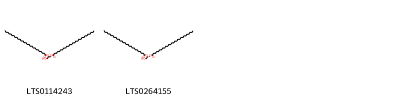
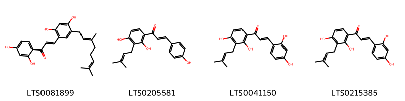

!!! abstract "Tóm tắt"

    Dâu (Vỏ rễ) (Cortex Mori albae radicis) là vỏ rễ đã cạo lớp bần, phơi hay sấy khô của cây Dâu tằm (Morus alba L-), thuộc họ Dâu tằm (Moraceae). Dược liệu có nguồn gốc từ Trung Quốc và đã được di thực vào Việt Nam từ lâu. Trong dân gian, vỏ rễ dâu tằm thường được sử dụng để làm thuốc lợi tiểu tiện, chữa các bệnh như thủy thũng, ho lâu ngày, hen, ho có đờm, băng huyết, sốt, và cao huyết áp. Liều dùng thông thường từ 6-18g mỗi ngày, dưới dạng thuốc sắc hoặc thuốc bột. Thành phần hóa học chính của vỏ rễ dâu tằm bao gồm flavonoid, coumarin, benzofuran, acid betulinic, tanin, ẞ-amyrin, polysaccarid, và một số hợp chất khác.

## Thông tin về thực vật

Dược liệu **Dâu (Vỏ Rễ)** từ bộ phận **Vỏ rễ** từ loài *Morus alba*.

**Mô tả thực vật:** Cây dâu là một cây có thể cao tới 15m, nhưng thường do hái lá luôn nên chỉ cao 2-3m. Lá mọc so le, hình bầu dục, nguyên hoặc chia thành 3 thuỳ, có lá kèm, đầu lá nhọn hay hơi tù, phía cuống hơi tròn hoặc hơi bằng, mép có răng cưa to. Từ cuống lá toả ra 3 gần rõ rệt. Hoa đơn tính, khác gốc, hoa đực mọc thành bông, có 4 lá đài, 4 nhị (có khi 3), hoa cái cũng mọc thành bông hay thành khối hình cầu, có 4 lá đài. Quả bế bao bọc trong các lá đài, mọng nước thành một quả phức (quả kép) màu đỏ, sau đen sẫm. Quả có thể ăn được và làm thuốc (tang thầm).

*Tài liệu tham khảo:* "Những cây thuốc và vị thuốc Việt Nam" - Đỗ Tất Lợi 
Trong dược điển Việt nam, một loài được sử dụng làm dược liệu là *Morus alba*.

!!! info "Phân loại thực vật của *Morus alba*"
    - **Kingdom:** Plantae
    - **Phylum:** Tracheophyta
    - **Order:** Rosales
    - **Family:** Moraceae
    - **Genus:** Morus
    - **Species:** *Morus alba*

**Phân bố trên thế giới:** Hungary, United States of America, Canada, India, Chinese Taipei, Italy, Kazakhstan, Ukraine, Armenia, Slovakia, Argentina, Greece, Mexico, Viet Nam, Romania, Australia, Russian Federation, China, Spain, South Africa, Hong Kong

**Phân bố tại Việt nam:** Quảng Nam

## Thông tin về dược liệu 

### Định danh

!!! info "Thông tin về tên gọi"

    - Dược liệu tiếng Việt: dâu
    - Dược liệu tiếng Trung: 桑柏皮 (Sang Bai Pi)
    - Dược liệu tiếng Anh: White Mulberry Root-Bark
    - Dược liệu latin thông dụng: Cortex Mori albae radicisnCortex Mori
    - Dược liệu latin kiểu DĐVN: *cortex mori albae radicis*
    - Dược liệu latin kiểu DĐVN: *Cortex Mori*
    - Dược liệu latin kiểu thông tư: **
    - Bộ phận dùng: Vỏ rễ (Cortex)

### Mô tả dược liệu 

- **Theo dược điển Việt nam V:** 

- **Mô tả dược liệu theo thông tư chế biến dược liệu theo phương pháp cổ truyền:** 

### Chế biến 

- **Chế biến theo dược điển việt nam V**: 

- **Chế biến theo thông tư:** 

--- 

## Thành phần hóa học

- Theo tài liệu của GS. Đỗ Tất Lợi:  (1) Flavonoid, coumarin, benzofuran, acid betulinic, tanin, ẞ amyrin, polysaccarid và một số thành phần khác.
(2) Morusin
    

**Thành phần hóa học từ loài **Morus alba**

Theo cơ sở dữ liệu lotus, loài *Morus alba* đã phân lập và xác định được **370** hoạt chất thuộc về các nhóm Diarylheptanoids, Piperidines, Fatty Acyls, Phenols, Carboxylic acids and derivatives, Steroids and steroid derivatives, Flavonoids, Tropane alkaloids, Benzopyrans, Pyrrolidines, Purine nucleosides, 2-arylbenzofuran flavonoids, Benzene and substituted derivatives, Stilbenes, Coumarins and derivatives, Prenol lipids, Organooxygen compounds, Lactones, Indoles and derivatives, Linear 1,3-diarylpropanoids, Glycerolipids trong bảng dưới đây. Danh sách các hoạt chất như sau (2s)-5,7-dihydroxy-2-[(2r)-5-hydroxy-2-methyl-2-(4-methylpent-3-en-1-yl)chromen-6-yl]-2,3-dihydro-1-benzopyran-4-one [(LTS0188087)](https://lotus.naturalproducts.net/compound/lotus_id/LTS0188087), (2s,3r,4s,5s,6r)-2-{4-[(1e)-2-(3-{[(2s,3r,4s,5s,6r)-6-({[(2r,3r,4r)-3,4-dihydroxy-4-(hydroxymethyl)oxolan-2-yl]oxy}methyl)-3,4,5-trihydroxyoxan-2-yl]oxy}-5-hydroxyphenyl)ethenyl]-3-hydroxyphenoxy}-6-(hydroxymethyl)oxane-3,4,5-triol [(LTS0199557)](https://lotus.naturalproducts.net/compound/lotus_id/LTS0199557), norartocarpetin [(LTS0089058)](https://lotus.naturalproducts.net/compound/lotus_id/LTS0089058), 5-[6-hydroxy-7-(3-methylbut-2-en-1-yl)-1-benzofuran-2-yl]benzene-1,3-diol [(LTS0170575)](https://lotus.naturalproducts.net/compound/lotus_id/LTS0170575), 8-{6-[2,4-dihydroxy-3-(3-methylbut-2-en-1-yl)benzoyl]-5-(2,4-dihydroxyphenyl)-3-methylcyclohex-2-en-1-yl}-2-(2,4-dihydroxyphenyl)-5,7-dihydroxy-3-(3-methylbut-2-en-1-yl)chromen-4-one [(LTS0051253)](https://lotus.naturalproducts.net/compound/lotus_id/LTS0051253), 5-{7-[(2e)-3,7-dimethylocta-2,6-dien-1-yl]-4-methoxy-1-benzofuran-2-yl}benzene-1,3-diol [(LTS0139592)](https://lotus.naturalproducts.net/compound/lotus_id/LTS0139592), 5-{6-[2,4-dihydroxy-3-(3-methylbut-2-en-1-yl)benzoyl]-5-(2,4-dihydroxyphenyl)-3-methylcyclohex-2-en-1-yl}-4,6,10,14-tetrahydroxy-1-(3-methylbut-2-en-1-yl)-9,17-dioxatetracyclo[8.7.0.0³,⁸.0¹¹,¹⁶]heptadeca-3,5,7,11,13,15-hexaen-2-one [(LTS0076953)](https://lotus.naturalproducts.net/compound/lotus_id/LTS0076953), (2s,3r,4s,5r,6r)-2-{[(3s,4s,5r,6r)-4,5-dihydroxy-6-(hydroxymethyl)piperidin-3-yl]oxy}-6-(hydroxymethyl)oxane-3,4,5-triol [(LTS0235934)](https://lotus.naturalproducts.net/compound/lotus_id/LTS0235934), (16s)-16-(2-hydroperoxypropan-2-yl)-11,20-dihydroxy-7,7-dimethyl-2,8,17-trioxapentacyclo[12.9.0.0³,¹².0⁴,⁹.0¹⁸,²³]tricosa-1(14),3,5,9,11,18,20,22-octaen-13-one [(LTS0248892)](https://lotus.naturalproducts.net/compound/lotus_id/LTS0248892), β-carotene [(LTS0275716)](https://lotus.naturalproducts.net/compound/lotus_id/LTS0275716), (2s)-5,7-dihydroxy-2-(5-hydroxy-2,2-dimethylchromen-6-yl)-2,3-dihydro-1-benzopyran-4-one [(LTS0168286)](https://lotus.naturalproducts.net/compound/lotus_id/LTS0168286), sanggenon f [(LTS0216230)](https://lotus.naturalproducts.net/compound/lotus_id/LTS0216230), 5-{7,7-dimethylfuro[3,2-g]chromen-2-yl}benzene-1,3-diol [(LTS0061535)](https://lotus.naturalproducts.net/compound/lotus_id/LTS0061535), kuwanon g [(LTS0002394)](https://lotus.naturalproducts.net/compound/lotus_id/LTS0002394), (3r)-3-hydroxy-12-[(2s,5s)-5-[(1s)-1-hydroxyethyl]pyrrolidin-2-yl]dodecanoic acid [(LTS0160899)](https://lotus.naturalproducts.net/compound/lotus_id/LTS0160899), 4-[(2s)-2-(2,4-dihydroxyphenyl)-7-methoxy-3,4-dihydro-2h-1-benzopyran-8-yl]butanoic acid [(LTS0274637)](https://lotus.naturalproducts.net/compound/lotus_id/LTS0274637), 8-[(8s,8ar,12ar)-2-(2,4-dihydroxyphenyl)-5-hydroxy-9,9,11-trimethyl-3-(3-methylbut-2-en-1-yl)-4-oxo-8h,8ah,10h,12ah-chromeno[7,8-c]isochromen-8-yl]-2-(2,4-dihydroxyphenyl)-5,7-dihydroxy-3-(3-methylbut-2-en-1-yl)chromen-4-one [(LTS0173678)](https://lotus.naturalproducts.net/compound/lotus_id/LTS0173678), kuwanon b [(LTS0055859)](https://lotus.naturalproducts.net/compound/lotus_id/LTS0055859), 2-(2,4-dihydroxyphenyl)-8-[5-(2,4-dihydroxyphenyl)-6-(5-hydroxy-2,2-dimethylchromene-6-carbonyl)-3-methylcyclohex-2-en-1-yl]-5,7-dihydroxy-3-(3-methylbut-2-en-1-yl)chromen-4-one [(LTS0169646)](https://lotus.naturalproducts.net/compound/lotus_id/LTS0169646), quercetin 3,7-diglucoside [(LTS0059170)](https://lotus.naturalproducts.net/compound/lotus_id/LTS0059170), 4-(3,7-dimethylocta-2,6-dien-1-yl)-5-(6-hydroxy-1-benzofuran-2-yl)benzene-1,3-diol [(LTS0003923)](https://lotus.naturalproducts.net/compound/lotus_id/LTS0003923), 5-[4-(3,7-dimethylocta-2,6-dien-1-yl)-6-hydroxy-5-methoxy-1-benzofuran-2-yl]benzene-1,3-diol [(LTS0078286)](https://lotus.naturalproducts.net/compound/lotus_id/LTS0078286), mevastatin [(LTS0122611)](https://lotus.naturalproducts.net/compound/lotus_id/LTS0122611), 5-[(11s)-11-hydroxy-12,12-dimethyl-4,13-dioxatricyclo[7.4.0.0³,⁷]trideca-1(9),2,5,7-tetraen-5-yl]benzene-1,3-diol [(LTS0258360)](https://lotus.naturalproducts.net/compound/lotus_id/LTS0258360), 2-(3,4-dihydroxyphenyl)-5,7-dihydroxy-3-{[(2s,3r,4r,5r,6s)-3,4,5-trihydroxy-6-(hydroxymethyl)oxan-2-yl]oxy}chromen-4-one [(LTS0241372)](https://lotus.naturalproducts.net/compound/lotus_id/LTS0241372), 8a-(hydroxymethyl)-4,4,6a,6b,11,12,14b-heptamethyl-2,3,4a,5,6,7,8,9,10,11,12,12a,14,14a-tetradecahydro-1h-picen-3-ol [(LTS0178123)](https://lotus.naturalproducts.net/compound/lotus_id/LTS0178123), (2r,3s,4s,5r,6s)-2-(hydroxymethyl)-6-[(5-methylidene-2h-furan-3-yl)oxy]oxane-3,4,5-triol [(LTS0256529)](https://lotus.naturalproducts.net/compound/lotus_id/LTS0256529), 1 deoxynojirimycin [(LTS0029077)](https://lotus.naturalproducts.net/compound/lotus_id/LTS0029077), 4-(2,4-dihydroxyphenyl)-8-[2-(2,4-dihydroxyphenyl)ethenyl]-10,18-dihydroxy-14-methyl-3,5,15-trioxahexacyclo[12.7.1.0²,⁴.0²,¹².0⁶,¹¹.0¹⁶,²¹]docosa-6,8,10,16,18,20-hexaen-13-one [(LTS0163381)](https://lotus.naturalproducts.net/compound/lotus_id/LTS0163381), (1r)-1-(2,4-dihydroxyphenyl)-17-(6-hydroxy-1-benzofuran-2-yl)-11-methyl-2,20-dioxapentacyclo[11.7.1.0³,⁸.0⁹,²¹.0¹⁴,¹⁹]henicosa-3,5,7,9,11,13(21),14,16,18-nonaene-5,10,15-triol [(LTS0169105)](https://lotus.naturalproducts.net/compound/lotus_id/LTS0169105), 4-[2-formyl-5-(methoxymethyl)pyrrol-1-yl]butanoic acid [(LTS0111360)](https://lotus.naturalproducts.net/compound/lotus_id/LTS0111360), 5-hydroxypipecolic acid [(LTS0145112)](https://lotus.naturalproducts.net/compound/lotus_id/LTS0145112), 2-{2-[2-(3,5-dihydroxyphenyl)ethenyl]-5-hydroxyphenoxy}-6-(hydroxymethyl)oxane-3,4,5-triol [(LTS0037217)](https://lotus.naturalproducts.net/compound/lotus_id/LTS0037217), 5-(6-hydroxy-1-benzofuran-2-yl)-2-[(1s,9s)-5-hydroxy-9-methyl-8-oxatricyclo[7.3.1.0²,⁷]trideca-2,4,6,10-tetraen-11-yl]benzene-1,3-diol [(LTS0132196)](https://lotus.naturalproducts.net/compound/lotus_id/LTS0132196), skimmin [(LTS0063676)](https://lotus.naturalproducts.net/compound/lotus_id/LTS0063676), 1-(3-{6-[2,4-dihydroxy-3-(3-methylbut-2-en-1-yl)benzoyl]-5-(2,4-dihydroxyphenyl)-3-methylcyclohex-2-en-1-yl}-2,4-dihydroxyphenyl)-3-(4-hydroxyphenyl)prop-2-en-1-one [(LTS0014346)](https://lotus.naturalproducts.net/compound/lotus_id/LTS0014346), sanggenon c [(LTS0193108)](https://lotus.naturalproducts.net/compound/lotus_id/LTS0193108), amyrin [(LTS0222826)](https://lotus.naturalproducts.net/compound/lotus_id/LTS0222826), 5-hydroxy-7-{[(2s,3r,4s,5s,6r)-3,4,5-trihydroxy-6-(hydroxymethyl)oxan-2-yl]oxy}chromen-2-one [(LTS0011119)](https://lotus.naturalproducts.net/compound/lotus_id/LTS0011119), (2r,3r,4s,5s,6r)-2-{2-[(2s)-7-hydroxy-8-(2-hydroxyethyl)-3,4-dihydro-2h-1-benzopyran-2-yl]-5-methoxyphenoxy}-6-(hydroxymethyl)oxane-3,4,5-triol [(LTS0016713)](https://lotus.naturalproducts.net/compound/lotus_id/LTS0016713), 7-[6-(2,4-dihydroxybenzoyl)-5-(2,4-dihydroxyphenyl)-3-methylcyclohex-2-en-1-yl]-1,4,6,14-tetrahydroxy-10-(3-methylbut-2-en-1-yl)-9,17-dioxatetracyclo[8.7.0.0³,⁸.0¹¹,¹⁶]heptadeca-3(8),4,6,11,13,15-hexaen-2-one [(LTS0145258)](https://lotus.naturalproducts.net/compound/lotus_id/LTS0145258), (1s,2r,4s,12r,14s)-4-(2,4-dihydroxyphenyl)-10,18-dihydroxy-8-(6-hydroxy-1-benzofuran-2-yl)-14-methyl-3,5,15-trioxahexacyclo[12.7.1.0²,⁴.0²,¹².0⁶,¹¹.0¹⁶,²¹]docosa-6,8,10,16,18,20-hexaen-13-one [(LTS0210436)](https://lotus.naturalproducts.net/compound/lotus_id/LTS0210436), 2-{[4-hydroxy-5-(hydroxymethyl)pyrrolidin-3-yl]oxy}-6-(hydroxymethyl)oxane-3,4,5-triol [(LTS0271451)](https://lotus.naturalproducts.net/compound/lotus_id/LTS0271451), 8-[(1r,5s,6r)-6-[2,4-dihydroxy-3-(3-methylbut-2-en-1-yl)benzoyl]-5-(2,4-dihydroxyphenyl)-3-methylcyclohex-2-en-1-yl]-2-(2,4-dihydroxyphenyl)-5,7-dihydroxy-3-(3-methylbut-2-en-1-yl)chromen-4-one [(LTS0052274)](https://lotus.naturalproducts.net/compound/lotus_id/LTS0052274), (1r)-1-(2,4-dihydroxyphenyl)-17-(6-hydroxy-1-benzofuran-2-yl)-11-methyl-2,20-dioxapentacyclo[11.7.1.0³,⁸.0⁹,²¹.0¹⁴,¹⁹]henicosa-3,5,7,9(21),10,12,14,16,18-nonaene-5,15-diol [(LTS0169674)](https://lotus.naturalproducts.net/compound/lotus_id/LTS0169674), (1r,2s,3r,4s,5r)-8-azabicyclo[3.2.1]octane-1,2,3,4-tetrol [(LTS0001773)](https://lotus.naturalproducts.net/compound/lotus_id/LTS0001773), 2-{[2-(3,5-dihydroxyphenyl)-1-benzofuran-6-yl]oxy}-6-(hydroxymethyl)oxane-3,4,5-triol [(LTS0180662)](https://lotus.naturalproducts.net/compound/lotus_id/LTS0180662), 5-{11-hydroxy-12,12-dimethyl-4,13-dioxatricyclo[7.4.0.0³,⁷]trideca-1(9),2,5-trien-5-yl}benzene-1,3-diol [(LTS0243726)](https://lotus.naturalproducts.net/compound/lotus_id/LTS0243726), (2s)-2-[5-(3,7-dimethylocta-2,6-dien-1-yl)-2,4-dihydroxyphenyl]-5,7-dihydroxy-8-(3-methylbut-2-en-1-yl)-2,3-dihydro-1-benzopyran-4-one [(LTS0019430)](https://lotus.naturalproducts.net/compound/lotus_id/LTS0019430), (1r,9s,13s,21r)-1-(2,4-dihydroxyphenyl)-17-(6-hydroxy-1-benzofuran-2-yl)-11-methyl-2,20-dioxapentacyclo[11.7.1.0³,⁸.0⁹,²¹.0¹⁴,¹⁹]henicosa-3,5,7,11,14,16,18-heptaene-5,15-diol [(LTS0132502)](https://lotus.naturalproducts.net/compound/lotus_id/LTS0132502), 1-[2,4-dihydroxy-3-(3-methylbut-2-en-1-yl)phenyl]-17-(6-hydroxy-1-benzofuran-2-yl)-11-methyl-2,20-dioxapentacyclo[11.7.1.0³,⁸.0⁹,²¹.0¹⁴,¹⁹]henicosa-3,5,7,11,14,16,18-heptaene-5,15-diol [(LTS0238656)](https://lotus.naturalproducts.net/compound/lotus_id/LTS0238656), (2e)-1-{3-[(1r,5s,6r)-6-[2,4-dihydroxy-3-(3-methylbut-2-en-1-yl)benzoyl]-5-(2,4-dihydroxyphenyl)-3-methylcyclohex-2-en-1-yl]-2,4-dihydroxyphenyl}-3-(2,4-dihydroxyphenyl)prop-2-en-1-one [(LTS0199406)](https://lotus.naturalproducts.net/compound/lotus_id/LTS0199406), 5-[6-hydroxy-5-(3-methylbut-2-en-1-yl)-1-benzofuran-2-yl]benzene-1,3-diol [(LTS0087524)](https://lotus.naturalproducts.net/compound/lotus_id/LTS0087524), 2-[(1s,5r,6s)-6-(2,4-dihydroxybenzoyl)-5-(2,4-dihydroxyphenyl)-3-methylcyclohex-2-en-1-yl]-5-(6-hydroxy-1-benzofuran-2-yl)benzene-1,3-diol [(LTS0203736)](https://lotus.naturalproducts.net/compound/lotus_id/LTS0203736), sitogluside [(LTS0201798)](https://lotus.naturalproducts.net/compound/lotus_id/LTS0201798), (1s,9r,13r,21s)-1-[2,4-dihydroxy-3-(3-methylbut-2-en-1-yl)phenyl]-17-(6-hydroxy-1-benzofuran-2-yl)-11-methyl-2,20-dioxapentacyclo[11.7.1.0³,⁸.0⁹,²¹.0¹⁴,¹⁹]henicosa-3,5,7,11,14,16,18-heptaene-5,15-diol [(LTS0110780)](https://lotus.naturalproducts.net/compound/lotus_id/LTS0110780), (2s,3r,4s,5r)-2-[3-(5-{[(2s)-3,3-dimethyloxiran-2-yl]methyl}-6-hydroxy-1-benzofuran-2-yl)-5-hydroxyphenoxy]oxane-3,4,5-triol [(LTS0190354)](https://lotus.naturalproducts.net/compound/lotus_id/LTS0190354), (2s)-n-[(2s)-1-(acetyloxy)-3-phenylpropan-2-yl]-2-{[hydroxy(phenyl)methylidene]amino}-3-phenylpropanimidic acid [(LTS0004100)](https://lotus.naturalproducts.net/compound/lotus_id/LTS0004100), 4-(2-formylpyrrol-1-yl)butanoic acid [(LTS0095322)](https://lotus.naturalproducts.net/compound/lotus_id/LTS0095322), esculin [(LTS0228636)](https://lotus.naturalproducts.net/compound/lotus_id/LTS0228636), 2-[5-(3,7-dimethylocta-2,6-dien-1-yl)-2,4-dihydroxyphenyl]-5,7-dihydroxy-2,3-dihydro-1-benzopyran-4-one [(LTS0036031)](https://lotus.naturalproducts.net/compound/lotus_id/LTS0036031), 16-hydroxy-6-(6-hydroxy-1-benzofuran-2-yl)-12-methyl-11-oxo-3,13-dioxapentacyclo[10.7.1.0²,¹⁰.0⁴,⁹.0¹⁴,¹⁹]icosa-1(20),4,6,8,14,16,18-heptaen-8-yl 2,4-dihydroxybenzoate [(LTS0095747)](https://lotus.naturalproducts.net/compound/lotus_id/LTS0095747), (2s)-2-(2,4-dihydroxyphenyl)-5,7-dihydroxy-2,3-dihydro-1-benzopyran-4-one [(LTS0150852)](https://lotus.naturalproducts.net/compound/lotus_id/LTS0150852), 5-[6-methoxy-7-(3-methylbut-2-en-1-yl)-1-benzofuran-2-yl]benzene-1,3-diol [(LTS0062449)](https://lotus.naturalproducts.net/compound/lotus_id/LTS0062449), 2-({[3,4,5-trihydroxy-6-(hydroxymethyl)oxan-2-yl]oxy}methyl)piperidine-3,4,5-triol [(LTS0142175)](https://lotus.naturalproducts.net/compound/lotus_id/LTS0142175), 1-[2-(3,5-dihydroxyphenyl)-6-hydroxy-5-methoxy-1-benzofuran-4-yl]-3-methylbutan-2-one [(LTS0209715)](https://lotus.naturalproducts.net/compound/lotus_id/LTS0209715), 2-(3,5-dihydroxyphenyl)-1-benzofuran-5,6-diol [(LTS0236534)](https://lotus.naturalproducts.net/compound/lotus_id/LTS0236534), kuwanol d [(LTS0081899)](https://lotus.naturalproducts.net/compound/lotus_id/LTS0081899), (+)-taxifolin [(LTS0090664)](https://lotus.naturalproducts.net/compound/lotus_id/LTS0090664), (2s,3r,4s,5s,6r)-2-{[(2r,3r,4r,5s)-3,5-dihydroxy-2-(hydroxymethyl)piperidin-4-yl]oxy}-6-(hydroxymethyl)oxane-3,4,5-triol [(LTS0218106)](https://lotus.naturalproducts.net/compound/lotus_id/LTS0218106), 6-[(1s,5s,6r)-6-[2,4-dihydroxy-3-(3-methylbut-2-en-1-yl)benzoyl]-5-(2,4-dihydroxyphenyl)-3-methylcyclohex-2-en-1-yl]-2-(2,4-dihydroxyphenyl)-5,7-dihydroxychromen-4-one [(LTS0193135)](https://lotus.naturalproducts.net/compound/lotus_id/LTS0193135), (2s)-2-{3-[(1s,5r,6s)-6-(2,4-dihydroxybenzoyl)-5-(2,4-dihydroxyphenyl)-3-methylcyclohex-2-en-1-yl]-2,4-dihydroxyphenyl}-5,7-dihydroxy-2,3-dihydro-1-benzopyran-4-one [(LTS0102605)](https://lotus.naturalproducts.net/compound/lotus_id/LTS0102605), morachalcone a [(LTS0215385)](https://lotus.naturalproducts.net/compound/lotus_id/LTS0215385), 2-{3-hydroxy-5-[2-(2-hydroxy-4-{[3,4,5-trihydroxy-6-(hydroxymethyl)oxan-2-yl]oxy}phenyl)ethenyl]phenoxy}-6-(hydroxymethyl)oxane-3,4,5-triol [(LTS0057716)](https://lotus.naturalproducts.net/compound/lotus_id/LTS0057716), (2s,3r,4s,5s,6r)-2-{3-hydroxy-5-[(1e)-2-(2-hydroxy-4-{[(2s,3r,4s,5s,6r)-3,4,5-trihydroxy-6-(hydroxymethyl)oxan-2-yl]oxy}phenyl)ethenyl]phenoxy}-6-(hydroxymethyl)oxane-3,4,5-triol [(LTS0039129)](https://lotus.naturalproducts.net/compound/lotus_id/LTS0039129), 2-(3-{6-[2,4-dihydroxy-3-(3-methylbut-2-en-1-yl)benzoyl]-5-(2,4-dihydroxyphenyl)-3-methylcyclohex-2-en-1-yl}-2,4-dihydroxyphenyl)-5,7-dihydroxy-3-(3-methylbut-2-en-1-yl)chromen-4-one [(LTS0041106)](https://lotus.naturalproducts.net/compound/lotus_id/LTS0041106), 1-deoxynojirimycin [(LTS0004153)](https://lotus.naturalproducts.net/compound/lotus_id/LTS0004153), β-amyrin [(LTS0251864)](https://lotus.naturalproducts.net/compound/lotus_id/LTS0251864), flavan [(LTS0047997)](https://lotus.naturalproducts.net/compound/lotus_id/LTS0047997), (1s,2r,3r,5r)-8-azabicyclo[3.2.1]octane-2,3-diol [(LTS0049151)](https://lotus.naturalproducts.net/compound/lotus_id/LTS0049151), (2r)-5,7-dihydroxy-2-(5-hydroxy-2,2-dimethylchromen-8-yl)-2,3-dihydro-1-benzopyran-4-one [(LTS0031820)](https://lotus.naturalproducts.net/compound/lotus_id/LTS0031820), (-)-epigallocatechin gallate [(LTS0173211)](https://lotus.naturalproducts.net/compound/lotus_id/LTS0173211), ursolic acid [(LTS0250838)](https://lotus.naturalproducts.net/compound/lotus_id/LTS0250838), 2-{[4-hydroxy-2-(hydroxymethyl)piperidin-3-yl]oxy}-6-(hydroxymethyl)oxane-3,4,5-triol [(LTS0060330)](https://lotus.naturalproducts.net/compound/lotus_id/LTS0060330), leachianone g [(LTS0160359)](https://lotus.naturalproducts.net/compound/lotus_id/LTS0160359), 5-[(11r)-11-hydroxy-12,12-dimethyl-4,13-dioxatricyclo[7.4.0.0³,⁷]trideca-1(9),2,5,7-tetraen-5-yl]benzene-1,3-diol [(LTS0001444)](https://lotus.naturalproducts.net/compound/lotus_id/LTS0001444), cichoriin [(LTS0075962)](https://lotus.naturalproducts.net/compound/lotus_id/LTS0075962), 8-azabicyclo[3.2.1]octane-2,3,4-triol [(LTS0274985)](https://lotus.naturalproducts.net/compound/lotus_id/LTS0274985), 2-(3-{5-[(3,3-dimethyloxiran-2-yl)methyl]-6-hydroxy-1-benzofuran-2-yl}-5-hydroxyphenoxy)oxane-3,4,5-triol [(LTS0072876)](https://lotus.naturalproducts.net/compound/lotus_id/LTS0072876), 2-[3-hydroxy-5-(6-hydroxy-1-benzofuran-2-yl)phenoxy]-6-(hydroxymethyl)oxane-3,4,5-triol [(LTS0026487)](https://lotus.naturalproducts.net/compound/lotus_id/LTS0026487), 2-{3-hydroxy-5-[(1z)-2-(2-hydroxy-4-{[3,4,5-trihydroxy-6-(hydroxymethyl)oxan-2-yl]oxy}phenyl)ethenyl]phenoxy}-6-(hydroxymethyl)oxane-3,4,5-triol [(LTS0066469)](https://lotus.naturalproducts.net/compound/lotus_id/LTS0066469), 2-{4-[2-(3-{[6-({[3,4-dihydroxy-4-(hydroxymethyl)oxolan-2-yl]oxy}methyl)-3,4,5-trihydroxyoxan-2-yl]oxy}-5-hydroxyphenyl)ethenyl]-3-hydroxyphenoxy}-6-(hydroxymethyl)oxane-3,4,5-triol [(LTS0271256)](https://lotus.naturalproducts.net/compound/lotus_id/LTS0271256), sanggenon d [(LTS0014488)](https://lotus.naturalproducts.net/compound/lotus_id/LTS0014488), gallocatechol [(LTS0267305)](https://lotus.naturalproducts.net/compound/lotus_id/LTS0267305), rutin [(LTS0042292)](https://lotus.naturalproducts.net/compound/lotus_id/LTS0042292), 16-(2-hydroperoxypropan-2-yl)-11,20-dihydroxy-7,7-dimethyl-2,8,17-trioxapentacyclo[12.9.0.0³,¹².0⁴,⁹.0¹⁸,²³]tricosa-1(14),3,5,9,11,18,20,22-octaen-13-one [(LTS0096181)](https://lotus.naturalproducts.net/compound/lotus_id/LTS0096181), iminoribitol [(LTS0233094)](https://lotus.naturalproducts.net/compound/lotus_id/LTS0233094), 2-[3-hydroxy-5-(6-{[3,4,5-trihydroxy-6-(hydroxymethyl)oxan-2-yl]oxy}-1-benzofuran-2-yl)phenoxy]-6-(hydroxymethyl)oxane-3,4,5-triol [(LTS0054444)](https://lotus.naturalproducts.net/compound/lotus_id/LTS0054444), 1-hydroxy-3-(octacosanoyloxy)propan-2-yl octacosanoate [(LTS0114243)](https://lotus.naturalproducts.net/compound/lotus_id/LTS0114243), 2-[5-(6-hydroxy-1-benzofuran-2-yl)-2-(3-methylbut-2-en-1-yl)-3-{[3,4,5-trihydroxy-6-(hydroxymethyl)oxan-2-yl]oxy}phenoxy]-6-(hydroxymethyl)oxane-3,4,5-triol [(LTS0266428)](https://lotus.naturalproducts.net/compound/lotus_id/LTS0266428), (16r)-11,20-dihydroxy-16-(2-hydroxypropan-2-yl)-7,7-dimethyl-2,8,17-trioxapentacyclo[12.9.0.0³,¹².0⁴,⁹.0¹⁸,²³]tricosa-1(14),3,5,9,11,18,20,22-octaen-13-one [(LTS0232474)](https://lotus.naturalproducts.net/compound/lotus_id/LTS0232474), α-amyrin acetate [(LTS0224810)](https://lotus.naturalproducts.net/compound/lotus_id/LTS0224810), (2s,3r,4s,5r)-2-(3-hydroxy-5-{11-hydroxy-12,12-dimethyl-4,13-dioxatricyclo[7.4.0.0³,⁷]trideca-1(9),2,5,7-tetraen-5-yl}phenoxy)oxane-3,4,5-triol [(LTS0252624)](https://lotus.naturalproducts.net/compound/lotus_id/LTS0252624), (2s,3r,4s,5s,6r)-2-{3-hydroxy-5-[(1z)-2-(2-hydroxy-4-{[(2s,3r,4s,5s,6r)-3,4,5-trihydroxy-6-(hydroxymethyl)oxan-2-yl]oxy}phenyl)ethenyl]phenoxy}-6-(hydroxymethyl)oxane-3,4,5-triol [(LTS0116192)](https://lotus.naturalproducts.net/compound/lotus_id/LTS0116192), (2s,3r,4s,5s,6r)-2-[3-hydroxy-5-(6-{[(2s,3r,4s,5s,6r)-3,4,5-trihydroxy-6-(hydroxymethyl)oxan-2-yl]oxy}-1-benzofuran-2-yl)phenoxy]-6-(hydroxymethyl)oxane-3,4,5-triol [(LTS0157731)](https://lotus.naturalproducts.net/compound/lotus_id/LTS0157731), 4-{10-hydroxy-5,13-dioxatricyclo[7.4.0.0²,⁶]trideca-1,6,8-trien-12-yl}benzene-1,3-diol [(LTS0072803)](https://lotus.naturalproducts.net/compound/lotus_id/LTS0072803), (2s,3r,4s,5s,6r)-2-{[(2r,3r,4r,5s)-4,5-dihydroxy-2-(hydroxymethyl)piperidin-3-yl]oxy}-6-(hydroxymethyl)oxane-3,4,5-triol [(LTS0192387)](https://lotus.naturalproducts.net/compound/lotus_id/LTS0192387), 4-[2-formyl-5-(hydroxymethyl)pyrrol-1-yl]butanoic acid [(LTS0267573)](https://lotus.naturalproducts.net/compound/lotus_id/LTS0267573), (2s)-2-{3-[(1s,5r,6s)-6-[2,4-dihydroxy-3-(3-methylbut-2-en-1-yl)benzoyl]-5-(2,4-dihydroxyphenyl)-3-methylcyclohex-2-en-1-yl]-2,4-dihydroxyphenyl}-5,7-dihydroxy-2,3-dihydro-1-benzopyran-4-one [(LTS0080277)](https://lotus.naturalproducts.net/compound/lotus_id/LTS0080277), 2-[(1r,5s,6r)-6-(2,4-dihydroxybenzoyl)-5-(2,4-dihydroxyphenyl)-3-methylcyclohex-2-en-1-yl]-5-(6-hydroxy-1-benzofuran-2-yl)benzene-1,3-diol [(LTS0012961)](https://lotus.naturalproducts.net/compound/lotus_id/LTS0012961), (2r,3r,4s,5r,6r)-2-(benzyloxy)-6-(hydroxymethyl)oxane-3,4,5-triol [(LTS0107980)](https://lotus.naturalproducts.net/compound/lotus_id/LTS0107980), flavan-4-ol [(LTS0239668)](https://lotus.naturalproducts.net/compound/lotus_id/LTS0239668), 16-(2-hydroperoxypropan-2-yl)-11,20-dihydroxy-7,7-dimethyl-2,8,17-trioxapentacyclo[12.9.0.0³,¹².0⁴,⁹.0¹⁸,²³]tricosa-3(12),4(9),5,10,18,20,22-heptaen-13-one [(LTS0017587)](https://lotus.naturalproducts.net/compound/lotus_id/LTS0017587), methyl (1s,2r,4as,6as,6br,8ar,10s,12ar,12br,14br)-10-hydroxy-1,2,6a,6b,9,9,12a-heptamethyl-2,3,4,5,6,7,8,8a,10,11,12,12b,13,14b-tetradecahydro-1h-picene-4a-carboxylate [(LTS0231950)](https://lotus.naturalproducts.net/compound/lotus_id/LTS0231950), 5-{6-hydroxy-5-[(2z)-4-hydroxy-3-methylbut-2-en-1-yl]-1-benzofuran-2-yl}benzene-1,3-diol [(LTS0229403)](https://lotus.naturalproducts.net/compound/lotus_id/LTS0229403), 3-hydroxy-12-[5-(1-hydroxyethyl)pyrrolidin-2-yl]dodecanoic acid [(LTS0054186)](https://lotus.naturalproducts.net/compound/lotus_id/LTS0054186), (2r)-2,5,7,8-tetramethyl-2-[(4s,8s)-4,8,12-trimethyltridecyl]-3,4-dihydro-1-benzopyran-6-ol [(LTS0130040)](https://lotus.naturalproducts.net/compound/lotus_id/LTS0130040), (1s,12s)-16-hydroxy-6-(6-hydroxy-1-benzofuran-2-yl)-12-methyl-11-oxo-3,13-dioxapentacyclo[10.7.1.0²,¹⁰.0⁴,⁹.0¹⁴,¹⁹]icosa-2(10),4,6,8,14,16,18-heptaen-8-yl 2,4-dihydroxybenzoate [(LTS0189553)](https://lotus.naturalproducts.net/compound/lotus_id/LTS0189553), (2e)-1-{3-[(1r,5r,6s)-6-[2,4-dihydroxy-3-(3-methylbut-2-en-1-yl)benzoyl]-5-(2,4-dihydroxyphenyl)-3-methylcyclohex-2-en-1-yl]-2,4-dihydroxyphenyl}-3-(2,4-dihydroxyphenyl)prop-2-en-1-one [(LTS0135314)](https://lotus.naturalproducts.net/compound/lotus_id/LTS0135314), betulinic acid [(LTS0210795)](https://lotus.naturalproducts.net/compound/lotus_id/LTS0210795), (2s,3r,4s,5s,6r)-2-{3-hydroxy-5-[(1e)-2-(2-hydroxy-4-{[(2s,3r,4s,5s,6r)-3,4,5-trihydroxy-6-({[(2r,3r,4s,5s,6r)-3,4,5-trihydroxy-6-(hydroxymethyl)oxan-2-yl]oxy}methyl)oxan-2-yl]oxy}phenyl)ethenyl]phenoxy}-6-(hydroxymethyl)oxane-3,4,5-triol [(LTS0228278)](https://lotus.naturalproducts.net/compound/lotus_id/LTS0228278), (2r,3r,4s,5s,6r)-2-{3-hydroxy-5-[(1z)-2-(2-hydroxy-4-{[(2r,3r,4s,5s,6r)-3,4,5-trihydroxy-6-(hydroxymethyl)oxan-2-yl]oxy}phenyl)ethenyl]phenoxy}-6-(hydroxymethyl)oxane-3,4,5-triol [(LTS0209315)](https://lotus.naturalproducts.net/compound/lotus_id/LTS0209315), (1s,2s,3r,5r)-8-azabicyclo[3.2.1]octane-2,3-diol [(LTS0254199)](https://lotus.naturalproducts.net/compound/lotus_id/LTS0254199), flavan skeleton [(LTS0244489)](https://lotus.naturalproducts.net/compound/lotus_id/LTS0244489), 5-{4-[(2e)-3,7-dimethylocta-2,6-dien-1-yl]-6-hydroxy-5-methoxy-1-benzofuran-2-yl}benzene-1,3-diol [(LTS0216229)](https://lotus.naturalproducts.net/compound/lotus_id/LTS0216229), 5-[(1e)-2-(2,4-dihydroxyphenyl)ethenyl]benzene-1,3-diol [(LTS0044764)](https://lotus.naturalproducts.net/compound/lotus_id/LTS0044764), 5,7-dihydroxy-6-[3,4,5-trihydroxy-6-(hydroxymethyl)oxan-2-yl]chromen-2-one [(LTS0172764)](https://lotus.naturalproducts.net/compound/lotus_id/LTS0172764), (2s,3r,4s,5s,6r)-2-[5-(6-hydroxy-1-benzofuran-2-yl)-2-(3-methylbut-2-en-1-yl)-3-{[(2s,3r,4s,5s,6r)-3,4,5-trihydroxy-6-(hydroxymethyl)oxan-2-yl]oxy}phenoxy]-6-(hydroxymethyl)oxane-3,4,5-triol [(LTS0231548)](https://lotus.naturalproducts.net/compound/lotus_id/LTS0231548), 2-(2-hydroxy-4-methoxyphenyl)-8-(3-methylbut-2-en-1-yl)-3,4-dihydro-2h-1-benzopyran-7-ol [(LTS0022485)](https://lotus.naturalproducts.net/compound/lotus_id/LTS0022485), 2-[6-(2,4-dihydroxybenzoyl)-5-(2,4-dihydroxyphenyl)-3-methylcyclohex-2-en-1-yl]-5-(6-hydroxy-1-benzofuran-2-yl)benzene-1,3-diol [(LTS0111262)](https://lotus.naturalproducts.net/compound/lotus_id/LTS0111262), 8-azabicyclo[3.2.1]octan-3-ol [(LTS0050564)](https://lotus.naturalproducts.net/compound/lotus_id/LTS0050564), 2-{[4,5-dihydroxy-6-(hydroxymethyl)piperidin-3-yl]oxy}-6-(hydroxymethyl)oxane-3,4,5-triol [(LTS0131738)](https://lotus.naturalproducts.net/compound/lotus_id/LTS0131738), 4-(6-hydroxy-1-benzofuran-2-carbonyl)-2-[(2r)-2-hydroxy-3-methylbut-3-en-1-yl]benzene-1,3-diol [(LTS0172446)](https://lotus.naturalproducts.net/compound/lotus_id/LTS0172446), (2s)-5,7-dihydroxy-2-[(2r)-7-hydroxy-2-methyl-2-(4-methylpent-3-en-1-yl)chromen-6-yl]-2,3-dihydro-1-benzopyran-4-one [(LTS0000426)](https://lotus.naturalproducts.net/compound/lotus_id/LTS0000426), 2-[(1s,5s,6r)-6-(2,4-dihydroxybenzoyl)-5-(2,4-dihydroxyphenyl)-3-methylcyclohex-2-en-1-yl]-5-[(1e)-2-(2,4-dihydroxyphenyl)ethenyl]benzene-1,3-diol [(LTS0050760)](https://lotus.naturalproducts.net/compound/lotus_id/LTS0050760), isoquercetin [(LTS0254337)](https://lotus.naturalproducts.net/compound/lotus_id/LTS0254337), (2r,3r,4r)-2-(hydroxymethyl)pyrrolidine-3,4-diol [(LTS0075060)](https://lotus.naturalproducts.net/compound/lotus_id/LTS0075060), (2s)-1-hydroxy-3-(octacosanoyloxy)propan-2-yl octacosanoate [(LTS0264155)](https://lotus.naturalproducts.net/compound/lotus_id/LTS0264155), (2s,5r)-5-hydroxypiperidine-2-carboxylic acid [(LTS0065408)](https://lotus.naturalproducts.net/compound/lotus_id/LTS0065408), 2-[(1r,5r,6s)-6-[2,4-dihydroxy-3-(3-methylbut-2-en-1-yl)benzoyl]-5-(4-hydroxyphenyl)-3-methylcyclohex-2-en-1-yl]-5-(6-hydroxy-1-benzofuran-2-yl)benzene-1,3-diol [(LTS0169717)](https://lotus.naturalproducts.net/compound/lotus_id/LTS0169717), 4-[6-(2,4-dihydroxybenzoyl)-5-(2,4-dihydroxyphenyl)-3-methylcyclohex-2-en-1-yl]-6-[2-(3,5-dihydroxyphenyl)ethenyl]benzene-1,3-diol [(LTS0264686)](https://lotus.naturalproducts.net/compound/lotus_id/LTS0264686), (2s,3r,4s,5s,6r)-2-{4-[(1e)-2-(3-hydroxy-5-{[(2s,3r,4s,5s,6r)-3,4,5-trihydroxy-6-(hydroxymethyl)oxan-2-yl]oxy}phenyl)ethenyl]phenoxy}-6-(hydroxymethyl)oxane-3,4,5-triol [(LTS0115455)](https://lotus.naturalproducts.net/compound/lotus_id/LTS0115455), (2e)-1-{3-[(1r,5r,6s)-6-[2,4-dihydroxy-3-(3-methylbut-2-en-1-yl)benzoyl]-5-(3,5-dihydroxyphenyl)-3-methylcyclohex-2-en-1-yl]-2,4-dihydroxyphenyl}-3-(2,4-dihydroxyphenyl)prop-2-en-1-one [(LTS0067239)](https://lotus.naturalproducts.net/compound/lotus_id/LTS0067239), 2-[(1r,5r,6s)-6-[2,4-dihydroxy-3-(3-methylbut-2-en-1-yl)benzoyl]-5-(2,4-dihydroxyphenyl)-3-methylcyclohex-2-en-1-yl]-5-[6-hydroxy-7-(3-methylbut-2-en-1-yl)-1-benzofuran-2-yl]benzene-1,3-diol [(LTS0086783)](https://lotus.naturalproducts.net/compound/lotus_id/LTS0086783), 4-[(2s)-7-methoxy-8-(3-methylbut-2-en-1-yl)-3,4-dihydro-2h-1-benzopyran-2-yl]benzene-1,3-diol [(LTS0133509)](https://lotus.naturalproducts.net/compound/lotus_id/LTS0133509), 1-[2,4-dihydroxy-3-(3-methylbut-2-en-1-yl)phenyl]-3-(2,4-dihydroxyphenyl)prop-2-en-1-one [(LTS0041150)](https://lotus.naturalproducts.net/compound/lotus_id/LTS0041150), (2s)-2-(2,4-dihydroxyphenyl)-5-hydroxy-8-methyl-8-(4-methylpent-3-en-1-yl)-2h,3h-pyrano[3,2-g]chromen-4-one [(LTS0068040)](https://lotus.naturalproducts.net/compound/lotus_id/LTS0068040), 2-[5-(3,7-dimethylocta-2,6-dien-1-yl)-2-hydroxy-4-methoxyphenyl]-5,7-dihydroxy-2,3-dihydro-1-benzopyran-4-one [(LTS0113813)](https://lotus.naturalproducts.net/compound/lotus_id/LTS0113813), stigmast-5-en-3-ol, (3β)- [(LTS0204616)](https://lotus.naturalproducts.net/compound/lotus_id/LTS0204616), 4-(2,4-dihydroxyphenyl)-10,18-dihydroxy-8-(6-hydroxy-1-benzofuran-2-yl)-14-methyl-3,5,15-trioxahexacyclo[12.7.1.0²,⁴.0²,¹².0⁶,¹¹.0¹⁶,²¹]docosa-6,8,10,16,18,20-hexaen-13-one [(LTS0233355)](https://lotus.naturalproducts.net/compound/lotus_id/LTS0233355), moralbanone [(LTS0159371)](https://lotus.naturalproducts.net/compound/lotus_id/LTS0159371), 8-azabicyclo[3.2.1]octane-2,3,6-triol [(LTS0255825)](https://lotus.naturalproducts.net/compound/lotus_id/LTS0255825), (3r)-3-hydroxy-12-[(2r,5r,6s)-5-hydroxy-6-methylpiperidin-2-yl]dodecanoic acid [(LTS0116191)](https://lotus.naturalproducts.net/compound/lotus_id/LTS0116191), quercetin [(LTS0004651)](https://lotus.naturalproducts.net/compound/lotus_id/LTS0004651), 2-[3-hydroxy-5-methoxy-4-(3-methylbut-2-en-1-yl)phenyl]-1-benzofuran-6-ol [(LTS0011667)](https://lotus.naturalproducts.net/compound/lotus_id/LTS0011667), n-[1-(acetyloxy)-3-phenylpropan-2-yl]-2-{[hydroxy(phenyl)methylidene]amino}-3-phenylpropanimidic acid [(LTS0156307)](https://lotus.naturalproducts.net/compound/lotus_id/LTS0156307), (2r)-5,7-dihydroxy-2-[(2r)-5-hydroxy-2-methyl-2-(4-methylpent-3-en-1-yl)chromen-8-yl]-2,3-dihydro-1-benzopyran-4-one [(LTS0152870)](https://lotus.naturalproducts.net/compound/lotus_id/LTS0152870), 2-[3-(3,7-dimethylocta-2,6-dien-1-yl)-4-hydroxyphenyl]-5,7-dihydroxychromen-4-one [(LTS0094993)](https://lotus.naturalproducts.net/compound/lotus_id/LTS0094993), (2r,3r,4s,5s,6r)-2-{[(2r,3r,4r,5s)-4,5-dihydroxy-2-(hydroxymethyl)piperidin-3-yl]oxy}-6-(hydroxymethyl)oxane-3,4,5-triol [(LTS0190353)](https://lotus.naturalproducts.net/compound/lotus_id/LTS0190353), 3-epi-fagomine [(LTS0252876)](https://lotus.naturalproducts.net/compound/lotus_id/LTS0252876), 8-[6-(2,4-dihydroxybenzoyl)-5-(2,4-dihydroxyphenyl)-3-methylcyclohex-2-en-1-yl]-2-(2,4-dihydroxyphenyl)-5,7-dihydroxy-3-(3-hydroxy-3-methylbutyl)chromen-4-one [(LTS0136607)](https://lotus.naturalproducts.net/compound/lotus_id/LTS0136607), (2s)-2-{5-[(2e)-3,7-dimethylocta-2,6-dien-1-yl]-2,4-dihydroxyphenyl}-5,7-dihydroxy-2,3-dihydro-1-benzopyran-4-one [(LTS0018417)](https://lotus.naturalproducts.net/compound/lotus_id/LTS0018417), 7-{[(2s,3r,4s,5s,6r)-6-({[(2r,3r,4r)-3,4-dihydroxy-4-(hydroxymethyl)oxolan-2-yl]oxy}methyl)-3,4,5-trihydroxyoxan-2-yl]oxy}-5-hydroxychromen-2-one [(LTS0200602)](https://lotus.naturalproducts.net/compound/lotus_id/LTS0200602), n-methyldeoxynojirimycin [(LTS0013261)](https://lotus.naturalproducts.net/compound/lotus_id/LTS0013261), isocyclomulberrin [(LTS0124578)](https://lotus.naturalproducts.net/compound/lotus_id/LTS0124578), cyclomulberrin [(LTS0265851)](https://lotus.naturalproducts.net/compound/lotus_id/LTS0265851), 5-[7-(3,7-dimethylocta-2,6-dien-1-yl)-6-methoxy-1-benzofuran-2-yl]benzene-1,3-diol [(LTS0073004)](https://lotus.naturalproducts.net/compound/lotus_id/LTS0073004), moracin m [(LTS0148845)](https://lotus.naturalproducts.net/compound/lotus_id/LTS0148845), 2-(hydroxymethyl)-1-methylpiperidine-3,4,5-triol [(LTS0114981)](https://lotus.naturalproducts.net/compound/lotus_id/LTS0114981), (1r,2s,4r,12s,14s)-4-(2,4-dihydroxyphenyl)-8-[(1e)-2-(2,4-dihydroxyphenyl)ethenyl]-10,18-dihydroxy-14-methyl-3,5,15-trioxahexacyclo[12.6.1.1¹⁶,²⁰.0²,⁴.0²,¹².0⁶,¹¹]docosa-6,8,10,16(22),17,19-hexaen-13-one [(LTS0271332)](https://lotus.naturalproducts.net/compound/lotus_id/LTS0271332), 2-(2,4-dihydroxyphenyl)-8-[2-(2,4-dihydroxyphenyl)-5-hydroxy-9,9,11-trimethyl-3-(3-methylbut-2-en-1-yl)-4-oxo-8h,8ah,10h,12ah-chromeno[7,8-c]isochromen-8-yl]-5,7-dihydroxy-3-(3-methylbut-2-en-1-yl)chromen-4-one [(LTS0180993)](https://lotus.naturalproducts.net/compound/lotus_id/LTS0180993), (-)-friedelin [(LTS0041645)](https://lotus.naturalproducts.net/compound/lotus_id/LTS0041645), 8-[6-(2,4-dihydroxybenzoyl)-5-(2,4-dihydroxyphenyl)-3-methylcyclohex-2-en-1-yl]-2-(2,4-dihydroxyphenyl)-5,7-dihydroxy-3-(3-methylbut-2-en-1-yl)chromen-4-one [(LTS0126618)](https://lotus.naturalproducts.net/compound/lotus_id/LTS0126618), isobavachalcone [(LTS0205581)](https://lotus.naturalproducts.net/compound/lotus_id/LTS0205581), (1s,10r)-7-[(1s,5s,6r)-6-(2,4-dihydroxybenzoyl)-5-(2,4-dihydroxyphenyl)-3-methylcyclohex-2-en-1-yl]-1,4,6,14-tetrahydroxy-10-(3-methylbut-2-en-1-yl)-9,17-dioxatetracyclo[8.7.0.0³,⁸.0¹¹,¹⁶]heptadeca-3(8),4,6,11,13,15-hexaen-2-one [(LTS0215587)](https://lotus.naturalproducts.net/compound/lotus_id/LTS0215587), 5-(6-hydroxy-1-benzofuran-2-yl)-2-{5-hydroxy-9-methyl-8-oxatricyclo[7.3.1.0²,⁷]trideca-2,4,6,10-tetraen-11-yl}benzene-1,3-diol [(LTS0088402)](https://lotus.naturalproducts.net/compound/lotus_id/LTS0088402), (2r,3r,4s,5s,6r)-2-{[(2r,3r,4r,5s)-3,5-dihydroxy-2-(hydroxymethyl)piperidin-4-yl]oxy}-6-(hydroxymethyl)oxane-3,4,5-triol [(LTS0227259)](https://lotus.naturalproducts.net/compound/lotus_id/LTS0227259), ethyl (2s)-5-hydroxy-3,4-dihydro-2h-pyrrole-2-carboxylate [(LTS0238238)](https://lotus.naturalproducts.net/compound/lotus_id/LTS0238238), sitosterol [(LTS0168132)](https://lotus.naturalproducts.net/compound/lotus_id/LTS0168132), (2e)-1-{3-[(1r,5r,6s)-6-[2,4-dihydroxy-3-(3-methylbut-2-en-1-yl)benzoyl]-5-(2,4-dihydroxyphenyl)-3-methylcyclohex-2-en-1-yl]-2,4-dihydroxyphenyl}-3-(4-hydroxyphenyl)prop-2-en-1-one [(LTS0111853)](https://lotus.naturalproducts.net/compound/lotus_id/LTS0111853), (2r,3r,4s,5s,6r)-2-{[(3s,4s,5r,6r)-4,5-dihydroxy-6-(hydroxymethyl)piperidin-3-yl]oxy}-6-(hydroxymethyl)oxane-3,4,5-triol [(LTS0129667)](https://lotus.naturalproducts.net/compound/lotus_id/LTS0129667), (2s,3r,4s,5s,6r)-2-{[2-(3,5-dihydroxyphenyl)-1-benzofuran-6-yl]oxy}-6-(hydroxymethyl)oxane-3,4,5-triol [(LTS0192990)](https://lotus.naturalproducts.net/compound/lotus_id/LTS0192990), 5-{5-[6-(2,4-dihydroxybenzoyl)-5-(2,4-dihydroxyphenyl)-3-methylcyclohex-2-en-1-yl]-6-hydroxy-1-benzofuran-2-yl}benzene-1,3-diol [(LTS0259372)](https://lotus.naturalproducts.net/compound/lotus_id/LTS0259372), 2-(hydroxymethyl)-6-{[2-(4-methoxy-2-{[3,4,5-trihydroxy-6-(hydroxymethyl)oxan-2-yl]oxy}phenyl)-8-(3-methylbut-2-en-1-yl)-3,4-dihydro-2h-1-benzopyran-7-yl]oxy}oxane-3,4,5-triol [(LTS0265185)](https://lotus.naturalproducts.net/compound/lotus_id/LTS0265185), epigallocatechin [(LTS0052496)](https://lotus.naturalproducts.net/compound/lotus_id/LTS0052496), (2s,3r,4s,5s,6r)-2-{3-hydroxy-4-[(1e)-2-(3-hydroxy-5-{[(2s,3r,4s,5s,6r)-3,4,5-trihydroxy-6-({[(2r,3r,4s,5s,6r)-3,4,5-trihydroxy-6-(hydroxymethyl)oxan-2-yl]oxy}methyl)oxan-2-yl]oxy}phenyl)ethenyl]phenoxy}-6-(hydroxymethyl)oxane-3,4,5-triol [(LTS0039871)](https://lotus.naturalproducts.net/compound/lotus_id/LTS0039871), scopolin [(LTS0061811)](https://lotus.naturalproducts.net/compound/lotus_id/LTS0061811), (8s)-2-(2,4-dihydroxyphenyl)-5-hydroxy-3-[(2z)-4-hydroxy-3-methylbut-2-en-1-yl]-8-(hydroxymethyl)-8-methylpyrano[2,3-h]chromen-4-one [(LTS0079228)](https://lotus.naturalproducts.net/compound/lotus_id/LTS0079228), cudraflavone c [(LTS0086862)](https://lotus.naturalproducts.net/compound/lotus_id/LTS0086862), (2s)-2-{5-[(2e)-3,7-dimethylocta-2,6-dien-1-yl]-2-hydroxy-4-methoxyphenyl}-5,7-dihydroxy-2,3-dihydro-1-benzopyran-4-one [(LTS0107720)](https://lotus.naturalproducts.net/compound/lotus_id/LTS0107720), (2s,3r,4s,5s,6r)-2-{[(2s)-2-(3,5-dihydroxyphenyl)-2,3-dihydro-1-benzofuran-6-yl]oxy}-6-(hydroxymethyl)oxane-3,4,5-triol [(LTS0152695)](https://lotus.naturalproducts.net/compound/lotus_id/LTS0152695), (3r,4s,5r)-2-(3-hydroxy-5-{11-hydroxy-12,12-dimethyl-4,13-dioxatricyclo[7.4.0.0³,⁷]trideca-1(9),2,5,7-tetraen-5-yl}phenoxy)oxane-3,4,5-triol [(LTS0205147)](https://lotus.naturalproducts.net/compound/lotus_id/LTS0205147), kaempherol [(LTS0155822)](https://lotus.naturalproducts.net/compound/lotus_id/LTS0155822), kuwanon t [(LTS0086833)](https://lotus.naturalproducts.net/compound/lotus_id/LTS0086833), 12-[5-hydroxy-6-(hydroxymethyl)piperidin-2-yl]-3-{[3,4,5-trihydroxy-6-(hydroxymethyl)oxan-2-yl]oxy}dodecanoic acid [(LTS0126487)](https://lotus.naturalproducts.net/compound/lotus_id/LTS0126487), 6-hydroxy-7-{[(2s,3r,4s,5s,6r)-3,4,5-trihydroxy-6-({[(2r,3r,4r,5r,6s)-3,4,5-trihydroxy-6-methyloxan-2-yl]oxy}methyl)oxan-2-yl]oxy}chromen-2-one [(LTS0013821)](https://lotus.naturalproducts.net/compound/lotus_id/LTS0013821), 2-[(1s,5s,6r)-6-[2,4-dihydroxy-3-(3-methylbut-2-en-1-yl)benzoyl]-5-(2,4-dihydroxyphenyl)-3-methylcyclohex-2-en-1-yl]-5-(6-hydroxy-1-benzofuran-2-yl)benzene-1,3-diol [(LTS0197151)](https://lotus.naturalproducts.net/compound/lotus_id/LTS0197151), 1-(3-{6-[2,4-dihydroxy-3-(3-methylbut-2-en-1-yl)benzoyl]-5-(4-hydroxyphenyl)-3-methylcyclohex-2-en-1-yl}-2,4-dihydroxyphenyl)-3-(2,4-dihydroxyphenyl)prop-2-en-1-one [(LTS0102154)](https://lotus.naturalproducts.net/compound/lotus_id/LTS0102154), benzyl β-d-glucoside [(LTS0184698)](https://lotus.naturalproducts.net/compound/lotus_id/LTS0184698), 4-(6-hydroxy-1-benzofuran-2-carbonyl)-2-(3-methylbut-2-en-1-yl)benzene-1,3-diol [(LTS0231233)](https://lotus.naturalproducts.net/compound/lotus_id/LTS0231233), 1-(2,4-dihydroxyphenyl)-17-(6-hydroxy-1-benzofuran-2-yl)-11-methyl-2,20-dioxapentacyclo[11.7.1.0³,⁸.0⁹,²¹.0¹⁴,¹⁹]henicosa-3,5,7,9,11,13(21),14,16,18-nonaene-5,10,15-triol [(LTS0061123)](https://lotus.naturalproducts.net/compound/lotus_id/LTS0061123), (1s,13r,21s)-1-(2,4-dihydroxyphenyl)-17-(6-hydroxy-1-benzofuran-2-yl)-11-methyl-2,20-dioxapentacyclo[11.7.1.0³,⁸.0⁹,²¹.0¹⁴,¹⁹]henicosa-3,5,7,11,14,16,18-heptaene-5,15-diol [(LTS0168058)](https://lotus.naturalproducts.net/compound/lotus_id/LTS0168058), quercitrin [(LTS0093095)](https://lotus.naturalproducts.net/compound/lotus_id/LTS0093095), kuwanon f [(LTS0083635)](https://lotus.naturalproducts.net/compound/lotus_id/LTS0083635), 2-(3-hydroxy-5-{11-hydroxy-12,12-dimethyl-4,13-dioxatricyclo[7.4.0.0³,⁷]trideca-1(9),2,5,7-tetraen-5-yl}phenoxy)oxane-3,4,5-triol [(LTS0001397)](https://lotus.naturalproducts.net/compound/lotus_id/LTS0001397), kuwanon a [(LTS0006823)](https://lotus.naturalproducts.net/compound/lotus_id/LTS0006823), (1s,2r,3r,5s,6r)-8-azabicyclo[3.2.1]octane-2,3,6-triol [(LTS0098382)](https://lotus.naturalproducts.net/compound/lotus_id/LTS0098382), 2-(2,4-dihydroxyphenyl)-3,5,7-trihydroxy-2,3-dihydro-1-benzopyran-4-one [(LTS0092162)](https://lotus.naturalproducts.net/compound/lotus_id/LTS0092162), 2-{[4,5-dihydroxy-2-(hydroxymethyl)piperidin-3-yl]oxy}-6-(hydroxymethyl)oxane-3,4,5-triol [(LTS0005290)](https://lotus.naturalproducts.net/compound/lotus_id/LTS0005290), (2e)-1-{3-[(1s,5s,6r)-6-[2,4-dihydroxy-3-(3-methylbut-2-en-1-yl)benzoyl]-5-(4-hydroxyphenyl)-3-methylcyclohex-2-en-1-yl]-2,4-dihydroxyphenyl}-3-(4-hydroxyphenyl)prop-2-en-1-one [(LTS0066918)](https://lotus.naturalproducts.net/compound/lotus_id/LTS0066918), (2e)-1-{3-[(1s,5r,6s)-6-[2,4-dihydroxy-3-(3-methylbut-2-en-1-yl)benzoyl]-5-(2,4-dihydroxyphenyl)-3-methylcyclohex-2-en-1-yl]-2,4-dihydroxyphenyl}-3-(2,4-dihydroxyphenyl)prop-2-en-1-one [(LTS0078620)](https://lotus.naturalproducts.net/compound/lotus_id/LTS0078620), (2s)-2-{5-[(2e)-3,7-dimethylocta-2,6-dien-1-yl]-2,4-dihydroxyphenyl}-5,7-dihydroxy-8-(3-methylbut-2-en-1-yl)-2,3-dihydro-1-benzopyran-4-one [(LTS0024633)](https://lotus.naturalproducts.net/compound/lotus_id/LTS0024633), scopoletin [(LTS0193112)](https://lotus.naturalproducts.net/compound/lotus_id/LTS0193112), 4-[(1s,5r,6s)-6-(2,4-dihydroxybenzoyl)-5-(2,4-dihydroxyphenyl)-3-methylcyclohex-2-en-1-yl]-6-[(1e)-2-(3,5-dihydroxyphenyl)ethenyl]benzene-1,3-diol [(LTS0172625)](https://lotus.naturalproducts.net/compound/lotus_id/LTS0172625), (2s,3r,4s,5s,6r)-2-{2-[(1e)-2-(3,5-dihydroxyphenyl)ethenyl]-5-hydroxyphenoxy}-6-(hydroxymethyl)oxane-3,4,5-triol [(LTS0028618)](https://lotus.naturalproducts.net/compound/lotus_id/LTS0028618), 4-[(1r,5s,6r)-6-(2,4-dihydroxybenzoyl)-5-(2,4-dihydroxyphenyl)-3-methylcyclohex-2-en-1-yl]-6-[(1e)-2-(3,5-dihydroxyphenyl)ethenyl]benzene-1,3-diol [(LTS0045868)](https://lotus.naturalproducts.net/compound/lotus_id/LTS0045868), (1r,10s)-7-[(1s,5s,6r)-6-(2,4-dihydroxybenzoyl)-5-(2,4-dihydroxyphenyl)-3-methylcyclohex-2-en-1-yl]-4,6,10,14-tetrahydroxy-1-(3-methylbut-2-en-1-yl)-9,17-dioxatetracyclo[8.7.0.0³,⁸.0¹¹,¹⁶]heptadeca-3(8),4,6,11,13,15-hexaen-2-one [(LTS0152187)](https://lotus.naturalproducts.net/compound/lotus_id/LTS0152187), (3r)-12-[(2s,5s)-5-[(1s)-1-hydroxyethyl]pyrrolidin-2-yl]-3-{[(2r,3r,4s,5s,6r)-3,4,5-trihydroxy-6-(hydroxymethyl)oxan-2-yl]oxy}dodecanoic acid [(LTS0039696)](https://lotus.naturalproducts.net/compound/lotus_id/LTS0039696), (2r,3s,4s,5r,6s)-2-(hydroxymethyl)-6-{[(2s)-2-(4-methoxy-2-{[(2s,3r,4s,5s,6r)-3,4,5-trihydroxy-6-(hydroxymethyl)oxan-2-yl]oxy}phenyl)-8-(3-methylbut-2-en-1-yl)-3,4-dihydro-2h-1-benzopyran-7-yl]oxy}oxane-3,4,5-triol [(LTS0192216)](https://lotus.naturalproducts.net/compound/lotus_id/LTS0192216), mulberrofuran c [(LTS0002301)](https://lotus.naturalproducts.net/compound/lotus_id/LTS0002301), (2e)-1-{3-[(1s,5s,6r)-6-[2,4-dihydroxy-3-(3-methylbut-2-en-1-yl)benzoyl]-5-(4-hydroxyphenyl)-3-methylcyclohex-2-en-1-yl]-2,4-dihydroxyphenyl}-3-(2,4-dihydroxyphenyl)prop-2-en-1-one [(LTS0250459)](https://lotus.naturalproducts.net/compound/lotus_id/LTS0250459), 2-[(1r,5r,6s)-6-[2,4-dihydroxy-3-(3-methylbut-2-en-1-yl)benzoyl]-5-(2,4-dihydroxyphenyl)-3-methylcyclohex-2-en-1-yl]-5-(6-hydroxy-1-benzofuran-2-yl)benzene-1,3-diol [(LTS0141583)](https://lotus.naturalproducts.net/compound/lotus_id/LTS0141583), salicyclic acid [(LTS0116548)](https://lotus.naturalproducts.net/compound/lotus_id/LTS0116548), 2-(2,4-dihydroxyphenyl)-5,7-dihydroxy-8-(3,7,11-trimethyldodeca-2,6,10-trien-1-yl)chromen-4-one [(LTS0017227)](https://lotus.naturalproducts.net/compound/lotus_id/LTS0017227), 2-[(1s,4s,5r)-5-[2,4-dihydroxy-3-(3-methylbut-2-en-1-yl)benzoyl]-4-(2,4-dihydroxyphenyl)-3-methylcyclohex-2-en-1-yl]-5-(6-hydroxy-1-benzofuran-2-yl)benzene-1,3-diol [(LTS0176888)](https://lotus.naturalproducts.net/compound/lotus_id/LTS0176888), 1-(3-{6-[2,4-dihydroxy-3-(3-methylbut-2-en-1-yl)benzoyl]-5-(4-hydroxyphenyl)-3-methylcyclohex-2-en-1-yl}-2,4-dihydroxyphenyl)-3-(4-hydroxyphenyl)prop-2-en-1-one [(LTS0070530)](https://lotus.naturalproducts.net/compound/lotus_id/LTS0070530), (2e)-1-(3-{6-[2,4-dihydroxy-3-(3-methylbut-2-en-1-yl)benzoyl]-5-(4-hydroxyphenyl)-3-methylcyclohex-2-en-1-yl}-2,4-dihydroxyphenyl)-3-(2,4-dihydroxyphenyl)prop-2-en-1-one [(LTS0096980)](https://lotus.naturalproducts.net/compound/lotus_id/LTS0096980), (1r,2s,3r,4r,5s)-8-azabicyclo[3.2.1]octane-2,3,4-triol [(LTS0224868)](https://lotus.naturalproducts.net/compound/lotus_id/LTS0224868), 1-(2,4-dihydroxyphenyl)-17-(7-hydroxy-1-benzofuran-2-yl)-11-methyl-2,20-dioxapentacyclo[11.7.1.0³,⁸.0⁹,²¹.0¹⁴,¹⁹]henicosa-3,5,7,9,11,13(21),14,16,18-nonaene-5,10,15-triol [(LTS0033875)](https://lotus.naturalproducts.net/compound/lotus_id/LTS0033875), cudraflavone b [(LTS0140781)](https://lotus.naturalproducts.net/compound/lotus_id/LTS0140781), (2s,3r,4s,5s,6r)-2-{[(3s,4s,5r,6r)-4,5-dihydroxy-6-(hydroxymethyl)piperidin-3-yl]oxy}-6-(hydroxymethyl)oxane-3,4,5-triol [(LTS0112649)](https://lotus.naturalproducts.net/compound/lotus_id/LTS0112649), 1-(3-{6-[2,4-dihydroxy-3-(3-methylbut-2-en-1-yl)benzoyl]-5-(2,4-dihydroxyphenyl)-3-methylcyclohex-2-en-1-yl}-2,4-dihydroxyphenyl)-3-(2,4-dihydroxyphenyl)prop-2-en-1-one [(LTS0154595)](https://lotus.naturalproducts.net/compound/lotus_id/LTS0154595), (1s,2r,4s,12r,14s)-4-(2,4-dihydroxyphenyl)-8-[(1e)-2-(2,4-dihydroxyphenyl)ethenyl]-10,18-dihydroxy-14-methyl-3,5,15-trioxahexacyclo[12.7.1.0²,⁴.0²,¹².0⁶,¹¹.0¹⁶,²¹]docosa-6,8,10,16,18,20-hexaen-13-one [(LTS0205021)](https://lotus.naturalproducts.net/compound/lotus_id/LTS0205021), (2e)-1-{3-[(1r,5r,6s)-6-[2,4-dihydroxy-3-(3-methylbut-2-en-1-yl)benzoyl]-5-(4-hydroxyphenyl)-3-methylcyclohex-2-en-1-yl]-2,4-dihydroxyphenyl}-3-(2,4-dihydroxyphenyl)prop-2-en-1-one [(LTS0088363)](https://lotus.naturalproducts.net/compound/lotus_id/LTS0088363), (1r,3ar,9as,9br,11ar)-1-[(2r,5r)-5-ethyl-6-methylheptan-2-yl]-9a,11a-dimethyl-1h,2h,3h,3ah,5h,5ah,6h,7h,8h,9h,9bh,10h,11h-cyclopenta[a]phenanthren-7-yl acetate [(LTS0124674)](https://lotus.naturalproducts.net/compound/lotus_id/LTS0124674), (3r)-3-hydroxy-12-[(2r,5s,6s)-5-hydroxy-6-methylpiperidin-2-yl]dodecanoic acid [(LTS0060059)](https://lotus.naturalproducts.net/compound/lotus_id/LTS0060059), (3r,11s)-7,11,14-trihydroxy-18,18-dimethyl-3-(3-methylbut-2-en-1-yl)-2,10,19-trioxapentacyclo[11.8.0.0³,¹¹.0⁴,⁹.0¹⁵,²⁰]henicosa-1(21),4,6,8,13,15(20),16-heptaen-12-one [(LTS0142932)](https://lotus.naturalproducts.net/compound/lotus_id/LTS0142932), 5-hydroxy-7-methoxychromen-2-one [(LTS0183894)](https://lotus.naturalproducts.net/compound/lotus_id/LTS0183894), mulberrin [(LTS0091224)](https://lotus.naturalproducts.net/compound/lotus_id/LTS0091224), stigmast-5-en-3-ol [(LTS0071224)](https://lotus.naturalproducts.net/compound/lotus_id/LTS0071224), 5,7-dihydroxy-2-(4-hydroxy-3-oxidophenyl)-3-{[(2s,3r,4s,5s,6r)-3,4,5-trihydroxy-6-(hydroxymethyl)oxan-2-yl]oxy}-1λ⁴-chromen-1-ylium [(LTS0083222)](https://lotus.naturalproducts.net/compound/lotus_id/LTS0083222), 5-(6-hydroxy-1-benzofuran-2-yl)-2-[(1r,9r)-5-hydroxy-9-methyl-8-oxatricyclo[7.3.1.0²,⁷]trideca-2,4,6,10-tetraen-11-yl]benzene-1,3-diol [(LTS0208695)](https://lotus.naturalproducts.net/compound/lotus_id/LTS0208695), albanin e [(LTS0080186)](https://lotus.naturalproducts.net/compound/lotus_id/LTS0080186), pyroglutamic acid [(LTS0142947)](https://lotus.naturalproducts.net/compound/lotus_id/LTS0142947), 2-{6-[2,4-dihydroxy-3-(3-methylbut-2-en-1-yl)benzoyl]-5-(2,4-dihydroxyphenyl)-3-methylcyclohex-2-en-1-yl}-5-(6-hydroxy-1-benzofuran-2-yl)benzene-1,3-diol [(LTS0105224)](https://lotus.naturalproducts.net/compound/lotus_id/LTS0105224), 4-[(10s,12r)-10-hydroxy-5,13-dioxatricyclo[7.4.0.0²,⁶]trideca-1,6,8-trien-12-yl]benzene-1,3-diol [(LTS0176795)](https://lotus.naturalproducts.net/compound/lotus_id/LTS0176795), (2s,3r,4s,5s,6r)-2-{3-[(1e)-2-(2,4-dihydroxyphenyl)ethenyl]-5-hydroxyphenoxy}-6-(hydroxymethyl)oxane-3,4,5-triol [(LTS0247913)](https://lotus.naturalproducts.net/compound/lotus_id/LTS0247913), adenosine [(LTS0014061)](https://lotus.naturalproducts.net/compound/lotus_id/LTS0014061), uvaol [(LTS0008025)](https://lotus.naturalproducts.net/compound/lotus_id/LTS0008025), 8-azabicyclo[3.2.1]octane-3,6-diol [(LTS0119568)](https://lotus.naturalproducts.net/compound/lotus_id/LTS0119568), (2e)-1-{3-[(1r,5r,6s)-6-[2,4-dihydroxy-3-(3-methylbut-2-en-1-yl)benzoyl]-5-(4-hydroxyphenyl)-3-methylcyclohex-2-en-1-yl]-2,4-dihydroxyphenyl}-3-(4-hydroxyphenyl)prop-2-en-1-one [(LTS0036211)](https://lotus.naturalproducts.net/compound/lotus_id/LTS0036211), 7-(6-hydroxy-1-benzofuran-2-yl)-2,2-dimethylchromen-5-ol [(LTS0183983)](https://lotus.naturalproducts.net/compound/lotus_id/LTS0183983), 5-[11-(2-hydroxypropan-2-yl)-4,12-dioxatricyclo[7.3.0.0³,⁷]dodeca-1(9),2,5,7-tetraen-5-yl]benzene-1,3-diol [(LTS0212179)](https://lotus.naturalproducts.net/compound/lotus_id/LTS0212179), 5-{11-hydroxy-12,12-dimethyl-4,13-dioxatricyclo[7.4.0.0³,⁷]trideca-1(9),2,5,7-tetraen-5-yl}benzene-1,3-diol [(LTS0112007)](https://lotus.naturalproducts.net/compound/lotus_id/LTS0112007), methyl 1-[2-(furan-2-yl)-2-oxoethyl]-5-oxopyrrolidine-2-carboxylate [(LTS0049725)](https://lotus.naturalproducts.net/compound/lotus_id/LTS0049725), resveratrol [(LTS0256677)](https://lotus.naturalproducts.net/compound/lotus_id/LTS0256677), 2-{4-[2-(3-hydroxy-5-{[3,4,5-trihydroxy-6-(hydroxymethyl)oxan-2-yl]oxy}phenyl)ethenyl]phenoxy}-6-(hydroxymethyl)oxane-3,4,5-triol [(LTS0152496)](https://lotus.naturalproducts.net/compound/lotus_id/LTS0152496), 4-(2,4-dihydroxyphenyl)-8-[(1z)-2-(2,4-dihydroxyphenyl)ethenyl]-10,18-dihydroxy-14-methyl-3,5,15-trioxahexacyclo[12.7.1.0²,⁴.0²,¹².0⁶,¹¹.0¹⁶,²¹]docosa-6,8,10,16,18,20-hexaen-13-one [(LTS0241434)](https://lotus.naturalproducts.net/compound/lotus_id/LTS0241434), 2-{6-[2,4-dihydroxy-3-(3-methylbut-2-en-1-yl)benzoyl]-5-(4-hydroxyphenyl)-3-methylcyclohex-2-en-1-yl}-5-(6-hydroxy-1-benzofuran-2-yl)benzene-1,3-diol [(LTS0188808)](https://lotus.naturalproducts.net/compound/lotus_id/LTS0188808), (2s,3r,4s,5s,6r)-2-[3-hydroxy-5-(6-hydroxy-1-benzofuran-2-yl)phenoxy]-6-(hydroxymethyl)oxane-3,4,5-triol [(LTS0090180)](https://lotus.naturalproducts.net/compound/lotus_id/LTS0090180), 6-[(1r,5s,6r)-6-(2,4-dihydroxybenzoyl)-5-(2,4-dihydroxyphenyl)-3-(4-methylpent-3-en-1-yl)cyclohex-2-en-1-yl]-2-(2,4-dihydroxyphenyl)-5,7-dihydroxychromen-4-one [(LTS0097092)](https://lotus.naturalproducts.net/compound/lotus_id/LTS0097092), 8-azabicyclo[3.2.1]octane-1,2,3,4-tetrol [(LTS0108701)](https://lotus.naturalproducts.net/compound/lotus_id/LTS0108701), (4s)-4-hydroxy-3,5,5-trimethyl-4-[(1e,3r)-3-{[(2r,3r,4s,5s,6r)-3,4,5-trihydroxy-6-(hydroxymethyl)oxan-2-yl]oxy}but-1-en-1-yl]cyclohex-2-en-1-one [(LTS0069145)](https://lotus.naturalproducts.net/compound/lotus_id/LTS0069145), chrysanthemin [(LTS0221391)](https://lotus.naturalproducts.net/compound/lotus_id/LTS0221391), (1r,3r,5s)-8-azabicyclo[3.2.1]octan-3-ol [(LTS0052092)](https://lotus.naturalproducts.net/compound/lotus_id/LTS0052092), (2r,3r,4s,5s,6r)-2-{[(3r,4r,5r)-4-hydroxy-5-(hydroxymethyl)pyrrolidin-3-yl]oxy}-6-(hydroxymethyl)oxane-3,4,5-triol [(LTS0245786)](https://lotus.naturalproducts.net/compound/lotus_id/LTS0245786), (3r)-12-[(2r,5r,6s)-5-hydroxy-6-(hydroxymethyl)piperidin-2-yl]-3-{[(2r,3r,4s,5s,6r)-3,4,5-trihydroxy-6-(hydroxymethyl)oxan-2-yl]oxy}dodecanoic acid [(LTS0118133)](https://lotus.naturalproducts.net/compound/lotus_id/LTS0118133), (11r)-1,3,8-trihydroxy-4-(3-methylbut-2-en-1-yl)-11-(2-methylprop-1-en-1-yl)-11h-5,10-dioxatetraphen-12-one [(LTS0246408)](https://lotus.naturalproducts.net/compound/lotus_id/LTS0246408), 2-[(1s,5s,6r)-6-[2,4-dihydroxy-3-(3-methylbut-2-en-1-yl)benzoyl]-5-(2,4-dihydroxyphenyl)-3-methylcyclohex-2-en-1-yl]-5-[6-hydroxy-7-(3-methylbut-2-en-1-yl)-1-benzofuran-2-yl]benzene-1,3-diol [(LTS0035560)](https://lotus.naturalproducts.net/compound/lotus_id/LTS0035560), 1-[2-(furan-2-yl)-2-oxoethyl]-5-oxopyrrolidine-2-carboxylic acid [(LTS0247424)](https://lotus.naturalproducts.net/compound/lotus_id/LTS0247424), (2r,3r,4r,5s)-2-({[(2s,3r,4s,5r,6r)-3,4,5-trihydroxy-6-(hydroxymethyl)oxan-2-yl]oxy}methyl)piperidine-3,4,5-triol [(LTS0034442)](https://lotus.naturalproducts.net/compound/lotus_id/LTS0034442), 5-{4,12-dioxatricyclo[7.3.0.0³,⁷]dodeca-1(9),2,5,7,10-pentaen-5-yl}benzene-1,3-diol [(LTS0228390)](https://lotus.naturalproducts.net/compound/lotus_id/LTS0228390), (2r)-5,7-dihydroxy-2-(5-hydroxy-2,2-dimethylchromen-6-yl)-2,3-dihydro-1-benzopyran-4-one [(LTS0192096)](https://lotus.naturalproducts.net/compound/lotus_id/LTS0192096), (8s)-2-(2,4-dihydroxyphenyl)-5-hydroxy-3-(4-hydroxy-3-methylbut-2-en-1-yl)-8-(hydroxymethyl)-8-methylpyrano[2,3-h]chromen-4-one [(LTS0208872)](https://lotus.naturalproducts.net/compound/lotus_id/LTS0208872), 2-(hydroxymethyl)-6-[(3,4,5-trihydroxy-6-{3-hydroxy-4-[2-(3-hydroxy-5-{[3,4,5-trihydroxy-6-(hydroxymethyl)oxan-2-yl]oxy}phenyl)ethenyl]phenoxy}oxan-2-yl)methoxy]oxane-3,4,5-triol [(LTS0191210)](https://lotus.naturalproducts.net/compound/lotus_id/LTS0191210), 2-[(1r,5r,6s)-6-[2,4-dihydroxy-3-(3-methylbut-2-en-1-yl)benzoyl]-5-(2,4-dihydroxyphenyl)-3-methylcyclohex-2-en-1-yl]-5-[(1e)-2-(2,4-dihydroxyphenyl)ethenyl]benzene-1,3-diol [(LTS0272222)](https://lotus.naturalproducts.net/compound/lotus_id/LTS0272222), 5,7-dihydroxy-6-{[(2s,3r,4s,5s,6r)-3,4,5-trihydroxy-6-(hydroxymethyl)oxan-2-yl]oxy}chromen-2-one [(LTS0179672)](https://lotus.naturalproducts.net/compound/lotus_id/LTS0179672), 12-(5-hydroxy-6-methylpiperidin-2-yl)-3-{[3,4,5-trihydroxy-6-(hydroxymethyl)oxan-2-yl]oxy}dodecanoic acid [(LTS0082387)](https://lotus.naturalproducts.net/compound/lotus_id/LTS0082387), umbelliferone [(LTS0162728)](https://lotus.naturalproducts.net/compound/lotus_id/LTS0162728), scopolin [(LTS0014838)](https://lotus.naturalproducts.net/compound/lotus_id/LTS0014838), 5-[6-(2,4-dihydroxybenzoyl)-5-(2,4-dihydroxyphenyl)-3-methylcyclohex-2-en-1-yl]-1,4,6,14-tetrahydroxy-7,10-bis(3-methylbut-2-en-1-yl)-9,17-dioxatetracyclo[8.7.0.0³,⁸.0¹¹,¹⁶]heptadeca-3(8),4,6,11,13,15-hexaen-2-one [(LTS0217659)](https://lotus.naturalproducts.net/compound/lotus_id/LTS0217659), 2-{[3,5-dihydroxy-2-(hydroxymethyl)piperidin-4-yl]oxy}-6-(hydroxymethyl)oxane-3,4,5-triol [(LTS0011514)](https://lotus.naturalproducts.net/compound/lotus_id/LTS0011514), kuwanone s [(LTS0044946)](https://lotus.naturalproducts.net/compound/lotus_id/LTS0044946), (2r,4s)-2-phenyl-3,4-dihydro-2h-1-benzopyran-4-ol [(LTS0120242)](https://lotus.naturalproducts.net/compound/lotus_id/LTS0120242), (3r)-12-[(2r,5r,6s)-5-hydroxy-6-methylpiperidin-2-yl]-3-{[(2r,3r,4s,5s,6r)-3,4,5-trihydroxy-6-(hydroxymethyl)oxan-2-yl]oxy}dodecanoic acid [(LTS0141920)](https://lotus.naturalproducts.net/compound/lotus_id/LTS0141920), 9-hydroxy-5a,5b,8,8,11a-pentamethyl-1-(prop-1-en-2-yl)-hexadecahydrocyclopenta[a]chrysene-3a-carboxylic acid [(LTS0214300)](https://lotus.naturalproducts.net/compound/lotus_id/LTS0214300), steppogenin [(LTS0070044)](https://lotus.naturalproducts.net/compound/lotus_id/LTS0070044), 2-[(1s,5s,6r)-6-[2,4-dihydroxy-3-(3-methylbut-2-en-1-yl)benzoyl]-5-(4-hydroxyphenyl)-3-methylcyclohex-2-en-1-yl]-5-(6-hydroxy-1-benzofuran-2-yl)benzene-1,3-diol [(LTS0199904)](https://lotus.naturalproducts.net/compound/lotus_id/LTS0199904), isorhamnetin [(LTS0107505)](https://lotus.naturalproducts.net/compound/lotus_id/LTS0107505), 3'-(2,4-dihydroxyphenyl)-4-(6-hydroxy-1-benzofuran-2-yl)-5'-methyl-[1,1'-biphenyl]-2,2',6-triol [(LTS0253704)](https://lotus.naturalproducts.net/compound/lotus_id/LTS0253704), 1-(2,4-dihydroxyphenyl)-17-(6-hydroxy-1-benzofuran-2-yl)-11-methyl-2,20-dioxapentacyclo[11.7.1.0³,⁸.0⁹,²¹.0¹⁴,¹⁹]henicosa-3,5,7,9(21),10,12,14,16,18-nonaene-5,15-diol [(LTS0249599)](https://lotus.naturalproducts.net/compound/lotus_id/LTS0249599), cyclomorusin [(LTS0010612)](https://lotus.naturalproducts.net/compound/lotus_id/LTS0010612), astragalin [(LTS0249588)](https://lotus.naturalproducts.net/compound/lotus_id/LTS0249588), (2s)-5,7-dihydroxy-2-(5-hydroxy-2,2-dimethylchromen-8-yl)-2,3-dihydro-1-benzopyran-4-one [(LTS0089734)](https://lotus.naturalproducts.net/compound/lotus_id/LTS0089734), (1s,3ar,3br,7r,9as,9br,11ar)-1-[(2r,5r)-5-ethyl-6-methylheptan-2-yl]-9a,11a-dimethyl-1h,2h,3h,3ah,3bh,4h,6h,7h,8h,9h,9bh,10h,11h-cyclopenta[a]phenanthren-7-ol [(LTS0234781)](https://lotus.naturalproducts.net/compound/lotus_id/LTS0234781), 2-{3-[2-(2,4-dihydroxyphenyl)ethenyl]-5-hydroxyphenoxy}-6-(hydroxymethyl)oxane-3,4,5-triol [(LTS0246328)](https://lotus.naturalproducts.net/compound/lotus_id/LTS0246328), 2-(2,4-dihydroxyphenyl)-5,7-dihydroxy-8-(3-methylbut-2-en-1-yl)-2,3-dihydro-1-benzopyran-4-one [(LTS0150620)](https://lotus.naturalproducts.net/compound/lotus_id/LTS0150620), 5,7-dihydroxy-2-(4-methoxyphenyl)-3-{[(3r,4s,5s,6r)-3,4,5-trihydroxy-6-(hydroxymethyl)oxan-2-yl]oxy}chromen-4-one [(LTS0229484)](https://lotus.naturalproducts.net/compound/lotus_id/LTS0229484), 10-hydroxy-1,2,6a,6b,9,9,12a-heptamethyl-2,3,4,5,6,7,8,8a,10,11,12,12b,13,14b-tetradecahydro-1h-picene-4a-carboxylic acid [(LTS0166564)](https://lotus.naturalproducts.net/compound/lotus_id/LTS0166564), 5-[(11s)-11-(2-hydroxypropan-2-yl)-4,12-dioxatricyclo[7.3.0.0³,⁷]dodeca-1(9),2,5,7-tetraen-5-yl]benzene-1,3-diol [(LTS0273046)](https://lotus.naturalproducts.net/compound/lotus_id/LTS0273046), 2-(hydroxymethyl)-6-[(3,4,5-trihydroxy-6-{3-hydroxy-5-[2-(2-hydroxy-4-{[3,4,5-trihydroxy-6-(hydroxymethyl)oxan-2-yl]oxy}phenyl)ethenyl]phenoxy}oxan-2-yl)methoxy]oxane-3,4,5-triol [(LTS0160686)](https://lotus.naturalproducts.net/compound/lotus_id/LTS0160686), 2-[2-(3,7-dimethylocta-2,6-dien-1-yl)-5-hydroxy-3-methoxyphenyl]-1-benzofuran-6-ol [(LTS0105038)](https://lotus.naturalproducts.net/compound/lotus_id/LTS0105038), 2-(3,4-dihydroxyphenyl)-5,7-dihydroxy-3-{[3,4,5-trihydroxy-6-(hydroxymethyl)oxan-2-yl]oxy}chromen-4-one [(LTS0195312)](https://lotus.naturalproducts.net/compound/lotus_id/LTS0195312), 8-azabicyclo[3.2.1]octane-2,3-diol [(LTS0216607)](https://lotus.naturalproducts.net/compound/lotus_id/LTS0216607), vitamin e [(LTS0263269)](https://lotus.naturalproducts.net/compound/lotus_id/LTS0263269), 1-(3-{6-[2,4-dihydroxy-3-(3-methylbut-2-en-1-yl)benzoyl]-5-(3,5-dihydroxyphenyl)-3-methylcyclohex-2-en-1-yl}-2,4-dihydroxyphenyl)-3-(2,4-dihydroxyphenyl)prop-2-en-1-one [(LTS0148959)](https://lotus.naturalproducts.net/compound/lotus_id/LTS0148959), 5-(6-hydroxy-1-benzofuran-2-yl)-2-(3-methylbut-2-en-1-yl)benzene-1,3-diol [(LTS0115608)](https://lotus.naturalproducts.net/compound/lotus_id/LTS0115608), (2r,3r,4s,5s,6r)-2-{5-hydroxy-2-[(2s)-8-(2-hydroxyethyl)-7-methoxy-3,4-dihydro-2h-1-benzopyran-2-yl]phenoxy}-6-(hydroxymethyl)oxane-3,4,5-triol [(LTS0256632)](https://lotus.naturalproducts.net/compound/lotus_id/LTS0256632), 2-[(1r,5s,6r)-6-(2,4-dihydroxybenzoyl)-5-(2,4-dihydroxyphenyl)-3-methylcyclohex-2-en-1-yl]-5-[(1e)-2-(2,4-dihydroxyphenyl)ethenyl]benzene-1,3-diol [(LTS0027288)](https://lotus.naturalproducts.net/compound/lotus_id/LTS0027288), 2-(3,4-dihydroxyphenyl)-5-hydroxy-3,7-bis({[3,4,5-trihydroxy-6-(hydroxymethyl)oxan-2-yl]oxy})chromen-4-one [(LTS0206247)](https://lotus.naturalproducts.net/compound/lotus_id/LTS0206247), 5-{7-[(2e)-3,7-dimethylocta-2,6-dien-1-yl]-6-hydroxy-1-benzofuran-2-yl}benzene-1,3-diol [(LTS0258364)](https://lotus.naturalproducts.net/compound/lotus_id/LTS0258364), (1r,3s,5s,6r)-8-azabicyclo[3.2.1]octane-3,6-diol [(LTS0051274)](https://lotus.naturalproducts.net/compound/lotus_id/LTS0051274), 1-(2,4-dihydroxyphenyl)-17-(6-hydroxy-1-benzofuran-2-yl)-11-methyl-2,20-dioxapentacyclo[11.7.1.0³,⁸.0⁹,²¹.0¹⁴,¹⁹]henicosa-3,5,7,11,14,16,18-heptaene-5,15-diol [(LTS0068886)](https://lotus.naturalproducts.net/compound/lotus_id/LTS0068886), 4,4,6a,6b,8a,11,12,14b-octamethyl-2,3,4a,5,6,7,8,9,10,11,12,12a,14,14a-tetradecahydro-1h-picen-3-yl acetate [(LTS0185406)](https://lotus.naturalproducts.net/compound/lotus_id/LTS0185406), morusin [(LTS0062558)](https://lotus.naturalproducts.net/compound/lotus_id/LTS0062558), maclurin [(LTS0130675)](https://lotus.naturalproducts.net/compound/lotus_id/LTS0130675), 4-[2-(2,4-dihydroxyphenyl)-7-methoxy-3,4-dihydro-2h-1-benzopyran-8-yl]butanoic acid [(LTS0160015)](https://lotus.naturalproducts.net/compound/lotus_id/LTS0160015), 6-hydroxy-7-[(3,4,5-trihydroxy-6-{[(3,4,5-trihydroxy-6-methyloxan-2-yl)oxy]methyl}oxan-2-yl)oxy]chromen-2-one [(LTS0120521)](https://lotus.naturalproducts.net/compound/lotus_id/LTS0120521), (2r,3r,4r,5s)-2-({[(2r,3r,4s,5s,6r)-3,4,5-trihydroxy-6-(hydroxymethyl)oxan-2-yl]oxy}methyl)piperidine-3,4,5-triol [(LTS0026334)](https://lotus.naturalproducts.net/compound/lotus_id/LTS0026334), 7-{[6-({[3,4-dihydroxy-4-(hydroxymethyl)oxolan-2-yl]oxy}methyl)-3,4,5-trihydroxyoxan-2-yl]oxy}-5-hydroxychromen-2-one [(LTS0089329)](https://lotus.naturalproducts.net/compound/lotus_id/LTS0089329), 2-(2,4-dihydroxyphenyl)-8-[(1s,5r,6s)-5-(2,4-dihydroxyphenyl)-6-(5-hydroxy-2,2-dimethylchromene-6-carbonyl)-3-methylcyclohex-2-en-1-yl]-5,7-dihydroxy-3-(3-methylbut-2-en-1-yl)chromen-4-one [(LTS0030596)](https://lotus.naturalproducts.net/compound/lotus_id/LTS0030596), (2s,5s)-5-hydroxypiperidine-2-carboxylic acid [(LTS0067368)](https://lotus.naturalproducts.net/compound/lotus_id/LTS0067368), 6-methoxy-7-{[3,4,5-trihydroxy-6-(hydroxymethyl)oxan-2-yl]oxy}chromen-2-one [(LTS0042457)](https://lotus.naturalproducts.net/compound/lotus_id/LTS0042457), 2-[(1s,5s,6r)-6-[2,4-dihydroxy-3-(3-methylbut-2-en-1-yl)benzoyl]-5-(2,4-dihydroxyphenyl)-3-methylcyclohex-2-en-1-yl]-5-[(1e)-2-(2,4-dihydroxyphenyl)ethenyl]benzene-1,3-diol [(LTS0240056)](https://lotus.naturalproducts.net/compound/lotus_id/LTS0240056), (2e)-1-{3-[(1s,5s,6r)-6-[2,4-dihydroxy-3-(3-methylbut-2-en-1-yl)benzoyl]-5-(2,4-dihydroxyphenyl)-3-methylcyclohex-2-en-1-yl]-2,4-dihydroxyphenyl}-3-(2,4-dihydroxyphenyl)prop-2-en-1-one [(LTS0202455)](https://lotus.naturalproducts.net/compound/lotus_id/LTS0202455), (1s)-1-(2,4-dihydroxyphenyl)-17-(6-hydroxy-1-benzofuran-2-yl)-11-methyl-2,20-dioxapentacyclo[11.7.1.0³,⁸.0⁹,²¹.0¹⁴,¹⁹]henicosa-3,5,7,9(21),10,12,14,16,18-nonaene-5,15-diol [(LTS0228043)](https://lotus.naturalproducts.net/compound/lotus_id/LTS0228043), sucrose [(LTS0272557)](https://lotus.naturalproducts.net/compound/lotus_id/LTS0272557), skimmin [(LTS0102064)](https://lotus.naturalproducts.net/compound/lotus_id/LTS0102064), succinic acid [(LTS0237204)](https://lotus.naturalproducts.net/compound/lotus_id/LTS0237204), 2-(2,4-dihydroxyphenyl)-8-[(1r,5r,6s)-6-(2,4-dihydroxyphenyl)-5-(5-hydroxy-2,2-dimethyl-3,4-dihydro-1-benzopyran-6-carbonyl)-3-methylcyclohex-2-en-1-yl]-5,7-dihydroxy-3-(3-methylbut-2-en-1-yl)chromen-4-one [(LTS0254904)](https://lotus.naturalproducts.net/compound/lotus_id/LTS0254904), benzyl glucopyranoside [(LTS0210495)](https://lotus.naturalproducts.net/compound/lotus_id/LTS0210495), 2-(2,4-dihydroxyphenyl)-7-hydroxy-2,3-dihydro-1-benzopyran-4-one [(LTS0211311)](https://lotus.naturalproducts.net/compound/lotus_id/LTS0211311), 5-[7-(3,7-dimethylocta-2,6-dien-1-yl)-6-hydroxy-1-benzofuran-2-yl]benzene-1,3-diol [(LTS0199924)](https://lotus.naturalproducts.net/compound/lotus_id/LTS0199924), 11,20-dihydroxy-16-(2-hydroxypropan-2-yl)-7,7-dimethyl-2,8,17-trioxapentacyclo[12.9.0.0³,¹².0⁴,⁹.0¹⁸,²³]tricosa-1(14),3,5,9,11,18,20,22-octaen-13-one [(LTS0224826)](https://lotus.naturalproducts.net/compound/lotus_id/LTS0224826), 2-(hydroxymethyl)pyrrolidine-3,4-diol [(LTS0255725)](https://lotus.naturalproducts.net/compound/lotus_id/LTS0255725), 1-[2-(furan-2-yl)-2-oxoethyl]pyrrolidin-2-one [(LTS0031414)](https://lotus.naturalproducts.net/compound/lotus_id/LTS0031414), 3-rutinosyl quercetin [(LTS0032845)](https://lotus.naturalproducts.net/compound/lotus_id/LTS0032845), (2s,3r,4s,5r)-2-{3-hydroxy-5-[(11r)-11-hydroxy-12,12-dimethyl-4,13-dioxatricyclo[7.4.0.0³,⁷]trideca-1(9),2,5,7-tetraen-5-yl]phenoxy}oxane-3,4,5-triol [(LTS0034536)](https://lotus.naturalproducts.net/compound/lotus_id/LTS0034536), oxydihydromorusin [(LTS0231362)](https://lotus.naturalproducts.net/compound/lotus_id/LTS0231362), mulberrofuran a [(LTS0238700)](https://lotus.naturalproducts.net/compound/lotus_id/LTS0238700), 16-hydroxy-6-(6-hydroxy-1-benzofuran-2-yl)-12-methyl-11-oxo-3,13-dioxapentacyclo[10.7.1.0²,¹⁰.0⁴,⁹.0¹⁴,¹⁹]icosa-2(10),4,6,8,14,16,18-heptaen-8-yl 2,4-dihydroxybenzoate [(LTS0095032)](https://lotus.naturalproducts.net/compound/lotus_id/LTS0095032), 4-[7-methoxy-8-(3-methylbut-2-en-1-yl)-3,4-dihydro-2h-1-benzopyran-2-yl]benzene-1,3-diol [(LTS0147395)](https://lotus.naturalproducts.net/compound/lotus_id/LTS0147395), 5-{7-[(2e)-3,7-dimethylocta-2,6-dien-1-yl]-6-methoxy-1-benzofuran-2-yl}benzene-1,3-diol [(LTS0116819)](https://lotus.naturalproducts.net/compound/lotus_id/LTS0116819), hederagenin [(LTS0157813)](https://lotus.naturalproducts.net/compound/lotus_id/LTS0157813), n-[2-(5-methoxy-1h-indol-3-yl)ethyl]ethanimidic acid [(LTS0219322)](https://lotus.naturalproducts.net/compound/lotus_id/LTS0219322), albanol a [(LTS0036654)](https://lotus.naturalproducts.net/compound/lotus_id/LTS0036654), 8-[(1s,5s,6r)-6-(2,4-dihydroxybenzoyl)-5-(2,4-dihydroxyphenyl)-3-methylcyclohex-2-en-1-yl]-2-(2,4-dihydroxyphenyl)-5,7-dihydroxy-3-(3-hydroxy-3-methylbutyl)chromen-4-one [(LTS0138926)](https://lotus.naturalproducts.net/compound/lotus_id/LTS0138926), (2s)-2-(2-hydroxy-4-methoxyphenyl)-8-(3-methylbut-2-en-1-yl)-3,4-dihydro-2h-1-benzopyran-7-ol [(LTS0237087)](https://lotus.naturalproducts.net/compound/lotus_id/LTS0237087), albafuran a [(LTS0101527)](https://lotus.naturalproducts.net/compound/lotus_id/LTS0101527), 5,7-dihydroxy-2-[(2s,4s,5s)-10-hydroxy-3,3,4,6,6-pentamethyl-7-oxatricyclo[6.4.0.0²,⁵]dodeca-1(12),8,10-trien-11-yl]chromen-4-one [(LTS0263111)](https://lotus.naturalproducts.net/compound/lotus_id/LTS0263111), phytosterol [(LTS0029311)](https://lotus.naturalproducts.net/compound/lotus_id/LTS0029311), 5,7-dihydroxy-6-[(2s,3r,4r,5s,6r)-3,4,5-trihydroxy-6-(hydroxymethyl)oxan-2-yl]chromen-2-one [(LTS0260708)](https://lotus.naturalproducts.net/compound/lotus_id/LTS0260708), pyrraline [(LTS0045469)](https://lotus.naturalproducts.net/compound/lotus_id/LTS0045469), kuwanon e [(LTS0052709)](https://lotus.naturalproducts.net/compound/lotus_id/LTS0052709), trifolin [(LTS0267055)](https://lotus.naturalproducts.net/compound/lotus_id/LTS0267055), 5,7-dihydroxy-2-{10-hydroxy-3,3,4,6,6-pentamethyl-7-oxatricyclo[6.4.0.0²,⁵]dodeca-1(12),8,10-trien-11-yl}chromen-4-one [(LTS0156921)](https://lotus.naturalproducts.net/compound/lotus_id/LTS0156921), 5-[2-(2,4-dihydroxyphenyl)ethenyl]benzene-1,3-diol [(LTS0215769)](https://lotus.naturalproducts.net/compound/lotus_id/LTS0215769), fagomine [(LTS0252575)](https://lotus.naturalproducts.net/compound/lotus_id/LTS0252575), 12-[5-(1-hydroxyethyl)pyrrolidin-2-yl]-3-{[3,4,5-trihydroxy-6-(hydroxymethyl)oxan-2-yl]oxy}dodecanoic acid [(LTS0118808)](https://lotus.naturalproducts.net/compound/lotus_id/LTS0118808), 3-hydroxy-12-(5-hydroxy-6-methylpiperidin-2-yl)dodecanoic acid [(LTS0128266)](https://lotus.naturalproducts.net/compound/lotus_id/LTS0128266), 2-(3,5-dihydroxyphenyl)-1-benzofuran-6,7-diol [(LTS0226186)](https://lotus.naturalproducts.net/compound/lotus_id/LTS0226186), 2-(hydroxymethyl)piperidine-3,4-diol [(LTS0076126)](https://lotus.naturalproducts.net/compound/lotus_id/LTS0076126), 6-hydroxy-7-{[3,4,5-trihydroxy-6-(hydroxymethyl)oxan-2-yl]oxy}chromen-2-one [(LTS0228835)](https://lotus.naturalproducts.net/compound/lotus_id/LTS0228835), 4-hydroxy-3,5,5-trimethyl-4-(3-{[3,4,5-trihydroxy-6-(hydroxymethyl)oxan-2-yl]oxy}but-1-en-1-yl)cyclohex-2-en-1-one [(LTS0170985)](https://lotus.naturalproducts.net/compound/lotus_id/LTS0170985), 7-{[(2s,3r,4s,5r,6r)-3,4,5-trihydroxy-6-(hydroxymethyl)oxan-2-yl]oxy}chromen-2-one [(LTS0160726)](https://lotus.naturalproducts.net/compound/lotus_id/LTS0160726), adenosine [(LTS0052576)](https://lotus.naturalproducts.net/compound/lotus_id/LTS0052576), (15s)-11,19-dihydroxy-7,7-dimethyl-15-(2-methylprop-1-en-1-yl)-2,8,16-trioxapentacyclo[12.8.0.0³,¹².0⁴,⁹.0¹⁷,²²]docosa-1(14),3,5,9,11,17,19,21-octaen-13-one [(LTS0015686)](https://lotus.naturalproducts.net/compound/lotus_id/LTS0015686), (1r,10s)-5-[(1s,5s,6r)-6-(2,4-dihydroxybenzoyl)-5-(2,4-dihydroxyphenyl)-3-methylcyclohex-2-en-1-yl]-1,4,6,14-tetrahydroxy-10-(3-methylbut-2-en-1-yl)-9,17-dioxatetracyclo[8.7.0.0³,⁸.0¹¹,¹⁶]heptadeca-3,5,7,11,13,15-hexaen-2-one [(LTS0174661)](https://lotus.naturalproducts.net/compound/lotus_id/LTS0174661), 2-(2,4-dihydroxyphenyl)-8-[6-(2,4-dihydroxyphenyl)-5-(5-hydroxy-2,2-dimethyl-3,4-dihydro-1-benzopyran-6-carbonyl)-3-methylcyclohex-2-en-1-yl]-5,7-dihydroxy-3-(3-methylbut-2-en-1-yl)chromen-4-one [(LTS0275840)](https://lotus.naturalproducts.net/compound/lotus_id/LTS0275840), 2-(2,4-dihydroxyphenyl)-8-[(1r,5s,6s)-6-(2,4-dihydroxyphenyl)-5-(5-hydroxy-2,2-dimethyl-3,4-dihydro-1-benzopyran-6-carbonyl)-3-methylcyclohex-2-en-1-yl]-5,7-dihydroxy-3-(3-methylbut-2-en-1-yl)chromen-4-one [(LTS0048537)](https://lotus.naturalproducts.net/compound/lotus_id/LTS0048537). 
        
| chemicalTaxonomyClassyfireClass     |   smiles_count |
|:------------------------------------|---------------:|
| 2-arylbenzofuran flavonoids         |           5340 |
| Benzene and substituted derivatives |             49 |
| Benzopyrans                         |            390 |
| Carboxylic acids and derivatives    |            279 |
| Coumarins and derivatives           |           1031 |
| Diarylheptanoids                    |           3023 |
| Fatty Acyls                         |            787 |
| Flavonoids                          |           7081 |
| Glycerolipids                       |            148 |
| Indoles and derivatives             |             29 |
| Lactones                            |             80 |
| Linear 1,3-diarylpropanoids         |            183 |
| Organooxygen compounds              |           1424 |
| Phenols                             |             45 |
| Piperidines                         |            178 |
| Prenol lipids                       |           1429 |
| Purine nucleosides                  |             76 |
| Pyrrolidines                        |             66 |
| Steroids and steroid derivatives    |            524 |
| Stilbenes                           |           1700 |
| Tropane alkaloids                   |            360 |

            
### Nhóm 2-arylbenzofuran flavonoids
<figure markdown="span">
    { width=100% }
<figcaption>Hình ảnh cấu trúc hóa học của hoạt chất thuộc nhóm *2-arylbenzofuran flavonoids*. Tên thường gọi của các hoạt chất tương ứng là 5-(6-hydroxy-1-benzofuran-2-yl)-2-(3-methylbut-2-en-1-yl)benzene-1,3-diol [(LTS0115608)](https://lotus.naturalproducts.net/compound/lotus_id/LTS0115608), albafuran a [(LTS0101527)](https://lotus.naturalproducts.net/compound/lotus_id/LTS0101527), (1r,9s,13s,21r)-1-(2,4-dihydroxyphenyl)-17-(6-hydroxy-1-benzofuran-2-yl)-11-methyl-2,20-dioxapentacyclo[11.7.1.0³,⁸.0⁹,²¹.0¹⁴,¹⁹]henicosa-3,5,7,11,14,16,18-heptaene-5,15-diol [(LTS0132502)](https://lotus.naturalproducts.net/compound/lotus_id/LTS0132502), mulberrofuran a [(LTS0238700)](https://lotus.naturalproducts.net/compound/lotus_id/LTS0238700), moracin m [(LTS0148845)](https://lotus.naturalproducts.net/compound/lotus_id/LTS0148845), 1-(2,4-dihydroxyphenyl)-17-(6-hydroxy-1-benzofuran-2-yl)-11-methyl-2,20-dioxapentacyclo[11.7.1.0³,⁸.0⁹,²¹.0¹⁴,¹⁹]henicosa-3,5,7,9(21),10,12,14,16,18-nonaene-5,15-diol [(LTS0249599)](https://lotus.naturalproducts.net/compound/lotus_id/LTS0249599), 5-[7-(3,7-dimethylocta-2,6-dien-1-yl)-6-hydroxy-1-benzofuran-2-yl]benzene-1,3-diol [(LTS0199924)](https://lotus.naturalproducts.net/compound/lotus_id/LTS0199924), 5-[4-(3,7-dimethylocta-2,6-dien-1-yl)-6-hydroxy-5-methoxy-1-benzofuran-2-yl]benzene-1,3-diol [(LTS0078286)](https://lotus.naturalproducts.net/compound/lotus_id/LTS0078286), 5-[6-hydroxy-7-(3-methylbut-2-en-1-yl)-1-benzofuran-2-yl]benzene-1,3-diol [(LTS0170575)](https://lotus.naturalproducts.net/compound/lotus_id/LTS0170575), 7-(6-hydroxy-1-benzofuran-2-yl)-2,2-dimethylchromen-5-ol [(LTS0183983)](https://lotus.naturalproducts.net/compound/lotus_id/LTS0183983), 5-[11-(2-hydroxypropan-2-yl)-4,12-dioxatricyclo[7.3.0.0³,⁷]dodeca-1(9),2,5,7-tetraen-5-yl]benzene-1,3-diol [(LTS0212179)](https://lotus.naturalproducts.net/compound/lotus_id/LTS0212179), 5-{4-[(2e)-3,7-dimethylocta-2,6-dien-1-yl]-6-hydroxy-5-methoxy-1-benzofuran-2-yl}benzene-1,3-diol [(LTS0216229)](https://lotus.naturalproducts.net/compound/lotus_id/LTS0216229), 5-[6-methoxy-7-(3-methylbut-2-en-1-yl)-1-benzofuran-2-yl]benzene-1,3-diol [(LTS0062449)](https://lotus.naturalproducts.net/compound/lotus_id/LTS0062449), 5-[(11s)-11-(2-hydroxypropan-2-yl)-4,12-dioxatricyclo[7.3.0.0³,⁷]dodeca-1(9),2,5,7-tetraen-5-yl]benzene-1,3-diol [(LTS0273046)](https://lotus.naturalproducts.net/compound/lotus_id/LTS0273046), 4-(3,7-dimethylocta-2,6-dien-1-yl)-5-(6-hydroxy-1-benzofuran-2-yl)benzene-1,3-diol [(LTS0003923)](https://lotus.naturalproducts.net/compound/lotus_id/LTS0003923), 5-[(11r)-11-hydroxy-12,12-dimethyl-4,13-dioxatricyclo[7.4.0.0³,⁷]trideca-1(9),2,5,7-tetraen-5-yl]benzene-1,3-diol [(LTS0001444)](https://lotus.naturalproducts.net/compound/lotus_id/LTS0001444), 2-[3-hydroxy-5-methoxy-4-(3-methylbut-2-en-1-yl)phenyl]-1-benzofuran-6-ol [(LTS0011667)](https://lotus.naturalproducts.net/compound/lotus_id/LTS0011667), 5-{7-[(2e)-3,7-dimethylocta-2,6-dien-1-yl]-6-hydroxy-1-benzofuran-2-yl}benzene-1,3-diol [(LTS0258364)](https://lotus.naturalproducts.net/compound/lotus_id/LTS0258364), 5-{11-hydroxy-12,12-dimethyl-4,13-dioxatricyclo[7.4.0.0³,⁷]trideca-1(9),2,5,7-tetraen-5-yl}benzene-1,3-diol [(LTS0112007)](https://lotus.naturalproducts.net/compound/lotus_id/LTS0112007), 5-(6-hydroxy-1-benzofuran-2-yl)-2-[(1s,9s)-5-hydroxy-9-methyl-8-oxatricyclo[7.3.1.0²,⁷]trideca-2,4,6,10-tetraen-11-yl]benzene-1,3-diol [(LTS0132196)](https://lotus.naturalproducts.net/compound/lotus_id/LTS0132196), 2-{6-[2,4-dihydroxy-3-(3-methylbut-2-en-1-yl)benzoyl]-5-(4-hydroxyphenyl)-3-methylcyclohex-2-en-1-yl}-5-(6-hydroxy-1-benzofuran-2-yl)benzene-1,3-diol [(LTS0188808)](https://lotus.naturalproducts.net/compound/lotus_id/LTS0188808), (2s,3r,4s,5r)-2-[3-(5-{[(2s)-3,3-dimethyloxiran-2-yl]methyl}-6-hydroxy-1-benzofuran-2-yl)-5-hydroxyphenoxy]oxane-3,4,5-triol [(LTS0190354)](https://lotus.naturalproducts.net/compound/lotus_id/LTS0190354), (3r,4s,5r)-2-(3-hydroxy-5-{11-hydroxy-12,12-dimethyl-4,13-dioxatricyclo[7.4.0.0³,⁷]trideca-1(9),2,5,7-tetraen-5-yl}phenoxy)oxane-3,4,5-triol [(LTS0205147)](https://lotus.naturalproducts.net/compound/lotus_id/LTS0205147), 2-(3-{5-[(3,3-dimethyloxiran-2-yl)methyl]-6-hydroxy-1-benzofuran-2-yl}-5-hydroxyphenoxy)oxane-3,4,5-triol [(LTS0072876)](https://lotus.naturalproducts.net/compound/lotus_id/LTS0072876), 1-(2,4-dihydroxyphenyl)-17-(6-hydroxy-1-benzofuran-2-yl)-11-methyl-2,20-dioxapentacyclo[11.7.1.0³,⁸.0⁹,²¹.0¹⁴,¹⁹]henicosa-3,5,7,11,14,16,18-heptaene-5,15-diol [(LTS0068886)](https://lotus.naturalproducts.net/compound/lotus_id/LTS0068886), 16-hydroxy-6-(6-hydroxy-1-benzofuran-2-yl)-12-methyl-11-oxo-3,13-dioxapentacyclo[10.7.1.0²,¹⁰.0⁴,⁹.0¹⁴,¹⁹]icosa-1(20),4,6,8,14,16,18-heptaen-8-yl 2,4-dihydroxybenzoate [(LTS0095747)](https://lotus.naturalproducts.net/compound/lotus_id/LTS0095747), 2-[(1s,5s,6r)-6-[2,4-dihydroxy-3-(3-methylbut-2-en-1-yl)benzoyl]-5-(2,4-dihydroxyphenyl)-3-methylcyclohex-2-en-1-yl]-5-(6-hydroxy-1-benzofuran-2-yl)benzene-1,3-diol [(LTS0197151)](https://lotus.naturalproducts.net/compound/lotus_id/LTS0197151), (2s,3r,4s,5s,6r)-2-[5-(6-hydroxy-1-benzofuran-2-yl)-2-(3-methylbut-2-en-1-yl)-3-{[(2s,3r,4s,5s,6r)-3,4,5-trihydroxy-6-(hydroxymethyl)oxan-2-yl]oxy}phenoxy]-6-(hydroxymethyl)oxane-3,4,5-triol [(LTS0231548)](https://lotus.naturalproducts.net/compound/lotus_id/LTS0231548), 5-[7-(3,7-dimethylocta-2,6-dien-1-yl)-6-methoxy-1-benzofuran-2-yl]benzene-1,3-diol [(LTS0073004)](https://lotus.naturalproducts.net/compound/lotus_id/LTS0073004), (1s,13r,21s)-1-(2,4-dihydroxyphenyl)-17-(6-hydroxy-1-benzofuran-2-yl)-11-methyl-2,20-dioxapentacyclo[11.7.1.0³,⁸.0⁹,²¹.0¹⁴,¹⁹]henicosa-3,5,7,11,14,16,18-heptaene-5,15-diol [(LTS0168058)](https://lotus.naturalproducts.net/compound/lotus_id/LTS0168058), 2-[(1r,5s,6r)-6-(2,4-dihydroxybenzoyl)-5-(2,4-dihydroxyphenyl)-3-methylcyclohex-2-en-1-yl]-5-(6-hydroxy-1-benzofuran-2-yl)benzene-1,3-diol [(LTS0012961)](https://lotus.naturalproducts.net/compound/lotus_id/LTS0012961), (1r)-1-(2,4-dihydroxyphenyl)-17-(6-hydroxy-1-benzofuran-2-yl)-11-methyl-2,20-dioxapentacyclo[11.7.1.0³,⁸.0⁹,²¹.0¹⁴,¹⁹]henicosa-3,5,7,9(21),10,12,14,16,18-nonaene-5,15-diol [(LTS0169674)](https://lotus.naturalproducts.net/compound/lotus_id/LTS0169674), 16-hydroxy-6-(6-hydroxy-1-benzofuran-2-yl)-12-methyl-11-oxo-3,13-dioxapentacyclo[10.7.1.0²,¹⁰.0⁴,⁹.0¹⁴,¹⁹]icosa-2(10),4,6,8,14,16,18-heptaen-8-yl 2,4-dihydroxybenzoate [(LTS0095032)](https://lotus.naturalproducts.net/compound/lotus_id/LTS0095032), 2-[(1s,5s,6r)-6-[2,4-dihydroxy-3-(3-methylbut-2-en-1-yl)benzoyl]-5-(4-hydroxyphenyl)-3-methylcyclohex-2-en-1-yl]-5-(6-hydroxy-1-benzofuran-2-yl)benzene-1,3-diol [(LTS0199904)](https://lotus.naturalproducts.net/compound/lotus_id/LTS0199904), 2-[2-(3,7-dimethylocta-2,6-dien-1-yl)-5-hydroxy-3-methoxyphenyl]-1-benzofuran-6-ol [(LTS0105038)](https://lotus.naturalproducts.net/compound/lotus_id/LTS0105038), (2s,3r,4s,5s,6r)-2-[3-hydroxy-5-(6-hydroxy-1-benzofuran-2-yl)phenoxy]-6-(hydroxymethyl)oxane-3,4,5-triol [(LTS0090180)](https://lotus.naturalproducts.net/compound/lotus_id/LTS0090180), 5-{7-[(2e)-3,7-dimethylocta-2,6-dien-1-yl]-4-methoxy-1-benzofuran-2-yl}benzene-1,3-diol [(LTS0139592)](https://lotus.naturalproducts.net/compound/lotus_id/LTS0139592), 2-[(1s,5r,6s)-6-(2,4-dihydroxybenzoyl)-5-(2,4-dihydroxyphenyl)-3-methylcyclohex-2-en-1-yl]-5-(6-hydroxy-1-benzofuran-2-yl)benzene-1,3-diol [(LTS0203736)](https://lotus.naturalproducts.net/compound/lotus_id/LTS0203736), 2-[(1r,5r,6s)-6-[2,4-dihydroxy-3-(3-methylbut-2-en-1-yl)benzoyl]-5-(2,4-dihydroxyphenyl)-3-methylcyclohex-2-en-1-yl]-5-(6-hydroxy-1-benzofuran-2-yl)benzene-1,3-diol [(LTS0141583)](https://lotus.naturalproducts.net/compound/lotus_id/LTS0141583), 5-{5-[6-(2,4-dihydroxybenzoyl)-5-(2,4-dihydroxyphenyl)-3-methylcyclohex-2-en-1-yl]-6-hydroxy-1-benzofuran-2-yl}benzene-1,3-diol [(LTS0259372)](https://lotus.naturalproducts.net/compound/lotus_id/LTS0259372), (2s,3r,4s,5s,6r)-2-{[2-(3,5-dihydroxyphenyl)-1-benzofuran-6-yl]oxy}-6-(hydroxymethyl)oxane-3,4,5-triol [(LTS0192990)](https://lotus.naturalproducts.net/compound/lotus_id/LTS0192990), (2s,3r,4s,5s,6r)-2-{[(2s)-2-(3,5-dihydroxyphenyl)-2,3-dihydro-1-benzofuran-6-yl]oxy}-6-(hydroxymethyl)oxane-3,4,5-triol [(LTS0152695)](https://lotus.naturalproducts.net/compound/lotus_id/LTS0152695), (2s,3r,4s,5s,6r)-2-[3-hydroxy-5-(6-{[(2s,3r,4s,5s,6r)-3,4,5-trihydroxy-6-(hydroxymethyl)oxan-2-yl]oxy}-1-benzofuran-2-yl)phenoxy]-6-(hydroxymethyl)oxane-3,4,5-triol [(LTS0157731)](https://lotus.naturalproducts.net/compound/lotus_id/LTS0157731), 1-[2,4-dihydroxy-3-(3-methylbut-2-en-1-yl)phenyl]-17-(6-hydroxy-1-benzofuran-2-yl)-11-methyl-2,20-dioxapentacyclo[11.7.1.0³,⁸.0⁹,²¹.0¹⁴,¹⁹]henicosa-3,5,7,11,14,16,18-heptaene-5,15-diol [(LTS0238656)](https://lotus.naturalproducts.net/compound/lotus_id/LTS0238656), 5-(6-hydroxy-1-benzofuran-2-yl)-2-[(1r,9r)-5-hydroxy-9-methyl-8-oxatricyclo[7.3.1.0²,⁷]trideca-2,4,6,10-tetraen-11-yl]benzene-1,3-diol [(LTS0208695)](https://lotus.naturalproducts.net/compound/lotus_id/LTS0208695), 2-[(1r,5r,6s)-6-[2,4-dihydroxy-3-(3-methylbut-2-en-1-yl)benzoyl]-5-(4-hydroxyphenyl)-3-methylcyclohex-2-en-1-yl]-5-(6-hydroxy-1-benzofuran-2-yl)benzene-1,3-diol [(LTS0169717)](https://lotus.naturalproducts.net/compound/lotus_id/LTS0169717), 5-[6-hydroxy-5-(3-methylbut-2-en-1-yl)-1-benzofuran-2-yl]benzene-1,3-diol [(LTS0087524)](https://lotus.naturalproducts.net/compound/lotus_id/LTS0087524), (1r)-1-(2,4-dihydroxyphenyl)-17-(6-hydroxy-1-benzofuran-2-yl)-11-methyl-2,20-dioxapentacyclo[11.7.1.0³,⁸.0⁹,²¹.0¹⁴,¹⁹]henicosa-3,5,7,9,11,13(21),14,16,18-nonaene-5,10,15-triol [(LTS0169105)](https://lotus.naturalproducts.net/compound/lotus_id/LTS0169105), (2s,3r,4s,5r)-2-(3-hydroxy-5-{11-hydroxy-12,12-dimethyl-4,13-dioxatricyclo[7.4.0.0³,⁷]trideca-1(9),2,5,7-tetraen-5-yl}phenoxy)oxane-3,4,5-triol [(LTS0252624)](https://lotus.naturalproducts.net/compound/lotus_id/LTS0252624), 2-[5-(6-hydroxy-1-benzofuran-2-yl)-2-(3-methylbut-2-en-1-yl)-3-{[3,4,5-trihydroxy-6-(hydroxymethyl)oxan-2-yl]oxy}phenoxy]-6-(hydroxymethyl)oxane-3,4,5-triol [(LTS0266428)](https://lotus.naturalproducts.net/compound/lotus_id/LTS0266428), 4-(2,4-dihydroxyphenyl)-10,18-dihydroxy-8-(6-hydroxy-1-benzofuran-2-yl)-14-methyl-3,5,15-trioxahexacyclo[12.7.1.0²,⁴.0²,¹².0⁶,¹¹.0¹⁶,²¹]docosa-6,8,10,16,18,20-hexaen-13-one [(LTS0233355)](https://lotus.naturalproducts.net/compound/lotus_id/LTS0233355), 2-(3,5-dihydroxyphenyl)-1-benzofuran-5,6-diol [(LTS0236534)](https://lotus.naturalproducts.net/compound/lotus_id/LTS0236534), (1s,2r,4s,12r,14s)-4-(2,4-dihydroxyphenyl)-10,18-dihydroxy-8-(6-hydroxy-1-benzofuran-2-yl)-14-methyl-3,5,15-trioxahexacyclo[12.7.1.0²,⁴.0²,¹².0⁶,¹¹.0¹⁶,²¹]docosa-6,8,10,16,18,20-hexaen-13-one [(LTS0210436)](https://lotus.naturalproducts.net/compound/lotus_id/LTS0210436), 2-[(1r,5r,6s)-6-[2,4-dihydroxy-3-(3-methylbut-2-en-1-yl)benzoyl]-5-(2,4-dihydroxyphenyl)-3-methylcyclohex-2-en-1-yl]-5-[6-hydroxy-7-(3-methylbut-2-en-1-yl)-1-benzofuran-2-yl]benzene-1,3-diol [(LTS0086783)](https://lotus.naturalproducts.net/compound/lotus_id/LTS0086783), 1-[2-(3,5-dihydroxyphenyl)-6-hydroxy-5-methoxy-1-benzofuran-4-yl]-3-methylbutan-2-one [(LTS0209715)](https://lotus.naturalproducts.net/compound/lotus_id/LTS0209715), 2-[(1s,4s,5r)-5-[2,4-dihydroxy-3-(3-methylbut-2-en-1-yl)benzoyl]-4-(2,4-dihydroxyphenyl)-3-methylcyclohex-2-en-1-yl]-5-(6-hydroxy-1-benzofuran-2-yl)benzene-1,3-diol [(LTS0176888)](https://lotus.naturalproducts.net/compound/lotus_id/LTS0176888), 2-[(1s,5s,6r)-6-[2,4-dihydroxy-3-(3-methylbut-2-en-1-yl)benzoyl]-5-(2,4-dihydroxyphenyl)-3-methylcyclohex-2-en-1-yl]-5-[6-hydroxy-7-(3-methylbut-2-en-1-yl)-1-benzofuran-2-yl]benzene-1,3-diol [(LTS0035560)](https://lotus.naturalproducts.net/compound/lotus_id/LTS0035560), 2-(3,5-dihydroxyphenyl)-1-benzofuran-6,7-diol [(LTS0226186)](https://lotus.naturalproducts.net/compound/lotus_id/LTS0226186), 5-{4,12-dioxatricyclo[7.3.0.0³,⁷]dodeca-1(9),2,5,7,10-pentaen-5-yl}benzene-1,3-diol [(LTS0228390)](https://lotus.naturalproducts.net/compound/lotus_id/LTS0228390), 5-{6-hydroxy-5-[(2z)-4-hydroxy-3-methylbut-2-en-1-yl]-1-benzofuran-2-yl}benzene-1,3-diol [(LTS0229403)](https://lotus.naturalproducts.net/compound/lotus_id/LTS0229403), 3'-(2,4-dihydroxyphenyl)-4-(6-hydroxy-1-benzofuran-2-yl)-5'-methyl-[1,1'-biphenyl]-2,2',6-triol [(LTS0253704)](https://lotus.naturalproducts.net/compound/lotus_id/LTS0253704), 2-{[2-(3,5-dihydroxyphenyl)-1-benzofuran-6-yl]oxy}-6-(hydroxymethyl)oxane-3,4,5-triol [(LTS0180662)](https://lotus.naturalproducts.net/compound/lotus_id/LTS0180662), 5-[(11s)-11-hydroxy-12,12-dimethyl-4,13-dioxatricyclo[7.4.0.0³,⁷]trideca-1(9),2,5,7-tetraen-5-yl]benzene-1,3-diol [(LTS0258360)](https://lotus.naturalproducts.net/compound/lotus_id/LTS0258360), (1s)-1-(2,4-dihydroxyphenyl)-17-(6-hydroxy-1-benzofuran-2-yl)-11-methyl-2,20-dioxapentacyclo[11.7.1.0³,⁸.0⁹,²¹.0¹⁴,¹⁹]henicosa-3,5,7,9(21),10,12,14,16,18-nonaene-5,15-diol [(LTS0228043)](https://lotus.naturalproducts.net/compound/lotus_id/LTS0228043), (2s,3r,4s,5r)-2-{3-hydroxy-5-[(11r)-11-hydroxy-12,12-dimethyl-4,13-dioxatricyclo[7.4.0.0³,⁷]trideca-1(9),2,5,7-tetraen-5-yl]phenoxy}oxane-3,4,5-triol [(LTS0034536)](https://lotus.naturalproducts.net/compound/lotus_id/LTS0034536), (1s,12s)-16-hydroxy-6-(6-hydroxy-1-benzofuran-2-yl)-12-methyl-11-oxo-3,13-dioxapentacyclo[10.7.1.0²,¹⁰.0⁴,⁹.0¹⁴,¹⁹]icosa-2(10),4,6,8,14,16,18-heptaen-8-yl 2,4-dihydroxybenzoate [(LTS0189553)](https://lotus.naturalproducts.net/compound/lotus_id/LTS0189553), 1-(2,4-dihydroxyphenyl)-17-(6-hydroxy-1-benzofuran-2-yl)-11-methyl-2,20-dioxapentacyclo[11.7.1.0³,⁸.0⁹,²¹.0¹⁴,¹⁹]henicosa-3,5,7,9,11,13(21),14,16,18-nonaene-5,10,15-triol [(LTS0061123)](https://lotus.naturalproducts.net/compound/lotus_id/LTS0061123), 1-(2,4-dihydroxyphenyl)-17-(7-hydroxy-1-benzofuran-2-yl)-11-methyl-2,20-dioxapentacyclo[11.7.1.0³,⁸.0⁹,²¹.0¹⁴,¹⁹]henicosa-3,5,7,9,11,13(21),14,16,18-nonaene-5,10,15-triol [(LTS0033875)](https://lotus.naturalproducts.net/compound/lotus_id/LTS0033875), 2-(3-hydroxy-5-{11-hydroxy-12,12-dimethyl-4,13-dioxatricyclo[7.4.0.0³,⁷]trideca-1(9),2,5,7-tetraen-5-yl}phenoxy)oxane-3,4,5-triol [(LTS0001397)](https://lotus.naturalproducts.net/compound/lotus_id/LTS0001397), 5-{7,7-dimethylfuro[3,2-g]chromen-2-yl}benzene-1,3-diol [(LTS0061535)](https://lotus.naturalproducts.net/compound/lotus_id/LTS0061535), mulberrofuran c [(LTS0002301)](https://lotus.naturalproducts.net/compound/lotus_id/LTS0002301), 2-[3-hydroxy-5-(6-{[3,4,5-trihydroxy-6-(hydroxymethyl)oxan-2-yl]oxy}-1-benzofuran-2-yl)phenoxy]-6-(hydroxymethyl)oxane-3,4,5-triol [(LTS0054444)](https://lotus.naturalproducts.net/compound/lotus_id/LTS0054444), 5-(6-hydroxy-1-benzofuran-2-yl)-2-{5-hydroxy-9-methyl-8-oxatricyclo[7.3.1.0²,⁷]trideca-2,4,6,10-tetraen-11-yl}benzene-1,3-diol [(LTS0088402)](https://lotus.naturalproducts.net/compound/lotus_id/LTS0088402), 2-[3-hydroxy-5-(6-hydroxy-1-benzofuran-2-yl)phenoxy]-6-(hydroxymethyl)oxane-3,4,5-triol [(LTS0026487)](https://lotus.naturalproducts.net/compound/lotus_id/LTS0026487), (1s,9r,13r,21s)-1-[2,4-dihydroxy-3-(3-methylbut-2-en-1-yl)phenyl]-17-(6-hydroxy-1-benzofuran-2-yl)-11-methyl-2,20-dioxapentacyclo[11.7.1.0³,⁸.0⁹,²¹.0¹⁴,¹⁹]henicosa-3,5,7,11,14,16,18-heptaene-5,15-diol [(LTS0110780)](https://lotus.naturalproducts.net/compound/lotus_id/LTS0110780), 5-{7-[(2e)-3,7-dimethylocta-2,6-dien-1-yl]-6-methoxy-1-benzofuran-2-yl}benzene-1,3-diol [(LTS0116819)](https://lotus.naturalproducts.net/compound/lotus_id/LTS0116819), 2-{6-[2,4-dihydroxy-3-(3-methylbut-2-en-1-yl)benzoyl]-5-(2,4-dihydroxyphenyl)-3-methylcyclohex-2-en-1-yl}-5-(6-hydroxy-1-benzofuran-2-yl)benzene-1,3-diol [(LTS0105224)](https://lotus.naturalproducts.net/compound/lotus_id/LTS0105224), 2-[6-(2,4-dihydroxybenzoyl)-5-(2,4-dihydroxyphenyl)-3-methylcyclohex-2-en-1-yl]-5-(6-hydroxy-1-benzofuran-2-yl)benzene-1,3-diol [(LTS0111262)](https://lotus.naturalproducts.net/compound/lotus_id/LTS0111262), albanol a [(LTS0036654)](https://lotus.naturalproducts.net/compound/lotus_id/LTS0036654).</figcaption>
</figure>

            
            
### Nhóm 2-arylbenzofuran flavonoids
<figure markdown="span">
    { width=100% }
<figcaption>Hình ảnh cấu trúc hóa học của hoạt chất thuộc nhóm *2-arylbenzofuran flavonoids*. Tên thường gọi của các hoạt chất tương ứng là 5-(6-hydroxy-1-benzofuran-2-yl)-2-(3-methylbut-2-en-1-yl)benzene-1,3-diol [(LTS0115608)](https://lotus.naturalproducts.net/compound/lotus_id/LTS0115608), albafuran a [(LTS0101527)](https://lotus.naturalproducts.net/compound/lotus_id/LTS0101527), (1r,9s,13s,21r)-1-(2,4-dihydroxyphenyl)-17-(6-hydroxy-1-benzofuran-2-yl)-11-methyl-2,20-dioxapentacyclo[11.7.1.0³,⁸.0⁹,²¹.0¹⁴,¹⁹]henicosa-3,5,7,11,14,16,18-heptaene-5,15-diol [(LTS0132502)](https://lotus.naturalproducts.net/compound/lotus_id/LTS0132502), mulberrofuran a [(LTS0238700)](https://lotus.naturalproducts.net/compound/lotus_id/LTS0238700), moracin m [(LTS0148845)](https://lotus.naturalproducts.net/compound/lotus_id/LTS0148845), 1-(2,4-dihydroxyphenyl)-17-(6-hydroxy-1-benzofuran-2-yl)-11-methyl-2,20-dioxapentacyclo[11.7.1.0³,⁸.0⁹,²¹.0¹⁴,¹⁹]henicosa-3,5,7,9(21),10,12,14,16,18-nonaene-5,15-diol [(LTS0249599)](https://lotus.naturalproducts.net/compound/lotus_id/LTS0249599), 5-[7-(3,7-dimethylocta-2,6-dien-1-yl)-6-hydroxy-1-benzofuran-2-yl]benzene-1,3-diol [(LTS0199924)](https://lotus.naturalproducts.net/compound/lotus_id/LTS0199924), 5-[4-(3,7-dimethylocta-2,6-dien-1-yl)-6-hydroxy-5-methoxy-1-benzofuran-2-yl]benzene-1,3-diol [(LTS0078286)](https://lotus.naturalproducts.net/compound/lotus_id/LTS0078286), 5-[6-hydroxy-7-(3-methylbut-2-en-1-yl)-1-benzofuran-2-yl]benzene-1,3-diol [(LTS0170575)](https://lotus.naturalproducts.net/compound/lotus_id/LTS0170575), 7-(6-hydroxy-1-benzofuran-2-yl)-2,2-dimethylchromen-5-ol [(LTS0183983)](https://lotus.naturalproducts.net/compound/lotus_id/LTS0183983), 5-[11-(2-hydroxypropan-2-yl)-4,12-dioxatricyclo[7.3.0.0³,⁷]dodeca-1(9),2,5,7-tetraen-5-yl]benzene-1,3-diol [(LTS0212179)](https://lotus.naturalproducts.net/compound/lotus_id/LTS0212179), 5-{4-[(2e)-3,7-dimethylocta-2,6-dien-1-yl]-6-hydroxy-5-methoxy-1-benzofuran-2-yl}benzene-1,3-diol [(LTS0216229)](https://lotus.naturalproducts.net/compound/lotus_id/LTS0216229), 5-[6-methoxy-7-(3-methylbut-2-en-1-yl)-1-benzofuran-2-yl]benzene-1,3-diol [(LTS0062449)](https://lotus.naturalproducts.net/compound/lotus_id/LTS0062449), 5-[(11s)-11-(2-hydroxypropan-2-yl)-4,12-dioxatricyclo[7.3.0.0³,⁷]dodeca-1(9),2,5,7-tetraen-5-yl]benzene-1,3-diol [(LTS0273046)](https://lotus.naturalproducts.net/compound/lotus_id/LTS0273046), 4-(3,7-dimethylocta-2,6-dien-1-yl)-5-(6-hydroxy-1-benzofuran-2-yl)benzene-1,3-diol [(LTS0003923)](https://lotus.naturalproducts.net/compound/lotus_id/LTS0003923), 5-[(11r)-11-hydroxy-12,12-dimethyl-4,13-dioxatricyclo[7.4.0.0³,⁷]trideca-1(9),2,5,7-tetraen-5-yl]benzene-1,3-diol [(LTS0001444)](https://lotus.naturalproducts.net/compound/lotus_id/LTS0001444), 2-[3-hydroxy-5-methoxy-4-(3-methylbut-2-en-1-yl)phenyl]-1-benzofuran-6-ol [(LTS0011667)](https://lotus.naturalproducts.net/compound/lotus_id/LTS0011667), 5-{7-[(2e)-3,7-dimethylocta-2,6-dien-1-yl]-6-hydroxy-1-benzofuran-2-yl}benzene-1,3-diol [(LTS0258364)](https://lotus.naturalproducts.net/compound/lotus_id/LTS0258364), 5-{11-hydroxy-12,12-dimethyl-4,13-dioxatricyclo[7.4.0.0³,⁷]trideca-1(9),2,5,7-tetraen-5-yl}benzene-1,3-diol [(LTS0112007)](https://lotus.naturalproducts.net/compound/lotus_id/LTS0112007), 5-(6-hydroxy-1-benzofuran-2-yl)-2-[(1s,9s)-5-hydroxy-9-methyl-8-oxatricyclo[7.3.1.0²,⁷]trideca-2,4,6,10-tetraen-11-yl]benzene-1,3-diol [(LTS0132196)](https://lotus.naturalproducts.net/compound/lotus_id/LTS0132196), 2-{6-[2,4-dihydroxy-3-(3-methylbut-2-en-1-yl)benzoyl]-5-(4-hydroxyphenyl)-3-methylcyclohex-2-en-1-yl}-5-(6-hydroxy-1-benzofuran-2-yl)benzene-1,3-diol [(LTS0188808)](https://lotus.naturalproducts.net/compound/lotus_id/LTS0188808), (2s,3r,4s,5r)-2-[3-(5-{[(2s)-3,3-dimethyloxiran-2-yl]methyl}-6-hydroxy-1-benzofuran-2-yl)-5-hydroxyphenoxy]oxane-3,4,5-triol [(LTS0190354)](https://lotus.naturalproducts.net/compound/lotus_id/LTS0190354), (3r,4s,5r)-2-(3-hydroxy-5-{11-hydroxy-12,12-dimethyl-4,13-dioxatricyclo[7.4.0.0³,⁷]trideca-1(9),2,5,7-tetraen-5-yl}phenoxy)oxane-3,4,5-triol [(LTS0205147)](https://lotus.naturalproducts.net/compound/lotus_id/LTS0205147), 2-(3-{5-[(3,3-dimethyloxiran-2-yl)methyl]-6-hydroxy-1-benzofuran-2-yl}-5-hydroxyphenoxy)oxane-3,4,5-triol [(LTS0072876)](https://lotus.naturalproducts.net/compound/lotus_id/LTS0072876), 1-(2,4-dihydroxyphenyl)-17-(6-hydroxy-1-benzofuran-2-yl)-11-methyl-2,20-dioxapentacyclo[11.7.1.0³,⁸.0⁹,²¹.0¹⁴,¹⁹]henicosa-3,5,7,11,14,16,18-heptaene-5,15-diol [(LTS0068886)](https://lotus.naturalproducts.net/compound/lotus_id/LTS0068886), 16-hydroxy-6-(6-hydroxy-1-benzofuran-2-yl)-12-methyl-11-oxo-3,13-dioxapentacyclo[10.7.1.0²,¹⁰.0⁴,⁹.0¹⁴,¹⁹]icosa-1(20),4,6,8,14,16,18-heptaen-8-yl 2,4-dihydroxybenzoate [(LTS0095747)](https://lotus.naturalproducts.net/compound/lotus_id/LTS0095747), 2-[(1s,5s,6r)-6-[2,4-dihydroxy-3-(3-methylbut-2-en-1-yl)benzoyl]-5-(2,4-dihydroxyphenyl)-3-methylcyclohex-2-en-1-yl]-5-(6-hydroxy-1-benzofuran-2-yl)benzene-1,3-diol [(LTS0197151)](https://lotus.naturalproducts.net/compound/lotus_id/LTS0197151), (2s,3r,4s,5s,6r)-2-[5-(6-hydroxy-1-benzofuran-2-yl)-2-(3-methylbut-2-en-1-yl)-3-{[(2s,3r,4s,5s,6r)-3,4,5-trihydroxy-6-(hydroxymethyl)oxan-2-yl]oxy}phenoxy]-6-(hydroxymethyl)oxane-3,4,5-triol [(LTS0231548)](https://lotus.naturalproducts.net/compound/lotus_id/LTS0231548), 5-[7-(3,7-dimethylocta-2,6-dien-1-yl)-6-methoxy-1-benzofuran-2-yl]benzene-1,3-diol [(LTS0073004)](https://lotus.naturalproducts.net/compound/lotus_id/LTS0073004), (1s,13r,21s)-1-(2,4-dihydroxyphenyl)-17-(6-hydroxy-1-benzofuran-2-yl)-11-methyl-2,20-dioxapentacyclo[11.7.1.0³,⁸.0⁹,²¹.0¹⁴,¹⁹]henicosa-3,5,7,11,14,16,18-heptaene-5,15-diol [(LTS0168058)](https://lotus.naturalproducts.net/compound/lotus_id/LTS0168058), 2-[(1r,5s,6r)-6-(2,4-dihydroxybenzoyl)-5-(2,4-dihydroxyphenyl)-3-methylcyclohex-2-en-1-yl]-5-(6-hydroxy-1-benzofuran-2-yl)benzene-1,3-diol [(LTS0012961)](https://lotus.naturalproducts.net/compound/lotus_id/LTS0012961), (1r)-1-(2,4-dihydroxyphenyl)-17-(6-hydroxy-1-benzofuran-2-yl)-11-methyl-2,20-dioxapentacyclo[11.7.1.0³,⁸.0⁹,²¹.0¹⁴,¹⁹]henicosa-3,5,7,9(21),10,12,14,16,18-nonaene-5,15-diol [(LTS0169674)](https://lotus.naturalproducts.net/compound/lotus_id/LTS0169674), 16-hydroxy-6-(6-hydroxy-1-benzofuran-2-yl)-12-methyl-11-oxo-3,13-dioxapentacyclo[10.7.1.0²,¹⁰.0⁴,⁹.0¹⁴,¹⁹]icosa-2(10),4,6,8,14,16,18-heptaen-8-yl 2,4-dihydroxybenzoate [(LTS0095032)](https://lotus.naturalproducts.net/compound/lotus_id/LTS0095032), 2-[(1s,5s,6r)-6-[2,4-dihydroxy-3-(3-methylbut-2-en-1-yl)benzoyl]-5-(4-hydroxyphenyl)-3-methylcyclohex-2-en-1-yl]-5-(6-hydroxy-1-benzofuran-2-yl)benzene-1,3-diol [(LTS0199904)](https://lotus.naturalproducts.net/compound/lotus_id/LTS0199904), 2-[2-(3,7-dimethylocta-2,6-dien-1-yl)-5-hydroxy-3-methoxyphenyl]-1-benzofuran-6-ol [(LTS0105038)](https://lotus.naturalproducts.net/compound/lotus_id/LTS0105038), (2s,3r,4s,5s,6r)-2-[3-hydroxy-5-(6-hydroxy-1-benzofuran-2-yl)phenoxy]-6-(hydroxymethyl)oxane-3,4,5-triol [(LTS0090180)](https://lotus.naturalproducts.net/compound/lotus_id/LTS0090180), 5-{7-[(2e)-3,7-dimethylocta-2,6-dien-1-yl]-4-methoxy-1-benzofuran-2-yl}benzene-1,3-diol [(LTS0139592)](https://lotus.naturalproducts.net/compound/lotus_id/LTS0139592), 2-[(1s,5r,6s)-6-(2,4-dihydroxybenzoyl)-5-(2,4-dihydroxyphenyl)-3-methylcyclohex-2-en-1-yl]-5-(6-hydroxy-1-benzofuran-2-yl)benzene-1,3-diol [(LTS0203736)](https://lotus.naturalproducts.net/compound/lotus_id/LTS0203736), 2-[(1r,5r,6s)-6-[2,4-dihydroxy-3-(3-methylbut-2-en-1-yl)benzoyl]-5-(2,4-dihydroxyphenyl)-3-methylcyclohex-2-en-1-yl]-5-(6-hydroxy-1-benzofuran-2-yl)benzene-1,3-diol [(LTS0141583)](https://lotus.naturalproducts.net/compound/lotus_id/LTS0141583), 5-{5-[6-(2,4-dihydroxybenzoyl)-5-(2,4-dihydroxyphenyl)-3-methylcyclohex-2-en-1-yl]-6-hydroxy-1-benzofuran-2-yl}benzene-1,3-diol [(LTS0259372)](https://lotus.naturalproducts.net/compound/lotus_id/LTS0259372), (2s,3r,4s,5s,6r)-2-{[2-(3,5-dihydroxyphenyl)-1-benzofuran-6-yl]oxy}-6-(hydroxymethyl)oxane-3,4,5-triol [(LTS0192990)](https://lotus.naturalproducts.net/compound/lotus_id/LTS0192990), (2s,3r,4s,5s,6r)-2-{[(2s)-2-(3,5-dihydroxyphenyl)-2,3-dihydro-1-benzofuran-6-yl]oxy}-6-(hydroxymethyl)oxane-3,4,5-triol [(LTS0152695)](https://lotus.naturalproducts.net/compound/lotus_id/LTS0152695), (2s,3r,4s,5s,6r)-2-[3-hydroxy-5-(6-{[(2s,3r,4s,5s,6r)-3,4,5-trihydroxy-6-(hydroxymethyl)oxan-2-yl]oxy}-1-benzofuran-2-yl)phenoxy]-6-(hydroxymethyl)oxane-3,4,5-triol [(LTS0157731)](https://lotus.naturalproducts.net/compound/lotus_id/LTS0157731), 1-[2,4-dihydroxy-3-(3-methylbut-2-en-1-yl)phenyl]-17-(6-hydroxy-1-benzofuran-2-yl)-11-methyl-2,20-dioxapentacyclo[11.7.1.0³,⁸.0⁹,²¹.0¹⁴,¹⁹]henicosa-3,5,7,11,14,16,18-heptaene-5,15-diol [(LTS0238656)](https://lotus.naturalproducts.net/compound/lotus_id/LTS0238656), 5-(6-hydroxy-1-benzofuran-2-yl)-2-[(1r,9r)-5-hydroxy-9-methyl-8-oxatricyclo[7.3.1.0²,⁷]trideca-2,4,6,10-tetraen-11-yl]benzene-1,3-diol [(LTS0208695)](https://lotus.naturalproducts.net/compound/lotus_id/LTS0208695), 2-[(1r,5r,6s)-6-[2,4-dihydroxy-3-(3-methylbut-2-en-1-yl)benzoyl]-5-(4-hydroxyphenyl)-3-methylcyclohex-2-en-1-yl]-5-(6-hydroxy-1-benzofuran-2-yl)benzene-1,3-diol [(LTS0169717)](https://lotus.naturalproducts.net/compound/lotus_id/LTS0169717), 5-[6-hydroxy-5-(3-methylbut-2-en-1-yl)-1-benzofuran-2-yl]benzene-1,3-diol [(LTS0087524)](https://lotus.naturalproducts.net/compound/lotus_id/LTS0087524), (1r)-1-(2,4-dihydroxyphenyl)-17-(6-hydroxy-1-benzofuran-2-yl)-11-methyl-2,20-dioxapentacyclo[11.7.1.0³,⁸.0⁹,²¹.0¹⁴,¹⁹]henicosa-3,5,7,9,11,13(21),14,16,18-nonaene-5,10,15-triol [(LTS0169105)](https://lotus.naturalproducts.net/compound/lotus_id/LTS0169105), (2s,3r,4s,5r)-2-(3-hydroxy-5-{11-hydroxy-12,12-dimethyl-4,13-dioxatricyclo[7.4.0.0³,⁷]trideca-1(9),2,5,7-tetraen-5-yl}phenoxy)oxane-3,4,5-triol [(LTS0252624)](https://lotus.naturalproducts.net/compound/lotus_id/LTS0252624), 2-[5-(6-hydroxy-1-benzofuran-2-yl)-2-(3-methylbut-2-en-1-yl)-3-{[3,4,5-trihydroxy-6-(hydroxymethyl)oxan-2-yl]oxy}phenoxy]-6-(hydroxymethyl)oxane-3,4,5-triol [(LTS0266428)](https://lotus.naturalproducts.net/compound/lotus_id/LTS0266428), 4-(2,4-dihydroxyphenyl)-10,18-dihydroxy-8-(6-hydroxy-1-benzofuran-2-yl)-14-methyl-3,5,15-trioxahexacyclo[12.7.1.0²,⁴.0²,¹².0⁶,¹¹.0¹⁶,²¹]docosa-6,8,10,16,18,20-hexaen-13-one [(LTS0233355)](https://lotus.naturalproducts.net/compound/lotus_id/LTS0233355), 2-(3,5-dihydroxyphenyl)-1-benzofuran-5,6-diol [(LTS0236534)](https://lotus.naturalproducts.net/compound/lotus_id/LTS0236534), (1s,2r,4s,12r,14s)-4-(2,4-dihydroxyphenyl)-10,18-dihydroxy-8-(6-hydroxy-1-benzofuran-2-yl)-14-methyl-3,5,15-trioxahexacyclo[12.7.1.0²,⁴.0²,¹².0⁶,¹¹.0¹⁶,²¹]docosa-6,8,10,16,18,20-hexaen-13-one [(LTS0210436)](https://lotus.naturalproducts.net/compound/lotus_id/LTS0210436), 2-[(1r,5r,6s)-6-[2,4-dihydroxy-3-(3-methylbut-2-en-1-yl)benzoyl]-5-(2,4-dihydroxyphenyl)-3-methylcyclohex-2-en-1-yl]-5-[6-hydroxy-7-(3-methylbut-2-en-1-yl)-1-benzofuran-2-yl]benzene-1,3-diol [(LTS0086783)](https://lotus.naturalproducts.net/compound/lotus_id/LTS0086783), 1-[2-(3,5-dihydroxyphenyl)-6-hydroxy-5-methoxy-1-benzofuran-4-yl]-3-methylbutan-2-one [(LTS0209715)](https://lotus.naturalproducts.net/compound/lotus_id/LTS0209715), 2-[(1s,4s,5r)-5-[2,4-dihydroxy-3-(3-methylbut-2-en-1-yl)benzoyl]-4-(2,4-dihydroxyphenyl)-3-methylcyclohex-2-en-1-yl]-5-(6-hydroxy-1-benzofuran-2-yl)benzene-1,3-diol [(LTS0176888)](https://lotus.naturalproducts.net/compound/lotus_id/LTS0176888), 2-[(1s,5s,6r)-6-[2,4-dihydroxy-3-(3-methylbut-2-en-1-yl)benzoyl]-5-(2,4-dihydroxyphenyl)-3-methylcyclohex-2-en-1-yl]-5-[6-hydroxy-7-(3-methylbut-2-en-1-yl)-1-benzofuran-2-yl]benzene-1,3-diol [(LTS0035560)](https://lotus.naturalproducts.net/compound/lotus_id/LTS0035560), 2-(3,5-dihydroxyphenyl)-1-benzofuran-6,7-diol [(LTS0226186)](https://lotus.naturalproducts.net/compound/lotus_id/LTS0226186), 5-{4,12-dioxatricyclo[7.3.0.0³,⁷]dodeca-1(9),2,5,7,10-pentaen-5-yl}benzene-1,3-diol [(LTS0228390)](https://lotus.naturalproducts.net/compound/lotus_id/LTS0228390), 5-{6-hydroxy-5-[(2z)-4-hydroxy-3-methylbut-2-en-1-yl]-1-benzofuran-2-yl}benzene-1,3-diol [(LTS0229403)](https://lotus.naturalproducts.net/compound/lotus_id/LTS0229403), 3'-(2,4-dihydroxyphenyl)-4-(6-hydroxy-1-benzofuran-2-yl)-5'-methyl-[1,1'-biphenyl]-2,2',6-triol [(LTS0253704)](https://lotus.naturalproducts.net/compound/lotus_id/LTS0253704), 2-{[2-(3,5-dihydroxyphenyl)-1-benzofuran-6-yl]oxy}-6-(hydroxymethyl)oxane-3,4,5-triol [(LTS0180662)](https://lotus.naturalproducts.net/compound/lotus_id/LTS0180662), 5-[(11s)-11-hydroxy-12,12-dimethyl-4,13-dioxatricyclo[7.4.0.0³,⁷]trideca-1(9),2,5,7-tetraen-5-yl]benzene-1,3-diol [(LTS0258360)](https://lotus.naturalproducts.net/compound/lotus_id/LTS0258360), (1s)-1-(2,4-dihydroxyphenyl)-17-(6-hydroxy-1-benzofuran-2-yl)-11-methyl-2,20-dioxapentacyclo[11.7.1.0³,⁸.0⁹,²¹.0¹⁴,¹⁹]henicosa-3,5,7,9(21),10,12,14,16,18-nonaene-5,15-diol [(LTS0228043)](https://lotus.naturalproducts.net/compound/lotus_id/LTS0228043), (2s,3r,4s,5r)-2-{3-hydroxy-5-[(11r)-11-hydroxy-12,12-dimethyl-4,13-dioxatricyclo[7.4.0.0³,⁷]trideca-1(9),2,5,7-tetraen-5-yl]phenoxy}oxane-3,4,5-triol [(LTS0034536)](https://lotus.naturalproducts.net/compound/lotus_id/LTS0034536), (1s,12s)-16-hydroxy-6-(6-hydroxy-1-benzofuran-2-yl)-12-methyl-11-oxo-3,13-dioxapentacyclo[10.7.1.0²,¹⁰.0⁴,⁹.0¹⁴,¹⁹]icosa-2(10),4,6,8,14,16,18-heptaen-8-yl 2,4-dihydroxybenzoate [(LTS0189553)](https://lotus.naturalproducts.net/compound/lotus_id/LTS0189553), 1-(2,4-dihydroxyphenyl)-17-(6-hydroxy-1-benzofuran-2-yl)-11-methyl-2,20-dioxapentacyclo[11.7.1.0³,⁸.0⁹,²¹.0¹⁴,¹⁹]henicosa-3,5,7,9,11,13(21),14,16,18-nonaene-5,10,15-triol [(LTS0061123)](https://lotus.naturalproducts.net/compound/lotus_id/LTS0061123), 1-(2,4-dihydroxyphenyl)-17-(7-hydroxy-1-benzofuran-2-yl)-11-methyl-2,20-dioxapentacyclo[11.7.1.0³,⁸.0⁹,²¹.0¹⁴,¹⁹]henicosa-3,5,7,9,11,13(21),14,16,18-nonaene-5,10,15-triol [(LTS0033875)](https://lotus.naturalproducts.net/compound/lotus_id/LTS0033875), 2-(3-hydroxy-5-{11-hydroxy-12,12-dimethyl-4,13-dioxatricyclo[7.4.0.0³,⁷]trideca-1(9),2,5,7-tetraen-5-yl}phenoxy)oxane-3,4,5-triol [(LTS0001397)](https://lotus.naturalproducts.net/compound/lotus_id/LTS0001397), 5-{7,7-dimethylfuro[3,2-g]chromen-2-yl}benzene-1,3-diol [(LTS0061535)](https://lotus.naturalproducts.net/compound/lotus_id/LTS0061535), mulberrofuran c [(LTS0002301)](https://lotus.naturalproducts.net/compound/lotus_id/LTS0002301), 2-[3-hydroxy-5-(6-{[3,4,5-trihydroxy-6-(hydroxymethyl)oxan-2-yl]oxy}-1-benzofuran-2-yl)phenoxy]-6-(hydroxymethyl)oxane-3,4,5-triol [(LTS0054444)](https://lotus.naturalproducts.net/compound/lotus_id/LTS0054444), 5-(6-hydroxy-1-benzofuran-2-yl)-2-{5-hydroxy-9-methyl-8-oxatricyclo[7.3.1.0²,⁷]trideca-2,4,6,10-tetraen-11-yl}benzene-1,3-diol [(LTS0088402)](https://lotus.naturalproducts.net/compound/lotus_id/LTS0088402), 2-[3-hydroxy-5-(6-hydroxy-1-benzofuran-2-yl)phenoxy]-6-(hydroxymethyl)oxane-3,4,5-triol [(LTS0026487)](https://lotus.naturalproducts.net/compound/lotus_id/LTS0026487), (1s,9r,13r,21s)-1-[2,4-dihydroxy-3-(3-methylbut-2-en-1-yl)phenyl]-17-(6-hydroxy-1-benzofuran-2-yl)-11-methyl-2,20-dioxapentacyclo[11.7.1.0³,⁸.0⁹,²¹.0¹⁴,¹⁹]henicosa-3,5,7,11,14,16,18-heptaene-5,15-diol [(LTS0110780)](https://lotus.naturalproducts.net/compound/lotus_id/LTS0110780), 5-{7-[(2e)-3,7-dimethylocta-2,6-dien-1-yl]-6-methoxy-1-benzofuran-2-yl}benzene-1,3-diol [(LTS0116819)](https://lotus.naturalproducts.net/compound/lotus_id/LTS0116819), 2-{6-[2,4-dihydroxy-3-(3-methylbut-2-en-1-yl)benzoyl]-5-(2,4-dihydroxyphenyl)-3-methylcyclohex-2-en-1-yl}-5-(6-hydroxy-1-benzofuran-2-yl)benzene-1,3-diol [(LTS0105224)](https://lotus.naturalproducts.net/compound/lotus_id/LTS0105224), 2-[6-(2,4-dihydroxybenzoyl)-5-(2,4-dihydroxyphenyl)-3-methylcyclohex-2-en-1-yl]-5-(6-hydroxy-1-benzofuran-2-yl)benzene-1,3-diol [(LTS0111262)](https://lotus.naturalproducts.net/compound/lotus_id/LTS0111262), albanol a [(LTS0036654)](https://lotus.naturalproducts.net/compound/lotus_id/LTS0036654).</figcaption>
</figure>

### Nhóm Benzene and substituted derivatives
<figure markdown="span">
    { width=100% }
<figcaption>Hình ảnh cấu trúc hóa học của hoạt chất thuộc nhóm *Benzene and substituted derivatives*. Tên thường gọi của các hoạt chất tương ứng là salicyclic acid [(LTS0116548)](https://lotus.naturalproducts.net/compound/lotus_id/LTS0116548), maclurin [(LTS0130675)](https://lotus.naturalproducts.net/compound/lotus_id/LTS0130675).</figcaption>
</figure>

            
            
### Nhóm 2-arylbenzofuran flavonoids
<figure markdown="span">
    { width=100% }
<figcaption>Hình ảnh cấu trúc hóa học của hoạt chất thuộc nhóm *2-arylbenzofuran flavonoids*. Tên thường gọi của các hoạt chất tương ứng là 5-(6-hydroxy-1-benzofuran-2-yl)-2-(3-methylbut-2-en-1-yl)benzene-1,3-diol [(LTS0115608)](https://lotus.naturalproducts.net/compound/lotus_id/LTS0115608), albafuran a [(LTS0101527)](https://lotus.naturalproducts.net/compound/lotus_id/LTS0101527), (1r,9s,13s,21r)-1-(2,4-dihydroxyphenyl)-17-(6-hydroxy-1-benzofuran-2-yl)-11-methyl-2,20-dioxapentacyclo[11.7.1.0³,⁸.0⁹,²¹.0¹⁴,¹⁹]henicosa-3,5,7,11,14,16,18-heptaene-5,15-diol [(LTS0132502)](https://lotus.naturalproducts.net/compound/lotus_id/LTS0132502), mulberrofuran a [(LTS0238700)](https://lotus.naturalproducts.net/compound/lotus_id/LTS0238700), moracin m [(LTS0148845)](https://lotus.naturalproducts.net/compound/lotus_id/LTS0148845), 1-(2,4-dihydroxyphenyl)-17-(6-hydroxy-1-benzofuran-2-yl)-11-methyl-2,20-dioxapentacyclo[11.7.1.0³,⁸.0⁹,²¹.0¹⁴,¹⁹]henicosa-3,5,7,9(21),10,12,14,16,18-nonaene-5,15-diol [(LTS0249599)](https://lotus.naturalproducts.net/compound/lotus_id/LTS0249599), 5-[7-(3,7-dimethylocta-2,6-dien-1-yl)-6-hydroxy-1-benzofuran-2-yl]benzene-1,3-diol [(LTS0199924)](https://lotus.naturalproducts.net/compound/lotus_id/LTS0199924), 5-[4-(3,7-dimethylocta-2,6-dien-1-yl)-6-hydroxy-5-methoxy-1-benzofuran-2-yl]benzene-1,3-diol [(LTS0078286)](https://lotus.naturalproducts.net/compound/lotus_id/LTS0078286), 5-[6-hydroxy-7-(3-methylbut-2-en-1-yl)-1-benzofuran-2-yl]benzene-1,3-diol [(LTS0170575)](https://lotus.naturalproducts.net/compound/lotus_id/LTS0170575), 7-(6-hydroxy-1-benzofuran-2-yl)-2,2-dimethylchromen-5-ol [(LTS0183983)](https://lotus.naturalproducts.net/compound/lotus_id/LTS0183983), 5-[11-(2-hydroxypropan-2-yl)-4,12-dioxatricyclo[7.3.0.0³,⁷]dodeca-1(9),2,5,7-tetraen-5-yl]benzene-1,3-diol [(LTS0212179)](https://lotus.naturalproducts.net/compound/lotus_id/LTS0212179), 5-{4-[(2e)-3,7-dimethylocta-2,6-dien-1-yl]-6-hydroxy-5-methoxy-1-benzofuran-2-yl}benzene-1,3-diol [(LTS0216229)](https://lotus.naturalproducts.net/compound/lotus_id/LTS0216229), 5-[6-methoxy-7-(3-methylbut-2-en-1-yl)-1-benzofuran-2-yl]benzene-1,3-diol [(LTS0062449)](https://lotus.naturalproducts.net/compound/lotus_id/LTS0062449), 5-[(11s)-11-(2-hydroxypropan-2-yl)-4,12-dioxatricyclo[7.3.0.0³,⁷]dodeca-1(9),2,5,7-tetraen-5-yl]benzene-1,3-diol [(LTS0273046)](https://lotus.naturalproducts.net/compound/lotus_id/LTS0273046), 4-(3,7-dimethylocta-2,6-dien-1-yl)-5-(6-hydroxy-1-benzofuran-2-yl)benzene-1,3-diol [(LTS0003923)](https://lotus.naturalproducts.net/compound/lotus_id/LTS0003923), 5-[(11r)-11-hydroxy-12,12-dimethyl-4,13-dioxatricyclo[7.4.0.0³,⁷]trideca-1(9),2,5,7-tetraen-5-yl]benzene-1,3-diol [(LTS0001444)](https://lotus.naturalproducts.net/compound/lotus_id/LTS0001444), 2-[3-hydroxy-5-methoxy-4-(3-methylbut-2-en-1-yl)phenyl]-1-benzofuran-6-ol [(LTS0011667)](https://lotus.naturalproducts.net/compound/lotus_id/LTS0011667), 5-{7-[(2e)-3,7-dimethylocta-2,6-dien-1-yl]-6-hydroxy-1-benzofuran-2-yl}benzene-1,3-diol [(LTS0258364)](https://lotus.naturalproducts.net/compound/lotus_id/LTS0258364), 5-{11-hydroxy-12,12-dimethyl-4,13-dioxatricyclo[7.4.0.0³,⁷]trideca-1(9),2,5,7-tetraen-5-yl}benzene-1,3-diol [(LTS0112007)](https://lotus.naturalproducts.net/compound/lotus_id/LTS0112007), 5-(6-hydroxy-1-benzofuran-2-yl)-2-[(1s,9s)-5-hydroxy-9-methyl-8-oxatricyclo[7.3.1.0²,⁷]trideca-2,4,6,10-tetraen-11-yl]benzene-1,3-diol [(LTS0132196)](https://lotus.naturalproducts.net/compound/lotus_id/LTS0132196), 2-{6-[2,4-dihydroxy-3-(3-methylbut-2-en-1-yl)benzoyl]-5-(4-hydroxyphenyl)-3-methylcyclohex-2-en-1-yl}-5-(6-hydroxy-1-benzofuran-2-yl)benzene-1,3-diol [(LTS0188808)](https://lotus.naturalproducts.net/compound/lotus_id/LTS0188808), (2s,3r,4s,5r)-2-[3-(5-{[(2s)-3,3-dimethyloxiran-2-yl]methyl}-6-hydroxy-1-benzofuran-2-yl)-5-hydroxyphenoxy]oxane-3,4,5-triol [(LTS0190354)](https://lotus.naturalproducts.net/compound/lotus_id/LTS0190354), (3r,4s,5r)-2-(3-hydroxy-5-{11-hydroxy-12,12-dimethyl-4,13-dioxatricyclo[7.4.0.0³,⁷]trideca-1(9),2,5,7-tetraen-5-yl}phenoxy)oxane-3,4,5-triol [(LTS0205147)](https://lotus.naturalproducts.net/compound/lotus_id/LTS0205147), 2-(3-{5-[(3,3-dimethyloxiran-2-yl)methyl]-6-hydroxy-1-benzofuran-2-yl}-5-hydroxyphenoxy)oxane-3,4,5-triol [(LTS0072876)](https://lotus.naturalproducts.net/compound/lotus_id/LTS0072876), 1-(2,4-dihydroxyphenyl)-17-(6-hydroxy-1-benzofuran-2-yl)-11-methyl-2,20-dioxapentacyclo[11.7.1.0³,⁸.0⁹,²¹.0¹⁴,¹⁹]henicosa-3,5,7,11,14,16,18-heptaene-5,15-diol [(LTS0068886)](https://lotus.naturalproducts.net/compound/lotus_id/LTS0068886), 16-hydroxy-6-(6-hydroxy-1-benzofuran-2-yl)-12-methyl-11-oxo-3,13-dioxapentacyclo[10.7.1.0²,¹⁰.0⁴,⁹.0¹⁴,¹⁹]icosa-1(20),4,6,8,14,16,18-heptaen-8-yl 2,4-dihydroxybenzoate [(LTS0095747)](https://lotus.naturalproducts.net/compound/lotus_id/LTS0095747), 2-[(1s,5s,6r)-6-[2,4-dihydroxy-3-(3-methylbut-2-en-1-yl)benzoyl]-5-(2,4-dihydroxyphenyl)-3-methylcyclohex-2-en-1-yl]-5-(6-hydroxy-1-benzofuran-2-yl)benzene-1,3-diol [(LTS0197151)](https://lotus.naturalproducts.net/compound/lotus_id/LTS0197151), (2s,3r,4s,5s,6r)-2-[5-(6-hydroxy-1-benzofuran-2-yl)-2-(3-methylbut-2-en-1-yl)-3-{[(2s,3r,4s,5s,6r)-3,4,5-trihydroxy-6-(hydroxymethyl)oxan-2-yl]oxy}phenoxy]-6-(hydroxymethyl)oxane-3,4,5-triol [(LTS0231548)](https://lotus.naturalproducts.net/compound/lotus_id/LTS0231548), 5-[7-(3,7-dimethylocta-2,6-dien-1-yl)-6-methoxy-1-benzofuran-2-yl]benzene-1,3-diol [(LTS0073004)](https://lotus.naturalproducts.net/compound/lotus_id/LTS0073004), (1s,13r,21s)-1-(2,4-dihydroxyphenyl)-17-(6-hydroxy-1-benzofuran-2-yl)-11-methyl-2,20-dioxapentacyclo[11.7.1.0³,⁸.0⁹,²¹.0¹⁴,¹⁹]henicosa-3,5,7,11,14,16,18-heptaene-5,15-diol [(LTS0168058)](https://lotus.naturalproducts.net/compound/lotus_id/LTS0168058), 2-[(1r,5s,6r)-6-(2,4-dihydroxybenzoyl)-5-(2,4-dihydroxyphenyl)-3-methylcyclohex-2-en-1-yl]-5-(6-hydroxy-1-benzofuran-2-yl)benzene-1,3-diol [(LTS0012961)](https://lotus.naturalproducts.net/compound/lotus_id/LTS0012961), (1r)-1-(2,4-dihydroxyphenyl)-17-(6-hydroxy-1-benzofuran-2-yl)-11-methyl-2,20-dioxapentacyclo[11.7.1.0³,⁸.0⁹,²¹.0¹⁴,¹⁹]henicosa-3,5,7,9(21),10,12,14,16,18-nonaene-5,15-diol [(LTS0169674)](https://lotus.naturalproducts.net/compound/lotus_id/LTS0169674), 16-hydroxy-6-(6-hydroxy-1-benzofuran-2-yl)-12-methyl-11-oxo-3,13-dioxapentacyclo[10.7.1.0²,¹⁰.0⁴,⁹.0¹⁴,¹⁹]icosa-2(10),4,6,8,14,16,18-heptaen-8-yl 2,4-dihydroxybenzoate [(LTS0095032)](https://lotus.naturalproducts.net/compound/lotus_id/LTS0095032), 2-[(1s,5s,6r)-6-[2,4-dihydroxy-3-(3-methylbut-2-en-1-yl)benzoyl]-5-(4-hydroxyphenyl)-3-methylcyclohex-2-en-1-yl]-5-(6-hydroxy-1-benzofuran-2-yl)benzene-1,3-diol [(LTS0199904)](https://lotus.naturalproducts.net/compound/lotus_id/LTS0199904), 2-[2-(3,7-dimethylocta-2,6-dien-1-yl)-5-hydroxy-3-methoxyphenyl]-1-benzofuran-6-ol [(LTS0105038)](https://lotus.naturalproducts.net/compound/lotus_id/LTS0105038), (2s,3r,4s,5s,6r)-2-[3-hydroxy-5-(6-hydroxy-1-benzofuran-2-yl)phenoxy]-6-(hydroxymethyl)oxane-3,4,5-triol [(LTS0090180)](https://lotus.naturalproducts.net/compound/lotus_id/LTS0090180), 5-{7-[(2e)-3,7-dimethylocta-2,6-dien-1-yl]-4-methoxy-1-benzofuran-2-yl}benzene-1,3-diol [(LTS0139592)](https://lotus.naturalproducts.net/compound/lotus_id/LTS0139592), 2-[(1s,5r,6s)-6-(2,4-dihydroxybenzoyl)-5-(2,4-dihydroxyphenyl)-3-methylcyclohex-2-en-1-yl]-5-(6-hydroxy-1-benzofuran-2-yl)benzene-1,3-diol [(LTS0203736)](https://lotus.naturalproducts.net/compound/lotus_id/LTS0203736), 2-[(1r,5r,6s)-6-[2,4-dihydroxy-3-(3-methylbut-2-en-1-yl)benzoyl]-5-(2,4-dihydroxyphenyl)-3-methylcyclohex-2-en-1-yl]-5-(6-hydroxy-1-benzofuran-2-yl)benzene-1,3-diol [(LTS0141583)](https://lotus.naturalproducts.net/compound/lotus_id/LTS0141583), 5-{5-[6-(2,4-dihydroxybenzoyl)-5-(2,4-dihydroxyphenyl)-3-methylcyclohex-2-en-1-yl]-6-hydroxy-1-benzofuran-2-yl}benzene-1,3-diol [(LTS0259372)](https://lotus.naturalproducts.net/compound/lotus_id/LTS0259372), (2s,3r,4s,5s,6r)-2-{[2-(3,5-dihydroxyphenyl)-1-benzofuran-6-yl]oxy}-6-(hydroxymethyl)oxane-3,4,5-triol [(LTS0192990)](https://lotus.naturalproducts.net/compound/lotus_id/LTS0192990), (2s,3r,4s,5s,6r)-2-{[(2s)-2-(3,5-dihydroxyphenyl)-2,3-dihydro-1-benzofuran-6-yl]oxy}-6-(hydroxymethyl)oxane-3,4,5-triol [(LTS0152695)](https://lotus.naturalproducts.net/compound/lotus_id/LTS0152695), (2s,3r,4s,5s,6r)-2-[3-hydroxy-5-(6-{[(2s,3r,4s,5s,6r)-3,4,5-trihydroxy-6-(hydroxymethyl)oxan-2-yl]oxy}-1-benzofuran-2-yl)phenoxy]-6-(hydroxymethyl)oxane-3,4,5-triol [(LTS0157731)](https://lotus.naturalproducts.net/compound/lotus_id/LTS0157731), 1-[2,4-dihydroxy-3-(3-methylbut-2-en-1-yl)phenyl]-17-(6-hydroxy-1-benzofuran-2-yl)-11-methyl-2,20-dioxapentacyclo[11.7.1.0³,⁸.0⁹,²¹.0¹⁴,¹⁹]henicosa-3,5,7,11,14,16,18-heptaene-5,15-diol [(LTS0238656)](https://lotus.naturalproducts.net/compound/lotus_id/LTS0238656), 5-(6-hydroxy-1-benzofuran-2-yl)-2-[(1r,9r)-5-hydroxy-9-methyl-8-oxatricyclo[7.3.1.0²,⁷]trideca-2,4,6,10-tetraen-11-yl]benzene-1,3-diol [(LTS0208695)](https://lotus.naturalproducts.net/compound/lotus_id/LTS0208695), 2-[(1r,5r,6s)-6-[2,4-dihydroxy-3-(3-methylbut-2-en-1-yl)benzoyl]-5-(4-hydroxyphenyl)-3-methylcyclohex-2-en-1-yl]-5-(6-hydroxy-1-benzofuran-2-yl)benzene-1,3-diol [(LTS0169717)](https://lotus.naturalproducts.net/compound/lotus_id/LTS0169717), 5-[6-hydroxy-5-(3-methylbut-2-en-1-yl)-1-benzofuran-2-yl]benzene-1,3-diol [(LTS0087524)](https://lotus.naturalproducts.net/compound/lotus_id/LTS0087524), (1r)-1-(2,4-dihydroxyphenyl)-17-(6-hydroxy-1-benzofuran-2-yl)-11-methyl-2,20-dioxapentacyclo[11.7.1.0³,⁸.0⁹,²¹.0¹⁴,¹⁹]henicosa-3,5,7,9,11,13(21),14,16,18-nonaene-5,10,15-triol [(LTS0169105)](https://lotus.naturalproducts.net/compound/lotus_id/LTS0169105), (2s,3r,4s,5r)-2-(3-hydroxy-5-{11-hydroxy-12,12-dimethyl-4,13-dioxatricyclo[7.4.0.0³,⁷]trideca-1(9),2,5,7-tetraen-5-yl}phenoxy)oxane-3,4,5-triol [(LTS0252624)](https://lotus.naturalproducts.net/compound/lotus_id/LTS0252624), 2-[5-(6-hydroxy-1-benzofuran-2-yl)-2-(3-methylbut-2-en-1-yl)-3-{[3,4,5-trihydroxy-6-(hydroxymethyl)oxan-2-yl]oxy}phenoxy]-6-(hydroxymethyl)oxane-3,4,5-triol [(LTS0266428)](https://lotus.naturalproducts.net/compound/lotus_id/LTS0266428), 4-(2,4-dihydroxyphenyl)-10,18-dihydroxy-8-(6-hydroxy-1-benzofuran-2-yl)-14-methyl-3,5,15-trioxahexacyclo[12.7.1.0²,⁴.0²,¹².0⁶,¹¹.0¹⁶,²¹]docosa-6,8,10,16,18,20-hexaen-13-one [(LTS0233355)](https://lotus.naturalproducts.net/compound/lotus_id/LTS0233355), 2-(3,5-dihydroxyphenyl)-1-benzofuran-5,6-diol [(LTS0236534)](https://lotus.naturalproducts.net/compound/lotus_id/LTS0236534), (1s,2r,4s,12r,14s)-4-(2,4-dihydroxyphenyl)-10,18-dihydroxy-8-(6-hydroxy-1-benzofuran-2-yl)-14-methyl-3,5,15-trioxahexacyclo[12.7.1.0²,⁴.0²,¹².0⁶,¹¹.0¹⁶,²¹]docosa-6,8,10,16,18,20-hexaen-13-one [(LTS0210436)](https://lotus.naturalproducts.net/compound/lotus_id/LTS0210436), 2-[(1r,5r,6s)-6-[2,4-dihydroxy-3-(3-methylbut-2-en-1-yl)benzoyl]-5-(2,4-dihydroxyphenyl)-3-methylcyclohex-2-en-1-yl]-5-[6-hydroxy-7-(3-methylbut-2-en-1-yl)-1-benzofuran-2-yl]benzene-1,3-diol [(LTS0086783)](https://lotus.naturalproducts.net/compound/lotus_id/LTS0086783), 1-[2-(3,5-dihydroxyphenyl)-6-hydroxy-5-methoxy-1-benzofuran-4-yl]-3-methylbutan-2-one [(LTS0209715)](https://lotus.naturalproducts.net/compound/lotus_id/LTS0209715), 2-[(1s,4s,5r)-5-[2,4-dihydroxy-3-(3-methylbut-2-en-1-yl)benzoyl]-4-(2,4-dihydroxyphenyl)-3-methylcyclohex-2-en-1-yl]-5-(6-hydroxy-1-benzofuran-2-yl)benzene-1,3-diol [(LTS0176888)](https://lotus.naturalproducts.net/compound/lotus_id/LTS0176888), 2-[(1s,5s,6r)-6-[2,4-dihydroxy-3-(3-methylbut-2-en-1-yl)benzoyl]-5-(2,4-dihydroxyphenyl)-3-methylcyclohex-2-en-1-yl]-5-[6-hydroxy-7-(3-methylbut-2-en-1-yl)-1-benzofuran-2-yl]benzene-1,3-diol [(LTS0035560)](https://lotus.naturalproducts.net/compound/lotus_id/LTS0035560), 2-(3,5-dihydroxyphenyl)-1-benzofuran-6,7-diol [(LTS0226186)](https://lotus.naturalproducts.net/compound/lotus_id/LTS0226186), 5-{4,12-dioxatricyclo[7.3.0.0³,⁷]dodeca-1(9),2,5,7,10-pentaen-5-yl}benzene-1,3-diol [(LTS0228390)](https://lotus.naturalproducts.net/compound/lotus_id/LTS0228390), 5-{6-hydroxy-5-[(2z)-4-hydroxy-3-methylbut-2-en-1-yl]-1-benzofuran-2-yl}benzene-1,3-diol [(LTS0229403)](https://lotus.naturalproducts.net/compound/lotus_id/LTS0229403), 3'-(2,4-dihydroxyphenyl)-4-(6-hydroxy-1-benzofuran-2-yl)-5'-methyl-[1,1'-biphenyl]-2,2',6-triol [(LTS0253704)](https://lotus.naturalproducts.net/compound/lotus_id/LTS0253704), 2-{[2-(3,5-dihydroxyphenyl)-1-benzofuran-6-yl]oxy}-6-(hydroxymethyl)oxane-3,4,5-triol [(LTS0180662)](https://lotus.naturalproducts.net/compound/lotus_id/LTS0180662), 5-[(11s)-11-hydroxy-12,12-dimethyl-4,13-dioxatricyclo[7.4.0.0³,⁷]trideca-1(9),2,5,7-tetraen-5-yl]benzene-1,3-diol [(LTS0258360)](https://lotus.naturalproducts.net/compound/lotus_id/LTS0258360), (1s)-1-(2,4-dihydroxyphenyl)-17-(6-hydroxy-1-benzofuran-2-yl)-11-methyl-2,20-dioxapentacyclo[11.7.1.0³,⁸.0⁹,²¹.0¹⁴,¹⁹]henicosa-3,5,7,9(21),10,12,14,16,18-nonaene-5,15-diol [(LTS0228043)](https://lotus.naturalproducts.net/compound/lotus_id/LTS0228043), (2s,3r,4s,5r)-2-{3-hydroxy-5-[(11r)-11-hydroxy-12,12-dimethyl-4,13-dioxatricyclo[7.4.0.0³,⁷]trideca-1(9),2,5,7-tetraen-5-yl]phenoxy}oxane-3,4,5-triol [(LTS0034536)](https://lotus.naturalproducts.net/compound/lotus_id/LTS0034536), (1s,12s)-16-hydroxy-6-(6-hydroxy-1-benzofuran-2-yl)-12-methyl-11-oxo-3,13-dioxapentacyclo[10.7.1.0²,¹⁰.0⁴,⁹.0¹⁴,¹⁹]icosa-2(10),4,6,8,14,16,18-heptaen-8-yl 2,4-dihydroxybenzoate [(LTS0189553)](https://lotus.naturalproducts.net/compound/lotus_id/LTS0189553), 1-(2,4-dihydroxyphenyl)-17-(6-hydroxy-1-benzofuran-2-yl)-11-methyl-2,20-dioxapentacyclo[11.7.1.0³,⁸.0⁹,²¹.0¹⁴,¹⁹]henicosa-3,5,7,9,11,13(21),14,16,18-nonaene-5,10,15-triol [(LTS0061123)](https://lotus.naturalproducts.net/compound/lotus_id/LTS0061123), 1-(2,4-dihydroxyphenyl)-17-(7-hydroxy-1-benzofuran-2-yl)-11-methyl-2,20-dioxapentacyclo[11.7.1.0³,⁸.0⁹,²¹.0¹⁴,¹⁹]henicosa-3,5,7,9,11,13(21),14,16,18-nonaene-5,10,15-triol [(LTS0033875)](https://lotus.naturalproducts.net/compound/lotus_id/LTS0033875), 2-(3-hydroxy-5-{11-hydroxy-12,12-dimethyl-4,13-dioxatricyclo[7.4.0.0³,⁷]trideca-1(9),2,5,7-tetraen-5-yl}phenoxy)oxane-3,4,5-triol [(LTS0001397)](https://lotus.naturalproducts.net/compound/lotus_id/LTS0001397), 5-{7,7-dimethylfuro[3,2-g]chromen-2-yl}benzene-1,3-diol [(LTS0061535)](https://lotus.naturalproducts.net/compound/lotus_id/LTS0061535), mulberrofuran c [(LTS0002301)](https://lotus.naturalproducts.net/compound/lotus_id/LTS0002301), 2-[3-hydroxy-5-(6-{[3,4,5-trihydroxy-6-(hydroxymethyl)oxan-2-yl]oxy}-1-benzofuran-2-yl)phenoxy]-6-(hydroxymethyl)oxane-3,4,5-triol [(LTS0054444)](https://lotus.naturalproducts.net/compound/lotus_id/LTS0054444), 5-(6-hydroxy-1-benzofuran-2-yl)-2-{5-hydroxy-9-methyl-8-oxatricyclo[7.3.1.0²,⁷]trideca-2,4,6,10-tetraen-11-yl}benzene-1,3-diol [(LTS0088402)](https://lotus.naturalproducts.net/compound/lotus_id/LTS0088402), 2-[3-hydroxy-5-(6-hydroxy-1-benzofuran-2-yl)phenoxy]-6-(hydroxymethyl)oxane-3,4,5-triol [(LTS0026487)](https://lotus.naturalproducts.net/compound/lotus_id/LTS0026487), (1s,9r,13r,21s)-1-[2,4-dihydroxy-3-(3-methylbut-2-en-1-yl)phenyl]-17-(6-hydroxy-1-benzofuran-2-yl)-11-methyl-2,20-dioxapentacyclo[11.7.1.0³,⁸.0⁹,²¹.0¹⁴,¹⁹]henicosa-3,5,7,11,14,16,18-heptaene-5,15-diol [(LTS0110780)](https://lotus.naturalproducts.net/compound/lotus_id/LTS0110780), 5-{7-[(2e)-3,7-dimethylocta-2,6-dien-1-yl]-6-methoxy-1-benzofuran-2-yl}benzene-1,3-diol [(LTS0116819)](https://lotus.naturalproducts.net/compound/lotus_id/LTS0116819), 2-{6-[2,4-dihydroxy-3-(3-methylbut-2-en-1-yl)benzoyl]-5-(2,4-dihydroxyphenyl)-3-methylcyclohex-2-en-1-yl}-5-(6-hydroxy-1-benzofuran-2-yl)benzene-1,3-diol [(LTS0105224)](https://lotus.naturalproducts.net/compound/lotus_id/LTS0105224), 2-[6-(2,4-dihydroxybenzoyl)-5-(2,4-dihydroxyphenyl)-3-methylcyclohex-2-en-1-yl]-5-(6-hydroxy-1-benzofuran-2-yl)benzene-1,3-diol [(LTS0111262)](https://lotus.naturalproducts.net/compound/lotus_id/LTS0111262), albanol a [(LTS0036654)](https://lotus.naturalproducts.net/compound/lotus_id/LTS0036654).</figcaption>
</figure>

### Nhóm Benzene and substituted derivatives
<figure markdown="span">
    { width=100% }
<figcaption>Hình ảnh cấu trúc hóa học của hoạt chất thuộc nhóm *Benzene and substituted derivatives*. Tên thường gọi của các hoạt chất tương ứng là salicyclic acid [(LTS0116548)](https://lotus.naturalproducts.net/compound/lotus_id/LTS0116548), maclurin [(LTS0130675)](https://lotus.naturalproducts.net/compound/lotus_id/LTS0130675).</figcaption>
</figure>

### Nhóm Benzopyrans
<figure markdown="span">
    { width=100% }
<figcaption>Hình ảnh cấu trúc hóa học của hoạt chất thuộc nhóm *Benzopyrans*. Tên thường gọi của các hoạt chất tương ứng là (3r,11s)-7,11,14-trihydroxy-18,18-dimethyl-3-(3-methylbut-2-en-1-yl)-2,10,19-trioxapentacyclo[11.8.0.0³,¹¹.0⁴,⁹.0¹⁵,²⁰]henicosa-1(21),4,6,8,13,15(20),16-heptaen-12-one [(LTS0142932)](https://lotus.naturalproducts.net/compound/lotus_id/LTS0142932), 16-(2-hydroperoxypropan-2-yl)-11,20-dihydroxy-7,7-dimethyl-2,8,17-trioxapentacyclo[12.9.0.0³,¹².0⁴,⁹.0¹⁸,²³]tricosa-1(14),3,5,9,11,18,20,22-octaen-13-one [(LTS0096181)](https://lotus.naturalproducts.net/compound/lotus_id/LTS0096181), 11,20-dihydroxy-16-(2-hydroxypropan-2-yl)-7,7-dimethyl-2,8,17-trioxapentacyclo[12.9.0.0³,¹².0⁴,⁹.0¹⁸,²³]tricosa-1(14),3,5,9,11,18,20,22-octaen-13-one [(LTS0224826)](https://lotus.naturalproducts.net/compound/lotus_id/LTS0224826), (16r)-11,20-dihydroxy-16-(2-hydroxypropan-2-yl)-7,7-dimethyl-2,8,17-trioxapentacyclo[12.9.0.0³,¹².0⁴,⁹.0¹⁸,²³]tricosa-1(14),3,5,9,11,18,20,22-octaen-13-one [(LTS0232474)](https://lotus.naturalproducts.net/compound/lotus_id/LTS0232474), 16-(2-hydroperoxypropan-2-yl)-11,20-dihydroxy-7,7-dimethyl-2,8,17-trioxapentacyclo[12.9.0.0³,¹².0⁴,⁹.0¹⁸,²³]tricosa-3(12),4(9),5,10,18,20,22-heptaen-13-one [(LTS0017587)](https://lotus.naturalproducts.net/compound/lotus_id/LTS0017587), (16s)-16-(2-hydroperoxypropan-2-yl)-11,20-dihydroxy-7,7-dimethyl-2,8,17-trioxapentacyclo[12.9.0.0³,¹².0⁴,⁹.0¹⁸,²³]tricosa-1(14),3,5,9,11,18,20,22-octaen-13-one [(LTS0248892)](https://lotus.naturalproducts.net/compound/lotus_id/LTS0248892).</figcaption>
</figure>

            
            
### Nhóm 2-arylbenzofuran flavonoids
<figure markdown="span">
    { width=100% }
<figcaption>Hình ảnh cấu trúc hóa học của hoạt chất thuộc nhóm *2-arylbenzofuran flavonoids*. Tên thường gọi của các hoạt chất tương ứng là 5-(6-hydroxy-1-benzofuran-2-yl)-2-(3-methylbut-2-en-1-yl)benzene-1,3-diol [(LTS0115608)](https://lotus.naturalproducts.net/compound/lotus_id/LTS0115608), albafuran a [(LTS0101527)](https://lotus.naturalproducts.net/compound/lotus_id/LTS0101527), (1r,9s,13s,21r)-1-(2,4-dihydroxyphenyl)-17-(6-hydroxy-1-benzofuran-2-yl)-11-methyl-2,20-dioxapentacyclo[11.7.1.0³,⁸.0⁹,²¹.0¹⁴,¹⁹]henicosa-3,5,7,11,14,16,18-heptaene-5,15-diol [(LTS0132502)](https://lotus.naturalproducts.net/compound/lotus_id/LTS0132502), mulberrofuran a [(LTS0238700)](https://lotus.naturalproducts.net/compound/lotus_id/LTS0238700), moracin m [(LTS0148845)](https://lotus.naturalproducts.net/compound/lotus_id/LTS0148845), 1-(2,4-dihydroxyphenyl)-17-(6-hydroxy-1-benzofuran-2-yl)-11-methyl-2,20-dioxapentacyclo[11.7.1.0³,⁸.0⁹,²¹.0¹⁴,¹⁹]henicosa-3,5,7,9(21),10,12,14,16,18-nonaene-5,15-diol [(LTS0249599)](https://lotus.naturalproducts.net/compound/lotus_id/LTS0249599), 5-[7-(3,7-dimethylocta-2,6-dien-1-yl)-6-hydroxy-1-benzofuran-2-yl]benzene-1,3-diol [(LTS0199924)](https://lotus.naturalproducts.net/compound/lotus_id/LTS0199924), 5-[4-(3,7-dimethylocta-2,6-dien-1-yl)-6-hydroxy-5-methoxy-1-benzofuran-2-yl]benzene-1,3-diol [(LTS0078286)](https://lotus.naturalproducts.net/compound/lotus_id/LTS0078286), 5-[6-hydroxy-7-(3-methylbut-2-en-1-yl)-1-benzofuran-2-yl]benzene-1,3-diol [(LTS0170575)](https://lotus.naturalproducts.net/compound/lotus_id/LTS0170575), 7-(6-hydroxy-1-benzofuran-2-yl)-2,2-dimethylchromen-5-ol [(LTS0183983)](https://lotus.naturalproducts.net/compound/lotus_id/LTS0183983), 5-[11-(2-hydroxypropan-2-yl)-4,12-dioxatricyclo[7.3.0.0³,⁷]dodeca-1(9),2,5,7-tetraen-5-yl]benzene-1,3-diol [(LTS0212179)](https://lotus.naturalproducts.net/compound/lotus_id/LTS0212179), 5-{4-[(2e)-3,7-dimethylocta-2,6-dien-1-yl]-6-hydroxy-5-methoxy-1-benzofuran-2-yl}benzene-1,3-diol [(LTS0216229)](https://lotus.naturalproducts.net/compound/lotus_id/LTS0216229), 5-[6-methoxy-7-(3-methylbut-2-en-1-yl)-1-benzofuran-2-yl]benzene-1,3-diol [(LTS0062449)](https://lotus.naturalproducts.net/compound/lotus_id/LTS0062449), 5-[(11s)-11-(2-hydroxypropan-2-yl)-4,12-dioxatricyclo[7.3.0.0³,⁷]dodeca-1(9),2,5,7-tetraen-5-yl]benzene-1,3-diol [(LTS0273046)](https://lotus.naturalproducts.net/compound/lotus_id/LTS0273046), 4-(3,7-dimethylocta-2,6-dien-1-yl)-5-(6-hydroxy-1-benzofuran-2-yl)benzene-1,3-diol [(LTS0003923)](https://lotus.naturalproducts.net/compound/lotus_id/LTS0003923), 5-[(11r)-11-hydroxy-12,12-dimethyl-4,13-dioxatricyclo[7.4.0.0³,⁷]trideca-1(9),2,5,7-tetraen-5-yl]benzene-1,3-diol [(LTS0001444)](https://lotus.naturalproducts.net/compound/lotus_id/LTS0001444), 2-[3-hydroxy-5-methoxy-4-(3-methylbut-2-en-1-yl)phenyl]-1-benzofuran-6-ol [(LTS0011667)](https://lotus.naturalproducts.net/compound/lotus_id/LTS0011667), 5-{7-[(2e)-3,7-dimethylocta-2,6-dien-1-yl]-6-hydroxy-1-benzofuran-2-yl}benzene-1,3-diol [(LTS0258364)](https://lotus.naturalproducts.net/compound/lotus_id/LTS0258364), 5-{11-hydroxy-12,12-dimethyl-4,13-dioxatricyclo[7.4.0.0³,⁷]trideca-1(9),2,5,7-tetraen-5-yl}benzene-1,3-diol [(LTS0112007)](https://lotus.naturalproducts.net/compound/lotus_id/LTS0112007), 5-(6-hydroxy-1-benzofuran-2-yl)-2-[(1s,9s)-5-hydroxy-9-methyl-8-oxatricyclo[7.3.1.0²,⁷]trideca-2,4,6,10-tetraen-11-yl]benzene-1,3-diol [(LTS0132196)](https://lotus.naturalproducts.net/compound/lotus_id/LTS0132196), 2-{6-[2,4-dihydroxy-3-(3-methylbut-2-en-1-yl)benzoyl]-5-(4-hydroxyphenyl)-3-methylcyclohex-2-en-1-yl}-5-(6-hydroxy-1-benzofuran-2-yl)benzene-1,3-diol [(LTS0188808)](https://lotus.naturalproducts.net/compound/lotus_id/LTS0188808), (2s,3r,4s,5r)-2-[3-(5-{[(2s)-3,3-dimethyloxiran-2-yl]methyl}-6-hydroxy-1-benzofuran-2-yl)-5-hydroxyphenoxy]oxane-3,4,5-triol [(LTS0190354)](https://lotus.naturalproducts.net/compound/lotus_id/LTS0190354), (3r,4s,5r)-2-(3-hydroxy-5-{11-hydroxy-12,12-dimethyl-4,13-dioxatricyclo[7.4.0.0³,⁷]trideca-1(9),2,5,7-tetraen-5-yl}phenoxy)oxane-3,4,5-triol [(LTS0205147)](https://lotus.naturalproducts.net/compound/lotus_id/LTS0205147), 2-(3-{5-[(3,3-dimethyloxiran-2-yl)methyl]-6-hydroxy-1-benzofuran-2-yl}-5-hydroxyphenoxy)oxane-3,4,5-triol [(LTS0072876)](https://lotus.naturalproducts.net/compound/lotus_id/LTS0072876), 1-(2,4-dihydroxyphenyl)-17-(6-hydroxy-1-benzofuran-2-yl)-11-methyl-2,20-dioxapentacyclo[11.7.1.0³,⁸.0⁹,²¹.0¹⁴,¹⁹]henicosa-3,5,7,11,14,16,18-heptaene-5,15-diol [(LTS0068886)](https://lotus.naturalproducts.net/compound/lotus_id/LTS0068886), 16-hydroxy-6-(6-hydroxy-1-benzofuran-2-yl)-12-methyl-11-oxo-3,13-dioxapentacyclo[10.7.1.0²,¹⁰.0⁴,⁹.0¹⁴,¹⁹]icosa-1(20),4,6,8,14,16,18-heptaen-8-yl 2,4-dihydroxybenzoate [(LTS0095747)](https://lotus.naturalproducts.net/compound/lotus_id/LTS0095747), 2-[(1s,5s,6r)-6-[2,4-dihydroxy-3-(3-methylbut-2-en-1-yl)benzoyl]-5-(2,4-dihydroxyphenyl)-3-methylcyclohex-2-en-1-yl]-5-(6-hydroxy-1-benzofuran-2-yl)benzene-1,3-diol [(LTS0197151)](https://lotus.naturalproducts.net/compound/lotus_id/LTS0197151), (2s,3r,4s,5s,6r)-2-[5-(6-hydroxy-1-benzofuran-2-yl)-2-(3-methylbut-2-en-1-yl)-3-{[(2s,3r,4s,5s,6r)-3,4,5-trihydroxy-6-(hydroxymethyl)oxan-2-yl]oxy}phenoxy]-6-(hydroxymethyl)oxane-3,4,5-triol [(LTS0231548)](https://lotus.naturalproducts.net/compound/lotus_id/LTS0231548), 5-[7-(3,7-dimethylocta-2,6-dien-1-yl)-6-methoxy-1-benzofuran-2-yl]benzene-1,3-diol [(LTS0073004)](https://lotus.naturalproducts.net/compound/lotus_id/LTS0073004), (1s,13r,21s)-1-(2,4-dihydroxyphenyl)-17-(6-hydroxy-1-benzofuran-2-yl)-11-methyl-2,20-dioxapentacyclo[11.7.1.0³,⁸.0⁹,²¹.0¹⁴,¹⁹]henicosa-3,5,7,11,14,16,18-heptaene-5,15-diol [(LTS0168058)](https://lotus.naturalproducts.net/compound/lotus_id/LTS0168058), 2-[(1r,5s,6r)-6-(2,4-dihydroxybenzoyl)-5-(2,4-dihydroxyphenyl)-3-methylcyclohex-2-en-1-yl]-5-(6-hydroxy-1-benzofuran-2-yl)benzene-1,3-diol [(LTS0012961)](https://lotus.naturalproducts.net/compound/lotus_id/LTS0012961), (1r)-1-(2,4-dihydroxyphenyl)-17-(6-hydroxy-1-benzofuran-2-yl)-11-methyl-2,20-dioxapentacyclo[11.7.1.0³,⁸.0⁹,²¹.0¹⁴,¹⁹]henicosa-3,5,7,9(21),10,12,14,16,18-nonaene-5,15-diol [(LTS0169674)](https://lotus.naturalproducts.net/compound/lotus_id/LTS0169674), 16-hydroxy-6-(6-hydroxy-1-benzofuran-2-yl)-12-methyl-11-oxo-3,13-dioxapentacyclo[10.7.1.0²,¹⁰.0⁴,⁹.0¹⁴,¹⁹]icosa-2(10),4,6,8,14,16,18-heptaen-8-yl 2,4-dihydroxybenzoate [(LTS0095032)](https://lotus.naturalproducts.net/compound/lotus_id/LTS0095032), 2-[(1s,5s,6r)-6-[2,4-dihydroxy-3-(3-methylbut-2-en-1-yl)benzoyl]-5-(4-hydroxyphenyl)-3-methylcyclohex-2-en-1-yl]-5-(6-hydroxy-1-benzofuran-2-yl)benzene-1,3-diol [(LTS0199904)](https://lotus.naturalproducts.net/compound/lotus_id/LTS0199904), 2-[2-(3,7-dimethylocta-2,6-dien-1-yl)-5-hydroxy-3-methoxyphenyl]-1-benzofuran-6-ol [(LTS0105038)](https://lotus.naturalproducts.net/compound/lotus_id/LTS0105038), (2s,3r,4s,5s,6r)-2-[3-hydroxy-5-(6-hydroxy-1-benzofuran-2-yl)phenoxy]-6-(hydroxymethyl)oxane-3,4,5-triol [(LTS0090180)](https://lotus.naturalproducts.net/compound/lotus_id/LTS0090180), 5-{7-[(2e)-3,7-dimethylocta-2,6-dien-1-yl]-4-methoxy-1-benzofuran-2-yl}benzene-1,3-diol [(LTS0139592)](https://lotus.naturalproducts.net/compound/lotus_id/LTS0139592), 2-[(1s,5r,6s)-6-(2,4-dihydroxybenzoyl)-5-(2,4-dihydroxyphenyl)-3-methylcyclohex-2-en-1-yl]-5-(6-hydroxy-1-benzofuran-2-yl)benzene-1,3-diol [(LTS0203736)](https://lotus.naturalproducts.net/compound/lotus_id/LTS0203736), 2-[(1r,5r,6s)-6-[2,4-dihydroxy-3-(3-methylbut-2-en-1-yl)benzoyl]-5-(2,4-dihydroxyphenyl)-3-methylcyclohex-2-en-1-yl]-5-(6-hydroxy-1-benzofuran-2-yl)benzene-1,3-diol [(LTS0141583)](https://lotus.naturalproducts.net/compound/lotus_id/LTS0141583), 5-{5-[6-(2,4-dihydroxybenzoyl)-5-(2,4-dihydroxyphenyl)-3-methylcyclohex-2-en-1-yl]-6-hydroxy-1-benzofuran-2-yl}benzene-1,3-diol [(LTS0259372)](https://lotus.naturalproducts.net/compound/lotus_id/LTS0259372), (2s,3r,4s,5s,6r)-2-{[2-(3,5-dihydroxyphenyl)-1-benzofuran-6-yl]oxy}-6-(hydroxymethyl)oxane-3,4,5-triol [(LTS0192990)](https://lotus.naturalproducts.net/compound/lotus_id/LTS0192990), (2s,3r,4s,5s,6r)-2-{[(2s)-2-(3,5-dihydroxyphenyl)-2,3-dihydro-1-benzofuran-6-yl]oxy}-6-(hydroxymethyl)oxane-3,4,5-triol [(LTS0152695)](https://lotus.naturalproducts.net/compound/lotus_id/LTS0152695), (2s,3r,4s,5s,6r)-2-[3-hydroxy-5-(6-{[(2s,3r,4s,5s,6r)-3,4,5-trihydroxy-6-(hydroxymethyl)oxan-2-yl]oxy}-1-benzofuran-2-yl)phenoxy]-6-(hydroxymethyl)oxane-3,4,5-triol [(LTS0157731)](https://lotus.naturalproducts.net/compound/lotus_id/LTS0157731), 1-[2,4-dihydroxy-3-(3-methylbut-2-en-1-yl)phenyl]-17-(6-hydroxy-1-benzofuran-2-yl)-11-methyl-2,20-dioxapentacyclo[11.7.1.0³,⁸.0⁹,²¹.0¹⁴,¹⁹]henicosa-3,5,7,11,14,16,18-heptaene-5,15-diol [(LTS0238656)](https://lotus.naturalproducts.net/compound/lotus_id/LTS0238656), 5-(6-hydroxy-1-benzofuran-2-yl)-2-[(1r,9r)-5-hydroxy-9-methyl-8-oxatricyclo[7.3.1.0²,⁷]trideca-2,4,6,10-tetraen-11-yl]benzene-1,3-diol [(LTS0208695)](https://lotus.naturalproducts.net/compound/lotus_id/LTS0208695), 2-[(1r,5r,6s)-6-[2,4-dihydroxy-3-(3-methylbut-2-en-1-yl)benzoyl]-5-(4-hydroxyphenyl)-3-methylcyclohex-2-en-1-yl]-5-(6-hydroxy-1-benzofuran-2-yl)benzene-1,3-diol [(LTS0169717)](https://lotus.naturalproducts.net/compound/lotus_id/LTS0169717), 5-[6-hydroxy-5-(3-methylbut-2-en-1-yl)-1-benzofuran-2-yl]benzene-1,3-diol [(LTS0087524)](https://lotus.naturalproducts.net/compound/lotus_id/LTS0087524), (1r)-1-(2,4-dihydroxyphenyl)-17-(6-hydroxy-1-benzofuran-2-yl)-11-methyl-2,20-dioxapentacyclo[11.7.1.0³,⁸.0⁹,²¹.0¹⁴,¹⁹]henicosa-3,5,7,9,11,13(21),14,16,18-nonaene-5,10,15-triol [(LTS0169105)](https://lotus.naturalproducts.net/compound/lotus_id/LTS0169105), (2s,3r,4s,5r)-2-(3-hydroxy-5-{11-hydroxy-12,12-dimethyl-4,13-dioxatricyclo[7.4.0.0³,⁷]trideca-1(9),2,5,7-tetraen-5-yl}phenoxy)oxane-3,4,5-triol [(LTS0252624)](https://lotus.naturalproducts.net/compound/lotus_id/LTS0252624), 2-[5-(6-hydroxy-1-benzofuran-2-yl)-2-(3-methylbut-2-en-1-yl)-3-{[3,4,5-trihydroxy-6-(hydroxymethyl)oxan-2-yl]oxy}phenoxy]-6-(hydroxymethyl)oxane-3,4,5-triol [(LTS0266428)](https://lotus.naturalproducts.net/compound/lotus_id/LTS0266428), 4-(2,4-dihydroxyphenyl)-10,18-dihydroxy-8-(6-hydroxy-1-benzofuran-2-yl)-14-methyl-3,5,15-trioxahexacyclo[12.7.1.0²,⁴.0²,¹².0⁶,¹¹.0¹⁶,²¹]docosa-6,8,10,16,18,20-hexaen-13-one [(LTS0233355)](https://lotus.naturalproducts.net/compound/lotus_id/LTS0233355), 2-(3,5-dihydroxyphenyl)-1-benzofuran-5,6-diol [(LTS0236534)](https://lotus.naturalproducts.net/compound/lotus_id/LTS0236534), (1s,2r,4s,12r,14s)-4-(2,4-dihydroxyphenyl)-10,18-dihydroxy-8-(6-hydroxy-1-benzofuran-2-yl)-14-methyl-3,5,15-trioxahexacyclo[12.7.1.0²,⁴.0²,¹².0⁶,¹¹.0¹⁶,²¹]docosa-6,8,10,16,18,20-hexaen-13-one [(LTS0210436)](https://lotus.naturalproducts.net/compound/lotus_id/LTS0210436), 2-[(1r,5r,6s)-6-[2,4-dihydroxy-3-(3-methylbut-2-en-1-yl)benzoyl]-5-(2,4-dihydroxyphenyl)-3-methylcyclohex-2-en-1-yl]-5-[6-hydroxy-7-(3-methylbut-2-en-1-yl)-1-benzofuran-2-yl]benzene-1,3-diol [(LTS0086783)](https://lotus.naturalproducts.net/compound/lotus_id/LTS0086783), 1-[2-(3,5-dihydroxyphenyl)-6-hydroxy-5-methoxy-1-benzofuran-4-yl]-3-methylbutan-2-one [(LTS0209715)](https://lotus.naturalproducts.net/compound/lotus_id/LTS0209715), 2-[(1s,4s,5r)-5-[2,4-dihydroxy-3-(3-methylbut-2-en-1-yl)benzoyl]-4-(2,4-dihydroxyphenyl)-3-methylcyclohex-2-en-1-yl]-5-(6-hydroxy-1-benzofuran-2-yl)benzene-1,3-diol [(LTS0176888)](https://lotus.naturalproducts.net/compound/lotus_id/LTS0176888), 2-[(1s,5s,6r)-6-[2,4-dihydroxy-3-(3-methylbut-2-en-1-yl)benzoyl]-5-(2,4-dihydroxyphenyl)-3-methylcyclohex-2-en-1-yl]-5-[6-hydroxy-7-(3-methylbut-2-en-1-yl)-1-benzofuran-2-yl]benzene-1,3-diol [(LTS0035560)](https://lotus.naturalproducts.net/compound/lotus_id/LTS0035560), 2-(3,5-dihydroxyphenyl)-1-benzofuran-6,7-diol [(LTS0226186)](https://lotus.naturalproducts.net/compound/lotus_id/LTS0226186), 5-{4,12-dioxatricyclo[7.3.0.0³,⁷]dodeca-1(9),2,5,7,10-pentaen-5-yl}benzene-1,3-diol [(LTS0228390)](https://lotus.naturalproducts.net/compound/lotus_id/LTS0228390), 5-{6-hydroxy-5-[(2z)-4-hydroxy-3-methylbut-2-en-1-yl]-1-benzofuran-2-yl}benzene-1,3-diol [(LTS0229403)](https://lotus.naturalproducts.net/compound/lotus_id/LTS0229403), 3'-(2,4-dihydroxyphenyl)-4-(6-hydroxy-1-benzofuran-2-yl)-5'-methyl-[1,1'-biphenyl]-2,2',6-triol [(LTS0253704)](https://lotus.naturalproducts.net/compound/lotus_id/LTS0253704), 2-{[2-(3,5-dihydroxyphenyl)-1-benzofuran-6-yl]oxy}-6-(hydroxymethyl)oxane-3,4,5-triol [(LTS0180662)](https://lotus.naturalproducts.net/compound/lotus_id/LTS0180662), 5-[(11s)-11-hydroxy-12,12-dimethyl-4,13-dioxatricyclo[7.4.0.0³,⁷]trideca-1(9),2,5,7-tetraen-5-yl]benzene-1,3-diol [(LTS0258360)](https://lotus.naturalproducts.net/compound/lotus_id/LTS0258360), (1s)-1-(2,4-dihydroxyphenyl)-17-(6-hydroxy-1-benzofuran-2-yl)-11-methyl-2,20-dioxapentacyclo[11.7.1.0³,⁸.0⁹,²¹.0¹⁴,¹⁹]henicosa-3,5,7,9(21),10,12,14,16,18-nonaene-5,15-diol [(LTS0228043)](https://lotus.naturalproducts.net/compound/lotus_id/LTS0228043), (2s,3r,4s,5r)-2-{3-hydroxy-5-[(11r)-11-hydroxy-12,12-dimethyl-4,13-dioxatricyclo[7.4.0.0³,⁷]trideca-1(9),2,5,7-tetraen-5-yl]phenoxy}oxane-3,4,5-triol [(LTS0034536)](https://lotus.naturalproducts.net/compound/lotus_id/LTS0034536), (1s,12s)-16-hydroxy-6-(6-hydroxy-1-benzofuran-2-yl)-12-methyl-11-oxo-3,13-dioxapentacyclo[10.7.1.0²,¹⁰.0⁴,⁹.0¹⁴,¹⁹]icosa-2(10),4,6,8,14,16,18-heptaen-8-yl 2,4-dihydroxybenzoate [(LTS0189553)](https://lotus.naturalproducts.net/compound/lotus_id/LTS0189553), 1-(2,4-dihydroxyphenyl)-17-(6-hydroxy-1-benzofuran-2-yl)-11-methyl-2,20-dioxapentacyclo[11.7.1.0³,⁸.0⁹,²¹.0¹⁴,¹⁹]henicosa-3,5,7,9,11,13(21),14,16,18-nonaene-5,10,15-triol [(LTS0061123)](https://lotus.naturalproducts.net/compound/lotus_id/LTS0061123), 1-(2,4-dihydroxyphenyl)-17-(7-hydroxy-1-benzofuran-2-yl)-11-methyl-2,20-dioxapentacyclo[11.7.1.0³,⁸.0⁹,²¹.0¹⁴,¹⁹]henicosa-3,5,7,9,11,13(21),14,16,18-nonaene-5,10,15-triol [(LTS0033875)](https://lotus.naturalproducts.net/compound/lotus_id/LTS0033875), 2-(3-hydroxy-5-{11-hydroxy-12,12-dimethyl-4,13-dioxatricyclo[7.4.0.0³,⁷]trideca-1(9),2,5,7-tetraen-5-yl}phenoxy)oxane-3,4,5-triol [(LTS0001397)](https://lotus.naturalproducts.net/compound/lotus_id/LTS0001397), 5-{7,7-dimethylfuro[3,2-g]chromen-2-yl}benzene-1,3-diol [(LTS0061535)](https://lotus.naturalproducts.net/compound/lotus_id/LTS0061535), mulberrofuran c [(LTS0002301)](https://lotus.naturalproducts.net/compound/lotus_id/LTS0002301), 2-[3-hydroxy-5-(6-{[3,4,5-trihydroxy-6-(hydroxymethyl)oxan-2-yl]oxy}-1-benzofuran-2-yl)phenoxy]-6-(hydroxymethyl)oxane-3,4,5-triol [(LTS0054444)](https://lotus.naturalproducts.net/compound/lotus_id/LTS0054444), 5-(6-hydroxy-1-benzofuran-2-yl)-2-{5-hydroxy-9-methyl-8-oxatricyclo[7.3.1.0²,⁷]trideca-2,4,6,10-tetraen-11-yl}benzene-1,3-diol [(LTS0088402)](https://lotus.naturalproducts.net/compound/lotus_id/LTS0088402), 2-[3-hydroxy-5-(6-hydroxy-1-benzofuran-2-yl)phenoxy]-6-(hydroxymethyl)oxane-3,4,5-triol [(LTS0026487)](https://lotus.naturalproducts.net/compound/lotus_id/LTS0026487), (1s,9r,13r,21s)-1-[2,4-dihydroxy-3-(3-methylbut-2-en-1-yl)phenyl]-17-(6-hydroxy-1-benzofuran-2-yl)-11-methyl-2,20-dioxapentacyclo[11.7.1.0³,⁸.0⁹,²¹.0¹⁴,¹⁹]henicosa-3,5,7,11,14,16,18-heptaene-5,15-diol [(LTS0110780)](https://lotus.naturalproducts.net/compound/lotus_id/LTS0110780), 5-{7-[(2e)-3,7-dimethylocta-2,6-dien-1-yl]-6-methoxy-1-benzofuran-2-yl}benzene-1,3-diol [(LTS0116819)](https://lotus.naturalproducts.net/compound/lotus_id/LTS0116819), 2-{6-[2,4-dihydroxy-3-(3-methylbut-2-en-1-yl)benzoyl]-5-(2,4-dihydroxyphenyl)-3-methylcyclohex-2-en-1-yl}-5-(6-hydroxy-1-benzofuran-2-yl)benzene-1,3-diol [(LTS0105224)](https://lotus.naturalproducts.net/compound/lotus_id/LTS0105224), 2-[6-(2,4-dihydroxybenzoyl)-5-(2,4-dihydroxyphenyl)-3-methylcyclohex-2-en-1-yl]-5-(6-hydroxy-1-benzofuran-2-yl)benzene-1,3-diol [(LTS0111262)](https://lotus.naturalproducts.net/compound/lotus_id/LTS0111262), albanol a [(LTS0036654)](https://lotus.naturalproducts.net/compound/lotus_id/LTS0036654).</figcaption>
</figure>

### Nhóm Benzene and substituted derivatives
<figure markdown="span">
    { width=100% }
<figcaption>Hình ảnh cấu trúc hóa học của hoạt chất thuộc nhóm *Benzene and substituted derivatives*. Tên thường gọi của các hoạt chất tương ứng là salicyclic acid [(LTS0116548)](https://lotus.naturalproducts.net/compound/lotus_id/LTS0116548), maclurin [(LTS0130675)](https://lotus.naturalproducts.net/compound/lotus_id/LTS0130675).</figcaption>
</figure>

### Nhóm Benzopyrans
<figure markdown="span">
    { width=100% }
<figcaption>Hình ảnh cấu trúc hóa học của hoạt chất thuộc nhóm *Benzopyrans*. Tên thường gọi của các hoạt chất tương ứng là (3r,11s)-7,11,14-trihydroxy-18,18-dimethyl-3-(3-methylbut-2-en-1-yl)-2,10,19-trioxapentacyclo[11.8.0.0³,¹¹.0⁴,⁹.0¹⁵,²⁰]henicosa-1(21),4,6,8,13,15(20),16-heptaen-12-one [(LTS0142932)](https://lotus.naturalproducts.net/compound/lotus_id/LTS0142932), 16-(2-hydroperoxypropan-2-yl)-11,20-dihydroxy-7,7-dimethyl-2,8,17-trioxapentacyclo[12.9.0.0³,¹².0⁴,⁹.0¹⁸,²³]tricosa-1(14),3,5,9,11,18,20,22-octaen-13-one [(LTS0096181)](https://lotus.naturalproducts.net/compound/lotus_id/LTS0096181), 11,20-dihydroxy-16-(2-hydroxypropan-2-yl)-7,7-dimethyl-2,8,17-trioxapentacyclo[12.9.0.0³,¹².0⁴,⁹.0¹⁸,²³]tricosa-1(14),3,5,9,11,18,20,22-octaen-13-one [(LTS0224826)](https://lotus.naturalproducts.net/compound/lotus_id/LTS0224826), (16r)-11,20-dihydroxy-16-(2-hydroxypropan-2-yl)-7,7-dimethyl-2,8,17-trioxapentacyclo[12.9.0.0³,¹².0⁴,⁹.0¹⁸,²³]tricosa-1(14),3,5,9,11,18,20,22-octaen-13-one [(LTS0232474)](https://lotus.naturalproducts.net/compound/lotus_id/LTS0232474), 16-(2-hydroperoxypropan-2-yl)-11,20-dihydroxy-7,7-dimethyl-2,8,17-trioxapentacyclo[12.9.0.0³,¹².0⁴,⁹.0¹⁸,²³]tricosa-3(12),4(9),5,10,18,20,22-heptaen-13-one [(LTS0017587)](https://lotus.naturalproducts.net/compound/lotus_id/LTS0017587), (16s)-16-(2-hydroperoxypropan-2-yl)-11,20-dihydroxy-7,7-dimethyl-2,8,17-trioxapentacyclo[12.9.0.0³,¹².0⁴,⁹.0¹⁸,²³]tricosa-1(14),3,5,9,11,18,20,22-octaen-13-one [(LTS0248892)](https://lotus.naturalproducts.net/compound/lotus_id/LTS0248892).</figcaption>
</figure>

### Nhóm Carboxylic acids and derivatives
<figure markdown="span">
    { width=100% }
<figcaption>Hình ảnh cấu trúc hóa học của hoạt chất thuộc nhóm *Carboxylic acids and derivatives*. Tên thường gọi của các hoạt chất tương ứng là 5-hydroxypipecolic acid [(LTS0145112)](https://lotus.naturalproducts.net/compound/lotus_id/LTS0145112), pyroglutamic acid [(LTS0142947)](https://lotus.naturalproducts.net/compound/lotus_id/LTS0142947), n-[1-(acetyloxy)-3-phenylpropan-2-yl]-2-{[hydroxy(phenyl)methylidene]amino}-3-phenylpropanimidic acid [(LTS0156307)](https://lotus.naturalproducts.net/compound/lotus_id/LTS0156307), (2s,5s)-5-hydroxypiperidine-2-carboxylic acid [(LTS0067368)](https://lotus.naturalproducts.net/compound/lotus_id/LTS0067368), succinic acid [(LTS0237204)](https://lotus.naturalproducts.net/compound/lotus_id/LTS0237204), 1-[2-(furan-2-yl)-2-oxoethyl]-5-oxopyrrolidine-2-carboxylic acid [(LTS0247424)](https://lotus.naturalproducts.net/compound/lotus_id/LTS0247424), (2s,5r)-5-hydroxypiperidine-2-carboxylic acid [(LTS0065408)](https://lotus.naturalproducts.net/compound/lotus_id/LTS0065408), (2s)-n-[(2s)-1-(acetyloxy)-3-phenylpropan-2-yl]-2-{[hydroxy(phenyl)methylidene]amino}-3-phenylpropanimidic acid [(LTS0004100)](https://lotus.naturalproducts.net/compound/lotus_id/LTS0004100), methyl 1-[2-(furan-2-yl)-2-oxoethyl]-5-oxopyrrolidine-2-carboxylate [(LTS0049725)](https://lotus.naturalproducts.net/compound/lotus_id/LTS0049725).</figcaption>
</figure>

            
            
### Nhóm 2-arylbenzofuran flavonoids
<figure markdown="span">
    { width=100% }
<figcaption>Hình ảnh cấu trúc hóa học của hoạt chất thuộc nhóm *2-arylbenzofuran flavonoids*. Tên thường gọi của các hoạt chất tương ứng là 5-(6-hydroxy-1-benzofuran-2-yl)-2-(3-methylbut-2-en-1-yl)benzene-1,3-diol [(LTS0115608)](https://lotus.naturalproducts.net/compound/lotus_id/LTS0115608), albafuran a [(LTS0101527)](https://lotus.naturalproducts.net/compound/lotus_id/LTS0101527), (1r,9s,13s,21r)-1-(2,4-dihydroxyphenyl)-17-(6-hydroxy-1-benzofuran-2-yl)-11-methyl-2,20-dioxapentacyclo[11.7.1.0³,⁸.0⁹,²¹.0¹⁴,¹⁹]henicosa-3,5,7,11,14,16,18-heptaene-5,15-diol [(LTS0132502)](https://lotus.naturalproducts.net/compound/lotus_id/LTS0132502), mulberrofuran a [(LTS0238700)](https://lotus.naturalproducts.net/compound/lotus_id/LTS0238700), moracin m [(LTS0148845)](https://lotus.naturalproducts.net/compound/lotus_id/LTS0148845), 1-(2,4-dihydroxyphenyl)-17-(6-hydroxy-1-benzofuran-2-yl)-11-methyl-2,20-dioxapentacyclo[11.7.1.0³,⁸.0⁹,²¹.0¹⁴,¹⁹]henicosa-3,5,7,9(21),10,12,14,16,18-nonaene-5,15-diol [(LTS0249599)](https://lotus.naturalproducts.net/compound/lotus_id/LTS0249599), 5-[7-(3,7-dimethylocta-2,6-dien-1-yl)-6-hydroxy-1-benzofuran-2-yl]benzene-1,3-diol [(LTS0199924)](https://lotus.naturalproducts.net/compound/lotus_id/LTS0199924), 5-[4-(3,7-dimethylocta-2,6-dien-1-yl)-6-hydroxy-5-methoxy-1-benzofuran-2-yl]benzene-1,3-diol [(LTS0078286)](https://lotus.naturalproducts.net/compound/lotus_id/LTS0078286), 5-[6-hydroxy-7-(3-methylbut-2-en-1-yl)-1-benzofuran-2-yl]benzene-1,3-diol [(LTS0170575)](https://lotus.naturalproducts.net/compound/lotus_id/LTS0170575), 7-(6-hydroxy-1-benzofuran-2-yl)-2,2-dimethylchromen-5-ol [(LTS0183983)](https://lotus.naturalproducts.net/compound/lotus_id/LTS0183983), 5-[11-(2-hydroxypropan-2-yl)-4,12-dioxatricyclo[7.3.0.0³,⁷]dodeca-1(9),2,5,7-tetraen-5-yl]benzene-1,3-diol [(LTS0212179)](https://lotus.naturalproducts.net/compound/lotus_id/LTS0212179), 5-{4-[(2e)-3,7-dimethylocta-2,6-dien-1-yl]-6-hydroxy-5-methoxy-1-benzofuran-2-yl}benzene-1,3-diol [(LTS0216229)](https://lotus.naturalproducts.net/compound/lotus_id/LTS0216229), 5-[6-methoxy-7-(3-methylbut-2-en-1-yl)-1-benzofuran-2-yl]benzene-1,3-diol [(LTS0062449)](https://lotus.naturalproducts.net/compound/lotus_id/LTS0062449), 5-[(11s)-11-(2-hydroxypropan-2-yl)-4,12-dioxatricyclo[7.3.0.0³,⁷]dodeca-1(9),2,5,7-tetraen-5-yl]benzene-1,3-diol [(LTS0273046)](https://lotus.naturalproducts.net/compound/lotus_id/LTS0273046), 4-(3,7-dimethylocta-2,6-dien-1-yl)-5-(6-hydroxy-1-benzofuran-2-yl)benzene-1,3-diol [(LTS0003923)](https://lotus.naturalproducts.net/compound/lotus_id/LTS0003923), 5-[(11r)-11-hydroxy-12,12-dimethyl-4,13-dioxatricyclo[7.4.0.0³,⁷]trideca-1(9),2,5,7-tetraen-5-yl]benzene-1,3-diol [(LTS0001444)](https://lotus.naturalproducts.net/compound/lotus_id/LTS0001444), 2-[3-hydroxy-5-methoxy-4-(3-methylbut-2-en-1-yl)phenyl]-1-benzofuran-6-ol [(LTS0011667)](https://lotus.naturalproducts.net/compound/lotus_id/LTS0011667), 5-{7-[(2e)-3,7-dimethylocta-2,6-dien-1-yl]-6-hydroxy-1-benzofuran-2-yl}benzene-1,3-diol [(LTS0258364)](https://lotus.naturalproducts.net/compound/lotus_id/LTS0258364), 5-{11-hydroxy-12,12-dimethyl-4,13-dioxatricyclo[7.4.0.0³,⁷]trideca-1(9),2,5,7-tetraen-5-yl}benzene-1,3-diol [(LTS0112007)](https://lotus.naturalproducts.net/compound/lotus_id/LTS0112007), 5-(6-hydroxy-1-benzofuran-2-yl)-2-[(1s,9s)-5-hydroxy-9-methyl-8-oxatricyclo[7.3.1.0²,⁷]trideca-2,4,6,10-tetraen-11-yl]benzene-1,3-diol [(LTS0132196)](https://lotus.naturalproducts.net/compound/lotus_id/LTS0132196), 2-{6-[2,4-dihydroxy-3-(3-methylbut-2-en-1-yl)benzoyl]-5-(4-hydroxyphenyl)-3-methylcyclohex-2-en-1-yl}-5-(6-hydroxy-1-benzofuran-2-yl)benzene-1,3-diol [(LTS0188808)](https://lotus.naturalproducts.net/compound/lotus_id/LTS0188808), (2s,3r,4s,5r)-2-[3-(5-{[(2s)-3,3-dimethyloxiran-2-yl]methyl}-6-hydroxy-1-benzofuran-2-yl)-5-hydroxyphenoxy]oxane-3,4,5-triol [(LTS0190354)](https://lotus.naturalproducts.net/compound/lotus_id/LTS0190354), (3r,4s,5r)-2-(3-hydroxy-5-{11-hydroxy-12,12-dimethyl-4,13-dioxatricyclo[7.4.0.0³,⁷]trideca-1(9),2,5,7-tetraen-5-yl}phenoxy)oxane-3,4,5-triol [(LTS0205147)](https://lotus.naturalproducts.net/compound/lotus_id/LTS0205147), 2-(3-{5-[(3,3-dimethyloxiran-2-yl)methyl]-6-hydroxy-1-benzofuran-2-yl}-5-hydroxyphenoxy)oxane-3,4,5-triol [(LTS0072876)](https://lotus.naturalproducts.net/compound/lotus_id/LTS0072876), 1-(2,4-dihydroxyphenyl)-17-(6-hydroxy-1-benzofuran-2-yl)-11-methyl-2,20-dioxapentacyclo[11.7.1.0³,⁸.0⁹,²¹.0¹⁴,¹⁹]henicosa-3,5,7,11,14,16,18-heptaene-5,15-diol [(LTS0068886)](https://lotus.naturalproducts.net/compound/lotus_id/LTS0068886), 16-hydroxy-6-(6-hydroxy-1-benzofuran-2-yl)-12-methyl-11-oxo-3,13-dioxapentacyclo[10.7.1.0²,¹⁰.0⁴,⁹.0¹⁴,¹⁹]icosa-1(20),4,6,8,14,16,18-heptaen-8-yl 2,4-dihydroxybenzoate [(LTS0095747)](https://lotus.naturalproducts.net/compound/lotus_id/LTS0095747), 2-[(1s,5s,6r)-6-[2,4-dihydroxy-3-(3-methylbut-2-en-1-yl)benzoyl]-5-(2,4-dihydroxyphenyl)-3-methylcyclohex-2-en-1-yl]-5-(6-hydroxy-1-benzofuran-2-yl)benzene-1,3-diol [(LTS0197151)](https://lotus.naturalproducts.net/compound/lotus_id/LTS0197151), (2s,3r,4s,5s,6r)-2-[5-(6-hydroxy-1-benzofuran-2-yl)-2-(3-methylbut-2-en-1-yl)-3-{[(2s,3r,4s,5s,6r)-3,4,5-trihydroxy-6-(hydroxymethyl)oxan-2-yl]oxy}phenoxy]-6-(hydroxymethyl)oxane-3,4,5-triol [(LTS0231548)](https://lotus.naturalproducts.net/compound/lotus_id/LTS0231548), 5-[7-(3,7-dimethylocta-2,6-dien-1-yl)-6-methoxy-1-benzofuran-2-yl]benzene-1,3-diol [(LTS0073004)](https://lotus.naturalproducts.net/compound/lotus_id/LTS0073004), (1s,13r,21s)-1-(2,4-dihydroxyphenyl)-17-(6-hydroxy-1-benzofuran-2-yl)-11-methyl-2,20-dioxapentacyclo[11.7.1.0³,⁸.0⁹,²¹.0¹⁴,¹⁹]henicosa-3,5,7,11,14,16,18-heptaene-5,15-diol [(LTS0168058)](https://lotus.naturalproducts.net/compound/lotus_id/LTS0168058), 2-[(1r,5s,6r)-6-(2,4-dihydroxybenzoyl)-5-(2,4-dihydroxyphenyl)-3-methylcyclohex-2-en-1-yl]-5-(6-hydroxy-1-benzofuran-2-yl)benzene-1,3-diol [(LTS0012961)](https://lotus.naturalproducts.net/compound/lotus_id/LTS0012961), (1r)-1-(2,4-dihydroxyphenyl)-17-(6-hydroxy-1-benzofuran-2-yl)-11-methyl-2,20-dioxapentacyclo[11.7.1.0³,⁸.0⁹,²¹.0¹⁴,¹⁹]henicosa-3,5,7,9(21),10,12,14,16,18-nonaene-5,15-diol [(LTS0169674)](https://lotus.naturalproducts.net/compound/lotus_id/LTS0169674), 16-hydroxy-6-(6-hydroxy-1-benzofuran-2-yl)-12-methyl-11-oxo-3,13-dioxapentacyclo[10.7.1.0²,¹⁰.0⁴,⁹.0¹⁴,¹⁹]icosa-2(10),4,6,8,14,16,18-heptaen-8-yl 2,4-dihydroxybenzoate [(LTS0095032)](https://lotus.naturalproducts.net/compound/lotus_id/LTS0095032), 2-[(1s,5s,6r)-6-[2,4-dihydroxy-3-(3-methylbut-2-en-1-yl)benzoyl]-5-(4-hydroxyphenyl)-3-methylcyclohex-2-en-1-yl]-5-(6-hydroxy-1-benzofuran-2-yl)benzene-1,3-diol [(LTS0199904)](https://lotus.naturalproducts.net/compound/lotus_id/LTS0199904), 2-[2-(3,7-dimethylocta-2,6-dien-1-yl)-5-hydroxy-3-methoxyphenyl]-1-benzofuran-6-ol [(LTS0105038)](https://lotus.naturalproducts.net/compound/lotus_id/LTS0105038), (2s,3r,4s,5s,6r)-2-[3-hydroxy-5-(6-hydroxy-1-benzofuran-2-yl)phenoxy]-6-(hydroxymethyl)oxane-3,4,5-triol [(LTS0090180)](https://lotus.naturalproducts.net/compound/lotus_id/LTS0090180), 5-{7-[(2e)-3,7-dimethylocta-2,6-dien-1-yl]-4-methoxy-1-benzofuran-2-yl}benzene-1,3-diol [(LTS0139592)](https://lotus.naturalproducts.net/compound/lotus_id/LTS0139592), 2-[(1s,5r,6s)-6-(2,4-dihydroxybenzoyl)-5-(2,4-dihydroxyphenyl)-3-methylcyclohex-2-en-1-yl]-5-(6-hydroxy-1-benzofuran-2-yl)benzene-1,3-diol [(LTS0203736)](https://lotus.naturalproducts.net/compound/lotus_id/LTS0203736), 2-[(1r,5r,6s)-6-[2,4-dihydroxy-3-(3-methylbut-2-en-1-yl)benzoyl]-5-(2,4-dihydroxyphenyl)-3-methylcyclohex-2-en-1-yl]-5-(6-hydroxy-1-benzofuran-2-yl)benzene-1,3-diol [(LTS0141583)](https://lotus.naturalproducts.net/compound/lotus_id/LTS0141583), 5-{5-[6-(2,4-dihydroxybenzoyl)-5-(2,4-dihydroxyphenyl)-3-methylcyclohex-2-en-1-yl]-6-hydroxy-1-benzofuran-2-yl}benzene-1,3-diol [(LTS0259372)](https://lotus.naturalproducts.net/compound/lotus_id/LTS0259372), (2s,3r,4s,5s,6r)-2-{[2-(3,5-dihydroxyphenyl)-1-benzofuran-6-yl]oxy}-6-(hydroxymethyl)oxane-3,4,5-triol [(LTS0192990)](https://lotus.naturalproducts.net/compound/lotus_id/LTS0192990), (2s,3r,4s,5s,6r)-2-{[(2s)-2-(3,5-dihydroxyphenyl)-2,3-dihydro-1-benzofuran-6-yl]oxy}-6-(hydroxymethyl)oxane-3,4,5-triol [(LTS0152695)](https://lotus.naturalproducts.net/compound/lotus_id/LTS0152695), (2s,3r,4s,5s,6r)-2-[3-hydroxy-5-(6-{[(2s,3r,4s,5s,6r)-3,4,5-trihydroxy-6-(hydroxymethyl)oxan-2-yl]oxy}-1-benzofuran-2-yl)phenoxy]-6-(hydroxymethyl)oxane-3,4,5-triol [(LTS0157731)](https://lotus.naturalproducts.net/compound/lotus_id/LTS0157731), 1-[2,4-dihydroxy-3-(3-methylbut-2-en-1-yl)phenyl]-17-(6-hydroxy-1-benzofuran-2-yl)-11-methyl-2,20-dioxapentacyclo[11.7.1.0³,⁸.0⁹,²¹.0¹⁴,¹⁹]henicosa-3,5,7,11,14,16,18-heptaene-5,15-diol [(LTS0238656)](https://lotus.naturalproducts.net/compound/lotus_id/LTS0238656), 5-(6-hydroxy-1-benzofuran-2-yl)-2-[(1r,9r)-5-hydroxy-9-methyl-8-oxatricyclo[7.3.1.0²,⁷]trideca-2,4,6,10-tetraen-11-yl]benzene-1,3-diol [(LTS0208695)](https://lotus.naturalproducts.net/compound/lotus_id/LTS0208695), 2-[(1r,5r,6s)-6-[2,4-dihydroxy-3-(3-methylbut-2-en-1-yl)benzoyl]-5-(4-hydroxyphenyl)-3-methylcyclohex-2-en-1-yl]-5-(6-hydroxy-1-benzofuran-2-yl)benzene-1,3-diol [(LTS0169717)](https://lotus.naturalproducts.net/compound/lotus_id/LTS0169717), 5-[6-hydroxy-5-(3-methylbut-2-en-1-yl)-1-benzofuran-2-yl]benzene-1,3-diol [(LTS0087524)](https://lotus.naturalproducts.net/compound/lotus_id/LTS0087524), (1r)-1-(2,4-dihydroxyphenyl)-17-(6-hydroxy-1-benzofuran-2-yl)-11-methyl-2,20-dioxapentacyclo[11.7.1.0³,⁸.0⁹,²¹.0¹⁴,¹⁹]henicosa-3,5,7,9,11,13(21),14,16,18-nonaene-5,10,15-triol [(LTS0169105)](https://lotus.naturalproducts.net/compound/lotus_id/LTS0169105), (2s,3r,4s,5r)-2-(3-hydroxy-5-{11-hydroxy-12,12-dimethyl-4,13-dioxatricyclo[7.4.0.0³,⁷]trideca-1(9),2,5,7-tetraen-5-yl}phenoxy)oxane-3,4,5-triol [(LTS0252624)](https://lotus.naturalproducts.net/compound/lotus_id/LTS0252624), 2-[5-(6-hydroxy-1-benzofuran-2-yl)-2-(3-methylbut-2-en-1-yl)-3-{[3,4,5-trihydroxy-6-(hydroxymethyl)oxan-2-yl]oxy}phenoxy]-6-(hydroxymethyl)oxane-3,4,5-triol [(LTS0266428)](https://lotus.naturalproducts.net/compound/lotus_id/LTS0266428), 4-(2,4-dihydroxyphenyl)-10,18-dihydroxy-8-(6-hydroxy-1-benzofuran-2-yl)-14-methyl-3,5,15-trioxahexacyclo[12.7.1.0²,⁴.0²,¹².0⁶,¹¹.0¹⁶,²¹]docosa-6,8,10,16,18,20-hexaen-13-one [(LTS0233355)](https://lotus.naturalproducts.net/compound/lotus_id/LTS0233355), 2-(3,5-dihydroxyphenyl)-1-benzofuran-5,6-diol [(LTS0236534)](https://lotus.naturalproducts.net/compound/lotus_id/LTS0236534), (1s,2r,4s,12r,14s)-4-(2,4-dihydroxyphenyl)-10,18-dihydroxy-8-(6-hydroxy-1-benzofuran-2-yl)-14-methyl-3,5,15-trioxahexacyclo[12.7.1.0²,⁴.0²,¹².0⁶,¹¹.0¹⁶,²¹]docosa-6,8,10,16,18,20-hexaen-13-one [(LTS0210436)](https://lotus.naturalproducts.net/compound/lotus_id/LTS0210436), 2-[(1r,5r,6s)-6-[2,4-dihydroxy-3-(3-methylbut-2-en-1-yl)benzoyl]-5-(2,4-dihydroxyphenyl)-3-methylcyclohex-2-en-1-yl]-5-[6-hydroxy-7-(3-methylbut-2-en-1-yl)-1-benzofuran-2-yl]benzene-1,3-diol [(LTS0086783)](https://lotus.naturalproducts.net/compound/lotus_id/LTS0086783), 1-[2-(3,5-dihydroxyphenyl)-6-hydroxy-5-methoxy-1-benzofuran-4-yl]-3-methylbutan-2-one [(LTS0209715)](https://lotus.naturalproducts.net/compound/lotus_id/LTS0209715), 2-[(1s,4s,5r)-5-[2,4-dihydroxy-3-(3-methylbut-2-en-1-yl)benzoyl]-4-(2,4-dihydroxyphenyl)-3-methylcyclohex-2-en-1-yl]-5-(6-hydroxy-1-benzofuran-2-yl)benzene-1,3-diol [(LTS0176888)](https://lotus.naturalproducts.net/compound/lotus_id/LTS0176888), 2-[(1s,5s,6r)-6-[2,4-dihydroxy-3-(3-methylbut-2-en-1-yl)benzoyl]-5-(2,4-dihydroxyphenyl)-3-methylcyclohex-2-en-1-yl]-5-[6-hydroxy-7-(3-methylbut-2-en-1-yl)-1-benzofuran-2-yl]benzene-1,3-diol [(LTS0035560)](https://lotus.naturalproducts.net/compound/lotus_id/LTS0035560), 2-(3,5-dihydroxyphenyl)-1-benzofuran-6,7-diol [(LTS0226186)](https://lotus.naturalproducts.net/compound/lotus_id/LTS0226186), 5-{4,12-dioxatricyclo[7.3.0.0³,⁷]dodeca-1(9),2,5,7,10-pentaen-5-yl}benzene-1,3-diol [(LTS0228390)](https://lotus.naturalproducts.net/compound/lotus_id/LTS0228390), 5-{6-hydroxy-5-[(2z)-4-hydroxy-3-methylbut-2-en-1-yl]-1-benzofuran-2-yl}benzene-1,3-diol [(LTS0229403)](https://lotus.naturalproducts.net/compound/lotus_id/LTS0229403), 3'-(2,4-dihydroxyphenyl)-4-(6-hydroxy-1-benzofuran-2-yl)-5'-methyl-[1,1'-biphenyl]-2,2',6-triol [(LTS0253704)](https://lotus.naturalproducts.net/compound/lotus_id/LTS0253704), 2-{[2-(3,5-dihydroxyphenyl)-1-benzofuran-6-yl]oxy}-6-(hydroxymethyl)oxane-3,4,5-triol [(LTS0180662)](https://lotus.naturalproducts.net/compound/lotus_id/LTS0180662), 5-[(11s)-11-hydroxy-12,12-dimethyl-4,13-dioxatricyclo[7.4.0.0³,⁷]trideca-1(9),2,5,7-tetraen-5-yl]benzene-1,3-diol [(LTS0258360)](https://lotus.naturalproducts.net/compound/lotus_id/LTS0258360), (1s)-1-(2,4-dihydroxyphenyl)-17-(6-hydroxy-1-benzofuran-2-yl)-11-methyl-2,20-dioxapentacyclo[11.7.1.0³,⁸.0⁹,²¹.0¹⁴,¹⁹]henicosa-3,5,7,9(21),10,12,14,16,18-nonaene-5,15-diol [(LTS0228043)](https://lotus.naturalproducts.net/compound/lotus_id/LTS0228043), (2s,3r,4s,5r)-2-{3-hydroxy-5-[(11r)-11-hydroxy-12,12-dimethyl-4,13-dioxatricyclo[7.4.0.0³,⁷]trideca-1(9),2,5,7-tetraen-5-yl]phenoxy}oxane-3,4,5-triol [(LTS0034536)](https://lotus.naturalproducts.net/compound/lotus_id/LTS0034536), (1s,12s)-16-hydroxy-6-(6-hydroxy-1-benzofuran-2-yl)-12-methyl-11-oxo-3,13-dioxapentacyclo[10.7.1.0²,¹⁰.0⁴,⁹.0¹⁴,¹⁹]icosa-2(10),4,6,8,14,16,18-heptaen-8-yl 2,4-dihydroxybenzoate [(LTS0189553)](https://lotus.naturalproducts.net/compound/lotus_id/LTS0189553), 1-(2,4-dihydroxyphenyl)-17-(6-hydroxy-1-benzofuran-2-yl)-11-methyl-2,20-dioxapentacyclo[11.7.1.0³,⁸.0⁹,²¹.0¹⁴,¹⁹]henicosa-3,5,7,9,11,13(21),14,16,18-nonaene-5,10,15-triol [(LTS0061123)](https://lotus.naturalproducts.net/compound/lotus_id/LTS0061123), 1-(2,4-dihydroxyphenyl)-17-(7-hydroxy-1-benzofuran-2-yl)-11-methyl-2,20-dioxapentacyclo[11.7.1.0³,⁸.0⁹,²¹.0¹⁴,¹⁹]henicosa-3,5,7,9,11,13(21),14,16,18-nonaene-5,10,15-triol [(LTS0033875)](https://lotus.naturalproducts.net/compound/lotus_id/LTS0033875), 2-(3-hydroxy-5-{11-hydroxy-12,12-dimethyl-4,13-dioxatricyclo[7.4.0.0³,⁷]trideca-1(9),2,5,7-tetraen-5-yl}phenoxy)oxane-3,4,5-triol [(LTS0001397)](https://lotus.naturalproducts.net/compound/lotus_id/LTS0001397), 5-{7,7-dimethylfuro[3,2-g]chromen-2-yl}benzene-1,3-diol [(LTS0061535)](https://lotus.naturalproducts.net/compound/lotus_id/LTS0061535), mulberrofuran c [(LTS0002301)](https://lotus.naturalproducts.net/compound/lotus_id/LTS0002301), 2-[3-hydroxy-5-(6-{[3,4,5-trihydroxy-6-(hydroxymethyl)oxan-2-yl]oxy}-1-benzofuran-2-yl)phenoxy]-6-(hydroxymethyl)oxane-3,4,5-triol [(LTS0054444)](https://lotus.naturalproducts.net/compound/lotus_id/LTS0054444), 5-(6-hydroxy-1-benzofuran-2-yl)-2-{5-hydroxy-9-methyl-8-oxatricyclo[7.3.1.0²,⁷]trideca-2,4,6,10-tetraen-11-yl}benzene-1,3-diol [(LTS0088402)](https://lotus.naturalproducts.net/compound/lotus_id/LTS0088402), 2-[3-hydroxy-5-(6-hydroxy-1-benzofuran-2-yl)phenoxy]-6-(hydroxymethyl)oxane-3,4,5-triol [(LTS0026487)](https://lotus.naturalproducts.net/compound/lotus_id/LTS0026487), (1s,9r,13r,21s)-1-[2,4-dihydroxy-3-(3-methylbut-2-en-1-yl)phenyl]-17-(6-hydroxy-1-benzofuran-2-yl)-11-methyl-2,20-dioxapentacyclo[11.7.1.0³,⁸.0⁹,²¹.0¹⁴,¹⁹]henicosa-3,5,7,11,14,16,18-heptaene-5,15-diol [(LTS0110780)](https://lotus.naturalproducts.net/compound/lotus_id/LTS0110780), 5-{7-[(2e)-3,7-dimethylocta-2,6-dien-1-yl]-6-methoxy-1-benzofuran-2-yl}benzene-1,3-diol [(LTS0116819)](https://lotus.naturalproducts.net/compound/lotus_id/LTS0116819), 2-{6-[2,4-dihydroxy-3-(3-methylbut-2-en-1-yl)benzoyl]-5-(2,4-dihydroxyphenyl)-3-methylcyclohex-2-en-1-yl}-5-(6-hydroxy-1-benzofuran-2-yl)benzene-1,3-diol [(LTS0105224)](https://lotus.naturalproducts.net/compound/lotus_id/LTS0105224), 2-[6-(2,4-dihydroxybenzoyl)-5-(2,4-dihydroxyphenyl)-3-methylcyclohex-2-en-1-yl]-5-(6-hydroxy-1-benzofuran-2-yl)benzene-1,3-diol [(LTS0111262)](https://lotus.naturalproducts.net/compound/lotus_id/LTS0111262), albanol a [(LTS0036654)](https://lotus.naturalproducts.net/compound/lotus_id/LTS0036654).</figcaption>
</figure>

### Nhóm Benzene and substituted derivatives
<figure markdown="span">
    { width=100% }
<figcaption>Hình ảnh cấu trúc hóa học của hoạt chất thuộc nhóm *Benzene and substituted derivatives*. Tên thường gọi của các hoạt chất tương ứng là salicyclic acid [(LTS0116548)](https://lotus.naturalproducts.net/compound/lotus_id/LTS0116548), maclurin [(LTS0130675)](https://lotus.naturalproducts.net/compound/lotus_id/LTS0130675).</figcaption>
</figure>

### Nhóm Benzopyrans
<figure markdown="span">
    { width=100% }
<figcaption>Hình ảnh cấu trúc hóa học của hoạt chất thuộc nhóm *Benzopyrans*. Tên thường gọi của các hoạt chất tương ứng là (3r,11s)-7,11,14-trihydroxy-18,18-dimethyl-3-(3-methylbut-2-en-1-yl)-2,10,19-trioxapentacyclo[11.8.0.0³,¹¹.0⁴,⁹.0¹⁵,²⁰]henicosa-1(21),4,6,8,13,15(20),16-heptaen-12-one [(LTS0142932)](https://lotus.naturalproducts.net/compound/lotus_id/LTS0142932), 16-(2-hydroperoxypropan-2-yl)-11,20-dihydroxy-7,7-dimethyl-2,8,17-trioxapentacyclo[12.9.0.0³,¹².0⁴,⁹.0¹⁸,²³]tricosa-1(14),3,5,9,11,18,20,22-octaen-13-one [(LTS0096181)](https://lotus.naturalproducts.net/compound/lotus_id/LTS0096181), 11,20-dihydroxy-16-(2-hydroxypropan-2-yl)-7,7-dimethyl-2,8,17-trioxapentacyclo[12.9.0.0³,¹².0⁴,⁹.0¹⁸,²³]tricosa-1(14),3,5,9,11,18,20,22-octaen-13-one [(LTS0224826)](https://lotus.naturalproducts.net/compound/lotus_id/LTS0224826), (16r)-11,20-dihydroxy-16-(2-hydroxypropan-2-yl)-7,7-dimethyl-2,8,17-trioxapentacyclo[12.9.0.0³,¹².0⁴,⁹.0¹⁸,²³]tricosa-1(14),3,5,9,11,18,20,22-octaen-13-one [(LTS0232474)](https://lotus.naturalproducts.net/compound/lotus_id/LTS0232474), 16-(2-hydroperoxypropan-2-yl)-11,20-dihydroxy-7,7-dimethyl-2,8,17-trioxapentacyclo[12.9.0.0³,¹².0⁴,⁹.0¹⁸,²³]tricosa-3(12),4(9),5,10,18,20,22-heptaen-13-one [(LTS0017587)](https://lotus.naturalproducts.net/compound/lotus_id/LTS0017587), (16s)-16-(2-hydroperoxypropan-2-yl)-11,20-dihydroxy-7,7-dimethyl-2,8,17-trioxapentacyclo[12.9.0.0³,¹².0⁴,⁹.0¹⁸,²³]tricosa-1(14),3,5,9,11,18,20,22-octaen-13-one [(LTS0248892)](https://lotus.naturalproducts.net/compound/lotus_id/LTS0248892).</figcaption>
</figure>

### Nhóm Carboxylic acids and derivatives
<figure markdown="span">
    { width=100% }
<figcaption>Hình ảnh cấu trúc hóa học của hoạt chất thuộc nhóm *Carboxylic acids and derivatives*. Tên thường gọi của các hoạt chất tương ứng là 5-hydroxypipecolic acid [(LTS0145112)](https://lotus.naturalproducts.net/compound/lotus_id/LTS0145112), pyroglutamic acid [(LTS0142947)](https://lotus.naturalproducts.net/compound/lotus_id/LTS0142947), n-[1-(acetyloxy)-3-phenylpropan-2-yl]-2-{[hydroxy(phenyl)methylidene]amino}-3-phenylpropanimidic acid [(LTS0156307)](https://lotus.naturalproducts.net/compound/lotus_id/LTS0156307), (2s,5s)-5-hydroxypiperidine-2-carboxylic acid [(LTS0067368)](https://lotus.naturalproducts.net/compound/lotus_id/LTS0067368), succinic acid [(LTS0237204)](https://lotus.naturalproducts.net/compound/lotus_id/LTS0237204), 1-[2-(furan-2-yl)-2-oxoethyl]-5-oxopyrrolidine-2-carboxylic acid [(LTS0247424)](https://lotus.naturalproducts.net/compound/lotus_id/LTS0247424), (2s,5r)-5-hydroxypiperidine-2-carboxylic acid [(LTS0065408)](https://lotus.naturalproducts.net/compound/lotus_id/LTS0065408), (2s)-n-[(2s)-1-(acetyloxy)-3-phenylpropan-2-yl]-2-{[hydroxy(phenyl)methylidene]amino}-3-phenylpropanimidic acid [(LTS0004100)](https://lotus.naturalproducts.net/compound/lotus_id/LTS0004100), methyl 1-[2-(furan-2-yl)-2-oxoethyl]-5-oxopyrrolidine-2-carboxylate [(LTS0049725)](https://lotus.naturalproducts.net/compound/lotus_id/LTS0049725).</figcaption>
</figure>

### Nhóm Coumarins and derivatives
<figure markdown="span">
    { width=100% }
<figcaption>Hình ảnh cấu trúc hóa học của hoạt chất thuộc nhóm *Coumarins and derivatives*. Tên thường gọi của các hoạt chất tương ứng là scopoletin [(LTS0193112)](https://lotus.naturalproducts.net/compound/lotus_id/LTS0193112), umbelliferone [(LTS0162728)](https://lotus.naturalproducts.net/compound/lotus_id/LTS0162728), scopolin [(LTS0061811)](https://lotus.naturalproducts.net/compound/lotus_id/LTS0061811), 7-{[(2s,3r,4s,5s,6r)-6-({[(2r,3r,4r)-3,4-dihydroxy-4-(hydroxymethyl)oxolan-2-yl]oxy}methyl)-3,4,5-trihydroxyoxan-2-yl]oxy}-5-hydroxychromen-2-one [(LTS0200602)](https://lotus.naturalproducts.net/compound/lotus_id/LTS0200602), 7-{[6-({[3,4-dihydroxy-4-(hydroxymethyl)oxolan-2-yl]oxy}methyl)-3,4,5-trihydroxyoxan-2-yl]oxy}-5-hydroxychromen-2-one [(LTS0089329)](https://lotus.naturalproducts.net/compound/lotus_id/LTS0089329), 5,7-dihydroxy-6-{[(2s,3r,4s,5s,6r)-3,4,5-trihydroxy-6-(hydroxymethyl)oxan-2-yl]oxy}chromen-2-one [(LTS0179672)](https://lotus.naturalproducts.net/compound/lotus_id/LTS0179672), 5-hydroxy-7-{[(2s,3r,4s,5s,6r)-3,4,5-trihydroxy-6-(hydroxymethyl)oxan-2-yl]oxy}chromen-2-one [(LTS0011119)](https://lotus.naturalproducts.net/compound/lotus_id/LTS0011119), cichoriin [(LTS0075962)](https://lotus.naturalproducts.net/compound/lotus_id/LTS0075962), 6-hydroxy-7-[(3,4,5-trihydroxy-6-{[(3,4,5-trihydroxy-6-methyloxan-2-yl)oxy]methyl}oxan-2-yl)oxy]chromen-2-one [(LTS0120521)](https://lotus.naturalproducts.net/compound/lotus_id/LTS0120521), 5-hydroxy-7-methoxychromen-2-one [(LTS0183894)](https://lotus.naturalproducts.net/compound/lotus_id/LTS0183894), 5,7-dihydroxy-6-[3,4,5-trihydroxy-6-(hydroxymethyl)oxan-2-yl]chromen-2-one [(LTS0172764)](https://lotus.naturalproducts.net/compound/lotus_id/LTS0172764), 7-{[(2s,3r,4s,5r,6r)-3,4,5-trihydroxy-6-(hydroxymethyl)oxan-2-yl]oxy}chromen-2-one [(LTS0160726)](https://lotus.naturalproducts.net/compound/lotus_id/LTS0160726), esculin [(LTS0228636)](https://lotus.naturalproducts.net/compound/lotus_id/LTS0228636), skimmin [(LTS0102064)](https://lotus.naturalproducts.net/compound/lotus_id/LTS0102064), 6-methoxy-7-{[3,4,5-trihydroxy-6-(hydroxymethyl)oxan-2-yl]oxy}chromen-2-one [(LTS0042457)](https://lotus.naturalproducts.net/compound/lotus_id/LTS0042457), skimmin [(LTS0063676)](https://lotus.naturalproducts.net/compound/lotus_id/LTS0063676), 6-hydroxy-7-{[(2s,3r,4s,5s,6r)-3,4,5-trihydroxy-6-({[(2r,3r,4r,5r,6s)-3,4,5-trihydroxy-6-methyloxan-2-yl]oxy}methyl)oxan-2-yl]oxy}chromen-2-one [(LTS0013821)](https://lotus.naturalproducts.net/compound/lotus_id/LTS0013821), 6-hydroxy-7-{[3,4,5-trihydroxy-6-(hydroxymethyl)oxan-2-yl]oxy}chromen-2-one [(LTS0228835)](https://lotus.naturalproducts.net/compound/lotus_id/LTS0228835), 5,7-dihydroxy-6-[(2s,3r,4r,5s,6r)-3,4,5-trihydroxy-6-(hydroxymethyl)oxan-2-yl]chromen-2-one [(LTS0260708)](https://lotus.naturalproducts.net/compound/lotus_id/LTS0260708).</figcaption>
</figure>

            
            
### Nhóm 2-arylbenzofuran flavonoids
<figure markdown="span">
    { width=100% }
<figcaption>Hình ảnh cấu trúc hóa học của hoạt chất thuộc nhóm *2-arylbenzofuran flavonoids*. Tên thường gọi của các hoạt chất tương ứng là 5-(6-hydroxy-1-benzofuran-2-yl)-2-(3-methylbut-2-en-1-yl)benzene-1,3-diol [(LTS0115608)](https://lotus.naturalproducts.net/compound/lotus_id/LTS0115608), albafuran a [(LTS0101527)](https://lotus.naturalproducts.net/compound/lotus_id/LTS0101527), (1r,9s,13s,21r)-1-(2,4-dihydroxyphenyl)-17-(6-hydroxy-1-benzofuran-2-yl)-11-methyl-2,20-dioxapentacyclo[11.7.1.0³,⁸.0⁹,²¹.0¹⁴,¹⁹]henicosa-3,5,7,11,14,16,18-heptaene-5,15-diol [(LTS0132502)](https://lotus.naturalproducts.net/compound/lotus_id/LTS0132502), mulberrofuran a [(LTS0238700)](https://lotus.naturalproducts.net/compound/lotus_id/LTS0238700), moracin m [(LTS0148845)](https://lotus.naturalproducts.net/compound/lotus_id/LTS0148845), 1-(2,4-dihydroxyphenyl)-17-(6-hydroxy-1-benzofuran-2-yl)-11-methyl-2,20-dioxapentacyclo[11.7.1.0³,⁸.0⁹,²¹.0¹⁴,¹⁹]henicosa-3,5,7,9(21),10,12,14,16,18-nonaene-5,15-diol [(LTS0249599)](https://lotus.naturalproducts.net/compound/lotus_id/LTS0249599), 5-[7-(3,7-dimethylocta-2,6-dien-1-yl)-6-hydroxy-1-benzofuran-2-yl]benzene-1,3-diol [(LTS0199924)](https://lotus.naturalproducts.net/compound/lotus_id/LTS0199924), 5-[4-(3,7-dimethylocta-2,6-dien-1-yl)-6-hydroxy-5-methoxy-1-benzofuran-2-yl]benzene-1,3-diol [(LTS0078286)](https://lotus.naturalproducts.net/compound/lotus_id/LTS0078286), 5-[6-hydroxy-7-(3-methylbut-2-en-1-yl)-1-benzofuran-2-yl]benzene-1,3-diol [(LTS0170575)](https://lotus.naturalproducts.net/compound/lotus_id/LTS0170575), 7-(6-hydroxy-1-benzofuran-2-yl)-2,2-dimethylchromen-5-ol [(LTS0183983)](https://lotus.naturalproducts.net/compound/lotus_id/LTS0183983), 5-[11-(2-hydroxypropan-2-yl)-4,12-dioxatricyclo[7.3.0.0³,⁷]dodeca-1(9),2,5,7-tetraen-5-yl]benzene-1,3-diol [(LTS0212179)](https://lotus.naturalproducts.net/compound/lotus_id/LTS0212179), 5-{4-[(2e)-3,7-dimethylocta-2,6-dien-1-yl]-6-hydroxy-5-methoxy-1-benzofuran-2-yl}benzene-1,3-diol [(LTS0216229)](https://lotus.naturalproducts.net/compound/lotus_id/LTS0216229), 5-[6-methoxy-7-(3-methylbut-2-en-1-yl)-1-benzofuran-2-yl]benzene-1,3-diol [(LTS0062449)](https://lotus.naturalproducts.net/compound/lotus_id/LTS0062449), 5-[(11s)-11-(2-hydroxypropan-2-yl)-4,12-dioxatricyclo[7.3.0.0³,⁷]dodeca-1(9),2,5,7-tetraen-5-yl]benzene-1,3-diol [(LTS0273046)](https://lotus.naturalproducts.net/compound/lotus_id/LTS0273046), 4-(3,7-dimethylocta-2,6-dien-1-yl)-5-(6-hydroxy-1-benzofuran-2-yl)benzene-1,3-diol [(LTS0003923)](https://lotus.naturalproducts.net/compound/lotus_id/LTS0003923), 5-[(11r)-11-hydroxy-12,12-dimethyl-4,13-dioxatricyclo[7.4.0.0³,⁷]trideca-1(9),2,5,7-tetraen-5-yl]benzene-1,3-diol [(LTS0001444)](https://lotus.naturalproducts.net/compound/lotus_id/LTS0001444), 2-[3-hydroxy-5-methoxy-4-(3-methylbut-2-en-1-yl)phenyl]-1-benzofuran-6-ol [(LTS0011667)](https://lotus.naturalproducts.net/compound/lotus_id/LTS0011667), 5-{7-[(2e)-3,7-dimethylocta-2,6-dien-1-yl]-6-hydroxy-1-benzofuran-2-yl}benzene-1,3-diol [(LTS0258364)](https://lotus.naturalproducts.net/compound/lotus_id/LTS0258364), 5-{11-hydroxy-12,12-dimethyl-4,13-dioxatricyclo[7.4.0.0³,⁷]trideca-1(9),2,5,7-tetraen-5-yl}benzene-1,3-diol [(LTS0112007)](https://lotus.naturalproducts.net/compound/lotus_id/LTS0112007), 5-(6-hydroxy-1-benzofuran-2-yl)-2-[(1s,9s)-5-hydroxy-9-methyl-8-oxatricyclo[7.3.1.0²,⁷]trideca-2,4,6,10-tetraen-11-yl]benzene-1,3-diol [(LTS0132196)](https://lotus.naturalproducts.net/compound/lotus_id/LTS0132196), 2-{6-[2,4-dihydroxy-3-(3-methylbut-2-en-1-yl)benzoyl]-5-(4-hydroxyphenyl)-3-methylcyclohex-2-en-1-yl}-5-(6-hydroxy-1-benzofuran-2-yl)benzene-1,3-diol [(LTS0188808)](https://lotus.naturalproducts.net/compound/lotus_id/LTS0188808), (2s,3r,4s,5r)-2-[3-(5-{[(2s)-3,3-dimethyloxiran-2-yl]methyl}-6-hydroxy-1-benzofuran-2-yl)-5-hydroxyphenoxy]oxane-3,4,5-triol [(LTS0190354)](https://lotus.naturalproducts.net/compound/lotus_id/LTS0190354), (3r,4s,5r)-2-(3-hydroxy-5-{11-hydroxy-12,12-dimethyl-4,13-dioxatricyclo[7.4.0.0³,⁷]trideca-1(9),2,5,7-tetraen-5-yl}phenoxy)oxane-3,4,5-triol [(LTS0205147)](https://lotus.naturalproducts.net/compound/lotus_id/LTS0205147), 2-(3-{5-[(3,3-dimethyloxiran-2-yl)methyl]-6-hydroxy-1-benzofuran-2-yl}-5-hydroxyphenoxy)oxane-3,4,5-triol [(LTS0072876)](https://lotus.naturalproducts.net/compound/lotus_id/LTS0072876), 1-(2,4-dihydroxyphenyl)-17-(6-hydroxy-1-benzofuran-2-yl)-11-methyl-2,20-dioxapentacyclo[11.7.1.0³,⁸.0⁹,²¹.0¹⁴,¹⁹]henicosa-3,5,7,11,14,16,18-heptaene-5,15-diol [(LTS0068886)](https://lotus.naturalproducts.net/compound/lotus_id/LTS0068886), 16-hydroxy-6-(6-hydroxy-1-benzofuran-2-yl)-12-methyl-11-oxo-3,13-dioxapentacyclo[10.7.1.0²,¹⁰.0⁴,⁹.0¹⁴,¹⁹]icosa-1(20),4,6,8,14,16,18-heptaen-8-yl 2,4-dihydroxybenzoate [(LTS0095747)](https://lotus.naturalproducts.net/compound/lotus_id/LTS0095747), 2-[(1s,5s,6r)-6-[2,4-dihydroxy-3-(3-methylbut-2-en-1-yl)benzoyl]-5-(2,4-dihydroxyphenyl)-3-methylcyclohex-2-en-1-yl]-5-(6-hydroxy-1-benzofuran-2-yl)benzene-1,3-diol [(LTS0197151)](https://lotus.naturalproducts.net/compound/lotus_id/LTS0197151), (2s,3r,4s,5s,6r)-2-[5-(6-hydroxy-1-benzofuran-2-yl)-2-(3-methylbut-2-en-1-yl)-3-{[(2s,3r,4s,5s,6r)-3,4,5-trihydroxy-6-(hydroxymethyl)oxan-2-yl]oxy}phenoxy]-6-(hydroxymethyl)oxane-3,4,5-triol [(LTS0231548)](https://lotus.naturalproducts.net/compound/lotus_id/LTS0231548), 5-[7-(3,7-dimethylocta-2,6-dien-1-yl)-6-methoxy-1-benzofuran-2-yl]benzene-1,3-diol [(LTS0073004)](https://lotus.naturalproducts.net/compound/lotus_id/LTS0073004), (1s,13r,21s)-1-(2,4-dihydroxyphenyl)-17-(6-hydroxy-1-benzofuran-2-yl)-11-methyl-2,20-dioxapentacyclo[11.7.1.0³,⁸.0⁹,²¹.0¹⁴,¹⁹]henicosa-3,5,7,11,14,16,18-heptaene-5,15-diol [(LTS0168058)](https://lotus.naturalproducts.net/compound/lotus_id/LTS0168058), 2-[(1r,5s,6r)-6-(2,4-dihydroxybenzoyl)-5-(2,4-dihydroxyphenyl)-3-methylcyclohex-2-en-1-yl]-5-(6-hydroxy-1-benzofuran-2-yl)benzene-1,3-diol [(LTS0012961)](https://lotus.naturalproducts.net/compound/lotus_id/LTS0012961), (1r)-1-(2,4-dihydroxyphenyl)-17-(6-hydroxy-1-benzofuran-2-yl)-11-methyl-2,20-dioxapentacyclo[11.7.1.0³,⁸.0⁹,²¹.0¹⁴,¹⁹]henicosa-3,5,7,9(21),10,12,14,16,18-nonaene-5,15-diol [(LTS0169674)](https://lotus.naturalproducts.net/compound/lotus_id/LTS0169674), 16-hydroxy-6-(6-hydroxy-1-benzofuran-2-yl)-12-methyl-11-oxo-3,13-dioxapentacyclo[10.7.1.0²,¹⁰.0⁴,⁹.0¹⁴,¹⁹]icosa-2(10),4,6,8,14,16,18-heptaen-8-yl 2,4-dihydroxybenzoate [(LTS0095032)](https://lotus.naturalproducts.net/compound/lotus_id/LTS0095032), 2-[(1s,5s,6r)-6-[2,4-dihydroxy-3-(3-methylbut-2-en-1-yl)benzoyl]-5-(4-hydroxyphenyl)-3-methylcyclohex-2-en-1-yl]-5-(6-hydroxy-1-benzofuran-2-yl)benzene-1,3-diol [(LTS0199904)](https://lotus.naturalproducts.net/compound/lotus_id/LTS0199904), 2-[2-(3,7-dimethylocta-2,6-dien-1-yl)-5-hydroxy-3-methoxyphenyl]-1-benzofuran-6-ol [(LTS0105038)](https://lotus.naturalproducts.net/compound/lotus_id/LTS0105038), (2s,3r,4s,5s,6r)-2-[3-hydroxy-5-(6-hydroxy-1-benzofuran-2-yl)phenoxy]-6-(hydroxymethyl)oxane-3,4,5-triol [(LTS0090180)](https://lotus.naturalproducts.net/compound/lotus_id/LTS0090180), 5-{7-[(2e)-3,7-dimethylocta-2,6-dien-1-yl]-4-methoxy-1-benzofuran-2-yl}benzene-1,3-diol [(LTS0139592)](https://lotus.naturalproducts.net/compound/lotus_id/LTS0139592), 2-[(1s,5r,6s)-6-(2,4-dihydroxybenzoyl)-5-(2,4-dihydroxyphenyl)-3-methylcyclohex-2-en-1-yl]-5-(6-hydroxy-1-benzofuran-2-yl)benzene-1,3-diol [(LTS0203736)](https://lotus.naturalproducts.net/compound/lotus_id/LTS0203736), 2-[(1r,5r,6s)-6-[2,4-dihydroxy-3-(3-methylbut-2-en-1-yl)benzoyl]-5-(2,4-dihydroxyphenyl)-3-methylcyclohex-2-en-1-yl]-5-(6-hydroxy-1-benzofuran-2-yl)benzene-1,3-diol [(LTS0141583)](https://lotus.naturalproducts.net/compound/lotus_id/LTS0141583), 5-{5-[6-(2,4-dihydroxybenzoyl)-5-(2,4-dihydroxyphenyl)-3-methylcyclohex-2-en-1-yl]-6-hydroxy-1-benzofuran-2-yl}benzene-1,3-diol [(LTS0259372)](https://lotus.naturalproducts.net/compound/lotus_id/LTS0259372), (2s,3r,4s,5s,6r)-2-{[2-(3,5-dihydroxyphenyl)-1-benzofuran-6-yl]oxy}-6-(hydroxymethyl)oxane-3,4,5-triol [(LTS0192990)](https://lotus.naturalproducts.net/compound/lotus_id/LTS0192990), (2s,3r,4s,5s,6r)-2-{[(2s)-2-(3,5-dihydroxyphenyl)-2,3-dihydro-1-benzofuran-6-yl]oxy}-6-(hydroxymethyl)oxane-3,4,5-triol [(LTS0152695)](https://lotus.naturalproducts.net/compound/lotus_id/LTS0152695), (2s,3r,4s,5s,6r)-2-[3-hydroxy-5-(6-{[(2s,3r,4s,5s,6r)-3,4,5-trihydroxy-6-(hydroxymethyl)oxan-2-yl]oxy}-1-benzofuran-2-yl)phenoxy]-6-(hydroxymethyl)oxane-3,4,5-triol [(LTS0157731)](https://lotus.naturalproducts.net/compound/lotus_id/LTS0157731), 1-[2,4-dihydroxy-3-(3-methylbut-2-en-1-yl)phenyl]-17-(6-hydroxy-1-benzofuran-2-yl)-11-methyl-2,20-dioxapentacyclo[11.7.1.0³,⁸.0⁹,²¹.0¹⁴,¹⁹]henicosa-3,5,7,11,14,16,18-heptaene-5,15-diol [(LTS0238656)](https://lotus.naturalproducts.net/compound/lotus_id/LTS0238656), 5-(6-hydroxy-1-benzofuran-2-yl)-2-[(1r,9r)-5-hydroxy-9-methyl-8-oxatricyclo[7.3.1.0²,⁷]trideca-2,4,6,10-tetraen-11-yl]benzene-1,3-diol [(LTS0208695)](https://lotus.naturalproducts.net/compound/lotus_id/LTS0208695), 2-[(1r,5r,6s)-6-[2,4-dihydroxy-3-(3-methylbut-2-en-1-yl)benzoyl]-5-(4-hydroxyphenyl)-3-methylcyclohex-2-en-1-yl]-5-(6-hydroxy-1-benzofuran-2-yl)benzene-1,3-diol [(LTS0169717)](https://lotus.naturalproducts.net/compound/lotus_id/LTS0169717), 5-[6-hydroxy-5-(3-methylbut-2-en-1-yl)-1-benzofuran-2-yl]benzene-1,3-diol [(LTS0087524)](https://lotus.naturalproducts.net/compound/lotus_id/LTS0087524), (1r)-1-(2,4-dihydroxyphenyl)-17-(6-hydroxy-1-benzofuran-2-yl)-11-methyl-2,20-dioxapentacyclo[11.7.1.0³,⁸.0⁹,²¹.0¹⁴,¹⁹]henicosa-3,5,7,9,11,13(21),14,16,18-nonaene-5,10,15-triol [(LTS0169105)](https://lotus.naturalproducts.net/compound/lotus_id/LTS0169105), (2s,3r,4s,5r)-2-(3-hydroxy-5-{11-hydroxy-12,12-dimethyl-4,13-dioxatricyclo[7.4.0.0³,⁷]trideca-1(9),2,5,7-tetraen-5-yl}phenoxy)oxane-3,4,5-triol [(LTS0252624)](https://lotus.naturalproducts.net/compound/lotus_id/LTS0252624), 2-[5-(6-hydroxy-1-benzofuran-2-yl)-2-(3-methylbut-2-en-1-yl)-3-{[3,4,5-trihydroxy-6-(hydroxymethyl)oxan-2-yl]oxy}phenoxy]-6-(hydroxymethyl)oxane-3,4,5-triol [(LTS0266428)](https://lotus.naturalproducts.net/compound/lotus_id/LTS0266428), 4-(2,4-dihydroxyphenyl)-10,18-dihydroxy-8-(6-hydroxy-1-benzofuran-2-yl)-14-methyl-3,5,15-trioxahexacyclo[12.7.1.0²,⁴.0²,¹².0⁶,¹¹.0¹⁶,²¹]docosa-6,8,10,16,18,20-hexaen-13-one [(LTS0233355)](https://lotus.naturalproducts.net/compound/lotus_id/LTS0233355), 2-(3,5-dihydroxyphenyl)-1-benzofuran-5,6-diol [(LTS0236534)](https://lotus.naturalproducts.net/compound/lotus_id/LTS0236534), (1s,2r,4s,12r,14s)-4-(2,4-dihydroxyphenyl)-10,18-dihydroxy-8-(6-hydroxy-1-benzofuran-2-yl)-14-methyl-3,5,15-trioxahexacyclo[12.7.1.0²,⁴.0²,¹².0⁶,¹¹.0¹⁶,²¹]docosa-6,8,10,16,18,20-hexaen-13-one [(LTS0210436)](https://lotus.naturalproducts.net/compound/lotus_id/LTS0210436), 2-[(1r,5r,6s)-6-[2,4-dihydroxy-3-(3-methylbut-2-en-1-yl)benzoyl]-5-(2,4-dihydroxyphenyl)-3-methylcyclohex-2-en-1-yl]-5-[6-hydroxy-7-(3-methylbut-2-en-1-yl)-1-benzofuran-2-yl]benzene-1,3-diol [(LTS0086783)](https://lotus.naturalproducts.net/compound/lotus_id/LTS0086783), 1-[2-(3,5-dihydroxyphenyl)-6-hydroxy-5-methoxy-1-benzofuran-4-yl]-3-methylbutan-2-one [(LTS0209715)](https://lotus.naturalproducts.net/compound/lotus_id/LTS0209715), 2-[(1s,4s,5r)-5-[2,4-dihydroxy-3-(3-methylbut-2-en-1-yl)benzoyl]-4-(2,4-dihydroxyphenyl)-3-methylcyclohex-2-en-1-yl]-5-(6-hydroxy-1-benzofuran-2-yl)benzene-1,3-diol [(LTS0176888)](https://lotus.naturalproducts.net/compound/lotus_id/LTS0176888), 2-[(1s,5s,6r)-6-[2,4-dihydroxy-3-(3-methylbut-2-en-1-yl)benzoyl]-5-(2,4-dihydroxyphenyl)-3-methylcyclohex-2-en-1-yl]-5-[6-hydroxy-7-(3-methylbut-2-en-1-yl)-1-benzofuran-2-yl]benzene-1,3-diol [(LTS0035560)](https://lotus.naturalproducts.net/compound/lotus_id/LTS0035560), 2-(3,5-dihydroxyphenyl)-1-benzofuran-6,7-diol [(LTS0226186)](https://lotus.naturalproducts.net/compound/lotus_id/LTS0226186), 5-{4,12-dioxatricyclo[7.3.0.0³,⁷]dodeca-1(9),2,5,7,10-pentaen-5-yl}benzene-1,3-diol [(LTS0228390)](https://lotus.naturalproducts.net/compound/lotus_id/LTS0228390), 5-{6-hydroxy-5-[(2z)-4-hydroxy-3-methylbut-2-en-1-yl]-1-benzofuran-2-yl}benzene-1,3-diol [(LTS0229403)](https://lotus.naturalproducts.net/compound/lotus_id/LTS0229403), 3'-(2,4-dihydroxyphenyl)-4-(6-hydroxy-1-benzofuran-2-yl)-5'-methyl-[1,1'-biphenyl]-2,2',6-triol [(LTS0253704)](https://lotus.naturalproducts.net/compound/lotus_id/LTS0253704), 2-{[2-(3,5-dihydroxyphenyl)-1-benzofuran-6-yl]oxy}-6-(hydroxymethyl)oxane-3,4,5-triol [(LTS0180662)](https://lotus.naturalproducts.net/compound/lotus_id/LTS0180662), 5-[(11s)-11-hydroxy-12,12-dimethyl-4,13-dioxatricyclo[7.4.0.0³,⁷]trideca-1(9),2,5,7-tetraen-5-yl]benzene-1,3-diol [(LTS0258360)](https://lotus.naturalproducts.net/compound/lotus_id/LTS0258360), (1s)-1-(2,4-dihydroxyphenyl)-17-(6-hydroxy-1-benzofuran-2-yl)-11-methyl-2,20-dioxapentacyclo[11.7.1.0³,⁸.0⁹,²¹.0¹⁴,¹⁹]henicosa-3,5,7,9(21),10,12,14,16,18-nonaene-5,15-diol [(LTS0228043)](https://lotus.naturalproducts.net/compound/lotus_id/LTS0228043), (2s,3r,4s,5r)-2-{3-hydroxy-5-[(11r)-11-hydroxy-12,12-dimethyl-4,13-dioxatricyclo[7.4.0.0³,⁷]trideca-1(9),2,5,7-tetraen-5-yl]phenoxy}oxane-3,4,5-triol [(LTS0034536)](https://lotus.naturalproducts.net/compound/lotus_id/LTS0034536), (1s,12s)-16-hydroxy-6-(6-hydroxy-1-benzofuran-2-yl)-12-methyl-11-oxo-3,13-dioxapentacyclo[10.7.1.0²,¹⁰.0⁴,⁹.0¹⁴,¹⁹]icosa-2(10),4,6,8,14,16,18-heptaen-8-yl 2,4-dihydroxybenzoate [(LTS0189553)](https://lotus.naturalproducts.net/compound/lotus_id/LTS0189553), 1-(2,4-dihydroxyphenyl)-17-(6-hydroxy-1-benzofuran-2-yl)-11-methyl-2,20-dioxapentacyclo[11.7.1.0³,⁸.0⁹,²¹.0¹⁴,¹⁹]henicosa-3,5,7,9,11,13(21),14,16,18-nonaene-5,10,15-triol [(LTS0061123)](https://lotus.naturalproducts.net/compound/lotus_id/LTS0061123), 1-(2,4-dihydroxyphenyl)-17-(7-hydroxy-1-benzofuran-2-yl)-11-methyl-2,20-dioxapentacyclo[11.7.1.0³,⁸.0⁹,²¹.0¹⁴,¹⁹]henicosa-3,5,7,9,11,13(21),14,16,18-nonaene-5,10,15-triol [(LTS0033875)](https://lotus.naturalproducts.net/compound/lotus_id/LTS0033875), 2-(3-hydroxy-5-{11-hydroxy-12,12-dimethyl-4,13-dioxatricyclo[7.4.0.0³,⁷]trideca-1(9),2,5,7-tetraen-5-yl}phenoxy)oxane-3,4,5-triol [(LTS0001397)](https://lotus.naturalproducts.net/compound/lotus_id/LTS0001397), 5-{7,7-dimethylfuro[3,2-g]chromen-2-yl}benzene-1,3-diol [(LTS0061535)](https://lotus.naturalproducts.net/compound/lotus_id/LTS0061535), mulberrofuran c [(LTS0002301)](https://lotus.naturalproducts.net/compound/lotus_id/LTS0002301), 2-[3-hydroxy-5-(6-{[3,4,5-trihydroxy-6-(hydroxymethyl)oxan-2-yl]oxy}-1-benzofuran-2-yl)phenoxy]-6-(hydroxymethyl)oxane-3,4,5-triol [(LTS0054444)](https://lotus.naturalproducts.net/compound/lotus_id/LTS0054444), 5-(6-hydroxy-1-benzofuran-2-yl)-2-{5-hydroxy-9-methyl-8-oxatricyclo[7.3.1.0²,⁷]trideca-2,4,6,10-tetraen-11-yl}benzene-1,3-diol [(LTS0088402)](https://lotus.naturalproducts.net/compound/lotus_id/LTS0088402), 2-[3-hydroxy-5-(6-hydroxy-1-benzofuran-2-yl)phenoxy]-6-(hydroxymethyl)oxane-3,4,5-triol [(LTS0026487)](https://lotus.naturalproducts.net/compound/lotus_id/LTS0026487), (1s,9r,13r,21s)-1-[2,4-dihydroxy-3-(3-methylbut-2-en-1-yl)phenyl]-17-(6-hydroxy-1-benzofuran-2-yl)-11-methyl-2,20-dioxapentacyclo[11.7.1.0³,⁸.0⁹,²¹.0¹⁴,¹⁹]henicosa-3,5,7,11,14,16,18-heptaene-5,15-diol [(LTS0110780)](https://lotus.naturalproducts.net/compound/lotus_id/LTS0110780), 5-{7-[(2e)-3,7-dimethylocta-2,6-dien-1-yl]-6-methoxy-1-benzofuran-2-yl}benzene-1,3-diol [(LTS0116819)](https://lotus.naturalproducts.net/compound/lotus_id/LTS0116819), 2-{6-[2,4-dihydroxy-3-(3-methylbut-2-en-1-yl)benzoyl]-5-(2,4-dihydroxyphenyl)-3-methylcyclohex-2-en-1-yl}-5-(6-hydroxy-1-benzofuran-2-yl)benzene-1,3-diol [(LTS0105224)](https://lotus.naturalproducts.net/compound/lotus_id/LTS0105224), 2-[6-(2,4-dihydroxybenzoyl)-5-(2,4-dihydroxyphenyl)-3-methylcyclohex-2-en-1-yl]-5-(6-hydroxy-1-benzofuran-2-yl)benzene-1,3-diol [(LTS0111262)](https://lotus.naturalproducts.net/compound/lotus_id/LTS0111262), albanol a [(LTS0036654)](https://lotus.naturalproducts.net/compound/lotus_id/LTS0036654).</figcaption>
</figure>

### Nhóm Benzene and substituted derivatives
<figure markdown="span">
    { width=100% }
<figcaption>Hình ảnh cấu trúc hóa học của hoạt chất thuộc nhóm *Benzene and substituted derivatives*. Tên thường gọi của các hoạt chất tương ứng là salicyclic acid [(LTS0116548)](https://lotus.naturalproducts.net/compound/lotus_id/LTS0116548), maclurin [(LTS0130675)](https://lotus.naturalproducts.net/compound/lotus_id/LTS0130675).</figcaption>
</figure>

### Nhóm Benzopyrans
<figure markdown="span">
    { width=100% }
<figcaption>Hình ảnh cấu trúc hóa học của hoạt chất thuộc nhóm *Benzopyrans*. Tên thường gọi của các hoạt chất tương ứng là (3r,11s)-7,11,14-trihydroxy-18,18-dimethyl-3-(3-methylbut-2-en-1-yl)-2,10,19-trioxapentacyclo[11.8.0.0³,¹¹.0⁴,⁹.0¹⁵,²⁰]henicosa-1(21),4,6,8,13,15(20),16-heptaen-12-one [(LTS0142932)](https://lotus.naturalproducts.net/compound/lotus_id/LTS0142932), 16-(2-hydroperoxypropan-2-yl)-11,20-dihydroxy-7,7-dimethyl-2,8,17-trioxapentacyclo[12.9.0.0³,¹².0⁴,⁹.0¹⁸,²³]tricosa-1(14),3,5,9,11,18,20,22-octaen-13-one [(LTS0096181)](https://lotus.naturalproducts.net/compound/lotus_id/LTS0096181), 11,20-dihydroxy-16-(2-hydroxypropan-2-yl)-7,7-dimethyl-2,8,17-trioxapentacyclo[12.9.0.0³,¹².0⁴,⁹.0¹⁸,²³]tricosa-1(14),3,5,9,11,18,20,22-octaen-13-one [(LTS0224826)](https://lotus.naturalproducts.net/compound/lotus_id/LTS0224826), (16r)-11,20-dihydroxy-16-(2-hydroxypropan-2-yl)-7,7-dimethyl-2,8,17-trioxapentacyclo[12.9.0.0³,¹².0⁴,⁹.0¹⁸,²³]tricosa-1(14),3,5,9,11,18,20,22-octaen-13-one [(LTS0232474)](https://lotus.naturalproducts.net/compound/lotus_id/LTS0232474), 16-(2-hydroperoxypropan-2-yl)-11,20-dihydroxy-7,7-dimethyl-2,8,17-trioxapentacyclo[12.9.0.0³,¹².0⁴,⁹.0¹⁸,²³]tricosa-3(12),4(9),5,10,18,20,22-heptaen-13-one [(LTS0017587)](https://lotus.naturalproducts.net/compound/lotus_id/LTS0017587), (16s)-16-(2-hydroperoxypropan-2-yl)-11,20-dihydroxy-7,7-dimethyl-2,8,17-trioxapentacyclo[12.9.0.0³,¹².0⁴,⁹.0¹⁸,²³]tricosa-1(14),3,5,9,11,18,20,22-octaen-13-one [(LTS0248892)](https://lotus.naturalproducts.net/compound/lotus_id/LTS0248892).</figcaption>
</figure>

### Nhóm Carboxylic acids and derivatives
<figure markdown="span">
    { width=100% }
<figcaption>Hình ảnh cấu trúc hóa học của hoạt chất thuộc nhóm *Carboxylic acids and derivatives*. Tên thường gọi của các hoạt chất tương ứng là 5-hydroxypipecolic acid [(LTS0145112)](https://lotus.naturalproducts.net/compound/lotus_id/LTS0145112), pyroglutamic acid [(LTS0142947)](https://lotus.naturalproducts.net/compound/lotus_id/LTS0142947), n-[1-(acetyloxy)-3-phenylpropan-2-yl]-2-{[hydroxy(phenyl)methylidene]amino}-3-phenylpropanimidic acid [(LTS0156307)](https://lotus.naturalproducts.net/compound/lotus_id/LTS0156307), (2s,5s)-5-hydroxypiperidine-2-carboxylic acid [(LTS0067368)](https://lotus.naturalproducts.net/compound/lotus_id/LTS0067368), succinic acid [(LTS0237204)](https://lotus.naturalproducts.net/compound/lotus_id/LTS0237204), 1-[2-(furan-2-yl)-2-oxoethyl]-5-oxopyrrolidine-2-carboxylic acid [(LTS0247424)](https://lotus.naturalproducts.net/compound/lotus_id/LTS0247424), (2s,5r)-5-hydroxypiperidine-2-carboxylic acid [(LTS0065408)](https://lotus.naturalproducts.net/compound/lotus_id/LTS0065408), (2s)-n-[(2s)-1-(acetyloxy)-3-phenylpropan-2-yl]-2-{[hydroxy(phenyl)methylidene]amino}-3-phenylpropanimidic acid [(LTS0004100)](https://lotus.naturalproducts.net/compound/lotus_id/LTS0004100), methyl 1-[2-(furan-2-yl)-2-oxoethyl]-5-oxopyrrolidine-2-carboxylate [(LTS0049725)](https://lotus.naturalproducts.net/compound/lotus_id/LTS0049725).</figcaption>
</figure>

### Nhóm Coumarins and derivatives
<figure markdown="span">
    { width=100% }
<figcaption>Hình ảnh cấu trúc hóa học của hoạt chất thuộc nhóm *Coumarins and derivatives*. Tên thường gọi của các hoạt chất tương ứng là scopoletin [(LTS0193112)](https://lotus.naturalproducts.net/compound/lotus_id/LTS0193112), umbelliferone [(LTS0162728)](https://lotus.naturalproducts.net/compound/lotus_id/LTS0162728), scopolin [(LTS0061811)](https://lotus.naturalproducts.net/compound/lotus_id/LTS0061811), 7-{[(2s,3r,4s,5s,6r)-6-({[(2r,3r,4r)-3,4-dihydroxy-4-(hydroxymethyl)oxolan-2-yl]oxy}methyl)-3,4,5-trihydroxyoxan-2-yl]oxy}-5-hydroxychromen-2-one [(LTS0200602)](https://lotus.naturalproducts.net/compound/lotus_id/LTS0200602), 7-{[6-({[3,4-dihydroxy-4-(hydroxymethyl)oxolan-2-yl]oxy}methyl)-3,4,5-trihydroxyoxan-2-yl]oxy}-5-hydroxychromen-2-one [(LTS0089329)](https://lotus.naturalproducts.net/compound/lotus_id/LTS0089329), 5,7-dihydroxy-6-{[(2s,3r,4s,5s,6r)-3,4,5-trihydroxy-6-(hydroxymethyl)oxan-2-yl]oxy}chromen-2-one [(LTS0179672)](https://lotus.naturalproducts.net/compound/lotus_id/LTS0179672), 5-hydroxy-7-{[(2s,3r,4s,5s,6r)-3,4,5-trihydroxy-6-(hydroxymethyl)oxan-2-yl]oxy}chromen-2-one [(LTS0011119)](https://lotus.naturalproducts.net/compound/lotus_id/LTS0011119), cichoriin [(LTS0075962)](https://lotus.naturalproducts.net/compound/lotus_id/LTS0075962), 6-hydroxy-7-[(3,4,5-trihydroxy-6-{[(3,4,5-trihydroxy-6-methyloxan-2-yl)oxy]methyl}oxan-2-yl)oxy]chromen-2-one [(LTS0120521)](https://lotus.naturalproducts.net/compound/lotus_id/LTS0120521), 5-hydroxy-7-methoxychromen-2-one [(LTS0183894)](https://lotus.naturalproducts.net/compound/lotus_id/LTS0183894), 5,7-dihydroxy-6-[3,4,5-trihydroxy-6-(hydroxymethyl)oxan-2-yl]chromen-2-one [(LTS0172764)](https://lotus.naturalproducts.net/compound/lotus_id/LTS0172764), 7-{[(2s,3r,4s,5r,6r)-3,4,5-trihydroxy-6-(hydroxymethyl)oxan-2-yl]oxy}chromen-2-one [(LTS0160726)](https://lotus.naturalproducts.net/compound/lotus_id/LTS0160726), esculin [(LTS0228636)](https://lotus.naturalproducts.net/compound/lotus_id/LTS0228636), skimmin [(LTS0102064)](https://lotus.naturalproducts.net/compound/lotus_id/LTS0102064), 6-methoxy-7-{[3,4,5-trihydroxy-6-(hydroxymethyl)oxan-2-yl]oxy}chromen-2-one [(LTS0042457)](https://lotus.naturalproducts.net/compound/lotus_id/LTS0042457), skimmin [(LTS0063676)](https://lotus.naturalproducts.net/compound/lotus_id/LTS0063676), 6-hydroxy-7-{[(2s,3r,4s,5s,6r)-3,4,5-trihydroxy-6-({[(2r,3r,4r,5r,6s)-3,4,5-trihydroxy-6-methyloxan-2-yl]oxy}methyl)oxan-2-yl]oxy}chromen-2-one [(LTS0013821)](https://lotus.naturalproducts.net/compound/lotus_id/LTS0013821), 6-hydroxy-7-{[3,4,5-trihydroxy-6-(hydroxymethyl)oxan-2-yl]oxy}chromen-2-one [(LTS0228835)](https://lotus.naturalproducts.net/compound/lotus_id/LTS0228835), 5,7-dihydroxy-6-[(2s,3r,4r,5s,6r)-3,4,5-trihydroxy-6-(hydroxymethyl)oxan-2-yl]chromen-2-one [(LTS0260708)](https://lotus.naturalproducts.net/compound/lotus_id/LTS0260708).</figcaption>
</figure>

### Nhóm Diarylheptanoids
<figure markdown="span">
    { width=100% }
<figcaption>Hình ảnh cấu trúc hóa học của hoạt chất thuộc nhóm *Diarylheptanoids*. Tên thường gọi của các hoạt chất tương ứng là sanggenon c [(LTS0193108)](https://lotus.naturalproducts.net/compound/lotus_id/LTS0193108), sanggenon d [(LTS0014488)](https://lotus.naturalproducts.net/compound/lotus_id/LTS0014488), (2e)-1-{3-[(1s,5r,6s)-6-[2,4-dihydroxy-3-(3-methylbut-2-en-1-yl)benzoyl]-5-(2,4-dihydroxyphenyl)-3-methylcyclohex-2-en-1-yl]-2,4-dihydroxyphenyl}-3-(2,4-dihydroxyphenyl)prop-2-en-1-one [(LTS0078620)](https://lotus.naturalproducts.net/compound/lotus_id/LTS0078620), (1s,10r)-7-[(1s,5s,6r)-6-(2,4-dihydroxybenzoyl)-5-(2,4-dihydroxyphenyl)-3-methylcyclohex-2-en-1-yl]-1,4,6,14-tetrahydroxy-10-(3-methylbut-2-en-1-yl)-9,17-dioxatetracyclo[8.7.0.0³,⁸.0¹¹,¹⁶]heptadeca-3(8),4,6,11,13,15-hexaen-2-one [(LTS0215587)](https://lotus.naturalproducts.net/compound/lotus_id/LTS0215587), (2e)-1-{3-[(1r,5r,6s)-6-[2,4-dihydroxy-3-(3-methylbut-2-en-1-yl)benzoyl]-5-(3,5-dihydroxyphenyl)-3-methylcyclohex-2-en-1-yl]-2,4-dihydroxyphenyl}-3-(2,4-dihydroxyphenyl)prop-2-en-1-one [(LTS0067239)](https://lotus.naturalproducts.net/compound/lotus_id/LTS0067239), 5-{6-[2,4-dihydroxy-3-(3-methylbut-2-en-1-yl)benzoyl]-5-(2,4-dihydroxyphenyl)-3-methylcyclohex-2-en-1-yl}-4,6,10,14-tetrahydroxy-1-(3-methylbut-2-en-1-yl)-9,17-dioxatetracyclo[8.7.0.0³,⁸.0¹¹,¹⁶]heptadeca-3,5,7,11,13,15-hexaen-2-one [(LTS0076953)](https://lotus.naturalproducts.net/compound/lotus_id/LTS0076953), (2e)-1-{3-[(1r,5r,6s)-6-[2,4-dihydroxy-3-(3-methylbut-2-en-1-yl)benzoyl]-5-(2,4-dihydroxyphenyl)-3-methylcyclohex-2-en-1-yl]-2,4-dihydroxyphenyl}-3-(2,4-dihydroxyphenyl)prop-2-en-1-one [(LTS0135314)](https://lotus.naturalproducts.net/compound/lotus_id/LTS0135314), 1-(3-{6-[2,4-dihydroxy-3-(3-methylbut-2-en-1-yl)benzoyl]-5-(4-hydroxyphenyl)-3-methylcyclohex-2-en-1-yl}-2,4-dihydroxyphenyl)-3-(4-hydroxyphenyl)prop-2-en-1-one [(LTS0070530)](https://lotus.naturalproducts.net/compound/lotus_id/LTS0070530), 1-(3-{6-[2,4-dihydroxy-3-(3-methylbut-2-en-1-yl)benzoyl]-5-(4-hydroxyphenyl)-3-methylcyclohex-2-en-1-yl}-2,4-dihydroxyphenyl)-3-(2,4-dihydroxyphenyl)prop-2-en-1-one [(LTS0102154)](https://lotus.naturalproducts.net/compound/lotus_id/LTS0102154), (2e)-1-{3-[(1s,5s,6r)-6-[2,4-dihydroxy-3-(3-methylbut-2-en-1-yl)benzoyl]-5-(2,4-dihydroxyphenyl)-3-methylcyclohex-2-en-1-yl]-2,4-dihydroxyphenyl}-3-(2,4-dihydroxyphenyl)prop-2-en-1-one [(LTS0202455)](https://lotus.naturalproducts.net/compound/lotus_id/LTS0202455), (2e)-1-{3-[(1r,5r,6s)-6-[2,4-dihydroxy-3-(3-methylbut-2-en-1-yl)benzoyl]-5-(2,4-dihydroxyphenyl)-3-methylcyclohex-2-en-1-yl]-2,4-dihydroxyphenyl}-3-(4-hydroxyphenyl)prop-2-en-1-one [(LTS0111853)](https://lotus.naturalproducts.net/compound/lotus_id/LTS0111853), (2e)-1-(3-{6-[2,4-dihydroxy-3-(3-methylbut-2-en-1-yl)benzoyl]-5-(4-hydroxyphenyl)-3-methylcyclohex-2-en-1-yl}-2,4-dihydroxyphenyl)-3-(2,4-dihydroxyphenyl)prop-2-en-1-one [(LTS0096980)](https://lotus.naturalproducts.net/compound/lotus_id/LTS0096980), 2-[(1s,5s,6r)-6-(2,4-dihydroxybenzoyl)-5-(2,4-dihydroxyphenyl)-3-methylcyclohex-2-en-1-yl]-5-[(1e)-2-(2,4-dihydroxyphenyl)ethenyl]benzene-1,3-diol [(LTS0050760)](https://lotus.naturalproducts.net/compound/lotus_id/LTS0050760), (1r,10s)-7-[(1s,5s,6r)-6-(2,4-dihydroxybenzoyl)-5-(2,4-dihydroxyphenyl)-3-methylcyclohex-2-en-1-yl]-4,6,10,14-tetrahydroxy-1-(3-methylbut-2-en-1-yl)-9,17-dioxatetracyclo[8.7.0.0³,⁸.0¹¹,¹⁶]heptadeca-3(8),4,6,11,13,15-hexaen-2-one [(LTS0152187)](https://lotus.naturalproducts.net/compound/lotus_id/LTS0152187), (2e)-1-{3-[(1r,5s,6r)-6-[2,4-dihydroxy-3-(3-methylbut-2-en-1-yl)benzoyl]-5-(2,4-dihydroxyphenyl)-3-methylcyclohex-2-en-1-yl]-2,4-dihydroxyphenyl}-3-(2,4-dihydroxyphenyl)prop-2-en-1-one [(LTS0199406)](https://lotus.naturalproducts.net/compound/lotus_id/LTS0199406), 2-[(1r,5r,6s)-6-[2,4-dihydroxy-3-(3-methylbut-2-en-1-yl)benzoyl]-5-(2,4-dihydroxyphenyl)-3-methylcyclohex-2-en-1-yl]-5-[(1e)-2-(2,4-dihydroxyphenyl)ethenyl]benzene-1,3-diol [(LTS0272222)](https://lotus.naturalproducts.net/compound/lotus_id/LTS0272222), 1-(3-{6-[2,4-dihydroxy-3-(3-methylbut-2-en-1-yl)benzoyl]-5-(3,5-dihydroxyphenyl)-3-methylcyclohex-2-en-1-yl}-2,4-dihydroxyphenyl)-3-(2,4-dihydroxyphenyl)prop-2-en-1-one [(LTS0148959)](https://lotus.naturalproducts.net/compound/lotus_id/LTS0148959), 4-[(1s,5r,6s)-6-(2,4-dihydroxybenzoyl)-5-(2,4-dihydroxyphenyl)-3-methylcyclohex-2-en-1-yl]-6-[(1e)-2-(3,5-dihydroxyphenyl)ethenyl]benzene-1,3-diol [(LTS0172625)](https://lotus.naturalproducts.net/compound/lotus_id/LTS0172625), 1-(3-{6-[2,4-dihydroxy-3-(3-methylbut-2-en-1-yl)benzoyl]-5-(2,4-dihydroxyphenyl)-3-methylcyclohex-2-en-1-yl}-2,4-dihydroxyphenyl)-3-(2,4-dihydroxyphenyl)prop-2-en-1-one [(LTS0154595)](https://lotus.naturalproducts.net/compound/lotus_id/LTS0154595), 7-[6-(2,4-dihydroxybenzoyl)-5-(2,4-dihydroxyphenyl)-3-methylcyclohex-2-en-1-yl]-1,4,6,14-tetrahydroxy-10-(3-methylbut-2-en-1-yl)-9,17-dioxatetracyclo[8.7.0.0³,⁸.0¹¹,¹⁶]heptadeca-3(8),4,6,11,13,15-hexaen-2-one [(LTS0145258)](https://lotus.naturalproducts.net/compound/lotus_id/LTS0145258), (2e)-1-{3-[(1r,5r,6s)-6-[2,4-dihydroxy-3-(3-methylbut-2-en-1-yl)benzoyl]-5-(4-hydroxyphenyl)-3-methylcyclohex-2-en-1-yl]-2,4-dihydroxyphenyl}-3-(2,4-dihydroxyphenyl)prop-2-en-1-one [(LTS0088363)](https://lotus.naturalproducts.net/compound/lotus_id/LTS0088363), (1r,10s)-5-[(1s,5s,6r)-6-(2,4-dihydroxybenzoyl)-5-(2,4-dihydroxyphenyl)-3-methylcyclohex-2-en-1-yl]-1,4,6,14-tetrahydroxy-10-(3-methylbut-2-en-1-yl)-9,17-dioxatetracyclo[8.7.0.0³,⁸.0¹¹,¹⁶]heptadeca-3,5,7,11,13,15-hexaen-2-one [(LTS0174661)](https://lotus.naturalproducts.net/compound/lotus_id/LTS0174661), (2e)-1-{3-[(1s,5s,6r)-6-[2,4-dihydroxy-3-(3-methylbut-2-en-1-yl)benzoyl]-5-(4-hydroxyphenyl)-3-methylcyclohex-2-en-1-yl]-2,4-dihydroxyphenyl}-3-(4-hydroxyphenyl)prop-2-en-1-one [(LTS0066918)](https://lotus.naturalproducts.net/compound/lotus_id/LTS0066918), 5-[6-(2,4-dihydroxybenzoyl)-5-(2,4-dihydroxyphenyl)-3-methylcyclohex-2-en-1-yl]-1,4,6,14-tetrahydroxy-7,10-bis(3-methylbut-2-en-1-yl)-9,17-dioxatetracyclo[8.7.0.0³,⁸.0¹¹,¹⁶]heptadeca-3(8),4,6,11,13,15-hexaen-2-one [(LTS0217659)](https://lotus.naturalproducts.net/compound/lotus_id/LTS0217659), 4-[6-(2,4-dihydroxybenzoyl)-5-(2,4-dihydroxyphenyl)-3-methylcyclohex-2-en-1-yl]-6-[2-(3,5-dihydroxyphenyl)ethenyl]benzene-1,3-diol [(LTS0264686)](https://lotus.naturalproducts.net/compound/lotus_id/LTS0264686), 2-[(1s,5s,6r)-6-[2,4-dihydroxy-3-(3-methylbut-2-en-1-yl)benzoyl]-5-(2,4-dihydroxyphenyl)-3-methylcyclohex-2-en-1-yl]-5-[(1e)-2-(2,4-dihydroxyphenyl)ethenyl]benzene-1,3-diol [(LTS0240056)](https://lotus.naturalproducts.net/compound/lotus_id/LTS0240056), (2e)-1-{3-[(1s,5s,6r)-6-[2,4-dihydroxy-3-(3-methylbut-2-en-1-yl)benzoyl]-5-(4-hydroxyphenyl)-3-methylcyclohex-2-en-1-yl]-2,4-dihydroxyphenyl}-3-(2,4-dihydroxyphenyl)prop-2-en-1-one [(LTS0250459)](https://lotus.naturalproducts.net/compound/lotus_id/LTS0250459), 1-(3-{6-[2,4-dihydroxy-3-(3-methylbut-2-en-1-yl)benzoyl]-5-(2,4-dihydroxyphenyl)-3-methylcyclohex-2-en-1-yl}-2,4-dihydroxyphenyl)-3-(4-hydroxyphenyl)prop-2-en-1-one [(LTS0014346)](https://lotus.naturalproducts.net/compound/lotus_id/LTS0014346), 2-[(1r,5s,6r)-6-(2,4-dihydroxybenzoyl)-5-(2,4-dihydroxyphenyl)-3-methylcyclohex-2-en-1-yl]-5-[(1e)-2-(2,4-dihydroxyphenyl)ethenyl]benzene-1,3-diol [(LTS0027288)](https://lotus.naturalproducts.net/compound/lotus_id/LTS0027288), (2e)-1-{3-[(1r,5r,6s)-6-[2,4-dihydroxy-3-(3-methylbut-2-en-1-yl)benzoyl]-5-(4-hydroxyphenyl)-3-methylcyclohex-2-en-1-yl]-2,4-dihydroxyphenyl}-3-(4-hydroxyphenyl)prop-2-en-1-one [(LTS0036211)](https://lotus.naturalproducts.net/compound/lotus_id/LTS0036211), 4-[(1r,5s,6r)-6-(2,4-dihydroxybenzoyl)-5-(2,4-dihydroxyphenyl)-3-methylcyclohex-2-en-1-yl]-6-[(1e)-2-(3,5-dihydroxyphenyl)ethenyl]benzene-1,3-diol [(LTS0045868)](https://lotus.naturalproducts.net/compound/lotus_id/LTS0045868).</figcaption>
</figure>

            
            
### Nhóm 2-arylbenzofuran flavonoids
<figure markdown="span">
    { width=100% }
<figcaption>Hình ảnh cấu trúc hóa học của hoạt chất thuộc nhóm *2-arylbenzofuran flavonoids*. Tên thường gọi của các hoạt chất tương ứng là 5-(6-hydroxy-1-benzofuran-2-yl)-2-(3-methylbut-2-en-1-yl)benzene-1,3-diol [(LTS0115608)](https://lotus.naturalproducts.net/compound/lotus_id/LTS0115608), albafuran a [(LTS0101527)](https://lotus.naturalproducts.net/compound/lotus_id/LTS0101527), (1r,9s,13s,21r)-1-(2,4-dihydroxyphenyl)-17-(6-hydroxy-1-benzofuran-2-yl)-11-methyl-2,20-dioxapentacyclo[11.7.1.0³,⁸.0⁹,²¹.0¹⁴,¹⁹]henicosa-3,5,7,11,14,16,18-heptaene-5,15-diol [(LTS0132502)](https://lotus.naturalproducts.net/compound/lotus_id/LTS0132502), mulberrofuran a [(LTS0238700)](https://lotus.naturalproducts.net/compound/lotus_id/LTS0238700), moracin m [(LTS0148845)](https://lotus.naturalproducts.net/compound/lotus_id/LTS0148845), 1-(2,4-dihydroxyphenyl)-17-(6-hydroxy-1-benzofuran-2-yl)-11-methyl-2,20-dioxapentacyclo[11.7.1.0³,⁸.0⁹,²¹.0¹⁴,¹⁹]henicosa-3,5,7,9(21),10,12,14,16,18-nonaene-5,15-diol [(LTS0249599)](https://lotus.naturalproducts.net/compound/lotus_id/LTS0249599), 5-[7-(3,7-dimethylocta-2,6-dien-1-yl)-6-hydroxy-1-benzofuran-2-yl]benzene-1,3-diol [(LTS0199924)](https://lotus.naturalproducts.net/compound/lotus_id/LTS0199924), 5-[4-(3,7-dimethylocta-2,6-dien-1-yl)-6-hydroxy-5-methoxy-1-benzofuran-2-yl]benzene-1,3-diol [(LTS0078286)](https://lotus.naturalproducts.net/compound/lotus_id/LTS0078286), 5-[6-hydroxy-7-(3-methylbut-2-en-1-yl)-1-benzofuran-2-yl]benzene-1,3-diol [(LTS0170575)](https://lotus.naturalproducts.net/compound/lotus_id/LTS0170575), 7-(6-hydroxy-1-benzofuran-2-yl)-2,2-dimethylchromen-5-ol [(LTS0183983)](https://lotus.naturalproducts.net/compound/lotus_id/LTS0183983), 5-[11-(2-hydroxypropan-2-yl)-4,12-dioxatricyclo[7.3.0.0³,⁷]dodeca-1(9),2,5,7-tetraen-5-yl]benzene-1,3-diol [(LTS0212179)](https://lotus.naturalproducts.net/compound/lotus_id/LTS0212179), 5-{4-[(2e)-3,7-dimethylocta-2,6-dien-1-yl]-6-hydroxy-5-methoxy-1-benzofuran-2-yl}benzene-1,3-diol [(LTS0216229)](https://lotus.naturalproducts.net/compound/lotus_id/LTS0216229), 5-[6-methoxy-7-(3-methylbut-2-en-1-yl)-1-benzofuran-2-yl]benzene-1,3-diol [(LTS0062449)](https://lotus.naturalproducts.net/compound/lotus_id/LTS0062449), 5-[(11s)-11-(2-hydroxypropan-2-yl)-4,12-dioxatricyclo[7.3.0.0³,⁷]dodeca-1(9),2,5,7-tetraen-5-yl]benzene-1,3-diol [(LTS0273046)](https://lotus.naturalproducts.net/compound/lotus_id/LTS0273046), 4-(3,7-dimethylocta-2,6-dien-1-yl)-5-(6-hydroxy-1-benzofuran-2-yl)benzene-1,3-diol [(LTS0003923)](https://lotus.naturalproducts.net/compound/lotus_id/LTS0003923), 5-[(11r)-11-hydroxy-12,12-dimethyl-4,13-dioxatricyclo[7.4.0.0³,⁷]trideca-1(9),2,5,7-tetraen-5-yl]benzene-1,3-diol [(LTS0001444)](https://lotus.naturalproducts.net/compound/lotus_id/LTS0001444), 2-[3-hydroxy-5-methoxy-4-(3-methylbut-2-en-1-yl)phenyl]-1-benzofuran-6-ol [(LTS0011667)](https://lotus.naturalproducts.net/compound/lotus_id/LTS0011667), 5-{7-[(2e)-3,7-dimethylocta-2,6-dien-1-yl]-6-hydroxy-1-benzofuran-2-yl}benzene-1,3-diol [(LTS0258364)](https://lotus.naturalproducts.net/compound/lotus_id/LTS0258364), 5-{11-hydroxy-12,12-dimethyl-4,13-dioxatricyclo[7.4.0.0³,⁷]trideca-1(9),2,5,7-tetraen-5-yl}benzene-1,3-diol [(LTS0112007)](https://lotus.naturalproducts.net/compound/lotus_id/LTS0112007), 5-(6-hydroxy-1-benzofuran-2-yl)-2-[(1s,9s)-5-hydroxy-9-methyl-8-oxatricyclo[7.3.1.0²,⁷]trideca-2,4,6,10-tetraen-11-yl]benzene-1,3-diol [(LTS0132196)](https://lotus.naturalproducts.net/compound/lotus_id/LTS0132196), 2-{6-[2,4-dihydroxy-3-(3-methylbut-2-en-1-yl)benzoyl]-5-(4-hydroxyphenyl)-3-methylcyclohex-2-en-1-yl}-5-(6-hydroxy-1-benzofuran-2-yl)benzene-1,3-diol [(LTS0188808)](https://lotus.naturalproducts.net/compound/lotus_id/LTS0188808), (2s,3r,4s,5r)-2-[3-(5-{[(2s)-3,3-dimethyloxiran-2-yl]methyl}-6-hydroxy-1-benzofuran-2-yl)-5-hydroxyphenoxy]oxane-3,4,5-triol [(LTS0190354)](https://lotus.naturalproducts.net/compound/lotus_id/LTS0190354), (3r,4s,5r)-2-(3-hydroxy-5-{11-hydroxy-12,12-dimethyl-4,13-dioxatricyclo[7.4.0.0³,⁷]trideca-1(9),2,5,7-tetraen-5-yl}phenoxy)oxane-3,4,5-triol [(LTS0205147)](https://lotus.naturalproducts.net/compound/lotus_id/LTS0205147), 2-(3-{5-[(3,3-dimethyloxiran-2-yl)methyl]-6-hydroxy-1-benzofuran-2-yl}-5-hydroxyphenoxy)oxane-3,4,5-triol [(LTS0072876)](https://lotus.naturalproducts.net/compound/lotus_id/LTS0072876), 1-(2,4-dihydroxyphenyl)-17-(6-hydroxy-1-benzofuran-2-yl)-11-methyl-2,20-dioxapentacyclo[11.7.1.0³,⁸.0⁹,²¹.0¹⁴,¹⁹]henicosa-3,5,7,11,14,16,18-heptaene-5,15-diol [(LTS0068886)](https://lotus.naturalproducts.net/compound/lotus_id/LTS0068886), 16-hydroxy-6-(6-hydroxy-1-benzofuran-2-yl)-12-methyl-11-oxo-3,13-dioxapentacyclo[10.7.1.0²,¹⁰.0⁴,⁹.0¹⁴,¹⁹]icosa-1(20),4,6,8,14,16,18-heptaen-8-yl 2,4-dihydroxybenzoate [(LTS0095747)](https://lotus.naturalproducts.net/compound/lotus_id/LTS0095747), 2-[(1s,5s,6r)-6-[2,4-dihydroxy-3-(3-methylbut-2-en-1-yl)benzoyl]-5-(2,4-dihydroxyphenyl)-3-methylcyclohex-2-en-1-yl]-5-(6-hydroxy-1-benzofuran-2-yl)benzene-1,3-diol [(LTS0197151)](https://lotus.naturalproducts.net/compound/lotus_id/LTS0197151), (2s,3r,4s,5s,6r)-2-[5-(6-hydroxy-1-benzofuran-2-yl)-2-(3-methylbut-2-en-1-yl)-3-{[(2s,3r,4s,5s,6r)-3,4,5-trihydroxy-6-(hydroxymethyl)oxan-2-yl]oxy}phenoxy]-6-(hydroxymethyl)oxane-3,4,5-triol [(LTS0231548)](https://lotus.naturalproducts.net/compound/lotus_id/LTS0231548), 5-[7-(3,7-dimethylocta-2,6-dien-1-yl)-6-methoxy-1-benzofuran-2-yl]benzene-1,3-diol [(LTS0073004)](https://lotus.naturalproducts.net/compound/lotus_id/LTS0073004), (1s,13r,21s)-1-(2,4-dihydroxyphenyl)-17-(6-hydroxy-1-benzofuran-2-yl)-11-methyl-2,20-dioxapentacyclo[11.7.1.0³,⁸.0⁹,²¹.0¹⁴,¹⁹]henicosa-3,5,7,11,14,16,18-heptaene-5,15-diol [(LTS0168058)](https://lotus.naturalproducts.net/compound/lotus_id/LTS0168058), 2-[(1r,5s,6r)-6-(2,4-dihydroxybenzoyl)-5-(2,4-dihydroxyphenyl)-3-methylcyclohex-2-en-1-yl]-5-(6-hydroxy-1-benzofuran-2-yl)benzene-1,3-diol [(LTS0012961)](https://lotus.naturalproducts.net/compound/lotus_id/LTS0012961), (1r)-1-(2,4-dihydroxyphenyl)-17-(6-hydroxy-1-benzofuran-2-yl)-11-methyl-2,20-dioxapentacyclo[11.7.1.0³,⁸.0⁹,²¹.0¹⁴,¹⁹]henicosa-3,5,7,9(21),10,12,14,16,18-nonaene-5,15-diol [(LTS0169674)](https://lotus.naturalproducts.net/compound/lotus_id/LTS0169674), 16-hydroxy-6-(6-hydroxy-1-benzofuran-2-yl)-12-methyl-11-oxo-3,13-dioxapentacyclo[10.7.1.0²,¹⁰.0⁴,⁹.0¹⁴,¹⁹]icosa-2(10),4,6,8,14,16,18-heptaen-8-yl 2,4-dihydroxybenzoate [(LTS0095032)](https://lotus.naturalproducts.net/compound/lotus_id/LTS0095032), 2-[(1s,5s,6r)-6-[2,4-dihydroxy-3-(3-methylbut-2-en-1-yl)benzoyl]-5-(4-hydroxyphenyl)-3-methylcyclohex-2-en-1-yl]-5-(6-hydroxy-1-benzofuran-2-yl)benzene-1,3-diol [(LTS0199904)](https://lotus.naturalproducts.net/compound/lotus_id/LTS0199904), 2-[2-(3,7-dimethylocta-2,6-dien-1-yl)-5-hydroxy-3-methoxyphenyl]-1-benzofuran-6-ol [(LTS0105038)](https://lotus.naturalproducts.net/compound/lotus_id/LTS0105038), (2s,3r,4s,5s,6r)-2-[3-hydroxy-5-(6-hydroxy-1-benzofuran-2-yl)phenoxy]-6-(hydroxymethyl)oxane-3,4,5-triol [(LTS0090180)](https://lotus.naturalproducts.net/compound/lotus_id/LTS0090180), 5-{7-[(2e)-3,7-dimethylocta-2,6-dien-1-yl]-4-methoxy-1-benzofuran-2-yl}benzene-1,3-diol [(LTS0139592)](https://lotus.naturalproducts.net/compound/lotus_id/LTS0139592), 2-[(1s,5r,6s)-6-(2,4-dihydroxybenzoyl)-5-(2,4-dihydroxyphenyl)-3-methylcyclohex-2-en-1-yl]-5-(6-hydroxy-1-benzofuran-2-yl)benzene-1,3-diol [(LTS0203736)](https://lotus.naturalproducts.net/compound/lotus_id/LTS0203736), 2-[(1r,5r,6s)-6-[2,4-dihydroxy-3-(3-methylbut-2-en-1-yl)benzoyl]-5-(2,4-dihydroxyphenyl)-3-methylcyclohex-2-en-1-yl]-5-(6-hydroxy-1-benzofuran-2-yl)benzene-1,3-diol [(LTS0141583)](https://lotus.naturalproducts.net/compound/lotus_id/LTS0141583), 5-{5-[6-(2,4-dihydroxybenzoyl)-5-(2,4-dihydroxyphenyl)-3-methylcyclohex-2-en-1-yl]-6-hydroxy-1-benzofuran-2-yl}benzene-1,3-diol [(LTS0259372)](https://lotus.naturalproducts.net/compound/lotus_id/LTS0259372), (2s,3r,4s,5s,6r)-2-{[2-(3,5-dihydroxyphenyl)-1-benzofuran-6-yl]oxy}-6-(hydroxymethyl)oxane-3,4,5-triol [(LTS0192990)](https://lotus.naturalproducts.net/compound/lotus_id/LTS0192990), (2s,3r,4s,5s,6r)-2-{[(2s)-2-(3,5-dihydroxyphenyl)-2,3-dihydro-1-benzofuran-6-yl]oxy}-6-(hydroxymethyl)oxane-3,4,5-triol [(LTS0152695)](https://lotus.naturalproducts.net/compound/lotus_id/LTS0152695), (2s,3r,4s,5s,6r)-2-[3-hydroxy-5-(6-{[(2s,3r,4s,5s,6r)-3,4,5-trihydroxy-6-(hydroxymethyl)oxan-2-yl]oxy}-1-benzofuran-2-yl)phenoxy]-6-(hydroxymethyl)oxane-3,4,5-triol [(LTS0157731)](https://lotus.naturalproducts.net/compound/lotus_id/LTS0157731), 1-[2,4-dihydroxy-3-(3-methylbut-2-en-1-yl)phenyl]-17-(6-hydroxy-1-benzofuran-2-yl)-11-methyl-2,20-dioxapentacyclo[11.7.1.0³,⁸.0⁹,²¹.0¹⁴,¹⁹]henicosa-3,5,7,11,14,16,18-heptaene-5,15-diol [(LTS0238656)](https://lotus.naturalproducts.net/compound/lotus_id/LTS0238656), 5-(6-hydroxy-1-benzofuran-2-yl)-2-[(1r,9r)-5-hydroxy-9-methyl-8-oxatricyclo[7.3.1.0²,⁷]trideca-2,4,6,10-tetraen-11-yl]benzene-1,3-diol [(LTS0208695)](https://lotus.naturalproducts.net/compound/lotus_id/LTS0208695), 2-[(1r,5r,6s)-6-[2,4-dihydroxy-3-(3-methylbut-2-en-1-yl)benzoyl]-5-(4-hydroxyphenyl)-3-methylcyclohex-2-en-1-yl]-5-(6-hydroxy-1-benzofuran-2-yl)benzene-1,3-diol [(LTS0169717)](https://lotus.naturalproducts.net/compound/lotus_id/LTS0169717), 5-[6-hydroxy-5-(3-methylbut-2-en-1-yl)-1-benzofuran-2-yl]benzene-1,3-diol [(LTS0087524)](https://lotus.naturalproducts.net/compound/lotus_id/LTS0087524), (1r)-1-(2,4-dihydroxyphenyl)-17-(6-hydroxy-1-benzofuran-2-yl)-11-methyl-2,20-dioxapentacyclo[11.7.1.0³,⁸.0⁹,²¹.0¹⁴,¹⁹]henicosa-3,5,7,9,11,13(21),14,16,18-nonaene-5,10,15-triol [(LTS0169105)](https://lotus.naturalproducts.net/compound/lotus_id/LTS0169105), (2s,3r,4s,5r)-2-(3-hydroxy-5-{11-hydroxy-12,12-dimethyl-4,13-dioxatricyclo[7.4.0.0³,⁷]trideca-1(9),2,5,7-tetraen-5-yl}phenoxy)oxane-3,4,5-triol [(LTS0252624)](https://lotus.naturalproducts.net/compound/lotus_id/LTS0252624), 2-[5-(6-hydroxy-1-benzofuran-2-yl)-2-(3-methylbut-2-en-1-yl)-3-{[3,4,5-trihydroxy-6-(hydroxymethyl)oxan-2-yl]oxy}phenoxy]-6-(hydroxymethyl)oxane-3,4,5-triol [(LTS0266428)](https://lotus.naturalproducts.net/compound/lotus_id/LTS0266428), 4-(2,4-dihydroxyphenyl)-10,18-dihydroxy-8-(6-hydroxy-1-benzofuran-2-yl)-14-methyl-3,5,15-trioxahexacyclo[12.7.1.0²,⁴.0²,¹².0⁶,¹¹.0¹⁶,²¹]docosa-6,8,10,16,18,20-hexaen-13-one [(LTS0233355)](https://lotus.naturalproducts.net/compound/lotus_id/LTS0233355), 2-(3,5-dihydroxyphenyl)-1-benzofuran-5,6-diol [(LTS0236534)](https://lotus.naturalproducts.net/compound/lotus_id/LTS0236534), (1s,2r,4s,12r,14s)-4-(2,4-dihydroxyphenyl)-10,18-dihydroxy-8-(6-hydroxy-1-benzofuran-2-yl)-14-methyl-3,5,15-trioxahexacyclo[12.7.1.0²,⁴.0²,¹².0⁶,¹¹.0¹⁶,²¹]docosa-6,8,10,16,18,20-hexaen-13-one [(LTS0210436)](https://lotus.naturalproducts.net/compound/lotus_id/LTS0210436), 2-[(1r,5r,6s)-6-[2,4-dihydroxy-3-(3-methylbut-2-en-1-yl)benzoyl]-5-(2,4-dihydroxyphenyl)-3-methylcyclohex-2-en-1-yl]-5-[6-hydroxy-7-(3-methylbut-2-en-1-yl)-1-benzofuran-2-yl]benzene-1,3-diol [(LTS0086783)](https://lotus.naturalproducts.net/compound/lotus_id/LTS0086783), 1-[2-(3,5-dihydroxyphenyl)-6-hydroxy-5-methoxy-1-benzofuran-4-yl]-3-methylbutan-2-one [(LTS0209715)](https://lotus.naturalproducts.net/compound/lotus_id/LTS0209715), 2-[(1s,4s,5r)-5-[2,4-dihydroxy-3-(3-methylbut-2-en-1-yl)benzoyl]-4-(2,4-dihydroxyphenyl)-3-methylcyclohex-2-en-1-yl]-5-(6-hydroxy-1-benzofuran-2-yl)benzene-1,3-diol [(LTS0176888)](https://lotus.naturalproducts.net/compound/lotus_id/LTS0176888), 2-[(1s,5s,6r)-6-[2,4-dihydroxy-3-(3-methylbut-2-en-1-yl)benzoyl]-5-(2,4-dihydroxyphenyl)-3-methylcyclohex-2-en-1-yl]-5-[6-hydroxy-7-(3-methylbut-2-en-1-yl)-1-benzofuran-2-yl]benzene-1,3-diol [(LTS0035560)](https://lotus.naturalproducts.net/compound/lotus_id/LTS0035560), 2-(3,5-dihydroxyphenyl)-1-benzofuran-6,7-diol [(LTS0226186)](https://lotus.naturalproducts.net/compound/lotus_id/LTS0226186), 5-{4,12-dioxatricyclo[7.3.0.0³,⁷]dodeca-1(9),2,5,7,10-pentaen-5-yl}benzene-1,3-diol [(LTS0228390)](https://lotus.naturalproducts.net/compound/lotus_id/LTS0228390), 5-{6-hydroxy-5-[(2z)-4-hydroxy-3-methylbut-2-en-1-yl]-1-benzofuran-2-yl}benzene-1,3-diol [(LTS0229403)](https://lotus.naturalproducts.net/compound/lotus_id/LTS0229403), 3'-(2,4-dihydroxyphenyl)-4-(6-hydroxy-1-benzofuran-2-yl)-5'-methyl-[1,1'-biphenyl]-2,2',6-triol [(LTS0253704)](https://lotus.naturalproducts.net/compound/lotus_id/LTS0253704), 2-{[2-(3,5-dihydroxyphenyl)-1-benzofuran-6-yl]oxy}-6-(hydroxymethyl)oxane-3,4,5-triol [(LTS0180662)](https://lotus.naturalproducts.net/compound/lotus_id/LTS0180662), 5-[(11s)-11-hydroxy-12,12-dimethyl-4,13-dioxatricyclo[7.4.0.0³,⁷]trideca-1(9),2,5,7-tetraen-5-yl]benzene-1,3-diol [(LTS0258360)](https://lotus.naturalproducts.net/compound/lotus_id/LTS0258360), (1s)-1-(2,4-dihydroxyphenyl)-17-(6-hydroxy-1-benzofuran-2-yl)-11-methyl-2,20-dioxapentacyclo[11.7.1.0³,⁸.0⁹,²¹.0¹⁴,¹⁹]henicosa-3,5,7,9(21),10,12,14,16,18-nonaene-5,15-diol [(LTS0228043)](https://lotus.naturalproducts.net/compound/lotus_id/LTS0228043), (2s,3r,4s,5r)-2-{3-hydroxy-5-[(11r)-11-hydroxy-12,12-dimethyl-4,13-dioxatricyclo[7.4.0.0³,⁷]trideca-1(9),2,5,7-tetraen-5-yl]phenoxy}oxane-3,4,5-triol [(LTS0034536)](https://lotus.naturalproducts.net/compound/lotus_id/LTS0034536), (1s,12s)-16-hydroxy-6-(6-hydroxy-1-benzofuran-2-yl)-12-methyl-11-oxo-3,13-dioxapentacyclo[10.7.1.0²,¹⁰.0⁴,⁹.0¹⁴,¹⁹]icosa-2(10),4,6,8,14,16,18-heptaen-8-yl 2,4-dihydroxybenzoate [(LTS0189553)](https://lotus.naturalproducts.net/compound/lotus_id/LTS0189553), 1-(2,4-dihydroxyphenyl)-17-(6-hydroxy-1-benzofuran-2-yl)-11-methyl-2,20-dioxapentacyclo[11.7.1.0³,⁸.0⁹,²¹.0¹⁴,¹⁹]henicosa-3,5,7,9,11,13(21),14,16,18-nonaene-5,10,15-triol [(LTS0061123)](https://lotus.naturalproducts.net/compound/lotus_id/LTS0061123), 1-(2,4-dihydroxyphenyl)-17-(7-hydroxy-1-benzofuran-2-yl)-11-methyl-2,20-dioxapentacyclo[11.7.1.0³,⁸.0⁹,²¹.0¹⁴,¹⁹]henicosa-3,5,7,9,11,13(21),14,16,18-nonaene-5,10,15-triol [(LTS0033875)](https://lotus.naturalproducts.net/compound/lotus_id/LTS0033875), 2-(3-hydroxy-5-{11-hydroxy-12,12-dimethyl-4,13-dioxatricyclo[7.4.0.0³,⁷]trideca-1(9),2,5,7-tetraen-5-yl}phenoxy)oxane-3,4,5-triol [(LTS0001397)](https://lotus.naturalproducts.net/compound/lotus_id/LTS0001397), 5-{7,7-dimethylfuro[3,2-g]chromen-2-yl}benzene-1,3-diol [(LTS0061535)](https://lotus.naturalproducts.net/compound/lotus_id/LTS0061535), mulberrofuran c [(LTS0002301)](https://lotus.naturalproducts.net/compound/lotus_id/LTS0002301), 2-[3-hydroxy-5-(6-{[3,4,5-trihydroxy-6-(hydroxymethyl)oxan-2-yl]oxy}-1-benzofuran-2-yl)phenoxy]-6-(hydroxymethyl)oxane-3,4,5-triol [(LTS0054444)](https://lotus.naturalproducts.net/compound/lotus_id/LTS0054444), 5-(6-hydroxy-1-benzofuran-2-yl)-2-{5-hydroxy-9-methyl-8-oxatricyclo[7.3.1.0²,⁷]trideca-2,4,6,10-tetraen-11-yl}benzene-1,3-diol [(LTS0088402)](https://lotus.naturalproducts.net/compound/lotus_id/LTS0088402), 2-[3-hydroxy-5-(6-hydroxy-1-benzofuran-2-yl)phenoxy]-6-(hydroxymethyl)oxane-3,4,5-triol [(LTS0026487)](https://lotus.naturalproducts.net/compound/lotus_id/LTS0026487), (1s,9r,13r,21s)-1-[2,4-dihydroxy-3-(3-methylbut-2-en-1-yl)phenyl]-17-(6-hydroxy-1-benzofuran-2-yl)-11-methyl-2,20-dioxapentacyclo[11.7.1.0³,⁸.0⁹,²¹.0¹⁴,¹⁹]henicosa-3,5,7,11,14,16,18-heptaene-5,15-diol [(LTS0110780)](https://lotus.naturalproducts.net/compound/lotus_id/LTS0110780), 5-{7-[(2e)-3,7-dimethylocta-2,6-dien-1-yl]-6-methoxy-1-benzofuran-2-yl}benzene-1,3-diol [(LTS0116819)](https://lotus.naturalproducts.net/compound/lotus_id/LTS0116819), 2-{6-[2,4-dihydroxy-3-(3-methylbut-2-en-1-yl)benzoyl]-5-(2,4-dihydroxyphenyl)-3-methylcyclohex-2-en-1-yl}-5-(6-hydroxy-1-benzofuran-2-yl)benzene-1,3-diol [(LTS0105224)](https://lotus.naturalproducts.net/compound/lotus_id/LTS0105224), 2-[6-(2,4-dihydroxybenzoyl)-5-(2,4-dihydroxyphenyl)-3-methylcyclohex-2-en-1-yl]-5-(6-hydroxy-1-benzofuran-2-yl)benzene-1,3-diol [(LTS0111262)](https://lotus.naturalproducts.net/compound/lotus_id/LTS0111262), albanol a [(LTS0036654)](https://lotus.naturalproducts.net/compound/lotus_id/LTS0036654).</figcaption>
</figure>

### Nhóm Benzene and substituted derivatives
<figure markdown="span">
    { width=100% }
<figcaption>Hình ảnh cấu trúc hóa học của hoạt chất thuộc nhóm *Benzene and substituted derivatives*. Tên thường gọi của các hoạt chất tương ứng là salicyclic acid [(LTS0116548)](https://lotus.naturalproducts.net/compound/lotus_id/LTS0116548), maclurin [(LTS0130675)](https://lotus.naturalproducts.net/compound/lotus_id/LTS0130675).</figcaption>
</figure>

### Nhóm Benzopyrans
<figure markdown="span">
    { width=100% }
<figcaption>Hình ảnh cấu trúc hóa học của hoạt chất thuộc nhóm *Benzopyrans*. Tên thường gọi của các hoạt chất tương ứng là (3r,11s)-7,11,14-trihydroxy-18,18-dimethyl-3-(3-methylbut-2-en-1-yl)-2,10,19-trioxapentacyclo[11.8.0.0³,¹¹.0⁴,⁹.0¹⁵,²⁰]henicosa-1(21),4,6,8,13,15(20),16-heptaen-12-one [(LTS0142932)](https://lotus.naturalproducts.net/compound/lotus_id/LTS0142932), 16-(2-hydroperoxypropan-2-yl)-11,20-dihydroxy-7,7-dimethyl-2,8,17-trioxapentacyclo[12.9.0.0³,¹².0⁴,⁹.0¹⁸,²³]tricosa-1(14),3,5,9,11,18,20,22-octaen-13-one [(LTS0096181)](https://lotus.naturalproducts.net/compound/lotus_id/LTS0096181), 11,20-dihydroxy-16-(2-hydroxypropan-2-yl)-7,7-dimethyl-2,8,17-trioxapentacyclo[12.9.0.0³,¹².0⁴,⁹.0¹⁸,²³]tricosa-1(14),3,5,9,11,18,20,22-octaen-13-one [(LTS0224826)](https://lotus.naturalproducts.net/compound/lotus_id/LTS0224826), (16r)-11,20-dihydroxy-16-(2-hydroxypropan-2-yl)-7,7-dimethyl-2,8,17-trioxapentacyclo[12.9.0.0³,¹².0⁴,⁹.0¹⁸,²³]tricosa-1(14),3,5,9,11,18,20,22-octaen-13-one [(LTS0232474)](https://lotus.naturalproducts.net/compound/lotus_id/LTS0232474), 16-(2-hydroperoxypropan-2-yl)-11,20-dihydroxy-7,7-dimethyl-2,8,17-trioxapentacyclo[12.9.0.0³,¹².0⁴,⁹.0¹⁸,²³]tricosa-3(12),4(9),5,10,18,20,22-heptaen-13-one [(LTS0017587)](https://lotus.naturalproducts.net/compound/lotus_id/LTS0017587), (16s)-16-(2-hydroperoxypropan-2-yl)-11,20-dihydroxy-7,7-dimethyl-2,8,17-trioxapentacyclo[12.9.0.0³,¹².0⁴,⁹.0¹⁸,²³]tricosa-1(14),3,5,9,11,18,20,22-octaen-13-one [(LTS0248892)](https://lotus.naturalproducts.net/compound/lotus_id/LTS0248892).</figcaption>
</figure>

### Nhóm Carboxylic acids and derivatives
<figure markdown="span">
    { width=100% }
<figcaption>Hình ảnh cấu trúc hóa học của hoạt chất thuộc nhóm *Carboxylic acids and derivatives*. Tên thường gọi của các hoạt chất tương ứng là 5-hydroxypipecolic acid [(LTS0145112)](https://lotus.naturalproducts.net/compound/lotus_id/LTS0145112), pyroglutamic acid [(LTS0142947)](https://lotus.naturalproducts.net/compound/lotus_id/LTS0142947), n-[1-(acetyloxy)-3-phenylpropan-2-yl]-2-{[hydroxy(phenyl)methylidene]amino}-3-phenylpropanimidic acid [(LTS0156307)](https://lotus.naturalproducts.net/compound/lotus_id/LTS0156307), (2s,5s)-5-hydroxypiperidine-2-carboxylic acid [(LTS0067368)](https://lotus.naturalproducts.net/compound/lotus_id/LTS0067368), succinic acid [(LTS0237204)](https://lotus.naturalproducts.net/compound/lotus_id/LTS0237204), 1-[2-(furan-2-yl)-2-oxoethyl]-5-oxopyrrolidine-2-carboxylic acid [(LTS0247424)](https://lotus.naturalproducts.net/compound/lotus_id/LTS0247424), (2s,5r)-5-hydroxypiperidine-2-carboxylic acid [(LTS0065408)](https://lotus.naturalproducts.net/compound/lotus_id/LTS0065408), (2s)-n-[(2s)-1-(acetyloxy)-3-phenylpropan-2-yl]-2-{[hydroxy(phenyl)methylidene]amino}-3-phenylpropanimidic acid [(LTS0004100)](https://lotus.naturalproducts.net/compound/lotus_id/LTS0004100), methyl 1-[2-(furan-2-yl)-2-oxoethyl]-5-oxopyrrolidine-2-carboxylate [(LTS0049725)](https://lotus.naturalproducts.net/compound/lotus_id/LTS0049725).</figcaption>
</figure>

### Nhóm Coumarins and derivatives
<figure markdown="span">
    { width=100% }
<figcaption>Hình ảnh cấu trúc hóa học của hoạt chất thuộc nhóm *Coumarins and derivatives*. Tên thường gọi của các hoạt chất tương ứng là scopoletin [(LTS0193112)](https://lotus.naturalproducts.net/compound/lotus_id/LTS0193112), umbelliferone [(LTS0162728)](https://lotus.naturalproducts.net/compound/lotus_id/LTS0162728), scopolin [(LTS0061811)](https://lotus.naturalproducts.net/compound/lotus_id/LTS0061811), 7-{[(2s,3r,4s,5s,6r)-6-({[(2r,3r,4r)-3,4-dihydroxy-4-(hydroxymethyl)oxolan-2-yl]oxy}methyl)-3,4,5-trihydroxyoxan-2-yl]oxy}-5-hydroxychromen-2-one [(LTS0200602)](https://lotus.naturalproducts.net/compound/lotus_id/LTS0200602), 7-{[6-({[3,4-dihydroxy-4-(hydroxymethyl)oxolan-2-yl]oxy}methyl)-3,4,5-trihydroxyoxan-2-yl]oxy}-5-hydroxychromen-2-one [(LTS0089329)](https://lotus.naturalproducts.net/compound/lotus_id/LTS0089329), 5,7-dihydroxy-6-{[(2s,3r,4s,5s,6r)-3,4,5-trihydroxy-6-(hydroxymethyl)oxan-2-yl]oxy}chromen-2-one [(LTS0179672)](https://lotus.naturalproducts.net/compound/lotus_id/LTS0179672), 5-hydroxy-7-{[(2s,3r,4s,5s,6r)-3,4,5-trihydroxy-6-(hydroxymethyl)oxan-2-yl]oxy}chromen-2-one [(LTS0011119)](https://lotus.naturalproducts.net/compound/lotus_id/LTS0011119), cichoriin [(LTS0075962)](https://lotus.naturalproducts.net/compound/lotus_id/LTS0075962), 6-hydroxy-7-[(3,4,5-trihydroxy-6-{[(3,4,5-trihydroxy-6-methyloxan-2-yl)oxy]methyl}oxan-2-yl)oxy]chromen-2-one [(LTS0120521)](https://lotus.naturalproducts.net/compound/lotus_id/LTS0120521), 5-hydroxy-7-methoxychromen-2-one [(LTS0183894)](https://lotus.naturalproducts.net/compound/lotus_id/LTS0183894), 5,7-dihydroxy-6-[3,4,5-trihydroxy-6-(hydroxymethyl)oxan-2-yl]chromen-2-one [(LTS0172764)](https://lotus.naturalproducts.net/compound/lotus_id/LTS0172764), 7-{[(2s,3r,4s,5r,6r)-3,4,5-trihydroxy-6-(hydroxymethyl)oxan-2-yl]oxy}chromen-2-one [(LTS0160726)](https://lotus.naturalproducts.net/compound/lotus_id/LTS0160726), esculin [(LTS0228636)](https://lotus.naturalproducts.net/compound/lotus_id/LTS0228636), skimmin [(LTS0102064)](https://lotus.naturalproducts.net/compound/lotus_id/LTS0102064), 6-methoxy-7-{[3,4,5-trihydroxy-6-(hydroxymethyl)oxan-2-yl]oxy}chromen-2-one [(LTS0042457)](https://lotus.naturalproducts.net/compound/lotus_id/LTS0042457), skimmin [(LTS0063676)](https://lotus.naturalproducts.net/compound/lotus_id/LTS0063676), 6-hydroxy-7-{[(2s,3r,4s,5s,6r)-3,4,5-trihydroxy-6-({[(2r,3r,4r,5r,6s)-3,4,5-trihydroxy-6-methyloxan-2-yl]oxy}methyl)oxan-2-yl]oxy}chromen-2-one [(LTS0013821)](https://lotus.naturalproducts.net/compound/lotus_id/LTS0013821), 6-hydroxy-7-{[3,4,5-trihydroxy-6-(hydroxymethyl)oxan-2-yl]oxy}chromen-2-one [(LTS0228835)](https://lotus.naturalproducts.net/compound/lotus_id/LTS0228835), 5,7-dihydroxy-6-[(2s,3r,4r,5s,6r)-3,4,5-trihydroxy-6-(hydroxymethyl)oxan-2-yl]chromen-2-one [(LTS0260708)](https://lotus.naturalproducts.net/compound/lotus_id/LTS0260708).</figcaption>
</figure>

### Nhóm Diarylheptanoids
<figure markdown="span">
    { width=100% }
<figcaption>Hình ảnh cấu trúc hóa học của hoạt chất thuộc nhóm *Diarylheptanoids*. Tên thường gọi của các hoạt chất tương ứng là sanggenon c [(LTS0193108)](https://lotus.naturalproducts.net/compound/lotus_id/LTS0193108), sanggenon d [(LTS0014488)](https://lotus.naturalproducts.net/compound/lotus_id/LTS0014488), (2e)-1-{3-[(1s,5r,6s)-6-[2,4-dihydroxy-3-(3-methylbut-2-en-1-yl)benzoyl]-5-(2,4-dihydroxyphenyl)-3-methylcyclohex-2-en-1-yl]-2,4-dihydroxyphenyl}-3-(2,4-dihydroxyphenyl)prop-2-en-1-one [(LTS0078620)](https://lotus.naturalproducts.net/compound/lotus_id/LTS0078620), (1s,10r)-7-[(1s,5s,6r)-6-(2,4-dihydroxybenzoyl)-5-(2,4-dihydroxyphenyl)-3-methylcyclohex-2-en-1-yl]-1,4,6,14-tetrahydroxy-10-(3-methylbut-2-en-1-yl)-9,17-dioxatetracyclo[8.7.0.0³,⁸.0¹¹,¹⁶]heptadeca-3(8),4,6,11,13,15-hexaen-2-one [(LTS0215587)](https://lotus.naturalproducts.net/compound/lotus_id/LTS0215587), (2e)-1-{3-[(1r,5r,6s)-6-[2,4-dihydroxy-3-(3-methylbut-2-en-1-yl)benzoyl]-5-(3,5-dihydroxyphenyl)-3-methylcyclohex-2-en-1-yl]-2,4-dihydroxyphenyl}-3-(2,4-dihydroxyphenyl)prop-2-en-1-one [(LTS0067239)](https://lotus.naturalproducts.net/compound/lotus_id/LTS0067239), 5-{6-[2,4-dihydroxy-3-(3-methylbut-2-en-1-yl)benzoyl]-5-(2,4-dihydroxyphenyl)-3-methylcyclohex-2-en-1-yl}-4,6,10,14-tetrahydroxy-1-(3-methylbut-2-en-1-yl)-9,17-dioxatetracyclo[8.7.0.0³,⁸.0¹¹,¹⁶]heptadeca-3,5,7,11,13,15-hexaen-2-one [(LTS0076953)](https://lotus.naturalproducts.net/compound/lotus_id/LTS0076953), (2e)-1-{3-[(1r,5r,6s)-6-[2,4-dihydroxy-3-(3-methylbut-2-en-1-yl)benzoyl]-5-(2,4-dihydroxyphenyl)-3-methylcyclohex-2-en-1-yl]-2,4-dihydroxyphenyl}-3-(2,4-dihydroxyphenyl)prop-2-en-1-one [(LTS0135314)](https://lotus.naturalproducts.net/compound/lotus_id/LTS0135314), 1-(3-{6-[2,4-dihydroxy-3-(3-methylbut-2-en-1-yl)benzoyl]-5-(4-hydroxyphenyl)-3-methylcyclohex-2-en-1-yl}-2,4-dihydroxyphenyl)-3-(4-hydroxyphenyl)prop-2-en-1-one [(LTS0070530)](https://lotus.naturalproducts.net/compound/lotus_id/LTS0070530), 1-(3-{6-[2,4-dihydroxy-3-(3-methylbut-2-en-1-yl)benzoyl]-5-(4-hydroxyphenyl)-3-methylcyclohex-2-en-1-yl}-2,4-dihydroxyphenyl)-3-(2,4-dihydroxyphenyl)prop-2-en-1-one [(LTS0102154)](https://lotus.naturalproducts.net/compound/lotus_id/LTS0102154), (2e)-1-{3-[(1s,5s,6r)-6-[2,4-dihydroxy-3-(3-methylbut-2-en-1-yl)benzoyl]-5-(2,4-dihydroxyphenyl)-3-methylcyclohex-2-en-1-yl]-2,4-dihydroxyphenyl}-3-(2,4-dihydroxyphenyl)prop-2-en-1-one [(LTS0202455)](https://lotus.naturalproducts.net/compound/lotus_id/LTS0202455), (2e)-1-{3-[(1r,5r,6s)-6-[2,4-dihydroxy-3-(3-methylbut-2-en-1-yl)benzoyl]-5-(2,4-dihydroxyphenyl)-3-methylcyclohex-2-en-1-yl]-2,4-dihydroxyphenyl}-3-(4-hydroxyphenyl)prop-2-en-1-one [(LTS0111853)](https://lotus.naturalproducts.net/compound/lotus_id/LTS0111853), (2e)-1-(3-{6-[2,4-dihydroxy-3-(3-methylbut-2-en-1-yl)benzoyl]-5-(4-hydroxyphenyl)-3-methylcyclohex-2-en-1-yl}-2,4-dihydroxyphenyl)-3-(2,4-dihydroxyphenyl)prop-2-en-1-one [(LTS0096980)](https://lotus.naturalproducts.net/compound/lotus_id/LTS0096980), 2-[(1s,5s,6r)-6-(2,4-dihydroxybenzoyl)-5-(2,4-dihydroxyphenyl)-3-methylcyclohex-2-en-1-yl]-5-[(1e)-2-(2,4-dihydroxyphenyl)ethenyl]benzene-1,3-diol [(LTS0050760)](https://lotus.naturalproducts.net/compound/lotus_id/LTS0050760), (1r,10s)-7-[(1s,5s,6r)-6-(2,4-dihydroxybenzoyl)-5-(2,4-dihydroxyphenyl)-3-methylcyclohex-2-en-1-yl]-4,6,10,14-tetrahydroxy-1-(3-methylbut-2-en-1-yl)-9,17-dioxatetracyclo[8.7.0.0³,⁸.0¹¹,¹⁶]heptadeca-3(8),4,6,11,13,15-hexaen-2-one [(LTS0152187)](https://lotus.naturalproducts.net/compound/lotus_id/LTS0152187), (2e)-1-{3-[(1r,5s,6r)-6-[2,4-dihydroxy-3-(3-methylbut-2-en-1-yl)benzoyl]-5-(2,4-dihydroxyphenyl)-3-methylcyclohex-2-en-1-yl]-2,4-dihydroxyphenyl}-3-(2,4-dihydroxyphenyl)prop-2-en-1-one [(LTS0199406)](https://lotus.naturalproducts.net/compound/lotus_id/LTS0199406), 2-[(1r,5r,6s)-6-[2,4-dihydroxy-3-(3-methylbut-2-en-1-yl)benzoyl]-5-(2,4-dihydroxyphenyl)-3-methylcyclohex-2-en-1-yl]-5-[(1e)-2-(2,4-dihydroxyphenyl)ethenyl]benzene-1,3-diol [(LTS0272222)](https://lotus.naturalproducts.net/compound/lotus_id/LTS0272222), 1-(3-{6-[2,4-dihydroxy-3-(3-methylbut-2-en-1-yl)benzoyl]-5-(3,5-dihydroxyphenyl)-3-methylcyclohex-2-en-1-yl}-2,4-dihydroxyphenyl)-3-(2,4-dihydroxyphenyl)prop-2-en-1-one [(LTS0148959)](https://lotus.naturalproducts.net/compound/lotus_id/LTS0148959), 4-[(1s,5r,6s)-6-(2,4-dihydroxybenzoyl)-5-(2,4-dihydroxyphenyl)-3-methylcyclohex-2-en-1-yl]-6-[(1e)-2-(3,5-dihydroxyphenyl)ethenyl]benzene-1,3-diol [(LTS0172625)](https://lotus.naturalproducts.net/compound/lotus_id/LTS0172625), 1-(3-{6-[2,4-dihydroxy-3-(3-methylbut-2-en-1-yl)benzoyl]-5-(2,4-dihydroxyphenyl)-3-methylcyclohex-2-en-1-yl}-2,4-dihydroxyphenyl)-3-(2,4-dihydroxyphenyl)prop-2-en-1-one [(LTS0154595)](https://lotus.naturalproducts.net/compound/lotus_id/LTS0154595), 7-[6-(2,4-dihydroxybenzoyl)-5-(2,4-dihydroxyphenyl)-3-methylcyclohex-2-en-1-yl]-1,4,6,14-tetrahydroxy-10-(3-methylbut-2-en-1-yl)-9,17-dioxatetracyclo[8.7.0.0³,⁸.0¹¹,¹⁶]heptadeca-3(8),4,6,11,13,15-hexaen-2-one [(LTS0145258)](https://lotus.naturalproducts.net/compound/lotus_id/LTS0145258), (2e)-1-{3-[(1r,5r,6s)-6-[2,4-dihydroxy-3-(3-methylbut-2-en-1-yl)benzoyl]-5-(4-hydroxyphenyl)-3-methylcyclohex-2-en-1-yl]-2,4-dihydroxyphenyl}-3-(2,4-dihydroxyphenyl)prop-2-en-1-one [(LTS0088363)](https://lotus.naturalproducts.net/compound/lotus_id/LTS0088363), (1r,10s)-5-[(1s,5s,6r)-6-(2,4-dihydroxybenzoyl)-5-(2,4-dihydroxyphenyl)-3-methylcyclohex-2-en-1-yl]-1,4,6,14-tetrahydroxy-10-(3-methylbut-2-en-1-yl)-9,17-dioxatetracyclo[8.7.0.0³,⁸.0¹¹,¹⁶]heptadeca-3,5,7,11,13,15-hexaen-2-one [(LTS0174661)](https://lotus.naturalproducts.net/compound/lotus_id/LTS0174661), (2e)-1-{3-[(1s,5s,6r)-6-[2,4-dihydroxy-3-(3-methylbut-2-en-1-yl)benzoyl]-5-(4-hydroxyphenyl)-3-methylcyclohex-2-en-1-yl]-2,4-dihydroxyphenyl}-3-(4-hydroxyphenyl)prop-2-en-1-one [(LTS0066918)](https://lotus.naturalproducts.net/compound/lotus_id/LTS0066918), 5-[6-(2,4-dihydroxybenzoyl)-5-(2,4-dihydroxyphenyl)-3-methylcyclohex-2-en-1-yl]-1,4,6,14-tetrahydroxy-7,10-bis(3-methylbut-2-en-1-yl)-9,17-dioxatetracyclo[8.7.0.0³,⁸.0¹¹,¹⁶]heptadeca-3(8),4,6,11,13,15-hexaen-2-one [(LTS0217659)](https://lotus.naturalproducts.net/compound/lotus_id/LTS0217659), 4-[6-(2,4-dihydroxybenzoyl)-5-(2,4-dihydroxyphenyl)-3-methylcyclohex-2-en-1-yl]-6-[2-(3,5-dihydroxyphenyl)ethenyl]benzene-1,3-diol [(LTS0264686)](https://lotus.naturalproducts.net/compound/lotus_id/LTS0264686), 2-[(1s,5s,6r)-6-[2,4-dihydroxy-3-(3-methylbut-2-en-1-yl)benzoyl]-5-(2,4-dihydroxyphenyl)-3-methylcyclohex-2-en-1-yl]-5-[(1e)-2-(2,4-dihydroxyphenyl)ethenyl]benzene-1,3-diol [(LTS0240056)](https://lotus.naturalproducts.net/compound/lotus_id/LTS0240056), (2e)-1-{3-[(1s,5s,6r)-6-[2,4-dihydroxy-3-(3-methylbut-2-en-1-yl)benzoyl]-5-(4-hydroxyphenyl)-3-methylcyclohex-2-en-1-yl]-2,4-dihydroxyphenyl}-3-(2,4-dihydroxyphenyl)prop-2-en-1-one [(LTS0250459)](https://lotus.naturalproducts.net/compound/lotus_id/LTS0250459), 1-(3-{6-[2,4-dihydroxy-3-(3-methylbut-2-en-1-yl)benzoyl]-5-(2,4-dihydroxyphenyl)-3-methylcyclohex-2-en-1-yl}-2,4-dihydroxyphenyl)-3-(4-hydroxyphenyl)prop-2-en-1-one [(LTS0014346)](https://lotus.naturalproducts.net/compound/lotus_id/LTS0014346), 2-[(1r,5s,6r)-6-(2,4-dihydroxybenzoyl)-5-(2,4-dihydroxyphenyl)-3-methylcyclohex-2-en-1-yl]-5-[(1e)-2-(2,4-dihydroxyphenyl)ethenyl]benzene-1,3-diol [(LTS0027288)](https://lotus.naturalproducts.net/compound/lotus_id/LTS0027288), (2e)-1-{3-[(1r,5r,6s)-6-[2,4-dihydroxy-3-(3-methylbut-2-en-1-yl)benzoyl]-5-(4-hydroxyphenyl)-3-methylcyclohex-2-en-1-yl]-2,4-dihydroxyphenyl}-3-(4-hydroxyphenyl)prop-2-en-1-one [(LTS0036211)](https://lotus.naturalproducts.net/compound/lotus_id/LTS0036211), 4-[(1r,5s,6r)-6-(2,4-dihydroxybenzoyl)-5-(2,4-dihydroxyphenyl)-3-methylcyclohex-2-en-1-yl]-6-[(1e)-2-(3,5-dihydroxyphenyl)ethenyl]benzene-1,3-diol [(LTS0045868)](https://lotus.naturalproducts.net/compound/lotus_id/LTS0045868).</figcaption>
</figure>

### Nhóm Fatty Acyls
<figure markdown="span">
    { width=100% }
<figcaption>Hình ảnh cấu trúc hóa học của hoạt chất thuộc nhóm *Fatty Acyls*. Tên thường gọi của các hoạt chất tương ứng là 12-[5-(1-hydroxyethyl)pyrrolidin-2-yl]-3-{[3,4,5-trihydroxy-6-(hydroxymethyl)oxan-2-yl]oxy}dodecanoic acid [(LTS0118808)](https://lotus.naturalproducts.net/compound/lotus_id/LTS0118808), 3-hydroxy-12-(5-hydroxy-6-methylpiperidin-2-yl)dodecanoic acid [(LTS0128266)](https://lotus.naturalproducts.net/compound/lotus_id/LTS0128266), 12-(5-hydroxy-6-methylpiperidin-2-yl)-3-{[3,4,5-trihydroxy-6-(hydroxymethyl)oxan-2-yl]oxy}dodecanoic acid [(LTS0082387)](https://lotus.naturalproducts.net/compound/lotus_id/LTS0082387), (4s)-4-hydroxy-3,5,5-trimethyl-4-[(1e,3r)-3-{[(2r,3r,4s,5s,6r)-3,4,5-trihydroxy-6-(hydroxymethyl)oxan-2-yl]oxy}but-1-en-1-yl]cyclohex-2-en-1-one [(LTS0069145)](https://lotus.naturalproducts.net/compound/lotus_id/LTS0069145), (3r)-3-hydroxy-12-[(2s,5s)-5-[(1s)-1-hydroxyethyl]pyrrolidin-2-yl]dodecanoic acid [(LTS0160899)](https://lotus.naturalproducts.net/compound/lotus_id/LTS0160899), 4-hydroxy-3,5,5-trimethyl-4-(3-{[3,4,5-trihydroxy-6-(hydroxymethyl)oxan-2-yl]oxy}but-1-en-1-yl)cyclohex-2-en-1-one [(LTS0170985)](https://lotus.naturalproducts.net/compound/lotus_id/LTS0170985), 3-hydroxy-12-[5-(1-hydroxyethyl)pyrrolidin-2-yl]dodecanoic acid [(LTS0054186)](https://lotus.naturalproducts.net/compound/lotus_id/LTS0054186), (3r)-3-hydroxy-12-[(2r,5r,6s)-5-hydroxy-6-methylpiperidin-2-yl]dodecanoic acid [(LTS0116191)](https://lotus.naturalproducts.net/compound/lotus_id/LTS0116191), (3r)-12-[(2r,5r,6s)-5-hydroxy-6-methylpiperidin-2-yl]-3-{[(2r,3r,4s,5s,6r)-3,4,5-trihydroxy-6-(hydroxymethyl)oxan-2-yl]oxy}dodecanoic acid [(LTS0141920)](https://lotus.naturalproducts.net/compound/lotus_id/LTS0141920), 12-[5-hydroxy-6-(hydroxymethyl)piperidin-2-yl]-3-{[3,4,5-trihydroxy-6-(hydroxymethyl)oxan-2-yl]oxy}dodecanoic acid [(LTS0126487)](https://lotus.naturalproducts.net/compound/lotus_id/LTS0126487), (3r)-12-[(2r,5r,6s)-5-hydroxy-6-(hydroxymethyl)piperidin-2-yl]-3-{[(2r,3r,4s,5s,6r)-3,4,5-trihydroxy-6-(hydroxymethyl)oxan-2-yl]oxy}dodecanoic acid [(LTS0118133)](https://lotus.naturalproducts.net/compound/lotus_id/LTS0118133), (3r)-12-[(2s,5s)-5-[(1s)-1-hydroxyethyl]pyrrolidin-2-yl]-3-{[(2r,3r,4s,5s,6r)-3,4,5-trihydroxy-6-(hydroxymethyl)oxan-2-yl]oxy}dodecanoic acid [(LTS0039696)](https://lotus.naturalproducts.net/compound/lotus_id/LTS0039696), (3r)-3-hydroxy-12-[(2r,5s,6s)-5-hydroxy-6-methylpiperidin-2-yl]dodecanoic acid [(LTS0060059)](https://lotus.naturalproducts.net/compound/lotus_id/LTS0060059).</figcaption>
</figure>

            
            
### Nhóm 2-arylbenzofuran flavonoids
<figure markdown="span">
    { width=100% }
<figcaption>Hình ảnh cấu trúc hóa học của hoạt chất thuộc nhóm *2-arylbenzofuran flavonoids*. Tên thường gọi của các hoạt chất tương ứng là 5-(6-hydroxy-1-benzofuran-2-yl)-2-(3-methylbut-2-en-1-yl)benzene-1,3-diol [(LTS0115608)](https://lotus.naturalproducts.net/compound/lotus_id/LTS0115608), albafuran a [(LTS0101527)](https://lotus.naturalproducts.net/compound/lotus_id/LTS0101527), (1r,9s,13s,21r)-1-(2,4-dihydroxyphenyl)-17-(6-hydroxy-1-benzofuran-2-yl)-11-methyl-2,20-dioxapentacyclo[11.7.1.0³,⁸.0⁹,²¹.0¹⁴,¹⁹]henicosa-3,5,7,11,14,16,18-heptaene-5,15-diol [(LTS0132502)](https://lotus.naturalproducts.net/compound/lotus_id/LTS0132502), mulberrofuran a [(LTS0238700)](https://lotus.naturalproducts.net/compound/lotus_id/LTS0238700), moracin m [(LTS0148845)](https://lotus.naturalproducts.net/compound/lotus_id/LTS0148845), 1-(2,4-dihydroxyphenyl)-17-(6-hydroxy-1-benzofuran-2-yl)-11-methyl-2,20-dioxapentacyclo[11.7.1.0³,⁸.0⁹,²¹.0¹⁴,¹⁹]henicosa-3,5,7,9(21),10,12,14,16,18-nonaene-5,15-diol [(LTS0249599)](https://lotus.naturalproducts.net/compound/lotus_id/LTS0249599), 5-[7-(3,7-dimethylocta-2,6-dien-1-yl)-6-hydroxy-1-benzofuran-2-yl]benzene-1,3-diol [(LTS0199924)](https://lotus.naturalproducts.net/compound/lotus_id/LTS0199924), 5-[4-(3,7-dimethylocta-2,6-dien-1-yl)-6-hydroxy-5-methoxy-1-benzofuran-2-yl]benzene-1,3-diol [(LTS0078286)](https://lotus.naturalproducts.net/compound/lotus_id/LTS0078286), 5-[6-hydroxy-7-(3-methylbut-2-en-1-yl)-1-benzofuran-2-yl]benzene-1,3-diol [(LTS0170575)](https://lotus.naturalproducts.net/compound/lotus_id/LTS0170575), 7-(6-hydroxy-1-benzofuran-2-yl)-2,2-dimethylchromen-5-ol [(LTS0183983)](https://lotus.naturalproducts.net/compound/lotus_id/LTS0183983), 5-[11-(2-hydroxypropan-2-yl)-4,12-dioxatricyclo[7.3.0.0³,⁷]dodeca-1(9),2,5,7-tetraen-5-yl]benzene-1,3-diol [(LTS0212179)](https://lotus.naturalproducts.net/compound/lotus_id/LTS0212179), 5-{4-[(2e)-3,7-dimethylocta-2,6-dien-1-yl]-6-hydroxy-5-methoxy-1-benzofuran-2-yl}benzene-1,3-diol [(LTS0216229)](https://lotus.naturalproducts.net/compound/lotus_id/LTS0216229), 5-[6-methoxy-7-(3-methylbut-2-en-1-yl)-1-benzofuran-2-yl]benzene-1,3-diol [(LTS0062449)](https://lotus.naturalproducts.net/compound/lotus_id/LTS0062449), 5-[(11s)-11-(2-hydroxypropan-2-yl)-4,12-dioxatricyclo[7.3.0.0³,⁷]dodeca-1(9),2,5,7-tetraen-5-yl]benzene-1,3-diol [(LTS0273046)](https://lotus.naturalproducts.net/compound/lotus_id/LTS0273046), 4-(3,7-dimethylocta-2,6-dien-1-yl)-5-(6-hydroxy-1-benzofuran-2-yl)benzene-1,3-diol [(LTS0003923)](https://lotus.naturalproducts.net/compound/lotus_id/LTS0003923), 5-[(11r)-11-hydroxy-12,12-dimethyl-4,13-dioxatricyclo[7.4.0.0³,⁷]trideca-1(9),2,5,7-tetraen-5-yl]benzene-1,3-diol [(LTS0001444)](https://lotus.naturalproducts.net/compound/lotus_id/LTS0001444), 2-[3-hydroxy-5-methoxy-4-(3-methylbut-2-en-1-yl)phenyl]-1-benzofuran-6-ol [(LTS0011667)](https://lotus.naturalproducts.net/compound/lotus_id/LTS0011667), 5-{7-[(2e)-3,7-dimethylocta-2,6-dien-1-yl]-6-hydroxy-1-benzofuran-2-yl}benzene-1,3-diol [(LTS0258364)](https://lotus.naturalproducts.net/compound/lotus_id/LTS0258364), 5-{11-hydroxy-12,12-dimethyl-4,13-dioxatricyclo[7.4.0.0³,⁷]trideca-1(9),2,5,7-tetraen-5-yl}benzene-1,3-diol [(LTS0112007)](https://lotus.naturalproducts.net/compound/lotus_id/LTS0112007), 5-(6-hydroxy-1-benzofuran-2-yl)-2-[(1s,9s)-5-hydroxy-9-methyl-8-oxatricyclo[7.3.1.0²,⁷]trideca-2,4,6,10-tetraen-11-yl]benzene-1,3-diol [(LTS0132196)](https://lotus.naturalproducts.net/compound/lotus_id/LTS0132196), 2-{6-[2,4-dihydroxy-3-(3-methylbut-2-en-1-yl)benzoyl]-5-(4-hydroxyphenyl)-3-methylcyclohex-2-en-1-yl}-5-(6-hydroxy-1-benzofuran-2-yl)benzene-1,3-diol [(LTS0188808)](https://lotus.naturalproducts.net/compound/lotus_id/LTS0188808), (2s,3r,4s,5r)-2-[3-(5-{[(2s)-3,3-dimethyloxiran-2-yl]methyl}-6-hydroxy-1-benzofuran-2-yl)-5-hydroxyphenoxy]oxane-3,4,5-triol [(LTS0190354)](https://lotus.naturalproducts.net/compound/lotus_id/LTS0190354), (3r,4s,5r)-2-(3-hydroxy-5-{11-hydroxy-12,12-dimethyl-4,13-dioxatricyclo[7.4.0.0³,⁷]trideca-1(9),2,5,7-tetraen-5-yl}phenoxy)oxane-3,4,5-triol [(LTS0205147)](https://lotus.naturalproducts.net/compound/lotus_id/LTS0205147), 2-(3-{5-[(3,3-dimethyloxiran-2-yl)methyl]-6-hydroxy-1-benzofuran-2-yl}-5-hydroxyphenoxy)oxane-3,4,5-triol [(LTS0072876)](https://lotus.naturalproducts.net/compound/lotus_id/LTS0072876), 1-(2,4-dihydroxyphenyl)-17-(6-hydroxy-1-benzofuran-2-yl)-11-methyl-2,20-dioxapentacyclo[11.7.1.0³,⁸.0⁹,²¹.0¹⁴,¹⁹]henicosa-3,5,7,11,14,16,18-heptaene-5,15-diol [(LTS0068886)](https://lotus.naturalproducts.net/compound/lotus_id/LTS0068886), 16-hydroxy-6-(6-hydroxy-1-benzofuran-2-yl)-12-methyl-11-oxo-3,13-dioxapentacyclo[10.7.1.0²,¹⁰.0⁴,⁹.0¹⁴,¹⁹]icosa-1(20),4,6,8,14,16,18-heptaen-8-yl 2,4-dihydroxybenzoate [(LTS0095747)](https://lotus.naturalproducts.net/compound/lotus_id/LTS0095747), 2-[(1s,5s,6r)-6-[2,4-dihydroxy-3-(3-methylbut-2-en-1-yl)benzoyl]-5-(2,4-dihydroxyphenyl)-3-methylcyclohex-2-en-1-yl]-5-(6-hydroxy-1-benzofuran-2-yl)benzene-1,3-diol [(LTS0197151)](https://lotus.naturalproducts.net/compound/lotus_id/LTS0197151), (2s,3r,4s,5s,6r)-2-[5-(6-hydroxy-1-benzofuran-2-yl)-2-(3-methylbut-2-en-1-yl)-3-{[(2s,3r,4s,5s,6r)-3,4,5-trihydroxy-6-(hydroxymethyl)oxan-2-yl]oxy}phenoxy]-6-(hydroxymethyl)oxane-3,4,5-triol [(LTS0231548)](https://lotus.naturalproducts.net/compound/lotus_id/LTS0231548), 5-[7-(3,7-dimethylocta-2,6-dien-1-yl)-6-methoxy-1-benzofuran-2-yl]benzene-1,3-diol [(LTS0073004)](https://lotus.naturalproducts.net/compound/lotus_id/LTS0073004), (1s,13r,21s)-1-(2,4-dihydroxyphenyl)-17-(6-hydroxy-1-benzofuran-2-yl)-11-methyl-2,20-dioxapentacyclo[11.7.1.0³,⁸.0⁹,²¹.0¹⁴,¹⁹]henicosa-3,5,7,11,14,16,18-heptaene-5,15-diol [(LTS0168058)](https://lotus.naturalproducts.net/compound/lotus_id/LTS0168058), 2-[(1r,5s,6r)-6-(2,4-dihydroxybenzoyl)-5-(2,4-dihydroxyphenyl)-3-methylcyclohex-2-en-1-yl]-5-(6-hydroxy-1-benzofuran-2-yl)benzene-1,3-diol [(LTS0012961)](https://lotus.naturalproducts.net/compound/lotus_id/LTS0012961), (1r)-1-(2,4-dihydroxyphenyl)-17-(6-hydroxy-1-benzofuran-2-yl)-11-methyl-2,20-dioxapentacyclo[11.7.1.0³,⁸.0⁹,²¹.0¹⁴,¹⁹]henicosa-3,5,7,9(21),10,12,14,16,18-nonaene-5,15-diol [(LTS0169674)](https://lotus.naturalproducts.net/compound/lotus_id/LTS0169674), 16-hydroxy-6-(6-hydroxy-1-benzofuran-2-yl)-12-methyl-11-oxo-3,13-dioxapentacyclo[10.7.1.0²,¹⁰.0⁴,⁹.0¹⁴,¹⁹]icosa-2(10),4,6,8,14,16,18-heptaen-8-yl 2,4-dihydroxybenzoate [(LTS0095032)](https://lotus.naturalproducts.net/compound/lotus_id/LTS0095032), 2-[(1s,5s,6r)-6-[2,4-dihydroxy-3-(3-methylbut-2-en-1-yl)benzoyl]-5-(4-hydroxyphenyl)-3-methylcyclohex-2-en-1-yl]-5-(6-hydroxy-1-benzofuran-2-yl)benzene-1,3-diol [(LTS0199904)](https://lotus.naturalproducts.net/compound/lotus_id/LTS0199904), 2-[2-(3,7-dimethylocta-2,6-dien-1-yl)-5-hydroxy-3-methoxyphenyl]-1-benzofuran-6-ol [(LTS0105038)](https://lotus.naturalproducts.net/compound/lotus_id/LTS0105038), (2s,3r,4s,5s,6r)-2-[3-hydroxy-5-(6-hydroxy-1-benzofuran-2-yl)phenoxy]-6-(hydroxymethyl)oxane-3,4,5-triol [(LTS0090180)](https://lotus.naturalproducts.net/compound/lotus_id/LTS0090180), 5-{7-[(2e)-3,7-dimethylocta-2,6-dien-1-yl]-4-methoxy-1-benzofuran-2-yl}benzene-1,3-diol [(LTS0139592)](https://lotus.naturalproducts.net/compound/lotus_id/LTS0139592), 2-[(1s,5r,6s)-6-(2,4-dihydroxybenzoyl)-5-(2,4-dihydroxyphenyl)-3-methylcyclohex-2-en-1-yl]-5-(6-hydroxy-1-benzofuran-2-yl)benzene-1,3-diol [(LTS0203736)](https://lotus.naturalproducts.net/compound/lotus_id/LTS0203736), 2-[(1r,5r,6s)-6-[2,4-dihydroxy-3-(3-methylbut-2-en-1-yl)benzoyl]-5-(2,4-dihydroxyphenyl)-3-methylcyclohex-2-en-1-yl]-5-(6-hydroxy-1-benzofuran-2-yl)benzene-1,3-diol [(LTS0141583)](https://lotus.naturalproducts.net/compound/lotus_id/LTS0141583), 5-{5-[6-(2,4-dihydroxybenzoyl)-5-(2,4-dihydroxyphenyl)-3-methylcyclohex-2-en-1-yl]-6-hydroxy-1-benzofuran-2-yl}benzene-1,3-diol [(LTS0259372)](https://lotus.naturalproducts.net/compound/lotus_id/LTS0259372), (2s,3r,4s,5s,6r)-2-{[2-(3,5-dihydroxyphenyl)-1-benzofuran-6-yl]oxy}-6-(hydroxymethyl)oxane-3,4,5-triol [(LTS0192990)](https://lotus.naturalproducts.net/compound/lotus_id/LTS0192990), (2s,3r,4s,5s,6r)-2-{[(2s)-2-(3,5-dihydroxyphenyl)-2,3-dihydro-1-benzofuran-6-yl]oxy}-6-(hydroxymethyl)oxane-3,4,5-triol [(LTS0152695)](https://lotus.naturalproducts.net/compound/lotus_id/LTS0152695), (2s,3r,4s,5s,6r)-2-[3-hydroxy-5-(6-{[(2s,3r,4s,5s,6r)-3,4,5-trihydroxy-6-(hydroxymethyl)oxan-2-yl]oxy}-1-benzofuran-2-yl)phenoxy]-6-(hydroxymethyl)oxane-3,4,5-triol [(LTS0157731)](https://lotus.naturalproducts.net/compound/lotus_id/LTS0157731), 1-[2,4-dihydroxy-3-(3-methylbut-2-en-1-yl)phenyl]-17-(6-hydroxy-1-benzofuran-2-yl)-11-methyl-2,20-dioxapentacyclo[11.7.1.0³,⁸.0⁹,²¹.0¹⁴,¹⁹]henicosa-3,5,7,11,14,16,18-heptaene-5,15-diol [(LTS0238656)](https://lotus.naturalproducts.net/compound/lotus_id/LTS0238656), 5-(6-hydroxy-1-benzofuran-2-yl)-2-[(1r,9r)-5-hydroxy-9-methyl-8-oxatricyclo[7.3.1.0²,⁷]trideca-2,4,6,10-tetraen-11-yl]benzene-1,3-diol [(LTS0208695)](https://lotus.naturalproducts.net/compound/lotus_id/LTS0208695), 2-[(1r,5r,6s)-6-[2,4-dihydroxy-3-(3-methylbut-2-en-1-yl)benzoyl]-5-(4-hydroxyphenyl)-3-methylcyclohex-2-en-1-yl]-5-(6-hydroxy-1-benzofuran-2-yl)benzene-1,3-diol [(LTS0169717)](https://lotus.naturalproducts.net/compound/lotus_id/LTS0169717), 5-[6-hydroxy-5-(3-methylbut-2-en-1-yl)-1-benzofuran-2-yl]benzene-1,3-diol [(LTS0087524)](https://lotus.naturalproducts.net/compound/lotus_id/LTS0087524), (1r)-1-(2,4-dihydroxyphenyl)-17-(6-hydroxy-1-benzofuran-2-yl)-11-methyl-2,20-dioxapentacyclo[11.7.1.0³,⁸.0⁹,²¹.0¹⁴,¹⁹]henicosa-3,5,7,9,11,13(21),14,16,18-nonaene-5,10,15-triol [(LTS0169105)](https://lotus.naturalproducts.net/compound/lotus_id/LTS0169105), (2s,3r,4s,5r)-2-(3-hydroxy-5-{11-hydroxy-12,12-dimethyl-4,13-dioxatricyclo[7.4.0.0³,⁷]trideca-1(9),2,5,7-tetraen-5-yl}phenoxy)oxane-3,4,5-triol [(LTS0252624)](https://lotus.naturalproducts.net/compound/lotus_id/LTS0252624), 2-[5-(6-hydroxy-1-benzofuran-2-yl)-2-(3-methylbut-2-en-1-yl)-3-{[3,4,5-trihydroxy-6-(hydroxymethyl)oxan-2-yl]oxy}phenoxy]-6-(hydroxymethyl)oxane-3,4,5-triol [(LTS0266428)](https://lotus.naturalproducts.net/compound/lotus_id/LTS0266428), 4-(2,4-dihydroxyphenyl)-10,18-dihydroxy-8-(6-hydroxy-1-benzofuran-2-yl)-14-methyl-3,5,15-trioxahexacyclo[12.7.1.0²,⁴.0²,¹².0⁶,¹¹.0¹⁶,²¹]docosa-6,8,10,16,18,20-hexaen-13-one [(LTS0233355)](https://lotus.naturalproducts.net/compound/lotus_id/LTS0233355), 2-(3,5-dihydroxyphenyl)-1-benzofuran-5,6-diol [(LTS0236534)](https://lotus.naturalproducts.net/compound/lotus_id/LTS0236534), (1s,2r,4s,12r,14s)-4-(2,4-dihydroxyphenyl)-10,18-dihydroxy-8-(6-hydroxy-1-benzofuran-2-yl)-14-methyl-3,5,15-trioxahexacyclo[12.7.1.0²,⁴.0²,¹².0⁶,¹¹.0¹⁶,²¹]docosa-6,8,10,16,18,20-hexaen-13-one [(LTS0210436)](https://lotus.naturalproducts.net/compound/lotus_id/LTS0210436), 2-[(1r,5r,6s)-6-[2,4-dihydroxy-3-(3-methylbut-2-en-1-yl)benzoyl]-5-(2,4-dihydroxyphenyl)-3-methylcyclohex-2-en-1-yl]-5-[6-hydroxy-7-(3-methylbut-2-en-1-yl)-1-benzofuran-2-yl]benzene-1,3-diol [(LTS0086783)](https://lotus.naturalproducts.net/compound/lotus_id/LTS0086783), 1-[2-(3,5-dihydroxyphenyl)-6-hydroxy-5-methoxy-1-benzofuran-4-yl]-3-methylbutan-2-one [(LTS0209715)](https://lotus.naturalproducts.net/compound/lotus_id/LTS0209715), 2-[(1s,4s,5r)-5-[2,4-dihydroxy-3-(3-methylbut-2-en-1-yl)benzoyl]-4-(2,4-dihydroxyphenyl)-3-methylcyclohex-2-en-1-yl]-5-(6-hydroxy-1-benzofuran-2-yl)benzene-1,3-diol [(LTS0176888)](https://lotus.naturalproducts.net/compound/lotus_id/LTS0176888), 2-[(1s,5s,6r)-6-[2,4-dihydroxy-3-(3-methylbut-2-en-1-yl)benzoyl]-5-(2,4-dihydroxyphenyl)-3-methylcyclohex-2-en-1-yl]-5-[6-hydroxy-7-(3-methylbut-2-en-1-yl)-1-benzofuran-2-yl]benzene-1,3-diol [(LTS0035560)](https://lotus.naturalproducts.net/compound/lotus_id/LTS0035560), 2-(3,5-dihydroxyphenyl)-1-benzofuran-6,7-diol [(LTS0226186)](https://lotus.naturalproducts.net/compound/lotus_id/LTS0226186), 5-{4,12-dioxatricyclo[7.3.0.0³,⁷]dodeca-1(9),2,5,7,10-pentaen-5-yl}benzene-1,3-diol [(LTS0228390)](https://lotus.naturalproducts.net/compound/lotus_id/LTS0228390), 5-{6-hydroxy-5-[(2z)-4-hydroxy-3-methylbut-2-en-1-yl]-1-benzofuran-2-yl}benzene-1,3-diol [(LTS0229403)](https://lotus.naturalproducts.net/compound/lotus_id/LTS0229403), 3'-(2,4-dihydroxyphenyl)-4-(6-hydroxy-1-benzofuran-2-yl)-5'-methyl-[1,1'-biphenyl]-2,2',6-triol [(LTS0253704)](https://lotus.naturalproducts.net/compound/lotus_id/LTS0253704), 2-{[2-(3,5-dihydroxyphenyl)-1-benzofuran-6-yl]oxy}-6-(hydroxymethyl)oxane-3,4,5-triol [(LTS0180662)](https://lotus.naturalproducts.net/compound/lotus_id/LTS0180662), 5-[(11s)-11-hydroxy-12,12-dimethyl-4,13-dioxatricyclo[7.4.0.0³,⁷]trideca-1(9),2,5,7-tetraen-5-yl]benzene-1,3-diol [(LTS0258360)](https://lotus.naturalproducts.net/compound/lotus_id/LTS0258360), (1s)-1-(2,4-dihydroxyphenyl)-17-(6-hydroxy-1-benzofuran-2-yl)-11-methyl-2,20-dioxapentacyclo[11.7.1.0³,⁸.0⁹,²¹.0¹⁴,¹⁹]henicosa-3,5,7,9(21),10,12,14,16,18-nonaene-5,15-diol [(LTS0228043)](https://lotus.naturalproducts.net/compound/lotus_id/LTS0228043), (2s,3r,4s,5r)-2-{3-hydroxy-5-[(11r)-11-hydroxy-12,12-dimethyl-4,13-dioxatricyclo[7.4.0.0³,⁷]trideca-1(9),2,5,7-tetraen-5-yl]phenoxy}oxane-3,4,5-triol [(LTS0034536)](https://lotus.naturalproducts.net/compound/lotus_id/LTS0034536), (1s,12s)-16-hydroxy-6-(6-hydroxy-1-benzofuran-2-yl)-12-methyl-11-oxo-3,13-dioxapentacyclo[10.7.1.0²,¹⁰.0⁴,⁹.0¹⁴,¹⁹]icosa-2(10),4,6,8,14,16,18-heptaen-8-yl 2,4-dihydroxybenzoate [(LTS0189553)](https://lotus.naturalproducts.net/compound/lotus_id/LTS0189553), 1-(2,4-dihydroxyphenyl)-17-(6-hydroxy-1-benzofuran-2-yl)-11-methyl-2,20-dioxapentacyclo[11.7.1.0³,⁸.0⁹,²¹.0¹⁴,¹⁹]henicosa-3,5,7,9,11,13(21),14,16,18-nonaene-5,10,15-triol [(LTS0061123)](https://lotus.naturalproducts.net/compound/lotus_id/LTS0061123), 1-(2,4-dihydroxyphenyl)-17-(7-hydroxy-1-benzofuran-2-yl)-11-methyl-2,20-dioxapentacyclo[11.7.1.0³,⁸.0⁹,²¹.0¹⁴,¹⁹]henicosa-3,5,7,9,11,13(21),14,16,18-nonaene-5,10,15-triol [(LTS0033875)](https://lotus.naturalproducts.net/compound/lotus_id/LTS0033875), 2-(3-hydroxy-5-{11-hydroxy-12,12-dimethyl-4,13-dioxatricyclo[7.4.0.0³,⁷]trideca-1(9),2,5,7-tetraen-5-yl}phenoxy)oxane-3,4,5-triol [(LTS0001397)](https://lotus.naturalproducts.net/compound/lotus_id/LTS0001397), 5-{7,7-dimethylfuro[3,2-g]chromen-2-yl}benzene-1,3-diol [(LTS0061535)](https://lotus.naturalproducts.net/compound/lotus_id/LTS0061535), mulberrofuran c [(LTS0002301)](https://lotus.naturalproducts.net/compound/lotus_id/LTS0002301), 2-[3-hydroxy-5-(6-{[3,4,5-trihydroxy-6-(hydroxymethyl)oxan-2-yl]oxy}-1-benzofuran-2-yl)phenoxy]-6-(hydroxymethyl)oxane-3,4,5-triol [(LTS0054444)](https://lotus.naturalproducts.net/compound/lotus_id/LTS0054444), 5-(6-hydroxy-1-benzofuran-2-yl)-2-{5-hydroxy-9-methyl-8-oxatricyclo[7.3.1.0²,⁷]trideca-2,4,6,10-tetraen-11-yl}benzene-1,3-diol [(LTS0088402)](https://lotus.naturalproducts.net/compound/lotus_id/LTS0088402), 2-[3-hydroxy-5-(6-hydroxy-1-benzofuran-2-yl)phenoxy]-6-(hydroxymethyl)oxane-3,4,5-triol [(LTS0026487)](https://lotus.naturalproducts.net/compound/lotus_id/LTS0026487), (1s,9r,13r,21s)-1-[2,4-dihydroxy-3-(3-methylbut-2-en-1-yl)phenyl]-17-(6-hydroxy-1-benzofuran-2-yl)-11-methyl-2,20-dioxapentacyclo[11.7.1.0³,⁸.0⁹,²¹.0¹⁴,¹⁹]henicosa-3,5,7,11,14,16,18-heptaene-5,15-diol [(LTS0110780)](https://lotus.naturalproducts.net/compound/lotus_id/LTS0110780), 5-{7-[(2e)-3,7-dimethylocta-2,6-dien-1-yl]-6-methoxy-1-benzofuran-2-yl}benzene-1,3-diol [(LTS0116819)](https://lotus.naturalproducts.net/compound/lotus_id/LTS0116819), 2-{6-[2,4-dihydroxy-3-(3-methylbut-2-en-1-yl)benzoyl]-5-(2,4-dihydroxyphenyl)-3-methylcyclohex-2-en-1-yl}-5-(6-hydroxy-1-benzofuran-2-yl)benzene-1,3-diol [(LTS0105224)](https://lotus.naturalproducts.net/compound/lotus_id/LTS0105224), 2-[6-(2,4-dihydroxybenzoyl)-5-(2,4-dihydroxyphenyl)-3-methylcyclohex-2-en-1-yl]-5-(6-hydroxy-1-benzofuran-2-yl)benzene-1,3-diol [(LTS0111262)](https://lotus.naturalproducts.net/compound/lotus_id/LTS0111262), albanol a [(LTS0036654)](https://lotus.naturalproducts.net/compound/lotus_id/LTS0036654).</figcaption>
</figure>

### Nhóm Benzene and substituted derivatives
<figure markdown="span">
    { width=100% }
<figcaption>Hình ảnh cấu trúc hóa học của hoạt chất thuộc nhóm *Benzene and substituted derivatives*. Tên thường gọi của các hoạt chất tương ứng là salicyclic acid [(LTS0116548)](https://lotus.naturalproducts.net/compound/lotus_id/LTS0116548), maclurin [(LTS0130675)](https://lotus.naturalproducts.net/compound/lotus_id/LTS0130675).</figcaption>
</figure>

### Nhóm Benzopyrans
<figure markdown="span">
    { width=100% }
<figcaption>Hình ảnh cấu trúc hóa học của hoạt chất thuộc nhóm *Benzopyrans*. Tên thường gọi của các hoạt chất tương ứng là (3r,11s)-7,11,14-trihydroxy-18,18-dimethyl-3-(3-methylbut-2-en-1-yl)-2,10,19-trioxapentacyclo[11.8.0.0³,¹¹.0⁴,⁹.0¹⁵,²⁰]henicosa-1(21),4,6,8,13,15(20),16-heptaen-12-one [(LTS0142932)](https://lotus.naturalproducts.net/compound/lotus_id/LTS0142932), 16-(2-hydroperoxypropan-2-yl)-11,20-dihydroxy-7,7-dimethyl-2,8,17-trioxapentacyclo[12.9.0.0³,¹².0⁴,⁹.0¹⁸,²³]tricosa-1(14),3,5,9,11,18,20,22-octaen-13-one [(LTS0096181)](https://lotus.naturalproducts.net/compound/lotus_id/LTS0096181), 11,20-dihydroxy-16-(2-hydroxypropan-2-yl)-7,7-dimethyl-2,8,17-trioxapentacyclo[12.9.0.0³,¹².0⁴,⁹.0¹⁸,²³]tricosa-1(14),3,5,9,11,18,20,22-octaen-13-one [(LTS0224826)](https://lotus.naturalproducts.net/compound/lotus_id/LTS0224826), (16r)-11,20-dihydroxy-16-(2-hydroxypropan-2-yl)-7,7-dimethyl-2,8,17-trioxapentacyclo[12.9.0.0³,¹².0⁴,⁹.0¹⁸,²³]tricosa-1(14),3,5,9,11,18,20,22-octaen-13-one [(LTS0232474)](https://lotus.naturalproducts.net/compound/lotus_id/LTS0232474), 16-(2-hydroperoxypropan-2-yl)-11,20-dihydroxy-7,7-dimethyl-2,8,17-trioxapentacyclo[12.9.0.0³,¹².0⁴,⁹.0¹⁸,²³]tricosa-3(12),4(9),5,10,18,20,22-heptaen-13-one [(LTS0017587)](https://lotus.naturalproducts.net/compound/lotus_id/LTS0017587), (16s)-16-(2-hydroperoxypropan-2-yl)-11,20-dihydroxy-7,7-dimethyl-2,8,17-trioxapentacyclo[12.9.0.0³,¹².0⁴,⁹.0¹⁸,²³]tricosa-1(14),3,5,9,11,18,20,22-octaen-13-one [(LTS0248892)](https://lotus.naturalproducts.net/compound/lotus_id/LTS0248892).</figcaption>
</figure>

### Nhóm Carboxylic acids and derivatives
<figure markdown="span">
    { width=100% }
<figcaption>Hình ảnh cấu trúc hóa học của hoạt chất thuộc nhóm *Carboxylic acids and derivatives*. Tên thường gọi của các hoạt chất tương ứng là 5-hydroxypipecolic acid [(LTS0145112)](https://lotus.naturalproducts.net/compound/lotus_id/LTS0145112), pyroglutamic acid [(LTS0142947)](https://lotus.naturalproducts.net/compound/lotus_id/LTS0142947), n-[1-(acetyloxy)-3-phenylpropan-2-yl]-2-{[hydroxy(phenyl)methylidene]amino}-3-phenylpropanimidic acid [(LTS0156307)](https://lotus.naturalproducts.net/compound/lotus_id/LTS0156307), (2s,5s)-5-hydroxypiperidine-2-carboxylic acid [(LTS0067368)](https://lotus.naturalproducts.net/compound/lotus_id/LTS0067368), succinic acid [(LTS0237204)](https://lotus.naturalproducts.net/compound/lotus_id/LTS0237204), 1-[2-(furan-2-yl)-2-oxoethyl]-5-oxopyrrolidine-2-carboxylic acid [(LTS0247424)](https://lotus.naturalproducts.net/compound/lotus_id/LTS0247424), (2s,5r)-5-hydroxypiperidine-2-carboxylic acid [(LTS0065408)](https://lotus.naturalproducts.net/compound/lotus_id/LTS0065408), (2s)-n-[(2s)-1-(acetyloxy)-3-phenylpropan-2-yl]-2-{[hydroxy(phenyl)methylidene]amino}-3-phenylpropanimidic acid [(LTS0004100)](https://lotus.naturalproducts.net/compound/lotus_id/LTS0004100), methyl 1-[2-(furan-2-yl)-2-oxoethyl]-5-oxopyrrolidine-2-carboxylate [(LTS0049725)](https://lotus.naturalproducts.net/compound/lotus_id/LTS0049725).</figcaption>
</figure>

### Nhóm Coumarins and derivatives
<figure markdown="span">
    { width=100% }
<figcaption>Hình ảnh cấu trúc hóa học của hoạt chất thuộc nhóm *Coumarins and derivatives*. Tên thường gọi của các hoạt chất tương ứng là scopoletin [(LTS0193112)](https://lotus.naturalproducts.net/compound/lotus_id/LTS0193112), umbelliferone [(LTS0162728)](https://lotus.naturalproducts.net/compound/lotus_id/LTS0162728), scopolin [(LTS0061811)](https://lotus.naturalproducts.net/compound/lotus_id/LTS0061811), 7-{[(2s,3r,4s,5s,6r)-6-({[(2r,3r,4r)-3,4-dihydroxy-4-(hydroxymethyl)oxolan-2-yl]oxy}methyl)-3,4,5-trihydroxyoxan-2-yl]oxy}-5-hydroxychromen-2-one [(LTS0200602)](https://lotus.naturalproducts.net/compound/lotus_id/LTS0200602), 7-{[6-({[3,4-dihydroxy-4-(hydroxymethyl)oxolan-2-yl]oxy}methyl)-3,4,5-trihydroxyoxan-2-yl]oxy}-5-hydroxychromen-2-one [(LTS0089329)](https://lotus.naturalproducts.net/compound/lotus_id/LTS0089329), 5,7-dihydroxy-6-{[(2s,3r,4s,5s,6r)-3,4,5-trihydroxy-6-(hydroxymethyl)oxan-2-yl]oxy}chromen-2-one [(LTS0179672)](https://lotus.naturalproducts.net/compound/lotus_id/LTS0179672), 5-hydroxy-7-{[(2s,3r,4s,5s,6r)-3,4,5-trihydroxy-6-(hydroxymethyl)oxan-2-yl]oxy}chromen-2-one [(LTS0011119)](https://lotus.naturalproducts.net/compound/lotus_id/LTS0011119), cichoriin [(LTS0075962)](https://lotus.naturalproducts.net/compound/lotus_id/LTS0075962), 6-hydroxy-7-[(3,4,5-trihydroxy-6-{[(3,4,5-trihydroxy-6-methyloxan-2-yl)oxy]methyl}oxan-2-yl)oxy]chromen-2-one [(LTS0120521)](https://lotus.naturalproducts.net/compound/lotus_id/LTS0120521), 5-hydroxy-7-methoxychromen-2-one [(LTS0183894)](https://lotus.naturalproducts.net/compound/lotus_id/LTS0183894), 5,7-dihydroxy-6-[3,4,5-trihydroxy-6-(hydroxymethyl)oxan-2-yl]chromen-2-one [(LTS0172764)](https://lotus.naturalproducts.net/compound/lotus_id/LTS0172764), 7-{[(2s,3r,4s,5r,6r)-3,4,5-trihydroxy-6-(hydroxymethyl)oxan-2-yl]oxy}chromen-2-one [(LTS0160726)](https://lotus.naturalproducts.net/compound/lotus_id/LTS0160726), esculin [(LTS0228636)](https://lotus.naturalproducts.net/compound/lotus_id/LTS0228636), skimmin [(LTS0102064)](https://lotus.naturalproducts.net/compound/lotus_id/LTS0102064), 6-methoxy-7-{[3,4,5-trihydroxy-6-(hydroxymethyl)oxan-2-yl]oxy}chromen-2-one [(LTS0042457)](https://lotus.naturalproducts.net/compound/lotus_id/LTS0042457), skimmin [(LTS0063676)](https://lotus.naturalproducts.net/compound/lotus_id/LTS0063676), 6-hydroxy-7-{[(2s,3r,4s,5s,6r)-3,4,5-trihydroxy-6-({[(2r,3r,4r,5r,6s)-3,4,5-trihydroxy-6-methyloxan-2-yl]oxy}methyl)oxan-2-yl]oxy}chromen-2-one [(LTS0013821)](https://lotus.naturalproducts.net/compound/lotus_id/LTS0013821), 6-hydroxy-7-{[3,4,5-trihydroxy-6-(hydroxymethyl)oxan-2-yl]oxy}chromen-2-one [(LTS0228835)](https://lotus.naturalproducts.net/compound/lotus_id/LTS0228835), 5,7-dihydroxy-6-[(2s,3r,4r,5s,6r)-3,4,5-trihydroxy-6-(hydroxymethyl)oxan-2-yl]chromen-2-one [(LTS0260708)](https://lotus.naturalproducts.net/compound/lotus_id/LTS0260708).</figcaption>
</figure>

### Nhóm Diarylheptanoids
<figure markdown="span">
    { width=100% }
<figcaption>Hình ảnh cấu trúc hóa học của hoạt chất thuộc nhóm *Diarylheptanoids*. Tên thường gọi của các hoạt chất tương ứng là sanggenon c [(LTS0193108)](https://lotus.naturalproducts.net/compound/lotus_id/LTS0193108), sanggenon d [(LTS0014488)](https://lotus.naturalproducts.net/compound/lotus_id/LTS0014488), (2e)-1-{3-[(1s,5r,6s)-6-[2,4-dihydroxy-3-(3-methylbut-2-en-1-yl)benzoyl]-5-(2,4-dihydroxyphenyl)-3-methylcyclohex-2-en-1-yl]-2,4-dihydroxyphenyl}-3-(2,4-dihydroxyphenyl)prop-2-en-1-one [(LTS0078620)](https://lotus.naturalproducts.net/compound/lotus_id/LTS0078620), (1s,10r)-7-[(1s,5s,6r)-6-(2,4-dihydroxybenzoyl)-5-(2,4-dihydroxyphenyl)-3-methylcyclohex-2-en-1-yl]-1,4,6,14-tetrahydroxy-10-(3-methylbut-2-en-1-yl)-9,17-dioxatetracyclo[8.7.0.0³,⁸.0¹¹,¹⁶]heptadeca-3(8),4,6,11,13,15-hexaen-2-one [(LTS0215587)](https://lotus.naturalproducts.net/compound/lotus_id/LTS0215587), (2e)-1-{3-[(1r,5r,6s)-6-[2,4-dihydroxy-3-(3-methylbut-2-en-1-yl)benzoyl]-5-(3,5-dihydroxyphenyl)-3-methylcyclohex-2-en-1-yl]-2,4-dihydroxyphenyl}-3-(2,4-dihydroxyphenyl)prop-2-en-1-one [(LTS0067239)](https://lotus.naturalproducts.net/compound/lotus_id/LTS0067239), 5-{6-[2,4-dihydroxy-3-(3-methylbut-2-en-1-yl)benzoyl]-5-(2,4-dihydroxyphenyl)-3-methylcyclohex-2-en-1-yl}-4,6,10,14-tetrahydroxy-1-(3-methylbut-2-en-1-yl)-9,17-dioxatetracyclo[8.7.0.0³,⁸.0¹¹,¹⁶]heptadeca-3,5,7,11,13,15-hexaen-2-one [(LTS0076953)](https://lotus.naturalproducts.net/compound/lotus_id/LTS0076953), (2e)-1-{3-[(1r,5r,6s)-6-[2,4-dihydroxy-3-(3-methylbut-2-en-1-yl)benzoyl]-5-(2,4-dihydroxyphenyl)-3-methylcyclohex-2-en-1-yl]-2,4-dihydroxyphenyl}-3-(2,4-dihydroxyphenyl)prop-2-en-1-one [(LTS0135314)](https://lotus.naturalproducts.net/compound/lotus_id/LTS0135314), 1-(3-{6-[2,4-dihydroxy-3-(3-methylbut-2-en-1-yl)benzoyl]-5-(4-hydroxyphenyl)-3-methylcyclohex-2-en-1-yl}-2,4-dihydroxyphenyl)-3-(4-hydroxyphenyl)prop-2-en-1-one [(LTS0070530)](https://lotus.naturalproducts.net/compound/lotus_id/LTS0070530), 1-(3-{6-[2,4-dihydroxy-3-(3-methylbut-2-en-1-yl)benzoyl]-5-(4-hydroxyphenyl)-3-methylcyclohex-2-en-1-yl}-2,4-dihydroxyphenyl)-3-(2,4-dihydroxyphenyl)prop-2-en-1-one [(LTS0102154)](https://lotus.naturalproducts.net/compound/lotus_id/LTS0102154), (2e)-1-{3-[(1s,5s,6r)-6-[2,4-dihydroxy-3-(3-methylbut-2-en-1-yl)benzoyl]-5-(2,4-dihydroxyphenyl)-3-methylcyclohex-2-en-1-yl]-2,4-dihydroxyphenyl}-3-(2,4-dihydroxyphenyl)prop-2-en-1-one [(LTS0202455)](https://lotus.naturalproducts.net/compound/lotus_id/LTS0202455), (2e)-1-{3-[(1r,5r,6s)-6-[2,4-dihydroxy-3-(3-methylbut-2-en-1-yl)benzoyl]-5-(2,4-dihydroxyphenyl)-3-methylcyclohex-2-en-1-yl]-2,4-dihydroxyphenyl}-3-(4-hydroxyphenyl)prop-2-en-1-one [(LTS0111853)](https://lotus.naturalproducts.net/compound/lotus_id/LTS0111853), (2e)-1-(3-{6-[2,4-dihydroxy-3-(3-methylbut-2-en-1-yl)benzoyl]-5-(4-hydroxyphenyl)-3-methylcyclohex-2-en-1-yl}-2,4-dihydroxyphenyl)-3-(2,4-dihydroxyphenyl)prop-2-en-1-one [(LTS0096980)](https://lotus.naturalproducts.net/compound/lotus_id/LTS0096980), 2-[(1s,5s,6r)-6-(2,4-dihydroxybenzoyl)-5-(2,4-dihydroxyphenyl)-3-methylcyclohex-2-en-1-yl]-5-[(1e)-2-(2,4-dihydroxyphenyl)ethenyl]benzene-1,3-diol [(LTS0050760)](https://lotus.naturalproducts.net/compound/lotus_id/LTS0050760), (1r,10s)-7-[(1s,5s,6r)-6-(2,4-dihydroxybenzoyl)-5-(2,4-dihydroxyphenyl)-3-methylcyclohex-2-en-1-yl]-4,6,10,14-tetrahydroxy-1-(3-methylbut-2-en-1-yl)-9,17-dioxatetracyclo[8.7.0.0³,⁸.0¹¹,¹⁶]heptadeca-3(8),4,6,11,13,15-hexaen-2-one [(LTS0152187)](https://lotus.naturalproducts.net/compound/lotus_id/LTS0152187), (2e)-1-{3-[(1r,5s,6r)-6-[2,4-dihydroxy-3-(3-methylbut-2-en-1-yl)benzoyl]-5-(2,4-dihydroxyphenyl)-3-methylcyclohex-2-en-1-yl]-2,4-dihydroxyphenyl}-3-(2,4-dihydroxyphenyl)prop-2-en-1-one [(LTS0199406)](https://lotus.naturalproducts.net/compound/lotus_id/LTS0199406), 2-[(1r,5r,6s)-6-[2,4-dihydroxy-3-(3-methylbut-2-en-1-yl)benzoyl]-5-(2,4-dihydroxyphenyl)-3-methylcyclohex-2-en-1-yl]-5-[(1e)-2-(2,4-dihydroxyphenyl)ethenyl]benzene-1,3-diol [(LTS0272222)](https://lotus.naturalproducts.net/compound/lotus_id/LTS0272222), 1-(3-{6-[2,4-dihydroxy-3-(3-methylbut-2-en-1-yl)benzoyl]-5-(3,5-dihydroxyphenyl)-3-methylcyclohex-2-en-1-yl}-2,4-dihydroxyphenyl)-3-(2,4-dihydroxyphenyl)prop-2-en-1-one [(LTS0148959)](https://lotus.naturalproducts.net/compound/lotus_id/LTS0148959), 4-[(1s,5r,6s)-6-(2,4-dihydroxybenzoyl)-5-(2,4-dihydroxyphenyl)-3-methylcyclohex-2-en-1-yl]-6-[(1e)-2-(3,5-dihydroxyphenyl)ethenyl]benzene-1,3-diol [(LTS0172625)](https://lotus.naturalproducts.net/compound/lotus_id/LTS0172625), 1-(3-{6-[2,4-dihydroxy-3-(3-methylbut-2-en-1-yl)benzoyl]-5-(2,4-dihydroxyphenyl)-3-methylcyclohex-2-en-1-yl}-2,4-dihydroxyphenyl)-3-(2,4-dihydroxyphenyl)prop-2-en-1-one [(LTS0154595)](https://lotus.naturalproducts.net/compound/lotus_id/LTS0154595), 7-[6-(2,4-dihydroxybenzoyl)-5-(2,4-dihydroxyphenyl)-3-methylcyclohex-2-en-1-yl]-1,4,6,14-tetrahydroxy-10-(3-methylbut-2-en-1-yl)-9,17-dioxatetracyclo[8.7.0.0³,⁸.0¹¹,¹⁶]heptadeca-3(8),4,6,11,13,15-hexaen-2-one [(LTS0145258)](https://lotus.naturalproducts.net/compound/lotus_id/LTS0145258), (2e)-1-{3-[(1r,5r,6s)-6-[2,4-dihydroxy-3-(3-methylbut-2-en-1-yl)benzoyl]-5-(4-hydroxyphenyl)-3-methylcyclohex-2-en-1-yl]-2,4-dihydroxyphenyl}-3-(2,4-dihydroxyphenyl)prop-2-en-1-one [(LTS0088363)](https://lotus.naturalproducts.net/compound/lotus_id/LTS0088363), (1r,10s)-5-[(1s,5s,6r)-6-(2,4-dihydroxybenzoyl)-5-(2,4-dihydroxyphenyl)-3-methylcyclohex-2-en-1-yl]-1,4,6,14-tetrahydroxy-10-(3-methylbut-2-en-1-yl)-9,17-dioxatetracyclo[8.7.0.0³,⁸.0¹¹,¹⁶]heptadeca-3,5,7,11,13,15-hexaen-2-one [(LTS0174661)](https://lotus.naturalproducts.net/compound/lotus_id/LTS0174661), (2e)-1-{3-[(1s,5s,6r)-6-[2,4-dihydroxy-3-(3-methylbut-2-en-1-yl)benzoyl]-5-(4-hydroxyphenyl)-3-methylcyclohex-2-en-1-yl]-2,4-dihydroxyphenyl}-3-(4-hydroxyphenyl)prop-2-en-1-one [(LTS0066918)](https://lotus.naturalproducts.net/compound/lotus_id/LTS0066918), 5-[6-(2,4-dihydroxybenzoyl)-5-(2,4-dihydroxyphenyl)-3-methylcyclohex-2-en-1-yl]-1,4,6,14-tetrahydroxy-7,10-bis(3-methylbut-2-en-1-yl)-9,17-dioxatetracyclo[8.7.0.0³,⁸.0¹¹,¹⁶]heptadeca-3(8),4,6,11,13,15-hexaen-2-one [(LTS0217659)](https://lotus.naturalproducts.net/compound/lotus_id/LTS0217659), 4-[6-(2,4-dihydroxybenzoyl)-5-(2,4-dihydroxyphenyl)-3-methylcyclohex-2-en-1-yl]-6-[2-(3,5-dihydroxyphenyl)ethenyl]benzene-1,3-diol [(LTS0264686)](https://lotus.naturalproducts.net/compound/lotus_id/LTS0264686), 2-[(1s,5s,6r)-6-[2,4-dihydroxy-3-(3-methylbut-2-en-1-yl)benzoyl]-5-(2,4-dihydroxyphenyl)-3-methylcyclohex-2-en-1-yl]-5-[(1e)-2-(2,4-dihydroxyphenyl)ethenyl]benzene-1,3-diol [(LTS0240056)](https://lotus.naturalproducts.net/compound/lotus_id/LTS0240056), (2e)-1-{3-[(1s,5s,6r)-6-[2,4-dihydroxy-3-(3-methylbut-2-en-1-yl)benzoyl]-5-(4-hydroxyphenyl)-3-methylcyclohex-2-en-1-yl]-2,4-dihydroxyphenyl}-3-(2,4-dihydroxyphenyl)prop-2-en-1-one [(LTS0250459)](https://lotus.naturalproducts.net/compound/lotus_id/LTS0250459), 1-(3-{6-[2,4-dihydroxy-3-(3-methylbut-2-en-1-yl)benzoyl]-5-(2,4-dihydroxyphenyl)-3-methylcyclohex-2-en-1-yl}-2,4-dihydroxyphenyl)-3-(4-hydroxyphenyl)prop-2-en-1-one [(LTS0014346)](https://lotus.naturalproducts.net/compound/lotus_id/LTS0014346), 2-[(1r,5s,6r)-6-(2,4-dihydroxybenzoyl)-5-(2,4-dihydroxyphenyl)-3-methylcyclohex-2-en-1-yl]-5-[(1e)-2-(2,4-dihydroxyphenyl)ethenyl]benzene-1,3-diol [(LTS0027288)](https://lotus.naturalproducts.net/compound/lotus_id/LTS0027288), (2e)-1-{3-[(1r,5r,6s)-6-[2,4-dihydroxy-3-(3-methylbut-2-en-1-yl)benzoyl]-5-(4-hydroxyphenyl)-3-methylcyclohex-2-en-1-yl]-2,4-dihydroxyphenyl}-3-(4-hydroxyphenyl)prop-2-en-1-one [(LTS0036211)](https://lotus.naturalproducts.net/compound/lotus_id/LTS0036211), 4-[(1r,5s,6r)-6-(2,4-dihydroxybenzoyl)-5-(2,4-dihydroxyphenyl)-3-methylcyclohex-2-en-1-yl]-6-[(1e)-2-(3,5-dihydroxyphenyl)ethenyl]benzene-1,3-diol [(LTS0045868)](https://lotus.naturalproducts.net/compound/lotus_id/LTS0045868).</figcaption>
</figure>

### Nhóm Fatty Acyls
<figure markdown="span">
    { width=100% }
<figcaption>Hình ảnh cấu trúc hóa học của hoạt chất thuộc nhóm *Fatty Acyls*. Tên thường gọi của các hoạt chất tương ứng là 12-[5-(1-hydroxyethyl)pyrrolidin-2-yl]-3-{[3,4,5-trihydroxy-6-(hydroxymethyl)oxan-2-yl]oxy}dodecanoic acid [(LTS0118808)](https://lotus.naturalproducts.net/compound/lotus_id/LTS0118808), 3-hydroxy-12-(5-hydroxy-6-methylpiperidin-2-yl)dodecanoic acid [(LTS0128266)](https://lotus.naturalproducts.net/compound/lotus_id/LTS0128266), 12-(5-hydroxy-6-methylpiperidin-2-yl)-3-{[3,4,5-trihydroxy-6-(hydroxymethyl)oxan-2-yl]oxy}dodecanoic acid [(LTS0082387)](https://lotus.naturalproducts.net/compound/lotus_id/LTS0082387), (4s)-4-hydroxy-3,5,5-trimethyl-4-[(1e,3r)-3-{[(2r,3r,4s,5s,6r)-3,4,5-trihydroxy-6-(hydroxymethyl)oxan-2-yl]oxy}but-1-en-1-yl]cyclohex-2-en-1-one [(LTS0069145)](https://lotus.naturalproducts.net/compound/lotus_id/LTS0069145), (3r)-3-hydroxy-12-[(2s,5s)-5-[(1s)-1-hydroxyethyl]pyrrolidin-2-yl]dodecanoic acid [(LTS0160899)](https://lotus.naturalproducts.net/compound/lotus_id/LTS0160899), 4-hydroxy-3,5,5-trimethyl-4-(3-{[3,4,5-trihydroxy-6-(hydroxymethyl)oxan-2-yl]oxy}but-1-en-1-yl)cyclohex-2-en-1-one [(LTS0170985)](https://lotus.naturalproducts.net/compound/lotus_id/LTS0170985), 3-hydroxy-12-[5-(1-hydroxyethyl)pyrrolidin-2-yl]dodecanoic acid [(LTS0054186)](https://lotus.naturalproducts.net/compound/lotus_id/LTS0054186), (3r)-3-hydroxy-12-[(2r,5r,6s)-5-hydroxy-6-methylpiperidin-2-yl]dodecanoic acid [(LTS0116191)](https://lotus.naturalproducts.net/compound/lotus_id/LTS0116191), (3r)-12-[(2r,5r,6s)-5-hydroxy-6-methylpiperidin-2-yl]-3-{[(2r,3r,4s,5s,6r)-3,4,5-trihydroxy-6-(hydroxymethyl)oxan-2-yl]oxy}dodecanoic acid [(LTS0141920)](https://lotus.naturalproducts.net/compound/lotus_id/LTS0141920), 12-[5-hydroxy-6-(hydroxymethyl)piperidin-2-yl]-3-{[3,4,5-trihydroxy-6-(hydroxymethyl)oxan-2-yl]oxy}dodecanoic acid [(LTS0126487)](https://lotus.naturalproducts.net/compound/lotus_id/LTS0126487), (3r)-12-[(2r,5r,6s)-5-hydroxy-6-(hydroxymethyl)piperidin-2-yl]-3-{[(2r,3r,4s,5s,6r)-3,4,5-trihydroxy-6-(hydroxymethyl)oxan-2-yl]oxy}dodecanoic acid [(LTS0118133)](https://lotus.naturalproducts.net/compound/lotus_id/LTS0118133), (3r)-12-[(2s,5s)-5-[(1s)-1-hydroxyethyl]pyrrolidin-2-yl]-3-{[(2r,3r,4s,5s,6r)-3,4,5-trihydroxy-6-(hydroxymethyl)oxan-2-yl]oxy}dodecanoic acid [(LTS0039696)](https://lotus.naturalproducts.net/compound/lotus_id/LTS0039696), (3r)-3-hydroxy-12-[(2r,5s,6s)-5-hydroxy-6-methylpiperidin-2-yl]dodecanoic acid [(LTS0060059)](https://lotus.naturalproducts.net/compound/lotus_id/LTS0060059).</figcaption>
</figure>

### Nhóm Flavonoids
<figure markdown="span">
    { width=100% }
<figcaption>Hình ảnh cấu trúc hóa học của hoạt chất thuộc nhóm *Flavonoids*. Tên thường gọi của các hoạt chất tương ứng là quercetin [(LTS0004651)](https://lotus.naturalproducts.net/compound/lotus_id/LTS0004651), 3-rutinosyl quercetin [(LTS0032845)](https://lotus.naturalproducts.net/compound/lotus_id/LTS0032845), 2-(3,4-dihydroxyphenyl)-5,7-dihydroxy-3-{[(2s,3r,4r,5r,6s)-3,4,5-trihydroxy-6-(hydroxymethyl)oxan-2-yl]oxy}chromen-4-one [(LTS0241372)](https://lotus.naturalproducts.net/compound/lotus_id/LTS0241372), rutin [(LTS0042292)](https://lotus.naturalproducts.net/compound/lotus_id/LTS0042292), isorhamnetin [(LTS0107505)](https://lotus.naturalproducts.net/compound/lotus_id/LTS0107505), kaempherol [(LTS0155822)](https://lotus.naturalproducts.net/compound/lotus_id/LTS0155822), astragalin [(LTS0249588)](https://lotus.naturalproducts.net/compound/lotus_id/LTS0249588), 2-(3,4-dihydroxyphenyl)-5,7-dihydroxy-3-{[3,4,5-trihydroxy-6-(hydroxymethyl)oxan-2-yl]oxy}chromen-4-one [(LTS0195312)](https://lotus.naturalproducts.net/compound/lotus_id/LTS0195312), 2-(2,4-dihydroxyphenyl)-3,5,7-trihydroxy-2,3-dihydro-1-benzopyran-4-one [(LTS0092162)](https://lotus.naturalproducts.net/compound/lotus_id/LTS0092162), quercitrin [(LTS0093095)](https://lotus.naturalproducts.net/compound/lotus_id/LTS0093095), 2-(3,4-dihydroxyphenyl)-5-hydroxy-3,7-bis({[3,4,5-trihydroxy-6-(hydroxymethyl)oxan-2-yl]oxy})chromen-4-one [(LTS0206247)](https://lotus.naturalproducts.net/compound/lotus_id/LTS0206247), trifolin [(LTS0267055)](https://lotus.naturalproducts.net/compound/lotus_id/LTS0267055), quercetin 3,7-diglucoside [(LTS0059170)](https://lotus.naturalproducts.net/compound/lotus_id/LTS0059170), mulberrin [(LTS0091224)](https://lotus.naturalproducts.net/compound/lotus_id/LTS0091224), sanggenon f [(LTS0216230)](https://lotus.naturalproducts.net/compound/lotus_id/LTS0216230), kuwanon t [(LTS0086833)](https://lotus.naturalproducts.net/compound/lotus_id/LTS0086833), (2s)-5,7-dihydroxy-2-(5-hydroxy-2,2-dimethylchromen-6-yl)-2,3-dihydro-1-benzopyran-4-one [(LTS0168286)](https://lotus.naturalproducts.net/compound/lotus_id/LTS0168286), 2-[5-(3,7-dimethylocta-2,6-dien-1-yl)-2,4-dihydroxyphenyl]-5,7-dihydroxy-2,3-dihydro-1-benzopyran-4-one [(LTS0036031)](https://lotus.naturalproducts.net/compound/lotus_id/LTS0036031), morusin [(LTS0062558)](https://lotus.naturalproducts.net/compound/lotus_id/LTS0062558), kuwanon a [(LTS0006823)](https://lotus.naturalproducts.net/compound/lotus_id/LTS0006823), (2s)-2-{5-[(2e)-3,7-dimethylocta-2,6-dien-1-yl]-2,4-dihydroxyphenyl}-5,7-dihydroxy-2,3-dihydro-1-benzopyran-4-one [(LTS0018417)](https://lotus.naturalproducts.net/compound/lotus_id/LTS0018417), 8-{6-[2,4-dihydroxy-3-(3-methylbut-2-en-1-yl)benzoyl]-5-(2,4-dihydroxyphenyl)-3-methylcyclohex-2-en-1-yl}-2-(2,4-dihydroxyphenyl)-5,7-dihydroxy-3-(3-methylbut-2-en-1-yl)chromen-4-one [(LTS0051253)](https://lotus.naturalproducts.net/compound/lotus_id/LTS0051253), (8s)-2-(2,4-dihydroxyphenyl)-5-hydroxy-3-(4-hydroxy-3-methylbut-2-en-1-yl)-8-(hydroxymethyl)-8-methylpyrano[2,3-h]chromen-4-one [(LTS0208872)](https://lotus.naturalproducts.net/compound/lotus_id/LTS0208872), (-)-epigallocatechin gallate [(LTS0173211)](https://lotus.naturalproducts.net/compound/lotus_id/LTS0173211), flavan-4-ol [(LTS0239668)](https://lotus.naturalproducts.net/compound/lotus_id/LTS0239668), (8s)-2-(2,4-dihydroxyphenyl)-5-hydroxy-3-[(2z)-4-hydroxy-3-methylbut-2-en-1-yl]-8-(hydroxymethyl)-8-methylpyrano[2,3-h]chromen-4-one [(LTS0079228)](https://lotus.naturalproducts.net/compound/lotus_id/LTS0079228), 6-[(1s,5s,6r)-6-[2,4-dihydroxy-3-(3-methylbut-2-en-1-yl)benzoyl]-5-(2,4-dihydroxyphenyl)-3-methylcyclohex-2-en-1-yl]-2-(2,4-dihydroxyphenyl)-5,7-dihydroxychromen-4-one [(LTS0193135)](https://lotus.naturalproducts.net/compound/lotus_id/LTS0193135), kuwanon f [(LTS0083635)](https://lotus.naturalproducts.net/compound/lotus_id/LTS0083635), 2-(2,4-dihydroxyphenyl)-7-hydroxy-2,3-dihydro-1-benzopyran-4-one [(LTS0211311)](https://lotus.naturalproducts.net/compound/lotus_id/LTS0211311), (2s)-2-{3-[(1s,5r,6s)-6-[2,4-dihydroxy-3-(3-methylbut-2-en-1-yl)benzoyl]-5-(2,4-dihydroxyphenyl)-3-methylcyclohex-2-en-1-yl]-2,4-dihydroxyphenyl}-5,7-dihydroxy-2,3-dihydro-1-benzopyran-4-one [(LTS0080277)](https://lotus.naturalproducts.net/compound/lotus_id/LTS0080277), flavan [(LTS0047997)](https://lotus.naturalproducts.net/compound/lotus_id/LTS0047997), 6-[(1r,5s,6r)-6-(2,4-dihydroxybenzoyl)-5-(2,4-dihydroxyphenyl)-3-(4-methylpent-3-en-1-yl)cyclohex-2-en-1-yl]-2-(2,4-dihydroxyphenyl)-5,7-dihydroxychromen-4-one [(LTS0097092)](https://lotus.naturalproducts.net/compound/lotus_id/LTS0097092), 5,7-dihydroxy-2-{10-hydroxy-3,3,4,6,6-pentamethyl-7-oxatricyclo[6.4.0.0²,⁵]dodeca-1(12),8,10-trien-11-yl}chromen-4-one [(LTS0156921)](https://lotus.naturalproducts.net/compound/lotus_id/LTS0156921), albanin e [(LTS0080186)](https://lotus.naturalproducts.net/compound/lotus_id/LTS0080186), (+)-taxifolin [(LTS0090664)](https://lotus.naturalproducts.net/compound/lotus_id/LTS0090664), 2-(2,4-dihydroxyphenyl)-5,7-dihydroxy-8-(3-methylbut-2-en-1-yl)-2,3-dihydro-1-benzopyran-4-one [(LTS0150620)](https://lotus.naturalproducts.net/compound/lotus_id/LTS0150620), steppogenin [(LTS0070044)](https://lotus.naturalproducts.net/compound/lotus_id/LTS0070044), (2s)-2-{5-[(2e)-3,7-dimethylocta-2,6-dien-1-yl]-2,4-dihydroxyphenyl}-5,7-dihydroxy-8-(3-methylbut-2-en-1-yl)-2,3-dihydro-1-benzopyran-4-one [(LTS0024633)](https://lotus.naturalproducts.net/compound/lotus_id/LTS0024633), 2-(3-{6-[2,4-dihydroxy-3-(3-methylbut-2-en-1-yl)benzoyl]-5-(2,4-dihydroxyphenyl)-3-methylcyclohex-2-en-1-yl}-2,4-dihydroxyphenyl)-5,7-dihydroxy-3-(3-methylbut-2-en-1-yl)chromen-4-one [(LTS0041106)](https://lotus.naturalproducts.net/compound/lotus_id/LTS0041106), 2-(2,4-dihydroxyphenyl)-5,7-dihydroxy-8-(3,7,11-trimethyldodeca-2,6,10-trien-1-yl)chromen-4-one [(LTS0017227)](https://lotus.naturalproducts.net/compound/lotus_id/LTS0017227), 4-{10-hydroxy-5,13-dioxatricyclo[7.4.0.0²,⁶]trideca-1,6,8-trien-12-yl}benzene-1,3-diol [(LTS0072803)](https://lotus.naturalproducts.net/compound/lotus_id/LTS0072803), (2s)-5,7-dihydroxy-2-(5-hydroxy-2,2-dimethylchromen-8-yl)-2,3-dihydro-1-benzopyran-4-one [(LTS0089734)](https://lotus.naturalproducts.net/compound/lotus_id/LTS0089734), (2s)-2-(2,4-dihydroxyphenyl)-5-hydroxy-8-methyl-8-(4-methylpent-3-en-1-yl)-2h,3h-pyrano[3,2-g]chromen-4-one [(LTS0068040)](https://lotus.naturalproducts.net/compound/lotus_id/LTS0068040), 2-(2,4-dihydroxyphenyl)-8-[2-(2,4-dihydroxyphenyl)-5-hydroxy-9,9,11-trimethyl-3-(3-methylbut-2-en-1-yl)-4-oxo-8h,8ah,10h,12ah-chromeno[7,8-c]isochromen-8-yl]-5,7-dihydroxy-3-(3-methylbut-2-en-1-yl)chromen-4-one [(LTS0180993)](https://lotus.naturalproducts.net/compound/lotus_id/LTS0180993), kuwanon b [(LTS0055859)](https://lotus.naturalproducts.net/compound/lotus_id/LTS0055859), 8-[(8s,8ar,12ar)-2-(2,4-dihydroxyphenyl)-5-hydroxy-9,9,11-trimethyl-3-(3-methylbut-2-en-1-yl)-4-oxo-8h,8ah,10h,12ah-chromeno[7,8-c]isochromen-8-yl]-2-(2,4-dihydroxyphenyl)-5,7-dihydroxy-3-(3-methylbut-2-en-1-yl)chromen-4-one [(LTS0173678)](https://lotus.naturalproducts.net/compound/lotus_id/LTS0173678), (2r,3s,4s,5r,6s)-2-(hydroxymethyl)-6-{[(2s)-2-(4-methoxy-2-{[(2s,3r,4s,5s,6r)-3,4,5-trihydroxy-6-(hydroxymethyl)oxan-2-yl]oxy}phenyl)-8-(3-methylbut-2-en-1-yl)-3,4-dihydro-2h-1-benzopyran-7-yl]oxy}oxane-3,4,5-triol [(LTS0192216)](https://lotus.naturalproducts.net/compound/lotus_id/LTS0192216), (2r,4s)-2-phenyl-3,4-dihydro-2h-1-benzopyran-4-ol [(LTS0120242)](https://lotus.naturalproducts.net/compound/lotus_id/LTS0120242), 8-[6-(2,4-dihydroxybenzoyl)-5-(2,4-dihydroxyphenyl)-3-methylcyclohex-2-en-1-yl]-2-(2,4-dihydroxyphenyl)-5,7-dihydroxy-3-(3-methylbut-2-en-1-yl)chromen-4-one [(LTS0126618)](https://lotus.naturalproducts.net/compound/lotus_id/LTS0126618), 4-[7-methoxy-8-(3-methylbut-2-en-1-yl)-3,4-dihydro-2h-1-benzopyran-2-yl]benzene-1,3-diol [(LTS0147395)](https://lotus.naturalproducts.net/compound/lotus_id/LTS0147395), (1s,2r,4s,12r,14s)-4-(2,4-dihydroxyphenyl)-8-[(1e)-2-(2,4-dihydroxyphenyl)ethenyl]-10,18-dihydroxy-14-methyl-3,5,15-trioxahexacyclo[12.7.1.0²,⁴.0²,¹².0⁶,¹¹.0¹⁶,²¹]docosa-6,8,10,16,18,20-hexaen-13-one [(LTS0205021)](https://lotus.naturalproducts.net/compound/lotus_id/LTS0205021), 4-[(2s)-7-methoxy-8-(3-methylbut-2-en-1-yl)-3,4-dihydro-2h-1-benzopyran-2-yl]benzene-1,3-diol [(LTS0133509)](https://lotus.naturalproducts.net/compound/lotus_id/LTS0133509), cudraflavone b [(LTS0140781)](https://lotus.naturalproducts.net/compound/lotus_id/LTS0140781), gallocatechol [(LTS0267305)](https://lotus.naturalproducts.net/compound/lotus_id/LTS0267305), (2s)-2-(2,4-dihydroxyphenyl)-5,7-dihydroxy-2,3-dihydro-1-benzopyran-4-one [(LTS0150852)](https://lotus.naturalproducts.net/compound/lotus_id/LTS0150852), (2r)-5,7-dihydroxy-2-[(2r)-5-hydroxy-2-methyl-2-(4-methylpent-3-en-1-yl)chromen-8-yl]-2,3-dihydro-1-benzopyran-4-one [(LTS0152870)](https://lotus.naturalproducts.net/compound/lotus_id/LTS0152870), 8-[(1s,5s,6r)-6-(2,4-dihydroxybenzoyl)-5-(2,4-dihydroxyphenyl)-3-methylcyclohex-2-en-1-yl]-2-(2,4-dihydroxyphenyl)-5,7-dihydroxy-3-(3-hydroxy-3-methylbutyl)chromen-4-one [(LTS0138926)](https://lotus.naturalproducts.net/compound/lotus_id/LTS0138926), 4-[2-(2,4-dihydroxyphenyl)-7-methoxy-3,4-dihydro-2h-1-benzopyran-8-yl]butanoic acid [(LTS0160015)](https://lotus.naturalproducts.net/compound/lotus_id/LTS0160015), 2-[3-(3,7-dimethylocta-2,6-dien-1-yl)-4-hydroxyphenyl]-5,7-dihydroxychromen-4-one [(LTS0094993)](https://lotus.naturalproducts.net/compound/lotus_id/LTS0094993), 4-(2,4-dihydroxyphenyl)-8-[2-(2,4-dihydroxyphenyl)ethenyl]-10,18-dihydroxy-14-methyl-3,5,15-trioxahexacyclo[12.7.1.0²,⁴.0²,¹².0⁶,¹¹.0¹⁶,²¹]docosa-6,8,10,16,18,20-hexaen-13-one [(LTS0163381)](https://lotus.naturalproducts.net/compound/lotus_id/LTS0163381), leachianone g [(LTS0160359)](https://lotus.naturalproducts.net/compound/lotus_id/LTS0160359), 4-(2,4-dihydroxyphenyl)-8-[(1z)-2-(2,4-dihydroxyphenyl)ethenyl]-10,18-dihydroxy-14-methyl-3,5,15-trioxahexacyclo[12.7.1.0²,⁴.0²,¹².0⁶,¹¹.0¹⁶,²¹]docosa-6,8,10,16,18,20-hexaen-13-one [(LTS0241434)](https://lotus.naturalproducts.net/compound/lotus_id/LTS0241434), norartocarpetin [(LTS0089058)](https://lotus.naturalproducts.net/compound/lotus_id/LTS0089058), (11r)-1,3,8-trihydroxy-4-(3-methylbut-2-en-1-yl)-11-(2-methylprop-1-en-1-yl)-11h-5,10-dioxatetraphen-12-one [(LTS0246408)](https://lotus.naturalproducts.net/compound/lotus_id/LTS0246408), (1r,2s,4r,12s,14s)-4-(2,4-dihydroxyphenyl)-8-[(1e)-2-(2,4-dihydroxyphenyl)ethenyl]-10,18-dihydroxy-14-methyl-3,5,15-trioxahexacyclo[12.6.1.1¹⁶,²⁰.0²,⁴.0²,¹².0⁶,¹¹]docosa-6,8,10,16(22),17,19-hexaen-13-one [(LTS0271332)](https://lotus.naturalproducts.net/compound/lotus_id/LTS0271332), (2r,3r,4s,5s,6r)-2-{5-hydroxy-2-[(2s)-8-(2-hydroxyethyl)-7-methoxy-3,4-dihydro-2h-1-benzopyran-2-yl]phenoxy}-6-(hydroxymethyl)oxane-3,4,5-triol [(LTS0256632)](https://lotus.naturalproducts.net/compound/lotus_id/LTS0256632), oxydihydromorusin [(LTS0231362)](https://lotus.naturalproducts.net/compound/lotus_id/LTS0231362), moralbanone [(LTS0159371)](https://lotus.naturalproducts.net/compound/lotus_id/LTS0159371), isoquercetin [(LTS0254337)](https://lotus.naturalproducts.net/compound/lotus_id/LTS0254337), 2-(2,4-dihydroxyphenyl)-8-[(1r,5r,6s)-6-(2,4-dihydroxyphenyl)-5-(5-hydroxy-2,2-dimethyl-3,4-dihydro-1-benzopyran-6-carbonyl)-3-methylcyclohex-2-en-1-yl]-5,7-dihydroxy-3-(3-methylbut-2-en-1-yl)chromen-4-one [(LTS0254904)](https://lotus.naturalproducts.net/compound/lotus_id/LTS0254904), 5,7-dihydroxy-2-(4-hydroxy-3-oxidophenyl)-3-{[(2s,3r,4s,5s,6r)-3,4,5-trihydroxy-6-(hydroxymethyl)oxan-2-yl]oxy}-1λ⁴-chromen-1-ylium [(LTS0083222)](https://lotus.naturalproducts.net/compound/lotus_id/LTS0083222), 4-[(2s)-2-(2,4-dihydroxyphenyl)-7-methoxy-3,4-dihydro-2h-1-benzopyran-8-yl]butanoic acid [(LTS0274637)](https://lotus.naturalproducts.net/compound/lotus_id/LTS0274637), cyclomulberrin [(LTS0265851)](https://lotus.naturalproducts.net/compound/lotus_id/LTS0265851), (2r)-5,7-dihydroxy-2-(5-hydroxy-2,2-dimethylchromen-6-yl)-2,3-dihydro-1-benzopyran-4-one [(LTS0192096)](https://lotus.naturalproducts.net/compound/lotus_id/LTS0192096), 5,7-dihydroxy-2-[(2s,4s,5s)-10-hydroxy-3,3,4,6,6-pentamethyl-7-oxatricyclo[6.4.0.0²,⁵]dodeca-1(12),8,10-trien-11-yl]chromen-4-one [(LTS0263111)](https://lotus.naturalproducts.net/compound/lotus_id/LTS0263111), chrysanthemin [(LTS0221391)](https://lotus.naturalproducts.net/compound/lotus_id/LTS0221391), cudraflavone c [(LTS0086862)](https://lotus.naturalproducts.net/compound/lotus_id/LTS0086862), 2-(2,4-dihydroxyphenyl)-8-[5-(2,4-dihydroxyphenyl)-6-(5-hydroxy-2,2-dimethylchromene-6-carbonyl)-3-methylcyclohex-2-en-1-yl]-5,7-dihydroxy-3-(3-methylbut-2-en-1-yl)chromen-4-one [(LTS0169646)](https://lotus.naturalproducts.net/compound/lotus_id/LTS0169646), 4-[(10s,12r)-10-hydroxy-5,13-dioxatricyclo[7.4.0.0²,⁶]trideca-1,6,8-trien-12-yl]benzene-1,3-diol [(LTS0176795)](https://lotus.naturalproducts.net/compound/lotus_id/LTS0176795), (2s)-2-(2-hydroxy-4-methoxyphenyl)-8-(3-methylbut-2-en-1-yl)-3,4-dihydro-2h-1-benzopyran-7-ol [(LTS0237087)](https://lotus.naturalproducts.net/compound/lotus_id/LTS0237087), (2s)-5,7-dihydroxy-2-[(2r)-5-hydroxy-2-methyl-2-(4-methylpent-3-en-1-yl)chromen-6-yl]-2,3-dihydro-1-benzopyran-4-one [(LTS0188087)](https://lotus.naturalproducts.net/compound/lotus_id/LTS0188087), epigallocatechin [(LTS0052496)](https://lotus.naturalproducts.net/compound/lotus_id/LTS0052496), (2s)-2-{5-[(2e)-3,7-dimethylocta-2,6-dien-1-yl]-2-hydroxy-4-methoxyphenyl}-5,7-dihydroxy-2,3-dihydro-1-benzopyran-4-one [(LTS0107720)](https://lotus.naturalproducts.net/compound/lotus_id/LTS0107720), 8-[(1r,5s,6r)-6-[2,4-dihydroxy-3-(3-methylbut-2-en-1-yl)benzoyl]-5-(2,4-dihydroxyphenyl)-3-methylcyclohex-2-en-1-yl]-2-(2,4-dihydroxyphenyl)-5,7-dihydroxy-3-(3-methylbut-2-en-1-yl)chromen-4-one [(LTS0052274)](https://lotus.naturalproducts.net/compound/lotus_id/LTS0052274), 2-(hydroxymethyl)-6-{[2-(4-methoxy-2-{[3,4,5-trihydroxy-6-(hydroxymethyl)oxan-2-yl]oxy}phenyl)-8-(3-methylbut-2-en-1-yl)-3,4-dihydro-2h-1-benzopyran-7-yl]oxy}oxane-3,4,5-triol [(LTS0265185)](https://lotus.naturalproducts.net/compound/lotus_id/LTS0265185), 2-(2,4-dihydroxyphenyl)-8-[6-(2,4-dihydroxyphenyl)-5-(5-hydroxy-2,2-dimethyl-3,4-dihydro-1-benzopyran-6-carbonyl)-3-methylcyclohex-2-en-1-yl]-5,7-dihydroxy-3-(3-methylbut-2-en-1-yl)chromen-4-one [(LTS0275840)](https://lotus.naturalproducts.net/compound/lotus_id/LTS0275840), cyclomorusin [(LTS0010612)](https://lotus.naturalproducts.net/compound/lotus_id/LTS0010612), (15s)-11,19-dihydroxy-7,7-dimethyl-15-(2-methylprop-1-en-1-yl)-2,8,16-trioxapentacyclo[12.8.0.0³,¹².0⁴,⁹.0¹⁷,²²]docosa-1(14),3,5,9,11,17,19,21-octaen-13-one [(LTS0015686)](https://lotus.naturalproducts.net/compound/lotus_id/LTS0015686), (2r,3r,4s,5s,6r)-2-{2-[(2s)-7-hydroxy-8-(2-hydroxyethyl)-3,4-dihydro-2h-1-benzopyran-2-yl]-5-methoxyphenoxy}-6-(hydroxymethyl)oxane-3,4,5-triol [(LTS0016713)](https://lotus.naturalproducts.net/compound/lotus_id/LTS0016713), isocyclomulberrin [(LTS0124578)](https://lotus.naturalproducts.net/compound/lotus_id/LTS0124578), kuwanon g [(LTS0002394)](https://lotus.naturalproducts.net/compound/lotus_id/LTS0002394), kuwanon e [(LTS0052709)](https://lotus.naturalproducts.net/compound/lotus_id/LTS0052709), 2-(2-hydroxy-4-methoxyphenyl)-8-(3-methylbut-2-en-1-yl)-3,4-dihydro-2h-1-benzopyran-7-ol [(LTS0022485)](https://lotus.naturalproducts.net/compound/lotus_id/LTS0022485), 2-[5-(3,7-dimethylocta-2,6-dien-1-yl)-2-hydroxy-4-methoxyphenyl]-5,7-dihydroxy-2,3-dihydro-1-benzopyran-4-one [(LTS0113813)](https://lotus.naturalproducts.net/compound/lotus_id/LTS0113813), flavan skeleton [(LTS0244489)](https://lotus.naturalproducts.net/compound/lotus_id/LTS0244489), (2s)-2-[5-(3,7-dimethylocta-2,6-dien-1-yl)-2,4-dihydroxyphenyl]-5,7-dihydroxy-8-(3-methylbut-2-en-1-yl)-2,3-dihydro-1-benzopyran-4-one [(LTS0019430)](https://lotus.naturalproducts.net/compound/lotus_id/LTS0019430), 2-(2,4-dihydroxyphenyl)-8-[(1s,5r,6s)-5-(2,4-dihydroxyphenyl)-6-(5-hydroxy-2,2-dimethylchromene-6-carbonyl)-3-methylcyclohex-2-en-1-yl]-5,7-dihydroxy-3-(3-methylbut-2-en-1-yl)chromen-4-one [(LTS0030596)](https://lotus.naturalproducts.net/compound/lotus_id/LTS0030596), 5,7-dihydroxy-2-(4-methoxyphenyl)-3-{[(3r,4s,5s,6r)-3,4,5-trihydroxy-6-(hydroxymethyl)oxan-2-yl]oxy}chromen-4-one [(LTS0229484)](https://lotus.naturalproducts.net/compound/lotus_id/LTS0229484), (2s)-5,7-dihydroxy-2-[(2r)-7-hydroxy-2-methyl-2-(4-methylpent-3-en-1-yl)chromen-6-yl]-2,3-dihydro-1-benzopyran-4-one [(LTS0000426)](https://lotus.naturalproducts.net/compound/lotus_id/LTS0000426), (2r)-5,7-dihydroxy-2-(5-hydroxy-2,2-dimethylchromen-8-yl)-2,3-dihydro-1-benzopyran-4-one [(LTS0031820)](https://lotus.naturalproducts.net/compound/lotus_id/LTS0031820), (2s)-2-{3-[(1s,5r,6s)-6-(2,4-dihydroxybenzoyl)-5-(2,4-dihydroxyphenyl)-3-methylcyclohex-2-en-1-yl]-2,4-dihydroxyphenyl}-5,7-dihydroxy-2,3-dihydro-1-benzopyran-4-one [(LTS0102605)](https://lotus.naturalproducts.net/compound/lotus_id/LTS0102605), 8-[6-(2,4-dihydroxybenzoyl)-5-(2,4-dihydroxyphenyl)-3-methylcyclohex-2-en-1-yl]-2-(2,4-dihydroxyphenyl)-5,7-dihydroxy-3-(3-hydroxy-3-methylbutyl)chromen-4-one [(LTS0136607)](https://lotus.naturalproducts.net/compound/lotus_id/LTS0136607), kuwanone s [(LTS0044946)](https://lotus.naturalproducts.net/compound/lotus_id/LTS0044946), 2-(2,4-dihydroxyphenyl)-8-[(1r,5s,6s)-6-(2,4-dihydroxyphenyl)-5-(5-hydroxy-2,2-dimethyl-3,4-dihydro-1-benzopyran-6-carbonyl)-3-methylcyclohex-2-en-1-yl]-5,7-dihydroxy-3-(3-methylbut-2-en-1-yl)chromen-4-one [(LTS0048537)](https://lotus.naturalproducts.net/compound/lotus_id/LTS0048537).</figcaption>
</figure>

            
            
### Nhóm 2-arylbenzofuran flavonoids
<figure markdown="span">
    { width=100% }
<figcaption>Hình ảnh cấu trúc hóa học của hoạt chất thuộc nhóm *2-arylbenzofuran flavonoids*. Tên thường gọi của các hoạt chất tương ứng là 5-(6-hydroxy-1-benzofuran-2-yl)-2-(3-methylbut-2-en-1-yl)benzene-1,3-diol [(LTS0115608)](https://lotus.naturalproducts.net/compound/lotus_id/LTS0115608), albafuran a [(LTS0101527)](https://lotus.naturalproducts.net/compound/lotus_id/LTS0101527), (1r,9s,13s,21r)-1-(2,4-dihydroxyphenyl)-17-(6-hydroxy-1-benzofuran-2-yl)-11-methyl-2,20-dioxapentacyclo[11.7.1.0³,⁸.0⁹,²¹.0¹⁴,¹⁹]henicosa-3,5,7,11,14,16,18-heptaene-5,15-diol [(LTS0132502)](https://lotus.naturalproducts.net/compound/lotus_id/LTS0132502), mulberrofuran a [(LTS0238700)](https://lotus.naturalproducts.net/compound/lotus_id/LTS0238700), moracin m [(LTS0148845)](https://lotus.naturalproducts.net/compound/lotus_id/LTS0148845), 1-(2,4-dihydroxyphenyl)-17-(6-hydroxy-1-benzofuran-2-yl)-11-methyl-2,20-dioxapentacyclo[11.7.1.0³,⁸.0⁹,²¹.0¹⁴,¹⁹]henicosa-3,5,7,9(21),10,12,14,16,18-nonaene-5,15-diol [(LTS0249599)](https://lotus.naturalproducts.net/compound/lotus_id/LTS0249599), 5-[7-(3,7-dimethylocta-2,6-dien-1-yl)-6-hydroxy-1-benzofuran-2-yl]benzene-1,3-diol [(LTS0199924)](https://lotus.naturalproducts.net/compound/lotus_id/LTS0199924), 5-[4-(3,7-dimethylocta-2,6-dien-1-yl)-6-hydroxy-5-methoxy-1-benzofuran-2-yl]benzene-1,3-diol [(LTS0078286)](https://lotus.naturalproducts.net/compound/lotus_id/LTS0078286), 5-[6-hydroxy-7-(3-methylbut-2-en-1-yl)-1-benzofuran-2-yl]benzene-1,3-diol [(LTS0170575)](https://lotus.naturalproducts.net/compound/lotus_id/LTS0170575), 7-(6-hydroxy-1-benzofuran-2-yl)-2,2-dimethylchromen-5-ol [(LTS0183983)](https://lotus.naturalproducts.net/compound/lotus_id/LTS0183983), 5-[11-(2-hydroxypropan-2-yl)-4,12-dioxatricyclo[7.3.0.0³,⁷]dodeca-1(9),2,5,7-tetraen-5-yl]benzene-1,3-diol [(LTS0212179)](https://lotus.naturalproducts.net/compound/lotus_id/LTS0212179), 5-{4-[(2e)-3,7-dimethylocta-2,6-dien-1-yl]-6-hydroxy-5-methoxy-1-benzofuran-2-yl}benzene-1,3-diol [(LTS0216229)](https://lotus.naturalproducts.net/compound/lotus_id/LTS0216229), 5-[6-methoxy-7-(3-methylbut-2-en-1-yl)-1-benzofuran-2-yl]benzene-1,3-diol [(LTS0062449)](https://lotus.naturalproducts.net/compound/lotus_id/LTS0062449), 5-[(11s)-11-(2-hydroxypropan-2-yl)-4,12-dioxatricyclo[7.3.0.0³,⁷]dodeca-1(9),2,5,7-tetraen-5-yl]benzene-1,3-diol [(LTS0273046)](https://lotus.naturalproducts.net/compound/lotus_id/LTS0273046), 4-(3,7-dimethylocta-2,6-dien-1-yl)-5-(6-hydroxy-1-benzofuran-2-yl)benzene-1,3-diol [(LTS0003923)](https://lotus.naturalproducts.net/compound/lotus_id/LTS0003923), 5-[(11r)-11-hydroxy-12,12-dimethyl-4,13-dioxatricyclo[7.4.0.0³,⁷]trideca-1(9),2,5,7-tetraen-5-yl]benzene-1,3-diol [(LTS0001444)](https://lotus.naturalproducts.net/compound/lotus_id/LTS0001444), 2-[3-hydroxy-5-methoxy-4-(3-methylbut-2-en-1-yl)phenyl]-1-benzofuran-6-ol [(LTS0011667)](https://lotus.naturalproducts.net/compound/lotus_id/LTS0011667), 5-{7-[(2e)-3,7-dimethylocta-2,6-dien-1-yl]-6-hydroxy-1-benzofuran-2-yl}benzene-1,3-diol [(LTS0258364)](https://lotus.naturalproducts.net/compound/lotus_id/LTS0258364), 5-{11-hydroxy-12,12-dimethyl-4,13-dioxatricyclo[7.4.0.0³,⁷]trideca-1(9),2,5,7-tetraen-5-yl}benzene-1,3-diol [(LTS0112007)](https://lotus.naturalproducts.net/compound/lotus_id/LTS0112007), 5-(6-hydroxy-1-benzofuran-2-yl)-2-[(1s,9s)-5-hydroxy-9-methyl-8-oxatricyclo[7.3.1.0²,⁷]trideca-2,4,6,10-tetraen-11-yl]benzene-1,3-diol [(LTS0132196)](https://lotus.naturalproducts.net/compound/lotus_id/LTS0132196), 2-{6-[2,4-dihydroxy-3-(3-methylbut-2-en-1-yl)benzoyl]-5-(4-hydroxyphenyl)-3-methylcyclohex-2-en-1-yl}-5-(6-hydroxy-1-benzofuran-2-yl)benzene-1,3-diol [(LTS0188808)](https://lotus.naturalproducts.net/compound/lotus_id/LTS0188808), (2s,3r,4s,5r)-2-[3-(5-{[(2s)-3,3-dimethyloxiran-2-yl]methyl}-6-hydroxy-1-benzofuran-2-yl)-5-hydroxyphenoxy]oxane-3,4,5-triol [(LTS0190354)](https://lotus.naturalproducts.net/compound/lotus_id/LTS0190354), (3r,4s,5r)-2-(3-hydroxy-5-{11-hydroxy-12,12-dimethyl-4,13-dioxatricyclo[7.4.0.0³,⁷]trideca-1(9),2,5,7-tetraen-5-yl}phenoxy)oxane-3,4,5-triol [(LTS0205147)](https://lotus.naturalproducts.net/compound/lotus_id/LTS0205147), 2-(3-{5-[(3,3-dimethyloxiran-2-yl)methyl]-6-hydroxy-1-benzofuran-2-yl}-5-hydroxyphenoxy)oxane-3,4,5-triol [(LTS0072876)](https://lotus.naturalproducts.net/compound/lotus_id/LTS0072876), 1-(2,4-dihydroxyphenyl)-17-(6-hydroxy-1-benzofuran-2-yl)-11-methyl-2,20-dioxapentacyclo[11.7.1.0³,⁸.0⁹,²¹.0¹⁴,¹⁹]henicosa-3,5,7,11,14,16,18-heptaene-5,15-diol [(LTS0068886)](https://lotus.naturalproducts.net/compound/lotus_id/LTS0068886), 16-hydroxy-6-(6-hydroxy-1-benzofuran-2-yl)-12-methyl-11-oxo-3,13-dioxapentacyclo[10.7.1.0²,¹⁰.0⁴,⁹.0¹⁴,¹⁹]icosa-1(20),4,6,8,14,16,18-heptaen-8-yl 2,4-dihydroxybenzoate [(LTS0095747)](https://lotus.naturalproducts.net/compound/lotus_id/LTS0095747), 2-[(1s,5s,6r)-6-[2,4-dihydroxy-3-(3-methylbut-2-en-1-yl)benzoyl]-5-(2,4-dihydroxyphenyl)-3-methylcyclohex-2-en-1-yl]-5-(6-hydroxy-1-benzofuran-2-yl)benzene-1,3-diol [(LTS0197151)](https://lotus.naturalproducts.net/compound/lotus_id/LTS0197151), (2s,3r,4s,5s,6r)-2-[5-(6-hydroxy-1-benzofuran-2-yl)-2-(3-methylbut-2-en-1-yl)-3-{[(2s,3r,4s,5s,6r)-3,4,5-trihydroxy-6-(hydroxymethyl)oxan-2-yl]oxy}phenoxy]-6-(hydroxymethyl)oxane-3,4,5-triol [(LTS0231548)](https://lotus.naturalproducts.net/compound/lotus_id/LTS0231548), 5-[7-(3,7-dimethylocta-2,6-dien-1-yl)-6-methoxy-1-benzofuran-2-yl]benzene-1,3-diol [(LTS0073004)](https://lotus.naturalproducts.net/compound/lotus_id/LTS0073004), (1s,13r,21s)-1-(2,4-dihydroxyphenyl)-17-(6-hydroxy-1-benzofuran-2-yl)-11-methyl-2,20-dioxapentacyclo[11.7.1.0³,⁸.0⁹,²¹.0¹⁴,¹⁹]henicosa-3,5,7,11,14,16,18-heptaene-5,15-diol [(LTS0168058)](https://lotus.naturalproducts.net/compound/lotus_id/LTS0168058), 2-[(1r,5s,6r)-6-(2,4-dihydroxybenzoyl)-5-(2,4-dihydroxyphenyl)-3-methylcyclohex-2-en-1-yl]-5-(6-hydroxy-1-benzofuran-2-yl)benzene-1,3-diol [(LTS0012961)](https://lotus.naturalproducts.net/compound/lotus_id/LTS0012961), (1r)-1-(2,4-dihydroxyphenyl)-17-(6-hydroxy-1-benzofuran-2-yl)-11-methyl-2,20-dioxapentacyclo[11.7.1.0³,⁸.0⁹,²¹.0¹⁴,¹⁹]henicosa-3,5,7,9(21),10,12,14,16,18-nonaene-5,15-diol [(LTS0169674)](https://lotus.naturalproducts.net/compound/lotus_id/LTS0169674), 16-hydroxy-6-(6-hydroxy-1-benzofuran-2-yl)-12-methyl-11-oxo-3,13-dioxapentacyclo[10.7.1.0²,¹⁰.0⁴,⁹.0¹⁴,¹⁹]icosa-2(10),4,6,8,14,16,18-heptaen-8-yl 2,4-dihydroxybenzoate [(LTS0095032)](https://lotus.naturalproducts.net/compound/lotus_id/LTS0095032), 2-[(1s,5s,6r)-6-[2,4-dihydroxy-3-(3-methylbut-2-en-1-yl)benzoyl]-5-(4-hydroxyphenyl)-3-methylcyclohex-2-en-1-yl]-5-(6-hydroxy-1-benzofuran-2-yl)benzene-1,3-diol [(LTS0199904)](https://lotus.naturalproducts.net/compound/lotus_id/LTS0199904), 2-[2-(3,7-dimethylocta-2,6-dien-1-yl)-5-hydroxy-3-methoxyphenyl]-1-benzofuran-6-ol [(LTS0105038)](https://lotus.naturalproducts.net/compound/lotus_id/LTS0105038), (2s,3r,4s,5s,6r)-2-[3-hydroxy-5-(6-hydroxy-1-benzofuran-2-yl)phenoxy]-6-(hydroxymethyl)oxane-3,4,5-triol [(LTS0090180)](https://lotus.naturalproducts.net/compound/lotus_id/LTS0090180), 5-{7-[(2e)-3,7-dimethylocta-2,6-dien-1-yl]-4-methoxy-1-benzofuran-2-yl}benzene-1,3-diol [(LTS0139592)](https://lotus.naturalproducts.net/compound/lotus_id/LTS0139592), 2-[(1s,5r,6s)-6-(2,4-dihydroxybenzoyl)-5-(2,4-dihydroxyphenyl)-3-methylcyclohex-2-en-1-yl]-5-(6-hydroxy-1-benzofuran-2-yl)benzene-1,3-diol [(LTS0203736)](https://lotus.naturalproducts.net/compound/lotus_id/LTS0203736), 2-[(1r,5r,6s)-6-[2,4-dihydroxy-3-(3-methylbut-2-en-1-yl)benzoyl]-5-(2,4-dihydroxyphenyl)-3-methylcyclohex-2-en-1-yl]-5-(6-hydroxy-1-benzofuran-2-yl)benzene-1,3-diol [(LTS0141583)](https://lotus.naturalproducts.net/compound/lotus_id/LTS0141583), 5-{5-[6-(2,4-dihydroxybenzoyl)-5-(2,4-dihydroxyphenyl)-3-methylcyclohex-2-en-1-yl]-6-hydroxy-1-benzofuran-2-yl}benzene-1,3-diol [(LTS0259372)](https://lotus.naturalproducts.net/compound/lotus_id/LTS0259372), (2s,3r,4s,5s,6r)-2-{[2-(3,5-dihydroxyphenyl)-1-benzofuran-6-yl]oxy}-6-(hydroxymethyl)oxane-3,4,5-triol [(LTS0192990)](https://lotus.naturalproducts.net/compound/lotus_id/LTS0192990), (2s,3r,4s,5s,6r)-2-{[(2s)-2-(3,5-dihydroxyphenyl)-2,3-dihydro-1-benzofuran-6-yl]oxy}-6-(hydroxymethyl)oxane-3,4,5-triol [(LTS0152695)](https://lotus.naturalproducts.net/compound/lotus_id/LTS0152695), (2s,3r,4s,5s,6r)-2-[3-hydroxy-5-(6-{[(2s,3r,4s,5s,6r)-3,4,5-trihydroxy-6-(hydroxymethyl)oxan-2-yl]oxy}-1-benzofuran-2-yl)phenoxy]-6-(hydroxymethyl)oxane-3,4,5-triol [(LTS0157731)](https://lotus.naturalproducts.net/compound/lotus_id/LTS0157731), 1-[2,4-dihydroxy-3-(3-methylbut-2-en-1-yl)phenyl]-17-(6-hydroxy-1-benzofuran-2-yl)-11-methyl-2,20-dioxapentacyclo[11.7.1.0³,⁸.0⁹,²¹.0¹⁴,¹⁹]henicosa-3,5,7,11,14,16,18-heptaene-5,15-diol [(LTS0238656)](https://lotus.naturalproducts.net/compound/lotus_id/LTS0238656), 5-(6-hydroxy-1-benzofuran-2-yl)-2-[(1r,9r)-5-hydroxy-9-methyl-8-oxatricyclo[7.3.1.0²,⁷]trideca-2,4,6,10-tetraen-11-yl]benzene-1,3-diol [(LTS0208695)](https://lotus.naturalproducts.net/compound/lotus_id/LTS0208695), 2-[(1r,5r,6s)-6-[2,4-dihydroxy-3-(3-methylbut-2-en-1-yl)benzoyl]-5-(4-hydroxyphenyl)-3-methylcyclohex-2-en-1-yl]-5-(6-hydroxy-1-benzofuran-2-yl)benzene-1,3-diol [(LTS0169717)](https://lotus.naturalproducts.net/compound/lotus_id/LTS0169717), 5-[6-hydroxy-5-(3-methylbut-2-en-1-yl)-1-benzofuran-2-yl]benzene-1,3-diol [(LTS0087524)](https://lotus.naturalproducts.net/compound/lotus_id/LTS0087524), (1r)-1-(2,4-dihydroxyphenyl)-17-(6-hydroxy-1-benzofuran-2-yl)-11-methyl-2,20-dioxapentacyclo[11.7.1.0³,⁸.0⁹,²¹.0¹⁴,¹⁹]henicosa-3,5,7,9,11,13(21),14,16,18-nonaene-5,10,15-triol [(LTS0169105)](https://lotus.naturalproducts.net/compound/lotus_id/LTS0169105), (2s,3r,4s,5r)-2-(3-hydroxy-5-{11-hydroxy-12,12-dimethyl-4,13-dioxatricyclo[7.4.0.0³,⁷]trideca-1(9),2,5,7-tetraen-5-yl}phenoxy)oxane-3,4,5-triol [(LTS0252624)](https://lotus.naturalproducts.net/compound/lotus_id/LTS0252624), 2-[5-(6-hydroxy-1-benzofuran-2-yl)-2-(3-methylbut-2-en-1-yl)-3-{[3,4,5-trihydroxy-6-(hydroxymethyl)oxan-2-yl]oxy}phenoxy]-6-(hydroxymethyl)oxane-3,4,5-triol [(LTS0266428)](https://lotus.naturalproducts.net/compound/lotus_id/LTS0266428), 4-(2,4-dihydroxyphenyl)-10,18-dihydroxy-8-(6-hydroxy-1-benzofuran-2-yl)-14-methyl-3,5,15-trioxahexacyclo[12.7.1.0²,⁴.0²,¹².0⁶,¹¹.0¹⁶,²¹]docosa-6,8,10,16,18,20-hexaen-13-one [(LTS0233355)](https://lotus.naturalproducts.net/compound/lotus_id/LTS0233355), 2-(3,5-dihydroxyphenyl)-1-benzofuran-5,6-diol [(LTS0236534)](https://lotus.naturalproducts.net/compound/lotus_id/LTS0236534), (1s,2r,4s,12r,14s)-4-(2,4-dihydroxyphenyl)-10,18-dihydroxy-8-(6-hydroxy-1-benzofuran-2-yl)-14-methyl-3,5,15-trioxahexacyclo[12.7.1.0²,⁴.0²,¹².0⁶,¹¹.0¹⁶,²¹]docosa-6,8,10,16,18,20-hexaen-13-one [(LTS0210436)](https://lotus.naturalproducts.net/compound/lotus_id/LTS0210436), 2-[(1r,5r,6s)-6-[2,4-dihydroxy-3-(3-methylbut-2-en-1-yl)benzoyl]-5-(2,4-dihydroxyphenyl)-3-methylcyclohex-2-en-1-yl]-5-[6-hydroxy-7-(3-methylbut-2-en-1-yl)-1-benzofuran-2-yl]benzene-1,3-diol [(LTS0086783)](https://lotus.naturalproducts.net/compound/lotus_id/LTS0086783), 1-[2-(3,5-dihydroxyphenyl)-6-hydroxy-5-methoxy-1-benzofuran-4-yl]-3-methylbutan-2-one [(LTS0209715)](https://lotus.naturalproducts.net/compound/lotus_id/LTS0209715), 2-[(1s,4s,5r)-5-[2,4-dihydroxy-3-(3-methylbut-2-en-1-yl)benzoyl]-4-(2,4-dihydroxyphenyl)-3-methylcyclohex-2-en-1-yl]-5-(6-hydroxy-1-benzofuran-2-yl)benzene-1,3-diol [(LTS0176888)](https://lotus.naturalproducts.net/compound/lotus_id/LTS0176888), 2-[(1s,5s,6r)-6-[2,4-dihydroxy-3-(3-methylbut-2-en-1-yl)benzoyl]-5-(2,4-dihydroxyphenyl)-3-methylcyclohex-2-en-1-yl]-5-[6-hydroxy-7-(3-methylbut-2-en-1-yl)-1-benzofuran-2-yl]benzene-1,3-diol [(LTS0035560)](https://lotus.naturalproducts.net/compound/lotus_id/LTS0035560), 2-(3,5-dihydroxyphenyl)-1-benzofuran-6,7-diol [(LTS0226186)](https://lotus.naturalproducts.net/compound/lotus_id/LTS0226186), 5-{4,12-dioxatricyclo[7.3.0.0³,⁷]dodeca-1(9),2,5,7,10-pentaen-5-yl}benzene-1,3-diol [(LTS0228390)](https://lotus.naturalproducts.net/compound/lotus_id/LTS0228390), 5-{6-hydroxy-5-[(2z)-4-hydroxy-3-methylbut-2-en-1-yl]-1-benzofuran-2-yl}benzene-1,3-diol [(LTS0229403)](https://lotus.naturalproducts.net/compound/lotus_id/LTS0229403), 3'-(2,4-dihydroxyphenyl)-4-(6-hydroxy-1-benzofuran-2-yl)-5'-methyl-[1,1'-biphenyl]-2,2',6-triol [(LTS0253704)](https://lotus.naturalproducts.net/compound/lotus_id/LTS0253704), 2-{[2-(3,5-dihydroxyphenyl)-1-benzofuran-6-yl]oxy}-6-(hydroxymethyl)oxane-3,4,5-triol [(LTS0180662)](https://lotus.naturalproducts.net/compound/lotus_id/LTS0180662), 5-[(11s)-11-hydroxy-12,12-dimethyl-4,13-dioxatricyclo[7.4.0.0³,⁷]trideca-1(9),2,5,7-tetraen-5-yl]benzene-1,3-diol [(LTS0258360)](https://lotus.naturalproducts.net/compound/lotus_id/LTS0258360), (1s)-1-(2,4-dihydroxyphenyl)-17-(6-hydroxy-1-benzofuran-2-yl)-11-methyl-2,20-dioxapentacyclo[11.7.1.0³,⁸.0⁹,²¹.0¹⁴,¹⁹]henicosa-3,5,7,9(21),10,12,14,16,18-nonaene-5,15-diol [(LTS0228043)](https://lotus.naturalproducts.net/compound/lotus_id/LTS0228043), (2s,3r,4s,5r)-2-{3-hydroxy-5-[(11r)-11-hydroxy-12,12-dimethyl-4,13-dioxatricyclo[7.4.0.0³,⁷]trideca-1(9),2,5,7-tetraen-5-yl]phenoxy}oxane-3,4,5-triol [(LTS0034536)](https://lotus.naturalproducts.net/compound/lotus_id/LTS0034536), (1s,12s)-16-hydroxy-6-(6-hydroxy-1-benzofuran-2-yl)-12-methyl-11-oxo-3,13-dioxapentacyclo[10.7.1.0²,¹⁰.0⁴,⁹.0¹⁴,¹⁹]icosa-2(10),4,6,8,14,16,18-heptaen-8-yl 2,4-dihydroxybenzoate [(LTS0189553)](https://lotus.naturalproducts.net/compound/lotus_id/LTS0189553), 1-(2,4-dihydroxyphenyl)-17-(6-hydroxy-1-benzofuran-2-yl)-11-methyl-2,20-dioxapentacyclo[11.7.1.0³,⁸.0⁹,²¹.0¹⁴,¹⁹]henicosa-3,5,7,9,11,13(21),14,16,18-nonaene-5,10,15-triol [(LTS0061123)](https://lotus.naturalproducts.net/compound/lotus_id/LTS0061123), 1-(2,4-dihydroxyphenyl)-17-(7-hydroxy-1-benzofuran-2-yl)-11-methyl-2,20-dioxapentacyclo[11.7.1.0³,⁸.0⁹,²¹.0¹⁴,¹⁹]henicosa-3,5,7,9,11,13(21),14,16,18-nonaene-5,10,15-triol [(LTS0033875)](https://lotus.naturalproducts.net/compound/lotus_id/LTS0033875), 2-(3-hydroxy-5-{11-hydroxy-12,12-dimethyl-4,13-dioxatricyclo[7.4.0.0³,⁷]trideca-1(9),2,5,7-tetraen-5-yl}phenoxy)oxane-3,4,5-triol [(LTS0001397)](https://lotus.naturalproducts.net/compound/lotus_id/LTS0001397), 5-{7,7-dimethylfuro[3,2-g]chromen-2-yl}benzene-1,3-diol [(LTS0061535)](https://lotus.naturalproducts.net/compound/lotus_id/LTS0061535), mulberrofuran c [(LTS0002301)](https://lotus.naturalproducts.net/compound/lotus_id/LTS0002301), 2-[3-hydroxy-5-(6-{[3,4,5-trihydroxy-6-(hydroxymethyl)oxan-2-yl]oxy}-1-benzofuran-2-yl)phenoxy]-6-(hydroxymethyl)oxane-3,4,5-triol [(LTS0054444)](https://lotus.naturalproducts.net/compound/lotus_id/LTS0054444), 5-(6-hydroxy-1-benzofuran-2-yl)-2-{5-hydroxy-9-methyl-8-oxatricyclo[7.3.1.0²,⁷]trideca-2,4,6,10-tetraen-11-yl}benzene-1,3-diol [(LTS0088402)](https://lotus.naturalproducts.net/compound/lotus_id/LTS0088402), 2-[3-hydroxy-5-(6-hydroxy-1-benzofuran-2-yl)phenoxy]-6-(hydroxymethyl)oxane-3,4,5-triol [(LTS0026487)](https://lotus.naturalproducts.net/compound/lotus_id/LTS0026487), (1s,9r,13r,21s)-1-[2,4-dihydroxy-3-(3-methylbut-2-en-1-yl)phenyl]-17-(6-hydroxy-1-benzofuran-2-yl)-11-methyl-2,20-dioxapentacyclo[11.7.1.0³,⁸.0⁹,²¹.0¹⁴,¹⁹]henicosa-3,5,7,11,14,16,18-heptaene-5,15-diol [(LTS0110780)](https://lotus.naturalproducts.net/compound/lotus_id/LTS0110780), 5-{7-[(2e)-3,7-dimethylocta-2,6-dien-1-yl]-6-methoxy-1-benzofuran-2-yl}benzene-1,3-diol [(LTS0116819)](https://lotus.naturalproducts.net/compound/lotus_id/LTS0116819), 2-{6-[2,4-dihydroxy-3-(3-methylbut-2-en-1-yl)benzoyl]-5-(2,4-dihydroxyphenyl)-3-methylcyclohex-2-en-1-yl}-5-(6-hydroxy-1-benzofuran-2-yl)benzene-1,3-diol [(LTS0105224)](https://lotus.naturalproducts.net/compound/lotus_id/LTS0105224), 2-[6-(2,4-dihydroxybenzoyl)-5-(2,4-dihydroxyphenyl)-3-methylcyclohex-2-en-1-yl]-5-(6-hydroxy-1-benzofuran-2-yl)benzene-1,3-diol [(LTS0111262)](https://lotus.naturalproducts.net/compound/lotus_id/LTS0111262), albanol a [(LTS0036654)](https://lotus.naturalproducts.net/compound/lotus_id/LTS0036654).</figcaption>
</figure>

### Nhóm Benzene and substituted derivatives
<figure markdown="span">
    { width=100% }
<figcaption>Hình ảnh cấu trúc hóa học của hoạt chất thuộc nhóm *Benzene and substituted derivatives*. Tên thường gọi của các hoạt chất tương ứng là salicyclic acid [(LTS0116548)](https://lotus.naturalproducts.net/compound/lotus_id/LTS0116548), maclurin [(LTS0130675)](https://lotus.naturalproducts.net/compound/lotus_id/LTS0130675).</figcaption>
</figure>

### Nhóm Benzopyrans
<figure markdown="span">
    { width=100% }
<figcaption>Hình ảnh cấu trúc hóa học của hoạt chất thuộc nhóm *Benzopyrans*. Tên thường gọi của các hoạt chất tương ứng là (3r,11s)-7,11,14-trihydroxy-18,18-dimethyl-3-(3-methylbut-2-en-1-yl)-2,10,19-trioxapentacyclo[11.8.0.0³,¹¹.0⁴,⁹.0¹⁵,²⁰]henicosa-1(21),4,6,8,13,15(20),16-heptaen-12-one [(LTS0142932)](https://lotus.naturalproducts.net/compound/lotus_id/LTS0142932), 16-(2-hydroperoxypropan-2-yl)-11,20-dihydroxy-7,7-dimethyl-2,8,17-trioxapentacyclo[12.9.0.0³,¹².0⁴,⁹.0¹⁸,²³]tricosa-1(14),3,5,9,11,18,20,22-octaen-13-one [(LTS0096181)](https://lotus.naturalproducts.net/compound/lotus_id/LTS0096181), 11,20-dihydroxy-16-(2-hydroxypropan-2-yl)-7,7-dimethyl-2,8,17-trioxapentacyclo[12.9.0.0³,¹².0⁴,⁹.0¹⁸,²³]tricosa-1(14),3,5,9,11,18,20,22-octaen-13-one [(LTS0224826)](https://lotus.naturalproducts.net/compound/lotus_id/LTS0224826), (16r)-11,20-dihydroxy-16-(2-hydroxypropan-2-yl)-7,7-dimethyl-2,8,17-trioxapentacyclo[12.9.0.0³,¹².0⁴,⁹.0¹⁸,²³]tricosa-1(14),3,5,9,11,18,20,22-octaen-13-one [(LTS0232474)](https://lotus.naturalproducts.net/compound/lotus_id/LTS0232474), 16-(2-hydroperoxypropan-2-yl)-11,20-dihydroxy-7,7-dimethyl-2,8,17-trioxapentacyclo[12.9.0.0³,¹².0⁴,⁹.0¹⁸,²³]tricosa-3(12),4(9),5,10,18,20,22-heptaen-13-one [(LTS0017587)](https://lotus.naturalproducts.net/compound/lotus_id/LTS0017587), (16s)-16-(2-hydroperoxypropan-2-yl)-11,20-dihydroxy-7,7-dimethyl-2,8,17-trioxapentacyclo[12.9.0.0³,¹².0⁴,⁹.0¹⁸,²³]tricosa-1(14),3,5,9,11,18,20,22-octaen-13-one [(LTS0248892)](https://lotus.naturalproducts.net/compound/lotus_id/LTS0248892).</figcaption>
</figure>

### Nhóm Carboxylic acids and derivatives
<figure markdown="span">
    { width=100% }
<figcaption>Hình ảnh cấu trúc hóa học của hoạt chất thuộc nhóm *Carboxylic acids and derivatives*. Tên thường gọi của các hoạt chất tương ứng là 5-hydroxypipecolic acid [(LTS0145112)](https://lotus.naturalproducts.net/compound/lotus_id/LTS0145112), pyroglutamic acid [(LTS0142947)](https://lotus.naturalproducts.net/compound/lotus_id/LTS0142947), n-[1-(acetyloxy)-3-phenylpropan-2-yl]-2-{[hydroxy(phenyl)methylidene]amino}-3-phenylpropanimidic acid [(LTS0156307)](https://lotus.naturalproducts.net/compound/lotus_id/LTS0156307), (2s,5s)-5-hydroxypiperidine-2-carboxylic acid [(LTS0067368)](https://lotus.naturalproducts.net/compound/lotus_id/LTS0067368), succinic acid [(LTS0237204)](https://lotus.naturalproducts.net/compound/lotus_id/LTS0237204), 1-[2-(furan-2-yl)-2-oxoethyl]-5-oxopyrrolidine-2-carboxylic acid [(LTS0247424)](https://lotus.naturalproducts.net/compound/lotus_id/LTS0247424), (2s,5r)-5-hydroxypiperidine-2-carboxylic acid [(LTS0065408)](https://lotus.naturalproducts.net/compound/lotus_id/LTS0065408), (2s)-n-[(2s)-1-(acetyloxy)-3-phenylpropan-2-yl]-2-{[hydroxy(phenyl)methylidene]amino}-3-phenylpropanimidic acid [(LTS0004100)](https://lotus.naturalproducts.net/compound/lotus_id/LTS0004100), methyl 1-[2-(furan-2-yl)-2-oxoethyl]-5-oxopyrrolidine-2-carboxylate [(LTS0049725)](https://lotus.naturalproducts.net/compound/lotus_id/LTS0049725).</figcaption>
</figure>

### Nhóm Coumarins and derivatives
<figure markdown="span">
    { width=100% }
<figcaption>Hình ảnh cấu trúc hóa học của hoạt chất thuộc nhóm *Coumarins and derivatives*. Tên thường gọi của các hoạt chất tương ứng là scopoletin [(LTS0193112)](https://lotus.naturalproducts.net/compound/lotus_id/LTS0193112), umbelliferone [(LTS0162728)](https://lotus.naturalproducts.net/compound/lotus_id/LTS0162728), scopolin [(LTS0061811)](https://lotus.naturalproducts.net/compound/lotus_id/LTS0061811), 7-{[(2s,3r,4s,5s,6r)-6-({[(2r,3r,4r)-3,4-dihydroxy-4-(hydroxymethyl)oxolan-2-yl]oxy}methyl)-3,4,5-trihydroxyoxan-2-yl]oxy}-5-hydroxychromen-2-one [(LTS0200602)](https://lotus.naturalproducts.net/compound/lotus_id/LTS0200602), 7-{[6-({[3,4-dihydroxy-4-(hydroxymethyl)oxolan-2-yl]oxy}methyl)-3,4,5-trihydroxyoxan-2-yl]oxy}-5-hydroxychromen-2-one [(LTS0089329)](https://lotus.naturalproducts.net/compound/lotus_id/LTS0089329), 5,7-dihydroxy-6-{[(2s,3r,4s,5s,6r)-3,4,5-trihydroxy-6-(hydroxymethyl)oxan-2-yl]oxy}chromen-2-one [(LTS0179672)](https://lotus.naturalproducts.net/compound/lotus_id/LTS0179672), 5-hydroxy-7-{[(2s,3r,4s,5s,6r)-3,4,5-trihydroxy-6-(hydroxymethyl)oxan-2-yl]oxy}chromen-2-one [(LTS0011119)](https://lotus.naturalproducts.net/compound/lotus_id/LTS0011119), cichoriin [(LTS0075962)](https://lotus.naturalproducts.net/compound/lotus_id/LTS0075962), 6-hydroxy-7-[(3,4,5-trihydroxy-6-{[(3,4,5-trihydroxy-6-methyloxan-2-yl)oxy]methyl}oxan-2-yl)oxy]chromen-2-one [(LTS0120521)](https://lotus.naturalproducts.net/compound/lotus_id/LTS0120521), 5-hydroxy-7-methoxychromen-2-one [(LTS0183894)](https://lotus.naturalproducts.net/compound/lotus_id/LTS0183894), 5,7-dihydroxy-6-[3,4,5-trihydroxy-6-(hydroxymethyl)oxan-2-yl]chromen-2-one [(LTS0172764)](https://lotus.naturalproducts.net/compound/lotus_id/LTS0172764), 7-{[(2s,3r,4s,5r,6r)-3,4,5-trihydroxy-6-(hydroxymethyl)oxan-2-yl]oxy}chromen-2-one [(LTS0160726)](https://lotus.naturalproducts.net/compound/lotus_id/LTS0160726), esculin [(LTS0228636)](https://lotus.naturalproducts.net/compound/lotus_id/LTS0228636), skimmin [(LTS0102064)](https://lotus.naturalproducts.net/compound/lotus_id/LTS0102064), 6-methoxy-7-{[3,4,5-trihydroxy-6-(hydroxymethyl)oxan-2-yl]oxy}chromen-2-one [(LTS0042457)](https://lotus.naturalproducts.net/compound/lotus_id/LTS0042457), skimmin [(LTS0063676)](https://lotus.naturalproducts.net/compound/lotus_id/LTS0063676), 6-hydroxy-7-{[(2s,3r,4s,5s,6r)-3,4,5-trihydroxy-6-({[(2r,3r,4r,5r,6s)-3,4,5-trihydroxy-6-methyloxan-2-yl]oxy}methyl)oxan-2-yl]oxy}chromen-2-one [(LTS0013821)](https://lotus.naturalproducts.net/compound/lotus_id/LTS0013821), 6-hydroxy-7-{[3,4,5-trihydroxy-6-(hydroxymethyl)oxan-2-yl]oxy}chromen-2-one [(LTS0228835)](https://lotus.naturalproducts.net/compound/lotus_id/LTS0228835), 5,7-dihydroxy-6-[(2s,3r,4r,5s,6r)-3,4,5-trihydroxy-6-(hydroxymethyl)oxan-2-yl]chromen-2-one [(LTS0260708)](https://lotus.naturalproducts.net/compound/lotus_id/LTS0260708).</figcaption>
</figure>

### Nhóm Diarylheptanoids
<figure markdown="span">
    { width=100% }
<figcaption>Hình ảnh cấu trúc hóa học của hoạt chất thuộc nhóm *Diarylheptanoids*. Tên thường gọi của các hoạt chất tương ứng là sanggenon c [(LTS0193108)](https://lotus.naturalproducts.net/compound/lotus_id/LTS0193108), sanggenon d [(LTS0014488)](https://lotus.naturalproducts.net/compound/lotus_id/LTS0014488), (2e)-1-{3-[(1s,5r,6s)-6-[2,4-dihydroxy-3-(3-methylbut-2-en-1-yl)benzoyl]-5-(2,4-dihydroxyphenyl)-3-methylcyclohex-2-en-1-yl]-2,4-dihydroxyphenyl}-3-(2,4-dihydroxyphenyl)prop-2-en-1-one [(LTS0078620)](https://lotus.naturalproducts.net/compound/lotus_id/LTS0078620), (1s,10r)-7-[(1s,5s,6r)-6-(2,4-dihydroxybenzoyl)-5-(2,4-dihydroxyphenyl)-3-methylcyclohex-2-en-1-yl]-1,4,6,14-tetrahydroxy-10-(3-methylbut-2-en-1-yl)-9,17-dioxatetracyclo[8.7.0.0³,⁸.0¹¹,¹⁶]heptadeca-3(8),4,6,11,13,15-hexaen-2-one [(LTS0215587)](https://lotus.naturalproducts.net/compound/lotus_id/LTS0215587), (2e)-1-{3-[(1r,5r,6s)-6-[2,4-dihydroxy-3-(3-methylbut-2-en-1-yl)benzoyl]-5-(3,5-dihydroxyphenyl)-3-methylcyclohex-2-en-1-yl]-2,4-dihydroxyphenyl}-3-(2,4-dihydroxyphenyl)prop-2-en-1-one [(LTS0067239)](https://lotus.naturalproducts.net/compound/lotus_id/LTS0067239), 5-{6-[2,4-dihydroxy-3-(3-methylbut-2-en-1-yl)benzoyl]-5-(2,4-dihydroxyphenyl)-3-methylcyclohex-2-en-1-yl}-4,6,10,14-tetrahydroxy-1-(3-methylbut-2-en-1-yl)-9,17-dioxatetracyclo[8.7.0.0³,⁸.0¹¹,¹⁶]heptadeca-3,5,7,11,13,15-hexaen-2-one [(LTS0076953)](https://lotus.naturalproducts.net/compound/lotus_id/LTS0076953), (2e)-1-{3-[(1r,5r,6s)-6-[2,4-dihydroxy-3-(3-methylbut-2-en-1-yl)benzoyl]-5-(2,4-dihydroxyphenyl)-3-methylcyclohex-2-en-1-yl]-2,4-dihydroxyphenyl}-3-(2,4-dihydroxyphenyl)prop-2-en-1-one [(LTS0135314)](https://lotus.naturalproducts.net/compound/lotus_id/LTS0135314), 1-(3-{6-[2,4-dihydroxy-3-(3-methylbut-2-en-1-yl)benzoyl]-5-(4-hydroxyphenyl)-3-methylcyclohex-2-en-1-yl}-2,4-dihydroxyphenyl)-3-(4-hydroxyphenyl)prop-2-en-1-one [(LTS0070530)](https://lotus.naturalproducts.net/compound/lotus_id/LTS0070530), 1-(3-{6-[2,4-dihydroxy-3-(3-methylbut-2-en-1-yl)benzoyl]-5-(4-hydroxyphenyl)-3-methylcyclohex-2-en-1-yl}-2,4-dihydroxyphenyl)-3-(2,4-dihydroxyphenyl)prop-2-en-1-one [(LTS0102154)](https://lotus.naturalproducts.net/compound/lotus_id/LTS0102154), (2e)-1-{3-[(1s,5s,6r)-6-[2,4-dihydroxy-3-(3-methylbut-2-en-1-yl)benzoyl]-5-(2,4-dihydroxyphenyl)-3-methylcyclohex-2-en-1-yl]-2,4-dihydroxyphenyl}-3-(2,4-dihydroxyphenyl)prop-2-en-1-one [(LTS0202455)](https://lotus.naturalproducts.net/compound/lotus_id/LTS0202455), (2e)-1-{3-[(1r,5r,6s)-6-[2,4-dihydroxy-3-(3-methylbut-2-en-1-yl)benzoyl]-5-(2,4-dihydroxyphenyl)-3-methylcyclohex-2-en-1-yl]-2,4-dihydroxyphenyl}-3-(4-hydroxyphenyl)prop-2-en-1-one [(LTS0111853)](https://lotus.naturalproducts.net/compound/lotus_id/LTS0111853), (2e)-1-(3-{6-[2,4-dihydroxy-3-(3-methylbut-2-en-1-yl)benzoyl]-5-(4-hydroxyphenyl)-3-methylcyclohex-2-en-1-yl}-2,4-dihydroxyphenyl)-3-(2,4-dihydroxyphenyl)prop-2-en-1-one [(LTS0096980)](https://lotus.naturalproducts.net/compound/lotus_id/LTS0096980), 2-[(1s,5s,6r)-6-(2,4-dihydroxybenzoyl)-5-(2,4-dihydroxyphenyl)-3-methylcyclohex-2-en-1-yl]-5-[(1e)-2-(2,4-dihydroxyphenyl)ethenyl]benzene-1,3-diol [(LTS0050760)](https://lotus.naturalproducts.net/compound/lotus_id/LTS0050760), (1r,10s)-7-[(1s,5s,6r)-6-(2,4-dihydroxybenzoyl)-5-(2,4-dihydroxyphenyl)-3-methylcyclohex-2-en-1-yl]-4,6,10,14-tetrahydroxy-1-(3-methylbut-2-en-1-yl)-9,17-dioxatetracyclo[8.7.0.0³,⁸.0¹¹,¹⁶]heptadeca-3(8),4,6,11,13,15-hexaen-2-one [(LTS0152187)](https://lotus.naturalproducts.net/compound/lotus_id/LTS0152187), (2e)-1-{3-[(1r,5s,6r)-6-[2,4-dihydroxy-3-(3-methylbut-2-en-1-yl)benzoyl]-5-(2,4-dihydroxyphenyl)-3-methylcyclohex-2-en-1-yl]-2,4-dihydroxyphenyl}-3-(2,4-dihydroxyphenyl)prop-2-en-1-one [(LTS0199406)](https://lotus.naturalproducts.net/compound/lotus_id/LTS0199406), 2-[(1r,5r,6s)-6-[2,4-dihydroxy-3-(3-methylbut-2-en-1-yl)benzoyl]-5-(2,4-dihydroxyphenyl)-3-methylcyclohex-2-en-1-yl]-5-[(1e)-2-(2,4-dihydroxyphenyl)ethenyl]benzene-1,3-diol [(LTS0272222)](https://lotus.naturalproducts.net/compound/lotus_id/LTS0272222), 1-(3-{6-[2,4-dihydroxy-3-(3-methylbut-2-en-1-yl)benzoyl]-5-(3,5-dihydroxyphenyl)-3-methylcyclohex-2-en-1-yl}-2,4-dihydroxyphenyl)-3-(2,4-dihydroxyphenyl)prop-2-en-1-one [(LTS0148959)](https://lotus.naturalproducts.net/compound/lotus_id/LTS0148959), 4-[(1s,5r,6s)-6-(2,4-dihydroxybenzoyl)-5-(2,4-dihydroxyphenyl)-3-methylcyclohex-2-en-1-yl]-6-[(1e)-2-(3,5-dihydroxyphenyl)ethenyl]benzene-1,3-diol [(LTS0172625)](https://lotus.naturalproducts.net/compound/lotus_id/LTS0172625), 1-(3-{6-[2,4-dihydroxy-3-(3-methylbut-2-en-1-yl)benzoyl]-5-(2,4-dihydroxyphenyl)-3-methylcyclohex-2-en-1-yl}-2,4-dihydroxyphenyl)-3-(2,4-dihydroxyphenyl)prop-2-en-1-one [(LTS0154595)](https://lotus.naturalproducts.net/compound/lotus_id/LTS0154595), 7-[6-(2,4-dihydroxybenzoyl)-5-(2,4-dihydroxyphenyl)-3-methylcyclohex-2-en-1-yl]-1,4,6,14-tetrahydroxy-10-(3-methylbut-2-en-1-yl)-9,17-dioxatetracyclo[8.7.0.0³,⁸.0¹¹,¹⁶]heptadeca-3(8),4,6,11,13,15-hexaen-2-one [(LTS0145258)](https://lotus.naturalproducts.net/compound/lotus_id/LTS0145258), (2e)-1-{3-[(1r,5r,6s)-6-[2,4-dihydroxy-3-(3-methylbut-2-en-1-yl)benzoyl]-5-(4-hydroxyphenyl)-3-methylcyclohex-2-en-1-yl]-2,4-dihydroxyphenyl}-3-(2,4-dihydroxyphenyl)prop-2-en-1-one [(LTS0088363)](https://lotus.naturalproducts.net/compound/lotus_id/LTS0088363), (1r,10s)-5-[(1s,5s,6r)-6-(2,4-dihydroxybenzoyl)-5-(2,4-dihydroxyphenyl)-3-methylcyclohex-2-en-1-yl]-1,4,6,14-tetrahydroxy-10-(3-methylbut-2-en-1-yl)-9,17-dioxatetracyclo[8.7.0.0³,⁸.0¹¹,¹⁶]heptadeca-3,5,7,11,13,15-hexaen-2-one [(LTS0174661)](https://lotus.naturalproducts.net/compound/lotus_id/LTS0174661), (2e)-1-{3-[(1s,5s,6r)-6-[2,4-dihydroxy-3-(3-methylbut-2-en-1-yl)benzoyl]-5-(4-hydroxyphenyl)-3-methylcyclohex-2-en-1-yl]-2,4-dihydroxyphenyl}-3-(4-hydroxyphenyl)prop-2-en-1-one [(LTS0066918)](https://lotus.naturalproducts.net/compound/lotus_id/LTS0066918), 5-[6-(2,4-dihydroxybenzoyl)-5-(2,4-dihydroxyphenyl)-3-methylcyclohex-2-en-1-yl]-1,4,6,14-tetrahydroxy-7,10-bis(3-methylbut-2-en-1-yl)-9,17-dioxatetracyclo[8.7.0.0³,⁸.0¹¹,¹⁶]heptadeca-3(8),4,6,11,13,15-hexaen-2-one [(LTS0217659)](https://lotus.naturalproducts.net/compound/lotus_id/LTS0217659), 4-[6-(2,4-dihydroxybenzoyl)-5-(2,4-dihydroxyphenyl)-3-methylcyclohex-2-en-1-yl]-6-[2-(3,5-dihydroxyphenyl)ethenyl]benzene-1,3-diol [(LTS0264686)](https://lotus.naturalproducts.net/compound/lotus_id/LTS0264686), 2-[(1s,5s,6r)-6-[2,4-dihydroxy-3-(3-methylbut-2-en-1-yl)benzoyl]-5-(2,4-dihydroxyphenyl)-3-methylcyclohex-2-en-1-yl]-5-[(1e)-2-(2,4-dihydroxyphenyl)ethenyl]benzene-1,3-diol [(LTS0240056)](https://lotus.naturalproducts.net/compound/lotus_id/LTS0240056), (2e)-1-{3-[(1s,5s,6r)-6-[2,4-dihydroxy-3-(3-methylbut-2-en-1-yl)benzoyl]-5-(4-hydroxyphenyl)-3-methylcyclohex-2-en-1-yl]-2,4-dihydroxyphenyl}-3-(2,4-dihydroxyphenyl)prop-2-en-1-one [(LTS0250459)](https://lotus.naturalproducts.net/compound/lotus_id/LTS0250459), 1-(3-{6-[2,4-dihydroxy-3-(3-methylbut-2-en-1-yl)benzoyl]-5-(2,4-dihydroxyphenyl)-3-methylcyclohex-2-en-1-yl}-2,4-dihydroxyphenyl)-3-(4-hydroxyphenyl)prop-2-en-1-one [(LTS0014346)](https://lotus.naturalproducts.net/compound/lotus_id/LTS0014346), 2-[(1r,5s,6r)-6-(2,4-dihydroxybenzoyl)-5-(2,4-dihydroxyphenyl)-3-methylcyclohex-2-en-1-yl]-5-[(1e)-2-(2,4-dihydroxyphenyl)ethenyl]benzene-1,3-diol [(LTS0027288)](https://lotus.naturalproducts.net/compound/lotus_id/LTS0027288), (2e)-1-{3-[(1r,5r,6s)-6-[2,4-dihydroxy-3-(3-methylbut-2-en-1-yl)benzoyl]-5-(4-hydroxyphenyl)-3-methylcyclohex-2-en-1-yl]-2,4-dihydroxyphenyl}-3-(4-hydroxyphenyl)prop-2-en-1-one [(LTS0036211)](https://lotus.naturalproducts.net/compound/lotus_id/LTS0036211), 4-[(1r,5s,6r)-6-(2,4-dihydroxybenzoyl)-5-(2,4-dihydroxyphenyl)-3-methylcyclohex-2-en-1-yl]-6-[(1e)-2-(3,5-dihydroxyphenyl)ethenyl]benzene-1,3-diol [(LTS0045868)](https://lotus.naturalproducts.net/compound/lotus_id/LTS0045868).</figcaption>
</figure>

### Nhóm Fatty Acyls
<figure markdown="span">
    { width=100% }
<figcaption>Hình ảnh cấu trúc hóa học của hoạt chất thuộc nhóm *Fatty Acyls*. Tên thường gọi của các hoạt chất tương ứng là 12-[5-(1-hydroxyethyl)pyrrolidin-2-yl]-3-{[3,4,5-trihydroxy-6-(hydroxymethyl)oxan-2-yl]oxy}dodecanoic acid [(LTS0118808)](https://lotus.naturalproducts.net/compound/lotus_id/LTS0118808), 3-hydroxy-12-(5-hydroxy-6-methylpiperidin-2-yl)dodecanoic acid [(LTS0128266)](https://lotus.naturalproducts.net/compound/lotus_id/LTS0128266), 12-(5-hydroxy-6-methylpiperidin-2-yl)-3-{[3,4,5-trihydroxy-6-(hydroxymethyl)oxan-2-yl]oxy}dodecanoic acid [(LTS0082387)](https://lotus.naturalproducts.net/compound/lotus_id/LTS0082387), (4s)-4-hydroxy-3,5,5-trimethyl-4-[(1e,3r)-3-{[(2r,3r,4s,5s,6r)-3,4,5-trihydroxy-6-(hydroxymethyl)oxan-2-yl]oxy}but-1-en-1-yl]cyclohex-2-en-1-one [(LTS0069145)](https://lotus.naturalproducts.net/compound/lotus_id/LTS0069145), (3r)-3-hydroxy-12-[(2s,5s)-5-[(1s)-1-hydroxyethyl]pyrrolidin-2-yl]dodecanoic acid [(LTS0160899)](https://lotus.naturalproducts.net/compound/lotus_id/LTS0160899), 4-hydroxy-3,5,5-trimethyl-4-(3-{[3,4,5-trihydroxy-6-(hydroxymethyl)oxan-2-yl]oxy}but-1-en-1-yl)cyclohex-2-en-1-one [(LTS0170985)](https://lotus.naturalproducts.net/compound/lotus_id/LTS0170985), 3-hydroxy-12-[5-(1-hydroxyethyl)pyrrolidin-2-yl]dodecanoic acid [(LTS0054186)](https://lotus.naturalproducts.net/compound/lotus_id/LTS0054186), (3r)-3-hydroxy-12-[(2r,5r,6s)-5-hydroxy-6-methylpiperidin-2-yl]dodecanoic acid [(LTS0116191)](https://lotus.naturalproducts.net/compound/lotus_id/LTS0116191), (3r)-12-[(2r,5r,6s)-5-hydroxy-6-methylpiperidin-2-yl]-3-{[(2r,3r,4s,5s,6r)-3,4,5-trihydroxy-6-(hydroxymethyl)oxan-2-yl]oxy}dodecanoic acid [(LTS0141920)](https://lotus.naturalproducts.net/compound/lotus_id/LTS0141920), 12-[5-hydroxy-6-(hydroxymethyl)piperidin-2-yl]-3-{[3,4,5-trihydroxy-6-(hydroxymethyl)oxan-2-yl]oxy}dodecanoic acid [(LTS0126487)](https://lotus.naturalproducts.net/compound/lotus_id/LTS0126487), (3r)-12-[(2r,5r,6s)-5-hydroxy-6-(hydroxymethyl)piperidin-2-yl]-3-{[(2r,3r,4s,5s,6r)-3,4,5-trihydroxy-6-(hydroxymethyl)oxan-2-yl]oxy}dodecanoic acid [(LTS0118133)](https://lotus.naturalproducts.net/compound/lotus_id/LTS0118133), (3r)-12-[(2s,5s)-5-[(1s)-1-hydroxyethyl]pyrrolidin-2-yl]-3-{[(2r,3r,4s,5s,6r)-3,4,5-trihydroxy-6-(hydroxymethyl)oxan-2-yl]oxy}dodecanoic acid [(LTS0039696)](https://lotus.naturalproducts.net/compound/lotus_id/LTS0039696), (3r)-3-hydroxy-12-[(2r,5s,6s)-5-hydroxy-6-methylpiperidin-2-yl]dodecanoic acid [(LTS0060059)](https://lotus.naturalproducts.net/compound/lotus_id/LTS0060059).</figcaption>
</figure>

### Nhóm Flavonoids
<figure markdown="span">
    { width=100% }
<figcaption>Hình ảnh cấu trúc hóa học của hoạt chất thuộc nhóm *Flavonoids*. Tên thường gọi của các hoạt chất tương ứng là quercetin [(LTS0004651)](https://lotus.naturalproducts.net/compound/lotus_id/LTS0004651), 3-rutinosyl quercetin [(LTS0032845)](https://lotus.naturalproducts.net/compound/lotus_id/LTS0032845), 2-(3,4-dihydroxyphenyl)-5,7-dihydroxy-3-{[(2s,3r,4r,5r,6s)-3,4,5-trihydroxy-6-(hydroxymethyl)oxan-2-yl]oxy}chromen-4-one [(LTS0241372)](https://lotus.naturalproducts.net/compound/lotus_id/LTS0241372), rutin [(LTS0042292)](https://lotus.naturalproducts.net/compound/lotus_id/LTS0042292), isorhamnetin [(LTS0107505)](https://lotus.naturalproducts.net/compound/lotus_id/LTS0107505), kaempherol [(LTS0155822)](https://lotus.naturalproducts.net/compound/lotus_id/LTS0155822), astragalin [(LTS0249588)](https://lotus.naturalproducts.net/compound/lotus_id/LTS0249588), 2-(3,4-dihydroxyphenyl)-5,7-dihydroxy-3-{[3,4,5-trihydroxy-6-(hydroxymethyl)oxan-2-yl]oxy}chromen-4-one [(LTS0195312)](https://lotus.naturalproducts.net/compound/lotus_id/LTS0195312), 2-(2,4-dihydroxyphenyl)-3,5,7-trihydroxy-2,3-dihydro-1-benzopyran-4-one [(LTS0092162)](https://lotus.naturalproducts.net/compound/lotus_id/LTS0092162), quercitrin [(LTS0093095)](https://lotus.naturalproducts.net/compound/lotus_id/LTS0093095), 2-(3,4-dihydroxyphenyl)-5-hydroxy-3,7-bis({[3,4,5-trihydroxy-6-(hydroxymethyl)oxan-2-yl]oxy})chromen-4-one [(LTS0206247)](https://lotus.naturalproducts.net/compound/lotus_id/LTS0206247), trifolin [(LTS0267055)](https://lotus.naturalproducts.net/compound/lotus_id/LTS0267055), quercetin 3,7-diglucoside [(LTS0059170)](https://lotus.naturalproducts.net/compound/lotus_id/LTS0059170), mulberrin [(LTS0091224)](https://lotus.naturalproducts.net/compound/lotus_id/LTS0091224), sanggenon f [(LTS0216230)](https://lotus.naturalproducts.net/compound/lotus_id/LTS0216230), kuwanon t [(LTS0086833)](https://lotus.naturalproducts.net/compound/lotus_id/LTS0086833), (2s)-5,7-dihydroxy-2-(5-hydroxy-2,2-dimethylchromen-6-yl)-2,3-dihydro-1-benzopyran-4-one [(LTS0168286)](https://lotus.naturalproducts.net/compound/lotus_id/LTS0168286), 2-[5-(3,7-dimethylocta-2,6-dien-1-yl)-2,4-dihydroxyphenyl]-5,7-dihydroxy-2,3-dihydro-1-benzopyran-4-one [(LTS0036031)](https://lotus.naturalproducts.net/compound/lotus_id/LTS0036031), morusin [(LTS0062558)](https://lotus.naturalproducts.net/compound/lotus_id/LTS0062558), kuwanon a [(LTS0006823)](https://lotus.naturalproducts.net/compound/lotus_id/LTS0006823), (2s)-2-{5-[(2e)-3,7-dimethylocta-2,6-dien-1-yl]-2,4-dihydroxyphenyl}-5,7-dihydroxy-2,3-dihydro-1-benzopyran-4-one [(LTS0018417)](https://lotus.naturalproducts.net/compound/lotus_id/LTS0018417), 8-{6-[2,4-dihydroxy-3-(3-methylbut-2-en-1-yl)benzoyl]-5-(2,4-dihydroxyphenyl)-3-methylcyclohex-2-en-1-yl}-2-(2,4-dihydroxyphenyl)-5,7-dihydroxy-3-(3-methylbut-2-en-1-yl)chromen-4-one [(LTS0051253)](https://lotus.naturalproducts.net/compound/lotus_id/LTS0051253), (8s)-2-(2,4-dihydroxyphenyl)-5-hydroxy-3-(4-hydroxy-3-methylbut-2-en-1-yl)-8-(hydroxymethyl)-8-methylpyrano[2,3-h]chromen-4-one [(LTS0208872)](https://lotus.naturalproducts.net/compound/lotus_id/LTS0208872), (-)-epigallocatechin gallate [(LTS0173211)](https://lotus.naturalproducts.net/compound/lotus_id/LTS0173211), flavan-4-ol [(LTS0239668)](https://lotus.naturalproducts.net/compound/lotus_id/LTS0239668), (8s)-2-(2,4-dihydroxyphenyl)-5-hydroxy-3-[(2z)-4-hydroxy-3-methylbut-2-en-1-yl]-8-(hydroxymethyl)-8-methylpyrano[2,3-h]chromen-4-one [(LTS0079228)](https://lotus.naturalproducts.net/compound/lotus_id/LTS0079228), 6-[(1s,5s,6r)-6-[2,4-dihydroxy-3-(3-methylbut-2-en-1-yl)benzoyl]-5-(2,4-dihydroxyphenyl)-3-methylcyclohex-2-en-1-yl]-2-(2,4-dihydroxyphenyl)-5,7-dihydroxychromen-4-one [(LTS0193135)](https://lotus.naturalproducts.net/compound/lotus_id/LTS0193135), kuwanon f [(LTS0083635)](https://lotus.naturalproducts.net/compound/lotus_id/LTS0083635), 2-(2,4-dihydroxyphenyl)-7-hydroxy-2,3-dihydro-1-benzopyran-4-one [(LTS0211311)](https://lotus.naturalproducts.net/compound/lotus_id/LTS0211311), (2s)-2-{3-[(1s,5r,6s)-6-[2,4-dihydroxy-3-(3-methylbut-2-en-1-yl)benzoyl]-5-(2,4-dihydroxyphenyl)-3-methylcyclohex-2-en-1-yl]-2,4-dihydroxyphenyl}-5,7-dihydroxy-2,3-dihydro-1-benzopyran-4-one [(LTS0080277)](https://lotus.naturalproducts.net/compound/lotus_id/LTS0080277), flavan [(LTS0047997)](https://lotus.naturalproducts.net/compound/lotus_id/LTS0047997), 6-[(1r,5s,6r)-6-(2,4-dihydroxybenzoyl)-5-(2,4-dihydroxyphenyl)-3-(4-methylpent-3-en-1-yl)cyclohex-2-en-1-yl]-2-(2,4-dihydroxyphenyl)-5,7-dihydroxychromen-4-one [(LTS0097092)](https://lotus.naturalproducts.net/compound/lotus_id/LTS0097092), 5,7-dihydroxy-2-{10-hydroxy-3,3,4,6,6-pentamethyl-7-oxatricyclo[6.4.0.0²,⁵]dodeca-1(12),8,10-trien-11-yl}chromen-4-one [(LTS0156921)](https://lotus.naturalproducts.net/compound/lotus_id/LTS0156921), albanin e [(LTS0080186)](https://lotus.naturalproducts.net/compound/lotus_id/LTS0080186), (+)-taxifolin [(LTS0090664)](https://lotus.naturalproducts.net/compound/lotus_id/LTS0090664), 2-(2,4-dihydroxyphenyl)-5,7-dihydroxy-8-(3-methylbut-2-en-1-yl)-2,3-dihydro-1-benzopyran-4-one [(LTS0150620)](https://lotus.naturalproducts.net/compound/lotus_id/LTS0150620), steppogenin [(LTS0070044)](https://lotus.naturalproducts.net/compound/lotus_id/LTS0070044), (2s)-2-{5-[(2e)-3,7-dimethylocta-2,6-dien-1-yl]-2,4-dihydroxyphenyl}-5,7-dihydroxy-8-(3-methylbut-2-en-1-yl)-2,3-dihydro-1-benzopyran-4-one [(LTS0024633)](https://lotus.naturalproducts.net/compound/lotus_id/LTS0024633), 2-(3-{6-[2,4-dihydroxy-3-(3-methylbut-2-en-1-yl)benzoyl]-5-(2,4-dihydroxyphenyl)-3-methylcyclohex-2-en-1-yl}-2,4-dihydroxyphenyl)-5,7-dihydroxy-3-(3-methylbut-2-en-1-yl)chromen-4-one [(LTS0041106)](https://lotus.naturalproducts.net/compound/lotus_id/LTS0041106), 2-(2,4-dihydroxyphenyl)-5,7-dihydroxy-8-(3,7,11-trimethyldodeca-2,6,10-trien-1-yl)chromen-4-one [(LTS0017227)](https://lotus.naturalproducts.net/compound/lotus_id/LTS0017227), 4-{10-hydroxy-5,13-dioxatricyclo[7.4.0.0²,⁶]trideca-1,6,8-trien-12-yl}benzene-1,3-diol [(LTS0072803)](https://lotus.naturalproducts.net/compound/lotus_id/LTS0072803), (2s)-5,7-dihydroxy-2-(5-hydroxy-2,2-dimethylchromen-8-yl)-2,3-dihydro-1-benzopyran-4-one [(LTS0089734)](https://lotus.naturalproducts.net/compound/lotus_id/LTS0089734), (2s)-2-(2,4-dihydroxyphenyl)-5-hydroxy-8-methyl-8-(4-methylpent-3-en-1-yl)-2h,3h-pyrano[3,2-g]chromen-4-one [(LTS0068040)](https://lotus.naturalproducts.net/compound/lotus_id/LTS0068040), 2-(2,4-dihydroxyphenyl)-8-[2-(2,4-dihydroxyphenyl)-5-hydroxy-9,9,11-trimethyl-3-(3-methylbut-2-en-1-yl)-4-oxo-8h,8ah,10h,12ah-chromeno[7,8-c]isochromen-8-yl]-5,7-dihydroxy-3-(3-methylbut-2-en-1-yl)chromen-4-one [(LTS0180993)](https://lotus.naturalproducts.net/compound/lotus_id/LTS0180993), kuwanon b [(LTS0055859)](https://lotus.naturalproducts.net/compound/lotus_id/LTS0055859), 8-[(8s,8ar,12ar)-2-(2,4-dihydroxyphenyl)-5-hydroxy-9,9,11-trimethyl-3-(3-methylbut-2-en-1-yl)-4-oxo-8h,8ah,10h,12ah-chromeno[7,8-c]isochromen-8-yl]-2-(2,4-dihydroxyphenyl)-5,7-dihydroxy-3-(3-methylbut-2-en-1-yl)chromen-4-one [(LTS0173678)](https://lotus.naturalproducts.net/compound/lotus_id/LTS0173678), (2r,3s,4s,5r,6s)-2-(hydroxymethyl)-6-{[(2s)-2-(4-methoxy-2-{[(2s,3r,4s,5s,6r)-3,4,5-trihydroxy-6-(hydroxymethyl)oxan-2-yl]oxy}phenyl)-8-(3-methylbut-2-en-1-yl)-3,4-dihydro-2h-1-benzopyran-7-yl]oxy}oxane-3,4,5-triol [(LTS0192216)](https://lotus.naturalproducts.net/compound/lotus_id/LTS0192216), (2r,4s)-2-phenyl-3,4-dihydro-2h-1-benzopyran-4-ol [(LTS0120242)](https://lotus.naturalproducts.net/compound/lotus_id/LTS0120242), 8-[6-(2,4-dihydroxybenzoyl)-5-(2,4-dihydroxyphenyl)-3-methylcyclohex-2-en-1-yl]-2-(2,4-dihydroxyphenyl)-5,7-dihydroxy-3-(3-methylbut-2-en-1-yl)chromen-4-one [(LTS0126618)](https://lotus.naturalproducts.net/compound/lotus_id/LTS0126618), 4-[7-methoxy-8-(3-methylbut-2-en-1-yl)-3,4-dihydro-2h-1-benzopyran-2-yl]benzene-1,3-diol [(LTS0147395)](https://lotus.naturalproducts.net/compound/lotus_id/LTS0147395), (1s,2r,4s,12r,14s)-4-(2,4-dihydroxyphenyl)-8-[(1e)-2-(2,4-dihydroxyphenyl)ethenyl]-10,18-dihydroxy-14-methyl-3,5,15-trioxahexacyclo[12.7.1.0²,⁴.0²,¹².0⁶,¹¹.0¹⁶,²¹]docosa-6,8,10,16,18,20-hexaen-13-one [(LTS0205021)](https://lotus.naturalproducts.net/compound/lotus_id/LTS0205021), 4-[(2s)-7-methoxy-8-(3-methylbut-2-en-1-yl)-3,4-dihydro-2h-1-benzopyran-2-yl]benzene-1,3-diol [(LTS0133509)](https://lotus.naturalproducts.net/compound/lotus_id/LTS0133509), cudraflavone b [(LTS0140781)](https://lotus.naturalproducts.net/compound/lotus_id/LTS0140781), gallocatechol [(LTS0267305)](https://lotus.naturalproducts.net/compound/lotus_id/LTS0267305), (2s)-2-(2,4-dihydroxyphenyl)-5,7-dihydroxy-2,3-dihydro-1-benzopyran-4-one [(LTS0150852)](https://lotus.naturalproducts.net/compound/lotus_id/LTS0150852), (2r)-5,7-dihydroxy-2-[(2r)-5-hydroxy-2-methyl-2-(4-methylpent-3-en-1-yl)chromen-8-yl]-2,3-dihydro-1-benzopyran-4-one [(LTS0152870)](https://lotus.naturalproducts.net/compound/lotus_id/LTS0152870), 8-[(1s,5s,6r)-6-(2,4-dihydroxybenzoyl)-5-(2,4-dihydroxyphenyl)-3-methylcyclohex-2-en-1-yl]-2-(2,4-dihydroxyphenyl)-5,7-dihydroxy-3-(3-hydroxy-3-methylbutyl)chromen-4-one [(LTS0138926)](https://lotus.naturalproducts.net/compound/lotus_id/LTS0138926), 4-[2-(2,4-dihydroxyphenyl)-7-methoxy-3,4-dihydro-2h-1-benzopyran-8-yl]butanoic acid [(LTS0160015)](https://lotus.naturalproducts.net/compound/lotus_id/LTS0160015), 2-[3-(3,7-dimethylocta-2,6-dien-1-yl)-4-hydroxyphenyl]-5,7-dihydroxychromen-4-one [(LTS0094993)](https://lotus.naturalproducts.net/compound/lotus_id/LTS0094993), 4-(2,4-dihydroxyphenyl)-8-[2-(2,4-dihydroxyphenyl)ethenyl]-10,18-dihydroxy-14-methyl-3,5,15-trioxahexacyclo[12.7.1.0²,⁴.0²,¹².0⁶,¹¹.0¹⁶,²¹]docosa-6,8,10,16,18,20-hexaen-13-one [(LTS0163381)](https://lotus.naturalproducts.net/compound/lotus_id/LTS0163381), leachianone g [(LTS0160359)](https://lotus.naturalproducts.net/compound/lotus_id/LTS0160359), 4-(2,4-dihydroxyphenyl)-8-[(1z)-2-(2,4-dihydroxyphenyl)ethenyl]-10,18-dihydroxy-14-methyl-3,5,15-trioxahexacyclo[12.7.1.0²,⁴.0²,¹².0⁶,¹¹.0¹⁶,²¹]docosa-6,8,10,16,18,20-hexaen-13-one [(LTS0241434)](https://lotus.naturalproducts.net/compound/lotus_id/LTS0241434), norartocarpetin [(LTS0089058)](https://lotus.naturalproducts.net/compound/lotus_id/LTS0089058), (11r)-1,3,8-trihydroxy-4-(3-methylbut-2-en-1-yl)-11-(2-methylprop-1-en-1-yl)-11h-5,10-dioxatetraphen-12-one [(LTS0246408)](https://lotus.naturalproducts.net/compound/lotus_id/LTS0246408), (1r,2s,4r,12s,14s)-4-(2,4-dihydroxyphenyl)-8-[(1e)-2-(2,4-dihydroxyphenyl)ethenyl]-10,18-dihydroxy-14-methyl-3,5,15-trioxahexacyclo[12.6.1.1¹⁶,²⁰.0²,⁴.0²,¹².0⁶,¹¹]docosa-6,8,10,16(22),17,19-hexaen-13-one [(LTS0271332)](https://lotus.naturalproducts.net/compound/lotus_id/LTS0271332), (2r,3r,4s,5s,6r)-2-{5-hydroxy-2-[(2s)-8-(2-hydroxyethyl)-7-methoxy-3,4-dihydro-2h-1-benzopyran-2-yl]phenoxy}-6-(hydroxymethyl)oxane-3,4,5-triol [(LTS0256632)](https://lotus.naturalproducts.net/compound/lotus_id/LTS0256632), oxydihydromorusin [(LTS0231362)](https://lotus.naturalproducts.net/compound/lotus_id/LTS0231362), moralbanone [(LTS0159371)](https://lotus.naturalproducts.net/compound/lotus_id/LTS0159371), isoquercetin [(LTS0254337)](https://lotus.naturalproducts.net/compound/lotus_id/LTS0254337), 2-(2,4-dihydroxyphenyl)-8-[(1r,5r,6s)-6-(2,4-dihydroxyphenyl)-5-(5-hydroxy-2,2-dimethyl-3,4-dihydro-1-benzopyran-6-carbonyl)-3-methylcyclohex-2-en-1-yl]-5,7-dihydroxy-3-(3-methylbut-2-en-1-yl)chromen-4-one [(LTS0254904)](https://lotus.naturalproducts.net/compound/lotus_id/LTS0254904), 5,7-dihydroxy-2-(4-hydroxy-3-oxidophenyl)-3-{[(2s,3r,4s,5s,6r)-3,4,5-trihydroxy-6-(hydroxymethyl)oxan-2-yl]oxy}-1λ⁴-chromen-1-ylium [(LTS0083222)](https://lotus.naturalproducts.net/compound/lotus_id/LTS0083222), 4-[(2s)-2-(2,4-dihydroxyphenyl)-7-methoxy-3,4-dihydro-2h-1-benzopyran-8-yl]butanoic acid [(LTS0274637)](https://lotus.naturalproducts.net/compound/lotus_id/LTS0274637), cyclomulberrin [(LTS0265851)](https://lotus.naturalproducts.net/compound/lotus_id/LTS0265851), (2r)-5,7-dihydroxy-2-(5-hydroxy-2,2-dimethylchromen-6-yl)-2,3-dihydro-1-benzopyran-4-one [(LTS0192096)](https://lotus.naturalproducts.net/compound/lotus_id/LTS0192096), 5,7-dihydroxy-2-[(2s,4s,5s)-10-hydroxy-3,3,4,6,6-pentamethyl-7-oxatricyclo[6.4.0.0²,⁵]dodeca-1(12),8,10-trien-11-yl]chromen-4-one [(LTS0263111)](https://lotus.naturalproducts.net/compound/lotus_id/LTS0263111), chrysanthemin [(LTS0221391)](https://lotus.naturalproducts.net/compound/lotus_id/LTS0221391), cudraflavone c [(LTS0086862)](https://lotus.naturalproducts.net/compound/lotus_id/LTS0086862), 2-(2,4-dihydroxyphenyl)-8-[5-(2,4-dihydroxyphenyl)-6-(5-hydroxy-2,2-dimethylchromene-6-carbonyl)-3-methylcyclohex-2-en-1-yl]-5,7-dihydroxy-3-(3-methylbut-2-en-1-yl)chromen-4-one [(LTS0169646)](https://lotus.naturalproducts.net/compound/lotus_id/LTS0169646), 4-[(10s,12r)-10-hydroxy-5,13-dioxatricyclo[7.4.0.0²,⁶]trideca-1,6,8-trien-12-yl]benzene-1,3-diol [(LTS0176795)](https://lotus.naturalproducts.net/compound/lotus_id/LTS0176795), (2s)-2-(2-hydroxy-4-methoxyphenyl)-8-(3-methylbut-2-en-1-yl)-3,4-dihydro-2h-1-benzopyran-7-ol [(LTS0237087)](https://lotus.naturalproducts.net/compound/lotus_id/LTS0237087), (2s)-5,7-dihydroxy-2-[(2r)-5-hydroxy-2-methyl-2-(4-methylpent-3-en-1-yl)chromen-6-yl]-2,3-dihydro-1-benzopyran-4-one [(LTS0188087)](https://lotus.naturalproducts.net/compound/lotus_id/LTS0188087), epigallocatechin [(LTS0052496)](https://lotus.naturalproducts.net/compound/lotus_id/LTS0052496), (2s)-2-{5-[(2e)-3,7-dimethylocta-2,6-dien-1-yl]-2-hydroxy-4-methoxyphenyl}-5,7-dihydroxy-2,3-dihydro-1-benzopyran-4-one [(LTS0107720)](https://lotus.naturalproducts.net/compound/lotus_id/LTS0107720), 8-[(1r,5s,6r)-6-[2,4-dihydroxy-3-(3-methylbut-2-en-1-yl)benzoyl]-5-(2,4-dihydroxyphenyl)-3-methylcyclohex-2-en-1-yl]-2-(2,4-dihydroxyphenyl)-5,7-dihydroxy-3-(3-methylbut-2-en-1-yl)chromen-4-one [(LTS0052274)](https://lotus.naturalproducts.net/compound/lotus_id/LTS0052274), 2-(hydroxymethyl)-6-{[2-(4-methoxy-2-{[3,4,5-trihydroxy-6-(hydroxymethyl)oxan-2-yl]oxy}phenyl)-8-(3-methylbut-2-en-1-yl)-3,4-dihydro-2h-1-benzopyran-7-yl]oxy}oxane-3,4,5-triol [(LTS0265185)](https://lotus.naturalproducts.net/compound/lotus_id/LTS0265185), 2-(2,4-dihydroxyphenyl)-8-[6-(2,4-dihydroxyphenyl)-5-(5-hydroxy-2,2-dimethyl-3,4-dihydro-1-benzopyran-6-carbonyl)-3-methylcyclohex-2-en-1-yl]-5,7-dihydroxy-3-(3-methylbut-2-en-1-yl)chromen-4-one [(LTS0275840)](https://lotus.naturalproducts.net/compound/lotus_id/LTS0275840), cyclomorusin [(LTS0010612)](https://lotus.naturalproducts.net/compound/lotus_id/LTS0010612), (15s)-11,19-dihydroxy-7,7-dimethyl-15-(2-methylprop-1-en-1-yl)-2,8,16-trioxapentacyclo[12.8.0.0³,¹².0⁴,⁹.0¹⁷,²²]docosa-1(14),3,5,9,11,17,19,21-octaen-13-one [(LTS0015686)](https://lotus.naturalproducts.net/compound/lotus_id/LTS0015686), (2r,3r,4s,5s,6r)-2-{2-[(2s)-7-hydroxy-8-(2-hydroxyethyl)-3,4-dihydro-2h-1-benzopyran-2-yl]-5-methoxyphenoxy}-6-(hydroxymethyl)oxane-3,4,5-triol [(LTS0016713)](https://lotus.naturalproducts.net/compound/lotus_id/LTS0016713), isocyclomulberrin [(LTS0124578)](https://lotus.naturalproducts.net/compound/lotus_id/LTS0124578), kuwanon g [(LTS0002394)](https://lotus.naturalproducts.net/compound/lotus_id/LTS0002394), kuwanon e [(LTS0052709)](https://lotus.naturalproducts.net/compound/lotus_id/LTS0052709), 2-(2-hydroxy-4-methoxyphenyl)-8-(3-methylbut-2-en-1-yl)-3,4-dihydro-2h-1-benzopyran-7-ol [(LTS0022485)](https://lotus.naturalproducts.net/compound/lotus_id/LTS0022485), 2-[5-(3,7-dimethylocta-2,6-dien-1-yl)-2-hydroxy-4-methoxyphenyl]-5,7-dihydroxy-2,3-dihydro-1-benzopyran-4-one [(LTS0113813)](https://lotus.naturalproducts.net/compound/lotus_id/LTS0113813), flavan skeleton [(LTS0244489)](https://lotus.naturalproducts.net/compound/lotus_id/LTS0244489), (2s)-2-[5-(3,7-dimethylocta-2,6-dien-1-yl)-2,4-dihydroxyphenyl]-5,7-dihydroxy-8-(3-methylbut-2-en-1-yl)-2,3-dihydro-1-benzopyran-4-one [(LTS0019430)](https://lotus.naturalproducts.net/compound/lotus_id/LTS0019430), 2-(2,4-dihydroxyphenyl)-8-[(1s,5r,6s)-5-(2,4-dihydroxyphenyl)-6-(5-hydroxy-2,2-dimethylchromene-6-carbonyl)-3-methylcyclohex-2-en-1-yl]-5,7-dihydroxy-3-(3-methylbut-2-en-1-yl)chromen-4-one [(LTS0030596)](https://lotus.naturalproducts.net/compound/lotus_id/LTS0030596), 5,7-dihydroxy-2-(4-methoxyphenyl)-3-{[(3r,4s,5s,6r)-3,4,5-trihydroxy-6-(hydroxymethyl)oxan-2-yl]oxy}chromen-4-one [(LTS0229484)](https://lotus.naturalproducts.net/compound/lotus_id/LTS0229484), (2s)-5,7-dihydroxy-2-[(2r)-7-hydroxy-2-methyl-2-(4-methylpent-3-en-1-yl)chromen-6-yl]-2,3-dihydro-1-benzopyran-4-one [(LTS0000426)](https://lotus.naturalproducts.net/compound/lotus_id/LTS0000426), (2r)-5,7-dihydroxy-2-(5-hydroxy-2,2-dimethylchromen-8-yl)-2,3-dihydro-1-benzopyran-4-one [(LTS0031820)](https://lotus.naturalproducts.net/compound/lotus_id/LTS0031820), (2s)-2-{3-[(1s,5r,6s)-6-(2,4-dihydroxybenzoyl)-5-(2,4-dihydroxyphenyl)-3-methylcyclohex-2-en-1-yl]-2,4-dihydroxyphenyl}-5,7-dihydroxy-2,3-dihydro-1-benzopyran-4-one [(LTS0102605)](https://lotus.naturalproducts.net/compound/lotus_id/LTS0102605), 8-[6-(2,4-dihydroxybenzoyl)-5-(2,4-dihydroxyphenyl)-3-methylcyclohex-2-en-1-yl]-2-(2,4-dihydroxyphenyl)-5,7-dihydroxy-3-(3-hydroxy-3-methylbutyl)chromen-4-one [(LTS0136607)](https://lotus.naturalproducts.net/compound/lotus_id/LTS0136607), kuwanone s [(LTS0044946)](https://lotus.naturalproducts.net/compound/lotus_id/LTS0044946), 2-(2,4-dihydroxyphenyl)-8-[(1r,5s,6s)-6-(2,4-dihydroxyphenyl)-5-(5-hydroxy-2,2-dimethyl-3,4-dihydro-1-benzopyran-6-carbonyl)-3-methylcyclohex-2-en-1-yl]-5,7-dihydroxy-3-(3-methylbut-2-en-1-yl)chromen-4-one [(LTS0048537)](https://lotus.naturalproducts.net/compound/lotus_id/LTS0048537).</figcaption>
</figure>

### Nhóm Glycerolipids
<figure markdown="span">
    { width=100% }
<figcaption>Hình ảnh cấu trúc hóa học của hoạt chất thuộc nhóm *Glycerolipids*. Tên thường gọi của các hoạt chất tương ứng là 1-hydroxy-3-(octacosanoyloxy)propan-2-yl octacosanoate [(LTS0114243)](https://lotus.naturalproducts.net/compound/lotus_id/LTS0114243), (2s)-1-hydroxy-3-(octacosanoyloxy)propan-2-yl octacosanoate [(LTS0264155)](https://lotus.naturalproducts.net/compound/lotus_id/LTS0264155).</figcaption>
</figure>

            
            
### Nhóm 2-arylbenzofuran flavonoids
<figure markdown="span">
    { width=100% }
<figcaption>Hình ảnh cấu trúc hóa học của hoạt chất thuộc nhóm *2-arylbenzofuran flavonoids*. Tên thường gọi của các hoạt chất tương ứng là 5-(6-hydroxy-1-benzofuran-2-yl)-2-(3-methylbut-2-en-1-yl)benzene-1,3-diol [(LTS0115608)](https://lotus.naturalproducts.net/compound/lotus_id/LTS0115608), albafuran a [(LTS0101527)](https://lotus.naturalproducts.net/compound/lotus_id/LTS0101527), (1r,9s,13s,21r)-1-(2,4-dihydroxyphenyl)-17-(6-hydroxy-1-benzofuran-2-yl)-11-methyl-2,20-dioxapentacyclo[11.7.1.0³,⁸.0⁹,²¹.0¹⁴,¹⁹]henicosa-3,5,7,11,14,16,18-heptaene-5,15-diol [(LTS0132502)](https://lotus.naturalproducts.net/compound/lotus_id/LTS0132502), mulberrofuran a [(LTS0238700)](https://lotus.naturalproducts.net/compound/lotus_id/LTS0238700), moracin m [(LTS0148845)](https://lotus.naturalproducts.net/compound/lotus_id/LTS0148845), 1-(2,4-dihydroxyphenyl)-17-(6-hydroxy-1-benzofuran-2-yl)-11-methyl-2,20-dioxapentacyclo[11.7.1.0³,⁸.0⁹,²¹.0¹⁴,¹⁹]henicosa-3,5,7,9(21),10,12,14,16,18-nonaene-5,15-diol [(LTS0249599)](https://lotus.naturalproducts.net/compound/lotus_id/LTS0249599), 5-[7-(3,7-dimethylocta-2,6-dien-1-yl)-6-hydroxy-1-benzofuran-2-yl]benzene-1,3-diol [(LTS0199924)](https://lotus.naturalproducts.net/compound/lotus_id/LTS0199924), 5-[4-(3,7-dimethylocta-2,6-dien-1-yl)-6-hydroxy-5-methoxy-1-benzofuran-2-yl]benzene-1,3-diol [(LTS0078286)](https://lotus.naturalproducts.net/compound/lotus_id/LTS0078286), 5-[6-hydroxy-7-(3-methylbut-2-en-1-yl)-1-benzofuran-2-yl]benzene-1,3-diol [(LTS0170575)](https://lotus.naturalproducts.net/compound/lotus_id/LTS0170575), 7-(6-hydroxy-1-benzofuran-2-yl)-2,2-dimethylchromen-5-ol [(LTS0183983)](https://lotus.naturalproducts.net/compound/lotus_id/LTS0183983), 5-[11-(2-hydroxypropan-2-yl)-4,12-dioxatricyclo[7.3.0.0³,⁷]dodeca-1(9),2,5,7-tetraen-5-yl]benzene-1,3-diol [(LTS0212179)](https://lotus.naturalproducts.net/compound/lotus_id/LTS0212179), 5-{4-[(2e)-3,7-dimethylocta-2,6-dien-1-yl]-6-hydroxy-5-methoxy-1-benzofuran-2-yl}benzene-1,3-diol [(LTS0216229)](https://lotus.naturalproducts.net/compound/lotus_id/LTS0216229), 5-[6-methoxy-7-(3-methylbut-2-en-1-yl)-1-benzofuran-2-yl]benzene-1,3-diol [(LTS0062449)](https://lotus.naturalproducts.net/compound/lotus_id/LTS0062449), 5-[(11s)-11-(2-hydroxypropan-2-yl)-4,12-dioxatricyclo[7.3.0.0³,⁷]dodeca-1(9),2,5,7-tetraen-5-yl]benzene-1,3-diol [(LTS0273046)](https://lotus.naturalproducts.net/compound/lotus_id/LTS0273046), 4-(3,7-dimethylocta-2,6-dien-1-yl)-5-(6-hydroxy-1-benzofuran-2-yl)benzene-1,3-diol [(LTS0003923)](https://lotus.naturalproducts.net/compound/lotus_id/LTS0003923), 5-[(11r)-11-hydroxy-12,12-dimethyl-4,13-dioxatricyclo[7.4.0.0³,⁷]trideca-1(9),2,5,7-tetraen-5-yl]benzene-1,3-diol [(LTS0001444)](https://lotus.naturalproducts.net/compound/lotus_id/LTS0001444), 2-[3-hydroxy-5-methoxy-4-(3-methylbut-2-en-1-yl)phenyl]-1-benzofuran-6-ol [(LTS0011667)](https://lotus.naturalproducts.net/compound/lotus_id/LTS0011667), 5-{7-[(2e)-3,7-dimethylocta-2,6-dien-1-yl]-6-hydroxy-1-benzofuran-2-yl}benzene-1,3-diol [(LTS0258364)](https://lotus.naturalproducts.net/compound/lotus_id/LTS0258364), 5-{11-hydroxy-12,12-dimethyl-4,13-dioxatricyclo[7.4.0.0³,⁷]trideca-1(9),2,5,7-tetraen-5-yl}benzene-1,3-diol [(LTS0112007)](https://lotus.naturalproducts.net/compound/lotus_id/LTS0112007), 5-(6-hydroxy-1-benzofuran-2-yl)-2-[(1s,9s)-5-hydroxy-9-methyl-8-oxatricyclo[7.3.1.0²,⁷]trideca-2,4,6,10-tetraen-11-yl]benzene-1,3-diol [(LTS0132196)](https://lotus.naturalproducts.net/compound/lotus_id/LTS0132196), 2-{6-[2,4-dihydroxy-3-(3-methylbut-2-en-1-yl)benzoyl]-5-(4-hydroxyphenyl)-3-methylcyclohex-2-en-1-yl}-5-(6-hydroxy-1-benzofuran-2-yl)benzene-1,3-diol [(LTS0188808)](https://lotus.naturalproducts.net/compound/lotus_id/LTS0188808), (2s,3r,4s,5r)-2-[3-(5-{[(2s)-3,3-dimethyloxiran-2-yl]methyl}-6-hydroxy-1-benzofuran-2-yl)-5-hydroxyphenoxy]oxane-3,4,5-triol [(LTS0190354)](https://lotus.naturalproducts.net/compound/lotus_id/LTS0190354), (3r,4s,5r)-2-(3-hydroxy-5-{11-hydroxy-12,12-dimethyl-4,13-dioxatricyclo[7.4.0.0³,⁷]trideca-1(9),2,5,7-tetraen-5-yl}phenoxy)oxane-3,4,5-triol [(LTS0205147)](https://lotus.naturalproducts.net/compound/lotus_id/LTS0205147), 2-(3-{5-[(3,3-dimethyloxiran-2-yl)methyl]-6-hydroxy-1-benzofuran-2-yl}-5-hydroxyphenoxy)oxane-3,4,5-triol [(LTS0072876)](https://lotus.naturalproducts.net/compound/lotus_id/LTS0072876), 1-(2,4-dihydroxyphenyl)-17-(6-hydroxy-1-benzofuran-2-yl)-11-methyl-2,20-dioxapentacyclo[11.7.1.0³,⁸.0⁹,²¹.0¹⁴,¹⁹]henicosa-3,5,7,11,14,16,18-heptaene-5,15-diol [(LTS0068886)](https://lotus.naturalproducts.net/compound/lotus_id/LTS0068886), 16-hydroxy-6-(6-hydroxy-1-benzofuran-2-yl)-12-methyl-11-oxo-3,13-dioxapentacyclo[10.7.1.0²,¹⁰.0⁴,⁹.0¹⁴,¹⁹]icosa-1(20),4,6,8,14,16,18-heptaen-8-yl 2,4-dihydroxybenzoate [(LTS0095747)](https://lotus.naturalproducts.net/compound/lotus_id/LTS0095747), 2-[(1s,5s,6r)-6-[2,4-dihydroxy-3-(3-methylbut-2-en-1-yl)benzoyl]-5-(2,4-dihydroxyphenyl)-3-methylcyclohex-2-en-1-yl]-5-(6-hydroxy-1-benzofuran-2-yl)benzene-1,3-diol [(LTS0197151)](https://lotus.naturalproducts.net/compound/lotus_id/LTS0197151), (2s,3r,4s,5s,6r)-2-[5-(6-hydroxy-1-benzofuran-2-yl)-2-(3-methylbut-2-en-1-yl)-3-{[(2s,3r,4s,5s,6r)-3,4,5-trihydroxy-6-(hydroxymethyl)oxan-2-yl]oxy}phenoxy]-6-(hydroxymethyl)oxane-3,4,5-triol [(LTS0231548)](https://lotus.naturalproducts.net/compound/lotus_id/LTS0231548), 5-[7-(3,7-dimethylocta-2,6-dien-1-yl)-6-methoxy-1-benzofuran-2-yl]benzene-1,3-diol [(LTS0073004)](https://lotus.naturalproducts.net/compound/lotus_id/LTS0073004), (1s,13r,21s)-1-(2,4-dihydroxyphenyl)-17-(6-hydroxy-1-benzofuran-2-yl)-11-methyl-2,20-dioxapentacyclo[11.7.1.0³,⁸.0⁹,²¹.0¹⁴,¹⁹]henicosa-3,5,7,11,14,16,18-heptaene-5,15-diol [(LTS0168058)](https://lotus.naturalproducts.net/compound/lotus_id/LTS0168058), 2-[(1r,5s,6r)-6-(2,4-dihydroxybenzoyl)-5-(2,4-dihydroxyphenyl)-3-methylcyclohex-2-en-1-yl]-5-(6-hydroxy-1-benzofuran-2-yl)benzene-1,3-diol [(LTS0012961)](https://lotus.naturalproducts.net/compound/lotus_id/LTS0012961), (1r)-1-(2,4-dihydroxyphenyl)-17-(6-hydroxy-1-benzofuran-2-yl)-11-methyl-2,20-dioxapentacyclo[11.7.1.0³,⁸.0⁹,²¹.0¹⁴,¹⁹]henicosa-3,5,7,9(21),10,12,14,16,18-nonaene-5,15-diol [(LTS0169674)](https://lotus.naturalproducts.net/compound/lotus_id/LTS0169674), 16-hydroxy-6-(6-hydroxy-1-benzofuran-2-yl)-12-methyl-11-oxo-3,13-dioxapentacyclo[10.7.1.0²,¹⁰.0⁴,⁹.0¹⁴,¹⁹]icosa-2(10),4,6,8,14,16,18-heptaen-8-yl 2,4-dihydroxybenzoate [(LTS0095032)](https://lotus.naturalproducts.net/compound/lotus_id/LTS0095032), 2-[(1s,5s,6r)-6-[2,4-dihydroxy-3-(3-methylbut-2-en-1-yl)benzoyl]-5-(4-hydroxyphenyl)-3-methylcyclohex-2-en-1-yl]-5-(6-hydroxy-1-benzofuran-2-yl)benzene-1,3-diol [(LTS0199904)](https://lotus.naturalproducts.net/compound/lotus_id/LTS0199904), 2-[2-(3,7-dimethylocta-2,6-dien-1-yl)-5-hydroxy-3-methoxyphenyl]-1-benzofuran-6-ol [(LTS0105038)](https://lotus.naturalproducts.net/compound/lotus_id/LTS0105038), (2s,3r,4s,5s,6r)-2-[3-hydroxy-5-(6-hydroxy-1-benzofuran-2-yl)phenoxy]-6-(hydroxymethyl)oxane-3,4,5-triol [(LTS0090180)](https://lotus.naturalproducts.net/compound/lotus_id/LTS0090180), 5-{7-[(2e)-3,7-dimethylocta-2,6-dien-1-yl]-4-methoxy-1-benzofuran-2-yl}benzene-1,3-diol [(LTS0139592)](https://lotus.naturalproducts.net/compound/lotus_id/LTS0139592), 2-[(1s,5r,6s)-6-(2,4-dihydroxybenzoyl)-5-(2,4-dihydroxyphenyl)-3-methylcyclohex-2-en-1-yl]-5-(6-hydroxy-1-benzofuran-2-yl)benzene-1,3-diol [(LTS0203736)](https://lotus.naturalproducts.net/compound/lotus_id/LTS0203736), 2-[(1r,5r,6s)-6-[2,4-dihydroxy-3-(3-methylbut-2-en-1-yl)benzoyl]-5-(2,4-dihydroxyphenyl)-3-methylcyclohex-2-en-1-yl]-5-(6-hydroxy-1-benzofuran-2-yl)benzene-1,3-diol [(LTS0141583)](https://lotus.naturalproducts.net/compound/lotus_id/LTS0141583), 5-{5-[6-(2,4-dihydroxybenzoyl)-5-(2,4-dihydroxyphenyl)-3-methylcyclohex-2-en-1-yl]-6-hydroxy-1-benzofuran-2-yl}benzene-1,3-diol [(LTS0259372)](https://lotus.naturalproducts.net/compound/lotus_id/LTS0259372), (2s,3r,4s,5s,6r)-2-{[2-(3,5-dihydroxyphenyl)-1-benzofuran-6-yl]oxy}-6-(hydroxymethyl)oxane-3,4,5-triol [(LTS0192990)](https://lotus.naturalproducts.net/compound/lotus_id/LTS0192990), (2s,3r,4s,5s,6r)-2-{[(2s)-2-(3,5-dihydroxyphenyl)-2,3-dihydro-1-benzofuran-6-yl]oxy}-6-(hydroxymethyl)oxane-3,4,5-triol [(LTS0152695)](https://lotus.naturalproducts.net/compound/lotus_id/LTS0152695), (2s,3r,4s,5s,6r)-2-[3-hydroxy-5-(6-{[(2s,3r,4s,5s,6r)-3,4,5-trihydroxy-6-(hydroxymethyl)oxan-2-yl]oxy}-1-benzofuran-2-yl)phenoxy]-6-(hydroxymethyl)oxane-3,4,5-triol [(LTS0157731)](https://lotus.naturalproducts.net/compound/lotus_id/LTS0157731), 1-[2,4-dihydroxy-3-(3-methylbut-2-en-1-yl)phenyl]-17-(6-hydroxy-1-benzofuran-2-yl)-11-methyl-2,20-dioxapentacyclo[11.7.1.0³,⁸.0⁹,²¹.0¹⁴,¹⁹]henicosa-3,5,7,11,14,16,18-heptaene-5,15-diol [(LTS0238656)](https://lotus.naturalproducts.net/compound/lotus_id/LTS0238656), 5-(6-hydroxy-1-benzofuran-2-yl)-2-[(1r,9r)-5-hydroxy-9-methyl-8-oxatricyclo[7.3.1.0²,⁷]trideca-2,4,6,10-tetraen-11-yl]benzene-1,3-diol [(LTS0208695)](https://lotus.naturalproducts.net/compound/lotus_id/LTS0208695), 2-[(1r,5r,6s)-6-[2,4-dihydroxy-3-(3-methylbut-2-en-1-yl)benzoyl]-5-(4-hydroxyphenyl)-3-methylcyclohex-2-en-1-yl]-5-(6-hydroxy-1-benzofuran-2-yl)benzene-1,3-diol [(LTS0169717)](https://lotus.naturalproducts.net/compound/lotus_id/LTS0169717), 5-[6-hydroxy-5-(3-methylbut-2-en-1-yl)-1-benzofuran-2-yl]benzene-1,3-diol [(LTS0087524)](https://lotus.naturalproducts.net/compound/lotus_id/LTS0087524), (1r)-1-(2,4-dihydroxyphenyl)-17-(6-hydroxy-1-benzofuran-2-yl)-11-methyl-2,20-dioxapentacyclo[11.7.1.0³,⁸.0⁹,²¹.0¹⁴,¹⁹]henicosa-3,5,7,9,11,13(21),14,16,18-nonaene-5,10,15-triol [(LTS0169105)](https://lotus.naturalproducts.net/compound/lotus_id/LTS0169105), (2s,3r,4s,5r)-2-(3-hydroxy-5-{11-hydroxy-12,12-dimethyl-4,13-dioxatricyclo[7.4.0.0³,⁷]trideca-1(9),2,5,7-tetraen-5-yl}phenoxy)oxane-3,4,5-triol [(LTS0252624)](https://lotus.naturalproducts.net/compound/lotus_id/LTS0252624), 2-[5-(6-hydroxy-1-benzofuran-2-yl)-2-(3-methylbut-2-en-1-yl)-3-{[3,4,5-trihydroxy-6-(hydroxymethyl)oxan-2-yl]oxy}phenoxy]-6-(hydroxymethyl)oxane-3,4,5-triol [(LTS0266428)](https://lotus.naturalproducts.net/compound/lotus_id/LTS0266428), 4-(2,4-dihydroxyphenyl)-10,18-dihydroxy-8-(6-hydroxy-1-benzofuran-2-yl)-14-methyl-3,5,15-trioxahexacyclo[12.7.1.0²,⁴.0²,¹².0⁶,¹¹.0¹⁶,²¹]docosa-6,8,10,16,18,20-hexaen-13-one [(LTS0233355)](https://lotus.naturalproducts.net/compound/lotus_id/LTS0233355), 2-(3,5-dihydroxyphenyl)-1-benzofuran-5,6-diol [(LTS0236534)](https://lotus.naturalproducts.net/compound/lotus_id/LTS0236534), (1s,2r,4s,12r,14s)-4-(2,4-dihydroxyphenyl)-10,18-dihydroxy-8-(6-hydroxy-1-benzofuran-2-yl)-14-methyl-3,5,15-trioxahexacyclo[12.7.1.0²,⁴.0²,¹².0⁶,¹¹.0¹⁶,²¹]docosa-6,8,10,16,18,20-hexaen-13-one [(LTS0210436)](https://lotus.naturalproducts.net/compound/lotus_id/LTS0210436), 2-[(1r,5r,6s)-6-[2,4-dihydroxy-3-(3-methylbut-2-en-1-yl)benzoyl]-5-(2,4-dihydroxyphenyl)-3-methylcyclohex-2-en-1-yl]-5-[6-hydroxy-7-(3-methylbut-2-en-1-yl)-1-benzofuran-2-yl]benzene-1,3-diol [(LTS0086783)](https://lotus.naturalproducts.net/compound/lotus_id/LTS0086783), 1-[2-(3,5-dihydroxyphenyl)-6-hydroxy-5-methoxy-1-benzofuran-4-yl]-3-methylbutan-2-one [(LTS0209715)](https://lotus.naturalproducts.net/compound/lotus_id/LTS0209715), 2-[(1s,4s,5r)-5-[2,4-dihydroxy-3-(3-methylbut-2-en-1-yl)benzoyl]-4-(2,4-dihydroxyphenyl)-3-methylcyclohex-2-en-1-yl]-5-(6-hydroxy-1-benzofuran-2-yl)benzene-1,3-diol [(LTS0176888)](https://lotus.naturalproducts.net/compound/lotus_id/LTS0176888), 2-[(1s,5s,6r)-6-[2,4-dihydroxy-3-(3-methylbut-2-en-1-yl)benzoyl]-5-(2,4-dihydroxyphenyl)-3-methylcyclohex-2-en-1-yl]-5-[6-hydroxy-7-(3-methylbut-2-en-1-yl)-1-benzofuran-2-yl]benzene-1,3-diol [(LTS0035560)](https://lotus.naturalproducts.net/compound/lotus_id/LTS0035560), 2-(3,5-dihydroxyphenyl)-1-benzofuran-6,7-diol [(LTS0226186)](https://lotus.naturalproducts.net/compound/lotus_id/LTS0226186), 5-{4,12-dioxatricyclo[7.3.0.0³,⁷]dodeca-1(9),2,5,7,10-pentaen-5-yl}benzene-1,3-diol [(LTS0228390)](https://lotus.naturalproducts.net/compound/lotus_id/LTS0228390), 5-{6-hydroxy-5-[(2z)-4-hydroxy-3-methylbut-2-en-1-yl]-1-benzofuran-2-yl}benzene-1,3-diol [(LTS0229403)](https://lotus.naturalproducts.net/compound/lotus_id/LTS0229403), 3'-(2,4-dihydroxyphenyl)-4-(6-hydroxy-1-benzofuran-2-yl)-5'-methyl-[1,1'-biphenyl]-2,2',6-triol [(LTS0253704)](https://lotus.naturalproducts.net/compound/lotus_id/LTS0253704), 2-{[2-(3,5-dihydroxyphenyl)-1-benzofuran-6-yl]oxy}-6-(hydroxymethyl)oxane-3,4,5-triol [(LTS0180662)](https://lotus.naturalproducts.net/compound/lotus_id/LTS0180662), 5-[(11s)-11-hydroxy-12,12-dimethyl-4,13-dioxatricyclo[7.4.0.0³,⁷]trideca-1(9),2,5,7-tetraen-5-yl]benzene-1,3-diol [(LTS0258360)](https://lotus.naturalproducts.net/compound/lotus_id/LTS0258360), (1s)-1-(2,4-dihydroxyphenyl)-17-(6-hydroxy-1-benzofuran-2-yl)-11-methyl-2,20-dioxapentacyclo[11.7.1.0³,⁸.0⁹,²¹.0¹⁴,¹⁹]henicosa-3,5,7,9(21),10,12,14,16,18-nonaene-5,15-diol [(LTS0228043)](https://lotus.naturalproducts.net/compound/lotus_id/LTS0228043), (2s,3r,4s,5r)-2-{3-hydroxy-5-[(11r)-11-hydroxy-12,12-dimethyl-4,13-dioxatricyclo[7.4.0.0³,⁷]trideca-1(9),2,5,7-tetraen-5-yl]phenoxy}oxane-3,4,5-triol [(LTS0034536)](https://lotus.naturalproducts.net/compound/lotus_id/LTS0034536), (1s,12s)-16-hydroxy-6-(6-hydroxy-1-benzofuran-2-yl)-12-methyl-11-oxo-3,13-dioxapentacyclo[10.7.1.0²,¹⁰.0⁴,⁹.0¹⁴,¹⁹]icosa-2(10),4,6,8,14,16,18-heptaen-8-yl 2,4-dihydroxybenzoate [(LTS0189553)](https://lotus.naturalproducts.net/compound/lotus_id/LTS0189553), 1-(2,4-dihydroxyphenyl)-17-(6-hydroxy-1-benzofuran-2-yl)-11-methyl-2,20-dioxapentacyclo[11.7.1.0³,⁸.0⁹,²¹.0¹⁴,¹⁹]henicosa-3,5,7,9,11,13(21),14,16,18-nonaene-5,10,15-triol [(LTS0061123)](https://lotus.naturalproducts.net/compound/lotus_id/LTS0061123), 1-(2,4-dihydroxyphenyl)-17-(7-hydroxy-1-benzofuran-2-yl)-11-methyl-2,20-dioxapentacyclo[11.7.1.0³,⁸.0⁹,²¹.0¹⁴,¹⁹]henicosa-3,5,7,9,11,13(21),14,16,18-nonaene-5,10,15-triol [(LTS0033875)](https://lotus.naturalproducts.net/compound/lotus_id/LTS0033875), 2-(3-hydroxy-5-{11-hydroxy-12,12-dimethyl-4,13-dioxatricyclo[7.4.0.0³,⁷]trideca-1(9),2,5,7-tetraen-5-yl}phenoxy)oxane-3,4,5-triol [(LTS0001397)](https://lotus.naturalproducts.net/compound/lotus_id/LTS0001397), 5-{7,7-dimethylfuro[3,2-g]chromen-2-yl}benzene-1,3-diol [(LTS0061535)](https://lotus.naturalproducts.net/compound/lotus_id/LTS0061535), mulberrofuran c [(LTS0002301)](https://lotus.naturalproducts.net/compound/lotus_id/LTS0002301), 2-[3-hydroxy-5-(6-{[3,4,5-trihydroxy-6-(hydroxymethyl)oxan-2-yl]oxy}-1-benzofuran-2-yl)phenoxy]-6-(hydroxymethyl)oxane-3,4,5-triol [(LTS0054444)](https://lotus.naturalproducts.net/compound/lotus_id/LTS0054444), 5-(6-hydroxy-1-benzofuran-2-yl)-2-{5-hydroxy-9-methyl-8-oxatricyclo[7.3.1.0²,⁷]trideca-2,4,6,10-tetraen-11-yl}benzene-1,3-diol [(LTS0088402)](https://lotus.naturalproducts.net/compound/lotus_id/LTS0088402), 2-[3-hydroxy-5-(6-hydroxy-1-benzofuran-2-yl)phenoxy]-6-(hydroxymethyl)oxane-3,4,5-triol [(LTS0026487)](https://lotus.naturalproducts.net/compound/lotus_id/LTS0026487), (1s,9r,13r,21s)-1-[2,4-dihydroxy-3-(3-methylbut-2-en-1-yl)phenyl]-17-(6-hydroxy-1-benzofuran-2-yl)-11-methyl-2,20-dioxapentacyclo[11.7.1.0³,⁸.0⁹,²¹.0¹⁴,¹⁹]henicosa-3,5,7,11,14,16,18-heptaene-5,15-diol [(LTS0110780)](https://lotus.naturalproducts.net/compound/lotus_id/LTS0110780), 5-{7-[(2e)-3,7-dimethylocta-2,6-dien-1-yl]-6-methoxy-1-benzofuran-2-yl}benzene-1,3-diol [(LTS0116819)](https://lotus.naturalproducts.net/compound/lotus_id/LTS0116819), 2-{6-[2,4-dihydroxy-3-(3-methylbut-2-en-1-yl)benzoyl]-5-(2,4-dihydroxyphenyl)-3-methylcyclohex-2-en-1-yl}-5-(6-hydroxy-1-benzofuran-2-yl)benzene-1,3-diol [(LTS0105224)](https://lotus.naturalproducts.net/compound/lotus_id/LTS0105224), 2-[6-(2,4-dihydroxybenzoyl)-5-(2,4-dihydroxyphenyl)-3-methylcyclohex-2-en-1-yl]-5-(6-hydroxy-1-benzofuran-2-yl)benzene-1,3-diol [(LTS0111262)](https://lotus.naturalproducts.net/compound/lotus_id/LTS0111262), albanol a [(LTS0036654)](https://lotus.naturalproducts.net/compound/lotus_id/LTS0036654).</figcaption>
</figure>

### Nhóm Benzene and substituted derivatives
<figure markdown="span">
    { width=100% }
<figcaption>Hình ảnh cấu trúc hóa học của hoạt chất thuộc nhóm *Benzene and substituted derivatives*. Tên thường gọi của các hoạt chất tương ứng là salicyclic acid [(LTS0116548)](https://lotus.naturalproducts.net/compound/lotus_id/LTS0116548), maclurin [(LTS0130675)](https://lotus.naturalproducts.net/compound/lotus_id/LTS0130675).</figcaption>
</figure>

### Nhóm Benzopyrans
<figure markdown="span">
    { width=100% }
<figcaption>Hình ảnh cấu trúc hóa học của hoạt chất thuộc nhóm *Benzopyrans*. Tên thường gọi của các hoạt chất tương ứng là (3r,11s)-7,11,14-trihydroxy-18,18-dimethyl-3-(3-methylbut-2-en-1-yl)-2,10,19-trioxapentacyclo[11.8.0.0³,¹¹.0⁴,⁹.0¹⁵,²⁰]henicosa-1(21),4,6,8,13,15(20),16-heptaen-12-one [(LTS0142932)](https://lotus.naturalproducts.net/compound/lotus_id/LTS0142932), 16-(2-hydroperoxypropan-2-yl)-11,20-dihydroxy-7,7-dimethyl-2,8,17-trioxapentacyclo[12.9.0.0³,¹².0⁴,⁹.0¹⁸,²³]tricosa-1(14),3,5,9,11,18,20,22-octaen-13-one [(LTS0096181)](https://lotus.naturalproducts.net/compound/lotus_id/LTS0096181), 11,20-dihydroxy-16-(2-hydroxypropan-2-yl)-7,7-dimethyl-2,8,17-trioxapentacyclo[12.9.0.0³,¹².0⁴,⁹.0¹⁸,²³]tricosa-1(14),3,5,9,11,18,20,22-octaen-13-one [(LTS0224826)](https://lotus.naturalproducts.net/compound/lotus_id/LTS0224826), (16r)-11,20-dihydroxy-16-(2-hydroxypropan-2-yl)-7,7-dimethyl-2,8,17-trioxapentacyclo[12.9.0.0³,¹².0⁴,⁹.0¹⁸,²³]tricosa-1(14),3,5,9,11,18,20,22-octaen-13-one [(LTS0232474)](https://lotus.naturalproducts.net/compound/lotus_id/LTS0232474), 16-(2-hydroperoxypropan-2-yl)-11,20-dihydroxy-7,7-dimethyl-2,8,17-trioxapentacyclo[12.9.0.0³,¹².0⁴,⁹.0¹⁸,²³]tricosa-3(12),4(9),5,10,18,20,22-heptaen-13-one [(LTS0017587)](https://lotus.naturalproducts.net/compound/lotus_id/LTS0017587), (16s)-16-(2-hydroperoxypropan-2-yl)-11,20-dihydroxy-7,7-dimethyl-2,8,17-trioxapentacyclo[12.9.0.0³,¹².0⁴,⁹.0¹⁸,²³]tricosa-1(14),3,5,9,11,18,20,22-octaen-13-one [(LTS0248892)](https://lotus.naturalproducts.net/compound/lotus_id/LTS0248892).</figcaption>
</figure>

### Nhóm Carboxylic acids and derivatives
<figure markdown="span">
    { width=100% }
<figcaption>Hình ảnh cấu trúc hóa học của hoạt chất thuộc nhóm *Carboxylic acids and derivatives*. Tên thường gọi của các hoạt chất tương ứng là 5-hydroxypipecolic acid [(LTS0145112)](https://lotus.naturalproducts.net/compound/lotus_id/LTS0145112), pyroglutamic acid [(LTS0142947)](https://lotus.naturalproducts.net/compound/lotus_id/LTS0142947), n-[1-(acetyloxy)-3-phenylpropan-2-yl]-2-{[hydroxy(phenyl)methylidene]amino}-3-phenylpropanimidic acid [(LTS0156307)](https://lotus.naturalproducts.net/compound/lotus_id/LTS0156307), (2s,5s)-5-hydroxypiperidine-2-carboxylic acid [(LTS0067368)](https://lotus.naturalproducts.net/compound/lotus_id/LTS0067368), succinic acid [(LTS0237204)](https://lotus.naturalproducts.net/compound/lotus_id/LTS0237204), 1-[2-(furan-2-yl)-2-oxoethyl]-5-oxopyrrolidine-2-carboxylic acid [(LTS0247424)](https://lotus.naturalproducts.net/compound/lotus_id/LTS0247424), (2s,5r)-5-hydroxypiperidine-2-carboxylic acid [(LTS0065408)](https://lotus.naturalproducts.net/compound/lotus_id/LTS0065408), (2s)-n-[(2s)-1-(acetyloxy)-3-phenylpropan-2-yl]-2-{[hydroxy(phenyl)methylidene]amino}-3-phenylpropanimidic acid [(LTS0004100)](https://lotus.naturalproducts.net/compound/lotus_id/LTS0004100), methyl 1-[2-(furan-2-yl)-2-oxoethyl]-5-oxopyrrolidine-2-carboxylate [(LTS0049725)](https://lotus.naturalproducts.net/compound/lotus_id/LTS0049725).</figcaption>
</figure>

### Nhóm Coumarins and derivatives
<figure markdown="span">
    { width=100% }
<figcaption>Hình ảnh cấu trúc hóa học của hoạt chất thuộc nhóm *Coumarins and derivatives*. Tên thường gọi của các hoạt chất tương ứng là scopoletin [(LTS0193112)](https://lotus.naturalproducts.net/compound/lotus_id/LTS0193112), umbelliferone [(LTS0162728)](https://lotus.naturalproducts.net/compound/lotus_id/LTS0162728), scopolin [(LTS0061811)](https://lotus.naturalproducts.net/compound/lotus_id/LTS0061811), 7-{[(2s,3r,4s,5s,6r)-6-({[(2r,3r,4r)-3,4-dihydroxy-4-(hydroxymethyl)oxolan-2-yl]oxy}methyl)-3,4,5-trihydroxyoxan-2-yl]oxy}-5-hydroxychromen-2-one [(LTS0200602)](https://lotus.naturalproducts.net/compound/lotus_id/LTS0200602), 7-{[6-({[3,4-dihydroxy-4-(hydroxymethyl)oxolan-2-yl]oxy}methyl)-3,4,5-trihydroxyoxan-2-yl]oxy}-5-hydroxychromen-2-one [(LTS0089329)](https://lotus.naturalproducts.net/compound/lotus_id/LTS0089329), 5,7-dihydroxy-6-{[(2s,3r,4s,5s,6r)-3,4,5-trihydroxy-6-(hydroxymethyl)oxan-2-yl]oxy}chromen-2-one [(LTS0179672)](https://lotus.naturalproducts.net/compound/lotus_id/LTS0179672), 5-hydroxy-7-{[(2s,3r,4s,5s,6r)-3,4,5-trihydroxy-6-(hydroxymethyl)oxan-2-yl]oxy}chromen-2-one [(LTS0011119)](https://lotus.naturalproducts.net/compound/lotus_id/LTS0011119), cichoriin [(LTS0075962)](https://lotus.naturalproducts.net/compound/lotus_id/LTS0075962), 6-hydroxy-7-[(3,4,5-trihydroxy-6-{[(3,4,5-trihydroxy-6-methyloxan-2-yl)oxy]methyl}oxan-2-yl)oxy]chromen-2-one [(LTS0120521)](https://lotus.naturalproducts.net/compound/lotus_id/LTS0120521), 5-hydroxy-7-methoxychromen-2-one [(LTS0183894)](https://lotus.naturalproducts.net/compound/lotus_id/LTS0183894), 5,7-dihydroxy-6-[3,4,5-trihydroxy-6-(hydroxymethyl)oxan-2-yl]chromen-2-one [(LTS0172764)](https://lotus.naturalproducts.net/compound/lotus_id/LTS0172764), 7-{[(2s,3r,4s,5r,6r)-3,4,5-trihydroxy-6-(hydroxymethyl)oxan-2-yl]oxy}chromen-2-one [(LTS0160726)](https://lotus.naturalproducts.net/compound/lotus_id/LTS0160726), esculin [(LTS0228636)](https://lotus.naturalproducts.net/compound/lotus_id/LTS0228636), skimmin [(LTS0102064)](https://lotus.naturalproducts.net/compound/lotus_id/LTS0102064), 6-methoxy-7-{[3,4,5-trihydroxy-6-(hydroxymethyl)oxan-2-yl]oxy}chromen-2-one [(LTS0042457)](https://lotus.naturalproducts.net/compound/lotus_id/LTS0042457), skimmin [(LTS0063676)](https://lotus.naturalproducts.net/compound/lotus_id/LTS0063676), 6-hydroxy-7-{[(2s,3r,4s,5s,6r)-3,4,5-trihydroxy-6-({[(2r,3r,4r,5r,6s)-3,4,5-trihydroxy-6-methyloxan-2-yl]oxy}methyl)oxan-2-yl]oxy}chromen-2-one [(LTS0013821)](https://lotus.naturalproducts.net/compound/lotus_id/LTS0013821), 6-hydroxy-7-{[3,4,5-trihydroxy-6-(hydroxymethyl)oxan-2-yl]oxy}chromen-2-one [(LTS0228835)](https://lotus.naturalproducts.net/compound/lotus_id/LTS0228835), 5,7-dihydroxy-6-[(2s,3r,4r,5s,6r)-3,4,5-trihydroxy-6-(hydroxymethyl)oxan-2-yl]chromen-2-one [(LTS0260708)](https://lotus.naturalproducts.net/compound/lotus_id/LTS0260708).</figcaption>
</figure>

### Nhóm Diarylheptanoids
<figure markdown="span">
    { width=100% }
<figcaption>Hình ảnh cấu trúc hóa học của hoạt chất thuộc nhóm *Diarylheptanoids*. Tên thường gọi của các hoạt chất tương ứng là sanggenon c [(LTS0193108)](https://lotus.naturalproducts.net/compound/lotus_id/LTS0193108), sanggenon d [(LTS0014488)](https://lotus.naturalproducts.net/compound/lotus_id/LTS0014488), (2e)-1-{3-[(1s,5r,6s)-6-[2,4-dihydroxy-3-(3-methylbut-2-en-1-yl)benzoyl]-5-(2,4-dihydroxyphenyl)-3-methylcyclohex-2-en-1-yl]-2,4-dihydroxyphenyl}-3-(2,4-dihydroxyphenyl)prop-2-en-1-one [(LTS0078620)](https://lotus.naturalproducts.net/compound/lotus_id/LTS0078620), (1s,10r)-7-[(1s,5s,6r)-6-(2,4-dihydroxybenzoyl)-5-(2,4-dihydroxyphenyl)-3-methylcyclohex-2-en-1-yl]-1,4,6,14-tetrahydroxy-10-(3-methylbut-2-en-1-yl)-9,17-dioxatetracyclo[8.7.0.0³,⁸.0¹¹,¹⁶]heptadeca-3(8),4,6,11,13,15-hexaen-2-one [(LTS0215587)](https://lotus.naturalproducts.net/compound/lotus_id/LTS0215587), (2e)-1-{3-[(1r,5r,6s)-6-[2,4-dihydroxy-3-(3-methylbut-2-en-1-yl)benzoyl]-5-(3,5-dihydroxyphenyl)-3-methylcyclohex-2-en-1-yl]-2,4-dihydroxyphenyl}-3-(2,4-dihydroxyphenyl)prop-2-en-1-one [(LTS0067239)](https://lotus.naturalproducts.net/compound/lotus_id/LTS0067239), 5-{6-[2,4-dihydroxy-3-(3-methylbut-2-en-1-yl)benzoyl]-5-(2,4-dihydroxyphenyl)-3-methylcyclohex-2-en-1-yl}-4,6,10,14-tetrahydroxy-1-(3-methylbut-2-en-1-yl)-9,17-dioxatetracyclo[8.7.0.0³,⁸.0¹¹,¹⁶]heptadeca-3,5,7,11,13,15-hexaen-2-one [(LTS0076953)](https://lotus.naturalproducts.net/compound/lotus_id/LTS0076953), (2e)-1-{3-[(1r,5r,6s)-6-[2,4-dihydroxy-3-(3-methylbut-2-en-1-yl)benzoyl]-5-(2,4-dihydroxyphenyl)-3-methylcyclohex-2-en-1-yl]-2,4-dihydroxyphenyl}-3-(2,4-dihydroxyphenyl)prop-2-en-1-one [(LTS0135314)](https://lotus.naturalproducts.net/compound/lotus_id/LTS0135314), 1-(3-{6-[2,4-dihydroxy-3-(3-methylbut-2-en-1-yl)benzoyl]-5-(4-hydroxyphenyl)-3-methylcyclohex-2-en-1-yl}-2,4-dihydroxyphenyl)-3-(4-hydroxyphenyl)prop-2-en-1-one [(LTS0070530)](https://lotus.naturalproducts.net/compound/lotus_id/LTS0070530), 1-(3-{6-[2,4-dihydroxy-3-(3-methylbut-2-en-1-yl)benzoyl]-5-(4-hydroxyphenyl)-3-methylcyclohex-2-en-1-yl}-2,4-dihydroxyphenyl)-3-(2,4-dihydroxyphenyl)prop-2-en-1-one [(LTS0102154)](https://lotus.naturalproducts.net/compound/lotus_id/LTS0102154), (2e)-1-{3-[(1s,5s,6r)-6-[2,4-dihydroxy-3-(3-methylbut-2-en-1-yl)benzoyl]-5-(2,4-dihydroxyphenyl)-3-methylcyclohex-2-en-1-yl]-2,4-dihydroxyphenyl}-3-(2,4-dihydroxyphenyl)prop-2-en-1-one [(LTS0202455)](https://lotus.naturalproducts.net/compound/lotus_id/LTS0202455), (2e)-1-{3-[(1r,5r,6s)-6-[2,4-dihydroxy-3-(3-methylbut-2-en-1-yl)benzoyl]-5-(2,4-dihydroxyphenyl)-3-methylcyclohex-2-en-1-yl]-2,4-dihydroxyphenyl}-3-(4-hydroxyphenyl)prop-2-en-1-one [(LTS0111853)](https://lotus.naturalproducts.net/compound/lotus_id/LTS0111853), (2e)-1-(3-{6-[2,4-dihydroxy-3-(3-methylbut-2-en-1-yl)benzoyl]-5-(4-hydroxyphenyl)-3-methylcyclohex-2-en-1-yl}-2,4-dihydroxyphenyl)-3-(2,4-dihydroxyphenyl)prop-2-en-1-one [(LTS0096980)](https://lotus.naturalproducts.net/compound/lotus_id/LTS0096980), 2-[(1s,5s,6r)-6-(2,4-dihydroxybenzoyl)-5-(2,4-dihydroxyphenyl)-3-methylcyclohex-2-en-1-yl]-5-[(1e)-2-(2,4-dihydroxyphenyl)ethenyl]benzene-1,3-diol [(LTS0050760)](https://lotus.naturalproducts.net/compound/lotus_id/LTS0050760), (1r,10s)-7-[(1s,5s,6r)-6-(2,4-dihydroxybenzoyl)-5-(2,4-dihydroxyphenyl)-3-methylcyclohex-2-en-1-yl]-4,6,10,14-tetrahydroxy-1-(3-methylbut-2-en-1-yl)-9,17-dioxatetracyclo[8.7.0.0³,⁸.0¹¹,¹⁶]heptadeca-3(8),4,6,11,13,15-hexaen-2-one [(LTS0152187)](https://lotus.naturalproducts.net/compound/lotus_id/LTS0152187), (2e)-1-{3-[(1r,5s,6r)-6-[2,4-dihydroxy-3-(3-methylbut-2-en-1-yl)benzoyl]-5-(2,4-dihydroxyphenyl)-3-methylcyclohex-2-en-1-yl]-2,4-dihydroxyphenyl}-3-(2,4-dihydroxyphenyl)prop-2-en-1-one [(LTS0199406)](https://lotus.naturalproducts.net/compound/lotus_id/LTS0199406), 2-[(1r,5r,6s)-6-[2,4-dihydroxy-3-(3-methylbut-2-en-1-yl)benzoyl]-5-(2,4-dihydroxyphenyl)-3-methylcyclohex-2-en-1-yl]-5-[(1e)-2-(2,4-dihydroxyphenyl)ethenyl]benzene-1,3-diol [(LTS0272222)](https://lotus.naturalproducts.net/compound/lotus_id/LTS0272222), 1-(3-{6-[2,4-dihydroxy-3-(3-methylbut-2-en-1-yl)benzoyl]-5-(3,5-dihydroxyphenyl)-3-methylcyclohex-2-en-1-yl}-2,4-dihydroxyphenyl)-3-(2,4-dihydroxyphenyl)prop-2-en-1-one [(LTS0148959)](https://lotus.naturalproducts.net/compound/lotus_id/LTS0148959), 4-[(1s,5r,6s)-6-(2,4-dihydroxybenzoyl)-5-(2,4-dihydroxyphenyl)-3-methylcyclohex-2-en-1-yl]-6-[(1e)-2-(3,5-dihydroxyphenyl)ethenyl]benzene-1,3-diol [(LTS0172625)](https://lotus.naturalproducts.net/compound/lotus_id/LTS0172625), 1-(3-{6-[2,4-dihydroxy-3-(3-methylbut-2-en-1-yl)benzoyl]-5-(2,4-dihydroxyphenyl)-3-methylcyclohex-2-en-1-yl}-2,4-dihydroxyphenyl)-3-(2,4-dihydroxyphenyl)prop-2-en-1-one [(LTS0154595)](https://lotus.naturalproducts.net/compound/lotus_id/LTS0154595), 7-[6-(2,4-dihydroxybenzoyl)-5-(2,4-dihydroxyphenyl)-3-methylcyclohex-2-en-1-yl]-1,4,6,14-tetrahydroxy-10-(3-methylbut-2-en-1-yl)-9,17-dioxatetracyclo[8.7.0.0³,⁸.0¹¹,¹⁶]heptadeca-3(8),4,6,11,13,15-hexaen-2-one [(LTS0145258)](https://lotus.naturalproducts.net/compound/lotus_id/LTS0145258), (2e)-1-{3-[(1r,5r,6s)-6-[2,4-dihydroxy-3-(3-methylbut-2-en-1-yl)benzoyl]-5-(4-hydroxyphenyl)-3-methylcyclohex-2-en-1-yl]-2,4-dihydroxyphenyl}-3-(2,4-dihydroxyphenyl)prop-2-en-1-one [(LTS0088363)](https://lotus.naturalproducts.net/compound/lotus_id/LTS0088363), (1r,10s)-5-[(1s,5s,6r)-6-(2,4-dihydroxybenzoyl)-5-(2,4-dihydroxyphenyl)-3-methylcyclohex-2-en-1-yl]-1,4,6,14-tetrahydroxy-10-(3-methylbut-2-en-1-yl)-9,17-dioxatetracyclo[8.7.0.0³,⁸.0¹¹,¹⁶]heptadeca-3,5,7,11,13,15-hexaen-2-one [(LTS0174661)](https://lotus.naturalproducts.net/compound/lotus_id/LTS0174661), (2e)-1-{3-[(1s,5s,6r)-6-[2,4-dihydroxy-3-(3-methylbut-2-en-1-yl)benzoyl]-5-(4-hydroxyphenyl)-3-methylcyclohex-2-en-1-yl]-2,4-dihydroxyphenyl}-3-(4-hydroxyphenyl)prop-2-en-1-one [(LTS0066918)](https://lotus.naturalproducts.net/compound/lotus_id/LTS0066918), 5-[6-(2,4-dihydroxybenzoyl)-5-(2,4-dihydroxyphenyl)-3-methylcyclohex-2-en-1-yl]-1,4,6,14-tetrahydroxy-7,10-bis(3-methylbut-2-en-1-yl)-9,17-dioxatetracyclo[8.7.0.0³,⁸.0¹¹,¹⁶]heptadeca-3(8),4,6,11,13,15-hexaen-2-one [(LTS0217659)](https://lotus.naturalproducts.net/compound/lotus_id/LTS0217659), 4-[6-(2,4-dihydroxybenzoyl)-5-(2,4-dihydroxyphenyl)-3-methylcyclohex-2-en-1-yl]-6-[2-(3,5-dihydroxyphenyl)ethenyl]benzene-1,3-diol [(LTS0264686)](https://lotus.naturalproducts.net/compound/lotus_id/LTS0264686), 2-[(1s,5s,6r)-6-[2,4-dihydroxy-3-(3-methylbut-2-en-1-yl)benzoyl]-5-(2,4-dihydroxyphenyl)-3-methylcyclohex-2-en-1-yl]-5-[(1e)-2-(2,4-dihydroxyphenyl)ethenyl]benzene-1,3-diol [(LTS0240056)](https://lotus.naturalproducts.net/compound/lotus_id/LTS0240056), (2e)-1-{3-[(1s,5s,6r)-6-[2,4-dihydroxy-3-(3-methylbut-2-en-1-yl)benzoyl]-5-(4-hydroxyphenyl)-3-methylcyclohex-2-en-1-yl]-2,4-dihydroxyphenyl}-3-(2,4-dihydroxyphenyl)prop-2-en-1-one [(LTS0250459)](https://lotus.naturalproducts.net/compound/lotus_id/LTS0250459), 1-(3-{6-[2,4-dihydroxy-3-(3-methylbut-2-en-1-yl)benzoyl]-5-(2,4-dihydroxyphenyl)-3-methylcyclohex-2-en-1-yl}-2,4-dihydroxyphenyl)-3-(4-hydroxyphenyl)prop-2-en-1-one [(LTS0014346)](https://lotus.naturalproducts.net/compound/lotus_id/LTS0014346), 2-[(1r,5s,6r)-6-(2,4-dihydroxybenzoyl)-5-(2,4-dihydroxyphenyl)-3-methylcyclohex-2-en-1-yl]-5-[(1e)-2-(2,4-dihydroxyphenyl)ethenyl]benzene-1,3-diol [(LTS0027288)](https://lotus.naturalproducts.net/compound/lotus_id/LTS0027288), (2e)-1-{3-[(1r,5r,6s)-6-[2,4-dihydroxy-3-(3-methylbut-2-en-1-yl)benzoyl]-5-(4-hydroxyphenyl)-3-methylcyclohex-2-en-1-yl]-2,4-dihydroxyphenyl}-3-(4-hydroxyphenyl)prop-2-en-1-one [(LTS0036211)](https://lotus.naturalproducts.net/compound/lotus_id/LTS0036211), 4-[(1r,5s,6r)-6-(2,4-dihydroxybenzoyl)-5-(2,4-dihydroxyphenyl)-3-methylcyclohex-2-en-1-yl]-6-[(1e)-2-(3,5-dihydroxyphenyl)ethenyl]benzene-1,3-diol [(LTS0045868)](https://lotus.naturalproducts.net/compound/lotus_id/LTS0045868).</figcaption>
</figure>

### Nhóm Fatty Acyls
<figure markdown="span">
    { width=100% }
<figcaption>Hình ảnh cấu trúc hóa học của hoạt chất thuộc nhóm *Fatty Acyls*. Tên thường gọi của các hoạt chất tương ứng là 12-[5-(1-hydroxyethyl)pyrrolidin-2-yl]-3-{[3,4,5-trihydroxy-6-(hydroxymethyl)oxan-2-yl]oxy}dodecanoic acid [(LTS0118808)](https://lotus.naturalproducts.net/compound/lotus_id/LTS0118808), 3-hydroxy-12-(5-hydroxy-6-methylpiperidin-2-yl)dodecanoic acid [(LTS0128266)](https://lotus.naturalproducts.net/compound/lotus_id/LTS0128266), 12-(5-hydroxy-6-methylpiperidin-2-yl)-3-{[3,4,5-trihydroxy-6-(hydroxymethyl)oxan-2-yl]oxy}dodecanoic acid [(LTS0082387)](https://lotus.naturalproducts.net/compound/lotus_id/LTS0082387), (4s)-4-hydroxy-3,5,5-trimethyl-4-[(1e,3r)-3-{[(2r,3r,4s,5s,6r)-3,4,5-trihydroxy-6-(hydroxymethyl)oxan-2-yl]oxy}but-1-en-1-yl]cyclohex-2-en-1-one [(LTS0069145)](https://lotus.naturalproducts.net/compound/lotus_id/LTS0069145), (3r)-3-hydroxy-12-[(2s,5s)-5-[(1s)-1-hydroxyethyl]pyrrolidin-2-yl]dodecanoic acid [(LTS0160899)](https://lotus.naturalproducts.net/compound/lotus_id/LTS0160899), 4-hydroxy-3,5,5-trimethyl-4-(3-{[3,4,5-trihydroxy-6-(hydroxymethyl)oxan-2-yl]oxy}but-1-en-1-yl)cyclohex-2-en-1-one [(LTS0170985)](https://lotus.naturalproducts.net/compound/lotus_id/LTS0170985), 3-hydroxy-12-[5-(1-hydroxyethyl)pyrrolidin-2-yl]dodecanoic acid [(LTS0054186)](https://lotus.naturalproducts.net/compound/lotus_id/LTS0054186), (3r)-3-hydroxy-12-[(2r,5r,6s)-5-hydroxy-6-methylpiperidin-2-yl]dodecanoic acid [(LTS0116191)](https://lotus.naturalproducts.net/compound/lotus_id/LTS0116191), (3r)-12-[(2r,5r,6s)-5-hydroxy-6-methylpiperidin-2-yl]-3-{[(2r,3r,4s,5s,6r)-3,4,5-trihydroxy-6-(hydroxymethyl)oxan-2-yl]oxy}dodecanoic acid [(LTS0141920)](https://lotus.naturalproducts.net/compound/lotus_id/LTS0141920), 12-[5-hydroxy-6-(hydroxymethyl)piperidin-2-yl]-3-{[3,4,5-trihydroxy-6-(hydroxymethyl)oxan-2-yl]oxy}dodecanoic acid [(LTS0126487)](https://lotus.naturalproducts.net/compound/lotus_id/LTS0126487), (3r)-12-[(2r,5r,6s)-5-hydroxy-6-(hydroxymethyl)piperidin-2-yl]-3-{[(2r,3r,4s,5s,6r)-3,4,5-trihydroxy-6-(hydroxymethyl)oxan-2-yl]oxy}dodecanoic acid [(LTS0118133)](https://lotus.naturalproducts.net/compound/lotus_id/LTS0118133), (3r)-12-[(2s,5s)-5-[(1s)-1-hydroxyethyl]pyrrolidin-2-yl]-3-{[(2r,3r,4s,5s,6r)-3,4,5-trihydroxy-6-(hydroxymethyl)oxan-2-yl]oxy}dodecanoic acid [(LTS0039696)](https://lotus.naturalproducts.net/compound/lotus_id/LTS0039696), (3r)-3-hydroxy-12-[(2r,5s,6s)-5-hydroxy-6-methylpiperidin-2-yl]dodecanoic acid [(LTS0060059)](https://lotus.naturalproducts.net/compound/lotus_id/LTS0060059).</figcaption>
</figure>

### Nhóm Flavonoids
<figure markdown="span">
    { width=100% }
<figcaption>Hình ảnh cấu trúc hóa học của hoạt chất thuộc nhóm *Flavonoids*. Tên thường gọi của các hoạt chất tương ứng là quercetin [(LTS0004651)](https://lotus.naturalproducts.net/compound/lotus_id/LTS0004651), 3-rutinosyl quercetin [(LTS0032845)](https://lotus.naturalproducts.net/compound/lotus_id/LTS0032845), 2-(3,4-dihydroxyphenyl)-5,7-dihydroxy-3-{[(2s,3r,4r,5r,6s)-3,4,5-trihydroxy-6-(hydroxymethyl)oxan-2-yl]oxy}chromen-4-one [(LTS0241372)](https://lotus.naturalproducts.net/compound/lotus_id/LTS0241372), rutin [(LTS0042292)](https://lotus.naturalproducts.net/compound/lotus_id/LTS0042292), isorhamnetin [(LTS0107505)](https://lotus.naturalproducts.net/compound/lotus_id/LTS0107505), kaempherol [(LTS0155822)](https://lotus.naturalproducts.net/compound/lotus_id/LTS0155822), astragalin [(LTS0249588)](https://lotus.naturalproducts.net/compound/lotus_id/LTS0249588), 2-(3,4-dihydroxyphenyl)-5,7-dihydroxy-3-{[3,4,5-trihydroxy-6-(hydroxymethyl)oxan-2-yl]oxy}chromen-4-one [(LTS0195312)](https://lotus.naturalproducts.net/compound/lotus_id/LTS0195312), 2-(2,4-dihydroxyphenyl)-3,5,7-trihydroxy-2,3-dihydro-1-benzopyran-4-one [(LTS0092162)](https://lotus.naturalproducts.net/compound/lotus_id/LTS0092162), quercitrin [(LTS0093095)](https://lotus.naturalproducts.net/compound/lotus_id/LTS0093095), 2-(3,4-dihydroxyphenyl)-5-hydroxy-3,7-bis({[3,4,5-trihydroxy-6-(hydroxymethyl)oxan-2-yl]oxy})chromen-4-one [(LTS0206247)](https://lotus.naturalproducts.net/compound/lotus_id/LTS0206247), trifolin [(LTS0267055)](https://lotus.naturalproducts.net/compound/lotus_id/LTS0267055), quercetin 3,7-diglucoside [(LTS0059170)](https://lotus.naturalproducts.net/compound/lotus_id/LTS0059170), mulberrin [(LTS0091224)](https://lotus.naturalproducts.net/compound/lotus_id/LTS0091224), sanggenon f [(LTS0216230)](https://lotus.naturalproducts.net/compound/lotus_id/LTS0216230), kuwanon t [(LTS0086833)](https://lotus.naturalproducts.net/compound/lotus_id/LTS0086833), (2s)-5,7-dihydroxy-2-(5-hydroxy-2,2-dimethylchromen-6-yl)-2,3-dihydro-1-benzopyran-4-one [(LTS0168286)](https://lotus.naturalproducts.net/compound/lotus_id/LTS0168286), 2-[5-(3,7-dimethylocta-2,6-dien-1-yl)-2,4-dihydroxyphenyl]-5,7-dihydroxy-2,3-dihydro-1-benzopyran-4-one [(LTS0036031)](https://lotus.naturalproducts.net/compound/lotus_id/LTS0036031), morusin [(LTS0062558)](https://lotus.naturalproducts.net/compound/lotus_id/LTS0062558), kuwanon a [(LTS0006823)](https://lotus.naturalproducts.net/compound/lotus_id/LTS0006823), (2s)-2-{5-[(2e)-3,7-dimethylocta-2,6-dien-1-yl]-2,4-dihydroxyphenyl}-5,7-dihydroxy-2,3-dihydro-1-benzopyran-4-one [(LTS0018417)](https://lotus.naturalproducts.net/compound/lotus_id/LTS0018417), 8-{6-[2,4-dihydroxy-3-(3-methylbut-2-en-1-yl)benzoyl]-5-(2,4-dihydroxyphenyl)-3-methylcyclohex-2-en-1-yl}-2-(2,4-dihydroxyphenyl)-5,7-dihydroxy-3-(3-methylbut-2-en-1-yl)chromen-4-one [(LTS0051253)](https://lotus.naturalproducts.net/compound/lotus_id/LTS0051253), (8s)-2-(2,4-dihydroxyphenyl)-5-hydroxy-3-(4-hydroxy-3-methylbut-2-en-1-yl)-8-(hydroxymethyl)-8-methylpyrano[2,3-h]chromen-4-one [(LTS0208872)](https://lotus.naturalproducts.net/compound/lotus_id/LTS0208872), (-)-epigallocatechin gallate [(LTS0173211)](https://lotus.naturalproducts.net/compound/lotus_id/LTS0173211), flavan-4-ol [(LTS0239668)](https://lotus.naturalproducts.net/compound/lotus_id/LTS0239668), (8s)-2-(2,4-dihydroxyphenyl)-5-hydroxy-3-[(2z)-4-hydroxy-3-methylbut-2-en-1-yl]-8-(hydroxymethyl)-8-methylpyrano[2,3-h]chromen-4-one [(LTS0079228)](https://lotus.naturalproducts.net/compound/lotus_id/LTS0079228), 6-[(1s,5s,6r)-6-[2,4-dihydroxy-3-(3-methylbut-2-en-1-yl)benzoyl]-5-(2,4-dihydroxyphenyl)-3-methylcyclohex-2-en-1-yl]-2-(2,4-dihydroxyphenyl)-5,7-dihydroxychromen-4-one [(LTS0193135)](https://lotus.naturalproducts.net/compound/lotus_id/LTS0193135), kuwanon f [(LTS0083635)](https://lotus.naturalproducts.net/compound/lotus_id/LTS0083635), 2-(2,4-dihydroxyphenyl)-7-hydroxy-2,3-dihydro-1-benzopyran-4-one [(LTS0211311)](https://lotus.naturalproducts.net/compound/lotus_id/LTS0211311), (2s)-2-{3-[(1s,5r,6s)-6-[2,4-dihydroxy-3-(3-methylbut-2-en-1-yl)benzoyl]-5-(2,4-dihydroxyphenyl)-3-methylcyclohex-2-en-1-yl]-2,4-dihydroxyphenyl}-5,7-dihydroxy-2,3-dihydro-1-benzopyran-4-one [(LTS0080277)](https://lotus.naturalproducts.net/compound/lotus_id/LTS0080277), flavan [(LTS0047997)](https://lotus.naturalproducts.net/compound/lotus_id/LTS0047997), 6-[(1r,5s,6r)-6-(2,4-dihydroxybenzoyl)-5-(2,4-dihydroxyphenyl)-3-(4-methylpent-3-en-1-yl)cyclohex-2-en-1-yl]-2-(2,4-dihydroxyphenyl)-5,7-dihydroxychromen-4-one [(LTS0097092)](https://lotus.naturalproducts.net/compound/lotus_id/LTS0097092), 5,7-dihydroxy-2-{10-hydroxy-3,3,4,6,6-pentamethyl-7-oxatricyclo[6.4.0.0²,⁵]dodeca-1(12),8,10-trien-11-yl}chromen-4-one [(LTS0156921)](https://lotus.naturalproducts.net/compound/lotus_id/LTS0156921), albanin e [(LTS0080186)](https://lotus.naturalproducts.net/compound/lotus_id/LTS0080186), (+)-taxifolin [(LTS0090664)](https://lotus.naturalproducts.net/compound/lotus_id/LTS0090664), 2-(2,4-dihydroxyphenyl)-5,7-dihydroxy-8-(3-methylbut-2-en-1-yl)-2,3-dihydro-1-benzopyran-4-one [(LTS0150620)](https://lotus.naturalproducts.net/compound/lotus_id/LTS0150620), steppogenin [(LTS0070044)](https://lotus.naturalproducts.net/compound/lotus_id/LTS0070044), (2s)-2-{5-[(2e)-3,7-dimethylocta-2,6-dien-1-yl]-2,4-dihydroxyphenyl}-5,7-dihydroxy-8-(3-methylbut-2-en-1-yl)-2,3-dihydro-1-benzopyran-4-one [(LTS0024633)](https://lotus.naturalproducts.net/compound/lotus_id/LTS0024633), 2-(3-{6-[2,4-dihydroxy-3-(3-methylbut-2-en-1-yl)benzoyl]-5-(2,4-dihydroxyphenyl)-3-methylcyclohex-2-en-1-yl}-2,4-dihydroxyphenyl)-5,7-dihydroxy-3-(3-methylbut-2-en-1-yl)chromen-4-one [(LTS0041106)](https://lotus.naturalproducts.net/compound/lotus_id/LTS0041106), 2-(2,4-dihydroxyphenyl)-5,7-dihydroxy-8-(3,7,11-trimethyldodeca-2,6,10-trien-1-yl)chromen-4-one [(LTS0017227)](https://lotus.naturalproducts.net/compound/lotus_id/LTS0017227), 4-{10-hydroxy-5,13-dioxatricyclo[7.4.0.0²,⁶]trideca-1,6,8-trien-12-yl}benzene-1,3-diol [(LTS0072803)](https://lotus.naturalproducts.net/compound/lotus_id/LTS0072803), (2s)-5,7-dihydroxy-2-(5-hydroxy-2,2-dimethylchromen-8-yl)-2,3-dihydro-1-benzopyran-4-one [(LTS0089734)](https://lotus.naturalproducts.net/compound/lotus_id/LTS0089734), (2s)-2-(2,4-dihydroxyphenyl)-5-hydroxy-8-methyl-8-(4-methylpent-3-en-1-yl)-2h,3h-pyrano[3,2-g]chromen-4-one [(LTS0068040)](https://lotus.naturalproducts.net/compound/lotus_id/LTS0068040), 2-(2,4-dihydroxyphenyl)-8-[2-(2,4-dihydroxyphenyl)-5-hydroxy-9,9,11-trimethyl-3-(3-methylbut-2-en-1-yl)-4-oxo-8h,8ah,10h,12ah-chromeno[7,8-c]isochromen-8-yl]-5,7-dihydroxy-3-(3-methylbut-2-en-1-yl)chromen-4-one [(LTS0180993)](https://lotus.naturalproducts.net/compound/lotus_id/LTS0180993), kuwanon b [(LTS0055859)](https://lotus.naturalproducts.net/compound/lotus_id/LTS0055859), 8-[(8s,8ar,12ar)-2-(2,4-dihydroxyphenyl)-5-hydroxy-9,9,11-trimethyl-3-(3-methylbut-2-en-1-yl)-4-oxo-8h,8ah,10h,12ah-chromeno[7,8-c]isochromen-8-yl]-2-(2,4-dihydroxyphenyl)-5,7-dihydroxy-3-(3-methylbut-2-en-1-yl)chromen-4-one [(LTS0173678)](https://lotus.naturalproducts.net/compound/lotus_id/LTS0173678), (2r,3s,4s,5r,6s)-2-(hydroxymethyl)-6-{[(2s)-2-(4-methoxy-2-{[(2s,3r,4s,5s,6r)-3,4,5-trihydroxy-6-(hydroxymethyl)oxan-2-yl]oxy}phenyl)-8-(3-methylbut-2-en-1-yl)-3,4-dihydro-2h-1-benzopyran-7-yl]oxy}oxane-3,4,5-triol [(LTS0192216)](https://lotus.naturalproducts.net/compound/lotus_id/LTS0192216), (2r,4s)-2-phenyl-3,4-dihydro-2h-1-benzopyran-4-ol [(LTS0120242)](https://lotus.naturalproducts.net/compound/lotus_id/LTS0120242), 8-[6-(2,4-dihydroxybenzoyl)-5-(2,4-dihydroxyphenyl)-3-methylcyclohex-2-en-1-yl]-2-(2,4-dihydroxyphenyl)-5,7-dihydroxy-3-(3-methylbut-2-en-1-yl)chromen-4-one [(LTS0126618)](https://lotus.naturalproducts.net/compound/lotus_id/LTS0126618), 4-[7-methoxy-8-(3-methylbut-2-en-1-yl)-3,4-dihydro-2h-1-benzopyran-2-yl]benzene-1,3-diol [(LTS0147395)](https://lotus.naturalproducts.net/compound/lotus_id/LTS0147395), (1s,2r,4s,12r,14s)-4-(2,4-dihydroxyphenyl)-8-[(1e)-2-(2,4-dihydroxyphenyl)ethenyl]-10,18-dihydroxy-14-methyl-3,5,15-trioxahexacyclo[12.7.1.0²,⁴.0²,¹².0⁶,¹¹.0¹⁶,²¹]docosa-6,8,10,16,18,20-hexaen-13-one [(LTS0205021)](https://lotus.naturalproducts.net/compound/lotus_id/LTS0205021), 4-[(2s)-7-methoxy-8-(3-methylbut-2-en-1-yl)-3,4-dihydro-2h-1-benzopyran-2-yl]benzene-1,3-diol [(LTS0133509)](https://lotus.naturalproducts.net/compound/lotus_id/LTS0133509), cudraflavone b [(LTS0140781)](https://lotus.naturalproducts.net/compound/lotus_id/LTS0140781), gallocatechol [(LTS0267305)](https://lotus.naturalproducts.net/compound/lotus_id/LTS0267305), (2s)-2-(2,4-dihydroxyphenyl)-5,7-dihydroxy-2,3-dihydro-1-benzopyran-4-one [(LTS0150852)](https://lotus.naturalproducts.net/compound/lotus_id/LTS0150852), (2r)-5,7-dihydroxy-2-[(2r)-5-hydroxy-2-methyl-2-(4-methylpent-3-en-1-yl)chromen-8-yl]-2,3-dihydro-1-benzopyran-4-one [(LTS0152870)](https://lotus.naturalproducts.net/compound/lotus_id/LTS0152870), 8-[(1s,5s,6r)-6-(2,4-dihydroxybenzoyl)-5-(2,4-dihydroxyphenyl)-3-methylcyclohex-2-en-1-yl]-2-(2,4-dihydroxyphenyl)-5,7-dihydroxy-3-(3-hydroxy-3-methylbutyl)chromen-4-one [(LTS0138926)](https://lotus.naturalproducts.net/compound/lotus_id/LTS0138926), 4-[2-(2,4-dihydroxyphenyl)-7-methoxy-3,4-dihydro-2h-1-benzopyran-8-yl]butanoic acid [(LTS0160015)](https://lotus.naturalproducts.net/compound/lotus_id/LTS0160015), 2-[3-(3,7-dimethylocta-2,6-dien-1-yl)-4-hydroxyphenyl]-5,7-dihydroxychromen-4-one [(LTS0094993)](https://lotus.naturalproducts.net/compound/lotus_id/LTS0094993), 4-(2,4-dihydroxyphenyl)-8-[2-(2,4-dihydroxyphenyl)ethenyl]-10,18-dihydroxy-14-methyl-3,5,15-trioxahexacyclo[12.7.1.0²,⁴.0²,¹².0⁶,¹¹.0¹⁶,²¹]docosa-6,8,10,16,18,20-hexaen-13-one [(LTS0163381)](https://lotus.naturalproducts.net/compound/lotus_id/LTS0163381), leachianone g [(LTS0160359)](https://lotus.naturalproducts.net/compound/lotus_id/LTS0160359), 4-(2,4-dihydroxyphenyl)-8-[(1z)-2-(2,4-dihydroxyphenyl)ethenyl]-10,18-dihydroxy-14-methyl-3,5,15-trioxahexacyclo[12.7.1.0²,⁴.0²,¹².0⁶,¹¹.0¹⁶,²¹]docosa-6,8,10,16,18,20-hexaen-13-one [(LTS0241434)](https://lotus.naturalproducts.net/compound/lotus_id/LTS0241434), norartocarpetin [(LTS0089058)](https://lotus.naturalproducts.net/compound/lotus_id/LTS0089058), (11r)-1,3,8-trihydroxy-4-(3-methylbut-2-en-1-yl)-11-(2-methylprop-1-en-1-yl)-11h-5,10-dioxatetraphen-12-one [(LTS0246408)](https://lotus.naturalproducts.net/compound/lotus_id/LTS0246408), (1r,2s,4r,12s,14s)-4-(2,4-dihydroxyphenyl)-8-[(1e)-2-(2,4-dihydroxyphenyl)ethenyl]-10,18-dihydroxy-14-methyl-3,5,15-trioxahexacyclo[12.6.1.1¹⁶,²⁰.0²,⁴.0²,¹².0⁶,¹¹]docosa-6,8,10,16(22),17,19-hexaen-13-one [(LTS0271332)](https://lotus.naturalproducts.net/compound/lotus_id/LTS0271332), (2r,3r,4s,5s,6r)-2-{5-hydroxy-2-[(2s)-8-(2-hydroxyethyl)-7-methoxy-3,4-dihydro-2h-1-benzopyran-2-yl]phenoxy}-6-(hydroxymethyl)oxane-3,4,5-triol [(LTS0256632)](https://lotus.naturalproducts.net/compound/lotus_id/LTS0256632), oxydihydromorusin [(LTS0231362)](https://lotus.naturalproducts.net/compound/lotus_id/LTS0231362), moralbanone [(LTS0159371)](https://lotus.naturalproducts.net/compound/lotus_id/LTS0159371), isoquercetin [(LTS0254337)](https://lotus.naturalproducts.net/compound/lotus_id/LTS0254337), 2-(2,4-dihydroxyphenyl)-8-[(1r,5r,6s)-6-(2,4-dihydroxyphenyl)-5-(5-hydroxy-2,2-dimethyl-3,4-dihydro-1-benzopyran-6-carbonyl)-3-methylcyclohex-2-en-1-yl]-5,7-dihydroxy-3-(3-methylbut-2-en-1-yl)chromen-4-one [(LTS0254904)](https://lotus.naturalproducts.net/compound/lotus_id/LTS0254904), 5,7-dihydroxy-2-(4-hydroxy-3-oxidophenyl)-3-{[(2s,3r,4s,5s,6r)-3,4,5-trihydroxy-6-(hydroxymethyl)oxan-2-yl]oxy}-1λ⁴-chromen-1-ylium [(LTS0083222)](https://lotus.naturalproducts.net/compound/lotus_id/LTS0083222), 4-[(2s)-2-(2,4-dihydroxyphenyl)-7-methoxy-3,4-dihydro-2h-1-benzopyran-8-yl]butanoic acid [(LTS0274637)](https://lotus.naturalproducts.net/compound/lotus_id/LTS0274637), cyclomulberrin [(LTS0265851)](https://lotus.naturalproducts.net/compound/lotus_id/LTS0265851), (2r)-5,7-dihydroxy-2-(5-hydroxy-2,2-dimethylchromen-6-yl)-2,3-dihydro-1-benzopyran-4-one [(LTS0192096)](https://lotus.naturalproducts.net/compound/lotus_id/LTS0192096), 5,7-dihydroxy-2-[(2s,4s,5s)-10-hydroxy-3,3,4,6,6-pentamethyl-7-oxatricyclo[6.4.0.0²,⁵]dodeca-1(12),8,10-trien-11-yl]chromen-4-one [(LTS0263111)](https://lotus.naturalproducts.net/compound/lotus_id/LTS0263111), chrysanthemin [(LTS0221391)](https://lotus.naturalproducts.net/compound/lotus_id/LTS0221391), cudraflavone c [(LTS0086862)](https://lotus.naturalproducts.net/compound/lotus_id/LTS0086862), 2-(2,4-dihydroxyphenyl)-8-[5-(2,4-dihydroxyphenyl)-6-(5-hydroxy-2,2-dimethylchromene-6-carbonyl)-3-methylcyclohex-2-en-1-yl]-5,7-dihydroxy-3-(3-methylbut-2-en-1-yl)chromen-4-one [(LTS0169646)](https://lotus.naturalproducts.net/compound/lotus_id/LTS0169646), 4-[(10s,12r)-10-hydroxy-5,13-dioxatricyclo[7.4.0.0²,⁶]trideca-1,6,8-trien-12-yl]benzene-1,3-diol [(LTS0176795)](https://lotus.naturalproducts.net/compound/lotus_id/LTS0176795), (2s)-2-(2-hydroxy-4-methoxyphenyl)-8-(3-methylbut-2-en-1-yl)-3,4-dihydro-2h-1-benzopyran-7-ol [(LTS0237087)](https://lotus.naturalproducts.net/compound/lotus_id/LTS0237087), (2s)-5,7-dihydroxy-2-[(2r)-5-hydroxy-2-methyl-2-(4-methylpent-3-en-1-yl)chromen-6-yl]-2,3-dihydro-1-benzopyran-4-one [(LTS0188087)](https://lotus.naturalproducts.net/compound/lotus_id/LTS0188087), epigallocatechin [(LTS0052496)](https://lotus.naturalproducts.net/compound/lotus_id/LTS0052496), (2s)-2-{5-[(2e)-3,7-dimethylocta-2,6-dien-1-yl]-2-hydroxy-4-methoxyphenyl}-5,7-dihydroxy-2,3-dihydro-1-benzopyran-4-one [(LTS0107720)](https://lotus.naturalproducts.net/compound/lotus_id/LTS0107720), 8-[(1r,5s,6r)-6-[2,4-dihydroxy-3-(3-methylbut-2-en-1-yl)benzoyl]-5-(2,4-dihydroxyphenyl)-3-methylcyclohex-2-en-1-yl]-2-(2,4-dihydroxyphenyl)-5,7-dihydroxy-3-(3-methylbut-2-en-1-yl)chromen-4-one [(LTS0052274)](https://lotus.naturalproducts.net/compound/lotus_id/LTS0052274), 2-(hydroxymethyl)-6-{[2-(4-methoxy-2-{[3,4,5-trihydroxy-6-(hydroxymethyl)oxan-2-yl]oxy}phenyl)-8-(3-methylbut-2-en-1-yl)-3,4-dihydro-2h-1-benzopyran-7-yl]oxy}oxane-3,4,5-triol [(LTS0265185)](https://lotus.naturalproducts.net/compound/lotus_id/LTS0265185), 2-(2,4-dihydroxyphenyl)-8-[6-(2,4-dihydroxyphenyl)-5-(5-hydroxy-2,2-dimethyl-3,4-dihydro-1-benzopyran-6-carbonyl)-3-methylcyclohex-2-en-1-yl]-5,7-dihydroxy-3-(3-methylbut-2-en-1-yl)chromen-4-one [(LTS0275840)](https://lotus.naturalproducts.net/compound/lotus_id/LTS0275840), cyclomorusin [(LTS0010612)](https://lotus.naturalproducts.net/compound/lotus_id/LTS0010612), (15s)-11,19-dihydroxy-7,7-dimethyl-15-(2-methylprop-1-en-1-yl)-2,8,16-trioxapentacyclo[12.8.0.0³,¹².0⁴,⁹.0¹⁷,²²]docosa-1(14),3,5,9,11,17,19,21-octaen-13-one [(LTS0015686)](https://lotus.naturalproducts.net/compound/lotus_id/LTS0015686), (2r,3r,4s,5s,6r)-2-{2-[(2s)-7-hydroxy-8-(2-hydroxyethyl)-3,4-dihydro-2h-1-benzopyran-2-yl]-5-methoxyphenoxy}-6-(hydroxymethyl)oxane-3,4,5-triol [(LTS0016713)](https://lotus.naturalproducts.net/compound/lotus_id/LTS0016713), isocyclomulberrin [(LTS0124578)](https://lotus.naturalproducts.net/compound/lotus_id/LTS0124578), kuwanon g [(LTS0002394)](https://lotus.naturalproducts.net/compound/lotus_id/LTS0002394), kuwanon e [(LTS0052709)](https://lotus.naturalproducts.net/compound/lotus_id/LTS0052709), 2-(2-hydroxy-4-methoxyphenyl)-8-(3-methylbut-2-en-1-yl)-3,4-dihydro-2h-1-benzopyran-7-ol [(LTS0022485)](https://lotus.naturalproducts.net/compound/lotus_id/LTS0022485), 2-[5-(3,7-dimethylocta-2,6-dien-1-yl)-2-hydroxy-4-methoxyphenyl]-5,7-dihydroxy-2,3-dihydro-1-benzopyran-4-one [(LTS0113813)](https://lotus.naturalproducts.net/compound/lotus_id/LTS0113813), flavan skeleton [(LTS0244489)](https://lotus.naturalproducts.net/compound/lotus_id/LTS0244489), (2s)-2-[5-(3,7-dimethylocta-2,6-dien-1-yl)-2,4-dihydroxyphenyl]-5,7-dihydroxy-8-(3-methylbut-2-en-1-yl)-2,3-dihydro-1-benzopyran-4-one [(LTS0019430)](https://lotus.naturalproducts.net/compound/lotus_id/LTS0019430), 2-(2,4-dihydroxyphenyl)-8-[(1s,5r,6s)-5-(2,4-dihydroxyphenyl)-6-(5-hydroxy-2,2-dimethylchromene-6-carbonyl)-3-methylcyclohex-2-en-1-yl]-5,7-dihydroxy-3-(3-methylbut-2-en-1-yl)chromen-4-one [(LTS0030596)](https://lotus.naturalproducts.net/compound/lotus_id/LTS0030596), 5,7-dihydroxy-2-(4-methoxyphenyl)-3-{[(3r,4s,5s,6r)-3,4,5-trihydroxy-6-(hydroxymethyl)oxan-2-yl]oxy}chromen-4-one [(LTS0229484)](https://lotus.naturalproducts.net/compound/lotus_id/LTS0229484), (2s)-5,7-dihydroxy-2-[(2r)-7-hydroxy-2-methyl-2-(4-methylpent-3-en-1-yl)chromen-6-yl]-2,3-dihydro-1-benzopyran-4-one [(LTS0000426)](https://lotus.naturalproducts.net/compound/lotus_id/LTS0000426), (2r)-5,7-dihydroxy-2-(5-hydroxy-2,2-dimethylchromen-8-yl)-2,3-dihydro-1-benzopyran-4-one [(LTS0031820)](https://lotus.naturalproducts.net/compound/lotus_id/LTS0031820), (2s)-2-{3-[(1s,5r,6s)-6-(2,4-dihydroxybenzoyl)-5-(2,4-dihydroxyphenyl)-3-methylcyclohex-2-en-1-yl]-2,4-dihydroxyphenyl}-5,7-dihydroxy-2,3-dihydro-1-benzopyran-4-one [(LTS0102605)](https://lotus.naturalproducts.net/compound/lotus_id/LTS0102605), 8-[6-(2,4-dihydroxybenzoyl)-5-(2,4-dihydroxyphenyl)-3-methylcyclohex-2-en-1-yl]-2-(2,4-dihydroxyphenyl)-5,7-dihydroxy-3-(3-hydroxy-3-methylbutyl)chromen-4-one [(LTS0136607)](https://lotus.naturalproducts.net/compound/lotus_id/LTS0136607), kuwanone s [(LTS0044946)](https://lotus.naturalproducts.net/compound/lotus_id/LTS0044946), 2-(2,4-dihydroxyphenyl)-8-[(1r,5s,6s)-6-(2,4-dihydroxyphenyl)-5-(5-hydroxy-2,2-dimethyl-3,4-dihydro-1-benzopyran-6-carbonyl)-3-methylcyclohex-2-en-1-yl]-5,7-dihydroxy-3-(3-methylbut-2-en-1-yl)chromen-4-one [(LTS0048537)](https://lotus.naturalproducts.net/compound/lotus_id/LTS0048537).</figcaption>
</figure>

### Nhóm Glycerolipids
<figure markdown="span">
    { width=100% }
<figcaption>Hình ảnh cấu trúc hóa học của hoạt chất thuộc nhóm *Glycerolipids*. Tên thường gọi của các hoạt chất tương ứng là 1-hydroxy-3-(octacosanoyloxy)propan-2-yl octacosanoate [(LTS0114243)](https://lotus.naturalproducts.net/compound/lotus_id/LTS0114243), (2s)-1-hydroxy-3-(octacosanoyloxy)propan-2-yl octacosanoate [(LTS0264155)](https://lotus.naturalproducts.net/compound/lotus_id/LTS0264155).</figcaption>
</figure>

### Nhóm Indoles and derivatives
<figure markdown="span">
    { width=100% }
<figcaption>Hình ảnh cấu trúc hóa học của hoạt chất thuộc nhóm *Indoles and derivatives*. Tên thường gọi của các hoạt chất tương ứng là n-[2-(5-methoxy-1h-indol-3-yl)ethyl]ethanimidic acid [(LTS0219322)](https://lotus.naturalproducts.net/compound/lotus_id/LTS0219322).</figcaption>
</figure>

            
            
### Nhóm 2-arylbenzofuran flavonoids
<figure markdown="span">
    { width=100% }
<figcaption>Hình ảnh cấu trúc hóa học của hoạt chất thuộc nhóm *2-arylbenzofuran flavonoids*. Tên thường gọi của các hoạt chất tương ứng là 5-(6-hydroxy-1-benzofuran-2-yl)-2-(3-methylbut-2-en-1-yl)benzene-1,3-diol [(LTS0115608)](https://lotus.naturalproducts.net/compound/lotus_id/LTS0115608), albafuran a [(LTS0101527)](https://lotus.naturalproducts.net/compound/lotus_id/LTS0101527), (1r,9s,13s,21r)-1-(2,4-dihydroxyphenyl)-17-(6-hydroxy-1-benzofuran-2-yl)-11-methyl-2,20-dioxapentacyclo[11.7.1.0³,⁸.0⁹,²¹.0¹⁴,¹⁹]henicosa-3,5,7,11,14,16,18-heptaene-5,15-diol [(LTS0132502)](https://lotus.naturalproducts.net/compound/lotus_id/LTS0132502), mulberrofuran a [(LTS0238700)](https://lotus.naturalproducts.net/compound/lotus_id/LTS0238700), moracin m [(LTS0148845)](https://lotus.naturalproducts.net/compound/lotus_id/LTS0148845), 1-(2,4-dihydroxyphenyl)-17-(6-hydroxy-1-benzofuran-2-yl)-11-methyl-2,20-dioxapentacyclo[11.7.1.0³,⁸.0⁹,²¹.0¹⁴,¹⁹]henicosa-3,5,7,9(21),10,12,14,16,18-nonaene-5,15-diol [(LTS0249599)](https://lotus.naturalproducts.net/compound/lotus_id/LTS0249599), 5-[7-(3,7-dimethylocta-2,6-dien-1-yl)-6-hydroxy-1-benzofuran-2-yl]benzene-1,3-diol [(LTS0199924)](https://lotus.naturalproducts.net/compound/lotus_id/LTS0199924), 5-[4-(3,7-dimethylocta-2,6-dien-1-yl)-6-hydroxy-5-methoxy-1-benzofuran-2-yl]benzene-1,3-diol [(LTS0078286)](https://lotus.naturalproducts.net/compound/lotus_id/LTS0078286), 5-[6-hydroxy-7-(3-methylbut-2-en-1-yl)-1-benzofuran-2-yl]benzene-1,3-diol [(LTS0170575)](https://lotus.naturalproducts.net/compound/lotus_id/LTS0170575), 7-(6-hydroxy-1-benzofuran-2-yl)-2,2-dimethylchromen-5-ol [(LTS0183983)](https://lotus.naturalproducts.net/compound/lotus_id/LTS0183983), 5-[11-(2-hydroxypropan-2-yl)-4,12-dioxatricyclo[7.3.0.0³,⁷]dodeca-1(9),2,5,7-tetraen-5-yl]benzene-1,3-diol [(LTS0212179)](https://lotus.naturalproducts.net/compound/lotus_id/LTS0212179), 5-{4-[(2e)-3,7-dimethylocta-2,6-dien-1-yl]-6-hydroxy-5-methoxy-1-benzofuran-2-yl}benzene-1,3-diol [(LTS0216229)](https://lotus.naturalproducts.net/compound/lotus_id/LTS0216229), 5-[6-methoxy-7-(3-methylbut-2-en-1-yl)-1-benzofuran-2-yl]benzene-1,3-diol [(LTS0062449)](https://lotus.naturalproducts.net/compound/lotus_id/LTS0062449), 5-[(11s)-11-(2-hydroxypropan-2-yl)-4,12-dioxatricyclo[7.3.0.0³,⁷]dodeca-1(9),2,5,7-tetraen-5-yl]benzene-1,3-diol [(LTS0273046)](https://lotus.naturalproducts.net/compound/lotus_id/LTS0273046), 4-(3,7-dimethylocta-2,6-dien-1-yl)-5-(6-hydroxy-1-benzofuran-2-yl)benzene-1,3-diol [(LTS0003923)](https://lotus.naturalproducts.net/compound/lotus_id/LTS0003923), 5-[(11r)-11-hydroxy-12,12-dimethyl-4,13-dioxatricyclo[7.4.0.0³,⁷]trideca-1(9),2,5,7-tetraen-5-yl]benzene-1,3-diol [(LTS0001444)](https://lotus.naturalproducts.net/compound/lotus_id/LTS0001444), 2-[3-hydroxy-5-methoxy-4-(3-methylbut-2-en-1-yl)phenyl]-1-benzofuran-6-ol [(LTS0011667)](https://lotus.naturalproducts.net/compound/lotus_id/LTS0011667), 5-{7-[(2e)-3,7-dimethylocta-2,6-dien-1-yl]-6-hydroxy-1-benzofuran-2-yl}benzene-1,3-diol [(LTS0258364)](https://lotus.naturalproducts.net/compound/lotus_id/LTS0258364), 5-{11-hydroxy-12,12-dimethyl-4,13-dioxatricyclo[7.4.0.0³,⁷]trideca-1(9),2,5,7-tetraen-5-yl}benzene-1,3-diol [(LTS0112007)](https://lotus.naturalproducts.net/compound/lotus_id/LTS0112007), 5-(6-hydroxy-1-benzofuran-2-yl)-2-[(1s,9s)-5-hydroxy-9-methyl-8-oxatricyclo[7.3.1.0²,⁷]trideca-2,4,6,10-tetraen-11-yl]benzene-1,3-diol [(LTS0132196)](https://lotus.naturalproducts.net/compound/lotus_id/LTS0132196), 2-{6-[2,4-dihydroxy-3-(3-methylbut-2-en-1-yl)benzoyl]-5-(4-hydroxyphenyl)-3-methylcyclohex-2-en-1-yl}-5-(6-hydroxy-1-benzofuran-2-yl)benzene-1,3-diol [(LTS0188808)](https://lotus.naturalproducts.net/compound/lotus_id/LTS0188808), (2s,3r,4s,5r)-2-[3-(5-{[(2s)-3,3-dimethyloxiran-2-yl]methyl}-6-hydroxy-1-benzofuran-2-yl)-5-hydroxyphenoxy]oxane-3,4,5-triol [(LTS0190354)](https://lotus.naturalproducts.net/compound/lotus_id/LTS0190354), (3r,4s,5r)-2-(3-hydroxy-5-{11-hydroxy-12,12-dimethyl-4,13-dioxatricyclo[7.4.0.0³,⁷]trideca-1(9),2,5,7-tetraen-5-yl}phenoxy)oxane-3,4,5-triol [(LTS0205147)](https://lotus.naturalproducts.net/compound/lotus_id/LTS0205147), 2-(3-{5-[(3,3-dimethyloxiran-2-yl)methyl]-6-hydroxy-1-benzofuran-2-yl}-5-hydroxyphenoxy)oxane-3,4,5-triol [(LTS0072876)](https://lotus.naturalproducts.net/compound/lotus_id/LTS0072876), 1-(2,4-dihydroxyphenyl)-17-(6-hydroxy-1-benzofuran-2-yl)-11-methyl-2,20-dioxapentacyclo[11.7.1.0³,⁸.0⁹,²¹.0¹⁴,¹⁹]henicosa-3,5,7,11,14,16,18-heptaene-5,15-diol [(LTS0068886)](https://lotus.naturalproducts.net/compound/lotus_id/LTS0068886), 16-hydroxy-6-(6-hydroxy-1-benzofuran-2-yl)-12-methyl-11-oxo-3,13-dioxapentacyclo[10.7.1.0²,¹⁰.0⁴,⁹.0¹⁴,¹⁹]icosa-1(20),4,6,8,14,16,18-heptaen-8-yl 2,4-dihydroxybenzoate [(LTS0095747)](https://lotus.naturalproducts.net/compound/lotus_id/LTS0095747), 2-[(1s,5s,6r)-6-[2,4-dihydroxy-3-(3-methylbut-2-en-1-yl)benzoyl]-5-(2,4-dihydroxyphenyl)-3-methylcyclohex-2-en-1-yl]-5-(6-hydroxy-1-benzofuran-2-yl)benzene-1,3-diol [(LTS0197151)](https://lotus.naturalproducts.net/compound/lotus_id/LTS0197151), (2s,3r,4s,5s,6r)-2-[5-(6-hydroxy-1-benzofuran-2-yl)-2-(3-methylbut-2-en-1-yl)-3-{[(2s,3r,4s,5s,6r)-3,4,5-trihydroxy-6-(hydroxymethyl)oxan-2-yl]oxy}phenoxy]-6-(hydroxymethyl)oxane-3,4,5-triol [(LTS0231548)](https://lotus.naturalproducts.net/compound/lotus_id/LTS0231548), 5-[7-(3,7-dimethylocta-2,6-dien-1-yl)-6-methoxy-1-benzofuran-2-yl]benzene-1,3-diol [(LTS0073004)](https://lotus.naturalproducts.net/compound/lotus_id/LTS0073004), (1s,13r,21s)-1-(2,4-dihydroxyphenyl)-17-(6-hydroxy-1-benzofuran-2-yl)-11-methyl-2,20-dioxapentacyclo[11.7.1.0³,⁸.0⁹,²¹.0¹⁴,¹⁹]henicosa-3,5,7,11,14,16,18-heptaene-5,15-diol [(LTS0168058)](https://lotus.naturalproducts.net/compound/lotus_id/LTS0168058), 2-[(1r,5s,6r)-6-(2,4-dihydroxybenzoyl)-5-(2,4-dihydroxyphenyl)-3-methylcyclohex-2-en-1-yl]-5-(6-hydroxy-1-benzofuran-2-yl)benzene-1,3-diol [(LTS0012961)](https://lotus.naturalproducts.net/compound/lotus_id/LTS0012961), (1r)-1-(2,4-dihydroxyphenyl)-17-(6-hydroxy-1-benzofuran-2-yl)-11-methyl-2,20-dioxapentacyclo[11.7.1.0³,⁸.0⁹,²¹.0¹⁴,¹⁹]henicosa-3,5,7,9(21),10,12,14,16,18-nonaene-5,15-diol [(LTS0169674)](https://lotus.naturalproducts.net/compound/lotus_id/LTS0169674), 16-hydroxy-6-(6-hydroxy-1-benzofuran-2-yl)-12-methyl-11-oxo-3,13-dioxapentacyclo[10.7.1.0²,¹⁰.0⁴,⁹.0¹⁴,¹⁹]icosa-2(10),4,6,8,14,16,18-heptaen-8-yl 2,4-dihydroxybenzoate [(LTS0095032)](https://lotus.naturalproducts.net/compound/lotus_id/LTS0095032), 2-[(1s,5s,6r)-6-[2,4-dihydroxy-3-(3-methylbut-2-en-1-yl)benzoyl]-5-(4-hydroxyphenyl)-3-methylcyclohex-2-en-1-yl]-5-(6-hydroxy-1-benzofuran-2-yl)benzene-1,3-diol [(LTS0199904)](https://lotus.naturalproducts.net/compound/lotus_id/LTS0199904), 2-[2-(3,7-dimethylocta-2,6-dien-1-yl)-5-hydroxy-3-methoxyphenyl]-1-benzofuran-6-ol [(LTS0105038)](https://lotus.naturalproducts.net/compound/lotus_id/LTS0105038), (2s,3r,4s,5s,6r)-2-[3-hydroxy-5-(6-hydroxy-1-benzofuran-2-yl)phenoxy]-6-(hydroxymethyl)oxane-3,4,5-triol [(LTS0090180)](https://lotus.naturalproducts.net/compound/lotus_id/LTS0090180), 5-{7-[(2e)-3,7-dimethylocta-2,6-dien-1-yl]-4-methoxy-1-benzofuran-2-yl}benzene-1,3-diol [(LTS0139592)](https://lotus.naturalproducts.net/compound/lotus_id/LTS0139592), 2-[(1s,5r,6s)-6-(2,4-dihydroxybenzoyl)-5-(2,4-dihydroxyphenyl)-3-methylcyclohex-2-en-1-yl]-5-(6-hydroxy-1-benzofuran-2-yl)benzene-1,3-diol [(LTS0203736)](https://lotus.naturalproducts.net/compound/lotus_id/LTS0203736), 2-[(1r,5r,6s)-6-[2,4-dihydroxy-3-(3-methylbut-2-en-1-yl)benzoyl]-5-(2,4-dihydroxyphenyl)-3-methylcyclohex-2-en-1-yl]-5-(6-hydroxy-1-benzofuran-2-yl)benzene-1,3-diol [(LTS0141583)](https://lotus.naturalproducts.net/compound/lotus_id/LTS0141583), 5-{5-[6-(2,4-dihydroxybenzoyl)-5-(2,4-dihydroxyphenyl)-3-methylcyclohex-2-en-1-yl]-6-hydroxy-1-benzofuran-2-yl}benzene-1,3-diol [(LTS0259372)](https://lotus.naturalproducts.net/compound/lotus_id/LTS0259372), (2s,3r,4s,5s,6r)-2-{[2-(3,5-dihydroxyphenyl)-1-benzofuran-6-yl]oxy}-6-(hydroxymethyl)oxane-3,4,5-triol [(LTS0192990)](https://lotus.naturalproducts.net/compound/lotus_id/LTS0192990), (2s,3r,4s,5s,6r)-2-{[(2s)-2-(3,5-dihydroxyphenyl)-2,3-dihydro-1-benzofuran-6-yl]oxy}-6-(hydroxymethyl)oxane-3,4,5-triol [(LTS0152695)](https://lotus.naturalproducts.net/compound/lotus_id/LTS0152695), (2s,3r,4s,5s,6r)-2-[3-hydroxy-5-(6-{[(2s,3r,4s,5s,6r)-3,4,5-trihydroxy-6-(hydroxymethyl)oxan-2-yl]oxy}-1-benzofuran-2-yl)phenoxy]-6-(hydroxymethyl)oxane-3,4,5-triol [(LTS0157731)](https://lotus.naturalproducts.net/compound/lotus_id/LTS0157731), 1-[2,4-dihydroxy-3-(3-methylbut-2-en-1-yl)phenyl]-17-(6-hydroxy-1-benzofuran-2-yl)-11-methyl-2,20-dioxapentacyclo[11.7.1.0³,⁸.0⁹,²¹.0¹⁴,¹⁹]henicosa-3,5,7,11,14,16,18-heptaene-5,15-diol [(LTS0238656)](https://lotus.naturalproducts.net/compound/lotus_id/LTS0238656), 5-(6-hydroxy-1-benzofuran-2-yl)-2-[(1r,9r)-5-hydroxy-9-methyl-8-oxatricyclo[7.3.1.0²,⁷]trideca-2,4,6,10-tetraen-11-yl]benzene-1,3-diol [(LTS0208695)](https://lotus.naturalproducts.net/compound/lotus_id/LTS0208695), 2-[(1r,5r,6s)-6-[2,4-dihydroxy-3-(3-methylbut-2-en-1-yl)benzoyl]-5-(4-hydroxyphenyl)-3-methylcyclohex-2-en-1-yl]-5-(6-hydroxy-1-benzofuran-2-yl)benzene-1,3-diol [(LTS0169717)](https://lotus.naturalproducts.net/compound/lotus_id/LTS0169717), 5-[6-hydroxy-5-(3-methylbut-2-en-1-yl)-1-benzofuran-2-yl]benzene-1,3-diol [(LTS0087524)](https://lotus.naturalproducts.net/compound/lotus_id/LTS0087524), (1r)-1-(2,4-dihydroxyphenyl)-17-(6-hydroxy-1-benzofuran-2-yl)-11-methyl-2,20-dioxapentacyclo[11.7.1.0³,⁸.0⁹,²¹.0¹⁴,¹⁹]henicosa-3,5,7,9,11,13(21),14,16,18-nonaene-5,10,15-triol [(LTS0169105)](https://lotus.naturalproducts.net/compound/lotus_id/LTS0169105), (2s,3r,4s,5r)-2-(3-hydroxy-5-{11-hydroxy-12,12-dimethyl-4,13-dioxatricyclo[7.4.0.0³,⁷]trideca-1(9),2,5,7-tetraen-5-yl}phenoxy)oxane-3,4,5-triol [(LTS0252624)](https://lotus.naturalproducts.net/compound/lotus_id/LTS0252624), 2-[5-(6-hydroxy-1-benzofuran-2-yl)-2-(3-methylbut-2-en-1-yl)-3-{[3,4,5-trihydroxy-6-(hydroxymethyl)oxan-2-yl]oxy}phenoxy]-6-(hydroxymethyl)oxane-3,4,5-triol [(LTS0266428)](https://lotus.naturalproducts.net/compound/lotus_id/LTS0266428), 4-(2,4-dihydroxyphenyl)-10,18-dihydroxy-8-(6-hydroxy-1-benzofuran-2-yl)-14-methyl-3,5,15-trioxahexacyclo[12.7.1.0²,⁴.0²,¹².0⁶,¹¹.0¹⁶,²¹]docosa-6,8,10,16,18,20-hexaen-13-one [(LTS0233355)](https://lotus.naturalproducts.net/compound/lotus_id/LTS0233355), 2-(3,5-dihydroxyphenyl)-1-benzofuran-5,6-diol [(LTS0236534)](https://lotus.naturalproducts.net/compound/lotus_id/LTS0236534), (1s,2r,4s,12r,14s)-4-(2,4-dihydroxyphenyl)-10,18-dihydroxy-8-(6-hydroxy-1-benzofuran-2-yl)-14-methyl-3,5,15-trioxahexacyclo[12.7.1.0²,⁴.0²,¹².0⁶,¹¹.0¹⁶,²¹]docosa-6,8,10,16,18,20-hexaen-13-one [(LTS0210436)](https://lotus.naturalproducts.net/compound/lotus_id/LTS0210436), 2-[(1r,5r,6s)-6-[2,4-dihydroxy-3-(3-methylbut-2-en-1-yl)benzoyl]-5-(2,4-dihydroxyphenyl)-3-methylcyclohex-2-en-1-yl]-5-[6-hydroxy-7-(3-methylbut-2-en-1-yl)-1-benzofuran-2-yl]benzene-1,3-diol [(LTS0086783)](https://lotus.naturalproducts.net/compound/lotus_id/LTS0086783), 1-[2-(3,5-dihydroxyphenyl)-6-hydroxy-5-methoxy-1-benzofuran-4-yl]-3-methylbutan-2-one [(LTS0209715)](https://lotus.naturalproducts.net/compound/lotus_id/LTS0209715), 2-[(1s,4s,5r)-5-[2,4-dihydroxy-3-(3-methylbut-2-en-1-yl)benzoyl]-4-(2,4-dihydroxyphenyl)-3-methylcyclohex-2-en-1-yl]-5-(6-hydroxy-1-benzofuran-2-yl)benzene-1,3-diol [(LTS0176888)](https://lotus.naturalproducts.net/compound/lotus_id/LTS0176888), 2-[(1s,5s,6r)-6-[2,4-dihydroxy-3-(3-methylbut-2-en-1-yl)benzoyl]-5-(2,4-dihydroxyphenyl)-3-methylcyclohex-2-en-1-yl]-5-[6-hydroxy-7-(3-methylbut-2-en-1-yl)-1-benzofuran-2-yl]benzene-1,3-diol [(LTS0035560)](https://lotus.naturalproducts.net/compound/lotus_id/LTS0035560), 2-(3,5-dihydroxyphenyl)-1-benzofuran-6,7-diol [(LTS0226186)](https://lotus.naturalproducts.net/compound/lotus_id/LTS0226186), 5-{4,12-dioxatricyclo[7.3.0.0³,⁷]dodeca-1(9),2,5,7,10-pentaen-5-yl}benzene-1,3-diol [(LTS0228390)](https://lotus.naturalproducts.net/compound/lotus_id/LTS0228390), 5-{6-hydroxy-5-[(2z)-4-hydroxy-3-methylbut-2-en-1-yl]-1-benzofuran-2-yl}benzene-1,3-diol [(LTS0229403)](https://lotus.naturalproducts.net/compound/lotus_id/LTS0229403), 3'-(2,4-dihydroxyphenyl)-4-(6-hydroxy-1-benzofuran-2-yl)-5'-methyl-[1,1'-biphenyl]-2,2',6-triol [(LTS0253704)](https://lotus.naturalproducts.net/compound/lotus_id/LTS0253704), 2-{[2-(3,5-dihydroxyphenyl)-1-benzofuran-6-yl]oxy}-6-(hydroxymethyl)oxane-3,4,5-triol [(LTS0180662)](https://lotus.naturalproducts.net/compound/lotus_id/LTS0180662), 5-[(11s)-11-hydroxy-12,12-dimethyl-4,13-dioxatricyclo[7.4.0.0³,⁷]trideca-1(9),2,5,7-tetraen-5-yl]benzene-1,3-diol [(LTS0258360)](https://lotus.naturalproducts.net/compound/lotus_id/LTS0258360), (1s)-1-(2,4-dihydroxyphenyl)-17-(6-hydroxy-1-benzofuran-2-yl)-11-methyl-2,20-dioxapentacyclo[11.7.1.0³,⁸.0⁹,²¹.0¹⁴,¹⁹]henicosa-3,5,7,9(21),10,12,14,16,18-nonaene-5,15-diol [(LTS0228043)](https://lotus.naturalproducts.net/compound/lotus_id/LTS0228043), (2s,3r,4s,5r)-2-{3-hydroxy-5-[(11r)-11-hydroxy-12,12-dimethyl-4,13-dioxatricyclo[7.4.0.0³,⁷]trideca-1(9),2,5,7-tetraen-5-yl]phenoxy}oxane-3,4,5-triol [(LTS0034536)](https://lotus.naturalproducts.net/compound/lotus_id/LTS0034536), (1s,12s)-16-hydroxy-6-(6-hydroxy-1-benzofuran-2-yl)-12-methyl-11-oxo-3,13-dioxapentacyclo[10.7.1.0²,¹⁰.0⁴,⁹.0¹⁴,¹⁹]icosa-2(10),4,6,8,14,16,18-heptaen-8-yl 2,4-dihydroxybenzoate [(LTS0189553)](https://lotus.naturalproducts.net/compound/lotus_id/LTS0189553), 1-(2,4-dihydroxyphenyl)-17-(6-hydroxy-1-benzofuran-2-yl)-11-methyl-2,20-dioxapentacyclo[11.7.1.0³,⁸.0⁹,²¹.0¹⁴,¹⁹]henicosa-3,5,7,9,11,13(21),14,16,18-nonaene-5,10,15-triol [(LTS0061123)](https://lotus.naturalproducts.net/compound/lotus_id/LTS0061123), 1-(2,4-dihydroxyphenyl)-17-(7-hydroxy-1-benzofuran-2-yl)-11-methyl-2,20-dioxapentacyclo[11.7.1.0³,⁸.0⁹,²¹.0¹⁴,¹⁹]henicosa-3,5,7,9,11,13(21),14,16,18-nonaene-5,10,15-triol [(LTS0033875)](https://lotus.naturalproducts.net/compound/lotus_id/LTS0033875), 2-(3-hydroxy-5-{11-hydroxy-12,12-dimethyl-4,13-dioxatricyclo[7.4.0.0³,⁷]trideca-1(9),2,5,7-tetraen-5-yl}phenoxy)oxane-3,4,5-triol [(LTS0001397)](https://lotus.naturalproducts.net/compound/lotus_id/LTS0001397), 5-{7,7-dimethylfuro[3,2-g]chromen-2-yl}benzene-1,3-diol [(LTS0061535)](https://lotus.naturalproducts.net/compound/lotus_id/LTS0061535), mulberrofuran c [(LTS0002301)](https://lotus.naturalproducts.net/compound/lotus_id/LTS0002301), 2-[3-hydroxy-5-(6-{[3,4,5-trihydroxy-6-(hydroxymethyl)oxan-2-yl]oxy}-1-benzofuran-2-yl)phenoxy]-6-(hydroxymethyl)oxane-3,4,5-triol [(LTS0054444)](https://lotus.naturalproducts.net/compound/lotus_id/LTS0054444), 5-(6-hydroxy-1-benzofuran-2-yl)-2-{5-hydroxy-9-methyl-8-oxatricyclo[7.3.1.0²,⁷]trideca-2,4,6,10-tetraen-11-yl}benzene-1,3-diol [(LTS0088402)](https://lotus.naturalproducts.net/compound/lotus_id/LTS0088402), 2-[3-hydroxy-5-(6-hydroxy-1-benzofuran-2-yl)phenoxy]-6-(hydroxymethyl)oxane-3,4,5-triol [(LTS0026487)](https://lotus.naturalproducts.net/compound/lotus_id/LTS0026487), (1s,9r,13r,21s)-1-[2,4-dihydroxy-3-(3-methylbut-2-en-1-yl)phenyl]-17-(6-hydroxy-1-benzofuran-2-yl)-11-methyl-2,20-dioxapentacyclo[11.7.1.0³,⁸.0⁹,²¹.0¹⁴,¹⁹]henicosa-3,5,7,11,14,16,18-heptaene-5,15-diol [(LTS0110780)](https://lotus.naturalproducts.net/compound/lotus_id/LTS0110780), 5-{7-[(2e)-3,7-dimethylocta-2,6-dien-1-yl]-6-methoxy-1-benzofuran-2-yl}benzene-1,3-diol [(LTS0116819)](https://lotus.naturalproducts.net/compound/lotus_id/LTS0116819), 2-{6-[2,4-dihydroxy-3-(3-methylbut-2-en-1-yl)benzoyl]-5-(2,4-dihydroxyphenyl)-3-methylcyclohex-2-en-1-yl}-5-(6-hydroxy-1-benzofuran-2-yl)benzene-1,3-diol [(LTS0105224)](https://lotus.naturalproducts.net/compound/lotus_id/LTS0105224), 2-[6-(2,4-dihydroxybenzoyl)-5-(2,4-dihydroxyphenyl)-3-methylcyclohex-2-en-1-yl]-5-(6-hydroxy-1-benzofuran-2-yl)benzene-1,3-diol [(LTS0111262)](https://lotus.naturalproducts.net/compound/lotus_id/LTS0111262), albanol a [(LTS0036654)](https://lotus.naturalproducts.net/compound/lotus_id/LTS0036654).</figcaption>
</figure>

### Nhóm Benzene and substituted derivatives
<figure markdown="span">
    { width=100% }
<figcaption>Hình ảnh cấu trúc hóa học của hoạt chất thuộc nhóm *Benzene and substituted derivatives*. Tên thường gọi của các hoạt chất tương ứng là salicyclic acid [(LTS0116548)](https://lotus.naturalproducts.net/compound/lotus_id/LTS0116548), maclurin [(LTS0130675)](https://lotus.naturalproducts.net/compound/lotus_id/LTS0130675).</figcaption>
</figure>

### Nhóm Benzopyrans
<figure markdown="span">
    { width=100% }
<figcaption>Hình ảnh cấu trúc hóa học của hoạt chất thuộc nhóm *Benzopyrans*. Tên thường gọi của các hoạt chất tương ứng là (3r,11s)-7,11,14-trihydroxy-18,18-dimethyl-3-(3-methylbut-2-en-1-yl)-2,10,19-trioxapentacyclo[11.8.0.0³,¹¹.0⁴,⁹.0¹⁵,²⁰]henicosa-1(21),4,6,8,13,15(20),16-heptaen-12-one [(LTS0142932)](https://lotus.naturalproducts.net/compound/lotus_id/LTS0142932), 16-(2-hydroperoxypropan-2-yl)-11,20-dihydroxy-7,7-dimethyl-2,8,17-trioxapentacyclo[12.9.0.0³,¹².0⁴,⁹.0¹⁸,²³]tricosa-1(14),3,5,9,11,18,20,22-octaen-13-one [(LTS0096181)](https://lotus.naturalproducts.net/compound/lotus_id/LTS0096181), 11,20-dihydroxy-16-(2-hydroxypropan-2-yl)-7,7-dimethyl-2,8,17-trioxapentacyclo[12.9.0.0³,¹².0⁴,⁹.0¹⁸,²³]tricosa-1(14),3,5,9,11,18,20,22-octaen-13-one [(LTS0224826)](https://lotus.naturalproducts.net/compound/lotus_id/LTS0224826), (16r)-11,20-dihydroxy-16-(2-hydroxypropan-2-yl)-7,7-dimethyl-2,8,17-trioxapentacyclo[12.9.0.0³,¹².0⁴,⁹.0¹⁸,²³]tricosa-1(14),3,5,9,11,18,20,22-octaen-13-one [(LTS0232474)](https://lotus.naturalproducts.net/compound/lotus_id/LTS0232474), 16-(2-hydroperoxypropan-2-yl)-11,20-dihydroxy-7,7-dimethyl-2,8,17-trioxapentacyclo[12.9.0.0³,¹².0⁴,⁹.0¹⁸,²³]tricosa-3(12),4(9),5,10,18,20,22-heptaen-13-one [(LTS0017587)](https://lotus.naturalproducts.net/compound/lotus_id/LTS0017587), (16s)-16-(2-hydroperoxypropan-2-yl)-11,20-dihydroxy-7,7-dimethyl-2,8,17-trioxapentacyclo[12.9.0.0³,¹².0⁴,⁹.0¹⁸,²³]tricosa-1(14),3,5,9,11,18,20,22-octaen-13-one [(LTS0248892)](https://lotus.naturalproducts.net/compound/lotus_id/LTS0248892).</figcaption>
</figure>

### Nhóm Carboxylic acids and derivatives
<figure markdown="span">
    { width=100% }
<figcaption>Hình ảnh cấu trúc hóa học của hoạt chất thuộc nhóm *Carboxylic acids and derivatives*. Tên thường gọi của các hoạt chất tương ứng là 5-hydroxypipecolic acid [(LTS0145112)](https://lotus.naturalproducts.net/compound/lotus_id/LTS0145112), pyroglutamic acid [(LTS0142947)](https://lotus.naturalproducts.net/compound/lotus_id/LTS0142947), n-[1-(acetyloxy)-3-phenylpropan-2-yl]-2-{[hydroxy(phenyl)methylidene]amino}-3-phenylpropanimidic acid [(LTS0156307)](https://lotus.naturalproducts.net/compound/lotus_id/LTS0156307), (2s,5s)-5-hydroxypiperidine-2-carboxylic acid [(LTS0067368)](https://lotus.naturalproducts.net/compound/lotus_id/LTS0067368), succinic acid [(LTS0237204)](https://lotus.naturalproducts.net/compound/lotus_id/LTS0237204), 1-[2-(furan-2-yl)-2-oxoethyl]-5-oxopyrrolidine-2-carboxylic acid [(LTS0247424)](https://lotus.naturalproducts.net/compound/lotus_id/LTS0247424), (2s,5r)-5-hydroxypiperidine-2-carboxylic acid [(LTS0065408)](https://lotus.naturalproducts.net/compound/lotus_id/LTS0065408), (2s)-n-[(2s)-1-(acetyloxy)-3-phenylpropan-2-yl]-2-{[hydroxy(phenyl)methylidene]amino}-3-phenylpropanimidic acid [(LTS0004100)](https://lotus.naturalproducts.net/compound/lotus_id/LTS0004100), methyl 1-[2-(furan-2-yl)-2-oxoethyl]-5-oxopyrrolidine-2-carboxylate [(LTS0049725)](https://lotus.naturalproducts.net/compound/lotus_id/LTS0049725).</figcaption>
</figure>

### Nhóm Coumarins and derivatives
<figure markdown="span">
    { width=100% }
<figcaption>Hình ảnh cấu trúc hóa học của hoạt chất thuộc nhóm *Coumarins and derivatives*. Tên thường gọi của các hoạt chất tương ứng là scopoletin [(LTS0193112)](https://lotus.naturalproducts.net/compound/lotus_id/LTS0193112), umbelliferone [(LTS0162728)](https://lotus.naturalproducts.net/compound/lotus_id/LTS0162728), scopolin [(LTS0061811)](https://lotus.naturalproducts.net/compound/lotus_id/LTS0061811), 7-{[(2s,3r,4s,5s,6r)-6-({[(2r,3r,4r)-3,4-dihydroxy-4-(hydroxymethyl)oxolan-2-yl]oxy}methyl)-3,4,5-trihydroxyoxan-2-yl]oxy}-5-hydroxychromen-2-one [(LTS0200602)](https://lotus.naturalproducts.net/compound/lotus_id/LTS0200602), 7-{[6-({[3,4-dihydroxy-4-(hydroxymethyl)oxolan-2-yl]oxy}methyl)-3,4,5-trihydroxyoxan-2-yl]oxy}-5-hydroxychromen-2-one [(LTS0089329)](https://lotus.naturalproducts.net/compound/lotus_id/LTS0089329), 5,7-dihydroxy-6-{[(2s,3r,4s,5s,6r)-3,4,5-trihydroxy-6-(hydroxymethyl)oxan-2-yl]oxy}chromen-2-one [(LTS0179672)](https://lotus.naturalproducts.net/compound/lotus_id/LTS0179672), 5-hydroxy-7-{[(2s,3r,4s,5s,6r)-3,4,5-trihydroxy-6-(hydroxymethyl)oxan-2-yl]oxy}chromen-2-one [(LTS0011119)](https://lotus.naturalproducts.net/compound/lotus_id/LTS0011119), cichoriin [(LTS0075962)](https://lotus.naturalproducts.net/compound/lotus_id/LTS0075962), 6-hydroxy-7-[(3,4,5-trihydroxy-6-{[(3,4,5-trihydroxy-6-methyloxan-2-yl)oxy]methyl}oxan-2-yl)oxy]chromen-2-one [(LTS0120521)](https://lotus.naturalproducts.net/compound/lotus_id/LTS0120521), 5-hydroxy-7-methoxychromen-2-one [(LTS0183894)](https://lotus.naturalproducts.net/compound/lotus_id/LTS0183894), 5,7-dihydroxy-6-[3,4,5-trihydroxy-6-(hydroxymethyl)oxan-2-yl]chromen-2-one [(LTS0172764)](https://lotus.naturalproducts.net/compound/lotus_id/LTS0172764), 7-{[(2s,3r,4s,5r,6r)-3,4,5-trihydroxy-6-(hydroxymethyl)oxan-2-yl]oxy}chromen-2-one [(LTS0160726)](https://lotus.naturalproducts.net/compound/lotus_id/LTS0160726), esculin [(LTS0228636)](https://lotus.naturalproducts.net/compound/lotus_id/LTS0228636), skimmin [(LTS0102064)](https://lotus.naturalproducts.net/compound/lotus_id/LTS0102064), 6-methoxy-7-{[3,4,5-trihydroxy-6-(hydroxymethyl)oxan-2-yl]oxy}chromen-2-one [(LTS0042457)](https://lotus.naturalproducts.net/compound/lotus_id/LTS0042457), skimmin [(LTS0063676)](https://lotus.naturalproducts.net/compound/lotus_id/LTS0063676), 6-hydroxy-7-{[(2s,3r,4s,5s,6r)-3,4,5-trihydroxy-6-({[(2r,3r,4r,5r,6s)-3,4,5-trihydroxy-6-methyloxan-2-yl]oxy}methyl)oxan-2-yl]oxy}chromen-2-one [(LTS0013821)](https://lotus.naturalproducts.net/compound/lotus_id/LTS0013821), 6-hydroxy-7-{[3,4,5-trihydroxy-6-(hydroxymethyl)oxan-2-yl]oxy}chromen-2-one [(LTS0228835)](https://lotus.naturalproducts.net/compound/lotus_id/LTS0228835), 5,7-dihydroxy-6-[(2s,3r,4r,5s,6r)-3,4,5-trihydroxy-6-(hydroxymethyl)oxan-2-yl]chromen-2-one [(LTS0260708)](https://lotus.naturalproducts.net/compound/lotus_id/LTS0260708).</figcaption>
</figure>

### Nhóm Diarylheptanoids
<figure markdown="span">
    { width=100% }
<figcaption>Hình ảnh cấu trúc hóa học của hoạt chất thuộc nhóm *Diarylheptanoids*. Tên thường gọi của các hoạt chất tương ứng là sanggenon c [(LTS0193108)](https://lotus.naturalproducts.net/compound/lotus_id/LTS0193108), sanggenon d [(LTS0014488)](https://lotus.naturalproducts.net/compound/lotus_id/LTS0014488), (2e)-1-{3-[(1s,5r,6s)-6-[2,4-dihydroxy-3-(3-methylbut-2-en-1-yl)benzoyl]-5-(2,4-dihydroxyphenyl)-3-methylcyclohex-2-en-1-yl]-2,4-dihydroxyphenyl}-3-(2,4-dihydroxyphenyl)prop-2-en-1-one [(LTS0078620)](https://lotus.naturalproducts.net/compound/lotus_id/LTS0078620), (1s,10r)-7-[(1s,5s,6r)-6-(2,4-dihydroxybenzoyl)-5-(2,4-dihydroxyphenyl)-3-methylcyclohex-2-en-1-yl]-1,4,6,14-tetrahydroxy-10-(3-methylbut-2-en-1-yl)-9,17-dioxatetracyclo[8.7.0.0³,⁸.0¹¹,¹⁶]heptadeca-3(8),4,6,11,13,15-hexaen-2-one [(LTS0215587)](https://lotus.naturalproducts.net/compound/lotus_id/LTS0215587), (2e)-1-{3-[(1r,5r,6s)-6-[2,4-dihydroxy-3-(3-methylbut-2-en-1-yl)benzoyl]-5-(3,5-dihydroxyphenyl)-3-methylcyclohex-2-en-1-yl]-2,4-dihydroxyphenyl}-3-(2,4-dihydroxyphenyl)prop-2-en-1-one [(LTS0067239)](https://lotus.naturalproducts.net/compound/lotus_id/LTS0067239), 5-{6-[2,4-dihydroxy-3-(3-methylbut-2-en-1-yl)benzoyl]-5-(2,4-dihydroxyphenyl)-3-methylcyclohex-2-en-1-yl}-4,6,10,14-tetrahydroxy-1-(3-methylbut-2-en-1-yl)-9,17-dioxatetracyclo[8.7.0.0³,⁸.0¹¹,¹⁶]heptadeca-3,5,7,11,13,15-hexaen-2-one [(LTS0076953)](https://lotus.naturalproducts.net/compound/lotus_id/LTS0076953), (2e)-1-{3-[(1r,5r,6s)-6-[2,4-dihydroxy-3-(3-methylbut-2-en-1-yl)benzoyl]-5-(2,4-dihydroxyphenyl)-3-methylcyclohex-2-en-1-yl]-2,4-dihydroxyphenyl}-3-(2,4-dihydroxyphenyl)prop-2-en-1-one [(LTS0135314)](https://lotus.naturalproducts.net/compound/lotus_id/LTS0135314), 1-(3-{6-[2,4-dihydroxy-3-(3-methylbut-2-en-1-yl)benzoyl]-5-(4-hydroxyphenyl)-3-methylcyclohex-2-en-1-yl}-2,4-dihydroxyphenyl)-3-(4-hydroxyphenyl)prop-2-en-1-one [(LTS0070530)](https://lotus.naturalproducts.net/compound/lotus_id/LTS0070530), 1-(3-{6-[2,4-dihydroxy-3-(3-methylbut-2-en-1-yl)benzoyl]-5-(4-hydroxyphenyl)-3-methylcyclohex-2-en-1-yl}-2,4-dihydroxyphenyl)-3-(2,4-dihydroxyphenyl)prop-2-en-1-one [(LTS0102154)](https://lotus.naturalproducts.net/compound/lotus_id/LTS0102154), (2e)-1-{3-[(1s,5s,6r)-6-[2,4-dihydroxy-3-(3-methylbut-2-en-1-yl)benzoyl]-5-(2,4-dihydroxyphenyl)-3-methylcyclohex-2-en-1-yl]-2,4-dihydroxyphenyl}-3-(2,4-dihydroxyphenyl)prop-2-en-1-one [(LTS0202455)](https://lotus.naturalproducts.net/compound/lotus_id/LTS0202455), (2e)-1-{3-[(1r,5r,6s)-6-[2,4-dihydroxy-3-(3-methylbut-2-en-1-yl)benzoyl]-5-(2,4-dihydroxyphenyl)-3-methylcyclohex-2-en-1-yl]-2,4-dihydroxyphenyl}-3-(4-hydroxyphenyl)prop-2-en-1-one [(LTS0111853)](https://lotus.naturalproducts.net/compound/lotus_id/LTS0111853), (2e)-1-(3-{6-[2,4-dihydroxy-3-(3-methylbut-2-en-1-yl)benzoyl]-5-(4-hydroxyphenyl)-3-methylcyclohex-2-en-1-yl}-2,4-dihydroxyphenyl)-3-(2,4-dihydroxyphenyl)prop-2-en-1-one [(LTS0096980)](https://lotus.naturalproducts.net/compound/lotus_id/LTS0096980), 2-[(1s,5s,6r)-6-(2,4-dihydroxybenzoyl)-5-(2,4-dihydroxyphenyl)-3-methylcyclohex-2-en-1-yl]-5-[(1e)-2-(2,4-dihydroxyphenyl)ethenyl]benzene-1,3-diol [(LTS0050760)](https://lotus.naturalproducts.net/compound/lotus_id/LTS0050760), (1r,10s)-7-[(1s,5s,6r)-6-(2,4-dihydroxybenzoyl)-5-(2,4-dihydroxyphenyl)-3-methylcyclohex-2-en-1-yl]-4,6,10,14-tetrahydroxy-1-(3-methylbut-2-en-1-yl)-9,17-dioxatetracyclo[8.7.0.0³,⁸.0¹¹,¹⁶]heptadeca-3(8),4,6,11,13,15-hexaen-2-one [(LTS0152187)](https://lotus.naturalproducts.net/compound/lotus_id/LTS0152187), (2e)-1-{3-[(1r,5s,6r)-6-[2,4-dihydroxy-3-(3-methylbut-2-en-1-yl)benzoyl]-5-(2,4-dihydroxyphenyl)-3-methylcyclohex-2-en-1-yl]-2,4-dihydroxyphenyl}-3-(2,4-dihydroxyphenyl)prop-2-en-1-one [(LTS0199406)](https://lotus.naturalproducts.net/compound/lotus_id/LTS0199406), 2-[(1r,5r,6s)-6-[2,4-dihydroxy-3-(3-methylbut-2-en-1-yl)benzoyl]-5-(2,4-dihydroxyphenyl)-3-methylcyclohex-2-en-1-yl]-5-[(1e)-2-(2,4-dihydroxyphenyl)ethenyl]benzene-1,3-diol [(LTS0272222)](https://lotus.naturalproducts.net/compound/lotus_id/LTS0272222), 1-(3-{6-[2,4-dihydroxy-3-(3-methylbut-2-en-1-yl)benzoyl]-5-(3,5-dihydroxyphenyl)-3-methylcyclohex-2-en-1-yl}-2,4-dihydroxyphenyl)-3-(2,4-dihydroxyphenyl)prop-2-en-1-one [(LTS0148959)](https://lotus.naturalproducts.net/compound/lotus_id/LTS0148959), 4-[(1s,5r,6s)-6-(2,4-dihydroxybenzoyl)-5-(2,4-dihydroxyphenyl)-3-methylcyclohex-2-en-1-yl]-6-[(1e)-2-(3,5-dihydroxyphenyl)ethenyl]benzene-1,3-diol [(LTS0172625)](https://lotus.naturalproducts.net/compound/lotus_id/LTS0172625), 1-(3-{6-[2,4-dihydroxy-3-(3-methylbut-2-en-1-yl)benzoyl]-5-(2,4-dihydroxyphenyl)-3-methylcyclohex-2-en-1-yl}-2,4-dihydroxyphenyl)-3-(2,4-dihydroxyphenyl)prop-2-en-1-one [(LTS0154595)](https://lotus.naturalproducts.net/compound/lotus_id/LTS0154595), 7-[6-(2,4-dihydroxybenzoyl)-5-(2,4-dihydroxyphenyl)-3-methylcyclohex-2-en-1-yl]-1,4,6,14-tetrahydroxy-10-(3-methylbut-2-en-1-yl)-9,17-dioxatetracyclo[8.7.0.0³,⁸.0¹¹,¹⁶]heptadeca-3(8),4,6,11,13,15-hexaen-2-one [(LTS0145258)](https://lotus.naturalproducts.net/compound/lotus_id/LTS0145258), (2e)-1-{3-[(1r,5r,6s)-6-[2,4-dihydroxy-3-(3-methylbut-2-en-1-yl)benzoyl]-5-(4-hydroxyphenyl)-3-methylcyclohex-2-en-1-yl]-2,4-dihydroxyphenyl}-3-(2,4-dihydroxyphenyl)prop-2-en-1-one [(LTS0088363)](https://lotus.naturalproducts.net/compound/lotus_id/LTS0088363), (1r,10s)-5-[(1s,5s,6r)-6-(2,4-dihydroxybenzoyl)-5-(2,4-dihydroxyphenyl)-3-methylcyclohex-2-en-1-yl]-1,4,6,14-tetrahydroxy-10-(3-methylbut-2-en-1-yl)-9,17-dioxatetracyclo[8.7.0.0³,⁸.0¹¹,¹⁶]heptadeca-3,5,7,11,13,15-hexaen-2-one [(LTS0174661)](https://lotus.naturalproducts.net/compound/lotus_id/LTS0174661), (2e)-1-{3-[(1s,5s,6r)-6-[2,4-dihydroxy-3-(3-methylbut-2-en-1-yl)benzoyl]-5-(4-hydroxyphenyl)-3-methylcyclohex-2-en-1-yl]-2,4-dihydroxyphenyl}-3-(4-hydroxyphenyl)prop-2-en-1-one [(LTS0066918)](https://lotus.naturalproducts.net/compound/lotus_id/LTS0066918), 5-[6-(2,4-dihydroxybenzoyl)-5-(2,4-dihydroxyphenyl)-3-methylcyclohex-2-en-1-yl]-1,4,6,14-tetrahydroxy-7,10-bis(3-methylbut-2-en-1-yl)-9,17-dioxatetracyclo[8.7.0.0³,⁸.0¹¹,¹⁶]heptadeca-3(8),4,6,11,13,15-hexaen-2-one [(LTS0217659)](https://lotus.naturalproducts.net/compound/lotus_id/LTS0217659), 4-[6-(2,4-dihydroxybenzoyl)-5-(2,4-dihydroxyphenyl)-3-methylcyclohex-2-en-1-yl]-6-[2-(3,5-dihydroxyphenyl)ethenyl]benzene-1,3-diol [(LTS0264686)](https://lotus.naturalproducts.net/compound/lotus_id/LTS0264686), 2-[(1s,5s,6r)-6-[2,4-dihydroxy-3-(3-methylbut-2-en-1-yl)benzoyl]-5-(2,4-dihydroxyphenyl)-3-methylcyclohex-2-en-1-yl]-5-[(1e)-2-(2,4-dihydroxyphenyl)ethenyl]benzene-1,3-diol [(LTS0240056)](https://lotus.naturalproducts.net/compound/lotus_id/LTS0240056), (2e)-1-{3-[(1s,5s,6r)-6-[2,4-dihydroxy-3-(3-methylbut-2-en-1-yl)benzoyl]-5-(4-hydroxyphenyl)-3-methylcyclohex-2-en-1-yl]-2,4-dihydroxyphenyl}-3-(2,4-dihydroxyphenyl)prop-2-en-1-one [(LTS0250459)](https://lotus.naturalproducts.net/compound/lotus_id/LTS0250459), 1-(3-{6-[2,4-dihydroxy-3-(3-methylbut-2-en-1-yl)benzoyl]-5-(2,4-dihydroxyphenyl)-3-methylcyclohex-2-en-1-yl}-2,4-dihydroxyphenyl)-3-(4-hydroxyphenyl)prop-2-en-1-one [(LTS0014346)](https://lotus.naturalproducts.net/compound/lotus_id/LTS0014346), 2-[(1r,5s,6r)-6-(2,4-dihydroxybenzoyl)-5-(2,4-dihydroxyphenyl)-3-methylcyclohex-2-en-1-yl]-5-[(1e)-2-(2,4-dihydroxyphenyl)ethenyl]benzene-1,3-diol [(LTS0027288)](https://lotus.naturalproducts.net/compound/lotus_id/LTS0027288), (2e)-1-{3-[(1r,5r,6s)-6-[2,4-dihydroxy-3-(3-methylbut-2-en-1-yl)benzoyl]-5-(4-hydroxyphenyl)-3-methylcyclohex-2-en-1-yl]-2,4-dihydroxyphenyl}-3-(4-hydroxyphenyl)prop-2-en-1-one [(LTS0036211)](https://lotus.naturalproducts.net/compound/lotus_id/LTS0036211), 4-[(1r,5s,6r)-6-(2,4-dihydroxybenzoyl)-5-(2,4-dihydroxyphenyl)-3-methylcyclohex-2-en-1-yl]-6-[(1e)-2-(3,5-dihydroxyphenyl)ethenyl]benzene-1,3-diol [(LTS0045868)](https://lotus.naturalproducts.net/compound/lotus_id/LTS0045868).</figcaption>
</figure>

### Nhóm Fatty Acyls
<figure markdown="span">
    { width=100% }
<figcaption>Hình ảnh cấu trúc hóa học của hoạt chất thuộc nhóm *Fatty Acyls*. Tên thường gọi của các hoạt chất tương ứng là 12-[5-(1-hydroxyethyl)pyrrolidin-2-yl]-3-{[3,4,5-trihydroxy-6-(hydroxymethyl)oxan-2-yl]oxy}dodecanoic acid [(LTS0118808)](https://lotus.naturalproducts.net/compound/lotus_id/LTS0118808), 3-hydroxy-12-(5-hydroxy-6-methylpiperidin-2-yl)dodecanoic acid [(LTS0128266)](https://lotus.naturalproducts.net/compound/lotus_id/LTS0128266), 12-(5-hydroxy-6-methylpiperidin-2-yl)-3-{[3,4,5-trihydroxy-6-(hydroxymethyl)oxan-2-yl]oxy}dodecanoic acid [(LTS0082387)](https://lotus.naturalproducts.net/compound/lotus_id/LTS0082387), (4s)-4-hydroxy-3,5,5-trimethyl-4-[(1e,3r)-3-{[(2r,3r,4s,5s,6r)-3,4,5-trihydroxy-6-(hydroxymethyl)oxan-2-yl]oxy}but-1-en-1-yl]cyclohex-2-en-1-one [(LTS0069145)](https://lotus.naturalproducts.net/compound/lotus_id/LTS0069145), (3r)-3-hydroxy-12-[(2s,5s)-5-[(1s)-1-hydroxyethyl]pyrrolidin-2-yl]dodecanoic acid [(LTS0160899)](https://lotus.naturalproducts.net/compound/lotus_id/LTS0160899), 4-hydroxy-3,5,5-trimethyl-4-(3-{[3,4,5-trihydroxy-6-(hydroxymethyl)oxan-2-yl]oxy}but-1-en-1-yl)cyclohex-2-en-1-one [(LTS0170985)](https://lotus.naturalproducts.net/compound/lotus_id/LTS0170985), 3-hydroxy-12-[5-(1-hydroxyethyl)pyrrolidin-2-yl]dodecanoic acid [(LTS0054186)](https://lotus.naturalproducts.net/compound/lotus_id/LTS0054186), (3r)-3-hydroxy-12-[(2r,5r,6s)-5-hydroxy-6-methylpiperidin-2-yl]dodecanoic acid [(LTS0116191)](https://lotus.naturalproducts.net/compound/lotus_id/LTS0116191), (3r)-12-[(2r,5r,6s)-5-hydroxy-6-methylpiperidin-2-yl]-3-{[(2r,3r,4s,5s,6r)-3,4,5-trihydroxy-6-(hydroxymethyl)oxan-2-yl]oxy}dodecanoic acid [(LTS0141920)](https://lotus.naturalproducts.net/compound/lotus_id/LTS0141920), 12-[5-hydroxy-6-(hydroxymethyl)piperidin-2-yl]-3-{[3,4,5-trihydroxy-6-(hydroxymethyl)oxan-2-yl]oxy}dodecanoic acid [(LTS0126487)](https://lotus.naturalproducts.net/compound/lotus_id/LTS0126487), (3r)-12-[(2r,5r,6s)-5-hydroxy-6-(hydroxymethyl)piperidin-2-yl]-3-{[(2r,3r,4s,5s,6r)-3,4,5-trihydroxy-6-(hydroxymethyl)oxan-2-yl]oxy}dodecanoic acid [(LTS0118133)](https://lotus.naturalproducts.net/compound/lotus_id/LTS0118133), (3r)-12-[(2s,5s)-5-[(1s)-1-hydroxyethyl]pyrrolidin-2-yl]-3-{[(2r,3r,4s,5s,6r)-3,4,5-trihydroxy-6-(hydroxymethyl)oxan-2-yl]oxy}dodecanoic acid [(LTS0039696)](https://lotus.naturalproducts.net/compound/lotus_id/LTS0039696), (3r)-3-hydroxy-12-[(2r,5s,6s)-5-hydroxy-6-methylpiperidin-2-yl]dodecanoic acid [(LTS0060059)](https://lotus.naturalproducts.net/compound/lotus_id/LTS0060059).</figcaption>
</figure>

### Nhóm Flavonoids
<figure markdown="span">
    { width=100% }
<figcaption>Hình ảnh cấu trúc hóa học của hoạt chất thuộc nhóm *Flavonoids*. Tên thường gọi của các hoạt chất tương ứng là quercetin [(LTS0004651)](https://lotus.naturalproducts.net/compound/lotus_id/LTS0004651), 3-rutinosyl quercetin [(LTS0032845)](https://lotus.naturalproducts.net/compound/lotus_id/LTS0032845), 2-(3,4-dihydroxyphenyl)-5,7-dihydroxy-3-{[(2s,3r,4r,5r,6s)-3,4,5-trihydroxy-6-(hydroxymethyl)oxan-2-yl]oxy}chromen-4-one [(LTS0241372)](https://lotus.naturalproducts.net/compound/lotus_id/LTS0241372), rutin [(LTS0042292)](https://lotus.naturalproducts.net/compound/lotus_id/LTS0042292), isorhamnetin [(LTS0107505)](https://lotus.naturalproducts.net/compound/lotus_id/LTS0107505), kaempherol [(LTS0155822)](https://lotus.naturalproducts.net/compound/lotus_id/LTS0155822), astragalin [(LTS0249588)](https://lotus.naturalproducts.net/compound/lotus_id/LTS0249588), 2-(3,4-dihydroxyphenyl)-5,7-dihydroxy-3-{[3,4,5-trihydroxy-6-(hydroxymethyl)oxan-2-yl]oxy}chromen-4-one [(LTS0195312)](https://lotus.naturalproducts.net/compound/lotus_id/LTS0195312), 2-(2,4-dihydroxyphenyl)-3,5,7-trihydroxy-2,3-dihydro-1-benzopyran-4-one [(LTS0092162)](https://lotus.naturalproducts.net/compound/lotus_id/LTS0092162), quercitrin [(LTS0093095)](https://lotus.naturalproducts.net/compound/lotus_id/LTS0093095), 2-(3,4-dihydroxyphenyl)-5-hydroxy-3,7-bis({[3,4,5-trihydroxy-6-(hydroxymethyl)oxan-2-yl]oxy})chromen-4-one [(LTS0206247)](https://lotus.naturalproducts.net/compound/lotus_id/LTS0206247), trifolin [(LTS0267055)](https://lotus.naturalproducts.net/compound/lotus_id/LTS0267055), quercetin 3,7-diglucoside [(LTS0059170)](https://lotus.naturalproducts.net/compound/lotus_id/LTS0059170), mulberrin [(LTS0091224)](https://lotus.naturalproducts.net/compound/lotus_id/LTS0091224), sanggenon f [(LTS0216230)](https://lotus.naturalproducts.net/compound/lotus_id/LTS0216230), kuwanon t [(LTS0086833)](https://lotus.naturalproducts.net/compound/lotus_id/LTS0086833), (2s)-5,7-dihydroxy-2-(5-hydroxy-2,2-dimethylchromen-6-yl)-2,3-dihydro-1-benzopyran-4-one [(LTS0168286)](https://lotus.naturalproducts.net/compound/lotus_id/LTS0168286), 2-[5-(3,7-dimethylocta-2,6-dien-1-yl)-2,4-dihydroxyphenyl]-5,7-dihydroxy-2,3-dihydro-1-benzopyran-4-one [(LTS0036031)](https://lotus.naturalproducts.net/compound/lotus_id/LTS0036031), morusin [(LTS0062558)](https://lotus.naturalproducts.net/compound/lotus_id/LTS0062558), kuwanon a [(LTS0006823)](https://lotus.naturalproducts.net/compound/lotus_id/LTS0006823), (2s)-2-{5-[(2e)-3,7-dimethylocta-2,6-dien-1-yl]-2,4-dihydroxyphenyl}-5,7-dihydroxy-2,3-dihydro-1-benzopyran-4-one [(LTS0018417)](https://lotus.naturalproducts.net/compound/lotus_id/LTS0018417), 8-{6-[2,4-dihydroxy-3-(3-methylbut-2-en-1-yl)benzoyl]-5-(2,4-dihydroxyphenyl)-3-methylcyclohex-2-en-1-yl}-2-(2,4-dihydroxyphenyl)-5,7-dihydroxy-3-(3-methylbut-2-en-1-yl)chromen-4-one [(LTS0051253)](https://lotus.naturalproducts.net/compound/lotus_id/LTS0051253), (8s)-2-(2,4-dihydroxyphenyl)-5-hydroxy-3-(4-hydroxy-3-methylbut-2-en-1-yl)-8-(hydroxymethyl)-8-methylpyrano[2,3-h]chromen-4-one [(LTS0208872)](https://lotus.naturalproducts.net/compound/lotus_id/LTS0208872), (-)-epigallocatechin gallate [(LTS0173211)](https://lotus.naturalproducts.net/compound/lotus_id/LTS0173211), flavan-4-ol [(LTS0239668)](https://lotus.naturalproducts.net/compound/lotus_id/LTS0239668), (8s)-2-(2,4-dihydroxyphenyl)-5-hydroxy-3-[(2z)-4-hydroxy-3-methylbut-2-en-1-yl]-8-(hydroxymethyl)-8-methylpyrano[2,3-h]chromen-4-one [(LTS0079228)](https://lotus.naturalproducts.net/compound/lotus_id/LTS0079228), 6-[(1s,5s,6r)-6-[2,4-dihydroxy-3-(3-methylbut-2-en-1-yl)benzoyl]-5-(2,4-dihydroxyphenyl)-3-methylcyclohex-2-en-1-yl]-2-(2,4-dihydroxyphenyl)-5,7-dihydroxychromen-4-one [(LTS0193135)](https://lotus.naturalproducts.net/compound/lotus_id/LTS0193135), kuwanon f [(LTS0083635)](https://lotus.naturalproducts.net/compound/lotus_id/LTS0083635), 2-(2,4-dihydroxyphenyl)-7-hydroxy-2,3-dihydro-1-benzopyran-4-one [(LTS0211311)](https://lotus.naturalproducts.net/compound/lotus_id/LTS0211311), (2s)-2-{3-[(1s,5r,6s)-6-[2,4-dihydroxy-3-(3-methylbut-2-en-1-yl)benzoyl]-5-(2,4-dihydroxyphenyl)-3-methylcyclohex-2-en-1-yl]-2,4-dihydroxyphenyl}-5,7-dihydroxy-2,3-dihydro-1-benzopyran-4-one [(LTS0080277)](https://lotus.naturalproducts.net/compound/lotus_id/LTS0080277), flavan [(LTS0047997)](https://lotus.naturalproducts.net/compound/lotus_id/LTS0047997), 6-[(1r,5s,6r)-6-(2,4-dihydroxybenzoyl)-5-(2,4-dihydroxyphenyl)-3-(4-methylpent-3-en-1-yl)cyclohex-2-en-1-yl]-2-(2,4-dihydroxyphenyl)-5,7-dihydroxychromen-4-one [(LTS0097092)](https://lotus.naturalproducts.net/compound/lotus_id/LTS0097092), 5,7-dihydroxy-2-{10-hydroxy-3,3,4,6,6-pentamethyl-7-oxatricyclo[6.4.0.0²,⁵]dodeca-1(12),8,10-trien-11-yl}chromen-4-one [(LTS0156921)](https://lotus.naturalproducts.net/compound/lotus_id/LTS0156921), albanin e [(LTS0080186)](https://lotus.naturalproducts.net/compound/lotus_id/LTS0080186), (+)-taxifolin [(LTS0090664)](https://lotus.naturalproducts.net/compound/lotus_id/LTS0090664), 2-(2,4-dihydroxyphenyl)-5,7-dihydroxy-8-(3-methylbut-2-en-1-yl)-2,3-dihydro-1-benzopyran-4-one [(LTS0150620)](https://lotus.naturalproducts.net/compound/lotus_id/LTS0150620), steppogenin [(LTS0070044)](https://lotus.naturalproducts.net/compound/lotus_id/LTS0070044), (2s)-2-{5-[(2e)-3,7-dimethylocta-2,6-dien-1-yl]-2,4-dihydroxyphenyl}-5,7-dihydroxy-8-(3-methylbut-2-en-1-yl)-2,3-dihydro-1-benzopyran-4-one [(LTS0024633)](https://lotus.naturalproducts.net/compound/lotus_id/LTS0024633), 2-(3-{6-[2,4-dihydroxy-3-(3-methylbut-2-en-1-yl)benzoyl]-5-(2,4-dihydroxyphenyl)-3-methylcyclohex-2-en-1-yl}-2,4-dihydroxyphenyl)-5,7-dihydroxy-3-(3-methylbut-2-en-1-yl)chromen-4-one [(LTS0041106)](https://lotus.naturalproducts.net/compound/lotus_id/LTS0041106), 2-(2,4-dihydroxyphenyl)-5,7-dihydroxy-8-(3,7,11-trimethyldodeca-2,6,10-trien-1-yl)chromen-4-one [(LTS0017227)](https://lotus.naturalproducts.net/compound/lotus_id/LTS0017227), 4-{10-hydroxy-5,13-dioxatricyclo[7.4.0.0²,⁶]trideca-1,6,8-trien-12-yl}benzene-1,3-diol [(LTS0072803)](https://lotus.naturalproducts.net/compound/lotus_id/LTS0072803), (2s)-5,7-dihydroxy-2-(5-hydroxy-2,2-dimethylchromen-8-yl)-2,3-dihydro-1-benzopyran-4-one [(LTS0089734)](https://lotus.naturalproducts.net/compound/lotus_id/LTS0089734), (2s)-2-(2,4-dihydroxyphenyl)-5-hydroxy-8-methyl-8-(4-methylpent-3-en-1-yl)-2h,3h-pyrano[3,2-g]chromen-4-one [(LTS0068040)](https://lotus.naturalproducts.net/compound/lotus_id/LTS0068040), 2-(2,4-dihydroxyphenyl)-8-[2-(2,4-dihydroxyphenyl)-5-hydroxy-9,9,11-trimethyl-3-(3-methylbut-2-en-1-yl)-4-oxo-8h,8ah,10h,12ah-chromeno[7,8-c]isochromen-8-yl]-5,7-dihydroxy-3-(3-methylbut-2-en-1-yl)chromen-4-one [(LTS0180993)](https://lotus.naturalproducts.net/compound/lotus_id/LTS0180993), kuwanon b [(LTS0055859)](https://lotus.naturalproducts.net/compound/lotus_id/LTS0055859), 8-[(8s,8ar,12ar)-2-(2,4-dihydroxyphenyl)-5-hydroxy-9,9,11-trimethyl-3-(3-methylbut-2-en-1-yl)-4-oxo-8h,8ah,10h,12ah-chromeno[7,8-c]isochromen-8-yl]-2-(2,4-dihydroxyphenyl)-5,7-dihydroxy-3-(3-methylbut-2-en-1-yl)chromen-4-one [(LTS0173678)](https://lotus.naturalproducts.net/compound/lotus_id/LTS0173678), (2r,3s,4s,5r,6s)-2-(hydroxymethyl)-6-{[(2s)-2-(4-methoxy-2-{[(2s,3r,4s,5s,6r)-3,4,5-trihydroxy-6-(hydroxymethyl)oxan-2-yl]oxy}phenyl)-8-(3-methylbut-2-en-1-yl)-3,4-dihydro-2h-1-benzopyran-7-yl]oxy}oxane-3,4,5-triol [(LTS0192216)](https://lotus.naturalproducts.net/compound/lotus_id/LTS0192216), (2r,4s)-2-phenyl-3,4-dihydro-2h-1-benzopyran-4-ol [(LTS0120242)](https://lotus.naturalproducts.net/compound/lotus_id/LTS0120242), 8-[6-(2,4-dihydroxybenzoyl)-5-(2,4-dihydroxyphenyl)-3-methylcyclohex-2-en-1-yl]-2-(2,4-dihydroxyphenyl)-5,7-dihydroxy-3-(3-methylbut-2-en-1-yl)chromen-4-one [(LTS0126618)](https://lotus.naturalproducts.net/compound/lotus_id/LTS0126618), 4-[7-methoxy-8-(3-methylbut-2-en-1-yl)-3,4-dihydro-2h-1-benzopyran-2-yl]benzene-1,3-diol [(LTS0147395)](https://lotus.naturalproducts.net/compound/lotus_id/LTS0147395), (1s,2r,4s,12r,14s)-4-(2,4-dihydroxyphenyl)-8-[(1e)-2-(2,4-dihydroxyphenyl)ethenyl]-10,18-dihydroxy-14-methyl-3,5,15-trioxahexacyclo[12.7.1.0²,⁴.0²,¹².0⁶,¹¹.0¹⁶,²¹]docosa-6,8,10,16,18,20-hexaen-13-one [(LTS0205021)](https://lotus.naturalproducts.net/compound/lotus_id/LTS0205021), 4-[(2s)-7-methoxy-8-(3-methylbut-2-en-1-yl)-3,4-dihydro-2h-1-benzopyran-2-yl]benzene-1,3-diol [(LTS0133509)](https://lotus.naturalproducts.net/compound/lotus_id/LTS0133509), cudraflavone b [(LTS0140781)](https://lotus.naturalproducts.net/compound/lotus_id/LTS0140781), gallocatechol [(LTS0267305)](https://lotus.naturalproducts.net/compound/lotus_id/LTS0267305), (2s)-2-(2,4-dihydroxyphenyl)-5,7-dihydroxy-2,3-dihydro-1-benzopyran-4-one [(LTS0150852)](https://lotus.naturalproducts.net/compound/lotus_id/LTS0150852), (2r)-5,7-dihydroxy-2-[(2r)-5-hydroxy-2-methyl-2-(4-methylpent-3-en-1-yl)chromen-8-yl]-2,3-dihydro-1-benzopyran-4-one [(LTS0152870)](https://lotus.naturalproducts.net/compound/lotus_id/LTS0152870), 8-[(1s,5s,6r)-6-(2,4-dihydroxybenzoyl)-5-(2,4-dihydroxyphenyl)-3-methylcyclohex-2-en-1-yl]-2-(2,4-dihydroxyphenyl)-5,7-dihydroxy-3-(3-hydroxy-3-methylbutyl)chromen-4-one [(LTS0138926)](https://lotus.naturalproducts.net/compound/lotus_id/LTS0138926), 4-[2-(2,4-dihydroxyphenyl)-7-methoxy-3,4-dihydro-2h-1-benzopyran-8-yl]butanoic acid [(LTS0160015)](https://lotus.naturalproducts.net/compound/lotus_id/LTS0160015), 2-[3-(3,7-dimethylocta-2,6-dien-1-yl)-4-hydroxyphenyl]-5,7-dihydroxychromen-4-one [(LTS0094993)](https://lotus.naturalproducts.net/compound/lotus_id/LTS0094993), 4-(2,4-dihydroxyphenyl)-8-[2-(2,4-dihydroxyphenyl)ethenyl]-10,18-dihydroxy-14-methyl-3,5,15-trioxahexacyclo[12.7.1.0²,⁴.0²,¹².0⁶,¹¹.0¹⁶,²¹]docosa-6,8,10,16,18,20-hexaen-13-one [(LTS0163381)](https://lotus.naturalproducts.net/compound/lotus_id/LTS0163381), leachianone g [(LTS0160359)](https://lotus.naturalproducts.net/compound/lotus_id/LTS0160359), 4-(2,4-dihydroxyphenyl)-8-[(1z)-2-(2,4-dihydroxyphenyl)ethenyl]-10,18-dihydroxy-14-methyl-3,5,15-trioxahexacyclo[12.7.1.0²,⁴.0²,¹².0⁶,¹¹.0¹⁶,²¹]docosa-6,8,10,16,18,20-hexaen-13-one [(LTS0241434)](https://lotus.naturalproducts.net/compound/lotus_id/LTS0241434), norartocarpetin [(LTS0089058)](https://lotus.naturalproducts.net/compound/lotus_id/LTS0089058), (11r)-1,3,8-trihydroxy-4-(3-methylbut-2-en-1-yl)-11-(2-methylprop-1-en-1-yl)-11h-5,10-dioxatetraphen-12-one [(LTS0246408)](https://lotus.naturalproducts.net/compound/lotus_id/LTS0246408), (1r,2s,4r,12s,14s)-4-(2,4-dihydroxyphenyl)-8-[(1e)-2-(2,4-dihydroxyphenyl)ethenyl]-10,18-dihydroxy-14-methyl-3,5,15-trioxahexacyclo[12.6.1.1¹⁶,²⁰.0²,⁴.0²,¹².0⁶,¹¹]docosa-6,8,10,16(22),17,19-hexaen-13-one [(LTS0271332)](https://lotus.naturalproducts.net/compound/lotus_id/LTS0271332), (2r,3r,4s,5s,6r)-2-{5-hydroxy-2-[(2s)-8-(2-hydroxyethyl)-7-methoxy-3,4-dihydro-2h-1-benzopyran-2-yl]phenoxy}-6-(hydroxymethyl)oxane-3,4,5-triol [(LTS0256632)](https://lotus.naturalproducts.net/compound/lotus_id/LTS0256632), oxydihydromorusin [(LTS0231362)](https://lotus.naturalproducts.net/compound/lotus_id/LTS0231362), moralbanone [(LTS0159371)](https://lotus.naturalproducts.net/compound/lotus_id/LTS0159371), isoquercetin [(LTS0254337)](https://lotus.naturalproducts.net/compound/lotus_id/LTS0254337), 2-(2,4-dihydroxyphenyl)-8-[(1r,5r,6s)-6-(2,4-dihydroxyphenyl)-5-(5-hydroxy-2,2-dimethyl-3,4-dihydro-1-benzopyran-6-carbonyl)-3-methylcyclohex-2-en-1-yl]-5,7-dihydroxy-3-(3-methylbut-2-en-1-yl)chromen-4-one [(LTS0254904)](https://lotus.naturalproducts.net/compound/lotus_id/LTS0254904), 5,7-dihydroxy-2-(4-hydroxy-3-oxidophenyl)-3-{[(2s,3r,4s,5s,6r)-3,4,5-trihydroxy-6-(hydroxymethyl)oxan-2-yl]oxy}-1λ⁴-chromen-1-ylium [(LTS0083222)](https://lotus.naturalproducts.net/compound/lotus_id/LTS0083222), 4-[(2s)-2-(2,4-dihydroxyphenyl)-7-methoxy-3,4-dihydro-2h-1-benzopyran-8-yl]butanoic acid [(LTS0274637)](https://lotus.naturalproducts.net/compound/lotus_id/LTS0274637), cyclomulberrin [(LTS0265851)](https://lotus.naturalproducts.net/compound/lotus_id/LTS0265851), (2r)-5,7-dihydroxy-2-(5-hydroxy-2,2-dimethylchromen-6-yl)-2,3-dihydro-1-benzopyran-4-one [(LTS0192096)](https://lotus.naturalproducts.net/compound/lotus_id/LTS0192096), 5,7-dihydroxy-2-[(2s,4s,5s)-10-hydroxy-3,3,4,6,6-pentamethyl-7-oxatricyclo[6.4.0.0²,⁵]dodeca-1(12),8,10-trien-11-yl]chromen-4-one [(LTS0263111)](https://lotus.naturalproducts.net/compound/lotus_id/LTS0263111), chrysanthemin [(LTS0221391)](https://lotus.naturalproducts.net/compound/lotus_id/LTS0221391), cudraflavone c [(LTS0086862)](https://lotus.naturalproducts.net/compound/lotus_id/LTS0086862), 2-(2,4-dihydroxyphenyl)-8-[5-(2,4-dihydroxyphenyl)-6-(5-hydroxy-2,2-dimethylchromene-6-carbonyl)-3-methylcyclohex-2-en-1-yl]-5,7-dihydroxy-3-(3-methylbut-2-en-1-yl)chromen-4-one [(LTS0169646)](https://lotus.naturalproducts.net/compound/lotus_id/LTS0169646), 4-[(10s,12r)-10-hydroxy-5,13-dioxatricyclo[7.4.0.0²,⁶]trideca-1,6,8-trien-12-yl]benzene-1,3-diol [(LTS0176795)](https://lotus.naturalproducts.net/compound/lotus_id/LTS0176795), (2s)-2-(2-hydroxy-4-methoxyphenyl)-8-(3-methylbut-2-en-1-yl)-3,4-dihydro-2h-1-benzopyran-7-ol [(LTS0237087)](https://lotus.naturalproducts.net/compound/lotus_id/LTS0237087), (2s)-5,7-dihydroxy-2-[(2r)-5-hydroxy-2-methyl-2-(4-methylpent-3-en-1-yl)chromen-6-yl]-2,3-dihydro-1-benzopyran-4-one [(LTS0188087)](https://lotus.naturalproducts.net/compound/lotus_id/LTS0188087), epigallocatechin [(LTS0052496)](https://lotus.naturalproducts.net/compound/lotus_id/LTS0052496), (2s)-2-{5-[(2e)-3,7-dimethylocta-2,6-dien-1-yl]-2-hydroxy-4-methoxyphenyl}-5,7-dihydroxy-2,3-dihydro-1-benzopyran-4-one [(LTS0107720)](https://lotus.naturalproducts.net/compound/lotus_id/LTS0107720), 8-[(1r,5s,6r)-6-[2,4-dihydroxy-3-(3-methylbut-2-en-1-yl)benzoyl]-5-(2,4-dihydroxyphenyl)-3-methylcyclohex-2-en-1-yl]-2-(2,4-dihydroxyphenyl)-5,7-dihydroxy-3-(3-methylbut-2-en-1-yl)chromen-4-one [(LTS0052274)](https://lotus.naturalproducts.net/compound/lotus_id/LTS0052274), 2-(hydroxymethyl)-6-{[2-(4-methoxy-2-{[3,4,5-trihydroxy-6-(hydroxymethyl)oxan-2-yl]oxy}phenyl)-8-(3-methylbut-2-en-1-yl)-3,4-dihydro-2h-1-benzopyran-7-yl]oxy}oxane-3,4,5-triol [(LTS0265185)](https://lotus.naturalproducts.net/compound/lotus_id/LTS0265185), 2-(2,4-dihydroxyphenyl)-8-[6-(2,4-dihydroxyphenyl)-5-(5-hydroxy-2,2-dimethyl-3,4-dihydro-1-benzopyran-6-carbonyl)-3-methylcyclohex-2-en-1-yl]-5,7-dihydroxy-3-(3-methylbut-2-en-1-yl)chromen-4-one [(LTS0275840)](https://lotus.naturalproducts.net/compound/lotus_id/LTS0275840), cyclomorusin [(LTS0010612)](https://lotus.naturalproducts.net/compound/lotus_id/LTS0010612), (15s)-11,19-dihydroxy-7,7-dimethyl-15-(2-methylprop-1-en-1-yl)-2,8,16-trioxapentacyclo[12.8.0.0³,¹².0⁴,⁹.0¹⁷,²²]docosa-1(14),3,5,9,11,17,19,21-octaen-13-one [(LTS0015686)](https://lotus.naturalproducts.net/compound/lotus_id/LTS0015686), (2r,3r,4s,5s,6r)-2-{2-[(2s)-7-hydroxy-8-(2-hydroxyethyl)-3,4-dihydro-2h-1-benzopyran-2-yl]-5-methoxyphenoxy}-6-(hydroxymethyl)oxane-3,4,5-triol [(LTS0016713)](https://lotus.naturalproducts.net/compound/lotus_id/LTS0016713), isocyclomulberrin [(LTS0124578)](https://lotus.naturalproducts.net/compound/lotus_id/LTS0124578), kuwanon g [(LTS0002394)](https://lotus.naturalproducts.net/compound/lotus_id/LTS0002394), kuwanon e [(LTS0052709)](https://lotus.naturalproducts.net/compound/lotus_id/LTS0052709), 2-(2-hydroxy-4-methoxyphenyl)-8-(3-methylbut-2-en-1-yl)-3,4-dihydro-2h-1-benzopyran-7-ol [(LTS0022485)](https://lotus.naturalproducts.net/compound/lotus_id/LTS0022485), 2-[5-(3,7-dimethylocta-2,6-dien-1-yl)-2-hydroxy-4-methoxyphenyl]-5,7-dihydroxy-2,3-dihydro-1-benzopyran-4-one [(LTS0113813)](https://lotus.naturalproducts.net/compound/lotus_id/LTS0113813), flavan skeleton [(LTS0244489)](https://lotus.naturalproducts.net/compound/lotus_id/LTS0244489), (2s)-2-[5-(3,7-dimethylocta-2,6-dien-1-yl)-2,4-dihydroxyphenyl]-5,7-dihydroxy-8-(3-methylbut-2-en-1-yl)-2,3-dihydro-1-benzopyran-4-one [(LTS0019430)](https://lotus.naturalproducts.net/compound/lotus_id/LTS0019430), 2-(2,4-dihydroxyphenyl)-8-[(1s,5r,6s)-5-(2,4-dihydroxyphenyl)-6-(5-hydroxy-2,2-dimethylchromene-6-carbonyl)-3-methylcyclohex-2-en-1-yl]-5,7-dihydroxy-3-(3-methylbut-2-en-1-yl)chromen-4-one [(LTS0030596)](https://lotus.naturalproducts.net/compound/lotus_id/LTS0030596), 5,7-dihydroxy-2-(4-methoxyphenyl)-3-{[(3r,4s,5s,6r)-3,4,5-trihydroxy-6-(hydroxymethyl)oxan-2-yl]oxy}chromen-4-one [(LTS0229484)](https://lotus.naturalproducts.net/compound/lotus_id/LTS0229484), (2s)-5,7-dihydroxy-2-[(2r)-7-hydroxy-2-methyl-2-(4-methylpent-3-en-1-yl)chromen-6-yl]-2,3-dihydro-1-benzopyran-4-one [(LTS0000426)](https://lotus.naturalproducts.net/compound/lotus_id/LTS0000426), (2r)-5,7-dihydroxy-2-(5-hydroxy-2,2-dimethylchromen-8-yl)-2,3-dihydro-1-benzopyran-4-one [(LTS0031820)](https://lotus.naturalproducts.net/compound/lotus_id/LTS0031820), (2s)-2-{3-[(1s,5r,6s)-6-(2,4-dihydroxybenzoyl)-5-(2,4-dihydroxyphenyl)-3-methylcyclohex-2-en-1-yl]-2,4-dihydroxyphenyl}-5,7-dihydroxy-2,3-dihydro-1-benzopyran-4-one [(LTS0102605)](https://lotus.naturalproducts.net/compound/lotus_id/LTS0102605), 8-[6-(2,4-dihydroxybenzoyl)-5-(2,4-dihydroxyphenyl)-3-methylcyclohex-2-en-1-yl]-2-(2,4-dihydroxyphenyl)-5,7-dihydroxy-3-(3-hydroxy-3-methylbutyl)chromen-4-one [(LTS0136607)](https://lotus.naturalproducts.net/compound/lotus_id/LTS0136607), kuwanone s [(LTS0044946)](https://lotus.naturalproducts.net/compound/lotus_id/LTS0044946), 2-(2,4-dihydroxyphenyl)-8-[(1r,5s,6s)-6-(2,4-dihydroxyphenyl)-5-(5-hydroxy-2,2-dimethyl-3,4-dihydro-1-benzopyran-6-carbonyl)-3-methylcyclohex-2-en-1-yl]-5,7-dihydroxy-3-(3-methylbut-2-en-1-yl)chromen-4-one [(LTS0048537)](https://lotus.naturalproducts.net/compound/lotus_id/LTS0048537).</figcaption>
</figure>

### Nhóm Glycerolipids
<figure markdown="span">
    { width=100% }
<figcaption>Hình ảnh cấu trúc hóa học của hoạt chất thuộc nhóm *Glycerolipids*. Tên thường gọi của các hoạt chất tương ứng là 1-hydroxy-3-(octacosanoyloxy)propan-2-yl octacosanoate [(LTS0114243)](https://lotus.naturalproducts.net/compound/lotus_id/LTS0114243), (2s)-1-hydroxy-3-(octacosanoyloxy)propan-2-yl octacosanoate [(LTS0264155)](https://lotus.naturalproducts.net/compound/lotus_id/LTS0264155).</figcaption>
</figure>

### Nhóm Indoles and derivatives
<figure markdown="span">
    { width=100% }
<figcaption>Hình ảnh cấu trúc hóa học của hoạt chất thuộc nhóm *Indoles and derivatives*. Tên thường gọi của các hoạt chất tương ứng là n-[2-(5-methoxy-1h-indol-3-yl)ethyl]ethanimidic acid [(LTS0219322)](https://lotus.naturalproducts.net/compound/lotus_id/LTS0219322).</figcaption>
</figure>

### Nhóm Lactones
<figure markdown="span">
    { width=100% }
<figcaption>Hình ảnh cấu trúc hóa học của hoạt chất thuộc nhóm *Lactones*. Tên thường gọi của các hoạt chất tương ứng là mevastatin [(LTS0122611)](https://lotus.naturalproducts.net/compound/lotus_id/LTS0122611).</figcaption>
</figure>

            
            
### Nhóm 2-arylbenzofuran flavonoids
<figure markdown="span">
    { width=100% }
<figcaption>Hình ảnh cấu trúc hóa học của hoạt chất thuộc nhóm *2-arylbenzofuran flavonoids*. Tên thường gọi của các hoạt chất tương ứng là 5-(6-hydroxy-1-benzofuran-2-yl)-2-(3-methylbut-2-en-1-yl)benzene-1,3-diol [(LTS0115608)](https://lotus.naturalproducts.net/compound/lotus_id/LTS0115608), albafuran a [(LTS0101527)](https://lotus.naturalproducts.net/compound/lotus_id/LTS0101527), (1r,9s,13s,21r)-1-(2,4-dihydroxyphenyl)-17-(6-hydroxy-1-benzofuran-2-yl)-11-methyl-2,20-dioxapentacyclo[11.7.1.0³,⁸.0⁹,²¹.0¹⁴,¹⁹]henicosa-3,5,7,11,14,16,18-heptaene-5,15-diol [(LTS0132502)](https://lotus.naturalproducts.net/compound/lotus_id/LTS0132502), mulberrofuran a [(LTS0238700)](https://lotus.naturalproducts.net/compound/lotus_id/LTS0238700), moracin m [(LTS0148845)](https://lotus.naturalproducts.net/compound/lotus_id/LTS0148845), 1-(2,4-dihydroxyphenyl)-17-(6-hydroxy-1-benzofuran-2-yl)-11-methyl-2,20-dioxapentacyclo[11.7.1.0³,⁸.0⁹,²¹.0¹⁴,¹⁹]henicosa-3,5,7,9(21),10,12,14,16,18-nonaene-5,15-diol [(LTS0249599)](https://lotus.naturalproducts.net/compound/lotus_id/LTS0249599), 5-[7-(3,7-dimethylocta-2,6-dien-1-yl)-6-hydroxy-1-benzofuran-2-yl]benzene-1,3-diol [(LTS0199924)](https://lotus.naturalproducts.net/compound/lotus_id/LTS0199924), 5-[4-(3,7-dimethylocta-2,6-dien-1-yl)-6-hydroxy-5-methoxy-1-benzofuran-2-yl]benzene-1,3-diol [(LTS0078286)](https://lotus.naturalproducts.net/compound/lotus_id/LTS0078286), 5-[6-hydroxy-7-(3-methylbut-2-en-1-yl)-1-benzofuran-2-yl]benzene-1,3-diol [(LTS0170575)](https://lotus.naturalproducts.net/compound/lotus_id/LTS0170575), 7-(6-hydroxy-1-benzofuran-2-yl)-2,2-dimethylchromen-5-ol [(LTS0183983)](https://lotus.naturalproducts.net/compound/lotus_id/LTS0183983), 5-[11-(2-hydroxypropan-2-yl)-4,12-dioxatricyclo[7.3.0.0³,⁷]dodeca-1(9),2,5,7-tetraen-5-yl]benzene-1,3-diol [(LTS0212179)](https://lotus.naturalproducts.net/compound/lotus_id/LTS0212179), 5-{4-[(2e)-3,7-dimethylocta-2,6-dien-1-yl]-6-hydroxy-5-methoxy-1-benzofuran-2-yl}benzene-1,3-diol [(LTS0216229)](https://lotus.naturalproducts.net/compound/lotus_id/LTS0216229), 5-[6-methoxy-7-(3-methylbut-2-en-1-yl)-1-benzofuran-2-yl]benzene-1,3-diol [(LTS0062449)](https://lotus.naturalproducts.net/compound/lotus_id/LTS0062449), 5-[(11s)-11-(2-hydroxypropan-2-yl)-4,12-dioxatricyclo[7.3.0.0³,⁷]dodeca-1(9),2,5,7-tetraen-5-yl]benzene-1,3-diol [(LTS0273046)](https://lotus.naturalproducts.net/compound/lotus_id/LTS0273046), 4-(3,7-dimethylocta-2,6-dien-1-yl)-5-(6-hydroxy-1-benzofuran-2-yl)benzene-1,3-diol [(LTS0003923)](https://lotus.naturalproducts.net/compound/lotus_id/LTS0003923), 5-[(11r)-11-hydroxy-12,12-dimethyl-4,13-dioxatricyclo[7.4.0.0³,⁷]trideca-1(9),2,5,7-tetraen-5-yl]benzene-1,3-diol [(LTS0001444)](https://lotus.naturalproducts.net/compound/lotus_id/LTS0001444), 2-[3-hydroxy-5-methoxy-4-(3-methylbut-2-en-1-yl)phenyl]-1-benzofuran-6-ol [(LTS0011667)](https://lotus.naturalproducts.net/compound/lotus_id/LTS0011667), 5-{7-[(2e)-3,7-dimethylocta-2,6-dien-1-yl]-6-hydroxy-1-benzofuran-2-yl}benzene-1,3-diol [(LTS0258364)](https://lotus.naturalproducts.net/compound/lotus_id/LTS0258364), 5-{11-hydroxy-12,12-dimethyl-4,13-dioxatricyclo[7.4.0.0³,⁷]trideca-1(9),2,5,7-tetraen-5-yl}benzene-1,3-diol [(LTS0112007)](https://lotus.naturalproducts.net/compound/lotus_id/LTS0112007), 5-(6-hydroxy-1-benzofuran-2-yl)-2-[(1s,9s)-5-hydroxy-9-methyl-8-oxatricyclo[7.3.1.0²,⁷]trideca-2,4,6,10-tetraen-11-yl]benzene-1,3-diol [(LTS0132196)](https://lotus.naturalproducts.net/compound/lotus_id/LTS0132196), 2-{6-[2,4-dihydroxy-3-(3-methylbut-2-en-1-yl)benzoyl]-5-(4-hydroxyphenyl)-3-methylcyclohex-2-en-1-yl}-5-(6-hydroxy-1-benzofuran-2-yl)benzene-1,3-diol [(LTS0188808)](https://lotus.naturalproducts.net/compound/lotus_id/LTS0188808), (2s,3r,4s,5r)-2-[3-(5-{[(2s)-3,3-dimethyloxiran-2-yl]methyl}-6-hydroxy-1-benzofuran-2-yl)-5-hydroxyphenoxy]oxane-3,4,5-triol [(LTS0190354)](https://lotus.naturalproducts.net/compound/lotus_id/LTS0190354), (3r,4s,5r)-2-(3-hydroxy-5-{11-hydroxy-12,12-dimethyl-4,13-dioxatricyclo[7.4.0.0³,⁷]trideca-1(9),2,5,7-tetraen-5-yl}phenoxy)oxane-3,4,5-triol [(LTS0205147)](https://lotus.naturalproducts.net/compound/lotus_id/LTS0205147), 2-(3-{5-[(3,3-dimethyloxiran-2-yl)methyl]-6-hydroxy-1-benzofuran-2-yl}-5-hydroxyphenoxy)oxane-3,4,5-triol [(LTS0072876)](https://lotus.naturalproducts.net/compound/lotus_id/LTS0072876), 1-(2,4-dihydroxyphenyl)-17-(6-hydroxy-1-benzofuran-2-yl)-11-methyl-2,20-dioxapentacyclo[11.7.1.0³,⁸.0⁹,²¹.0¹⁴,¹⁹]henicosa-3,5,7,11,14,16,18-heptaene-5,15-diol [(LTS0068886)](https://lotus.naturalproducts.net/compound/lotus_id/LTS0068886), 16-hydroxy-6-(6-hydroxy-1-benzofuran-2-yl)-12-methyl-11-oxo-3,13-dioxapentacyclo[10.7.1.0²,¹⁰.0⁴,⁹.0¹⁴,¹⁹]icosa-1(20),4,6,8,14,16,18-heptaen-8-yl 2,4-dihydroxybenzoate [(LTS0095747)](https://lotus.naturalproducts.net/compound/lotus_id/LTS0095747), 2-[(1s,5s,6r)-6-[2,4-dihydroxy-3-(3-methylbut-2-en-1-yl)benzoyl]-5-(2,4-dihydroxyphenyl)-3-methylcyclohex-2-en-1-yl]-5-(6-hydroxy-1-benzofuran-2-yl)benzene-1,3-diol [(LTS0197151)](https://lotus.naturalproducts.net/compound/lotus_id/LTS0197151), (2s,3r,4s,5s,6r)-2-[5-(6-hydroxy-1-benzofuran-2-yl)-2-(3-methylbut-2-en-1-yl)-3-{[(2s,3r,4s,5s,6r)-3,4,5-trihydroxy-6-(hydroxymethyl)oxan-2-yl]oxy}phenoxy]-6-(hydroxymethyl)oxane-3,4,5-triol [(LTS0231548)](https://lotus.naturalproducts.net/compound/lotus_id/LTS0231548), 5-[7-(3,7-dimethylocta-2,6-dien-1-yl)-6-methoxy-1-benzofuran-2-yl]benzene-1,3-diol [(LTS0073004)](https://lotus.naturalproducts.net/compound/lotus_id/LTS0073004), (1s,13r,21s)-1-(2,4-dihydroxyphenyl)-17-(6-hydroxy-1-benzofuran-2-yl)-11-methyl-2,20-dioxapentacyclo[11.7.1.0³,⁸.0⁹,²¹.0¹⁴,¹⁹]henicosa-3,5,7,11,14,16,18-heptaene-5,15-diol [(LTS0168058)](https://lotus.naturalproducts.net/compound/lotus_id/LTS0168058), 2-[(1r,5s,6r)-6-(2,4-dihydroxybenzoyl)-5-(2,4-dihydroxyphenyl)-3-methylcyclohex-2-en-1-yl]-5-(6-hydroxy-1-benzofuran-2-yl)benzene-1,3-diol [(LTS0012961)](https://lotus.naturalproducts.net/compound/lotus_id/LTS0012961), (1r)-1-(2,4-dihydroxyphenyl)-17-(6-hydroxy-1-benzofuran-2-yl)-11-methyl-2,20-dioxapentacyclo[11.7.1.0³,⁸.0⁹,²¹.0¹⁴,¹⁹]henicosa-3,5,7,9(21),10,12,14,16,18-nonaene-5,15-diol [(LTS0169674)](https://lotus.naturalproducts.net/compound/lotus_id/LTS0169674), 16-hydroxy-6-(6-hydroxy-1-benzofuran-2-yl)-12-methyl-11-oxo-3,13-dioxapentacyclo[10.7.1.0²,¹⁰.0⁴,⁹.0¹⁴,¹⁹]icosa-2(10),4,6,8,14,16,18-heptaen-8-yl 2,4-dihydroxybenzoate [(LTS0095032)](https://lotus.naturalproducts.net/compound/lotus_id/LTS0095032), 2-[(1s,5s,6r)-6-[2,4-dihydroxy-3-(3-methylbut-2-en-1-yl)benzoyl]-5-(4-hydroxyphenyl)-3-methylcyclohex-2-en-1-yl]-5-(6-hydroxy-1-benzofuran-2-yl)benzene-1,3-diol [(LTS0199904)](https://lotus.naturalproducts.net/compound/lotus_id/LTS0199904), 2-[2-(3,7-dimethylocta-2,6-dien-1-yl)-5-hydroxy-3-methoxyphenyl]-1-benzofuran-6-ol [(LTS0105038)](https://lotus.naturalproducts.net/compound/lotus_id/LTS0105038), (2s,3r,4s,5s,6r)-2-[3-hydroxy-5-(6-hydroxy-1-benzofuran-2-yl)phenoxy]-6-(hydroxymethyl)oxane-3,4,5-triol [(LTS0090180)](https://lotus.naturalproducts.net/compound/lotus_id/LTS0090180), 5-{7-[(2e)-3,7-dimethylocta-2,6-dien-1-yl]-4-methoxy-1-benzofuran-2-yl}benzene-1,3-diol [(LTS0139592)](https://lotus.naturalproducts.net/compound/lotus_id/LTS0139592), 2-[(1s,5r,6s)-6-(2,4-dihydroxybenzoyl)-5-(2,4-dihydroxyphenyl)-3-methylcyclohex-2-en-1-yl]-5-(6-hydroxy-1-benzofuran-2-yl)benzene-1,3-diol [(LTS0203736)](https://lotus.naturalproducts.net/compound/lotus_id/LTS0203736), 2-[(1r,5r,6s)-6-[2,4-dihydroxy-3-(3-methylbut-2-en-1-yl)benzoyl]-5-(2,4-dihydroxyphenyl)-3-methylcyclohex-2-en-1-yl]-5-(6-hydroxy-1-benzofuran-2-yl)benzene-1,3-diol [(LTS0141583)](https://lotus.naturalproducts.net/compound/lotus_id/LTS0141583), 5-{5-[6-(2,4-dihydroxybenzoyl)-5-(2,4-dihydroxyphenyl)-3-methylcyclohex-2-en-1-yl]-6-hydroxy-1-benzofuran-2-yl}benzene-1,3-diol [(LTS0259372)](https://lotus.naturalproducts.net/compound/lotus_id/LTS0259372), (2s,3r,4s,5s,6r)-2-{[2-(3,5-dihydroxyphenyl)-1-benzofuran-6-yl]oxy}-6-(hydroxymethyl)oxane-3,4,5-triol [(LTS0192990)](https://lotus.naturalproducts.net/compound/lotus_id/LTS0192990), (2s,3r,4s,5s,6r)-2-{[(2s)-2-(3,5-dihydroxyphenyl)-2,3-dihydro-1-benzofuran-6-yl]oxy}-6-(hydroxymethyl)oxane-3,4,5-triol [(LTS0152695)](https://lotus.naturalproducts.net/compound/lotus_id/LTS0152695), (2s,3r,4s,5s,6r)-2-[3-hydroxy-5-(6-{[(2s,3r,4s,5s,6r)-3,4,5-trihydroxy-6-(hydroxymethyl)oxan-2-yl]oxy}-1-benzofuran-2-yl)phenoxy]-6-(hydroxymethyl)oxane-3,4,5-triol [(LTS0157731)](https://lotus.naturalproducts.net/compound/lotus_id/LTS0157731), 1-[2,4-dihydroxy-3-(3-methylbut-2-en-1-yl)phenyl]-17-(6-hydroxy-1-benzofuran-2-yl)-11-methyl-2,20-dioxapentacyclo[11.7.1.0³,⁸.0⁹,²¹.0¹⁴,¹⁹]henicosa-3,5,7,11,14,16,18-heptaene-5,15-diol [(LTS0238656)](https://lotus.naturalproducts.net/compound/lotus_id/LTS0238656), 5-(6-hydroxy-1-benzofuran-2-yl)-2-[(1r,9r)-5-hydroxy-9-methyl-8-oxatricyclo[7.3.1.0²,⁷]trideca-2,4,6,10-tetraen-11-yl]benzene-1,3-diol [(LTS0208695)](https://lotus.naturalproducts.net/compound/lotus_id/LTS0208695), 2-[(1r,5r,6s)-6-[2,4-dihydroxy-3-(3-methylbut-2-en-1-yl)benzoyl]-5-(4-hydroxyphenyl)-3-methylcyclohex-2-en-1-yl]-5-(6-hydroxy-1-benzofuran-2-yl)benzene-1,3-diol [(LTS0169717)](https://lotus.naturalproducts.net/compound/lotus_id/LTS0169717), 5-[6-hydroxy-5-(3-methylbut-2-en-1-yl)-1-benzofuran-2-yl]benzene-1,3-diol [(LTS0087524)](https://lotus.naturalproducts.net/compound/lotus_id/LTS0087524), (1r)-1-(2,4-dihydroxyphenyl)-17-(6-hydroxy-1-benzofuran-2-yl)-11-methyl-2,20-dioxapentacyclo[11.7.1.0³,⁸.0⁹,²¹.0¹⁴,¹⁹]henicosa-3,5,7,9,11,13(21),14,16,18-nonaene-5,10,15-triol [(LTS0169105)](https://lotus.naturalproducts.net/compound/lotus_id/LTS0169105), (2s,3r,4s,5r)-2-(3-hydroxy-5-{11-hydroxy-12,12-dimethyl-4,13-dioxatricyclo[7.4.0.0³,⁷]trideca-1(9),2,5,7-tetraen-5-yl}phenoxy)oxane-3,4,5-triol [(LTS0252624)](https://lotus.naturalproducts.net/compound/lotus_id/LTS0252624), 2-[5-(6-hydroxy-1-benzofuran-2-yl)-2-(3-methylbut-2-en-1-yl)-3-{[3,4,5-trihydroxy-6-(hydroxymethyl)oxan-2-yl]oxy}phenoxy]-6-(hydroxymethyl)oxane-3,4,5-triol [(LTS0266428)](https://lotus.naturalproducts.net/compound/lotus_id/LTS0266428), 4-(2,4-dihydroxyphenyl)-10,18-dihydroxy-8-(6-hydroxy-1-benzofuran-2-yl)-14-methyl-3,5,15-trioxahexacyclo[12.7.1.0²,⁴.0²,¹².0⁶,¹¹.0¹⁶,²¹]docosa-6,8,10,16,18,20-hexaen-13-one [(LTS0233355)](https://lotus.naturalproducts.net/compound/lotus_id/LTS0233355), 2-(3,5-dihydroxyphenyl)-1-benzofuran-5,6-diol [(LTS0236534)](https://lotus.naturalproducts.net/compound/lotus_id/LTS0236534), (1s,2r,4s,12r,14s)-4-(2,4-dihydroxyphenyl)-10,18-dihydroxy-8-(6-hydroxy-1-benzofuran-2-yl)-14-methyl-3,5,15-trioxahexacyclo[12.7.1.0²,⁴.0²,¹².0⁶,¹¹.0¹⁶,²¹]docosa-6,8,10,16,18,20-hexaen-13-one [(LTS0210436)](https://lotus.naturalproducts.net/compound/lotus_id/LTS0210436), 2-[(1r,5r,6s)-6-[2,4-dihydroxy-3-(3-methylbut-2-en-1-yl)benzoyl]-5-(2,4-dihydroxyphenyl)-3-methylcyclohex-2-en-1-yl]-5-[6-hydroxy-7-(3-methylbut-2-en-1-yl)-1-benzofuran-2-yl]benzene-1,3-diol [(LTS0086783)](https://lotus.naturalproducts.net/compound/lotus_id/LTS0086783), 1-[2-(3,5-dihydroxyphenyl)-6-hydroxy-5-methoxy-1-benzofuran-4-yl]-3-methylbutan-2-one [(LTS0209715)](https://lotus.naturalproducts.net/compound/lotus_id/LTS0209715), 2-[(1s,4s,5r)-5-[2,4-dihydroxy-3-(3-methylbut-2-en-1-yl)benzoyl]-4-(2,4-dihydroxyphenyl)-3-methylcyclohex-2-en-1-yl]-5-(6-hydroxy-1-benzofuran-2-yl)benzene-1,3-diol [(LTS0176888)](https://lotus.naturalproducts.net/compound/lotus_id/LTS0176888), 2-[(1s,5s,6r)-6-[2,4-dihydroxy-3-(3-methylbut-2-en-1-yl)benzoyl]-5-(2,4-dihydroxyphenyl)-3-methylcyclohex-2-en-1-yl]-5-[6-hydroxy-7-(3-methylbut-2-en-1-yl)-1-benzofuran-2-yl]benzene-1,3-diol [(LTS0035560)](https://lotus.naturalproducts.net/compound/lotus_id/LTS0035560), 2-(3,5-dihydroxyphenyl)-1-benzofuran-6,7-diol [(LTS0226186)](https://lotus.naturalproducts.net/compound/lotus_id/LTS0226186), 5-{4,12-dioxatricyclo[7.3.0.0³,⁷]dodeca-1(9),2,5,7,10-pentaen-5-yl}benzene-1,3-diol [(LTS0228390)](https://lotus.naturalproducts.net/compound/lotus_id/LTS0228390), 5-{6-hydroxy-5-[(2z)-4-hydroxy-3-methylbut-2-en-1-yl]-1-benzofuran-2-yl}benzene-1,3-diol [(LTS0229403)](https://lotus.naturalproducts.net/compound/lotus_id/LTS0229403), 3'-(2,4-dihydroxyphenyl)-4-(6-hydroxy-1-benzofuran-2-yl)-5'-methyl-[1,1'-biphenyl]-2,2',6-triol [(LTS0253704)](https://lotus.naturalproducts.net/compound/lotus_id/LTS0253704), 2-{[2-(3,5-dihydroxyphenyl)-1-benzofuran-6-yl]oxy}-6-(hydroxymethyl)oxane-3,4,5-triol [(LTS0180662)](https://lotus.naturalproducts.net/compound/lotus_id/LTS0180662), 5-[(11s)-11-hydroxy-12,12-dimethyl-4,13-dioxatricyclo[7.4.0.0³,⁷]trideca-1(9),2,5,7-tetraen-5-yl]benzene-1,3-diol [(LTS0258360)](https://lotus.naturalproducts.net/compound/lotus_id/LTS0258360), (1s)-1-(2,4-dihydroxyphenyl)-17-(6-hydroxy-1-benzofuran-2-yl)-11-methyl-2,20-dioxapentacyclo[11.7.1.0³,⁸.0⁹,²¹.0¹⁴,¹⁹]henicosa-3,5,7,9(21),10,12,14,16,18-nonaene-5,15-diol [(LTS0228043)](https://lotus.naturalproducts.net/compound/lotus_id/LTS0228043), (2s,3r,4s,5r)-2-{3-hydroxy-5-[(11r)-11-hydroxy-12,12-dimethyl-4,13-dioxatricyclo[7.4.0.0³,⁷]trideca-1(9),2,5,7-tetraen-5-yl]phenoxy}oxane-3,4,5-triol [(LTS0034536)](https://lotus.naturalproducts.net/compound/lotus_id/LTS0034536), (1s,12s)-16-hydroxy-6-(6-hydroxy-1-benzofuran-2-yl)-12-methyl-11-oxo-3,13-dioxapentacyclo[10.7.1.0²,¹⁰.0⁴,⁹.0¹⁴,¹⁹]icosa-2(10),4,6,8,14,16,18-heptaen-8-yl 2,4-dihydroxybenzoate [(LTS0189553)](https://lotus.naturalproducts.net/compound/lotus_id/LTS0189553), 1-(2,4-dihydroxyphenyl)-17-(6-hydroxy-1-benzofuran-2-yl)-11-methyl-2,20-dioxapentacyclo[11.7.1.0³,⁸.0⁹,²¹.0¹⁴,¹⁹]henicosa-3,5,7,9,11,13(21),14,16,18-nonaene-5,10,15-triol [(LTS0061123)](https://lotus.naturalproducts.net/compound/lotus_id/LTS0061123), 1-(2,4-dihydroxyphenyl)-17-(7-hydroxy-1-benzofuran-2-yl)-11-methyl-2,20-dioxapentacyclo[11.7.1.0³,⁸.0⁹,²¹.0¹⁴,¹⁹]henicosa-3,5,7,9,11,13(21),14,16,18-nonaene-5,10,15-triol [(LTS0033875)](https://lotus.naturalproducts.net/compound/lotus_id/LTS0033875), 2-(3-hydroxy-5-{11-hydroxy-12,12-dimethyl-4,13-dioxatricyclo[7.4.0.0³,⁷]trideca-1(9),2,5,7-tetraen-5-yl}phenoxy)oxane-3,4,5-triol [(LTS0001397)](https://lotus.naturalproducts.net/compound/lotus_id/LTS0001397), 5-{7,7-dimethylfuro[3,2-g]chromen-2-yl}benzene-1,3-diol [(LTS0061535)](https://lotus.naturalproducts.net/compound/lotus_id/LTS0061535), mulberrofuran c [(LTS0002301)](https://lotus.naturalproducts.net/compound/lotus_id/LTS0002301), 2-[3-hydroxy-5-(6-{[3,4,5-trihydroxy-6-(hydroxymethyl)oxan-2-yl]oxy}-1-benzofuran-2-yl)phenoxy]-6-(hydroxymethyl)oxane-3,4,5-triol [(LTS0054444)](https://lotus.naturalproducts.net/compound/lotus_id/LTS0054444), 5-(6-hydroxy-1-benzofuran-2-yl)-2-{5-hydroxy-9-methyl-8-oxatricyclo[7.3.1.0²,⁷]trideca-2,4,6,10-tetraen-11-yl}benzene-1,3-diol [(LTS0088402)](https://lotus.naturalproducts.net/compound/lotus_id/LTS0088402), 2-[3-hydroxy-5-(6-hydroxy-1-benzofuran-2-yl)phenoxy]-6-(hydroxymethyl)oxane-3,4,5-triol [(LTS0026487)](https://lotus.naturalproducts.net/compound/lotus_id/LTS0026487), (1s,9r,13r,21s)-1-[2,4-dihydroxy-3-(3-methylbut-2-en-1-yl)phenyl]-17-(6-hydroxy-1-benzofuran-2-yl)-11-methyl-2,20-dioxapentacyclo[11.7.1.0³,⁸.0⁹,²¹.0¹⁴,¹⁹]henicosa-3,5,7,11,14,16,18-heptaene-5,15-diol [(LTS0110780)](https://lotus.naturalproducts.net/compound/lotus_id/LTS0110780), 5-{7-[(2e)-3,7-dimethylocta-2,6-dien-1-yl]-6-methoxy-1-benzofuran-2-yl}benzene-1,3-diol [(LTS0116819)](https://lotus.naturalproducts.net/compound/lotus_id/LTS0116819), 2-{6-[2,4-dihydroxy-3-(3-methylbut-2-en-1-yl)benzoyl]-5-(2,4-dihydroxyphenyl)-3-methylcyclohex-2-en-1-yl}-5-(6-hydroxy-1-benzofuran-2-yl)benzene-1,3-diol [(LTS0105224)](https://lotus.naturalproducts.net/compound/lotus_id/LTS0105224), 2-[6-(2,4-dihydroxybenzoyl)-5-(2,4-dihydroxyphenyl)-3-methylcyclohex-2-en-1-yl]-5-(6-hydroxy-1-benzofuran-2-yl)benzene-1,3-diol [(LTS0111262)](https://lotus.naturalproducts.net/compound/lotus_id/LTS0111262), albanol a [(LTS0036654)](https://lotus.naturalproducts.net/compound/lotus_id/LTS0036654).</figcaption>
</figure>

### Nhóm Benzene and substituted derivatives
<figure markdown="span">
    { width=100% }
<figcaption>Hình ảnh cấu trúc hóa học của hoạt chất thuộc nhóm *Benzene and substituted derivatives*. Tên thường gọi của các hoạt chất tương ứng là salicyclic acid [(LTS0116548)](https://lotus.naturalproducts.net/compound/lotus_id/LTS0116548), maclurin [(LTS0130675)](https://lotus.naturalproducts.net/compound/lotus_id/LTS0130675).</figcaption>
</figure>

### Nhóm Benzopyrans
<figure markdown="span">
    { width=100% }
<figcaption>Hình ảnh cấu trúc hóa học của hoạt chất thuộc nhóm *Benzopyrans*. Tên thường gọi của các hoạt chất tương ứng là (3r,11s)-7,11,14-trihydroxy-18,18-dimethyl-3-(3-methylbut-2-en-1-yl)-2,10,19-trioxapentacyclo[11.8.0.0³,¹¹.0⁴,⁹.0¹⁵,²⁰]henicosa-1(21),4,6,8,13,15(20),16-heptaen-12-one [(LTS0142932)](https://lotus.naturalproducts.net/compound/lotus_id/LTS0142932), 16-(2-hydroperoxypropan-2-yl)-11,20-dihydroxy-7,7-dimethyl-2,8,17-trioxapentacyclo[12.9.0.0³,¹².0⁴,⁹.0¹⁸,²³]tricosa-1(14),3,5,9,11,18,20,22-octaen-13-one [(LTS0096181)](https://lotus.naturalproducts.net/compound/lotus_id/LTS0096181), 11,20-dihydroxy-16-(2-hydroxypropan-2-yl)-7,7-dimethyl-2,8,17-trioxapentacyclo[12.9.0.0³,¹².0⁴,⁹.0¹⁸,²³]tricosa-1(14),3,5,9,11,18,20,22-octaen-13-one [(LTS0224826)](https://lotus.naturalproducts.net/compound/lotus_id/LTS0224826), (16r)-11,20-dihydroxy-16-(2-hydroxypropan-2-yl)-7,7-dimethyl-2,8,17-trioxapentacyclo[12.9.0.0³,¹².0⁴,⁹.0¹⁸,²³]tricosa-1(14),3,5,9,11,18,20,22-octaen-13-one [(LTS0232474)](https://lotus.naturalproducts.net/compound/lotus_id/LTS0232474), 16-(2-hydroperoxypropan-2-yl)-11,20-dihydroxy-7,7-dimethyl-2,8,17-trioxapentacyclo[12.9.0.0³,¹².0⁴,⁹.0¹⁸,²³]tricosa-3(12),4(9),5,10,18,20,22-heptaen-13-one [(LTS0017587)](https://lotus.naturalproducts.net/compound/lotus_id/LTS0017587), (16s)-16-(2-hydroperoxypropan-2-yl)-11,20-dihydroxy-7,7-dimethyl-2,8,17-trioxapentacyclo[12.9.0.0³,¹².0⁴,⁹.0¹⁸,²³]tricosa-1(14),3,5,9,11,18,20,22-octaen-13-one [(LTS0248892)](https://lotus.naturalproducts.net/compound/lotus_id/LTS0248892).</figcaption>
</figure>

### Nhóm Carboxylic acids and derivatives
<figure markdown="span">
    { width=100% }
<figcaption>Hình ảnh cấu trúc hóa học của hoạt chất thuộc nhóm *Carboxylic acids and derivatives*. Tên thường gọi của các hoạt chất tương ứng là 5-hydroxypipecolic acid [(LTS0145112)](https://lotus.naturalproducts.net/compound/lotus_id/LTS0145112), pyroglutamic acid [(LTS0142947)](https://lotus.naturalproducts.net/compound/lotus_id/LTS0142947), n-[1-(acetyloxy)-3-phenylpropan-2-yl]-2-{[hydroxy(phenyl)methylidene]amino}-3-phenylpropanimidic acid [(LTS0156307)](https://lotus.naturalproducts.net/compound/lotus_id/LTS0156307), (2s,5s)-5-hydroxypiperidine-2-carboxylic acid [(LTS0067368)](https://lotus.naturalproducts.net/compound/lotus_id/LTS0067368), succinic acid [(LTS0237204)](https://lotus.naturalproducts.net/compound/lotus_id/LTS0237204), 1-[2-(furan-2-yl)-2-oxoethyl]-5-oxopyrrolidine-2-carboxylic acid [(LTS0247424)](https://lotus.naturalproducts.net/compound/lotus_id/LTS0247424), (2s,5r)-5-hydroxypiperidine-2-carboxylic acid [(LTS0065408)](https://lotus.naturalproducts.net/compound/lotus_id/LTS0065408), (2s)-n-[(2s)-1-(acetyloxy)-3-phenylpropan-2-yl]-2-{[hydroxy(phenyl)methylidene]amino}-3-phenylpropanimidic acid [(LTS0004100)](https://lotus.naturalproducts.net/compound/lotus_id/LTS0004100), methyl 1-[2-(furan-2-yl)-2-oxoethyl]-5-oxopyrrolidine-2-carboxylate [(LTS0049725)](https://lotus.naturalproducts.net/compound/lotus_id/LTS0049725).</figcaption>
</figure>

### Nhóm Coumarins and derivatives
<figure markdown="span">
    { width=100% }
<figcaption>Hình ảnh cấu trúc hóa học của hoạt chất thuộc nhóm *Coumarins and derivatives*. Tên thường gọi của các hoạt chất tương ứng là scopoletin [(LTS0193112)](https://lotus.naturalproducts.net/compound/lotus_id/LTS0193112), umbelliferone [(LTS0162728)](https://lotus.naturalproducts.net/compound/lotus_id/LTS0162728), scopolin [(LTS0061811)](https://lotus.naturalproducts.net/compound/lotus_id/LTS0061811), 7-{[(2s,3r,4s,5s,6r)-6-({[(2r,3r,4r)-3,4-dihydroxy-4-(hydroxymethyl)oxolan-2-yl]oxy}methyl)-3,4,5-trihydroxyoxan-2-yl]oxy}-5-hydroxychromen-2-one [(LTS0200602)](https://lotus.naturalproducts.net/compound/lotus_id/LTS0200602), 7-{[6-({[3,4-dihydroxy-4-(hydroxymethyl)oxolan-2-yl]oxy}methyl)-3,4,5-trihydroxyoxan-2-yl]oxy}-5-hydroxychromen-2-one [(LTS0089329)](https://lotus.naturalproducts.net/compound/lotus_id/LTS0089329), 5,7-dihydroxy-6-{[(2s,3r,4s,5s,6r)-3,4,5-trihydroxy-6-(hydroxymethyl)oxan-2-yl]oxy}chromen-2-one [(LTS0179672)](https://lotus.naturalproducts.net/compound/lotus_id/LTS0179672), 5-hydroxy-7-{[(2s,3r,4s,5s,6r)-3,4,5-trihydroxy-6-(hydroxymethyl)oxan-2-yl]oxy}chromen-2-one [(LTS0011119)](https://lotus.naturalproducts.net/compound/lotus_id/LTS0011119), cichoriin [(LTS0075962)](https://lotus.naturalproducts.net/compound/lotus_id/LTS0075962), 6-hydroxy-7-[(3,4,5-trihydroxy-6-{[(3,4,5-trihydroxy-6-methyloxan-2-yl)oxy]methyl}oxan-2-yl)oxy]chromen-2-one [(LTS0120521)](https://lotus.naturalproducts.net/compound/lotus_id/LTS0120521), 5-hydroxy-7-methoxychromen-2-one [(LTS0183894)](https://lotus.naturalproducts.net/compound/lotus_id/LTS0183894), 5,7-dihydroxy-6-[3,4,5-trihydroxy-6-(hydroxymethyl)oxan-2-yl]chromen-2-one [(LTS0172764)](https://lotus.naturalproducts.net/compound/lotus_id/LTS0172764), 7-{[(2s,3r,4s,5r,6r)-3,4,5-trihydroxy-6-(hydroxymethyl)oxan-2-yl]oxy}chromen-2-one [(LTS0160726)](https://lotus.naturalproducts.net/compound/lotus_id/LTS0160726), esculin [(LTS0228636)](https://lotus.naturalproducts.net/compound/lotus_id/LTS0228636), skimmin [(LTS0102064)](https://lotus.naturalproducts.net/compound/lotus_id/LTS0102064), 6-methoxy-7-{[3,4,5-trihydroxy-6-(hydroxymethyl)oxan-2-yl]oxy}chromen-2-one [(LTS0042457)](https://lotus.naturalproducts.net/compound/lotus_id/LTS0042457), skimmin [(LTS0063676)](https://lotus.naturalproducts.net/compound/lotus_id/LTS0063676), 6-hydroxy-7-{[(2s,3r,4s,5s,6r)-3,4,5-trihydroxy-6-({[(2r,3r,4r,5r,6s)-3,4,5-trihydroxy-6-methyloxan-2-yl]oxy}methyl)oxan-2-yl]oxy}chromen-2-one [(LTS0013821)](https://lotus.naturalproducts.net/compound/lotus_id/LTS0013821), 6-hydroxy-7-{[3,4,5-trihydroxy-6-(hydroxymethyl)oxan-2-yl]oxy}chromen-2-one [(LTS0228835)](https://lotus.naturalproducts.net/compound/lotus_id/LTS0228835), 5,7-dihydroxy-6-[(2s,3r,4r,5s,6r)-3,4,5-trihydroxy-6-(hydroxymethyl)oxan-2-yl]chromen-2-one [(LTS0260708)](https://lotus.naturalproducts.net/compound/lotus_id/LTS0260708).</figcaption>
</figure>

### Nhóm Diarylheptanoids
<figure markdown="span">
    { width=100% }
<figcaption>Hình ảnh cấu trúc hóa học của hoạt chất thuộc nhóm *Diarylheptanoids*. Tên thường gọi của các hoạt chất tương ứng là sanggenon c [(LTS0193108)](https://lotus.naturalproducts.net/compound/lotus_id/LTS0193108), sanggenon d [(LTS0014488)](https://lotus.naturalproducts.net/compound/lotus_id/LTS0014488), (2e)-1-{3-[(1s,5r,6s)-6-[2,4-dihydroxy-3-(3-methylbut-2-en-1-yl)benzoyl]-5-(2,4-dihydroxyphenyl)-3-methylcyclohex-2-en-1-yl]-2,4-dihydroxyphenyl}-3-(2,4-dihydroxyphenyl)prop-2-en-1-one [(LTS0078620)](https://lotus.naturalproducts.net/compound/lotus_id/LTS0078620), (1s,10r)-7-[(1s,5s,6r)-6-(2,4-dihydroxybenzoyl)-5-(2,4-dihydroxyphenyl)-3-methylcyclohex-2-en-1-yl]-1,4,6,14-tetrahydroxy-10-(3-methylbut-2-en-1-yl)-9,17-dioxatetracyclo[8.7.0.0³,⁸.0¹¹,¹⁶]heptadeca-3(8),4,6,11,13,15-hexaen-2-one [(LTS0215587)](https://lotus.naturalproducts.net/compound/lotus_id/LTS0215587), (2e)-1-{3-[(1r,5r,6s)-6-[2,4-dihydroxy-3-(3-methylbut-2-en-1-yl)benzoyl]-5-(3,5-dihydroxyphenyl)-3-methylcyclohex-2-en-1-yl]-2,4-dihydroxyphenyl}-3-(2,4-dihydroxyphenyl)prop-2-en-1-one [(LTS0067239)](https://lotus.naturalproducts.net/compound/lotus_id/LTS0067239), 5-{6-[2,4-dihydroxy-3-(3-methylbut-2-en-1-yl)benzoyl]-5-(2,4-dihydroxyphenyl)-3-methylcyclohex-2-en-1-yl}-4,6,10,14-tetrahydroxy-1-(3-methylbut-2-en-1-yl)-9,17-dioxatetracyclo[8.7.0.0³,⁸.0¹¹,¹⁶]heptadeca-3,5,7,11,13,15-hexaen-2-one [(LTS0076953)](https://lotus.naturalproducts.net/compound/lotus_id/LTS0076953), (2e)-1-{3-[(1r,5r,6s)-6-[2,4-dihydroxy-3-(3-methylbut-2-en-1-yl)benzoyl]-5-(2,4-dihydroxyphenyl)-3-methylcyclohex-2-en-1-yl]-2,4-dihydroxyphenyl}-3-(2,4-dihydroxyphenyl)prop-2-en-1-one [(LTS0135314)](https://lotus.naturalproducts.net/compound/lotus_id/LTS0135314), 1-(3-{6-[2,4-dihydroxy-3-(3-methylbut-2-en-1-yl)benzoyl]-5-(4-hydroxyphenyl)-3-methylcyclohex-2-en-1-yl}-2,4-dihydroxyphenyl)-3-(4-hydroxyphenyl)prop-2-en-1-one [(LTS0070530)](https://lotus.naturalproducts.net/compound/lotus_id/LTS0070530), 1-(3-{6-[2,4-dihydroxy-3-(3-methylbut-2-en-1-yl)benzoyl]-5-(4-hydroxyphenyl)-3-methylcyclohex-2-en-1-yl}-2,4-dihydroxyphenyl)-3-(2,4-dihydroxyphenyl)prop-2-en-1-one [(LTS0102154)](https://lotus.naturalproducts.net/compound/lotus_id/LTS0102154), (2e)-1-{3-[(1s,5s,6r)-6-[2,4-dihydroxy-3-(3-methylbut-2-en-1-yl)benzoyl]-5-(2,4-dihydroxyphenyl)-3-methylcyclohex-2-en-1-yl]-2,4-dihydroxyphenyl}-3-(2,4-dihydroxyphenyl)prop-2-en-1-one [(LTS0202455)](https://lotus.naturalproducts.net/compound/lotus_id/LTS0202455), (2e)-1-{3-[(1r,5r,6s)-6-[2,4-dihydroxy-3-(3-methylbut-2-en-1-yl)benzoyl]-5-(2,4-dihydroxyphenyl)-3-methylcyclohex-2-en-1-yl]-2,4-dihydroxyphenyl}-3-(4-hydroxyphenyl)prop-2-en-1-one [(LTS0111853)](https://lotus.naturalproducts.net/compound/lotus_id/LTS0111853), (2e)-1-(3-{6-[2,4-dihydroxy-3-(3-methylbut-2-en-1-yl)benzoyl]-5-(4-hydroxyphenyl)-3-methylcyclohex-2-en-1-yl}-2,4-dihydroxyphenyl)-3-(2,4-dihydroxyphenyl)prop-2-en-1-one [(LTS0096980)](https://lotus.naturalproducts.net/compound/lotus_id/LTS0096980), 2-[(1s,5s,6r)-6-(2,4-dihydroxybenzoyl)-5-(2,4-dihydroxyphenyl)-3-methylcyclohex-2-en-1-yl]-5-[(1e)-2-(2,4-dihydroxyphenyl)ethenyl]benzene-1,3-diol [(LTS0050760)](https://lotus.naturalproducts.net/compound/lotus_id/LTS0050760), (1r,10s)-7-[(1s,5s,6r)-6-(2,4-dihydroxybenzoyl)-5-(2,4-dihydroxyphenyl)-3-methylcyclohex-2-en-1-yl]-4,6,10,14-tetrahydroxy-1-(3-methylbut-2-en-1-yl)-9,17-dioxatetracyclo[8.7.0.0³,⁸.0¹¹,¹⁶]heptadeca-3(8),4,6,11,13,15-hexaen-2-one [(LTS0152187)](https://lotus.naturalproducts.net/compound/lotus_id/LTS0152187), (2e)-1-{3-[(1r,5s,6r)-6-[2,4-dihydroxy-3-(3-methylbut-2-en-1-yl)benzoyl]-5-(2,4-dihydroxyphenyl)-3-methylcyclohex-2-en-1-yl]-2,4-dihydroxyphenyl}-3-(2,4-dihydroxyphenyl)prop-2-en-1-one [(LTS0199406)](https://lotus.naturalproducts.net/compound/lotus_id/LTS0199406), 2-[(1r,5r,6s)-6-[2,4-dihydroxy-3-(3-methylbut-2-en-1-yl)benzoyl]-5-(2,4-dihydroxyphenyl)-3-methylcyclohex-2-en-1-yl]-5-[(1e)-2-(2,4-dihydroxyphenyl)ethenyl]benzene-1,3-diol [(LTS0272222)](https://lotus.naturalproducts.net/compound/lotus_id/LTS0272222), 1-(3-{6-[2,4-dihydroxy-3-(3-methylbut-2-en-1-yl)benzoyl]-5-(3,5-dihydroxyphenyl)-3-methylcyclohex-2-en-1-yl}-2,4-dihydroxyphenyl)-3-(2,4-dihydroxyphenyl)prop-2-en-1-one [(LTS0148959)](https://lotus.naturalproducts.net/compound/lotus_id/LTS0148959), 4-[(1s,5r,6s)-6-(2,4-dihydroxybenzoyl)-5-(2,4-dihydroxyphenyl)-3-methylcyclohex-2-en-1-yl]-6-[(1e)-2-(3,5-dihydroxyphenyl)ethenyl]benzene-1,3-diol [(LTS0172625)](https://lotus.naturalproducts.net/compound/lotus_id/LTS0172625), 1-(3-{6-[2,4-dihydroxy-3-(3-methylbut-2-en-1-yl)benzoyl]-5-(2,4-dihydroxyphenyl)-3-methylcyclohex-2-en-1-yl}-2,4-dihydroxyphenyl)-3-(2,4-dihydroxyphenyl)prop-2-en-1-one [(LTS0154595)](https://lotus.naturalproducts.net/compound/lotus_id/LTS0154595), 7-[6-(2,4-dihydroxybenzoyl)-5-(2,4-dihydroxyphenyl)-3-methylcyclohex-2-en-1-yl]-1,4,6,14-tetrahydroxy-10-(3-methylbut-2-en-1-yl)-9,17-dioxatetracyclo[8.7.0.0³,⁸.0¹¹,¹⁶]heptadeca-3(8),4,6,11,13,15-hexaen-2-one [(LTS0145258)](https://lotus.naturalproducts.net/compound/lotus_id/LTS0145258), (2e)-1-{3-[(1r,5r,6s)-6-[2,4-dihydroxy-3-(3-methylbut-2-en-1-yl)benzoyl]-5-(4-hydroxyphenyl)-3-methylcyclohex-2-en-1-yl]-2,4-dihydroxyphenyl}-3-(2,4-dihydroxyphenyl)prop-2-en-1-one [(LTS0088363)](https://lotus.naturalproducts.net/compound/lotus_id/LTS0088363), (1r,10s)-5-[(1s,5s,6r)-6-(2,4-dihydroxybenzoyl)-5-(2,4-dihydroxyphenyl)-3-methylcyclohex-2-en-1-yl]-1,4,6,14-tetrahydroxy-10-(3-methylbut-2-en-1-yl)-9,17-dioxatetracyclo[8.7.0.0³,⁸.0¹¹,¹⁶]heptadeca-3,5,7,11,13,15-hexaen-2-one [(LTS0174661)](https://lotus.naturalproducts.net/compound/lotus_id/LTS0174661), (2e)-1-{3-[(1s,5s,6r)-6-[2,4-dihydroxy-3-(3-methylbut-2-en-1-yl)benzoyl]-5-(4-hydroxyphenyl)-3-methylcyclohex-2-en-1-yl]-2,4-dihydroxyphenyl}-3-(4-hydroxyphenyl)prop-2-en-1-one [(LTS0066918)](https://lotus.naturalproducts.net/compound/lotus_id/LTS0066918), 5-[6-(2,4-dihydroxybenzoyl)-5-(2,4-dihydroxyphenyl)-3-methylcyclohex-2-en-1-yl]-1,4,6,14-tetrahydroxy-7,10-bis(3-methylbut-2-en-1-yl)-9,17-dioxatetracyclo[8.7.0.0³,⁸.0¹¹,¹⁶]heptadeca-3(8),4,6,11,13,15-hexaen-2-one [(LTS0217659)](https://lotus.naturalproducts.net/compound/lotus_id/LTS0217659), 4-[6-(2,4-dihydroxybenzoyl)-5-(2,4-dihydroxyphenyl)-3-methylcyclohex-2-en-1-yl]-6-[2-(3,5-dihydroxyphenyl)ethenyl]benzene-1,3-diol [(LTS0264686)](https://lotus.naturalproducts.net/compound/lotus_id/LTS0264686), 2-[(1s,5s,6r)-6-[2,4-dihydroxy-3-(3-methylbut-2-en-1-yl)benzoyl]-5-(2,4-dihydroxyphenyl)-3-methylcyclohex-2-en-1-yl]-5-[(1e)-2-(2,4-dihydroxyphenyl)ethenyl]benzene-1,3-diol [(LTS0240056)](https://lotus.naturalproducts.net/compound/lotus_id/LTS0240056), (2e)-1-{3-[(1s,5s,6r)-6-[2,4-dihydroxy-3-(3-methylbut-2-en-1-yl)benzoyl]-5-(4-hydroxyphenyl)-3-methylcyclohex-2-en-1-yl]-2,4-dihydroxyphenyl}-3-(2,4-dihydroxyphenyl)prop-2-en-1-one [(LTS0250459)](https://lotus.naturalproducts.net/compound/lotus_id/LTS0250459), 1-(3-{6-[2,4-dihydroxy-3-(3-methylbut-2-en-1-yl)benzoyl]-5-(2,4-dihydroxyphenyl)-3-methylcyclohex-2-en-1-yl}-2,4-dihydroxyphenyl)-3-(4-hydroxyphenyl)prop-2-en-1-one [(LTS0014346)](https://lotus.naturalproducts.net/compound/lotus_id/LTS0014346), 2-[(1r,5s,6r)-6-(2,4-dihydroxybenzoyl)-5-(2,4-dihydroxyphenyl)-3-methylcyclohex-2-en-1-yl]-5-[(1e)-2-(2,4-dihydroxyphenyl)ethenyl]benzene-1,3-diol [(LTS0027288)](https://lotus.naturalproducts.net/compound/lotus_id/LTS0027288), (2e)-1-{3-[(1r,5r,6s)-6-[2,4-dihydroxy-3-(3-methylbut-2-en-1-yl)benzoyl]-5-(4-hydroxyphenyl)-3-methylcyclohex-2-en-1-yl]-2,4-dihydroxyphenyl}-3-(4-hydroxyphenyl)prop-2-en-1-one [(LTS0036211)](https://lotus.naturalproducts.net/compound/lotus_id/LTS0036211), 4-[(1r,5s,6r)-6-(2,4-dihydroxybenzoyl)-5-(2,4-dihydroxyphenyl)-3-methylcyclohex-2-en-1-yl]-6-[(1e)-2-(3,5-dihydroxyphenyl)ethenyl]benzene-1,3-diol [(LTS0045868)](https://lotus.naturalproducts.net/compound/lotus_id/LTS0045868).</figcaption>
</figure>

### Nhóm Fatty Acyls
<figure markdown="span">
    { width=100% }
<figcaption>Hình ảnh cấu trúc hóa học của hoạt chất thuộc nhóm *Fatty Acyls*. Tên thường gọi của các hoạt chất tương ứng là 12-[5-(1-hydroxyethyl)pyrrolidin-2-yl]-3-{[3,4,5-trihydroxy-6-(hydroxymethyl)oxan-2-yl]oxy}dodecanoic acid [(LTS0118808)](https://lotus.naturalproducts.net/compound/lotus_id/LTS0118808), 3-hydroxy-12-(5-hydroxy-6-methylpiperidin-2-yl)dodecanoic acid [(LTS0128266)](https://lotus.naturalproducts.net/compound/lotus_id/LTS0128266), 12-(5-hydroxy-6-methylpiperidin-2-yl)-3-{[3,4,5-trihydroxy-6-(hydroxymethyl)oxan-2-yl]oxy}dodecanoic acid [(LTS0082387)](https://lotus.naturalproducts.net/compound/lotus_id/LTS0082387), (4s)-4-hydroxy-3,5,5-trimethyl-4-[(1e,3r)-3-{[(2r,3r,4s,5s,6r)-3,4,5-trihydroxy-6-(hydroxymethyl)oxan-2-yl]oxy}but-1-en-1-yl]cyclohex-2-en-1-one [(LTS0069145)](https://lotus.naturalproducts.net/compound/lotus_id/LTS0069145), (3r)-3-hydroxy-12-[(2s,5s)-5-[(1s)-1-hydroxyethyl]pyrrolidin-2-yl]dodecanoic acid [(LTS0160899)](https://lotus.naturalproducts.net/compound/lotus_id/LTS0160899), 4-hydroxy-3,5,5-trimethyl-4-(3-{[3,4,5-trihydroxy-6-(hydroxymethyl)oxan-2-yl]oxy}but-1-en-1-yl)cyclohex-2-en-1-one [(LTS0170985)](https://lotus.naturalproducts.net/compound/lotus_id/LTS0170985), 3-hydroxy-12-[5-(1-hydroxyethyl)pyrrolidin-2-yl]dodecanoic acid [(LTS0054186)](https://lotus.naturalproducts.net/compound/lotus_id/LTS0054186), (3r)-3-hydroxy-12-[(2r,5r,6s)-5-hydroxy-6-methylpiperidin-2-yl]dodecanoic acid [(LTS0116191)](https://lotus.naturalproducts.net/compound/lotus_id/LTS0116191), (3r)-12-[(2r,5r,6s)-5-hydroxy-6-methylpiperidin-2-yl]-3-{[(2r,3r,4s,5s,6r)-3,4,5-trihydroxy-6-(hydroxymethyl)oxan-2-yl]oxy}dodecanoic acid [(LTS0141920)](https://lotus.naturalproducts.net/compound/lotus_id/LTS0141920), 12-[5-hydroxy-6-(hydroxymethyl)piperidin-2-yl]-3-{[3,4,5-trihydroxy-6-(hydroxymethyl)oxan-2-yl]oxy}dodecanoic acid [(LTS0126487)](https://lotus.naturalproducts.net/compound/lotus_id/LTS0126487), (3r)-12-[(2r,5r,6s)-5-hydroxy-6-(hydroxymethyl)piperidin-2-yl]-3-{[(2r,3r,4s,5s,6r)-3,4,5-trihydroxy-6-(hydroxymethyl)oxan-2-yl]oxy}dodecanoic acid [(LTS0118133)](https://lotus.naturalproducts.net/compound/lotus_id/LTS0118133), (3r)-12-[(2s,5s)-5-[(1s)-1-hydroxyethyl]pyrrolidin-2-yl]-3-{[(2r,3r,4s,5s,6r)-3,4,5-trihydroxy-6-(hydroxymethyl)oxan-2-yl]oxy}dodecanoic acid [(LTS0039696)](https://lotus.naturalproducts.net/compound/lotus_id/LTS0039696), (3r)-3-hydroxy-12-[(2r,5s,6s)-5-hydroxy-6-methylpiperidin-2-yl]dodecanoic acid [(LTS0060059)](https://lotus.naturalproducts.net/compound/lotus_id/LTS0060059).</figcaption>
</figure>

### Nhóm Flavonoids
<figure markdown="span">
    { width=100% }
<figcaption>Hình ảnh cấu trúc hóa học của hoạt chất thuộc nhóm *Flavonoids*. Tên thường gọi của các hoạt chất tương ứng là quercetin [(LTS0004651)](https://lotus.naturalproducts.net/compound/lotus_id/LTS0004651), 3-rutinosyl quercetin [(LTS0032845)](https://lotus.naturalproducts.net/compound/lotus_id/LTS0032845), 2-(3,4-dihydroxyphenyl)-5,7-dihydroxy-3-{[(2s,3r,4r,5r,6s)-3,4,5-trihydroxy-6-(hydroxymethyl)oxan-2-yl]oxy}chromen-4-one [(LTS0241372)](https://lotus.naturalproducts.net/compound/lotus_id/LTS0241372), rutin [(LTS0042292)](https://lotus.naturalproducts.net/compound/lotus_id/LTS0042292), isorhamnetin [(LTS0107505)](https://lotus.naturalproducts.net/compound/lotus_id/LTS0107505), kaempherol [(LTS0155822)](https://lotus.naturalproducts.net/compound/lotus_id/LTS0155822), astragalin [(LTS0249588)](https://lotus.naturalproducts.net/compound/lotus_id/LTS0249588), 2-(3,4-dihydroxyphenyl)-5,7-dihydroxy-3-{[3,4,5-trihydroxy-6-(hydroxymethyl)oxan-2-yl]oxy}chromen-4-one [(LTS0195312)](https://lotus.naturalproducts.net/compound/lotus_id/LTS0195312), 2-(2,4-dihydroxyphenyl)-3,5,7-trihydroxy-2,3-dihydro-1-benzopyran-4-one [(LTS0092162)](https://lotus.naturalproducts.net/compound/lotus_id/LTS0092162), quercitrin [(LTS0093095)](https://lotus.naturalproducts.net/compound/lotus_id/LTS0093095), 2-(3,4-dihydroxyphenyl)-5-hydroxy-3,7-bis({[3,4,5-trihydroxy-6-(hydroxymethyl)oxan-2-yl]oxy})chromen-4-one [(LTS0206247)](https://lotus.naturalproducts.net/compound/lotus_id/LTS0206247), trifolin [(LTS0267055)](https://lotus.naturalproducts.net/compound/lotus_id/LTS0267055), quercetin 3,7-diglucoside [(LTS0059170)](https://lotus.naturalproducts.net/compound/lotus_id/LTS0059170), mulberrin [(LTS0091224)](https://lotus.naturalproducts.net/compound/lotus_id/LTS0091224), sanggenon f [(LTS0216230)](https://lotus.naturalproducts.net/compound/lotus_id/LTS0216230), kuwanon t [(LTS0086833)](https://lotus.naturalproducts.net/compound/lotus_id/LTS0086833), (2s)-5,7-dihydroxy-2-(5-hydroxy-2,2-dimethylchromen-6-yl)-2,3-dihydro-1-benzopyran-4-one [(LTS0168286)](https://lotus.naturalproducts.net/compound/lotus_id/LTS0168286), 2-[5-(3,7-dimethylocta-2,6-dien-1-yl)-2,4-dihydroxyphenyl]-5,7-dihydroxy-2,3-dihydro-1-benzopyran-4-one [(LTS0036031)](https://lotus.naturalproducts.net/compound/lotus_id/LTS0036031), morusin [(LTS0062558)](https://lotus.naturalproducts.net/compound/lotus_id/LTS0062558), kuwanon a [(LTS0006823)](https://lotus.naturalproducts.net/compound/lotus_id/LTS0006823), (2s)-2-{5-[(2e)-3,7-dimethylocta-2,6-dien-1-yl]-2,4-dihydroxyphenyl}-5,7-dihydroxy-2,3-dihydro-1-benzopyran-4-one [(LTS0018417)](https://lotus.naturalproducts.net/compound/lotus_id/LTS0018417), 8-{6-[2,4-dihydroxy-3-(3-methylbut-2-en-1-yl)benzoyl]-5-(2,4-dihydroxyphenyl)-3-methylcyclohex-2-en-1-yl}-2-(2,4-dihydroxyphenyl)-5,7-dihydroxy-3-(3-methylbut-2-en-1-yl)chromen-4-one [(LTS0051253)](https://lotus.naturalproducts.net/compound/lotus_id/LTS0051253), (8s)-2-(2,4-dihydroxyphenyl)-5-hydroxy-3-(4-hydroxy-3-methylbut-2-en-1-yl)-8-(hydroxymethyl)-8-methylpyrano[2,3-h]chromen-4-one [(LTS0208872)](https://lotus.naturalproducts.net/compound/lotus_id/LTS0208872), (-)-epigallocatechin gallate [(LTS0173211)](https://lotus.naturalproducts.net/compound/lotus_id/LTS0173211), flavan-4-ol [(LTS0239668)](https://lotus.naturalproducts.net/compound/lotus_id/LTS0239668), (8s)-2-(2,4-dihydroxyphenyl)-5-hydroxy-3-[(2z)-4-hydroxy-3-methylbut-2-en-1-yl]-8-(hydroxymethyl)-8-methylpyrano[2,3-h]chromen-4-one [(LTS0079228)](https://lotus.naturalproducts.net/compound/lotus_id/LTS0079228), 6-[(1s,5s,6r)-6-[2,4-dihydroxy-3-(3-methylbut-2-en-1-yl)benzoyl]-5-(2,4-dihydroxyphenyl)-3-methylcyclohex-2-en-1-yl]-2-(2,4-dihydroxyphenyl)-5,7-dihydroxychromen-4-one [(LTS0193135)](https://lotus.naturalproducts.net/compound/lotus_id/LTS0193135), kuwanon f [(LTS0083635)](https://lotus.naturalproducts.net/compound/lotus_id/LTS0083635), 2-(2,4-dihydroxyphenyl)-7-hydroxy-2,3-dihydro-1-benzopyran-4-one [(LTS0211311)](https://lotus.naturalproducts.net/compound/lotus_id/LTS0211311), (2s)-2-{3-[(1s,5r,6s)-6-[2,4-dihydroxy-3-(3-methylbut-2-en-1-yl)benzoyl]-5-(2,4-dihydroxyphenyl)-3-methylcyclohex-2-en-1-yl]-2,4-dihydroxyphenyl}-5,7-dihydroxy-2,3-dihydro-1-benzopyran-4-one [(LTS0080277)](https://lotus.naturalproducts.net/compound/lotus_id/LTS0080277), flavan [(LTS0047997)](https://lotus.naturalproducts.net/compound/lotus_id/LTS0047997), 6-[(1r,5s,6r)-6-(2,4-dihydroxybenzoyl)-5-(2,4-dihydroxyphenyl)-3-(4-methylpent-3-en-1-yl)cyclohex-2-en-1-yl]-2-(2,4-dihydroxyphenyl)-5,7-dihydroxychromen-4-one [(LTS0097092)](https://lotus.naturalproducts.net/compound/lotus_id/LTS0097092), 5,7-dihydroxy-2-{10-hydroxy-3,3,4,6,6-pentamethyl-7-oxatricyclo[6.4.0.0²,⁵]dodeca-1(12),8,10-trien-11-yl}chromen-4-one [(LTS0156921)](https://lotus.naturalproducts.net/compound/lotus_id/LTS0156921), albanin e [(LTS0080186)](https://lotus.naturalproducts.net/compound/lotus_id/LTS0080186), (+)-taxifolin [(LTS0090664)](https://lotus.naturalproducts.net/compound/lotus_id/LTS0090664), 2-(2,4-dihydroxyphenyl)-5,7-dihydroxy-8-(3-methylbut-2-en-1-yl)-2,3-dihydro-1-benzopyran-4-one [(LTS0150620)](https://lotus.naturalproducts.net/compound/lotus_id/LTS0150620), steppogenin [(LTS0070044)](https://lotus.naturalproducts.net/compound/lotus_id/LTS0070044), (2s)-2-{5-[(2e)-3,7-dimethylocta-2,6-dien-1-yl]-2,4-dihydroxyphenyl}-5,7-dihydroxy-8-(3-methylbut-2-en-1-yl)-2,3-dihydro-1-benzopyran-4-one [(LTS0024633)](https://lotus.naturalproducts.net/compound/lotus_id/LTS0024633), 2-(3-{6-[2,4-dihydroxy-3-(3-methylbut-2-en-1-yl)benzoyl]-5-(2,4-dihydroxyphenyl)-3-methylcyclohex-2-en-1-yl}-2,4-dihydroxyphenyl)-5,7-dihydroxy-3-(3-methylbut-2-en-1-yl)chromen-4-one [(LTS0041106)](https://lotus.naturalproducts.net/compound/lotus_id/LTS0041106), 2-(2,4-dihydroxyphenyl)-5,7-dihydroxy-8-(3,7,11-trimethyldodeca-2,6,10-trien-1-yl)chromen-4-one [(LTS0017227)](https://lotus.naturalproducts.net/compound/lotus_id/LTS0017227), 4-{10-hydroxy-5,13-dioxatricyclo[7.4.0.0²,⁶]trideca-1,6,8-trien-12-yl}benzene-1,3-diol [(LTS0072803)](https://lotus.naturalproducts.net/compound/lotus_id/LTS0072803), (2s)-5,7-dihydroxy-2-(5-hydroxy-2,2-dimethylchromen-8-yl)-2,3-dihydro-1-benzopyran-4-one [(LTS0089734)](https://lotus.naturalproducts.net/compound/lotus_id/LTS0089734), (2s)-2-(2,4-dihydroxyphenyl)-5-hydroxy-8-methyl-8-(4-methylpent-3-en-1-yl)-2h,3h-pyrano[3,2-g]chromen-4-one [(LTS0068040)](https://lotus.naturalproducts.net/compound/lotus_id/LTS0068040), 2-(2,4-dihydroxyphenyl)-8-[2-(2,4-dihydroxyphenyl)-5-hydroxy-9,9,11-trimethyl-3-(3-methylbut-2-en-1-yl)-4-oxo-8h,8ah,10h,12ah-chromeno[7,8-c]isochromen-8-yl]-5,7-dihydroxy-3-(3-methylbut-2-en-1-yl)chromen-4-one [(LTS0180993)](https://lotus.naturalproducts.net/compound/lotus_id/LTS0180993), kuwanon b [(LTS0055859)](https://lotus.naturalproducts.net/compound/lotus_id/LTS0055859), 8-[(8s,8ar,12ar)-2-(2,4-dihydroxyphenyl)-5-hydroxy-9,9,11-trimethyl-3-(3-methylbut-2-en-1-yl)-4-oxo-8h,8ah,10h,12ah-chromeno[7,8-c]isochromen-8-yl]-2-(2,4-dihydroxyphenyl)-5,7-dihydroxy-3-(3-methylbut-2-en-1-yl)chromen-4-one [(LTS0173678)](https://lotus.naturalproducts.net/compound/lotus_id/LTS0173678), (2r,3s,4s,5r,6s)-2-(hydroxymethyl)-6-{[(2s)-2-(4-methoxy-2-{[(2s,3r,4s,5s,6r)-3,4,5-trihydroxy-6-(hydroxymethyl)oxan-2-yl]oxy}phenyl)-8-(3-methylbut-2-en-1-yl)-3,4-dihydro-2h-1-benzopyran-7-yl]oxy}oxane-3,4,5-triol [(LTS0192216)](https://lotus.naturalproducts.net/compound/lotus_id/LTS0192216), (2r,4s)-2-phenyl-3,4-dihydro-2h-1-benzopyran-4-ol [(LTS0120242)](https://lotus.naturalproducts.net/compound/lotus_id/LTS0120242), 8-[6-(2,4-dihydroxybenzoyl)-5-(2,4-dihydroxyphenyl)-3-methylcyclohex-2-en-1-yl]-2-(2,4-dihydroxyphenyl)-5,7-dihydroxy-3-(3-methylbut-2-en-1-yl)chromen-4-one [(LTS0126618)](https://lotus.naturalproducts.net/compound/lotus_id/LTS0126618), 4-[7-methoxy-8-(3-methylbut-2-en-1-yl)-3,4-dihydro-2h-1-benzopyran-2-yl]benzene-1,3-diol [(LTS0147395)](https://lotus.naturalproducts.net/compound/lotus_id/LTS0147395), (1s,2r,4s,12r,14s)-4-(2,4-dihydroxyphenyl)-8-[(1e)-2-(2,4-dihydroxyphenyl)ethenyl]-10,18-dihydroxy-14-methyl-3,5,15-trioxahexacyclo[12.7.1.0²,⁴.0²,¹².0⁶,¹¹.0¹⁶,²¹]docosa-6,8,10,16,18,20-hexaen-13-one [(LTS0205021)](https://lotus.naturalproducts.net/compound/lotus_id/LTS0205021), 4-[(2s)-7-methoxy-8-(3-methylbut-2-en-1-yl)-3,4-dihydro-2h-1-benzopyran-2-yl]benzene-1,3-diol [(LTS0133509)](https://lotus.naturalproducts.net/compound/lotus_id/LTS0133509), cudraflavone b [(LTS0140781)](https://lotus.naturalproducts.net/compound/lotus_id/LTS0140781), gallocatechol [(LTS0267305)](https://lotus.naturalproducts.net/compound/lotus_id/LTS0267305), (2s)-2-(2,4-dihydroxyphenyl)-5,7-dihydroxy-2,3-dihydro-1-benzopyran-4-one [(LTS0150852)](https://lotus.naturalproducts.net/compound/lotus_id/LTS0150852), (2r)-5,7-dihydroxy-2-[(2r)-5-hydroxy-2-methyl-2-(4-methylpent-3-en-1-yl)chromen-8-yl]-2,3-dihydro-1-benzopyran-4-one [(LTS0152870)](https://lotus.naturalproducts.net/compound/lotus_id/LTS0152870), 8-[(1s,5s,6r)-6-(2,4-dihydroxybenzoyl)-5-(2,4-dihydroxyphenyl)-3-methylcyclohex-2-en-1-yl]-2-(2,4-dihydroxyphenyl)-5,7-dihydroxy-3-(3-hydroxy-3-methylbutyl)chromen-4-one [(LTS0138926)](https://lotus.naturalproducts.net/compound/lotus_id/LTS0138926), 4-[2-(2,4-dihydroxyphenyl)-7-methoxy-3,4-dihydro-2h-1-benzopyran-8-yl]butanoic acid [(LTS0160015)](https://lotus.naturalproducts.net/compound/lotus_id/LTS0160015), 2-[3-(3,7-dimethylocta-2,6-dien-1-yl)-4-hydroxyphenyl]-5,7-dihydroxychromen-4-one [(LTS0094993)](https://lotus.naturalproducts.net/compound/lotus_id/LTS0094993), 4-(2,4-dihydroxyphenyl)-8-[2-(2,4-dihydroxyphenyl)ethenyl]-10,18-dihydroxy-14-methyl-3,5,15-trioxahexacyclo[12.7.1.0²,⁴.0²,¹².0⁶,¹¹.0¹⁶,²¹]docosa-6,8,10,16,18,20-hexaen-13-one [(LTS0163381)](https://lotus.naturalproducts.net/compound/lotus_id/LTS0163381), leachianone g [(LTS0160359)](https://lotus.naturalproducts.net/compound/lotus_id/LTS0160359), 4-(2,4-dihydroxyphenyl)-8-[(1z)-2-(2,4-dihydroxyphenyl)ethenyl]-10,18-dihydroxy-14-methyl-3,5,15-trioxahexacyclo[12.7.1.0²,⁴.0²,¹².0⁶,¹¹.0¹⁶,²¹]docosa-6,8,10,16,18,20-hexaen-13-one [(LTS0241434)](https://lotus.naturalproducts.net/compound/lotus_id/LTS0241434), norartocarpetin [(LTS0089058)](https://lotus.naturalproducts.net/compound/lotus_id/LTS0089058), (11r)-1,3,8-trihydroxy-4-(3-methylbut-2-en-1-yl)-11-(2-methylprop-1-en-1-yl)-11h-5,10-dioxatetraphen-12-one [(LTS0246408)](https://lotus.naturalproducts.net/compound/lotus_id/LTS0246408), (1r,2s,4r,12s,14s)-4-(2,4-dihydroxyphenyl)-8-[(1e)-2-(2,4-dihydroxyphenyl)ethenyl]-10,18-dihydroxy-14-methyl-3,5,15-trioxahexacyclo[12.6.1.1¹⁶,²⁰.0²,⁴.0²,¹².0⁶,¹¹]docosa-6,8,10,16(22),17,19-hexaen-13-one [(LTS0271332)](https://lotus.naturalproducts.net/compound/lotus_id/LTS0271332), (2r,3r,4s,5s,6r)-2-{5-hydroxy-2-[(2s)-8-(2-hydroxyethyl)-7-methoxy-3,4-dihydro-2h-1-benzopyran-2-yl]phenoxy}-6-(hydroxymethyl)oxane-3,4,5-triol [(LTS0256632)](https://lotus.naturalproducts.net/compound/lotus_id/LTS0256632), oxydihydromorusin [(LTS0231362)](https://lotus.naturalproducts.net/compound/lotus_id/LTS0231362), moralbanone [(LTS0159371)](https://lotus.naturalproducts.net/compound/lotus_id/LTS0159371), isoquercetin [(LTS0254337)](https://lotus.naturalproducts.net/compound/lotus_id/LTS0254337), 2-(2,4-dihydroxyphenyl)-8-[(1r,5r,6s)-6-(2,4-dihydroxyphenyl)-5-(5-hydroxy-2,2-dimethyl-3,4-dihydro-1-benzopyran-6-carbonyl)-3-methylcyclohex-2-en-1-yl]-5,7-dihydroxy-3-(3-methylbut-2-en-1-yl)chromen-4-one [(LTS0254904)](https://lotus.naturalproducts.net/compound/lotus_id/LTS0254904), 5,7-dihydroxy-2-(4-hydroxy-3-oxidophenyl)-3-{[(2s,3r,4s,5s,6r)-3,4,5-trihydroxy-6-(hydroxymethyl)oxan-2-yl]oxy}-1λ⁴-chromen-1-ylium [(LTS0083222)](https://lotus.naturalproducts.net/compound/lotus_id/LTS0083222), 4-[(2s)-2-(2,4-dihydroxyphenyl)-7-methoxy-3,4-dihydro-2h-1-benzopyran-8-yl]butanoic acid [(LTS0274637)](https://lotus.naturalproducts.net/compound/lotus_id/LTS0274637), cyclomulberrin [(LTS0265851)](https://lotus.naturalproducts.net/compound/lotus_id/LTS0265851), (2r)-5,7-dihydroxy-2-(5-hydroxy-2,2-dimethylchromen-6-yl)-2,3-dihydro-1-benzopyran-4-one [(LTS0192096)](https://lotus.naturalproducts.net/compound/lotus_id/LTS0192096), 5,7-dihydroxy-2-[(2s,4s,5s)-10-hydroxy-3,3,4,6,6-pentamethyl-7-oxatricyclo[6.4.0.0²,⁵]dodeca-1(12),8,10-trien-11-yl]chromen-4-one [(LTS0263111)](https://lotus.naturalproducts.net/compound/lotus_id/LTS0263111), chrysanthemin [(LTS0221391)](https://lotus.naturalproducts.net/compound/lotus_id/LTS0221391), cudraflavone c [(LTS0086862)](https://lotus.naturalproducts.net/compound/lotus_id/LTS0086862), 2-(2,4-dihydroxyphenyl)-8-[5-(2,4-dihydroxyphenyl)-6-(5-hydroxy-2,2-dimethylchromene-6-carbonyl)-3-methylcyclohex-2-en-1-yl]-5,7-dihydroxy-3-(3-methylbut-2-en-1-yl)chromen-4-one [(LTS0169646)](https://lotus.naturalproducts.net/compound/lotus_id/LTS0169646), 4-[(10s,12r)-10-hydroxy-5,13-dioxatricyclo[7.4.0.0²,⁶]trideca-1,6,8-trien-12-yl]benzene-1,3-diol [(LTS0176795)](https://lotus.naturalproducts.net/compound/lotus_id/LTS0176795), (2s)-2-(2-hydroxy-4-methoxyphenyl)-8-(3-methylbut-2-en-1-yl)-3,4-dihydro-2h-1-benzopyran-7-ol [(LTS0237087)](https://lotus.naturalproducts.net/compound/lotus_id/LTS0237087), (2s)-5,7-dihydroxy-2-[(2r)-5-hydroxy-2-methyl-2-(4-methylpent-3-en-1-yl)chromen-6-yl]-2,3-dihydro-1-benzopyran-4-one [(LTS0188087)](https://lotus.naturalproducts.net/compound/lotus_id/LTS0188087), epigallocatechin [(LTS0052496)](https://lotus.naturalproducts.net/compound/lotus_id/LTS0052496), (2s)-2-{5-[(2e)-3,7-dimethylocta-2,6-dien-1-yl]-2-hydroxy-4-methoxyphenyl}-5,7-dihydroxy-2,3-dihydro-1-benzopyran-4-one [(LTS0107720)](https://lotus.naturalproducts.net/compound/lotus_id/LTS0107720), 8-[(1r,5s,6r)-6-[2,4-dihydroxy-3-(3-methylbut-2-en-1-yl)benzoyl]-5-(2,4-dihydroxyphenyl)-3-methylcyclohex-2-en-1-yl]-2-(2,4-dihydroxyphenyl)-5,7-dihydroxy-3-(3-methylbut-2-en-1-yl)chromen-4-one [(LTS0052274)](https://lotus.naturalproducts.net/compound/lotus_id/LTS0052274), 2-(hydroxymethyl)-6-{[2-(4-methoxy-2-{[3,4,5-trihydroxy-6-(hydroxymethyl)oxan-2-yl]oxy}phenyl)-8-(3-methylbut-2-en-1-yl)-3,4-dihydro-2h-1-benzopyran-7-yl]oxy}oxane-3,4,5-triol [(LTS0265185)](https://lotus.naturalproducts.net/compound/lotus_id/LTS0265185), 2-(2,4-dihydroxyphenyl)-8-[6-(2,4-dihydroxyphenyl)-5-(5-hydroxy-2,2-dimethyl-3,4-dihydro-1-benzopyran-6-carbonyl)-3-methylcyclohex-2-en-1-yl]-5,7-dihydroxy-3-(3-methylbut-2-en-1-yl)chromen-4-one [(LTS0275840)](https://lotus.naturalproducts.net/compound/lotus_id/LTS0275840), cyclomorusin [(LTS0010612)](https://lotus.naturalproducts.net/compound/lotus_id/LTS0010612), (15s)-11,19-dihydroxy-7,7-dimethyl-15-(2-methylprop-1-en-1-yl)-2,8,16-trioxapentacyclo[12.8.0.0³,¹².0⁴,⁹.0¹⁷,²²]docosa-1(14),3,5,9,11,17,19,21-octaen-13-one [(LTS0015686)](https://lotus.naturalproducts.net/compound/lotus_id/LTS0015686), (2r,3r,4s,5s,6r)-2-{2-[(2s)-7-hydroxy-8-(2-hydroxyethyl)-3,4-dihydro-2h-1-benzopyran-2-yl]-5-methoxyphenoxy}-6-(hydroxymethyl)oxane-3,4,5-triol [(LTS0016713)](https://lotus.naturalproducts.net/compound/lotus_id/LTS0016713), isocyclomulberrin [(LTS0124578)](https://lotus.naturalproducts.net/compound/lotus_id/LTS0124578), kuwanon g [(LTS0002394)](https://lotus.naturalproducts.net/compound/lotus_id/LTS0002394), kuwanon e [(LTS0052709)](https://lotus.naturalproducts.net/compound/lotus_id/LTS0052709), 2-(2-hydroxy-4-methoxyphenyl)-8-(3-methylbut-2-en-1-yl)-3,4-dihydro-2h-1-benzopyran-7-ol [(LTS0022485)](https://lotus.naturalproducts.net/compound/lotus_id/LTS0022485), 2-[5-(3,7-dimethylocta-2,6-dien-1-yl)-2-hydroxy-4-methoxyphenyl]-5,7-dihydroxy-2,3-dihydro-1-benzopyran-4-one [(LTS0113813)](https://lotus.naturalproducts.net/compound/lotus_id/LTS0113813), flavan skeleton [(LTS0244489)](https://lotus.naturalproducts.net/compound/lotus_id/LTS0244489), (2s)-2-[5-(3,7-dimethylocta-2,6-dien-1-yl)-2,4-dihydroxyphenyl]-5,7-dihydroxy-8-(3-methylbut-2-en-1-yl)-2,3-dihydro-1-benzopyran-4-one [(LTS0019430)](https://lotus.naturalproducts.net/compound/lotus_id/LTS0019430), 2-(2,4-dihydroxyphenyl)-8-[(1s,5r,6s)-5-(2,4-dihydroxyphenyl)-6-(5-hydroxy-2,2-dimethylchromene-6-carbonyl)-3-methylcyclohex-2-en-1-yl]-5,7-dihydroxy-3-(3-methylbut-2-en-1-yl)chromen-4-one [(LTS0030596)](https://lotus.naturalproducts.net/compound/lotus_id/LTS0030596), 5,7-dihydroxy-2-(4-methoxyphenyl)-3-{[(3r,4s,5s,6r)-3,4,5-trihydroxy-6-(hydroxymethyl)oxan-2-yl]oxy}chromen-4-one [(LTS0229484)](https://lotus.naturalproducts.net/compound/lotus_id/LTS0229484), (2s)-5,7-dihydroxy-2-[(2r)-7-hydroxy-2-methyl-2-(4-methylpent-3-en-1-yl)chromen-6-yl]-2,3-dihydro-1-benzopyran-4-one [(LTS0000426)](https://lotus.naturalproducts.net/compound/lotus_id/LTS0000426), (2r)-5,7-dihydroxy-2-(5-hydroxy-2,2-dimethylchromen-8-yl)-2,3-dihydro-1-benzopyran-4-one [(LTS0031820)](https://lotus.naturalproducts.net/compound/lotus_id/LTS0031820), (2s)-2-{3-[(1s,5r,6s)-6-(2,4-dihydroxybenzoyl)-5-(2,4-dihydroxyphenyl)-3-methylcyclohex-2-en-1-yl]-2,4-dihydroxyphenyl}-5,7-dihydroxy-2,3-dihydro-1-benzopyran-4-one [(LTS0102605)](https://lotus.naturalproducts.net/compound/lotus_id/LTS0102605), 8-[6-(2,4-dihydroxybenzoyl)-5-(2,4-dihydroxyphenyl)-3-methylcyclohex-2-en-1-yl]-2-(2,4-dihydroxyphenyl)-5,7-dihydroxy-3-(3-hydroxy-3-methylbutyl)chromen-4-one [(LTS0136607)](https://lotus.naturalproducts.net/compound/lotus_id/LTS0136607), kuwanone s [(LTS0044946)](https://lotus.naturalproducts.net/compound/lotus_id/LTS0044946), 2-(2,4-dihydroxyphenyl)-8-[(1r,5s,6s)-6-(2,4-dihydroxyphenyl)-5-(5-hydroxy-2,2-dimethyl-3,4-dihydro-1-benzopyran-6-carbonyl)-3-methylcyclohex-2-en-1-yl]-5,7-dihydroxy-3-(3-methylbut-2-en-1-yl)chromen-4-one [(LTS0048537)](https://lotus.naturalproducts.net/compound/lotus_id/LTS0048537).</figcaption>
</figure>

### Nhóm Glycerolipids
<figure markdown="span">
    { width=100% }
<figcaption>Hình ảnh cấu trúc hóa học của hoạt chất thuộc nhóm *Glycerolipids*. Tên thường gọi của các hoạt chất tương ứng là 1-hydroxy-3-(octacosanoyloxy)propan-2-yl octacosanoate [(LTS0114243)](https://lotus.naturalproducts.net/compound/lotus_id/LTS0114243), (2s)-1-hydroxy-3-(octacosanoyloxy)propan-2-yl octacosanoate [(LTS0264155)](https://lotus.naturalproducts.net/compound/lotus_id/LTS0264155).</figcaption>
</figure>

### Nhóm Indoles and derivatives
<figure markdown="span">
    { width=100% }
<figcaption>Hình ảnh cấu trúc hóa học của hoạt chất thuộc nhóm *Indoles and derivatives*. Tên thường gọi của các hoạt chất tương ứng là n-[2-(5-methoxy-1h-indol-3-yl)ethyl]ethanimidic acid [(LTS0219322)](https://lotus.naturalproducts.net/compound/lotus_id/LTS0219322).</figcaption>
</figure>

### Nhóm Lactones
<figure markdown="span">
    { width=100% }
<figcaption>Hình ảnh cấu trúc hóa học của hoạt chất thuộc nhóm *Lactones*. Tên thường gọi của các hoạt chất tương ứng là mevastatin [(LTS0122611)](https://lotus.naturalproducts.net/compound/lotus_id/LTS0122611).</figcaption>
</figure>

### Nhóm Linear 1,3-diarylpropanoids
<figure markdown="span">
    { width=100% }
<figcaption>Hình ảnh cấu trúc hóa học của hoạt chất thuộc nhóm *Linear 1,3-diarylpropanoids*. Tên thường gọi của các hoạt chất tương ứng là kuwanol d [(LTS0081899)](https://lotus.naturalproducts.net/compound/lotus_id/LTS0081899), isobavachalcone [(LTS0205581)](https://lotus.naturalproducts.net/compound/lotus_id/LTS0205581), 1-[2,4-dihydroxy-3-(3-methylbut-2-en-1-yl)phenyl]-3-(2,4-dihydroxyphenyl)prop-2-en-1-one [(LTS0041150)](https://lotus.naturalproducts.net/compound/lotus_id/LTS0041150), morachalcone a [(LTS0215385)](https://lotus.naturalproducts.net/compound/lotus_id/LTS0215385).</figcaption>
</figure>

            
            
### Nhóm 2-arylbenzofuran flavonoids
<figure markdown="span">
    { width=100% }
<figcaption>Hình ảnh cấu trúc hóa học của hoạt chất thuộc nhóm *2-arylbenzofuran flavonoids*. Tên thường gọi của các hoạt chất tương ứng là 5-(6-hydroxy-1-benzofuran-2-yl)-2-(3-methylbut-2-en-1-yl)benzene-1,3-diol [(LTS0115608)](https://lotus.naturalproducts.net/compound/lotus_id/LTS0115608), albafuran a [(LTS0101527)](https://lotus.naturalproducts.net/compound/lotus_id/LTS0101527), (1r,9s,13s,21r)-1-(2,4-dihydroxyphenyl)-17-(6-hydroxy-1-benzofuran-2-yl)-11-methyl-2,20-dioxapentacyclo[11.7.1.0³,⁸.0⁹,²¹.0¹⁴,¹⁹]henicosa-3,5,7,11,14,16,18-heptaene-5,15-diol [(LTS0132502)](https://lotus.naturalproducts.net/compound/lotus_id/LTS0132502), mulberrofuran a [(LTS0238700)](https://lotus.naturalproducts.net/compound/lotus_id/LTS0238700), moracin m [(LTS0148845)](https://lotus.naturalproducts.net/compound/lotus_id/LTS0148845), 1-(2,4-dihydroxyphenyl)-17-(6-hydroxy-1-benzofuran-2-yl)-11-methyl-2,20-dioxapentacyclo[11.7.1.0³,⁸.0⁹,²¹.0¹⁴,¹⁹]henicosa-3,5,7,9(21),10,12,14,16,18-nonaene-5,15-diol [(LTS0249599)](https://lotus.naturalproducts.net/compound/lotus_id/LTS0249599), 5-[7-(3,7-dimethylocta-2,6-dien-1-yl)-6-hydroxy-1-benzofuran-2-yl]benzene-1,3-diol [(LTS0199924)](https://lotus.naturalproducts.net/compound/lotus_id/LTS0199924), 5-[4-(3,7-dimethylocta-2,6-dien-1-yl)-6-hydroxy-5-methoxy-1-benzofuran-2-yl]benzene-1,3-diol [(LTS0078286)](https://lotus.naturalproducts.net/compound/lotus_id/LTS0078286), 5-[6-hydroxy-7-(3-methylbut-2-en-1-yl)-1-benzofuran-2-yl]benzene-1,3-diol [(LTS0170575)](https://lotus.naturalproducts.net/compound/lotus_id/LTS0170575), 7-(6-hydroxy-1-benzofuran-2-yl)-2,2-dimethylchromen-5-ol [(LTS0183983)](https://lotus.naturalproducts.net/compound/lotus_id/LTS0183983), 5-[11-(2-hydroxypropan-2-yl)-4,12-dioxatricyclo[7.3.0.0³,⁷]dodeca-1(9),2,5,7-tetraen-5-yl]benzene-1,3-diol [(LTS0212179)](https://lotus.naturalproducts.net/compound/lotus_id/LTS0212179), 5-{4-[(2e)-3,7-dimethylocta-2,6-dien-1-yl]-6-hydroxy-5-methoxy-1-benzofuran-2-yl}benzene-1,3-diol [(LTS0216229)](https://lotus.naturalproducts.net/compound/lotus_id/LTS0216229), 5-[6-methoxy-7-(3-methylbut-2-en-1-yl)-1-benzofuran-2-yl]benzene-1,3-diol [(LTS0062449)](https://lotus.naturalproducts.net/compound/lotus_id/LTS0062449), 5-[(11s)-11-(2-hydroxypropan-2-yl)-4,12-dioxatricyclo[7.3.0.0³,⁷]dodeca-1(9),2,5,7-tetraen-5-yl]benzene-1,3-diol [(LTS0273046)](https://lotus.naturalproducts.net/compound/lotus_id/LTS0273046), 4-(3,7-dimethylocta-2,6-dien-1-yl)-5-(6-hydroxy-1-benzofuran-2-yl)benzene-1,3-diol [(LTS0003923)](https://lotus.naturalproducts.net/compound/lotus_id/LTS0003923), 5-[(11r)-11-hydroxy-12,12-dimethyl-4,13-dioxatricyclo[7.4.0.0³,⁷]trideca-1(9),2,5,7-tetraen-5-yl]benzene-1,3-diol [(LTS0001444)](https://lotus.naturalproducts.net/compound/lotus_id/LTS0001444), 2-[3-hydroxy-5-methoxy-4-(3-methylbut-2-en-1-yl)phenyl]-1-benzofuran-6-ol [(LTS0011667)](https://lotus.naturalproducts.net/compound/lotus_id/LTS0011667), 5-{7-[(2e)-3,7-dimethylocta-2,6-dien-1-yl]-6-hydroxy-1-benzofuran-2-yl}benzene-1,3-diol [(LTS0258364)](https://lotus.naturalproducts.net/compound/lotus_id/LTS0258364), 5-{11-hydroxy-12,12-dimethyl-4,13-dioxatricyclo[7.4.0.0³,⁷]trideca-1(9),2,5,7-tetraen-5-yl}benzene-1,3-diol [(LTS0112007)](https://lotus.naturalproducts.net/compound/lotus_id/LTS0112007), 5-(6-hydroxy-1-benzofuran-2-yl)-2-[(1s,9s)-5-hydroxy-9-methyl-8-oxatricyclo[7.3.1.0²,⁷]trideca-2,4,6,10-tetraen-11-yl]benzene-1,3-diol [(LTS0132196)](https://lotus.naturalproducts.net/compound/lotus_id/LTS0132196), 2-{6-[2,4-dihydroxy-3-(3-methylbut-2-en-1-yl)benzoyl]-5-(4-hydroxyphenyl)-3-methylcyclohex-2-en-1-yl}-5-(6-hydroxy-1-benzofuran-2-yl)benzene-1,3-diol [(LTS0188808)](https://lotus.naturalproducts.net/compound/lotus_id/LTS0188808), (2s,3r,4s,5r)-2-[3-(5-{[(2s)-3,3-dimethyloxiran-2-yl]methyl}-6-hydroxy-1-benzofuran-2-yl)-5-hydroxyphenoxy]oxane-3,4,5-triol [(LTS0190354)](https://lotus.naturalproducts.net/compound/lotus_id/LTS0190354), (3r,4s,5r)-2-(3-hydroxy-5-{11-hydroxy-12,12-dimethyl-4,13-dioxatricyclo[7.4.0.0³,⁷]trideca-1(9),2,5,7-tetraen-5-yl}phenoxy)oxane-3,4,5-triol [(LTS0205147)](https://lotus.naturalproducts.net/compound/lotus_id/LTS0205147), 2-(3-{5-[(3,3-dimethyloxiran-2-yl)methyl]-6-hydroxy-1-benzofuran-2-yl}-5-hydroxyphenoxy)oxane-3,4,5-triol [(LTS0072876)](https://lotus.naturalproducts.net/compound/lotus_id/LTS0072876), 1-(2,4-dihydroxyphenyl)-17-(6-hydroxy-1-benzofuran-2-yl)-11-methyl-2,20-dioxapentacyclo[11.7.1.0³,⁸.0⁹,²¹.0¹⁴,¹⁹]henicosa-3,5,7,11,14,16,18-heptaene-5,15-diol [(LTS0068886)](https://lotus.naturalproducts.net/compound/lotus_id/LTS0068886), 16-hydroxy-6-(6-hydroxy-1-benzofuran-2-yl)-12-methyl-11-oxo-3,13-dioxapentacyclo[10.7.1.0²,¹⁰.0⁴,⁹.0¹⁴,¹⁹]icosa-1(20),4,6,8,14,16,18-heptaen-8-yl 2,4-dihydroxybenzoate [(LTS0095747)](https://lotus.naturalproducts.net/compound/lotus_id/LTS0095747), 2-[(1s,5s,6r)-6-[2,4-dihydroxy-3-(3-methylbut-2-en-1-yl)benzoyl]-5-(2,4-dihydroxyphenyl)-3-methylcyclohex-2-en-1-yl]-5-(6-hydroxy-1-benzofuran-2-yl)benzene-1,3-diol [(LTS0197151)](https://lotus.naturalproducts.net/compound/lotus_id/LTS0197151), (2s,3r,4s,5s,6r)-2-[5-(6-hydroxy-1-benzofuran-2-yl)-2-(3-methylbut-2-en-1-yl)-3-{[(2s,3r,4s,5s,6r)-3,4,5-trihydroxy-6-(hydroxymethyl)oxan-2-yl]oxy}phenoxy]-6-(hydroxymethyl)oxane-3,4,5-triol [(LTS0231548)](https://lotus.naturalproducts.net/compound/lotus_id/LTS0231548), 5-[7-(3,7-dimethylocta-2,6-dien-1-yl)-6-methoxy-1-benzofuran-2-yl]benzene-1,3-diol [(LTS0073004)](https://lotus.naturalproducts.net/compound/lotus_id/LTS0073004), (1s,13r,21s)-1-(2,4-dihydroxyphenyl)-17-(6-hydroxy-1-benzofuran-2-yl)-11-methyl-2,20-dioxapentacyclo[11.7.1.0³,⁸.0⁹,²¹.0¹⁴,¹⁹]henicosa-3,5,7,11,14,16,18-heptaene-5,15-diol [(LTS0168058)](https://lotus.naturalproducts.net/compound/lotus_id/LTS0168058), 2-[(1r,5s,6r)-6-(2,4-dihydroxybenzoyl)-5-(2,4-dihydroxyphenyl)-3-methylcyclohex-2-en-1-yl]-5-(6-hydroxy-1-benzofuran-2-yl)benzene-1,3-diol [(LTS0012961)](https://lotus.naturalproducts.net/compound/lotus_id/LTS0012961), (1r)-1-(2,4-dihydroxyphenyl)-17-(6-hydroxy-1-benzofuran-2-yl)-11-methyl-2,20-dioxapentacyclo[11.7.1.0³,⁸.0⁹,²¹.0¹⁴,¹⁹]henicosa-3,5,7,9(21),10,12,14,16,18-nonaene-5,15-diol [(LTS0169674)](https://lotus.naturalproducts.net/compound/lotus_id/LTS0169674), 16-hydroxy-6-(6-hydroxy-1-benzofuran-2-yl)-12-methyl-11-oxo-3,13-dioxapentacyclo[10.7.1.0²,¹⁰.0⁴,⁹.0¹⁴,¹⁹]icosa-2(10),4,6,8,14,16,18-heptaen-8-yl 2,4-dihydroxybenzoate [(LTS0095032)](https://lotus.naturalproducts.net/compound/lotus_id/LTS0095032), 2-[(1s,5s,6r)-6-[2,4-dihydroxy-3-(3-methylbut-2-en-1-yl)benzoyl]-5-(4-hydroxyphenyl)-3-methylcyclohex-2-en-1-yl]-5-(6-hydroxy-1-benzofuran-2-yl)benzene-1,3-diol [(LTS0199904)](https://lotus.naturalproducts.net/compound/lotus_id/LTS0199904), 2-[2-(3,7-dimethylocta-2,6-dien-1-yl)-5-hydroxy-3-methoxyphenyl]-1-benzofuran-6-ol [(LTS0105038)](https://lotus.naturalproducts.net/compound/lotus_id/LTS0105038), (2s,3r,4s,5s,6r)-2-[3-hydroxy-5-(6-hydroxy-1-benzofuran-2-yl)phenoxy]-6-(hydroxymethyl)oxane-3,4,5-triol [(LTS0090180)](https://lotus.naturalproducts.net/compound/lotus_id/LTS0090180), 5-{7-[(2e)-3,7-dimethylocta-2,6-dien-1-yl]-4-methoxy-1-benzofuran-2-yl}benzene-1,3-diol [(LTS0139592)](https://lotus.naturalproducts.net/compound/lotus_id/LTS0139592), 2-[(1s,5r,6s)-6-(2,4-dihydroxybenzoyl)-5-(2,4-dihydroxyphenyl)-3-methylcyclohex-2-en-1-yl]-5-(6-hydroxy-1-benzofuran-2-yl)benzene-1,3-diol [(LTS0203736)](https://lotus.naturalproducts.net/compound/lotus_id/LTS0203736), 2-[(1r,5r,6s)-6-[2,4-dihydroxy-3-(3-methylbut-2-en-1-yl)benzoyl]-5-(2,4-dihydroxyphenyl)-3-methylcyclohex-2-en-1-yl]-5-(6-hydroxy-1-benzofuran-2-yl)benzene-1,3-diol [(LTS0141583)](https://lotus.naturalproducts.net/compound/lotus_id/LTS0141583), 5-{5-[6-(2,4-dihydroxybenzoyl)-5-(2,4-dihydroxyphenyl)-3-methylcyclohex-2-en-1-yl]-6-hydroxy-1-benzofuran-2-yl}benzene-1,3-diol [(LTS0259372)](https://lotus.naturalproducts.net/compound/lotus_id/LTS0259372), (2s,3r,4s,5s,6r)-2-{[2-(3,5-dihydroxyphenyl)-1-benzofuran-6-yl]oxy}-6-(hydroxymethyl)oxane-3,4,5-triol [(LTS0192990)](https://lotus.naturalproducts.net/compound/lotus_id/LTS0192990), (2s,3r,4s,5s,6r)-2-{[(2s)-2-(3,5-dihydroxyphenyl)-2,3-dihydro-1-benzofuran-6-yl]oxy}-6-(hydroxymethyl)oxane-3,4,5-triol [(LTS0152695)](https://lotus.naturalproducts.net/compound/lotus_id/LTS0152695), (2s,3r,4s,5s,6r)-2-[3-hydroxy-5-(6-{[(2s,3r,4s,5s,6r)-3,4,5-trihydroxy-6-(hydroxymethyl)oxan-2-yl]oxy}-1-benzofuran-2-yl)phenoxy]-6-(hydroxymethyl)oxane-3,4,5-triol [(LTS0157731)](https://lotus.naturalproducts.net/compound/lotus_id/LTS0157731), 1-[2,4-dihydroxy-3-(3-methylbut-2-en-1-yl)phenyl]-17-(6-hydroxy-1-benzofuran-2-yl)-11-methyl-2,20-dioxapentacyclo[11.7.1.0³,⁸.0⁹,²¹.0¹⁴,¹⁹]henicosa-3,5,7,11,14,16,18-heptaene-5,15-diol [(LTS0238656)](https://lotus.naturalproducts.net/compound/lotus_id/LTS0238656), 5-(6-hydroxy-1-benzofuran-2-yl)-2-[(1r,9r)-5-hydroxy-9-methyl-8-oxatricyclo[7.3.1.0²,⁷]trideca-2,4,6,10-tetraen-11-yl]benzene-1,3-diol [(LTS0208695)](https://lotus.naturalproducts.net/compound/lotus_id/LTS0208695), 2-[(1r,5r,6s)-6-[2,4-dihydroxy-3-(3-methylbut-2-en-1-yl)benzoyl]-5-(4-hydroxyphenyl)-3-methylcyclohex-2-en-1-yl]-5-(6-hydroxy-1-benzofuran-2-yl)benzene-1,3-diol [(LTS0169717)](https://lotus.naturalproducts.net/compound/lotus_id/LTS0169717), 5-[6-hydroxy-5-(3-methylbut-2-en-1-yl)-1-benzofuran-2-yl]benzene-1,3-diol [(LTS0087524)](https://lotus.naturalproducts.net/compound/lotus_id/LTS0087524), (1r)-1-(2,4-dihydroxyphenyl)-17-(6-hydroxy-1-benzofuran-2-yl)-11-methyl-2,20-dioxapentacyclo[11.7.1.0³,⁸.0⁹,²¹.0¹⁴,¹⁹]henicosa-3,5,7,9,11,13(21),14,16,18-nonaene-5,10,15-triol [(LTS0169105)](https://lotus.naturalproducts.net/compound/lotus_id/LTS0169105), (2s,3r,4s,5r)-2-(3-hydroxy-5-{11-hydroxy-12,12-dimethyl-4,13-dioxatricyclo[7.4.0.0³,⁷]trideca-1(9),2,5,7-tetraen-5-yl}phenoxy)oxane-3,4,5-triol [(LTS0252624)](https://lotus.naturalproducts.net/compound/lotus_id/LTS0252624), 2-[5-(6-hydroxy-1-benzofuran-2-yl)-2-(3-methylbut-2-en-1-yl)-3-{[3,4,5-trihydroxy-6-(hydroxymethyl)oxan-2-yl]oxy}phenoxy]-6-(hydroxymethyl)oxane-3,4,5-triol [(LTS0266428)](https://lotus.naturalproducts.net/compound/lotus_id/LTS0266428), 4-(2,4-dihydroxyphenyl)-10,18-dihydroxy-8-(6-hydroxy-1-benzofuran-2-yl)-14-methyl-3,5,15-trioxahexacyclo[12.7.1.0²,⁴.0²,¹².0⁶,¹¹.0¹⁶,²¹]docosa-6,8,10,16,18,20-hexaen-13-one [(LTS0233355)](https://lotus.naturalproducts.net/compound/lotus_id/LTS0233355), 2-(3,5-dihydroxyphenyl)-1-benzofuran-5,6-diol [(LTS0236534)](https://lotus.naturalproducts.net/compound/lotus_id/LTS0236534), (1s,2r,4s,12r,14s)-4-(2,4-dihydroxyphenyl)-10,18-dihydroxy-8-(6-hydroxy-1-benzofuran-2-yl)-14-methyl-3,5,15-trioxahexacyclo[12.7.1.0²,⁴.0²,¹².0⁶,¹¹.0¹⁶,²¹]docosa-6,8,10,16,18,20-hexaen-13-one [(LTS0210436)](https://lotus.naturalproducts.net/compound/lotus_id/LTS0210436), 2-[(1r,5r,6s)-6-[2,4-dihydroxy-3-(3-methylbut-2-en-1-yl)benzoyl]-5-(2,4-dihydroxyphenyl)-3-methylcyclohex-2-en-1-yl]-5-[6-hydroxy-7-(3-methylbut-2-en-1-yl)-1-benzofuran-2-yl]benzene-1,3-diol [(LTS0086783)](https://lotus.naturalproducts.net/compound/lotus_id/LTS0086783), 1-[2-(3,5-dihydroxyphenyl)-6-hydroxy-5-methoxy-1-benzofuran-4-yl]-3-methylbutan-2-one [(LTS0209715)](https://lotus.naturalproducts.net/compound/lotus_id/LTS0209715), 2-[(1s,4s,5r)-5-[2,4-dihydroxy-3-(3-methylbut-2-en-1-yl)benzoyl]-4-(2,4-dihydroxyphenyl)-3-methylcyclohex-2-en-1-yl]-5-(6-hydroxy-1-benzofuran-2-yl)benzene-1,3-diol [(LTS0176888)](https://lotus.naturalproducts.net/compound/lotus_id/LTS0176888), 2-[(1s,5s,6r)-6-[2,4-dihydroxy-3-(3-methylbut-2-en-1-yl)benzoyl]-5-(2,4-dihydroxyphenyl)-3-methylcyclohex-2-en-1-yl]-5-[6-hydroxy-7-(3-methylbut-2-en-1-yl)-1-benzofuran-2-yl]benzene-1,3-diol [(LTS0035560)](https://lotus.naturalproducts.net/compound/lotus_id/LTS0035560), 2-(3,5-dihydroxyphenyl)-1-benzofuran-6,7-diol [(LTS0226186)](https://lotus.naturalproducts.net/compound/lotus_id/LTS0226186), 5-{4,12-dioxatricyclo[7.3.0.0³,⁷]dodeca-1(9),2,5,7,10-pentaen-5-yl}benzene-1,3-diol [(LTS0228390)](https://lotus.naturalproducts.net/compound/lotus_id/LTS0228390), 5-{6-hydroxy-5-[(2z)-4-hydroxy-3-methylbut-2-en-1-yl]-1-benzofuran-2-yl}benzene-1,3-diol [(LTS0229403)](https://lotus.naturalproducts.net/compound/lotus_id/LTS0229403), 3'-(2,4-dihydroxyphenyl)-4-(6-hydroxy-1-benzofuran-2-yl)-5'-methyl-[1,1'-biphenyl]-2,2',6-triol [(LTS0253704)](https://lotus.naturalproducts.net/compound/lotus_id/LTS0253704), 2-{[2-(3,5-dihydroxyphenyl)-1-benzofuran-6-yl]oxy}-6-(hydroxymethyl)oxane-3,4,5-triol [(LTS0180662)](https://lotus.naturalproducts.net/compound/lotus_id/LTS0180662), 5-[(11s)-11-hydroxy-12,12-dimethyl-4,13-dioxatricyclo[7.4.0.0³,⁷]trideca-1(9),2,5,7-tetraen-5-yl]benzene-1,3-diol [(LTS0258360)](https://lotus.naturalproducts.net/compound/lotus_id/LTS0258360), (1s)-1-(2,4-dihydroxyphenyl)-17-(6-hydroxy-1-benzofuran-2-yl)-11-methyl-2,20-dioxapentacyclo[11.7.1.0³,⁸.0⁹,²¹.0¹⁴,¹⁹]henicosa-3,5,7,9(21),10,12,14,16,18-nonaene-5,15-diol [(LTS0228043)](https://lotus.naturalproducts.net/compound/lotus_id/LTS0228043), (2s,3r,4s,5r)-2-{3-hydroxy-5-[(11r)-11-hydroxy-12,12-dimethyl-4,13-dioxatricyclo[7.4.0.0³,⁷]trideca-1(9),2,5,7-tetraen-5-yl]phenoxy}oxane-3,4,5-triol [(LTS0034536)](https://lotus.naturalproducts.net/compound/lotus_id/LTS0034536), (1s,12s)-16-hydroxy-6-(6-hydroxy-1-benzofuran-2-yl)-12-methyl-11-oxo-3,13-dioxapentacyclo[10.7.1.0²,¹⁰.0⁴,⁹.0¹⁴,¹⁹]icosa-2(10),4,6,8,14,16,18-heptaen-8-yl 2,4-dihydroxybenzoate [(LTS0189553)](https://lotus.naturalproducts.net/compound/lotus_id/LTS0189553), 1-(2,4-dihydroxyphenyl)-17-(6-hydroxy-1-benzofuran-2-yl)-11-methyl-2,20-dioxapentacyclo[11.7.1.0³,⁸.0⁹,²¹.0¹⁴,¹⁹]henicosa-3,5,7,9,11,13(21),14,16,18-nonaene-5,10,15-triol [(LTS0061123)](https://lotus.naturalproducts.net/compound/lotus_id/LTS0061123), 1-(2,4-dihydroxyphenyl)-17-(7-hydroxy-1-benzofuran-2-yl)-11-methyl-2,20-dioxapentacyclo[11.7.1.0³,⁸.0⁹,²¹.0¹⁴,¹⁹]henicosa-3,5,7,9,11,13(21),14,16,18-nonaene-5,10,15-triol [(LTS0033875)](https://lotus.naturalproducts.net/compound/lotus_id/LTS0033875), 2-(3-hydroxy-5-{11-hydroxy-12,12-dimethyl-4,13-dioxatricyclo[7.4.0.0³,⁷]trideca-1(9),2,5,7-tetraen-5-yl}phenoxy)oxane-3,4,5-triol [(LTS0001397)](https://lotus.naturalproducts.net/compound/lotus_id/LTS0001397), 5-{7,7-dimethylfuro[3,2-g]chromen-2-yl}benzene-1,3-diol [(LTS0061535)](https://lotus.naturalproducts.net/compound/lotus_id/LTS0061535), mulberrofuran c [(LTS0002301)](https://lotus.naturalproducts.net/compound/lotus_id/LTS0002301), 2-[3-hydroxy-5-(6-{[3,4,5-trihydroxy-6-(hydroxymethyl)oxan-2-yl]oxy}-1-benzofuran-2-yl)phenoxy]-6-(hydroxymethyl)oxane-3,4,5-triol [(LTS0054444)](https://lotus.naturalproducts.net/compound/lotus_id/LTS0054444), 5-(6-hydroxy-1-benzofuran-2-yl)-2-{5-hydroxy-9-methyl-8-oxatricyclo[7.3.1.0²,⁷]trideca-2,4,6,10-tetraen-11-yl}benzene-1,3-diol [(LTS0088402)](https://lotus.naturalproducts.net/compound/lotus_id/LTS0088402), 2-[3-hydroxy-5-(6-hydroxy-1-benzofuran-2-yl)phenoxy]-6-(hydroxymethyl)oxane-3,4,5-triol [(LTS0026487)](https://lotus.naturalproducts.net/compound/lotus_id/LTS0026487), (1s,9r,13r,21s)-1-[2,4-dihydroxy-3-(3-methylbut-2-en-1-yl)phenyl]-17-(6-hydroxy-1-benzofuran-2-yl)-11-methyl-2,20-dioxapentacyclo[11.7.1.0³,⁸.0⁹,²¹.0¹⁴,¹⁹]henicosa-3,5,7,11,14,16,18-heptaene-5,15-diol [(LTS0110780)](https://lotus.naturalproducts.net/compound/lotus_id/LTS0110780), 5-{7-[(2e)-3,7-dimethylocta-2,6-dien-1-yl]-6-methoxy-1-benzofuran-2-yl}benzene-1,3-diol [(LTS0116819)](https://lotus.naturalproducts.net/compound/lotus_id/LTS0116819), 2-{6-[2,4-dihydroxy-3-(3-methylbut-2-en-1-yl)benzoyl]-5-(2,4-dihydroxyphenyl)-3-methylcyclohex-2-en-1-yl}-5-(6-hydroxy-1-benzofuran-2-yl)benzene-1,3-diol [(LTS0105224)](https://lotus.naturalproducts.net/compound/lotus_id/LTS0105224), 2-[6-(2,4-dihydroxybenzoyl)-5-(2,4-dihydroxyphenyl)-3-methylcyclohex-2-en-1-yl]-5-(6-hydroxy-1-benzofuran-2-yl)benzene-1,3-diol [(LTS0111262)](https://lotus.naturalproducts.net/compound/lotus_id/LTS0111262), albanol a [(LTS0036654)](https://lotus.naturalproducts.net/compound/lotus_id/LTS0036654).</figcaption>
</figure>

### Nhóm Benzene and substituted derivatives
<figure markdown="span">
    { width=100% }
<figcaption>Hình ảnh cấu trúc hóa học của hoạt chất thuộc nhóm *Benzene and substituted derivatives*. Tên thường gọi của các hoạt chất tương ứng là salicyclic acid [(LTS0116548)](https://lotus.naturalproducts.net/compound/lotus_id/LTS0116548), maclurin [(LTS0130675)](https://lotus.naturalproducts.net/compound/lotus_id/LTS0130675).</figcaption>
</figure>

### Nhóm Benzopyrans
<figure markdown="span">
    { width=100% }
<figcaption>Hình ảnh cấu trúc hóa học của hoạt chất thuộc nhóm *Benzopyrans*. Tên thường gọi của các hoạt chất tương ứng là (3r,11s)-7,11,14-trihydroxy-18,18-dimethyl-3-(3-methylbut-2-en-1-yl)-2,10,19-trioxapentacyclo[11.8.0.0³,¹¹.0⁴,⁹.0¹⁵,²⁰]henicosa-1(21),4,6,8,13,15(20),16-heptaen-12-one [(LTS0142932)](https://lotus.naturalproducts.net/compound/lotus_id/LTS0142932), 16-(2-hydroperoxypropan-2-yl)-11,20-dihydroxy-7,7-dimethyl-2,8,17-trioxapentacyclo[12.9.0.0³,¹².0⁴,⁹.0¹⁸,²³]tricosa-1(14),3,5,9,11,18,20,22-octaen-13-one [(LTS0096181)](https://lotus.naturalproducts.net/compound/lotus_id/LTS0096181), 11,20-dihydroxy-16-(2-hydroxypropan-2-yl)-7,7-dimethyl-2,8,17-trioxapentacyclo[12.9.0.0³,¹².0⁴,⁹.0¹⁸,²³]tricosa-1(14),3,5,9,11,18,20,22-octaen-13-one [(LTS0224826)](https://lotus.naturalproducts.net/compound/lotus_id/LTS0224826), (16r)-11,20-dihydroxy-16-(2-hydroxypropan-2-yl)-7,7-dimethyl-2,8,17-trioxapentacyclo[12.9.0.0³,¹².0⁴,⁹.0¹⁸,²³]tricosa-1(14),3,5,9,11,18,20,22-octaen-13-one [(LTS0232474)](https://lotus.naturalproducts.net/compound/lotus_id/LTS0232474), 16-(2-hydroperoxypropan-2-yl)-11,20-dihydroxy-7,7-dimethyl-2,8,17-trioxapentacyclo[12.9.0.0³,¹².0⁴,⁹.0¹⁸,²³]tricosa-3(12),4(9),5,10,18,20,22-heptaen-13-one [(LTS0017587)](https://lotus.naturalproducts.net/compound/lotus_id/LTS0017587), (16s)-16-(2-hydroperoxypropan-2-yl)-11,20-dihydroxy-7,7-dimethyl-2,8,17-trioxapentacyclo[12.9.0.0³,¹².0⁴,⁹.0¹⁸,²³]tricosa-1(14),3,5,9,11,18,20,22-octaen-13-one [(LTS0248892)](https://lotus.naturalproducts.net/compound/lotus_id/LTS0248892).</figcaption>
</figure>

### Nhóm Carboxylic acids and derivatives
<figure markdown="span">
    { width=100% }
<figcaption>Hình ảnh cấu trúc hóa học của hoạt chất thuộc nhóm *Carboxylic acids and derivatives*. Tên thường gọi của các hoạt chất tương ứng là 5-hydroxypipecolic acid [(LTS0145112)](https://lotus.naturalproducts.net/compound/lotus_id/LTS0145112), pyroglutamic acid [(LTS0142947)](https://lotus.naturalproducts.net/compound/lotus_id/LTS0142947), n-[1-(acetyloxy)-3-phenylpropan-2-yl]-2-{[hydroxy(phenyl)methylidene]amino}-3-phenylpropanimidic acid [(LTS0156307)](https://lotus.naturalproducts.net/compound/lotus_id/LTS0156307), (2s,5s)-5-hydroxypiperidine-2-carboxylic acid [(LTS0067368)](https://lotus.naturalproducts.net/compound/lotus_id/LTS0067368), succinic acid [(LTS0237204)](https://lotus.naturalproducts.net/compound/lotus_id/LTS0237204), 1-[2-(furan-2-yl)-2-oxoethyl]-5-oxopyrrolidine-2-carboxylic acid [(LTS0247424)](https://lotus.naturalproducts.net/compound/lotus_id/LTS0247424), (2s,5r)-5-hydroxypiperidine-2-carboxylic acid [(LTS0065408)](https://lotus.naturalproducts.net/compound/lotus_id/LTS0065408), (2s)-n-[(2s)-1-(acetyloxy)-3-phenylpropan-2-yl]-2-{[hydroxy(phenyl)methylidene]amino}-3-phenylpropanimidic acid [(LTS0004100)](https://lotus.naturalproducts.net/compound/lotus_id/LTS0004100), methyl 1-[2-(furan-2-yl)-2-oxoethyl]-5-oxopyrrolidine-2-carboxylate [(LTS0049725)](https://lotus.naturalproducts.net/compound/lotus_id/LTS0049725).</figcaption>
</figure>

### Nhóm Coumarins and derivatives
<figure markdown="span">
    { width=100% }
<figcaption>Hình ảnh cấu trúc hóa học của hoạt chất thuộc nhóm *Coumarins and derivatives*. Tên thường gọi của các hoạt chất tương ứng là scopoletin [(LTS0193112)](https://lotus.naturalproducts.net/compound/lotus_id/LTS0193112), umbelliferone [(LTS0162728)](https://lotus.naturalproducts.net/compound/lotus_id/LTS0162728), scopolin [(LTS0061811)](https://lotus.naturalproducts.net/compound/lotus_id/LTS0061811), 7-{[(2s,3r,4s,5s,6r)-6-({[(2r,3r,4r)-3,4-dihydroxy-4-(hydroxymethyl)oxolan-2-yl]oxy}methyl)-3,4,5-trihydroxyoxan-2-yl]oxy}-5-hydroxychromen-2-one [(LTS0200602)](https://lotus.naturalproducts.net/compound/lotus_id/LTS0200602), 7-{[6-({[3,4-dihydroxy-4-(hydroxymethyl)oxolan-2-yl]oxy}methyl)-3,4,5-trihydroxyoxan-2-yl]oxy}-5-hydroxychromen-2-one [(LTS0089329)](https://lotus.naturalproducts.net/compound/lotus_id/LTS0089329), 5,7-dihydroxy-6-{[(2s,3r,4s,5s,6r)-3,4,5-trihydroxy-6-(hydroxymethyl)oxan-2-yl]oxy}chromen-2-one [(LTS0179672)](https://lotus.naturalproducts.net/compound/lotus_id/LTS0179672), 5-hydroxy-7-{[(2s,3r,4s,5s,6r)-3,4,5-trihydroxy-6-(hydroxymethyl)oxan-2-yl]oxy}chromen-2-one [(LTS0011119)](https://lotus.naturalproducts.net/compound/lotus_id/LTS0011119), cichoriin [(LTS0075962)](https://lotus.naturalproducts.net/compound/lotus_id/LTS0075962), 6-hydroxy-7-[(3,4,5-trihydroxy-6-{[(3,4,5-trihydroxy-6-methyloxan-2-yl)oxy]methyl}oxan-2-yl)oxy]chromen-2-one [(LTS0120521)](https://lotus.naturalproducts.net/compound/lotus_id/LTS0120521), 5-hydroxy-7-methoxychromen-2-one [(LTS0183894)](https://lotus.naturalproducts.net/compound/lotus_id/LTS0183894), 5,7-dihydroxy-6-[3,4,5-trihydroxy-6-(hydroxymethyl)oxan-2-yl]chromen-2-one [(LTS0172764)](https://lotus.naturalproducts.net/compound/lotus_id/LTS0172764), 7-{[(2s,3r,4s,5r,6r)-3,4,5-trihydroxy-6-(hydroxymethyl)oxan-2-yl]oxy}chromen-2-one [(LTS0160726)](https://lotus.naturalproducts.net/compound/lotus_id/LTS0160726), esculin [(LTS0228636)](https://lotus.naturalproducts.net/compound/lotus_id/LTS0228636), skimmin [(LTS0102064)](https://lotus.naturalproducts.net/compound/lotus_id/LTS0102064), 6-methoxy-7-{[3,4,5-trihydroxy-6-(hydroxymethyl)oxan-2-yl]oxy}chromen-2-one [(LTS0042457)](https://lotus.naturalproducts.net/compound/lotus_id/LTS0042457), skimmin [(LTS0063676)](https://lotus.naturalproducts.net/compound/lotus_id/LTS0063676), 6-hydroxy-7-{[(2s,3r,4s,5s,6r)-3,4,5-trihydroxy-6-({[(2r,3r,4r,5r,6s)-3,4,5-trihydroxy-6-methyloxan-2-yl]oxy}methyl)oxan-2-yl]oxy}chromen-2-one [(LTS0013821)](https://lotus.naturalproducts.net/compound/lotus_id/LTS0013821), 6-hydroxy-7-{[3,4,5-trihydroxy-6-(hydroxymethyl)oxan-2-yl]oxy}chromen-2-one [(LTS0228835)](https://lotus.naturalproducts.net/compound/lotus_id/LTS0228835), 5,7-dihydroxy-6-[(2s,3r,4r,5s,6r)-3,4,5-trihydroxy-6-(hydroxymethyl)oxan-2-yl]chromen-2-one [(LTS0260708)](https://lotus.naturalproducts.net/compound/lotus_id/LTS0260708).</figcaption>
</figure>

### Nhóm Diarylheptanoids
<figure markdown="span">
    { width=100% }
<figcaption>Hình ảnh cấu trúc hóa học của hoạt chất thuộc nhóm *Diarylheptanoids*. Tên thường gọi của các hoạt chất tương ứng là sanggenon c [(LTS0193108)](https://lotus.naturalproducts.net/compound/lotus_id/LTS0193108), sanggenon d [(LTS0014488)](https://lotus.naturalproducts.net/compound/lotus_id/LTS0014488), (2e)-1-{3-[(1s,5r,6s)-6-[2,4-dihydroxy-3-(3-methylbut-2-en-1-yl)benzoyl]-5-(2,4-dihydroxyphenyl)-3-methylcyclohex-2-en-1-yl]-2,4-dihydroxyphenyl}-3-(2,4-dihydroxyphenyl)prop-2-en-1-one [(LTS0078620)](https://lotus.naturalproducts.net/compound/lotus_id/LTS0078620), (1s,10r)-7-[(1s,5s,6r)-6-(2,4-dihydroxybenzoyl)-5-(2,4-dihydroxyphenyl)-3-methylcyclohex-2-en-1-yl]-1,4,6,14-tetrahydroxy-10-(3-methylbut-2-en-1-yl)-9,17-dioxatetracyclo[8.7.0.0³,⁸.0¹¹,¹⁶]heptadeca-3(8),4,6,11,13,15-hexaen-2-one [(LTS0215587)](https://lotus.naturalproducts.net/compound/lotus_id/LTS0215587), (2e)-1-{3-[(1r,5r,6s)-6-[2,4-dihydroxy-3-(3-methylbut-2-en-1-yl)benzoyl]-5-(3,5-dihydroxyphenyl)-3-methylcyclohex-2-en-1-yl]-2,4-dihydroxyphenyl}-3-(2,4-dihydroxyphenyl)prop-2-en-1-one [(LTS0067239)](https://lotus.naturalproducts.net/compound/lotus_id/LTS0067239), 5-{6-[2,4-dihydroxy-3-(3-methylbut-2-en-1-yl)benzoyl]-5-(2,4-dihydroxyphenyl)-3-methylcyclohex-2-en-1-yl}-4,6,10,14-tetrahydroxy-1-(3-methylbut-2-en-1-yl)-9,17-dioxatetracyclo[8.7.0.0³,⁸.0¹¹,¹⁶]heptadeca-3,5,7,11,13,15-hexaen-2-one [(LTS0076953)](https://lotus.naturalproducts.net/compound/lotus_id/LTS0076953), (2e)-1-{3-[(1r,5r,6s)-6-[2,4-dihydroxy-3-(3-methylbut-2-en-1-yl)benzoyl]-5-(2,4-dihydroxyphenyl)-3-methylcyclohex-2-en-1-yl]-2,4-dihydroxyphenyl}-3-(2,4-dihydroxyphenyl)prop-2-en-1-one [(LTS0135314)](https://lotus.naturalproducts.net/compound/lotus_id/LTS0135314), 1-(3-{6-[2,4-dihydroxy-3-(3-methylbut-2-en-1-yl)benzoyl]-5-(4-hydroxyphenyl)-3-methylcyclohex-2-en-1-yl}-2,4-dihydroxyphenyl)-3-(4-hydroxyphenyl)prop-2-en-1-one [(LTS0070530)](https://lotus.naturalproducts.net/compound/lotus_id/LTS0070530), 1-(3-{6-[2,4-dihydroxy-3-(3-methylbut-2-en-1-yl)benzoyl]-5-(4-hydroxyphenyl)-3-methylcyclohex-2-en-1-yl}-2,4-dihydroxyphenyl)-3-(2,4-dihydroxyphenyl)prop-2-en-1-one [(LTS0102154)](https://lotus.naturalproducts.net/compound/lotus_id/LTS0102154), (2e)-1-{3-[(1s,5s,6r)-6-[2,4-dihydroxy-3-(3-methylbut-2-en-1-yl)benzoyl]-5-(2,4-dihydroxyphenyl)-3-methylcyclohex-2-en-1-yl]-2,4-dihydroxyphenyl}-3-(2,4-dihydroxyphenyl)prop-2-en-1-one [(LTS0202455)](https://lotus.naturalproducts.net/compound/lotus_id/LTS0202455), (2e)-1-{3-[(1r,5r,6s)-6-[2,4-dihydroxy-3-(3-methylbut-2-en-1-yl)benzoyl]-5-(2,4-dihydroxyphenyl)-3-methylcyclohex-2-en-1-yl]-2,4-dihydroxyphenyl}-3-(4-hydroxyphenyl)prop-2-en-1-one [(LTS0111853)](https://lotus.naturalproducts.net/compound/lotus_id/LTS0111853), (2e)-1-(3-{6-[2,4-dihydroxy-3-(3-methylbut-2-en-1-yl)benzoyl]-5-(4-hydroxyphenyl)-3-methylcyclohex-2-en-1-yl}-2,4-dihydroxyphenyl)-3-(2,4-dihydroxyphenyl)prop-2-en-1-one [(LTS0096980)](https://lotus.naturalproducts.net/compound/lotus_id/LTS0096980), 2-[(1s,5s,6r)-6-(2,4-dihydroxybenzoyl)-5-(2,4-dihydroxyphenyl)-3-methylcyclohex-2-en-1-yl]-5-[(1e)-2-(2,4-dihydroxyphenyl)ethenyl]benzene-1,3-diol [(LTS0050760)](https://lotus.naturalproducts.net/compound/lotus_id/LTS0050760), (1r,10s)-7-[(1s,5s,6r)-6-(2,4-dihydroxybenzoyl)-5-(2,4-dihydroxyphenyl)-3-methylcyclohex-2-en-1-yl]-4,6,10,14-tetrahydroxy-1-(3-methylbut-2-en-1-yl)-9,17-dioxatetracyclo[8.7.0.0³,⁸.0¹¹,¹⁶]heptadeca-3(8),4,6,11,13,15-hexaen-2-one [(LTS0152187)](https://lotus.naturalproducts.net/compound/lotus_id/LTS0152187), (2e)-1-{3-[(1r,5s,6r)-6-[2,4-dihydroxy-3-(3-methylbut-2-en-1-yl)benzoyl]-5-(2,4-dihydroxyphenyl)-3-methylcyclohex-2-en-1-yl]-2,4-dihydroxyphenyl}-3-(2,4-dihydroxyphenyl)prop-2-en-1-one [(LTS0199406)](https://lotus.naturalproducts.net/compound/lotus_id/LTS0199406), 2-[(1r,5r,6s)-6-[2,4-dihydroxy-3-(3-methylbut-2-en-1-yl)benzoyl]-5-(2,4-dihydroxyphenyl)-3-methylcyclohex-2-en-1-yl]-5-[(1e)-2-(2,4-dihydroxyphenyl)ethenyl]benzene-1,3-diol [(LTS0272222)](https://lotus.naturalproducts.net/compound/lotus_id/LTS0272222), 1-(3-{6-[2,4-dihydroxy-3-(3-methylbut-2-en-1-yl)benzoyl]-5-(3,5-dihydroxyphenyl)-3-methylcyclohex-2-en-1-yl}-2,4-dihydroxyphenyl)-3-(2,4-dihydroxyphenyl)prop-2-en-1-one [(LTS0148959)](https://lotus.naturalproducts.net/compound/lotus_id/LTS0148959), 4-[(1s,5r,6s)-6-(2,4-dihydroxybenzoyl)-5-(2,4-dihydroxyphenyl)-3-methylcyclohex-2-en-1-yl]-6-[(1e)-2-(3,5-dihydroxyphenyl)ethenyl]benzene-1,3-diol [(LTS0172625)](https://lotus.naturalproducts.net/compound/lotus_id/LTS0172625), 1-(3-{6-[2,4-dihydroxy-3-(3-methylbut-2-en-1-yl)benzoyl]-5-(2,4-dihydroxyphenyl)-3-methylcyclohex-2-en-1-yl}-2,4-dihydroxyphenyl)-3-(2,4-dihydroxyphenyl)prop-2-en-1-one [(LTS0154595)](https://lotus.naturalproducts.net/compound/lotus_id/LTS0154595), 7-[6-(2,4-dihydroxybenzoyl)-5-(2,4-dihydroxyphenyl)-3-methylcyclohex-2-en-1-yl]-1,4,6,14-tetrahydroxy-10-(3-methylbut-2-en-1-yl)-9,17-dioxatetracyclo[8.7.0.0³,⁸.0¹¹,¹⁶]heptadeca-3(8),4,6,11,13,15-hexaen-2-one [(LTS0145258)](https://lotus.naturalproducts.net/compound/lotus_id/LTS0145258), (2e)-1-{3-[(1r,5r,6s)-6-[2,4-dihydroxy-3-(3-methylbut-2-en-1-yl)benzoyl]-5-(4-hydroxyphenyl)-3-methylcyclohex-2-en-1-yl]-2,4-dihydroxyphenyl}-3-(2,4-dihydroxyphenyl)prop-2-en-1-one [(LTS0088363)](https://lotus.naturalproducts.net/compound/lotus_id/LTS0088363), (1r,10s)-5-[(1s,5s,6r)-6-(2,4-dihydroxybenzoyl)-5-(2,4-dihydroxyphenyl)-3-methylcyclohex-2-en-1-yl]-1,4,6,14-tetrahydroxy-10-(3-methylbut-2-en-1-yl)-9,17-dioxatetracyclo[8.7.0.0³,⁸.0¹¹,¹⁶]heptadeca-3,5,7,11,13,15-hexaen-2-one [(LTS0174661)](https://lotus.naturalproducts.net/compound/lotus_id/LTS0174661), (2e)-1-{3-[(1s,5s,6r)-6-[2,4-dihydroxy-3-(3-methylbut-2-en-1-yl)benzoyl]-5-(4-hydroxyphenyl)-3-methylcyclohex-2-en-1-yl]-2,4-dihydroxyphenyl}-3-(4-hydroxyphenyl)prop-2-en-1-one [(LTS0066918)](https://lotus.naturalproducts.net/compound/lotus_id/LTS0066918), 5-[6-(2,4-dihydroxybenzoyl)-5-(2,4-dihydroxyphenyl)-3-methylcyclohex-2-en-1-yl]-1,4,6,14-tetrahydroxy-7,10-bis(3-methylbut-2-en-1-yl)-9,17-dioxatetracyclo[8.7.0.0³,⁸.0¹¹,¹⁶]heptadeca-3(8),4,6,11,13,15-hexaen-2-one [(LTS0217659)](https://lotus.naturalproducts.net/compound/lotus_id/LTS0217659), 4-[6-(2,4-dihydroxybenzoyl)-5-(2,4-dihydroxyphenyl)-3-methylcyclohex-2-en-1-yl]-6-[2-(3,5-dihydroxyphenyl)ethenyl]benzene-1,3-diol [(LTS0264686)](https://lotus.naturalproducts.net/compound/lotus_id/LTS0264686), 2-[(1s,5s,6r)-6-[2,4-dihydroxy-3-(3-methylbut-2-en-1-yl)benzoyl]-5-(2,4-dihydroxyphenyl)-3-methylcyclohex-2-en-1-yl]-5-[(1e)-2-(2,4-dihydroxyphenyl)ethenyl]benzene-1,3-diol [(LTS0240056)](https://lotus.naturalproducts.net/compound/lotus_id/LTS0240056), (2e)-1-{3-[(1s,5s,6r)-6-[2,4-dihydroxy-3-(3-methylbut-2-en-1-yl)benzoyl]-5-(4-hydroxyphenyl)-3-methylcyclohex-2-en-1-yl]-2,4-dihydroxyphenyl}-3-(2,4-dihydroxyphenyl)prop-2-en-1-one [(LTS0250459)](https://lotus.naturalproducts.net/compound/lotus_id/LTS0250459), 1-(3-{6-[2,4-dihydroxy-3-(3-methylbut-2-en-1-yl)benzoyl]-5-(2,4-dihydroxyphenyl)-3-methylcyclohex-2-en-1-yl}-2,4-dihydroxyphenyl)-3-(4-hydroxyphenyl)prop-2-en-1-one [(LTS0014346)](https://lotus.naturalproducts.net/compound/lotus_id/LTS0014346), 2-[(1r,5s,6r)-6-(2,4-dihydroxybenzoyl)-5-(2,4-dihydroxyphenyl)-3-methylcyclohex-2-en-1-yl]-5-[(1e)-2-(2,4-dihydroxyphenyl)ethenyl]benzene-1,3-diol [(LTS0027288)](https://lotus.naturalproducts.net/compound/lotus_id/LTS0027288), (2e)-1-{3-[(1r,5r,6s)-6-[2,4-dihydroxy-3-(3-methylbut-2-en-1-yl)benzoyl]-5-(4-hydroxyphenyl)-3-methylcyclohex-2-en-1-yl]-2,4-dihydroxyphenyl}-3-(4-hydroxyphenyl)prop-2-en-1-one [(LTS0036211)](https://lotus.naturalproducts.net/compound/lotus_id/LTS0036211), 4-[(1r,5s,6r)-6-(2,4-dihydroxybenzoyl)-5-(2,4-dihydroxyphenyl)-3-methylcyclohex-2-en-1-yl]-6-[(1e)-2-(3,5-dihydroxyphenyl)ethenyl]benzene-1,3-diol [(LTS0045868)](https://lotus.naturalproducts.net/compound/lotus_id/LTS0045868).</figcaption>
</figure>

### Nhóm Fatty Acyls
<figure markdown="span">
    { width=100% }
<figcaption>Hình ảnh cấu trúc hóa học của hoạt chất thuộc nhóm *Fatty Acyls*. Tên thường gọi của các hoạt chất tương ứng là 12-[5-(1-hydroxyethyl)pyrrolidin-2-yl]-3-{[3,4,5-trihydroxy-6-(hydroxymethyl)oxan-2-yl]oxy}dodecanoic acid [(LTS0118808)](https://lotus.naturalproducts.net/compound/lotus_id/LTS0118808), 3-hydroxy-12-(5-hydroxy-6-methylpiperidin-2-yl)dodecanoic acid [(LTS0128266)](https://lotus.naturalproducts.net/compound/lotus_id/LTS0128266), 12-(5-hydroxy-6-methylpiperidin-2-yl)-3-{[3,4,5-trihydroxy-6-(hydroxymethyl)oxan-2-yl]oxy}dodecanoic acid [(LTS0082387)](https://lotus.naturalproducts.net/compound/lotus_id/LTS0082387), (4s)-4-hydroxy-3,5,5-trimethyl-4-[(1e,3r)-3-{[(2r,3r,4s,5s,6r)-3,4,5-trihydroxy-6-(hydroxymethyl)oxan-2-yl]oxy}but-1-en-1-yl]cyclohex-2-en-1-one [(LTS0069145)](https://lotus.naturalproducts.net/compound/lotus_id/LTS0069145), (3r)-3-hydroxy-12-[(2s,5s)-5-[(1s)-1-hydroxyethyl]pyrrolidin-2-yl]dodecanoic acid [(LTS0160899)](https://lotus.naturalproducts.net/compound/lotus_id/LTS0160899), 4-hydroxy-3,5,5-trimethyl-4-(3-{[3,4,5-trihydroxy-6-(hydroxymethyl)oxan-2-yl]oxy}but-1-en-1-yl)cyclohex-2-en-1-one [(LTS0170985)](https://lotus.naturalproducts.net/compound/lotus_id/LTS0170985), 3-hydroxy-12-[5-(1-hydroxyethyl)pyrrolidin-2-yl]dodecanoic acid [(LTS0054186)](https://lotus.naturalproducts.net/compound/lotus_id/LTS0054186), (3r)-3-hydroxy-12-[(2r,5r,6s)-5-hydroxy-6-methylpiperidin-2-yl]dodecanoic acid [(LTS0116191)](https://lotus.naturalproducts.net/compound/lotus_id/LTS0116191), (3r)-12-[(2r,5r,6s)-5-hydroxy-6-methylpiperidin-2-yl]-3-{[(2r,3r,4s,5s,6r)-3,4,5-trihydroxy-6-(hydroxymethyl)oxan-2-yl]oxy}dodecanoic acid [(LTS0141920)](https://lotus.naturalproducts.net/compound/lotus_id/LTS0141920), 12-[5-hydroxy-6-(hydroxymethyl)piperidin-2-yl]-3-{[3,4,5-trihydroxy-6-(hydroxymethyl)oxan-2-yl]oxy}dodecanoic acid [(LTS0126487)](https://lotus.naturalproducts.net/compound/lotus_id/LTS0126487), (3r)-12-[(2r,5r,6s)-5-hydroxy-6-(hydroxymethyl)piperidin-2-yl]-3-{[(2r,3r,4s,5s,6r)-3,4,5-trihydroxy-6-(hydroxymethyl)oxan-2-yl]oxy}dodecanoic acid [(LTS0118133)](https://lotus.naturalproducts.net/compound/lotus_id/LTS0118133), (3r)-12-[(2s,5s)-5-[(1s)-1-hydroxyethyl]pyrrolidin-2-yl]-3-{[(2r,3r,4s,5s,6r)-3,4,5-trihydroxy-6-(hydroxymethyl)oxan-2-yl]oxy}dodecanoic acid [(LTS0039696)](https://lotus.naturalproducts.net/compound/lotus_id/LTS0039696), (3r)-3-hydroxy-12-[(2r,5s,6s)-5-hydroxy-6-methylpiperidin-2-yl]dodecanoic acid [(LTS0060059)](https://lotus.naturalproducts.net/compound/lotus_id/LTS0060059).</figcaption>
</figure>

### Nhóm Flavonoids
<figure markdown="span">
    { width=100% }
<figcaption>Hình ảnh cấu trúc hóa học của hoạt chất thuộc nhóm *Flavonoids*. Tên thường gọi của các hoạt chất tương ứng là quercetin [(LTS0004651)](https://lotus.naturalproducts.net/compound/lotus_id/LTS0004651), 3-rutinosyl quercetin [(LTS0032845)](https://lotus.naturalproducts.net/compound/lotus_id/LTS0032845), 2-(3,4-dihydroxyphenyl)-5,7-dihydroxy-3-{[(2s,3r,4r,5r,6s)-3,4,5-trihydroxy-6-(hydroxymethyl)oxan-2-yl]oxy}chromen-4-one [(LTS0241372)](https://lotus.naturalproducts.net/compound/lotus_id/LTS0241372), rutin [(LTS0042292)](https://lotus.naturalproducts.net/compound/lotus_id/LTS0042292), isorhamnetin [(LTS0107505)](https://lotus.naturalproducts.net/compound/lotus_id/LTS0107505), kaempherol [(LTS0155822)](https://lotus.naturalproducts.net/compound/lotus_id/LTS0155822), astragalin [(LTS0249588)](https://lotus.naturalproducts.net/compound/lotus_id/LTS0249588), 2-(3,4-dihydroxyphenyl)-5,7-dihydroxy-3-{[3,4,5-trihydroxy-6-(hydroxymethyl)oxan-2-yl]oxy}chromen-4-one [(LTS0195312)](https://lotus.naturalproducts.net/compound/lotus_id/LTS0195312), 2-(2,4-dihydroxyphenyl)-3,5,7-trihydroxy-2,3-dihydro-1-benzopyran-4-one [(LTS0092162)](https://lotus.naturalproducts.net/compound/lotus_id/LTS0092162), quercitrin [(LTS0093095)](https://lotus.naturalproducts.net/compound/lotus_id/LTS0093095), 2-(3,4-dihydroxyphenyl)-5-hydroxy-3,7-bis({[3,4,5-trihydroxy-6-(hydroxymethyl)oxan-2-yl]oxy})chromen-4-one [(LTS0206247)](https://lotus.naturalproducts.net/compound/lotus_id/LTS0206247), trifolin [(LTS0267055)](https://lotus.naturalproducts.net/compound/lotus_id/LTS0267055), quercetin 3,7-diglucoside [(LTS0059170)](https://lotus.naturalproducts.net/compound/lotus_id/LTS0059170), mulberrin [(LTS0091224)](https://lotus.naturalproducts.net/compound/lotus_id/LTS0091224), sanggenon f [(LTS0216230)](https://lotus.naturalproducts.net/compound/lotus_id/LTS0216230), kuwanon t [(LTS0086833)](https://lotus.naturalproducts.net/compound/lotus_id/LTS0086833), (2s)-5,7-dihydroxy-2-(5-hydroxy-2,2-dimethylchromen-6-yl)-2,3-dihydro-1-benzopyran-4-one [(LTS0168286)](https://lotus.naturalproducts.net/compound/lotus_id/LTS0168286), 2-[5-(3,7-dimethylocta-2,6-dien-1-yl)-2,4-dihydroxyphenyl]-5,7-dihydroxy-2,3-dihydro-1-benzopyran-4-one [(LTS0036031)](https://lotus.naturalproducts.net/compound/lotus_id/LTS0036031), morusin [(LTS0062558)](https://lotus.naturalproducts.net/compound/lotus_id/LTS0062558), kuwanon a [(LTS0006823)](https://lotus.naturalproducts.net/compound/lotus_id/LTS0006823), (2s)-2-{5-[(2e)-3,7-dimethylocta-2,6-dien-1-yl]-2,4-dihydroxyphenyl}-5,7-dihydroxy-2,3-dihydro-1-benzopyran-4-one [(LTS0018417)](https://lotus.naturalproducts.net/compound/lotus_id/LTS0018417), 8-{6-[2,4-dihydroxy-3-(3-methylbut-2-en-1-yl)benzoyl]-5-(2,4-dihydroxyphenyl)-3-methylcyclohex-2-en-1-yl}-2-(2,4-dihydroxyphenyl)-5,7-dihydroxy-3-(3-methylbut-2-en-1-yl)chromen-4-one [(LTS0051253)](https://lotus.naturalproducts.net/compound/lotus_id/LTS0051253), (8s)-2-(2,4-dihydroxyphenyl)-5-hydroxy-3-(4-hydroxy-3-methylbut-2-en-1-yl)-8-(hydroxymethyl)-8-methylpyrano[2,3-h]chromen-4-one [(LTS0208872)](https://lotus.naturalproducts.net/compound/lotus_id/LTS0208872), (-)-epigallocatechin gallate [(LTS0173211)](https://lotus.naturalproducts.net/compound/lotus_id/LTS0173211), flavan-4-ol [(LTS0239668)](https://lotus.naturalproducts.net/compound/lotus_id/LTS0239668), (8s)-2-(2,4-dihydroxyphenyl)-5-hydroxy-3-[(2z)-4-hydroxy-3-methylbut-2-en-1-yl]-8-(hydroxymethyl)-8-methylpyrano[2,3-h]chromen-4-one [(LTS0079228)](https://lotus.naturalproducts.net/compound/lotus_id/LTS0079228), 6-[(1s,5s,6r)-6-[2,4-dihydroxy-3-(3-methylbut-2-en-1-yl)benzoyl]-5-(2,4-dihydroxyphenyl)-3-methylcyclohex-2-en-1-yl]-2-(2,4-dihydroxyphenyl)-5,7-dihydroxychromen-4-one [(LTS0193135)](https://lotus.naturalproducts.net/compound/lotus_id/LTS0193135), kuwanon f [(LTS0083635)](https://lotus.naturalproducts.net/compound/lotus_id/LTS0083635), 2-(2,4-dihydroxyphenyl)-7-hydroxy-2,3-dihydro-1-benzopyran-4-one [(LTS0211311)](https://lotus.naturalproducts.net/compound/lotus_id/LTS0211311), (2s)-2-{3-[(1s,5r,6s)-6-[2,4-dihydroxy-3-(3-methylbut-2-en-1-yl)benzoyl]-5-(2,4-dihydroxyphenyl)-3-methylcyclohex-2-en-1-yl]-2,4-dihydroxyphenyl}-5,7-dihydroxy-2,3-dihydro-1-benzopyran-4-one [(LTS0080277)](https://lotus.naturalproducts.net/compound/lotus_id/LTS0080277), flavan [(LTS0047997)](https://lotus.naturalproducts.net/compound/lotus_id/LTS0047997), 6-[(1r,5s,6r)-6-(2,4-dihydroxybenzoyl)-5-(2,4-dihydroxyphenyl)-3-(4-methylpent-3-en-1-yl)cyclohex-2-en-1-yl]-2-(2,4-dihydroxyphenyl)-5,7-dihydroxychromen-4-one [(LTS0097092)](https://lotus.naturalproducts.net/compound/lotus_id/LTS0097092), 5,7-dihydroxy-2-{10-hydroxy-3,3,4,6,6-pentamethyl-7-oxatricyclo[6.4.0.0²,⁵]dodeca-1(12),8,10-trien-11-yl}chromen-4-one [(LTS0156921)](https://lotus.naturalproducts.net/compound/lotus_id/LTS0156921), albanin e [(LTS0080186)](https://lotus.naturalproducts.net/compound/lotus_id/LTS0080186), (+)-taxifolin [(LTS0090664)](https://lotus.naturalproducts.net/compound/lotus_id/LTS0090664), 2-(2,4-dihydroxyphenyl)-5,7-dihydroxy-8-(3-methylbut-2-en-1-yl)-2,3-dihydro-1-benzopyran-4-one [(LTS0150620)](https://lotus.naturalproducts.net/compound/lotus_id/LTS0150620), steppogenin [(LTS0070044)](https://lotus.naturalproducts.net/compound/lotus_id/LTS0070044), (2s)-2-{5-[(2e)-3,7-dimethylocta-2,6-dien-1-yl]-2,4-dihydroxyphenyl}-5,7-dihydroxy-8-(3-methylbut-2-en-1-yl)-2,3-dihydro-1-benzopyran-4-one [(LTS0024633)](https://lotus.naturalproducts.net/compound/lotus_id/LTS0024633), 2-(3-{6-[2,4-dihydroxy-3-(3-methylbut-2-en-1-yl)benzoyl]-5-(2,4-dihydroxyphenyl)-3-methylcyclohex-2-en-1-yl}-2,4-dihydroxyphenyl)-5,7-dihydroxy-3-(3-methylbut-2-en-1-yl)chromen-4-one [(LTS0041106)](https://lotus.naturalproducts.net/compound/lotus_id/LTS0041106), 2-(2,4-dihydroxyphenyl)-5,7-dihydroxy-8-(3,7,11-trimethyldodeca-2,6,10-trien-1-yl)chromen-4-one [(LTS0017227)](https://lotus.naturalproducts.net/compound/lotus_id/LTS0017227), 4-{10-hydroxy-5,13-dioxatricyclo[7.4.0.0²,⁶]trideca-1,6,8-trien-12-yl}benzene-1,3-diol [(LTS0072803)](https://lotus.naturalproducts.net/compound/lotus_id/LTS0072803), (2s)-5,7-dihydroxy-2-(5-hydroxy-2,2-dimethylchromen-8-yl)-2,3-dihydro-1-benzopyran-4-one [(LTS0089734)](https://lotus.naturalproducts.net/compound/lotus_id/LTS0089734), (2s)-2-(2,4-dihydroxyphenyl)-5-hydroxy-8-methyl-8-(4-methylpent-3-en-1-yl)-2h,3h-pyrano[3,2-g]chromen-4-one [(LTS0068040)](https://lotus.naturalproducts.net/compound/lotus_id/LTS0068040), 2-(2,4-dihydroxyphenyl)-8-[2-(2,4-dihydroxyphenyl)-5-hydroxy-9,9,11-trimethyl-3-(3-methylbut-2-en-1-yl)-4-oxo-8h,8ah,10h,12ah-chromeno[7,8-c]isochromen-8-yl]-5,7-dihydroxy-3-(3-methylbut-2-en-1-yl)chromen-4-one [(LTS0180993)](https://lotus.naturalproducts.net/compound/lotus_id/LTS0180993), kuwanon b [(LTS0055859)](https://lotus.naturalproducts.net/compound/lotus_id/LTS0055859), 8-[(8s,8ar,12ar)-2-(2,4-dihydroxyphenyl)-5-hydroxy-9,9,11-trimethyl-3-(3-methylbut-2-en-1-yl)-4-oxo-8h,8ah,10h,12ah-chromeno[7,8-c]isochromen-8-yl]-2-(2,4-dihydroxyphenyl)-5,7-dihydroxy-3-(3-methylbut-2-en-1-yl)chromen-4-one [(LTS0173678)](https://lotus.naturalproducts.net/compound/lotus_id/LTS0173678), (2r,3s,4s,5r,6s)-2-(hydroxymethyl)-6-{[(2s)-2-(4-methoxy-2-{[(2s,3r,4s,5s,6r)-3,4,5-trihydroxy-6-(hydroxymethyl)oxan-2-yl]oxy}phenyl)-8-(3-methylbut-2-en-1-yl)-3,4-dihydro-2h-1-benzopyran-7-yl]oxy}oxane-3,4,5-triol [(LTS0192216)](https://lotus.naturalproducts.net/compound/lotus_id/LTS0192216), (2r,4s)-2-phenyl-3,4-dihydro-2h-1-benzopyran-4-ol [(LTS0120242)](https://lotus.naturalproducts.net/compound/lotus_id/LTS0120242), 8-[6-(2,4-dihydroxybenzoyl)-5-(2,4-dihydroxyphenyl)-3-methylcyclohex-2-en-1-yl]-2-(2,4-dihydroxyphenyl)-5,7-dihydroxy-3-(3-methylbut-2-en-1-yl)chromen-4-one [(LTS0126618)](https://lotus.naturalproducts.net/compound/lotus_id/LTS0126618), 4-[7-methoxy-8-(3-methylbut-2-en-1-yl)-3,4-dihydro-2h-1-benzopyran-2-yl]benzene-1,3-diol [(LTS0147395)](https://lotus.naturalproducts.net/compound/lotus_id/LTS0147395), (1s,2r,4s,12r,14s)-4-(2,4-dihydroxyphenyl)-8-[(1e)-2-(2,4-dihydroxyphenyl)ethenyl]-10,18-dihydroxy-14-methyl-3,5,15-trioxahexacyclo[12.7.1.0²,⁴.0²,¹².0⁶,¹¹.0¹⁶,²¹]docosa-6,8,10,16,18,20-hexaen-13-one [(LTS0205021)](https://lotus.naturalproducts.net/compound/lotus_id/LTS0205021), 4-[(2s)-7-methoxy-8-(3-methylbut-2-en-1-yl)-3,4-dihydro-2h-1-benzopyran-2-yl]benzene-1,3-diol [(LTS0133509)](https://lotus.naturalproducts.net/compound/lotus_id/LTS0133509), cudraflavone b [(LTS0140781)](https://lotus.naturalproducts.net/compound/lotus_id/LTS0140781), gallocatechol [(LTS0267305)](https://lotus.naturalproducts.net/compound/lotus_id/LTS0267305), (2s)-2-(2,4-dihydroxyphenyl)-5,7-dihydroxy-2,3-dihydro-1-benzopyran-4-one [(LTS0150852)](https://lotus.naturalproducts.net/compound/lotus_id/LTS0150852), (2r)-5,7-dihydroxy-2-[(2r)-5-hydroxy-2-methyl-2-(4-methylpent-3-en-1-yl)chromen-8-yl]-2,3-dihydro-1-benzopyran-4-one [(LTS0152870)](https://lotus.naturalproducts.net/compound/lotus_id/LTS0152870), 8-[(1s,5s,6r)-6-(2,4-dihydroxybenzoyl)-5-(2,4-dihydroxyphenyl)-3-methylcyclohex-2-en-1-yl]-2-(2,4-dihydroxyphenyl)-5,7-dihydroxy-3-(3-hydroxy-3-methylbutyl)chromen-4-one [(LTS0138926)](https://lotus.naturalproducts.net/compound/lotus_id/LTS0138926), 4-[2-(2,4-dihydroxyphenyl)-7-methoxy-3,4-dihydro-2h-1-benzopyran-8-yl]butanoic acid [(LTS0160015)](https://lotus.naturalproducts.net/compound/lotus_id/LTS0160015), 2-[3-(3,7-dimethylocta-2,6-dien-1-yl)-4-hydroxyphenyl]-5,7-dihydroxychromen-4-one [(LTS0094993)](https://lotus.naturalproducts.net/compound/lotus_id/LTS0094993), 4-(2,4-dihydroxyphenyl)-8-[2-(2,4-dihydroxyphenyl)ethenyl]-10,18-dihydroxy-14-methyl-3,5,15-trioxahexacyclo[12.7.1.0²,⁴.0²,¹².0⁶,¹¹.0¹⁶,²¹]docosa-6,8,10,16,18,20-hexaen-13-one [(LTS0163381)](https://lotus.naturalproducts.net/compound/lotus_id/LTS0163381), leachianone g [(LTS0160359)](https://lotus.naturalproducts.net/compound/lotus_id/LTS0160359), 4-(2,4-dihydroxyphenyl)-8-[(1z)-2-(2,4-dihydroxyphenyl)ethenyl]-10,18-dihydroxy-14-methyl-3,5,15-trioxahexacyclo[12.7.1.0²,⁴.0²,¹².0⁶,¹¹.0¹⁶,²¹]docosa-6,8,10,16,18,20-hexaen-13-one [(LTS0241434)](https://lotus.naturalproducts.net/compound/lotus_id/LTS0241434), norartocarpetin [(LTS0089058)](https://lotus.naturalproducts.net/compound/lotus_id/LTS0089058), (11r)-1,3,8-trihydroxy-4-(3-methylbut-2-en-1-yl)-11-(2-methylprop-1-en-1-yl)-11h-5,10-dioxatetraphen-12-one [(LTS0246408)](https://lotus.naturalproducts.net/compound/lotus_id/LTS0246408), (1r,2s,4r,12s,14s)-4-(2,4-dihydroxyphenyl)-8-[(1e)-2-(2,4-dihydroxyphenyl)ethenyl]-10,18-dihydroxy-14-methyl-3,5,15-trioxahexacyclo[12.6.1.1¹⁶,²⁰.0²,⁴.0²,¹².0⁶,¹¹]docosa-6,8,10,16(22),17,19-hexaen-13-one [(LTS0271332)](https://lotus.naturalproducts.net/compound/lotus_id/LTS0271332), (2r,3r,4s,5s,6r)-2-{5-hydroxy-2-[(2s)-8-(2-hydroxyethyl)-7-methoxy-3,4-dihydro-2h-1-benzopyran-2-yl]phenoxy}-6-(hydroxymethyl)oxane-3,4,5-triol [(LTS0256632)](https://lotus.naturalproducts.net/compound/lotus_id/LTS0256632), oxydihydromorusin [(LTS0231362)](https://lotus.naturalproducts.net/compound/lotus_id/LTS0231362), moralbanone [(LTS0159371)](https://lotus.naturalproducts.net/compound/lotus_id/LTS0159371), isoquercetin [(LTS0254337)](https://lotus.naturalproducts.net/compound/lotus_id/LTS0254337), 2-(2,4-dihydroxyphenyl)-8-[(1r,5r,6s)-6-(2,4-dihydroxyphenyl)-5-(5-hydroxy-2,2-dimethyl-3,4-dihydro-1-benzopyran-6-carbonyl)-3-methylcyclohex-2-en-1-yl]-5,7-dihydroxy-3-(3-methylbut-2-en-1-yl)chromen-4-one [(LTS0254904)](https://lotus.naturalproducts.net/compound/lotus_id/LTS0254904), 5,7-dihydroxy-2-(4-hydroxy-3-oxidophenyl)-3-{[(2s,3r,4s,5s,6r)-3,4,5-trihydroxy-6-(hydroxymethyl)oxan-2-yl]oxy}-1λ⁴-chromen-1-ylium [(LTS0083222)](https://lotus.naturalproducts.net/compound/lotus_id/LTS0083222), 4-[(2s)-2-(2,4-dihydroxyphenyl)-7-methoxy-3,4-dihydro-2h-1-benzopyran-8-yl]butanoic acid [(LTS0274637)](https://lotus.naturalproducts.net/compound/lotus_id/LTS0274637), cyclomulberrin [(LTS0265851)](https://lotus.naturalproducts.net/compound/lotus_id/LTS0265851), (2r)-5,7-dihydroxy-2-(5-hydroxy-2,2-dimethylchromen-6-yl)-2,3-dihydro-1-benzopyran-4-one [(LTS0192096)](https://lotus.naturalproducts.net/compound/lotus_id/LTS0192096), 5,7-dihydroxy-2-[(2s,4s,5s)-10-hydroxy-3,3,4,6,6-pentamethyl-7-oxatricyclo[6.4.0.0²,⁵]dodeca-1(12),8,10-trien-11-yl]chromen-4-one [(LTS0263111)](https://lotus.naturalproducts.net/compound/lotus_id/LTS0263111), chrysanthemin [(LTS0221391)](https://lotus.naturalproducts.net/compound/lotus_id/LTS0221391), cudraflavone c [(LTS0086862)](https://lotus.naturalproducts.net/compound/lotus_id/LTS0086862), 2-(2,4-dihydroxyphenyl)-8-[5-(2,4-dihydroxyphenyl)-6-(5-hydroxy-2,2-dimethylchromene-6-carbonyl)-3-methylcyclohex-2-en-1-yl]-5,7-dihydroxy-3-(3-methylbut-2-en-1-yl)chromen-4-one [(LTS0169646)](https://lotus.naturalproducts.net/compound/lotus_id/LTS0169646), 4-[(10s,12r)-10-hydroxy-5,13-dioxatricyclo[7.4.0.0²,⁶]trideca-1,6,8-trien-12-yl]benzene-1,3-diol [(LTS0176795)](https://lotus.naturalproducts.net/compound/lotus_id/LTS0176795), (2s)-2-(2-hydroxy-4-methoxyphenyl)-8-(3-methylbut-2-en-1-yl)-3,4-dihydro-2h-1-benzopyran-7-ol [(LTS0237087)](https://lotus.naturalproducts.net/compound/lotus_id/LTS0237087), (2s)-5,7-dihydroxy-2-[(2r)-5-hydroxy-2-methyl-2-(4-methylpent-3-en-1-yl)chromen-6-yl]-2,3-dihydro-1-benzopyran-4-one [(LTS0188087)](https://lotus.naturalproducts.net/compound/lotus_id/LTS0188087), epigallocatechin [(LTS0052496)](https://lotus.naturalproducts.net/compound/lotus_id/LTS0052496), (2s)-2-{5-[(2e)-3,7-dimethylocta-2,6-dien-1-yl]-2-hydroxy-4-methoxyphenyl}-5,7-dihydroxy-2,3-dihydro-1-benzopyran-4-one [(LTS0107720)](https://lotus.naturalproducts.net/compound/lotus_id/LTS0107720), 8-[(1r,5s,6r)-6-[2,4-dihydroxy-3-(3-methylbut-2-en-1-yl)benzoyl]-5-(2,4-dihydroxyphenyl)-3-methylcyclohex-2-en-1-yl]-2-(2,4-dihydroxyphenyl)-5,7-dihydroxy-3-(3-methylbut-2-en-1-yl)chromen-4-one [(LTS0052274)](https://lotus.naturalproducts.net/compound/lotus_id/LTS0052274), 2-(hydroxymethyl)-6-{[2-(4-methoxy-2-{[3,4,5-trihydroxy-6-(hydroxymethyl)oxan-2-yl]oxy}phenyl)-8-(3-methylbut-2-en-1-yl)-3,4-dihydro-2h-1-benzopyran-7-yl]oxy}oxane-3,4,5-triol [(LTS0265185)](https://lotus.naturalproducts.net/compound/lotus_id/LTS0265185), 2-(2,4-dihydroxyphenyl)-8-[6-(2,4-dihydroxyphenyl)-5-(5-hydroxy-2,2-dimethyl-3,4-dihydro-1-benzopyran-6-carbonyl)-3-methylcyclohex-2-en-1-yl]-5,7-dihydroxy-3-(3-methylbut-2-en-1-yl)chromen-4-one [(LTS0275840)](https://lotus.naturalproducts.net/compound/lotus_id/LTS0275840), cyclomorusin [(LTS0010612)](https://lotus.naturalproducts.net/compound/lotus_id/LTS0010612), (15s)-11,19-dihydroxy-7,7-dimethyl-15-(2-methylprop-1-en-1-yl)-2,8,16-trioxapentacyclo[12.8.0.0³,¹².0⁴,⁹.0¹⁷,²²]docosa-1(14),3,5,9,11,17,19,21-octaen-13-one [(LTS0015686)](https://lotus.naturalproducts.net/compound/lotus_id/LTS0015686), (2r,3r,4s,5s,6r)-2-{2-[(2s)-7-hydroxy-8-(2-hydroxyethyl)-3,4-dihydro-2h-1-benzopyran-2-yl]-5-methoxyphenoxy}-6-(hydroxymethyl)oxane-3,4,5-triol [(LTS0016713)](https://lotus.naturalproducts.net/compound/lotus_id/LTS0016713), isocyclomulberrin [(LTS0124578)](https://lotus.naturalproducts.net/compound/lotus_id/LTS0124578), kuwanon g [(LTS0002394)](https://lotus.naturalproducts.net/compound/lotus_id/LTS0002394), kuwanon e [(LTS0052709)](https://lotus.naturalproducts.net/compound/lotus_id/LTS0052709), 2-(2-hydroxy-4-methoxyphenyl)-8-(3-methylbut-2-en-1-yl)-3,4-dihydro-2h-1-benzopyran-7-ol [(LTS0022485)](https://lotus.naturalproducts.net/compound/lotus_id/LTS0022485), 2-[5-(3,7-dimethylocta-2,6-dien-1-yl)-2-hydroxy-4-methoxyphenyl]-5,7-dihydroxy-2,3-dihydro-1-benzopyran-4-one [(LTS0113813)](https://lotus.naturalproducts.net/compound/lotus_id/LTS0113813), flavan skeleton [(LTS0244489)](https://lotus.naturalproducts.net/compound/lotus_id/LTS0244489), (2s)-2-[5-(3,7-dimethylocta-2,6-dien-1-yl)-2,4-dihydroxyphenyl]-5,7-dihydroxy-8-(3-methylbut-2-en-1-yl)-2,3-dihydro-1-benzopyran-4-one [(LTS0019430)](https://lotus.naturalproducts.net/compound/lotus_id/LTS0019430), 2-(2,4-dihydroxyphenyl)-8-[(1s,5r,6s)-5-(2,4-dihydroxyphenyl)-6-(5-hydroxy-2,2-dimethylchromene-6-carbonyl)-3-methylcyclohex-2-en-1-yl]-5,7-dihydroxy-3-(3-methylbut-2-en-1-yl)chromen-4-one [(LTS0030596)](https://lotus.naturalproducts.net/compound/lotus_id/LTS0030596), 5,7-dihydroxy-2-(4-methoxyphenyl)-3-{[(3r,4s,5s,6r)-3,4,5-trihydroxy-6-(hydroxymethyl)oxan-2-yl]oxy}chromen-4-one [(LTS0229484)](https://lotus.naturalproducts.net/compound/lotus_id/LTS0229484), (2s)-5,7-dihydroxy-2-[(2r)-7-hydroxy-2-methyl-2-(4-methylpent-3-en-1-yl)chromen-6-yl]-2,3-dihydro-1-benzopyran-4-one [(LTS0000426)](https://lotus.naturalproducts.net/compound/lotus_id/LTS0000426), (2r)-5,7-dihydroxy-2-(5-hydroxy-2,2-dimethylchromen-8-yl)-2,3-dihydro-1-benzopyran-4-one [(LTS0031820)](https://lotus.naturalproducts.net/compound/lotus_id/LTS0031820), (2s)-2-{3-[(1s,5r,6s)-6-(2,4-dihydroxybenzoyl)-5-(2,4-dihydroxyphenyl)-3-methylcyclohex-2-en-1-yl]-2,4-dihydroxyphenyl}-5,7-dihydroxy-2,3-dihydro-1-benzopyran-4-one [(LTS0102605)](https://lotus.naturalproducts.net/compound/lotus_id/LTS0102605), 8-[6-(2,4-dihydroxybenzoyl)-5-(2,4-dihydroxyphenyl)-3-methylcyclohex-2-en-1-yl]-2-(2,4-dihydroxyphenyl)-5,7-dihydroxy-3-(3-hydroxy-3-methylbutyl)chromen-4-one [(LTS0136607)](https://lotus.naturalproducts.net/compound/lotus_id/LTS0136607), kuwanone s [(LTS0044946)](https://lotus.naturalproducts.net/compound/lotus_id/LTS0044946), 2-(2,4-dihydroxyphenyl)-8-[(1r,5s,6s)-6-(2,4-dihydroxyphenyl)-5-(5-hydroxy-2,2-dimethyl-3,4-dihydro-1-benzopyran-6-carbonyl)-3-methylcyclohex-2-en-1-yl]-5,7-dihydroxy-3-(3-methylbut-2-en-1-yl)chromen-4-one [(LTS0048537)](https://lotus.naturalproducts.net/compound/lotus_id/LTS0048537).</figcaption>
</figure>

### Nhóm Glycerolipids
<figure markdown="span">
    { width=100% }
<figcaption>Hình ảnh cấu trúc hóa học của hoạt chất thuộc nhóm *Glycerolipids*. Tên thường gọi của các hoạt chất tương ứng là 1-hydroxy-3-(octacosanoyloxy)propan-2-yl octacosanoate [(LTS0114243)](https://lotus.naturalproducts.net/compound/lotus_id/LTS0114243), (2s)-1-hydroxy-3-(octacosanoyloxy)propan-2-yl octacosanoate [(LTS0264155)](https://lotus.naturalproducts.net/compound/lotus_id/LTS0264155).</figcaption>
</figure>

### Nhóm Indoles and derivatives
<figure markdown="span">
    { width=100% }
<figcaption>Hình ảnh cấu trúc hóa học của hoạt chất thuộc nhóm *Indoles and derivatives*. Tên thường gọi của các hoạt chất tương ứng là n-[2-(5-methoxy-1h-indol-3-yl)ethyl]ethanimidic acid [(LTS0219322)](https://lotus.naturalproducts.net/compound/lotus_id/LTS0219322).</figcaption>
</figure>

### Nhóm Lactones
<figure markdown="span">
    { width=100% }
<figcaption>Hình ảnh cấu trúc hóa học của hoạt chất thuộc nhóm *Lactones*. Tên thường gọi của các hoạt chất tương ứng là mevastatin [(LTS0122611)](https://lotus.naturalproducts.net/compound/lotus_id/LTS0122611).</figcaption>
</figure>

### Nhóm Linear 1,3-diarylpropanoids
<figure markdown="span">
    { width=100% }
<figcaption>Hình ảnh cấu trúc hóa học của hoạt chất thuộc nhóm *Linear 1,3-diarylpropanoids*. Tên thường gọi của các hoạt chất tương ứng là kuwanol d [(LTS0081899)](https://lotus.naturalproducts.net/compound/lotus_id/LTS0081899), isobavachalcone [(LTS0205581)](https://lotus.naturalproducts.net/compound/lotus_id/LTS0205581), 1-[2,4-dihydroxy-3-(3-methylbut-2-en-1-yl)phenyl]-3-(2,4-dihydroxyphenyl)prop-2-en-1-one [(LTS0041150)](https://lotus.naturalproducts.net/compound/lotus_id/LTS0041150), morachalcone a [(LTS0215385)](https://lotus.naturalproducts.net/compound/lotus_id/LTS0215385).</figcaption>
</figure>

### Nhóm Organooxygen compounds
<figure markdown="span">
    { width=100% }
<figcaption>Hình ảnh cấu trúc hóa học của hoạt chất thuộc nhóm *Organooxygen compounds*. Tên thường gọi của các hoạt chất tương ứng là sucrose [(LTS0272557)](https://lotus.naturalproducts.net/compound/lotus_id/LTS0272557), (2s,3r,4s,5s,6r)-2-{[(2r,3r,4r,5s)-3,5-dihydroxy-2-(hydroxymethyl)piperidin-4-yl]oxy}-6-(hydroxymethyl)oxane-3,4,5-triol [(LTS0218106)](https://lotus.naturalproducts.net/compound/lotus_id/LTS0218106), (2s,3r,4s,5s,6r)-2-{[(3s,4s,5r,6r)-4,5-dihydroxy-6-(hydroxymethyl)piperidin-3-yl]oxy}-6-(hydroxymethyl)oxane-3,4,5-triol [(LTS0112649)](https://lotus.naturalproducts.net/compound/lotus_id/LTS0112649), (2r,3r,4s,5r,6r)-2-(benzyloxy)-6-(hydroxymethyl)oxane-3,4,5-triol [(LTS0107980)](https://lotus.naturalproducts.net/compound/lotus_id/LTS0107980), 2-{[4-hydroxy-5-(hydroxymethyl)pyrrolidin-3-yl]oxy}-6-(hydroxymethyl)oxane-3,4,5-triol [(LTS0271451)](https://lotus.naturalproducts.net/compound/lotus_id/LTS0271451), (2s,3r,4s,5s,6r)-2-{[(2r,3r,4r,5s)-4,5-dihydroxy-2-(hydroxymethyl)piperidin-3-yl]oxy}-6-(hydroxymethyl)oxane-3,4,5-triol [(LTS0192387)](https://lotus.naturalproducts.net/compound/lotus_id/LTS0192387), 2-({[3,4,5-trihydroxy-6-(hydroxymethyl)oxan-2-yl]oxy}methyl)piperidine-3,4,5-triol [(LTS0142175)](https://lotus.naturalproducts.net/compound/lotus_id/LTS0142175), (2r,3r,4s,5s,6r)-2-{[(2r,3r,4r,5s)-4,5-dihydroxy-2-(hydroxymethyl)piperidin-3-yl]oxy}-6-(hydroxymethyl)oxane-3,4,5-triol [(LTS0190353)](https://lotus.naturalproducts.net/compound/lotus_id/LTS0190353), 2-{[4,5-dihydroxy-6-(hydroxymethyl)piperidin-3-yl]oxy}-6-(hydroxymethyl)oxane-3,4,5-triol [(LTS0131738)](https://lotus.naturalproducts.net/compound/lotus_id/LTS0131738), 4-[2-formyl-5-(hydroxymethyl)pyrrol-1-yl]butanoic acid [(LTS0267573)](https://lotus.naturalproducts.net/compound/lotus_id/LTS0267573), (2s,3r,4s,5r,6r)-2-{[(3s,4s,5r,6r)-4,5-dihydroxy-6-(hydroxymethyl)piperidin-3-yl]oxy}-6-(hydroxymethyl)oxane-3,4,5-triol [(LTS0235934)](https://lotus.naturalproducts.net/compound/lotus_id/LTS0235934), (2r,3r,4s,5s,6r)-2-{[(3r,4r,5r)-4-hydroxy-5-(hydroxymethyl)pyrrolidin-3-yl]oxy}-6-(hydroxymethyl)oxane-3,4,5-triol [(LTS0245786)](https://lotus.naturalproducts.net/compound/lotus_id/LTS0245786), (2r,3r,4s,5s,6r)-2-{[(3s,4s,5r,6r)-4,5-dihydroxy-6-(hydroxymethyl)piperidin-3-yl]oxy}-6-(hydroxymethyl)oxane-3,4,5-triol [(LTS0129667)](https://lotus.naturalproducts.net/compound/lotus_id/LTS0129667), 4-(6-hydroxy-1-benzofuran-2-carbonyl)-2-[(2r)-2-hydroxy-3-methylbut-3-en-1-yl]benzene-1,3-diol [(LTS0172446)](https://lotus.naturalproducts.net/compound/lotus_id/LTS0172446), benzyl glucopyranoside [(LTS0210495)](https://lotus.naturalproducts.net/compound/lotus_id/LTS0210495), 4-(2-formylpyrrol-1-yl)butanoic acid [(LTS0095322)](https://lotus.naturalproducts.net/compound/lotus_id/LTS0095322), (2r,3r,4r,5s)-2-({[(2r,3r,4s,5s,6r)-3,4,5-trihydroxy-6-(hydroxymethyl)oxan-2-yl]oxy}methyl)piperidine-3,4,5-triol [(LTS0026334)](https://lotus.naturalproducts.net/compound/lotus_id/LTS0026334), pyrraline [(LTS0045469)](https://lotus.naturalproducts.net/compound/lotus_id/LTS0045469), 4-(6-hydroxy-1-benzofuran-2-carbonyl)-2-(3-methylbut-2-en-1-yl)benzene-1,3-diol [(LTS0231233)](https://lotus.naturalproducts.net/compound/lotus_id/LTS0231233), (2r,3s,4s,5r,6s)-2-(hydroxymethyl)-6-[(5-methylidene-2h-furan-3-yl)oxy]oxane-3,4,5-triol [(LTS0256529)](https://lotus.naturalproducts.net/compound/lotus_id/LTS0256529), benzyl β-d-glucoside [(LTS0184698)](https://lotus.naturalproducts.net/compound/lotus_id/LTS0184698), (2r,3r,4r,5s)-2-({[(2s,3r,4s,5r,6r)-3,4,5-trihydroxy-6-(hydroxymethyl)oxan-2-yl]oxy}methyl)piperidine-3,4,5-triol [(LTS0034442)](https://lotus.naturalproducts.net/compound/lotus_id/LTS0034442), 2-{[4-hydroxy-2-(hydroxymethyl)piperidin-3-yl]oxy}-6-(hydroxymethyl)oxane-3,4,5-triol [(LTS0060330)](https://lotus.naturalproducts.net/compound/lotus_id/LTS0060330), 1-[2-(furan-2-yl)-2-oxoethyl]pyrrolidin-2-one [(LTS0031414)](https://lotus.naturalproducts.net/compound/lotus_id/LTS0031414), 2-{[4,5-dihydroxy-2-(hydroxymethyl)piperidin-3-yl]oxy}-6-(hydroxymethyl)oxane-3,4,5-triol [(LTS0005290)](https://lotus.naturalproducts.net/compound/lotus_id/LTS0005290), 2-{[3,5-dihydroxy-2-(hydroxymethyl)piperidin-4-yl]oxy}-6-(hydroxymethyl)oxane-3,4,5-triol [(LTS0011514)](https://lotus.naturalproducts.net/compound/lotus_id/LTS0011514), 4-[2-formyl-5-(methoxymethyl)pyrrol-1-yl]butanoic acid [(LTS0111360)](https://lotus.naturalproducts.net/compound/lotus_id/LTS0111360), (2r,3r,4s,5s,6r)-2-{[(2r,3r,4r,5s)-3,5-dihydroxy-2-(hydroxymethyl)piperidin-4-yl]oxy}-6-(hydroxymethyl)oxane-3,4,5-triol [(LTS0227259)](https://lotus.naturalproducts.net/compound/lotus_id/LTS0227259).</figcaption>
</figure>

            
            
### Nhóm 2-arylbenzofuran flavonoids
<figure markdown="span">
    { width=100% }
<figcaption>Hình ảnh cấu trúc hóa học của hoạt chất thuộc nhóm *2-arylbenzofuran flavonoids*. Tên thường gọi của các hoạt chất tương ứng là 5-(6-hydroxy-1-benzofuran-2-yl)-2-(3-methylbut-2-en-1-yl)benzene-1,3-diol [(LTS0115608)](https://lotus.naturalproducts.net/compound/lotus_id/LTS0115608), albafuran a [(LTS0101527)](https://lotus.naturalproducts.net/compound/lotus_id/LTS0101527), (1r,9s,13s,21r)-1-(2,4-dihydroxyphenyl)-17-(6-hydroxy-1-benzofuran-2-yl)-11-methyl-2,20-dioxapentacyclo[11.7.1.0³,⁸.0⁹,²¹.0¹⁴,¹⁹]henicosa-3,5,7,11,14,16,18-heptaene-5,15-diol [(LTS0132502)](https://lotus.naturalproducts.net/compound/lotus_id/LTS0132502), mulberrofuran a [(LTS0238700)](https://lotus.naturalproducts.net/compound/lotus_id/LTS0238700), moracin m [(LTS0148845)](https://lotus.naturalproducts.net/compound/lotus_id/LTS0148845), 1-(2,4-dihydroxyphenyl)-17-(6-hydroxy-1-benzofuran-2-yl)-11-methyl-2,20-dioxapentacyclo[11.7.1.0³,⁸.0⁹,²¹.0¹⁴,¹⁹]henicosa-3,5,7,9(21),10,12,14,16,18-nonaene-5,15-diol [(LTS0249599)](https://lotus.naturalproducts.net/compound/lotus_id/LTS0249599), 5-[7-(3,7-dimethylocta-2,6-dien-1-yl)-6-hydroxy-1-benzofuran-2-yl]benzene-1,3-diol [(LTS0199924)](https://lotus.naturalproducts.net/compound/lotus_id/LTS0199924), 5-[4-(3,7-dimethylocta-2,6-dien-1-yl)-6-hydroxy-5-methoxy-1-benzofuran-2-yl]benzene-1,3-diol [(LTS0078286)](https://lotus.naturalproducts.net/compound/lotus_id/LTS0078286), 5-[6-hydroxy-7-(3-methylbut-2-en-1-yl)-1-benzofuran-2-yl]benzene-1,3-diol [(LTS0170575)](https://lotus.naturalproducts.net/compound/lotus_id/LTS0170575), 7-(6-hydroxy-1-benzofuran-2-yl)-2,2-dimethylchromen-5-ol [(LTS0183983)](https://lotus.naturalproducts.net/compound/lotus_id/LTS0183983), 5-[11-(2-hydroxypropan-2-yl)-4,12-dioxatricyclo[7.3.0.0³,⁷]dodeca-1(9),2,5,7-tetraen-5-yl]benzene-1,3-diol [(LTS0212179)](https://lotus.naturalproducts.net/compound/lotus_id/LTS0212179), 5-{4-[(2e)-3,7-dimethylocta-2,6-dien-1-yl]-6-hydroxy-5-methoxy-1-benzofuran-2-yl}benzene-1,3-diol [(LTS0216229)](https://lotus.naturalproducts.net/compound/lotus_id/LTS0216229), 5-[6-methoxy-7-(3-methylbut-2-en-1-yl)-1-benzofuran-2-yl]benzene-1,3-diol [(LTS0062449)](https://lotus.naturalproducts.net/compound/lotus_id/LTS0062449), 5-[(11s)-11-(2-hydroxypropan-2-yl)-4,12-dioxatricyclo[7.3.0.0³,⁷]dodeca-1(9),2,5,7-tetraen-5-yl]benzene-1,3-diol [(LTS0273046)](https://lotus.naturalproducts.net/compound/lotus_id/LTS0273046), 4-(3,7-dimethylocta-2,6-dien-1-yl)-5-(6-hydroxy-1-benzofuran-2-yl)benzene-1,3-diol [(LTS0003923)](https://lotus.naturalproducts.net/compound/lotus_id/LTS0003923), 5-[(11r)-11-hydroxy-12,12-dimethyl-4,13-dioxatricyclo[7.4.0.0³,⁷]trideca-1(9),2,5,7-tetraen-5-yl]benzene-1,3-diol [(LTS0001444)](https://lotus.naturalproducts.net/compound/lotus_id/LTS0001444), 2-[3-hydroxy-5-methoxy-4-(3-methylbut-2-en-1-yl)phenyl]-1-benzofuran-6-ol [(LTS0011667)](https://lotus.naturalproducts.net/compound/lotus_id/LTS0011667), 5-{7-[(2e)-3,7-dimethylocta-2,6-dien-1-yl]-6-hydroxy-1-benzofuran-2-yl}benzene-1,3-diol [(LTS0258364)](https://lotus.naturalproducts.net/compound/lotus_id/LTS0258364), 5-{11-hydroxy-12,12-dimethyl-4,13-dioxatricyclo[7.4.0.0³,⁷]trideca-1(9),2,5,7-tetraen-5-yl}benzene-1,3-diol [(LTS0112007)](https://lotus.naturalproducts.net/compound/lotus_id/LTS0112007), 5-(6-hydroxy-1-benzofuran-2-yl)-2-[(1s,9s)-5-hydroxy-9-methyl-8-oxatricyclo[7.3.1.0²,⁷]trideca-2,4,6,10-tetraen-11-yl]benzene-1,3-diol [(LTS0132196)](https://lotus.naturalproducts.net/compound/lotus_id/LTS0132196), 2-{6-[2,4-dihydroxy-3-(3-methylbut-2-en-1-yl)benzoyl]-5-(4-hydroxyphenyl)-3-methylcyclohex-2-en-1-yl}-5-(6-hydroxy-1-benzofuran-2-yl)benzene-1,3-diol [(LTS0188808)](https://lotus.naturalproducts.net/compound/lotus_id/LTS0188808), (2s,3r,4s,5r)-2-[3-(5-{[(2s)-3,3-dimethyloxiran-2-yl]methyl}-6-hydroxy-1-benzofuran-2-yl)-5-hydroxyphenoxy]oxane-3,4,5-triol [(LTS0190354)](https://lotus.naturalproducts.net/compound/lotus_id/LTS0190354), (3r,4s,5r)-2-(3-hydroxy-5-{11-hydroxy-12,12-dimethyl-4,13-dioxatricyclo[7.4.0.0³,⁷]trideca-1(9),2,5,7-tetraen-5-yl}phenoxy)oxane-3,4,5-triol [(LTS0205147)](https://lotus.naturalproducts.net/compound/lotus_id/LTS0205147), 2-(3-{5-[(3,3-dimethyloxiran-2-yl)methyl]-6-hydroxy-1-benzofuran-2-yl}-5-hydroxyphenoxy)oxane-3,4,5-triol [(LTS0072876)](https://lotus.naturalproducts.net/compound/lotus_id/LTS0072876), 1-(2,4-dihydroxyphenyl)-17-(6-hydroxy-1-benzofuran-2-yl)-11-methyl-2,20-dioxapentacyclo[11.7.1.0³,⁸.0⁹,²¹.0¹⁴,¹⁹]henicosa-3,5,7,11,14,16,18-heptaene-5,15-diol [(LTS0068886)](https://lotus.naturalproducts.net/compound/lotus_id/LTS0068886), 16-hydroxy-6-(6-hydroxy-1-benzofuran-2-yl)-12-methyl-11-oxo-3,13-dioxapentacyclo[10.7.1.0²,¹⁰.0⁴,⁹.0¹⁴,¹⁹]icosa-1(20),4,6,8,14,16,18-heptaen-8-yl 2,4-dihydroxybenzoate [(LTS0095747)](https://lotus.naturalproducts.net/compound/lotus_id/LTS0095747), 2-[(1s,5s,6r)-6-[2,4-dihydroxy-3-(3-methylbut-2-en-1-yl)benzoyl]-5-(2,4-dihydroxyphenyl)-3-methylcyclohex-2-en-1-yl]-5-(6-hydroxy-1-benzofuran-2-yl)benzene-1,3-diol [(LTS0197151)](https://lotus.naturalproducts.net/compound/lotus_id/LTS0197151), (2s,3r,4s,5s,6r)-2-[5-(6-hydroxy-1-benzofuran-2-yl)-2-(3-methylbut-2-en-1-yl)-3-{[(2s,3r,4s,5s,6r)-3,4,5-trihydroxy-6-(hydroxymethyl)oxan-2-yl]oxy}phenoxy]-6-(hydroxymethyl)oxane-3,4,5-triol [(LTS0231548)](https://lotus.naturalproducts.net/compound/lotus_id/LTS0231548), 5-[7-(3,7-dimethylocta-2,6-dien-1-yl)-6-methoxy-1-benzofuran-2-yl]benzene-1,3-diol [(LTS0073004)](https://lotus.naturalproducts.net/compound/lotus_id/LTS0073004), (1s,13r,21s)-1-(2,4-dihydroxyphenyl)-17-(6-hydroxy-1-benzofuran-2-yl)-11-methyl-2,20-dioxapentacyclo[11.7.1.0³,⁸.0⁹,²¹.0¹⁴,¹⁹]henicosa-3,5,7,11,14,16,18-heptaene-5,15-diol [(LTS0168058)](https://lotus.naturalproducts.net/compound/lotus_id/LTS0168058), 2-[(1r,5s,6r)-6-(2,4-dihydroxybenzoyl)-5-(2,4-dihydroxyphenyl)-3-methylcyclohex-2-en-1-yl]-5-(6-hydroxy-1-benzofuran-2-yl)benzene-1,3-diol [(LTS0012961)](https://lotus.naturalproducts.net/compound/lotus_id/LTS0012961), (1r)-1-(2,4-dihydroxyphenyl)-17-(6-hydroxy-1-benzofuran-2-yl)-11-methyl-2,20-dioxapentacyclo[11.7.1.0³,⁸.0⁹,²¹.0¹⁴,¹⁹]henicosa-3,5,7,9(21),10,12,14,16,18-nonaene-5,15-diol [(LTS0169674)](https://lotus.naturalproducts.net/compound/lotus_id/LTS0169674), 16-hydroxy-6-(6-hydroxy-1-benzofuran-2-yl)-12-methyl-11-oxo-3,13-dioxapentacyclo[10.7.1.0²,¹⁰.0⁴,⁹.0¹⁴,¹⁹]icosa-2(10),4,6,8,14,16,18-heptaen-8-yl 2,4-dihydroxybenzoate [(LTS0095032)](https://lotus.naturalproducts.net/compound/lotus_id/LTS0095032), 2-[(1s,5s,6r)-6-[2,4-dihydroxy-3-(3-methylbut-2-en-1-yl)benzoyl]-5-(4-hydroxyphenyl)-3-methylcyclohex-2-en-1-yl]-5-(6-hydroxy-1-benzofuran-2-yl)benzene-1,3-diol [(LTS0199904)](https://lotus.naturalproducts.net/compound/lotus_id/LTS0199904), 2-[2-(3,7-dimethylocta-2,6-dien-1-yl)-5-hydroxy-3-methoxyphenyl]-1-benzofuran-6-ol [(LTS0105038)](https://lotus.naturalproducts.net/compound/lotus_id/LTS0105038), (2s,3r,4s,5s,6r)-2-[3-hydroxy-5-(6-hydroxy-1-benzofuran-2-yl)phenoxy]-6-(hydroxymethyl)oxane-3,4,5-triol [(LTS0090180)](https://lotus.naturalproducts.net/compound/lotus_id/LTS0090180), 5-{7-[(2e)-3,7-dimethylocta-2,6-dien-1-yl]-4-methoxy-1-benzofuran-2-yl}benzene-1,3-diol [(LTS0139592)](https://lotus.naturalproducts.net/compound/lotus_id/LTS0139592), 2-[(1s,5r,6s)-6-(2,4-dihydroxybenzoyl)-5-(2,4-dihydroxyphenyl)-3-methylcyclohex-2-en-1-yl]-5-(6-hydroxy-1-benzofuran-2-yl)benzene-1,3-diol [(LTS0203736)](https://lotus.naturalproducts.net/compound/lotus_id/LTS0203736), 2-[(1r,5r,6s)-6-[2,4-dihydroxy-3-(3-methylbut-2-en-1-yl)benzoyl]-5-(2,4-dihydroxyphenyl)-3-methylcyclohex-2-en-1-yl]-5-(6-hydroxy-1-benzofuran-2-yl)benzene-1,3-diol [(LTS0141583)](https://lotus.naturalproducts.net/compound/lotus_id/LTS0141583), 5-{5-[6-(2,4-dihydroxybenzoyl)-5-(2,4-dihydroxyphenyl)-3-methylcyclohex-2-en-1-yl]-6-hydroxy-1-benzofuran-2-yl}benzene-1,3-diol [(LTS0259372)](https://lotus.naturalproducts.net/compound/lotus_id/LTS0259372), (2s,3r,4s,5s,6r)-2-{[2-(3,5-dihydroxyphenyl)-1-benzofuran-6-yl]oxy}-6-(hydroxymethyl)oxane-3,4,5-triol [(LTS0192990)](https://lotus.naturalproducts.net/compound/lotus_id/LTS0192990), (2s,3r,4s,5s,6r)-2-{[(2s)-2-(3,5-dihydroxyphenyl)-2,3-dihydro-1-benzofuran-6-yl]oxy}-6-(hydroxymethyl)oxane-3,4,5-triol [(LTS0152695)](https://lotus.naturalproducts.net/compound/lotus_id/LTS0152695), (2s,3r,4s,5s,6r)-2-[3-hydroxy-5-(6-{[(2s,3r,4s,5s,6r)-3,4,5-trihydroxy-6-(hydroxymethyl)oxan-2-yl]oxy}-1-benzofuran-2-yl)phenoxy]-6-(hydroxymethyl)oxane-3,4,5-triol [(LTS0157731)](https://lotus.naturalproducts.net/compound/lotus_id/LTS0157731), 1-[2,4-dihydroxy-3-(3-methylbut-2-en-1-yl)phenyl]-17-(6-hydroxy-1-benzofuran-2-yl)-11-methyl-2,20-dioxapentacyclo[11.7.1.0³,⁸.0⁹,²¹.0¹⁴,¹⁹]henicosa-3,5,7,11,14,16,18-heptaene-5,15-diol [(LTS0238656)](https://lotus.naturalproducts.net/compound/lotus_id/LTS0238656), 5-(6-hydroxy-1-benzofuran-2-yl)-2-[(1r,9r)-5-hydroxy-9-methyl-8-oxatricyclo[7.3.1.0²,⁷]trideca-2,4,6,10-tetraen-11-yl]benzene-1,3-diol [(LTS0208695)](https://lotus.naturalproducts.net/compound/lotus_id/LTS0208695), 2-[(1r,5r,6s)-6-[2,4-dihydroxy-3-(3-methylbut-2-en-1-yl)benzoyl]-5-(4-hydroxyphenyl)-3-methylcyclohex-2-en-1-yl]-5-(6-hydroxy-1-benzofuran-2-yl)benzene-1,3-diol [(LTS0169717)](https://lotus.naturalproducts.net/compound/lotus_id/LTS0169717), 5-[6-hydroxy-5-(3-methylbut-2-en-1-yl)-1-benzofuran-2-yl]benzene-1,3-diol [(LTS0087524)](https://lotus.naturalproducts.net/compound/lotus_id/LTS0087524), (1r)-1-(2,4-dihydroxyphenyl)-17-(6-hydroxy-1-benzofuran-2-yl)-11-methyl-2,20-dioxapentacyclo[11.7.1.0³,⁸.0⁹,²¹.0¹⁴,¹⁹]henicosa-3,5,7,9,11,13(21),14,16,18-nonaene-5,10,15-triol [(LTS0169105)](https://lotus.naturalproducts.net/compound/lotus_id/LTS0169105), (2s,3r,4s,5r)-2-(3-hydroxy-5-{11-hydroxy-12,12-dimethyl-4,13-dioxatricyclo[7.4.0.0³,⁷]trideca-1(9),2,5,7-tetraen-5-yl}phenoxy)oxane-3,4,5-triol [(LTS0252624)](https://lotus.naturalproducts.net/compound/lotus_id/LTS0252624), 2-[5-(6-hydroxy-1-benzofuran-2-yl)-2-(3-methylbut-2-en-1-yl)-3-{[3,4,5-trihydroxy-6-(hydroxymethyl)oxan-2-yl]oxy}phenoxy]-6-(hydroxymethyl)oxane-3,4,5-triol [(LTS0266428)](https://lotus.naturalproducts.net/compound/lotus_id/LTS0266428), 4-(2,4-dihydroxyphenyl)-10,18-dihydroxy-8-(6-hydroxy-1-benzofuran-2-yl)-14-methyl-3,5,15-trioxahexacyclo[12.7.1.0²,⁴.0²,¹².0⁶,¹¹.0¹⁶,²¹]docosa-6,8,10,16,18,20-hexaen-13-one [(LTS0233355)](https://lotus.naturalproducts.net/compound/lotus_id/LTS0233355), 2-(3,5-dihydroxyphenyl)-1-benzofuran-5,6-diol [(LTS0236534)](https://lotus.naturalproducts.net/compound/lotus_id/LTS0236534), (1s,2r,4s,12r,14s)-4-(2,4-dihydroxyphenyl)-10,18-dihydroxy-8-(6-hydroxy-1-benzofuran-2-yl)-14-methyl-3,5,15-trioxahexacyclo[12.7.1.0²,⁴.0²,¹².0⁶,¹¹.0¹⁶,²¹]docosa-6,8,10,16,18,20-hexaen-13-one [(LTS0210436)](https://lotus.naturalproducts.net/compound/lotus_id/LTS0210436), 2-[(1r,5r,6s)-6-[2,4-dihydroxy-3-(3-methylbut-2-en-1-yl)benzoyl]-5-(2,4-dihydroxyphenyl)-3-methylcyclohex-2-en-1-yl]-5-[6-hydroxy-7-(3-methylbut-2-en-1-yl)-1-benzofuran-2-yl]benzene-1,3-diol [(LTS0086783)](https://lotus.naturalproducts.net/compound/lotus_id/LTS0086783), 1-[2-(3,5-dihydroxyphenyl)-6-hydroxy-5-methoxy-1-benzofuran-4-yl]-3-methylbutan-2-one [(LTS0209715)](https://lotus.naturalproducts.net/compound/lotus_id/LTS0209715), 2-[(1s,4s,5r)-5-[2,4-dihydroxy-3-(3-methylbut-2-en-1-yl)benzoyl]-4-(2,4-dihydroxyphenyl)-3-methylcyclohex-2-en-1-yl]-5-(6-hydroxy-1-benzofuran-2-yl)benzene-1,3-diol [(LTS0176888)](https://lotus.naturalproducts.net/compound/lotus_id/LTS0176888), 2-[(1s,5s,6r)-6-[2,4-dihydroxy-3-(3-methylbut-2-en-1-yl)benzoyl]-5-(2,4-dihydroxyphenyl)-3-methylcyclohex-2-en-1-yl]-5-[6-hydroxy-7-(3-methylbut-2-en-1-yl)-1-benzofuran-2-yl]benzene-1,3-diol [(LTS0035560)](https://lotus.naturalproducts.net/compound/lotus_id/LTS0035560), 2-(3,5-dihydroxyphenyl)-1-benzofuran-6,7-diol [(LTS0226186)](https://lotus.naturalproducts.net/compound/lotus_id/LTS0226186), 5-{4,12-dioxatricyclo[7.3.0.0³,⁷]dodeca-1(9),2,5,7,10-pentaen-5-yl}benzene-1,3-diol [(LTS0228390)](https://lotus.naturalproducts.net/compound/lotus_id/LTS0228390), 5-{6-hydroxy-5-[(2z)-4-hydroxy-3-methylbut-2-en-1-yl]-1-benzofuran-2-yl}benzene-1,3-diol [(LTS0229403)](https://lotus.naturalproducts.net/compound/lotus_id/LTS0229403), 3'-(2,4-dihydroxyphenyl)-4-(6-hydroxy-1-benzofuran-2-yl)-5'-methyl-[1,1'-biphenyl]-2,2',6-triol [(LTS0253704)](https://lotus.naturalproducts.net/compound/lotus_id/LTS0253704), 2-{[2-(3,5-dihydroxyphenyl)-1-benzofuran-6-yl]oxy}-6-(hydroxymethyl)oxane-3,4,5-triol [(LTS0180662)](https://lotus.naturalproducts.net/compound/lotus_id/LTS0180662), 5-[(11s)-11-hydroxy-12,12-dimethyl-4,13-dioxatricyclo[7.4.0.0³,⁷]trideca-1(9),2,5,7-tetraen-5-yl]benzene-1,3-diol [(LTS0258360)](https://lotus.naturalproducts.net/compound/lotus_id/LTS0258360), (1s)-1-(2,4-dihydroxyphenyl)-17-(6-hydroxy-1-benzofuran-2-yl)-11-methyl-2,20-dioxapentacyclo[11.7.1.0³,⁸.0⁹,²¹.0¹⁴,¹⁹]henicosa-3,5,7,9(21),10,12,14,16,18-nonaene-5,15-diol [(LTS0228043)](https://lotus.naturalproducts.net/compound/lotus_id/LTS0228043), (2s,3r,4s,5r)-2-{3-hydroxy-5-[(11r)-11-hydroxy-12,12-dimethyl-4,13-dioxatricyclo[7.4.0.0³,⁷]trideca-1(9),2,5,7-tetraen-5-yl]phenoxy}oxane-3,4,5-triol [(LTS0034536)](https://lotus.naturalproducts.net/compound/lotus_id/LTS0034536), (1s,12s)-16-hydroxy-6-(6-hydroxy-1-benzofuran-2-yl)-12-methyl-11-oxo-3,13-dioxapentacyclo[10.7.1.0²,¹⁰.0⁴,⁹.0¹⁴,¹⁹]icosa-2(10),4,6,8,14,16,18-heptaen-8-yl 2,4-dihydroxybenzoate [(LTS0189553)](https://lotus.naturalproducts.net/compound/lotus_id/LTS0189553), 1-(2,4-dihydroxyphenyl)-17-(6-hydroxy-1-benzofuran-2-yl)-11-methyl-2,20-dioxapentacyclo[11.7.1.0³,⁸.0⁹,²¹.0¹⁴,¹⁹]henicosa-3,5,7,9,11,13(21),14,16,18-nonaene-5,10,15-triol [(LTS0061123)](https://lotus.naturalproducts.net/compound/lotus_id/LTS0061123), 1-(2,4-dihydroxyphenyl)-17-(7-hydroxy-1-benzofuran-2-yl)-11-methyl-2,20-dioxapentacyclo[11.7.1.0³,⁸.0⁹,²¹.0¹⁴,¹⁹]henicosa-3,5,7,9,11,13(21),14,16,18-nonaene-5,10,15-triol [(LTS0033875)](https://lotus.naturalproducts.net/compound/lotus_id/LTS0033875), 2-(3-hydroxy-5-{11-hydroxy-12,12-dimethyl-4,13-dioxatricyclo[7.4.0.0³,⁷]trideca-1(9),2,5,7-tetraen-5-yl}phenoxy)oxane-3,4,5-triol [(LTS0001397)](https://lotus.naturalproducts.net/compound/lotus_id/LTS0001397), 5-{7,7-dimethylfuro[3,2-g]chromen-2-yl}benzene-1,3-diol [(LTS0061535)](https://lotus.naturalproducts.net/compound/lotus_id/LTS0061535), mulberrofuran c [(LTS0002301)](https://lotus.naturalproducts.net/compound/lotus_id/LTS0002301), 2-[3-hydroxy-5-(6-{[3,4,5-trihydroxy-6-(hydroxymethyl)oxan-2-yl]oxy}-1-benzofuran-2-yl)phenoxy]-6-(hydroxymethyl)oxane-3,4,5-triol [(LTS0054444)](https://lotus.naturalproducts.net/compound/lotus_id/LTS0054444), 5-(6-hydroxy-1-benzofuran-2-yl)-2-{5-hydroxy-9-methyl-8-oxatricyclo[7.3.1.0²,⁷]trideca-2,4,6,10-tetraen-11-yl}benzene-1,3-diol [(LTS0088402)](https://lotus.naturalproducts.net/compound/lotus_id/LTS0088402), 2-[3-hydroxy-5-(6-hydroxy-1-benzofuran-2-yl)phenoxy]-6-(hydroxymethyl)oxane-3,4,5-triol [(LTS0026487)](https://lotus.naturalproducts.net/compound/lotus_id/LTS0026487), (1s,9r,13r,21s)-1-[2,4-dihydroxy-3-(3-methylbut-2-en-1-yl)phenyl]-17-(6-hydroxy-1-benzofuran-2-yl)-11-methyl-2,20-dioxapentacyclo[11.7.1.0³,⁸.0⁹,²¹.0¹⁴,¹⁹]henicosa-3,5,7,11,14,16,18-heptaene-5,15-diol [(LTS0110780)](https://lotus.naturalproducts.net/compound/lotus_id/LTS0110780), 5-{7-[(2e)-3,7-dimethylocta-2,6-dien-1-yl]-6-methoxy-1-benzofuran-2-yl}benzene-1,3-diol [(LTS0116819)](https://lotus.naturalproducts.net/compound/lotus_id/LTS0116819), 2-{6-[2,4-dihydroxy-3-(3-methylbut-2-en-1-yl)benzoyl]-5-(2,4-dihydroxyphenyl)-3-methylcyclohex-2-en-1-yl}-5-(6-hydroxy-1-benzofuran-2-yl)benzene-1,3-diol [(LTS0105224)](https://lotus.naturalproducts.net/compound/lotus_id/LTS0105224), 2-[6-(2,4-dihydroxybenzoyl)-5-(2,4-dihydroxyphenyl)-3-methylcyclohex-2-en-1-yl]-5-(6-hydroxy-1-benzofuran-2-yl)benzene-1,3-diol [(LTS0111262)](https://lotus.naturalproducts.net/compound/lotus_id/LTS0111262), albanol a [(LTS0036654)](https://lotus.naturalproducts.net/compound/lotus_id/LTS0036654).</figcaption>
</figure>

### Nhóm Benzene and substituted derivatives
<figure markdown="span">
    { width=100% }
<figcaption>Hình ảnh cấu trúc hóa học của hoạt chất thuộc nhóm *Benzene and substituted derivatives*. Tên thường gọi của các hoạt chất tương ứng là salicyclic acid [(LTS0116548)](https://lotus.naturalproducts.net/compound/lotus_id/LTS0116548), maclurin [(LTS0130675)](https://lotus.naturalproducts.net/compound/lotus_id/LTS0130675).</figcaption>
</figure>

### Nhóm Benzopyrans
<figure markdown="span">
    { width=100% }
<figcaption>Hình ảnh cấu trúc hóa học của hoạt chất thuộc nhóm *Benzopyrans*. Tên thường gọi của các hoạt chất tương ứng là (3r,11s)-7,11,14-trihydroxy-18,18-dimethyl-3-(3-methylbut-2-en-1-yl)-2,10,19-trioxapentacyclo[11.8.0.0³,¹¹.0⁴,⁹.0¹⁵,²⁰]henicosa-1(21),4,6,8,13,15(20),16-heptaen-12-one [(LTS0142932)](https://lotus.naturalproducts.net/compound/lotus_id/LTS0142932), 16-(2-hydroperoxypropan-2-yl)-11,20-dihydroxy-7,7-dimethyl-2,8,17-trioxapentacyclo[12.9.0.0³,¹².0⁴,⁹.0¹⁸,²³]tricosa-1(14),3,5,9,11,18,20,22-octaen-13-one [(LTS0096181)](https://lotus.naturalproducts.net/compound/lotus_id/LTS0096181), 11,20-dihydroxy-16-(2-hydroxypropan-2-yl)-7,7-dimethyl-2,8,17-trioxapentacyclo[12.9.0.0³,¹².0⁴,⁹.0¹⁸,²³]tricosa-1(14),3,5,9,11,18,20,22-octaen-13-one [(LTS0224826)](https://lotus.naturalproducts.net/compound/lotus_id/LTS0224826), (16r)-11,20-dihydroxy-16-(2-hydroxypropan-2-yl)-7,7-dimethyl-2,8,17-trioxapentacyclo[12.9.0.0³,¹².0⁴,⁹.0¹⁸,²³]tricosa-1(14),3,5,9,11,18,20,22-octaen-13-one [(LTS0232474)](https://lotus.naturalproducts.net/compound/lotus_id/LTS0232474), 16-(2-hydroperoxypropan-2-yl)-11,20-dihydroxy-7,7-dimethyl-2,8,17-trioxapentacyclo[12.9.0.0³,¹².0⁴,⁹.0¹⁸,²³]tricosa-3(12),4(9),5,10,18,20,22-heptaen-13-one [(LTS0017587)](https://lotus.naturalproducts.net/compound/lotus_id/LTS0017587), (16s)-16-(2-hydroperoxypropan-2-yl)-11,20-dihydroxy-7,7-dimethyl-2,8,17-trioxapentacyclo[12.9.0.0³,¹².0⁴,⁹.0¹⁸,²³]tricosa-1(14),3,5,9,11,18,20,22-octaen-13-one [(LTS0248892)](https://lotus.naturalproducts.net/compound/lotus_id/LTS0248892).</figcaption>
</figure>

### Nhóm Carboxylic acids and derivatives
<figure markdown="span">
    { width=100% }
<figcaption>Hình ảnh cấu trúc hóa học của hoạt chất thuộc nhóm *Carboxylic acids and derivatives*. Tên thường gọi của các hoạt chất tương ứng là 5-hydroxypipecolic acid [(LTS0145112)](https://lotus.naturalproducts.net/compound/lotus_id/LTS0145112), pyroglutamic acid [(LTS0142947)](https://lotus.naturalproducts.net/compound/lotus_id/LTS0142947), n-[1-(acetyloxy)-3-phenylpropan-2-yl]-2-{[hydroxy(phenyl)methylidene]amino}-3-phenylpropanimidic acid [(LTS0156307)](https://lotus.naturalproducts.net/compound/lotus_id/LTS0156307), (2s,5s)-5-hydroxypiperidine-2-carboxylic acid [(LTS0067368)](https://lotus.naturalproducts.net/compound/lotus_id/LTS0067368), succinic acid [(LTS0237204)](https://lotus.naturalproducts.net/compound/lotus_id/LTS0237204), 1-[2-(furan-2-yl)-2-oxoethyl]-5-oxopyrrolidine-2-carboxylic acid [(LTS0247424)](https://lotus.naturalproducts.net/compound/lotus_id/LTS0247424), (2s,5r)-5-hydroxypiperidine-2-carboxylic acid [(LTS0065408)](https://lotus.naturalproducts.net/compound/lotus_id/LTS0065408), (2s)-n-[(2s)-1-(acetyloxy)-3-phenylpropan-2-yl]-2-{[hydroxy(phenyl)methylidene]amino}-3-phenylpropanimidic acid [(LTS0004100)](https://lotus.naturalproducts.net/compound/lotus_id/LTS0004100), methyl 1-[2-(furan-2-yl)-2-oxoethyl]-5-oxopyrrolidine-2-carboxylate [(LTS0049725)](https://lotus.naturalproducts.net/compound/lotus_id/LTS0049725).</figcaption>
</figure>

### Nhóm Coumarins and derivatives
<figure markdown="span">
    { width=100% }
<figcaption>Hình ảnh cấu trúc hóa học của hoạt chất thuộc nhóm *Coumarins and derivatives*. Tên thường gọi của các hoạt chất tương ứng là scopoletin [(LTS0193112)](https://lotus.naturalproducts.net/compound/lotus_id/LTS0193112), umbelliferone [(LTS0162728)](https://lotus.naturalproducts.net/compound/lotus_id/LTS0162728), scopolin [(LTS0061811)](https://lotus.naturalproducts.net/compound/lotus_id/LTS0061811), 7-{[(2s,3r,4s,5s,6r)-6-({[(2r,3r,4r)-3,4-dihydroxy-4-(hydroxymethyl)oxolan-2-yl]oxy}methyl)-3,4,5-trihydroxyoxan-2-yl]oxy}-5-hydroxychromen-2-one [(LTS0200602)](https://lotus.naturalproducts.net/compound/lotus_id/LTS0200602), 7-{[6-({[3,4-dihydroxy-4-(hydroxymethyl)oxolan-2-yl]oxy}methyl)-3,4,5-trihydroxyoxan-2-yl]oxy}-5-hydroxychromen-2-one [(LTS0089329)](https://lotus.naturalproducts.net/compound/lotus_id/LTS0089329), 5,7-dihydroxy-6-{[(2s,3r,4s,5s,6r)-3,4,5-trihydroxy-6-(hydroxymethyl)oxan-2-yl]oxy}chromen-2-one [(LTS0179672)](https://lotus.naturalproducts.net/compound/lotus_id/LTS0179672), 5-hydroxy-7-{[(2s,3r,4s,5s,6r)-3,4,5-trihydroxy-6-(hydroxymethyl)oxan-2-yl]oxy}chromen-2-one [(LTS0011119)](https://lotus.naturalproducts.net/compound/lotus_id/LTS0011119), cichoriin [(LTS0075962)](https://lotus.naturalproducts.net/compound/lotus_id/LTS0075962), 6-hydroxy-7-[(3,4,5-trihydroxy-6-{[(3,4,5-trihydroxy-6-methyloxan-2-yl)oxy]methyl}oxan-2-yl)oxy]chromen-2-one [(LTS0120521)](https://lotus.naturalproducts.net/compound/lotus_id/LTS0120521), 5-hydroxy-7-methoxychromen-2-one [(LTS0183894)](https://lotus.naturalproducts.net/compound/lotus_id/LTS0183894), 5,7-dihydroxy-6-[3,4,5-trihydroxy-6-(hydroxymethyl)oxan-2-yl]chromen-2-one [(LTS0172764)](https://lotus.naturalproducts.net/compound/lotus_id/LTS0172764), 7-{[(2s,3r,4s,5r,6r)-3,4,5-trihydroxy-6-(hydroxymethyl)oxan-2-yl]oxy}chromen-2-one [(LTS0160726)](https://lotus.naturalproducts.net/compound/lotus_id/LTS0160726), esculin [(LTS0228636)](https://lotus.naturalproducts.net/compound/lotus_id/LTS0228636), skimmin [(LTS0102064)](https://lotus.naturalproducts.net/compound/lotus_id/LTS0102064), 6-methoxy-7-{[3,4,5-trihydroxy-6-(hydroxymethyl)oxan-2-yl]oxy}chromen-2-one [(LTS0042457)](https://lotus.naturalproducts.net/compound/lotus_id/LTS0042457), skimmin [(LTS0063676)](https://lotus.naturalproducts.net/compound/lotus_id/LTS0063676), 6-hydroxy-7-{[(2s,3r,4s,5s,6r)-3,4,5-trihydroxy-6-({[(2r,3r,4r,5r,6s)-3,4,5-trihydroxy-6-methyloxan-2-yl]oxy}methyl)oxan-2-yl]oxy}chromen-2-one [(LTS0013821)](https://lotus.naturalproducts.net/compound/lotus_id/LTS0013821), 6-hydroxy-7-{[3,4,5-trihydroxy-6-(hydroxymethyl)oxan-2-yl]oxy}chromen-2-one [(LTS0228835)](https://lotus.naturalproducts.net/compound/lotus_id/LTS0228835), 5,7-dihydroxy-6-[(2s,3r,4r,5s,6r)-3,4,5-trihydroxy-6-(hydroxymethyl)oxan-2-yl]chromen-2-one [(LTS0260708)](https://lotus.naturalproducts.net/compound/lotus_id/LTS0260708).</figcaption>
</figure>

### Nhóm Diarylheptanoids
<figure markdown="span">
    { width=100% }
<figcaption>Hình ảnh cấu trúc hóa học của hoạt chất thuộc nhóm *Diarylheptanoids*. Tên thường gọi của các hoạt chất tương ứng là sanggenon c [(LTS0193108)](https://lotus.naturalproducts.net/compound/lotus_id/LTS0193108), sanggenon d [(LTS0014488)](https://lotus.naturalproducts.net/compound/lotus_id/LTS0014488), (2e)-1-{3-[(1s,5r,6s)-6-[2,4-dihydroxy-3-(3-methylbut-2-en-1-yl)benzoyl]-5-(2,4-dihydroxyphenyl)-3-methylcyclohex-2-en-1-yl]-2,4-dihydroxyphenyl}-3-(2,4-dihydroxyphenyl)prop-2-en-1-one [(LTS0078620)](https://lotus.naturalproducts.net/compound/lotus_id/LTS0078620), (1s,10r)-7-[(1s,5s,6r)-6-(2,4-dihydroxybenzoyl)-5-(2,4-dihydroxyphenyl)-3-methylcyclohex-2-en-1-yl]-1,4,6,14-tetrahydroxy-10-(3-methylbut-2-en-1-yl)-9,17-dioxatetracyclo[8.7.0.0³,⁸.0¹¹,¹⁶]heptadeca-3(8),4,6,11,13,15-hexaen-2-one [(LTS0215587)](https://lotus.naturalproducts.net/compound/lotus_id/LTS0215587), (2e)-1-{3-[(1r,5r,6s)-6-[2,4-dihydroxy-3-(3-methylbut-2-en-1-yl)benzoyl]-5-(3,5-dihydroxyphenyl)-3-methylcyclohex-2-en-1-yl]-2,4-dihydroxyphenyl}-3-(2,4-dihydroxyphenyl)prop-2-en-1-one [(LTS0067239)](https://lotus.naturalproducts.net/compound/lotus_id/LTS0067239), 5-{6-[2,4-dihydroxy-3-(3-methylbut-2-en-1-yl)benzoyl]-5-(2,4-dihydroxyphenyl)-3-methylcyclohex-2-en-1-yl}-4,6,10,14-tetrahydroxy-1-(3-methylbut-2-en-1-yl)-9,17-dioxatetracyclo[8.7.0.0³,⁸.0¹¹,¹⁶]heptadeca-3,5,7,11,13,15-hexaen-2-one [(LTS0076953)](https://lotus.naturalproducts.net/compound/lotus_id/LTS0076953), (2e)-1-{3-[(1r,5r,6s)-6-[2,4-dihydroxy-3-(3-methylbut-2-en-1-yl)benzoyl]-5-(2,4-dihydroxyphenyl)-3-methylcyclohex-2-en-1-yl]-2,4-dihydroxyphenyl}-3-(2,4-dihydroxyphenyl)prop-2-en-1-one [(LTS0135314)](https://lotus.naturalproducts.net/compound/lotus_id/LTS0135314), 1-(3-{6-[2,4-dihydroxy-3-(3-methylbut-2-en-1-yl)benzoyl]-5-(4-hydroxyphenyl)-3-methylcyclohex-2-en-1-yl}-2,4-dihydroxyphenyl)-3-(4-hydroxyphenyl)prop-2-en-1-one [(LTS0070530)](https://lotus.naturalproducts.net/compound/lotus_id/LTS0070530), 1-(3-{6-[2,4-dihydroxy-3-(3-methylbut-2-en-1-yl)benzoyl]-5-(4-hydroxyphenyl)-3-methylcyclohex-2-en-1-yl}-2,4-dihydroxyphenyl)-3-(2,4-dihydroxyphenyl)prop-2-en-1-one [(LTS0102154)](https://lotus.naturalproducts.net/compound/lotus_id/LTS0102154), (2e)-1-{3-[(1s,5s,6r)-6-[2,4-dihydroxy-3-(3-methylbut-2-en-1-yl)benzoyl]-5-(2,4-dihydroxyphenyl)-3-methylcyclohex-2-en-1-yl]-2,4-dihydroxyphenyl}-3-(2,4-dihydroxyphenyl)prop-2-en-1-one [(LTS0202455)](https://lotus.naturalproducts.net/compound/lotus_id/LTS0202455), (2e)-1-{3-[(1r,5r,6s)-6-[2,4-dihydroxy-3-(3-methylbut-2-en-1-yl)benzoyl]-5-(2,4-dihydroxyphenyl)-3-methylcyclohex-2-en-1-yl]-2,4-dihydroxyphenyl}-3-(4-hydroxyphenyl)prop-2-en-1-one [(LTS0111853)](https://lotus.naturalproducts.net/compound/lotus_id/LTS0111853), (2e)-1-(3-{6-[2,4-dihydroxy-3-(3-methylbut-2-en-1-yl)benzoyl]-5-(4-hydroxyphenyl)-3-methylcyclohex-2-en-1-yl}-2,4-dihydroxyphenyl)-3-(2,4-dihydroxyphenyl)prop-2-en-1-one [(LTS0096980)](https://lotus.naturalproducts.net/compound/lotus_id/LTS0096980), 2-[(1s,5s,6r)-6-(2,4-dihydroxybenzoyl)-5-(2,4-dihydroxyphenyl)-3-methylcyclohex-2-en-1-yl]-5-[(1e)-2-(2,4-dihydroxyphenyl)ethenyl]benzene-1,3-diol [(LTS0050760)](https://lotus.naturalproducts.net/compound/lotus_id/LTS0050760), (1r,10s)-7-[(1s,5s,6r)-6-(2,4-dihydroxybenzoyl)-5-(2,4-dihydroxyphenyl)-3-methylcyclohex-2-en-1-yl]-4,6,10,14-tetrahydroxy-1-(3-methylbut-2-en-1-yl)-9,17-dioxatetracyclo[8.7.0.0³,⁸.0¹¹,¹⁶]heptadeca-3(8),4,6,11,13,15-hexaen-2-one [(LTS0152187)](https://lotus.naturalproducts.net/compound/lotus_id/LTS0152187), (2e)-1-{3-[(1r,5s,6r)-6-[2,4-dihydroxy-3-(3-methylbut-2-en-1-yl)benzoyl]-5-(2,4-dihydroxyphenyl)-3-methylcyclohex-2-en-1-yl]-2,4-dihydroxyphenyl}-3-(2,4-dihydroxyphenyl)prop-2-en-1-one [(LTS0199406)](https://lotus.naturalproducts.net/compound/lotus_id/LTS0199406), 2-[(1r,5r,6s)-6-[2,4-dihydroxy-3-(3-methylbut-2-en-1-yl)benzoyl]-5-(2,4-dihydroxyphenyl)-3-methylcyclohex-2-en-1-yl]-5-[(1e)-2-(2,4-dihydroxyphenyl)ethenyl]benzene-1,3-diol [(LTS0272222)](https://lotus.naturalproducts.net/compound/lotus_id/LTS0272222), 1-(3-{6-[2,4-dihydroxy-3-(3-methylbut-2-en-1-yl)benzoyl]-5-(3,5-dihydroxyphenyl)-3-methylcyclohex-2-en-1-yl}-2,4-dihydroxyphenyl)-3-(2,4-dihydroxyphenyl)prop-2-en-1-one [(LTS0148959)](https://lotus.naturalproducts.net/compound/lotus_id/LTS0148959), 4-[(1s,5r,6s)-6-(2,4-dihydroxybenzoyl)-5-(2,4-dihydroxyphenyl)-3-methylcyclohex-2-en-1-yl]-6-[(1e)-2-(3,5-dihydroxyphenyl)ethenyl]benzene-1,3-diol [(LTS0172625)](https://lotus.naturalproducts.net/compound/lotus_id/LTS0172625), 1-(3-{6-[2,4-dihydroxy-3-(3-methylbut-2-en-1-yl)benzoyl]-5-(2,4-dihydroxyphenyl)-3-methylcyclohex-2-en-1-yl}-2,4-dihydroxyphenyl)-3-(2,4-dihydroxyphenyl)prop-2-en-1-one [(LTS0154595)](https://lotus.naturalproducts.net/compound/lotus_id/LTS0154595), 7-[6-(2,4-dihydroxybenzoyl)-5-(2,4-dihydroxyphenyl)-3-methylcyclohex-2-en-1-yl]-1,4,6,14-tetrahydroxy-10-(3-methylbut-2-en-1-yl)-9,17-dioxatetracyclo[8.7.0.0³,⁸.0¹¹,¹⁶]heptadeca-3(8),4,6,11,13,15-hexaen-2-one [(LTS0145258)](https://lotus.naturalproducts.net/compound/lotus_id/LTS0145258), (2e)-1-{3-[(1r,5r,6s)-6-[2,4-dihydroxy-3-(3-methylbut-2-en-1-yl)benzoyl]-5-(4-hydroxyphenyl)-3-methylcyclohex-2-en-1-yl]-2,4-dihydroxyphenyl}-3-(2,4-dihydroxyphenyl)prop-2-en-1-one [(LTS0088363)](https://lotus.naturalproducts.net/compound/lotus_id/LTS0088363), (1r,10s)-5-[(1s,5s,6r)-6-(2,4-dihydroxybenzoyl)-5-(2,4-dihydroxyphenyl)-3-methylcyclohex-2-en-1-yl]-1,4,6,14-tetrahydroxy-10-(3-methylbut-2-en-1-yl)-9,17-dioxatetracyclo[8.7.0.0³,⁸.0¹¹,¹⁶]heptadeca-3,5,7,11,13,15-hexaen-2-one [(LTS0174661)](https://lotus.naturalproducts.net/compound/lotus_id/LTS0174661), (2e)-1-{3-[(1s,5s,6r)-6-[2,4-dihydroxy-3-(3-methylbut-2-en-1-yl)benzoyl]-5-(4-hydroxyphenyl)-3-methylcyclohex-2-en-1-yl]-2,4-dihydroxyphenyl}-3-(4-hydroxyphenyl)prop-2-en-1-one [(LTS0066918)](https://lotus.naturalproducts.net/compound/lotus_id/LTS0066918), 5-[6-(2,4-dihydroxybenzoyl)-5-(2,4-dihydroxyphenyl)-3-methylcyclohex-2-en-1-yl]-1,4,6,14-tetrahydroxy-7,10-bis(3-methylbut-2-en-1-yl)-9,17-dioxatetracyclo[8.7.0.0³,⁸.0¹¹,¹⁶]heptadeca-3(8),4,6,11,13,15-hexaen-2-one [(LTS0217659)](https://lotus.naturalproducts.net/compound/lotus_id/LTS0217659), 4-[6-(2,4-dihydroxybenzoyl)-5-(2,4-dihydroxyphenyl)-3-methylcyclohex-2-en-1-yl]-6-[2-(3,5-dihydroxyphenyl)ethenyl]benzene-1,3-diol [(LTS0264686)](https://lotus.naturalproducts.net/compound/lotus_id/LTS0264686), 2-[(1s,5s,6r)-6-[2,4-dihydroxy-3-(3-methylbut-2-en-1-yl)benzoyl]-5-(2,4-dihydroxyphenyl)-3-methylcyclohex-2-en-1-yl]-5-[(1e)-2-(2,4-dihydroxyphenyl)ethenyl]benzene-1,3-diol [(LTS0240056)](https://lotus.naturalproducts.net/compound/lotus_id/LTS0240056), (2e)-1-{3-[(1s,5s,6r)-6-[2,4-dihydroxy-3-(3-methylbut-2-en-1-yl)benzoyl]-5-(4-hydroxyphenyl)-3-methylcyclohex-2-en-1-yl]-2,4-dihydroxyphenyl}-3-(2,4-dihydroxyphenyl)prop-2-en-1-one [(LTS0250459)](https://lotus.naturalproducts.net/compound/lotus_id/LTS0250459), 1-(3-{6-[2,4-dihydroxy-3-(3-methylbut-2-en-1-yl)benzoyl]-5-(2,4-dihydroxyphenyl)-3-methylcyclohex-2-en-1-yl}-2,4-dihydroxyphenyl)-3-(4-hydroxyphenyl)prop-2-en-1-one [(LTS0014346)](https://lotus.naturalproducts.net/compound/lotus_id/LTS0014346), 2-[(1r,5s,6r)-6-(2,4-dihydroxybenzoyl)-5-(2,4-dihydroxyphenyl)-3-methylcyclohex-2-en-1-yl]-5-[(1e)-2-(2,4-dihydroxyphenyl)ethenyl]benzene-1,3-diol [(LTS0027288)](https://lotus.naturalproducts.net/compound/lotus_id/LTS0027288), (2e)-1-{3-[(1r,5r,6s)-6-[2,4-dihydroxy-3-(3-methylbut-2-en-1-yl)benzoyl]-5-(4-hydroxyphenyl)-3-methylcyclohex-2-en-1-yl]-2,4-dihydroxyphenyl}-3-(4-hydroxyphenyl)prop-2-en-1-one [(LTS0036211)](https://lotus.naturalproducts.net/compound/lotus_id/LTS0036211), 4-[(1r,5s,6r)-6-(2,4-dihydroxybenzoyl)-5-(2,4-dihydroxyphenyl)-3-methylcyclohex-2-en-1-yl]-6-[(1e)-2-(3,5-dihydroxyphenyl)ethenyl]benzene-1,3-diol [(LTS0045868)](https://lotus.naturalproducts.net/compound/lotus_id/LTS0045868).</figcaption>
</figure>

### Nhóm Fatty Acyls
<figure markdown="span">
    { width=100% }
<figcaption>Hình ảnh cấu trúc hóa học của hoạt chất thuộc nhóm *Fatty Acyls*. Tên thường gọi của các hoạt chất tương ứng là 12-[5-(1-hydroxyethyl)pyrrolidin-2-yl]-3-{[3,4,5-trihydroxy-6-(hydroxymethyl)oxan-2-yl]oxy}dodecanoic acid [(LTS0118808)](https://lotus.naturalproducts.net/compound/lotus_id/LTS0118808), 3-hydroxy-12-(5-hydroxy-6-methylpiperidin-2-yl)dodecanoic acid [(LTS0128266)](https://lotus.naturalproducts.net/compound/lotus_id/LTS0128266), 12-(5-hydroxy-6-methylpiperidin-2-yl)-3-{[3,4,5-trihydroxy-6-(hydroxymethyl)oxan-2-yl]oxy}dodecanoic acid [(LTS0082387)](https://lotus.naturalproducts.net/compound/lotus_id/LTS0082387), (4s)-4-hydroxy-3,5,5-trimethyl-4-[(1e,3r)-3-{[(2r,3r,4s,5s,6r)-3,4,5-trihydroxy-6-(hydroxymethyl)oxan-2-yl]oxy}but-1-en-1-yl]cyclohex-2-en-1-one [(LTS0069145)](https://lotus.naturalproducts.net/compound/lotus_id/LTS0069145), (3r)-3-hydroxy-12-[(2s,5s)-5-[(1s)-1-hydroxyethyl]pyrrolidin-2-yl]dodecanoic acid [(LTS0160899)](https://lotus.naturalproducts.net/compound/lotus_id/LTS0160899), 4-hydroxy-3,5,5-trimethyl-4-(3-{[3,4,5-trihydroxy-6-(hydroxymethyl)oxan-2-yl]oxy}but-1-en-1-yl)cyclohex-2-en-1-one [(LTS0170985)](https://lotus.naturalproducts.net/compound/lotus_id/LTS0170985), 3-hydroxy-12-[5-(1-hydroxyethyl)pyrrolidin-2-yl]dodecanoic acid [(LTS0054186)](https://lotus.naturalproducts.net/compound/lotus_id/LTS0054186), (3r)-3-hydroxy-12-[(2r,5r,6s)-5-hydroxy-6-methylpiperidin-2-yl]dodecanoic acid [(LTS0116191)](https://lotus.naturalproducts.net/compound/lotus_id/LTS0116191), (3r)-12-[(2r,5r,6s)-5-hydroxy-6-methylpiperidin-2-yl]-3-{[(2r,3r,4s,5s,6r)-3,4,5-trihydroxy-6-(hydroxymethyl)oxan-2-yl]oxy}dodecanoic acid [(LTS0141920)](https://lotus.naturalproducts.net/compound/lotus_id/LTS0141920), 12-[5-hydroxy-6-(hydroxymethyl)piperidin-2-yl]-3-{[3,4,5-trihydroxy-6-(hydroxymethyl)oxan-2-yl]oxy}dodecanoic acid [(LTS0126487)](https://lotus.naturalproducts.net/compound/lotus_id/LTS0126487), (3r)-12-[(2r,5r,6s)-5-hydroxy-6-(hydroxymethyl)piperidin-2-yl]-3-{[(2r,3r,4s,5s,6r)-3,4,5-trihydroxy-6-(hydroxymethyl)oxan-2-yl]oxy}dodecanoic acid [(LTS0118133)](https://lotus.naturalproducts.net/compound/lotus_id/LTS0118133), (3r)-12-[(2s,5s)-5-[(1s)-1-hydroxyethyl]pyrrolidin-2-yl]-3-{[(2r,3r,4s,5s,6r)-3,4,5-trihydroxy-6-(hydroxymethyl)oxan-2-yl]oxy}dodecanoic acid [(LTS0039696)](https://lotus.naturalproducts.net/compound/lotus_id/LTS0039696), (3r)-3-hydroxy-12-[(2r,5s,6s)-5-hydroxy-6-methylpiperidin-2-yl]dodecanoic acid [(LTS0060059)](https://lotus.naturalproducts.net/compound/lotus_id/LTS0060059).</figcaption>
</figure>

### Nhóm Flavonoids
<figure markdown="span">
    { width=100% }
<figcaption>Hình ảnh cấu trúc hóa học của hoạt chất thuộc nhóm *Flavonoids*. Tên thường gọi của các hoạt chất tương ứng là quercetin [(LTS0004651)](https://lotus.naturalproducts.net/compound/lotus_id/LTS0004651), 3-rutinosyl quercetin [(LTS0032845)](https://lotus.naturalproducts.net/compound/lotus_id/LTS0032845), 2-(3,4-dihydroxyphenyl)-5,7-dihydroxy-3-{[(2s,3r,4r,5r,6s)-3,4,5-trihydroxy-6-(hydroxymethyl)oxan-2-yl]oxy}chromen-4-one [(LTS0241372)](https://lotus.naturalproducts.net/compound/lotus_id/LTS0241372), rutin [(LTS0042292)](https://lotus.naturalproducts.net/compound/lotus_id/LTS0042292), isorhamnetin [(LTS0107505)](https://lotus.naturalproducts.net/compound/lotus_id/LTS0107505), kaempherol [(LTS0155822)](https://lotus.naturalproducts.net/compound/lotus_id/LTS0155822), astragalin [(LTS0249588)](https://lotus.naturalproducts.net/compound/lotus_id/LTS0249588), 2-(3,4-dihydroxyphenyl)-5,7-dihydroxy-3-{[3,4,5-trihydroxy-6-(hydroxymethyl)oxan-2-yl]oxy}chromen-4-one [(LTS0195312)](https://lotus.naturalproducts.net/compound/lotus_id/LTS0195312), 2-(2,4-dihydroxyphenyl)-3,5,7-trihydroxy-2,3-dihydro-1-benzopyran-4-one [(LTS0092162)](https://lotus.naturalproducts.net/compound/lotus_id/LTS0092162), quercitrin [(LTS0093095)](https://lotus.naturalproducts.net/compound/lotus_id/LTS0093095), 2-(3,4-dihydroxyphenyl)-5-hydroxy-3,7-bis({[3,4,5-trihydroxy-6-(hydroxymethyl)oxan-2-yl]oxy})chromen-4-one [(LTS0206247)](https://lotus.naturalproducts.net/compound/lotus_id/LTS0206247), trifolin [(LTS0267055)](https://lotus.naturalproducts.net/compound/lotus_id/LTS0267055), quercetin 3,7-diglucoside [(LTS0059170)](https://lotus.naturalproducts.net/compound/lotus_id/LTS0059170), mulberrin [(LTS0091224)](https://lotus.naturalproducts.net/compound/lotus_id/LTS0091224), sanggenon f [(LTS0216230)](https://lotus.naturalproducts.net/compound/lotus_id/LTS0216230), kuwanon t [(LTS0086833)](https://lotus.naturalproducts.net/compound/lotus_id/LTS0086833), (2s)-5,7-dihydroxy-2-(5-hydroxy-2,2-dimethylchromen-6-yl)-2,3-dihydro-1-benzopyran-4-one [(LTS0168286)](https://lotus.naturalproducts.net/compound/lotus_id/LTS0168286), 2-[5-(3,7-dimethylocta-2,6-dien-1-yl)-2,4-dihydroxyphenyl]-5,7-dihydroxy-2,3-dihydro-1-benzopyran-4-one [(LTS0036031)](https://lotus.naturalproducts.net/compound/lotus_id/LTS0036031), morusin [(LTS0062558)](https://lotus.naturalproducts.net/compound/lotus_id/LTS0062558), kuwanon a [(LTS0006823)](https://lotus.naturalproducts.net/compound/lotus_id/LTS0006823), (2s)-2-{5-[(2e)-3,7-dimethylocta-2,6-dien-1-yl]-2,4-dihydroxyphenyl}-5,7-dihydroxy-2,3-dihydro-1-benzopyran-4-one [(LTS0018417)](https://lotus.naturalproducts.net/compound/lotus_id/LTS0018417), 8-{6-[2,4-dihydroxy-3-(3-methylbut-2-en-1-yl)benzoyl]-5-(2,4-dihydroxyphenyl)-3-methylcyclohex-2-en-1-yl}-2-(2,4-dihydroxyphenyl)-5,7-dihydroxy-3-(3-methylbut-2-en-1-yl)chromen-4-one [(LTS0051253)](https://lotus.naturalproducts.net/compound/lotus_id/LTS0051253), (8s)-2-(2,4-dihydroxyphenyl)-5-hydroxy-3-(4-hydroxy-3-methylbut-2-en-1-yl)-8-(hydroxymethyl)-8-methylpyrano[2,3-h]chromen-4-one [(LTS0208872)](https://lotus.naturalproducts.net/compound/lotus_id/LTS0208872), (-)-epigallocatechin gallate [(LTS0173211)](https://lotus.naturalproducts.net/compound/lotus_id/LTS0173211), flavan-4-ol [(LTS0239668)](https://lotus.naturalproducts.net/compound/lotus_id/LTS0239668), (8s)-2-(2,4-dihydroxyphenyl)-5-hydroxy-3-[(2z)-4-hydroxy-3-methylbut-2-en-1-yl]-8-(hydroxymethyl)-8-methylpyrano[2,3-h]chromen-4-one [(LTS0079228)](https://lotus.naturalproducts.net/compound/lotus_id/LTS0079228), 6-[(1s,5s,6r)-6-[2,4-dihydroxy-3-(3-methylbut-2-en-1-yl)benzoyl]-5-(2,4-dihydroxyphenyl)-3-methylcyclohex-2-en-1-yl]-2-(2,4-dihydroxyphenyl)-5,7-dihydroxychromen-4-one [(LTS0193135)](https://lotus.naturalproducts.net/compound/lotus_id/LTS0193135), kuwanon f [(LTS0083635)](https://lotus.naturalproducts.net/compound/lotus_id/LTS0083635), 2-(2,4-dihydroxyphenyl)-7-hydroxy-2,3-dihydro-1-benzopyran-4-one [(LTS0211311)](https://lotus.naturalproducts.net/compound/lotus_id/LTS0211311), (2s)-2-{3-[(1s,5r,6s)-6-[2,4-dihydroxy-3-(3-methylbut-2-en-1-yl)benzoyl]-5-(2,4-dihydroxyphenyl)-3-methylcyclohex-2-en-1-yl]-2,4-dihydroxyphenyl}-5,7-dihydroxy-2,3-dihydro-1-benzopyran-4-one [(LTS0080277)](https://lotus.naturalproducts.net/compound/lotus_id/LTS0080277), flavan [(LTS0047997)](https://lotus.naturalproducts.net/compound/lotus_id/LTS0047997), 6-[(1r,5s,6r)-6-(2,4-dihydroxybenzoyl)-5-(2,4-dihydroxyphenyl)-3-(4-methylpent-3-en-1-yl)cyclohex-2-en-1-yl]-2-(2,4-dihydroxyphenyl)-5,7-dihydroxychromen-4-one [(LTS0097092)](https://lotus.naturalproducts.net/compound/lotus_id/LTS0097092), 5,7-dihydroxy-2-{10-hydroxy-3,3,4,6,6-pentamethyl-7-oxatricyclo[6.4.0.0²,⁵]dodeca-1(12),8,10-trien-11-yl}chromen-4-one [(LTS0156921)](https://lotus.naturalproducts.net/compound/lotus_id/LTS0156921), albanin e [(LTS0080186)](https://lotus.naturalproducts.net/compound/lotus_id/LTS0080186), (+)-taxifolin [(LTS0090664)](https://lotus.naturalproducts.net/compound/lotus_id/LTS0090664), 2-(2,4-dihydroxyphenyl)-5,7-dihydroxy-8-(3-methylbut-2-en-1-yl)-2,3-dihydro-1-benzopyran-4-one [(LTS0150620)](https://lotus.naturalproducts.net/compound/lotus_id/LTS0150620), steppogenin [(LTS0070044)](https://lotus.naturalproducts.net/compound/lotus_id/LTS0070044), (2s)-2-{5-[(2e)-3,7-dimethylocta-2,6-dien-1-yl]-2,4-dihydroxyphenyl}-5,7-dihydroxy-8-(3-methylbut-2-en-1-yl)-2,3-dihydro-1-benzopyran-4-one [(LTS0024633)](https://lotus.naturalproducts.net/compound/lotus_id/LTS0024633), 2-(3-{6-[2,4-dihydroxy-3-(3-methylbut-2-en-1-yl)benzoyl]-5-(2,4-dihydroxyphenyl)-3-methylcyclohex-2-en-1-yl}-2,4-dihydroxyphenyl)-5,7-dihydroxy-3-(3-methylbut-2-en-1-yl)chromen-4-one [(LTS0041106)](https://lotus.naturalproducts.net/compound/lotus_id/LTS0041106), 2-(2,4-dihydroxyphenyl)-5,7-dihydroxy-8-(3,7,11-trimethyldodeca-2,6,10-trien-1-yl)chromen-4-one [(LTS0017227)](https://lotus.naturalproducts.net/compound/lotus_id/LTS0017227), 4-{10-hydroxy-5,13-dioxatricyclo[7.4.0.0²,⁶]trideca-1,6,8-trien-12-yl}benzene-1,3-diol [(LTS0072803)](https://lotus.naturalproducts.net/compound/lotus_id/LTS0072803), (2s)-5,7-dihydroxy-2-(5-hydroxy-2,2-dimethylchromen-8-yl)-2,3-dihydro-1-benzopyran-4-one [(LTS0089734)](https://lotus.naturalproducts.net/compound/lotus_id/LTS0089734), (2s)-2-(2,4-dihydroxyphenyl)-5-hydroxy-8-methyl-8-(4-methylpent-3-en-1-yl)-2h,3h-pyrano[3,2-g]chromen-4-one [(LTS0068040)](https://lotus.naturalproducts.net/compound/lotus_id/LTS0068040), 2-(2,4-dihydroxyphenyl)-8-[2-(2,4-dihydroxyphenyl)-5-hydroxy-9,9,11-trimethyl-3-(3-methylbut-2-en-1-yl)-4-oxo-8h,8ah,10h,12ah-chromeno[7,8-c]isochromen-8-yl]-5,7-dihydroxy-3-(3-methylbut-2-en-1-yl)chromen-4-one [(LTS0180993)](https://lotus.naturalproducts.net/compound/lotus_id/LTS0180993), kuwanon b [(LTS0055859)](https://lotus.naturalproducts.net/compound/lotus_id/LTS0055859), 8-[(8s,8ar,12ar)-2-(2,4-dihydroxyphenyl)-5-hydroxy-9,9,11-trimethyl-3-(3-methylbut-2-en-1-yl)-4-oxo-8h,8ah,10h,12ah-chromeno[7,8-c]isochromen-8-yl]-2-(2,4-dihydroxyphenyl)-5,7-dihydroxy-3-(3-methylbut-2-en-1-yl)chromen-4-one [(LTS0173678)](https://lotus.naturalproducts.net/compound/lotus_id/LTS0173678), (2r,3s,4s,5r,6s)-2-(hydroxymethyl)-6-{[(2s)-2-(4-methoxy-2-{[(2s,3r,4s,5s,6r)-3,4,5-trihydroxy-6-(hydroxymethyl)oxan-2-yl]oxy}phenyl)-8-(3-methylbut-2-en-1-yl)-3,4-dihydro-2h-1-benzopyran-7-yl]oxy}oxane-3,4,5-triol [(LTS0192216)](https://lotus.naturalproducts.net/compound/lotus_id/LTS0192216), (2r,4s)-2-phenyl-3,4-dihydro-2h-1-benzopyran-4-ol [(LTS0120242)](https://lotus.naturalproducts.net/compound/lotus_id/LTS0120242), 8-[6-(2,4-dihydroxybenzoyl)-5-(2,4-dihydroxyphenyl)-3-methylcyclohex-2-en-1-yl]-2-(2,4-dihydroxyphenyl)-5,7-dihydroxy-3-(3-methylbut-2-en-1-yl)chromen-4-one [(LTS0126618)](https://lotus.naturalproducts.net/compound/lotus_id/LTS0126618), 4-[7-methoxy-8-(3-methylbut-2-en-1-yl)-3,4-dihydro-2h-1-benzopyran-2-yl]benzene-1,3-diol [(LTS0147395)](https://lotus.naturalproducts.net/compound/lotus_id/LTS0147395), (1s,2r,4s,12r,14s)-4-(2,4-dihydroxyphenyl)-8-[(1e)-2-(2,4-dihydroxyphenyl)ethenyl]-10,18-dihydroxy-14-methyl-3,5,15-trioxahexacyclo[12.7.1.0²,⁴.0²,¹².0⁶,¹¹.0¹⁶,²¹]docosa-6,8,10,16,18,20-hexaen-13-one [(LTS0205021)](https://lotus.naturalproducts.net/compound/lotus_id/LTS0205021), 4-[(2s)-7-methoxy-8-(3-methylbut-2-en-1-yl)-3,4-dihydro-2h-1-benzopyran-2-yl]benzene-1,3-diol [(LTS0133509)](https://lotus.naturalproducts.net/compound/lotus_id/LTS0133509), cudraflavone b [(LTS0140781)](https://lotus.naturalproducts.net/compound/lotus_id/LTS0140781), gallocatechol [(LTS0267305)](https://lotus.naturalproducts.net/compound/lotus_id/LTS0267305), (2s)-2-(2,4-dihydroxyphenyl)-5,7-dihydroxy-2,3-dihydro-1-benzopyran-4-one [(LTS0150852)](https://lotus.naturalproducts.net/compound/lotus_id/LTS0150852), (2r)-5,7-dihydroxy-2-[(2r)-5-hydroxy-2-methyl-2-(4-methylpent-3-en-1-yl)chromen-8-yl]-2,3-dihydro-1-benzopyran-4-one [(LTS0152870)](https://lotus.naturalproducts.net/compound/lotus_id/LTS0152870), 8-[(1s,5s,6r)-6-(2,4-dihydroxybenzoyl)-5-(2,4-dihydroxyphenyl)-3-methylcyclohex-2-en-1-yl]-2-(2,4-dihydroxyphenyl)-5,7-dihydroxy-3-(3-hydroxy-3-methylbutyl)chromen-4-one [(LTS0138926)](https://lotus.naturalproducts.net/compound/lotus_id/LTS0138926), 4-[2-(2,4-dihydroxyphenyl)-7-methoxy-3,4-dihydro-2h-1-benzopyran-8-yl]butanoic acid [(LTS0160015)](https://lotus.naturalproducts.net/compound/lotus_id/LTS0160015), 2-[3-(3,7-dimethylocta-2,6-dien-1-yl)-4-hydroxyphenyl]-5,7-dihydroxychromen-4-one [(LTS0094993)](https://lotus.naturalproducts.net/compound/lotus_id/LTS0094993), 4-(2,4-dihydroxyphenyl)-8-[2-(2,4-dihydroxyphenyl)ethenyl]-10,18-dihydroxy-14-methyl-3,5,15-trioxahexacyclo[12.7.1.0²,⁴.0²,¹².0⁶,¹¹.0¹⁶,²¹]docosa-6,8,10,16,18,20-hexaen-13-one [(LTS0163381)](https://lotus.naturalproducts.net/compound/lotus_id/LTS0163381), leachianone g [(LTS0160359)](https://lotus.naturalproducts.net/compound/lotus_id/LTS0160359), 4-(2,4-dihydroxyphenyl)-8-[(1z)-2-(2,4-dihydroxyphenyl)ethenyl]-10,18-dihydroxy-14-methyl-3,5,15-trioxahexacyclo[12.7.1.0²,⁴.0²,¹².0⁶,¹¹.0¹⁶,²¹]docosa-6,8,10,16,18,20-hexaen-13-one [(LTS0241434)](https://lotus.naturalproducts.net/compound/lotus_id/LTS0241434), norartocarpetin [(LTS0089058)](https://lotus.naturalproducts.net/compound/lotus_id/LTS0089058), (11r)-1,3,8-trihydroxy-4-(3-methylbut-2-en-1-yl)-11-(2-methylprop-1-en-1-yl)-11h-5,10-dioxatetraphen-12-one [(LTS0246408)](https://lotus.naturalproducts.net/compound/lotus_id/LTS0246408), (1r,2s,4r,12s,14s)-4-(2,4-dihydroxyphenyl)-8-[(1e)-2-(2,4-dihydroxyphenyl)ethenyl]-10,18-dihydroxy-14-methyl-3,5,15-trioxahexacyclo[12.6.1.1¹⁶,²⁰.0²,⁴.0²,¹².0⁶,¹¹]docosa-6,8,10,16(22),17,19-hexaen-13-one [(LTS0271332)](https://lotus.naturalproducts.net/compound/lotus_id/LTS0271332), (2r,3r,4s,5s,6r)-2-{5-hydroxy-2-[(2s)-8-(2-hydroxyethyl)-7-methoxy-3,4-dihydro-2h-1-benzopyran-2-yl]phenoxy}-6-(hydroxymethyl)oxane-3,4,5-triol [(LTS0256632)](https://lotus.naturalproducts.net/compound/lotus_id/LTS0256632), oxydihydromorusin [(LTS0231362)](https://lotus.naturalproducts.net/compound/lotus_id/LTS0231362), moralbanone [(LTS0159371)](https://lotus.naturalproducts.net/compound/lotus_id/LTS0159371), isoquercetin [(LTS0254337)](https://lotus.naturalproducts.net/compound/lotus_id/LTS0254337), 2-(2,4-dihydroxyphenyl)-8-[(1r,5r,6s)-6-(2,4-dihydroxyphenyl)-5-(5-hydroxy-2,2-dimethyl-3,4-dihydro-1-benzopyran-6-carbonyl)-3-methylcyclohex-2-en-1-yl]-5,7-dihydroxy-3-(3-methylbut-2-en-1-yl)chromen-4-one [(LTS0254904)](https://lotus.naturalproducts.net/compound/lotus_id/LTS0254904), 5,7-dihydroxy-2-(4-hydroxy-3-oxidophenyl)-3-{[(2s,3r,4s,5s,6r)-3,4,5-trihydroxy-6-(hydroxymethyl)oxan-2-yl]oxy}-1λ⁴-chromen-1-ylium [(LTS0083222)](https://lotus.naturalproducts.net/compound/lotus_id/LTS0083222), 4-[(2s)-2-(2,4-dihydroxyphenyl)-7-methoxy-3,4-dihydro-2h-1-benzopyran-8-yl]butanoic acid [(LTS0274637)](https://lotus.naturalproducts.net/compound/lotus_id/LTS0274637), cyclomulberrin [(LTS0265851)](https://lotus.naturalproducts.net/compound/lotus_id/LTS0265851), (2r)-5,7-dihydroxy-2-(5-hydroxy-2,2-dimethylchromen-6-yl)-2,3-dihydro-1-benzopyran-4-one [(LTS0192096)](https://lotus.naturalproducts.net/compound/lotus_id/LTS0192096), 5,7-dihydroxy-2-[(2s,4s,5s)-10-hydroxy-3,3,4,6,6-pentamethyl-7-oxatricyclo[6.4.0.0²,⁵]dodeca-1(12),8,10-trien-11-yl]chromen-4-one [(LTS0263111)](https://lotus.naturalproducts.net/compound/lotus_id/LTS0263111), chrysanthemin [(LTS0221391)](https://lotus.naturalproducts.net/compound/lotus_id/LTS0221391), cudraflavone c [(LTS0086862)](https://lotus.naturalproducts.net/compound/lotus_id/LTS0086862), 2-(2,4-dihydroxyphenyl)-8-[5-(2,4-dihydroxyphenyl)-6-(5-hydroxy-2,2-dimethylchromene-6-carbonyl)-3-methylcyclohex-2-en-1-yl]-5,7-dihydroxy-3-(3-methylbut-2-en-1-yl)chromen-4-one [(LTS0169646)](https://lotus.naturalproducts.net/compound/lotus_id/LTS0169646), 4-[(10s,12r)-10-hydroxy-5,13-dioxatricyclo[7.4.0.0²,⁶]trideca-1,6,8-trien-12-yl]benzene-1,3-diol [(LTS0176795)](https://lotus.naturalproducts.net/compound/lotus_id/LTS0176795), (2s)-2-(2-hydroxy-4-methoxyphenyl)-8-(3-methylbut-2-en-1-yl)-3,4-dihydro-2h-1-benzopyran-7-ol [(LTS0237087)](https://lotus.naturalproducts.net/compound/lotus_id/LTS0237087), (2s)-5,7-dihydroxy-2-[(2r)-5-hydroxy-2-methyl-2-(4-methylpent-3-en-1-yl)chromen-6-yl]-2,3-dihydro-1-benzopyran-4-one [(LTS0188087)](https://lotus.naturalproducts.net/compound/lotus_id/LTS0188087), epigallocatechin [(LTS0052496)](https://lotus.naturalproducts.net/compound/lotus_id/LTS0052496), (2s)-2-{5-[(2e)-3,7-dimethylocta-2,6-dien-1-yl]-2-hydroxy-4-methoxyphenyl}-5,7-dihydroxy-2,3-dihydro-1-benzopyran-4-one [(LTS0107720)](https://lotus.naturalproducts.net/compound/lotus_id/LTS0107720), 8-[(1r,5s,6r)-6-[2,4-dihydroxy-3-(3-methylbut-2-en-1-yl)benzoyl]-5-(2,4-dihydroxyphenyl)-3-methylcyclohex-2-en-1-yl]-2-(2,4-dihydroxyphenyl)-5,7-dihydroxy-3-(3-methylbut-2-en-1-yl)chromen-4-one [(LTS0052274)](https://lotus.naturalproducts.net/compound/lotus_id/LTS0052274), 2-(hydroxymethyl)-6-{[2-(4-methoxy-2-{[3,4,5-trihydroxy-6-(hydroxymethyl)oxan-2-yl]oxy}phenyl)-8-(3-methylbut-2-en-1-yl)-3,4-dihydro-2h-1-benzopyran-7-yl]oxy}oxane-3,4,5-triol [(LTS0265185)](https://lotus.naturalproducts.net/compound/lotus_id/LTS0265185), 2-(2,4-dihydroxyphenyl)-8-[6-(2,4-dihydroxyphenyl)-5-(5-hydroxy-2,2-dimethyl-3,4-dihydro-1-benzopyran-6-carbonyl)-3-methylcyclohex-2-en-1-yl]-5,7-dihydroxy-3-(3-methylbut-2-en-1-yl)chromen-4-one [(LTS0275840)](https://lotus.naturalproducts.net/compound/lotus_id/LTS0275840), cyclomorusin [(LTS0010612)](https://lotus.naturalproducts.net/compound/lotus_id/LTS0010612), (15s)-11,19-dihydroxy-7,7-dimethyl-15-(2-methylprop-1-en-1-yl)-2,8,16-trioxapentacyclo[12.8.0.0³,¹².0⁴,⁹.0¹⁷,²²]docosa-1(14),3,5,9,11,17,19,21-octaen-13-one [(LTS0015686)](https://lotus.naturalproducts.net/compound/lotus_id/LTS0015686), (2r,3r,4s,5s,6r)-2-{2-[(2s)-7-hydroxy-8-(2-hydroxyethyl)-3,4-dihydro-2h-1-benzopyran-2-yl]-5-methoxyphenoxy}-6-(hydroxymethyl)oxane-3,4,5-triol [(LTS0016713)](https://lotus.naturalproducts.net/compound/lotus_id/LTS0016713), isocyclomulberrin [(LTS0124578)](https://lotus.naturalproducts.net/compound/lotus_id/LTS0124578), kuwanon g [(LTS0002394)](https://lotus.naturalproducts.net/compound/lotus_id/LTS0002394), kuwanon e [(LTS0052709)](https://lotus.naturalproducts.net/compound/lotus_id/LTS0052709), 2-(2-hydroxy-4-methoxyphenyl)-8-(3-methylbut-2-en-1-yl)-3,4-dihydro-2h-1-benzopyran-7-ol [(LTS0022485)](https://lotus.naturalproducts.net/compound/lotus_id/LTS0022485), 2-[5-(3,7-dimethylocta-2,6-dien-1-yl)-2-hydroxy-4-methoxyphenyl]-5,7-dihydroxy-2,3-dihydro-1-benzopyran-4-one [(LTS0113813)](https://lotus.naturalproducts.net/compound/lotus_id/LTS0113813), flavan skeleton [(LTS0244489)](https://lotus.naturalproducts.net/compound/lotus_id/LTS0244489), (2s)-2-[5-(3,7-dimethylocta-2,6-dien-1-yl)-2,4-dihydroxyphenyl]-5,7-dihydroxy-8-(3-methylbut-2-en-1-yl)-2,3-dihydro-1-benzopyran-4-one [(LTS0019430)](https://lotus.naturalproducts.net/compound/lotus_id/LTS0019430), 2-(2,4-dihydroxyphenyl)-8-[(1s,5r,6s)-5-(2,4-dihydroxyphenyl)-6-(5-hydroxy-2,2-dimethylchromene-6-carbonyl)-3-methylcyclohex-2-en-1-yl]-5,7-dihydroxy-3-(3-methylbut-2-en-1-yl)chromen-4-one [(LTS0030596)](https://lotus.naturalproducts.net/compound/lotus_id/LTS0030596), 5,7-dihydroxy-2-(4-methoxyphenyl)-3-{[(3r,4s,5s,6r)-3,4,5-trihydroxy-6-(hydroxymethyl)oxan-2-yl]oxy}chromen-4-one [(LTS0229484)](https://lotus.naturalproducts.net/compound/lotus_id/LTS0229484), (2s)-5,7-dihydroxy-2-[(2r)-7-hydroxy-2-methyl-2-(4-methylpent-3-en-1-yl)chromen-6-yl]-2,3-dihydro-1-benzopyran-4-one [(LTS0000426)](https://lotus.naturalproducts.net/compound/lotus_id/LTS0000426), (2r)-5,7-dihydroxy-2-(5-hydroxy-2,2-dimethylchromen-8-yl)-2,3-dihydro-1-benzopyran-4-one [(LTS0031820)](https://lotus.naturalproducts.net/compound/lotus_id/LTS0031820), (2s)-2-{3-[(1s,5r,6s)-6-(2,4-dihydroxybenzoyl)-5-(2,4-dihydroxyphenyl)-3-methylcyclohex-2-en-1-yl]-2,4-dihydroxyphenyl}-5,7-dihydroxy-2,3-dihydro-1-benzopyran-4-one [(LTS0102605)](https://lotus.naturalproducts.net/compound/lotus_id/LTS0102605), 8-[6-(2,4-dihydroxybenzoyl)-5-(2,4-dihydroxyphenyl)-3-methylcyclohex-2-en-1-yl]-2-(2,4-dihydroxyphenyl)-5,7-dihydroxy-3-(3-hydroxy-3-methylbutyl)chromen-4-one [(LTS0136607)](https://lotus.naturalproducts.net/compound/lotus_id/LTS0136607), kuwanone s [(LTS0044946)](https://lotus.naturalproducts.net/compound/lotus_id/LTS0044946), 2-(2,4-dihydroxyphenyl)-8-[(1r,5s,6s)-6-(2,4-dihydroxyphenyl)-5-(5-hydroxy-2,2-dimethyl-3,4-dihydro-1-benzopyran-6-carbonyl)-3-methylcyclohex-2-en-1-yl]-5,7-dihydroxy-3-(3-methylbut-2-en-1-yl)chromen-4-one [(LTS0048537)](https://lotus.naturalproducts.net/compound/lotus_id/LTS0048537).</figcaption>
</figure>

### Nhóm Glycerolipids
<figure markdown="span">
    { width=100% }
<figcaption>Hình ảnh cấu trúc hóa học của hoạt chất thuộc nhóm *Glycerolipids*. Tên thường gọi của các hoạt chất tương ứng là 1-hydroxy-3-(octacosanoyloxy)propan-2-yl octacosanoate [(LTS0114243)](https://lotus.naturalproducts.net/compound/lotus_id/LTS0114243), (2s)-1-hydroxy-3-(octacosanoyloxy)propan-2-yl octacosanoate [(LTS0264155)](https://lotus.naturalproducts.net/compound/lotus_id/LTS0264155).</figcaption>
</figure>

### Nhóm Indoles and derivatives
<figure markdown="span">
    { width=100% }
<figcaption>Hình ảnh cấu trúc hóa học của hoạt chất thuộc nhóm *Indoles and derivatives*. Tên thường gọi của các hoạt chất tương ứng là n-[2-(5-methoxy-1h-indol-3-yl)ethyl]ethanimidic acid [(LTS0219322)](https://lotus.naturalproducts.net/compound/lotus_id/LTS0219322).</figcaption>
</figure>

### Nhóm Lactones
<figure markdown="span">
    { width=100% }
<figcaption>Hình ảnh cấu trúc hóa học của hoạt chất thuộc nhóm *Lactones*. Tên thường gọi của các hoạt chất tương ứng là mevastatin [(LTS0122611)](https://lotus.naturalproducts.net/compound/lotus_id/LTS0122611).</figcaption>
</figure>

### Nhóm Linear 1,3-diarylpropanoids
<figure markdown="span">
    { width=100% }
<figcaption>Hình ảnh cấu trúc hóa học của hoạt chất thuộc nhóm *Linear 1,3-diarylpropanoids*. Tên thường gọi của các hoạt chất tương ứng là kuwanol d [(LTS0081899)](https://lotus.naturalproducts.net/compound/lotus_id/LTS0081899), isobavachalcone [(LTS0205581)](https://lotus.naturalproducts.net/compound/lotus_id/LTS0205581), 1-[2,4-dihydroxy-3-(3-methylbut-2-en-1-yl)phenyl]-3-(2,4-dihydroxyphenyl)prop-2-en-1-one [(LTS0041150)](https://lotus.naturalproducts.net/compound/lotus_id/LTS0041150), morachalcone a [(LTS0215385)](https://lotus.naturalproducts.net/compound/lotus_id/LTS0215385).</figcaption>
</figure>

### Nhóm Organooxygen compounds
<figure markdown="span">
    { width=100% }
<figcaption>Hình ảnh cấu trúc hóa học của hoạt chất thuộc nhóm *Organooxygen compounds*. Tên thường gọi của các hoạt chất tương ứng là sucrose [(LTS0272557)](https://lotus.naturalproducts.net/compound/lotus_id/LTS0272557), (2s,3r,4s,5s,6r)-2-{[(2r,3r,4r,5s)-3,5-dihydroxy-2-(hydroxymethyl)piperidin-4-yl]oxy}-6-(hydroxymethyl)oxane-3,4,5-triol [(LTS0218106)](https://lotus.naturalproducts.net/compound/lotus_id/LTS0218106), (2s,3r,4s,5s,6r)-2-{[(3s,4s,5r,6r)-4,5-dihydroxy-6-(hydroxymethyl)piperidin-3-yl]oxy}-6-(hydroxymethyl)oxane-3,4,5-triol [(LTS0112649)](https://lotus.naturalproducts.net/compound/lotus_id/LTS0112649), (2r,3r,4s,5r,6r)-2-(benzyloxy)-6-(hydroxymethyl)oxane-3,4,5-triol [(LTS0107980)](https://lotus.naturalproducts.net/compound/lotus_id/LTS0107980), 2-{[4-hydroxy-5-(hydroxymethyl)pyrrolidin-3-yl]oxy}-6-(hydroxymethyl)oxane-3,4,5-triol [(LTS0271451)](https://lotus.naturalproducts.net/compound/lotus_id/LTS0271451), (2s,3r,4s,5s,6r)-2-{[(2r,3r,4r,5s)-4,5-dihydroxy-2-(hydroxymethyl)piperidin-3-yl]oxy}-6-(hydroxymethyl)oxane-3,4,5-triol [(LTS0192387)](https://lotus.naturalproducts.net/compound/lotus_id/LTS0192387), 2-({[3,4,5-trihydroxy-6-(hydroxymethyl)oxan-2-yl]oxy}methyl)piperidine-3,4,5-triol [(LTS0142175)](https://lotus.naturalproducts.net/compound/lotus_id/LTS0142175), (2r,3r,4s,5s,6r)-2-{[(2r,3r,4r,5s)-4,5-dihydroxy-2-(hydroxymethyl)piperidin-3-yl]oxy}-6-(hydroxymethyl)oxane-3,4,5-triol [(LTS0190353)](https://lotus.naturalproducts.net/compound/lotus_id/LTS0190353), 2-{[4,5-dihydroxy-6-(hydroxymethyl)piperidin-3-yl]oxy}-6-(hydroxymethyl)oxane-3,4,5-triol [(LTS0131738)](https://lotus.naturalproducts.net/compound/lotus_id/LTS0131738), 4-[2-formyl-5-(hydroxymethyl)pyrrol-1-yl]butanoic acid [(LTS0267573)](https://lotus.naturalproducts.net/compound/lotus_id/LTS0267573), (2s,3r,4s,5r,6r)-2-{[(3s,4s,5r,6r)-4,5-dihydroxy-6-(hydroxymethyl)piperidin-3-yl]oxy}-6-(hydroxymethyl)oxane-3,4,5-triol [(LTS0235934)](https://lotus.naturalproducts.net/compound/lotus_id/LTS0235934), (2r,3r,4s,5s,6r)-2-{[(3r,4r,5r)-4-hydroxy-5-(hydroxymethyl)pyrrolidin-3-yl]oxy}-6-(hydroxymethyl)oxane-3,4,5-triol [(LTS0245786)](https://lotus.naturalproducts.net/compound/lotus_id/LTS0245786), (2r,3r,4s,5s,6r)-2-{[(3s,4s,5r,6r)-4,5-dihydroxy-6-(hydroxymethyl)piperidin-3-yl]oxy}-6-(hydroxymethyl)oxane-3,4,5-triol [(LTS0129667)](https://lotus.naturalproducts.net/compound/lotus_id/LTS0129667), 4-(6-hydroxy-1-benzofuran-2-carbonyl)-2-[(2r)-2-hydroxy-3-methylbut-3-en-1-yl]benzene-1,3-diol [(LTS0172446)](https://lotus.naturalproducts.net/compound/lotus_id/LTS0172446), benzyl glucopyranoside [(LTS0210495)](https://lotus.naturalproducts.net/compound/lotus_id/LTS0210495), 4-(2-formylpyrrol-1-yl)butanoic acid [(LTS0095322)](https://lotus.naturalproducts.net/compound/lotus_id/LTS0095322), (2r,3r,4r,5s)-2-({[(2r,3r,4s,5s,6r)-3,4,5-trihydroxy-6-(hydroxymethyl)oxan-2-yl]oxy}methyl)piperidine-3,4,5-triol [(LTS0026334)](https://lotus.naturalproducts.net/compound/lotus_id/LTS0026334), pyrraline [(LTS0045469)](https://lotus.naturalproducts.net/compound/lotus_id/LTS0045469), 4-(6-hydroxy-1-benzofuran-2-carbonyl)-2-(3-methylbut-2-en-1-yl)benzene-1,3-diol [(LTS0231233)](https://lotus.naturalproducts.net/compound/lotus_id/LTS0231233), (2r,3s,4s,5r,6s)-2-(hydroxymethyl)-6-[(5-methylidene-2h-furan-3-yl)oxy]oxane-3,4,5-triol [(LTS0256529)](https://lotus.naturalproducts.net/compound/lotus_id/LTS0256529), benzyl β-d-glucoside [(LTS0184698)](https://lotus.naturalproducts.net/compound/lotus_id/LTS0184698), (2r,3r,4r,5s)-2-({[(2s,3r,4s,5r,6r)-3,4,5-trihydroxy-6-(hydroxymethyl)oxan-2-yl]oxy}methyl)piperidine-3,4,5-triol [(LTS0034442)](https://lotus.naturalproducts.net/compound/lotus_id/LTS0034442), 2-{[4-hydroxy-2-(hydroxymethyl)piperidin-3-yl]oxy}-6-(hydroxymethyl)oxane-3,4,5-triol [(LTS0060330)](https://lotus.naturalproducts.net/compound/lotus_id/LTS0060330), 1-[2-(furan-2-yl)-2-oxoethyl]pyrrolidin-2-one [(LTS0031414)](https://lotus.naturalproducts.net/compound/lotus_id/LTS0031414), 2-{[4,5-dihydroxy-2-(hydroxymethyl)piperidin-3-yl]oxy}-6-(hydroxymethyl)oxane-3,4,5-triol [(LTS0005290)](https://lotus.naturalproducts.net/compound/lotus_id/LTS0005290), 2-{[3,5-dihydroxy-2-(hydroxymethyl)piperidin-4-yl]oxy}-6-(hydroxymethyl)oxane-3,4,5-triol [(LTS0011514)](https://lotus.naturalproducts.net/compound/lotus_id/LTS0011514), 4-[2-formyl-5-(methoxymethyl)pyrrol-1-yl]butanoic acid [(LTS0111360)](https://lotus.naturalproducts.net/compound/lotus_id/LTS0111360), (2r,3r,4s,5s,6r)-2-{[(2r,3r,4r,5s)-3,5-dihydroxy-2-(hydroxymethyl)piperidin-4-yl]oxy}-6-(hydroxymethyl)oxane-3,4,5-triol [(LTS0227259)](https://lotus.naturalproducts.net/compound/lotus_id/LTS0227259).</figcaption>
</figure>

### Nhóm Phenols
<figure markdown="span">
    { width=100% }
<figcaption>Hình ảnh cấu trúc hóa học của hoạt chất thuộc nhóm *Phenols*. Tên thường gọi của các hoạt chất tương ứng là 5-{11-hydroxy-12,12-dimethyl-4,13-dioxatricyclo[7.4.0.0³,⁷]trideca-1(9),2,5-trien-5-yl}benzene-1,3-diol [(LTS0243726)](https://lotus.naturalproducts.net/compound/lotus_id/LTS0243726).</figcaption>
</figure>

            
            
### Nhóm 2-arylbenzofuran flavonoids
<figure markdown="span">
    { width=100% }
<figcaption>Hình ảnh cấu trúc hóa học của hoạt chất thuộc nhóm *2-arylbenzofuran flavonoids*. Tên thường gọi của các hoạt chất tương ứng là 5-(6-hydroxy-1-benzofuran-2-yl)-2-(3-methylbut-2-en-1-yl)benzene-1,3-diol [(LTS0115608)](https://lotus.naturalproducts.net/compound/lotus_id/LTS0115608), albafuran a [(LTS0101527)](https://lotus.naturalproducts.net/compound/lotus_id/LTS0101527), (1r,9s,13s,21r)-1-(2,4-dihydroxyphenyl)-17-(6-hydroxy-1-benzofuran-2-yl)-11-methyl-2,20-dioxapentacyclo[11.7.1.0³,⁸.0⁹,²¹.0¹⁴,¹⁹]henicosa-3,5,7,11,14,16,18-heptaene-5,15-diol [(LTS0132502)](https://lotus.naturalproducts.net/compound/lotus_id/LTS0132502), mulberrofuran a [(LTS0238700)](https://lotus.naturalproducts.net/compound/lotus_id/LTS0238700), moracin m [(LTS0148845)](https://lotus.naturalproducts.net/compound/lotus_id/LTS0148845), 1-(2,4-dihydroxyphenyl)-17-(6-hydroxy-1-benzofuran-2-yl)-11-methyl-2,20-dioxapentacyclo[11.7.1.0³,⁸.0⁹,²¹.0¹⁴,¹⁹]henicosa-3,5,7,9(21),10,12,14,16,18-nonaene-5,15-diol [(LTS0249599)](https://lotus.naturalproducts.net/compound/lotus_id/LTS0249599), 5-[7-(3,7-dimethylocta-2,6-dien-1-yl)-6-hydroxy-1-benzofuran-2-yl]benzene-1,3-diol [(LTS0199924)](https://lotus.naturalproducts.net/compound/lotus_id/LTS0199924), 5-[4-(3,7-dimethylocta-2,6-dien-1-yl)-6-hydroxy-5-methoxy-1-benzofuran-2-yl]benzene-1,3-diol [(LTS0078286)](https://lotus.naturalproducts.net/compound/lotus_id/LTS0078286), 5-[6-hydroxy-7-(3-methylbut-2-en-1-yl)-1-benzofuran-2-yl]benzene-1,3-diol [(LTS0170575)](https://lotus.naturalproducts.net/compound/lotus_id/LTS0170575), 7-(6-hydroxy-1-benzofuran-2-yl)-2,2-dimethylchromen-5-ol [(LTS0183983)](https://lotus.naturalproducts.net/compound/lotus_id/LTS0183983), 5-[11-(2-hydroxypropan-2-yl)-4,12-dioxatricyclo[7.3.0.0³,⁷]dodeca-1(9),2,5,7-tetraen-5-yl]benzene-1,3-diol [(LTS0212179)](https://lotus.naturalproducts.net/compound/lotus_id/LTS0212179), 5-{4-[(2e)-3,7-dimethylocta-2,6-dien-1-yl]-6-hydroxy-5-methoxy-1-benzofuran-2-yl}benzene-1,3-diol [(LTS0216229)](https://lotus.naturalproducts.net/compound/lotus_id/LTS0216229), 5-[6-methoxy-7-(3-methylbut-2-en-1-yl)-1-benzofuran-2-yl]benzene-1,3-diol [(LTS0062449)](https://lotus.naturalproducts.net/compound/lotus_id/LTS0062449), 5-[(11s)-11-(2-hydroxypropan-2-yl)-4,12-dioxatricyclo[7.3.0.0³,⁷]dodeca-1(9),2,5,7-tetraen-5-yl]benzene-1,3-diol [(LTS0273046)](https://lotus.naturalproducts.net/compound/lotus_id/LTS0273046), 4-(3,7-dimethylocta-2,6-dien-1-yl)-5-(6-hydroxy-1-benzofuran-2-yl)benzene-1,3-diol [(LTS0003923)](https://lotus.naturalproducts.net/compound/lotus_id/LTS0003923), 5-[(11r)-11-hydroxy-12,12-dimethyl-4,13-dioxatricyclo[7.4.0.0³,⁷]trideca-1(9),2,5,7-tetraen-5-yl]benzene-1,3-diol [(LTS0001444)](https://lotus.naturalproducts.net/compound/lotus_id/LTS0001444), 2-[3-hydroxy-5-methoxy-4-(3-methylbut-2-en-1-yl)phenyl]-1-benzofuran-6-ol [(LTS0011667)](https://lotus.naturalproducts.net/compound/lotus_id/LTS0011667), 5-{7-[(2e)-3,7-dimethylocta-2,6-dien-1-yl]-6-hydroxy-1-benzofuran-2-yl}benzene-1,3-diol [(LTS0258364)](https://lotus.naturalproducts.net/compound/lotus_id/LTS0258364), 5-{11-hydroxy-12,12-dimethyl-4,13-dioxatricyclo[7.4.0.0³,⁷]trideca-1(9),2,5,7-tetraen-5-yl}benzene-1,3-diol [(LTS0112007)](https://lotus.naturalproducts.net/compound/lotus_id/LTS0112007), 5-(6-hydroxy-1-benzofuran-2-yl)-2-[(1s,9s)-5-hydroxy-9-methyl-8-oxatricyclo[7.3.1.0²,⁷]trideca-2,4,6,10-tetraen-11-yl]benzene-1,3-diol [(LTS0132196)](https://lotus.naturalproducts.net/compound/lotus_id/LTS0132196), 2-{6-[2,4-dihydroxy-3-(3-methylbut-2-en-1-yl)benzoyl]-5-(4-hydroxyphenyl)-3-methylcyclohex-2-en-1-yl}-5-(6-hydroxy-1-benzofuran-2-yl)benzene-1,3-diol [(LTS0188808)](https://lotus.naturalproducts.net/compound/lotus_id/LTS0188808), (2s,3r,4s,5r)-2-[3-(5-{[(2s)-3,3-dimethyloxiran-2-yl]methyl}-6-hydroxy-1-benzofuran-2-yl)-5-hydroxyphenoxy]oxane-3,4,5-triol [(LTS0190354)](https://lotus.naturalproducts.net/compound/lotus_id/LTS0190354), (3r,4s,5r)-2-(3-hydroxy-5-{11-hydroxy-12,12-dimethyl-4,13-dioxatricyclo[7.4.0.0³,⁷]trideca-1(9),2,5,7-tetraen-5-yl}phenoxy)oxane-3,4,5-triol [(LTS0205147)](https://lotus.naturalproducts.net/compound/lotus_id/LTS0205147), 2-(3-{5-[(3,3-dimethyloxiran-2-yl)methyl]-6-hydroxy-1-benzofuran-2-yl}-5-hydroxyphenoxy)oxane-3,4,5-triol [(LTS0072876)](https://lotus.naturalproducts.net/compound/lotus_id/LTS0072876), 1-(2,4-dihydroxyphenyl)-17-(6-hydroxy-1-benzofuran-2-yl)-11-methyl-2,20-dioxapentacyclo[11.7.1.0³,⁸.0⁹,²¹.0¹⁴,¹⁹]henicosa-3,5,7,11,14,16,18-heptaene-5,15-diol [(LTS0068886)](https://lotus.naturalproducts.net/compound/lotus_id/LTS0068886), 16-hydroxy-6-(6-hydroxy-1-benzofuran-2-yl)-12-methyl-11-oxo-3,13-dioxapentacyclo[10.7.1.0²,¹⁰.0⁴,⁹.0¹⁴,¹⁹]icosa-1(20),4,6,8,14,16,18-heptaen-8-yl 2,4-dihydroxybenzoate [(LTS0095747)](https://lotus.naturalproducts.net/compound/lotus_id/LTS0095747), 2-[(1s,5s,6r)-6-[2,4-dihydroxy-3-(3-methylbut-2-en-1-yl)benzoyl]-5-(2,4-dihydroxyphenyl)-3-methylcyclohex-2-en-1-yl]-5-(6-hydroxy-1-benzofuran-2-yl)benzene-1,3-diol [(LTS0197151)](https://lotus.naturalproducts.net/compound/lotus_id/LTS0197151), (2s,3r,4s,5s,6r)-2-[5-(6-hydroxy-1-benzofuran-2-yl)-2-(3-methylbut-2-en-1-yl)-3-{[(2s,3r,4s,5s,6r)-3,4,5-trihydroxy-6-(hydroxymethyl)oxan-2-yl]oxy}phenoxy]-6-(hydroxymethyl)oxane-3,4,5-triol [(LTS0231548)](https://lotus.naturalproducts.net/compound/lotus_id/LTS0231548), 5-[7-(3,7-dimethylocta-2,6-dien-1-yl)-6-methoxy-1-benzofuran-2-yl]benzene-1,3-diol [(LTS0073004)](https://lotus.naturalproducts.net/compound/lotus_id/LTS0073004), (1s,13r,21s)-1-(2,4-dihydroxyphenyl)-17-(6-hydroxy-1-benzofuran-2-yl)-11-methyl-2,20-dioxapentacyclo[11.7.1.0³,⁸.0⁹,²¹.0¹⁴,¹⁹]henicosa-3,5,7,11,14,16,18-heptaene-5,15-diol [(LTS0168058)](https://lotus.naturalproducts.net/compound/lotus_id/LTS0168058), 2-[(1r,5s,6r)-6-(2,4-dihydroxybenzoyl)-5-(2,4-dihydroxyphenyl)-3-methylcyclohex-2-en-1-yl]-5-(6-hydroxy-1-benzofuran-2-yl)benzene-1,3-diol [(LTS0012961)](https://lotus.naturalproducts.net/compound/lotus_id/LTS0012961), (1r)-1-(2,4-dihydroxyphenyl)-17-(6-hydroxy-1-benzofuran-2-yl)-11-methyl-2,20-dioxapentacyclo[11.7.1.0³,⁸.0⁹,²¹.0¹⁴,¹⁹]henicosa-3,5,7,9(21),10,12,14,16,18-nonaene-5,15-diol [(LTS0169674)](https://lotus.naturalproducts.net/compound/lotus_id/LTS0169674), 16-hydroxy-6-(6-hydroxy-1-benzofuran-2-yl)-12-methyl-11-oxo-3,13-dioxapentacyclo[10.7.1.0²,¹⁰.0⁴,⁹.0¹⁴,¹⁹]icosa-2(10),4,6,8,14,16,18-heptaen-8-yl 2,4-dihydroxybenzoate [(LTS0095032)](https://lotus.naturalproducts.net/compound/lotus_id/LTS0095032), 2-[(1s,5s,6r)-6-[2,4-dihydroxy-3-(3-methylbut-2-en-1-yl)benzoyl]-5-(4-hydroxyphenyl)-3-methylcyclohex-2-en-1-yl]-5-(6-hydroxy-1-benzofuran-2-yl)benzene-1,3-diol [(LTS0199904)](https://lotus.naturalproducts.net/compound/lotus_id/LTS0199904), 2-[2-(3,7-dimethylocta-2,6-dien-1-yl)-5-hydroxy-3-methoxyphenyl]-1-benzofuran-6-ol [(LTS0105038)](https://lotus.naturalproducts.net/compound/lotus_id/LTS0105038), (2s,3r,4s,5s,6r)-2-[3-hydroxy-5-(6-hydroxy-1-benzofuran-2-yl)phenoxy]-6-(hydroxymethyl)oxane-3,4,5-triol [(LTS0090180)](https://lotus.naturalproducts.net/compound/lotus_id/LTS0090180), 5-{7-[(2e)-3,7-dimethylocta-2,6-dien-1-yl]-4-methoxy-1-benzofuran-2-yl}benzene-1,3-diol [(LTS0139592)](https://lotus.naturalproducts.net/compound/lotus_id/LTS0139592), 2-[(1s,5r,6s)-6-(2,4-dihydroxybenzoyl)-5-(2,4-dihydroxyphenyl)-3-methylcyclohex-2-en-1-yl]-5-(6-hydroxy-1-benzofuran-2-yl)benzene-1,3-diol [(LTS0203736)](https://lotus.naturalproducts.net/compound/lotus_id/LTS0203736), 2-[(1r,5r,6s)-6-[2,4-dihydroxy-3-(3-methylbut-2-en-1-yl)benzoyl]-5-(2,4-dihydroxyphenyl)-3-methylcyclohex-2-en-1-yl]-5-(6-hydroxy-1-benzofuran-2-yl)benzene-1,3-diol [(LTS0141583)](https://lotus.naturalproducts.net/compound/lotus_id/LTS0141583), 5-{5-[6-(2,4-dihydroxybenzoyl)-5-(2,4-dihydroxyphenyl)-3-methylcyclohex-2-en-1-yl]-6-hydroxy-1-benzofuran-2-yl}benzene-1,3-diol [(LTS0259372)](https://lotus.naturalproducts.net/compound/lotus_id/LTS0259372), (2s,3r,4s,5s,6r)-2-{[2-(3,5-dihydroxyphenyl)-1-benzofuran-6-yl]oxy}-6-(hydroxymethyl)oxane-3,4,5-triol [(LTS0192990)](https://lotus.naturalproducts.net/compound/lotus_id/LTS0192990), (2s,3r,4s,5s,6r)-2-{[(2s)-2-(3,5-dihydroxyphenyl)-2,3-dihydro-1-benzofuran-6-yl]oxy}-6-(hydroxymethyl)oxane-3,4,5-triol [(LTS0152695)](https://lotus.naturalproducts.net/compound/lotus_id/LTS0152695), (2s,3r,4s,5s,6r)-2-[3-hydroxy-5-(6-{[(2s,3r,4s,5s,6r)-3,4,5-trihydroxy-6-(hydroxymethyl)oxan-2-yl]oxy}-1-benzofuran-2-yl)phenoxy]-6-(hydroxymethyl)oxane-3,4,5-triol [(LTS0157731)](https://lotus.naturalproducts.net/compound/lotus_id/LTS0157731), 1-[2,4-dihydroxy-3-(3-methylbut-2-en-1-yl)phenyl]-17-(6-hydroxy-1-benzofuran-2-yl)-11-methyl-2,20-dioxapentacyclo[11.7.1.0³,⁸.0⁹,²¹.0¹⁴,¹⁹]henicosa-3,5,7,11,14,16,18-heptaene-5,15-diol [(LTS0238656)](https://lotus.naturalproducts.net/compound/lotus_id/LTS0238656), 5-(6-hydroxy-1-benzofuran-2-yl)-2-[(1r,9r)-5-hydroxy-9-methyl-8-oxatricyclo[7.3.1.0²,⁷]trideca-2,4,6,10-tetraen-11-yl]benzene-1,3-diol [(LTS0208695)](https://lotus.naturalproducts.net/compound/lotus_id/LTS0208695), 2-[(1r,5r,6s)-6-[2,4-dihydroxy-3-(3-methylbut-2-en-1-yl)benzoyl]-5-(4-hydroxyphenyl)-3-methylcyclohex-2-en-1-yl]-5-(6-hydroxy-1-benzofuran-2-yl)benzene-1,3-diol [(LTS0169717)](https://lotus.naturalproducts.net/compound/lotus_id/LTS0169717), 5-[6-hydroxy-5-(3-methylbut-2-en-1-yl)-1-benzofuran-2-yl]benzene-1,3-diol [(LTS0087524)](https://lotus.naturalproducts.net/compound/lotus_id/LTS0087524), (1r)-1-(2,4-dihydroxyphenyl)-17-(6-hydroxy-1-benzofuran-2-yl)-11-methyl-2,20-dioxapentacyclo[11.7.1.0³,⁸.0⁹,²¹.0¹⁴,¹⁹]henicosa-3,5,7,9,11,13(21),14,16,18-nonaene-5,10,15-triol [(LTS0169105)](https://lotus.naturalproducts.net/compound/lotus_id/LTS0169105), (2s,3r,4s,5r)-2-(3-hydroxy-5-{11-hydroxy-12,12-dimethyl-4,13-dioxatricyclo[7.4.0.0³,⁷]trideca-1(9),2,5,7-tetraen-5-yl}phenoxy)oxane-3,4,5-triol [(LTS0252624)](https://lotus.naturalproducts.net/compound/lotus_id/LTS0252624), 2-[5-(6-hydroxy-1-benzofuran-2-yl)-2-(3-methylbut-2-en-1-yl)-3-{[3,4,5-trihydroxy-6-(hydroxymethyl)oxan-2-yl]oxy}phenoxy]-6-(hydroxymethyl)oxane-3,4,5-triol [(LTS0266428)](https://lotus.naturalproducts.net/compound/lotus_id/LTS0266428), 4-(2,4-dihydroxyphenyl)-10,18-dihydroxy-8-(6-hydroxy-1-benzofuran-2-yl)-14-methyl-3,5,15-trioxahexacyclo[12.7.1.0²,⁴.0²,¹².0⁶,¹¹.0¹⁶,²¹]docosa-6,8,10,16,18,20-hexaen-13-one [(LTS0233355)](https://lotus.naturalproducts.net/compound/lotus_id/LTS0233355), 2-(3,5-dihydroxyphenyl)-1-benzofuran-5,6-diol [(LTS0236534)](https://lotus.naturalproducts.net/compound/lotus_id/LTS0236534), (1s,2r,4s,12r,14s)-4-(2,4-dihydroxyphenyl)-10,18-dihydroxy-8-(6-hydroxy-1-benzofuran-2-yl)-14-methyl-3,5,15-trioxahexacyclo[12.7.1.0²,⁴.0²,¹².0⁶,¹¹.0¹⁶,²¹]docosa-6,8,10,16,18,20-hexaen-13-one [(LTS0210436)](https://lotus.naturalproducts.net/compound/lotus_id/LTS0210436), 2-[(1r,5r,6s)-6-[2,4-dihydroxy-3-(3-methylbut-2-en-1-yl)benzoyl]-5-(2,4-dihydroxyphenyl)-3-methylcyclohex-2-en-1-yl]-5-[6-hydroxy-7-(3-methylbut-2-en-1-yl)-1-benzofuran-2-yl]benzene-1,3-diol [(LTS0086783)](https://lotus.naturalproducts.net/compound/lotus_id/LTS0086783), 1-[2-(3,5-dihydroxyphenyl)-6-hydroxy-5-methoxy-1-benzofuran-4-yl]-3-methylbutan-2-one [(LTS0209715)](https://lotus.naturalproducts.net/compound/lotus_id/LTS0209715), 2-[(1s,4s,5r)-5-[2,4-dihydroxy-3-(3-methylbut-2-en-1-yl)benzoyl]-4-(2,4-dihydroxyphenyl)-3-methylcyclohex-2-en-1-yl]-5-(6-hydroxy-1-benzofuran-2-yl)benzene-1,3-diol [(LTS0176888)](https://lotus.naturalproducts.net/compound/lotus_id/LTS0176888), 2-[(1s,5s,6r)-6-[2,4-dihydroxy-3-(3-methylbut-2-en-1-yl)benzoyl]-5-(2,4-dihydroxyphenyl)-3-methylcyclohex-2-en-1-yl]-5-[6-hydroxy-7-(3-methylbut-2-en-1-yl)-1-benzofuran-2-yl]benzene-1,3-diol [(LTS0035560)](https://lotus.naturalproducts.net/compound/lotus_id/LTS0035560), 2-(3,5-dihydroxyphenyl)-1-benzofuran-6,7-diol [(LTS0226186)](https://lotus.naturalproducts.net/compound/lotus_id/LTS0226186), 5-{4,12-dioxatricyclo[7.3.0.0³,⁷]dodeca-1(9),2,5,7,10-pentaen-5-yl}benzene-1,3-diol [(LTS0228390)](https://lotus.naturalproducts.net/compound/lotus_id/LTS0228390), 5-{6-hydroxy-5-[(2z)-4-hydroxy-3-methylbut-2-en-1-yl]-1-benzofuran-2-yl}benzene-1,3-diol [(LTS0229403)](https://lotus.naturalproducts.net/compound/lotus_id/LTS0229403), 3'-(2,4-dihydroxyphenyl)-4-(6-hydroxy-1-benzofuran-2-yl)-5'-methyl-[1,1'-biphenyl]-2,2',6-triol [(LTS0253704)](https://lotus.naturalproducts.net/compound/lotus_id/LTS0253704), 2-{[2-(3,5-dihydroxyphenyl)-1-benzofuran-6-yl]oxy}-6-(hydroxymethyl)oxane-3,4,5-triol [(LTS0180662)](https://lotus.naturalproducts.net/compound/lotus_id/LTS0180662), 5-[(11s)-11-hydroxy-12,12-dimethyl-4,13-dioxatricyclo[7.4.0.0³,⁷]trideca-1(9),2,5,7-tetraen-5-yl]benzene-1,3-diol [(LTS0258360)](https://lotus.naturalproducts.net/compound/lotus_id/LTS0258360), (1s)-1-(2,4-dihydroxyphenyl)-17-(6-hydroxy-1-benzofuran-2-yl)-11-methyl-2,20-dioxapentacyclo[11.7.1.0³,⁸.0⁹,²¹.0¹⁴,¹⁹]henicosa-3,5,7,9(21),10,12,14,16,18-nonaene-5,15-diol [(LTS0228043)](https://lotus.naturalproducts.net/compound/lotus_id/LTS0228043), (2s,3r,4s,5r)-2-{3-hydroxy-5-[(11r)-11-hydroxy-12,12-dimethyl-4,13-dioxatricyclo[7.4.0.0³,⁷]trideca-1(9),2,5,7-tetraen-5-yl]phenoxy}oxane-3,4,5-triol [(LTS0034536)](https://lotus.naturalproducts.net/compound/lotus_id/LTS0034536), (1s,12s)-16-hydroxy-6-(6-hydroxy-1-benzofuran-2-yl)-12-methyl-11-oxo-3,13-dioxapentacyclo[10.7.1.0²,¹⁰.0⁴,⁹.0¹⁴,¹⁹]icosa-2(10),4,6,8,14,16,18-heptaen-8-yl 2,4-dihydroxybenzoate [(LTS0189553)](https://lotus.naturalproducts.net/compound/lotus_id/LTS0189553), 1-(2,4-dihydroxyphenyl)-17-(6-hydroxy-1-benzofuran-2-yl)-11-methyl-2,20-dioxapentacyclo[11.7.1.0³,⁸.0⁹,²¹.0¹⁴,¹⁹]henicosa-3,5,7,9,11,13(21),14,16,18-nonaene-5,10,15-triol [(LTS0061123)](https://lotus.naturalproducts.net/compound/lotus_id/LTS0061123), 1-(2,4-dihydroxyphenyl)-17-(7-hydroxy-1-benzofuran-2-yl)-11-methyl-2,20-dioxapentacyclo[11.7.1.0³,⁸.0⁹,²¹.0¹⁴,¹⁹]henicosa-3,5,7,9,11,13(21),14,16,18-nonaene-5,10,15-triol [(LTS0033875)](https://lotus.naturalproducts.net/compound/lotus_id/LTS0033875), 2-(3-hydroxy-5-{11-hydroxy-12,12-dimethyl-4,13-dioxatricyclo[7.4.0.0³,⁷]trideca-1(9),2,5,7-tetraen-5-yl}phenoxy)oxane-3,4,5-triol [(LTS0001397)](https://lotus.naturalproducts.net/compound/lotus_id/LTS0001397), 5-{7,7-dimethylfuro[3,2-g]chromen-2-yl}benzene-1,3-diol [(LTS0061535)](https://lotus.naturalproducts.net/compound/lotus_id/LTS0061535), mulberrofuran c [(LTS0002301)](https://lotus.naturalproducts.net/compound/lotus_id/LTS0002301), 2-[3-hydroxy-5-(6-{[3,4,5-trihydroxy-6-(hydroxymethyl)oxan-2-yl]oxy}-1-benzofuran-2-yl)phenoxy]-6-(hydroxymethyl)oxane-3,4,5-triol [(LTS0054444)](https://lotus.naturalproducts.net/compound/lotus_id/LTS0054444), 5-(6-hydroxy-1-benzofuran-2-yl)-2-{5-hydroxy-9-methyl-8-oxatricyclo[7.3.1.0²,⁷]trideca-2,4,6,10-tetraen-11-yl}benzene-1,3-diol [(LTS0088402)](https://lotus.naturalproducts.net/compound/lotus_id/LTS0088402), 2-[3-hydroxy-5-(6-hydroxy-1-benzofuran-2-yl)phenoxy]-6-(hydroxymethyl)oxane-3,4,5-triol [(LTS0026487)](https://lotus.naturalproducts.net/compound/lotus_id/LTS0026487), (1s,9r,13r,21s)-1-[2,4-dihydroxy-3-(3-methylbut-2-en-1-yl)phenyl]-17-(6-hydroxy-1-benzofuran-2-yl)-11-methyl-2,20-dioxapentacyclo[11.7.1.0³,⁸.0⁹,²¹.0¹⁴,¹⁹]henicosa-3,5,7,11,14,16,18-heptaene-5,15-diol [(LTS0110780)](https://lotus.naturalproducts.net/compound/lotus_id/LTS0110780), 5-{7-[(2e)-3,7-dimethylocta-2,6-dien-1-yl]-6-methoxy-1-benzofuran-2-yl}benzene-1,3-diol [(LTS0116819)](https://lotus.naturalproducts.net/compound/lotus_id/LTS0116819), 2-{6-[2,4-dihydroxy-3-(3-methylbut-2-en-1-yl)benzoyl]-5-(2,4-dihydroxyphenyl)-3-methylcyclohex-2-en-1-yl}-5-(6-hydroxy-1-benzofuran-2-yl)benzene-1,3-diol [(LTS0105224)](https://lotus.naturalproducts.net/compound/lotus_id/LTS0105224), 2-[6-(2,4-dihydroxybenzoyl)-5-(2,4-dihydroxyphenyl)-3-methylcyclohex-2-en-1-yl]-5-(6-hydroxy-1-benzofuran-2-yl)benzene-1,3-diol [(LTS0111262)](https://lotus.naturalproducts.net/compound/lotus_id/LTS0111262), albanol a [(LTS0036654)](https://lotus.naturalproducts.net/compound/lotus_id/LTS0036654).</figcaption>
</figure>

### Nhóm Benzene and substituted derivatives
<figure markdown="span">
    { width=100% }
<figcaption>Hình ảnh cấu trúc hóa học của hoạt chất thuộc nhóm *Benzene and substituted derivatives*. Tên thường gọi của các hoạt chất tương ứng là salicyclic acid [(LTS0116548)](https://lotus.naturalproducts.net/compound/lotus_id/LTS0116548), maclurin [(LTS0130675)](https://lotus.naturalproducts.net/compound/lotus_id/LTS0130675).</figcaption>
</figure>

### Nhóm Benzopyrans
<figure markdown="span">
    { width=100% }
<figcaption>Hình ảnh cấu trúc hóa học của hoạt chất thuộc nhóm *Benzopyrans*. Tên thường gọi của các hoạt chất tương ứng là (3r,11s)-7,11,14-trihydroxy-18,18-dimethyl-3-(3-methylbut-2-en-1-yl)-2,10,19-trioxapentacyclo[11.8.0.0³,¹¹.0⁴,⁹.0¹⁵,²⁰]henicosa-1(21),4,6,8,13,15(20),16-heptaen-12-one [(LTS0142932)](https://lotus.naturalproducts.net/compound/lotus_id/LTS0142932), 16-(2-hydroperoxypropan-2-yl)-11,20-dihydroxy-7,7-dimethyl-2,8,17-trioxapentacyclo[12.9.0.0³,¹².0⁴,⁹.0¹⁸,²³]tricosa-1(14),3,5,9,11,18,20,22-octaen-13-one [(LTS0096181)](https://lotus.naturalproducts.net/compound/lotus_id/LTS0096181), 11,20-dihydroxy-16-(2-hydroxypropan-2-yl)-7,7-dimethyl-2,8,17-trioxapentacyclo[12.9.0.0³,¹².0⁴,⁹.0¹⁸,²³]tricosa-1(14),3,5,9,11,18,20,22-octaen-13-one [(LTS0224826)](https://lotus.naturalproducts.net/compound/lotus_id/LTS0224826), (16r)-11,20-dihydroxy-16-(2-hydroxypropan-2-yl)-7,7-dimethyl-2,8,17-trioxapentacyclo[12.9.0.0³,¹².0⁴,⁹.0¹⁸,²³]tricosa-1(14),3,5,9,11,18,20,22-octaen-13-one [(LTS0232474)](https://lotus.naturalproducts.net/compound/lotus_id/LTS0232474), 16-(2-hydroperoxypropan-2-yl)-11,20-dihydroxy-7,7-dimethyl-2,8,17-trioxapentacyclo[12.9.0.0³,¹².0⁴,⁹.0¹⁸,²³]tricosa-3(12),4(9),5,10,18,20,22-heptaen-13-one [(LTS0017587)](https://lotus.naturalproducts.net/compound/lotus_id/LTS0017587), (16s)-16-(2-hydroperoxypropan-2-yl)-11,20-dihydroxy-7,7-dimethyl-2,8,17-trioxapentacyclo[12.9.0.0³,¹².0⁴,⁹.0¹⁸,²³]tricosa-1(14),3,5,9,11,18,20,22-octaen-13-one [(LTS0248892)](https://lotus.naturalproducts.net/compound/lotus_id/LTS0248892).</figcaption>
</figure>

### Nhóm Carboxylic acids and derivatives
<figure markdown="span">
    { width=100% }
<figcaption>Hình ảnh cấu trúc hóa học của hoạt chất thuộc nhóm *Carboxylic acids and derivatives*. Tên thường gọi của các hoạt chất tương ứng là 5-hydroxypipecolic acid [(LTS0145112)](https://lotus.naturalproducts.net/compound/lotus_id/LTS0145112), pyroglutamic acid [(LTS0142947)](https://lotus.naturalproducts.net/compound/lotus_id/LTS0142947), n-[1-(acetyloxy)-3-phenylpropan-2-yl]-2-{[hydroxy(phenyl)methylidene]amino}-3-phenylpropanimidic acid [(LTS0156307)](https://lotus.naturalproducts.net/compound/lotus_id/LTS0156307), (2s,5s)-5-hydroxypiperidine-2-carboxylic acid [(LTS0067368)](https://lotus.naturalproducts.net/compound/lotus_id/LTS0067368), succinic acid [(LTS0237204)](https://lotus.naturalproducts.net/compound/lotus_id/LTS0237204), 1-[2-(furan-2-yl)-2-oxoethyl]-5-oxopyrrolidine-2-carboxylic acid [(LTS0247424)](https://lotus.naturalproducts.net/compound/lotus_id/LTS0247424), (2s,5r)-5-hydroxypiperidine-2-carboxylic acid [(LTS0065408)](https://lotus.naturalproducts.net/compound/lotus_id/LTS0065408), (2s)-n-[(2s)-1-(acetyloxy)-3-phenylpropan-2-yl]-2-{[hydroxy(phenyl)methylidene]amino}-3-phenylpropanimidic acid [(LTS0004100)](https://lotus.naturalproducts.net/compound/lotus_id/LTS0004100), methyl 1-[2-(furan-2-yl)-2-oxoethyl]-5-oxopyrrolidine-2-carboxylate [(LTS0049725)](https://lotus.naturalproducts.net/compound/lotus_id/LTS0049725).</figcaption>
</figure>

### Nhóm Coumarins and derivatives
<figure markdown="span">
    { width=100% }
<figcaption>Hình ảnh cấu trúc hóa học của hoạt chất thuộc nhóm *Coumarins and derivatives*. Tên thường gọi của các hoạt chất tương ứng là scopoletin [(LTS0193112)](https://lotus.naturalproducts.net/compound/lotus_id/LTS0193112), umbelliferone [(LTS0162728)](https://lotus.naturalproducts.net/compound/lotus_id/LTS0162728), scopolin [(LTS0061811)](https://lotus.naturalproducts.net/compound/lotus_id/LTS0061811), 7-{[(2s,3r,4s,5s,6r)-6-({[(2r,3r,4r)-3,4-dihydroxy-4-(hydroxymethyl)oxolan-2-yl]oxy}methyl)-3,4,5-trihydroxyoxan-2-yl]oxy}-5-hydroxychromen-2-one [(LTS0200602)](https://lotus.naturalproducts.net/compound/lotus_id/LTS0200602), 7-{[6-({[3,4-dihydroxy-4-(hydroxymethyl)oxolan-2-yl]oxy}methyl)-3,4,5-trihydroxyoxan-2-yl]oxy}-5-hydroxychromen-2-one [(LTS0089329)](https://lotus.naturalproducts.net/compound/lotus_id/LTS0089329), 5,7-dihydroxy-6-{[(2s,3r,4s,5s,6r)-3,4,5-trihydroxy-6-(hydroxymethyl)oxan-2-yl]oxy}chromen-2-one [(LTS0179672)](https://lotus.naturalproducts.net/compound/lotus_id/LTS0179672), 5-hydroxy-7-{[(2s,3r,4s,5s,6r)-3,4,5-trihydroxy-6-(hydroxymethyl)oxan-2-yl]oxy}chromen-2-one [(LTS0011119)](https://lotus.naturalproducts.net/compound/lotus_id/LTS0011119), cichoriin [(LTS0075962)](https://lotus.naturalproducts.net/compound/lotus_id/LTS0075962), 6-hydroxy-7-[(3,4,5-trihydroxy-6-{[(3,4,5-trihydroxy-6-methyloxan-2-yl)oxy]methyl}oxan-2-yl)oxy]chromen-2-one [(LTS0120521)](https://lotus.naturalproducts.net/compound/lotus_id/LTS0120521), 5-hydroxy-7-methoxychromen-2-one [(LTS0183894)](https://lotus.naturalproducts.net/compound/lotus_id/LTS0183894), 5,7-dihydroxy-6-[3,4,5-trihydroxy-6-(hydroxymethyl)oxan-2-yl]chromen-2-one [(LTS0172764)](https://lotus.naturalproducts.net/compound/lotus_id/LTS0172764), 7-{[(2s,3r,4s,5r,6r)-3,4,5-trihydroxy-6-(hydroxymethyl)oxan-2-yl]oxy}chromen-2-one [(LTS0160726)](https://lotus.naturalproducts.net/compound/lotus_id/LTS0160726), esculin [(LTS0228636)](https://lotus.naturalproducts.net/compound/lotus_id/LTS0228636), skimmin [(LTS0102064)](https://lotus.naturalproducts.net/compound/lotus_id/LTS0102064), 6-methoxy-7-{[3,4,5-trihydroxy-6-(hydroxymethyl)oxan-2-yl]oxy}chromen-2-one [(LTS0042457)](https://lotus.naturalproducts.net/compound/lotus_id/LTS0042457), skimmin [(LTS0063676)](https://lotus.naturalproducts.net/compound/lotus_id/LTS0063676), 6-hydroxy-7-{[(2s,3r,4s,5s,6r)-3,4,5-trihydroxy-6-({[(2r,3r,4r,5r,6s)-3,4,5-trihydroxy-6-methyloxan-2-yl]oxy}methyl)oxan-2-yl]oxy}chromen-2-one [(LTS0013821)](https://lotus.naturalproducts.net/compound/lotus_id/LTS0013821), 6-hydroxy-7-{[3,4,5-trihydroxy-6-(hydroxymethyl)oxan-2-yl]oxy}chromen-2-one [(LTS0228835)](https://lotus.naturalproducts.net/compound/lotus_id/LTS0228835), 5,7-dihydroxy-6-[(2s,3r,4r,5s,6r)-3,4,5-trihydroxy-6-(hydroxymethyl)oxan-2-yl]chromen-2-one [(LTS0260708)](https://lotus.naturalproducts.net/compound/lotus_id/LTS0260708).</figcaption>
</figure>

### Nhóm Diarylheptanoids
<figure markdown="span">
    { width=100% }
<figcaption>Hình ảnh cấu trúc hóa học của hoạt chất thuộc nhóm *Diarylheptanoids*. Tên thường gọi của các hoạt chất tương ứng là sanggenon c [(LTS0193108)](https://lotus.naturalproducts.net/compound/lotus_id/LTS0193108), sanggenon d [(LTS0014488)](https://lotus.naturalproducts.net/compound/lotus_id/LTS0014488), (2e)-1-{3-[(1s,5r,6s)-6-[2,4-dihydroxy-3-(3-methylbut-2-en-1-yl)benzoyl]-5-(2,4-dihydroxyphenyl)-3-methylcyclohex-2-en-1-yl]-2,4-dihydroxyphenyl}-3-(2,4-dihydroxyphenyl)prop-2-en-1-one [(LTS0078620)](https://lotus.naturalproducts.net/compound/lotus_id/LTS0078620), (1s,10r)-7-[(1s,5s,6r)-6-(2,4-dihydroxybenzoyl)-5-(2,4-dihydroxyphenyl)-3-methylcyclohex-2-en-1-yl]-1,4,6,14-tetrahydroxy-10-(3-methylbut-2-en-1-yl)-9,17-dioxatetracyclo[8.7.0.0³,⁸.0¹¹,¹⁶]heptadeca-3(8),4,6,11,13,15-hexaen-2-one [(LTS0215587)](https://lotus.naturalproducts.net/compound/lotus_id/LTS0215587), (2e)-1-{3-[(1r,5r,6s)-6-[2,4-dihydroxy-3-(3-methylbut-2-en-1-yl)benzoyl]-5-(3,5-dihydroxyphenyl)-3-methylcyclohex-2-en-1-yl]-2,4-dihydroxyphenyl}-3-(2,4-dihydroxyphenyl)prop-2-en-1-one [(LTS0067239)](https://lotus.naturalproducts.net/compound/lotus_id/LTS0067239), 5-{6-[2,4-dihydroxy-3-(3-methylbut-2-en-1-yl)benzoyl]-5-(2,4-dihydroxyphenyl)-3-methylcyclohex-2-en-1-yl}-4,6,10,14-tetrahydroxy-1-(3-methylbut-2-en-1-yl)-9,17-dioxatetracyclo[8.7.0.0³,⁸.0¹¹,¹⁶]heptadeca-3,5,7,11,13,15-hexaen-2-one [(LTS0076953)](https://lotus.naturalproducts.net/compound/lotus_id/LTS0076953), (2e)-1-{3-[(1r,5r,6s)-6-[2,4-dihydroxy-3-(3-methylbut-2-en-1-yl)benzoyl]-5-(2,4-dihydroxyphenyl)-3-methylcyclohex-2-en-1-yl]-2,4-dihydroxyphenyl}-3-(2,4-dihydroxyphenyl)prop-2-en-1-one [(LTS0135314)](https://lotus.naturalproducts.net/compound/lotus_id/LTS0135314), 1-(3-{6-[2,4-dihydroxy-3-(3-methylbut-2-en-1-yl)benzoyl]-5-(4-hydroxyphenyl)-3-methylcyclohex-2-en-1-yl}-2,4-dihydroxyphenyl)-3-(4-hydroxyphenyl)prop-2-en-1-one [(LTS0070530)](https://lotus.naturalproducts.net/compound/lotus_id/LTS0070530), 1-(3-{6-[2,4-dihydroxy-3-(3-methylbut-2-en-1-yl)benzoyl]-5-(4-hydroxyphenyl)-3-methylcyclohex-2-en-1-yl}-2,4-dihydroxyphenyl)-3-(2,4-dihydroxyphenyl)prop-2-en-1-one [(LTS0102154)](https://lotus.naturalproducts.net/compound/lotus_id/LTS0102154), (2e)-1-{3-[(1s,5s,6r)-6-[2,4-dihydroxy-3-(3-methylbut-2-en-1-yl)benzoyl]-5-(2,4-dihydroxyphenyl)-3-methylcyclohex-2-en-1-yl]-2,4-dihydroxyphenyl}-3-(2,4-dihydroxyphenyl)prop-2-en-1-one [(LTS0202455)](https://lotus.naturalproducts.net/compound/lotus_id/LTS0202455), (2e)-1-{3-[(1r,5r,6s)-6-[2,4-dihydroxy-3-(3-methylbut-2-en-1-yl)benzoyl]-5-(2,4-dihydroxyphenyl)-3-methylcyclohex-2-en-1-yl]-2,4-dihydroxyphenyl}-3-(4-hydroxyphenyl)prop-2-en-1-one [(LTS0111853)](https://lotus.naturalproducts.net/compound/lotus_id/LTS0111853), (2e)-1-(3-{6-[2,4-dihydroxy-3-(3-methylbut-2-en-1-yl)benzoyl]-5-(4-hydroxyphenyl)-3-methylcyclohex-2-en-1-yl}-2,4-dihydroxyphenyl)-3-(2,4-dihydroxyphenyl)prop-2-en-1-one [(LTS0096980)](https://lotus.naturalproducts.net/compound/lotus_id/LTS0096980), 2-[(1s,5s,6r)-6-(2,4-dihydroxybenzoyl)-5-(2,4-dihydroxyphenyl)-3-methylcyclohex-2-en-1-yl]-5-[(1e)-2-(2,4-dihydroxyphenyl)ethenyl]benzene-1,3-diol [(LTS0050760)](https://lotus.naturalproducts.net/compound/lotus_id/LTS0050760), (1r,10s)-7-[(1s,5s,6r)-6-(2,4-dihydroxybenzoyl)-5-(2,4-dihydroxyphenyl)-3-methylcyclohex-2-en-1-yl]-4,6,10,14-tetrahydroxy-1-(3-methylbut-2-en-1-yl)-9,17-dioxatetracyclo[8.7.0.0³,⁸.0¹¹,¹⁶]heptadeca-3(8),4,6,11,13,15-hexaen-2-one [(LTS0152187)](https://lotus.naturalproducts.net/compound/lotus_id/LTS0152187), (2e)-1-{3-[(1r,5s,6r)-6-[2,4-dihydroxy-3-(3-methylbut-2-en-1-yl)benzoyl]-5-(2,4-dihydroxyphenyl)-3-methylcyclohex-2-en-1-yl]-2,4-dihydroxyphenyl}-3-(2,4-dihydroxyphenyl)prop-2-en-1-one [(LTS0199406)](https://lotus.naturalproducts.net/compound/lotus_id/LTS0199406), 2-[(1r,5r,6s)-6-[2,4-dihydroxy-3-(3-methylbut-2-en-1-yl)benzoyl]-5-(2,4-dihydroxyphenyl)-3-methylcyclohex-2-en-1-yl]-5-[(1e)-2-(2,4-dihydroxyphenyl)ethenyl]benzene-1,3-diol [(LTS0272222)](https://lotus.naturalproducts.net/compound/lotus_id/LTS0272222), 1-(3-{6-[2,4-dihydroxy-3-(3-methylbut-2-en-1-yl)benzoyl]-5-(3,5-dihydroxyphenyl)-3-methylcyclohex-2-en-1-yl}-2,4-dihydroxyphenyl)-3-(2,4-dihydroxyphenyl)prop-2-en-1-one [(LTS0148959)](https://lotus.naturalproducts.net/compound/lotus_id/LTS0148959), 4-[(1s,5r,6s)-6-(2,4-dihydroxybenzoyl)-5-(2,4-dihydroxyphenyl)-3-methylcyclohex-2-en-1-yl]-6-[(1e)-2-(3,5-dihydroxyphenyl)ethenyl]benzene-1,3-diol [(LTS0172625)](https://lotus.naturalproducts.net/compound/lotus_id/LTS0172625), 1-(3-{6-[2,4-dihydroxy-3-(3-methylbut-2-en-1-yl)benzoyl]-5-(2,4-dihydroxyphenyl)-3-methylcyclohex-2-en-1-yl}-2,4-dihydroxyphenyl)-3-(2,4-dihydroxyphenyl)prop-2-en-1-one [(LTS0154595)](https://lotus.naturalproducts.net/compound/lotus_id/LTS0154595), 7-[6-(2,4-dihydroxybenzoyl)-5-(2,4-dihydroxyphenyl)-3-methylcyclohex-2-en-1-yl]-1,4,6,14-tetrahydroxy-10-(3-methylbut-2-en-1-yl)-9,17-dioxatetracyclo[8.7.0.0³,⁸.0¹¹,¹⁶]heptadeca-3(8),4,6,11,13,15-hexaen-2-one [(LTS0145258)](https://lotus.naturalproducts.net/compound/lotus_id/LTS0145258), (2e)-1-{3-[(1r,5r,6s)-6-[2,4-dihydroxy-3-(3-methylbut-2-en-1-yl)benzoyl]-5-(4-hydroxyphenyl)-3-methylcyclohex-2-en-1-yl]-2,4-dihydroxyphenyl}-3-(2,4-dihydroxyphenyl)prop-2-en-1-one [(LTS0088363)](https://lotus.naturalproducts.net/compound/lotus_id/LTS0088363), (1r,10s)-5-[(1s,5s,6r)-6-(2,4-dihydroxybenzoyl)-5-(2,4-dihydroxyphenyl)-3-methylcyclohex-2-en-1-yl]-1,4,6,14-tetrahydroxy-10-(3-methylbut-2-en-1-yl)-9,17-dioxatetracyclo[8.7.0.0³,⁸.0¹¹,¹⁶]heptadeca-3,5,7,11,13,15-hexaen-2-one [(LTS0174661)](https://lotus.naturalproducts.net/compound/lotus_id/LTS0174661), (2e)-1-{3-[(1s,5s,6r)-6-[2,4-dihydroxy-3-(3-methylbut-2-en-1-yl)benzoyl]-5-(4-hydroxyphenyl)-3-methylcyclohex-2-en-1-yl]-2,4-dihydroxyphenyl}-3-(4-hydroxyphenyl)prop-2-en-1-one [(LTS0066918)](https://lotus.naturalproducts.net/compound/lotus_id/LTS0066918), 5-[6-(2,4-dihydroxybenzoyl)-5-(2,4-dihydroxyphenyl)-3-methylcyclohex-2-en-1-yl]-1,4,6,14-tetrahydroxy-7,10-bis(3-methylbut-2-en-1-yl)-9,17-dioxatetracyclo[8.7.0.0³,⁸.0¹¹,¹⁶]heptadeca-3(8),4,6,11,13,15-hexaen-2-one [(LTS0217659)](https://lotus.naturalproducts.net/compound/lotus_id/LTS0217659), 4-[6-(2,4-dihydroxybenzoyl)-5-(2,4-dihydroxyphenyl)-3-methylcyclohex-2-en-1-yl]-6-[2-(3,5-dihydroxyphenyl)ethenyl]benzene-1,3-diol [(LTS0264686)](https://lotus.naturalproducts.net/compound/lotus_id/LTS0264686), 2-[(1s,5s,6r)-6-[2,4-dihydroxy-3-(3-methylbut-2-en-1-yl)benzoyl]-5-(2,4-dihydroxyphenyl)-3-methylcyclohex-2-en-1-yl]-5-[(1e)-2-(2,4-dihydroxyphenyl)ethenyl]benzene-1,3-diol [(LTS0240056)](https://lotus.naturalproducts.net/compound/lotus_id/LTS0240056), (2e)-1-{3-[(1s,5s,6r)-6-[2,4-dihydroxy-3-(3-methylbut-2-en-1-yl)benzoyl]-5-(4-hydroxyphenyl)-3-methylcyclohex-2-en-1-yl]-2,4-dihydroxyphenyl}-3-(2,4-dihydroxyphenyl)prop-2-en-1-one [(LTS0250459)](https://lotus.naturalproducts.net/compound/lotus_id/LTS0250459), 1-(3-{6-[2,4-dihydroxy-3-(3-methylbut-2-en-1-yl)benzoyl]-5-(2,4-dihydroxyphenyl)-3-methylcyclohex-2-en-1-yl}-2,4-dihydroxyphenyl)-3-(4-hydroxyphenyl)prop-2-en-1-one [(LTS0014346)](https://lotus.naturalproducts.net/compound/lotus_id/LTS0014346), 2-[(1r,5s,6r)-6-(2,4-dihydroxybenzoyl)-5-(2,4-dihydroxyphenyl)-3-methylcyclohex-2-en-1-yl]-5-[(1e)-2-(2,4-dihydroxyphenyl)ethenyl]benzene-1,3-diol [(LTS0027288)](https://lotus.naturalproducts.net/compound/lotus_id/LTS0027288), (2e)-1-{3-[(1r,5r,6s)-6-[2,4-dihydroxy-3-(3-methylbut-2-en-1-yl)benzoyl]-5-(4-hydroxyphenyl)-3-methylcyclohex-2-en-1-yl]-2,4-dihydroxyphenyl}-3-(4-hydroxyphenyl)prop-2-en-1-one [(LTS0036211)](https://lotus.naturalproducts.net/compound/lotus_id/LTS0036211), 4-[(1r,5s,6r)-6-(2,4-dihydroxybenzoyl)-5-(2,4-dihydroxyphenyl)-3-methylcyclohex-2-en-1-yl]-6-[(1e)-2-(3,5-dihydroxyphenyl)ethenyl]benzene-1,3-diol [(LTS0045868)](https://lotus.naturalproducts.net/compound/lotus_id/LTS0045868).</figcaption>
</figure>

### Nhóm Fatty Acyls
<figure markdown="span">
    { width=100% }
<figcaption>Hình ảnh cấu trúc hóa học của hoạt chất thuộc nhóm *Fatty Acyls*. Tên thường gọi của các hoạt chất tương ứng là 12-[5-(1-hydroxyethyl)pyrrolidin-2-yl]-3-{[3,4,5-trihydroxy-6-(hydroxymethyl)oxan-2-yl]oxy}dodecanoic acid [(LTS0118808)](https://lotus.naturalproducts.net/compound/lotus_id/LTS0118808), 3-hydroxy-12-(5-hydroxy-6-methylpiperidin-2-yl)dodecanoic acid [(LTS0128266)](https://lotus.naturalproducts.net/compound/lotus_id/LTS0128266), 12-(5-hydroxy-6-methylpiperidin-2-yl)-3-{[3,4,5-trihydroxy-6-(hydroxymethyl)oxan-2-yl]oxy}dodecanoic acid [(LTS0082387)](https://lotus.naturalproducts.net/compound/lotus_id/LTS0082387), (4s)-4-hydroxy-3,5,5-trimethyl-4-[(1e,3r)-3-{[(2r,3r,4s,5s,6r)-3,4,5-trihydroxy-6-(hydroxymethyl)oxan-2-yl]oxy}but-1-en-1-yl]cyclohex-2-en-1-one [(LTS0069145)](https://lotus.naturalproducts.net/compound/lotus_id/LTS0069145), (3r)-3-hydroxy-12-[(2s,5s)-5-[(1s)-1-hydroxyethyl]pyrrolidin-2-yl]dodecanoic acid [(LTS0160899)](https://lotus.naturalproducts.net/compound/lotus_id/LTS0160899), 4-hydroxy-3,5,5-trimethyl-4-(3-{[3,4,5-trihydroxy-6-(hydroxymethyl)oxan-2-yl]oxy}but-1-en-1-yl)cyclohex-2-en-1-one [(LTS0170985)](https://lotus.naturalproducts.net/compound/lotus_id/LTS0170985), 3-hydroxy-12-[5-(1-hydroxyethyl)pyrrolidin-2-yl]dodecanoic acid [(LTS0054186)](https://lotus.naturalproducts.net/compound/lotus_id/LTS0054186), (3r)-3-hydroxy-12-[(2r,5r,6s)-5-hydroxy-6-methylpiperidin-2-yl]dodecanoic acid [(LTS0116191)](https://lotus.naturalproducts.net/compound/lotus_id/LTS0116191), (3r)-12-[(2r,5r,6s)-5-hydroxy-6-methylpiperidin-2-yl]-3-{[(2r,3r,4s,5s,6r)-3,4,5-trihydroxy-6-(hydroxymethyl)oxan-2-yl]oxy}dodecanoic acid [(LTS0141920)](https://lotus.naturalproducts.net/compound/lotus_id/LTS0141920), 12-[5-hydroxy-6-(hydroxymethyl)piperidin-2-yl]-3-{[3,4,5-trihydroxy-6-(hydroxymethyl)oxan-2-yl]oxy}dodecanoic acid [(LTS0126487)](https://lotus.naturalproducts.net/compound/lotus_id/LTS0126487), (3r)-12-[(2r,5r,6s)-5-hydroxy-6-(hydroxymethyl)piperidin-2-yl]-3-{[(2r,3r,4s,5s,6r)-3,4,5-trihydroxy-6-(hydroxymethyl)oxan-2-yl]oxy}dodecanoic acid [(LTS0118133)](https://lotus.naturalproducts.net/compound/lotus_id/LTS0118133), (3r)-12-[(2s,5s)-5-[(1s)-1-hydroxyethyl]pyrrolidin-2-yl]-3-{[(2r,3r,4s,5s,6r)-3,4,5-trihydroxy-6-(hydroxymethyl)oxan-2-yl]oxy}dodecanoic acid [(LTS0039696)](https://lotus.naturalproducts.net/compound/lotus_id/LTS0039696), (3r)-3-hydroxy-12-[(2r,5s,6s)-5-hydroxy-6-methylpiperidin-2-yl]dodecanoic acid [(LTS0060059)](https://lotus.naturalproducts.net/compound/lotus_id/LTS0060059).</figcaption>
</figure>

### Nhóm Flavonoids
<figure markdown="span">
    { width=100% }
<figcaption>Hình ảnh cấu trúc hóa học của hoạt chất thuộc nhóm *Flavonoids*. Tên thường gọi của các hoạt chất tương ứng là quercetin [(LTS0004651)](https://lotus.naturalproducts.net/compound/lotus_id/LTS0004651), 3-rutinosyl quercetin [(LTS0032845)](https://lotus.naturalproducts.net/compound/lotus_id/LTS0032845), 2-(3,4-dihydroxyphenyl)-5,7-dihydroxy-3-{[(2s,3r,4r,5r,6s)-3,4,5-trihydroxy-6-(hydroxymethyl)oxan-2-yl]oxy}chromen-4-one [(LTS0241372)](https://lotus.naturalproducts.net/compound/lotus_id/LTS0241372), rutin [(LTS0042292)](https://lotus.naturalproducts.net/compound/lotus_id/LTS0042292), isorhamnetin [(LTS0107505)](https://lotus.naturalproducts.net/compound/lotus_id/LTS0107505), kaempherol [(LTS0155822)](https://lotus.naturalproducts.net/compound/lotus_id/LTS0155822), astragalin [(LTS0249588)](https://lotus.naturalproducts.net/compound/lotus_id/LTS0249588), 2-(3,4-dihydroxyphenyl)-5,7-dihydroxy-3-{[3,4,5-trihydroxy-6-(hydroxymethyl)oxan-2-yl]oxy}chromen-4-one [(LTS0195312)](https://lotus.naturalproducts.net/compound/lotus_id/LTS0195312), 2-(2,4-dihydroxyphenyl)-3,5,7-trihydroxy-2,3-dihydro-1-benzopyran-4-one [(LTS0092162)](https://lotus.naturalproducts.net/compound/lotus_id/LTS0092162), quercitrin [(LTS0093095)](https://lotus.naturalproducts.net/compound/lotus_id/LTS0093095), 2-(3,4-dihydroxyphenyl)-5-hydroxy-3,7-bis({[3,4,5-trihydroxy-6-(hydroxymethyl)oxan-2-yl]oxy})chromen-4-one [(LTS0206247)](https://lotus.naturalproducts.net/compound/lotus_id/LTS0206247), trifolin [(LTS0267055)](https://lotus.naturalproducts.net/compound/lotus_id/LTS0267055), quercetin 3,7-diglucoside [(LTS0059170)](https://lotus.naturalproducts.net/compound/lotus_id/LTS0059170), mulberrin [(LTS0091224)](https://lotus.naturalproducts.net/compound/lotus_id/LTS0091224), sanggenon f [(LTS0216230)](https://lotus.naturalproducts.net/compound/lotus_id/LTS0216230), kuwanon t [(LTS0086833)](https://lotus.naturalproducts.net/compound/lotus_id/LTS0086833), (2s)-5,7-dihydroxy-2-(5-hydroxy-2,2-dimethylchromen-6-yl)-2,3-dihydro-1-benzopyran-4-one [(LTS0168286)](https://lotus.naturalproducts.net/compound/lotus_id/LTS0168286), 2-[5-(3,7-dimethylocta-2,6-dien-1-yl)-2,4-dihydroxyphenyl]-5,7-dihydroxy-2,3-dihydro-1-benzopyran-4-one [(LTS0036031)](https://lotus.naturalproducts.net/compound/lotus_id/LTS0036031), morusin [(LTS0062558)](https://lotus.naturalproducts.net/compound/lotus_id/LTS0062558), kuwanon a [(LTS0006823)](https://lotus.naturalproducts.net/compound/lotus_id/LTS0006823), (2s)-2-{5-[(2e)-3,7-dimethylocta-2,6-dien-1-yl]-2,4-dihydroxyphenyl}-5,7-dihydroxy-2,3-dihydro-1-benzopyran-4-one [(LTS0018417)](https://lotus.naturalproducts.net/compound/lotus_id/LTS0018417), 8-{6-[2,4-dihydroxy-3-(3-methylbut-2-en-1-yl)benzoyl]-5-(2,4-dihydroxyphenyl)-3-methylcyclohex-2-en-1-yl}-2-(2,4-dihydroxyphenyl)-5,7-dihydroxy-3-(3-methylbut-2-en-1-yl)chromen-4-one [(LTS0051253)](https://lotus.naturalproducts.net/compound/lotus_id/LTS0051253), (8s)-2-(2,4-dihydroxyphenyl)-5-hydroxy-3-(4-hydroxy-3-methylbut-2-en-1-yl)-8-(hydroxymethyl)-8-methylpyrano[2,3-h]chromen-4-one [(LTS0208872)](https://lotus.naturalproducts.net/compound/lotus_id/LTS0208872), (-)-epigallocatechin gallate [(LTS0173211)](https://lotus.naturalproducts.net/compound/lotus_id/LTS0173211), flavan-4-ol [(LTS0239668)](https://lotus.naturalproducts.net/compound/lotus_id/LTS0239668), (8s)-2-(2,4-dihydroxyphenyl)-5-hydroxy-3-[(2z)-4-hydroxy-3-methylbut-2-en-1-yl]-8-(hydroxymethyl)-8-methylpyrano[2,3-h]chromen-4-one [(LTS0079228)](https://lotus.naturalproducts.net/compound/lotus_id/LTS0079228), 6-[(1s,5s,6r)-6-[2,4-dihydroxy-3-(3-methylbut-2-en-1-yl)benzoyl]-5-(2,4-dihydroxyphenyl)-3-methylcyclohex-2-en-1-yl]-2-(2,4-dihydroxyphenyl)-5,7-dihydroxychromen-4-one [(LTS0193135)](https://lotus.naturalproducts.net/compound/lotus_id/LTS0193135), kuwanon f [(LTS0083635)](https://lotus.naturalproducts.net/compound/lotus_id/LTS0083635), 2-(2,4-dihydroxyphenyl)-7-hydroxy-2,3-dihydro-1-benzopyran-4-one [(LTS0211311)](https://lotus.naturalproducts.net/compound/lotus_id/LTS0211311), (2s)-2-{3-[(1s,5r,6s)-6-[2,4-dihydroxy-3-(3-methylbut-2-en-1-yl)benzoyl]-5-(2,4-dihydroxyphenyl)-3-methylcyclohex-2-en-1-yl]-2,4-dihydroxyphenyl}-5,7-dihydroxy-2,3-dihydro-1-benzopyran-4-one [(LTS0080277)](https://lotus.naturalproducts.net/compound/lotus_id/LTS0080277), flavan [(LTS0047997)](https://lotus.naturalproducts.net/compound/lotus_id/LTS0047997), 6-[(1r,5s,6r)-6-(2,4-dihydroxybenzoyl)-5-(2,4-dihydroxyphenyl)-3-(4-methylpent-3-en-1-yl)cyclohex-2-en-1-yl]-2-(2,4-dihydroxyphenyl)-5,7-dihydroxychromen-4-one [(LTS0097092)](https://lotus.naturalproducts.net/compound/lotus_id/LTS0097092), 5,7-dihydroxy-2-{10-hydroxy-3,3,4,6,6-pentamethyl-7-oxatricyclo[6.4.0.0²,⁵]dodeca-1(12),8,10-trien-11-yl}chromen-4-one [(LTS0156921)](https://lotus.naturalproducts.net/compound/lotus_id/LTS0156921), albanin e [(LTS0080186)](https://lotus.naturalproducts.net/compound/lotus_id/LTS0080186), (+)-taxifolin [(LTS0090664)](https://lotus.naturalproducts.net/compound/lotus_id/LTS0090664), 2-(2,4-dihydroxyphenyl)-5,7-dihydroxy-8-(3-methylbut-2-en-1-yl)-2,3-dihydro-1-benzopyran-4-one [(LTS0150620)](https://lotus.naturalproducts.net/compound/lotus_id/LTS0150620), steppogenin [(LTS0070044)](https://lotus.naturalproducts.net/compound/lotus_id/LTS0070044), (2s)-2-{5-[(2e)-3,7-dimethylocta-2,6-dien-1-yl]-2,4-dihydroxyphenyl}-5,7-dihydroxy-8-(3-methylbut-2-en-1-yl)-2,3-dihydro-1-benzopyran-4-one [(LTS0024633)](https://lotus.naturalproducts.net/compound/lotus_id/LTS0024633), 2-(3-{6-[2,4-dihydroxy-3-(3-methylbut-2-en-1-yl)benzoyl]-5-(2,4-dihydroxyphenyl)-3-methylcyclohex-2-en-1-yl}-2,4-dihydroxyphenyl)-5,7-dihydroxy-3-(3-methylbut-2-en-1-yl)chromen-4-one [(LTS0041106)](https://lotus.naturalproducts.net/compound/lotus_id/LTS0041106), 2-(2,4-dihydroxyphenyl)-5,7-dihydroxy-8-(3,7,11-trimethyldodeca-2,6,10-trien-1-yl)chromen-4-one [(LTS0017227)](https://lotus.naturalproducts.net/compound/lotus_id/LTS0017227), 4-{10-hydroxy-5,13-dioxatricyclo[7.4.0.0²,⁶]trideca-1,6,8-trien-12-yl}benzene-1,3-diol [(LTS0072803)](https://lotus.naturalproducts.net/compound/lotus_id/LTS0072803), (2s)-5,7-dihydroxy-2-(5-hydroxy-2,2-dimethylchromen-8-yl)-2,3-dihydro-1-benzopyran-4-one [(LTS0089734)](https://lotus.naturalproducts.net/compound/lotus_id/LTS0089734), (2s)-2-(2,4-dihydroxyphenyl)-5-hydroxy-8-methyl-8-(4-methylpent-3-en-1-yl)-2h,3h-pyrano[3,2-g]chromen-4-one [(LTS0068040)](https://lotus.naturalproducts.net/compound/lotus_id/LTS0068040), 2-(2,4-dihydroxyphenyl)-8-[2-(2,4-dihydroxyphenyl)-5-hydroxy-9,9,11-trimethyl-3-(3-methylbut-2-en-1-yl)-4-oxo-8h,8ah,10h,12ah-chromeno[7,8-c]isochromen-8-yl]-5,7-dihydroxy-3-(3-methylbut-2-en-1-yl)chromen-4-one [(LTS0180993)](https://lotus.naturalproducts.net/compound/lotus_id/LTS0180993), kuwanon b [(LTS0055859)](https://lotus.naturalproducts.net/compound/lotus_id/LTS0055859), 8-[(8s,8ar,12ar)-2-(2,4-dihydroxyphenyl)-5-hydroxy-9,9,11-trimethyl-3-(3-methylbut-2-en-1-yl)-4-oxo-8h,8ah,10h,12ah-chromeno[7,8-c]isochromen-8-yl]-2-(2,4-dihydroxyphenyl)-5,7-dihydroxy-3-(3-methylbut-2-en-1-yl)chromen-4-one [(LTS0173678)](https://lotus.naturalproducts.net/compound/lotus_id/LTS0173678), (2r,3s,4s,5r,6s)-2-(hydroxymethyl)-6-{[(2s)-2-(4-methoxy-2-{[(2s,3r,4s,5s,6r)-3,4,5-trihydroxy-6-(hydroxymethyl)oxan-2-yl]oxy}phenyl)-8-(3-methylbut-2-en-1-yl)-3,4-dihydro-2h-1-benzopyran-7-yl]oxy}oxane-3,4,5-triol [(LTS0192216)](https://lotus.naturalproducts.net/compound/lotus_id/LTS0192216), (2r,4s)-2-phenyl-3,4-dihydro-2h-1-benzopyran-4-ol [(LTS0120242)](https://lotus.naturalproducts.net/compound/lotus_id/LTS0120242), 8-[6-(2,4-dihydroxybenzoyl)-5-(2,4-dihydroxyphenyl)-3-methylcyclohex-2-en-1-yl]-2-(2,4-dihydroxyphenyl)-5,7-dihydroxy-3-(3-methylbut-2-en-1-yl)chromen-4-one [(LTS0126618)](https://lotus.naturalproducts.net/compound/lotus_id/LTS0126618), 4-[7-methoxy-8-(3-methylbut-2-en-1-yl)-3,4-dihydro-2h-1-benzopyran-2-yl]benzene-1,3-diol [(LTS0147395)](https://lotus.naturalproducts.net/compound/lotus_id/LTS0147395), (1s,2r,4s,12r,14s)-4-(2,4-dihydroxyphenyl)-8-[(1e)-2-(2,4-dihydroxyphenyl)ethenyl]-10,18-dihydroxy-14-methyl-3,5,15-trioxahexacyclo[12.7.1.0²,⁴.0²,¹².0⁶,¹¹.0¹⁶,²¹]docosa-6,8,10,16,18,20-hexaen-13-one [(LTS0205021)](https://lotus.naturalproducts.net/compound/lotus_id/LTS0205021), 4-[(2s)-7-methoxy-8-(3-methylbut-2-en-1-yl)-3,4-dihydro-2h-1-benzopyran-2-yl]benzene-1,3-diol [(LTS0133509)](https://lotus.naturalproducts.net/compound/lotus_id/LTS0133509), cudraflavone b [(LTS0140781)](https://lotus.naturalproducts.net/compound/lotus_id/LTS0140781), gallocatechol [(LTS0267305)](https://lotus.naturalproducts.net/compound/lotus_id/LTS0267305), (2s)-2-(2,4-dihydroxyphenyl)-5,7-dihydroxy-2,3-dihydro-1-benzopyran-4-one [(LTS0150852)](https://lotus.naturalproducts.net/compound/lotus_id/LTS0150852), (2r)-5,7-dihydroxy-2-[(2r)-5-hydroxy-2-methyl-2-(4-methylpent-3-en-1-yl)chromen-8-yl]-2,3-dihydro-1-benzopyran-4-one [(LTS0152870)](https://lotus.naturalproducts.net/compound/lotus_id/LTS0152870), 8-[(1s,5s,6r)-6-(2,4-dihydroxybenzoyl)-5-(2,4-dihydroxyphenyl)-3-methylcyclohex-2-en-1-yl]-2-(2,4-dihydroxyphenyl)-5,7-dihydroxy-3-(3-hydroxy-3-methylbutyl)chromen-4-one [(LTS0138926)](https://lotus.naturalproducts.net/compound/lotus_id/LTS0138926), 4-[2-(2,4-dihydroxyphenyl)-7-methoxy-3,4-dihydro-2h-1-benzopyran-8-yl]butanoic acid [(LTS0160015)](https://lotus.naturalproducts.net/compound/lotus_id/LTS0160015), 2-[3-(3,7-dimethylocta-2,6-dien-1-yl)-4-hydroxyphenyl]-5,7-dihydroxychromen-4-one [(LTS0094993)](https://lotus.naturalproducts.net/compound/lotus_id/LTS0094993), 4-(2,4-dihydroxyphenyl)-8-[2-(2,4-dihydroxyphenyl)ethenyl]-10,18-dihydroxy-14-methyl-3,5,15-trioxahexacyclo[12.7.1.0²,⁴.0²,¹².0⁶,¹¹.0¹⁶,²¹]docosa-6,8,10,16,18,20-hexaen-13-one [(LTS0163381)](https://lotus.naturalproducts.net/compound/lotus_id/LTS0163381), leachianone g [(LTS0160359)](https://lotus.naturalproducts.net/compound/lotus_id/LTS0160359), 4-(2,4-dihydroxyphenyl)-8-[(1z)-2-(2,4-dihydroxyphenyl)ethenyl]-10,18-dihydroxy-14-methyl-3,5,15-trioxahexacyclo[12.7.1.0²,⁴.0²,¹².0⁶,¹¹.0¹⁶,²¹]docosa-6,8,10,16,18,20-hexaen-13-one [(LTS0241434)](https://lotus.naturalproducts.net/compound/lotus_id/LTS0241434), norartocarpetin [(LTS0089058)](https://lotus.naturalproducts.net/compound/lotus_id/LTS0089058), (11r)-1,3,8-trihydroxy-4-(3-methylbut-2-en-1-yl)-11-(2-methylprop-1-en-1-yl)-11h-5,10-dioxatetraphen-12-one [(LTS0246408)](https://lotus.naturalproducts.net/compound/lotus_id/LTS0246408), (1r,2s,4r,12s,14s)-4-(2,4-dihydroxyphenyl)-8-[(1e)-2-(2,4-dihydroxyphenyl)ethenyl]-10,18-dihydroxy-14-methyl-3,5,15-trioxahexacyclo[12.6.1.1¹⁶,²⁰.0²,⁴.0²,¹².0⁶,¹¹]docosa-6,8,10,16(22),17,19-hexaen-13-one [(LTS0271332)](https://lotus.naturalproducts.net/compound/lotus_id/LTS0271332), (2r,3r,4s,5s,6r)-2-{5-hydroxy-2-[(2s)-8-(2-hydroxyethyl)-7-methoxy-3,4-dihydro-2h-1-benzopyran-2-yl]phenoxy}-6-(hydroxymethyl)oxane-3,4,5-triol [(LTS0256632)](https://lotus.naturalproducts.net/compound/lotus_id/LTS0256632), oxydihydromorusin [(LTS0231362)](https://lotus.naturalproducts.net/compound/lotus_id/LTS0231362), moralbanone [(LTS0159371)](https://lotus.naturalproducts.net/compound/lotus_id/LTS0159371), isoquercetin [(LTS0254337)](https://lotus.naturalproducts.net/compound/lotus_id/LTS0254337), 2-(2,4-dihydroxyphenyl)-8-[(1r,5r,6s)-6-(2,4-dihydroxyphenyl)-5-(5-hydroxy-2,2-dimethyl-3,4-dihydro-1-benzopyran-6-carbonyl)-3-methylcyclohex-2-en-1-yl]-5,7-dihydroxy-3-(3-methylbut-2-en-1-yl)chromen-4-one [(LTS0254904)](https://lotus.naturalproducts.net/compound/lotus_id/LTS0254904), 5,7-dihydroxy-2-(4-hydroxy-3-oxidophenyl)-3-{[(2s,3r,4s,5s,6r)-3,4,5-trihydroxy-6-(hydroxymethyl)oxan-2-yl]oxy}-1λ⁴-chromen-1-ylium [(LTS0083222)](https://lotus.naturalproducts.net/compound/lotus_id/LTS0083222), 4-[(2s)-2-(2,4-dihydroxyphenyl)-7-methoxy-3,4-dihydro-2h-1-benzopyran-8-yl]butanoic acid [(LTS0274637)](https://lotus.naturalproducts.net/compound/lotus_id/LTS0274637), cyclomulberrin [(LTS0265851)](https://lotus.naturalproducts.net/compound/lotus_id/LTS0265851), (2r)-5,7-dihydroxy-2-(5-hydroxy-2,2-dimethylchromen-6-yl)-2,3-dihydro-1-benzopyran-4-one [(LTS0192096)](https://lotus.naturalproducts.net/compound/lotus_id/LTS0192096), 5,7-dihydroxy-2-[(2s,4s,5s)-10-hydroxy-3,3,4,6,6-pentamethyl-7-oxatricyclo[6.4.0.0²,⁵]dodeca-1(12),8,10-trien-11-yl]chromen-4-one [(LTS0263111)](https://lotus.naturalproducts.net/compound/lotus_id/LTS0263111), chrysanthemin [(LTS0221391)](https://lotus.naturalproducts.net/compound/lotus_id/LTS0221391), cudraflavone c [(LTS0086862)](https://lotus.naturalproducts.net/compound/lotus_id/LTS0086862), 2-(2,4-dihydroxyphenyl)-8-[5-(2,4-dihydroxyphenyl)-6-(5-hydroxy-2,2-dimethylchromene-6-carbonyl)-3-methylcyclohex-2-en-1-yl]-5,7-dihydroxy-3-(3-methylbut-2-en-1-yl)chromen-4-one [(LTS0169646)](https://lotus.naturalproducts.net/compound/lotus_id/LTS0169646), 4-[(10s,12r)-10-hydroxy-5,13-dioxatricyclo[7.4.0.0²,⁶]trideca-1,6,8-trien-12-yl]benzene-1,3-diol [(LTS0176795)](https://lotus.naturalproducts.net/compound/lotus_id/LTS0176795), (2s)-2-(2-hydroxy-4-methoxyphenyl)-8-(3-methylbut-2-en-1-yl)-3,4-dihydro-2h-1-benzopyran-7-ol [(LTS0237087)](https://lotus.naturalproducts.net/compound/lotus_id/LTS0237087), (2s)-5,7-dihydroxy-2-[(2r)-5-hydroxy-2-methyl-2-(4-methylpent-3-en-1-yl)chromen-6-yl]-2,3-dihydro-1-benzopyran-4-one [(LTS0188087)](https://lotus.naturalproducts.net/compound/lotus_id/LTS0188087), epigallocatechin [(LTS0052496)](https://lotus.naturalproducts.net/compound/lotus_id/LTS0052496), (2s)-2-{5-[(2e)-3,7-dimethylocta-2,6-dien-1-yl]-2-hydroxy-4-methoxyphenyl}-5,7-dihydroxy-2,3-dihydro-1-benzopyran-4-one [(LTS0107720)](https://lotus.naturalproducts.net/compound/lotus_id/LTS0107720), 8-[(1r,5s,6r)-6-[2,4-dihydroxy-3-(3-methylbut-2-en-1-yl)benzoyl]-5-(2,4-dihydroxyphenyl)-3-methylcyclohex-2-en-1-yl]-2-(2,4-dihydroxyphenyl)-5,7-dihydroxy-3-(3-methylbut-2-en-1-yl)chromen-4-one [(LTS0052274)](https://lotus.naturalproducts.net/compound/lotus_id/LTS0052274), 2-(hydroxymethyl)-6-{[2-(4-methoxy-2-{[3,4,5-trihydroxy-6-(hydroxymethyl)oxan-2-yl]oxy}phenyl)-8-(3-methylbut-2-en-1-yl)-3,4-dihydro-2h-1-benzopyran-7-yl]oxy}oxane-3,4,5-triol [(LTS0265185)](https://lotus.naturalproducts.net/compound/lotus_id/LTS0265185), 2-(2,4-dihydroxyphenyl)-8-[6-(2,4-dihydroxyphenyl)-5-(5-hydroxy-2,2-dimethyl-3,4-dihydro-1-benzopyran-6-carbonyl)-3-methylcyclohex-2-en-1-yl]-5,7-dihydroxy-3-(3-methylbut-2-en-1-yl)chromen-4-one [(LTS0275840)](https://lotus.naturalproducts.net/compound/lotus_id/LTS0275840), cyclomorusin [(LTS0010612)](https://lotus.naturalproducts.net/compound/lotus_id/LTS0010612), (15s)-11,19-dihydroxy-7,7-dimethyl-15-(2-methylprop-1-en-1-yl)-2,8,16-trioxapentacyclo[12.8.0.0³,¹².0⁴,⁹.0¹⁷,²²]docosa-1(14),3,5,9,11,17,19,21-octaen-13-one [(LTS0015686)](https://lotus.naturalproducts.net/compound/lotus_id/LTS0015686), (2r,3r,4s,5s,6r)-2-{2-[(2s)-7-hydroxy-8-(2-hydroxyethyl)-3,4-dihydro-2h-1-benzopyran-2-yl]-5-methoxyphenoxy}-6-(hydroxymethyl)oxane-3,4,5-triol [(LTS0016713)](https://lotus.naturalproducts.net/compound/lotus_id/LTS0016713), isocyclomulberrin [(LTS0124578)](https://lotus.naturalproducts.net/compound/lotus_id/LTS0124578), kuwanon g [(LTS0002394)](https://lotus.naturalproducts.net/compound/lotus_id/LTS0002394), kuwanon e [(LTS0052709)](https://lotus.naturalproducts.net/compound/lotus_id/LTS0052709), 2-(2-hydroxy-4-methoxyphenyl)-8-(3-methylbut-2-en-1-yl)-3,4-dihydro-2h-1-benzopyran-7-ol [(LTS0022485)](https://lotus.naturalproducts.net/compound/lotus_id/LTS0022485), 2-[5-(3,7-dimethylocta-2,6-dien-1-yl)-2-hydroxy-4-methoxyphenyl]-5,7-dihydroxy-2,3-dihydro-1-benzopyran-4-one [(LTS0113813)](https://lotus.naturalproducts.net/compound/lotus_id/LTS0113813), flavan skeleton [(LTS0244489)](https://lotus.naturalproducts.net/compound/lotus_id/LTS0244489), (2s)-2-[5-(3,7-dimethylocta-2,6-dien-1-yl)-2,4-dihydroxyphenyl]-5,7-dihydroxy-8-(3-methylbut-2-en-1-yl)-2,3-dihydro-1-benzopyran-4-one [(LTS0019430)](https://lotus.naturalproducts.net/compound/lotus_id/LTS0019430), 2-(2,4-dihydroxyphenyl)-8-[(1s,5r,6s)-5-(2,4-dihydroxyphenyl)-6-(5-hydroxy-2,2-dimethylchromene-6-carbonyl)-3-methylcyclohex-2-en-1-yl]-5,7-dihydroxy-3-(3-methylbut-2-en-1-yl)chromen-4-one [(LTS0030596)](https://lotus.naturalproducts.net/compound/lotus_id/LTS0030596), 5,7-dihydroxy-2-(4-methoxyphenyl)-3-{[(3r,4s,5s,6r)-3,4,5-trihydroxy-6-(hydroxymethyl)oxan-2-yl]oxy}chromen-4-one [(LTS0229484)](https://lotus.naturalproducts.net/compound/lotus_id/LTS0229484), (2s)-5,7-dihydroxy-2-[(2r)-7-hydroxy-2-methyl-2-(4-methylpent-3-en-1-yl)chromen-6-yl]-2,3-dihydro-1-benzopyran-4-one [(LTS0000426)](https://lotus.naturalproducts.net/compound/lotus_id/LTS0000426), (2r)-5,7-dihydroxy-2-(5-hydroxy-2,2-dimethylchromen-8-yl)-2,3-dihydro-1-benzopyran-4-one [(LTS0031820)](https://lotus.naturalproducts.net/compound/lotus_id/LTS0031820), (2s)-2-{3-[(1s,5r,6s)-6-(2,4-dihydroxybenzoyl)-5-(2,4-dihydroxyphenyl)-3-methylcyclohex-2-en-1-yl]-2,4-dihydroxyphenyl}-5,7-dihydroxy-2,3-dihydro-1-benzopyran-4-one [(LTS0102605)](https://lotus.naturalproducts.net/compound/lotus_id/LTS0102605), 8-[6-(2,4-dihydroxybenzoyl)-5-(2,4-dihydroxyphenyl)-3-methylcyclohex-2-en-1-yl]-2-(2,4-dihydroxyphenyl)-5,7-dihydroxy-3-(3-hydroxy-3-methylbutyl)chromen-4-one [(LTS0136607)](https://lotus.naturalproducts.net/compound/lotus_id/LTS0136607), kuwanone s [(LTS0044946)](https://lotus.naturalproducts.net/compound/lotus_id/LTS0044946), 2-(2,4-dihydroxyphenyl)-8-[(1r,5s,6s)-6-(2,4-dihydroxyphenyl)-5-(5-hydroxy-2,2-dimethyl-3,4-dihydro-1-benzopyran-6-carbonyl)-3-methylcyclohex-2-en-1-yl]-5,7-dihydroxy-3-(3-methylbut-2-en-1-yl)chromen-4-one [(LTS0048537)](https://lotus.naturalproducts.net/compound/lotus_id/LTS0048537).</figcaption>
</figure>

### Nhóm Glycerolipids
<figure markdown="span">
    { width=100% }
<figcaption>Hình ảnh cấu trúc hóa học của hoạt chất thuộc nhóm *Glycerolipids*. Tên thường gọi của các hoạt chất tương ứng là 1-hydroxy-3-(octacosanoyloxy)propan-2-yl octacosanoate [(LTS0114243)](https://lotus.naturalproducts.net/compound/lotus_id/LTS0114243), (2s)-1-hydroxy-3-(octacosanoyloxy)propan-2-yl octacosanoate [(LTS0264155)](https://lotus.naturalproducts.net/compound/lotus_id/LTS0264155).</figcaption>
</figure>

### Nhóm Indoles and derivatives
<figure markdown="span">
    { width=100% }
<figcaption>Hình ảnh cấu trúc hóa học của hoạt chất thuộc nhóm *Indoles and derivatives*. Tên thường gọi của các hoạt chất tương ứng là n-[2-(5-methoxy-1h-indol-3-yl)ethyl]ethanimidic acid [(LTS0219322)](https://lotus.naturalproducts.net/compound/lotus_id/LTS0219322).</figcaption>
</figure>

### Nhóm Lactones
<figure markdown="span">
    { width=100% }
<figcaption>Hình ảnh cấu trúc hóa học của hoạt chất thuộc nhóm *Lactones*. Tên thường gọi của các hoạt chất tương ứng là mevastatin [(LTS0122611)](https://lotus.naturalproducts.net/compound/lotus_id/LTS0122611).</figcaption>
</figure>

### Nhóm Linear 1,3-diarylpropanoids
<figure markdown="span">
    { width=100% }
<figcaption>Hình ảnh cấu trúc hóa học của hoạt chất thuộc nhóm *Linear 1,3-diarylpropanoids*. Tên thường gọi của các hoạt chất tương ứng là kuwanol d [(LTS0081899)](https://lotus.naturalproducts.net/compound/lotus_id/LTS0081899), isobavachalcone [(LTS0205581)](https://lotus.naturalproducts.net/compound/lotus_id/LTS0205581), 1-[2,4-dihydroxy-3-(3-methylbut-2-en-1-yl)phenyl]-3-(2,4-dihydroxyphenyl)prop-2-en-1-one [(LTS0041150)](https://lotus.naturalproducts.net/compound/lotus_id/LTS0041150), morachalcone a [(LTS0215385)](https://lotus.naturalproducts.net/compound/lotus_id/LTS0215385).</figcaption>
</figure>

### Nhóm Organooxygen compounds
<figure markdown="span">
    { width=100% }
<figcaption>Hình ảnh cấu trúc hóa học của hoạt chất thuộc nhóm *Organooxygen compounds*. Tên thường gọi của các hoạt chất tương ứng là sucrose [(LTS0272557)](https://lotus.naturalproducts.net/compound/lotus_id/LTS0272557), (2s,3r,4s,5s,6r)-2-{[(2r,3r,4r,5s)-3,5-dihydroxy-2-(hydroxymethyl)piperidin-4-yl]oxy}-6-(hydroxymethyl)oxane-3,4,5-triol [(LTS0218106)](https://lotus.naturalproducts.net/compound/lotus_id/LTS0218106), (2s,3r,4s,5s,6r)-2-{[(3s,4s,5r,6r)-4,5-dihydroxy-6-(hydroxymethyl)piperidin-3-yl]oxy}-6-(hydroxymethyl)oxane-3,4,5-triol [(LTS0112649)](https://lotus.naturalproducts.net/compound/lotus_id/LTS0112649), (2r,3r,4s,5r,6r)-2-(benzyloxy)-6-(hydroxymethyl)oxane-3,4,5-triol [(LTS0107980)](https://lotus.naturalproducts.net/compound/lotus_id/LTS0107980), 2-{[4-hydroxy-5-(hydroxymethyl)pyrrolidin-3-yl]oxy}-6-(hydroxymethyl)oxane-3,4,5-triol [(LTS0271451)](https://lotus.naturalproducts.net/compound/lotus_id/LTS0271451), (2s,3r,4s,5s,6r)-2-{[(2r,3r,4r,5s)-4,5-dihydroxy-2-(hydroxymethyl)piperidin-3-yl]oxy}-6-(hydroxymethyl)oxane-3,4,5-triol [(LTS0192387)](https://lotus.naturalproducts.net/compound/lotus_id/LTS0192387), 2-({[3,4,5-trihydroxy-6-(hydroxymethyl)oxan-2-yl]oxy}methyl)piperidine-3,4,5-triol [(LTS0142175)](https://lotus.naturalproducts.net/compound/lotus_id/LTS0142175), (2r,3r,4s,5s,6r)-2-{[(2r,3r,4r,5s)-4,5-dihydroxy-2-(hydroxymethyl)piperidin-3-yl]oxy}-6-(hydroxymethyl)oxane-3,4,5-triol [(LTS0190353)](https://lotus.naturalproducts.net/compound/lotus_id/LTS0190353), 2-{[4,5-dihydroxy-6-(hydroxymethyl)piperidin-3-yl]oxy}-6-(hydroxymethyl)oxane-3,4,5-triol [(LTS0131738)](https://lotus.naturalproducts.net/compound/lotus_id/LTS0131738), 4-[2-formyl-5-(hydroxymethyl)pyrrol-1-yl]butanoic acid [(LTS0267573)](https://lotus.naturalproducts.net/compound/lotus_id/LTS0267573), (2s,3r,4s,5r,6r)-2-{[(3s,4s,5r,6r)-4,5-dihydroxy-6-(hydroxymethyl)piperidin-3-yl]oxy}-6-(hydroxymethyl)oxane-3,4,5-triol [(LTS0235934)](https://lotus.naturalproducts.net/compound/lotus_id/LTS0235934), (2r,3r,4s,5s,6r)-2-{[(3r,4r,5r)-4-hydroxy-5-(hydroxymethyl)pyrrolidin-3-yl]oxy}-6-(hydroxymethyl)oxane-3,4,5-triol [(LTS0245786)](https://lotus.naturalproducts.net/compound/lotus_id/LTS0245786), (2r,3r,4s,5s,6r)-2-{[(3s,4s,5r,6r)-4,5-dihydroxy-6-(hydroxymethyl)piperidin-3-yl]oxy}-6-(hydroxymethyl)oxane-3,4,5-triol [(LTS0129667)](https://lotus.naturalproducts.net/compound/lotus_id/LTS0129667), 4-(6-hydroxy-1-benzofuran-2-carbonyl)-2-[(2r)-2-hydroxy-3-methylbut-3-en-1-yl]benzene-1,3-diol [(LTS0172446)](https://lotus.naturalproducts.net/compound/lotus_id/LTS0172446), benzyl glucopyranoside [(LTS0210495)](https://lotus.naturalproducts.net/compound/lotus_id/LTS0210495), 4-(2-formylpyrrol-1-yl)butanoic acid [(LTS0095322)](https://lotus.naturalproducts.net/compound/lotus_id/LTS0095322), (2r,3r,4r,5s)-2-({[(2r,3r,4s,5s,6r)-3,4,5-trihydroxy-6-(hydroxymethyl)oxan-2-yl]oxy}methyl)piperidine-3,4,5-triol [(LTS0026334)](https://lotus.naturalproducts.net/compound/lotus_id/LTS0026334), pyrraline [(LTS0045469)](https://lotus.naturalproducts.net/compound/lotus_id/LTS0045469), 4-(6-hydroxy-1-benzofuran-2-carbonyl)-2-(3-methylbut-2-en-1-yl)benzene-1,3-diol [(LTS0231233)](https://lotus.naturalproducts.net/compound/lotus_id/LTS0231233), (2r,3s,4s,5r,6s)-2-(hydroxymethyl)-6-[(5-methylidene-2h-furan-3-yl)oxy]oxane-3,4,5-triol [(LTS0256529)](https://lotus.naturalproducts.net/compound/lotus_id/LTS0256529), benzyl β-d-glucoside [(LTS0184698)](https://lotus.naturalproducts.net/compound/lotus_id/LTS0184698), (2r,3r,4r,5s)-2-({[(2s,3r,4s,5r,6r)-3,4,5-trihydroxy-6-(hydroxymethyl)oxan-2-yl]oxy}methyl)piperidine-3,4,5-triol [(LTS0034442)](https://lotus.naturalproducts.net/compound/lotus_id/LTS0034442), 2-{[4-hydroxy-2-(hydroxymethyl)piperidin-3-yl]oxy}-6-(hydroxymethyl)oxane-3,4,5-triol [(LTS0060330)](https://lotus.naturalproducts.net/compound/lotus_id/LTS0060330), 1-[2-(furan-2-yl)-2-oxoethyl]pyrrolidin-2-one [(LTS0031414)](https://lotus.naturalproducts.net/compound/lotus_id/LTS0031414), 2-{[4,5-dihydroxy-2-(hydroxymethyl)piperidin-3-yl]oxy}-6-(hydroxymethyl)oxane-3,4,5-triol [(LTS0005290)](https://lotus.naturalproducts.net/compound/lotus_id/LTS0005290), 2-{[3,5-dihydroxy-2-(hydroxymethyl)piperidin-4-yl]oxy}-6-(hydroxymethyl)oxane-3,4,5-triol [(LTS0011514)](https://lotus.naturalproducts.net/compound/lotus_id/LTS0011514), 4-[2-formyl-5-(methoxymethyl)pyrrol-1-yl]butanoic acid [(LTS0111360)](https://lotus.naturalproducts.net/compound/lotus_id/LTS0111360), (2r,3r,4s,5s,6r)-2-{[(2r,3r,4r,5s)-3,5-dihydroxy-2-(hydroxymethyl)piperidin-4-yl]oxy}-6-(hydroxymethyl)oxane-3,4,5-triol [(LTS0227259)](https://lotus.naturalproducts.net/compound/lotus_id/LTS0227259).</figcaption>
</figure>

### Nhóm Phenols
<figure markdown="span">
    { width=100% }
<figcaption>Hình ảnh cấu trúc hóa học của hoạt chất thuộc nhóm *Phenols*. Tên thường gọi của các hoạt chất tương ứng là 5-{11-hydroxy-12,12-dimethyl-4,13-dioxatricyclo[7.4.0.0³,⁷]trideca-1(9),2,5-trien-5-yl}benzene-1,3-diol [(LTS0243726)](https://lotus.naturalproducts.net/compound/lotus_id/LTS0243726).</figcaption>
</figure>

### Nhóm Piperidines
<figure markdown="span">
    { width=100% }
<figcaption>Hình ảnh cấu trúc hóa học của hoạt chất thuộc nhóm *Piperidines*. Tên thường gọi của các hoạt chất tương ứng là 2-(hydroxymethyl)-1-methylpiperidine-3,4,5-triol [(LTS0114981)](https://lotus.naturalproducts.net/compound/lotus_id/LTS0114981), 3-epi-fagomine [(LTS0252876)](https://lotus.naturalproducts.net/compound/lotus_id/LTS0252876), 2-(hydroxymethyl)piperidine-3,4-diol [(LTS0076126)](https://lotus.naturalproducts.net/compound/lotus_id/LTS0076126), 1 deoxynojirimycin [(LTS0029077)](https://lotus.naturalproducts.net/compound/lotus_id/LTS0029077), 1-deoxynojirimycin [(LTS0004153)](https://lotus.naturalproducts.net/compound/lotus_id/LTS0004153), n-methyldeoxynojirimycin [(LTS0013261)](https://lotus.naturalproducts.net/compound/lotus_id/LTS0013261), fagomine [(LTS0252575)](https://lotus.naturalproducts.net/compound/lotus_id/LTS0252575).</figcaption>
</figure>

            
            
### Nhóm 2-arylbenzofuran flavonoids
<figure markdown="span">
    { width=100% }
<figcaption>Hình ảnh cấu trúc hóa học của hoạt chất thuộc nhóm *2-arylbenzofuran flavonoids*. Tên thường gọi của các hoạt chất tương ứng là 5-(6-hydroxy-1-benzofuran-2-yl)-2-(3-methylbut-2-en-1-yl)benzene-1,3-diol [(LTS0115608)](https://lotus.naturalproducts.net/compound/lotus_id/LTS0115608), albafuran a [(LTS0101527)](https://lotus.naturalproducts.net/compound/lotus_id/LTS0101527), (1r,9s,13s,21r)-1-(2,4-dihydroxyphenyl)-17-(6-hydroxy-1-benzofuran-2-yl)-11-methyl-2,20-dioxapentacyclo[11.7.1.0³,⁸.0⁹,²¹.0¹⁴,¹⁹]henicosa-3,5,7,11,14,16,18-heptaene-5,15-diol [(LTS0132502)](https://lotus.naturalproducts.net/compound/lotus_id/LTS0132502), mulberrofuran a [(LTS0238700)](https://lotus.naturalproducts.net/compound/lotus_id/LTS0238700), moracin m [(LTS0148845)](https://lotus.naturalproducts.net/compound/lotus_id/LTS0148845), 1-(2,4-dihydroxyphenyl)-17-(6-hydroxy-1-benzofuran-2-yl)-11-methyl-2,20-dioxapentacyclo[11.7.1.0³,⁸.0⁹,²¹.0¹⁴,¹⁹]henicosa-3,5,7,9(21),10,12,14,16,18-nonaene-5,15-diol [(LTS0249599)](https://lotus.naturalproducts.net/compound/lotus_id/LTS0249599), 5-[7-(3,7-dimethylocta-2,6-dien-1-yl)-6-hydroxy-1-benzofuran-2-yl]benzene-1,3-diol [(LTS0199924)](https://lotus.naturalproducts.net/compound/lotus_id/LTS0199924), 5-[4-(3,7-dimethylocta-2,6-dien-1-yl)-6-hydroxy-5-methoxy-1-benzofuran-2-yl]benzene-1,3-diol [(LTS0078286)](https://lotus.naturalproducts.net/compound/lotus_id/LTS0078286), 5-[6-hydroxy-7-(3-methylbut-2-en-1-yl)-1-benzofuran-2-yl]benzene-1,3-diol [(LTS0170575)](https://lotus.naturalproducts.net/compound/lotus_id/LTS0170575), 7-(6-hydroxy-1-benzofuran-2-yl)-2,2-dimethylchromen-5-ol [(LTS0183983)](https://lotus.naturalproducts.net/compound/lotus_id/LTS0183983), 5-[11-(2-hydroxypropan-2-yl)-4,12-dioxatricyclo[7.3.0.0³,⁷]dodeca-1(9),2,5,7-tetraen-5-yl]benzene-1,3-diol [(LTS0212179)](https://lotus.naturalproducts.net/compound/lotus_id/LTS0212179), 5-{4-[(2e)-3,7-dimethylocta-2,6-dien-1-yl]-6-hydroxy-5-methoxy-1-benzofuran-2-yl}benzene-1,3-diol [(LTS0216229)](https://lotus.naturalproducts.net/compound/lotus_id/LTS0216229), 5-[6-methoxy-7-(3-methylbut-2-en-1-yl)-1-benzofuran-2-yl]benzene-1,3-diol [(LTS0062449)](https://lotus.naturalproducts.net/compound/lotus_id/LTS0062449), 5-[(11s)-11-(2-hydroxypropan-2-yl)-4,12-dioxatricyclo[7.3.0.0³,⁷]dodeca-1(9),2,5,7-tetraen-5-yl]benzene-1,3-diol [(LTS0273046)](https://lotus.naturalproducts.net/compound/lotus_id/LTS0273046), 4-(3,7-dimethylocta-2,6-dien-1-yl)-5-(6-hydroxy-1-benzofuran-2-yl)benzene-1,3-diol [(LTS0003923)](https://lotus.naturalproducts.net/compound/lotus_id/LTS0003923), 5-[(11r)-11-hydroxy-12,12-dimethyl-4,13-dioxatricyclo[7.4.0.0³,⁷]trideca-1(9),2,5,7-tetraen-5-yl]benzene-1,3-diol [(LTS0001444)](https://lotus.naturalproducts.net/compound/lotus_id/LTS0001444), 2-[3-hydroxy-5-methoxy-4-(3-methylbut-2-en-1-yl)phenyl]-1-benzofuran-6-ol [(LTS0011667)](https://lotus.naturalproducts.net/compound/lotus_id/LTS0011667), 5-{7-[(2e)-3,7-dimethylocta-2,6-dien-1-yl]-6-hydroxy-1-benzofuran-2-yl}benzene-1,3-diol [(LTS0258364)](https://lotus.naturalproducts.net/compound/lotus_id/LTS0258364), 5-{11-hydroxy-12,12-dimethyl-4,13-dioxatricyclo[7.4.0.0³,⁷]trideca-1(9),2,5,7-tetraen-5-yl}benzene-1,3-diol [(LTS0112007)](https://lotus.naturalproducts.net/compound/lotus_id/LTS0112007), 5-(6-hydroxy-1-benzofuran-2-yl)-2-[(1s,9s)-5-hydroxy-9-methyl-8-oxatricyclo[7.3.1.0²,⁷]trideca-2,4,6,10-tetraen-11-yl]benzene-1,3-diol [(LTS0132196)](https://lotus.naturalproducts.net/compound/lotus_id/LTS0132196), 2-{6-[2,4-dihydroxy-3-(3-methylbut-2-en-1-yl)benzoyl]-5-(4-hydroxyphenyl)-3-methylcyclohex-2-en-1-yl}-5-(6-hydroxy-1-benzofuran-2-yl)benzene-1,3-diol [(LTS0188808)](https://lotus.naturalproducts.net/compound/lotus_id/LTS0188808), (2s,3r,4s,5r)-2-[3-(5-{[(2s)-3,3-dimethyloxiran-2-yl]methyl}-6-hydroxy-1-benzofuran-2-yl)-5-hydroxyphenoxy]oxane-3,4,5-triol [(LTS0190354)](https://lotus.naturalproducts.net/compound/lotus_id/LTS0190354), (3r,4s,5r)-2-(3-hydroxy-5-{11-hydroxy-12,12-dimethyl-4,13-dioxatricyclo[7.4.0.0³,⁷]trideca-1(9),2,5,7-tetraen-5-yl}phenoxy)oxane-3,4,5-triol [(LTS0205147)](https://lotus.naturalproducts.net/compound/lotus_id/LTS0205147), 2-(3-{5-[(3,3-dimethyloxiran-2-yl)methyl]-6-hydroxy-1-benzofuran-2-yl}-5-hydroxyphenoxy)oxane-3,4,5-triol [(LTS0072876)](https://lotus.naturalproducts.net/compound/lotus_id/LTS0072876), 1-(2,4-dihydroxyphenyl)-17-(6-hydroxy-1-benzofuran-2-yl)-11-methyl-2,20-dioxapentacyclo[11.7.1.0³,⁸.0⁹,²¹.0¹⁴,¹⁹]henicosa-3,5,7,11,14,16,18-heptaene-5,15-diol [(LTS0068886)](https://lotus.naturalproducts.net/compound/lotus_id/LTS0068886), 16-hydroxy-6-(6-hydroxy-1-benzofuran-2-yl)-12-methyl-11-oxo-3,13-dioxapentacyclo[10.7.1.0²,¹⁰.0⁴,⁹.0¹⁴,¹⁹]icosa-1(20),4,6,8,14,16,18-heptaen-8-yl 2,4-dihydroxybenzoate [(LTS0095747)](https://lotus.naturalproducts.net/compound/lotus_id/LTS0095747), 2-[(1s,5s,6r)-6-[2,4-dihydroxy-3-(3-methylbut-2-en-1-yl)benzoyl]-5-(2,4-dihydroxyphenyl)-3-methylcyclohex-2-en-1-yl]-5-(6-hydroxy-1-benzofuran-2-yl)benzene-1,3-diol [(LTS0197151)](https://lotus.naturalproducts.net/compound/lotus_id/LTS0197151), (2s,3r,4s,5s,6r)-2-[5-(6-hydroxy-1-benzofuran-2-yl)-2-(3-methylbut-2-en-1-yl)-3-{[(2s,3r,4s,5s,6r)-3,4,5-trihydroxy-6-(hydroxymethyl)oxan-2-yl]oxy}phenoxy]-6-(hydroxymethyl)oxane-3,4,5-triol [(LTS0231548)](https://lotus.naturalproducts.net/compound/lotus_id/LTS0231548), 5-[7-(3,7-dimethylocta-2,6-dien-1-yl)-6-methoxy-1-benzofuran-2-yl]benzene-1,3-diol [(LTS0073004)](https://lotus.naturalproducts.net/compound/lotus_id/LTS0073004), (1s,13r,21s)-1-(2,4-dihydroxyphenyl)-17-(6-hydroxy-1-benzofuran-2-yl)-11-methyl-2,20-dioxapentacyclo[11.7.1.0³,⁸.0⁹,²¹.0¹⁴,¹⁹]henicosa-3,5,7,11,14,16,18-heptaene-5,15-diol [(LTS0168058)](https://lotus.naturalproducts.net/compound/lotus_id/LTS0168058), 2-[(1r,5s,6r)-6-(2,4-dihydroxybenzoyl)-5-(2,4-dihydroxyphenyl)-3-methylcyclohex-2-en-1-yl]-5-(6-hydroxy-1-benzofuran-2-yl)benzene-1,3-diol [(LTS0012961)](https://lotus.naturalproducts.net/compound/lotus_id/LTS0012961), (1r)-1-(2,4-dihydroxyphenyl)-17-(6-hydroxy-1-benzofuran-2-yl)-11-methyl-2,20-dioxapentacyclo[11.7.1.0³,⁸.0⁹,²¹.0¹⁴,¹⁹]henicosa-3,5,7,9(21),10,12,14,16,18-nonaene-5,15-diol [(LTS0169674)](https://lotus.naturalproducts.net/compound/lotus_id/LTS0169674), 16-hydroxy-6-(6-hydroxy-1-benzofuran-2-yl)-12-methyl-11-oxo-3,13-dioxapentacyclo[10.7.1.0²,¹⁰.0⁴,⁹.0¹⁴,¹⁹]icosa-2(10),4,6,8,14,16,18-heptaen-8-yl 2,4-dihydroxybenzoate [(LTS0095032)](https://lotus.naturalproducts.net/compound/lotus_id/LTS0095032), 2-[(1s,5s,6r)-6-[2,4-dihydroxy-3-(3-methylbut-2-en-1-yl)benzoyl]-5-(4-hydroxyphenyl)-3-methylcyclohex-2-en-1-yl]-5-(6-hydroxy-1-benzofuran-2-yl)benzene-1,3-diol [(LTS0199904)](https://lotus.naturalproducts.net/compound/lotus_id/LTS0199904), 2-[2-(3,7-dimethylocta-2,6-dien-1-yl)-5-hydroxy-3-methoxyphenyl]-1-benzofuran-6-ol [(LTS0105038)](https://lotus.naturalproducts.net/compound/lotus_id/LTS0105038), (2s,3r,4s,5s,6r)-2-[3-hydroxy-5-(6-hydroxy-1-benzofuran-2-yl)phenoxy]-6-(hydroxymethyl)oxane-3,4,5-triol [(LTS0090180)](https://lotus.naturalproducts.net/compound/lotus_id/LTS0090180), 5-{7-[(2e)-3,7-dimethylocta-2,6-dien-1-yl]-4-methoxy-1-benzofuran-2-yl}benzene-1,3-diol [(LTS0139592)](https://lotus.naturalproducts.net/compound/lotus_id/LTS0139592), 2-[(1s,5r,6s)-6-(2,4-dihydroxybenzoyl)-5-(2,4-dihydroxyphenyl)-3-methylcyclohex-2-en-1-yl]-5-(6-hydroxy-1-benzofuran-2-yl)benzene-1,3-diol [(LTS0203736)](https://lotus.naturalproducts.net/compound/lotus_id/LTS0203736), 2-[(1r,5r,6s)-6-[2,4-dihydroxy-3-(3-methylbut-2-en-1-yl)benzoyl]-5-(2,4-dihydroxyphenyl)-3-methylcyclohex-2-en-1-yl]-5-(6-hydroxy-1-benzofuran-2-yl)benzene-1,3-diol [(LTS0141583)](https://lotus.naturalproducts.net/compound/lotus_id/LTS0141583), 5-{5-[6-(2,4-dihydroxybenzoyl)-5-(2,4-dihydroxyphenyl)-3-methylcyclohex-2-en-1-yl]-6-hydroxy-1-benzofuran-2-yl}benzene-1,3-diol [(LTS0259372)](https://lotus.naturalproducts.net/compound/lotus_id/LTS0259372), (2s,3r,4s,5s,6r)-2-{[2-(3,5-dihydroxyphenyl)-1-benzofuran-6-yl]oxy}-6-(hydroxymethyl)oxane-3,4,5-triol [(LTS0192990)](https://lotus.naturalproducts.net/compound/lotus_id/LTS0192990), (2s,3r,4s,5s,6r)-2-{[(2s)-2-(3,5-dihydroxyphenyl)-2,3-dihydro-1-benzofuran-6-yl]oxy}-6-(hydroxymethyl)oxane-3,4,5-triol [(LTS0152695)](https://lotus.naturalproducts.net/compound/lotus_id/LTS0152695), (2s,3r,4s,5s,6r)-2-[3-hydroxy-5-(6-{[(2s,3r,4s,5s,6r)-3,4,5-trihydroxy-6-(hydroxymethyl)oxan-2-yl]oxy}-1-benzofuran-2-yl)phenoxy]-6-(hydroxymethyl)oxane-3,4,5-triol [(LTS0157731)](https://lotus.naturalproducts.net/compound/lotus_id/LTS0157731), 1-[2,4-dihydroxy-3-(3-methylbut-2-en-1-yl)phenyl]-17-(6-hydroxy-1-benzofuran-2-yl)-11-methyl-2,20-dioxapentacyclo[11.7.1.0³,⁸.0⁹,²¹.0¹⁴,¹⁹]henicosa-3,5,7,11,14,16,18-heptaene-5,15-diol [(LTS0238656)](https://lotus.naturalproducts.net/compound/lotus_id/LTS0238656), 5-(6-hydroxy-1-benzofuran-2-yl)-2-[(1r,9r)-5-hydroxy-9-methyl-8-oxatricyclo[7.3.1.0²,⁷]trideca-2,4,6,10-tetraen-11-yl]benzene-1,3-diol [(LTS0208695)](https://lotus.naturalproducts.net/compound/lotus_id/LTS0208695), 2-[(1r,5r,6s)-6-[2,4-dihydroxy-3-(3-methylbut-2-en-1-yl)benzoyl]-5-(4-hydroxyphenyl)-3-methylcyclohex-2-en-1-yl]-5-(6-hydroxy-1-benzofuran-2-yl)benzene-1,3-diol [(LTS0169717)](https://lotus.naturalproducts.net/compound/lotus_id/LTS0169717), 5-[6-hydroxy-5-(3-methylbut-2-en-1-yl)-1-benzofuran-2-yl]benzene-1,3-diol [(LTS0087524)](https://lotus.naturalproducts.net/compound/lotus_id/LTS0087524), (1r)-1-(2,4-dihydroxyphenyl)-17-(6-hydroxy-1-benzofuran-2-yl)-11-methyl-2,20-dioxapentacyclo[11.7.1.0³,⁸.0⁹,²¹.0¹⁴,¹⁹]henicosa-3,5,7,9,11,13(21),14,16,18-nonaene-5,10,15-triol [(LTS0169105)](https://lotus.naturalproducts.net/compound/lotus_id/LTS0169105), (2s,3r,4s,5r)-2-(3-hydroxy-5-{11-hydroxy-12,12-dimethyl-4,13-dioxatricyclo[7.4.0.0³,⁷]trideca-1(9),2,5,7-tetraen-5-yl}phenoxy)oxane-3,4,5-triol [(LTS0252624)](https://lotus.naturalproducts.net/compound/lotus_id/LTS0252624), 2-[5-(6-hydroxy-1-benzofuran-2-yl)-2-(3-methylbut-2-en-1-yl)-3-{[3,4,5-trihydroxy-6-(hydroxymethyl)oxan-2-yl]oxy}phenoxy]-6-(hydroxymethyl)oxane-3,4,5-triol [(LTS0266428)](https://lotus.naturalproducts.net/compound/lotus_id/LTS0266428), 4-(2,4-dihydroxyphenyl)-10,18-dihydroxy-8-(6-hydroxy-1-benzofuran-2-yl)-14-methyl-3,5,15-trioxahexacyclo[12.7.1.0²,⁴.0²,¹².0⁶,¹¹.0¹⁶,²¹]docosa-6,8,10,16,18,20-hexaen-13-one [(LTS0233355)](https://lotus.naturalproducts.net/compound/lotus_id/LTS0233355), 2-(3,5-dihydroxyphenyl)-1-benzofuran-5,6-diol [(LTS0236534)](https://lotus.naturalproducts.net/compound/lotus_id/LTS0236534), (1s,2r,4s,12r,14s)-4-(2,4-dihydroxyphenyl)-10,18-dihydroxy-8-(6-hydroxy-1-benzofuran-2-yl)-14-methyl-3,5,15-trioxahexacyclo[12.7.1.0²,⁴.0²,¹².0⁶,¹¹.0¹⁶,²¹]docosa-6,8,10,16,18,20-hexaen-13-one [(LTS0210436)](https://lotus.naturalproducts.net/compound/lotus_id/LTS0210436), 2-[(1r,5r,6s)-6-[2,4-dihydroxy-3-(3-methylbut-2-en-1-yl)benzoyl]-5-(2,4-dihydroxyphenyl)-3-methylcyclohex-2-en-1-yl]-5-[6-hydroxy-7-(3-methylbut-2-en-1-yl)-1-benzofuran-2-yl]benzene-1,3-diol [(LTS0086783)](https://lotus.naturalproducts.net/compound/lotus_id/LTS0086783), 1-[2-(3,5-dihydroxyphenyl)-6-hydroxy-5-methoxy-1-benzofuran-4-yl]-3-methylbutan-2-one [(LTS0209715)](https://lotus.naturalproducts.net/compound/lotus_id/LTS0209715), 2-[(1s,4s,5r)-5-[2,4-dihydroxy-3-(3-methylbut-2-en-1-yl)benzoyl]-4-(2,4-dihydroxyphenyl)-3-methylcyclohex-2-en-1-yl]-5-(6-hydroxy-1-benzofuran-2-yl)benzene-1,3-diol [(LTS0176888)](https://lotus.naturalproducts.net/compound/lotus_id/LTS0176888), 2-[(1s,5s,6r)-6-[2,4-dihydroxy-3-(3-methylbut-2-en-1-yl)benzoyl]-5-(2,4-dihydroxyphenyl)-3-methylcyclohex-2-en-1-yl]-5-[6-hydroxy-7-(3-methylbut-2-en-1-yl)-1-benzofuran-2-yl]benzene-1,3-diol [(LTS0035560)](https://lotus.naturalproducts.net/compound/lotus_id/LTS0035560), 2-(3,5-dihydroxyphenyl)-1-benzofuran-6,7-diol [(LTS0226186)](https://lotus.naturalproducts.net/compound/lotus_id/LTS0226186), 5-{4,12-dioxatricyclo[7.3.0.0³,⁷]dodeca-1(9),2,5,7,10-pentaen-5-yl}benzene-1,3-diol [(LTS0228390)](https://lotus.naturalproducts.net/compound/lotus_id/LTS0228390), 5-{6-hydroxy-5-[(2z)-4-hydroxy-3-methylbut-2-en-1-yl]-1-benzofuran-2-yl}benzene-1,3-diol [(LTS0229403)](https://lotus.naturalproducts.net/compound/lotus_id/LTS0229403), 3'-(2,4-dihydroxyphenyl)-4-(6-hydroxy-1-benzofuran-2-yl)-5'-methyl-[1,1'-biphenyl]-2,2',6-triol [(LTS0253704)](https://lotus.naturalproducts.net/compound/lotus_id/LTS0253704), 2-{[2-(3,5-dihydroxyphenyl)-1-benzofuran-6-yl]oxy}-6-(hydroxymethyl)oxane-3,4,5-triol [(LTS0180662)](https://lotus.naturalproducts.net/compound/lotus_id/LTS0180662), 5-[(11s)-11-hydroxy-12,12-dimethyl-4,13-dioxatricyclo[7.4.0.0³,⁷]trideca-1(9),2,5,7-tetraen-5-yl]benzene-1,3-diol [(LTS0258360)](https://lotus.naturalproducts.net/compound/lotus_id/LTS0258360), (1s)-1-(2,4-dihydroxyphenyl)-17-(6-hydroxy-1-benzofuran-2-yl)-11-methyl-2,20-dioxapentacyclo[11.7.1.0³,⁸.0⁹,²¹.0¹⁴,¹⁹]henicosa-3,5,7,9(21),10,12,14,16,18-nonaene-5,15-diol [(LTS0228043)](https://lotus.naturalproducts.net/compound/lotus_id/LTS0228043), (2s,3r,4s,5r)-2-{3-hydroxy-5-[(11r)-11-hydroxy-12,12-dimethyl-4,13-dioxatricyclo[7.4.0.0³,⁷]trideca-1(9),2,5,7-tetraen-5-yl]phenoxy}oxane-3,4,5-triol [(LTS0034536)](https://lotus.naturalproducts.net/compound/lotus_id/LTS0034536), (1s,12s)-16-hydroxy-6-(6-hydroxy-1-benzofuran-2-yl)-12-methyl-11-oxo-3,13-dioxapentacyclo[10.7.1.0²,¹⁰.0⁴,⁹.0¹⁴,¹⁹]icosa-2(10),4,6,8,14,16,18-heptaen-8-yl 2,4-dihydroxybenzoate [(LTS0189553)](https://lotus.naturalproducts.net/compound/lotus_id/LTS0189553), 1-(2,4-dihydroxyphenyl)-17-(6-hydroxy-1-benzofuran-2-yl)-11-methyl-2,20-dioxapentacyclo[11.7.1.0³,⁸.0⁹,²¹.0¹⁴,¹⁹]henicosa-3,5,7,9,11,13(21),14,16,18-nonaene-5,10,15-triol [(LTS0061123)](https://lotus.naturalproducts.net/compound/lotus_id/LTS0061123), 1-(2,4-dihydroxyphenyl)-17-(7-hydroxy-1-benzofuran-2-yl)-11-methyl-2,20-dioxapentacyclo[11.7.1.0³,⁸.0⁹,²¹.0¹⁴,¹⁹]henicosa-3,5,7,9,11,13(21),14,16,18-nonaene-5,10,15-triol [(LTS0033875)](https://lotus.naturalproducts.net/compound/lotus_id/LTS0033875), 2-(3-hydroxy-5-{11-hydroxy-12,12-dimethyl-4,13-dioxatricyclo[7.4.0.0³,⁷]trideca-1(9),2,5,7-tetraen-5-yl}phenoxy)oxane-3,4,5-triol [(LTS0001397)](https://lotus.naturalproducts.net/compound/lotus_id/LTS0001397), 5-{7,7-dimethylfuro[3,2-g]chromen-2-yl}benzene-1,3-diol [(LTS0061535)](https://lotus.naturalproducts.net/compound/lotus_id/LTS0061535), mulberrofuran c [(LTS0002301)](https://lotus.naturalproducts.net/compound/lotus_id/LTS0002301), 2-[3-hydroxy-5-(6-{[3,4,5-trihydroxy-6-(hydroxymethyl)oxan-2-yl]oxy}-1-benzofuran-2-yl)phenoxy]-6-(hydroxymethyl)oxane-3,4,5-triol [(LTS0054444)](https://lotus.naturalproducts.net/compound/lotus_id/LTS0054444), 5-(6-hydroxy-1-benzofuran-2-yl)-2-{5-hydroxy-9-methyl-8-oxatricyclo[7.3.1.0²,⁷]trideca-2,4,6,10-tetraen-11-yl}benzene-1,3-diol [(LTS0088402)](https://lotus.naturalproducts.net/compound/lotus_id/LTS0088402), 2-[3-hydroxy-5-(6-hydroxy-1-benzofuran-2-yl)phenoxy]-6-(hydroxymethyl)oxane-3,4,5-triol [(LTS0026487)](https://lotus.naturalproducts.net/compound/lotus_id/LTS0026487), (1s,9r,13r,21s)-1-[2,4-dihydroxy-3-(3-methylbut-2-en-1-yl)phenyl]-17-(6-hydroxy-1-benzofuran-2-yl)-11-methyl-2,20-dioxapentacyclo[11.7.1.0³,⁸.0⁹,²¹.0¹⁴,¹⁹]henicosa-3,5,7,11,14,16,18-heptaene-5,15-diol [(LTS0110780)](https://lotus.naturalproducts.net/compound/lotus_id/LTS0110780), 5-{7-[(2e)-3,7-dimethylocta-2,6-dien-1-yl]-6-methoxy-1-benzofuran-2-yl}benzene-1,3-diol [(LTS0116819)](https://lotus.naturalproducts.net/compound/lotus_id/LTS0116819), 2-{6-[2,4-dihydroxy-3-(3-methylbut-2-en-1-yl)benzoyl]-5-(2,4-dihydroxyphenyl)-3-methylcyclohex-2-en-1-yl}-5-(6-hydroxy-1-benzofuran-2-yl)benzene-1,3-diol [(LTS0105224)](https://lotus.naturalproducts.net/compound/lotus_id/LTS0105224), 2-[6-(2,4-dihydroxybenzoyl)-5-(2,4-dihydroxyphenyl)-3-methylcyclohex-2-en-1-yl]-5-(6-hydroxy-1-benzofuran-2-yl)benzene-1,3-diol [(LTS0111262)](https://lotus.naturalproducts.net/compound/lotus_id/LTS0111262), albanol a [(LTS0036654)](https://lotus.naturalproducts.net/compound/lotus_id/LTS0036654).</figcaption>
</figure>

### Nhóm Benzene and substituted derivatives
<figure markdown="span">
    { width=100% }
<figcaption>Hình ảnh cấu trúc hóa học của hoạt chất thuộc nhóm *Benzene and substituted derivatives*. Tên thường gọi của các hoạt chất tương ứng là salicyclic acid [(LTS0116548)](https://lotus.naturalproducts.net/compound/lotus_id/LTS0116548), maclurin [(LTS0130675)](https://lotus.naturalproducts.net/compound/lotus_id/LTS0130675).</figcaption>
</figure>

### Nhóm Benzopyrans
<figure markdown="span">
    { width=100% }
<figcaption>Hình ảnh cấu trúc hóa học của hoạt chất thuộc nhóm *Benzopyrans*. Tên thường gọi của các hoạt chất tương ứng là (3r,11s)-7,11,14-trihydroxy-18,18-dimethyl-3-(3-methylbut-2-en-1-yl)-2,10,19-trioxapentacyclo[11.8.0.0³,¹¹.0⁴,⁹.0¹⁵,²⁰]henicosa-1(21),4,6,8,13,15(20),16-heptaen-12-one [(LTS0142932)](https://lotus.naturalproducts.net/compound/lotus_id/LTS0142932), 16-(2-hydroperoxypropan-2-yl)-11,20-dihydroxy-7,7-dimethyl-2,8,17-trioxapentacyclo[12.9.0.0³,¹².0⁴,⁹.0¹⁸,²³]tricosa-1(14),3,5,9,11,18,20,22-octaen-13-one [(LTS0096181)](https://lotus.naturalproducts.net/compound/lotus_id/LTS0096181), 11,20-dihydroxy-16-(2-hydroxypropan-2-yl)-7,7-dimethyl-2,8,17-trioxapentacyclo[12.9.0.0³,¹².0⁴,⁹.0¹⁸,²³]tricosa-1(14),3,5,9,11,18,20,22-octaen-13-one [(LTS0224826)](https://lotus.naturalproducts.net/compound/lotus_id/LTS0224826), (16r)-11,20-dihydroxy-16-(2-hydroxypropan-2-yl)-7,7-dimethyl-2,8,17-trioxapentacyclo[12.9.0.0³,¹².0⁴,⁹.0¹⁸,²³]tricosa-1(14),3,5,9,11,18,20,22-octaen-13-one [(LTS0232474)](https://lotus.naturalproducts.net/compound/lotus_id/LTS0232474), 16-(2-hydroperoxypropan-2-yl)-11,20-dihydroxy-7,7-dimethyl-2,8,17-trioxapentacyclo[12.9.0.0³,¹².0⁴,⁹.0¹⁸,²³]tricosa-3(12),4(9),5,10,18,20,22-heptaen-13-one [(LTS0017587)](https://lotus.naturalproducts.net/compound/lotus_id/LTS0017587), (16s)-16-(2-hydroperoxypropan-2-yl)-11,20-dihydroxy-7,7-dimethyl-2,8,17-trioxapentacyclo[12.9.0.0³,¹².0⁴,⁹.0¹⁸,²³]tricosa-1(14),3,5,9,11,18,20,22-octaen-13-one [(LTS0248892)](https://lotus.naturalproducts.net/compound/lotus_id/LTS0248892).</figcaption>
</figure>

### Nhóm Carboxylic acids and derivatives
<figure markdown="span">
    { width=100% }
<figcaption>Hình ảnh cấu trúc hóa học của hoạt chất thuộc nhóm *Carboxylic acids and derivatives*. Tên thường gọi của các hoạt chất tương ứng là 5-hydroxypipecolic acid [(LTS0145112)](https://lotus.naturalproducts.net/compound/lotus_id/LTS0145112), pyroglutamic acid [(LTS0142947)](https://lotus.naturalproducts.net/compound/lotus_id/LTS0142947), n-[1-(acetyloxy)-3-phenylpropan-2-yl]-2-{[hydroxy(phenyl)methylidene]amino}-3-phenylpropanimidic acid [(LTS0156307)](https://lotus.naturalproducts.net/compound/lotus_id/LTS0156307), (2s,5s)-5-hydroxypiperidine-2-carboxylic acid [(LTS0067368)](https://lotus.naturalproducts.net/compound/lotus_id/LTS0067368), succinic acid [(LTS0237204)](https://lotus.naturalproducts.net/compound/lotus_id/LTS0237204), 1-[2-(furan-2-yl)-2-oxoethyl]-5-oxopyrrolidine-2-carboxylic acid [(LTS0247424)](https://lotus.naturalproducts.net/compound/lotus_id/LTS0247424), (2s,5r)-5-hydroxypiperidine-2-carboxylic acid [(LTS0065408)](https://lotus.naturalproducts.net/compound/lotus_id/LTS0065408), (2s)-n-[(2s)-1-(acetyloxy)-3-phenylpropan-2-yl]-2-{[hydroxy(phenyl)methylidene]amino}-3-phenylpropanimidic acid [(LTS0004100)](https://lotus.naturalproducts.net/compound/lotus_id/LTS0004100), methyl 1-[2-(furan-2-yl)-2-oxoethyl]-5-oxopyrrolidine-2-carboxylate [(LTS0049725)](https://lotus.naturalproducts.net/compound/lotus_id/LTS0049725).</figcaption>
</figure>

### Nhóm Coumarins and derivatives
<figure markdown="span">
    { width=100% }
<figcaption>Hình ảnh cấu trúc hóa học của hoạt chất thuộc nhóm *Coumarins and derivatives*. Tên thường gọi của các hoạt chất tương ứng là scopoletin [(LTS0193112)](https://lotus.naturalproducts.net/compound/lotus_id/LTS0193112), umbelliferone [(LTS0162728)](https://lotus.naturalproducts.net/compound/lotus_id/LTS0162728), scopolin [(LTS0061811)](https://lotus.naturalproducts.net/compound/lotus_id/LTS0061811), 7-{[(2s,3r,4s,5s,6r)-6-({[(2r,3r,4r)-3,4-dihydroxy-4-(hydroxymethyl)oxolan-2-yl]oxy}methyl)-3,4,5-trihydroxyoxan-2-yl]oxy}-5-hydroxychromen-2-one [(LTS0200602)](https://lotus.naturalproducts.net/compound/lotus_id/LTS0200602), 7-{[6-({[3,4-dihydroxy-4-(hydroxymethyl)oxolan-2-yl]oxy}methyl)-3,4,5-trihydroxyoxan-2-yl]oxy}-5-hydroxychromen-2-one [(LTS0089329)](https://lotus.naturalproducts.net/compound/lotus_id/LTS0089329), 5,7-dihydroxy-6-{[(2s,3r,4s,5s,6r)-3,4,5-trihydroxy-6-(hydroxymethyl)oxan-2-yl]oxy}chromen-2-one [(LTS0179672)](https://lotus.naturalproducts.net/compound/lotus_id/LTS0179672), 5-hydroxy-7-{[(2s,3r,4s,5s,6r)-3,4,5-trihydroxy-6-(hydroxymethyl)oxan-2-yl]oxy}chromen-2-one [(LTS0011119)](https://lotus.naturalproducts.net/compound/lotus_id/LTS0011119), cichoriin [(LTS0075962)](https://lotus.naturalproducts.net/compound/lotus_id/LTS0075962), 6-hydroxy-7-[(3,4,5-trihydroxy-6-{[(3,4,5-trihydroxy-6-methyloxan-2-yl)oxy]methyl}oxan-2-yl)oxy]chromen-2-one [(LTS0120521)](https://lotus.naturalproducts.net/compound/lotus_id/LTS0120521), 5-hydroxy-7-methoxychromen-2-one [(LTS0183894)](https://lotus.naturalproducts.net/compound/lotus_id/LTS0183894), 5,7-dihydroxy-6-[3,4,5-trihydroxy-6-(hydroxymethyl)oxan-2-yl]chromen-2-one [(LTS0172764)](https://lotus.naturalproducts.net/compound/lotus_id/LTS0172764), 7-{[(2s,3r,4s,5r,6r)-3,4,5-trihydroxy-6-(hydroxymethyl)oxan-2-yl]oxy}chromen-2-one [(LTS0160726)](https://lotus.naturalproducts.net/compound/lotus_id/LTS0160726), esculin [(LTS0228636)](https://lotus.naturalproducts.net/compound/lotus_id/LTS0228636), skimmin [(LTS0102064)](https://lotus.naturalproducts.net/compound/lotus_id/LTS0102064), 6-methoxy-7-{[3,4,5-trihydroxy-6-(hydroxymethyl)oxan-2-yl]oxy}chromen-2-one [(LTS0042457)](https://lotus.naturalproducts.net/compound/lotus_id/LTS0042457), skimmin [(LTS0063676)](https://lotus.naturalproducts.net/compound/lotus_id/LTS0063676), 6-hydroxy-7-{[(2s,3r,4s,5s,6r)-3,4,5-trihydroxy-6-({[(2r,3r,4r,5r,6s)-3,4,5-trihydroxy-6-methyloxan-2-yl]oxy}methyl)oxan-2-yl]oxy}chromen-2-one [(LTS0013821)](https://lotus.naturalproducts.net/compound/lotus_id/LTS0013821), 6-hydroxy-7-{[3,4,5-trihydroxy-6-(hydroxymethyl)oxan-2-yl]oxy}chromen-2-one [(LTS0228835)](https://lotus.naturalproducts.net/compound/lotus_id/LTS0228835), 5,7-dihydroxy-6-[(2s,3r,4r,5s,6r)-3,4,5-trihydroxy-6-(hydroxymethyl)oxan-2-yl]chromen-2-one [(LTS0260708)](https://lotus.naturalproducts.net/compound/lotus_id/LTS0260708).</figcaption>
</figure>

### Nhóm Diarylheptanoids
<figure markdown="span">
    { width=100% }
<figcaption>Hình ảnh cấu trúc hóa học của hoạt chất thuộc nhóm *Diarylheptanoids*. Tên thường gọi của các hoạt chất tương ứng là sanggenon c [(LTS0193108)](https://lotus.naturalproducts.net/compound/lotus_id/LTS0193108), sanggenon d [(LTS0014488)](https://lotus.naturalproducts.net/compound/lotus_id/LTS0014488), (2e)-1-{3-[(1s,5r,6s)-6-[2,4-dihydroxy-3-(3-methylbut-2-en-1-yl)benzoyl]-5-(2,4-dihydroxyphenyl)-3-methylcyclohex-2-en-1-yl]-2,4-dihydroxyphenyl}-3-(2,4-dihydroxyphenyl)prop-2-en-1-one [(LTS0078620)](https://lotus.naturalproducts.net/compound/lotus_id/LTS0078620), (1s,10r)-7-[(1s,5s,6r)-6-(2,4-dihydroxybenzoyl)-5-(2,4-dihydroxyphenyl)-3-methylcyclohex-2-en-1-yl]-1,4,6,14-tetrahydroxy-10-(3-methylbut-2-en-1-yl)-9,17-dioxatetracyclo[8.7.0.0³,⁸.0¹¹,¹⁶]heptadeca-3(8),4,6,11,13,15-hexaen-2-one [(LTS0215587)](https://lotus.naturalproducts.net/compound/lotus_id/LTS0215587), (2e)-1-{3-[(1r,5r,6s)-6-[2,4-dihydroxy-3-(3-methylbut-2-en-1-yl)benzoyl]-5-(3,5-dihydroxyphenyl)-3-methylcyclohex-2-en-1-yl]-2,4-dihydroxyphenyl}-3-(2,4-dihydroxyphenyl)prop-2-en-1-one [(LTS0067239)](https://lotus.naturalproducts.net/compound/lotus_id/LTS0067239), 5-{6-[2,4-dihydroxy-3-(3-methylbut-2-en-1-yl)benzoyl]-5-(2,4-dihydroxyphenyl)-3-methylcyclohex-2-en-1-yl}-4,6,10,14-tetrahydroxy-1-(3-methylbut-2-en-1-yl)-9,17-dioxatetracyclo[8.7.0.0³,⁸.0¹¹,¹⁶]heptadeca-3,5,7,11,13,15-hexaen-2-one [(LTS0076953)](https://lotus.naturalproducts.net/compound/lotus_id/LTS0076953), (2e)-1-{3-[(1r,5r,6s)-6-[2,4-dihydroxy-3-(3-methylbut-2-en-1-yl)benzoyl]-5-(2,4-dihydroxyphenyl)-3-methylcyclohex-2-en-1-yl]-2,4-dihydroxyphenyl}-3-(2,4-dihydroxyphenyl)prop-2-en-1-one [(LTS0135314)](https://lotus.naturalproducts.net/compound/lotus_id/LTS0135314), 1-(3-{6-[2,4-dihydroxy-3-(3-methylbut-2-en-1-yl)benzoyl]-5-(4-hydroxyphenyl)-3-methylcyclohex-2-en-1-yl}-2,4-dihydroxyphenyl)-3-(4-hydroxyphenyl)prop-2-en-1-one [(LTS0070530)](https://lotus.naturalproducts.net/compound/lotus_id/LTS0070530), 1-(3-{6-[2,4-dihydroxy-3-(3-methylbut-2-en-1-yl)benzoyl]-5-(4-hydroxyphenyl)-3-methylcyclohex-2-en-1-yl}-2,4-dihydroxyphenyl)-3-(2,4-dihydroxyphenyl)prop-2-en-1-one [(LTS0102154)](https://lotus.naturalproducts.net/compound/lotus_id/LTS0102154), (2e)-1-{3-[(1s,5s,6r)-6-[2,4-dihydroxy-3-(3-methylbut-2-en-1-yl)benzoyl]-5-(2,4-dihydroxyphenyl)-3-methylcyclohex-2-en-1-yl]-2,4-dihydroxyphenyl}-3-(2,4-dihydroxyphenyl)prop-2-en-1-one [(LTS0202455)](https://lotus.naturalproducts.net/compound/lotus_id/LTS0202455), (2e)-1-{3-[(1r,5r,6s)-6-[2,4-dihydroxy-3-(3-methylbut-2-en-1-yl)benzoyl]-5-(2,4-dihydroxyphenyl)-3-methylcyclohex-2-en-1-yl]-2,4-dihydroxyphenyl}-3-(4-hydroxyphenyl)prop-2-en-1-one [(LTS0111853)](https://lotus.naturalproducts.net/compound/lotus_id/LTS0111853), (2e)-1-(3-{6-[2,4-dihydroxy-3-(3-methylbut-2-en-1-yl)benzoyl]-5-(4-hydroxyphenyl)-3-methylcyclohex-2-en-1-yl}-2,4-dihydroxyphenyl)-3-(2,4-dihydroxyphenyl)prop-2-en-1-one [(LTS0096980)](https://lotus.naturalproducts.net/compound/lotus_id/LTS0096980), 2-[(1s,5s,6r)-6-(2,4-dihydroxybenzoyl)-5-(2,4-dihydroxyphenyl)-3-methylcyclohex-2-en-1-yl]-5-[(1e)-2-(2,4-dihydroxyphenyl)ethenyl]benzene-1,3-diol [(LTS0050760)](https://lotus.naturalproducts.net/compound/lotus_id/LTS0050760), (1r,10s)-7-[(1s,5s,6r)-6-(2,4-dihydroxybenzoyl)-5-(2,4-dihydroxyphenyl)-3-methylcyclohex-2-en-1-yl]-4,6,10,14-tetrahydroxy-1-(3-methylbut-2-en-1-yl)-9,17-dioxatetracyclo[8.7.0.0³,⁸.0¹¹,¹⁶]heptadeca-3(8),4,6,11,13,15-hexaen-2-one [(LTS0152187)](https://lotus.naturalproducts.net/compound/lotus_id/LTS0152187), (2e)-1-{3-[(1r,5s,6r)-6-[2,4-dihydroxy-3-(3-methylbut-2-en-1-yl)benzoyl]-5-(2,4-dihydroxyphenyl)-3-methylcyclohex-2-en-1-yl]-2,4-dihydroxyphenyl}-3-(2,4-dihydroxyphenyl)prop-2-en-1-one [(LTS0199406)](https://lotus.naturalproducts.net/compound/lotus_id/LTS0199406), 2-[(1r,5r,6s)-6-[2,4-dihydroxy-3-(3-methylbut-2-en-1-yl)benzoyl]-5-(2,4-dihydroxyphenyl)-3-methylcyclohex-2-en-1-yl]-5-[(1e)-2-(2,4-dihydroxyphenyl)ethenyl]benzene-1,3-diol [(LTS0272222)](https://lotus.naturalproducts.net/compound/lotus_id/LTS0272222), 1-(3-{6-[2,4-dihydroxy-3-(3-methylbut-2-en-1-yl)benzoyl]-5-(3,5-dihydroxyphenyl)-3-methylcyclohex-2-en-1-yl}-2,4-dihydroxyphenyl)-3-(2,4-dihydroxyphenyl)prop-2-en-1-one [(LTS0148959)](https://lotus.naturalproducts.net/compound/lotus_id/LTS0148959), 4-[(1s,5r,6s)-6-(2,4-dihydroxybenzoyl)-5-(2,4-dihydroxyphenyl)-3-methylcyclohex-2-en-1-yl]-6-[(1e)-2-(3,5-dihydroxyphenyl)ethenyl]benzene-1,3-diol [(LTS0172625)](https://lotus.naturalproducts.net/compound/lotus_id/LTS0172625), 1-(3-{6-[2,4-dihydroxy-3-(3-methylbut-2-en-1-yl)benzoyl]-5-(2,4-dihydroxyphenyl)-3-methylcyclohex-2-en-1-yl}-2,4-dihydroxyphenyl)-3-(2,4-dihydroxyphenyl)prop-2-en-1-one [(LTS0154595)](https://lotus.naturalproducts.net/compound/lotus_id/LTS0154595), 7-[6-(2,4-dihydroxybenzoyl)-5-(2,4-dihydroxyphenyl)-3-methylcyclohex-2-en-1-yl]-1,4,6,14-tetrahydroxy-10-(3-methylbut-2-en-1-yl)-9,17-dioxatetracyclo[8.7.0.0³,⁸.0¹¹,¹⁶]heptadeca-3(8),4,6,11,13,15-hexaen-2-one [(LTS0145258)](https://lotus.naturalproducts.net/compound/lotus_id/LTS0145258), (2e)-1-{3-[(1r,5r,6s)-6-[2,4-dihydroxy-3-(3-methylbut-2-en-1-yl)benzoyl]-5-(4-hydroxyphenyl)-3-methylcyclohex-2-en-1-yl]-2,4-dihydroxyphenyl}-3-(2,4-dihydroxyphenyl)prop-2-en-1-one [(LTS0088363)](https://lotus.naturalproducts.net/compound/lotus_id/LTS0088363), (1r,10s)-5-[(1s,5s,6r)-6-(2,4-dihydroxybenzoyl)-5-(2,4-dihydroxyphenyl)-3-methylcyclohex-2-en-1-yl]-1,4,6,14-tetrahydroxy-10-(3-methylbut-2-en-1-yl)-9,17-dioxatetracyclo[8.7.0.0³,⁸.0¹¹,¹⁶]heptadeca-3,5,7,11,13,15-hexaen-2-one [(LTS0174661)](https://lotus.naturalproducts.net/compound/lotus_id/LTS0174661), (2e)-1-{3-[(1s,5s,6r)-6-[2,4-dihydroxy-3-(3-methylbut-2-en-1-yl)benzoyl]-5-(4-hydroxyphenyl)-3-methylcyclohex-2-en-1-yl]-2,4-dihydroxyphenyl}-3-(4-hydroxyphenyl)prop-2-en-1-one [(LTS0066918)](https://lotus.naturalproducts.net/compound/lotus_id/LTS0066918), 5-[6-(2,4-dihydroxybenzoyl)-5-(2,4-dihydroxyphenyl)-3-methylcyclohex-2-en-1-yl]-1,4,6,14-tetrahydroxy-7,10-bis(3-methylbut-2-en-1-yl)-9,17-dioxatetracyclo[8.7.0.0³,⁸.0¹¹,¹⁶]heptadeca-3(8),4,6,11,13,15-hexaen-2-one [(LTS0217659)](https://lotus.naturalproducts.net/compound/lotus_id/LTS0217659), 4-[6-(2,4-dihydroxybenzoyl)-5-(2,4-dihydroxyphenyl)-3-methylcyclohex-2-en-1-yl]-6-[2-(3,5-dihydroxyphenyl)ethenyl]benzene-1,3-diol [(LTS0264686)](https://lotus.naturalproducts.net/compound/lotus_id/LTS0264686), 2-[(1s,5s,6r)-6-[2,4-dihydroxy-3-(3-methylbut-2-en-1-yl)benzoyl]-5-(2,4-dihydroxyphenyl)-3-methylcyclohex-2-en-1-yl]-5-[(1e)-2-(2,4-dihydroxyphenyl)ethenyl]benzene-1,3-diol [(LTS0240056)](https://lotus.naturalproducts.net/compound/lotus_id/LTS0240056), (2e)-1-{3-[(1s,5s,6r)-6-[2,4-dihydroxy-3-(3-methylbut-2-en-1-yl)benzoyl]-5-(4-hydroxyphenyl)-3-methylcyclohex-2-en-1-yl]-2,4-dihydroxyphenyl}-3-(2,4-dihydroxyphenyl)prop-2-en-1-one [(LTS0250459)](https://lotus.naturalproducts.net/compound/lotus_id/LTS0250459), 1-(3-{6-[2,4-dihydroxy-3-(3-methylbut-2-en-1-yl)benzoyl]-5-(2,4-dihydroxyphenyl)-3-methylcyclohex-2-en-1-yl}-2,4-dihydroxyphenyl)-3-(4-hydroxyphenyl)prop-2-en-1-one [(LTS0014346)](https://lotus.naturalproducts.net/compound/lotus_id/LTS0014346), 2-[(1r,5s,6r)-6-(2,4-dihydroxybenzoyl)-5-(2,4-dihydroxyphenyl)-3-methylcyclohex-2-en-1-yl]-5-[(1e)-2-(2,4-dihydroxyphenyl)ethenyl]benzene-1,3-diol [(LTS0027288)](https://lotus.naturalproducts.net/compound/lotus_id/LTS0027288), (2e)-1-{3-[(1r,5r,6s)-6-[2,4-dihydroxy-3-(3-methylbut-2-en-1-yl)benzoyl]-5-(4-hydroxyphenyl)-3-methylcyclohex-2-en-1-yl]-2,4-dihydroxyphenyl}-3-(4-hydroxyphenyl)prop-2-en-1-one [(LTS0036211)](https://lotus.naturalproducts.net/compound/lotus_id/LTS0036211), 4-[(1r,5s,6r)-6-(2,4-dihydroxybenzoyl)-5-(2,4-dihydroxyphenyl)-3-methylcyclohex-2-en-1-yl]-6-[(1e)-2-(3,5-dihydroxyphenyl)ethenyl]benzene-1,3-diol [(LTS0045868)](https://lotus.naturalproducts.net/compound/lotus_id/LTS0045868).</figcaption>
</figure>

### Nhóm Fatty Acyls
<figure markdown="span">
    { width=100% }
<figcaption>Hình ảnh cấu trúc hóa học của hoạt chất thuộc nhóm *Fatty Acyls*. Tên thường gọi của các hoạt chất tương ứng là 12-[5-(1-hydroxyethyl)pyrrolidin-2-yl]-3-{[3,4,5-trihydroxy-6-(hydroxymethyl)oxan-2-yl]oxy}dodecanoic acid [(LTS0118808)](https://lotus.naturalproducts.net/compound/lotus_id/LTS0118808), 3-hydroxy-12-(5-hydroxy-6-methylpiperidin-2-yl)dodecanoic acid [(LTS0128266)](https://lotus.naturalproducts.net/compound/lotus_id/LTS0128266), 12-(5-hydroxy-6-methylpiperidin-2-yl)-3-{[3,4,5-trihydroxy-6-(hydroxymethyl)oxan-2-yl]oxy}dodecanoic acid [(LTS0082387)](https://lotus.naturalproducts.net/compound/lotus_id/LTS0082387), (4s)-4-hydroxy-3,5,5-trimethyl-4-[(1e,3r)-3-{[(2r,3r,4s,5s,6r)-3,4,5-trihydroxy-6-(hydroxymethyl)oxan-2-yl]oxy}but-1-en-1-yl]cyclohex-2-en-1-one [(LTS0069145)](https://lotus.naturalproducts.net/compound/lotus_id/LTS0069145), (3r)-3-hydroxy-12-[(2s,5s)-5-[(1s)-1-hydroxyethyl]pyrrolidin-2-yl]dodecanoic acid [(LTS0160899)](https://lotus.naturalproducts.net/compound/lotus_id/LTS0160899), 4-hydroxy-3,5,5-trimethyl-4-(3-{[3,4,5-trihydroxy-6-(hydroxymethyl)oxan-2-yl]oxy}but-1-en-1-yl)cyclohex-2-en-1-one [(LTS0170985)](https://lotus.naturalproducts.net/compound/lotus_id/LTS0170985), 3-hydroxy-12-[5-(1-hydroxyethyl)pyrrolidin-2-yl]dodecanoic acid [(LTS0054186)](https://lotus.naturalproducts.net/compound/lotus_id/LTS0054186), (3r)-3-hydroxy-12-[(2r,5r,6s)-5-hydroxy-6-methylpiperidin-2-yl]dodecanoic acid [(LTS0116191)](https://lotus.naturalproducts.net/compound/lotus_id/LTS0116191), (3r)-12-[(2r,5r,6s)-5-hydroxy-6-methylpiperidin-2-yl]-3-{[(2r,3r,4s,5s,6r)-3,4,5-trihydroxy-6-(hydroxymethyl)oxan-2-yl]oxy}dodecanoic acid [(LTS0141920)](https://lotus.naturalproducts.net/compound/lotus_id/LTS0141920), 12-[5-hydroxy-6-(hydroxymethyl)piperidin-2-yl]-3-{[3,4,5-trihydroxy-6-(hydroxymethyl)oxan-2-yl]oxy}dodecanoic acid [(LTS0126487)](https://lotus.naturalproducts.net/compound/lotus_id/LTS0126487), (3r)-12-[(2r,5r,6s)-5-hydroxy-6-(hydroxymethyl)piperidin-2-yl]-3-{[(2r,3r,4s,5s,6r)-3,4,5-trihydroxy-6-(hydroxymethyl)oxan-2-yl]oxy}dodecanoic acid [(LTS0118133)](https://lotus.naturalproducts.net/compound/lotus_id/LTS0118133), (3r)-12-[(2s,5s)-5-[(1s)-1-hydroxyethyl]pyrrolidin-2-yl]-3-{[(2r,3r,4s,5s,6r)-3,4,5-trihydroxy-6-(hydroxymethyl)oxan-2-yl]oxy}dodecanoic acid [(LTS0039696)](https://lotus.naturalproducts.net/compound/lotus_id/LTS0039696), (3r)-3-hydroxy-12-[(2r,5s,6s)-5-hydroxy-6-methylpiperidin-2-yl]dodecanoic acid [(LTS0060059)](https://lotus.naturalproducts.net/compound/lotus_id/LTS0060059).</figcaption>
</figure>

### Nhóm Flavonoids
<figure markdown="span">
    { width=100% }
<figcaption>Hình ảnh cấu trúc hóa học của hoạt chất thuộc nhóm *Flavonoids*. Tên thường gọi của các hoạt chất tương ứng là quercetin [(LTS0004651)](https://lotus.naturalproducts.net/compound/lotus_id/LTS0004651), 3-rutinosyl quercetin [(LTS0032845)](https://lotus.naturalproducts.net/compound/lotus_id/LTS0032845), 2-(3,4-dihydroxyphenyl)-5,7-dihydroxy-3-{[(2s,3r,4r,5r,6s)-3,4,5-trihydroxy-6-(hydroxymethyl)oxan-2-yl]oxy}chromen-4-one [(LTS0241372)](https://lotus.naturalproducts.net/compound/lotus_id/LTS0241372), rutin [(LTS0042292)](https://lotus.naturalproducts.net/compound/lotus_id/LTS0042292), isorhamnetin [(LTS0107505)](https://lotus.naturalproducts.net/compound/lotus_id/LTS0107505), kaempherol [(LTS0155822)](https://lotus.naturalproducts.net/compound/lotus_id/LTS0155822), astragalin [(LTS0249588)](https://lotus.naturalproducts.net/compound/lotus_id/LTS0249588), 2-(3,4-dihydroxyphenyl)-5,7-dihydroxy-3-{[3,4,5-trihydroxy-6-(hydroxymethyl)oxan-2-yl]oxy}chromen-4-one [(LTS0195312)](https://lotus.naturalproducts.net/compound/lotus_id/LTS0195312), 2-(2,4-dihydroxyphenyl)-3,5,7-trihydroxy-2,3-dihydro-1-benzopyran-4-one [(LTS0092162)](https://lotus.naturalproducts.net/compound/lotus_id/LTS0092162), quercitrin [(LTS0093095)](https://lotus.naturalproducts.net/compound/lotus_id/LTS0093095), 2-(3,4-dihydroxyphenyl)-5-hydroxy-3,7-bis({[3,4,5-trihydroxy-6-(hydroxymethyl)oxan-2-yl]oxy})chromen-4-one [(LTS0206247)](https://lotus.naturalproducts.net/compound/lotus_id/LTS0206247), trifolin [(LTS0267055)](https://lotus.naturalproducts.net/compound/lotus_id/LTS0267055), quercetin 3,7-diglucoside [(LTS0059170)](https://lotus.naturalproducts.net/compound/lotus_id/LTS0059170), mulberrin [(LTS0091224)](https://lotus.naturalproducts.net/compound/lotus_id/LTS0091224), sanggenon f [(LTS0216230)](https://lotus.naturalproducts.net/compound/lotus_id/LTS0216230), kuwanon t [(LTS0086833)](https://lotus.naturalproducts.net/compound/lotus_id/LTS0086833), (2s)-5,7-dihydroxy-2-(5-hydroxy-2,2-dimethylchromen-6-yl)-2,3-dihydro-1-benzopyran-4-one [(LTS0168286)](https://lotus.naturalproducts.net/compound/lotus_id/LTS0168286), 2-[5-(3,7-dimethylocta-2,6-dien-1-yl)-2,4-dihydroxyphenyl]-5,7-dihydroxy-2,3-dihydro-1-benzopyran-4-one [(LTS0036031)](https://lotus.naturalproducts.net/compound/lotus_id/LTS0036031), morusin [(LTS0062558)](https://lotus.naturalproducts.net/compound/lotus_id/LTS0062558), kuwanon a [(LTS0006823)](https://lotus.naturalproducts.net/compound/lotus_id/LTS0006823), (2s)-2-{5-[(2e)-3,7-dimethylocta-2,6-dien-1-yl]-2,4-dihydroxyphenyl}-5,7-dihydroxy-2,3-dihydro-1-benzopyran-4-one [(LTS0018417)](https://lotus.naturalproducts.net/compound/lotus_id/LTS0018417), 8-{6-[2,4-dihydroxy-3-(3-methylbut-2-en-1-yl)benzoyl]-5-(2,4-dihydroxyphenyl)-3-methylcyclohex-2-en-1-yl}-2-(2,4-dihydroxyphenyl)-5,7-dihydroxy-3-(3-methylbut-2-en-1-yl)chromen-4-one [(LTS0051253)](https://lotus.naturalproducts.net/compound/lotus_id/LTS0051253), (8s)-2-(2,4-dihydroxyphenyl)-5-hydroxy-3-(4-hydroxy-3-methylbut-2-en-1-yl)-8-(hydroxymethyl)-8-methylpyrano[2,3-h]chromen-4-one [(LTS0208872)](https://lotus.naturalproducts.net/compound/lotus_id/LTS0208872), (-)-epigallocatechin gallate [(LTS0173211)](https://lotus.naturalproducts.net/compound/lotus_id/LTS0173211), flavan-4-ol [(LTS0239668)](https://lotus.naturalproducts.net/compound/lotus_id/LTS0239668), (8s)-2-(2,4-dihydroxyphenyl)-5-hydroxy-3-[(2z)-4-hydroxy-3-methylbut-2-en-1-yl]-8-(hydroxymethyl)-8-methylpyrano[2,3-h]chromen-4-one [(LTS0079228)](https://lotus.naturalproducts.net/compound/lotus_id/LTS0079228), 6-[(1s,5s,6r)-6-[2,4-dihydroxy-3-(3-methylbut-2-en-1-yl)benzoyl]-5-(2,4-dihydroxyphenyl)-3-methylcyclohex-2-en-1-yl]-2-(2,4-dihydroxyphenyl)-5,7-dihydroxychromen-4-one [(LTS0193135)](https://lotus.naturalproducts.net/compound/lotus_id/LTS0193135), kuwanon f [(LTS0083635)](https://lotus.naturalproducts.net/compound/lotus_id/LTS0083635), 2-(2,4-dihydroxyphenyl)-7-hydroxy-2,3-dihydro-1-benzopyran-4-one [(LTS0211311)](https://lotus.naturalproducts.net/compound/lotus_id/LTS0211311), (2s)-2-{3-[(1s,5r,6s)-6-[2,4-dihydroxy-3-(3-methylbut-2-en-1-yl)benzoyl]-5-(2,4-dihydroxyphenyl)-3-methylcyclohex-2-en-1-yl]-2,4-dihydroxyphenyl}-5,7-dihydroxy-2,3-dihydro-1-benzopyran-4-one [(LTS0080277)](https://lotus.naturalproducts.net/compound/lotus_id/LTS0080277), flavan [(LTS0047997)](https://lotus.naturalproducts.net/compound/lotus_id/LTS0047997), 6-[(1r,5s,6r)-6-(2,4-dihydroxybenzoyl)-5-(2,4-dihydroxyphenyl)-3-(4-methylpent-3-en-1-yl)cyclohex-2-en-1-yl]-2-(2,4-dihydroxyphenyl)-5,7-dihydroxychromen-4-one [(LTS0097092)](https://lotus.naturalproducts.net/compound/lotus_id/LTS0097092), 5,7-dihydroxy-2-{10-hydroxy-3,3,4,6,6-pentamethyl-7-oxatricyclo[6.4.0.0²,⁵]dodeca-1(12),8,10-trien-11-yl}chromen-4-one [(LTS0156921)](https://lotus.naturalproducts.net/compound/lotus_id/LTS0156921), albanin e [(LTS0080186)](https://lotus.naturalproducts.net/compound/lotus_id/LTS0080186), (+)-taxifolin [(LTS0090664)](https://lotus.naturalproducts.net/compound/lotus_id/LTS0090664), 2-(2,4-dihydroxyphenyl)-5,7-dihydroxy-8-(3-methylbut-2-en-1-yl)-2,3-dihydro-1-benzopyran-4-one [(LTS0150620)](https://lotus.naturalproducts.net/compound/lotus_id/LTS0150620), steppogenin [(LTS0070044)](https://lotus.naturalproducts.net/compound/lotus_id/LTS0070044), (2s)-2-{5-[(2e)-3,7-dimethylocta-2,6-dien-1-yl]-2,4-dihydroxyphenyl}-5,7-dihydroxy-8-(3-methylbut-2-en-1-yl)-2,3-dihydro-1-benzopyran-4-one [(LTS0024633)](https://lotus.naturalproducts.net/compound/lotus_id/LTS0024633), 2-(3-{6-[2,4-dihydroxy-3-(3-methylbut-2-en-1-yl)benzoyl]-5-(2,4-dihydroxyphenyl)-3-methylcyclohex-2-en-1-yl}-2,4-dihydroxyphenyl)-5,7-dihydroxy-3-(3-methylbut-2-en-1-yl)chromen-4-one [(LTS0041106)](https://lotus.naturalproducts.net/compound/lotus_id/LTS0041106), 2-(2,4-dihydroxyphenyl)-5,7-dihydroxy-8-(3,7,11-trimethyldodeca-2,6,10-trien-1-yl)chromen-4-one [(LTS0017227)](https://lotus.naturalproducts.net/compound/lotus_id/LTS0017227), 4-{10-hydroxy-5,13-dioxatricyclo[7.4.0.0²,⁶]trideca-1,6,8-trien-12-yl}benzene-1,3-diol [(LTS0072803)](https://lotus.naturalproducts.net/compound/lotus_id/LTS0072803), (2s)-5,7-dihydroxy-2-(5-hydroxy-2,2-dimethylchromen-8-yl)-2,3-dihydro-1-benzopyran-4-one [(LTS0089734)](https://lotus.naturalproducts.net/compound/lotus_id/LTS0089734), (2s)-2-(2,4-dihydroxyphenyl)-5-hydroxy-8-methyl-8-(4-methylpent-3-en-1-yl)-2h,3h-pyrano[3,2-g]chromen-4-one [(LTS0068040)](https://lotus.naturalproducts.net/compound/lotus_id/LTS0068040), 2-(2,4-dihydroxyphenyl)-8-[2-(2,4-dihydroxyphenyl)-5-hydroxy-9,9,11-trimethyl-3-(3-methylbut-2-en-1-yl)-4-oxo-8h,8ah,10h,12ah-chromeno[7,8-c]isochromen-8-yl]-5,7-dihydroxy-3-(3-methylbut-2-en-1-yl)chromen-4-one [(LTS0180993)](https://lotus.naturalproducts.net/compound/lotus_id/LTS0180993), kuwanon b [(LTS0055859)](https://lotus.naturalproducts.net/compound/lotus_id/LTS0055859), 8-[(8s,8ar,12ar)-2-(2,4-dihydroxyphenyl)-5-hydroxy-9,9,11-trimethyl-3-(3-methylbut-2-en-1-yl)-4-oxo-8h,8ah,10h,12ah-chromeno[7,8-c]isochromen-8-yl]-2-(2,4-dihydroxyphenyl)-5,7-dihydroxy-3-(3-methylbut-2-en-1-yl)chromen-4-one [(LTS0173678)](https://lotus.naturalproducts.net/compound/lotus_id/LTS0173678), (2r,3s,4s,5r,6s)-2-(hydroxymethyl)-6-{[(2s)-2-(4-methoxy-2-{[(2s,3r,4s,5s,6r)-3,4,5-trihydroxy-6-(hydroxymethyl)oxan-2-yl]oxy}phenyl)-8-(3-methylbut-2-en-1-yl)-3,4-dihydro-2h-1-benzopyran-7-yl]oxy}oxane-3,4,5-triol [(LTS0192216)](https://lotus.naturalproducts.net/compound/lotus_id/LTS0192216), (2r,4s)-2-phenyl-3,4-dihydro-2h-1-benzopyran-4-ol [(LTS0120242)](https://lotus.naturalproducts.net/compound/lotus_id/LTS0120242), 8-[6-(2,4-dihydroxybenzoyl)-5-(2,4-dihydroxyphenyl)-3-methylcyclohex-2-en-1-yl]-2-(2,4-dihydroxyphenyl)-5,7-dihydroxy-3-(3-methylbut-2-en-1-yl)chromen-4-one [(LTS0126618)](https://lotus.naturalproducts.net/compound/lotus_id/LTS0126618), 4-[7-methoxy-8-(3-methylbut-2-en-1-yl)-3,4-dihydro-2h-1-benzopyran-2-yl]benzene-1,3-diol [(LTS0147395)](https://lotus.naturalproducts.net/compound/lotus_id/LTS0147395), (1s,2r,4s,12r,14s)-4-(2,4-dihydroxyphenyl)-8-[(1e)-2-(2,4-dihydroxyphenyl)ethenyl]-10,18-dihydroxy-14-methyl-3,5,15-trioxahexacyclo[12.7.1.0²,⁴.0²,¹².0⁶,¹¹.0¹⁶,²¹]docosa-6,8,10,16,18,20-hexaen-13-one [(LTS0205021)](https://lotus.naturalproducts.net/compound/lotus_id/LTS0205021), 4-[(2s)-7-methoxy-8-(3-methylbut-2-en-1-yl)-3,4-dihydro-2h-1-benzopyran-2-yl]benzene-1,3-diol [(LTS0133509)](https://lotus.naturalproducts.net/compound/lotus_id/LTS0133509), cudraflavone b [(LTS0140781)](https://lotus.naturalproducts.net/compound/lotus_id/LTS0140781), gallocatechol [(LTS0267305)](https://lotus.naturalproducts.net/compound/lotus_id/LTS0267305), (2s)-2-(2,4-dihydroxyphenyl)-5,7-dihydroxy-2,3-dihydro-1-benzopyran-4-one [(LTS0150852)](https://lotus.naturalproducts.net/compound/lotus_id/LTS0150852), (2r)-5,7-dihydroxy-2-[(2r)-5-hydroxy-2-methyl-2-(4-methylpent-3-en-1-yl)chromen-8-yl]-2,3-dihydro-1-benzopyran-4-one [(LTS0152870)](https://lotus.naturalproducts.net/compound/lotus_id/LTS0152870), 8-[(1s,5s,6r)-6-(2,4-dihydroxybenzoyl)-5-(2,4-dihydroxyphenyl)-3-methylcyclohex-2-en-1-yl]-2-(2,4-dihydroxyphenyl)-5,7-dihydroxy-3-(3-hydroxy-3-methylbutyl)chromen-4-one [(LTS0138926)](https://lotus.naturalproducts.net/compound/lotus_id/LTS0138926), 4-[2-(2,4-dihydroxyphenyl)-7-methoxy-3,4-dihydro-2h-1-benzopyran-8-yl]butanoic acid [(LTS0160015)](https://lotus.naturalproducts.net/compound/lotus_id/LTS0160015), 2-[3-(3,7-dimethylocta-2,6-dien-1-yl)-4-hydroxyphenyl]-5,7-dihydroxychromen-4-one [(LTS0094993)](https://lotus.naturalproducts.net/compound/lotus_id/LTS0094993), 4-(2,4-dihydroxyphenyl)-8-[2-(2,4-dihydroxyphenyl)ethenyl]-10,18-dihydroxy-14-methyl-3,5,15-trioxahexacyclo[12.7.1.0²,⁴.0²,¹².0⁶,¹¹.0¹⁶,²¹]docosa-6,8,10,16,18,20-hexaen-13-one [(LTS0163381)](https://lotus.naturalproducts.net/compound/lotus_id/LTS0163381), leachianone g [(LTS0160359)](https://lotus.naturalproducts.net/compound/lotus_id/LTS0160359), 4-(2,4-dihydroxyphenyl)-8-[(1z)-2-(2,4-dihydroxyphenyl)ethenyl]-10,18-dihydroxy-14-methyl-3,5,15-trioxahexacyclo[12.7.1.0²,⁴.0²,¹².0⁶,¹¹.0¹⁶,²¹]docosa-6,8,10,16,18,20-hexaen-13-one [(LTS0241434)](https://lotus.naturalproducts.net/compound/lotus_id/LTS0241434), norartocarpetin [(LTS0089058)](https://lotus.naturalproducts.net/compound/lotus_id/LTS0089058), (11r)-1,3,8-trihydroxy-4-(3-methylbut-2-en-1-yl)-11-(2-methylprop-1-en-1-yl)-11h-5,10-dioxatetraphen-12-one [(LTS0246408)](https://lotus.naturalproducts.net/compound/lotus_id/LTS0246408), (1r,2s,4r,12s,14s)-4-(2,4-dihydroxyphenyl)-8-[(1e)-2-(2,4-dihydroxyphenyl)ethenyl]-10,18-dihydroxy-14-methyl-3,5,15-trioxahexacyclo[12.6.1.1¹⁶,²⁰.0²,⁴.0²,¹².0⁶,¹¹]docosa-6,8,10,16(22),17,19-hexaen-13-one [(LTS0271332)](https://lotus.naturalproducts.net/compound/lotus_id/LTS0271332), (2r,3r,4s,5s,6r)-2-{5-hydroxy-2-[(2s)-8-(2-hydroxyethyl)-7-methoxy-3,4-dihydro-2h-1-benzopyran-2-yl]phenoxy}-6-(hydroxymethyl)oxane-3,4,5-triol [(LTS0256632)](https://lotus.naturalproducts.net/compound/lotus_id/LTS0256632), oxydihydromorusin [(LTS0231362)](https://lotus.naturalproducts.net/compound/lotus_id/LTS0231362), moralbanone [(LTS0159371)](https://lotus.naturalproducts.net/compound/lotus_id/LTS0159371), isoquercetin [(LTS0254337)](https://lotus.naturalproducts.net/compound/lotus_id/LTS0254337), 2-(2,4-dihydroxyphenyl)-8-[(1r,5r,6s)-6-(2,4-dihydroxyphenyl)-5-(5-hydroxy-2,2-dimethyl-3,4-dihydro-1-benzopyran-6-carbonyl)-3-methylcyclohex-2-en-1-yl]-5,7-dihydroxy-3-(3-methylbut-2-en-1-yl)chromen-4-one [(LTS0254904)](https://lotus.naturalproducts.net/compound/lotus_id/LTS0254904), 5,7-dihydroxy-2-(4-hydroxy-3-oxidophenyl)-3-{[(2s,3r,4s,5s,6r)-3,4,5-trihydroxy-6-(hydroxymethyl)oxan-2-yl]oxy}-1λ⁴-chromen-1-ylium [(LTS0083222)](https://lotus.naturalproducts.net/compound/lotus_id/LTS0083222), 4-[(2s)-2-(2,4-dihydroxyphenyl)-7-methoxy-3,4-dihydro-2h-1-benzopyran-8-yl]butanoic acid [(LTS0274637)](https://lotus.naturalproducts.net/compound/lotus_id/LTS0274637), cyclomulberrin [(LTS0265851)](https://lotus.naturalproducts.net/compound/lotus_id/LTS0265851), (2r)-5,7-dihydroxy-2-(5-hydroxy-2,2-dimethylchromen-6-yl)-2,3-dihydro-1-benzopyran-4-one [(LTS0192096)](https://lotus.naturalproducts.net/compound/lotus_id/LTS0192096), 5,7-dihydroxy-2-[(2s,4s,5s)-10-hydroxy-3,3,4,6,6-pentamethyl-7-oxatricyclo[6.4.0.0²,⁵]dodeca-1(12),8,10-trien-11-yl]chromen-4-one [(LTS0263111)](https://lotus.naturalproducts.net/compound/lotus_id/LTS0263111), chrysanthemin [(LTS0221391)](https://lotus.naturalproducts.net/compound/lotus_id/LTS0221391), cudraflavone c [(LTS0086862)](https://lotus.naturalproducts.net/compound/lotus_id/LTS0086862), 2-(2,4-dihydroxyphenyl)-8-[5-(2,4-dihydroxyphenyl)-6-(5-hydroxy-2,2-dimethylchromene-6-carbonyl)-3-methylcyclohex-2-en-1-yl]-5,7-dihydroxy-3-(3-methylbut-2-en-1-yl)chromen-4-one [(LTS0169646)](https://lotus.naturalproducts.net/compound/lotus_id/LTS0169646), 4-[(10s,12r)-10-hydroxy-5,13-dioxatricyclo[7.4.0.0²,⁶]trideca-1,6,8-trien-12-yl]benzene-1,3-diol [(LTS0176795)](https://lotus.naturalproducts.net/compound/lotus_id/LTS0176795), (2s)-2-(2-hydroxy-4-methoxyphenyl)-8-(3-methylbut-2-en-1-yl)-3,4-dihydro-2h-1-benzopyran-7-ol [(LTS0237087)](https://lotus.naturalproducts.net/compound/lotus_id/LTS0237087), (2s)-5,7-dihydroxy-2-[(2r)-5-hydroxy-2-methyl-2-(4-methylpent-3-en-1-yl)chromen-6-yl]-2,3-dihydro-1-benzopyran-4-one [(LTS0188087)](https://lotus.naturalproducts.net/compound/lotus_id/LTS0188087), epigallocatechin [(LTS0052496)](https://lotus.naturalproducts.net/compound/lotus_id/LTS0052496), (2s)-2-{5-[(2e)-3,7-dimethylocta-2,6-dien-1-yl]-2-hydroxy-4-methoxyphenyl}-5,7-dihydroxy-2,3-dihydro-1-benzopyran-4-one [(LTS0107720)](https://lotus.naturalproducts.net/compound/lotus_id/LTS0107720), 8-[(1r,5s,6r)-6-[2,4-dihydroxy-3-(3-methylbut-2-en-1-yl)benzoyl]-5-(2,4-dihydroxyphenyl)-3-methylcyclohex-2-en-1-yl]-2-(2,4-dihydroxyphenyl)-5,7-dihydroxy-3-(3-methylbut-2-en-1-yl)chromen-4-one [(LTS0052274)](https://lotus.naturalproducts.net/compound/lotus_id/LTS0052274), 2-(hydroxymethyl)-6-{[2-(4-methoxy-2-{[3,4,5-trihydroxy-6-(hydroxymethyl)oxan-2-yl]oxy}phenyl)-8-(3-methylbut-2-en-1-yl)-3,4-dihydro-2h-1-benzopyran-7-yl]oxy}oxane-3,4,5-triol [(LTS0265185)](https://lotus.naturalproducts.net/compound/lotus_id/LTS0265185), 2-(2,4-dihydroxyphenyl)-8-[6-(2,4-dihydroxyphenyl)-5-(5-hydroxy-2,2-dimethyl-3,4-dihydro-1-benzopyran-6-carbonyl)-3-methylcyclohex-2-en-1-yl]-5,7-dihydroxy-3-(3-methylbut-2-en-1-yl)chromen-4-one [(LTS0275840)](https://lotus.naturalproducts.net/compound/lotus_id/LTS0275840), cyclomorusin [(LTS0010612)](https://lotus.naturalproducts.net/compound/lotus_id/LTS0010612), (15s)-11,19-dihydroxy-7,7-dimethyl-15-(2-methylprop-1-en-1-yl)-2,8,16-trioxapentacyclo[12.8.0.0³,¹².0⁴,⁹.0¹⁷,²²]docosa-1(14),3,5,9,11,17,19,21-octaen-13-one [(LTS0015686)](https://lotus.naturalproducts.net/compound/lotus_id/LTS0015686), (2r,3r,4s,5s,6r)-2-{2-[(2s)-7-hydroxy-8-(2-hydroxyethyl)-3,4-dihydro-2h-1-benzopyran-2-yl]-5-methoxyphenoxy}-6-(hydroxymethyl)oxane-3,4,5-triol [(LTS0016713)](https://lotus.naturalproducts.net/compound/lotus_id/LTS0016713), isocyclomulberrin [(LTS0124578)](https://lotus.naturalproducts.net/compound/lotus_id/LTS0124578), kuwanon g [(LTS0002394)](https://lotus.naturalproducts.net/compound/lotus_id/LTS0002394), kuwanon e [(LTS0052709)](https://lotus.naturalproducts.net/compound/lotus_id/LTS0052709), 2-(2-hydroxy-4-methoxyphenyl)-8-(3-methylbut-2-en-1-yl)-3,4-dihydro-2h-1-benzopyran-7-ol [(LTS0022485)](https://lotus.naturalproducts.net/compound/lotus_id/LTS0022485), 2-[5-(3,7-dimethylocta-2,6-dien-1-yl)-2-hydroxy-4-methoxyphenyl]-5,7-dihydroxy-2,3-dihydro-1-benzopyran-4-one [(LTS0113813)](https://lotus.naturalproducts.net/compound/lotus_id/LTS0113813), flavan skeleton [(LTS0244489)](https://lotus.naturalproducts.net/compound/lotus_id/LTS0244489), (2s)-2-[5-(3,7-dimethylocta-2,6-dien-1-yl)-2,4-dihydroxyphenyl]-5,7-dihydroxy-8-(3-methylbut-2-en-1-yl)-2,3-dihydro-1-benzopyran-4-one [(LTS0019430)](https://lotus.naturalproducts.net/compound/lotus_id/LTS0019430), 2-(2,4-dihydroxyphenyl)-8-[(1s,5r,6s)-5-(2,4-dihydroxyphenyl)-6-(5-hydroxy-2,2-dimethylchromene-6-carbonyl)-3-methylcyclohex-2-en-1-yl]-5,7-dihydroxy-3-(3-methylbut-2-en-1-yl)chromen-4-one [(LTS0030596)](https://lotus.naturalproducts.net/compound/lotus_id/LTS0030596), 5,7-dihydroxy-2-(4-methoxyphenyl)-3-{[(3r,4s,5s,6r)-3,4,5-trihydroxy-6-(hydroxymethyl)oxan-2-yl]oxy}chromen-4-one [(LTS0229484)](https://lotus.naturalproducts.net/compound/lotus_id/LTS0229484), (2s)-5,7-dihydroxy-2-[(2r)-7-hydroxy-2-methyl-2-(4-methylpent-3-en-1-yl)chromen-6-yl]-2,3-dihydro-1-benzopyran-4-one [(LTS0000426)](https://lotus.naturalproducts.net/compound/lotus_id/LTS0000426), (2r)-5,7-dihydroxy-2-(5-hydroxy-2,2-dimethylchromen-8-yl)-2,3-dihydro-1-benzopyran-4-one [(LTS0031820)](https://lotus.naturalproducts.net/compound/lotus_id/LTS0031820), (2s)-2-{3-[(1s,5r,6s)-6-(2,4-dihydroxybenzoyl)-5-(2,4-dihydroxyphenyl)-3-methylcyclohex-2-en-1-yl]-2,4-dihydroxyphenyl}-5,7-dihydroxy-2,3-dihydro-1-benzopyran-4-one [(LTS0102605)](https://lotus.naturalproducts.net/compound/lotus_id/LTS0102605), 8-[6-(2,4-dihydroxybenzoyl)-5-(2,4-dihydroxyphenyl)-3-methylcyclohex-2-en-1-yl]-2-(2,4-dihydroxyphenyl)-5,7-dihydroxy-3-(3-hydroxy-3-methylbutyl)chromen-4-one [(LTS0136607)](https://lotus.naturalproducts.net/compound/lotus_id/LTS0136607), kuwanone s [(LTS0044946)](https://lotus.naturalproducts.net/compound/lotus_id/LTS0044946), 2-(2,4-dihydroxyphenyl)-8-[(1r,5s,6s)-6-(2,4-dihydroxyphenyl)-5-(5-hydroxy-2,2-dimethyl-3,4-dihydro-1-benzopyran-6-carbonyl)-3-methylcyclohex-2-en-1-yl]-5,7-dihydroxy-3-(3-methylbut-2-en-1-yl)chromen-4-one [(LTS0048537)](https://lotus.naturalproducts.net/compound/lotus_id/LTS0048537).</figcaption>
</figure>

### Nhóm Glycerolipids
<figure markdown="span">
    { width=100% }
<figcaption>Hình ảnh cấu trúc hóa học của hoạt chất thuộc nhóm *Glycerolipids*. Tên thường gọi của các hoạt chất tương ứng là 1-hydroxy-3-(octacosanoyloxy)propan-2-yl octacosanoate [(LTS0114243)](https://lotus.naturalproducts.net/compound/lotus_id/LTS0114243), (2s)-1-hydroxy-3-(octacosanoyloxy)propan-2-yl octacosanoate [(LTS0264155)](https://lotus.naturalproducts.net/compound/lotus_id/LTS0264155).</figcaption>
</figure>

### Nhóm Indoles and derivatives
<figure markdown="span">
    { width=100% }
<figcaption>Hình ảnh cấu trúc hóa học của hoạt chất thuộc nhóm *Indoles and derivatives*. Tên thường gọi của các hoạt chất tương ứng là n-[2-(5-methoxy-1h-indol-3-yl)ethyl]ethanimidic acid [(LTS0219322)](https://lotus.naturalproducts.net/compound/lotus_id/LTS0219322).</figcaption>
</figure>

### Nhóm Lactones
<figure markdown="span">
    { width=100% }
<figcaption>Hình ảnh cấu trúc hóa học của hoạt chất thuộc nhóm *Lactones*. Tên thường gọi của các hoạt chất tương ứng là mevastatin [(LTS0122611)](https://lotus.naturalproducts.net/compound/lotus_id/LTS0122611).</figcaption>
</figure>

### Nhóm Linear 1,3-diarylpropanoids
<figure markdown="span">
    { width=100% }
<figcaption>Hình ảnh cấu trúc hóa học của hoạt chất thuộc nhóm *Linear 1,3-diarylpropanoids*. Tên thường gọi của các hoạt chất tương ứng là kuwanol d [(LTS0081899)](https://lotus.naturalproducts.net/compound/lotus_id/LTS0081899), isobavachalcone [(LTS0205581)](https://lotus.naturalproducts.net/compound/lotus_id/LTS0205581), 1-[2,4-dihydroxy-3-(3-methylbut-2-en-1-yl)phenyl]-3-(2,4-dihydroxyphenyl)prop-2-en-1-one [(LTS0041150)](https://lotus.naturalproducts.net/compound/lotus_id/LTS0041150), morachalcone a [(LTS0215385)](https://lotus.naturalproducts.net/compound/lotus_id/LTS0215385).</figcaption>
</figure>

### Nhóm Organooxygen compounds
<figure markdown="span">
    { width=100% }
<figcaption>Hình ảnh cấu trúc hóa học của hoạt chất thuộc nhóm *Organooxygen compounds*. Tên thường gọi của các hoạt chất tương ứng là sucrose [(LTS0272557)](https://lotus.naturalproducts.net/compound/lotus_id/LTS0272557), (2s,3r,4s,5s,6r)-2-{[(2r,3r,4r,5s)-3,5-dihydroxy-2-(hydroxymethyl)piperidin-4-yl]oxy}-6-(hydroxymethyl)oxane-3,4,5-triol [(LTS0218106)](https://lotus.naturalproducts.net/compound/lotus_id/LTS0218106), (2s,3r,4s,5s,6r)-2-{[(3s,4s,5r,6r)-4,5-dihydroxy-6-(hydroxymethyl)piperidin-3-yl]oxy}-6-(hydroxymethyl)oxane-3,4,5-triol [(LTS0112649)](https://lotus.naturalproducts.net/compound/lotus_id/LTS0112649), (2r,3r,4s,5r,6r)-2-(benzyloxy)-6-(hydroxymethyl)oxane-3,4,5-triol [(LTS0107980)](https://lotus.naturalproducts.net/compound/lotus_id/LTS0107980), 2-{[4-hydroxy-5-(hydroxymethyl)pyrrolidin-3-yl]oxy}-6-(hydroxymethyl)oxane-3,4,5-triol [(LTS0271451)](https://lotus.naturalproducts.net/compound/lotus_id/LTS0271451), (2s,3r,4s,5s,6r)-2-{[(2r,3r,4r,5s)-4,5-dihydroxy-2-(hydroxymethyl)piperidin-3-yl]oxy}-6-(hydroxymethyl)oxane-3,4,5-triol [(LTS0192387)](https://lotus.naturalproducts.net/compound/lotus_id/LTS0192387), 2-({[3,4,5-trihydroxy-6-(hydroxymethyl)oxan-2-yl]oxy}methyl)piperidine-3,4,5-triol [(LTS0142175)](https://lotus.naturalproducts.net/compound/lotus_id/LTS0142175), (2r,3r,4s,5s,6r)-2-{[(2r,3r,4r,5s)-4,5-dihydroxy-2-(hydroxymethyl)piperidin-3-yl]oxy}-6-(hydroxymethyl)oxane-3,4,5-triol [(LTS0190353)](https://lotus.naturalproducts.net/compound/lotus_id/LTS0190353), 2-{[4,5-dihydroxy-6-(hydroxymethyl)piperidin-3-yl]oxy}-6-(hydroxymethyl)oxane-3,4,5-triol [(LTS0131738)](https://lotus.naturalproducts.net/compound/lotus_id/LTS0131738), 4-[2-formyl-5-(hydroxymethyl)pyrrol-1-yl]butanoic acid [(LTS0267573)](https://lotus.naturalproducts.net/compound/lotus_id/LTS0267573), (2s,3r,4s,5r,6r)-2-{[(3s,4s,5r,6r)-4,5-dihydroxy-6-(hydroxymethyl)piperidin-3-yl]oxy}-6-(hydroxymethyl)oxane-3,4,5-triol [(LTS0235934)](https://lotus.naturalproducts.net/compound/lotus_id/LTS0235934), (2r,3r,4s,5s,6r)-2-{[(3r,4r,5r)-4-hydroxy-5-(hydroxymethyl)pyrrolidin-3-yl]oxy}-6-(hydroxymethyl)oxane-3,4,5-triol [(LTS0245786)](https://lotus.naturalproducts.net/compound/lotus_id/LTS0245786), (2r,3r,4s,5s,6r)-2-{[(3s,4s,5r,6r)-4,5-dihydroxy-6-(hydroxymethyl)piperidin-3-yl]oxy}-6-(hydroxymethyl)oxane-3,4,5-triol [(LTS0129667)](https://lotus.naturalproducts.net/compound/lotus_id/LTS0129667), 4-(6-hydroxy-1-benzofuran-2-carbonyl)-2-[(2r)-2-hydroxy-3-methylbut-3-en-1-yl]benzene-1,3-diol [(LTS0172446)](https://lotus.naturalproducts.net/compound/lotus_id/LTS0172446), benzyl glucopyranoside [(LTS0210495)](https://lotus.naturalproducts.net/compound/lotus_id/LTS0210495), 4-(2-formylpyrrol-1-yl)butanoic acid [(LTS0095322)](https://lotus.naturalproducts.net/compound/lotus_id/LTS0095322), (2r,3r,4r,5s)-2-({[(2r,3r,4s,5s,6r)-3,4,5-trihydroxy-6-(hydroxymethyl)oxan-2-yl]oxy}methyl)piperidine-3,4,5-triol [(LTS0026334)](https://lotus.naturalproducts.net/compound/lotus_id/LTS0026334), pyrraline [(LTS0045469)](https://lotus.naturalproducts.net/compound/lotus_id/LTS0045469), 4-(6-hydroxy-1-benzofuran-2-carbonyl)-2-(3-methylbut-2-en-1-yl)benzene-1,3-diol [(LTS0231233)](https://lotus.naturalproducts.net/compound/lotus_id/LTS0231233), (2r,3s,4s,5r,6s)-2-(hydroxymethyl)-6-[(5-methylidene-2h-furan-3-yl)oxy]oxane-3,4,5-triol [(LTS0256529)](https://lotus.naturalproducts.net/compound/lotus_id/LTS0256529), benzyl β-d-glucoside [(LTS0184698)](https://lotus.naturalproducts.net/compound/lotus_id/LTS0184698), (2r,3r,4r,5s)-2-({[(2s,3r,4s,5r,6r)-3,4,5-trihydroxy-6-(hydroxymethyl)oxan-2-yl]oxy}methyl)piperidine-3,4,5-triol [(LTS0034442)](https://lotus.naturalproducts.net/compound/lotus_id/LTS0034442), 2-{[4-hydroxy-2-(hydroxymethyl)piperidin-3-yl]oxy}-6-(hydroxymethyl)oxane-3,4,5-triol [(LTS0060330)](https://lotus.naturalproducts.net/compound/lotus_id/LTS0060330), 1-[2-(furan-2-yl)-2-oxoethyl]pyrrolidin-2-one [(LTS0031414)](https://lotus.naturalproducts.net/compound/lotus_id/LTS0031414), 2-{[4,5-dihydroxy-2-(hydroxymethyl)piperidin-3-yl]oxy}-6-(hydroxymethyl)oxane-3,4,5-triol [(LTS0005290)](https://lotus.naturalproducts.net/compound/lotus_id/LTS0005290), 2-{[3,5-dihydroxy-2-(hydroxymethyl)piperidin-4-yl]oxy}-6-(hydroxymethyl)oxane-3,4,5-triol [(LTS0011514)](https://lotus.naturalproducts.net/compound/lotus_id/LTS0011514), 4-[2-formyl-5-(methoxymethyl)pyrrol-1-yl]butanoic acid [(LTS0111360)](https://lotus.naturalproducts.net/compound/lotus_id/LTS0111360), (2r,3r,4s,5s,6r)-2-{[(2r,3r,4r,5s)-3,5-dihydroxy-2-(hydroxymethyl)piperidin-4-yl]oxy}-6-(hydroxymethyl)oxane-3,4,5-triol [(LTS0227259)](https://lotus.naturalproducts.net/compound/lotus_id/LTS0227259).</figcaption>
</figure>

### Nhóm Phenols
<figure markdown="span">
    { width=100% }
<figcaption>Hình ảnh cấu trúc hóa học của hoạt chất thuộc nhóm *Phenols*. Tên thường gọi của các hoạt chất tương ứng là 5-{11-hydroxy-12,12-dimethyl-4,13-dioxatricyclo[7.4.0.0³,⁷]trideca-1(9),2,5-trien-5-yl}benzene-1,3-diol [(LTS0243726)](https://lotus.naturalproducts.net/compound/lotus_id/LTS0243726).</figcaption>
</figure>

### Nhóm Piperidines
<figure markdown="span">
    { width=100% }
<figcaption>Hình ảnh cấu trúc hóa học của hoạt chất thuộc nhóm *Piperidines*. Tên thường gọi của các hoạt chất tương ứng là 2-(hydroxymethyl)-1-methylpiperidine-3,4,5-triol [(LTS0114981)](https://lotus.naturalproducts.net/compound/lotus_id/LTS0114981), 3-epi-fagomine [(LTS0252876)](https://lotus.naturalproducts.net/compound/lotus_id/LTS0252876), 2-(hydroxymethyl)piperidine-3,4-diol [(LTS0076126)](https://lotus.naturalproducts.net/compound/lotus_id/LTS0076126), 1 deoxynojirimycin [(LTS0029077)](https://lotus.naturalproducts.net/compound/lotus_id/LTS0029077), 1-deoxynojirimycin [(LTS0004153)](https://lotus.naturalproducts.net/compound/lotus_id/LTS0004153), n-methyldeoxynojirimycin [(LTS0013261)](https://lotus.naturalproducts.net/compound/lotus_id/LTS0013261), fagomine [(LTS0252575)](https://lotus.naturalproducts.net/compound/lotus_id/LTS0252575).</figcaption>
</figure>

### Nhóm Prenol lipids
<figure markdown="span">
    { width=100% }
<figcaption>Hình ảnh cấu trúc hóa học của hoạt chất thuộc nhóm *Prenol lipids*. Tên thường gọi của các hoạt chất tương ứng là ursolic acid [(LTS0250838)](https://lotus.naturalproducts.net/compound/lotus_id/LTS0250838), 10-hydroxy-1,2,6a,6b,9,9,12a-heptamethyl-2,3,4,5,6,7,8,8a,10,11,12,12b,13,14b-tetradecahydro-1h-picene-4a-carboxylic acid [(LTS0166564)](https://lotus.naturalproducts.net/compound/lotus_id/LTS0166564), (2r)-2,5,7,8-tetramethyl-2-[(4s,8s)-4,8,12-trimethyltridecyl]-3,4-dihydro-1-benzopyran-6-ol [(LTS0130040)](https://lotus.naturalproducts.net/compound/lotus_id/LTS0130040), amyrin [(LTS0222826)](https://lotus.naturalproducts.net/compound/lotus_id/LTS0222826), betulinic acid [(LTS0210795)](https://lotus.naturalproducts.net/compound/lotus_id/LTS0210795), 9-hydroxy-5a,5b,8,8,11a-pentamethyl-1-(prop-1-en-2-yl)-hexadecahydrocyclopenta[a]chrysene-3a-carboxylic acid [(LTS0214300)](https://lotus.naturalproducts.net/compound/lotus_id/LTS0214300), 8a-(hydroxymethyl)-4,4,6a,6b,11,12,14b-heptamethyl-2,3,4a,5,6,7,8,9,10,11,12,12a,14,14a-tetradecahydro-1h-picen-3-ol [(LTS0178123)](https://lotus.naturalproducts.net/compound/lotus_id/LTS0178123), uvaol [(LTS0008025)](https://lotus.naturalproducts.net/compound/lotus_id/LTS0008025), (1r,3ar,9as,9br,11ar)-1-[(2r,5r)-5-ethyl-6-methylheptan-2-yl]-9a,11a-dimethyl-1h,2h,3h,3ah,5h,5ah,6h,7h,8h,9h,9bh,10h,11h-cyclopenta[a]phenanthren-7-yl acetate [(LTS0124674)](https://lotus.naturalproducts.net/compound/lotus_id/LTS0124674), hederagenin [(LTS0157813)](https://lotus.naturalproducts.net/compound/lotus_id/LTS0157813), β-amyrin [(LTS0251864)](https://lotus.naturalproducts.net/compound/lotus_id/LTS0251864), 4,4,6a,6b,8a,11,12,14b-octamethyl-2,3,4a,5,6,7,8,9,10,11,12,12a,14,14a-tetradecahydro-1h-picen-3-yl acetate [(LTS0185406)](https://lotus.naturalproducts.net/compound/lotus_id/LTS0185406), β-carotene [(LTS0275716)](https://lotus.naturalproducts.net/compound/lotus_id/LTS0275716), vitamin e [(LTS0263269)](https://lotus.naturalproducts.net/compound/lotus_id/LTS0263269), methyl (1s,2r,4as,6as,6br,8ar,10s,12ar,12br,14br)-10-hydroxy-1,2,6a,6b,9,9,12a-heptamethyl-2,3,4,5,6,7,8,8a,10,11,12,12b,13,14b-tetradecahydro-1h-picene-4a-carboxylate [(LTS0231950)](https://lotus.naturalproducts.net/compound/lotus_id/LTS0231950), (-)-friedelin [(LTS0041645)](https://lotus.naturalproducts.net/compound/lotus_id/LTS0041645), α-amyrin acetate [(LTS0224810)](https://lotus.naturalproducts.net/compound/lotus_id/LTS0224810).</figcaption>
</figure>

            
            
### Nhóm 2-arylbenzofuran flavonoids
<figure markdown="span">
    { width=100% }
<figcaption>Hình ảnh cấu trúc hóa học của hoạt chất thuộc nhóm *2-arylbenzofuran flavonoids*. Tên thường gọi của các hoạt chất tương ứng là 5-(6-hydroxy-1-benzofuran-2-yl)-2-(3-methylbut-2-en-1-yl)benzene-1,3-diol [(LTS0115608)](https://lotus.naturalproducts.net/compound/lotus_id/LTS0115608), albafuran a [(LTS0101527)](https://lotus.naturalproducts.net/compound/lotus_id/LTS0101527), (1r,9s,13s,21r)-1-(2,4-dihydroxyphenyl)-17-(6-hydroxy-1-benzofuran-2-yl)-11-methyl-2,20-dioxapentacyclo[11.7.1.0³,⁸.0⁹,²¹.0¹⁴,¹⁹]henicosa-3,5,7,11,14,16,18-heptaene-5,15-diol [(LTS0132502)](https://lotus.naturalproducts.net/compound/lotus_id/LTS0132502), mulberrofuran a [(LTS0238700)](https://lotus.naturalproducts.net/compound/lotus_id/LTS0238700), moracin m [(LTS0148845)](https://lotus.naturalproducts.net/compound/lotus_id/LTS0148845), 1-(2,4-dihydroxyphenyl)-17-(6-hydroxy-1-benzofuran-2-yl)-11-methyl-2,20-dioxapentacyclo[11.7.1.0³,⁸.0⁹,²¹.0¹⁴,¹⁹]henicosa-3,5,7,9(21),10,12,14,16,18-nonaene-5,15-diol [(LTS0249599)](https://lotus.naturalproducts.net/compound/lotus_id/LTS0249599), 5-[7-(3,7-dimethylocta-2,6-dien-1-yl)-6-hydroxy-1-benzofuran-2-yl]benzene-1,3-diol [(LTS0199924)](https://lotus.naturalproducts.net/compound/lotus_id/LTS0199924), 5-[4-(3,7-dimethylocta-2,6-dien-1-yl)-6-hydroxy-5-methoxy-1-benzofuran-2-yl]benzene-1,3-diol [(LTS0078286)](https://lotus.naturalproducts.net/compound/lotus_id/LTS0078286), 5-[6-hydroxy-7-(3-methylbut-2-en-1-yl)-1-benzofuran-2-yl]benzene-1,3-diol [(LTS0170575)](https://lotus.naturalproducts.net/compound/lotus_id/LTS0170575), 7-(6-hydroxy-1-benzofuran-2-yl)-2,2-dimethylchromen-5-ol [(LTS0183983)](https://lotus.naturalproducts.net/compound/lotus_id/LTS0183983), 5-[11-(2-hydroxypropan-2-yl)-4,12-dioxatricyclo[7.3.0.0³,⁷]dodeca-1(9),2,5,7-tetraen-5-yl]benzene-1,3-diol [(LTS0212179)](https://lotus.naturalproducts.net/compound/lotus_id/LTS0212179), 5-{4-[(2e)-3,7-dimethylocta-2,6-dien-1-yl]-6-hydroxy-5-methoxy-1-benzofuran-2-yl}benzene-1,3-diol [(LTS0216229)](https://lotus.naturalproducts.net/compound/lotus_id/LTS0216229), 5-[6-methoxy-7-(3-methylbut-2-en-1-yl)-1-benzofuran-2-yl]benzene-1,3-diol [(LTS0062449)](https://lotus.naturalproducts.net/compound/lotus_id/LTS0062449), 5-[(11s)-11-(2-hydroxypropan-2-yl)-4,12-dioxatricyclo[7.3.0.0³,⁷]dodeca-1(9),2,5,7-tetraen-5-yl]benzene-1,3-diol [(LTS0273046)](https://lotus.naturalproducts.net/compound/lotus_id/LTS0273046), 4-(3,7-dimethylocta-2,6-dien-1-yl)-5-(6-hydroxy-1-benzofuran-2-yl)benzene-1,3-diol [(LTS0003923)](https://lotus.naturalproducts.net/compound/lotus_id/LTS0003923), 5-[(11r)-11-hydroxy-12,12-dimethyl-4,13-dioxatricyclo[7.4.0.0³,⁷]trideca-1(9),2,5,7-tetraen-5-yl]benzene-1,3-diol [(LTS0001444)](https://lotus.naturalproducts.net/compound/lotus_id/LTS0001444), 2-[3-hydroxy-5-methoxy-4-(3-methylbut-2-en-1-yl)phenyl]-1-benzofuran-6-ol [(LTS0011667)](https://lotus.naturalproducts.net/compound/lotus_id/LTS0011667), 5-{7-[(2e)-3,7-dimethylocta-2,6-dien-1-yl]-6-hydroxy-1-benzofuran-2-yl}benzene-1,3-diol [(LTS0258364)](https://lotus.naturalproducts.net/compound/lotus_id/LTS0258364), 5-{11-hydroxy-12,12-dimethyl-4,13-dioxatricyclo[7.4.0.0³,⁷]trideca-1(9),2,5,7-tetraen-5-yl}benzene-1,3-diol [(LTS0112007)](https://lotus.naturalproducts.net/compound/lotus_id/LTS0112007), 5-(6-hydroxy-1-benzofuran-2-yl)-2-[(1s,9s)-5-hydroxy-9-methyl-8-oxatricyclo[7.3.1.0²,⁷]trideca-2,4,6,10-tetraen-11-yl]benzene-1,3-diol [(LTS0132196)](https://lotus.naturalproducts.net/compound/lotus_id/LTS0132196), 2-{6-[2,4-dihydroxy-3-(3-methylbut-2-en-1-yl)benzoyl]-5-(4-hydroxyphenyl)-3-methylcyclohex-2-en-1-yl}-5-(6-hydroxy-1-benzofuran-2-yl)benzene-1,3-diol [(LTS0188808)](https://lotus.naturalproducts.net/compound/lotus_id/LTS0188808), (2s,3r,4s,5r)-2-[3-(5-{[(2s)-3,3-dimethyloxiran-2-yl]methyl}-6-hydroxy-1-benzofuran-2-yl)-5-hydroxyphenoxy]oxane-3,4,5-triol [(LTS0190354)](https://lotus.naturalproducts.net/compound/lotus_id/LTS0190354), (3r,4s,5r)-2-(3-hydroxy-5-{11-hydroxy-12,12-dimethyl-4,13-dioxatricyclo[7.4.0.0³,⁷]trideca-1(9),2,5,7-tetraen-5-yl}phenoxy)oxane-3,4,5-triol [(LTS0205147)](https://lotus.naturalproducts.net/compound/lotus_id/LTS0205147), 2-(3-{5-[(3,3-dimethyloxiran-2-yl)methyl]-6-hydroxy-1-benzofuran-2-yl}-5-hydroxyphenoxy)oxane-3,4,5-triol [(LTS0072876)](https://lotus.naturalproducts.net/compound/lotus_id/LTS0072876), 1-(2,4-dihydroxyphenyl)-17-(6-hydroxy-1-benzofuran-2-yl)-11-methyl-2,20-dioxapentacyclo[11.7.1.0³,⁸.0⁹,²¹.0¹⁴,¹⁹]henicosa-3,5,7,11,14,16,18-heptaene-5,15-diol [(LTS0068886)](https://lotus.naturalproducts.net/compound/lotus_id/LTS0068886), 16-hydroxy-6-(6-hydroxy-1-benzofuran-2-yl)-12-methyl-11-oxo-3,13-dioxapentacyclo[10.7.1.0²,¹⁰.0⁴,⁹.0¹⁴,¹⁹]icosa-1(20),4,6,8,14,16,18-heptaen-8-yl 2,4-dihydroxybenzoate [(LTS0095747)](https://lotus.naturalproducts.net/compound/lotus_id/LTS0095747), 2-[(1s,5s,6r)-6-[2,4-dihydroxy-3-(3-methylbut-2-en-1-yl)benzoyl]-5-(2,4-dihydroxyphenyl)-3-methylcyclohex-2-en-1-yl]-5-(6-hydroxy-1-benzofuran-2-yl)benzene-1,3-diol [(LTS0197151)](https://lotus.naturalproducts.net/compound/lotus_id/LTS0197151), (2s,3r,4s,5s,6r)-2-[5-(6-hydroxy-1-benzofuran-2-yl)-2-(3-methylbut-2-en-1-yl)-3-{[(2s,3r,4s,5s,6r)-3,4,5-trihydroxy-6-(hydroxymethyl)oxan-2-yl]oxy}phenoxy]-6-(hydroxymethyl)oxane-3,4,5-triol [(LTS0231548)](https://lotus.naturalproducts.net/compound/lotus_id/LTS0231548), 5-[7-(3,7-dimethylocta-2,6-dien-1-yl)-6-methoxy-1-benzofuran-2-yl]benzene-1,3-diol [(LTS0073004)](https://lotus.naturalproducts.net/compound/lotus_id/LTS0073004), (1s,13r,21s)-1-(2,4-dihydroxyphenyl)-17-(6-hydroxy-1-benzofuran-2-yl)-11-methyl-2,20-dioxapentacyclo[11.7.1.0³,⁸.0⁹,²¹.0¹⁴,¹⁹]henicosa-3,5,7,11,14,16,18-heptaene-5,15-diol [(LTS0168058)](https://lotus.naturalproducts.net/compound/lotus_id/LTS0168058), 2-[(1r,5s,6r)-6-(2,4-dihydroxybenzoyl)-5-(2,4-dihydroxyphenyl)-3-methylcyclohex-2-en-1-yl]-5-(6-hydroxy-1-benzofuran-2-yl)benzene-1,3-diol [(LTS0012961)](https://lotus.naturalproducts.net/compound/lotus_id/LTS0012961), (1r)-1-(2,4-dihydroxyphenyl)-17-(6-hydroxy-1-benzofuran-2-yl)-11-methyl-2,20-dioxapentacyclo[11.7.1.0³,⁸.0⁹,²¹.0¹⁴,¹⁹]henicosa-3,5,7,9(21),10,12,14,16,18-nonaene-5,15-diol [(LTS0169674)](https://lotus.naturalproducts.net/compound/lotus_id/LTS0169674), 16-hydroxy-6-(6-hydroxy-1-benzofuran-2-yl)-12-methyl-11-oxo-3,13-dioxapentacyclo[10.7.1.0²,¹⁰.0⁴,⁹.0¹⁴,¹⁹]icosa-2(10),4,6,8,14,16,18-heptaen-8-yl 2,4-dihydroxybenzoate [(LTS0095032)](https://lotus.naturalproducts.net/compound/lotus_id/LTS0095032), 2-[(1s,5s,6r)-6-[2,4-dihydroxy-3-(3-methylbut-2-en-1-yl)benzoyl]-5-(4-hydroxyphenyl)-3-methylcyclohex-2-en-1-yl]-5-(6-hydroxy-1-benzofuran-2-yl)benzene-1,3-diol [(LTS0199904)](https://lotus.naturalproducts.net/compound/lotus_id/LTS0199904), 2-[2-(3,7-dimethylocta-2,6-dien-1-yl)-5-hydroxy-3-methoxyphenyl]-1-benzofuran-6-ol [(LTS0105038)](https://lotus.naturalproducts.net/compound/lotus_id/LTS0105038), (2s,3r,4s,5s,6r)-2-[3-hydroxy-5-(6-hydroxy-1-benzofuran-2-yl)phenoxy]-6-(hydroxymethyl)oxane-3,4,5-triol [(LTS0090180)](https://lotus.naturalproducts.net/compound/lotus_id/LTS0090180), 5-{7-[(2e)-3,7-dimethylocta-2,6-dien-1-yl]-4-methoxy-1-benzofuran-2-yl}benzene-1,3-diol [(LTS0139592)](https://lotus.naturalproducts.net/compound/lotus_id/LTS0139592), 2-[(1s,5r,6s)-6-(2,4-dihydroxybenzoyl)-5-(2,4-dihydroxyphenyl)-3-methylcyclohex-2-en-1-yl]-5-(6-hydroxy-1-benzofuran-2-yl)benzene-1,3-diol [(LTS0203736)](https://lotus.naturalproducts.net/compound/lotus_id/LTS0203736), 2-[(1r,5r,6s)-6-[2,4-dihydroxy-3-(3-methylbut-2-en-1-yl)benzoyl]-5-(2,4-dihydroxyphenyl)-3-methylcyclohex-2-en-1-yl]-5-(6-hydroxy-1-benzofuran-2-yl)benzene-1,3-diol [(LTS0141583)](https://lotus.naturalproducts.net/compound/lotus_id/LTS0141583), 5-{5-[6-(2,4-dihydroxybenzoyl)-5-(2,4-dihydroxyphenyl)-3-methylcyclohex-2-en-1-yl]-6-hydroxy-1-benzofuran-2-yl}benzene-1,3-diol [(LTS0259372)](https://lotus.naturalproducts.net/compound/lotus_id/LTS0259372), (2s,3r,4s,5s,6r)-2-{[2-(3,5-dihydroxyphenyl)-1-benzofuran-6-yl]oxy}-6-(hydroxymethyl)oxane-3,4,5-triol [(LTS0192990)](https://lotus.naturalproducts.net/compound/lotus_id/LTS0192990), (2s,3r,4s,5s,6r)-2-{[(2s)-2-(3,5-dihydroxyphenyl)-2,3-dihydro-1-benzofuran-6-yl]oxy}-6-(hydroxymethyl)oxane-3,4,5-triol [(LTS0152695)](https://lotus.naturalproducts.net/compound/lotus_id/LTS0152695), (2s,3r,4s,5s,6r)-2-[3-hydroxy-5-(6-{[(2s,3r,4s,5s,6r)-3,4,5-trihydroxy-6-(hydroxymethyl)oxan-2-yl]oxy}-1-benzofuran-2-yl)phenoxy]-6-(hydroxymethyl)oxane-3,4,5-triol [(LTS0157731)](https://lotus.naturalproducts.net/compound/lotus_id/LTS0157731), 1-[2,4-dihydroxy-3-(3-methylbut-2-en-1-yl)phenyl]-17-(6-hydroxy-1-benzofuran-2-yl)-11-methyl-2,20-dioxapentacyclo[11.7.1.0³,⁸.0⁹,²¹.0¹⁴,¹⁹]henicosa-3,5,7,11,14,16,18-heptaene-5,15-diol [(LTS0238656)](https://lotus.naturalproducts.net/compound/lotus_id/LTS0238656), 5-(6-hydroxy-1-benzofuran-2-yl)-2-[(1r,9r)-5-hydroxy-9-methyl-8-oxatricyclo[7.3.1.0²,⁷]trideca-2,4,6,10-tetraen-11-yl]benzene-1,3-diol [(LTS0208695)](https://lotus.naturalproducts.net/compound/lotus_id/LTS0208695), 2-[(1r,5r,6s)-6-[2,4-dihydroxy-3-(3-methylbut-2-en-1-yl)benzoyl]-5-(4-hydroxyphenyl)-3-methylcyclohex-2-en-1-yl]-5-(6-hydroxy-1-benzofuran-2-yl)benzene-1,3-diol [(LTS0169717)](https://lotus.naturalproducts.net/compound/lotus_id/LTS0169717), 5-[6-hydroxy-5-(3-methylbut-2-en-1-yl)-1-benzofuran-2-yl]benzene-1,3-diol [(LTS0087524)](https://lotus.naturalproducts.net/compound/lotus_id/LTS0087524), (1r)-1-(2,4-dihydroxyphenyl)-17-(6-hydroxy-1-benzofuran-2-yl)-11-methyl-2,20-dioxapentacyclo[11.7.1.0³,⁸.0⁹,²¹.0¹⁴,¹⁹]henicosa-3,5,7,9,11,13(21),14,16,18-nonaene-5,10,15-triol [(LTS0169105)](https://lotus.naturalproducts.net/compound/lotus_id/LTS0169105), (2s,3r,4s,5r)-2-(3-hydroxy-5-{11-hydroxy-12,12-dimethyl-4,13-dioxatricyclo[7.4.0.0³,⁷]trideca-1(9),2,5,7-tetraen-5-yl}phenoxy)oxane-3,4,5-triol [(LTS0252624)](https://lotus.naturalproducts.net/compound/lotus_id/LTS0252624), 2-[5-(6-hydroxy-1-benzofuran-2-yl)-2-(3-methylbut-2-en-1-yl)-3-{[3,4,5-trihydroxy-6-(hydroxymethyl)oxan-2-yl]oxy}phenoxy]-6-(hydroxymethyl)oxane-3,4,5-triol [(LTS0266428)](https://lotus.naturalproducts.net/compound/lotus_id/LTS0266428), 4-(2,4-dihydroxyphenyl)-10,18-dihydroxy-8-(6-hydroxy-1-benzofuran-2-yl)-14-methyl-3,5,15-trioxahexacyclo[12.7.1.0²,⁴.0²,¹².0⁶,¹¹.0¹⁶,²¹]docosa-6,8,10,16,18,20-hexaen-13-one [(LTS0233355)](https://lotus.naturalproducts.net/compound/lotus_id/LTS0233355), 2-(3,5-dihydroxyphenyl)-1-benzofuran-5,6-diol [(LTS0236534)](https://lotus.naturalproducts.net/compound/lotus_id/LTS0236534), (1s,2r,4s,12r,14s)-4-(2,4-dihydroxyphenyl)-10,18-dihydroxy-8-(6-hydroxy-1-benzofuran-2-yl)-14-methyl-3,5,15-trioxahexacyclo[12.7.1.0²,⁴.0²,¹².0⁶,¹¹.0¹⁶,²¹]docosa-6,8,10,16,18,20-hexaen-13-one [(LTS0210436)](https://lotus.naturalproducts.net/compound/lotus_id/LTS0210436), 2-[(1r,5r,6s)-6-[2,4-dihydroxy-3-(3-methylbut-2-en-1-yl)benzoyl]-5-(2,4-dihydroxyphenyl)-3-methylcyclohex-2-en-1-yl]-5-[6-hydroxy-7-(3-methylbut-2-en-1-yl)-1-benzofuran-2-yl]benzene-1,3-diol [(LTS0086783)](https://lotus.naturalproducts.net/compound/lotus_id/LTS0086783), 1-[2-(3,5-dihydroxyphenyl)-6-hydroxy-5-methoxy-1-benzofuran-4-yl]-3-methylbutan-2-one [(LTS0209715)](https://lotus.naturalproducts.net/compound/lotus_id/LTS0209715), 2-[(1s,4s,5r)-5-[2,4-dihydroxy-3-(3-methylbut-2-en-1-yl)benzoyl]-4-(2,4-dihydroxyphenyl)-3-methylcyclohex-2-en-1-yl]-5-(6-hydroxy-1-benzofuran-2-yl)benzene-1,3-diol [(LTS0176888)](https://lotus.naturalproducts.net/compound/lotus_id/LTS0176888), 2-[(1s,5s,6r)-6-[2,4-dihydroxy-3-(3-methylbut-2-en-1-yl)benzoyl]-5-(2,4-dihydroxyphenyl)-3-methylcyclohex-2-en-1-yl]-5-[6-hydroxy-7-(3-methylbut-2-en-1-yl)-1-benzofuran-2-yl]benzene-1,3-diol [(LTS0035560)](https://lotus.naturalproducts.net/compound/lotus_id/LTS0035560), 2-(3,5-dihydroxyphenyl)-1-benzofuran-6,7-diol [(LTS0226186)](https://lotus.naturalproducts.net/compound/lotus_id/LTS0226186), 5-{4,12-dioxatricyclo[7.3.0.0³,⁷]dodeca-1(9),2,5,7,10-pentaen-5-yl}benzene-1,3-diol [(LTS0228390)](https://lotus.naturalproducts.net/compound/lotus_id/LTS0228390), 5-{6-hydroxy-5-[(2z)-4-hydroxy-3-methylbut-2-en-1-yl]-1-benzofuran-2-yl}benzene-1,3-diol [(LTS0229403)](https://lotus.naturalproducts.net/compound/lotus_id/LTS0229403), 3'-(2,4-dihydroxyphenyl)-4-(6-hydroxy-1-benzofuran-2-yl)-5'-methyl-[1,1'-biphenyl]-2,2',6-triol [(LTS0253704)](https://lotus.naturalproducts.net/compound/lotus_id/LTS0253704), 2-{[2-(3,5-dihydroxyphenyl)-1-benzofuran-6-yl]oxy}-6-(hydroxymethyl)oxane-3,4,5-triol [(LTS0180662)](https://lotus.naturalproducts.net/compound/lotus_id/LTS0180662), 5-[(11s)-11-hydroxy-12,12-dimethyl-4,13-dioxatricyclo[7.4.0.0³,⁷]trideca-1(9),2,5,7-tetraen-5-yl]benzene-1,3-diol [(LTS0258360)](https://lotus.naturalproducts.net/compound/lotus_id/LTS0258360), (1s)-1-(2,4-dihydroxyphenyl)-17-(6-hydroxy-1-benzofuran-2-yl)-11-methyl-2,20-dioxapentacyclo[11.7.1.0³,⁸.0⁹,²¹.0¹⁴,¹⁹]henicosa-3,5,7,9(21),10,12,14,16,18-nonaene-5,15-diol [(LTS0228043)](https://lotus.naturalproducts.net/compound/lotus_id/LTS0228043), (2s,3r,4s,5r)-2-{3-hydroxy-5-[(11r)-11-hydroxy-12,12-dimethyl-4,13-dioxatricyclo[7.4.0.0³,⁷]trideca-1(9),2,5,7-tetraen-5-yl]phenoxy}oxane-3,4,5-triol [(LTS0034536)](https://lotus.naturalproducts.net/compound/lotus_id/LTS0034536), (1s,12s)-16-hydroxy-6-(6-hydroxy-1-benzofuran-2-yl)-12-methyl-11-oxo-3,13-dioxapentacyclo[10.7.1.0²,¹⁰.0⁴,⁹.0¹⁴,¹⁹]icosa-2(10),4,6,8,14,16,18-heptaen-8-yl 2,4-dihydroxybenzoate [(LTS0189553)](https://lotus.naturalproducts.net/compound/lotus_id/LTS0189553), 1-(2,4-dihydroxyphenyl)-17-(6-hydroxy-1-benzofuran-2-yl)-11-methyl-2,20-dioxapentacyclo[11.7.1.0³,⁸.0⁹,²¹.0¹⁴,¹⁹]henicosa-3,5,7,9,11,13(21),14,16,18-nonaene-5,10,15-triol [(LTS0061123)](https://lotus.naturalproducts.net/compound/lotus_id/LTS0061123), 1-(2,4-dihydroxyphenyl)-17-(7-hydroxy-1-benzofuran-2-yl)-11-methyl-2,20-dioxapentacyclo[11.7.1.0³,⁸.0⁹,²¹.0¹⁴,¹⁹]henicosa-3,5,7,9,11,13(21),14,16,18-nonaene-5,10,15-triol [(LTS0033875)](https://lotus.naturalproducts.net/compound/lotus_id/LTS0033875), 2-(3-hydroxy-5-{11-hydroxy-12,12-dimethyl-4,13-dioxatricyclo[7.4.0.0³,⁷]trideca-1(9),2,5,7-tetraen-5-yl}phenoxy)oxane-3,4,5-triol [(LTS0001397)](https://lotus.naturalproducts.net/compound/lotus_id/LTS0001397), 5-{7,7-dimethylfuro[3,2-g]chromen-2-yl}benzene-1,3-diol [(LTS0061535)](https://lotus.naturalproducts.net/compound/lotus_id/LTS0061535), mulberrofuran c [(LTS0002301)](https://lotus.naturalproducts.net/compound/lotus_id/LTS0002301), 2-[3-hydroxy-5-(6-{[3,4,5-trihydroxy-6-(hydroxymethyl)oxan-2-yl]oxy}-1-benzofuran-2-yl)phenoxy]-6-(hydroxymethyl)oxane-3,4,5-triol [(LTS0054444)](https://lotus.naturalproducts.net/compound/lotus_id/LTS0054444), 5-(6-hydroxy-1-benzofuran-2-yl)-2-{5-hydroxy-9-methyl-8-oxatricyclo[7.3.1.0²,⁷]trideca-2,4,6,10-tetraen-11-yl}benzene-1,3-diol [(LTS0088402)](https://lotus.naturalproducts.net/compound/lotus_id/LTS0088402), 2-[3-hydroxy-5-(6-hydroxy-1-benzofuran-2-yl)phenoxy]-6-(hydroxymethyl)oxane-3,4,5-triol [(LTS0026487)](https://lotus.naturalproducts.net/compound/lotus_id/LTS0026487), (1s,9r,13r,21s)-1-[2,4-dihydroxy-3-(3-methylbut-2-en-1-yl)phenyl]-17-(6-hydroxy-1-benzofuran-2-yl)-11-methyl-2,20-dioxapentacyclo[11.7.1.0³,⁸.0⁹,²¹.0¹⁴,¹⁹]henicosa-3,5,7,11,14,16,18-heptaene-5,15-diol [(LTS0110780)](https://lotus.naturalproducts.net/compound/lotus_id/LTS0110780), 5-{7-[(2e)-3,7-dimethylocta-2,6-dien-1-yl]-6-methoxy-1-benzofuran-2-yl}benzene-1,3-diol [(LTS0116819)](https://lotus.naturalproducts.net/compound/lotus_id/LTS0116819), 2-{6-[2,4-dihydroxy-3-(3-methylbut-2-en-1-yl)benzoyl]-5-(2,4-dihydroxyphenyl)-3-methylcyclohex-2-en-1-yl}-5-(6-hydroxy-1-benzofuran-2-yl)benzene-1,3-diol [(LTS0105224)](https://lotus.naturalproducts.net/compound/lotus_id/LTS0105224), 2-[6-(2,4-dihydroxybenzoyl)-5-(2,4-dihydroxyphenyl)-3-methylcyclohex-2-en-1-yl]-5-(6-hydroxy-1-benzofuran-2-yl)benzene-1,3-diol [(LTS0111262)](https://lotus.naturalproducts.net/compound/lotus_id/LTS0111262), albanol a [(LTS0036654)](https://lotus.naturalproducts.net/compound/lotus_id/LTS0036654).</figcaption>
</figure>

### Nhóm Benzene and substituted derivatives
<figure markdown="span">
    { width=100% }
<figcaption>Hình ảnh cấu trúc hóa học của hoạt chất thuộc nhóm *Benzene and substituted derivatives*. Tên thường gọi của các hoạt chất tương ứng là salicyclic acid [(LTS0116548)](https://lotus.naturalproducts.net/compound/lotus_id/LTS0116548), maclurin [(LTS0130675)](https://lotus.naturalproducts.net/compound/lotus_id/LTS0130675).</figcaption>
</figure>

### Nhóm Benzopyrans
<figure markdown="span">
    { width=100% }
<figcaption>Hình ảnh cấu trúc hóa học của hoạt chất thuộc nhóm *Benzopyrans*. Tên thường gọi của các hoạt chất tương ứng là (3r,11s)-7,11,14-trihydroxy-18,18-dimethyl-3-(3-methylbut-2-en-1-yl)-2,10,19-trioxapentacyclo[11.8.0.0³,¹¹.0⁴,⁹.0¹⁵,²⁰]henicosa-1(21),4,6,8,13,15(20),16-heptaen-12-one [(LTS0142932)](https://lotus.naturalproducts.net/compound/lotus_id/LTS0142932), 16-(2-hydroperoxypropan-2-yl)-11,20-dihydroxy-7,7-dimethyl-2,8,17-trioxapentacyclo[12.9.0.0³,¹².0⁴,⁹.0¹⁸,²³]tricosa-1(14),3,5,9,11,18,20,22-octaen-13-one [(LTS0096181)](https://lotus.naturalproducts.net/compound/lotus_id/LTS0096181), 11,20-dihydroxy-16-(2-hydroxypropan-2-yl)-7,7-dimethyl-2,8,17-trioxapentacyclo[12.9.0.0³,¹².0⁴,⁹.0¹⁸,²³]tricosa-1(14),3,5,9,11,18,20,22-octaen-13-one [(LTS0224826)](https://lotus.naturalproducts.net/compound/lotus_id/LTS0224826), (16r)-11,20-dihydroxy-16-(2-hydroxypropan-2-yl)-7,7-dimethyl-2,8,17-trioxapentacyclo[12.9.0.0³,¹².0⁴,⁹.0¹⁸,²³]tricosa-1(14),3,5,9,11,18,20,22-octaen-13-one [(LTS0232474)](https://lotus.naturalproducts.net/compound/lotus_id/LTS0232474), 16-(2-hydroperoxypropan-2-yl)-11,20-dihydroxy-7,7-dimethyl-2,8,17-trioxapentacyclo[12.9.0.0³,¹².0⁴,⁹.0¹⁸,²³]tricosa-3(12),4(9),5,10,18,20,22-heptaen-13-one [(LTS0017587)](https://lotus.naturalproducts.net/compound/lotus_id/LTS0017587), (16s)-16-(2-hydroperoxypropan-2-yl)-11,20-dihydroxy-7,7-dimethyl-2,8,17-trioxapentacyclo[12.9.0.0³,¹².0⁴,⁹.0¹⁸,²³]tricosa-1(14),3,5,9,11,18,20,22-octaen-13-one [(LTS0248892)](https://lotus.naturalproducts.net/compound/lotus_id/LTS0248892).</figcaption>
</figure>

### Nhóm Carboxylic acids and derivatives
<figure markdown="span">
    { width=100% }
<figcaption>Hình ảnh cấu trúc hóa học của hoạt chất thuộc nhóm *Carboxylic acids and derivatives*. Tên thường gọi của các hoạt chất tương ứng là 5-hydroxypipecolic acid [(LTS0145112)](https://lotus.naturalproducts.net/compound/lotus_id/LTS0145112), pyroglutamic acid [(LTS0142947)](https://lotus.naturalproducts.net/compound/lotus_id/LTS0142947), n-[1-(acetyloxy)-3-phenylpropan-2-yl]-2-{[hydroxy(phenyl)methylidene]amino}-3-phenylpropanimidic acid [(LTS0156307)](https://lotus.naturalproducts.net/compound/lotus_id/LTS0156307), (2s,5s)-5-hydroxypiperidine-2-carboxylic acid [(LTS0067368)](https://lotus.naturalproducts.net/compound/lotus_id/LTS0067368), succinic acid [(LTS0237204)](https://lotus.naturalproducts.net/compound/lotus_id/LTS0237204), 1-[2-(furan-2-yl)-2-oxoethyl]-5-oxopyrrolidine-2-carboxylic acid [(LTS0247424)](https://lotus.naturalproducts.net/compound/lotus_id/LTS0247424), (2s,5r)-5-hydroxypiperidine-2-carboxylic acid [(LTS0065408)](https://lotus.naturalproducts.net/compound/lotus_id/LTS0065408), (2s)-n-[(2s)-1-(acetyloxy)-3-phenylpropan-2-yl]-2-{[hydroxy(phenyl)methylidene]amino}-3-phenylpropanimidic acid [(LTS0004100)](https://lotus.naturalproducts.net/compound/lotus_id/LTS0004100), methyl 1-[2-(furan-2-yl)-2-oxoethyl]-5-oxopyrrolidine-2-carboxylate [(LTS0049725)](https://lotus.naturalproducts.net/compound/lotus_id/LTS0049725).</figcaption>
</figure>

### Nhóm Coumarins and derivatives
<figure markdown="span">
    { width=100% }
<figcaption>Hình ảnh cấu trúc hóa học của hoạt chất thuộc nhóm *Coumarins and derivatives*. Tên thường gọi của các hoạt chất tương ứng là scopoletin [(LTS0193112)](https://lotus.naturalproducts.net/compound/lotus_id/LTS0193112), umbelliferone [(LTS0162728)](https://lotus.naturalproducts.net/compound/lotus_id/LTS0162728), scopolin [(LTS0061811)](https://lotus.naturalproducts.net/compound/lotus_id/LTS0061811), 7-{[(2s,3r,4s,5s,6r)-6-({[(2r,3r,4r)-3,4-dihydroxy-4-(hydroxymethyl)oxolan-2-yl]oxy}methyl)-3,4,5-trihydroxyoxan-2-yl]oxy}-5-hydroxychromen-2-one [(LTS0200602)](https://lotus.naturalproducts.net/compound/lotus_id/LTS0200602), 7-{[6-({[3,4-dihydroxy-4-(hydroxymethyl)oxolan-2-yl]oxy}methyl)-3,4,5-trihydroxyoxan-2-yl]oxy}-5-hydroxychromen-2-one [(LTS0089329)](https://lotus.naturalproducts.net/compound/lotus_id/LTS0089329), 5,7-dihydroxy-6-{[(2s,3r,4s,5s,6r)-3,4,5-trihydroxy-6-(hydroxymethyl)oxan-2-yl]oxy}chromen-2-one [(LTS0179672)](https://lotus.naturalproducts.net/compound/lotus_id/LTS0179672), 5-hydroxy-7-{[(2s,3r,4s,5s,6r)-3,4,5-trihydroxy-6-(hydroxymethyl)oxan-2-yl]oxy}chromen-2-one [(LTS0011119)](https://lotus.naturalproducts.net/compound/lotus_id/LTS0011119), cichoriin [(LTS0075962)](https://lotus.naturalproducts.net/compound/lotus_id/LTS0075962), 6-hydroxy-7-[(3,4,5-trihydroxy-6-{[(3,4,5-trihydroxy-6-methyloxan-2-yl)oxy]methyl}oxan-2-yl)oxy]chromen-2-one [(LTS0120521)](https://lotus.naturalproducts.net/compound/lotus_id/LTS0120521), 5-hydroxy-7-methoxychromen-2-one [(LTS0183894)](https://lotus.naturalproducts.net/compound/lotus_id/LTS0183894), 5,7-dihydroxy-6-[3,4,5-trihydroxy-6-(hydroxymethyl)oxan-2-yl]chromen-2-one [(LTS0172764)](https://lotus.naturalproducts.net/compound/lotus_id/LTS0172764), 7-{[(2s,3r,4s,5r,6r)-3,4,5-trihydroxy-6-(hydroxymethyl)oxan-2-yl]oxy}chromen-2-one [(LTS0160726)](https://lotus.naturalproducts.net/compound/lotus_id/LTS0160726), esculin [(LTS0228636)](https://lotus.naturalproducts.net/compound/lotus_id/LTS0228636), skimmin [(LTS0102064)](https://lotus.naturalproducts.net/compound/lotus_id/LTS0102064), 6-methoxy-7-{[3,4,5-trihydroxy-6-(hydroxymethyl)oxan-2-yl]oxy}chromen-2-one [(LTS0042457)](https://lotus.naturalproducts.net/compound/lotus_id/LTS0042457), skimmin [(LTS0063676)](https://lotus.naturalproducts.net/compound/lotus_id/LTS0063676), 6-hydroxy-7-{[(2s,3r,4s,5s,6r)-3,4,5-trihydroxy-6-({[(2r,3r,4r,5r,6s)-3,4,5-trihydroxy-6-methyloxan-2-yl]oxy}methyl)oxan-2-yl]oxy}chromen-2-one [(LTS0013821)](https://lotus.naturalproducts.net/compound/lotus_id/LTS0013821), 6-hydroxy-7-{[3,4,5-trihydroxy-6-(hydroxymethyl)oxan-2-yl]oxy}chromen-2-one [(LTS0228835)](https://lotus.naturalproducts.net/compound/lotus_id/LTS0228835), 5,7-dihydroxy-6-[(2s,3r,4r,5s,6r)-3,4,5-trihydroxy-6-(hydroxymethyl)oxan-2-yl]chromen-2-one [(LTS0260708)](https://lotus.naturalproducts.net/compound/lotus_id/LTS0260708).</figcaption>
</figure>

### Nhóm Diarylheptanoids
<figure markdown="span">
    { width=100% }
<figcaption>Hình ảnh cấu trúc hóa học của hoạt chất thuộc nhóm *Diarylheptanoids*. Tên thường gọi của các hoạt chất tương ứng là sanggenon c [(LTS0193108)](https://lotus.naturalproducts.net/compound/lotus_id/LTS0193108), sanggenon d [(LTS0014488)](https://lotus.naturalproducts.net/compound/lotus_id/LTS0014488), (2e)-1-{3-[(1s,5r,6s)-6-[2,4-dihydroxy-3-(3-methylbut-2-en-1-yl)benzoyl]-5-(2,4-dihydroxyphenyl)-3-methylcyclohex-2-en-1-yl]-2,4-dihydroxyphenyl}-3-(2,4-dihydroxyphenyl)prop-2-en-1-one [(LTS0078620)](https://lotus.naturalproducts.net/compound/lotus_id/LTS0078620), (1s,10r)-7-[(1s,5s,6r)-6-(2,4-dihydroxybenzoyl)-5-(2,4-dihydroxyphenyl)-3-methylcyclohex-2-en-1-yl]-1,4,6,14-tetrahydroxy-10-(3-methylbut-2-en-1-yl)-9,17-dioxatetracyclo[8.7.0.0³,⁸.0¹¹,¹⁶]heptadeca-3(8),4,6,11,13,15-hexaen-2-one [(LTS0215587)](https://lotus.naturalproducts.net/compound/lotus_id/LTS0215587), (2e)-1-{3-[(1r,5r,6s)-6-[2,4-dihydroxy-3-(3-methylbut-2-en-1-yl)benzoyl]-5-(3,5-dihydroxyphenyl)-3-methylcyclohex-2-en-1-yl]-2,4-dihydroxyphenyl}-3-(2,4-dihydroxyphenyl)prop-2-en-1-one [(LTS0067239)](https://lotus.naturalproducts.net/compound/lotus_id/LTS0067239), 5-{6-[2,4-dihydroxy-3-(3-methylbut-2-en-1-yl)benzoyl]-5-(2,4-dihydroxyphenyl)-3-methylcyclohex-2-en-1-yl}-4,6,10,14-tetrahydroxy-1-(3-methylbut-2-en-1-yl)-9,17-dioxatetracyclo[8.7.0.0³,⁸.0¹¹,¹⁶]heptadeca-3,5,7,11,13,15-hexaen-2-one [(LTS0076953)](https://lotus.naturalproducts.net/compound/lotus_id/LTS0076953), (2e)-1-{3-[(1r,5r,6s)-6-[2,4-dihydroxy-3-(3-methylbut-2-en-1-yl)benzoyl]-5-(2,4-dihydroxyphenyl)-3-methylcyclohex-2-en-1-yl]-2,4-dihydroxyphenyl}-3-(2,4-dihydroxyphenyl)prop-2-en-1-one [(LTS0135314)](https://lotus.naturalproducts.net/compound/lotus_id/LTS0135314), 1-(3-{6-[2,4-dihydroxy-3-(3-methylbut-2-en-1-yl)benzoyl]-5-(4-hydroxyphenyl)-3-methylcyclohex-2-en-1-yl}-2,4-dihydroxyphenyl)-3-(4-hydroxyphenyl)prop-2-en-1-one [(LTS0070530)](https://lotus.naturalproducts.net/compound/lotus_id/LTS0070530), 1-(3-{6-[2,4-dihydroxy-3-(3-methylbut-2-en-1-yl)benzoyl]-5-(4-hydroxyphenyl)-3-methylcyclohex-2-en-1-yl}-2,4-dihydroxyphenyl)-3-(2,4-dihydroxyphenyl)prop-2-en-1-one [(LTS0102154)](https://lotus.naturalproducts.net/compound/lotus_id/LTS0102154), (2e)-1-{3-[(1s,5s,6r)-6-[2,4-dihydroxy-3-(3-methylbut-2-en-1-yl)benzoyl]-5-(2,4-dihydroxyphenyl)-3-methylcyclohex-2-en-1-yl]-2,4-dihydroxyphenyl}-3-(2,4-dihydroxyphenyl)prop-2-en-1-one [(LTS0202455)](https://lotus.naturalproducts.net/compound/lotus_id/LTS0202455), (2e)-1-{3-[(1r,5r,6s)-6-[2,4-dihydroxy-3-(3-methylbut-2-en-1-yl)benzoyl]-5-(2,4-dihydroxyphenyl)-3-methylcyclohex-2-en-1-yl]-2,4-dihydroxyphenyl}-3-(4-hydroxyphenyl)prop-2-en-1-one [(LTS0111853)](https://lotus.naturalproducts.net/compound/lotus_id/LTS0111853), (2e)-1-(3-{6-[2,4-dihydroxy-3-(3-methylbut-2-en-1-yl)benzoyl]-5-(4-hydroxyphenyl)-3-methylcyclohex-2-en-1-yl}-2,4-dihydroxyphenyl)-3-(2,4-dihydroxyphenyl)prop-2-en-1-one [(LTS0096980)](https://lotus.naturalproducts.net/compound/lotus_id/LTS0096980), 2-[(1s,5s,6r)-6-(2,4-dihydroxybenzoyl)-5-(2,4-dihydroxyphenyl)-3-methylcyclohex-2-en-1-yl]-5-[(1e)-2-(2,4-dihydroxyphenyl)ethenyl]benzene-1,3-diol [(LTS0050760)](https://lotus.naturalproducts.net/compound/lotus_id/LTS0050760), (1r,10s)-7-[(1s,5s,6r)-6-(2,4-dihydroxybenzoyl)-5-(2,4-dihydroxyphenyl)-3-methylcyclohex-2-en-1-yl]-4,6,10,14-tetrahydroxy-1-(3-methylbut-2-en-1-yl)-9,17-dioxatetracyclo[8.7.0.0³,⁸.0¹¹,¹⁶]heptadeca-3(8),4,6,11,13,15-hexaen-2-one [(LTS0152187)](https://lotus.naturalproducts.net/compound/lotus_id/LTS0152187), (2e)-1-{3-[(1r,5s,6r)-6-[2,4-dihydroxy-3-(3-methylbut-2-en-1-yl)benzoyl]-5-(2,4-dihydroxyphenyl)-3-methylcyclohex-2-en-1-yl]-2,4-dihydroxyphenyl}-3-(2,4-dihydroxyphenyl)prop-2-en-1-one [(LTS0199406)](https://lotus.naturalproducts.net/compound/lotus_id/LTS0199406), 2-[(1r,5r,6s)-6-[2,4-dihydroxy-3-(3-methylbut-2-en-1-yl)benzoyl]-5-(2,4-dihydroxyphenyl)-3-methylcyclohex-2-en-1-yl]-5-[(1e)-2-(2,4-dihydroxyphenyl)ethenyl]benzene-1,3-diol [(LTS0272222)](https://lotus.naturalproducts.net/compound/lotus_id/LTS0272222), 1-(3-{6-[2,4-dihydroxy-3-(3-methylbut-2-en-1-yl)benzoyl]-5-(3,5-dihydroxyphenyl)-3-methylcyclohex-2-en-1-yl}-2,4-dihydroxyphenyl)-3-(2,4-dihydroxyphenyl)prop-2-en-1-one [(LTS0148959)](https://lotus.naturalproducts.net/compound/lotus_id/LTS0148959), 4-[(1s,5r,6s)-6-(2,4-dihydroxybenzoyl)-5-(2,4-dihydroxyphenyl)-3-methylcyclohex-2-en-1-yl]-6-[(1e)-2-(3,5-dihydroxyphenyl)ethenyl]benzene-1,3-diol [(LTS0172625)](https://lotus.naturalproducts.net/compound/lotus_id/LTS0172625), 1-(3-{6-[2,4-dihydroxy-3-(3-methylbut-2-en-1-yl)benzoyl]-5-(2,4-dihydroxyphenyl)-3-methylcyclohex-2-en-1-yl}-2,4-dihydroxyphenyl)-3-(2,4-dihydroxyphenyl)prop-2-en-1-one [(LTS0154595)](https://lotus.naturalproducts.net/compound/lotus_id/LTS0154595), 7-[6-(2,4-dihydroxybenzoyl)-5-(2,4-dihydroxyphenyl)-3-methylcyclohex-2-en-1-yl]-1,4,6,14-tetrahydroxy-10-(3-methylbut-2-en-1-yl)-9,17-dioxatetracyclo[8.7.0.0³,⁸.0¹¹,¹⁶]heptadeca-3(8),4,6,11,13,15-hexaen-2-one [(LTS0145258)](https://lotus.naturalproducts.net/compound/lotus_id/LTS0145258), (2e)-1-{3-[(1r,5r,6s)-6-[2,4-dihydroxy-3-(3-methylbut-2-en-1-yl)benzoyl]-5-(4-hydroxyphenyl)-3-methylcyclohex-2-en-1-yl]-2,4-dihydroxyphenyl}-3-(2,4-dihydroxyphenyl)prop-2-en-1-one [(LTS0088363)](https://lotus.naturalproducts.net/compound/lotus_id/LTS0088363), (1r,10s)-5-[(1s,5s,6r)-6-(2,4-dihydroxybenzoyl)-5-(2,4-dihydroxyphenyl)-3-methylcyclohex-2-en-1-yl]-1,4,6,14-tetrahydroxy-10-(3-methylbut-2-en-1-yl)-9,17-dioxatetracyclo[8.7.0.0³,⁸.0¹¹,¹⁶]heptadeca-3,5,7,11,13,15-hexaen-2-one [(LTS0174661)](https://lotus.naturalproducts.net/compound/lotus_id/LTS0174661), (2e)-1-{3-[(1s,5s,6r)-6-[2,4-dihydroxy-3-(3-methylbut-2-en-1-yl)benzoyl]-5-(4-hydroxyphenyl)-3-methylcyclohex-2-en-1-yl]-2,4-dihydroxyphenyl}-3-(4-hydroxyphenyl)prop-2-en-1-one [(LTS0066918)](https://lotus.naturalproducts.net/compound/lotus_id/LTS0066918), 5-[6-(2,4-dihydroxybenzoyl)-5-(2,4-dihydroxyphenyl)-3-methylcyclohex-2-en-1-yl]-1,4,6,14-tetrahydroxy-7,10-bis(3-methylbut-2-en-1-yl)-9,17-dioxatetracyclo[8.7.0.0³,⁸.0¹¹,¹⁶]heptadeca-3(8),4,6,11,13,15-hexaen-2-one [(LTS0217659)](https://lotus.naturalproducts.net/compound/lotus_id/LTS0217659), 4-[6-(2,4-dihydroxybenzoyl)-5-(2,4-dihydroxyphenyl)-3-methylcyclohex-2-en-1-yl]-6-[2-(3,5-dihydroxyphenyl)ethenyl]benzene-1,3-diol [(LTS0264686)](https://lotus.naturalproducts.net/compound/lotus_id/LTS0264686), 2-[(1s,5s,6r)-6-[2,4-dihydroxy-3-(3-methylbut-2-en-1-yl)benzoyl]-5-(2,4-dihydroxyphenyl)-3-methylcyclohex-2-en-1-yl]-5-[(1e)-2-(2,4-dihydroxyphenyl)ethenyl]benzene-1,3-diol [(LTS0240056)](https://lotus.naturalproducts.net/compound/lotus_id/LTS0240056), (2e)-1-{3-[(1s,5s,6r)-6-[2,4-dihydroxy-3-(3-methylbut-2-en-1-yl)benzoyl]-5-(4-hydroxyphenyl)-3-methylcyclohex-2-en-1-yl]-2,4-dihydroxyphenyl}-3-(2,4-dihydroxyphenyl)prop-2-en-1-one [(LTS0250459)](https://lotus.naturalproducts.net/compound/lotus_id/LTS0250459), 1-(3-{6-[2,4-dihydroxy-3-(3-methylbut-2-en-1-yl)benzoyl]-5-(2,4-dihydroxyphenyl)-3-methylcyclohex-2-en-1-yl}-2,4-dihydroxyphenyl)-3-(4-hydroxyphenyl)prop-2-en-1-one [(LTS0014346)](https://lotus.naturalproducts.net/compound/lotus_id/LTS0014346), 2-[(1r,5s,6r)-6-(2,4-dihydroxybenzoyl)-5-(2,4-dihydroxyphenyl)-3-methylcyclohex-2-en-1-yl]-5-[(1e)-2-(2,4-dihydroxyphenyl)ethenyl]benzene-1,3-diol [(LTS0027288)](https://lotus.naturalproducts.net/compound/lotus_id/LTS0027288), (2e)-1-{3-[(1r,5r,6s)-6-[2,4-dihydroxy-3-(3-methylbut-2-en-1-yl)benzoyl]-5-(4-hydroxyphenyl)-3-methylcyclohex-2-en-1-yl]-2,4-dihydroxyphenyl}-3-(4-hydroxyphenyl)prop-2-en-1-one [(LTS0036211)](https://lotus.naturalproducts.net/compound/lotus_id/LTS0036211), 4-[(1r,5s,6r)-6-(2,4-dihydroxybenzoyl)-5-(2,4-dihydroxyphenyl)-3-methylcyclohex-2-en-1-yl]-6-[(1e)-2-(3,5-dihydroxyphenyl)ethenyl]benzene-1,3-diol [(LTS0045868)](https://lotus.naturalproducts.net/compound/lotus_id/LTS0045868).</figcaption>
</figure>

### Nhóm Fatty Acyls
<figure markdown="span">
    { width=100% }
<figcaption>Hình ảnh cấu trúc hóa học của hoạt chất thuộc nhóm *Fatty Acyls*. Tên thường gọi của các hoạt chất tương ứng là 12-[5-(1-hydroxyethyl)pyrrolidin-2-yl]-3-{[3,4,5-trihydroxy-6-(hydroxymethyl)oxan-2-yl]oxy}dodecanoic acid [(LTS0118808)](https://lotus.naturalproducts.net/compound/lotus_id/LTS0118808), 3-hydroxy-12-(5-hydroxy-6-methylpiperidin-2-yl)dodecanoic acid [(LTS0128266)](https://lotus.naturalproducts.net/compound/lotus_id/LTS0128266), 12-(5-hydroxy-6-methylpiperidin-2-yl)-3-{[3,4,5-trihydroxy-6-(hydroxymethyl)oxan-2-yl]oxy}dodecanoic acid [(LTS0082387)](https://lotus.naturalproducts.net/compound/lotus_id/LTS0082387), (4s)-4-hydroxy-3,5,5-trimethyl-4-[(1e,3r)-3-{[(2r,3r,4s,5s,6r)-3,4,5-trihydroxy-6-(hydroxymethyl)oxan-2-yl]oxy}but-1-en-1-yl]cyclohex-2-en-1-one [(LTS0069145)](https://lotus.naturalproducts.net/compound/lotus_id/LTS0069145), (3r)-3-hydroxy-12-[(2s,5s)-5-[(1s)-1-hydroxyethyl]pyrrolidin-2-yl]dodecanoic acid [(LTS0160899)](https://lotus.naturalproducts.net/compound/lotus_id/LTS0160899), 4-hydroxy-3,5,5-trimethyl-4-(3-{[3,4,5-trihydroxy-6-(hydroxymethyl)oxan-2-yl]oxy}but-1-en-1-yl)cyclohex-2-en-1-one [(LTS0170985)](https://lotus.naturalproducts.net/compound/lotus_id/LTS0170985), 3-hydroxy-12-[5-(1-hydroxyethyl)pyrrolidin-2-yl]dodecanoic acid [(LTS0054186)](https://lotus.naturalproducts.net/compound/lotus_id/LTS0054186), (3r)-3-hydroxy-12-[(2r,5r,6s)-5-hydroxy-6-methylpiperidin-2-yl]dodecanoic acid [(LTS0116191)](https://lotus.naturalproducts.net/compound/lotus_id/LTS0116191), (3r)-12-[(2r,5r,6s)-5-hydroxy-6-methylpiperidin-2-yl]-3-{[(2r,3r,4s,5s,6r)-3,4,5-trihydroxy-6-(hydroxymethyl)oxan-2-yl]oxy}dodecanoic acid [(LTS0141920)](https://lotus.naturalproducts.net/compound/lotus_id/LTS0141920), 12-[5-hydroxy-6-(hydroxymethyl)piperidin-2-yl]-3-{[3,4,5-trihydroxy-6-(hydroxymethyl)oxan-2-yl]oxy}dodecanoic acid [(LTS0126487)](https://lotus.naturalproducts.net/compound/lotus_id/LTS0126487), (3r)-12-[(2r,5r,6s)-5-hydroxy-6-(hydroxymethyl)piperidin-2-yl]-3-{[(2r,3r,4s,5s,6r)-3,4,5-trihydroxy-6-(hydroxymethyl)oxan-2-yl]oxy}dodecanoic acid [(LTS0118133)](https://lotus.naturalproducts.net/compound/lotus_id/LTS0118133), (3r)-12-[(2s,5s)-5-[(1s)-1-hydroxyethyl]pyrrolidin-2-yl]-3-{[(2r,3r,4s,5s,6r)-3,4,5-trihydroxy-6-(hydroxymethyl)oxan-2-yl]oxy}dodecanoic acid [(LTS0039696)](https://lotus.naturalproducts.net/compound/lotus_id/LTS0039696), (3r)-3-hydroxy-12-[(2r,5s,6s)-5-hydroxy-6-methylpiperidin-2-yl]dodecanoic acid [(LTS0060059)](https://lotus.naturalproducts.net/compound/lotus_id/LTS0060059).</figcaption>
</figure>

### Nhóm Flavonoids
<figure markdown="span">
    { width=100% }
<figcaption>Hình ảnh cấu trúc hóa học của hoạt chất thuộc nhóm *Flavonoids*. Tên thường gọi của các hoạt chất tương ứng là quercetin [(LTS0004651)](https://lotus.naturalproducts.net/compound/lotus_id/LTS0004651), 3-rutinosyl quercetin [(LTS0032845)](https://lotus.naturalproducts.net/compound/lotus_id/LTS0032845), 2-(3,4-dihydroxyphenyl)-5,7-dihydroxy-3-{[(2s,3r,4r,5r,6s)-3,4,5-trihydroxy-6-(hydroxymethyl)oxan-2-yl]oxy}chromen-4-one [(LTS0241372)](https://lotus.naturalproducts.net/compound/lotus_id/LTS0241372), rutin [(LTS0042292)](https://lotus.naturalproducts.net/compound/lotus_id/LTS0042292), isorhamnetin [(LTS0107505)](https://lotus.naturalproducts.net/compound/lotus_id/LTS0107505), kaempherol [(LTS0155822)](https://lotus.naturalproducts.net/compound/lotus_id/LTS0155822), astragalin [(LTS0249588)](https://lotus.naturalproducts.net/compound/lotus_id/LTS0249588), 2-(3,4-dihydroxyphenyl)-5,7-dihydroxy-3-{[3,4,5-trihydroxy-6-(hydroxymethyl)oxan-2-yl]oxy}chromen-4-one [(LTS0195312)](https://lotus.naturalproducts.net/compound/lotus_id/LTS0195312), 2-(2,4-dihydroxyphenyl)-3,5,7-trihydroxy-2,3-dihydro-1-benzopyran-4-one [(LTS0092162)](https://lotus.naturalproducts.net/compound/lotus_id/LTS0092162), quercitrin [(LTS0093095)](https://lotus.naturalproducts.net/compound/lotus_id/LTS0093095), 2-(3,4-dihydroxyphenyl)-5-hydroxy-3,7-bis({[3,4,5-trihydroxy-6-(hydroxymethyl)oxan-2-yl]oxy})chromen-4-one [(LTS0206247)](https://lotus.naturalproducts.net/compound/lotus_id/LTS0206247), trifolin [(LTS0267055)](https://lotus.naturalproducts.net/compound/lotus_id/LTS0267055), quercetin 3,7-diglucoside [(LTS0059170)](https://lotus.naturalproducts.net/compound/lotus_id/LTS0059170), mulberrin [(LTS0091224)](https://lotus.naturalproducts.net/compound/lotus_id/LTS0091224), sanggenon f [(LTS0216230)](https://lotus.naturalproducts.net/compound/lotus_id/LTS0216230), kuwanon t [(LTS0086833)](https://lotus.naturalproducts.net/compound/lotus_id/LTS0086833), (2s)-5,7-dihydroxy-2-(5-hydroxy-2,2-dimethylchromen-6-yl)-2,3-dihydro-1-benzopyran-4-one [(LTS0168286)](https://lotus.naturalproducts.net/compound/lotus_id/LTS0168286), 2-[5-(3,7-dimethylocta-2,6-dien-1-yl)-2,4-dihydroxyphenyl]-5,7-dihydroxy-2,3-dihydro-1-benzopyran-4-one [(LTS0036031)](https://lotus.naturalproducts.net/compound/lotus_id/LTS0036031), morusin [(LTS0062558)](https://lotus.naturalproducts.net/compound/lotus_id/LTS0062558), kuwanon a [(LTS0006823)](https://lotus.naturalproducts.net/compound/lotus_id/LTS0006823), (2s)-2-{5-[(2e)-3,7-dimethylocta-2,6-dien-1-yl]-2,4-dihydroxyphenyl}-5,7-dihydroxy-2,3-dihydro-1-benzopyran-4-one [(LTS0018417)](https://lotus.naturalproducts.net/compound/lotus_id/LTS0018417), 8-{6-[2,4-dihydroxy-3-(3-methylbut-2-en-1-yl)benzoyl]-5-(2,4-dihydroxyphenyl)-3-methylcyclohex-2-en-1-yl}-2-(2,4-dihydroxyphenyl)-5,7-dihydroxy-3-(3-methylbut-2-en-1-yl)chromen-4-one [(LTS0051253)](https://lotus.naturalproducts.net/compound/lotus_id/LTS0051253), (8s)-2-(2,4-dihydroxyphenyl)-5-hydroxy-3-(4-hydroxy-3-methylbut-2-en-1-yl)-8-(hydroxymethyl)-8-methylpyrano[2,3-h]chromen-4-one [(LTS0208872)](https://lotus.naturalproducts.net/compound/lotus_id/LTS0208872), (-)-epigallocatechin gallate [(LTS0173211)](https://lotus.naturalproducts.net/compound/lotus_id/LTS0173211), flavan-4-ol [(LTS0239668)](https://lotus.naturalproducts.net/compound/lotus_id/LTS0239668), (8s)-2-(2,4-dihydroxyphenyl)-5-hydroxy-3-[(2z)-4-hydroxy-3-methylbut-2-en-1-yl]-8-(hydroxymethyl)-8-methylpyrano[2,3-h]chromen-4-one [(LTS0079228)](https://lotus.naturalproducts.net/compound/lotus_id/LTS0079228), 6-[(1s,5s,6r)-6-[2,4-dihydroxy-3-(3-methylbut-2-en-1-yl)benzoyl]-5-(2,4-dihydroxyphenyl)-3-methylcyclohex-2-en-1-yl]-2-(2,4-dihydroxyphenyl)-5,7-dihydroxychromen-4-one [(LTS0193135)](https://lotus.naturalproducts.net/compound/lotus_id/LTS0193135), kuwanon f [(LTS0083635)](https://lotus.naturalproducts.net/compound/lotus_id/LTS0083635), 2-(2,4-dihydroxyphenyl)-7-hydroxy-2,3-dihydro-1-benzopyran-4-one [(LTS0211311)](https://lotus.naturalproducts.net/compound/lotus_id/LTS0211311), (2s)-2-{3-[(1s,5r,6s)-6-[2,4-dihydroxy-3-(3-methylbut-2-en-1-yl)benzoyl]-5-(2,4-dihydroxyphenyl)-3-methylcyclohex-2-en-1-yl]-2,4-dihydroxyphenyl}-5,7-dihydroxy-2,3-dihydro-1-benzopyran-4-one [(LTS0080277)](https://lotus.naturalproducts.net/compound/lotus_id/LTS0080277), flavan [(LTS0047997)](https://lotus.naturalproducts.net/compound/lotus_id/LTS0047997), 6-[(1r,5s,6r)-6-(2,4-dihydroxybenzoyl)-5-(2,4-dihydroxyphenyl)-3-(4-methylpent-3-en-1-yl)cyclohex-2-en-1-yl]-2-(2,4-dihydroxyphenyl)-5,7-dihydroxychromen-4-one [(LTS0097092)](https://lotus.naturalproducts.net/compound/lotus_id/LTS0097092), 5,7-dihydroxy-2-{10-hydroxy-3,3,4,6,6-pentamethyl-7-oxatricyclo[6.4.0.0²,⁵]dodeca-1(12),8,10-trien-11-yl}chromen-4-one [(LTS0156921)](https://lotus.naturalproducts.net/compound/lotus_id/LTS0156921), albanin e [(LTS0080186)](https://lotus.naturalproducts.net/compound/lotus_id/LTS0080186), (+)-taxifolin [(LTS0090664)](https://lotus.naturalproducts.net/compound/lotus_id/LTS0090664), 2-(2,4-dihydroxyphenyl)-5,7-dihydroxy-8-(3-methylbut-2-en-1-yl)-2,3-dihydro-1-benzopyran-4-one [(LTS0150620)](https://lotus.naturalproducts.net/compound/lotus_id/LTS0150620), steppogenin [(LTS0070044)](https://lotus.naturalproducts.net/compound/lotus_id/LTS0070044), (2s)-2-{5-[(2e)-3,7-dimethylocta-2,6-dien-1-yl]-2,4-dihydroxyphenyl}-5,7-dihydroxy-8-(3-methylbut-2-en-1-yl)-2,3-dihydro-1-benzopyran-4-one [(LTS0024633)](https://lotus.naturalproducts.net/compound/lotus_id/LTS0024633), 2-(3-{6-[2,4-dihydroxy-3-(3-methylbut-2-en-1-yl)benzoyl]-5-(2,4-dihydroxyphenyl)-3-methylcyclohex-2-en-1-yl}-2,4-dihydroxyphenyl)-5,7-dihydroxy-3-(3-methylbut-2-en-1-yl)chromen-4-one [(LTS0041106)](https://lotus.naturalproducts.net/compound/lotus_id/LTS0041106), 2-(2,4-dihydroxyphenyl)-5,7-dihydroxy-8-(3,7,11-trimethyldodeca-2,6,10-trien-1-yl)chromen-4-one [(LTS0017227)](https://lotus.naturalproducts.net/compound/lotus_id/LTS0017227), 4-{10-hydroxy-5,13-dioxatricyclo[7.4.0.0²,⁶]trideca-1,6,8-trien-12-yl}benzene-1,3-diol [(LTS0072803)](https://lotus.naturalproducts.net/compound/lotus_id/LTS0072803), (2s)-5,7-dihydroxy-2-(5-hydroxy-2,2-dimethylchromen-8-yl)-2,3-dihydro-1-benzopyran-4-one [(LTS0089734)](https://lotus.naturalproducts.net/compound/lotus_id/LTS0089734), (2s)-2-(2,4-dihydroxyphenyl)-5-hydroxy-8-methyl-8-(4-methylpent-3-en-1-yl)-2h,3h-pyrano[3,2-g]chromen-4-one [(LTS0068040)](https://lotus.naturalproducts.net/compound/lotus_id/LTS0068040), 2-(2,4-dihydroxyphenyl)-8-[2-(2,4-dihydroxyphenyl)-5-hydroxy-9,9,11-trimethyl-3-(3-methylbut-2-en-1-yl)-4-oxo-8h,8ah,10h,12ah-chromeno[7,8-c]isochromen-8-yl]-5,7-dihydroxy-3-(3-methylbut-2-en-1-yl)chromen-4-one [(LTS0180993)](https://lotus.naturalproducts.net/compound/lotus_id/LTS0180993), kuwanon b [(LTS0055859)](https://lotus.naturalproducts.net/compound/lotus_id/LTS0055859), 8-[(8s,8ar,12ar)-2-(2,4-dihydroxyphenyl)-5-hydroxy-9,9,11-trimethyl-3-(3-methylbut-2-en-1-yl)-4-oxo-8h,8ah,10h,12ah-chromeno[7,8-c]isochromen-8-yl]-2-(2,4-dihydroxyphenyl)-5,7-dihydroxy-3-(3-methylbut-2-en-1-yl)chromen-4-one [(LTS0173678)](https://lotus.naturalproducts.net/compound/lotus_id/LTS0173678), (2r,3s,4s,5r,6s)-2-(hydroxymethyl)-6-{[(2s)-2-(4-methoxy-2-{[(2s,3r,4s,5s,6r)-3,4,5-trihydroxy-6-(hydroxymethyl)oxan-2-yl]oxy}phenyl)-8-(3-methylbut-2-en-1-yl)-3,4-dihydro-2h-1-benzopyran-7-yl]oxy}oxane-3,4,5-triol [(LTS0192216)](https://lotus.naturalproducts.net/compound/lotus_id/LTS0192216), (2r,4s)-2-phenyl-3,4-dihydro-2h-1-benzopyran-4-ol [(LTS0120242)](https://lotus.naturalproducts.net/compound/lotus_id/LTS0120242), 8-[6-(2,4-dihydroxybenzoyl)-5-(2,4-dihydroxyphenyl)-3-methylcyclohex-2-en-1-yl]-2-(2,4-dihydroxyphenyl)-5,7-dihydroxy-3-(3-methylbut-2-en-1-yl)chromen-4-one [(LTS0126618)](https://lotus.naturalproducts.net/compound/lotus_id/LTS0126618), 4-[7-methoxy-8-(3-methylbut-2-en-1-yl)-3,4-dihydro-2h-1-benzopyran-2-yl]benzene-1,3-diol [(LTS0147395)](https://lotus.naturalproducts.net/compound/lotus_id/LTS0147395), (1s,2r,4s,12r,14s)-4-(2,4-dihydroxyphenyl)-8-[(1e)-2-(2,4-dihydroxyphenyl)ethenyl]-10,18-dihydroxy-14-methyl-3,5,15-trioxahexacyclo[12.7.1.0²,⁴.0²,¹².0⁶,¹¹.0¹⁶,²¹]docosa-6,8,10,16,18,20-hexaen-13-one [(LTS0205021)](https://lotus.naturalproducts.net/compound/lotus_id/LTS0205021), 4-[(2s)-7-methoxy-8-(3-methylbut-2-en-1-yl)-3,4-dihydro-2h-1-benzopyran-2-yl]benzene-1,3-diol [(LTS0133509)](https://lotus.naturalproducts.net/compound/lotus_id/LTS0133509), cudraflavone b [(LTS0140781)](https://lotus.naturalproducts.net/compound/lotus_id/LTS0140781), gallocatechol [(LTS0267305)](https://lotus.naturalproducts.net/compound/lotus_id/LTS0267305), (2s)-2-(2,4-dihydroxyphenyl)-5,7-dihydroxy-2,3-dihydro-1-benzopyran-4-one [(LTS0150852)](https://lotus.naturalproducts.net/compound/lotus_id/LTS0150852), (2r)-5,7-dihydroxy-2-[(2r)-5-hydroxy-2-methyl-2-(4-methylpent-3-en-1-yl)chromen-8-yl]-2,3-dihydro-1-benzopyran-4-one [(LTS0152870)](https://lotus.naturalproducts.net/compound/lotus_id/LTS0152870), 8-[(1s,5s,6r)-6-(2,4-dihydroxybenzoyl)-5-(2,4-dihydroxyphenyl)-3-methylcyclohex-2-en-1-yl]-2-(2,4-dihydroxyphenyl)-5,7-dihydroxy-3-(3-hydroxy-3-methylbutyl)chromen-4-one [(LTS0138926)](https://lotus.naturalproducts.net/compound/lotus_id/LTS0138926), 4-[2-(2,4-dihydroxyphenyl)-7-methoxy-3,4-dihydro-2h-1-benzopyran-8-yl]butanoic acid [(LTS0160015)](https://lotus.naturalproducts.net/compound/lotus_id/LTS0160015), 2-[3-(3,7-dimethylocta-2,6-dien-1-yl)-4-hydroxyphenyl]-5,7-dihydroxychromen-4-one [(LTS0094993)](https://lotus.naturalproducts.net/compound/lotus_id/LTS0094993), 4-(2,4-dihydroxyphenyl)-8-[2-(2,4-dihydroxyphenyl)ethenyl]-10,18-dihydroxy-14-methyl-3,5,15-trioxahexacyclo[12.7.1.0²,⁴.0²,¹².0⁶,¹¹.0¹⁶,²¹]docosa-6,8,10,16,18,20-hexaen-13-one [(LTS0163381)](https://lotus.naturalproducts.net/compound/lotus_id/LTS0163381), leachianone g [(LTS0160359)](https://lotus.naturalproducts.net/compound/lotus_id/LTS0160359), 4-(2,4-dihydroxyphenyl)-8-[(1z)-2-(2,4-dihydroxyphenyl)ethenyl]-10,18-dihydroxy-14-methyl-3,5,15-trioxahexacyclo[12.7.1.0²,⁴.0²,¹².0⁶,¹¹.0¹⁶,²¹]docosa-6,8,10,16,18,20-hexaen-13-one [(LTS0241434)](https://lotus.naturalproducts.net/compound/lotus_id/LTS0241434), norartocarpetin [(LTS0089058)](https://lotus.naturalproducts.net/compound/lotus_id/LTS0089058), (11r)-1,3,8-trihydroxy-4-(3-methylbut-2-en-1-yl)-11-(2-methylprop-1-en-1-yl)-11h-5,10-dioxatetraphen-12-one [(LTS0246408)](https://lotus.naturalproducts.net/compound/lotus_id/LTS0246408), (1r,2s,4r,12s,14s)-4-(2,4-dihydroxyphenyl)-8-[(1e)-2-(2,4-dihydroxyphenyl)ethenyl]-10,18-dihydroxy-14-methyl-3,5,15-trioxahexacyclo[12.6.1.1¹⁶,²⁰.0²,⁴.0²,¹².0⁶,¹¹]docosa-6,8,10,16(22),17,19-hexaen-13-one [(LTS0271332)](https://lotus.naturalproducts.net/compound/lotus_id/LTS0271332), (2r,3r,4s,5s,6r)-2-{5-hydroxy-2-[(2s)-8-(2-hydroxyethyl)-7-methoxy-3,4-dihydro-2h-1-benzopyran-2-yl]phenoxy}-6-(hydroxymethyl)oxane-3,4,5-triol [(LTS0256632)](https://lotus.naturalproducts.net/compound/lotus_id/LTS0256632), oxydihydromorusin [(LTS0231362)](https://lotus.naturalproducts.net/compound/lotus_id/LTS0231362), moralbanone [(LTS0159371)](https://lotus.naturalproducts.net/compound/lotus_id/LTS0159371), isoquercetin [(LTS0254337)](https://lotus.naturalproducts.net/compound/lotus_id/LTS0254337), 2-(2,4-dihydroxyphenyl)-8-[(1r,5r,6s)-6-(2,4-dihydroxyphenyl)-5-(5-hydroxy-2,2-dimethyl-3,4-dihydro-1-benzopyran-6-carbonyl)-3-methylcyclohex-2-en-1-yl]-5,7-dihydroxy-3-(3-methylbut-2-en-1-yl)chromen-4-one [(LTS0254904)](https://lotus.naturalproducts.net/compound/lotus_id/LTS0254904), 5,7-dihydroxy-2-(4-hydroxy-3-oxidophenyl)-3-{[(2s,3r,4s,5s,6r)-3,4,5-trihydroxy-6-(hydroxymethyl)oxan-2-yl]oxy}-1λ⁴-chromen-1-ylium [(LTS0083222)](https://lotus.naturalproducts.net/compound/lotus_id/LTS0083222), 4-[(2s)-2-(2,4-dihydroxyphenyl)-7-methoxy-3,4-dihydro-2h-1-benzopyran-8-yl]butanoic acid [(LTS0274637)](https://lotus.naturalproducts.net/compound/lotus_id/LTS0274637), cyclomulberrin [(LTS0265851)](https://lotus.naturalproducts.net/compound/lotus_id/LTS0265851), (2r)-5,7-dihydroxy-2-(5-hydroxy-2,2-dimethylchromen-6-yl)-2,3-dihydro-1-benzopyran-4-one [(LTS0192096)](https://lotus.naturalproducts.net/compound/lotus_id/LTS0192096), 5,7-dihydroxy-2-[(2s,4s,5s)-10-hydroxy-3,3,4,6,6-pentamethyl-7-oxatricyclo[6.4.0.0²,⁵]dodeca-1(12),8,10-trien-11-yl]chromen-4-one [(LTS0263111)](https://lotus.naturalproducts.net/compound/lotus_id/LTS0263111), chrysanthemin [(LTS0221391)](https://lotus.naturalproducts.net/compound/lotus_id/LTS0221391), cudraflavone c [(LTS0086862)](https://lotus.naturalproducts.net/compound/lotus_id/LTS0086862), 2-(2,4-dihydroxyphenyl)-8-[5-(2,4-dihydroxyphenyl)-6-(5-hydroxy-2,2-dimethylchromene-6-carbonyl)-3-methylcyclohex-2-en-1-yl]-5,7-dihydroxy-3-(3-methylbut-2-en-1-yl)chromen-4-one [(LTS0169646)](https://lotus.naturalproducts.net/compound/lotus_id/LTS0169646), 4-[(10s,12r)-10-hydroxy-5,13-dioxatricyclo[7.4.0.0²,⁶]trideca-1,6,8-trien-12-yl]benzene-1,3-diol [(LTS0176795)](https://lotus.naturalproducts.net/compound/lotus_id/LTS0176795), (2s)-2-(2-hydroxy-4-methoxyphenyl)-8-(3-methylbut-2-en-1-yl)-3,4-dihydro-2h-1-benzopyran-7-ol [(LTS0237087)](https://lotus.naturalproducts.net/compound/lotus_id/LTS0237087), (2s)-5,7-dihydroxy-2-[(2r)-5-hydroxy-2-methyl-2-(4-methylpent-3-en-1-yl)chromen-6-yl]-2,3-dihydro-1-benzopyran-4-one [(LTS0188087)](https://lotus.naturalproducts.net/compound/lotus_id/LTS0188087), epigallocatechin [(LTS0052496)](https://lotus.naturalproducts.net/compound/lotus_id/LTS0052496), (2s)-2-{5-[(2e)-3,7-dimethylocta-2,6-dien-1-yl]-2-hydroxy-4-methoxyphenyl}-5,7-dihydroxy-2,3-dihydro-1-benzopyran-4-one [(LTS0107720)](https://lotus.naturalproducts.net/compound/lotus_id/LTS0107720), 8-[(1r,5s,6r)-6-[2,4-dihydroxy-3-(3-methylbut-2-en-1-yl)benzoyl]-5-(2,4-dihydroxyphenyl)-3-methylcyclohex-2-en-1-yl]-2-(2,4-dihydroxyphenyl)-5,7-dihydroxy-3-(3-methylbut-2-en-1-yl)chromen-4-one [(LTS0052274)](https://lotus.naturalproducts.net/compound/lotus_id/LTS0052274), 2-(hydroxymethyl)-6-{[2-(4-methoxy-2-{[3,4,5-trihydroxy-6-(hydroxymethyl)oxan-2-yl]oxy}phenyl)-8-(3-methylbut-2-en-1-yl)-3,4-dihydro-2h-1-benzopyran-7-yl]oxy}oxane-3,4,5-triol [(LTS0265185)](https://lotus.naturalproducts.net/compound/lotus_id/LTS0265185), 2-(2,4-dihydroxyphenyl)-8-[6-(2,4-dihydroxyphenyl)-5-(5-hydroxy-2,2-dimethyl-3,4-dihydro-1-benzopyran-6-carbonyl)-3-methylcyclohex-2-en-1-yl]-5,7-dihydroxy-3-(3-methylbut-2-en-1-yl)chromen-4-one [(LTS0275840)](https://lotus.naturalproducts.net/compound/lotus_id/LTS0275840), cyclomorusin [(LTS0010612)](https://lotus.naturalproducts.net/compound/lotus_id/LTS0010612), (15s)-11,19-dihydroxy-7,7-dimethyl-15-(2-methylprop-1-en-1-yl)-2,8,16-trioxapentacyclo[12.8.0.0³,¹².0⁴,⁹.0¹⁷,²²]docosa-1(14),3,5,9,11,17,19,21-octaen-13-one [(LTS0015686)](https://lotus.naturalproducts.net/compound/lotus_id/LTS0015686), (2r,3r,4s,5s,6r)-2-{2-[(2s)-7-hydroxy-8-(2-hydroxyethyl)-3,4-dihydro-2h-1-benzopyran-2-yl]-5-methoxyphenoxy}-6-(hydroxymethyl)oxane-3,4,5-triol [(LTS0016713)](https://lotus.naturalproducts.net/compound/lotus_id/LTS0016713), isocyclomulberrin [(LTS0124578)](https://lotus.naturalproducts.net/compound/lotus_id/LTS0124578), kuwanon g [(LTS0002394)](https://lotus.naturalproducts.net/compound/lotus_id/LTS0002394), kuwanon e [(LTS0052709)](https://lotus.naturalproducts.net/compound/lotus_id/LTS0052709), 2-(2-hydroxy-4-methoxyphenyl)-8-(3-methylbut-2-en-1-yl)-3,4-dihydro-2h-1-benzopyran-7-ol [(LTS0022485)](https://lotus.naturalproducts.net/compound/lotus_id/LTS0022485), 2-[5-(3,7-dimethylocta-2,6-dien-1-yl)-2-hydroxy-4-methoxyphenyl]-5,7-dihydroxy-2,3-dihydro-1-benzopyran-4-one [(LTS0113813)](https://lotus.naturalproducts.net/compound/lotus_id/LTS0113813), flavan skeleton [(LTS0244489)](https://lotus.naturalproducts.net/compound/lotus_id/LTS0244489), (2s)-2-[5-(3,7-dimethylocta-2,6-dien-1-yl)-2,4-dihydroxyphenyl]-5,7-dihydroxy-8-(3-methylbut-2-en-1-yl)-2,3-dihydro-1-benzopyran-4-one [(LTS0019430)](https://lotus.naturalproducts.net/compound/lotus_id/LTS0019430), 2-(2,4-dihydroxyphenyl)-8-[(1s,5r,6s)-5-(2,4-dihydroxyphenyl)-6-(5-hydroxy-2,2-dimethylchromene-6-carbonyl)-3-methylcyclohex-2-en-1-yl]-5,7-dihydroxy-3-(3-methylbut-2-en-1-yl)chromen-4-one [(LTS0030596)](https://lotus.naturalproducts.net/compound/lotus_id/LTS0030596), 5,7-dihydroxy-2-(4-methoxyphenyl)-3-{[(3r,4s,5s,6r)-3,4,5-trihydroxy-6-(hydroxymethyl)oxan-2-yl]oxy}chromen-4-one [(LTS0229484)](https://lotus.naturalproducts.net/compound/lotus_id/LTS0229484), (2s)-5,7-dihydroxy-2-[(2r)-7-hydroxy-2-methyl-2-(4-methylpent-3-en-1-yl)chromen-6-yl]-2,3-dihydro-1-benzopyran-4-one [(LTS0000426)](https://lotus.naturalproducts.net/compound/lotus_id/LTS0000426), (2r)-5,7-dihydroxy-2-(5-hydroxy-2,2-dimethylchromen-8-yl)-2,3-dihydro-1-benzopyran-4-one [(LTS0031820)](https://lotus.naturalproducts.net/compound/lotus_id/LTS0031820), (2s)-2-{3-[(1s,5r,6s)-6-(2,4-dihydroxybenzoyl)-5-(2,4-dihydroxyphenyl)-3-methylcyclohex-2-en-1-yl]-2,4-dihydroxyphenyl}-5,7-dihydroxy-2,3-dihydro-1-benzopyran-4-one [(LTS0102605)](https://lotus.naturalproducts.net/compound/lotus_id/LTS0102605), 8-[6-(2,4-dihydroxybenzoyl)-5-(2,4-dihydroxyphenyl)-3-methylcyclohex-2-en-1-yl]-2-(2,4-dihydroxyphenyl)-5,7-dihydroxy-3-(3-hydroxy-3-methylbutyl)chromen-4-one [(LTS0136607)](https://lotus.naturalproducts.net/compound/lotus_id/LTS0136607), kuwanone s [(LTS0044946)](https://lotus.naturalproducts.net/compound/lotus_id/LTS0044946), 2-(2,4-dihydroxyphenyl)-8-[(1r,5s,6s)-6-(2,4-dihydroxyphenyl)-5-(5-hydroxy-2,2-dimethyl-3,4-dihydro-1-benzopyran-6-carbonyl)-3-methylcyclohex-2-en-1-yl]-5,7-dihydroxy-3-(3-methylbut-2-en-1-yl)chromen-4-one [(LTS0048537)](https://lotus.naturalproducts.net/compound/lotus_id/LTS0048537).</figcaption>
</figure>

### Nhóm Glycerolipids
<figure markdown="span">
    { width=100% }
<figcaption>Hình ảnh cấu trúc hóa học của hoạt chất thuộc nhóm *Glycerolipids*. Tên thường gọi của các hoạt chất tương ứng là 1-hydroxy-3-(octacosanoyloxy)propan-2-yl octacosanoate [(LTS0114243)](https://lotus.naturalproducts.net/compound/lotus_id/LTS0114243), (2s)-1-hydroxy-3-(octacosanoyloxy)propan-2-yl octacosanoate [(LTS0264155)](https://lotus.naturalproducts.net/compound/lotus_id/LTS0264155).</figcaption>
</figure>

### Nhóm Indoles and derivatives
<figure markdown="span">
    { width=100% }
<figcaption>Hình ảnh cấu trúc hóa học của hoạt chất thuộc nhóm *Indoles and derivatives*. Tên thường gọi của các hoạt chất tương ứng là n-[2-(5-methoxy-1h-indol-3-yl)ethyl]ethanimidic acid [(LTS0219322)](https://lotus.naturalproducts.net/compound/lotus_id/LTS0219322).</figcaption>
</figure>

### Nhóm Lactones
<figure markdown="span">
    { width=100% }
<figcaption>Hình ảnh cấu trúc hóa học của hoạt chất thuộc nhóm *Lactones*. Tên thường gọi của các hoạt chất tương ứng là mevastatin [(LTS0122611)](https://lotus.naturalproducts.net/compound/lotus_id/LTS0122611).</figcaption>
</figure>

### Nhóm Linear 1,3-diarylpropanoids
<figure markdown="span">
    { width=100% }
<figcaption>Hình ảnh cấu trúc hóa học của hoạt chất thuộc nhóm *Linear 1,3-diarylpropanoids*. Tên thường gọi của các hoạt chất tương ứng là kuwanol d [(LTS0081899)](https://lotus.naturalproducts.net/compound/lotus_id/LTS0081899), isobavachalcone [(LTS0205581)](https://lotus.naturalproducts.net/compound/lotus_id/LTS0205581), 1-[2,4-dihydroxy-3-(3-methylbut-2-en-1-yl)phenyl]-3-(2,4-dihydroxyphenyl)prop-2-en-1-one [(LTS0041150)](https://lotus.naturalproducts.net/compound/lotus_id/LTS0041150), morachalcone a [(LTS0215385)](https://lotus.naturalproducts.net/compound/lotus_id/LTS0215385).</figcaption>
</figure>

### Nhóm Organooxygen compounds
<figure markdown="span">
    { width=100% }
<figcaption>Hình ảnh cấu trúc hóa học của hoạt chất thuộc nhóm *Organooxygen compounds*. Tên thường gọi của các hoạt chất tương ứng là sucrose [(LTS0272557)](https://lotus.naturalproducts.net/compound/lotus_id/LTS0272557), (2s,3r,4s,5s,6r)-2-{[(2r,3r,4r,5s)-3,5-dihydroxy-2-(hydroxymethyl)piperidin-4-yl]oxy}-6-(hydroxymethyl)oxane-3,4,5-triol [(LTS0218106)](https://lotus.naturalproducts.net/compound/lotus_id/LTS0218106), (2s,3r,4s,5s,6r)-2-{[(3s,4s,5r,6r)-4,5-dihydroxy-6-(hydroxymethyl)piperidin-3-yl]oxy}-6-(hydroxymethyl)oxane-3,4,5-triol [(LTS0112649)](https://lotus.naturalproducts.net/compound/lotus_id/LTS0112649), (2r,3r,4s,5r,6r)-2-(benzyloxy)-6-(hydroxymethyl)oxane-3,4,5-triol [(LTS0107980)](https://lotus.naturalproducts.net/compound/lotus_id/LTS0107980), 2-{[4-hydroxy-5-(hydroxymethyl)pyrrolidin-3-yl]oxy}-6-(hydroxymethyl)oxane-3,4,5-triol [(LTS0271451)](https://lotus.naturalproducts.net/compound/lotus_id/LTS0271451), (2s,3r,4s,5s,6r)-2-{[(2r,3r,4r,5s)-4,5-dihydroxy-2-(hydroxymethyl)piperidin-3-yl]oxy}-6-(hydroxymethyl)oxane-3,4,5-triol [(LTS0192387)](https://lotus.naturalproducts.net/compound/lotus_id/LTS0192387), 2-({[3,4,5-trihydroxy-6-(hydroxymethyl)oxan-2-yl]oxy}methyl)piperidine-3,4,5-triol [(LTS0142175)](https://lotus.naturalproducts.net/compound/lotus_id/LTS0142175), (2r,3r,4s,5s,6r)-2-{[(2r,3r,4r,5s)-4,5-dihydroxy-2-(hydroxymethyl)piperidin-3-yl]oxy}-6-(hydroxymethyl)oxane-3,4,5-triol [(LTS0190353)](https://lotus.naturalproducts.net/compound/lotus_id/LTS0190353), 2-{[4,5-dihydroxy-6-(hydroxymethyl)piperidin-3-yl]oxy}-6-(hydroxymethyl)oxane-3,4,5-triol [(LTS0131738)](https://lotus.naturalproducts.net/compound/lotus_id/LTS0131738), 4-[2-formyl-5-(hydroxymethyl)pyrrol-1-yl]butanoic acid [(LTS0267573)](https://lotus.naturalproducts.net/compound/lotus_id/LTS0267573), (2s,3r,4s,5r,6r)-2-{[(3s,4s,5r,6r)-4,5-dihydroxy-6-(hydroxymethyl)piperidin-3-yl]oxy}-6-(hydroxymethyl)oxane-3,4,5-triol [(LTS0235934)](https://lotus.naturalproducts.net/compound/lotus_id/LTS0235934), (2r,3r,4s,5s,6r)-2-{[(3r,4r,5r)-4-hydroxy-5-(hydroxymethyl)pyrrolidin-3-yl]oxy}-6-(hydroxymethyl)oxane-3,4,5-triol [(LTS0245786)](https://lotus.naturalproducts.net/compound/lotus_id/LTS0245786), (2r,3r,4s,5s,6r)-2-{[(3s,4s,5r,6r)-4,5-dihydroxy-6-(hydroxymethyl)piperidin-3-yl]oxy}-6-(hydroxymethyl)oxane-3,4,5-triol [(LTS0129667)](https://lotus.naturalproducts.net/compound/lotus_id/LTS0129667), 4-(6-hydroxy-1-benzofuran-2-carbonyl)-2-[(2r)-2-hydroxy-3-methylbut-3-en-1-yl]benzene-1,3-diol [(LTS0172446)](https://lotus.naturalproducts.net/compound/lotus_id/LTS0172446), benzyl glucopyranoside [(LTS0210495)](https://lotus.naturalproducts.net/compound/lotus_id/LTS0210495), 4-(2-formylpyrrol-1-yl)butanoic acid [(LTS0095322)](https://lotus.naturalproducts.net/compound/lotus_id/LTS0095322), (2r,3r,4r,5s)-2-({[(2r,3r,4s,5s,6r)-3,4,5-trihydroxy-6-(hydroxymethyl)oxan-2-yl]oxy}methyl)piperidine-3,4,5-triol [(LTS0026334)](https://lotus.naturalproducts.net/compound/lotus_id/LTS0026334), pyrraline [(LTS0045469)](https://lotus.naturalproducts.net/compound/lotus_id/LTS0045469), 4-(6-hydroxy-1-benzofuran-2-carbonyl)-2-(3-methylbut-2-en-1-yl)benzene-1,3-diol [(LTS0231233)](https://lotus.naturalproducts.net/compound/lotus_id/LTS0231233), (2r,3s,4s,5r,6s)-2-(hydroxymethyl)-6-[(5-methylidene-2h-furan-3-yl)oxy]oxane-3,4,5-triol [(LTS0256529)](https://lotus.naturalproducts.net/compound/lotus_id/LTS0256529), benzyl β-d-glucoside [(LTS0184698)](https://lotus.naturalproducts.net/compound/lotus_id/LTS0184698), (2r,3r,4r,5s)-2-({[(2s,3r,4s,5r,6r)-3,4,5-trihydroxy-6-(hydroxymethyl)oxan-2-yl]oxy}methyl)piperidine-3,4,5-triol [(LTS0034442)](https://lotus.naturalproducts.net/compound/lotus_id/LTS0034442), 2-{[4-hydroxy-2-(hydroxymethyl)piperidin-3-yl]oxy}-6-(hydroxymethyl)oxane-3,4,5-triol [(LTS0060330)](https://lotus.naturalproducts.net/compound/lotus_id/LTS0060330), 1-[2-(furan-2-yl)-2-oxoethyl]pyrrolidin-2-one [(LTS0031414)](https://lotus.naturalproducts.net/compound/lotus_id/LTS0031414), 2-{[4,5-dihydroxy-2-(hydroxymethyl)piperidin-3-yl]oxy}-6-(hydroxymethyl)oxane-3,4,5-triol [(LTS0005290)](https://lotus.naturalproducts.net/compound/lotus_id/LTS0005290), 2-{[3,5-dihydroxy-2-(hydroxymethyl)piperidin-4-yl]oxy}-6-(hydroxymethyl)oxane-3,4,5-triol [(LTS0011514)](https://lotus.naturalproducts.net/compound/lotus_id/LTS0011514), 4-[2-formyl-5-(methoxymethyl)pyrrol-1-yl]butanoic acid [(LTS0111360)](https://lotus.naturalproducts.net/compound/lotus_id/LTS0111360), (2r,3r,4s,5s,6r)-2-{[(2r,3r,4r,5s)-3,5-dihydroxy-2-(hydroxymethyl)piperidin-4-yl]oxy}-6-(hydroxymethyl)oxane-3,4,5-triol [(LTS0227259)](https://lotus.naturalproducts.net/compound/lotus_id/LTS0227259).</figcaption>
</figure>

### Nhóm Phenols
<figure markdown="span">
    { width=100% }
<figcaption>Hình ảnh cấu trúc hóa học của hoạt chất thuộc nhóm *Phenols*. Tên thường gọi của các hoạt chất tương ứng là 5-{11-hydroxy-12,12-dimethyl-4,13-dioxatricyclo[7.4.0.0³,⁷]trideca-1(9),2,5-trien-5-yl}benzene-1,3-diol [(LTS0243726)](https://lotus.naturalproducts.net/compound/lotus_id/LTS0243726).</figcaption>
</figure>

### Nhóm Piperidines
<figure markdown="span">
    { width=100% }
<figcaption>Hình ảnh cấu trúc hóa học của hoạt chất thuộc nhóm *Piperidines*. Tên thường gọi của các hoạt chất tương ứng là 2-(hydroxymethyl)-1-methylpiperidine-3,4,5-triol [(LTS0114981)](https://lotus.naturalproducts.net/compound/lotus_id/LTS0114981), 3-epi-fagomine [(LTS0252876)](https://lotus.naturalproducts.net/compound/lotus_id/LTS0252876), 2-(hydroxymethyl)piperidine-3,4-diol [(LTS0076126)](https://lotus.naturalproducts.net/compound/lotus_id/LTS0076126), 1 deoxynojirimycin [(LTS0029077)](https://lotus.naturalproducts.net/compound/lotus_id/LTS0029077), 1-deoxynojirimycin [(LTS0004153)](https://lotus.naturalproducts.net/compound/lotus_id/LTS0004153), n-methyldeoxynojirimycin [(LTS0013261)](https://lotus.naturalproducts.net/compound/lotus_id/LTS0013261), fagomine [(LTS0252575)](https://lotus.naturalproducts.net/compound/lotus_id/LTS0252575).</figcaption>
</figure>

### Nhóm Prenol lipids
<figure markdown="span">
    { width=100% }
<figcaption>Hình ảnh cấu trúc hóa học của hoạt chất thuộc nhóm *Prenol lipids*. Tên thường gọi của các hoạt chất tương ứng là ursolic acid [(LTS0250838)](https://lotus.naturalproducts.net/compound/lotus_id/LTS0250838), 10-hydroxy-1,2,6a,6b,9,9,12a-heptamethyl-2,3,4,5,6,7,8,8a,10,11,12,12b,13,14b-tetradecahydro-1h-picene-4a-carboxylic acid [(LTS0166564)](https://lotus.naturalproducts.net/compound/lotus_id/LTS0166564), (2r)-2,5,7,8-tetramethyl-2-[(4s,8s)-4,8,12-trimethyltridecyl]-3,4-dihydro-1-benzopyran-6-ol [(LTS0130040)](https://lotus.naturalproducts.net/compound/lotus_id/LTS0130040), amyrin [(LTS0222826)](https://lotus.naturalproducts.net/compound/lotus_id/LTS0222826), betulinic acid [(LTS0210795)](https://lotus.naturalproducts.net/compound/lotus_id/LTS0210795), 9-hydroxy-5a,5b,8,8,11a-pentamethyl-1-(prop-1-en-2-yl)-hexadecahydrocyclopenta[a]chrysene-3a-carboxylic acid [(LTS0214300)](https://lotus.naturalproducts.net/compound/lotus_id/LTS0214300), 8a-(hydroxymethyl)-4,4,6a,6b,11,12,14b-heptamethyl-2,3,4a,5,6,7,8,9,10,11,12,12a,14,14a-tetradecahydro-1h-picen-3-ol [(LTS0178123)](https://lotus.naturalproducts.net/compound/lotus_id/LTS0178123), uvaol [(LTS0008025)](https://lotus.naturalproducts.net/compound/lotus_id/LTS0008025), (1r,3ar,9as,9br,11ar)-1-[(2r,5r)-5-ethyl-6-methylheptan-2-yl]-9a,11a-dimethyl-1h,2h,3h,3ah,5h,5ah,6h,7h,8h,9h,9bh,10h,11h-cyclopenta[a]phenanthren-7-yl acetate [(LTS0124674)](https://lotus.naturalproducts.net/compound/lotus_id/LTS0124674), hederagenin [(LTS0157813)](https://lotus.naturalproducts.net/compound/lotus_id/LTS0157813), β-amyrin [(LTS0251864)](https://lotus.naturalproducts.net/compound/lotus_id/LTS0251864), 4,4,6a,6b,8a,11,12,14b-octamethyl-2,3,4a,5,6,7,8,9,10,11,12,12a,14,14a-tetradecahydro-1h-picen-3-yl acetate [(LTS0185406)](https://lotus.naturalproducts.net/compound/lotus_id/LTS0185406), β-carotene [(LTS0275716)](https://lotus.naturalproducts.net/compound/lotus_id/LTS0275716), vitamin e [(LTS0263269)](https://lotus.naturalproducts.net/compound/lotus_id/LTS0263269), methyl (1s,2r,4as,6as,6br,8ar,10s,12ar,12br,14br)-10-hydroxy-1,2,6a,6b,9,9,12a-heptamethyl-2,3,4,5,6,7,8,8a,10,11,12,12b,13,14b-tetradecahydro-1h-picene-4a-carboxylate [(LTS0231950)](https://lotus.naturalproducts.net/compound/lotus_id/LTS0231950), (-)-friedelin [(LTS0041645)](https://lotus.naturalproducts.net/compound/lotus_id/LTS0041645), α-amyrin acetate [(LTS0224810)](https://lotus.naturalproducts.net/compound/lotus_id/LTS0224810).</figcaption>
</figure>

### Nhóm Purine nucleosides
<figure markdown="span">
    { width=100% }
<figcaption>Hình ảnh cấu trúc hóa học của hoạt chất thuộc nhóm *Purine nucleosides*. Tên thường gọi của các hoạt chất tương ứng là adenosine [(LTS0052576)](https://lotus.naturalproducts.net/compound/lotus_id/LTS0052576), adenosine [(LTS0014061)](https://lotus.naturalproducts.net/compound/lotus_id/LTS0014061).</figcaption>
</figure>

            
            
### Nhóm 2-arylbenzofuran flavonoids
<figure markdown="span">
    { width=100% }
<figcaption>Hình ảnh cấu trúc hóa học của hoạt chất thuộc nhóm *2-arylbenzofuran flavonoids*. Tên thường gọi của các hoạt chất tương ứng là 5-(6-hydroxy-1-benzofuran-2-yl)-2-(3-methylbut-2-en-1-yl)benzene-1,3-diol [(LTS0115608)](https://lotus.naturalproducts.net/compound/lotus_id/LTS0115608), albafuran a [(LTS0101527)](https://lotus.naturalproducts.net/compound/lotus_id/LTS0101527), (1r,9s,13s,21r)-1-(2,4-dihydroxyphenyl)-17-(6-hydroxy-1-benzofuran-2-yl)-11-methyl-2,20-dioxapentacyclo[11.7.1.0³,⁸.0⁹,²¹.0¹⁴,¹⁹]henicosa-3,5,7,11,14,16,18-heptaene-5,15-diol [(LTS0132502)](https://lotus.naturalproducts.net/compound/lotus_id/LTS0132502), mulberrofuran a [(LTS0238700)](https://lotus.naturalproducts.net/compound/lotus_id/LTS0238700), moracin m [(LTS0148845)](https://lotus.naturalproducts.net/compound/lotus_id/LTS0148845), 1-(2,4-dihydroxyphenyl)-17-(6-hydroxy-1-benzofuran-2-yl)-11-methyl-2,20-dioxapentacyclo[11.7.1.0³,⁸.0⁹,²¹.0¹⁴,¹⁹]henicosa-3,5,7,9(21),10,12,14,16,18-nonaene-5,15-diol [(LTS0249599)](https://lotus.naturalproducts.net/compound/lotus_id/LTS0249599), 5-[7-(3,7-dimethylocta-2,6-dien-1-yl)-6-hydroxy-1-benzofuran-2-yl]benzene-1,3-diol [(LTS0199924)](https://lotus.naturalproducts.net/compound/lotus_id/LTS0199924), 5-[4-(3,7-dimethylocta-2,6-dien-1-yl)-6-hydroxy-5-methoxy-1-benzofuran-2-yl]benzene-1,3-diol [(LTS0078286)](https://lotus.naturalproducts.net/compound/lotus_id/LTS0078286), 5-[6-hydroxy-7-(3-methylbut-2-en-1-yl)-1-benzofuran-2-yl]benzene-1,3-diol [(LTS0170575)](https://lotus.naturalproducts.net/compound/lotus_id/LTS0170575), 7-(6-hydroxy-1-benzofuran-2-yl)-2,2-dimethylchromen-5-ol [(LTS0183983)](https://lotus.naturalproducts.net/compound/lotus_id/LTS0183983), 5-[11-(2-hydroxypropan-2-yl)-4,12-dioxatricyclo[7.3.0.0³,⁷]dodeca-1(9),2,5,7-tetraen-5-yl]benzene-1,3-diol [(LTS0212179)](https://lotus.naturalproducts.net/compound/lotus_id/LTS0212179), 5-{4-[(2e)-3,7-dimethylocta-2,6-dien-1-yl]-6-hydroxy-5-methoxy-1-benzofuran-2-yl}benzene-1,3-diol [(LTS0216229)](https://lotus.naturalproducts.net/compound/lotus_id/LTS0216229), 5-[6-methoxy-7-(3-methylbut-2-en-1-yl)-1-benzofuran-2-yl]benzene-1,3-diol [(LTS0062449)](https://lotus.naturalproducts.net/compound/lotus_id/LTS0062449), 5-[(11s)-11-(2-hydroxypropan-2-yl)-4,12-dioxatricyclo[7.3.0.0³,⁷]dodeca-1(9),2,5,7-tetraen-5-yl]benzene-1,3-diol [(LTS0273046)](https://lotus.naturalproducts.net/compound/lotus_id/LTS0273046), 4-(3,7-dimethylocta-2,6-dien-1-yl)-5-(6-hydroxy-1-benzofuran-2-yl)benzene-1,3-diol [(LTS0003923)](https://lotus.naturalproducts.net/compound/lotus_id/LTS0003923), 5-[(11r)-11-hydroxy-12,12-dimethyl-4,13-dioxatricyclo[7.4.0.0³,⁷]trideca-1(9),2,5,7-tetraen-5-yl]benzene-1,3-diol [(LTS0001444)](https://lotus.naturalproducts.net/compound/lotus_id/LTS0001444), 2-[3-hydroxy-5-methoxy-4-(3-methylbut-2-en-1-yl)phenyl]-1-benzofuran-6-ol [(LTS0011667)](https://lotus.naturalproducts.net/compound/lotus_id/LTS0011667), 5-{7-[(2e)-3,7-dimethylocta-2,6-dien-1-yl]-6-hydroxy-1-benzofuran-2-yl}benzene-1,3-diol [(LTS0258364)](https://lotus.naturalproducts.net/compound/lotus_id/LTS0258364), 5-{11-hydroxy-12,12-dimethyl-4,13-dioxatricyclo[7.4.0.0³,⁷]trideca-1(9),2,5,7-tetraen-5-yl}benzene-1,3-diol [(LTS0112007)](https://lotus.naturalproducts.net/compound/lotus_id/LTS0112007), 5-(6-hydroxy-1-benzofuran-2-yl)-2-[(1s,9s)-5-hydroxy-9-methyl-8-oxatricyclo[7.3.1.0²,⁷]trideca-2,4,6,10-tetraen-11-yl]benzene-1,3-diol [(LTS0132196)](https://lotus.naturalproducts.net/compound/lotus_id/LTS0132196), 2-{6-[2,4-dihydroxy-3-(3-methylbut-2-en-1-yl)benzoyl]-5-(4-hydroxyphenyl)-3-methylcyclohex-2-en-1-yl}-5-(6-hydroxy-1-benzofuran-2-yl)benzene-1,3-diol [(LTS0188808)](https://lotus.naturalproducts.net/compound/lotus_id/LTS0188808), (2s,3r,4s,5r)-2-[3-(5-{[(2s)-3,3-dimethyloxiran-2-yl]methyl}-6-hydroxy-1-benzofuran-2-yl)-5-hydroxyphenoxy]oxane-3,4,5-triol [(LTS0190354)](https://lotus.naturalproducts.net/compound/lotus_id/LTS0190354), (3r,4s,5r)-2-(3-hydroxy-5-{11-hydroxy-12,12-dimethyl-4,13-dioxatricyclo[7.4.0.0³,⁷]trideca-1(9),2,5,7-tetraen-5-yl}phenoxy)oxane-3,4,5-triol [(LTS0205147)](https://lotus.naturalproducts.net/compound/lotus_id/LTS0205147), 2-(3-{5-[(3,3-dimethyloxiran-2-yl)methyl]-6-hydroxy-1-benzofuran-2-yl}-5-hydroxyphenoxy)oxane-3,4,5-triol [(LTS0072876)](https://lotus.naturalproducts.net/compound/lotus_id/LTS0072876), 1-(2,4-dihydroxyphenyl)-17-(6-hydroxy-1-benzofuran-2-yl)-11-methyl-2,20-dioxapentacyclo[11.7.1.0³,⁸.0⁹,²¹.0¹⁴,¹⁹]henicosa-3,5,7,11,14,16,18-heptaene-5,15-diol [(LTS0068886)](https://lotus.naturalproducts.net/compound/lotus_id/LTS0068886), 16-hydroxy-6-(6-hydroxy-1-benzofuran-2-yl)-12-methyl-11-oxo-3,13-dioxapentacyclo[10.7.1.0²,¹⁰.0⁴,⁹.0¹⁴,¹⁹]icosa-1(20),4,6,8,14,16,18-heptaen-8-yl 2,4-dihydroxybenzoate [(LTS0095747)](https://lotus.naturalproducts.net/compound/lotus_id/LTS0095747), 2-[(1s,5s,6r)-6-[2,4-dihydroxy-3-(3-methylbut-2-en-1-yl)benzoyl]-5-(2,4-dihydroxyphenyl)-3-methylcyclohex-2-en-1-yl]-5-(6-hydroxy-1-benzofuran-2-yl)benzene-1,3-diol [(LTS0197151)](https://lotus.naturalproducts.net/compound/lotus_id/LTS0197151), (2s,3r,4s,5s,6r)-2-[5-(6-hydroxy-1-benzofuran-2-yl)-2-(3-methylbut-2-en-1-yl)-3-{[(2s,3r,4s,5s,6r)-3,4,5-trihydroxy-6-(hydroxymethyl)oxan-2-yl]oxy}phenoxy]-6-(hydroxymethyl)oxane-3,4,5-triol [(LTS0231548)](https://lotus.naturalproducts.net/compound/lotus_id/LTS0231548), 5-[7-(3,7-dimethylocta-2,6-dien-1-yl)-6-methoxy-1-benzofuran-2-yl]benzene-1,3-diol [(LTS0073004)](https://lotus.naturalproducts.net/compound/lotus_id/LTS0073004), (1s,13r,21s)-1-(2,4-dihydroxyphenyl)-17-(6-hydroxy-1-benzofuran-2-yl)-11-methyl-2,20-dioxapentacyclo[11.7.1.0³,⁸.0⁹,²¹.0¹⁴,¹⁹]henicosa-3,5,7,11,14,16,18-heptaene-5,15-diol [(LTS0168058)](https://lotus.naturalproducts.net/compound/lotus_id/LTS0168058), 2-[(1r,5s,6r)-6-(2,4-dihydroxybenzoyl)-5-(2,4-dihydroxyphenyl)-3-methylcyclohex-2-en-1-yl]-5-(6-hydroxy-1-benzofuran-2-yl)benzene-1,3-diol [(LTS0012961)](https://lotus.naturalproducts.net/compound/lotus_id/LTS0012961), (1r)-1-(2,4-dihydroxyphenyl)-17-(6-hydroxy-1-benzofuran-2-yl)-11-methyl-2,20-dioxapentacyclo[11.7.1.0³,⁸.0⁹,²¹.0¹⁴,¹⁹]henicosa-3,5,7,9(21),10,12,14,16,18-nonaene-5,15-diol [(LTS0169674)](https://lotus.naturalproducts.net/compound/lotus_id/LTS0169674), 16-hydroxy-6-(6-hydroxy-1-benzofuran-2-yl)-12-methyl-11-oxo-3,13-dioxapentacyclo[10.7.1.0²,¹⁰.0⁴,⁹.0¹⁴,¹⁹]icosa-2(10),4,6,8,14,16,18-heptaen-8-yl 2,4-dihydroxybenzoate [(LTS0095032)](https://lotus.naturalproducts.net/compound/lotus_id/LTS0095032), 2-[(1s,5s,6r)-6-[2,4-dihydroxy-3-(3-methylbut-2-en-1-yl)benzoyl]-5-(4-hydroxyphenyl)-3-methylcyclohex-2-en-1-yl]-5-(6-hydroxy-1-benzofuran-2-yl)benzene-1,3-diol [(LTS0199904)](https://lotus.naturalproducts.net/compound/lotus_id/LTS0199904), 2-[2-(3,7-dimethylocta-2,6-dien-1-yl)-5-hydroxy-3-methoxyphenyl]-1-benzofuran-6-ol [(LTS0105038)](https://lotus.naturalproducts.net/compound/lotus_id/LTS0105038), (2s,3r,4s,5s,6r)-2-[3-hydroxy-5-(6-hydroxy-1-benzofuran-2-yl)phenoxy]-6-(hydroxymethyl)oxane-3,4,5-triol [(LTS0090180)](https://lotus.naturalproducts.net/compound/lotus_id/LTS0090180), 5-{7-[(2e)-3,7-dimethylocta-2,6-dien-1-yl]-4-methoxy-1-benzofuran-2-yl}benzene-1,3-diol [(LTS0139592)](https://lotus.naturalproducts.net/compound/lotus_id/LTS0139592), 2-[(1s,5r,6s)-6-(2,4-dihydroxybenzoyl)-5-(2,4-dihydroxyphenyl)-3-methylcyclohex-2-en-1-yl]-5-(6-hydroxy-1-benzofuran-2-yl)benzene-1,3-diol [(LTS0203736)](https://lotus.naturalproducts.net/compound/lotus_id/LTS0203736), 2-[(1r,5r,6s)-6-[2,4-dihydroxy-3-(3-methylbut-2-en-1-yl)benzoyl]-5-(2,4-dihydroxyphenyl)-3-methylcyclohex-2-en-1-yl]-5-(6-hydroxy-1-benzofuran-2-yl)benzene-1,3-diol [(LTS0141583)](https://lotus.naturalproducts.net/compound/lotus_id/LTS0141583), 5-{5-[6-(2,4-dihydroxybenzoyl)-5-(2,4-dihydroxyphenyl)-3-methylcyclohex-2-en-1-yl]-6-hydroxy-1-benzofuran-2-yl}benzene-1,3-diol [(LTS0259372)](https://lotus.naturalproducts.net/compound/lotus_id/LTS0259372), (2s,3r,4s,5s,6r)-2-{[2-(3,5-dihydroxyphenyl)-1-benzofuran-6-yl]oxy}-6-(hydroxymethyl)oxane-3,4,5-triol [(LTS0192990)](https://lotus.naturalproducts.net/compound/lotus_id/LTS0192990), (2s,3r,4s,5s,6r)-2-{[(2s)-2-(3,5-dihydroxyphenyl)-2,3-dihydro-1-benzofuran-6-yl]oxy}-6-(hydroxymethyl)oxane-3,4,5-triol [(LTS0152695)](https://lotus.naturalproducts.net/compound/lotus_id/LTS0152695), (2s,3r,4s,5s,6r)-2-[3-hydroxy-5-(6-{[(2s,3r,4s,5s,6r)-3,4,5-trihydroxy-6-(hydroxymethyl)oxan-2-yl]oxy}-1-benzofuran-2-yl)phenoxy]-6-(hydroxymethyl)oxane-3,4,5-triol [(LTS0157731)](https://lotus.naturalproducts.net/compound/lotus_id/LTS0157731), 1-[2,4-dihydroxy-3-(3-methylbut-2-en-1-yl)phenyl]-17-(6-hydroxy-1-benzofuran-2-yl)-11-methyl-2,20-dioxapentacyclo[11.7.1.0³,⁸.0⁹,²¹.0¹⁴,¹⁹]henicosa-3,5,7,11,14,16,18-heptaene-5,15-diol [(LTS0238656)](https://lotus.naturalproducts.net/compound/lotus_id/LTS0238656), 5-(6-hydroxy-1-benzofuran-2-yl)-2-[(1r,9r)-5-hydroxy-9-methyl-8-oxatricyclo[7.3.1.0²,⁷]trideca-2,4,6,10-tetraen-11-yl]benzene-1,3-diol [(LTS0208695)](https://lotus.naturalproducts.net/compound/lotus_id/LTS0208695), 2-[(1r,5r,6s)-6-[2,4-dihydroxy-3-(3-methylbut-2-en-1-yl)benzoyl]-5-(4-hydroxyphenyl)-3-methylcyclohex-2-en-1-yl]-5-(6-hydroxy-1-benzofuran-2-yl)benzene-1,3-diol [(LTS0169717)](https://lotus.naturalproducts.net/compound/lotus_id/LTS0169717), 5-[6-hydroxy-5-(3-methylbut-2-en-1-yl)-1-benzofuran-2-yl]benzene-1,3-diol [(LTS0087524)](https://lotus.naturalproducts.net/compound/lotus_id/LTS0087524), (1r)-1-(2,4-dihydroxyphenyl)-17-(6-hydroxy-1-benzofuran-2-yl)-11-methyl-2,20-dioxapentacyclo[11.7.1.0³,⁸.0⁹,²¹.0¹⁴,¹⁹]henicosa-3,5,7,9,11,13(21),14,16,18-nonaene-5,10,15-triol [(LTS0169105)](https://lotus.naturalproducts.net/compound/lotus_id/LTS0169105), (2s,3r,4s,5r)-2-(3-hydroxy-5-{11-hydroxy-12,12-dimethyl-4,13-dioxatricyclo[7.4.0.0³,⁷]trideca-1(9),2,5,7-tetraen-5-yl}phenoxy)oxane-3,4,5-triol [(LTS0252624)](https://lotus.naturalproducts.net/compound/lotus_id/LTS0252624), 2-[5-(6-hydroxy-1-benzofuran-2-yl)-2-(3-methylbut-2-en-1-yl)-3-{[3,4,5-trihydroxy-6-(hydroxymethyl)oxan-2-yl]oxy}phenoxy]-6-(hydroxymethyl)oxane-3,4,5-triol [(LTS0266428)](https://lotus.naturalproducts.net/compound/lotus_id/LTS0266428), 4-(2,4-dihydroxyphenyl)-10,18-dihydroxy-8-(6-hydroxy-1-benzofuran-2-yl)-14-methyl-3,5,15-trioxahexacyclo[12.7.1.0²,⁴.0²,¹².0⁶,¹¹.0¹⁶,²¹]docosa-6,8,10,16,18,20-hexaen-13-one [(LTS0233355)](https://lotus.naturalproducts.net/compound/lotus_id/LTS0233355), 2-(3,5-dihydroxyphenyl)-1-benzofuran-5,6-diol [(LTS0236534)](https://lotus.naturalproducts.net/compound/lotus_id/LTS0236534), (1s,2r,4s,12r,14s)-4-(2,4-dihydroxyphenyl)-10,18-dihydroxy-8-(6-hydroxy-1-benzofuran-2-yl)-14-methyl-3,5,15-trioxahexacyclo[12.7.1.0²,⁴.0²,¹².0⁶,¹¹.0¹⁶,²¹]docosa-6,8,10,16,18,20-hexaen-13-one [(LTS0210436)](https://lotus.naturalproducts.net/compound/lotus_id/LTS0210436), 2-[(1r,5r,6s)-6-[2,4-dihydroxy-3-(3-methylbut-2-en-1-yl)benzoyl]-5-(2,4-dihydroxyphenyl)-3-methylcyclohex-2-en-1-yl]-5-[6-hydroxy-7-(3-methylbut-2-en-1-yl)-1-benzofuran-2-yl]benzene-1,3-diol [(LTS0086783)](https://lotus.naturalproducts.net/compound/lotus_id/LTS0086783), 1-[2-(3,5-dihydroxyphenyl)-6-hydroxy-5-methoxy-1-benzofuran-4-yl]-3-methylbutan-2-one [(LTS0209715)](https://lotus.naturalproducts.net/compound/lotus_id/LTS0209715), 2-[(1s,4s,5r)-5-[2,4-dihydroxy-3-(3-methylbut-2-en-1-yl)benzoyl]-4-(2,4-dihydroxyphenyl)-3-methylcyclohex-2-en-1-yl]-5-(6-hydroxy-1-benzofuran-2-yl)benzene-1,3-diol [(LTS0176888)](https://lotus.naturalproducts.net/compound/lotus_id/LTS0176888), 2-[(1s,5s,6r)-6-[2,4-dihydroxy-3-(3-methylbut-2-en-1-yl)benzoyl]-5-(2,4-dihydroxyphenyl)-3-methylcyclohex-2-en-1-yl]-5-[6-hydroxy-7-(3-methylbut-2-en-1-yl)-1-benzofuran-2-yl]benzene-1,3-diol [(LTS0035560)](https://lotus.naturalproducts.net/compound/lotus_id/LTS0035560), 2-(3,5-dihydroxyphenyl)-1-benzofuran-6,7-diol [(LTS0226186)](https://lotus.naturalproducts.net/compound/lotus_id/LTS0226186), 5-{4,12-dioxatricyclo[7.3.0.0³,⁷]dodeca-1(9),2,5,7,10-pentaen-5-yl}benzene-1,3-diol [(LTS0228390)](https://lotus.naturalproducts.net/compound/lotus_id/LTS0228390), 5-{6-hydroxy-5-[(2z)-4-hydroxy-3-methylbut-2-en-1-yl]-1-benzofuran-2-yl}benzene-1,3-diol [(LTS0229403)](https://lotus.naturalproducts.net/compound/lotus_id/LTS0229403), 3'-(2,4-dihydroxyphenyl)-4-(6-hydroxy-1-benzofuran-2-yl)-5'-methyl-[1,1'-biphenyl]-2,2',6-triol [(LTS0253704)](https://lotus.naturalproducts.net/compound/lotus_id/LTS0253704), 2-{[2-(3,5-dihydroxyphenyl)-1-benzofuran-6-yl]oxy}-6-(hydroxymethyl)oxane-3,4,5-triol [(LTS0180662)](https://lotus.naturalproducts.net/compound/lotus_id/LTS0180662), 5-[(11s)-11-hydroxy-12,12-dimethyl-4,13-dioxatricyclo[7.4.0.0³,⁷]trideca-1(9),2,5,7-tetraen-5-yl]benzene-1,3-diol [(LTS0258360)](https://lotus.naturalproducts.net/compound/lotus_id/LTS0258360), (1s)-1-(2,4-dihydroxyphenyl)-17-(6-hydroxy-1-benzofuran-2-yl)-11-methyl-2,20-dioxapentacyclo[11.7.1.0³,⁸.0⁹,²¹.0¹⁴,¹⁹]henicosa-3,5,7,9(21),10,12,14,16,18-nonaene-5,15-diol [(LTS0228043)](https://lotus.naturalproducts.net/compound/lotus_id/LTS0228043), (2s,3r,4s,5r)-2-{3-hydroxy-5-[(11r)-11-hydroxy-12,12-dimethyl-4,13-dioxatricyclo[7.4.0.0³,⁷]trideca-1(9),2,5,7-tetraen-5-yl]phenoxy}oxane-3,4,5-triol [(LTS0034536)](https://lotus.naturalproducts.net/compound/lotus_id/LTS0034536), (1s,12s)-16-hydroxy-6-(6-hydroxy-1-benzofuran-2-yl)-12-methyl-11-oxo-3,13-dioxapentacyclo[10.7.1.0²,¹⁰.0⁴,⁹.0¹⁴,¹⁹]icosa-2(10),4,6,8,14,16,18-heptaen-8-yl 2,4-dihydroxybenzoate [(LTS0189553)](https://lotus.naturalproducts.net/compound/lotus_id/LTS0189553), 1-(2,4-dihydroxyphenyl)-17-(6-hydroxy-1-benzofuran-2-yl)-11-methyl-2,20-dioxapentacyclo[11.7.1.0³,⁸.0⁹,²¹.0¹⁴,¹⁹]henicosa-3,5,7,9,11,13(21),14,16,18-nonaene-5,10,15-triol [(LTS0061123)](https://lotus.naturalproducts.net/compound/lotus_id/LTS0061123), 1-(2,4-dihydroxyphenyl)-17-(7-hydroxy-1-benzofuran-2-yl)-11-methyl-2,20-dioxapentacyclo[11.7.1.0³,⁸.0⁹,²¹.0¹⁴,¹⁹]henicosa-3,5,7,9,11,13(21),14,16,18-nonaene-5,10,15-triol [(LTS0033875)](https://lotus.naturalproducts.net/compound/lotus_id/LTS0033875), 2-(3-hydroxy-5-{11-hydroxy-12,12-dimethyl-4,13-dioxatricyclo[7.4.0.0³,⁷]trideca-1(9),2,5,7-tetraen-5-yl}phenoxy)oxane-3,4,5-triol [(LTS0001397)](https://lotus.naturalproducts.net/compound/lotus_id/LTS0001397), 5-{7,7-dimethylfuro[3,2-g]chromen-2-yl}benzene-1,3-diol [(LTS0061535)](https://lotus.naturalproducts.net/compound/lotus_id/LTS0061535), mulberrofuran c [(LTS0002301)](https://lotus.naturalproducts.net/compound/lotus_id/LTS0002301), 2-[3-hydroxy-5-(6-{[3,4,5-trihydroxy-6-(hydroxymethyl)oxan-2-yl]oxy}-1-benzofuran-2-yl)phenoxy]-6-(hydroxymethyl)oxane-3,4,5-triol [(LTS0054444)](https://lotus.naturalproducts.net/compound/lotus_id/LTS0054444), 5-(6-hydroxy-1-benzofuran-2-yl)-2-{5-hydroxy-9-methyl-8-oxatricyclo[7.3.1.0²,⁷]trideca-2,4,6,10-tetraen-11-yl}benzene-1,3-diol [(LTS0088402)](https://lotus.naturalproducts.net/compound/lotus_id/LTS0088402), 2-[3-hydroxy-5-(6-hydroxy-1-benzofuran-2-yl)phenoxy]-6-(hydroxymethyl)oxane-3,4,5-triol [(LTS0026487)](https://lotus.naturalproducts.net/compound/lotus_id/LTS0026487), (1s,9r,13r,21s)-1-[2,4-dihydroxy-3-(3-methylbut-2-en-1-yl)phenyl]-17-(6-hydroxy-1-benzofuran-2-yl)-11-methyl-2,20-dioxapentacyclo[11.7.1.0³,⁸.0⁹,²¹.0¹⁴,¹⁹]henicosa-3,5,7,11,14,16,18-heptaene-5,15-diol [(LTS0110780)](https://lotus.naturalproducts.net/compound/lotus_id/LTS0110780), 5-{7-[(2e)-3,7-dimethylocta-2,6-dien-1-yl]-6-methoxy-1-benzofuran-2-yl}benzene-1,3-diol [(LTS0116819)](https://lotus.naturalproducts.net/compound/lotus_id/LTS0116819), 2-{6-[2,4-dihydroxy-3-(3-methylbut-2-en-1-yl)benzoyl]-5-(2,4-dihydroxyphenyl)-3-methylcyclohex-2-en-1-yl}-5-(6-hydroxy-1-benzofuran-2-yl)benzene-1,3-diol [(LTS0105224)](https://lotus.naturalproducts.net/compound/lotus_id/LTS0105224), 2-[6-(2,4-dihydroxybenzoyl)-5-(2,4-dihydroxyphenyl)-3-methylcyclohex-2-en-1-yl]-5-(6-hydroxy-1-benzofuran-2-yl)benzene-1,3-diol [(LTS0111262)](https://lotus.naturalproducts.net/compound/lotus_id/LTS0111262), albanol a [(LTS0036654)](https://lotus.naturalproducts.net/compound/lotus_id/LTS0036654).</figcaption>
</figure>

### Nhóm Benzene and substituted derivatives
<figure markdown="span">
    { width=100% }
<figcaption>Hình ảnh cấu trúc hóa học của hoạt chất thuộc nhóm *Benzene and substituted derivatives*. Tên thường gọi của các hoạt chất tương ứng là salicyclic acid [(LTS0116548)](https://lotus.naturalproducts.net/compound/lotus_id/LTS0116548), maclurin [(LTS0130675)](https://lotus.naturalproducts.net/compound/lotus_id/LTS0130675).</figcaption>
</figure>

### Nhóm Benzopyrans
<figure markdown="span">
    { width=100% }
<figcaption>Hình ảnh cấu trúc hóa học của hoạt chất thuộc nhóm *Benzopyrans*. Tên thường gọi của các hoạt chất tương ứng là (3r,11s)-7,11,14-trihydroxy-18,18-dimethyl-3-(3-methylbut-2-en-1-yl)-2,10,19-trioxapentacyclo[11.8.0.0³,¹¹.0⁴,⁹.0¹⁵,²⁰]henicosa-1(21),4,6,8,13,15(20),16-heptaen-12-one [(LTS0142932)](https://lotus.naturalproducts.net/compound/lotus_id/LTS0142932), 16-(2-hydroperoxypropan-2-yl)-11,20-dihydroxy-7,7-dimethyl-2,8,17-trioxapentacyclo[12.9.0.0³,¹².0⁴,⁹.0¹⁸,²³]tricosa-1(14),3,5,9,11,18,20,22-octaen-13-one [(LTS0096181)](https://lotus.naturalproducts.net/compound/lotus_id/LTS0096181), 11,20-dihydroxy-16-(2-hydroxypropan-2-yl)-7,7-dimethyl-2,8,17-trioxapentacyclo[12.9.0.0³,¹².0⁴,⁹.0¹⁸,²³]tricosa-1(14),3,5,9,11,18,20,22-octaen-13-one [(LTS0224826)](https://lotus.naturalproducts.net/compound/lotus_id/LTS0224826), (16r)-11,20-dihydroxy-16-(2-hydroxypropan-2-yl)-7,7-dimethyl-2,8,17-trioxapentacyclo[12.9.0.0³,¹².0⁴,⁹.0¹⁸,²³]tricosa-1(14),3,5,9,11,18,20,22-octaen-13-one [(LTS0232474)](https://lotus.naturalproducts.net/compound/lotus_id/LTS0232474), 16-(2-hydroperoxypropan-2-yl)-11,20-dihydroxy-7,7-dimethyl-2,8,17-trioxapentacyclo[12.9.0.0³,¹².0⁴,⁹.0¹⁸,²³]tricosa-3(12),4(9),5,10,18,20,22-heptaen-13-one [(LTS0017587)](https://lotus.naturalproducts.net/compound/lotus_id/LTS0017587), (16s)-16-(2-hydroperoxypropan-2-yl)-11,20-dihydroxy-7,7-dimethyl-2,8,17-trioxapentacyclo[12.9.0.0³,¹².0⁴,⁹.0¹⁸,²³]tricosa-1(14),3,5,9,11,18,20,22-octaen-13-one [(LTS0248892)](https://lotus.naturalproducts.net/compound/lotus_id/LTS0248892).</figcaption>
</figure>

### Nhóm Carboxylic acids and derivatives
<figure markdown="span">
    { width=100% }
<figcaption>Hình ảnh cấu trúc hóa học của hoạt chất thuộc nhóm *Carboxylic acids and derivatives*. Tên thường gọi của các hoạt chất tương ứng là 5-hydroxypipecolic acid [(LTS0145112)](https://lotus.naturalproducts.net/compound/lotus_id/LTS0145112), pyroglutamic acid [(LTS0142947)](https://lotus.naturalproducts.net/compound/lotus_id/LTS0142947), n-[1-(acetyloxy)-3-phenylpropan-2-yl]-2-{[hydroxy(phenyl)methylidene]amino}-3-phenylpropanimidic acid [(LTS0156307)](https://lotus.naturalproducts.net/compound/lotus_id/LTS0156307), (2s,5s)-5-hydroxypiperidine-2-carboxylic acid [(LTS0067368)](https://lotus.naturalproducts.net/compound/lotus_id/LTS0067368), succinic acid [(LTS0237204)](https://lotus.naturalproducts.net/compound/lotus_id/LTS0237204), 1-[2-(furan-2-yl)-2-oxoethyl]-5-oxopyrrolidine-2-carboxylic acid [(LTS0247424)](https://lotus.naturalproducts.net/compound/lotus_id/LTS0247424), (2s,5r)-5-hydroxypiperidine-2-carboxylic acid [(LTS0065408)](https://lotus.naturalproducts.net/compound/lotus_id/LTS0065408), (2s)-n-[(2s)-1-(acetyloxy)-3-phenylpropan-2-yl]-2-{[hydroxy(phenyl)methylidene]amino}-3-phenylpropanimidic acid [(LTS0004100)](https://lotus.naturalproducts.net/compound/lotus_id/LTS0004100), methyl 1-[2-(furan-2-yl)-2-oxoethyl]-5-oxopyrrolidine-2-carboxylate [(LTS0049725)](https://lotus.naturalproducts.net/compound/lotus_id/LTS0049725).</figcaption>
</figure>

### Nhóm Coumarins and derivatives
<figure markdown="span">
    { width=100% }
<figcaption>Hình ảnh cấu trúc hóa học của hoạt chất thuộc nhóm *Coumarins and derivatives*. Tên thường gọi của các hoạt chất tương ứng là scopoletin [(LTS0193112)](https://lotus.naturalproducts.net/compound/lotus_id/LTS0193112), umbelliferone [(LTS0162728)](https://lotus.naturalproducts.net/compound/lotus_id/LTS0162728), scopolin [(LTS0061811)](https://lotus.naturalproducts.net/compound/lotus_id/LTS0061811), 7-{[(2s,3r,4s,5s,6r)-6-({[(2r,3r,4r)-3,4-dihydroxy-4-(hydroxymethyl)oxolan-2-yl]oxy}methyl)-3,4,5-trihydroxyoxan-2-yl]oxy}-5-hydroxychromen-2-one [(LTS0200602)](https://lotus.naturalproducts.net/compound/lotus_id/LTS0200602), 7-{[6-({[3,4-dihydroxy-4-(hydroxymethyl)oxolan-2-yl]oxy}methyl)-3,4,5-trihydroxyoxan-2-yl]oxy}-5-hydroxychromen-2-one [(LTS0089329)](https://lotus.naturalproducts.net/compound/lotus_id/LTS0089329), 5,7-dihydroxy-6-{[(2s,3r,4s,5s,6r)-3,4,5-trihydroxy-6-(hydroxymethyl)oxan-2-yl]oxy}chromen-2-one [(LTS0179672)](https://lotus.naturalproducts.net/compound/lotus_id/LTS0179672), 5-hydroxy-7-{[(2s,3r,4s,5s,6r)-3,4,5-trihydroxy-6-(hydroxymethyl)oxan-2-yl]oxy}chromen-2-one [(LTS0011119)](https://lotus.naturalproducts.net/compound/lotus_id/LTS0011119), cichoriin [(LTS0075962)](https://lotus.naturalproducts.net/compound/lotus_id/LTS0075962), 6-hydroxy-7-[(3,4,5-trihydroxy-6-{[(3,4,5-trihydroxy-6-methyloxan-2-yl)oxy]methyl}oxan-2-yl)oxy]chromen-2-one [(LTS0120521)](https://lotus.naturalproducts.net/compound/lotus_id/LTS0120521), 5-hydroxy-7-methoxychromen-2-one [(LTS0183894)](https://lotus.naturalproducts.net/compound/lotus_id/LTS0183894), 5,7-dihydroxy-6-[3,4,5-trihydroxy-6-(hydroxymethyl)oxan-2-yl]chromen-2-one [(LTS0172764)](https://lotus.naturalproducts.net/compound/lotus_id/LTS0172764), 7-{[(2s,3r,4s,5r,6r)-3,4,5-trihydroxy-6-(hydroxymethyl)oxan-2-yl]oxy}chromen-2-one [(LTS0160726)](https://lotus.naturalproducts.net/compound/lotus_id/LTS0160726), esculin [(LTS0228636)](https://lotus.naturalproducts.net/compound/lotus_id/LTS0228636), skimmin [(LTS0102064)](https://lotus.naturalproducts.net/compound/lotus_id/LTS0102064), 6-methoxy-7-{[3,4,5-trihydroxy-6-(hydroxymethyl)oxan-2-yl]oxy}chromen-2-one [(LTS0042457)](https://lotus.naturalproducts.net/compound/lotus_id/LTS0042457), skimmin [(LTS0063676)](https://lotus.naturalproducts.net/compound/lotus_id/LTS0063676), 6-hydroxy-7-{[(2s,3r,4s,5s,6r)-3,4,5-trihydroxy-6-({[(2r,3r,4r,5r,6s)-3,4,5-trihydroxy-6-methyloxan-2-yl]oxy}methyl)oxan-2-yl]oxy}chromen-2-one [(LTS0013821)](https://lotus.naturalproducts.net/compound/lotus_id/LTS0013821), 6-hydroxy-7-{[3,4,5-trihydroxy-6-(hydroxymethyl)oxan-2-yl]oxy}chromen-2-one [(LTS0228835)](https://lotus.naturalproducts.net/compound/lotus_id/LTS0228835), 5,7-dihydroxy-6-[(2s,3r,4r,5s,6r)-3,4,5-trihydroxy-6-(hydroxymethyl)oxan-2-yl]chromen-2-one [(LTS0260708)](https://lotus.naturalproducts.net/compound/lotus_id/LTS0260708).</figcaption>
</figure>

### Nhóm Diarylheptanoids
<figure markdown="span">
    { width=100% }
<figcaption>Hình ảnh cấu trúc hóa học của hoạt chất thuộc nhóm *Diarylheptanoids*. Tên thường gọi của các hoạt chất tương ứng là sanggenon c [(LTS0193108)](https://lotus.naturalproducts.net/compound/lotus_id/LTS0193108), sanggenon d [(LTS0014488)](https://lotus.naturalproducts.net/compound/lotus_id/LTS0014488), (2e)-1-{3-[(1s,5r,6s)-6-[2,4-dihydroxy-3-(3-methylbut-2-en-1-yl)benzoyl]-5-(2,4-dihydroxyphenyl)-3-methylcyclohex-2-en-1-yl]-2,4-dihydroxyphenyl}-3-(2,4-dihydroxyphenyl)prop-2-en-1-one [(LTS0078620)](https://lotus.naturalproducts.net/compound/lotus_id/LTS0078620), (1s,10r)-7-[(1s,5s,6r)-6-(2,4-dihydroxybenzoyl)-5-(2,4-dihydroxyphenyl)-3-methylcyclohex-2-en-1-yl]-1,4,6,14-tetrahydroxy-10-(3-methylbut-2-en-1-yl)-9,17-dioxatetracyclo[8.7.0.0³,⁸.0¹¹,¹⁶]heptadeca-3(8),4,6,11,13,15-hexaen-2-one [(LTS0215587)](https://lotus.naturalproducts.net/compound/lotus_id/LTS0215587), (2e)-1-{3-[(1r,5r,6s)-6-[2,4-dihydroxy-3-(3-methylbut-2-en-1-yl)benzoyl]-5-(3,5-dihydroxyphenyl)-3-methylcyclohex-2-en-1-yl]-2,4-dihydroxyphenyl}-3-(2,4-dihydroxyphenyl)prop-2-en-1-one [(LTS0067239)](https://lotus.naturalproducts.net/compound/lotus_id/LTS0067239), 5-{6-[2,4-dihydroxy-3-(3-methylbut-2-en-1-yl)benzoyl]-5-(2,4-dihydroxyphenyl)-3-methylcyclohex-2-en-1-yl}-4,6,10,14-tetrahydroxy-1-(3-methylbut-2-en-1-yl)-9,17-dioxatetracyclo[8.7.0.0³,⁸.0¹¹,¹⁶]heptadeca-3,5,7,11,13,15-hexaen-2-one [(LTS0076953)](https://lotus.naturalproducts.net/compound/lotus_id/LTS0076953), (2e)-1-{3-[(1r,5r,6s)-6-[2,4-dihydroxy-3-(3-methylbut-2-en-1-yl)benzoyl]-5-(2,4-dihydroxyphenyl)-3-methylcyclohex-2-en-1-yl]-2,4-dihydroxyphenyl}-3-(2,4-dihydroxyphenyl)prop-2-en-1-one [(LTS0135314)](https://lotus.naturalproducts.net/compound/lotus_id/LTS0135314), 1-(3-{6-[2,4-dihydroxy-3-(3-methylbut-2-en-1-yl)benzoyl]-5-(4-hydroxyphenyl)-3-methylcyclohex-2-en-1-yl}-2,4-dihydroxyphenyl)-3-(4-hydroxyphenyl)prop-2-en-1-one [(LTS0070530)](https://lotus.naturalproducts.net/compound/lotus_id/LTS0070530), 1-(3-{6-[2,4-dihydroxy-3-(3-methylbut-2-en-1-yl)benzoyl]-5-(4-hydroxyphenyl)-3-methylcyclohex-2-en-1-yl}-2,4-dihydroxyphenyl)-3-(2,4-dihydroxyphenyl)prop-2-en-1-one [(LTS0102154)](https://lotus.naturalproducts.net/compound/lotus_id/LTS0102154), (2e)-1-{3-[(1s,5s,6r)-6-[2,4-dihydroxy-3-(3-methylbut-2-en-1-yl)benzoyl]-5-(2,4-dihydroxyphenyl)-3-methylcyclohex-2-en-1-yl]-2,4-dihydroxyphenyl}-3-(2,4-dihydroxyphenyl)prop-2-en-1-one [(LTS0202455)](https://lotus.naturalproducts.net/compound/lotus_id/LTS0202455), (2e)-1-{3-[(1r,5r,6s)-6-[2,4-dihydroxy-3-(3-methylbut-2-en-1-yl)benzoyl]-5-(2,4-dihydroxyphenyl)-3-methylcyclohex-2-en-1-yl]-2,4-dihydroxyphenyl}-3-(4-hydroxyphenyl)prop-2-en-1-one [(LTS0111853)](https://lotus.naturalproducts.net/compound/lotus_id/LTS0111853), (2e)-1-(3-{6-[2,4-dihydroxy-3-(3-methylbut-2-en-1-yl)benzoyl]-5-(4-hydroxyphenyl)-3-methylcyclohex-2-en-1-yl}-2,4-dihydroxyphenyl)-3-(2,4-dihydroxyphenyl)prop-2-en-1-one [(LTS0096980)](https://lotus.naturalproducts.net/compound/lotus_id/LTS0096980), 2-[(1s,5s,6r)-6-(2,4-dihydroxybenzoyl)-5-(2,4-dihydroxyphenyl)-3-methylcyclohex-2-en-1-yl]-5-[(1e)-2-(2,4-dihydroxyphenyl)ethenyl]benzene-1,3-diol [(LTS0050760)](https://lotus.naturalproducts.net/compound/lotus_id/LTS0050760), (1r,10s)-7-[(1s,5s,6r)-6-(2,4-dihydroxybenzoyl)-5-(2,4-dihydroxyphenyl)-3-methylcyclohex-2-en-1-yl]-4,6,10,14-tetrahydroxy-1-(3-methylbut-2-en-1-yl)-9,17-dioxatetracyclo[8.7.0.0³,⁸.0¹¹,¹⁶]heptadeca-3(8),4,6,11,13,15-hexaen-2-one [(LTS0152187)](https://lotus.naturalproducts.net/compound/lotus_id/LTS0152187), (2e)-1-{3-[(1r,5s,6r)-6-[2,4-dihydroxy-3-(3-methylbut-2-en-1-yl)benzoyl]-5-(2,4-dihydroxyphenyl)-3-methylcyclohex-2-en-1-yl]-2,4-dihydroxyphenyl}-3-(2,4-dihydroxyphenyl)prop-2-en-1-one [(LTS0199406)](https://lotus.naturalproducts.net/compound/lotus_id/LTS0199406), 2-[(1r,5r,6s)-6-[2,4-dihydroxy-3-(3-methylbut-2-en-1-yl)benzoyl]-5-(2,4-dihydroxyphenyl)-3-methylcyclohex-2-en-1-yl]-5-[(1e)-2-(2,4-dihydroxyphenyl)ethenyl]benzene-1,3-diol [(LTS0272222)](https://lotus.naturalproducts.net/compound/lotus_id/LTS0272222), 1-(3-{6-[2,4-dihydroxy-3-(3-methylbut-2-en-1-yl)benzoyl]-5-(3,5-dihydroxyphenyl)-3-methylcyclohex-2-en-1-yl}-2,4-dihydroxyphenyl)-3-(2,4-dihydroxyphenyl)prop-2-en-1-one [(LTS0148959)](https://lotus.naturalproducts.net/compound/lotus_id/LTS0148959), 4-[(1s,5r,6s)-6-(2,4-dihydroxybenzoyl)-5-(2,4-dihydroxyphenyl)-3-methylcyclohex-2-en-1-yl]-6-[(1e)-2-(3,5-dihydroxyphenyl)ethenyl]benzene-1,3-diol [(LTS0172625)](https://lotus.naturalproducts.net/compound/lotus_id/LTS0172625), 1-(3-{6-[2,4-dihydroxy-3-(3-methylbut-2-en-1-yl)benzoyl]-5-(2,4-dihydroxyphenyl)-3-methylcyclohex-2-en-1-yl}-2,4-dihydroxyphenyl)-3-(2,4-dihydroxyphenyl)prop-2-en-1-one [(LTS0154595)](https://lotus.naturalproducts.net/compound/lotus_id/LTS0154595), 7-[6-(2,4-dihydroxybenzoyl)-5-(2,4-dihydroxyphenyl)-3-methylcyclohex-2-en-1-yl]-1,4,6,14-tetrahydroxy-10-(3-methylbut-2-en-1-yl)-9,17-dioxatetracyclo[8.7.0.0³,⁸.0¹¹,¹⁶]heptadeca-3(8),4,6,11,13,15-hexaen-2-one [(LTS0145258)](https://lotus.naturalproducts.net/compound/lotus_id/LTS0145258), (2e)-1-{3-[(1r,5r,6s)-6-[2,4-dihydroxy-3-(3-methylbut-2-en-1-yl)benzoyl]-5-(4-hydroxyphenyl)-3-methylcyclohex-2-en-1-yl]-2,4-dihydroxyphenyl}-3-(2,4-dihydroxyphenyl)prop-2-en-1-one [(LTS0088363)](https://lotus.naturalproducts.net/compound/lotus_id/LTS0088363), (1r,10s)-5-[(1s,5s,6r)-6-(2,4-dihydroxybenzoyl)-5-(2,4-dihydroxyphenyl)-3-methylcyclohex-2-en-1-yl]-1,4,6,14-tetrahydroxy-10-(3-methylbut-2-en-1-yl)-9,17-dioxatetracyclo[8.7.0.0³,⁸.0¹¹,¹⁶]heptadeca-3,5,7,11,13,15-hexaen-2-one [(LTS0174661)](https://lotus.naturalproducts.net/compound/lotus_id/LTS0174661), (2e)-1-{3-[(1s,5s,6r)-6-[2,4-dihydroxy-3-(3-methylbut-2-en-1-yl)benzoyl]-5-(4-hydroxyphenyl)-3-methylcyclohex-2-en-1-yl]-2,4-dihydroxyphenyl}-3-(4-hydroxyphenyl)prop-2-en-1-one [(LTS0066918)](https://lotus.naturalproducts.net/compound/lotus_id/LTS0066918), 5-[6-(2,4-dihydroxybenzoyl)-5-(2,4-dihydroxyphenyl)-3-methylcyclohex-2-en-1-yl]-1,4,6,14-tetrahydroxy-7,10-bis(3-methylbut-2-en-1-yl)-9,17-dioxatetracyclo[8.7.0.0³,⁸.0¹¹,¹⁶]heptadeca-3(8),4,6,11,13,15-hexaen-2-one [(LTS0217659)](https://lotus.naturalproducts.net/compound/lotus_id/LTS0217659), 4-[6-(2,4-dihydroxybenzoyl)-5-(2,4-dihydroxyphenyl)-3-methylcyclohex-2-en-1-yl]-6-[2-(3,5-dihydroxyphenyl)ethenyl]benzene-1,3-diol [(LTS0264686)](https://lotus.naturalproducts.net/compound/lotus_id/LTS0264686), 2-[(1s,5s,6r)-6-[2,4-dihydroxy-3-(3-methylbut-2-en-1-yl)benzoyl]-5-(2,4-dihydroxyphenyl)-3-methylcyclohex-2-en-1-yl]-5-[(1e)-2-(2,4-dihydroxyphenyl)ethenyl]benzene-1,3-diol [(LTS0240056)](https://lotus.naturalproducts.net/compound/lotus_id/LTS0240056), (2e)-1-{3-[(1s,5s,6r)-6-[2,4-dihydroxy-3-(3-methylbut-2-en-1-yl)benzoyl]-5-(4-hydroxyphenyl)-3-methylcyclohex-2-en-1-yl]-2,4-dihydroxyphenyl}-3-(2,4-dihydroxyphenyl)prop-2-en-1-one [(LTS0250459)](https://lotus.naturalproducts.net/compound/lotus_id/LTS0250459), 1-(3-{6-[2,4-dihydroxy-3-(3-methylbut-2-en-1-yl)benzoyl]-5-(2,4-dihydroxyphenyl)-3-methylcyclohex-2-en-1-yl}-2,4-dihydroxyphenyl)-3-(4-hydroxyphenyl)prop-2-en-1-one [(LTS0014346)](https://lotus.naturalproducts.net/compound/lotus_id/LTS0014346), 2-[(1r,5s,6r)-6-(2,4-dihydroxybenzoyl)-5-(2,4-dihydroxyphenyl)-3-methylcyclohex-2-en-1-yl]-5-[(1e)-2-(2,4-dihydroxyphenyl)ethenyl]benzene-1,3-diol [(LTS0027288)](https://lotus.naturalproducts.net/compound/lotus_id/LTS0027288), (2e)-1-{3-[(1r,5r,6s)-6-[2,4-dihydroxy-3-(3-methylbut-2-en-1-yl)benzoyl]-5-(4-hydroxyphenyl)-3-methylcyclohex-2-en-1-yl]-2,4-dihydroxyphenyl}-3-(4-hydroxyphenyl)prop-2-en-1-one [(LTS0036211)](https://lotus.naturalproducts.net/compound/lotus_id/LTS0036211), 4-[(1r,5s,6r)-6-(2,4-dihydroxybenzoyl)-5-(2,4-dihydroxyphenyl)-3-methylcyclohex-2-en-1-yl]-6-[(1e)-2-(3,5-dihydroxyphenyl)ethenyl]benzene-1,3-diol [(LTS0045868)](https://lotus.naturalproducts.net/compound/lotus_id/LTS0045868).</figcaption>
</figure>

### Nhóm Fatty Acyls
<figure markdown="span">
    { width=100% }
<figcaption>Hình ảnh cấu trúc hóa học của hoạt chất thuộc nhóm *Fatty Acyls*. Tên thường gọi của các hoạt chất tương ứng là 12-[5-(1-hydroxyethyl)pyrrolidin-2-yl]-3-{[3,4,5-trihydroxy-6-(hydroxymethyl)oxan-2-yl]oxy}dodecanoic acid [(LTS0118808)](https://lotus.naturalproducts.net/compound/lotus_id/LTS0118808), 3-hydroxy-12-(5-hydroxy-6-methylpiperidin-2-yl)dodecanoic acid [(LTS0128266)](https://lotus.naturalproducts.net/compound/lotus_id/LTS0128266), 12-(5-hydroxy-6-methylpiperidin-2-yl)-3-{[3,4,5-trihydroxy-6-(hydroxymethyl)oxan-2-yl]oxy}dodecanoic acid [(LTS0082387)](https://lotus.naturalproducts.net/compound/lotus_id/LTS0082387), (4s)-4-hydroxy-3,5,5-trimethyl-4-[(1e,3r)-3-{[(2r,3r,4s,5s,6r)-3,4,5-trihydroxy-6-(hydroxymethyl)oxan-2-yl]oxy}but-1-en-1-yl]cyclohex-2-en-1-one [(LTS0069145)](https://lotus.naturalproducts.net/compound/lotus_id/LTS0069145), (3r)-3-hydroxy-12-[(2s,5s)-5-[(1s)-1-hydroxyethyl]pyrrolidin-2-yl]dodecanoic acid [(LTS0160899)](https://lotus.naturalproducts.net/compound/lotus_id/LTS0160899), 4-hydroxy-3,5,5-trimethyl-4-(3-{[3,4,5-trihydroxy-6-(hydroxymethyl)oxan-2-yl]oxy}but-1-en-1-yl)cyclohex-2-en-1-one [(LTS0170985)](https://lotus.naturalproducts.net/compound/lotus_id/LTS0170985), 3-hydroxy-12-[5-(1-hydroxyethyl)pyrrolidin-2-yl]dodecanoic acid [(LTS0054186)](https://lotus.naturalproducts.net/compound/lotus_id/LTS0054186), (3r)-3-hydroxy-12-[(2r,5r,6s)-5-hydroxy-6-methylpiperidin-2-yl]dodecanoic acid [(LTS0116191)](https://lotus.naturalproducts.net/compound/lotus_id/LTS0116191), (3r)-12-[(2r,5r,6s)-5-hydroxy-6-methylpiperidin-2-yl]-3-{[(2r,3r,4s,5s,6r)-3,4,5-trihydroxy-6-(hydroxymethyl)oxan-2-yl]oxy}dodecanoic acid [(LTS0141920)](https://lotus.naturalproducts.net/compound/lotus_id/LTS0141920), 12-[5-hydroxy-6-(hydroxymethyl)piperidin-2-yl]-3-{[3,4,5-trihydroxy-6-(hydroxymethyl)oxan-2-yl]oxy}dodecanoic acid [(LTS0126487)](https://lotus.naturalproducts.net/compound/lotus_id/LTS0126487), (3r)-12-[(2r,5r,6s)-5-hydroxy-6-(hydroxymethyl)piperidin-2-yl]-3-{[(2r,3r,4s,5s,6r)-3,4,5-trihydroxy-6-(hydroxymethyl)oxan-2-yl]oxy}dodecanoic acid [(LTS0118133)](https://lotus.naturalproducts.net/compound/lotus_id/LTS0118133), (3r)-12-[(2s,5s)-5-[(1s)-1-hydroxyethyl]pyrrolidin-2-yl]-3-{[(2r,3r,4s,5s,6r)-3,4,5-trihydroxy-6-(hydroxymethyl)oxan-2-yl]oxy}dodecanoic acid [(LTS0039696)](https://lotus.naturalproducts.net/compound/lotus_id/LTS0039696), (3r)-3-hydroxy-12-[(2r,5s,6s)-5-hydroxy-6-methylpiperidin-2-yl]dodecanoic acid [(LTS0060059)](https://lotus.naturalproducts.net/compound/lotus_id/LTS0060059).</figcaption>
</figure>

### Nhóm Flavonoids
<figure markdown="span">
    { width=100% }
<figcaption>Hình ảnh cấu trúc hóa học của hoạt chất thuộc nhóm *Flavonoids*. Tên thường gọi của các hoạt chất tương ứng là quercetin [(LTS0004651)](https://lotus.naturalproducts.net/compound/lotus_id/LTS0004651), 3-rutinosyl quercetin [(LTS0032845)](https://lotus.naturalproducts.net/compound/lotus_id/LTS0032845), 2-(3,4-dihydroxyphenyl)-5,7-dihydroxy-3-{[(2s,3r,4r,5r,6s)-3,4,5-trihydroxy-6-(hydroxymethyl)oxan-2-yl]oxy}chromen-4-one [(LTS0241372)](https://lotus.naturalproducts.net/compound/lotus_id/LTS0241372), rutin [(LTS0042292)](https://lotus.naturalproducts.net/compound/lotus_id/LTS0042292), isorhamnetin [(LTS0107505)](https://lotus.naturalproducts.net/compound/lotus_id/LTS0107505), kaempherol [(LTS0155822)](https://lotus.naturalproducts.net/compound/lotus_id/LTS0155822), astragalin [(LTS0249588)](https://lotus.naturalproducts.net/compound/lotus_id/LTS0249588), 2-(3,4-dihydroxyphenyl)-5,7-dihydroxy-3-{[3,4,5-trihydroxy-6-(hydroxymethyl)oxan-2-yl]oxy}chromen-4-one [(LTS0195312)](https://lotus.naturalproducts.net/compound/lotus_id/LTS0195312), 2-(2,4-dihydroxyphenyl)-3,5,7-trihydroxy-2,3-dihydro-1-benzopyran-4-one [(LTS0092162)](https://lotus.naturalproducts.net/compound/lotus_id/LTS0092162), quercitrin [(LTS0093095)](https://lotus.naturalproducts.net/compound/lotus_id/LTS0093095), 2-(3,4-dihydroxyphenyl)-5-hydroxy-3,7-bis({[3,4,5-trihydroxy-6-(hydroxymethyl)oxan-2-yl]oxy})chromen-4-one [(LTS0206247)](https://lotus.naturalproducts.net/compound/lotus_id/LTS0206247), trifolin [(LTS0267055)](https://lotus.naturalproducts.net/compound/lotus_id/LTS0267055), quercetin 3,7-diglucoside [(LTS0059170)](https://lotus.naturalproducts.net/compound/lotus_id/LTS0059170), mulberrin [(LTS0091224)](https://lotus.naturalproducts.net/compound/lotus_id/LTS0091224), sanggenon f [(LTS0216230)](https://lotus.naturalproducts.net/compound/lotus_id/LTS0216230), kuwanon t [(LTS0086833)](https://lotus.naturalproducts.net/compound/lotus_id/LTS0086833), (2s)-5,7-dihydroxy-2-(5-hydroxy-2,2-dimethylchromen-6-yl)-2,3-dihydro-1-benzopyran-4-one [(LTS0168286)](https://lotus.naturalproducts.net/compound/lotus_id/LTS0168286), 2-[5-(3,7-dimethylocta-2,6-dien-1-yl)-2,4-dihydroxyphenyl]-5,7-dihydroxy-2,3-dihydro-1-benzopyran-4-one [(LTS0036031)](https://lotus.naturalproducts.net/compound/lotus_id/LTS0036031), morusin [(LTS0062558)](https://lotus.naturalproducts.net/compound/lotus_id/LTS0062558), kuwanon a [(LTS0006823)](https://lotus.naturalproducts.net/compound/lotus_id/LTS0006823), (2s)-2-{5-[(2e)-3,7-dimethylocta-2,6-dien-1-yl]-2,4-dihydroxyphenyl}-5,7-dihydroxy-2,3-dihydro-1-benzopyran-4-one [(LTS0018417)](https://lotus.naturalproducts.net/compound/lotus_id/LTS0018417), 8-{6-[2,4-dihydroxy-3-(3-methylbut-2-en-1-yl)benzoyl]-5-(2,4-dihydroxyphenyl)-3-methylcyclohex-2-en-1-yl}-2-(2,4-dihydroxyphenyl)-5,7-dihydroxy-3-(3-methylbut-2-en-1-yl)chromen-4-one [(LTS0051253)](https://lotus.naturalproducts.net/compound/lotus_id/LTS0051253), (8s)-2-(2,4-dihydroxyphenyl)-5-hydroxy-3-(4-hydroxy-3-methylbut-2-en-1-yl)-8-(hydroxymethyl)-8-methylpyrano[2,3-h]chromen-4-one [(LTS0208872)](https://lotus.naturalproducts.net/compound/lotus_id/LTS0208872), (-)-epigallocatechin gallate [(LTS0173211)](https://lotus.naturalproducts.net/compound/lotus_id/LTS0173211), flavan-4-ol [(LTS0239668)](https://lotus.naturalproducts.net/compound/lotus_id/LTS0239668), (8s)-2-(2,4-dihydroxyphenyl)-5-hydroxy-3-[(2z)-4-hydroxy-3-methylbut-2-en-1-yl]-8-(hydroxymethyl)-8-methylpyrano[2,3-h]chromen-4-one [(LTS0079228)](https://lotus.naturalproducts.net/compound/lotus_id/LTS0079228), 6-[(1s,5s,6r)-6-[2,4-dihydroxy-3-(3-methylbut-2-en-1-yl)benzoyl]-5-(2,4-dihydroxyphenyl)-3-methylcyclohex-2-en-1-yl]-2-(2,4-dihydroxyphenyl)-5,7-dihydroxychromen-4-one [(LTS0193135)](https://lotus.naturalproducts.net/compound/lotus_id/LTS0193135), kuwanon f [(LTS0083635)](https://lotus.naturalproducts.net/compound/lotus_id/LTS0083635), 2-(2,4-dihydroxyphenyl)-7-hydroxy-2,3-dihydro-1-benzopyran-4-one [(LTS0211311)](https://lotus.naturalproducts.net/compound/lotus_id/LTS0211311), (2s)-2-{3-[(1s,5r,6s)-6-[2,4-dihydroxy-3-(3-methylbut-2-en-1-yl)benzoyl]-5-(2,4-dihydroxyphenyl)-3-methylcyclohex-2-en-1-yl]-2,4-dihydroxyphenyl}-5,7-dihydroxy-2,3-dihydro-1-benzopyran-4-one [(LTS0080277)](https://lotus.naturalproducts.net/compound/lotus_id/LTS0080277), flavan [(LTS0047997)](https://lotus.naturalproducts.net/compound/lotus_id/LTS0047997), 6-[(1r,5s,6r)-6-(2,4-dihydroxybenzoyl)-5-(2,4-dihydroxyphenyl)-3-(4-methylpent-3-en-1-yl)cyclohex-2-en-1-yl]-2-(2,4-dihydroxyphenyl)-5,7-dihydroxychromen-4-one [(LTS0097092)](https://lotus.naturalproducts.net/compound/lotus_id/LTS0097092), 5,7-dihydroxy-2-{10-hydroxy-3,3,4,6,6-pentamethyl-7-oxatricyclo[6.4.0.0²,⁵]dodeca-1(12),8,10-trien-11-yl}chromen-4-one [(LTS0156921)](https://lotus.naturalproducts.net/compound/lotus_id/LTS0156921), albanin e [(LTS0080186)](https://lotus.naturalproducts.net/compound/lotus_id/LTS0080186), (+)-taxifolin [(LTS0090664)](https://lotus.naturalproducts.net/compound/lotus_id/LTS0090664), 2-(2,4-dihydroxyphenyl)-5,7-dihydroxy-8-(3-methylbut-2-en-1-yl)-2,3-dihydro-1-benzopyran-4-one [(LTS0150620)](https://lotus.naturalproducts.net/compound/lotus_id/LTS0150620), steppogenin [(LTS0070044)](https://lotus.naturalproducts.net/compound/lotus_id/LTS0070044), (2s)-2-{5-[(2e)-3,7-dimethylocta-2,6-dien-1-yl]-2,4-dihydroxyphenyl}-5,7-dihydroxy-8-(3-methylbut-2-en-1-yl)-2,3-dihydro-1-benzopyran-4-one [(LTS0024633)](https://lotus.naturalproducts.net/compound/lotus_id/LTS0024633), 2-(3-{6-[2,4-dihydroxy-3-(3-methylbut-2-en-1-yl)benzoyl]-5-(2,4-dihydroxyphenyl)-3-methylcyclohex-2-en-1-yl}-2,4-dihydroxyphenyl)-5,7-dihydroxy-3-(3-methylbut-2-en-1-yl)chromen-4-one [(LTS0041106)](https://lotus.naturalproducts.net/compound/lotus_id/LTS0041106), 2-(2,4-dihydroxyphenyl)-5,7-dihydroxy-8-(3,7,11-trimethyldodeca-2,6,10-trien-1-yl)chromen-4-one [(LTS0017227)](https://lotus.naturalproducts.net/compound/lotus_id/LTS0017227), 4-{10-hydroxy-5,13-dioxatricyclo[7.4.0.0²,⁶]trideca-1,6,8-trien-12-yl}benzene-1,3-diol [(LTS0072803)](https://lotus.naturalproducts.net/compound/lotus_id/LTS0072803), (2s)-5,7-dihydroxy-2-(5-hydroxy-2,2-dimethylchromen-8-yl)-2,3-dihydro-1-benzopyran-4-one [(LTS0089734)](https://lotus.naturalproducts.net/compound/lotus_id/LTS0089734), (2s)-2-(2,4-dihydroxyphenyl)-5-hydroxy-8-methyl-8-(4-methylpent-3-en-1-yl)-2h,3h-pyrano[3,2-g]chromen-4-one [(LTS0068040)](https://lotus.naturalproducts.net/compound/lotus_id/LTS0068040), 2-(2,4-dihydroxyphenyl)-8-[2-(2,4-dihydroxyphenyl)-5-hydroxy-9,9,11-trimethyl-3-(3-methylbut-2-en-1-yl)-4-oxo-8h,8ah,10h,12ah-chromeno[7,8-c]isochromen-8-yl]-5,7-dihydroxy-3-(3-methylbut-2-en-1-yl)chromen-4-one [(LTS0180993)](https://lotus.naturalproducts.net/compound/lotus_id/LTS0180993), kuwanon b [(LTS0055859)](https://lotus.naturalproducts.net/compound/lotus_id/LTS0055859), 8-[(8s,8ar,12ar)-2-(2,4-dihydroxyphenyl)-5-hydroxy-9,9,11-trimethyl-3-(3-methylbut-2-en-1-yl)-4-oxo-8h,8ah,10h,12ah-chromeno[7,8-c]isochromen-8-yl]-2-(2,4-dihydroxyphenyl)-5,7-dihydroxy-3-(3-methylbut-2-en-1-yl)chromen-4-one [(LTS0173678)](https://lotus.naturalproducts.net/compound/lotus_id/LTS0173678), (2r,3s,4s,5r,6s)-2-(hydroxymethyl)-6-{[(2s)-2-(4-methoxy-2-{[(2s,3r,4s,5s,6r)-3,4,5-trihydroxy-6-(hydroxymethyl)oxan-2-yl]oxy}phenyl)-8-(3-methylbut-2-en-1-yl)-3,4-dihydro-2h-1-benzopyran-7-yl]oxy}oxane-3,4,5-triol [(LTS0192216)](https://lotus.naturalproducts.net/compound/lotus_id/LTS0192216), (2r,4s)-2-phenyl-3,4-dihydro-2h-1-benzopyran-4-ol [(LTS0120242)](https://lotus.naturalproducts.net/compound/lotus_id/LTS0120242), 8-[6-(2,4-dihydroxybenzoyl)-5-(2,4-dihydroxyphenyl)-3-methylcyclohex-2-en-1-yl]-2-(2,4-dihydroxyphenyl)-5,7-dihydroxy-3-(3-methylbut-2-en-1-yl)chromen-4-one [(LTS0126618)](https://lotus.naturalproducts.net/compound/lotus_id/LTS0126618), 4-[7-methoxy-8-(3-methylbut-2-en-1-yl)-3,4-dihydro-2h-1-benzopyran-2-yl]benzene-1,3-diol [(LTS0147395)](https://lotus.naturalproducts.net/compound/lotus_id/LTS0147395), (1s,2r,4s,12r,14s)-4-(2,4-dihydroxyphenyl)-8-[(1e)-2-(2,4-dihydroxyphenyl)ethenyl]-10,18-dihydroxy-14-methyl-3,5,15-trioxahexacyclo[12.7.1.0²,⁴.0²,¹².0⁶,¹¹.0¹⁶,²¹]docosa-6,8,10,16,18,20-hexaen-13-one [(LTS0205021)](https://lotus.naturalproducts.net/compound/lotus_id/LTS0205021), 4-[(2s)-7-methoxy-8-(3-methylbut-2-en-1-yl)-3,4-dihydro-2h-1-benzopyran-2-yl]benzene-1,3-diol [(LTS0133509)](https://lotus.naturalproducts.net/compound/lotus_id/LTS0133509), cudraflavone b [(LTS0140781)](https://lotus.naturalproducts.net/compound/lotus_id/LTS0140781), gallocatechol [(LTS0267305)](https://lotus.naturalproducts.net/compound/lotus_id/LTS0267305), (2s)-2-(2,4-dihydroxyphenyl)-5,7-dihydroxy-2,3-dihydro-1-benzopyran-4-one [(LTS0150852)](https://lotus.naturalproducts.net/compound/lotus_id/LTS0150852), (2r)-5,7-dihydroxy-2-[(2r)-5-hydroxy-2-methyl-2-(4-methylpent-3-en-1-yl)chromen-8-yl]-2,3-dihydro-1-benzopyran-4-one [(LTS0152870)](https://lotus.naturalproducts.net/compound/lotus_id/LTS0152870), 8-[(1s,5s,6r)-6-(2,4-dihydroxybenzoyl)-5-(2,4-dihydroxyphenyl)-3-methylcyclohex-2-en-1-yl]-2-(2,4-dihydroxyphenyl)-5,7-dihydroxy-3-(3-hydroxy-3-methylbutyl)chromen-4-one [(LTS0138926)](https://lotus.naturalproducts.net/compound/lotus_id/LTS0138926), 4-[2-(2,4-dihydroxyphenyl)-7-methoxy-3,4-dihydro-2h-1-benzopyran-8-yl]butanoic acid [(LTS0160015)](https://lotus.naturalproducts.net/compound/lotus_id/LTS0160015), 2-[3-(3,7-dimethylocta-2,6-dien-1-yl)-4-hydroxyphenyl]-5,7-dihydroxychromen-4-one [(LTS0094993)](https://lotus.naturalproducts.net/compound/lotus_id/LTS0094993), 4-(2,4-dihydroxyphenyl)-8-[2-(2,4-dihydroxyphenyl)ethenyl]-10,18-dihydroxy-14-methyl-3,5,15-trioxahexacyclo[12.7.1.0²,⁴.0²,¹².0⁶,¹¹.0¹⁶,²¹]docosa-6,8,10,16,18,20-hexaen-13-one [(LTS0163381)](https://lotus.naturalproducts.net/compound/lotus_id/LTS0163381), leachianone g [(LTS0160359)](https://lotus.naturalproducts.net/compound/lotus_id/LTS0160359), 4-(2,4-dihydroxyphenyl)-8-[(1z)-2-(2,4-dihydroxyphenyl)ethenyl]-10,18-dihydroxy-14-methyl-3,5,15-trioxahexacyclo[12.7.1.0²,⁴.0²,¹².0⁶,¹¹.0¹⁶,²¹]docosa-6,8,10,16,18,20-hexaen-13-one [(LTS0241434)](https://lotus.naturalproducts.net/compound/lotus_id/LTS0241434), norartocarpetin [(LTS0089058)](https://lotus.naturalproducts.net/compound/lotus_id/LTS0089058), (11r)-1,3,8-trihydroxy-4-(3-methylbut-2-en-1-yl)-11-(2-methylprop-1-en-1-yl)-11h-5,10-dioxatetraphen-12-one [(LTS0246408)](https://lotus.naturalproducts.net/compound/lotus_id/LTS0246408), (1r,2s,4r,12s,14s)-4-(2,4-dihydroxyphenyl)-8-[(1e)-2-(2,4-dihydroxyphenyl)ethenyl]-10,18-dihydroxy-14-methyl-3,5,15-trioxahexacyclo[12.6.1.1¹⁶,²⁰.0²,⁴.0²,¹².0⁶,¹¹]docosa-6,8,10,16(22),17,19-hexaen-13-one [(LTS0271332)](https://lotus.naturalproducts.net/compound/lotus_id/LTS0271332), (2r,3r,4s,5s,6r)-2-{5-hydroxy-2-[(2s)-8-(2-hydroxyethyl)-7-methoxy-3,4-dihydro-2h-1-benzopyran-2-yl]phenoxy}-6-(hydroxymethyl)oxane-3,4,5-triol [(LTS0256632)](https://lotus.naturalproducts.net/compound/lotus_id/LTS0256632), oxydihydromorusin [(LTS0231362)](https://lotus.naturalproducts.net/compound/lotus_id/LTS0231362), moralbanone [(LTS0159371)](https://lotus.naturalproducts.net/compound/lotus_id/LTS0159371), isoquercetin [(LTS0254337)](https://lotus.naturalproducts.net/compound/lotus_id/LTS0254337), 2-(2,4-dihydroxyphenyl)-8-[(1r,5r,6s)-6-(2,4-dihydroxyphenyl)-5-(5-hydroxy-2,2-dimethyl-3,4-dihydro-1-benzopyran-6-carbonyl)-3-methylcyclohex-2-en-1-yl]-5,7-dihydroxy-3-(3-methylbut-2-en-1-yl)chromen-4-one [(LTS0254904)](https://lotus.naturalproducts.net/compound/lotus_id/LTS0254904), 5,7-dihydroxy-2-(4-hydroxy-3-oxidophenyl)-3-{[(2s,3r,4s,5s,6r)-3,4,5-trihydroxy-6-(hydroxymethyl)oxan-2-yl]oxy}-1λ⁴-chromen-1-ylium [(LTS0083222)](https://lotus.naturalproducts.net/compound/lotus_id/LTS0083222), 4-[(2s)-2-(2,4-dihydroxyphenyl)-7-methoxy-3,4-dihydro-2h-1-benzopyran-8-yl]butanoic acid [(LTS0274637)](https://lotus.naturalproducts.net/compound/lotus_id/LTS0274637), cyclomulberrin [(LTS0265851)](https://lotus.naturalproducts.net/compound/lotus_id/LTS0265851), (2r)-5,7-dihydroxy-2-(5-hydroxy-2,2-dimethylchromen-6-yl)-2,3-dihydro-1-benzopyran-4-one [(LTS0192096)](https://lotus.naturalproducts.net/compound/lotus_id/LTS0192096), 5,7-dihydroxy-2-[(2s,4s,5s)-10-hydroxy-3,3,4,6,6-pentamethyl-7-oxatricyclo[6.4.0.0²,⁵]dodeca-1(12),8,10-trien-11-yl]chromen-4-one [(LTS0263111)](https://lotus.naturalproducts.net/compound/lotus_id/LTS0263111), chrysanthemin [(LTS0221391)](https://lotus.naturalproducts.net/compound/lotus_id/LTS0221391), cudraflavone c [(LTS0086862)](https://lotus.naturalproducts.net/compound/lotus_id/LTS0086862), 2-(2,4-dihydroxyphenyl)-8-[5-(2,4-dihydroxyphenyl)-6-(5-hydroxy-2,2-dimethylchromene-6-carbonyl)-3-methylcyclohex-2-en-1-yl]-5,7-dihydroxy-3-(3-methylbut-2-en-1-yl)chromen-4-one [(LTS0169646)](https://lotus.naturalproducts.net/compound/lotus_id/LTS0169646), 4-[(10s,12r)-10-hydroxy-5,13-dioxatricyclo[7.4.0.0²,⁶]trideca-1,6,8-trien-12-yl]benzene-1,3-diol [(LTS0176795)](https://lotus.naturalproducts.net/compound/lotus_id/LTS0176795), (2s)-2-(2-hydroxy-4-methoxyphenyl)-8-(3-methylbut-2-en-1-yl)-3,4-dihydro-2h-1-benzopyran-7-ol [(LTS0237087)](https://lotus.naturalproducts.net/compound/lotus_id/LTS0237087), (2s)-5,7-dihydroxy-2-[(2r)-5-hydroxy-2-methyl-2-(4-methylpent-3-en-1-yl)chromen-6-yl]-2,3-dihydro-1-benzopyran-4-one [(LTS0188087)](https://lotus.naturalproducts.net/compound/lotus_id/LTS0188087), epigallocatechin [(LTS0052496)](https://lotus.naturalproducts.net/compound/lotus_id/LTS0052496), (2s)-2-{5-[(2e)-3,7-dimethylocta-2,6-dien-1-yl]-2-hydroxy-4-methoxyphenyl}-5,7-dihydroxy-2,3-dihydro-1-benzopyran-4-one [(LTS0107720)](https://lotus.naturalproducts.net/compound/lotus_id/LTS0107720), 8-[(1r,5s,6r)-6-[2,4-dihydroxy-3-(3-methylbut-2-en-1-yl)benzoyl]-5-(2,4-dihydroxyphenyl)-3-methylcyclohex-2-en-1-yl]-2-(2,4-dihydroxyphenyl)-5,7-dihydroxy-3-(3-methylbut-2-en-1-yl)chromen-4-one [(LTS0052274)](https://lotus.naturalproducts.net/compound/lotus_id/LTS0052274), 2-(hydroxymethyl)-6-{[2-(4-methoxy-2-{[3,4,5-trihydroxy-6-(hydroxymethyl)oxan-2-yl]oxy}phenyl)-8-(3-methylbut-2-en-1-yl)-3,4-dihydro-2h-1-benzopyran-7-yl]oxy}oxane-3,4,5-triol [(LTS0265185)](https://lotus.naturalproducts.net/compound/lotus_id/LTS0265185), 2-(2,4-dihydroxyphenyl)-8-[6-(2,4-dihydroxyphenyl)-5-(5-hydroxy-2,2-dimethyl-3,4-dihydro-1-benzopyran-6-carbonyl)-3-methylcyclohex-2-en-1-yl]-5,7-dihydroxy-3-(3-methylbut-2-en-1-yl)chromen-4-one [(LTS0275840)](https://lotus.naturalproducts.net/compound/lotus_id/LTS0275840), cyclomorusin [(LTS0010612)](https://lotus.naturalproducts.net/compound/lotus_id/LTS0010612), (15s)-11,19-dihydroxy-7,7-dimethyl-15-(2-methylprop-1-en-1-yl)-2,8,16-trioxapentacyclo[12.8.0.0³,¹².0⁴,⁹.0¹⁷,²²]docosa-1(14),3,5,9,11,17,19,21-octaen-13-one [(LTS0015686)](https://lotus.naturalproducts.net/compound/lotus_id/LTS0015686), (2r,3r,4s,5s,6r)-2-{2-[(2s)-7-hydroxy-8-(2-hydroxyethyl)-3,4-dihydro-2h-1-benzopyran-2-yl]-5-methoxyphenoxy}-6-(hydroxymethyl)oxane-3,4,5-triol [(LTS0016713)](https://lotus.naturalproducts.net/compound/lotus_id/LTS0016713), isocyclomulberrin [(LTS0124578)](https://lotus.naturalproducts.net/compound/lotus_id/LTS0124578), kuwanon g [(LTS0002394)](https://lotus.naturalproducts.net/compound/lotus_id/LTS0002394), kuwanon e [(LTS0052709)](https://lotus.naturalproducts.net/compound/lotus_id/LTS0052709), 2-(2-hydroxy-4-methoxyphenyl)-8-(3-methylbut-2-en-1-yl)-3,4-dihydro-2h-1-benzopyran-7-ol [(LTS0022485)](https://lotus.naturalproducts.net/compound/lotus_id/LTS0022485), 2-[5-(3,7-dimethylocta-2,6-dien-1-yl)-2-hydroxy-4-methoxyphenyl]-5,7-dihydroxy-2,3-dihydro-1-benzopyran-4-one [(LTS0113813)](https://lotus.naturalproducts.net/compound/lotus_id/LTS0113813), flavan skeleton [(LTS0244489)](https://lotus.naturalproducts.net/compound/lotus_id/LTS0244489), (2s)-2-[5-(3,7-dimethylocta-2,6-dien-1-yl)-2,4-dihydroxyphenyl]-5,7-dihydroxy-8-(3-methylbut-2-en-1-yl)-2,3-dihydro-1-benzopyran-4-one [(LTS0019430)](https://lotus.naturalproducts.net/compound/lotus_id/LTS0019430), 2-(2,4-dihydroxyphenyl)-8-[(1s,5r,6s)-5-(2,4-dihydroxyphenyl)-6-(5-hydroxy-2,2-dimethylchromene-6-carbonyl)-3-methylcyclohex-2-en-1-yl]-5,7-dihydroxy-3-(3-methylbut-2-en-1-yl)chromen-4-one [(LTS0030596)](https://lotus.naturalproducts.net/compound/lotus_id/LTS0030596), 5,7-dihydroxy-2-(4-methoxyphenyl)-3-{[(3r,4s,5s,6r)-3,4,5-trihydroxy-6-(hydroxymethyl)oxan-2-yl]oxy}chromen-4-one [(LTS0229484)](https://lotus.naturalproducts.net/compound/lotus_id/LTS0229484), (2s)-5,7-dihydroxy-2-[(2r)-7-hydroxy-2-methyl-2-(4-methylpent-3-en-1-yl)chromen-6-yl]-2,3-dihydro-1-benzopyran-4-one [(LTS0000426)](https://lotus.naturalproducts.net/compound/lotus_id/LTS0000426), (2r)-5,7-dihydroxy-2-(5-hydroxy-2,2-dimethylchromen-8-yl)-2,3-dihydro-1-benzopyran-4-one [(LTS0031820)](https://lotus.naturalproducts.net/compound/lotus_id/LTS0031820), (2s)-2-{3-[(1s,5r,6s)-6-(2,4-dihydroxybenzoyl)-5-(2,4-dihydroxyphenyl)-3-methylcyclohex-2-en-1-yl]-2,4-dihydroxyphenyl}-5,7-dihydroxy-2,3-dihydro-1-benzopyran-4-one [(LTS0102605)](https://lotus.naturalproducts.net/compound/lotus_id/LTS0102605), 8-[6-(2,4-dihydroxybenzoyl)-5-(2,4-dihydroxyphenyl)-3-methylcyclohex-2-en-1-yl]-2-(2,4-dihydroxyphenyl)-5,7-dihydroxy-3-(3-hydroxy-3-methylbutyl)chromen-4-one [(LTS0136607)](https://lotus.naturalproducts.net/compound/lotus_id/LTS0136607), kuwanone s [(LTS0044946)](https://lotus.naturalproducts.net/compound/lotus_id/LTS0044946), 2-(2,4-dihydroxyphenyl)-8-[(1r,5s,6s)-6-(2,4-dihydroxyphenyl)-5-(5-hydroxy-2,2-dimethyl-3,4-dihydro-1-benzopyran-6-carbonyl)-3-methylcyclohex-2-en-1-yl]-5,7-dihydroxy-3-(3-methylbut-2-en-1-yl)chromen-4-one [(LTS0048537)](https://lotus.naturalproducts.net/compound/lotus_id/LTS0048537).</figcaption>
</figure>

### Nhóm Glycerolipids
<figure markdown="span">
    { width=100% }
<figcaption>Hình ảnh cấu trúc hóa học của hoạt chất thuộc nhóm *Glycerolipids*. Tên thường gọi của các hoạt chất tương ứng là 1-hydroxy-3-(octacosanoyloxy)propan-2-yl octacosanoate [(LTS0114243)](https://lotus.naturalproducts.net/compound/lotus_id/LTS0114243), (2s)-1-hydroxy-3-(octacosanoyloxy)propan-2-yl octacosanoate [(LTS0264155)](https://lotus.naturalproducts.net/compound/lotus_id/LTS0264155).</figcaption>
</figure>

### Nhóm Indoles and derivatives
<figure markdown="span">
    { width=100% }
<figcaption>Hình ảnh cấu trúc hóa học của hoạt chất thuộc nhóm *Indoles and derivatives*. Tên thường gọi của các hoạt chất tương ứng là n-[2-(5-methoxy-1h-indol-3-yl)ethyl]ethanimidic acid [(LTS0219322)](https://lotus.naturalproducts.net/compound/lotus_id/LTS0219322).</figcaption>
</figure>

### Nhóm Lactones
<figure markdown="span">
    { width=100% }
<figcaption>Hình ảnh cấu trúc hóa học của hoạt chất thuộc nhóm *Lactones*. Tên thường gọi của các hoạt chất tương ứng là mevastatin [(LTS0122611)](https://lotus.naturalproducts.net/compound/lotus_id/LTS0122611).</figcaption>
</figure>

### Nhóm Linear 1,3-diarylpropanoids
<figure markdown="span">
    { width=100% }
<figcaption>Hình ảnh cấu trúc hóa học của hoạt chất thuộc nhóm *Linear 1,3-diarylpropanoids*. Tên thường gọi của các hoạt chất tương ứng là kuwanol d [(LTS0081899)](https://lotus.naturalproducts.net/compound/lotus_id/LTS0081899), isobavachalcone [(LTS0205581)](https://lotus.naturalproducts.net/compound/lotus_id/LTS0205581), 1-[2,4-dihydroxy-3-(3-methylbut-2-en-1-yl)phenyl]-3-(2,4-dihydroxyphenyl)prop-2-en-1-one [(LTS0041150)](https://lotus.naturalproducts.net/compound/lotus_id/LTS0041150), morachalcone a [(LTS0215385)](https://lotus.naturalproducts.net/compound/lotus_id/LTS0215385).</figcaption>
</figure>

### Nhóm Organooxygen compounds
<figure markdown="span">
    { width=100% }
<figcaption>Hình ảnh cấu trúc hóa học của hoạt chất thuộc nhóm *Organooxygen compounds*. Tên thường gọi của các hoạt chất tương ứng là sucrose [(LTS0272557)](https://lotus.naturalproducts.net/compound/lotus_id/LTS0272557), (2s,3r,4s,5s,6r)-2-{[(2r,3r,4r,5s)-3,5-dihydroxy-2-(hydroxymethyl)piperidin-4-yl]oxy}-6-(hydroxymethyl)oxane-3,4,5-triol [(LTS0218106)](https://lotus.naturalproducts.net/compound/lotus_id/LTS0218106), (2s,3r,4s,5s,6r)-2-{[(3s,4s,5r,6r)-4,5-dihydroxy-6-(hydroxymethyl)piperidin-3-yl]oxy}-6-(hydroxymethyl)oxane-3,4,5-triol [(LTS0112649)](https://lotus.naturalproducts.net/compound/lotus_id/LTS0112649), (2r,3r,4s,5r,6r)-2-(benzyloxy)-6-(hydroxymethyl)oxane-3,4,5-triol [(LTS0107980)](https://lotus.naturalproducts.net/compound/lotus_id/LTS0107980), 2-{[4-hydroxy-5-(hydroxymethyl)pyrrolidin-3-yl]oxy}-6-(hydroxymethyl)oxane-3,4,5-triol [(LTS0271451)](https://lotus.naturalproducts.net/compound/lotus_id/LTS0271451), (2s,3r,4s,5s,6r)-2-{[(2r,3r,4r,5s)-4,5-dihydroxy-2-(hydroxymethyl)piperidin-3-yl]oxy}-6-(hydroxymethyl)oxane-3,4,5-triol [(LTS0192387)](https://lotus.naturalproducts.net/compound/lotus_id/LTS0192387), 2-({[3,4,5-trihydroxy-6-(hydroxymethyl)oxan-2-yl]oxy}methyl)piperidine-3,4,5-triol [(LTS0142175)](https://lotus.naturalproducts.net/compound/lotus_id/LTS0142175), (2r,3r,4s,5s,6r)-2-{[(2r,3r,4r,5s)-4,5-dihydroxy-2-(hydroxymethyl)piperidin-3-yl]oxy}-6-(hydroxymethyl)oxane-3,4,5-triol [(LTS0190353)](https://lotus.naturalproducts.net/compound/lotus_id/LTS0190353), 2-{[4,5-dihydroxy-6-(hydroxymethyl)piperidin-3-yl]oxy}-6-(hydroxymethyl)oxane-3,4,5-triol [(LTS0131738)](https://lotus.naturalproducts.net/compound/lotus_id/LTS0131738), 4-[2-formyl-5-(hydroxymethyl)pyrrol-1-yl]butanoic acid [(LTS0267573)](https://lotus.naturalproducts.net/compound/lotus_id/LTS0267573), (2s,3r,4s,5r,6r)-2-{[(3s,4s,5r,6r)-4,5-dihydroxy-6-(hydroxymethyl)piperidin-3-yl]oxy}-6-(hydroxymethyl)oxane-3,4,5-triol [(LTS0235934)](https://lotus.naturalproducts.net/compound/lotus_id/LTS0235934), (2r,3r,4s,5s,6r)-2-{[(3r,4r,5r)-4-hydroxy-5-(hydroxymethyl)pyrrolidin-3-yl]oxy}-6-(hydroxymethyl)oxane-3,4,5-triol [(LTS0245786)](https://lotus.naturalproducts.net/compound/lotus_id/LTS0245786), (2r,3r,4s,5s,6r)-2-{[(3s,4s,5r,6r)-4,5-dihydroxy-6-(hydroxymethyl)piperidin-3-yl]oxy}-6-(hydroxymethyl)oxane-3,4,5-triol [(LTS0129667)](https://lotus.naturalproducts.net/compound/lotus_id/LTS0129667), 4-(6-hydroxy-1-benzofuran-2-carbonyl)-2-[(2r)-2-hydroxy-3-methylbut-3-en-1-yl]benzene-1,3-diol [(LTS0172446)](https://lotus.naturalproducts.net/compound/lotus_id/LTS0172446), benzyl glucopyranoside [(LTS0210495)](https://lotus.naturalproducts.net/compound/lotus_id/LTS0210495), 4-(2-formylpyrrol-1-yl)butanoic acid [(LTS0095322)](https://lotus.naturalproducts.net/compound/lotus_id/LTS0095322), (2r,3r,4r,5s)-2-({[(2r,3r,4s,5s,6r)-3,4,5-trihydroxy-6-(hydroxymethyl)oxan-2-yl]oxy}methyl)piperidine-3,4,5-triol [(LTS0026334)](https://lotus.naturalproducts.net/compound/lotus_id/LTS0026334), pyrraline [(LTS0045469)](https://lotus.naturalproducts.net/compound/lotus_id/LTS0045469), 4-(6-hydroxy-1-benzofuran-2-carbonyl)-2-(3-methylbut-2-en-1-yl)benzene-1,3-diol [(LTS0231233)](https://lotus.naturalproducts.net/compound/lotus_id/LTS0231233), (2r,3s,4s,5r,6s)-2-(hydroxymethyl)-6-[(5-methylidene-2h-furan-3-yl)oxy]oxane-3,4,5-triol [(LTS0256529)](https://lotus.naturalproducts.net/compound/lotus_id/LTS0256529), benzyl β-d-glucoside [(LTS0184698)](https://lotus.naturalproducts.net/compound/lotus_id/LTS0184698), (2r,3r,4r,5s)-2-({[(2s,3r,4s,5r,6r)-3,4,5-trihydroxy-6-(hydroxymethyl)oxan-2-yl]oxy}methyl)piperidine-3,4,5-triol [(LTS0034442)](https://lotus.naturalproducts.net/compound/lotus_id/LTS0034442), 2-{[4-hydroxy-2-(hydroxymethyl)piperidin-3-yl]oxy}-6-(hydroxymethyl)oxane-3,4,5-triol [(LTS0060330)](https://lotus.naturalproducts.net/compound/lotus_id/LTS0060330), 1-[2-(furan-2-yl)-2-oxoethyl]pyrrolidin-2-one [(LTS0031414)](https://lotus.naturalproducts.net/compound/lotus_id/LTS0031414), 2-{[4,5-dihydroxy-2-(hydroxymethyl)piperidin-3-yl]oxy}-6-(hydroxymethyl)oxane-3,4,5-triol [(LTS0005290)](https://lotus.naturalproducts.net/compound/lotus_id/LTS0005290), 2-{[3,5-dihydroxy-2-(hydroxymethyl)piperidin-4-yl]oxy}-6-(hydroxymethyl)oxane-3,4,5-triol [(LTS0011514)](https://lotus.naturalproducts.net/compound/lotus_id/LTS0011514), 4-[2-formyl-5-(methoxymethyl)pyrrol-1-yl]butanoic acid [(LTS0111360)](https://lotus.naturalproducts.net/compound/lotus_id/LTS0111360), (2r,3r,4s,5s,6r)-2-{[(2r,3r,4r,5s)-3,5-dihydroxy-2-(hydroxymethyl)piperidin-4-yl]oxy}-6-(hydroxymethyl)oxane-3,4,5-triol [(LTS0227259)](https://lotus.naturalproducts.net/compound/lotus_id/LTS0227259).</figcaption>
</figure>

### Nhóm Phenols
<figure markdown="span">
    { width=100% }
<figcaption>Hình ảnh cấu trúc hóa học của hoạt chất thuộc nhóm *Phenols*. Tên thường gọi của các hoạt chất tương ứng là 5-{11-hydroxy-12,12-dimethyl-4,13-dioxatricyclo[7.4.0.0³,⁷]trideca-1(9),2,5-trien-5-yl}benzene-1,3-diol [(LTS0243726)](https://lotus.naturalproducts.net/compound/lotus_id/LTS0243726).</figcaption>
</figure>

### Nhóm Piperidines
<figure markdown="span">
    { width=100% }
<figcaption>Hình ảnh cấu trúc hóa học của hoạt chất thuộc nhóm *Piperidines*. Tên thường gọi của các hoạt chất tương ứng là 2-(hydroxymethyl)-1-methylpiperidine-3,4,5-triol [(LTS0114981)](https://lotus.naturalproducts.net/compound/lotus_id/LTS0114981), 3-epi-fagomine [(LTS0252876)](https://lotus.naturalproducts.net/compound/lotus_id/LTS0252876), 2-(hydroxymethyl)piperidine-3,4-diol [(LTS0076126)](https://lotus.naturalproducts.net/compound/lotus_id/LTS0076126), 1 deoxynojirimycin [(LTS0029077)](https://lotus.naturalproducts.net/compound/lotus_id/LTS0029077), 1-deoxynojirimycin [(LTS0004153)](https://lotus.naturalproducts.net/compound/lotus_id/LTS0004153), n-methyldeoxynojirimycin [(LTS0013261)](https://lotus.naturalproducts.net/compound/lotus_id/LTS0013261), fagomine [(LTS0252575)](https://lotus.naturalproducts.net/compound/lotus_id/LTS0252575).</figcaption>
</figure>

### Nhóm Prenol lipids
<figure markdown="span">
    { width=100% }
<figcaption>Hình ảnh cấu trúc hóa học của hoạt chất thuộc nhóm *Prenol lipids*. Tên thường gọi của các hoạt chất tương ứng là ursolic acid [(LTS0250838)](https://lotus.naturalproducts.net/compound/lotus_id/LTS0250838), 10-hydroxy-1,2,6a,6b,9,9,12a-heptamethyl-2,3,4,5,6,7,8,8a,10,11,12,12b,13,14b-tetradecahydro-1h-picene-4a-carboxylic acid [(LTS0166564)](https://lotus.naturalproducts.net/compound/lotus_id/LTS0166564), (2r)-2,5,7,8-tetramethyl-2-[(4s,8s)-4,8,12-trimethyltridecyl]-3,4-dihydro-1-benzopyran-6-ol [(LTS0130040)](https://lotus.naturalproducts.net/compound/lotus_id/LTS0130040), amyrin [(LTS0222826)](https://lotus.naturalproducts.net/compound/lotus_id/LTS0222826), betulinic acid [(LTS0210795)](https://lotus.naturalproducts.net/compound/lotus_id/LTS0210795), 9-hydroxy-5a,5b,8,8,11a-pentamethyl-1-(prop-1-en-2-yl)-hexadecahydrocyclopenta[a]chrysene-3a-carboxylic acid [(LTS0214300)](https://lotus.naturalproducts.net/compound/lotus_id/LTS0214300), 8a-(hydroxymethyl)-4,4,6a,6b,11,12,14b-heptamethyl-2,3,4a,5,6,7,8,9,10,11,12,12a,14,14a-tetradecahydro-1h-picen-3-ol [(LTS0178123)](https://lotus.naturalproducts.net/compound/lotus_id/LTS0178123), uvaol [(LTS0008025)](https://lotus.naturalproducts.net/compound/lotus_id/LTS0008025), (1r,3ar,9as,9br,11ar)-1-[(2r,5r)-5-ethyl-6-methylheptan-2-yl]-9a,11a-dimethyl-1h,2h,3h,3ah,5h,5ah,6h,7h,8h,9h,9bh,10h,11h-cyclopenta[a]phenanthren-7-yl acetate [(LTS0124674)](https://lotus.naturalproducts.net/compound/lotus_id/LTS0124674), hederagenin [(LTS0157813)](https://lotus.naturalproducts.net/compound/lotus_id/LTS0157813), β-amyrin [(LTS0251864)](https://lotus.naturalproducts.net/compound/lotus_id/LTS0251864), 4,4,6a,6b,8a,11,12,14b-octamethyl-2,3,4a,5,6,7,8,9,10,11,12,12a,14,14a-tetradecahydro-1h-picen-3-yl acetate [(LTS0185406)](https://lotus.naturalproducts.net/compound/lotus_id/LTS0185406), β-carotene [(LTS0275716)](https://lotus.naturalproducts.net/compound/lotus_id/LTS0275716), vitamin e [(LTS0263269)](https://lotus.naturalproducts.net/compound/lotus_id/LTS0263269), methyl (1s,2r,4as,6as,6br,8ar,10s,12ar,12br,14br)-10-hydroxy-1,2,6a,6b,9,9,12a-heptamethyl-2,3,4,5,6,7,8,8a,10,11,12,12b,13,14b-tetradecahydro-1h-picene-4a-carboxylate [(LTS0231950)](https://lotus.naturalproducts.net/compound/lotus_id/LTS0231950), (-)-friedelin [(LTS0041645)](https://lotus.naturalproducts.net/compound/lotus_id/LTS0041645), α-amyrin acetate [(LTS0224810)](https://lotus.naturalproducts.net/compound/lotus_id/LTS0224810).</figcaption>
</figure>

### Nhóm Purine nucleosides
<figure markdown="span">
    { width=100% }
<figcaption>Hình ảnh cấu trúc hóa học của hoạt chất thuộc nhóm *Purine nucleosides*. Tên thường gọi của các hoạt chất tương ứng là adenosine [(LTS0052576)](https://lotus.naturalproducts.net/compound/lotus_id/LTS0052576), adenosine [(LTS0014061)](https://lotus.naturalproducts.net/compound/lotus_id/LTS0014061).</figcaption>
</figure>

### Nhóm Pyrrolidines
<figure markdown="span">
    { width=100% }
<figcaption>Hình ảnh cấu trúc hóa học của hoạt chất thuộc nhóm *Pyrrolidines*. Tên thường gọi của các hoạt chất tương ứng là 2-(hydroxymethyl)pyrrolidine-3,4-diol [(LTS0255725)](https://lotus.naturalproducts.net/compound/lotus_id/LTS0255725), (2r,3r,4r)-2-(hydroxymethyl)pyrrolidine-3,4-diol [(LTS0075060)](https://lotus.naturalproducts.net/compound/lotus_id/LTS0075060), iminoribitol [(LTS0233094)](https://lotus.naturalproducts.net/compound/lotus_id/LTS0233094).</figcaption>
</figure>

            
            
### Nhóm 2-arylbenzofuran flavonoids
<figure markdown="span">
    { width=100% }
<figcaption>Hình ảnh cấu trúc hóa học của hoạt chất thuộc nhóm *2-arylbenzofuran flavonoids*. Tên thường gọi của các hoạt chất tương ứng là 5-(6-hydroxy-1-benzofuran-2-yl)-2-(3-methylbut-2-en-1-yl)benzene-1,3-diol [(LTS0115608)](https://lotus.naturalproducts.net/compound/lotus_id/LTS0115608), albafuran a [(LTS0101527)](https://lotus.naturalproducts.net/compound/lotus_id/LTS0101527), (1r,9s,13s,21r)-1-(2,4-dihydroxyphenyl)-17-(6-hydroxy-1-benzofuran-2-yl)-11-methyl-2,20-dioxapentacyclo[11.7.1.0³,⁸.0⁹,²¹.0¹⁴,¹⁹]henicosa-3,5,7,11,14,16,18-heptaene-5,15-diol [(LTS0132502)](https://lotus.naturalproducts.net/compound/lotus_id/LTS0132502), mulberrofuran a [(LTS0238700)](https://lotus.naturalproducts.net/compound/lotus_id/LTS0238700), moracin m [(LTS0148845)](https://lotus.naturalproducts.net/compound/lotus_id/LTS0148845), 1-(2,4-dihydroxyphenyl)-17-(6-hydroxy-1-benzofuran-2-yl)-11-methyl-2,20-dioxapentacyclo[11.7.1.0³,⁸.0⁹,²¹.0¹⁴,¹⁹]henicosa-3,5,7,9(21),10,12,14,16,18-nonaene-5,15-diol [(LTS0249599)](https://lotus.naturalproducts.net/compound/lotus_id/LTS0249599), 5-[7-(3,7-dimethylocta-2,6-dien-1-yl)-6-hydroxy-1-benzofuran-2-yl]benzene-1,3-diol [(LTS0199924)](https://lotus.naturalproducts.net/compound/lotus_id/LTS0199924), 5-[4-(3,7-dimethylocta-2,6-dien-1-yl)-6-hydroxy-5-methoxy-1-benzofuran-2-yl]benzene-1,3-diol [(LTS0078286)](https://lotus.naturalproducts.net/compound/lotus_id/LTS0078286), 5-[6-hydroxy-7-(3-methylbut-2-en-1-yl)-1-benzofuran-2-yl]benzene-1,3-diol [(LTS0170575)](https://lotus.naturalproducts.net/compound/lotus_id/LTS0170575), 7-(6-hydroxy-1-benzofuran-2-yl)-2,2-dimethylchromen-5-ol [(LTS0183983)](https://lotus.naturalproducts.net/compound/lotus_id/LTS0183983), 5-[11-(2-hydroxypropan-2-yl)-4,12-dioxatricyclo[7.3.0.0³,⁷]dodeca-1(9),2,5,7-tetraen-5-yl]benzene-1,3-diol [(LTS0212179)](https://lotus.naturalproducts.net/compound/lotus_id/LTS0212179), 5-{4-[(2e)-3,7-dimethylocta-2,6-dien-1-yl]-6-hydroxy-5-methoxy-1-benzofuran-2-yl}benzene-1,3-diol [(LTS0216229)](https://lotus.naturalproducts.net/compound/lotus_id/LTS0216229), 5-[6-methoxy-7-(3-methylbut-2-en-1-yl)-1-benzofuran-2-yl]benzene-1,3-diol [(LTS0062449)](https://lotus.naturalproducts.net/compound/lotus_id/LTS0062449), 5-[(11s)-11-(2-hydroxypropan-2-yl)-4,12-dioxatricyclo[7.3.0.0³,⁷]dodeca-1(9),2,5,7-tetraen-5-yl]benzene-1,3-diol [(LTS0273046)](https://lotus.naturalproducts.net/compound/lotus_id/LTS0273046), 4-(3,7-dimethylocta-2,6-dien-1-yl)-5-(6-hydroxy-1-benzofuran-2-yl)benzene-1,3-diol [(LTS0003923)](https://lotus.naturalproducts.net/compound/lotus_id/LTS0003923), 5-[(11r)-11-hydroxy-12,12-dimethyl-4,13-dioxatricyclo[7.4.0.0³,⁷]trideca-1(9),2,5,7-tetraen-5-yl]benzene-1,3-diol [(LTS0001444)](https://lotus.naturalproducts.net/compound/lotus_id/LTS0001444), 2-[3-hydroxy-5-methoxy-4-(3-methylbut-2-en-1-yl)phenyl]-1-benzofuran-6-ol [(LTS0011667)](https://lotus.naturalproducts.net/compound/lotus_id/LTS0011667), 5-{7-[(2e)-3,7-dimethylocta-2,6-dien-1-yl]-6-hydroxy-1-benzofuran-2-yl}benzene-1,3-diol [(LTS0258364)](https://lotus.naturalproducts.net/compound/lotus_id/LTS0258364), 5-{11-hydroxy-12,12-dimethyl-4,13-dioxatricyclo[7.4.0.0³,⁷]trideca-1(9),2,5,7-tetraen-5-yl}benzene-1,3-diol [(LTS0112007)](https://lotus.naturalproducts.net/compound/lotus_id/LTS0112007), 5-(6-hydroxy-1-benzofuran-2-yl)-2-[(1s,9s)-5-hydroxy-9-methyl-8-oxatricyclo[7.3.1.0²,⁷]trideca-2,4,6,10-tetraen-11-yl]benzene-1,3-diol [(LTS0132196)](https://lotus.naturalproducts.net/compound/lotus_id/LTS0132196), 2-{6-[2,4-dihydroxy-3-(3-methylbut-2-en-1-yl)benzoyl]-5-(4-hydroxyphenyl)-3-methylcyclohex-2-en-1-yl}-5-(6-hydroxy-1-benzofuran-2-yl)benzene-1,3-diol [(LTS0188808)](https://lotus.naturalproducts.net/compound/lotus_id/LTS0188808), (2s,3r,4s,5r)-2-[3-(5-{[(2s)-3,3-dimethyloxiran-2-yl]methyl}-6-hydroxy-1-benzofuran-2-yl)-5-hydroxyphenoxy]oxane-3,4,5-triol [(LTS0190354)](https://lotus.naturalproducts.net/compound/lotus_id/LTS0190354), (3r,4s,5r)-2-(3-hydroxy-5-{11-hydroxy-12,12-dimethyl-4,13-dioxatricyclo[7.4.0.0³,⁷]trideca-1(9),2,5,7-tetraen-5-yl}phenoxy)oxane-3,4,5-triol [(LTS0205147)](https://lotus.naturalproducts.net/compound/lotus_id/LTS0205147), 2-(3-{5-[(3,3-dimethyloxiran-2-yl)methyl]-6-hydroxy-1-benzofuran-2-yl}-5-hydroxyphenoxy)oxane-3,4,5-triol [(LTS0072876)](https://lotus.naturalproducts.net/compound/lotus_id/LTS0072876), 1-(2,4-dihydroxyphenyl)-17-(6-hydroxy-1-benzofuran-2-yl)-11-methyl-2,20-dioxapentacyclo[11.7.1.0³,⁸.0⁹,²¹.0¹⁴,¹⁹]henicosa-3,5,7,11,14,16,18-heptaene-5,15-diol [(LTS0068886)](https://lotus.naturalproducts.net/compound/lotus_id/LTS0068886), 16-hydroxy-6-(6-hydroxy-1-benzofuran-2-yl)-12-methyl-11-oxo-3,13-dioxapentacyclo[10.7.1.0²,¹⁰.0⁴,⁹.0¹⁴,¹⁹]icosa-1(20),4,6,8,14,16,18-heptaen-8-yl 2,4-dihydroxybenzoate [(LTS0095747)](https://lotus.naturalproducts.net/compound/lotus_id/LTS0095747), 2-[(1s,5s,6r)-6-[2,4-dihydroxy-3-(3-methylbut-2-en-1-yl)benzoyl]-5-(2,4-dihydroxyphenyl)-3-methylcyclohex-2-en-1-yl]-5-(6-hydroxy-1-benzofuran-2-yl)benzene-1,3-diol [(LTS0197151)](https://lotus.naturalproducts.net/compound/lotus_id/LTS0197151), (2s,3r,4s,5s,6r)-2-[5-(6-hydroxy-1-benzofuran-2-yl)-2-(3-methylbut-2-en-1-yl)-3-{[(2s,3r,4s,5s,6r)-3,4,5-trihydroxy-6-(hydroxymethyl)oxan-2-yl]oxy}phenoxy]-6-(hydroxymethyl)oxane-3,4,5-triol [(LTS0231548)](https://lotus.naturalproducts.net/compound/lotus_id/LTS0231548), 5-[7-(3,7-dimethylocta-2,6-dien-1-yl)-6-methoxy-1-benzofuran-2-yl]benzene-1,3-diol [(LTS0073004)](https://lotus.naturalproducts.net/compound/lotus_id/LTS0073004), (1s,13r,21s)-1-(2,4-dihydroxyphenyl)-17-(6-hydroxy-1-benzofuran-2-yl)-11-methyl-2,20-dioxapentacyclo[11.7.1.0³,⁸.0⁹,²¹.0¹⁴,¹⁹]henicosa-3,5,7,11,14,16,18-heptaene-5,15-diol [(LTS0168058)](https://lotus.naturalproducts.net/compound/lotus_id/LTS0168058), 2-[(1r,5s,6r)-6-(2,4-dihydroxybenzoyl)-5-(2,4-dihydroxyphenyl)-3-methylcyclohex-2-en-1-yl]-5-(6-hydroxy-1-benzofuran-2-yl)benzene-1,3-diol [(LTS0012961)](https://lotus.naturalproducts.net/compound/lotus_id/LTS0012961), (1r)-1-(2,4-dihydroxyphenyl)-17-(6-hydroxy-1-benzofuran-2-yl)-11-methyl-2,20-dioxapentacyclo[11.7.1.0³,⁸.0⁹,²¹.0¹⁴,¹⁹]henicosa-3,5,7,9(21),10,12,14,16,18-nonaene-5,15-diol [(LTS0169674)](https://lotus.naturalproducts.net/compound/lotus_id/LTS0169674), 16-hydroxy-6-(6-hydroxy-1-benzofuran-2-yl)-12-methyl-11-oxo-3,13-dioxapentacyclo[10.7.1.0²,¹⁰.0⁴,⁹.0¹⁴,¹⁹]icosa-2(10),4,6,8,14,16,18-heptaen-8-yl 2,4-dihydroxybenzoate [(LTS0095032)](https://lotus.naturalproducts.net/compound/lotus_id/LTS0095032), 2-[(1s,5s,6r)-6-[2,4-dihydroxy-3-(3-methylbut-2-en-1-yl)benzoyl]-5-(4-hydroxyphenyl)-3-methylcyclohex-2-en-1-yl]-5-(6-hydroxy-1-benzofuran-2-yl)benzene-1,3-diol [(LTS0199904)](https://lotus.naturalproducts.net/compound/lotus_id/LTS0199904), 2-[2-(3,7-dimethylocta-2,6-dien-1-yl)-5-hydroxy-3-methoxyphenyl]-1-benzofuran-6-ol [(LTS0105038)](https://lotus.naturalproducts.net/compound/lotus_id/LTS0105038), (2s,3r,4s,5s,6r)-2-[3-hydroxy-5-(6-hydroxy-1-benzofuran-2-yl)phenoxy]-6-(hydroxymethyl)oxane-3,4,5-triol [(LTS0090180)](https://lotus.naturalproducts.net/compound/lotus_id/LTS0090180), 5-{7-[(2e)-3,7-dimethylocta-2,6-dien-1-yl]-4-methoxy-1-benzofuran-2-yl}benzene-1,3-diol [(LTS0139592)](https://lotus.naturalproducts.net/compound/lotus_id/LTS0139592), 2-[(1s,5r,6s)-6-(2,4-dihydroxybenzoyl)-5-(2,4-dihydroxyphenyl)-3-methylcyclohex-2-en-1-yl]-5-(6-hydroxy-1-benzofuran-2-yl)benzene-1,3-diol [(LTS0203736)](https://lotus.naturalproducts.net/compound/lotus_id/LTS0203736), 2-[(1r,5r,6s)-6-[2,4-dihydroxy-3-(3-methylbut-2-en-1-yl)benzoyl]-5-(2,4-dihydroxyphenyl)-3-methylcyclohex-2-en-1-yl]-5-(6-hydroxy-1-benzofuran-2-yl)benzene-1,3-diol [(LTS0141583)](https://lotus.naturalproducts.net/compound/lotus_id/LTS0141583), 5-{5-[6-(2,4-dihydroxybenzoyl)-5-(2,4-dihydroxyphenyl)-3-methylcyclohex-2-en-1-yl]-6-hydroxy-1-benzofuran-2-yl}benzene-1,3-diol [(LTS0259372)](https://lotus.naturalproducts.net/compound/lotus_id/LTS0259372), (2s,3r,4s,5s,6r)-2-{[2-(3,5-dihydroxyphenyl)-1-benzofuran-6-yl]oxy}-6-(hydroxymethyl)oxane-3,4,5-triol [(LTS0192990)](https://lotus.naturalproducts.net/compound/lotus_id/LTS0192990), (2s,3r,4s,5s,6r)-2-{[(2s)-2-(3,5-dihydroxyphenyl)-2,3-dihydro-1-benzofuran-6-yl]oxy}-6-(hydroxymethyl)oxane-3,4,5-triol [(LTS0152695)](https://lotus.naturalproducts.net/compound/lotus_id/LTS0152695), (2s,3r,4s,5s,6r)-2-[3-hydroxy-5-(6-{[(2s,3r,4s,5s,6r)-3,4,5-trihydroxy-6-(hydroxymethyl)oxan-2-yl]oxy}-1-benzofuran-2-yl)phenoxy]-6-(hydroxymethyl)oxane-3,4,5-triol [(LTS0157731)](https://lotus.naturalproducts.net/compound/lotus_id/LTS0157731), 1-[2,4-dihydroxy-3-(3-methylbut-2-en-1-yl)phenyl]-17-(6-hydroxy-1-benzofuran-2-yl)-11-methyl-2,20-dioxapentacyclo[11.7.1.0³,⁸.0⁹,²¹.0¹⁴,¹⁹]henicosa-3,5,7,11,14,16,18-heptaene-5,15-diol [(LTS0238656)](https://lotus.naturalproducts.net/compound/lotus_id/LTS0238656), 5-(6-hydroxy-1-benzofuran-2-yl)-2-[(1r,9r)-5-hydroxy-9-methyl-8-oxatricyclo[7.3.1.0²,⁷]trideca-2,4,6,10-tetraen-11-yl]benzene-1,3-diol [(LTS0208695)](https://lotus.naturalproducts.net/compound/lotus_id/LTS0208695), 2-[(1r,5r,6s)-6-[2,4-dihydroxy-3-(3-methylbut-2-en-1-yl)benzoyl]-5-(4-hydroxyphenyl)-3-methylcyclohex-2-en-1-yl]-5-(6-hydroxy-1-benzofuran-2-yl)benzene-1,3-diol [(LTS0169717)](https://lotus.naturalproducts.net/compound/lotus_id/LTS0169717), 5-[6-hydroxy-5-(3-methylbut-2-en-1-yl)-1-benzofuran-2-yl]benzene-1,3-diol [(LTS0087524)](https://lotus.naturalproducts.net/compound/lotus_id/LTS0087524), (1r)-1-(2,4-dihydroxyphenyl)-17-(6-hydroxy-1-benzofuran-2-yl)-11-methyl-2,20-dioxapentacyclo[11.7.1.0³,⁸.0⁹,²¹.0¹⁴,¹⁹]henicosa-3,5,7,9,11,13(21),14,16,18-nonaene-5,10,15-triol [(LTS0169105)](https://lotus.naturalproducts.net/compound/lotus_id/LTS0169105), (2s,3r,4s,5r)-2-(3-hydroxy-5-{11-hydroxy-12,12-dimethyl-4,13-dioxatricyclo[7.4.0.0³,⁷]trideca-1(9),2,5,7-tetraen-5-yl}phenoxy)oxane-3,4,5-triol [(LTS0252624)](https://lotus.naturalproducts.net/compound/lotus_id/LTS0252624), 2-[5-(6-hydroxy-1-benzofuran-2-yl)-2-(3-methylbut-2-en-1-yl)-3-{[3,4,5-trihydroxy-6-(hydroxymethyl)oxan-2-yl]oxy}phenoxy]-6-(hydroxymethyl)oxane-3,4,5-triol [(LTS0266428)](https://lotus.naturalproducts.net/compound/lotus_id/LTS0266428), 4-(2,4-dihydroxyphenyl)-10,18-dihydroxy-8-(6-hydroxy-1-benzofuran-2-yl)-14-methyl-3,5,15-trioxahexacyclo[12.7.1.0²,⁴.0²,¹².0⁶,¹¹.0¹⁶,²¹]docosa-6,8,10,16,18,20-hexaen-13-one [(LTS0233355)](https://lotus.naturalproducts.net/compound/lotus_id/LTS0233355), 2-(3,5-dihydroxyphenyl)-1-benzofuran-5,6-diol [(LTS0236534)](https://lotus.naturalproducts.net/compound/lotus_id/LTS0236534), (1s,2r,4s,12r,14s)-4-(2,4-dihydroxyphenyl)-10,18-dihydroxy-8-(6-hydroxy-1-benzofuran-2-yl)-14-methyl-3,5,15-trioxahexacyclo[12.7.1.0²,⁴.0²,¹².0⁶,¹¹.0¹⁶,²¹]docosa-6,8,10,16,18,20-hexaen-13-one [(LTS0210436)](https://lotus.naturalproducts.net/compound/lotus_id/LTS0210436), 2-[(1r,5r,6s)-6-[2,4-dihydroxy-3-(3-methylbut-2-en-1-yl)benzoyl]-5-(2,4-dihydroxyphenyl)-3-methylcyclohex-2-en-1-yl]-5-[6-hydroxy-7-(3-methylbut-2-en-1-yl)-1-benzofuran-2-yl]benzene-1,3-diol [(LTS0086783)](https://lotus.naturalproducts.net/compound/lotus_id/LTS0086783), 1-[2-(3,5-dihydroxyphenyl)-6-hydroxy-5-methoxy-1-benzofuran-4-yl]-3-methylbutan-2-one [(LTS0209715)](https://lotus.naturalproducts.net/compound/lotus_id/LTS0209715), 2-[(1s,4s,5r)-5-[2,4-dihydroxy-3-(3-methylbut-2-en-1-yl)benzoyl]-4-(2,4-dihydroxyphenyl)-3-methylcyclohex-2-en-1-yl]-5-(6-hydroxy-1-benzofuran-2-yl)benzene-1,3-diol [(LTS0176888)](https://lotus.naturalproducts.net/compound/lotus_id/LTS0176888), 2-[(1s,5s,6r)-6-[2,4-dihydroxy-3-(3-methylbut-2-en-1-yl)benzoyl]-5-(2,4-dihydroxyphenyl)-3-methylcyclohex-2-en-1-yl]-5-[6-hydroxy-7-(3-methylbut-2-en-1-yl)-1-benzofuran-2-yl]benzene-1,3-diol [(LTS0035560)](https://lotus.naturalproducts.net/compound/lotus_id/LTS0035560), 2-(3,5-dihydroxyphenyl)-1-benzofuran-6,7-diol [(LTS0226186)](https://lotus.naturalproducts.net/compound/lotus_id/LTS0226186), 5-{4,12-dioxatricyclo[7.3.0.0³,⁷]dodeca-1(9),2,5,7,10-pentaen-5-yl}benzene-1,3-diol [(LTS0228390)](https://lotus.naturalproducts.net/compound/lotus_id/LTS0228390), 5-{6-hydroxy-5-[(2z)-4-hydroxy-3-methylbut-2-en-1-yl]-1-benzofuran-2-yl}benzene-1,3-diol [(LTS0229403)](https://lotus.naturalproducts.net/compound/lotus_id/LTS0229403), 3'-(2,4-dihydroxyphenyl)-4-(6-hydroxy-1-benzofuran-2-yl)-5'-methyl-[1,1'-biphenyl]-2,2',6-triol [(LTS0253704)](https://lotus.naturalproducts.net/compound/lotus_id/LTS0253704), 2-{[2-(3,5-dihydroxyphenyl)-1-benzofuran-6-yl]oxy}-6-(hydroxymethyl)oxane-3,4,5-triol [(LTS0180662)](https://lotus.naturalproducts.net/compound/lotus_id/LTS0180662), 5-[(11s)-11-hydroxy-12,12-dimethyl-4,13-dioxatricyclo[7.4.0.0³,⁷]trideca-1(9),2,5,7-tetraen-5-yl]benzene-1,3-diol [(LTS0258360)](https://lotus.naturalproducts.net/compound/lotus_id/LTS0258360), (1s)-1-(2,4-dihydroxyphenyl)-17-(6-hydroxy-1-benzofuran-2-yl)-11-methyl-2,20-dioxapentacyclo[11.7.1.0³,⁸.0⁹,²¹.0¹⁴,¹⁹]henicosa-3,5,7,9(21),10,12,14,16,18-nonaene-5,15-diol [(LTS0228043)](https://lotus.naturalproducts.net/compound/lotus_id/LTS0228043), (2s,3r,4s,5r)-2-{3-hydroxy-5-[(11r)-11-hydroxy-12,12-dimethyl-4,13-dioxatricyclo[7.4.0.0³,⁷]trideca-1(9),2,5,7-tetraen-5-yl]phenoxy}oxane-3,4,5-triol [(LTS0034536)](https://lotus.naturalproducts.net/compound/lotus_id/LTS0034536), (1s,12s)-16-hydroxy-6-(6-hydroxy-1-benzofuran-2-yl)-12-methyl-11-oxo-3,13-dioxapentacyclo[10.7.1.0²,¹⁰.0⁴,⁹.0¹⁴,¹⁹]icosa-2(10),4,6,8,14,16,18-heptaen-8-yl 2,4-dihydroxybenzoate [(LTS0189553)](https://lotus.naturalproducts.net/compound/lotus_id/LTS0189553), 1-(2,4-dihydroxyphenyl)-17-(6-hydroxy-1-benzofuran-2-yl)-11-methyl-2,20-dioxapentacyclo[11.7.1.0³,⁸.0⁹,²¹.0¹⁴,¹⁹]henicosa-3,5,7,9,11,13(21),14,16,18-nonaene-5,10,15-triol [(LTS0061123)](https://lotus.naturalproducts.net/compound/lotus_id/LTS0061123), 1-(2,4-dihydroxyphenyl)-17-(7-hydroxy-1-benzofuran-2-yl)-11-methyl-2,20-dioxapentacyclo[11.7.1.0³,⁸.0⁹,²¹.0¹⁴,¹⁹]henicosa-3,5,7,9,11,13(21),14,16,18-nonaene-5,10,15-triol [(LTS0033875)](https://lotus.naturalproducts.net/compound/lotus_id/LTS0033875), 2-(3-hydroxy-5-{11-hydroxy-12,12-dimethyl-4,13-dioxatricyclo[7.4.0.0³,⁷]trideca-1(9),2,5,7-tetraen-5-yl}phenoxy)oxane-3,4,5-triol [(LTS0001397)](https://lotus.naturalproducts.net/compound/lotus_id/LTS0001397), 5-{7,7-dimethylfuro[3,2-g]chromen-2-yl}benzene-1,3-diol [(LTS0061535)](https://lotus.naturalproducts.net/compound/lotus_id/LTS0061535), mulberrofuran c [(LTS0002301)](https://lotus.naturalproducts.net/compound/lotus_id/LTS0002301), 2-[3-hydroxy-5-(6-{[3,4,5-trihydroxy-6-(hydroxymethyl)oxan-2-yl]oxy}-1-benzofuran-2-yl)phenoxy]-6-(hydroxymethyl)oxane-3,4,5-triol [(LTS0054444)](https://lotus.naturalproducts.net/compound/lotus_id/LTS0054444), 5-(6-hydroxy-1-benzofuran-2-yl)-2-{5-hydroxy-9-methyl-8-oxatricyclo[7.3.1.0²,⁷]trideca-2,4,6,10-tetraen-11-yl}benzene-1,3-diol [(LTS0088402)](https://lotus.naturalproducts.net/compound/lotus_id/LTS0088402), 2-[3-hydroxy-5-(6-hydroxy-1-benzofuran-2-yl)phenoxy]-6-(hydroxymethyl)oxane-3,4,5-triol [(LTS0026487)](https://lotus.naturalproducts.net/compound/lotus_id/LTS0026487), (1s,9r,13r,21s)-1-[2,4-dihydroxy-3-(3-methylbut-2-en-1-yl)phenyl]-17-(6-hydroxy-1-benzofuran-2-yl)-11-methyl-2,20-dioxapentacyclo[11.7.1.0³,⁸.0⁹,²¹.0¹⁴,¹⁹]henicosa-3,5,7,11,14,16,18-heptaene-5,15-diol [(LTS0110780)](https://lotus.naturalproducts.net/compound/lotus_id/LTS0110780), 5-{7-[(2e)-3,7-dimethylocta-2,6-dien-1-yl]-6-methoxy-1-benzofuran-2-yl}benzene-1,3-diol [(LTS0116819)](https://lotus.naturalproducts.net/compound/lotus_id/LTS0116819), 2-{6-[2,4-dihydroxy-3-(3-methylbut-2-en-1-yl)benzoyl]-5-(2,4-dihydroxyphenyl)-3-methylcyclohex-2-en-1-yl}-5-(6-hydroxy-1-benzofuran-2-yl)benzene-1,3-diol [(LTS0105224)](https://lotus.naturalproducts.net/compound/lotus_id/LTS0105224), 2-[6-(2,4-dihydroxybenzoyl)-5-(2,4-dihydroxyphenyl)-3-methylcyclohex-2-en-1-yl]-5-(6-hydroxy-1-benzofuran-2-yl)benzene-1,3-diol [(LTS0111262)](https://lotus.naturalproducts.net/compound/lotus_id/LTS0111262), albanol a [(LTS0036654)](https://lotus.naturalproducts.net/compound/lotus_id/LTS0036654).</figcaption>
</figure>

### Nhóm Benzene and substituted derivatives
<figure markdown="span">
    { width=100% }
<figcaption>Hình ảnh cấu trúc hóa học của hoạt chất thuộc nhóm *Benzene and substituted derivatives*. Tên thường gọi của các hoạt chất tương ứng là salicyclic acid [(LTS0116548)](https://lotus.naturalproducts.net/compound/lotus_id/LTS0116548), maclurin [(LTS0130675)](https://lotus.naturalproducts.net/compound/lotus_id/LTS0130675).</figcaption>
</figure>

### Nhóm Benzopyrans
<figure markdown="span">
    { width=100% }
<figcaption>Hình ảnh cấu trúc hóa học của hoạt chất thuộc nhóm *Benzopyrans*. Tên thường gọi của các hoạt chất tương ứng là (3r,11s)-7,11,14-trihydroxy-18,18-dimethyl-3-(3-methylbut-2-en-1-yl)-2,10,19-trioxapentacyclo[11.8.0.0³,¹¹.0⁴,⁹.0¹⁵,²⁰]henicosa-1(21),4,6,8,13,15(20),16-heptaen-12-one [(LTS0142932)](https://lotus.naturalproducts.net/compound/lotus_id/LTS0142932), 16-(2-hydroperoxypropan-2-yl)-11,20-dihydroxy-7,7-dimethyl-2,8,17-trioxapentacyclo[12.9.0.0³,¹².0⁴,⁹.0¹⁸,²³]tricosa-1(14),3,5,9,11,18,20,22-octaen-13-one [(LTS0096181)](https://lotus.naturalproducts.net/compound/lotus_id/LTS0096181), 11,20-dihydroxy-16-(2-hydroxypropan-2-yl)-7,7-dimethyl-2,8,17-trioxapentacyclo[12.9.0.0³,¹².0⁴,⁹.0¹⁸,²³]tricosa-1(14),3,5,9,11,18,20,22-octaen-13-one [(LTS0224826)](https://lotus.naturalproducts.net/compound/lotus_id/LTS0224826), (16r)-11,20-dihydroxy-16-(2-hydroxypropan-2-yl)-7,7-dimethyl-2,8,17-trioxapentacyclo[12.9.0.0³,¹².0⁴,⁹.0¹⁸,²³]tricosa-1(14),3,5,9,11,18,20,22-octaen-13-one [(LTS0232474)](https://lotus.naturalproducts.net/compound/lotus_id/LTS0232474), 16-(2-hydroperoxypropan-2-yl)-11,20-dihydroxy-7,7-dimethyl-2,8,17-trioxapentacyclo[12.9.0.0³,¹².0⁴,⁹.0¹⁸,²³]tricosa-3(12),4(9),5,10,18,20,22-heptaen-13-one [(LTS0017587)](https://lotus.naturalproducts.net/compound/lotus_id/LTS0017587), (16s)-16-(2-hydroperoxypropan-2-yl)-11,20-dihydroxy-7,7-dimethyl-2,8,17-trioxapentacyclo[12.9.0.0³,¹².0⁴,⁹.0¹⁸,²³]tricosa-1(14),3,5,9,11,18,20,22-octaen-13-one [(LTS0248892)](https://lotus.naturalproducts.net/compound/lotus_id/LTS0248892).</figcaption>
</figure>

### Nhóm Carboxylic acids and derivatives
<figure markdown="span">
    { width=100% }
<figcaption>Hình ảnh cấu trúc hóa học của hoạt chất thuộc nhóm *Carboxylic acids and derivatives*. Tên thường gọi của các hoạt chất tương ứng là 5-hydroxypipecolic acid [(LTS0145112)](https://lotus.naturalproducts.net/compound/lotus_id/LTS0145112), pyroglutamic acid [(LTS0142947)](https://lotus.naturalproducts.net/compound/lotus_id/LTS0142947), n-[1-(acetyloxy)-3-phenylpropan-2-yl]-2-{[hydroxy(phenyl)methylidene]amino}-3-phenylpropanimidic acid [(LTS0156307)](https://lotus.naturalproducts.net/compound/lotus_id/LTS0156307), (2s,5s)-5-hydroxypiperidine-2-carboxylic acid [(LTS0067368)](https://lotus.naturalproducts.net/compound/lotus_id/LTS0067368), succinic acid [(LTS0237204)](https://lotus.naturalproducts.net/compound/lotus_id/LTS0237204), 1-[2-(furan-2-yl)-2-oxoethyl]-5-oxopyrrolidine-2-carboxylic acid [(LTS0247424)](https://lotus.naturalproducts.net/compound/lotus_id/LTS0247424), (2s,5r)-5-hydroxypiperidine-2-carboxylic acid [(LTS0065408)](https://lotus.naturalproducts.net/compound/lotus_id/LTS0065408), (2s)-n-[(2s)-1-(acetyloxy)-3-phenylpropan-2-yl]-2-{[hydroxy(phenyl)methylidene]amino}-3-phenylpropanimidic acid [(LTS0004100)](https://lotus.naturalproducts.net/compound/lotus_id/LTS0004100), methyl 1-[2-(furan-2-yl)-2-oxoethyl]-5-oxopyrrolidine-2-carboxylate [(LTS0049725)](https://lotus.naturalproducts.net/compound/lotus_id/LTS0049725).</figcaption>
</figure>

### Nhóm Coumarins and derivatives
<figure markdown="span">
    { width=100% }
<figcaption>Hình ảnh cấu trúc hóa học của hoạt chất thuộc nhóm *Coumarins and derivatives*. Tên thường gọi của các hoạt chất tương ứng là scopoletin [(LTS0193112)](https://lotus.naturalproducts.net/compound/lotus_id/LTS0193112), umbelliferone [(LTS0162728)](https://lotus.naturalproducts.net/compound/lotus_id/LTS0162728), scopolin [(LTS0061811)](https://lotus.naturalproducts.net/compound/lotus_id/LTS0061811), 7-{[(2s,3r,4s,5s,6r)-6-({[(2r,3r,4r)-3,4-dihydroxy-4-(hydroxymethyl)oxolan-2-yl]oxy}methyl)-3,4,5-trihydroxyoxan-2-yl]oxy}-5-hydroxychromen-2-one [(LTS0200602)](https://lotus.naturalproducts.net/compound/lotus_id/LTS0200602), 7-{[6-({[3,4-dihydroxy-4-(hydroxymethyl)oxolan-2-yl]oxy}methyl)-3,4,5-trihydroxyoxan-2-yl]oxy}-5-hydroxychromen-2-one [(LTS0089329)](https://lotus.naturalproducts.net/compound/lotus_id/LTS0089329), 5,7-dihydroxy-6-{[(2s,3r,4s,5s,6r)-3,4,5-trihydroxy-6-(hydroxymethyl)oxan-2-yl]oxy}chromen-2-one [(LTS0179672)](https://lotus.naturalproducts.net/compound/lotus_id/LTS0179672), 5-hydroxy-7-{[(2s,3r,4s,5s,6r)-3,4,5-trihydroxy-6-(hydroxymethyl)oxan-2-yl]oxy}chromen-2-one [(LTS0011119)](https://lotus.naturalproducts.net/compound/lotus_id/LTS0011119), cichoriin [(LTS0075962)](https://lotus.naturalproducts.net/compound/lotus_id/LTS0075962), 6-hydroxy-7-[(3,4,5-trihydroxy-6-{[(3,4,5-trihydroxy-6-methyloxan-2-yl)oxy]methyl}oxan-2-yl)oxy]chromen-2-one [(LTS0120521)](https://lotus.naturalproducts.net/compound/lotus_id/LTS0120521), 5-hydroxy-7-methoxychromen-2-one [(LTS0183894)](https://lotus.naturalproducts.net/compound/lotus_id/LTS0183894), 5,7-dihydroxy-6-[3,4,5-trihydroxy-6-(hydroxymethyl)oxan-2-yl]chromen-2-one [(LTS0172764)](https://lotus.naturalproducts.net/compound/lotus_id/LTS0172764), 7-{[(2s,3r,4s,5r,6r)-3,4,5-trihydroxy-6-(hydroxymethyl)oxan-2-yl]oxy}chromen-2-one [(LTS0160726)](https://lotus.naturalproducts.net/compound/lotus_id/LTS0160726), esculin [(LTS0228636)](https://lotus.naturalproducts.net/compound/lotus_id/LTS0228636), skimmin [(LTS0102064)](https://lotus.naturalproducts.net/compound/lotus_id/LTS0102064), 6-methoxy-7-{[3,4,5-trihydroxy-6-(hydroxymethyl)oxan-2-yl]oxy}chromen-2-one [(LTS0042457)](https://lotus.naturalproducts.net/compound/lotus_id/LTS0042457), skimmin [(LTS0063676)](https://lotus.naturalproducts.net/compound/lotus_id/LTS0063676), 6-hydroxy-7-{[(2s,3r,4s,5s,6r)-3,4,5-trihydroxy-6-({[(2r,3r,4r,5r,6s)-3,4,5-trihydroxy-6-methyloxan-2-yl]oxy}methyl)oxan-2-yl]oxy}chromen-2-one [(LTS0013821)](https://lotus.naturalproducts.net/compound/lotus_id/LTS0013821), 6-hydroxy-7-{[3,4,5-trihydroxy-6-(hydroxymethyl)oxan-2-yl]oxy}chromen-2-one [(LTS0228835)](https://lotus.naturalproducts.net/compound/lotus_id/LTS0228835), 5,7-dihydroxy-6-[(2s,3r,4r,5s,6r)-3,4,5-trihydroxy-6-(hydroxymethyl)oxan-2-yl]chromen-2-one [(LTS0260708)](https://lotus.naturalproducts.net/compound/lotus_id/LTS0260708).</figcaption>
</figure>

### Nhóm Diarylheptanoids
<figure markdown="span">
    { width=100% }
<figcaption>Hình ảnh cấu trúc hóa học của hoạt chất thuộc nhóm *Diarylheptanoids*. Tên thường gọi của các hoạt chất tương ứng là sanggenon c [(LTS0193108)](https://lotus.naturalproducts.net/compound/lotus_id/LTS0193108), sanggenon d [(LTS0014488)](https://lotus.naturalproducts.net/compound/lotus_id/LTS0014488), (2e)-1-{3-[(1s,5r,6s)-6-[2,4-dihydroxy-3-(3-methylbut-2-en-1-yl)benzoyl]-5-(2,4-dihydroxyphenyl)-3-methylcyclohex-2-en-1-yl]-2,4-dihydroxyphenyl}-3-(2,4-dihydroxyphenyl)prop-2-en-1-one [(LTS0078620)](https://lotus.naturalproducts.net/compound/lotus_id/LTS0078620), (1s,10r)-7-[(1s,5s,6r)-6-(2,4-dihydroxybenzoyl)-5-(2,4-dihydroxyphenyl)-3-methylcyclohex-2-en-1-yl]-1,4,6,14-tetrahydroxy-10-(3-methylbut-2-en-1-yl)-9,17-dioxatetracyclo[8.7.0.0³,⁸.0¹¹,¹⁶]heptadeca-3(8),4,6,11,13,15-hexaen-2-one [(LTS0215587)](https://lotus.naturalproducts.net/compound/lotus_id/LTS0215587), (2e)-1-{3-[(1r,5r,6s)-6-[2,4-dihydroxy-3-(3-methylbut-2-en-1-yl)benzoyl]-5-(3,5-dihydroxyphenyl)-3-methylcyclohex-2-en-1-yl]-2,4-dihydroxyphenyl}-3-(2,4-dihydroxyphenyl)prop-2-en-1-one [(LTS0067239)](https://lotus.naturalproducts.net/compound/lotus_id/LTS0067239), 5-{6-[2,4-dihydroxy-3-(3-methylbut-2-en-1-yl)benzoyl]-5-(2,4-dihydroxyphenyl)-3-methylcyclohex-2-en-1-yl}-4,6,10,14-tetrahydroxy-1-(3-methylbut-2-en-1-yl)-9,17-dioxatetracyclo[8.7.0.0³,⁸.0¹¹,¹⁶]heptadeca-3,5,7,11,13,15-hexaen-2-one [(LTS0076953)](https://lotus.naturalproducts.net/compound/lotus_id/LTS0076953), (2e)-1-{3-[(1r,5r,6s)-6-[2,4-dihydroxy-3-(3-methylbut-2-en-1-yl)benzoyl]-5-(2,4-dihydroxyphenyl)-3-methylcyclohex-2-en-1-yl]-2,4-dihydroxyphenyl}-3-(2,4-dihydroxyphenyl)prop-2-en-1-one [(LTS0135314)](https://lotus.naturalproducts.net/compound/lotus_id/LTS0135314), 1-(3-{6-[2,4-dihydroxy-3-(3-methylbut-2-en-1-yl)benzoyl]-5-(4-hydroxyphenyl)-3-methylcyclohex-2-en-1-yl}-2,4-dihydroxyphenyl)-3-(4-hydroxyphenyl)prop-2-en-1-one [(LTS0070530)](https://lotus.naturalproducts.net/compound/lotus_id/LTS0070530), 1-(3-{6-[2,4-dihydroxy-3-(3-methylbut-2-en-1-yl)benzoyl]-5-(4-hydroxyphenyl)-3-methylcyclohex-2-en-1-yl}-2,4-dihydroxyphenyl)-3-(2,4-dihydroxyphenyl)prop-2-en-1-one [(LTS0102154)](https://lotus.naturalproducts.net/compound/lotus_id/LTS0102154), (2e)-1-{3-[(1s,5s,6r)-6-[2,4-dihydroxy-3-(3-methylbut-2-en-1-yl)benzoyl]-5-(2,4-dihydroxyphenyl)-3-methylcyclohex-2-en-1-yl]-2,4-dihydroxyphenyl}-3-(2,4-dihydroxyphenyl)prop-2-en-1-one [(LTS0202455)](https://lotus.naturalproducts.net/compound/lotus_id/LTS0202455), (2e)-1-{3-[(1r,5r,6s)-6-[2,4-dihydroxy-3-(3-methylbut-2-en-1-yl)benzoyl]-5-(2,4-dihydroxyphenyl)-3-methylcyclohex-2-en-1-yl]-2,4-dihydroxyphenyl}-3-(4-hydroxyphenyl)prop-2-en-1-one [(LTS0111853)](https://lotus.naturalproducts.net/compound/lotus_id/LTS0111853), (2e)-1-(3-{6-[2,4-dihydroxy-3-(3-methylbut-2-en-1-yl)benzoyl]-5-(4-hydroxyphenyl)-3-methylcyclohex-2-en-1-yl}-2,4-dihydroxyphenyl)-3-(2,4-dihydroxyphenyl)prop-2-en-1-one [(LTS0096980)](https://lotus.naturalproducts.net/compound/lotus_id/LTS0096980), 2-[(1s,5s,6r)-6-(2,4-dihydroxybenzoyl)-5-(2,4-dihydroxyphenyl)-3-methylcyclohex-2-en-1-yl]-5-[(1e)-2-(2,4-dihydroxyphenyl)ethenyl]benzene-1,3-diol [(LTS0050760)](https://lotus.naturalproducts.net/compound/lotus_id/LTS0050760), (1r,10s)-7-[(1s,5s,6r)-6-(2,4-dihydroxybenzoyl)-5-(2,4-dihydroxyphenyl)-3-methylcyclohex-2-en-1-yl]-4,6,10,14-tetrahydroxy-1-(3-methylbut-2-en-1-yl)-9,17-dioxatetracyclo[8.7.0.0³,⁸.0¹¹,¹⁶]heptadeca-3(8),4,6,11,13,15-hexaen-2-one [(LTS0152187)](https://lotus.naturalproducts.net/compound/lotus_id/LTS0152187), (2e)-1-{3-[(1r,5s,6r)-6-[2,4-dihydroxy-3-(3-methylbut-2-en-1-yl)benzoyl]-5-(2,4-dihydroxyphenyl)-3-methylcyclohex-2-en-1-yl]-2,4-dihydroxyphenyl}-3-(2,4-dihydroxyphenyl)prop-2-en-1-one [(LTS0199406)](https://lotus.naturalproducts.net/compound/lotus_id/LTS0199406), 2-[(1r,5r,6s)-6-[2,4-dihydroxy-3-(3-methylbut-2-en-1-yl)benzoyl]-5-(2,4-dihydroxyphenyl)-3-methylcyclohex-2-en-1-yl]-5-[(1e)-2-(2,4-dihydroxyphenyl)ethenyl]benzene-1,3-diol [(LTS0272222)](https://lotus.naturalproducts.net/compound/lotus_id/LTS0272222), 1-(3-{6-[2,4-dihydroxy-3-(3-methylbut-2-en-1-yl)benzoyl]-5-(3,5-dihydroxyphenyl)-3-methylcyclohex-2-en-1-yl}-2,4-dihydroxyphenyl)-3-(2,4-dihydroxyphenyl)prop-2-en-1-one [(LTS0148959)](https://lotus.naturalproducts.net/compound/lotus_id/LTS0148959), 4-[(1s,5r,6s)-6-(2,4-dihydroxybenzoyl)-5-(2,4-dihydroxyphenyl)-3-methylcyclohex-2-en-1-yl]-6-[(1e)-2-(3,5-dihydroxyphenyl)ethenyl]benzene-1,3-diol [(LTS0172625)](https://lotus.naturalproducts.net/compound/lotus_id/LTS0172625), 1-(3-{6-[2,4-dihydroxy-3-(3-methylbut-2-en-1-yl)benzoyl]-5-(2,4-dihydroxyphenyl)-3-methylcyclohex-2-en-1-yl}-2,4-dihydroxyphenyl)-3-(2,4-dihydroxyphenyl)prop-2-en-1-one [(LTS0154595)](https://lotus.naturalproducts.net/compound/lotus_id/LTS0154595), 7-[6-(2,4-dihydroxybenzoyl)-5-(2,4-dihydroxyphenyl)-3-methylcyclohex-2-en-1-yl]-1,4,6,14-tetrahydroxy-10-(3-methylbut-2-en-1-yl)-9,17-dioxatetracyclo[8.7.0.0³,⁸.0¹¹,¹⁶]heptadeca-3(8),4,6,11,13,15-hexaen-2-one [(LTS0145258)](https://lotus.naturalproducts.net/compound/lotus_id/LTS0145258), (2e)-1-{3-[(1r,5r,6s)-6-[2,4-dihydroxy-3-(3-methylbut-2-en-1-yl)benzoyl]-5-(4-hydroxyphenyl)-3-methylcyclohex-2-en-1-yl]-2,4-dihydroxyphenyl}-3-(2,4-dihydroxyphenyl)prop-2-en-1-one [(LTS0088363)](https://lotus.naturalproducts.net/compound/lotus_id/LTS0088363), (1r,10s)-5-[(1s,5s,6r)-6-(2,4-dihydroxybenzoyl)-5-(2,4-dihydroxyphenyl)-3-methylcyclohex-2-en-1-yl]-1,4,6,14-tetrahydroxy-10-(3-methylbut-2-en-1-yl)-9,17-dioxatetracyclo[8.7.0.0³,⁸.0¹¹,¹⁶]heptadeca-3,5,7,11,13,15-hexaen-2-one [(LTS0174661)](https://lotus.naturalproducts.net/compound/lotus_id/LTS0174661), (2e)-1-{3-[(1s,5s,6r)-6-[2,4-dihydroxy-3-(3-methylbut-2-en-1-yl)benzoyl]-5-(4-hydroxyphenyl)-3-methylcyclohex-2-en-1-yl]-2,4-dihydroxyphenyl}-3-(4-hydroxyphenyl)prop-2-en-1-one [(LTS0066918)](https://lotus.naturalproducts.net/compound/lotus_id/LTS0066918), 5-[6-(2,4-dihydroxybenzoyl)-5-(2,4-dihydroxyphenyl)-3-methylcyclohex-2-en-1-yl]-1,4,6,14-tetrahydroxy-7,10-bis(3-methylbut-2-en-1-yl)-9,17-dioxatetracyclo[8.7.0.0³,⁸.0¹¹,¹⁶]heptadeca-3(8),4,6,11,13,15-hexaen-2-one [(LTS0217659)](https://lotus.naturalproducts.net/compound/lotus_id/LTS0217659), 4-[6-(2,4-dihydroxybenzoyl)-5-(2,4-dihydroxyphenyl)-3-methylcyclohex-2-en-1-yl]-6-[2-(3,5-dihydroxyphenyl)ethenyl]benzene-1,3-diol [(LTS0264686)](https://lotus.naturalproducts.net/compound/lotus_id/LTS0264686), 2-[(1s,5s,6r)-6-[2,4-dihydroxy-3-(3-methylbut-2-en-1-yl)benzoyl]-5-(2,4-dihydroxyphenyl)-3-methylcyclohex-2-en-1-yl]-5-[(1e)-2-(2,4-dihydroxyphenyl)ethenyl]benzene-1,3-diol [(LTS0240056)](https://lotus.naturalproducts.net/compound/lotus_id/LTS0240056), (2e)-1-{3-[(1s,5s,6r)-6-[2,4-dihydroxy-3-(3-methylbut-2-en-1-yl)benzoyl]-5-(4-hydroxyphenyl)-3-methylcyclohex-2-en-1-yl]-2,4-dihydroxyphenyl}-3-(2,4-dihydroxyphenyl)prop-2-en-1-one [(LTS0250459)](https://lotus.naturalproducts.net/compound/lotus_id/LTS0250459), 1-(3-{6-[2,4-dihydroxy-3-(3-methylbut-2-en-1-yl)benzoyl]-5-(2,4-dihydroxyphenyl)-3-methylcyclohex-2-en-1-yl}-2,4-dihydroxyphenyl)-3-(4-hydroxyphenyl)prop-2-en-1-one [(LTS0014346)](https://lotus.naturalproducts.net/compound/lotus_id/LTS0014346), 2-[(1r,5s,6r)-6-(2,4-dihydroxybenzoyl)-5-(2,4-dihydroxyphenyl)-3-methylcyclohex-2-en-1-yl]-5-[(1e)-2-(2,4-dihydroxyphenyl)ethenyl]benzene-1,3-diol [(LTS0027288)](https://lotus.naturalproducts.net/compound/lotus_id/LTS0027288), (2e)-1-{3-[(1r,5r,6s)-6-[2,4-dihydroxy-3-(3-methylbut-2-en-1-yl)benzoyl]-5-(4-hydroxyphenyl)-3-methylcyclohex-2-en-1-yl]-2,4-dihydroxyphenyl}-3-(4-hydroxyphenyl)prop-2-en-1-one [(LTS0036211)](https://lotus.naturalproducts.net/compound/lotus_id/LTS0036211), 4-[(1r,5s,6r)-6-(2,4-dihydroxybenzoyl)-5-(2,4-dihydroxyphenyl)-3-methylcyclohex-2-en-1-yl]-6-[(1e)-2-(3,5-dihydroxyphenyl)ethenyl]benzene-1,3-diol [(LTS0045868)](https://lotus.naturalproducts.net/compound/lotus_id/LTS0045868).</figcaption>
</figure>

### Nhóm Fatty Acyls
<figure markdown="span">
    { width=100% }
<figcaption>Hình ảnh cấu trúc hóa học của hoạt chất thuộc nhóm *Fatty Acyls*. Tên thường gọi của các hoạt chất tương ứng là 12-[5-(1-hydroxyethyl)pyrrolidin-2-yl]-3-{[3,4,5-trihydroxy-6-(hydroxymethyl)oxan-2-yl]oxy}dodecanoic acid [(LTS0118808)](https://lotus.naturalproducts.net/compound/lotus_id/LTS0118808), 3-hydroxy-12-(5-hydroxy-6-methylpiperidin-2-yl)dodecanoic acid [(LTS0128266)](https://lotus.naturalproducts.net/compound/lotus_id/LTS0128266), 12-(5-hydroxy-6-methylpiperidin-2-yl)-3-{[3,4,5-trihydroxy-6-(hydroxymethyl)oxan-2-yl]oxy}dodecanoic acid [(LTS0082387)](https://lotus.naturalproducts.net/compound/lotus_id/LTS0082387), (4s)-4-hydroxy-3,5,5-trimethyl-4-[(1e,3r)-3-{[(2r,3r,4s,5s,6r)-3,4,5-trihydroxy-6-(hydroxymethyl)oxan-2-yl]oxy}but-1-en-1-yl]cyclohex-2-en-1-one [(LTS0069145)](https://lotus.naturalproducts.net/compound/lotus_id/LTS0069145), (3r)-3-hydroxy-12-[(2s,5s)-5-[(1s)-1-hydroxyethyl]pyrrolidin-2-yl]dodecanoic acid [(LTS0160899)](https://lotus.naturalproducts.net/compound/lotus_id/LTS0160899), 4-hydroxy-3,5,5-trimethyl-4-(3-{[3,4,5-trihydroxy-6-(hydroxymethyl)oxan-2-yl]oxy}but-1-en-1-yl)cyclohex-2-en-1-one [(LTS0170985)](https://lotus.naturalproducts.net/compound/lotus_id/LTS0170985), 3-hydroxy-12-[5-(1-hydroxyethyl)pyrrolidin-2-yl]dodecanoic acid [(LTS0054186)](https://lotus.naturalproducts.net/compound/lotus_id/LTS0054186), (3r)-3-hydroxy-12-[(2r,5r,6s)-5-hydroxy-6-methylpiperidin-2-yl]dodecanoic acid [(LTS0116191)](https://lotus.naturalproducts.net/compound/lotus_id/LTS0116191), (3r)-12-[(2r,5r,6s)-5-hydroxy-6-methylpiperidin-2-yl]-3-{[(2r,3r,4s,5s,6r)-3,4,5-trihydroxy-6-(hydroxymethyl)oxan-2-yl]oxy}dodecanoic acid [(LTS0141920)](https://lotus.naturalproducts.net/compound/lotus_id/LTS0141920), 12-[5-hydroxy-6-(hydroxymethyl)piperidin-2-yl]-3-{[3,4,5-trihydroxy-6-(hydroxymethyl)oxan-2-yl]oxy}dodecanoic acid [(LTS0126487)](https://lotus.naturalproducts.net/compound/lotus_id/LTS0126487), (3r)-12-[(2r,5r,6s)-5-hydroxy-6-(hydroxymethyl)piperidin-2-yl]-3-{[(2r,3r,4s,5s,6r)-3,4,5-trihydroxy-6-(hydroxymethyl)oxan-2-yl]oxy}dodecanoic acid [(LTS0118133)](https://lotus.naturalproducts.net/compound/lotus_id/LTS0118133), (3r)-12-[(2s,5s)-5-[(1s)-1-hydroxyethyl]pyrrolidin-2-yl]-3-{[(2r,3r,4s,5s,6r)-3,4,5-trihydroxy-6-(hydroxymethyl)oxan-2-yl]oxy}dodecanoic acid [(LTS0039696)](https://lotus.naturalproducts.net/compound/lotus_id/LTS0039696), (3r)-3-hydroxy-12-[(2r,5s,6s)-5-hydroxy-6-methylpiperidin-2-yl]dodecanoic acid [(LTS0060059)](https://lotus.naturalproducts.net/compound/lotus_id/LTS0060059).</figcaption>
</figure>

### Nhóm Flavonoids
<figure markdown="span">
    { width=100% }
<figcaption>Hình ảnh cấu trúc hóa học của hoạt chất thuộc nhóm *Flavonoids*. Tên thường gọi của các hoạt chất tương ứng là quercetin [(LTS0004651)](https://lotus.naturalproducts.net/compound/lotus_id/LTS0004651), 3-rutinosyl quercetin [(LTS0032845)](https://lotus.naturalproducts.net/compound/lotus_id/LTS0032845), 2-(3,4-dihydroxyphenyl)-5,7-dihydroxy-3-{[(2s,3r,4r,5r,6s)-3,4,5-trihydroxy-6-(hydroxymethyl)oxan-2-yl]oxy}chromen-4-one [(LTS0241372)](https://lotus.naturalproducts.net/compound/lotus_id/LTS0241372), rutin [(LTS0042292)](https://lotus.naturalproducts.net/compound/lotus_id/LTS0042292), isorhamnetin [(LTS0107505)](https://lotus.naturalproducts.net/compound/lotus_id/LTS0107505), kaempherol [(LTS0155822)](https://lotus.naturalproducts.net/compound/lotus_id/LTS0155822), astragalin [(LTS0249588)](https://lotus.naturalproducts.net/compound/lotus_id/LTS0249588), 2-(3,4-dihydroxyphenyl)-5,7-dihydroxy-3-{[3,4,5-trihydroxy-6-(hydroxymethyl)oxan-2-yl]oxy}chromen-4-one [(LTS0195312)](https://lotus.naturalproducts.net/compound/lotus_id/LTS0195312), 2-(2,4-dihydroxyphenyl)-3,5,7-trihydroxy-2,3-dihydro-1-benzopyran-4-one [(LTS0092162)](https://lotus.naturalproducts.net/compound/lotus_id/LTS0092162), quercitrin [(LTS0093095)](https://lotus.naturalproducts.net/compound/lotus_id/LTS0093095), 2-(3,4-dihydroxyphenyl)-5-hydroxy-3,7-bis({[3,4,5-trihydroxy-6-(hydroxymethyl)oxan-2-yl]oxy})chromen-4-one [(LTS0206247)](https://lotus.naturalproducts.net/compound/lotus_id/LTS0206247), trifolin [(LTS0267055)](https://lotus.naturalproducts.net/compound/lotus_id/LTS0267055), quercetin 3,7-diglucoside [(LTS0059170)](https://lotus.naturalproducts.net/compound/lotus_id/LTS0059170), mulberrin [(LTS0091224)](https://lotus.naturalproducts.net/compound/lotus_id/LTS0091224), sanggenon f [(LTS0216230)](https://lotus.naturalproducts.net/compound/lotus_id/LTS0216230), kuwanon t [(LTS0086833)](https://lotus.naturalproducts.net/compound/lotus_id/LTS0086833), (2s)-5,7-dihydroxy-2-(5-hydroxy-2,2-dimethylchromen-6-yl)-2,3-dihydro-1-benzopyran-4-one [(LTS0168286)](https://lotus.naturalproducts.net/compound/lotus_id/LTS0168286), 2-[5-(3,7-dimethylocta-2,6-dien-1-yl)-2,4-dihydroxyphenyl]-5,7-dihydroxy-2,3-dihydro-1-benzopyran-4-one [(LTS0036031)](https://lotus.naturalproducts.net/compound/lotus_id/LTS0036031), morusin [(LTS0062558)](https://lotus.naturalproducts.net/compound/lotus_id/LTS0062558), kuwanon a [(LTS0006823)](https://lotus.naturalproducts.net/compound/lotus_id/LTS0006823), (2s)-2-{5-[(2e)-3,7-dimethylocta-2,6-dien-1-yl]-2,4-dihydroxyphenyl}-5,7-dihydroxy-2,3-dihydro-1-benzopyran-4-one [(LTS0018417)](https://lotus.naturalproducts.net/compound/lotus_id/LTS0018417), 8-{6-[2,4-dihydroxy-3-(3-methylbut-2-en-1-yl)benzoyl]-5-(2,4-dihydroxyphenyl)-3-methylcyclohex-2-en-1-yl}-2-(2,4-dihydroxyphenyl)-5,7-dihydroxy-3-(3-methylbut-2-en-1-yl)chromen-4-one [(LTS0051253)](https://lotus.naturalproducts.net/compound/lotus_id/LTS0051253), (8s)-2-(2,4-dihydroxyphenyl)-5-hydroxy-3-(4-hydroxy-3-methylbut-2-en-1-yl)-8-(hydroxymethyl)-8-methylpyrano[2,3-h]chromen-4-one [(LTS0208872)](https://lotus.naturalproducts.net/compound/lotus_id/LTS0208872), (-)-epigallocatechin gallate [(LTS0173211)](https://lotus.naturalproducts.net/compound/lotus_id/LTS0173211), flavan-4-ol [(LTS0239668)](https://lotus.naturalproducts.net/compound/lotus_id/LTS0239668), (8s)-2-(2,4-dihydroxyphenyl)-5-hydroxy-3-[(2z)-4-hydroxy-3-methylbut-2-en-1-yl]-8-(hydroxymethyl)-8-methylpyrano[2,3-h]chromen-4-one [(LTS0079228)](https://lotus.naturalproducts.net/compound/lotus_id/LTS0079228), 6-[(1s,5s,6r)-6-[2,4-dihydroxy-3-(3-methylbut-2-en-1-yl)benzoyl]-5-(2,4-dihydroxyphenyl)-3-methylcyclohex-2-en-1-yl]-2-(2,4-dihydroxyphenyl)-5,7-dihydroxychromen-4-one [(LTS0193135)](https://lotus.naturalproducts.net/compound/lotus_id/LTS0193135), kuwanon f [(LTS0083635)](https://lotus.naturalproducts.net/compound/lotus_id/LTS0083635), 2-(2,4-dihydroxyphenyl)-7-hydroxy-2,3-dihydro-1-benzopyran-4-one [(LTS0211311)](https://lotus.naturalproducts.net/compound/lotus_id/LTS0211311), (2s)-2-{3-[(1s,5r,6s)-6-[2,4-dihydroxy-3-(3-methylbut-2-en-1-yl)benzoyl]-5-(2,4-dihydroxyphenyl)-3-methylcyclohex-2-en-1-yl]-2,4-dihydroxyphenyl}-5,7-dihydroxy-2,3-dihydro-1-benzopyran-4-one [(LTS0080277)](https://lotus.naturalproducts.net/compound/lotus_id/LTS0080277), flavan [(LTS0047997)](https://lotus.naturalproducts.net/compound/lotus_id/LTS0047997), 6-[(1r,5s,6r)-6-(2,4-dihydroxybenzoyl)-5-(2,4-dihydroxyphenyl)-3-(4-methylpent-3-en-1-yl)cyclohex-2-en-1-yl]-2-(2,4-dihydroxyphenyl)-5,7-dihydroxychromen-4-one [(LTS0097092)](https://lotus.naturalproducts.net/compound/lotus_id/LTS0097092), 5,7-dihydroxy-2-{10-hydroxy-3,3,4,6,6-pentamethyl-7-oxatricyclo[6.4.0.0²,⁵]dodeca-1(12),8,10-trien-11-yl}chromen-4-one [(LTS0156921)](https://lotus.naturalproducts.net/compound/lotus_id/LTS0156921), albanin e [(LTS0080186)](https://lotus.naturalproducts.net/compound/lotus_id/LTS0080186), (+)-taxifolin [(LTS0090664)](https://lotus.naturalproducts.net/compound/lotus_id/LTS0090664), 2-(2,4-dihydroxyphenyl)-5,7-dihydroxy-8-(3-methylbut-2-en-1-yl)-2,3-dihydro-1-benzopyran-4-one [(LTS0150620)](https://lotus.naturalproducts.net/compound/lotus_id/LTS0150620), steppogenin [(LTS0070044)](https://lotus.naturalproducts.net/compound/lotus_id/LTS0070044), (2s)-2-{5-[(2e)-3,7-dimethylocta-2,6-dien-1-yl]-2,4-dihydroxyphenyl}-5,7-dihydroxy-8-(3-methylbut-2-en-1-yl)-2,3-dihydro-1-benzopyran-4-one [(LTS0024633)](https://lotus.naturalproducts.net/compound/lotus_id/LTS0024633), 2-(3-{6-[2,4-dihydroxy-3-(3-methylbut-2-en-1-yl)benzoyl]-5-(2,4-dihydroxyphenyl)-3-methylcyclohex-2-en-1-yl}-2,4-dihydroxyphenyl)-5,7-dihydroxy-3-(3-methylbut-2-en-1-yl)chromen-4-one [(LTS0041106)](https://lotus.naturalproducts.net/compound/lotus_id/LTS0041106), 2-(2,4-dihydroxyphenyl)-5,7-dihydroxy-8-(3,7,11-trimethyldodeca-2,6,10-trien-1-yl)chromen-4-one [(LTS0017227)](https://lotus.naturalproducts.net/compound/lotus_id/LTS0017227), 4-{10-hydroxy-5,13-dioxatricyclo[7.4.0.0²,⁶]trideca-1,6,8-trien-12-yl}benzene-1,3-diol [(LTS0072803)](https://lotus.naturalproducts.net/compound/lotus_id/LTS0072803), (2s)-5,7-dihydroxy-2-(5-hydroxy-2,2-dimethylchromen-8-yl)-2,3-dihydro-1-benzopyran-4-one [(LTS0089734)](https://lotus.naturalproducts.net/compound/lotus_id/LTS0089734), (2s)-2-(2,4-dihydroxyphenyl)-5-hydroxy-8-methyl-8-(4-methylpent-3-en-1-yl)-2h,3h-pyrano[3,2-g]chromen-4-one [(LTS0068040)](https://lotus.naturalproducts.net/compound/lotus_id/LTS0068040), 2-(2,4-dihydroxyphenyl)-8-[2-(2,4-dihydroxyphenyl)-5-hydroxy-9,9,11-trimethyl-3-(3-methylbut-2-en-1-yl)-4-oxo-8h,8ah,10h,12ah-chromeno[7,8-c]isochromen-8-yl]-5,7-dihydroxy-3-(3-methylbut-2-en-1-yl)chromen-4-one [(LTS0180993)](https://lotus.naturalproducts.net/compound/lotus_id/LTS0180993), kuwanon b [(LTS0055859)](https://lotus.naturalproducts.net/compound/lotus_id/LTS0055859), 8-[(8s,8ar,12ar)-2-(2,4-dihydroxyphenyl)-5-hydroxy-9,9,11-trimethyl-3-(3-methylbut-2-en-1-yl)-4-oxo-8h,8ah,10h,12ah-chromeno[7,8-c]isochromen-8-yl]-2-(2,4-dihydroxyphenyl)-5,7-dihydroxy-3-(3-methylbut-2-en-1-yl)chromen-4-one [(LTS0173678)](https://lotus.naturalproducts.net/compound/lotus_id/LTS0173678), (2r,3s,4s,5r,6s)-2-(hydroxymethyl)-6-{[(2s)-2-(4-methoxy-2-{[(2s,3r,4s,5s,6r)-3,4,5-trihydroxy-6-(hydroxymethyl)oxan-2-yl]oxy}phenyl)-8-(3-methylbut-2-en-1-yl)-3,4-dihydro-2h-1-benzopyran-7-yl]oxy}oxane-3,4,5-triol [(LTS0192216)](https://lotus.naturalproducts.net/compound/lotus_id/LTS0192216), (2r,4s)-2-phenyl-3,4-dihydro-2h-1-benzopyran-4-ol [(LTS0120242)](https://lotus.naturalproducts.net/compound/lotus_id/LTS0120242), 8-[6-(2,4-dihydroxybenzoyl)-5-(2,4-dihydroxyphenyl)-3-methylcyclohex-2-en-1-yl]-2-(2,4-dihydroxyphenyl)-5,7-dihydroxy-3-(3-methylbut-2-en-1-yl)chromen-4-one [(LTS0126618)](https://lotus.naturalproducts.net/compound/lotus_id/LTS0126618), 4-[7-methoxy-8-(3-methylbut-2-en-1-yl)-3,4-dihydro-2h-1-benzopyran-2-yl]benzene-1,3-diol [(LTS0147395)](https://lotus.naturalproducts.net/compound/lotus_id/LTS0147395), (1s,2r,4s,12r,14s)-4-(2,4-dihydroxyphenyl)-8-[(1e)-2-(2,4-dihydroxyphenyl)ethenyl]-10,18-dihydroxy-14-methyl-3,5,15-trioxahexacyclo[12.7.1.0²,⁴.0²,¹².0⁶,¹¹.0¹⁶,²¹]docosa-6,8,10,16,18,20-hexaen-13-one [(LTS0205021)](https://lotus.naturalproducts.net/compound/lotus_id/LTS0205021), 4-[(2s)-7-methoxy-8-(3-methylbut-2-en-1-yl)-3,4-dihydro-2h-1-benzopyran-2-yl]benzene-1,3-diol [(LTS0133509)](https://lotus.naturalproducts.net/compound/lotus_id/LTS0133509), cudraflavone b [(LTS0140781)](https://lotus.naturalproducts.net/compound/lotus_id/LTS0140781), gallocatechol [(LTS0267305)](https://lotus.naturalproducts.net/compound/lotus_id/LTS0267305), (2s)-2-(2,4-dihydroxyphenyl)-5,7-dihydroxy-2,3-dihydro-1-benzopyran-4-one [(LTS0150852)](https://lotus.naturalproducts.net/compound/lotus_id/LTS0150852), (2r)-5,7-dihydroxy-2-[(2r)-5-hydroxy-2-methyl-2-(4-methylpent-3-en-1-yl)chromen-8-yl]-2,3-dihydro-1-benzopyran-4-one [(LTS0152870)](https://lotus.naturalproducts.net/compound/lotus_id/LTS0152870), 8-[(1s,5s,6r)-6-(2,4-dihydroxybenzoyl)-5-(2,4-dihydroxyphenyl)-3-methylcyclohex-2-en-1-yl]-2-(2,4-dihydroxyphenyl)-5,7-dihydroxy-3-(3-hydroxy-3-methylbutyl)chromen-4-one [(LTS0138926)](https://lotus.naturalproducts.net/compound/lotus_id/LTS0138926), 4-[2-(2,4-dihydroxyphenyl)-7-methoxy-3,4-dihydro-2h-1-benzopyran-8-yl]butanoic acid [(LTS0160015)](https://lotus.naturalproducts.net/compound/lotus_id/LTS0160015), 2-[3-(3,7-dimethylocta-2,6-dien-1-yl)-4-hydroxyphenyl]-5,7-dihydroxychromen-4-one [(LTS0094993)](https://lotus.naturalproducts.net/compound/lotus_id/LTS0094993), 4-(2,4-dihydroxyphenyl)-8-[2-(2,4-dihydroxyphenyl)ethenyl]-10,18-dihydroxy-14-methyl-3,5,15-trioxahexacyclo[12.7.1.0²,⁴.0²,¹².0⁶,¹¹.0¹⁶,²¹]docosa-6,8,10,16,18,20-hexaen-13-one [(LTS0163381)](https://lotus.naturalproducts.net/compound/lotus_id/LTS0163381), leachianone g [(LTS0160359)](https://lotus.naturalproducts.net/compound/lotus_id/LTS0160359), 4-(2,4-dihydroxyphenyl)-8-[(1z)-2-(2,4-dihydroxyphenyl)ethenyl]-10,18-dihydroxy-14-methyl-3,5,15-trioxahexacyclo[12.7.1.0²,⁴.0²,¹².0⁶,¹¹.0¹⁶,²¹]docosa-6,8,10,16,18,20-hexaen-13-one [(LTS0241434)](https://lotus.naturalproducts.net/compound/lotus_id/LTS0241434), norartocarpetin [(LTS0089058)](https://lotus.naturalproducts.net/compound/lotus_id/LTS0089058), (11r)-1,3,8-trihydroxy-4-(3-methylbut-2-en-1-yl)-11-(2-methylprop-1-en-1-yl)-11h-5,10-dioxatetraphen-12-one [(LTS0246408)](https://lotus.naturalproducts.net/compound/lotus_id/LTS0246408), (1r,2s,4r,12s,14s)-4-(2,4-dihydroxyphenyl)-8-[(1e)-2-(2,4-dihydroxyphenyl)ethenyl]-10,18-dihydroxy-14-methyl-3,5,15-trioxahexacyclo[12.6.1.1¹⁶,²⁰.0²,⁴.0²,¹².0⁶,¹¹]docosa-6,8,10,16(22),17,19-hexaen-13-one [(LTS0271332)](https://lotus.naturalproducts.net/compound/lotus_id/LTS0271332), (2r,3r,4s,5s,6r)-2-{5-hydroxy-2-[(2s)-8-(2-hydroxyethyl)-7-methoxy-3,4-dihydro-2h-1-benzopyran-2-yl]phenoxy}-6-(hydroxymethyl)oxane-3,4,5-triol [(LTS0256632)](https://lotus.naturalproducts.net/compound/lotus_id/LTS0256632), oxydihydromorusin [(LTS0231362)](https://lotus.naturalproducts.net/compound/lotus_id/LTS0231362), moralbanone [(LTS0159371)](https://lotus.naturalproducts.net/compound/lotus_id/LTS0159371), isoquercetin [(LTS0254337)](https://lotus.naturalproducts.net/compound/lotus_id/LTS0254337), 2-(2,4-dihydroxyphenyl)-8-[(1r,5r,6s)-6-(2,4-dihydroxyphenyl)-5-(5-hydroxy-2,2-dimethyl-3,4-dihydro-1-benzopyran-6-carbonyl)-3-methylcyclohex-2-en-1-yl]-5,7-dihydroxy-3-(3-methylbut-2-en-1-yl)chromen-4-one [(LTS0254904)](https://lotus.naturalproducts.net/compound/lotus_id/LTS0254904), 5,7-dihydroxy-2-(4-hydroxy-3-oxidophenyl)-3-{[(2s,3r,4s,5s,6r)-3,4,5-trihydroxy-6-(hydroxymethyl)oxan-2-yl]oxy}-1λ⁴-chromen-1-ylium [(LTS0083222)](https://lotus.naturalproducts.net/compound/lotus_id/LTS0083222), 4-[(2s)-2-(2,4-dihydroxyphenyl)-7-methoxy-3,4-dihydro-2h-1-benzopyran-8-yl]butanoic acid [(LTS0274637)](https://lotus.naturalproducts.net/compound/lotus_id/LTS0274637), cyclomulberrin [(LTS0265851)](https://lotus.naturalproducts.net/compound/lotus_id/LTS0265851), (2r)-5,7-dihydroxy-2-(5-hydroxy-2,2-dimethylchromen-6-yl)-2,3-dihydro-1-benzopyran-4-one [(LTS0192096)](https://lotus.naturalproducts.net/compound/lotus_id/LTS0192096), 5,7-dihydroxy-2-[(2s,4s,5s)-10-hydroxy-3,3,4,6,6-pentamethyl-7-oxatricyclo[6.4.0.0²,⁵]dodeca-1(12),8,10-trien-11-yl]chromen-4-one [(LTS0263111)](https://lotus.naturalproducts.net/compound/lotus_id/LTS0263111), chrysanthemin [(LTS0221391)](https://lotus.naturalproducts.net/compound/lotus_id/LTS0221391), cudraflavone c [(LTS0086862)](https://lotus.naturalproducts.net/compound/lotus_id/LTS0086862), 2-(2,4-dihydroxyphenyl)-8-[5-(2,4-dihydroxyphenyl)-6-(5-hydroxy-2,2-dimethylchromene-6-carbonyl)-3-methylcyclohex-2-en-1-yl]-5,7-dihydroxy-3-(3-methylbut-2-en-1-yl)chromen-4-one [(LTS0169646)](https://lotus.naturalproducts.net/compound/lotus_id/LTS0169646), 4-[(10s,12r)-10-hydroxy-5,13-dioxatricyclo[7.4.0.0²,⁶]trideca-1,6,8-trien-12-yl]benzene-1,3-diol [(LTS0176795)](https://lotus.naturalproducts.net/compound/lotus_id/LTS0176795), (2s)-2-(2-hydroxy-4-methoxyphenyl)-8-(3-methylbut-2-en-1-yl)-3,4-dihydro-2h-1-benzopyran-7-ol [(LTS0237087)](https://lotus.naturalproducts.net/compound/lotus_id/LTS0237087), (2s)-5,7-dihydroxy-2-[(2r)-5-hydroxy-2-methyl-2-(4-methylpent-3-en-1-yl)chromen-6-yl]-2,3-dihydro-1-benzopyran-4-one [(LTS0188087)](https://lotus.naturalproducts.net/compound/lotus_id/LTS0188087), epigallocatechin [(LTS0052496)](https://lotus.naturalproducts.net/compound/lotus_id/LTS0052496), (2s)-2-{5-[(2e)-3,7-dimethylocta-2,6-dien-1-yl]-2-hydroxy-4-methoxyphenyl}-5,7-dihydroxy-2,3-dihydro-1-benzopyran-4-one [(LTS0107720)](https://lotus.naturalproducts.net/compound/lotus_id/LTS0107720), 8-[(1r,5s,6r)-6-[2,4-dihydroxy-3-(3-methylbut-2-en-1-yl)benzoyl]-5-(2,4-dihydroxyphenyl)-3-methylcyclohex-2-en-1-yl]-2-(2,4-dihydroxyphenyl)-5,7-dihydroxy-3-(3-methylbut-2-en-1-yl)chromen-4-one [(LTS0052274)](https://lotus.naturalproducts.net/compound/lotus_id/LTS0052274), 2-(hydroxymethyl)-6-{[2-(4-methoxy-2-{[3,4,5-trihydroxy-6-(hydroxymethyl)oxan-2-yl]oxy}phenyl)-8-(3-methylbut-2-en-1-yl)-3,4-dihydro-2h-1-benzopyran-7-yl]oxy}oxane-3,4,5-triol [(LTS0265185)](https://lotus.naturalproducts.net/compound/lotus_id/LTS0265185), 2-(2,4-dihydroxyphenyl)-8-[6-(2,4-dihydroxyphenyl)-5-(5-hydroxy-2,2-dimethyl-3,4-dihydro-1-benzopyran-6-carbonyl)-3-methylcyclohex-2-en-1-yl]-5,7-dihydroxy-3-(3-methylbut-2-en-1-yl)chromen-4-one [(LTS0275840)](https://lotus.naturalproducts.net/compound/lotus_id/LTS0275840), cyclomorusin [(LTS0010612)](https://lotus.naturalproducts.net/compound/lotus_id/LTS0010612), (15s)-11,19-dihydroxy-7,7-dimethyl-15-(2-methylprop-1-en-1-yl)-2,8,16-trioxapentacyclo[12.8.0.0³,¹².0⁴,⁹.0¹⁷,²²]docosa-1(14),3,5,9,11,17,19,21-octaen-13-one [(LTS0015686)](https://lotus.naturalproducts.net/compound/lotus_id/LTS0015686), (2r,3r,4s,5s,6r)-2-{2-[(2s)-7-hydroxy-8-(2-hydroxyethyl)-3,4-dihydro-2h-1-benzopyran-2-yl]-5-methoxyphenoxy}-6-(hydroxymethyl)oxane-3,4,5-triol [(LTS0016713)](https://lotus.naturalproducts.net/compound/lotus_id/LTS0016713), isocyclomulberrin [(LTS0124578)](https://lotus.naturalproducts.net/compound/lotus_id/LTS0124578), kuwanon g [(LTS0002394)](https://lotus.naturalproducts.net/compound/lotus_id/LTS0002394), kuwanon e [(LTS0052709)](https://lotus.naturalproducts.net/compound/lotus_id/LTS0052709), 2-(2-hydroxy-4-methoxyphenyl)-8-(3-methylbut-2-en-1-yl)-3,4-dihydro-2h-1-benzopyran-7-ol [(LTS0022485)](https://lotus.naturalproducts.net/compound/lotus_id/LTS0022485), 2-[5-(3,7-dimethylocta-2,6-dien-1-yl)-2-hydroxy-4-methoxyphenyl]-5,7-dihydroxy-2,3-dihydro-1-benzopyran-4-one [(LTS0113813)](https://lotus.naturalproducts.net/compound/lotus_id/LTS0113813), flavan skeleton [(LTS0244489)](https://lotus.naturalproducts.net/compound/lotus_id/LTS0244489), (2s)-2-[5-(3,7-dimethylocta-2,6-dien-1-yl)-2,4-dihydroxyphenyl]-5,7-dihydroxy-8-(3-methylbut-2-en-1-yl)-2,3-dihydro-1-benzopyran-4-one [(LTS0019430)](https://lotus.naturalproducts.net/compound/lotus_id/LTS0019430), 2-(2,4-dihydroxyphenyl)-8-[(1s,5r,6s)-5-(2,4-dihydroxyphenyl)-6-(5-hydroxy-2,2-dimethylchromene-6-carbonyl)-3-methylcyclohex-2-en-1-yl]-5,7-dihydroxy-3-(3-methylbut-2-en-1-yl)chromen-4-one [(LTS0030596)](https://lotus.naturalproducts.net/compound/lotus_id/LTS0030596), 5,7-dihydroxy-2-(4-methoxyphenyl)-3-{[(3r,4s,5s,6r)-3,4,5-trihydroxy-6-(hydroxymethyl)oxan-2-yl]oxy}chromen-4-one [(LTS0229484)](https://lotus.naturalproducts.net/compound/lotus_id/LTS0229484), (2s)-5,7-dihydroxy-2-[(2r)-7-hydroxy-2-methyl-2-(4-methylpent-3-en-1-yl)chromen-6-yl]-2,3-dihydro-1-benzopyran-4-one [(LTS0000426)](https://lotus.naturalproducts.net/compound/lotus_id/LTS0000426), (2r)-5,7-dihydroxy-2-(5-hydroxy-2,2-dimethylchromen-8-yl)-2,3-dihydro-1-benzopyran-4-one [(LTS0031820)](https://lotus.naturalproducts.net/compound/lotus_id/LTS0031820), (2s)-2-{3-[(1s,5r,6s)-6-(2,4-dihydroxybenzoyl)-5-(2,4-dihydroxyphenyl)-3-methylcyclohex-2-en-1-yl]-2,4-dihydroxyphenyl}-5,7-dihydroxy-2,3-dihydro-1-benzopyran-4-one [(LTS0102605)](https://lotus.naturalproducts.net/compound/lotus_id/LTS0102605), 8-[6-(2,4-dihydroxybenzoyl)-5-(2,4-dihydroxyphenyl)-3-methylcyclohex-2-en-1-yl]-2-(2,4-dihydroxyphenyl)-5,7-dihydroxy-3-(3-hydroxy-3-methylbutyl)chromen-4-one [(LTS0136607)](https://lotus.naturalproducts.net/compound/lotus_id/LTS0136607), kuwanone s [(LTS0044946)](https://lotus.naturalproducts.net/compound/lotus_id/LTS0044946), 2-(2,4-dihydroxyphenyl)-8-[(1r,5s,6s)-6-(2,4-dihydroxyphenyl)-5-(5-hydroxy-2,2-dimethyl-3,4-dihydro-1-benzopyran-6-carbonyl)-3-methylcyclohex-2-en-1-yl]-5,7-dihydroxy-3-(3-methylbut-2-en-1-yl)chromen-4-one [(LTS0048537)](https://lotus.naturalproducts.net/compound/lotus_id/LTS0048537).</figcaption>
</figure>

### Nhóm Glycerolipids
<figure markdown="span">
    { width=100% }
<figcaption>Hình ảnh cấu trúc hóa học của hoạt chất thuộc nhóm *Glycerolipids*. Tên thường gọi của các hoạt chất tương ứng là 1-hydroxy-3-(octacosanoyloxy)propan-2-yl octacosanoate [(LTS0114243)](https://lotus.naturalproducts.net/compound/lotus_id/LTS0114243), (2s)-1-hydroxy-3-(octacosanoyloxy)propan-2-yl octacosanoate [(LTS0264155)](https://lotus.naturalproducts.net/compound/lotus_id/LTS0264155).</figcaption>
</figure>

### Nhóm Indoles and derivatives
<figure markdown="span">
    { width=100% }
<figcaption>Hình ảnh cấu trúc hóa học của hoạt chất thuộc nhóm *Indoles and derivatives*. Tên thường gọi của các hoạt chất tương ứng là n-[2-(5-methoxy-1h-indol-3-yl)ethyl]ethanimidic acid [(LTS0219322)](https://lotus.naturalproducts.net/compound/lotus_id/LTS0219322).</figcaption>
</figure>

### Nhóm Lactones
<figure markdown="span">
    { width=100% }
<figcaption>Hình ảnh cấu trúc hóa học của hoạt chất thuộc nhóm *Lactones*. Tên thường gọi của các hoạt chất tương ứng là mevastatin [(LTS0122611)](https://lotus.naturalproducts.net/compound/lotus_id/LTS0122611).</figcaption>
</figure>

### Nhóm Linear 1,3-diarylpropanoids
<figure markdown="span">
    { width=100% }
<figcaption>Hình ảnh cấu trúc hóa học của hoạt chất thuộc nhóm *Linear 1,3-diarylpropanoids*. Tên thường gọi của các hoạt chất tương ứng là kuwanol d [(LTS0081899)](https://lotus.naturalproducts.net/compound/lotus_id/LTS0081899), isobavachalcone [(LTS0205581)](https://lotus.naturalproducts.net/compound/lotus_id/LTS0205581), 1-[2,4-dihydroxy-3-(3-methylbut-2-en-1-yl)phenyl]-3-(2,4-dihydroxyphenyl)prop-2-en-1-one [(LTS0041150)](https://lotus.naturalproducts.net/compound/lotus_id/LTS0041150), morachalcone a [(LTS0215385)](https://lotus.naturalproducts.net/compound/lotus_id/LTS0215385).</figcaption>
</figure>

### Nhóm Organooxygen compounds
<figure markdown="span">
    { width=100% }
<figcaption>Hình ảnh cấu trúc hóa học của hoạt chất thuộc nhóm *Organooxygen compounds*. Tên thường gọi của các hoạt chất tương ứng là sucrose [(LTS0272557)](https://lotus.naturalproducts.net/compound/lotus_id/LTS0272557), (2s,3r,4s,5s,6r)-2-{[(2r,3r,4r,5s)-3,5-dihydroxy-2-(hydroxymethyl)piperidin-4-yl]oxy}-6-(hydroxymethyl)oxane-3,4,5-triol [(LTS0218106)](https://lotus.naturalproducts.net/compound/lotus_id/LTS0218106), (2s,3r,4s,5s,6r)-2-{[(3s,4s,5r,6r)-4,5-dihydroxy-6-(hydroxymethyl)piperidin-3-yl]oxy}-6-(hydroxymethyl)oxane-3,4,5-triol [(LTS0112649)](https://lotus.naturalproducts.net/compound/lotus_id/LTS0112649), (2r,3r,4s,5r,6r)-2-(benzyloxy)-6-(hydroxymethyl)oxane-3,4,5-triol [(LTS0107980)](https://lotus.naturalproducts.net/compound/lotus_id/LTS0107980), 2-{[4-hydroxy-5-(hydroxymethyl)pyrrolidin-3-yl]oxy}-6-(hydroxymethyl)oxane-3,4,5-triol [(LTS0271451)](https://lotus.naturalproducts.net/compound/lotus_id/LTS0271451), (2s,3r,4s,5s,6r)-2-{[(2r,3r,4r,5s)-4,5-dihydroxy-2-(hydroxymethyl)piperidin-3-yl]oxy}-6-(hydroxymethyl)oxane-3,4,5-triol [(LTS0192387)](https://lotus.naturalproducts.net/compound/lotus_id/LTS0192387), 2-({[3,4,5-trihydroxy-6-(hydroxymethyl)oxan-2-yl]oxy}methyl)piperidine-3,4,5-triol [(LTS0142175)](https://lotus.naturalproducts.net/compound/lotus_id/LTS0142175), (2r,3r,4s,5s,6r)-2-{[(2r,3r,4r,5s)-4,5-dihydroxy-2-(hydroxymethyl)piperidin-3-yl]oxy}-6-(hydroxymethyl)oxane-3,4,5-triol [(LTS0190353)](https://lotus.naturalproducts.net/compound/lotus_id/LTS0190353), 2-{[4,5-dihydroxy-6-(hydroxymethyl)piperidin-3-yl]oxy}-6-(hydroxymethyl)oxane-3,4,5-triol [(LTS0131738)](https://lotus.naturalproducts.net/compound/lotus_id/LTS0131738), 4-[2-formyl-5-(hydroxymethyl)pyrrol-1-yl]butanoic acid [(LTS0267573)](https://lotus.naturalproducts.net/compound/lotus_id/LTS0267573), (2s,3r,4s,5r,6r)-2-{[(3s,4s,5r,6r)-4,5-dihydroxy-6-(hydroxymethyl)piperidin-3-yl]oxy}-6-(hydroxymethyl)oxane-3,4,5-triol [(LTS0235934)](https://lotus.naturalproducts.net/compound/lotus_id/LTS0235934), (2r,3r,4s,5s,6r)-2-{[(3r,4r,5r)-4-hydroxy-5-(hydroxymethyl)pyrrolidin-3-yl]oxy}-6-(hydroxymethyl)oxane-3,4,5-triol [(LTS0245786)](https://lotus.naturalproducts.net/compound/lotus_id/LTS0245786), (2r,3r,4s,5s,6r)-2-{[(3s,4s,5r,6r)-4,5-dihydroxy-6-(hydroxymethyl)piperidin-3-yl]oxy}-6-(hydroxymethyl)oxane-3,4,5-triol [(LTS0129667)](https://lotus.naturalproducts.net/compound/lotus_id/LTS0129667), 4-(6-hydroxy-1-benzofuran-2-carbonyl)-2-[(2r)-2-hydroxy-3-methylbut-3-en-1-yl]benzene-1,3-diol [(LTS0172446)](https://lotus.naturalproducts.net/compound/lotus_id/LTS0172446), benzyl glucopyranoside [(LTS0210495)](https://lotus.naturalproducts.net/compound/lotus_id/LTS0210495), 4-(2-formylpyrrol-1-yl)butanoic acid [(LTS0095322)](https://lotus.naturalproducts.net/compound/lotus_id/LTS0095322), (2r,3r,4r,5s)-2-({[(2r,3r,4s,5s,6r)-3,4,5-trihydroxy-6-(hydroxymethyl)oxan-2-yl]oxy}methyl)piperidine-3,4,5-triol [(LTS0026334)](https://lotus.naturalproducts.net/compound/lotus_id/LTS0026334), pyrraline [(LTS0045469)](https://lotus.naturalproducts.net/compound/lotus_id/LTS0045469), 4-(6-hydroxy-1-benzofuran-2-carbonyl)-2-(3-methylbut-2-en-1-yl)benzene-1,3-diol [(LTS0231233)](https://lotus.naturalproducts.net/compound/lotus_id/LTS0231233), (2r,3s,4s,5r,6s)-2-(hydroxymethyl)-6-[(5-methylidene-2h-furan-3-yl)oxy]oxane-3,4,5-triol [(LTS0256529)](https://lotus.naturalproducts.net/compound/lotus_id/LTS0256529), benzyl β-d-glucoside [(LTS0184698)](https://lotus.naturalproducts.net/compound/lotus_id/LTS0184698), (2r,3r,4r,5s)-2-({[(2s,3r,4s,5r,6r)-3,4,5-trihydroxy-6-(hydroxymethyl)oxan-2-yl]oxy}methyl)piperidine-3,4,5-triol [(LTS0034442)](https://lotus.naturalproducts.net/compound/lotus_id/LTS0034442), 2-{[4-hydroxy-2-(hydroxymethyl)piperidin-3-yl]oxy}-6-(hydroxymethyl)oxane-3,4,5-triol [(LTS0060330)](https://lotus.naturalproducts.net/compound/lotus_id/LTS0060330), 1-[2-(furan-2-yl)-2-oxoethyl]pyrrolidin-2-one [(LTS0031414)](https://lotus.naturalproducts.net/compound/lotus_id/LTS0031414), 2-{[4,5-dihydroxy-2-(hydroxymethyl)piperidin-3-yl]oxy}-6-(hydroxymethyl)oxane-3,4,5-triol [(LTS0005290)](https://lotus.naturalproducts.net/compound/lotus_id/LTS0005290), 2-{[3,5-dihydroxy-2-(hydroxymethyl)piperidin-4-yl]oxy}-6-(hydroxymethyl)oxane-3,4,5-triol [(LTS0011514)](https://lotus.naturalproducts.net/compound/lotus_id/LTS0011514), 4-[2-formyl-5-(methoxymethyl)pyrrol-1-yl]butanoic acid [(LTS0111360)](https://lotus.naturalproducts.net/compound/lotus_id/LTS0111360), (2r,3r,4s,5s,6r)-2-{[(2r,3r,4r,5s)-3,5-dihydroxy-2-(hydroxymethyl)piperidin-4-yl]oxy}-6-(hydroxymethyl)oxane-3,4,5-triol [(LTS0227259)](https://lotus.naturalproducts.net/compound/lotus_id/LTS0227259).</figcaption>
</figure>

### Nhóm Phenols
<figure markdown="span">
    { width=100% }
<figcaption>Hình ảnh cấu trúc hóa học của hoạt chất thuộc nhóm *Phenols*. Tên thường gọi của các hoạt chất tương ứng là 5-{11-hydroxy-12,12-dimethyl-4,13-dioxatricyclo[7.4.0.0³,⁷]trideca-1(9),2,5-trien-5-yl}benzene-1,3-diol [(LTS0243726)](https://lotus.naturalproducts.net/compound/lotus_id/LTS0243726).</figcaption>
</figure>

### Nhóm Piperidines
<figure markdown="span">
    { width=100% }
<figcaption>Hình ảnh cấu trúc hóa học của hoạt chất thuộc nhóm *Piperidines*. Tên thường gọi của các hoạt chất tương ứng là 2-(hydroxymethyl)-1-methylpiperidine-3,4,5-triol [(LTS0114981)](https://lotus.naturalproducts.net/compound/lotus_id/LTS0114981), 3-epi-fagomine [(LTS0252876)](https://lotus.naturalproducts.net/compound/lotus_id/LTS0252876), 2-(hydroxymethyl)piperidine-3,4-diol [(LTS0076126)](https://lotus.naturalproducts.net/compound/lotus_id/LTS0076126), 1 deoxynojirimycin [(LTS0029077)](https://lotus.naturalproducts.net/compound/lotus_id/LTS0029077), 1-deoxynojirimycin [(LTS0004153)](https://lotus.naturalproducts.net/compound/lotus_id/LTS0004153), n-methyldeoxynojirimycin [(LTS0013261)](https://lotus.naturalproducts.net/compound/lotus_id/LTS0013261), fagomine [(LTS0252575)](https://lotus.naturalproducts.net/compound/lotus_id/LTS0252575).</figcaption>
</figure>

### Nhóm Prenol lipids
<figure markdown="span">
    { width=100% }
<figcaption>Hình ảnh cấu trúc hóa học của hoạt chất thuộc nhóm *Prenol lipids*. Tên thường gọi của các hoạt chất tương ứng là ursolic acid [(LTS0250838)](https://lotus.naturalproducts.net/compound/lotus_id/LTS0250838), 10-hydroxy-1,2,6a,6b,9,9,12a-heptamethyl-2,3,4,5,6,7,8,8a,10,11,12,12b,13,14b-tetradecahydro-1h-picene-4a-carboxylic acid [(LTS0166564)](https://lotus.naturalproducts.net/compound/lotus_id/LTS0166564), (2r)-2,5,7,8-tetramethyl-2-[(4s,8s)-4,8,12-trimethyltridecyl]-3,4-dihydro-1-benzopyran-6-ol [(LTS0130040)](https://lotus.naturalproducts.net/compound/lotus_id/LTS0130040), amyrin [(LTS0222826)](https://lotus.naturalproducts.net/compound/lotus_id/LTS0222826), betulinic acid [(LTS0210795)](https://lotus.naturalproducts.net/compound/lotus_id/LTS0210795), 9-hydroxy-5a,5b,8,8,11a-pentamethyl-1-(prop-1-en-2-yl)-hexadecahydrocyclopenta[a]chrysene-3a-carboxylic acid [(LTS0214300)](https://lotus.naturalproducts.net/compound/lotus_id/LTS0214300), 8a-(hydroxymethyl)-4,4,6a,6b,11,12,14b-heptamethyl-2,3,4a,5,6,7,8,9,10,11,12,12a,14,14a-tetradecahydro-1h-picen-3-ol [(LTS0178123)](https://lotus.naturalproducts.net/compound/lotus_id/LTS0178123), uvaol [(LTS0008025)](https://lotus.naturalproducts.net/compound/lotus_id/LTS0008025), (1r,3ar,9as,9br,11ar)-1-[(2r,5r)-5-ethyl-6-methylheptan-2-yl]-9a,11a-dimethyl-1h,2h,3h,3ah,5h,5ah,6h,7h,8h,9h,9bh,10h,11h-cyclopenta[a]phenanthren-7-yl acetate [(LTS0124674)](https://lotus.naturalproducts.net/compound/lotus_id/LTS0124674), hederagenin [(LTS0157813)](https://lotus.naturalproducts.net/compound/lotus_id/LTS0157813), β-amyrin [(LTS0251864)](https://lotus.naturalproducts.net/compound/lotus_id/LTS0251864), 4,4,6a,6b,8a,11,12,14b-octamethyl-2,3,4a,5,6,7,8,9,10,11,12,12a,14,14a-tetradecahydro-1h-picen-3-yl acetate [(LTS0185406)](https://lotus.naturalproducts.net/compound/lotus_id/LTS0185406), β-carotene [(LTS0275716)](https://lotus.naturalproducts.net/compound/lotus_id/LTS0275716), vitamin e [(LTS0263269)](https://lotus.naturalproducts.net/compound/lotus_id/LTS0263269), methyl (1s,2r,4as,6as,6br,8ar,10s,12ar,12br,14br)-10-hydroxy-1,2,6a,6b,9,9,12a-heptamethyl-2,3,4,5,6,7,8,8a,10,11,12,12b,13,14b-tetradecahydro-1h-picene-4a-carboxylate [(LTS0231950)](https://lotus.naturalproducts.net/compound/lotus_id/LTS0231950), (-)-friedelin [(LTS0041645)](https://lotus.naturalproducts.net/compound/lotus_id/LTS0041645), α-amyrin acetate [(LTS0224810)](https://lotus.naturalproducts.net/compound/lotus_id/LTS0224810).</figcaption>
</figure>

### Nhóm Purine nucleosides
<figure markdown="span">
    { width=100% }
<figcaption>Hình ảnh cấu trúc hóa học của hoạt chất thuộc nhóm *Purine nucleosides*. Tên thường gọi của các hoạt chất tương ứng là adenosine [(LTS0052576)](https://lotus.naturalproducts.net/compound/lotus_id/LTS0052576), adenosine [(LTS0014061)](https://lotus.naturalproducts.net/compound/lotus_id/LTS0014061).</figcaption>
</figure>

### Nhóm Pyrrolidines
<figure markdown="span">
    { width=100% }
<figcaption>Hình ảnh cấu trúc hóa học của hoạt chất thuộc nhóm *Pyrrolidines*. Tên thường gọi của các hoạt chất tương ứng là 2-(hydroxymethyl)pyrrolidine-3,4-diol [(LTS0255725)](https://lotus.naturalproducts.net/compound/lotus_id/LTS0255725), (2r,3r,4r)-2-(hydroxymethyl)pyrrolidine-3,4-diol [(LTS0075060)](https://lotus.naturalproducts.net/compound/lotus_id/LTS0075060), iminoribitol [(LTS0233094)](https://lotus.naturalproducts.net/compound/lotus_id/LTS0233094).</figcaption>
</figure>

### Nhóm Steroids and steroid derivatives
<figure markdown="span">
    { width=100% }
<figcaption>Hình ảnh cấu trúc hóa học của hoạt chất thuộc nhóm *Steroids and steroid derivatives*. Tên thường gọi của các hoạt chất tương ứng là stigmast-5-en-3-ol, (3β)- [(LTS0204616)](https://lotus.naturalproducts.net/compound/lotus_id/LTS0204616), phytosterol [(LTS0029311)](https://lotus.naturalproducts.net/compound/lotus_id/LTS0029311), sitosterol [(LTS0168132)](https://lotus.naturalproducts.net/compound/lotus_id/LTS0168132), stigmast-5-en-3-ol [(LTS0071224)](https://lotus.naturalproducts.net/compound/lotus_id/LTS0071224), sitogluside [(LTS0201798)](https://lotus.naturalproducts.net/compound/lotus_id/LTS0201798), (1s,3ar,3br,7r,9as,9br,11ar)-1-[(2r,5r)-5-ethyl-6-methylheptan-2-yl]-9a,11a-dimethyl-1h,2h,3h,3ah,3bh,4h,6h,7h,8h,9h,9bh,10h,11h-cyclopenta[a]phenanthren-7-ol [(LTS0234781)](https://lotus.naturalproducts.net/compound/lotus_id/LTS0234781).</figcaption>
</figure>

            
            
### Nhóm 2-arylbenzofuran flavonoids
<figure markdown="span">
    { width=100% }
<figcaption>Hình ảnh cấu trúc hóa học của hoạt chất thuộc nhóm *2-arylbenzofuran flavonoids*. Tên thường gọi của các hoạt chất tương ứng là 5-(6-hydroxy-1-benzofuran-2-yl)-2-(3-methylbut-2-en-1-yl)benzene-1,3-diol [(LTS0115608)](https://lotus.naturalproducts.net/compound/lotus_id/LTS0115608), albafuran a [(LTS0101527)](https://lotus.naturalproducts.net/compound/lotus_id/LTS0101527), (1r,9s,13s,21r)-1-(2,4-dihydroxyphenyl)-17-(6-hydroxy-1-benzofuran-2-yl)-11-methyl-2,20-dioxapentacyclo[11.7.1.0³,⁸.0⁹,²¹.0¹⁴,¹⁹]henicosa-3,5,7,11,14,16,18-heptaene-5,15-diol [(LTS0132502)](https://lotus.naturalproducts.net/compound/lotus_id/LTS0132502), mulberrofuran a [(LTS0238700)](https://lotus.naturalproducts.net/compound/lotus_id/LTS0238700), moracin m [(LTS0148845)](https://lotus.naturalproducts.net/compound/lotus_id/LTS0148845), 1-(2,4-dihydroxyphenyl)-17-(6-hydroxy-1-benzofuran-2-yl)-11-methyl-2,20-dioxapentacyclo[11.7.1.0³,⁸.0⁹,²¹.0¹⁴,¹⁹]henicosa-3,5,7,9(21),10,12,14,16,18-nonaene-5,15-diol [(LTS0249599)](https://lotus.naturalproducts.net/compound/lotus_id/LTS0249599), 5-[7-(3,7-dimethylocta-2,6-dien-1-yl)-6-hydroxy-1-benzofuran-2-yl]benzene-1,3-diol [(LTS0199924)](https://lotus.naturalproducts.net/compound/lotus_id/LTS0199924), 5-[4-(3,7-dimethylocta-2,6-dien-1-yl)-6-hydroxy-5-methoxy-1-benzofuran-2-yl]benzene-1,3-diol [(LTS0078286)](https://lotus.naturalproducts.net/compound/lotus_id/LTS0078286), 5-[6-hydroxy-7-(3-methylbut-2-en-1-yl)-1-benzofuran-2-yl]benzene-1,3-diol [(LTS0170575)](https://lotus.naturalproducts.net/compound/lotus_id/LTS0170575), 7-(6-hydroxy-1-benzofuran-2-yl)-2,2-dimethylchromen-5-ol [(LTS0183983)](https://lotus.naturalproducts.net/compound/lotus_id/LTS0183983), 5-[11-(2-hydroxypropan-2-yl)-4,12-dioxatricyclo[7.3.0.0³,⁷]dodeca-1(9),2,5,7-tetraen-5-yl]benzene-1,3-diol [(LTS0212179)](https://lotus.naturalproducts.net/compound/lotus_id/LTS0212179), 5-{4-[(2e)-3,7-dimethylocta-2,6-dien-1-yl]-6-hydroxy-5-methoxy-1-benzofuran-2-yl}benzene-1,3-diol [(LTS0216229)](https://lotus.naturalproducts.net/compound/lotus_id/LTS0216229), 5-[6-methoxy-7-(3-methylbut-2-en-1-yl)-1-benzofuran-2-yl]benzene-1,3-diol [(LTS0062449)](https://lotus.naturalproducts.net/compound/lotus_id/LTS0062449), 5-[(11s)-11-(2-hydroxypropan-2-yl)-4,12-dioxatricyclo[7.3.0.0³,⁷]dodeca-1(9),2,5,7-tetraen-5-yl]benzene-1,3-diol [(LTS0273046)](https://lotus.naturalproducts.net/compound/lotus_id/LTS0273046), 4-(3,7-dimethylocta-2,6-dien-1-yl)-5-(6-hydroxy-1-benzofuran-2-yl)benzene-1,3-diol [(LTS0003923)](https://lotus.naturalproducts.net/compound/lotus_id/LTS0003923), 5-[(11r)-11-hydroxy-12,12-dimethyl-4,13-dioxatricyclo[7.4.0.0³,⁷]trideca-1(9),2,5,7-tetraen-5-yl]benzene-1,3-diol [(LTS0001444)](https://lotus.naturalproducts.net/compound/lotus_id/LTS0001444), 2-[3-hydroxy-5-methoxy-4-(3-methylbut-2-en-1-yl)phenyl]-1-benzofuran-6-ol [(LTS0011667)](https://lotus.naturalproducts.net/compound/lotus_id/LTS0011667), 5-{7-[(2e)-3,7-dimethylocta-2,6-dien-1-yl]-6-hydroxy-1-benzofuran-2-yl}benzene-1,3-diol [(LTS0258364)](https://lotus.naturalproducts.net/compound/lotus_id/LTS0258364), 5-{11-hydroxy-12,12-dimethyl-4,13-dioxatricyclo[7.4.0.0³,⁷]trideca-1(9),2,5,7-tetraen-5-yl}benzene-1,3-diol [(LTS0112007)](https://lotus.naturalproducts.net/compound/lotus_id/LTS0112007), 5-(6-hydroxy-1-benzofuran-2-yl)-2-[(1s,9s)-5-hydroxy-9-methyl-8-oxatricyclo[7.3.1.0²,⁷]trideca-2,4,6,10-tetraen-11-yl]benzene-1,3-diol [(LTS0132196)](https://lotus.naturalproducts.net/compound/lotus_id/LTS0132196), 2-{6-[2,4-dihydroxy-3-(3-methylbut-2-en-1-yl)benzoyl]-5-(4-hydroxyphenyl)-3-methylcyclohex-2-en-1-yl}-5-(6-hydroxy-1-benzofuran-2-yl)benzene-1,3-diol [(LTS0188808)](https://lotus.naturalproducts.net/compound/lotus_id/LTS0188808), (2s,3r,4s,5r)-2-[3-(5-{[(2s)-3,3-dimethyloxiran-2-yl]methyl}-6-hydroxy-1-benzofuran-2-yl)-5-hydroxyphenoxy]oxane-3,4,5-triol [(LTS0190354)](https://lotus.naturalproducts.net/compound/lotus_id/LTS0190354), (3r,4s,5r)-2-(3-hydroxy-5-{11-hydroxy-12,12-dimethyl-4,13-dioxatricyclo[7.4.0.0³,⁷]trideca-1(9),2,5,7-tetraen-5-yl}phenoxy)oxane-3,4,5-triol [(LTS0205147)](https://lotus.naturalproducts.net/compound/lotus_id/LTS0205147), 2-(3-{5-[(3,3-dimethyloxiran-2-yl)methyl]-6-hydroxy-1-benzofuran-2-yl}-5-hydroxyphenoxy)oxane-3,4,5-triol [(LTS0072876)](https://lotus.naturalproducts.net/compound/lotus_id/LTS0072876), 1-(2,4-dihydroxyphenyl)-17-(6-hydroxy-1-benzofuran-2-yl)-11-methyl-2,20-dioxapentacyclo[11.7.1.0³,⁸.0⁹,²¹.0¹⁴,¹⁹]henicosa-3,5,7,11,14,16,18-heptaene-5,15-diol [(LTS0068886)](https://lotus.naturalproducts.net/compound/lotus_id/LTS0068886), 16-hydroxy-6-(6-hydroxy-1-benzofuran-2-yl)-12-methyl-11-oxo-3,13-dioxapentacyclo[10.7.1.0²,¹⁰.0⁴,⁹.0¹⁴,¹⁹]icosa-1(20),4,6,8,14,16,18-heptaen-8-yl 2,4-dihydroxybenzoate [(LTS0095747)](https://lotus.naturalproducts.net/compound/lotus_id/LTS0095747), 2-[(1s,5s,6r)-6-[2,4-dihydroxy-3-(3-methylbut-2-en-1-yl)benzoyl]-5-(2,4-dihydroxyphenyl)-3-methylcyclohex-2-en-1-yl]-5-(6-hydroxy-1-benzofuran-2-yl)benzene-1,3-diol [(LTS0197151)](https://lotus.naturalproducts.net/compound/lotus_id/LTS0197151), (2s,3r,4s,5s,6r)-2-[5-(6-hydroxy-1-benzofuran-2-yl)-2-(3-methylbut-2-en-1-yl)-3-{[(2s,3r,4s,5s,6r)-3,4,5-trihydroxy-6-(hydroxymethyl)oxan-2-yl]oxy}phenoxy]-6-(hydroxymethyl)oxane-3,4,5-triol [(LTS0231548)](https://lotus.naturalproducts.net/compound/lotus_id/LTS0231548), 5-[7-(3,7-dimethylocta-2,6-dien-1-yl)-6-methoxy-1-benzofuran-2-yl]benzene-1,3-diol [(LTS0073004)](https://lotus.naturalproducts.net/compound/lotus_id/LTS0073004), (1s,13r,21s)-1-(2,4-dihydroxyphenyl)-17-(6-hydroxy-1-benzofuran-2-yl)-11-methyl-2,20-dioxapentacyclo[11.7.1.0³,⁸.0⁹,²¹.0¹⁴,¹⁹]henicosa-3,5,7,11,14,16,18-heptaene-5,15-diol [(LTS0168058)](https://lotus.naturalproducts.net/compound/lotus_id/LTS0168058), 2-[(1r,5s,6r)-6-(2,4-dihydroxybenzoyl)-5-(2,4-dihydroxyphenyl)-3-methylcyclohex-2-en-1-yl]-5-(6-hydroxy-1-benzofuran-2-yl)benzene-1,3-diol [(LTS0012961)](https://lotus.naturalproducts.net/compound/lotus_id/LTS0012961), (1r)-1-(2,4-dihydroxyphenyl)-17-(6-hydroxy-1-benzofuran-2-yl)-11-methyl-2,20-dioxapentacyclo[11.7.1.0³,⁸.0⁹,²¹.0¹⁴,¹⁹]henicosa-3,5,7,9(21),10,12,14,16,18-nonaene-5,15-diol [(LTS0169674)](https://lotus.naturalproducts.net/compound/lotus_id/LTS0169674), 16-hydroxy-6-(6-hydroxy-1-benzofuran-2-yl)-12-methyl-11-oxo-3,13-dioxapentacyclo[10.7.1.0²,¹⁰.0⁴,⁹.0¹⁴,¹⁹]icosa-2(10),4,6,8,14,16,18-heptaen-8-yl 2,4-dihydroxybenzoate [(LTS0095032)](https://lotus.naturalproducts.net/compound/lotus_id/LTS0095032), 2-[(1s,5s,6r)-6-[2,4-dihydroxy-3-(3-methylbut-2-en-1-yl)benzoyl]-5-(4-hydroxyphenyl)-3-methylcyclohex-2-en-1-yl]-5-(6-hydroxy-1-benzofuran-2-yl)benzene-1,3-diol [(LTS0199904)](https://lotus.naturalproducts.net/compound/lotus_id/LTS0199904), 2-[2-(3,7-dimethylocta-2,6-dien-1-yl)-5-hydroxy-3-methoxyphenyl]-1-benzofuran-6-ol [(LTS0105038)](https://lotus.naturalproducts.net/compound/lotus_id/LTS0105038), (2s,3r,4s,5s,6r)-2-[3-hydroxy-5-(6-hydroxy-1-benzofuran-2-yl)phenoxy]-6-(hydroxymethyl)oxane-3,4,5-triol [(LTS0090180)](https://lotus.naturalproducts.net/compound/lotus_id/LTS0090180), 5-{7-[(2e)-3,7-dimethylocta-2,6-dien-1-yl]-4-methoxy-1-benzofuran-2-yl}benzene-1,3-diol [(LTS0139592)](https://lotus.naturalproducts.net/compound/lotus_id/LTS0139592), 2-[(1s,5r,6s)-6-(2,4-dihydroxybenzoyl)-5-(2,4-dihydroxyphenyl)-3-methylcyclohex-2-en-1-yl]-5-(6-hydroxy-1-benzofuran-2-yl)benzene-1,3-diol [(LTS0203736)](https://lotus.naturalproducts.net/compound/lotus_id/LTS0203736), 2-[(1r,5r,6s)-6-[2,4-dihydroxy-3-(3-methylbut-2-en-1-yl)benzoyl]-5-(2,4-dihydroxyphenyl)-3-methylcyclohex-2-en-1-yl]-5-(6-hydroxy-1-benzofuran-2-yl)benzene-1,3-diol [(LTS0141583)](https://lotus.naturalproducts.net/compound/lotus_id/LTS0141583), 5-{5-[6-(2,4-dihydroxybenzoyl)-5-(2,4-dihydroxyphenyl)-3-methylcyclohex-2-en-1-yl]-6-hydroxy-1-benzofuran-2-yl}benzene-1,3-diol [(LTS0259372)](https://lotus.naturalproducts.net/compound/lotus_id/LTS0259372), (2s,3r,4s,5s,6r)-2-{[2-(3,5-dihydroxyphenyl)-1-benzofuran-6-yl]oxy}-6-(hydroxymethyl)oxane-3,4,5-triol [(LTS0192990)](https://lotus.naturalproducts.net/compound/lotus_id/LTS0192990), (2s,3r,4s,5s,6r)-2-{[(2s)-2-(3,5-dihydroxyphenyl)-2,3-dihydro-1-benzofuran-6-yl]oxy}-6-(hydroxymethyl)oxane-3,4,5-triol [(LTS0152695)](https://lotus.naturalproducts.net/compound/lotus_id/LTS0152695), (2s,3r,4s,5s,6r)-2-[3-hydroxy-5-(6-{[(2s,3r,4s,5s,6r)-3,4,5-trihydroxy-6-(hydroxymethyl)oxan-2-yl]oxy}-1-benzofuran-2-yl)phenoxy]-6-(hydroxymethyl)oxane-3,4,5-triol [(LTS0157731)](https://lotus.naturalproducts.net/compound/lotus_id/LTS0157731), 1-[2,4-dihydroxy-3-(3-methylbut-2-en-1-yl)phenyl]-17-(6-hydroxy-1-benzofuran-2-yl)-11-methyl-2,20-dioxapentacyclo[11.7.1.0³,⁸.0⁹,²¹.0¹⁴,¹⁹]henicosa-3,5,7,11,14,16,18-heptaene-5,15-diol [(LTS0238656)](https://lotus.naturalproducts.net/compound/lotus_id/LTS0238656), 5-(6-hydroxy-1-benzofuran-2-yl)-2-[(1r,9r)-5-hydroxy-9-methyl-8-oxatricyclo[7.3.1.0²,⁷]trideca-2,4,6,10-tetraen-11-yl]benzene-1,3-diol [(LTS0208695)](https://lotus.naturalproducts.net/compound/lotus_id/LTS0208695), 2-[(1r,5r,6s)-6-[2,4-dihydroxy-3-(3-methylbut-2-en-1-yl)benzoyl]-5-(4-hydroxyphenyl)-3-methylcyclohex-2-en-1-yl]-5-(6-hydroxy-1-benzofuran-2-yl)benzene-1,3-diol [(LTS0169717)](https://lotus.naturalproducts.net/compound/lotus_id/LTS0169717), 5-[6-hydroxy-5-(3-methylbut-2-en-1-yl)-1-benzofuran-2-yl]benzene-1,3-diol [(LTS0087524)](https://lotus.naturalproducts.net/compound/lotus_id/LTS0087524), (1r)-1-(2,4-dihydroxyphenyl)-17-(6-hydroxy-1-benzofuran-2-yl)-11-methyl-2,20-dioxapentacyclo[11.7.1.0³,⁸.0⁹,²¹.0¹⁴,¹⁹]henicosa-3,5,7,9,11,13(21),14,16,18-nonaene-5,10,15-triol [(LTS0169105)](https://lotus.naturalproducts.net/compound/lotus_id/LTS0169105), (2s,3r,4s,5r)-2-(3-hydroxy-5-{11-hydroxy-12,12-dimethyl-4,13-dioxatricyclo[7.4.0.0³,⁷]trideca-1(9),2,5,7-tetraen-5-yl}phenoxy)oxane-3,4,5-triol [(LTS0252624)](https://lotus.naturalproducts.net/compound/lotus_id/LTS0252624), 2-[5-(6-hydroxy-1-benzofuran-2-yl)-2-(3-methylbut-2-en-1-yl)-3-{[3,4,5-trihydroxy-6-(hydroxymethyl)oxan-2-yl]oxy}phenoxy]-6-(hydroxymethyl)oxane-3,4,5-triol [(LTS0266428)](https://lotus.naturalproducts.net/compound/lotus_id/LTS0266428), 4-(2,4-dihydroxyphenyl)-10,18-dihydroxy-8-(6-hydroxy-1-benzofuran-2-yl)-14-methyl-3,5,15-trioxahexacyclo[12.7.1.0²,⁴.0²,¹².0⁶,¹¹.0¹⁶,²¹]docosa-6,8,10,16,18,20-hexaen-13-one [(LTS0233355)](https://lotus.naturalproducts.net/compound/lotus_id/LTS0233355), 2-(3,5-dihydroxyphenyl)-1-benzofuran-5,6-diol [(LTS0236534)](https://lotus.naturalproducts.net/compound/lotus_id/LTS0236534), (1s,2r,4s,12r,14s)-4-(2,4-dihydroxyphenyl)-10,18-dihydroxy-8-(6-hydroxy-1-benzofuran-2-yl)-14-methyl-3,5,15-trioxahexacyclo[12.7.1.0²,⁴.0²,¹².0⁶,¹¹.0¹⁶,²¹]docosa-6,8,10,16,18,20-hexaen-13-one [(LTS0210436)](https://lotus.naturalproducts.net/compound/lotus_id/LTS0210436), 2-[(1r,5r,6s)-6-[2,4-dihydroxy-3-(3-methylbut-2-en-1-yl)benzoyl]-5-(2,4-dihydroxyphenyl)-3-methylcyclohex-2-en-1-yl]-5-[6-hydroxy-7-(3-methylbut-2-en-1-yl)-1-benzofuran-2-yl]benzene-1,3-diol [(LTS0086783)](https://lotus.naturalproducts.net/compound/lotus_id/LTS0086783), 1-[2-(3,5-dihydroxyphenyl)-6-hydroxy-5-methoxy-1-benzofuran-4-yl]-3-methylbutan-2-one [(LTS0209715)](https://lotus.naturalproducts.net/compound/lotus_id/LTS0209715), 2-[(1s,4s,5r)-5-[2,4-dihydroxy-3-(3-methylbut-2-en-1-yl)benzoyl]-4-(2,4-dihydroxyphenyl)-3-methylcyclohex-2-en-1-yl]-5-(6-hydroxy-1-benzofuran-2-yl)benzene-1,3-diol [(LTS0176888)](https://lotus.naturalproducts.net/compound/lotus_id/LTS0176888), 2-[(1s,5s,6r)-6-[2,4-dihydroxy-3-(3-methylbut-2-en-1-yl)benzoyl]-5-(2,4-dihydroxyphenyl)-3-methylcyclohex-2-en-1-yl]-5-[6-hydroxy-7-(3-methylbut-2-en-1-yl)-1-benzofuran-2-yl]benzene-1,3-diol [(LTS0035560)](https://lotus.naturalproducts.net/compound/lotus_id/LTS0035560), 2-(3,5-dihydroxyphenyl)-1-benzofuran-6,7-diol [(LTS0226186)](https://lotus.naturalproducts.net/compound/lotus_id/LTS0226186), 5-{4,12-dioxatricyclo[7.3.0.0³,⁷]dodeca-1(9),2,5,7,10-pentaen-5-yl}benzene-1,3-diol [(LTS0228390)](https://lotus.naturalproducts.net/compound/lotus_id/LTS0228390), 5-{6-hydroxy-5-[(2z)-4-hydroxy-3-methylbut-2-en-1-yl]-1-benzofuran-2-yl}benzene-1,3-diol [(LTS0229403)](https://lotus.naturalproducts.net/compound/lotus_id/LTS0229403), 3'-(2,4-dihydroxyphenyl)-4-(6-hydroxy-1-benzofuran-2-yl)-5'-methyl-[1,1'-biphenyl]-2,2',6-triol [(LTS0253704)](https://lotus.naturalproducts.net/compound/lotus_id/LTS0253704), 2-{[2-(3,5-dihydroxyphenyl)-1-benzofuran-6-yl]oxy}-6-(hydroxymethyl)oxane-3,4,5-triol [(LTS0180662)](https://lotus.naturalproducts.net/compound/lotus_id/LTS0180662), 5-[(11s)-11-hydroxy-12,12-dimethyl-4,13-dioxatricyclo[7.4.0.0³,⁷]trideca-1(9),2,5,7-tetraen-5-yl]benzene-1,3-diol [(LTS0258360)](https://lotus.naturalproducts.net/compound/lotus_id/LTS0258360), (1s)-1-(2,4-dihydroxyphenyl)-17-(6-hydroxy-1-benzofuran-2-yl)-11-methyl-2,20-dioxapentacyclo[11.7.1.0³,⁸.0⁹,²¹.0¹⁴,¹⁹]henicosa-3,5,7,9(21),10,12,14,16,18-nonaene-5,15-diol [(LTS0228043)](https://lotus.naturalproducts.net/compound/lotus_id/LTS0228043), (2s,3r,4s,5r)-2-{3-hydroxy-5-[(11r)-11-hydroxy-12,12-dimethyl-4,13-dioxatricyclo[7.4.0.0³,⁷]trideca-1(9),2,5,7-tetraen-5-yl]phenoxy}oxane-3,4,5-triol [(LTS0034536)](https://lotus.naturalproducts.net/compound/lotus_id/LTS0034536), (1s,12s)-16-hydroxy-6-(6-hydroxy-1-benzofuran-2-yl)-12-methyl-11-oxo-3,13-dioxapentacyclo[10.7.1.0²,¹⁰.0⁴,⁹.0¹⁴,¹⁹]icosa-2(10),4,6,8,14,16,18-heptaen-8-yl 2,4-dihydroxybenzoate [(LTS0189553)](https://lotus.naturalproducts.net/compound/lotus_id/LTS0189553), 1-(2,4-dihydroxyphenyl)-17-(6-hydroxy-1-benzofuran-2-yl)-11-methyl-2,20-dioxapentacyclo[11.7.1.0³,⁸.0⁹,²¹.0¹⁴,¹⁹]henicosa-3,5,7,9,11,13(21),14,16,18-nonaene-5,10,15-triol [(LTS0061123)](https://lotus.naturalproducts.net/compound/lotus_id/LTS0061123), 1-(2,4-dihydroxyphenyl)-17-(7-hydroxy-1-benzofuran-2-yl)-11-methyl-2,20-dioxapentacyclo[11.7.1.0³,⁸.0⁹,²¹.0¹⁴,¹⁹]henicosa-3,5,7,9,11,13(21),14,16,18-nonaene-5,10,15-triol [(LTS0033875)](https://lotus.naturalproducts.net/compound/lotus_id/LTS0033875), 2-(3-hydroxy-5-{11-hydroxy-12,12-dimethyl-4,13-dioxatricyclo[7.4.0.0³,⁷]trideca-1(9),2,5,7-tetraen-5-yl}phenoxy)oxane-3,4,5-triol [(LTS0001397)](https://lotus.naturalproducts.net/compound/lotus_id/LTS0001397), 5-{7,7-dimethylfuro[3,2-g]chromen-2-yl}benzene-1,3-diol [(LTS0061535)](https://lotus.naturalproducts.net/compound/lotus_id/LTS0061535), mulberrofuran c [(LTS0002301)](https://lotus.naturalproducts.net/compound/lotus_id/LTS0002301), 2-[3-hydroxy-5-(6-{[3,4,5-trihydroxy-6-(hydroxymethyl)oxan-2-yl]oxy}-1-benzofuran-2-yl)phenoxy]-6-(hydroxymethyl)oxane-3,4,5-triol [(LTS0054444)](https://lotus.naturalproducts.net/compound/lotus_id/LTS0054444), 5-(6-hydroxy-1-benzofuran-2-yl)-2-{5-hydroxy-9-methyl-8-oxatricyclo[7.3.1.0²,⁷]trideca-2,4,6,10-tetraen-11-yl}benzene-1,3-diol [(LTS0088402)](https://lotus.naturalproducts.net/compound/lotus_id/LTS0088402), 2-[3-hydroxy-5-(6-hydroxy-1-benzofuran-2-yl)phenoxy]-6-(hydroxymethyl)oxane-3,4,5-triol [(LTS0026487)](https://lotus.naturalproducts.net/compound/lotus_id/LTS0026487), (1s,9r,13r,21s)-1-[2,4-dihydroxy-3-(3-methylbut-2-en-1-yl)phenyl]-17-(6-hydroxy-1-benzofuran-2-yl)-11-methyl-2,20-dioxapentacyclo[11.7.1.0³,⁸.0⁹,²¹.0¹⁴,¹⁹]henicosa-3,5,7,11,14,16,18-heptaene-5,15-diol [(LTS0110780)](https://lotus.naturalproducts.net/compound/lotus_id/LTS0110780), 5-{7-[(2e)-3,7-dimethylocta-2,6-dien-1-yl]-6-methoxy-1-benzofuran-2-yl}benzene-1,3-diol [(LTS0116819)](https://lotus.naturalproducts.net/compound/lotus_id/LTS0116819), 2-{6-[2,4-dihydroxy-3-(3-methylbut-2-en-1-yl)benzoyl]-5-(2,4-dihydroxyphenyl)-3-methylcyclohex-2-en-1-yl}-5-(6-hydroxy-1-benzofuran-2-yl)benzene-1,3-diol [(LTS0105224)](https://lotus.naturalproducts.net/compound/lotus_id/LTS0105224), 2-[6-(2,4-dihydroxybenzoyl)-5-(2,4-dihydroxyphenyl)-3-methylcyclohex-2-en-1-yl]-5-(6-hydroxy-1-benzofuran-2-yl)benzene-1,3-diol [(LTS0111262)](https://lotus.naturalproducts.net/compound/lotus_id/LTS0111262), albanol a [(LTS0036654)](https://lotus.naturalproducts.net/compound/lotus_id/LTS0036654).</figcaption>
</figure>

### Nhóm Benzene and substituted derivatives
<figure markdown="span">
    { width=100% }
<figcaption>Hình ảnh cấu trúc hóa học của hoạt chất thuộc nhóm *Benzene and substituted derivatives*. Tên thường gọi của các hoạt chất tương ứng là salicyclic acid [(LTS0116548)](https://lotus.naturalproducts.net/compound/lotus_id/LTS0116548), maclurin [(LTS0130675)](https://lotus.naturalproducts.net/compound/lotus_id/LTS0130675).</figcaption>
</figure>

### Nhóm Benzopyrans
<figure markdown="span">
    { width=100% }
<figcaption>Hình ảnh cấu trúc hóa học của hoạt chất thuộc nhóm *Benzopyrans*. Tên thường gọi của các hoạt chất tương ứng là (3r,11s)-7,11,14-trihydroxy-18,18-dimethyl-3-(3-methylbut-2-en-1-yl)-2,10,19-trioxapentacyclo[11.8.0.0³,¹¹.0⁴,⁹.0¹⁵,²⁰]henicosa-1(21),4,6,8,13,15(20),16-heptaen-12-one [(LTS0142932)](https://lotus.naturalproducts.net/compound/lotus_id/LTS0142932), 16-(2-hydroperoxypropan-2-yl)-11,20-dihydroxy-7,7-dimethyl-2,8,17-trioxapentacyclo[12.9.0.0³,¹².0⁴,⁹.0¹⁸,²³]tricosa-1(14),3,5,9,11,18,20,22-octaen-13-one [(LTS0096181)](https://lotus.naturalproducts.net/compound/lotus_id/LTS0096181), 11,20-dihydroxy-16-(2-hydroxypropan-2-yl)-7,7-dimethyl-2,8,17-trioxapentacyclo[12.9.0.0³,¹².0⁴,⁹.0¹⁸,²³]tricosa-1(14),3,5,9,11,18,20,22-octaen-13-one [(LTS0224826)](https://lotus.naturalproducts.net/compound/lotus_id/LTS0224826), (16r)-11,20-dihydroxy-16-(2-hydroxypropan-2-yl)-7,7-dimethyl-2,8,17-trioxapentacyclo[12.9.0.0³,¹².0⁴,⁹.0¹⁸,²³]tricosa-1(14),3,5,9,11,18,20,22-octaen-13-one [(LTS0232474)](https://lotus.naturalproducts.net/compound/lotus_id/LTS0232474), 16-(2-hydroperoxypropan-2-yl)-11,20-dihydroxy-7,7-dimethyl-2,8,17-trioxapentacyclo[12.9.0.0³,¹².0⁴,⁹.0¹⁸,²³]tricosa-3(12),4(9),5,10,18,20,22-heptaen-13-one [(LTS0017587)](https://lotus.naturalproducts.net/compound/lotus_id/LTS0017587), (16s)-16-(2-hydroperoxypropan-2-yl)-11,20-dihydroxy-7,7-dimethyl-2,8,17-trioxapentacyclo[12.9.0.0³,¹².0⁴,⁹.0¹⁸,²³]tricosa-1(14),3,5,9,11,18,20,22-octaen-13-one [(LTS0248892)](https://lotus.naturalproducts.net/compound/lotus_id/LTS0248892).</figcaption>
</figure>

### Nhóm Carboxylic acids and derivatives
<figure markdown="span">
    { width=100% }
<figcaption>Hình ảnh cấu trúc hóa học của hoạt chất thuộc nhóm *Carboxylic acids and derivatives*. Tên thường gọi của các hoạt chất tương ứng là 5-hydroxypipecolic acid [(LTS0145112)](https://lotus.naturalproducts.net/compound/lotus_id/LTS0145112), pyroglutamic acid [(LTS0142947)](https://lotus.naturalproducts.net/compound/lotus_id/LTS0142947), n-[1-(acetyloxy)-3-phenylpropan-2-yl]-2-{[hydroxy(phenyl)methylidene]amino}-3-phenylpropanimidic acid [(LTS0156307)](https://lotus.naturalproducts.net/compound/lotus_id/LTS0156307), (2s,5s)-5-hydroxypiperidine-2-carboxylic acid [(LTS0067368)](https://lotus.naturalproducts.net/compound/lotus_id/LTS0067368), succinic acid [(LTS0237204)](https://lotus.naturalproducts.net/compound/lotus_id/LTS0237204), 1-[2-(furan-2-yl)-2-oxoethyl]-5-oxopyrrolidine-2-carboxylic acid [(LTS0247424)](https://lotus.naturalproducts.net/compound/lotus_id/LTS0247424), (2s,5r)-5-hydroxypiperidine-2-carboxylic acid [(LTS0065408)](https://lotus.naturalproducts.net/compound/lotus_id/LTS0065408), (2s)-n-[(2s)-1-(acetyloxy)-3-phenylpropan-2-yl]-2-{[hydroxy(phenyl)methylidene]amino}-3-phenylpropanimidic acid [(LTS0004100)](https://lotus.naturalproducts.net/compound/lotus_id/LTS0004100), methyl 1-[2-(furan-2-yl)-2-oxoethyl]-5-oxopyrrolidine-2-carboxylate [(LTS0049725)](https://lotus.naturalproducts.net/compound/lotus_id/LTS0049725).</figcaption>
</figure>

### Nhóm Coumarins and derivatives
<figure markdown="span">
    { width=100% }
<figcaption>Hình ảnh cấu trúc hóa học của hoạt chất thuộc nhóm *Coumarins and derivatives*. Tên thường gọi của các hoạt chất tương ứng là scopoletin [(LTS0193112)](https://lotus.naturalproducts.net/compound/lotus_id/LTS0193112), umbelliferone [(LTS0162728)](https://lotus.naturalproducts.net/compound/lotus_id/LTS0162728), scopolin [(LTS0061811)](https://lotus.naturalproducts.net/compound/lotus_id/LTS0061811), 7-{[(2s,3r,4s,5s,6r)-6-({[(2r,3r,4r)-3,4-dihydroxy-4-(hydroxymethyl)oxolan-2-yl]oxy}methyl)-3,4,5-trihydroxyoxan-2-yl]oxy}-5-hydroxychromen-2-one [(LTS0200602)](https://lotus.naturalproducts.net/compound/lotus_id/LTS0200602), 7-{[6-({[3,4-dihydroxy-4-(hydroxymethyl)oxolan-2-yl]oxy}methyl)-3,4,5-trihydroxyoxan-2-yl]oxy}-5-hydroxychromen-2-one [(LTS0089329)](https://lotus.naturalproducts.net/compound/lotus_id/LTS0089329), 5,7-dihydroxy-6-{[(2s,3r,4s,5s,6r)-3,4,5-trihydroxy-6-(hydroxymethyl)oxan-2-yl]oxy}chromen-2-one [(LTS0179672)](https://lotus.naturalproducts.net/compound/lotus_id/LTS0179672), 5-hydroxy-7-{[(2s,3r,4s,5s,6r)-3,4,5-trihydroxy-6-(hydroxymethyl)oxan-2-yl]oxy}chromen-2-one [(LTS0011119)](https://lotus.naturalproducts.net/compound/lotus_id/LTS0011119), cichoriin [(LTS0075962)](https://lotus.naturalproducts.net/compound/lotus_id/LTS0075962), 6-hydroxy-7-[(3,4,5-trihydroxy-6-{[(3,4,5-trihydroxy-6-methyloxan-2-yl)oxy]methyl}oxan-2-yl)oxy]chromen-2-one [(LTS0120521)](https://lotus.naturalproducts.net/compound/lotus_id/LTS0120521), 5-hydroxy-7-methoxychromen-2-one [(LTS0183894)](https://lotus.naturalproducts.net/compound/lotus_id/LTS0183894), 5,7-dihydroxy-6-[3,4,5-trihydroxy-6-(hydroxymethyl)oxan-2-yl]chromen-2-one [(LTS0172764)](https://lotus.naturalproducts.net/compound/lotus_id/LTS0172764), 7-{[(2s,3r,4s,5r,6r)-3,4,5-trihydroxy-6-(hydroxymethyl)oxan-2-yl]oxy}chromen-2-one [(LTS0160726)](https://lotus.naturalproducts.net/compound/lotus_id/LTS0160726), esculin [(LTS0228636)](https://lotus.naturalproducts.net/compound/lotus_id/LTS0228636), skimmin [(LTS0102064)](https://lotus.naturalproducts.net/compound/lotus_id/LTS0102064), 6-methoxy-7-{[3,4,5-trihydroxy-6-(hydroxymethyl)oxan-2-yl]oxy}chromen-2-one [(LTS0042457)](https://lotus.naturalproducts.net/compound/lotus_id/LTS0042457), skimmin [(LTS0063676)](https://lotus.naturalproducts.net/compound/lotus_id/LTS0063676), 6-hydroxy-7-{[(2s,3r,4s,5s,6r)-3,4,5-trihydroxy-6-({[(2r,3r,4r,5r,6s)-3,4,5-trihydroxy-6-methyloxan-2-yl]oxy}methyl)oxan-2-yl]oxy}chromen-2-one [(LTS0013821)](https://lotus.naturalproducts.net/compound/lotus_id/LTS0013821), 6-hydroxy-7-{[3,4,5-trihydroxy-6-(hydroxymethyl)oxan-2-yl]oxy}chromen-2-one [(LTS0228835)](https://lotus.naturalproducts.net/compound/lotus_id/LTS0228835), 5,7-dihydroxy-6-[(2s,3r,4r,5s,6r)-3,4,5-trihydroxy-6-(hydroxymethyl)oxan-2-yl]chromen-2-one [(LTS0260708)](https://lotus.naturalproducts.net/compound/lotus_id/LTS0260708).</figcaption>
</figure>

### Nhóm Diarylheptanoids
<figure markdown="span">
    { width=100% }
<figcaption>Hình ảnh cấu trúc hóa học của hoạt chất thuộc nhóm *Diarylheptanoids*. Tên thường gọi của các hoạt chất tương ứng là sanggenon c [(LTS0193108)](https://lotus.naturalproducts.net/compound/lotus_id/LTS0193108), sanggenon d [(LTS0014488)](https://lotus.naturalproducts.net/compound/lotus_id/LTS0014488), (2e)-1-{3-[(1s,5r,6s)-6-[2,4-dihydroxy-3-(3-methylbut-2-en-1-yl)benzoyl]-5-(2,4-dihydroxyphenyl)-3-methylcyclohex-2-en-1-yl]-2,4-dihydroxyphenyl}-3-(2,4-dihydroxyphenyl)prop-2-en-1-one [(LTS0078620)](https://lotus.naturalproducts.net/compound/lotus_id/LTS0078620), (1s,10r)-7-[(1s,5s,6r)-6-(2,4-dihydroxybenzoyl)-5-(2,4-dihydroxyphenyl)-3-methylcyclohex-2-en-1-yl]-1,4,6,14-tetrahydroxy-10-(3-methylbut-2-en-1-yl)-9,17-dioxatetracyclo[8.7.0.0³,⁸.0¹¹,¹⁶]heptadeca-3(8),4,6,11,13,15-hexaen-2-one [(LTS0215587)](https://lotus.naturalproducts.net/compound/lotus_id/LTS0215587), (2e)-1-{3-[(1r,5r,6s)-6-[2,4-dihydroxy-3-(3-methylbut-2-en-1-yl)benzoyl]-5-(3,5-dihydroxyphenyl)-3-methylcyclohex-2-en-1-yl]-2,4-dihydroxyphenyl}-3-(2,4-dihydroxyphenyl)prop-2-en-1-one [(LTS0067239)](https://lotus.naturalproducts.net/compound/lotus_id/LTS0067239), 5-{6-[2,4-dihydroxy-3-(3-methylbut-2-en-1-yl)benzoyl]-5-(2,4-dihydroxyphenyl)-3-methylcyclohex-2-en-1-yl}-4,6,10,14-tetrahydroxy-1-(3-methylbut-2-en-1-yl)-9,17-dioxatetracyclo[8.7.0.0³,⁸.0¹¹,¹⁶]heptadeca-3,5,7,11,13,15-hexaen-2-one [(LTS0076953)](https://lotus.naturalproducts.net/compound/lotus_id/LTS0076953), (2e)-1-{3-[(1r,5r,6s)-6-[2,4-dihydroxy-3-(3-methylbut-2-en-1-yl)benzoyl]-5-(2,4-dihydroxyphenyl)-3-methylcyclohex-2-en-1-yl]-2,4-dihydroxyphenyl}-3-(2,4-dihydroxyphenyl)prop-2-en-1-one [(LTS0135314)](https://lotus.naturalproducts.net/compound/lotus_id/LTS0135314), 1-(3-{6-[2,4-dihydroxy-3-(3-methylbut-2-en-1-yl)benzoyl]-5-(4-hydroxyphenyl)-3-methylcyclohex-2-en-1-yl}-2,4-dihydroxyphenyl)-3-(4-hydroxyphenyl)prop-2-en-1-one [(LTS0070530)](https://lotus.naturalproducts.net/compound/lotus_id/LTS0070530), 1-(3-{6-[2,4-dihydroxy-3-(3-methylbut-2-en-1-yl)benzoyl]-5-(4-hydroxyphenyl)-3-methylcyclohex-2-en-1-yl}-2,4-dihydroxyphenyl)-3-(2,4-dihydroxyphenyl)prop-2-en-1-one [(LTS0102154)](https://lotus.naturalproducts.net/compound/lotus_id/LTS0102154), (2e)-1-{3-[(1s,5s,6r)-6-[2,4-dihydroxy-3-(3-methylbut-2-en-1-yl)benzoyl]-5-(2,4-dihydroxyphenyl)-3-methylcyclohex-2-en-1-yl]-2,4-dihydroxyphenyl}-3-(2,4-dihydroxyphenyl)prop-2-en-1-one [(LTS0202455)](https://lotus.naturalproducts.net/compound/lotus_id/LTS0202455), (2e)-1-{3-[(1r,5r,6s)-6-[2,4-dihydroxy-3-(3-methylbut-2-en-1-yl)benzoyl]-5-(2,4-dihydroxyphenyl)-3-methylcyclohex-2-en-1-yl]-2,4-dihydroxyphenyl}-3-(4-hydroxyphenyl)prop-2-en-1-one [(LTS0111853)](https://lotus.naturalproducts.net/compound/lotus_id/LTS0111853), (2e)-1-(3-{6-[2,4-dihydroxy-3-(3-methylbut-2-en-1-yl)benzoyl]-5-(4-hydroxyphenyl)-3-methylcyclohex-2-en-1-yl}-2,4-dihydroxyphenyl)-3-(2,4-dihydroxyphenyl)prop-2-en-1-one [(LTS0096980)](https://lotus.naturalproducts.net/compound/lotus_id/LTS0096980), 2-[(1s,5s,6r)-6-(2,4-dihydroxybenzoyl)-5-(2,4-dihydroxyphenyl)-3-methylcyclohex-2-en-1-yl]-5-[(1e)-2-(2,4-dihydroxyphenyl)ethenyl]benzene-1,3-diol [(LTS0050760)](https://lotus.naturalproducts.net/compound/lotus_id/LTS0050760), (1r,10s)-7-[(1s,5s,6r)-6-(2,4-dihydroxybenzoyl)-5-(2,4-dihydroxyphenyl)-3-methylcyclohex-2-en-1-yl]-4,6,10,14-tetrahydroxy-1-(3-methylbut-2-en-1-yl)-9,17-dioxatetracyclo[8.7.0.0³,⁸.0¹¹,¹⁶]heptadeca-3(8),4,6,11,13,15-hexaen-2-one [(LTS0152187)](https://lotus.naturalproducts.net/compound/lotus_id/LTS0152187), (2e)-1-{3-[(1r,5s,6r)-6-[2,4-dihydroxy-3-(3-methylbut-2-en-1-yl)benzoyl]-5-(2,4-dihydroxyphenyl)-3-methylcyclohex-2-en-1-yl]-2,4-dihydroxyphenyl}-3-(2,4-dihydroxyphenyl)prop-2-en-1-one [(LTS0199406)](https://lotus.naturalproducts.net/compound/lotus_id/LTS0199406), 2-[(1r,5r,6s)-6-[2,4-dihydroxy-3-(3-methylbut-2-en-1-yl)benzoyl]-5-(2,4-dihydroxyphenyl)-3-methylcyclohex-2-en-1-yl]-5-[(1e)-2-(2,4-dihydroxyphenyl)ethenyl]benzene-1,3-diol [(LTS0272222)](https://lotus.naturalproducts.net/compound/lotus_id/LTS0272222), 1-(3-{6-[2,4-dihydroxy-3-(3-methylbut-2-en-1-yl)benzoyl]-5-(3,5-dihydroxyphenyl)-3-methylcyclohex-2-en-1-yl}-2,4-dihydroxyphenyl)-3-(2,4-dihydroxyphenyl)prop-2-en-1-one [(LTS0148959)](https://lotus.naturalproducts.net/compound/lotus_id/LTS0148959), 4-[(1s,5r,6s)-6-(2,4-dihydroxybenzoyl)-5-(2,4-dihydroxyphenyl)-3-methylcyclohex-2-en-1-yl]-6-[(1e)-2-(3,5-dihydroxyphenyl)ethenyl]benzene-1,3-diol [(LTS0172625)](https://lotus.naturalproducts.net/compound/lotus_id/LTS0172625), 1-(3-{6-[2,4-dihydroxy-3-(3-methylbut-2-en-1-yl)benzoyl]-5-(2,4-dihydroxyphenyl)-3-methylcyclohex-2-en-1-yl}-2,4-dihydroxyphenyl)-3-(2,4-dihydroxyphenyl)prop-2-en-1-one [(LTS0154595)](https://lotus.naturalproducts.net/compound/lotus_id/LTS0154595), 7-[6-(2,4-dihydroxybenzoyl)-5-(2,4-dihydroxyphenyl)-3-methylcyclohex-2-en-1-yl]-1,4,6,14-tetrahydroxy-10-(3-methylbut-2-en-1-yl)-9,17-dioxatetracyclo[8.7.0.0³,⁸.0¹¹,¹⁶]heptadeca-3(8),4,6,11,13,15-hexaen-2-one [(LTS0145258)](https://lotus.naturalproducts.net/compound/lotus_id/LTS0145258), (2e)-1-{3-[(1r,5r,6s)-6-[2,4-dihydroxy-3-(3-methylbut-2-en-1-yl)benzoyl]-5-(4-hydroxyphenyl)-3-methylcyclohex-2-en-1-yl]-2,4-dihydroxyphenyl}-3-(2,4-dihydroxyphenyl)prop-2-en-1-one [(LTS0088363)](https://lotus.naturalproducts.net/compound/lotus_id/LTS0088363), (1r,10s)-5-[(1s,5s,6r)-6-(2,4-dihydroxybenzoyl)-5-(2,4-dihydroxyphenyl)-3-methylcyclohex-2-en-1-yl]-1,4,6,14-tetrahydroxy-10-(3-methylbut-2-en-1-yl)-9,17-dioxatetracyclo[8.7.0.0³,⁸.0¹¹,¹⁶]heptadeca-3,5,7,11,13,15-hexaen-2-one [(LTS0174661)](https://lotus.naturalproducts.net/compound/lotus_id/LTS0174661), (2e)-1-{3-[(1s,5s,6r)-6-[2,4-dihydroxy-3-(3-methylbut-2-en-1-yl)benzoyl]-5-(4-hydroxyphenyl)-3-methylcyclohex-2-en-1-yl]-2,4-dihydroxyphenyl}-3-(4-hydroxyphenyl)prop-2-en-1-one [(LTS0066918)](https://lotus.naturalproducts.net/compound/lotus_id/LTS0066918), 5-[6-(2,4-dihydroxybenzoyl)-5-(2,4-dihydroxyphenyl)-3-methylcyclohex-2-en-1-yl]-1,4,6,14-tetrahydroxy-7,10-bis(3-methylbut-2-en-1-yl)-9,17-dioxatetracyclo[8.7.0.0³,⁸.0¹¹,¹⁶]heptadeca-3(8),4,6,11,13,15-hexaen-2-one [(LTS0217659)](https://lotus.naturalproducts.net/compound/lotus_id/LTS0217659), 4-[6-(2,4-dihydroxybenzoyl)-5-(2,4-dihydroxyphenyl)-3-methylcyclohex-2-en-1-yl]-6-[2-(3,5-dihydroxyphenyl)ethenyl]benzene-1,3-diol [(LTS0264686)](https://lotus.naturalproducts.net/compound/lotus_id/LTS0264686), 2-[(1s,5s,6r)-6-[2,4-dihydroxy-3-(3-methylbut-2-en-1-yl)benzoyl]-5-(2,4-dihydroxyphenyl)-3-methylcyclohex-2-en-1-yl]-5-[(1e)-2-(2,4-dihydroxyphenyl)ethenyl]benzene-1,3-diol [(LTS0240056)](https://lotus.naturalproducts.net/compound/lotus_id/LTS0240056), (2e)-1-{3-[(1s,5s,6r)-6-[2,4-dihydroxy-3-(3-methylbut-2-en-1-yl)benzoyl]-5-(4-hydroxyphenyl)-3-methylcyclohex-2-en-1-yl]-2,4-dihydroxyphenyl}-3-(2,4-dihydroxyphenyl)prop-2-en-1-one [(LTS0250459)](https://lotus.naturalproducts.net/compound/lotus_id/LTS0250459), 1-(3-{6-[2,4-dihydroxy-3-(3-methylbut-2-en-1-yl)benzoyl]-5-(2,4-dihydroxyphenyl)-3-methylcyclohex-2-en-1-yl}-2,4-dihydroxyphenyl)-3-(4-hydroxyphenyl)prop-2-en-1-one [(LTS0014346)](https://lotus.naturalproducts.net/compound/lotus_id/LTS0014346), 2-[(1r,5s,6r)-6-(2,4-dihydroxybenzoyl)-5-(2,4-dihydroxyphenyl)-3-methylcyclohex-2-en-1-yl]-5-[(1e)-2-(2,4-dihydroxyphenyl)ethenyl]benzene-1,3-diol [(LTS0027288)](https://lotus.naturalproducts.net/compound/lotus_id/LTS0027288), (2e)-1-{3-[(1r,5r,6s)-6-[2,4-dihydroxy-3-(3-methylbut-2-en-1-yl)benzoyl]-5-(4-hydroxyphenyl)-3-methylcyclohex-2-en-1-yl]-2,4-dihydroxyphenyl}-3-(4-hydroxyphenyl)prop-2-en-1-one [(LTS0036211)](https://lotus.naturalproducts.net/compound/lotus_id/LTS0036211), 4-[(1r,5s,6r)-6-(2,4-dihydroxybenzoyl)-5-(2,4-dihydroxyphenyl)-3-methylcyclohex-2-en-1-yl]-6-[(1e)-2-(3,5-dihydroxyphenyl)ethenyl]benzene-1,3-diol [(LTS0045868)](https://lotus.naturalproducts.net/compound/lotus_id/LTS0045868).</figcaption>
</figure>

### Nhóm Fatty Acyls
<figure markdown="span">
    { width=100% }
<figcaption>Hình ảnh cấu trúc hóa học của hoạt chất thuộc nhóm *Fatty Acyls*. Tên thường gọi của các hoạt chất tương ứng là 12-[5-(1-hydroxyethyl)pyrrolidin-2-yl]-3-{[3,4,5-trihydroxy-6-(hydroxymethyl)oxan-2-yl]oxy}dodecanoic acid [(LTS0118808)](https://lotus.naturalproducts.net/compound/lotus_id/LTS0118808), 3-hydroxy-12-(5-hydroxy-6-methylpiperidin-2-yl)dodecanoic acid [(LTS0128266)](https://lotus.naturalproducts.net/compound/lotus_id/LTS0128266), 12-(5-hydroxy-6-methylpiperidin-2-yl)-3-{[3,4,5-trihydroxy-6-(hydroxymethyl)oxan-2-yl]oxy}dodecanoic acid [(LTS0082387)](https://lotus.naturalproducts.net/compound/lotus_id/LTS0082387), (4s)-4-hydroxy-3,5,5-trimethyl-4-[(1e,3r)-3-{[(2r,3r,4s,5s,6r)-3,4,5-trihydroxy-6-(hydroxymethyl)oxan-2-yl]oxy}but-1-en-1-yl]cyclohex-2-en-1-one [(LTS0069145)](https://lotus.naturalproducts.net/compound/lotus_id/LTS0069145), (3r)-3-hydroxy-12-[(2s,5s)-5-[(1s)-1-hydroxyethyl]pyrrolidin-2-yl]dodecanoic acid [(LTS0160899)](https://lotus.naturalproducts.net/compound/lotus_id/LTS0160899), 4-hydroxy-3,5,5-trimethyl-4-(3-{[3,4,5-trihydroxy-6-(hydroxymethyl)oxan-2-yl]oxy}but-1-en-1-yl)cyclohex-2-en-1-one [(LTS0170985)](https://lotus.naturalproducts.net/compound/lotus_id/LTS0170985), 3-hydroxy-12-[5-(1-hydroxyethyl)pyrrolidin-2-yl]dodecanoic acid [(LTS0054186)](https://lotus.naturalproducts.net/compound/lotus_id/LTS0054186), (3r)-3-hydroxy-12-[(2r,5r,6s)-5-hydroxy-6-methylpiperidin-2-yl]dodecanoic acid [(LTS0116191)](https://lotus.naturalproducts.net/compound/lotus_id/LTS0116191), (3r)-12-[(2r,5r,6s)-5-hydroxy-6-methylpiperidin-2-yl]-3-{[(2r,3r,4s,5s,6r)-3,4,5-trihydroxy-6-(hydroxymethyl)oxan-2-yl]oxy}dodecanoic acid [(LTS0141920)](https://lotus.naturalproducts.net/compound/lotus_id/LTS0141920), 12-[5-hydroxy-6-(hydroxymethyl)piperidin-2-yl]-3-{[3,4,5-trihydroxy-6-(hydroxymethyl)oxan-2-yl]oxy}dodecanoic acid [(LTS0126487)](https://lotus.naturalproducts.net/compound/lotus_id/LTS0126487), (3r)-12-[(2r,5r,6s)-5-hydroxy-6-(hydroxymethyl)piperidin-2-yl]-3-{[(2r,3r,4s,5s,6r)-3,4,5-trihydroxy-6-(hydroxymethyl)oxan-2-yl]oxy}dodecanoic acid [(LTS0118133)](https://lotus.naturalproducts.net/compound/lotus_id/LTS0118133), (3r)-12-[(2s,5s)-5-[(1s)-1-hydroxyethyl]pyrrolidin-2-yl]-3-{[(2r,3r,4s,5s,6r)-3,4,5-trihydroxy-6-(hydroxymethyl)oxan-2-yl]oxy}dodecanoic acid [(LTS0039696)](https://lotus.naturalproducts.net/compound/lotus_id/LTS0039696), (3r)-3-hydroxy-12-[(2r,5s,6s)-5-hydroxy-6-methylpiperidin-2-yl]dodecanoic acid [(LTS0060059)](https://lotus.naturalproducts.net/compound/lotus_id/LTS0060059).</figcaption>
</figure>

### Nhóm Flavonoids
<figure markdown="span">
    { width=100% }
<figcaption>Hình ảnh cấu trúc hóa học của hoạt chất thuộc nhóm *Flavonoids*. Tên thường gọi của các hoạt chất tương ứng là quercetin [(LTS0004651)](https://lotus.naturalproducts.net/compound/lotus_id/LTS0004651), 3-rutinosyl quercetin [(LTS0032845)](https://lotus.naturalproducts.net/compound/lotus_id/LTS0032845), 2-(3,4-dihydroxyphenyl)-5,7-dihydroxy-3-{[(2s,3r,4r,5r,6s)-3,4,5-trihydroxy-6-(hydroxymethyl)oxan-2-yl]oxy}chromen-4-one [(LTS0241372)](https://lotus.naturalproducts.net/compound/lotus_id/LTS0241372), rutin [(LTS0042292)](https://lotus.naturalproducts.net/compound/lotus_id/LTS0042292), isorhamnetin [(LTS0107505)](https://lotus.naturalproducts.net/compound/lotus_id/LTS0107505), kaempherol [(LTS0155822)](https://lotus.naturalproducts.net/compound/lotus_id/LTS0155822), astragalin [(LTS0249588)](https://lotus.naturalproducts.net/compound/lotus_id/LTS0249588), 2-(3,4-dihydroxyphenyl)-5,7-dihydroxy-3-{[3,4,5-trihydroxy-6-(hydroxymethyl)oxan-2-yl]oxy}chromen-4-one [(LTS0195312)](https://lotus.naturalproducts.net/compound/lotus_id/LTS0195312), 2-(2,4-dihydroxyphenyl)-3,5,7-trihydroxy-2,3-dihydro-1-benzopyran-4-one [(LTS0092162)](https://lotus.naturalproducts.net/compound/lotus_id/LTS0092162), quercitrin [(LTS0093095)](https://lotus.naturalproducts.net/compound/lotus_id/LTS0093095), 2-(3,4-dihydroxyphenyl)-5-hydroxy-3,7-bis({[3,4,5-trihydroxy-6-(hydroxymethyl)oxan-2-yl]oxy})chromen-4-one [(LTS0206247)](https://lotus.naturalproducts.net/compound/lotus_id/LTS0206247), trifolin [(LTS0267055)](https://lotus.naturalproducts.net/compound/lotus_id/LTS0267055), quercetin 3,7-diglucoside [(LTS0059170)](https://lotus.naturalproducts.net/compound/lotus_id/LTS0059170), mulberrin [(LTS0091224)](https://lotus.naturalproducts.net/compound/lotus_id/LTS0091224), sanggenon f [(LTS0216230)](https://lotus.naturalproducts.net/compound/lotus_id/LTS0216230), kuwanon t [(LTS0086833)](https://lotus.naturalproducts.net/compound/lotus_id/LTS0086833), (2s)-5,7-dihydroxy-2-(5-hydroxy-2,2-dimethylchromen-6-yl)-2,3-dihydro-1-benzopyran-4-one [(LTS0168286)](https://lotus.naturalproducts.net/compound/lotus_id/LTS0168286), 2-[5-(3,7-dimethylocta-2,6-dien-1-yl)-2,4-dihydroxyphenyl]-5,7-dihydroxy-2,3-dihydro-1-benzopyran-4-one [(LTS0036031)](https://lotus.naturalproducts.net/compound/lotus_id/LTS0036031), morusin [(LTS0062558)](https://lotus.naturalproducts.net/compound/lotus_id/LTS0062558), kuwanon a [(LTS0006823)](https://lotus.naturalproducts.net/compound/lotus_id/LTS0006823), (2s)-2-{5-[(2e)-3,7-dimethylocta-2,6-dien-1-yl]-2,4-dihydroxyphenyl}-5,7-dihydroxy-2,3-dihydro-1-benzopyran-4-one [(LTS0018417)](https://lotus.naturalproducts.net/compound/lotus_id/LTS0018417), 8-{6-[2,4-dihydroxy-3-(3-methylbut-2-en-1-yl)benzoyl]-5-(2,4-dihydroxyphenyl)-3-methylcyclohex-2-en-1-yl}-2-(2,4-dihydroxyphenyl)-5,7-dihydroxy-3-(3-methylbut-2-en-1-yl)chromen-4-one [(LTS0051253)](https://lotus.naturalproducts.net/compound/lotus_id/LTS0051253), (8s)-2-(2,4-dihydroxyphenyl)-5-hydroxy-3-(4-hydroxy-3-methylbut-2-en-1-yl)-8-(hydroxymethyl)-8-methylpyrano[2,3-h]chromen-4-one [(LTS0208872)](https://lotus.naturalproducts.net/compound/lotus_id/LTS0208872), (-)-epigallocatechin gallate [(LTS0173211)](https://lotus.naturalproducts.net/compound/lotus_id/LTS0173211), flavan-4-ol [(LTS0239668)](https://lotus.naturalproducts.net/compound/lotus_id/LTS0239668), (8s)-2-(2,4-dihydroxyphenyl)-5-hydroxy-3-[(2z)-4-hydroxy-3-methylbut-2-en-1-yl]-8-(hydroxymethyl)-8-methylpyrano[2,3-h]chromen-4-one [(LTS0079228)](https://lotus.naturalproducts.net/compound/lotus_id/LTS0079228), 6-[(1s,5s,6r)-6-[2,4-dihydroxy-3-(3-methylbut-2-en-1-yl)benzoyl]-5-(2,4-dihydroxyphenyl)-3-methylcyclohex-2-en-1-yl]-2-(2,4-dihydroxyphenyl)-5,7-dihydroxychromen-4-one [(LTS0193135)](https://lotus.naturalproducts.net/compound/lotus_id/LTS0193135), kuwanon f [(LTS0083635)](https://lotus.naturalproducts.net/compound/lotus_id/LTS0083635), 2-(2,4-dihydroxyphenyl)-7-hydroxy-2,3-dihydro-1-benzopyran-4-one [(LTS0211311)](https://lotus.naturalproducts.net/compound/lotus_id/LTS0211311), (2s)-2-{3-[(1s,5r,6s)-6-[2,4-dihydroxy-3-(3-methylbut-2-en-1-yl)benzoyl]-5-(2,4-dihydroxyphenyl)-3-methylcyclohex-2-en-1-yl]-2,4-dihydroxyphenyl}-5,7-dihydroxy-2,3-dihydro-1-benzopyran-4-one [(LTS0080277)](https://lotus.naturalproducts.net/compound/lotus_id/LTS0080277), flavan [(LTS0047997)](https://lotus.naturalproducts.net/compound/lotus_id/LTS0047997), 6-[(1r,5s,6r)-6-(2,4-dihydroxybenzoyl)-5-(2,4-dihydroxyphenyl)-3-(4-methylpent-3-en-1-yl)cyclohex-2-en-1-yl]-2-(2,4-dihydroxyphenyl)-5,7-dihydroxychromen-4-one [(LTS0097092)](https://lotus.naturalproducts.net/compound/lotus_id/LTS0097092), 5,7-dihydroxy-2-{10-hydroxy-3,3,4,6,6-pentamethyl-7-oxatricyclo[6.4.0.0²,⁵]dodeca-1(12),8,10-trien-11-yl}chromen-4-one [(LTS0156921)](https://lotus.naturalproducts.net/compound/lotus_id/LTS0156921), albanin e [(LTS0080186)](https://lotus.naturalproducts.net/compound/lotus_id/LTS0080186), (+)-taxifolin [(LTS0090664)](https://lotus.naturalproducts.net/compound/lotus_id/LTS0090664), 2-(2,4-dihydroxyphenyl)-5,7-dihydroxy-8-(3-methylbut-2-en-1-yl)-2,3-dihydro-1-benzopyran-4-one [(LTS0150620)](https://lotus.naturalproducts.net/compound/lotus_id/LTS0150620), steppogenin [(LTS0070044)](https://lotus.naturalproducts.net/compound/lotus_id/LTS0070044), (2s)-2-{5-[(2e)-3,7-dimethylocta-2,6-dien-1-yl]-2,4-dihydroxyphenyl}-5,7-dihydroxy-8-(3-methylbut-2-en-1-yl)-2,3-dihydro-1-benzopyran-4-one [(LTS0024633)](https://lotus.naturalproducts.net/compound/lotus_id/LTS0024633), 2-(3-{6-[2,4-dihydroxy-3-(3-methylbut-2-en-1-yl)benzoyl]-5-(2,4-dihydroxyphenyl)-3-methylcyclohex-2-en-1-yl}-2,4-dihydroxyphenyl)-5,7-dihydroxy-3-(3-methylbut-2-en-1-yl)chromen-4-one [(LTS0041106)](https://lotus.naturalproducts.net/compound/lotus_id/LTS0041106), 2-(2,4-dihydroxyphenyl)-5,7-dihydroxy-8-(3,7,11-trimethyldodeca-2,6,10-trien-1-yl)chromen-4-one [(LTS0017227)](https://lotus.naturalproducts.net/compound/lotus_id/LTS0017227), 4-{10-hydroxy-5,13-dioxatricyclo[7.4.0.0²,⁶]trideca-1,6,8-trien-12-yl}benzene-1,3-diol [(LTS0072803)](https://lotus.naturalproducts.net/compound/lotus_id/LTS0072803), (2s)-5,7-dihydroxy-2-(5-hydroxy-2,2-dimethylchromen-8-yl)-2,3-dihydro-1-benzopyran-4-one [(LTS0089734)](https://lotus.naturalproducts.net/compound/lotus_id/LTS0089734), (2s)-2-(2,4-dihydroxyphenyl)-5-hydroxy-8-methyl-8-(4-methylpent-3-en-1-yl)-2h,3h-pyrano[3,2-g]chromen-4-one [(LTS0068040)](https://lotus.naturalproducts.net/compound/lotus_id/LTS0068040), 2-(2,4-dihydroxyphenyl)-8-[2-(2,4-dihydroxyphenyl)-5-hydroxy-9,9,11-trimethyl-3-(3-methylbut-2-en-1-yl)-4-oxo-8h,8ah,10h,12ah-chromeno[7,8-c]isochromen-8-yl]-5,7-dihydroxy-3-(3-methylbut-2-en-1-yl)chromen-4-one [(LTS0180993)](https://lotus.naturalproducts.net/compound/lotus_id/LTS0180993), kuwanon b [(LTS0055859)](https://lotus.naturalproducts.net/compound/lotus_id/LTS0055859), 8-[(8s,8ar,12ar)-2-(2,4-dihydroxyphenyl)-5-hydroxy-9,9,11-trimethyl-3-(3-methylbut-2-en-1-yl)-4-oxo-8h,8ah,10h,12ah-chromeno[7,8-c]isochromen-8-yl]-2-(2,4-dihydroxyphenyl)-5,7-dihydroxy-3-(3-methylbut-2-en-1-yl)chromen-4-one [(LTS0173678)](https://lotus.naturalproducts.net/compound/lotus_id/LTS0173678), (2r,3s,4s,5r,6s)-2-(hydroxymethyl)-6-{[(2s)-2-(4-methoxy-2-{[(2s,3r,4s,5s,6r)-3,4,5-trihydroxy-6-(hydroxymethyl)oxan-2-yl]oxy}phenyl)-8-(3-methylbut-2-en-1-yl)-3,4-dihydro-2h-1-benzopyran-7-yl]oxy}oxane-3,4,5-triol [(LTS0192216)](https://lotus.naturalproducts.net/compound/lotus_id/LTS0192216), (2r,4s)-2-phenyl-3,4-dihydro-2h-1-benzopyran-4-ol [(LTS0120242)](https://lotus.naturalproducts.net/compound/lotus_id/LTS0120242), 8-[6-(2,4-dihydroxybenzoyl)-5-(2,4-dihydroxyphenyl)-3-methylcyclohex-2-en-1-yl]-2-(2,4-dihydroxyphenyl)-5,7-dihydroxy-3-(3-methylbut-2-en-1-yl)chromen-4-one [(LTS0126618)](https://lotus.naturalproducts.net/compound/lotus_id/LTS0126618), 4-[7-methoxy-8-(3-methylbut-2-en-1-yl)-3,4-dihydro-2h-1-benzopyran-2-yl]benzene-1,3-diol [(LTS0147395)](https://lotus.naturalproducts.net/compound/lotus_id/LTS0147395), (1s,2r,4s,12r,14s)-4-(2,4-dihydroxyphenyl)-8-[(1e)-2-(2,4-dihydroxyphenyl)ethenyl]-10,18-dihydroxy-14-methyl-3,5,15-trioxahexacyclo[12.7.1.0²,⁴.0²,¹².0⁶,¹¹.0¹⁶,²¹]docosa-6,8,10,16,18,20-hexaen-13-one [(LTS0205021)](https://lotus.naturalproducts.net/compound/lotus_id/LTS0205021), 4-[(2s)-7-methoxy-8-(3-methylbut-2-en-1-yl)-3,4-dihydro-2h-1-benzopyran-2-yl]benzene-1,3-diol [(LTS0133509)](https://lotus.naturalproducts.net/compound/lotus_id/LTS0133509), cudraflavone b [(LTS0140781)](https://lotus.naturalproducts.net/compound/lotus_id/LTS0140781), gallocatechol [(LTS0267305)](https://lotus.naturalproducts.net/compound/lotus_id/LTS0267305), (2s)-2-(2,4-dihydroxyphenyl)-5,7-dihydroxy-2,3-dihydro-1-benzopyran-4-one [(LTS0150852)](https://lotus.naturalproducts.net/compound/lotus_id/LTS0150852), (2r)-5,7-dihydroxy-2-[(2r)-5-hydroxy-2-methyl-2-(4-methylpent-3-en-1-yl)chromen-8-yl]-2,3-dihydro-1-benzopyran-4-one [(LTS0152870)](https://lotus.naturalproducts.net/compound/lotus_id/LTS0152870), 8-[(1s,5s,6r)-6-(2,4-dihydroxybenzoyl)-5-(2,4-dihydroxyphenyl)-3-methylcyclohex-2-en-1-yl]-2-(2,4-dihydroxyphenyl)-5,7-dihydroxy-3-(3-hydroxy-3-methylbutyl)chromen-4-one [(LTS0138926)](https://lotus.naturalproducts.net/compound/lotus_id/LTS0138926), 4-[2-(2,4-dihydroxyphenyl)-7-methoxy-3,4-dihydro-2h-1-benzopyran-8-yl]butanoic acid [(LTS0160015)](https://lotus.naturalproducts.net/compound/lotus_id/LTS0160015), 2-[3-(3,7-dimethylocta-2,6-dien-1-yl)-4-hydroxyphenyl]-5,7-dihydroxychromen-4-one [(LTS0094993)](https://lotus.naturalproducts.net/compound/lotus_id/LTS0094993), 4-(2,4-dihydroxyphenyl)-8-[2-(2,4-dihydroxyphenyl)ethenyl]-10,18-dihydroxy-14-methyl-3,5,15-trioxahexacyclo[12.7.1.0²,⁴.0²,¹².0⁶,¹¹.0¹⁶,²¹]docosa-6,8,10,16,18,20-hexaen-13-one [(LTS0163381)](https://lotus.naturalproducts.net/compound/lotus_id/LTS0163381), leachianone g [(LTS0160359)](https://lotus.naturalproducts.net/compound/lotus_id/LTS0160359), 4-(2,4-dihydroxyphenyl)-8-[(1z)-2-(2,4-dihydroxyphenyl)ethenyl]-10,18-dihydroxy-14-methyl-3,5,15-trioxahexacyclo[12.7.1.0²,⁴.0²,¹².0⁶,¹¹.0¹⁶,²¹]docosa-6,8,10,16,18,20-hexaen-13-one [(LTS0241434)](https://lotus.naturalproducts.net/compound/lotus_id/LTS0241434), norartocarpetin [(LTS0089058)](https://lotus.naturalproducts.net/compound/lotus_id/LTS0089058), (11r)-1,3,8-trihydroxy-4-(3-methylbut-2-en-1-yl)-11-(2-methylprop-1-en-1-yl)-11h-5,10-dioxatetraphen-12-one [(LTS0246408)](https://lotus.naturalproducts.net/compound/lotus_id/LTS0246408), (1r,2s,4r,12s,14s)-4-(2,4-dihydroxyphenyl)-8-[(1e)-2-(2,4-dihydroxyphenyl)ethenyl]-10,18-dihydroxy-14-methyl-3,5,15-trioxahexacyclo[12.6.1.1¹⁶,²⁰.0²,⁴.0²,¹².0⁶,¹¹]docosa-6,8,10,16(22),17,19-hexaen-13-one [(LTS0271332)](https://lotus.naturalproducts.net/compound/lotus_id/LTS0271332), (2r,3r,4s,5s,6r)-2-{5-hydroxy-2-[(2s)-8-(2-hydroxyethyl)-7-methoxy-3,4-dihydro-2h-1-benzopyran-2-yl]phenoxy}-6-(hydroxymethyl)oxane-3,4,5-triol [(LTS0256632)](https://lotus.naturalproducts.net/compound/lotus_id/LTS0256632), oxydihydromorusin [(LTS0231362)](https://lotus.naturalproducts.net/compound/lotus_id/LTS0231362), moralbanone [(LTS0159371)](https://lotus.naturalproducts.net/compound/lotus_id/LTS0159371), isoquercetin [(LTS0254337)](https://lotus.naturalproducts.net/compound/lotus_id/LTS0254337), 2-(2,4-dihydroxyphenyl)-8-[(1r,5r,6s)-6-(2,4-dihydroxyphenyl)-5-(5-hydroxy-2,2-dimethyl-3,4-dihydro-1-benzopyran-6-carbonyl)-3-methylcyclohex-2-en-1-yl]-5,7-dihydroxy-3-(3-methylbut-2-en-1-yl)chromen-4-one [(LTS0254904)](https://lotus.naturalproducts.net/compound/lotus_id/LTS0254904), 5,7-dihydroxy-2-(4-hydroxy-3-oxidophenyl)-3-{[(2s,3r,4s,5s,6r)-3,4,5-trihydroxy-6-(hydroxymethyl)oxan-2-yl]oxy}-1λ⁴-chromen-1-ylium [(LTS0083222)](https://lotus.naturalproducts.net/compound/lotus_id/LTS0083222), 4-[(2s)-2-(2,4-dihydroxyphenyl)-7-methoxy-3,4-dihydro-2h-1-benzopyran-8-yl]butanoic acid [(LTS0274637)](https://lotus.naturalproducts.net/compound/lotus_id/LTS0274637), cyclomulberrin [(LTS0265851)](https://lotus.naturalproducts.net/compound/lotus_id/LTS0265851), (2r)-5,7-dihydroxy-2-(5-hydroxy-2,2-dimethylchromen-6-yl)-2,3-dihydro-1-benzopyran-4-one [(LTS0192096)](https://lotus.naturalproducts.net/compound/lotus_id/LTS0192096), 5,7-dihydroxy-2-[(2s,4s,5s)-10-hydroxy-3,3,4,6,6-pentamethyl-7-oxatricyclo[6.4.0.0²,⁵]dodeca-1(12),8,10-trien-11-yl]chromen-4-one [(LTS0263111)](https://lotus.naturalproducts.net/compound/lotus_id/LTS0263111), chrysanthemin [(LTS0221391)](https://lotus.naturalproducts.net/compound/lotus_id/LTS0221391), cudraflavone c [(LTS0086862)](https://lotus.naturalproducts.net/compound/lotus_id/LTS0086862), 2-(2,4-dihydroxyphenyl)-8-[5-(2,4-dihydroxyphenyl)-6-(5-hydroxy-2,2-dimethylchromene-6-carbonyl)-3-methylcyclohex-2-en-1-yl]-5,7-dihydroxy-3-(3-methylbut-2-en-1-yl)chromen-4-one [(LTS0169646)](https://lotus.naturalproducts.net/compound/lotus_id/LTS0169646), 4-[(10s,12r)-10-hydroxy-5,13-dioxatricyclo[7.4.0.0²,⁶]trideca-1,6,8-trien-12-yl]benzene-1,3-diol [(LTS0176795)](https://lotus.naturalproducts.net/compound/lotus_id/LTS0176795), (2s)-2-(2-hydroxy-4-methoxyphenyl)-8-(3-methylbut-2-en-1-yl)-3,4-dihydro-2h-1-benzopyran-7-ol [(LTS0237087)](https://lotus.naturalproducts.net/compound/lotus_id/LTS0237087), (2s)-5,7-dihydroxy-2-[(2r)-5-hydroxy-2-methyl-2-(4-methylpent-3-en-1-yl)chromen-6-yl]-2,3-dihydro-1-benzopyran-4-one [(LTS0188087)](https://lotus.naturalproducts.net/compound/lotus_id/LTS0188087), epigallocatechin [(LTS0052496)](https://lotus.naturalproducts.net/compound/lotus_id/LTS0052496), (2s)-2-{5-[(2e)-3,7-dimethylocta-2,6-dien-1-yl]-2-hydroxy-4-methoxyphenyl}-5,7-dihydroxy-2,3-dihydro-1-benzopyran-4-one [(LTS0107720)](https://lotus.naturalproducts.net/compound/lotus_id/LTS0107720), 8-[(1r,5s,6r)-6-[2,4-dihydroxy-3-(3-methylbut-2-en-1-yl)benzoyl]-5-(2,4-dihydroxyphenyl)-3-methylcyclohex-2-en-1-yl]-2-(2,4-dihydroxyphenyl)-5,7-dihydroxy-3-(3-methylbut-2-en-1-yl)chromen-4-one [(LTS0052274)](https://lotus.naturalproducts.net/compound/lotus_id/LTS0052274), 2-(hydroxymethyl)-6-{[2-(4-methoxy-2-{[3,4,5-trihydroxy-6-(hydroxymethyl)oxan-2-yl]oxy}phenyl)-8-(3-methylbut-2-en-1-yl)-3,4-dihydro-2h-1-benzopyran-7-yl]oxy}oxane-3,4,5-triol [(LTS0265185)](https://lotus.naturalproducts.net/compound/lotus_id/LTS0265185), 2-(2,4-dihydroxyphenyl)-8-[6-(2,4-dihydroxyphenyl)-5-(5-hydroxy-2,2-dimethyl-3,4-dihydro-1-benzopyran-6-carbonyl)-3-methylcyclohex-2-en-1-yl]-5,7-dihydroxy-3-(3-methylbut-2-en-1-yl)chromen-4-one [(LTS0275840)](https://lotus.naturalproducts.net/compound/lotus_id/LTS0275840), cyclomorusin [(LTS0010612)](https://lotus.naturalproducts.net/compound/lotus_id/LTS0010612), (15s)-11,19-dihydroxy-7,7-dimethyl-15-(2-methylprop-1-en-1-yl)-2,8,16-trioxapentacyclo[12.8.0.0³,¹².0⁴,⁹.0¹⁷,²²]docosa-1(14),3,5,9,11,17,19,21-octaen-13-one [(LTS0015686)](https://lotus.naturalproducts.net/compound/lotus_id/LTS0015686), (2r,3r,4s,5s,6r)-2-{2-[(2s)-7-hydroxy-8-(2-hydroxyethyl)-3,4-dihydro-2h-1-benzopyran-2-yl]-5-methoxyphenoxy}-6-(hydroxymethyl)oxane-3,4,5-triol [(LTS0016713)](https://lotus.naturalproducts.net/compound/lotus_id/LTS0016713), isocyclomulberrin [(LTS0124578)](https://lotus.naturalproducts.net/compound/lotus_id/LTS0124578), kuwanon g [(LTS0002394)](https://lotus.naturalproducts.net/compound/lotus_id/LTS0002394), kuwanon e [(LTS0052709)](https://lotus.naturalproducts.net/compound/lotus_id/LTS0052709), 2-(2-hydroxy-4-methoxyphenyl)-8-(3-methylbut-2-en-1-yl)-3,4-dihydro-2h-1-benzopyran-7-ol [(LTS0022485)](https://lotus.naturalproducts.net/compound/lotus_id/LTS0022485), 2-[5-(3,7-dimethylocta-2,6-dien-1-yl)-2-hydroxy-4-methoxyphenyl]-5,7-dihydroxy-2,3-dihydro-1-benzopyran-4-one [(LTS0113813)](https://lotus.naturalproducts.net/compound/lotus_id/LTS0113813), flavan skeleton [(LTS0244489)](https://lotus.naturalproducts.net/compound/lotus_id/LTS0244489), (2s)-2-[5-(3,7-dimethylocta-2,6-dien-1-yl)-2,4-dihydroxyphenyl]-5,7-dihydroxy-8-(3-methylbut-2-en-1-yl)-2,3-dihydro-1-benzopyran-4-one [(LTS0019430)](https://lotus.naturalproducts.net/compound/lotus_id/LTS0019430), 2-(2,4-dihydroxyphenyl)-8-[(1s,5r,6s)-5-(2,4-dihydroxyphenyl)-6-(5-hydroxy-2,2-dimethylchromene-6-carbonyl)-3-methylcyclohex-2-en-1-yl]-5,7-dihydroxy-3-(3-methylbut-2-en-1-yl)chromen-4-one [(LTS0030596)](https://lotus.naturalproducts.net/compound/lotus_id/LTS0030596), 5,7-dihydroxy-2-(4-methoxyphenyl)-3-{[(3r,4s,5s,6r)-3,4,5-trihydroxy-6-(hydroxymethyl)oxan-2-yl]oxy}chromen-4-one [(LTS0229484)](https://lotus.naturalproducts.net/compound/lotus_id/LTS0229484), (2s)-5,7-dihydroxy-2-[(2r)-7-hydroxy-2-methyl-2-(4-methylpent-3-en-1-yl)chromen-6-yl]-2,3-dihydro-1-benzopyran-4-one [(LTS0000426)](https://lotus.naturalproducts.net/compound/lotus_id/LTS0000426), (2r)-5,7-dihydroxy-2-(5-hydroxy-2,2-dimethylchromen-8-yl)-2,3-dihydro-1-benzopyran-4-one [(LTS0031820)](https://lotus.naturalproducts.net/compound/lotus_id/LTS0031820), (2s)-2-{3-[(1s,5r,6s)-6-(2,4-dihydroxybenzoyl)-5-(2,4-dihydroxyphenyl)-3-methylcyclohex-2-en-1-yl]-2,4-dihydroxyphenyl}-5,7-dihydroxy-2,3-dihydro-1-benzopyran-4-one [(LTS0102605)](https://lotus.naturalproducts.net/compound/lotus_id/LTS0102605), 8-[6-(2,4-dihydroxybenzoyl)-5-(2,4-dihydroxyphenyl)-3-methylcyclohex-2-en-1-yl]-2-(2,4-dihydroxyphenyl)-5,7-dihydroxy-3-(3-hydroxy-3-methylbutyl)chromen-4-one [(LTS0136607)](https://lotus.naturalproducts.net/compound/lotus_id/LTS0136607), kuwanone s [(LTS0044946)](https://lotus.naturalproducts.net/compound/lotus_id/LTS0044946), 2-(2,4-dihydroxyphenyl)-8-[(1r,5s,6s)-6-(2,4-dihydroxyphenyl)-5-(5-hydroxy-2,2-dimethyl-3,4-dihydro-1-benzopyran-6-carbonyl)-3-methylcyclohex-2-en-1-yl]-5,7-dihydroxy-3-(3-methylbut-2-en-1-yl)chromen-4-one [(LTS0048537)](https://lotus.naturalproducts.net/compound/lotus_id/LTS0048537).</figcaption>
</figure>

### Nhóm Glycerolipids
<figure markdown="span">
    { width=100% }
<figcaption>Hình ảnh cấu trúc hóa học của hoạt chất thuộc nhóm *Glycerolipids*. Tên thường gọi của các hoạt chất tương ứng là 1-hydroxy-3-(octacosanoyloxy)propan-2-yl octacosanoate [(LTS0114243)](https://lotus.naturalproducts.net/compound/lotus_id/LTS0114243), (2s)-1-hydroxy-3-(octacosanoyloxy)propan-2-yl octacosanoate [(LTS0264155)](https://lotus.naturalproducts.net/compound/lotus_id/LTS0264155).</figcaption>
</figure>

### Nhóm Indoles and derivatives
<figure markdown="span">
    { width=100% }
<figcaption>Hình ảnh cấu trúc hóa học của hoạt chất thuộc nhóm *Indoles and derivatives*. Tên thường gọi của các hoạt chất tương ứng là n-[2-(5-methoxy-1h-indol-3-yl)ethyl]ethanimidic acid [(LTS0219322)](https://lotus.naturalproducts.net/compound/lotus_id/LTS0219322).</figcaption>
</figure>

### Nhóm Lactones
<figure markdown="span">
    { width=100% }
<figcaption>Hình ảnh cấu trúc hóa học của hoạt chất thuộc nhóm *Lactones*. Tên thường gọi của các hoạt chất tương ứng là mevastatin [(LTS0122611)](https://lotus.naturalproducts.net/compound/lotus_id/LTS0122611).</figcaption>
</figure>

### Nhóm Linear 1,3-diarylpropanoids
<figure markdown="span">
    { width=100% }
<figcaption>Hình ảnh cấu trúc hóa học của hoạt chất thuộc nhóm *Linear 1,3-diarylpropanoids*. Tên thường gọi của các hoạt chất tương ứng là kuwanol d [(LTS0081899)](https://lotus.naturalproducts.net/compound/lotus_id/LTS0081899), isobavachalcone [(LTS0205581)](https://lotus.naturalproducts.net/compound/lotus_id/LTS0205581), 1-[2,4-dihydroxy-3-(3-methylbut-2-en-1-yl)phenyl]-3-(2,4-dihydroxyphenyl)prop-2-en-1-one [(LTS0041150)](https://lotus.naturalproducts.net/compound/lotus_id/LTS0041150), morachalcone a [(LTS0215385)](https://lotus.naturalproducts.net/compound/lotus_id/LTS0215385).</figcaption>
</figure>

### Nhóm Organooxygen compounds
<figure markdown="span">
    { width=100% }
<figcaption>Hình ảnh cấu trúc hóa học của hoạt chất thuộc nhóm *Organooxygen compounds*. Tên thường gọi của các hoạt chất tương ứng là sucrose [(LTS0272557)](https://lotus.naturalproducts.net/compound/lotus_id/LTS0272557), (2s,3r,4s,5s,6r)-2-{[(2r,3r,4r,5s)-3,5-dihydroxy-2-(hydroxymethyl)piperidin-4-yl]oxy}-6-(hydroxymethyl)oxane-3,4,5-triol [(LTS0218106)](https://lotus.naturalproducts.net/compound/lotus_id/LTS0218106), (2s,3r,4s,5s,6r)-2-{[(3s,4s,5r,6r)-4,5-dihydroxy-6-(hydroxymethyl)piperidin-3-yl]oxy}-6-(hydroxymethyl)oxane-3,4,5-triol [(LTS0112649)](https://lotus.naturalproducts.net/compound/lotus_id/LTS0112649), (2r,3r,4s,5r,6r)-2-(benzyloxy)-6-(hydroxymethyl)oxane-3,4,5-triol [(LTS0107980)](https://lotus.naturalproducts.net/compound/lotus_id/LTS0107980), 2-{[4-hydroxy-5-(hydroxymethyl)pyrrolidin-3-yl]oxy}-6-(hydroxymethyl)oxane-3,4,5-triol [(LTS0271451)](https://lotus.naturalproducts.net/compound/lotus_id/LTS0271451), (2s,3r,4s,5s,6r)-2-{[(2r,3r,4r,5s)-4,5-dihydroxy-2-(hydroxymethyl)piperidin-3-yl]oxy}-6-(hydroxymethyl)oxane-3,4,5-triol [(LTS0192387)](https://lotus.naturalproducts.net/compound/lotus_id/LTS0192387), 2-({[3,4,5-trihydroxy-6-(hydroxymethyl)oxan-2-yl]oxy}methyl)piperidine-3,4,5-triol [(LTS0142175)](https://lotus.naturalproducts.net/compound/lotus_id/LTS0142175), (2r,3r,4s,5s,6r)-2-{[(2r,3r,4r,5s)-4,5-dihydroxy-2-(hydroxymethyl)piperidin-3-yl]oxy}-6-(hydroxymethyl)oxane-3,4,5-triol [(LTS0190353)](https://lotus.naturalproducts.net/compound/lotus_id/LTS0190353), 2-{[4,5-dihydroxy-6-(hydroxymethyl)piperidin-3-yl]oxy}-6-(hydroxymethyl)oxane-3,4,5-triol [(LTS0131738)](https://lotus.naturalproducts.net/compound/lotus_id/LTS0131738), 4-[2-formyl-5-(hydroxymethyl)pyrrol-1-yl]butanoic acid [(LTS0267573)](https://lotus.naturalproducts.net/compound/lotus_id/LTS0267573), (2s,3r,4s,5r,6r)-2-{[(3s,4s,5r,6r)-4,5-dihydroxy-6-(hydroxymethyl)piperidin-3-yl]oxy}-6-(hydroxymethyl)oxane-3,4,5-triol [(LTS0235934)](https://lotus.naturalproducts.net/compound/lotus_id/LTS0235934), (2r,3r,4s,5s,6r)-2-{[(3r,4r,5r)-4-hydroxy-5-(hydroxymethyl)pyrrolidin-3-yl]oxy}-6-(hydroxymethyl)oxane-3,4,5-triol [(LTS0245786)](https://lotus.naturalproducts.net/compound/lotus_id/LTS0245786), (2r,3r,4s,5s,6r)-2-{[(3s,4s,5r,6r)-4,5-dihydroxy-6-(hydroxymethyl)piperidin-3-yl]oxy}-6-(hydroxymethyl)oxane-3,4,5-triol [(LTS0129667)](https://lotus.naturalproducts.net/compound/lotus_id/LTS0129667), 4-(6-hydroxy-1-benzofuran-2-carbonyl)-2-[(2r)-2-hydroxy-3-methylbut-3-en-1-yl]benzene-1,3-diol [(LTS0172446)](https://lotus.naturalproducts.net/compound/lotus_id/LTS0172446), benzyl glucopyranoside [(LTS0210495)](https://lotus.naturalproducts.net/compound/lotus_id/LTS0210495), 4-(2-formylpyrrol-1-yl)butanoic acid [(LTS0095322)](https://lotus.naturalproducts.net/compound/lotus_id/LTS0095322), (2r,3r,4r,5s)-2-({[(2r,3r,4s,5s,6r)-3,4,5-trihydroxy-6-(hydroxymethyl)oxan-2-yl]oxy}methyl)piperidine-3,4,5-triol [(LTS0026334)](https://lotus.naturalproducts.net/compound/lotus_id/LTS0026334), pyrraline [(LTS0045469)](https://lotus.naturalproducts.net/compound/lotus_id/LTS0045469), 4-(6-hydroxy-1-benzofuran-2-carbonyl)-2-(3-methylbut-2-en-1-yl)benzene-1,3-diol [(LTS0231233)](https://lotus.naturalproducts.net/compound/lotus_id/LTS0231233), (2r,3s,4s,5r,6s)-2-(hydroxymethyl)-6-[(5-methylidene-2h-furan-3-yl)oxy]oxane-3,4,5-triol [(LTS0256529)](https://lotus.naturalproducts.net/compound/lotus_id/LTS0256529), benzyl β-d-glucoside [(LTS0184698)](https://lotus.naturalproducts.net/compound/lotus_id/LTS0184698), (2r,3r,4r,5s)-2-({[(2s,3r,4s,5r,6r)-3,4,5-trihydroxy-6-(hydroxymethyl)oxan-2-yl]oxy}methyl)piperidine-3,4,5-triol [(LTS0034442)](https://lotus.naturalproducts.net/compound/lotus_id/LTS0034442), 2-{[4-hydroxy-2-(hydroxymethyl)piperidin-3-yl]oxy}-6-(hydroxymethyl)oxane-3,4,5-triol [(LTS0060330)](https://lotus.naturalproducts.net/compound/lotus_id/LTS0060330), 1-[2-(furan-2-yl)-2-oxoethyl]pyrrolidin-2-one [(LTS0031414)](https://lotus.naturalproducts.net/compound/lotus_id/LTS0031414), 2-{[4,5-dihydroxy-2-(hydroxymethyl)piperidin-3-yl]oxy}-6-(hydroxymethyl)oxane-3,4,5-triol [(LTS0005290)](https://lotus.naturalproducts.net/compound/lotus_id/LTS0005290), 2-{[3,5-dihydroxy-2-(hydroxymethyl)piperidin-4-yl]oxy}-6-(hydroxymethyl)oxane-3,4,5-triol [(LTS0011514)](https://lotus.naturalproducts.net/compound/lotus_id/LTS0011514), 4-[2-formyl-5-(methoxymethyl)pyrrol-1-yl]butanoic acid [(LTS0111360)](https://lotus.naturalproducts.net/compound/lotus_id/LTS0111360), (2r,3r,4s,5s,6r)-2-{[(2r,3r,4r,5s)-3,5-dihydroxy-2-(hydroxymethyl)piperidin-4-yl]oxy}-6-(hydroxymethyl)oxane-3,4,5-triol [(LTS0227259)](https://lotus.naturalproducts.net/compound/lotus_id/LTS0227259).</figcaption>
</figure>

### Nhóm Phenols
<figure markdown="span">
    { width=100% }
<figcaption>Hình ảnh cấu trúc hóa học của hoạt chất thuộc nhóm *Phenols*. Tên thường gọi của các hoạt chất tương ứng là 5-{11-hydroxy-12,12-dimethyl-4,13-dioxatricyclo[7.4.0.0³,⁷]trideca-1(9),2,5-trien-5-yl}benzene-1,3-diol [(LTS0243726)](https://lotus.naturalproducts.net/compound/lotus_id/LTS0243726).</figcaption>
</figure>

### Nhóm Piperidines
<figure markdown="span">
    { width=100% }
<figcaption>Hình ảnh cấu trúc hóa học của hoạt chất thuộc nhóm *Piperidines*. Tên thường gọi của các hoạt chất tương ứng là 2-(hydroxymethyl)-1-methylpiperidine-3,4,5-triol [(LTS0114981)](https://lotus.naturalproducts.net/compound/lotus_id/LTS0114981), 3-epi-fagomine [(LTS0252876)](https://lotus.naturalproducts.net/compound/lotus_id/LTS0252876), 2-(hydroxymethyl)piperidine-3,4-diol [(LTS0076126)](https://lotus.naturalproducts.net/compound/lotus_id/LTS0076126), 1 deoxynojirimycin [(LTS0029077)](https://lotus.naturalproducts.net/compound/lotus_id/LTS0029077), 1-deoxynojirimycin [(LTS0004153)](https://lotus.naturalproducts.net/compound/lotus_id/LTS0004153), n-methyldeoxynojirimycin [(LTS0013261)](https://lotus.naturalproducts.net/compound/lotus_id/LTS0013261), fagomine [(LTS0252575)](https://lotus.naturalproducts.net/compound/lotus_id/LTS0252575).</figcaption>
</figure>

### Nhóm Prenol lipids
<figure markdown="span">
    { width=100% }
<figcaption>Hình ảnh cấu trúc hóa học của hoạt chất thuộc nhóm *Prenol lipids*. Tên thường gọi của các hoạt chất tương ứng là ursolic acid [(LTS0250838)](https://lotus.naturalproducts.net/compound/lotus_id/LTS0250838), 10-hydroxy-1,2,6a,6b,9,9,12a-heptamethyl-2,3,4,5,6,7,8,8a,10,11,12,12b,13,14b-tetradecahydro-1h-picene-4a-carboxylic acid [(LTS0166564)](https://lotus.naturalproducts.net/compound/lotus_id/LTS0166564), (2r)-2,5,7,8-tetramethyl-2-[(4s,8s)-4,8,12-trimethyltridecyl]-3,4-dihydro-1-benzopyran-6-ol [(LTS0130040)](https://lotus.naturalproducts.net/compound/lotus_id/LTS0130040), amyrin [(LTS0222826)](https://lotus.naturalproducts.net/compound/lotus_id/LTS0222826), betulinic acid [(LTS0210795)](https://lotus.naturalproducts.net/compound/lotus_id/LTS0210795), 9-hydroxy-5a,5b,8,8,11a-pentamethyl-1-(prop-1-en-2-yl)-hexadecahydrocyclopenta[a]chrysene-3a-carboxylic acid [(LTS0214300)](https://lotus.naturalproducts.net/compound/lotus_id/LTS0214300), 8a-(hydroxymethyl)-4,4,6a,6b,11,12,14b-heptamethyl-2,3,4a,5,6,7,8,9,10,11,12,12a,14,14a-tetradecahydro-1h-picen-3-ol [(LTS0178123)](https://lotus.naturalproducts.net/compound/lotus_id/LTS0178123), uvaol [(LTS0008025)](https://lotus.naturalproducts.net/compound/lotus_id/LTS0008025), (1r,3ar,9as,9br,11ar)-1-[(2r,5r)-5-ethyl-6-methylheptan-2-yl]-9a,11a-dimethyl-1h,2h,3h,3ah,5h,5ah,6h,7h,8h,9h,9bh,10h,11h-cyclopenta[a]phenanthren-7-yl acetate [(LTS0124674)](https://lotus.naturalproducts.net/compound/lotus_id/LTS0124674), hederagenin [(LTS0157813)](https://lotus.naturalproducts.net/compound/lotus_id/LTS0157813), β-amyrin [(LTS0251864)](https://lotus.naturalproducts.net/compound/lotus_id/LTS0251864), 4,4,6a,6b,8a,11,12,14b-octamethyl-2,3,4a,5,6,7,8,9,10,11,12,12a,14,14a-tetradecahydro-1h-picen-3-yl acetate [(LTS0185406)](https://lotus.naturalproducts.net/compound/lotus_id/LTS0185406), β-carotene [(LTS0275716)](https://lotus.naturalproducts.net/compound/lotus_id/LTS0275716), vitamin e [(LTS0263269)](https://lotus.naturalproducts.net/compound/lotus_id/LTS0263269), methyl (1s,2r,4as,6as,6br,8ar,10s,12ar,12br,14br)-10-hydroxy-1,2,6a,6b,9,9,12a-heptamethyl-2,3,4,5,6,7,8,8a,10,11,12,12b,13,14b-tetradecahydro-1h-picene-4a-carboxylate [(LTS0231950)](https://lotus.naturalproducts.net/compound/lotus_id/LTS0231950), (-)-friedelin [(LTS0041645)](https://lotus.naturalproducts.net/compound/lotus_id/LTS0041645), α-amyrin acetate [(LTS0224810)](https://lotus.naturalproducts.net/compound/lotus_id/LTS0224810).</figcaption>
</figure>

### Nhóm Purine nucleosides
<figure markdown="span">
    { width=100% }
<figcaption>Hình ảnh cấu trúc hóa học của hoạt chất thuộc nhóm *Purine nucleosides*. Tên thường gọi của các hoạt chất tương ứng là adenosine [(LTS0052576)](https://lotus.naturalproducts.net/compound/lotus_id/LTS0052576), adenosine [(LTS0014061)](https://lotus.naturalproducts.net/compound/lotus_id/LTS0014061).</figcaption>
</figure>

### Nhóm Pyrrolidines
<figure markdown="span">
    { width=100% }
<figcaption>Hình ảnh cấu trúc hóa học của hoạt chất thuộc nhóm *Pyrrolidines*. Tên thường gọi của các hoạt chất tương ứng là 2-(hydroxymethyl)pyrrolidine-3,4-diol [(LTS0255725)](https://lotus.naturalproducts.net/compound/lotus_id/LTS0255725), (2r,3r,4r)-2-(hydroxymethyl)pyrrolidine-3,4-diol [(LTS0075060)](https://lotus.naturalproducts.net/compound/lotus_id/LTS0075060), iminoribitol [(LTS0233094)](https://lotus.naturalproducts.net/compound/lotus_id/LTS0233094).</figcaption>
</figure>

### Nhóm Steroids and steroid derivatives
<figure markdown="span">
    { width=100% }
<figcaption>Hình ảnh cấu trúc hóa học của hoạt chất thuộc nhóm *Steroids and steroid derivatives*. Tên thường gọi của các hoạt chất tương ứng là stigmast-5-en-3-ol, (3β)- [(LTS0204616)](https://lotus.naturalproducts.net/compound/lotus_id/LTS0204616), phytosterol [(LTS0029311)](https://lotus.naturalproducts.net/compound/lotus_id/LTS0029311), sitosterol [(LTS0168132)](https://lotus.naturalproducts.net/compound/lotus_id/LTS0168132), stigmast-5-en-3-ol [(LTS0071224)](https://lotus.naturalproducts.net/compound/lotus_id/LTS0071224), sitogluside [(LTS0201798)](https://lotus.naturalproducts.net/compound/lotus_id/LTS0201798), (1s,3ar,3br,7r,9as,9br,11ar)-1-[(2r,5r)-5-ethyl-6-methylheptan-2-yl]-9a,11a-dimethyl-1h,2h,3h,3ah,3bh,4h,6h,7h,8h,9h,9bh,10h,11h-cyclopenta[a]phenanthren-7-ol [(LTS0234781)](https://lotus.naturalproducts.net/compound/lotus_id/LTS0234781).</figcaption>
</figure>

### Nhóm Stilbenes
<figure markdown="span">
    { width=100% }
<figcaption>Hình ảnh cấu trúc hóa học của hoạt chất thuộc nhóm *Stilbenes*. Tên thường gọi của các hoạt chất tương ứng là resveratrol [(LTS0256677)](https://lotus.naturalproducts.net/compound/lotus_id/LTS0256677), 2-{3-hydroxy-5-[2-(2-hydroxy-4-{[3,4,5-trihydroxy-6-(hydroxymethyl)oxan-2-yl]oxy}phenyl)ethenyl]phenoxy}-6-(hydroxymethyl)oxane-3,4,5-triol [(LTS0057716)](https://lotus.naturalproducts.net/compound/lotus_id/LTS0057716), 2-{2-[2-(3,5-dihydroxyphenyl)ethenyl]-5-hydroxyphenoxy}-6-(hydroxymethyl)oxane-3,4,5-triol [(LTS0037217)](https://lotus.naturalproducts.net/compound/lotus_id/LTS0037217), (2s,3r,4s,5s,6r)-2-{3-hydroxy-5-[(1e)-2-(2-hydroxy-4-{[(2s,3r,4s,5s,6r)-3,4,5-trihydroxy-6-(hydroxymethyl)oxan-2-yl]oxy}phenyl)ethenyl]phenoxy}-6-(hydroxymethyl)oxane-3,4,5-triol [(LTS0039129)](https://lotus.naturalproducts.net/compound/lotus_id/LTS0039129), (2s,3r,4s,5s,6r)-2-{2-[(1e)-2-(3,5-dihydroxyphenyl)ethenyl]-5-hydroxyphenoxy}-6-(hydroxymethyl)oxane-3,4,5-triol [(LTS0028618)](https://lotus.naturalproducts.net/compound/lotus_id/LTS0028618), (2s,3r,4s,5s,6r)-2-{3-hydroxy-5-[(1z)-2-(2-hydroxy-4-{[(2s,3r,4s,5s,6r)-3,4,5-trihydroxy-6-(hydroxymethyl)oxan-2-yl]oxy}phenyl)ethenyl]phenoxy}-6-(hydroxymethyl)oxane-3,4,5-triol [(LTS0116192)](https://lotus.naturalproducts.net/compound/lotus_id/LTS0116192), 2-(hydroxymethyl)-6-[(3,4,5-trihydroxy-6-{3-hydroxy-4-[2-(3-hydroxy-5-{[3,4,5-trihydroxy-6-(hydroxymethyl)oxan-2-yl]oxy}phenyl)ethenyl]phenoxy}oxan-2-yl)methoxy]oxane-3,4,5-triol [(LTS0191210)](https://lotus.naturalproducts.net/compound/lotus_id/LTS0191210), 2-{4-[2-(3-hydroxy-5-{[3,4,5-trihydroxy-6-(hydroxymethyl)oxan-2-yl]oxy}phenyl)ethenyl]phenoxy}-6-(hydroxymethyl)oxane-3,4,5-triol [(LTS0152496)](https://lotus.naturalproducts.net/compound/lotus_id/LTS0152496), (2s,3r,4s,5s,6r)-2-{4-[(1e)-2-(3-hydroxy-5-{[(2s,3r,4s,5s,6r)-3,4,5-trihydroxy-6-(hydroxymethyl)oxan-2-yl]oxy}phenyl)ethenyl]phenoxy}-6-(hydroxymethyl)oxane-3,4,5-triol [(LTS0115455)](https://lotus.naturalproducts.net/compound/lotus_id/LTS0115455), 2-{3-[2-(2,4-dihydroxyphenyl)ethenyl]-5-hydroxyphenoxy}-6-(hydroxymethyl)oxane-3,4,5-triol [(LTS0246328)](https://lotus.naturalproducts.net/compound/lotus_id/LTS0246328), 2-{3-hydroxy-5-[(1z)-2-(2-hydroxy-4-{[3,4,5-trihydroxy-6-(hydroxymethyl)oxan-2-yl]oxy}phenyl)ethenyl]phenoxy}-6-(hydroxymethyl)oxane-3,4,5-triol [(LTS0066469)](https://lotus.naturalproducts.net/compound/lotus_id/LTS0066469), 5-[2-(2,4-dihydroxyphenyl)ethenyl]benzene-1,3-diol [(LTS0215769)](https://lotus.naturalproducts.net/compound/lotus_id/LTS0215769), (2s,3r,4s,5s,6r)-2-{3-hydroxy-5-[(1e)-2-(2-hydroxy-4-{[(2s,3r,4s,5s,6r)-3,4,5-trihydroxy-6-({[(2r,3r,4s,5s,6r)-3,4,5-trihydroxy-6-(hydroxymethyl)oxan-2-yl]oxy}methyl)oxan-2-yl]oxy}phenyl)ethenyl]phenoxy}-6-(hydroxymethyl)oxane-3,4,5-triol [(LTS0228278)](https://lotus.naturalproducts.net/compound/lotus_id/LTS0228278), 5-[(1e)-2-(2,4-dihydroxyphenyl)ethenyl]benzene-1,3-diol [(LTS0044764)](https://lotus.naturalproducts.net/compound/lotus_id/LTS0044764), (2r,3r,4s,5s,6r)-2-{3-hydroxy-5-[(1z)-2-(2-hydroxy-4-{[(2r,3r,4s,5s,6r)-3,4,5-trihydroxy-6-(hydroxymethyl)oxan-2-yl]oxy}phenyl)ethenyl]phenoxy}-6-(hydroxymethyl)oxane-3,4,5-triol [(LTS0209315)](https://lotus.naturalproducts.net/compound/lotus_id/LTS0209315), (2s,3r,4s,5s,6r)-2-{3-hydroxy-4-[(1e)-2-(3-hydroxy-5-{[(2s,3r,4s,5s,6r)-3,4,5-trihydroxy-6-({[(2r,3r,4s,5s,6r)-3,4,5-trihydroxy-6-(hydroxymethyl)oxan-2-yl]oxy}methyl)oxan-2-yl]oxy}phenyl)ethenyl]phenoxy}-6-(hydroxymethyl)oxane-3,4,5-triol [(LTS0039871)](https://lotus.naturalproducts.net/compound/lotus_id/LTS0039871), (2s,3r,4s,5s,6r)-2-{3-[(1e)-2-(2,4-dihydroxyphenyl)ethenyl]-5-hydroxyphenoxy}-6-(hydroxymethyl)oxane-3,4,5-triol [(LTS0247913)](https://lotus.naturalproducts.net/compound/lotus_id/LTS0247913), (2s,3r,4s,5s,6r)-2-{4-[(1e)-2-(3-{[(2s,3r,4s,5s,6r)-6-({[(2r,3r,4r)-3,4-dihydroxy-4-(hydroxymethyl)oxolan-2-yl]oxy}methyl)-3,4,5-trihydroxyoxan-2-yl]oxy}-5-hydroxyphenyl)ethenyl]-3-hydroxyphenoxy}-6-(hydroxymethyl)oxane-3,4,5-triol [(LTS0199557)](https://lotus.naturalproducts.net/compound/lotus_id/LTS0199557), 2-(hydroxymethyl)-6-[(3,4,5-trihydroxy-6-{3-hydroxy-5-[2-(2-hydroxy-4-{[3,4,5-trihydroxy-6-(hydroxymethyl)oxan-2-yl]oxy}phenyl)ethenyl]phenoxy}oxan-2-yl)methoxy]oxane-3,4,5-triol [(LTS0160686)](https://lotus.naturalproducts.net/compound/lotus_id/LTS0160686), 2-{4-[2-(3-{[6-({[3,4-dihydroxy-4-(hydroxymethyl)oxolan-2-yl]oxy}methyl)-3,4,5-trihydroxyoxan-2-yl]oxy}-5-hydroxyphenyl)ethenyl]-3-hydroxyphenoxy}-6-(hydroxymethyl)oxane-3,4,5-triol [(LTS0271256)](https://lotus.naturalproducts.net/compound/lotus_id/LTS0271256).</figcaption>
</figure>

            
            
### Nhóm 2-arylbenzofuran flavonoids
<figure markdown="span">
    { width=100% }
<figcaption>Hình ảnh cấu trúc hóa học của hoạt chất thuộc nhóm *2-arylbenzofuran flavonoids*. Tên thường gọi của các hoạt chất tương ứng là 5-(6-hydroxy-1-benzofuran-2-yl)-2-(3-methylbut-2-en-1-yl)benzene-1,3-diol [(LTS0115608)](https://lotus.naturalproducts.net/compound/lotus_id/LTS0115608), albafuran a [(LTS0101527)](https://lotus.naturalproducts.net/compound/lotus_id/LTS0101527), (1r,9s,13s,21r)-1-(2,4-dihydroxyphenyl)-17-(6-hydroxy-1-benzofuran-2-yl)-11-methyl-2,20-dioxapentacyclo[11.7.1.0³,⁸.0⁹,²¹.0¹⁴,¹⁹]henicosa-3,5,7,11,14,16,18-heptaene-5,15-diol [(LTS0132502)](https://lotus.naturalproducts.net/compound/lotus_id/LTS0132502), mulberrofuran a [(LTS0238700)](https://lotus.naturalproducts.net/compound/lotus_id/LTS0238700), moracin m [(LTS0148845)](https://lotus.naturalproducts.net/compound/lotus_id/LTS0148845), 1-(2,4-dihydroxyphenyl)-17-(6-hydroxy-1-benzofuran-2-yl)-11-methyl-2,20-dioxapentacyclo[11.7.1.0³,⁸.0⁹,²¹.0¹⁴,¹⁹]henicosa-3,5,7,9(21),10,12,14,16,18-nonaene-5,15-diol [(LTS0249599)](https://lotus.naturalproducts.net/compound/lotus_id/LTS0249599), 5-[7-(3,7-dimethylocta-2,6-dien-1-yl)-6-hydroxy-1-benzofuran-2-yl]benzene-1,3-diol [(LTS0199924)](https://lotus.naturalproducts.net/compound/lotus_id/LTS0199924), 5-[4-(3,7-dimethylocta-2,6-dien-1-yl)-6-hydroxy-5-methoxy-1-benzofuran-2-yl]benzene-1,3-diol [(LTS0078286)](https://lotus.naturalproducts.net/compound/lotus_id/LTS0078286), 5-[6-hydroxy-7-(3-methylbut-2-en-1-yl)-1-benzofuran-2-yl]benzene-1,3-diol [(LTS0170575)](https://lotus.naturalproducts.net/compound/lotus_id/LTS0170575), 7-(6-hydroxy-1-benzofuran-2-yl)-2,2-dimethylchromen-5-ol [(LTS0183983)](https://lotus.naturalproducts.net/compound/lotus_id/LTS0183983), 5-[11-(2-hydroxypropan-2-yl)-4,12-dioxatricyclo[7.3.0.0³,⁷]dodeca-1(9),2,5,7-tetraen-5-yl]benzene-1,3-diol [(LTS0212179)](https://lotus.naturalproducts.net/compound/lotus_id/LTS0212179), 5-{4-[(2e)-3,7-dimethylocta-2,6-dien-1-yl]-6-hydroxy-5-methoxy-1-benzofuran-2-yl}benzene-1,3-diol [(LTS0216229)](https://lotus.naturalproducts.net/compound/lotus_id/LTS0216229), 5-[6-methoxy-7-(3-methylbut-2-en-1-yl)-1-benzofuran-2-yl]benzene-1,3-diol [(LTS0062449)](https://lotus.naturalproducts.net/compound/lotus_id/LTS0062449), 5-[(11s)-11-(2-hydroxypropan-2-yl)-4,12-dioxatricyclo[7.3.0.0³,⁷]dodeca-1(9),2,5,7-tetraen-5-yl]benzene-1,3-diol [(LTS0273046)](https://lotus.naturalproducts.net/compound/lotus_id/LTS0273046), 4-(3,7-dimethylocta-2,6-dien-1-yl)-5-(6-hydroxy-1-benzofuran-2-yl)benzene-1,3-diol [(LTS0003923)](https://lotus.naturalproducts.net/compound/lotus_id/LTS0003923), 5-[(11r)-11-hydroxy-12,12-dimethyl-4,13-dioxatricyclo[7.4.0.0³,⁷]trideca-1(9),2,5,7-tetraen-5-yl]benzene-1,3-diol [(LTS0001444)](https://lotus.naturalproducts.net/compound/lotus_id/LTS0001444), 2-[3-hydroxy-5-methoxy-4-(3-methylbut-2-en-1-yl)phenyl]-1-benzofuran-6-ol [(LTS0011667)](https://lotus.naturalproducts.net/compound/lotus_id/LTS0011667), 5-{7-[(2e)-3,7-dimethylocta-2,6-dien-1-yl]-6-hydroxy-1-benzofuran-2-yl}benzene-1,3-diol [(LTS0258364)](https://lotus.naturalproducts.net/compound/lotus_id/LTS0258364), 5-{11-hydroxy-12,12-dimethyl-4,13-dioxatricyclo[7.4.0.0³,⁷]trideca-1(9),2,5,7-tetraen-5-yl}benzene-1,3-diol [(LTS0112007)](https://lotus.naturalproducts.net/compound/lotus_id/LTS0112007), 5-(6-hydroxy-1-benzofuran-2-yl)-2-[(1s,9s)-5-hydroxy-9-methyl-8-oxatricyclo[7.3.1.0²,⁷]trideca-2,4,6,10-tetraen-11-yl]benzene-1,3-diol [(LTS0132196)](https://lotus.naturalproducts.net/compound/lotus_id/LTS0132196), 2-{6-[2,4-dihydroxy-3-(3-methylbut-2-en-1-yl)benzoyl]-5-(4-hydroxyphenyl)-3-methylcyclohex-2-en-1-yl}-5-(6-hydroxy-1-benzofuran-2-yl)benzene-1,3-diol [(LTS0188808)](https://lotus.naturalproducts.net/compound/lotus_id/LTS0188808), (2s,3r,4s,5r)-2-[3-(5-{[(2s)-3,3-dimethyloxiran-2-yl]methyl}-6-hydroxy-1-benzofuran-2-yl)-5-hydroxyphenoxy]oxane-3,4,5-triol [(LTS0190354)](https://lotus.naturalproducts.net/compound/lotus_id/LTS0190354), (3r,4s,5r)-2-(3-hydroxy-5-{11-hydroxy-12,12-dimethyl-4,13-dioxatricyclo[7.4.0.0³,⁷]trideca-1(9),2,5,7-tetraen-5-yl}phenoxy)oxane-3,4,5-triol [(LTS0205147)](https://lotus.naturalproducts.net/compound/lotus_id/LTS0205147), 2-(3-{5-[(3,3-dimethyloxiran-2-yl)methyl]-6-hydroxy-1-benzofuran-2-yl}-5-hydroxyphenoxy)oxane-3,4,5-triol [(LTS0072876)](https://lotus.naturalproducts.net/compound/lotus_id/LTS0072876), 1-(2,4-dihydroxyphenyl)-17-(6-hydroxy-1-benzofuran-2-yl)-11-methyl-2,20-dioxapentacyclo[11.7.1.0³,⁸.0⁹,²¹.0¹⁴,¹⁹]henicosa-3,5,7,11,14,16,18-heptaene-5,15-diol [(LTS0068886)](https://lotus.naturalproducts.net/compound/lotus_id/LTS0068886), 16-hydroxy-6-(6-hydroxy-1-benzofuran-2-yl)-12-methyl-11-oxo-3,13-dioxapentacyclo[10.7.1.0²,¹⁰.0⁴,⁹.0¹⁴,¹⁹]icosa-1(20),4,6,8,14,16,18-heptaen-8-yl 2,4-dihydroxybenzoate [(LTS0095747)](https://lotus.naturalproducts.net/compound/lotus_id/LTS0095747), 2-[(1s,5s,6r)-6-[2,4-dihydroxy-3-(3-methylbut-2-en-1-yl)benzoyl]-5-(2,4-dihydroxyphenyl)-3-methylcyclohex-2-en-1-yl]-5-(6-hydroxy-1-benzofuran-2-yl)benzene-1,3-diol [(LTS0197151)](https://lotus.naturalproducts.net/compound/lotus_id/LTS0197151), (2s,3r,4s,5s,6r)-2-[5-(6-hydroxy-1-benzofuran-2-yl)-2-(3-methylbut-2-en-1-yl)-3-{[(2s,3r,4s,5s,6r)-3,4,5-trihydroxy-6-(hydroxymethyl)oxan-2-yl]oxy}phenoxy]-6-(hydroxymethyl)oxane-3,4,5-triol [(LTS0231548)](https://lotus.naturalproducts.net/compound/lotus_id/LTS0231548), 5-[7-(3,7-dimethylocta-2,6-dien-1-yl)-6-methoxy-1-benzofuran-2-yl]benzene-1,3-diol [(LTS0073004)](https://lotus.naturalproducts.net/compound/lotus_id/LTS0073004), (1s,13r,21s)-1-(2,4-dihydroxyphenyl)-17-(6-hydroxy-1-benzofuran-2-yl)-11-methyl-2,20-dioxapentacyclo[11.7.1.0³,⁸.0⁹,²¹.0¹⁴,¹⁹]henicosa-3,5,7,11,14,16,18-heptaene-5,15-diol [(LTS0168058)](https://lotus.naturalproducts.net/compound/lotus_id/LTS0168058), 2-[(1r,5s,6r)-6-(2,4-dihydroxybenzoyl)-5-(2,4-dihydroxyphenyl)-3-methylcyclohex-2-en-1-yl]-5-(6-hydroxy-1-benzofuran-2-yl)benzene-1,3-diol [(LTS0012961)](https://lotus.naturalproducts.net/compound/lotus_id/LTS0012961), (1r)-1-(2,4-dihydroxyphenyl)-17-(6-hydroxy-1-benzofuran-2-yl)-11-methyl-2,20-dioxapentacyclo[11.7.1.0³,⁸.0⁹,²¹.0¹⁴,¹⁹]henicosa-3,5,7,9(21),10,12,14,16,18-nonaene-5,15-diol [(LTS0169674)](https://lotus.naturalproducts.net/compound/lotus_id/LTS0169674), 16-hydroxy-6-(6-hydroxy-1-benzofuran-2-yl)-12-methyl-11-oxo-3,13-dioxapentacyclo[10.7.1.0²,¹⁰.0⁴,⁹.0¹⁴,¹⁹]icosa-2(10),4,6,8,14,16,18-heptaen-8-yl 2,4-dihydroxybenzoate [(LTS0095032)](https://lotus.naturalproducts.net/compound/lotus_id/LTS0095032), 2-[(1s,5s,6r)-6-[2,4-dihydroxy-3-(3-methylbut-2-en-1-yl)benzoyl]-5-(4-hydroxyphenyl)-3-methylcyclohex-2-en-1-yl]-5-(6-hydroxy-1-benzofuran-2-yl)benzene-1,3-diol [(LTS0199904)](https://lotus.naturalproducts.net/compound/lotus_id/LTS0199904), 2-[2-(3,7-dimethylocta-2,6-dien-1-yl)-5-hydroxy-3-methoxyphenyl]-1-benzofuran-6-ol [(LTS0105038)](https://lotus.naturalproducts.net/compound/lotus_id/LTS0105038), (2s,3r,4s,5s,6r)-2-[3-hydroxy-5-(6-hydroxy-1-benzofuran-2-yl)phenoxy]-6-(hydroxymethyl)oxane-3,4,5-triol [(LTS0090180)](https://lotus.naturalproducts.net/compound/lotus_id/LTS0090180), 5-{7-[(2e)-3,7-dimethylocta-2,6-dien-1-yl]-4-methoxy-1-benzofuran-2-yl}benzene-1,3-diol [(LTS0139592)](https://lotus.naturalproducts.net/compound/lotus_id/LTS0139592), 2-[(1s,5r,6s)-6-(2,4-dihydroxybenzoyl)-5-(2,4-dihydroxyphenyl)-3-methylcyclohex-2-en-1-yl]-5-(6-hydroxy-1-benzofuran-2-yl)benzene-1,3-diol [(LTS0203736)](https://lotus.naturalproducts.net/compound/lotus_id/LTS0203736), 2-[(1r,5r,6s)-6-[2,4-dihydroxy-3-(3-methylbut-2-en-1-yl)benzoyl]-5-(2,4-dihydroxyphenyl)-3-methylcyclohex-2-en-1-yl]-5-(6-hydroxy-1-benzofuran-2-yl)benzene-1,3-diol [(LTS0141583)](https://lotus.naturalproducts.net/compound/lotus_id/LTS0141583), 5-{5-[6-(2,4-dihydroxybenzoyl)-5-(2,4-dihydroxyphenyl)-3-methylcyclohex-2-en-1-yl]-6-hydroxy-1-benzofuran-2-yl}benzene-1,3-diol [(LTS0259372)](https://lotus.naturalproducts.net/compound/lotus_id/LTS0259372), (2s,3r,4s,5s,6r)-2-{[2-(3,5-dihydroxyphenyl)-1-benzofuran-6-yl]oxy}-6-(hydroxymethyl)oxane-3,4,5-triol [(LTS0192990)](https://lotus.naturalproducts.net/compound/lotus_id/LTS0192990), (2s,3r,4s,5s,6r)-2-{[(2s)-2-(3,5-dihydroxyphenyl)-2,3-dihydro-1-benzofuran-6-yl]oxy}-6-(hydroxymethyl)oxane-3,4,5-triol [(LTS0152695)](https://lotus.naturalproducts.net/compound/lotus_id/LTS0152695), (2s,3r,4s,5s,6r)-2-[3-hydroxy-5-(6-{[(2s,3r,4s,5s,6r)-3,4,5-trihydroxy-6-(hydroxymethyl)oxan-2-yl]oxy}-1-benzofuran-2-yl)phenoxy]-6-(hydroxymethyl)oxane-3,4,5-triol [(LTS0157731)](https://lotus.naturalproducts.net/compound/lotus_id/LTS0157731), 1-[2,4-dihydroxy-3-(3-methylbut-2-en-1-yl)phenyl]-17-(6-hydroxy-1-benzofuran-2-yl)-11-methyl-2,20-dioxapentacyclo[11.7.1.0³,⁸.0⁹,²¹.0¹⁴,¹⁹]henicosa-3,5,7,11,14,16,18-heptaene-5,15-diol [(LTS0238656)](https://lotus.naturalproducts.net/compound/lotus_id/LTS0238656), 5-(6-hydroxy-1-benzofuran-2-yl)-2-[(1r,9r)-5-hydroxy-9-methyl-8-oxatricyclo[7.3.1.0²,⁷]trideca-2,4,6,10-tetraen-11-yl]benzene-1,3-diol [(LTS0208695)](https://lotus.naturalproducts.net/compound/lotus_id/LTS0208695), 2-[(1r,5r,6s)-6-[2,4-dihydroxy-3-(3-methylbut-2-en-1-yl)benzoyl]-5-(4-hydroxyphenyl)-3-methylcyclohex-2-en-1-yl]-5-(6-hydroxy-1-benzofuran-2-yl)benzene-1,3-diol [(LTS0169717)](https://lotus.naturalproducts.net/compound/lotus_id/LTS0169717), 5-[6-hydroxy-5-(3-methylbut-2-en-1-yl)-1-benzofuran-2-yl]benzene-1,3-diol [(LTS0087524)](https://lotus.naturalproducts.net/compound/lotus_id/LTS0087524), (1r)-1-(2,4-dihydroxyphenyl)-17-(6-hydroxy-1-benzofuran-2-yl)-11-methyl-2,20-dioxapentacyclo[11.7.1.0³,⁸.0⁹,²¹.0¹⁴,¹⁹]henicosa-3,5,7,9,11,13(21),14,16,18-nonaene-5,10,15-triol [(LTS0169105)](https://lotus.naturalproducts.net/compound/lotus_id/LTS0169105), (2s,3r,4s,5r)-2-(3-hydroxy-5-{11-hydroxy-12,12-dimethyl-4,13-dioxatricyclo[7.4.0.0³,⁷]trideca-1(9),2,5,7-tetraen-5-yl}phenoxy)oxane-3,4,5-triol [(LTS0252624)](https://lotus.naturalproducts.net/compound/lotus_id/LTS0252624), 2-[5-(6-hydroxy-1-benzofuran-2-yl)-2-(3-methylbut-2-en-1-yl)-3-{[3,4,5-trihydroxy-6-(hydroxymethyl)oxan-2-yl]oxy}phenoxy]-6-(hydroxymethyl)oxane-3,4,5-triol [(LTS0266428)](https://lotus.naturalproducts.net/compound/lotus_id/LTS0266428), 4-(2,4-dihydroxyphenyl)-10,18-dihydroxy-8-(6-hydroxy-1-benzofuran-2-yl)-14-methyl-3,5,15-trioxahexacyclo[12.7.1.0²,⁴.0²,¹².0⁶,¹¹.0¹⁶,²¹]docosa-6,8,10,16,18,20-hexaen-13-one [(LTS0233355)](https://lotus.naturalproducts.net/compound/lotus_id/LTS0233355), 2-(3,5-dihydroxyphenyl)-1-benzofuran-5,6-diol [(LTS0236534)](https://lotus.naturalproducts.net/compound/lotus_id/LTS0236534), (1s,2r,4s,12r,14s)-4-(2,4-dihydroxyphenyl)-10,18-dihydroxy-8-(6-hydroxy-1-benzofuran-2-yl)-14-methyl-3,5,15-trioxahexacyclo[12.7.1.0²,⁴.0²,¹².0⁶,¹¹.0¹⁶,²¹]docosa-6,8,10,16,18,20-hexaen-13-one [(LTS0210436)](https://lotus.naturalproducts.net/compound/lotus_id/LTS0210436), 2-[(1r,5r,6s)-6-[2,4-dihydroxy-3-(3-methylbut-2-en-1-yl)benzoyl]-5-(2,4-dihydroxyphenyl)-3-methylcyclohex-2-en-1-yl]-5-[6-hydroxy-7-(3-methylbut-2-en-1-yl)-1-benzofuran-2-yl]benzene-1,3-diol [(LTS0086783)](https://lotus.naturalproducts.net/compound/lotus_id/LTS0086783), 1-[2-(3,5-dihydroxyphenyl)-6-hydroxy-5-methoxy-1-benzofuran-4-yl]-3-methylbutan-2-one [(LTS0209715)](https://lotus.naturalproducts.net/compound/lotus_id/LTS0209715), 2-[(1s,4s,5r)-5-[2,4-dihydroxy-3-(3-methylbut-2-en-1-yl)benzoyl]-4-(2,4-dihydroxyphenyl)-3-methylcyclohex-2-en-1-yl]-5-(6-hydroxy-1-benzofuran-2-yl)benzene-1,3-diol [(LTS0176888)](https://lotus.naturalproducts.net/compound/lotus_id/LTS0176888), 2-[(1s,5s,6r)-6-[2,4-dihydroxy-3-(3-methylbut-2-en-1-yl)benzoyl]-5-(2,4-dihydroxyphenyl)-3-methylcyclohex-2-en-1-yl]-5-[6-hydroxy-7-(3-methylbut-2-en-1-yl)-1-benzofuran-2-yl]benzene-1,3-diol [(LTS0035560)](https://lotus.naturalproducts.net/compound/lotus_id/LTS0035560), 2-(3,5-dihydroxyphenyl)-1-benzofuran-6,7-diol [(LTS0226186)](https://lotus.naturalproducts.net/compound/lotus_id/LTS0226186), 5-{4,12-dioxatricyclo[7.3.0.0³,⁷]dodeca-1(9),2,5,7,10-pentaen-5-yl}benzene-1,3-diol [(LTS0228390)](https://lotus.naturalproducts.net/compound/lotus_id/LTS0228390), 5-{6-hydroxy-5-[(2z)-4-hydroxy-3-methylbut-2-en-1-yl]-1-benzofuran-2-yl}benzene-1,3-diol [(LTS0229403)](https://lotus.naturalproducts.net/compound/lotus_id/LTS0229403), 3'-(2,4-dihydroxyphenyl)-4-(6-hydroxy-1-benzofuran-2-yl)-5'-methyl-[1,1'-biphenyl]-2,2',6-triol [(LTS0253704)](https://lotus.naturalproducts.net/compound/lotus_id/LTS0253704), 2-{[2-(3,5-dihydroxyphenyl)-1-benzofuran-6-yl]oxy}-6-(hydroxymethyl)oxane-3,4,5-triol [(LTS0180662)](https://lotus.naturalproducts.net/compound/lotus_id/LTS0180662), 5-[(11s)-11-hydroxy-12,12-dimethyl-4,13-dioxatricyclo[7.4.0.0³,⁷]trideca-1(9),2,5,7-tetraen-5-yl]benzene-1,3-diol [(LTS0258360)](https://lotus.naturalproducts.net/compound/lotus_id/LTS0258360), (1s)-1-(2,4-dihydroxyphenyl)-17-(6-hydroxy-1-benzofuran-2-yl)-11-methyl-2,20-dioxapentacyclo[11.7.1.0³,⁸.0⁹,²¹.0¹⁴,¹⁹]henicosa-3,5,7,9(21),10,12,14,16,18-nonaene-5,15-diol [(LTS0228043)](https://lotus.naturalproducts.net/compound/lotus_id/LTS0228043), (2s,3r,4s,5r)-2-{3-hydroxy-5-[(11r)-11-hydroxy-12,12-dimethyl-4,13-dioxatricyclo[7.4.0.0³,⁷]trideca-1(9),2,5,7-tetraen-5-yl]phenoxy}oxane-3,4,5-triol [(LTS0034536)](https://lotus.naturalproducts.net/compound/lotus_id/LTS0034536), (1s,12s)-16-hydroxy-6-(6-hydroxy-1-benzofuran-2-yl)-12-methyl-11-oxo-3,13-dioxapentacyclo[10.7.1.0²,¹⁰.0⁴,⁹.0¹⁴,¹⁹]icosa-2(10),4,6,8,14,16,18-heptaen-8-yl 2,4-dihydroxybenzoate [(LTS0189553)](https://lotus.naturalproducts.net/compound/lotus_id/LTS0189553), 1-(2,4-dihydroxyphenyl)-17-(6-hydroxy-1-benzofuran-2-yl)-11-methyl-2,20-dioxapentacyclo[11.7.1.0³,⁸.0⁹,²¹.0¹⁴,¹⁹]henicosa-3,5,7,9,11,13(21),14,16,18-nonaene-5,10,15-triol [(LTS0061123)](https://lotus.naturalproducts.net/compound/lotus_id/LTS0061123), 1-(2,4-dihydroxyphenyl)-17-(7-hydroxy-1-benzofuran-2-yl)-11-methyl-2,20-dioxapentacyclo[11.7.1.0³,⁸.0⁹,²¹.0¹⁴,¹⁹]henicosa-3,5,7,9,11,13(21),14,16,18-nonaene-5,10,15-triol [(LTS0033875)](https://lotus.naturalproducts.net/compound/lotus_id/LTS0033875), 2-(3-hydroxy-5-{11-hydroxy-12,12-dimethyl-4,13-dioxatricyclo[7.4.0.0³,⁷]trideca-1(9),2,5,7-tetraen-5-yl}phenoxy)oxane-3,4,5-triol [(LTS0001397)](https://lotus.naturalproducts.net/compound/lotus_id/LTS0001397), 5-{7,7-dimethylfuro[3,2-g]chromen-2-yl}benzene-1,3-diol [(LTS0061535)](https://lotus.naturalproducts.net/compound/lotus_id/LTS0061535), mulberrofuran c [(LTS0002301)](https://lotus.naturalproducts.net/compound/lotus_id/LTS0002301), 2-[3-hydroxy-5-(6-{[3,4,5-trihydroxy-6-(hydroxymethyl)oxan-2-yl]oxy}-1-benzofuran-2-yl)phenoxy]-6-(hydroxymethyl)oxane-3,4,5-triol [(LTS0054444)](https://lotus.naturalproducts.net/compound/lotus_id/LTS0054444), 5-(6-hydroxy-1-benzofuran-2-yl)-2-{5-hydroxy-9-methyl-8-oxatricyclo[7.3.1.0²,⁷]trideca-2,4,6,10-tetraen-11-yl}benzene-1,3-diol [(LTS0088402)](https://lotus.naturalproducts.net/compound/lotus_id/LTS0088402), 2-[3-hydroxy-5-(6-hydroxy-1-benzofuran-2-yl)phenoxy]-6-(hydroxymethyl)oxane-3,4,5-triol [(LTS0026487)](https://lotus.naturalproducts.net/compound/lotus_id/LTS0026487), (1s,9r,13r,21s)-1-[2,4-dihydroxy-3-(3-methylbut-2-en-1-yl)phenyl]-17-(6-hydroxy-1-benzofuran-2-yl)-11-methyl-2,20-dioxapentacyclo[11.7.1.0³,⁸.0⁹,²¹.0¹⁴,¹⁹]henicosa-3,5,7,11,14,16,18-heptaene-5,15-diol [(LTS0110780)](https://lotus.naturalproducts.net/compound/lotus_id/LTS0110780), 5-{7-[(2e)-3,7-dimethylocta-2,6-dien-1-yl]-6-methoxy-1-benzofuran-2-yl}benzene-1,3-diol [(LTS0116819)](https://lotus.naturalproducts.net/compound/lotus_id/LTS0116819), 2-{6-[2,4-dihydroxy-3-(3-methylbut-2-en-1-yl)benzoyl]-5-(2,4-dihydroxyphenyl)-3-methylcyclohex-2-en-1-yl}-5-(6-hydroxy-1-benzofuran-2-yl)benzene-1,3-diol [(LTS0105224)](https://lotus.naturalproducts.net/compound/lotus_id/LTS0105224), 2-[6-(2,4-dihydroxybenzoyl)-5-(2,4-dihydroxyphenyl)-3-methylcyclohex-2-en-1-yl]-5-(6-hydroxy-1-benzofuran-2-yl)benzene-1,3-diol [(LTS0111262)](https://lotus.naturalproducts.net/compound/lotus_id/LTS0111262), albanol a [(LTS0036654)](https://lotus.naturalproducts.net/compound/lotus_id/LTS0036654).</figcaption>
</figure>

### Nhóm Benzene and substituted derivatives
<figure markdown="span">
    { width=100% }
<figcaption>Hình ảnh cấu trúc hóa học của hoạt chất thuộc nhóm *Benzene and substituted derivatives*. Tên thường gọi của các hoạt chất tương ứng là salicyclic acid [(LTS0116548)](https://lotus.naturalproducts.net/compound/lotus_id/LTS0116548), maclurin [(LTS0130675)](https://lotus.naturalproducts.net/compound/lotus_id/LTS0130675).</figcaption>
</figure>

### Nhóm Benzopyrans
<figure markdown="span">
    { width=100% }
<figcaption>Hình ảnh cấu trúc hóa học của hoạt chất thuộc nhóm *Benzopyrans*. Tên thường gọi của các hoạt chất tương ứng là (3r,11s)-7,11,14-trihydroxy-18,18-dimethyl-3-(3-methylbut-2-en-1-yl)-2,10,19-trioxapentacyclo[11.8.0.0³,¹¹.0⁴,⁹.0¹⁵,²⁰]henicosa-1(21),4,6,8,13,15(20),16-heptaen-12-one [(LTS0142932)](https://lotus.naturalproducts.net/compound/lotus_id/LTS0142932), 16-(2-hydroperoxypropan-2-yl)-11,20-dihydroxy-7,7-dimethyl-2,8,17-trioxapentacyclo[12.9.0.0³,¹².0⁴,⁹.0¹⁸,²³]tricosa-1(14),3,5,9,11,18,20,22-octaen-13-one [(LTS0096181)](https://lotus.naturalproducts.net/compound/lotus_id/LTS0096181), 11,20-dihydroxy-16-(2-hydroxypropan-2-yl)-7,7-dimethyl-2,8,17-trioxapentacyclo[12.9.0.0³,¹².0⁴,⁹.0¹⁸,²³]tricosa-1(14),3,5,9,11,18,20,22-octaen-13-one [(LTS0224826)](https://lotus.naturalproducts.net/compound/lotus_id/LTS0224826), (16r)-11,20-dihydroxy-16-(2-hydroxypropan-2-yl)-7,7-dimethyl-2,8,17-trioxapentacyclo[12.9.0.0³,¹².0⁴,⁹.0¹⁸,²³]tricosa-1(14),3,5,9,11,18,20,22-octaen-13-one [(LTS0232474)](https://lotus.naturalproducts.net/compound/lotus_id/LTS0232474), 16-(2-hydroperoxypropan-2-yl)-11,20-dihydroxy-7,7-dimethyl-2,8,17-trioxapentacyclo[12.9.0.0³,¹².0⁴,⁹.0¹⁸,²³]tricosa-3(12),4(9),5,10,18,20,22-heptaen-13-one [(LTS0017587)](https://lotus.naturalproducts.net/compound/lotus_id/LTS0017587), (16s)-16-(2-hydroperoxypropan-2-yl)-11,20-dihydroxy-7,7-dimethyl-2,8,17-trioxapentacyclo[12.9.0.0³,¹².0⁴,⁹.0¹⁸,²³]tricosa-1(14),3,5,9,11,18,20,22-octaen-13-one [(LTS0248892)](https://lotus.naturalproducts.net/compound/lotus_id/LTS0248892).</figcaption>
</figure>

### Nhóm Carboxylic acids and derivatives
<figure markdown="span">
    { width=100% }
<figcaption>Hình ảnh cấu trúc hóa học của hoạt chất thuộc nhóm *Carboxylic acids and derivatives*. Tên thường gọi của các hoạt chất tương ứng là 5-hydroxypipecolic acid [(LTS0145112)](https://lotus.naturalproducts.net/compound/lotus_id/LTS0145112), pyroglutamic acid [(LTS0142947)](https://lotus.naturalproducts.net/compound/lotus_id/LTS0142947), n-[1-(acetyloxy)-3-phenylpropan-2-yl]-2-{[hydroxy(phenyl)methylidene]amino}-3-phenylpropanimidic acid [(LTS0156307)](https://lotus.naturalproducts.net/compound/lotus_id/LTS0156307), (2s,5s)-5-hydroxypiperidine-2-carboxylic acid [(LTS0067368)](https://lotus.naturalproducts.net/compound/lotus_id/LTS0067368), succinic acid [(LTS0237204)](https://lotus.naturalproducts.net/compound/lotus_id/LTS0237204), 1-[2-(furan-2-yl)-2-oxoethyl]-5-oxopyrrolidine-2-carboxylic acid [(LTS0247424)](https://lotus.naturalproducts.net/compound/lotus_id/LTS0247424), (2s,5r)-5-hydroxypiperidine-2-carboxylic acid [(LTS0065408)](https://lotus.naturalproducts.net/compound/lotus_id/LTS0065408), (2s)-n-[(2s)-1-(acetyloxy)-3-phenylpropan-2-yl]-2-{[hydroxy(phenyl)methylidene]amino}-3-phenylpropanimidic acid [(LTS0004100)](https://lotus.naturalproducts.net/compound/lotus_id/LTS0004100), methyl 1-[2-(furan-2-yl)-2-oxoethyl]-5-oxopyrrolidine-2-carboxylate [(LTS0049725)](https://lotus.naturalproducts.net/compound/lotus_id/LTS0049725).</figcaption>
</figure>

### Nhóm Coumarins and derivatives
<figure markdown="span">
    { width=100% }
<figcaption>Hình ảnh cấu trúc hóa học của hoạt chất thuộc nhóm *Coumarins and derivatives*. Tên thường gọi của các hoạt chất tương ứng là scopoletin [(LTS0193112)](https://lotus.naturalproducts.net/compound/lotus_id/LTS0193112), umbelliferone [(LTS0162728)](https://lotus.naturalproducts.net/compound/lotus_id/LTS0162728), scopolin [(LTS0061811)](https://lotus.naturalproducts.net/compound/lotus_id/LTS0061811), 7-{[(2s,3r,4s,5s,6r)-6-({[(2r,3r,4r)-3,4-dihydroxy-4-(hydroxymethyl)oxolan-2-yl]oxy}methyl)-3,4,5-trihydroxyoxan-2-yl]oxy}-5-hydroxychromen-2-one [(LTS0200602)](https://lotus.naturalproducts.net/compound/lotus_id/LTS0200602), 7-{[6-({[3,4-dihydroxy-4-(hydroxymethyl)oxolan-2-yl]oxy}methyl)-3,4,5-trihydroxyoxan-2-yl]oxy}-5-hydroxychromen-2-one [(LTS0089329)](https://lotus.naturalproducts.net/compound/lotus_id/LTS0089329), 5,7-dihydroxy-6-{[(2s,3r,4s,5s,6r)-3,4,5-trihydroxy-6-(hydroxymethyl)oxan-2-yl]oxy}chromen-2-one [(LTS0179672)](https://lotus.naturalproducts.net/compound/lotus_id/LTS0179672), 5-hydroxy-7-{[(2s,3r,4s,5s,6r)-3,4,5-trihydroxy-6-(hydroxymethyl)oxan-2-yl]oxy}chromen-2-one [(LTS0011119)](https://lotus.naturalproducts.net/compound/lotus_id/LTS0011119), cichoriin [(LTS0075962)](https://lotus.naturalproducts.net/compound/lotus_id/LTS0075962), 6-hydroxy-7-[(3,4,5-trihydroxy-6-{[(3,4,5-trihydroxy-6-methyloxan-2-yl)oxy]methyl}oxan-2-yl)oxy]chromen-2-one [(LTS0120521)](https://lotus.naturalproducts.net/compound/lotus_id/LTS0120521), 5-hydroxy-7-methoxychromen-2-one [(LTS0183894)](https://lotus.naturalproducts.net/compound/lotus_id/LTS0183894), 5,7-dihydroxy-6-[3,4,5-trihydroxy-6-(hydroxymethyl)oxan-2-yl]chromen-2-one [(LTS0172764)](https://lotus.naturalproducts.net/compound/lotus_id/LTS0172764), 7-{[(2s,3r,4s,5r,6r)-3,4,5-trihydroxy-6-(hydroxymethyl)oxan-2-yl]oxy}chromen-2-one [(LTS0160726)](https://lotus.naturalproducts.net/compound/lotus_id/LTS0160726), esculin [(LTS0228636)](https://lotus.naturalproducts.net/compound/lotus_id/LTS0228636), skimmin [(LTS0102064)](https://lotus.naturalproducts.net/compound/lotus_id/LTS0102064), 6-methoxy-7-{[3,4,5-trihydroxy-6-(hydroxymethyl)oxan-2-yl]oxy}chromen-2-one [(LTS0042457)](https://lotus.naturalproducts.net/compound/lotus_id/LTS0042457), skimmin [(LTS0063676)](https://lotus.naturalproducts.net/compound/lotus_id/LTS0063676), 6-hydroxy-7-{[(2s,3r,4s,5s,6r)-3,4,5-trihydroxy-6-({[(2r,3r,4r,5r,6s)-3,4,5-trihydroxy-6-methyloxan-2-yl]oxy}methyl)oxan-2-yl]oxy}chromen-2-one [(LTS0013821)](https://lotus.naturalproducts.net/compound/lotus_id/LTS0013821), 6-hydroxy-7-{[3,4,5-trihydroxy-6-(hydroxymethyl)oxan-2-yl]oxy}chromen-2-one [(LTS0228835)](https://lotus.naturalproducts.net/compound/lotus_id/LTS0228835), 5,7-dihydroxy-6-[(2s,3r,4r,5s,6r)-3,4,5-trihydroxy-6-(hydroxymethyl)oxan-2-yl]chromen-2-one [(LTS0260708)](https://lotus.naturalproducts.net/compound/lotus_id/LTS0260708).</figcaption>
</figure>

### Nhóm Diarylheptanoids
<figure markdown="span">
    { width=100% }
<figcaption>Hình ảnh cấu trúc hóa học của hoạt chất thuộc nhóm *Diarylheptanoids*. Tên thường gọi của các hoạt chất tương ứng là sanggenon c [(LTS0193108)](https://lotus.naturalproducts.net/compound/lotus_id/LTS0193108), sanggenon d [(LTS0014488)](https://lotus.naturalproducts.net/compound/lotus_id/LTS0014488), (2e)-1-{3-[(1s,5r,6s)-6-[2,4-dihydroxy-3-(3-methylbut-2-en-1-yl)benzoyl]-5-(2,4-dihydroxyphenyl)-3-methylcyclohex-2-en-1-yl]-2,4-dihydroxyphenyl}-3-(2,4-dihydroxyphenyl)prop-2-en-1-one [(LTS0078620)](https://lotus.naturalproducts.net/compound/lotus_id/LTS0078620), (1s,10r)-7-[(1s,5s,6r)-6-(2,4-dihydroxybenzoyl)-5-(2,4-dihydroxyphenyl)-3-methylcyclohex-2-en-1-yl]-1,4,6,14-tetrahydroxy-10-(3-methylbut-2-en-1-yl)-9,17-dioxatetracyclo[8.7.0.0³,⁸.0¹¹,¹⁶]heptadeca-3(8),4,6,11,13,15-hexaen-2-one [(LTS0215587)](https://lotus.naturalproducts.net/compound/lotus_id/LTS0215587), (2e)-1-{3-[(1r,5r,6s)-6-[2,4-dihydroxy-3-(3-methylbut-2-en-1-yl)benzoyl]-5-(3,5-dihydroxyphenyl)-3-methylcyclohex-2-en-1-yl]-2,4-dihydroxyphenyl}-3-(2,4-dihydroxyphenyl)prop-2-en-1-one [(LTS0067239)](https://lotus.naturalproducts.net/compound/lotus_id/LTS0067239), 5-{6-[2,4-dihydroxy-3-(3-methylbut-2-en-1-yl)benzoyl]-5-(2,4-dihydroxyphenyl)-3-methylcyclohex-2-en-1-yl}-4,6,10,14-tetrahydroxy-1-(3-methylbut-2-en-1-yl)-9,17-dioxatetracyclo[8.7.0.0³,⁸.0¹¹,¹⁶]heptadeca-3,5,7,11,13,15-hexaen-2-one [(LTS0076953)](https://lotus.naturalproducts.net/compound/lotus_id/LTS0076953), (2e)-1-{3-[(1r,5r,6s)-6-[2,4-dihydroxy-3-(3-methylbut-2-en-1-yl)benzoyl]-5-(2,4-dihydroxyphenyl)-3-methylcyclohex-2-en-1-yl]-2,4-dihydroxyphenyl}-3-(2,4-dihydroxyphenyl)prop-2-en-1-one [(LTS0135314)](https://lotus.naturalproducts.net/compound/lotus_id/LTS0135314), 1-(3-{6-[2,4-dihydroxy-3-(3-methylbut-2-en-1-yl)benzoyl]-5-(4-hydroxyphenyl)-3-methylcyclohex-2-en-1-yl}-2,4-dihydroxyphenyl)-3-(4-hydroxyphenyl)prop-2-en-1-one [(LTS0070530)](https://lotus.naturalproducts.net/compound/lotus_id/LTS0070530), 1-(3-{6-[2,4-dihydroxy-3-(3-methylbut-2-en-1-yl)benzoyl]-5-(4-hydroxyphenyl)-3-methylcyclohex-2-en-1-yl}-2,4-dihydroxyphenyl)-3-(2,4-dihydroxyphenyl)prop-2-en-1-one [(LTS0102154)](https://lotus.naturalproducts.net/compound/lotus_id/LTS0102154), (2e)-1-{3-[(1s,5s,6r)-6-[2,4-dihydroxy-3-(3-methylbut-2-en-1-yl)benzoyl]-5-(2,4-dihydroxyphenyl)-3-methylcyclohex-2-en-1-yl]-2,4-dihydroxyphenyl}-3-(2,4-dihydroxyphenyl)prop-2-en-1-one [(LTS0202455)](https://lotus.naturalproducts.net/compound/lotus_id/LTS0202455), (2e)-1-{3-[(1r,5r,6s)-6-[2,4-dihydroxy-3-(3-methylbut-2-en-1-yl)benzoyl]-5-(2,4-dihydroxyphenyl)-3-methylcyclohex-2-en-1-yl]-2,4-dihydroxyphenyl}-3-(4-hydroxyphenyl)prop-2-en-1-one [(LTS0111853)](https://lotus.naturalproducts.net/compound/lotus_id/LTS0111853), (2e)-1-(3-{6-[2,4-dihydroxy-3-(3-methylbut-2-en-1-yl)benzoyl]-5-(4-hydroxyphenyl)-3-methylcyclohex-2-en-1-yl}-2,4-dihydroxyphenyl)-3-(2,4-dihydroxyphenyl)prop-2-en-1-one [(LTS0096980)](https://lotus.naturalproducts.net/compound/lotus_id/LTS0096980), 2-[(1s,5s,6r)-6-(2,4-dihydroxybenzoyl)-5-(2,4-dihydroxyphenyl)-3-methylcyclohex-2-en-1-yl]-5-[(1e)-2-(2,4-dihydroxyphenyl)ethenyl]benzene-1,3-diol [(LTS0050760)](https://lotus.naturalproducts.net/compound/lotus_id/LTS0050760), (1r,10s)-7-[(1s,5s,6r)-6-(2,4-dihydroxybenzoyl)-5-(2,4-dihydroxyphenyl)-3-methylcyclohex-2-en-1-yl]-4,6,10,14-tetrahydroxy-1-(3-methylbut-2-en-1-yl)-9,17-dioxatetracyclo[8.7.0.0³,⁸.0¹¹,¹⁶]heptadeca-3(8),4,6,11,13,15-hexaen-2-one [(LTS0152187)](https://lotus.naturalproducts.net/compound/lotus_id/LTS0152187), (2e)-1-{3-[(1r,5s,6r)-6-[2,4-dihydroxy-3-(3-methylbut-2-en-1-yl)benzoyl]-5-(2,4-dihydroxyphenyl)-3-methylcyclohex-2-en-1-yl]-2,4-dihydroxyphenyl}-3-(2,4-dihydroxyphenyl)prop-2-en-1-one [(LTS0199406)](https://lotus.naturalproducts.net/compound/lotus_id/LTS0199406), 2-[(1r,5r,6s)-6-[2,4-dihydroxy-3-(3-methylbut-2-en-1-yl)benzoyl]-5-(2,4-dihydroxyphenyl)-3-methylcyclohex-2-en-1-yl]-5-[(1e)-2-(2,4-dihydroxyphenyl)ethenyl]benzene-1,3-diol [(LTS0272222)](https://lotus.naturalproducts.net/compound/lotus_id/LTS0272222), 1-(3-{6-[2,4-dihydroxy-3-(3-methylbut-2-en-1-yl)benzoyl]-5-(3,5-dihydroxyphenyl)-3-methylcyclohex-2-en-1-yl}-2,4-dihydroxyphenyl)-3-(2,4-dihydroxyphenyl)prop-2-en-1-one [(LTS0148959)](https://lotus.naturalproducts.net/compound/lotus_id/LTS0148959), 4-[(1s,5r,6s)-6-(2,4-dihydroxybenzoyl)-5-(2,4-dihydroxyphenyl)-3-methylcyclohex-2-en-1-yl]-6-[(1e)-2-(3,5-dihydroxyphenyl)ethenyl]benzene-1,3-diol [(LTS0172625)](https://lotus.naturalproducts.net/compound/lotus_id/LTS0172625), 1-(3-{6-[2,4-dihydroxy-3-(3-methylbut-2-en-1-yl)benzoyl]-5-(2,4-dihydroxyphenyl)-3-methylcyclohex-2-en-1-yl}-2,4-dihydroxyphenyl)-3-(2,4-dihydroxyphenyl)prop-2-en-1-one [(LTS0154595)](https://lotus.naturalproducts.net/compound/lotus_id/LTS0154595), 7-[6-(2,4-dihydroxybenzoyl)-5-(2,4-dihydroxyphenyl)-3-methylcyclohex-2-en-1-yl]-1,4,6,14-tetrahydroxy-10-(3-methylbut-2-en-1-yl)-9,17-dioxatetracyclo[8.7.0.0³,⁸.0¹¹,¹⁶]heptadeca-3(8),4,6,11,13,15-hexaen-2-one [(LTS0145258)](https://lotus.naturalproducts.net/compound/lotus_id/LTS0145258), (2e)-1-{3-[(1r,5r,6s)-6-[2,4-dihydroxy-3-(3-methylbut-2-en-1-yl)benzoyl]-5-(4-hydroxyphenyl)-3-methylcyclohex-2-en-1-yl]-2,4-dihydroxyphenyl}-3-(2,4-dihydroxyphenyl)prop-2-en-1-one [(LTS0088363)](https://lotus.naturalproducts.net/compound/lotus_id/LTS0088363), (1r,10s)-5-[(1s,5s,6r)-6-(2,4-dihydroxybenzoyl)-5-(2,4-dihydroxyphenyl)-3-methylcyclohex-2-en-1-yl]-1,4,6,14-tetrahydroxy-10-(3-methylbut-2-en-1-yl)-9,17-dioxatetracyclo[8.7.0.0³,⁸.0¹¹,¹⁶]heptadeca-3,5,7,11,13,15-hexaen-2-one [(LTS0174661)](https://lotus.naturalproducts.net/compound/lotus_id/LTS0174661), (2e)-1-{3-[(1s,5s,6r)-6-[2,4-dihydroxy-3-(3-methylbut-2-en-1-yl)benzoyl]-5-(4-hydroxyphenyl)-3-methylcyclohex-2-en-1-yl]-2,4-dihydroxyphenyl}-3-(4-hydroxyphenyl)prop-2-en-1-one [(LTS0066918)](https://lotus.naturalproducts.net/compound/lotus_id/LTS0066918), 5-[6-(2,4-dihydroxybenzoyl)-5-(2,4-dihydroxyphenyl)-3-methylcyclohex-2-en-1-yl]-1,4,6,14-tetrahydroxy-7,10-bis(3-methylbut-2-en-1-yl)-9,17-dioxatetracyclo[8.7.0.0³,⁸.0¹¹,¹⁶]heptadeca-3(8),4,6,11,13,15-hexaen-2-one [(LTS0217659)](https://lotus.naturalproducts.net/compound/lotus_id/LTS0217659), 4-[6-(2,4-dihydroxybenzoyl)-5-(2,4-dihydroxyphenyl)-3-methylcyclohex-2-en-1-yl]-6-[2-(3,5-dihydroxyphenyl)ethenyl]benzene-1,3-diol [(LTS0264686)](https://lotus.naturalproducts.net/compound/lotus_id/LTS0264686), 2-[(1s,5s,6r)-6-[2,4-dihydroxy-3-(3-methylbut-2-en-1-yl)benzoyl]-5-(2,4-dihydroxyphenyl)-3-methylcyclohex-2-en-1-yl]-5-[(1e)-2-(2,4-dihydroxyphenyl)ethenyl]benzene-1,3-diol [(LTS0240056)](https://lotus.naturalproducts.net/compound/lotus_id/LTS0240056), (2e)-1-{3-[(1s,5s,6r)-6-[2,4-dihydroxy-3-(3-methylbut-2-en-1-yl)benzoyl]-5-(4-hydroxyphenyl)-3-methylcyclohex-2-en-1-yl]-2,4-dihydroxyphenyl}-3-(2,4-dihydroxyphenyl)prop-2-en-1-one [(LTS0250459)](https://lotus.naturalproducts.net/compound/lotus_id/LTS0250459), 1-(3-{6-[2,4-dihydroxy-3-(3-methylbut-2-en-1-yl)benzoyl]-5-(2,4-dihydroxyphenyl)-3-methylcyclohex-2-en-1-yl}-2,4-dihydroxyphenyl)-3-(4-hydroxyphenyl)prop-2-en-1-one [(LTS0014346)](https://lotus.naturalproducts.net/compound/lotus_id/LTS0014346), 2-[(1r,5s,6r)-6-(2,4-dihydroxybenzoyl)-5-(2,4-dihydroxyphenyl)-3-methylcyclohex-2-en-1-yl]-5-[(1e)-2-(2,4-dihydroxyphenyl)ethenyl]benzene-1,3-diol [(LTS0027288)](https://lotus.naturalproducts.net/compound/lotus_id/LTS0027288), (2e)-1-{3-[(1r,5r,6s)-6-[2,4-dihydroxy-3-(3-methylbut-2-en-1-yl)benzoyl]-5-(4-hydroxyphenyl)-3-methylcyclohex-2-en-1-yl]-2,4-dihydroxyphenyl}-3-(4-hydroxyphenyl)prop-2-en-1-one [(LTS0036211)](https://lotus.naturalproducts.net/compound/lotus_id/LTS0036211), 4-[(1r,5s,6r)-6-(2,4-dihydroxybenzoyl)-5-(2,4-dihydroxyphenyl)-3-methylcyclohex-2-en-1-yl]-6-[(1e)-2-(3,5-dihydroxyphenyl)ethenyl]benzene-1,3-diol [(LTS0045868)](https://lotus.naturalproducts.net/compound/lotus_id/LTS0045868).</figcaption>
</figure>

### Nhóm Fatty Acyls
<figure markdown="span">
    { width=100% }
<figcaption>Hình ảnh cấu trúc hóa học của hoạt chất thuộc nhóm *Fatty Acyls*. Tên thường gọi của các hoạt chất tương ứng là 12-[5-(1-hydroxyethyl)pyrrolidin-2-yl]-3-{[3,4,5-trihydroxy-6-(hydroxymethyl)oxan-2-yl]oxy}dodecanoic acid [(LTS0118808)](https://lotus.naturalproducts.net/compound/lotus_id/LTS0118808), 3-hydroxy-12-(5-hydroxy-6-methylpiperidin-2-yl)dodecanoic acid [(LTS0128266)](https://lotus.naturalproducts.net/compound/lotus_id/LTS0128266), 12-(5-hydroxy-6-methylpiperidin-2-yl)-3-{[3,4,5-trihydroxy-6-(hydroxymethyl)oxan-2-yl]oxy}dodecanoic acid [(LTS0082387)](https://lotus.naturalproducts.net/compound/lotus_id/LTS0082387), (4s)-4-hydroxy-3,5,5-trimethyl-4-[(1e,3r)-3-{[(2r,3r,4s,5s,6r)-3,4,5-trihydroxy-6-(hydroxymethyl)oxan-2-yl]oxy}but-1-en-1-yl]cyclohex-2-en-1-one [(LTS0069145)](https://lotus.naturalproducts.net/compound/lotus_id/LTS0069145), (3r)-3-hydroxy-12-[(2s,5s)-5-[(1s)-1-hydroxyethyl]pyrrolidin-2-yl]dodecanoic acid [(LTS0160899)](https://lotus.naturalproducts.net/compound/lotus_id/LTS0160899), 4-hydroxy-3,5,5-trimethyl-4-(3-{[3,4,5-trihydroxy-6-(hydroxymethyl)oxan-2-yl]oxy}but-1-en-1-yl)cyclohex-2-en-1-one [(LTS0170985)](https://lotus.naturalproducts.net/compound/lotus_id/LTS0170985), 3-hydroxy-12-[5-(1-hydroxyethyl)pyrrolidin-2-yl]dodecanoic acid [(LTS0054186)](https://lotus.naturalproducts.net/compound/lotus_id/LTS0054186), (3r)-3-hydroxy-12-[(2r,5r,6s)-5-hydroxy-6-methylpiperidin-2-yl]dodecanoic acid [(LTS0116191)](https://lotus.naturalproducts.net/compound/lotus_id/LTS0116191), (3r)-12-[(2r,5r,6s)-5-hydroxy-6-methylpiperidin-2-yl]-3-{[(2r,3r,4s,5s,6r)-3,4,5-trihydroxy-6-(hydroxymethyl)oxan-2-yl]oxy}dodecanoic acid [(LTS0141920)](https://lotus.naturalproducts.net/compound/lotus_id/LTS0141920), 12-[5-hydroxy-6-(hydroxymethyl)piperidin-2-yl]-3-{[3,4,5-trihydroxy-6-(hydroxymethyl)oxan-2-yl]oxy}dodecanoic acid [(LTS0126487)](https://lotus.naturalproducts.net/compound/lotus_id/LTS0126487), (3r)-12-[(2r,5r,6s)-5-hydroxy-6-(hydroxymethyl)piperidin-2-yl]-3-{[(2r,3r,4s,5s,6r)-3,4,5-trihydroxy-6-(hydroxymethyl)oxan-2-yl]oxy}dodecanoic acid [(LTS0118133)](https://lotus.naturalproducts.net/compound/lotus_id/LTS0118133), (3r)-12-[(2s,5s)-5-[(1s)-1-hydroxyethyl]pyrrolidin-2-yl]-3-{[(2r,3r,4s,5s,6r)-3,4,5-trihydroxy-6-(hydroxymethyl)oxan-2-yl]oxy}dodecanoic acid [(LTS0039696)](https://lotus.naturalproducts.net/compound/lotus_id/LTS0039696), (3r)-3-hydroxy-12-[(2r,5s,6s)-5-hydroxy-6-methylpiperidin-2-yl]dodecanoic acid [(LTS0060059)](https://lotus.naturalproducts.net/compound/lotus_id/LTS0060059).</figcaption>
</figure>

### Nhóm Flavonoids
<figure markdown="span">
    { width=100% }
<figcaption>Hình ảnh cấu trúc hóa học của hoạt chất thuộc nhóm *Flavonoids*. Tên thường gọi của các hoạt chất tương ứng là quercetin [(LTS0004651)](https://lotus.naturalproducts.net/compound/lotus_id/LTS0004651), 3-rutinosyl quercetin [(LTS0032845)](https://lotus.naturalproducts.net/compound/lotus_id/LTS0032845), 2-(3,4-dihydroxyphenyl)-5,7-dihydroxy-3-{[(2s,3r,4r,5r,6s)-3,4,5-trihydroxy-6-(hydroxymethyl)oxan-2-yl]oxy}chromen-4-one [(LTS0241372)](https://lotus.naturalproducts.net/compound/lotus_id/LTS0241372), rutin [(LTS0042292)](https://lotus.naturalproducts.net/compound/lotus_id/LTS0042292), isorhamnetin [(LTS0107505)](https://lotus.naturalproducts.net/compound/lotus_id/LTS0107505), kaempherol [(LTS0155822)](https://lotus.naturalproducts.net/compound/lotus_id/LTS0155822), astragalin [(LTS0249588)](https://lotus.naturalproducts.net/compound/lotus_id/LTS0249588), 2-(3,4-dihydroxyphenyl)-5,7-dihydroxy-3-{[3,4,5-trihydroxy-6-(hydroxymethyl)oxan-2-yl]oxy}chromen-4-one [(LTS0195312)](https://lotus.naturalproducts.net/compound/lotus_id/LTS0195312), 2-(2,4-dihydroxyphenyl)-3,5,7-trihydroxy-2,3-dihydro-1-benzopyran-4-one [(LTS0092162)](https://lotus.naturalproducts.net/compound/lotus_id/LTS0092162), quercitrin [(LTS0093095)](https://lotus.naturalproducts.net/compound/lotus_id/LTS0093095), 2-(3,4-dihydroxyphenyl)-5-hydroxy-3,7-bis({[3,4,5-trihydroxy-6-(hydroxymethyl)oxan-2-yl]oxy})chromen-4-one [(LTS0206247)](https://lotus.naturalproducts.net/compound/lotus_id/LTS0206247), trifolin [(LTS0267055)](https://lotus.naturalproducts.net/compound/lotus_id/LTS0267055), quercetin 3,7-diglucoside [(LTS0059170)](https://lotus.naturalproducts.net/compound/lotus_id/LTS0059170), mulberrin [(LTS0091224)](https://lotus.naturalproducts.net/compound/lotus_id/LTS0091224), sanggenon f [(LTS0216230)](https://lotus.naturalproducts.net/compound/lotus_id/LTS0216230), kuwanon t [(LTS0086833)](https://lotus.naturalproducts.net/compound/lotus_id/LTS0086833), (2s)-5,7-dihydroxy-2-(5-hydroxy-2,2-dimethylchromen-6-yl)-2,3-dihydro-1-benzopyran-4-one [(LTS0168286)](https://lotus.naturalproducts.net/compound/lotus_id/LTS0168286), 2-[5-(3,7-dimethylocta-2,6-dien-1-yl)-2,4-dihydroxyphenyl]-5,7-dihydroxy-2,3-dihydro-1-benzopyran-4-one [(LTS0036031)](https://lotus.naturalproducts.net/compound/lotus_id/LTS0036031), morusin [(LTS0062558)](https://lotus.naturalproducts.net/compound/lotus_id/LTS0062558), kuwanon a [(LTS0006823)](https://lotus.naturalproducts.net/compound/lotus_id/LTS0006823), (2s)-2-{5-[(2e)-3,7-dimethylocta-2,6-dien-1-yl]-2,4-dihydroxyphenyl}-5,7-dihydroxy-2,3-dihydro-1-benzopyran-4-one [(LTS0018417)](https://lotus.naturalproducts.net/compound/lotus_id/LTS0018417), 8-{6-[2,4-dihydroxy-3-(3-methylbut-2-en-1-yl)benzoyl]-5-(2,4-dihydroxyphenyl)-3-methylcyclohex-2-en-1-yl}-2-(2,4-dihydroxyphenyl)-5,7-dihydroxy-3-(3-methylbut-2-en-1-yl)chromen-4-one [(LTS0051253)](https://lotus.naturalproducts.net/compound/lotus_id/LTS0051253), (8s)-2-(2,4-dihydroxyphenyl)-5-hydroxy-3-(4-hydroxy-3-methylbut-2-en-1-yl)-8-(hydroxymethyl)-8-methylpyrano[2,3-h]chromen-4-one [(LTS0208872)](https://lotus.naturalproducts.net/compound/lotus_id/LTS0208872), (-)-epigallocatechin gallate [(LTS0173211)](https://lotus.naturalproducts.net/compound/lotus_id/LTS0173211), flavan-4-ol [(LTS0239668)](https://lotus.naturalproducts.net/compound/lotus_id/LTS0239668), (8s)-2-(2,4-dihydroxyphenyl)-5-hydroxy-3-[(2z)-4-hydroxy-3-methylbut-2-en-1-yl]-8-(hydroxymethyl)-8-methylpyrano[2,3-h]chromen-4-one [(LTS0079228)](https://lotus.naturalproducts.net/compound/lotus_id/LTS0079228), 6-[(1s,5s,6r)-6-[2,4-dihydroxy-3-(3-methylbut-2-en-1-yl)benzoyl]-5-(2,4-dihydroxyphenyl)-3-methylcyclohex-2-en-1-yl]-2-(2,4-dihydroxyphenyl)-5,7-dihydroxychromen-4-one [(LTS0193135)](https://lotus.naturalproducts.net/compound/lotus_id/LTS0193135), kuwanon f [(LTS0083635)](https://lotus.naturalproducts.net/compound/lotus_id/LTS0083635), 2-(2,4-dihydroxyphenyl)-7-hydroxy-2,3-dihydro-1-benzopyran-4-one [(LTS0211311)](https://lotus.naturalproducts.net/compound/lotus_id/LTS0211311), (2s)-2-{3-[(1s,5r,6s)-6-[2,4-dihydroxy-3-(3-methylbut-2-en-1-yl)benzoyl]-5-(2,4-dihydroxyphenyl)-3-methylcyclohex-2-en-1-yl]-2,4-dihydroxyphenyl}-5,7-dihydroxy-2,3-dihydro-1-benzopyran-4-one [(LTS0080277)](https://lotus.naturalproducts.net/compound/lotus_id/LTS0080277), flavan [(LTS0047997)](https://lotus.naturalproducts.net/compound/lotus_id/LTS0047997), 6-[(1r,5s,6r)-6-(2,4-dihydroxybenzoyl)-5-(2,4-dihydroxyphenyl)-3-(4-methylpent-3-en-1-yl)cyclohex-2-en-1-yl]-2-(2,4-dihydroxyphenyl)-5,7-dihydroxychromen-4-one [(LTS0097092)](https://lotus.naturalproducts.net/compound/lotus_id/LTS0097092), 5,7-dihydroxy-2-{10-hydroxy-3,3,4,6,6-pentamethyl-7-oxatricyclo[6.4.0.0²,⁵]dodeca-1(12),8,10-trien-11-yl}chromen-4-one [(LTS0156921)](https://lotus.naturalproducts.net/compound/lotus_id/LTS0156921), albanin e [(LTS0080186)](https://lotus.naturalproducts.net/compound/lotus_id/LTS0080186), (+)-taxifolin [(LTS0090664)](https://lotus.naturalproducts.net/compound/lotus_id/LTS0090664), 2-(2,4-dihydroxyphenyl)-5,7-dihydroxy-8-(3-methylbut-2-en-1-yl)-2,3-dihydro-1-benzopyran-4-one [(LTS0150620)](https://lotus.naturalproducts.net/compound/lotus_id/LTS0150620), steppogenin [(LTS0070044)](https://lotus.naturalproducts.net/compound/lotus_id/LTS0070044), (2s)-2-{5-[(2e)-3,7-dimethylocta-2,6-dien-1-yl]-2,4-dihydroxyphenyl}-5,7-dihydroxy-8-(3-methylbut-2-en-1-yl)-2,3-dihydro-1-benzopyran-4-one [(LTS0024633)](https://lotus.naturalproducts.net/compound/lotus_id/LTS0024633), 2-(3-{6-[2,4-dihydroxy-3-(3-methylbut-2-en-1-yl)benzoyl]-5-(2,4-dihydroxyphenyl)-3-methylcyclohex-2-en-1-yl}-2,4-dihydroxyphenyl)-5,7-dihydroxy-3-(3-methylbut-2-en-1-yl)chromen-4-one [(LTS0041106)](https://lotus.naturalproducts.net/compound/lotus_id/LTS0041106), 2-(2,4-dihydroxyphenyl)-5,7-dihydroxy-8-(3,7,11-trimethyldodeca-2,6,10-trien-1-yl)chromen-4-one [(LTS0017227)](https://lotus.naturalproducts.net/compound/lotus_id/LTS0017227), 4-{10-hydroxy-5,13-dioxatricyclo[7.4.0.0²,⁶]trideca-1,6,8-trien-12-yl}benzene-1,3-diol [(LTS0072803)](https://lotus.naturalproducts.net/compound/lotus_id/LTS0072803), (2s)-5,7-dihydroxy-2-(5-hydroxy-2,2-dimethylchromen-8-yl)-2,3-dihydro-1-benzopyran-4-one [(LTS0089734)](https://lotus.naturalproducts.net/compound/lotus_id/LTS0089734), (2s)-2-(2,4-dihydroxyphenyl)-5-hydroxy-8-methyl-8-(4-methylpent-3-en-1-yl)-2h,3h-pyrano[3,2-g]chromen-4-one [(LTS0068040)](https://lotus.naturalproducts.net/compound/lotus_id/LTS0068040), 2-(2,4-dihydroxyphenyl)-8-[2-(2,4-dihydroxyphenyl)-5-hydroxy-9,9,11-trimethyl-3-(3-methylbut-2-en-1-yl)-4-oxo-8h,8ah,10h,12ah-chromeno[7,8-c]isochromen-8-yl]-5,7-dihydroxy-3-(3-methylbut-2-en-1-yl)chromen-4-one [(LTS0180993)](https://lotus.naturalproducts.net/compound/lotus_id/LTS0180993), kuwanon b [(LTS0055859)](https://lotus.naturalproducts.net/compound/lotus_id/LTS0055859), 8-[(8s,8ar,12ar)-2-(2,4-dihydroxyphenyl)-5-hydroxy-9,9,11-trimethyl-3-(3-methylbut-2-en-1-yl)-4-oxo-8h,8ah,10h,12ah-chromeno[7,8-c]isochromen-8-yl]-2-(2,4-dihydroxyphenyl)-5,7-dihydroxy-3-(3-methylbut-2-en-1-yl)chromen-4-one [(LTS0173678)](https://lotus.naturalproducts.net/compound/lotus_id/LTS0173678), (2r,3s,4s,5r,6s)-2-(hydroxymethyl)-6-{[(2s)-2-(4-methoxy-2-{[(2s,3r,4s,5s,6r)-3,4,5-trihydroxy-6-(hydroxymethyl)oxan-2-yl]oxy}phenyl)-8-(3-methylbut-2-en-1-yl)-3,4-dihydro-2h-1-benzopyran-7-yl]oxy}oxane-3,4,5-triol [(LTS0192216)](https://lotus.naturalproducts.net/compound/lotus_id/LTS0192216), (2r,4s)-2-phenyl-3,4-dihydro-2h-1-benzopyran-4-ol [(LTS0120242)](https://lotus.naturalproducts.net/compound/lotus_id/LTS0120242), 8-[6-(2,4-dihydroxybenzoyl)-5-(2,4-dihydroxyphenyl)-3-methylcyclohex-2-en-1-yl]-2-(2,4-dihydroxyphenyl)-5,7-dihydroxy-3-(3-methylbut-2-en-1-yl)chromen-4-one [(LTS0126618)](https://lotus.naturalproducts.net/compound/lotus_id/LTS0126618), 4-[7-methoxy-8-(3-methylbut-2-en-1-yl)-3,4-dihydro-2h-1-benzopyran-2-yl]benzene-1,3-diol [(LTS0147395)](https://lotus.naturalproducts.net/compound/lotus_id/LTS0147395), (1s,2r,4s,12r,14s)-4-(2,4-dihydroxyphenyl)-8-[(1e)-2-(2,4-dihydroxyphenyl)ethenyl]-10,18-dihydroxy-14-methyl-3,5,15-trioxahexacyclo[12.7.1.0²,⁴.0²,¹².0⁶,¹¹.0¹⁶,²¹]docosa-6,8,10,16,18,20-hexaen-13-one [(LTS0205021)](https://lotus.naturalproducts.net/compound/lotus_id/LTS0205021), 4-[(2s)-7-methoxy-8-(3-methylbut-2-en-1-yl)-3,4-dihydro-2h-1-benzopyran-2-yl]benzene-1,3-diol [(LTS0133509)](https://lotus.naturalproducts.net/compound/lotus_id/LTS0133509), cudraflavone b [(LTS0140781)](https://lotus.naturalproducts.net/compound/lotus_id/LTS0140781), gallocatechol [(LTS0267305)](https://lotus.naturalproducts.net/compound/lotus_id/LTS0267305), (2s)-2-(2,4-dihydroxyphenyl)-5,7-dihydroxy-2,3-dihydro-1-benzopyran-4-one [(LTS0150852)](https://lotus.naturalproducts.net/compound/lotus_id/LTS0150852), (2r)-5,7-dihydroxy-2-[(2r)-5-hydroxy-2-methyl-2-(4-methylpent-3-en-1-yl)chromen-8-yl]-2,3-dihydro-1-benzopyran-4-one [(LTS0152870)](https://lotus.naturalproducts.net/compound/lotus_id/LTS0152870), 8-[(1s,5s,6r)-6-(2,4-dihydroxybenzoyl)-5-(2,4-dihydroxyphenyl)-3-methylcyclohex-2-en-1-yl]-2-(2,4-dihydroxyphenyl)-5,7-dihydroxy-3-(3-hydroxy-3-methylbutyl)chromen-4-one [(LTS0138926)](https://lotus.naturalproducts.net/compound/lotus_id/LTS0138926), 4-[2-(2,4-dihydroxyphenyl)-7-methoxy-3,4-dihydro-2h-1-benzopyran-8-yl]butanoic acid [(LTS0160015)](https://lotus.naturalproducts.net/compound/lotus_id/LTS0160015), 2-[3-(3,7-dimethylocta-2,6-dien-1-yl)-4-hydroxyphenyl]-5,7-dihydroxychromen-4-one [(LTS0094993)](https://lotus.naturalproducts.net/compound/lotus_id/LTS0094993), 4-(2,4-dihydroxyphenyl)-8-[2-(2,4-dihydroxyphenyl)ethenyl]-10,18-dihydroxy-14-methyl-3,5,15-trioxahexacyclo[12.7.1.0²,⁴.0²,¹².0⁶,¹¹.0¹⁶,²¹]docosa-6,8,10,16,18,20-hexaen-13-one [(LTS0163381)](https://lotus.naturalproducts.net/compound/lotus_id/LTS0163381), leachianone g [(LTS0160359)](https://lotus.naturalproducts.net/compound/lotus_id/LTS0160359), 4-(2,4-dihydroxyphenyl)-8-[(1z)-2-(2,4-dihydroxyphenyl)ethenyl]-10,18-dihydroxy-14-methyl-3,5,15-trioxahexacyclo[12.7.1.0²,⁴.0²,¹².0⁶,¹¹.0¹⁶,²¹]docosa-6,8,10,16,18,20-hexaen-13-one [(LTS0241434)](https://lotus.naturalproducts.net/compound/lotus_id/LTS0241434), norartocarpetin [(LTS0089058)](https://lotus.naturalproducts.net/compound/lotus_id/LTS0089058), (11r)-1,3,8-trihydroxy-4-(3-methylbut-2-en-1-yl)-11-(2-methylprop-1-en-1-yl)-11h-5,10-dioxatetraphen-12-one [(LTS0246408)](https://lotus.naturalproducts.net/compound/lotus_id/LTS0246408), (1r,2s,4r,12s,14s)-4-(2,4-dihydroxyphenyl)-8-[(1e)-2-(2,4-dihydroxyphenyl)ethenyl]-10,18-dihydroxy-14-methyl-3,5,15-trioxahexacyclo[12.6.1.1¹⁶,²⁰.0²,⁴.0²,¹².0⁶,¹¹]docosa-6,8,10,16(22),17,19-hexaen-13-one [(LTS0271332)](https://lotus.naturalproducts.net/compound/lotus_id/LTS0271332), (2r,3r,4s,5s,6r)-2-{5-hydroxy-2-[(2s)-8-(2-hydroxyethyl)-7-methoxy-3,4-dihydro-2h-1-benzopyran-2-yl]phenoxy}-6-(hydroxymethyl)oxane-3,4,5-triol [(LTS0256632)](https://lotus.naturalproducts.net/compound/lotus_id/LTS0256632), oxydihydromorusin [(LTS0231362)](https://lotus.naturalproducts.net/compound/lotus_id/LTS0231362), moralbanone [(LTS0159371)](https://lotus.naturalproducts.net/compound/lotus_id/LTS0159371), isoquercetin [(LTS0254337)](https://lotus.naturalproducts.net/compound/lotus_id/LTS0254337), 2-(2,4-dihydroxyphenyl)-8-[(1r,5r,6s)-6-(2,4-dihydroxyphenyl)-5-(5-hydroxy-2,2-dimethyl-3,4-dihydro-1-benzopyran-6-carbonyl)-3-methylcyclohex-2-en-1-yl]-5,7-dihydroxy-3-(3-methylbut-2-en-1-yl)chromen-4-one [(LTS0254904)](https://lotus.naturalproducts.net/compound/lotus_id/LTS0254904), 5,7-dihydroxy-2-(4-hydroxy-3-oxidophenyl)-3-{[(2s,3r,4s,5s,6r)-3,4,5-trihydroxy-6-(hydroxymethyl)oxan-2-yl]oxy}-1λ⁴-chromen-1-ylium [(LTS0083222)](https://lotus.naturalproducts.net/compound/lotus_id/LTS0083222), 4-[(2s)-2-(2,4-dihydroxyphenyl)-7-methoxy-3,4-dihydro-2h-1-benzopyran-8-yl]butanoic acid [(LTS0274637)](https://lotus.naturalproducts.net/compound/lotus_id/LTS0274637), cyclomulberrin [(LTS0265851)](https://lotus.naturalproducts.net/compound/lotus_id/LTS0265851), (2r)-5,7-dihydroxy-2-(5-hydroxy-2,2-dimethylchromen-6-yl)-2,3-dihydro-1-benzopyran-4-one [(LTS0192096)](https://lotus.naturalproducts.net/compound/lotus_id/LTS0192096), 5,7-dihydroxy-2-[(2s,4s,5s)-10-hydroxy-3,3,4,6,6-pentamethyl-7-oxatricyclo[6.4.0.0²,⁵]dodeca-1(12),8,10-trien-11-yl]chromen-4-one [(LTS0263111)](https://lotus.naturalproducts.net/compound/lotus_id/LTS0263111), chrysanthemin [(LTS0221391)](https://lotus.naturalproducts.net/compound/lotus_id/LTS0221391), cudraflavone c [(LTS0086862)](https://lotus.naturalproducts.net/compound/lotus_id/LTS0086862), 2-(2,4-dihydroxyphenyl)-8-[5-(2,4-dihydroxyphenyl)-6-(5-hydroxy-2,2-dimethylchromene-6-carbonyl)-3-methylcyclohex-2-en-1-yl]-5,7-dihydroxy-3-(3-methylbut-2-en-1-yl)chromen-4-one [(LTS0169646)](https://lotus.naturalproducts.net/compound/lotus_id/LTS0169646), 4-[(10s,12r)-10-hydroxy-5,13-dioxatricyclo[7.4.0.0²,⁶]trideca-1,6,8-trien-12-yl]benzene-1,3-diol [(LTS0176795)](https://lotus.naturalproducts.net/compound/lotus_id/LTS0176795), (2s)-2-(2-hydroxy-4-methoxyphenyl)-8-(3-methylbut-2-en-1-yl)-3,4-dihydro-2h-1-benzopyran-7-ol [(LTS0237087)](https://lotus.naturalproducts.net/compound/lotus_id/LTS0237087), (2s)-5,7-dihydroxy-2-[(2r)-5-hydroxy-2-methyl-2-(4-methylpent-3-en-1-yl)chromen-6-yl]-2,3-dihydro-1-benzopyran-4-one [(LTS0188087)](https://lotus.naturalproducts.net/compound/lotus_id/LTS0188087), epigallocatechin [(LTS0052496)](https://lotus.naturalproducts.net/compound/lotus_id/LTS0052496), (2s)-2-{5-[(2e)-3,7-dimethylocta-2,6-dien-1-yl]-2-hydroxy-4-methoxyphenyl}-5,7-dihydroxy-2,3-dihydro-1-benzopyran-4-one [(LTS0107720)](https://lotus.naturalproducts.net/compound/lotus_id/LTS0107720), 8-[(1r,5s,6r)-6-[2,4-dihydroxy-3-(3-methylbut-2-en-1-yl)benzoyl]-5-(2,4-dihydroxyphenyl)-3-methylcyclohex-2-en-1-yl]-2-(2,4-dihydroxyphenyl)-5,7-dihydroxy-3-(3-methylbut-2-en-1-yl)chromen-4-one [(LTS0052274)](https://lotus.naturalproducts.net/compound/lotus_id/LTS0052274), 2-(hydroxymethyl)-6-{[2-(4-methoxy-2-{[3,4,5-trihydroxy-6-(hydroxymethyl)oxan-2-yl]oxy}phenyl)-8-(3-methylbut-2-en-1-yl)-3,4-dihydro-2h-1-benzopyran-7-yl]oxy}oxane-3,4,5-triol [(LTS0265185)](https://lotus.naturalproducts.net/compound/lotus_id/LTS0265185), 2-(2,4-dihydroxyphenyl)-8-[6-(2,4-dihydroxyphenyl)-5-(5-hydroxy-2,2-dimethyl-3,4-dihydro-1-benzopyran-6-carbonyl)-3-methylcyclohex-2-en-1-yl]-5,7-dihydroxy-3-(3-methylbut-2-en-1-yl)chromen-4-one [(LTS0275840)](https://lotus.naturalproducts.net/compound/lotus_id/LTS0275840), cyclomorusin [(LTS0010612)](https://lotus.naturalproducts.net/compound/lotus_id/LTS0010612), (15s)-11,19-dihydroxy-7,7-dimethyl-15-(2-methylprop-1-en-1-yl)-2,8,16-trioxapentacyclo[12.8.0.0³,¹².0⁴,⁹.0¹⁷,²²]docosa-1(14),3,5,9,11,17,19,21-octaen-13-one [(LTS0015686)](https://lotus.naturalproducts.net/compound/lotus_id/LTS0015686), (2r,3r,4s,5s,6r)-2-{2-[(2s)-7-hydroxy-8-(2-hydroxyethyl)-3,4-dihydro-2h-1-benzopyran-2-yl]-5-methoxyphenoxy}-6-(hydroxymethyl)oxane-3,4,5-triol [(LTS0016713)](https://lotus.naturalproducts.net/compound/lotus_id/LTS0016713), isocyclomulberrin [(LTS0124578)](https://lotus.naturalproducts.net/compound/lotus_id/LTS0124578), kuwanon g [(LTS0002394)](https://lotus.naturalproducts.net/compound/lotus_id/LTS0002394), kuwanon e [(LTS0052709)](https://lotus.naturalproducts.net/compound/lotus_id/LTS0052709), 2-(2-hydroxy-4-methoxyphenyl)-8-(3-methylbut-2-en-1-yl)-3,4-dihydro-2h-1-benzopyran-7-ol [(LTS0022485)](https://lotus.naturalproducts.net/compound/lotus_id/LTS0022485), 2-[5-(3,7-dimethylocta-2,6-dien-1-yl)-2-hydroxy-4-methoxyphenyl]-5,7-dihydroxy-2,3-dihydro-1-benzopyran-4-one [(LTS0113813)](https://lotus.naturalproducts.net/compound/lotus_id/LTS0113813), flavan skeleton [(LTS0244489)](https://lotus.naturalproducts.net/compound/lotus_id/LTS0244489), (2s)-2-[5-(3,7-dimethylocta-2,6-dien-1-yl)-2,4-dihydroxyphenyl]-5,7-dihydroxy-8-(3-methylbut-2-en-1-yl)-2,3-dihydro-1-benzopyran-4-one [(LTS0019430)](https://lotus.naturalproducts.net/compound/lotus_id/LTS0019430), 2-(2,4-dihydroxyphenyl)-8-[(1s,5r,6s)-5-(2,4-dihydroxyphenyl)-6-(5-hydroxy-2,2-dimethylchromene-6-carbonyl)-3-methylcyclohex-2-en-1-yl]-5,7-dihydroxy-3-(3-methylbut-2-en-1-yl)chromen-4-one [(LTS0030596)](https://lotus.naturalproducts.net/compound/lotus_id/LTS0030596), 5,7-dihydroxy-2-(4-methoxyphenyl)-3-{[(3r,4s,5s,6r)-3,4,5-trihydroxy-6-(hydroxymethyl)oxan-2-yl]oxy}chromen-4-one [(LTS0229484)](https://lotus.naturalproducts.net/compound/lotus_id/LTS0229484), (2s)-5,7-dihydroxy-2-[(2r)-7-hydroxy-2-methyl-2-(4-methylpent-3-en-1-yl)chromen-6-yl]-2,3-dihydro-1-benzopyran-4-one [(LTS0000426)](https://lotus.naturalproducts.net/compound/lotus_id/LTS0000426), (2r)-5,7-dihydroxy-2-(5-hydroxy-2,2-dimethylchromen-8-yl)-2,3-dihydro-1-benzopyran-4-one [(LTS0031820)](https://lotus.naturalproducts.net/compound/lotus_id/LTS0031820), (2s)-2-{3-[(1s,5r,6s)-6-(2,4-dihydroxybenzoyl)-5-(2,4-dihydroxyphenyl)-3-methylcyclohex-2-en-1-yl]-2,4-dihydroxyphenyl}-5,7-dihydroxy-2,3-dihydro-1-benzopyran-4-one [(LTS0102605)](https://lotus.naturalproducts.net/compound/lotus_id/LTS0102605), 8-[6-(2,4-dihydroxybenzoyl)-5-(2,4-dihydroxyphenyl)-3-methylcyclohex-2-en-1-yl]-2-(2,4-dihydroxyphenyl)-5,7-dihydroxy-3-(3-hydroxy-3-methylbutyl)chromen-4-one [(LTS0136607)](https://lotus.naturalproducts.net/compound/lotus_id/LTS0136607), kuwanone s [(LTS0044946)](https://lotus.naturalproducts.net/compound/lotus_id/LTS0044946), 2-(2,4-dihydroxyphenyl)-8-[(1r,5s,6s)-6-(2,4-dihydroxyphenyl)-5-(5-hydroxy-2,2-dimethyl-3,4-dihydro-1-benzopyran-6-carbonyl)-3-methylcyclohex-2-en-1-yl]-5,7-dihydroxy-3-(3-methylbut-2-en-1-yl)chromen-4-one [(LTS0048537)](https://lotus.naturalproducts.net/compound/lotus_id/LTS0048537).</figcaption>
</figure>

### Nhóm Glycerolipids
<figure markdown="span">
    { width=100% }
<figcaption>Hình ảnh cấu trúc hóa học của hoạt chất thuộc nhóm *Glycerolipids*. Tên thường gọi của các hoạt chất tương ứng là 1-hydroxy-3-(octacosanoyloxy)propan-2-yl octacosanoate [(LTS0114243)](https://lotus.naturalproducts.net/compound/lotus_id/LTS0114243), (2s)-1-hydroxy-3-(octacosanoyloxy)propan-2-yl octacosanoate [(LTS0264155)](https://lotus.naturalproducts.net/compound/lotus_id/LTS0264155).</figcaption>
</figure>

### Nhóm Indoles and derivatives
<figure markdown="span">
    { width=100% }
<figcaption>Hình ảnh cấu trúc hóa học của hoạt chất thuộc nhóm *Indoles and derivatives*. Tên thường gọi của các hoạt chất tương ứng là n-[2-(5-methoxy-1h-indol-3-yl)ethyl]ethanimidic acid [(LTS0219322)](https://lotus.naturalproducts.net/compound/lotus_id/LTS0219322).</figcaption>
</figure>

### Nhóm Lactones
<figure markdown="span">
    { width=100% }
<figcaption>Hình ảnh cấu trúc hóa học của hoạt chất thuộc nhóm *Lactones*. Tên thường gọi của các hoạt chất tương ứng là mevastatin [(LTS0122611)](https://lotus.naturalproducts.net/compound/lotus_id/LTS0122611).</figcaption>
</figure>

### Nhóm Linear 1,3-diarylpropanoids
<figure markdown="span">
    { width=100% }
<figcaption>Hình ảnh cấu trúc hóa học của hoạt chất thuộc nhóm *Linear 1,3-diarylpropanoids*. Tên thường gọi của các hoạt chất tương ứng là kuwanol d [(LTS0081899)](https://lotus.naturalproducts.net/compound/lotus_id/LTS0081899), isobavachalcone [(LTS0205581)](https://lotus.naturalproducts.net/compound/lotus_id/LTS0205581), 1-[2,4-dihydroxy-3-(3-methylbut-2-en-1-yl)phenyl]-3-(2,4-dihydroxyphenyl)prop-2-en-1-one [(LTS0041150)](https://lotus.naturalproducts.net/compound/lotus_id/LTS0041150), morachalcone a [(LTS0215385)](https://lotus.naturalproducts.net/compound/lotus_id/LTS0215385).</figcaption>
</figure>

### Nhóm Organooxygen compounds
<figure markdown="span">
    { width=100% }
<figcaption>Hình ảnh cấu trúc hóa học của hoạt chất thuộc nhóm *Organooxygen compounds*. Tên thường gọi của các hoạt chất tương ứng là sucrose [(LTS0272557)](https://lotus.naturalproducts.net/compound/lotus_id/LTS0272557), (2s,3r,4s,5s,6r)-2-{[(2r,3r,4r,5s)-3,5-dihydroxy-2-(hydroxymethyl)piperidin-4-yl]oxy}-6-(hydroxymethyl)oxane-3,4,5-triol [(LTS0218106)](https://lotus.naturalproducts.net/compound/lotus_id/LTS0218106), (2s,3r,4s,5s,6r)-2-{[(3s,4s,5r,6r)-4,5-dihydroxy-6-(hydroxymethyl)piperidin-3-yl]oxy}-6-(hydroxymethyl)oxane-3,4,5-triol [(LTS0112649)](https://lotus.naturalproducts.net/compound/lotus_id/LTS0112649), (2r,3r,4s,5r,6r)-2-(benzyloxy)-6-(hydroxymethyl)oxane-3,4,5-triol [(LTS0107980)](https://lotus.naturalproducts.net/compound/lotus_id/LTS0107980), 2-{[4-hydroxy-5-(hydroxymethyl)pyrrolidin-3-yl]oxy}-6-(hydroxymethyl)oxane-3,4,5-triol [(LTS0271451)](https://lotus.naturalproducts.net/compound/lotus_id/LTS0271451), (2s,3r,4s,5s,6r)-2-{[(2r,3r,4r,5s)-4,5-dihydroxy-2-(hydroxymethyl)piperidin-3-yl]oxy}-6-(hydroxymethyl)oxane-3,4,5-triol [(LTS0192387)](https://lotus.naturalproducts.net/compound/lotus_id/LTS0192387), 2-({[3,4,5-trihydroxy-6-(hydroxymethyl)oxan-2-yl]oxy}methyl)piperidine-3,4,5-triol [(LTS0142175)](https://lotus.naturalproducts.net/compound/lotus_id/LTS0142175), (2r,3r,4s,5s,6r)-2-{[(2r,3r,4r,5s)-4,5-dihydroxy-2-(hydroxymethyl)piperidin-3-yl]oxy}-6-(hydroxymethyl)oxane-3,4,5-triol [(LTS0190353)](https://lotus.naturalproducts.net/compound/lotus_id/LTS0190353), 2-{[4,5-dihydroxy-6-(hydroxymethyl)piperidin-3-yl]oxy}-6-(hydroxymethyl)oxane-3,4,5-triol [(LTS0131738)](https://lotus.naturalproducts.net/compound/lotus_id/LTS0131738), 4-[2-formyl-5-(hydroxymethyl)pyrrol-1-yl]butanoic acid [(LTS0267573)](https://lotus.naturalproducts.net/compound/lotus_id/LTS0267573), (2s,3r,4s,5r,6r)-2-{[(3s,4s,5r,6r)-4,5-dihydroxy-6-(hydroxymethyl)piperidin-3-yl]oxy}-6-(hydroxymethyl)oxane-3,4,5-triol [(LTS0235934)](https://lotus.naturalproducts.net/compound/lotus_id/LTS0235934), (2r,3r,4s,5s,6r)-2-{[(3r,4r,5r)-4-hydroxy-5-(hydroxymethyl)pyrrolidin-3-yl]oxy}-6-(hydroxymethyl)oxane-3,4,5-triol [(LTS0245786)](https://lotus.naturalproducts.net/compound/lotus_id/LTS0245786), (2r,3r,4s,5s,6r)-2-{[(3s,4s,5r,6r)-4,5-dihydroxy-6-(hydroxymethyl)piperidin-3-yl]oxy}-6-(hydroxymethyl)oxane-3,4,5-triol [(LTS0129667)](https://lotus.naturalproducts.net/compound/lotus_id/LTS0129667), 4-(6-hydroxy-1-benzofuran-2-carbonyl)-2-[(2r)-2-hydroxy-3-methylbut-3-en-1-yl]benzene-1,3-diol [(LTS0172446)](https://lotus.naturalproducts.net/compound/lotus_id/LTS0172446), benzyl glucopyranoside [(LTS0210495)](https://lotus.naturalproducts.net/compound/lotus_id/LTS0210495), 4-(2-formylpyrrol-1-yl)butanoic acid [(LTS0095322)](https://lotus.naturalproducts.net/compound/lotus_id/LTS0095322), (2r,3r,4r,5s)-2-({[(2r,3r,4s,5s,6r)-3,4,5-trihydroxy-6-(hydroxymethyl)oxan-2-yl]oxy}methyl)piperidine-3,4,5-triol [(LTS0026334)](https://lotus.naturalproducts.net/compound/lotus_id/LTS0026334), pyrraline [(LTS0045469)](https://lotus.naturalproducts.net/compound/lotus_id/LTS0045469), 4-(6-hydroxy-1-benzofuran-2-carbonyl)-2-(3-methylbut-2-en-1-yl)benzene-1,3-diol [(LTS0231233)](https://lotus.naturalproducts.net/compound/lotus_id/LTS0231233), (2r,3s,4s,5r,6s)-2-(hydroxymethyl)-6-[(5-methylidene-2h-furan-3-yl)oxy]oxane-3,4,5-triol [(LTS0256529)](https://lotus.naturalproducts.net/compound/lotus_id/LTS0256529), benzyl β-d-glucoside [(LTS0184698)](https://lotus.naturalproducts.net/compound/lotus_id/LTS0184698), (2r,3r,4r,5s)-2-({[(2s,3r,4s,5r,6r)-3,4,5-trihydroxy-6-(hydroxymethyl)oxan-2-yl]oxy}methyl)piperidine-3,4,5-triol [(LTS0034442)](https://lotus.naturalproducts.net/compound/lotus_id/LTS0034442), 2-{[4-hydroxy-2-(hydroxymethyl)piperidin-3-yl]oxy}-6-(hydroxymethyl)oxane-3,4,5-triol [(LTS0060330)](https://lotus.naturalproducts.net/compound/lotus_id/LTS0060330), 1-[2-(furan-2-yl)-2-oxoethyl]pyrrolidin-2-one [(LTS0031414)](https://lotus.naturalproducts.net/compound/lotus_id/LTS0031414), 2-{[4,5-dihydroxy-2-(hydroxymethyl)piperidin-3-yl]oxy}-6-(hydroxymethyl)oxane-3,4,5-triol [(LTS0005290)](https://lotus.naturalproducts.net/compound/lotus_id/LTS0005290), 2-{[3,5-dihydroxy-2-(hydroxymethyl)piperidin-4-yl]oxy}-6-(hydroxymethyl)oxane-3,4,5-triol [(LTS0011514)](https://lotus.naturalproducts.net/compound/lotus_id/LTS0011514), 4-[2-formyl-5-(methoxymethyl)pyrrol-1-yl]butanoic acid [(LTS0111360)](https://lotus.naturalproducts.net/compound/lotus_id/LTS0111360), (2r,3r,4s,5s,6r)-2-{[(2r,3r,4r,5s)-3,5-dihydroxy-2-(hydroxymethyl)piperidin-4-yl]oxy}-6-(hydroxymethyl)oxane-3,4,5-triol [(LTS0227259)](https://lotus.naturalproducts.net/compound/lotus_id/LTS0227259).</figcaption>
</figure>

### Nhóm Phenols
<figure markdown="span">
    { width=100% }
<figcaption>Hình ảnh cấu trúc hóa học của hoạt chất thuộc nhóm *Phenols*. Tên thường gọi của các hoạt chất tương ứng là 5-{11-hydroxy-12,12-dimethyl-4,13-dioxatricyclo[7.4.0.0³,⁷]trideca-1(9),2,5-trien-5-yl}benzene-1,3-diol [(LTS0243726)](https://lotus.naturalproducts.net/compound/lotus_id/LTS0243726).</figcaption>
</figure>

### Nhóm Piperidines
<figure markdown="span">
    { width=100% }
<figcaption>Hình ảnh cấu trúc hóa học của hoạt chất thuộc nhóm *Piperidines*. Tên thường gọi của các hoạt chất tương ứng là 2-(hydroxymethyl)-1-methylpiperidine-3,4,5-triol [(LTS0114981)](https://lotus.naturalproducts.net/compound/lotus_id/LTS0114981), 3-epi-fagomine [(LTS0252876)](https://lotus.naturalproducts.net/compound/lotus_id/LTS0252876), 2-(hydroxymethyl)piperidine-3,4-diol [(LTS0076126)](https://lotus.naturalproducts.net/compound/lotus_id/LTS0076126), 1 deoxynojirimycin [(LTS0029077)](https://lotus.naturalproducts.net/compound/lotus_id/LTS0029077), 1-deoxynojirimycin [(LTS0004153)](https://lotus.naturalproducts.net/compound/lotus_id/LTS0004153), n-methyldeoxynojirimycin [(LTS0013261)](https://lotus.naturalproducts.net/compound/lotus_id/LTS0013261), fagomine [(LTS0252575)](https://lotus.naturalproducts.net/compound/lotus_id/LTS0252575).</figcaption>
</figure>

### Nhóm Prenol lipids
<figure markdown="span">
    { width=100% }
<figcaption>Hình ảnh cấu trúc hóa học của hoạt chất thuộc nhóm *Prenol lipids*. Tên thường gọi của các hoạt chất tương ứng là ursolic acid [(LTS0250838)](https://lotus.naturalproducts.net/compound/lotus_id/LTS0250838), 10-hydroxy-1,2,6a,6b,9,9,12a-heptamethyl-2,3,4,5,6,7,8,8a,10,11,12,12b,13,14b-tetradecahydro-1h-picene-4a-carboxylic acid [(LTS0166564)](https://lotus.naturalproducts.net/compound/lotus_id/LTS0166564), (2r)-2,5,7,8-tetramethyl-2-[(4s,8s)-4,8,12-trimethyltridecyl]-3,4-dihydro-1-benzopyran-6-ol [(LTS0130040)](https://lotus.naturalproducts.net/compound/lotus_id/LTS0130040), amyrin [(LTS0222826)](https://lotus.naturalproducts.net/compound/lotus_id/LTS0222826), betulinic acid [(LTS0210795)](https://lotus.naturalproducts.net/compound/lotus_id/LTS0210795), 9-hydroxy-5a,5b,8,8,11a-pentamethyl-1-(prop-1-en-2-yl)-hexadecahydrocyclopenta[a]chrysene-3a-carboxylic acid [(LTS0214300)](https://lotus.naturalproducts.net/compound/lotus_id/LTS0214300), 8a-(hydroxymethyl)-4,4,6a,6b,11,12,14b-heptamethyl-2,3,4a,5,6,7,8,9,10,11,12,12a,14,14a-tetradecahydro-1h-picen-3-ol [(LTS0178123)](https://lotus.naturalproducts.net/compound/lotus_id/LTS0178123), uvaol [(LTS0008025)](https://lotus.naturalproducts.net/compound/lotus_id/LTS0008025), (1r,3ar,9as,9br,11ar)-1-[(2r,5r)-5-ethyl-6-methylheptan-2-yl]-9a,11a-dimethyl-1h,2h,3h,3ah,5h,5ah,6h,7h,8h,9h,9bh,10h,11h-cyclopenta[a]phenanthren-7-yl acetate [(LTS0124674)](https://lotus.naturalproducts.net/compound/lotus_id/LTS0124674), hederagenin [(LTS0157813)](https://lotus.naturalproducts.net/compound/lotus_id/LTS0157813), β-amyrin [(LTS0251864)](https://lotus.naturalproducts.net/compound/lotus_id/LTS0251864), 4,4,6a,6b,8a,11,12,14b-octamethyl-2,3,4a,5,6,7,8,9,10,11,12,12a,14,14a-tetradecahydro-1h-picen-3-yl acetate [(LTS0185406)](https://lotus.naturalproducts.net/compound/lotus_id/LTS0185406), β-carotene [(LTS0275716)](https://lotus.naturalproducts.net/compound/lotus_id/LTS0275716), vitamin e [(LTS0263269)](https://lotus.naturalproducts.net/compound/lotus_id/LTS0263269), methyl (1s,2r,4as,6as,6br,8ar,10s,12ar,12br,14br)-10-hydroxy-1,2,6a,6b,9,9,12a-heptamethyl-2,3,4,5,6,7,8,8a,10,11,12,12b,13,14b-tetradecahydro-1h-picene-4a-carboxylate [(LTS0231950)](https://lotus.naturalproducts.net/compound/lotus_id/LTS0231950), (-)-friedelin [(LTS0041645)](https://lotus.naturalproducts.net/compound/lotus_id/LTS0041645), α-amyrin acetate [(LTS0224810)](https://lotus.naturalproducts.net/compound/lotus_id/LTS0224810).</figcaption>
</figure>

### Nhóm Purine nucleosides
<figure markdown="span">
    { width=100% }
<figcaption>Hình ảnh cấu trúc hóa học của hoạt chất thuộc nhóm *Purine nucleosides*. Tên thường gọi của các hoạt chất tương ứng là adenosine [(LTS0052576)](https://lotus.naturalproducts.net/compound/lotus_id/LTS0052576), adenosine [(LTS0014061)](https://lotus.naturalproducts.net/compound/lotus_id/LTS0014061).</figcaption>
</figure>

### Nhóm Pyrrolidines
<figure markdown="span">
    { width=100% }
<figcaption>Hình ảnh cấu trúc hóa học của hoạt chất thuộc nhóm *Pyrrolidines*. Tên thường gọi của các hoạt chất tương ứng là 2-(hydroxymethyl)pyrrolidine-3,4-diol [(LTS0255725)](https://lotus.naturalproducts.net/compound/lotus_id/LTS0255725), (2r,3r,4r)-2-(hydroxymethyl)pyrrolidine-3,4-diol [(LTS0075060)](https://lotus.naturalproducts.net/compound/lotus_id/LTS0075060), iminoribitol [(LTS0233094)](https://lotus.naturalproducts.net/compound/lotus_id/LTS0233094).</figcaption>
</figure>

### Nhóm Steroids and steroid derivatives
<figure markdown="span">
    { width=100% }
<figcaption>Hình ảnh cấu trúc hóa học của hoạt chất thuộc nhóm *Steroids and steroid derivatives*. Tên thường gọi của các hoạt chất tương ứng là stigmast-5-en-3-ol, (3β)- [(LTS0204616)](https://lotus.naturalproducts.net/compound/lotus_id/LTS0204616), phytosterol [(LTS0029311)](https://lotus.naturalproducts.net/compound/lotus_id/LTS0029311), sitosterol [(LTS0168132)](https://lotus.naturalproducts.net/compound/lotus_id/LTS0168132), stigmast-5-en-3-ol [(LTS0071224)](https://lotus.naturalproducts.net/compound/lotus_id/LTS0071224), sitogluside [(LTS0201798)](https://lotus.naturalproducts.net/compound/lotus_id/LTS0201798), (1s,3ar,3br,7r,9as,9br,11ar)-1-[(2r,5r)-5-ethyl-6-methylheptan-2-yl]-9a,11a-dimethyl-1h,2h,3h,3ah,3bh,4h,6h,7h,8h,9h,9bh,10h,11h-cyclopenta[a]phenanthren-7-ol [(LTS0234781)](https://lotus.naturalproducts.net/compound/lotus_id/LTS0234781).</figcaption>
</figure>

### Nhóm Stilbenes
<figure markdown="span">
    { width=100% }
<figcaption>Hình ảnh cấu trúc hóa học của hoạt chất thuộc nhóm *Stilbenes*. Tên thường gọi của các hoạt chất tương ứng là resveratrol [(LTS0256677)](https://lotus.naturalproducts.net/compound/lotus_id/LTS0256677), 2-{3-hydroxy-5-[2-(2-hydroxy-4-{[3,4,5-trihydroxy-6-(hydroxymethyl)oxan-2-yl]oxy}phenyl)ethenyl]phenoxy}-6-(hydroxymethyl)oxane-3,4,5-triol [(LTS0057716)](https://lotus.naturalproducts.net/compound/lotus_id/LTS0057716), 2-{2-[2-(3,5-dihydroxyphenyl)ethenyl]-5-hydroxyphenoxy}-6-(hydroxymethyl)oxane-3,4,5-triol [(LTS0037217)](https://lotus.naturalproducts.net/compound/lotus_id/LTS0037217), (2s,3r,4s,5s,6r)-2-{3-hydroxy-5-[(1e)-2-(2-hydroxy-4-{[(2s,3r,4s,5s,6r)-3,4,5-trihydroxy-6-(hydroxymethyl)oxan-2-yl]oxy}phenyl)ethenyl]phenoxy}-6-(hydroxymethyl)oxane-3,4,5-triol [(LTS0039129)](https://lotus.naturalproducts.net/compound/lotus_id/LTS0039129), (2s,3r,4s,5s,6r)-2-{2-[(1e)-2-(3,5-dihydroxyphenyl)ethenyl]-5-hydroxyphenoxy}-6-(hydroxymethyl)oxane-3,4,5-triol [(LTS0028618)](https://lotus.naturalproducts.net/compound/lotus_id/LTS0028618), (2s,3r,4s,5s,6r)-2-{3-hydroxy-5-[(1z)-2-(2-hydroxy-4-{[(2s,3r,4s,5s,6r)-3,4,5-trihydroxy-6-(hydroxymethyl)oxan-2-yl]oxy}phenyl)ethenyl]phenoxy}-6-(hydroxymethyl)oxane-3,4,5-triol [(LTS0116192)](https://lotus.naturalproducts.net/compound/lotus_id/LTS0116192), 2-(hydroxymethyl)-6-[(3,4,5-trihydroxy-6-{3-hydroxy-4-[2-(3-hydroxy-5-{[3,4,5-trihydroxy-6-(hydroxymethyl)oxan-2-yl]oxy}phenyl)ethenyl]phenoxy}oxan-2-yl)methoxy]oxane-3,4,5-triol [(LTS0191210)](https://lotus.naturalproducts.net/compound/lotus_id/LTS0191210), 2-{4-[2-(3-hydroxy-5-{[3,4,5-trihydroxy-6-(hydroxymethyl)oxan-2-yl]oxy}phenyl)ethenyl]phenoxy}-6-(hydroxymethyl)oxane-3,4,5-triol [(LTS0152496)](https://lotus.naturalproducts.net/compound/lotus_id/LTS0152496), (2s,3r,4s,5s,6r)-2-{4-[(1e)-2-(3-hydroxy-5-{[(2s,3r,4s,5s,6r)-3,4,5-trihydroxy-6-(hydroxymethyl)oxan-2-yl]oxy}phenyl)ethenyl]phenoxy}-6-(hydroxymethyl)oxane-3,4,5-triol [(LTS0115455)](https://lotus.naturalproducts.net/compound/lotus_id/LTS0115455), 2-{3-[2-(2,4-dihydroxyphenyl)ethenyl]-5-hydroxyphenoxy}-6-(hydroxymethyl)oxane-3,4,5-triol [(LTS0246328)](https://lotus.naturalproducts.net/compound/lotus_id/LTS0246328), 2-{3-hydroxy-5-[(1z)-2-(2-hydroxy-4-{[3,4,5-trihydroxy-6-(hydroxymethyl)oxan-2-yl]oxy}phenyl)ethenyl]phenoxy}-6-(hydroxymethyl)oxane-3,4,5-triol [(LTS0066469)](https://lotus.naturalproducts.net/compound/lotus_id/LTS0066469), 5-[2-(2,4-dihydroxyphenyl)ethenyl]benzene-1,3-diol [(LTS0215769)](https://lotus.naturalproducts.net/compound/lotus_id/LTS0215769), (2s,3r,4s,5s,6r)-2-{3-hydroxy-5-[(1e)-2-(2-hydroxy-4-{[(2s,3r,4s,5s,6r)-3,4,5-trihydroxy-6-({[(2r,3r,4s,5s,6r)-3,4,5-trihydroxy-6-(hydroxymethyl)oxan-2-yl]oxy}methyl)oxan-2-yl]oxy}phenyl)ethenyl]phenoxy}-6-(hydroxymethyl)oxane-3,4,5-triol [(LTS0228278)](https://lotus.naturalproducts.net/compound/lotus_id/LTS0228278), 5-[(1e)-2-(2,4-dihydroxyphenyl)ethenyl]benzene-1,3-diol [(LTS0044764)](https://lotus.naturalproducts.net/compound/lotus_id/LTS0044764), (2r,3r,4s,5s,6r)-2-{3-hydroxy-5-[(1z)-2-(2-hydroxy-4-{[(2r,3r,4s,5s,6r)-3,4,5-trihydroxy-6-(hydroxymethyl)oxan-2-yl]oxy}phenyl)ethenyl]phenoxy}-6-(hydroxymethyl)oxane-3,4,5-triol [(LTS0209315)](https://lotus.naturalproducts.net/compound/lotus_id/LTS0209315), (2s,3r,4s,5s,6r)-2-{3-hydroxy-4-[(1e)-2-(3-hydroxy-5-{[(2s,3r,4s,5s,6r)-3,4,5-trihydroxy-6-({[(2r,3r,4s,5s,6r)-3,4,5-trihydroxy-6-(hydroxymethyl)oxan-2-yl]oxy}methyl)oxan-2-yl]oxy}phenyl)ethenyl]phenoxy}-6-(hydroxymethyl)oxane-3,4,5-triol [(LTS0039871)](https://lotus.naturalproducts.net/compound/lotus_id/LTS0039871), (2s,3r,4s,5s,6r)-2-{3-[(1e)-2-(2,4-dihydroxyphenyl)ethenyl]-5-hydroxyphenoxy}-6-(hydroxymethyl)oxane-3,4,5-triol [(LTS0247913)](https://lotus.naturalproducts.net/compound/lotus_id/LTS0247913), (2s,3r,4s,5s,6r)-2-{4-[(1e)-2-(3-{[(2s,3r,4s,5s,6r)-6-({[(2r,3r,4r)-3,4-dihydroxy-4-(hydroxymethyl)oxolan-2-yl]oxy}methyl)-3,4,5-trihydroxyoxan-2-yl]oxy}-5-hydroxyphenyl)ethenyl]-3-hydroxyphenoxy}-6-(hydroxymethyl)oxane-3,4,5-triol [(LTS0199557)](https://lotus.naturalproducts.net/compound/lotus_id/LTS0199557), 2-(hydroxymethyl)-6-[(3,4,5-trihydroxy-6-{3-hydroxy-5-[2-(2-hydroxy-4-{[3,4,5-trihydroxy-6-(hydroxymethyl)oxan-2-yl]oxy}phenyl)ethenyl]phenoxy}oxan-2-yl)methoxy]oxane-3,4,5-triol [(LTS0160686)](https://lotus.naturalproducts.net/compound/lotus_id/LTS0160686), 2-{4-[2-(3-{[6-({[3,4-dihydroxy-4-(hydroxymethyl)oxolan-2-yl]oxy}methyl)-3,4,5-trihydroxyoxan-2-yl]oxy}-5-hydroxyphenyl)ethenyl]-3-hydroxyphenoxy}-6-(hydroxymethyl)oxane-3,4,5-triol [(LTS0271256)](https://lotus.naturalproducts.net/compound/lotus_id/LTS0271256).</figcaption>
</figure>

### Nhóm Tropane alkaloids
<figure markdown="span">
    { width=100% }
<figcaption>Hình ảnh cấu trúc hóa học của hoạt chất thuộc nhóm *Tropane alkaloids*. Tên thường gọi của các hoạt chất tương ứng là (1s,2r,3r,5s,6r)-8-azabicyclo[3.2.1]octane-2,3,6-triol [(LTS0098382)](https://lotus.naturalproducts.net/compound/lotus_id/LTS0098382), (1s,2r,3r,5r)-8-azabicyclo[3.2.1]octane-2,3-diol [(LTS0049151)](https://lotus.naturalproducts.net/compound/lotus_id/LTS0049151), 8-azabicyclo[3.2.1]octane-3,6-diol [(LTS0119568)](https://lotus.naturalproducts.net/compound/lotus_id/LTS0119568), (1r,3s,5s,6r)-8-azabicyclo[3.2.1]octane-3,6-diol [(LTS0051274)](https://lotus.naturalproducts.net/compound/lotus_id/LTS0051274), 8-azabicyclo[3.2.1]octane-2,3,4-triol [(LTS0274985)](https://lotus.naturalproducts.net/compound/lotus_id/LTS0274985), (1r,2s,3r,4r,5s)-8-azabicyclo[3.2.1]octane-2,3,4-triol [(LTS0224868)](https://lotus.naturalproducts.net/compound/lotus_id/LTS0224868), 8-azabicyclo[3.2.1]octane-1,2,3,4-tetrol [(LTS0108701)](https://lotus.naturalproducts.net/compound/lotus_id/LTS0108701), 8-azabicyclo[3.2.1]octane-2,3-diol [(LTS0216607)](https://lotus.naturalproducts.net/compound/lotus_id/LTS0216607), (1s,2s,3r,5r)-8-azabicyclo[3.2.1]octane-2,3-diol [(LTS0254199)](https://lotus.naturalproducts.net/compound/lotus_id/LTS0254199), 8-azabicyclo[3.2.1]octane-2,3,6-triol [(LTS0255825)](https://lotus.naturalproducts.net/compound/lotus_id/LTS0255825), (1r,3r,5s)-8-azabicyclo[3.2.1]octan-3-ol [(LTS0052092)](https://lotus.naturalproducts.net/compound/lotus_id/LTS0052092), (1r,2s,3r,4s,5r)-8-azabicyclo[3.2.1]octane-1,2,3,4-tetrol [(LTS0001773)](https://lotus.naturalproducts.net/compound/lotus_id/LTS0001773), 8-azabicyclo[3.2.1]octan-3-ol [(LTS0050564)](https://lotus.naturalproducts.net/compound/lotus_id/LTS0050564).</figcaption>
</figure>

            

---

## Tác dụng dược lý

Theo tài liệu "Những cây thuốc và vị thuốc Việt Nam" - Đỗ Tất Lợi:- Hạ đường huyết, hạ huyết áp
- Kháng viêm, kháng khuẩn
- Chống dòng tế bào ung thư

Theo tài liệu quốc tế: To remove heat from the lung, to relieve asthma, and to induce diuresis.

---

## Dược điển Việt Nam V

### Soi bột:

<!-- Hình ảnh soi bột sẽ được tự động chèn vào đây sau -->

### Vi phẫu:

<!-- Hình ảnh vi phẫu sẽ được tự động chèn vào đây sau -->

### Định tính

### Định lượng

### Thông tin khác 

- ** Độ ẩm: ** 
- ** Bảo quản:** 

## Dược điển Hồng kong

<!-- PDF sẽ được tự động chèn vào đây sau -->

---

## Y dược học cổ truyền

- **Tên vị thuốc:** 
- **Tính vị quy kinh:** Cam, hàn. Vào kinh phế.
- **Công năng chủ trị:** Thanh phế, bình suyễn, lợi thủy tiêu thũng.
Chủ trị: Phế nhiệt ho suyễn, thủy thũng đầy trướng, tiểu tiện ít; cơ và da mặt, mắt phù thũng.
- **Chú ý:** 
- **Kiêng kỵ:** 

## Bình luận

