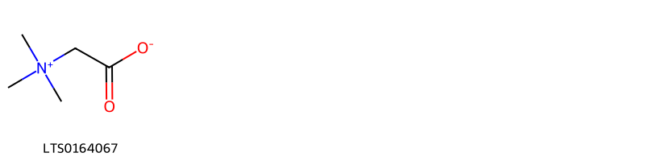
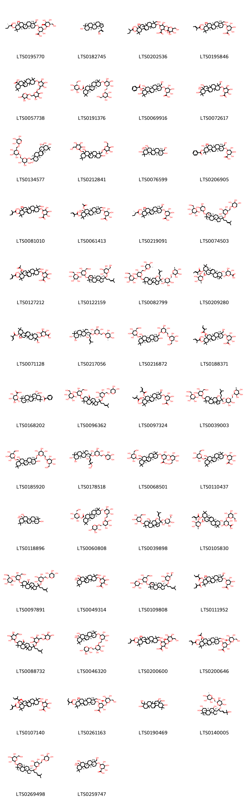

!!! abstract "Tóm tắt"

    Dây thìa canh (Caulis et folium Gymnemae sylvestris) là phần cành và lá phơi hay sấy khô của cây Dây thìa canh (Gymnema sylvestre (Retz.) R. Br. ex Schult.], thuộc họ Thiên lý (Asclepiadaceae). Cây phân bố chủ yếu ở Ấn Độ, Trung Quốc, Việt Nam và các quốc gia Đông Nam Á. Trong dân gian ở Ấn Độ, dây thìa canh dùng để đắp lên vết cắn của rắn và sắc uống để trị nọc độc. Ở Trung Quốc, toàn bộ cây, bao gồm rễ và quả, được dùng để chữa phong thấp, viêm mạch máu, trĩ, vết thương do dao đạn và còn có tác dụng diệt chấy rận. Các thành phần hóa học trong cây bao gồm acid gymnemic (glucosidic), chlorophyll a và b, phytol, acid tartaric, các hợp chất anthraquinone, và inositol (carbohydrate).

## Thông tin về thực vật

Dược liệu **Dây Thìa Canh (Dây, Lá)** từ bộ phận **** từ loài *Gymnema sylvestre*.

**Mô tả thực vật:** Dây leo cao 6-10m, nhựa mủ màu vàng, thân có lông dài 8-12cm, to 3mm, có lỗ bì thưa. Lá có phiến bầu dục xoan ngược thon dài 6-7cm, rộng 2,5-5cm, đầu nhọn, có mũi, gân bên 4-6 đôi, rõ ở mặt dưới, nhăn lúc khô; cuống dài 5-8mm. Hoa nhỏ, màu vàng, xếp thành xím dạng tán ở nách lá, cao 8mm, rộng 12-15mm: đài có lông mịn và rìa lông, tràng không lông ở mặt ngoài, tràng phụ là 5 răng. Quả đại dài 5,5cm, rộng ở nửa dưới; hạt dẹp, lông mào dài 3cm.

*Tài liệu tham khảo:* "Từ điển cây thuốc Việt Nam" - Võ Văn Chi 
Trong dược điển Việt nam, một loài được sử dụng làm dược liệu là *Gymnema sylvestre*.

!!! info "Phân loại thực vật của *Gymnema sylvestre*"
    - **Kingdom:** Plantae
    - **Phylum:** Tracheophyta
    - **Order:** Gentianales
    - **Family:** Apocynaceae
    - **Genus:** Gymnema
    - **Species:** *Gymnema sylvestre*

**Phân bố trên thế giới:** Namibia, Chinese Taipei, China, Hong Kong, South Africa, India, Macao, Madagascar

**Phân bố tại Việt nam:** Không có ghi nhận ở Việt Nam

## Thông tin về dược liệu 

### Định danh

!!! info "Thông tin về tên gọi"

    - Dược liệu tiếng Việt: dây thìa canh
    - Dược liệu tiếng Trung:  ()
    - Dược liệu tiếng Anh: 
    - Dược liệu latin thông dụng: Caulis et folium Gymnemae sylvestris
    - Dược liệu latin kiểu DĐVN: *caulis et folium gymnemae sylvestris*
    - Dược liệu latin kiểu DĐVN: **
    - Dược liệu latin kiểu thông tư: **
    - Bộ phận dùng:  (Caulis)

### Mô tả dược liệu 

- **Theo dược điển Việt nam V:** Dược liệu chưa cắt đoạn có dạng dây leo, dài tới 6 m, đường kính tới 3 mm. Thường cắt đoạn dài 1,5 cm đến 3 cm. Khi khô có màu xanh lục. Lá có phiến bầu dục hoặc xoan ngược thon dài 6 cm đến 7 cm, rộng 2,5 cm đến 5 cm, đầu nhọn có mũi, gân phụ 4 đến 6 cặp, rõ ở mặt dưới, nhăn lúc khô; cuống dài 5 cm đến 8 cm.

- **Mô tả dược liệu theo thông tư chế biến dược liệu theo phương pháp cổ truyền:** 

### Chế biến 

- **Chế biến theo dược điển việt nam V**: Thu hái quanh năm, phơi hoặc sấy khô, thái đoạn 1,5 cm đến 3 cm, khi dùng sao vàng.

- **Chế biến theo thông tư:** 

--- 

## Thành phần hóa học

- Theo tài liệu của GS. Đỗ Tất Lợi:  (1) Glucosidic (Acid gymnemic)
Hợp chất hữu cơ (Chlorophyll a và b, Phytol)
Hydrat carbon
Acid hữu cơ (Acid tartric)
Hợp chất anthraquinone
Chất nhựa
Carbohydrate (Inositol)
(2) Acid gymnemic
    

**Thành phần hóa học từ loài **Gymnema sylvestre**

Theo cơ sở dữ liệu lotus, loài *Gymnema sylvestre* đã phân lập và xác định được **182** hoạt chất thuộc về các nhóm Steroids and steroid derivatives, Organonitrogen compounds, Organooxygen compounds, Flavonoids, Carboxylic acids and derivatives, Prenol lipids trong bảng dưới đây. Danh sách các hoạt chất như sau (2s,3s,4s,5r,6r)-6-{[(3s,4r,4ar,6ar,6bs,8s,8as,9s,12as,14ar,14br)-8,9-dihydroxy-4,8a-bis(hydroxymethyl)-4,6a,6b,11,11,14b-hexamethyl-1,2,3,4a,5,6,7,8,9,10,12,12a,14,14a-tetradecahydropicen-3-yl]oxy}-3,5-dihydroxy-4-{[(2s,3r,4s,5s,6r)-3,4,5-trihydroxy-6-(hydroxymethyl)oxan-2-yl]oxy}oxane-2-carboxylic acid [(LTS0256393)](https://lotus.naturalproducts.net/compound/lotus_id/LTS0256393), 2-{[5,10-dihydroxy-2,2,6a,6b,9,12a-hexamethyl-9-({[3,4,5-trihydroxy-6-(hydroxymethyl)oxan-2-yl]oxy}methyl)-1,3,4,5,6,7,8,8a,10,11,12,12b,13,14b-tetradecahydropicen-4a-yl]methoxy}-6-(hydroxymethyl)oxane-3,4,5-triol [(LTS0212841)](https://lotus.naturalproducts.net/compound/lotus_id/LTS0212841), 6-({8a-[(acetyloxy)methyl]-8,9-dihydroxy-4-(hydroxymethyl)-4,6a,6b,11,11,14b-hexamethyl-10-[(2-methylbutanoyl)oxy]-1,2,3,4a,5,6,7,8,9,10,12,12a,14,14a-tetradecahydropicen-3-yl}oxy)-3,4,5-trihydroxyoxane-2-carboxylic acid [(LTS0250428)](https://lotus.naturalproducts.net/compound/lotus_id/LTS0250428), 6-{[8,9-dihydroxy-4,8a-bis(hydroxymethyl)-4,6a,6b,11,11,14b-hexamethyl-10-[(2-methylbut-2-enoyl)oxy]-1,2,3,4a,5,6,7,8,9,10,12,12a,14,14a-tetradecahydropicen-3-yl]oxy}-3,5-dihydroxy-4-{[3,4,5-trihydroxy-6-(hydroxymethyl)oxan-2-yl]oxy}oxane-2-carboxylic acid [(LTS0200600)](https://lotus.naturalproducts.net/compound/lotus_id/LTS0200600), 3-{[(2s,3r,4s,5r,6r)-6-({[(2r,3r,4s,5r,6s)-3,4-dihydroxy-6-methyl-5-{[(2s,3r,4s,5s,6r)-3,4,5-trihydroxy-6-(hydroxymethyl)oxan-2-yl]oxy}oxan-2-yl]oxy}methyl)-3,4,5-trihydroxyoxan-2-yl]oxy}-5,7-dihydroxy-2-(4-hydroxyphenyl)chromen-4-one [(LTS0202032)](https://lotus.naturalproducts.net/compound/lotus_id/LTS0202032), (2s,3r,4s,5s,6r)-2-{[(2s)-2-[(3ar)-7-{[(2r,3r,4s,5s,6r)-4,5-dihydroxy-3-{[(2s,3r,4s,5s,6r)-3,4,5-trihydroxy-6-(hydroxymethyl)oxan-2-yl]oxy}-6-({[(2r,3r,4r,5r,6s)-3,4,5-trihydroxy-6-methyloxan-2-yl]oxy}methyl)oxan-2-yl]oxy}-11-hydroxy-3a,3b,6,6,9a-pentamethyl-dodecahydro-1h-cyclopenta[a]phenanthren-1-yl]-6-methylhept-5-en-2-yl]oxy}-6-({[(2r,3r,4r,5r,6s)-3,4,5-trihydroxy-6-methyloxan-2-yl]oxy}methyl)oxane-3,4,5-triol [(LTS0082799)](https://lotus.naturalproducts.net/compound/lotus_id/LTS0082799), (2s,3r,4s,5s,6r)-2-({2-[9a-(hydroxymethyl)-3a,3b,6,6-tetramethyl-7-{[(2r,3r,4s,5s,6r)-3,4,5-trihydroxy-6-(hydroxymethyl)oxan-2-yl]oxy}-dodecahydro-1h-cyclopenta[a]phenanthren-1-yl]-6-methylhept-5-en-2-yl}oxy)-6-({[(2r,3r,4s,5r)-3,4,5-trihydroxyoxan-2-yl]oxy}methyl)oxane-3,4,5-triol [(LTS0256575)](https://lotus.naturalproducts.net/compound/lotus_id/LTS0256575), gymnemic acid xi [(LTS0188371)](https://lotus.naturalproducts.net/compound/lotus_id/LTS0188371), gymnemic acid xii [(LTS0200646)](https://lotus.naturalproducts.net/compound/lotus_id/LTS0200646), (2s,3s,4s,5r,6r)-6-{[(3s,4ar,6ar,6bs,8s,8as,9s,12as,14ar,14br)-8,9-dihydroxy-4,4,6a,6b,11,11,14b-heptamethyl-8a-({[(2r,3r,4s,5s,6r)-3,4,5-trihydroxy-6-(hydroxymethyl)oxan-2-yl]oxy}methyl)-1,2,3,4a,5,6,7,8,9,10,12,12a,14,14a-tetradecahydropicen-3-yl]oxy}-3,4,5-trihydroxyoxane-2-carboxylic acid [(LTS0170950)](https://lotus.naturalproducts.net/compound/lotus_id/LTS0170950), (2s,3r,4s,5s,6r)-2-{[(2r,4e)-2-[(1s,3ar,3br,5ar,7r,8r,9ar,9br,11r,11ar)-7,8,11-trihydroxy-3a,3b,6,6,9a-pentamethyl-dodecahydro-1h-cyclopenta[a]phenanthren-1-yl]-6-hydroperoxy-6-methylhept-4-en-2-yl]oxy}-6-({[(2s,3r,4s,5r)-3,4,5-trihydroxyoxan-2-yl]oxy}methyl)oxane-3,4,5-triol [(LTS0178518)](https://lotus.naturalproducts.net/compound/lotus_id/LTS0178518), 1-[(1s,3ar,3bs,5as,7s,9ar,9br,11r,11ar)-1,3a,3b,5a-tetrahydroxy-7-{[(2r,4s,5r,6r)-5-{[(2s,4s,5r,6r)-5-{[(2s,4r,5r,6r)-5-{[(2s,3r,4s,5r,6r)-3-hydroxy-4-methoxy-6-methyl-5-{[(2s,3r,4s,5s,6r)-3,4,5-trihydroxy-6-(hydroxymethyl)oxan-2-yl]oxy}oxan-2-yl]oxy}-4-methoxy-6-methyloxan-2-yl]oxy}-4-methoxy-6-methyloxan-2-yl]oxy}-4-methoxy-6-methyloxan-2-yl]oxy}-9a,11a-dimethyl-11-{[(2e)-3-phenylprop-2-enoyl]oxy}-2h,3h,6h,7h,8h,9h,9bh,10h,11h-cyclopenta[a]phenanthren-1-yl]ethyl (2e)-2-methylbut-2-enoate [(LTS0210256)](https://lotus.naturalproducts.net/compound/lotus_id/LTS0210256), 1-[(1s,3ar,3bs,5as,7s,9ar,9br,11r,11ar)-7-{[(2r,4s,5r,6r)-5-{[(2s,4s,5r,6r)-5-{[(2s,4r,5r,6r)-5-{[(2s,3r,4r,5r,6r)-3,5-dihydroxy-4-methoxy-6-methyloxan-2-yl]oxy}-4-methoxy-6-methyloxan-2-yl]oxy}-4-methoxy-6-methyloxan-2-yl]oxy}-4-methoxy-6-methyloxan-2-yl]oxy}-1,3a,3b,5a-tetrahydroxy-9a,11a-dimethyl-11-{[(2e)-3-phenylprop-2-enoyl]oxy}-2h,3h,6h,7h,8h,9h,9bh,10h,11h-cyclopenta[a]phenanthren-1-yl]ethyl (2e)-2-methylbut-2-enoate [(LTS0027247)](https://lotus.naturalproducts.net/compound/lotus_id/LTS0027247), 3a,3b,6,6-tetramethyl-1-(6-methyl-2-{[3,4,5-trihydroxy-6-(hydroxymethyl)oxan-2-yl]oxy}hept-5-en-2-yl)-7-{[3,4,5-trihydroxy-6-(hydroxymethyl)oxan-2-yl]oxy}-dodecahydro-1h-cyclopenta[a]phenanthrene-9a-carbaldehyde [(LTS0023386)](https://lotus.naturalproducts.net/compound/lotus_id/LTS0023386), (1r,3ar,3bs,7s,9ar,9br,11r,11ar)-7-{[(2r,4s,5r,6r)-5-{[(2s,4s,5r,6r)-5-{[(2s,4r,5r,6r)-5-{[(2s,3r,4s,5r,6r)-3,5-dihydroxy-4-methoxy-6-methyloxan-2-yl]oxy}-4-methoxy-6-methyloxan-2-yl]oxy}-4-methoxy-6-methyloxan-2-yl]oxy}-4-methoxy-6-methyloxan-2-yl]oxy}-1,3a,3b-trihydroxy-1-[(1s)-1-hydroxyethyl]-9a,11a-dimethyl-2h,3h,4h,6h,7h,8h,9h,9bh,10h,11h-cyclopenta[a]phenanthren-11-yl (2e)-3-phenylprop-2-enoate [(LTS0035954)](https://lotus.naturalproducts.net/compound/lotus_id/LTS0035954), 6-{[10-(benzoyloxy)-8-hydroxy-8a-(hydroxymethyl)-4,4,6a,6b,11,11,14b-heptamethyl-1,2,3,4a,5,6,7,8,9,10,12,12a,14,14a-tetradecahydropicen-3-yl]oxy}-3,5-dihydroxy-4-{[3,4,5-trihydroxy-6-(hydroxymethyl)oxan-2-yl]oxy}oxane-2-carboxylic acid [(LTS0071255)](https://lotus.naturalproducts.net/compound/lotus_id/LTS0071255), 6-{[10-(benzoyloxy)-8,9-dihydroxy-4,8a-bis(hydroxymethyl)-4,6a,6b,11,11,14b-hexamethyl-1,2,3,4a,5,6,7,8,9,10,12,12a,14,14a-tetradecahydropicen-3-yl]oxy}-3,4,5-trihydroxyoxane-2-carboxylic acid [(LTS0145131)](https://lotus.naturalproducts.net/compound/lotus_id/LTS0145131), (4ar,6ar,6br,8as,10s,12as,12br,14br)-2,2,6a,6b,9,9,12a-heptamethyl-10-{[(2s,3r,4s,5r,6s)-3,4,5-trihydroxy-6-({[(2r,3r,4r,5r,6s)-3,4,5-trihydroxy-6-({[(2r,3r,4s,5s)-3,4,5-trihydroxyoxan-2-yl]oxy}methyl)oxan-2-yl]oxy}methyl)oxan-2-yl]oxy}-1,3,4,5,6,7,8,8a,10,11,12,12b,13,14b-tetradecahydropicene-4a-carboxylic acid [(LTS0202397)](https://lotus.naturalproducts.net/compound/lotus_id/LTS0202397), (2s,3s,4r,5r,6s)-6-({[(3s,4r,4ar,6ar,6bs,8s,8ar,9r,10r,12as,14as,14br)-8,9-dihydroxy-4-(hydroxymethyl)-4,6a,11,11,14b-pentamethyl-10-{[(2e)-2-methylbut-2-enoyl]oxy}-8a-({[(2e)-2-methylbut-2-enoyl]oxy}methyl)-2,3,4a,5,6,6b,7,8,9,10,12,12a,14,14a-tetradecahydro-1h-picen-3-yl]oxy}methyl)-3,4,5-trihydroxyoxane-2-carboxylic acid [(LTS0134994)](https://lotus.naturalproducts.net/compound/lotus_id/LTS0134994), gymnemic acid x [(LTS0015555)](https://lotus.naturalproducts.net/compound/lotus_id/LTS0015555), 2-methyl-6-({3,4,5-trihydroxy-6-[(6-hydroxy-6-methyl-2-{7,8,11-trihydroxy-3a,3b,6,6,9a-pentamethyl-dodecahydro-1h-cyclopenta[a]phenanthren-1-yl}hept-4-en-2-yl)oxy]oxan-2-yl}methoxy)oxane-3,4,5-triol [(LTS0083821)](https://lotus.naturalproducts.net/compound/lotus_id/LTS0083821), 3,5-dihydroxy-6-{[8-hydroxy-4,8a-bis(hydroxymethyl)-4,6a,6b,11,11,14b-hexamethyl-9-[(2-methylbut-2-enoyl)oxy]-1,2,3,4a,5,6,7,8,9,10,12,12a,14,14a-tetradecahydropicen-3-yl]oxy}-4-{[3,4,5-trihydroxy-6-(hydroxymethyl)oxan-2-yl]oxy}oxane-2-carboxylic acid [(LTS0026358)](https://lotus.naturalproducts.net/compound/lotus_id/LTS0026358), 7-{[4,5-dihydroxy-6-(hydroxymethyl)-3-{[3,4,5-trihydroxy-6-(hydroxymethyl)oxan-2-yl]oxy}oxan-2-yl]oxy}-1-(2-hydroxy-6-methylhept-5-en-2-yl)-3a,3b,6,6-tetramethyl-dodecahydro-1h-cyclopenta[a]phenanthrene-9a-carbaldehyde [(LTS0260370)](https://lotus.naturalproducts.net/compound/lotus_id/LTS0260370), (2s,3s,4r,5r,6s)-3,4,5-trihydroxy-6-(hydroxymethyl)oxan-2-yl (4ar,6ar,6br,8as,10s,12as,12br,14br)-2,2,6a,6b,9,9,12a-heptamethyl-10-{[(2r,3s,4s,5s,6s)-3,4,5-trihydroxy-6-({[(2s,3r,4s,5s,6r)-3,4,5-trihydroxy-6-(hydroxymethyl)oxan-2-yl]oxy}methyl)oxan-2-yl]oxy}-1,3,4,5,6,7,8,8a,10,11,12,12b,13,14b-tetradecahydropicene-4a-carboxylate [(LTS0191376)](https://lotus.naturalproducts.net/compound/lotus_id/LTS0191376), gymnemic acid xiv [(LTS0006012)](https://lotus.naturalproducts.net/compound/lotus_id/LTS0006012), (2s,3s,4s,5r,6r)-6-{[(3s,4ar,6ar,6bs,8s,8ar,9s,12as,14ar,14br)-8-hydroxy-8a-(hydroxymethyl)-4,4,6a,6b,11,11,14b-heptamethyl-9-{[(2e)-2-methylbut-2-enoyl]oxy}-1,2,3,4a,5,6,7,8,9,10,12,12a,14,14a-tetradecahydropicen-3-yl]oxy}-3,5-dihydroxy-4-{[(2s,3r,4s,5s,6r)-3,4,5-trihydroxy-6-(hydroxymethyl)oxan-2-yl]oxy}oxane-2-carboxylic acid [(LTS0040995)](https://lotus.naturalproducts.net/compound/lotus_id/LTS0040995), (2s,3s,4s,5r,6r)-6-{[(3s,4r,4ar,6ar,6bs,8s,8ar,9s,10r,12as,14ar,14br)-8-hydroxy-4,8a-bis(hydroxymethyl)-4,6a,6b,11,11,14b-hexamethyl-9,10-bis({[(2e)-2-methylbut-2-enoyl]oxy})-1,2,3,4a,5,6,7,8,9,10,12,12a,14,14a-tetradecahydropicen-3-yl]oxy}-3,4,5-trihydroxyoxane-2-carboxylic acid [(LTS0111952)](https://lotus.naturalproducts.net/compound/lotus_id/LTS0111952), (2r,3r,4s,5s,6r)-2-{[(4as,5s,6as,6br,8ar,9r,10s,12ar,12br,14bs)-5,10-dihydroxy-2,2,6a,6b,9,12a-hexamethyl-9-({[(2r,3r,4s,5s,6r)-3,4,5-trihydroxy-6-({[(2r,3r,4s,5s,6r)-3,4,5-trihydroxy-6-(hydroxymethyl)oxan-2-yl]oxy}methyl)oxan-2-yl]oxy}methyl)-1,3,4,5,6,7,8,8a,10,11,12,12b,13,14b-tetradecahydropicen-4a-yl]methoxy}-6-({[(2r,3r,4s,5s,6r)-3,4,5-trihydroxy-6-(hydroxymethyl)oxan-2-yl]oxy}methyl)oxane-3,4,5-triol [(LTS0140909)](https://lotus.naturalproducts.net/compound/lotus_id/LTS0140909), (2s,3s,4s,5r,6r)-6-{[(3s,4ar,6ar,6bs,8s,8as,12as,14ar,14br)-8-hydroxy-4,4,6a,6b,11,11,14b-heptamethyl-8a-({[(2r,3r,4s,5s,6r)-3,4,5-trihydroxy-6-(hydroxymethyl)oxan-2-yl]oxy}methyl)-1,2,3,4a,5,6,7,8,9,10,12,12a,14,14a-tetradecahydropicen-3-yl]oxy}-3,4,5-trihydroxyoxane-2-carboxylic acid [(LTS0110437)](https://lotus.naturalproducts.net/compound/lotus_id/LTS0110437), (2r,3r,4r,5r,6s)-2-{[(2r,3s,4s,5r,6s)-6-{[(2r,4e)-2-[(1s,3ar,3br,5ar,7r,8r,9ar,9br,11r,11ar)-7,8,11-trihydroxy-3a,3b,6,6,9a-pentamethyl-dodecahydro-1h-cyclopenta[a]phenanthren-1-yl]-6-hydroxy-6-methylhept-4-en-2-yl]oxy}-3,4,5-trihydroxyoxan-2-yl]methoxy}-6-methyloxane-3,4,5-triol [(LTS0044637)](https://lotus.naturalproducts.net/compound/lotus_id/LTS0044637), 6-({8a-[(acetyloxy)methyl]-8,9-dihydroxy-4-(hydroxymethyl)-4,6a,6b,11,11,14b-hexamethyl-10-[(2-methylbut-2-enoyl)oxy]-1,2,3,4a,5,6,7,8,9,10,12,12a,14,14a-tetradecahydropicen-3-yl}oxy)-3,4,5-trihydroxyoxane-2-carboxylic acid [(LTS0127212)](https://lotus.naturalproducts.net/compound/lotus_id/LTS0127212), (1r,3r,5r,6s,7s,8s,10s,11s,13r,14r)-13-{[(3s,4r,4ar,6ar,6bs,8s,8ar,9r,10r,12as,14ar,14br)-8,9-dihydroxy-4,8a-bis(hydroxymethyl)-4,6a,6b,11,11,14b-hexamethyl-10-{[(2z)-2-methylbut-2-enoyl]oxy}-1,2,3,4a,5,6,7,8,9,10,12,12a,14,14a-tetradecahydropicen-3-yl]oxy}-6,7,8,14-tetrahydroxy-5-(hydroxymethyl)-2,4,9,12-tetraoxatricyclo[8.4.0.0³,⁸]tetradecane-11-carboxylic acid [(LTS0065269)](https://lotus.naturalproducts.net/compound/lotus_id/LTS0065269), 7-{[4,5-dihydroxy-6-(hydroxymethyl)-3-[(3,4,5-trihydroxyoxan-2-yl)oxy]oxan-2-yl]oxy}-3a,3b,6,6-tetramethyl-1-{6-methyl-2-[(3,4,5-trihydroxy-6-{[(3,4,5-trihydroxyoxan-2-yl)oxy]methyl}oxan-2-yl)oxy]hept-5-en-2-yl}-dodecahydro-1h-cyclopenta[a]phenanthrene-9a-carbaldehyde [(LTS0202308)](https://lotus.naturalproducts.net/compound/lotus_id/LTS0202308), 6-{[8,9-dihydroxy-4,8a-bis(hydroxymethyl)-4,6a,6b,11,11,14b-hexamethyl-10-[(2-methylbut-2-enoyl)oxy]-1,2,3,4a,5,6,7,8,9,10,12,12a,14,14a-tetradecahydropicen-3-yl]oxy}-3,4,5-trihydroxyoxane-2-carboxylic acid [(LTS0081010)](https://lotus.naturalproducts.net/compound/lotus_id/LTS0081010), (2r,3r,4s,5s,6r)-2-{[(4as,5s,6as,6br,8ar,9r,10s,12ar,12br,14br)-5,10-dihydroxy-2,2,6a,6b,9,12a-hexamethyl-9-({[(2r,3r,4s,5s,6r)-3,4,5-trihydroxy-6-({[(2r,3r,4s,5s,6r)-3,4,5-trihydroxy-6-(hydroxymethyl)oxan-2-yl]oxy}methyl)oxan-2-yl]oxy}methyl)-1,3,4,5,6,7,8,8a,10,11,12,12b,13,14b-tetradecahydropicen-4a-yl]methoxy}-6-({[(2r,3r,4s,5s,6r)-3,4,5-trihydroxy-6-(hydroxymethyl)oxan-2-yl]oxy}methyl)oxane-3,4,5-triol [(LTS0170987)](https://lotus.naturalproducts.net/compound/lotus_id/LTS0170987), (2s,3s,4r,5s,6s)-6-({[(3s,4r,4ar,6ar,6bs,8s,8ar,9r,10r,12as,14as,14br)-8a-[(acetyloxy)methyl]-8,9-dihydroxy-4-(hydroxymethyl)-4,6a,11,11,14b-pentamethyl-10-{[(2e)-2-methylbut-2-enoyl]oxy}-2,3,4a,5,6,6b,7,8,9,10,12,12a,14,14a-tetradecahydro-1h-picen-3-yl]oxy}methyl)-3,5-dihydroxy-4-{[(2r,3s,4s,5r,6s)-3,4,5,6-tetrahydroxyoxan-2-yl]methoxy}oxane-2-carboxylic acid [(LTS0085326)](https://lotus.naturalproducts.net/compound/lotus_id/LTS0085326), 2-[(6-hydroperoxy-6-methyl-2-{7,8,11-trihydroxy-3a,3b,6,6,9a-pentamethyl-dodecahydro-1h-cyclopenta[a]phenanthren-1-yl}hept-4-en-2-yl)oxy]-6-{[(3,4,5-trihydroxyoxan-2-yl)oxy]methyl}oxane-3,4,5-triol [(LTS0000904)](https://lotus.naturalproducts.net/compound/lotus_id/LTS0000904), (2s,3s,4s,5r,6r)-6-{[(3s,4r,4ar,6ar,6bs,8s,8ar,9r,10r,12as,14ar,14br)-8,9,10-trihydroxy-4,8a-bis(hydroxymethyl)-4,6a,6b,11,11,14b-hexamethyl-1,2,3,4a,5,6,7,8,9,10,12,12a,14,14a-tetradecahydropicen-3-yl]oxy}-3,4,5-trihydroxyoxane-2-carboxylic acid [(LTS0114071)](https://lotus.naturalproducts.net/compound/lotus_id/LTS0114071), (2r,3r,4s,5s,6r)-2-{[(4as,5s,6as,6br,8ar,9r,10s,12ar,12br,14br)-5,10-dihydroxy-2,2,6a,6b,9,12a-hexamethyl-9-({[(2r,3r,4s,5s,6r)-3,4,5-trihydroxy-6-(hydroxymethyl)oxan-2-yl]oxy}methyl)-1,3,4,5,6,7,8,8a,10,11,12,12b,13,14b-tetradecahydropicen-4a-yl]methoxy}-6-({[(2r,3r,4s,5s,6r)-3,4,5-trihydroxy-6-(hydroxymethyl)oxan-2-yl]oxy}methyl)oxane-3,4,5-triol [(LTS0184182)](https://lotus.naturalproducts.net/compound/lotus_id/LTS0184182), gymnemic acid ii [(LTS0016093)](https://lotus.naturalproducts.net/compound/lotus_id/LTS0016093), (1r,2s,3r,4s)-cyclohex-5-ene-1,2,3,4-tetrol [(LTS0048246)](https://lotus.naturalproducts.net/compound/lotus_id/LTS0048246), 3,4,5-trihydroxy-6-{[8-hydroxy-4,8a-bis(hydroxymethyl)-4,6a,6b,11,11,14b-hexamethyl-9-[(2-methylbut-2-enoyl)oxy]-1,2,3,4a,5,6,7,8,9,10,12,12a,14,14a-tetradecahydropicen-3-yl]oxy}oxane-2-carboxylic acid [(LTS0071128)](https://lotus.naturalproducts.net/compound/lotus_id/LTS0071128), 6-{[8,9-dihydroxy-4,8a-bis(hydroxymethyl)-4,6a,6b,11,11,14b-hexamethyl-1,2,3,4a,5,6,7,8,9,10,12,12a,14,14a-tetradecahydropicen-3-yl]oxy}-3,5-dihydroxy-4-{[3,4,5-trihydroxy-6-(hydroxymethyl)oxan-2-yl]oxy}oxane-2-carboxylic acid [(LTS0004957)](https://lotus.naturalproducts.net/compound/lotus_id/LTS0004957), (1s,3ar,3bs,5as,7s,9ar,9br,11r,11ar)-7-{[(2r,4s,5r,6r)-5-{[(2s,4s,5r,6r)-5-{[(2s,4r,5r,6r)-5-{[(2s,3r,4r,5r,6r)-3,5-dihydroxy-4-methoxy-6-methyloxan-2-yl]oxy}-4-methoxy-6-methyloxan-2-yl]oxy}-4-methoxy-6-methyloxan-2-yl]oxy}-4-methoxy-6-methyloxan-2-yl]oxy}-1,3a,3b,5a-tetrahydroxy-1-(1-hydroxyethyl)-9a,11a-dimethyl-2h,3h,6h,7h,8h,9h,9bh,10h,11h-cyclopenta[a]phenanthren-11-yl (2e)-3-phenylprop-2-enoate [(LTS0074071)](https://lotus.naturalproducts.net/compound/lotus_id/LTS0074071), 6-{[8,10-dihydroxy-4,8a-bis(hydroxymethyl)-4,6a,6b,11,11,14b-hexamethyl-1,2,3,4a,5,6,7,8,9,10,12,12a,14,14a-tetradecahydropicen-3-yl]oxy}-3,4,5-trihydroxyoxane-2-carboxylic acid [(LTS0037924)](https://lotus.naturalproducts.net/compound/lotus_id/LTS0037924), (2r,3r,4s,5s,6r)-2-{[(3s,4r,4ar,6ar,6bs,8s,8as,10s,12as,14ar,14br)-3,8,10-trihydroxy-8a-(hydroxymethyl)-4,6a,6b,11,11,14b-hexamethyl-1,2,3,4a,5,6,7,8,9,10,12,12a,14,14a-tetradecahydropicen-4-yl]methoxy}-6-({[(2r,3r,4s,5s,6r)-3,4,5-trihydroxy-6-({[(2s,3r,4s,5r)-3,4,5-trihydroxyoxan-2-yl]oxy}methyl)oxan-2-yl]oxy}methyl)oxane-3,4,5-triol [(LTS0134577)](https://lotus.naturalproducts.net/compound/lotus_id/LTS0134577), (2r,3r,4s,5s,6r)-2-{[(3s,4r,4ar,6ar,6br,8s,8as,12bs,14ar,14br)-3,8-dihydroxy-4,6a,6b,11,11,14b-hexamethyl-8a-({[(2r,3r,4s,5s,6r)-3,4,5-trihydroxy-6-({[(2r,3r,4s,5s,6r)-3,4,5-trihydroxy-6-(hydroxymethyl)oxan-2-yl]oxy}methyl)oxan-2-yl]oxy}methyl)-1,2,3,4a,5,6,7,8,9,10,12b,13,14,14a-tetradecahydropicen-4-yl]methoxy}-6-({[(2r,3r,4s,5s,6r)-3,4,5-trihydroxy-6-({[(2s,3r,4s,5r)-3,4,5-trihydroxyoxan-2-yl]oxy}methyl)oxan-2-yl]oxy}methyl)oxane-3,4,5-triol [(LTS0083461)](https://lotus.naturalproducts.net/compound/lotus_id/LTS0083461), (1r,3ar,3br,5as,7s,9as,9br,11as)-3a,3b,6,6-tetramethyl-1-[(2s)-6-methyl-2-{[(2s,3r,4s,5s,6r)-3,4,5-trihydroxy-6-({[(2s,3r,4s,5r)-3,4,5-trihydroxyoxan-2-yl]oxy}methyl)oxan-2-yl]oxy}hept-5-en-2-yl]-7-{[(2r,3r,4s,5s,6r)-3,4,5-trihydroxy-6-(hydroxymethyl)oxan-2-yl]oxy}-dodecahydro-1h-cyclopenta[a]phenanthrene-9a-carbaldehyde [(LTS0269498)](https://lotus.naturalproducts.net/compound/lotus_id/LTS0269498), (2s,3s,4s,5r,6r)-6-{[(3s,4ar,6ar,6bs,8s,8as,9s,12as,14ar,14br)-8,9-dihydroxy-8a-(hydroxymethyl)-4,4,6a,6b,11,11,14b-heptamethyl-1,2,3,4a,5,6,7,8,9,10,12,12a,14,14a-tetradecahydropicen-3-yl]oxy}-3,5-dihydroxy-4-{[(2s,3r,4s,5s,6r)-3,4,5-trihydroxy-6-(hydroxymethyl)oxan-2-yl]oxy}oxane-2-carboxylic acid [(LTS0070405)](https://lotus.naturalproducts.net/compound/lotus_id/LTS0070405), (2s,3s,4s,5r,6r)-6-{[(3s,4r,4ar,6ar,6bs,8s,8ar,9s,12as,14ar,14br)-8-hydroxy-4,8a-bis(hydroxymethyl)-4,6a,6b,11,11,14b-hexamethyl-9-{[(2e)-2-methylbut-2-enoyl]oxy}-1,2,3,4a,5,6,7,8,9,10,12,12a,14,14a-tetradecahydropicen-3-yl]oxy}-3,4,5-trihydroxyoxane-2-carboxylic acid [(LTS0113962)](https://lotus.naturalproducts.net/compound/lotus_id/LTS0113962), (1s,3ar,3bs,5as,7s,9ar,9br,11r,11ar)-7-{[(2r,4s,5r,6r)-5-{[(2s,4s,5r,6r)-5-{[(2s,4r,5r,6r)-5-{[(2s,3r,4s,5r,6r)-3,5-dihydroxy-4-methoxy-6-methyloxan-2-yl]oxy}-4-methoxy-6-methyloxan-2-yl]oxy}-4-methoxy-6-methyloxan-2-yl]oxy}-4-methoxy-6-methyloxan-2-yl]oxy}-1,3a,3b,5a-tetrahydroxy-1-(1-hydroxyethyl)-9a,11a-dimethyl-2h,3h,6h,7h,8h,9h,9bh,10h,11h-cyclopenta[a]phenanthren-11-yl (2e)-3-phenylprop-2-enoate [(LTS0012342)](https://lotus.naturalproducts.net/compound/lotus_id/LTS0012342), (2s,3s,4s,5r,6r)-6-{[(3s,4r,4ar,6ar,6bs,8s,8ar,9r,10r,12as,14ar,14br)-9-(acetyloxy)-8-hydroxy-4,8a-bis(hydroxymethyl)-4,6a,6b,11,11,14b-hexamethyl-10-{[(2e)-2-methylbut-2-enoyl]oxy}-1,2,3,4a,5,6,7,8,9,10,12,12a,14,14a-tetradecahydropicen-3-yl]oxy}-3,4,5-trihydroxyoxane-2-carboxylic acid [(LTS0231025)](https://lotus.naturalproducts.net/compound/lotus_id/LTS0231025), (1r,3ar,3br,5as,7s,9as,9br,11as)-7-{[(2r,3r,4s,5s,6r)-4,5-dihydroxy-6-(hydroxymethyl)-3-{[(2s,3r,4s,5s,6r)-3,4,5-trihydroxy-6-(hydroxymethyl)oxan-2-yl]oxy}oxan-2-yl]oxy}-3a,3b,6,6-tetramethyl-1-[(2s)-6-methyl-2-{[(2s,3r,4s,5s,6r)-3,4,5-trihydroxy-6-(hydroxymethyl)oxan-2-yl]oxy}hept-5-en-2-yl]-dodecahydro-1h-cyclopenta[a]phenanthrene-9a-carbaldehyde [(LTS0009988)](https://lotus.naturalproducts.net/compound/lotus_id/LTS0009988), (2s,3s,4r,5r,6s)-6-({[(3s,4r,4ar,6ar,6bs,8s,8ar,9r,10r,12as,14as,14br)-8a-[(acetyloxy)methyl]-8,9,10-trihydroxy-4-(hydroxymethyl)-4,6a,11,11,14b-pentamethyl-2,3,4a,5,6,6b,7,8,9,10,12,12a,14,14a-tetradecahydro-1h-picen-3-yl]oxy}methyl)-3,4,5-trihydroxyoxane-2-carboxylic acid [(LTS0158321)](https://lotus.naturalproducts.net/compound/lotus_id/LTS0158321), (2s,3s,4s,5r,6r)-6-{[(3s,4ar,6ar,6bs,8s,8as,9s,12as,14ar,14br)-8-(acetyloxy)-9-hydroxy-4,4,6a,6b,11,11,14b-heptamethyl-8a-({[(2r,3r,4r,5r,6s)-3,4,5-trihydroxy-6-methyloxan-2-yl]oxy}methyl)-1,2,3,4a,5,6,7,8,9,10,12,12a,14,14a-tetradecahydropicen-3-yl]oxy}-3,5-dihydroxy-4-{[(2s,3r,4s,5s,6r)-3,4,5-trihydroxy-6-(hydroxymethyl)oxan-2-yl]oxy}oxane-2-carboxylic acid [(LTS0271948)](https://lotus.naturalproducts.net/compound/lotus_id/LTS0271948), (3s,4ar,6ar,6bs,8s,8as,9s,12as,14ar,14br)-8a-(hydroxymethyl)-4,4,6a,6b,11,11,14b-heptamethyl-1,2,3,4a,5,6,7,8,9,10,12,12a,14,14a-tetradecahydropicene-3,8,9-triol [(LTS0118896)](https://lotus.naturalproducts.net/compound/lotus_id/LTS0118896), 6-{[10-(benzoyloxy)-8-hydroxy-8a-(hydroxymethyl)-4,4,6a,6b,11,11,14b-heptamethyl-1,2,3,4a,5,6,7,8,9,10,12,12a,14,14a-tetradecahydropicen-3-yl]oxy}-3,4,5-trihydroxyoxane-2-carboxylic acid [(LTS0216110)](https://lotus.naturalproducts.net/compound/lotus_id/LTS0216110), 2,2,6a,6b,9,9,12a-heptamethyl-10-[(3,4,5-trihydroxy-6-{[(3,4,5-trihydroxy-6-{[(3,4,5-trihydroxyoxan-2-yl)oxy]methyl}oxan-2-yl)oxy]methyl}oxan-2-yl)oxy]-1,3,4,5,6,7,8,8a,10,11,12,12b,13,14b-tetradecahydropicene-4a-carboxylic acid [(LTS0057738)](https://lotus.naturalproducts.net/compound/lotus_id/LTS0057738), (3s,4as,5s,6as,6br,8ar,10s,12ar,12br,14bs)-4a-(hydroxymethyl)-2,2,6a,6b,9,9,12a-heptamethyl-1,3,4,5,6,7,8,8a,10,11,12,12b,13,14b-tetradecahydropicene-3,5,10-triol [(LTS0275095)](https://lotus.naturalproducts.net/compound/lotus_id/LTS0275095), (2r,3r,4s,5s,6r)-2-{[(4as,5s,6as,6br,8ar,10s,12ar,12br,14bs)-5-hydroxy-2,2,6a,6b,9,9,12a-heptamethyl-10-{[(2r,3r,4s,5s,6r)-3,4,5-trihydroxy-6-({[(2r,3r,4s,5s,6r)-3,4,5-trihydroxy-6-({[(2s,3r,4s,5r)-3,4,5-trihydroxyoxan-2-yl]oxy}methyl)oxan-2-yl]oxy}methyl)oxan-2-yl]oxy}-1,3,4,5,6,7,8,8a,10,11,12,12b,13,14b-tetradecahydropicen-4a-yl]methoxy}-6-(hydroxymethyl)oxane-3,4,5-triol [(LTS0248102)](https://lotus.naturalproducts.net/compound/lotus_id/LTS0248102), 5,7-dihydroxy-2-(4-hydroxyphenyl)-3-{[(2s,3r,4s,5r,6r)-3,4,5-trihydroxy-6-({[(2r,3r,4r,5r,6s)-3,4,5-trihydroxy-6-methyloxan-2-yl]oxy}methyl)oxan-2-yl]oxy}chromen-4-one [(LTS0166469)](https://lotus.naturalproducts.net/compound/lotus_id/LTS0166469), 7-{[(2r,3r,4s,5s,6r)-4,5-dihydroxy-6-(hydroxymethyl)-3-{[(2s,3r,4s,5s,6r)-3,4,5-trihydroxy-6-(hydroxymethyl)oxan-2-yl]oxy}oxan-2-yl]oxy}-3a,3b,6,6-tetramethyl-1-(6-methyl-2-{[(2s,3r,4s,5s,6r)-3,4,5-trihydroxy-6-({[(2r,3r,4s,5r)-3,4,5-trihydroxyoxan-2-yl]oxy}methyl)oxan-2-yl]oxy}hept-5-en-2-yl)-dodecahydro-1h-cyclopenta[a]phenanthrene-9a-carbaldehyde [(LTS0096362)](https://lotus.naturalproducts.net/compound/lotus_id/LTS0096362), choline [(LTS0170307)](https://lotus.naturalproducts.net/compound/lotus_id/LTS0170307), (2r,3r,4s,5s,6r)-2-{[(4as,5s,6as,6br,8ar,9r,10s,12ar,12br,14br)-5,10-dihydroxy-2,2,6a,6b,9,12a-hexamethyl-9-({[(2r,3r,4s,5s,6r)-3,4,5-trihydroxy-6-(hydroxymethyl)oxan-2-yl]oxy}methyl)-1,3,4,5,6,7,8,8a,10,11,12,12b,13,14b-tetradecahydropicen-4a-yl]methoxy}-6-(hydroxymethyl)oxane-3,4,5-triol [(LTS0175265)](https://lotus.naturalproducts.net/compound/lotus_id/LTS0175265), (2s,3s,4s,5r,6r)-6-{[(3s,4r,4ar,6ar,6bs,8s,8as,9s,12as,14ar,14br)-8,9-dihydroxy-4,8a-bis(hydroxymethyl)-4,6a,6b,11,11,14b-hexamethyl-1,2,3,4a,5,6,7,8,9,10,12,12a,14,14a-tetradecahydropicen-3-yl]oxy}-3,4,5-trihydroxyoxane-2-carboxylic acid [(LTS0259747)](https://lotus.naturalproducts.net/compound/lotus_id/LTS0259747), (2s,3s,4s,5r,6r)-6-{[(3s,4ar,6ar,6bs,8s,8as,9s,12as,14ar,14br)-8,9-dihydroxy-4,4,6a,6b,11,11,14b-heptamethyl-8a-({[(2e)-2-methylbut-2-enoyl]oxy}methyl)-1,2,3,4a,5,6,7,8,9,10,12,12a,14,14a-tetradecahydropicen-3-yl]oxy}-3,5-dihydroxy-4-{[(2s,3r,4s,5s,6r)-3,4,5-trihydroxy-6-(hydroxymethyl)oxan-2-yl]oxy}oxane-2-carboxylic acid [(LTS0056730)](https://lotus.naturalproducts.net/compound/lotus_id/LTS0056730), 3,4,5-trihydroxy-6-{[8,9,10-trihydroxy-4,8a-bis(hydroxymethyl)-4,6a,6b,11,11,14b-hexamethyl-1,2,3,4a,5,6,7,8,9,10,12,12a,14,14a-tetradecahydropicen-3-yl]oxy}oxane-2-carboxylic acid [(LTS0072617)](https://lotus.naturalproducts.net/compound/lotus_id/LTS0072617), (2s,3s,4s,5r,6r)-6-{[(3s,4r,4ar,6ar,6bs,8s,8ar,9r,10r,12as,14ar,14br)-8,9-dihydroxy-4,8a-bis(hydroxymethyl)-4,6a,6b,11,11,14b-hexamethyl-10-{[(2z)-2-methylbut-2-enoyl]oxy}-1,2,3,4a,5,6,7,8,9,10,12,12a,14,14a-tetradecahydropicen-3-yl]oxy}-3,4,5-trihydroxyoxane-2-carboxylic acid [(LTS0240605)](https://lotus.naturalproducts.net/compound/lotus_id/LTS0240605), (3s,4as,5s,6as,6br,8ar,9r,10s,12ar,12br,14bs)-4a,9-bis(hydroxymethyl)-2,2,6a,6b,9,12a-hexamethyl-1,3,4,5,6,7,8,8a,10,11,12,12b,13,14b-tetradecahydropicene-3,5,10-triol [(LTS0009130)](https://lotus.naturalproducts.net/compound/lotus_id/LTS0009130), (2s,3s,4s,5r,6r)-6-{[(3s,4ar,6ar,6bs,8s,8ar,9s,12as,14ar,14br)-8-hydroxy-4,4,6a,6b,11,11,14b-heptamethyl-9-{[(2e)-2-methylbut-2-enoyl]oxy}-8a-({[(2r,3r,4r,5r,6s)-3,4,5-trihydroxy-6-methyloxan-2-yl]oxy}methyl)-1,2,3,4a,5,6,7,8,9,10,12,12a,14,14a-tetradecahydropicen-3-yl]oxy}-3,5-dihydroxy-4-{[(2s,3r,4s,5s,6r)-3,4,5-trihydroxy-6-(hydroxymethyl)oxan-2-yl]oxy}oxane-2-carboxylic acid [(LTS0105830)](https://lotus.naturalproducts.net/compound/lotus_id/LTS0105830), (2s,3r,4s,5s,6r)-2-{[2-(11-hydroxy-3a,3b,6,6-tetramethyl-7-{[(2r,3r,4s,5s,6r)-3,4,5-trihydroxy-6-(hydroxymethyl)oxan-2-yl]oxy}-tetradecahydrocyclopenta[a]phenanthren-1-yl)-6-methylhept-5-en-2-yl]oxy}-6-({[(2r,3r,4r,5r,6s)-3,4,5-trihydroxy-6-methyloxan-2-yl]oxy}methyl)oxane-3,4,5-triol [(LTS0014333)](https://lotus.naturalproducts.net/compound/lotus_id/LTS0014333), 3,4,5-trihydroxy-6-({[3,4,5-trihydroxy-6-(hydroxymethyl)oxan-2-yl]oxy}methyl)oxan-2-yl 2,2,6a,6b,9,9,12a-heptamethyl-10-{[3,4,5-trihydroxy-6-({[3,4,5-trihydroxy-6-(hydroxymethyl)oxan-2-yl]oxy}methyl)oxan-2-yl]oxy}-1,3,4,5,6,7,8,8a,10,11,12,12b,13,14b-tetradecahydropicene-4a-carboxylate [(LTS0112487)](https://lotus.naturalproducts.net/compound/lotus_id/LTS0112487), 7-{[(2r,3r,4s,5s,6r)-4,5-dihydroxy-6-(hydroxymethyl)-3-{[(2s,3r,4s,5s,6r)-3,4,5-trihydroxy-6-(hydroxymethyl)oxan-2-yl]oxy}oxan-2-yl]oxy}-1-(1-hydroxy-5-methylhex-4-en-1-yl)-3a,3b-dimethyl-tetradecahydrocyclopenta[a]phenanthrene-9a-carbaldehyde [(LTS0018764)](https://lotus.naturalproducts.net/compound/lotus_id/LTS0018764), gymnemagenin [(LTS0076599)](https://lotus.naturalproducts.net/compound/lotus_id/LTS0076599), (1s,3ar,3br,5as,7s,9as,9bs,11ar)-7-{[(2r,3r,4s,5s,6r)-4,5-dihydroxy-6-(hydroxymethyl)-3-{[(2s,3r,4s,5s,6r)-3,4,5-trihydroxy-6-(hydroxymethyl)oxan-2-yl]oxy}oxan-2-yl]oxy}-1-[(2r)-2-hydroxy-6-methylhept-5-en-2-yl]-3a,3b,6,6-tetramethyl-dodecahydro-1h-cyclopenta[a]phenanthrene-9a-carbaldehyde [(LTS0223849)](https://lotus.naturalproducts.net/compound/lotus_id/LTS0223849), (2s,3s,4s,5r,6r)-6-{[(3s,4r,4ar,6ar,6bs,8s,8ar,9r,10r,12as,14ar,14br)-8a-[(acetyloxy)methyl]-10-(benzoyloxy)-8,9-dihydroxy-4-(hydroxymethyl)-4,6a,6b,11,11,14b-hexamethyl-1,2,3,4a,5,6,7,8,9,10,12,12a,14,14a-tetradecahydropicen-3-yl]oxy}-3,4,5-trihydroxyoxane-2-carboxylic acid [(LTS0109005)](https://lotus.naturalproducts.net/compound/lotus_id/LTS0109005), (2s,3s,4s,5r,6r)-6-{[(3s,4r,4ar,6ar,6bs,8s,8ar,9r,10r,12as,14ar,14br)-8a-[(benzoyloxy)methyl]-8,9,10-trihydroxy-4-(hydroxymethyl)-4,6a,6b,11,11,14b-hexamethyl-1,2,3,4a,5,6,7,8,9,10,12,12a,14,14a-tetradecahydropicen-3-yl]oxy}-3,4,5-trihydroxyoxane-2-carboxylic acid [(LTS0069916)](https://lotus.naturalproducts.net/compound/lotus_id/LTS0069916), (2s,3s,4s,5r,6r)-6-{[(3s,4ar,6ar,6bs,8s,8as,9s,12as,14ar,14br)-8-(acetyloxy)-9-hydroxy-4,4,6a,6b,11,11,14b-heptamethyl-8a-({[(2r,3r,4r,5r,6s)-3,4,5-trihydroxy-6-methyloxan-2-yl]oxy}methyl)-1,2,3,4a,5,6,7,8,9,10,12,12a,14,14a-tetradecahydropicen-3-yl]oxy}-3,4,5-trihydroxyoxane-2-carboxylic acid [(LTS0148924)](https://lotus.naturalproducts.net/compound/lotus_id/LTS0148924), (1r,3ar,5ar,5br,7ar,9s,11ar,11br,13ar,13bs)-1-(3-hydroxyprop-1-en-2-yl)-3a,5a,5b,8,8,11a-hexamethyl-hexadecahydrocyclopenta[a]chrysen-9-ol [(LTS0182745)](https://lotus.naturalproducts.net/compound/lotus_id/LTS0182745), (2s,3s,4r,5r,6s)-6-({[(3s,4r,4ar,6ar,6bs,8s,8ar,9r,10r,12as,14as,14br)-8,9,10-trihydroxy-4-(hydroxymethyl)-4,6a,11,11,14b-pentamethyl-8a-({[(2e)-2-methylbut-2-enoyl]oxy}methyl)-2,3,4a,5,6,6b,7,8,9,10,12,12a,14,14a-tetradecahydro-1h-picen-3-yl]oxy}methyl)-3,4,5-trihydroxyoxane-2-carboxylic acid [(LTS0216015)](https://lotus.naturalproducts.net/compound/lotus_id/LTS0216015), (2s,3r,4s,5s,6r)-2-({2-[11-hydroxy-9a-(hydroxymethyl)-3a,3b,6,6-tetramethyl-7-{[(2r,3r,4s,5s,6r)-3,4,5-trihydroxy-6-(hydroxymethyl)oxan-2-yl]oxy}-dodecahydro-1h-cyclopenta[a]phenanthren-1-yl]-6-methylhept-5-en-2-yl}oxy)-6-(hydroxymethyl)oxane-3,4,5-triol [(LTS0039898)](https://lotus.naturalproducts.net/compound/lotus_id/LTS0039898), (2s,3s,4s,5r,6r)-6-{[(3s,4ar,6ar,6bs,8s,8as,9s,12as,14ar,14br)-8,9-dihydroxy-4,4,6a,6b,11,11,14b-heptamethyl-8a-({[(2r,3r,4r,5r,6s)-3,4,5-trihydroxy-6-methyloxan-2-yl]oxy}methyl)-1,2,3,4a,5,6,7,8,9,10,12,12a,14,14a-tetradecahydropicen-3-yl]oxy}-3,5-dihydroxy-4-{[(2s,3r,4s,5s,6r)-3,4,5-trihydroxy-6-(hydroxymethyl)oxan-2-yl]oxy}oxane-2-carboxylic acid [(LTS0043573)](https://lotus.naturalproducts.net/compound/lotus_id/LTS0043573), gymnemic acid viii [(LTS0195770)](https://lotus.naturalproducts.net/compound/lotus_id/LTS0195770), (1s,3ar,3br,5as,7s,9as,9bs,11ar)-7-{[(2r,3r,4s,5s,6r)-4,5-dihydroxy-6-(hydroxymethyl)-3-{[(2s,3r,4s,5s)-3,4,5-trihydroxyoxan-2-yl]oxy}oxan-2-yl]oxy}-3a,3b,6,6-tetramethyl-1-[(2s)-6-methyl-2-{[(2s,3r,4s,5s,6r)-3,4,5-trihydroxy-6-(hydroxymethyl)oxan-2-yl]oxy}hept-5-en-2-yl]-dodecahydro-1h-cyclopenta[a]phenanthrene-9a-carbaldehyde [(LTS0109808)](https://lotus.naturalproducts.net/compound/lotus_id/LTS0109808), (2s,3s,4s,5r,6r)-6-{[(3s,4ar,6ar,6bs,8s,8ar,9s,12as,14ar,14br)-9-(acetyloxy)-8-hydroxy-4,4,6a,6b,11,11,14b-heptamethyl-8a-({[(2r,3r,4r,5r,6s)-3,4,5-trihydroxy-6-methyloxan-2-yl]oxy}methyl)-1,2,3,4a,5,6,7,8,9,10,12,12a,14,14a-tetradecahydropicen-3-yl]oxy}-3,5-dihydroxy-4-{[(2s,3r,4s,5s,6r)-3,4,5-trihydroxy-6-(hydroxymethyl)oxan-2-yl]oxy}oxane-2-carboxylic acid [(LTS0020057)](https://lotus.naturalproducts.net/compound/lotus_id/LTS0020057), (2s,3s,4s,5r,6r)-6-{[(3s,4ar,6ar,6bs,8s,8as,12as,14ar,14br)-8-hydroxy-4,4,6a,6b,11,11,14b-heptamethyl-8a-({[(2r,3r,4s,5s,6r)-3,4,5-trihydroxy-6-(hydroxymethyl)oxan-2-yl]oxy}methyl)-1,2,3,4a,5,6,7,8,9,10,12,12a,14,14a-tetradecahydropicen-3-yl]oxy}-3,5-dihydroxy-4-{[(2s,3r,4s,5s,6r)-3,4,5-trihydroxy-6-(hydroxymethyl)oxan-2-yl]oxy}oxane-2-carboxylic acid [(LTS0068501)](https://lotus.naturalproducts.net/compound/lotus_id/LTS0068501), (2s,3s,4r,5r,6s)-6-({[(3s,4r,4ar,6ar,6bs,8s,8ar,9r,10r,12as,14as,14br)-8,9,10-trihydroxy-4-(hydroxymethyl)-4,6a,11,11,14b-pentamethyl-8a-({[(2r)-2-methylbutanoyl]oxy}methyl)-2,3,4a,5,6,6b,7,8,9,10,12,12a,14,14a-tetradecahydro-1h-picen-3-yl]oxy}methyl)-3,4,5-trihydroxyoxane-2-carboxylic acid [(LTS0179637)](https://lotus.naturalproducts.net/compound/lotus_id/LTS0179637), 7-{[4,5-dihydroxy-6-(hydroxymethyl)-3-{[3,4,5-trihydroxy-6-(hydroxymethyl)oxan-2-yl]oxy}oxan-2-yl]oxy}-3a,3b,6,6-tetramethyl-1-(6-methyl-2-{[3,4,5-trihydroxy-6-(hydroxymethyl)oxan-2-yl]oxy}hept-5-en-2-yl)-dodecahydro-1h-cyclopenta[a]phenanthrene-9a-carbaldehyde [(LTS0125541)](https://lotus.naturalproducts.net/compound/lotus_id/LTS0125541), conduritol [(LTS0184534)](https://lotus.naturalproducts.net/compound/lotus_id/LTS0184534), (1r,3r,5r,6s,7s,8s,10s,11s,13r,14r)-13-{[(3s,4r,4ar,6ar,6bs,8s,8ar,9r,10r,12as,14ar,14br)-8,9-dihydroxy-4,8a-bis(hydroxymethyl)-4,6a,6b,11,11,14b-hexamethyl-10-{[(2s)-2-methylbutanoyl]oxy}-1,2,3,4a,5,6,7,8,9,10,12,12a,14,14a-tetradecahydropicen-3-yl]oxy}-6,7,8,14-tetrahydroxy-5-(hydroxymethyl)-2,4,9,12-tetraoxatricyclo[8.4.0.0³,⁸]tetradecane-11-carboxylic acid [(LTS0016737)](https://lotus.naturalproducts.net/compound/lotus_id/LTS0016737), (3s,4ar,6ar,6bs,8s,8ar,12as,14ar,14br)-8,8a-bis(hydroxymethyl)-4,4,6a,6b,11,11,14b-heptamethyl-1,2,3,4a,5,6,7,8,9,10,12,12a,14,14a-tetradecahydropicen-3-ol [(LTS0222953)](https://lotus.naturalproducts.net/compound/lotus_id/LTS0222953), (1s,3ar,3br,5as,7s,9as,9bs,11as)-7-{[(2r,3r,4s,5s,6r)-4,5-dihydroxy-6-(hydroxymethyl)-3-{[(2s,3r,4s,5s,6r)-3,4,5-trihydroxy-6-(hydroxymethyl)oxan-2-yl]oxy}oxan-2-yl]oxy}-3a,3b,6,6-tetramethyl-1-[(2s)-6-methyl-2-{[(2s,3r,4s,5s,6r)-3,4,5-trihydroxy-6-({[(2s,3r,4s,5r)-3,4,5-trihydroxyoxan-2-yl]oxy}methyl)oxan-2-yl]oxy}hept-5-en-2-yl]-dodecahydro-1h-cyclopenta[a]phenanthrene-9a-carbaldehyde [(LTS0095395)](https://lotus.naturalproducts.net/compound/lotus_id/LTS0095395), rutin [(LTS0042292)](https://lotus.naturalproducts.net/compound/lotus_id/LTS0042292), 2-{[5,10-dihydroxy-2,2,6a,6b,9,12a-hexamethyl-9-({[3,4,5-trihydroxy-6-(hydroxymethyl)oxan-2-yl]oxy}methyl)-1,3,4,5,6,7,8,8a,10,11,12,12b,13,14b-tetradecahydropicen-4a-yl]methoxy}-6-({[3,4,5-trihydroxy-6-(hydroxymethyl)oxan-2-yl]oxy}methyl)oxane-3,4,5-triol [(LTS0191853)](https://lotus.naturalproducts.net/compound/lotus_id/LTS0191853), (2s,3s,4s,5r,6r)-6-{[(3s,4r,4ar,6ar,6bs,8s,8ar,9r,10r,12as,14ar,14br)-8,9-dihydroxy-4,8a-bis(hydroxymethyl)-4,6a,6b,11,11,14b-hexamethyl-10-{[(2z)-2-methylbut-2-enoyl]oxy}-1,2,3,4a,5,6,7,8,9,10,12,12a,14,14a-tetradecahydropicen-3-yl]oxy}-3,5-dihydroxy-4-{[(2s,3r,4s,5s,6r)-3,4,5-trihydroxy-6-(hydroxymethyl)oxan-2-yl]oxy}oxane-2-carboxylic acid [(LTS0261163)](https://lotus.naturalproducts.net/compound/lotus_id/LTS0261163), 3-[(6-{[(3,4-dihydroxy-6-methyl-5-{[3,4,5-trihydroxy-6-(hydroxymethyl)oxan-2-yl]oxy}oxan-2-yl)oxy]methyl}-3,4,5-trihydroxyoxan-2-yl)oxy]-5,7-dihydroxy-2-(4-hydroxyphenyl)chromen-4-one [(LTS0010955)](https://lotus.naturalproducts.net/compound/lotus_id/LTS0010955), 3,4,5-trihydroxy-6-(hydroxymethyl)oxan-2-yl 2,2,6a,6b,9,9,12a-heptamethyl-10-{[3,4,5-trihydroxy-6-({[3,4,5-trihydroxy-6-(hydroxymethyl)oxan-2-yl]oxy}methyl)oxan-2-yl]oxy}-1,3,4,5,6,7,8,8a,10,11,12,12b,13,14b-tetradecahydropicene-4a-carboxylate [(LTS0196660)](https://lotus.naturalproducts.net/compound/lotus_id/LTS0196660), 3,4,5-trihydroxy-6-{[10-hydroxy-4,8a-bis(hydroxymethyl)-4,6a,6b,11,11,14b-hexamethyl-8,9-bis[(2-methylbut-2-enoyl)oxy]-1,2,3,4a,5,6,7,8,9,10,12,12a,14,14a-tetradecahydropicen-3-yl]oxy}oxane-2-carboxylic acid [(LTS0186674)](https://lotus.naturalproducts.net/compound/lotus_id/LTS0186674), gymnemic acid i [(LTS0142982)](https://lotus.naturalproducts.net/compound/lotus_id/LTS0142982), (2s,3s,4s,5r,6r)-6-{[(3s,4ar,6ar,6bs,8s,8ar,9s,12as,14ar,14br)-8-hydroxy-4,4,6a,6b,11,11,14b-heptamethyl-9-{[(2e)-2-methylbut-2-enoyl]oxy}-8a-({[(2r,3r,4s,5r)-3,4,5-trihydroxyoxan-2-yl]oxy}methyl)-1,2,3,4a,5,6,7,8,9,10,12,12a,14,14a-tetradecahydropicen-3-yl]oxy}-3,5-dihydroxy-4-{[(2s,3r,4s,5s,6r)-3,4,5-trihydroxy-6-(hydroxymethyl)oxan-2-yl]oxy}oxane-2-carboxylic acid [(LTS0186307)](https://lotus.naturalproducts.net/compound/lotus_id/LTS0186307), 6-({[8,9-dihydroxy-4-(hydroxymethyl)-4,6a,11,11,14b-pentamethyl-10-[(2-methylbut-2-enoyl)oxy]-8a-{[(2-methylbut-2-enoyl)oxy]methyl}-2,3,4a,5,6,6b,7,8,9,10,12,12a,14,14a-tetradecahydro-1h-picen-3-yl]oxy}methyl)-3,4,5-trihydroxyoxane-2-carboxylic acid [(LTS0244892)](https://lotus.naturalproducts.net/compound/lotus_id/LTS0244892), 6-[({8a-[(acetyloxy)methyl]-8,9,10-trihydroxy-4-(hydroxymethyl)-4,6a,11,11,14b-pentamethyl-2,3,4a,5,6,6b,7,8,9,10,12,12a,14,14a-tetradecahydro-1h-picen-3-yl}oxy)methyl]-3,4,5-trihydroxyoxane-2-carboxylic acid [(LTS0151806)](https://lotus.naturalproducts.net/compound/lotus_id/LTS0151806), (2s,3s,4s,5r,6r)-6-{[(3s,4r,4ar,6ar,6bs,8s,8ar,10r,12as,14ar,14br)-9-(acetyloxy)-8-hydroxy-4,8a-bis(hydroxymethyl)-4,6a,6b,11,11,14b-hexamethyl-10-{[(2e)-2-methylbut-2-enoyl]oxy}-1,2,3,4a,5,6,7,8,9,10,12,12a,14,14a-tetradecahydropicen-3-yl]oxy}-3,4,5-trihydroxyoxane-2-carboxylic acid [(LTS0212489)](https://lotus.naturalproducts.net/compound/lotus_id/LTS0212489), gymnemic acid xiii [(LTS0208085)](https://lotus.naturalproducts.net/compound/lotus_id/LTS0208085), 6-{[8-(acetyloxy)-9-hydroxy-4,8a-bis(hydroxymethyl)-4,6a,6b,11,11,14b-hexamethyl-10-[(2-methylbut-2-enoyl)oxy]-1,2,3,4a,5,6,7,8,9,10,12,12a,14,14a-tetradecahydropicen-3-yl]oxy}-3,4,5-trihydroxyoxane-2-carboxylic acid [(LTS0132282)](https://lotus.naturalproducts.net/compound/lotus_id/LTS0132282), (1s,3ar,3br,5as,7s,9as,9bs,11ar)-7-{[(2r,3r,4s,5s,6r)-4,5-dihydroxy-6-(hydroxymethyl)-3-{[(2s,3r,4s,5s,6r)-3,4,5-trihydroxy-6-(hydroxymethyl)oxan-2-yl]oxy}oxan-2-yl]oxy}-3a,3b,6,6-tetramethyl-1-[(2r)-6-methyl-2-{[(2s,3r,4s,5s,6r)-3,4,5-trihydroxy-6-(hydroxymethyl)oxan-2-yl]oxy}hept-5-en-2-yl]-dodecahydro-1h-cyclopenta[a]phenanthrene-9a-carbaldehyde [(LTS0122159)](https://lotus.naturalproducts.net/compound/lotus_id/LTS0122159), (2s,3s,4s,5r,6r)-6-{[(3s,4ar,6ar,6bs,8s,8as,10s,12as,14ar,14br)-10-(benzoyloxy)-8-hydroxy-8a-(hydroxymethyl)-4,4,6a,6b,11,11,14b-heptamethyl-1,2,3,4a,5,6,7,8,9,10,12,12a,14,14a-tetradecahydropicen-3-yl]oxy}-3,5-dihydroxy-4-{[(2s,3r,4s,5s,6r)-3,4,5-trihydroxy-6-(hydroxymethyl)oxan-2-yl]oxy}oxane-2-carboxylic acid [(LTS0228708)](https://lotus.naturalproducts.net/compound/lotus_id/LTS0228708), 3-rutinosyl quercetin [(LTS0032845)](https://lotus.naturalproducts.net/compound/lotus_id/LTS0032845), gymnemic acid iii [(LTS0219091)](https://lotus.naturalproducts.net/compound/lotus_id/LTS0219091), 5,7-dihydroxy-2-(3-hydroxy-4-methoxyphenyl)-3-[(3,4,5-trihydroxy-6-{[(3,4,5-trihydroxy-6-methyloxan-2-yl)oxy]methyl}oxan-2-yl)oxy]chromen-4-one [(LTS0071348)](https://lotus.naturalproducts.net/compound/lotus_id/LTS0071348), 3a,3b,6,6-tetramethyl-1-{6-methyl-2-[(3,4,5-trihydroxy-6-{[(3,4,5-trihydroxyoxan-2-yl)oxy]methyl}oxan-2-yl)oxy]hept-5-en-2-yl}-7-{[3,4,5-trihydroxy-6-(hydroxymethyl)oxan-2-yl]oxy}-dodecahydro-1h-cyclopenta[a]phenanthrene-9a-carbaldehyde [(LTS0088732)](https://lotus.naturalproducts.net/compound/lotus_id/LTS0088732), 4a,9-bis(hydroxymethyl)-2,2,6a,6b,9,12a-hexamethyl-1,3,4,5,6,7,8,8a,10,11,12,12b,13,14b-tetradecahydropicene-3,4,5,10-tetrol [(LTS0158781)](https://lotus.naturalproducts.net/compound/lotus_id/LTS0158781), (1s,3ar,3br,5as,7s,9as,9bs,11as)-7-{[(2r,3r,4s,5s,6r)-4,5-dihydroxy-6-(hydroxymethyl)-3-{[(2s,3r,4s,5s)-3,4,5-trihydroxyoxan-2-yl]oxy}oxan-2-yl]oxy}-3a,3b,6,6-tetramethyl-1-[(2s)-6-methyl-2-{[(2s,3r,4s,5s,6r)-3,4,5-trihydroxy-6-({[(2s,3r,4s,5r)-3,4,5-trihydroxyoxan-2-yl]oxy}methyl)oxan-2-yl]oxy}hept-5-en-2-yl]-dodecahydro-1h-cyclopenta[a]phenanthrene-9a-carbaldehyde [(LTS0160147)](https://lotus.naturalproducts.net/compound/lotus_id/LTS0160147), (2r,3r,4s,5s,6r)-2-{[(3s,4ar,6ar,6bs,8s,8as,12as,14ar,14br)-8-hydroxy-8a-(hydroxymethyl)-4,4,6a,6b,11,11,14b-heptamethyl-1,2,3,4a,5,6,7,8,9,10,12,12a,14,14a-tetradecahydropicen-3-yl]oxy}-6-({[(2r,3r,4s,5s,6r)-3,4,5-trihydroxy-6-({[(2s,3r,4s,5r)-3,4,5-trihydroxyoxan-2-yl]oxy}methyl)oxan-2-yl]oxy}methyl)oxane-3,4,5-triol [(LTS0239451)](https://lotus.naturalproducts.net/compound/lotus_id/LTS0239451), 3,4,5-trihydroxy-6-{[8-hydroxy-4,8a-bis(hydroxymethyl)-4,6a,6b,11,11,14b-hexamethyl-9,10-bis[(2-methylbut-2-enoyl)oxy]-1,2,3,4a,5,6,7,8,9,10,12,12a,14,14a-tetradecahydropicen-3-yl]oxy}oxane-2-carboxylic acid [(LTS0107140)](https://lotus.naturalproducts.net/compound/lotus_id/LTS0107140), (2r,3r,4s,5s,6r)-2-{[(4as,5s,6as,6br,8ar,9r,10s,12ar,12br,14bs)-5,10-dihydroxy-2,2,6a,6b,9,12a-hexamethyl-9-({[(2r,3r,4s,5s,6r)-3,4,5-trihydroxy-6-({[(2r,3r,4s,5s,6r)-3,4,5-trihydroxy-6-({[(2s,3r,4s,5r)-3,4,5-trihydroxyoxan-2-yl]oxy}methyl)oxan-2-yl]oxy}methyl)oxan-2-yl]oxy}methyl)-1,3,4,5,6,7,8,8a,10,11,12,12b,13,14b-tetradecahydropicen-4a-yl]methoxy}-6-({[(2r,3r,4s,5s,6r)-3,4,5-trihydroxy-6-(hydroxymethyl)oxan-2-yl]oxy}methyl)oxane-3,4,5-triol [(LTS0241563)](https://lotus.naturalproducts.net/compound/lotus_id/LTS0241563), (1s,3ar,3br,5as,7s,9as,9bs,11ar)-7-{[(2s,3r,4s,5s)-4,5-dihydroxy-3-{[(2s,3r,4s,5s,6r)-3,4,5-trihydroxy-6-(hydroxymethyl)oxan-2-yl]oxy}oxan-2-yl]oxy}-3a,3b,6,6-tetramethyl-1-[(2r)-6-methyl-2-{[(2s,3r,4s,5s,6r)-3,4,5-trihydroxy-6-({[(2s,3r,4s,5r)-3,4,5-trihydroxyoxan-2-yl]oxy}methyl)oxan-2-yl]oxy}hept-5-en-2-yl]-dodecahydro-1h-cyclopenta[a]phenanthrene-9a-carbaldehyde [(LTS0074503)](https://lotus.naturalproducts.net/compound/lotus_id/LTS0074503), 3,4,5-trihydroxy-6-({[8,9,10-trihydroxy-4-(hydroxymethyl)-4,6a,11,11,14b-pentamethyl-8a-{[(2-methylbut-2-enoyl)oxy]methyl}-2,3,4a,5,6,6b,7,8,9,10,12,12a,14,14a-tetradecahydro-1h-picen-3-yl]oxy}methyl)oxane-2-carboxylic acid [(LTS0258618)](https://lotus.naturalproducts.net/compound/lotus_id/LTS0258618), (2s,3s,4r,5s,6r)-6-{[(3s,4as,6as,6bs,8s,8as,10s,12as,14as,14bs)-10-(benzoyloxy)-8-hydroxy-8a-(hydroxymethyl)-4,4,6a,6b,11,11,14b-heptamethyl-1,2,3,4a,5,6,7,8,9,10,12,12a,14,14a-tetradecahydropicen-3-yl]oxy}-3,4,5-trihydroxyoxane-2-carboxylic acid [(LTS0168202)](https://lotus.naturalproducts.net/compound/lotus_id/LTS0168202), (1s,3ar,3br,5as,7s,9as,9bs,11ar)-3a,3b,6,6-tetramethyl-1-[(2r)-6-methyl-2-{[(2s,3r,4s,5s,6r)-3,4,5-trihydroxy-6-({[(2s,3r,4s,5r)-3,4,5-trihydroxyoxan-2-yl]oxy}methyl)oxan-2-yl]oxy}hept-5-en-2-yl]-7-{[(2r,3r,4s,5s,6r)-3,4,5-trihydroxy-6-(hydroxymethyl)oxan-2-yl]oxy}-dodecahydro-1h-cyclopenta[a]phenanthrene-9a-carbaldehyde [(LTS0200629)](https://lotus.naturalproducts.net/compound/lotus_id/LTS0200629), 2-(3,4-dihydroxyphenyl)-5,7-dihydroxy-3-{[(2s,3r,4s,5r,6r)-3,4,5-trihydroxy-6-({[(2r,3r,4r,5r,6s)-3,4,5-trihydroxy-6-methyloxan-2-yl]oxy}methyl)oxan-2-yl]oxy}chromen-4-one [(LTS0238549)](https://lotus.naturalproducts.net/compound/lotus_id/LTS0238549), (2r,3r,4s,5s,6r)-2-{[(4as,5s,6as,6br,8ar,9r,10s,12ar,12br,14bs)-5,10-dihydroxy-2,2,6a,6b,9,12a-hexamethyl-9-({[(2r,3r,4s,5s,6r)-3,4,5-trihydroxy-6-({[(2r,3r,4s,5s,6r)-3,4,5-trihydroxy-6-(hydroxymethyl)oxan-2-yl]oxy}methyl)oxan-2-yl]oxy}methyl)-1,3,4,5,6,7,8,8a,10,11,12,12b,13,14b-tetradecahydropicen-4a-yl]methoxy}-6-(hydroxymethyl)oxane-3,4,5-triol [(LTS0216872)](https://lotus.naturalproducts.net/compound/lotus_id/LTS0216872), 6-{[8,9-dihydroxy-4,8a-bis(hydroxymethyl)-4,6a,6b,11,11,14b-hexamethyl-1,2,3,4a,5,6,7,8,9,10,12,12a,14,14a-tetradecahydropicen-3-yl]oxy}-3,4,5-trihydroxyoxane-2-carboxylic acid [(LTS0049314)](https://lotus.naturalproducts.net/compound/lotus_id/LTS0049314), (1s,3ar,3br,5as,7s,9as,9bs,11ar)-7-{[(2r,3r,4s,5s,6r)-4,5-dihydroxy-6-(hydroxymethyl)-3-{[(2s,3r,4s,5s,6r)-3,4,5-trihydroxy-6-(hydroxymethyl)oxan-2-yl]oxy}oxan-2-yl]oxy}-3a,3b,6,6-tetramethyl-1-[(2r)-6-methyl-2-{[(2s,3r,4s,5s,6r)-3,4,5-trihydroxy-6-({[(2s,3r,4s,5r)-3,4,5-trihydroxyoxan-2-yl]oxy}methyl)oxan-2-yl]oxy}hept-5-en-2-yl]-dodecahydro-1h-cyclopenta[a]phenanthrene-9a-carbaldehyde [(LTS0262977)](https://lotus.naturalproducts.net/compound/lotus_id/LTS0262977), (2s,3s,4s,5r,6r)-6-{[(3s,4ar,6ar,6bs,8s,8as,9s,12as,14ar,14br)-8,9-dihydroxy-4,4,6a,6b,11,11,14b-heptamethyl-8a-({[(2r,3r,4s,5s,6r)-3,4,5-trihydroxy-6-(hydroxymethyl)oxan-2-yl]oxy}methyl)-1,2,3,4a,5,6,7,8,9,10,12,12a,14,14a-tetradecahydropicen-3-yl]oxy}-3,5-dihydroxy-4-{[(2s,3r,4s,5s,6r)-3,4,5-trihydroxy-6-(hydroxymethyl)oxan-2-yl]oxy}oxane-2-carboxylic acid [(LTS0156670)](https://lotus.naturalproducts.net/compound/lotus_id/LTS0156670), (1s,3ar,3bs,7s,9ar,9br,11r,11ar)-1,3a,3b,7-tetrahydroxy-1-[(1r)-1-hydroxyethyl]-9a,11a-dimethyl-2h,3h,4h,6h,7h,8h,9h,9bh,10h,11h-cyclopenta[a]phenanthren-11-yl (2e)-3-phenylprop-2-enoate [(LTS0243617)](https://lotus.naturalproducts.net/compound/lotus_id/LTS0243617), 7-{[4,5-dihydroxy-6-(hydroxymethyl)-3-[(3,4,5-trihydroxyoxan-2-yl)oxy]oxan-2-yl]oxy}-3a,3b,6,6-tetramethyl-1-(6-methyl-2-{[3,4,5-trihydroxy-6-(hydroxymethyl)oxan-2-yl]oxy}hept-5-en-2-yl)-dodecahydro-1h-cyclopenta[a]phenanthrene-9a-carbaldehyde [(LTS0053386)](https://lotus.naturalproducts.net/compound/lotus_id/LTS0053386), (2s,3s,4s,5r,6r)-6-{[(3s,4ar,6ar,6bs,8s,8as,12as,14ar,14br)-8-hydroxy-8a-(hydroxymethyl)-4,4,6a,6b,11,11,14b-heptamethyl-1,2,3,4a,5,6,7,8,9,10,12,12a,14,14a-tetradecahydropicen-3-yl]oxy}-3,5-dihydroxy-4-{[(2s,3r,4s,5s,6r)-3,4,5-trihydroxy-6-(hydroxymethyl)oxan-2-yl]oxy}oxane-2-carboxylic acid [(LTS0140756)](https://lotus.naturalproducts.net/compound/lotus_id/LTS0140756), (2s,3s,4s,5r,6r)-6-{[(6ar,6bs,8r,8ar,9s,10s,12ar,14br)-9-(acetyloxy)-8-hydroxy-4,8a-bis(hydroxymethyl)-4,6a,6b,11,11,14b-hexamethyl-10-{[(2e)-2-methylbut-2-enoyl]oxy}-1,2,3,4a,5,6,7,8,9,10,12,12a,14,14a-tetradecahydropicen-3-yl]oxy}-3,4,5-trihydroxyoxane-2-carboxylic acid [(LTS0043579)](https://lotus.naturalproducts.net/compound/lotus_id/LTS0043579), (2r,3r,4r,5s,6s)-3,4,5-trihydroxy-6-(hydroxymethyl)oxan-2-yl (4ar,6ar,6br,8as,10s,12as,12br,14br)-2,2,6a,6b,9,9,12a-heptamethyl-10-{[(2s,3s,4r,5s,6r)-3,4,5-trihydroxy-6-({[(2r,3s,4r,5s,6s)-3,4,5-trihydroxy-6-({[(2s,3r,4s,5s)-3,4,5-trihydroxyoxan-2-yl]oxy}methyl)oxan-2-yl]oxy}methyl)oxan-2-yl]oxy}-1,3,4,5,6,7,8,8a,10,11,12,12b,13,14b-tetradecahydropicene-4a-carboxylate [(LTS0060808)](https://lotus.naturalproducts.net/compound/lotus_id/LTS0060808), 3,4,5-trihydroxy-6-{[8-hydroxy-8a-(hydroxymethyl)-4,4,6a,6b,11,11,14b-heptamethyl-1,2,3,4a,5,6,7,8,9,10,12,12a,14,14a-tetradecahydropicen-3-yl]oxy}oxane-2-carboxylic acid [(LTS0266610)](https://lotus.naturalproducts.net/compound/lotus_id/LTS0266610), (2s,3s,4s,5r,6r)-6-{[(3s,4ar,6ar,6bs,8s,8as,12as,14ar,14br)-8-hydroxy-8a-(hydroxymethyl)-4,4,6a,6b,11,11,14b-heptamethyl-1,2,3,4a,5,6,7,8,9,10,12,12a,14,14a-tetradecahydropicen-3-yl]oxy}-3,4,5-trihydroxyoxane-2-carboxylic acid [(LTS0186499)](https://lotus.naturalproducts.net/compound/lotus_id/LTS0186499), (2s,3r,4s,5s,6r)-2-{[(2s)-2-[(1s,3ar,3br,5ar,7r,8r,9ar,9br,11r,11ar)-7,8,11-trihydroxy-3a,3b,6,6,9a-pentamethyl-dodecahydro-1h-cyclopenta[a]phenanthren-1-yl]-6-methylhept-5-en-2-yl]oxy}-6-({[(2r,3r,4r,5r,6s)-3,4,5-trihydroxy-6-methyloxan-2-yl]oxy}methyl)oxane-3,4,5-triol [(LTS0217056)](https://lotus.naturalproducts.net/compound/lotus_id/LTS0217056), 2-{[5,10-dihydroxy-9-(hydroxymethyl)-2,2,6a,6b,9,12a-hexamethyl-1,3,4,5,6,7,8,8a,10,11,12,12b,13,14b-tetradecahydropicen-4a-yl]methoxy}-6-(hydroxymethyl)oxane-3,4,5-triol [(LTS0160711)](https://lotus.naturalproducts.net/compound/lotus_id/LTS0160711), (3s,6ar,6bs,8s,8as,12as,14br)-8a-(hydroxymethyl)-4,4,6a,6b,11,11,14b-heptamethyl-1,2,3,4a,5,6,7,8,9,10,12,12a,14,14a-tetradecahydropicene-3,8-diol [(LTS0242569)](https://lotus.naturalproducts.net/compound/lotus_id/LTS0242569), (1s,3ar,3bs,7s,9ar,9br,11r,11ar)-7-{[(2r,4s,5r,6r)-5-{[(2s,4s,5r,6r)-5-{[(2s,4r,5r,6r)-5-{[(2s,3r,4r,5r,6r)-3,5-dihydroxy-4-methoxy-6-methyloxan-2-yl]oxy}-4-methoxy-6-methyloxan-2-yl]oxy}-4-methoxy-6-methyloxan-2-yl]oxy}-4-methoxy-6-methyloxan-2-yl]oxy}-1-(1-hydroxyethyl)-9a,11a-dimethyl-2h,3h,4h,6h,7h,8h,9h,9bh,10h,11h-cyclopenta[a]phenanthrene-1,3a,3b,11-tetrol [(LTS0052316)](https://lotus.naturalproducts.net/compound/lotus_id/LTS0052316), (2s,3s,4s,5r,6r)-6-{[(3s,4r,4ar,6ar,6bs,8s,8as,9r,10r,12as,14ar,14br)-8-(acetyloxy)-9-hydroxy-4,8a-bis(hydroxymethyl)-4,6a,6b,11,11,14b-hexamethyl-10-{[(2e)-2-methylbut-2-enoyl]oxy}-1,2,3,4a,5,6,7,8,9,10,12,12a,14,14a-tetradecahydropicen-3-yl]oxy}-3,4,5-trihydroxyoxane-2-carboxylic acid [(LTS0061413)](https://lotus.naturalproducts.net/compound/lotus_id/LTS0061413), 5,7-dihydroxy-2-(4-hydroxyphenyl)-3-[(3,4,5-trihydroxy-6-{[(3,4,5-trihydroxy-6-methyloxan-2-yl)oxy]methyl}oxan-2-yl)oxy]chromen-4-one [(LTS0122456)](https://lotus.naturalproducts.net/compound/lotus_id/LTS0122456), gymnemic acid v [(LTS0225194)](https://lotus.naturalproducts.net/compound/lotus_id/LTS0225194), (2s,3s,4s,5r,6r)-6-{[(3s,4ar,6ar,6bs,8s,8ar,9s,12as,14ar,14br)-8-hydroxy-4,4,6a,6b,11,11,14b-heptamethyl-9-{[(2e)-2-methylbut-2-enoyl]oxy}-8a-({[(2r,3r,4s,5r,6r)-3,4,5-trihydroxy-6-methyloxan-2-yl]oxy}methyl)-1,2,3,4a,5,6,7,8,9,10,12,12a,14,14a-tetradecahydropicen-3-yl]oxy}-3,5-dihydroxy-4-{[(2s,3r,4s,5s,6r)-3,4,5-trihydroxy-6-(hydroxymethyl)oxan-2-yl]oxy}oxane-2-carboxylic acid [(LTS0208707)](https://lotus.naturalproducts.net/compound/lotus_id/LTS0208707), (2s,3r,4s,5s,6r)-2-{[2-(7-{[(2r,3r,4s,5s,6r)-4,5-dihydroxy-6-(hydroxymethyl)-3-{[(2s,3r,4s,5s,6r)-3,4,5-trihydroxy-6-(hydroxymethyl)oxan-2-yl]oxy}oxan-2-yl]oxy}-11-hydroxy-3a,3b,6,6,9a-pentamethyl-dodecahydro-1h-cyclopenta[a]phenanthren-1-yl)-6-methylhept-5-en-2-yl]oxy}-6-({[(2r,3r,4r,5r,6s)-3,4,5-trihydroxy-6-methyloxan-2-yl]oxy}methyl)oxane-3,4,5-triol [(LTS0039003)](https://lotus.naturalproducts.net/compound/lotus_id/LTS0039003), 2-{[5,10-dihydroxy-2,2,6a,6b,9,12a-hexamethyl-9-({[3,4,5-trihydroxy-6-({[3,4,5-trihydroxy-6-(hydroxymethyl)oxan-2-yl]oxy}methyl)oxan-2-yl]oxy}methyl)-1,3,4,5,6,7,8,8a,10,11,12,12b,13,14b-tetradecahydropicen-4a-yl]methoxy}-6-({[3,4,5-trihydroxy-6-(hydroxymethyl)oxan-2-yl]oxy}methyl)oxane-3,4,5-triol [(LTS0004635)](https://lotus.naturalproducts.net/compound/lotus_id/LTS0004635), 3,4,5-trihydroxy-6-(hydroxymethyl)oxan-2-yl 2,2,6a,6b,9,9,12a-heptamethyl-10-[(3,4,5-trihydroxy-6-{[(3,4,5-trihydroxy-6-{[(3,4,5-trihydroxyoxan-2-yl)oxy]methyl}oxan-2-yl)oxy]methyl}oxan-2-yl)oxy]-1,3,4,5,6,7,8,8a,10,11,12,12b,13,14b-tetradecahydropicene-4a-carboxylate [(LTS0216782)](https://lotus.naturalproducts.net/compound/lotus_id/LTS0216782), (2s,3s,4s,5r,6r)-6-{[(3s,4r,4ar,6ar,6bs,8s,8ar,9s,12as,14ar,14br)-8-hydroxy-4,8a-bis(hydroxymethyl)-4,6a,6b,11,11,14b-hexamethyl-9-{[(2e)-2-methylbut-2-enoyl]oxy}-1,2,3,4a,5,6,7,8,9,10,12,12a,14,14a-tetradecahydropicen-3-yl]oxy}-3,5-dihydroxy-4-{[(2s,3r,4s,5s,6r)-3,4,5-trihydroxy-6-(hydroxymethyl)oxan-2-yl]oxy}oxane-2-carboxylic acid [(LTS0268087)](https://lotus.naturalproducts.net/compound/lotus_id/LTS0268087), (2r,3r,4s,5s,6r)-2-{[(3s,4ar,6ar,6bs,8s,8as,9s,12as,14ar,14br)-8,9-dihydroxy-8a-(hydroxymethyl)-4,4,6a,6b,11,11,14b-heptamethyl-1,2,3,4a,5,6,7,8,9,10,12,12a,14,14a-tetradecahydropicen-3-yl]oxy}-6-({[(2r,3r,4s,5s,6r)-3,4,5-trihydroxy-6-({[(2s,3r,4s,5r)-3,4,5-trihydroxyoxan-2-yl]oxy}methyl)oxan-2-yl]oxy}methyl)oxane-3,4,5-triol [(LTS0046320)](https://lotus.naturalproducts.net/compound/lotus_id/LTS0046320), (2s,3s,4s,5r,6r)-6-{[(6ar,6bs,8r,8as,9s,10s,12ar,14br)-8-(acetyloxy)-9-hydroxy-4,8a-bis(hydroxymethyl)-4,6a,6b,11,11,14b-hexamethyl-10-{[(2e)-2-methylbut-2-enoyl]oxy}-1,2,3,4a,5,6,7,8,9,10,12,12a,14,14a-tetradecahydropicen-3-yl]oxy}-3,4,5-trihydroxyoxane-2-carboxylic acid [(LTS0202924)](https://lotus.naturalproducts.net/compound/lotus_id/LTS0202924), 6-({8a-[(benzoyloxy)methyl]-8,9,10-trihydroxy-4-(hydroxymethyl)-4,6a,6b,11,11,14b-hexamethyl-1,2,3,4a,5,6,7,8,9,10,12,12a,14,14a-tetradecahydropicen-3-yl}oxy)-3,4,5-trihydroxyoxane-2-carboxylic acid [(LTS0052456)](https://lotus.naturalproducts.net/compound/lotus_id/LTS0052456), (2s,3s,4s,5r,6r)-6-{[(3s,4ar,6ar,6bs,8s,8ar,9s,12as,14ar,14br)-8-hydroxy-4,4,6a,6b,11,11,14b-heptamethyl-9-{[(2e)-2-methylbut-2-enoyl]oxy}-8a-({[(2r,3r,4r,5r,6s)-3,4,5-trihydroxy-6-methyloxan-2-yl]oxy}methyl)-1,2,3,4a,5,6,7,8,9,10,12,12a,14,14a-tetradecahydropicen-3-yl]oxy}-3,4,5-trihydroxyoxane-2-carboxylic acid [(LTS0209280)](https://lotus.naturalproducts.net/compound/lotus_id/LTS0209280), (2s,3r,4s,5s,6r)-2-{[2-(7-{[(2r,3r,4s,5s,6r)-4,5-dihydroxy-6-(hydroxymethyl)-3-{[(2s,3r,4s,5s,6r)-3,4,5-trihydroxy-6-(hydroxymethyl)oxan-2-yl]oxy}oxan-2-yl]oxy}-9a-(hydroxymethyl)-3a,3b,6,6-tetramethyl-dodecahydro-1h-cyclopenta[a]phenanthren-1-yl)-6-methylhept-5-en-2-yl]oxy}-6-({[(2r,3r,4s,5r)-3,4,5-trihydroxyoxan-2-yl]oxy}methyl)oxane-3,4,5-triol [(LTS0097891)](https://lotus.naturalproducts.net/compound/lotus_id/LTS0097891), 3,4,5-trihydroxy-6-({[8,9,10-trihydroxy-4-(hydroxymethyl)-4,6a,11,11,14b-pentamethyl-8a-{[(2-methylbutanoyl)oxy]methyl}-2,3,4a,5,6,6b,7,8,9,10,12,12a,14,14a-tetradecahydro-1h-picen-3-yl]oxy}methyl)oxane-2-carboxylic acid [(LTS0096306)](https://lotus.naturalproducts.net/compound/lotus_id/LTS0096306), bet [(LTS0164067)](https://lotus.naturalproducts.net/compound/lotus_id/LTS0164067), 3,4,5-trihydroxy-6-{[8-hydroxy-4,8a-bis(hydroxymethyl)-4,6a,6b,11,11,14b-hexamethyl-9-[(2-methylbut-2-enoyl)oxy]-10-[(2-methylbutanoyl)oxy]-1,2,3,4a,5,6,7,8,9,10,12,12a,14,14a-tetradecahydropicen-3-yl]oxy}oxane-2-carboxylic acid [(LTS0201214)](https://lotus.naturalproducts.net/compound/lotus_id/LTS0201214), (2r,3r,4s,5s,6r)-2-{[(4as,5s,6as,6br,8ar,9r,10s,12ar,12br,14br)-5,10-dihydroxy-2,2,6a,6b,9,12a-hexamethyl-9-({[(2r,3r,4s,5s,6r)-3,4,5-trihydroxy-6-({[(2r,3r,4s,5s,6r)-3,4,5-trihydroxy-6-(hydroxymethyl)oxan-2-yl]oxy}methyl)oxan-2-yl]oxy}methyl)-1,3,4,5,6,7,8,8a,10,11,12,12b,13,14b-tetradecahydropicen-4a-yl]methoxy}-6-(hydroxymethyl)oxane-3,4,5-triol [(LTS0185920)](https://lotus.naturalproducts.net/compound/lotus_id/LTS0185920), 5,7-dihydroxy-2-(3-hydroxy-4-methoxyphenyl)-3-{[(2s,3r,4s,5r,6r)-3,4,5-trihydroxy-6-({[(2r,3r,4r,5r,6s)-3,4,5-trihydroxy-6-methyloxan-2-yl]oxy}methyl)oxan-2-yl]oxy}chromen-4-one [(LTS0010237)](https://lotus.naturalproducts.net/compound/lotus_id/LTS0010237), (1s,3ar,3br,5as,7s,9as,9bs,11ar)-3a,3b,6,6-tetramethyl-1-[(2s)-6-methyl-2-{[(2s,3r,4s,5s,6r)-3,4,5-trihydroxy-6-(hydroxymethyl)oxan-2-yl]oxy}hept-5-en-2-yl]-7-{[(2r,3r,4s,5s,6r)-3,4,5-trihydroxy-6-(hydroxymethyl)oxan-2-yl]oxy}-dodecahydro-1h-cyclopenta[a]phenanthrene-9a-carbaldehyde [(LTS0275236)](https://lotus.naturalproducts.net/compound/lotus_id/LTS0275236), gymnemic acid vii [(LTS0226313)](https://lotus.naturalproducts.net/compound/lotus_id/LTS0226313), (2s,3s,4s,5r,6r)-6-{[(3s,4r,4ar,6ar,6bs,8s,8ar,9r,10r,12as,14ar,14br)-10-(benzoyloxy)-8,9-dihydroxy-4,8a-bis(hydroxymethyl)-4,6a,6b,11,11,14b-hexamethyl-1,2,3,4a,5,6,7,8,9,10,12,12a,14,14a-tetradecahydropicen-3-yl]oxy}-3,4,5-trihydroxyoxane-2-carboxylic acid [(LTS0206905)](https://lotus.naturalproducts.net/compound/lotus_id/LTS0206905), 13-{[8,9-dihydroxy-4,8a-bis(hydroxymethyl)-4,6a,6b,11,11,14b-hexamethyl-10-[(2-methylbut-2-enoyl)oxy]-1,2,3,4a,5,6,7,8,9,10,12,12a,14,14a-tetradecahydropicen-3-yl]oxy}-6,7,8,14-tetrahydroxy-5-(hydroxymethyl)-2,4,9,12-tetraoxatricyclo[8.4.0.0³,⁸]tetradecane-11-carboxylic acid [(LTS0274162)](https://lotus.naturalproducts.net/compound/lotus_id/LTS0274162), oleanolic acid [(LTS0117717)](https://lotus.naturalproducts.net/compound/lotus_id/LTS0117717), 13-{[8,9-dihydroxy-4,8a-bis(hydroxymethyl)-4,6a,6b,11,11,14b-hexamethyl-10-[(2-methylbutanoyl)oxy]-1,2,3,4a,5,6,7,8,9,10,12,12a,14,14a-tetradecahydropicen-3-yl]oxy}-6,7,8,14-tetrahydroxy-5-(hydroxymethyl)-2,4,9,12-tetraoxatricyclo[8.4.0.0³,⁸]tetradecane-11-carboxylic acid [(LTS0202536)](https://lotus.naturalproducts.net/compound/lotus_id/LTS0202536), 4a,9-bis(hydroxymethyl)-2,2,6a,6b,9,12a-hexamethyl-1,3,4,5,6,7,8,8a,10,11,12,12b,13,14b-tetradecahydropicene-3,5,10-triol [(LTS0190469)](https://lotus.naturalproducts.net/compound/lotus_id/LTS0190469), (2s,3s,4s,5r,6r)-6-{[(3s,4r,4ar,6ar,6bs,8s,8ar,9r,10r,12as,14ar,14br)-10-hydroxy-4,8a-bis(hydroxymethyl)-4,6a,6b,11,11,14b-hexamethyl-8,9-bis({[(2e)-2-methylbut-2-enoyl]oxy})-1,2,3,4a,5,6,7,8,9,10,12,12a,14,14a-tetradecahydropicen-3-yl]oxy}-3,4,5-trihydroxyoxane-2-carboxylic acid [(LTS0097324)](https://lotus.naturalproducts.net/compound/lotus_id/LTS0097324), (2s,3r,4s,5s,6r)-2-{[(2s,4e)-2-[(1r,3ar,3br,5as,7r,8r,9ar,9bs,11r,11ar)-7,8,11-trihydroxy-3a,3b,6,6,9a-pentamethyl-dodecahydro-1h-cyclopenta[a]phenanthren-1-yl]-6-hydroperoxy-6-methylhept-4-en-2-yl]oxy}-6-({[(2s,3r,4s,5r)-3,4,5-trihydroxyoxan-2-yl]oxy}methyl)oxane-3,4,5-triol [(LTS0199790)](https://lotus.naturalproducts.net/compound/lotus_id/LTS0199790), (2s,3s,4s,5r,6r)-6-{[(3s,4r,4ar,6ar,6bs,8s,8ar,9r,10r,12as,14ar,14br)-8-hydroxy-4,8a-bis(hydroxymethyl)-4,6a,6b,11,11,14b-hexamethyl-9,10-bis({[(2z)-2-methylbut-2-enoyl]oxy})-1,2,3,4a,5,6,7,8,9,10,12,12a,14,14a-tetradecahydropicen-3-yl]oxy}-3,4,5-trihydroxyoxane-2-carboxylic acid [(LTS0017361)](https://lotus.naturalproducts.net/compound/lotus_id/LTS0017361), 6-[({8a-[(acetyloxy)methyl]-8,9-dihydroxy-4-(hydroxymethyl)-4,6a,11,11,14b-pentamethyl-10-[(2-methylbut-2-enoyl)oxy]-2,3,4a,5,6,6b,7,8,9,10,12,12a,14,14a-tetradecahydro-1h-picen-3-yl}oxy)methyl]-3,5-dihydroxy-4-[(3,4,5,6-tetrahydroxyoxan-2-yl)methoxy]oxane-2-carboxylic acid [(LTS0240098)](https://lotus.naturalproducts.net/compound/lotus_id/LTS0240098), (2r,3r,4s,5s,6r)-2-{[(4as,5s,6as,6br,8ar,9r,10s,12ar,12br,14br)-5,10-dihydroxy-9-(hydroxymethyl)-2,2,6a,6b,9,12a-hexamethyl-1,3,4,5,6,7,8,8a,10,11,12,12b,13,14b-tetradecahydropicen-4a-yl]methoxy}-6-(hydroxymethyl)oxane-3,4,5-triol [(LTS0214185)](https://lotus.naturalproducts.net/compound/lotus_id/LTS0214185), (2s,3s,4s,5r,6r)-6-{[(3s,4ar,6ar,6bs,8s,8ar,9s,12as,14ar,14br)-9-(acetyloxy)-8-hydroxy-4,4,6a,6b,11,11,14b-heptamethyl-8a-({[(2r,3r,4r,5r,6s)-3,4,5-trihydroxy-6-methyloxan-2-yl]oxy}methyl)-1,2,3,4a,5,6,7,8,9,10,12,12a,14,14a-tetradecahydropicen-3-yl]oxy}-3,4,5-trihydroxyoxane-2-carboxylic acid [(LTS0236089)](https://lotus.naturalproducts.net/compound/lotus_id/LTS0236089), (2r,3r,4s,5s,6r)-2-{[(4as,5s,6as,6br,8ar,9r,10s,12ar,12br,14bs)-5,10-dihydroxy-2,2,6a,6b,9,12a-hexamethyl-9-({[(2r,3r,4s,5s,6r)-3,4,5-trihydroxy-6-(hydroxymethyl)oxan-2-yl]oxy}methyl)-1,3,4,5,6,7,8,8a,10,11,12,12b,13,14b-tetradecahydropicen-4a-yl]methoxy}-6-(hydroxymethyl)oxane-3,4,5-triol [(LTS0019659)](https://lotus.naturalproducts.net/compound/lotus_id/LTS0019659), 7-{[4,5-dihydroxy-6-(hydroxymethyl)-3-{[3,4,5-trihydroxy-6-(hydroxymethyl)oxan-2-yl]oxy}oxan-2-yl]oxy}-3a,3b,6,6-tetramethyl-1-{6-methyl-2-[(3,4,5-trihydroxy-6-{[(3,4,5-trihydroxyoxan-2-yl)oxy]methyl}oxan-2-yl)oxy]hept-5-en-2-yl}-dodecahydro-1h-cyclopenta[a]phenanthrene-9a-carbaldehyde [(LTS0275047)](https://lotus.naturalproducts.net/compound/lotus_id/LTS0275047), (2s,3s,4s,5r,6r)-6-{[(3s,4ar,6ar,6bs,8s,8as,9s,12as,14ar,14br)-9-hydroxy-8a-(hydroxymethyl)-4,4,6a,6b,11,11,14b-heptamethyl-8-{[(2e)-2-methylbut-2-enoyl]oxy}-1,2,3,4a,5,6,7,8,9,10,12,12a,14,14a-tetradecahydropicen-3-yl]oxy}-3,5-dihydroxy-4-{[(2s,3r,4s,5s,6r)-3,4,5-trihydroxy-6-(hydroxymethyl)oxan-2-yl]oxy}oxane-2-carboxylic acid [(LTS0226441)](https://lotus.naturalproducts.net/compound/lotus_id/LTS0226441), gymnemic acid ix [(LTS0216653)](https://lotus.naturalproducts.net/compound/lotus_id/LTS0216653), gymnemic acid iv [(LTS0195846)](https://lotus.naturalproducts.net/compound/lotus_id/LTS0195846), 6-{[9-(acetyloxy)-8-hydroxy-4,8a-bis(hydroxymethyl)-4,6a,6b,11,11,14b-hexamethyl-10-[(2-methylbut-2-enoyl)oxy]-1,2,3,4a,5,6,7,8,9,10,12,12a,14,14a-tetradecahydropicen-3-yl]oxy}-3,4,5-trihydroxyoxane-2-carboxylic acid [(LTS0034730)](https://lotus.naturalproducts.net/compound/lotus_id/LTS0034730), (2r,3r,4r,5r,6s)-2-{[(2r,3s,4s,5r,6s)-6-{[(2s,4e)-2-[(1r,3ar,3br,5as,7r,8r,9ar,9br,11r,11as)-7,8,11-trihydroxy-3a,3b,6,6,9a-pentamethyl-dodecahydro-1h-cyclopenta[a]phenanthren-1-yl]-6-hydroxy-6-methylhept-4-en-2-yl]oxy}-3,4,5-trihydroxyoxan-2-yl]methoxy}-6-methyloxane-3,4,5-triol [(LTS0140005)](https://lotus.naturalproducts.net/compound/lotus_id/LTS0140005), gymnemic acid vi [(LTS0139581)](https://lotus.naturalproducts.net/compound/lotus_id/LTS0139581), (2r,3s,4r,5r,6s)-3,4,5-trihydroxy-6-({[(2s,3s,4r,5r,6s)-3,4,5-trihydroxy-6-(hydroxymethyl)oxan-2-yl]oxy}methyl)oxan-2-yl (4ar,6as,6br,8as,10r,12as,12bs,14br)-2,2,6a,6b,9,9,12a-heptamethyl-10-{[(2s,3s,4r,5r,6s)-3,4,5-trihydroxy-6-({[(2s,3s,4r,5r,6s)-3,4,5-trihydroxy-6-(hydroxymethyl)oxan-2-yl]oxy}methyl)oxan-2-yl]oxy}-1,3,4,5,6,7,8,8a,10,11,12,12b,13,14b-tetradecahydropicene-4a-carboxylate [(LTS0214428)](https://lotus.naturalproducts.net/compound/lotus_id/LTS0214428), 6-{[8,9-dihydroxy-4,8a-bis(hydroxymethyl)-4,6a,6b,11,11,14b-hexamethyl-10-[(2-methylbutanoyl)oxy]-1,2,3,4a,5,6,7,8,9,10,12,12a,14,14a-tetradecahydropicen-3-yl]oxy}-3,4,5-trihydroxyoxane-2-carboxylic acid [(LTS0106622)](https://lotus.naturalproducts.net/compound/lotus_id/LTS0106622), 2-{[5,10-dihydroxy-2,2,6a,6b,9,12a-hexamethyl-9-({[3,4,5-trihydroxy-6-({[3,4,5-trihydroxy-6-(hydroxymethyl)oxan-2-yl]oxy}methyl)oxan-2-yl]oxy}methyl)-1,3,4,5,6,7,8,8a,10,11,12,12b,13,14b-tetradecahydropicen-4a-yl]methoxy}-6-(hydroxymethyl)oxane-3,4,5-triol [(LTS0075631)](https://lotus.naturalproducts.net/compound/lotus_id/LTS0075631), (2s,3s,4s,5r,6r)-6-{[(3s,4r,4ar,6ar,6bs,8s,8ar,9r,10r,12as,14ar,14br)-8-hydroxy-4,8a-bis(hydroxymethyl)-4,6a,6b,11,11,14b-hexamethyl-9-{[(2e)-2-methylbut-2-enoyl]oxy}-10-{[(2r)-2-methylbutanoyl]oxy}-1,2,3,4a,5,6,7,8,9,10,12,12a,14,14a-tetradecahydropicen-3-yl]oxy}-3,4,5-trihydroxyoxane-2-carboxylic acid [(LTS0134900)](https://lotus.naturalproducts.net/compound/lotus_id/LTS0134900), (1r,3ar,3br,5as,7s,9as,9bs,11as)-7-{[(2r,3r,4s,5s,6r)-4,5-dihydroxy-6-(hydroxymethyl)-3-{[(2s,3r,4s,5s,6r)-3,4,5-trihydroxy-6-(hydroxymethyl)oxan-2-yl]oxy}oxan-2-yl]oxy}-1-[(2s)-2-hydroxy-6-methylhept-5-en-2-yl]-3a,3b,6,6-tetramethyl-dodecahydro-1h-cyclopenta[a]phenanthrene-9a-carbaldehyde [(LTS0179261)](https://lotus.naturalproducts.net/compound/lotus_id/LTS0179261), 1-[(1s,3ar,3bs,5as,7s,9ar,9br,11r,11ar)-1,3a,3b,5a-tetrahydroxy-7-{[(2r,4s,5r,6r)-5-{[(2s,4s,5r,6r)-5-{[(2s,4r,5r,6r)-5-{[(2s,3r,4s,5r,6r)-3-hydroxy-4-methoxy-6-methyl-5-{[(2s,3r,4s,5s,6r)-3,4,5-trihydroxy-6-(hydroxymethyl)oxan-2-yl]oxy}oxan-2-yl]oxy}-4-methoxy-6-methyloxan-2-yl]oxy}-4-methoxy-6-methyloxan-2-yl]oxy}-4-methoxy-6-methyloxan-2-yl]oxy}-9a,11a-dimethyl-11-{[(2e)-3-phenylprop-2-enoyl]oxy}-2h,3h,6h,7h,8h,9h,9bh,10h,11h-cyclopenta[a]phenanthren-1-yl]ethyl benzoate [(LTS0028772)](https://lotus.naturalproducts.net/compound/lotus_id/LTS0028772), (1s,3ar,3br,5as,7s,9as,9bs,11ar)-3a,3b,6,6-tetramethyl-1-[(2r)-6-methyl-2-{[(2s,3r,4s,5s,6r)-3,4,5-trihydroxy-6-(hydroxymethyl)oxan-2-yl]oxy}hept-5-en-2-yl]-7-{[(2r,3r,4s,5s,6r)-3,4,5-trihydroxy-6-(hydroxymethyl)oxan-2-yl]oxy}-dodecahydro-1h-cyclopenta[a]phenanthrene-9a-carbaldehyde [(LTS0256151)](https://lotus.naturalproducts.net/compound/lotus_id/LTS0256151). 
        
| chemicalTaxonomyClassyfireClass   |   smiles_count |
|:----------------------------------|---------------:|
| Carboxylic acids and derivatives  |             21 |
| Flavonoids                        |            960 |
| Organonitrogen compounds          |             14 |
| Organooxygen compounds            |             52 |
| Prenol lipids                     |          25375 |
| Steroids and steroid derivatives  |           3725 |

            
### Nhóm Carboxylic acids and derivatives
<figure markdown="span">
    { width=100% }
<figcaption>Hình ảnh cấu trúc hóa học của hoạt chất thuộc nhóm *Carboxylic acids and derivatives*. Tên thường gọi của các hoạt chất tương ứng là bet [(LTS0164067)](https://lotus.naturalproducts.net/compound/lotus_id/LTS0164067).</figcaption>
</figure>

            
            
### Nhóm Carboxylic acids and derivatives
<figure markdown="span">
    { width=100% }
<figcaption>Hình ảnh cấu trúc hóa học của hoạt chất thuộc nhóm *Carboxylic acids and derivatives*. Tên thường gọi của các hoạt chất tương ứng là bet [(LTS0164067)](https://lotus.naturalproducts.net/compound/lotus_id/LTS0164067).</figcaption>
</figure>

### Nhóm Flavonoids
<figure markdown="span">
    { width=100% }
<figcaption>Hình ảnh cấu trúc hóa học của hoạt chất thuộc nhóm *Flavonoids*. Tên thường gọi của các hoạt chất tương ứng là 5,7-dihydroxy-2-(4-hydroxyphenyl)-3-[(3,4,5-trihydroxy-6-{[(3,4,5-trihydroxy-6-methyloxan-2-yl)oxy]methyl}oxan-2-yl)oxy]chromen-4-one [(LTS0122456)](https://lotus.naturalproducts.net/compound/lotus_id/LTS0122456), 5,7-dihydroxy-2-(3-hydroxy-4-methoxyphenyl)-3-[(3,4,5-trihydroxy-6-{[(3,4,5-trihydroxy-6-methyloxan-2-yl)oxy]methyl}oxan-2-yl)oxy]chromen-4-one [(LTS0071348)](https://lotus.naturalproducts.net/compound/lotus_id/LTS0071348), rutin [(LTS0042292)](https://lotus.naturalproducts.net/compound/lotus_id/LTS0042292), 3-{[(2s,3r,4s,5r,6r)-6-({[(2r,3r,4s,5r,6s)-3,4-dihydroxy-6-methyl-5-{[(2s,3r,4s,5s,6r)-3,4,5-trihydroxy-6-(hydroxymethyl)oxan-2-yl]oxy}oxan-2-yl]oxy}methyl)-3,4,5-trihydroxyoxan-2-yl]oxy}-5,7-dihydroxy-2-(4-hydroxyphenyl)chromen-4-one [(LTS0202032)](https://lotus.naturalproducts.net/compound/lotus_id/LTS0202032), 5,7-dihydroxy-2-(4-hydroxyphenyl)-3-{[(2s,3r,4s,5r,6r)-3,4,5-trihydroxy-6-({[(2r,3r,4r,5r,6s)-3,4,5-trihydroxy-6-methyloxan-2-yl]oxy}methyl)oxan-2-yl]oxy}chromen-4-one [(LTS0166469)](https://lotus.naturalproducts.net/compound/lotus_id/LTS0166469), 5,7-dihydroxy-2-(3-hydroxy-4-methoxyphenyl)-3-{[(2s,3r,4s,5r,6r)-3,4,5-trihydroxy-6-({[(2r,3r,4r,5r,6s)-3,4,5-trihydroxy-6-methyloxan-2-yl]oxy}methyl)oxan-2-yl]oxy}chromen-4-one [(LTS0010237)](https://lotus.naturalproducts.net/compound/lotus_id/LTS0010237), 3-rutinosyl quercetin [(LTS0032845)](https://lotus.naturalproducts.net/compound/lotus_id/LTS0032845), 3-[(6-{[(3,4-dihydroxy-6-methyl-5-{[3,4,5-trihydroxy-6-(hydroxymethyl)oxan-2-yl]oxy}oxan-2-yl)oxy]methyl}-3,4,5-trihydroxyoxan-2-yl)oxy]-5,7-dihydroxy-2-(4-hydroxyphenyl)chromen-4-one [(LTS0010955)](https://lotus.naturalproducts.net/compound/lotus_id/LTS0010955), 2-(3,4-dihydroxyphenyl)-5,7-dihydroxy-3-{[(2s,3r,4s,5r,6r)-3,4,5-trihydroxy-6-({[(2r,3r,4r,5r,6s)-3,4,5-trihydroxy-6-methyloxan-2-yl]oxy}methyl)oxan-2-yl]oxy}chromen-4-one [(LTS0238549)](https://lotus.naturalproducts.net/compound/lotus_id/LTS0238549).</figcaption>
</figure>

            
            
### Nhóm Carboxylic acids and derivatives
<figure markdown="span">
    { width=100% }
<figcaption>Hình ảnh cấu trúc hóa học của hoạt chất thuộc nhóm *Carboxylic acids and derivatives*. Tên thường gọi của các hoạt chất tương ứng là bet [(LTS0164067)](https://lotus.naturalproducts.net/compound/lotus_id/LTS0164067).</figcaption>
</figure>

### Nhóm Flavonoids
<figure markdown="span">
    { width=100% }
<figcaption>Hình ảnh cấu trúc hóa học của hoạt chất thuộc nhóm *Flavonoids*. Tên thường gọi của các hoạt chất tương ứng là 5,7-dihydroxy-2-(4-hydroxyphenyl)-3-[(3,4,5-trihydroxy-6-{[(3,4,5-trihydroxy-6-methyloxan-2-yl)oxy]methyl}oxan-2-yl)oxy]chromen-4-one [(LTS0122456)](https://lotus.naturalproducts.net/compound/lotus_id/LTS0122456), 5,7-dihydroxy-2-(3-hydroxy-4-methoxyphenyl)-3-[(3,4,5-trihydroxy-6-{[(3,4,5-trihydroxy-6-methyloxan-2-yl)oxy]methyl}oxan-2-yl)oxy]chromen-4-one [(LTS0071348)](https://lotus.naturalproducts.net/compound/lotus_id/LTS0071348), rutin [(LTS0042292)](https://lotus.naturalproducts.net/compound/lotus_id/LTS0042292), 3-{[(2s,3r,4s,5r,6r)-6-({[(2r,3r,4s,5r,6s)-3,4-dihydroxy-6-methyl-5-{[(2s,3r,4s,5s,6r)-3,4,5-trihydroxy-6-(hydroxymethyl)oxan-2-yl]oxy}oxan-2-yl]oxy}methyl)-3,4,5-trihydroxyoxan-2-yl]oxy}-5,7-dihydroxy-2-(4-hydroxyphenyl)chromen-4-one [(LTS0202032)](https://lotus.naturalproducts.net/compound/lotus_id/LTS0202032), 5,7-dihydroxy-2-(4-hydroxyphenyl)-3-{[(2s,3r,4s,5r,6r)-3,4,5-trihydroxy-6-({[(2r,3r,4r,5r,6s)-3,4,5-trihydroxy-6-methyloxan-2-yl]oxy}methyl)oxan-2-yl]oxy}chromen-4-one [(LTS0166469)](https://lotus.naturalproducts.net/compound/lotus_id/LTS0166469), 5,7-dihydroxy-2-(3-hydroxy-4-methoxyphenyl)-3-{[(2s,3r,4s,5r,6r)-3,4,5-trihydroxy-6-({[(2r,3r,4r,5r,6s)-3,4,5-trihydroxy-6-methyloxan-2-yl]oxy}methyl)oxan-2-yl]oxy}chromen-4-one [(LTS0010237)](https://lotus.naturalproducts.net/compound/lotus_id/LTS0010237), 3-rutinosyl quercetin [(LTS0032845)](https://lotus.naturalproducts.net/compound/lotus_id/LTS0032845), 3-[(6-{[(3,4-dihydroxy-6-methyl-5-{[3,4,5-trihydroxy-6-(hydroxymethyl)oxan-2-yl]oxy}oxan-2-yl)oxy]methyl}-3,4,5-trihydroxyoxan-2-yl)oxy]-5,7-dihydroxy-2-(4-hydroxyphenyl)chromen-4-one [(LTS0010955)](https://lotus.naturalproducts.net/compound/lotus_id/LTS0010955), 2-(3,4-dihydroxyphenyl)-5,7-dihydroxy-3-{[(2s,3r,4s,5r,6r)-3,4,5-trihydroxy-6-({[(2r,3r,4r,5r,6s)-3,4,5-trihydroxy-6-methyloxan-2-yl]oxy}methyl)oxan-2-yl]oxy}chromen-4-one [(LTS0238549)](https://lotus.naturalproducts.net/compound/lotus_id/LTS0238549).</figcaption>
</figure>

### Nhóm Organonitrogen compounds
<figure markdown="span">
    { width=100% }
<figcaption>Hình ảnh cấu trúc hóa học của hoạt chất thuộc nhóm *Organonitrogen compounds*. Tên thường gọi của các hoạt chất tương ứng là choline [(LTS0170307)](https://lotus.naturalproducts.net/compound/lotus_id/LTS0170307).</figcaption>
</figure>

            
            
### Nhóm Carboxylic acids and derivatives
<figure markdown="span">
    { width=100% }
<figcaption>Hình ảnh cấu trúc hóa học của hoạt chất thuộc nhóm *Carboxylic acids and derivatives*. Tên thường gọi của các hoạt chất tương ứng là bet [(LTS0164067)](https://lotus.naturalproducts.net/compound/lotus_id/LTS0164067).</figcaption>
</figure>

### Nhóm Flavonoids
<figure markdown="span">
    { width=100% }
<figcaption>Hình ảnh cấu trúc hóa học của hoạt chất thuộc nhóm *Flavonoids*. Tên thường gọi của các hoạt chất tương ứng là 5,7-dihydroxy-2-(4-hydroxyphenyl)-3-[(3,4,5-trihydroxy-6-{[(3,4,5-trihydroxy-6-methyloxan-2-yl)oxy]methyl}oxan-2-yl)oxy]chromen-4-one [(LTS0122456)](https://lotus.naturalproducts.net/compound/lotus_id/LTS0122456), 5,7-dihydroxy-2-(3-hydroxy-4-methoxyphenyl)-3-[(3,4,5-trihydroxy-6-{[(3,4,5-trihydroxy-6-methyloxan-2-yl)oxy]methyl}oxan-2-yl)oxy]chromen-4-one [(LTS0071348)](https://lotus.naturalproducts.net/compound/lotus_id/LTS0071348), rutin [(LTS0042292)](https://lotus.naturalproducts.net/compound/lotus_id/LTS0042292), 3-{[(2s,3r,4s,5r,6r)-6-({[(2r,3r,4s,5r,6s)-3,4-dihydroxy-6-methyl-5-{[(2s,3r,4s,5s,6r)-3,4,5-trihydroxy-6-(hydroxymethyl)oxan-2-yl]oxy}oxan-2-yl]oxy}methyl)-3,4,5-trihydroxyoxan-2-yl]oxy}-5,7-dihydroxy-2-(4-hydroxyphenyl)chromen-4-one [(LTS0202032)](https://lotus.naturalproducts.net/compound/lotus_id/LTS0202032), 5,7-dihydroxy-2-(4-hydroxyphenyl)-3-{[(2s,3r,4s,5r,6r)-3,4,5-trihydroxy-6-({[(2r,3r,4r,5r,6s)-3,4,5-trihydroxy-6-methyloxan-2-yl]oxy}methyl)oxan-2-yl]oxy}chromen-4-one [(LTS0166469)](https://lotus.naturalproducts.net/compound/lotus_id/LTS0166469), 5,7-dihydroxy-2-(3-hydroxy-4-methoxyphenyl)-3-{[(2s,3r,4s,5r,6r)-3,4,5-trihydroxy-6-({[(2r,3r,4r,5r,6s)-3,4,5-trihydroxy-6-methyloxan-2-yl]oxy}methyl)oxan-2-yl]oxy}chromen-4-one [(LTS0010237)](https://lotus.naturalproducts.net/compound/lotus_id/LTS0010237), 3-rutinosyl quercetin [(LTS0032845)](https://lotus.naturalproducts.net/compound/lotus_id/LTS0032845), 3-[(6-{[(3,4-dihydroxy-6-methyl-5-{[3,4,5-trihydroxy-6-(hydroxymethyl)oxan-2-yl]oxy}oxan-2-yl)oxy]methyl}-3,4,5-trihydroxyoxan-2-yl)oxy]-5,7-dihydroxy-2-(4-hydroxyphenyl)chromen-4-one [(LTS0010955)](https://lotus.naturalproducts.net/compound/lotus_id/LTS0010955), 2-(3,4-dihydroxyphenyl)-5,7-dihydroxy-3-{[(2s,3r,4s,5r,6r)-3,4,5-trihydroxy-6-({[(2r,3r,4r,5r,6s)-3,4,5-trihydroxy-6-methyloxan-2-yl]oxy}methyl)oxan-2-yl]oxy}chromen-4-one [(LTS0238549)](https://lotus.naturalproducts.net/compound/lotus_id/LTS0238549).</figcaption>
</figure>

### Nhóm Organonitrogen compounds
<figure markdown="span">
    { width=100% }
<figcaption>Hình ảnh cấu trúc hóa học của hoạt chất thuộc nhóm *Organonitrogen compounds*. Tên thường gọi của các hoạt chất tương ứng là choline [(LTS0170307)](https://lotus.naturalproducts.net/compound/lotus_id/LTS0170307).</figcaption>
</figure>

### Nhóm Organooxygen compounds
<figure markdown="span">
    { width=100% }
<figcaption>Hình ảnh cấu trúc hóa học của hoạt chất thuộc nhóm *Organooxygen compounds*. Tên thường gọi của các hoạt chất tương ứng là (1r,2s,3r,4s)-cyclohex-5-ene-1,2,3,4-tetrol [(LTS0048246)](https://lotus.naturalproducts.net/compound/lotus_id/LTS0048246), conduritol [(LTS0184534)](https://lotus.naturalproducts.net/compound/lotus_id/LTS0184534).</figcaption>
</figure>

            
            
### Nhóm Carboxylic acids and derivatives
<figure markdown="span">
    { width=100% }
<figcaption>Hình ảnh cấu trúc hóa học của hoạt chất thuộc nhóm *Carboxylic acids and derivatives*. Tên thường gọi của các hoạt chất tương ứng là bet [(LTS0164067)](https://lotus.naturalproducts.net/compound/lotus_id/LTS0164067).</figcaption>
</figure>

### Nhóm Flavonoids
<figure markdown="span">
    { width=100% }
<figcaption>Hình ảnh cấu trúc hóa học của hoạt chất thuộc nhóm *Flavonoids*. Tên thường gọi của các hoạt chất tương ứng là 5,7-dihydroxy-2-(4-hydroxyphenyl)-3-[(3,4,5-trihydroxy-6-{[(3,4,5-trihydroxy-6-methyloxan-2-yl)oxy]methyl}oxan-2-yl)oxy]chromen-4-one [(LTS0122456)](https://lotus.naturalproducts.net/compound/lotus_id/LTS0122456), 5,7-dihydroxy-2-(3-hydroxy-4-methoxyphenyl)-3-[(3,4,5-trihydroxy-6-{[(3,4,5-trihydroxy-6-methyloxan-2-yl)oxy]methyl}oxan-2-yl)oxy]chromen-4-one [(LTS0071348)](https://lotus.naturalproducts.net/compound/lotus_id/LTS0071348), rutin [(LTS0042292)](https://lotus.naturalproducts.net/compound/lotus_id/LTS0042292), 3-{[(2s,3r,4s,5r,6r)-6-({[(2r,3r,4s,5r,6s)-3,4-dihydroxy-6-methyl-5-{[(2s,3r,4s,5s,6r)-3,4,5-trihydroxy-6-(hydroxymethyl)oxan-2-yl]oxy}oxan-2-yl]oxy}methyl)-3,4,5-trihydroxyoxan-2-yl]oxy}-5,7-dihydroxy-2-(4-hydroxyphenyl)chromen-4-one [(LTS0202032)](https://lotus.naturalproducts.net/compound/lotus_id/LTS0202032), 5,7-dihydroxy-2-(4-hydroxyphenyl)-3-{[(2s,3r,4s,5r,6r)-3,4,5-trihydroxy-6-({[(2r,3r,4r,5r,6s)-3,4,5-trihydroxy-6-methyloxan-2-yl]oxy}methyl)oxan-2-yl]oxy}chromen-4-one [(LTS0166469)](https://lotus.naturalproducts.net/compound/lotus_id/LTS0166469), 5,7-dihydroxy-2-(3-hydroxy-4-methoxyphenyl)-3-{[(2s,3r,4s,5r,6r)-3,4,5-trihydroxy-6-({[(2r,3r,4r,5r,6s)-3,4,5-trihydroxy-6-methyloxan-2-yl]oxy}methyl)oxan-2-yl]oxy}chromen-4-one [(LTS0010237)](https://lotus.naturalproducts.net/compound/lotus_id/LTS0010237), 3-rutinosyl quercetin [(LTS0032845)](https://lotus.naturalproducts.net/compound/lotus_id/LTS0032845), 3-[(6-{[(3,4-dihydroxy-6-methyl-5-{[3,4,5-trihydroxy-6-(hydroxymethyl)oxan-2-yl]oxy}oxan-2-yl)oxy]methyl}-3,4,5-trihydroxyoxan-2-yl)oxy]-5,7-dihydroxy-2-(4-hydroxyphenyl)chromen-4-one [(LTS0010955)](https://lotus.naturalproducts.net/compound/lotus_id/LTS0010955), 2-(3,4-dihydroxyphenyl)-5,7-dihydroxy-3-{[(2s,3r,4s,5r,6r)-3,4,5-trihydroxy-6-({[(2r,3r,4r,5r,6s)-3,4,5-trihydroxy-6-methyloxan-2-yl]oxy}methyl)oxan-2-yl]oxy}chromen-4-one [(LTS0238549)](https://lotus.naturalproducts.net/compound/lotus_id/LTS0238549).</figcaption>
</figure>

### Nhóm Organonitrogen compounds
<figure markdown="span">
    { width=100% }
<figcaption>Hình ảnh cấu trúc hóa học của hoạt chất thuộc nhóm *Organonitrogen compounds*. Tên thường gọi của các hoạt chất tương ứng là choline [(LTS0170307)](https://lotus.naturalproducts.net/compound/lotus_id/LTS0170307).</figcaption>
</figure>

### Nhóm Organooxygen compounds
<figure markdown="span">
    { width=100% }
<figcaption>Hình ảnh cấu trúc hóa học của hoạt chất thuộc nhóm *Organooxygen compounds*. Tên thường gọi của các hoạt chất tương ứng là (1r,2s,3r,4s)-cyclohex-5-ene-1,2,3,4-tetrol [(LTS0048246)](https://lotus.naturalproducts.net/compound/lotus_id/LTS0048246), conduritol [(LTS0184534)](https://lotus.naturalproducts.net/compound/lotus_id/LTS0184534).</figcaption>
</figure>

### Nhóm Prenol lipids
<figure markdown="span">
    { width=100% }
<figcaption>Hình ảnh cấu trúc hóa học của hoạt chất thuộc nhóm *Prenol lipids*. Tên thường gọi của các hoạt chất tương ứng là gymnemic acid viii [(LTS0195770)](https://lotus.naturalproducts.net/compound/lotus_id/LTS0195770), (1r,3ar,5ar,5br,7ar,9s,11ar,11br,13ar,13bs)-1-(3-hydroxyprop-1-en-2-yl)-3a,5a,5b,8,8,11a-hexamethyl-hexadecahydrocyclopenta[a]chrysen-9-ol [(LTS0182745)](https://lotus.naturalproducts.net/compound/lotus_id/LTS0182745), 13-{[8,9-dihydroxy-4,8a-bis(hydroxymethyl)-4,6a,6b,11,11,14b-hexamethyl-10-[(2-methylbutanoyl)oxy]-1,2,3,4a,5,6,7,8,9,10,12,12a,14,14a-tetradecahydropicen-3-yl]oxy}-6,7,8,14-tetrahydroxy-5-(hydroxymethyl)-2,4,9,12-tetraoxatricyclo[8.4.0.0³,⁸]tetradecane-11-carboxylic acid [(LTS0202536)](https://lotus.naturalproducts.net/compound/lotus_id/LTS0202536), gymnemic acid iv [(LTS0195846)](https://lotus.naturalproducts.net/compound/lotus_id/LTS0195846), 2,2,6a,6b,9,9,12a-heptamethyl-10-[(3,4,5-trihydroxy-6-{[(3,4,5-trihydroxy-6-{[(3,4,5-trihydroxyoxan-2-yl)oxy]methyl}oxan-2-yl)oxy]methyl}oxan-2-yl)oxy]-1,3,4,5,6,7,8,8a,10,11,12,12b,13,14b-tetradecahydropicene-4a-carboxylic acid [(LTS0057738)](https://lotus.naturalproducts.net/compound/lotus_id/LTS0057738), (2s,3s,4r,5r,6s)-3,4,5-trihydroxy-6-(hydroxymethyl)oxan-2-yl (4ar,6ar,6br,8as,10s,12as,12br,14br)-2,2,6a,6b,9,9,12a-heptamethyl-10-{[(2r,3s,4s,5s,6s)-3,4,5-trihydroxy-6-({[(2s,3r,4s,5s,6r)-3,4,5-trihydroxy-6-(hydroxymethyl)oxan-2-yl]oxy}methyl)oxan-2-yl]oxy}-1,3,4,5,6,7,8,8a,10,11,12,12b,13,14b-tetradecahydropicene-4a-carboxylate [(LTS0191376)](https://lotus.naturalproducts.net/compound/lotus_id/LTS0191376), (2s,3s,4s,5r,6r)-6-{[(3s,4r,4ar,6ar,6bs,8s,8ar,9r,10r,12as,14ar,14br)-8a-[(benzoyloxy)methyl]-8,9,10-trihydroxy-4-(hydroxymethyl)-4,6a,6b,11,11,14b-hexamethyl-1,2,3,4a,5,6,7,8,9,10,12,12a,14,14a-tetradecahydropicen-3-yl]oxy}-3,4,5-trihydroxyoxane-2-carboxylic acid [(LTS0069916)](https://lotus.naturalproducts.net/compound/lotus_id/LTS0069916), 3,4,5-trihydroxy-6-{[8,9,10-trihydroxy-4,8a-bis(hydroxymethyl)-4,6a,6b,11,11,14b-hexamethyl-1,2,3,4a,5,6,7,8,9,10,12,12a,14,14a-tetradecahydropicen-3-yl]oxy}oxane-2-carboxylic acid [(LTS0072617)](https://lotus.naturalproducts.net/compound/lotus_id/LTS0072617), (2r,3r,4s,5s,6r)-2-{[(3s,4r,4ar,6ar,6bs,8s,8as,10s,12as,14ar,14br)-3,8,10-trihydroxy-8a-(hydroxymethyl)-4,6a,6b,11,11,14b-hexamethyl-1,2,3,4a,5,6,7,8,9,10,12,12a,14,14a-tetradecahydropicen-4-yl]methoxy}-6-({[(2r,3r,4s,5s,6r)-3,4,5-trihydroxy-6-({[(2s,3r,4s,5r)-3,4,5-trihydroxyoxan-2-yl]oxy}methyl)oxan-2-yl]oxy}methyl)oxane-3,4,5-triol [(LTS0134577)](https://lotus.naturalproducts.net/compound/lotus_id/LTS0134577), 2-{[5,10-dihydroxy-2,2,6a,6b,9,12a-hexamethyl-9-({[3,4,5-trihydroxy-6-(hydroxymethyl)oxan-2-yl]oxy}methyl)-1,3,4,5,6,7,8,8a,10,11,12,12b,13,14b-tetradecahydropicen-4a-yl]methoxy}-6-(hydroxymethyl)oxane-3,4,5-triol [(LTS0212841)](https://lotus.naturalproducts.net/compound/lotus_id/LTS0212841), gymnemagenin [(LTS0076599)](https://lotus.naturalproducts.net/compound/lotus_id/LTS0076599), (2s,3s,4s,5r,6r)-6-{[(3s,4r,4ar,6ar,6bs,8s,8ar,9r,10r,12as,14ar,14br)-10-(benzoyloxy)-8,9-dihydroxy-4,8a-bis(hydroxymethyl)-4,6a,6b,11,11,14b-hexamethyl-1,2,3,4a,5,6,7,8,9,10,12,12a,14,14a-tetradecahydropicen-3-yl]oxy}-3,4,5-trihydroxyoxane-2-carboxylic acid [(LTS0206905)](https://lotus.naturalproducts.net/compound/lotus_id/LTS0206905), 6-{[8,9-dihydroxy-4,8a-bis(hydroxymethyl)-4,6a,6b,11,11,14b-hexamethyl-10-[(2-methylbut-2-enoyl)oxy]-1,2,3,4a,5,6,7,8,9,10,12,12a,14,14a-tetradecahydropicen-3-yl]oxy}-3,4,5-trihydroxyoxane-2-carboxylic acid [(LTS0081010)](https://lotus.naturalproducts.net/compound/lotus_id/LTS0081010), (2s,3s,4s,5r,6r)-6-{[(3s,4r,4ar,6ar,6bs,8s,8as,9r,10r,12as,14ar,14br)-8-(acetyloxy)-9-hydroxy-4,8a-bis(hydroxymethyl)-4,6a,6b,11,11,14b-hexamethyl-10-{[(2e)-2-methylbut-2-enoyl]oxy}-1,2,3,4a,5,6,7,8,9,10,12,12a,14,14a-tetradecahydropicen-3-yl]oxy}-3,4,5-trihydroxyoxane-2-carboxylic acid [(LTS0061413)](https://lotus.naturalproducts.net/compound/lotus_id/LTS0061413), gymnemic acid iii [(LTS0219091)](https://lotus.naturalproducts.net/compound/lotus_id/LTS0219091), (1s,3ar,3br,5as,7s,9as,9bs,11ar)-7-{[(2s,3r,4s,5s)-4,5-dihydroxy-3-{[(2s,3r,4s,5s,6r)-3,4,5-trihydroxy-6-(hydroxymethyl)oxan-2-yl]oxy}oxan-2-yl]oxy}-3a,3b,6,6-tetramethyl-1-[(2r)-6-methyl-2-{[(2s,3r,4s,5s,6r)-3,4,5-trihydroxy-6-({[(2s,3r,4s,5r)-3,4,5-trihydroxyoxan-2-yl]oxy}methyl)oxan-2-yl]oxy}hept-5-en-2-yl]-dodecahydro-1h-cyclopenta[a]phenanthrene-9a-carbaldehyde [(LTS0074503)](https://lotus.naturalproducts.net/compound/lotus_id/LTS0074503), 6-({8a-[(acetyloxy)methyl]-8,9-dihydroxy-4-(hydroxymethyl)-4,6a,6b,11,11,14b-hexamethyl-10-[(2-methylbut-2-enoyl)oxy]-1,2,3,4a,5,6,7,8,9,10,12,12a,14,14a-tetradecahydropicen-3-yl}oxy)-3,4,5-trihydroxyoxane-2-carboxylic acid [(LTS0127212)](https://lotus.naturalproducts.net/compound/lotus_id/LTS0127212), (1s,3ar,3br,5as,7s,9as,9bs,11ar)-7-{[(2r,3r,4s,5s,6r)-4,5-dihydroxy-6-(hydroxymethyl)-3-{[(2s,3r,4s,5s,6r)-3,4,5-trihydroxy-6-(hydroxymethyl)oxan-2-yl]oxy}oxan-2-yl]oxy}-3a,3b,6,6-tetramethyl-1-[(2r)-6-methyl-2-{[(2s,3r,4s,5s,6r)-3,4,5-trihydroxy-6-(hydroxymethyl)oxan-2-yl]oxy}hept-5-en-2-yl]-dodecahydro-1h-cyclopenta[a]phenanthrene-9a-carbaldehyde [(LTS0122159)](https://lotus.naturalproducts.net/compound/lotus_id/LTS0122159), (2s,3r,4s,5s,6r)-2-{[(2s)-2-[(3ar)-7-{[(2r,3r,4s,5s,6r)-4,5-dihydroxy-3-{[(2s,3r,4s,5s,6r)-3,4,5-trihydroxy-6-(hydroxymethyl)oxan-2-yl]oxy}-6-({[(2r,3r,4r,5r,6s)-3,4,5-trihydroxy-6-methyloxan-2-yl]oxy}methyl)oxan-2-yl]oxy}-11-hydroxy-3a,3b,6,6,9a-pentamethyl-dodecahydro-1h-cyclopenta[a]phenanthren-1-yl]-6-methylhept-5-en-2-yl]oxy}-6-({[(2r,3r,4r,5r,6s)-3,4,5-trihydroxy-6-methyloxan-2-yl]oxy}methyl)oxane-3,4,5-triol [(LTS0082799)](https://lotus.naturalproducts.net/compound/lotus_id/LTS0082799), (2s,3s,4s,5r,6r)-6-{[(3s,4ar,6ar,6bs,8s,8ar,9s,12as,14ar,14br)-8-hydroxy-4,4,6a,6b,11,11,14b-heptamethyl-9-{[(2e)-2-methylbut-2-enoyl]oxy}-8a-({[(2r,3r,4r,5r,6s)-3,4,5-trihydroxy-6-methyloxan-2-yl]oxy}methyl)-1,2,3,4a,5,6,7,8,9,10,12,12a,14,14a-tetradecahydropicen-3-yl]oxy}-3,4,5-trihydroxyoxane-2-carboxylic acid [(LTS0209280)](https://lotus.naturalproducts.net/compound/lotus_id/LTS0209280), 3,4,5-trihydroxy-6-{[8-hydroxy-4,8a-bis(hydroxymethyl)-4,6a,6b,11,11,14b-hexamethyl-9-[(2-methylbut-2-enoyl)oxy]-1,2,3,4a,5,6,7,8,9,10,12,12a,14,14a-tetradecahydropicen-3-yl]oxy}oxane-2-carboxylic acid [(LTS0071128)](https://lotus.naturalproducts.net/compound/lotus_id/LTS0071128), (2s,3r,4s,5s,6r)-2-{[(2s)-2-[(1s,3ar,3br,5ar,7r,8r,9ar,9br,11r,11ar)-7,8,11-trihydroxy-3a,3b,6,6,9a-pentamethyl-dodecahydro-1h-cyclopenta[a]phenanthren-1-yl]-6-methylhept-5-en-2-yl]oxy}-6-({[(2r,3r,4r,5r,6s)-3,4,5-trihydroxy-6-methyloxan-2-yl]oxy}methyl)oxane-3,4,5-triol [(LTS0217056)](https://lotus.naturalproducts.net/compound/lotus_id/LTS0217056), (2r,3r,4s,5s,6r)-2-{[(4as,5s,6as,6br,8ar,9r,10s,12ar,12br,14bs)-5,10-dihydroxy-2,2,6a,6b,9,12a-hexamethyl-9-({[(2r,3r,4s,5s,6r)-3,4,5-trihydroxy-6-({[(2r,3r,4s,5s,6r)-3,4,5-trihydroxy-6-(hydroxymethyl)oxan-2-yl]oxy}methyl)oxan-2-yl]oxy}methyl)-1,3,4,5,6,7,8,8a,10,11,12,12b,13,14b-tetradecahydropicen-4a-yl]methoxy}-6-(hydroxymethyl)oxane-3,4,5-triol [(LTS0216872)](https://lotus.naturalproducts.net/compound/lotus_id/LTS0216872), gymnemic acid xi [(LTS0188371)](https://lotus.naturalproducts.net/compound/lotus_id/LTS0188371), (2s,3s,4r,5s,6r)-6-{[(3s,4as,6as,6bs,8s,8as,10s,12as,14as,14bs)-10-(benzoyloxy)-8-hydroxy-8a-(hydroxymethyl)-4,4,6a,6b,11,11,14b-heptamethyl-1,2,3,4a,5,6,7,8,9,10,12,12a,14,14a-tetradecahydropicen-3-yl]oxy}-3,4,5-trihydroxyoxane-2-carboxylic acid [(LTS0168202)](https://lotus.naturalproducts.net/compound/lotus_id/LTS0168202), 7-{[(2r,3r,4s,5s,6r)-4,5-dihydroxy-6-(hydroxymethyl)-3-{[(2s,3r,4s,5s,6r)-3,4,5-trihydroxy-6-(hydroxymethyl)oxan-2-yl]oxy}oxan-2-yl]oxy}-3a,3b,6,6-tetramethyl-1-(6-methyl-2-{[(2s,3r,4s,5s,6r)-3,4,5-trihydroxy-6-({[(2r,3r,4s,5r)-3,4,5-trihydroxyoxan-2-yl]oxy}methyl)oxan-2-yl]oxy}hept-5-en-2-yl)-dodecahydro-1h-cyclopenta[a]phenanthrene-9a-carbaldehyde [(LTS0096362)](https://lotus.naturalproducts.net/compound/lotus_id/LTS0096362), (2s,3s,4s,5r,6r)-6-{[(3s,4r,4ar,6ar,6bs,8s,8ar,9r,10r,12as,14ar,14br)-10-hydroxy-4,8a-bis(hydroxymethyl)-4,6a,6b,11,11,14b-hexamethyl-8,9-bis({[(2e)-2-methylbut-2-enoyl]oxy})-1,2,3,4a,5,6,7,8,9,10,12,12a,14,14a-tetradecahydropicen-3-yl]oxy}-3,4,5-trihydroxyoxane-2-carboxylic acid [(LTS0097324)](https://lotus.naturalproducts.net/compound/lotus_id/LTS0097324), (2s,3r,4s,5s,6r)-2-{[2-(7-{[(2r,3r,4s,5s,6r)-4,5-dihydroxy-6-(hydroxymethyl)-3-{[(2s,3r,4s,5s,6r)-3,4,5-trihydroxy-6-(hydroxymethyl)oxan-2-yl]oxy}oxan-2-yl]oxy}-11-hydroxy-3a,3b,6,6,9a-pentamethyl-dodecahydro-1h-cyclopenta[a]phenanthren-1-yl)-6-methylhept-5-en-2-yl]oxy}-6-({[(2r,3r,4r,5r,6s)-3,4,5-trihydroxy-6-methyloxan-2-yl]oxy}methyl)oxane-3,4,5-triol [(LTS0039003)](https://lotus.naturalproducts.net/compound/lotus_id/LTS0039003), (2r,3r,4s,5s,6r)-2-{[(4as,5s,6as,6br,8ar,9r,10s,12ar,12br,14br)-5,10-dihydroxy-2,2,6a,6b,9,12a-hexamethyl-9-({[(2r,3r,4s,5s,6r)-3,4,5-trihydroxy-6-({[(2r,3r,4s,5s,6r)-3,4,5-trihydroxy-6-(hydroxymethyl)oxan-2-yl]oxy}methyl)oxan-2-yl]oxy}methyl)-1,3,4,5,6,7,8,8a,10,11,12,12b,13,14b-tetradecahydropicen-4a-yl]methoxy}-6-(hydroxymethyl)oxane-3,4,5-triol [(LTS0185920)](https://lotus.naturalproducts.net/compound/lotus_id/LTS0185920), (2s,3r,4s,5s,6r)-2-{[(2r,4e)-2-[(1s,3ar,3br,5ar,7r,8r,9ar,9br,11r,11ar)-7,8,11-trihydroxy-3a,3b,6,6,9a-pentamethyl-dodecahydro-1h-cyclopenta[a]phenanthren-1-yl]-6-hydroperoxy-6-methylhept-4-en-2-yl]oxy}-6-({[(2s,3r,4s,5r)-3,4,5-trihydroxyoxan-2-yl]oxy}methyl)oxane-3,4,5-triol [(LTS0178518)](https://lotus.naturalproducts.net/compound/lotus_id/LTS0178518), (2s,3s,4s,5r,6r)-6-{[(3s,4ar,6ar,6bs,8s,8as,12as,14ar,14br)-8-hydroxy-4,4,6a,6b,11,11,14b-heptamethyl-8a-({[(2r,3r,4s,5s,6r)-3,4,5-trihydroxy-6-(hydroxymethyl)oxan-2-yl]oxy}methyl)-1,2,3,4a,5,6,7,8,9,10,12,12a,14,14a-tetradecahydropicen-3-yl]oxy}-3,5-dihydroxy-4-{[(2s,3r,4s,5s,6r)-3,4,5-trihydroxy-6-(hydroxymethyl)oxan-2-yl]oxy}oxane-2-carboxylic acid [(LTS0068501)](https://lotus.naturalproducts.net/compound/lotus_id/LTS0068501), (2s,3s,4s,5r,6r)-6-{[(3s,4ar,6ar,6bs,8s,8as,12as,14ar,14br)-8-hydroxy-4,4,6a,6b,11,11,14b-heptamethyl-8a-({[(2r,3r,4s,5s,6r)-3,4,5-trihydroxy-6-(hydroxymethyl)oxan-2-yl]oxy}methyl)-1,2,3,4a,5,6,7,8,9,10,12,12a,14,14a-tetradecahydropicen-3-yl]oxy}-3,4,5-trihydroxyoxane-2-carboxylic acid [(LTS0110437)](https://lotus.naturalproducts.net/compound/lotus_id/LTS0110437), (3s,4ar,6ar,6bs,8s,8as,9s,12as,14ar,14br)-8a-(hydroxymethyl)-4,4,6a,6b,11,11,14b-heptamethyl-1,2,3,4a,5,6,7,8,9,10,12,12a,14,14a-tetradecahydropicene-3,8,9-triol [(LTS0118896)](https://lotus.naturalproducts.net/compound/lotus_id/LTS0118896), (2r,3r,4r,5s,6s)-3,4,5-trihydroxy-6-(hydroxymethyl)oxan-2-yl (4ar,6ar,6br,8as,10s,12as,12br,14br)-2,2,6a,6b,9,9,12a-heptamethyl-10-{[(2s,3s,4r,5s,6r)-3,4,5-trihydroxy-6-({[(2r,3s,4r,5s,6s)-3,4,5-trihydroxy-6-({[(2s,3r,4s,5s)-3,4,5-trihydroxyoxan-2-yl]oxy}methyl)oxan-2-yl]oxy}methyl)oxan-2-yl]oxy}-1,3,4,5,6,7,8,8a,10,11,12,12b,13,14b-tetradecahydropicene-4a-carboxylate [(LTS0060808)](https://lotus.naturalproducts.net/compound/lotus_id/LTS0060808), (2s,3r,4s,5s,6r)-2-({2-[11-hydroxy-9a-(hydroxymethyl)-3a,3b,6,6-tetramethyl-7-{[(2r,3r,4s,5s,6r)-3,4,5-trihydroxy-6-(hydroxymethyl)oxan-2-yl]oxy}-dodecahydro-1h-cyclopenta[a]phenanthren-1-yl]-6-methylhept-5-en-2-yl}oxy)-6-(hydroxymethyl)oxane-3,4,5-triol [(LTS0039898)](https://lotus.naturalproducts.net/compound/lotus_id/LTS0039898), (2s,3s,4s,5r,6r)-6-{[(3s,4ar,6ar,6bs,8s,8ar,9s,12as,14ar,14br)-8-hydroxy-4,4,6a,6b,11,11,14b-heptamethyl-9-{[(2e)-2-methylbut-2-enoyl]oxy}-8a-({[(2r,3r,4r,5r,6s)-3,4,5-trihydroxy-6-methyloxan-2-yl]oxy}methyl)-1,2,3,4a,5,6,7,8,9,10,12,12a,14,14a-tetradecahydropicen-3-yl]oxy}-3,5-dihydroxy-4-{[(2s,3r,4s,5s,6r)-3,4,5-trihydroxy-6-(hydroxymethyl)oxan-2-yl]oxy}oxane-2-carboxylic acid [(LTS0105830)](https://lotus.naturalproducts.net/compound/lotus_id/LTS0105830), (2s,3r,4s,5s,6r)-2-{[2-(7-{[(2r,3r,4s,5s,6r)-4,5-dihydroxy-6-(hydroxymethyl)-3-{[(2s,3r,4s,5s,6r)-3,4,5-trihydroxy-6-(hydroxymethyl)oxan-2-yl]oxy}oxan-2-yl]oxy}-9a-(hydroxymethyl)-3a,3b,6,6-tetramethyl-dodecahydro-1h-cyclopenta[a]phenanthren-1-yl)-6-methylhept-5-en-2-yl]oxy}-6-({[(2r,3r,4s,5r)-3,4,5-trihydroxyoxan-2-yl]oxy}methyl)oxane-3,4,5-triol [(LTS0097891)](https://lotus.naturalproducts.net/compound/lotus_id/LTS0097891), 6-{[8,9-dihydroxy-4,8a-bis(hydroxymethyl)-4,6a,6b,11,11,14b-hexamethyl-1,2,3,4a,5,6,7,8,9,10,12,12a,14,14a-tetradecahydropicen-3-yl]oxy}-3,4,5-trihydroxyoxane-2-carboxylic acid [(LTS0049314)](https://lotus.naturalproducts.net/compound/lotus_id/LTS0049314), (1s,3ar,3br,5as,7s,9as,9bs,11ar)-7-{[(2r,3r,4s,5s,6r)-4,5-dihydroxy-6-(hydroxymethyl)-3-{[(2s,3r,4s,5s)-3,4,5-trihydroxyoxan-2-yl]oxy}oxan-2-yl]oxy}-3a,3b,6,6-tetramethyl-1-[(2s)-6-methyl-2-{[(2s,3r,4s,5s,6r)-3,4,5-trihydroxy-6-(hydroxymethyl)oxan-2-yl]oxy}hept-5-en-2-yl]-dodecahydro-1h-cyclopenta[a]phenanthrene-9a-carbaldehyde [(LTS0109808)](https://lotus.naturalproducts.net/compound/lotus_id/LTS0109808), (2s,3s,4s,5r,6r)-6-{[(3s,4r,4ar,6ar,6bs,8s,8ar,9s,10r,12as,14ar,14br)-8-hydroxy-4,8a-bis(hydroxymethyl)-4,6a,6b,11,11,14b-hexamethyl-9,10-bis({[(2e)-2-methylbut-2-enoyl]oxy})-1,2,3,4a,5,6,7,8,9,10,12,12a,14,14a-tetradecahydropicen-3-yl]oxy}-3,4,5-trihydroxyoxane-2-carboxylic acid [(LTS0111952)](https://lotus.naturalproducts.net/compound/lotus_id/LTS0111952), 3a,3b,6,6-tetramethyl-1-{6-methyl-2-[(3,4,5-trihydroxy-6-{[(3,4,5-trihydroxyoxan-2-yl)oxy]methyl}oxan-2-yl)oxy]hept-5-en-2-yl}-7-{[3,4,5-trihydroxy-6-(hydroxymethyl)oxan-2-yl]oxy}-dodecahydro-1h-cyclopenta[a]phenanthrene-9a-carbaldehyde [(LTS0088732)](https://lotus.naturalproducts.net/compound/lotus_id/LTS0088732), (2r,3r,4s,5s,6r)-2-{[(3s,4ar,6ar,6bs,8s,8as,9s,12as,14ar,14br)-8,9-dihydroxy-8a-(hydroxymethyl)-4,4,6a,6b,11,11,14b-heptamethyl-1,2,3,4a,5,6,7,8,9,10,12,12a,14,14a-tetradecahydropicen-3-yl]oxy}-6-({[(2r,3r,4s,5s,6r)-3,4,5-trihydroxy-6-({[(2s,3r,4s,5r)-3,4,5-trihydroxyoxan-2-yl]oxy}methyl)oxan-2-yl]oxy}methyl)oxane-3,4,5-triol [(LTS0046320)](https://lotus.naturalproducts.net/compound/lotus_id/LTS0046320), 6-{[8,9-dihydroxy-4,8a-bis(hydroxymethyl)-4,6a,6b,11,11,14b-hexamethyl-10-[(2-methylbut-2-enoyl)oxy]-1,2,3,4a,5,6,7,8,9,10,12,12a,14,14a-tetradecahydropicen-3-yl]oxy}-3,5-dihydroxy-4-{[3,4,5-trihydroxy-6-(hydroxymethyl)oxan-2-yl]oxy}oxane-2-carboxylic acid [(LTS0200600)](https://lotus.naturalproducts.net/compound/lotus_id/LTS0200600), gymnemic acid xii [(LTS0200646)](https://lotus.naturalproducts.net/compound/lotus_id/LTS0200646), 3,4,5-trihydroxy-6-{[8-hydroxy-4,8a-bis(hydroxymethyl)-4,6a,6b,11,11,14b-hexamethyl-9,10-bis[(2-methylbut-2-enoyl)oxy]-1,2,3,4a,5,6,7,8,9,10,12,12a,14,14a-tetradecahydropicen-3-yl]oxy}oxane-2-carboxylic acid [(LTS0107140)](https://lotus.naturalproducts.net/compound/lotus_id/LTS0107140), (2s,3s,4s,5r,6r)-6-{[(3s,4r,4ar,6ar,6bs,8s,8ar,9r,10r,12as,14ar,14br)-8,9-dihydroxy-4,8a-bis(hydroxymethyl)-4,6a,6b,11,11,14b-hexamethyl-10-{[(2z)-2-methylbut-2-enoyl]oxy}-1,2,3,4a,5,6,7,8,9,10,12,12a,14,14a-tetradecahydropicen-3-yl]oxy}-3,5-dihydroxy-4-{[(2s,3r,4s,5s,6r)-3,4,5-trihydroxy-6-(hydroxymethyl)oxan-2-yl]oxy}oxane-2-carboxylic acid [(LTS0261163)](https://lotus.naturalproducts.net/compound/lotus_id/LTS0261163), 4a,9-bis(hydroxymethyl)-2,2,6a,6b,9,12a-hexamethyl-1,3,4,5,6,7,8,8a,10,11,12,12b,13,14b-tetradecahydropicene-3,5,10-triol [(LTS0190469)](https://lotus.naturalproducts.net/compound/lotus_id/LTS0190469), (2r,3r,4r,5r,6s)-2-{[(2r,3s,4s,5r,6s)-6-{[(2s,4e)-2-[(1r,3ar,3br,5as,7r,8r,9ar,9br,11r,11as)-7,8,11-trihydroxy-3a,3b,6,6,9a-pentamethyl-dodecahydro-1h-cyclopenta[a]phenanthren-1-yl]-6-hydroxy-6-methylhept-4-en-2-yl]oxy}-3,4,5-trihydroxyoxan-2-yl]methoxy}-6-methyloxane-3,4,5-triol [(LTS0140005)](https://lotus.naturalproducts.net/compound/lotus_id/LTS0140005), (1r,3ar,3br,5as,7s,9as,9br,11as)-3a,3b,6,6-tetramethyl-1-[(2s)-6-methyl-2-{[(2s,3r,4s,5s,6r)-3,4,5-trihydroxy-6-({[(2s,3r,4s,5r)-3,4,5-trihydroxyoxan-2-yl]oxy}methyl)oxan-2-yl]oxy}hept-5-en-2-yl]-7-{[(2r,3r,4s,5s,6r)-3,4,5-trihydroxy-6-(hydroxymethyl)oxan-2-yl]oxy}-dodecahydro-1h-cyclopenta[a]phenanthrene-9a-carbaldehyde [(LTS0269498)](https://lotus.naturalproducts.net/compound/lotus_id/LTS0269498), (2s,3s,4s,5r,6r)-6-{[(3s,4r,4ar,6ar,6bs,8s,8as,9s,12as,14ar,14br)-8,9-dihydroxy-4,8a-bis(hydroxymethyl)-4,6a,6b,11,11,14b-hexamethyl-1,2,3,4a,5,6,7,8,9,10,12,12a,14,14a-tetradecahydropicen-3-yl]oxy}-3,4,5-trihydroxyoxane-2-carboxylic acid [(LTS0259747)](https://lotus.naturalproducts.net/compound/lotus_id/LTS0259747), (2s,3s,4s,5r,6r)-6-{[(3s,4r,4ar,6ar,6bs,8s,8ar,9r,10r,12as,14ar,14br)-8-hydroxy-4,8a-bis(hydroxymethyl)-4,6a,6b,11,11,14b-hexamethyl-9-{[(2e)-2-methylbut-2-enoyl]oxy}-10-{[(2r)-2-methylbutanoyl]oxy}-1,2,3,4a,5,6,7,8,9,10,12,12a,14,14a-tetradecahydropicen-3-yl]oxy}-3,4,5-trihydroxyoxane-2-carboxylic acid [(LTS0134900)](https://lotus.naturalproducts.net/compound/lotus_id/LTS0134900), 6-{[10-(benzoyloxy)-8,9-dihydroxy-4,8a-bis(hydroxymethyl)-4,6a,6b,11,11,14b-hexamethyl-1,2,3,4a,5,6,7,8,9,10,12,12a,14,14a-tetradecahydropicen-3-yl]oxy}-3,4,5-trihydroxyoxane-2-carboxylic acid [(LTS0145131)](https://lotus.naturalproducts.net/compound/lotus_id/LTS0145131), gymnemic acid i [(LTS0142982)](https://lotus.naturalproducts.net/compound/lotus_id/LTS0142982), (2s,3s,4s,5r,6r)-6-{[(3s,4ar,6ar,6bs,8s,8as,9s,12as,14ar,14br)-8,9-dihydroxy-4,4,6a,6b,11,11,14b-heptamethyl-8a-({[(2r,3r,4s,5s,6r)-3,4,5-trihydroxy-6-(hydroxymethyl)oxan-2-yl]oxy}methyl)-1,2,3,4a,5,6,7,8,9,10,12,12a,14,14a-tetradecahydropicen-3-yl]oxy}-3,4,5-trihydroxyoxane-2-carboxylic acid [(LTS0170950)](https://lotus.naturalproducts.net/compound/lotus_id/LTS0170950), (1s,3ar,3br,5as,7s,9as,9bs,11ar)-3a,3b,6,6-tetramethyl-1-[(2r)-6-methyl-2-{[(2s,3r,4s,5s,6r)-3,4,5-trihydroxy-6-({[(2s,3r,4s,5r)-3,4,5-trihydroxyoxan-2-yl]oxy}methyl)oxan-2-yl]oxy}hept-5-en-2-yl]-7-{[(2r,3r,4s,5s,6r)-3,4,5-trihydroxy-6-(hydroxymethyl)oxan-2-yl]oxy}-dodecahydro-1h-cyclopenta[a]phenanthrene-9a-carbaldehyde [(LTS0200629)](https://lotus.naturalproducts.net/compound/lotus_id/LTS0200629), gymnemic acid vi [(LTS0139581)](https://lotus.naturalproducts.net/compound/lotus_id/LTS0139581), (2r,3r,4s,5s,6r)-2-{[(4as,5s,6as,6br,8ar,9r,10s,12ar,12br,14bs)-5,10-dihydroxy-2,2,6a,6b,9,12a-hexamethyl-9-({[(2r,3r,4s,5s,6r)-3,4,5-trihydroxy-6-({[(2r,3r,4s,5s,6r)-3,4,5-trihydroxy-6-(hydroxymethyl)oxan-2-yl]oxy}methyl)oxan-2-yl]oxy}methyl)-1,3,4,5,6,7,8,8a,10,11,12,12b,13,14b-tetradecahydropicen-4a-yl]methoxy}-6-({[(2r,3r,4s,5s,6r)-3,4,5-trihydroxy-6-(hydroxymethyl)oxan-2-yl]oxy}methyl)oxane-3,4,5-triol [(LTS0140909)](https://lotus.naturalproducts.net/compound/lotus_id/LTS0140909), (2s,3s,4s,5r,6r)-6-{[(3s,4ar,6ar,6bs,8s,8as,12as,14ar,14br)-8-hydroxy-8a-(hydroxymethyl)-4,4,6a,6b,11,11,14b-heptamethyl-1,2,3,4a,5,6,7,8,9,10,12,12a,14,14a-tetradecahydropicen-3-yl]oxy}-3,5-dihydroxy-4-{[(2s,3r,4s,5s,6r)-3,4,5-trihydroxy-6-(hydroxymethyl)oxan-2-yl]oxy}oxane-2-carboxylic acid [(LTS0140756)](https://lotus.naturalproducts.net/compound/lotus_id/LTS0140756), (4ar,6ar,6br,8as,10s,12as,12br,14br)-2,2,6a,6b,9,9,12a-heptamethyl-10-{[(2s,3r,4s,5r,6s)-3,4,5-trihydroxy-6-({[(2r,3r,4r,5r,6s)-3,4,5-trihydroxy-6-({[(2r,3r,4s,5s)-3,4,5-trihydroxyoxan-2-yl]oxy}methyl)oxan-2-yl]oxy}methyl)oxan-2-yl]oxy}-1,3,4,5,6,7,8,8a,10,11,12,12b,13,14b-tetradecahydropicene-4a-carboxylic acid [(LTS0202397)](https://lotus.naturalproducts.net/compound/lotus_id/LTS0202397), (2s,3s,4s,5r,6r)-6-{[(3s,4ar,6ar,6bs,8s,8as,9s,12as,14ar,14br)-8-(acetyloxy)-9-hydroxy-4,4,6a,6b,11,11,14b-heptamethyl-8a-({[(2r,3r,4r,5r,6s)-3,4,5-trihydroxy-6-methyloxan-2-yl]oxy}methyl)-1,2,3,4a,5,6,7,8,9,10,12,12a,14,14a-tetradecahydropicen-3-yl]oxy}-3,4,5-trihydroxyoxane-2-carboxylic acid [(LTS0148924)](https://lotus.naturalproducts.net/compound/lotus_id/LTS0148924), (2s,3s,4s,5r,6r)-6-{[(3s,4r,4ar,6ar,6bs,8s,8ar,9r,10r,12as,14ar,14br)-8,9-dihydroxy-4,8a-bis(hydroxymethyl)-4,6a,6b,11,11,14b-hexamethyl-10-{[(2z)-2-methylbut-2-enoyl]oxy}-1,2,3,4a,5,6,7,8,9,10,12,12a,14,14a-tetradecahydropicen-3-yl]oxy}-3,4,5-trihydroxyoxane-2-carboxylic acid [(LTS0240605)](https://lotus.naturalproducts.net/compound/lotus_id/LTS0240605), (2s,3s,4s,5r,6r)-6-{[(3s,4r,4ar,6ar,6bs,8s,8ar,9r,10r,12as,14ar,14br)-8,9,10-trihydroxy-4,8a-bis(hydroxymethyl)-4,6a,6b,11,11,14b-hexamethyl-1,2,3,4a,5,6,7,8,9,10,12,12a,14,14a-tetradecahydropicen-3-yl]oxy}-3,4,5-trihydroxyoxane-2-carboxylic acid [(LTS0114071)](https://lotus.naturalproducts.net/compound/lotus_id/LTS0114071), 4a,9-bis(hydroxymethyl)-2,2,6a,6b,9,12a-hexamethyl-1,3,4,5,6,7,8,8a,10,11,12,12b,13,14b-tetradecahydropicene-3,4,5,10-tetrol [(LTS0158781)](https://lotus.naturalproducts.net/compound/lotus_id/LTS0158781), (2r,3s,4r,5r,6s)-3,4,5-trihydroxy-6-({[(2s,3s,4r,5r,6s)-3,4,5-trihydroxy-6-(hydroxymethyl)oxan-2-yl]oxy}methyl)oxan-2-yl (4ar,6as,6br,8as,10r,12as,12bs,14br)-2,2,6a,6b,9,9,12a-heptamethyl-10-{[(2s,3s,4r,5r,6s)-3,4,5-trihydroxy-6-({[(2s,3s,4r,5r,6s)-3,4,5-trihydroxy-6-(hydroxymethyl)oxan-2-yl]oxy}methyl)oxan-2-yl]oxy}-1,3,4,5,6,7,8,8a,10,11,12,12b,13,14b-tetradecahydropicene-4a-carboxylate [(LTS0214428)](https://lotus.naturalproducts.net/compound/lotus_id/LTS0214428), (2r,3r,4s,5s,6r)-2-{[(4as,5s,6as,6br,8ar,9r,10s,12ar,12br,14br)-5,10-dihydroxy-2,2,6a,6b,9,12a-hexamethyl-9-({[(2r,3r,4s,5s,6r)-3,4,5-trihydroxy-6-({[(2r,3r,4s,5s,6r)-3,4,5-trihydroxy-6-(hydroxymethyl)oxan-2-yl]oxy}methyl)oxan-2-yl]oxy}methyl)-1,3,4,5,6,7,8,8a,10,11,12,12b,13,14b-tetradecahydropicen-4a-yl]methoxy}-6-({[(2r,3r,4s,5s,6r)-3,4,5-trihydroxy-6-(hydroxymethyl)oxan-2-yl]oxy}methyl)oxane-3,4,5-triol [(LTS0170987)](https://lotus.naturalproducts.net/compound/lotus_id/LTS0170987), gymnemic acid vii [(LTS0226313)](https://lotus.naturalproducts.net/compound/lotus_id/LTS0226313), 6-{[8-(acetyloxy)-9-hydroxy-4,8a-bis(hydroxymethyl)-4,6a,6b,11,11,14b-hexamethyl-10-[(2-methylbut-2-enoyl)oxy]-1,2,3,4a,5,6,7,8,9,10,12,12a,14,14a-tetradecahydropicen-3-yl]oxy}-3,4,5-trihydroxyoxane-2-carboxylic acid [(LTS0132282)](https://lotus.naturalproducts.net/compound/lotus_id/LTS0132282), (1r,3ar,3br,5as,7s,9as,9bs,11as)-7-{[(2r,3r,4s,5s,6r)-4,5-dihydroxy-6-(hydroxymethyl)-3-{[(2s,3r,4s,5s,6r)-3,4,5-trihydroxy-6-(hydroxymethyl)oxan-2-yl]oxy}oxan-2-yl]oxy}-1-[(2s)-2-hydroxy-6-methylhept-5-en-2-yl]-3a,3b,6,6-tetramethyl-dodecahydro-1h-cyclopenta[a]phenanthrene-9a-carbaldehyde [(LTS0179261)](https://lotus.naturalproducts.net/compound/lotus_id/LTS0179261), (2s,3s,4s,5r,6r)-6-{[(3s,4r,4ar,6ar,6bs,8s,8ar,9s,12as,14ar,14br)-8-hydroxy-4,8a-bis(hydroxymethyl)-4,6a,6b,11,11,14b-hexamethyl-9-{[(2e)-2-methylbut-2-enoyl]oxy}-1,2,3,4a,5,6,7,8,9,10,12,12a,14,14a-tetradecahydropicen-3-yl]oxy}-3,4,5-trihydroxyoxane-2-carboxylic acid [(LTS0113962)](https://lotus.naturalproducts.net/compound/lotus_id/LTS0113962), (2s,3s,4s,5r,6r)-6-{[(3s,4ar,6ar,6bs,8s,8ar,9s,12as,14ar,14br)-9-(acetyloxy)-8-hydroxy-4,4,6a,6b,11,11,14b-heptamethyl-8a-({[(2r,3r,4r,5r,6s)-3,4,5-trihydroxy-6-methyloxan-2-yl]oxy}methyl)-1,2,3,4a,5,6,7,8,9,10,12,12a,14,14a-tetradecahydropicen-3-yl]oxy}-3,4,5-trihydroxyoxane-2-carboxylic acid [(LTS0236089)](https://lotus.naturalproducts.net/compound/lotus_id/LTS0236089), 6-{[8,9-dihydroxy-4,8a-bis(hydroxymethyl)-4,6a,6b,11,11,14b-hexamethyl-10-[(2-methylbutanoyl)oxy]-1,2,3,4a,5,6,7,8,9,10,12,12a,14,14a-tetradecahydropicen-3-yl]oxy}-3,4,5-trihydroxyoxane-2-carboxylic acid [(LTS0106622)](https://lotus.naturalproducts.net/compound/lotus_id/LTS0106622), (2r,3r,4s,5s,6r)-2-{[(4as,5s,6as,6br,8ar,9r,10s,12ar,12br,14bs)-5,10-dihydroxy-2,2,6a,6b,9,12a-hexamethyl-9-({[(2r,3r,4s,5s,6r)-3,4,5-trihydroxy-6-({[(2r,3r,4s,5s,6r)-3,4,5-trihydroxy-6-({[(2s,3r,4s,5r)-3,4,5-trihydroxyoxan-2-yl]oxy}methyl)oxan-2-yl]oxy}methyl)oxan-2-yl]oxy}methyl)-1,3,4,5,6,7,8,8a,10,11,12,12b,13,14b-tetradecahydropicen-4a-yl]methoxy}-6-({[(2r,3r,4s,5s,6r)-3,4,5-trihydroxy-6-(hydroxymethyl)oxan-2-yl]oxy}methyl)oxane-3,4,5-triol [(LTS0241563)](https://lotus.naturalproducts.net/compound/lotus_id/LTS0241563), (2s,3s,4s,5r,6r)-6-{[(3s,4ar,6ar,6bs,8s,8ar,9s,12as,14ar,14br)-8-hydroxy-4,4,6a,6b,11,11,14b-heptamethyl-9-{[(2e)-2-methylbut-2-enoyl]oxy}-8a-({[(2r,3r,4s,5r)-3,4,5-trihydroxyoxan-2-yl]oxy}methyl)-1,2,3,4a,5,6,7,8,9,10,12,12a,14,14a-tetradecahydropicen-3-yl]oxy}-3,5-dihydroxy-4-{[(2s,3r,4s,5s,6r)-3,4,5-trihydroxy-6-(hydroxymethyl)oxan-2-yl]oxy}oxane-2-carboxylic acid [(LTS0186307)](https://lotus.naturalproducts.net/compound/lotus_id/LTS0186307), 7-{[4,5-dihydroxy-6-(hydroxymethyl)-3-{[3,4,5-trihydroxy-6-(hydroxymethyl)oxan-2-yl]oxy}oxan-2-yl]oxy}-1-(2-hydroxy-6-methylhept-5-en-2-yl)-3a,3b,6,6-tetramethyl-dodecahydro-1h-cyclopenta[a]phenanthrene-9a-carbaldehyde [(LTS0260370)](https://lotus.naturalproducts.net/compound/lotus_id/LTS0260370), (2r,3r,4s,5s,6r)-2-{[(4as,5s,6as,6br,8ar,9r,10s,12ar,12br,14br)-5,10-dihydroxy-2,2,6a,6b,9,12a-hexamethyl-9-({[(2r,3r,4s,5s,6r)-3,4,5-trihydroxy-6-(hydroxymethyl)oxan-2-yl]oxy}methyl)-1,3,4,5,6,7,8,8a,10,11,12,12b,13,14b-tetradecahydropicen-4a-yl]methoxy}-6-(hydroxymethyl)oxane-3,4,5-triol [(LTS0175265)](https://lotus.naturalproducts.net/compound/lotus_id/LTS0175265), (2s,3r,4s,5s,6r)-2-({2-[9a-(hydroxymethyl)-3a,3b,6,6-tetramethyl-7-{[(2r,3r,4s,5s,6r)-3,4,5-trihydroxy-6-(hydroxymethyl)oxan-2-yl]oxy}-dodecahydro-1h-cyclopenta[a]phenanthren-1-yl]-6-methylhept-5-en-2-yl}oxy)-6-({[(2r,3r,4s,5r)-3,4,5-trihydroxyoxan-2-yl]oxy}methyl)oxane-3,4,5-triol [(LTS0256575)](https://lotus.naturalproducts.net/compound/lotus_id/LTS0256575), 2-{[5,10-dihydroxy-9-(hydroxymethyl)-2,2,6a,6b,9,12a-hexamethyl-1,3,4,5,6,7,8,8a,10,11,12,12b,13,14b-tetradecahydropicen-4a-yl]methoxy}-6-(hydroxymethyl)oxane-3,4,5-triol [(LTS0160711)](https://lotus.naturalproducts.net/compound/lotus_id/LTS0160711), (2s,3s,4s,5r,6r)-6-{[(6ar,6bs,8r,8ar,9s,10s,12ar,14br)-9-(acetyloxy)-8-hydroxy-4,8a-bis(hydroxymethyl)-4,6a,6b,11,11,14b-hexamethyl-10-{[(2e)-2-methylbut-2-enoyl]oxy}-1,2,3,4a,5,6,7,8,9,10,12,12a,14,14a-tetradecahydropicen-3-yl]oxy}-3,4,5-trihydroxyoxane-2-carboxylic acid [(LTS0043579)](https://lotus.naturalproducts.net/compound/lotus_id/LTS0043579), (1s,3ar,3br,5as,7s,9as,9bs,11ar)-3a,3b,6,6-tetramethyl-1-[(2s)-6-methyl-2-{[(2s,3r,4s,5s,6r)-3,4,5-trihydroxy-6-(hydroxymethyl)oxan-2-yl]oxy}hept-5-en-2-yl]-7-{[(2r,3r,4s,5s,6r)-3,4,5-trihydroxy-6-(hydroxymethyl)oxan-2-yl]oxy}-dodecahydro-1h-cyclopenta[a]phenanthrene-9a-carbaldehyde [(LTS0275236)](https://lotus.naturalproducts.net/compound/lotus_id/LTS0275236), (2s,3r,4s,5s,6r)-2-{[(2s,4e)-2-[(1r,3ar,3br,5as,7r,8r,9ar,9bs,11r,11ar)-7,8,11-trihydroxy-3a,3b,6,6,9a-pentamethyl-dodecahydro-1h-cyclopenta[a]phenanthren-1-yl]-6-hydroperoxy-6-methylhept-4-en-2-yl]oxy}-6-({[(2s,3r,4s,5r)-3,4,5-trihydroxyoxan-2-yl]oxy}methyl)oxane-3,4,5-triol [(LTS0199790)](https://lotus.naturalproducts.net/compound/lotus_id/LTS0199790), (2s,3s,4s,5r,6r)-6-{[(3s,4ar,6ar,6bs,8s,8as,9s,12as,14ar,14br)-8,9-dihydroxy-4,4,6a,6b,11,11,14b-heptamethyl-8a-({[(2r,3r,4r,5r,6s)-3,4,5-trihydroxy-6-methyloxan-2-yl]oxy}methyl)-1,2,3,4a,5,6,7,8,9,10,12,12a,14,14a-tetradecahydropicen-3-yl]oxy}-3,5-dihydroxy-4-{[(2s,3r,4s,5s,6r)-3,4,5-trihydroxy-6-(hydroxymethyl)oxan-2-yl]oxy}oxane-2-carboxylic acid [(LTS0043573)](https://lotus.naturalproducts.net/compound/lotus_id/LTS0043573), 7-{[4,5-dihydroxy-6-(hydroxymethyl)-3-[(3,4,5-trihydroxyoxan-2-yl)oxy]oxan-2-yl]oxy}-3a,3b,6,6-tetramethyl-1-(6-methyl-2-{[3,4,5-trihydroxy-6-(hydroxymethyl)oxan-2-yl]oxy}hept-5-en-2-yl)-dodecahydro-1h-cyclopenta[a]phenanthrene-9a-carbaldehyde [(LTS0053386)](https://lotus.naturalproducts.net/compound/lotus_id/LTS0053386), (3s,4as,5s,6as,6br,8ar,10s,12ar,12br,14bs)-4a-(hydroxymethyl)-2,2,6a,6b,9,9,12a-heptamethyl-1,3,4,5,6,7,8,8a,10,11,12,12b,13,14b-tetradecahydropicene-3,5,10-triol [(LTS0275095)](https://lotus.naturalproducts.net/compound/lotus_id/LTS0275095), 6-{[10-(benzoyloxy)-8-hydroxy-8a-(hydroxymethyl)-4,4,6a,6b,11,11,14b-heptamethyl-1,2,3,4a,5,6,7,8,9,10,12,12a,14,14a-tetradecahydropicen-3-yl]oxy}-3,5-dihydroxy-4-{[3,4,5-trihydroxy-6-(hydroxymethyl)oxan-2-yl]oxy}oxane-2-carboxylic acid [(LTS0071255)](https://lotus.naturalproducts.net/compound/lotus_id/LTS0071255), (2s,3s,4s,5r,6r)-6-{[(6ar,6bs,8r,8as,9s,10s,12ar,14br)-8-(acetyloxy)-9-hydroxy-4,8a-bis(hydroxymethyl)-4,6a,6b,11,11,14b-hexamethyl-10-{[(2e)-2-methylbut-2-enoyl]oxy}-1,2,3,4a,5,6,7,8,9,10,12,12a,14,14a-tetradecahydropicen-3-yl]oxy}-3,4,5-trihydroxyoxane-2-carboxylic acid [(LTS0202924)](https://lotus.naturalproducts.net/compound/lotus_id/LTS0202924), 13-{[8,9-dihydroxy-4,8a-bis(hydroxymethyl)-4,6a,6b,11,11,14b-hexamethyl-10-[(2-methylbut-2-enoyl)oxy]-1,2,3,4a,5,6,7,8,9,10,12,12a,14,14a-tetradecahydropicen-3-yl]oxy}-6,7,8,14-tetrahydroxy-5-(hydroxymethyl)-2,4,9,12-tetraoxatricyclo[8.4.0.0³,⁸]tetradecane-11-carboxylic acid [(LTS0274162)](https://lotus.naturalproducts.net/compound/lotus_id/LTS0274162), 6-({8a-[(acetyloxy)methyl]-8,9-dihydroxy-4-(hydroxymethyl)-4,6a,6b,11,11,14b-hexamethyl-10-[(2-methylbutanoyl)oxy]-1,2,3,4a,5,6,7,8,9,10,12,12a,14,14a-tetradecahydropicen-3-yl}oxy)-3,4,5-trihydroxyoxane-2-carboxylic acid [(LTS0250428)](https://lotus.naturalproducts.net/compound/lotus_id/LTS0250428), gymnemic acid ix [(LTS0216653)](https://lotus.naturalproducts.net/compound/lotus_id/LTS0216653), (2s,3s,4s,5r,6r)-6-{[(3s,4r,4ar,6ar,6bs,8s,8ar,9s,12as,14ar,14br)-8-hydroxy-4,8a-bis(hydroxymethyl)-4,6a,6b,11,11,14b-hexamethyl-9-{[(2e)-2-methylbut-2-enoyl]oxy}-1,2,3,4a,5,6,7,8,9,10,12,12a,14,14a-tetradecahydropicen-3-yl]oxy}-3,5-dihydroxy-4-{[(2s,3r,4s,5s,6r)-3,4,5-trihydroxy-6-(hydroxymethyl)oxan-2-yl]oxy}oxane-2-carboxylic acid [(LTS0268087)](https://lotus.naturalproducts.net/compound/lotus_id/LTS0268087), 3,4,5-trihydroxy-6-(hydroxymethyl)oxan-2-yl 2,2,6a,6b,9,9,12a-heptamethyl-10-[(3,4,5-trihydroxy-6-{[(3,4,5-trihydroxy-6-{[(3,4,5-trihydroxyoxan-2-yl)oxy]methyl}oxan-2-yl)oxy]methyl}oxan-2-yl)oxy]-1,3,4,5,6,7,8,8a,10,11,12,12b,13,14b-tetradecahydropicene-4a-carboxylate [(LTS0216782)](https://lotus.naturalproducts.net/compound/lotus_id/LTS0216782), (2s,3s,4s,5r,6r)-6-{[(3s,4ar,6ar,6bs,8s,8ar,9s,12as,14ar,14br)-8-hydroxy-4,4,6a,6b,11,11,14b-heptamethyl-9-{[(2e)-2-methylbut-2-enoyl]oxy}-8a-({[(2r,3r,4s,5r,6r)-3,4,5-trihydroxy-6-methyloxan-2-yl]oxy}methyl)-1,2,3,4a,5,6,7,8,9,10,12,12a,14,14a-tetradecahydropicen-3-yl]oxy}-3,5-dihydroxy-4-{[(2s,3r,4s,5s,6r)-3,4,5-trihydroxy-6-(hydroxymethyl)oxan-2-yl]oxy}oxane-2-carboxylic acid [(LTS0208707)](https://lotus.naturalproducts.net/compound/lotus_id/LTS0208707), 6-{[10-(benzoyloxy)-8-hydroxy-8a-(hydroxymethyl)-4,4,6a,6b,11,11,14b-heptamethyl-1,2,3,4a,5,6,7,8,9,10,12,12a,14,14a-tetradecahydropicen-3-yl]oxy}-3,4,5-trihydroxyoxane-2-carboxylic acid [(LTS0216110)](https://lotus.naturalproducts.net/compound/lotus_id/LTS0216110), (2s,3s,4s,5r,6r)-6-{[(3s,4ar,6ar,6bs,8s,8as,9s,12as,14ar,14br)-8,9-dihydroxy-8a-(hydroxymethyl)-4,4,6a,6b,11,11,14b-heptamethyl-1,2,3,4a,5,6,7,8,9,10,12,12a,14,14a-tetradecahydropicen-3-yl]oxy}-3,5-dihydroxy-4-{[(2s,3r,4s,5s,6r)-3,4,5-trihydroxy-6-(hydroxymethyl)oxan-2-yl]oxy}oxane-2-carboxylic acid [(LTS0070405)](https://lotus.naturalproducts.net/compound/lotus_id/LTS0070405), (2r,3r,4s,5s,6r)-2-{[(4as,5s,6as,6br,8ar,9r,10s,12ar,12br,14br)-5,10-dihydroxy-9-(hydroxymethyl)-2,2,6a,6b,9,12a-hexamethyl-1,3,4,5,6,7,8,8a,10,11,12,12b,13,14b-tetradecahydropicen-4a-yl]methoxy}-6-(hydroxymethyl)oxane-3,4,5-triol [(LTS0214185)](https://lotus.naturalproducts.net/compound/lotus_id/LTS0214185), 2-{[5,10-dihydroxy-2,2,6a,6b,9,12a-hexamethyl-9-({[3,4,5-trihydroxy-6-(hydroxymethyl)oxan-2-yl]oxy}methyl)-1,3,4,5,6,7,8,8a,10,11,12,12b,13,14b-tetradecahydropicen-4a-yl]methoxy}-6-({[3,4,5-trihydroxy-6-(hydroxymethyl)oxan-2-yl]oxy}methyl)oxane-3,4,5-triol [(LTS0191853)](https://lotus.naturalproducts.net/compound/lotus_id/LTS0191853), 2-methyl-6-({3,4,5-trihydroxy-6-[(6-hydroxy-6-methyl-2-{7,8,11-trihydroxy-3a,3b,6,6,9a-pentamethyl-dodecahydro-1h-cyclopenta[a]phenanthren-1-yl}hept-4-en-2-yl)oxy]oxan-2-yl}methoxy)oxane-3,4,5-triol [(LTS0083821)](https://lotus.naturalproducts.net/compound/lotus_id/LTS0083821), (1s,3ar,3br,5as,7s,9as,9bs,11ar)-7-{[(2r,3r,4s,5s,6r)-4,5-dihydroxy-6-(hydroxymethyl)-3-{[(2s,3r,4s,5s,6r)-3,4,5-trihydroxy-6-(hydroxymethyl)oxan-2-yl]oxy}oxan-2-yl]oxy}-3a,3b,6,6-tetramethyl-1-[(2r)-6-methyl-2-{[(2s,3r,4s,5s,6r)-3,4,5-trihydroxy-6-({[(2s,3r,4s,5r)-3,4,5-trihydroxyoxan-2-yl]oxy}methyl)oxan-2-yl]oxy}hept-5-en-2-yl]-dodecahydro-1h-cyclopenta[a]phenanthrene-9a-carbaldehyde [(LTS0262977)](https://lotus.naturalproducts.net/compound/lotus_id/LTS0262977), (2r,3r,4r,5r,6s)-2-{[(2r,3s,4s,5r,6s)-6-{[(2r,4e)-2-[(1s,3ar,3br,5ar,7r,8r,9ar,9br,11r,11ar)-7,8,11-trihydroxy-3a,3b,6,6,9a-pentamethyl-dodecahydro-1h-cyclopenta[a]phenanthren-1-yl]-6-hydroxy-6-methylhept-4-en-2-yl]oxy}-3,4,5-trihydroxyoxan-2-yl]methoxy}-6-methyloxane-3,4,5-triol [(LTS0044637)](https://lotus.naturalproducts.net/compound/lotus_id/LTS0044637), 3,4,5-trihydroxy-6-{[10-hydroxy-4,8a-bis(hydroxymethyl)-4,6a,6b,11,11,14b-hexamethyl-8,9-bis[(2-methylbut-2-enoyl)oxy]-1,2,3,4a,5,6,7,8,9,10,12,12a,14,14a-tetradecahydropicen-3-yl]oxy}oxane-2-carboxylic acid [(LTS0186674)](https://lotus.naturalproducts.net/compound/lotus_id/LTS0186674), (2s,3s,4s,5r,6r)-6-{[(3s,4r,4ar,6ar,6bs,8s,8ar,9r,10r,12as,14ar,14br)-9-(acetyloxy)-8-hydroxy-4,8a-bis(hydroxymethyl)-4,6a,6b,11,11,14b-hexamethyl-10-{[(2e)-2-methylbut-2-enoyl]oxy}-1,2,3,4a,5,6,7,8,9,10,12,12a,14,14a-tetradecahydropicen-3-yl]oxy}-3,4,5-trihydroxyoxane-2-carboxylic acid [(LTS0231025)](https://lotus.naturalproducts.net/compound/lotus_id/LTS0231025), (2s,3s,4s,5r,6r)-6-{[(3s,4r,4ar,6ar,6bs,8s,8ar,9r,10r,12as,14ar,14br)-8-hydroxy-4,8a-bis(hydroxymethyl)-4,6a,6b,11,11,14b-hexamethyl-9,10-bis({[(2z)-2-methylbut-2-enoyl]oxy})-1,2,3,4a,5,6,7,8,9,10,12,12a,14,14a-tetradecahydropicen-3-yl]oxy}-3,4,5-trihydroxyoxane-2-carboxylic acid [(LTS0017361)](https://lotus.naturalproducts.net/compound/lotus_id/LTS0017361), (2s,3s,4s,5r,6r)-6-{[(3s,4ar,6ar,6bs,8s,8as,10s,12as,14ar,14br)-10-(benzoyloxy)-8-hydroxy-8a-(hydroxymethyl)-4,4,6a,6b,11,11,14b-heptamethyl-1,2,3,4a,5,6,7,8,9,10,12,12a,14,14a-tetradecahydropicen-3-yl]oxy}-3,5-dihydroxy-4-{[(2s,3r,4s,5s,6r)-3,4,5-trihydroxy-6-(hydroxymethyl)oxan-2-yl]oxy}oxane-2-carboxylic acid [(LTS0228708)](https://lotus.naturalproducts.net/compound/lotus_id/LTS0228708), (2s,3s,4s,5r,6r)-6-{[(3s,4ar,6ar,6bs,8s,8as,9s,12as,14ar,14br)-9-hydroxy-8a-(hydroxymethyl)-4,4,6a,6b,11,11,14b-heptamethyl-8-{[(2e)-2-methylbut-2-enoyl]oxy}-1,2,3,4a,5,6,7,8,9,10,12,12a,14,14a-tetradecahydropicen-3-yl]oxy}-3,5-dihydroxy-4-{[(2s,3r,4s,5s,6r)-3,4,5-trihydroxy-6-(hydroxymethyl)oxan-2-yl]oxy}oxane-2-carboxylic acid [(LTS0226441)](https://lotus.naturalproducts.net/compound/lotus_id/LTS0226441), (2s,3s,4s,5r,6r)-6-{[(3s,4ar,6ar,6bs,8s,8as,9s,12as,14ar,14br)-8,9-dihydroxy-4,4,6a,6b,11,11,14b-heptamethyl-8a-({[(2r,3r,4s,5s,6r)-3,4,5-trihydroxy-6-(hydroxymethyl)oxan-2-yl]oxy}methyl)-1,2,3,4a,5,6,7,8,9,10,12,12a,14,14a-tetradecahydropicen-3-yl]oxy}-3,5-dihydroxy-4-{[(2s,3r,4s,5s,6r)-3,4,5-trihydroxy-6-(hydroxymethyl)oxan-2-yl]oxy}oxane-2-carboxylic acid [(LTS0156670)](https://lotus.naturalproducts.net/compound/lotus_id/LTS0156670), gymnemic acid v [(LTS0225194)](https://lotus.naturalproducts.net/compound/lotus_id/LTS0225194), gymnemic acid xiii [(LTS0208085)](https://lotus.naturalproducts.net/compound/lotus_id/LTS0208085), 6-{[8,10-dihydroxy-4,8a-bis(hydroxymethyl)-4,6a,6b,11,11,14b-hexamethyl-1,2,3,4a,5,6,7,8,9,10,12,12a,14,14a-tetradecahydropicen-3-yl]oxy}-3,4,5-trihydroxyoxane-2-carboxylic acid [(LTS0037924)](https://lotus.naturalproducts.net/compound/lotus_id/LTS0037924), (2s,3s,4s,5r,6r)-6-{[(3s,4r,4ar,6ar,6bs,8s,8ar,10r,12as,14ar,14br)-9-(acetyloxy)-8-hydroxy-4,8a-bis(hydroxymethyl)-4,6a,6b,11,11,14b-hexamethyl-10-{[(2e)-2-methylbut-2-enoyl]oxy}-1,2,3,4a,5,6,7,8,9,10,12,12a,14,14a-tetradecahydropicen-3-yl]oxy}-3,4,5-trihydroxyoxane-2-carboxylic acid [(LTS0212489)](https://lotus.naturalproducts.net/compound/lotus_id/LTS0212489), (2r,3r,4s,5s,6r)-2-{[(3s,4ar,6ar,6bs,8s,8as,12as,14ar,14br)-8-hydroxy-8a-(hydroxymethyl)-4,4,6a,6b,11,11,14b-heptamethyl-1,2,3,4a,5,6,7,8,9,10,12,12a,14,14a-tetradecahydropicen-3-yl]oxy}-6-({[(2r,3r,4s,5s,6r)-3,4,5-trihydroxy-6-({[(2s,3r,4s,5r)-3,4,5-trihydroxyoxan-2-yl]oxy}methyl)oxan-2-yl]oxy}methyl)oxane-3,4,5-triol [(LTS0239451)](https://lotus.naturalproducts.net/compound/lotus_id/LTS0239451), 7-{[4,5-dihydroxy-6-(hydroxymethyl)-3-[(3,4,5-trihydroxyoxan-2-yl)oxy]oxan-2-yl]oxy}-3a,3b,6,6-tetramethyl-1-{6-methyl-2-[(3,4,5-trihydroxy-6-{[(3,4,5-trihydroxyoxan-2-yl)oxy]methyl}oxan-2-yl)oxy]hept-5-en-2-yl}-dodecahydro-1h-cyclopenta[a]phenanthrene-9a-carbaldehyde [(LTS0202308)](https://lotus.naturalproducts.net/compound/lotus_id/LTS0202308), 3,4,5-trihydroxy-6-{[8-hydroxy-4,8a-bis(hydroxymethyl)-4,6a,6b,11,11,14b-hexamethyl-9-[(2-methylbut-2-enoyl)oxy]-10-[(2-methylbutanoyl)oxy]-1,2,3,4a,5,6,7,8,9,10,12,12a,14,14a-tetradecahydropicen-3-yl]oxy}oxane-2-carboxylic acid [(LTS0201214)](https://lotus.naturalproducts.net/compound/lotus_id/LTS0201214), (2r,3r,4s,5s,6r)-2-{[(4as,5s,6as,6br,8ar,9r,10s,12ar,12br,14br)-5,10-dihydroxy-2,2,6a,6b,9,12a-hexamethyl-9-({[(2r,3r,4s,5s,6r)-3,4,5-trihydroxy-6-(hydroxymethyl)oxan-2-yl]oxy}methyl)-1,3,4,5,6,7,8,8a,10,11,12,12b,13,14b-tetradecahydropicen-4a-yl]methoxy}-6-({[(2r,3r,4s,5s,6r)-3,4,5-trihydroxy-6-(hydroxymethyl)oxan-2-yl]oxy}methyl)oxane-3,4,5-triol [(LTS0184182)](https://lotus.naturalproducts.net/compound/lotus_id/LTS0184182), (1s,3ar,3br,5as,7s,9as,9bs,11as)-7-{[(2r,3r,4s,5s,6r)-4,5-dihydroxy-6-(hydroxymethyl)-3-{[(2s,3r,4s,5s)-3,4,5-trihydroxyoxan-2-yl]oxy}oxan-2-yl]oxy}-3a,3b,6,6-tetramethyl-1-[(2s)-6-methyl-2-{[(2s,3r,4s,5s,6r)-3,4,5-trihydroxy-6-({[(2s,3r,4s,5r)-3,4,5-trihydroxyoxan-2-yl]oxy}methyl)oxan-2-yl]oxy}hept-5-en-2-yl]-dodecahydro-1h-cyclopenta[a]phenanthrene-9a-carbaldehyde [(LTS0160147)](https://lotus.naturalproducts.net/compound/lotus_id/LTS0160147), (1s,3ar,3br,5as,7s,9as,9bs,11ar)-3a,3b,6,6-tetramethyl-1-[(2r)-6-methyl-2-{[(2s,3r,4s,5s,6r)-3,4,5-trihydroxy-6-(hydroxymethyl)oxan-2-yl]oxy}hept-5-en-2-yl]-7-{[(2r,3r,4s,5s,6r)-3,4,5-trihydroxy-6-(hydroxymethyl)oxan-2-yl]oxy}-dodecahydro-1h-cyclopenta[a]phenanthrene-9a-carbaldehyde [(LTS0256151)](https://lotus.naturalproducts.net/compound/lotus_id/LTS0256151), 3,4,5-trihydroxy-6-(hydroxymethyl)oxan-2-yl 2,2,6a,6b,9,9,12a-heptamethyl-10-{[3,4,5-trihydroxy-6-({[3,4,5-trihydroxy-6-(hydroxymethyl)oxan-2-yl]oxy}methyl)oxan-2-yl]oxy}-1,3,4,5,6,7,8,8a,10,11,12,12b,13,14b-tetradecahydropicene-4a-carboxylate [(LTS0196660)](https://lotus.naturalproducts.net/compound/lotus_id/LTS0196660), (2s,3s,4s,5r,6r)-6-{[(3s,4ar,6ar,6bs,8s,8as,12as,14ar,14br)-8-hydroxy-8a-(hydroxymethyl)-4,4,6a,6b,11,11,14b-heptamethyl-1,2,3,4a,5,6,7,8,9,10,12,12a,14,14a-tetradecahydropicen-3-yl]oxy}-3,4,5-trihydroxyoxane-2-carboxylic acid [(LTS0186499)](https://lotus.naturalproducts.net/compound/lotus_id/LTS0186499), 3,4,5-trihydroxy-6-{[8-hydroxy-8a-(hydroxymethyl)-4,4,6a,6b,11,11,14b-heptamethyl-1,2,3,4a,5,6,7,8,9,10,12,12a,14,14a-tetradecahydropicen-3-yl]oxy}oxane-2-carboxylic acid [(LTS0266610)](https://lotus.naturalproducts.net/compound/lotus_id/LTS0266610), 7-{[4,5-dihydroxy-6-(hydroxymethyl)-3-{[3,4,5-trihydroxy-6-(hydroxymethyl)oxan-2-yl]oxy}oxan-2-yl]oxy}-3a,3b,6,6-tetramethyl-1-(6-methyl-2-{[3,4,5-trihydroxy-6-(hydroxymethyl)oxan-2-yl]oxy}hept-5-en-2-yl)-dodecahydro-1h-cyclopenta[a]phenanthrene-9a-carbaldehyde [(LTS0125541)](https://lotus.naturalproducts.net/compound/lotus_id/LTS0125541), gymnemic acid xiv [(LTS0006012)](https://lotus.naturalproducts.net/compound/lotus_id/LTS0006012), (2s,3s,4s,5r,6r)-6-{[(3s,4ar,6ar,6bs,8s,8as,9s,12as,14ar,14br)-8,9-dihydroxy-4,4,6a,6b,11,11,14b-heptamethyl-8a-({[(2e)-2-methylbut-2-enoyl]oxy}methyl)-1,2,3,4a,5,6,7,8,9,10,12,12a,14,14a-tetradecahydropicen-3-yl]oxy}-3,5-dihydroxy-4-{[(2s,3r,4s,5s,6r)-3,4,5-trihydroxy-6-(hydroxymethyl)oxan-2-yl]oxy}oxane-2-carboxylic acid [(LTS0056730)](https://lotus.naturalproducts.net/compound/lotus_id/LTS0056730), (2r,3r,4s,5s,6r)-2-{[(4as,5s,6as,6br,8ar,10s,12ar,12br,14bs)-5-hydroxy-2,2,6a,6b,9,9,12a-heptamethyl-10-{[(2r,3r,4s,5s,6r)-3,4,5-trihydroxy-6-({[(2r,3r,4s,5s,6r)-3,4,5-trihydroxy-6-({[(2s,3r,4s,5r)-3,4,5-trihydroxyoxan-2-yl]oxy}methyl)oxan-2-yl]oxy}methyl)oxan-2-yl]oxy}-1,3,4,5,6,7,8,8a,10,11,12,12b,13,14b-tetradecahydropicen-4a-yl]methoxy}-6-(hydroxymethyl)oxane-3,4,5-triol [(LTS0248102)](https://lotus.naturalproducts.net/compound/lotus_id/LTS0248102), (1r,3r,5r,6s,7s,8s,10s,11s,13r,14r)-13-{[(3s,4r,4ar,6ar,6bs,8s,8ar,9r,10r,12as,14ar,14br)-8,9-dihydroxy-4,8a-bis(hydroxymethyl)-4,6a,6b,11,11,14b-hexamethyl-10-{[(2z)-2-methylbut-2-enoyl]oxy}-1,2,3,4a,5,6,7,8,9,10,12,12a,14,14a-tetradecahydropicen-3-yl]oxy}-6,7,8,14-tetrahydroxy-5-(hydroxymethyl)-2,4,9,12-tetraoxatricyclo[8.4.0.0³,⁸]tetradecane-11-carboxylic acid [(LTS0065269)](https://lotus.naturalproducts.net/compound/lotus_id/LTS0065269), (2s,3s,4s,5r,6r)-6-{[(3s,4ar,6ar,6bs,8s,8as,9s,12as,14ar,14br)-8-(acetyloxy)-9-hydroxy-4,4,6a,6b,11,11,14b-heptamethyl-8a-({[(2r,3r,4r,5r,6s)-3,4,5-trihydroxy-6-methyloxan-2-yl]oxy}methyl)-1,2,3,4a,5,6,7,8,9,10,12,12a,14,14a-tetradecahydropicen-3-yl]oxy}-3,5-dihydroxy-4-{[(2s,3r,4s,5s,6r)-3,4,5-trihydroxy-6-(hydroxymethyl)oxan-2-yl]oxy}oxane-2-carboxylic acid [(LTS0271948)](https://lotus.naturalproducts.net/compound/lotus_id/LTS0271948), (1r,3ar,3br,5as,7s,9as,9br,11as)-7-{[(2r,3r,4s,5s,6r)-4,5-dihydroxy-6-(hydroxymethyl)-3-{[(2s,3r,4s,5s,6r)-3,4,5-trihydroxy-6-(hydroxymethyl)oxan-2-yl]oxy}oxan-2-yl]oxy}-3a,3b,6,6-tetramethyl-1-[(2s)-6-methyl-2-{[(2s,3r,4s,5s,6r)-3,4,5-trihydroxy-6-(hydroxymethyl)oxan-2-yl]oxy}hept-5-en-2-yl]-dodecahydro-1h-cyclopenta[a]phenanthrene-9a-carbaldehyde [(LTS0009988)](https://lotus.naturalproducts.net/compound/lotus_id/LTS0009988), 3a,3b,6,6-tetramethyl-1-(6-methyl-2-{[3,4,5-trihydroxy-6-(hydroxymethyl)oxan-2-yl]oxy}hept-5-en-2-yl)-7-{[3,4,5-trihydroxy-6-(hydroxymethyl)oxan-2-yl]oxy}-dodecahydro-1h-cyclopenta[a]phenanthrene-9a-carbaldehyde [(LTS0023386)](https://lotus.naturalproducts.net/compound/lotus_id/LTS0023386), 6-{[8,9-dihydroxy-4,8a-bis(hydroxymethyl)-4,6a,6b,11,11,14b-hexamethyl-1,2,3,4a,5,6,7,8,9,10,12,12a,14,14a-tetradecahydropicen-3-yl]oxy}-3,5-dihydroxy-4-{[3,4,5-trihydroxy-6-(hydroxymethyl)oxan-2-yl]oxy}oxane-2-carboxylic acid [(LTS0004957)](https://lotus.naturalproducts.net/compound/lotus_id/LTS0004957), gymnemic acid x [(LTS0015555)](https://lotus.naturalproducts.net/compound/lotus_id/LTS0015555), 2-[(6-hydroperoxy-6-methyl-2-{7,8,11-trihydroxy-3a,3b,6,6,9a-pentamethyl-dodecahydro-1h-cyclopenta[a]phenanthren-1-yl}hept-4-en-2-yl)oxy]-6-{[(3,4,5-trihydroxyoxan-2-yl)oxy]methyl}oxane-3,4,5-triol [(LTS0000904)](https://lotus.naturalproducts.net/compound/lotus_id/LTS0000904), (1r,3r,5r,6s,7s,8s,10s,11s,13r,14r)-13-{[(3s,4r,4ar,6ar,6bs,8s,8ar,9r,10r,12as,14ar,14br)-8,9-dihydroxy-4,8a-bis(hydroxymethyl)-4,6a,6b,11,11,14b-hexamethyl-10-{[(2s)-2-methylbutanoyl]oxy}-1,2,3,4a,5,6,7,8,9,10,12,12a,14,14a-tetradecahydropicen-3-yl]oxy}-6,7,8,14-tetrahydroxy-5-(hydroxymethyl)-2,4,9,12-tetraoxatricyclo[8.4.0.0³,⁸]tetradecane-11-carboxylic acid [(LTS0016737)](https://lotus.naturalproducts.net/compound/lotus_id/LTS0016737), 6-({8a-[(benzoyloxy)methyl]-8,9,10-trihydroxy-4-(hydroxymethyl)-4,6a,6b,11,11,14b-hexamethyl-1,2,3,4a,5,6,7,8,9,10,12,12a,14,14a-tetradecahydropicen-3-yl}oxy)-3,4,5-trihydroxyoxane-2-carboxylic acid [(LTS0052456)](https://lotus.naturalproducts.net/compound/lotus_id/LTS0052456), (2r,3r,4s,5s,6r)-2-{[(4as,5s,6as,6br,8ar,9r,10s,12ar,12br,14bs)-5,10-dihydroxy-2,2,6a,6b,9,12a-hexamethyl-9-({[(2r,3r,4s,5s,6r)-3,4,5-trihydroxy-6-(hydroxymethyl)oxan-2-yl]oxy}methyl)-1,3,4,5,6,7,8,8a,10,11,12,12b,13,14b-tetradecahydropicen-4a-yl]methoxy}-6-(hydroxymethyl)oxane-3,4,5-triol [(LTS0019659)](https://lotus.naturalproducts.net/compound/lotus_id/LTS0019659), gymnemic acid ii [(LTS0016093)](https://lotus.naturalproducts.net/compound/lotus_id/LTS0016093), (3s,4as,5s,6as,6br,8ar,9r,10s,12ar,12br,14bs)-4a,9-bis(hydroxymethyl)-2,2,6a,6b,9,12a-hexamethyl-1,3,4,5,6,7,8,8a,10,11,12,12b,13,14b-tetradecahydropicene-3,5,10-triol [(LTS0009130)](https://lotus.naturalproducts.net/compound/lotus_id/LTS0009130), 2-{[5,10-dihydroxy-2,2,6a,6b,9,12a-hexamethyl-9-({[3,4,5-trihydroxy-6-({[3,4,5-trihydroxy-6-(hydroxymethyl)oxan-2-yl]oxy}methyl)oxan-2-yl]oxy}methyl)-1,3,4,5,6,7,8,8a,10,11,12,12b,13,14b-tetradecahydropicen-4a-yl]methoxy}-6-(hydroxymethyl)oxane-3,4,5-triol [(LTS0075631)](https://lotus.naturalproducts.net/compound/lotus_id/LTS0075631), (1s,3ar,3br,5as,7s,9as,9bs,11ar)-7-{[(2r,3r,4s,5s,6r)-4,5-dihydroxy-6-(hydroxymethyl)-3-{[(2s,3r,4s,5s,6r)-3,4,5-trihydroxy-6-(hydroxymethyl)oxan-2-yl]oxy}oxan-2-yl]oxy}-1-[(2r)-2-hydroxy-6-methylhept-5-en-2-yl]-3a,3b,6,6-tetramethyl-dodecahydro-1h-cyclopenta[a]phenanthrene-9a-carbaldehyde [(LTS0223849)](https://lotus.naturalproducts.net/compound/lotus_id/LTS0223849), (2r,3r,4s,5s,6r)-2-{[(3s,4r,4ar,6ar,6br,8s,8as,12bs,14ar,14br)-3,8-dihydroxy-4,6a,6b,11,11,14b-hexamethyl-8a-({[(2r,3r,4s,5s,6r)-3,4,5-trihydroxy-6-({[(2r,3r,4s,5s,6r)-3,4,5-trihydroxy-6-(hydroxymethyl)oxan-2-yl]oxy}methyl)oxan-2-yl]oxy}methyl)-1,2,3,4a,5,6,7,8,9,10,12b,13,14,14a-tetradecahydropicen-4-yl]methoxy}-6-({[(2r,3r,4s,5s,6r)-3,4,5-trihydroxy-6-({[(2s,3r,4s,5r)-3,4,5-trihydroxyoxan-2-yl]oxy}methyl)oxan-2-yl]oxy}methyl)oxane-3,4,5-triol [(LTS0083461)](https://lotus.naturalproducts.net/compound/lotus_id/LTS0083461), (3s,6ar,6bs,8s,8as,12as,14br)-8a-(hydroxymethyl)-4,4,6a,6b,11,11,14b-heptamethyl-1,2,3,4a,5,6,7,8,9,10,12,12a,14,14a-tetradecahydropicene-3,8-diol [(LTS0242569)](https://lotus.naturalproducts.net/compound/lotus_id/LTS0242569), 3,5-dihydroxy-6-{[8-hydroxy-4,8a-bis(hydroxymethyl)-4,6a,6b,11,11,14b-hexamethyl-9-[(2-methylbut-2-enoyl)oxy]-1,2,3,4a,5,6,7,8,9,10,12,12a,14,14a-tetradecahydropicen-3-yl]oxy}-4-{[3,4,5-trihydroxy-6-(hydroxymethyl)oxan-2-yl]oxy}oxane-2-carboxylic acid [(LTS0026358)](https://lotus.naturalproducts.net/compound/lotus_id/LTS0026358), 2-{[5,10-dihydroxy-2,2,6a,6b,9,12a-hexamethyl-9-({[3,4,5-trihydroxy-6-({[3,4,5-trihydroxy-6-(hydroxymethyl)oxan-2-yl]oxy}methyl)oxan-2-yl]oxy}methyl)-1,3,4,5,6,7,8,8a,10,11,12,12b,13,14b-tetradecahydropicen-4a-yl]methoxy}-6-({[3,4,5-trihydroxy-6-(hydroxymethyl)oxan-2-yl]oxy}methyl)oxane-3,4,5-triol [(LTS0004635)](https://lotus.naturalproducts.net/compound/lotus_id/LTS0004635), (2s,3s,4s,5r,6r)-6-{[(3s,4ar,6ar,6bs,8s,8ar,9s,12as,14ar,14br)-8-hydroxy-8a-(hydroxymethyl)-4,4,6a,6b,11,11,14b-heptamethyl-9-{[(2e)-2-methylbut-2-enoyl]oxy}-1,2,3,4a,5,6,7,8,9,10,12,12a,14,14a-tetradecahydropicen-3-yl]oxy}-3,5-dihydroxy-4-{[(2s,3r,4s,5s,6r)-3,4,5-trihydroxy-6-(hydroxymethyl)oxan-2-yl]oxy}oxane-2-carboxylic acid [(LTS0040995)](https://lotus.naturalproducts.net/compound/lotus_id/LTS0040995), 7-{[4,5-dihydroxy-6-(hydroxymethyl)-3-{[3,4,5-trihydroxy-6-(hydroxymethyl)oxan-2-yl]oxy}oxan-2-yl]oxy}-3a,3b,6,6-tetramethyl-1-{6-methyl-2-[(3,4,5-trihydroxy-6-{[(3,4,5-trihydroxyoxan-2-yl)oxy]methyl}oxan-2-yl)oxy]hept-5-en-2-yl}-dodecahydro-1h-cyclopenta[a]phenanthrene-9a-carbaldehyde [(LTS0275047)](https://lotus.naturalproducts.net/compound/lotus_id/LTS0275047), (2s,3s,4s,5r,6r)-6-{[(3s,4ar,6ar,6bs,8s,8ar,9s,12as,14ar,14br)-9-(acetyloxy)-8-hydroxy-4,4,6a,6b,11,11,14b-heptamethyl-8a-({[(2r,3r,4r,5r,6s)-3,4,5-trihydroxy-6-methyloxan-2-yl]oxy}methyl)-1,2,3,4a,5,6,7,8,9,10,12,12a,14,14a-tetradecahydropicen-3-yl]oxy}-3,5-dihydroxy-4-{[(2s,3r,4s,5s,6r)-3,4,5-trihydroxy-6-(hydroxymethyl)oxan-2-yl]oxy}oxane-2-carboxylic acid [(LTS0020057)](https://lotus.naturalproducts.net/compound/lotus_id/LTS0020057), (1s,3ar,3br,5as,7s,9as,9bs,11as)-7-{[(2r,3r,4s,5s,6r)-4,5-dihydroxy-6-(hydroxymethyl)-3-{[(2s,3r,4s,5s,6r)-3,4,5-trihydroxy-6-(hydroxymethyl)oxan-2-yl]oxy}oxan-2-yl]oxy}-3a,3b,6,6-tetramethyl-1-[(2s)-6-methyl-2-{[(2s,3r,4s,5s,6r)-3,4,5-trihydroxy-6-({[(2s,3r,4s,5r)-3,4,5-trihydroxyoxan-2-yl]oxy}methyl)oxan-2-yl]oxy}hept-5-en-2-yl]-dodecahydro-1h-cyclopenta[a]phenanthrene-9a-carbaldehyde [(LTS0095395)](https://lotus.naturalproducts.net/compound/lotus_id/LTS0095395), (2s,3s,4s,5r,6r)-6-{[(3s,4r,4ar,6ar,6bs,8s,8ar,9r,10r,12as,14ar,14br)-8a-[(acetyloxy)methyl]-10-(benzoyloxy)-8,9-dihydroxy-4-(hydroxymethyl)-4,6a,6b,11,11,14b-hexamethyl-1,2,3,4a,5,6,7,8,9,10,12,12a,14,14a-tetradecahydropicen-3-yl]oxy}-3,4,5-trihydroxyoxane-2-carboxylic acid [(LTS0109005)](https://lotus.naturalproducts.net/compound/lotus_id/LTS0109005), (2s,3s,4s,5r,6r)-6-{[(3s,4r,4ar,6ar,6bs,8s,8as,9s,12as,14ar,14br)-8,9-dihydroxy-4,8a-bis(hydroxymethyl)-4,6a,6b,11,11,14b-hexamethyl-1,2,3,4a,5,6,7,8,9,10,12,12a,14,14a-tetradecahydropicen-3-yl]oxy}-3,5-dihydroxy-4-{[(2s,3r,4s,5s,6r)-3,4,5-trihydroxy-6-(hydroxymethyl)oxan-2-yl]oxy}oxane-2-carboxylic acid [(LTS0256393)](https://lotus.naturalproducts.net/compound/lotus_id/LTS0256393), 3,4,5-trihydroxy-6-({[3,4,5-trihydroxy-6-(hydroxymethyl)oxan-2-yl]oxy}methyl)oxan-2-yl 2,2,6a,6b,9,9,12a-heptamethyl-10-{[3,4,5-trihydroxy-6-({[3,4,5-trihydroxy-6-(hydroxymethyl)oxan-2-yl]oxy}methyl)oxan-2-yl]oxy}-1,3,4,5,6,7,8,8a,10,11,12,12b,13,14b-tetradecahydropicene-4a-carboxylate [(LTS0112487)](https://lotus.naturalproducts.net/compound/lotus_id/LTS0112487), 6-{[9-(acetyloxy)-8-hydroxy-4,8a-bis(hydroxymethyl)-4,6a,6b,11,11,14b-hexamethyl-10-[(2-methylbut-2-enoyl)oxy]-1,2,3,4a,5,6,7,8,9,10,12,12a,14,14a-tetradecahydropicen-3-yl]oxy}-3,4,5-trihydroxyoxane-2-carboxylic acid [(LTS0034730)](https://lotus.naturalproducts.net/compound/lotus_id/LTS0034730), oleanolic acid [(LTS0117717)](https://lotus.naturalproducts.net/compound/lotus_id/LTS0117717).</figcaption>
</figure>

            
            
### Nhóm Carboxylic acids and derivatives
<figure markdown="span">
    { width=100% }
<figcaption>Hình ảnh cấu trúc hóa học của hoạt chất thuộc nhóm *Carboxylic acids and derivatives*. Tên thường gọi của các hoạt chất tương ứng là bet [(LTS0164067)](https://lotus.naturalproducts.net/compound/lotus_id/LTS0164067).</figcaption>
</figure>

### Nhóm Flavonoids
<figure markdown="span">
    { width=100% }
<figcaption>Hình ảnh cấu trúc hóa học của hoạt chất thuộc nhóm *Flavonoids*. Tên thường gọi của các hoạt chất tương ứng là 5,7-dihydroxy-2-(4-hydroxyphenyl)-3-[(3,4,5-trihydroxy-6-{[(3,4,5-trihydroxy-6-methyloxan-2-yl)oxy]methyl}oxan-2-yl)oxy]chromen-4-one [(LTS0122456)](https://lotus.naturalproducts.net/compound/lotus_id/LTS0122456), 5,7-dihydroxy-2-(3-hydroxy-4-methoxyphenyl)-3-[(3,4,5-trihydroxy-6-{[(3,4,5-trihydroxy-6-methyloxan-2-yl)oxy]methyl}oxan-2-yl)oxy]chromen-4-one [(LTS0071348)](https://lotus.naturalproducts.net/compound/lotus_id/LTS0071348), rutin [(LTS0042292)](https://lotus.naturalproducts.net/compound/lotus_id/LTS0042292), 3-{[(2s,3r,4s,5r,6r)-6-({[(2r,3r,4s,5r,6s)-3,4-dihydroxy-6-methyl-5-{[(2s,3r,4s,5s,6r)-3,4,5-trihydroxy-6-(hydroxymethyl)oxan-2-yl]oxy}oxan-2-yl]oxy}methyl)-3,4,5-trihydroxyoxan-2-yl]oxy}-5,7-dihydroxy-2-(4-hydroxyphenyl)chromen-4-one [(LTS0202032)](https://lotus.naturalproducts.net/compound/lotus_id/LTS0202032), 5,7-dihydroxy-2-(4-hydroxyphenyl)-3-{[(2s,3r,4s,5r,6r)-3,4,5-trihydroxy-6-({[(2r,3r,4r,5r,6s)-3,4,5-trihydroxy-6-methyloxan-2-yl]oxy}methyl)oxan-2-yl]oxy}chromen-4-one [(LTS0166469)](https://lotus.naturalproducts.net/compound/lotus_id/LTS0166469), 5,7-dihydroxy-2-(3-hydroxy-4-methoxyphenyl)-3-{[(2s,3r,4s,5r,6r)-3,4,5-trihydroxy-6-({[(2r,3r,4r,5r,6s)-3,4,5-trihydroxy-6-methyloxan-2-yl]oxy}methyl)oxan-2-yl]oxy}chromen-4-one [(LTS0010237)](https://lotus.naturalproducts.net/compound/lotus_id/LTS0010237), 3-rutinosyl quercetin [(LTS0032845)](https://lotus.naturalproducts.net/compound/lotus_id/LTS0032845), 3-[(6-{[(3,4-dihydroxy-6-methyl-5-{[3,4,5-trihydroxy-6-(hydroxymethyl)oxan-2-yl]oxy}oxan-2-yl)oxy]methyl}-3,4,5-trihydroxyoxan-2-yl)oxy]-5,7-dihydroxy-2-(4-hydroxyphenyl)chromen-4-one [(LTS0010955)](https://lotus.naturalproducts.net/compound/lotus_id/LTS0010955), 2-(3,4-dihydroxyphenyl)-5,7-dihydroxy-3-{[(2s,3r,4s,5r,6r)-3,4,5-trihydroxy-6-({[(2r,3r,4r,5r,6s)-3,4,5-trihydroxy-6-methyloxan-2-yl]oxy}methyl)oxan-2-yl]oxy}chromen-4-one [(LTS0238549)](https://lotus.naturalproducts.net/compound/lotus_id/LTS0238549).</figcaption>
</figure>

### Nhóm Organonitrogen compounds
<figure markdown="span">
    { width=100% }
<figcaption>Hình ảnh cấu trúc hóa học của hoạt chất thuộc nhóm *Organonitrogen compounds*. Tên thường gọi của các hoạt chất tương ứng là choline [(LTS0170307)](https://lotus.naturalproducts.net/compound/lotus_id/LTS0170307).</figcaption>
</figure>

### Nhóm Organooxygen compounds
<figure markdown="span">
    { width=100% }
<figcaption>Hình ảnh cấu trúc hóa học của hoạt chất thuộc nhóm *Organooxygen compounds*. Tên thường gọi của các hoạt chất tương ứng là (1r,2s,3r,4s)-cyclohex-5-ene-1,2,3,4-tetrol [(LTS0048246)](https://lotus.naturalproducts.net/compound/lotus_id/LTS0048246), conduritol [(LTS0184534)](https://lotus.naturalproducts.net/compound/lotus_id/LTS0184534).</figcaption>
</figure>

### Nhóm Prenol lipids
<figure markdown="span">
    { width=100% }
<figcaption>Hình ảnh cấu trúc hóa học của hoạt chất thuộc nhóm *Prenol lipids*. Tên thường gọi của các hoạt chất tương ứng là gymnemic acid viii [(LTS0195770)](https://lotus.naturalproducts.net/compound/lotus_id/LTS0195770), (1r,3ar,5ar,5br,7ar,9s,11ar,11br,13ar,13bs)-1-(3-hydroxyprop-1-en-2-yl)-3a,5a,5b,8,8,11a-hexamethyl-hexadecahydrocyclopenta[a]chrysen-9-ol [(LTS0182745)](https://lotus.naturalproducts.net/compound/lotus_id/LTS0182745), 13-{[8,9-dihydroxy-4,8a-bis(hydroxymethyl)-4,6a,6b,11,11,14b-hexamethyl-10-[(2-methylbutanoyl)oxy]-1,2,3,4a,5,6,7,8,9,10,12,12a,14,14a-tetradecahydropicen-3-yl]oxy}-6,7,8,14-tetrahydroxy-5-(hydroxymethyl)-2,4,9,12-tetraoxatricyclo[8.4.0.0³,⁸]tetradecane-11-carboxylic acid [(LTS0202536)](https://lotus.naturalproducts.net/compound/lotus_id/LTS0202536), gymnemic acid iv [(LTS0195846)](https://lotus.naturalproducts.net/compound/lotus_id/LTS0195846), 2,2,6a,6b,9,9,12a-heptamethyl-10-[(3,4,5-trihydroxy-6-{[(3,4,5-trihydroxy-6-{[(3,4,5-trihydroxyoxan-2-yl)oxy]methyl}oxan-2-yl)oxy]methyl}oxan-2-yl)oxy]-1,3,4,5,6,7,8,8a,10,11,12,12b,13,14b-tetradecahydropicene-4a-carboxylic acid [(LTS0057738)](https://lotus.naturalproducts.net/compound/lotus_id/LTS0057738), (2s,3s,4r,5r,6s)-3,4,5-trihydroxy-6-(hydroxymethyl)oxan-2-yl (4ar,6ar,6br,8as,10s,12as,12br,14br)-2,2,6a,6b,9,9,12a-heptamethyl-10-{[(2r,3s,4s,5s,6s)-3,4,5-trihydroxy-6-({[(2s,3r,4s,5s,6r)-3,4,5-trihydroxy-6-(hydroxymethyl)oxan-2-yl]oxy}methyl)oxan-2-yl]oxy}-1,3,4,5,6,7,8,8a,10,11,12,12b,13,14b-tetradecahydropicene-4a-carboxylate [(LTS0191376)](https://lotus.naturalproducts.net/compound/lotus_id/LTS0191376), (2s,3s,4s,5r,6r)-6-{[(3s,4r,4ar,6ar,6bs,8s,8ar,9r,10r,12as,14ar,14br)-8a-[(benzoyloxy)methyl]-8,9,10-trihydroxy-4-(hydroxymethyl)-4,6a,6b,11,11,14b-hexamethyl-1,2,3,4a,5,6,7,8,9,10,12,12a,14,14a-tetradecahydropicen-3-yl]oxy}-3,4,5-trihydroxyoxane-2-carboxylic acid [(LTS0069916)](https://lotus.naturalproducts.net/compound/lotus_id/LTS0069916), 3,4,5-trihydroxy-6-{[8,9,10-trihydroxy-4,8a-bis(hydroxymethyl)-4,6a,6b,11,11,14b-hexamethyl-1,2,3,4a,5,6,7,8,9,10,12,12a,14,14a-tetradecahydropicen-3-yl]oxy}oxane-2-carboxylic acid [(LTS0072617)](https://lotus.naturalproducts.net/compound/lotus_id/LTS0072617), (2r,3r,4s,5s,6r)-2-{[(3s,4r,4ar,6ar,6bs,8s,8as,10s,12as,14ar,14br)-3,8,10-trihydroxy-8a-(hydroxymethyl)-4,6a,6b,11,11,14b-hexamethyl-1,2,3,4a,5,6,7,8,9,10,12,12a,14,14a-tetradecahydropicen-4-yl]methoxy}-6-({[(2r,3r,4s,5s,6r)-3,4,5-trihydroxy-6-({[(2s,3r,4s,5r)-3,4,5-trihydroxyoxan-2-yl]oxy}methyl)oxan-2-yl]oxy}methyl)oxane-3,4,5-triol [(LTS0134577)](https://lotus.naturalproducts.net/compound/lotus_id/LTS0134577), 2-{[5,10-dihydroxy-2,2,6a,6b,9,12a-hexamethyl-9-({[3,4,5-trihydroxy-6-(hydroxymethyl)oxan-2-yl]oxy}methyl)-1,3,4,5,6,7,8,8a,10,11,12,12b,13,14b-tetradecahydropicen-4a-yl]methoxy}-6-(hydroxymethyl)oxane-3,4,5-triol [(LTS0212841)](https://lotus.naturalproducts.net/compound/lotus_id/LTS0212841), gymnemagenin [(LTS0076599)](https://lotus.naturalproducts.net/compound/lotus_id/LTS0076599), (2s,3s,4s,5r,6r)-6-{[(3s,4r,4ar,6ar,6bs,8s,8ar,9r,10r,12as,14ar,14br)-10-(benzoyloxy)-8,9-dihydroxy-4,8a-bis(hydroxymethyl)-4,6a,6b,11,11,14b-hexamethyl-1,2,3,4a,5,6,7,8,9,10,12,12a,14,14a-tetradecahydropicen-3-yl]oxy}-3,4,5-trihydroxyoxane-2-carboxylic acid [(LTS0206905)](https://lotus.naturalproducts.net/compound/lotus_id/LTS0206905), 6-{[8,9-dihydroxy-4,8a-bis(hydroxymethyl)-4,6a,6b,11,11,14b-hexamethyl-10-[(2-methylbut-2-enoyl)oxy]-1,2,3,4a,5,6,7,8,9,10,12,12a,14,14a-tetradecahydropicen-3-yl]oxy}-3,4,5-trihydroxyoxane-2-carboxylic acid [(LTS0081010)](https://lotus.naturalproducts.net/compound/lotus_id/LTS0081010), (2s,3s,4s,5r,6r)-6-{[(3s,4r,4ar,6ar,6bs,8s,8as,9r,10r,12as,14ar,14br)-8-(acetyloxy)-9-hydroxy-4,8a-bis(hydroxymethyl)-4,6a,6b,11,11,14b-hexamethyl-10-{[(2e)-2-methylbut-2-enoyl]oxy}-1,2,3,4a,5,6,7,8,9,10,12,12a,14,14a-tetradecahydropicen-3-yl]oxy}-3,4,5-trihydroxyoxane-2-carboxylic acid [(LTS0061413)](https://lotus.naturalproducts.net/compound/lotus_id/LTS0061413), gymnemic acid iii [(LTS0219091)](https://lotus.naturalproducts.net/compound/lotus_id/LTS0219091), (1s,3ar,3br,5as,7s,9as,9bs,11ar)-7-{[(2s,3r,4s,5s)-4,5-dihydroxy-3-{[(2s,3r,4s,5s,6r)-3,4,5-trihydroxy-6-(hydroxymethyl)oxan-2-yl]oxy}oxan-2-yl]oxy}-3a,3b,6,6-tetramethyl-1-[(2r)-6-methyl-2-{[(2s,3r,4s,5s,6r)-3,4,5-trihydroxy-6-({[(2s,3r,4s,5r)-3,4,5-trihydroxyoxan-2-yl]oxy}methyl)oxan-2-yl]oxy}hept-5-en-2-yl]-dodecahydro-1h-cyclopenta[a]phenanthrene-9a-carbaldehyde [(LTS0074503)](https://lotus.naturalproducts.net/compound/lotus_id/LTS0074503), 6-({8a-[(acetyloxy)methyl]-8,9-dihydroxy-4-(hydroxymethyl)-4,6a,6b,11,11,14b-hexamethyl-10-[(2-methylbut-2-enoyl)oxy]-1,2,3,4a,5,6,7,8,9,10,12,12a,14,14a-tetradecahydropicen-3-yl}oxy)-3,4,5-trihydroxyoxane-2-carboxylic acid [(LTS0127212)](https://lotus.naturalproducts.net/compound/lotus_id/LTS0127212), (1s,3ar,3br,5as,7s,9as,9bs,11ar)-7-{[(2r,3r,4s,5s,6r)-4,5-dihydroxy-6-(hydroxymethyl)-3-{[(2s,3r,4s,5s,6r)-3,4,5-trihydroxy-6-(hydroxymethyl)oxan-2-yl]oxy}oxan-2-yl]oxy}-3a,3b,6,6-tetramethyl-1-[(2r)-6-methyl-2-{[(2s,3r,4s,5s,6r)-3,4,5-trihydroxy-6-(hydroxymethyl)oxan-2-yl]oxy}hept-5-en-2-yl]-dodecahydro-1h-cyclopenta[a]phenanthrene-9a-carbaldehyde [(LTS0122159)](https://lotus.naturalproducts.net/compound/lotus_id/LTS0122159), (2s,3r,4s,5s,6r)-2-{[(2s)-2-[(3ar)-7-{[(2r,3r,4s,5s,6r)-4,5-dihydroxy-3-{[(2s,3r,4s,5s,6r)-3,4,5-trihydroxy-6-(hydroxymethyl)oxan-2-yl]oxy}-6-({[(2r,3r,4r,5r,6s)-3,4,5-trihydroxy-6-methyloxan-2-yl]oxy}methyl)oxan-2-yl]oxy}-11-hydroxy-3a,3b,6,6,9a-pentamethyl-dodecahydro-1h-cyclopenta[a]phenanthren-1-yl]-6-methylhept-5-en-2-yl]oxy}-6-({[(2r,3r,4r,5r,6s)-3,4,5-trihydroxy-6-methyloxan-2-yl]oxy}methyl)oxane-3,4,5-triol [(LTS0082799)](https://lotus.naturalproducts.net/compound/lotus_id/LTS0082799), (2s,3s,4s,5r,6r)-6-{[(3s,4ar,6ar,6bs,8s,8ar,9s,12as,14ar,14br)-8-hydroxy-4,4,6a,6b,11,11,14b-heptamethyl-9-{[(2e)-2-methylbut-2-enoyl]oxy}-8a-({[(2r,3r,4r,5r,6s)-3,4,5-trihydroxy-6-methyloxan-2-yl]oxy}methyl)-1,2,3,4a,5,6,7,8,9,10,12,12a,14,14a-tetradecahydropicen-3-yl]oxy}-3,4,5-trihydroxyoxane-2-carboxylic acid [(LTS0209280)](https://lotus.naturalproducts.net/compound/lotus_id/LTS0209280), 3,4,5-trihydroxy-6-{[8-hydroxy-4,8a-bis(hydroxymethyl)-4,6a,6b,11,11,14b-hexamethyl-9-[(2-methylbut-2-enoyl)oxy]-1,2,3,4a,5,6,7,8,9,10,12,12a,14,14a-tetradecahydropicen-3-yl]oxy}oxane-2-carboxylic acid [(LTS0071128)](https://lotus.naturalproducts.net/compound/lotus_id/LTS0071128), (2s,3r,4s,5s,6r)-2-{[(2s)-2-[(1s,3ar,3br,5ar,7r,8r,9ar,9br,11r,11ar)-7,8,11-trihydroxy-3a,3b,6,6,9a-pentamethyl-dodecahydro-1h-cyclopenta[a]phenanthren-1-yl]-6-methylhept-5-en-2-yl]oxy}-6-({[(2r,3r,4r,5r,6s)-3,4,5-trihydroxy-6-methyloxan-2-yl]oxy}methyl)oxane-3,4,5-triol [(LTS0217056)](https://lotus.naturalproducts.net/compound/lotus_id/LTS0217056), (2r,3r,4s,5s,6r)-2-{[(4as,5s,6as,6br,8ar,9r,10s,12ar,12br,14bs)-5,10-dihydroxy-2,2,6a,6b,9,12a-hexamethyl-9-({[(2r,3r,4s,5s,6r)-3,4,5-trihydroxy-6-({[(2r,3r,4s,5s,6r)-3,4,5-trihydroxy-6-(hydroxymethyl)oxan-2-yl]oxy}methyl)oxan-2-yl]oxy}methyl)-1,3,4,5,6,7,8,8a,10,11,12,12b,13,14b-tetradecahydropicen-4a-yl]methoxy}-6-(hydroxymethyl)oxane-3,4,5-triol [(LTS0216872)](https://lotus.naturalproducts.net/compound/lotus_id/LTS0216872), gymnemic acid xi [(LTS0188371)](https://lotus.naturalproducts.net/compound/lotus_id/LTS0188371), (2s,3s,4r,5s,6r)-6-{[(3s,4as,6as,6bs,8s,8as,10s,12as,14as,14bs)-10-(benzoyloxy)-8-hydroxy-8a-(hydroxymethyl)-4,4,6a,6b,11,11,14b-heptamethyl-1,2,3,4a,5,6,7,8,9,10,12,12a,14,14a-tetradecahydropicen-3-yl]oxy}-3,4,5-trihydroxyoxane-2-carboxylic acid [(LTS0168202)](https://lotus.naturalproducts.net/compound/lotus_id/LTS0168202), 7-{[(2r,3r,4s,5s,6r)-4,5-dihydroxy-6-(hydroxymethyl)-3-{[(2s,3r,4s,5s,6r)-3,4,5-trihydroxy-6-(hydroxymethyl)oxan-2-yl]oxy}oxan-2-yl]oxy}-3a,3b,6,6-tetramethyl-1-(6-methyl-2-{[(2s,3r,4s,5s,6r)-3,4,5-trihydroxy-6-({[(2r,3r,4s,5r)-3,4,5-trihydroxyoxan-2-yl]oxy}methyl)oxan-2-yl]oxy}hept-5-en-2-yl)-dodecahydro-1h-cyclopenta[a]phenanthrene-9a-carbaldehyde [(LTS0096362)](https://lotus.naturalproducts.net/compound/lotus_id/LTS0096362), (2s,3s,4s,5r,6r)-6-{[(3s,4r,4ar,6ar,6bs,8s,8ar,9r,10r,12as,14ar,14br)-10-hydroxy-4,8a-bis(hydroxymethyl)-4,6a,6b,11,11,14b-hexamethyl-8,9-bis({[(2e)-2-methylbut-2-enoyl]oxy})-1,2,3,4a,5,6,7,8,9,10,12,12a,14,14a-tetradecahydropicen-3-yl]oxy}-3,4,5-trihydroxyoxane-2-carboxylic acid [(LTS0097324)](https://lotus.naturalproducts.net/compound/lotus_id/LTS0097324), (2s,3r,4s,5s,6r)-2-{[2-(7-{[(2r,3r,4s,5s,6r)-4,5-dihydroxy-6-(hydroxymethyl)-3-{[(2s,3r,4s,5s,6r)-3,4,5-trihydroxy-6-(hydroxymethyl)oxan-2-yl]oxy}oxan-2-yl]oxy}-11-hydroxy-3a,3b,6,6,9a-pentamethyl-dodecahydro-1h-cyclopenta[a]phenanthren-1-yl)-6-methylhept-5-en-2-yl]oxy}-6-({[(2r,3r,4r,5r,6s)-3,4,5-trihydroxy-6-methyloxan-2-yl]oxy}methyl)oxane-3,4,5-triol [(LTS0039003)](https://lotus.naturalproducts.net/compound/lotus_id/LTS0039003), (2r,3r,4s,5s,6r)-2-{[(4as,5s,6as,6br,8ar,9r,10s,12ar,12br,14br)-5,10-dihydroxy-2,2,6a,6b,9,12a-hexamethyl-9-({[(2r,3r,4s,5s,6r)-3,4,5-trihydroxy-6-({[(2r,3r,4s,5s,6r)-3,4,5-trihydroxy-6-(hydroxymethyl)oxan-2-yl]oxy}methyl)oxan-2-yl]oxy}methyl)-1,3,4,5,6,7,8,8a,10,11,12,12b,13,14b-tetradecahydropicen-4a-yl]methoxy}-6-(hydroxymethyl)oxane-3,4,5-triol [(LTS0185920)](https://lotus.naturalproducts.net/compound/lotus_id/LTS0185920), (2s,3r,4s,5s,6r)-2-{[(2r,4e)-2-[(1s,3ar,3br,5ar,7r,8r,9ar,9br,11r,11ar)-7,8,11-trihydroxy-3a,3b,6,6,9a-pentamethyl-dodecahydro-1h-cyclopenta[a]phenanthren-1-yl]-6-hydroperoxy-6-methylhept-4-en-2-yl]oxy}-6-({[(2s,3r,4s,5r)-3,4,5-trihydroxyoxan-2-yl]oxy}methyl)oxane-3,4,5-triol [(LTS0178518)](https://lotus.naturalproducts.net/compound/lotus_id/LTS0178518), (2s,3s,4s,5r,6r)-6-{[(3s,4ar,6ar,6bs,8s,8as,12as,14ar,14br)-8-hydroxy-4,4,6a,6b,11,11,14b-heptamethyl-8a-({[(2r,3r,4s,5s,6r)-3,4,5-trihydroxy-6-(hydroxymethyl)oxan-2-yl]oxy}methyl)-1,2,3,4a,5,6,7,8,9,10,12,12a,14,14a-tetradecahydropicen-3-yl]oxy}-3,5-dihydroxy-4-{[(2s,3r,4s,5s,6r)-3,4,5-trihydroxy-6-(hydroxymethyl)oxan-2-yl]oxy}oxane-2-carboxylic acid [(LTS0068501)](https://lotus.naturalproducts.net/compound/lotus_id/LTS0068501), (2s,3s,4s,5r,6r)-6-{[(3s,4ar,6ar,6bs,8s,8as,12as,14ar,14br)-8-hydroxy-4,4,6a,6b,11,11,14b-heptamethyl-8a-({[(2r,3r,4s,5s,6r)-3,4,5-trihydroxy-6-(hydroxymethyl)oxan-2-yl]oxy}methyl)-1,2,3,4a,5,6,7,8,9,10,12,12a,14,14a-tetradecahydropicen-3-yl]oxy}-3,4,5-trihydroxyoxane-2-carboxylic acid [(LTS0110437)](https://lotus.naturalproducts.net/compound/lotus_id/LTS0110437), (3s,4ar,6ar,6bs,8s,8as,9s,12as,14ar,14br)-8a-(hydroxymethyl)-4,4,6a,6b,11,11,14b-heptamethyl-1,2,3,4a,5,6,7,8,9,10,12,12a,14,14a-tetradecahydropicene-3,8,9-triol [(LTS0118896)](https://lotus.naturalproducts.net/compound/lotus_id/LTS0118896), (2r,3r,4r,5s,6s)-3,4,5-trihydroxy-6-(hydroxymethyl)oxan-2-yl (4ar,6ar,6br,8as,10s,12as,12br,14br)-2,2,6a,6b,9,9,12a-heptamethyl-10-{[(2s,3s,4r,5s,6r)-3,4,5-trihydroxy-6-({[(2r,3s,4r,5s,6s)-3,4,5-trihydroxy-6-({[(2s,3r,4s,5s)-3,4,5-trihydroxyoxan-2-yl]oxy}methyl)oxan-2-yl]oxy}methyl)oxan-2-yl]oxy}-1,3,4,5,6,7,8,8a,10,11,12,12b,13,14b-tetradecahydropicene-4a-carboxylate [(LTS0060808)](https://lotus.naturalproducts.net/compound/lotus_id/LTS0060808), (2s,3r,4s,5s,6r)-2-({2-[11-hydroxy-9a-(hydroxymethyl)-3a,3b,6,6-tetramethyl-7-{[(2r,3r,4s,5s,6r)-3,4,5-trihydroxy-6-(hydroxymethyl)oxan-2-yl]oxy}-dodecahydro-1h-cyclopenta[a]phenanthren-1-yl]-6-methylhept-5-en-2-yl}oxy)-6-(hydroxymethyl)oxane-3,4,5-triol [(LTS0039898)](https://lotus.naturalproducts.net/compound/lotus_id/LTS0039898), (2s,3s,4s,5r,6r)-6-{[(3s,4ar,6ar,6bs,8s,8ar,9s,12as,14ar,14br)-8-hydroxy-4,4,6a,6b,11,11,14b-heptamethyl-9-{[(2e)-2-methylbut-2-enoyl]oxy}-8a-({[(2r,3r,4r,5r,6s)-3,4,5-trihydroxy-6-methyloxan-2-yl]oxy}methyl)-1,2,3,4a,5,6,7,8,9,10,12,12a,14,14a-tetradecahydropicen-3-yl]oxy}-3,5-dihydroxy-4-{[(2s,3r,4s,5s,6r)-3,4,5-trihydroxy-6-(hydroxymethyl)oxan-2-yl]oxy}oxane-2-carboxylic acid [(LTS0105830)](https://lotus.naturalproducts.net/compound/lotus_id/LTS0105830), (2s,3r,4s,5s,6r)-2-{[2-(7-{[(2r,3r,4s,5s,6r)-4,5-dihydroxy-6-(hydroxymethyl)-3-{[(2s,3r,4s,5s,6r)-3,4,5-trihydroxy-6-(hydroxymethyl)oxan-2-yl]oxy}oxan-2-yl]oxy}-9a-(hydroxymethyl)-3a,3b,6,6-tetramethyl-dodecahydro-1h-cyclopenta[a]phenanthren-1-yl)-6-methylhept-5-en-2-yl]oxy}-6-({[(2r,3r,4s,5r)-3,4,5-trihydroxyoxan-2-yl]oxy}methyl)oxane-3,4,5-triol [(LTS0097891)](https://lotus.naturalproducts.net/compound/lotus_id/LTS0097891), 6-{[8,9-dihydroxy-4,8a-bis(hydroxymethyl)-4,6a,6b,11,11,14b-hexamethyl-1,2,3,4a,5,6,7,8,9,10,12,12a,14,14a-tetradecahydropicen-3-yl]oxy}-3,4,5-trihydroxyoxane-2-carboxylic acid [(LTS0049314)](https://lotus.naturalproducts.net/compound/lotus_id/LTS0049314), (1s,3ar,3br,5as,7s,9as,9bs,11ar)-7-{[(2r,3r,4s,5s,6r)-4,5-dihydroxy-6-(hydroxymethyl)-3-{[(2s,3r,4s,5s)-3,4,5-trihydroxyoxan-2-yl]oxy}oxan-2-yl]oxy}-3a,3b,6,6-tetramethyl-1-[(2s)-6-methyl-2-{[(2s,3r,4s,5s,6r)-3,4,5-trihydroxy-6-(hydroxymethyl)oxan-2-yl]oxy}hept-5-en-2-yl]-dodecahydro-1h-cyclopenta[a]phenanthrene-9a-carbaldehyde [(LTS0109808)](https://lotus.naturalproducts.net/compound/lotus_id/LTS0109808), (2s,3s,4s,5r,6r)-6-{[(3s,4r,4ar,6ar,6bs,8s,8ar,9s,10r,12as,14ar,14br)-8-hydroxy-4,8a-bis(hydroxymethyl)-4,6a,6b,11,11,14b-hexamethyl-9,10-bis({[(2e)-2-methylbut-2-enoyl]oxy})-1,2,3,4a,5,6,7,8,9,10,12,12a,14,14a-tetradecahydropicen-3-yl]oxy}-3,4,5-trihydroxyoxane-2-carboxylic acid [(LTS0111952)](https://lotus.naturalproducts.net/compound/lotus_id/LTS0111952), 3a,3b,6,6-tetramethyl-1-{6-methyl-2-[(3,4,5-trihydroxy-6-{[(3,4,5-trihydroxyoxan-2-yl)oxy]methyl}oxan-2-yl)oxy]hept-5-en-2-yl}-7-{[3,4,5-trihydroxy-6-(hydroxymethyl)oxan-2-yl]oxy}-dodecahydro-1h-cyclopenta[a]phenanthrene-9a-carbaldehyde [(LTS0088732)](https://lotus.naturalproducts.net/compound/lotus_id/LTS0088732), (2r,3r,4s,5s,6r)-2-{[(3s,4ar,6ar,6bs,8s,8as,9s,12as,14ar,14br)-8,9-dihydroxy-8a-(hydroxymethyl)-4,4,6a,6b,11,11,14b-heptamethyl-1,2,3,4a,5,6,7,8,9,10,12,12a,14,14a-tetradecahydropicen-3-yl]oxy}-6-({[(2r,3r,4s,5s,6r)-3,4,5-trihydroxy-6-({[(2s,3r,4s,5r)-3,4,5-trihydroxyoxan-2-yl]oxy}methyl)oxan-2-yl]oxy}methyl)oxane-3,4,5-triol [(LTS0046320)](https://lotus.naturalproducts.net/compound/lotus_id/LTS0046320), 6-{[8,9-dihydroxy-4,8a-bis(hydroxymethyl)-4,6a,6b,11,11,14b-hexamethyl-10-[(2-methylbut-2-enoyl)oxy]-1,2,3,4a,5,6,7,8,9,10,12,12a,14,14a-tetradecahydropicen-3-yl]oxy}-3,5-dihydroxy-4-{[3,4,5-trihydroxy-6-(hydroxymethyl)oxan-2-yl]oxy}oxane-2-carboxylic acid [(LTS0200600)](https://lotus.naturalproducts.net/compound/lotus_id/LTS0200600), gymnemic acid xii [(LTS0200646)](https://lotus.naturalproducts.net/compound/lotus_id/LTS0200646), 3,4,5-trihydroxy-6-{[8-hydroxy-4,8a-bis(hydroxymethyl)-4,6a,6b,11,11,14b-hexamethyl-9,10-bis[(2-methylbut-2-enoyl)oxy]-1,2,3,4a,5,6,7,8,9,10,12,12a,14,14a-tetradecahydropicen-3-yl]oxy}oxane-2-carboxylic acid [(LTS0107140)](https://lotus.naturalproducts.net/compound/lotus_id/LTS0107140), (2s,3s,4s,5r,6r)-6-{[(3s,4r,4ar,6ar,6bs,8s,8ar,9r,10r,12as,14ar,14br)-8,9-dihydroxy-4,8a-bis(hydroxymethyl)-4,6a,6b,11,11,14b-hexamethyl-10-{[(2z)-2-methylbut-2-enoyl]oxy}-1,2,3,4a,5,6,7,8,9,10,12,12a,14,14a-tetradecahydropicen-3-yl]oxy}-3,5-dihydroxy-4-{[(2s,3r,4s,5s,6r)-3,4,5-trihydroxy-6-(hydroxymethyl)oxan-2-yl]oxy}oxane-2-carboxylic acid [(LTS0261163)](https://lotus.naturalproducts.net/compound/lotus_id/LTS0261163), 4a,9-bis(hydroxymethyl)-2,2,6a,6b,9,12a-hexamethyl-1,3,4,5,6,7,8,8a,10,11,12,12b,13,14b-tetradecahydropicene-3,5,10-triol [(LTS0190469)](https://lotus.naturalproducts.net/compound/lotus_id/LTS0190469), (2r,3r,4r,5r,6s)-2-{[(2r,3s,4s,5r,6s)-6-{[(2s,4e)-2-[(1r,3ar,3br,5as,7r,8r,9ar,9br,11r,11as)-7,8,11-trihydroxy-3a,3b,6,6,9a-pentamethyl-dodecahydro-1h-cyclopenta[a]phenanthren-1-yl]-6-hydroxy-6-methylhept-4-en-2-yl]oxy}-3,4,5-trihydroxyoxan-2-yl]methoxy}-6-methyloxane-3,4,5-triol [(LTS0140005)](https://lotus.naturalproducts.net/compound/lotus_id/LTS0140005), (1r,3ar,3br,5as,7s,9as,9br,11as)-3a,3b,6,6-tetramethyl-1-[(2s)-6-methyl-2-{[(2s,3r,4s,5s,6r)-3,4,5-trihydroxy-6-({[(2s,3r,4s,5r)-3,4,5-trihydroxyoxan-2-yl]oxy}methyl)oxan-2-yl]oxy}hept-5-en-2-yl]-7-{[(2r,3r,4s,5s,6r)-3,4,5-trihydroxy-6-(hydroxymethyl)oxan-2-yl]oxy}-dodecahydro-1h-cyclopenta[a]phenanthrene-9a-carbaldehyde [(LTS0269498)](https://lotus.naturalproducts.net/compound/lotus_id/LTS0269498), (2s,3s,4s,5r,6r)-6-{[(3s,4r,4ar,6ar,6bs,8s,8as,9s,12as,14ar,14br)-8,9-dihydroxy-4,8a-bis(hydroxymethyl)-4,6a,6b,11,11,14b-hexamethyl-1,2,3,4a,5,6,7,8,9,10,12,12a,14,14a-tetradecahydropicen-3-yl]oxy}-3,4,5-trihydroxyoxane-2-carboxylic acid [(LTS0259747)](https://lotus.naturalproducts.net/compound/lotus_id/LTS0259747), (2s,3s,4s,5r,6r)-6-{[(3s,4r,4ar,6ar,6bs,8s,8ar,9r,10r,12as,14ar,14br)-8-hydroxy-4,8a-bis(hydroxymethyl)-4,6a,6b,11,11,14b-hexamethyl-9-{[(2e)-2-methylbut-2-enoyl]oxy}-10-{[(2r)-2-methylbutanoyl]oxy}-1,2,3,4a,5,6,7,8,9,10,12,12a,14,14a-tetradecahydropicen-3-yl]oxy}-3,4,5-trihydroxyoxane-2-carboxylic acid [(LTS0134900)](https://lotus.naturalproducts.net/compound/lotus_id/LTS0134900), 6-{[10-(benzoyloxy)-8,9-dihydroxy-4,8a-bis(hydroxymethyl)-4,6a,6b,11,11,14b-hexamethyl-1,2,3,4a,5,6,7,8,9,10,12,12a,14,14a-tetradecahydropicen-3-yl]oxy}-3,4,5-trihydroxyoxane-2-carboxylic acid [(LTS0145131)](https://lotus.naturalproducts.net/compound/lotus_id/LTS0145131), gymnemic acid i [(LTS0142982)](https://lotus.naturalproducts.net/compound/lotus_id/LTS0142982), (2s,3s,4s,5r,6r)-6-{[(3s,4ar,6ar,6bs,8s,8as,9s,12as,14ar,14br)-8,9-dihydroxy-4,4,6a,6b,11,11,14b-heptamethyl-8a-({[(2r,3r,4s,5s,6r)-3,4,5-trihydroxy-6-(hydroxymethyl)oxan-2-yl]oxy}methyl)-1,2,3,4a,5,6,7,8,9,10,12,12a,14,14a-tetradecahydropicen-3-yl]oxy}-3,4,5-trihydroxyoxane-2-carboxylic acid [(LTS0170950)](https://lotus.naturalproducts.net/compound/lotus_id/LTS0170950), (1s,3ar,3br,5as,7s,9as,9bs,11ar)-3a,3b,6,6-tetramethyl-1-[(2r)-6-methyl-2-{[(2s,3r,4s,5s,6r)-3,4,5-trihydroxy-6-({[(2s,3r,4s,5r)-3,4,5-trihydroxyoxan-2-yl]oxy}methyl)oxan-2-yl]oxy}hept-5-en-2-yl]-7-{[(2r,3r,4s,5s,6r)-3,4,5-trihydroxy-6-(hydroxymethyl)oxan-2-yl]oxy}-dodecahydro-1h-cyclopenta[a]phenanthrene-9a-carbaldehyde [(LTS0200629)](https://lotus.naturalproducts.net/compound/lotus_id/LTS0200629), gymnemic acid vi [(LTS0139581)](https://lotus.naturalproducts.net/compound/lotus_id/LTS0139581), (2r,3r,4s,5s,6r)-2-{[(4as,5s,6as,6br,8ar,9r,10s,12ar,12br,14bs)-5,10-dihydroxy-2,2,6a,6b,9,12a-hexamethyl-9-({[(2r,3r,4s,5s,6r)-3,4,5-trihydroxy-6-({[(2r,3r,4s,5s,6r)-3,4,5-trihydroxy-6-(hydroxymethyl)oxan-2-yl]oxy}methyl)oxan-2-yl]oxy}methyl)-1,3,4,5,6,7,8,8a,10,11,12,12b,13,14b-tetradecahydropicen-4a-yl]methoxy}-6-({[(2r,3r,4s,5s,6r)-3,4,5-trihydroxy-6-(hydroxymethyl)oxan-2-yl]oxy}methyl)oxane-3,4,5-triol [(LTS0140909)](https://lotus.naturalproducts.net/compound/lotus_id/LTS0140909), (2s,3s,4s,5r,6r)-6-{[(3s,4ar,6ar,6bs,8s,8as,12as,14ar,14br)-8-hydroxy-8a-(hydroxymethyl)-4,4,6a,6b,11,11,14b-heptamethyl-1,2,3,4a,5,6,7,8,9,10,12,12a,14,14a-tetradecahydropicen-3-yl]oxy}-3,5-dihydroxy-4-{[(2s,3r,4s,5s,6r)-3,4,5-trihydroxy-6-(hydroxymethyl)oxan-2-yl]oxy}oxane-2-carboxylic acid [(LTS0140756)](https://lotus.naturalproducts.net/compound/lotus_id/LTS0140756), (4ar,6ar,6br,8as,10s,12as,12br,14br)-2,2,6a,6b,9,9,12a-heptamethyl-10-{[(2s,3r,4s,5r,6s)-3,4,5-trihydroxy-6-({[(2r,3r,4r,5r,6s)-3,4,5-trihydroxy-6-({[(2r,3r,4s,5s)-3,4,5-trihydroxyoxan-2-yl]oxy}methyl)oxan-2-yl]oxy}methyl)oxan-2-yl]oxy}-1,3,4,5,6,7,8,8a,10,11,12,12b,13,14b-tetradecahydropicene-4a-carboxylic acid [(LTS0202397)](https://lotus.naturalproducts.net/compound/lotus_id/LTS0202397), (2s,3s,4s,5r,6r)-6-{[(3s,4ar,6ar,6bs,8s,8as,9s,12as,14ar,14br)-8-(acetyloxy)-9-hydroxy-4,4,6a,6b,11,11,14b-heptamethyl-8a-({[(2r,3r,4r,5r,6s)-3,4,5-trihydroxy-6-methyloxan-2-yl]oxy}methyl)-1,2,3,4a,5,6,7,8,9,10,12,12a,14,14a-tetradecahydropicen-3-yl]oxy}-3,4,5-trihydroxyoxane-2-carboxylic acid [(LTS0148924)](https://lotus.naturalproducts.net/compound/lotus_id/LTS0148924), (2s,3s,4s,5r,6r)-6-{[(3s,4r,4ar,6ar,6bs,8s,8ar,9r,10r,12as,14ar,14br)-8,9-dihydroxy-4,8a-bis(hydroxymethyl)-4,6a,6b,11,11,14b-hexamethyl-10-{[(2z)-2-methylbut-2-enoyl]oxy}-1,2,3,4a,5,6,7,8,9,10,12,12a,14,14a-tetradecahydropicen-3-yl]oxy}-3,4,5-trihydroxyoxane-2-carboxylic acid [(LTS0240605)](https://lotus.naturalproducts.net/compound/lotus_id/LTS0240605), (2s,3s,4s,5r,6r)-6-{[(3s,4r,4ar,6ar,6bs,8s,8ar,9r,10r,12as,14ar,14br)-8,9,10-trihydroxy-4,8a-bis(hydroxymethyl)-4,6a,6b,11,11,14b-hexamethyl-1,2,3,4a,5,6,7,8,9,10,12,12a,14,14a-tetradecahydropicen-3-yl]oxy}-3,4,5-trihydroxyoxane-2-carboxylic acid [(LTS0114071)](https://lotus.naturalproducts.net/compound/lotus_id/LTS0114071), 4a,9-bis(hydroxymethyl)-2,2,6a,6b,9,12a-hexamethyl-1,3,4,5,6,7,8,8a,10,11,12,12b,13,14b-tetradecahydropicene-3,4,5,10-tetrol [(LTS0158781)](https://lotus.naturalproducts.net/compound/lotus_id/LTS0158781), (2r,3s,4r,5r,6s)-3,4,5-trihydroxy-6-({[(2s,3s,4r,5r,6s)-3,4,5-trihydroxy-6-(hydroxymethyl)oxan-2-yl]oxy}methyl)oxan-2-yl (4ar,6as,6br,8as,10r,12as,12bs,14br)-2,2,6a,6b,9,9,12a-heptamethyl-10-{[(2s,3s,4r,5r,6s)-3,4,5-trihydroxy-6-({[(2s,3s,4r,5r,6s)-3,4,5-trihydroxy-6-(hydroxymethyl)oxan-2-yl]oxy}methyl)oxan-2-yl]oxy}-1,3,4,5,6,7,8,8a,10,11,12,12b,13,14b-tetradecahydropicene-4a-carboxylate [(LTS0214428)](https://lotus.naturalproducts.net/compound/lotus_id/LTS0214428), (2r,3r,4s,5s,6r)-2-{[(4as,5s,6as,6br,8ar,9r,10s,12ar,12br,14br)-5,10-dihydroxy-2,2,6a,6b,9,12a-hexamethyl-9-({[(2r,3r,4s,5s,6r)-3,4,5-trihydroxy-6-({[(2r,3r,4s,5s,6r)-3,4,5-trihydroxy-6-(hydroxymethyl)oxan-2-yl]oxy}methyl)oxan-2-yl]oxy}methyl)-1,3,4,5,6,7,8,8a,10,11,12,12b,13,14b-tetradecahydropicen-4a-yl]methoxy}-6-({[(2r,3r,4s,5s,6r)-3,4,5-trihydroxy-6-(hydroxymethyl)oxan-2-yl]oxy}methyl)oxane-3,4,5-triol [(LTS0170987)](https://lotus.naturalproducts.net/compound/lotus_id/LTS0170987), gymnemic acid vii [(LTS0226313)](https://lotus.naturalproducts.net/compound/lotus_id/LTS0226313), 6-{[8-(acetyloxy)-9-hydroxy-4,8a-bis(hydroxymethyl)-4,6a,6b,11,11,14b-hexamethyl-10-[(2-methylbut-2-enoyl)oxy]-1,2,3,4a,5,6,7,8,9,10,12,12a,14,14a-tetradecahydropicen-3-yl]oxy}-3,4,5-trihydroxyoxane-2-carboxylic acid [(LTS0132282)](https://lotus.naturalproducts.net/compound/lotus_id/LTS0132282), (1r,3ar,3br,5as,7s,9as,9bs,11as)-7-{[(2r,3r,4s,5s,6r)-4,5-dihydroxy-6-(hydroxymethyl)-3-{[(2s,3r,4s,5s,6r)-3,4,5-trihydroxy-6-(hydroxymethyl)oxan-2-yl]oxy}oxan-2-yl]oxy}-1-[(2s)-2-hydroxy-6-methylhept-5-en-2-yl]-3a,3b,6,6-tetramethyl-dodecahydro-1h-cyclopenta[a]phenanthrene-9a-carbaldehyde [(LTS0179261)](https://lotus.naturalproducts.net/compound/lotus_id/LTS0179261), (2s,3s,4s,5r,6r)-6-{[(3s,4r,4ar,6ar,6bs,8s,8ar,9s,12as,14ar,14br)-8-hydroxy-4,8a-bis(hydroxymethyl)-4,6a,6b,11,11,14b-hexamethyl-9-{[(2e)-2-methylbut-2-enoyl]oxy}-1,2,3,4a,5,6,7,8,9,10,12,12a,14,14a-tetradecahydropicen-3-yl]oxy}-3,4,5-trihydroxyoxane-2-carboxylic acid [(LTS0113962)](https://lotus.naturalproducts.net/compound/lotus_id/LTS0113962), (2s,3s,4s,5r,6r)-6-{[(3s,4ar,6ar,6bs,8s,8ar,9s,12as,14ar,14br)-9-(acetyloxy)-8-hydroxy-4,4,6a,6b,11,11,14b-heptamethyl-8a-({[(2r,3r,4r,5r,6s)-3,4,5-trihydroxy-6-methyloxan-2-yl]oxy}methyl)-1,2,3,4a,5,6,7,8,9,10,12,12a,14,14a-tetradecahydropicen-3-yl]oxy}-3,4,5-trihydroxyoxane-2-carboxylic acid [(LTS0236089)](https://lotus.naturalproducts.net/compound/lotus_id/LTS0236089), 6-{[8,9-dihydroxy-4,8a-bis(hydroxymethyl)-4,6a,6b,11,11,14b-hexamethyl-10-[(2-methylbutanoyl)oxy]-1,2,3,4a,5,6,7,8,9,10,12,12a,14,14a-tetradecahydropicen-3-yl]oxy}-3,4,5-trihydroxyoxane-2-carboxylic acid [(LTS0106622)](https://lotus.naturalproducts.net/compound/lotus_id/LTS0106622), (2r,3r,4s,5s,6r)-2-{[(4as,5s,6as,6br,8ar,9r,10s,12ar,12br,14bs)-5,10-dihydroxy-2,2,6a,6b,9,12a-hexamethyl-9-({[(2r,3r,4s,5s,6r)-3,4,5-trihydroxy-6-({[(2r,3r,4s,5s,6r)-3,4,5-trihydroxy-6-({[(2s,3r,4s,5r)-3,4,5-trihydroxyoxan-2-yl]oxy}methyl)oxan-2-yl]oxy}methyl)oxan-2-yl]oxy}methyl)-1,3,4,5,6,7,8,8a,10,11,12,12b,13,14b-tetradecahydropicen-4a-yl]methoxy}-6-({[(2r,3r,4s,5s,6r)-3,4,5-trihydroxy-6-(hydroxymethyl)oxan-2-yl]oxy}methyl)oxane-3,4,5-triol [(LTS0241563)](https://lotus.naturalproducts.net/compound/lotus_id/LTS0241563), (2s,3s,4s,5r,6r)-6-{[(3s,4ar,6ar,6bs,8s,8ar,9s,12as,14ar,14br)-8-hydroxy-4,4,6a,6b,11,11,14b-heptamethyl-9-{[(2e)-2-methylbut-2-enoyl]oxy}-8a-({[(2r,3r,4s,5r)-3,4,5-trihydroxyoxan-2-yl]oxy}methyl)-1,2,3,4a,5,6,7,8,9,10,12,12a,14,14a-tetradecahydropicen-3-yl]oxy}-3,5-dihydroxy-4-{[(2s,3r,4s,5s,6r)-3,4,5-trihydroxy-6-(hydroxymethyl)oxan-2-yl]oxy}oxane-2-carboxylic acid [(LTS0186307)](https://lotus.naturalproducts.net/compound/lotus_id/LTS0186307), 7-{[4,5-dihydroxy-6-(hydroxymethyl)-3-{[3,4,5-trihydroxy-6-(hydroxymethyl)oxan-2-yl]oxy}oxan-2-yl]oxy}-1-(2-hydroxy-6-methylhept-5-en-2-yl)-3a,3b,6,6-tetramethyl-dodecahydro-1h-cyclopenta[a]phenanthrene-9a-carbaldehyde [(LTS0260370)](https://lotus.naturalproducts.net/compound/lotus_id/LTS0260370), (2r,3r,4s,5s,6r)-2-{[(4as,5s,6as,6br,8ar,9r,10s,12ar,12br,14br)-5,10-dihydroxy-2,2,6a,6b,9,12a-hexamethyl-9-({[(2r,3r,4s,5s,6r)-3,4,5-trihydroxy-6-(hydroxymethyl)oxan-2-yl]oxy}methyl)-1,3,4,5,6,7,8,8a,10,11,12,12b,13,14b-tetradecahydropicen-4a-yl]methoxy}-6-(hydroxymethyl)oxane-3,4,5-triol [(LTS0175265)](https://lotus.naturalproducts.net/compound/lotus_id/LTS0175265), (2s,3r,4s,5s,6r)-2-({2-[9a-(hydroxymethyl)-3a,3b,6,6-tetramethyl-7-{[(2r,3r,4s,5s,6r)-3,4,5-trihydroxy-6-(hydroxymethyl)oxan-2-yl]oxy}-dodecahydro-1h-cyclopenta[a]phenanthren-1-yl]-6-methylhept-5-en-2-yl}oxy)-6-({[(2r,3r,4s,5r)-3,4,5-trihydroxyoxan-2-yl]oxy}methyl)oxane-3,4,5-triol [(LTS0256575)](https://lotus.naturalproducts.net/compound/lotus_id/LTS0256575), 2-{[5,10-dihydroxy-9-(hydroxymethyl)-2,2,6a,6b,9,12a-hexamethyl-1,3,4,5,6,7,8,8a,10,11,12,12b,13,14b-tetradecahydropicen-4a-yl]methoxy}-6-(hydroxymethyl)oxane-3,4,5-triol [(LTS0160711)](https://lotus.naturalproducts.net/compound/lotus_id/LTS0160711), (2s,3s,4s,5r,6r)-6-{[(6ar,6bs,8r,8ar,9s,10s,12ar,14br)-9-(acetyloxy)-8-hydroxy-4,8a-bis(hydroxymethyl)-4,6a,6b,11,11,14b-hexamethyl-10-{[(2e)-2-methylbut-2-enoyl]oxy}-1,2,3,4a,5,6,7,8,9,10,12,12a,14,14a-tetradecahydropicen-3-yl]oxy}-3,4,5-trihydroxyoxane-2-carboxylic acid [(LTS0043579)](https://lotus.naturalproducts.net/compound/lotus_id/LTS0043579), (1s,3ar,3br,5as,7s,9as,9bs,11ar)-3a,3b,6,6-tetramethyl-1-[(2s)-6-methyl-2-{[(2s,3r,4s,5s,6r)-3,4,5-trihydroxy-6-(hydroxymethyl)oxan-2-yl]oxy}hept-5-en-2-yl]-7-{[(2r,3r,4s,5s,6r)-3,4,5-trihydroxy-6-(hydroxymethyl)oxan-2-yl]oxy}-dodecahydro-1h-cyclopenta[a]phenanthrene-9a-carbaldehyde [(LTS0275236)](https://lotus.naturalproducts.net/compound/lotus_id/LTS0275236), (2s,3r,4s,5s,6r)-2-{[(2s,4e)-2-[(1r,3ar,3br,5as,7r,8r,9ar,9bs,11r,11ar)-7,8,11-trihydroxy-3a,3b,6,6,9a-pentamethyl-dodecahydro-1h-cyclopenta[a]phenanthren-1-yl]-6-hydroperoxy-6-methylhept-4-en-2-yl]oxy}-6-({[(2s,3r,4s,5r)-3,4,5-trihydroxyoxan-2-yl]oxy}methyl)oxane-3,4,5-triol [(LTS0199790)](https://lotus.naturalproducts.net/compound/lotus_id/LTS0199790), (2s,3s,4s,5r,6r)-6-{[(3s,4ar,6ar,6bs,8s,8as,9s,12as,14ar,14br)-8,9-dihydroxy-4,4,6a,6b,11,11,14b-heptamethyl-8a-({[(2r,3r,4r,5r,6s)-3,4,5-trihydroxy-6-methyloxan-2-yl]oxy}methyl)-1,2,3,4a,5,6,7,8,9,10,12,12a,14,14a-tetradecahydropicen-3-yl]oxy}-3,5-dihydroxy-4-{[(2s,3r,4s,5s,6r)-3,4,5-trihydroxy-6-(hydroxymethyl)oxan-2-yl]oxy}oxane-2-carboxylic acid [(LTS0043573)](https://lotus.naturalproducts.net/compound/lotus_id/LTS0043573), 7-{[4,5-dihydroxy-6-(hydroxymethyl)-3-[(3,4,5-trihydroxyoxan-2-yl)oxy]oxan-2-yl]oxy}-3a,3b,6,6-tetramethyl-1-(6-methyl-2-{[3,4,5-trihydroxy-6-(hydroxymethyl)oxan-2-yl]oxy}hept-5-en-2-yl)-dodecahydro-1h-cyclopenta[a]phenanthrene-9a-carbaldehyde [(LTS0053386)](https://lotus.naturalproducts.net/compound/lotus_id/LTS0053386), (3s,4as,5s,6as,6br,8ar,10s,12ar,12br,14bs)-4a-(hydroxymethyl)-2,2,6a,6b,9,9,12a-heptamethyl-1,3,4,5,6,7,8,8a,10,11,12,12b,13,14b-tetradecahydropicene-3,5,10-triol [(LTS0275095)](https://lotus.naturalproducts.net/compound/lotus_id/LTS0275095), 6-{[10-(benzoyloxy)-8-hydroxy-8a-(hydroxymethyl)-4,4,6a,6b,11,11,14b-heptamethyl-1,2,3,4a,5,6,7,8,9,10,12,12a,14,14a-tetradecahydropicen-3-yl]oxy}-3,5-dihydroxy-4-{[3,4,5-trihydroxy-6-(hydroxymethyl)oxan-2-yl]oxy}oxane-2-carboxylic acid [(LTS0071255)](https://lotus.naturalproducts.net/compound/lotus_id/LTS0071255), (2s,3s,4s,5r,6r)-6-{[(6ar,6bs,8r,8as,9s,10s,12ar,14br)-8-(acetyloxy)-9-hydroxy-4,8a-bis(hydroxymethyl)-4,6a,6b,11,11,14b-hexamethyl-10-{[(2e)-2-methylbut-2-enoyl]oxy}-1,2,3,4a,5,6,7,8,9,10,12,12a,14,14a-tetradecahydropicen-3-yl]oxy}-3,4,5-trihydroxyoxane-2-carboxylic acid [(LTS0202924)](https://lotus.naturalproducts.net/compound/lotus_id/LTS0202924), 13-{[8,9-dihydroxy-4,8a-bis(hydroxymethyl)-4,6a,6b,11,11,14b-hexamethyl-10-[(2-methylbut-2-enoyl)oxy]-1,2,3,4a,5,6,7,8,9,10,12,12a,14,14a-tetradecahydropicen-3-yl]oxy}-6,7,8,14-tetrahydroxy-5-(hydroxymethyl)-2,4,9,12-tetraoxatricyclo[8.4.0.0³,⁸]tetradecane-11-carboxylic acid [(LTS0274162)](https://lotus.naturalproducts.net/compound/lotus_id/LTS0274162), 6-({8a-[(acetyloxy)methyl]-8,9-dihydroxy-4-(hydroxymethyl)-4,6a,6b,11,11,14b-hexamethyl-10-[(2-methylbutanoyl)oxy]-1,2,3,4a,5,6,7,8,9,10,12,12a,14,14a-tetradecahydropicen-3-yl}oxy)-3,4,5-trihydroxyoxane-2-carboxylic acid [(LTS0250428)](https://lotus.naturalproducts.net/compound/lotus_id/LTS0250428), gymnemic acid ix [(LTS0216653)](https://lotus.naturalproducts.net/compound/lotus_id/LTS0216653), (2s,3s,4s,5r,6r)-6-{[(3s,4r,4ar,6ar,6bs,8s,8ar,9s,12as,14ar,14br)-8-hydroxy-4,8a-bis(hydroxymethyl)-4,6a,6b,11,11,14b-hexamethyl-9-{[(2e)-2-methylbut-2-enoyl]oxy}-1,2,3,4a,5,6,7,8,9,10,12,12a,14,14a-tetradecahydropicen-3-yl]oxy}-3,5-dihydroxy-4-{[(2s,3r,4s,5s,6r)-3,4,5-trihydroxy-6-(hydroxymethyl)oxan-2-yl]oxy}oxane-2-carboxylic acid [(LTS0268087)](https://lotus.naturalproducts.net/compound/lotus_id/LTS0268087), 3,4,5-trihydroxy-6-(hydroxymethyl)oxan-2-yl 2,2,6a,6b,9,9,12a-heptamethyl-10-[(3,4,5-trihydroxy-6-{[(3,4,5-trihydroxy-6-{[(3,4,5-trihydroxyoxan-2-yl)oxy]methyl}oxan-2-yl)oxy]methyl}oxan-2-yl)oxy]-1,3,4,5,6,7,8,8a,10,11,12,12b,13,14b-tetradecahydropicene-4a-carboxylate [(LTS0216782)](https://lotus.naturalproducts.net/compound/lotus_id/LTS0216782), (2s,3s,4s,5r,6r)-6-{[(3s,4ar,6ar,6bs,8s,8ar,9s,12as,14ar,14br)-8-hydroxy-4,4,6a,6b,11,11,14b-heptamethyl-9-{[(2e)-2-methylbut-2-enoyl]oxy}-8a-({[(2r,3r,4s,5r,6r)-3,4,5-trihydroxy-6-methyloxan-2-yl]oxy}methyl)-1,2,3,4a,5,6,7,8,9,10,12,12a,14,14a-tetradecahydropicen-3-yl]oxy}-3,5-dihydroxy-4-{[(2s,3r,4s,5s,6r)-3,4,5-trihydroxy-6-(hydroxymethyl)oxan-2-yl]oxy}oxane-2-carboxylic acid [(LTS0208707)](https://lotus.naturalproducts.net/compound/lotus_id/LTS0208707), 6-{[10-(benzoyloxy)-8-hydroxy-8a-(hydroxymethyl)-4,4,6a,6b,11,11,14b-heptamethyl-1,2,3,4a,5,6,7,8,9,10,12,12a,14,14a-tetradecahydropicen-3-yl]oxy}-3,4,5-trihydroxyoxane-2-carboxylic acid [(LTS0216110)](https://lotus.naturalproducts.net/compound/lotus_id/LTS0216110), (2s,3s,4s,5r,6r)-6-{[(3s,4ar,6ar,6bs,8s,8as,9s,12as,14ar,14br)-8,9-dihydroxy-8a-(hydroxymethyl)-4,4,6a,6b,11,11,14b-heptamethyl-1,2,3,4a,5,6,7,8,9,10,12,12a,14,14a-tetradecahydropicen-3-yl]oxy}-3,5-dihydroxy-4-{[(2s,3r,4s,5s,6r)-3,4,5-trihydroxy-6-(hydroxymethyl)oxan-2-yl]oxy}oxane-2-carboxylic acid [(LTS0070405)](https://lotus.naturalproducts.net/compound/lotus_id/LTS0070405), (2r,3r,4s,5s,6r)-2-{[(4as,5s,6as,6br,8ar,9r,10s,12ar,12br,14br)-5,10-dihydroxy-9-(hydroxymethyl)-2,2,6a,6b,9,12a-hexamethyl-1,3,4,5,6,7,8,8a,10,11,12,12b,13,14b-tetradecahydropicen-4a-yl]methoxy}-6-(hydroxymethyl)oxane-3,4,5-triol [(LTS0214185)](https://lotus.naturalproducts.net/compound/lotus_id/LTS0214185), 2-{[5,10-dihydroxy-2,2,6a,6b,9,12a-hexamethyl-9-({[3,4,5-trihydroxy-6-(hydroxymethyl)oxan-2-yl]oxy}methyl)-1,3,4,5,6,7,8,8a,10,11,12,12b,13,14b-tetradecahydropicen-4a-yl]methoxy}-6-({[3,4,5-trihydroxy-6-(hydroxymethyl)oxan-2-yl]oxy}methyl)oxane-3,4,5-triol [(LTS0191853)](https://lotus.naturalproducts.net/compound/lotus_id/LTS0191853), 2-methyl-6-({3,4,5-trihydroxy-6-[(6-hydroxy-6-methyl-2-{7,8,11-trihydroxy-3a,3b,6,6,9a-pentamethyl-dodecahydro-1h-cyclopenta[a]phenanthren-1-yl}hept-4-en-2-yl)oxy]oxan-2-yl}methoxy)oxane-3,4,5-triol [(LTS0083821)](https://lotus.naturalproducts.net/compound/lotus_id/LTS0083821), (1s,3ar,3br,5as,7s,9as,9bs,11ar)-7-{[(2r,3r,4s,5s,6r)-4,5-dihydroxy-6-(hydroxymethyl)-3-{[(2s,3r,4s,5s,6r)-3,4,5-trihydroxy-6-(hydroxymethyl)oxan-2-yl]oxy}oxan-2-yl]oxy}-3a,3b,6,6-tetramethyl-1-[(2r)-6-methyl-2-{[(2s,3r,4s,5s,6r)-3,4,5-trihydroxy-6-({[(2s,3r,4s,5r)-3,4,5-trihydroxyoxan-2-yl]oxy}methyl)oxan-2-yl]oxy}hept-5-en-2-yl]-dodecahydro-1h-cyclopenta[a]phenanthrene-9a-carbaldehyde [(LTS0262977)](https://lotus.naturalproducts.net/compound/lotus_id/LTS0262977), (2r,3r,4r,5r,6s)-2-{[(2r,3s,4s,5r,6s)-6-{[(2r,4e)-2-[(1s,3ar,3br,5ar,7r,8r,9ar,9br,11r,11ar)-7,8,11-trihydroxy-3a,3b,6,6,9a-pentamethyl-dodecahydro-1h-cyclopenta[a]phenanthren-1-yl]-6-hydroxy-6-methylhept-4-en-2-yl]oxy}-3,4,5-trihydroxyoxan-2-yl]methoxy}-6-methyloxane-3,4,5-triol [(LTS0044637)](https://lotus.naturalproducts.net/compound/lotus_id/LTS0044637), 3,4,5-trihydroxy-6-{[10-hydroxy-4,8a-bis(hydroxymethyl)-4,6a,6b,11,11,14b-hexamethyl-8,9-bis[(2-methylbut-2-enoyl)oxy]-1,2,3,4a,5,6,7,8,9,10,12,12a,14,14a-tetradecahydropicen-3-yl]oxy}oxane-2-carboxylic acid [(LTS0186674)](https://lotus.naturalproducts.net/compound/lotus_id/LTS0186674), (2s,3s,4s,5r,6r)-6-{[(3s,4r,4ar,6ar,6bs,8s,8ar,9r,10r,12as,14ar,14br)-9-(acetyloxy)-8-hydroxy-4,8a-bis(hydroxymethyl)-4,6a,6b,11,11,14b-hexamethyl-10-{[(2e)-2-methylbut-2-enoyl]oxy}-1,2,3,4a,5,6,7,8,9,10,12,12a,14,14a-tetradecahydropicen-3-yl]oxy}-3,4,5-trihydroxyoxane-2-carboxylic acid [(LTS0231025)](https://lotus.naturalproducts.net/compound/lotus_id/LTS0231025), (2s,3s,4s,5r,6r)-6-{[(3s,4r,4ar,6ar,6bs,8s,8ar,9r,10r,12as,14ar,14br)-8-hydroxy-4,8a-bis(hydroxymethyl)-4,6a,6b,11,11,14b-hexamethyl-9,10-bis({[(2z)-2-methylbut-2-enoyl]oxy})-1,2,3,4a,5,6,7,8,9,10,12,12a,14,14a-tetradecahydropicen-3-yl]oxy}-3,4,5-trihydroxyoxane-2-carboxylic acid [(LTS0017361)](https://lotus.naturalproducts.net/compound/lotus_id/LTS0017361), (2s,3s,4s,5r,6r)-6-{[(3s,4ar,6ar,6bs,8s,8as,10s,12as,14ar,14br)-10-(benzoyloxy)-8-hydroxy-8a-(hydroxymethyl)-4,4,6a,6b,11,11,14b-heptamethyl-1,2,3,4a,5,6,7,8,9,10,12,12a,14,14a-tetradecahydropicen-3-yl]oxy}-3,5-dihydroxy-4-{[(2s,3r,4s,5s,6r)-3,4,5-trihydroxy-6-(hydroxymethyl)oxan-2-yl]oxy}oxane-2-carboxylic acid [(LTS0228708)](https://lotus.naturalproducts.net/compound/lotus_id/LTS0228708), (2s,3s,4s,5r,6r)-6-{[(3s,4ar,6ar,6bs,8s,8as,9s,12as,14ar,14br)-9-hydroxy-8a-(hydroxymethyl)-4,4,6a,6b,11,11,14b-heptamethyl-8-{[(2e)-2-methylbut-2-enoyl]oxy}-1,2,3,4a,5,6,7,8,9,10,12,12a,14,14a-tetradecahydropicen-3-yl]oxy}-3,5-dihydroxy-4-{[(2s,3r,4s,5s,6r)-3,4,5-trihydroxy-6-(hydroxymethyl)oxan-2-yl]oxy}oxane-2-carboxylic acid [(LTS0226441)](https://lotus.naturalproducts.net/compound/lotus_id/LTS0226441), (2s,3s,4s,5r,6r)-6-{[(3s,4ar,6ar,6bs,8s,8as,9s,12as,14ar,14br)-8,9-dihydroxy-4,4,6a,6b,11,11,14b-heptamethyl-8a-({[(2r,3r,4s,5s,6r)-3,4,5-trihydroxy-6-(hydroxymethyl)oxan-2-yl]oxy}methyl)-1,2,3,4a,5,6,7,8,9,10,12,12a,14,14a-tetradecahydropicen-3-yl]oxy}-3,5-dihydroxy-4-{[(2s,3r,4s,5s,6r)-3,4,5-trihydroxy-6-(hydroxymethyl)oxan-2-yl]oxy}oxane-2-carboxylic acid [(LTS0156670)](https://lotus.naturalproducts.net/compound/lotus_id/LTS0156670), gymnemic acid v [(LTS0225194)](https://lotus.naturalproducts.net/compound/lotus_id/LTS0225194), gymnemic acid xiii [(LTS0208085)](https://lotus.naturalproducts.net/compound/lotus_id/LTS0208085), 6-{[8,10-dihydroxy-4,8a-bis(hydroxymethyl)-4,6a,6b,11,11,14b-hexamethyl-1,2,3,4a,5,6,7,8,9,10,12,12a,14,14a-tetradecahydropicen-3-yl]oxy}-3,4,5-trihydroxyoxane-2-carboxylic acid [(LTS0037924)](https://lotus.naturalproducts.net/compound/lotus_id/LTS0037924), (2s,3s,4s,5r,6r)-6-{[(3s,4r,4ar,6ar,6bs,8s,8ar,10r,12as,14ar,14br)-9-(acetyloxy)-8-hydroxy-4,8a-bis(hydroxymethyl)-4,6a,6b,11,11,14b-hexamethyl-10-{[(2e)-2-methylbut-2-enoyl]oxy}-1,2,3,4a,5,6,7,8,9,10,12,12a,14,14a-tetradecahydropicen-3-yl]oxy}-3,4,5-trihydroxyoxane-2-carboxylic acid [(LTS0212489)](https://lotus.naturalproducts.net/compound/lotus_id/LTS0212489), (2r,3r,4s,5s,6r)-2-{[(3s,4ar,6ar,6bs,8s,8as,12as,14ar,14br)-8-hydroxy-8a-(hydroxymethyl)-4,4,6a,6b,11,11,14b-heptamethyl-1,2,3,4a,5,6,7,8,9,10,12,12a,14,14a-tetradecahydropicen-3-yl]oxy}-6-({[(2r,3r,4s,5s,6r)-3,4,5-trihydroxy-6-({[(2s,3r,4s,5r)-3,4,5-trihydroxyoxan-2-yl]oxy}methyl)oxan-2-yl]oxy}methyl)oxane-3,4,5-triol [(LTS0239451)](https://lotus.naturalproducts.net/compound/lotus_id/LTS0239451), 7-{[4,5-dihydroxy-6-(hydroxymethyl)-3-[(3,4,5-trihydroxyoxan-2-yl)oxy]oxan-2-yl]oxy}-3a,3b,6,6-tetramethyl-1-{6-methyl-2-[(3,4,5-trihydroxy-6-{[(3,4,5-trihydroxyoxan-2-yl)oxy]methyl}oxan-2-yl)oxy]hept-5-en-2-yl}-dodecahydro-1h-cyclopenta[a]phenanthrene-9a-carbaldehyde [(LTS0202308)](https://lotus.naturalproducts.net/compound/lotus_id/LTS0202308), 3,4,5-trihydroxy-6-{[8-hydroxy-4,8a-bis(hydroxymethyl)-4,6a,6b,11,11,14b-hexamethyl-9-[(2-methylbut-2-enoyl)oxy]-10-[(2-methylbutanoyl)oxy]-1,2,3,4a,5,6,7,8,9,10,12,12a,14,14a-tetradecahydropicen-3-yl]oxy}oxane-2-carboxylic acid [(LTS0201214)](https://lotus.naturalproducts.net/compound/lotus_id/LTS0201214), (2r,3r,4s,5s,6r)-2-{[(4as,5s,6as,6br,8ar,9r,10s,12ar,12br,14br)-5,10-dihydroxy-2,2,6a,6b,9,12a-hexamethyl-9-({[(2r,3r,4s,5s,6r)-3,4,5-trihydroxy-6-(hydroxymethyl)oxan-2-yl]oxy}methyl)-1,3,4,5,6,7,8,8a,10,11,12,12b,13,14b-tetradecahydropicen-4a-yl]methoxy}-6-({[(2r,3r,4s,5s,6r)-3,4,5-trihydroxy-6-(hydroxymethyl)oxan-2-yl]oxy}methyl)oxane-3,4,5-triol [(LTS0184182)](https://lotus.naturalproducts.net/compound/lotus_id/LTS0184182), (1s,3ar,3br,5as,7s,9as,9bs,11as)-7-{[(2r,3r,4s,5s,6r)-4,5-dihydroxy-6-(hydroxymethyl)-3-{[(2s,3r,4s,5s)-3,4,5-trihydroxyoxan-2-yl]oxy}oxan-2-yl]oxy}-3a,3b,6,6-tetramethyl-1-[(2s)-6-methyl-2-{[(2s,3r,4s,5s,6r)-3,4,5-trihydroxy-6-({[(2s,3r,4s,5r)-3,4,5-trihydroxyoxan-2-yl]oxy}methyl)oxan-2-yl]oxy}hept-5-en-2-yl]-dodecahydro-1h-cyclopenta[a]phenanthrene-9a-carbaldehyde [(LTS0160147)](https://lotus.naturalproducts.net/compound/lotus_id/LTS0160147), (1s,3ar,3br,5as,7s,9as,9bs,11ar)-3a,3b,6,6-tetramethyl-1-[(2r)-6-methyl-2-{[(2s,3r,4s,5s,6r)-3,4,5-trihydroxy-6-(hydroxymethyl)oxan-2-yl]oxy}hept-5-en-2-yl]-7-{[(2r,3r,4s,5s,6r)-3,4,5-trihydroxy-6-(hydroxymethyl)oxan-2-yl]oxy}-dodecahydro-1h-cyclopenta[a]phenanthrene-9a-carbaldehyde [(LTS0256151)](https://lotus.naturalproducts.net/compound/lotus_id/LTS0256151), 3,4,5-trihydroxy-6-(hydroxymethyl)oxan-2-yl 2,2,6a,6b,9,9,12a-heptamethyl-10-{[3,4,5-trihydroxy-6-({[3,4,5-trihydroxy-6-(hydroxymethyl)oxan-2-yl]oxy}methyl)oxan-2-yl]oxy}-1,3,4,5,6,7,8,8a,10,11,12,12b,13,14b-tetradecahydropicene-4a-carboxylate [(LTS0196660)](https://lotus.naturalproducts.net/compound/lotus_id/LTS0196660), (2s,3s,4s,5r,6r)-6-{[(3s,4ar,6ar,6bs,8s,8as,12as,14ar,14br)-8-hydroxy-8a-(hydroxymethyl)-4,4,6a,6b,11,11,14b-heptamethyl-1,2,3,4a,5,6,7,8,9,10,12,12a,14,14a-tetradecahydropicen-3-yl]oxy}-3,4,5-trihydroxyoxane-2-carboxylic acid [(LTS0186499)](https://lotus.naturalproducts.net/compound/lotus_id/LTS0186499), 3,4,5-trihydroxy-6-{[8-hydroxy-8a-(hydroxymethyl)-4,4,6a,6b,11,11,14b-heptamethyl-1,2,3,4a,5,6,7,8,9,10,12,12a,14,14a-tetradecahydropicen-3-yl]oxy}oxane-2-carboxylic acid [(LTS0266610)](https://lotus.naturalproducts.net/compound/lotus_id/LTS0266610), 7-{[4,5-dihydroxy-6-(hydroxymethyl)-3-{[3,4,5-trihydroxy-6-(hydroxymethyl)oxan-2-yl]oxy}oxan-2-yl]oxy}-3a,3b,6,6-tetramethyl-1-(6-methyl-2-{[3,4,5-trihydroxy-6-(hydroxymethyl)oxan-2-yl]oxy}hept-5-en-2-yl)-dodecahydro-1h-cyclopenta[a]phenanthrene-9a-carbaldehyde [(LTS0125541)](https://lotus.naturalproducts.net/compound/lotus_id/LTS0125541), gymnemic acid xiv [(LTS0006012)](https://lotus.naturalproducts.net/compound/lotus_id/LTS0006012), (2s,3s,4s,5r,6r)-6-{[(3s,4ar,6ar,6bs,8s,8as,9s,12as,14ar,14br)-8,9-dihydroxy-4,4,6a,6b,11,11,14b-heptamethyl-8a-({[(2e)-2-methylbut-2-enoyl]oxy}methyl)-1,2,3,4a,5,6,7,8,9,10,12,12a,14,14a-tetradecahydropicen-3-yl]oxy}-3,5-dihydroxy-4-{[(2s,3r,4s,5s,6r)-3,4,5-trihydroxy-6-(hydroxymethyl)oxan-2-yl]oxy}oxane-2-carboxylic acid [(LTS0056730)](https://lotus.naturalproducts.net/compound/lotus_id/LTS0056730), (2r,3r,4s,5s,6r)-2-{[(4as,5s,6as,6br,8ar,10s,12ar,12br,14bs)-5-hydroxy-2,2,6a,6b,9,9,12a-heptamethyl-10-{[(2r,3r,4s,5s,6r)-3,4,5-trihydroxy-6-({[(2r,3r,4s,5s,6r)-3,4,5-trihydroxy-6-({[(2s,3r,4s,5r)-3,4,5-trihydroxyoxan-2-yl]oxy}methyl)oxan-2-yl]oxy}methyl)oxan-2-yl]oxy}-1,3,4,5,6,7,8,8a,10,11,12,12b,13,14b-tetradecahydropicen-4a-yl]methoxy}-6-(hydroxymethyl)oxane-3,4,5-triol [(LTS0248102)](https://lotus.naturalproducts.net/compound/lotus_id/LTS0248102), (1r,3r,5r,6s,7s,8s,10s,11s,13r,14r)-13-{[(3s,4r,4ar,6ar,6bs,8s,8ar,9r,10r,12as,14ar,14br)-8,9-dihydroxy-4,8a-bis(hydroxymethyl)-4,6a,6b,11,11,14b-hexamethyl-10-{[(2z)-2-methylbut-2-enoyl]oxy}-1,2,3,4a,5,6,7,8,9,10,12,12a,14,14a-tetradecahydropicen-3-yl]oxy}-6,7,8,14-tetrahydroxy-5-(hydroxymethyl)-2,4,9,12-tetraoxatricyclo[8.4.0.0³,⁸]tetradecane-11-carboxylic acid [(LTS0065269)](https://lotus.naturalproducts.net/compound/lotus_id/LTS0065269), (2s,3s,4s,5r,6r)-6-{[(3s,4ar,6ar,6bs,8s,8as,9s,12as,14ar,14br)-8-(acetyloxy)-9-hydroxy-4,4,6a,6b,11,11,14b-heptamethyl-8a-({[(2r,3r,4r,5r,6s)-3,4,5-trihydroxy-6-methyloxan-2-yl]oxy}methyl)-1,2,3,4a,5,6,7,8,9,10,12,12a,14,14a-tetradecahydropicen-3-yl]oxy}-3,5-dihydroxy-4-{[(2s,3r,4s,5s,6r)-3,4,5-trihydroxy-6-(hydroxymethyl)oxan-2-yl]oxy}oxane-2-carboxylic acid [(LTS0271948)](https://lotus.naturalproducts.net/compound/lotus_id/LTS0271948), (1r,3ar,3br,5as,7s,9as,9br,11as)-7-{[(2r,3r,4s,5s,6r)-4,5-dihydroxy-6-(hydroxymethyl)-3-{[(2s,3r,4s,5s,6r)-3,4,5-trihydroxy-6-(hydroxymethyl)oxan-2-yl]oxy}oxan-2-yl]oxy}-3a,3b,6,6-tetramethyl-1-[(2s)-6-methyl-2-{[(2s,3r,4s,5s,6r)-3,4,5-trihydroxy-6-(hydroxymethyl)oxan-2-yl]oxy}hept-5-en-2-yl]-dodecahydro-1h-cyclopenta[a]phenanthrene-9a-carbaldehyde [(LTS0009988)](https://lotus.naturalproducts.net/compound/lotus_id/LTS0009988), 3a,3b,6,6-tetramethyl-1-(6-methyl-2-{[3,4,5-trihydroxy-6-(hydroxymethyl)oxan-2-yl]oxy}hept-5-en-2-yl)-7-{[3,4,5-trihydroxy-6-(hydroxymethyl)oxan-2-yl]oxy}-dodecahydro-1h-cyclopenta[a]phenanthrene-9a-carbaldehyde [(LTS0023386)](https://lotus.naturalproducts.net/compound/lotus_id/LTS0023386), 6-{[8,9-dihydroxy-4,8a-bis(hydroxymethyl)-4,6a,6b,11,11,14b-hexamethyl-1,2,3,4a,5,6,7,8,9,10,12,12a,14,14a-tetradecahydropicen-3-yl]oxy}-3,5-dihydroxy-4-{[3,4,5-trihydroxy-6-(hydroxymethyl)oxan-2-yl]oxy}oxane-2-carboxylic acid [(LTS0004957)](https://lotus.naturalproducts.net/compound/lotus_id/LTS0004957), gymnemic acid x [(LTS0015555)](https://lotus.naturalproducts.net/compound/lotus_id/LTS0015555), 2-[(6-hydroperoxy-6-methyl-2-{7,8,11-trihydroxy-3a,3b,6,6,9a-pentamethyl-dodecahydro-1h-cyclopenta[a]phenanthren-1-yl}hept-4-en-2-yl)oxy]-6-{[(3,4,5-trihydroxyoxan-2-yl)oxy]methyl}oxane-3,4,5-triol [(LTS0000904)](https://lotus.naturalproducts.net/compound/lotus_id/LTS0000904), (1r,3r,5r,6s,7s,8s,10s,11s,13r,14r)-13-{[(3s,4r,4ar,6ar,6bs,8s,8ar,9r,10r,12as,14ar,14br)-8,9-dihydroxy-4,8a-bis(hydroxymethyl)-4,6a,6b,11,11,14b-hexamethyl-10-{[(2s)-2-methylbutanoyl]oxy}-1,2,3,4a,5,6,7,8,9,10,12,12a,14,14a-tetradecahydropicen-3-yl]oxy}-6,7,8,14-tetrahydroxy-5-(hydroxymethyl)-2,4,9,12-tetraoxatricyclo[8.4.0.0³,⁸]tetradecane-11-carboxylic acid [(LTS0016737)](https://lotus.naturalproducts.net/compound/lotus_id/LTS0016737), 6-({8a-[(benzoyloxy)methyl]-8,9,10-trihydroxy-4-(hydroxymethyl)-4,6a,6b,11,11,14b-hexamethyl-1,2,3,4a,5,6,7,8,9,10,12,12a,14,14a-tetradecahydropicen-3-yl}oxy)-3,4,5-trihydroxyoxane-2-carboxylic acid [(LTS0052456)](https://lotus.naturalproducts.net/compound/lotus_id/LTS0052456), (2r,3r,4s,5s,6r)-2-{[(4as,5s,6as,6br,8ar,9r,10s,12ar,12br,14bs)-5,10-dihydroxy-2,2,6a,6b,9,12a-hexamethyl-9-({[(2r,3r,4s,5s,6r)-3,4,5-trihydroxy-6-(hydroxymethyl)oxan-2-yl]oxy}methyl)-1,3,4,5,6,7,8,8a,10,11,12,12b,13,14b-tetradecahydropicen-4a-yl]methoxy}-6-(hydroxymethyl)oxane-3,4,5-triol [(LTS0019659)](https://lotus.naturalproducts.net/compound/lotus_id/LTS0019659), gymnemic acid ii [(LTS0016093)](https://lotus.naturalproducts.net/compound/lotus_id/LTS0016093), (3s,4as,5s,6as,6br,8ar,9r,10s,12ar,12br,14bs)-4a,9-bis(hydroxymethyl)-2,2,6a,6b,9,12a-hexamethyl-1,3,4,5,6,7,8,8a,10,11,12,12b,13,14b-tetradecahydropicene-3,5,10-triol [(LTS0009130)](https://lotus.naturalproducts.net/compound/lotus_id/LTS0009130), 2-{[5,10-dihydroxy-2,2,6a,6b,9,12a-hexamethyl-9-({[3,4,5-trihydroxy-6-({[3,4,5-trihydroxy-6-(hydroxymethyl)oxan-2-yl]oxy}methyl)oxan-2-yl]oxy}methyl)-1,3,4,5,6,7,8,8a,10,11,12,12b,13,14b-tetradecahydropicen-4a-yl]methoxy}-6-(hydroxymethyl)oxane-3,4,5-triol [(LTS0075631)](https://lotus.naturalproducts.net/compound/lotus_id/LTS0075631), (1s,3ar,3br,5as,7s,9as,9bs,11ar)-7-{[(2r,3r,4s,5s,6r)-4,5-dihydroxy-6-(hydroxymethyl)-3-{[(2s,3r,4s,5s,6r)-3,4,5-trihydroxy-6-(hydroxymethyl)oxan-2-yl]oxy}oxan-2-yl]oxy}-1-[(2r)-2-hydroxy-6-methylhept-5-en-2-yl]-3a,3b,6,6-tetramethyl-dodecahydro-1h-cyclopenta[a]phenanthrene-9a-carbaldehyde [(LTS0223849)](https://lotus.naturalproducts.net/compound/lotus_id/LTS0223849), (2r,3r,4s,5s,6r)-2-{[(3s,4r,4ar,6ar,6br,8s,8as,12bs,14ar,14br)-3,8-dihydroxy-4,6a,6b,11,11,14b-hexamethyl-8a-({[(2r,3r,4s,5s,6r)-3,4,5-trihydroxy-6-({[(2r,3r,4s,5s,6r)-3,4,5-trihydroxy-6-(hydroxymethyl)oxan-2-yl]oxy}methyl)oxan-2-yl]oxy}methyl)-1,2,3,4a,5,6,7,8,9,10,12b,13,14,14a-tetradecahydropicen-4-yl]methoxy}-6-({[(2r,3r,4s,5s,6r)-3,4,5-trihydroxy-6-({[(2s,3r,4s,5r)-3,4,5-trihydroxyoxan-2-yl]oxy}methyl)oxan-2-yl]oxy}methyl)oxane-3,4,5-triol [(LTS0083461)](https://lotus.naturalproducts.net/compound/lotus_id/LTS0083461), (3s,6ar,6bs,8s,8as,12as,14br)-8a-(hydroxymethyl)-4,4,6a,6b,11,11,14b-heptamethyl-1,2,3,4a,5,6,7,8,9,10,12,12a,14,14a-tetradecahydropicene-3,8-diol [(LTS0242569)](https://lotus.naturalproducts.net/compound/lotus_id/LTS0242569), 3,5-dihydroxy-6-{[8-hydroxy-4,8a-bis(hydroxymethyl)-4,6a,6b,11,11,14b-hexamethyl-9-[(2-methylbut-2-enoyl)oxy]-1,2,3,4a,5,6,7,8,9,10,12,12a,14,14a-tetradecahydropicen-3-yl]oxy}-4-{[3,4,5-trihydroxy-6-(hydroxymethyl)oxan-2-yl]oxy}oxane-2-carboxylic acid [(LTS0026358)](https://lotus.naturalproducts.net/compound/lotus_id/LTS0026358), 2-{[5,10-dihydroxy-2,2,6a,6b,9,12a-hexamethyl-9-({[3,4,5-trihydroxy-6-({[3,4,5-trihydroxy-6-(hydroxymethyl)oxan-2-yl]oxy}methyl)oxan-2-yl]oxy}methyl)-1,3,4,5,6,7,8,8a,10,11,12,12b,13,14b-tetradecahydropicen-4a-yl]methoxy}-6-({[3,4,5-trihydroxy-6-(hydroxymethyl)oxan-2-yl]oxy}methyl)oxane-3,4,5-triol [(LTS0004635)](https://lotus.naturalproducts.net/compound/lotus_id/LTS0004635), (2s,3s,4s,5r,6r)-6-{[(3s,4ar,6ar,6bs,8s,8ar,9s,12as,14ar,14br)-8-hydroxy-8a-(hydroxymethyl)-4,4,6a,6b,11,11,14b-heptamethyl-9-{[(2e)-2-methylbut-2-enoyl]oxy}-1,2,3,4a,5,6,7,8,9,10,12,12a,14,14a-tetradecahydropicen-3-yl]oxy}-3,5-dihydroxy-4-{[(2s,3r,4s,5s,6r)-3,4,5-trihydroxy-6-(hydroxymethyl)oxan-2-yl]oxy}oxane-2-carboxylic acid [(LTS0040995)](https://lotus.naturalproducts.net/compound/lotus_id/LTS0040995), 7-{[4,5-dihydroxy-6-(hydroxymethyl)-3-{[3,4,5-trihydroxy-6-(hydroxymethyl)oxan-2-yl]oxy}oxan-2-yl]oxy}-3a,3b,6,6-tetramethyl-1-{6-methyl-2-[(3,4,5-trihydroxy-6-{[(3,4,5-trihydroxyoxan-2-yl)oxy]methyl}oxan-2-yl)oxy]hept-5-en-2-yl}-dodecahydro-1h-cyclopenta[a]phenanthrene-9a-carbaldehyde [(LTS0275047)](https://lotus.naturalproducts.net/compound/lotus_id/LTS0275047), (2s,3s,4s,5r,6r)-6-{[(3s,4ar,6ar,6bs,8s,8ar,9s,12as,14ar,14br)-9-(acetyloxy)-8-hydroxy-4,4,6a,6b,11,11,14b-heptamethyl-8a-({[(2r,3r,4r,5r,6s)-3,4,5-trihydroxy-6-methyloxan-2-yl]oxy}methyl)-1,2,3,4a,5,6,7,8,9,10,12,12a,14,14a-tetradecahydropicen-3-yl]oxy}-3,5-dihydroxy-4-{[(2s,3r,4s,5s,6r)-3,4,5-trihydroxy-6-(hydroxymethyl)oxan-2-yl]oxy}oxane-2-carboxylic acid [(LTS0020057)](https://lotus.naturalproducts.net/compound/lotus_id/LTS0020057), (1s,3ar,3br,5as,7s,9as,9bs,11as)-7-{[(2r,3r,4s,5s,6r)-4,5-dihydroxy-6-(hydroxymethyl)-3-{[(2s,3r,4s,5s,6r)-3,4,5-trihydroxy-6-(hydroxymethyl)oxan-2-yl]oxy}oxan-2-yl]oxy}-3a,3b,6,6-tetramethyl-1-[(2s)-6-methyl-2-{[(2s,3r,4s,5s,6r)-3,4,5-trihydroxy-6-({[(2s,3r,4s,5r)-3,4,5-trihydroxyoxan-2-yl]oxy}methyl)oxan-2-yl]oxy}hept-5-en-2-yl]-dodecahydro-1h-cyclopenta[a]phenanthrene-9a-carbaldehyde [(LTS0095395)](https://lotus.naturalproducts.net/compound/lotus_id/LTS0095395), (2s,3s,4s,5r,6r)-6-{[(3s,4r,4ar,6ar,6bs,8s,8ar,9r,10r,12as,14ar,14br)-8a-[(acetyloxy)methyl]-10-(benzoyloxy)-8,9-dihydroxy-4-(hydroxymethyl)-4,6a,6b,11,11,14b-hexamethyl-1,2,3,4a,5,6,7,8,9,10,12,12a,14,14a-tetradecahydropicen-3-yl]oxy}-3,4,5-trihydroxyoxane-2-carboxylic acid [(LTS0109005)](https://lotus.naturalproducts.net/compound/lotus_id/LTS0109005), (2s,3s,4s,5r,6r)-6-{[(3s,4r,4ar,6ar,6bs,8s,8as,9s,12as,14ar,14br)-8,9-dihydroxy-4,8a-bis(hydroxymethyl)-4,6a,6b,11,11,14b-hexamethyl-1,2,3,4a,5,6,7,8,9,10,12,12a,14,14a-tetradecahydropicen-3-yl]oxy}-3,5-dihydroxy-4-{[(2s,3r,4s,5s,6r)-3,4,5-trihydroxy-6-(hydroxymethyl)oxan-2-yl]oxy}oxane-2-carboxylic acid [(LTS0256393)](https://lotus.naturalproducts.net/compound/lotus_id/LTS0256393), 3,4,5-trihydroxy-6-({[3,4,5-trihydroxy-6-(hydroxymethyl)oxan-2-yl]oxy}methyl)oxan-2-yl 2,2,6a,6b,9,9,12a-heptamethyl-10-{[3,4,5-trihydroxy-6-({[3,4,5-trihydroxy-6-(hydroxymethyl)oxan-2-yl]oxy}methyl)oxan-2-yl]oxy}-1,3,4,5,6,7,8,8a,10,11,12,12b,13,14b-tetradecahydropicene-4a-carboxylate [(LTS0112487)](https://lotus.naturalproducts.net/compound/lotus_id/LTS0112487), 6-{[9-(acetyloxy)-8-hydroxy-4,8a-bis(hydroxymethyl)-4,6a,6b,11,11,14b-hexamethyl-10-[(2-methylbut-2-enoyl)oxy]-1,2,3,4a,5,6,7,8,9,10,12,12a,14,14a-tetradecahydropicen-3-yl]oxy}-3,4,5-trihydroxyoxane-2-carboxylic acid [(LTS0034730)](https://lotus.naturalproducts.net/compound/lotus_id/LTS0034730), oleanolic acid [(LTS0117717)](https://lotus.naturalproducts.net/compound/lotus_id/LTS0117717).</figcaption>
</figure>

### Nhóm Steroids and steroid derivatives
<figure markdown="span">
    { width=100% }
<figcaption>Hình ảnh cấu trúc hóa học của hoạt chất thuộc nhóm *Steroids and steroid derivatives*. Tên thường gọi của các hoạt chất tương ứng là (1s,3ar,3bs,5as,7s,9ar,9br,11r,11ar)-7-{[(2r,4s,5r,6r)-5-{[(2s,4s,5r,6r)-5-{[(2s,4r,5r,6r)-5-{[(2s,3r,4r,5r,6r)-3,5-dihydroxy-4-methoxy-6-methyloxan-2-yl]oxy}-4-methoxy-6-methyloxan-2-yl]oxy}-4-methoxy-6-methyloxan-2-yl]oxy}-4-methoxy-6-methyloxan-2-yl]oxy}-1,3a,3b,5a-tetrahydroxy-1-(1-hydroxyethyl)-9a,11a-dimethyl-2h,3h,6h,7h,8h,9h,9bh,10h,11h-cyclopenta[a]phenanthren-11-yl (2e)-3-phenylprop-2-enoate [(LTS0074071)](https://lotus.naturalproducts.net/compound/lotus_id/LTS0074071), (2s,3s,4r,5s,6s)-6-({[(3s,4r,4ar,6ar,6bs,8s,8ar,9r,10r,12as,14as,14br)-8a-[(acetyloxy)methyl]-8,9-dihydroxy-4-(hydroxymethyl)-4,6a,11,11,14b-pentamethyl-10-{[(2e)-2-methylbut-2-enoyl]oxy}-2,3,4a,5,6,6b,7,8,9,10,12,12a,14,14a-tetradecahydro-1h-picen-3-yl]oxy}methyl)-3,5-dihydroxy-4-{[(2r,3s,4s,5r,6s)-3,4,5,6-tetrahydroxyoxan-2-yl]methoxy}oxane-2-carboxylic acid [(LTS0085326)](https://lotus.naturalproducts.net/compound/lotus_id/LTS0085326), (2s,3s,4r,5r,6s)-6-({[(3s,4r,4ar,6ar,6bs,8s,8ar,9r,10r,12as,14as,14br)-8,9-dihydroxy-4-(hydroxymethyl)-4,6a,11,11,14b-pentamethyl-10-{[(2e)-2-methylbut-2-enoyl]oxy}-8a-({[(2e)-2-methylbut-2-enoyl]oxy}methyl)-2,3,4a,5,6,6b,7,8,9,10,12,12a,14,14a-tetradecahydro-1h-picen-3-yl]oxy}methyl)-3,4,5-trihydroxyoxane-2-carboxylic acid [(LTS0134994)](https://lotus.naturalproducts.net/compound/lotus_id/LTS0134994), 7-{[(2r,3r,4s,5s,6r)-4,5-dihydroxy-6-(hydroxymethyl)-3-{[(2s,3r,4s,5s,6r)-3,4,5-trihydroxy-6-(hydroxymethyl)oxan-2-yl]oxy}oxan-2-yl]oxy}-1-(1-hydroxy-5-methylhex-4-en-1-yl)-3a,3b-dimethyl-tetradecahydrocyclopenta[a]phenanthrene-9a-carbaldehyde [(LTS0018764)](https://lotus.naturalproducts.net/compound/lotus_id/LTS0018764), 6-[({8a-[(acetyloxy)methyl]-8,9,10-trihydroxy-4-(hydroxymethyl)-4,6a,11,11,14b-pentamethyl-2,3,4a,5,6,6b,7,8,9,10,12,12a,14,14a-tetradecahydro-1h-picen-3-yl}oxy)methyl]-3,4,5-trihydroxyoxane-2-carboxylic acid [(LTS0151806)](https://lotus.naturalproducts.net/compound/lotus_id/LTS0151806), (2s,3s,4r,5r,6s)-6-({[(3s,4r,4ar,6ar,6bs,8s,8ar,9r,10r,12as,14as,14br)-8,9,10-trihydroxy-4-(hydroxymethyl)-4,6a,11,11,14b-pentamethyl-8a-({[(2e)-2-methylbut-2-enoyl]oxy}methyl)-2,3,4a,5,6,6b,7,8,9,10,12,12a,14,14a-tetradecahydro-1h-picen-3-yl]oxy}methyl)-3,4,5-trihydroxyoxane-2-carboxylic acid [(LTS0216015)](https://lotus.naturalproducts.net/compound/lotus_id/LTS0216015), (2s,3s,4r,5r,6s)-6-({[(3s,4r,4ar,6ar,6bs,8s,8ar,9r,10r,12as,14as,14br)-8a-[(acetyloxy)methyl]-8,9,10-trihydroxy-4-(hydroxymethyl)-4,6a,11,11,14b-pentamethyl-2,3,4a,5,6,6b,7,8,9,10,12,12a,14,14a-tetradecahydro-1h-picen-3-yl]oxy}methyl)-3,4,5-trihydroxyoxane-2-carboxylic acid [(LTS0158321)](https://lotus.naturalproducts.net/compound/lotus_id/LTS0158321), 3,4,5-trihydroxy-6-({[8,9,10-trihydroxy-4-(hydroxymethyl)-4,6a,11,11,14b-pentamethyl-8a-{[(2-methylbutanoyl)oxy]methyl}-2,3,4a,5,6,6b,7,8,9,10,12,12a,14,14a-tetradecahydro-1h-picen-3-yl]oxy}methyl)oxane-2-carboxylic acid [(LTS0096306)](https://lotus.naturalproducts.net/compound/lotus_id/LTS0096306), 3,4,5-trihydroxy-6-({[8,9,10-trihydroxy-4-(hydroxymethyl)-4,6a,11,11,14b-pentamethyl-8a-{[(2-methylbut-2-enoyl)oxy]methyl}-2,3,4a,5,6,6b,7,8,9,10,12,12a,14,14a-tetradecahydro-1h-picen-3-yl]oxy}methyl)oxane-2-carboxylic acid [(LTS0258618)](https://lotus.naturalproducts.net/compound/lotus_id/LTS0258618), 6-({[8,9-dihydroxy-4-(hydroxymethyl)-4,6a,11,11,14b-pentamethyl-10-[(2-methylbut-2-enoyl)oxy]-8a-{[(2-methylbut-2-enoyl)oxy]methyl}-2,3,4a,5,6,6b,7,8,9,10,12,12a,14,14a-tetradecahydro-1h-picen-3-yl]oxy}methyl)-3,4,5-trihydroxyoxane-2-carboxylic acid [(LTS0244892)](https://lotus.naturalproducts.net/compound/lotus_id/LTS0244892), 6-[({8a-[(acetyloxy)methyl]-8,9-dihydroxy-4-(hydroxymethyl)-4,6a,11,11,14b-pentamethyl-10-[(2-methylbut-2-enoyl)oxy]-2,3,4a,5,6,6b,7,8,9,10,12,12a,14,14a-tetradecahydro-1h-picen-3-yl}oxy)methyl]-3,5-dihydroxy-4-[(3,4,5,6-tetrahydroxyoxan-2-yl)methoxy]oxane-2-carboxylic acid [(LTS0240098)](https://lotus.naturalproducts.net/compound/lotus_id/LTS0240098), 1-[(1s,3ar,3bs,5as,7s,9ar,9br,11r,11ar)-1,3a,3b,5a-tetrahydroxy-7-{[(2r,4s,5r,6r)-5-{[(2s,4s,5r,6r)-5-{[(2s,4r,5r,6r)-5-{[(2s,3r,4s,5r,6r)-3-hydroxy-4-methoxy-6-methyl-5-{[(2s,3r,4s,5s,6r)-3,4,5-trihydroxy-6-(hydroxymethyl)oxan-2-yl]oxy}oxan-2-yl]oxy}-4-methoxy-6-methyloxan-2-yl]oxy}-4-methoxy-6-methyloxan-2-yl]oxy}-4-methoxy-6-methyloxan-2-yl]oxy}-9a,11a-dimethyl-11-{[(2e)-3-phenylprop-2-enoyl]oxy}-2h,3h,6h,7h,8h,9h,9bh,10h,11h-cyclopenta[a]phenanthren-1-yl]ethyl (2e)-2-methylbut-2-enoate [(LTS0210256)](https://lotus.naturalproducts.net/compound/lotus_id/LTS0210256), (2s,3s,4r,5r,6s)-6-({[(3s,4r,4ar,6ar,6bs,8s,8ar,9r,10r,12as,14as,14br)-8,9,10-trihydroxy-4-(hydroxymethyl)-4,6a,11,11,14b-pentamethyl-8a-({[(2r)-2-methylbutanoyl]oxy}methyl)-2,3,4a,5,6,6b,7,8,9,10,12,12a,14,14a-tetradecahydro-1h-picen-3-yl]oxy}methyl)-3,4,5-trihydroxyoxane-2-carboxylic acid [(LTS0179637)](https://lotus.naturalproducts.net/compound/lotus_id/LTS0179637), (1s,3ar,3bs,7s,9ar,9br,11r,11ar)-1,3a,3b,7-tetrahydroxy-1-[(1r)-1-hydroxyethyl]-9a,11a-dimethyl-2h,3h,4h,6h,7h,8h,9h,9bh,10h,11h-cyclopenta[a]phenanthren-11-yl (2e)-3-phenylprop-2-enoate [(LTS0243617)](https://lotus.naturalproducts.net/compound/lotus_id/LTS0243617), (1s,3ar,3bs,7s,9ar,9br,11r,11ar)-7-{[(2r,4s,5r,6r)-5-{[(2s,4s,5r,6r)-5-{[(2s,4r,5r,6r)-5-{[(2s,3r,4r,5r,6r)-3,5-dihydroxy-4-methoxy-6-methyloxan-2-yl]oxy}-4-methoxy-6-methyloxan-2-yl]oxy}-4-methoxy-6-methyloxan-2-yl]oxy}-4-methoxy-6-methyloxan-2-yl]oxy}-1-(1-hydroxyethyl)-9a,11a-dimethyl-2h,3h,4h,6h,7h,8h,9h,9bh,10h,11h-cyclopenta[a]phenanthrene-1,3a,3b,11-tetrol [(LTS0052316)](https://lotus.naturalproducts.net/compound/lotus_id/LTS0052316), (1r,3ar,3bs,7s,9ar,9br,11r,11ar)-7-{[(2r,4s,5r,6r)-5-{[(2s,4s,5r,6r)-5-{[(2s,4r,5r,6r)-5-{[(2s,3r,4s,5r,6r)-3,5-dihydroxy-4-methoxy-6-methyloxan-2-yl]oxy}-4-methoxy-6-methyloxan-2-yl]oxy}-4-methoxy-6-methyloxan-2-yl]oxy}-4-methoxy-6-methyloxan-2-yl]oxy}-1,3a,3b-trihydroxy-1-[(1s)-1-hydroxyethyl]-9a,11a-dimethyl-2h,3h,4h,6h,7h,8h,9h,9bh,10h,11h-cyclopenta[a]phenanthren-11-yl (2e)-3-phenylprop-2-enoate [(LTS0035954)](https://lotus.naturalproducts.net/compound/lotus_id/LTS0035954), 1-[(1s,3ar,3bs,5as,7s,9ar,9br,11r,11ar)-7-{[(2r,4s,5r,6r)-5-{[(2s,4s,5r,6r)-5-{[(2s,4r,5r,6r)-5-{[(2s,3r,4r,5r,6r)-3,5-dihydroxy-4-methoxy-6-methyloxan-2-yl]oxy}-4-methoxy-6-methyloxan-2-yl]oxy}-4-methoxy-6-methyloxan-2-yl]oxy}-4-methoxy-6-methyloxan-2-yl]oxy}-1,3a,3b,5a-tetrahydroxy-9a,11a-dimethyl-11-{[(2e)-3-phenylprop-2-enoyl]oxy}-2h,3h,6h,7h,8h,9h,9bh,10h,11h-cyclopenta[a]phenanthren-1-yl]ethyl (2e)-2-methylbut-2-enoate [(LTS0027247)](https://lotus.naturalproducts.net/compound/lotus_id/LTS0027247), (1s,3ar,3bs,5as,7s,9ar,9br,11r,11ar)-7-{[(2r,4s,5r,6r)-5-{[(2s,4s,5r,6r)-5-{[(2s,4r,5r,6r)-5-{[(2s,3r,4s,5r,6r)-3,5-dihydroxy-4-methoxy-6-methyloxan-2-yl]oxy}-4-methoxy-6-methyloxan-2-yl]oxy}-4-methoxy-6-methyloxan-2-yl]oxy}-4-methoxy-6-methyloxan-2-yl]oxy}-1,3a,3b,5a-tetrahydroxy-1-(1-hydroxyethyl)-9a,11a-dimethyl-2h,3h,6h,7h,8h,9h,9bh,10h,11h-cyclopenta[a]phenanthren-11-yl (2e)-3-phenylprop-2-enoate [(LTS0012342)](https://lotus.naturalproducts.net/compound/lotus_id/LTS0012342), (2s,3r,4s,5s,6r)-2-{[2-(11-hydroxy-3a,3b,6,6-tetramethyl-7-{[(2r,3r,4s,5s,6r)-3,4,5-trihydroxy-6-(hydroxymethyl)oxan-2-yl]oxy}-tetradecahydrocyclopenta[a]phenanthren-1-yl)-6-methylhept-5-en-2-yl]oxy}-6-({[(2r,3r,4r,5r,6s)-3,4,5-trihydroxy-6-methyloxan-2-yl]oxy}methyl)oxane-3,4,5-triol [(LTS0014333)](https://lotus.naturalproducts.net/compound/lotus_id/LTS0014333), 1-[(1s,3ar,3bs,5as,7s,9ar,9br,11r,11ar)-1,3a,3b,5a-tetrahydroxy-7-{[(2r,4s,5r,6r)-5-{[(2s,4s,5r,6r)-5-{[(2s,4r,5r,6r)-5-{[(2s,3r,4s,5r,6r)-3-hydroxy-4-methoxy-6-methyl-5-{[(2s,3r,4s,5s,6r)-3,4,5-trihydroxy-6-(hydroxymethyl)oxan-2-yl]oxy}oxan-2-yl]oxy}-4-methoxy-6-methyloxan-2-yl]oxy}-4-methoxy-6-methyloxan-2-yl]oxy}-4-methoxy-6-methyloxan-2-yl]oxy}-9a,11a-dimethyl-11-{[(2e)-3-phenylprop-2-enoyl]oxy}-2h,3h,6h,7h,8h,9h,9bh,10h,11h-cyclopenta[a]phenanthren-1-yl]ethyl benzoate [(LTS0028772)](https://lotus.naturalproducts.net/compound/lotus_id/LTS0028772).</figcaption>
</figure>

            

---

## Tác dụng dược lý

Theo tài liệu "Từ điển cây thuốc Việt Nam" - Võ Văn Chi:- Tác dụng độc biểu hiện ở trạng thái: Ăn kém ngon, ỉa chảy, suy nhược.
- Kích thích tim và hệ thống tuần hoàn gây bài tiết nước tiểu.
- Tác dụng gián tiếp lên sự tiết insulin của tụy tạng, làm giảm glucose-niệu, làm mất vị ngọt của đường và các vị đắng của thuốc đắng trong một vài giờ.
- Lá: có tính chất nhuận tràng do có các dẫn xuất anthraquinon; còn có tính gây nôn.
- Rễ: có tác dụng gây nôn và long đờm.

Theo tài liệu quốc tế: 

---

## Dược điển Việt Nam V

### Soi bột:

Màu xanh, mùi thơm nhẹ. Soi dưới kính hiển vi thấy: Lông che chở đa bào, mảnh mô mềm, mảnh biểu bì mang lỗ khí; tế bào lỗ khí; mảnh bần gồm các tế bào thành mỏng, tinh thể calci oxalat hình cầu gai, mạch xoắn, mạch vạch, mạch đồng tiền, sợi và bó sợi.nn

<!-- Hình ảnh soi bột sẽ được tự động chèn vào đây sau -->

### Vi phẫu:

Lá: Phần gân lá: Hơi lồi ở mặt trên, từ dưới lên trên bao gồm: biểu bì dưới, gồm một lớp tế bào hình tròn, đôi lúc có lông che chở đa bào; sát với biểu bì là 3 lớp đến 5 lớp mô dày dưới, có thành dày; bó libe-gỗ gồm có các mạch gỗ phía trong, cung libe ở ngoài bao quanh tùy ở giữa gân chính; mô mềm gồm các tế bào hình trứng thành mỏng, rải rác trong gân lá có tinh thể calci oxalat hình cầu gai; mô dày trên gồm 3 đến 4 lớp tế bào có cấu tạo tương tự như mô dày dưới; biểu bì trên gồm một lớp tế bào hình chữ nhật. Phần phiến lá: Biểu bì trên và dưới gồm một lớp tế bào hình chữ nhật, xếp đều đặn, có mang lông che chở đa bào. Mô dậu cấu tạo bởi 2 đến 3 hàng tế bào hình chữ nhật xếp vuông góc biểu bì trên, chiếm một phần năm bề dày phiến lá. Mô khuyết nằm ở phần thịt lá, cấu tạo bởi những tế bào tròn xếp lộn xộn, để hở những khuyết nhỏ. Tiếp giáp giữa mô khuyết và mô giậu là các bó libe-gỗ của gân phụ và các mạch. Thân: Mặt cắt thân hình tròn, từ ngoài vào trong bao gồm: lớp bần, gồm 2 đến 3 hàng tế bào hình chữ nhật xếp thành hệ đồng tâm, có nhiều lỗ vỏ lớn. Ở thân non là lớp biểu bì gồm 1 lớp tế bào hình chữ nhật, xếp đều đặn thành hàng, có nhiều lông che chở đa bào; mô mềm vỏ gồm nhiều lớp tế bào hình trứng, thành mỏng; các bó sợi liền nhau hoặc tạo thành đám; libe-gỗ gồm có libe quanh tủy, bao xung quanh mạch gỗ phía trong; gỗ cấp hai xếp thành vòng tròn để hở các tia ruột rất nhỏ; trong cùng là lớp mô mềm ruột.

<!-- Hình ảnh vi phẫu sẽ được tự động chèn vào đây sau -->

### Định tính

A. Lấy 1 g bột dược liệu, thêm 5 ml nước, đun sôi nhẹ, lọc nóng. Dịch lọc cho vào ống nghiệm to, thêm 10 ml nước. Lắc mạnh trong vòng 2 min theo chiều dọc của ống nghiệm. Xuất hiện cột bọt cao khoảng 4 cm, bên trong 15 min. B. Lấy 2 g bột dược liệu, thêm 10 ml ethanol 96 % (TT), đun nóng khoảng 80 °c trong 10 min, lọc nóng. Bốc hơi dịch lọc tới cắn. Thêm 1 ml cloroform (TT), lắc cho tan cắn. Thêm 1 ml acid sulfuric (TT), lắc đều. Xuất hiện màu đỏ.

### Định lượng

Chất chiết được trong dược liệu Không dưới 25,0 % tính theo dược liệu khô kiệt. Tiến hành theo phương pháp chiết nóng (Phụ lục 12.10), dùng nước làm dung môi.

### Thông tin khác 

- ** Độ ẩm: ** Không quá 13,0 % (Phụ lục 9.6, 1 g, 85 °c, 3 h).
- ** Bảo quản:** Để nơi khô, tránh ẩm.nn

## Dược điển Hồng kong

<!-- PDF sẽ được tự động chèn vào đây sau -->

---

## Y dược học cổ truyền

- **Tên vị thuốc:** 
- **Tính vị quy kinh:** Vị đắng, tính hàn. Vào kinh phế, tỳ, thận.
- **Công năng chủ trị:** Lợi tiểu, nhuận tràng, hạ đường huyết.
Chủ trị: Tiểu tiện bí dắt, tiểu vàng đỏ, tiểu đường, táo bón do nhiệt.
- **Chú ý:** 
- **Kiêng kỵ:** 

## Bình luận

