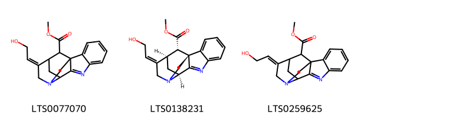
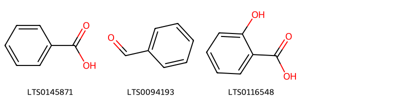
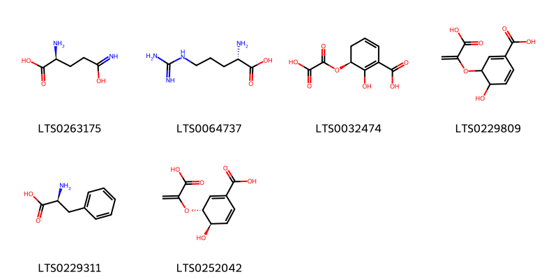
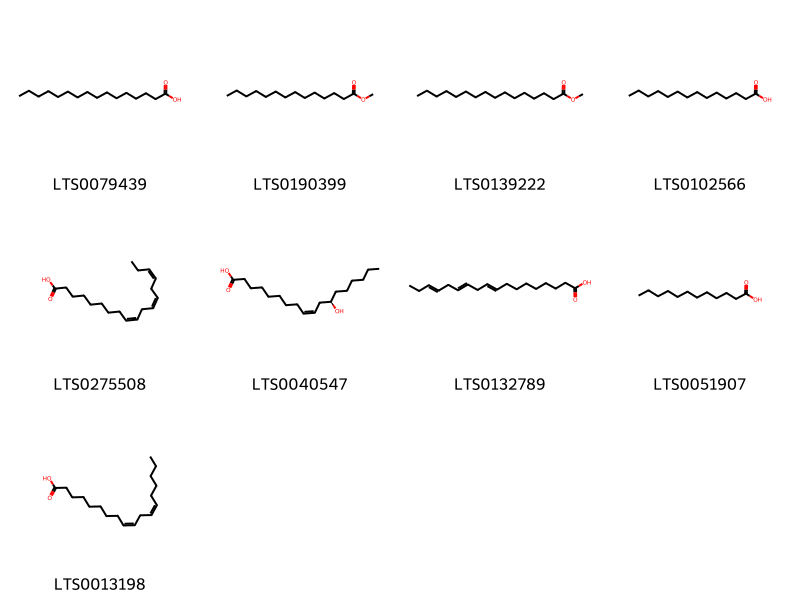
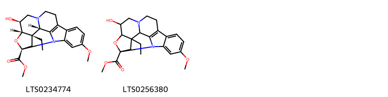
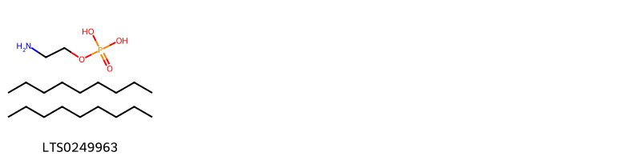
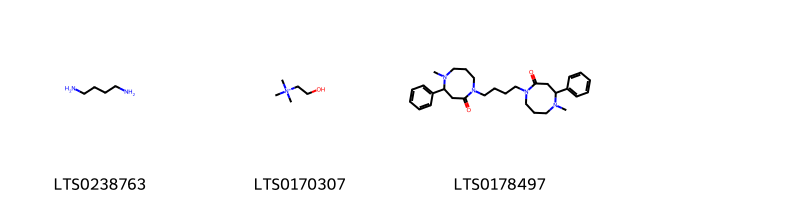
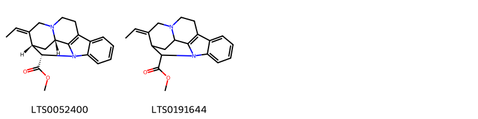
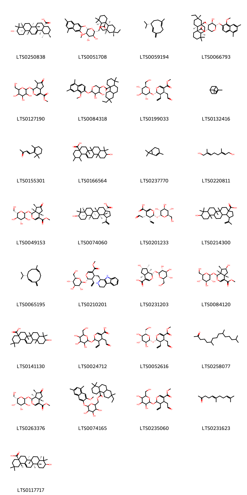
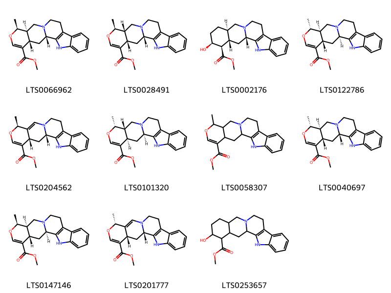

!!! abstract "Tóm tắt"

    Radix Catharanthi rosei là rễ phơi hay sấy khô của cây Dừa cạn [Catharanthus roseus (L.) G. Don], họ Trúc đào (Apocynaceae). Cây có nguồn gốc từ Madagascar, nhưng hiện nay đã được trồng rộng rãi ở nhiều khu vực nhiệt đới và cận nhiệt đới trên thế giới, bao gồm các quốc gia như Ấn Độ, Việt Nam, Indonesia, Mỹ, và nhiều vùng khác. Tại Việt Nam, cây gặp nhiều ở các tỉnh ven biển nhưng có thể trồng ở mọi nơi. Trong y học dân gian và y học cổ truyền, rễ dừa cạn được sử dụng chủ yếu để điều trị các bệnh liên quan đến huyết áp cao, co giật, và các rối loạn thần kinh. Ngoài ra, rễ dừa cạn còn có tác dụng kháng khuẩn và kháng viêm, được dùng để làm dịu các cơn ho, viêm loét, và các bệnh về da. Tác dụng dược lý của dược liệu này đã được nghiên cứu và chứng minh có hiệu quả trong việc hạ huyết áp, giãn mạch, an thần, chống co giật, kháng khuẩn và kháng viêm. Một số nghiên cứu còn chỉ ra rằng các alkaloid trong rễ cây như ajmalicine, serpentine, và vindoline có tác dụng ức chế sự phát triển của tế bào ung thư. Thành phần hóa học chính trong rễ dừa cạn gồm các alkaloid (ajmalicine, serpentine, vindoline, catharanthine), flavonoid, triterpenoid, tannin, và carbohydrate. Các alkaloid ajmalicine và serpentine thường được sử dụng làm chất chuẩn trong nghiên cứu và điều chế thuốc.

## Thông tin về thực vật

Dược liệu **Dừa Cạn (Rễ)** từ bộ phận **** từ loài *Catharanthus roseus*.

**Mô tả thực vật:** Cây nhỏ cao 0,4-0,8m, có bộ rễ rất phát triển, thân gỗ ở phía gốc, mềm ở phần trên. Mọc thành bụi dày, có cành đứng. Lá mọc đối, thuôn dài, đầu lá hơi nhọn, phía cuống hẹp nhọn, dài 3- 8cm, rộng 1-2,5cm. Hoa mọc trắng hoặc hồng, mùi thơm, mọc riêng lẻ ở các kẽ lá phía trên, quả gồm 2 đại, dài 2-4cm, rộng 2-3mm, mọc thẳng đứng, hơi ngả sang hai bên, trên vỏ có vạch dọc, đầu quả hơi tù, trong quả chứa 12-20 hạt nhỏ màu nâu nhạt, hình trứng, trên mặt hạt có các hột nổi, thành đường chạy dọc.

*Tài liệu tham khảo:* "Những cây thuốc và vị thuốc Việt Nam" - Đỗ Tất Lợi 
Trong dược điển Việt nam, một loài được sử dụng làm dược liệu là *Catharanthus roseus*.

!!! info "Phân loại thực vật của *Catharanthus roseus*"
    - **Kingdom:** Plantae
    - **Phylum:** Tracheophyta
    - **Order:** Gentianales
    - **Family:** Apocynaceae
    - **Genus:** Catharanthus
    - **Species:** *Catharanthus roseus*

**Phân bố trên thế giới:** Benin, Gambia, Tanzania, United Republic of, Zambia, Vanuatu, Saint Lucia, Kenya, Cuba, Jamaica, Tonga, Singapore, Sri Lanka, Seychelles, Antigua and Barbuda, Ghana, Egypt, French Guiana, Mexico, Chinese Taipei, Colombia, Hong Kong, Cambodia, South Africa, Barbados, Réunion, Bonaire, Sint Eustatius and Saba, Belize, Japan, Australia, Martinique, Panama, Madagascar, Grenada, Myanmar, Mauritius, Niue, Nigeria, Honduras, India, Brazil, Peru, Viet Nam, Thailand, Namibia, United States of America, Philippines, Ethiopia, China, Uganda, Dominican Republic, Nicaragua, Fiji, Ecuador, Puerto Rico, El Salvador, Lao People’s Democratic Republic

**Phân bố tại Việt nam:** Kiên Giang

## Thông tin về dược liệu 

### Định danh

!!! info "Thông tin về tên gọi"

    - Dược liệu tiếng Việt: dừa cạn
    - Dược liệu tiếng Trung: 长春花 (Chang Chun Hua)
    - Dược liệu tiếng Anh: Catharanthus Roseus [Syn. Vinca Rosea, Lochera Rosea]
    - Dược liệu latin thông dụng: Radix Catharanthi rosei
    - Dược liệu latin kiểu DĐVN: *radix catharanthi rosei*
    - Dược liệu latin kiểu DĐVN: **
    - Dược liệu latin kiểu thông tư: **
    - Bộ phận dùng:  (Radix)

### Mô tả dược liệu 

- **Theo dược điển Việt nam V:** Rễ cong queo hoặc thảng, dài 10 cm đến 20 cm, đường kính 1 cm đến 2 cm, phía trên có đoạn gốc thân dài 3 cm đến 5 cm, phía dưới có nhiều rễ con nhỏ. Mặt ngoài hơi nhẵn, có màu nâu vàng, đoạn thân màu xám có vết sẹo của cành con. Rễ cứng khó bẻ, mặt bẻ lởm chởm. Mặt cắt ngang có màu trắng ngà, không mùi, vị đăng.

- **Mô tả dược liệu theo thông tư chế biến dược liệu theo phương pháp cổ truyền:** 

### Chế biến 

- **Chế biến theo dược điển việt nam V**: Thu lấy rễ, rừa sạch đất cát, phơi hoặc sấy ờ 50 °c tới khô.

- **Chế biến theo thông tư:** 

--- 

## Thành phần hóa học

- Theo tài liệu của GS. Đỗ Tất Lợi:  (1) Alkaloid, Flavonoid, Triterpenoid, Carbohydrate
(2) Ajmalicine, serpentine
    

**Thành phần hóa học từ loài **Catharanthus roseus**

Theo cơ sở dữ liệu lotus, loài *Catharanthus roseus* đã phân lập và xác định được **291** hoạt chất thuộc về các nhóm Yohimbine alkaloids, Organonitrogen compounds, Fatty Acyls, Organic oxides, Pyrimidine nucleosides, Carboxylic acids and derivatives, Indolonaphthyridine alkaloids, Steroids and steroid derivatives, Quebrachamine alkaloids, Flavonoids, Akuammilan and related alkaloids, Corynanthean-type alkaloids, Plumeran-type alkaloids, Organic phosphoric acids and derivatives, Aspidospermatan-type alkaloids, Strychnos alkaloids, Benzopyrans, Vobasan alkaloids, Tetrahydrofurans, Benzene and substituted derivatives, Ibogan-type alkaloids, Prenol lipids, Indolizidines, Organooxygen compounds, Vinca alkaloids, Indoles and derivatives, Hydroxy acids and derivatives, Benzofurans, Macroline alkaloids, Pleiocarpaman alkaloids trong bảng dưới đây. Danh sách các hoạt chất như sau methyl (2r,5r,6s,8s,9s,10r)-14-[(1r,9s,12r,13z,18r)-13-ethylidene-4-methoxy-18-(methoxycarbonyl)-6-methyl-8,15-diazapentacyclo[10.5.1.0¹,⁹.0²,⁷.0⁹,¹⁵]octadeca-2,4,6-trien-5-yl]-15-methoxy-6,18-dimethyl-3-(2-methylpropanoyl)-7-oxa-3,18-diazapentacyclo[9.7.0.0²,⁸.0⁵,⁹.0¹²,¹⁷]octadeca-1(11),12,14,16-tetraene-10-carboxylate [(LTS0257068)](https://lotus.naturalproducts.net/compound/lotus_id/LTS0257068), methyl (2s,13s,18s)-13-[(1r,9r,10s,11r,19s)-11-(acetyloxy)-12-ethyl-10-hydroxy-5-methoxy-10-(methoxycarbonyl)-8-methyl-8,16-diazapentacyclo[10.6.1.0¹,⁹.0²,⁷.0¹⁶,¹⁹]nonadeca-2,4,6,13-tetraen-4-yl]-18-ethyl-2-(2-oxopropyl)-17-oxa-1,11-diazapentacyclo[13.4.1.0⁴,¹².0⁵,¹⁰.0¹⁶,¹⁸]icosa-4(12),5,7,9-tetraene-13-carboxylate [(LTS0218113)](https://lotus.naturalproducts.net/compound/lotus_id/LTS0218113), methyl (1r,12s,19r)-12-[(1s)-1-(acetyloxy)ethyl]-5-methoxy-8,16-diazapentacyclo[10.6.1.0¹,⁹.0²,⁷.0¹⁶,¹⁹]nonadeca-2,4,6,9,13-pentaene-10-carboxylate [(LTS0002560)](https://lotus.naturalproducts.net/compound/lotus_id/LTS0002560), loganic acid [(LTS0231203)](https://lotus.naturalproducts.net/compound/lotus_id/LTS0231203), 6,10,14-trimethylpentadecan-2-one [(LTS0258077)](https://lotus.naturalproducts.net/compound/lotus_id/LTS0258077), methyl (15r,20r)-16-methyl-17-oxa-3,13-diazapentacyclo[11.8.0.0²,¹⁰.0⁴,⁹.0¹⁵,²⁰]henicosa-1,3,5,7,9,11,18-heptaene-19-carboxylate [(LTS0165701)](https://lotus.naturalproducts.net/compound/lotus_id/LTS0165701), aldohexose 6-phosphate [(LTS0163993)](https://lotus.naturalproducts.net/compound/lotus_id/LTS0163993), (+)-glucose [(LTS0262158)](https://lotus.naturalproducts.net/compound/lotus_id/LTS0262158), methyl (1s,12s,13r,14r,15e)-15-ethylidene-3,17-diazapentacyclo[12.3.1.0²,¹⁰.0⁴,⁹.0¹²,¹⁷]octadeca-2(10),4,6,8-tetraene-13-carboxylate [(LTS0262249)](https://lotus.naturalproducts.net/compound/lotus_id/LTS0262249), glucose [(LTS0013597)](https://lotus.naturalproducts.net/compound/lotus_id/LTS0013597), α pinene [(LTS0132416)](https://lotus.naturalproducts.net/compound/lotus_id/LTS0132416), 1-(5,6-dimethylheptan-2-yl)-7-hydroxy-9a,11a-dimethyl-tetradecahydrocyclopenta[a]phenanthren-5-one [(LTS0181625)](https://lotus.naturalproducts.net/compound/lotus_id/LTS0181625), 19-epi-ajmalicine [(LTS0040697)](https://lotus.naturalproducts.net/compound/lotus_id/LTS0040697), campesterol [(LTS0046755)](https://lotus.naturalproducts.net/compound/lotus_id/LTS0046755), methyl (1r,9r,10s,11r,12r,19r)-12-ethyl-4-[(13s,15r,17s)-17-ethyl-17-hydroxy-13-(methoxycarbonyl)-1,11-diazatetracyclo[13.3.1.0⁴,¹².0⁵,¹⁰]nonadeca-4(12),5,7,9-tetraen-13-yl]-10,11-dihydroxy-5-methoxy-8-methyl-8,16-diazapentacyclo[10.6.1.0¹,⁹.0²,⁷.0¹⁶,¹⁹]nonadeca-2(7),3,5,13-tetraene-10-carboxylate [(LTS0105836)](https://lotus.naturalproducts.net/compound/lotus_id/LTS0105836), perivine [(LTS0219613)](https://lotus.naturalproducts.net/compound/lotus_id/LTS0219613), catharanthine [(LTS0129063)](https://lotus.naturalproducts.net/compound/lotus_id/LTS0129063), (1r,3bs,5as,7s,9ar,9bs,11as)-7-hydroxy-1-[(2s,3s,5r)-3-hydroxy-5,6-dimethylheptan-2-yl]-9a,11a-dimethyl-tetradecahydrocyclopenta[a]phenanthren-5-one [(LTS0204620)](https://lotus.naturalproducts.net/compound/lotus_id/LTS0204620), methyl (1's,3s,4'as,5'as,10'as)-2-hydroxy-1'-methyl-1',4'a,5',5'a,7',8',10',10'a-octahydrospiro[indole-3,6'-pyrano[3,4-f]indolizine]-4'-carboxylate [(LTS0209778)](https://lotus.naturalproducts.net/compound/lotus_id/LTS0209778), methyl (1r,9r,10r,12r,19s,20s)-20-methyl-8,16-diazahexacyclo[10.6.1.1⁹,¹².0¹,⁹.0²,⁷.0¹⁶,¹⁹]icosa-2,4,6,13-tetraene-10-carboxylate [(LTS0207896)](https://lotus.naturalproducts.net/compound/lotus_id/LTS0207896), methyl 11-(acetyloxy)-12-ethyl-10-hydroxy-8-methyl-8,16-diazapentacyclo[10.6.1.0¹,⁹.0²,⁷.0¹⁶,¹⁹]nonadeca-2,4,6,13-tetraene-10-carboxylate [(LTS0118231)](https://lotus.naturalproducts.net/compound/lotus_id/LTS0118231), linoleic [(LTS0013198)](https://lotus.naturalproducts.net/compound/lotus_id/LTS0013198), methyl (1r,9r,10s,11r,12r,19r)-11-(acetyloxy)-12-ethyl-4-[(13s,15r,17s)-17-ethyl-17-hydroxy-13-(methoxycarbonyl)-1,11-diazatetracyclo[13.3.1.0⁴,¹².0⁵,¹⁰]nonadeca-4(12),5,7,9-tetraen-13-yl]-8-formyl-10-hydroxy-5-methoxy-8,16-diazapentacyclo[10.6.1.0¹,⁹.0²,⁷.0¹⁶,¹⁹]nonadeca-2(7),3,5,13-tetraene-10-carboxylate [(LTS0229611)](https://lotus.naturalproducts.net/compound/lotus_id/LTS0229611), vinblastine [(LTS0000656)](https://lotus.naturalproducts.net/compound/lotus_id/LTS0000656), methyl (1r,12s,19r)-12-[(1r)-1-hydroxyethyl]-8,16-diazapentacyclo[10.6.1.0¹,⁹.0²,⁷.0¹⁶,¹⁹]nonadeca-2,4,6,9,13-pentaene-10-carboxylate [(LTS0008750)](https://lotus.naturalproducts.net/compound/lotus_id/LTS0008750), methyl (1r,9s,10s,12r,19s)-11-(acetyloxy)-12-ethyl-10-hydroxy-5-methoxy-8-methyl-8,16-diazapentacyclo[10.6.1.0¹,⁹.0²,⁷.0¹⁶,¹⁹]nonadeca-2,4,6,13-tetraene-10-carboxylate [(LTS0003468)](https://lotus.naturalproducts.net/compound/lotus_id/LTS0003468), horhammericine [(LTS0143143)](https://lotus.naturalproducts.net/compound/lotus_id/LTS0143143), methyl (1r,9r,10s,11r,12r,19r)-11-(acetyloxy)-12-ethyl-10-hydroxy-4-[(2r)-5-hydroxy-3,4-dihydro-2h-pyrrol-2-yl]-5-methoxy-8-methyl-8,16-diazapentacyclo[10.6.1.0¹,⁹.0²,⁷.0¹⁶,¹⁹]nonadeca-2,4,6,13-tetraene-10-carboxylate [(LTS0196209)](https://lotus.naturalproducts.net/compound/lotus_id/LTS0196209), methyl (13e)-13-ethylidene-1,11-diazapentacyclo[12.3.1.0²,⁷.0⁸,¹⁷.0¹¹,¹⁶]octadeca-2,4,6,8(17)-tetraene-18-carboxylate [(LTS0191644)](https://lotus.naturalproducts.net/compound/lotus_id/LTS0191644), methyl 11-(acetyloxy)-12-ethyl-4-[(1z)-1-{16-ethyl-16-hydroxy-3,13-diazatetracyclo[11.2.2.0²,¹⁰.0⁴,⁹]heptadeca-2(10),4,6,8-tetraen-15-yl}-3-methoxy-3-oxoprop-1-en-2-yl]-10-hydroxy-5-methoxy-8-methyl-8,16-diazapentacyclo[10.6.1.0¹,⁹.0²,⁷.0¹⁶,¹⁹]nonadeca-2(7),3,5,13-tetraene-10-carboxylate [(LTS0196774)](https://lotus.naturalproducts.net/compound/lotus_id/LTS0196774), 9-hydroxy-5a,5b,8,8,11a-pentamethyl-1-(prop-1-en-2-yl)-hexadecahydrocyclopenta[a]chrysene-3a-carboxylic acid [(LTS0214300)](https://lotus.naturalproducts.net/compound/lotus_id/LTS0214300), (1s,2r,4r,5s,7s,11r,12r,15s,16s)-15-[(2s,3r,4r,5s)-3,4-dihydroxy-5,6-dimethylheptan-2-yl]-4,5-dihydroxy-2,16-dimethyl-9-oxatetracyclo[9.7.0.0²,⁷.0¹²,¹⁶]octadecan-8-one [(LTS0072711)](https://lotus.naturalproducts.net/compound/lotus_id/LTS0072711), methyl (1r,10s,12r,13e,18s)-13-(2-hydroxyethylidene)-8,15-diazapentacyclo[10.5.1.0¹,⁹.0²,⁷.0¹⁰,¹⁵]octadeca-2,4,6,8-tetraene-18-carboxylate [(LTS0138231)](https://lotus.naturalproducts.net/compound/lotus_id/LTS0138231), methyl 2-hydroxy-1'-methyl-1',4'a,5',5'a,7',8',10',10'a-octahydrospiro[indole-3,6'-pyrano[3,4-f]indolizine]-4'-carboxylate [(LTS0192836)](https://lotus.naturalproducts.net/compound/lotus_id/LTS0192836), methyl (1r,9r,10r,11r,12r,19s)-11-(acetyloxy)-12-ethyl-4-[(13r,15s,17r)-17-ethyl-17-hydroxy-13-(methoxycarbonyl)-1,11-diazatetracyclo[13.3.1.0⁴,¹².0⁵,¹⁰]nonadeca-4(12),5,7,9-tetraen-13-yl]-8-formyl-10-hydroxy-5-methoxy-8,16-diazapentacyclo[10.6.1.0¹,⁹.0²,⁷.0¹⁶,¹⁹]nonadeca-2(7),3,5,13-tetraene-10-carboxylate [(LTS0036539)](https://lotus.naturalproducts.net/compound/lotus_id/LTS0036539), catharine [(LTS0105629)](https://lotus.naturalproducts.net/compound/lotus_id/LTS0105629), methyl palmitate [(LTS0139222)](https://lotus.naturalproducts.net/compound/lotus_id/LTS0139222), methyl 19-hydroxy-12-methyl-11-oxa-8,17-diazahexacyclo[11.6.1.1¹⁰,¹³.0¹,⁹.0²,⁷.0¹⁷,²⁰]henicosa-2,4,6,14-tetraene-10-carboxylate [(LTS0231121)](https://lotus.naturalproducts.net/compound/lotus_id/LTS0231121), [(1s,12s)-15-ethylidene-7-methoxy-3,17-diazapentacyclo[12.3.1.0²,¹⁰.0⁴,⁹.0¹²,¹⁷]octadeca-2(10),4,6,8-tetraen-13-yl]methanol [(LTS0211440)](https://lotus.naturalproducts.net/compound/lotus_id/LTS0211440), methyl (1s,17r,18s)-18-ethyl-8,14-diazapentacyclo[9.5.2.0¹,⁹.0²,⁷.0¹⁴,¹⁷]octadeca-2,4,6,9-tetraene-10-carboxylate [(LTS0274802)](https://lotus.naturalproducts.net/compound/lotus_id/LTS0274802), methyl 2-{3-ethenyl-1h,2h,3h,4h,6h,7h,12h,12bh-indolo[2,3-a]quinolizin-2-yl}-3-hydroxypropanoate [(LTS0055141)](https://lotus.naturalproducts.net/compound/lotus_id/LTS0055141), lauric acid [(LTS0051907)](https://lotus.naturalproducts.net/compound/lotus_id/LTS0051907), typhasterol [(LTS0030045)](https://lotus.naturalproducts.net/compound/lotus_id/LTS0030045), vindoline [(LTS0082987)](https://lotus.naturalproducts.net/compound/lotus_id/LTS0082987), α-d-glucose 6-phosphate [(LTS0220201)](https://lotus.naturalproducts.net/compound/lotus_id/LTS0220201), methyl (1's,3r,4'as,5'as,10'ar)-2-hydroxy-1'-methyl-1',4'a,5',5'a,7',8',10',10'a-octahydrospiro[indole-3,6'-pyrano[3,4-f]indolizine]-4'-carboxylate [(LTS0042883)](https://lotus.naturalproducts.net/compound/lotus_id/LTS0042883), l-arginine [(LTS0064737)](https://lotus.naturalproducts.net/compound/lotus_id/LTS0064737), methyl (15s,16r,20r)-16-methyl-17-oxa-3,13-diazapentacyclo[11.8.0.0²,¹⁰.0⁴,⁹.0¹⁵,²⁰]henicosa-1,3,5,7,9,11,18-heptaene-19-carboxylate [(LTS0143894)](https://lotus.naturalproducts.net/compound/lotus_id/LTS0143894), methyl (1r,12s,19r)-12-[(1r)-1-hydroxyethyl]-5-methoxy-8,16-diazapentacyclo[10.6.1.0¹,⁹.0²,⁷.0¹⁶,¹⁹]nonadeca-2,4,6,9,13-pentaene-10-carboxylate [(LTS0172321)](https://lotus.naturalproducts.net/compound/lotus_id/LTS0172321), 19-ethenyl-18-{[3,4,5-trihydroxy-6-(hydroxymethyl)oxan-2-yl]oxy}-17-oxa-3,13-diazapentacyclo[11.8.0.0²,¹⁰.0⁴,⁹.0¹⁵,²⁰]henicosa-2(10),4,6,8,15-pentaen-14-one [(LTS0254140)](https://lotus.naturalproducts.net/compound/lotus_id/LTS0254140), 1-(5,6-dimethylheptan-2-yl)-9a,11a-dimethyl-tetradecahydro-1h-cyclopenta[a]phenanthren-7-ol [(LTS0078929)](https://lotus.naturalproducts.net/compound/lotus_id/LTS0078929), dihydroactinidiolide [(LTS0041341)](https://lotus.naturalproducts.net/compound/lotus_id/LTS0041341), l glutamine [(LTS0263175)](https://lotus.naturalproducts.net/compound/lotus_id/LTS0263175), 10-hydroxy-1,2,6a,6b,9,9,12a-heptamethyl-2,3,4,5,6,7,8,8a,10,11,12,12b,13,14b-tetradecahydro-1h-picene-4a-carboxylic acid [(LTS0166564)](https://lotus.naturalproducts.net/compound/lotus_id/LTS0166564), methyl 12-(1-hydroxyethyl)-5-methoxy-14-oxa-8,17-diazahexacyclo[10.7.1.0¹,⁹.0²,⁷.0¹³,¹⁵.0¹⁷,²⁰]icosa-2,4,6,9-tetraene-10-carboxylate [(LTS0163785)](https://lotus.naturalproducts.net/compound/lotus_id/LTS0163785), 3-{[(2s,3r,4s,5r,6r)-4,5-dihydroxy-3-{[(2s,3r,4r,5r,6s)-3,4,5-trihydroxy-6-methyloxan-2-yl]oxy}-6-({[(2r,3r,4r,5r,6s)-3,4,5-trihydroxy-6-methyloxan-2-yl]oxy}methyl)oxan-2-yl]oxy}-2-(3,4-dihydroxyphenyl)-5,7-dihydroxychromen-4-one [(LTS0082113)](https://lotus.naturalproducts.net/compound/lotus_id/LTS0082113), [(2r,3s,4s,5r,6s)-3,4,5-trihydroxy-6-{[2-(4-hydroxy-3,5-dimethoxyphenyl)-7-methoxy-5-oxochromen-3-yl]oxy}oxan-2-yl]methyl 3-(4-hydroxyphenyl)prop-2-enoate [(LTS0259820)](https://lotus.naturalproducts.net/compound/lotus_id/LTS0259820), (1s,18s,19r,20s)-19-ethenyl-18-{[(2r,3s,4r,5r,6s)-3,4,5-trihydroxy-6-(hydroxymethyl)oxan-2-yl]oxy}-17-oxa-3,13-diazapentacyclo[11.8.0.0²,¹⁰.0⁴,⁹.0¹⁵,²⁰]henicosa-2(10),4,6,8,15-pentaen-14-one [(LTS0225757)](https://lotus.naturalproducts.net/compound/lotus_id/LTS0225757), methyl 2-{1h,2h,3h,4h,6h,7h,12h,12bh-indolo[2,3-a]quinolizin-2-yl}but-3-enoate [(LTS0133339)](https://lotus.naturalproducts.net/compound/lotus_id/LTS0133339), methyl (1s,4as,7r,7ar)-7-methyl-6-oxo-1-{[(2s,3s,4r,5s,6s)-3,4,5-trihydroxy-6-(hydroxymethyl)oxan-2-yl]oxy}-1h,4ah,5h,7h,7ah-cyclopenta[c]pyran-4-carboxylate [(LTS0263376)](https://lotus.naturalproducts.net/compound/lotus_id/LTS0263376), 5,7-dihydroxy-2-(4-hydroxy-3,5-dimethoxyphenyl)-3-[(3,4,5-trihydroxy-6-{[(3,4,5-trihydroxy-6-methyloxan-2-yl)oxy]methyl}oxan-2-yl)oxy]chromen-4-one [(LTS0178754)](https://lotus.naturalproducts.net/compound/lotus_id/LTS0178754), methyl (1r,10s,11r,12r)-11-(acetyloxy)-12-ethyl-4-[(1z)-1-[(1s,15r,16r)-16-ethyl-16-hydroxy-3,13-diazatetracyclo[11.2.2.0²,¹⁰.0⁴,⁹]heptadeca-2(10),4,6,8-tetraen-15-yl]-3-methoxy-3-oxoprop-1-en-2-yl]-10-hydroxy-5-methoxy-8-methyl-8,16-diazapentacyclo[10.6.1.0¹,⁹.0²,⁷.0¹⁶,¹⁹]nonadeca-2(7),3,5,13-tetraene-10-carboxylate [(LTS0186335)](https://lotus.naturalproducts.net/compound/lotus_id/LTS0186335), 1-(3,4-dihydroxy-5,6-dimethylheptan-2-yl)-7,8-dihydroxy-9a,11a-dimethyl-tetradecahydrocyclopenta[a]phenanthren-5-one [(LTS0020071)](https://lotus.naturalproducts.net/compound/lotus_id/LTS0020071), (1s,10s,12s,13z,18s)-13-ethylidene-18-(hydroxymethyl)-8,15-diazapentacyclo[10.5.1.0¹,⁹.0²,⁷.0¹⁰,¹⁵]octadeca-2,4,6,8-tetraene-18-carboxylic acid [(LTS0128010)](https://lotus.naturalproducts.net/compound/lotus_id/LTS0128010), d-fructose 6-phosphate [(LTS0093797)](https://lotus.naturalproducts.net/compound/lotus_id/LTS0093797), 2-{7-hydroxy-9a,11a-dimethyl-tetradecahydro-1h-cyclopenta[a]phenanthren-1-yl}-5,6-dimethylheptan-3-ol [(LTS0249062)](https://lotus.naturalproducts.net/compound/lotus_id/LTS0249062), substance ii [(LTS0066962)](https://lotus.naturalproducts.net/compound/lotus_id/LTS0066962), methyl 11-(acetyloxy)-12-ethyl-4-[17-ethyl-17-hydroxy-13-(methoxycarbonyl)-1,11-diazatetracyclo[13.3.1.0⁴,¹².0⁵,¹⁰]nonadeca-4(12),5,7,9-tetraen-13-yl]-8-formyl-10-hydroxy-5-methoxy-8,16-diazapentacyclo[10.6.1.0¹,⁹.0²,⁷.0¹⁶,¹⁹]nonadeca-2(7),3,5,13-tetraene-10-carboxylate [(LTS0112704)](https://lotus.naturalproducts.net/compound/lotus_id/LTS0112704), β-ionone [(LTS0155301)](https://lotus.naturalproducts.net/compound/lotus_id/LTS0155301), methyl (1s,9r,10s,11r,12r,19r)-11-(acetyloxy)-12-ethyl-4-[(13s,15r,17s)-17-ethyl-17-hydroxy-13-(methoxycarbonyl)-1,11-diazatetracyclo[13.3.1.0⁴,¹².0⁵,¹⁰]nonadeca-4(12),5,7,9-tetraen-13-yl]-10-hydroxy-5-methoxy-8,16-diazapentacyclo[10.6.1.0¹,⁹.0²,⁷.0¹⁶,¹⁹]nonadeca-2(7),3,5,13-tetraene-10-carboxylate [(LTS0002610)](https://lotus.naturalproducts.net/compound/lotus_id/LTS0002610), methyl 12-ethyl-5-methoxy-8-methyl-8,16-diazapentacyclo[10.6.1.0¹,⁹.0²,⁷.0¹⁶,¹⁹]nonadeca-2,4,6,9,13-pentaene-10-carboxylate [(LTS0207696)](https://lotus.naturalproducts.net/compound/lotus_id/LTS0207696), methyl (1s,4as,7r,7as)-7-methyl-6-oxo-1-{[(2s,3s,4r,5r,6s)-3,4,5-trihydroxy-6-(hydroxymethyl)oxan-2-yl]oxy}-1h,4ah,5h,7h,7ah-cyclopenta[c]pyran-4-carboxylate [(LTS0049153)](https://lotus.naturalproducts.net/compound/lotus_id/LTS0049153), 5,7-dihydroxy-3-{[(2r,3r,4s,5s,6r)-5-hydroxy-6-(hydroxymethyl)-3,4-bis({[(2s,3r,4r,5r,6s)-3,4,5-trihydroxy-6-methyloxan-2-yl]oxy})oxan-2-yl]oxy}-2-(4-hydroxyphenyl)chromen-4-one [(LTS0146227)](https://lotus.naturalproducts.net/compound/lotus_id/LTS0146227), α linolenic acid [(LTS0132789)](https://lotus.naturalproducts.net/compound/lotus_id/LTS0132789), methyl (1r,12r,19r)-12-[(1r)-1-hydroxyethyl]-8,16-diazapentacyclo[10.6.1.0¹,⁹.0²,⁷.0¹⁶,¹⁹]nonadeca-2,4,6,9-tetraene-10-carboxylate [(LTS0048208)](https://lotus.naturalproducts.net/compound/lotus_id/LTS0048208), methyl (1r,9s,10s,11r,12r,19r)-11-(acetyloxy)-12-ethyl-10-hydroxy-5-methoxy-8-methyl-8,16-diazapentacyclo[10.6.1.0¹,⁹.0²,⁷.0¹⁶,¹⁹]nonadeca-2,4,6,13-tetraene-10-carboxylate [(LTS0176726)](https://lotus.naturalproducts.net/compound/lotus_id/LTS0176726), secologanin [(LTS0235060)](https://lotus.naturalproducts.net/compound/lotus_id/LTS0235060), chorismic acid [(LTS0252042)](https://lotus.naturalproducts.net/compound/lotus_id/LTS0252042), putrescine [(LTS0238763)](https://lotus.naturalproducts.net/compound/lotus_id/LTS0238763), methyl (2r,3s,12bs)-2-[(2z)-1-oxobut-2-en-2-yl]-1h,2h,3h,4h,6h,7h,12h,12bh-indolo[2,3-a]quinolizine-3-carboxylate [(LTS0233722)](https://lotus.naturalproducts.net/compound/lotus_id/LTS0233722), l-phenylalanine [(LTS0229311)](https://lotus.naturalproducts.net/compound/lotus_id/LTS0229311), methyl (15r,16s,20s)-15,16-dimethyl-17-oxa-3,13-diazapentacyclo[11.8.0.0²,¹⁰.0⁴,⁹.0¹⁵,²⁰]henicosa-1,3,5,7,9,11,18-heptaene-19-carboxylate [(LTS0250206)](https://lotus.naturalproducts.net/compound/lotus_id/LTS0250206), 5-ethenyl-3-hydroxy-6-{[3,4,5-trihydroxy-6-(hydroxymethyl)oxan-2-yl]oxy}-3h,4h,4ah,5h,6h-pyrano[3,4-c]pyran-1-one [(LTS0107693)](https://lotus.naturalproducts.net/compound/lotus_id/LTS0107693), catharanthine [(LTS0059701)](https://lotus.naturalproducts.net/compound/lotus_id/LTS0059701), yohimbine,α- [(LTS0253657)](https://lotus.naturalproducts.net/compound/lotus_id/LTS0253657), (3s)-3-[(carboxycarbonyl)oxy]-2-hydroxycyclohexa-1,5-diene-1-carboxylic acid [(LTS0032474)](https://lotus.naturalproducts.net/compound/lotus_id/LTS0032474), methyl (1r,12s,13r,15s,20r)-12-ethyl-14-oxa-8,17-diazahexacyclo[10.7.1.0¹,⁹.0²,⁷.0¹³,¹⁵.0¹⁷,²⁰]icosa-2,4,6,9-tetraene-10-carboxylate [(LTS0135814)](https://lotus.naturalproducts.net/compound/lotus_id/LTS0135814), campestanol [(LTS0233243)](https://lotus.naturalproducts.net/compound/lotus_id/LTS0233243), myricetin [(LTS0139858)](https://lotus.naturalproducts.net/compound/lotus_id/LTS0139858), chorismic acid [(LTS0229809)](https://lotus.naturalproducts.net/compound/lotus_id/LTS0229809), (3s,4r,5r,6s)-4,5-dihydroxy-6-[(1-methoxy-5,7-dimethylnaphthalen-2-yl)oxy]oxan-3-yl (4as,4bs,7s,8as,10as)-7-ethyl-1,1,7-trimethyl-decahydro-2h-phenanthrene-4a-carboxylate [(LTS0066793)](https://lotus.naturalproducts.net/compound/lotus_id/LTS0066793), methyl (1r,9r,10s,11r,12r,19r)-11-(acetyloxy)-12-ethyl-4-[(13s,15r,17s)-17-ethyl-17-hydroxy-13-(methoxycarbonyl)-1,11-diazatetracyclo[13.3.1.0⁴,¹².0⁵,¹⁰]nonadeca-4(12),5,7,9-tetraen-13-yl]-10-hydroxy-5-methoxy-8-methyl-8,16-diazapentacyclo[10.6.1.0¹,⁹.0²,⁷.0¹⁶,¹⁹]nonadeca-2(7),3,5-triene-10-carboxylate [(LTS0268057)](https://lotus.naturalproducts.net/compound/lotus_id/LTS0268057), 3-{[(2s,5r,6r)-4,5-dihydroxy-3-{[(2s,5r,6r)-3,4,5-trihydroxy-6-methyloxan-2-yl]oxy}-6-({[(2r,4s,5r)-3,4,5-trihydroxy-6-methyloxan-2-yl]oxy}methyl)oxan-2-yl]oxy}-5,7-dihydroxy-2-(4-hydroxyphenyl)chromen-4-one [(LTS0213410)](https://lotus.naturalproducts.net/compound/lotus_id/LTS0213410), (2s,3r,4s,5s,6r)-2-({7-hydroxy-4-methyl-1h,4ah,5h,6h,7h,7ah-cyclopenta[c]pyran-1-yl}oxy)-6-(hydroxymethyl)oxane-3,4,5-triol [(LTS0153131)](https://lotus.naturalproducts.net/compound/lotus_id/LTS0153131), benzaldehyde [(LTS0094193)](https://lotus.naturalproducts.net/compound/lotus_id/LTS0094193), methyl (1r,9r,10s,12r,19r)-11-(acetyloxy)-12-ethyl-10-hydroxy-8-methyl-8,16-diazapentacyclo[10.6.1.0¹,⁹.0²,⁷.0¹⁶,¹⁹]nonadeca-2,4,6,13-tetraene-10-carboxylate [(LTS0152449)](https://lotus.naturalproducts.net/compound/lotus_id/LTS0152449), vindoline [(LTS0126549)](https://lotus.naturalproducts.net/compound/lotus_id/LTS0126549), 5,7-dihydroxy-2-(4-hydroxy-3,5-dimethoxyphenyl)-3-{[(2s,3r,4s,5s,6r)-3,4,5-trihydroxy-6-({[(2r,3s,4r,5r,6s)-3,4,5-trihydroxy-6-methyloxan-2-yl]oxy}methyl)oxan-2-yl]oxy}chromen-4-one [(LTS0013045)](https://lotus.naturalproducts.net/compound/lotus_id/LTS0013045), 3-({4,5-dihydroxy-3-[(3,4,5-trihydroxy-6-methyloxan-2-yl)oxy]-6-{[(3,4,5-trihydroxy-6-methyloxan-2-yl)oxy]methyl}oxan-2-yl}oxy)-5,7-dihydroxy-2-(4-hydroxyphenyl)chromen-4-one [(LTS0207966)](https://lotus.naturalproducts.net/compound/lotus_id/LTS0207966), [5-hydroxy-2-(4-hydroxy-3,5-dimethoxyphenyl)-3-{[(2s,3s,4s,5s,6r)-3,4,5-trihydroxy-6-(hydroxymethyl)oxan-2-yl]oxy}chromen-7-ylidene](methyl)oxidanium [(LTS0055951)](https://lotus.naturalproducts.net/compound/lotus_id/LTS0055951), 16-methoxytabersonine [(LTS0228380)](https://lotus.naturalproducts.net/compound/lotus_id/LTS0228380), choline [(LTS0170307)](https://lotus.naturalproducts.net/compound/lotus_id/LTS0170307), kaempferide [(LTS0143784)](https://lotus.naturalproducts.net/compound/lotus_id/LTS0143784), methyl 17-ethyl-3,13-diazapentacyclo[13.3.1.0²,¹⁰.0⁴,⁹.0¹³,¹⁸]nonadeca-2(10),4,6,8,16-pentaene-1-carboxylate [(LTS0215720)](https://lotus.naturalproducts.net/compound/lotus_id/LTS0215720), methyl (2s,12bs)-2-[(2e)-1-oxobut-2-en-2-yl]-1h,2h,6h,7h,12h,12bh-indolo[2,3-a]quinolizine-3-carboxylate [(LTS0259202)](https://lotus.naturalproducts.net/compound/lotus_id/LTS0259202), methyl 11-(acetyloxy)-12-ethyl-8-methyl-20-oxa-8,16-diazahexacyclo[10.6.1.1¹⁰,¹³.0¹,⁹.0²,⁷.0¹⁶,¹⁹]icosa-2,4,6-triene-10-carboxylate [(LTS0182556)](https://lotus.naturalproducts.net/compound/lotus_id/LTS0182556), methyl (1s,12s,19r)-12-ethyl-5-methoxy-8,16-diazapentacyclo[10.6.1.0¹,⁹.0²,⁷.0¹⁶,¹⁹]nonadeca-2,4,6,9,13-pentaene-10-carboxylate [(LTS0080132)](https://lotus.naturalproducts.net/compound/lotus_id/LTS0080132), (-)-secologanin [(LTS0199033)](https://lotus.naturalproducts.net/compound/lotus_id/LTS0199033), methyl (1r,9r,10s,11r,12r,19s)-11-(acetyloxy)-12-ethyl-4-[(13s,15s,17s)-17-ethyl-17-hydroxy-13-(methoxycarbonyl)-1,11-diazatetracyclo[13.3.1.0⁴,¹².0⁵,¹⁰]nonadeca-4(12),5,7,9-tetraen-13-yl]-10-hydroxy-5-methoxy-8-methyl-8,16-diazapentacyclo[10.6.1.0¹,⁹.0²,⁷.0¹⁶,¹⁹]nonadeca-2(7),3,5,13-tetraene-10-carboxylate [(LTS0063292)](https://lotus.naturalproducts.net/compound/lotus_id/LTS0063292), salicyclic acid [(LTS0116548)](https://lotus.naturalproducts.net/compound/lotus_id/LTS0116548), 3-({4,5-dihydroxy-3-[(3,4,5-trihydroxy-6-methyloxan-2-yl)oxy]-6-{[(3,4,5-trihydroxy-6-methyloxan-2-yl)oxy]methyl}oxan-2-yl}oxy)-2-(3,4-dihydroxyphenyl)-5,7-dihydroxychromen-4-one [(LTS0021411)](https://lotus.naturalproducts.net/compound/lotus_id/LTS0021411), safranal [(LTS0094098)](https://lotus.naturalproducts.net/compound/lotus_id/LTS0094098), methyl (1r,11s,17s)-12-ethylidene-8,14-diazapentacyclo[9.5.2.0¹,⁹.0²,⁷.0¹⁴,¹⁷]octadeca-2,4,6,9-tetraene-10-carboxylate [(LTS0119267)](https://lotus.naturalproducts.net/compound/lotus_id/LTS0119267), 5-[(1-carboxyeth-1-en-1-yl)oxy]-6-hydroxycyclohexa-1,3-diene-1-carboxylic acid [(LTS0001200)](https://lotus.naturalproducts.net/compound/lotus_id/LTS0001200), methyl (2s)-2-[(2r,3e,12bs)-3-ethylidene-1h,2h,4h,6h,7h,12h,12bh-indolo[2,3-a]quinolizin-2-yl]-3-hydroxypropanoate [(LTS0185998)](https://lotus.naturalproducts.net/compound/lotus_id/LTS0185998), 5,7-dihydroxy-2-(4-hydroxy-3,5-dimethoxyphenyl)-3-{[(2s,3r,4s,5r,6r)-3,4,5-trihydroxy-6-({[(2r,3r,4r,5r,6s)-3,4,5-trihydroxy-6-methyloxan-2-yl]oxy}methyl)oxan-2-yl]oxy}chromen-4-one [(LTS0171955)](https://lotus.naturalproducts.net/compound/lotus_id/LTS0171955), 7-hydroxy-1-(3-hydroxy-5,6-dimethylheptan-2-yl)-9a,11a-dimethyl-tetradecahydrocyclopenta[a]phenanthren-5-one [(LTS0247079)](https://lotus.naturalproducts.net/compound/lotus_id/LTS0247079), 6-oxocampestanol [(LTS0083204)](https://lotus.naturalproducts.net/compound/lotus_id/LTS0083204), (1z,6z,8s)-8-isopropyl-1-methyl-5-methylidenecyclodeca-1,6-diene [(LTS0065195)](https://lotus.naturalproducts.net/compound/lotus_id/LTS0065195), deacetylvindoline [(LTS0168323)](https://lotus.naturalproducts.net/compound/lotus_id/LTS0168323), cholesterol [(LTS0102304)](https://lotus.naturalproducts.net/compound/lotus_id/LTS0102304), 3,7,7-trimethylbicyclo[4.1.0]hept-2-ene [(LTS0237770)](https://lotus.naturalproducts.net/compound/lotus_id/LTS0237770), vincoline [(LTS0182201)](https://lotus.naturalproducts.net/compound/lotus_id/LTS0182201), 5-methyl-1-[4-(5-methyl-2-oxo-4-phenyl-1,5-diazocan-1-yl)butyl]-4-phenyl-1,5-diazocan-2-one [(LTS0178497)](https://lotus.naturalproducts.net/compound/lotus_id/LTS0178497), alstonine [(LTS0095454)](https://lotus.naturalproducts.net/compound/lotus_id/LTS0095454), teasterone [(LTS0028563)](https://lotus.naturalproducts.net/compound/lotus_id/LTS0028563), methyl 12-[1-(acetyloxy)ethyl]-5-methoxy-8,16-diazapentacyclo[10.6.1.0¹,⁹.0²,⁷.0¹⁶,¹⁹]nonadeca-2,4,6,9,13-pentaene-10-carboxylate [(LTS0030249)](https://lotus.naturalproducts.net/compound/lotus_id/LTS0030249), methyl (1s,14s,15e)-15-ethylidene-3,17-diazapentacyclo[12.3.1.0²,¹⁰.0⁴,⁹.0¹²,¹⁷]octadeca-2(10),4,6,8-tetraene-13-carboxylate [(LTS0237162)](https://lotus.naturalproducts.net/compound/lotus_id/LTS0237162), methyl 12-ethyl-8,16-diazapentacyclo[10.6.1.0¹,⁹.0²,⁷.0¹⁶,¹⁹]nonadeca-2,4,6,9,13-pentaene-10-carboxylate [(LTS0084437)](https://lotus.naturalproducts.net/compound/lotus_id/LTS0084437), catharine [(LTS0092203)](https://lotus.naturalproducts.net/compound/lotus_id/LTS0092203), tabersonine [(LTS0064596)](https://lotus.naturalproducts.net/compound/lotus_id/LTS0064596), (2s,3s,4s,5r,6r)-6-(hydroxymethyl)oxane-2,3,4,5-tetrol [(LTS0089262)](https://lotus.naturalproducts.net/compound/lotus_id/LTS0089262), methyl (1r,9s,10r,12s,19s,20s)-20-methyl-8,16-diazahexacyclo[10.6.1.1⁹,¹².0¹,⁹.0²,⁷.0¹⁶,¹⁹]icosa-2,4,6,13-tetraene-10-carboxylate [(LTS0237556)](https://lotus.naturalproducts.net/compound/lotus_id/LTS0237556), o-phosphoethanolamine; bis(nonane) [(LTS0249963)](https://lotus.naturalproducts.net/compound/lotus_id/LTS0249963), methyl 12-(1-hydroxyethyl)-5-methoxy-8,16-diazapentacyclo[10.6.1.0¹,⁹.0²,⁷.0¹⁶,¹⁹]nonadeca-2,4,6,9,13-pentaene-10-carboxylate [(LTS0090234)](https://lotus.naturalproducts.net/compound/lotus_id/LTS0090234), methyl (4s)-4-[(10s,11r)-11-(acetyloxy)-12-ethyl-10-hydroxy-5-methoxy-10-(methoxycarbonyl)-8-methyl-8,16-diazapentacyclo[10.6.1.0¹,⁹.0²,⁷.0¹⁶,¹⁹]nonadeca-2(7),3,5,13-tetraen-4-yl]-1-ethyl-2-oxa-6,16-diazahexacyclo[16.2.1.0³,¹⁹.0⁵,¹³.0⁷,¹².0¹⁶,¹⁹]henicosa-5(13),7,9,11-tetraene-4-carboxylate [(LTS0152381)](https://lotus.naturalproducts.net/compound/lotus_id/LTS0152381), methyl (9s,10r,12s,19s,20s)-20-methyl-8,16-diazahexacyclo[10.6.1.1⁹,¹².0¹,⁹.0²,⁷.0¹⁶,¹⁹]icosa-2,4,6,13-tetraene-10-carboxylate [(LTS0127421)](https://lotus.naturalproducts.net/compound/lotus_id/LTS0127421), methyl (1r,15r)-17-ethyl-3,13-diazapentacyclo[13.3.1.0²,¹⁰.0⁴,⁹.0¹³,¹⁸]nonadeca-2(10),4,6,8,16-pentaene-1-carboxylate [(LTS0204420)](https://lotus.naturalproducts.net/compound/lotus_id/LTS0204420), methyl 11-(acetyloxy)-12-ethyl-10-hydroxy-5-methoxy-8-methyl-8,16-diazapentacyclo[10.6.1.0¹,⁹.0²,⁷.0¹⁶,¹⁹]nonadeca-2,4,6,13-tetraene-10-carboxylate [(LTS0034938)](https://lotus.naturalproducts.net/compound/lotus_id/LTS0034938), vincristine [(LTS0189111)](https://lotus.naturalproducts.net/compound/lotus_id/LTS0189111), 8-hydroxygeraniol [(LTS0220811)](https://lotus.naturalproducts.net/compound/lotus_id/LTS0220811), methyl (2r)-2-[(2r,3z,12bs)-3-ethylidene-1h,2h,4h,6h,7h,12h,12bh-indolo[2,3-a]quinolizin-2-yl]-3-hydroxypropanoate [(LTS0114913)](https://lotus.naturalproducts.net/compound/lotus_id/LTS0114913), methyl 15-ethylidene-3,17-diazapentacyclo[12.3.1.0²,¹⁰.0⁴,⁹.0¹²,¹⁷]octadeca-2(10),4,6,8-tetraene-13-carboxylate [(LTS0120658)](https://lotus.naturalproducts.net/compound/lotus_id/LTS0120658), 2-(hydroxymethyl)-6-[(2-hydroxyphenyl)methoxy]oxane-3,4,5-triol [(LTS0273091)](https://lotus.naturalproducts.net/compound/lotus_id/LTS0273091), [(2r,3s,4r,5r,6s)-6-{[2-(3,4-dihydroxy-5-methoxyphenyl)-7-hydroxy-5-oxochromen-3-yl]oxy}-3,4,5-trihydroxyoxan-2-yl]methyl 3-(4-hydroxyphenyl)prop-2-enoate [(LTS0051803)](https://lotus.naturalproducts.net/compound/lotus_id/LTS0051803), akuammicine [(LTS0047727)](https://lotus.naturalproducts.net/compound/lotus_id/LTS0047727), 24-epibrassinolide [(LTS0092449)](https://lotus.naturalproducts.net/compound/lotus_id/LTS0092449), methyl (1r,15r,16r,20s)-16-methyl-17-oxa-3,13-diazapentacyclo[11.8.0.0²,¹⁰.0⁴,⁹.0¹⁵,²⁰]henicosa-2(10),4,6,8,18-pentaene-19-carboxylate [(LTS0122786)](https://lotus.naturalproducts.net/compound/lotus_id/LTS0122786), stigmast-5-en-3-ol, (3β)- [(LTS0204616)](https://lotus.naturalproducts.net/compound/lotus_id/LTS0204616), malic acid [(LTS0216520)](https://lotus.naturalproducts.net/compound/lotus_id/LTS0216520), methyl (15s,17s)-17-ethyl-3,13-diazapentacyclo[13.3.1.0²,¹⁰.0⁴,⁹.0¹³,¹⁸]nonadeca-2(10),4,6,8-tetraene-1-carboxylate [(LTS0220401)](https://lotus.naturalproducts.net/compound/lotus_id/LTS0220401), sucrose [(LTS0272557)](https://lotus.naturalproducts.net/compound/lotus_id/LTS0272557), methyl (1r,9r,10s,11r,12s,19s,20s)-20-methyl-8,16-diazahexacyclo[10.6.1.1⁹,¹¹.0¹,⁹.0²,⁷.0¹⁶,¹⁹]icosa-2,4,6,13-tetraene-10-carboxylate [(LTS0059867)](https://lotus.naturalproducts.net/compound/lotus_id/LTS0059867), methyl (1s,15s,16s,18s,20s)-20-ethyl-15-hydroxy-6-methoxy-17-oxa-3,13-diazahexacyclo[11.7.0.0²,¹⁰.0³,¹⁸.0⁴,⁹.0¹⁶,²⁰]icosa-2(10),4,6,8-tetraene-18-carboxylate [(LTS0234774)](https://lotus.naturalproducts.net/compound/lotus_id/LTS0234774), methyl (1r,9r,10r,11s,12r,19r)-11-(acetyloxy)-12-ethyl-4-[(13r,15s,17s)-17-ethyl-17-hydroxy-13-(methoxycarbonyl)-1,11-diazatetracyclo[13.3.1.0⁴,¹².0⁵,¹⁰]nonadeca-4(12),5,7,9-tetraen-13-yl]-10-hydroxy-5-methoxy-8-methyl-8,16-diazapentacyclo[10.6.1.0¹,⁹.0²,⁷.0¹⁶,¹⁹]nonadeca-2(7),3,5,13-tetraene-10-carboxylate [(LTS0170061)](https://lotus.naturalproducts.net/compound/lotus_id/LTS0170061), β-cyclocitral [(LTS0195727)](https://lotus.naturalproducts.net/compound/lotus_id/LTS0195727), minovincinine [(LTS0223810)](https://lotus.naturalproducts.net/compound/lotus_id/LTS0223810), 1-(5,6-dimethylheptan-2-yl)-9a,11a-dimethyl-tetradecahydro-1h-cyclopenta[a]phenanthrene-5,7-diol [(LTS0269554)](https://lotus.naturalproducts.net/compound/lotus_id/LTS0269554), avenasterol [(LTS0103350)](https://lotus.naturalproducts.net/compound/lotus_id/LTS0103350), palmitic acid [(LTS0079439)](https://lotus.naturalproducts.net/compound/lotus_id/LTS0079439), tryptamine [(LTS0181180)](https://lotus.naturalproducts.net/compound/lotus_id/LTS0181180), (1s,3as,3bs,5as,7s,8r,9ar,9bs,11as)-1-[(2s,3r,4r,5s)-3,4-dihydroxy-5,6-dimethylheptan-2-yl]-7,8-dihydroxy-9a,11a-dimethyl-tetradecahydrocyclopenta[a]phenanthren-5-one [(LTS0132867)](https://lotus.naturalproducts.net/compound/lotus_id/LTS0132867), methyl (2s)-2-[(2s,3r,12bs)-3-ethenyl-1h,2h,3h,4h,6h,7h,12h,12bh-indolo[2,3-a]quinolizin-2-yl]-3-hydroxypropanoate [(LTS0235012)](https://lotus.naturalproducts.net/compound/lotus_id/LTS0235012), 5,7-dihydroxy-2-(4-hydroxy-3,5-dimethoxyphenyl)-3-{[(2s,3s,4r,5s,6r)-3,4,5-trihydroxy-6-(hydroxymethyl)oxan-2-yl]oxy}-1λ⁴-chromen-1-ylium [(LTS0108696)](https://lotus.naturalproducts.net/compound/lotus_id/LTS0108696), methyl 12-(1-hydroxyethyl)-14-oxa-8,17-diazahexacyclo[10.7.1.0¹,⁹.0²,⁷.0¹³,¹⁵.0¹⁷,²⁰]icosa-2,4,6,9-tetraene-10-carboxylate [(LTS0131473)](https://lotus.naturalproducts.net/compound/lotus_id/LTS0131473), 6-deoxocastasterone [(LTS0057195)](https://lotus.naturalproducts.net/compound/lotus_id/LTS0057195), 3-{[(2s,3r,4s,5r,6s)-4,5-dihydroxy-3-{[(2s,3s,4s,5r,6s)-3,4,5-trihydroxy-6-methyloxan-2-yl]oxy}-6-({[(2r,3r,4s,5r,6s)-3,4,5-trihydroxy-6-methyloxan-2-yl]oxy}methyl)oxan-2-yl]oxy}-5,7-dihydroxy-2-(4-hydroxyphenyl)chromen-4-one [(LTS0126646)](https://lotus.naturalproducts.net/compound/lotus_id/LTS0126646), methyl 12-ethyl-4-[17-ethyl-17-hydroxy-13-(methoxycarbonyl)-1,11-diazatetracyclo[13.3.1.0⁴,¹².0⁵,¹⁰]nonadeca-4(12),5,7,9-tetraen-13-yl]-10,11-dihydroxy-5-methoxy-8-methyl-8,16-diazapentacyclo[10.6.1.0¹,⁹.0²,⁷.0¹⁶,¹⁹]nonadeca-2(7),3,5,13-tetraene-10-carboxylate [(LTS0132132)](https://lotus.naturalproducts.net/compound/lotus_id/LTS0132132), methyl (2r,5r,6s,8s,9s,10r)-14-[(1r,9s,12r,13z,18r)-13-ethylidene-4-methoxy-18-(methoxycarbonyl)-6,8-dimethyl-8,15-diazapentacyclo[10.5.1.0¹,⁹.0²,⁷.0⁹,¹⁵]octadeca-2,4,6-trien-5-yl]-15-methoxy-6,18-dimethyl-3-(2-methylpropanoyl)-7-oxa-3,18-diazapentacyclo[9.7.0.0²,⁸.0⁵,⁹.0¹²,¹⁷]octadeca-1(11),12,14,16-tetraene-10-carboxylate [(LTS0005295)](https://lotus.naturalproducts.net/compound/lotus_id/LTS0005295), methyl (1s,10s,12s,13e,18r)-18-[(acetyloxy)methyl]-13-ethylidene-8,15-diazapentacyclo[10.5.1.0¹,⁹.0²,⁷.0¹⁰,¹⁵]octadeca-2,4,6,8-tetraene-18-carboxylate [(LTS0251021)](https://lotus.naturalproducts.net/compound/lotus_id/LTS0251021), 3-epi-6-deoxocathasterone [(LTS0265474)](https://lotus.naturalproducts.net/compound/lotus_id/LTS0265474), [(2r,3s,4s,5r,6s)-3,4,5-trihydroxy-6-{[7-hydroxy-2-(4-hydroxy-3,5-dimethoxyphenyl)-5-oxochromen-3-yl]oxy}oxan-2-yl]methyl 3-(4-hydroxyphenyl)prop-2-enoate [(LTS0046741)](https://lotus.naturalproducts.net/compound/lotus_id/LTS0046741), methyl (1s,9s,10r,12s,19r,20s)-20-methyl-8,16-diazahexacyclo[10.6.1.1⁹,¹².0¹,⁹.0²,⁷.0¹⁶,¹⁹]icosa-2,4,6,13-tetraene-10-carboxylate [(LTS0064953)](https://lotus.naturalproducts.net/compound/lotus_id/LTS0064953), coronaridine [(LTS0165248)](https://lotus.naturalproducts.net/compound/lotus_id/LTS0165248), methyl (12r,14r)-15-ethylidene-3,17-diazapentacyclo[12.3.1.0²,¹⁰.0⁴,⁹.0¹²,¹⁷]octadeca-2(10),4,6,8-tetraene-13-carboxylate [(LTS0033462)](https://lotus.naturalproducts.net/compound/lotus_id/LTS0033462), stigmast-5-en-3-ol [(LTS0071224)](https://lotus.naturalproducts.net/compound/lotus_id/LTS0071224), 3,6-bis(dimethylamino)-9-phenyl-10λ⁴-xanthen-10-ylium [(LTS0157458)](https://lotus.naturalproducts.net/compound/lotus_id/LTS0157458), cathenamine [(LTS0204562)](https://lotus.naturalproducts.net/compound/lotus_id/LTS0204562), methyl (1r,12s,13r,15s,20s)-12-ethyl-5-methoxy-14-oxa-8,17-diazahexacyclo[10.7.1.0¹,⁹.0²,⁷.0¹³,¹⁵.0¹⁷,²⁰]icosa-2,4,6,9-tetraene-10-carboxylate [(LTS0133746)](https://lotus.naturalproducts.net/compound/lotus_id/LTS0133746), ajmalicine [(LTS0058307)](https://lotus.naturalproducts.net/compound/lotus_id/LTS0058307), 16-hydroxytabersonine [(LTS0206376)](https://lotus.naturalproducts.net/compound/lotus_id/LTS0206376), (1r,3bs,5as,7s,9ar,9bs,11as)-1-[(2s,3r,4r,5s)-3,4-dihydroxy-5,6-dimethylheptan-2-yl]-7-hydroxy-9a,11a-dimethyl-tetradecahydrocyclopenta[a]phenanthren-5-one [(LTS0053235)](https://lotus.naturalproducts.net/compound/lotus_id/LTS0053235), methyl (13z)-13-(2-hydroxyethylidene)-8,15-diazapentacyclo[10.5.1.0¹,⁹.0²,⁷.0¹⁰,¹⁵]octadeca-2,4,6,8-tetraene-18-carboxylate [(LTS0259625)](https://lotus.naturalproducts.net/compound/lotus_id/LTS0259625), 3,4,5,6-tetradehydroajmalicine [(LTS0266096)](https://lotus.naturalproducts.net/compound/lotus_id/LTS0266096), (1r,3as,5ar,5br,7ar,9r,11ar,11br,13ar,13br)-9-hydroxy-5a,5b,8,8,11a-pentamethyl-1-(prop-1-en-2-yl)-hexadecahydrocyclopenta[a]chrysene-3a-carboxylic acid [(LTS0074060)](https://lotus.naturalproducts.net/compound/lotus_id/LTS0074060), methyl (1r,12s,13r,15s,20r)-12-[(1s)-1-hydroxyethyl]-14-oxa-8,17-diazahexacyclo[10.7.1.0¹,⁹.0²,⁷.0¹³,¹⁵.0¹⁷,²⁰]icosa-2,4,6,9-tetraene-10-carboxylate [(LTS0266050)](https://lotus.naturalproducts.net/compound/lotus_id/LTS0266050), methyl 11-(acetyloxy)-12-ethyl-10-hydroxy-4-(5-hydroxy-3,4-dihydro-2h-pyrrol-2-yl)-5-methoxy-8-methyl-8,16-diazapentacyclo[10.6.1.0¹,⁹.0²,⁷.0¹⁶,¹⁹]nonadeca-2,4,6,13-tetraene-10-carboxylate [(LTS0041281)](https://lotus.naturalproducts.net/compound/lotus_id/LTS0041281), methyl (1r,12r,19s)-12-ethyl-5-methoxy-8-methyl-8,16-diazapentacyclo[10.6.1.0¹,⁹.0²,⁷.0¹⁶,¹⁹]nonadeca-2,4,6,9,13-pentaene-10-carboxylate [(LTS0030371)](https://lotus.naturalproducts.net/compound/lotus_id/LTS0030371), deacetoxyvindoline [(LTS0227431)](https://lotus.naturalproducts.net/compound/lotus_id/LTS0227431), methyl (13r,15r,17s)-17-ethyl-17-hydroxy-1,11-diazatetracyclo[13.3.1.0⁴,¹².0⁵,¹⁰]nonadeca-4(12),5,7,9-tetraene-13-carboxylate [(LTS0099621)](https://lotus.naturalproducts.net/compound/lotus_id/LTS0099621), methyl 11-(acetyloxy)-12-ethyl-10-hydroxy-8-methyl-8,16-diazapentacyclo[10.6.1.0¹,⁹.0²,⁷.0¹⁶,¹⁹]nonadeca-2,4,6,13-tetraene-3-carboxylate [(LTS0054625)](https://lotus.naturalproducts.net/compound/lotus_id/LTS0054625), vinleurosine [(LTS0045561)](https://lotus.naturalproducts.net/compound/lotus_id/LTS0045561), pleiocarpamine [(LTS0052400)](https://lotus.naturalproducts.net/compound/lotus_id/LTS0052400), methyl 16-methyl-17-oxa-3,13-diazapentacyclo[11.8.0.0²,¹⁰.0⁴,⁹.0¹⁵,²⁰]henicosa-1,3,5,7,9,11,18-heptaene-19-carboxylate [(LTS0247688)](https://lotus.naturalproducts.net/compound/lotus_id/LTS0247688), methyl (1r,15s,17r,18r)-17-ethyl-3,13-diazapentacyclo[13.3.1.0²,¹⁰.0⁴,⁹.0¹³,¹⁸]nonadeca-2(10),4,6,8-tetraene-1-carboxylate [(LTS0229881)](https://lotus.naturalproducts.net/compound/lotus_id/LTS0229881), methyl 13-[11-(acetyloxy)-12-ethyl-10-hydroxy-5-methoxy-10-(methoxycarbonyl)-8-methyl-8,16-diazapentacyclo[10.6.1.0¹,⁹.0²,⁷.0¹⁶,¹⁹]nonadeca-2(7),3,5,13-tetraen-4-yl]-18-ethyl-2-(2-oxopropyl)-17-oxa-1,11-diazapentacyclo[13.4.1.0⁴,¹².0⁵,¹⁰.0¹⁶,¹⁸]icosa-4(12),5,7,9-tetraene-13-carboxylate [(LTS0145423)](https://lotus.naturalproducts.net/compound/lotus_id/LTS0145423), methyl (13s,15r,16r,18s)-13-[(1r,9r,10s,11r,12r,19r)-11-(acetyloxy)-12-ethyl-8-formyl-10-hydroxy-5-methoxy-10-(methoxycarbonyl)-8,16-diazapentacyclo[10.6.1.0¹,⁹.0²,⁷.0¹⁶,¹⁹]nonadeca-2(7),3,5,13-tetraen-4-yl]-18-ethyl-17-oxa-1,11-diazapentacyclo[13.4.1.0⁴,¹².0⁵,¹⁰.0¹⁶,¹⁸]icosa-4(12),5,7,9-tetraene-13-carboxylate [(LTS0174836)](https://lotus.naturalproducts.net/compound/lotus_id/LTS0174836), velban [(LTS0102356)](https://lotus.naturalproducts.net/compound/lotus_id/LTS0102356), methyl (1r,12s,13r,15s,20r)-12-[(1r)-1-hydroxyethyl]-14-oxa-8,17-diazahexacyclo[10.7.1.0¹,⁹.0²,⁷.0¹³,¹⁵.0¹⁷,²⁰]icosa-2,4,6,9-tetraene-10-carboxylate [(LTS0221599)](https://lotus.naturalproducts.net/compound/lotus_id/LTS0221599), (1s,18s,20r)-19-ethenyl-18-{[(2s,3r,4s,5s,6r)-3,4,5-trihydroxy-6-(hydroxymethyl)oxan-2-yl]oxy}-17-oxa-3,13-diazapentacyclo[11.8.0.0²,¹⁰.0⁴,⁹.0¹⁵,²⁰]henicosa-2(10),4,6,8,15-pentaen-14-one [(LTS0061325)](https://lotus.naturalproducts.net/compound/lotus_id/LTS0061325), 16-methoxytabersonine [(LTS0181164)](https://lotus.naturalproducts.net/compound/lotus_id/LTS0181164), lochnerinine [(LTS0217036)](https://lotus.naturalproducts.net/compound/lotus_id/LTS0217036), lochnericine [(LTS0254463)](https://lotus.naturalproducts.net/compound/lotus_id/LTS0254463), methyl 12-ethyl-5-methoxy-14-oxa-8,17-diazahexacyclo[10.7.1.0¹,⁹.0²,⁷.0¹³,¹⁵.0¹⁷,²⁰]icosa-2,4,6,9-tetraene-10-carboxylate [(LTS0059845)](https://lotus.naturalproducts.net/compound/lotus_id/LTS0059845), methyl (1r,9r,10s,11s,12r,19r)-11-(acetyloxy)-12-ethyl-10-hydroxy-4-[(2r)-5-hydroxy-3,4-dihydro-2h-pyrrol-2-yl]-5-methoxy-8-methyl-8,16-diazapentacyclo[10.6.1.0¹,⁹.0²,⁷.0¹⁶,¹⁹]nonadeca-2,4,6,13-tetraene-10-carboxylate [(LTS0133676)](https://lotus.naturalproducts.net/compound/lotus_id/LTS0133676), uridine [(LTS0220125)](https://lotus.naturalproducts.net/compound/lotus_id/LTS0220125), 24-methylenecholesterol [(LTS0016921)](https://lotus.naturalproducts.net/compound/lotus_id/LTS0016921), yohimbine [(LTS0002176)](https://lotus.naturalproducts.net/compound/lotus_id/LTS0002176), dihydroxy acetone [(LTS0145601)](https://lotus.naturalproducts.net/compound/lotus_id/LTS0145601), methyl 12-ethyl-14-oxa-8,17-diazahexacyclo[10.7.1.0¹,⁹.0²,⁷.0¹³,¹⁵.0¹⁷,²⁰]icosa-2,4,6,9-tetraene-10-carboxylate [(LTS0155203)](https://lotus.naturalproducts.net/compound/lotus_id/LTS0155203), (4s,5r,6r)-5-ethenyl-4-(2-oxoethyl)-6-{[(2r,3r,4s,5s,6r)-3,4,5-trihydroxy-6-(hydroxymethyl)oxan-2-yl]oxy}-5,6-dihydro-4h-pyran-3-carboxylic acid [(LTS0201233)](https://lotus.naturalproducts.net/compound/lotus_id/LTS0201233), vinblastine [(LTS0102738)](https://lotus.naturalproducts.net/compound/lotus_id/LTS0102738), methyl 4-[11-(acetyloxy)-12-ethyl-10-hydroxy-5-methoxy-10-(methoxycarbonyl)-8-methyl-8,16-diazapentacyclo[10.6.1.0¹,⁹.0²,⁷.0¹⁶,¹⁹]nonadeca-2(7),3,5,13-tetraen-4-yl]-1-ethyl-2-oxa-6,16-diazapentacyclo[14.3.1.0³,¹⁸.0⁵,¹³.0⁷,¹²]icosa-5(13),7,9,11-tetraene-4-carboxylate [(LTS0198640)](https://lotus.naturalproducts.net/compound/lotus_id/LTS0198640), dihydroxyacetone phosphate [(LTS0009866)](https://lotus.naturalproducts.net/compound/lotus_id/LTS0009866), methyl 14-oxa-8,17-diazahexacyclo[10.7.1.0¹,⁹.0²,⁷.0¹³,¹⁵.0¹⁷,²⁰]icosa-2,4,6,9-tetraene-10-carboxylate [(LTS0241780)](https://lotus.naturalproducts.net/compound/lotus_id/LTS0241780), 6α-hydroxycampestanol [(LTS0162382)](https://lotus.naturalproducts.net/compound/lotus_id/LTS0162382), methyl (1r,15r,16s,20s)-16-methyl-17-oxa-3,13-diazapentacyclo[11.8.0.0²,¹⁰.0⁴,⁹.0¹⁵,²⁰]henicosa-2(10),4,6,8,18-pentaene-19-carboxylate [(LTS0147146)](https://lotus.naturalproducts.net/compound/lotus_id/LTS0147146), ricinoleic acid [(LTS0040547)](https://lotus.naturalproducts.net/compound/lotus_id/LTS0040547), β-cellotriose [(LTS0101611)](https://lotus.naturalproducts.net/compound/lotus_id/LTS0101611), brassinolide [(LTS0256786)](https://lotus.naturalproducts.net/compound/lotus_id/LTS0256786), methyl myristate [(LTS0190399)](https://lotus.naturalproducts.net/compound/lotus_id/LTS0190399), strictosidine [(LTS0210201)](https://lotus.naturalproducts.net/compound/lotus_id/LTS0210201), (1r,3bs,5as,7r,9ar,9bs,11as)-1-[(2s,3r,4r,5s)-3,4-dihydroxy-5,6-dimethylheptan-2-yl]-7-hydroxy-9a,11a-dimethyl-tetradecahydrocyclopenta[a]phenanthren-5-one [(LTS0043723)](https://lotus.naturalproducts.net/compound/lotus_id/LTS0043723), oleanolic acid [(LTS0141130)](https://lotus.naturalproducts.net/compound/lotus_id/LTS0141130), akuammicine [(LTS0143331)](https://lotus.naturalproducts.net/compound/lotus_id/LTS0143331), 5-ethenyl-4-(2-oxoethyl)-6-{[3,4,5-trihydroxy-6-(hydroxymethyl)oxan-2-yl]oxy}-5,6-dihydro-4h-pyran-3-carboxylic acid [(LTS0024712)](https://lotus.naturalproducts.net/compound/lotus_id/LTS0024712), methyl (1r,9r,10s,11r,12r,19r)-11-(acetyloxy)-12-ethyl-10-hydroxy-4-[(2s)-5-hydroxy-3,4-dihydro-2h-pyrrol-2-yl]-5-methoxy-8-methyl-8,16-diazapentacyclo[10.6.1.0¹,⁹.0²,⁷.0¹⁶,¹⁹]nonadeca-2,4,6,13-tetraene-10-carboxylate [(LTS0176994)](https://lotus.naturalproducts.net/compound/lotus_id/LTS0176994), coronaridine [(LTS0077822)](https://lotus.naturalproducts.net/compound/lotus_id/LTS0077822), (3s,4as,5s,6r)-5-ethenyl-3-hydroxy-6-{[(2r,3s,4r,5r,6s)-3,4,5-trihydroxy-6-(hydroxymethyl)oxan-2-yl]oxy}-3h,4h,4ah,5h,6h-pyrano[3,4-c]pyran-1-one [(LTS0037805)](https://lotus.naturalproducts.net/compound/lotus_id/LTS0037805), phytosterol [(LTS0029311)](https://lotus.naturalproducts.net/compound/lotus_id/LTS0029311), methyl (1r,15r,18r)-16-[(1s,4s)-4-acetyl-1,3-dimethylcyclopent-2-en-1-yl]-17-ethyl-3,13-diazapentacyclo[13.3.1.0²,¹⁰.0⁴,⁹.0¹³,¹⁸]nonadeca-2(10),4,6,8,16-pentaene-1-carboxylate [(LTS0096487)](https://lotus.naturalproducts.net/compound/lotus_id/LTS0096487), {3,4,5-trihydroxy-6-[(3-methoxy-5,7-dimethylnaphthalen-2-yl)oxy]oxan-2-yl}methyl 7-ethyl-1,1,7-trimethyl-decahydro-2h-phenanthrene-4a-carboxylate [(LTS0074165)](https://lotus.naturalproducts.net/compound/lotus_id/LTS0074165), methyl (1r,15s,16r,20r)-16-methyl-17-oxa-3,13-diazapentacyclo[11.8.0.0²,¹⁰.0⁴,⁹.0¹⁵,²⁰]henicosa-2(10),4,6,8,18-pentaene-19-carboxylate [(LTS0101320)](https://lotus.naturalproducts.net/compound/lotus_id/LTS0101320), methyl (13r,15s,16r,18s)-13-[(1r,9r,10r,11s,12r,19r)-11-(acetyloxy)-12-ethyl-10-hydroxy-5-methoxy-10-(methoxycarbonyl)-8-methyl-8,16-diazapentacyclo[10.6.1.0¹,⁹.0²,⁷.0¹⁶,¹⁹]nonadeca-2(7),3,5,13-tetraen-4-yl]-18-ethyl-17-oxa-1,11-diazapentacyclo[13.4.1.0⁴,¹².0⁵,¹⁰.0¹⁶,¹⁸]icosa-4(12),5,7,9-tetraene-13-carboxylate [(LTS0263576)](https://lotus.naturalproducts.net/compound/lotus_id/LTS0263576), methyl (15z)-15-ethylidene-12-oxo-10,17-diazatetracyclo[12.3.1.0³,¹¹.0⁴,⁹]octadeca-3(11),4,6,8-tetraene-18-carboxylate [(LTS0242468)](https://lotus.naturalproducts.net/compound/lotus_id/LTS0242468), (-)-germacrene d [(LTS0059194)](https://lotus.naturalproducts.net/compound/lotus_id/LTS0059194), (+)-dihydromyricetin [(LTS0061492)](https://lotus.naturalproducts.net/compound/lotus_id/LTS0061492), myristic acid [(LTS0102566)](https://lotus.naturalproducts.net/compound/lotus_id/LTS0102566), methyl 20-ethyl-15-hydroxy-6-methoxy-17-oxa-3,13-diazahexacyclo[11.7.0.0²,¹⁰.0³,¹⁸.0⁴,⁹.0¹⁶,²⁰]icosa-2(10),4,6,8-tetraene-18-carboxylate [(LTS0256380)](https://lotus.naturalproducts.net/compound/lotus_id/LTS0256380), tetrahydroalstonine [(LTS0028491)](https://lotus.naturalproducts.net/compound/lotus_id/LTS0028491), [(2r,3s,4s,5r,6s)-3,4,5-trihydroxy-6-[(3-methoxy-5,7-dimethylnaphthalen-2-yl)oxy]oxan-2-yl]methyl (4as,4bs,7s,8as,10as)-7-ethyl-1,1,7-trimethyl-decahydro-2h-phenanthrene-4a-carboxylate [(LTS0051708)](https://lotus.naturalproducts.net/compound/lotus_id/LTS0051708), methyl (1r,12s,13s,15r,20r)-12-ethyl-5-methoxy-14-oxa-8,17-diazahexacyclo[10.7.1.0¹,⁹.0²,⁷.0¹³,¹⁵.0¹⁷,²⁰]icosa-2,4,6,9-tetraene-10-carboxylate [(LTS0136880)](https://lotus.naturalproducts.net/compound/lotus_id/LTS0136880), methyl (2s,13s,15r,16r,18s)-13-[(1r,9r,10s,11r,12r,19r)-11-(acetyloxy)-12-ethyl-10-hydroxy-5-methoxy-10-(methoxycarbonyl)-8-methyl-8,16-diazapentacyclo[10.6.1.0¹,⁹.0²,⁷.0¹⁶,¹⁹]nonadeca-2(7),3,5,13-tetraen-4-yl]-18-ethyl-2-(2-oxopropyl)-17-oxa-1,11-diazapentacyclo[13.4.1.0⁴,¹².0⁵,¹⁰.0¹⁶,¹⁸]icosa-4(12),5,7,9-tetraene-13-carboxylate [(LTS0156577)](https://lotus.naturalproducts.net/compound/lotus_id/LTS0156577), methyl (13s,15s)-15-ethyl-1,11-diazatetracyclo[13.3.1.0⁴,¹².0⁵,¹⁰]nonadeca-4(12),5,7,9,16-pentaene-13-carboxylate [(LTS0053736)](https://lotus.naturalproducts.net/compound/lotus_id/LTS0053736), loganin [(LTS0084120)](https://lotus.naturalproducts.net/compound/lotus_id/LTS0084120), methyl (1r,9r,10r,12r,19s,20r)-20-methyl-8,16-diazahexacyclo[10.6.1.1⁹,¹².0¹,⁹.0²,⁷.0¹⁶,¹⁹]icosa-2,4,6,13-tetraene-10-carboxylate [(LTS0207596)](https://lotus.naturalproducts.net/compound/lotus_id/LTS0207596), geissoschizine [(LTS0014700)](https://lotus.naturalproducts.net/compound/lotus_id/LTS0014700), campesterol [(LTS0029429)](https://lotus.naturalproducts.net/compound/lotus_id/LTS0029429), 4,5-dihydroxy-6-[(1-methoxy-5,7-dimethylnaphthalen-2-yl)oxy]oxan-3-yl 7-ethyl-1,1,7-trimethyl-decahydro-2h-phenanthrene-4a-carboxylate [(LTS0084318)](https://lotus.naturalproducts.net/compound/lotus_id/LTS0084318), methyl 2-(1-oxobut-2-en-2-yl)-1h,2h,3h,4h,6h,7h,12h,12bh-indolo[2,3-a]quinolizine-3-carboxylate [(LTS0141127)](https://lotus.naturalproducts.net/compound/lotus_id/LTS0141127), methyl (1r,12s,13r,15s,20s)-12-[(1s)-1-hydroxyethyl]-5-methoxy-14-oxa-8,17-diazahexacyclo[10.7.1.0¹,⁹.0²,⁷.0¹³,¹⁵.0¹⁷,²⁰]icosa-2,4,6,9-tetraene-10-carboxylate [(LTS0229796)](https://lotus.naturalproducts.net/compound/lotus_id/LTS0229796), methyl (1r,12s,19r)-12-[(1s)-1-hydroxyethyl]-5-methoxy-8,16-diazapentacyclo[10.6.1.0¹,⁹.0²,⁷.0¹⁶,¹⁹]nonadeca-2,4,6,9,13-pentaene-10-carboxylate [(LTS0275464)](https://lotus.naturalproducts.net/compound/lotus_id/LTS0275464), methyl (1r,9r,10s,11s,12r,19s)-11-(acetyloxy)-12-ethyl-4-[(13r,15s,17r)-17-ethyl-17-hydroxy-13-(methoxycarbonyl)-1,11-diazatetracyclo[13.3.1.0⁴,¹².0⁵,¹⁰]nonadeca-4(12),5,7,9-tetraen-13-yl]-10-hydroxy-5-methoxy-8-methyl-8,16-diazapentacyclo[10.6.1.0¹,⁹.0²,⁷.0¹⁶,¹⁹]nonadeca-2(7),3,5,13-tetraene-10-carboxylate [(LTS0125743)](https://lotus.naturalproducts.net/compound/lotus_id/LTS0125743), methyl 18-ethyl-8,14-diazapentacyclo[9.5.2.0¹,⁹.0²,⁷.0¹⁴,¹⁷]octadeca-2,4,6,9-tetraene-10-carboxylate [(LTS0020605)](https://lotus.naturalproducts.net/compound/lotus_id/LTS0020605), oleanolic acid [(LTS0117717)](https://lotus.naturalproducts.net/compound/lotus_id/LTS0117717), (1r,3as,3bs,7s,9bs)-1-[(2r,5r)-5,6-dimethylheptan-2-yl]-9a,11a-dimethyl-1h,2h,3h,3ah,3bh,4h,6h,7h,8h,9h,9bh,10h,11h-cyclopenta[a]phenanthren-7-ol [(LTS0057877)](https://lotus.naturalproducts.net/compound/lotus_id/LTS0057877), methyl (13e)-13-(2-hydroxyethylidene)-8,15-diazapentacyclo[10.5.1.0¹,⁹.0²,⁷.0¹⁰,¹⁵]octadeca-2,4,6,8-tetraene-18-carboxylate [(LTS0077070)](https://lotus.naturalproducts.net/compound/lotus_id/LTS0077070), methyl 15,16-dimethyl-17-oxa-3,13-diazapentacyclo[11.8.0.0²,¹⁰.0⁴,⁹.0¹⁵,²⁰]henicosa-1,3,5,7,9,11,18-heptaene-19-carboxylate [(LTS0227544)](https://lotus.naturalproducts.net/compound/lotus_id/LTS0227544), (1r,3as,3bs,5as,7r,8r,9ar,9bs,11as)-1-[(2s,3r,4r,5s)-3,4-dihydroxy-5,6-dimethylheptan-2-yl]-7,8-dihydroxy-9a,11a-dimethyl-tetradecahydrocyclopenta[a]phenanthren-5-one [(LTS0131159)](https://lotus.naturalproducts.net/compound/lotus_id/LTS0131159), [(1s,12s,13r,14r,15e)-15-ethylidene-7-methoxy-3,17-diazapentacyclo[12.3.1.0²,¹⁰.0⁴,⁹.0¹²,¹⁷]octadeca-2(10),4,6,8-tetraen-13-yl]methanol [(LTS0064643)](https://lotus.naturalproducts.net/compound/lotus_id/LTS0064643), methyl 2-[(3e)-3-ethylidene-1h,2h,4h,6h,7h,12h,12bh-indolo[2,3-a]quinolizin-2-yl]-3-hydroxypropanoate [(LTS0108802)](https://lotus.naturalproducts.net/compound/lotus_id/LTS0108802), geranylacetone [(LTS0231623)](https://lotus.naturalproducts.net/compound/lotus_id/LTS0231623), methyl 7-methyl-6-oxo-1-{[3,4,5-trihydroxy-6-(hydroxymethyl)oxan-2-yl]oxy}-1h,4ah,5h,7h,7ah-cyclopenta[c]pyran-4-carboxylate [(LTS0127190)](https://lotus.naturalproducts.net/compound/lotus_id/LTS0127190), methyl (4s,5r,6s)-5-ethenyl-4-(2-oxoethyl)-6-{[(2r,3s,4r,5r,6s)-3,4,5-trihydroxy-6-(hydroxymethyl)oxan-2-yl]oxy}-5,6-dihydro-4h-pyran-3-carboxylate [(LTS0052616)](https://lotus.naturalproducts.net/compound/lotus_id/LTS0052616), 6-deoxocathasterone [(LTS0015048)](https://lotus.naturalproducts.net/compound/lotus_id/LTS0015048), leurosine [(LTS0011940)](https://lotus.naturalproducts.net/compound/lotus_id/LTS0011940), isochorismic acid [(LTS0125035)](https://lotus.naturalproducts.net/compound/lotus_id/LTS0125035), ursolic acid [(LTS0250838)](https://lotus.naturalproducts.net/compound/lotus_id/LTS0250838), (1r,12s)-15-ethylidene-13-(hydroxymethyl)-3,17-diazapentacyclo[12.3.1.0²,¹⁰.0⁴,⁹.0¹²,¹⁷]octadeca-2(10),4,6,8-tetraen-7-ol [(LTS0171444)](https://lotus.naturalproducts.net/compound/lotus_id/LTS0171444), α-linolenic acid [(LTS0275508)](https://lotus.naturalproducts.net/compound/lotus_id/LTS0275508), methyl 11-(acetyloxy)-12-ethyl-4-[17-ethyl-17-hydroxy-13-(methoxycarbonyl)-1,11-diazatetracyclo[13.3.1.0⁴,¹².0⁵,¹⁰]nonadeca-4(12),5,7,9-tetraen-13-yl]-10-hydroxy-5-methoxy-8-methyl-8,16-diazapentacyclo[10.6.1.0¹,⁹.0²,⁷.0¹⁶,¹⁹]nonadeca-2(7),3,5-triene-10-carboxylate [(LTS0001264)](https://lotus.naturalproducts.net/compound/lotus_id/LTS0001264), sitosterol [(LTS0168132)](https://lotus.naturalproducts.net/compound/lotus_id/LTS0168132), petunidin 3-glucoside [(LTS0001367)](https://lotus.naturalproducts.net/compound/lotus_id/LTS0001367), methyl (1r,9s,10s,11r,12r,19r)-11-(acetyloxy)-12-ethyl-10-hydroxy-8-methyl-8,16-diazapentacyclo[10.6.1.0¹,⁹.0²,⁷.0¹⁶,¹⁹]nonadeca-2,4,6,13-tetraene-10-carboxylate [(LTS0124500)](https://lotus.naturalproducts.net/compound/lotus_id/LTS0124500), [3,5-dihydroxy-2-(4-hydroxy-3,5-dimethoxyphenyl)chromen-7-ylidene](methyl)oxidanium [(LTS0242581)](https://lotus.naturalproducts.net/compound/lotus_id/LTS0242581), benzoic acid [(LTS0145871)](https://lotus.naturalproducts.net/compound/lotus_id/LTS0145871), methyl (2z)-2-[(3e)-3-ethylidene-1h,2h,4h,6h,7h,12h,12bh-indolo[2,3-a]quinolizin-2-yl]-3-hydroxyprop-2-enoate [(LTS0242570)](https://lotus.naturalproducts.net/compound/lotus_id/LTS0242570), 3-{[(2s,3r,4s,5r,6r)-4,5-dihydroxy-3-{[(2s,3r,4r,5r,6s)-3,4,5-trihydroxy-6-methyloxan-2-yl]oxy}-6-({[(2r,3r,4r,5r,6s)-3,4,5-trihydroxy-6-methyloxan-2-yl]oxy}methyl)oxan-2-yl]oxy}-5,7-dihydroxy-2-(4-hydroxyphenyl)chromen-4-one [(LTS0127064)](https://lotus.naturalproducts.net/compound/lotus_id/LTS0127064), theaspirane [(LTS0086375)](https://lotus.naturalproducts.net/compound/lotus_id/LTS0086375), l-tryptophan [(LTS0263809)](https://lotus.naturalproducts.net/compound/lotus_id/LTS0263809), 19-epi-cathenamine [(LTS0201777)](https://lotus.naturalproducts.net/compound/lotus_id/LTS0201777), methyl (1r,9r,10s,12r,13s,19r,20s)-19-hydroxy-12-methyl-11-oxa-8,17-diazahexacyclo[11.6.1.1¹⁰,¹³.0¹,⁹.0²,⁷.0¹⁷,²⁰]henicosa-2,4,6,14-tetraene-10-carboxylate [(LTS0176483)](https://lotus.naturalproducts.net/compound/lotus_id/LTS0176483), methyl (13e)-18-[(acetyloxy)methyl]-13-ethylidene-8,15-diazapentacyclo[10.5.1.0¹,⁹.0²,⁷.0¹⁰,¹⁵]octadeca-2,4,6,8-tetraene-18-carboxylate [(LTS0273736)](https://lotus.naturalproducts.net/compound/lotus_id/LTS0273736), methyl (1r,12s,13r,15s,20s)-12-[(1s)-1-hydroxyethyl]-14-oxa-8,17-diazahexacyclo[10.7.1.0¹,⁹.0²,⁷.0¹³,¹⁵.0¹⁷,²⁰]icosa-2,4,6,9-tetraene-10-carboxylate [(LTS0048236)](https://lotus.naturalproducts.net/compound/lotus_id/LTS0048236), demethoxyvindoline [(LTS0011693)](https://lotus.naturalproducts.net/compound/lotus_id/LTS0011693), methyl 20-methyl-8,16-diazahexacyclo[10.6.1.1⁹,¹².0¹,⁹.0²,⁷.0¹⁶,¹⁹]icosa-2,4,6,13-tetraene-10-carboxylate [(LTS0195903)](https://lotus.naturalproducts.net/compound/lotus_id/LTS0195903), methyl 17-ethyl-17-hydroxy-1,11-diazatetracyclo[13.3.1.0⁴,¹².0⁵,¹⁰]nonadeca-4(12),5,7,9-tetraene-13-carboxylate [(LTS0261518)](https://lotus.naturalproducts.net/compound/lotus_id/LTS0261518), dimethyltryptamine [(LTS0223878)](https://lotus.naturalproducts.net/compound/lotus_id/LTS0223878), methyl (2r)-2-[(2s,12br)-1h,2h,3h,4h,6h,7h,12h,12bh-indolo[2,3-a]quinolizin-2-yl]but-3-enoate [(LTS0043338)](https://lotus.naturalproducts.net/compound/lotus_id/LTS0043338), methyl (1r,12s,13s,15r,20s)-14-oxa-8,17-diazahexacyclo[10.7.1.0¹,⁹.0²,⁷.0¹³,¹⁵.0¹⁷,²⁰]icosa-2,4,6,9-tetraene-10-carboxylate [(LTS0045267)](https://lotus.naturalproducts.net/compound/lotus_id/LTS0045267), cathasterone [(LTS0101185)](https://lotus.naturalproducts.net/compound/lotus_id/LTS0101185). 
        
| chemicalTaxonomyClassyfireClass          |   smiles_count |
|:-----------------------------------------|---------------:|
| Akuammilan and related alkaloids         |            141 |
| Aspidospermatan-type alkaloids           |           1007 |
| Benzene and substituted derivatives      |             40 |
| Benzofurans                              |             29 |
| Benzopyrans                              |             46 |
| Carboxylic acids and derivatives         |            176 |
| Corynanthean-type alkaloids              |            572 |
| Fatty Acyls                              |            226 |
| Flavonoids                               |           1868 |
| Hydroxy acids and derivatives            |             88 |
| Ibogan-type alkaloids                    |            493 |
| Indoles and derivatives                  |           2073 |
| Indolizidines                            |            188 |
| Indolonaphthyridine alkaloids            |            127 |
| Macroline alkaloids                      |            376 |
| Organic oxides                           |             43 |
| Organic phosphoric acids and derivatives |             33 |
| Organonitrogen compounds                 |             74 |
| Organooxygen compounds                   |            719 |
| Pleiocarpaman alkaloids                  |            101 |
| Plumeran-type alkaloids                  |           2507 |
| Prenol lipids                            |           1950 |
| Pyrimidine nucleosides                   |             46 |
| Quebrachamine alkaloids                  |             55 |
| Steroids and steroid derivatives         |           2696 |
| Strychnos alkaloids                      |            250 |
| Tetrahydrofurans                         |             25 |
| Vinca alkaloids                          |           3153 |
| Vobasan alkaloids                        |             61 |
| Yohimbine alkaloids                      |            672 |

            
### Nhóm Akuammilan and related alkaloids
<figure markdown="span">
    { width=100% }
<figcaption>Hình ảnh cấu trúc hóa học của hoạt chất thuộc nhóm *Akuammilan and related alkaloids*. Tên thường gọi của các hoạt chất tương ứng là methyl (13e)-13-(2-hydroxyethylidene)-8,15-diazapentacyclo[10.5.1.0¹,⁹.0²,⁷.0¹⁰,¹⁵]octadeca-2,4,6,8-tetraene-18-carboxylate [(LTS0077070)](https://lotus.naturalproducts.net/compound/lotus_id/LTS0077070), methyl (1r,10s,12r,13e,18s)-13-(2-hydroxyethylidene)-8,15-diazapentacyclo[10.5.1.0¹,⁹.0²,⁷.0¹⁰,¹⁵]octadeca-2,4,6,8-tetraene-18-carboxylate [(LTS0138231)](https://lotus.naturalproducts.net/compound/lotus_id/LTS0138231), methyl (13z)-13-(2-hydroxyethylidene)-8,15-diazapentacyclo[10.5.1.0¹,⁹.0²,⁷.0¹⁰,¹⁵]octadeca-2,4,6,8-tetraene-18-carboxylate [(LTS0259625)](https://lotus.naturalproducts.net/compound/lotus_id/LTS0259625).</figcaption>
</figure>

            
            
### Nhóm Akuammilan and related alkaloids
<figure markdown="span">
    { width=100% }
<figcaption>Hình ảnh cấu trúc hóa học của hoạt chất thuộc nhóm *Akuammilan and related alkaloids*. Tên thường gọi của các hoạt chất tương ứng là methyl (13e)-13-(2-hydroxyethylidene)-8,15-diazapentacyclo[10.5.1.0¹,⁹.0²,⁷.0¹⁰,¹⁵]octadeca-2,4,6,8-tetraene-18-carboxylate [(LTS0077070)](https://lotus.naturalproducts.net/compound/lotus_id/LTS0077070), methyl (1r,10s,12r,13e,18s)-13-(2-hydroxyethylidene)-8,15-diazapentacyclo[10.5.1.0¹,⁹.0²,⁷.0¹⁰,¹⁵]octadeca-2,4,6,8-tetraene-18-carboxylate [(LTS0138231)](https://lotus.naturalproducts.net/compound/lotus_id/LTS0138231), methyl (13z)-13-(2-hydroxyethylidene)-8,15-diazapentacyclo[10.5.1.0¹,⁹.0²,⁷.0¹⁰,¹⁵]octadeca-2,4,6,8-tetraene-18-carboxylate [(LTS0259625)](https://lotus.naturalproducts.net/compound/lotus_id/LTS0259625).</figcaption>
</figure>

### Nhóm Aspidospermatan-type alkaloids
<figure markdown="span">
    { width=100% }
<figcaption>Hình ảnh cấu trúc hóa học của hoạt chất thuộc nhóm *Aspidospermatan-type alkaloids*. Tên thường gọi của các hoạt chất tương ứng là lochnerinine [(LTS0217036)](https://lotus.naturalproducts.net/compound/lotus_id/LTS0217036), methyl (1r,12s,13r,15s,20r)-12-ethyl-14-oxa-8,17-diazahexacyclo[10.7.1.0¹,⁹.0²,⁷.0¹³,¹⁵.0¹⁷,²⁰]icosa-2,4,6,9-tetraene-10-carboxylate [(LTS0135814)](https://lotus.naturalproducts.net/compound/lotus_id/LTS0135814), methyl 11-(acetyloxy)-12-ethyl-8-methyl-20-oxa-8,16-diazahexacyclo[10.6.1.1¹⁰,¹³.0¹,⁹.0²,⁷.0¹⁶,¹⁹]icosa-2,4,6-triene-10-carboxylate [(LTS0182556)](https://lotus.naturalproducts.net/compound/lotus_id/LTS0182556), methyl (1r,12r,19r)-12-[(1r)-1-hydroxyethyl]-8,16-diazapentacyclo[10.6.1.0¹,⁹.0²,⁷.0¹⁶,¹⁹]nonadeca-2,4,6,9-tetraene-10-carboxylate [(LTS0048208)](https://lotus.naturalproducts.net/compound/lotus_id/LTS0048208), methyl (1r,12s,13r,15s,20r)-12-[(1s)-1-hydroxyethyl]-14-oxa-8,17-diazahexacyclo[10.7.1.0¹,⁹.0²,⁷.0¹³,¹⁵.0¹⁷,²⁰]icosa-2,4,6,9-tetraene-10-carboxylate [(LTS0266050)](https://lotus.naturalproducts.net/compound/lotus_id/LTS0266050), horhammericine [(LTS0143143)](https://lotus.naturalproducts.net/compound/lotus_id/LTS0143143), minovincinine [(LTS0223810)](https://lotus.naturalproducts.net/compound/lotus_id/LTS0223810), methyl 12-(1-hydroxyethyl)-14-oxa-8,17-diazahexacyclo[10.7.1.0¹,⁹.0²,⁷.0¹³,¹⁵.0¹⁷,²⁰]icosa-2,4,6,9-tetraene-10-carboxylate [(LTS0131473)](https://lotus.naturalproducts.net/compound/lotus_id/LTS0131473), methyl (1r,12s,13r,15s,20s)-12-ethyl-5-methoxy-14-oxa-8,17-diazahexacyclo[10.7.1.0¹,⁹.0²,⁷.0¹³,¹⁵.0¹⁷,²⁰]icosa-2,4,6,9-tetraene-10-carboxylate [(LTS0133746)](https://lotus.naturalproducts.net/compound/lotus_id/LTS0133746), methyl 12-ethyl-14-oxa-8,17-diazahexacyclo[10.7.1.0¹,⁹.0²,⁷.0¹³,¹⁵.0¹⁷,²⁰]icosa-2,4,6,9-tetraene-10-carboxylate [(LTS0155203)](https://lotus.naturalproducts.net/compound/lotus_id/LTS0155203), methyl (1r,12s,13s,15r,20r)-12-ethyl-5-methoxy-14-oxa-8,17-diazahexacyclo[10.7.1.0¹,⁹.0²,⁷.0¹³,¹⁵.0¹⁷,²⁰]icosa-2,4,6,9-tetraene-10-carboxylate [(LTS0136880)](https://lotus.naturalproducts.net/compound/lotus_id/LTS0136880), methyl 12-(1-hydroxyethyl)-5-methoxy-14-oxa-8,17-diazahexacyclo[10.7.1.0¹,⁹.0²,⁷.0¹³,¹⁵.0¹⁷,²⁰]icosa-2,4,6,9-tetraene-10-carboxylate [(LTS0163785)](https://lotus.naturalproducts.net/compound/lotus_id/LTS0163785), methyl (1r,12s,13r,15s,20s)-12-[(1s)-1-hydroxyethyl]-5-methoxy-14-oxa-8,17-diazahexacyclo[10.7.1.0¹,⁹.0²,⁷.0¹³,¹⁵.0¹⁷,²⁰]icosa-2,4,6,9-tetraene-10-carboxylate [(LTS0229796)](https://lotus.naturalproducts.net/compound/lotus_id/LTS0229796), methyl 12-ethyl-5-methoxy-14-oxa-8,17-diazahexacyclo[10.7.1.0¹,⁹.0²,⁷.0¹³,¹⁵.0¹⁷,²⁰]icosa-2,4,6,9-tetraene-10-carboxylate [(LTS0059845)](https://lotus.naturalproducts.net/compound/lotus_id/LTS0059845), methyl (1r,12s,13r,15s,20r)-12-[(1r)-1-hydroxyethyl]-14-oxa-8,17-diazahexacyclo[10.7.1.0¹,⁹.0²,⁷.0¹³,¹⁵.0¹⁷,²⁰]icosa-2,4,6,9-tetraene-10-carboxylate [(LTS0221599)](https://lotus.naturalproducts.net/compound/lotus_id/LTS0221599), methyl (1r,12s,13r,15s,20s)-12-[(1s)-1-hydroxyethyl]-14-oxa-8,17-diazahexacyclo[10.7.1.0¹,⁹.0²,⁷.0¹³,¹⁵.0¹⁷,²⁰]icosa-2,4,6,9-tetraene-10-carboxylate [(LTS0048236)](https://lotus.naturalproducts.net/compound/lotus_id/LTS0048236).</figcaption>
</figure>

            
            
### Nhóm Akuammilan and related alkaloids
<figure markdown="span">
    { width=100% }
<figcaption>Hình ảnh cấu trúc hóa học của hoạt chất thuộc nhóm *Akuammilan and related alkaloids*. Tên thường gọi của các hoạt chất tương ứng là methyl (13e)-13-(2-hydroxyethylidene)-8,15-diazapentacyclo[10.5.1.0¹,⁹.0²,⁷.0¹⁰,¹⁵]octadeca-2,4,6,8-tetraene-18-carboxylate [(LTS0077070)](https://lotus.naturalproducts.net/compound/lotus_id/LTS0077070), methyl (1r,10s,12r,13e,18s)-13-(2-hydroxyethylidene)-8,15-diazapentacyclo[10.5.1.0¹,⁹.0²,⁷.0¹⁰,¹⁵]octadeca-2,4,6,8-tetraene-18-carboxylate [(LTS0138231)](https://lotus.naturalproducts.net/compound/lotus_id/LTS0138231), methyl (13z)-13-(2-hydroxyethylidene)-8,15-diazapentacyclo[10.5.1.0¹,⁹.0²,⁷.0¹⁰,¹⁵]octadeca-2,4,6,8-tetraene-18-carboxylate [(LTS0259625)](https://lotus.naturalproducts.net/compound/lotus_id/LTS0259625).</figcaption>
</figure>

### Nhóm Aspidospermatan-type alkaloids
<figure markdown="span">
    { width=100% }
<figcaption>Hình ảnh cấu trúc hóa học của hoạt chất thuộc nhóm *Aspidospermatan-type alkaloids*. Tên thường gọi của các hoạt chất tương ứng là lochnerinine [(LTS0217036)](https://lotus.naturalproducts.net/compound/lotus_id/LTS0217036), methyl (1r,12s,13r,15s,20r)-12-ethyl-14-oxa-8,17-diazahexacyclo[10.7.1.0¹,⁹.0²,⁷.0¹³,¹⁵.0¹⁷,²⁰]icosa-2,4,6,9-tetraene-10-carboxylate [(LTS0135814)](https://lotus.naturalproducts.net/compound/lotus_id/LTS0135814), methyl 11-(acetyloxy)-12-ethyl-8-methyl-20-oxa-8,16-diazahexacyclo[10.6.1.1¹⁰,¹³.0¹,⁹.0²,⁷.0¹⁶,¹⁹]icosa-2,4,6-triene-10-carboxylate [(LTS0182556)](https://lotus.naturalproducts.net/compound/lotus_id/LTS0182556), methyl (1r,12r,19r)-12-[(1r)-1-hydroxyethyl]-8,16-diazapentacyclo[10.6.1.0¹,⁹.0²,⁷.0¹⁶,¹⁹]nonadeca-2,4,6,9-tetraene-10-carboxylate [(LTS0048208)](https://lotus.naturalproducts.net/compound/lotus_id/LTS0048208), methyl (1r,12s,13r,15s,20r)-12-[(1s)-1-hydroxyethyl]-14-oxa-8,17-diazahexacyclo[10.7.1.0¹,⁹.0²,⁷.0¹³,¹⁵.0¹⁷,²⁰]icosa-2,4,6,9-tetraene-10-carboxylate [(LTS0266050)](https://lotus.naturalproducts.net/compound/lotus_id/LTS0266050), horhammericine [(LTS0143143)](https://lotus.naturalproducts.net/compound/lotus_id/LTS0143143), minovincinine [(LTS0223810)](https://lotus.naturalproducts.net/compound/lotus_id/LTS0223810), methyl 12-(1-hydroxyethyl)-14-oxa-8,17-diazahexacyclo[10.7.1.0¹,⁹.0²,⁷.0¹³,¹⁵.0¹⁷,²⁰]icosa-2,4,6,9-tetraene-10-carboxylate [(LTS0131473)](https://lotus.naturalproducts.net/compound/lotus_id/LTS0131473), methyl (1r,12s,13r,15s,20s)-12-ethyl-5-methoxy-14-oxa-8,17-diazahexacyclo[10.7.1.0¹,⁹.0²,⁷.0¹³,¹⁵.0¹⁷,²⁰]icosa-2,4,6,9-tetraene-10-carboxylate [(LTS0133746)](https://lotus.naturalproducts.net/compound/lotus_id/LTS0133746), methyl 12-ethyl-14-oxa-8,17-diazahexacyclo[10.7.1.0¹,⁹.0²,⁷.0¹³,¹⁵.0¹⁷,²⁰]icosa-2,4,6,9-tetraene-10-carboxylate [(LTS0155203)](https://lotus.naturalproducts.net/compound/lotus_id/LTS0155203), methyl (1r,12s,13s,15r,20r)-12-ethyl-5-methoxy-14-oxa-8,17-diazahexacyclo[10.7.1.0¹,⁹.0²,⁷.0¹³,¹⁵.0¹⁷,²⁰]icosa-2,4,6,9-tetraene-10-carboxylate [(LTS0136880)](https://lotus.naturalproducts.net/compound/lotus_id/LTS0136880), methyl 12-(1-hydroxyethyl)-5-methoxy-14-oxa-8,17-diazahexacyclo[10.7.1.0¹,⁹.0²,⁷.0¹³,¹⁵.0¹⁷,²⁰]icosa-2,4,6,9-tetraene-10-carboxylate [(LTS0163785)](https://lotus.naturalproducts.net/compound/lotus_id/LTS0163785), methyl (1r,12s,13r,15s,20s)-12-[(1s)-1-hydroxyethyl]-5-methoxy-14-oxa-8,17-diazahexacyclo[10.7.1.0¹,⁹.0²,⁷.0¹³,¹⁵.0¹⁷,²⁰]icosa-2,4,6,9-tetraene-10-carboxylate [(LTS0229796)](https://lotus.naturalproducts.net/compound/lotus_id/LTS0229796), methyl 12-ethyl-5-methoxy-14-oxa-8,17-diazahexacyclo[10.7.1.0¹,⁹.0²,⁷.0¹³,¹⁵.0¹⁷,²⁰]icosa-2,4,6,9-tetraene-10-carboxylate [(LTS0059845)](https://lotus.naturalproducts.net/compound/lotus_id/LTS0059845), methyl (1r,12s,13r,15s,20r)-12-[(1r)-1-hydroxyethyl]-14-oxa-8,17-diazahexacyclo[10.7.1.0¹,⁹.0²,⁷.0¹³,¹⁵.0¹⁷,²⁰]icosa-2,4,6,9-tetraene-10-carboxylate [(LTS0221599)](https://lotus.naturalproducts.net/compound/lotus_id/LTS0221599), methyl (1r,12s,13r,15s,20s)-12-[(1s)-1-hydroxyethyl]-14-oxa-8,17-diazahexacyclo[10.7.1.0¹,⁹.0²,⁷.0¹³,¹⁵.0¹⁷,²⁰]icosa-2,4,6,9-tetraene-10-carboxylate [(LTS0048236)](https://lotus.naturalproducts.net/compound/lotus_id/LTS0048236).</figcaption>
</figure>

### Nhóm Benzene and substituted derivatives
<figure markdown="span">
    { width=100% }
<figcaption>Hình ảnh cấu trúc hóa học của hoạt chất thuộc nhóm *Benzene and substituted derivatives*. Tên thường gọi của các hoạt chất tương ứng là benzoic acid [(LTS0145871)](https://lotus.naturalproducts.net/compound/lotus_id/LTS0145871), benzaldehyde [(LTS0094193)](https://lotus.naturalproducts.net/compound/lotus_id/LTS0094193), salicyclic acid [(LTS0116548)](https://lotus.naturalproducts.net/compound/lotus_id/LTS0116548).</figcaption>
</figure>

            
            
### Nhóm Akuammilan and related alkaloids
<figure markdown="span">
    { width=100% }
<figcaption>Hình ảnh cấu trúc hóa học của hoạt chất thuộc nhóm *Akuammilan and related alkaloids*. Tên thường gọi của các hoạt chất tương ứng là methyl (13e)-13-(2-hydroxyethylidene)-8,15-diazapentacyclo[10.5.1.0¹,⁹.0²,⁷.0¹⁰,¹⁵]octadeca-2,4,6,8-tetraene-18-carboxylate [(LTS0077070)](https://lotus.naturalproducts.net/compound/lotus_id/LTS0077070), methyl (1r,10s,12r,13e,18s)-13-(2-hydroxyethylidene)-8,15-diazapentacyclo[10.5.1.0¹,⁹.0²,⁷.0¹⁰,¹⁵]octadeca-2,4,6,8-tetraene-18-carboxylate [(LTS0138231)](https://lotus.naturalproducts.net/compound/lotus_id/LTS0138231), methyl (13z)-13-(2-hydroxyethylidene)-8,15-diazapentacyclo[10.5.1.0¹,⁹.0²,⁷.0¹⁰,¹⁵]octadeca-2,4,6,8-tetraene-18-carboxylate [(LTS0259625)](https://lotus.naturalproducts.net/compound/lotus_id/LTS0259625).</figcaption>
</figure>

### Nhóm Aspidospermatan-type alkaloids
<figure markdown="span">
    { width=100% }
<figcaption>Hình ảnh cấu trúc hóa học của hoạt chất thuộc nhóm *Aspidospermatan-type alkaloids*. Tên thường gọi của các hoạt chất tương ứng là lochnerinine [(LTS0217036)](https://lotus.naturalproducts.net/compound/lotus_id/LTS0217036), methyl (1r,12s,13r,15s,20r)-12-ethyl-14-oxa-8,17-diazahexacyclo[10.7.1.0¹,⁹.0²,⁷.0¹³,¹⁵.0¹⁷,²⁰]icosa-2,4,6,9-tetraene-10-carboxylate [(LTS0135814)](https://lotus.naturalproducts.net/compound/lotus_id/LTS0135814), methyl 11-(acetyloxy)-12-ethyl-8-methyl-20-oxa-8,16-diazahexacyclo[10.6.1.1¹⁰,¹³.0¹,⁹.0²,⁷.0¹⁶,¹⁹]icosa-2,4,6-triene-10-carboxylate [(LTS0182556)](https://lotus.naturalproducts.net/compound/lotus_id/LTS0182556), methyl (1r,12r,19r)-12-[(1r)-1-hydroxyethyl]-8,16-diazapentacyclo[10.6.1.0¹,⁹.0²,⁷.0¹⁶,¹⁹]nonadeca-2,4,6,9-tetraene-10-carboxylate [(LTS0048208)](https://lotus.naturalproducts.net/compound/lotus_id/LTS0048208), methyl (1r,12s,13r,15s,20r)-12-[(1s)-1-hydroxyethyl]-14-oxa-8,17-diazahexacyclo[10.7.1.0¹,⁹.0²,⁷.0¹³,¹⁵.0¹⁷,²⁰]icosa-2,4,6,9-tetraene-10-carboxylate [(LTS0266050)](https://lotus.naturalproducts.net/compound/lotus_id/LTS0266050), horhammericine [(LTS0143143)](https://lotus.naturalproducts.net/compound/lotus_id/LTS0143143), minovincinine [(LTS0223810)](https://lotus.naturalproducts.net/compound/lotus_id/LTS0223810), methyl 12-(1-hydroxyethyl)-14-oxa-8,17-diazahexacyclo[10.7.1.0¹,⁹.0²,⁷.0¹³,¹⁵.0¹⁷,²⁰]icosa-2,4,6,9-tetraene-10-carboxylate [(LTS0131473)](https://lotus.naturalproducts.net/compound/lotus_id/LTS0131473), methyl (1r,12s,13r,15s,20s)-12-ethyl-5-methoxy-14-oxa-8,17-diazahexacyclo[10.7.1.0¹,⁹.0²,⁷.0¹³,¹⁵.0¹⁷,²⁰]icosa-2,4,6,9-tetraene-10-carboxylate [(LTS0133746)](https://lotus.naturalproducts.net/compound/lotus_id/LTS0133746), methyl 12-ethyl-14-oxa-8,17-diazahexacyclo[10.7.1.0¹,⁹.0²,⁷.0¹³,¹⁵.0¹⁷,²⁰]icosa-2,4,6,9-tetraene-10-carboxylate [(LTS0155203)](https://lotus.naturalproducts.net/compound/lotus_id/LTS0155203), methyl (1r,12s,13s,15r,20r)-12-ethyl-5-methoxy-14-oxa-8,17-diazahexacyclo[10.7.1.0¹,⁹.0²,⁷.0¹³,¹⁵.0¹⁷,²⁰]icosa-2,4,6,9-tetraene-10-carboxylate [(LTS0136880)](https://lotus.naturalproducts.net/compound/lotus_id/LTS0136880), methyl 12-(1-hydroxyethyl)-5-methoxy-14-oxa-8,17-diazahexacyclo[10.7.1.0¹,⁹.0²,⁷.0¹³,¹⁵.0¹⁷,²⁰]icosa-2,4,6,9-tetraene-10-carboxylate [(LTS0163785)](https://lotus.naturalproducts.net/compound/lotus_id/LTS0163785), methyl (1r,12s,13r,15s,20s)-12-[(1s)-1-hydroxyethyl]-5-methoxy-14-oxa-8,17-diazahexacyclo[10.7.1.0¹,⁹.0²,⁷.0¹³,¹⁵.0¹⁷,²⁰]icosa-2,4,6,9-tetraene-10-carboxylate [(LTS0229796)](https://lotus.naturalproducts.net/compound/lotus_id/LTS0229796), methyl 12-ethyl-5-methoxy-14-oxa-8,17-diazahexacyclo[10.7.1.0¹,⁹.0²,⁷.0¹³,¹⁵.0¹⁷,²⁰]icosa-2,4,6,9-tetraene-10-carboxylate [(LTS0059845)](https://lotus.naturalproducts.net/compound/lotus_id/LTS0059845), methyl (1r,12s,13r,15s,20r)-12-[(1r)-1-hydroxyethyl]-14-oxa-8,17-diazahexacyclo[10.7.1.0¹,⁹.0²,⁷.0¹³,¹⁵.0¹⁷,²⁰]icosa-2,4,6,9-tetraene-10-carboxylate [(LTS0221599)](https://lotus.naturalproducts.net/compound/lotus_id/LTS0221599), methyl (1r,12s,13r,15s,20s)-12-[(1s)-1-hydroxyethyl]-14-oxa-8,17-diazahexacyclo[10.7.1.0¹,⁹.0²,⁷.0¹³,¹⁵.0¹⁷,²⁰]icosa-2,4,6,9-tetraene-10-carboxylate [(LTS0048236)](https://lotus.naturalproducts.net/compound/lotus_id/LTS0048236).</figcaption>
</figure>

### Nhóm Benzene and substituted derivatives
<figure markdown="span">
    { width=100% }
<figcaption>Hình ảnh cấu trúc hóa học của hoạt chất thuộc nhóm *Benzene and substituted derivatives*. Tên thường gọi của các hoạt chất tương ứng là benzoic acid [(LTS0145871)](https://lotus.naturalproducts.net/compound/lotus_id/LTS0145871), benzaldehyde [(LTS0094193)](https://lotus.naturalproducts.net/compound/lotus_id/LTS0094193), salicyclic acid [(LTS0116548)](https://lotus.naturalproducts.net/compound/lotus_id/LTS0116548).</figcaption>
</figure>

### Nhóm Benzofurans
<figure markdown="span">
    { width=100% }
<figcaption>Hình ảnh cấu trúc hóa học của hoạt chất thuộc nhóm *Benzofurans*. Tên thường gọi của các hoạt chất tương ứng là dihydroactinidiolide [(LTS0041341)](https://lotus.naturalproducts.net/compound/lotus_id/LTS0041341).</figcaption>
</figure>

            
            
### Nhóm Akuammilan and related alkaloids
<figure markdown="span">
    { width=100% }
<figcaption>Hình ảnh cấu trúc hóa học của hoạt chất thuộc nhóm *Akuammilan and related alkaloids*. Tên thường gọi của các hoạt chất tương ứng là methyl (13e)-13-(2-hydroxyethylidene)-8,15-diazapentacyclo[10.5.1.0¹,⁹.0²,⁷.0¹⁰,¹⁵]octadeca-2,4,6,8-tetraene-18-carboxylate [(LTS0077070)](https://lotus.naturalproducts.net/compound/lotus_id/LTS0077070), methyl (1r,10s,12r,13e,18s)-13-(2-hydroxyethylidene)-8,15-diazapentacyclo[10.5.1.0¹,⁹.0²,⁷.0¹⁰,¹⁵]octadeca-2,4,6,8-tetraene-18-carboxylate [(LTS0138231)](https://lotus.naturalproducts.net/compound/lotus_id/LTS0138231), methyl (13z)-13-(2-hydroxyethylidene)-8,15-diazapentacyclo[10.5.1.0¹,⁹.0²,⁷.0¹⁰,¹⁵]octadeca-2,4,6,8-tetraene-18-carboxylate [(LTS0259625)](https://lotus.naturalproducts.net/compound/lotus_id/LTS0259625).</figcaption>
</figure>

### Nhóm Aspidospermatan-type alkaloids
<figure markdown="span">
    { width=100% }
<figcaption>Hình ảnh cấu trúc hóa học của hoạt chất thuộc nhóm *Aspidospermatan-type alkaloids*. Tên thường gọi của các hoạt chất tương ứng là lochnerinine [(LTS0217036)](https://lotus.naturalproducts.net/compound/lotus_id/LTS0217036), methyl (1r,12s,13r,15s,20r)-12-ethyl-14-oxa-8,17-diazahexacyclo[10.7.1.0¹,⁹.0²,⁷.0¹³,¹⁵.0¹⁷,²⁰]icosa-2,4,6,9-tetraene-10-carboxylate [(LTS0135814)](https://lotus.naturalproducts.net/compound/lotus_id/LTS0135814), methyl 11-(acetyloxy)-12-ethyl-8-methyl-20-oxa-8,16-diazahexacyclo[10.6.1.1¹⁰,¹³.0¹,⁹.0²,⁷.0¹⁶,¹⁹]icosa-2,4,6-triene-10-carboxylate [(LTS0182556)](https://lotus.naturalproducts.net/compound/lotus_id/LTS0182556), methyl (1r,12r,19r)-12-[(1r)-1-hydroxyethyl]-8,16-diazapentacyclo[10.6.1.0¹,⁹.0²,⁷.0¹⁶,¹⁹]nonadeca-2,4,6,9-tetraene-10-carboxylate [(LTS0048208)](https://lotus.naturalproducts.net/compound/lotus_id/LTS0048208), methyl (1r,12s,13r,15s,20r)-12-[(1s)-1-hydroxyethyl]-14-oxa-8,17-diazahexacyclo[10.7.1.0¹,⁹.0²,⁷.0¹³,¹⁵.0¹⁷,²⁰]icosa-2,4,6,9-tetraene-10-carboxylate [(LTS0266050)](https://lotus.naturalproducts.net/compound/lotus_id/LTS0266050), horhammericine [(LTS0143143)](https://lotus.naturalproducts.net/compound/lotus_id/LTS0143143), minovincinine [(LTS0223810)](https://lotus.naturalproducts.net/compound/lotus_id/LTS0223810), methyl 12-(1-hydroxyethyl)-14-oxa-8,17-diazahexacyclo[10.7.1.0¹,⁹.0²,⁷.0¹³,¹⁵.0¹⁷,²⁰]icosa-2,4,6,9-tetraene-10-carboxylate [(LTS0131473)](https://lotus.naturalproducts.net/compound/lotus_id/LTS0131473), methyl (1r,12s,13r,15s,20s)-12-ethyl-5-methoxy-14-oxa-8,17-diazahexacyclo[10.7.1.0¹,⁹.0²,⁷.0¹³,¹⁵.0¹⁷,²⁰]icosa-2,4,6,9-tetraene-10-carboxylate [(LTS0133746)](https://lotus.naturalproducts.net/compound/lotus_id/LTS0133746), methyl 12-ethyl-14-oxa-8,17-diazahexacyclo[10.7.1.0¹,⁹.0²,⁷.0¹³,¹⁵.0¹⁷,²⁰]icosa-2,4,6,9-tetraene-10-carboxylate [(LTS0155203)](https://lotus.naturalproducts.net/compound/lotus_id/LTS0155203), methyl (1r,12s,13s,15r,20r)-12-ethyl-5-methoxy-14-oxa-8,17-diazahexacyclo[10.7.1.0¹,⁹.0²,⁷.0¹³,¹⁵.0¹⁷,²⁰]icosa-2,4,6,9-tetraene-10-carboxylate [(LTS0136880)](https://lotus.naturalproducts.net/compound/lotus_id/LTS0136880), methyl 12-(1-hydroxyethyl)-5-methoxy-14-oxa-8,17-diazahexacyclo[10.7.1.0¹,⁹.0²,⁷.0¹³,¹⁵.0¹⁷,²⁰]icosa-2,4,6,9-tetraene-10-carboxylate [(LTS0163785)](https://lotus.naturalproducts.net/compound/lotus_id/LTS0163785), methyl (1r,12s,13r,15s,20s)-12-[(1s)-1-hydroxyethyl]-5-methoxy-14-oxa-8,17-diazahexacyclo[10.7.1.0¹,⁹.0²,⁷.0¹³,¹⁵.0¹⁷,²⁰]icosa-2,4,6,9-tetraene-10-carboxylate [(LTS0229796)](https://lotus.naturalproducts.net/compound/lotus_id/LTS0229796), methyl 12-ethyl-5-methoxy-14-oxa-8,17-diazahexacyclo[10.7.1.0¹,⁹.0²,⁷.0¹³,¹⁵.0¹⁷,²⁰]icosa-2,4,6,9-tetraene-10-carboxylate [(LTS0059845)](https://lotus.naturalproducts.net/compound/lotus_id/LTS0059845), methyl (1r,12s,13r,15s,20r)-12-[(1r)-1-hydroxyethyl]-14-oxa-8,17-diazahexacyclo[10.7.1.0¹,⁹.0²,⁷.0¹³,¹⁵.0¹⁷,²⁰]icosa-2,4,6,9-tetraene-10-carboxylate [(LTS0221599)](https://lotus.naturalproducts.net/compound/lotus_id/LTS0221599), methyl (1r,12s,13r,15s,20s)-12-[(1s)-1-hydroxyethyl]-14-oxa-8,17-diazahexacyclo[10.7.1.0¹,⁹.0²,⁷.0¹³,¹⁵.0¹⁷,²⁰]icosa-2,4,6,9-tetraene-10-carboxylate [(LTS0048236)](https://lotus.naturalproducts.net/compound/lotus_id/LTS0048236).</figcaption>
</figure>

### Nhóm Benzene and substituted derivatives
<figure markdown="span">
    { width=100% }
<figcaption>Hình ảnh cấu trúc hóa học của hoạt chất thuộc nhóm *Benzene and substituted derivatives*. Tên thường gọi của các hoạt chất tương ứng là benzoic acid [(LTS0145871)](https://lotus.naturalproducts.net/compound/lotus_id/LTS0145871), benzaldehyde [(LTS0094193)](https://lotus.naturalproducts.net/compound/lotus_id/LTS0094193), salicyclic acid [(LTS0116548)](https://lotus.naturalproducts.net/compound/lotus_id/LTS0116548).</figcaption>
</figure>

### Nhóm Benzofurans
<figure markdown="span">
    { width=100% }
<figcaption>Hình ảnh cấu trúc hóa học của hoạt chất thuộc nhóm *Benzofurans*. Tên thường gọi của các hoạt chất tương ứng là dihydroactinidiolide [(LTS0041341)](https://lotus.naturalproducts.net/compound/lotus_id/LTS0041341).</figcaption>
</figure>

### Nhóm Benzopyrans
<figure markdown="span">
    { width=100% }
<figcaption>Hình ảnh cấu trúc hóa học của hoạt chất thuộc nhóm *Benzopyrans*. Tên thường gọi của các hoạt chất tương ứng là 3,6-bis(dimethylamino)-9-phenyl-10λ⁴-xanthen-10-ylium [(LTS0157458)](https://lotus.naturalproducts.net/compound/lotus_id/LTS0157458).</figcaption>
</figure>

            
            
### Nhóm Akuammilan and related alkaloids
<figure markdown="span">
    { width=100% }
<figcaption>Hình ảnh cấu trúc hóa học của hoạt chất thuộc nhóm *Akuammilan and related alkaloids*. Tên thường gọi của các hoạt chất tương ứng là methyl (13e)-13-(2-hydroxyethylidene)-8,15-diazapentacyclo[10.5.1.0¹,⁹.0²,⁷.0¹⁰,¹⁵]octadeca-2,4,6,8-tetraene-18-carboxylate [(LTS0077070)](https://lotus.naturalproducts.net/compound/lotus_id/LTS0077070), methyl (1r,10s,12r,13e,18s)-13-(2-hydroxyethylidene)-8,15-diazapentacyclo[10.5.1.0¹,⁹.0²,⁷.0¹⁰,¹⁵]octadeca-2,4,6,8-tetraene-18-carboxylate [(LTS0138231)](https://lotus.naturalproducts.net/compound/lotus_id/LTS0138231), methyl (13z)-13-(2-hydroxyethylidene)-8,15-diazapentacyclo[10.5.1.0¹,⁹.0²,⁷.0¹⁰,¹⁵]octadeca-2,4,6,8-tetraene-18-carboxylate [(LTS0259625)](https://lotus.naturalproducts.net/compound/lotus_id/LTS0259625).</figcaption>
</figure>

### Nhóm Aspidospermatan-type alkaloids
<figure markdown="span">
    { width=100% }
<figcaption>Hình ảnh cấu trúc hóa học của hoạt chất thuộc nhóm *Aspidospermatan-type alkaloids*. Tên thường gọi của các hoạt chất tương ứng là lochnerinine [(LTS0217036)](https://lotus.naturalproducts.net/compound/lotus_id/LTS0217036), methyl (1r,12s,13r,15s,20r)-12-ethyl-14-oxa-8,17-diazahexacyclo[10.7.1.0¹,⁹.0²,⁷.0¹³,¹⁵.0¹⁷,²⁰]icosa-2,4,6,9-tetraene-10-carboxylate [(LTS0135814)](https://lotus.naturalproducts.net/compound/lotus_id/LTS0135814), methyl 11-(acetyloxy)-12-ethyl-8-methyl-20-oxa-8,16-diazahexacyclo[10.6.1.1¹⁰,¹³.0¹,⁹.0²,⁷.0¹⁶,¹⁹]icosa-2,4,6-triene-10-carboxylate [(LTS0182556)](https://lotus.naturalproducts.net/compound/lotus_id/LTS0182556), methyl (1r,12r,19r)-12-[(1r)-1-hydroxyethyl]-8,16-diazapentacyclo[10.6.1.0¹,⁹.0²,⁷.0¹⁶,¹⁹]nonadeca-2,4,6,9-tetraene-10-carboxylate [(LTS0048208)](https://lotus.naturalproducts.net/compound/lotus_id/LTS0048208), methyl (1r,12s,13r,15s,20r)-12-[(1s)-1-hydroxyethyl]-14-oxa-8,17-diazahexacyclo[10.7.1.0¹,⁹.0²,⁷.0¹³,¹⁵.0¹⁷,²⁰]icosa-2,4,6,9-tetraene-10-carboxylate [(LTS0266050)](https://lotus.naturalproducts.net/compound/lotus_id/LTS0266050), horhammericine [(LTS0143143)](https://lotus.naturalproducts.net/compound/lotus_id/LTS0143143), minovincinine [(LTS0223810)](https://lotus.naturalproducts.net/compound/lotus_id/LTS0223810), methyl 12-(1-hydroxyethyl)-14-oxa-8,17-diazahexacyclo[10.7.1.0¹,⁹.0²,⁷.0¹³,¹⁵.0¹⁷,²⁰]icosa-2,4,6,9-tetraene-10-carboxylate [(LTS0131473)](https://lotus.naturalproducts.net/compound/lotus_id/LTS0131473), methyl (1r,12s,13r,15s,20s)-12-ethyl-5-methoxy-14-oxa-8,17-diazahexacyclo[10.7.1.0¹,⁹.0²,⁷.0¹³,¹⁵.0¹⁷,²⁰]icosa-2,4,6,9-tetraene-10-carboxylate [(LTS0133746)](https://lotus.naturalproducts.net/compound/lotus_id/LTS0133746), methyl 12-ethyl-14-oxa-8,17-diazahexacyclo[10.7.1.0¹,⁹.0²,⁷.0¹³,¹⁵.0¹⁷,²⁰]icosa-2,4,6,9-tetraene-10-carboxylate [(LTS0155203)](https://lotus.naturalproducts.net/compound/lotus_id/LTS0155203), methyl (1r,12s,13s,15r,20r)-12-ethyl-5-methoxy-14-oxa-8,17-diazahexacyclo[10.7.1.0¹,⁹.0²,⁷.0¹³,¹⁵.0¹⁷,²⁰]icosa-2,4,6,9-tetraene-10-carboxylate [(LTS0136880)](https://lotus.naturalproducts.net/compound/lotus_id/LTS0136880), methyl 12-(1-hydroxyethyl)-5-methoxy-14-oxa-8,17-diazahexacyclo[10.7.1.0¹,⁹.0²,⁷.0¹³,¹⁵.0¹⁷,²⁰]icosa-2,4,6,9-tetraene-10-carboxylate [(LTS0163785)](https://lotus.naturalproducts.net/compound/lotus_id/LTS0163785), methyl (1r,12s,13r,15s,20s)-12-[(1s)-1-hydroxyethyl]-5-methoxy-14-oxa-8,17-diazahexacyclo[10.7.1.0¹,⁹.0²,⁷.0¹³,¹⁵.0¹⁷,²⁰]icosa-2,4,6,9-tetraene-10-carboxylate [(LTS0229796)](https://lotus.naturalproducts.net/compound/lotus_id/LTS0229796), methyl 12-ethyl-5-methoxy-14-oxa-8,17-diazahexacyclo[10.7.1.0¹,⁹.0²,⁷.0¹³,¹⁵.0¹⁷,²⁰]icosa-2,4,6,9-tetraene-10-carboxylate [(LTS0059845)](https://lotus.naturalproducts.net/compound/lotus_id/LTS0059845), methyl (1r,12s,13r,15s,20r)-12-[(1r)-1-hydroxyethyl]-14-oxa-8,17-diazahexacyclo[10.7.1.0¹,⁹.0²,⁷.0¹³,¹⁵.0¹⁷,²⁰]icosa-2,4,6,9-tetraene-10-carboxylate [(LTS0221599)](https://lotus.naturalproducts.net/compound/lotus_id/LTS0221599), methyl (1r,12s,13r,15s,20s)-12-[(1s)-1-hydroxyethyl]-14-oxa-8,17-diazahexacyclo[10.7.1.0¹,⁹.0²,⁷.0¹³,¹⁵.0¹⁷,²⁰]icosa-2,4,6,9-tetraene-10-carboxylate [(LTS0048236)](https://lotus.naturalproducts.net/compound/lotus_id/LTS0048236).</figcaption>
</figure>

### Nhóm Benzene and substituted derivatives
<figure markdown="span">
    { width=100% }
<figcaption>Hình ảnh cấu trúc hóa học của hoạt chất thuộc nhóm *Benzene and substituted derivatives*. Tên thường gọi của các hoạt chất tương ứng là benzoic acid [(LTS0145871)](https://lotus.naturalproducts.net/compound/lotus_id/LTS0145871), benzaldehyde [(LTS0094193)](https://lotus.naturalproducts.net/compound/lotus_id/LTS0094193), salicyclic acid [(LTS0116548)](https://lotus.naturalproducts.net/compound/lotus_id/LTS0116548).</figcaption>
</figure>

### Nhóm Benzofurans
<figure markdown="span">
    { width=100% }
<figcaption>Hình ảnh cấu trúc hóa học của hoạt chất thuộc nhóm *Benzofurans*. Tên thường gọi của các hoạt chất tương ứng là dihydroactinidiolide [(LTS0041341)](https://lotus.naturalproducts.net/compound/lotus_id/LTS0041341).</figcaption>
</figure>

### Nhóm Benzopyrans
<figure markdown="span">
    { width=100% }
<figcaption>Hình ảnh cấu trúc hóa học của hoạt chất thuộc nhóm *Benzopyrans*. Tên thường gọi của các hoạt chất tương ứng là 3,6-bis(dimethylamino)-9-phenyl-10λ⁴-xanthen-10-ylium [(LTS0157458)](https://lotus.naturalproducts.net/compound/lotus_id/LTS0157458).</figcaption>
</figure>

### Nhóm Carboxylic acids and derivatives
<figure markdown="span">
    { width=100% }
<figcaption>Hình ảnh cấu trúc hóa học của hoạt chất thuộc nhóm *Carboxylic acids and derivatives*. Tên thường gọi của các hoạt chất tương ứng là l glutamine [(LTS0263175)](https://lotus.naturalproducts.net/compound/lotus_id/LTS0263175), l-arginine [(LTS0064737)](https://lotus.naturalproducts.net/compound/lotus_id/LTS0064737), (3s)-3-[(carboxycarbonyl)oxy]-2-hydroxycyclohexa-1,5-diene-1-carboxylic acid [(LTS0032474)](https://lotus.naturalproducts.net/compound/lotus_id/LTS0032474), chorismic acid [(LTS0229809)](https://lotus.naturalproducts.net/compound/lotus_id/LTS0229809), l-phenylalanine [(LTS0229311)](https://lotus.naturalproducts.net/compound/lotus_id/LTS0229311), chorismic acid [(LTS0252042)](https://lotus.naturalproducts.net/compound/lotus_id/LTS0252042).</figcaption>
</figure>

            
            
### Nhóm Akuammilan and related alkaloids
<figure markdown="span">
    { width=100% }
<figcaption>Hình ảnh cấu trúc hóa học của hoạt chất thuộc nhóm *Akuammilan and related alkaloids*. Tên thường gọi của các hoạt chất tương ứng là methyl (13e)-13-(2-hydroxyethylidene)-8,15-diazapentacyclo[10.5.1.0¹,⁹.0²,⁷.0¹⁰,¹⁵]octadeca-2,4,6,8-tetraene-18-carboxylate [(LTS0077070)](https://lotus.naturalproducts.net/compound/lotus_id/LTS0077070), methyl (1r,10s,12r,13e,18s)-13-(2-hydroxyethylidene)-8,15-diazapentacyclo[10.5.1.0¹,⁹.0²,⁷.0¹⁰,¹⁵]octadeca-2,4,6,8-tetraene-18-carboxylate [(LTS0138231)](https://lotus.naturalproducts.net/compound/lotus_id/LTS0138231), methyl (13z)-13-(2-hydroxyethylidene)-8,15-diazapentacyclo[10.5.1.0¹,⁹.0²,⁷.0¹⁰,¹⁵]octadeca-2,4,6,8-tetraene-18-carboxylate [(LTS0259625)](https://lotus.naturalproducts.net/compound/lotus_id/LTS0259625).</figcaption>
</figure>

### Nhóm Aspidospermatan-type alkaloids
<figure markdown="span">
    { width=100% }
<figcaption>Hình ảnh cấu trúc hóa học của hoạt chất thuộc nhóm *Aspidospermatan-type alkaloids*. Tên thường gọi của các hoạt chất tương ứng là lochnerinine [(LTS0217036)](https://lotus.naturalproducts.net/compound/lotus_id/LTS0217036), methyl (1r,12s,13r,15s,20r)-12-ethyl-14-oxa-8,17-diazahexacyclo[10.7.1.0¹,⁹.0²,⁷.0¹³,¹⁵.0¹⁷,²⁰]icosa-2,4,6,9-tetraene-10-carboxylate [(LTS0135814)](https://lotus.naturalproducts.net/compound/lotus_id/LTS0135814), methyl 11-(acetyloxy)-12-ethyl-8-methyl-20-oxa-8,16-diazahexacyclo[10.6.1.1¹⁰,¹³.0¹,⁹.0²,⁷.0¹⁶,¹⁹]icosa-2,4,6-triene-10-carboxylate [(LTS0182556)](https://lotus.naturalproducts.net/compound/lotus_id/LTS0182556), methyl (1r,12r,19r)-12-[(1r)-1-hydroxyethyl]-8,16-diazapentacyclo[10.6.1.0¹,⁹.0²,⁷.0¹⁶,¹⁹]nonadeca-2,4,6,9-tetraene-10-carboxylate [(LTS0048208)](https://lotus.naturalproducts.net/compound/lotus_id/LTS0048208), methyl (1r,12s,13r,15s,20r)-12-[(1s)-1-hydroxyethyl]-14-oxa-8,17-diazahexacyclo[10.7.1.0¹,⁹.0²,⁷.0¹³,¹⁵.0¹⁷,²⁰]icosa-2,4,6,9-tetraene-10-carboxylate [(LTS0266050)](https://lotus.naturalproducts.net/compound/lotus_id/LTS0266050), horhammericine [(LTS0143143)](https://lotus.naturalproducts.net/compound/lotus_id/LTS0143143), minovincinine [(LTS0223810)](https://lotus.naturalproducts.net/compound/lotus_id/LTS0223810), methyl 12-(1-hydroxyethyl)-14-oxa-8,17-diazahexacyclo[10.7.1.0¹,⁹.0²,⁷.0¹³,¹⁵.0¹⁷,²⁰]icosa-2,4,6,9-tetraene-10-carboxylate [(LTS0131473)](https://lotus.naturalproducts.net/compound/lotus_id/LTS0131473), methyl (1r,12s,13r,15s,20s)-12-ethyl-5-methoxy-14-oxa-8,17-diazahexacyclo[10.7.1.0¹,⁹.0²,⁷.0¹³,¹⁵.0¹⁷,²⁰]icosa-2,4,6,9-tetraene-10-carboxylate [(LTS0133746)](https://lotus.naturalproducts.net/compound/lotus_id/LTS0133746), methyl 12-ethyl-14-oxa-8,17-diazahexacyclo[10.7.1.0¹,⁹.0²,⁷.0¹³,¹⁵.0¹⁷,²⁰]icosa-2,4,6,9-tetraene-10-carboxylate [(LTS0155203)](https://lotus.naturalproducts.net/compound/lotus_id/LTS0155203), methyl (1r,12s,13s,15r,20r)-12-ethyl-5-methoxy-14-oxa-8,17-diazahexacyclo[10.7.1.0¹,⁹.0²,⁷.0¹³,¹⁵.0¹⁷,²⁰]icosa-2,4,6,9-tetraene-10-carboxylate [(LTS0136880)](https://lotus.naturalproducts.net/compound/lotus_id/LTS0136880), methyl 12-(1-hydroxyethyl)-5-methoxy-14-oxa-8,17-diazahexacyclo[10.7.1.0¹,⁹.0²,⁷.0¹³,¹⁵.0¹⁷,²⁰]icosa-2,4,6,9-tetraene-10-carboxylate [(LTS0163785)](https://lotus.naturalproducts.net/compound/lotus_id/LTS0163785), methyl (1r,12s,13r,15s,20s)-12-[(1s)-1-hydroxyethyl]-5-methoxy-14-oxa-8,17-diazahexacyclo[10.7.1.0¹,⁹.0²,⁷.0¹³,¹⁵.0¹⁷,²⁰]icosa-2,4,6,9-tetraene-10-carboxylate [(LTS0229796)](https://lotus.naturalproducts.net/compound/lotus_id/LTS0229796), methyl 12-ethyl-5-methoxy-14-oxa-8,17-diazahexacyclo[10.7.1.0¹,⁹.0²,⁷.0¹³,¹⁵.0¹⁷,²⁰]icosa-2,4,6,9-tetraene-10-carboxylate [(LTS0059845)](https://lotus.naturalproducts.net/compound/lotus_id/LTS0059845), methyl (1r,12s,13r,15s,20r)-12-[(1r)-1-hydroxyethyl]-14-oxa-8,17-diazahexacyclo[10.7.1.0¹,⁹.0²,⁷.0¹³,¹⁵.0¹⁷,²⁰]icosa-2,4,6,9-tetraene-10-carboxylate [(LTS0221599)](https://lotus.naturalproducts.net/compound/lotus_id/LTS0221599), methyl (1r,12s,13r,15s,20s)-12-[(1s)-1-hydroxyethyl]-14-oxa-8,17-diazahexacyclo[10.7.1.0¹,⁹.0²,⁷.0¹³,¹⁵.0¹⁷,²⁰]icosa-2,4,6,9-tetraene-10-carboxylate [(LTS0048236)](https://lotus.naturalproducts.net/compound/lotus_id/LTS0048236).</figcaption>
</figure>

### Nhóm Benzene and substituted derivatives
<figure markdown="span">
    { width=100% }
<figcaption>Hình ảnh cấu trúc hóa học của hoạt chất thuộc nhóm *Benzene and substituted derivatives*. Tên thường gọi của các hoạt chất tương ứng là benzoic acid [(LTS0145871)](https://lotus.naturalproducts.net/compound/lotus_id/LTS0145871), benzaldehyde [(LTS0094193)](https://lotus.naturalproducts.net/compound/lotus_id/LTS0094193), salicyclic acid [(LTS0116548)](https://lotus.naturalproducts.net/compound/lotus_id/LTS0116548).</figcaption>
</figure>

### Nhóm Benzofurans
<figure markdown="span">
    { width=100% }
<figcaption>Hình ảnh cấu trúc hóa học của hoạt chất thuộc nhóm *Benzofurans*. Tên thường gọi của các hoạt chất tương ứng là dihydroactinidiolide [(LTS0041341)](https://lotus.naturalproducts.net/compound/lotus_id/LTS0041341).</figcaption>
</figure>

### Nhóm Benzopyrans
<figure markdown="span">
    { width=100% }
<figcaption>Hình ảnh cấu trúc hóa học của hoạt chất thuộc nhóm *Benzopyrans*. Tên thường gọi của các hoạt chất tương ứng là 3,6-bis(dimethylamino)-9-phenyl-10λ⁴-xanthen-10-ylium [(LTS0157458)](https://lotus.naturalproducts.net/compound/lotus_id/LTS0157458).</figcaption>
</figure>

### Nhóm Carboxylic acids and derivatives
<figure markdown="span">
    { width=100% }
<figcaption>Hình ảnh cấu trúc hóa học của hoạt chất thuộc nhóm *Carboxylic acids and derivatives*. Tên thường gọi của các hoạt chất tương ứng là l glutamine [(LTS0263175)](https://lotus.naturalproducts.net/compound/lotus_id/LTS0263175), l-arginine [(LTS0064737)](https://lotus.naturalproducts.net/compound/lotus_id/LTS0064737), (3s)-3-[(carboxycarbonyl)oxy]-2-hydroxycyclohexa-1,5-diene-1-carboxylic acid [(LTS0032474)](https://lotus.naturalproducts.net/compound/lotus_id/LTS0032474), chorismic acid [(LTS0229809)](https://lotus.naturalproducts.net/compound/lotus_id/LTS0229809), l-phenylalanine [(LTS0229311)](https://lotus.naturalproducts.net/compound/lotus_id/LTS0229311), chorismic acid [(LTS0252042)](https://lotus.naturalproducts.net/compound/lotus_id/LTS0252042).</figcaption>
</figure>

### Nhóm Corynanthean-type alkaloids
<figure markdown="span">
    { width=100% }
<figcaption>Hình ảnh cấu trúc hóa học của hoạt chất thuộc nhóm *Corynanthean-type alkaloids*. Tên thường gọi của các hoạt chất tương ứng là methyl (2s)-2-[(2r,3e,12bs)-3-ethylidene-1h,2h,4h,6h,7h,12h,12bh-indolo[2,3-a]quinolizin-2-yl]-3-hydroxypropanoate [(LTS0185998)](https://lotus.naturalproducts.net/compound/lotus_id/LTS0185998), methyl (2r)-2-[(2r,3z,12bs)-3-ethylidene-1h,2h,4h,6h,7h,12h,12bh-indolo[2,3-a]quinolizin-2-yl]-3-hydroxypropanoate [(LTS0114913)](https://lotus.naturalproducts.net/compound/lotus_id/LTS0114913), methyl (13e)-18-[(acetyloxy)methyl]-13-ethylidene-8,15-diazapentacyclo[10.5.1.0¹,⁹.0²,⁷.0¹⁰,¹⁵]octadeca-2,4,6,8-tetraene-18-carboxylate [(LTS0273736)](https://lotus.naturalproducts.net/compound/lotus_id/LTS0273736), methyl (2s)-2-[(2s,3r,12bs)-3-ethenyl-1h,2h,3h,4h,6h,7h,12h,12bh-indolo[2,3-a]quinolizin-2-yl]-3-hydroxypropanoate [(LTS0235012)](https://lotus.naturalproducts.net/compound/lotus_id/LTS0235012), methyl 2-[(3e)-3-ethylidene-1h,2h,4h,6h,7h,12h,12bh-indolo[2,3-a]quinolizin-2-yl]-3-hydroxypropanoate [(LTS0108802)](https://lotus.naturalproducts.net/compound/lotus_id/LTS0108802), methyl (2z)-2-[(3e)-3-ethylidene-1h,2h,4h,6h,7h,12h,12bh-indolo[2,3-a]quinolizin-2-yl]-3-hydroxyprop-2-enoate [(LTS0242570)](https://lotus.naturalproducts.net/compound/lotus_id/LTS0242570), (1s,10s,12s,13z,18s)-13-ethylidene-18-(hydroxymethyl)-8,15-diazapentacyclo[10.5.1.0¹,⁹.0²,⁷.0¹⁰,¹⁵]octadeca-2,4,6,8-tetraene-18-carboxylic acid [(LTS0128010)](https://lotus.naturalproducts.net/compound/lotus_id/LTS0128010), methyl 2-{3-ethenyl-1h,2h,3h,4h,6h,7h,12h,12bh-indolo[2,3-a]quinolizin-2-yl}-3-hydroxypropanoate [(LTS0055141)](https://lotus.naturalproducts.net/compound/lotus_id/LTS0055141), geissoschizine [(LTS0014700)](https://lotus.naturalproducts.net/compound/lotus_id/LTS0014700), methyl (1s,10s,12s,13e,18r)-18-[(acetyloxy)methyl]-13-ethylidene-8,15-diazapentacyclo[10.5.1.0¹,⁹.0²,⁷.0¹⁰,¹⁵]octadeca-2,4,6,8-tetraene-18-carboxylate [(LTS0251021)](https://lotus.naturalproducts.net/compound/lotus_id/LTS0251021).</figcaption>
</figure>

            
            
### Nhóm Akuammilan and related alkaloids
<figure markdown="span">
    { width=100% }
<figcaption>Hình ảnh cấu trúc hóa học của hoạt chất thuộc nhóm *Akuammilan and related alkaloids*. Tên thường gọi của các hoạt chất tương ứng là methyl (13e)-13-(2-hydroxyethylidene)-8,15-diazapentacyclo[10.5.1.0¹,⁹.0²,⁷.0¹⁰,¹⁵]octadeca-2,4,6,8-tetraene-18-carboxylate [(LTS0077070)](https://lotus.naturalproducts.net/compound/lotus_id/LTS0077070), methyl (1r,10s,12r,13e,18s)-13-(2-hydroxyethylidene)-8,15-diazapentacyclo[10.5.1.0¹,⁹.0²,⁷.0¹⁰,¹⁵]octadeca-2,4,6,8-tetraene-18-carboxylate [(LTS0138231)](https://lotus.naturalproducts.net/compound/lotus_id/LTS0138231), methyl (13z)-13-(2-hydroxyethylidene)-8,15-diazapentacyclo[10.5.1.0¹,⁹.0²,⁷.0¹⁰,¹⁵]octadeca-2,4,6,8-tetraene-18-carboxylate [(LTS0259625)](https://lotus.naturalproducts.net/compound/lotus_id/LTS0259625).</figcaption>
</figure>

### Nhóm Aspidospermatan-type alkaloids
<figure markdown="span">
    { width=100% }
<figcaption>Hình ảnh cấu trúc hóa học của hoạt chất thuộc nhóm *Aspidospermatan-type alkaloids*. Tên thường gọi của các hoạt chất tương ứng là lochnerinine [(LTS0217036)](https://lotus.naturalproducts.net/compound/lotus_id/LTS0217036), methyl (1r,12s,13r,15s,20r)-12-ethyl-14-oxa-8,17-diazahexacyclo[10.7.1.0¹,⁹.0²,⁷.0¹³,¹⁵.0¹⁷,²⁰]icosa-2,4,6,9-tetraene-10-carboxylate [(LTS0135814)](https://lotus.naturalproducts.net/compound/lotus_id/LTS0135814), methyl 11-(acetyloxy)-12-ethyl-8-methyl-20-oxa-8,16-diazahexacyclo[10.6.1.1¹⁰,¹³.0¹,⁹.0²,⁷.0¹⁶,¹⁹]icosa-2,4,6-triene-10-carboxylate [(LTS0182556)](https://lotus.naturalproducts.net/compound/lotus_id/LTS0182556), methyl (1r,12r,19r)-12-[(1r)-1-hydroxyethyl]-8,16-diazapentacyclo[10.6.1.0¹,⁹.0²,⁷.0¹⁶,¹⁹]nonadeca-2,4,6,9-tetraene-10-carboxylate [(LTS0048208)](https://lotus.naturalproducts.net/compound/lotus_id/LTS0048208), methyl (1r,12s,13r,15s,20r)-12-[(1s)-1-hydroxyethyl]-14-oxa-8,17-diazahexacyclo[10.7.1.0¹,⁹.0²,⁷.0¹³,¹⁵.0¹⁷,²⁰]icosa-2,4,6,9-tetraene-10-carboxylate [(LTS0266050)](https://lotus.naturalproducts.net/compound/lotus_id/LTS0266050), horhammericine [(LTS0143143)](https://lotus.naturalproducts.net/compound/lotus_id/LTS0143143), minovincinine [(LTS0223810)](https://lotus.naturalproducts.net/compound/lotus_id/LTS0223810), methyl 12-(1-hydroxyethyl)-14-oxa-8,17-diazahexacyclo[10.7.1.0¹,⁹.0²,⁷.0¹³,¹⁵.0¹⁷,²⁰]icosa-2,4,6,9-tetraene-10-carboxylate [(LTS0131473)](https://lotus.naturalproducts.net/compound/lotus_id/LTS0131473), methyl (1r,12s,13r,15s,20s)-12-ethyl-5-methoxy-14-oxa-8,17-diazahexacyclo[10.7.1.0¹,⁹.0²,⁷.0¹³,¹⁵.0¹⁷,²⁰]icosa-2,4,6,9-tetraene-10-carboxylate [(LTS0133746)](https://lotus.naturalproducts.net/compound/lotus_id/LTS0133746), methyl 12-ethyl-14-oxa-8,17-diazahexacyclo[10.7.1.0¹,⁹.0²,⁷.0¹³,¹⁵.0¹⁷,²⁰]icosa-2,4,6,9-tetraene-10-carboxylate [(LTS0155203)](https://lotus.naturalproducts.net/compound/lotus_id/LTS0155203), methyl (1r,12s,13s,15r,20r)-12-ethyl-5-methoxy-14-oxa-8,17-diazahexacyclo[10.7.1.0¹,⁹.0²,⁷.0¹³,¹⁵.0¹⁷,²⁰]icosa-2,4,6,9-tetraene-10-carboxylate [(LTS0136880)](https://lotus.naturalproducts.net/compound/lotus_id/LTS0136880), methyl 12-(1-hydroxyethyl)-5-methoxy-14-oxa-8,17-diazahexacyclo[10.7.1.0¹,⁹.0²,⁷.0¹³,¹⁵.0¹⁷,²⁰]icosa-2,4,6,9-tetraene-10-carboxylate [(LTS0163785)](https://lotus.naturalproducts.net/compound/lotus_id/LTS0163785), methyl (1r,12s,13r,15s,20s)-12-[(1s)-1-hydroxyethyl]-5-methoxy-14-oxa-8,17-diazahexacyclo[10.7.1.0¹,⁹.0²,⁷.0¹³,¹⁵.0¹⁷,²⁰]icosa-2,4,6,9-tetraene-10-carboxylate [(LTS0229796)](https://lotus.naturalproducts.net/compound/lotus_id/LTS0229796), methyl 12-ethyl-5-methoxy-14-oxa-8,17-diazahexacyclo[10.7.1.0¹,⁹.0²,⁷.0¹³,¹⁵.0¹⁷,²⁰]icosa-2,4,6,9-tetraene-10-carboxylate [(LTS0059845)](https://lotus.naturalproducts.net/compound/lotus_id/LTS0059845), methyl (1r,12s,13r,15s,20r)-12-[(1r)-1-hydroxyethyl]-14-oxa-8,17-diazahexacyclo[10.7.1.0¹,⁹.0²,⁷.0¹³,¹⁵.0¹⁷,²⁰]icosa-2,4,6,9-tetraene-10-carboxylate [(LTS0221599)](https://lotus.naturalproducts.net/compound/lotus_id/LTS0221599), methyl (1r,12s,13r,15s,20s)-12-[(1s)-1-hydroxyethyl]-14-oxa-8,17-diazahexacyclo[10.7.1.0¹,⁹.0²,⁷.0¹³,¹⁵.0¹⁷,²⁰]icosa-2,4,6,9-tetraene-10-carboxylate [(LTS0048236)](https://lotus.naturalproducts.net/compound/lotus_id/LTS0048236).</figcaption>
</figure>

### Nhóm Benzene and substituted derivatives
<figure markdown="span">
    { width=100% }
<figcaption>Hình ảnh cấu trúc hóa học của hoạt chất thuộc nhóm *Benzene and substituted derivatives*. Tên thường gọi của các hoạt chất tương ứng là benzoic acid [(LTS0145871)](https://lotus.naturalproducts.net/compound/lotus_id/LTS0145871), benzaldehyde [(LTS0094193)](https://lotus.naturalproducts.net/compound/lotus_id/LTS0094193), salicyclic acid [(LTS0116548)](https://lotus.naturalproducts.net/compound/lotus_id/LTS0116548).</figcaption>
</figure>

### Nhóm Benzofurans
<figure markdown="span">
    { width=100% }
<figcaption>Hình ảnh cấu trúc hóa học của hoạt chất thuộc nhóm *Benzofurans*. Tên thường gọi của các hoạt chất tương ứng là dihydroactinidiolide [(LTS0041341)](https://lotus.naturalproducts.net/compound/lotus_id/LTS0041341).</figcaption>
</figure>

### Nhóm Benzopyrans
<figure markdown="span">
    { width=100% }
<figcaption>Hình ảnh cấu trúc hóa học của hoạt chất thuộc nhóm *Benzopyrans*. Tên thường gọi của các hoạt chất tương ứng là 3,6-bis(dimethylamino)-9-phenyl-10λ⁴-xanthen-10-ylium [(LTS0157458)](https://lotus.naturalproducts.net/compound/lotus_id/LTS0157458).</figcaption>
</figure>

### Nhóm Carboxylic acids and derivatives
<figure markdown="span">
    { width=100% }
<figcaption>Hình ảnh cấu trúc hóa học của hoạt chất thuộc nhóm *Carboxylic acids and derivatives*. Tên thường gọi của các hoạt chất tương ứng là l glutamine [(LTS0263175)](https://lotus.naturalproducts.net/compound/lotus_id/LTS0263175), l-arginine [(LTS0064737)](https://lotus.naturalproducts.net/compound/lotus_id/LTS0064737), (3s)-3-[(carboxycarbonyl)oxy]-2-hydroxycyclohexa-1,5-diene-1-carboxylic acid [(LTS0032474)](https://lotus.naturalproducts.net/compound/lotus_id/LTS0032474), chorismic acid [(LTS0229809)](https://lotus.naturalproducts.net/compound/lotus_id/LTS0229809), l-phenylalanine [(LTS0229311)](https://lotus.naturalproducts.net/compound/lotus_id/LTS0229311), chorismic acid [(LTS0252042)](https://lotus.naturalproducts.net/compound/lotus_id/LTS0252042).</figcaption>
</figure>

### Nhóm Corynanthean-type alkaloids
<figure markdown="span">
    { width=100% }
<figcaption>Hình ảnh cấu trúc hóa học của hoạt chất thuộc nhóm *Corynanthean-type alkaloids*. Tên thường gọi của các hoạt chất tương ứng là methyl (2s)-2-[(2r,3e,12bs)-3-ethylidene-1h,2h,4h,6h,7h,12h,12bh-indolo[2,3-a]quinolizin-2-yl]-3-hydroxypropanoate [(LTS0185998)](https://lotus.naturalproducts.net/compound/lotus_id/LTS0185998), methyl (2r)-2-[(2r,3z,12bs)-3-ethylidene-1h,2h,4h,6h,7h,12h,12bh-indolo[2,3-a]quinolizin-2-yl]-3-hydroxypropanoate [(LTS0114913)](https://lotus.naturalproducts.net/compound/lotus_id/LTS0114913), methyl (13e)-18-[(acetyloxy)methyl]-13-ethylidene-8,15-diazapentacyclo[10.5.1.0¹,⁹.0²,⁷.0¹⁰,¹⁵]octadeca-2,4,6,8-tetraene-18-carboxylate [(LTS0273736)](https://lotus.naturalproducts.net/compound/lotus_id/LTS0273736), methyl (2s)-2-[(2s,3r,12bs)-3-ethenyl-1h,2h,3h,4h,6h,7h,12h,12bh-indolo[2,3-a]quinolizin-2-yl]-3-hydroxypropanoate [(LTS0235012)](https://lotus.naturalproducts.net/compound/lotus_id/LTS0235012), methyl 2-[(3e)-3-ethylidene-1h,2h,4h,6h,7h,12h,12bh-indolo[2,3-a]quinolizin-2-yl]-3-hydroxypropanoate [(LTS0108802)](https://lotus.naturalproducts.net/compound/lotus_id/LTS0108802), methyl (2z)-2-[(3e)-3-ethylidene-1h,2h,4h,6h,7h,12h,12bh-indolo[2,3-a]quinolizin-2-yl]-3-hydroxyprop-2-enoate [(LTS0242570)](https://lotus.naturalproducts.net/compound/lotus_id/LTS0242570), (1s,10s,12s,13z,18s)-13-ethylidene-18-(hydroxymethyl)-8,15-diazapentacyclo[10.5.1.0¹,⁹.0²,⁷.0¹⁰,¹⁵]octadeca-2,4,6,8-tetraene-18-carboxylic acid [(LTS0128010)](https://lotus.naturalproducts.net/compound/lotus_id/LTS0128010), methyl 2-{3-ethenyl-1h,2h,3h,4h,6h,7h,12h,12bh-indolo[2,3-a]quinolizin-2-yl}-3-hydroxypropanoate [(LTS0055141)](https://lotus.naturalproducts.net/compound/lotus_id/LTS0055141), geissoschizine [(LTS0014700)](https://lotus.naturalproducts.net/compound/lotus_id/LTS0014700), methyl (1s,10s,12s,13e,18r)-18-[(acetyloxy)methyl]-13-ethylidene-8,15-diazapentacyclo[10.5.1.0¹,⁹.0²,⁷.0¹⁰,¹⁵]octadeca-2,4,6,8-tetraene-18-carboxylate [(LTS0251021)](https://lotus.naturalproducts.net/compound/lotus_id/LTS0251021).</figcaption>
</figure>

### Nhóm Fatty Acyls
<figure markdown="span">
    { width=100% }
<figcaption>Hình ảnh cấu trúc hóa học của hoạt chất thuộc nhóm *Fatty Acyls*. Tên thường gọi của các hoạt chất tương ứng là palmitic acid [(LTS0079439)](https://lotus.naturalproducts.net/compound/lotus_id/LTS0079439), methyl myristate [(LTS0190399)](https://lotus.naturalproducts.net/compound/lotus_id/LTS0190399), methyl palmitate [(LTS0139222)](https://lotus.naturalproducts.net/compound/lotus_id/LTS0139222), myristic acid [(LTS0102566)](https://lotus.naturalproducts.net/compound/lotus_id/LTS0102566), α-linolenic acid [(LTS0275508)](https://lotus.naturalproducts.net/compound/lotus_id/LTS0275508), ricinoleic acid [(LTS0040547)](https://lotus.naturalproducts.net/compound/lotus_id/LTS0040547), α linolenic acid [(LTS0132789)](https://lotus.naturalproducts.net/compound/lotus_id/LTS0132789), lauric acid [(LTS0051907)](https://lotus.naturalproducts.net/compound/lotus_id/LTS0051907), linoleic [(LTS0013198)](https://lotus.naturalproducts.net/compound/lotus_id/LTS0013198).</figcaption>
</figure>

            
            
### Nhóm Akuammilan and related alkaloids
<figure markdown="span">
    { width=100% }
<figcaption>Hình ảnh cấu trúc hóa học của hoạt chất thuộc nhóm *Akuammilan and related alkaloids*. Tên thường gọi của các hoạt chất tương ứng là methyl (13e)-13-(2-hydroxyethylidene)-8,15-diazapentacyclo[10.5.1.0¹,⁹.0²,⁷.0¹⁰,¹⁵]octadeca-2,4,6,8-tetraene-18-carboxylate [(LTS0077070)](https://lotus.naturalproducts.net/compound/lotus_id/LTS0077070), methyl (1r,10s,12r,13e,18s)-13-(2-hydroxyethylidene)-8,15-diazapentacyclo[10.5.1.0¹,⁹.0²,⁷.0¹⁰,¹⁵]octadeca-2,4,6,8-tetraene-18-carboxylate [(LTS0138231)](https://lotus.naturalproducts.net/compound/lotus_id/LTS0138231), methyl (13z)-13-(2-hydroxyethylidene)-8,15-diazapentacyclo[10.5.1.0¹,⁹.0²,⁷.0¹⁰,¹⁵]octadeca-2,4,6,8-tetraene-18-carboxylate [(LTS0259625)](https://lotus.naturalproducts.net/compound/lotus_id/LTS0259625).</figcaption>
</figure>

### Nhóm Aspidospermatan-type alkaloids
<figure markdown="span">
    { width=100% }
<figcaption>Hình ảnh cấu trúc hóa học của hoạt chất thuộc nhóm *Aspidospermatan-type alkaloids*. Tên thường gọi của các hoạt chất tương ứng là lochnerinine [(LTS0217036)](https://lotus.naturalproducts.net/compound/lotus_id/LTS0217036), methyl (1r,12s,13r,15s,20r)-12-ethyl-14-oxa-8,17-diazahexacyclo[10.7.1.0¹,⁹.0²,⁷.0¹³,¹⁵.0¹⁷,²⁰]icosa-2,4,6,9-tetraene-10-carboxylate [(LTS0135814)](https://lotus.naturalproducts.net/compound/lotus_id/LTS0135814), methyl 11-(acetyloxy)-12-ethyl-8-methyl-20-oxa-8,16-diazahexacyclo[10.6.1.1¹⁰,¹³.0¹,⁹.0²,⁷.0¹⁶,¹⁹]icosa-2,4,6-triene-10-carboxylate [(LTS0182556)](https://lotus.naturalproducts.net/compound/lotus_id/LTS0182556), methyl (1r,12r,19r)-12-[(1r)-1-hydroxyethyl]-8,16-diazapentacyclo[10.6.1.0¹,⁹.0²,⁷.0¹⁶,¹⁹]nonadeca-2,4,6,9-tetraene-10-carboxylate [(LTS0048208)](https://lotus.naturalproducts.net/compound/lotus_id/LTS0048208), methyl (1r,12s,13r,15s,20r)-12-[(1s)-1-hydroxyethyl]-14-oxa-8,17-diazahexacyclo[10.7.1.0¹,⁹.0²,⁷.0¹³,¹⁵.0¹⁷,²⁰]icosa-2,4,6,9-tetraene-10-carboxylate [(LTS0266050)](https://lotus.naturalproducts.net/compound/lotus_id/LTS0266050), horhammericine [(LTS0143143)](https://lotus.naturalproducts.net/compound/lotus_id/LTS0143143), minovincinine [(LTS0223810)](https://lotus.naturalproducts.net/compound/lotus_id/LTS0223810), methyl 12-(1-hydroxyethyl)-14-oxa-8,17-diazahexacyclo[10.7.1.0¹,⁹.0²,⁷.0¹³,¹⁵.0¹⁷,²⁰]icosa-2,4,6,9-tetraene-10-carboxylate [(LTS0131473)](https://lotus.naturalproducts.net/compound/lotus_id/LTS0131473), methyl (1r,12s,13r,15s,20s)-12-ethyl-5-methoxy-14-oxa-8,17-diazahexacyclo[10.7.1.0¹,⁹.0²,⁷.0¹³,¹⁵.0¹⁷,²⁰]icosa-2,4,6,9-tetraene-10-carboxylate [(LTS0133746)](https://lotus.naturalproducts.net/compound/lotus_id/LTS0133746), methyl 12-ethyl-14-oxa-8,17-diazahexacyclo[10.7.1.0¹,⁹.0²,⁷.0¹³,¹⁵.0¹⁷,²⁰]icosa-2,4,6,9-tetraene-10-carboxylate [(LTS0155203)](https://lotus.naturalproducts.net/compound/lotus_id/LTS0155203), methyl (1r,12s,13s,15r,20r)-12-ethyl-5-methoxy-14-oxa-8,17-diazahexacyclo[10.7.1.0¹,⁹.0²,⁷.0¹³,¹⁵.0¹⁷,²⁰]icosa-2,4,6,9-tetraene-10-carboxylate [(LTS0136880)](https://lotus.naturalproducts.net/compound/lotus_id/LTS0136880), methyl 12-(1-hydroxyethyl)-5-methoxy-14-oxa-8,17-diazahexacyclo[10.7.1.0¹,⁹.0²,⁷.0¹³,¹⁵.0¹⁷,²⁰]icosa-2,4,6,9-tetraene-10-carboxylate [(LTS0163785)](https://lotus.naturalproducts.net/compound/lotus_id/LTS0163785), methyl (1r,12s,13r,15s,20s)-12-[(1s)-1-hydroxyethyl]-5-methoxy-14-oxa-8,17-diazahexacyclo[10.7.1.0¹,⁹.0²,⁷.0¹³,¹⁵.0¹⁷,²⁰]icosa-2,4,6,9-tetraene-10-carboxylate [(LTS0229796)](https://lotus.naturalproducts.net/compound/lotus_id/LTS0229796), methyl 12-ethyl-5-methoxy-14-oxa-8,17-diazahexacyclo[10.7.1.0¹,⁹.0²,⁷.0¹³,¹⁵.0¹⁷,²⁰]icosa-2,4,6,9-tetraene-10-carboxylate [(LTS0059845)](https://lotus.naturalproducts.net/compound/lotus_id/LTS0059845), methyl (1r,12s,13r,15s,20r)-12-[(1r)-1-hydroxyethyl]-14-oxa-8,17-diazahexacyclo[10.7.1.0¹,⁹.0²,⁷.0¹³,¹⁵.0¹⁷,²⁰]icosa-2,4,6,9-tetraene-10-carboxylate [(LTS0221599)](https://lotus.naturalproducts.net/compound/lotus_id/LTS0221599), methyl (1r,12s,13r,15s,20s)-12-[(1s)-1-hydroxyethyl]-14-oxa-8,17-diazahexacyclo[10.7.1.0¹,⁹.0²,⁷.0¹³,¹⁵.0¹⁷,²⁰]icosa-2,4,6,9-tetraene-10-carboxylate [(LTS0048236)](https://lotus.naturalproducts.net/compound/lotus_id/LTS0048236).</figcaption>
</figure>

### Nhóm Benzene and substituted derivatives
<figure markdown="span">
    { width=100% }
<figcaption>Hình ảnh cấu trúc hóa học của hoạt chất thuộc nhóm *Benzene and substituted derivatives*. Tên thường gọi của các hoạt chất tương ứng là benzoic acid [(LTS0145871)](https://lotus.naturalproducts.net/compound/lotus_id/LTS0145871), benzaldehyde [(LTS0094193)](https://lotus.naturalproducts.net/compound/lotus_id/LTS0094193), salicyclic acid [(LTS0116548)](https://lotus.naturalproducts.net/compound/lotus_id/LTS0116548).</figcaption>
</figure>

### Nhóm Benzofurans
<figure markdown="span">
    { width=100% }
<figcaption>Hình ảnh cấu trúc hóa học của hoạt chất thuộc nhóm *Benzofurans*. Tên thường gọi của các hoạt chất tương ứng là dihydroactinidiolide [(LTS0041341)](https://lotus.naturalproducts.net/compound/lotus_id/LTS0041341).</figcaption>
</figure>

### Nhóm Benzopyrans
<figure markdown="span">
    { width=100% }
<figcaption>Hình ảnh cấu trúc hóa học của hoạt chất thuộc nhóm *Benzopyrans*. Tên thường gọi của các hoạt chất tương ứng là 3,6-bis(dimethylamino)-9-phenyl-10λ⁴-xanthen-10-ylium [(LTS0157458)](https://lotus.naturalproducts.net/compound/lotus_id/LTS0157458).</figcaption>
</figure>

### Nhóm Carboxylic acids and derivatives
<figure markdown="span">
    { width=100% }
<figcaption>Hình ảnh cấu trúc hóa học của hoạt chất thuộc nhóm *Carboxylic acids and derivatives*. Tên thường gọi của các hoạt chất tương ứng là l glutamine [(LTS0263175)](https://lotus.naturalproducts.net/compound/lotus_id/LTS0263175), l-arginine [(LTS0064737)](https://lotus.naturalproducts.net/compound/lotus_id/LTS0064737), (3s)-3-[(carboxycarbonyl)oxy]-2-hydroxycyclohexa-1,5-diene-1-carboxylic acid [(LTS0032474)](https://lotus.naturalproducts.net/compound/lotus_id/LTS0032474), chorismic acid [(LTS0229809)](https://lotus.naturalproducts.net/compound/lotus_id/LTS0229809), l-phenylalanine [(LTS0229311)](https://lotus.naturalproducts.net/compound/lotus_id/LTS0229311), chorismic acid [(LTS0252042)](https://lotus.naturalproducts.net/compound/lotus_id/LTS0252042).</figcaption>
</figure>

### Nhóm Corynanthean-type alkaloids
<figure markdown="span">
    { width=100% }
<figcaption>Hình ảnh cấu trúc hóa học của hoạt chất thuộc nhóm *Corynanthean-type alkaloids*. Tên thường gọi của các hoạt chất tương ứng là methyl (2s)-2-[(2r,3e,12bs)-3-ethylidene-1h,2h,4h,6h,7h,12h,12bh-indolo[2,3-a]quinolizin-2-yl]-3-hydroxypropanoate [(LTS0185998)](https://lotus.naturalproducts.net/compound/lotus_id/LTS0185998), methyl (2r)-2-[(2r,3z,12bs)-3-ethylidene-1h,2h,4h,6h,7h,12h,12bh-indolo[2,3-a]quinolizin-2-yl]-3-hydroxypropanoate [(LTS0114913)](https://lotus.naturalproducts.net/compound/lotus_id/LTS0114913), methyl (13e)-18-[(acetyloxy)methyl]-13-ethylidene-8,15-diazapentacyclo[10.5.1.0¹,⁹.0²,⁷.0¹⁰,¹⁵]octadeca-2,4,6,8-tetraene-18-carboxylate [(LTS0273736)](https://lotus.naturalproducts.net/compound/lotus_id/LTS0273736), methyl (2s)-2-[(2s,3r,12bs)-3-ethenyl-1h,2h,3h,4h,6h,7h,12h,12bh-indolo[2,3-a]quinolizin-2-yl]-3-hydroxypropanoate [(LTS0235012)](https://lotus.naturalproducts.net/compound/lotus_id/LTS0235012), methyl 2-[(3e)-3-ethylidene-1h,2h,4h,6h,7h,12h,12bh-indolo[2,3-a]quinolizin-2-yl]-3-hydroxypropanoate [(LTS0108802)](https://lotus.naturalproducts.net/compound/lotus_id/LTS0108802), methyl (2z)-2-[(3e)-3-ethylidene-1h,2h,4h,6h,7h,12h,12bh-indolo[2,3-a]quinolizin-2-yl]-3-hydroxyprop-2-enoate [(LTS0242570)](https://lotus.naturalproducts.net/compound/lotus_id/LTS0242570), (1s,10s,12s,13z,18s)-13-ethylidene-18-(hydroxymethyl)-8,15-diazapentacyclo[10.5.1.0¹,⁹.0²,⁷.0¹⁰,¹⁵]octadeca-2,4,6,8-tetraene-18-carboxylic acid [(LTS0128010)](https://lotus.naturalproducts.net/compound/lotus_id/LTS0128010), methyl 2-{3-ethenyl-1h,2h,3h,4h,6h,7h,12h,12bh-indolo[2,3-a]quinolizin-2-yl}-3-hydroxypropanoate [(LTS0055141)](https://lotus.naturalproducts.net/compound/lotus_id/LTS0055141), geissoschizine [(LTS0014700)](https://lotus.naturalproducts.net/compound/lotus_id/LTS0014700), methyl (1s,10s,12s,13e,18r)-18-[(acetyloxy)methyl]-13-ethylidene-8,15-diazapentacyclo[10.5.1.0¹,⁹.0²,⁷.0¹⁰,¹⁵]octadeca-2,4,6,8-tetraene-18-carboxylate [(LTS0251021)](https://lotus.naturalproducts.net/compound/lotus_id/LTS0251021).</figcaption>
</figure>

### Nhóm Fatty Acyls
<figure markdown="span">
    { width=100% }
<figcaption>Hình ảnh cấu trúc hóa học của hoạt chất thuộc nhóm *Fatty Acyls*. Tên thường gọi của các hoạt chất tương ứng là palmitic acid [(LTS0079439)](https://lotus.naturalproducts.net/compound/lotus_id/LTS0079439), methyl myristate [(LTS0190399)](https://lotus.naturalproducts.net/compound/lotus_id/LTS0190399), methyl palmitate [(LTS0139222)](https://lotus.naturalproducts.net/compound/lotus_id/LTS0139222), myristic acid [(LTS0102566)](https://lotus.naturalproducts.net/compound/lotus_id/LTS0102566), α-linolenic acid [(LTS0275508)](https://lotus.naturalproducts.net/compound/lotus_id/LTS0275508), ricinoleic acid [(LTS0040547)](https://lotus.naturalproducts.net/compound/lotus_id/LTS0040547), α linolenic acid [(LTS0132789)](https://lotus.naturalproducts.net/compound/lotus_id/LTS0132789), lauric acid [(LTS0051907)](https://lotus.naturalproducts.net/compound/lotus_id/LTS0051907), linoleic [(LTS0013198)](https://lotus.naturalproducts.net/compound/lotus_id/LTS0013198).</figcaption>
</figure>

### Nhóm Flavonoids
<figure markdown="span">
    { width=100% }
<figcaption>Hình ảnh cấu trúc hóa học của hoạt chất thuộc nhóm *Flavonoids*. Tên thường gọi của các hoạt chất tương ứng là 3-{[(2s,3r,4s,5r,6r)-4,5-dihydroxy-3-{[(2s,3r,4r,5r,6s)-3,4,5-trihydroxy-6-methyloxan-2-yl]oxy}-6-({[(2r,3r,4r,5r,6s)-3,4,5-trihydroxy-6-methyloxan-2-yl]oxy}methyl)oxan-2-yl]oxy}-5,7-dihydroxy-2-(4-hydroxyphenyl)chromen-4-one [(LTS0127064)](https://lotus.naturalproducts.net/compound/lotus_id/LTS0127064), 3-{[(2s,5r,6r)-4,5-dihydroxy-3-{[(2s,5r,6r)-3,4,5-trihydroxy-6-methyloxan-2-yl]oxy}-6-({[(2r,4s,5r)-3,4,5-trihydroxy-6-methyloxan-2-yl]oxy}methyl)oxan-2-yl]oxy}-5,7-dihydroxy-2-(4-hydroxyphenyl)chromen-4-one [(LTS0213410)](https://lotus.naturalproducts.net/compound/lotus_id/LTS0213410), 3-({4,5-dihydroxy-3-[(3,4,5-trihydroxy-6-methyloxan-2-yl)oxy]-6-{[(3,4,5-trihydroxy-6-methyloxan-2-yl)oxy]methyl}oxan-2-yl}oxy)-5,7-dihydroxy-2-(4-hydroxyphenyl)chromen-4-one [(LTS0207966)](https://lotus.naturalproducts.net/compound/lotus_id/LTS0207966), (+)-dihydromyricetin [(LTS0061492)](https://lotus.naturalproducts.net/compound/lotus_id/LTS0061492), 5,7-dihydroxy-2-(4-hydroxy-3,5-dimethoxyphenyl)-3-[(3,4,5-trihydroxy-6-{[(3,4,5-trihydroxy-6-methyloxan-2-yl)oxy]methyl}oxan-2-yl)oxy]chromen-4-one [(LTS0178754)](https://lotus.naturalproducts.net/compound/lotus_id/LTS0178754), 3-{[(2s,3r,4s,5r,6r)-4,5-dihydroxy-3-{[(2s,3r,4r,5r,6s)-3,4,5-trihydroxy-6-methyloxan-2-yl]oxy}-6-({[(2r,3r,4r,5r,6s)-3,4,5-trihydroxy-6-methyloxan-2-yl]oxy}methyl)oxan-2-yl]oxy}-2-(3,4-dihydroxyphenyl)-5,7-dihydroxychromen-4-one [(LTS0082113)](https://lotus.naturalproducts.net/compound/lotus_id/LTS0082113), [5-hydroxy-2-(4-hydroxy-3,5-dimethoxyphenyl)-3-{[(2s,3s,4s,5s,6r)-3,4,5-trihydroxy-6-(hydroxymethyl)oxan-2-yl]oxy}chromen-7-ylidene](methyl)oxidanium [(LTS0055951)](https://lotus.naturalproducts.net/compound/lotus_id/LTS0055951), [(2r,3s,4s,5r,6s)-3,4,5-trihydroxy-6-{[7-hydroxy-2-(4-hydroxy-3,5-dimethoxyphenyl)-5-oxochromen-3-yl]oxy}oxan-2-yl]methyl 3-(4-hydroxyphenyl)prop-2-enoate [(LTS0046741)](https://lotus.naturalproducts.net/compound/lotus_id/LTS0046741), kaempferide [(LTS0143784)](https://lotus.naturalproducts.net/compound/lotus_id/LTS0143784), 5,7-dihydroxy-2-(4-hydroxy-3,5-dimethoxyphenyl)-3-{[(2s,3r,4s,5r,6r)-3,4,5-trihydroxy-6-({[(2r,3r,4r,5r,6s)-3,4,5-trihydroxy-6-methyloxan-2-yl]oxy}methyl)oxan-2-yl]oxy}chromen-4-one [(LTS0171955)](https://lotus.naturalproducts.net/compound/lotus_id/LTS0171955), [(2r,3s,4s,5r,6s)-3,4,5-trihydroxy-6-{[2-(4-hydroxy-3,5-dimethoxyphenyl)-7-methoxy-5-oxochromen-3-yl]oxy}oxan-2-yl]methyl 3-(4-hydroxyphenyl)prop-2-enoate [(LTS0259820)](https://lotus.naturalproducts.net/compound/lotus_id/LTS0259820), [(2r,3s,4r,5r,6s)-6-{[2-(3,4-dihydroxy-5-methoxyphenyl)-7-hydroxy-5-oxochromen-3-yl]oxy}-3,4,5-trihydroxyoxan-2-yl]methyl 3-(4-hydroxyphenyl)prop-2-enoate [(LTS0051803)](https://lotus.naturalproducts.net/compound/lotus_id/LTS0051803), myricetin [(LTS0139858)](https://lotus.naturalproducts.net/compound/lotus_id/LTS0139858), [3,5-dihydroxy-2-(4-hydroxy-3,5-dimethoxyphenyl)chromen-7-ylidene](methyl)oxidanium [(LTS0242581)](https://lotus.naturalproducts.net/compound/lotus_id/LTS0242581), 3-{[(2s,3r,4s,5r,6s)-4,5-dihydroxy-3-{[(2s,3s,4s,5r,6s)-3,4,5-trihydroxy-6-methyloxan-2-yl]oxy}-6-({[(2r,3r,4s,5r,6s)-3,4,5-trihydroxy-6-methyloxan-2-yl]oxy}methyl)oxan-2-yl]oxy}-5,7-dihydroxy-2-(4-hydroxyphenyl)chromen-4-one [(LTS0126646)](https://lotus.naturalproducts.net/compound/lotus_id/LTS0126646), petunidin 3-glucoside [(LTS0001367)](https://lotus.naturalproducts.net/compound/lotus_id/LTS0001367), 5,7-dihydroxy-2-(4-hydroxy-3,5-dimethoxyphenyl)-3-{[(2s,3r,4s,5s,6r)-3,4,5-trihydroxy-6-({[(2r,3s,4r,5r,6s)-3,4,5-trihydroxy-6-methyloxan-2-yl]oxy}methyl)oxan-2-yl]oxy}chromen-4-one [(LTS0013045)](https://lotus.naturalproducts.net/compound/lotus_id/LTS0013045), 3-({4,5-dihydroxy-3-[(3,4,5-trihydroxy-6-methyloxan-2-yl)oxy]-6-{[(3,4,5-trihydroxy-6-methyloxan-2-yl)oxy]methyl}oxan-2-yl}oxy)-2-(3,4-dihydroxyphenyl)-5,7-dihydroxychromen-4-one [(LTS0021411)](https://lotus.naturalproducts.net/compound/lotus_id/LTS0021411), 5,7-dihydroxy-2-(4-hydroxy-3,5-dimethoxyphenyl)-3-{[(2s,3s,4r,5s,6r)-3,4,5-trihydroxy-6-(hydroxymethyl)oxan-2-yl]oxy}-1λ⁴-chromen-1-ylium [(LTS0108696)](https://lotus.naturalproducts.net/compound/lotus_id/LTS0108696).</figcaption>
</figure>

            
            
### Nhóm Akuammilan and related alkaloids
<figure markdown="span">
    { width=100% }
<figcaption>Hình ảnh cấu trúc hóa học của hoạt chất thuộc nhóm *Akuammilan and related alkaloids*. Tên thường gọi của các hoạt chất tương ứng là methyl (13e)-13-(2-hydroxyethylidene)-8,15-diazapentacyclo[10.5.1.0¹,⁹.0²,⁷.0¹⁰,¹⁵]octadeca-2,4,6,8-tetraene-18-carboxylate [(LTS0077070)](https://lotus.naturalproducts.net/compound/lotus_id/LTS0077070), methyl (1r,10s,12r,13e,18s)-13-(2-hydroxyethylidene)-8,15-diazapentacyclo[10.5.1.0¹,⁹.0²,⁷.0¹⁰,¹⁵]octadeca-2,4,6,8-tetraene-18-carboxylate [(LTS0138231)](https://lotus.naturalproducts.net/compound/lotus_id/LTS0138231), methyl (13z)-13-(2-hydroxyethylidene)-8,15-diazapentacyclo[10.5.1.0¹,⁹.0²,⁷.0¹⁰,¹⁵]octadeca-2,4,6,8-tetraene-18-carboxylate [(LTS0259625)](https://lotus.naturalproducts.net/compound/lotus_id/LTS0259625).</figcaption>
</figure>

### Nhóm Aspidospermatan-type alkaloids
<figure markdown="span">
    { width=100% }
<figcaption>Hình ảnh cấu trúc hóa học của hoạt chất thuộc nhóm *Aspidospermatan-type alkaloids*. Tên thường gọi của các hoạt chất tương ứng là lochnerinine [(LTS0217036)](https://lotus.naturalproducts.net/compound/lotus_id/LTS0217036), methyl (1r,12s,13r,15s,20r)-12-ethyl-14-oxa-8,17-diazahexacyclo[10.7.1.0¹,⁹.0²,⁷.0¹³,¹⁵.0¹⁷,²⁰]icosa-2,4,6,9-tetraene-10-carboxylate [(LTS0135814)](https://lotus.naturalproducts.net/compound/lotus_id/LTS0135814), methyl 11-(acetyloxy)-12-ethyl-8-methyl-20-oxa-8,16-diazahexacyclo[10.6.1.1¹⁰,¹³.0¹,⁹.0²,⁷.0¹⁶,¹⁹]icosa-2,4,6-triene-10-carboxylate [(LTS0182556)](https://lotus.naturalproducts.net/compound/lotus_id/LTS0182556), methyl (1r,12r,19r)-12-[(1r)-1-hydroxyethyl]-8,16-diazapentacyclo[10.6.1.0¹,⁹.0²,⁷.0¹⁶,¹⁹]nonadeca-2,4,6,9-tetraene-10-carboxylate [(LTS0048208)](https://lotus.naturalproducts.net/compound/lotus_id/LTS0048208), methyl (1r,12s,13r,15s,20r)-12-[(1s)-1-hydroxyethyl]-14-oxa-8,17-diazahexacyclo[10.7.1.0¹,⁹.0²,⁷.0¹³,¹⁵.0¹⁷,²⁰]icosa-2,4,6,9-tetraene-10-carboxylate [(LTS0266050)](https://lotus.naturalproducts.net/compound/lotus_id/LTS0266050), horhammericine [(LTS0143143)](https://lotus.naturalproducts.net/compound/lotus_id/LTS0143143), minovincinine [(LTS0223810)](https://lotus.naturalproducts.net/compound/lotus_id/LTS0223810), methyl 12-(1-hydroxyethyl)-14-oxa-8,17-diazahexacyclo[10.7.1.0¹,⁹.0²,⁷.0¹³,¹⁵.0¹⁷,²⁰]icosa-2,4,6,9-tetraene-10-carboxylate [(LTS0131473)](https://lotus.naturalproducts.net/compound/lotus_id/LTS0131473), methyl (1r,12s,13r,15s,20s)-12-ethyl-5-methoxy-14-oxa-8,17-diazahexacyclo[10.7.1.0¹,⁹.0²,⁷.0¹³,¹⁵.0¹⁷,²⁰]icosa-2,4,6,9-tetraene-10-carboxylate [(LTS0133746)](https://lotus.naturalproducts.net/compound/lotus_id/LTS0133746), methyl 12-ethyl-14-oxa-8,17-diazahexacyclo[10.7.1.0¹,⁹.0²,⁷.0¹³,¹⁵.0¹⁷,²⁰]icosa-2,4,6,9-tetraene-10-carboxylate [(LTS0155203)](https://lotus.naturalproducts.net/compound/lotus_id/LTS0155203), methyl (1r,12s,13s,15r,20r)-12-ethyl-5-methoxy-14-oxa-8,17-diazahexacyclo[10.7.1.0¹,⁹.0²,⁷.0¹³,¹⁵.0¹⁷,²⁰]icosa-2,4,6,9-tetraene-10-carboxylate [(LTS0136880)](https://lotus.naturalproducts.net/compound/lotus_id/LTS0136880), methyl 12-(1-hydroxyethyl)-5-methoxy-14-oxa-8,17-diazahexacyclo[10.7.1.0¹,⁹.0²,⁷.0¹³,¹⁵.0¹⁷,²⁰]icosa-2,4,6,9-tetraene-10-carboxylate [(LTS0163785)](https://lotus.naturalproducts.net/compound/lotus_id/LTS0163785), methyl (1r,12s,13r,15s,20s)-12-[(1s)-1-hydroxyethyl]-5-methoxy-14-oxa-8,17-diazahexacyclo[10.7.1.0¹,⁹.0²,⁷.0¹³,¹⁵.0¹⁷,²⁰]icosa-2,4,6,9-tetraene-10-carboxylate [(LTS0229796)](https://lotus.naturalproducts.net/compound/lotus_id/LTS0229796), methyl 12-ethyl-5-methoxy-14-oxa-8,17-diazahexacyclo[10.7.1.0¹,⁹.0²,⁷.0¹³,¹⁵.0¹⁷,²⁰]icosa-2,4,6,9-tetraene-10-carboxylate [(LTS0059845)](https://lotus.naturalproducts.net/compound/lotus_id/LTS0059845), methyl (1r,12s,13r,15s,20r)-12-[(1r)-1-hydroxyethyl]-14-oxa-8,17-diazahexacyclo[10.7.1.0¹,⁹.0²,⁷.0¹³,¹⁵.0¹⁷,²⁰]icosa-2,4,6,9-tetraene-10-carboxylate [(LTS0221599)](https://lotus.naturalproducts.net/compound/lotus_id/LTS0221599), methyl (1r,12s,13r,15s,20s)-12-[(1s)-1-hydroxyethyl]-14-oxa-8,17-diazahexacyclo[10.7.1.0¹,⁹.0²,⁷.0¹³,¹⁵.0¹⁷,²⁰]icosa-2,4,6,9-tetraene-10-carboxylate [(LTS0048236)](https://lotus.naturalproducts.net/compound/lotus_id/LTS0048236).</figcaption>
</figure>

### Nhóm Benzene and substituted derivatives
<figure markdown="span">
    { width=100% }
<figcaption>Hình ảnh cấu trúc hóa học của hoạt chất thuộc nhóm *Benzene and substituted derivatives*. Tên thường gọi của các hoạt chất tương ứng là benzoic acid [(LTS0145871)](https://lotus.naturalproducts.net/compound/lotus_id/LTS0145871), benzaldehyde [(LTS0094193)](https://lotus.naturalproducts.net/compound/lotus_id/LTS0094193), salicyclic acid [(LTS0116548)](https://lotus.naturalproducts.net/compound/lotus_id/LTS0116548).</figcaption>
</figure>

### Nhóm Benzofurans
<figure markdown="span">
    { width=100% }
<figcaption>Hình ảnh cấu trúc hóa học của hoạt chất thuộc nhóm *Benzofurans*. Tên thường gọi của các hoạt chất tương ứng là dihydroactinidiolide [(LTS0041341)](https://lotus.naturalproducts.net/compound/lotus_id/LTS0041341).</figcaption>
</figure>

### Nhóm Benzopyrans
<figure markdown="span">
    { width=100% }
<figcaption>Hình ảnh cấu trúc hóa học của hoạt chất thuộc nhóm *Benzopyrans*. Tên thường gọi của các hoạt chất tương ứng là 3,6-bis(dimethylamino)-9-phenyl-10λ⁴-xanthen-10-ylium [(LTS0157458)](https://lotus.naturalproducts.net/compound/lotus_id/LTS0157458).</figcaption>
</figure>

### Nhóm Carboxylic acids and derivatives
<figure markdown="span">
    { width=100% }
<figcaption>Hình ảnh cấu trúc hóa học của hoạt chất thuộc nhóm *Carboxylic acids and derivatives*. Tên thường gọi của các hoạt chất tương ứng là l glutamine [(LTS0263175)](https://lotus.naturalproducts.net/compound/lotus_id/LTS0263175), l-arginine [(LTS0064737)](https://lotus.naturalproducts.net/compound/lotus_id/LTS0064737), (3s)-3-[(carboxycarbonyl)oxy]-2-hydroxycyclohexa-1,5-diene-1-carboxylic acid [(LTS0032474)](https://lotus.naturalproducts.net/compound/lotus_id/LTS0032474), chorismic acid [(LTS0229809)](https://lotus.naturalproducts.net/compound/lotus_id/LTS0229809), l-phenylalanine [(LTS0229311)](https://lotus.naturalproducts.net/compound/lotus_id/LTS0229311), chorismic acid [(LTS0252042)](https://lotus.naturalproducts.net/compound/lotus_id/LTS0252042).</figcaption>
</figure>

### Nhóm Corynanthean-type alkaloids
<figure markdown="span">
    { width=100% }
<figcaption>Hình ảnh cấu trúc hóa học của hoạt chất thuộc nhóm *Corynanthean-type alkaloids*. Tên thường gọi của các hoạt chất tương ứng là methyl (2s)-2-[(2r,3e,12bs)-3-ethylidene-1h,2h,4h,6h,7h,12h,12bh-indolo[2,3-a]quinolizin-2-yl]-3-hydroxypropanoate [(LTS0185998)](https://lotus.naturalproducts.net/compound/lotus_id/LTS0185998), methyl (2r)-2-[(2r,3z,12bs)-3-ethylidene-1h,2h,4h,6h,7h,12h,12bh-indolo[2,3-a]quinolizin-2-yl]-3-hydroxypropanoate [(LTS0114913)](https://lotus.naturalproducts.net/compound/lotus_id/LTS0114913), methyl (13e)-18-[(acetyloxy)methyl]-13-ethylidene-8,15-diazapentacyclo[10.5.1.0¹,⁹.0²,⁷.0¹⁰,¹⁵]octadeca-2,4,6,8-tetraene-18-carboxylate [(LTS0273736)](https://lotus.naturalproducts.net/compound/lotus_id/LTS0273736), methyl (2s)-2-[(2s,3r,12bs)-3-ethenyl-1h,2h,3h,4h,6h,7h,12h,12bh-indolo[2,3-a]quinolizin-2-yl]-3-hydroxypropanoate [(LTS0235012)](https://lotus.naturalproducts.net/compound/lotus_id/LTS0235012), methyl 2-[(3e)-3-ethylidene-1h,2h,4h,6h,7h,12h,12bh-indolo[2,3-a]quinolizin-2-yl]-3-hydroxypropanoate [(LTS0108802)](https://lotus.naturalproducts.net/compound/lotus_id/LTS0108802), methyl (2z)-2-[(3e)-3-ethylidene-1h,2h,4h,6h,7h,12h,12bh-indolo[2,3-a]quinolizin-2-yl]-3-hydroxyprop-2-enoate [(LTS0242570)](https://lotus.naturalproducts.net/compound/lotus_id/LTS0242570), (1s,10s,12s,13z,18s)-13-ethylidene-18-(hydroxymethyl)-8,15-diazapentacyclo[10.5.1.0¹,⁹.0²,⁷.0¹⁰,¹⁵]octadeca-2,4,6,8-tetraene-18-carboxylic acid [(LTS0128010)](https://lotus.naturalproducts.net/compound/lotus_id/LTS0128010), methyl 2-{3-ethenyl-1h,2h,3h,4h,6h,7h,12h,12bh-indolo[2,3-a]quinolizin-2-yl}-3-hydroxypropanoate [(LTS0055141)](https://lotus.naturalproducts.net/compound/lotus_id/LTS0055141), geissoschizine [(LTS0014700)](https://lotus.naturalproducts.net/compound/lotus_id/LTS0014700), methyl (1s,10s,12s,13e,18r)-18-[(acetyloxy)methyl]-13-ethylidene-8,15-diazapentacyclo[10.5.1.0¹,⁹.0²,⁷.0¹⁰,¹⁵]octadeca-2,4,6,8-tetraene-18-carboxylate [(LTS0251021)](https://lotus.naturalproducts.net/compound/lotus_id/LTS0251021).</figcaption>
</figure>

### Nhóm Fatty Acyls
<figure markdown="span">
    { width=100% }
<figcaption>Hình ảnh cấu trúc hóa học của hoạt chất thuộc nhóm *Fatty Acyls*. Tên thường gọi của các hoạt chất tương ứng là palmitic acid [(LTS0079439)](https://lotus.naturalproducts.net/compound/lotus_id/LTS0079439), methyl myristate [(LTS0190399)](https://lotus.naturalproducts.net/compound/lotus_id/LTS0190399), methyl palmitate [(LTS0139222)](https://lotus.naturalproducts.net/compound/lotus_id/LTS0139222), myristic acid [(LTS0102566)](https://lotus.naturalproducts.net/compound/lotus_id/LTS0102566), α-linolenic acid [(LTS0275508)](https://lotus.naturalproducts.net/compound/lotus_id/LTS0275508), ricinoleic acid [(LTS0040547)](https://lotus.naturalproducts.net/compound/lotus_id/LTS0040547), α linolenic acid [(LTS0132789)](https://lotus.naturalproducts.net/compound/lotus_id/LTS0132789), lauric acid [(LTS0051907)](https://lotus.naturalproducts.net/compound/lotus_id/LTS0051907), linoleic [(LTS0013198)](https://lotus.naturalproducts.net/compound/lotus_id/LTS0013198).</figcaption>
</figure>

### Nhóm Flavonoids
<figure markdown="span">
    { width=100% }
<figcaption>Hình ảnh cấu trúc hóa học của hoạt chất thuộc nhóm *Flavonoids*. Tên thường gọi của các hoạt chất tương ứng là 3-{[(2s,3r,4s,5r,6r)-4,5-dihydroxy-3-{[(2s,3r,4r,5r,6s)-3,4,5-trihydroxy-6-methyloxan-2-yl]oxy}-6-({[(2r,3r,4r,5r,6s)-3,4,5-trihydroxy-6-methyloxan-2-yl]oxy}methyl)oxan-2-yl]oxy}-5,7-dihydroxy-2-(4-hydroxyphenyl)chromen-4-one [(LTS0127064)](https://lotus.naturalproducts.net/compound/lotus_id/LTS0127064), 3-{[(2s,5r,6r)-4,5-dihydroxy-3-{[(2s,5r,6r)-3,4,5-trihydroxy-6-methyloxan-2-yl]oxy}-6-({[(2r,4s,5r)-3,4,5-trihydroxy-6-methyloxan-2-yl]oxy}methyl)oxan-2-yl]oxy}-5,7-dihydroxy-2-(4-hydroxyphenyl)chromen-4-one [(LTS0213410)](https://lotus.naturalproducts.net/compound/lotus_id/LTS0213410), 3-({4,5-dihydroxy-3-[(3,4,5-trihydroxy-6-methyloxan-2-yl)oxy]-6-{[(3,4,5-trihydroxy-6-methyloxan-2-yl)oxy]methyl}oxan-2-yl}oxy)-5,7-dihydroxy-2-(4-hydroxyphenyl)chromen-4-one [(LTS0207966)](https://lotus.naturalproducts.net/compound/lotus_id/LTS0207966), (+)-dihydromyricetin [(LTS0061492)](https://lotus.naturalproducts.net/compound/lotus_id/LTS0061492), 5,7-dihydroxy-2-(4-hydroxy-3,5-dimethoxyphenyl)-3-[(3,4,5-trihydroxy-6-{[(3,4,5-trihydroxy-6-methyloxan-2-yl)oxy]methyl}oxan-2-yl)oxy]chromen-4-one [(LTS0178754)](https://lotus.naturalproducts.net/compound/lotus_id/LTS0178754), 3-{[(2s,3r,4s,5r,6r)-4,5-dihydroxy-3-{[(2s,3r,4r,5r,6s)-3,4,5-trihydroxy-6-methyloxan-2-yl]oxy}-6-({[(2r,3r,4r,5r,6s)-3,4,5-trihydroxy-6-methyloxan-2-yl]oxy}methyl)oxan-2-yl]oxy}-2-(3,4-dihydroxyphenyl)-5,7-dihydroxychromen-4-one [(LTS0082113)](https://lotus.naturalproducts.net/compound/lotus_id/LTS0082113), [5-hydroxy-2-(4-hydroxy-3,5-dimethoxyphenyl)-3-{[(2s,3s,4s,5s,6r)-3,4,5-trihydroxy-6-(hydroxymethyl)oxan-2-yl]oxy}chromen-7-ylidene](methyl)oxidanium [(LTS0055951)](https://lotus.naturalproducts.net/compound/lotus_id/LTS0055951), [(2r,3s,4s,5r,6s)-3,4,5-trihydroxy-6-{[7-hydroxy-2-(4-hydroxy-3,5-dimethoxyphenyl)-5-oxochromen-3-yl]oxy}oxan-2-yl]methyl 3-(4-hydroxyphenyl)prop-2-enoate [(LTS0046741)](https://lotus.naturalproducts.net/compound/lotus_id/LTS0046741), kaempferide [(LTS0143784)](https://lotus.naturalproducts.net/compound/lotus_id/LTS0143784), 5,7-dihydroxy-2-(4-hydroxy-3,5-dimethoxyphenyl)-3-{[(2s,3r,4s,5r,6r)-3,4,5-trihydroxy-6-({[(2r,3r,4r,5r,6s)-3,4,5-trihydroxy-6-methyloxan-2-yl]oxy}methyl)oxan-2-yl]oxy}chromen-4-one [(LTS0171955)](https://lotus.naturalproducts.net/compound/lotus_id/LTS0171955), [(2r,3s,4s,5r,6s)-3,4,5-trihydroxy-6-{[2-(4-hydroxy-3,5-dimethoxyphenyl)-7-methoxy-5-oxochromen-3-yl]oxy}oxan-2-yl]methyl 3-(4-hydroxyphenyl)prop-2-enoate [(LTS0259820)](https://lotus.naturalproducts.net/compound/lotus_id/LTS0259820), [(2r,3s,4r,5r,6s)-6-{[2-(3,4-dihydroxy-5-methoxyphenyl)-7-hydroxy-5-oxochromen-3-yl]oxy}-3,4,5-trihydroxyoxan-2-yl]methyl 3-(4-hydroxyphenyl)prop-2-enoate [(LTS0051803)](https://lotus.naturalproducts.net/compound/lotus_id/LTS0051803), myricetin [(LTS0139858)](https://lotus.naturalproducts.net/compound/lotus_id/LTS0139858), [3,5-dihydroxy-2-(4-hydroxy-3,5-dimethoxyphenyl)chromen-7-ylidene](methyl)oxidanium [(LTS0242581)](https://lotus.naturalproducts.net/compound/lotus_id/LTS0242581), 3-{[(2s,3r,4s,5r,6s)-4,5-dihydroxy-3-{[(2s,3s,4s,5r,6s)-3,4,5-trihydroxy-6-methyloxan-2-yl]oxy}-6-({[(2r,3r,4s,5r,6s)-3,4,5-trihydroxy-6-methyloxan-2-yl]oxy}methyl)oxan-2-yl]oxy}-5,7-dihydroxy-2-(4-hydroxyphenyl)chromen-4-one [(LTS0126646)](https://lotus.naturalproducts.net/compound/lotus_id/LTS0126646), petunidin 3-glucoside [(LTS0001367)](https://lotus.naturalproducts.net/compound/lotus_id/LTS0001367), 5,7-dihydroxy-2-(4-hydroxy-3,5-dimethoxyphenyl)-3-{[(2s,3r,4s,5s,6r)-3,4,5-trihydroxy-6-({[(2r,3s,4r,5r,6s)-3,4,5-trihydroxy-6-methyloxan-2-yl]oxy}methyl)oxan-2-yl]oxy}chromen-4-one [(LTS0013045)](https://lotus.naturalproducts.net/compound/lotus_id/LTS0013045), 3-({4,5-dihydroxy-3-[(3,4,5-trihydroxy-6-methyloxan-2-yl)oxy]-6-{[(3,4,5-trihydroxy-6-methyloxan-2-yl)oxy]methyl}oxan-2-yl}oxy)-2-(3,4-dihydroxyphenyl)-5,7-dihydroxychromen-4-one [(LTS0021411)](https://lotus.naturalproducts.net/compound/lotus_id/LTS0021411), 5,7-dihydroxy-2-(4-hydroxy-3,5-dimethoxyphenyl)-3-{[(2s,3s,4r,5s,6r)-3,4,5-trihydroxy-6-(hydroxymethyl)oxan-2-yl]oxy}-1λ⁴-chromen-1-ylium [(LTS0108696)](https://lotus.naturalproducts.net/compound/lotus_id/LTS0108696).</figcaption>
</figure>

### Nhóm Hydroxy acids and derivatives
<figure markdown="span">
    { width=100% }
<figcaption>Hình ảnh cấu trúc hóa học của hoạt chất thuộc nhóm *Hydroxy acids and derivatives*. Tên thường gọi của các hoạt chất tương ứng là isochorismic acid [(LTS0125035)](https://lotus.naturalproducts.net/compound/lotus_id/LTS0125035), malic acid [(LTS0216520)](https://lotus.naturalproducts.net/compound/lotus_id/LTS0216520), 5-[(1-carboxyeth-1-en-1-yl)oxy]-6-hydroxycyclohexa-1,3-diene-1-carboxylic acid [(LTS0001200)](https://lotus.naturalproducts.net/compound/lotus_id/LTS0001200).</figcaption>
</figure>

            
            
### Nhóm Akuammilan and related alkaloids
<figure markdown="span">
    { width=100% }
<figcaption>Hình ảnh cấu trúc hóa học của hoạt chất thuộc nhóm *Akuammilan and related alkaloids*. Tên thường gọi của các hoạt chất tương ứng là methyl (13e)-13-(2-hydroxyethylidene)-8,15-diazapentacyclo[10.5.1.0¹,⁹.0²,⁷.0¹⁰,¹⁵]octadeca-2,4,6,8-tetraene-18-carboxylate [(LTS0077070)](https://lotus.naturalproducts.net/compound/lotus_id/LTS0077070), methyl (1r,10s,12r,13e,18s)-13-(2-hydroxyethylidene)-8,15-diazapentacyclo[10.5.1.0¹,⁹.0²,⁷.0¹⁰,¹⁵]octadeca-2,4,6,8-tetraene-18-carboxylate [(LTS0138231)](https://lotus.naturalproducts.net/compound/lotus_id/LTS0138231), methyl (13z)-13-(2-hydroxyethylidene)-8,15-diazapentacyclo[10.5.1.0¹,⁹.0²,⁷.0¹⁰,¹⁵]octadeca-2,4,6,8-tetraene-18-carboxylate [(LTS0259625)](https://lotus.naturalproducts.net/compound/lotus_id/LTS0259625).</figcaption>
</figure>

### Nhóm Aspidospermatan-type alkaloids
<figure markdown="span">
    { width=100% }
<figcaption>Hình ảnh cấu trúc hóa học của hoạt chất thuộc nhóm *Aspidospermatan-type alkaloids*. Tên thường gọi của các hoạt chất tương ứng là lochnerinine [(LTS0217036)](https://lotus.naturalproducts.net/compound/lotus_id/LTS0217036), methyl (1r,12s,13r,15s,20r)-12-ethyl-14-oxa-8,17-diazahexacyclo[10.7.1.0¹,⁹.0²,⁷.0¹³,¹⁵.0¹⁷,²⁰]icosa-2,4,6,9-tetraene-10-carboxylate [(LTS0135814)](https://lotus.naturalproducts.net/compound/lotus_id/LTS0135814), methyl 11-(acetyloxy)-12-ethyl-8-methyl-20-oxa-8,16-diazahexacyclo[10.6.1.1¹⁰,¹³.0¹,⁹.0²,⁷.0¹⁶,¹⁹]icosa-2,4,6-triene-10-carboxylate [(LTS0182556)](https://lotus.naturalproducts.net/compound/lotus_id/LTS0182556), methyl (1r,12r,19r)-12-[(1r)-1-hydroxyethyl]-8,16-diazapentacyclo[10.6.1.0¹,⁹.0²,⁷.0¹⁶,¹⁹]nonadeca-2,4,6,9-tetraene-10-carboxylate [(LTS0048208)](https://lotus.naturalproducts.net/compound/lotus_id/LTS0048208), methyl (1r,12s,13r,15s,20r)-12-[(1s)-1-hydroxyethyl]-14-oxa-8,17-diazahexacyclo[10.7.1.0¹,⁹.0²,⁷.0¹³,¹⁵.0¹⁷,²⁰]icosa-2,4,6,9-tetraene-10-carboxylate [(LTS0266050)](https://lotus.naturalproducts.net/compound/lotus_id/LTS0266050), horhammericine [(LTS0143143)](https://lotus.naturalproducts.net/compound/lotus_id/LTS0143143), minovincinine [(LTS0223810)](https://lotus.naturalproducts.net/compound/lotus_id/LTS0223810), methyl 12-(1-hydroxyethyl)-14-oxa-8,17-diazahexacyclo[10.7.1.0¹,⁹.0²,⁷.0¹³,¹⁵.0¹⁷,²⁰]icosa-2,4,6,9-tetraene-10-carboxylate [(LTS0131473)](https://lotus.naturalproducts.net/compound/lotus_id/LTS0131473), methyl (1r,12s,13r,15s,20s)-12-ethyl-5-methoxy-14-oxa-8,17-diazahexacyclo[10.7.1.0¹,⁹.0²,⁷.0¹³,¹⁵.0¹⁷,²⁰]icosa-2,4,6,9-tetraene-10-carboxylate [(LTS0133746)](https://lotus.naturalproducts.net/compound/lotus_id/LTS0133746), methyl 12-ethyl-14-oxa-8,17-diazahexacyclo[10.7.1.0¹,⁹.0²,⁷.0¹³,¹⁵.0¹⁷,²⁰]icosa-2,4,6,9-tetraene-10-carboxylate [(LTS0155203)](https://lotus.naturalproducts.net/compound/lotus_id/LTS0155203), methyl (1r,12s,13s,15r,20r)-12-ethyl-5-methoxy-14-oxa-8,17-diazahexacyclo[10.7.1.0¹,⁹.0²,⁷.0¹³,¹⁵.0¹⁷,²⁰]icosa-2,4,6,9-tetraene-10-carboxylate [(LTS0136880)](https://lotus.naturalproducts.net/compound/lotus_id/LTS0136880), methyl 12-(1-hydroxyethyl)-5-methoxy-14-oxa-8,17-diazahexacyclo[10.7.1.0¹,⁹.0²,⁷.0¹³,¹⁵.0¹⁷,²⁰]icosa-2,4,6,9-tetraene-10-carboxylate [(LTS0163785)](https://lotus.naturalproducts.net/compound/lotus_id/LTS0163785), methyl (1r,12s,13r,15s,20s)-12-[(1s)-1-hydroxyethyl]-5-methoxy-14-oxa-8,17-diazahexacyclo[10.7.1.0¹,⁹.0²,⁷.0¹³,¹⁵.0¹⁷,²⁰]icosa-2,4,6,9-tetraene-10-carboxylate [(LTS0229796)](https://lotus.naturalproducts.net/compound/lotus_id/LTS0229796), methyl 12-ethyl-5-methoxy-14-oxa-8,17-diazahexacyclo[10.7.1.0¹,⁹.0²,⁷.0¹³,¹⁵.0¹⁷,²⁰]icosa-2,4,6,9-tetraene-10-carboxylate [(LTS0059845)](https://lotus.naturalproducts.net/compound/lotus_id/LTS0059845), methyl (1r,12s,13r,15s,20r)-12-[(1r)-1-hydroxyethyl]-14-oxa-8,17-diazahexacyclo[10.7.1.0¹,⁹.0²,⁷.0¹³,¹⁵.0¹⁷,²⁰]icosa-2,4,6,9-tetraene-10-carboxylate [(LTS0221599)](https://lotus.naturalproducts.net/compound/lotus_id/LTS0221599), methyl (1r,12s,13r,15s,20s)-12-[(1s)-1-hydroxyethyl]-14-oxa-8,17-diazahexacyclo[10.7.1.0¹,⁹.0²,⁷.0¹³,¹⁵.0¹⁷,²⁰]icosa-2,4,6,9-tetraene-10-carboxylate [(LTS0048236)](https://lotus.naturalproducts.net/compound/lotus_id/LTS0048236).</figcaption>
</figure>

### Nhóm Benzene and substituted derivatives
<figure markdown="span">
    { width=100% }
<figcaption>Hình ảnh cấu trúc hóa học của hoạt chất thuộc nhóm *Benzene and substituted derivatives*. Tên thường gọi của các hoạt chất tương ứng là benzoic acid [(LTS0145871)](https://lotus.naturalproducts.net/compound/lotus_id/LTS0145871), benzaldehyde [(LTS0094193)](https://lotus.naturalproducts.net/compound/lotus_id/LTS0094193), salicyclic acid [(LTS0116548)](https://lotus.naturalproducts.net/compound/lotus_id/LTS0116548).</figcaption>
</figure>

### Nhóm Benzofurans
<figure markdown="span">
    { width=100% }
<figcaption>Hình ảnh cấu trúc hóa học của hoạt chất thuộc nhóm *Benzofurans*. Tên thường gọi của các hoạt chất tương ứng là dihydroactinidiolide [(LTS0041341)](https://lotus.naturalproducts.net/compound/lotus_id/LTS0041341).</figcaption>
</figure>

### Nhóm Benzopyrans
<figure markdown="span">
    { width=100% }
<figcaption>Hình ảnh cấu trúc hóa học của hoạt chất thuộc nhóm *Benzopyrans*. Tên thường gọi của các hoạt chất tương ứng là 3,6-bis(dimethylamino)-9-phenyl-10λ⁴-xanthen-10-ylium [(LTS0157458)](https://lotus.naturalproducts.net/compound/lotus_id/LTS0157458).</figcaption>
</figure>

### Nhóm Carboxylic acids and derivatives
<figure markdown="span">
    { width=100% }
<figcaption>Hình ảnh cấu trúc hóa học của hoạt chất thuộc nhóm *Carboxylic acids and derivatives*. Tên thường gọi của các hoạt chất tương ứng là l glutamine [(LTS0263175)](https://lotus.naturalproducts.net/compound/lotus_id/LTS0263175), l-arginine [(LTS0064737)](https://lotus.naturalproducts.net/compound/lotus_id/LTS0064737), (3s)-3-[(carboxycarbonyl)oxy]-2-hydroxycyclohexa-1,5-diene-1-carboxylic acid [(LTS0032474)](https://lotus.naturalproducts.net/compound/lotus_id/LTS0032474), chorismic acid [(LTS0229809)](https://lotus.naturalproducts.net/compound/lotus_id/LTS0229809), l-phenylalanine [(LTS0229311)](https://lotus.naturalproducts.net/compound/lotus_id/LTS0229311), chorismic acid [(LTS0252042)](https://lotus.naturalproducts.net/compound/lotus_id/LTS0252042).</figcaption>
</figure>

### Nhóm Corynanthean-type alkaloids
<figure markdown="span">
    { width=100% }
<figcaption>Hình ảnh cấu trúc hóa học của hoạt chất thuộc nhóm *Corynanthean-type alkaloids*. Tên thường gọi của các hoạt chất tương ứng là methyl (2s)-2-[(2r,3e,12bs)-3-ethylidene-1h,2h,4h,6h,7h,12h,12bh-indolo[2,3-a]quinolizin-2-yl]-3-hydroxypropanoate [(LTS0185998)](https://lotus.naturalproducts.net/compound/lotus_id/LTS0185998), methyl (2r)-2-[(2r,3z,12bs)-3-ethylidene-1h,2h,4h,6h,7h,12h,12bh-indolo[2,3-a]quinolizin-2-yl]-3-hydroxypropanoate [(LTS0114913)](https://lotus.naturalproducts.net/compound/lotus_id/LTS0114913), methyl (13e)-18-[(acetyloxy)methyl]-13-ethylidene-8,15-diazapentacyclo[10.5.1.0¹,⁹.0²,⁷.0¹⁰,¹⁵]octadeca-2,4,6,8-tetraene-18-carboxylate [(LTS0273736)](https://lotus.naturalproducts.net/compound/lotus_id/LTS0273736), methyl (2s)-2-[(2s,3r,12bs)-3-ethenyl-1h,2h,3h,4h,6h,7h,12h,12bh-indolo[2,3-a]quinolizin-2-yl]-3-hydroxypropanoate [(LTS0235012)](https://lotus.naturalproducts.net/compound/lotus_id/LTS0235012), methyl 2-[(3e)-3-ethylidene-1h,2h,4h,6h,7h,12h,12bh-indolo[2,3-a]quinolizin-2-yl]-3-hydroxypropanoate [(LTS0108802)](https://lotus.naturalproducts.net/compound/lotus_id/LTS0108802), methyl (2z)-2-[(3e)-3-ethylidene-1h,2h,4h,6h,7h,12h,12bh-indolo[2,3-a]quinolizin-2-yl]-3-hydroxyprop-2-enoate [(LTS0242570)](https://lotus.naturalproducts.net/compound/lotus_id/LTS0242570), (1s,10s,12s,13z,18s)-13-ethylidene-18-(hydroxymethyl)-8,15-diazapentacyclo[10.5.1.0¹,⁹.0²,⁷.0¹⁰,¹⁵]octadeca-2,4,6,8-tetraene-18-carboxylic acid [(LTS0128010)](https://lotus.naturalproducts.net/compound/lotus_id/LTS0128010), methyl 2-{3-ethenyl-1h,2h,3h,4h,6h,7h,12h,12bh-indolo[2,3-a]quinolizin-2-yl}-3-hydroxypropanoate [(LTS0055141)](https://lotus.naturalproducts.net/compound/lotus_id/LTS0055141), geissoschizine [(LTS0014700)](https://lotus.naturalproducts.net/compound/lotus_id/LTS0014700), methyl (1s,10s,12s,13e,18r)-18-[(acetyloxy)methyl]-13-ethylidene-8,15-diazapentacyclo[10.5.1.0¹,⁹.0²,⁷.0¹⁰,¹⁵]octadeca-2,4,6,8-tetraene-18-carboxylate [(LTS0251021)](https://lotus.naturalproducts.net/compound/lotus_id/LTS0251021).</figcaption>
</figure>

### Nhóm Fatty Acyls
<figure markdown="span">
    { width=100% }
<figcaption>Hình ảnh cấu trúc hóa học của hoạt chất thuộc nhóm *Fatty Acyls*. Tên thường gọi của các hoạt chất tương ứng là palmitic acid [(LTS0079439)](https://lotus.naturalproducts.net/compound/lotus_id/LTS0079439), methyl myristate [(LTS0190399)](https://lotus.naturalproducts.net/compound/lotus_id/LTS0190399), methyl palmitate [(LTS0139222)](https://lotus.naturalproducts.net/compound/lotus_id/LTS0139222), myristic acid [(LTS0102566)](https://lotus.naturalproducts.net/compound/lotus_id/LTS0102566), α-linolenic acid [(LTS0275508)](https://lotus.naturalproducts.net/compound/lotus_id/LTS0275508), ricinoleic acid [(LTS0040547)](https://lotus.naturalproducts.net/compound/lotus_id/LTS0040547), α linolenic acid [(LTS0132789)](https://lotus.naturalproducts.net/compound/lotus_id/LTS0132789), lauric acid [(LTS0051907)](https://lotus.naturalproducts.net/compound/lotus_id/LTS0051907), linoleic [(LTS0013198)](https://lotus.naturalproducts.net/compound/lotus_id/LTS0013198).</figcaption>
</figure>

### Nhóm Flavonoids
<figure markdown="span">
    { width=100% }
<figcaption>Hình ảnh cấu trúc hóa học của hoạt chất thuộc nhóm *Flavonoids*. Tên thường gọi của các hoạt chất tương ứng là 3-{[(2s,3r,4s,5r,6r)-4,5-dihydroxy-3-{[(2s,3r,4r,5r,6s)-3,4,5-trihydroxy-6-methyloxan-2-yl]oxy}-6-({[(2r,3r,4r,5r,6s)-3,4,5-trihydroxy-6-methyloxan-2-yl]oxy}methyl)oxan-2-yl]oxy}-5,7-dihydroxy-2-(4-hydroxyphenyl)chromen-4-one [(LTS0127064)](https://lotus.naturalproducts.net/compound/lotus_id/LTS0127064), 3-{[(2s,5r,6r)-4,5-dihydroxy-3-{[(2s,5r,6r)-3,4,5-trihydroxy-6-methyloxan-2-yl]oxy}-6-({[(2r,4s,5r)-3,4,5-trihydroxy-6-methyloxan-2-yl]oxy}methyl)oxan-2-yl]oxy}-5,7-dihydroxy-2-(4-hydroxyphenyl)chromen-4-one [(LTS0213410)](https://lotus.naturalproducts.net/compound/lotus_id/LTS0213410), 3-({4,5-dihydroxy-3-[(3,4,5-trihydroxy-6-methyloxan-2-yl)oxy]-6-{[(3,4,5-trihydroxy-6-methyloxan-2-yl)oxy]methyl}oxan-2-yl}oxy)-5,7-dihydroxy-2-(4-hydroxyphenyl)chromen-4-one [(LTS0207966)](https://lotus.naturalproducts.net/compound/lotus_id/LTS0207966), (+)-dihydromyricetin [(LTS0061492)](https://lotus.naturalproducts.net/compound/lotus_id/LTS0061492), 5,7-dihydroxy-2-(4-hydroxy-3,5-dimethoxyphenyl)-3-[(3,4,5-trihydroxy-6-{[(3,4,5-trihydroxy-6-methyloxan-2-yl)oxy]methyl}oxan-2-yl)oxy]chromen-4-one [(LTS0178754)](https://lotus.naturalproducts.net/compound/lotus_id/LTS0178754), 3-{[(2s,3r,4s,5r,6r)-4,5-dihydroxy-3-{[(2s,3r,4r,5r,6s)-3,4,5-trihydroxy-6-methyloxan-2-yl]oxy}-6-({[(2r,3r,4r,5r,6s)-3,4,5-trihydroxy-6-methyloxan-2-yl]oxy}methyl)oxan-2-yl]oxy}-2-(3,4-dihydroxyphenyl)-5,7-dihydroxychromen-4-one [(LTS0082113)](https://lotus.naturalproducts.net/compound/lotus_id/LTS0082113), [5-hydroxy-2-(4-hydroxy-3,5-dimethoxyphenyl)-3-{[(2s,3s,4s,5s,6r)-3,4,5-trihydroxy-6-(hydroxymethyl)oxan-2-yl]oxy}chromen-7-ylidene](methyl)oxidanium [(LTS0055951)](https://lotus.naturalproducts.net/compound/lotus_id/LTS0055951), [(2r,3s,4s,5r,6s)-3,4,5-trihydroxy-6-{[7-hydroxy-2-(4-hydroxy-3,5-dimethoxyphenyl)-5-oxochromen-3-yl]oxy}oxan-2-yl]methyl 3-(4-hydroxyphenyl)prop-2-enoate [(LTS0046741)](https://lotus.naturalproducts.net/compound/lotus_id/LTS0046741), kaempferide [(LTS0143784)](https://lotus.naturalproducts.net/compound/lotus_id/LTS0143784), 5,7-dihydroxy-2-(4-hydroxy-3,5-dimethoxyphenyl)-3-{[(2s,3r,4s,5r,6r)-3,4,5-trihydroxy-6-({[(2r,3r,4r,5r,6s)-3,4,5-trihydroxy-6-methyloxan-2-yl]oxy}methyl)oxan-2-yl]oxy}chromen-4-one [(LTS0171955)](https://lotus.naturalproducts.net/compound/lotus_id/LTS0171955), [(2r,3s,4s,5r,6s)-3,4,5-trihydroxy-6-{[2-(4-hydroxy-3,5-dimethoxyphenyl)-7-methoxy-5-oxochromen-3-yl]oxy}oxan-2-yl]methyl 3-(4-hydroxyphenyl)prop-2-enoate [(LTS0259820)](https://lotus.naturalproducts.net/compound/lotus_id/LTS0259820), [(2r,3s,4r,5r,6s)-6-{[2-(3,4-dihydroxy-5-methoxyphenyl)-7-hydroxy-5-oxochromen-3-yl]oxy}-3,4,5-trihydroxyoxan-2-yl]methyl 3-(4-hydroxyphenyl)prop-2-enoate [(LTS0051803)](https://lotus.naturalproducts.net/compound/lotus_id/LTS0051803), myricetin [(LTS0139858)](https://lotus.naturalproducts.net/compound/lotus_id/LTS0139858), [3,5-dihydroxy-2-(4-hydroxy-3,5-dimethoxyphenyl)chromen-7-ylidene](methyl)oxidanium [(LTS0242581)](https://lotus.naturalproducts.net/compound/lotus_id/LTS0242581), 3-{[(2s,3r,4s,5r,6s)-4,5-dihydroxy-3-{[(2s,3s,4s,5r,6s)-3,4,5-trihydroxy-6-methyloxan-2-yl]oxy}-6-({[(2r,3r,4s,5r,6s)-3,4,5-trihydroxy-6-methyloxan-2-yl]oxy}methyl)oxan-2-yl]oxy}-5,7-dihydroxy-2-(4-hydroxyphenyl)chromen-4-one [(LTS0126646)](https://lotus.naturalproducts.net/compound/lotus_id/LTS0126646), petunidin 3-glucoside [(LTS0001367)](https://lotus.naturalproducts.net/compound/lotus_id/LTS0001367), 5,7-dihydroxy-2-(4-hydroxy-3,5-dimethoxyphenyl)-3-{[(2s,3r,4s,5s,6r)-3,4,5-trihydroxy-6-({[(2r,3s,4r,5r,6s)-3,4,5-trihydroxy-6-methyloxan-2-yl]oxy}methyl)oxan-2-yl]oxy}chromen-4-one [(LTS0013045)](https://lotus.naturalproducts.net/compound/lotus_id/LTS0013045), 3-({4,5-dihydroxy-3-[(3,4,5-trihydroxy-6-methyloxan-2-yl)oxy]-6-{[(3,4,5-trihydroxy-6-methyloxan-2-yl)oxy]methyl}oxan-2-yl}oxy)-2-(3,4-dihydroxyphenyl)-5,7-dihydroxychromen-4-one [(LTS0021411)](https://lotus.naturalproducts.net/compound/lotus_id/LTS0021411), 5,7-dihydroxy-2-(4-hydroxy-3,5-dimethoxyphenyl)-3-{[(2s,3s,4r,5s,6r)-3,4,5-trihydroxy-6-(hydroxymethyl)oxan-2-yl]oxy}-1λ⁴-chromen-1-ylium [(LTS0108696)](https://lotus.naturalproducts.net/compound/lotus_id/LTS0108696).</figcaption>
</figure>

### Nhóm Hydroxy acids and derivatives
<figure markdown="span">
    { width=100% }
<figcaption>Hình ảnh cấu trúc hóa học của hoạt chất thuộc nhóm *Hydroxy acids and derivatives*. Tên thường gọi của các hoạt chất tương ứng là isochorismic acid [(LTS0125035)](https://lotus.naturalproducts.net/compound/lotus_id/LTS0125035), malic acid [(LTS0216520)](https://lotus.naturalproducts.net/compound/lotus_id/LTS0216520), 5-[(1-carboxyeth-1-en-1-yl)oxy]-6-hydroxycyclohexa-1,3-diene-1-carboxylic acid [(LTS0001200)](https://lotus.naturalproducts.net/compound/lotus_id/LTS0001200).</figcaption>
</figure>

### Nhóm Ibogan-type alkaloids
<figure markdown="span">
    { width=100% }
<figcaption>Hình ảnh cấu trúc hóa học của hoạt chất thuộc nhóm *Ibogan-type alkaloids*. Tên thường gọi của các hoạt chất tương ứng là methyl (1r,15r)-17-ethyl-3,13-diazapentacyclo[13.3.1.0²,¹⁰.0⁴,⁹.0¹³,¹⁸]nonadeca-2(10),4,6,8,16-pentaene-1-carboxylate [(LTS0204420)](https://lotus.naturalproducts.net/compound/lotus_id/LTS0204420), methyl (15s,17s)-17-ethyl-3,13-diazapentacyclo[13.3.1.0²,¹⁰.0⁴,⁹.0¹³,¹⁸]nonadeca-2(10),4,6,8-tetraene-1-carboxylate [(LTS0220401)](https://lotus.naturalproducts.net/compound/lotus_id/LTS0220401), methyl (1r,15s,17r,18r)-17-ethyl-3,13-diazapentacyclo[13.3.1.0²,¹⁰.0⁴,⁹.0¹³,¹⁸]nonadeca-2(10),4,6,8-tetraene-1-carboxylate [(LTS0229881)](https://lotus.naturalproducts.net/compound/lotus_id/LTS0229881), methyl (1r,15r,18r)-16-[(1s,4s)-4-acetyl-1,3-dimethylcyclopent-2-en-1-yl]-17-ethyl-3,13-diazapentacyclo[13.3.1.0²,¹⁰.0⁴,⁹.0¹³,¹⁸]nonadeca-2(10),4,6,8,16-pentaene-1-carboxylate [(LTS0096487)](https://lotus.naturalproducts.net/compound/lotus_id/LTS0096487), catharanthine [(LTS0059701)](https://lotus.naturalproducts.net/compound/lotus_id/LTS0059701), coronaridine [(LTS0165248)](https://lotus.naturalproducts.net/compound/lotus_id/LTS0165248), methyl 17-ethyl-3,13-diazapentacyclo[13.3.1.0²,¹⁰.0⁴,⁹.0¹³,¹⁸]nonadeca-2(10),4,6,8,16-pentaene-1-carboxylate [(LTS0215720)](https://lotus.naturalproducts.net/compound/lotus_id/LTS0215720), coronaridine [(LTS0077822)](https://lotus.naturalproducts.net/compound/lotus_id/LTS0077822).</figcaption>
</figure>

            
            
### Nhóm Akuammilan and related alkaloids
<figure markdown="span">
    { width=100% }
<figcaption>Hình ảnh cấu trúc hóa học của hoạt chất thuộc nhóm *Akuammilan and related alkaloids*. Tên thường gọi của các hoạt chất tương ứng là methyl (13e)-13-(2-hydroxyethylidene)-8,15-diazapentacyclo[10.5.1.0¹,⁹.0²,⁷.0¹⁰,¹⁵]octadeca-2,4,6,8-tetraene-18-carboxylate [(LTS0077070)](https://lotus.naturalproducts.net/compound/lotus_id/LTS0077070), methyl (1r,10s,12r,13e,18s)-13-(2-hydroxyethylidene)-8,15-diazapentacyclo[10.5.1.0¹,⁹.0²,⁷.0¹⁰,¹⁵]octadeca-2,4,6,8-tetraene-18-carboxylate [(LTS0138231)](https://lotus.naturalproducts.net/compound/lotus_id/LTS0138231), methyl (13z)-13-(2-hydroxyethylidene)-8,15-diazapentacyclo[10.5.1.0¹,⁹.0²,⁷.0¹⁰,¹⁵]octadeca-2,4,6,8-tetraene-18-carboxylate [(LTS0259625)](https://lotus.naturalproducts.net/compound/lotus_id/LTS0259625).</figcaption>
</figure>

### Nhóm Aspidospermatan-type alkaloids
<figure markdown="span">
    { width=100% }
<figcaption>Hình ảnh cấu trúc hóa học của hoạt chất thuộc nhóm *Aspidospermatan-type alkaloids*. Tên thường gọi của các hoạt chất tương ứng là lochnerinine [(LTS0217036)](https://lotus.naturalproducts.net/compound/lotus_id/LTS0217036), methyl (1r,12s,13r,15s,20r)-12-ethyl-14-oxa-8,17-diazahexacyclo[10.7.1.0¹,⁹.0²,⁷.0¹³,¹⁵.0¹⁷,²⁰]icosa-2,4,6,9-tetraene-10-carboxylate [(LTS0135814)](https://lotus.naturalproducts.net/compound/lotus_id/LTS0135814), methyl 11-(acetyloxy)-12-ethyl-8-methyl-20-oxa-8,16-diazahexacyclo[10.6.1.1¹⁰,¹³.0¹,⁹.0²,⁷.0¹⁶,¹⁹]icosa-2,4,6-triene-10-carboxylate [(LTS0182556)](https://lotus.naturalproducts.net/compound/lotus_id/LTS0182556), methyl (1r,12r,19r)-12-[(1r)-1-hydroxyethyl]-8,16-diazapentacyclo[10.6.1.0¹,⁹.0²,⁷.0¹⁶,¹⁹]nonadeca-2,4,6,9-tetraene-10-carboxylate [(LTS0048208)](https://lotus.naturalproducts.net/compound/lotus_id/LTS0048208), methyl (1r,12s,13r,15s,20r)-12-[(1s)-1-hydroxyethyl]-14-oxa-8,17-diazahexacyclo[10.7.1.0¹,⁹.0²,⁷.0¹³,¹⁵.0¹⁷,²⁰]icosa-2,4,6,9-tetraene-10-carboxylate [(LTS0266050)](https://lotus.naturalproducts.net/compound/lotus_id/LTS0266050), horhammericine [(LTS0143143)](https://lotus.naturalproducts.net/compound/lotus_id/LTS0143143), minovincinine [(LTS0223810)](https://lotus.naturalproducts.net/compound/lotus_id/LTS0223810), methyl 12-(1-hydroxyethyl)-14-oxa-8,17-diazahexacyclo[10.7.1.0¹,⁹.0²,⁷.0¹³,¹⁵.0¹⁷,²⁰]icosa-2,4,6,9-tetraene-10-carboxylate [(LTS0131473)](https://lotus.naturalproducts.net/compound/lotus_id/LTS0131473), methyl (1r,12s,13r,15s,20s)-12-ethyl-5-methoxy-14-oxa-8,17-diazahexacyclo[10.7.1.0¹,⁹.0²,⁷.0¹³,¹⁵.0¹⁷,²⁰]icosa-2,4,6,9-tetraene-10-carboxylate [(LTS0133746)](https://lotus.naturalproducts.net/compound/lotus_id/LTS0133746), methyl 12-ethyl-14-oxa-8,17-diazahexacyclo[10.7.1.0¹,⁹.0²,⁷.0¹³,¹⁵.0¹⁷,²⁰]icosa-2,4,6,9-tetraene-10-carboxylate [(LTS0155203)](https://lotus.naturalproducts.net/compound/lotus_id/LTS0155203), methyl (1r,12s,13s,15r,20r)-12-ethyl-5-methoxy-14-oxa-8,17-diazahexacyclo[10.7.1.0¹,⁹.0²,⁷.0¹³,¹⁵.0¹⁷,²⁰]icosa-2,4,6,9-tetraene-10-carboxylate [(LTS0136880)](https://lotus.naturalproducts.net/compound/lotus_id/LTS0136880), methyl 12-(1-hydroxyethyl)-5-methoxy-14-oxa-8,17-diazahexacyclo[10.7.1.0¹,⁹.0²,⁷.0¹³,¹⁵.0¹⁷,²⁰]icosa-2,4,6,9-tetraene-10-carboxylate [(LTS0163785)](https://lotus.naturalproducts.net/compound/lotus_id/LTS0163785), methyl (1r,12s,13r,15s,20s)-12-[(1s)-1-hydroxyethyl]-5-methoxy-14-oxa-8,17-diazahexacyclo[10.7.1.0¹,⁹.0²,⁷.0¹³,¹⁵.0¹⁷,²⁰]icosa-2,4,6,9-tetraene-10-carboxylate [(LTS0229796)](https://lotus.naturalproducts.net/compound/lotus_id/LTS0229796), methyl 12-ethyl-5-methoxy-14-oxa-8,17-diazahexacyclo[10.7.1.0¹,⁹.0²,⁷.0¹³,¹⁵.0¹⁷,²⁰]icosa-2,4,6,9-tetraene-10-carboxylate [(LTS0059845)](https://lotus.naturalproducts.net/compound/lotus_id/LTS0059845), methyl (1r,12s,13r,15s,20r)-12-[(1r)-1-hydroxyethyl]-14-oxa-8,17-diazahexacyclo[10.7.1.0¹,⁹.0²,⁷.0¹³,¹⁵.0¹⁷,²⁰]icosa-2,4,6,9-tetraene-10-carboxylate [(LTS0221599)](https://lotus.naturalproducts.net/compound/lotus_id/LTS0221599), methyl (1r,12s,13r,15s,20s)-12-[(1s)-1-hydroxyethyl]-14-oxa-8,17-diazahexacyclo[10.7.1.0¹,⁹.0²,⁷.0¹³,¹⁵.0¹⁷,²⁰]icosa-2,4,6,9-tetraene-10-carboxylate [(LTS0048236)](https://lotus.naturalproducts.net/compound/lotus_id/LTS0048236).</figcaption>
</figure>

### Nhóm Benzene and substituted derivatives
<figure markdown="span">
    { width=100% }
<figcaption>Hình ảnh cấu trúc hóa học của hoạt chất thuộc nhóm *Benzene and substituted derivatives*. Tên thường gọi của các hoạt chất tương ứng là benzoic acid [(LTS0145871)](https://lotus.naturalproducts.net/compound/lotus_id/LTS0145871), benzaldehyde [(LTS0094193)](https://lotus.naturalproducts.net/compound/lotus_id/LTS0094193), salicyclic acid [(LTS0116548)](https://lotus.naturalproducts.net/compound/lotus_id/LTS0116548).</figcaption>
</figure>

### Nhóm Benzofurans
<figure markdown="span">
    { width=100% }
<figcaption>Hình ảnh cấu trúc hóa học của hoạt chất thuộc nhóm *Benzofurans*. Tên thường gọi của các hoạt chất tương ứng là dihydroactinidiolide [(LTS0041341)](https://lotus.naturalproducts.net/compound/lotus_id/LTS0041341).</figcaption>
</figure>

### Nhóm Benzopyrans
<figure markdown="span">
    { width=100% }
<figcaption>Hình ảnh cấu trúc hóa học của hoạt chất thuộc nhóm *Benzopyrans*. Tên thường gọi của các hoạt chất tương ứng là 3,6-bis(dimethylamino)-9-phenyl-10λ⁴-xanthen-10-ylium [(LTS0157458)](https://lotus.naturalproducts.net/compound/lotus_id/LTS0157458).</figcaption>
</figure>

### Nhóm Carboxylic acids and derivatives
<figure markdown="span">
    { width=100% }
<figcaption>Hình ảnh cấu trúc hóa học của hoạt chất thuộc nhóm *Carboxylic acids and derivatives*. Tên thường gọi của các hoạt chất tương ứng là l glutamine [(LTS0263175)](https://lotus.naturalproducts.net/compound/lotus_id/LTS0263175), l-arginine [(LTS0064737)](https://lotus.naturalproducts.net/compound/lotus_id/LTS0064737), (3s)-3-[(carboxycarbonyl)oxy]-2-hydroxycyclohexa-1,5-diene-1-carboxylic acid [(LTS0032474)](https://lotus.naturalproducts.net/compound/lotus_id/LTS0032474), chorismic acid [(LTS0229809)](https://lotus.naturalproducts.net/compound/lotus_id/LTS0229809), l-phenylalanine [(LTS0229311)](https://lotus.naturalproducts.net/compound/lotus_id/LTS0229311), chorismic acid [(LTS0252042)](https://lotus.naturalproducts.net/compound/lotus_id/LTS0252042).</figcaption>
</figure>

### Nhóm Corynanthean-type alkaloids
<figure markdown="span">
    { width=100% }
<figcaption>Hình ảnh cấu trúc hóa học của hoạt chất thuộc nhóm *Corynanthean-type alkaloids*. Tên thường gọi của các hoạt chất tương ứng là methyl (2s)-2-[(2r,3e,12bs)-3-ethylidene-1h,2h,4h,6h,7h,12h,12bh-indolo[2,3-a]quinolizin-2-yl]-3-hydroxypropanoate [(LTS0185998)](https://lotus.naturalproducts.net/compound/lotus_id/LTS0185998), methyl (2r)-2-[(2r,3z,12bs)-3-ethylidene-1h,2h,4h,6h,7h,12h,12bh-indolo[2,3-a]quinolizin-2-yl]-3-hydroxypropanoate [(LTS0114913)](https://lotus.naturalproducts.net/compound/lotus_id/LTS0114913), methyl (13e)-18-[(acetyloxy)methyl]-13-ethylidene-8,15-diazapentacyclo[10.5.1.0¹,⁹.0²,⁷.0¹⁰,¹⁵]octadeca-2,4,6,8-tetraene-18-carboxylate [(LTS0273736)](https://lotus.naturalproducts.net/compound/lotus_id/LTS0273736), methyl (2s)-2-[(2s,3r,12bs)-3-ethenyl-1h,2h,3h,4h,6h,7h,12h,12bh-indolo[2,3-a]quinolizin-2-yl]-3-hydroxypropanoate [(LTS0235012)](https://lotus.naturalproducts.net/compound/lotus_id/LTS0235012), methyl 2-[(3e)-3-ethylidene-1h,2h,4h,6h,7h,12h,12bh-indolo[2,3-a]quinolizin-2-yl]-3-hydroxypropanoate [(LTS0108802)](https://lotus.naturalproducts.net/compound/lotus_id/LTS0108802), methyl (2z)-2-[(3e)-3-ethylidene-1h,2h,4h,6h,7h,12h,12bh-indolo[2,3-a]quinolizin-2-yl]-3-hydroxyprop-2-enoate [(LTS0242570)](https://lotus.naturalproducts.net/compound/lotus_id/LTS0242570), (1s,10s,12s,13z,18s)-13-ethylidene-18-(hydroxymethyl)-8,15-diazapentacyclo[10.5.1.0¹,⁹.0²,⁷.0¹⁰,¹⁵]octadeca-2,4,6,8-tetraene-18-carboxylic acid [(LTS0128010)](https://lotus.naturalproducts.net/compound/lotus_id/LTS0128010), methyl 2-{3-ethenyl-1h,2h,3h,4h,6h,7h,12h,12bh-indolo[2,3-a]quinolizin-2-yl}-3-hydroxypropanoate [(LTS0055141)](https://lotus.naturalproducts.net/compound/lotus_id/LTS0055141), geissoschizine [(LTS0014700)](https://lotus.naturalproducts.net/compound/lotus_id/LTS0014700), methyl (1s,10s,12s,13e,18r)-18-[(acetyloxy)methyl]-13-ethylidene-8,15-diazapentacyclo[10.5.1.0¹,⁹.0²,⁷.0¹⁰,¹⁵]octadeca-2,4,6,8-tetraene-18-carboxylate [(LTS0251021)](https://lotus.naturalproducts.net/compound/lotus_id/LTS0251021).</figcaption>
</figure>

### Nhóm Fatty Acyls
<figure markdown="span">
    { width=100% }
<figcaption>Hình ảnh cấu trúc hóa học của hoạt chất thuộc nhóm *Fatty Acyls*. Tên thường gọi của các hoạt chất tương ứng là palmitic acid [(LTS0079439)](https://lotus.naturalproducts.net/compound/lotus_id/LTS0079439), methyl myristate [(LTS0190399)](https://lotus.naturalproducts.net/compound/lotus_id/LTS0190399), methyl palmitate [(LTS0139222)](https://lotus.naturalproducts.net/compound/lotus_id/LTS0139222), myristic acid [(LTS0102566)](https://lotus.naturalproducts.net/compound/lotus_id/LTS0102566), α-linolenic acid [(LTS0275508)](https://lotus.naturalproducts.net/compound/lotus_id/LTS0275508), ricinoleic acid [(LTS0040547)](https://lotus.naturalproducts.net/compound/lotus_id/LTS0040547), α linolenic acid [(LTS0132789)](https://lotus.naturalproducts.net/compound/lotus_id/LTS0132789), lauric acid [(LTS0051907)](https://lotus.naturalproducts.net/compound/lotus_id/LTS0051907), linoleic [(LTS0013198)](https://lotus.naturalproducts.net/compound/lotus_id/LTS0013198).</figcaption>
</figure>

### Nhóm Flavonoids
<figure markdown="span">
    { width=100% }
<figcaption>Hình ảnh cấu trúc hóa học của hoạt chất thuộc nhóm *Flavonoids*. Tên thường gọi của các hoạt chất tương ứng là 3-{[(2s,3r,4s,5r,6r)-4,5-dihydroxy-3-{[(2s,3r,4r,5r,6s)-3,4,5-trihydroxy-6-methyloxan-2-yl]oxy}-6-({[(2r,3r,4r,5r,6s)-3,4,5-trihydroxy-6-methyloxan-2-yl]oxy}methyl)oxan-2-yl]oxy}-5,7-dihydroxy-2-(4-hydroxyphenyl)chromen-4-one [(LTS0127064)](https://lotus.naturalproducts.net/compound/lotus_id/LTS0127064), 3-{[(2s,5r,6r)-4,5-dihydroxy-3-{[(2s,5r,6r)-3,4,5-trihydroxy-6-methyloxan-2-yl]oxy}-6-({[(2r,4s,5r)-3,4,5-trihydroxy-6-methyloxan-2-yl]oxy}methyl)oxan-2-yl]oxy}-5,7-dihydroxy-2-(4-hydroxyphenyl)chromen-4-one [(LTS0213410)](https://lotus.naturalproducts.net/compound/lotus_id/LTS0213410), 3-({4,5-dihydroxy-3-[(3,4,5-trihydroxy-6-methyloxan-2-yl)oxy]-6-{[(3,4,5-trihydroxy-6-methyloxan-2-yl)oxy]methyl}oxan-2-yl}oxy)-5,7-dihydroxy-2-(4-hydroxyphenyl)chromen-4-one [(LTS0207966)](https://lotus.naturalproducts.net/compound/lotus_id/LTS0207966), (+)-dihydromyricetin [(LTS0061492)](https://lotus.naturalproducts.net/compound/lotus_id/LTS0061492), 5,7-dihydroxy-2-(4-hydroxy-3,5-dimethoxyphenyl)-3-[(3,4,5-trihydroxy-6-{[(3,4,5-trihydroxy-6-methyloxan-2-yl)oxy]methyl}oxan-2-yl)oxy]chromen-4-one [(LTS0178754)](https://lotus.naturalproducts.net/compound/lotus_id/LTS0178754), 3-{[(2s,3r,4s,5r,6r)-4,5-dihydroxy-3-{[(2s,3r,4r,5r,6s)-3,4,5-trihydroxy-6-methyloxan-2-yl]oxy}-6-({[(2r,3r,4r,5r,6s)-3,4,5-trihydroxy-6-methyloxan-2-yl]oxy}methyl)oxan-2-yl]oxy}-2-(3,4-dihydroxyphenyl)-5,7-dihydroxychromen-4-one [(LTS0082113)](https://lotus.naturalproducts.net/compound/lotus_id/LTS0082113), [5-hydroxy-2-(4-hydroxy-3,5-dimethoxyphenyl)-3-{[(2s,3s,4s,5s,6r)-3,4,5-trihydroxy-6-(hydroxymethyl)oxan-2-yl]oxy}chromen-7-ylidene](methyl)oxidanium [(LTS0055951)](https://lotus.naturalproducts.net/compound/lotus_id/LTS0055951), [(2r,3s,4s,5r,6s)-3,4,5-trihydroxy-6-{[7-hydroxy-2-(4-hydroxy-3,5-dimethoxyphenyl)-5-oxochromen-3-yl]oxy}oxan-2-yl]methyl 3-(4-hydroxyphenyl)prop-2-enoate [(LTS0046741)](https://lotus.naturalproducts.net/compound/lotus_id/LTS0046741), kaempferide [(LTS0143784)](https://lotus.naturalproducts.net/compound/lotus_id/LTS0143784), 5,7-dihydroxy-2-(4-hydroxy-3,5-dimethoxyphenyl)-3-{[(2s,3r,4s,5r,6r)-3,4,5-trihydroxy-6-({[(2r,3r,4r,5r,6s)-3,4,5-trihydroxy-6-methyloxan-2-yl]oxy}methyl)oxan-2-yl]oxy}chromen-4-one [(LTS0171955)](https://lotus.naturalproducts.net/compound/lotus_id/LTS0171955), [(2r,3s,4s,5r,6s)-3,4,5-trihydroxy-6-{[2-(4-hydroxy-3,5-dimethoxyphenyl)-7-methoxy-5-oxochromen-3-yl]oxy}oxan-2-yl]methyl 3-(4-hydroxyphenyl)prop-2-enoate [(LTS0259820)](https://lotus.naturalproducts.net/compound/lotus_id/LTS0259820), [(2r,3s,4r,5r,6s)-6-{[2-(3,4-dihydroxy-5-methoxyphenyl)-7-hydroxy-5-oxochromen-3-yl]oxy}-3,4,5-trihydroxyoxan-2-yl]methyl 3-(4-hydroxyphenyl)prop-2-enoate [(LTS0051803)](https://lotus.naturalproducts.net/compound/lotus_id/LTS0051803), myricetin [(LTS0139858)](https://lotus.naturalproducts.net/compound/lotus_id/LTS0139858), [3,5-dihydroxy-2-(4-hydroxy-3,5-dimethoxyphenyl)chromen-7-ylidene](methyl)oxidanium [(LTS0242581)](https://lotus.naturalproducts.net/compound/lotus_id/LTS0242581), 3-{[(2s,3r,4s,5r,6s)-4,5-dihydroxy-3-{[(2s,3s,4s,5r,6s)-3,4,5-trihydroxy-6-methyloxan-2-yl]oxy}-6-({[(2r,3r,4s,5r,6s)-3,4,5-trihydroxy-6-methyloxan-2-yl]oxy}methyl)oxan-2-yl]oxy}-5,7-dihydroxy-2-(4-hydroxyphenyl)chromen-4-one [(LTS0126646)](https://lotus.naturalproducts.net/compound/lotus_id/LTS0126646), petunidin 3-glucoside [(LTS0001367)](https://lotus.naturalproducts.net/compound/lotus_id/LTS0001367), 5,7-dihydroxy-2-(4-hydroxy-3,5-dimethoxyphenyl)-3-{[(2s,3r,4s,5s,6r)-3,4,5-trihydroxy-6-({[(2r,3s,4r,5r,6s)-3,4,5-trihydroxy-6-methyloxan-2-yl]oxy}methyl)oxan-2-yl]oxy}chromen-4-one [(LTS0013045)](https://lotus.naturalproducts.net/compound/lotus_id/LTS0013045), 3-({4,5-dihydroxy-3-[(3,4,5-trihydroxy-6-methyloxan-2-yl)oxy]-6-{[(3,4,5-trihydroxy-6-methyloxan-2-yl)oxy]methyl}oxan-2-yl}oxy)-2-(3,4-dihydroxyphenyl)-5,7-dihydroxychromen-4-one [(LTS0021411)](https://lotus.naturalproducts.net/compound/lotus_id/LTS0021411), 5,7-dihydroxy-2-(4-hydroxy-3,5-dimethoxyphenyl)-3-{[(2s,3s,4r,5s,6r)-3,4,5-trihydroxy-6-(hydroxymethyl)oxan-2-yl]oxy}-1λ⁴-chromen-1-ylium [(LTS0108696)](https://lotus.naturalproducts.net/compound/lotus_id/LTS0108696).</figcaption>
</figure>

### Nhóm Hydroxy acids and derivatives
<figure markdown="span">
    { width=100% }
<figcaption>Hình ảnh cấu trúc hóa học của hoạt chất thuộc nhóm *Hydroxy acids and derivatives*. Tên thường gọi của các hoạt chất tương ứng là isochorismic acid [(LTS0125035)](https://lotus.naturalproducts.net/compound/lotus_id/LTS0125035), malic acid [(LTS0216520)](https://lotus.naturalproducts.net/compound/lotus_id/LTS0216520), 5-[(1-carboxyeth-1-en-1-yl)oxy]-6-hydroxycyclohexa-1,3-diene-1-carboxylic acid [(LTS0001200)](https://lotus.naturalproducts.net/compound/lotus_id/LTS0001200).</figcaption>
</figure>

### Nhóm Ibogan-type alkaloids
<figure markdown="span">
    { width=100% }
<figcaption>Hình ảnh cấu trúc hóa học của hoạt chất thuộc nhóm *Ibogan-type alkaloids*. Tên thường gọi của các hoạt chất tương ứng là methyl (1r,15r)-17-ethyl-3,13-diazapentacyclo[13.3.1.0²,¹⁰.0⁴,⁹.0¹³,¹⁸]nonadeca-2(10),4,6,8,16-pentaene-1-carboxylate [(LTS0204420)](https://lotus.naturalproducts.net/compound/lotus_id/LTS0204420), methyl (15s,17s)-17-ethyl-3,13-diazapentacyclo[13.3.1.0²,¹⁰.0⁴,⁹.0¹³,¹⁸]nonadeca-2(10),4,6,8-tetraene-1-carboxylate [(LTS0220401)](https://lotus.naturalproducts.net/compound/lotus_id/LTS0220401), methyl (1r,15s,17r,18r)-17-ethyl-3,13-diazapentacyclo[13.3.1.0²,¹⁰.0⁴,⁹.0¹³,¹⁸]nonadeca-2(10),4,6,8-tetraene-1-carboxylate [(LTS0229881)](https://lotus.naturalproducts.net/compound/lotus_id/LTS0229881), methyl (1r,15r,18r)-16-[(1s,4s)-4-acetyl-1,3-dimethylcyclopent-2-en-1-yl]-17-ethyl-3,13-diazapentacyclo[13.3.1.0²,¹⁰.0⁴,⁹.0¹³,¹⁸]nonadeca-2(10),4,6,8,16-pentaene-1-carboxylate [(LTS0096487)](https://lotus.naturalproducts.net/compound/lotus_id/LTS0096487), catharanthine [(LTS0059701)](https://lotus.naturalproducts.net/compound/lotus_id/LTS0059701), coronaridine [(LTS0165248)](https://lotus.naturalproducts.net/compound/lotus_id/LTS0165248), methyl 17-ethyl-3,13-diazapentacyclo[13.3.1.0²,¹⁰.0⁴,⁹.0¹³,¹⁸]nonadeca-2(10),4,6,8,16-pentaene-1-carboxylate [(LTS0215720)](https://lotus.naturalproducts.net/compound/lotus_id/LTS0215720), coronaridine [(LTS0077822)](https://lotus.naturalproducts.net/compound/lotus_id/LTS0077822).</figcaption>
</figure>

### Nhóm Indoles and derivatives
<figure markdown="span">
    { width=100% }
<figcaption>Hình ảnh cấu trúc hóa học của hoạt chất thuộc nhóm *Indoles and derivatives*. Tên thường gọi của các hoạt chất tương ứng là methyl 20-methyl-8,16-diazahexacyclo[10.6.1.1⁹,¹².0¹,⁹.0²,⁷.0¹⁶,¹⁹]icosa-2,4,6,13-tetraene-10-carboxylate [(LTS0195903)](https://lotus.naturalproducts.net/compound/lotus_id/LTS0195903), methyl (1r,9s,10r,12s,19s,20s)-20-methyl-8,16-diazahexacyclo[10.6.1.1⁹,¹².0¹,⁹.0²,⁷.0¹⁶,¹⁹]icosa-2,4,6,13-tetraene-10-carboxylate [(LTS0237556)](https://lotus.naturalproducts.net/compound/lotus_id/LTS0237556), methyl (9s,10r,12s,19s,20s)-20-methyl-8,16-diazahexacyclo[10.6.1.1⁹,¹².0¹,⁹.0²,⁷.0¹⁶,¹⁹]icosa-2,4,6,13-tetraene-10-carboxylate [(LTS0127421)](https://lotus.naturalproducts.net/compound/lotus_id/LTS0127421), methyl (1r,9r,10r,12r,19s,20r)-20-methyl-8,16-diazahexacyclo[10.6.1.1⁹,¹².0¹,⁹.0²,⁷.0¹⁶,¹⁹]icosa-2,4,6,13-tetraene-10-carboxylate [(LTS0207596)](https://lotus.naturalproducts.net/compound/lotus_id/LTS0207596), methyl (15r,20r)-16-methyl-17-oxa-3,13-diazapentacyclo[11.8.0.0²,¹⁰.0⁴,⁹.0¹⁵,²⁰]henicosa-1,3,5,7,9,11,18-heptaene-19-carboxylate [(LTS0165701)](https://lotus.naturalproducts.net/compound/lotus_id/LTS0165701), (1s,18s,20r)-19-ethenyl-18-{[(2s,3r,4s,5s,6r)-3,4,5-trihydroxy-6-(hydroxymethyl)oxan-2-yl]oxy}-17-oxa-3,13-diazapentacyclo[11.8.0.0²,¹⁰.0⁴,⁹.0¹⁵,²⁰]henicosa-2(10),4,6,8,15-pentaen-14-one [(LTS0061325)](https://lotus.naturalproducts.net/compound/lotus_id/LTS0061325), methyl (2r)-2-[(2s,12br)-1h,2h,3h,4h,6h,7h,12h,12bh-indolo[2,3-a]quinolizin-2-yl]but-3-enoate [(LTS0043338)](https://lotus.naturalproducts.net/compound/lotus_id/LTS0043338), methyl (13r,15r,17s)-17-ethyl-17-hydroxy-1,11-diazatetracyclo[13.3.1.0⁴,¹².0⁵,¹⁰]nonadeca-4(12),5,7,9-tetraene-13-carboxylate [(LTS0099621)](https://lotus.naturalproducts.net/compound/lotus_id/LTS0099621), tryptamine [(LTS0181180)](https://lotus.naturalproducts.net/compound/lotus_id/LTS0181180), methyl 2-(1-oxobut-2-en-2-yl)-1h,2h,3h,4h,6h,7h,12h,12bh-indolo[2,3-a]quinolizine-3-carboxylate [(LTS0141127)](https://lotus.naturalproducts.net/compound/lotus_id/LTS0141127), methyl 17-ethyl-17-hydroxy-1,11-diazatetracyclo[13.3.1.0⁴,¹².0⁵,¹⁰]nonadeca-4(12),5,7,9-tetraene-13-carboxylate [(LTS0261518)](https://lotus.naturalproducts.net/compound/lotus_id/LTS0261518), methyl (15s,16r,20r)-16-methyl-17-oxa-3,13-diazapentacyclo[11.8.0.0²,¹⁰.0⁴,⁹.0¹⁵,²⁰]henicosa-1,3,5,7,9,11,18-heptaene-19-carboxylate [(LTS0143894)](https://lotus.naturalproducts.net/compound/lotus_id/LTS0143894), 3,4,5,6-tetradehydroajmalicine [(LTS0266096)](https://lotus.naturalproducts.net/compound/lotus_id/LTS0266096), l-tryptophan [(LTS0263809)](https://lotus.naturalproducts.net/compound/lotus_id/LTS0263809), 19-ethenyl-18-{[3,4,5-trihydroxy-6-(hydroxymethyl)oxan-2-yl]oxy}-17-oxa-3,13-diazapentacyclo[11.8.0.0²,¹⁰.0⁴,⁹.0¹⁵,²⁰]henicosa-2(10),4,6,8,15-pentaen-14-one [(LTS0254140)](https://lotus.naturalproducts.net/compound/lotus_id/LTS0254140), methyl (2r,3s,12bs)-2-[(2z)-1-oxobut-2-en-2-yl]-1h,2h,3h,4h,6h,7h,12h,12bh-indolo[2,3-a]quinolizine-3-carboxylate [(LTS0233722)](https://lotus.naturalproducts.net/compound/lotus_id/LTS0233722), alstonine [(LTS0095454)](https://lotus.naturalproducts.net/compound/lotus_id/LTS0095454), dimethyltryptamine [(LTS0223878)](https://lotus.naturalproducts.net/compound/lotus_id/LTS0223878), methyl 19-hydroxy-12-methyl-11-oxa-8,17-diazahexacyclo[11.6.1.1¹⁰,¹³.0¹,⁹.0²,⁷.0¹⁷,²⁰]henicosa-2,4,6,14-tetraene-10-carboxylate [(LTS0231121)](https://lotus.naturalproducts.net/compound/lotus_id/LTS0231121), methyl (1r,9r,10r,12r,19s,20s)-20-methyl-8,16-diazahexacyclo[10.6.1.1⁹,¹².0¹,⁹.0²,⁷.0¹⁶,¹⁹]icosa-2,4,6,13-tetraene-10-carboxylate [(LTS0207896)](https://lotus.naturalproducts.net/compound/lotus_id/LTS0207896), vincoline [(LTS0182201)](https://lotus.naturalproducts.net/compound/lotus_id/LTS0182201), methyl (1r,9r,10s,12r,13s,19r,20s)-19-hydroxy-12-methyl-11-oxa-8,17-diazahexacyclo[11.6.1.1¹⁰,¹³.0¹,⁹.0²,⁷.0¹⁷,²⁰]henicosa-2,4,6,14-tetraene-10-carboxylate [(LTS0176483)](https://lotus.naturalproducts.net/compound/lotus_id/LTS0176483), (1s,18s,19r,20s)-19-ethenyl-18-{[(2r,3s,4r,5r,6s)-3,4,5-trihydroxy-6-(hydroxymethyl)oxan-2-yl]oxy}-17-oxa-3,13-diazapentacyclo[11.8.0.0²,¹⁰.0⁴,⁹.0¹⁵,²⁰]henicosa-2(10),4,6,8,15-pentaen-14-one [(LTS0225757)](https://lotus.naturalproducts.net/compound/lotus_id/LTS0225757), methyl 15,16-dimethyl-17-oxa-3,13-diazapentacyclo[11.8.0.0²,¹⁰.0⁴,⁹.0¹⁵,²⁰]henicosa-1,3,5,7,9,11,18-heptaene-19-carboxylate [(LTS0227544)](https://lotus.naturalproducts.net/compound/lotus_id/LTS0227544), methyl (15r,16s,20s)-15,16-dimethyl-17-oxa-3,13-diazapentacyclo[11.8.0.0²,¹⁰.0⁴,⁹.0¹⁵,²⁰]henicosa-1,3,5,7,9,11,18-heptaene-19-carboxylate [(LTS0250206)](https://lotus.naturalproducts.net/compound/lotus_id/LTS0250206), methyl (2r,5r,6s,8s,9s,10r)-14-[(1r,9s,12r,13z,18r)-13-ethylidene-4-methoxy-18-(methoxycarbonyl)-6-methyl-8,15-diazapentacyclo[10.5.1.0¹,⁹.0²,⁷.0⁹,¹⁵]octadeca-2,4,6-trien-5-yl]-15-methoxy-6,18-dimethyl-3-(2-methylpropanoyl)-7-oxa-3,18-diazapentacyclo[9.7.0.0²,⁸.0⁵,⁹.0¹²,¹⁷]octadeca-1(11),12,14,16-tetraene-10-carboxylate [(LTS0257068)](https://lotus.naturalproducts.net/compound/lotus_id/LTS0257068), methyl (2s,12bs)-2-[(2e)-1-oxobut-2-en-2-yl]-1h,2h,6h,7h,12h,12bh-indolo[2,3-a]quinolizine-3-carboxylate [(LTS0259202)](https://lotus.naturalproducts.net/compound/lotus_id/LTS0259202), methyl 16-methyl-17-oxa-3,13-diazapentacyclo[11.8.0.0²,¹⁰.0⁴,⁹.0¹⁵,²⁰]henicosa-1,3,5,7,9,11,18-heptaene-19-carboxylate [(LTS0247688)](https://lotus.naturalproducts.net/compound/lotus_id/LTS0247688), methyl (1r,12s,13s,15r,20s)-14-oxa-8,17-diazahexacyclo[10.7.1.0¹,⁹.0²,⁷.0¹³,¹⁵.0¹⁷,²⁰]icosa-2,4,6,9-tetraene-10-carboxylate [(LTS0045267)](https://lotus.naturalproducts.net/compound/lotus_id/LTS0045267), methyl 2-{1h,2h,3h,4h,6h,7h,12h,12bh-indolo[2,3-a]quinolizin-2-yl}but-3-enoate [(LTS0133339)](https://lotus.naturalproducts.net/compound/lotus_id/LTS0133339), methyl (1s,9s,10r,12s,19r,20s)-20-methyl-8,16-diazahexacyclo[10.6.1.1⁹,¹².0¹,⁹.0²,⁷.0¹⁶,¹⁹]icosa-2,4,6,13-tetraene-10-carboxylate [(LTS0064953)](https://lotus.naturalproducts.net/compound/lotus_id/LTS0064953), methyl (2r,5r,6s,8s,9s,10r)-14-[(1r,9s,12r,13z,18r)-13-ethylidene-4-methoxy-18-(methoxycarbonyl)-6,8-dimethyl-8,15-diazapentacyclo[10.5.1.0¹,⁹.0²,⁷.0⁹,¹⁵]octadeca-2,4,6-trien-5-yl]-15-methoxy-6,18-dimethyl-3-(2-methylpropanoyl)-7-oxa-3,18-diazapentacyclo[9.7.0.0²,⁸.0⁵,⁹.0¹²,¹⁷]octadeca-1(11),12,14,16-tetraene-10-carboxylate [(LTS0005295)](https://lotus.naturalproducts.net/compound/lotus_id/LTS0005295), methyl 14-oxa-8,17-diazahexacyclo[10.7.1.0¹,⁹.0²,⁷.0¹³,¹⁵.0¹⁷,²⁰]icosa-2,4,6,9-tetraene-10-carboxylate [(LTS0241780)](https://lotus.naturalproducts.net/compound/lotus_id/LTS0241780).</figcaption>
</figure>

            
            
### Nhóm Akuammilan and related alkaloids
<figure markdown="span">
    { width=100% }
<figcaption>Hình ảnh cấu trúc hóa học của hoạt chất thuộc nhóm *Akuammilan and related alkaloids*. Tên thường gọi của các hoạt chất tương ứng là methyl (13e)-13-(2-hydroxyethylidene)-8,15-diazapentacyclo[10.5.1.0¹,⁹.0²,⁷.0¹⁰,¹⁵]octadeca-2,4,6,8-tetraene-18-carboxylate [(LTS0077070)](https://lotus.naturalproducts.net/compound/lotus_id/LTS0077070), methyl (1r,10s,12r,13e,18s)-13-(2-hydroxyethylidene)-8,15-diazapentacyclo[10.5.1.0¹,⁹.0²,⁷.0¹⁰,¹⁵]octadeca-2,4,6,8-tetraene-18-carboxylate [(LTS0138231)](https://lotus.naturalproducts.net/compound/lotus_id/LTS0138231), methyl (13z)-13-(2-hydroxyethylidene)-8,15-diazapentacyclo[10.5.1.0¹,⁹.0²,⁷.0¹⁰,¹⁵]octadeca-2,4,6,8-tetraene-18-carboxylate [(LTS0259625)](https://lotus.naturalproducts.net/compound/lotus_id/LTS0259625).</figcaption>
</figure>

### Nhóm Aspidospermatan-type alkaloids
<figure markdown="span">
    { width=100% }
<figcaption>Hình ảnh cấu trúc hóa học của hoạt chất thuộc nhóm *Aspidospermatan-type alkaloids*. Tên thường gọi của các hoạt chất tương ứng là lochnerinine [(LTS0217036)](https://lotus.naturalproducts.net/compound/lotus_id/LTS0217036), methyl (1r,12s,13r,15s,20r)-12-ethyl-14-oxa-8,17-diazahexacyclo[10.7.1.0¹,⁹.0²,⁷.0¹³,¹⁵.0¹⁷,²⁰]icosa-2,4,6,9-tetraene-10-carboxylate [(LTS0135814)](https://lotus.naturalproducts.net/compound/lotus_id/LTS0135814), methyl 11-(acetyloxy)-12-ethyl-8-methyl-20-oxa-8,16-diazahexacyclo[10.6.1.1¹⁰,¹³.0¹,⁹.0²,⁷.0¹⁶,¹⁹]icosa-2,4,6-triene-10-carboxylate [(LTS0182556)](https://lotus.naturalproducts.net/compound/lotus_id/LTS0182556), methyl (1r,12r,19r)-12-[(1r)-1-hydroxyethyl]-8,16-diazapentacyclo[10.6.1.0¹,⁹.0²,⁷.0¹⁶,¹⁹]nonadeca-2,4,6,9-tetraene-10-carboxylate [(LTS0048208)](https://lotus.naturalproducts.net/compound/lotus_id/LTS0048208), methyl (1r,12s,13r,15s,20r)-12-[(1s)-1-hydroxyethyl]-14-oxa-8,17-diazahexacyclo[10.7.1.0¹,⁹.0²,⁷.0¹³,¹⁵.0¹⁷,²⁰]icosa-2,4,6,9-tetraene-10-carboxylate [(LTS0266050)](https://lotus.naturalproducts.net/compound/lotus_id/LTS0266050), horhammericine [(LTS0143143)](https://lotus.naturalproducts.net/compound/lotus_id/LTS0143143), minovincinine [(LTS0223810)](https://lotus.naturalproducts.net/compound/lotus_id/LTS0223810), methyl 12-(1-hydroxyethyl)-14-oxa-8,17-diazahexacyclo[10.7.1.0¹,⁹.0²,⁷.0¹³,¹⁵.0¹⁷,²⁰]icosa-2,4,6,9-tetraene-10-carboxylate [(LTS0131473)](https://lotus.naturalproducts.net/compound/lotus_id/LTS0131473), methyl (1r,12s,13r,15s,20s)-12-ethyl-5-methoxy-14-oxa-8,17-diazahexacyclo[10.7.1.0¹,⁹.0²,⁷.0¹³,¹⁵.0¹⁷,²⁰]icosa-2,4,6,9-tetraene-10-carboxylate [(LTS0133746)](https://lotus.naturalproducts.net/compound/lotus_id/LTS0133746), methyl 12-ethyl-14-oxa-8,17-diazahexacyclo[10.7.1.0¹,⁹.0²,⁷.0¹³,¹⁵.0¹⁷,²⁰]icosa-2,4,6,9-tetraene-10-carboxylate [(LTS0155203)](https://lotus.naturalproducts.net/compound/lotus_id/LTS0155203), methyl (1r,12s,13s,15r,20r)-12-ethyl-5-methoxy-14-oxa-8,17-diazahexacyclo[10.7.1.0¹,⁹.0²,⁷.0¹³,¹⁵.0¹⁷,²⁰]icosa-2,4,6,9-tetraene-10-carboxylate [(LTS0136880)](https://lotus.naturalproducts.net/compound/lotus_id/LTS0136880), methyl 12-(1-hydroxyethyl)-5-methoxy-14-oxa-8,17-diazahexacyclo[10.7.1.0¹,⁹.0²,⁷.0¹³,¹⁵.0¹⁷,²⁰]icosa-2,4,6,9-tetraene-10-carboxylate [(LTS0163785)](https://lotus.naturalproducts.net/compound/lotus_id/LTS0163785), methyl (1r,12s,13r,15s,20s)-12-[(1s)-1-hydroxyethyl]-5-methoxy-14-oxa-8,17-diazahexacyclo[10.7.1.0¹,⁹.0²,⁷.0¹³,¹⁵.0¹⁷,²⁰]icosa-2,4,6,9-tetraene-10-carboxylate [(LTS0229796)](https://lotus.naturalproducts.net/compound/lotus_id/LTS0229796), methyl 12-ethyl-5-methoxy-14-oxa-8,17-diazahexacyclo[10.7.1.0¹,⁹.0²,⁷.0¹³,¹⁵.0¹⁷,²⁰]icosa-2,4,6,9-tetraene-10-carboxylate [(LTS0059845)](https://lotus.naturalproducts.net/compound/lotus_id/LTS0059845), methyl (1r,12s,13r,15s,20r)-12-[(1r)-1-hydroxyethyl]-14-oxa-8,17-diazahexacyclo[10.7.1.0¹,⁹.0²,⁷.0¹³,¹⁵.0¹⁷,²⁰]icosa-2,4,6,9-tetraene-10-carboxylate [(LTS0221599)](https://lotus.naturalproducts.net/compound/lotus_id/LTS0221599), methyl (1r,12s,13r,15s,20s)-12-[(1s)-1-hydroxyethyl]-14-oxa-8,17-diazahexacyclo[10.7.1.0¹,⁹.0²,⁷.0¹³,¹⁵.0¹⁷,²⁰]icosa-2,4,6,9-tetraene-10-carboxylate [(LTS0048236)](https://lotus.naturalproducts.net/compound/lotus_id/LTS0048236).</figcaption>
</figure>

### Nhóm Benzene and substituted derivatives
<figure markdown="span">
    { width=100% }
<figcaption>Hình ảnh cấu trúc hóa học của hoạt chất thuộc nhóm *Benzene and substituted derivatives*. Tên thường gọi của các hoạt chất tương ứng là benzoic acid [(LTS0145871)](https://lotus.naturalproducts.net/compound/lotus_id/LTS0145871), benzaldehyde [(LTS0094193)](https://lotus.naturalproducts.net/compound/lotus_id/LTS0094193), salicyclic acid [(LTS0116548)](https://lotus.naturalproducts.net/compound/lotus_id/LTS0116548).</figcaption>
</figure>

### Nhóm Benzofurans
<figure markdown="span">
    { width=100% }
<figcaption>Hình ảnh cấu trúc hóa học của hoạt chất thuộc nhóm *Benzofurans*. Tên thường gọi của các hoạt chất tương ứng là dihydroactinidiolide [(LTS0041341)](https://lotus.naturalproducts.net/compound/lotus_id/LTS0041341).</figcaption>
</figure>

### Nhóm Benzopyrans
<figure markdown="span">
    { width=100% }
<figcaption>Hình ảnh cấu trúc hóa học của hoạt chất thuộc nhóm *Benzopyrans*. Tên thường gọi của các hoạt chất tương ứng là 3,6-bis(dimethylamino)-9-phenyl-10λ⁴-xanthen-10-ylium [(LTS0157458)](https://lotus.naturalproducts.net/compound/lotus_id/LTS0157458).</figcaption>
</figure>

### Nhóm Carboxylic acids and derivatives
<figure markdown="span">
    { width=100% }
<figcaption>Hình ảnh cấu trúc hóa học của hoạt chất thuộc nhóm *Carboxylic acids and derivatives*. Tên thường gọi của các hoạt chất tương ứng là l glutamine [(LTS0263175)](https://lotus.naturalproducts.net/compound/lotus_id/LTS0263175), l-arginine [(LTS0064737)](https://lotus.naturalproducts.net/compound/lotus_id/LTS0064737), (3s)-3-[(carboxycarbonyl)oxy]-2-hydroxycyclohexa-1,5-diene-1-carboxylic acid [(LTS0032474)](https://lotus.naturalproducts.net/compound/lotus_id/LTS0032474), chorismic acid [(LTS0229809)](https://lotus.naturalproducts.net/compound/lotus_id/LTS0229809), l-phenylalanine [(LTS0229311)](https://lotus.naturalproducts.net/compound/lotus_id/LTS0229311), chorismic acid [(LTS0252042)](https://lotus.naturalproducts.net/compound/lotus_id/LTS0252042).</figcaption>
</figure>

### Nhóm Corynanthean-type alkaloids
<figure markdown="span">
    { width=100% }
<figcaption>Hình ảnh cấu trúc hóa học của hoạt chất thuộc nhóm *Corynanthean-type alkaloids*. Tên thường gọi của các hoạt chất tương ứng là methyl (2s)-2-[(2r,3e,12bs)-3-ethylidene-1h,2h,4h,6h,7h,12h,12bh-indolo[2,3-a]quinolizin-2-yl]-3-hydroxypropanoate [(LTS0185998)](https://lotus.naturalproducts.net/compound/lotus_id/LTS0185998), methyl (2r)-2-[(2r,3z,12bs)-3-ethylidene-1h,2h,4h,6h,7h,12h,12bh-indolo[2,3-a]quinolizin-2-yl]-3-hydroxypropanoate [(LTS0114913)](https://lotus.naturalproducts.net/compound/lotus_id/LTS0114913), methyl (13e)-18-[(acetyloxy)methyl]-13-ethylidene-8,15-diazapentacyclo[10.5.1.0¹,⁹.0²,⁷.0¹⁰,¹⁵]octadeca-2,4,6,8-tetraene-18-carboxylate [(LTS0273736)](https://lotus.naturalproducts.net/compound/lotus_id/LTS0273736), methyl (2s)-2-[(2s,3r,12bs)-3-ethenyl-1h,2h,3h,4h,6h,7h,12h,12bh-indolo[2,3-a]quinolizin-2-yl]-3-hydroxypropanoate [(LTS0235012)](https://lotus.naturalproducts.net/compound/lotus_id/LTS0235012), methyl 2-[(3e)-3-ethylidene-1h,2h,4h,6h,7h,12h,12bh-indolo[2,3-a]quinolizin-2-yl]-3-hydroxypropanoate [(LTS0108802)](https://lotus.naturalproducts.net/compound/lotus_id/LTS0108802), methyl (2z)-2-[(3e)-3-ethylidene-1h,2h,4h,6h,7h,12h,12bh-indolo[2,3-a]quinolizin-2-yl]-3-hydroxyprop-2-enoate [(LTS0242570)](https://lotus.naturalproducts.net/compound/lotus_id/LTS0242570), (1s,10s,12s,13z,18s)-13-ethylidene-18-(hydroxymethyl)-8,15-diazapentacyclo[10.5.1.0¹,⁹.0²,⁷.0¹⁰,¹⁵]octadeca-2,4,6,8-tetraene-18-carboxylic acid [(LTS0128010)](https://lotus.naturalproducts.net/compound/lotus_id/LTS0128010), methyl 2-{3-ethenyl-1h,2h,3h,4h,6h,7h,12h,12bh-indolo[2,3-a]quinolizin-2-yl}-3-hydroxypropanoate [(LTS0055141)](https://lotus.naturalproducts.net/compound/lotus_id/LTS0055141), geissoschizine [(LTS0014700)](https://lotus.naturalproducts.net/compound/lotus_id/LTS0014700), methyl (1s,10s,12s,13e,18r)-18-[(acetyloxy)methyl]-13-ethylidene-8,15-diazapentacyclo[10.5.1.0¹,⁹.0²,⁷.0¹⁰,¹⁵]octadeca-2,4,6,8-tetraene-18-carboxylate [(LTS0251021)](https://lotus.naturalproducts.net/compound/lotus_id/LTS0251021).</figcaption>
</figure>

### Nhóm Fatty Acyls
<figure markdown="span">
    { width=100% }
<figcaption>Hình ảnh cấu trúc hóa học của hoạt chất thuộc nhóm *Fatty Acyls*. Tên thường gọi của các hoạt chất tương ứng là palmitic acid [(LTS0079439)](https://lotus.naturalproducts.net/compound/lotus_id/LTS0079439), methyl myristate [(LTS0190399)](https://lotus.naturalproducts.net/compound/lotus_id/LTS0190399), methyl palmitate [(LTS0139222)](https://lotus.naturalproducts.net/compound/lotus_id/LTS0139222), myristic acid [(LTS0102566)](https://lotus.naturalproducts.net/compound/lotus_id/LTS0102566), α-linolenic acid [(LTS0275508)](https://lotus.naturalproducts.net/compound/lotus_id/LTS0275508), ricinoleic acid [(LTS0040547)](https://lotus.naturalproducts.net/compound/lotus_id/LTS0040547), α linolenic acid [(LTS0132789)](https://lotus.naturalproducts.net/compound/lotus_id/LTS0132789), lauric acid [(LTS0051907)](https://lotus.naturalproducts.net/compound/lotus_id/LTS0051907), linoleic [(LTS0013198)](https://lotus.naturalproducts.net/compound/lotus_id/LTS0013198).</figcaption>
</figure>

### Nhóm Flavonoids
<figure markdown="span">
    { width=100% }
<figcaption>Hình ảnh cấu trúc hóa học của hoạt chất thuộc nhóm *Flavonoids*. Tên thường gọi của các hoạt chất tương ứng là 3-{[(2s,3r,4s,5r,6r)-4,5-dihydroxy-3-{[(2s,3r,4r,5r,6s)-3,4,5-trihydroxy-6-methyloxan-2-yl]oxy}-6-({[(2r,3r,4r,5r,6s)-3,4,5-trihydroxy-6-methyloxan-2-yl]oxy}methyl)oxan-2-yl]oxy}-5,7-dihydroxy-2-(4-hydroxyphenyl)chromen-4-one [(LTS0127064)](https://lotus.naturalproducts.net/compound/lotus_id/LTS0127064), 3-{[(2s,5r,6r)-4,5-dihydroxy-3-{[(2s,5r,6r)-3,4,5-trihydroxy-6-methyloxan-2-yl]oxy}-6-({[(2r,4s,5r)-3,4,5-trihydroxy-6-methyloxan-2-yl]oxy}methyl)oxan-2-yl]oxy}-5,7-dihydroxy-2-(4-hydroxyphenyl)chromen-4-one [(LTS0213410)](https://lotus.naturalproducts.net/compound/lotus_id/LTS0213410), 3-({4,5-dihydroxy-3-[(3,4,5-trihydroxy-6-methyloxan-2-yl)oxy]-6-{[(3,4,5-trihydroxy-6-methyloxan-2-yl)oxy]methyl}oxan-2-yl}oxy)-5,7-dihydroxy-2-(4-hydroxyphenyl)chromen-4-one [(LTS0207966)](https://lotus.naturalproducts.net/compound/lotus_id/LTS0207966), (+)-dihydromyricetin [(LTS0061492)](https://lotus.naturalproducts.net/compound/lotus_id/LTS0061492), 5,7-dihydroxy-2-(4-hydroxy-3,5-dimethoxyphenyl)-3-[(3,4,5-trihydroxy-6-{[(3,4,5-trihydroxy-6-methyloxan-2-yl)oxy]methyl}oxan-2-yl)oxy]chromen-4-one [(LTS0178754)](https://lotus.naturalproducts.net/compound/lotus_id/LTS0178754), 3-{[(2s,3r,4s,5r,6r)-4,5-dihydroxy-3-{[(2s,3r,4r,5r,6s)-3,4,5-trihydroxy-6-methyloxan-2-yl]oxy}-6-({[(2r,3r,4r,5r,6s)-3,4,5-trihydroxy-6-methyloxan-2-yl]oxy}methyl)oxan-2-yl]oxy}-2-(3,4-dihydroxyphenyl)-5,7-dihydroxychromen-4-one [(LTS0082113)](https://lotus.naturalproducts.net/compound/lotus_id/LTS0082113), [5-hydroxy-2-(4-hydroxy-3,5-dimethoxyphenyl)-3-{[(2s,3s,4s,5s,6r)-3,4,5-trihydroxy-6-(hydroxymethyl)oxan-2-yl]oxy}chromen-7-ylidene](methyl)oxidanium [(LTS0055951)](https://lotus.naturalproducts.net/compound/lotus_id/LTS0055951), [(2r,3s,4s,5r,6s)-3,4,5-trihydroxy-6-{[7-hydroxy-2-(4-hydroxy-3,5-dimethoxyphenyl)-5-oxochromen-3-yl]oxy}oxan-2-yl]methyl 3-(4-hydroxyphenyl)prop-2-enoate [(LTS0046741)](https://lotus.naturalproducts.net/compound/lotus_id/LTS0046741), kaempferide [(LTS0143784)](https://lotus.naturalproducts.net/compound/lotus_id/LTS0143784), 5,7-dihydroxy-2-(4-hydroxy-3,5-dimethoxyphenyl)-3-{[(2s,3r,4s,5r,6r)-3,4,5-trihydroxy-6-({[(2r,3r,4r,5r,6s)-3,4,5-trihydroxy-6-methyloxan-2-yl]oxy}methyl)oxan-2-yl]oxy}chromen-4-one [(LTS0171955)](https://lotus.naturalproducts.net/compound/lotus_id/LTS0171955), [(2r,3s,4s,5r,6s)-3,4,5-trihydroxy-6-{[2-(4-hydroxy-3,5-dimethoxyphenyl)-7-methoxy-5-oxochromen-3-yl]oxy}oxan-2-yl]methyl 3-(4-hydroxyphenyl)prop-2-enoate [(LTS0259820)](https://lotus.naturalproducts.net/compound/lotus_id/LTS0259820), [(2r,3s,4r,5r,6s)-6-{[2-(3,4-dihydroxy-5-methoxyphenyl)-7-hydroxy-5-oxochromen-3-yl]oxy}-3,4,5-trihydroxyoxan-2-yl]methyl 3-(4-hydroxyphenyl)prop-2-enoate [(LTS0051803)](https://lotus.naturalproducts.net/compound/lotus_id/LTS0051803), myricetin [(LTS0139858)](https://lotus.naturalproducts.net/compound/lotus_id/LTS0139858), [3,5-dihydroxy-2-(4-hydroxy-3,5-dimethoxyphenyl)chromen-7-ylidene](methyl)oxidanium [(LTS0242581)](https://lotus.naturalproducts.net/compound/lotus_id/LTS0242581), 3-{[(2s,3r,4s,5r,6s)-4,5-dihydroxy-3-{[(2s,3s,4s,5r,6s)-3,4,5-trihydroxy-6-methyloxan-2-yl]oxy}-6-({[(2r,3r,4s,5r,6s)-3,4,5-trihydroxy-6-methyloxan-2-yl]oxy}methyl)oxan-2-yl]oxy}-5,7-dihydroxy-2-(4-hydroxyphenyl)chromen-4-one [(LTS0126646)](https://lotus.naturalproducts.net/compound/lotus_id/LTS0126646), petunidin 3-glucoside [(LTS0001367)](https://lotus.naturalproducts.net/compound/lotus_id/LTS0001367), 5,7-dihydroxy-2-(4-hydroxy-3,5-dimethoxyphenyl)-3-{[(2s,3r,4s,5s,6r)-3,4,5-trihydroxy-6-({[(2r,3s,4r,5r,6s)-3,4,5-trihydroxy-6-methyloxan-2-yl]oxy}methyl)oxan-2-yl]oxy}chromen-4-one [(LTS0013045)](https://lotus.naturalproducts.net/compound/lotus_id/LTS0013045), 3-({4,5-dihydroxy-3-[(3,4,5-trihydroxy-6-methyloxan-2-yl)oxy]-6-{[(3,4,5-trihydroxy-6-methyloxan-2-yl)oxy]methyl}oxan-2-yl}oxy)-2-(3,4-dihydroxyphenyl)-5,7-dihydroxychromen-4-one [(LTS0021411)](https://lotus.naturalproducts.net/compound/lotus_id/LTS0021411), 5,7-dihydroxy-2-(4-hydroxy-3,5-dimethoxyphenyl)-3-{[(2s,3s,4r,5s,6r)-3,4,5-trihydroxy-6-(hydroxymethyl)oxan-2-yl]oxy}-1λ⁴-chromen-1-ylium [(LTS0108696)](https://lotus.naturalproducts.net/compound/lotus_id/LTS0108696).</figcaption>
</figure>

### Nhóm Hydroxy acids and derivatives
<figure markdown="span">
    { width=100% }
<figcaption>Hình ảnh cấu trúc hóa học của hoạt chất thuộc nhóm *Hydroxy acids and derivatives*. Tên thường gọi của các hoạt chất tương ứng là isochorismic acid [(LTS0125035)](https://lotus.naturalproducts.net/compound/lotus_id/LTS0125035), malic acid [(LTS0216520)](https://lotus.naturalproducts.net/compound/lotus_id/LTS0216520), 5-[(1-carboxyeth-1-en-1-yl)oxy]-6-hydroxycyclohexa-1,3-diene-1-carboxylic acid [(LTS0001200)](https://lotus.naturalproducts.net/compound/lotus_id/LTS0001200).</figcaption>
</figure>

### Nhóm Ibogan-type alkaloids
<figure markdown="span">
    { width=100% }
<figcaption>Hình ảnh cấu trúc hóa học của hoạt chất thuộc nhóm *Ibogan-type alkaloids*. Tên thường gọi của các hoạt chất tương ứng là methyl (1r,15r)-17-ethyl-3,13-diazapentacyclo[13.3.1.0²,¹⁰.0⁴,⁹.0¹³,¹⁸]nonadeca-2(10),4,6,8,16-pentaene-1-carboxylate [(LTS0204420)](https://lotus.naturalproducts.net/compound/lotus_id/LTS0204420), methyl (15s,17s)-17-ethyl-3,13-diazapentacyclo[13.3.1.0²,¹⁰.0⁴,⁹.0¹³,¹⁸]nonadeca-2(10),4,6,8-tetraene-1-carboxylate [(LTS0220401)](https://lotus.naturalproducts.net/compound/lotus_id/LTS0220401), methyl (1r,15s,17r,18r)-17-ethyl-3,13-diazapentacyclo[13.3.1.0²,¹⁰.0⁴,⁹.0¹³,¹⁸]nonadeca-2(10),4,6,8-tetraene-1-carboxylate [(LTS0229881)](https://lotus.naturalproducts.net/compound/lotus_id/LTS0229881), methyl (1r,15r,18r)-16-[(1s,4s)-4-acetyl-1,3-dimethylcyclopent-2-en-1-yl]-17-ethyl-3,13-diazapentacyclo[13.3.1.0²,¹⁰.0⁴,⁹.0¹³,¹⁸]nonadeca-2(10),4,6,8,16-pentaene-1-carboxylate [(LTS0096487)](https://lotus.naturalproducts.net/compound/lotus_id/LTS0096487), catharanthine [(LTS0059701)](https://lotus.naturalproducts.net/compound/lotus_id/LTS0059701), coronaridine [(LTS0165248)](https://lotus.naturalproducts.net/compound/lotus_id/LTS0165248), methyl 17-ethyl-3,13-diazapentacyclo[13.3.1.0²,¹⁰.0⁴,⁹.0¹³,¹⁸]nonadeca-2(10),4,6,8,16-pentaene-1-carboxylate [(LTS0215720)](https://lotus.naturalproducts.net/compound/lotus_id/LTS0215720), coronaridine [(LTS0077822)](https://lotus.naturalproducts.net/compound/lotus_id/LTS0077822).</figcaption>
</figure>

### Nhóm Indoles and derivatives
<figure markdown="span">
    { width=100% }
<figcaption>Hình ảnh cấu trúc hóa học của hoạt chất thuộc nhóm *Indoles and derivatives*. Tên thường gọi của các hoạt chất tương ứng là methyl 20-methyl-8,16-diazahexacyclo[10.6.1.1⁹,¹².0¹,⁹.0²,⁷.0¹⁶,¹⁹]icosa-2,4,6,13-tetraene-10-carboxylate [(LTS0195903)](https://lotus.naturalproducts.net/compound/lotus_id/LTS0195903), methyl (1r,9s,10r,12s,19s,20s)-20-methyl-8,16-diazahexacyclo[10.6.1.1⁹,¹².0¹,⁹.0²,⁷.0¹⁶,¹⁹]icosa-2,4,6,13-tetraene-10-carboxylate [(LTS0237556)](https://lotus.naturalproducts.net/compound/lotus_id/LTS0237556), methyl (9s,10r,12s,19s,20s)-20-methyl-8,16-diazahexacyclo[10.6.1.1⁹,¹².0¹,⁹.0²,⁷.0¹⁶,¹⁹]icosa-2,4,6,13-tetraene-10-carboxylate [(LTS0127421)](https://lotus.naturalproducts.net/compound/lotus_id/LTS0127421), methyl (1r,9r,10r,12r,19s,20r)-20-methyl-8,16-diazahexacyclo[10.6.1.1⁹,¹².0¹,⁹.0²,⁷.0¹⁶,¹⁹]icosa-2,4,6,13-tetraene-10-carboxylate [(LTS0207596)](https://lotus.naturalproducts.net/compound/lotus_id/LTS0207596), methyl (15r,20r)-16-methyl-17-oxa-3,13-diazapentacyclo[11.8.0.0²,¹⁰.0⁴,⁹.0¹⁵,²⁰]henicosa-1,3,5,7,9,11,18-heptaene-19-carboxylate [(LTS0165701)](https://lotus.naturalproducts.net/compound/lotus_id/LTS0165701), (1s,18s,20r)-19-ethenyl-18-{[(2s,3r,4s,5s,6r)-3,4,5-trihydroxy-6-(hydroxymethyl)oxan-2-yl]oxy}-17-oxa-3,13-diazapentacyclo[11.8.0.0²,¹⁰.0⁴,⁹.0¹⁵,²⁰]henicosa-2(10),4,6,8,15-pentaen-14-one [(LTS0061325)](https://lotus.naturalproducts.net/compound/lotus_id/LTS0061325), methyl (2r)-2-[(2s,12br)-1h,2h,3h,4h,6h,7h,12h,12bh-indolo[2,3-a]quinolizin-2-yl]but-3-enoate [(LTS0043338)](https://lotus.naturalproducts.net/compound/lotus_id/LTS0043338), methyl (13r,15r,17s)-17-ethyl-17-hydroxy-1,11-diazatetracyclo[13.3.1.0⁴,¹².0⁵,¹⁰]nonadeca-4(12),5,7,9-tetraene-13-carboxylate [(LTS0099621)](https://lotus.naturalproducts.net/compound/lotus_id/LTS0099621), tryptamine [(LTS0181180)](https://lotus.naturalproducts.net/compound/lotus_id/LTS0181180), methyl 2-(1-oxobut-2-en-2-yl)-1h,2h,3h,4h,6h,7h,12h,12bh-indolo[2,3-a]quinolizine-3-carboxylate [(LTS0141127)](https://lotus.naturalproducts.net/compound/lotus_id/LTS0141127), methyl 17-ethyl-17-hydroxy-1,11-diazatetracyclo[13.3.1.0⁴,¹².0⁵,¹⁰]nonadeca-4(12),5,7,9-tetraene-13-carboxylate [(LTS0261518)](https://lotus.naturalproducts.net/compound/lotus_id/LTS0261518), methyl (15s,16r,20r)-16-methyl-17-oxa-3,13-diazapentacyclo[11.8.0.0²,¹⁰.0⁴,⁹.0¹⁵,²⁰]henicosa-1,3,5,7,9,11,18-heptaene-19-carboxylate [(LTS0143894)](https://lotus.naturalproducts.net/compound/lotus_id/LTS0143894), 3,4,5,6-tetradehydroajmalicine [(LTS0266096)](https://lotus.naturalproducts.net/compound/lotus_id/LTS0266096), l-tryptophan [(LTS0263809)](https://lotus.naturalproducts.net/compound/lotus_id/LTS0263809), 19-ethenyl-18-{[3,4,5-trihydroxy-6-(hydroxymethyl)oxan-2-yl]oxy}-17-oxa-3,13-diazapentacyclo[11.8.0.0²,¹⁰.0⁴,⁹.0¹⁵,²⁰]henicosa-2(10),4,6,8,15-pentaen-14-one [(LTS0254140)](https://lotus.naturalproducts.net/compound/lotus_id/LTS0254140), methyl (2r,3s,12bs)-2-[(2z)-1-oxobut-2-en-2-yl]-1h,2h,3h,4h,6h,7h,12h,12bh-indolo[2,3-a]quinolizine-3-carboxylate [(LTS0233722)](https://lotus.naturalproducts.net/compound/lotus_id/LTS0233722), alstonine [(LTS0095454)](https://lotus.naturalproducts.net/compound/lotus_id/LTS0095454), dimethyltryptamine [(LTS0223878)](https://lotus.naturalproducts.net/compound/lotus_id/LTS0223878), methyl 19-hydroxy-12-methyl-11-oxa-8,17-diazahexacyclo[11.6.1.1¹⁰,¹³.0¹,⁹.0²,⁷.0¹⁷,²⁰]henicosa-2,4,6,14-tetraene-10-carboxylate [(LTS0231121)](https://lotus.naturalproducts.net/compound/lotus_id/LTS0231121), methyl (1r,9r,10r,12r,19s,20s)-20-methyl-8,16-diazahexacyclo[10.6.1.1⁹,¹².0¹,⁹.0²,⁷.0¹⁶,¹⁹]icosa-2,4,6,13-tetraene-10-carboxylate [(LTS0207896)](https://lotus.naturalproducts.net/compound/lotus_id/LTS0207896), vincoline [(LTS0182201)](https://lotus.naturalproducts.net/compound/lotus_id/LTS0182201), methyl (1r,9r,10s,12r,13s,19r,20s)-19-hydroxy-12-methyl-11-oxa-8,17-diazahexacyclo[11.6.1.1¹⁰,¹³.0¹,⁹.0²,⁷.0¹⁷,²⁰]henicosa-2,4,6,14-tetraene-10-carboxylate [(LTS0176483)](https://lotus.naturalproducts.net/compound/lotus_id/LTS0176483), (1s,18s,19r,20s)-19-ethenyl-18-{[(2r,3s,4r,5r,6s)-3,4,5-trihydroxy-6-(hydroxymethyl)oxan-2-yl]oxy}-17-oxa-3,13-diazapentacyclo[11.8.0.0²,¹⁰.0⁴,⁹.0¹⁵,²⁰]henicosa-2(10),4,6,8,15-pentaen-14-one [(LTS0225757)](https://lotus.naturalproducts.net/compound/lotus_id/LTS0225757), methyl 15,16-dimethyl-17-oxa-3,13-diazapentacyclo[11.8.0.0²,¹⁰.0⁴,⁹.0¹⁵,²⁰]henicosa-1,3,5,7,9,11,18-heptaene-19-carboxylate [(LTS0227544)](https://lotus.naturalproducts.net/compound/lotus_id/LTS0227544), methyl (15r,16s,20s)-15,16-dimethyl-17-oxa-3,13-diazapentacyclo[11.8.0.0²,¹⁰.0⁴,⁹.0¹⁵,²⁰]henicosa-1,3,5,7,9,11,18-heptaene-19-carboxylate [(LTS0250206)](https://lotus.naturalproducts.net/compound/lotus_id/LTS0250206), methyl (2r,5r,6s,8s,9s,10r)-14-[(1r,9s,12r,13z,18r)-13-ethylidene-4-methoxy-18-(methoxycarbonyl)-6-methyl-8,15-diazapentacyclo[10.5.1.0¹,⁹.0²,⁷.0⁹,¹⁵]octadeca-2,4,6-trien-5-yl]-15-methoxy-6,18-dimethyl-3-(2-methylpropanoyl)-7-oxa-3,18-diazapentacyclo[9.7.0.0²,⁸.0⁵,⁹.0¹²,¹⁷]octadeca-1(11),12,14,16-tetraene-10-carboxylate [(LTS0257068)](https://lotus.naturalproducts.net/compound/lotus_id/LTS0257068), methyl (2s,12bs)-2-[(2e)-1-oxobut-2-en-2-yl]-1h,2h,6h,7h,12h,12bh-indolo[2,3-a]quinolizine-3-carboxylate [(LTS0259202)](https://lotus.naturalproducts.net/compound/lotus_id/LTS0259202), methyl 16-methyl-17-oxa-3,13-diazapentacyclo[11.8.0.0²,¹⁰.0⁴,⁹.0¹⁵,²⁰]henicosa-1,3,5,7,9,11,18-heptaene-19-carboxylate [(LTS0247688)](https://lotus.naturalproducts.net/compound/lotus_id/LTS0247688), methyl (1r,12s,13s,15r,20s)-14-oxa-8,17-diazahexacyclo[10.7.1.0¹,⁹.0²,⁷.0¹³,¹⁵.0¹⁷,²⁰]icosa-2,4,6,9-tetraene-10-carboxylate [(LTS0045267)](https://lotus.naturalproducts.net/compound/lotus_id/LTS0045267), methyl 2-{1h,2h,3h,4h,6h,7h,12h,12bh-indolo[2,3-a]quinolizin-2-yl}but-3-enoate [(LTS0133339)](https://lotus.naturalproducts.net/compound/lotus_id/LTS0133339), methyl (1s,9s,10r,12s,19r,20s)-20-methyl-8,16-diazahexacyclo[10.6.1.1⁹,¹².0¹,⁹.0²,⁷.0¹⁶,¹⁹]icosa-2,4,6,13-tetraene-10-carboxylate [(LTS0064953)](https://lotus.naturalproducts.net/compound/lotus_id/LTS0064953), methyl (2r,5r,6s,8s,9s,10r)-14-[(1r,9s,12r,13z,18r)-13-ethylidene-4-methoxy-18-(methoxycarbonyl)-6,8-dimethyl-8,15-diazapentacyclo[10.5.1.0¹,⁹.0²,⁷.0⁹,¹⁵]octadeca-2,4,6-trien-5-yl]-15-methoxy-6,18-dimethyl-3-(2-methylpropanoyl)-7-oxa-3,18-diazapentacyclo[9.7.0.0²,⁸.0⁵,⁹.0¹²,¹⁷]octadeca-1(11),12,14,16-tetraene-10-carboxylate [(LTS0005295)](https://lotus.naturalproducts.net/compound/lotus_id/LTS0005295), methyl 14-oxa-8,17-diazahexacyclo[10.7.1.0¹,⁹.0²,⁷.0¹³,¹⁵.0¹⁷,²⁰]icosa-2,4,6,9-tetraene-10-carboxylate [(LTS0241780)](https://lotus.naturalproducts.net/compound/lotus_id/LTS0241780).</figcaption>
</figure>

### Nhóm Indolizidines
<figure markdown="span">
    { width=100% }
<figcaption>Hình ảnh cấu trúc hóa học của hoạt chất thuộc nhóm *Indolizidines*. Tên thường gọi của các hoạt chất tương ứng là methyl (1's,3s,4'as,5'as,10'as)-2-hydroxy-1'-methyl-1',4'a,5',5'a,7',8',10',10'a-octahydrospiro[indole-3,6'-pyrano[3,4-f]indolizine]-4'-carboxylate [(LTS0209778)](https://lotus.naturalproducts.net/compound/lotus_id/LTS0209778), methyl 2-hydroxy-1'-methyl-1',4'a,5',5'a,7',8',10',10'a-octahydrospiro[indole-3,6'-pyrano[3,4-f]indolizine]-4'-carboxylate [(LTS0192836)](https://lotus.naturalproducts.net/compound/lotus_id/LTS0192836), methyl (1's,3r,4'as,5'as,10'ar)-2-hydroxy-1'-methyl-1',4'a,5',5'a,7',8',10',10'a-octahydrospiro[indole-3,6'-pyrano[3,4-f]indolizine]-4'-carboxylate [(LTS0042883)](https://lotus.naturalproducts.net/compound/lotus_id/LTS0042883).</figcaption>
</figure>

            
            
### Nhóm Akuammilan and related alkaloids
<figure markdown="span">
    { width=100% }
<figcaption>Hình ảnh cấu trúc hóa học của hoạt chất thuộc nhóm *Akuammilan and related alkaloids*. Tên thường gọi của các hoạt chất tương ứng là methyl (13e)-13-(2-hydroxyethylidene)-8,15-diazapentacyclo[10.5.1.0¹,⁹.0²,⁷.0¹⁰,¹⁵]octadeca-2,4,6,8-tetraene-18-carboxylate [(LTS0077070)](https://lotus.naturalproducts.net/compound/lotus_id/LTS0077070), methyl (1r,10s,12r,13e,18s)-13-(2-hydroxyethylidene)-8,15-diazapentacyclo[10.5.1.0¹,⁹.0²,⁷.0¹⁰,¹⁵]octadeca-2,4,6,8-tetraene-18-carboxylate [(LTS0138231)](https://lotus.naturalproducts.net/compound/lotus_id/LTS0138231), methyl (13z)-13-(2-hydroxyethylidene)-8,15-diazapentacyclo[10.5.1.0¹,⁹.0²,⁷.0¹⁰,¹⁵]octadeca-2,4,6,8-tetraene-18-carboxylate [(LTS0259625)](https://lotus.naturalproducts.net/compound/lotus_id/LTS0259625).</figcaption>
</figure>

### Nhóm Aspidospermatan-type alkaloids
<figure markdown="span">
    { width=100% }
<figcaption>Hình ảnh cấu trúc hóa học của hoạt chất thuộc nhóm *Aspidospermatan-type alkaloids*. Tên thường gọi của các hoạt chất tương ứng là lochnerinine [(LTS0217036)](https://lotus.naturalproducts.net/compound/lotus_id/LTS0217036), methyl (1r,12s,13r,15s,20r)-12-ethyl-14-oxa-8,17-diazahexacyclo[10.7.1.0¹,⁹.0²,⁷.0¹³,¹⁵.0¹⁷,²⁰]icosa-2,4,6,9-tetraene-10-carboxylate [(LTS0135814)](https://lotus.naturalproducts.net/compound/lotus_id/LTS0135814), methyl 11-(acetyloxy)-12-ethyl-8-methyl-20-oxa-8,16-diazahexacyclo[10.6.1.1¹⁰,¹³.0¹,⁹.0²,⁷.0¹⁶,¹⁹]icosa-2,4,6-triene-10-carboxylate [(LTS0182556)](https://lotus.naturalproducts.net/compound/lotus_id/LTS0182556), methyl (1r,12r,19r)-12-[(1r)-1-hydroxyethyl]-8,16-diazapentacyclo[10.6.1.0¹,⁹.0²,⁷.0¹⁶,¹⁹]nonadeca-2,4,6,9-tetraene-10-carboxylate [(LTS0048208)](https://lotus.naturalproducts.net/compound/lotus_id/LTS0048208), methyl (1r,12s,13r,15s,20r)-12-[(1s)-1-hydroxyethyl]-14-oxa-8,17-diazahexacyclo[10.7.1.0¹,⁹.0²,⁷.0¹³,¹⁵.0¹⁷,²⁰]icosa-2,4,6,9-tetraene-10-carboxylate [(LTS0266050)](https://lotus.naturalproducts.net/compound/lotus_id/LTS0266050), horhammericine [(LTS0143143)](https://lotus.naturalproducts.net/compound/lotus_id/LTS0143143), minovincinine [(LTS0223810)](https://lotus.naturalproducts.net/compound/lotus_id/LTS0223810), methyl 12-(1-hydroxyethyl)-14-oxa-8,17-diazahexacyclo[10.7.1.0¹,⁹.0²,⁷.0¹³,¹⁵.0¹⁷,²⁰]icosa-2,4,6,9-tetraene-10-carboxylate [(LTS0131473)](https://lotus.naturalproducts.net/compound/lotus_id/LTS0131473), methyl (1r,12s,13r,15s,20s)-12-ethyl-5-methoxy-14-oxa-8,17-diazahexacyclo[10.7.1.0¹,⁹.0²,⁷.0¹³,¹⁵.0¹⁷,²⁰]icosa-2,4,6,9-tetraene-10-carboxylate [(LTS0133746)](https://lotus.naturalproducts.net/compound/lotus_id/LTS0133746), methyl 12-ethyl-14-oxa-8,17-diazahexacyclo[10.7.1.0¹,⁹.0²,⁷.0¹³,¹⁵.0¹⁷,²⁰]icosa-2,4,6,9-tetraene-10-carboxylate [(LTS0155203)](https://lotus.naturalproducts.net/compound/lotus_id/LTS0155203), methyl (1r,12s,13s,15r,20r)-12-ethyl-5-methoxy-14-oxa-8,17-diazahexacyclo[10.7.1.0¹,⁹.0²,⁷.0¹³,¹⁵.0¹⁷,²⁰]icosa-2,4,6,9-tetraene-10-carboxylate [(LTS0136880)](https://lotus.naturalproducts.net/compound/lotus_id/LTS0136880), methyl 12-(1-hydroxyethyl)-5-methoxy-14-oxa-8,17-diazahexacyclo[10.7.1.0¹,⁹.0²,⁷.0¹³,¹⁵.0¹⁷,²⁰]icosa-2,4,6,9-tetraene-10-carboxylate [(LTS0163785)](https://lotus.naturalproducts.net/compound/lotus_id/LTS0163785), methyl (1r,12s,13r,15s,20s)-12-[(1s)-1-hydroxyethyl]-5-methoxy-14-oxa-8,17-diazahexacyclo[10.7.1.0¹,⁹.0²,⁷.0¹³,¹⁵.0¹⁷,²⁰]icosa-2,4,6,9-tetraene-10-carboxylate [(LTS0229796)](https://lotus.naturalproducts.net/compound/lotus_id/LTS0229796), methyl 12-ethyl-5-methoxy-14-oxa-8,17-diazahexacyclo[10.7.1.0¹,⁹.0²,⁷.0¹³,¹⁵.0¹⁷,²⁰]icosa-2,4,6,9-tetraene-10-carboxylate [(LTS0059845)](https://lotus.naturalproducts.net/compound/lotus_id/LTS0059845), methyl (1r,12s,13r,15s,20r)-12-[(1r)-1-hydroxyethyl]-14-oxa-8,17-diazahexacyclo[10.7.1.0¹,⁹.0²,⁷.0¹³,¹⁵.0¹⁷,²⁰]icosa-2,4,6,9-tetraene-10-carboxylate [(LTS0221599)](https://lotus.naturalproducts.net/compound/lotus_id/LTS0221599), methyl (1r,12s,13r,15s,20s)-12-[(1s)-1-hydroxyethyl]-14-oxa-8,17-diazahexacyclo[10.7.1.0¹,⁹.0²,⁷.0¹³,¹⁵.0¹⁷,²⁰]icosa-2,4,6,9-tetraene-10-carboxylate [(LTS0048236)](https://lotus.naturalproducts.net/compound/lotus_id/LTS0048236).</figcaption>
</figure>

### Nhóm Benzene and substituted derivatives
<figure markdown="span">
    { width=100% }
<figcaption>Hình ảnh cấu trúc hóa học của hoạt chất thuộc nhóm *Benzene and substituted derivatives*. Tên thường gọi của các hoạt chất tương ứng là benzoic acid [(LTS0145871)](https://lotus.naturalproducts.net/compound/lotus_id/LTS0145871), benzaldehyde [(LTS0094193)](https://lotus.naturalproducts.net/compound/lotus_id/LTS0094193), salicyclic acid [(LTS0116548)](https://lotus.naturalproducts.net/compound/lotus_id/LTS0116548).</figcaption>
</figure>

### Nhóm Benzofurans
<figure markdown="span">
    { width=100% }
<figcaption>Hình ảnh cấu trúc hóa học của hoạt chất thuộc nhóm *Benzofurans*. Tên thường gọi của các hoạt chất tương ứng là dihydroactinidiolide [(LTS0041341)](https://lotus.naturalproducts.net/compound/lotus_id/LTS0041341).</figcaption>
</figure>

### Nhóm Benzopyrans
<figure markdown="span">
    { width=100% }
<figcaption>Hình ảnh cấu trúc hóa học của hoạt chất thuộc nhóm *Benzopyrans*. Tên thường gọi của các hoạt chất tương ứng là 3,6-bis(dimethylamino)-9-phenyl-10λ⁴-xanthen-10-ylium [(LTS0157458)](https://lotus.naturalproducts.net/compound/lotus_id/LTS0157458).</figcaption>
</figure>

### Nhóm Carboxylic acids and derivatives
<figure markdown="span">
    { width=100% }
<figcaption>Hình ảnh cấu trúc hóa học của hoạt chất thuộc nhóm *Carboxylic acids and derivatives*. Tên thường gọi của các hoạt chất tương ứng là l glutamine [(LTS0263175)](https://lotus.naturalproducts.net/compound/lotus_id/LTS0263175), l-arginine [(LTS0064737)](https://lotus.naturalproducts.net/compound/lotus_id/LTS0064737), (3s)-3-[(carboxycarbonyl)oxy]-2-hydroxycyclohexa-1,5-diene-1-carboxylic acid [(LTS0032474)](https://lotus.naturalproducts.net/compound/lotus_id/LTS0032474), chorismic acid [(LTS0229809)](https://lotus.naturalproducts.net/compound/lotus_id/LTS0229809), l-phenylalanine [(LTS0229311)](https://lotus.naturalproducts.net/compound/lotus_id/LTS0229311), chorismic acid [(LTS0252042)](https://lotus.naturalproducts.net/compound/lotus_id/LTS0252042).</figcaption>
</figure>

### Nhóm Corynanthean-type alkaloids
<figure markdown="span">
    { width=100% }
<figcaption>Hình ảnh cấu trúc hóa học của hoạt chất thuộc nhóm *Corynanthean-type alkaloids*. Tên thường gọi của các hoạt chất tương ứng là methyl (2s)-2-[(2r,3e,12bs)-3-ethylidene-1h,2h,4h,6h,7h,12h,12bh-indolo[2,3-a]quinolizin-2-yl]-3-hydroxypropanoate [(LTS0185998)](https://lotus.naturalproducts.net/compound/lotus_id/LTS0185998), methyl (2r)-2-[(2r,3z,12bs)-3-ethylidene-1h,2h,4h,6h,7h,12h,12bh-indolo[2,3-a]quinolizin-2-yl]-3-hydroxypropanoate [(LTS0114913)](https://lotus.naturalproducts.net/compound/lotus_id/LTS0114913), methyl (13e)-18-[(acetyloxy)methyl]-13-ethylidene-8,15-diazapentacyclo[10.5.1.0¹,⁹.0²,⁷.0¹⁰,¹⁵]octadeca-2,4,6,8-tetraene-18-carboxylate [(LTS0273736)](https://lotus.naturalproducts.net/compound/lotus_id/LTS0273736), methyl (2s)-2-[(2s,3r,12bs)-3-ethenyl-1h,2h,3h,4h,6h,7h,12h,12bh-indolo[2,3-a]quinolizin-2-yl]-3-hydroxypropanoate [(LTS0235012)](https://lotus.naturalproducts.net/compound/lotus_id/LTS0235012), methyl 2-[(3e)-3-ethylidene-1h,2h,4h,6h,7h,12h,12bh-indolo[2,3-a]quinolizin-2-yl]-3-hydroxypropanoate [(LTS0108802)](https://lotus.naturalproducts.net/compound/lotus_id/LTS0108802), methyl (2z)-2-[(3e)-3-ethylidene-1h,2h,4h,6h,7h,12h,12bh-indolo[2,3-a]quinolizin-2-yl]-3-hydroxyprop-2-enoate [(LTS0242570)](https://lotus.naturalproducts.net/compound/lotus_id/LTS0242570), (1s,10s,12s,13z,18s)-13-ethylidene-18-(hydroxymethyl)-8,15-diazapentacyclo[10.5.1.0¹,⁹.0²,⁷.0¹⁰,¹⁵]octadeca-2,4,6,8-tetraene-18-carboxylic acid [(LTS0128010)](https://lotus.naturalproducts.net/compound/lotus_id/LTS0128010), methyl 2-{3-ethenyl-1h,2h,3h,4h,6h,7h,12h,12bh-indolo[2,3-a]quinolizin-2-yl}-3-hydroxypropanoate [(LTS0055141)](https://lotus.naturalproducts.net/compound/lotus_id/LTS0055141), geissoschizine [(LTS0014700)](https://lotus.naturalproducts.net/compound/lotus_id/LTS0014700), methyl (1s,10s,12s,13e,18r)-18-[(acetyloxy)methyl]-13-ethylidene-8,15-diazapentacyclo[10.5.1.0¹,⁹.0²,⁷.0¹⁰,¹⁵]octadeca-2,4,6,8-tetraene-18-carboxylate [(LTS0251021)](https://lotus.naturalproducts.net/compound/lotus_id/LTS0251021).</figcaption>
</figure>

### Nhóm Fatty Acyls
<figure markdown="span">
    { width=100% }
<figcaption>Hình ảnh cấu trúc hóa học của hoạt chất thuộc nhóm *Fatty Acyls*. Tên thường gọi của các hoạt chất tương ứng là palmitic acid [(LTS0079439)](https://lotus.naturalproducts.net/compound/lotus_id/LTS0079439), methyl myristate [(LTS0190399)](https://lotus.naturalproducts.net/compound/lotus_id/LTS0190399), methyl palmitate [(LTS0139222)](https://lotus.naturalproducts.net/compound/lotus_id/LTS0139222), myristic acid [(LTS0102566)](https://lotus.naturalproducts.net/compound/lotus_id/LTS0102566), α-linolenic acid [(LTS0275508)](https://lotus.naturalproducts.net/compound/lotus_id/LTS0275508), ricinoleic acid [(LTS0040547)](https://lotus.naturalproducts.net/compound/lotus_id/LTS0040547), α linolenic acid [(LTS0132789)](https://lotus.naturalproducts.net/compound/lotus_id/LTS0132789), lauric acid [(LTS0051907)](https://lotus.naturalproducts.net/compound/lotus_id/LTS0051907), linoleic [(LTS0013198)](https://lotus.naturalproducts.net/compound/lotus_id/LTS0013198).</figcaption>
</figure>

### Nhóm Flavonoids
<figure markdown="span">
    { width=100% }
<figcaption>Hình ảnh cấu trúc hóa học của hoạt chất thuộc nhóm *Flavonoids*. Tên thường gọi của các hoạt chất tương ứng là 3-{[(2s,3r,4s,5r,6r)-4,5-dihydroxy-3-{[(2s,3r,4r,5r,6s)-3,4,5-trihydroxy-6-methyloxan-2-yl]oxy}-6-({[(2r,3r,4r,5r,6s)-3,4,5-trihydroxy-6-methyloxan-2-yl]oxy}methyl)oxan-2-yl]oxy}-5,7-dihydroxy-2-(4-hydroxyphenyl)chromen-4-one [(LTS0127064)](https://lotus.naturalproducts.net/compound/lotus_id/LTS0127064), 3-{[(2s,5r,6r)-4,5-dihydroxy-3-{[(2s,5r,6r)-3,4,5-trihydroxy-6-methyloxan-2-yl]oxy}-6-({[(2r,4s,5r)-3,4,5-trihydroxy-6-methyloxan-2-yl]oxy}methyl)oxan-2-yl]oxy}-5,7-dihydroxy-2-(4-hydroxyphenyl)chromen-4-one [(LTS0213410)](https://lotus.naturalproducts.net/compound/lotus_id/LTS0213410), 3-({4,5-dihydroxy-3-[(3,4,5-trihydroxy-6-methyloxan-2-yl)oxy]-6-{[(3,4,5-trihydroxy-6-methyloxan-2-yl)oxy]methyl}oxan-2-yl}oxy)-5,7-dihydroxy-2-(4-hydroxyphenyl)chromen-4-one [(LTS0207966)](https://lotus.naturalproducts.net/compound/lotus_id/LTS0207966), (+)-dihydromyricetin [(LTS0061492)](https://lotus.naturalproducts.net/compound/lotus_id/LTS0061492), 5,7-dihydroxy-2-(4-hydroxy-3,5-dimethoxyphenyl)-3-[(3,4,5-trihydroxy-6-{[(3,4,5-trihydroxy-6-methyloxan-2-yl)oxy]methyl}oxan-2-yl)oxy]chromen-4-one [(LTS0178754)](https://lotus.naturalproducts.net/compound/lotus_id/LTS0178754), 3-{[(2s,3r,4s,5r,6r)-4,5-dihydroxy-3-{[(2s,3r,4r,5r,6s)-3,4,5-trihydroxy-6-methyloxan-2-yl]oxy}-6-({[(2r,3r,4r,5r,6s)-3,4,5-trihydroxy-6-methyloxan-2-yl]oxy}methyl)oxan-2-yl]oxy}-2-(3,4-dihydroxyphenyl)-5,7-dihydroxychromen-4-one [(LTS0082113)](https://lotus.naturalproducts.net/compound/lotus_id/LTS0082113), [5-hydroxy-2-(4-hydroxy-3,5-dimethoxyphenyl)-3-{[(2s,3s,4s,5s,6r)-3,4,5-trihydroxy-6-(hydroxymethyl)oxan-2-yl]oxy}chromen-7-ylidene](methyl)oxidanium [(LTS0055951)](https://lotus.naturalproducts.net/compound/lotus_id/LTS0055951), [(2r,3s,4s,5r,6s)-3,4,5-trihydroxy-6-{[7-hydroxy-2-(4-hydroxy-3,5-dimethoxyphenyl)-5-oxochromen-3-yl]oxy}oxan-2-yl]methyl 3-(4-hydroxyphenyl)prop-2-enoate [(LTS0046741)](https://lotus.naturalproducts.net/compound/lotus_id/LTS0046741), kaempferide [(LTS0143784)](https://lotus.naturalproducts.net/compound/lotus_id/LTS0143784), 5,7-dihydroxy-2-(4-hydroxy-3,5-dimethoxyphenyl)-3-{[(2s,3r,4s,5r,6r)-3,4,5-trihydroxy-6-({[(2r,3r,4r,5r,6s)-3,4,5-trihydroxy-6-methyloxan-2-yl]oxy}methyl)oxan-2-yl]oxy}chromen-4-one [(LTS0171955)](https://lotus.naturalproducts.net/compound/lotus_id/LTS0171955), [(2r,3s,4s,5r,6s)-3,4,5-trihydroxy-6-{[2-(4-hydroxy-3,5-dimethoxyphenyl)-7-methoxy-5-oxochromen-3-yl]oxy}oxan-2-yl]methyl 3-(4-hydroxyphenyl)prop-2-enoate [(LTS0259820)](https://lotus.naturalproducts.net/compound/lotus_id/LTS0259820), [(2r,3s,4r,5r,6s)-6-{[2-(3,4-dihydroxy-5-methoxyphenyl)-7-hydroxy-5-oxochromen-3-yl]oxy}-3,4,5-trihydroxyoxan-2-yl]methyl 3-(4-hydroxyphenyl)prop-2-enoate [(LTS0051803)](https://lotus.naturalproducts.net/compound/lotus_id/LTS0051803), myricetin [(LTS0139858)](https://lotus.naturalproducts.net/compound/lotus_id/LTS0139858), [3,5-dihydroxy-2-(4-hydroxy-3,5-dimethoxyphenyl)chromen-7-ylidene](methyl)oxidanium [(LTS0242581)](https://lotus.naturalproducts.net/compound/lotus_id/LTS0242581), 3-{[(2s,3r,4s,5r,6s)-4,5-dihydroxy-3-{[(2s,3s,4s,5r,6s)-3,4,5-trihydroxy-6-methyloxan-2-yl]oxy}-6-({[(2r,3r,4s,5r,6s)-3,4,5-trihydroxy-6-methyloxan-2-yl]oxy}methyl)oxan-2-yl]oxy}-5,7-dihydroxy-2-(4-hydroxyphenyl)chromen-4-one [(LTS0126646)](https://lotus.naturalproducts.net/compound/lotus_id/LTS0126646), petunidin 3-glucoside [(LTS0001367)](https://lotus.naturalproducts.net/compound/lotus_id/LTS0001367), 5,7-dihydroxy-2-(4-hydroxy-3,5-dimethoxyphenyl)-3-{[(2s,3r,4s,5s,6r)-3,4,5-trihydroxy-6-({[(2r,3s,4r,5r,6s)-3,4,5-trihydroxy-6-methyloxan-2-yl]oxy}methyl)oxan-2-yl]oxy}chromen-4-one [(LTS0013045)](https://lotus.naturalproducts.net/compound/lotus_id/LTS0013045), 3-({4,5-dihydroxy-3-[(3,4,5-trihydroxy-6-methyloxan-2-yl)oxy]-6-{[(3,4,5-trihydroxy-6-methyloxan-2-yl)oxy]methyl}oxan-2-yl}oxy)-2-(3,4-dihydroxyphenyl)-5,7-dihydroxychromen-4-one [(LTS0021411)](https://lotus.naturalproducts.net/compound/lotus_id/LTS0021411), 5,7-dihydroxy-2-(4-hydroxy-3,5-dimethoxyphenyl)-3-{[(2s,3s,4r,5s,6r)-3,4,5-trihydroxy-6-(hydroxymethyl)oxan-2-yl]oxy}-1λ⁴-chromen-1-ylium [(LTS0108696)](https://lotus.naturalproducts.net/compound/lotus_id/LTS0108696).</figcaption>
</figure>

### Nhóm Hydroxy acids and derivatives
<figure markdown="span">
    { width=100% }
<figcaption>Hình ảnh cấu trúc hóa học của hoạt chất thuộc nhóm *Hydroxy acids and derivatives*. Tên thường gọi của các hoạt chất tương ứng là isochorismic acid [(LTS0125035)](https://lotus.naturalproducts.net/compound/lotus_id/LTS0125035), malic acid [(LTS0216520)](https://lotus.naturalproducts.net/compound/lotus_id/LTS0216520), 5-[(1-carboxyeth-1-en-1-yl)oxy]-6-hydroxycyclohexa-1,3-diene-1-carboxylic acid [(LTS0001200)](https://lotus.naturalproducts.net/compound/lotus_id/LTS0001200).</figcaption>
</figure>

### Nhóm Ibogan-type alkaloids
<figure markdown="span">
    { width=100% }
<figcaption>Hình ảnh cấu trúc hóa học của hoạt chất thuộc nhóm *Ibogan-type alkaloids*. Tên thường gọi của các hoạt chất tương ứng là methyl (1r,15r)-17-ethyl-3,13-diazapentacyclo[13.3.1.0²,¹⁰.0⁴,⁹.0¹³,¹⁸]nonadeca-2(10),4,6,8,16-pentaene-1-carboxylate [(LTS0204420)](https://lotus.naturalproducts.net/compound/lotus_id/LTS0204420), methyl (15s,17s)-17-ethyl-3,13-diazapentacyclo[13.3.1.0²,¹⁰.0⁴,⁹.0¹³,¹⁸]nonadeca-2(10),4,6,8-tetraene-1-carboxylate [(LTS0220401)](https://lotus.naturalproducts.net/compound/lotus_id/LTS0220401), methyl (1r,15s,17r,18r)-17-ethyl-3,13-diazapentacyclo[13.3.1.0²,¹⁰.0⁴,⁹.0¹³,¹⁸]nonadeca-2(10),4,6,8-tetraene-1-carboxylate [(LTS0229881)](https://lotus.naturalproducts.net/compound/lotus_id/LTS0229881), methyl (1r,15r,18r)-16-[(1s,4s)-4-acetyl-1,3-dimethylcyclopent-2-en-1-yl]-17-ethyl-3,13-diazapentacyclo[13.3.1.0²,¹⁰.0⁴,⁹.0¹³,¹⁸]nonadeca-2(10),4,6,8,16-pentaene-1-carboxylate [(LTS0096487)](https://lotus.naturalproducts.net/compound/lotus_id/LTS0096487), catharanthine [(LTS0059701)](https://lotus.naturalproducts.net/compound/lotus_id/LTS0059701), coronaridine [(LTS0165248)](https://lotus.naturalproducts.net/compound/lotus_id/LTS0165248), methyl 17-ethyl-3,13-diazapentacyclo[13.3.1.0²,¹⁰.0⁴,⁹.0¹³,¹⁸]nonadeca-2(10),4,6,8,16-pentaene-1-carboxylate [(LTS0215720)](https://lotus.naturalproducts.net/compound/lotus_id/LTS0215720), coronaridine [(LTS0077822)](https://lotus.naturalproducts.net/compound/lotus_id/LTS0077822).</figcaption>
</figure>

### Nhóm Indoles and derivatives
<figure markdown="span">
    { width=100% }
<figcaption>Hình ảnh cấu trúc hóa học của hoạt chất thuộc nhóm *Indoles and derivatives*. Tên thường gọi của các hoạt chất tương ứng là methyl 20-methyl-8,16-diazahexacyclo[10.6.1.1⁹,¹².0¹,⁹.0²,⁷.0¹⁶,¹⁹]icosa-2,4,6,13-tetraene-10-carboxylate [(LTS0195903)](https://lotus.naturalproducts.net/compound/lotus_id/LTS0195903), methyl (1r,9s,10r,12s,19s,20s)-20-methyl-8,16-diazahexacyclo[10.6.1.1⁹,¹².0¹,⁹.0²,⁷.0¹⁶,¹⁹]icosa-2,4,6,13-tetraene-10-carboxylate [(LTS0237556)](https://lotus.naturalproducts.net/compound/lotus_id/LTS0237556), methyl (9s,10r,12s,19s,20s)-20-methyl-8,16-diazahexacyclo[10.6.1.1⁹,¹².0¹,⁹.0²,⁷.0¹⁶,¹⁹]icosa-2,4,6,13-tetraene-10-carboxylate [(LTS0127421)](https://lotus.naturalproducts.net/compound/lotus_id/LTS0127421), methyl (1r,9r,10r,12r,19s,20r)-20-methyl-8,16-diazahexacyclo[10.6.1.1⁹,¹².0¹,⁹.0²,⁷.0¹⁶,¹⁹]icosa-2,4,6,13-tetraene-10-carboxylate [(LTS0207596)](https://lotus.naturalproducts.net/compound/lotus_id/LTS0207596), methyl (15r,20r)-16-methyl-17-oxa-3,13-diazapentacyclo[11.8.0.0²,¹⁰.0⁴,⁹.0¹⁵,²⁰]henicosa-1,3,5,7,9,11,18-heptaene-19-carboxylate [(LTS0165701)](https://lotus.naturalproducts.net/compound/lotus_id/LTS0165701), (1s,18s,20r)-19-ethenyl-18-{[(2s,3r,4s,5s,6r)-3,4,5-trihydroxy-6-(hydroxymethyl)oxan-2-yl]oxy}-17-oxa-3,13-diazapentacyclo[11.8.0.0²,¹⁰.0⁴,⁹.0¹⁵,²⁰]henicosa-2(10),4,6,8,15-pentaen-14-one [(LTS0061325)](https://lotus.naturalproducts.net/compound/lotus_id/LTS0061325), methyl (2r)-2-[(2s,12br)-1h,2h,3h,4h,6h,7h,12h,12bh-indolo[2,3-a]quinolizin-2-yl]but-3-enoate [(LTS0043338)](https://lotus.naturalproducts.net/compound/lotus_id/LTS0043338), methyl (13r,15r,17s)-17-ethyl-17-hydroxy-1,11-diazatetracyclo[13.3.1.0⁴,¹².0⁵,¹⁰]nonadeca-4(12),5,7,9-tetraene-13-carboxylate [(LTS0099621)](https://lotus.naturalproducts.net/compound/lotus_id/LTS0099621), tryptamine [(LTS0181180)](https://lotus.naturalproducts.net/compound/lotus_id/LTS0181180), methyl 2-(1-oxobut-2-en-2-yl)-1h,2h,3h,4h,6h,7h,12h,12bh-indolo[2,3-a]quinolizine-3-carboxylate [(LTS0141127)](https://lotus.naturalproducts.net/compound/lotus_id/LTS0141127), methyl 17-ethyl-17-hydroxy-1,11-diazatetracyclo[13.3.1.0⁴,¹².0⁵,¹⁰]nonadeca-4(12),5,7,9-tetraene-13-carboxylate [(LTS0261518)](https://lotus.naturalproducts.net/compound/lotus_id/LTS0261518), methyl (15s,16r,20r)-16-methyl-17-oxa-3,13-diazapentacyclo[11.8.0.0²,¹⁰.0⁴,⁹.0¹⁵,²⁰]henicosa-1,3,5,7,9,11,18-heptaene-19-carboxylate [(LTS0143894)](https://lotus.naturalproducts.net/compound/lotus_id/LTS0143894), 3,4,5,6-tetradehydroajmalicine [(LTS0266096)](https://lotus.naturalproducts.net/compound/lotus_id/LTS0266096), l-tryptophan [(LTS0263809)](https://lotus.naturalproducts.net/compound/lotus_id/LTS0263809), 19-ethenyl-18-{[3,4,5-trihydroxy-6-(hydroxymethyl)oxan-2-yl]oxy}-17-oxa-3,13-diazapentacyclo[11.8.0.0²,¹⁰.0⁴,⁹.0¹⁵,²⁰]henicosa-2(10),4,6,8,15-pentaen-14-one [(LTS0254140)](https://lotus.naturalproducts.net/compound/lotus_id/LTS0254140), methyl (2r,3s,12bs)-2-[(2z)-1-oxobut-2-en-2-yl]-1h,2h,3h,4h,6h,7h,12h,12bh-indolo[2,3-a]quinolizine-3-carboxylate [(LTS0233722)](https://lotus.naturalproducts.net/compound/lotus_id/LTS0233722), alstonine [(LTS0095454)](https://lotus.naturalproducts.net/compound/lotus_id/LTS0095454), dimethyltryptamine [(LTS0223878)](https://lotus.naturalproducts.net/compound/lotus_id/LTS0223878), methyl 19-hydroxy-12-methyl-11-oxa-8,17-diazahexacyclo[11.6.1.1¹⁰,¹³.0¹,⁹.0²,⁷.0¹⁷,²⁰]henicosa-2,4,6,14-tetraene-10-carboxylate [(LTS0231121)](https://lotus.naturalproducts.net/compound/lotus_id/LTS0231121), methyl (1r,9r,10r,12r,19s,20s)-20-methyl-8,16-diazahexacyclo[10.6.1.1⁹,¹².0¹,⁹.0²,⁷.0¹⁶,¹⁹]icosa-2,4,6,13-tetraene-10-carboxylate [(LTS0207896)](https://lotus.naturalproducts.net/compound/lotus_id/LTS0207896), vincoline [(LTS0182201)](https://lotus.naturalproducts.net/compound/lotus_id/LTS0182201), methyl (1r,9r,10s,12r,13s,19r,20s)-19-hydroxy-12-methyl-11-oxa-8,17-diazahexacyclo[11.6.1.1¹⁰,¹³.0¹,⁹.0²,⁷.0¹⁷,²⁰]henicosa-2,4,6,14-tetraene-10-carboxylate [(LTS0176483)](https://lotus.naturalproducts.net/compound/lotus_id/LTS0176483), (1s,18s,19r,20s)-19-ethenyl-18-{[(2r,3s,4r,5r,6s)-3,4,5-trihydroxy-6-(hydroxymethyl)oxan-2-yl]oxy}-17-oxa-3,13-diazapentacyclo[11.8.0.0²,¹⁰.0⁴,⁹.0¹⁵,²⁰]henicosa-2(10),4,6,8,15-pentaen-14-one [(LTS0225757)](https://lotus.naturalproducts.net/compound/lotus_id/LTS0225757), methyl 15,16-dimethyl-17-oxa-3,13-diazapentacyclo[11.8.0.0²,¹⁰.0⁴,⁹.0¹⁵,²⁰]henicosa-1,3,5,7,9,11,18-heptaene-19-carboxylate [(LTS0227544)](https://lotus.naturalproducts.net/compound/lotus_id/LTS0227544), methyl (15r,16s,20s)-15,16-dimethyl-17-oxa-3,13-diazapentacyclo[11.8.0.0²,¹⁰.0⁴,⁹.0¹⁵,²⁰]henicosa-1,3,5,7,9,11,18-heptaene-19-carboxylate [(LTS0250206)](https://lotus.naturalproducts.net/compound/lotus_id/LTS0250206), methyl (2r,5r,6s,8s,9s,10r)-14-[(1r,9s,12r,13z,18r)-13-ethylidene-4-methoxy-18-(methoxycarbonyl)-6-methyl-8,15-diazapentacyclo[10.5.1.0¹,⁹.0²,⁷.0⁹,¹⁵]octadeca-2,4,6-trien-5-yl]-15-methoxy-6,18-dimethyl-3-(2-methylpropanoyl)-7-oxa-3,18-diazapentacyclo[9.7.0.0²,⁸.0⁵,⁹.0¹²,¹⁷]octadeca-1(11),12,14,16-tetraene-10-carboxylate [(LTS0257068)](https://lotus.naturalproducts.net/compound/lotus_id/LTS0257068), methyl (2s,12bs)-2-[(2e)-1-oxobut-2-en-2-yl]-1h,2h,6h,7h,12h,12bh-indolo[2,3-a]quinolizine-3-carboxylate [(LTS0259202)](https://lotus.naturalproducts.net/compound/lotus_id/LTS0259202), methyl 16-methyl-17-oxa-3,13-diazapentacyclo[11.8.0.0²,¹⁰.0⁴,⁹.0¹⁵,²⁰]henicosa-1,3,5,7,9,11,18-heptaene-19-carboxylate [(LTS0247688)](https://lotus.naturalproducts.net/compound/lotus_id/LTS0247688), methyl (1r,12s,13s,15r,20s)-14-oxa-8,17-diazahexacyclo[10.7.1.0¹,⁹.0²,⁷.0¹³,¹⁵.0¹⁷,²⁰]icosa-2,4,6,9-tetraene-10-carboxylate [(LTS0045267)](https://lotus.naturalproducts.net/compound/lotus_id/LTS0045267), methyl 2-{1h,2h,3h,4h,6h,7h,12h,12bh-indolo[2,3-a]quinolizin-2-yl}but-3-enoate [(LTS0133339)](https://lotus.naturalproducts.net/compound/lotus_id/LTS0133339), methyl (1s,9s,10r,12s,19r,20s)-20-methyl-8,16-diazahexacyclo[10.6.1.1⁹,¹².0¹,⁹.0²,⁷.0¹⁶,¹⁹]icosa-2,4,6,13-tetraene-10-carboxylate [(LTS0064953)](https://lotus.naturalproducts.net/compound/lotus_id/LTS0064953), methyl (2r,5r,6s,8s,9s,10r)-14-[(1r,9s,12r,13z,18r)-13-ethylidene-4-methoxy-18-(methoxycarbonyl)-6,8-dimethyl-8,15-diazapentacyclo[10.5.1.0¹,⁹.0²,⁷.0⁹,¹⁵]octadeca-2,4,6-trien-5-yl]-15-methoxy-6,18-dimethyl-3-(2-methylpropanoyl)-7-oxa-3,18-diazapentacyclo[9.7.0.0²,⁸.0⁵,⁹.0¹²,¹⁷]octadeca-1(11),12,14,16-tetraene-10-carboxylate [(LTS0005295)](https://lotus.naturalproducts.net/compound/lotus_id/LTS0005295), methyl 14-oxa-8,17-diazahexacyclo[10.7.1.0¹,⁹.0²,⁷.0¹³,¹⁵.0¹⁷,²⁰]icosa-2,4,6,9-tetraene-10-carboxylate [(LTS0241780)](https://lotus.naturalproducts.net/compound/lotus_id/LTS0241780).</figcaption>
</figure>

### Nhóm Indolizidines
<figure markdown="span">
    { width=100% }
<figcaption>Hình ảnh cấu trúc hóa học của hoạt chất thuộc nhóm *Indolizidines*. Tên thường gọi của các hoạt chất tương ứng là methyl (1's,3s,4'as,5'as,10'as)-2-hydroxy-1'-methyl-1',4'a,5',5'a,7',8',10',10'a-octahydrospiro[indole-3,6'-pyrano[3,4-f]indolizine]-4'-carboxylate [(LTS0209778)](https://lotus.naturalproducts.net/compound/lotus_id/LTS0209778), methyl 2-hydroxy-1'-methyl-1',4'a,5',5'a,7',8',10',10'a-octahydrospiro[indole-3,6'-pyrano[3,4-f]indolizine]-4'-carboxylate [(LTS0192836)](https://lotus.naturalproducts.net/compound/lotus_id/LTS0192836), methyl (1's,3r,4'as,5'as,10'ar)-2-hydroxy-1'-methyl-1',4'a,5',5'a,7',8',10',10'a-octahydrospiro[indole-3,6'-pyrano[3,4-f]indolizine]-4'-carboxylate [(LTS0042883)](https://lotus.naturalproducts.net/compound/lotus_id/LTS0042883).</figcaption>
</figure>

### Nhóm Indolonaphthyridine alkaloids
<figure markdown="span">
    { width=100% }
<figcaption>Hình ảnh cấu trúc hóa học của hoạt chất thuộc nhóm *Indolonaphthyridine alkaloids*. Tên thường gọi của các hoạt chất tương ứng là methyl (1s,15s,16s,18s,20s)-20-ethyl-15-hydroxy-6-methoxy-17-oxa-3,13-diazahexacyclo[11.7.0.0²,¹⁰.0³,¹⁸.0⁴,⁹.0¹⁶,²⁰]icosa-2(10),4,6,8-tetraene-18-carboxylate [(LTS0234774)](https://lotus.naturalproducts.net/compound/lotus_id/LTS0234774), methyl 20-ethyl-15-hydroxy-6-methoxy-17-oxa-3,13-diazahexacyclo[11.7.0.0²,¹⁰.0³,¹⁸.0⁴,⁹.0¹⁶,²⁰]icosa-2(10),4,6,8-tetraene-18-carboxylate [(LTS0256380)](https://lotus.naturalproducts.net/compound/lotus_id/LTS0256380).</figcaption>
</figure>

            
            
### Nhóm Akuammilan and related alkaloids
<figure markdown="span">
    { width=100% }
<figcaption>Hình ảnh cấu trúc hóa học của hoạt chất thuộc nhóm *Akuammilan and related alkaloids*. Tên thường gọi của các hoạt chất tương ứng là methyl (13e)-13-(2-hydroxyethylidene)-8,15-diazapentacyclo[10.5.1.0¹,⁹.0²,⁷.0¹⁰,¹⁵]octadeca-2,4,6,8-tetraene-18-carboxylate [(LTS0077070)](https://lotus.naturalproducts.net/compound/lotus_id/LTS0077070), methyl (1r,10s,12r,13e,18s)-13-(2-hydroxyethylidene)-8,15-diazapentacyclo[10.5.1.0¹,⁹.0²,⁷.0¹⁰,¹⁵]octadeca-2,4,6,8-tetraene-18-carboxylate [(LTS0138231)](https://lotus.naturalproducts.net/compound/lotus_id/LTS0138231), methyl (13z)-13-(2-hydroxyethylidene)-8,15-diazapentacyclo[10.5.1.0¹,⁹.0²,⁷.0¹⁰,¹⁵]octadeca-2,4,6,8-tetraene-18-carboxylate [(LTS0259625)](https://lotus.naturalproducts.net/compound/lotus_id/LTS0259625).</figcaption>
</figure>

### Nhóm Aspidospermatan-type alkaloids
<figure markdown="span">
    { width=100% }
<figcaption>Hình ảnh cấu trúc hóa học của hoạt chất thuộc nhóm *Aspidospermatan-type alkaloids*. Tên thường gọi của các hoạt chất tương ứng là lochnerinine [(LTS0217036)](https://lotus.naturalproducts.net/compound/lotus_id/LTS0217036), methyl (1r,12s,13r,15s,20r)-12-ethyl-14-oxa-8,17-diazahexacyclo[10.7.1.0¹,⁹.0²,⁷.0¹³,¹⁵.0¹⁷,²⁰]icosa-2,4,6,9-tetraene-10-carboxylate [(LTS0135814)](https://lotus.naturalproducts.net/compound/lotus_id/LTS0135814), methyl 11-(acetyloxy)-12-ethyl-8-methyl-20-oxa-8,16-diazahexacyclo[10.6.1.1¹⁰,¹³.0¹,⁹.0²,⁷.0¹⁶,¹⁹]icosa-2,4,6-triene-10-carboxylate [(LTS0182556)](https://lotus.naturalproducts.net/compound/lotus_id/LTS0182556), methyl (1r,12r,19r)-12-[(1r)-1-hydroxyethyl]-8,16-diazapentacyclo[10.6.1.0¹,⁹.0²,⁷.0¹⁶,¹⁹]nonadeca-2,4,6,9-tetraene-10-carboxylate [(LTS0048208)](https://lotus.naturalproducts.net/compound/lotus_id/LTS0048208), methyl (1r,12s,13r,15s,20r)-12-[(1s)-1-hydroxyethyl]-14-oxa-8,17-diazahexacyclo[10.7.1.0¹,⁹.0²,⁷.0¹³,¹⁵.0¹⁷,²⁰]icosa-2,4,6,9-tetraene-10-carboxylate [(LTS0266050)](https://lotus.naturalproducts.net/compound/lotus_id/LTS0266050), horhammericine [(LTS0143143)](https://lotus.naturalproducts.net/compound/lotus_id/LTS0143143), minovincinine [(LTS0223810)](https://lotus.naturalproducts.net/compound/lotus_id/LTS0223810), methyl 12-(1-hydroxyethyl)-14-oxa-8,17-diazahexacyclo[10.7.1.0¹,⁹.0²,⁷.0¹³,¹⁵.0¹⁷,²⁰]icosa-2,4,6,9-tetraene-10-carboxylate [(LTS0131473)](https://lotus.naturalproducts.net/compound/lotus_id/LTS0131473), methyl (1r,12s,13r,15s,20s)-12-ethyl-5-methoxy-14-oxa-8,17-diazahexacyclo[10.7.1.0¹,⁹.0²,⁷.0¹³,¹⁵.0¹⁷,²⁰]icosa-2,4,6,9-tetraene-10-carboxylate [(LTS0133746)](https://lotus.naturalproducts.net/compound/lotus_id/LTS0133746), methyl 12-ethyl-14-oxa-8,17-diazahexacyclo[10.7.1.0¹,⁹.0²,⁷.0¹³,¹⁵.0¹⁷,²⁰]icosa-2,4,6,9-tetraene-10-carboxylate [(LTS0155203)](https://lotus.naturalproducts.net/compound/lotus_id/LTS0155203), methyl (1r,12s,13s,15r,20r)-12-ethyl-5-methoxy-14-oxa-8,17-diazahexacyclo[10.7.1.0¹,⁹.0²,⁷.0¹³,¹⁵.0¹⁷,²⁰]icosa-2,4,6,9-tetraene-10-carboxylate [(LTS0136880)](https://lotus.naturalproducts.net/compound/lotus_id/LTS0136880), methyl 12-(1-hydroxyethyl)-5-methoxy-14-oxa-8,17-diazahexacyclo[10.7.1.0¹,⁹.0²,⁷.0¹³,¹⁵.0¹⁷,²⁰]icosa-2,4,6,9-tetraene-10-carboxylate [(LTS0163785)](https://lotus.naturalproducts.net/compound/lotus_id/LTS0163785), methyl (1r,12s,13r,15s,20s)-12-[(1s)-1-hydroxyethyl]-5-methoxy-14-oxa-8,17-diazahexacyclo[10.7.1.0¹,⁹.0²,⁷.0¹³,¹⁵.0¹⁷,²⁰]icosa-2,4,6,9-tetraene-10-carboxylate [(LTS0229796)](https://lotus.naturalproducts.net/compound/lotus_id/LTS0229796), methyl 12-ethyl-5-methoxy-14-oxa-8,17-diazahexacyclo[10.7.1.0¹,⁹.0²,⁷.0¹³,¹⁵.0¹⁷,²⁰]icosa-2,4,6,9-tetraene-10-carboxylate [(LTS0059845)](https://lotus.naturalproducts.net/compound/lotus_id/LTS0059845), methyl (1r,12s,13r,15s,20r)-12-[(1r)-1-hydroxyethyl]-14-oxa-8,17-diazahexacyclo[10.7.1.0¹,⁹.0²,⁷.0¹³,¹⁵.0¹⁷,²⁰]icosa-2,4,6,9-tetraene-10-carboxylate [(LTS0221599)](https://lotus.naturalproducts.net/compound/lotus_id/LTS0221599), methyl (1r,12s,13r,15s,20s)-12-[(1s)-1-hydroxyethyl]-14-oxa-8,17-diazahexacyclo[10.7.1.0¹,⁹.0²,⁷.0¹³,¹⁵.0¹⁷,²⁰]icosa-2,4,6,9-tetraene-10-carboxylate [(LTS0048236)](https://lotus.naturalproducts.net/compound/lotus_id/LTS0048236).</figcaption>
</figure>

### Nhóm Benzene and substituted derivatives
<figure markdown="span">
    { width=100% }
<figcaption>Hình ảnh cấu trúc hóa học của hoạt chất thuộc nhóm *Benzene and substituted derivatives*. Tên thường gọi của các hoạt chất tương ứng là benzoic acid [(LTS0145871)](https://lotus.naturalproducts.net/compound/lotus_id/LTS0145871), benzaldehyde [(LTS0094193)](https://lotus.naturalproducts.net/compound/lotus_id/LTS0094193), salicyclic acid [(LTS0116548)](https://lotus.naturalproducts.net/compound/lotus_id/LTS0116548).</figcaption>
</figure>

### Nhóm Benzofurans
<figure markdown="span">
    { width=100% }
<figcaption>Hình ảnh cấu trúc hóa học của hoạt chất thuộc nhóm *Benzofurans*. Tên thường gọi của các hoạt chất tương ứng là dihydroactinidiolide [(LTS0041341)](https://lotus.naturalproducts.net/compound/lotus_id/LTS0041341).</figcaption>
</figure>

### Nhóm Benzopyrans
<figure markdown="span">
    { width=100% }
<figcaption>Hình ảnh cấu trúc hóa học của hoạt chất thuộc nhóm *Benzopyrans*. Tên thường gọi của các hoạt chất tương ứng là 3,6-bis(dimethylamino)-9-phenyl-10λ⁴-xanthen-10-ylium [(LTS0157458)](https://lotus.naturalproducts.net/compound/lotus_id/LTS0157458).</figcaption>
</figure>

### Nhóm Carboxylic acids and derivatives
<figure markdown="span">
    { width=100% }
<figcaption>Hình ảnh cấu trúc hóa học của hoạt chất thuộc nhóm *Carboxylic acids and derivatives*. Tên thường gọi của các hoạt chất tương ứng là l glutamine [(LTS0263175)](https://lotus.naturalproducts.net/compound/lotus_id/LTS0263175), l-arginine [(LTS0064737)](https://lotus.naturalproducts.net/compound/lotus_id/LTS0064737), (3s)-3-[(carboxycarbonyl)oxy]-2-hydroxycyclohexa-1,5-diene-1-carboxylic acid [(LTS0032474)](https://lotus.naturalproducts.net/compound/lotus_id/LTS0032474), chorismic acid [(LTS0229809)](https://lotus.naturalproducts.net/compound/lotus_id/LTS0229809), l-phenylalanine [(LTS0229311)](https://lotus.naturalproducts.net/compound/lotus_id/LTS0229311), chorismic acid [(LTS0252042)](https://lotus.naturalproducts.net/compound/lotus_id/LTS0252042).</figcaption>
</figure>

### Nhóm Corynanthean-type alkaloids
<figure markdown="span">
    { width=100% }
<figcaption>Hình ảnh cấu trúc hóa học của hoạt chất thuộc nhóm *Corynanthean-type alkaloids*. Tên thường gọi của các hoạt chất tương ứng là methyl (2s)-2-[(2r,3e,12bs)-3-ethylidene-1h,2h,4h,6h,7h,12h,12bh-indolo[2,3-a]quinolizin-2-yl]-3-hydroxypropanoate [(LTS0185998)](https://lotus.naturalproducts.net/compound/lotus_id/LTS0185998), methyl (2r)-2-[(2r,3z,12bs)-3-ethylidene-1h,2h,4h,6h,7h,12h,12bh-indolo[2,3-a]quinolizin-2-yl]-3-hydroxypropanoate [(LTS0114913)](https://lotus.naturalproducts.net/compound/lotus_id/LTS0114913), methyl (13e)-18-[(acetyloxy)methyl]-13-ethylidene-8,15-diazapentacyclo[10.5.1.0¹,⁹.0²,⁷.0¹⁰,¹⁵]octadeca-2,4,6,8-tetraene-18-carboxylate [(LTS0273736)](https://lotus.naturalproducts.net/compound/lotus_id/LTS0273736), methyl (2s)-2-[(2s,3r,12bs)-3-ethenyl-1h,2h,3h,4h,6h,7h,12h,12bh-indolo[2,3-a]quinolizin-2-yl]-3-hydroxypropanoate [(LTS0235012)](https://lotus.naturalproducts.net/compound/lotus_id/LTS0235012), methyl 2-[(3e)-3-ethylidene-1h,2h,4h,6h,7h,12h,12bh-indolo[2,3-a]quinolizin-2-yl]-3-hydroxypropanoate [(LTS0108802)](https://lotus.naturalproducts.net/compound/lotus_id/LTS0108802), methyl (2z)-2-[(3e)-3-ethylidene-1h,2h,4h,6h,7h,12h,12bh-indolo[2,3-a]quinolizin-2-yl]-3-hydroxyprop-2-enoate [(LTS0242570)](https://lotus.naturalproducts.net/compound/lotus_id/LTS0242570), (1s,10s,12s,13z,18s)-13-ethylidene-18-(hydroxymethyl)-8,15-diazapentacyclo[10.5.1.0¹,⁹.0²,⁷.0¹⁰,¹⁵]octadeca-2,4,6,8-tetraene-18-carboxylic acid [(LTS0128010)](https://lotus.naturalproducts.net/compound/lotus_id/LTS0128010), methyl 2-{3-ethenyl-1h,2h,3h,4h,6h,7h,12h,12bh-indolo[2,3-a]quinolizin-2-yl}-3-hydroxypropanoate [(LTS0055141)](https://lotus.naturalproducts.net/compound/lotus_id/LTS0055141), geissoschizine [(LTS0014700)](https://lotus.naturalproducts.net/compound/lotus_id/LTS0014700), methyl (1s,10s,12s,13e,18r)-18-[(acetyloxy)methyl]-13-ethylidene-8,15-diazapentacyclo[10.5.1.0¹,⁹.0²,⁷.0¹⁰,¹⁵]octadeca-2,4,6,8-tetraene-18-carboxylate [(LTS0251021)](https://lotus.naturalproducts.net/compound/lotus_id/LTS0251021).</figcaption>
</figure>

### Nhóm Fatty Acyls
<figure markdown="span">
    { width=100% }
<figcaption>Hình ảnh cấu trúc hóa học của hoạt chất thuộc nhóm *Fatty Acyls*. Tên thường gọi của các hoạt chất tương ứng là palmitic acid [(LTS0079439)](https://lotus.naturalproducts.net/compound/lotus_id/LTS0079439), methyl myristate [(LTS0190399)](https://lotus.naturalproducts.net/compound/lotus_id/LTS0190399), methyl palmitate [(LTS0139222)](https://lotus.naturalproducts.net/compound/lotus_id/LTS0139222), myristic acid [(LTS0102566)](https://lotus.naturalproducts.net/compound/lotus_id/LTS0102566), α-linolenic acid [(LTS0275508)](https://lotus.naturalproducts.net/compound/lotus_id/LTS0275508), ricinoleic acid [(LTS0040547)](https://lotus.naturalproducts.net/compound/lotus_id/LTS0040547), α linolenic acid [(LTS0132789)](https://lotus.naturalproducts.net/compound/lotus_id/LTS0132789), lauric acid [(LTS0051907)](https://lotus.naturalproducts.net/compound/lotus_id/LTS0051907), linoleic [(LTS0013198)](https://lotus.naturalproducts.net/compound/lotus_id/LTS0013198).</figcaption>
</figure>

### Nhóm Flavonoids
<figure markdown="span">
    { width=100% }
<figcaption>Hình ảnh cấu trúc hóa học của hoạt chất thuộc nhóm *Flavonoids*. Tên thường gọi của các hoạt chất tương ứng là 3-{[(2s,3r,4s,5r,6r)-4,5-dihydroxy-3-{[(2s,3r,4r,5r,6s)-3,4,5-trihydroxy-6-methyloxan-2-yl]oxy}-6-({[(2r,3r,4r,5r,6s)-3,4,5-trihydroxy-6-methyloxan-2-yl]oxy}methyl)oxan-2-yl]oxy}-5,7-dihydroxy-2-(4-hydroxyphenyl)chromen-4-one [(LTS0127064)](https://lotus.naturalproducts.net/compound/lotus_id/LTS0127064), 3-{[(2s,5r,6r)-4,5-dihydroxy-3-{[(2s,5r,6r)-3,4,5-trihydroxy-6-methyloxan-2-yl]oxy}-6-({[(2r,4s,5r)-3,4,5-trihydroxy-6-methyloxan-2-yl]oxy}methyl)oxan-2-yl]oxy}-5,7-dihydroxy-2-(4-hydroxyphenyl)chromen-4-one [(LTS0213410)](https://lotus.naturalproducts.net/compound/lotus_id/LTS0213410), 3-({4,5-dihydroxy-3-[(3,4,5-trihydroxy-6-methyloxan-2-yl)oxy]-6-{[(3,4,5-trihydroxy-6-methyloxan-2-yl)oxy]methyl}oxan-2-yl}oxy)-5,7-dihydroxy-2-(4-hydroxyphenyl)chromen-4-one [(LTS0207966)](https://lotus.naturalproducts.net/compound/lotus_id/LTS0207966), (+)-dihydromyricetin [(LTS0061492)](https://lotus.naturalproducts.net/compound/lotus_id/LTS0061492), 5,7-dihydroxy-2-(4-hydroxy-3,5-dimethoxyphenyl)-3-[(3,4,5-trihydroxy-6-{[(3,4,5-trihydroxy-6-methyloxan-2-yl)oxy]methyl}oxan-2-yl)oxy]chromen-4-one [(LTS0178754)](https://lotus.naturalproducts.net/compound/lotus_id/LTS0178754), 3-{[(2s,3r,4s,5r,6r)-4,5-dihydroxy-3-{[(2s,3r,4r,5r,6s)-3,4,5-trihydroxy-6-methyloxan-2-yl]oxy}-6-({[(2r,3r,4r,5r,6s)-3,4,5-trihydroxy-6-methyloxan-2-yl]oxy}methyl)oxan-2-yl]oxy}-2-(3,4-dihydroxyphenyl)-5,7-dihydroxychromen-4-one [(LTS0082113)](https://lotus.naturalproducts.net/compound/lotus_id/LTS0082113), [5-hydroxy-2-(4-hydroxy-3,5-dimethoxyphenyl)-3-{[(2s,3s,4s,5s,6r)-3,4,5-trihydroxy-6-(hydroxymethyl)oxan-2-yl]oxy}chromen-7-ylidene](methyl)oxidanium [(LTS0055951)](https://lotus.naturalproducts.net/compound/lotus_id/LTS0055951), [(2r,3s,4s,5r,6s)-3,4,5-trihydroxy-6-{[7-hydroxy-2-(4-hydroxy-3,5-dimethoxyphenyl)-5-oxochromen-3-yl]oxy}oxan-2-yl]methyl 3-(4-hydroxyphenyl)prop-2-enoate [(LTS0046741)](https://lotus.naturalproducts.net/compound/lotus_id/LTS0046741), kaempferide [(LTS0143784)](https://lotus.naturalproducts.net/compound/lotus_id/LTS0143784), 5,7-dihydroxy-2-(4-hydroxy-3,5-dimethoxyphenyl)-3-{[(2s,3r,4s,5r,6r)-3,4,5-trihydroxy-6-({[(2r,3r,4r,5r,6s)-3,4,5-trihydroxy-6-methyloxan-2-yl]oxy}methyl)oxan-2-yl]oxy}chromen-4-one [(LTS0171955)](https://lotus.naturalproducts.net/compound/lotus_id/LTS0171955), [(2r,3s,4s,5r,6s)-3,4,5-trihydroxy-6-{[2-(4-hydroxy-3,5-dimethoxyphenyl)-7-methoxy-5-oxochromen-3-yl]oxy}oxan-2-yl]methyl 3-(4-hydroxyphenyl)prop-2-enoate [(LTS0259820)](https://lotus.naturalproducts.net/compound/lotus_id/LTS0259820), [(2r,3s,4r,5r,6s)-6-{[2-(3,4-dihydroxy-5-methoxyphenyl)-7-hydroxy-5-oxochromen-3-yl]oxy}-3,4,5-trihydroxyoxan-2-yl]methyl 3-(4-hydroxyphenyl)prop-2-enoate [(LTS0051803)](https://lotus.naturalproducts.net/compound/lotus_id/LTS0051803), myricetin [(LTS0139858)](https://lotus.naturalproducts.net/compound/lotus_id/LTS0139858), [3,5-dihydroxy-2-(4-hydroxy-3,5-dimethoxyphenyl)chromen-7-ylidene](methyl)oxidanium [(LTS0242581)](https://lotus.naturalproducts.net/compound/lotus_id/LTS0242581), 3-{[(2s,3r,4s,5r,6s)-4,5-dihydroxy-3-{[(2s,3s,4s,5r,6s)-3,4,5-trihydroxy-6-methyloxan-2-yl]oxy}-6-({[(2r,3r,4s,5r,6s)-3,4,5-trihydroxy-6-methyloxan-2-yl]oxy}methyl)oxan-2-yl]oxy}-5,7-dihydroxy-2-(4-hydroxyphenyl)chromen-4-one [(LTS0126646)](https://lotus.naturalproducts.net/compound/lotus_id/LTS0126646), petunidin 3-glucoside [(LTS0001367)](https://lotus.naturalproducts.net/compound/lotus_id/LTS0001367), 5,7-dihydroxy-2-(4-hydroxy-3,5-dimethoxyphenyl)-3-{[(2s,3r,4s,5s,6r)-3,4,5-trihydroxy-6-({[(2r,3s,4r,5r,6s)-3,4,5-trihydroxy-6-methyloxan-2-yl]oxy}methyl)oxan-2-yl]oxy}chromen-4-one [(LTS0013045)](https://lotus.naturalproducts.net/compound/lotus_id/LTS0013045), 3-({4,5-dihydroxy-3-[(3,4,5-trihydroxy-6-methyloxan-2-yl)oxy]-6-{[(3,4,5-trihydroxy-6-methyloxan-2-yl)oxy]methyl}oxan-2-yl}oxy)-2-(3,4-dihydroxyphenyl)-5,7-dihydroxychromen-4-one [(LTS0021411)](https://lotus.naturalproducts.net/compound/lotus_id/LTS0021411), 5,7-dihydroxy-2-(4-hydroxy-3,5-dimethoxyphenyl)-3-{[(2s,3s,4r,5s,6r)-3,4,5-trihydroxy-6-(hydroxymethyl)oxan-2-yl]oxy}-1λ⁴-chromen-1-ylium [(LTS0108696)](https://lotus.naturalproducts.net/compound/lotus_id/LTS0108696).</figcaption>
</figure>

### Nhóm Hydroxy acids and derivatives
<figure markdown="span">
    { width=100% }
<figcaption>Hình ảnh cấu trúc hóa học của hoạt chất thuộc nhóm *Hydroxy acids and derivatives*. Tên thường gọi của các hoạt chất tương ứng là isochorismic acid [(LTS0125035)](https://lotus.naturalproducts.net/compound/lotus_id/LTS0125035), malic acid [(LTS0216520)](https://lotus.naturalproducts.net/compound/lotus_id/LTS0216520), 5-[(1-carboxyeth-1-en-1-yl)oxy]-6-hydroxycyclohexa-1,3-diene-1-carboxylic acid [(LTS0001200)](https://lotus.naturalproducts.net/compound/lotus_id/LTS0001200).</figcaption>
</figure>

### Nhóm Ibogan-type alkaloids
<figure markdown="span">
    { width=100% }
<figcaption>Hình ảnh cấu trúc hóa học của hoạt chất thuộc nhóm *Ibogan-type alkaloids*. Tên thường gọi của các hoạt chất tương ứng là methyl (1r,15r)-17-ethyl-3,13-diazapentacyclo[13.3.1.0²,¹⁰.0⁴,⁹.0¹³,¹⁸]nonadeca-2(10),4,6,8,16-pentaene-1-carboxylate [(LTS0204420)](https://lotus.naturalproducts.net/compound/lotus_id/LTS0204420), methyl (15s,17s)-17-ethyl-3,13-diazapentacyclo[13.3.1.0²,¹⁰.0⁴,⁹.0¹³,¹⁸]nonadeca-2(10),4,6,8-tetraene-1-carboxylate [(LTS0220401)](https://lotus.naturalproducts.net/compound/lotus_id/LTS0220401), methyl (1r,15s,17r,18r)-17-ethyl-3,13-diazapentacyclo[13.3.1.0²,¹⁰.0⁴,⁹.0¹³,¹⁸]nonadeca-2(10),4,6,8-tetraene-1-carboxylate [(LTS0229881)](https://lotus.naturalproducts.net/compound/lotus_id/LTS0229881), methyl (1r,15r,18r)-16-[(1s,4s)-4-acetyl-1,3-dimethylcyclopent-2-en-1-yl]-17-ethyl-3,13-diazapentacyclo[13.3.1.0²,¹⁰.0⁴,⁹.0¹³,¹⁸]nonadeca-2(10),4,6,8,16-pentaene-1-carboxylate [(LTS0096487)](https://lotus.naturalproducts.net/compound/lotus_id/LTS0096487), catharanthine [(LTS0059701)](https://lotus.naturalproducts.net/compound/lotus_id/LTS0059701), coronaridine [(LTS0165248)](https://lotus.naturalproducts.net/compound/lotus_id/LTS0165248), methyl 17-ethyl-3,13-diazapentacyclo[13.3.1.0²,¹⁰.0⁴,⁹.0¹³,¹⁸]nonadeca-2(10),4,6,8,16-pentaene-1-carboxylate [(LTS0215720)](https://lotus.naturalproducts.net/compound/lotus_id/LTS0215720), coronaridine [(LTS0077822)](https://lotus.naturalproducts.net/compound/lotus_id/LTS0077822).</figcaption>
</figure>

### Nhóm Indoles and derivatives
<figure markdown="span">
    { width=100% }
<figcaption>Hình ảnh cấu trúc hóa học của hoạt chất thuộc nhóm *Indoles and derivatives*. Tên thường gọi của các hoạt chất tương ứng là methyl 20-methyl-8,16-diazahexacyclo[10.6.1.1⁹,¹².0¹,⁹.0²,⁷.0¹⁶,¹⁹]icosa-2,4,6,13-tetraene-10-carboxylate [(LTS0195903)](https://lotus.naturalproducts.net/compound/lotus_id/LTS0195903), methyl (1r,9s,10r,12s,19s,20s)-20-methyl-8,16-diazahexacyclo[10.6.1.1⁹,¹².0¹,⁹.0²,⁷.0¹⁶,¹⁹]icosa-2,4,6,13-tetraene-10-carboxylate [(LTS0237556)](https://lotus.naturalproducts.net/compound/lotus_id/LTS0237556), methyl (9s,10r,12s,19s,20s)-20-methyl-8,16-diazahexacyclo[10.6.1.1⁹,¹².0¹,⁹.0²,⁷.0¹⁶,¹⁹]icosa-2,4,6,13-tetraene-10-carboxylate [(LTS0127421)](https://lotus.naturalproducts.net/compound/lotus_id/LTS0127421), methyl (1r,9r,10r,12r,19s,20r)-20-methyl-8,16-diazahexacyclo[10.6.1.1⁹,¹².0¹,⁹.0²,⁷.0¹⁶,¹⁹]icosa-2,4,6,13-tetraene-10-carboxylate [(LTS0207596)](https://lotus.naturalproducts.net/compound/lotus_id/LTS0207596), methyl (15r,20r)-16-methyl-17-oxa-3,13-diazapentacyclo[11.8.0.0²,¹⁰.0⁴,⁹.0¹⁵,²⁰]henicosa-1,3,5,7,9,11,18-heptaene-19-carboxylate [(LTS0165701)](https://lotus.naturalproducts.net/compound/lotus_id/LTS0165701), (1s,18s,20r)-19-ethenyl-18-{[(2s,3r,4s,5s,6r)-3,4,5-trihydroxy-6-(hydroxymethyl)oxan-2-yl]oxy}-17-oxa-3,13-diazapentacyclo[11.8.0.0²,¹⁰.0⁴,⁹.0¹⁵,²⁰]henicosa-2(10),4,6,8,15-pentaen-14-one [(LTS0061325)](https://lotus.naturalproducts.net/compound/lotus_id/LTS0061325), methyl (2r)-2-[(2s,12br)-1h,2h,3h,4h,6h,7h,12h,12bh-indolo[2,3-a]quinolizin-2-yl]but-3-enoate [(LTS0043338)](https://lotus.naturalproducts.net/compound/lotus_id/LTS0043338), methyl (13r,15r,17s)-17-ethyl-17-hydroxy-1,11-diazatetracyclo[13.3.1.0⁴,¹².0⁵,¹⁰]nonadeca-4(12),5,7,9-tetraene-13-carboxylate [(LTS0099621)](https://lotus.naturalproducts.net/compound/lotus_id/LTS0099621), tryptamine [(LTS0181180)](https://lotus.naturalproducts.net/compound/lotus_id/LTS0181180), methyl 2-(1-oxobut-2-en-2-yl)-1h,2h,3h,4h,6h,7h,12h,12bh-indolo[2,3-a]quinolizine-3-carboxylate [(LTS0141127)](https://lotus.naturalproducts.net/compound/lotus_id/LTS0141127), methyl 17-ethyl-17-hydroxy-1,11-diazatetracyclo[13.3.1.0⁴,¹².0⁵,¹⁰]nonadeca-4(12),5,7,9-tetraene-13-carboxylate [(LTS0261518)](https://lotus.naturalproducts.net/compound/lotus_id/LTS0261518), methyl (15s,16r,20r)-16-methyl-17-oxa-3,13-diazapentacyclo[11.8.0.0²,¹⁰.0⁴,⁹.0¹⁵,²⁰]henicosa-1,3,5,7,9,11,18-heptaene-19-carboxylate [(LTS0143894)](https://lotus.naturalproducts.net/compound/lotus_id/LTS0143894), 3,4,5,6-tetradehydroajmalicine [(LTS0266096)](https://lotus.naturalproducts.net/compound/lotus_id/LTS0266096), l-tryptophan [(LTS0263809)](https://lotus.naturalproducts.net/compound/lotus_id/LTS0263809), 19-ethenyl-18-{[3,4,5-trihydroxy-6-(hydroxymethyl)oxan-2-yl]oxy}-17-oxa-3,13-diazapentacyclo[11.8.0.0²,¹⁰.0⁴,⁹.0¹⁵,²⁰]henicosa-2(10),4,6,8,15-pentaen-14-one [(LTS0254140)](https://lotus.naturalproducts.net/compound/lotus_id/LTS0254140), methyl (2r,3s,12bs)-2-[(2z)-1-oxobut-2-en-2-yl]-1h,2h,3h,4h,6h,7h,12h,12bh-indolo[2,3-a]quinolizine-3-carboxylate [(LTS0233722)](https://lotus.naturalproducts.net/compound/lotus_id/LTS0233722), alstonine [(LTS0095454)](https://lotus.naturalproducts.net/compound/lotus_id/LTS0095454), dimethyltryptamine [(LTS0223878)](https://lotus.naturalproducts.net/compound/lotus_id/LTS0223878), methyl 19-hydroxy-12-methyl-11-oxa-8,17-diazahexacyclo[11.6.1.1¹⁰,¹³.0¹,⁹.0²,⁷.0¹⁷,²⁰]henicosa-2,4,6,14-tetraene-10-carboxylate [(LTS0231121)](https://lotus.naturalproducts.net/compound/lotus_id/LTS0231121), methyl (1r,9r,10r,12r,19s,20s)-20-methyl-8,16-diazahexacyclo[10.6.1.1⁹,¹².0¹,⁹.0²,⁷.0¹⁶,¹⁹]icosa-2,4,6,13-tetraene-10-carboxylate [(LTS0207896)](https://lotus.naturalproducts.net/compound/lotus_id/LTS0207896), vincoline [(LTS0182201)](https://lotus.naturalproducts.net/compound/lotus_id/LTS0182201), methyl (1r,9r,10s,12r,13s,19r,20s)-19-hydroxy-12-methyl-11-oxa-8,17-diazahexacyclo[11.6.1.1¹⁰,¹³.0¹,⁹.0²,⁷.0¹⁷,²⁰]henicosa-2,4,6,14-tetraene-10-carboxylate [(LTS0176483)](https://lotus.naturalproducts.net/compound/lotus_id/LTS0176483), (1s,18s,19r,20s)-19-ethenyl-18-{[(2r,3s,4r,5r,6s)-3,4,5-trihydroxy-6-(hydroxymethyl)oxan-2-yl]oxy}-17-oxa-3,13-diazapentacyclo[11.8.0.0²,¹⁰.0⁴,⁹.0¹⁵,²⁰]henicosa-2(10),4,6,8,15-pentaen-14-one [(LTS0225757)](https://lotus.naturalproducts.net/compound/lotus_id/LTS0225757), methyl 15,16-dimethyl-17-oxa-3,13-diazapentacyclo[11.8.0.0²,¹⁰.0⁴,⁹.0¹⁵,²⁰]henicosa-1,3,5,7,9,11,18-heptaene-19-carboxylate [(LTS0227544)](https://lotus.naturalproducts.net/compound/lotus_id/LTS0227544), methyl (15r,16s,20s)-15,16-dimethyl-17-oxa-3,13-diazapentacyclo[11.8.0.0²,¹⁰.0⁴,⁹.0¹⁵,²⁰]henicosa-1,3,5,7,9,11,18-heptaene-19-carboxylate [(LTS0250206)](https://lotus.naturalproducts.net/compound/lotus_id/LTS0250206), methyl (2r,5r,6s,8s,9s,10r)-14-[(1r,9s,12r,13z,18r)-13-ethylidene-4-methoxy-18-(methoxycarbonyl)-6-methyl-8,15-diazapentacyclo[10.5.1.0¹,⁹.0²,⁷.0⁹,¹⁵]octadeca-2,4,6-trien-5-yl]-15-methoxy-6,18-dimethyl-3-(2-methylpropanoyl)-7-oxa-3,18-diazapentacyclo[9.7.0.0²,⁸.0⁵,⁹.0¹²,¹⁷]octadeca-1(11),12,14,16-tetraene-10-carboxylate [(LTS0257068)](https://lotus.naturalproducts.net/compound/lotus_id/LTS0257068), methyl (2s,12bs)-2-[(2e)-1-oxobut-2-en-2-yl]-1h,2h,6h,7h,12h,12bh-indolo[2,3-a]quinolizine-3-carboxylate [(LTS0259202)](https://lotus.naturalproducts.net/compound/lotus_id/LTS0259202), methyl 16-methyl-17-oxa-3,13-diazapentacyclo[11.8.0.0²,¹⁰.0⁴,⁹.0¹⁵,²⁰]henicosa-1,3,5,7,9,11,18-heptaene-19-carboxylate [(LTS0247688)](https://lotus.naturalproducts.net/compound/lotus_id/LTS0247688), methyl (1r,12s,13s,15r,20s)-14-oxa-8,17-diazahexacyclo[10.7.1.0¹,⁹.0²,⁷.0¹³,¹⁵.0¹⁷,²⁰]icosa-2,4,6,9-tetraene-10-carboxylate [(LTS0045267)](https://lotus.naturalproducts.net/compound/lotus_id/LTS0045267), methyl 2-{1h,2h,3h,4h,6h,7h,12h,12bh-indolo[2,3-a]quinolizin-2-yl}but-3-enoate [(LTS0133339)](https://lotus.naturalproducts.net/compound/lotus_id/LTS0133339), methyl (1s,9s,10r,12s,19r,20s)-20-methyl-8,16-diazahexacyclo[10.6.1.1⁹,¹².0¹,⁹.0²,⁷.0¹⁶,¹⁹]icosa-2,4,6,13-tetraene-10-carboxylate [(LTS0064953)](https://lotus.naturalproducts.net/compound/lotus_id/LTS0064953), methyl (2r,5r,6s,8s,9s,10r)-14-[(1r,9s,12r,13z,18r)-13-ethylidene-4-methoxy-18-(methoxycarbonyl)-6,8-dimethyl-8,15-diazapentacyclo[10.5.1.0¹,⁹.0²,⁷.0⁹,¹⁵]octadeca-2,4,6-trien-5-yl]-15-methoxy-6,18-dimethyl-3-(2-methylpropanoyl)-7-oxa-3,18-diazapentacyclo[9.7.0.0²,⁸.0⁵,⁹.0¹²,¹⁷]octadeca-1(11),12,14,16-tetraene-10-carboxylate [(LTS0005295)](https://lotus.naturalproducts.net/compound/lotus_id/LTS0005295), methyl 14-oxa-8,17-diazahexacyclo[10.7.1.0¹,⁹.0²,⁷.0¹³,¹⁵.0¹⁷,²⁰]icosa-2,4,6,9-tetraene-10-carboxylate [(LTS0241780)](https://lotus.naturalproducts.net/compound/lotus_id/LTS0241780).</figcaption>
</figure>

### Nhóm Indolizidines
<figure markdown="span">
    { width=100% }
<figcaption>Hình ảnh cấu trúc hóa học của hoạt chất thuộc nhóm *Indolizidines*. Tên thường gọi của các hoạt chất tương ứng là methyl (1's,3s,4'as,5'as,10'as)-2-hydroxy-1'-methyl-1',4'a,5',5'a,7',8',10',10'a-octahydrospiro[indole-3,6'-pyrano[3,4-f]indolizine]-4'-carboxylate [(LTS0209778)](https://lotus.naturalproducts.net/compound/lotus_id/LTS0209778), methyl 2-hydroxy-1'-methyl-1',4'a,5',5'a,7',8',10',10'a-octahydrospiro[indole-3,6'-pyrano[3,4-f]indolizine]-4'-carboxylate [(LTS0192836)](https://lotus.naturalproducts.net/compound/lotus_id/LTS0192836), methyl (1's,3r,4'as,5'as,10'ar)-2-hydroxy-1'-methyl-1',4'a,5',5'a,7',8',10',10'a-octahydrospiro[indole-3,6'-pyrano[3,4-f]indolizine]-4'-carboxylate [(LTS0042883)](https://lotus.naturalproducts.net/compound/lotus_id/LTS0042883).</figcaption>
</figure>

### Nhóm Indolonaphthyridine alkaloids
<figure markdown="span">
    { width=100% }
<figcaption>Hình ảnh cấu trúc hóa học của hoạt chất thuộc nhóm *Indolonaphthyridine alkaloids*. Tên thường gọi của các hoạt chất tương ứng là methyl (1s,15s,16s,18s,20s)-20-ethyl-15-hydroxy-6-methoxy-17-oxa-3,13-diazahexacyclo[11.7.0.0²,¹⁰.0³,¹⁸.0⁴,⁹.0¹⁶,²⁰]icosa-2(10),4,6,8-tetraene-18-carboxylate [(LTS0234774)](https://lotus.naturalproducts.net/compound/lotus_id/LTS0234774), methyl 20-ethyl-15-hydroxy-6-methoxy-17-oxa-3,13-diazahexacyclo[11.7.0.0²,¹⁰.0³,¹⁸.0⁴,⁹.0¹⁶,²⁰]icosa-2(10),4,6,8-tetraene-18-carboxylate [(LTS0256380)](https://lotus.naturalproducts.net/compound/lotus_id/LTS0256380).</figcaption>
</figure>

### Nhóm Macroline alkaloids
<figure markdown="span">
    { width=100% }
<figcaption>Hình ảnh cấu trúc hóa học của hoạt chất thuộc nhóm *Macroline alkaloids*. Tên thường gọi của các hoạt chất tương ứng là methyl (1s,14s,15e)-15-ethylidene-3,17-diazapentacyclo[12.3.1.0²,¹⁰.0⁴,⁹.0¹²,¹⁷]octadeca-2(10),4,6,8-tetraene-13-carboxylate [(LTS0237162)](https://lotus.naturalproducts.net/compound/lotus_id/LTS0237162), methyl (12r,14r)-15-ethylidene-3,17-diazapentacyclo[12.3.1.0²,¹⁰.0⁴,⁹.0¹²,¹⁷]octadeca-2(10),4,6,8-tetraene-13-carboxylate [(LTS0033462)](https://lotus.naturalproducts.net/compound/lotus_id/LTS0033462), [(1s,12s,13r,14r,15e)-15-ethylidene-7-methoxy-3,17-diazapentacyclo[12.3.1.0²,¹⁰.0⁴,⁹.0¹²,¹⁷]octadeca-2(10),4,6,8-tetraen-13-yl]methanol [(LTS0064643)](https://lotus.naturalproducts.net/compound/lotus_id/LTS0064643), methyl 15-ethylidene-3,17-diazapentacyclo[12.3.1.0²,¹⁰.0⁴,⁹.0¹²,¹⁷]octadeca-2(10),4,6,8-tetraene-13-carboxylate [(LTS0120658)](https://lotus.naturalproducts.net/compound/lotus_id/LTS0120658), [(1s,12s)-15-ethylidene-7-methoxy-3,17-diazapentacyclo[12.3.1.0²,¹⁰.0⁴,⁹.0¹²,¹⁷]octadeca-2(10),4,6,8-tetraen-13-yl]methanol [(LTS0211440)](https://lotus.naturalproducts.net/compound/lotus_id/LTS0211440), (1r,12s)-15-ethylidene-13-(hydroxymethyl)-3,17-diazapentacyclo[12.3.1.0²,¹⁰.0⁴,⁹.0¹²,¹⁷]octadeca-2(10),4,6,8-tetraen-7-ol [(LTS0171444)](https://lotus.naturalproducts.net/compound/lotus_id/LTS0171444), methyl (1s,12s,13r,14r,15e)-15-ethylidene-3,17-diazapentacyclo[12.3.1.0²,¹⁰.0⁴,⁹.0¹²,¹⁷]octadeca-2(10),4,6,8-tetraene-13-carboxylate [(LTS0262249)](https://lotus.naturalproducts.net/compound/lotus_id/LTS0262249).</figcaption>
</figure>

            
            
### Nhóm Akuammilan and related alkaloids
<figure markdown="span">
    { width=100% }
<figcaption>Hình ảnh cấu trúc hóa học của hoạt chất thuộc nhóm *Akuammilan and related alkaloids*. Tên thường gọi của các hoạt chất tương ứng là methyl (13e)-13-(2-hydroxyethylidene)-8,15-diazapentacyclo[10.5.1.0¹,⁹.0²,⁷.0¹⁰,¹⁵]octadeca-2,4,6,8-tetraene-18-carboxylate [(LTS0077070)](https://lotus.naturalproducts.net/compound/lotus_id/LTS0077070), methyl (1r,10s,12r,13e,18s)-13-(2-hydroxyethylidene)-8,15-diazapentacyclo[10.5.1.0¹,⁹.0²,⁷.0¹⁰,¹⁵]octadeca-2,4,6,8-tetraene-18-carboxylate [(LTS0138231)](https://lotus.naturalproducts.net/compound/lotus_id/LTS0138231), methyl (13z)-13-(2-hydroxyethylidene)-8,15-diazapentacyclo[10.5.1.0¹,⁹.0²,⁷.0¹⁰,¹⁵]octadeca-2,4,6,8-tetraene-18-carboxylate [(LTS0259625)](https://lotus.naturalproducts.net/compound/lotus_id/LTS0259625).</figcaption>
</figure>

### Nhóm Aspidospermatan-type alkaloids
<figure markdown="span">
    { width=100% }
<figcaption>Hình ảnh cấu trúc hóa học của hoạt chất thuộc nhóm *Aspidospermatan-type alkaloids*. Tên thường gọi của các hoạt chất tương ứng là lochnerinine [(LTS0217036)](https://lotus.naturalproducts.net/compound/lotus_id/LTS0217036), methyl (1r,12s,13r,15s,20r)-12-ethyl-14-oxa-8,17-diazahexacyclo[10.7.1.0¹,⁹.0²,⁷.0¹³,¹⁵.0¹⁷,²⁰]icosa-2,4,6,9-tetraene-10-carboxylate [(LTS0135814)](https://lotus.naturalproducts.net/compound/lotus_id/LTS0135814), methyl 11-(acetyloxy)-12-ethyl-8-methyl-20-oxa-8,16-diazahexacyclo[10.6.1.1¹⁰,¹³.0¹,⁹.0²,⁷.0¹⁶,¹⁹]icosa-2,4,6-triene-10-carboxylate [(LTS0182556)](https://lotus.naturalproducts.net/compound/lotus_id/LTS0182556), methyl (1r,12r,19r)-12-[(1r)-1-hydroxyethyl]-8,16-diazapentacyclo[10.6.1.0¹,⁹.0²,⁷.0¹⁶,¹⁹]nonadeca-2,4,6,9-tetraene-10-carboxylate [(LTS0048208)](https://lotus.naturalproducts.net/compound/lotus_id/LTS0048208), methyl (1r,12s,13r,15s,20r)-12-[(1s)-1-hydroxyethyl]-14-oxa-8,17-diazahexacyclo[10.7.1.0¹,⁹.0²,⁷.0¹³,¹⁵.0¹⁷,²⁰]icosa-2,4,6,9-tetraene-10-carboxylate [(LTS0266050)](https://lotus.naturalproducts.net/compound/lotus_id/LTS0266050), horhammericine [(LTS0143143)](https://lotus.naturalproducts.net/compound/lotus_id/LTS0143143), minovincinine [(LTS0223810)](https://lotus.naturalproducts.net/compound/lotus_id/LTS0223810), methyl 12-(1-hydroxyethyl)-14-oxa-8,17-diazahexacyclo[10.7.1.0¹,⁹.0²,⁷.0¹³,¹⁵.0¹⁷,²⁰]icosa-2,4,6,9-tetraene-10-carboxylate [(LTS0131473)](https://lotus.naturalproducts.net/compound/lotus_id/LTS0131473), methyl (1r,12s,13r,15s,20s)-12-ethyl-5-methoxy-14-oxa-8,17-diazahexacyclo[10.7.1.0¹,⁹.0²,⁷.0¹³,¹⁵.0¹⁷,²⁰]icosa-2,4,6,9-tetraene-10-carboxylate [(LTS0133746)](https://lotus.naturalproducts.net/compound/lotus_id/LTS0133746), methyl 12-ethyl-14-oxa-8,17-diazahexacyclo[10.7.1.0¹,⁹.0²,⁷.0¹³,¹⁵.0¹⁷,²⁰]icosa-2,4,6,9-tetraene-10-carboxylate [(LTS0155203)](https://lotus.naturalproducts.net/compound/lotus_id/LTS0155203), methyl (1r,12s,13s,15r,20r)-12-ethyl-5-methoxy-14-oxa-8,17-diazahexacyclo[10.7.1.0¹,⁹.0²,⁷.0¹³,¹⁵.0¹⁷,²⁰]icosa-2,4,6,9-tetraene-10-carboxylate [(LTS0136880)](https://lotus.naturalproducts.net/compound/lotus_id/LTS0136880), methyl 12-(1-hydroxyethyl)-5-methoxy-14-oxa-8,17-diazahexacyclo[10.7.1.0¹,⁹.0²,⁷.0¹³,¹⁵.0¹⁷,²⁰]icosa-2,4,6,9-tetraene-10-carboxylate [(LTS0163785)](https://lotus.naturalproducts.net/compound/lotus_id/LTS0163785), methyl (1r,12s,13r,15s,20s)-12-[(1s)-1-hydroxyethyl]-5-methoxy-14-oxa-8,17-diazahexacyclo[10.7.1.0¹,⁹.0²,⁷.0¹³,¹⁵.0¹⁷,²⁰]icosa-2,4,6,9-tetraene-10-carboxylate [(LTS0229796)](https://lotus.naturalproducts.net/compound/lotus_id/LTS0229796), methyl 12-ethyl-5-methoxy-14-oxa-8,17-diazahexacyclo[10.7.1.0¹,⁹.0²,⁷.0¹³,¹⁵.0¹⁷,²⁰]icosa-2,4,6,9-tetraene-10-carboxylate [(LTS0059845)](https://lotus.naturalproducts.net/compound/lotus_id/LTS0059845), methyl (1r,12s,13r,15s,20r)-12-[(1r)-1-hydroxyethyl]-14-oxa-8,17-diazahexacyclo[10.7.1.0¹,⁹.0²,⁷.0¹³,¹⁵.0¹⁷,²⁰]icosa-2,4,6,9-tetraene-10-carboxylate [(LTS0221599)](https://lotus.naturalproducts.net/compound/lotus_id/LTS0221599), methyl (1r,12s,13r,15s,20s)-12-[(1s)-1-hydroxyethyl]-14-oxa-8,17-diazahexacyclo[10.7.1.0¹,⁹.0²,⁷.0¹³,¹⁵.0¹⁷,²⁰]icosa-2,4,6,9-tetraene-10-carboxylate [(LTS0048236)](https://lotus.naturalproducts.net/compound/lotus_id/LTS0048236).</figcaption>
</figure>

### Nhóm Benzene and substituted derivatives
<figure markdown="span">
    { width=100% }
<figcaption>Hình ảnh cấu trúc hóa học của hoạt chất thuộc nhóm *Benzene and substituted derivatives*. Tên thường gọi của các hoạt chất tương ứng là benzoic acid [(LTS0145871)](https://lotus.naturalproducts.net/compound/lotus_id/LTS0145871), benzaldehyde [(LTS0094193)](https://lotus.naturalproducts.net/compound/lotus_id/LTS0094193), salicyclic acid [(LTS0116548)](https://lotus.naturalproducts.net/compound/lotus_id/LTS0116548).</figcaption>
</figure>

### Nhóm Benzofurans
<figure markdown="span">
    { width=100% }
<figcaption>Hình ảnh cấu trúc hóa học của hoạt chất thuộc nhóm *Benzofurans*. Tên thường gọi của các hoạt chất tương ứng là dihydroactinidiolide [(LTS0041341)](https://lotus.naturalproducts.net/compound/lotus_id/LTS0041341).</figcaption>
</figure>

### Nhóm Benzopyrans
<figure markdown="span">
    { width=100% }
<figcaption>Hình ảnh cấu trúc hóa học của hoạt chất thuộc nhóm *Benzopyrans*. Tên thường gọi của các hoạt chất tương ứng là 3,6-bis(dimethylamino)-9-phenyl-10λ⁴-xanthen-10-ylium [(LTS0157458)](https://lotus.naturalproducts.net/compound/lotus_id/LTS0157458).</figcaption>
</figure>

### Nhóm Carboxylic acids and derivatives
<figure markdown="span">
    { width=100% }
<figcaption>Hình ảnh cấu trúc hóa học của hoạt chất thuộc nhóm *Carboxylic acids and derivatives*. Tên thường gọi của các hoạt chất tương ứng là l glutamine [(LTS0263175)](https://lotus.naturalproducts.net/compound/lotus_id/LTS0263175), l-arginine [(LTS0064737)](https://lotus.naturalproducts.net/compound/lotus_id/LTS0064737), (3s)-3-[(carboxycarbonyl)oxy]-2-hydroxycyclohexa-1,5-diene-1-carboxylic acid [(LTS0032474)](https://lotus.naturalproducts.net/compound/lotus_id/LTS0032474), chorismic acid [(LTS0229809)](https://lotus.naturalproducts.net/compound/lotus_id/LTS0229809), l-phenylalanine [(LTS0229311)](https://lotus.naturalproducts.net/compound/lotus_id/LTS0229311), chorismic acid [(LTS0252042)](https://lotus.naturalproducts.net/compound/lotus_id/LTS0252042).</figcaption>
</figure>

### Nhóm Corynanthean-type alkaloids
<figure markdown="span">
    { width=100% }
<figcaption>Hình ảnh cấu trúc hóa học của hoạt chất thuộc nhóm *Corynanthean-type alkaloids*. Tên thường gọi của các hoạt chất tương ứng là methyl (2s)-2-[(2r,3e,12bs)-3-ethylidene-1h,2h,4h,6h,7h,12h,12bh-indolo[2,3-a]quinolizin-2-yl]-3-hydroxypropanoate [(LTS0185998)](https://lotus.naturalproducts.net/compound/lotus_id/LTS0185998), methyl (2r)-2-[(2r,3z,12bs)-3-ethylidene-1h,2h,4h,6h,7h,12h,12bh-indolo[2,3-a]quinolizin-2-yl]-3-hydroxypropanoate [(LTS0114913)](https://lotus.naturalproducts.net/compound/lotus_id/LTS0114913), methyl (13e)-18-[(acetyloxy)methyl]-13-ethylidene-8,15-diazapentacyclo[10.5.1.0¹,⁹.0²,⁷.0¹⁰,¹⁵]octadeca-2,4,6,8-tetraene-18-carboxylate [(LTS0273736)](https://lotus.naturalproducts.net/compound/lotus_id/LTS0273736), methyl (2s)-2-[(2s,3r,12bs)-3-ethenyl-1h,2h,3h,4h,6h,7h,12h,12bh-indolo[2,3-a]quinolizin-2-yl]-3-hydroxypropanoate [(LTS0235012)](https://lotus.naturalproducts.net/compound/lotus_id/LTS0235012), methyl 2-[(3e)-3-ethylidene-1h,2h,4h,6h,7h,12h,12bh-indolo[2,3-a]quinolizin-2-yl]-3-hydroxypropanoate [(LTS0108802)](https://lotus.naturalproducts.net/compound/lotus_id/LTS0108802), methyl (2z)-2-[(3e)-3-ethylidene-1h,2h,4h,6h,7h,12h,12bh-indolo[2,3-a]quinolizin-2-yl]-3-hydroxyprop-2-enoate [(LTS0242570)](https://lotus.naturalproducts.net/compound/lotus_id/LTS0242570), (1s,10s,12s,13z,18s)-13-ethylidene-18-(hydroxymethyl)-8,15-diazapentacyclo[10.5.1.0¹,⁹.0²,⁷.0¹⁰,¹⁵]octadeca-2,4,6,8-tetraene-18-carboxylic acid [(LTS0128010)](https://lotus.naturalproducts.net/compound/lotus_id/LTS0128010), methyl 2-{3-ethenyl-1h,2h,3h,4h,6h,7h,12h,12bh-indolo[2,3-a]quinolizin-2-yl}-3-hydroxypropanoate [(LTS0055141)](https://lotus.naturalproducts.net/compound/lotus_id/LTS0055141), geissoschizine [(LTS0014700)](https://lotus.naturalproducts.net/compound/lotus_id/LTS0014700), methyl (1s,10s,12s,13e,18r)-18-[(acetyloxy)methyl]-13-ethylidene-8,15-diazapentacyclo[10.5.1.0¹,⁹.0²,⁷.0¹⁰,¹⁵]octadeca-2,4,6,8-tetraene-18-carboxylate [(LTS0251021)](https://lotus.naturalproducts.net/compound/lotus_id/LTS0251021).</figcaption>
</figure>

### Nhóm Fatty Acyls
<figure markdown="span">
    { width=100% }
<figcaption>Hình ảnh cấu trúc hóa học của hoạt chất thuộc nhóm *Fatty Acyls*. Tên thường gọi của các hoạt chất tương ứng là palmitic acid [(LTS0079439)](https://lotus.naturalproducts.net/compound/lotus_id/LTS0079439), methyl myristate [(LTS0190399)](https://lotus.naturalproducts.net/compound/lotus_id/LTS0190399), methyl palmitate [(LTS0139222)](https://lotus.naturalproducts.net/compound/lotus_id/LTS0139222), myristic acid [(LTS0102566)](https://lotus.naturalproducts.net/compound/lotus_id/LTS0102566), α-linolenic acid [(LTS0275508)](https://lotus.naturalproducts.net/compound/lotus_id/LTS0275508), ricinoleic acid [(LTS0040547)](https://lotus.naturalproducts.net/compound/lotus_id/LTS0040547), α linolenic acid [(LTS0132789)](https://lotus.naturalproducts.net/compound/lotus_id/LTS0132789), lauric acid [(LTS0051907)](https://lotus.naturalproducts.net/compound/lotus_id/LTS0051907), linoleic [(LTS0013198)](https://lotus.naturalproducts.net/compound/lotus_id/LTS0013198).</figcaption>
</figure>

### Nhóm Flavonoids
<figure markdown="span">
    { width=100% }
<figcaption>Hình ảnh cấu trúc hóa học của hoạt chất thuộc nhóm *Flavonoids*. Tên thường gọi của các hoạt chất tương ứng là 3-{[(2s,3r,4s,5r,6r)-4,5-dihydroxy-3-{[(2s,3r,4r,5r,6s)-3,4,5-trihydroxy-6-methyloxan-2-yl]oxy}-6-({[(2r,3r,4r,5r,6s)-3,4,5-trihydroxy-6-methyloxan-2-yl]oxy}methyl)oxan-2-yl]oxy}-5,7-dihydroxy-2-(4-hydroxyphenyl)chromen-4-one [(LTS0127064)](https://lotus.naturalproducts.net/compound/lotus_id/LTS0127064), 3-{[(2s,5r,6r)-4,5-dihydroxy-3-{[(2s,5r,6r)-3,4,5-trihydroxy-6-methyloxan-2-yl]oxy}-6-({[(2r,4s,5r)-3,4,5-trihydroxy-6-methyloxan-2-yl]oxy}methyl)oxan-2-yl]oxy}-5,7-dihydroxy-2-(4-hydroxyphenyl)chromen-4-one [(LTS0213410)](https://lotus.naturalproducts.net/compound/lotus_id/LTS0213410), 3-({4,5-dihydroxy-3-[(3,4,5-trihydroxy-6-methyloxan-2-yl)oxy]-6-{[(3,4,5-trihydroxy-6-methyloxan-2-yl)oxy]methyl}oxan-2-yl}oxy)-5,7-dihydroxy-2-(4-hydroxyphenyl)chromen-4-one [(LTS0207966)](https://lotus.naturalproducts.net/compound/lotus_id/LTS0207966), (+)-dihydromyricetin [(LTS0061492)](https://lotus.naturalproducts.net/compound/lotus_id/LTS0061492), 5,7-dihydroxy-2-(4-hydroxy-3,5-dimethoxyphenyl)-3-[(3,4,5-trihydroxy-6-{[(3,4,5-trihydroxy-6-methyloxan-2-yl)oxy]methyl}oxan-2-yl)oxy]chromen-4-one [(LTS0178754)](https://lotus.naturalproducts.net/compound/lotus_id/LTS0178754), 3-{[(2s,3r,4s,5r,6r)-4,5-dihydroxy-3-{[(2s,3r,4r,5r,6s)-3,4,5-trihydroxy-6-methyloxan-2-yl]oxy}-6-({[(2r,3r,4r,5r,6s)-3,4,5-trihydroxy-6-methyloxan-2-yl]oxy}methyl)oxan-2-yl]oxy}-2-(3,4-dihydroxyphenyl)-5,7-dihydroxychromen-4-one [(LTS0082113)](https://lotus.naturalproducts.net/compound/lotus_id/LTS0082113), [5-hydroxy-2-(4-hydroxy-3,5-dimethoxyphenyl)-3-{[(2s,3s,4s,5s,6r)-3,4,5-trihydroxy-6-(hydroxymethyl)oxan-2-yl]oxy}chromen-7-ylidene](methyl)oxidanium [(LTS0055951)](https://lotus.naturalproducts.net/compound/lotus_id/LTS0055951), [(2r,3s,4s,5r,6s)-3,4,5-trihydroxy-6-{[7-hydroxy-2-(4-hydroxy-3,5-dimethoxyphenyl)-5-oxochromen-3-yl]oxy}oxan-2-yl]methyl 3-(4-hydroxyphenyl)prop-2-enoate [(LTS0046741)](https://lotus.naturalproducts.net/compound/lotus_id/LTS0046741), kaempferide [(LTS0143784)](https://lotus.naturalproducts.net/compound/lotus_id/LTS0143784), 5,7-dihydroxy-2-(4-hydroxy-3,5-dimethoxyphenyl)-3-{[(2s,3r,4s,5r,6r)-3,4,5-trihydroxy-6-({[(2r,3r,4r,5r,6s)-3,4,5-trihydroxy-6-methyloxan-2-yl]oxy}methyl)oxan-2-yl]oxy}chromen-4-one [(LTS0171955)](https://lotus.naturalproducts.net/compound/lotus_id/LTS0171955), [(2r,3s,4s,5r,6s)-3,4,5-trihydroxy-6-{[2-(4-hydroxy-3,5-dimethoxyphenyl)-7-methoxy-5-oxochromen-3-yl]oxy}oxan-2-yl]methyl 3-(4-hydroxyphenyl)prop-2-enoate [(LTS0259820)](https://lotus.naturalproducts.net/compound/lotus_id/LTS0259820), [(2r,3s,4r,5r,6s)-6-{[2-(3,4-dihydroxy-5-methoxyphenyl)-7-hydroxy-5-oxochromen-3-yl]oxy}-3,4,5-trihydroxyoxan-2-yl]methyl 3-(4-hydroxyphenyl)prop-2-enoate [(LTS0051803)](https://lotus.naturalproducts.net/compound/lotus_id/LTS0051803), myricetin [(LTS0139858)](https://lotus.naturalproducts.net/compound/lotus_id/LTS0139858), [3,5-dihydroxy-2-(4-hydroxy-3,5-dimethoxyphenyl)chromen-7-ylidene](methyl)oxidanium [(LTS0242581)](https://lotus.naturalproducts.net/compound/lotus_id/LTS0242581), 3-{[(2s,3r,4s,5r,6s)-4,5-dihydroxy-3-{[(2s,3s,4s,5r,6s)-3,4,5-trihydroxy-6-methyloxan-2-yl]oxy}-6-({[(2r,3r,4s,5r,6s)-3,4,5-trihydroxy-6-methyloxan-2-yl]oxy}methyl)oxan-2-yl]oxy}-5,7-dihydroxy-2-(4-hydroxyphenyl)chromen-4-one [(LTS0126646)](https://lotus.naturalproducts.net/compound/lotus_id/LTS0126646), petunidin 3-glucoside [(LTS0001367)](https://lotus.naturalproducts.net/compound/lotus_id/LTS0001367), 5,7-dihydroxy-2-(4-hydroxy-3,5-dimethoxyphenyl)-3-{[(2s,3r,4s,5s,6r)-3,4,5-trihydroxy-6-({[(2r,3s,4r,5r,6s)-3,4,5-trihydroxy-6-methyloxan-2-yl]oxy}methyl)oxan-2-yl]oxy}chromen-4-one [(LTS0013045)](https://lotus.naturalproducts.net/compound/lotus_id/LTS0013045), 3-({4,5-dihydroxy-3-[(3,4,5-trihydroxy-6-methyloxan-2-yl)oxy]-6-{[(3,4,5-trihydroxy-6-methyloxan-2-yl)oxy]methyl}oxan-2-yl}oxy)-2-(3,4-dihydroxyphenyl)-5,7-dihydroxychromen-4-one [(LTS0021411)](https://lotus.naturalproducts.net/compound/lotus_id/LTS0021411), 5,7-dihydroxy-2-(4-hydroxy-3,5-dimethoxyphenyl)-3-{[(2s,3s,4r,5s,6r)-3,4,5-trihydroxy-6-(hydroxymethyl)oxan-2-yl]oxy}-1λ⁴-chromen-1-ylium [(LTS0108696)](https://lotus.naturalproducts.net/compound/lotus_id/LTS0108696).</figcaption>
</figure>

### Nhóm Hydroxy acids and derivatives
<figure markdown="span">
    { width=100% }
<figcaption>Hình ảnh cấu trúc hóa học của hoạt chất thuộc nhóm *Hydroxy acids and derivatives*. Tên thường gọi của các hoạt chất tương ứng là isochorismic acid [(LTS0125035)](https://lotus.naturalproducts.net/compound/lotus_id/LTS0125035), malic acid [(LTS0216520)](https://lotus.naturalproducts.net/compound/lotus_id/LTS0216520), 5-[(1-carboxyeth-1-en-1-yl)oxy]-6-hydroxycyclohexa-1,3-diene-1-carboxylic acid [(LTS0001200)](https://lotus.naturalproducts.net/compound/lotus_id/LTS0001200).</figcaption>
</figure>

### Nhóm Ibogan-type alkaloids
<figure markdown="span">
    { width=100% }
<figcaption>Hình ảnh cấu trúc hóa học của hoạt chất thuộc nhóm *Ibogan-type alkaloids*. Tên thường gọi của các hoạt chất tương ứng là methyl (1r,15r)-17-ethyl-3,13-diazapentacyclo[13.3.1.0²,¹⁰.0⁴,⁹.0¹³,¹⁸]nonadeca-2(10),4,6,8,16-pentaene-1-carboxylate [(LTS0204420)](https://lotus.naturalproducts.net/compound/lotus_id/LTS0204420), methyl (15s,17s)-17-ethyl-3,13-diazapentacyclo[13.3.1.0²,¹⁰.0⁴,⁹.0¹³,¹⁸]nonadeca-2(10),4,6,8-tetraene-1-carboxylate [(LTS0220401)](https://lotus.naturalproducts.net/compound/lotus_id/LTS0220401), methyl (1r,15s,17r,18r)-17-ethyl-3,13-diazapentacyclo[13.3.1.0²,¹⁰.0⁴,⁹.0¹³,¹⁸]nonadeca-2(10),4,6,8-tetraene-1-carboxylate [(LTS0229881)](https://lotus.naturalproducts.net/compound/lotus_id/LTS0229881), methyl (1r,15r,18r)-16-[(1s,4s)-4-acetyl-1,3-dimethylcyclopent-2-en-1-yl]-17-ethyl-3,13-diazapentacyclo[13.3.1.0²,¹⁰.0⁴,⁹.0¹³,¹⁸]nonadeca-2(10),4,6,8,16-pentaene-1-carboxylate [(LTS0096487)](https://lotus.naturalproducts.net/compound/lotus_id/LTS0096487), catharanthine [(LTS0059701)](https://lotus.naturalproducts.net/compound/lotus_id/LTS0059701), coronaridine [(LTS0165248)](https://lotus.naturalproducts.net/compound/lotus_id/LTS0165248), methyl 17-ethyl-3,13-diazapentacyclo[13.3.1.0²,¹⁰.0⁴,⁹.0¹³,¹⁸]nonadeca-2(10),4,6,8,16-pentaene-1-carboxylate [(LTS0215720)](https://lotus.naturalproducts.net/compound/lotus_id/LTS0215720), coronaridine [(LTS0077822)](https://lotus.naturalproducts.net/compound/lotus_id/LTS0077822).</figcaption>
</figure>

### Nhóm Indoles and derivatives
<figure markdown="span">
    { width=100% }
<figcaption>Hình ảnh cấu trúc hóa học của hoạt chất thuộc nhóm *Indoles and derivatives*. Tên thường gọi của các hoạt chất tương ứng là methyl 20-methyl-8,16-diazahexacyclo[10.6.1.1⁹,¹².0¹,⁹.0²,⁷.0¹⁶,¹⁹]icosa-2,4,6,13-tetraene-10-carboxylate [(LTS0195903)](https://lotus.naturalproducts.net/compound/lotus_id/LTS0195903), methyl (1r,9s,10r,12s,19s,20s)-20-methyl-8,16-diazahexacyclo[10.6.1.1⁹,¹².0¹,⁹.0²,⁷.0¹⁶,¹⁹]icosa-2,4,6,13-tetraene-10-carboxylate [(LTS0237556)](https://lotus.naturalproducts.net/compound/lotus_id/LTS0237556), methyl (9s,10r,12s,19s,20s)-20-methyl-8,16-diazahexacyclo[10.6.1.1⁹,¹².0¹,⁹.0²,⁷.0¹⁶,¹⁹]icosa-2,4,6,13-tetraene-10-carboxylate [(LTS0127421)](https://lotus.naturalproducts.net/compound/lotus_id/LTS0127421), methyl (1r,9r,10r,12r,19s,20r)-20-methyl-8,16-diazahexacyclo[10.6.1.1⁹,¹².0¹,⁹.0²,⁷.0¹⁶,¹⁹]icosa-2,4,6,13-tetraene-10-carboxylate [(LTS0207596)](https://lotus.naturalproducts.net/compound/lotus_id/LTS0207596), methyl (15r,20r)-16-methyl-17-oxa-3,13-diazapentacyclo[11.8.0.0²,¹⁰.0⁴,⁹.0¹⁵,²⁰]henicosa-1,3,5,7,9,11,18-heptaene-19-carboxylate [(LTS0165701)](https://lotus.naturalproducts.net/compound/lotus_id/LTS0165701), (1s,18s,20r)-19-ethenyl-18-{[(2s,3r,4s,5s,6r)-3,4,5-trihydroxy-6-(hydroxymethyl)oxan-2-yl]oxy}-17-oxa-3,13-diazapentacyclo[11.8.0.0²,¹⁰.0⁴,⁹.0¹⁵,²⁰]henicosa-2(10),4,6,8,15-pentaen-14-one [(LTS0061325)](https://lotus.naturalproducts.net/compound/lotus_id/LTS0061325), methyl (2r)-2-[(2s,12br)-1h,2h,3h,4h,6h,7h,12h,12bh-indolo[2,3-a]quinolizin-2-yl]but-3-enoate [(LTS0043338)](https://lotus.naturalproducts.net/compound/lotus_id/LTS0043338), methyl (13r,15r,17s)-17-ethyl-17-hydroxy-1,11-diazatetracyclo[13.3.1.0⁴,¹².0⁵,¹⁰]nonadeca-4(12),5,7,9-tetraene-13-carboxylate [(LTS0099621)](https://lotus.naturalproducts.net/compound/lotus_id/LTS0099621), tryptamine [(LTS0181180)](https://lotus.naturalproducts.net/compound/lotus_id/LTS0181180), methyl 2-(1-oxobut-2-en-2-yl)-1h,2h,3h,4h,6h,7h,12h,12bh-indolo[2,3-a]quinolizine-3-carboxylate [(LTS0141127)](https://lotus.naturalproducts.net/compound/lotus_id/LTS0141127), methyl 17-ethyl-17-hydroxy-1,11-diazatetracyclo[13.3.1.0⁴,¹².0⁵,¹⁰]nonadeca-4(12),5,7,9-tetraene-13-carboxylate [(LTS0261518)](https://lotus.naturalproducts.net/compound/lotus_id/LTS0261518), methyl (15s,16r,20r)-16-methyl-17-oxa-3,13-diazapentacyclo[11.8.0.0²,¹⁰.0⁴,⁹.0¹⁵,²⁰]henicosa-1,3,5,7,9,11,18-heptaene-19-carboxylate [(LTS0143894)](https://lotus.naturalproducts.net/compound/lotus_id/LTS0143894), 3,4,5,6-tetradehydroajmalicine [(LTS0266096)](https://lotus.naturalproducts.net/compound/lotus_id/LTS0266096), l-tryptophan [(LTS0263809)](https://lotus.naturalproducts.net/compound/lotus_id/LTS0263809), 19-ethenyl-18-{[3,4,5-trihydroxy-6-(hydroxymethyl)oxan-2-yl]oxy}-17-oxa-3,13-diazapentacyclo[11.8.0.0²,¹⁰.0⁴,⁹.0¹⁵,²⁰]henicosa-2(10),4,6,8,15-pentaen-14-one [(LTS0254140)](https://lotus.naturalproducts.net/compound/lotus_id/LTS0254140), methyl (2r,3s,12bs)-2-[(2z)-1-oxobut-2-en-2-yl]-1h,2h,3h,4h,6h,7h,12h,12bh-indolo[2,3-a]quinolizine-3-carboxylate [(LTS0233722)](https://lotus.naturalproducts.net/compound/lotus_id/LTS0233722), alstonine [(LTS0095454)](https://lotus.naturalproducts.net/compound/lotus_id/LTS0095454), dimethyltryptamine [(LTS0223878)](https://lotus.naturalproducts.net/compound/lotus_id/LTS0223878), methyl 19-hydroxy-12-methyl-11-oxa-8,17-diazahexacyclo[11.6.1.1¹⁰,¹³.0¹,⁹.0²,⁷.0¹⁷,²⁰]henicosa-2,4,6,14-tetraene-10-carboxylate [(LTS0231121)](https://lotus.naturalproducts.net/compound/lotus_id/LTS0231121), methyl (1r,9r,10r,12r,19s,20s)-20-methyl-8,16-diazahexacyclo[10.6.1.1⁹,¹².0¹,⁹.0²,⁷.0¹⁶,¹⁹]icosa-2,4,6,13-tetraene-10-carboxylate [(LTS0207896)](https://lotus.naturalproducts.net/compound/lotus_id/LTS0207896), vincoline [(LTS0182201)](https://lotus.naturalproducts.net/compound/lotus_id/LTS0182201), methyl (1r,9r,10s,12r,13s,19r,20s)-19-hydroxy-12-methyl-11-oxa-8,17-diazahexacyclo[11.6.1.1¹⁰,¹³.0¹,⁹.0²,⁷.0¹⁷,²⁰]henicosa-2,4,6,14-tetraene-10-carboxylate [(LTS0176483)](https://lotus.naturalproducts.net/compound/lotus_id/LTS0176483), (1s,18s,19r,20s)-19-ethenyl-18-{[(2r,3s,4r,5r,6s)-3,4,5-trihydroxy-6-(hydroxymethyl)oxan-2-yl]oxy}-17-oxa-3,13-diazapentacyclo[11.8.0.0²,¹⁰.0⁴,⁹.0¹⁵,²⁰]henicosa-2(10),4,6,8,15-pentaen-14-one [(LTS0225757)](https://lotus.naturalproducts.net/compound/lotus_id/LTS0225757), methyl 15,16-dimethyl-17-oxa-3,13-diazapentacyclo[11.8.0.0²,¹⁰.0⁴,⁹.0¹⁵,²⁰]henicosa-1,3,5,7,9,11,18-heptaene-19-carboxylate [(LTS0227544)](https://lotus.naturalproducts.net/compound/lotus_id/LTS0227544), methyl (15r,16s,20s)-15,16-dimethyl-17-oxa-3,13-diazapentacyclo[11.8.0.0²,¹⁰.0⁴,⁹.0¹⁵,²⁰]henicosa-1,3,5,7,9,11,18-heptaene-19-carboxylate [(LTS0250206)](https://lotus.naturalproducts.net/compound/lotus_id/LTS0250206), methyl (2r,5r,6s,8s,9s,10r)-14-[(1r,9s,12r,13z,18r)-13-ethylidene-4-methoxy-18-(methoxycarbonyl)-6-methyl-8,15-diazapentacyclo[10.5.1.0¹,⁹.0²,⁷.0⁹,¹⁵]octadeca-2,4,6-trien-5-yl]-15-methoxy-6,18-dimethyl-3-(2-methylpropanoyl)-7-oxa-3,18-diazapentacyclo[9.7.0.0²,⁸.0⁵,⁹.0¹²,¹⁷]octadeca-1(11),12,14,16-tetraene-10-carboxylate [(LTS0257068)](https://lotus.naturalproducts.net/compound/lotus_id/LTS0257068), methyl (2s,12bs)-2-[(2e)-1-oxobut-2-en-2-yl]-1h,2h,6h,7h,12h,12bh-indolo[2,3-a]quinolizine-3-carboxylate [(LTS0259202)](https://lotus.naturalproducts.net/compound/lotus_id/LTS0259202), methyl 16-methyl-17-oxa-3,13-diazapentacyclo[11.8.0.0²,¹⁰.0⁴,⁹.0¹⁵,²⁰]henicosa-1,3,5,7,9,11,18-heptaene-19-carboxylate [(LTS0247688)](https://lotus.naturalproducts.net/compound/lotus_id/LTS0247688), methyl (1r,12s,13s,15r,20s)-14-oxa-8,17-diazahexacyclo[10.7.1.0¹,⁹.0²,⁷.0¹³,¹⁵.0¹⁷,²⁰]icosa-2,4,6,9-tetraene-10-carboxylate [(LTS0045267)](https://lotus.naturalproducts.net/compound/lotus_id/LTS0045267), methyl 2-{1h,2h,3h,4h,6h,7h,12h,12bh-indolo[2,3-a]quinolizin-2-yl}but-3-enoate [(LTS0133339)](https://lotus.naturalproducts.net/compound/lotus_id/LTS0133339), methyl (1s,9s,10r,12s,19r,20s)-20-methyl-8,16-diazahexacyclo[10.6.1.1⁹,¹².0¹,⁹.0²,⁷.0¹⁶,¹⁹]icosa-2,4,6,13-tetraene-10-carboxylate [(LTS0064953)](https://lotus.naturalproducts.net/compound/lotus_id/LTS0064953), methyl (2r,5r,6s,8s,9s,10r)-14-[(1r,9s,12r,13z,18r)-13-ethylidene-4-methoxy-18-(methoxycarbonyl)-6,8-dimethyl-8,15-diazapentacyclo[10.5.1.0¹,⁹.0²,⁷.0⁹,¹⁵]octadeca-2,4,6-trien-5-yl]-15-methoxy-6,18-dimethyl-3-(2-methylpropanoyl)-7-oxa-3,18-diazapentacyclo[9.7.0.0²,⁸.0⁵,⁹.0¹²,¹⁷]octadeca-1(11),12,14,16-tetraene-10-carboxylate [(LTS0005295)](https://lotus.naturalproducts.net/compound/lotus_id/LTS0005295), methyl 14-oxa-8,17-diazahexacyclo[10.7.1.0¹,⁹.0²,⁷.0¹³,¹⁵.0¹⁷,²⁰]icosa-2,4,6,9-tetraene-10-carboxylate [(LTS0241780)](https://lotus.naturalproducts.net/compound/lotus_id/LTS0241780).</figcaption>
</figure>

### Nhóm Indolizidines
<figure markdown="span">
    { width=100% }
<figcaption>Hình ảnh cấu trúc hóa học của hoạt chất thuộc nhóm *Indolizidines*. Tên thường gọi của các hoạt chất tương ứng là methyl (1's,3s,4'as,5'as,10'as)-2-hydroxy-1'-methyl-1',4'a,5',5'a,7',8',10',10'a-octahydrospiro[indole-3,6'-pyrano[3,4-f]indolizine]-4'-carboxylate [(LTS0209778)](https://lotus.naturalproducts.net/compound/lotus_id/LTS0209778), methyl 2-hydroxy-1'-methyl-1',4'a,5',5'a,7',8',10',10'a-octahydrospiro[indole-3,6'-pyrano[3,4-f]indolizine]-4'-carboxylate [(LTS0192836)](https://lotus.naturalproducts.net/compound/lotus_id/LTS0192836), methyl (1's,3r,4'as,5'as,10'ar)-2-hydroxy-1'-methyl-1',4'a,5',5'a,7',8',10',10'a-octahydrospiro[indole-3,6'-pyrano[3,4-f]indolizine]-4'-carboxylate [(LTS0042883)](https://lotus.naturalproducts.net/compound/lotus_id/LTS0042883).</figcaption>
</figure>

### Nhóm Indolonaphthyridine alkaloids
<figure markdown="span">
    { width=100% }
<figcaption>Hình ảnh cấu trúc hóa học của hoạt chất thuộc nhóm *Indolonaphthyridine alkaloids*. Tên thường gọi của các hoạt chất tương ứng là methyl (1s,15s,16s,18s,20s)-20-ethyl-15-hydroxy-6-methoxy-17-oxa-3,13-diazahexacyclo[11.7.0.0²,¹⁰.0³,¹⁸.0⁴,⁹.0¹⁶,²⁰]icosa-2(10),4,6,8-tetraene-18-carboxylate [(LTS0234774)](https://lotus.naturalproducts.net/compound/lotus_id/LTS0234774), methyl 20-ethyl-15-hydroxy-6-methoxy-17-oxa-3,13-diazahexacyclo[11.7.0.0²,¹⁰.0³,¹⁸.0⁴,⁹.0¹⁶,²⁰]icosa-2(10),4,6,8-tetraene-18-carboxylate [(LTS0256380)](https://lotus.naturalproducts.net/compound/lotus_id/LTS0256380).</figcaption>
</figure>

### Nhóm Macroline alkaloids
<figure markdown="span">
    { width=100% }
<figcaption>Hình ảnh cấu trúc hóa học của hoạt chất thuộc nhóm *Macroline alkaloids*. Tên thường gọi của các hoạt chất tương ứng là methyl (1s,14s,15e)-15-ethylidene-3,17-diazapentacyclo[12.3.1.0²,¹⁰.0⁴,⁹.0¹²,¹⁷]octadeca-2(10),4,6,8-tetraene-13-carboxylate [(LTS0237162)](https://lotus.naturalproducts.net/compound/lotus_id/LTS0237162), methyl (12r,14r)-15-ethylidene-3,17-diazapentacyclo[12.3.1.0²,¹⁰.0⁴,⁹.0¹²,¹⁷]octadeca-2(10),4,6,8-tetraene-13-carboxylate [(LTS0033462)](https://lotus.naturalproducts.net/compound/lotus_id/LTS0033462), [(1s,12s,13r,14r,15e)-15-ethylidene-7-methoxy-3,17-diazapentacyclo[12.3.1.0²,¹⁰.0⁴,⁹.0¹²,¹⁷]octadeca-2(10),4,6,8-tetraen-13-yl]methanol [(LTS0064643)](https://lotus.naturalproducts.net/compound/lotus_id/LTS0064643), methyl 15-ethylidene-3,17-diazapentacyclo[12.3.1.0²,¹⁰.0⁴,⁹.0¹²,¹⁷]octadeca-2(10),4,6,8-tetraene-13-carboxylate [(LTS0120658)](https://lotus.naturalproducts.net/compound/lotus_id/LTS0120658), [(1s,12s)-15-ethylidene-7-methoxy-3,17-diazapentacyclo[12.3.1.0²,¹⁰.0⁴,⁹.0¹²,¹⁷]octadeca-2(10),4,6,8-tetraen-13-yl]methanol [(LTS0211440)](https://lotus.naturalproducts.net/compound/lotus_id/LTS0211440), (1r,12s)-15-ethylidene-13-(hydroxymethyl)-3,17-diazapentacyclo[12.3.1.0²,¹⁰.0⁴,⁹.0¹²,¹⁷]octadeca-2(10),4,6,8-tetraen-7-ol [(LTS0171444)](https://lotus.naturalproducts.net/compound/lotus_id/LTS0171444), methyl (1s,12s,13r,14r,15e)-15-ethylidene-3,17-diazapentacyclo[12.3.1.0²,¹⁰.0⁴,⁹.0¹²,¹⁷]octadeca-2(10),4,6,8-tetraene-13-carboxylate [(LTS0262249)](https://lotus.naturalproducts.net/compound/lotus_id/LTS0262249).</figcaption>
</figure>

### Nhóm Organic oxides
<figure markdown="span">
    { width=100% }
<figcaption>Hình ảnh cấu trúc hóa học của hoạt chất thuộc nhóm *Organic oxides*. Tên thường gọi của các hoạt chất tương ứng là safranal [(LTS0094098)](https://lotus.naturalproducts.net/compound/lotus_id/LTS0094098), β-cyclocitral [(LTS0195727)](https://lotus.naturalproducts.net/compound/lotus_id/LTS0195727).</figcaption>
</figure>

            
            
### Nhóm Akuammilan and related alkaloids
<figure markdown="span">
    { width=100% }
<figcaption>Hình ảnh cấu trúc hóa học của hoạt chất thuộc nhóm *Akuammilan and related alkaloids*. Tên thường gọi của các hoạt chất tương ứng là methyl (13e)-13-(2-hydroxyethylidene)-8,15-diazapentacyclo[10.5.1.0¹,⁹.0²,⁷.0¹⁰,¹⁵]octadeca-2,4,6,8-tetraene-18-carboxylate [(LTS0077070)](https://lotus.naturalproducts.net/compound/lotus_id/LTS0077070), methyl (1r,10s,12r,13e,18s)-13-(2-hydroxyethylidene)-8,15-diazapentacyclo[10.5.1.0¹,⁹.0²,⁷.0¹⁰,¹⁵]octadeca-2,4,6,8-tetraene-18-carboxylate [(LTS0138231)](https://lotus.naturalproducts.net/compound/lotus_id/LTS0138231), methyl (13z)-13-(2-hydroxyethylidene)-8,15-diazapentacyclo[10.5.1.0¹,⁹.0²,⁷.0¹⁰,¹⁵]octadeca-2,4,6,8-tetraene-18-carboxylate [(LTS0259625)](https://lotus.naturalproducts.net/compound/lotus_id/LTS0259625).</figcaption>
</figure>

### Nhóm Aspidospermatan-type alkaloids
<figure markdown="span">
    { width=100% }
<figcaption>Hình ảnh cấu trúc hóa học của hoạt chất thuộc nhóm *Aspidospermatan-type alkaloids*. Tên thường gọi của các hoạt chất tương ứng là lochnerinine [(LTS0217036)](https://lotus.naturalproducts.net/compound/lotus_id/LTS0217036), methyl (1r,12s,13r,15s,20r)-12-ethyl-14-oxa-8,17-diazahexacyclo[10.7.1.0¹,⁹.0²,⁷.0¹³,¹⁵.0¹⁷,²⁰]icosa-2,4,6,9-tetraene-10-carboxylate [(LTS0135814)](https://lotus.naturalproducts.net/compound/lotus_id/LTS0135814), methyl 11-(acetyloxy)-12-ethyl-8-methyl-20-oxa-8,16-diazahexacyclo[10.6.1.1¹⁰,¹³.0¹,⁹.0²,⁷.0¹⁶,¹⁹]icosa-2,4,6-triene-10-carboxylate [(LTS0182556)](https://lotus.naturalproducts.net/compound/lotus_id/LTS0182556), methyl (1r,12r,19r)-12-[(1r)-1-hydroxyethyl]-8,16-diazapentacyclo[10.6.1.0¹,⁹.0²,⁷.0¹⁶,¹⁹]nonadeca-2,4,6,9-tetraene-10-carboxylate [(LTS0048208)](https://lotus.naturalproducts.net/compound/lotus_id/LTS0048208), methyl (1r,12s,13r,15s,20r)-12-[(1s)-1-hydroxyethyl]-14-oxa-8,17-diazahexacyclo[10.7.1.0¹,⁹.0²,⁷.0¹³,¹⁵.0¹⁷,²⁰]icosa-2,4,6,9-tetraene-10-carboxylate [(LTS0266050)](https://lotus.naturalproducts.net/compound/lotus_id/LTS0266050), horhammericine [(LTS0143143)](https://lotus.naturalproducts.net/compound/lotus_id/LTS0143143), minovincinine [(LTS0223810)](https://lotus.naturalproducts.net/compound/lotus_id/LTS0223810), methyl 12-(1-hydroxyethyl)-14-oxa-8,17-diazahexacyclo[10.7.1.0¹,⁹.0²,⁷.0¹³,¹⁵.0¹⁷,²⁰]icosa-2,4,6,9-tetraene-10-carboxylate [(LTS0131473)](https://lotus.naturalproducts.net/compound/lotus_id/LTS0131473), methyl (1r,12s,13r,15s,20s)-12-ethyl-5-methoxy-14-oxa-8,17-diazahexacyclo[10.7.1.0¹,⁹.0²,⁷.0¹³,¹⁵.0¹⁷,²⁰]icosa-2,4,6,9-tetraene-10-carboxylate [(LTS0133746)](https://lotus.naturalproducts.net/compound/lotus_id/LTS0133746), methyl 12-ethyl-14-oxa-8,17-diazahexacyclo[10.7.1.0¹,⁹.0²,⁷.0¹³,¹⁵.0¹⁷,²⁰]icosa-2,4,6,9-tetraene-10-carboxylate [(LTS0155203)](https://lotus.naturalproducts.net/compound/lotus_id/LTS0155203), methyl (1r,12s,13s,15r,20r)-12-ethyl-5-methoxy-14-oxa-8,17-diazahexacyclo[10.7.1.0¹,⁹.0²,⁷.0¹³,¹⁵.0¹⁷,²⁰]icosa-2,4,6,9-tetraene-10-carboxylate [(LTS0136880)](https://lotus.naturalproducts.net/compound/lotus_id/LTS0136880), methyl 12-(1-hydroxyethyl)-5-methoxy-14-oxa-8,17-diazahexacyclo[10.7.1.0¹,⁹.0²,⁷.0¹³,¹⁵.0¹⁷,²⁰]icosa-2,4,6,9-tetraene-10-carboxylate [(LTS0163785)](https://lotus.naturalproducts.net/compound/lotus_id/LTS0163785), methyl (1r,12s,13r,15s,20s)-12-[(1s)-1-hydroxyethyl]-5-methoxy-14-oxa-8,17-diazahexacyclo[10.7.1.0¹,⁹.0²,⁷.0¹³,¹⁵.0¹⁷,²⁰]icosa-2,4,6,9-tetraene-10-carboxylate [(LTS0229796)](https://lotus.naturalproducts.net/compound/lotus_id/LTS0229796), methyl 12-ethyl-5-methoxy-14-oxa-8,17-diazahexacyclo[10.7.1.0¹,⁹.0²,⁷.0¹³,¹⁵.0¹⁷,²⁰]icosa-2,4,6,9-tetraene-10-carboxylate [(LTS0059845)](https://lotus.naturalproducts.net/compound/lotus_id/LTS0059845), methyl (1r,12s,13r,15s,20r)-12-[(1r)-1-hydroxyethyl]-14-oxa-8,17-diazahexacyclo[10.7.1.0¹,⁹.0²,⁷.0¹³,¹⁵.0¹⁷,²⁰]icosa-2,4,6,9-tetraene-10-carboxylate [(LTS0221599)](https://lotus.naturalproducts.net/compound/lotus_id/LTS0221599), methyl (1r,12s,13r,15s,20s)-12-[(1s)-1-hydroxyethyl]-14-oxa-8,17-diazahexacyclo[10.7.1.0¹,⁹.0²,⁷.0¹³,¹⁵.0¹⁷,²⁰]icosa-2,4,6,9-tetraene-10-carboxylate [(LTS0048236)](https://lotus.naturalproducts.net/compound/lotus_id/LTS0048236).</figcaption>
</figure>

### Nhóm Benzene and substituted derivatives
<figure markdown="span">
    { width=100% }
<figcaption>Hình ảnh cấu trúc hóa học của hoạt chất thuộc nhóm *Benzene and substituted derivatives*. Tên thường gọi của các hoạt chất tương ứng là benzoic acid [(LTS0145871)](https://lotus.naturalproducts.net/compound/lotus_id/LTS0145871), benzaldehyde [(LTS0094193)](https://lotus.naturalproducts.net/compound/lotus_id/LTS0094193), salicyclic acid [(LTS0116548)](https://lotus.naturalproducts.net/compound/lotus_id/LTS0116548).</figcaption>
</figure>

### Nhóm Benzofurans
<figure markdown="span">
    { width=100% }
<figcaption>Hình ảnh cấu trúc hóa học của hoạt chất thuộc nhóm *Benzofurans*. Tên thường gọi của các hoạt chất tương ứng là dihydroactinidiolide [(LTS0041341)](https://lotus.naturalproducts.net/compound/lotus_id/LTS0041341).</figcaption>
</figure>

### Nhóm Benzopyrans
<figure markdown="span">
    { width=100% }
<figcaption>Hình ảnh cấu trúc hóa học của hoạt chất thuộc nhóm *Benzopyrans*. Tên thường gọi của các hoạt chất tương ứng là 3,6-bis(dimethylamino)-9-phenyl-10λ⁴-xanthen-10-ylium [(LTS0157458)](https://lotus.naturalproducts.net/compound/lotus_id/LTS0157458).</figcaption>
</figure>

### Nhóm Carboxylic acids and derivatives
<figure markdown="span">
    { width=100% }
<figcaption>Hình ảnh cấu trúc hóa học của hoạt chất thuộc nhóm *Carboxylic acids and derivatives*. Tên thường gọi của các hoạt chất tương ứng là l glutamine [(LTS0263175)](https://lotus.naturalproducts.net/compound/lotus_id/LTS0263175), l-arginine [(LTS0064737)](https://lotus.naturalproducts.net/compound/lotus_id/LTS0064737), (3s)-3-[(carboxycarbonyl)oxy]-2-hydroxycyclohexa-1,5-diene-1-carboxylic acid [(LTS0032474)](https://lotus.naturalproducts.net/compound/lotus_id/LTS0032474), chorismic acid [(LTS0229809)](https://lotus.naturalproducts.net/compound/lotus_id/LTS0229809), l-phenylalanine [(LTS0229311)](https://lotus.naturalproducts.net/compound/lotus_id/LTS0229311), chorismic acid [(LTS0252042)](https://lotus.naturalproducts.net/compound/lotus_id/LTS0252042).</figcaption>
</figure>

### Nhóm Corynanthean-type alkaloids
<figure markdown="span">
    { width=100% }
<figcaption>Hình ảnh cấu trúc hóa học của hoạt chất thuộc nhóm *Corynanthean-type alkaloids*. Tên thường gọi của các hoạt chất tương ứng là methyl (2s)-2-[(2r,3e,12bs)-3-ethylidene-1h,2h,4h,6h,7h,12h,12bh-indolo[2,3-a]quinolizin-2-yl]-3-hydroxypropanoate [(LTS0185998)](https://lotus.naturalproducts.net/compound/lotus_id/LTS0185998), methyl (2r)-2-[(2r,3z,12bs)-3-ethylidene-1h,2h,4h,6h,7h,12h,12bh-indolo[2,3-a]quinolizin-2-yl]-3-hydroxypropanoate [(LTS0114913)](https://lotus.naturalproducts.net/compound/lotus_id/LTS0114913), methyl (13e)-18-[(acetyloxy)methyl]-13-ethylidene-8,15-diazapentacyclo[10.5.1.0¹,⁹.0²,⁷.0¹⁰,¹⁵]octadeca-2,4,6,8-tetraene-18-carboxylate [(LTS0273736)](https://lotus.naturalproducts.net/compound/lotus_id/LTS0273736), methyl (2s)-2-[(2s,3r,12bs)-3-ethenyl-1h,2h,3h,4h,6h,7h,12h,12bh-indolo[2,3-a]quinolizin-2-yl]-3-hydroxypropanoate [(LTS0235012)](https://lotus.naturalproducts.net/compound/lotus_id/LTS0235012), methyl 2-[(3e)-3-ethylidene-1h,2h,4h,6h,7h,12h,12bh-indolo[2,3-a]quinolizin-2-yl]-3-hydroxypropanoate [(LTS0108802)](https://lotus.naturalproducts.net/compound/lotus_id/LTS0108802), methyl (2z)-2-[(3e)-3-ethylidene-1h,2h,4h,6h,7h,12h,12bh-indolo[2,3-a]quinolizin-2-yl]-3-hydroxyprop-2-enoate [(LTS0242570)](https://lotus.naturalproducts.net/compound/lotus_id/LTS0242570), (1s,10s,12s,13z,18s)-13-ethylidene-18-(hydroxymethyl)-8,15-diazapentacyclo[10.5.1.0¹,⁹.0²,⁷.0¹⁰,¹⁵]octadeca-2,4,6,8-tetraene-18-carboxylic acid [(LTS0128010)](https://lotus.naturalproducts.net/compound/lotus_id/LTS0128010), methyl 2-{3-ethenyl-1h,2h,3h,4h,6h,7h,12h,12bh-indolo[2,3-a]quinolizin-2-yl}-3-hydroxypropanoate [(LTS0055141)](https://lotus.naturalproducts.net/compound/lotus_id/LTS0055141), geissoschizine [(LTS0014700)](https://lotus.naturalproducts.net/compound/lotus_id/LTS0014700), methyl (1s,10s,12s,13e,18r)-18-[(acetyloxy)methyl]-13-ethylidene-8,15-diazapentacyclo[10.5.1.0¹,⁹.0²,⁷.0¹⁰,¹⁵]octadeca-2,4,6,8-tetraene-18-carboxylate [(LTS0251021)](https://lotus.naturalproducts.net/compound/lotus_id/LTS0251021).</figcaption>
</figure>

### Nhóm Fatty Acyls
<figure markdown="span">
    { width=100% }
<figcaption>Hình ảnh cấu trúc hóa học của hoạt chất thuộc nhóm *Fatty Acyls*. Tên thường gọi của các hoạt chất tương ứng là palmitic acid [(LTS0079439)](https://lotus.naturalproducts.net/compound/lotus_id/LTS0079439), methyl myristate [(LTS0190399)](https://lotus.naturalproducts.net/compound/lotus_id/LTS0190399), methyl palmitate [(LTS0139222)](https://lotus.naturalproducts.net/compound/lotus_id/LTS0139222), myristic acid [(LTS0102566)](https://lotus.naturalproducts.net/compound/lotus_id/LTS0102566), α-linolenic acid [(LTS0275508)](https://lotus.naturalproducts.net/compound/lotus_id/LTS0275508), ricinoleic acid [(LTS0040547)](https://lotus.naturalproducts.net/compound/lotus_id/LTS0040547), α linolenic acid [(LTS0132789)](https://lotus.naturalproducts.net/compound/lotus_id/LTS0132789), lauric acid [(LTS0051907)](https://lotus.naturalproducts.net/compound/lotus_id/LTS0051907), linoleic [(LTS0013198)](https://lotus.naturalproducts.net/compound/lotus_id/LTS0013198).</figcaption>
</figure>

### Nhóm Flavonoids
<figure markdown="span">
    { width=100% }
<figcaption>Hình ảnh cấu trúc hóa học của hoạt chất thuộc nhóm *Flavonoids*. Tên thường gọi của các hoạt chất tương ứng là 3-{[(2s,3r,4s,5r,6r)-4,5-dihydroxy-3-{[(2s,3r,4r,5r,6s)-3,4,5-trihydroxy-6-methyloxan-2-yl]oxy}-6-({[(2r,3r,4r,5r,6s)-3,4,5-trihydroxy-6-methyloxan-2-yl]oxy}methyl)oxan-2-yl]oxy}-5,7-dihydroxy-2-(4-hydroxyphenyl)chromen-4-one [(LTS0127064)](https://lotus.naturalproducts.net/compound/lotus_id/LTS0127064), 3-{[(2s,5r,6r)-4,5-dihydroxy-3-{[(2s,5r,6r)-3,4,5-trihydroxy-6-methyloxan-2-yl]oxy}-6-({[(2r,4s,5r)-3,4,5-trihydroxy-6-methyloxan-2-yl]oxy}methyl)oxan-2-yl]oxy}-5,7-dihydroxy-2-(4-hydroxyphenyl)chromen-4-one [(LTS0213410)](https://lotus.naturalproducts.net/compound/lotus_id/LTS0213410), 3-({4,5-dihydroxy-3-[(3,4,5-trihydroxy-6-methyloxan-2-yl)oxy]-6-{[(3,4,5-trihydroxy-6-methyloxan-2-yl)oxy]methyl}oxan-2-yl}oxy)-5,7-dihydroxy-2-(4-hydroxyphenyl)chromen-4-one [(LTS0207966)](https://lotus.naturalproducts.net/compound/lotus_id/LTS0207966), (+)-dihydromyricetin [(LTS0061492)](https://lotus.naturalproducts.net/compound/lotus_id/LTS0061492), 5,7-dihydroxy-2-(4-hydroxy-3,5-dimethoxyphenyl)-3-[(3,4,5-trihydroxy-6-{[(3,4,5-trihydroxy-6-methyloxan-2-yl)oxy]methyl}oxan-2-yl)oxy]chromen-4-one [(LTS0178754)](https://lotus.naturalproducts.net/compound/lotus_id/LTS0178754), 3-{[(2s,3r,4s,5r,6r)-4,5-dihydroxy-3-{[(2s,3r,4r,5r,6s)-3,4,5-trihydroxy-6-methyloxan-2-yl]oxy}-6-({[(2r,3r,4r,5r,6s)-3,4,5-trihydroxy-6-methyloxan-2-yl]oxy}methyl)oxan-2-yl]oxy}-2-(3,4-dihydroxyphenyl)-5,7-dihydroxychromen-4-one [(LTS0082113)](https://lotus.naturalproducts.net/compound/lotus_id/LTS0082113), [5-hydroxy-2-(4-hydroxy-3,5-dimethoxyphenyl)-3-{[(2s,3s,4s,5s,6r)-3,4,5-trihydroxy-6-(hydroxymethyl)oxan-2-yl]oxy}chromen-7-ylidene](methyl)oxidanium [(LTS0055951)](https://lotus.naturalproducts.net/compound/lotus_id/LTS0055951), [(2r,3s,4s,5r,6s)-3,4,5-trihydroxy-6-{[7-hydroxy-2-(4-hydroxy-3,5-dimethoxyphenyl)-5-oxochromen-3-yl]oxy}oxan-2-yl]methyl 3-(4-hydroxyphenyl)prop-2-enoate [(LTS0046741)](https://lotus.naturalproducts.net/compound/lotus_id/LTS0046741), kaempferide [(LTS0143784)](https://lotus.naturalproducts.net/compound/lotus_id/LTS0143784), 5,7-dihydroxy-2-(4-hydroxy-3,5-dimethoxyphenyl)-3-{[(2s,3r,4s,5r,6r)-3,4,5-trihydroxy-6-({[(2r,3r,4r,5r,6s)-3,4,5-trihydroxy-6-methyloxan-2-yl]oxy}methyl)oxan-2-yl]oxy}chromen-4-one [(LTS0171955)](https://lotus.naturalproducts.net/compound/lotus_id/LTS0171955), [(2r,3s,4s,5r,6s)-3,4,5-trihydroxy-6-{[2-(4-hydroxy-3,5-dimethoxyphenyl)-7-methoxy-5-oxochromen-3-yl]oxy}oxan-2-yl]methyl 3-(4-hydroxyphenyl)prop-2-enoate [(LTS0259820)](https://lotus.naturalproducts.net/compound/lotus_id/LTS0259820), [(2r,3s,4r,5r,6s)-6-{[2-(3,4-dihydroxy-5-methoxyphenyl)-7-hydroxy-5-oxochromen-3-yl]oxy}-3,4,5-trihydroxyoxan-2-yl]methyl 3-(4-hydroxyphenyl)prop-2-enoate [(LTS0051803)](https://lotus.naturalproducts.net/compound/lotus_id/LTS0051803), myricetin [(LTS0139858)](https://lotus.naturalproducts.net/compound/lotus_id/LTS0139858), [3,5-dihydroxy-2-(4-hydroxy-3,5-dimethoxyphenyl)chromen-7-ylidene](methyl)oxidanium [(LTS0242581)](https://lotus.naturalproducts.net/compound/lotus_id/LTS0242581), 3-{[(2s,3r,4s,5r,6s)-4,5-dihydroxy-3-{[(2s,3s,4s,5r,6s)-3,4,5-trihydroxy-6-methyloxan-2-yl]oxy}-6-({[(2r,3r,4s,5r,6s)-3,4,5-trihydroxy-6-methyloxan-2-yl]oxy}methyl)oxan-2-yl]oxy}-5,7-dihydroxy-2-(4-hydroxyphenyl)chromen-4-one [(LTS0126646)](https://lotus.naturalproducts.net/compound/lotus_id/LTS0126646), petunidin 3-glucoside [(LTS0001367)](https://lotus.naturalproducts.net/compound/lotus_id/LTS0001367), 5,7-dihydroxy-2-(4-hydroxy-3,5-dimethoxyphenyl)-3-{[(2s,3r,4s,5s,6r)-3,4,5-trihydroxy-6-({[(2r,3s,4r,5r,6s)-3,4,5-trihydroxy-6-methyloxan-2-yl]oxy}methyl)oxan-2-yl]oxy}chromen-4-one [(LTS0013045)](https://lotus.naturalproducts.net/compound/lotus_id/LTS0013045), 3-({4,5-dihydroxy-3-[(3,4,5-trihydroxy-6-methyloxan-2-yl)oxy]-6-{[(3,4,5-trihydroxy-6-methyloxan-2-yl)oxy]methyl}oxan-2-yl}oxy)-2-(3,4-dihydroxyphenyl)-5,7-dihydroxychromen-4-one [(LTS0021411)](https://lotus.naturalproducts.net/compound/lotus_id/LTS0021411), 5,7-dihydroxy-2-(4-hydroxy-3,5-dimethoxyphenyl)-3-{[(2s,3s,4r,5s,6r)-3,4,5-trihydroxy-6-(hydroxymethyl)oxan-2-yl]oxy}-1λ⁴-chromen-1-ylium [(LTS0108696)](https://lotus.naturalproducts.net/compound/lotus_id/LTS0108696).</figcaption>
</figure>

### Nhóm Hydroxy acids and derivatives
<figure markdown="span">
    { width=100% }
<figcaption>Hình ảnh cấu trúc hóa học của hoạt chất thuộc nhóm *Hydroxy acids and derivatives*. Tên thường gọi của các hoạt chất tương ứng là isochorismic acid [(LTS0125035)](https://lotus.naturalproducts.net/compound/lotus_id/LTS0125035), malic acid [(LTS0216520)](https://lotus.naturalproducts.net/compound/lotus_id/LTS0216520), 5-[(1-carboxyeth-1-en-1-yl)oxy]-6-hydroxycyclohexa-1,3-diene-1-carboxylic acid [(LTS0001200)](https://lotus.naturalproducts.net/compound/lotus_id/LTS0001200).</figcaption>
</figure>

### Nhóm Ibogan-type alkaloids
<figure markdown="span">
    { width=100% }
<figcaption>Hình ảnh cấu trúc hóa học của hoạt chất thuộc nhóm *Ibogan-type alkaloids*. Tên thường gọi của các hoạt chất tương ứng là methyl (1r,15r)-17-ethyl-3,13-diazapentacyclo[13.3.1.0²,¹⁰.0⁴,⁹.0¹³,¹⁸]nonadeca-2(10),4,6,8,16-pentaene-1-carboxylate [(LTS0204420)](https://lotus.naturalproducts.net/compound/lotus_id/LTS0204420), methyl (15s,17s)-17-ethyl-3,13-diazapentacyclo[13.3.1.0²,¹⁰.0⁴,⁹.0¹³,¹⁸]nonadeca-2(10),4,6,8-tetraene-1-carboxylate [(LTS0220401)](https://lotus.naturalproducts.net/compound/lotus_id/LTS0220401), methyl (1r,15s,17r,18r)-17-ethyl-3,13-diazapentacyclo[13.3.1.0²,¹⁰.0⁴,⁹.0¹³,¹⁸]nonadeca-2(10),4,6,8-tetraene-1-carboxylate [(LTS0229881)](https://lotus.naturalproducts.net/compound/lotus_id/LTS0229881), methyl (1r,15r,18r)-16-[(1s,4s)-4-acetyl-1,3-dimethylcyclopent-2-en-1-yl]-17-ethyl-3,13-diazapentacyclo[13.3.1.0²,¹⁰.0⁴,⁹.0¹³,¹⁸]nonadeca-2(10),4,6,8,16-pentaene-1-carboxylate [(LTS0096487)](https://lotus.naturalproducts.net/compound/lotus_id/LTS0096487), catharanthine [(LTS0059701)](https://lotus.naturalproducts.net/compound/lotus_id/LTS0059701), coronaridine [(LTS0165248)](https://lotus.naturalproducts.net/compound/lotus_id/LTS0165248), methyl 17-ethyl-3,13-diazapentacyclo[13.3.1.0²,¹⁰.0⁴,⁹.0¹³,¹⁸]nonadeca-2(10),4,6,8,16-pentaene-1-carboxylate [(LTS0215720)](https://lotus.naturalproducts.net/compound/lotus_id/LTS0215720), coronaridine [(LTS0077822)](https://lotus.naturalproducts.net/compound/lotus_id/LTS0077822).</figcaption>
</figure>

### Nhóm Indoles and derivatives
<figure markdown="span">
    { width=100% }
<figcaption>Hình ảnh cấu trúc hóa học của hoạt chất thuộc nhóm *Indoles and derivatives*. Tên thường gọi của các hoạt chất tương ứng là methyl 20-methyl-8,16-diazahexacyclo[10.6.1.1⁹,¹².0¹,⁹.0²,⁷.0¹⁶,¹⁹]icosa-2,4,6,13-tetraene-10-carboxylate [(LTS0195903)](https://lotus.naturalproducts.net/compound/lotus_id/LTS0195903), methyl (1r,9s,10r,12s,19s,20s)-20-methyl-8,16-diazahexacyclo[10.6.1.1⁹,¹².0¹,⁹.0²,⁷.0¹⁶,¹⁹]icosa-2,4,6,13-tetraene-10-carboxylate [(LTS0237556)](https://lotus.naturalproducts.net/compound/lotus_id/LTS0237556), methyl (9s,10r,12s,19s,20s)-20-methyl-8,16-diazahexacyclo[10.6.1.1⁹,¹².0¹,⁹.0²,⁷.0¹⁶,¹⁹]icosa-2,4,6,13-tetraene-10-carboxylate [(LTS0127421)](https://lotus.naturalproducts.net/compound/lotus_id/LTS0127421), methyl (1r,9r,10r,12r,19s,20r)-20-methyl-8,16-diazahexacyclo[10.6.1.1⁹,¹².0¹,⁹.0²,⁷.0¹⁶,¹⁹]icosa-2,4,6,13-tetraene-10-carboxylate [(LTS0207596)](https://lotus.naturalproducts.net/compound/lotus_id/LTS0207596), methyl (15r,20r)-16-methyl-17-oxa-3,13-diazapentacyclo[11.8.0.0²,¹⁰.0⁴,⁹.0¹⁵,²⁰]henicosa-1,3,5,7,9,11,18-heptaene-19-carboxylate [(LTS0165701)](https://lotus.naturalproducts.net/compound/lotus_id/LTS0165701), (1s,18s,20r)-19-ethenyl-18-{[(2s,3r,4s,5s,6r)-3,4,5-trihydroxy-6-(hydroxymethyl)oxan-2-yl]oxy}-17-oxa-3,13-diazapentacyclo[11.8.0.0²,¹⁰.0⁴,⁹.0¹⁵,²⁰]henicosa-2(10),4,6,8,15-pentaen-14-one [(LTS0061325)](https://lotus.naturalproducts.net/compound/lotus_id/LTS0061325), methyl (2r)-2-[(2s,12br)-1h,2h,3h,4h,6h,7h,12h,12bh-indolo[2,3-a]quinolizin-2-yl]but-3-enoate [(LTS0043338)](https://lotus.naturalproducts.net/compound/lotus_id/LTS0043338), methyl (13r,15r,17s)-17-ethyl-17-hydroxy-1,11-diazatetracyclo[13.3.1.0⁴,¹².0⁵,¹⁰]nonadeca-4(12),5,7,9-tetraene-13-carboxylate [(LTS0099621)](https://lotus.naturalproducts.net/compound/lotus_id/LTS0099621), tryptamine [(LTS0181180)](https://lotus.naturalproducts.net/compound/lotus_id/LTS0181180), methyl 2-(1-oxobut-2-en-2-yl)-1h,2h,3h,4h,6h,7h,12h,12bh-indolo[2,3-a]quinolizine-3-carboxylate [(LTS0141127)](https://lotus.naturalproducts.net/compound/lotus_id/LTS0141127), methyl 17-ethyl-17-hydroxy-1,11-diazatetracyclo[13.3.1.0⁴,¹².0⁵,¹⁰]nonadeca-4(12),5,7,9-tetraene-13-carboxylate [(LTS0261518)](https://lotus.naturalproducts.net/compound/lotus_id/LTS0261518), methyl (15s,16r,20r)-16-methyl-17-oxa-3,13-diazapentacyclo[11.8.0.0²,¹⁰.0⁴,⁹.0¹⁵,²⁰]henicosa-1,3,5,7,9,11,18-heptaene-19-carboxylate [(LTS0143894)](https://lotus.naturalproducts.net/compound/lotus_id/LTS0143894), 3,4,5,6-tetradehydroajmalicine [(LTS0266096)](https://lotus.naturalproducts.net/compound/lotus_id/LTS0266096), l-tryptophan [(LTS0263809)](https://lotus.naturalproducts.net/compound/lotus_id/LTS0263809), 19-ethenyl-18-{[3,4,5-trihydroxy-6-(hydroxymethyl)oxan-2-yl]oxy}-17-oxa-3,13-diazapentacyclo[11.8.0.0²,¹⁰.0⁴,⁹.0¹⁵,²⁰]henicosa-2(10),4,6,8,15-pentaen-14-one [(LTS0254140)](https://lotus.naturalproducts.net/compound/lotus_id/LTS0254140), methyl (2r,3s,12bs)-2-[(2z)-1-oxobut-2-en-2-yl]-1h,2h,3h,4h,6h,7h,12h,12bh-indolo[2,3-a]quinolizine-3-carboxylate [(LTS0233722)](https://lotus.naturalproducts.net/compound/lotus_id/LTS0233722), alstonine [(LTS0095454)](https://lotus.naturalproducts.net/compound/lotus_id/LTS0095454), dimethyltryptamine [(LTS0223878)](https://lotus.naturalproducts.net/compound/lotus_id/LTS0223878), methyl 19-hydroxy-12-methyl-11-oxa-8,17-diazahexacyclo[11.6.1.1¹⁰,¹³.0¹,⁹.0²,⁷.0¹⁷,²⁰]henicosa-2,4,6,14-tetraene-10-carboxylate [(LTS0231121)](https://lotus.naturalproducts.net/compound/lotus_id/LTS0231121), methyl (1r,9r,10r,12r,19s,20s)-20-methyl-8,16-diazahexacyclo[10.6.1.1⁹,¹².0¹,⁹.0²,⁷.0¹⁶,¹⁹]icosa-2,4,6,13-tetraene-10-carboxylate [(LTS0207896)](https://lotus.naturalproducts.net/compound/lotus_id/LTS0207896), vincoline [(LTS0182201)](https://lotus.naturalproducts.net/compound/lotus_id/LTS0182201), methyl (1r,9r,10s,12r,13s,19r,20s)-19-hydroxy-12-methyl-11-oxa-8,17-diazahexacyclo[11.6.1.1¹⁰,¹³.0¹,⁹.0²,⁷.0¹⁷,²⁰]henicosa-2,4,6,14-tetraene-10-carboxylate [(LTS0176483)](https://lotus.naturalproducts.net/compound/lotus_id/LTS0176483), (1s,18s,19r,20s)-19-ethenyl-18-{[(2r,3s,4r,5r,6s)-3,4,5-trihydroxy-6-(hydroxymethyl)oxan-2-yl]oxy}-17-oxa-3,13-diazapentacyclo[11.8.0.0²,¹⁰.0⁴,⁹.0¹⁵,²⁰]henicosa-2(10),4,6,8,15-pentaen-14-one [(LTS0225757)](https://lotus.naturalproducts.net/compound/lotus_id/LTS0225757), methyl 15,16-dimethyl-17-oxa-3,13-diazapentacyclo[11.8.0.0²,¹⁰.0⁴,⁹.0¹⁵,²⁰]henicosa-1,3,5,7,9,11,18-heptaene-19-carboxylate [(LTS0227544)](https://lotus.naturalproducts.net/compound/lotus_id/LTS0227544), methyl (15r,16s,20s)-15,16-dimethyl-17-oxa-3,13-diazapentacyclo[11.8.0.0²,¹⁰.0⁴,⁹.0¹⁵,²⁰]henicosa-1,3,5,7,9,11,18-heptaene-19-carboxylate [(LTS0250206)](https://lotus.naturalproducts.net/compound/lotus_id/LTS0250206), methyl (2r,5r,6s,8s,9s,10r)-14-[(1r,9s,12r,13z,18r)-13-ethylidene-4-methoxy-18-(methoxycarbonyl)-6-methyl-8,15-diazapentacyclo[10.5.1.0¹,⁹.0²,⁷.0⁹,¹⁵]octadeca-2,4,6-trien-5-yl]-15-methoxy-6,18-dimethyl-3-(2-methylpropanoyl)-7-oxa-3,18-diazapentacyclo[9.7.0.0²,⁸.0⁵,⁹.0¹²,¹⁷]octadeca-1(11),12,14,16-tetraene-10-carboxylate [(LTS0257068)](https://lotus.naturalproducts.net/compound/lotus_id/LTS0257068), methyl (2s,12bs)-2-[(2e)-1-oxobut-2-en-2-yl]-1h,2h,6h,7h,12h,12bh-indolo[2,3-a]quinolizine-3-carboxylate [(LTS0259202)](https://lotus.naturalproducts.net/compound/lotus_id/LTS0259202), methyl 16-methyl-17-oxa-3,13-diazapentacyclo[11.8.0.0²,¹⁰.0⁴,⁹.0¹⁵,²⁰]henicosa-1,3,5,7,9,11,18-heptaene-19-carboxylate [(LTS0247688)](https://lotus.naturalproducts.net/compound/lotus_id/LTS0247688), methyl (1r,12s,13s,15r,20s)-14-oxa-8,17-diazahexacyclo[10.7.1.0¹,⁹.0²,⁷.0¹³,¹⁵.0¹⁷,²⁰]icosa-2,4,6,9-tetraene-10-carboxylate [(LTS0045267)](https://lotus.naturalproducts.net/compound/lotus_id/LTS0045267), methyl 2-{1h,2h,3h,4h,6h,7h,12h,12bh-indolo[2,3-a]quinolizin-2-yl}but-3-enoate [(LTS0133339)](https://lotus.naturalproducts.net/compound/lotus_id/LTS0133339), methyl (1s,9s,10r,12s,19r,20s)-20-methyl-8,16-diazahexacyclo[10.6.1.1⁹,¹².0¹,⁹.0²,⁷.0¹⁶,¹⁹]icosa-2,4,6,13-tetraene-10-carboxylate [(LTS0064953)](https://lotus.naturalproducts.net/compound/lotus_id/LTS0064953), methyl (2r,5r,6s,8s,9s,10r)-14-[(1r,9s,12r,13z,18r)-13-ethylidene-4-methoxy-18-(methoxycarbonyl)-6,8-dimethyl-8,15-diazapentacyclo[10.5.1.0¹,⁹.0²,⁷.0⁹,¹⁵]octadeca-2,4,6-trien-5-yl]-15-methoxy-6,18-dimethyl-3-(2-methylpropanoyl)-7-oxa-3,18-diazapentacyclo[9.7.0.0²,⁸.0⁵,⁹.0¹²,¹⁷]octadeca-1(11),12,14,16-tetraene-10-carboxylate [(LTS0005295)](https://lotus.naturalproducts.net/compound/lotus_id/LTS0005295), methyl 14-oxa-8,17-diazahexacyclo[10.7.1.0¹,⁹.0²,⁷.0¹³,¹⁵.0¹⁷,²⁰]icosa-2,4,6,9-tetraene-10-carboxylate [(LTS0241780)](https://lotus.naturalproducts.net/compound/lotus_id/LTS0241780).</figcaption>
</figure>

### Nhóm Indolizidines
<figure markdown="span">
    { width=100% }
<figcaption>Hình ảnh cấu trúc hóa học của hoạt chất thuộc nhóm *Indolizidines*. Tên thường gọi của các hoạt chất tương ứng là methyl (1's,3s,4'as,5'as,10'as)-2-hydroxy-1'-methyl-1',4'a,5',5'a,7',8',10',10'a-octahydrospiro[indole-3,6'-pyrano[3,4-f]indolizine]-4'-carboxylate [(LTS0209778)](https://lotus.naturalproducts.net/compound/lotus_id/LTS0209778), methyl 2-hydroxy-1'-methyl-1',4'a,5',5'a,7',8',10',10'a-octahydrospiro[indole-3,6'-pyrano[3,4-f]indolizine]-4'-carboxylate [(LTS0192836)](https://lotus.naturalproducts.net/compound/lotus_id/LTS0192836), methyl (1's,3r,4'as,5'as,10'ar)-2-hydroxy-1'-methyl-1',4'a,5',5'a,7',8',10',10'a-octahydrospiro[indole-3,6'-pyrano[3,4-f]indolizine]-4'-carboxylate [(LTS0042883)](https://lotus.naturalproducts.net/compound/lotus_id/LTS0042883).</figcaption>
</figure>

### Nhóm Indolonaphthyridine alkaloids
<figure markdown="span">
    { width=100% }
<figcaption>Hình ảnh cấu trúc hóa học của hoạt chất thuộc nhóm *Indolonaphthyridine alkaloids*. Tên thường gọi của các hoạt chất tương ứng là methyl (1s,15s,16s,18s,20s)-20-ethyl-15-hydroxy-6-methoxy-17-oxa-3,13-diazahexacyclo[11.7.0.0²,¹⁰.0³,¹⁸.0⁴,⁹.0¹⁶,²⁰]icosa-2(10),4,6,8-tetraene-18-carboxylate [(LTS0234774)](https://lotus.naturalproducts.net/compound/lotus_id/LTS0234774), methyl 20-ethyl-15-hydroxy-6-methoxy-17-oxa-3,13-diazahexacyclo[11.7.0.0²,¹⁰.0³,¹⁸.0⁴,⁹.0¹⁶,²⁰]icosa-2(10),4,6,8-tetraene-18-carboxylate [(LTS0256380)](https://lotus.naturalproducts.net/compound/lotus_id/LTS0256380).</figcaption>
</figure>

### Nhóm Macroline alkaloids
<figure markdown="span">
    { width=100% }
<figcaption>Hình ảnh cấu trúc hóa học của hoạt chất thuộc nhóm *Macroline alkaloids*. Tên thường gọi của các hoạt chất tương ứng là methyl (1s,14s,15e)-15-ethylidene-3,17-diazapentacyclo[12.3.1.0²,¹⁰.0⁴,⁹.0¹²,¹⁷]octadeca-2(10),4,6,8-tetraene-13-carboxylate [(LTS0237162)](https://lotus.naturalproducts.net/compound/lotus_id/LTS0237162), methyl (12r,14r)-15-ethylidene-3,17-diazapentacyclo[12.3.1.0²,¹⁰.0⁴,⁹.0¹²,¹⁷]octadeca-2(10),4,6,8-tetraene-13-carboxylate [(LTS0033462)](https://lotus.naturalproducts.net/compound/lotus_id/LTS0033462), [(1s,12s,13r,14r,15e)-15-ethylidene-7-methoxy-3,17-diazapentacyclo[12.3.1.0²,¹⁰.0⁴,⁹.0¹²,¹⁷]octadeca-2(10),4,6,8-tetraen-13-yl]methanol [(LTS0064643)](https://lotus.naturalproducts.net/compound/lotus_id/LTS0064643), methyl 15-ethylidene-3,17-diazapentacyclo[12.3.1.0²,¹⁰.0⁴,⁹.0¹²,¹⁷]octadeca-2(10),4,6,8-tetraene-13-carboxylate [(LTS0120658)](https://lotus.naturalproducts.net/compound/lotus_id/LTS0120658), [(1s,12s)-15-ethylidene-7-methoxy-3,17-diazapentacyclo[12.3.1.0²,¹⁰.0⁴,⁹.0¹²,¹⁷]octadeca-2(10),4,6,8-tetraen-13-yl]methanol [(LTS0211440)](https://lotus.naturalproducts.net/compound/lotus_id/LTS0211440), (1r,12s)-15-ethylidene-13-(hydroxymethyl)-3,17-diazapentacyclo[12.3.1.0²,¹⁰.0⁴,⁹.0¹²,¹⁷]octadeca-2(10),4,6,8-tetraen-7-ol [(LTS0171444)](https://lotus.naturalproducts.net/compound/lotus_id/LTS0171444), methyl (1s,12s,13r,14r,15e)-15-ethylidene-3,17-diazapentacyclo[12.3.1.0²,¹⁰.0⁴,⁹.0¹²,¹⁷]octadeca-2(10),4,6,8-tetraene-13-carboxylate [(LTS0262249)](https://lotus.naturalproducts.net/compound/lotus_id/LTS0262249).</figcaption>
</figure>

### Nhóm Organic oxides
<figure markdown="span">
    { width=100% }
<figcaption>Hình ảnh cấu trúc hóa học của hoạt chất thuộc nhóm *Organic oxides*. Tên thường gọi của các hoạt chất tương ứng là safranal [(LTS0094098)](https://lotus.naturalproducts.net/compound/lotus_id/LTS0094098), β-cyclocitral [(LTS0195727)](https://lotus.naturalproducts.net/compound/lotus_id/LTS0195727).</figcaption>
</figure>

### Nhóm Organic phosphoric acids and derivatives
<figure markdown="span">
    { width=100% }
<figcaption>Hình ảnh cấu trúc hóa học của hoạt chất thuộc nhóm *Organic phosphoric acids and derivatives*. Tên thường gọi của các hoạt chất tương ứng là o-phosphoethanolamine; bis(nonane) [(LTS0249963)](https://lotus.naturalproducts.net/compound/lotus_id/LTS0249963).</figcaption>
</figure>

            
            
### Nhóm Akuammilan and related alkaloids
<figure markdown="span">
    { width=100% }
<figcaption>Hình ảnh cấu trúc hóa học của hoạt chất thuộc nhóm *Akuammilan and related alkaloids*. Tên thường gọi của các hoạt chất tương ứng là methyl (13e)-13-(2-hydroxyethylidene)-8,15-diazapentacyclo[10.5.1.0¹,⁹.0²,⁷.0¹⁰,¹⁵]octadeca-2,4,6,8-tetraene-18-carboxylate [(LTS0077070)](https://lotus.naturalproducts.net/compound/lotus_id/LTS0077070), methyl (1r,10s,12r,13e,18s)-13-(2-hydroxyethylidene)-8,15-diazapentacyclo[10.5.1.0¹,⁹.0²,⁷.0¹⁰,¹⁵]octadeca-2,4,6,8-tetraene-18-carboxylate [(LTS0138231)](https://lotus.naturalproducts.net/compound/lotus_id/LTS0138231), methyl (13z)-13-(2-hydroxyethylidene)-8,15-diazapentacyclo[10.5.1.0¹,⁹.0²,⁷.0¹⁰,¹⁵]octadeca-2,4,6,8-tetraene-18-carboxylate [(LTS0259625)](https://lotus.naturalproducts.net/compound/lotus_id/LTS0259625).</figcaption>
</figure>

### Nhóm Aspidospermatan-type alkaloids
<figure markdown="span">
    { width=100% }
<figcaption>Hình ảnh cấu trúc hóa học của hoạt chất thuộc nhóm *Aspidospermatan-type alkaloids*. Tên thường gọi của các hoạt chất tương ứng là lochnerinine [(LTS0217036)](https://lotus.naturalproducts.net/compound/lotus_id/LTS0217036), methyl (1r,12s,13r,15s,20r)-12-ethyl-14-oxa-8,17-diazahexacyclo[10.7.1.0¹,⁹.0²,⁷.0¹³,¹⁵.0¹⁷,²⁰]icosa-2,4,6,9-tetraene-10-carboxylate [(LTS0135814)](https://lotus.naturalproducts.net/compound/lotus_id/LTS0135814), methyl 11-(acetyloxy)-12-ethyl-8-methyl-20-oxa-8,16-diazahexacyclo[10.6.1.1¹⁰,¹³.0¹,⁹.0²,⁷.0¹⁶,¹⁹]icosa-2,4,6-triene-10-carboxylate [(LTS0182556)](https://lotus.naturalproducts.net/compound/lotus_id/LTS0182556), methyl (1r,12r,19r)-12-[(1r)-1-hydroxyethyl]-8,16-diazapentacyclo[10.6.1.0¹,⁹.0²,⁷.0¹⁶,¹⁹]nonadeca-2,4,6,9-tetraene-10-carboxylate [(LTS0048208)](https://lotus.naturalproducts.net/compound/lotus_id/LTS0048208), methyl (1r,12s,13r,15s,20r)-12-[(1s)-1-hydroxyethyl]-14-oxa-8,17-diazahexacyclo[10.7.1.0¹,⁹.0²,⁷.0¹³,¹⁵.0¹⁷,²⁰]icosa-2,4,6,9-tetraene-10-carboxylate [(LTS0266050)](https://lotus.naturalproducts.net/compound/lotus_id/LTS0266050), horhammericine [(LTS0143143)](https://lotus.naturalproducts.net/compound/lotus_id/LTS0143143), minovincinine [(LTS0223810)](https://lotus.naturalproducts.net/compound/lotus_id/LTS0223810), methyl 12-(1-hydroxyethyl)-14-oxa-8,17-diazahexacyclo[10.7.1.0¹,⁹.0²,⁷.0¹³,¹⁵.0¹⁷,²⁰]icosa-2,4,6,9-tetraene-10-carboxylate [(LTS0131473)](https://lotus.naturalproducts.net/compound/lotus_id/LTS0131473), methyl (1r,12s,13r,15s,20s)-12-ethyl-5-methoxy-14-oxa-8,17-diazahexacyclo[10.7.1.0¹,⁹.0²,⁷.0¹³,¹⁵.0¹⁷,²⁰]icosa-2,4,6,9-tetraene-10-carboxylate [(LTS0133746)](https://lotus.naturalproducts.net/compound/lotus_id/LTS0133746), methyl 12-ethyl-14-oxa-8,17-diazahexacyclo[10.7.1.0¹,⁹.0²,⁷.0¹³,¹⁵.0¹⁷,²⁰]icosa-2,4,6,9-tetraene-10-carboxylate [(LTS0155203)](https://lotus.naturalproducts.net/compound/lotus_id/LTS0155203), methyl (1r,12s,13s,15r,20r)-12-ethyl-5-methoxy-14-oxa-8,17-diazahexacyclo[10.7.1.0¹,⁹.0²,⁷.0¹³,¹⁵.0¹⁷,²⁰]icosa-2,4,6,9-tetraene-10-carboxylate [(LTS0136880)](https://lotus.naturalproducts.net/compound/lotus_id/LTS0136880), methyl 12-(1-hydroxyethyl)-5-methoxy-14-oxa-8,17-diazahexacyclo[10.7.1.0¹,⁹.0²,⁷.0¹³,¹⁵.0¹⁷,²⁰]icosa-2,4,6,9-tetraene-10-carboxylate [(LTS0163785)](https://lotus.naturalproducts.net/compound/lotus_id/LTS0163785), methyl (1r,12s,13r,15s,20s)-12-[(1s)-1-hydroxyethyl]-5-methoxy-14-oxa-8,17-diazahexacyclo[10.7.1.0¹,⁹.0²,⁷.0¹³,¹⁵.0¹⁷,²⁰]icosa-2,4,6,9-tetraene-10-carboxylate [(LTS0229796)](https://lotus.naturalproducts.net/compound/lotus_id/LTS0229796), methyl 12-ethyl-5-methoxy-14-oxa-8,17-diazahexacyclo[10.7.1.0¹,⁹.0²,⁷.0¹³,¹⁵.0¹⁷,²⁰]icosa-2,4,6,9-tetraene-10-carboxylate [(LTS0059845)](https://lotus.naturalproducts.net/compound/lotus_id/LTS0059845), methyl (1r,12s,13r,15s,20r)-12-[(1r)-1-hydroxyethyl]-14-oxa-8,17-diazahexacyclo[10.7.1.0¹,⁹.0²,⁷.0¹³,¹⁵.0¹⁷,²⁰]icosa-2,4,6,9-tetraene-10-carboxylate [(LTS0221599)](https://lotus.naturalproducts.net/compound/lotus_id/LTS0221599), methyl (1r,12s,13r,15s,20s)-12-[(1s)-1-hydroxyethyl]-14-oxa-8,17-diazahexacyclo[10.7.1.0¹,⁹.0²,⁷.0¹³,¹⁵.0¹⁷,²⁰]icosa-2,4,6,9-tetraene-10-carboxylate [(LTS0048236)](https://lotus.naturalproducts.net/compound/lotus_id/LTS0048236).</figcaption>
</figure>

### Nhóm Benzene and substituted derivatives
<figure markdown="span">
    { width=100% }
<figcaption>Hình ảnh cấu trúc hóa học của hoạt chất thuộc nhóm *Benzene and substituted derivatives*. Tên thường gọi của các hoạt chất tương ứng là benzoic acid [(LTS0145871)](https://lotus.naturalproducts.net/compound/lotus_id/LTS0145871), benzaldehyde [(LTS0094193)](https://lotus.naturalproducts.net/compound/lotus_id/LTS0094193), salicyclic acid [(LTS0116548)](https://lotus.naturalproducts.net/compound/lotus_id/LTS0116548).</figcaption>
</figure>

### Nhóm Benzofurans
<figure markdown="span">
    { width=100% }
<figcaption>Hình ảnh cấu trúc hóa học của hoạt chất thuộc nhóm *Benzofurans*. Tên thường gọi của các hoạt chất tương ứng là dihydroactinidiolide [(LTS0041341)](https://lotus.naturalproducts.net/compound/lotus_id/LTS0041341).</figcaption>
</figure>

### Nhóm Benzopyrans
<figure markdown="span">
    { width=100% }
<figcaption>Hình ảnh cấu trúc hóa học của hoạt chất thuộc nhóm *Benzopyrans*. Tên thường gọi của các hoạt chất tương ứng là 3,6-bis(dimethylamino)-9-phenyl-10λ⁴-xanthen-10-ylium [(LTS0157458)](https://lotus.naturalproducts.net/compound/lotus_id/LTS0157458).</figcaption>
</figure>

### Nhóm Carboxylic acids and derivatives
<figure markdown="span">
    { width=100% }
<figcaption>Hình ảnh cấu trúc hóa học của hoạt chất thuộc nhóm *Carboxylic acids and derivatives*. Tên thường gọi của các hoạt chất tương ứng là l glutamine [(LTS0263175)](https://lotus.naturalproducts.net/compound/lotus_id/LTS0263175), l-arginine [(LTS0064737)](https://lotus.naturalproducts.net/compound/lotus_id/LTS0064737), (3s)-3-[(carboxycarbonyl)oxy]-2-hydroxycyclohexa-1,5-diene-1-carboxylic acid [(LTS0032474)](https://lotus.naturalproducts.net/compound/lotus_id/LTS0032474), chorismic acid [(LTS0229809)](https://lotus.naturalproducts.net/compound/lotus_id/LTS0229809), l-phenylalanine [(LTS0229311)](https://lotus.naturalproducts.net/compound/lotus_id/LTS0229311), chorismic acid [(LTS0252042)](https://lotus.naturalproducts.net/compound/lotus_id/LTS0252042).</figcaption>
</figure>

### Nhóm Corynanthean-type alkaloids
<figure markdown="span">
    { width=100% }
<figcaption>Hình ảnh cấu trúc hóa học của hoạt chất thuộc nhóm *Corynanthean-type alkaloids*. Tên thường gọi của các hoạt chất tương ứng là methyl (2s)-2-[(2r,3e,12bs)-3-ethylidene-1h,2h,4h,6h,7h,12h,12bh-indolo[2,3-a]quinolizin-2-yl]-3-hydroxypropanoate [(LTS0185998)](https://lotus.naturalproducts.net/compound/lotus_id/LTS0185998), methyl (2r)-2-[(2r,3z,12bs)-3-ethylidene-1h,2h,4h,6h,7h,12h,12bh-indolo[2,3-a]quinolizin-2-yl]-3-hydroxypropanoate [(LTS0114913)](https://lotus.naturalproducts.net/compound/lotus_id/LTS0114913), methyl (13e)-18-[(acetyloxy)methyl]-13-ethylidene-8,15-diazapentacyclo[10.5.1.0¹,⁹.0²,⁷.0¹⁰,¹⁵]octadeca-2,4,6,8-tetraene-18-carboxylate [(LTS0273736)](https://lotus.naturalproducts.net/compound/lotus_id/LTS0273736), methyl (2s)-2-[(2s,3r,12bs)-3-ethenyl-1h,2h,3h,4h,6h,7h,12h,12bh-indolo[2,3-a]quinolizin-2-yl]-3-hydroxypropanoate [(LTS0235012)](https://lotus.naturalproducts.net/compound/lotus_id/LTS0235012), methyl 2-[(3e)-3-ethylidene-1h,2h,4h,6h,7h,12h,12bh-indolo[2,3-a]quinolizin-2-yl]-3-hydroxypropanoate [(LTS0108802)](https://lotus.naturalproducts.net/compound/lotus_id/LTS0108802), methyl (2z)-2-[(3e)-3-ethylidene-1h,2h,4h,6h,7h,12h,12bh-indolo[2,3-a]quinolizin-2-yl]-3-hydroxyprop-2-enoate [(LTS0242570)](https://lotus.naturalproducts.net/compound/lotus_id/LTS0242570), (1s,10s,12s,13z,18s)-13-ethylidene-18-(hydroxymethyl)-8,15-diazapentacyclo[10.5.1.0¹,⁹.0²,⁷.0¹⁰,¹⁵]octadeca-2,4,6,8-tetraene-18-carboxylic acid [(LTS0128010)](https://lotus.naturalproducts.net/compound/lotus_id/LTS0128010), methyl 2-{3-ethenyl-1h,2h,3h,4h,6h,7h,12h,12bh-indolo[2,3-a]quinolizin-2-yl}-3-hydroxypropanoate [(LTS0055141)](https://lotus.naturalproducts.net/compound/lotus_id/LTS0055141), geissoschizine [(LTS0014700)](https://lotus.naturalproducts.net/compound/lotus_id/LTS0014700), methyl (1s,10s,12s,13e,18r)-18-[(acetyloxy)methyl]-13-ethylidene-8,15-diazapentacyclo[10.5.1.0¹,⁹.0²,⁷.0¹⁰,¹⁵]octadeca-2,4,6,8-tetraene-18-carboxylate [(LTS0251021)](https://lotus.naturalproducts.net/compound/lotus_id/LTS0251021).</figcaption>
</figure>

### Nhóm Fatty Acyls
<figure markdown="span">
    { width=100% }
<figcaption>Hình ảnh cấu trúc hóa học của hoạt chất thuộc nhóm *Fatty Acyls*. Tên thường gọi của các hoạt chất tương ứng là palmitic acid [(LTS0079439)](https://lotus.naturalproducts.net/compound/lotus_id/LTS0079439), methyl myristate [(LTS0190399)](https://lotus.naturalproducts.net/compound/lotus_id/LTS0190399), methyl palmitate [(LTS0139222)](https://lotus.naturalproducts.net/compound/lotus_id/LTS0139222), myristic acid [(LTS0102566)](https://lotus.naturalproducts.net/compound/lotus_id/LTS0102566), α-linolenic acid [(LTS0275508)](https://lotus.naturalproducts.net/compound/lotus_id/LTS0275508), ricinoleic acid [(LTS0040547)](https://lotus.naturalproducts.net/compound/lotus_id/LTS0040547), α linolenic acid [(LTS0132789)](https://lotus.naturalproducts.net/compound/lotus_id/LTS0132789), lauric acid [(LTS0051907)](https://lotus.naturalproducts.net/compound/lotus_id/LTS0051907), linoleic [(LTS0013198)](https://lotus.naturalproducts.net/compound/lotus_id/LTS0013198).</figcaption>
</figure>

### Nhóm Flavonoids
<figure markdown="span">
    { width=100% }
<figcaption>Hình ảnh cấu trúc hóa học của hoạt chất thuộc nhóm *Flavonoids*. Tên thường gọi của các hoạt chất tương ứng là 3-{[(2s,3r,4s,5r,6r)-4,5-dihydroxy-3-{[(2s,3r,4r,5r,6s)-3,4,5-trihydroxy-6-methyloxan-2-yl]oxy}-6-({[(2r,3r,4r,5r,6s)-3,4,5-trihydroxy-6-methyloxan-2-yl]oxy}methyl)oxan-2-yl]oxy}-5,7-dihydroxy-2-(4-hydroxyphenyl)chromen-4-one [(LTS0127064)](https://lotus.naturalproducts.net/compound/lotus_id/LTS0127064), 3-{[(2s,5r,6r)-4,5-dihydroxy-3-{[(2s,5r,6r)-3,4,5-trihydroxy-6-methyloxan-2-yl]oxy}-6-({[(2r,4s,5r)-3,4,5-trihydroxy-6-methyloxan-2-yl]oxy}methyl)oxan-2-yl]oxy}-5,7-dihydroxy-2-(4-hydroxyphenyl)chromen-4-one [(LTS0213410)](https://lotus.naturalproducts.net/compound/lotus_id/LTS0213410), 3-({4,5-dihydroxy-3-[(3,4,5-trihydroxy-6-methyloxan-2-yl)oxy]-6-{[(3,4,5-trihydroxy-6-methyloxan-2-yl)oxy]methyl}oxan-2-yl}oxy)-5,7-dihydroxy-2-(4-hydroxyphenyl)chromen-4-one [(LTS0207966)](https://lotus.naturalproducts.net/compound/lotus_id/LTS0207966), (+)-dihydromyricetin [(LTS0061492)](https://lotus.naturalproducts.net/compound/lotus_id/LTS0061492), 5,7-dihydroxy-2-(4-hydroxy-3,5-dimethoxyphenyl)-3-[(3,4,5-trihydroxy-6-{[(3,4,5-trihydroxy-6-methyloxan-2-yl)oxy]methyl}oxan-2-yl)oxy]chromen-4-one [(LTS0178754)](https://lotus.naturalproducts.net/compound/lotus_id/LTS0178754), 3-{[(2s,3r,4s,5r,6r)-4,5-dihydroxy-3-{[(2s,3r,4r,5r,6s)-3,4,5-trihydroxy-6-methyloxan-2-yl]oxy}-6-({[(2r,3r,4r,5r,6s)-3,4,5-trihydroxy-6-methyloxan-2-yl]oxy}methyl)oxan-2-yl]oxy}-2-(3,4-dihydroxyphenyl)-5,7-dihydroxychromen-4-one [(LTS0082113)](https://lotus.naturalproducts.net/compound/lotus_id/LTS0082113), [5-hydroxy-2-(4-hydroxy-3,5-dimethoxyphenyl)-3-{[(2s,3s,4s,5s,6r)-3,4,5-trihydroxy-6-(hydroxymethyl)oxan-2-yl]oxy}chromen-7-ylidene](methyl)oxidanium [(LTS0055951)](https://lotus.naturalproducts.net/compound/lotus_id/LTS0055951), [(2r,3s,4s,5r,6s)-3,4,5-trihydroxy-6-{[7-hydroxy-2-(4-hydroxy-3,5-dimethoxyphenyl)-5-oxochromen-3-yl]oxy}oxan-2-yl]methyl 3-(4-hydroxyphenyl)prop-2-enoate [(LTS0046741)](https://lotus.naturalproducts.net/compound/lotus_id/LTS0046741), kaempferide [(LTS0143784)](https://lotus.naturalproducts.net/compound/lotus_id/LTS0143784), 5,7-dihydroxy-2-(4-hydroxy-3,5-dimethoxyphenyl)-3-{[(2s,3r,4s,5r,6r)-3,4,5-trihydroxy-6-({[(2r,3r,4r,5r,6s)-3,4,5-trihydroxy-6-methyloxan-2-yl]oxy}methyl)oxan-2-yl]oxy}chromen-4-one [(LTS0171955)](https://lotus.naturalproducts.net/compound/lotus_id/LTS0171955), [(2r,3s,4s,5r,6s)-3,4,5-trihydroxy-6-{[2-(4-hydroxy-3,5-dimethoxyphenyl)-7-methoxy-5-oxochromen-3-yl]oxy}oxan-2-yl]methyl 3-(4-hydroxyphenyl)prop-2-enoate [(LTS0259820)](https://lotus.naturalproducts.net/compound/lotus_id/LTS0259820), [(2r,3s,4r,5r,6s)-6-{[2-(3,4-dihydroxy-5-methoxyphenyl)-7-hydroxy-5-oxochromen-3-yl]oxy}-3,4,5-trihydroxyoxan-2-yl]methyl 3-(4-hydroxyphenyl)prop-2-enoate [(LTS0051803)](https://lotus.naturalproducts.net/compound/lotus_id/LTS0051803), myricetin [(LTS0139858)](https://lotus.naturalproducts.net/compound/lotus_id/LTS0139858), [3,5-dihydroxy-2-(4-hydroxy-3,5-dimethoxyphenyl)chromen-7-ylidene](methyl)oxidanium [(LTS0242581)](https://lotus.naturalproducts.net/compound/lotus_id/LTS0242581), 3-{[(2s,3r,4s,5r,6s)-4,5-dihydroxy-3-{[(2s,3s,4s,5r,6s)-3,4,5-trihydroxy-6-methyloxan-2-yl]oxy}-6-({[(2r,3r,4s,5r,6s)-3,4,5-trihydroxy-6-methyloxan-2-yl]oxy}methyl)oxan-2-yl]oxy}-5,7-dihydroxy-2-(4-hydroxyphenyl)chromen-4-one [(LTS0126646)](https://lotus.naturalproducts.net/compound/lotus_id/LTS0126646), petunidin 3-glucoside [(LTS0001367)](https://lotus.naturalproducts.net/compound/lotus_id/LTS0001367), 5,7-dihydroxy-2-(4-hydroxy-3,5-dimethoxyphenyl)-3-{[(2s,3r,4s,5s,6r)-3,4,5-trihydroxy-6-({[(2r,3s,4r,5r,6s)-3,4,5-trihydroxy-6-methyloxan-2-yl]oxy}methyl)oxan-2-yl]oxy}chromen-4-one [(LTS0013045)](https://lotus.naturalproducts.net/compound/lotus_id/LTS0013045), 3-({4,5-dihydroxy-3-[(3,4,5-trihydroxy-6-methyloxan-2-yl)oxy]-6-{[(3,4,5-trihydroxy-6-methyloxan-2-yl)oxy]methyl}oxan-2-yl}oxy)-2-(3,4-dihydroxyphenyl)-5,7-dihydroxychromen-4-one [(LTS0021411)](https://lotus.naturalproducts.net/compound/lotus_id/LTS0021411), 5,7-dihydroxy-2-(4-hydroxy-3,5-dimethoxyphenyl)-3-{[(2s,3s,4r,5s,6r)-3,4,5-trihydroxy-6-(hydroxymethyl)oxan-2-yl]oxy}-1λ⁴-chromen-1-ylium [(LTS0108696)](https://lotus.naturalproducts.net/compound/lotus_id/LTS0108696).</figcaption>
</figure>

### Nhóm Hydroxy acids and derivatives
<figure markdown="span">
    { width=100% }
<figcaption>Hình ảnh cấu trúc hóa học của hoạt chất thuộc nhóm *Hydroxy acids and derivatives*. Tên thường gọi của các hoạt chất tương ứng là isochorismic acid [(LTS0125035)](https://lotus.naturalproducts.net/compound/lotus_id/LTS0125035), malic acid [(LTS0216520)](https://lotus.naturalproducts.net/compound/lotus_id/LTS0216520), 5-[(1-carboxyeth-1-en-1-yl)oxy]-6-hydroxycyclohexa-1,3-diene-1-carboxylic acid [(LTS0001200)](https://lotus.naturalproducts.net/compound/lotus_id/LTS0001200).</figcaption>
</figure>

### Nhóm Ibogan-type alkaloids
<figure markdown="span">
    { width=100% }
<figcaption>Hình ảnh cấu trúc hóa học của hoạt chất thuộc nhóm *Ibogan-type alkaloids*. Tên thường gọi của các hoạt chất tương ứng là methyl (1r,15r)-17-ethyl-3,13-diazapentacyclo[13.3.1.0²,¹⁰.0⁴,⁹.0¹³,¹⁸]nonadeca-2(10),4,6,8,16-pentaene-1-carboxylate [(LTS0204420)](https://lotus.naturalproducts.net/compound/lotus_id/LTS0204420), methyl (15s,17s)-17-ethyl-3,13-diazapentacyclo[13.3.1.0²,¹⁰.0⁴,⁹.0¹³,¹⁸]nonadeca-2(10),4,6,8-tetraene-1-carboxylate [(LTS0220401)](https://lotus.naturalproducts.net/compound/lotus_id/LTS0220401), methyl (1r,15s,17r,18r)-17-ethyl-3,13-diazapentacyclo[13.3.1.0²,¹⁰.0⁴,⁹.0¹³,¹⁸]nonadeca-2(10),4,6,8-tetraene-1-carboxylate [(LTS0229881)](https://lotus.naturalproducts.net/compound/lotus_id/LTS0229881), methyl (1r,15r,18r)-16-[(1s,4s)-4-acetyl-1,3-dimethylcyclopent-2-en-1-yl]-17-ethyl-3,13-diazapentacyclo[13.3.1.0²,¹⁰.0⁴,⁹.0¹³,¹⁸]nonadeca-2(10),4,6,8,16-pentaene-1-carboxylate [(LTS0096487)](https://lotus.naturalproducts.net/compound/lotus_id/LTS0096487), catharanthine [(LTS0059701)](https://lotus.naturalproducts.net/compound/lotus_id/LTS0059701), coronaridine [(LTS0165248)](https://lotus.naturalproducts.net/compound/lotus_id/LTS0165248), methyl 17-ethyl-3,13-diazapentacyclo[13.3.1.0²,¹⁰.0⁴,⁹.0¹³,¹⁸]nonadeca-2(10),4,6,8,16-pentaene-1-carboxylate [(LTS0215720)](https://lotus.naturalproducts.net/compound/lotus_id/LTS0215720), coronaridine [(LTS0077822)](https://lotus.naturalproducts.net/compound/lotus_id/LTS0077822).</figcaption>
</figure>

### Nhóm Indoles and derivatives
<figure markdown="span">
    { width=100% }
<figcaption>Hình ảnh cấu trúc hóa học của hoạt chất thuộc nhóm *Indoles and derivatives*. Tên thường gọi của các hoạt chất tương ứng là methyl 20-methyl-8,16-diazahexacyclo[10.6.1.1⁹,¹².0¹,⁹.0²,⁷.0¹⁶,¹⁹]icosa-2,4,6,13-tetraene-10-carboxylate [(LTS0195903)](https://lotus.naturalproducts.net/compound/lotus_id/LTS0195903), methyl (1r,9s,10r,12s,19s,20s)-20-methyl-8,16-diazahexacyclo[10.6.1.1⁹,¹².0¹,⁹.0²,⁷.0¹⁶,¹⁹]icosa-2,4,6,13-tetraene-10-carboxylate [(LTS0237556)](https://lotus.naturalproducts.net/compound/lotus_id/LTS0237556), methyl (9s,10r,12s,19s,20s)-20-methyl-8,16-diazahexacyclo[10.6.1.1⁹,¹².0¹,⁹.0²,⁷.0¹⁶,¹⁹]icosa-2,4,6,13-tetraene-10-carboxylate [(LTS0127421)](https://lotus.naturalproducts.net/compound/lotus_id/LTS0127421), methyl (1r,9r,10r,12r,19s,20r)-20-methyl-8,16-diazahexacyclo[10.6.1.1⁹,¹².0¹,⁹.0²,⁷.0¹⁶,¹⁹]icosa-2,4,6,13-tetraene-10-carboxylate [(LTS0207596)](https://lotus.naturalproducts.net/compound/lotus_id/LTS0207596), methyl (15r,20r)-16-methyl-17-oxa-3,13-diazapentacyclo[11.8.0.0²,¹⁰.0⁴,⁹.0¹⁵,²⁰]henicosa-1,3,5,7,9,11,18-heptaene-19-carboxylate [(LTS0165701)](https://lotus.naturalproducts.net/compound/lotus_id/LTS0165701), (1s,18s,20r)-19-ethenyl-18-{[(2s,3r,4s,5s,6r)-3,4,5-trihydroxy-6-(hydroxymethyl)oxan-2-yl]oxy}-17-oxa-3,13-diazapentacyclo[11.8.0.0²,¹⁰.0⁴,⁹.0¹⁵,²⁰]henicosa-2(10),4,6,8,15-pentaen-14-one [(LTS0061325)](https://lotus.naturalproducts.net/compound/lotus_id/LTS0061325), methyl (2r)-2-[(2s,12br)-1h,2h,3h,4h,6h,7h,12h,12bh-indolo[2,3-a]quinolizin-2-yl]but-3-enoate [(LTS0043338)](https://lotus.naturalproducts.net/compound/lotus_id/LTS0043338), methyl (13r,15r,17s)-17-ethyl-17-hydroxy-1,11-diazatetracyclo[13.3.1.0⁴,¹².0⁵,¹⁰]nonadeca-4(12),5,7,9-tetraene-13-carboxylate [(LTS0099621)](https://lotus.naturalproducts.net/compound/lotus_id/LTS0099621), tryptamine [(LTS0181180)](https://lotus.naturalproducts.net/compound/lotus_id/LTS0181180), methyl 2-(1-oxobut-2-en-2-yl)-1h,2h,3h,4h,6h,7h,12h,12bh-indolo[2,3-a]quinolizine-3-carboxylate [(LTS0141127)](https://lotus.naturalproducts.net/compound/lotus_id/LTS0141127), methyl 17-ethyl-17-hydroxy-1,11-diazatetracyclo[13.3.1.0⁴,¹².0⁵,¹⁰]nonadeca-4(12),5,7,9-tetraene-13-carboxylate [(LTS0261518)](https://lotus.naturalproducts.net/compound/lotus_id/LTS0261518), methyl (15s,16r,20r)-16-methyl-17-oxa-3,13-diazapentacyclo[11.8.0.0²,¹⁰.0⁴,⁹.0¹⁵,²⁰]henicosa-1,3,5,7,9,11,18-heptaene-19-carboxylate [(LTS0143894)](https://lotus.naturalproducts.net/compound/lotus_id/LTS0143894), 3,4,5,6-tetradehydroajmalicine [(LTS0266096)](https://lotus.naturalproducts.net/compound/lotus_id/LTS0266096), l-tryptophan [(LTS0263809)](https://lotus.naturalproducts.net/compound/lotus_id/LTS0263809), 19-ethenyl-18-{[3,4,5-trihydroxy-6-(hydroxymethyl)oxan-2-yl]oxy}-17-oxa-3,13-diazapentacyclo[11.8.0.0²,¹⁰.0⁴,⁹.0¹⁵,²⁰]henicosa-2(10),4,6,8,15-pentaen-14-one [(LTS0254140)](https://lotus.naturalproducts.net/compound/lotus_id/LTS0254140), methyl (2r,3s,12bs)-2-[(2z)-1-oxobut-2-en-2-yl]-1h,2h,3h,4h,6h,7h,12h,12bh-indolo[2,3-a]quinolizine-3-carboxylate [(LTS0233722)](https://lotus.naturalproducts.net/compound/lotus_id/LTS0233722), alstonine [(LTS0095454)](https://lotus.naturalproducts.net/compound/lotus_id/LTS0095454), dimethyltryptamine [(LTS0223878)](https://lotus.naturalproducts.net/compound/lotus_id/LTS0223878), methyl 19-hydroxy-12-methyl-11-oxa-8,17-diazahexacyclo[11.6.1.1¹⁰,¹³.0¹,⁹.0²,⁷.0¹⁷,²⁰]henicosa-2,4,6,14-tetraene-10-carboxylate [(LTS0231121)](https://lotus.naturalproducts.net/compound/lotus_id/LTS0231121), methyl (1r,9r,10r,12r,19s,20s)-20-methyl-8,16-diazahexacyclo[10.6.1.1⁹,¹².0¹,⁹.0²,⁷.0¹⁶,¹⁹]icosa-2,4,6,13-tetraene-10-carboxylate [(LTS0207896)](https://lotus.naturalproducts.net/compound/lotus_id/LTS0207896), vincoline [(LTS0182201)](https://lotus.naturalproducts.net/compound/lotus_id/LTS0182201), methyl (1r,9r,10s,12r,13s,19r,20s)-19-hydroxy-12-methyl-11-oxa-8,17-diazahexacyclo[11.6.1.1¹⁰,¹³.0¹,⁹.0²,⁷.0¹⁷,²⁰]henicosa-2,4,6,14-tetraene-10-carboxylate [(LTS0176483)](https://lotus.naturalproducts.net/compound/lotus_id/LTS0176483), (1s,18s,19r,20s)-19-ethenyl-18-{[(2r,3s,4r,5r,6s)-3,4,5-trihydroxy-6-(hydroxymethyl)oxan-2-yl]oxy}-17-oxa-3,13-diazapentacyclo[11.8.0.0²,¹⁰.0⁴,⁹.0¹⁵,²⁰]henicosa-2(10),4,6,8,15-pentaen-14-one [(LTS0225757)](https://lotus.naturalproducts.net/compound/lotus_id/LTS0225757), methyl 15,16-dimethyl-17-oxa-3,13-diazapentacyclo[11.8.0.0²,¹⁰.0⁴,⁹.0¹⁵,²⁰]henicosa-1,3,5,7,9,11,18-heptaene-19-carboxylate [(LTS0227544)](https://lotus.naturalproducts.net/compound/lotus_id/LTS0227544), methyl (15r,16s,20s)-15,16-dimethyl-17-oxa-3,13-diazapentacyclo[11.8.0.0²,¹⁰.0⁴,⁹.0¹⁵,²⁰]henicosa-1,3,5,7,9,11,18-heptaene-19-carboxylate [(LTS0250206)](https://lotus.naturalproducts.net/compound/lotus_id/LTS0250206), methyl (2r,5r,6s,8s,9s,10r)-14-[(1r,9s,12r,13z,18r)-13-ethylidene-4-methoxy-18-(methoxycarbonyl)-6-methyl-8,15-diazapentacyclo[10.5.1.0¹,⁹.0²,⁷.0⁹,¹⁵]octadeca-2,4,6-trien-5-yl]-15-methoxy-6,18-dimethyl-3-(2-methylpropanoyl)-7-oxa-3,18-diazapentacyclo[9.7.0.0²,⁸.0⁵,⁹.0¹²,¹⁷]octadeca-1(11),12,14,16-tetraene-10-carboxylate [(LTS0257068)](https://lotus.naturalproducts.net/compound/lotus_id/LTS0257068), methyl (2s,12bs)-2-[(2e)-1-oxobut-2-en-2-yl]-1h,2h,6h,7h,12h,12bh-indolo[2,3-a]quinolizine-3-carboxylate [(LTS0259202)](https://lotus.naturalproducts.net/compound/lotus_id/LTS0259202), methyl 16-methyl-17-oxa-3,13-diazapentacyclo[11.8.0.0²,¹⁰.0⁴,⁹.0¹⁵,²⁰]henicosa-1,3,5,7,9,11,18-heptaene-19-carboxylate [(LTS0247688)](https://lotus.naturalproducts.net/compound/lotus_id/LTS0247688), methyl (1r,12s,13s,15r,20s)-14-oxa-8,17-diazahexacyclo[10.7.1.0¹,⁹.0²,⁷.0¹³,¹⁵.0¹⁷,²⁰]icosa-2,4,6,9-tetraene-10-carboxylate [(LTS0045267)](https://lotus.naturalproducts.net/compound/lotus_id/LTS0045267), methyl 2-{1h,2h,3h,4h,6h,7h,12h,12bh-indolo[2,3-a]quinolizin-2-yl}but-3-enoate [(LTS0133339)](https://lotus.naturalproducts.net/compound/lotus_id/LTS0133339), methyl (1s,9s,10r,12s,19r,20s)-20-methyl-8,16-diazahexacyclo[10.6.1.1⁹,¹².0¹,⁹.0²,⁷.0¹⁶,¹⁹]icosa-2,4,6,13-tetraene-10-carboxylate [(LTS0064953)](https://lotus.naturalproducts.net/compound/lotus_id/LTS0064953), methyl (2r,5r,6s,8s,9s,10r)-14-[(1r,9s,12r,13z,18r)-13-ethylidene-4-methoxy-18-(methoxycarbonyl)-6,8-dimethyl-8,15-diazapentacyclo[10.5.1.0¹,⁹.0²,⁷.0⁹,¹⁵]octadeca-2,4,6-trien-5-yl]-15-methoxy-6,18-dimethyl-3-(2-methylpropanoyl)-7-oxa-3,18-diazapentacyclo[9.7.0.0²,⁸.0⁵,⁹.0¹²,¹⁷]octadeca-1(11),12,14,16-tetraene-10-carboxylate [(LTS0005295)](https://lotus.naturalproducts.net/compound/lotus_id/LTS0005295), methyl 14-oxa-8,17-diazahexacyclo[10.7.1.0¹,⁹.0²,⁷.0¹³,¹⁵.0¹⁷,²⁰]icosa-2,4,6,9-tetraene-10-carboxylate [(LTS0241780)](https://lotus.naturalproducts.net/compound/lotus_id/LTS0241780).</figcaption>
</figure>

### Nhóm Indolizidines
<figure markdown="span">
    { width=100% }
<figcaption>Hình ảnh cấu trúc hóa học của hoạt chất thuộc nhóm *Indolizidines*. Tên thường gọi của các hoạt chất tương ứng là methyl (1's,3s,4'as,5'as,10'as)-2-hydroxy-1'-methyl-1',4'a,5',5'a,7',8',10',10'a-octahydrospiro[indole-3,6'-pyrano[3,4-f]indolizine]-4'-carboxylate [(LTS0209778)](https://lotus.naturalproducts.net/compound/lotus_id/LTS0209778), methyl 2-hydroxy-1'-methyl-1',4'a,5',5'a,7',8',10',10'a-octahydrospiro[indole-3,6'-pyrano[3,4-f]indolizine]-4'-carboxylate [(LTS0192836)](https://lotus.naturalproducts.net/compound/lotus_id/LTS0192836), methyl (1's,3r,4'as,5'as,10'ar)-2-hydroxy-1'-methyl-1',4'a,5',5'a,7',8',10',10'a-octahydrospiro[indole-3,6'-pyrano[3,4-f]indolizine]-4'-carboxylate [(LTS0042883)](https://lotus.naturalproducts.net/compound/lotus_id/LTS0042883).</figcaption>
</figure>

### Nhóm Indolonaphthyridine alkaloids
<figure markdown="span">
    { width=100% }
<figcaption>Hình ảnh cấu trúc hóa học của hoạt chất thuộc nhóm *Indolonaphthyridine alkaloids*. Tên thường gọi của các hoạt chất tương ứng là methyl (1s,15s,16s,18s,20s)-20-ethyl-15-hydroxy-6-methoxy-17-oxa-3,13-diazahexacyclo[11.7.0.0²,¹⁰.0³,¹⁸.0⁴,⁹.0¹⁶,²⁰]icosa-2(10),4,6,8-tetraene-18-carboxylate [(LTS0234774)](https://lotus.naturalproducts.net/compound/lotus_id/LTS0234774), methyl 20-ethyl-15-hydroxy-6-methoxy-17-oxa-3,13-diazahexacyclo[11.7.0.0²,¹⁰.0³,¹⁸.0⁴,⁹.0¹⁶,²⁰]icosa-2(10),4,6,8-tetraene-18-carboxylate [(LTS0256380)](https://lotus.naturalproducts.net/compound/lotus_id/LTS0256380).</figcaption>
</figure>

### Nhóm Macroline alkaloids
<figure markdown="span">
    { width=100% }
<figcaption>Hình ảnh cấu trúc hóa học của hoạt chất thuộc nhóm *Macroline alkaloids*. Tên thường gọi của các hoạt chất tương ứng là methyl (1s,14s,15e)-15-ethylidene-3,17-diazapentacyclo[12.3.1.0²,¹⁰.0⁴,⁹.0¹²,¹⁷]octadeca-2(10),4,6,8-tetraene-13-carboxylate [(LTS0237162)](https://lotus.naturalproducts.net/compound/lotus_id/LTS0237162), methyl (12r,14r)-15-ethylidene-3,17-diazapentacyclo[12.3.1.0²,¹⁰.0⁴,⁹.0¹²,¹⁷]octadeca-2(10),4,6,8-tetraene-13-carboxylate [(LTS0033462)](https://lotus.naturalproducts.net/compound/lotus_id/LTS0033462), [(1s,12s,13r,14r,15e)-15-ethylidene-7-methoxy-3,17-diazapentacyclo[12.3.1.0²,¹⁰.0⁴,⁹.0¹²,¹⁷]octadeca-2(10),4,6,8-tetraen-13-yl]methanol [(LTS0064643)](https://lotus.naturalproducts.net/compound/lotus_id/LTS0064643), methyl 15-ethylidene-3,17-diazapentacyclo[12.3.1.0²,¹⁰.0⁴,⁹.0¹²,¹⁷]octadeca-2(10),4,6,8-tetraene-13-carboxylate [(LTS0120658)](https://lotus.naturalproducts.net/compound/lotus_id/LTS0120658), [(1s,12s)-15-ethylidene-7-methoxy-3,17-diazapentacyclo[12.3.1.0²,¹⁰.0⁴,⁹.0¹²,¹⁷]octadeca-2(10),4,6,8-tetraen-13-yl]methanol [(LTS0211440)](https://lotus.naturalproducts.net/compound/lotus_id/LTS0211440), (1r,12s)-15-ethylidene-13-(hydroxymethyl)-3,17-diazapentacyclo[12.3.1.0²,¹⁰.0⁴,⁹.0¹²,¹⁷]octadeca-2(10),4,6,8-tetraen-7-ol [(LTS0171444)](https://lotus.naturalproducts.net/compound/lotus_id/LTS0171444), methyl (1s,12s,13r,14r,15e)-15-ethylidene-3,17-diazapentacyclo[12.3.1.0²,¹⁰.0⁴,⁹.0¹²,¹⁷]octadeca-2(10),4,6,8-tetraene-13-carboxylate [(LTS0262249)](https://lotus.naturalproducts.net/compound/lotus_id/LTS0262249).</figcaption>
</figure>

### Nhóm Organic oxides
<figure markdown="span">
    { width=100% }
<figcaption>Hình ảnh cấu trúc hóa học của hoạt chất thuộc nhóm *Organic oxides*. Tên thường gọi của các hoạt chất tương ứng là safranal [(LTS0094098)](https://lotus.naturalproducts.net/compound/lotus_id/LTS0094098), β-cyclocitral [(LTS0195727)](https://lotus.naturalproducts.net/compound/lotus_id/LTS0195727).</figcaption>
</figure>

### Nhóm Organic phosphoric acids and derivatives
<figure markdown="span">
    { width=100% }
<figcaption>Hình ảnh cấu trúc hóa học của hoạt chất thuộc nhóm *Organic phosphoric acids and derivatives*. Tên thường gọi của các hoạt chất tương ứng là o-phosphoethanolamine; bis(nonane) [(LTS0249963)](https://lotus.naturalproducts.net/compound/lotus_id/LTS0249963).</figcaption>
</figure>

### Nhóm Organonitrogen compounds
<figure markdown="span">
    { width=100% }
<figcaption>Hình ảnh cấu trúc hóa học của hoạt chất thuộc nhóm *Organonitrogen compounds*. Tên thường gọi của các hoạt chất tương ứng là putrescine [(LTS0238763)](https://lotus.naturalproducts.net/compound/lotus_id/LTS0238763), choline [(LTS0170307)](https://lotus.naturalproducts.net/compound/lotus_id/LTS0170307), 5-methyl-1-[4-(5-methyl-2-oxo-4-phenyl-1,5-diazocan-1-yl)butyl]-4-phenyl-1,5-diazocan-2-one [(LTS0178497)](https://lotus.naturalproducts.net/compound/lotus_id/LTS0178497).</figcaption>
</figure>

            
            
### Nhóm Akuammilan and related alkaloids
<figure markdown="span">
    { width=100% }
<figcaption>Hình ảnh cấu trúc hóa học của hoạt chất thuộc nhóm *Akuammilan and related alkaloids*. Tên thường gọi của các hoạt chất tương ứng là methyl (13e)-13-(2-hydroxyethylidene)-8,15-diazapentacyclo[10.5.1.0¹,⁹.0²,⁷.0¹⁰,¹⁵]octadeca-2,4,6,8-tetraene-18-carboxylate [(LTS0077070)](https://lotus.naturalproducts.net/compound/lotus_id/LTS0077070), methyl (1r,10s,12r,13e,18s)-13-(2-hydroxyethylidene)-8,15-diazapentacyclo[10.5.1.0¹,⁹.0²,⁷.0¹⁰,¹⁵]octadeca-2,4,6,8-tetraene-18-carboxylate [(LTS0138231)](https://lotus.naturalproducts.net/compound/lotus_id/LTS0138231), methyl (13z)-13-(2-hydroxyethylidene)-8,15-diazapentacyclo[10.5.1.0¹,⁹.0²,⁷.0¹⁰,¹⁵]octadeca-2,4,6,8-tetraene-18-carboxylate [(LTS0259625)](https://lotus.naturalproducts.net/compound/lotus_id/LTS0259625).</figcaption>
</figure>

### Nhóm Aspidospermatan-type alkaloids
<figure markdown="span">
    { width=100% }
<figcaption>Hình ảnh cấu trúc hóa học của hoạt chất thuộc nhóm *Aspidospermatan-type alkaloids*. Tên thường gọi của các hoạt chất tương ứng là lochnerinine [(LTS0217036)](https://lotus.naturalproducts.net/compound/lotus_id/LTS0217036), methyl (1r,12s,13r,15s,20r)-12-ethyl-14-oxa-8,17-diazahexacyclo[10.7.1.0¹,⁹.0²,⁷.0¹³,¹⁵.0¹⁷,²⁰]icosa-2,4,6,9-tetraene-10-carboxylate [(LTS0135814)](https://lotus.naturalproducts.net/compound/lotus_id/LTS0135814), methyl 11-(acetyloxy)-12-ethyl-8-methyl-20-oxa-8,16-diazahexacyclo[10.6.1.1¹⁰,¹³.0¹,⁹.0²,⁷.0¹⁶,¹⁹]icosa-2,4,6-triene-10-carboxylate [(LTS0182556)](https://lotus.naturalproducts.net/compound/lotus_id/LTS0182556), methyl (1r,12r,19r)-12-[(1r)-1-hydroxyethyl]-8,16-diazapentacyclo[10.6.1.0¹,⁹.0²,⁷.0¹⁶,¹⁹]nonadeca-2,4,6,9-tetraene-10-carboxylate [(LTS0048208)](https://lotus.naturalproducts.net/compound/lotus_id/LTS0048208), methyl (1r,12s,13r,15s,20r)-12-[(1s)-1-hydroxyethyl]-14-oxa-8,17-diazahexacyclo[10.7.1.0¹,⁹.0²,⁷.0¹³,¹⁵.0¹⁷,²⁰]icosa-2,4,6,9-tetraene-10-carboxylate [(LTS0266050)](https://lotus.naturalproducts.net/compound/lotus_id/LTS0266050), horhammericine [(LTS0143143)](https://lotus.naturalproducts.net/compound/lotus_id/LTS0143143), minovincinine [(LTS0223810)](https://lotus.naturalproducts.net/compound/lotus_id/LTS0223810), methyl 12-(1-hydroxyethyl)-14-oxa-8,17-diazahexacyclo[10.7.1.0¹,⁹.0²,⁷.0¹³,¹⁵.0¹⁷,²⁰]icosa-2,4,6,9-tetraene-10-carboxylate [(LTS0131473)](https://lotus.naturalproducts.net/compound/lotus_id/LTS0131473), methyl (1r,12s,13r,15s,20s)-12-ethyl-5-methoxy-14-oxa-8,17-diazahexacyclo[10.7.1.0¹,⁹.0²,⁷.0¹³,¹⁵.0¹⁷,²⁰]icosa-2,4,6,9-tetraene-10-carboxylate [(LTS0133746)](https://lotus.naturalproducts.net/compound/lotus_id/LTS0133746), methyl 12-ethyl-14-oxa-8,17-diazahexacyclo[10.7.1.0¹,⁹.0²,⁷.0¹³,¹⁵.0¹⁷,²⁰]icosa-2,4,6,9-tetraene-10-carboxylate [(LTS0155203)](https://lotus.naturalproducts.net/compound/lotus_id/LTS0155203), methyl (1r,12s,13s,15r,20r)-12-ethyl-5-methoxy-14-oxa-8,17-diazahexacyclo[10.7.1.0¹,⁹.0²,⁷.0¹³,¹⁵.0¹⁷,²⁰]icosa-2,4,6,9-tetraene-10-carboxylate [(LTS0136880)](https://lotus.naturalproducts.net/compound/lotus_id/LTS0136880), methyl 12-(1-hydroxyethyl)-5-methoxy-14-oxa-8,17-diazahexacyclo[10.7.1.0¹,⁹.0²,⁷.0¹³,¹⁵.0¹⁷,²⁰]icosa-2,4,6,9-tetraene-10-carboxylate [(LTS0163785)](https://lotus.naturalproducts.net/compound/lotus_id/LTS0163785), methyl (1r,12s,13r,15s,20s)-12-[(1s)-1-hydroxyethyl]-5-methoxy-14-oxa-8,17-diazahexacyclo[10.7.1.0¹,⁹.0²,⁷.0¹³,¹⁵.0¹⁷,²⁰]icosa-2,4,6,9-tetraene-10-carboxylate [(LTS0229796)](https://lotus.naturalproducts.net/compound/lotus_id/LTS0229796), methyl 12-ethyl-5-methoxy-14-oxa-8,17-diazahexacyclo[10.7.1.0¹,⁹.0²,⁷.0¹³,¹⁵.0¹⁷,²⁰]icosa-2,4,6,9-tetraene-10-carboxylate [(LTS0059845)](https://lotus.naturalproducts.net/compound/lotus_id/LTS0059845), methyl (1r,12s,13r,15s,20r)-12-[(1r)-1-hydroxyethyl]-14-oxa-8,17-diazahexacyclo[10.7.1.0¹,⁹.0²,⁷.0¹³,¹⁵.0¹⁷,²⁰]icosa-2,4,6,9-tetraene-10-carboxylate [(LTS0221599)](https://lotus.naturalproducts.net/compound/lotus_id/LTS0221599), methyl (1r,12s,13r,15s,20s)-12-[(1s)-1-hydroxyethyl]-14-oxa-8,17-diazahexacyclo[10.7.1.0¹,⁹.0²,⁷.0¹³,¹⁵.0¹⁷,²⁰]icosa-2,4,6,9-tetraene-10-carboxylate [(LTS0048236)](https://lotus.naturalproducts.net/compound/lotus_id/LTS0048236).</figcaption>
</figure>

### Nhóm Benzene and substituted derivatives
<figure markdown="span">
    { width=100% }
<figcaption>Hình ảnh cấu trúc hóa học của hoạt chất thuộc nhóm *Benzene and substituted derivatives*. Tên thường gọi của các hoạt chất tương ứng là benzoic acid [(LTS0145871)](https://lotus.naturalproducts.net/compound/lotus_id/LTS0145871), benzaldehyde [(LTS0094193)](https://lotus.naturalproducts.net/compound/lotus_id/LTS0094193), salicyclic acid [(LTS0116548)](https://lotus.naturalproducts.net/compound/lotus_id/LTS0116548).</figcaption>
</figure>

### Nhóm Benzofurans
<figure markdown="span">
    { width=100% }
<figcaption>Hình ảnh cấu trúc hóa học của hoạt chất thuộc nhóm *Benzofurans*. Tên thường gọi của các hoạt chất tương ứng là dihydroactinidiolide [(LTS0041341)](https://lotus.naturalproducts.net/compound/lotus_id/LTS0041341).</figcaption>
</figure>

### Nhóm Benzopyrans
<figure markdown="span">
    { width=100% }
<figcaption>Hình ảnh cấu trúc hóa học của hoạt chất thuộc nhóm *Benzopyrans*. Tên thường gọi của các hoạt chất tương ứng là 3,6-bis(dimethylamino)-9-phenyl-10λ⁴-xanthen-10-ylium [(LTS0157458)](https://lotus.naturalproducts.net/compound/lotus_id/LTS0157458).</figcaption>
</figure>

### Nhóm Carboxylic acids and derivatives
<figure markdown="span">
    { width=100% }
<figcaption>Hình ảnh cấu trúc hóa học của hoạt chất thuộc nhóm *Carboxylic acids and derivatives*. Tên thường gọi của các hoạt chất tương ứng là l glutamine [(LTS0263175)](https://lotus.naturalproducts.net/compound/lotus_id/LTS0263175), l-arginine [(LTS0064737)](https://lotus.naturalproducts.net/compound/lotus_id/LTS0064737), (3s)-3-[(carboxycarbonyl)oxy]-2-hydroxycyclohexa-1,5-diene-1-carboxylic acid [(LTS0032474)](https://lotus.naturalproducts.net/compound/lotus_id/LTS0032474), chorismic acid [(LTS0229809)](https://lotus.naturalproducts.net/compound/lotus_id/LTS0229809), l-phenylalanine [(LTS0229311)](https://lotus.naturalproducts.net/compound/lotus_id/LTS0229311), chorismic acid [(LTS0252042)](https://lotus.naturalproducts.net/compound/lotus_id/LTS0252042).</figcaption>
</figure>

### Nhóm Corynanthean-type alkaloids
<figure markdown="span">
    { width=100% }
<figcaption>Hình ảnh cấu trúc hóa học của hoạt chất thuộc nhóm *Corynanthean-type alkaloids*. Tên thường gọi của các hoạt chất tương ứng là methyl (2s)-2-[(2r,3e,12bs)-3-ethylidene-1h,2h,4h,6h,7h,12h,12bh-indolo[2,3-a]quinolizin-2-yl]-3-hydroxypropanoate [(LTS0185998)](https://lotus.naturalproducts.net/compound/lotus_id/LTS0185998), methyl (2r)-2-[(2r,3z,12bs)-3-ethylidene-1h,2h,4h,6h,7h,12h,12bh-indolo[2,3-a]quinolizin-2-yl]-3-hydroxypropanoate [(LTS0114913)](https://lotus.naturalproducts.net/compound/lotus_id/LTS0114913), methyl (13e)-18-[(acetyloxy)methyl]-13-ethylidene-8,15-diazapentacyclo[10.5.1.0¹,⁹.0²,⁷.0¹⁰,¹⁵]octadeca-2,4,6,8-tetraene-18-carboxylate [(LTS0273736)](https://lotus.naturalproducts.net/compound/lotus_id/LTS0273736), methyl (2s)-2-[(2s,3r,12bs)-3-ethenyl-1h,2h,3h,4h,6h,7h,12h,12bh-indolo[2,3-a]quinolizin-2-yl]-3-hydroxypropanoate [(LTS0235012)](https://lotus.naturalproducts.net/compound/lotus_id/LTS0235012), methyl 2-[(3e)-3-ethylidene-1h,2h,4h,6h,7h,12h,12bh-indolo[2,3-a]quinolizin-2-yl]-3-hydroxypropanoate [(LTS0108802)](https://lotus.naturalproducts.net/compound/lotus_id/LTS0108802), methyl (2z)-2-[(3e)-3-ethylidene-1h,2h,4h,6h,7h,12h,12bh-indolo[2,3-a]quinolizin-2-yl]-3-hydroxyprop-2-enoate [(LTS0242570)](https://lotus.naturalproducts.net/compound/lotus_id/LTS0242570), (1s,10s,12s,13z,18s)-13-ethylidene-18-(hydroxymethyl)-8,15-diazapentacyclo[10.5.1.0¹,⁹.0²,⁷.0¹⁰,¹⁵]octadeca-2,4,6,8-tetraene-18-carboxylic acid [(LTS0128010)](https://lotus.naturalproducts.net/compound/lotus_id/LTS0128010), methyl 2-{3-ethenyl-1h,2h,3h,4h,6h,7h,12h,12bh-indolo[2,3-a]quinolizin-2-yl}-3-hydroxypropanoate [(LTS0055141)](https://lotus.naturalproducts.net/compound/lotus_id/LTS0055141), geissoschizine [(LTS0014700)](https://lotus.naturalproducts.net/compound/lotus_id/LTS0014700), methyl (1s,10s,12s,13e,18r)-18-[(acetyloxy)methyl]-13-ethylidene-8,15-diazapentacyclo[10.5.1.0¹,⁹.0²,⁷.0¹⁰,¹⁵]octadeca-2,4,6,8-tetraene-18-carboxylate [(LTS0251021)](https://lotus.naturalproducts.net/compound/lotus_id/LTS0251021).</figcaption>
</figure>

### Nhóm Fatty Acyls
<figure markdown="span">
    { width=100% }
<figcaption>Hình ảnh cấu trúc hóa học của hoạt chất thuộc nhóm *Fatty Acyls*. Tên thường gọi của các hoạt chất tương ứng là palmitic acid [(LTS0079439)](https://lotus.naturalproducts.net/compound/lotus_id/LTS0079439), methyl myristate [(LTS0190399)](https://lotus.naturalproducts.net/compound/lotus_id/LTS0190399), methyl palmitate [(LTS0139222)](https://lotus.naturalproducts.net/compound/lotus_id/LTS0139222), myristic acid [(LTS0102566)](https://lotus.naturalproducts.net/compound/lotus_id/LTS0102566), α-linolenic acid [(LTS0275508)](https://lotus.naturalproducts.net/compound/lotus_id/LTS0275508), ricinoleic acid [(LTS0040547)](https://lotus.naturalproducts.net/compound/lotus_id/LTS0040547), α linolenic acid [(LTS0132789)](https://lotus.naturalproducts.net/compound/lotus_id/LTS0132789), lauric acid [(LTS0051907)](https://lotus.naturalproducts.net/compound/lotus_id/LTS0051907), linoleic [(LTS0013198)](https://lotus.naturalproducts.net/compound/lotus_id/LTS0013198).</figcaption>
</figure>

### Nhóm Flavonoids
<figure markdown="span">
    { width=100% }
<figcaption>Hình ảnh cấu trúc hóa học của hoạt chất thuộc nhóm *Flavonoids*. Tên thường gọi của các hoạt chất tương ứng là 3-{[(2s,3r,4s,5r,6r)-4,5-dihydroxy-3-{[(2s,3r,4r,5r,6s)-3,4,5-trihydroxy-6-methyloxan-2-yl]oxy}-6-({[(2r,3r,4r,5r,6s)-3,4,5-trihydroxy-6-methyloxan-2-yl]oxy}methyl)oxan-2-yl]oxy}-5,7-dihydroxy-2-(4-hydroxyphenyl)chromen-4-one [(LTS0127064)](https://lotus.naturalproducts.net/compound/lotus_id/LTS0127064), 3-{[(2s,5r,6r)-4,5-dihydroxy-3-{[(2s,5r,6r)-3,4,5-trihydroxy-6-methyloxan-2-yl]oxy}-6-({[(2r,4s,5r)-3,4,5-trihydroxy-6-methyloxan-2-yl]oxy}methyl)oxan-2-yl]oxy}-5,7-dihydroxy-2-(4-hydroxyphenyl)chromen-4-one [(LTS0213410)](https://lotus.naturalproducts.net/compound/lotus_id/LTS0213410), 3-({4,5-dihydroxy-3-[(3,4,5-trihydroxy-6-methyloxan-2-yl)oxy]-6-{[(3,4,5-trihydroxy-6-methyloxan-2-yl)oxy]methyl}oxan-2-yl}oxy)-5,7-dihydroxy-2-(4-hydroxyphenyl)chromen-4-one [(LTS0207966)](https://lotus.naturalproducts.net/compound/lotus_id/LTS0207966), (+)-dihydromyricetin [(LTS0061492)](https://lotus.naturalproducts.net/compound/lotus_id/LTS0061492), 5,7-dihydroxy-2-(4-hydroxy-3,5-dimethoxyphenyl)-3-[(3,4,5-trihydroxy-6-{[(3,4,5-trihydroxy-6-methyloxan-2-yl)oxy]methyl}oxan-2-yl)oxy]chromen-4-one [(LTS0178754)](https://lotus.naturalproducts.net/compound/lotus_id/LTS0178754), 3-{[(2s,3r,4s,5r,6r)-4,5-dihydroxy-3-{[(2s,3r,4r,5r,6s)-3,4,5-trihydroxy-6-methyloxan-2-yl]oxy}-6-({[(2r,3r,4r,5r,6s)-3,4,5-trihydroxy-6-methyloxan-2-yl]oxy}methyl)oxan-2-yl]oxy}-2-(3,4-dihydroxyphenyl)-5,7-dihydroxychromen-4-one [(LTS0082113)](https://lotus.naturalproducts.net/compound/lotus_id/LTS0082113), [5-hydroxy-2-(4-hydroxy-3,5-dimethoxyphenyl)-3-{[(2s,3s,4s,5s,6r)-3,4,5-trihydroxy-6-(hydroxymethyl)oxan-2-yl]oxy}chromen-7-ylidene](methyl)oxidanium [(LTS0055951)](https://lotus.naturalproducts.net/compound/lotus_id/LTS0055951), [(2r,3s,4s,5r,6s)-3,4,5-trihydroxy-6-{[7-hydroxy-2-(4-hydroxy-3,5-dimethoxyphenyl)-5-oxochromen-3-yl]oxy}oxan-2-yl]methyl 3-(4-hydroxyphenyl)prop-2-enoate [(LTS0046741)](https://lotus.naturalproducts.net/compound/lotus_id/LTS0046741), kaempferide [(LTS0143784)](https://lotus.naturalproducts.net/compound/lotus_id/LTS0143784), 5,7-dihydroxy-2-(4-hydroxy-3,5-dimethoxyphenyl)-3-{[(2s,3r,4s,5r,6r)-3,4,5-trihydroxy-6-({[(2r,3r,4r,5r,6s)-3,4,5-trihydroxy-6-methyloxan-2-yl]oxy}methyl)oxan-2-yl]oxy}chromen-4-one [(LTS0171955)](https://lotus.naturalproducts.net/compound/lotus_id/LTS0171955), [(2r,3s,4s,5r,6s)-3,4,5-trihydroxy-6-{[2-(4-hydroxy-3,5-dimethoxyphenyl)-7-methoxy-5-oxochromen-3-yl]oxy}oxan-2-yl]methyl 3-(4-hydroxyphenyl)prop-2-enoate [(LTS0259820)](https://lotus.naturalproducts.net/compound/lotus_id/LTS0259820), [(2r,3s,4r,5r,6s)-6-{[2-(3,4-dihydroxy-5-methoxyphenyl)-7-hydroxy-5-oxochromen-3-yl]oxy}-3,4,5-trihydroxyoxan-2-yl]methyl 3-(4-hydroxyphenyl)prop-2-enoate [(LTS0051803)](https://lotus.naturalproducts.net/compound/lotus_id/LTS0051803), myricetin [(LTS0139858)](https://lotus.naturalproducts.net/compound/lotus_id/LTS0139858), [3,5-dihydroxy-2-(4-hydroxy-3,5-dimethoxyphenyl)chromen-7-ylidene](methyl)oxidanium [(LTS0242581)](https://lotus.naturalproducts.net/compound/lotus_id/LTS0242581), 3-{[(2s,3r,4s,5r,6s)-4,5-dihydroxy-3-{[(2s,3s,4s,5r,6s)-3,4,5-trihydroxy-6-methyloxan-2-yl]oxy}-6-({[(2r,3r,4s,5r,6s)-3,4,5-trihydroxy-6-methyloxan-2-yl]oxy}methyl)oxan-2-yl]oxy}-5,7-dihydroxy-2-(4-hydroxyphenyl)chromen-4-one [(LTS0126646)](https://lotus.naturalproducts.net/compound/lotus_id/LTS0126646), petunidin 3-glucoside [(LTS0001367)](https://lotus.naturalproducts.net/compound/lotus_id/LTS0001367), 5,7-dihydroxy-2-(4-hydroxy-3,5-dimethoxyphenyl)-3-{[(2s,3r,4s,5s,6r)-3,4,5-trihydroxy-6-({[(2r,3s,4r,5r,6s)-3,4,5-trihydroxy-6-methyloxan-2-yl]oxy}methyl)oxan-2-yl]oxy}chromen-4-one [(LTS0013045)](https://lotus.naturalproducts.net/compound/lotus_id/LTS0013045), 3-({4,5-dihydroxy-3-[(3,4,5-trihydroxy-6-methyloxan-2-yl)oxy]-6-{[(3,4,5-trihydroxy-6-methyloxan-2-yl)oxy]methyl}oxan-2-yl}oxy)-2-(3,4-dihydroxyphenyl)-5,7-dihydroxychromen-4-one [(LTS0021411)](https://lotus.naturalproducts.net/compound/lotus_id/LTS0021411), 5,7-dihydroxy-2-(4-hydroxy-3,5-dimethoxyphenyl)-3-{[(2s,3s,4r,5s,6r)-3,4,5-trihydroxy-6-(hydroxymethyl)oxan-2-yl]oxy}-1λ⁴-chromen-1-ylium [(LTS0108696)](https://lotus.naturalproducts.net/compound/lotus_id/LTS0108696).</figcaption>
</figure>

### Nhóm Hydroxy acids and derivatives
<figure markdown="span">
    { width=100% }
<figcaption>Hình ảnh cấu trúc hóa học của hoạt chất thuộc nhóm *Hydroxy acids and derivatives*. Tên thường gọi của các hoạt chất tương ứng là isochorismic acid [(LTS0125035)](https://lotus.naturalproducts.net/compound/lotus_id/LTS0125035), malic acid [(LTS0216520)](https://lotus.naturalproducts.net/compound/lotus_id/LTS0216520), 5-[(1-carboxyeth-1-en-1-yl)oxy]-6-hydroxycyclohexa-1,3-diene-1-carboxylic acid [(LTS0001200)](https://lotus.naturalproducts.net/compound/lotus_id/LTS0001200).</figcaption>
</figure>

### Nhóm Ibogan-type alkaloids
<figure markdown="span">
    { width=100% }
<figcaption>Hình ảnh cấu trúc hóa học của hoạt chất thuộc nhóm *Ibogan-type alkaloids*. Tên thường gọi của các hoạt chất tương ứng là methyl (1r,15r)-17-ethyl-3,13-diazapentacyclo[13.3.1.0²,¹⁰.0⁴,⁹.0¹³,¹⁸]nonadeca-2(10),4,6,8,16-pentaene-1-carboxylate [(LTS0204420)](https://lotus.naturalproducts.net/compound/lotus_id/LTS0204420), methyl (15s,17s)-17-ethyl-3,13-diazapentacyclo[13.3.1.0²,¹⁰.0⁴,⁹.0¹³,¹⁸]nonadeca-2(10),4,6,8-tetraene-1-carboxylate [(LTS0220401)](https://lotus.naturalproducts.net/compound/lotus_id/LTS0220401), methyl (1r,15s,17r,18r)-17-ethyl-3,13-diazapentacyclo[13.3.1.0²,¹⁰.0⁴,⁹.0¹³,¹⁸]nonadeca-2(10),4,6,8-tetraene-1-carboxylate [(LTS0229881)](https://lotus.naturalproducts.net/compound/lotus_id/LTS0229881), methyl (1r,15r,18r)-16-[(1s,4s)-4-acetyl-1,3-dimethylcyclopent-2-en-1-yl]-17-ethyl-3,13-diazapentacyclo[13.3.1.0²,¹⁰.0⁴,⁹.0¹³,¹⁸]nonadeca-2(10),4,6,8,16-pentaene-1-carboxylate [(LTS0096487)](https://lotus.naturalproducts.net/compound/lotus_id/LTS0096487), catharanthine [(LTS0059701)](https://lotus.naturalproducts.net/compound/lotus_id/LTS0059701), coronaridine [(LTS0165248)](https://lotus.naturalproducts.net/compound/lotus_id/LTS0165248), methyl 17-ethyl-3,13-diazapentacyclo[13.3.1.0²,¹⁰.0⁴,⁹.0¹³,¹⁸]nonadeca-2(10),4,6,8,16-pentaene-1-carboxylate [(LTS0215720)](https://lotus.naturalproducts.net/compound/lotus_id/LTS0215720), coronaridine [(LTS0077822)](https://lotus.naturalproducts.net/compound/lotus_id/LTS0077822).</figcaption>
</figure>

### Nhóm Indoles and derivatives
<figure markdown="span">
    { width=100% }
<figcaption>Hình ảnh cấu trúc hóa học của hoạt chất thuộc nhóm *Indoles and derivatives*. Tên thường gọi của các hoạt chất tương ứng là methyl 20-methyl-8,16-diazahexacyclo[10.6.1.1⁹,¹².0¹,⁹.0²,⁷.0¹⁶,¹⁹]icosa-2,4,6,13-tetraene-10-carboxylate [(LTS0195903)](https://lotus.naturalproducts.net/compound/lotus_id/LTS0195903), methyl (1r,9s,10r,12s,19s,20s)-20-methyl-8,16-diazahexacyclo[10.6.1.1⁹,¹².0¹,⁹.0²,⁷.0¹⁶,¹⁹]icosa-2,4,6,13-tetraene-10-carboxylate [(LTS0237556)](https://lotus.naturalproducts.net/compound/lotus_id/LTS0237556), methyl (9s,10r,12s,19s,20s)-20-methyl-8,16-diazahexacyclo[10.6.1.1⁹,¹².0¹,⁹.0²,⁷.0¹⁶,¹⁹]icosa-2,4,6,13-tetraene-10-carboxylate [(LTS0127421)](https://lotus.naturalproducts.net/compound/lotus_id/LTS0127421), methyl (1r,9r,10r,12r,19s,20r)-20-methyl-8,16-diazahexacyclo[10.6.1.1⁹,¹².0¹,⁹.0²,⁷.0¹⁶,¹⁹]icosa-2,4,6,13-tetraene-10-carboxylate [(LTS0207596)](https://lotus.naturalproducts.net/compound/lotus_id/LTS0207596), methyl (15r,20r)-16-methyl-17-oxa-3,13-diazapentacyclo[11.8.0.0²,¹⁰.0⁴,⁹.0¹⁵,²⁰]henicosa-1,3,5,7,9,11,18-heptaene-19-carboxylate [(LTS0165701)](https://lotus.naturalproducts.net/compound/lotus_id/LTS0165701), (1s,18s,20r)-19-ethenyl-18-{[(2s,3r,4s,5s,6r)-3,4,5-trihydroxy-6-(hydroxymethyl)oxan-2-yl]oxy}-17-oxa-3,13-diazapentacyclo[11.8.0.0²,¹⁰.0⁴,⁹.0¹⁵,²⁰]henicosa-2(10),4,6,8,15-pentaen-14-one [(LTS0061325)](https://lotus.naturalproducts.net/compound/lotus_id/LTS0061325), methyl (2r)-2-[(2s,12br)-1h,2h,3h,4h,6h,7h,12h,12bh-indolo[2,3-a]quinolizin-2-yl]but-3-enoate [(LTS0043338)](https://lotus.naturalproducts.net/compound/lotus_id/LTS0043338), methyl (13r,15r,17s)-17-ethyl-17-hydroxy-1,11-diazatetracyclo[13.3.1.0⁴,¹².0⁵,¹⁰]nonadeca-4(12),5,7,9-tetraene-13-carboxylate [(LTS0099621)](https://lotus.naturalproducts.net/compound/lotus_id/LTS0099621), tryptamine [(LTS0181180)](https://lotus.naturalproducts.net/compound/lotus_id/LTS0181180), methyl 2-(1-oxobut-2-en-2-yl)-1h,2h,3h,4h,6h,7h,12h,12bh-indolo[2,3-a]quinolizine-3-carboxylate [(LTS0141127)](https://lotus.naturalproducts.net/compound/lotus_id/LTS0141127), methyl 17-ethyl-17-hydroxy-1,11-diazatetracyclo[13.3.1.0⁴,¹².0⁵,¹⁰]nonadeca-4(12),5,7,9-tetraene-13-carboxylate [(LTS0261518)](https://lotus.naturalproducts.net/compound/lotus_id/LTS0261518), methyl (15s,16r,20r)-16-methyl-17-oxa-3,13-diazapentacyclo[11.8.0.0²,¹⁰.0⁴,⁹.0¹⁵,²⁰]henicosa-1,3,5,7,9,11,18-heptaene-19-carboxylate [(LTS0143894)](https://lotus.naturalproducts.net/compound/lotus_id/LTS0143894), 3,4,5,6-tetradehydroajmalicine [(LTS0266096)](https://lotus.naturalproducts.net/compound/lotus_id/LTS0266096), l-tryptophan [(LTS0263809)](https://lotus.naturalproducts.net/compound/lotus_id/LTS0263809), 19-ethenyl-18-{[3,4,5-trihydroxy-6-(hydroxymethyl)oxan-2-yl]oxy}-17-oxa-3,13-diazapentacyclo[11.8.0.0²,¹⁰.0⁴,⁹.0¹⁵,²⁰]henicosa-2(10),4,6,8,15-pentaen-14-one [(LTS0254140)](https://lotus.naturalproducts.net/compound/lotus_id/LTS0254140), methyl (2r,3s,12bs)-2-[(2z)-1-oxobut-2-en-2-yl]-1h,2h,3h,4h,6h,7h,12h,12bh-indolo[2,3-a]quinolizine-3-carboxylate [(LTS0233722)](https://lotus.naturalproducts.net/compound/lotus_id/LTS0233722), alstonine [(LTS0095454)](https://lotus.naturalproducts.net/compound/lotus_id/LTS0095454), dimethyltryptamine [(LTS0223878)](https://lotus.naturalproducts.net/compound/lotus_id/LTS0223878), methyl 19-hydroxy-12-methyl-11-oxa-8,17-diazahexacyclo[11.6.1.1¹⁰,¹³.0¹,⁹.0²,⁷.0¹⁷,²⁰]henicosa-2,4,6,14-tetraene-10-carboxylate [(LTS0231121)](https://lotus.naturalproducts.net/compound/lotus_id/LTS0231121), methyl (1r,9r,10r,12r,19s,20s)-20-methyl-8,16-diazahexacyclo[10.6.1.1⁹,¹².0¹,⁹.0²,⁷.0¹⁶,¹⁹]icosa-2,4,6,13-tetraene-10-carboxylate [(LTS0207896)](https://lotus.naturalproducts.net/compound/lotus_id/LTS0207896), vincoline [(LTS0182201)](https://lotus.naturalproducts.net/compound/lotus_id/LTS0182201), methyl (1r,9r,10s,12r,13s,19r,20s)-19-hydroxy-12-methyl-11-oxa-8,17-diazahexacyclo[11.6.1.1¹⁰,¹³.0¹,⁹.0²,⁷.0¹⁷,²⁰]henicosa-2,4,6,14-tetraene-10-carboxylate [(LTS0176483)](https://lotus.naturalproducts.net/compound/lotus_id/LTS0176483), (1s,18s,19r,20s)-19-ethenyl-18-{[(2r,3s,4r,5r,6s)-3,4,5-trihydroxy-6-(hydroxymethyl)oxan-2-yl]oxy}-17-oxa-3,13-diazapentacyclo[11.8.0.0²,¹⁰.0⁴,⁹.0¹⁵,²⁰]henicosa-2(10),4,6,8,15-pentaen-14-one [(LTS0225757)](https://lotus.naturalproducts.net/compound/lotus_id/LTS0225757), methyl 15,16-dimethyl-17-oxa-3,13-diazapentacyclo[11.8.0.0²,¹⁰.0⁴,⁹.0¹⁵,²⁰]henicosa-1,3,5,7,9,11,18-heptaene-19-carboxylate [(LTS0227544)](https://lotus.naturalproducts.net/compound/lotus_id/LTS0227544), methyl (15r,16s,20s)-15,16-dimethyl-17-oxa-3,13-diazapentacyclo[11.8.0.0²,¹⁰.0⁴,⁹.0¹⁵,²⁰]henicosa-1,3,5,7,9,11,18-heptaene-19-carboxylate [(LTS0250206)](https://lotus.naturalproducts.net/compound/lotus_id/LTS0250206), methyl (2r,5r,6s,8s,9s,10r)-14-[(1r,9s,12r,13z,18r)-13-ethylidene-4-methoxy-18-(methoxycarbonyl)-6-methyl-8,15-diazapentacyclo[10.5.1.0¹,⁹.0²,⁷.0⁹,¹⁵]octadeca-2,4,6-trien-5-yl]-15-methoxy-6,18-dimethyl-3-(2-methylpropanoyl)-7-oxa-3,18-diazapentacyclo[9.7.0.0²,⁸.0⁵,⁹.0¹²,¹⁷]octadeca-1(11),12,14,16-tetraene-10-carboxylate [(LTS0257068)](https://lotus.naturalproducts.net/compound/lotus_id/LTS0257068), methyl (2s,12bs)-2-[(2e)-1-oxobut-2-en-2-yl]-1h,2h,6h,7h,12h,12bh-indolo[2,3-a]quinolizine-3-carboxylate [(LTS0259202)](https://lotus.naturalproducts.net/compound/lotus_id/LTS0259202), methyl 16-methyl-17-oxa-3,13-diazapentacyclo[11.8.0.0²,¹⁰.0⁴,⁹.0¹⁵,²⁰]henicosa-1,3,5,7,9,11,18-heptaene-19-carboxylate [(LTS0247688)](https://lotus.naturalproducts.net/compound/lotus_id/LTS0247688), methyl (1r,12s,13s,15r,20s)-14-oxa-8,17-diazahexacyclo[10.7.1.0¹,⁹.0²,⁷.0¹³,¹⁵.0¹⁷,²⁰]icosa-2,4,6,9-tetraene-10-carboxylate [(LTS0045267)](https://lotus.naturalproducts.net/compound/lotus_id/LTS0045267), methyl 2-{1h,2h,3h,4h,6h,7h,12h,12bh-indolo[2,3-a]quinolizin-2-yl}but-3-enoate [(LTS0133339)](https://lotus.naturalproducts.net/compound/lotus_id/LTS0133339), methyl (1s,9s,10r,12s,19r,20s)-20-methyl-8,16-diazahexacyclo[10.6.1.1⁹,¹².0¹,⁹.0²,⁷.0¹⁶,¹⁹]icosa-2,4,6,13-tetraene-10-carboxylate [(LTS0064953)](https://lotus.naturalproducts.net/compound/lotus_id/LTS0064953), methyl (2r,5r,6s,8s,9s,10r)-14-[(1r,9s,12r,13z,18r)-13-ethylidene-4-methoxy-18-(methoxycarbonyl)-6,8-dimethyl-8,15-diazapentacyclo[10.5.1.0¹,⁹.0²,⁷.0⁹,¹⁵]octadeca-2,4,6-trien-5-yl]-15-methoxy-6,18-dimethyl-3-(2-methylpropanoyl)-7-oxa-3,18-diazapentacyclo[9.7.0.0²,⁸.0⁵,⁹.0¹²,¹⁷]octadeca-1(11),12,14,16-tetraene-10-carboxylate [(LTS0005295)](https://lotus.naturalproducts.net/compound/lotus_id/LTS0005295), methyl 14-oxa-8,17-diazahexacyclo[10.7.1.0¹,⁹.0²,⁷.0¹³,¹⁵.0¹⁷,²⁰]icosa-2,4,6,9-tetraene-10-carboxylate [(LTS0241780)](https://lotus.naturalproducts.net/compound/lotus_id/LTS0241780).</figcaption>
</figure>

### Nhóm Indolizidines
<figure markdown="span">
    { width=100% }
<figcaption>Hình ảnh cấu trúc hóa học của hoạt chất thuộc nhóm *Indolizidines*. Tên thường gọi của các hoạt chất tương ứng là methyl (1's,3s,4'as,5'as,10'as)-2-hydroxy-1'-methyl-1',4'a,5',5'a,7',8',10',10'a-octahydrospiro[indole-3,6'-pyrano[3,4-f]indolizine]-4'-carboxylate [(LTS0209778)](https://lotus.naturalproducts.net/compound/lotus_id/LTS0209778), methyl 2-hydroxy-1'-methyl-1',4'a,5',5'a,7',8',10',10'a-octahydrospiro[indole-3,6'-pyrano[3,4-f]indolizine]-4'-carboxylate [(LTS0192836)](https://lotus.naturalproducts.net/compound/lotus_id/LTS0192836), methyl (1's,3r,4'as,5'as,10'ar)-2-hydroxy-1'-methyl-1',4'a,5',5'a,7',8',10',10'a-octahydrospiro[indole-3,6'-pyrano[3,4-f]indolizine]-4'-carboxylate [(LTS0042883)](https://lotus.naturalproducts.net/compound/lotus_id/LTS0042883).</figcaption>
</figure>

### Nhóm Indolonaphthyridine alkaloids
<figure markdown="span">
    { width=100% }
<figcaption>Hình ảnh cấu trúc hóa học của hoạt chất thuộc nhóm *Indolonaphthyridine alkaloids*. Tên thường gọi của các hoạt chất tương ứng là methyl (1s,15s,16s,18s,20s)-20-ethyl-15-hydroxy-6-methoxy-17-oxa-3,13-diazahexacyclo[11.7.0.0²,¹⁰.0³,¹⁸.0⁴,⁹.0¹⁶,²⁰]icosa-2(10),4,6,8-tetraene-18-carboxylate [(LTS0234774)](https://lotus.naturalproducts.net/compound/lotus_id/LTS0234774), methyl 20-ethyl-15-hydroxy-6-methoxy-17-oxa-3,13-diazahexacyclo[11.7.0.0²,¹⁰.0³,¹⁸.0⁴,⁹.0¹⁶,²⁰]icosa-2(10),4,6,8-tetraene-18-carboxylate [(LTS0256380)](https://lotus.naturalproducts.net/compound/lotus_id/LTS0256380).</figcaption>
</figure>

### Nhóm Macroline alkaloids
<figure markdown="span">
    { width=100% }
<figcaption>Hình ảnh cấu trúc hóa học của hoạt chất thuộc nhóm *Macroline alkaloids*. Tên thường gọi của các hoạt chất tương ứng là methyl (1s,14s,15e)-15-ethylidene-3,17-diazapentacyclo[12.3.1.0²,¹⁰.0⁴,⁹.0¹²,¹⁷]octadeca-2(10),4,6,8-tetraene-13-carboxylate [(LTS0237162)](https://lotus.naturalproducts.net/compound/lotus_id/LTS0237162), methyl (12r,14r)-15-ethylidene-3,17-diazapentacyclo[12.3.1.0²,¹⁰.0⁴,⁹.0¹²,¹⁷]octadeca-2(10),4,6,8-tetraene-13-carboxylate [(LTS0033462)](https://lotus.naturalproducts.net/compound/lotus_id/LTS0033462), [(1s,12s,13r,14r,15e)-15-ethylidene-7-methoxy-3,17-diazapentacyclo[12.3.1.0²,¹⁰.0⁴,⁹.0¹²,¹⁷]octadeca-2(10),4,6,8-tetraen-13-yl]methanol [(LTS0064643)](https://lotus.naturalproducts.net/compound/lotus_id/LTS0064643), methyl 15-ethylidene-3,17-diazapentacyclo[12.3.1.0²,¹⁰.0⁴,⁹.0¹²,¹⁷]octadeca-2(10),4,6,8-tetraene-13-carboxylate [(LTS0120658)](https://lotus.naturalproducts.net/compound/lotus_id/LTS0120658), [(1s,12s)-15-ethylidene-7-methoxy-3,17-diazapentacyclo[12.3.1.0²,¹⁰.0⁴,⁹.0¹²,¹⁷]octadeca-2(10),4,6,8-tetraen-13-yl]methanol [(LTS0211440)](https://lotus.naturalproducts.net/compound/lotus_id/LTS0211440), (1r,12s)-15-ethylidene-13-(hydroxymethyl)-3,17-diazapentacyclo[12.3.1.0²,¹⁰.0⁴,⁹.0¹²,¹⁷]octadeca-2(10),4,6,8-tetraen-7-ol [(LTS0171444)](https://lotus.naturalproducts.net/compound/lotus_id/LTS0171444), methyl (1s,12s,13r,14r,15e)-15-ethylidene-3,17-diazapentacyclo[12.3.1.0²,¹⁰.0⁴,⁹.0¹²,¹⁷]octadeca-2(10),4,6,8-tetraene-13-carboxylate [(LTS0262249)](https://lotus.naturalproducts.net/compound/lotus_id/LTS0262249).</figcaption>
</figure>

### Nhóm Organic oxides
<figure markdown="span">
    { width=100% }
<figcaption>Hình ảnh cấu trúc hóa học của hoạt chất thuộc nhóm *Organic oxides*. Tên thường gọi của các hoạt chất tương ứng là safranal [(LTS0094098)](https://lotus.naturalproducts.net/compound/lotus_id/LTS0094098), β-cyclocitral [(LTS0195727)](https://lotus.naturalproducts.net/compound/lotus_id/LTS0195727).</figcaption>
</figure>

### Nhóm Organic phosphoric acids and derivatives
<figure markdown="span">
    { width=100% }
<figcaption>Hình ảnh cấu trúc hóa học của hoạt chất thuộc nhóm *Organic phosphoric acids and derivatives*. Tên thường gọi của các hoạt chất tương ứng là o-phosphoethanolamine; bis(nonane) [(LTS0249963)](https://lotus.naturalproducts.net/compound/lotus_id/LTS0249963).</figcaption>
</figure>

### Nhóm Organonitrogen compounds
<figure markdown="span">
    { width=100% }
<figcaption>Hình ảnh cấu trúc hóa học của hoạt chất thuộc nhóm *Organonitrogen compounds*. Tên thường gọi của các hoạt chất tương ứng là putrescine [(LTS0238763)](https://lotus.naturalproducts.net/compound/lotus_id/LTS0238763), choline [(LTS0170307)](https://lotus.naturalproducts.net/compound/lotus_id/LTS0170307), 5-methyl-1-[4-(5-methyl-2-oxo-4-phenyl-1,5-diazocan-1-yl)butyl]-4-phenyl-1,5-diazocan-2-one [(LTS0178497)](https://lotus.naturalproducts.net/compound/lotus_id/LTS0178497).</figcaption>
</figure>

### Nhóm Organooxygen compounds
<figure markdown="span">
    { width=100% }
<figcaption>Hình ảnh cấu trúc hóa học của hoạt chất thuộc nhóm *Organooxygen compounds*. Tên thường gọi của các hoạt chất tương ứng là d-fructose 6-phosphate [(LTS0093797)](https://lotus.naturalproducts.net/compound/lotus_id/LTS0093797), (2s,3s,4s,5r,6r)-6-(hydroxymethyl)oxane-2,3,4,5-tetrol [(LTS0089262)](https://lotus.naturalproducts.net/compound/lotus_id/LTS0089262), (3s,4as,5s,6r)-5-ethenyl-3-hydroxy-6-{[(2r,3s,4r,5r,6s)-3,4,5-trihydroxy-6-(hydroxymethyl)oxan-2-yl]oxy}-3h,4h,4ah,5h,6h-pyrano[3,4-c]pyran-1-one [(LTS0037805)](https://lotus.naturalproducts.net/compound/lotus_id/LTS0037805), dihydroxy acetone [(LTS0145601)](https://lotus.naturalproducts.net/compound/lotus_id/LTS0145601), (+)-glucose [(LTS0262158)](https://lotus.naturalproducts.net/compound/lotus_id/LTS0262158), sucrose [(LTS0272557)](https://lotus.naturalproducts.net/compound/lotus_id/LTS0272557), (2s,3r,4s,5s,6r)-2-({7-hydroxy-4-methyl-1h,4ah,5h,6h,7h,7ah-cyclopenta[c]pyran-1-yl}oxy)-6-(hydroxymethyl)oxane-3,4,5-triol [(LTS0153131)](https://lotus.naturalproducts.net/compound/lotus_id/LTS0153131), aldohexose 6-phosphate [(LTS0163993)](https://lotus.naturalproducts.net/compound/lotus_id/LTS0163993), β-cellotriose [(LTS0101611)](https://lotus.naturalproducts.net/compound/lotus_id/LTS0101611), 2-(hydroxymethyl)-6-[(2-hydroxyphenyl)methoxy]oxane-3,4,5-triol [(LTS0273091)](https://lotus.naturalproducts.net/compound/lotus_id/LTS0273091), α-d-glucose 6-phosphate [(LTS0220201)](https://lotus.naturalproducts.net/compound/lotus_id/LTS0220201), glucose [(LTS0013597)](https://lotus.naturalproducts.net/compound/lotus_id/LTS0013597), dihydroxyacetone phosphate [(LTS0009866)](https://lotus.naturalproducts.net/compound/lotus_id/LTS0009866), 5-ethenyl-3-hydroxy-6-{[3,4,5-trihydroxy-6-(hydroxymethyl)oxan-2-yl]oxy}-3h,4h,4ah,5h,6h-pyrano[3,4-c]pyran-1-one [(LTS0107693)](https://lotus.naturalproducts.net/compound/lotus_id/LTS0107693).</figcaption>
</figure>

            
            
### Nhóm Akuammilan and related alkaloids
<figure markdown="span">
    { width=100% }
<figcaption>Hình ảnh cấu trúc hóa học của hoạt chất thuộc nhóm *Akuammilan and related alkaloids*. Tên thường gọi của các hoạt chất tương ứng là methyl (13e)-13-(2-hydroxyethylidene)-8,15-diazapentacyclo[10.5.1.0¹,⁹.0²,⁷.0¹⁰,¹⁵]octadeca-2,4,6,8-tetraene-18-carboxylate [(LTS0077070)](https://lotus.naturalproducts.net/compound/lotus_id/LTS0077070), methyl (1r,10s,12r,13e,18s)-13-(2-hydroxyethylidene)-8,15-diazapentacyclo[10.5.1.0¹,⁹.0²,⁷.0¹⁰,¹⁵]octadeca-2,4,6,8-tetraene-18-carboxylate [(LTS0138231)](https://lotus.naturalproducts.net/compound/lotus_id/LTS0138231), methyl (13z)-13-(2-hydroxyethylidene)-8,15-diazapentacyclo[10.5.1.0¹,⁹.0²,⁷.0¹⁰,¹⁵]octadeca-2,4,6,8-tetraene-18-carboxylate [(LTS0259625)](https://lotus.naturalproducts.net/compound/lotus_id/LTS0259625).</figcaption>
</figure>

### Nhóm Aspidospermatan-type alkaloids
<figure markdown="span">
    { width=100% }
<figcaption>Hình ảnh cấu trúc hóa học của hoạt chất thuộc nhóm *Aspidospermatan-type alkaloids*. Tên thường gọi của các hoạt chất tương ứng là lochnerinine [(LTS0217036)](https://lotus.naturalproducts.net/compound/lotus_id/LTS0217036), methyl (1r,12s,13r,15s,20r)-12-ethyl-14-oxa-8,17-diazahexacyclo[10.7.1.0¹,⁹.0²,⁷.0¹³,¹⁵.0¹⁷,²⁰]icosa-2,4,6,9-tetraene-10-carboxylate [(LTS0135814)](https://lotus.naturalproducts.net/compound/lotus_id/LTS0135814), methyl 11-(acetyloxy)-12-ethyl-8-methyl-20-oxa-8,16-diazahexacyclo[10.6.1.1¹⁰,¹³.0¹,⁹.0²,⁷.0¹⁶,¹⁹]icosa-2,4,6-triene-10-carboxylate [(LTS0182556)](https://lotus.naturalproducts.net/compound/lotus_id/LTS0182556), methyl (1r,12r,19r)-12-[(1r)-1-hydroxyethyl]-8,16-diazapentacyclo[10.6.1.0¹,⁹.0²,⁷.0¹⁶,¹⁹]nonadeca-2,4,6,9-tetraene-10-carboxylate [(LTS0048208)](https://lotus.naturalproducts.net/compound/lotus_id/LTS0048208), methyl (1r,12s,13r,15s,20r)-12-[(1s)-1-hydroxyethyl]-14-oxa-8,17-diazahexacyclo[10.7.1.0¹,⁹.0²,⁷.0¹³,¹⁵.0¹⁷,²⁰]icosa-2,4,6,9-tetraene-10-carboxylate [(LTS0266050)](https://lotus.naturalproducts.net/compound/lotus_id/LTS0266050), horhammericine [(LTS0143143)](https://lotus.naturalproducts.net/compound/lotus_id/LTS0143143), minovincinine [(LTS0223810)](https://lotus.naturalproducts.net/compound/lotus_id/LTS0223810), methyl 12-(1-hydroxyethyl)-14-oxa-8,17-diazahexacyclo[10.7.1.0¹,⁹.0²,⁷.0¹³,¹⁵.0¹⁷,²⁰]icosa-2,4,6,9-tetraene-10-carboxylate [(LTS0131473)](https://lotus.naturalproducts.net/compound/lotus_id/LTS0131473), methyl (1r,12s,13r,15s,20s)-12-ethyl-5-methoxy-14-oxa-8,17-diazahexacyclo[10.7.1.0¹,⁹.0²,⁷.0¹³,¹⁵.0¹⁷,²⁰]icosa-2,4,6,9-tetraene-10-carboxylate [(LTS0133746)](https://lotus.naturalproducts.net/compound/lotus_id/LTS0133746), methyl 12-ethyl-14-oxa-8,17-diazahexacyclo[10.7.1.0¹,⁹.0²,⁷.0¹³,¹⁵.0¹⁷,²⁰]icosa-2,4,6,9-tetraene-10-carboxylate [(LTS0155203)](https://lotus.naturalproducts.net/compound/lotus_id/LTS0155203), methyl (1r,12s,13s,15r,20r)-12-ethyl-5-methoxy-14-oxa-8,17-diazahexacyclo[10.7.1.0¹,⁹.0²,⁷.0¹³,¹⁵.0¹⁷,²⁰]icosa-2,4,6,9-tetraene-10-carboxylate [(LTS0136880)](https://lotus.naturalproducts.net/compound/lotus_id/LTS0136880), methyl 12-(1-hydroxyethyl)-5-methoxy-14-oxa-8,17-diazahexacyclo[10.7.1.0¹,⁹.0²,⁷.0¹³,¹⁵.0¹⁷,²⁰]icosa-2,4,6,9-tetraene-10-carboxylate [(LTS0163785)](https://lotus.naturalproducts.net/compound/lotus_id/LTS0163785), methyl (1r,12s,13r,15s,20s)-12-[(1s)-1-hydroxyethyl]-5-methoxy-14-oxa-8,17-diazahexacyclo[10.7.1.0¹,⁹.0²,⁷.0¹³,¹⁵.0¹⁷,²⁰]icosa-2,4,6,9-tetraene-10-carboxylate [(LTS0229796)](https://lotus.naturalproducts.net/compound/lotus_id/LTS0229796), methyl 12-ethyl-5-methoxy-14-oxa-8,17-diazahexacyclo[10.7.1.0¹,⁹.0²,⁷.0¹³,¹⁵.0¹⁷,²⁰]icosa-2,4,6,9-tetraene-10-carboxylate [(LTS0059845)](https://lotus.naturalproducts.net/compound/lotus_id/LTS0059845), methyl (1r,12s,13r,15s,20r)-12-[(1r)-1-hydroxyethyl]-14-oxa-8,17-diazahexacyclo[10.7.1.0¹,⁹.0²,⁷.0¹³,¹⁵.0¹⁷,²⁰]icosa-2,4,6,9-tetraene-10-carboxylate [(LTS0221599)](https://lotus.naturalproducts.net/compound/lotus_id/LTS0221599), methyl (1r,12s,13r,15s,20s)-12-[(1s)-1-hydroxyethyl]-14-oxa-8,17-diazahexacyclo[10.7.1.0¹,⁹.0²,⁷.0¹³,¹⁵.0¹⁷,²⁰]icosa-2,4,6,9-tetraene-10-carboxylate [(LTS0048236)](https://lotus.naturalproducts.net/compound/lotus_id/LTS0048236).</figcaption>
</figure>

### Nhóm Benzene and substituted derivatives
<figure markdown="span">
    { width=100% }
<figcaption>Hình ảnh cấu trúc hóa học của hoạt chất thuộc nhóm *Benzene and substituted derivatives*. Tên thường gọi của các hoạt chất tương ứng là benzoic acid [(LTS0145871)](https://lotus.naturalproducts.net/compound/lotus_id/LTS0145871), benzaldehyde [(LTS0094193)](https://lotus.naturalproducts.net/compound/lotus_id/LTS0094193), salicyclic acid [(LTS0116548)](https://lotus.naturalproducts.net/compound/lotus_id/LTS0116548).</figcaption>
</figure>

### Nhóm Benzofurans
<figure markdown="span">
    { width=100% }
<figcaption>Hình ảnh cấu trúc hóa học của hoạt chất thuộc nhóm *Benzofurans*. Tên thường gọi của các hoạt chất tương ứng là dihydroactinidiolide [(LTS0041341)](https://lotus.naturalproducts.net/compound/lotus_id/LTS0041341).</figcaption>
</figure>

### Nhóm Benzopyrans
<figure markdown="span">
    { width=100% }
<figcaption>Hình ảnh cấu trúc hóa học của hoạt chất thuộc nhóm *Benzopyrans*. Tên thường gọi của các hoạt chất tương ứng là 3,6-bis(dimethylamino)-9-phenyl-10λ⁴-xanthen-10-ylium [(LTS0157458)](https://lotus.naturalproducts.net/compound/lotus_id/LTS0157458).</figcaption>
</figure>

### Nhóm Carboxylic acids and derivatives
<figure markdown="span">
    { width=100% }
<figcaption>Hình ảnh cấu trúc hóa học của hoạt chất thuộc nhóm *Carboxylic acids and derivatives*. Tên thường gọi của các hoạt chất tương ứng là l glutamine [(LTS0263175)](https://lotus.naturalproducts.net/compound/lotus_id/LTS0263175), l-arginine [(LTS0064737)](https://lotus.naturalproducts.net/compound/lotus_id/LTS0064737), (3s)-3-[(carboxycarbonyl)oxy]-2-hydroxycyclohexa-1,5-diene-1-carboxylic acid [(LTS0032474)](https://lotus.naturalproducts.net/compound/lotus_id/LTS0032474), chorismic acid [(LTS0229809)](https://lotus.naturalproducts.net/compound/lotus_id/LTS0229809), l-phenylalanine [(LTS0229311)](https://lotus.naturalproducts.net/compound/lotus_id/LTS0229311), chorismic acid [(LTS0252042)](https://lotus.naturalproducts.net/compound/lotus_id/LTS0252042).</figcaption>
</figure>

### Nhóm Corynanthean-type alkaloids
<figure markdown="span">
    { width=100% }
<figcaption>Hình ảnh cấu trúc hóa học của hoạt chất thuộc nhóm *Corynanthean-type alkaloids*. Tên thường gọi của các hoạt chất tương ứng là methyl (2s)-2-[(2r,3e,12bs)-3-ethylidene-1h,2h,4h,6h,7h,12h,12bh-indolo[2,3-a]quinolizin-2-yl]-3-hydroxypropanoate [(LTS0185998)](https://lotus.naturalproducts.net/compound/lotus_id/LTS0185998), methyl (2r)-2-[(2r,3z,12bs)-3-ethylidene-1h,2h,4h,6h,7h,12h,12bh-indolo[2,3-a]quinolizin-2-yl]-3-hydroxypropanoate [(LTS0114913)](https://lotus.naturalproducts.net/compound/lotus_id/LTS0114913), methyl (13e)-18-[(acetyloxy)methyl]-13-ethylidene-8,15-diazapentacyclo[10.5.1.0¹,⁹.0²,⁷.0¹⁰,¹⁵]octadeca-2,4,6,8-tetraene-18-carboxylate [(LTS0273736)](https://lotus.naturalproducts.net/compound/lotus_id/LTS0273736), methyl (2s)-2-[(2s,3r,12bs)-3-ethenyl-1h,2h,3h,4h,6h,7h,12h,12bh-indolo[2,3-a]quinolizin-2-yl]-3-hydroxypropanoate [(LTS0235012)](https://lotus.naturalproducts.net/compound/lotus_id/LTS0235012), methyl 2-[(3e)-3-ethylidene-1h,2h,4h,6h,7h,12h,12bh-indolo[2,3-a]quinolizin-2-yl]-3-hydroxypropanoate [(LTS0108802)](https://lotus.naturalproducts.net/compound/lotus_id/LTS0108802), methyl (2z)-2-[(3e)-3-ethylidene-1h,2h,4h,6h,7h,12h,12bh-indolo[2,3-a]quinolizin-2-yl]-3-hydroxyprop-2-enoate [(LTS0242570)](https://lotus.naturalproducts.net/compound/lotus_id/LTS0242570), (1s,10s,12s,13z,18s)-13-ethylidene-18-(hydroxymethyl)-8,15-diazapentacyclo[10.5.1.0¹,⁹.0²,⁷.0¹⁰,¹⁵]octadeca-2,4,6,8-tetraene-18-carboxylic acid [(LTS0128010)](https://lotus.naturalproducts.net/compound/lotus_id/LTS0128010), methyl 2-{3-ethenyl-1h,2h,3h,4h,6h,7h,12h,12bh-indolo[2,3-a]quinolizin-2-yl}-3-hydroxypropanoate [(LTS0055141)](https://lotus.naturalproducts.net/compound/lotus_id/LTS0055141), geissoschizine [(LTS0014700)](https://lotus.naturalproducts.net/compound/lotus_id/LTS0014700), methyl (1s,10s,12s,13e,18r)-18-[(acetyloxy)methyl]-13-ethylidene-8,15-diazapentacyclo[10.5.1.0¹,⁹.0²,⁷.0¹⁰,¹⁵]octadeca-2,4,6,8-tetraene-18-carboxylate [(LTS0251021)](https://lotus.naturalproducts.net/compound/lotus_id/LTS0251021).</figcaption>
</figure>

### Nhóm Fatty Acyls
<figure markdown="span">
    { width=100% }
<figcaption>Hình ảnh cấu trúc hóa học của hoạt chất thuộc nhóm *Fatty Acyls*. Tên thường gọi của các hoạt chất tương ứng là palmitic acid [(LTS0079439)](https://lotus.naturalproducts.net/compound/lotus_id/LTS0079439), methyl myristate [(LTS0190399)](https://lotus.naturalproducts.net/compound/lotus_id/LTS0190399), methyl palmitate [(LTS0139222)](https://lotus.naturalproducts.net/compound/lotus_id/LTS0139222), myristic acid [(LTS0102566)](https://lotus.naturalproducts.net/compound/lotus_id/LTS0102566), α-linolenic acid [(LTS0275508)](https://lotus.naturalproducts.net/compound/lotus_id/LTS0275508), ricinoleic acid [(LTS0040547)](https://lotus.naturalproducts.net/compound/lotus_id/LTS0040547), α linolenic acid [(LTS0132789)](https://lotus.naturalproducts.net/compound/lotus_id/LTS0132789), lauric acid [(LTS0051907)](https://lotus.naturalproducts.net/compound/lotus_id/LTS0051907), linoleic [(LTS0013198)](https://lotus.naturalproducts.net/compound/lotus_id/LTS0013198).</figcaption>
</figure>

### Nhóm Flavonoids
<figure markdown="span">
    { width=100% }
<figcaption>Hình ảnh cấu trúc hóa học của hoạt chất thuộc nhóm *Flavonoids*. Tên thường gọi của các hoạt chất tương ứng là 3-{[(2s,3r,4s,5r,6r)-4,5-dihydroxy-3-{[(2s,3r,4r,5r,6s)-3,4,5-trihydroxy-6-methyloxan-2-yl]oxy}-6-({[(2r,3r,4r,5r,6s)-3,4,5-trihydroxy-6-methyloxan-2-yl]oxy}methyl)oxan-2-yl]oxy}-5,7-dihydroxy-2-(4-hydroxyphenyl)chromen-4-one [(LTS0127064)](https://lotus.naturalproducts.net/compound/lotus_id/LTS0127064), 3-{[(2s,5r,6r)-4,5-dihydroxy-3-{[(2s,5r,6r)-3,4,5-trihydroxy-6-methyloxan-2-yl]oxy}-6-({[(2r,4s,5r)-3,4,5-trihydroxy-6-methyloxan-2-yl]oxy}methyl)oxan-2-yl]oxy}-5,7-dihydroxy-2-(4-hydroxyphenyl)chromen-4-one [(LTS0213410)](https://lotus.naturalproducts.net/compound/lotus_id/LTS0213410), 3-({4,5-dihydroxy-3-[(3,4,5-trihydroxy-6-methyloxan-2-yl)oxy]-6-{[(3,4,5-trihydroxy-6-methyloxan-2-yl)oxy]methyl}oxan-2-yl}oxy)-5,7-dihydroxy-2-(4-hydroxyphenyl)chromen-4-one [(LTS0207966)](https://lotus.naturalproducts.net/compound/lotus_id/LTS0207966), (+)-dihydromyricetin [(LTS0061492)](https://lotus.naturalproducts.net/compound/lotus_id/LTS0061492), 5,7-dihydroxy-2-(4-hydroxy-3,5-dimethoxyphenyl)-3-[(3,4,5-trihydroxy-6-{[(3,4,5-trihydroxy-6-methyloxan-2-yl)oxy]methyl}oxan-2-yl)oxy]chromen-4-one [(LTS0178754)](https://lotus.naturalproducts.net/compound/lotus_id/LTS0178754), 3-{[(2s,3r,4s,5r,6r)-4,5-dihydroxy-3-{[(2s,3r,4r,5r,6s)-3,4,5-trihydroxy-6-methyloxan-2-yl]oxy}-6-({[(2r,3r,4r,5r,6s)-3,4,5-trihydroxy-6-methyloxan-2-yl]oxy}methyl)oxan-2-yl]oxy}-2-(3,4-dihydroxyphenyl)-5,7-dihydroxychromen-4-one [(LTS0082113)](https://lotus.naturalproducts.net/compound/lotus_id/LTS0082113), [5-hydroxy-2-(4-hydroxy-3,5-dimethoxyphenyl)-3-{[(2s,3s,4s,5s,6r)-3,4,5-trihydroxy-6-(hydroxymethyl)oxan-2-yl]oxy}chromen-7-ylidene](methyl)oxidanium [(LTS0055951)](https://lotus.naturalproducts.net/compound/lotus_id/LTS0055951), [(2r,3s,4s,5r,6s)-3,4,5-trihydroxy-6-{[7-hydroxy-2-(4-hydroxy-3,5-dimethoxyphenyl)-5-oxochromen-3-yl]oxy}oxan-2-yl]methyl 3-(4-hydroxyphenyl)prop-2-enoate [(LTS0046741)](https://lotus.naturalproducts.net/compound/lotus_id/LTS0046741), kaempferide [(LTS0143784)](https://lotus.naturalproducts.net/compound/lotus_id/LTS0143784), 5,7-dihydroxy-2-(4-hydroxy-3,5-dimethoxyphenyl)-3-{[(2s,3r,4s,5r,6r)-3,4,5-trihydroxy-6-({[(2r,3r,4r,5r,6s)-3,4,5-trihydroxy-6-methyloxan-2-yl]oxy}methyl)oxan-2-yl]oxy}chromen-4-one [(LTS0171955)](https://lotus.naturalproducts.net/compound/lotus_id/LTS0171955), [(2r,3s,4s,5r,6s)-3,4,5-trihydroxy-6-{[2-(4-hydroxy-3,5-dimethoxyphenyl)-7-methoxy-5-oxochromen-3-yl]oxy}oxan-2-yl]methyl 3-(4-hydroxyphenyl)prop-2-enoate [(LTS0259820)](https://lotus.naturalproducts.net/compound/lotus_id/LTS0259820), [(2r,3s,4r,5r,6s)-6-{[2-(3,4-dihydroxy-5-methoxyphenyl)-7-hydroxy-5-oxochromen-3-yl]oxy}-3,4,5-trihydroxyoxan-2-yl]methyl 3-(4-hydroxyphenyl)prop-2-enoate [(LTS0051803)](https://lotus.naturalproducts.net/compound/lotus_id/LTS0051803), myricetin [(LTS0139858)](https://lotus.naturalproducts.net/compound/lotus_id/LTS0139858), [3,5-dihydroxy-2-(4-hydroxy-3,5-dimethoxyphenyl)chromen-7-ylidene](methyl)oxidanium [(LTS0242581)](https://lotus.naturalproducts.net/compound/lotus_id/LTS0242581), 3-{[(2s,3r,4s,5r,6s)-4,5-dihydroxy-3-{[(2s,3s,4s,5r,6s)-3,4,5-trihydroxy-6-methyloxan-2-yl]oxy}-6-({[(2r,3r,4s,5r,6s)-3,4,5-trihydroxy-6-methyloxan-2-yl]oxy}methyl)oxan-2-yl]oxy}-5,7-dihydroxy-2-(4-hydroxyphenyl)chromen-4-one [(LTS0126646)](https://lotus.naturalproducts.net/compound/lotus_id/LTS0126646), petunidin 3-glucoside [(LTS0001367)](https://lotus.naturalproducts.net/compound/lotus_id/LTS0001367), 5,7-dihydroxy-2-(4-hydroxy-3,5-dimethoxyphenyl)-3-{[(2s,3r,4s,5s,6r)-3,4,5-trihydroxy-6-({[(2r,3s,4r,5r,6s)-3,4,5-trihydroxy-6-methyloxan-2-yl]oxy}methyl)oxan-2-yl]oxy}chromen-4-one [(LTS0013045)](https://lotus.naturalproducts.net/compound/lotus_id/LTS0013045), 3-({4,5-dihydroxy-3-[(3,4,5-trihydroxy-6-methyloxan-2-yl)oxy]-6-{[(3,4,5-trihydroxy-6-methyloxan-2-yl)oxy]methyl}oxan-2-yl}oxy)-2-(3,4-dihydroxyphenyl)-5,7-dihydroxychromen-4-one [(LTS0021411)](https://lotus.naturalproducts.net/compound/lotus_id/LTS0021411), 5,7-dihydroxy-2-(4-hydroxy-3,5-dimethoxyphenyl)-3-{[(2s,3s,4r,5s,6r)-3,4,5-trihydroxy-6-(hydroxymethyl)oxan-2-yl]oxy}-1λ⁴-chromen-1-ylium [(LTS0108696)](https://lotus.naturalproducts.net/compound/lotus_id/LTS0108696).</figcaption>
</figure>

### Nhóm Hydroxy acids and derivatives
<figure markdown="span">
    { width=100% }
<figcaption>Hình ảnh cấu trúc hóa học của hoạt chất thuộc nhóm *Hydroxy acids and derivatives*. Tên thường gọi của các hoạt chất tương ứng là isochorismic acid [(LTS0125035)](https://lotus.naturalproducts.net/compound/lotus_id/LTS0125035), malic acid [(LTS0216520)](https://lotus.naturalproducts.net/compound/lotus_id/LTS0216520), 5-[(1-carboxyeth-1-en-1-yl)oxy]-6-hydroxycyclohexa-1,3-diene-1-carboxylic acid [(LTS0001200)](https://lotus.naturalproducts.net/compound/lotus_id/LTS0001200).</figcaption>
</figure>

### Nhóm Ibogan-type alkaloids
<figure markdown="span">
    { width=100% }
<figcaption>Hình ảnh cấu trúc hóa học của hoạt chất thuộc nhóm *Ibogan-type alkaloids*. Tên thường gọi của các hoạt chất tương ứng là methyl (1r,15r)-17-ethyl-3,13-diazapentacyclo[13.3.1.0²,¹⁰.0⁴,⁹.0¹³,¹⁸]nonadeca-2(10),4,6,8,16-pentaene-1-carboxylate [(LTS0204420)](https://lotus.naturalproducts.net/compound/lotus_id/LTS0204420), methyl (15s,17s)-17-ethyl-3,13-diazapentacyclo[13.3.1.0²,¹⁰.0⁴,⁹.0¹³,¹⁸]nonadeca-2(10),4,6,8-tetraene-1-carboxylate [(LTS0220401)](https://lotus.naturalproducts.net/compound/lotus_id/LTS0220401), methyl (1r,15s,17r,18r)-17-ethyl-3,13-diazapentacyclo[13.3.1.0²,¹⁰.0⁴,⁹.0¹³,¹⁸]nonadeca-2(10),4,6,8-tetraene-1-carboxylate [(LTS0229881)](https://lotus.naturalproducts.net/compound/lotus_id/LTS0229881), methyl (1r,15r,18r)-16-[(1s,4s)-4-acetyl-1,3-dimethylcyclopent-2-en-1-yl]-17-ethyl-3,13-diazapentacyclo[13.3.1.0²,¹⁰.0⁴,⁹.0¹³,¹⁸]nonadeca-2(10),4,6,8,16-pentaene-1-carboxylate [(LTS0096487)](https://lotus.naturalproducts.net/compound/lotus_id/LTS0096487), catharanthine [(LTS0059701)](https://lotus.naturalproducts.net/compound/lotus_id/LTS0059701), coronaridine [(LTS0165248)](https://lotus.naturalproducts.net/compound/lotus_id/LTS0165248), methyl 17-ethyl-3,13-diazapentacyclo[13.3.1.0²,¹⁰.0⁴,⁹.0¹³,¹⁸]nonadeca-2(10),4,6,8,16-pentaene-1-carboxylate [(LTS0215720)](https://lotus.naturalproducts.net/compound/lotus_id/LTS0215720), coronaridine [(LTS0077822)](https://lotus.naturalproducts.net/compound/lotus_id/LTS0077822).</figcaption>
</figure>

### Nhóm Indoles and derivatives
<figure markdown="span">
    { width=100% }
<figcaption>Hình ảnh cấu trúc hóa học của hoạt chất thuộc nhóm *Indoles and derivatives*. Tên thường gọi của các hoạt chất tương ứng là methyl 20-methyl-8,16-diazahexacyclo[10.6.1.1⁹,¹².0¹,⁹.0²,⁷.0¹⁶,¹⁹]icosa-2,4,6,13-tetraene-10-carboxylate [(LTS0195903)](https://lotus.naturalproducts.net/compound/lotus_id/LTS0195903), methyl (1r,9s,10r,12s,19s,20s)-20-methyl-8,16-diazahexacyclo[10.6.1.1⁹,¹².0¹,⁹.0²,⁷.0¹⁶,¹⁹]icosa-2,4,6,13-tetraene-10-carboxylate [(LTS0237556)](https://lotus.naturalproducts.net/compound/lotus_id/LTS0237556), methyl (9s,10r,12s,19s,20s)-20-methyl-8,16-diazahexacyclo[10.6.1.1⁹,¹².0¹,⁹.0²,⁷.0¹⁶,¹⁹]icosa-2,4,6,13-tetraene-10-carboxylate [(LTS0127421)](https://lotus.naturalproducts.net/compound/lotus_id/LTS0127421), methyl (1r,9r,10r,12r,19s,20r)-20-methyl-8,16-diazahexacyclo[10.6.1.1⁹,¹².0¹,⁹.0²,⁷.0¹⁶,¹⁹]icosa-2,4,6,13-tetraene-10-carboxylate [(LTS0207596)](https://lotus.naturalproducts.net/compound/lotus_id/LTS0207596), methyl (15r,20r)-16-methyl-17-oxa-3,13-diazapentacyclo[11.8.0.0²,¹⁰.0⁴,⁹.0¹⁵,²⁰]henicosa-1,3,5,7,9,11,18-heptaene-19-carboxylate [(LTS0165701)](https://lotus.naturalproducts.net/compound/lotus_id/LTS0165701), (1s,18s,20r)-19-ethenyl-18-{[(2s,3r,4s,5s,6r)-3,4,5-trihydroxy-6-(hydroxymethyl)oxan-2-yl]oxy}-17-oxa-3,13-diazapentacyclo[11.8.0.0²,¹⁰.0⁴,⁹.0¹⁵,²⁰]henicosa-2(10),4,6,8,15-pentaen-14-one [(LTS0061325)](https://lotus.naturalproducts.net/compound/lotus_id/LTS0061325), methyl (2r)-2-[(2s,12br)-1h,2h,3h,4h,6h,7h,12h,12bh-indolo[2,3-a]quinolizin-2-yl]but-3-enoate [(LTS0043338)](https://lotus.naturalproducts.net/compound/lotus_id/LTS0043338), methyl (13r,15r,17s)-17-ethyl-17-hydroxy-1,11-diazatetracyclo[13.3.1.0⁴,¹².0⁵,¹⁰]nonadeca-4(12),5,7,9-tetraene-13-carboxylate [(LTS0099621)](https://lotus.naturalproducts.net/compound/lotus_id/LTS0099621), tryptamine [(LTS0181180)](https://lotus.naturalproducts.net/compound/lotus_id/LTS0181180), methyl 2-(1-oxobut-2-en-2-yl)-1h,2h,3h,4h,6h,7h,12h,12bh-indolo[2,3-a]quinolizine-3-carboxylate [(LTS0141127)](https://lotus.naturalproducts.net/compound/lotus_id/LTS0141127), methyl 17-ethyl-17-hydroxy-1,11-diazatetracyclo[13.3.1.0⁴,¹².0⁵,¹⁰]nonadeca-4(12),5,7,9-tetraene-13-carboxylate [(LTS0261518)](https://lotus.naturalproducts.net/compound/lotus_id/LTS0261518), methyl (15s,16r,20r)-16-methyl-17-oxa-3,13-diazapentacyclo[11.8.0.0²,¹⁰.0⁴,⁹.0¹⁵,²⁰]henicosa-1,3,5,7,9,11,18-heptaene-19-carboxylate [(LTS0143894)](https://lotus.naturalproducts.net/compound/lotus_id/LTS0143894), 3,4,5,6-tetradehydroajmalicine [(LTS0266096)](https://lotus.naturalproducts.net/compound/lotus_id/LTS0266096), l-tryptophan [(LTS0263809)](https://lotus.naturalproducts.net/compound/lotus_id/LTS0263809), 19-ethenyl-18-{[3,4,5-trihydroxy-6-(hydroxymethyl)oxan-2-yl]oxy}-17-oxa-3,13-diazapentacyclo[11.8.0.0²,¹⁰.0⁴,⁹.0¹⁵,²⁰]henicosa-2(10),4,6,8,15-pentaen-14-one [(LTS0254140)](https://lotus.naturalproducts.net/compound/lotus_id/LTS0254140), methyl (2r,3s,12bs)-2-[(2z)-1-oxobut-2-en-2-yl]-1h,2h,3h,4h,6h,7h,12h,12bh-indolo[2,3-a]quinolizine-3-carboxylate [(LTS0233722)](https://lotus.naturalproducts.net/compound/lotus_id/LTS0233722), alstonine [(LTS0095454)](https://lotus.naturalproducts.net/compound/lotus_id/LTS0095454), dimethyltryptamine [(LTS0223878)](https://lotus.naturalproducts.net/compound/lotus_id/LTS0223878), methyl 19-hydroxy-12-methyl-11-oxa-8,17-diazahexacyclo[11.6.1.1¹⁰,¹³.0¹,⁹.0²,⁷.0¹⁷,²⁰]henicosa-2,4,6,14-tetraene-10-carboxylate [(LTS0231121)](https://lotus.naturalproducts.net/compound/lotus_id/LTS0231121), methyl (1r,9r,10r,12r,19s,20s)-20-methyl-8,16-diazahexacyclo[10.6.1.1⁹,¹².0¹,⁹.0²,⁷.0¹⁶,¹⁹]icosa-2,4,6,13-tetraene-10-carboxylate [(LTS0207896)](https://lotus.naturalproducts.net/compound/lotus_id/LTS0207896), vincoline [(LTS0182201)](https://lotus.naturalproducts.net/compound/lotus_id/LTS0182201), methyl (1r,9r,10s,12r,13s,19r,20s)-19-hydroxy-12-methyl-11-oxa-8,17-diazahexacyclo[11.6.1.1¹⁰,¹³.0¹,⁹.0²,⁷.0¹⁷,²⁰]henicosa-2,4,6,14-tetraene-10-carboxylate [(LTS0176483)](https://lotus.naturalproducts.net/compound/lotus_id/LTS0176483), (1s,18s,19r,20s)-19-ethenyl-18-{[(2r,3s,4r,5r,6s)-3,4,5-trihydroxy-6-(hydroxymethyl)oxan-2-yl]oxy}-17-oxa-3,13-diazapentacyclo[11.8.0.0²,¹⁰.0⁴,⁹.0¹⁵,²⁰]henicosa-2(10),4,6,8,15-pentaen-14-one [(LTS0225757)](https://lotus.naturalproducts.net/compound/lotus_id/LTS0225757), methyl 15,16-dimethyl-17-oxa-3,13-diazapentacyclo[11.8.0.0²,¹⁰.0⁴,⁹.0¹⁵,²⁰]henicosa-1,3,5,7,9,11,18-heptaene-19-carboxylate [(LTS0227544)](https://lotus.naturalproducts.net/compound/lotus_id/LTS0227544), methyl (15r,16s,20s)-15,16-dimethyl-17-oxa-3,13-diazapentacyclo[11.8.0.0²,¹⁰.0⁴,⁹.0¹⁵,²⁰]henicosa-1,3,5,7,9,11,18-heptaene-19-carboxylate [(LTS0250206)](https://lotus.naturalproducts.net/compound/lotus_id/LTS0250206), methyl (2r,5r,6s,8s,9s,10r)-14-[(1r,9s,12r,13z,18r)-13-ethylidene-4-methoxy-18-(methoxycarbonyl)-6-methyl-8,15-diazapentacyclo[10.5.1.0¹,⁹.0²,⁷.0⁹,¹⁵]octadeca-2,4,6-trien-5-yl]-15-methoxy-6,18-dimethyl-3-(2-methylpropanoyl)-7-oxa-3,18-diazapentacyclo[9.7.0.0²,⁸.0⁵,⁹.0¹²,¹⁷]octadeca-1(11),12,14,16-tetraene-10-carboxylate [(LTS0257068)](https://lotus.naturalproducts.net/compound/lotus_id/LTS0257068), methyl (2s,12bs)-2-[(2e)-1-oxobut-2-en-2-yl]-1h,2h,6h,7h,12h,12bh-indolo[2,3-a]quinolizine-3-carboxylate [(LTS0259202)](https://lotus.naturalproducts.net/compound/lotus_id/LTS0259202), methyl 16-methyl-17-oxa-3,13-diazapentacyclo[11.8.0.0²,¹⁰.0⁴,⁹.0¹⁵,²⁰]henicosa-1,3,5,7,9,11,18-heptaene-19-carboxylate [(LTS0247688)](https://lotus.naturalproducts.net/compound/lotus_id/LTS0247688), methyl (1r,12s,13s,15r,20s)-14-oxa-8,17-diazahexacyclo[10.7.1.0¹,⁹.0²,⁷.0¹³,¹⁵.0¹⁷,²⁰]icosa-2,4,6,9-tetraene-10-carboxylate [(LTS0045267)](https://lotus.naturalproducts.net/compound/lotus_id/LTS0045267), methyl 2-{1h,2h,3h,4h,6h,7h,12h,12bh-indolo[2,3-a]quinolizin-2-yl}but-3-enoate [(LTS0133339)](https://lotus.naturalproducts.net/compound/lotus_id/LTS0133339), methyl (1s,9s,10r,12s,19r,20s)-20-methyl-8,16-diazahexacyclo[10.6.1.1⁹,¹².0¹,⁹.0²,⁷.0¹⁶,¹⁹]icosa-2,4,6,13-tetraene-10-carboxylate [(LTS0064953)](https://lotus.naturalproducts.net/compound/lotus_id/LTS0064953), methyl (2r,5r,6s,8s,9s,10r)-14-[(1r,9s,12r,13z,18r)-13-ethylidene-4-methoxy-18-(methoxycarbonyl)-6,8-dimethyl-8,15-diazapentacyclo[10.5.1.0¹,⁹.0²,⁷.0⁹,¹⁵]octadeca-2,4,6-trien-5-yl]-15-methoxy-6,18-dimethyl-3-(2-methylpropanoyl)-7-oxa-3,18-diazapentacyclo[9.7.0.0²,⁸.0⁵,⁹.0¹²,¹⁷]octadeca-1(11),12,14,16-tetraene-10-carboxylate [(LTS0005295)](https://lotus.naturalproducts.net/compound/lotus_id/LTS0005295), methyl 14-oxa-8,17-diazahexacyclo[10.7.1.0¹,⁹.0²,⁷.0¹³,¹⁵.0¹⁷,²⁰]icosa-2,4,6,9-tetraene-10-carboxylate [(LTS0241780)](https://lotus.naturalproducts.net/compound/lotus_id/LTS0241780).</figcaption>
</figure>

### Nhóm Indolizidines
<figure markdown="span">
    { width=100% }
<figcaption>Hình ảnh cấu trúc hóa học của hoạt chất thuộc nhóm *Indolizidines*. Tên thường gọi của các hoạt chất tương ứng là methyl (1's,3s,4'as,5'as,10'as)-2-hydroxy-1'-methyl-1',4'a,5',5'a,7',8',10',10'a-octahydrospiro[indole-3,6'-pyrano[3,4-f]indolizine]-4'-carboxylate [(LTS0209778)](https://lotus.naturalproducts.net/compound/lotus_id/LTS0209778), methyl 2-hydroxy-1'-methyl-1',4'a,5',5'a,7',8',10',10'a-octahydrospiro[indole-3,6'-pyrano[3,4-f]indolizine]-4'-carboxylate [(LTS0192836)](https://lotus.naturalproducts.net/compound/lotus_id/LTS0192836), methyl (1's,3r,4'as,5'as,10'ar)-2-hydroxy-1'-methyl-1',4'a,5',5'a,7',8',10',10'a-octahydrospiro[indole-3,6'-pyrano[3,4-f]indolizine]-4'-carboxylate [(LTS0042883)](https://lotus.naturalproducts.net/compound/lotus_id/LTS0042883).</figcaption>
</figure>

### Nhóm Indolonaphthyridine alkaloids
<figure markdown="span">
    { width=100% }
<figcaption>Hình ảnh cấu trúc hóa học của hoạt chất thuộc nhóm *Indolonaphthyridine alkaloids*. Tên thường gọi của các hoạt chất tương ứng là methyl (1s,15s,16s,18s,20s)-20-ethyl-15-hydroxy-6-methoxy-17-oxa-3,13-diazahexacyclo[11.7.0.0²,¹⁰.0³,¹⁸.0⁴,⁹.0¹⁶,²⁰]icosa-2(10),4,6,8-tetraene-18-carboxylate [(LTS0234774)](https://lotus.naturalproducts.net/compound/lotus_id/LTS0234774), methyl 20-ethyl-15-hydroxy-6-methoxy-17-oxa-3,13-diazahexacyclo[11.7.0.0²,¹⁰.0³,¹⁸.0⁴,⁹.0¹⁶,²⁰]icosa-2(10),4,6,8-tetraene-18-carboxylate [(LTS0256380)](https://lotus.naturalproducts.net/compound/lotus_id/LTS0256380).</figcaption>
</figure>

### Nhóm Macroline alkaloids
<figure markdown="span">
    { width=100% }
<figcaption>Hình ảnh cấu trúc hóa học của hoạt chất thuộc nhóm *Macroline alkaloids*. Tên thường gọi của các hoạt chất tương ứng là methyl (1s,14s,15e)-15-ethylidene-3,17-diazapentacyclo[12.3.1.0²,¹⁰.0⁴,⁹.0¹²,¹⁷]octadeca-2(10),4,6,8-tetraene-13-carboxylate [(LTS0237162)](https://lotus.naturalproducts.net/compound/lotus_id/LTS0237162), methyl (12r,14r)-15-ethylidene-3,17-diazapentacyclo[12.3.1.0²,¹⁰.0⁴,⁹.0¹²,¹⁷]octadeca-2(10),4,6,8-tetraene-13-carboxylate [(LTS0033462)](https://lotus.naturalproducts.net/compound/lotus_id/LTS0033462), [(1s,12s,13r,14r,15e)-15-ethylidene-7-methoxy-3,17-diazapentacyclo[12.3.1.0²,¹⁰.0⁴,⁹.0¹²,¹⁷]octadeca-2(10),4,6,8-tetraen-13-yl]methanol [(LTS0064643)](https://lotus.naturalproducts.net/compound/lotus_id/LTS0064643), methyl 15-ethylidene-3,17-diazapentacyclo[12.3.1.0²,¹⁰.0⁴,⁹.0¹²,¹⁷]octadeca-2(10),4,6,8-tetraene-13-carboxylate [(LTS0120658)](https://lotus.naturalproducts.net/compound/lotus_id/LTS0120658), [(1s,12s)-15-ethylidene-7-methoxy-3,17-diazapentacyclo[12.3.1.0²,¹⁰.0⁴,⁹.0¹²,¹⁷]octadeca-2(10),4,6,8-tetraen-13-yl]methanol [(LTS0211440)](https://lotus.naturalproducts.net/compound/lotus_id/LTS0211440), (1r,12s)-15-ethylidene-13-(hydroxymethyl)-3,17-diazapentacyclo[12.3.1.0²,¹⁰.0⁴,⁹.0¹²,¹⁷]octadeca-2(10),4,6,8-tetraen-7-ol [(LTS0171444)](https://lotus.naturalproducts.net/compound/lotus_id/LTS0171444), methyl (1s,12s,13r,14r,15e)-15-ethylidene-3,17-diazapentacyclo[12.3.1.0²,¹⁰.0⁴,⁹.0¹²,¹⁷]octadeca-2(10),4,6,8-tetraene-13-carboxylate [(LTS0262249)](https://lotus.naturalproducts.net/compound/lotus_id/LTS0262249).</figcaption>
</figure>

### Nhóm Organic oxides
<figure markdown="span">
    { width=100% }
<figcaption>Hình ảnh cấu trúc hóa học của hoạt chất thuộc nhóm *Organic oxides*. Tên thường gọi của các hoạt chất tương ứng là safranal [(LTS0094098)](https://lotus.naturalproducts.net/compound/lotus_id/LTS0094098), β-cyclocitral [(LTS0195727)](https://lotus.naturalproducts.net/compound/lotus_id/LTS0195727).</figcaption>
</figure>

### Nhóm Organic phosphoric acids and derivatives
<figure markdown="span">
    { width=100% }
<figcaption>Hình ảnh cấu trúc hóa học của hoạt chất thuộc nhóm *Organic phosphoric acids and derivatives*. Tên thường gọi của các hoạt chất tương ứng là o-phosphoethanolamine; bis(nonane) [(LTS0249963)](https://lotus.naturalproducts.net/compound/lotus_id/LTS0249963).</figcaption>
</figure>

### Nhóm Organonitrogen compounds
<figure markdown="span">
    { width=100% }
<figcaption>Hình ảnh cấu trúc hóa học của hoạt chất thuộc nhóm *Organonitrogen compounds*. Tên thường gọi của các hoạt chất tương ứng là putrescine [(LTS0238763)](https://lotus.naturalproducts.net/compound/lotus_id/LTS0238763), choline [(LTS0170307)](https://lotus.naturalproducts.net/compound/lotus_id/LTS0170307), 5-methyl-1-[4-(5-methyl-2-oxo-4-phenyl-1,5-diazocan-1-yl)butyl]-4-phenyl-1,5-diazocan-2-one [(LTS0178497)](https://lotus.naturalproducts.net/compound/lotus_id/LTS0178497).</figcaption>
</figure>

### Nhóm Organooxygen compounds
<figure markdown="span">
    { width=100% }
<figcaption>Hình ảnh cấu trúc hóa học của hoạt chất thuộc nhóm *Organooxygen compounds*. Tên thường gọi của các hoạt chất tương ứng là d-fructose 6-phosphate [(LTS0093797)](https://lotus.naturalproducts.net/compound/lotus_id/LTS0093797), (2s,3s,4s,5r,6r)-6-(hydroxymethyl)oxane-2,3,4,5-tetrol [(LTS0089262)](https://lotus.naturalproducts.net/compound/lotus_id/LTS0089262), (3s,4as,5s,6r)-5-ethenyl-3-hydroxy-6-{[(2r,3s,4r,5r,6s)-3,4,5-trihydroxy-6-(hydroxymethyl)oxan-2-yl]oxy}-3h,4h,4ah,5h,6h-pyrano[3,4-c]pyran-1-one [(LTS0037805)](https://lotus.naturalproducts.net/compound/lotus_id/LTS0037805), dihydroxy acetone [(LTS0145601)](https://lotus.naturalproducts.net/compound/lotus_id/LTS0145601), (+)-glucose [(LTS0262158)](https://lotus.naturalproducts.net/compound/lotus_id/LTS0262158), sucrose [(LTS0272557)](https://lotus.naturalproducts.net/compound/lotus_id/LTS0272557), (2s,3r,4s,5s,6r)-2-({7-hydroxy-4-methyl-1h,4ah,5h,6h,7h,7ah-cyclopenta[c]pyran-1-yl}oxy)-6-(hydroxymethyl)oxane-3,4,5-triol [(LTS0153131)](https://lotus.naturalproducts.net/compound/lotus_id/LTS0153131), aldohexose 6-phosphate [(LTS0163993)](https://lotus.naturalproducts.net/compound/lotus_id/LTS0163993), β-cellotriose [(LTS0101611)](https://lotus.naturalproducts.net/compound/lotus_id/LTS0101611), 2-(hydroxymethyl)-6-[(2-hydroxyphenyl)methoxy]oxane-3,4,5-triol [(LTS0273091)](https://lotus.naturalproducts.net/compound/lotus_id/LTS0273091), α-d-glucose 6-phosphate [(LTS0220201)](https://lotus.naturalproducts.net/compound/lotus_id/LTS0220201), glucose [(LTS0013597)](https://lotus.naturalproducts.net/compound/lotus_id/LTS0013597), dihydroxyacetone phosphate [(LTS0009866)](https://lotus.naturalproducts.net/compound/lotus_id/LTS0009866), 5-ethenyl-3-hydroxy-6-{[3,4,5-trihydroxy-6-(hydroxymethyl)oxan-2-yl]oxy}-3h,4h,4ah,5h,6h-pyrano[3,4-c]pyran-1-one [(LTS0107693)](https://lotus.naturalproducts.net/compound/lotus_id/LTS0107693).</figcaption>
</figure>

### Nhóm Pleiocarpaman alkaloids
<figure markdown="span">
    { width=100% }
<figcaption>Hình ảnh cấu trúc hóa học của hoạt chất thuộc nhóm *Pleiocarpaman alkaloids*. Tên thường gọi của các hoạt chất tương ứng là pleiocarpamine [(LTS0052400)](https://lotus.naturalproducts.net/compound/lotus_id/LTS0052400), methyl (13e)-13-ethylidene-1,11-diazapentacyclo[12.3.1.0²,⁷.0⁸,¹⁷.0¹¹,¹⁶]octadeca-2,4,6,8(17)-tetraene-18-carboxylate [(LTS0191644)](https://lotus.naturalproducts.net/compound/lotus_id/LTS0191644).</figcaption>
</figure>

            
            
### Nhóm Akuammilan and related alkaloids
<figure markdown="span">
    { width=100% }
<figcaption>Hình ảnh cấu trúc hóa học của hoạt chất thuộc nhóm *Akuammilan and related alkaloids*. Tên thường gọi của các hoạt chất tương ứng là methyl (13e)-13-(2-hydroxyethylidene)-8,15-diazapentacyclo[10.5.1.0¹,⁹.0²,⁷.0¹⁰,¹⁵]octadeca-2,4,6,8-tetraene-18-carboxylate [(LTS0077070)](https://lotus.naturalproducts.net/compound/lotus_id/LTS0077070), methyl (1r,10s,12r,13e,18s)-13-(2-hydroxyethylidene)-8,15-diazapentacyclo[10.5.1.0¹,⁹.0²,⁷.0¹⁰,¹⁵]octadeca-2,4,6,8-tetraene-18-carboxylate [(LTS0138231)](https://lotus.naturalproducts.net/compound/lotus_id/LTS0138231), methyl (13z)-13-(2-hydroxyethylidene)-8,15-diazapentacyclo[10.5.1.0¹,⁹.0²,⁷.0¹⁰,¹⁵]octadeca-2,4,6,8-tetraene-18-carboxylate [(LTS0259625)](https://lotus.naturalproducts.net/compound/lotus_id/LTS0259625).</figcaption>
</figure>

### Nhóm Aspidospermatan-type alkaloids
<figure markdown="span">
    { width=100% }
<figcaption>Hình ảnh cấu trúc hóa học của hoạt chất thuộc nhóm *Aspidospermatan-type alkaloids*. Tên thường gọi của các hoạt chất tương ứng là lochnerinine [(LTS0217036)](https://lotus.naturalproducts.net/compound/lotus_id/LTS0217036), methyl (1r,12s,13r,15s,20r)-12-ethyl-14-oxa-8,17-diazahexacyclo[10.7.1.0¹,⁹.0²,⁷.0¹³,¹⁵.0¹⁷,²⁰]icosa-2,4,6,9-tetraene-10-carboxylate [(LTS0135814)](https://lotus.naturalproducts.net/compound/lotus_id/LTS0135814), methyl 11-(acetyloxy)-12-ethyl-8-methyl-20-oxa-8,16-diazahexacyclo[10.6.1.1¹⁰,¹³.0¹,⁹.0²,⁷.0¹⁶,¹⁹]icosa-2,4,6-triene-10-carboxylate [(LTS0182556)](https://lotus.naturalproducts.net/compound/lotus_id/LTS0182556), methyl (1r,12r,19r)-12-[(1r)-1-hydroxyethyl]-8,16-diazapentacyclo[10.6.1.0¹,⁹.0²,⁷.0¹⁶,¹⁹]nonadeca-2,4,6,9-tetraene-10-carboxylate [(LTS0048208)](https://lotus.naturalproducts.net/compound/lotus_id/LTS0048208), methyl (1r,12s,13r,15s,20r)-12-[(1s)-1-hydroxyethyl]-14-oxa-8,17-diazahexacyclo[10.7.1.0¹,⁹.0²,⁷.0¹³,¹⁵.0¹⁷,²⁰]icosa-2,4,6,9-tetraene-10-carboxylate [(LTS0266050)](https://lotus.naturalproducts.net/compound/lotus_id/LTS0266050), horhammericine [(LTS0143143)](https://lotus.naturalproducts.net/compound/lotus_id/LTS0143143), minovincinine [(LTS0223810)](https://lotus.naturalproducts.net/compound/lotus_id/LTS0223810), methyl 12-(1-hydroxyethyl)-14-oxa-8,17-diazahexacyclo[10.7.1.0¹,⁹.0²,⁷.0¹³,¹⁵.0¹⁷,²⁰]icosa-2,4,6,9-tetraene-10-carboxylate [(LTS0131473)](https://lotus.naturalproducts.net/compound/lotus_id/LTS0131473), methyl (1r,12s,13r,15s,20s)-12-ethyl-5-methoxy-14-oxa-8,17-diazahexacyclo[10.7.1.0¹,⁹.0²,⁷.0¹³,¹⁵.0¹⁷,²⁰]icosa-2,4,6,9-tetraene-10-carboxylate [(LTS0133746)](https://lotus.naturalproducts.net/compound/lotus_id/LTS0133746), methyl 12-ethyl-14-oxa-8,17-diazahexacyclo[10.7.1.0¹,⁹.0²,⁷.0¹³,¹⁵.0¹⁷,²⁰]icosa-2,4,6,9-tetraene-10-carboxylate [(LTS0155203)](https://lotus.naturalproducts.net/compound/lotus_id/LTS0155203), methyl (1r,12s,13s,15r,20r)-12-ethyl-5-methoxy-14-oxa-8,17-diazahexacyclo[10.7.1.0¹,⁹.0²,⁷.0¹³,¹⁵.0¹⁷,²⁰]icosa-2,4,6,9-tetraene-10-carboxylate [(LTS0136880)](https://lotus.naturalproducts.net/compound/lotus_id/LTS0136880), methyl 12-(1-hydroxyethyl)-5-methoxy-14-oxa-8,17-diazahexacyclo[10.7.1.0¹,⁹.0²,⁷.0¹³,¹⁵.0¹⁷,²⁰]icosa-2,4,6,9-tetraene-10-carboxylate [(LTS0163785)](https://lotus.naturalproducts.net/compound/lotus_id/LTS0163785), methyl (1r,12s,13r,15s,20s)-12-[(1s)-1-hydroxyethyl]-5-methoxy-14-oxa-8,17-diazahexacyclo[10.7.1.0¹,⁹.0²,⁷.0¹³,¹⁵.0¹⁷,²⁰]icosa-2,4,6,9-tetraene-10-carboxylate [(LTS0229796)](https://lotus.naturalproducts.net/compound/lotus_id/LTS0229796), methyl 12-ethyl-5-methoxy-14-oxa-8,17-diazahexacyclo[10.7.1.0¹,⁹.0²,⁷.0¹³,¹⁵.0¹⁷,²⁰]icosa-2,4,6,9-tetraene-10-carboxylate [(LTS0059845)](https://lotus.naturalproducts.net/compound/lotus_id/LTS0059845), methyl (1r,12s,13r,15s,20r)-12-[(1r)-1-hydroxyethyl]-14-oxa-8,17-diazahexacyclo[10.7.1.0¹,⁹.0²,⁷.0¹³,¹⁵.0¹⁷,²⁰]icosa-2,4,6,9-tetraene-10-carboxylate [(LTS0221599)](https://lotus.naturalproducts.net/compound/lotus_id/LTS0221599), methyl (1r,12s,13r,15s,20s)-12-[(1s)-1-hydroxyethyl]-14-oxa-8,17-diazahexacyclo[10.7.1.0¹,⁹.0²,⁷.0¹³,¹⁵.0¹⁷,²⁰]icosa-2,4,6,9-tetraene-10-carboxylate [(LTS0048236)](https://lotus.naturalproducts.net/compound/lotus_id/LTS0048236).</figcaption>
</figure>

### Nhóm Benzene and substituted derivatives
<figure markdown="span">
    { width=100% }
<figcaption>Hình ảnh cấu trúc hóa học của hoạt chất thuộc nhóm *Benzene and substituted derivatives*. Tên thường gọi của các hoạt chất tương ứng là benzoic acid [(LTS0145871)](https://lotus.naturalproducts.net/compound/lotus_id/LTS0145871), benzaldehyde [(LTS0094193)](https://lotus.naturalproducts.net/compound/lotus_id/LTS0094193), salicyclic acid [(LTS0116548)](https://lotus.naturalproducts.net/compound/lotus_id/LTS0116548).</figcaption>
</figure>

### Nhóm Benzofurans
<figure markdown="span">
    { width=100% }
<figcaption>Hình ảnh cấu trúc hóa học của hoạt chất thuộc nhóm *Benzofurans*. Tên thường gọi của các hoạt chất tương ứng là dihydroactinidiolide [(LTS0041341)](https://lotus.naturalproducts.net/compound/lotus_id/LTS0041341).</figcaption>
</figure>

### Nhóm Benzopyrans
<figure markdown="span">
    { width=100% }
<figcaption>Hình ảnh cấu trúc hóa học của hoạt chất thuộc nhóm *Benzopyrans*. Tên thường gọi của các hoạt chất tương ứng là 3,6-bis(dimethylamino)-9-phenyl-10λ⁴-xanthen-10-ylium [(LTS0157458)](https://lotus.naturalproducts.net/compound/lotus_id/LTS0157458).</figcaption>
</figure>

### Nhóm Carboxylic acids and derivatives
<figure markdown="span">
    { width=100% }
<figcaption>Hình ảnh cấu trúc hóa học của hoạt chất thuộc nhóm *Carboxylic acids and derivatives*. Tên thường gọi của các hoạt chất tương ứng là l glutamine [(LTS0263175)](https://lotus.naturalproducts.net/compound/lotus_id/LTS0263175), l-arginine [(LTS0064737)](https://lotus.naturalproducts.net/compound/lotus_id/LTS0064737), (3s)-3-[(carboxycarbonyl)oxy]-2-hydroxycyclohexa-1,5-diene-1-carboxylic acid [(LTS0032474)](https://lotus.naturalproducts.net/compound/lotus_id/LTS0032474), chorismic acid [(LTS0229809)](https://lotus.naturalproducts.net/compound/lotus_id/LTS0229809), l-phenylalanine [(LTS0229311)](https://lotus.naturalproducts.net/compound/lotus_id/LTS0229311), chorismic acid [(LTS0252042)](https://lotus.naturalproducts.net/compound/lotus_id/LTS0252042).</figcaption>
</figure>

### Nhóm Corynanthean-type alkaloids
<figure markdown="span">
    { width=100% }
<figcaption>Hình ảnh cấu trúc hóa học của hoạt chất thuộc nhóm *Corynanthean-type alkaloids*. Tên thường gọi của các hoạt chất tương ứng là methyl (2s)-2-[(2r,3e,12bs)-3-ethylidene-1h,2h,4h,6h,7h,12h,12bh-indolo[2,3-a]quinolizin-2-yl]-3-hydroxypropanoate [(LTS0185998)](https://lotus.naturalproducts.net/compound/lotus_id/LTS0185998), methyl (2r)-2-[(2r,3z,12bs)-3-ethylidene-1h,2h,4h,6h,7h,12h,12bh-indolo[2,3-a]quinolizin-2-yl]-3-hydroxypropanoate [(LTS0114913)](https://lotus.naturalproducts.net/compound/lotus_id/LTS0114913), methyl (13e)-18-[(acetyloxy)methyl]-13-ethylidene-8,15-diazapentacyclo[10.5.1.0¹,⁹.0²,⁷.0¹⁰,¹⁵]octadeca-2,4,6,8-tetraene-18-carboxylate [(LTS0273736)](https://lotus.naturalproducts.net/compound/lotus_id/LTS0273736), methyl (2s)-2-[(2s,3r,12bs)-3-ethenyl-1h,2h,3h,4h,6h,7h,12h,12bh-indolo[2,3-a]quinolizin-2-yl]-3-hydroxypropanoate [(LTS0235012)](https://lotus.naturalproducts.net/compound/lotus_id/LTS0235012), methyl 2-[(3e)-3-ethylidene-1h,2h,4h,6h,7h,12h,12bh-indolo[2,3-a]quinolizin-2-yl]-3-hydroxypropanoate [(LTS0108802)](https://lotus.naturalproducts.net/compound/lotus_id/LTS0108802), methyl (2z)-2-[(3e)-3-ethylidene-1h,2h,4h,6h,7h,12h,12bh-indolo[2,3-a]quinolizin-2-yl]-3-hydroxyprop-2-enoate [(LTS0242570)](https://lotus.naturalproducts.net/compound/lotus_id/LTS0242570), (1s,10s,12s,13z,18s)-13-ethylidene-18-(hydroxymethyl)-8,15-diazapentacyclo[10.5.1.0¹,⁹.0²,⁷.0¹⁰,¹⁵]octadeca-2,4,6,8-tetraene-18-carboxylic acid [(LTS0128010)](https://lotus.naturalproducts.net/compound/lotus_id/LTS0128010), methyl 2-{3-ethenyl-1h,2h,3h,4h,6h,7h,12h,12bh-indolo[2,3-a]quinolizin-2-yl}-3-hydroxypropanoate [(LTS0055141)](https://lotus.naturalproducts.net/compound/lotus_id/LTS0055141), geissoschizine [(LTS0014700)](https://lotus.naturalproducts.net/compound/lotus_id/LTS0014700), methyl (1s,10s,12s,13e,18r)-18-[(acetyloxy)methyl]-13-ethylidene-8,15-diazapentacyclo[10.5.1.0¹,⁹.0²,⁷.0¹⁰,¹⁵]octadeca-2,4,6,8-tetraene-18-carboxylate [(LTS0251021)](https://lotus.naturalproducts.net/compound/lotus_id/LTS0251021).</figcaption>
</figure>

### Nhóm Fatty Acyls
<figure markdown="span">
    { width=100% }
<figcaption>Hình ảnh cấu trúc hóa học của hoạt chất thuộc nhóm *Fatty Acyls*. Tên thường gọi của các hoạt chất tương ứng là palmitic acid [(LTS0079439)](https://lotus.naturalproducts.net/compound/lotus_id/LTS0079439), methyl myristate [(LTS0190399)](https://lotus.naturalproducts.net/compound/lotus_id/LTS0190399), methyl palmitate [(LTS0139222)](https://lotus.naturalproducts.net/compound/lotus_id/LTS0139222), myristic acid [(LTS0102566)](https://lotus.naturalproducts.net/compound/lotus_id/LTS0102566), α-linolenic acid [(LTS0275508)](https://lotus.naturalproducts.net/compound/lotus_id/LTS0275508), ricinoleic acid [(LTS0040547)](https://lotus.naturalproducts.net/compound/lotus_id/LTS0040547), α linolenic acid [(LTS0132789)](https://lotus.naturalproducts.net/compound/lotus_id/LTS0132789), lauric acid [(LTS0051907)](https://lotus.naturalproducts.net/compound/lotus_id/LTS0051907), linoleic [(LTS0013198)](https://lotus.naturalproducts.net/compound/lotus_id/LTS0013198).</figcaption>
</figure>

### Nhóm Flavonoids
<figure markdown="span">
    { width=100% }
<figcaption>Hình ảnh cấu trúc hóa học của hoạt chất thuộc nhóm *Flavonoids*. Tên thường gọi của các hoạt chất tương ứng là 3-{[(2s,3r,4s,5r,6r)-4,5-dihydroxy-3-{[(2s,3r,4r,5r,6s)-3,4,5-trihydroxy-6-methyloxan-2-yl]oxy}-6-({[(2r,3r,4r,5r,6s)-3,4,5-trihydroxy-6-methyloxan-2-yl]oxy}methyl)oxan-2-yl]oxy}-5,7-dihydroxy-2-(4-hydroxyphenyl)chromen-4-one [(LTS0127064)](https://lotus.naturalproducts.net/compound/lotus_id/LTS0127064), 3-{[(2s,5r,6r)-4,5-dihydroxy-3-{[(2s,5r,6r)-3,4,5-trihydroxy-6-methyloxan-2-yl]oxy}-6-({[(2r,4s,5r)-3,4,5-trihydroxy-6-methyloxan-2-yl]oxy}methyl)oxan-2-yl]oxy}-5,7-dihydroxy-2-(4-hydroxyphenyl)chromen-4-one [(LTS0213410)](https://lotus.naturalproducts.net/compound/lotus_id/LTS0213410), 3-({4,5-dihydroxy-3-[(3,4,5-trihydroxy-6-methyloxan-2-yl)oxy]-6-{[(3,4,5-trihydroxy-6-methyloxan-2-yl)oxy]methyl}oxan-2-yl}oxy)-5,7-dihydroxy-2-(4-hydroxyphenyl)chromen-4-one [(LTS0207966)](https://lotus.naturalproducts.net/compound/lotus_id/LTS0207966), (+)-dihydromyricetin [(LTS0061492)](https://lotus.naturalproducts.net/compound/lotus_id/LTS0061492), 5,7-dihydroxy-2-(4-hydroxy-3,5-dimethoxyphenyl)-3-[(3,4,5-trihydroxy-6-{[(3,4,5-trihydroxy-6-methyloxan-2-yl)oxy]methyl}oxan-2-yl)oxy]chromen-4-one [(LTS0178754)](https://lotus.naturalproducts.net/compound/lotus_id/LTS0178754), 3-{[(2s,3r,4s,5r,6r)-4,5-dihydroxy-3-{[(2s,3r,4r,5r,6s)-3,4,5-trihydroxy-6-methyloxan-2-yl]oxy}-6-({[(2r,3r,4r,5r,6s)-3,4,5-trihydroxy-6-methyloxan-2-yl]oxy}methyl)oxan-2-yl]oxy}-2-(3,4-dihydroxyphenyl)-5,7-dihydroxychromen-4-one [(LTS0082113)](https://lotus.naturalproducts.net/compound/lotus_id/LTS0082113), [5-hydroxy-2-(4-hydroxy-3,5-dimethoxyphenyl)-3-{[(2s,3s,4s,5s,6r)-3,4,5-trihydroxy-6-(hydroxymethyl)oxan-2-yl]oxy}chromen-7-ylidene](methyl)oxidanium [(LTS0055951)](https://lotus.naturalproducts.net/compound/lotus_id/LTS0055951), [(2r,3s,4s,5r,6s)-3,4,5-trihydroxy-6-{[7-hydroxy-2-(4-hydroxy-3,5-dimethoxyphenyl)-5-oxochromen-3-yl]oxy}oxan-2-yl]methyl 3-(4-hydroxyphenyl)prop-2-enoate [(LTS0046741)](https://lotus.naturalproducts.net/compound/lotus_id/LTS0046741), kaempferide [(LTS0143784)](https://lotus.naturalproducts.net/compound/lotus_id/LTS0143784), 5,7-dihydroxy-2-(4-hydroxy-3,5-dimethoxyphenyl)-3-{[(2s,3r,4s,5r,6r)-3,4,5-trihydroxy-6-({[(2r,3r,4r,5r,6s)-3,4,5-trihydroxy-6-methyloxan-2-yl]oxy}methyl)oxan-2-yl]oxy}chromen-4-one [(LTS0171955)](https://lotus.naturalproducts.net/compound/lotus_id/LTS0171955), [(2r,3s,4s,5r,6s)-3,4,5-trihydroxy-6-{[2-(4-hydroxy-3,5-dimethoxyphenyl)-7-methoxy-5-oxochromen-3-yl]oxy}oxan-2-yl]methyl 3-(4-hydroxyphenyl)prop-2-enoate [(LTS0259820)](https://lotus.naturalproducts.net/compound/lotus_id/LTS0259820), [(2r,3s,4r,5r,6s)-6-{[2-(3,4-dihydroxy-5-methoxyphenyl)-7-hydroxy-5-oxochromen-3-yl]oxy}-3,4,5-trihydroxyoxan-2-yl]methyl 3-(4-hydroxyphenyl)prop-2-enoate [(LTS0051803)](https://lotus.naturalproducts.net/compound/lotus_id/LTS0051803), myricetin [(LTS0139858)](https://lotus.naturalproducts.net/compound/lotus_id/LTS0139858), [3,5-dihydroxy-2-(4-hydroxy-3,5-dimethoxyphenyl)chromen-7-ylidene](methyl)oxidanium [(LTS0242581)](https://lotus.naturalproducts.net/compound/lotus_id/LTS0242581), 3-{[(2s,3r,4s,5r,6s)-4,5-dihydroxy-3-{[(2s,3s,4s,5r,6s)-3,4,5-trihydroxy-6-methyloxan-2-yl]oxy}-6-({[(2r,3r,4s,5r,6s)-3,4,5-trihydroxy-6-methyloxan-2-yl]oxy}methyl)oxan-2-yl]oxy}-5,7-dihydroxy-2-(4-hydroxyphenyl)chromen-4-one [(LTS0126646)](https://lotus.naturalproducts.net/compound/lotus_id/LTS0126646), petunidin 3-glucoside [(LTS0001367)](https://lotus.naturalproducts.net/compound/lotus_id/LTS0001367), 5,7-dihydroxy-2-(4-hydroxy-3,5-dimethoxyphenyl)-3-{[(2s,3r,4s,5s,6r)-3,4,5-trihydroxy-6-({[(2r,3s,4r,5r,6s)-3,4,5-trihydroxy-6-methyloxan-2-yl]oxy}methyl)oxan-2-yl]oxy}chromen-4-one [(LTS0013045)](https://lotus.naturalproducts.net/compound/lotus_id/LTS0013045), 3-({4,5-dihydroxy-3-[(3,4,5-trihydroxy-6-methyloxan-2-yl)oxy]-6-{[(3,4,5-trihydroxy-6-methyloxan-2-yl)oxy]methyl}oxan-2-yl}oxy)-2-(3,4-dihydroxyphenyl)-5,7-dihydroxychromen-4-one [(LTS0021411)](https://lotus.naturalproducts.net/compound/lotus_id/LTS0021411), 5,7-dihydroxy-2-(4-hydroxy-3,5-dimethoxyphenyl)-3-{[(2s,3s,4r,5s,6r)-3,4,5-trihydroxy-6-(hydroxymethyl)oxan-2-yl]oxy}-1λ⁴-chromen-1-ylium [(LTS0108696)](https://lotus.naturalproducts.net/compound/lotus_id/LTS0108696).</figcaption>
</figure>

### Nhóm Hydroxy acids and derivatives
<figure markdown="span">
    { width=100% }
<figcaption>Hình ảnh cấu trúc hóa học của hoạt chất thuộc nhóm *Hydroxy acids and derivatives*. Tên thường gọi của các hoạt chất tương ứng là isochorismic acid [(LTS0125035)](https://lotus.naturalproducts.net/compound/lotus_id/LTS0125035), malic acid [(LTS0216520)](https://lotus.naturalproducts.net/compound/lotus_id/LTS0216520), 5-[(1-carboxyeth-1-en-1-yl)oxy]-6-hydroxycyclohexa-1,3-diene-1-carboxylic acid [(LTS0001200)](https://lotus.naturalproducts.net/compound/lotus_id/LTS0001200).</figcaption>
</figure>

### Nhóm Ibogan-type alkaloids
<figure markdown="span">
    { width=100% }
<figcaption>Hình ảnh cấu trúc hóa học của hoạt chất thuộc nhóm *Ibogan-type alkaloids*. Tên thường gọi của các hoạt chất tương ứng là methyl (1r,15r)-17-ethyl-3,13-diazapentacyclo[13.3.1.0²,¹⁰.0⁴,⁹.0¹³,¹⁸]nonadeca-2(10),4,6,8,16-pentaene-1-carboxylate [(LTS0204420)](https://lotus.naturalproducts.net/compound/lotus_id/LTS0204420), methyl (15s,17s)-17-ethyl-3,13-diazapentacyclo[13.3.1.0²,¹⁰.0⁴,⁹.0¹³,¹⁸]nonadeca-2(10),4,6,8-tetraene-1-carboxylate [(LTS0220401)](https://lotus.naturalproducts.net/compound/lotus_id/LTS0220401), methyl (1r,15s,17r,18r)-17-ethyl-3,13-diazapentacyclo[13.3.1.0²,¹⁰.0⁴,⁹.0¹³,¹⁸]nonadeca-2(10),4,6,8-tetraene-1-carboxylate [(LTS0229881)](https://lotus.naturalproducts.net/compound/lotus_id/LTS0229881), methyl (1r,15r,18r)-16-[(1s,4s)-4-acetyl-1,3-dimethylcyclopent-2-en-1-yl]-17-ethyl-3,13-diazapentacyclo[13.3.1.0²,¹⁰.0⁴,⁹.0¹³,¹⁸]nonadeca-2(10),4,6,8,16-pentaene-1-carboxylate [(LTS0096487)](https://lotus.naturalproducts.net/compound/lotus_id/LTS0096487), catharanthine [(LTS0059701)](https://lotus.naturalproducts.net/compound/lotus_id/LTS0059701), coronaridine [(LTS0165248)](https://lotus.naturalproducts.net/compound/lotus_id/LTS0165248), methyl 17-ethyl-3,13-diazapentacyclo[13.3.1.0²,¹⁰.0⁴,⁹.0¹³,¹⁸]nonadeca-2(10),4,6,8,16-pentaene-1-carboxylate [(LTS0215720)](https://lotus.naturalproducts.net/compound/lotus_id/LTS0215720), coronaridine [(LTS0077822)](https://lotus.naturalproducts.net/compound/lotus_id/LTS0077822).</figcaption>
</figure>

### Nhóm Indoles and derivatives
<figure markdown="span">
    { width=100% }
<figcaption>Hình ảnh cấu trúc hóa học của hoạt chất thuộc nhóm *Indoles and derivatives*. Tên thường gọi của các hoạt chất tương ứng là methyl 20-methyl-8,16-diazahexacyclo[10.6.1.1⁹,¹².0¹,⁹.0²,⁷.0¹⁶,¹⁹]icosa-2,4,6,13-tetraene-10-carboxylate [(LTS0195903)](https://lotus.naturalproducts.net/compound/lotus_id/LTS0195903), methyl (1r,9s,10r,12s,19s,20s)-20-methyl-8,16-diazahexacyclo[10.6.1.1⁹,¹².0¹,⁹.0²,⁷.0¹⁶,¹⁹]icosa-2,4,6,13-tetraene-10-carboxylate [(LTS0237556)](https://lotus.naturalproducts.net/compound/lotus_id/LTS0237556), methyl (9s,10r,12s,19s,20s)-20-methyl-8,16-diazahexacyclo[10.6.1.1⁹,¹².0¹,⁹.0²,⁷.0¹⁶,¹⁹]icosa-2,4,6,13-tetraene-10-carboxylate [(LTS0127421)](https://lotus.naturalproducts.net/compound/lotus_id/LTS0127421), methyl (1r,9r,10r,12r,19s,20r)-20-methyl-8,16-diazahexacyclo[10.6.1.1⁹,¹².0¹,⁹.0²,⁷.0¹⁶,¹⁹]icosa-2,4,6,13-tetraene-10-carboxylate [(LTS0207596)](https://lotus.naturalproducts.net/compound/lotus_id/LTS0207596), methyl (15r,20r)-16-methyl-17-oxa-3,13-diazapentacyclo[11.8.0.0²,¹⁰.0⁴,⁹.0¹⁵,²⁰]henicosa-1,3,5,7,9,11,18-heptaene-19-carboxylate [(LTS0165701)](https://lotus.naturalproducts.net/compound/lotus_id/LTS0165701), (1s,18s,20r)-19-ethenyl-18-{[(2s,3r,4s,5s,6r)-3,4,5-trihydroxy-6-(hydroxymethyl)oxan-2-yl]oxy}-17-oxa-3,13-diazapentacyclo[11.8.0.0²,¹⁰.0⁴,⁹.0¹⁵,²⁰]henicosa-2(10),4,6,8,15-pentaen-14-one [(LTS0061325)](https://lotus.naturalproducts.net/compound/lotus_id/LTS0061325), methyl (2r)-2-[(2s,12br)-1h,2h,3h,4h,6h,7h,12h,12bh-indolo[2,3-a]quinolizin-2-yl]but-3-enoate [(LTS0043338)](https://lotus.naturalproducts.net/compound/lotus_id/LTS0043338), methyl (13r,15r,17s)-17-ethyl-17-hydroxy-1,11-diazatetracyclo[13.3.1.0⁴,¹².0⁵,¹⁰]nonadeca-4(12),5,7,9-tetraene-13-carboxylate [(LTS0099621)](https://lotus.naturalproducts.net/compound/lotus_id/LTS0099621), tryptamine [(LTS0181180)](https://lotus.naturalproducts.net/compound/lotus_id/LTS0181180), methyl 2-(1-oxobut-2-en-2-yl)-1h,2h,3h,4h,6h,7h,12h,12bh-indolo[2,3-a]quinolizine-3-carboxylate [(LTS0141127)](https://lotus.naturalproducts.net/compound/lotus_id/LTS0141127), methyl 17-ethyl-17-hydroxy-1,11-diazatetracyclo[13.3.1.0⁴,¹².0⁵,¹⁰]nonadeca-4(12),5,7,9-tetraene-13-carboxylate [(LTS0261518)](https://lotus.naturalproducts.net/compound/lotus_id/LTS0261518), methyl (15s,16r,20r)-16-methyl-17-oxa-3,13-diazapentacyclo[11.8.0.0²,¹⁰.0⁴,⁹.0¹⁵,²⁰]henicosa-1,3,5,7,9,11,18-heptaene-19-carboxylate [(LTS0143894)](https://lotus.naturalproducts.net/compound/lotus_id/LTS0143894), 3,4,5,6-tetradehydroajmalicine [(LTS0266096)](https://lotus.naturalproducts.net/compound/lotus_id/LTS0266096), l-tryptophan [(LTS0263809)](https://lotus.naturalproducts.net/compound/lotus_id/LTS0263809), 19-ethenyl-18-{[3,4,5-trihydroxy-6-(hydroxymethyl)oxan-2-yl]oxy}-17-oxa-3,13-diazapentacyclo[11.8.0.0²,¹⁰.0⁴,⁹.0¹⁵,²⁰]henicosa-2(10),4,6,8,15-pentaen-14-one [(LTS0254140)](https://lotus.naturalproducts.net/compound/lotus_id/LTS0254140), methyl (2r,3s,12bs)-2-[(2z)-1-oxobut-2-en-2-yl]-1h,2h,3h,4h,6h,7h,12h,12bh-indolo[2,3-a]quinolizine-3-carboxylate [(LTS0233722)](https://lotus.naturalproducts.net/compound/lotus_id/LTS0233722), alstonine [(LTS0095454)](https://lotus.naturalproducts.net/compound/lotus_id/LTS0095454), dimethyltryptamine [(LTS0223878)](https://lotus.naturalproducts.net/compound/lotus_id/LTS0223878), methyl 19-hydroxy-12-methyl-11-oxa-8,17-diazahexacyclo[11.6.1.1¹⁰,¹³.0¹,⁹.0²,⁷.0¹⁷,²⁰]henicosa-2,4,6,14-tetraene-10-carboxylate [(LTS0231121)](https://lotus.naturalproducts.net/compound/lotus_id/LTS0231121), methyl (1r,9r,10r,12r,19s,20s)-20-methyl-8,16-diazahexacyclo[10.6.1.1⁹,¹².0¹,⁹.0²,⁷.0¹⁶,¹⁹]icosa-2,4,6,13-tetraene-10-carboxylate [(LTS0207896)](https://lotus.naturalproducts.net/compound/lotus_id/LTS0207896), vincoline [(LTS0182201)](https://lotus.naturalproducts.net/compound/lotus_id/LTS0182201), methyl (1r,9r,10s,12r,13s,19r,20s)-19-hydroxy-12-methyl-11-oxa-8,17-diazahexacyclo[11.6.1.1¹⁰,¹³.0¹,⁹.0²,⁷.0¹⁷,²⁰]henicosa-2,4,6,14-tetraene-10-carboxylate [(LTS0176483)](https://lotus.naturalproducts.net/compound/lotus_id/LTS0176483), (1s,18s,19r,20s)-19-ethenyl-18-{[(2r,3s,4r,5r,6s)-3,4,5-trihydroxy-6-(hydroxymethyl)oxan-2-yl]oxy}-17-oxa-3,13-diazapentacyclo[11.8.0.0²,¹⁰.0⁴,⁹.0¹⁵,²⁰]henicosa-2(10),4,6,8,15-pentaen-14-one [(LTS0225757)](https://lotus.naturalproducts.net/compound/lotus_id/LTS0225757), methyl 15,16-dimethyl-17-oxa-3,13-diazapentacyclo[11.8.0.0²,¹⁰.0⁴,⁹.0¹⁵,²⁰]henicosa-1,3,5,7,9,11,18-heptaene-19-carboxylate [(LTS0227544)](https://lotus.naturalproducts.net/compound/lotus_id/LTS0227544), methyl (15r,16s,20s)-15,16-dimethyl-17-oxa-3,13-diazapentacyclo[11.8.0.0²,¹⁰.0⁴,⁹.0¹⁵,²⁰]henicosa-1,3,5,7,9,11,18-heptaene-19-carboxylate [(LTS0250206)](https://lotus.naturalproducts.net/compound/lotus_id/LTS0250206), methyl (2r,5r,6s,8s,9s,10r)-14-[(1r,9s,12r,13z,18r)-13-ethylidene-4-methoxy-18-(methoxycarbonyl)-6-methyl-8,15-diazapentacyclo[10.5.1.0¹,⁹.0²,⁷.0⁹,¹⁵]octadeca-2,4,6-trien-5-yl]-15-methoxy-6,18-dimethyl-3-(2-methylpropanoyl)-7-oxa-3,18-diazapentacyclo[9.7.0.0²,⁸.0⁵,⁹.0¹²,¹⁷]octadeca-1(11),12,14,16-tetraene-10-carboxylate [(LTS0257068)](https://lotus.naturalproducts.net/compound/lotus_id/LTS0257068), methyl (2s,12bs)-2-[(2e)-1-oxobut-2-en-2-yl]-1h,2h,6h,7h,12h,12bh-indolo[2,3-a]quinolizine-3-carboxylate [(LTS0259202)](https://lotus.naturalproducts.net/compound/lotus_id/LTS0259202), methyl 16-methyl-17-oxa-3,13-diazapentacyclo[11.8.0.0²,¹⁰.0⁴,⁹.0¹⁵,²⁰]henicosa-1,3,5,7,9,11,18-heptaene-19-carboxylate [(LTS0247688)](https://lotus.naturalproducts.net/compound/lotus_id/LTS0247688), methyl (1r,12s,13s,15r,20s)-14-oxa-8,17-diazahexacyclo[10.7.1.0¹,⁹.0²,⁷.0¹³,¹⁵.0¹⁷,²⁰]icosa-2,4,6,9-tetraene-10-carboxylate [(LTS0045267)](https://lotus.naturalproducts.net/compound/lotus_id/LTS0045267), methyl 2-{1h,2h,3h,4h,6h,7h,12h,12bh-indolo[2,3-a]quinolizin-2-yl}but-3-enoate [(LTS0133339)](https://lotus.naturalproducts.net/compound/lotus_id/LTS0133339), methyl (1s,9s,10r,12s,19r,20s)-20-methyl-8,16-diazahexacyclo[10.6.1.1⁹,¹².0¹,⁹.0²,⁷.0¹⁶,¹⁹]icosa-2,4,6,13-tetraene-10-carboxylate [(LTS0064953)](https://lotus.naturalproducts.net/compound/lotus_id/LTS0064953), methyl (2r,5r,6s,8s,9s,10r)-14-[(1r,9s,12r,13z,18r)-13-ethylidene-4-methoxy-18-(methoxycarbonyl)-6,8-dimethyl-8,15-diazapentacyclo[10.5.1.0¹,⁹.0²,⁷.0⁹,¹⁵]octadeca-2,4,6-trien-5-yl]-15-methoxy-6,18-dimethyl-3-(2-methylpropanoyl)-7-oxa-3,18-diazapentacyclo[9.7.0.0²,⁸.0⁵,⁹.0¹²,¹⁷]octadeca-1(11),12,14,16-tetraene-10-carboxylate [(LTS0005295)](https://lotus.naturalproducts.net/compound/lotus_id/LTS0005295), methyl 14-oxa-8,17-diazahexacyclo[10.7.1.0¹,⁹.0²,⁷.0¹³,¹⁵.0¹⁷,²⁰]icosa-2,4,6,9-tetraene-10-carboxylate [(LTS0241780)](https://lotus.naturalproducts.net/compound/lotus_id/LTS0241780).</figcaption>
</figure>

### Nhóm Indolizidines
<figure markdown="span">
    { width=100% }
<figcaption>Hình ảnh cấu trúc hóa học của hoạt chất thuộc nhóm *Indolizidines*. Tên thường gọi của các hoạt chất tương ứng là methyl (1's,3s,4'as,5'as,10'as)-2-hydroxy-1'-methyl-1',4'a,5',5'a,7',8',10',10'a-octahydrospiro[indole-3,6'-pyrano[3,4-f]indolizine]-4'-carboxylate [(LTS0209778)](https://lotus.naturalproducts.net/compound/lotus_id/LTS0209778), methyl 2-hydroxy-1'-methyl-1',4'a,5',5'a,7',8',10',10'a-octahydrospiro[indole-3,6'-pyrano[3,4-f]indolizine]-4'-carboxylate [(LTS0192836)](https://lotus.naturalproducts.net/compound/lotus_id/LTS0192836), methyl (1's,3r,4'as,5'as,10'ar)-2-hydroxy-1'-methyl-1',4'a,5',5'a,7',8',10',10'a-octahydrospiro[indole-3,6'-pyrano[3,4-f]indolizine]-4'-carboxylate [(LTS0042883)](https://lotus.naturalproducts.net/compound/lotus_id/LTS0042883).</figcaption>
</figure>

### Nhóm Indolonaphthyridine alkaloids
<figure markdown="span">
    { width=100% }
<figcaption>Hình ảnh cấu trúc hóa học của hoạt chất thuộc nhóm *Indolonaphthyridine alkaloids*. Tên thường gọi của các hoạt chất tương ứng là methyl (1s,15s,16s,18s,20s)-20-ethyl-15-hydroxy-6-methoxy-17-oxa-3,13-diazahexacyclo[11.7.0.0²,¹⁰.0³,¹⁸.0⁴,⁹.0¹⁶,²⁰]icosa-2(10),4,6,8-tetraene-18-carboxylate [(LTS0234774)](https://lotus.naturalproducts.net/compound/lotus_id/LTS0234774), methyl 20-ethyl-15-hydroxy-6-methoxy-17-oxa-3,13-diazahexacyclo[11.7.0.0²,¹⁰.0³,¹⁸.0⁴,⁹.0¹⁶,²⁰]icosa-2(10),4,6,8-tetraene-18-carboxylate [(LTS0256380)](https://lotus.naturalproducts.net/compound/lotus_id/LTS0256380).</figcaption>
</figure>

### Nhóm Macroline alkaloids
<figure markdown="span">
    { width=100% }
<figcaption>Hình ảnh cấu trúc hóa học của hoạt chất thuộc nhóm *Macroline alkaloids*. Tên thường gọi của các hoạt chất tương ứng là methyl (1s,14s,15e)-15-ethylidene-3,17-diazapentacyclo[12.3.1.0²,¹⁰.0⁴,⁹.0¹²,¹⁷]octadeca-2(10),4,6,8-tetraene-13-carboxylate [(LTS0237162)](https://lotus.naturalproducts.net/compound/lotus_id/LTS0237162), methyl (12r,14r)-15-ethylidene-3,17-diazapentacyclo[12.3.1.0²,¹⁰.0⁴,⁹.0¹²,¹⁷]octadeca-2(10),4,6,8-tetraene-13-carboxylate [(LTS0033462)](https://lotus.naturalproducts.net/compound/lotus_id/LTS0033462), [(1s,12s,13r,14r,15e)-15-ethylidene-7-methoxy-3,17-diazapentacyclo[12.3.1.0²,¹⁰.0⁴,⁹.0¹²,¹⁷]octadeca-2(10),4,6,8-tetraen-13-yl]methanol [(LTS0064643)](https://lotus.naturalproducts.net/compound/lotus_id/LTS0064643), methyl 15-ethylidene-3,17-diazapentacyclo[12.3.1.0²,¹⁰.0⁴,⁹.0¹²,¹⁷]octadeca-2(10),4,6,8-tetraene-13-carboxylate [(LTS0120658)](https://lotus.naturalproducts.net/compound/lotus_id/LTS0120658), [(1s,12s)-15-ethylidene-7-methoxy-3,17-diazapentacyclo[12.3.1.0²,¹⁰.0⁴,⁹.0¹²,¹⁷]octadeca-2(10),4,6,8-tetraen-13-yl]methanol [(LTS0211440)](https://lotus.naturalproducts.net/compound/lotus_id/LTS0211440), (1r,12s)-15-ethylidene-13-(hydroxymethyl)-3,17-diazapentacyclo[12.3.1.0²,¹⁰.0⁴,⁹.0¹²,¹⁷]octadeca-2(10),4,6,8-tetraen-7-ol [(LTS0171444)](https://lotus.naturalproducts.net/compound/lotus_id/LTS0171444), methyl (1s,12s,13r,14r,15e)-15-ethylidene-3,17-diazapentacyclo[12.3.1.0²,¹⁰.0⁴,⁹.0¹²,¹⁷]octadeca-2(10),4,6,8-tetraene-13-carboxylate [(LTS0262249)](https://lotus.naturalproducts.net/compound/lotus_id/LTS0262249).</figcaption>
</figure>

### Nhóm Organic oxides
<figure markdown="span">
    { width=100% }
<figcaption>Hình ảnh cấu trúc hóa học của hoạt chất thuộc nhóm *Organic oxides*. Tên thường gọi của các hoạt chất tương ứng là safranal [(LTS0094098)](https://lotus.naturalproducts.net/compound/lotus_id/LTS0094098), β-cyclocitral [(LTS0195727)](https://lotus.naturalproducts.net/compound/lotus_id/LTS0195727).</figcaption>
</figure>

### Nhóm Organic phosphoric acids and derivatives
<figure markdown="span">
    { width=100% }
<figcaption>Hình ảnh cấu trúc hóa học của hoạt chất thuộc nhóm *Organic phosphoric acids and derivatives*. Tên thường gọi của các hoạt chất tương ứng là o-phosphoethanolamine; bis(nonane) [(LTS0249963)](https://lotus.naturalproducts.net/compound/lotus_id/LTS0249963).</figcaption>
</figure>

### Nhóm Organonitrogen compounds
<figure markdown="span">
    { width=100% }
<figcaption>Hình ảnh cấu trúc hóa học của hoạt chất thuộc nhóm *Organonitrogen compounds*. Tên thường gọi của các hoạt chất tương ứng là putrescine [(LTS0238763)](https://lotus.naturalproducts.net/compound/lotus_id/LTS0238763), choline [(LTS0170307)](https://lotus.naturalproducts.net/compound/lotus_id/LTS0170307), 5-methyl-1-[4-(5-methyl-2-oxo-4-phenyl-1,5-diazocan-1-yl)butyl]-4-phenyl-1,5-diazocan-2-one [(LTS0178497)](https://lotus.naturalproducts.net/compound/lotus_id/LTS0178497).</figcaption>
</figure>

### Nhóm Organooxygen compounds
<figure markdown="span">
    { width=100% }
<figcaption>Hình ảnh cấu trúc hóa học của hoạt chất thuộc nhóm *Organooxygen compounds*. Tên thường gọi của các hoạt chất tương ứng là d-fructose 6-phosphate [(LTS0093797)](https://lotus.naturalproducts.net/compound/lotus_id/LTS0093797), (2s,3s,4s,5r,6r)-6-(hydroxymethyl)oxane-2,3,4,5-tetrol [(LTS0089262)](https://lotus.naturalproducts.net/compound/lotus_id/LTS0089262), (3s,4as,5s,6r)-5-ethenyl-3-hydroxy-6-{[(2r,3s,4r,5r,6s)-3,4,5-trihydroxy-6-(hydroxymethyl)oxan-2-yl]oxy}-3h,4h,4ah,5h,6h-pyrano[3,4-c]pyran-1-one [(LTS0037805)](https://lotus.naturalproducts.net/compound/lotus_id/LTS0037805), dihydroxy acetone [(LTS0145601)](https://lotus.naturalproducts.net/compound/lotus_id/LTS0145601), (+)-glucose [(LTS0262158)](https://lotus.naturalproducts.net/compound/lotus_id/LTS0262158), sucrose [(LTS0272557)](https://lotus.naturalproducts.net/compound/lotus_id/LTS0272557), (2s,3r,4s,5s,6r)-2-({7-hydroxy-4-methyl-1h,4ah,5h,6h,7h,7ah-cyclopenta[c]pyran-1-yl}oxy)-6-(hydroxymethyl)oxane-3,4,5-triol [(LTS0153131)](https://lotus.naturalproducts.net/compound/lotus_id/LTS0153131), aldohexose 6-phosphate [(LTS0163993)](https://lotus.naturalproducts.net/compound/lotus_id/LTS0163993), β-cellotriose [(LTS0101611)](https://lotus.naturalproducts.net/compound/lotus_id/LTS0101611), 2-(hydroxymethyl)-6-[(2-hydroxyphenyl)methoxy]oxane-3,4,5-triol [(LTS0273091)](https://lotus.naturalproducts.net/compound/lotus_id/LTS0273091), α-d-glucose 6-phosphate [(LTS0220201)](https://lotus.naturalproducts.net/compound/lotus_id/LTS0220201), glucose [(LTS0013597)](https://lotus.naturalproducts.net/compound/lotus_id/LTS0013597), dihydroxyacetone phosphate [(LTS0009866)](https://lotus.naturalproducts.net/compound/lotus_id/LTS0009866), 5-ethenyl-3-hydroxy-6-{[3,4,5-trihydroxy-6-(hydroxymethyl)oxan-2-yl]oxy}-3h,4h,4ah,5h,6h-pyrano[3,4-c]pyran-1-one [(LTS0107693)](https://lotus.naturalproducts.net/compound/lotus_id/LTS0107693).</figcaption>
</figure>

### Nhóm Pleiocarpaman alkaloids
<figure markdown="span">
    { width=100% }
<figcaption>Hình ảnh cấu trúc hóa học của hoạt chất thuộc nhóm *Pleiocarpaman alkaloids*. Tên thường gọi của các hoạt chất tương ứng là pleiocarpamine [(LTS0052400)](https://lotus.naturalproducts.net/compound/lotus_id/LTS0052400), methyl (13e)-13-ethylidene-1,11-diazapentacyclo[12.3.1.0²,⁷.0⁸,¹⁷.0¹¹,¹⁶]octadeca-2,4,6,8(17)-tetraene-18-carboxylate [(LTS0191644)](https://lotus.naturalproducts.net/compound/lotus_id/LTS0191644).</figcaption>
</figure>

### Nhóm Plumeran-type alkaloids
<figure markdown="span">
    { width=100% }
<figcaption>Hình ảnh cấu trúc hóa học của hoạt chất thuộc nhóm *Plumeran-type alkaloids*. Tên thường gọi của các hoạt chất tương ứng là methyl 11-(acetyloxy)-12-ethyl-10-hydroxy-8-methyl-8,16-diazapentacyclo[10.6.1.0¹,⁹.0²,⁷.0¹⁶,¹⁹]nonadeca-2,4,6,13-tetraene-3-carboxylate [(LTS0054625)](https://lotus.naturalproducts.net/compound/lotus_id/LTS0054625), methyl (1r,9r,10s,12r,19r)-11-(acetyloxy)-12-ethyl-10-hydroxy-8-methyl-8,16-diazapentacyclo[10.6.1.0¹,⁹.0²,⁷.0¹⁶,¹⁹]nonadeca-2,4,6,13-tetraene-10-carboxylate [(LTS0152449)](https://lotus.naturalproducts.net/compound/lotus_id/LTS0152449), methyl (1r,9r,10s,11r,12s,19s,20s)-20-methyl-8,16-diazahexacyclo[10.6.1.1⁹,¹¹.0¹,⁹.0²,⁷.0¹⁶,¹⁹]icosa-2,4,6,13-tetraene-10-carboxylate [(LTS0059867)](https://lotus.naturalproducts.net/compound/lotus_id/LTS0059867), methyl (1r,9s,10s,12r,19s)-11-(acetyloxy)-12-ethyl-10-hydroxy-5-methoxy-8-methyl-8,16-diazapentacyclo[10.6.1.0¹,⁹.0²,⁷.0¹⁶,¹⁹]nonadeca-2,4,6,13-tetraene-10-carboxylate [(LTS0003468)](https://lotus.naturalproducts.net/compound/lotus_id/LTS0003468), tabersonine [(LTS0064596)](https://lotus.naturalproducts.net/compound/lotus_id/LTS0064596), catharine [(LTS0092203)](https://lotus.naturalproducts.net/compound/lotus_id/LTS0092203), vindoline [(LTS0082987)](https://lotus.naturalproducts.net/compound/lotus_id/LTS0082987), methyl (1r,12s,19r)-12-[(1r)-1-hydroxyethyl]-8,16-diazapentacyclo[10.6.1.0¹,⁹.0²,⁷.0¹⁶,¹⁹]nonadeca-2,4,6,9,13-pentaene-10-carboxylate [(LTS0008750)](https://lotus.naturalproducts.net/compound/lotus_id/LTS0008750), demethoxyvindoline [(LTS0011693)](https://lotus.naturalproducts.net/compound/lotus_id/LTS0011693), 16-hydroxytabersonine [(LTS0206376)](https://lotus.naturalproducts.net/compound/lotus_id/LTS0206376), methyl (1r,9s,10s,11r,12r,19r)-11-(acetyloxy)-12-ethyl-10-hydroxy-8-methyl-8,16-diazapentacyclo[10.6.1.0¹,⁹.0²,⁷.0¹⁶,¹⁹]nonadeca-2,4,6,13-tetraene-10-carboxylate [(LTS0124500)](https://lotus.naturalproducts.net/compound/lotus_id/LTS0124500), methyl 12-ethyl-8,16-diazapentacyclo[10.6.1.0¹,⁹.0²,⁷.0¹⁶,¹⁹]nonadeca-2,4,6,9,13-pentaene-10-carboxylate [(LTS0084437)](https://lotus.naturalproducts.net/compound/lotus_id/LTS0084437), methyl (1s,12s,19r)-12-ethyl-5-methoxy-8,16-diazapentacyclo[10.6.1.0¹,⁹.0²,⁷.0¹⁶,¹⁹]nonadeca-2,4,6,9,13-pentaene-10-carboxylate [(LTS0080132)](https://lotus.naturalproducts.net/compound/lotus_id/LTS0080132), methyl 12-(1-hydroxyethyl)-5-methoxy-8,16-diazapentacyclo[10.6.1.0¹,⁹.0²,⁷.0¹⁶,¹⁹]nonadeca-2,4,6,9,13-pentaene-10-carboxylate [(LTS0090234)](https://lotus.naturalproducts.net/compound/lotus_id/LTS0090234), methyl 11-(acetyloxy)-12-ethyl-10-hydroxy-5-methoxy-8-methyl-8,16-diazapentacyclo[10.6.1.0¹,⁹.0²,⁷.0¹⁶,¹⁹]nonadeca-2,4,6,13-tetraene-10-carboxylate [(LTS0034938)](https://lotus.naturalproducts.net/compound/lotus_id/LTS0034938), methyl (1r,12r,19s)-12-ethyl-5-methoxy-8-methyl-8,16-diazapentacyclo[10.6.1.0¹,⁹.0²,⁷.0¹⁶,¹⁹]nonadeca-2,4,6,9,13-pentaene-10-carboxylate [(LTS0030371)](https://lotus.naturalproducts.net/compound/lotus_id/LTS0030371), methyl (1r,10s,11r,12r)-11-(acetyloxy)-12-ethyl-4-[(1z)-1-[(1s,15r,16r)-16-ethyl-16-hydroxy-3,13-diazatetracyclo[11.2.2.0²,¹⁰.0⁴,⁹]heptadeca-2(10),4,6,8-tetraen-15-yl]-3-methoxy-3-oxoprop-1-en-2-yl]-10-hydroxy-5-methoxy-8-methyl-8,16-diazapentacyclo[10.6.1.0¹,⁹.0²,⁷.0¹⁶,¹⁹]nonadeca-2(7),3,5,13-tetraene-10-carboxylate [(LTS0186335)](https://lotus.naturalproducts.net/compound/lotus_id/LTS0186335), methyl (1r,12s,19r)-12-[(1s)-1-hydroxyethyl]-5-methoxy-8,16-diazapentacyclo[10.6.1.0¹,⁹.0²,⁷.0¹⁶,¹⁹]nonadeca-2,4,6,9,13-pentaene-10-carboxylate [(LTS0275464)](https://lotus.naturalproducts.net/compound/lotus_id/LTS0275464), methyl (1r,9r,10s,11r,12r,19r)-11-(acetyloxy)-12-ethyl-10-hydroxy-4-[(2r)-5-hydroxy-3,4-dihydro-2h-pyrrol-2-yl]-5-methoxy-8-methyl-8,16-diazapentacyclo[10.6.1.0¹,⁹.0²,⁷.0¹⁶,¹⁹]nonadeca-2,4,6,13-tetraene-10-carboxylate [(LTS0196209)](https://lotus.naturalproducts.net/compound/lotus_id/LTS0196209), methyl (4s)-4-[(10s,11r)-11-(acetyloxy)-12-ethyl-10-hydroxy-5-methoxy-10-(methoxycarbonyl)-8-methyl-8,16-diazapentacyclo[10.6.1.0¹,⁹.0²,⁷.0¹⁶,¹⁹]nonadeca-2(7),3,5,13-tetraen-4-yl]-1-ethyl-2-oxa-6,16-diazahexacyclo[16.2.1.0³,¹⁹.0⁵,¹³.0⁷,¹².0¹⁶,¹⁹]henicosa-5(13),7,9,11-tetraene-4-carboxylate [(LTS0152381)](https://lotus.naturalproducts.net/compound/lotus_id/LTS0152381), methyl (1r,12s,19r)-12-[(1r)-1-hydroxyethyl]-5-methoxy-8,16-diazapentacyclo[10.6.1.0¹,⁹.0²,⁷.0¹⁶,¹⁹]nonadeca-2,4,6,9,13-pentaene-10-carboxylate [(LTS0172321)](https://lotus.naturalproducts.net/compound/lotus_id/LTS0172321), 16-methoxytabersonine [(LTS0181164)](https://lotus.naturalproducts.net/compound/lotus_id/LTS0181164), methyl (1r,9s,10s,11r,12r,19r)-11-(acetyloxy)-12-ethyl-10-hydroxy-5-methoxy-8-methyl-8,16-diazapentacyclo[10.6.1.0¹,⁹.0²,⁷.0¹⁶,¹⁹]nonadeca-2,4,6,13-tetraene-10-carboxylate [(LTS0176726)](https://lotus.naturalproducts.net/compound/lotus_id/LTS0176726), deacetoxyvindoline [(LTS0227431)](https://lotus.naturalproducts.net/compound/lotus_id/LTS0227431), methyl 12-ethyl-5-methoxy-8-methyl-8,16-diazapentacyclo[10.6.1.0¹,⁹.0²,⁷.0¹⁶,¹⁹]nonadeca-2,4,6,9,13-pentaene-10-carboxylate [(LTS0207696)](https://lotus.naturalproducts.net/compound/lotus_id/LTS0207696), 16-methoxytabersonine [(LTS0228380)](https://lotus.naturalproducts.net/compound/lotus_id/LTS0228380), methyl (1r,9r,10s,11r,12r,19r)-11-(acetyloxy)-12-ethyl-10-hydroxy-4-[(2s)-5-hydroxy-3,4-dihydro-2h-pyrrol-2-yl]-5-methoxy-8-methyl-8,16-diazapentacyclo[10.6.1.0¹,⁹.0²,⁷.0¹⁶,¹⁹]nonadeca-2,4,6,13-tetraene-10-carboxylate [(LTS0176994)](https://lotus.naturalproducts.net/compound/lotus_id/LTS0176994), deacetylvindoline [(LTS0168323)](https://lotus.naturalproducts.net/compound/lotus_id/LTS0168323), methyl 11-(acetyloxy)-12-ethyl-10-hydroxy-4-(5-hydroxy-3,4-dihydro-2h-pyrrol-2-yl)-5-methoxy-8-methyl-8,16-diazapentacyclo[10.6.1.0¹,⁹.0²,⁷.0¹⁶,¹⁹]nonadeca-2,4,6,13-tetraene-10-carboxylate [(LTS0041281)](https://lotus.naturalproducts.net/compound/lotus_id/LTS0041281), methyl (1r,12s,19r)-12-[(1s)-1-(acetyloxy)ethyl]-5-methoxy-8,16-diazapentacyclo[10.6.1.0¹,⁹.0²,⁷.0¹⁶,¹⁹]nonadeca-2,4,6,9,13-pentaene-10-carboxylate [(LTS0002560)](https://lotus.naturalproducts.net/compound/lotus_id/LTS0002560), methyl 11-(acetyloxy)-12-ethyl-10-hydroxy-8-methyl-8,16-diazapentacyclo[10.6.1.0¹,⁹.0²,⁷.0¹⁶,¹⁹]nonadeca-2,4,6,13-tetraene-10-carboxylate [(LTS0118231)](https://lotus.naturalproducts.net/compound/lotus_id/LTS0118231), methyl 12-[1-(acetyloxy)ethyl]-5-methoxy-8,16-diazapentacyclo[10.6.1.0¹,⁹.0²,⁷.0¹⁶,¹⁹]nonadeca-2,4,6,9,13-pentaene-10-carboxylate [(LTS0030249)](https://lotus.naturalproducts.net/compound/lotus_id/LTS0030249), methyl (1r,9r,10s,11s,12r,19r)-11-(acetyloxy)-12-ethyl-10-hydroxy-4-[(2r)-5-hydroxy-3,4-dihydro-2h-pyrrol-2-yl]-5-methoxy-8-methyl-8,16-diazapentacyclo[10.6.1.0¹,⁹.0²,⁷.0¹⁶,¹⁹]nonadeca-2,4,6,13-tetraene-10-carboxylate [(LTS0133676)](https://lotus.naturalproducts.net/compound/lotus_id/LTS0133676).</figcaption>
</figure>

            
            
### Nhóm Akuammilan and related alkaloids
<figure markdown="span">
    { width=100% }
<figcaption>Hình ảnh cấu trúc hóa học của hoạt chất thuộc nhóm *Akuammilan and related alkaloids*. Tên thường gọi của các hoạt chất tương ứng là methyl (13e)-13-(2-hydroxyethylidene)-8,15-diazapentacyclo[10.5.1.0¹,⁹.0²,⁷.0¹⁰,¹⁵]octadeca-2,4,6,8-tetraene-18-carboxylate [(LTS0077070)](https://lotus.naturalproducts.net/compound/lotus_id/LTS0077070), methyl (1r,10s,12r,13e,18s)-13-(2-hydroxyethylidene)-8,15-diazapentacyclo[10.5.1.0¹,⁹.0²,⁷.0¹⁰,¹⁵]octadeca-2,4,6,8-tetraene-18-carboxylate [(LTS0138231)](https://lotus.naturalproducts.net/compound/lotus_id/LTS0138231), methyl (13z)-13-(2-hydroxyethylidene)-8,15-diazapentacyclo[10.5.1.0¹,⁹.0²,⁷.0¹⁰,¹⁵]octadeca-2,4,6,8-tetraene-18-carboxylate [(LTS0259625)](https://lotus.naturalproducts.net/compound/lotus_id/LTS0259625).</figcaption>
</figure>

### Nhóm Aspidospermatan-type alkaloids
<figure markdown="span">
    { width=100% }
<figcaption>Hình ảnh cấu trúc hóa học của hoạt chất thuộc nhóm *Aspidospermatan-type alkaloids*. Tên thường gọi của các hoạt chất tương ứng là lochnerinine [(LTS0217036)](https://lotus.naturalproducts.net/compound/lotus_id/LTS0217036), methyl (1r,12s,13r,15s,20r)-12-ethyl-14-oxa-8,17-diazahexacyclo[10.7.1.0¹,⁹.0²,⁷.0¹³,¹⁵.0¹⁷,²⁰]icosa-2,4,6,9-tetraene-10-carboxylate [(LTS0135814)](https://lotus.naturalproducts.net/compound/lotus_id/LTS0135814), methyl 11-(acetyloxy)-12-ethyl-8-methyl-20-oxa-8,16-diazahexacyclo[10.6.1.1¹⁰,¹³.0¹,⁹.0²,⁷.0¹⁶,¹⁹]icosa-2,4,6-triene-10-carboxylate [(LTS0182556)](https://lotus.naturalproducts.net/compound/lotus_id/LTS0182556), methyl (1r,12r,19r)-12-[(1r)-1-hydroxyethyl]-8,16-diazapentacyclo[10.6.1.0¹,⁹.0²,⁷.0¹⁶,¹⁹]nonadeca-2,4,6,9-tetraene-10-carboxylate [(LTS0048208)](https://lotus.naturalproducts.net/compound/lotus_id/LTS0048208), methyl (1r,12s,13r,15s,20r)-12-[(1s)-1-hydroxyethyl]-14-oxa-8,17-diazahexacyclo[10.7.1.0¹,⁹.0²,⁷.0¹³,¹⁵.0¹⁷,²⁰]icosa-2,4,6,9-tetraene-10-carboxylate [(LTS0266050)](https://lotus.naturalproducts.net/compound/lotus_id/LTS0266050), horhammericine [(LTS0143143)](https://lotus.naturalproducts.net/compound/lotus_id/LTS0143143), minovincinine [(LTS0223810)](https://lotus.naturalproducts.net/compound/lotus_id/LTS0223810), methyl 12-(1-hydroxyethyl)-14-oxa-8,17-diazahexacyclo[10.7.1.0¹,⁹.0²,⁷.0¹³,¹⁵.0¹⁷,²⁰]icosa-2,4,6,9-tetraene-10-carboxylate [(LTS0131473)](https://lotus.naturalproducts.net/compound/lotus_id/LTS0131473), methyl (1r,12s,13r,15s,20s)-12-ethyl-5-methoxy-14-oxa-8,17-diazahexacyclo[10.7.1.0¹,⁹.0²,⁷.0¹³,¹⁵.0¹⁷,²⁰]icosa-2,4,6,9-tetraene-10-carboxylate [(LTS0133746)](https://lotus.naturalproducts.net/compound/lotus_id/LTS0133746), methyl 12-ethyl-14-oxa-8,17-diazahexacyclo[10.7.1.0¹,⁹.0²,⁷.0¹³,¹⁵.0¹⁷,²⁰]icosa-2,4,6,9-tetraene-10-carboxylate [(LTS0155203)](https://lotus.naturalproducts.net/compound/lotus_id/LTS0155203), methyl (1r,12s,13s,15r,20r)-12-ethyl-5-methoxy-14-oxa-8,17-diazahexacyclo[10.7.1.0¹,⁹.0²,⁷.0¹³,¹⁵.0¹⁷,²⁰]icosa-2,4,6,9-tetraene-10-carboxylate [(LTS0136880)](https://lotus.naturalproducts.net/compound/lotus_id/LTS0136880), methyl 12-(1-hydroxyethyl)-5-methoxy-14-oxa-8,17-diazahexacyclo[10.7.1.0¹,⁹.0²,⁷.0¹³,¹⁵.0¹⁷,²⁰]icosa-2,4,6,9-tetraene-10-carboxylate [(LTS0163785)](https://lotus.naturalproducts.net/compound/lotus_id/LTS0163785), methyl (1r,12s,13r,15s,20s)-12-[(1s)-1-hydroxyethyl]-5-methoxy-14-oxa-8,17-diazahexacyclo[10.7.1.0¹,⁹.0²,⁷.0¹³,¹⁵.0¹⁷,²⁰]icosa-2,4,6,9-tetraene-10-carboxylate [(LTS0229796)](https://lotus.naturalproducts.net/compound/lotus_id/LTS0229796), methyl 12-ethyl-5-methoxy-14-oxa-8,17-diazahexacyclo[10.7.1.0¹,⁹.0²,⁷.0¹³,¹⁵.0¹⁷,²⁰]icosa-2,4,6,9-tetraene-10-carboxylate [(LTS0059845)](https://lotus.naturalproducts.net/compound/lotus_id/LTS0059845), methyl (1r,12s,13r,15s,20r)-12-[(1r)-1-hydroxyethyl]-14-oxa-8,17-diazahexacyclo[10.7.1.0¹,⁹.0²,⁷.0¹³,¹⁵.0¹⁷,²⁰]icosa-2,4,6,9-tetraene-10-carboxylate [(LTS0221599)](https://lotus.naturalproducts.net/compound/lotus_id/LTS0221599), methyl (1r,12s,13r,15s,20s)-12-[(1s)-1-hydroxyethyl]-14-oxa-8,17-diazahexacyclo[10.7.1.0¹,⁹.0²,⁷.0¹³,¹⁵.0¹⁷,²⁰]icosa-2,4,6,9-tetraene-10-carboxylate [(LTS0048236)](https://lotus.naturalproducts.net/compound/lotus_id/LTS0048236).</figcaption>
</figure>

### Nhóm Benzene and substituted derivatives
<figure markdown="span">
    { width=100% }
<figcaption>Hình ảnh cấu trúc hóa học của hoạt chất thuộc nhóm *Benzene and substituted derivatives*. Tên thường gọi của các hoạt chất tương ứng là benzoic acid [(LTS0145871)](https://lotus.naturalproducts.net/compound/lotus_id/LTS0145871), benzaldehyde [(LTS0094193)](https://lotus.naturalproducts.net/compound/lotus_id/LTS0094193), salicyclic acid [(LTS0116548)](https://lotus.naturalproducts.net/compound/lotus_id/LTS0116548).</figcaption>
</figure>

### Nhóm Benzofurans
<figure markdown="span">
    { width=100% }
<figcaption>Hình ảnh cấu trúc hóa học của hoạt chất thuộc nhóm *Benzofurans*. Tên thường gọi của các hoạt chất tương ứng là dihydroactinidiolide [(LTS0041341)](https://lotus.naturalproducts.net/compound/lotus_id/LTS0041341).</figcaption>
</figure>

### Nhóm Benzopyrans
<figure markdown="span">
    { width=100% }
<figcaption>Hình ảnh cấu trúc hóa học của hoạt chất thuộc nhóm *Benzopyrans*. Tên thường gọi của các hoạt chất tương ứng là 3,6-bis(dimethylamino)-9-phenyl-10λ⁴-xanthen-10-ylium [(LTS0157458)](https://lotus.naturalproducts.net/compound/lotus_id/LTS0157458).</figcaption>
</figure>

### Nhóm Carboxylic acids and derivatives
<figure markdown="span">
    { width=100% }
<figcaption>Hình ảnh cấu trúc hóa học của hoạt chất thuộc nhóm *Carboxylic acids and derivatives*. Tên thường gọi của các hoạt chất tương ứng là l glutamine [(LTS0263175)](https://lotus.naturalproducts.net/compound/lotus_id/LTS0263175), l-arginine [(LTS0064737)](https://lotus.naturalproducts.net/compound/lotus_id/LTS0064737), (3s)-3-[(carboxycarbonyl)oxy]-2-hydroxycyclohexa-1,5-diene-1-carboxylic acid [(LTS0032474)](https://lotus.naturalproducts.net/compound/lotus_id/LTS0032474), chorismic acid [(LTS0229809)](https://lotus.naturalproducts.net/compound/lotus_id/LTS0229809), l-phenylalanine [(LTS0229311)](https://lotus.naturalproducts.net/compound/lotus_id/LTS0229311), chorismic acid [(LTS0252042)](https://lotus.naturalproducts.net/compound/lotus_id/LTS0252042).</figcaption>
</figure>

### Nhóm Corynanthean-type alkaloids
<figure markdown="span">
    { width=100% }
<figcaption>Hình ảnh cấu trúc hóa học của hoạt chất thuộc nhóm *Corynanthean-type alkaloids*. Tên thường gọi của các hoạt chất tương ứng là methyl (2s)-2-[(2r,3e,12bs)-3-ethylidene-1h,2h,4h,6h,7h,12h,12bh-indolo[2,3-a]quinolizin-2-yl]-3-hydroxypropanoate [(LTS0185998)](https://lotus.naturalproducts.net/compound/lotus_id/LTS0185998), methyl (2r)-2-[(2r,3z,12bs)-3-ethylidene-1h,2h,4h,6h,7h,12h,12bh-indolo[2,3-a]quinolizin-2-yl]-3-hydroxypropanoate [(LTS0114913)](https://lotus.naturalproducts.net/compound/lotus_id/LTS0114913), methyl (13e)-18-[(acetyloxy)methyl]-13-ethylidene-8,15-diazapentacyclo[10.5.1.0¹,⁹.0²,⁷.0¹⁰,¹⁵]octadeca-2,4,6,8-tetraene-18-carboxylate [(LTS0273736)](https://lotus.naturalproducts.net/compound/lotus_id/LTS0273736), methyl (2s)-2-[(2s,3r,12bs)-3-ethenyl-1h,2h,3h,4h,6h,7h,12h,12bh-indolo[2,3-a]quinolizin-2-yl]-3-hydroxypropanoate [(LTS0235012)](https://lotus.naturalproducts.net/compound/lotus_id/LTS0235012), methyl 2-[(3e)-3-ethylidene-1h,2h,4h,6h,7h,12h,12bh-indolo[2,3-a]quinolizin-2-yl]-3-hydroxypropanoate [(LTS0108802)](https://lotus.naturalproducts.net/compound/lotus_id/LTS0108802), methyl (2z)-2-[(3e)-3-ethylidene-1h,2h,4h,6h,7h,12h,12bh-indolo[2,3-a]quinolizin-2-yl]-3-hydroxyprop-2-enoate [(LTS0242570)](https://lotus.naturalproducts.net/compound/lotus_id/LTS0242570), (1s,10s,12s,13z,18s)-13-ethylidene-18-(hydroxymethyl)-8,15-diazapentacyclo[10.5.1.0¹,⁹.0²,⁷.0¹⁰,¹⁵]octadeca-2,4,6,8-tetraene-18-carboxylic acid [(LTS0128010)](https://lotus.naturalproducts.net/compound/lotus_id/LTS0128010), methyl 2-{3-ethenyl-1h,2h,3h,4h,6h,7h,12h,12bh-indolo[2,3-a]quinolizin-2-yl}-3-hydroxypropanoate [(LTS0055141)](https://lotus.naturalproducts.net/compound/lotus_id/LTS0055141), geissoschizine [(LTS0014700)](https://lotus.naturalproducts.net/compound/lotus_id/LTS0014700), methyl (1s,10s,12s,13e,18r)-18-[(acetyloxy)methyl]-13-ethylidene-8,15-diazapentacyclo[10.5.1.0¹,⁹.0²,⁷.0¹⁰,¹⁵]octadeca-2,4,6,8-tetraene-18-carboxylate [(LTS0251021)](https://lotus.naturalproducts.net/compound/lotus_id/LTS0251021).</figcaption>
</figure>

### Nhóm Fatty Acyls
<figure markdown="span">
    { width=100% }
<figcaption>Hình ảnh cấu trúc hóa học của hoạt chất thuộc nhóm *Fatty Acyls*. Tên thường gọi của các hoạt chất tương ứng là palmitic acid [(LTS0079439)](https://lotus.naturalproducts.net/compound/lotus_id/LTS0079439), methyl myristate [(LTS0190399)](https://lotus.naturalproducts.net/compound/lotus_id/LTS0190399), methyl palmitate [(LTS0139222)](https://lotus.naturalproducts.net/compound/lotus_id/LTS0139222), myristic acid [(LTS0102566)](https://lotus.naturalproducts.net/compound/lotus_id/LTS0102566), α-linolenic acid [(LTS0275508)](https://lotus.naturalproducts.net/compound/lotus_id/LTS0275508), ricinoleic acid [(LTS0040547)](https://lotus.naturalproducts.net/compound/lotus_id/LTS0040547), α linolenic acid [(LTS0132789)](https://lotus.naturalproducts.net/compound/lotus_id/LTS0132789), lauric acid [(LTS0051907)](https://lotus.naturalproducts.net/compound/lotus_id/LTS0051907), linoleic [(LTS0013198)](https://lotus.naturalproducts.net/compound/lotus_id/LTS0013198).</figcaption>
</figure>

### Nhóm Flavonoids
<figure markdown="span">
    { width=100% }
<figcaption>Hình ảnh cấu trúc hóa học của hoạt chất thuộc nhóm *Flavonoids*. Tên thường gọi của các hoạt chất tương ứng là 3-{[(2s,3r,4s,5r,6r)-4,5-dihydroxy-3-{[(2s,3r,4r,5r,6s)-3,4,5-trihydroxy-6-methyloxan-2-yl]oxy}-6-({[(2r,3r,4r,5r,6s)-3,4,5-trihydroxy-6-methyloxan-2-yl]oxy}methyl)oxan-2-yl]oxy}-5,7-dihydroxy-2-(4-hydroxyphenyl)chromen-4-one [(LTS0127064)](https://lotus.naturalproducts.net/compound/lotus_id/LTS0127064), 3-{[(2s,5r,6r)-4,5-dihydroxy-3-{[(2s,5r,6r)-3,4,5-trihydroxy-6-methyloxan-2-yl]oxy}-6-({[(2r,4s,5r)-3,4,5-trihydroxy-6-methyloxan-2-yl]oxy}methyl)oxan-2-yl]oxy}-5,7-dihydroxy-2-(4-hydroxyphenyl)chromen-4-one [(LTS0213410)](https://lotus.naturalproducts.net/compound/lotus_id/LTS0213410), 3-({4,5-dihydroxy-3-[(3,4,5-trihydroxy-6-methyloxan-2-yl)oxy]-6-{[(3,4,5-trihydroxy-6-methyloxan-2-yl)oxy]methyl}oxan-2-yl}oxy)-5,7-dihydroxy-2-(4-hydroxyphenyl)chromen-4-one [(LTS0207966)](https://lotus.naturalproducts.net/compound/lotus_id/LTS0207966), (+)-dihydromyricetin [(LTS0061492)](https://lotus.naturalproducts.net/compound/lotus_id/LTS0061492), 5,7-dihydroxy-2-(4-hydroxy-3,5-dimethoxyphenyl)-3-[(3,4,5-trihydroxy-6-{[(3,4,5-trihydroxy-6-methyloxan-2-yl)oxy]methyl}oxan-2-yl)oxy]chromen-4-one [(LTS0178754)](https://lotus.naturalproducts.net/compound/lotus_id/LTS0178754), 3-{[(2s,3r,4s,5r,6r)-4,5-dihydroxy-3-{[(2s,3r,4r,5r,6s)-3,4,5-trihydroxy-6-methyloxan-2-yl]oxy}-6-({[(2r,3r,4r,5r,6s)-3,4,5-trihydroxy-6-methyloxan-2-yl]oxy}methyl)oxan-2-yl]oxy}-2-(3,4-dihydroxyphenyl)-5,7-dihydroxychromen-4-one [(LTS0082113)](https://lotus.naturalproducts.net/compound/lotus_id/LTS0082113), [5-hydroxy-2-(4-hydroxy-3,5-dimethoxyphenyl)-3-{[(2s,3s,4s,5s,6r)-3,4,5-trihydroxy-6-(hydroxymethyl)oxan-2-yl]oxy}chromen-7-ylidene](methyl)oxidanium [(LTS0055951)](https://lotus.naturalproducts.net/compound/lotus_id/LTS0055951), [(2r,3s,4s,5r,6s)-3,4,5-trihydroxy-6-{[7-hydroxy-2-(4-hydroxy-3,5-dimethoxyphenyl)-5-oxochromen-3-yl]oxy}oxan-2-yl]methyl 3-(4-hydroxyphenyl)prop-2-enoate [(LTS0046741)](https://lotus.naturalproducts.net/compound/lotus_id/LTS0046741), kaempferide [(LTS0143784)](https://lotus.naturalproducts.net/compound/lotus_id/LTS0143784), 5,7-dihydroxy-2-(4-hydroxy-3,5-dimethoxyphenyl)-3-{[(2s,3r,4s,5r,6r)-3,4,5-trihydroxy-6-({[(2r,3r,4r,5r,6s)-3,4,5-trihydroxy-6-methyloxan-2-yl]oxy}methyl)oxan-2-yl]oxy}chromen-4-one [(LTS0171955)](https://lotus.naturalproducts.net/compound/lotus_id/LTS0171955), [(2r,3s,4s,5r,6s)-3,4,5-trihydroxy-6-{[2-(4-hydroxy-3,5-dimethoxyphenyl)-7-methoxy-5-oxochromen-3-yl]oxy}oxan-2-yl]methyl 3-(4-hydroxyphenyl)prop-2-enoate [(LTS0259820)](https://lotus.naturalproducts.net/compound/lotus_id/LTS0259820), [(2r,3s,4r,5r,6s)-6-{[2-(3,4-dihydroxy-5-methoxyphenyl)-7-hydroxy-5-oxochromen-3-yl]oxy}-3,4,5-trihydroxyoxan-2-yl]methyl 3-(4-hydroxyphenyl)prop-2-enoate [(LTS0051803)](https://lotus.naturalproducts.net/compound/lotus_id/LTS0051803), myricetin [(LTS0139858)](https://lotus.naturalproducts.net/compound/lotus_id/LTS0139858), [3,5-dihydroxy-2-(4-hydroxy-3,5-dimethoxyphenyl)chromen-7-ylidene](methyl)oxidanium [(LTS0242581)](https://lotus.naturalproducts.net/compound/lotus_id/LTS0242581), 3-{[(2s,3r,4s,5r,6s)-4,5-dihydroxy-3-{[(2s,3s,4s,5r,6s)-3,4,5-trihydroxy-6-methyloxan-2-yl]oxy}-6-({[(2r,3r,4s,5r,6s)-3,4,5-trihydroxy-6-methyloxan-2-yl]oxy}methyl)oxan-2-yl]oxy}-5,7-dihydroxy-2-(4-hydroxyphenyl)chromen-4-one [(LTS0126646)](https://lotus.naturalproducts.net/compound/lotus_id/LTS0126646), petunidin 3-glucoside [(LTS0001367)](https://lotus.naturalproducts.net/compound/lotus_id/LTS0001367), 5,7-dihydroxy-2-(4-hydroxy-3,5-dimethoxyphenyl)-3-{[(2s,3r,4s,5s,6r)-3,4,5-trihydroxy-6-({[(2r,3s,4r,5r,6s)-3,4,5-trihydroxy-6-methyloxan-2-yl]oxy}methyl)oxan-2-yl]oxy}chromen-4-one [(LTS0013045)](https://lotus.naturalproducts.net/compound/lotus_id/LTS0013045), 3-({4,5-dihydroxy-3-[(3,4,5-trihydroxy-6-methyloxan-2-yl)oxy]-6-{[(3,4,5-trihydroxy-6-methyloxan-2-yl)oxy]methyl}oxan-2-yl}oxy)-2-(3,4-dihydroxyphenyl)-5,7-dihydroxychromen-4-one [(LTS0021411)](https://lotus.naturalproducts.net/compound/lotus_id/LTS0021411), 5,7-dihydroxy-2-(4-hydroxy-3,5-dimethoxyphenyl)-3-{[(2s,3s,4r,5s,6r)-3,4,5-trihydroxy-6-(hydroxymethyl)oxan-2-yl]oxy}-1λ⁴-chromen-1-ylium [(LTS0108696)](https://lotus.naturalproducts.net/compound/lotus_id/LTS0108696).</figcaption>
</figure>

### Nhóm Hydroxy acids and derivatives
<figure markdown="span">
    { width=100% }
<figcaption>Hình ảnh cấu trúc hóa học của hoạt chất thuộc nhóm *Hydroxy acids and derivatives*. Tên thường gọi của các hoạt chất tương ứng là isochorismic acid [(LTS0125035)](https://lotus.naturalproducts.net/compound/lotus_id/LTS0125035), malic acid [(LTS0216520)](https://lotus.naturalproducts.net/compound/lotus_id/LTS0216520), 5-[(1-carboxyeth-1-en-1-yl)oxy]-6-hydroxycyclohexa-1,3-diene-1-carboxylic acid [(LTS0001200)](https://lotus.naturalproducts.net/compound/lotus_id/LTS0001200).</figcaption>
</figure>

### Nhóm Ibogan-type alkaloids
<figure markdown="span">
    { width=100% }
<figcaption>Hình ảnh cấu trúc hóa học của hoạt chất thuộc nhóm *Ibogan-type alkaloids*. Tên thường gọi của các hoạt chất tương ứng là methyl (1r,15r)-17-ethyl-3,13-diazapentacyclo[13.3.1.0²,¹⁰.0⁴,⁹.0¹³,¹⁸]nonadeca-2(10),4,6,8,16-pentaene-1-carboxylate [(LTS0204420)](https://lotus.naturalproducts.net/compound/lotus_id/LTS0204420), methyl (15s,17s)-17-ethyl-3,13-diazapentacyclo[13.3.1.0²,¹⁰.0⁴,⁹.0¹³,¹⁸]nonadeca-2(10),4,6,8-tetraene-1-carboxylate [(LTS0220401)](https://lotus.naturalproducts.net/compound/lotus_id/LTS0220401), methyl (1r,15s,17r,18r)-17-ethyl-3,13-diazapentacyclo[13.3.1.0²,¹⁰.0⁴,⁹.0¹³,¹⁸]nonadeca-2(10),4,6,8-tetraene-1-carboxylate [(LTS0229881)](https://lotus.naturalproducts.net/compound/lotus_id/LTS0229881), methyl (1r,15r,18r)-16-[(1s,4s)-4-acetyl-1,3-dimethylcyclopent-2-en-1-yl]-17-ethyl-3,13-diazapentacyclo[13.3.1.0²,¹⁰.0⁴,⁹.0¹³,¹⁸]nonadeca-2(10),4,6,8,16-pentaene-1-carboxylate [(LTS0096487)](https://lotus.naturalproducts.net/compound/lotus_id/LTS0096487), catharanthine [(LTS0059701)](https://lotus.naturalproducts.net/compound/lotus_id/LTS0059701), coronaridine [(LTS0165248)](https://lotus.naturalproducts.net/compound/lotus_id/LTS0165248), methyl 17-ethyl-3,13-diazapentacyclo[13.3.1.0²,¹⁰.0⁴,⁹.0¹³,¹⁸]nonadeca-2(10),4,6,8,16-pentaene-1-carboxylate [(LTS0215720)](https://lotus.naturalproducts.net/compound/lotus_id/LTS0215720), coronaridine [(LTS0077822)](https://lotus.naturalproducts.net/compound/lotus_id/LTS0077822).</figcaption>
</figure>

### Nhóm Indoles and derivatives
<figure markdown="span">
    { width=100% }
<figcaption>Hình ảnh cấu trúc hóa học của hoạt chất thuộc nhóm *Indoles and derivatives*. Tên thường gọi của các hoạt chất tương ứng là methyl 20-methyl-8,16-diazahexacyclo[10.6.1.1⁹,¹².0¹,⁹.0²,⁷.0¹⁶,¹⁹]icosa-2,4,6,13-tetraene-10-carboxylate [(LTS0195903)](https://lotus.naturalproducts.net/compound/lotus_id/LTS0195903), methyl (1r,9s,10r,12s,19s,20s)-20-methyl-8,16-diazahexacyclo[10.6.1.1⁹,¹².0¹,⁹.0²,⁷.0¹⁶,¹⁹]icosa-2,4,6,13-tetraene-10-carboxylate [(LTS0237556)](https://lotus.naturalproducts.net/compound/lotus_id/LTS0237556), methyl (9s,10r,12s,19s,20s)-20-methyl-8,16-diazahexacyclo[10.6.1.1⁹,¹².0¹,⁹.0²,⁷.0¹⁶,¹⁹]icosa-2,4,6,13-tetraene-10-carboxylate [(LTS0127421)](https://lotus.naturalproducts.net/compound/lotus_id/LTS0127421), methyl (1r,9r,10r,12r,19s,20r)-20-methyl-8,16-diazahexacyclo[10.6.1.1⁹,¹².0¹,⁹.0²,⁷.0¹⁶,¹⁹]icosa-2,4,6,13-tetraene-10-carboxylate [(LTS0207596)](https://lotus.naturalproducts.net/compound/lotus_id/LTS0207596), methyl (15r,20r)-16-methyl-17-oxa-3,13-diazapentacyclo[11.8.0.0²,¹⁰.0⁴,⁹.0¹⁵,²⁰]henicosa-1,3,5,7,9,11,18-heptaene-19-carboxylate [(LTS0165701)](https://lotus.naturalproducts.net/compound/lotus_id/LTS0165701), (1s,18s,20r)-19-ethenyl-18-{[(2s,3r,4s,5s,6r)-3,4,5-trihydroxy-6-(hydroxymethyl)oxan-2-yl]oxy}-17-oxa-3,13-diazapentacyclo[11.8.0.0²,¹⁰.0⁴,⁹.0¹⁵,²⁰]henicosa-2(10),4,6,8,15-pentaen-14-one [(LTS0061325)](https://lotus.naturalproducts.net/compound/lotus_id/LTS0061325), methyl (2r)-2-[(2s,12br)-1h,2h,3h,4h,6h,7h,12h,12bh-indolo[2,3-a]quinolizin-2-yl]but-3-enoate [(LTS0043338)](https://lotus.naturalproducts.net/compound/lotus_id/LTS0043338), methyl (13r,15r,17s)-17-ethyl-17-hydroxy-1,11-diazatetracyclo[13.3.1.0⁴,¹².0⁵,¹⁰]nonadeca-4(12),5,7,9-tetraene-13-carboxylate [(LTS0099621)](https://lotus.naturalproducts.net/compound/lotus_id/LTS0099621), tryptamine [(LTS0181180)](https://lotus.naturalproducts.net/compound/lotus_id/LTS0181180), methyl 2-(1-oxobut-2-en-2-yl)-1h,2h,3h,4h,6h,7h,12h,12bh-indolo[2,3-a]quinolizine-3-carboxylate [(LTS0141127)](https://lotus.naturalproducts.net/compound/lotus_id/LTS0141127), methyl 17-ethyl-17-hydroxy-1,11-diazatetracyclo[13.3.1.0⁴,¹².0⁵,¹⁰]nonadeca-4(12),5,7,9-tetraene-13-carboxylate [(LTS0261518)](https://lotus.naturalproducts.net/compound/lotus_id/LTS0261518), methyl (15s,16r,20r)-16-methyl-17-oxa-3,13-diazapentacyclo[11.8.0.0²,¹⁰.0⁴,⁹.0¹⁵,²⁰]henicosa-1,3,5,7,9,11,18-heptaene-19-carboxylate [(LTS0143894)](https://lotus.naturalproducts.net/compound/lotus_id/LTS0143894), 3,4,5,6-tetradehydroajmalicine [(LTS0266096)](https://lotus.naturalproducts.net/compound/lotus_id/LTS0266096), l-tryptophan [(LTS0263809)](https://lotus.naturalproducts.net/compound/lotus_id/LTS0263809), 19-ethenyl-18-{[3,4,5-trihydroxy-6-(hydroxymethyl)oxan-2-yl]oxy}-17-oxa-3,13-diazapentacyclo[11.8.0.0²,¹⁰.0⁴,⁹.0¹⁵,²⁰]henicosa-2(10),4,6,8,15-pentaen-14-one [(LTS0254140)](https://lotus.naturalproducts.net/compound/lotus_id/LTS0254140), methyl (2r,3s,12bs)-2-[(2z)-1-oxobut-2-en-2-yl]-1h,2h,3h,4h,6h,7h,12h,12bh-indolo[2,3-a]quinolizine-3-carboxylate [(LTS0233722)](https://lotus.naturalproducts.net/compound/lotus_id/LTS0233722), alstonine [(LTS0095454)](https://lotus.naturalproducts.net/compound/lotus_id/LTS0095454), dimethyltryptamine [(LTS0223878)](https://lotus.naturalproducts.net/compound/lotus_id/LTS0223878), methyl 19-hydroxy-12-methyl-11-oxa-8,17-diazahexacyclo[11.6.1.1¹⁰,¹³.0¹,⁹.0²,⁷.0¹⁷,²⁰]henicosa-2,4,6,14-tetraene-10-carboxylate [(LTS0231121)](https://lotus.naturalproducts.net/compound/lotus_id/LTS0231121), methyl (1r,9r,10r,12r,19s,20s)-20-methyl-8,16-diazahexacyclo[10.6.1.1⁹,¹².0¹,⁹.0²,⁷.0¹⁶,¹⁹]icosa-2,4,6,13-tetraene-10-carboxylate [(LTS0207896)](https://lotus.naturalproducts.net/compound/lotus_id/LTS0207896), vincoline [(LTS0182201)](https://lotus.naturalproducts.net/compound/lotus_id/LTS0182201), methyl (1r,9r,10s,12r,13s,19r,20s)-19-hydroxy-12-methyl-11-oxa-8,17-diazahexacyclo[11.6.1.1¹⁰,¹³.0¹,⁹.0²,⁷.0¹⁷,²⁰]henicosa-2,4,6,14-tetraene-10-carboxylate [(LTS0176483)](https://lotus.naturalproducts.net/compound/lotus_id/LTS0176483), (1s,18s,19r,20s)-19-ethenyl-18-{[(2r,3s,4r,5r,6s)-3,4,5-trihydroxy-6-(hydroxymethyl)oxan-2-yl]oxy}-17-oxa-3,13-diazapentacyclo[11.8.0.0²,¹⁰.0⁴,⁹.0¹⁵,²⁰]henicosa-2(10),4,6,8,15-pentaen-14-one [(LTS0225757)](https://lotus.naturalproducts.net/compound/lotus_id/LTS0225757), methyl 15,16-dimethyl-17-oxa-3,13-diazapentacyclo[11.8.0.0²,¹⁰.0⁴,⁹.0¹⁵,²⁰]henicosa-1,3,5,7,9,11,18-heptaene-19-carboxylate [(LTS0227544)](https://lotus.naturalproducts.net/compound/lotus_id/LTS0227544), methyl (15r,16s,20s)-15,16-dimethyl-17-oxa-3,13-diazapentacyclo[11.8.0.0²,¹⁰.0⁴,⁹.0¹⁵,²⁰]henicosa-1,3,5,7,9,11,18-heptaene-19-carboxylate [(LTS0250206)](https://lotus.naturalproducts.net/compound/lotus_id/LTS0250206), methyl (2r,5r,6s,8s,9s,10r)-14-[(1r,9s,12r,13z,18r)-13-ethylidene-4-methoxy-18-(methoxycarbonyl)-6-methyl-8,15-diazapentacyclo[10.5.1.0¹,⁹.0²,⁷.0⁹,¹⁵]octadeca-2,4,6-trien-5-yl]-15-methoxy-6,18-dimethyl-3-(2-methylpropanoyl)-7-oxa-3,18-diazapentacyclo[9.7.0.0²,⁸.0⁵,⁹.0¹²,¹⁷]octadeca-1(11),12,14,16-tetraene-10-carboxylate [(LTS0257068)](https://lotus.naturalproducts.net/compound/lotus_id/LTS0257068), methyl (2s,12bs)-2-[(2e)-1-oxobut-2-en-2-yl]-1h,2h,6h,7h,12h,12bh-indolo[2,3-a]quinolizine-3-carboxylate [(LTS0259202)](https://lotus.naturalproducts.net/compound/lotus_id/LTS0259202), methyl 16-methyl-17-oxa-3,13-diazapentacyclo[11.8.0.0²,¹⁰.0⁴,⁹.0¹⁵,²⁰]henicosa-1,3,5,7,9,11,18-heptaene-19-carboxylate [(LTS0247688)](https://lotus.naturalproducts.net/compound/lotus_id/LTS0247688), methyl (1r,12s,13s,15r,20s)-14-oxa-8,17-diazahexacyclo[10.7.1.0¹,⁹.0²,⁷.0¹³,¹⁵.0¹⁷,²⁰]icosa-2,4,6,9-tetraene-10-carboxylate [(LTS0045267)](https://lotus.naturalproducts.net/compound/lotus_id/LTS0045267), methyl 2-{1h,2h,3h,4h,6h,7h,12h,12bh-indolo[2,3-a]quinolizin-2-yl}but-3-enoate [(LTS0133339)](https://lotus.naturalproducts.net/compound/lotus_id/LTS0133339), methyl (1s,9s,10r,12s,19r,20s)-20-methyl-8,16-diazahexacyclo[10.6.1.1⁹,¹².0¹,⁹.0²,⁷.0¹⁶,¹⁹]icosa-2,4,6,13-tetraene-10-carboxylate [(LTS0064953)](https://lotus.naturalproducts.net/compound/lotus_id/LTS0064953), methyl (2r,5r,6s,8s,9s,10r)-14-[(1r,9s,12r,13z,18r)-13-ethylidene-4-methoxy-18-(methoxycarbonyl)-6,8-dimethyl-8,15-diazapentacyclo[10.5.1.0¹,⁹.0²,⁷.0⁹,¹⁵]octadeca-2,4,6-trien-5-yl]-15-methoxy-6,18-dimethyl-3-(2-methylpropanoyl)-7-oxa-3,18-diazapentacyclo[9.7.0.0²,⁸.0⁵,⁹.0¹²,¹⁷]octadeca-1(11),12,14,16-tetraene-10-carboxylate [(LTS0005295)](https://lotus.naturalproducts.net/compound/lotus_id/LTS0005295), methyl 14-oxa-8,17-diazahexacyclo[10.7.1.0¹,⁹.0²,⁷.0¹³,¹⁵.0¹⁷,²⁰]icosa-2,4,6,9-tetraene-10-carboxylate [(LTS0241780)](https://lotus.naturalproducts.net/compound/lotus_id/LTS0241780).</figcaption>
</figure>

### Nhóm Indolizidines
<figure markdown="span">
    { width=100% }
<figcaption>Hình ảnh cấu trúc hóa học của hoạt chất thuộc nhóm *Indolizidines*. Tên thường gọi của các hoạt chất tương ứng là methyl (1's,3s,4'as,5'as,10'as)-2-hydroxy-1'-methyl-1',4'a,5',5'a,7',8',10',10'a-octahydrospiro[indole-3,6'-pyrano[3,4-f]indolizine]-4'-carboxylate [(LTS0209778)](https://lotus.naturalproducts.net/compound/lotus_id/LTS0209778), methyl 2-hydroxy-1'-methyl-1',4'a,5',5'a,7',8',10',10'a-octahydrospiro[indole-3,6'-pyrano[3,4-f]indolizine]-4'-carboxylate [(LTS0192836)](https://lotus.naturalproducts.net/compound/lotus_id/LTS0192836), methyl (1's,3r,4'as,5'as,10'ar)-2-hydroxy-1'-methyl-1',4'a,5',5'a,7',8',10',10'a-octahydrospiro[indole-3,6'-pyrano[3,4-f]indolizine]-4'-carboxylate [(LTS0042883)](https://lotus.naturalproducts.net/compound/lotus_id/LTS0042883).</figcaption>
</figure>

### Nhóm Indolonaphthyridine alkaloids
<figure markdown="span">
    { width=100% }
<figcaption>Hình ảnh cấu trúc hóa học của hoạt chất thuộc nhóm *Indolonaphthyridine alkaloids*. Tên thường gọi của các hoạt chất tương ứng là methyl (1s,15s,16s,18s,20s)-20-ethyl-15-hydroxy-6-methoxy-17-oxa-3,13-diazahexacyclo[11.7.0.0²,¹⁰.0³,¹⁸.0⁴,⁹.0¹⁶,²⁰]icosa-2(10),4,6,8-tetraene-18-carboxylate [(LTS0234774)](https://lotus.naturalproducts.net/compound/lotus_id/LTS0234774), methyl 20-ethyl-15-hydroxy-6-methoxy-17-oxa-3,13-diazahexacyclo[11.7.0.0²,¹⁰.0³,¹⁸.0⁴,⁹.0¹⁶,²⁰]icosa-2(10),4,6,8-tetraene-18-carboxylate [(LTS0256380)](https://lotus.naturalproducts.net/compound/lotus_id/LTS0256380).</figcaption>
</figure>

### Nhóm Macroline alkaloids
<figure markdown="span">
    { width=100% }
<figcaption>Hình ảnh cấu trúc hóa học của hoạt chất thuộc nhóm *Macroline alkaloids*. Tên thường gọi của các hoạt chất tương ứng là methyl (1s,14s,15e)-15-ethylidene-3,17-diazapentacyclo[12.3.1.0²,¹⁰.0⁴,⁹.0¹²,¹⁷]octadeca-2(10),4,6,8-tetraene-13-carboxylate [(LTS0237162)](https://lotus.naturalproducts.net/compound/lotus_id/LTS0237162), methyl (12r,14r)-15-ethylidene-3,17-diazapentacyclo[12.3.1.0²,¹⁰.0⁴,⁹.0¹²,¹⁷]octadeca-2(10),4,6,8-tetraene-13-carboxylate [(LTS0033462)](https://lotus.naturalproducts.net/compound/lotus_id/LTS0033462), [(1s,12s,13r,14r,15e)-15-ethylidene-7-methoxy-3,17-diazapentacyclo[12.3.1.0²,¹⁰.0⁴,⁹.0¹²,¹⁷]octadeca-2(10),4,6,8-tetraen-13-yl]methanol [(LTS0064643)](https://lotus.naturalproducts.net/compound/lotus_id/LTS0064643), methyl 15-ethylidene-3,17-diazapentacyclo[12.3.1.0²,¹⁰.0⁴,⁹.0¹²,¹⁷]octadeca-2(10),4,6,8-tetraene-13-carboxylate [(LTS0120658)](https://lotus.naturalproducts.net/compound/lotus_id/LTS0120658), [(1s,12s)-15-ethylidene-7-methoxy-3,17-diazapentacyclo[12.3.1.0²,¹⁰.0⁴,⁹.0¹²,¹⁷]octadeca-2(10),4,6,8-tetraen-13-yl]methanol [(LTS0211440)](https://lotus.naturalproducts.net/compound/lotus_id/LTS0211440), (1r,12s)-15-ethylidene-13-(hydroxymethyl)-3,17-diazapentacyclo[12.3.1.0²,¹⁰.0⁴,⁹.0¹²,¹⁷]octadeca-2(10),4,6,8-tetraen-7-ol [(LTS0171444)](https://lotus.naturalproducts.net/compound/lotus_id/LTS0171444), methyl (1s,12s,13r,14r,15e)-15-ethylidene-3,17-diazapentacyclo[12.3.1.0²,¹⁰.0⁴,⁹.0¹²,¹⁷]octadeca-2(10),4,6,8-tetraene-13-carboxylate [(LTS0262249)](https://lotus.naturalproducts.net/compound/lotus_id/LTS0262249).</figcaption>
</figure>

### Nhóm Organic oxides
<figure markdown="span">
    { width=100% }
<figcaption>Hình ảnh cấu trúc hóa học của hoạt chất thuộc nhóm *Organic oxides*. Tên thường gọi của các hoạt chất tương ứng là safranal [(LTS0094098)](https://lotus.naturalproducts.net/compound/lotus_id/LTS0094098), β-cyclocitral [(LTS0195727)](https://lotus.naturalproducts.net/compound/lotus_id/LTS0195727).</figcaption>
</figure>

### Nhóm Organic phosphoric acids and derivatives
<figure markdown="span">
    { width=100% }
<figcaption>Hình ảnh cấu trúc hóa học của hoạt chất thuộc nhóm *Organic phosphoric acids and derivatives*. Tên thường gọi của các hoạt chất tương ứng là o-phosphoethanolamine; bis(nonane) [(LTS0249963)](https://lotus.naturalproducts.net/compound/lotus_id/LTS0249963).</figcaption>
</figure>

### Nhóm Organonitrogen compounds
<figure markdown="span">
    { width=100% }
<figcaption>Hình ảnh cấu trúc hóa học của hoạt chất thuộc nhóm *Organonitrogen compounds*. Tên thường gọi của các hoạt chất tương ứng là putrescine [(LTS0238763)](https://lotus.naturalproducts.net/compound/lotus_id/LTS0238763), choline [(LTS0170307)](https://lotus.naturalproducts.net/compound/lotus_id/LTS0170307), 5-methyl-1-[4-(5-methyl-2-oxo-4-phenyl-1,5-diazocan-1-yl)butyl]-4-phenyl-1,5-diazocan-2-one [(LTS0178497)](https://lotus.naturalproducts.net/compound/lotus_id/LTS0178497).</figcaption>
</figure>

### Nhóm Organooxygen compounds
<figure markdown="span">
    { width=100% }
<figcaption>Hình ảnh cấu trúc hóa học của hoạt chất thuộc nhóm *Organooxygen compounds*. Tên thường gọi của các hoạt chất tương ứng là d-fructose 6-phosphate [(LTS0093797)](https://lotus.naturalproducts.net/compound/lotus_id/LTS0093797), (2s,3s,4s,5r,6r)-6-(hydroxymethyl)oxane-2,3,4,5-tetrol [(LTS0089262)](https://lotus.naturalproducts.net/compound/lotus_id/LTS0089262), (3s,4as,5s,6r)-5-ethenyl-3-hydroxy-6-{[(2r,3s,4r,5r,6s)-3,4,5-trihydroxy-6-(hydroxymethyl)oxan-2-yl]oxy}-3h,4h,4ah,5h,6h-pyrano[3,4-c]pyran-1-one [(LTS0037805)](https://lotus.naturalproducts.net/compound/lotus_id/LTS0037805), dihydroxy acetone [(LTS0145601)](https://lotus.naturalproducts.net/compound/lotus_id/LTS0145601), (+)-glucose [(LTS0262158)](https://lotus.naturalproducts.net/compound/lotus_id/LTS0262158), sucrose [(LTS0272557)](https://lotus.naturalproducts.net/compound/lotus_id/LTS0272557), (2s,3r,4s,5s,6r)-2-({7-hydroxy-4-methyl-1h,4ah,5h,6h,7h,7ah-cyclopenta[c]pyran-1-yl}oxy)-6-(hydroxymethyl)oxane-3,4,5-triol [(LTS0153131)](https://lotus.naturalproducts.net/compound/lotus_id/LTS0153131), aldohexose 6-phosphate [(LTS0163993)](https://lotus.naturalproducts.net/compound/lotus_id/LTS0163993), β-cellotriose [(LTS0101611)](https://lotus.naturalproducts.net/compound/lotus_id/LTS0101611), 2-(hydroxymethyl)-6-[(2-hydroxyphenyl)methoxy]oxane-3,4,5-triol [(LTS0273091)](https://lotus.naturalproducts.net/compound/lotus_id/LTS0273091), α-d-glucose 6-phosphate [(LTS0220201)](https://lotus.naturalproducts.net/compound/lotus_id/LTS0220201), glucose [(LTS0013597)](https://lotus.naturalproducts.net/compound/lotus_id/LTS0013597), dihydroxyacetone phosphate [(LTS0009866)](https://lotus.naturalproducts.net/compound/lotus_id/LTS0009866), 5-ethenyl-3-hydroxy-6-{[3,4,5-trihydroxy-6-(hydroxymethyl)oxan-2-yl]oxy}-3h,4h,4ah,5h,6h-pyrano[3,4-c]pyran-1-one [(LTS0107693)](https://lotus.naturalproducts.net/compound/lotus_id/LTS0107693).</figcaption>
</figure>

### Nhóm Pleiocarpaman alkaloids
<figure markdown="span">
    { width=100% }
<figcaption>Hình ảnh cấu trúc hóa học của hoạt chất thuộc nhóm *Pleiocarpaman alkaloids*. Tên thường gọi của các hoạt chất tương ứng là pleiocarpamine [(LTS0052400)](https://lotus.naturalproducts.net/compound/lotus_id/LTS0052400), methyl (13e)-13-ethylidene-1,11-diazapentacyclo[12.3.1.0²,⁷.0⁸,¹⁷.0¹¹,¹⁶]octadeca-2,4,6,8(17)-tetraene-18-carboxylate [(LTS0191644)](https://lotus.naturalproducts.net/compound/lotus_id/LTS0191644).</figcaption>
</figure>

### Nhóm Plumeran-type alkaloids
<figure markdown="span">
    { width=100% }
<figcaption>Hình ảnh cấu trúc hóa học của hoạt chất thuộc nhóm *Plumeran-type alkaloids*. Tên thường gọi của các hoạt chất tương ứng là methyl 11-(acetyloxy)-12-ethyl-10-hydroxy-8-methyl-8,16-diazapentacyclo[10.6.1.0¹,⁹.0²,⁷.0¹⁶,¹⁹]nonadeca-2,4,6,13-tetraene-3-carboxylate [(LTS0054625)](https://lotus.naturalproducts.net/compound/lotus_id/LTS0054625), methyl (1r,9r,10s,12r,19r)-11-(acetyloxy)-12-ethyl-10-hydroxy-8-methyl-8,16-diazapentacyclo[10.6.1.0¹,⁹.0²,⁷.0¹⁶,¹⁹]nonadeca-2,4,6,13-tetraene-10-carboxylate [(LTS0152449)](https://lotus.naturalproducts.net/compound/lotus_id/LTS0152449), methyl (1r,9r,10s,11r,12s,19s,20s)-20-methyl-8,16-diazahexacyclo[10.6.1.1⁹,¹¹.0¹,⁹.0²,⁷.0¹⁶,¹⁹]icosa-2,4,6,13-tetraene-10-carboxylate [(LTS0059867)](https://lotus.naturalproducts.net/compound/lotus_id/LTS0059867), methyl (1r,9s,10s,12r,19s)-11-(acetyloxy)-12-ethyl-10-hydroxy-5-methoxy-8-methyl-8,16-diazapentacyclo[10.6.1.0¹,⁹.0²,⁷.0¹⁶,¹⁹]nonadeca-2,4,6,13-tetraene-10-carboxylate [(LTS0003468)](https://lotus.naturalproducts.net/compound/lotus_id/LTS0003468), tabersonine [(LTS0064596)](https://lotus.naturalproducts.net/compound/lotus_id/LTS0064596), catharine [(LTS0092203)](https://lotus.naturalproducts.net/compound/lotus_id/LTS0092203), vindoline [(LTS0082987)](https://lotus.naturalproducts.net/compound/lotus_id/LTS0082987), methyl (1r,12s,19r)-12-[(1r)-1-hydroxyethyl]-8,16-diazapentacyclo[10.6.1.0¹,⁹.0²,⁷.0¹⁶,¹⁹]nonadeca-2,4,6,9,13-pentaene-10-carboxylate [(LTS0008750)](https://lotus.naturalproducts.net/compound/lotus_id/LTS0008750), demethoxyvindoline [(LTS0011693)](https://lotus.naturalproducts.net/compound/lotus_id/LTS0011693), 16-hydroxytabersonine [(LTS0206376)](https://lotus.naturalproducts.net/compound/lotus_id/LTS0206376), methyl (1r,9s,10s,11r,12r,19r)-11-(acetyloxy)-12-ethyl-10-hydroxy-8-methyl-8,16-diazapentacyclo[10.6.1.0¹,⁹.0²,⁷.0¹⁶,¹⁹]nonadeca-2,4,6,13-tetraene-10-carboxylate [(LTS0124500)](https://lotus.naturalproducts.net/compound/lotus_id/LTS0124500), methyl 12-ethyl-8,16-diazapentacyclo[10.6.1.0¹,⁹.0²,⁷.0¹⁶,¹⁹]nonadeca-2,4,6,9,13-pentaene-10-carboxylate [(LTS0084437)](https://lotus.naturalproducts.net/compound/lotus_id/LTS0084437), methyl (1s,12s,19r)-12-ethyl-5-methoxy-8,16-diazapentacyclo[10.6.1.0¹,⁹.0²,⁷.0¹⁶,¹⁹]nonadeca-2,4,6,9,13-pentaene-10-carboxylate [(LTS0080132)](https://lotus.naturalproducts.net/compound/lotus_id/LTS0080132), methyl 12-(1-hydroxyethyl)-5-methoxy-8,16-diazapentacyclo[10.6.1.0¹,⁹.0²,⁷.0¹⁶,¹⁹]nonadeca-2,4,6,9,13-pentaene-10-carboxylate [(LTS0090234)](https://lotus.naturalproducts.net/compound/lotus_id/LTS0090234), methyl 11-(acetyloxy)-12-ethyl-10-hydroxy-5-methoxy-8-methyl-8,16-diazapentacyclo[10.6.1.0¹,⁹.0²,⁷.0¹⁶,¹⁹]nonadeca-2,4,6,13-tetraene-10-carboxylate [(LTS0034938)](https://lotus.naturalproducts.net/compound/lotus_id/LTS0034938), methyl (1r,12r,19s)-12-ethyl-5-methoxy-8-methyl-8,16-diazapentacyclo[10.6.1.0¹,⁹.0²,⁷.0¹⁶,¹⁹]nonadeca-2,4,6,9,13-pentaene-10-carboxylate [(LTS0030371)](https://lotus.naturalproducts.net/compound/lotus_id/LTS0030371), methyl (1r,10s,11r,12r)-11-(acetyloxy)-12-ethyl-4-[(1z)-1-[(1s,15r,16r)-16-ethyl-16-hydroxy-3,13-diazatetracyclo[11.2.2.0²,¹⁰.0⁴,⁹]heptadeca-2(10),4,6,8-tetraen-15-yl]-3-methoxy-3-oxoprop-1-en-2-yl]-10-hydroxy-5-methoxy-8-methyl-8,16-diazapentacyclo[10.6.1.0¹,⁹.0²,⁷.0¹⁶,¹⁹]nonadeca-2(7),3,5,13-tetraene-10-carboxylate [(LTS0186335)](https://lotus.naturalproducts.net/compound/lotus_id/LTS0186335), methyl (1r,12s,19r)-12-[(1s)-1-hydroxyethyl]-5-methoxy-8,16-diazapentacyclo[10.6.1.0¹,⁹.0²,⁷.0¹⁶,¹⁹]nonadeca-2,4,6,9,13-pentaene-10-carboxylate [(LTS0275464)](https://lotus.naturalproducts.net/compound/lotus_id/LTS0275464), methyl (1r,9r,10s,11r,12r,19r)-11-(acetyloxy)-12-ethyl-10-hydroxy-4-[(2r)-5-hydroxy-3,4-dihydro-2h-pyrrol-2-yl]-5-methoxy-8-methyl-8,16-diazapentacyclo[10.6.1.0¹,⁹.0²,⁷.0¹⁶,¹⁹]nonadeca-2,4,6,13-tetraene-10-carboxylate [(LTS0196209)](https://lotus.naturalproducts.net/compound/lotus_id/LTS0196209), methyl (4s)-4-[(10s,11r)-11-(acetyloxy)-12-ethyl-10-hydroxy-5-methoxy-10-(methoxycarbonyl)-8-methyl-8,16-diazapentacyclo[10.6.1.0¹,⁹.0²,⁷.0¹⁶,¹⁹]nonadeca-2(7),3,5,13-tetraen-4-yl]-1-ethyl-2-oxa-6,16-diazahexacyclo[16.2.1.0³,¹⁹.0⁵,¹³.0⁷,¹².0¹⁶,¹⁹]henicosa-5(13),7,9,11-tetraene-4-carboxylate [(LTS0152381)](https://lotus.naturalproducts.net/compound/lotus_id/LTS0152381), methyl (1r,12s,19r)-12-[(1r)-1-hydroxyethyl]-5-methoxy-8,16-diazapentacyclo[10.6.1.0¹,⁹.0²,⁷.0¹⁶,¹⁹]nonadeca-2,4,6,9,13-pentaene-10-carboxylate [(LTS0172321)](https://lotus.naturalproducts.net/compound/lotus_id/LTS0172321), 16-methoxytabersonine [(LTS0181164)](https://lotus.naturalproducts.net/compound/lotus_id/LTS0181164), methyl (1r,9s,10s,11r,12r,19r)-11-(acetyloxy)-12-ethyl-10-hydroxy-5-methoxy-8-methyl-8,16-diazapentacyclo[10.6.1.0¹,⁹.0²,⁷.0¹⁶,¹⁹]nonadeca-2,4,6,13-tetraene-10-carboxylate [(LTS0176726)](https://lotus.naturalproducts.net/compound/lotus_id/LTS0176726), deacetoxyvindoline [(LTS0227431)](https://lotus.naturalproducts.net/compound/lotus_id/LTS0227431), methyl 12-ethyl-5-methoxy-8-methyl-8,16-diazapentacyclo[10.6.1.0¹,⁹.0²,⁷.0¹⁶,¹⁹]nonadeca-2,4,6,9,13-pentaene-10-carboxylate [(LTS0207696)](https://lotus.naturalproducts.net/compound/lotus_id/LTS0207696), 16-methoxytabersonine [(LTS0228380)](https://lotus.naturalproducts.net/compound/lotus_id/LTS0228380), methyl (1r,9r,10s,11r,12r,19r)-11-(acetyloxy)-12-ethyl-10-hydroxy-4-[(2s)-5-hydroxy-3,4-dihydro-2h-pyrrol-2-yl]-5-methoxy-8-methyl-8,16-diazapentacyclo[10.6.1.0¹,⁹.0²,⁷.0¹⁶,¹⁹]nonadeca-2,4,6,13-tetraene-10-carboxylate [(LTS0176994)](https://lotus.naturalproducts.net/compound/lotus_id/LTS0176994), deacetylvindoline [(LTS0168323)](https://lotus.naturalproducts.net/compound/lotus_id/LTS0168323), methyl 11-(acetyloxy)-12-ethyl-10-hydroxy-4-(5-hydroxy-3,4-dihydro-2h-pyrrol-2-yl)-5-methoxy-8-methyl-8,16-diazapentacyclo[10.6.1.0¹,⁹.0²,⁷.0¹⁶,¹⁹]nonadeca-2,4,6,13-tetraene-10-carboxylate [(LTS0041281)](https://lotus.naturalproducts.net/compound/lotus_id/LTS0041281), methyl (1r,12s,19r)-12-[(1s)-1-(acetyloxy)ethyl]-5-methoxy-8,16-diazapentacyclo[10.6.1.0¹,⁹.0²,⁷.0¹⁶,¹⁹]nonadeca-2,4,6,9,13-pentaene-10-carboxylate [(LTS0002560)](https://lotus.naturalproducts.net/compound/lotus_id/LTS0002560), methyl 11-(acetyloxy)-12-ethyl-10-hydroxy-8-methyl-8,16-diazapentacyclo[10.6.1.0¹,⁹.0²,⁷.0¹⁶,¹⁹]nonadeca-2,4,6,13-tetraene-10-carboxylate [(LTS0118231)](https://lotus.naturalproducts.net/compound/lotus_id/LTS0118231), methyl 12-[1-(acetyloxy)ethyl]-5-methoxy-8,16-diazapentacyclo[10.6.1.0¹,⁹.0²,⁷.0¹⁶,¹⁹]nonadeca-2,4,6,9,13-pentaene-10-carboxylate [(LTS0030249)](https://lotus.naturalproducts.net/compound/lotus_id/LTS0030249), methyl (1r,9r,10s,11s,12r,19r)-11-(acetyloxy)-12-ethyl-10-hydroxy-4-[(2r)-5-hydroxy-3,4-dihydro-2h-pyrrol-2-yl]-5-methoxy-8-methyl-8,16-diazapentacyclo[10.6.1.0¹,⁹.0²,⁷.0¹⁶,¹⁹]nonadeca-2,4,6,13-tetraene-10-carboxylate [(LTS0133676)](https://lotus.naturalproducts.net/compound/lotus_id/LTS0133676).</figcaption>
</figure>

### Nhóm Prenol lipids
<figure markdown="span">
    { width=100% }
<figcaption>Hình ảnh cấu trúc hóa học của hoạt chất thuộc nhóm *Prenol lipids*. Tên thường gọi của các hoạt chất tương ứng là ursolic acid [(LTS0250838)](https://lotus.naturalproducts.net/compound/lotus_id/LTS0250838), [(2r,3s,4s,5r,6s)-3,4,5-trihydroxy-6-[(3-methoxy-5,7-dimethylnaphthalen-2-yl)oxy]oxan-2-yl]methyl (4as,4bs,7s,8as,10as)-7-ethyl-1,1,7-trimethyl-decahydro-2h-phenanthrene-4a-carboxylate [(LTS0051708)](https://lotus.naturalproducts.net/compound/lotus_id/LTS0051708), (-)-germacrene d [(LTS0059194)](https://lotus.naturalproducts.net/compound/lotus_id/LTS0059194), (3s,4r,5r,6s)-4,5-dihydroxy-6-[(1-methoxy-5,7-dimethylnaphthalen-2-yl)oxy]oxan-3-yl (4as,4bs,7s,8as,10as)-7-ethyl-1,1,7-trimethyl-decahydro-2h-phenanthrene-4a-carboxylate [(LTS0066793)](https://lotus.naturalproducts.net/compound/lotus_id/LTS0066793), methyl 7-methyl-6-oxo-1-{[3,4,5-trihydroxy-6-(hydroxymethyl)oxan-2-yl]oxy}-1h,4ah,5h,7h,7ah-cyclopenta[c]pyran-4-carboxylate [(LTS0127190)](https://lotus.naturalproducts.net/compound/lotus_id/LTS0127190), 4,5-dihydroxy-6-[(1-methoxy-5,7-dimethylnaphthalen-2-yl)oxy]oxan-3-yl 7-ethyl-1,1,7-trimethyl-decahydro-2h-phenanthrene-4a-carboxylate [(LTS0084318)](https://lotus.naturalproducts.net/compound/lotus_id/LTS0084318), (-)-secologanin [(LTS0199033)](https://lotus.naturalproducts.net/compound/lotus_id/LTS0199033), α pinene [(LTS0132416)](https://lotus.naturalproducts.net/compound/lotus_id/LTS0132416), β-ionone [(LTS0155301)](https://lotus.naturalproducts.net/compound/lotus_id/LTS0155301), 10-hydroxy-1,2,6a,6b,9,9,12a-heptamethyl-2,3,4,5,6,7,8,8a,10,11,12,12b,13,14b-tetradecahydro-1h-picene-4a-carboxylic acid [(LTS0166564)](https://lotus.naturalproducts.net/compound/lotus_id/LTS0166564), 3,7,7-trimethylbicyclo[4.1.0]hept-2-ene [(LTS0237770)](https://lotus.naturalproducts.net/compound/lotus_id/LTS0237770), 8-hydroxygeraniol [(LTS0220811)](https://lotus.naturalproducts.net/compound/lotus_id/LTS0220811), methyl (1s,4as,7r,7as)-7-methyl-6-oxo-1-{[(2s,3s,4r,5r,6s)-3,4,5-trihydroxy-6-(hydroxymethyl)oxan-2-yl]oxy}-1h,4ah,5h,7h,7ah-cyclopenta[c]pyran-4-carboxylate [(LTS0049153)](https://lotus.naturalproducts.net/compound/lotus_id/LTS0049153), (1r,3as,5ar,5br,7ar,9r,11ar,11br,13ar,13br)-9-hydroxy-5a,5b,8,8,11a-pentamethyl-1-(prop-1-en-2-yl)-hexadecahydrocyclopenta[a]chrysene-3a-carboxylic acid [(LTS0074060)](https://lotus.naturalproducts.net/compound/lotus_id/LTS0074060), (4s,5r,6r)-5-ethenyl-4-(2-oxoethyl)-6-{[(2r,3r,4s,5s,6r)-3,4,5-trihydroxy-6-(hydroxymethyl)oxan-2-yl]oxy}-5,6-dihydro-4h-pyran-3-carboxylic acid [(LTS0201233)](https://lotus.naturalproducts.net/compound/lotus_id/LTS0201233), 9-hydroxy-5a,5b,8,8,11a-pentamethyl-1-(prop-1-en-2-yl)-hexadecahydrocyclopenta[a]chrysene-3a-carboxylic acid [(LTS0214300)](https://lotus.naturalproducts.net/compound/lotus_id/LTS0214300), (1z,6z,8s)-8-isopropyl-1-methyl-5-methylidenecyclodeca-1,6-diene [(LTS0065195)](https://lotus.naturalproducts.net/compound/lotus_id/LTS0065195), strictosidine [(LTS0210201)](https://lotus.naturalproducts.net/compound/lotus_id/LTS0210201), loganic acid [(LTS0231203)](https://lotus.naturalproducts.net/compound/lotus_id/LTS0231203), loganin [(LTS0084120)](https://lotus.naturalproducts.net/compound/lotus_id/LTS0084120), oleanolic acid [(LTS0141130)](https://lotus.naturalproducts.net/compound/lotus_id/LTS0141130), 5-ethenyl-4-(2-oxoethyl)-6-{[3,4,5-trihydroxy-6-(hydroxymethyl)oxan-2-yl]oxy}-5,6-dihydro-4h-pyran-3-carboxylic acid [(LTS0024712)](https://lotus.naturalproducts.net/compound/lotus_id/LTS0024712), methyl (4s,5r,6s)-5-ethenyl-4-(2-oxoethyl)-6-{[(2r,3s,4r,5r,6s)-3,4,5-trihydroxy-6-(hydroxymethyl)oxan-2-yl]oxy}-5,6-dihydro-4h-pyran-3-carboxylate [(LTS0052616)](https://lotus.naturalproducts.net/compound/lotus_id/LTS0052616), 6,10,14-trimethylpentadecan-2-one [(LTS0258077)](https://lotus.naturalproducts.net/compound/lotus_id/LTS0258077), methyl (1s,4as,7r,7ar)-7-methyl-6-oxo-1-{[(2s,3s,4r,5s,6s)-3,4,5-trihydroxy-6-(hydroxymethyl)oxan-2-yl]oxy}-1h,4ah,5h,7h,7ah-cyclopenta[c]pyran-4-carboxylate [(LTS0263376)](https://lotus.naturalproducts.net/compound/lotus_id/LTS0263376), {3,4,5-trihydroxy-6-[(3-methoxy-5,7-dimethylnaphthalen-2-yl)oxy]oxan-2-yl}methyl 7-ethyl-1,1,7-trimethyl-decahydro-2h-phenanthrene-4a-carboxylate [(LTS0074165)](https://lotus.naturalproducts.net/compound/lotus_id/LTS0074165), secologanin [(LTS0235060)](https://lotus.naturalproducts.net/compound/lotus_id/LTS0235060), geranylacetone [(LTS0231623)](https://lotus.naturalproducts.net/compound/lotus_id/LTS0231623), oleanolic acid [(LTS0117717)](https://lotus.naturalproducts.net/compound/lotus_id/LTS0117717).</figcaption>
</figure>

            
            
### Nhóm Akuammilan and related alkaloids
<figure markdown="span">
    { width=100% }
<figcaption>Hình ảnh cấu trúc hóa học của hoạt chất thuộc nhóm *Akuammilan and related alkaloids*. Tên thường gọi của các hoạt chất tương ứng là methyl (13e)-13-(2-hydroxyethylidene)-8,15-diazapentacyclo[10.5.1.0¹,⁹.0²,⁷.0¹⁰,¹⁵]octadeca-2,4,6,8-tetraene-18-carboxylate [(LTS0077070)](https://lotus.naturalproducts.net/compound/lotus_id/LTS0077070), methyl (1r,10s,12r,13e,18s)-13-(2-hydroxyethylidene)-8,15-diazapentacyclo[10.5.1.0¹,⁹.0²,⁷.0¹⁰,¹⁵]octadeca-2,4,6,8-tetraene-18-carboxylate [(LTS0138231)](https://lotus.naturalproducts.net/compound/lotus_id/LTS0138231), methyl (13z)-13-(2-hydroxyethylidene)-8,15-diazapentacyclo[10.5.1.0¹,⁹.0²,⁷.0¹⁰,¹⁵]octadeca-2,4,6,8-tetraene-18-carboxylate [(LTS0259625)](https://lotus.naturalproducts.net/compound/lotus_id/LTS0259625).</figcaption>
</figure>

### Nhóm Aspidospermatan-type alkaloids
<figure markdown="span">
    { width=100% }
<figcaption>Hình ảnh cấu trúc hóa học của hoạt chất thuộc nhóm *Aspidospermatan-type alkaloids*. Tên thường gọi của các hoạt chất tương ứng là lochnerinine [(LTS0217036)](https://lotus.naturalproducts.net/compound/lotus_id/LTS0217036), methyl (1r,12s,13r,15s,20r)-12-ethyl-14-oxa-8,17-diazahexacyclo[10.7.1.0¹,⁹.0²,⁷.0¹³,¹⁵.0¹⁷,²⁰]icosa-2,4,6,9-tetraene-10-carboxylate [(LTS0135814)](https://lotus.naturalproducts.net/compound/lotus_id/LTS0135814), methyl 11-(acetyloxy)-12-ethyl-8-methyl-20-oxa-8,16-diazahexacyclo[10.6.1.1¹⁰,¹³.0¹,⁹.0²,⁷.0¹⁶,¹⁹]icosa-2,4,6-triene-10-carboxylate [(LTS0182556)](https://lotus.naturalproducts.net/compound/lotus_id/LTS0182556), methyl (1r,12r,19r)-12-[(1r)-1-hydroxyethyl]-8,16-diazapentacyclo[10.6.1.0¹,⁹.0²,⁷.0¹⁶,¹⁹]nonadeca-2,4,6,9-tetraene-10-carboxylate [(LTS0048208)](https://lotus.naturalproducts.net/compound/lotus_id/LTS0048208), methyl (1r,12s,13r,15s,20r)-12-[(1s)-1-hydroxyethyl]-14-oxa-8,17-diazahexacyclo[10.7.1.0¹,⁹.0²,⁷.0¹³,¹⁵.0¹⁷,²⁰]icosa-2,4,6,9-tetraene-10-carboxylate [(LTS0266050)](https://lotus.naturalproducts.net/compound/lotus_id/LTS0266050), horhammericine [(LTS0143143)](https://lotus.naturalproducts.net/compound/lotus_id/LTS0143143), minovincinine [(LTS0223810)](https://lotus.naturalproducts.net/compound/lotus_id/LTS0223810), methyl 12-(1-hydroxyethyl)-14-oxa-8,17-diazahexacyclo[10.7.1.0¹,⁹.0²,⁷.0¹³,¹⁵.0¹⁷,²⁰]icosa-2,4,6,9-tetraene-10-carboxylate [(LTS0131473)](https://lotus.naturalproducts.net/compound/lotus_id/LTS0131473), methyl (1r,12s,13r,15s,20s)-12-ethyl-5-methoxy-14-oxa-8,17-diazahexacyclo[10.7.1.0¹,⁹.0²,⁷.0¹³,¹⁵.0¹⁷,²⁰]icosa-2,4,6,9-tetraene-10-carboxylate [(LTS0133746)](https://lotus.naturalproducts.net/compound/lotus_id/LTS0133746), methyl 12-ethyl-14-oxa-8,17-diazahexacyclo[10.7.1.0¹,⁹.0²,⁷.0¹³,¹⁵.0¹⁷,²⁰]icosa-2,4,6,9-tetraene-10-carboxylate [(LTS0155203)](https://lotus.naturalproducts.net/compound/lotus_id/LTS0155203), methyl (1r,12s,13s,15r,20r)-12-ethyl-5-methoxy-14-oxa-8,17-diazahexacyclo[10.7.1.0¹,⁹.0²,⁷.0¹³,¹⁵.0¹⁷,²⁰]icosa-2,4,6,9-tetraene-10-carboxylate [(LTS0136880)](https://lotus.naturalproducts.net/compound/lotus_id/LTS0136880), methyl 12-(1-hydroxyethyl)-5-methoxy-14-oxa-8,17-diazahexacyclo[10.7.1.0¹,⁹.0²,⁷.0¹³,¹⁵.0¹⁷,²⁰]icosa-2,4,6,9-tetraene-10-carboxylate [(LTS0163785)](https://lotus.naturalproducts.net/compound/lotus_id/LTS0163785), methyl (1r,12s,13r,15s,20s)-12-[(1s)-1-hydroxyethyl]-5-methoxy-14-oxa-8,17-diazahexacyclo[10.7.1.0¹,⁹.0²,⁷.0¹³,¹⁵.0¹⁷,²⁰]icosa-2,4,6,9-tetraene-10-carboxylate [(LTS0229796)](https://lotus.naturalproducts.net/compound/lotus_id/LTS0229796), methyl 12-ethyl-5-methoxy-14-oxa-8,17-diazahexacyclo[10.7.1.0¹,⁹.0²,⁷.0¹³,¹⁵.0¹⁷,²⁰]icosa-2,4,6,9-tetraene-10-carboxylate [(LTS0059845)](https://lotus.naturalproducts.net/compound/lotus_id/LTS0059845), methyl (1r,12s,13r,15s,20r)-12-[(1r)-1-hydroxyethyl]-14-oxa-8,17-diazahexacyclo[10.7.1.0¹,⁹.0²,⁷.0¹³,¹⁵.0¹⁷,²⁰]icosa-2,4,6,9-tetraene-10-carboxylate [(LTS0221599)](https://lotus.naturalproducts.net/compound/lotus_id/LTS0221599), methyl (1r,12s,13r,15s,20s)-12-[(1s)-1-hydroxyethyl]-14-oxa-8,17-diazahexacyclo[10.7.1.0¹,⁹.0²,⁷.0¹³,¹⁵.0¹⁷,²⁰]icosa-2,4,6,9-tetraene-10-carboxylate [(LTS0048236)](https://lotus.naturalproducts.net/compound/lotus_id/LTS0048236).</figcaption>
</figure>

### Nhóm Benzene and substituted derivatives
<figure markdown="span">
    { width=100% }
<figcaption>Hình ảnh cấu trúc hóa học của hoạt chất thuộc nhóm *Benzene and substituted derivatives*. Tên thường gọi của các hoạt chất tương ứng là benzoic acid [(LTS0145871)](https://lotus.naturalproducts.net/compound/lotus_id/LTS0145871), benzaldehyde [(LTS0094193)](https://lotus.naturalproducts.net/compound/lotus_id/LTS0094193), salicyclic acid [(LTS0116548)](https://lotus.naturalproducts.net/compound/lotus_id/LTS0116548).</figcaption>
</figure>

### Nhóm Benzofurans
<figure markdown="span">
    { width=100% }
<figcaption>Hình ảnh cấu trúc hóa học của hoạt chất thuộc nhóm *Benzofurans*. Tên thường gọi của các hoạt chất tương ứng là dihydroactinidiolide [(LTS0041341)](https://lotus.naturalproducts.net/compound/lotus_id/LTS0041341).</figcaption>
</figure>

### Nhóm Benzopyrans
<figure markdown="span">
    { width=100% }
<figcaption>Hình ảnh cấu trúc hóa học của hoạt chất thuộc nhóm *Benzopyrans*. Tên thường gọi của các hoạt chất tương ứng là 3,6-bis(dimethylamino)-9-phenyl-10λ⁴-xanthen-10-ylium [(LTS0157458)](https://lotus.naturalproducts.net/compound/lotus_id/LTS0157458).</figcaption>
</figure>

### Nhóm Carboxylic acids and derivatives
<figure markdown="span">
    { width=100% }
<figcaption>Hình ảnh cấu trúc hóa học của hoạt chất thuộc nhóm *Carboxylic acids and derivatives*. Tên thường gọi của các hoạt chất tương ứng là l glutamine [(LTS0263175)](https://lotus.naturalproducts.net/compound/lotus_id/LTS0263175), l-arginine [(LTS0064737)](https://lotus.naturalproducts.net/compound/lotus_id/LTS0064737), (3s)-3-[(carboxycarbonyl)oxy]-2-hydroxycyclohexa-1,5-diene-1-carboxylic acid [(LTS0032474)](https://lotus.naturalproducts.net/compound/lotus_id/LTS0032474), chorismic acid [(LTS0229809)](https://lotus.naturalproducts.net/compound/lotus_id/LTS0229809), l-phenylalanine [(LTS0229311)](https://lotus.naturalproducts.net/compound/lotus_id/LTS0229311), chorismic acid [(LTS0252042)](https://lotus.naturalproducts.net/compound/lotus_id/LTS0252042).</figcaption>
</figure>

### Nhóm Corynanthean-type alkaloids
<figure markdown="span">
    { width=100% }
<figcaption>Hình ảnh cấu trúc hóa học của hoạt chất thuộc nhóm *Corynanthean-type alkaloids*. Tên thường gọi của các hoạt chất tương ứng là methyl (2s)-2-[(2r,3e,12bs)-3-ethylidene-1h,2h,4h,6h,7h,12h,12bh-indolo[2,3-a]quinolizin-2-yl]-3-hydroxypropanoate [(LTS0185998)](https://lotus.naturalproducts.net/compound/lotus_id/LTS0185998), methyl (2r)-2-[(2r,3z,12bs)-3-ethylidene-1h,2h,4h,6h,7h,12h,12bh-indolo[2,3-a]quinolizin-2-yl]-3-hydroxypropanoate [(LTS0114913)](https://lotus.naturalproducts.net/compound/lotus_id/LTS0114913), methyl (13e)-18-[(acetyloxy)methyl]-13-ethylidene-8,15-diazapentacyclo[10.5.1.0¹,⁹.0²,⁷.0¹⁰,¹⁵]octadeca-2,4,6,8-tetraene-18-carboxylate [(LTS0273736)](https://lotus.naturalproducts.net/compound/lotus_id/LTS0273736), methyl (2s)-2-[(2s,3r,12bs)-3-ethenyl-1h,2h,3h,4h,6h,7h,12h,12bh-indolo[2,3-a]quinolizin-2-yl]-3-hydroxypropanoate [(LTS0235012)](https://lotus.naturalproducts.net/compound/lotus_id/LTS0235012), methyl 2-[(3e)-3-ethylidene-1h,2h,4h,6h,7h,12h,12bh-indolo[2,3-a]quinolizin-2-yl]-3-hydroxypropanoate [(LTS0108802)](https://lotus.naturalproducts.net/compound/lotus_id/LTS0108802), methyl (2z)-2-[(3e)-3-ethylidene-1h,2h,4h,6h,7h,12h,12bh-indolo[2,3-a]quinolizin-2-yl]-3-hydroxyprop-2-enoate [(LTS0242570)](https://lotus.naturalproducts.net/compound/lotus_id/LTS0242570), (1s,10s,12s,13z,18s)-13-ethylidene-18-(hydroxymethyl)-8,15-diazapentacyclo[10.5.1.0¹,⁹.0²,⁷.0¹⁰,¹⁵]octadeca-2,4,6,8-tetraene-18-carboxylic acid [(LTS0128010)](https://lotus.naturalproducts.net/compound/lotus_id/LTS0128010), methyl 2-{3-ethenyl-1h,2h,3h,4h,6h,7h,12h,12bh-indolo[2,3-a]quinolizin-2-yl}-3-hydroxypropanoate [(LTS0055141)](https://lotus.naturalproducts.net/compound/lotus_id/LTS0055141), geissoschizine [(LTS0014700)](https://lotus.naturalproducts.net/compound/lotus_id/LTS0014700), methyl (1s,10s,12s,13e,18r)-18-[(acetyloxy)methyl]-13-ethylidene-8,15-diazapentacyclo[10.5.1.0¹,⁹.0²,⁷.0¹⁰,¹⁵]octadeca-2,4,6,8-tetraene-18-carboxylate [(LTS0251021)](https://lotus.naturalproducts.net/compound/lotus_id/LTS0251021).</figcaption>
</figure>

### Nhóm Fatty Acyls
<figure markdown="span">
    { width=100% }
<figcaption>Hình ảnh cấu trúc hóa học của hoạt chất thuộc nhóm *Fatty Acyls*. Tên thường gọi của các hoạt chất tương ứng là palmitic acid [(LTS0079439)](https://lotus.naturalproducts.net/compound/lotus_id/LTS0079439), methyl myristate [(LTS0190399)](https://lotus.naturalproducts.net/compound/lotus_id/LTS0190399), methyl palmitate [(LTS0139222)](https://lotus.naturalproducts.net/compound/lotus_id/LTS0139222), myristic acid [(LTS0102566)](https://lotus.naturalproducts.net/compound/lotus_id/LTS0102566), α-linolenic acid [(LTS0275508)](https://lotus.naturalproducts.net/compound/lotus_id/LTS0275508), ricinoleic acid [(LTS0040547)](https://lotus.naturalproducts.net/compound/lotus_id/LTS0040547), α linolenic acid [(LTS0132789)](https://lotus.naturalproducts.net/compound/lotus_id/LTS0132789), lauric acid [(LTS0051907)](https://lotus.naturalproducts.net/compound/lotus_id/LTS0051907), linoleic [(LTS0013198)](https://lotus.naturalproducts.net/compound/lotus_id/LTS0013198).</figcaption>
</figure>

### Nhóm Flavonoids
<figure markdown="span">
    { width=100% }
<figcaption>Hình ảnh cấu trúc hóa học của hoạt chất thuộc nhóm *Flavonoids*. Tên thường gọi của các hoạt chất tương ứng là 3-{[(2s,3r,4s,5r,6r)-4,5-dihydroxy-3-{[(2s,3r,4r,5r,6s)-3,4,5-trihydroxy-6-methyloxan-2-yl]oxy}-6-({[(2r,3r,4r,5r,6s)-3,4,5-trihydroxy-6-methyloxan-2-yl]oxy}methyl)oxan-2-yl]oxy}-5,7-dihydroxy-2-(4-hydroxyphenyl)chromen-4-one [(LTS0127064)](https://lotus.naturalproducts.net/compound/lotus_id/LTS0127064), 3-{[(2s,5r,6r)-4,5-dihydroxy-3-{[(2s,5r,6r)-3,4,5-trihydroxy-6-methyloxan-2-yl]oxy}-6-({[(2r,4s,5r)-3,4,5-trihydroxy-6-methyloxan-2-yl]oxy}methyl)oxan-2-yl]oxy}-5,7-dihydroxy-2-(4-hydroxyphenyl)chromen-4-one [(LTS0213410)](https://lotus.naturalproducts.net/compound/lotus_id/LTS0213410), 3-({4,5-dihydroxy-3-[(3,4,5-trihydroxy-6-methyloxan-2-yl)oxy]-6-{[(3,4,5-trihydroxy-6-methyloxan-2-yl)oxy]methyl}oxan-2-yl}oxy)-5,7-dihydroxy-2-(4-hydroxyphenyl)chromen-4-one [(LTS0207966)](https://lotus.naturalproducts.net/compound/lotus_id/LTS0207966), (+)-dihydromyricetin [(LTS0061492)](https://lotus.naturalproducts.net/compound/lotus_id/LTS0061492), 5,7-dihydroxy-2-(4-hydroxy-3,5-dimethoxyphenyl)-3-[(3,4,5-trihydroxy-6-{[(3,4,5-trihydroxy-6-methyloxan-2-yl)oxy]methyl}oxan-2-yl)oxy]chromen-4-one [(LTS0178754)](https://lotus.naturalproducts.net/compound/lotus_id/LTS0178754), 3-{[(2s,3r,4s,5r,6r)-4,5-dihydroxy-3-{[(2s,3r,4r,5r,6s)-3,4,5-trihydroxy-6-methyloxan-2-yl]oxy}-6-({[(2r,3r,4r,5r,6s)-3,4,5-trihydroxy-6-methyloxan-2-yl]oxy}methyl)oxan-2-yl]oxy}-2-(3,4-dihydroxyphenyl)-5,7-dihydroxychromen-4-one [(LTS0082113)](https://lotus.naturalproducts.net/compound/lotus_id/LTS0082113), [5-hydroxy-2-(4-hydroxy-3,5-dimethoxyphenyl)-3-{[(2s,3s,4s,5s,6r)-3,4,5-trihydroxy-6-(hydroxymethyl)oxan-2-yl]oxy}chromen-7-ylidene](methyl)oxidanium [(LTS0055951)](https://lotus.naturalproducts.net/compound/lotus_id/LTS0055951), [(2r,3s,4s,5r,6s)-3,4,5-trihydroxy-6-{[7-hydroxy-2-(4-hydroxy-3,5-dimethoxyphenyl)-5-oxochromen-3-yl]oxy}oxan-2-yl]methyl 3-(4-hydroxyphenyl)prop-2-enoate [(LTS0046741)](https://lotus.naturalproducts.net/compound/lotus_id/LTS0046741), kaempferide [(LTS0143784)](https://lotus.naturalproducts.net/compound/lotus_id/LTS0143784), 5,7-dihydroxy-2-(4-hydroxy-3,5-dimethoxyphenyl)-3-{[(2s,3r,4s,5r,6r)-3,4,5-trihydroxy-6-({[(2r,3r,4r,5r,6s)-3,4,5-trihydroxy-6-methyloxan-2-yl]oxy}methyl)oxan-2-yl]oxy}chromen-4-one [(LTS0171955)](https://lotus.naturalproducts.net/compound/lotus_id/LTS0171955), [(2r,3s,4s,5r,6s)-3,4,5-trihydroxy-6-{[2-(4-hydroxy-3,5-dimethoxyphenyl)-7-methoxy-5-oxochromen-3-yl]oxy}oxan-2-yl]methyl 3-(4-hydroxyphenyl)prop-2-enoate [(LTS0259820)](https://lotus.naturalproducts.net/compound/lotus_id/LTS0259820), [(2r,3s,4r,5r,6s)-6-{[2-(3,4-dihydroxy-5-methoxyphenyl)-7-hydroxy-5-oxochromen-3-yl]oxy}-3,4,5-trihydroxyoxan-2-yl]methyl 3-(4-hydroxyphenyl)prop-2-enoate [(LTS0051803)](https://lotus.naturalproducts.net/compound/lotus_id/LTS0051803), myricetin [(LTS0139858)](https://lotus.naturalproducts.net/compound/lotus_id/LTS0139858), [3,5-dihydroxy-2-(4-hydroxy-3,5-dimethoxyphenyl)chromen-7-ylidene](methyl)oxidanium [(LTS0242581)](https://lotus.naturalproducts.net/compound/lotus_id/LTS0242581), 3-{[(2s,3r,4s,5r,6s)-4,5-dihydroxy-3-{[(2s,3s,4s,5r,6s)-3,4,5-trihydroxy-6-methyloxan-2-yl]oxy}-6-({[(2r,3r,4s,5r,6s)-3,4,5-trihydroxy-6-methyloxan-2-yl]oxy}methyl)oxan-2-yl]oxy}-5,7-dihydroxy-2-(4-hydroxyphenyl)chromen-4-one [(LTS0126646)](https://lotus.naturalproducts.net/compound/lotus_id/LTS0126646), petunidin 3-glucoside [(LTS0001367)](https://lotus.naturalproducts.net/compound/lotus_id/LTS0001367), 5,7-dihydroxy-2-(4-hydroxy-3,5-dimethoxyphenyl)-3-{[(2s,3r,4s,5s,6r)-3,4,5-trihydroxy-6-({[(2r,3s,4r,5r,6s)-3,4,5-trihydroxy-6-methyloxan-2-yl]oxy}methyl)oxan-2-yl]oxy}chromen-4-one [(LTS0013045)](https://lotus.naturalproducts.net/compound/lotus_id/LTS0013045), 3-({4,5-dihydroxy-3-[(3,4,5-trihydroxy-6-methyloxan-2-yl)oxy]-6-{[(3,4,5-trihydroxy-6-methyloxan-2-yl)oxy]methyl}oxan-2-yl}oxy)-2-(3,4-dihydroxyphenyl)-5,7-dihydroxychromen-4-one [(LTS0021411)](https://lotus.naturalproducts.net/compound/lotus_id/LTS0021411), 5,7-dihydroxy-2-(4-hydroxy-3,5-dimethoxyphenyl)-3-{[(2s,3s,4r,5s,6r)-3,4,5-trihydroxy-6-(hydroxymethyl)oxan-2-yl]oxy}-1λ⁴-chromen-1-ylium [(LTS0108696)](https://lotus.naturalproducts.net/compound/lotus_id/LTS0108696).</figcaption>
</figure>

### Nhóm Hydroxy acids and derivatives
<figure markdown="span">
    { width=100% }
<figcaption>Hình ảnh cấu trúc hóa học của hoạt chất thuộc nhóm *Hydroxy acids and derivatives*. Tên thường gọi của các hoạt chất tương ứng là isochorismic acid [(LTS0125035)](https://lotus.naturalproducts.net/compound/lotus_id/LTS0125035), malic acid [(LTS0216520)](https://lotus.naturalproducts.net/compound/lotus_id/LTS0216520), 5-[(1-carboxyeth-1-en-1-yl)oxy]-6-hydroxycyclohexa-1,3-diene-1-carboxylic acid [(LTS0001200)](https://lotus.naturalproducts.net/compound/lotus_id/LTS0001200).</figcaption>
</figure>

### Nhóm Ibogan-type alkaloids
<figure markdown="span">
    { width=100% }
<figcaption>Hình ảnh cấu trúc hóa học của hoạt chất thuộc nhóm *Ibogan-type alkaloids*. Tên thường gọi của các hoạt chất tương ứng là methyl (1r,15r)-17-ethyl-3,13-diazapentacyclo[13.3.1.0²,¹⁰.0⁴,⁹.0¹³,¹⁸]nonadeca-2(10),4,6,8,16-pentaene-1-carboxylate [(LTS0204420)](https://lotus.naturalproducts.net/compound/lotus_id/LTS0204420), methyl (15s,17s)-17-ethyl-3,13-diazapentacyclo[13.3.1.0²,¹⁰.0⁴,⁹.0¹³,¹⁸]nonadeca-2(10),4,6,8-tetraene-1-carboxylate [(LTS0220401)](https://lotus.naturalproducts.net/compound/lotus_id/LTS0220401), methyl (1r,15s,17r,18r)-17-ethyl-3,13-diazapentacyclo[13.3.1.0²,¹⁰.0⁴,⁹.0¹³,¹⁸]nonadeca-2(10),4,6,8-tetraene-1-carboxylate [(LTS0229881)](https://lotus.naturalproducts.net/compound/lotus_id/LTS0229881), methyl (1r,15r,18r)-16-[(1s,4s)-4-acetyl-1,3-dimethylcyclopent-2-en-1-yl]-17-ethyl-3,13-diazapentacyclo[13.3.1.0²,¹⁰.0⁴,⁹.0¹³,¹⁸]nonadeca-2(10),4,6,8,16-pentaene-1-carboxylate [(LTS0096487)](https://lotus.naturalproducts.net/compound/lotus_id/LTS0096487), catharanthine [(LTS0059701)](https://lotus.naturalproducts.net/compound/lotus_id/LTS0059701), coronaridine [(LTS0165248)](https://lotus.naturalproducts.net/compound/lotus_id/LTS0165248), methyl 17-ethyl-3,13-diazapentacyclo[13.3.1.0²,¹⁰.0⁴,⁹.0¹³,¹⁸]nonadeca-2(10),4,6,8,16-pentaene-1-carboxylate [(LTS0215720)](https://lotus.naturalproducts.net/compound/lotus_id/LTS0215720), coronaridine [(LTS0077822)](https://lotus.naturalproducts.net/compound/lotus_id/LTS0077822).</figcaption>
</figure>

### Nhóm Indoles and derivatives
<figure markdown="span">
    { width=100% }
<figcaption>Hình ảnh cấu trúc hóa học của hoạt chất thuộc nhóm *Indoles and derivatives*. Tên thường gọi của các hoạt chất tương ứng là methyl 20-methyl-8,16-diazahexacyclo[10.6.1.1⁹,¹².0¹,⁹.0²,⁷.0¹⁶,¹⁹]icosa-2,4,6,13-tetraene-10-carboxylate [(LTS0195903)](https://lotus.naturalproducts.net/compound/lotus_id/LTS0195903), methyl (1r,9s,10r,12s,19s,20s)-20-methyl-8,16-diazahexacyclo[10.6.1.1⁹,¹².0¹,⁹.0²,⁷.0¹⁶,¹⁹]icosa-2,4,6,13-tetraene-10-carboxylate [(LTS0237556)](https://lotus.naturalproducts.net/compound/lotus_id/LTS0237556), methyl (9s,10r,12s,19s,20s)-20-methyl-8,16-diazahexacyclo[10.6.1.1⁹,¹².0¹,⁹.0²,⁷.0¹⁶,¹⁹]icosa-2,4,6,13-tetraene-10-carboxylate [(LTS0127421)](https://lotus.naturalproducts.net/compound/lotus_id/LTS0127421), methyl (1r,9r,10r,12r,19s,20r)-20-methyl-8,16-diazahexacyclo[10.6.1.1⁹,¹².0¹,⁹.0²,⁷.0¹⁶,¹⁹]icosa-2,4,6,13-tetraene-10-carboxylate [(LTS0207596)](https://lotus.naturalproducts.net/compound/lotus_id/LTS0207596), methyl (15r,20r)-16-methyl-17-oxa-3,13-diazapentacyclo[11.8.0.0²,¹⁰.0⁴,⁹.0¹⁵,²⁰]henicosa-1,3,5,7,9,11,18-heptaene-19-carboxylate [(LTS0165701)](https://lotus.naturalproducts.net/compound/lotus_id/LTS0165701), (1s,18s,20r)-19-ethenyl-18-{[(2s,3r,4s,5s,6r)-3,4,5-trihydroxy-6-(hydroxymethyl)oxan-2-yl]oxy}-17-oxa-3,13-diazapentacyclo[11.8.0.0²,¹⁰.0⁴,⁹.0¹⁵,²⁰]henicosa-2(10),4,6,8,15-pentaen-14-one [(LTS0061325)](https://lotus.naturalproducts.net/compound/lotus_id/LTS0061325), methyl (2r)-2-[(2s,12br)-1h,2h,3h,4h,6h,7h,12h,12bh-indolo[2,3-a]quinolizin-2-yl]but-3-enoate [(LTS0043338)](https://lotus.naturalproducts.net/compound/lotus_id/LTS0043338), methyl (13r,15r,17s)-17-ethyl-17-hydroxy-1,11-diazatetracyclo[13.3.1.0⁴,¹².0⁵,¹⁰]nonadeca-4(12),5,7,9-tetraene-13-carboxylate [(LTS0099621)](https://lotus.naturalproducts.net/compound/lotus_id/LTS0099621), tryptamine [(LTS0181180)](https://lotus.naturalproducts.net/compound/lotus_id/LTS0181180), methyl 2-(1-oxobut-2-en-2-yl)-1h,2h,3h,4h,6h,7h,12h,12bh-indolo[2,3-a]quinolizine-3-carboxylate [(LTS0141127)](https://lotus.naturalproducts.net/compound/lotus_id/LTS0141127), methyl 17-ethyl-17-hydroxy-1,11-diazatetracyclo[13.3.1.0⁴,¹².0⁵,¹⁰]nonadeca-4(12),5,7,9-tetraene-13-carboxylate [(LTS0261518)](https://lotus.naturalproducts.net/compound/lotus_id/LTS0261518), methyl (15s,16r,20r)-16-methyl-17-oxa-3,13-diazapentacyclo[11.8.0.0²,¹⁰.0⁴,⁹.0¹⁵,²⁰]henicosa-1,3,5,7,9,11,18-heptaene-19-carboxylate [(LTS0143894)](https://lotus.naturalproducts.net/compound/lotus_id/LTS0143894), 3,4,5,6-tetradehydroajmalicine [(LTS0266096)](https://lotus.naturalproducts.net/compound/lotus_id/LTS0266096), l-tryptophan [(LTS0263809)](https://lotus.naturalproducts.net/compound/lotus_id/LTS0263809), 19-ethenyl-18-{[3,4,5-trihydroxy-6-(hydroxymethyl)oxan-2-yl]oxy}-17-oxa-3,13-diazapentacyclo[11.8.0.0²,¹⁰.0⁴,⁹.0¹⁵,²⁰]henicosa-2(10),4,6,8,15-pentaen-14-one [(LTS0254140)](https://lotus.naturalproducts.net/compound/lotus_id/LTS0254140), methyl (2r,3s,12bs)-2-[(2z)-1-oxobut-2-en-2-yl]-1h,2h,3h,4h,6h,7h,12h,12bh-indolo[2,3-a]quinolizine-3-carboxylate [(LTS0233722)](https://lotus.naturalproducts.net/compound/lotus_id/LTS0233722), alstonine [(LTS0095454)](https://lotus.naturalproducts.net/compound/lotus_id/LTS0095454), dimethyltryptamine [(LTS0223878)](https://lotus.naturalproducts.net/compound/lotus_id/LTS0223878), methyl 19-hydroxy-12-methyl-11-oxa-8,17-diazahexacyclo[11.6.1.1¹⁰,¹³.0¹,⁹.0²,⁷.0¹⁷,²⁰]henicosa-2,4,6,14-tetraene-10-carboxylate [(LTS0231121)](https://lotus.naturalproducts.net/compound/lotus_id/LTS0231121), methyl (1r,9r,10r,12r,19s,20s)-20-methyl-8,16-diazahexacyclo[10.6.1.1⁹,¹².0¹,⁹.0²,⁷.0¹⁶,¹⁹]icosa-2,4,6,13-tetraene-10-carboxylate [(LTS0207896)](https://lotus.naturalproducts.net/compound/lotus_id/LTS0207896), vincoline [(LTS0182201)](https://lotus.naturalproducts.net/compound/lotus_id/LTS0182201), methyl (1r,9r,10s,12r,13s,19r,20s)-19-hydroxy-12-methyl-11-oxa-8,17-diazahexacyclo[11.6.1.1¹⁰,¹³.0¹,⁹.0²,⁷.0¹⁷,²⁰]henicosa-2,4,6,14-tetraene-10-carboxylate [(LTS0176483)](https://lotus.naturalproducts.net/compound/lotus_id/LTS0176483), (1s,18s,19r,20s)-19-ethenyl-18-{[(2r,3s,4r,5r,6s)-3,4,5-trihydroxy-6-(hydroxymethyl)oxan-2-yl]oxy}-17-oxa-3,13-diazapentacyclo[11.8.0.0²,¹⁰.0⁴,⁹.0¹⁵,²⁰]henicosa-2(10),4,6,8,15-pentaen-14-one [(LTS0225757)](https://lotus.naturalproducts.net/compound/lotus_id/LTS0225757), methyl 15,16-dimethyl-17-oxa-3,13-diazapentacyclo[11.8.0.0²,¹⁰.0⁴,⁹.0¹⁵,²⁰]henicosa-1,3,5,7,9,11,18-heptaene-19-carboxylate [(LTS0227544)](https://lotus.naturalproducts.net/compound/lotus_id/LTS0227544), methyl (15r,16s,20s)-15,16-dimethyl-17-oxa-3,13-diazapentacyclo[11.8.0.0²,¹⁰.0⁴,⁹.0¹⁵,²⁰]henicosa-1,3,5,7,9,11,18-heptaene-19-carboxylate [(LTS0250206)](https://lotus.naturalproducts.net/compound/lotus_id/LTS0250206), methyl (2r,5r,6s,8s,9s,10r)-14-[(1r,9s,12r,13z,18r)-13-ethylidene-4-methoxy-18-(methoxycarbonyl)-6-methyl-8,15-diazapentacyclo[10.5.1.0¹,⁹.0²,⁷.0⁹,¹⁵]octadeca-2,4,6-trien-5-yl]-15-methoxy-6,18-dimethyl-3-(2-methylpropanoyl)-7-oxa-3,18-diazapentacyclo[9.7.0.0²,⁸.0⁵,⁹.0¹²,¹⁷]octadeca-1(11),12,14,16-tetraene-10-carboxylate [(LTS0257068)](https://lotus.naturalproducts.net/compound/lotus_id/LTS0257068), methyl (2s,12bs)-2-[(2e)-1-oxobut-2-en-2-yl]-1h,2h,6h,7h,12h,12bh-indolo[2,3-a]quinolizine-3-carboxylate [(LTS0259202)](https://lotus.naturalproducts.net/compound/lotus_id/LTS0259202), methyl 16-methyl-17-oxa-3,13-diazapentacyclo[11.8.0.0²,¹⁰.0⁴,⁹.0¹⁵,²⁰]henicosa-1,3,5,7,9,11,18-heptaene-19-carboxylate [(LTS0247688)](https://lotus.naturalproducts.net/compound/lotus_id/LTS0247688), methyl (1r,12s,13s,15r,20s)-14-oxa-8,17-diazahexacyclo[10.7.1.0¹,⁹.0²,⁷.0¹³,¹⁵.0¹⁷,²⁰]icosa-2,4,6,9-tetraene-10-carboxylate [(LTS0045267)](https://lotus.naturalproducts.net/compound/lotus_id/LTS0045267), methyl 2-{1h,2h,3h,4h,6h,7h,12h,12bh-indolo[2,3-a]quinolizin-2-yl}but-3-enoate [(LTS0133339)](https://lotus.naturalproducts.net/compound/lotus_id/LTS0133339), methyl (1s,9s,10r,12s,19r,20s)-20-methyl-8,16-diazahexacyclo[10.6.1.1⁹,¹².0¹,⁹.0²,⁷.0¹⁶,¹⁹]icosa-2,4,6,13-tetraene-10-carboxylate [(LTS0064953)](https://lotus.naturalproducts.net/compound/lotus_id/LTS0064953), methyl (2r,5r,6s,8s,9s,10r)-14-[(1r,9s,12r,13z,18r)-13-ethylidene-4-methoxy-18-(methoxycarbonyl)-6,8-dimethyl-8,15-diazapentacyclo[10.5.1.0¹,⁹.0²,⁷.0⁹,¹⁵]octadeca-2,4,6-trien-5-yl]-15-methoxy-6,18-dimethyl-3-(2-methylpropanoyl)-7-oxa-3,18-diazapentacyclo[9.7.0.0²,⁸.0⁵,⁹.0¹²,¹⁷]octadeca-1(11),12,14,16-tetraene-10-carboxylate [(LTS0005295)](https://lotus.naturalproducts.net/compound/lotus_id/LTS0005295), methyl 14-oxa-8,17-diazahexacyclo[10.7.1.0¹,⁹.0²,⁷.0¹³,¹⁵.0¹⁷,²⁰]icosa-2,4,6,9-tetraene-10-carboxylate [(LTS0241780)](https://lotus.naturalproducts.net/compound/lotus_id/LTS0241780).</figcaption>
</figure>

### Nhóm Indolizidines
<figure markdown="span">
    { width=100% }
<figcaption>Hình ảnh cấu trúc hóa học của hoạt chất thuộc nhóm *Indolizidines*. Tên thường gọi của các hoạt chất tương ứng là methyl (1's,3s,4'as,5'as,10'as)-2-hydroxy-1'-methyl-1',4'a,5',5'a,7',8',10',10'a-octahydrospiro[indole-3,6'-pyrano[3,4-f]indolizine]-4'-carboxylate [(LTS0209778)](https://lotus.naturalproducts.net/compound/lotus_id/LTS0209778), methyl 2-hydroxy-1'-methyl-1',4'a,5',5'a,7',8',10',10'a-octahydrospiro[indole-3,6'-pyrano[3,4-f]indolizine]-4'-carboxylate [(LTS0192836)](https://lotus.naturalproducts.net/compound/lotus_id/LTS0192836), methyl (1's,3r,4'as,5'as,10'ar)-2-hydroxy-1'-methyl-1',4'a,5',5'a,7',8',10',10'a-octahydrospiro[indole-3,6'-pyrano[3,4-f]indolizine]-4'-carboxylate [(LTS0042883)](https://lotus.naturalproducts.net/compound/lotus_id/LTS0042883).</figcaption>
</figure>

### Nhóm Indolonaphthyridine alkaloids
<figure markdown="span">
    { width=100% }
<figcaption>Hình ảnh cấu trúc hóa học của hoạt chất thuộc nhóm *Indolonaphthyridine alkaloids*. Tên thường gọi của các hoạt chất tương ứng là methyl (1s,15s,16s,18s,20s)-20-ethyl-15-hydroxy-6-methoxy-17-oxa-3,13-diazahexacyclo[11.7.0.0²,¹⁰.0³,¹⁸.0⁴,⁹.0¹⁶,²⁰]icosa-2(10),4,6,8-tetraene-18-carboxylate [(LTS0234774)](https://lotus.naturalproducts.net/compound/lotus_id/LTS0234774), methyl 20-ethyl-15-hydroxy-6-methoxy-17-oxa-3,13-diazahexacyclo[11.7.0.0²,¹⁰.0³,¹⁸.0⁴,⁹.0¹⁶,²⁰]icosa-2(10),4,6,8-tetraene-18-carboxylate [(LTS0256380)](https://lotus.naturalproducts.net/compound/lotus_id/LTS0256380).</figcaption>
</figure>

### Nhóm Macroline alkaloids
<figure markdown="span">
    { width=100% }
<figcaption>Hình ảnh cấu trúc hóa học của hoạt chất thuộc nhóm *Macroline alkaloids*. Tên thường gọi của các hoạt chất tương ứng là methyl (1s,14s,15e)-15-ethylidene-3,17-diazapentacyclo[12.3.1.0²,¹⁰.0⁴,⁹.0¹²,¹⁷]octadeca-2(10),4,6,8-tetraene-13-carboxylate [(LTS0237162)](https://lotus.naturalproducts.net/compound/lotus_id/LTS0237162), methyl (12r,14r)-15-ethylidene-3,17-diazapentacyclo[12.3.1.0²,¹⁰.0⁴,⁹.0¹²,¹⁷]octadeca-2(10),4,6,8-tetraene-13-carboxylate [(LTS0033462)](https://lotus.naturalproducts.net/compound/lotus_id/LTS0033462), [(1s,12s,13r,14r,15e)-15-ethylidene-7-methoxy-3,17-diazapentacyclo[12.3.1.0²,¹⁰.0⁴,⁹.0¹²,¹⁷]octadeca-2(10),4,6,8-tetraen-13-yl]methanol [(LTS0064643)](https://lotus.naturalproducts.net/compound/lotus_id/LTS0064643), methyl 15-ethylidene-3,17-diazapentacyclo[12.3.1.0²,¹⁰.0⁴,⁹.0¹²,¹⁷]octadeca-2(10),4,6,8-tetraene-13-carboxylate [(LTS0120658)](https://lotus.naturalproducts.net/compound/lotus_id/LTS0120658), [(1s,12s)-15-ethylidene-7-methoxy-3,17-diazapentacyclo[12.3.1.0²,¹⁰.0⁴,⁹.0¹²,¹⁷]octadeca-2(10),4,6,8-tetraen-13-yl]methanol [(LTS0211440)](https://lotus.naturalproducts.net/compound/lotus_id/LTS0211440), (1r,12s)-15-ethylidene-13-(hydroxymethyl)-3,17-diazapentacyclo[12.3.1.0²,¹⁰.0⁴,⁹.0¹²,¹⁷]octadeca-2(10),4,6,8-tetraen-7-ol [(LTS0171444)](https://lotus.naturalproducts.net/compound/lotus_id/LTS0171444), methyl (1s,12s,13r,14r,15e)-15-ethylidene-3,17-diazapentacyclo[12.3.1.0²,¹⁰.0⁴,⁹.0¹²,¹⁷]octadeca-2(10),4,6,8-tetraene-13-carboxylate [(LTS0262249)](https://lotus.naturalproducts.net/compound/lotus_id/LTS0262249).</figcaption>
</figure>

### Nhóm Organic oxides
<figure markdown="span">
    { width=100% }
<figcaption>Hình ảnh cấu trúc hóa học của hoạt chất thuộc nhóm *Organic oxides*. Tên thường gọi của các hoạt chất tương ứng là safranal [(LTS0094098)](https://lotus.naturalproducts.net/compound/lotus_id/LTS0094098), β-cyclocitral [(LTS0195727)](https://lotus.naturalproducts.net/compound/lotus_id/LTS0195727).</figcaption>
</figure>

### Nhóm Organic phosphoric acids and derivatives
<figure markdown="span">
    { width=100% }
<figcaption>Hình ảnh cấu trúc hóa học của hoạt chất thuộc nhóm *Organic phosphoric acids and derivatives*. Tên thường gọi của các hoạt chất tương ứng là o-phosphoethanolamine; bis(nonane) [(LTS0249963)](https://lotus.naturalproducts.net/compound/lotus_id/LTS0249963).</figcaption>
</figure>

### Nhóm Organonitrogen compounds
<figure markdown="span">
    { width=100% }
<figcaption>Hình ảnh cấu trúc hóa học của hoạt chất thuộc nhóm *Organonitrogen compounds*. Tên thường gọi của các hoạt chất tương ứng là putrescine [(LTS0238763)](https://lotus.naturalproducts.net/compound/lotus_id/LTS0238763), choline [(LTS0170307)](https://lotus.naturalproducts.net/compound/lotus_id/LTS0170307), 5-methyl-1-[4-(5-methyl-2-oxo-4-phenyl-1,5-diazocan-1-yl)butyl]-4-phenyl-1,5-diazocan-2-one [(LTS0178497)](https://lotus.naturalproducts.net/compound/lotus_id/LTS0178497).</figcaption>
</figure>

### Nhóm Organooxygen compounds
<figure markdown="span">
    { width=100% }
<figcaption>Hình ảnh cấu trúc hóa học của hoạt chất thuộc nhóm *Organooxygen compounds*. Tên thường gọi của các hoạt chất tương ứng là d-fructose 6-phosphate [(LTS0093797)](https://lotus.naturalproducts.net/compound/lotus_id/LTS0093797), (2s,3s,4s,5r,6r)-6-(hydroxymethyl)oxane-2,3,4,5-tetrol [(LTS0089262)](https://lotus.naturalproducts.net/compound/lotus_id/LTS0089262), (3s,4as,5s,6r)-5-ethenyl-3-hydroxy-6-{[(2r,3s,4r,5r,6s)-3,4,5-trihydroxy-6-(hydroxymethyl)oxan-2-yl]oxy}-3h,4h,4ah,5h,6h-pyrano[3,4-c]pyran-1-one [(LTS0037805)](https://lotus.naturalproducts.net/compound/lotus_id/LTS0037805), dihydroxy acetone [(LTS0145601)](https://lotus.naturalproducts.net/compound/lotus_id/LTS0145601), (+)-glucose [(LTS0262158)](https://lotus.naturalproducts.net/compound/lotus_id/LTS0262158), sucrose [(LTS0272557)](https://lotus.naturalproducts.net/compound/lotus_id/LTS0272557), (2s,3r,4s,5s,6r)-2-({7-hydroxy-4-methyl-1h,4ah,5h,6h,7h,7ah-cyclopenta[c]pyran-1-yl}oxy)-6-(hydroxymethyl)oxane-3,4,5-triol [(LTS0153131)](https://lotus.naturalproducts.net/compound/lotus_id/LTS0153131), aldohexose 6-phosphate [(LTS0163993)](https://lotus.naturalproducts.net/compound/lotus_id/LTS0163993), β-cellotriose [(LTS0101611)](https://lotus.naturalproducts.net/compound/lotus_id/LTS0101611), 2-(hydroxymethyl)-6-[(2-hydroxyphenyl)methoxy]oxane-3,4,5-triol [(LTS0273091)](https://lotus.naturalproducts.net/compound/lotus_id/LTS0273091), α-d-glucose 6-phosphate [(LTS0220201)](https://lotus.naturalproducts.net/compound/lotus_id/LTS0220201), glucose [(LTS0013597)](https://lotus.naturalproducts.net/compound/lotus_id/LTS0013597), dihydroxyacetone phosphate [(LTS0009866)](https://lotus.naturalproducts.net/compound/lotus_id/LTS0009866), 5-ethenyl-3-hydroxy-6-{[3,4,5-trihydroxy-6-(hydroxymethyl)oxan-2-yl]oxy}-3h,4h,4ah,5h,6h-pyrano[3,4-c]pyran-1-one [(LTS0107693)](https://lotus.naturalproducts.net/compound/lotus_id/LTS0107693).</figcaption>
</figure>

### Nhóm Pleiocarpaman alkaloids
<figure markdown="span">
    { width=100% }
<figcaption>Hình ảnh cấu trúc hóa học của hoạt chất thuộc nhóm *Pleiocarpaman alkaloids*. Tên thường gọi của các hoạt chất tương ứng là pleiocarpamine [(LTS0052400)](https://lotus.naturalproducts.net/compound/lotus_id/LTS0052400), methyl (13e)-13-ethylidene-1,11-diazapentacyclo[12.3.1.0²,⁷.0⁸,¹⁷.0¹¹,¹⁶]octadeca-2,4,6,8(17)-tetraene-18-carboxylate [(LTS0191644)](https://lotus.naturalproducts.net/compound/lotus_id/LTS0191644).</figcaption>
</figure>

### Nhóm Plumeran-type alkaloids
<figure markdown="span">
    { width=100% }
<figcaption>Hình ảnh cấu trúc hóa học của hoạt chất thuộc nhóm *Plumeran-type alkaloids*. Tên thường gọi của các hoạt chất tương ứng là methyl 11-(acetyloxy)-12-ethyl-10-hydroxy-8-methyl-8,16-diazapentacyclo[10.6.1.0¹,⁹.0²,⁷.0¹⁶,¹⁹]nonadeca-2,4,6,13-tetraene-3-carboxylate [(LTS0054625)](https://lotus.naturalproducts.net/compound/lotus_id/LTS0054625), methyl (1r,9r,10s,12r,19r)-11-(acetyloxy)-12-ethyl-10-hydroxy-8-methyl-8,16-diazapentacyclo[10.6.1.0¹,⁹.0²,⁷.0¹⁶,¹⁹]nonadeca-2,4,6,13-tetraene-10-carboxylate [(LTS0152449)](https://lotus.naturalproducts.net/compound/lotus_id/LTS0152449), methyl (1r,9r,10s,11r,12s,19s,20s)-20-methyl-8,16-diazahexacyclo[10.6.1.1⁹,¹¹.0¹,⁹.0²,⁷.0¹⁶,¹⁹]icosa-2,4,6,13-tetraene-10-carboxylate [(LTS0059867)](https://lotus.naturalproducts.net/compound/lotus_id/LTS0059867), methyl (1r,9s,10s,12r,19s)-11-(acetyloxy)-12-ethyl-10-hydroxy-5-methoxy-8-methyl-8,16-diazapentacyclo[10.6.1.0¹,⁹.0²,⁷.0¹⁶,¹⁹]nonadeca-2,4,6,13-tetraene-10-carboxylate [(LTS0003468)](https://lotus.naturalproducts.net/compound/lotus_id/LTS0003468), tabersonine [(LTS0064596)](https://lotus.naturalproducts.net/compound/lotus_id/LTS0064596), catharine [(LTS0092203)](https://lotus.naturalproducts.net/compound/lotus_id/LTS0092203), vindoline [(LTS0082987)](https://lotus.naturalproducts.net/compound/lotus_id/LTS0082987), methyl (1r,12s,19r)-12-[(1r)-1-hydroxyethyl]-8,16-diazapentacyclo[10.6.1.0¹,⁹.0²,⁷.0¹⁶,¹⁹]nonadeca-2,4,6,9,13-pentaene-10-carboxylate [(LTS0008750)](https://lotus.naturalproducts.net/compound/lotus_id/LTS0008750), demethoxyvindoline [(LTS0011693)](https://lotus.naturalproducts.net/compound/lotus_id/LTS0011693), 16-hydroxytabersonine [(LTS0206376)](https://lotus.naturalproducts.net/compound/lotus_id/LTS0206376), methyl (1r,9s,10s,11r,12r,19r)-11-(acetyloxy)-12-ethyl-10-hydroxy-8-methyl-8,16-diazapentacyclo[10.6.1.0¹,⁹.0²,⁷.0¹⁶,¹⁹]nonadeca-2,4,6,13-tetraene-10-carboxylate [(LTS0124500)](https://lotus.naturalproducts.net/compound/lotus_id/LTS0124500), methyl 12-ethyl-8,16-diazapentacyclo[10.6.1.0¹,⁹.0²,⁷.0¹⁶,¹⁹]nonadeca-2,4,6,9,13-pentaene-10-carboxylate [(LTS0084437)](https://lotus.naturalproducts.net/compound/lotus_id/LTS0084437), methyl (1s,12s,19r)-12-ethyl-5-methoxy-8,16-diazapentacyclo[10.6.1.0¹,⁹.0²,⁷.0¹⁶,¹⁹]nonadeca-2,4,6,9,13-pentaene-10-carboxylate [(LTS0080132)](https://lotus.naturalproducts.net/compound/lotus_id/LTS0080132), methyl 12-(1-hydroxyethyl)-5-methoxy-8,16-diazapentacyclo[10.6.1.0¹,⁹.0²,⁷.0¹⁶,¹⁹]nonadeca-2,4,6,9,13-pentaene-10-carboxylate [(LTS0090234)](https://lotus.naturalproducts.net/compound/lotus_id/LTS0090234), methyl 11-(acetyloxy)-12-ethyl-10-hydroxy-5-methoxy-8-methyl-8,16-diazapentacyclo[10.6.1.0¹,⁹.0²,⁷.0¹⁶,¹⁹]nonadeca-2,4,6,13-tetraene-10-carboxylate [(LTS0034938)](https://lotus.naturalproducts.net/compound/lotus_id/LTS0034938), methyl (1r,12r,19s)-12-ethyl-5-methoxy-8-methyl-8,16-diazapentacyclo[10.6.1.0¹,⁹.0²,⁷.0¹⁶,¹⁹]nonadeca-2,4,6,9,13-pentaene-10-carboxylate [(LTS0030371)](https://lotus.naturalproducts.net/compound/lotus_id/LTS0030371), methyl (1r,10s,11r,12r)-11-(acetyloxy)-12-ethyl-4-[(1z)-1-[(1s,15r,16r)-16-ethyl-16-hydroxy-3,13-diazatetracyclo[11.2.2.0²,¹⁰.0⁴,⁹]heptadeca-2(10),4,6,8-tetraen-15-yl]-3-methoxy-3-oxoprop-1-en-2-yl]-10-hydroxy-5-methoxy-8-methyl-8,16-diazapentacyclo[10.6.1.0¹,⁹.0²,⁷.0¹⁶,¹⁹]nonadeca-2(7),3,5,13-tetraene-10-carboxylate [(LTS0186335)](https://lotus.naturalproducts.net/compound/lotus_id/LTS0186335), methyl (1r,12s,19r)-12-[(1s)-1-hydroxyethyl]-5-methoxy-8,16-diazapentacyclo[10.6.1.0¹,⁹.0²,⁷.0¹⁶,¹⁹]nonadeca-2,4,6,9,13-pentaene-10-carboxylate [(LTS0275464)](https://lotus.naturalproducts.net/compound/lotus_id/LTS0275464), methyl (1r,9r,10s,11r,12r,19r)-11-(acetyloxy)-12-ethyl-10-hydroxy-4-[(2r)-5-hydroxy-3,4-dihydro-2h-pyrrol-2-yl]-5-methoxy-8-methyl-8,16-diazapentacyclo[10.6.1.0¹,⁹.0²,⁷.0¹⁶,¹⁹]nonadeca-2,4,6,13-tetraene-10-carboxylate [(LTS0196209)](https://lotus.naturalproducts.net/compound/lotus_id/LTS0196209), methyl (4s)-4-[(10s,11r)-11-(acetyloxy)-12-ethyl-10-hydroxy-5-methoxy-10-(methoxycarbonyl)-8-methyl-8,16-diazapentacyclo[10.6.1.0¹,⁹.0²,⁷.0¹⁶,¹⁹]nonadeca-2(7),3,5,13-tetraen-4-yl]-1-ethyl-2-oxa-6,16-diazahexacyclo[16.2.1.0³,¹⁹.0⁵,¹³.0⁷,¹².0¹⁶,¹⁹]henicosa-5(13),7,9,11-tetraene-4-carboxylate [(LTS0152381)](https://lotus.naturalproducts.net/compound/lotus_id/LTS0152381), methyl (1r,12s,19r)-12-[(1r)-1-hydroxyethyl]-5-methoxy-8,16-diazapentacyclo[10.6.1.0¹,⁹.0²,⁷.0¹⁶,¹⁹]nonadeca-2,4,6,9,13-pentaene-10-carboxylate [(LTS0172321)](https://lotus.naturalproducts.net/compound/lotus_id/LTS0172321), 16-methoxytabersonine [(LTS0181164)](https://lotus.naturalproducts.net/compound/lotus_id/LTS0181164), methyl (1r,9s,10s,11r,12r,19r)-11-(acetyloxy)-12-ethyl-10-hydroxy-5-methoxy-8-methyl-8,16-diazapentacyclo[10.6.1.0¹,⁹.0²,⁷.0¹⁶,¹⁹]nonadeca-2,4,6,13-tetraene-10-carboxylate [(LTS0176726)](https://lotus.naturalproducts.net/compound/lotus_id/LTS0176726), deacetoxyvindoline [(LTS0227431)](https://lotus.naturalproducts.net/compound/lotus_id/LTS0227431), methyl 12-ethyl-5-methoxy-8-methyl-8,16-diazapentacyclo[10.6.1.0¹,⁹.0²,⁷.0¹⁶,¹⁹]nonadeca-2,4,6,9,13-pentaene-10-carboxylate [(LTS0207696)](https://lotus.naturalproducts.net/compound/lotus_id/LTS0207696), 16-methoxytabersonine [(LTS0228380)](https://lotus.naturalproducts.net/compound/lotus_id/LTS0228380), methyl (1r,9r,10s,11r,12r,19r)-11-(acetyloxy)-12-ethyl-10-hydroxy-4-[(2s)-5-hydroxy-3,4-dihydro-2h-pyrrol-2-yl]-5-methoxy-8-methyl-8,16-diazapentacyclo[10.6.1.0¹,⁹.0²,⁷.0¹⁶,¹⁹]nonadeca-2,4,6,13-tetraene-10-carboxylate [(LTS0176994)](https://lotus.naturalproducts.net/compound/lotus_id/LTS0176994), deacetylvindoline [(LTS0168323)](https://lotus.naturalproducts.net/compound/lotus_id/LTS0168323), methyl 11-(acetyloxy)-12-ethyl-10-hydroxy-4-(5-hydroxy-3,4-dihydro-2h-pyrrol-2-yl)-5-methoxy-8-methyl-8,16-diazapentacyclo[10.6.1.0¹,⁹.0²,⁷.0¹⁶,¹⁹]nonadeca-2,4,6,13-tetraene-10-carboxylate [(LTS0041281)](https://lotus.naturalproducts.net/compound/lotus_id/LTS0041281), methyl (1r,12s,19r)-12-[(1s)-1-(acetyloxy)ethyl]-5-methoxy-8,16-diazapentacyclo[10.6.1.0¹,⁹.0²,⁷.0¹⁶,¹⁹]nonadeca-2,4,6,9,13-pentaene-10-carboxylate [(LTS0002560)](https://lotus.naturalproducts.net/compound/lotus_id/LTS0002560), methyl 11-(acetyloxy)-12-ethyl-10-hydroxy-8-methyl-8,16-diazapentacyclo[10.6.1.0¹,⁹.0²,⁷.0¹⁶,¹⁹]nonadeca-2,4,6,13-tetraene-10-carboxylate [(LTS0118231)](https://lotus.naturalproducts.net/compound/lotus_id/LTS0118231), methyl 12-[1-(acetyloxy)ethyl]-5-methoxy-8,16-diazapentacyclo[10.6.1.0¹,⁹.0²,⁷.0¹⁶,¹⁹]nonadeca-2,4,6,9,13-pentaene-10-carboxylate [(LTS0030249)](https://lotus.naturalproducts.net/compound/lotus_id/LTS0030249), methyl (1r,9r,10s,11s,12r,19r)-11-(acetyloxy)-12-ethyl-10-hydroxy-4-[(2r)-5-hydroxy-3,4-dihydro-2h-pyrrol-2-yl]-5-methoxy-8-methyl-8,16-diazapentacyclo[10.6.1.0¹,⁹.0²,⁷.0¹⁶,¹⁹]nonadeca-2,4,6,13-tetraene-10-carboxylate [(LTS0133676)](https://lotus.naturalproducts.net/compound/lotus_id/LTS0133676).</figcaption>
</figure>

### Nhóm Prenol lipids
<figure markdown="span">
    { width=100% }
<figcaption>Hình ảnh cấu trúc hóa học của hoạt chất thuộc nhóm *Prenol lipids*. Tên thường gọi của các hoạt chất tương ứng là ursolic acid [(LTS0250838)](https://lotus.naturalproducts.net/compound/lotus_id/LTS0250838), [(2r,3s,4s,5r,6s)-3,4,5-trihydroxy-6-[(3-methoxy-5,7-dimethylnaphthalen-2-yl)oxy]oxan-2-yl]methyl (4as,4bs,7s,8as,10as)-7-ethyl-1,1,7-trimethyl-decahydro-2h-phenanthrene-4a-carboxylate [(LTS0051708)](https://lotus.naturalproducts.net/compound/lotus_id/LTS0051708), (-)-germacrene d [(LTS0059194)](https://lotus.naturalproducts.net/compound/lotus_id/LTS0059194), (3s,4r,5r,6s)-4,5-dihydroxy-6-[(1-methoxy-5,7-dimethylnaphthalen-2-yl)oxy]oxan-3-yl (4as,4bs,7s,8as,10as)-7-ethyl-1,1,7-trimethyl-decahydro-2h-phenanthrene-4a-carboxylate [(LTS0066793)](https://lotus.naturalproducts.net/compound/lotus_id/LTS0066793), methyl 7-methyl-6-oxo-1-{[3,4,5-trihydroxy-6-(hydroxymethyl)oxan-2-yl]oxy}-1h,4ah,5h,7h,7ah-cyclopenta[c]pyran-4-carboxylate [(LTS0127190)](https://lotus.naturalproducts.net/compound/lotus_id/LTS0127190), 4,5-dihydroxy-6-[(1-methoxy-5,7-dimethylnaphthalen-2-yl)oxy]oxan-3-yl 7-ethyl-1,1,7-trimethyl-decahydro-2h-phenanthrene-4a-carboxylate [(LTS0084318)](https://lotus.naturalproducts.net/compound/lotus_id/LTS0084318), (-)-secologanin [(LTS0199033)](https://lotus.naturalproducts.net/compound/lotus_id/LTS0199033), α pinene [(LTS0132416)](https://lotus.naturalproducts.net/compound/lotus_id/LTS0132416), β-ionone [(LTS0155301)](https://lotus.naturalproducts.net/compound/lotus_id/LTS0155301), 10-hydroxy-1,2,6a,6b,9,9,12a-heptamethyl-2,3,4,5,6,7,8,8a,10,11,12,12b,13,14b-tetradecahydro-1h-picene-4a-carboxylic acid [(LTS0166564)](https://lotus.naturalproducts.net/compound/lotus_id/LTS0166564), 3,7,7-trimethylbicyclo[4.1.0]hept-2-ene [(LTS0237770)](https://lotus.naturalproducts.net/compound/lotus_id/LTS0237770), 8-hydroxygeraniol [(LTS0220811)](https://lotus.naturalproducts.net/compound/lotus_id/LTS0220811), methyl (1s,4as,7r,7as)-7-methyl-6-oxo-1-{[(2s,3s,4r,5r,6s)-3,4,5-trihydroxy-6-(hydroxymethyl)oxan-2-yl]oxy}-1h,4ah,5h,7h,7ah-cyclopenta[c]pyran-4-carboxylate [(LTS0049153)](https://lotus.naturalproducts.net/compound/lotus_id/LTS0049153), (1r,3as,5ar,5br,7ar,9r,11ar,11br,13ar,13br)-9-hydroxy-5a,5b,8,8,11a-pentamethyl-1-(prop-1-en-2-yl)-hexadecahydrocyclopenta[a]chrysene-3a-carboxylic acid [(LTS0074060)](https://lotus.naturalproducts.net/compound/lotus_id/LTS0074060), (4s,5r,6r)-5-ethenyl-4-(2-oxoethyl)-6-{[(2r,3r,4s,5s,6r)-3,4,5-trihydroxy-6-(hydroxymethyl)oxan-2-yl]oxy}-5,6-dihydro-4h-pyran-3-carboxylic acid [(LTS0201233)](https://lotus.naturalproducts.net/compound/lotus_id/LTS0201233), 9-hydroxy-5a,5b,8,8,11a-pentamethyl-1-(prop-1-en-2-yl)-hexadecahydrocyclopenta[a]chrysene-3a-carboxylic acid [(LTS0214300)](https://lotus.naturalproducts.net/compound/lotus_id/LTS0214300), (1z,6z,8s)-8-isopropyl-1-methyl-5-methylidenecyclodeca-1,6-diene [(LTS0065195)](https://lotus.naturalproducts.net/compound/lotus_id/LTS0065195), strictosidine [(LTS0210201)](https://lotus.naturalproducts.net/compound/lotus_id/LTS0210201), loganic acid [(LTS0231203)](https://lotus.naturalproducts.net/compound/lotus_id/LTS0231203), loganin [(LTS0084120)](https://lotus.naturalproducts.net/compound/lotus_id/LTS0084120), oleanolic acid [(LTS0141130)](https://lotus.naturalproducts.net/compound/lotus_id/LTS0141130), 5-ethenyl-4-(2-oxoethyl)-6-{[3,4,5-trihydroxy-6-(hydroxymethyl)oxan-2-yl]oxy}-5,6-dihydro-4h-pyran-3-carboxylic acid [(LTS0024712)](https://lotus.naturalproducts.net/compound/lotus_id/LTS0024712), methyl (4s,5r,6s)-5-ethenyl-4-(2-oxoethyl)-6-{[(2r,3s,4r,5r,6s)-3,4,5-trihydroxy-6-(hydroxymethyl)oxan-2-yl]oxy}-5,6-dihydro-4h-pyran-3-carboxylate [(LTS0052616)](https://lotus.naturalproducts.net/compound/lotus_id/LTS0052616), 6,10,14-trimethylpentadecan-2-one [(LTS0258077)](https://lotus.naturalproducts.net/compound/lotus_id/LTS0258077), methyl (1s,4as,7r,7ar)-7-methyl-6-oxo-1-{[(2s,3s,4r,5s,6s)-3,4,5-trihydroxy-6-(hydroxymethyl)oxan-2-yl]oxy}-1h,4ah,5h,7h,7ah-cyclopenta[c]pyran-4-carboxylate [(LTS0263376)](https://lotus.naturalproducts.net/compound/lotus_id/LTS0263376), {3,4,5-trihydroxy-6-[(3-methoxy-5,7-dimethylnaphthalen-2-yl)oxy]oxan-2-yl}methyl 7-ethyl-1,1,7-trimethyl-decahydro-2h-phenanthrene-4a-carboxylate [(LTS0074165)](https://lotus.naturalproducts.net/compound/lotus_id/LTS0074165), secologanin [(LTS0235060)](https://lotus.naturalproducts.net/compound/lotus_id/LTS0235060), geranylacetone [(LTS0231623)](https://lotus.naturalproducts.net/compound/lotus_id/LTS0231623), oleanolic acid [(LTS0117717)](https://lotus.naturalproducts.net/compound/lotus_id/LTS0117717).</figcaption>
</figure>

### Nhóm Pyrimidine nucleosides
<figure markdown="span">
    { width=100% }
<figcaption>Hình ảnh cấu trúc hóa học của hoạt chất thuộc nhóm *Pyrimidine nucleosides*. Tên thường gọi của các hoạt chất tương ứng là uridine [(LTS0220125)](https://lotus.naturalproducts.net/compound/lotus_id/LTS0220125).</figcaption>
</figure>

            
            
### Nhóm Akuammilan and related alkaloids
<figure markdown="span">
    { width=100% }
<figcaption>Hình ảnh cấu trúc hóa học của hoạt chất thuộc nhóm *Akuammilan and related alkaloids*. Tên thường gọi của các hoạt chất tương ứng là methyl (13e)-13-(2-hydroxyethylidene)-8,15-diazapentacyclo[10.5.1.0¹,⁹.0²,⁷.0¹⁰,¹⁵]octadeca-2,4,6,8-tetraene-18-carboxylate [(LTS0077070)](https://lotus.naturalproducts.net/compound/lotus_id/LTS0077070), methyl (1r,10s,12r,13e,18s)-13-(2-hydroxyethylidene)-8,15-diazapentacyclo[10.5.1.0¹,⁹.0²,⁷.0¹⁰,¹⁵]octadeca-2,4,6,8-tetraene-18-carboxylate [(LTS0138231)](https://lotus.naturalproducts.net/compound/lotus_id/LTS0138231), methyl (13z)-13-(2-hydroxyethylidene)-8,15-diazapentacyclo[10.5.1.0¹,⁹.0²,⁷.0¹⁰,¹⁵]octadeca-2,4,6,8-tetraene-18-carboxylate [(LTS0259625)](https://lotus.naturalproducts.net/compound/lotus_id/LTS0259625).</figcaption>
</figure>

### Nhóm Aspidospermatan-type alkaloids
<figure markdown="span">
    { width=100% }
<figcaption>Hình ảnh cấu trúc hóa học của hoạt chất thuộc nhóm *Aspidospermatan-type alkaloids*. Tên thường gọi của các hoạt chất tương ứng là lochnerinine [(LTS0217036)](https://lotus.naturalproducts.net/compound/lotus_id/LTS0217036), methyl (1r,12s,13r,15s,20r)-12-ethyl-14-oxa-8,17-diazahexacyclo[10.7.1.0¹,⁹.0²,⁷.0¹³,¹⁵.0¹⁷,²⁰]icosa-2,4,6,9-tetraene-10-carboxylate [(LTS0135814)](https://lotus.naturalproducts.net/compound/lotus_id/LTS0135814), methyl 11-(acetyloxy)-12-ethyl-8-methyl-20-oxa-8,16-diazahexacyclo[10.6.1.1¹⁰,¹³.0¹,⁹.0²,⁷.0¹⁶,¹⁹]icosa-2,4,6-triene-10-carboxylate [(LTS0182556)](https://lotus.naturalproducts.net/compound/lotus_id/LTS0182556), methyl (1r,12r,19r)-12-[(1r)-1-hydroxyethyl]-8,16-diazapentacyclo[10.6.1.0¹,⁹.0²,⁷.0¹⁶,¹⁹]nonadeca-2,4,6,9-tetraene-10-carboxylate [(LTS0048208)](https://lotus.naturalproducts.net/compound/lotus_id/LTS0048208), methyl (1r,12s,13r,15s,20r)-12-[(1s)-1-hydroxyethyl]-14-oxa-8,17-diazahexacyclo[10.7.1.0¹,⁹.0²,⁷.0¹³,¹⁵.0¹⁷,²⁰]icosa-2,4,6,9-tetraene-10-carboxylate [(LTS0266050)](https://lotus.naturalproducts.net/compound/lotus_id/LTS0266050), horhammericine [(LTS0143143)](https://lotus.naturalproducts.net/compound/lotus_id/LTS0143143), minovincinine [(LTS0223810)](https://lotus.naturalproducts.net/compound/lotus_id/LTS0223810), methyl 12-(1-hydroxyethyl)-14-oxa-8,17-diazahexacyclo[10.7.1.0¹,⁹.0²,⁷.0¹³,¹⁵.0¹⁷,²⁰]icosa-2,4,6,9-tetraene-10-carboxylate [(LTS0131473)](https://lotus.naturalproducts.net/compound/lotus_id/LTS0131473), methyl (1r,12s,13r,15s,20s)-12-ethyl-5-methoxy-14-oxa-8,17-diazahexacyclo[10.7.1.0¹,⁹.0²,⁷.0¹³,¹⁵.0¹⁷,²⁰]icosa-2,4,6,9-tetraene-10-carboxylate [(LTS0133746)](https://lotus.naturalproducts.net/compound/lotus_id/LTS0133746), methyl 12-ethyl-14-oxa-8,17-diazahexacyclo[10.7.1.0¹,⁹.0²,⁷.0¹³,¹⁵.0¹⁷,²⁰]icosa-2,4,6,9-tetraene-10-carboxylate [(LTS0155203)](https://lotus.naturalproducts.net/compound/lotus_id/LTS0155203), methyl (1r,12s,13s,15r,20r)-12-ethyl-5-methoxy-14-oxa-8,17-diazahexacyclo[10.7.1.0¹,⁹.0²,⁷.0¹³,¹⁵.0¹⁷,²⁰]icosa-2,4,6,9-tetraene-10-carboxylate [(LTS0136880)](https://lotus.naturalproducts.net/compound/lotus_id/LTS0136880), methyl 12-(1-hydroxyethyl)-5-methoxy-14-oxa-8,17-diazahexacyclo[10.7.1.0¹,⁹.0²,⁷.0¹³,¹⁵.0¹⁷,²⁰]icosa-2,4,6,9-tetraene-10-carboxylate [(LTS0163785)](https://lotus.naturalproducts.net/compound/lotus_id/LTS0163785), methyl (1r,12s,13r,15s,20s)-12-[(1s)-1-hydroxyethyl]-5-methoxy-14-oxa-8,17-diazahexacyclo[10.7.1.0¹,⁹.0²,⁷.0¹³,¹⁵.0¹⁷,²⁰]icosa-2,4,6,9-tetraene-10-carboxylate [(LTS0229796)](https://lotus.naturalproducts.net/compound/lotus_id/LTS0229796), methyl 12-ethyl-5-methoxy-14-oxa-8,17-diazahexacyclo[10.7.1.0¹,⁹.0²,⁷.0¹³,¹⁵.0¹⁷,²⁰]icosa-2,4,6,9-tetraene-10-carboxylate [(LTS0059845)](https://lotus.naturalproducts.net/compound/lotus_id/LTS0059845), methyl (1r,12s,13r,15s,20r)-12-[(1r)-1-hydroxyethyl]-14-oxa-8,17-diazahexacyclo[10.7.1.0¹,⁹.0²,⁷.0¹³,¹⁵.0¹⁷,²⁰]icosa-2,4,6,9-tetraene-10-carboxylate [(LTS0221599)](https://lotus.naturalproducts.net/compound/lotus_id/LTS0221599), methyl (1r,12s,13r,15s,20s)-12-[(1s)-1-hydroxyethyl]-14-oxa-8,17-diazahexacyclo[10.7.1.0¹,⁹.0²,⁷.0¹³,¹⁵.0¹⁷,²⁰]icosa-2,4,6,9-tetraene-10-carboxylate [(LTS0048236)](https://lotus.naturalproducts.net/compound/lotus_id/LTS0048236).</figcaption>
</figure>

### Nhóm Benzene and substituted derivatives
<figure markdown="span">
    { width=100% }
<figcaption>Hình ảnh cấu trúc hóa học của hoạt chất thuộc nhóm *Benzene and substituted derivatives*. Tên thường gọi của các hoạt chất tương ứng là benzoic acid [(LTS0145871)](https://lotus.naturalproducts.net/compound/lotus_id/LTS0145871), benzaldehyde [(LTS0094193)](https://lotus.naturalproducts.net/compound/lotus_id/LTS0094193), salicyclic acid [(LTS0116548)](https://lotus.naturalproducts.net/compound/lotus_id/LTS0116548).</figcaption>
</figure>

### Nhóm Benzofurans
<figure markdown="span">
    { width=100% }
<figcaption>Hình ảnh cấu trúc hóa học của hoạt chất thuộc nhóm *Benzofurans*. Tên thường gọi của các hoạt chất tương ứng là dihydroactinidiolide [(LTS0041341)](https://lotus.naturalproducts.net/compound/lotus_id/LTS0041341).</figcaption>
</figure>

### Nhóm Benzopyrans
<figure markdown="span">
    { width=100% }
<figcaption>Hình ảnh cấu trúc hóa học của hoạt chất thuộc nhóm *Benzopyrans*. Tên thường gọi của các hoạt chất tương ứng là 3,6-bis(dimethylamino)-9-phenyl-10λ⁴-xanthen-10-ylium [(LTS0157458)](https://lotus.naturalproducts.net/compound/lotus_id/LTS0157458).</figcaption>
</figure>

### Nhóm Carboxylic acids and derivatives
<figure markdown="span">
    { width=100% }
<figcaption>Hình ảnh cấu trúc hóa học của hoạt chất thuộc nhóm *Carboxylic acids and derivatives*. Tên thường gọi của các hoạt chất tương ứng là l glutamine [(LTS0263175)](https://lotus.naturalproducts.net/compound/lotus_id/LTS0263175), l-arginine [(LTS0064737)](https://lotus.naturalproducts.net/compound/lotus_id/LTS0064737), (3s)-3-[(carboxycarbonyl)oxy]-2-hydroxycyclohexa-1,5-diene-1-carboxylic acid [(LTS0032474)](https://lotus.naturalproducts.net/compound/lotus_id/LTS0032474), chorismic acid [(LTS0229809)](https://lotus.naturalproducts.net/compound/lotus_id/LTS0229809), l-phenylalanine [(LTS0229311)](https://lotus.naturalproducts.net/compound/lotus_id/LTS0229311), chorismic acid [(LTS0252042)](https://lotus.naturalproducts.net/compound/lotus_id/LTS0252042).</figcaption>
</figure>

### Nhóm Corynanthean-type alkaloids
<figure markdown="span">
    { width=100% }
<figcaption>Hình ảnh cấu trúc hóa học của hoạt chất thuộc nhóm *Corynanthean-type alkaloids*. Tên thường gọi của các hoạt chất tương ứng là methyl (2s)-2-[(2r,3e,12bs)-3-ethylidene-1h,2h,4h,6h,7h,12h,12bh-indolo[2,3-a]quinolizin-2-yl]-3-hydroxypropanoate [(LTS0185998)](https://lotus.naturalproducts.net/compound/lotus_id/LTS0185998), methyl (2r)-2-[(2r,3z,12bs)-3-ethylidene-1h,2h,4h,6h,7h,12h,12bh-indolo[2,3-a]quinolizin-2-yl]-3-hydroxypropanoate [(LTS0114913)](https://lotus.naturalproducts.net/compound/lotus_id/LTS0114913), methyl (13e)-18-[(acetyloxy)methyl]-13-ethylidene-8,15-diazapentacyclo[10.5.1.0¹,⁹.0²,⁷.0¹⁰,¹⁵]octadeca-2,4,6,8-tetraene-18-carboxylate [(LTS0273736)](https://lotus.naturalproducts.net/compound/lotus_id/LTS0273736), methyl (2s)-2-[(2s,3r,12bs)-3-ethenyl-1h,2h,3h,4h,6h,7h,12h,12bh-indolo[2,3-a]quinolizin-2-yl]-3-hydroxypropanoate [(LTS0235012)](https://lotus.naturalproducts.net/compound/lotus_id/LTS0235012), methyl 2-[(3e)-3-ethylidene-1h,2h,4h,6h,7h,12h,12bh-indolo[2,3-a]quinolizin-2-yl]-3-hydroxypropanoate [(LTS0108802)](https://lotus.naturalproducts.net/compound/lotus_id/LTS0108802), methyl (2z)-2-[(3e)-3-ethylidene-1h,2h,4h,6h,7h,12h,12bh-indolo[2,3-a]quinolizin-2-yl]-3-hydroxyprop-2-enoate [(LTS0242570)](https://lotus.naturalproducts.net/compound/lotus_id/LTS0242570), (1s,10s,12s,13z,18s)-13-ethylidene-18-(hydroxymethyl)-8,15-diazapentacyclo[10.5.1.0¹,⁹.0²,⁷.0¹⁰,¹⁵]octadeca-2,4,6,8-tetraene-18-carboxylic acid [(LTS0128010)](https://lotus.naturalproducts.net/compound/lotus_id/LTS0128010), methyl 2-{3-ethenyl-1h,2h,3h,4h,6h,7h,12h,12bh-indolo[2,3-a]quinolizin-2-yl}-3-hydroxypropanoate [(LTS0055141)](https://lotus.naturalproducts.net/compound/lotus_id/LTS0055141), geissoschizine [(LTS0014700)](https://lotus.naturalproducts.net/compound/lotus_id/LTS0014700), methyl (1s,10s,12s,13e,18r)-18-[(acetyloxy)methyl]-13-ethylidene-8,15-diazapentacyclo[10.5.1.0¹,⁹.0²,⁷.0¹⁰,¹⁵]octadeca-2,4,6,8-tetraene-18-carboxylate [(LTS0251021)](https://lotus.naturalproducts.net/compound/lotus_id/LTS0251021).</figcaption>
</figure>

### Nhóm Fatty Acyls
<figure markdown="span">
    { width=100% }
<figcaption>Hình ảnh cấu trúc hóa học của hoạt chất thuộc nhóm *Fatty Acyls*. Tên thường gọi của các hoạt chất tương ứng là palmitic acid [(LTS0079439)](https://lotus.naturalproducts.net/compound/lotus_id/LTS0079439), methyl myristate [(LTS0190399)](https://lotus.naturalproducts.net/compound/lotus_id/LTS0190399), methyl palmitate [(LTS0139222)](https://lotus.naturalproducts.net/compound/lotus_id/LTS0139222), myristic acid [(LTS0102566)](https://lotus.naturalproducts.net/compound/lotus_id/LTS0102566), α-linolenic acid [(LTS0275508)](https://lotus.naturalproducts.net/compound/lotus_id/LTS0275508), ricinoleic acid [(LTS0040547)](https://lotus.naturalproducts.net/compound/lotus_id/LTS0040547), α linolenic acid [(LTS0132789)](https://lotus.naturalproducts.net/compound/lotus_id/LTS0132789), lauric acid [(LTS0051907)](https://lotus.naturalproducts.net/compound/lotus_id/LTS0051907), linoleic [(LTS0013198)](https://lotus.naturalproducts.net/compound/lotus_id/LTS0013198).</figcaption>
</figure>

### Nhóm Flavonoids
<figure markdown="span">
    { width=100% }
<figcaption>Hình ảnh cấu trúc hóa học của hoạt chất thuộc nhóm *Flavonoids*. Tên thường gọi của các hoạt chất tương ứng là 3-{[(2s,3r,4s,5r,6r)-4,5-dihydroxy-3-{[(2s,3r,4r,5r,6s)-3,4,5-trihydroxy-6-methyloxan-2-yl]oxy}-6-({[(2r,3r,4r,5r,6s)-3,4,5-trihydroxy-6-methyloxan-2-yl]oxy}methyl)oxan-2-yl]oxy}-5,7-dihydroxy-2-(4-hydroxyphenyl)chromen-4-one [(LTS0127064)](https://lotus.naturalproducts.net/compound/lotus_id/LTS0127064), 3-{[(2s,5r,6r)-4,5-dihydroxy-3-{[(2s,5r,6r)-3,4,5-trihydroxy-6-methyloxan-2-yl]oxy}-6-({[(2r,4s,5r)-3,4,5-trihydroxy-6-methyloxan-2-yl]oxy}methyl)oxan-2-yl]oxy}-5,7-dihydroxy-2-(4-hydroxyphenyl)chromen-4-one [(LTS0213410)](https://lotus.naturalproducts.net/compound/lotus_id/LTS0213410), 3-({4,5-dihydroxy-3-[(3,4,5-trihydroxy-6-methyloxan-2-yl)oxy]-6-{[(3,4,5-trihydroxy-6-methyloxan-2-yl)oxy]methyl}oxan-2-yl}oxy)-5,7-dihydroxy-2-(4-hydroxyphenyl)chromen-4-one [(LTS0207966)](https://lotus.naturalproducts.net/compound/lotus_id/LTS0207966), (+)-dihydromyricetin [(LTS0061492)](https://lotus.naturalproducts.net/compound/lotus_id/LTS0061492), 5,7-dihydroxy-2-(4-hydroxy-3,5-dimethoxyphenyl)-3-[(3,4,5-trihydroxy-6-{[(3,4,5-trihydroxy-6-methyloxan-2-yl)oxy]methyl}oxan-2-yl)oxy]chromen-4-one [(LTS0178754)](https://lotus.naturalproducts.net/compound/lotus_id/LTS0178754), 3-{[(2s,3r,4s,5r,6r)-4,5-dihydroxy-3-{[(2s,3r,4r,5r,6s)-3,4,5-trihydroxy-6-methyloxan-2-yl]oxy}-6-({[(2r,3r,4r,5r,6s)-3,4,5-trihydroxy-6-methyloxan-2-yl]oxy}methyl)oxan-2-yl]oxy}-2-(3,4-dihydroxyphenyl)-5,7-dihydroxychromen-4-one [(LTS0082113)](https://lotus.naturalproducts.net/compound/lotus_id/LTS0082113), [5-hydroxy-2-(4-hydroxy-3,5-dimethoxyphenyl)-3-{[(2s,3s,4s,5s,6r)-3,4,5-trihydroxy-6-(hydroxymethyl)oxan-2-yl]oxy}chromen-7-ylidene](methyl)oxidanium [(LTS0055951)](https://lotus.naturalproducts.net/compound/lotus_id/LTS0055951), [(2r,3s,4s,5r,6s)-3,4,5-trihydroxy-6-{[7-hydroxy-2-(4-hydroxy-3,5-dimethoxyphenyl)-5-oxochromen-3-yl]oxy}oxan-2-yl]methyl 3-(4-hydroxyphenyl)prop-2-enoate [(LTS0046741)](https://lotus.naturalproducts.net/compound/lotus_id/LTS0046741), kaempferide [(LTS0143784)](https://lotus.naturalproducts.net/compound/lotus_id/LTS0143784), 5,7-dihydroxy-2-(4-hydroxy-3,5-dimethoxyphenyl)-3-{[(2s,3r,4s,5r,6r)-3,4,5-trihydroxy-6-({[(2r,3r,4r,5r,6s)-3,4,5-trihydroxy-6-methyloxan-2-yl]oxy}methyl)oxan-2-yl]oxy}chromen-4-one [(LTS0171955)](https://lotus.naturalproducts.net/compound/lotus_id/LTS0171955), [(2r,3s,4s,5r,6s)-3,4,5-trihydroxy-6-{[2-(4-hydroxy-3,5-dimethoxyphenyl)-7-methoxy-5-oxochromen-3-yl]oxy}oxan-2-yl]methyl 3-(4-hydroxyphenyl)prop-2-enoate [(LTS0259820)](https://lotus.naturalproducts.net/compound/lotus_id/LTS0259820), [(2r,3s,4r,5r,6s)-6-{[2-(3,4-dihydroxy-5-methoxyphenyl)-7-hydroxy-5-oxochromen-3-yl]oxy}-3,4,5-trihydroxyoxan-2-yl]methyl 3-(4-hydroxyphenyl)prop-2-enoate [(LTS0051803)](https://lotus.naturalproducts.net/compound/lotus_id/LTS0051803), myricetin [(LTS0139858)](https://lotus.naturalproducts.net/compound/lotus_id/LTS0139858), [3,5-dihydroxy-2-(4-hydroxy-3,5-dimethoxyphenyl)chromen-7-ylidene](methyl)oxidanium [(LTS0242581)](https://lotus.naturalproducts.net/compound/lotus_id/LTS0242581), 3-{[(2s,3r,4s,5r,6s)-4,5-dihydroxy-3-{[(2s,3s,4s,5r,6s)-3,4,5-trihydroxy-6-methyloxan-2-yl]oxy}-6-({[(2r,3r,4s,5r,6s)-3,4,5-trihydroxy-6-methyloxan-2-yl]oxy}methyl)oxan-2-yl]oxy}-5,7-dihydroxy-2-(4-hydroxyphenyl)chromen-4-one [(LTS0126646)](https://lotus.naturalproducts.net/compound/lotus_id/LTS0126646), petunidin 3-glucoside [(LTS0001367)](https://lotus.naturalproducts.net/compound/lotus_id/LTS0001367), 5,7-dihydroxy-2-(4-hydroxy-3,5-dimethoxyphenyl)-3-{[(2s,3r,4s,5s,6r)-3,4,5-trihydroxy-6-({[(2r,3s,4r,5r,6s)-3,4,5-trihydroxy-6-methyloxan-2-yl]oxy}methyl)oxan-2-yl]oxy}chromen-4-one [(LTS0013045)](https://lotus.naturalproducts.net/compound/lotus_id/LTS0013045), 3-({4,5-dihydroxy-3-[(3,4,5-trihydroxy-6-methyloxan-2-yl)oxy]-6-{[(3,4,5-trihydroxy-6-methyloxan-2-yl)oxy]methyl}oxan-2-yl}oxy)-2-(3,4-dihydroxyphenyl)-5,7-dihydroxychromen-4-one [(LTS0021411)](https://lotus.naturalproducts.net/compound/lotus_id/LTS0021411), 5,7-dihydroxy-2-(4-hydroxy-3,5-dimethoxyphenyl)-3-{[(2s,3s,4r,5s,6r)-3,4,5-trihydroxy-6-(hydroxymethyl)oxan-2-yl]oxy}-1λ⁴-chromen-1-ylium [(LTS0108696)](https://lotus.naturalproducts.net/compound/lotus_id/LTS0108696).</figcaption>
</figure>

### Nhóm Hydroxy acids and derivatives
<figure markdown="span">
    { width=100% }
<figcaption>Hình ảnh cấu trúc hóa học của hoạt chất thuộc nhóm *Hydroxy acids and derivatives*. Tên thường gọi của các hoạt chất tương ứng là isochorismic acid [(LTS0125035)](https://lotus.naturalproducts.net/compound/lotus_id/LTS0125035), malic acid [(LTS0216520)](https://lotus.naturalproducts.net/compound/lotus_id/LTS0216520), 5-[(1-carboxyeth-1-en-1-yl)oxy]-6-hydroxycyclohexa-1,3-diene-1-carboxylic acid [(LTS0001200)](https://lotus.naturalproducts.net/compound/lotus_id/LTS0001200).</figcaption>
</figure>

### Nhóm Ibogan-type alkaloids
<figure markdown="span">
    { width=100% }
<figcaption>Hình ảnh cấu trúc hóa học của hoạt chất thuộc nhóm *Ibogan-type alkaloids*. Tên thường gọi của các hoạt chất tương ứng là methyl (1r,15r)-17-ethyl-3,13-diazapentacyclo[13.3.1.0²,¹⁰.0⁴,⁹.0¹³,¹⁸]nonadeca-2(10),4,6,8,16-pentaene-1-carboxylate [(LTS0204420)](https://lotus.naturalproducts.net/compound/lotus_id/LTS0204420), methyl (15s,17s)-17-ethyl-3,13-diazapentacyclo[13.3.1.0²,¹⁰.0⁴,⁹.0¹³,¹⁸]nonadeca-2(10),4,6,8-tetraene-1-carboxylate [(LTS0220401)](https://lotus.naturalproducts.net/compound/lotus_id/LTS0220401), methyl (1r,15s,17r,18r)-17-ethyl-3,13-diazapentacyclo[13.3.1.0²,¹⁰.0⁴,⁹.0¹³,¹⁸]nonadeca-2(10),4,6,8-tetraene-1-carboxylate [(LTS0229881)](https://lotus.naturalproducts.net/compound/lotus_id/LTS0229881), methyl (1r,15r,18r)-16-[(1s,4s)-4-acetyl-1,3-dimethylcyclopent-2-en-1-yl]-17-ethyl-3,13-diazapentacyclo[13.3.1.0²,¹⁰.0⁴,⁹.0¹³,¹⁸]nonadeca-2(10),4,6,8,16-pentaene-1-carboxylate [(LTS0096487)](https://lotus.naturalproducts.net/compound/lotus_id/LTS0096487), catharanthine [(LTS0059701)](https://lotus.naturalproducts.net/compound/lotus_id/LTS0059701), coronaridine [(LTS0165248)](https://lotus.naturalproducts.net/compound/lotus_id/LTS0165248), methyl 17-ethyl-3,13-diazapentacyclo[13.3.1.0²,¹⁰.0⁴,⁹.0¹³,¹⁸]nonadeca-2(10),4,6,8,16-pentaene-1-carboxylate [(LTS0215720)](https://lotus.naturalproducts.net/compound/lotus_id/LTS0215720), coronaridine [(LTS0077822)](https://lotus.naturalproducts.net/compound/lotus_id/LTS0077822).</figcaption>
</figure>

### Nhóm Indoles and derivatives
<figure markdown="span">
    { width=100% }
<figcaption>Hình ảnh cấu trúc hóa học của hoạt chất thuộc nhóm *Indoles and derivatives*. Tên thường gọi của các hoạt chất tương ứng là methyl 20-methyl-8,16-diazahexacyclo[10.6.1.1⁹,¹².0¹,⁹.0²,⁷.0¹⁶,¹⁹]icosa-2,4,6,13-tetraene-10-carboxylate [(LTS0195903)](https://lotus.naturalproducts.net/compound/lotus_id/LTS0195903), methyl (1r,9s,10r,12s,19s,20s)-20-methyl-8,16-diazahexacyclo[10.6.1.1⁹,¹².0¹,⁹.0²,⁷.0¹⁶,¹⁹]icosa-2,4,6,13-tetraene-10-carboxylate [(LTS0237556)](https://lotus.naturalproducts.net/compound/lotus_id/LTS0237556), methyl (9s,10r,12s,19s,20s)-20-methyl-8,16-diazahexacyclo[10.6.1.1⁹,¹².0¹,⁹.0²,⁷.0¹⁶,¹⁹]icosa-2,4,6,13-tetraene-10-carboxylate [(LTS0127421)](https://lotus.naturalproducts.net/compound/lotus_id/LTS0127421), methyl (1r,9r,10r,12r,19s,20r)-20-methyl-8,16-diazahexacyclo[10.6.1.1⁹,¹².0¹,⁹.0²,⁷.0¹⁶,¹⁹]icosa-2,4,6,13-tetraene-10-carboxylate [(LTS0207596)](https://lotus.naturalproducts.net/compound/lotus_id/LTS0207596), methyl (15r,20r)-16-methyl-17-oxa-3,13-diazapentacyclo[11.8.0.0²,¹⁰.0⁴,⁹.0¹⁵,²⁰]henicosa-1,3,5,7,9,11,18-heptaene-19-carboxylate [(LTS0165701)](https://lotus.naturalproducts.net/compound/lotus_id/LTS0165701), (1s,18s,20r)-19-ethenyl-18-{[(2s,3r,4s,5s,6r)-3,4,5-trihydroxy-6-(hydroxymethyl)oxan-2-yl]oxy}-17-oxa-3,13-diazapentacyclo[11.8.0.0²,¹⁰.0⁴,⁹.0¹⁵,²⁰]henicosa-2(10),4,6,8,15-pentaen-14-one [(LTS0061325)](https://lotus.naturalproducts.net/compound/lotus_id/LTS0061325), methyl (2r)-2-[(2s,12br)-1h,2h,3h,4h,6h,7h,12h,12bh-indolo[2,3-a]quinolizin-2-yl]but-3-enoate [(LTS0043338)](https://lotus.naturalproducts.net/compound/lotus_id/LTS0043338), methyl (13r,15r,17s)-17-ethyl-17-hydroxy-1,11-diazatetracyclo[13.3.1.0⁴,¹².0⁵,¹⁰]nonadeca-4(12),5,7,9-tetraene-13-carboxylate [(LTS0099621)](https://lotus.naturalproducts.net/compound/lotus_id/LTS0099621), tryptamine [(LTS0181180)](https://lotus.naturalproducts.net/compound/lotus_id/LTS0181180), methyl 2-(1-oxobut-2-en-2-yl)-1h,2h,3h,4h,6h,7h,12h,12bh-indolo[2,3-a]quinolizine-3-carboxylate [(LTS0141127)](https://lotus.naturalproducts.net/compound/lotus_id/LTS0141127), methyl 17-ethyl-17-hydroxy-1,11-diazatetracyclo[13.3.1.0⁴,¹².0⁵,¹⁰]nonadeca-4(12),5,7,9-tetraene-13-carboxylate [(LTS0261518)](https://lotus.naturalproducts.net/compound/lotus_id/LTS0261518), methyl (15s,16r,20r)-16-methyl-17-oxa-3,13-diazapentacyclo[11.8.0.0²,¹⁰.0⁴,⁹.0¹⁵,²⁰]henicosa-1,3,5,7,9,11,18-heptaene-19-carboxylate [(LTS0143894)](https://lotus.naturalproducts.net/compound/lotus_id/LTS0143894), 3,4,5,6-tetradehydroajmalicine [(LTS0266096)](https://lotus.naturalproducts.net/compound/lotus_id/LTS0266096), l-tryptophan [(LTS0263809)](https://lotus.naturalproducts.net/compound/lotus_id/LTS0263809), 19-ethenyl-18-{[3,4,5-trihydroxy-6-(hydroxymethyl)oxan-2-yl]oxy}-17-oxa-3,13-diazapentacyclo[11.8.0.0²,¹⁰.0⁴,⁹.0¹⁵,²⁰]henicosa-2(10),4,6,8,15-pentaen-14-one [(LTS0254140)](https://lotus.naturalproducts.net/compound/lotus_id/LTS0254140), methyl (2r,3s,12bs)-2-[(2z)-1-oxobut-2-en-2-yl]-1h,2h,3h,4h,6h,7h,12h,12bh-indolo[2,3-a]quinolizine-3-carboxylate [(LTS0233722)](https://lotus.naturalproducts.net/compound/lotus_id/LTS0233722), alstonine [(LTS0095454)](https://lotus.naturalproducts.net/compound/lotus_id/LTS0095454), dimethyltryptamine [(LTS0223878)](https://lotus.naturalproducts.net/compound/lotus_id/LTS0223878), methyl 19-hydroxy-12-methyl-11-oxa-8,17-diazahexacyclo[11.6.1.1¹⁰,¹³.0¹,⁹.0²,⁷.0¹⁷,²⁰]henicosa-2,4,6,14-tetraene-10-carboxylate [(LTS0231121)](https://lotus.naturalproducts.net/compound/lotus_id/LTS0231121), methyl (1r,9r,10r,12r,19s,20s)-20-methyl-8,16-diazahexacyclo[10.6.1.1⁹,¹².0¹,⁹.0²,⁷.0¹⁶,¹⁹]icosa-2,4,6,13-tetraene-10-carboxylate [(LTS0207896)](https://lotus.naturalproducts.net/compound/lotus_id/LTS0207896), vincoline [(LTS0182201)](https://lotus.naturalproducts.net/compound/lotus_id/LTS0182201), methyl (1r,9r,10s,12r,13s,19r,20s)-19-hydroxy-12-methyl-11-oxa-8,17-diazahexacyclo[11.6.1.1¹⁰,¹³.0¹,⁹.0²,⁷.0¹⁷,²⁰]henicosa-2,4,6,14-tetraene-10-carboxylate [(LTS0176483)](https://lotus.naturalproducts.net/compound/lotus_id/LTS0176483), (1s,18s,19r,20s)-19-ethenyl-18-{[(2r,3s,4r,5r,6s)-3,4,5-trihydroxy-6-(hydroxymethyl)oxan-2-yl]oxy}-17-oxa-3,13-diazapentacyclo[11.8.0.0²,¹⁰.0⁴,⁹.0¹⁵,²⁰]henicosa-2(10),4,6,8,15-pentaen-14-one [(LTS0225757)](https://lotus.naturalproducts.net/compound/lotus_id/LTS0225757), methyl 15,16-dimethyl-17-oxa-3,13-diazapentacyclo[11.8.0.0²,¹⁰.0⁴,⁹.0¹⁵,²⁰]henicosa-1,3,5,7,9,11,18-heptaene-19-carboxylate [(LTS0227544)](https://lotus.naturalproducts.net/compound/lotus_id/LTS0227544), methyl (15r,16s,20s)-15,16-dimethyl-17-oxa-3,13-diazapentacyclo[11.8.0.0²,¹⁰.0⁴,⁹.0¹⁵,²⁰]henicosa-1,3,5,7,9,11,18-heptaene-19-carboxylate [(LTS0250206)](https://lotus.naturalproducts.net/compound/lotus_id/LTS0250206), methyl (2r,5r,6s,8s,9s,10r)-14-[(1r,9s,12r,13z,18r)-13-ethylidene-4-methoxy-18-(methoxycarbonyl)-6-methyl-8,15-diazapentacyclo[10.5.1.0¹,⁹.0²,⁷.0⁹,¹⁵]octadeca-2,4,6-trien-5-yl]-15-methoxy-6,18-dimethyl-3-(2-methylpropanoyl)-7-oxa-3,18-diazapentacyclo[9.7.0.0²,⁸.0⁵,⁹.0¹²,¹⁷]octadeca-1(11),12,14,16-tetraene-10-carboxylate [(LTS0257068)](https://lotus.naturalproducts.net/compound/lotus_id/LTS0257068), methyl (2s,12bs)-2-[(2e)-1-oxobut-2-en-2-yl]-1h,2h,6h,7h,12h,12bh-indolo[2,3-a]quinolizine-3-carboxylate [(LTS0259202)](https://lotus.naturalproducts.net/compound/lotus_id/LTS0259202), methyl 16-methyl-17-oxa-3,13-diazapentacyclo[11.8.0.0²,¹⁰.0⁴,⁹.0¹⁵,²⁰]henicosa-1,3,5,7,9,11,18-heptaene-19-carboxylate [(LTS0247688)](https://lotus.naturalproducts.net/compound/lotus_id/LTS0247688), methyl (1r,12s,13s,15r,20s)-14-oxa-8,17-diazahexacyclo[10.7.1.0¹,⁹.0²,⁷.0¹³,¹⁵.0¹⁷,²⁰]icosa-2,4,6,9-tetraene-10-carboxylate [(LTS0045267)](https://lotus.naturalproducts.net/compound/lotus_id/LTS0045267), methyl 2-{1h,2h,3h,4h,6h,7h,12h,12bh-indolo[2,3-a]quinolizin-2-yl}but-3-enoate [(LTS0133339)](https://lotus.naturalproducts.net/compound/lotus_id/LTS0133339), methyl (1s,9s,10r,12s,19r,20s)-20-methyl-8,16-diazahexacyclo[10.6.1.1⁹,¹².0¹,⁹.0²,⁷.0¹⁶,¹⁹]icosa-2,4,6,13-tetraene-10-carboxylate [(LTS0064953)](https://lotus.naturalproducts.net/compound/lotus_id/LTS0064953), methyl (2r,5r,6s,8s,9s,10r)-14-[(1r,9s,12r,13z,18r)-13-ethylidene-4-methoxy-18-(methoxycarbonyl)-6,8-dimethyl-8,15-diazapentacyclo[10.5.1.0¹,⁹.0²,⁷.0⁹,¹⁵]octadeca-2,4,6-trien-5-yl]-15-methoxy-6,18-dimethyl-3-(2-methylpropanoyl)-7-oxa-3,18-diazapentacyclo[9.7.0.0²,⁸.0⁵,⁹.0¹²,¹⁷]octadeca-1(11),12,14,16-tetraene-10-carboxylate [(LTS0005295)](https://lotus.naturalproducts.net/compound/lotus_id/LTS0005295), methyl 14-oxa-8,17-diazahexacyclo[10.7.1.0¹,⁹.0²,⁷.0¹³,¹⁵.0¹⁷,²⁰]icosa-2,4,6,9-tetraene-10-carboxylate [(LTS0241780)](https://lotus.naturalproducts.net/compound/lotus_id/LTS0241780).</figcaption>
</figure>

### Nhóm Indolizidines
<figure markdown="span">
    { width=100% }
<figcaption>Hình ảnh cấu trúc hóa học của hoạt chất thuộc nhóm *Indolizidines*. Tên thường gọi của các hoạt chất tương ứng là methyl (1's,3s,4'as,5'as,10'as)-2-hydroxy-1'-methyl-1',4'a,5',5'a,7',8',10',10'a-octahydrospiro[indole-3,6'-pyrano[3,4-f]indolizine]-4'-carboxylate [(LTS0209778)](https://lotus.naturalproducts.net/compound/lotus_id/LTS0209778), methyl 2-hydroxy-1'-methyl-1',4'a,5',5'a,7',8',10',10'a-octahydrospiro[indole-3,6'-pyrano[3,4-f]indolizine]-4'-carboxylate [(LTS0192836)](https://lotus.naturalproducts.net/compound/lotus_id/LTS0192836), methyl (1's,3r,4'as,5'as,10'ar)-2-hydroxy-1'-methyl-1',4'a,5',5'a,7',8',10',10'a-octahydrospiro[indole-3,6'-pyrano[3,4-f]indolizine]-4'-carboxylate [(LTS0042883)](https://lotus.naturalproducts.net/compound/lotus_id/LTS0042883).</figcaption>
</figure>

### Nhóm Indolonaphthyridine alkaloids
<figure markdown="span">
    { width=100% }
<figcaption>Hình ảnh cấu trúc hóa học của hoạt chất thuộc nhóm *Indolonaphthyridine alkaloids*. Tên thường gọi của các hoạt chất tương ứng là methyl (1s,15s,16s,18s,20s)-20-ethyl-15-hydroxy-6-methoxy-17-oxa-3,13-diazahexacyclo[11.7.0.0²,¹⁰.0³,¹⁸.0⁴,⁹.0¹⁶,²⁰]icosa-2(10),4,6,8-tetraene-18-carboxylate [(LTS0234774)](https://lotus.naturalproducts.net/compound/lotus_id/LTS0234774), methyl 20-ethyl-15-hydroxy-6-methoxy-17-oxa-3,13-diazahexacyclo[11.7.0.0²,¹⁰.0³,¹⁸.0⁴,⁹.0¹⁶,²⁰]icosa-2(10),4,6,8-tetraene-18-carboxylate [(LTS0256380)](https://lotus.naturalproducts.net/compound/lotus_id/LTS0256380).</figcaption>
</figure>

### Nhóm Macroline alkaloids
<figure markdown="span">
    { width=100% }
<figcaption>Hình ảnh cấu trúc hóa học của hoạt chất thuộc nhóm *Macroline alkaloids*. Tên thường gọi của các hoạt chất tương ứng là methyl (1s,14s,15e)-15-ethylidene-3,17-diazapentacyclo[12.3.1.0²,¹⁰.0⁴,⁹.0¹²,¹⁷]octadeca-2(10),4,6,8-tetraene-13-carboxylate [(LTS0237162)](https://lotus.naturalproducts.net/compound/lotus_id/LTS0237162), methyl (12r,14r)-15-ethylidene-3,17-diazapentacyclo[12.3.1.0²,¹⁰.0⁴,⁹.0¹²,¹⁷]octadeca-2(10),4,6,8-tetraene-13-carboxylate [(LTS0033462)](https://lotus.naturalproducts.net/compound/lotus_id/LTS0033462), [(1s,12s,13r,14r,15e)-15-ethylidene-7-methoxy-3,17-diazapentacyclo[12.3.1.0²,¹⁰.0⁴,⁹.0¹²,¹⁷]octadeca-2(10),4,6,8-tetraen-13-yl]methanol [(LTS0064643)](https://lotus.naturalproducts.net/compound/lotus_id/LTS0064643), methyl 15-ethylidene-3,17-diazapentacyclo[12.3.1.0²,¹⁰.0⁴,⁹.0¹²,¹⁷]octadeca-2(10),4,6,8-tetraene-13-carboxylate [(LTS0120658)](https://lotus.naturalproducts.net/compound/lotus_id/LTS0120658), [(1s,12s)-15-ethylidene-7-methoxy-3,17-diazapentacyclo[12.3.1.0²,¹⁰.0⁴,⁹.0¹²,¹⁷]octadeca-2(10),4,6,8-tetraen-13-yl]methanol [(LTS0211440)](https://lotus.naturalproducts.net/compound/lotus_id/LTS0211440), (1r,12s)-15-ethylidene-13-(hydroxymethyl)-3,17-diazapentacyclo[12.3.1.0²,¹⁰.0⁴,⁹.0¹²,¹⁷]octadeca-2(10),4,6,8-tetraen-7-ol [(LTS0171444)](https://lotus.naturalproducts.net/compound/lotus_id/LTS0171444), methyl (1s,12s,13r,14r,15e)-15-ethylidene-3,17-diazapentacyclo[12.3.1.0²,¹⁰.0⁴,⁹.0¹²,¹⁷]octadeca-2(10),4,6,8-tetraene-13-carboxylate [(LTS0262249)](https://lotus.naturalproducts.net/compound/lotus_id/LTS0262249).</figcaption>
</figure>

### Nhóm Organic oxides
<figure markdown="span">
    { width=100% }
<figcaption>Hình ảnh cấu trúc hóa học của hoạt chất thuộc nhóm *Organic oxides*. Tên thường gọi của các hoạt chất tương ứng là safranal [(LTS0094098)](https://lotus.naturalproducts.net/compound/lotus_id/LTS0094098), β-cyclocitral [(LTS0195727)](https://lotus.naturalproducts.net/compound/lotus_id/LTS0195727).</figcaption>
</figure>

### Nhóm Organic phosphoric acids and derivatives
<figure markdown="span">
    { width=100% }
<figcaption>Hình ảnh cấu trúc hóa học của hoạt chất thuộc nhóm *Organic phosphoric acids and derivatives*. Tên thường gọi của các hoạt chất tương ứng là o-phosphoethanolamine; bis(nonane) [(LTS0249963)](https://lotus.naturalproducts.net/compound/lotus_id/LTS0249963).</figcaption>
</figure>

### Nhóm Organonitrogen compounds
<figure markdown="span">
    { width=100% }
<figcaption>Hình ảnh cấu trúc hóa học của hoạt chất thuộc nhóm *Organonitrogen compounds*. Tên thường gọi của các hoạt chất tương ứng là putrescine [(LTS0238763)](https://lotus.naturalproducts.net/compound/lotus_id/LTS0238763), choline [(LTS0170307)](https://lotus.naturalproducts.net/compound/lotus_id/LTS0170307), 5-methyl-1-[4-(5-methyl-2-oxo-4-phenyl-1,5-diazocan-1-yl)butyl]-4-phenyl-1,5-diazocan-2-one [(LTS0178497)](https://lotus.naturalproducts.net/compound/lotus_id/LTS0178497).</figcaption>
</figure>

### Nhóm Organooxygen compounds
<figure markdown="span">
    { width=100% }
<figcaption>Hình ảnh cấu trúc hóa học của hoạt chất thuộc nhóm *Organooxygen compounds*. Tên thường gọi của các hoạt chất tương ứng là d-fructose 6-phosphate [(LTS0093797)](https://lotus.naturalproducts.net/compound/lotus_id/LTS0093797), (2s,3s,4s,5r,6r)-6-(hydroxymethyl)oxane-2,3,4,5-tetrol [(LTS0089262)](https://lotus.naturalproducts.net/compound/lotus_id/LTS0089262), (3s,4as,5s,6r)-5-ethenyl-3-hydroxy-6-{[(2r,3s,4r,5r,6s)-3,4,5-trihydroxy-6-(hydroxymethyl)oxan-2-yl]oxy}-3h,4h,4ah,5h,6h-pyrano[3,4-c]pyran-1-one [(LTS0037805)](https://lotus.naturalproducts.net/compound/lotus_id/LTS0037805), dihydroxy acetone [(LTS0145601)](https://lotus.naturalproducts.net/compound/lotus_id/LTS0145601), (+)-glucose [(LTS0262158)](https://lotus.naturalproducts.net/compound/lotus_id/LTS0262158), sucrose [(LTS0272557)](https://lotus.naturalproducts.net/compound/lotus_id/LTS0272557), (2s,3r,4s,5s,6r)-2-({7-hydroxy-4-methyl-1h,4ah,5h,6h,7h,7ah-cyclopenta[c]pyran-1-yl}oxy)-6-(hydroxymethyl)oxane-3,4,5-triol [(LTS0153131)](https://lotus.naturalproducts.net/compound/lotus_id/LTS0153131), aldohexose 6-phosphate [(LTS0163993)](https://lotus.naturalproducts.net/compound/lotus_id/LTS0163993), β-cellotriose [(LTS0101611)](https://lotus.naturalproducts.net/compound/lotus_id/LTS0101611), 2-(hydroxymethyl)-6-[(2-hydroxyphenyl)methoxy]oxane-3,4,5-triol [(LTS0273091)](https://lotus.naturalproducts.net/compound/lotus_id/LTS0273091), α-d-glucose 6-phosphate [(LTS0220201)](https://lotus.naturalproducts.net/compound/lotus_id/LTS0220201), glucose [(LTS0013597)](https://lotus.naturalproducts.net/compound/lotus_id/LTS0013597), dihydroxyacetone phosphate [(LTS0009866)](https://lotus.naturalproducts.net/compound/lotus_id/LTS0009866), 5-ethenyl-3-hydroxy-6-{[3,4,5-trihydroxy-6-(hydroxymethyl)oxan-2-yl]oxy}-3h,4h,4ah,5h,6h-pyrano[3,4-c]pyran-1-one [(LTS0107693)](https://lotus.naturalproducts.net/compound/lotus_id/LTS0107693).</figcaption>
</figure>

### Nhóm Pleiocarpaman alkaloids
<figure markdown="span">
    { width=100% }
<figcaption>Hình ảnh cấu trúc hóa học của hoạt chất thuộc nhóm *Pleiocarpaman alkaloids*. Tên thường gọi của các hoạt chất tương ứng là pleiocarpamine [(LTS0052400)](https://lotus.naturalproducts.net/compound/lotus_id/LTS0052400), methyl (13e)-13-ethylidene-1,11-diazapentacyclo[12.3.1.0²,⁷.0⁸,¹⁷.0¹¹,¹⁶]octadeca-2,4,6,8(17)-tetraene-18-carboxylate [(LTS0191644)](https://lotus.naturalproducts.net/compound/lotus_id/LTS0191644).</figcaption>
</figure>

### Nhóm Plumeran-type alkaloids
<figure markdown="span">
    { width=100% }
<figcaption>Hình ảnh cấu trúc hóa học của hoạt chất thuộc nhóm *Plumeran-type alkaloids*. Tên thường gọi của các hoạt chất tương ứng là methyl 11-(acetyloxy)-12-ethyl-10-hydroxy-8-methyl-8,16-diazapentacyclo[10.6.1.0¹,⁹.0²,⁷.0¹⁶,¹⁹]nonadeca-2,4,6,13-tetraene-3-carboxylate [(LTS0054625)](https://lotus.naturalproducts.net/compound/lotus_id/LTS0054625), methyl (1r,9r,10s,12r,19r)-11-(acetyloxy)-12-ethyl-10-hydroxy-8-methyl-8,16-diazapentacyclo[10.6.1.0¹,⁹.0²,⁷.0¹⁶,¹⁹]nonadeca-2,4,6,13-tetraene-10-carboxylate [(LTS0152449)](https://lotus.naturalproducts.net/compound/lotus_id/LTS0152449), methyl (1r,9r,10s,11r,12s,19s,20s)-20-methyl-8,16-diazahexacyclo[10.6.1.1⁹,¹¹.0¹,⁹.0²,⁷.0¹⁶,¹⁹]icosa-2,4,6,13-tetraene-10-carboxylate [(LTS0059867)](https://lotus.naturalproducts.net/compound/lotus_id/LTS0059867), methyl (1r,9s,10s,12r,19s)-11-(acetyloxy)-12-ethyl-10-hydroxy-5-methoxy-8-methyl-8,16-diazapentacyclo[10.6.1.0¹,⁹.0²,⁷.0¹⁶,¹⁹]nonadeca-2,4,6,13-tetraene-10-carboxylate [(LTS0003468)](https://lotus.naturalproducts.net/compound/lotus_id/LTS0003468), tabersonine [(LTS0064596)](https://lotus.naturalproducts.net/compound/lotus_id/LTS0064596), catharine [(LTS0092203)](https://lotus.naturalproducts.net/compound/lotus_id/LTS0092203), vindoline [(LTS0082987)](https://lotus.naturalproducts.net/compound/lotus_id/LTS0082987), methyl (1r,12s,19r)-12-[(1r)-1-hydroxyethyl]-8,16-diazapentacyclo[10.6.1.0¹,⁹.0²,⁷.0¹⁶,¹⁹]nonadeca-2,4,6,9,13-pentaene-10-carboxylate [(LTS0008750)](https://lotus.naturalproducts.net/compound/lotus_id/LTS0008750), demethoxyvindoline [(LTS0011693)](https://lotus.naturalproducts.net/compound/lotus_id/LTS0011693), 16-hydroxytabersonine [(LTS0206376)](https://lotus.naturalproducts.net/compound/lotus_id/LTS0206376), methyl (1r,9s,10s,11r,12r,19r)-11-(acetyloxy)-12-ethyl-10-hydroxy-8-methyl-8,16-diazapentacyclo[10.6.1.0¹,⁹.0²,⁷.0¹⁶,¹⁹]nonadeca-2,4,6,13-tetraene-10-carboxylate [(LTS0124500)](https://lotus.naturalproducts.net/compound/lotus_id/LTS0124500), methyl 12-ethyl-8,16-diazapentacyclo[10.6.1.0¹,⁹.0²,⁷.0¹⁶,¹⁹]nonadeca-2,4,6,9,13-pentaene-10-carboxylate [(LTS0084437)](https://lotus.naturalproducts.net/compound/lotus_id/LTS0084437), methyl (1s,12s,19r)-12-ethyl-5-methoxy-8,16-diazapentacyclo[10.6.1.0¹,⁹.0²,⁷.0¹⁶,¹⁹]nonadeca-2,4,6,9,13-pentaene-10-carboxylate [(LTS0080132)](https://lotus.naturalproducts.net/compound/lotus_id/LTS0080132), methyl 12-(1-hydroxyethyl)-5-methoxy-8,16-diazapentacyclo[10.6.1.0¹,⁹.0²,⁷.0¹⁶,¹⁹]nonadeca-2,4,6,9,13-pentaene-10-carboxylate [(LTS0090234)](https://lotus.naturalproducts.net/compound/lotus_id/LTS0090234), methyl 11-(acetyloxy)-12-ethyl-10-hydroxy-5-methoxy-8-methyl-8,16-diazapentacyclo[10.6.1.0¹,⁹.0²,⁷.0¹⁶,¹⁹]nonadeca-2,4,6,13-tetraene-10-carboxylate [(LTS0034938)](https://lotus.naturalproducts.net/compound/lotus_id/LTS0034938), methyl (1r,12r,19s)-12-ethyl-5-methoxy-8-methyl-8,16-diazapentacyclo[10.6.1.0¹,⁹.0²,⁷.0¹⁶,¹⁹]nonadeca-2,4,6,9,13-pentaene-10-carboxylate [(LTS0030371)](https://lotus.naturalproducts.net/compound/lotus_id/LTS0030371), methyl (1r,10s,11r,12r)-11-(acetyloxy)-12-ethyl-4-[(1z)-1-[(1s,15r,16r)-16-ethyl-16-hydroxy-3,13-diazatetracyclo[11.2.2.0²,¹⁰.0⁴,⁹]heptadeca-2(10),4,6,8-tetraen-15-yl]-3-methoxy-3-oxoprop-1-en-2-yl]-10-hydroxy-5-methoxy-8-methyl-8,16-diazapentacyclo[10.6.1.0¹,⁹.0²,⁷.0¹⁶,¹⁹]nonadeca-2(7),3,5,13-tetraene-10-carboxylate [(LTS0186335)](https://lotus.naturalproducts.net/compound/lotus_id/LTS0186335), methyl (1r,12s,19r)-12-[(1s)-1-hydroxyethyl]-5-methoxy-8,16-diazapentacyclo[10.6.1.0¹,⁹.0²,⁷.0¹⁶,¹⁹]nonadeca-2,4,6,9,13-pentaene-10-carboxylate [(LTS0275464)](https://lotus.naturalproducts.net/compound/lotus_id/LTS0275464), methyl (1r,9r,10s,11r,12r,19r)-11-(acetyloxy)-12-ethyl-10-hydroxy-4-[(2r)-5-hydroxy-3,4-dihydro-2h-pyrrol-2-yl]-5-methoxy-8-methyl-8,16-diazapentacyclo[10.6.1.0¹,⁹.0²,⁷.0¹⁶,¹⁹]nonadeca-2,4,6,13-tetraene-10-carboxylate [(LTS0196209)](https://lotus.naturalproducts.net/compound/lotus_id/LTS0196209), methyl (4s)-4-[(10s,11r)-11-(acetyloxy)-12-ethyl-10-hydroxy-5-methoxy-10-(methoxycarbonyl)-8-methyl-8,16-diazapentacyclo[10.6.1.0¹,⁹.0²,⁷.0¹⁶,¹⁹]nonadeca-2(7),3,5,13-tetraen-4-yl]-1-ethyl-2-oxa-6,16-diazahexacyclo[16.2.1.0³,¹⁹.0⁵,¹³.0⁷,¹².0¹⁶,¹⁹]henicosa-5(13),7,9,11-tetraene-4-carboxylate [(LTS0152381)](https://lotus.naturalproducts.net/compound/lotus_id/LTS0152381), methyl (1r,12s,19r)-12-[(1r)-1-hydroxyethyl]-5-methoxy-8,16-diazapentacyclo[10.6.1.0¹,⁹.0²,⁷.0¹⁶,¹⁹]nonadeca-2,4,6,9,13-pentaene-10-carboxylate [(LTS0172321)](https://lotus.naturalproducts.net/compound/lotus_id/LTS0172321), 16-methoxytabersonine [(LTS0181164)](https://lotus.naturalproducts.net/compound/lotus_id/LTS0181164), methyl (1r,9s,10s,11r,12r,19r)-11-(acetyloxy)-12-ethyl-10-hydroxy-5-methoxy-8-methyl-8,16-diazapentacyclo[10.6.1.0¹,⁹.0²,⁷.0¹⁶,¹⁹]nonadeca-2,4,6,13-tetraene-10-carboxylate [(LTS0176726)](https://lotus.naturalproducts.net/compound/lotus_id/LTS0176726), deacetoxyvindoline [(LTS0227431)](https://lotus.naturalproducts.net/compound/lotus_id/LTS0227431), methyl 12-ethyl-5-methoxy-8-methyl-8,16-diazapentacyclo[10.6.1.0¹,⁹.0²,⁷.0¹⁶,¹⁹]nonadeca-2,4,6,9,13-pentaene-10-carboxylate [(LTS0207696)](https://lotus.naturalproducts.net/compound/lotus_id/LTS0207696), 16-methoxytabersonine [(LTS0228380)](https://lotus.naturalproducts.net/compound/lotus_id/LTS0228380), methyl (1r,9r,10s,11r,12r,19r)-11-(acetyloxy)-12-ethyl-10-hydroxy-4-[(2s)-5-hydroxy-3,4-dihydro-2h-pyrrol-2-yl]-5-methoxy-8-methyl-8,16-diazapentacyclo[10.6.1.0¹,⁹.0²,⁷.0¹⁶,¹⁹]nonadeca-2,4,6,13-tetraene-10-carboxylate [(LTS0176994)](https://lotus.naturalproducts.net/compound/lotus_id/LTS0176994), deacetylvindoline [(LTS0168323)](https://lotus.naturalproducts.net/compound/lotus_id/LTS0168323), methyl 11-(acetyloxy)-12-ethyl-10-hydroxy-4-(5-hydroxy-3,4-dihydro-2h-pyrrol-2-yl)-5-methoxy-8-methyl-8,16-diazapentacyclo[10.6.1.0¹,⁹.0²,⁷.0¹⁶,¹⁹]nonadeca-2,4,6,13-tetraene-10-carboxylate [(LTS0041281)](https://lotus.naturalproducts.net/compound/lotus_id/LTS0041281), methyl (1r,12s,19r)-12-[(1s)-1-(acetyloxy)ethyl]-5-methoxy-8,16-diazapentacyclo[10.6.1.0¹,⁹.0²,⁷.0¹⁶,¹⁹]nonadeca-2,4,6,9,13-pentaene-10-carboxylate [(LTS0002560)](https://lotus.naturalproducts.net/compound/lotus_id/LTS0002560), methyl 11-(acetyloxy)-12-ethyl-10-hydroxy-8-methyl-8,16-diazapentacyclo[10.6.1.0¹,⁹.0²,⁷.0¹⁶,¹⁹]nonadeca-2,4,6,13-tetraene-10-carboxylate [(LTS0118231)](https://lotus.naturalproducts.net/compound/lotus_id/LTS0118231), methyl 12-[1-(acetyloxy)ethyl]-5-methoxy-8,16-diazapentacyclo[10.6.1.0¹,⁹.0²,⁷.0¹⁶,¹⁹]nonadeca-2,4,6,9,13-pentaene-10-carboxylate [(LTS0030249)](https://lotus.naturalproducts.net/compound/lotus_id/LTS0030249), methyl (1r,9r,10s,11s,12r,19r)-11-(acetyloxy)-12-ethyl-10-hydroxy-4-[(2r)-5-hydroxy-3,4-dihydro-2h-pyrrol-2-yl]-5-methoxy-8-methyl-8,16-diazapentacyclo[10.6.1.0¹,⁹.0²,⁷.0¹⁶,¹⁹]nonadeca-2,4,6,13-tetraene-10-carboxylate [(LTS0133676)](https://lotus.naturalproducts.net/compound/lotus_id/LTS0133676).</figcaption>
</figure>

### Nhóm Prenol lipids
<figure markdown="span">
    { width=100% }
<figcaption>Hình ảnh cấu trúc hóa học của hoạt chất thuộc nhóm *Prenol lipids*. Tên thường gọi của các hoạt chất tương ứng là ursolic acid [(LTS0250838)](https://lotus.naturalproducts.net/compound/lotus_id/LTS0250838), [(2r,3s,4s,5r,6s)-3,4,5-trihydroxy-6-[(3-methoxy-5,7-dimethylnaphthalen-2-yl)oxy]oxan-2-yl]methyl (4as,4bs,7s,8as,10as)-7-ethyl-1,1,7-trimethyl-decahydro-2h-phenanthrene-4a-carboxylate [(LTS0051708)](https://lotus.naturalproducts.net/compound/lotus_id/LTS0051708), (-)-germacrene d [(LTS0059194)](https://lotus.naturalproducts.net/compound/lotus_id/LTS0059194), (3s,4r,5r,6s)-4,5-dihydroxy-6-[(1-methoxy-5,7-dimethylnaphthalen-2-yl)oxy]oxan-3-yl (4as,4bs,7s,8as,10as)-7-ethyl-1,1,7-trimethyl-decahydro-2h-phenanthrene-4a-carboxylate [(LTS0066793)](https://lotus.naturalproducts.net/compound/lotus_id/LTS0066793), methyl 7-methyl-6-oxo-1-{[3,4,5-trihydroxy-6-(hydroxymethyl)oxan-2-yl]oxy}-1h,4ah,5h,7h,7ah-cyclopenta[c]pyran-4-carboxylate [(LTS0127190)](https://lotus.naturalproducts.net/compound/lotus_id/LTS0127190), 4,5-dihydroxy-6-[(1-methoxy-5,7-dimethylnaphthalen-2-yl)oxy]oxan-3-yl 7-ethyl-1,1,7-trimethyl-decahydro-2h-phenanthrene-4a-carboxylate [(LTS0084318)](https://lotus.naturalproducts.net/compound/lotus_id/LTS0084318), (-)-secologanin [(LTS0199033)](https://lotus.naturalproducts.net/compound/lotus_id/LTS0199033), α pinene [(LTS0132416)](https://lotus.naturalproducts.net/compound/lotus_id/LTS0132416), β-ionone [(LTS0155301)](https://lotus.naturalproducts.net/compound/lotus_id/LTS0155301), 10-hydroxy-1,2,6a,6b,9,9,12a-heptamethyl-2,3,4,5,6,7,8,8a,10,11,12,12b,13,14b-tetradecahydro-1h-picene-4a-carboxylic acid [(LTS0166564)](https://lotus.naturalproducts.net/compound/lotus_id/LTS0166564), 3,7,7-trimethylbicyclo[4.1.0]hept-2-ene [(LTS0237770)](https://lotus.naturalproducts.net/compound/lotus_id/LTS0237770), 8-hydroxygeraniol [(LTS0220811)](https://lotus.naturalproducts.net/compound/lotus_id/LTS0220811), methyl (1s,4as,7r,7as)-7-methyl-6-oxo-1-{[(2s,3s,4r,5r,6s)-3,4,5-trihydroxy-6-(hydroxymethyl)oxan-2-yl]oxy}-1h,4ah,5h,7h,7ah-cyclopenta[c]pyran-4-carboxylate [(LTS0049153)](https://lotus.naturalproducts.net/compound/lotus_id/LTS0049153), (1r,3as,5ar,5br,7ar,9r,11ar,11br,13ar,13br)-9-hydroxy-5a,5b,8,8,11a-pentamethyl-1-(prop-1-en-2-yl)-hexadecahydrocyclopenta[a]chrysene-3a-carboxylic acid [(LTS0074060)](https://lotus.naturalproducts.net/compound/lotus_id/LTS0074060), (4s,5r,6r)-5-ethenyl-4-(2-oxoethyl)-6-{[(2r,3r,4s,5s,6r)-3,4,5-trihydroxy-6-(hydroxymethyl)oxan-2-yl]oxy}-5,6-dihydro-4h-pyran-3-carboxylic acid [(LTS0201233)](https://lotus.naturalproducts.net/compound/lotus_id/LTS0201233), 9-hydroxy-5a,5b,8,8,11a-pentamethyl-1-(prop-1-en-2-yl)-hexadecahydrocyclopenta[a]chrysene-3a-carboxylic acid [(LTS0214300)](https://lotus.naturalproducts.net/compound/lotus_id/LTS0214300), (1z,6z,8s)-8-isopropyl-1-methyl-5-methylidenecyclodeca-1,6-diene [(LTS0065195)](https://lotus.naturalproducts.net/compound/lotus_id/LTS0065195), strictosidine [(LTS0210201)](https://lotus.naturalproducts.net/compound/lotus_id/LTS0210201), loganic acid [(LTS0231203)](https://lotus.naturalproducts.net/compound/lotus_id/LTS0231203), loganin [(LTS0084120)](https://lotus.naturalproducts.net/compound/lotus_id/LTS0084120), oleanolic acid [(LTS0141130)](https://lotus.naturalproducts.net/compound/lotus_id/LTS0141130), 5-ethenyl-4-(2-oxoethyl)-6-{[3,4,5-trihydroxy-6-(hydroxymethyl)oxan-2-yl]oxy}-5,6-dihydro-4h-pyran-3-carboxylic acid [(LTS0024712)](https://lotus.naturalproducts.net/compound/lotus_id/LTS0024712), methyl (4s,5r,6s)-5-ethenyl-4-(2-oxoethyl)-6-{[(2r,3s,4r,5r,6s)-3,4,5-trihydroxy-6-(hydroxymethyl)oxan-2-yl]oxy}-5,6-dihydro-4h-pyran-3-carboxylate [(LTS0052616)](https://lotus.naturalproducts.net/compound/lotus_id/LTS0052616), 6,10,14-trimethylpentadecan-2-one [(LTS0258077)](https://lotus.naturalproducts.net/compound/lotus_id/LTS0258077), methyl (1s,4as,7r,7ar)-7-methyl-6-oxo-1-{[(2s,3s,4r,5s,6s)-3,4,5-trihydroxy-6-(hydroxymethyl)oxan-2-yl]oxy}-1h,4ah,5h,7h,7ah-cyclopenta[c]pyran-4-carboxylate [(LTS0263376)](https://lotus.naturalproducts.net/compound/lotus_id/LTS0263376), {3,4,5-trihydroxy-6-[(3-methoxy-5,7-dimethylnaphthalen-2-yl)oxy]oxan-2-yl}methyl 7-ethyl-1,1,7-trimethyl-decahydro-2h-phenanthrene-4a-carboxylate [(LTS0074165)](https://lotus.naturalproducts.net/compound/lotus_id/LTS0074165), secologanin [(LTS0235060)](https://lotus.naturalproducts.net/compound/lotus_id/LTS0235060), geranylacetone [(LTS0231623)](https://lotus.naturalproducts.net/compound/lotus_id/LTS0231623), oleanolic acid [(LTS0117717)](https://lotus.naturalproducts.net/compound/lotus_id/LTS0117717).</figcaption>
</figure>

### Nhóm Pyrimidine nucleosides
<figure markdown="span">
    { width=100% }
<figcaption>Hình ảnh cấu trúc hóa học của hoạt chất thuộc nhóm *Pyrimidine nucleosides*. Tên thường gọi của các hoạt chất tương ứng là uridine [(LTS0220125)](https://lotus.naturalproducts.net/compound/lotus_id/LTS0220125).</figcaption>
</figure>

### Nhóm Quebrachamine alkaloids
<figure markdown="span">
    { width=100% }
<figcaption>Hình ảnh cấu trúc hóa học của hoạt chất thuộc nhóm *Quebrachamine alkaloids*. Tên thường gọi của các hoạt chất tương ứng là methyl (13s,15s)-15-ethyl-1,11-diazatetracyclo[13.3.1.0⁴,¹².0⁵,¹⁰]nonadeca-4(12),5,7,9,16-pentaene-13-carboxylate [(LTS0053736)](https://lotus.naturalproducts.net/compound/lotus_id/LTS0053736).</figcaption>
</figure>

            
            
### Nhóm Akuammilan and related alkaloids
<figure markdown="span">
    { width=100% }
<figcaption>Hình ảnh cấu trúc hóa học của hoạt chất thuộc nhóm *Akuammilan and related alkaloids*. Tên thường gọi của các hoạt chất tương ứng là methyl (13e)-13-(2-hydroxyethylidene)-8,15-diazapentacyclo[10.5.1.0¹,⁹.0²,⁷.0¹⁰,¹⁵]octadeca-2,4,6,8-tetraene-18-carboxylate [(LTS0077070)](https://lotus.naturalproducts.net/compound/lotus_id/LTS0077070), methyl (1r,10s,12r,13e,18s)-13-(2-hydroxyethylidene)-8,15-diazapentacyclo[10.5.1.0¹,⁹.0²,⁷.0¹⁰,¹⁵]octadeca-2,4,6,8-tetraene-18-carboxylate [(LTS0138231)](https://lotus.naturalproducts.net/compound/lotus_id/LTS0138231), methyl (13z)-13-(2-hydroxyethylidene)-8,15-diazapentacyclo[10.5.1.0¹,⁹.0²,⁷.0¹⁰,¹⁵]octadeca-2,4,6,8-tetraene-18-carboxylate [(LTS0259625)](https://lotus.naturalproducts.net/compound/lotus_id/LTS0259625).</figcaption>
</figure>

### Nhóm Aspidospermatan-type alkaloids
<figure markdown="span">
    { width=100% }
<figcaption>Hình ảnh cấu trúc hóa học của hoạt chất thuộc nhóm *Aspidospermatan-type alkaloids*. Tên thường gọi của các hoạt chất tương ứng là lochnerinine [(LTS0217036)](https://lotus.naturalproducts.net/compound/lotus_id/LTS0217036), methyl (1r,12s,13r,15s,20r)-12-ethyl-14-oxa-8,17-diazahexacyclo[10.7.1.0¹,⁹.0²,⁷.0¹³,¹⁵.0¹⁷,²⁰]icosa-2,4,6,9-tetraene-10-carboxylate [(LTS0135814)](https://lotus.naturalproducts.net/compound/lotus_id/LTS0135814), methyl 11-(acetyloxy)-12-ethyl-8-methyl-20-oxa-8,16-diazahexacyclo[10.6.1.1¹⁰,¹³.0¹,⁹.0²,⁷.0¹⁶,¹⁹]icosa-2,4,6-triene-10-carboxylate [(LTS0182556)](https://lotus.naturalproducts.net/compound/lotus_id/LTS0182556), methyl (1r,12r,19r)-12-[(1r)-1-hydroxyethyl]-8,16-diazapentacyclo[10.6.1.0¹,⁹.0²,⁷.0¹⁶,¹⁹]nonadeca-2,4,6,9-tetraene-10-carboxylate [(LTS0048208)](https://lotus.naturalproducts.net/compound/lotus_id/LTS0048208), methyl (1r,12s,13r,15s,20r)-12-[(1s)-1-hydroxyethyl]-14-oxa-8,17-diazahexacyclo[10.7.1.0¹,⁹.0²,⁷.0¹³,¹⁵.0¹⁷,²⁰]icosa-2,4,6,9-tetraene-10-carboxylate [(LTS0266050)](https://lotus.naturalproducts.net/compound/lotus_id/LTS0266050), horhammericine [(LTS0143143)](https://lotus.naturalproducts.net/compound/lotus_id/LTS0143143), minovincinine [(LTS0223810)](https://lotus.naturalproducts.net/compound/lotus_id/LTS0223810), methyl 12-(1-hydroxyethyl)-14-oxa-8,17-diazahexacyclo[10.7.1.0¹,⁹.0²,⁷.0¹³,¹⁵.0¹⁷,²⁰]icosa-2,4,6,9-tetraene-10-carboxylate [(LTS0131473)](https://lotus.naturalproducts.net/compound/lotus_id/LTS0131473), methyl (1r,12s,13r,15s,20s)-12-ethyl-5-methoxy-14-oxa-8,17-diazahexacyclo[10.7.1.0¹,⁹.0²,⁷.0¹³,¹⁵.0¹⁷,²⁰]icosa-2,4,6,9-tetraene-10-carboxylate [(LTS0133746)](https://lotus.naturalproducts.net/compound/lotus_id/LTS0133746), methyl 12-ethyl-14-oxa-8,17-diazahexacyclo[10.7.1.0¹,⁹.0²,⁷.0¹³,¹⁵.0¹⁷,²⁰]icosa-2,4,6,9-tetraene-10-carboxylate [(LTS0155203)](https://lotus.naturalproducts.net/compound/lotus_id/LTS0155203), methyl (1r,12s,13s,15r,20r)-12-ethyl-5-methoxy-14-oxa-8,17-diazahexacyclo[10.7.1.0¹,⁹.0²,⁷.0¹³,¹⁵.0¹⁷,²⁰]icosa-2,4,6,9-tetraene-10-carboxylate [(LTS0136880)](https://lotus.naturalproducts.net/compound/lotus_id/LTS0136880), methyl 12-(1-hydroxyethyl)-5-methoxy-14-oxa-8,17-diazahexacyclo[10.7.1.0¹,⁹.0²,⁷.0¹³,¹⁵.0¹⁷,²⁰]icosa-2,4,6,9-tetraene-10-carboxylate [(LTS0163785)](https://lotus.naturalproducts.net/compound/lotus_id/LTS0163785), methyl (1r,12s,13r,15s,20s)-12-[(1s)-1-hydroxyethyl]-5-methoxy-14-oxa-8,17-diazahexacyclo[10.7.1.0¹,⁹.0²,⁷.0¹³,¹⁵.0¹⁷,²⁰]icosa-2,4,6,9-tetraene-10-carboxylate [(LTS0229796)](https://lotus.naturalproducts.net/compound/lotus_id/LTS0229796), methyl 12-ethyl-5-methoxy-14-oxa-8,17-diazahexacyclo[10.7.1.0¹,⁹.0²,⁷.0¹³,¹⁵.0¹⁷,²⁰]icosa-2,4,6,9-tetraene-10-carboxylate [(LTS0059845)](https://lotus.naturalproducts.net/compound/lotus_id/LTS0059845), methyl (1r,12s,13r,15s,20r)-12-[(1r)-1-hydroxyethyl]-14-oxa-8,17-diazahexacyclo[10.7.1.0¹,⁹.0²,⁷.0¹³,¹⁵.0¹⁷,²⁰]icosa-2,4,6,9-tetraene-10-carboxylate [(LTS0221599)](https://lotus.naturalproducts.net/compound/lotus_id/LTS0221599), methyl (1r,12s,13r,15s,20s)-12-[(1s)-1-hydroxyethyl]-14-oxa-8,17-diazahexacyclo[10.7.1.0¹,⁹.0²,⁷.0¹³,¹⁵.0¹⁷,²⁰]icosa-2,4,6,9-tetraene-10-carboxylate [(LTS0048236)](https://lotus.naturalproducts.net/compound/lotus_id/LTS0048236).</figcaption>
</figure>

### Nhóm Benzene and substituted derivatives
<figure markdown="span">
    { width=100% }
<figcaption>Hình ảnh cấu trúc hóa học của hoạt chất thuộc nhóm *Benzene and substituted derivatives*. Tên thường gọi của các hoạt chất tương ứng là benzoic acid [(LTS0145871)](https://lotus.naturalproducts.net/compound/lotus_id/LTS0145871), benzaldehyde [(LTS0094193)](https://lotus.naturalproducts.net/compound/lotus_id/LTS0094193), salicyclic acid [(LTS0116548)](https://lotus.naturalproducts.net/compound/lotus_id/LTS0116548).</figcaption>
</figure>

### Nhóm Benzofurans
<figure markdown="span">
    { width=100% }
<figcaption>Hình ảnh cấu trúc hóa học của hoạt chất thuộc nhóm *Benzofurans*. Tên thường gọi của các hoạt chất tương ứng là dihydroactinidiolide [(LTS0041341)](https://lotus.naturalproducts.net/compound/lotus_id/LTS0041341).</figcaption>
</figure>

### Nhóm Benzopyrans
<figure markdown="span">
    { width=100% }
<figcaption>Hình ảnh cấu trúc hóa học của hoạt chất thuộc nhóm *Benzopyrans*. Tên thường gọi của các hoạt chất tương ứng là 3,6-bis(dimethylamino)-9-phenyl-10λ⁴-xanthen-10-ylium [(LTS0157458)](https://lotus.naturalproducts.net/compound/lotus_id/LTS0157458).</figcaption>
</figure>

### Nhóm Carboxylic acids and derivatives
<figure markdown="span">
    { width=100% }
<figcaption>Hình ảnh cấu trúc hóa học của hoạt chất thuộc nhóm *Carboxylic acids and derivatives*. Tên thường gọi của các hoạt chất tương ứng là l glutamine [(LTS0263175)](https://lotus.naturalproducts.net/compound/lotus_id/LTS0263175), l-arginine [(LTS0064737)](https://lotus.naturalproducts.net/compound/lotus_id/LTS0064737), (3s)-3-[(carboxycarbonyl)oxy]-2-hydroxycyclohexa-1,5-diene-1-carboxylic acid [(LTS0032474)](https://lotus.naturalproducts.net/compound/lotus_id/LTS0032474), chorismic acid [(LTS0229809)](https://lotus.naturalproducts.net/compound/lotus_id/LTS0229809), l-phenylalanine [(LTS0229311)](https://lotus.naturalproducts.net/compound/lotus_id/LTS0229311), chorismic acid [(LTS0252042)](https://lotus.naturalproducts.net/compound/lotus_id/LTS0252042).</figcaption>
</figure>

### Nhóm Corynanthean-type alkaloids
<figure markdown="span">
    { width=100% }
<figcaption>Hình ảnh cấu trúc hóa học của hoạt chất thuộc nhóm *Corynanthean-type alkaloids*. Tên thường gọi của các hoạt chất tương ứng là methyl (2s)-2-[(2r,3e,12bs)-3-ethylidene-1h,2h,4h,6h,7h,12h,12bh-indolo[2,3-a]quinolizin-2-yl]-3-hydroxypropanoate [(LTS0185998)](https://lotus.naturalproducts.net/compound/lotus_id/LTS0185998), methyl (2r)-2-[(2r,3z,12bs)-3-ethylidene-1h,2h,4h,6h,7h,12h,12bh-indolo[2,3-a]quinolizin-2-yl]-3-hydroxypropanoate [(LTS0114913)](https://lotus.naturalproducts.net/compound/lotus_id/LTS0114913), methyl (13e)-18-[(acetyloxy)methyl]-13-ethylidene-8,15-diazapentacyclo[10.5.1.0¹,⁹.0²,⁷.0¹⁰,¹⁵]octadeca-2,4,6,8-tetraene-18-carboxylate [(LTS0273736)](https://lotus.naturalproducts.net/compound/lotus_id/LTS0273736), methyl (2s)-2-[(2s,3r,12bs)-3-ethenyl-1h,2h,3h,4h,6h,7h,12h,12bh-indolo[2,3-a]quinolizin-2-yl]-3-hydroxypropanoate [(LTS0235012)](https://lotus.naturalproducts.net/compound/lotus_id/LTS0235012), methyl 2-[(3e)-3-ethylidene-1h,2h,4h,6h,7h,12h,12bh-indolo[2,3-a]quinolizin-2-yl]-3-hydroxypropanoate [(LTS0108802)](https://lotus.naturalproducts.net/compound/lotus_id/LTS0108802), methyl (2z)-2-[(3e)-3-ethylidene-1h,2h,4h,6h,7h,12h,12bh-indolo[2,3-a]quinolizin-2-yl]-3-hydroxyprop-2-enoate [(LTS0242570)](https://lotus.naturalproducts.net/compound/lotus_id/LTS0242570), (1s,10s,12s,13z,18s)-13-ethylidene-18-(hydroxymethyl)-8,15-diazapentacyclo[10.5.1.0¹,⁹.0²,⁷.0¹⁰,¹⁵]octadeca-2,4,6,8-tetraene-18-carboxylic acid [(LTS0128010)](https://lotus.naturalproducts.net/compound/lotus_id/LTS0128010), methyl 2-{3-ethenyl-1h,2h,3h,4h,6h,7h,12h,12bh-indolo[2,3-a]quinolizin-2-yl}-3-hydroxypropanoate [(LTS0055141)](https://lotus.naturalproducts.net/compound/lotus_id/LTS0055141), geissoschizine [(LTS0014700)](https://lotus.naturalproducts.net/compound/lotus_id/LTS0014700), methyl (1s,10s,12s,13e,18r)-18-[(acetyloxy)methyl]-13-ethylidene-8,15-diazapentacyclo[10.5.1.0¹,⁹.0²,⁷.0¹⁰,¹⁵]octadeca-2,4,6,8-tetraene-18-carboxylate [(LTS0251021)](https://lotus.naturalproducts.net/compound/lotus_id/LTS0251021).</figcaption>
</figure>

### Nhóm Fatty Acyls
<figure markdown="span">
    { width=100% }
<figcaption>Hình ảnh cấu trúc hóa học của hoạt chất thuộc nhóm *Fatty Acyls*. Tên thường gọi của các hoạt chất tương ứng là palmitic acid [(LTS0079439)](https://lotus.naturalproducts.net/compound/lotus_id/LTS0079439), methyl myristate [(LTS0190399)](https://lotus.naturalproducts.net/compound/lotus_id/LTS0190399), methyl palmitate [(LTS0139222)](https://lotus.naturalproducts.net/compound/lotus_id/LTS0139222), myristic acid [(LTS0102566)](https://lotus.naturalproducts.net/compound/lotus_id/LTS0102566), α-linolenic acid [(LTS0275508)](https://lotus.naturalproducts.net/compound/lotus_id/LTS0275508), ricinoleic acid [(LTS0040547)](https://lotus.naturalproducts.net/compound/lotus_id/LTS0040547), α linolenic acid [(LTS0132789)](https://lotus.naturalproducts.net/compound/lotus_id/LTS0132789), lauric acid [(LTS0051907)](https://lotus.naturalproducts.net/compound/lotus_id/LTS0051907), linoleic [(LTS0013198)](https://lotus.naturalproducts.net/compound/lotus_id/LTS0013198).</figcaption>
</figure>

### Nhóm Flavonoids
<figure markdown="span">
    { width=100% }
<figcaption>Hình ảnh cấu trúc hóa học của hoạt chất thuộc nhóm *Flavonoids*. Tên thường gọi của các hoạt chất tương ứng là 3-{[(2s,3r,4s,5r,6r)-4,5-dihydroxy-3-{[(2s,3r,4r,5r,6s)-3,4,5-trihydroxy-6-methyloxan-2-yl]oxy}-6-({[(2r,3r,4r,5r,6s)-3,4,5-trihydroxy-6-methyloxan-2-yl]oxy}methyl)oxan-2-yl]oxy}-5,7-dihydroxy-2-(4-hydroxyphenyl)chromen-4-one [(LTS0127064)](https://lotus.naturalproducts.net/compound/lotus_id/LTS0127064), 3-{[(2s,5r,6r)-4,5-dihydroxy-3-{[(2s,5r,6r)-3,4,5-trihydroxy-6-methyloxan-2-yl]oxy}-6-({[(2r,4s,5r)-3,4,5-trihydroxy-6-methyloxan-2-yl]oxy}methyl)oxan-2-yl]oxy}-5,7-dihydroxy-2-(4-hydroxyphenyl)chromen-4-one [(LTS0213410)](https://lotus.naturalproducts.net/compound/lotus_id/LTS0213410), 3-({4,5-dihydroxy-3-[(3,4,5-trihydroxy-6-methyloxan-2-yl)oxy]-6-{[(3,4,5-trihydroxy-6-methyloxan-2-yl)oxy]methyl}oxan-2-yl}oxy)-5,7-dihydroxy-2-(4-hydroxyphenyl)chromen-4-one [(LTS0207966)](https://lotus.naturalproducts.net/compound/lotus_id/LTS0207966), (+)-dihydromyricetin [(LTS0061492)](https://lotus.naturalproducts.net/compound/lotus_id/LTS0061492), 5,7-dihydroxy-2-(4-hydroxy-3,5-dimethoxyphenyl)-3-[(3,4,5-trihydroxy-6-{[(3,4,5-trihydroxy-6-methyloxan-2-yl)oxy]methyl}oxan-2-yl)oxy]chromen-4-one [(LTS0178754)](https://lotus.naturalproducts.net/compound/lotus_id/LTS0178754), 3-{[(2s,3r,4s,5r,6r)-4,5-dihydroxy-3-{[(2s,3r,4r,5r,6s)-3,4,5-trihydroxy-6-methyloxan-2-yl]oxy}-6-({[(2r,3r,4r,5r,6s)-3,4,5-trihydroxy-6-methyloxan-2-yl]oxy}methyl)oxan-2-yl]oxy}-2-(3,4-dihydroxyphenyl)-5,7-dihydroxychromen-4-one [(LTS0082113)](https://lotus.naturalproducts.net/compound/lotus_id/LTS0082113), [5-hydroxy-2-(4-hydroxy-3,5-dimethoxyphenyl)-3-{[(2s,3s,4s,5s,6r)-3,4,5-trihydroxy-6-(hydroxymethyl)oxan-2-yl]oxy}chromen-7-ylidene](methyl)oxidanium [(LTS0055951)](https://lotus.naturalproducts.net/compound/lotus_id/LTS0055951), [(2r,3s,4s,5r,6s)-3,4,5-trihydroxy-6-{[7-hydroxy-2-(4-hydroxy-3,5-dimethoxyphenyl)-5-oxochromen-3-yl]oxy}oxan-2-yl]methyl 3-(4-hydroxyphenyl)prop-2-enoate [(LTS0046741)](https://lotus.naturalproducts.net/compound/lotus_id/LTS0046741), kaempferide [(LTS0143784)](https://lotus.naturalproducts.net/compound/lotus_id/LTS0143784), 5,7-dihydroxy-2-(4-hydroxy-3,5-dimethoxyphenyl)-3-{[(2s,3r,4s,5r,6r)-3,4,5-trihydroxy-6-({[(2r,3r,4r,5r,6s)-3,4,5-trihydroxy-6-methyloxan-2-yl]oxy}methyl)oxan-2-yl]oxy}chromen-4-one [(LTS0171955)](https://lotus.naturalproducts.net/compound/lotus_id/LTS0171955), [(2r,3s,4s,5r,6s)-3,4,5-trihydroxy-6-{[2-(4-hydroxy-3,5-dimethoxyphenyl)-7-methoxy-5-oxochromen-3-yl]oxy}oxan-2-yl]methyl 3-(4-hydroxyphenyl)prop-2-enoate [(LTS0259820)](https://lotus.naturalproducts.net/compound/lotus_id/LTS0259820), [(2r,3s,4r,5r,6s)-6-{[2-(3,4-dihydroxy-5-methoxyphenyl)-7-hydroxy-5-oxochromen-3-yl]oxy}-3,4,5-trihydroxyoxan-2-yl]methyl 3-(4-hydroxyphenyl)prop-2-enoate [(LTS0051803)](https://lotus.naturalproducts.net/compound/lotus_id/LTS0051803), myricetin [(LTS0139858)](https://lotus.naturalproducts.net/compound/lotus_id/LTS0139858), [3,5-dihydroxy-2-(4-hydroxy-3,5-dimethoxyphenyl)chromen-7-ylidene](methyl)oxidanium [(LTS0242581)](https://lotus.naturalproducts.net/compound/lotus_id/LTS0242581), 3-{[(2s,3r,4s,5r,6s)-4,5-dihydroxy-3-{[(2s,3s,4s,5r,6s)-3,4,5-trihydroxy-6-methyloxan-2-yl]oxy}-6-({[(2r,3r,4s,5r,6s)-3,4,5-trihydroxy-6-methyloxan-2-yl]oxy}methyl)oxan-2-yl]oxy}-5,7-dihydroxy-2-(4-hydroxyphenyl)chromen-4-one [(LTS0126646)](https://lotus.naturalproducts.net/compound/lotus_id/LTS0126646), petunidin 3-glucoside [(LTS0001367)](https://lotus.naturalproducts.net/compound/lotus_id/LTS0001367), 5,7-dihydroxy-2-(4-hydroxy-3,5-dimethoxyphenyl)-3-{[(2s,3r,4s,5s,6r)-3,4,5-trihydroxy-6-({[(2r,3s,4r,5r,6s)-3,4,5-trihydroxy-6-methyloxan-2-yl]oxy}methyl)oxan-2-yl]oxy}chromen-4-one [(LTS0013045)](https://lotus.naturalproducts.net/compound/lotus_id/LTS0013045), 3-({4,5-dihydroxy-3-[(3,4,5-trihydroxy-6-methyloxan-2-yl)oxy]-6-{[(3,4,5-trihydroxy-6-methyloxan-2-yl)oxy]methyl}oxan-2-yl}oxy)-2-(3,4-dihydroxyphenyl)-5,7-dihydroxychromen-4-one [(LTS0021411)](https://lotus.naturalproducts.net/compound/lotus_id/LTS0021411), 5,7-dihydroxy-2-(4-hydroxy-3,5-dimethoxyphenyl)-3-{[(2s,3s,4r,5s,6r)-3,4,5-trihydroxy-6-(hydroxymethyl)oxan-2-yl]oxy}-1λ⁴-chromen-1-ylium [(LTS0108696)](https://lotus.naturalproducts.net/compound/lotus_id/LTS0108696).</figcaption>
</figure>

### Nhóm Hydroxy acids and derivatives
<figure markdown="span">
    { width=100% }
<figcaption>Hình ảnh cấu trúc hóa học của hoạt chất thuộc nhóm *Hydroxy acids and derivatives*. Tên thường gọi của các hoạt chất tương ứng là isochorismic acid [(LTS0125035)](https://lotus.naturalproducts.net/compound/lotus_id/LTS0125035), malic acid [(LTS0216520)](https://lotus.naturalproducts.net/compound/lotus_id/LTS0216520), 5-[(1-carboxyeth-1-en-1-yl)oxy]-6-hydroxycyclohexa-1,3-diene-1-carboxylic acid [(LTS0001200)](https://lotus.naturalproducts.net/compound/lotus_id/LTS0001200).</figcaption>
</figure>

### Nhóm Ibogan-type alkaloids
<figure markdown="span">
    { width=100% }
<figcaption>Hình ảnh cấu trúc hóa học của hoạt chất thuộc nhóm *Ibogan-type alkaloids*. Tên thường gọi của các hoạt chất tương ứng là methyl (1r,15r)-17-ethyl-3,13-diazapentacyclo[13.3.1.0²,¹⁰.0⁴,⁹.0¹³,¹⁸]nonadeca-2(10),4,6,8,16-pentaene-1-carboxylate [(LTS0204420)](https://lotus.naturalproducts.net/compound/lotus_id/LTS0204420), methyl (15s,17s)-17-ethyl-3,13-diazapentacyclo[13.3.1.0²,¹⁰.0⁴,⁹.0¹³,¹⁸]nonadeca-2(10),4,6,8-tetraene-1-carboxylate [(LTS0220401)](https://lotus.naturalproducts.net/compound/lotus_id/LTS0220401), methyl (1r,15s,17r,18r)-17-ethyl-3,13-diazapentacyclo[13.3.1.0²,¹⁰.0⁴,⁹.0¹³,¹⁸]nonadeca-2(10),4,6,8-tetraene-1-carboxylate [(LTS0229881)](https://lotus.naturalproducts.net/compound/lotus_id/LTS0229881), methyl (1r,15r,18r)-16-[(1s,4s)-4-acetyl-1,3-dimethylcyclopent-2-en-1-yl]-17-ethyl-3,13-diazapentacyclo[13.3.1.0²,¹⁰.0⁴,⁹.0¹³,¹⁸]nonadeca-2(10),4,6,8,16-pentaene-1-carboxylate [(LTS0096487)](https://lotus.naturalproducts.net/compound/lotus_id/LTS0096487), catharanthine [(LTS0059701)](https://lotus.naturalproducts.net/compound/lotus_id/LTS0059701), coronaridine [(LTS0165248)](https://lotus.naturalproducts.net/compound/lotus_id/LTS0165248), methyl 17-ethyl-3,13-diazapentacyclo[13.3.1.0²,¹⁰.0⁴,⁹.0¹³,¹⁸]nonadeca-2(10),4,6,8,16-pentaene-1-carboxylate [(LTS0215720)](https://lotus.naturalproducts.net/compound/lotus_id/LTS0215720), coronaridine [(LTS0077822)](https://lotus.naturalproducts.net/compound/lotus_id/LTS0077822).</figcaption>
</figure>

### Nhóm Indoles and derivatives
<figure markdown="span">
    { width=100% }
<figcaption>Hình ảnh cấu trúc hóa học của hoạt chất thuộc nhóm *Indoles and derivatives*. Tên thường gọi của các hoạt chất tương ứng là methyl 20-methyl-8,16-diazahexacyclo[10.6.1.1⁹,¹².0¹,⁹.0²,⁷.0¹⁶,¹⁹]icosa-2,4,6,13-tetraene-10-carboxylate [(LTS0195903)](https://lotus.naturalproducts.net/compound/lotus_id/LTS0195903), methyl (1r,9s,10r,12s,19s,20s)-20-methyl-8,16-diazahexacyclo[10.6.1.1⁹,¹².0¹,⁹.0²,⁷.0¹⁶,¹⁹]icosa-2,4,6,13-tetraene-10-carboxylate [(LTS0237556)](https://lotus.naturalproducts.net/compound/lotus_id/LTS0237556), methyl (9s,10r,12s,19s,20s)-20-methyl-8,16-diazahexacyclo[10.6.1.1⁹,¹².0¹,⁹.0²,⁷.0¹⁶,¹⁹]icosa-2,4,6,13-tetraene-10-carboxylate [(LTS0127421)](https://lotus.naturalproducts.net/compound/lotus_id/LTS0127421), methyl (1r,9r,10r,12r,19s,20r)-20-methyl-8,16-diazahexacyclo[10.6.1.1⁹,¹².0¹,⁹.0²,⁷.0¹⁶,¹⁹]icosa-2,4,6,13-tetraene-10-carboxylate [(LTS0207596)](https://lotus.naturalproducts.net/compound/lotus_id/LTS0207596), methyl (15r,20r)-16-methyl-17-oxa-3,13-diazapentacyclo[11.8.0.0²,¹⁰.0⁴,⁹.0¹⁵,²⁰]henicosa-1,3,5,7,9,11,18-heptaene-19-carboxylate [(LTS0165701)](https://lotus.naturalproducts.net/compound/lotus_id/LTS0165701), (1s,18s,20r)-19-ethenyl-18-{[(2s,3r,4s,5s,6r)-3,4,5-trihydroxy-6-(hydroxymethyl)oxan-2-yl]oxy}-17-oxa-3,13-diazapentacyclo[11.8.0.0²,¹⁰.0⁴,⁹.0¹⁵,²⁰]henicosa-2(10),4,6,8,15-pentaen-14-one [(LTS0061325)](https://lotus.naturalproducts.net/compound/lotus_id/LTS0061325), methyl (2r)-2-[(2s,12br)-1h,2h,3h,4h,6h,7h,12h,12bh-indolo[2,3-a]quinolizin-2-yl]but-3-enoate [(LTS0043338)](https://lotus.naturalproducts.net/compound/lotus_id/LTS0043338), methyl (13r,15r,17s)-17-ethyl-17-hydroxy-1,11-diazatetracyclo[13.3.1.0⁴,¹².0⁵,¹⁰]nonadeca-4(12),5,7,9-tetraene-13-carboxylate [(LTS0099621)](https://lotus.naturalproducts.net/compound/lotus_id/LTS0099621), tryptamine [(LTS0181180)](https://lotus.naturalproducts.net/compound/lotus_id/LTS0181180), methyl 2-(1-oxobut-2-en-2-yl)-1h,2h,3h,4h,6h,7h,12h,12bh-indolo[2,3-a]quinolizine-3-carboxylate [(LTS0141127)](https://lotus.naturalproducts.net/compound/lotus_id/LTS0141127), methyl 17-ethyl-17-hydroxy-1,11-diazatetracyclo[13.3.1.0⁴,¹².0⁵,¹⁰]nonadeca-4(12),5,7,9-tetraene-13-carboxylate [(LTS0261518)](https://lotus.naturalproducts.net/compound/lotus_id/LTS0261518), methyl (15s,16r,20r)-16-methyl-17-oxa-3,13-diazapentacyclo[11.8.0.0²,¹⁰.0⁴,⁹.0¹⁵,²⁰]henicosa-1,3,5,7,9,11,18-heptaene-19-carboxylate [(LTS0143894)](https://lotus.naturalproducts.net/compound/lotus_id/LTS0143894), 3,4,5,6-tetradehydroajmalicine [(LTS0266096)](https://lotus.naturalproducts.net/compound/lotus_id/LTS0266096), l-tryptophan [(LTS0263809)](https://lotus.naturalproducts.net/compound/lotus_id/LTS0263809), 19-ethenyl-18-{[3,4,5-trihydroxy-6-(hydroxymethyl)oxan-2-yl]oxy}-17-oxa-3,13-diazapentacyclo[11.8.0.0²,¹⁰.0⁴,⁹.0¹⁵,²⁰]henicosa-2(10),4,6,8,15-pentaen-14-one [(LTS0254140)](https://lotus.naturalproducts.net/compound/lotus_id/LTS0254140), methyl (2r,3s,12bs)-2-[(2z)-1-oxobut-2-en-2-yl]-1h,2h,3h,4h,6h,7h,12h,12bh-indolo[2,3-a]quinolizine-3-carboxylate [(LTS0233722)](https://lotus.naturalproducts.net/compound/lotus_id/LTS0233722), alstonine [(LTS0095454)](https://lotus.naturalproducts.net/compound/lotus_id/LTS0095454), dimethyltryptamine [(LTS0223878)](https://lotus.naturalproducts.net/compound/lotus_id/LTS0223878), methyl 19-hydroxy-12-methyl-11-oxa-8,17-diazahexacyclo[11.6.1.1¹⁰,¹³.0¹,⁹.0²,⁷.0¹⁷,²⁰]henicosa-2,4,6,14-tetraene-10-carboxylate [(LTS0231121)](https://lotus.naturalproducts.net/compound/lotus_id/LTS0231121), methyl (1r,9r,10r,12r,19s,20s)-20-methyl-8,16-diazahexacyclo[10.6.1.1⁹,¹².0¹,⁹.0²,⁷.0¹⁶,¹⁹]icosa-2,4,6,13-tetraene-10-carboxylate [(LTS0207896)](https://lotus.naturalproducts.net/compound/lotus_id/LTS0207896), vincoline [(LTS0182201)](https://lotus.naturalproducts.net/compound/lotus_id/LTS0182201), methyl (1r,9r,10s,12r,13s,19r,20s)-19-hydroxy-12-methyl-11-oxa-8,17-diazahexacyclo[11.6.1.1¹⁰,¹³.0¹,⁹.0²,⁷.0¹⁷,²⁰]henicosa-2,4,6,14-tetraene-10-carboxylate [(LTS0176483)](https://lotus.naturalproducts.net/compound/lotus_id/LTS0176483), (1s,18s,19r,20s)-19-ethenyl-18-{[(2r,3s,4r,5r,6s)-3,4,5-trihydroxy-6-(hydroxymethyl)oxan-2-yl]oxy}-17-oxa-3,13-diazapentacyclo[11.8.0.0²,¹⁰.0⁴,⁹.0¹⁵,²⁰]henicosa-2(10),4,6,8,15-pentaen-14-one [(LTS0225757)](https://lotus.naturalproducts.net/compound/lotus_id/LTS0225757), methyl 15,16-dimethyl-17-oxa-3,13-diazapentacyclo[11.8.0.0²,¹⁰.0⁴,⁹.0¹⁵,²⁰]henicosa-1,3,5,7,9,11,18-heptaene-19-carboxylate [(LTS0227544)](https://lotus.naturalproducts.net/compound/lotus_id/LTS0227544), methyl (15r,16s,20s)-15,16-dimethyl-17-oxa-3,13-diazapentacyclo[11.8.0.0²,¹⁰.0⁴,⁹.0¹⁵,²⁰]henicosa-1,3,5,7,9,11,18-heptaene-19-carboxylate [(LTS0250206)](https://lotus.naturalproducts.net/compound/lotus_id/LTS0250206), methyl (2r,5r,6s,8s,9s,10r)-14-[(1r,9s,12r,13z,18r)-13-ethylidene-4-methoxy-18-(methoxycarbonyl)-6-methyl-8,15-diazapentacyclo[10.5.1.0¹,⁹.0²,⁷.0⁹,¹⁵]octadeca-2,4,6-trien-5-yl]-15-methoxy-6,18-dimethyl-3-(2-methylpropanoyl)-7-oxa-3,18-diazapentacyclo[9.7.0.0²,⁸.0⁵,⁹.0¹²,¹⁷]octadeca-1(11),12,14,16-tetraene-10-carboxylate [(LTS0257068)](https://lotus.naturalproducts.net/compound/lotus_id/LTS0257068), methyl (2s,12bs)-2-[(2e)-1-oxobut-2-en-2-yl]-1h,2h,6h,7h,12h,12bh-indolo[2,3-a]quinolizine-3-carboxylate [(LTS0259202)](https://lotus.naturalproducts.net/compound/lotus_id/LTS0259202), methyl 16-methyl-17-oxa-3,13-diazapentacyclo[11.8.0.0²,¹⁰.0⁴,⁹.0¹⁵,²⁰]henicosa-1,3,5,7,9,11,18-heptaene-19-carboxylate [(LTS0247688)](https://lotus.naturalproducts.net/compound/lotus_id/LTS0247688), methyl (1r,12s,13s,15r,20s)-14-oxa-8,17-diazahexacyclo[10.7.1.0¹,⁹.0²,⁷.0¹³,¹⁵.0¹⁷,²⁰]icosa-2,4,6,9-tetraene-10-carboxylate [(LTS0045267)](https://lotus.naturalproducts.net/compound/lotus_id/LTS0045267), methyl 2-{1h,2h,3h,4h,6h,7h,12h,12bh-indolo[2,3-a]quinolizin-2-yl}but-3-enoate [(LTS0133339)](https://lotus.naturalproducts.net/compound/lotus_id/LTS0133339), methyl (1s,9s,10r,12s,19r,20s)-20-methyl-8,16-diazahexacyclo[10.6.1.1⁹,¹².0¹,⁹.0²,⁷.0¹⁶,¹⁹]icosa-2,4,6,13-tetraene-10-carboxylate [(LTS0064953)](https://lotus.naturalproducts.net/compound/lotus_id/LTS0064953), methyl (2r,5r,6s,8s,9s,10r)-14-[(1r,9s,12r,13z,18r)-13-ethylidene-4-methoxy-18-(methoxycarbonyl)-6,8-dimethyl-8,15-diazapentacyclo[10.5.1.0¹,⁹.0²,⁷.0⁹,¹⁵]octadeca-2,4,6-trien-5-yl]-15-methoxy-6,18-dimethyl-3-(2-methylpropanoyl)-7-oxa-3,18-diazapentacyclo[9.7.0.0²,⁸.0⁵,⁹.0¹²,¹⁷]octadeca-1(11),12,14,16-tetraene-10-carboxylate [(LTS0005295)](https://lotus.naturalproducts.net/compound/lotus_id/LTS0005295), methyl 14-oxa-8,17-diazahexacyclo[10.7.1.0¹,⁹.0²,⁷.0¹³,¹⁵.0¹⁷,²⁰]icosa-2,4,6,9-tetraene-10-carboxylate [(LTS0241780)](https://lotus.naturalproducts.net/compound/lotus_id/LTS0241780).</figcaption>
</figure>

### Nhóm Indolizidines
<figure markdown="span">
    { width=100% }
<figcaption>Hình ảnh cấu trúc hóa học của hoạt chất thuộc nhóm *Indolizidines*. Tên thường gọi của các hoạt chất tương ứng là methyl (1's,3s,4'as,5'as,10'as)-2-hydroxy-1'-methyl-1',4'a,5',5'a,7',8',10',10'a-octahydrospiro[indole-3,6'-pyrano[3,4-f]indolizine]-4'-carboxylate [(LTS0209778)](https://lotus.naturalproducts.net/compound/lotus_id/LTS0209778), methyl 2-hydroxy-1'-methyl-1',4'a,5',5'a,7',8',10',10'a-octahydrospiro[indole-3,6'-pyrano[3,4-f]indolizine]-4'-carboxylate [(LTS0192836)](https://lotus.naturalproducts.net/compound/lotus_id/LTS0192836), methyl (1's,3r,4'as,5'as,10'ar)-2-hydroxy-1'-methyl-1',4'a,5',5'a,7',8',10',10'a-octahydrospiro[indole-3,6'-pyrano[3,4-f]indolizine]-4'-carboxylate [(LTS0042883)](https://lotus.naturalproducts.net/compound/lotus_id/LTS0042883).</figcaption>
</figure>

### Nhóm Indolonaphthyridine alkaloids
<figure markdown="span">
    { width=100% }
<figcaption>Hình ảnh cấu trúc hóa học của hoạt chất thuộc nhóm *Indolonaphthyridine alkaloids*. Tên thường gọi của các hoạt chất tương ứng là methyl (1s,15s,16s,18s,20s)-20-ethyl-15-hydroxy-6-methoxy-17-oxa-3,13-diazahexacyclo[11.7.0.0²,¹⁰.0³,¹⁸.0⁴,⁹.0¹⁶,²⁰]icosa-2(10),4,6,8-tetraene-18-carboxylate [(LTS0234774)](https://lotus.naturalproducts.net/compound/lotus_id/LTS0234774), methyl 20-ethyl-15-hydroxy-6-methoxy-17-oxa-3,13-diazahexacyclo[11.7.0.0²,¹⁰.0³,¹⁸.0⁴,⁹.0¹⁶,²⁰]icosa-2(10),4,6,8-tetraene-18-carboxylate [(LTS0256380)](https://lotus.naturalproducts.net/compound/lotus_id/LTS0256380).</figcaption>
</figure>

### Nhóm Macroline alkaloids
<figure markdown="span">
    { width=100% }
<figcaption>Hình ảnh cấu trúc hóa học của hoạt chất thuộc nhóm *Macroline alkaloids*. Tên thường gọi của các hoạt chất tương ứng là methyl (1s,14s,15e)-15-ethylidene-3,17-diazapentacyclo[12.3.1.0²,¹⁰.0⁴,⁹.0¹²,¹⁷]octadeca-2(10),4,6,8-tetraene-13-carboxylate [(LTS0237162)](https://lotus.naturalproducts.net/compound/lotus_id/LTS0237162), methyl (12r,14r)-15-ethylidene-3,17-diazapentacyclo[12.3.1.0²,¹⁰.0⁴,⁹.0¹²,¹⁷]octadeca-2(10),4,6,8-tetraene-13-carboxylate [(LTS0033462)](https://lotus.naturalproducts.net/compound/lotus_id/LTS0033462), [(1s,12s,13r,14r,15e)-15-ethylidene-7-methoxy-3,17-diazapentacyclo[12.3.1.0²,¹⁰.0⁴,⁹.0¹²,¹⁷]octadeca-2(10),4,6,8-tetraen-13-yl]methanol [(LTS0064643)](https://lotus.naturalproducts.net/compound/lotus_id/LTS0064643), methyl 15-ethylidene-3,17-diazapentacyclo[12.3.1.0²,¹⁰.0⁴,⁹.0¹²,¹⁷]octadeca-2(10),4,6,8-tetraene-13-carboxylate [(LTS0120658)](https://lotus.naturalproducts.net/compound/lotus_id/LTS0120658), [(1s,12s)-15-ethylidene-7-methoxy-3,17-diazapentacyclo[12.3.1.0²,¹⁰.0⁴,⁹.0¹²,¹⁷]octadeca-2(10),4,6,8-tetraen-13-yl]methanol [(LTS0211440)](https://lotus.naturalproducts.net/compound/lotus_id/LTS0211440), (1r,12s)-15-ethylidene-13-(hydroxymethyl)-3,17-diazapentacyclo[12.3.1.0²,¹⁰.0⁴,⁹.0¹²,¹⁷]octadeca-2(10),4,6,8-tetraen-7-ol [(LTS0171444)](https://lotus.naturalproducts.net/compound/lotus_id/LTS0171444), methyl (1s,12s,13r,14r,15e)-15-ethylidene-3,17-diazapentacyclo[12.3.1.0²,¹⁰.0⁴,⁹.0¹²,¹⁷]octadeca-2(10),4,6,8-tetraene-13-carboxylate [(LTS0262249)](https://lotus.naturalproducts.net/compound/lotus_id/LTS0262249).</figcaption>
</figure>

### Nhóm Organic oxides
<figure markdown="span">
    { width=100% }
<figcaption>Hình ảnh cấu trúc hóa học của hoạt chất thuộc nhóm *Organic oxides*. Tên thường gọi của các hoạt chất tương ứng là safranal [(LTS0094098)](https://lotus.naturalproducts.net/compound/lotus_id/LTS0094098), β-cyclocitral [(LTS0195727)](https://lotus.naturalproducts.net/compound/lotus_id/LTS0195727).</figcaption>
</figure>

### Nhóm Organic phosphoric acids and derivatives
<figure markdown="span">
    { width=100% }
<figcaption>Hình ảnh cấu trúc hóa học của hoạt chất thuộc nhóm *Organic phosphoric acids and derivatives*. Tên thường gọi của các hoạt chất tương ứng là o-phosphoethanolamine; bis(nonane) [(LTS0249963)](https://lotus.naturalproducts.net/compound/lotus_id/LTS0249963).</figcaption>
</figure>

### Nhóm Organonitrogen compounds
<figure markdown="span">
    { width=100% }
<figcaption>Hình ảnh cấu trúc hóa học của hoạt chất thuộc nhóm *Organonitrogen compounds*. Tên thường gọi của các hoạt chất tương ứng là putrescine [(LTS0238763)](https://lotus.naturalproducts.net/compound/lotus_id/LTS0238763), choline [(LTS0170307)](https://lotus.naturalproducts.net/compound/lotus_id/LTS0170307), 5-methyl-1-[4-(5-methyl-2-oxo-4-phenyl-1,5-diazocan-1-yl)butyl]-4-phenyl-1,5-diazocan-2-one [(LTS0178497)](https://lotus.naturalproducts.net/compound/lotus_id/LTS0178497).</figcaption>
</figure>

### Nhóm Organooxygen compounds
<figure markdown="span">
    { width=100% }
<figcaption>Hình ảnh cấu trúc hóa học của hoạt chất thuộc nhóm *Organooxygen compounds*. Tên thường gọi của các hoạt chất tương ứng là d-fructose 6-phosphate [(LTS0093797)](https://lotus.naturalproducts.net/compound/lotus_id/LTS0093797), (2s,3s,4s,5r,6r)-6-(hydroxymethyl)oxane-2,3,4,5-tetrol [(LTS0089262)](https://lotus.naturalproducts.net/compound/lotus_id/LTS0089262), (3s,4as,5s,6r)-5-ethenyl-3-hydroxy-6-{[(2r,3s,4r,5r,6s)-3,4,5-trihydroxy-6-(hydroxymethyl)oxan-2-yl]oxy}-3h,4h,4ah,5h,6h-pyrano[3,4-c]pyran-1-one [(LTS0037805)](https://lotus.naturalproducts.net/compound/lotus_id/LTS0037805), dihydroxy acetone [(LTS0145601)](https://lotus.naturalproducts.net/compound/lotus_id/LTS0145601), (+)-glucose [(LTS0262158)](https://lotus.naturalproducts.net/compound/lotus_id/LTS0262158), sucrose [(LTS0272557)](https://lotus.naturalproducts.net/compound/lotus_id/LTS0272557), (2s,3r,4s,5s,6r)-2-({7-hydroxy-4-methyl-1h,4ah,5h,6h,7h,7ah-cyclopenta[c]pyran-1-yl}oxy)-6-(hydroxymethyl)oxane-3,4,5-triol [(LTS0153131)](https://lotus.naturalproducts.net/compound/lotus_id/LTS0153131), aldohexose 6-phosphate [(LTS0163993)](https://lotus.naturalproducts.net/compound/lotus_id/LTS0163993), β-cellotriose [(LTS0101611)](https://lotus.naturalproducts.net/compound/lotus_id/LTS0101611), 2-(hydroxymethyl)-6-[(2-hydroxyphenyl)methoxy]oxane-3,4,5-triol [(LTS0273091)](https://lotus.naturalproducts.net/compound/lotus_id/LTS0273091), α-d-glucose 6-phosphate [(LTS0220201)](https://lotus.naturalproducts.net/compound/lotus_id/LTS0220201), glucose [(LTS0013597)](https://lotus.naturalproducts.net/compound/lotus_id/LTS0013597), dihydroxyacetone phosphate [(LTS0009866)](https://lotus.naturalproducts.net/compound/lotus_id/LTS0009866), 5-ethenyl-3-hydroxy-6-{[3,4,5-trihydroxy-6-(hydroxymethyl)oxan-2-yl]oxy}-3h,4h,4ah,5h,6h-pyrano[3,4-c]pyran-1-one [(LTS0107693)](https://lotus.naturalproducts.net/compound/lotus_id/LTS0107693).</figcaption>
</figure>

### Nhóm Pleiocarpaman alkaloids
<figure markdown="span">
    { width=100% }
<figcaption>Hình ảnh cấu trúc hóa học của hoạt chất thuộc nhóm *Pleiocarpaman alkaloids*. Tên thường gọi của các hoạt chất tương ứng là pleiocarpamine [(LTS0052400)](https://lotus.naturalproducts.net/compound/lotus_id/LTS0052400), methyl (13e)-13-ethylidene-1,11-diazapentacyclo[12.3.1.0²,⁷.0⁸,¹⁷.0¹¹,¹⁶]octadeca-2,4,6,8(17)-tetraene-18-carboxylate [(LTS0191644)](https://lotus.naturalproducts.net/compound/lotus_id/LTS0191644).</figcaption>
</figure>

### Nhóm Plumeran-type alkaloids
<figure markdown="span">
    { width=100% }
<figcaption>Hình ảnh cấu trúc hóa học của hoạt chất thuộc nhóm *Plumeran-type alkaloids*. Tên thường gọi của các hoạt chất tương ứng là methyl 11-(acetyloxy)-12-ethyl-10-hydroxy-8-methyl-8,16-diazapentacyclo[10.6.1.0¹,⁹.0²,⁷.0¹⁶,¹⁹]nonadeca-2,4,6,13-tetraene-3-carboxylate [(LTS0054625)](https://lotus.naturalproducts.net/compound/lotus_id/LTS0054625), methyl (1r,9r,10s,12r,19r)-11-(acetyloxy)-12-ethyl-10-hydroxy-8-methyl-8,16-diazapentacyclo[10.6.1.0¹,⁹.0²,⁷.0¹⁶,¹⁹]nonadeca-2,4,6,13-tetraene-10-carboxylate [(LTS0152449)](https://lotus.naturalproducts.net/compound/lotus_id/LTS0152449), methyl (1r,9r,10s,11r,12s,19s,20s)-20-methyl-8,16-diazahexacyclo[10.6.1.1⁹,¹¹.0¹,⁹.0²,⁷.0¹⁶,¹⁹]icosa-2,4,6,13-tetraene-10-carboxylate [(LTS0059867)](https://lotus.naturalproducts.net/compound/lotus_id/LTS0059867), methyl (1r,9s,10s,12r,19s)-11-(acetyloxy)-12-ethyl-10-hydroxy-5-methoxy-8-methyl-8,16-diazapentacyclo[10.6.1.0¹,⁹.0²,⁷.0¹⁶,¹⁹]nonadeca-2,4,6,13-tetraene-10-carboxylate [(LTS0003468)](https://lotus.naturalproducts.net/compound/lotus_id/LTS0003468), tabersonine [(LTS0064596)](https://lotus.naturalproducts.net/compound/lotus_id/LTS0064596), catharine [(LTS0092203)](https://lotus.naturalproducts.net/compound/lotus_id/LTS0092203), vindoline [(LTS0082987)](https://lotus.naturalproducts.net/compound/lotus_id/LTS0082987), methyl (1r,12s,19r)-12-[(1r)-1-hydroxyethyl]-8,16-diazapentacyclo[10.6.1.0¹,⁹.0²,⁷.0¹⁶,¹⁹]nonadeca-2,4,6,9,13-pentaene-10-carboxylate [(LTS0008750)](https://lotus.naturalproducts.net/compound/lotus_id/LTS0008750), demethoxyvindoline [(LTS0011693)](https://lotus.naturalproducts.net/compound/lotus_id/LTS0011693), 16-hydroxytabersonine [(LTS0206376)](https://lotus.naturalproducts.net/compound/lotus_id/LTS0206376), methyl (1r,9s,10s,11r,12r,19r)-11-(acetyloxy)-12-ethyl-10-hydroxy-8-methyl-8,16-diazapentacyclo[10.6.1.0¹,⁹.0²,⁷.0¹⁶,¹⁹]nonadeca-2,4,6,13-tetraene-10-carboxylate [(LTS0124500)](https://lotus.naturalproducts.net/compound/lotus_id/LTS0124500), methyl 12-ethyl-8,16-diazapentacyclo[10.6.1.0¹,⁹.0²,⁷.0¹⁶,¹⁹]nonadeca-2,4,6,9,13-pentaene-10-carboxylate [(LTS0084437)](https://lotus.naturalproducts.net/compound/lotus_id/LTS0084437), methyl (1s,12s,19r)-12-ethyl-5-methoxy-8,16-diazapentacyclo[10.6.1.0¹,⁹.0²,⁷.0¹⁶,¹⁹]nonadeca-2,4,6,9,13-pentaene-10-carboxylate [(LTS0080132)](https://lotus.naturalproducts.net/compound/lotus_id/LTS0080132), methyl 12-(1-hydroxyethyl)-5-methoxy-8,16-diazapentacyclo[10.6.1.0¹,⁹.0²,⁷.0¹⁶,¹⁹]nonadeca-2,4,6,9,13-pentaene-10-carboxylate [(LTS0090234)](https://lotus.naturalproducts.net/compound/lotus_id/LTS0090234), methyl 11-(acetyloxy)-12-ethyl-10-hydroxy-5-methoxy-8-methyl-8,16-diazapentacyclo[10.6.1.0¹,⁹.0²,⁷.0¹⁶,¹⁹]nonadeca-2,4,6,13-tetraene-10-carboxylate [(LTS0034938)](https://lotus.naturalproducts.net/compound/lotus_id/LTS0034938), methyl (1r,12r,19s)-12-ethyl-5-methoxy-8-methyl-8,16-diazapentacyclo[10.6.1.0¹,⁹.0²,⁷.0¹⁶,¹⁹]nonadeca-2,4,6,9,13-pentaene-10-carboxylate [(LTS0030371)](https://lotus.naturalproducts.net/compound/lotus_id/LTS0030371), methyl (1r,10s,11r,12r)-11-(acetyloxy)-12-ethyl-4-[(1z)-1-[(1s,15r,16r)-16-ethyl-16-hydroxy-3,13-diazatetracyclo[11.2.2.0²,¹⁰.0⁴,⁹]heptadeca-2(10),4,6,8-tetraen-15-yl]-3-methoxy-3-oxoprop-1-en-2-yl]-10-hydroxy-5-methoxy-8-methyl-8,16-diazapentacyclo[10.6.1.0¹,⁹.0²,⁷.0¹⁶,¹⁹]nonadeca-2(7),3,5,13-tetraene-10-carboxylate [(LTS0186335)](https://lotus.naturalproducts.net/compound/lotus_id/LTS0186335), methyl (1r,12s,19r)-12-[(1s)-1-hydroxyethyl]-5-methoxy-8,16-diazapentacyclo[10.6.1.0¹,⁹.0²,⁷.0¹⁶,¹⁹]nonadeca-2,4,6,9,13-pentaene-10-carboxylate [(LTS0275464)](https://lotus.naturalproducts.net/compound/lotus_id/LTS0275464), methyl (1r,9r,10s,11r,12r,19r)-11-(acetyloxy)-12-ethyl-10-hydroxy-4-[(2r)-5-hydroxy-3,4-dihydro-2h-pyrrol-2-yl]-5-methoxy-8-methyl-8,16-diazapentacyclo[10.6.1.0¹,⁹.0²,⁷.0¹⁶,¹⁹]nonadeca-2,4,6,13-tetraene-10-carboxylate [(LTS0196209)](https://lotus.naturalproducts.net/compound/lotus_id/LTS0196209), methyl (4s)-4-[(10s,11r)-11-(acetyloxy)-12-ethyl-10-hydroxy-5-methoxy-10-(methoxycarbonyl)-8-methyl-8,16-diazapentacyclo[10.6.1.0¹,⁹.0²,⁷.0¹⁶,¹⁹]nonadeca-2(7),3,5,13-tetraen-4-yl]-1-ethyl-2-oxa-6,16-diazahexacyclo[16.2.1.0³,¹⁹.0⁵,¹³.0⁷,¹².0¹⁶,¹⁹]henicosa-5(13),7,9,11-tetraene-4-carboxylate [(LTS0152381)](https://lotus.naturalproducts.net/compound/lotus_id/LTS0152381), methyl (1r,12s,19r)-12-[(1r)-1-hydroxyethyl]-5-methoxy-8,16-diazapentacyclo[10.6.1.0¹,⁹.0²,⁷.0¹⁶,¹⁹]nonadeca-2,4,6,9,13-pentaene-10-carboxylate [(LTS0172321)](https://lotus.naturalproducts.net/compound/lotus_id/LTS0172321), 16-methoxytabersonine [(LTS0181164)](https://lotus.naturalproducts.net/compound/lotus_id/LTS0181164), methyl (1r,9s,10s,11r,12r,19r)-11-(acetyloxy)-12-ethyl-10-hydroxy-5-methoxy-8-methyl-8,16-diazapentacyclo[10.6.1.0¹,⁹.0²,⁷.0¹⁶,¹⁹]nonadeca-2,4,6,13-tetraene-10-carboxylate [(LTS0176726)](https://lotus.naturalproducts.net/compound/lotus_id/LTS0176726), deacetoxyvindoline [(LTS0227431)](https://lotus.naturalproducts.net/compound/lotus_id/LTS0227431), methyl 12-ethyl-5-methoxy-8-methyl-8,16-diazapentacyclo[10.6.1.0¹,⁹.0²,⁷.0¹⁶,¹⁹]nonadeca-2,4,6,9,13-pentaene-10-carboxylate [(LTS0207696)](https://lotus.naturalproducts.net/compound/lotus_id/LTS0207696), 16-methoxytabersonine [(LTS0228380)](https://lotus.naturalproducts.net/compound/lotus_id/LTS0228380), methyl (1r,9r,10s,11r,12r,19r)-11-(acetyloxy)-12-ethyl-10-hydroxy-4-[(2s)-5-hydroxy-3,4-dihydro-2h-pyrrol-2-yl]-5-methoxy-8-methyl-8,16-diazapentacyclo[10.6.1.0¹,⁹.0²,⁷.0¹⁶,¹⁹]nonadeca-2,4,6,13-tetraene-10-carboxylate [(LTS0176994)](https://lotus.naturalproducts.net/compound/lotus_id/LTS0176994), deacetylvindoline [(LTS0168323)](https://lotus.naturalproducts.net/compound/lotus_id/LTS0168323), methyl 11-(acetyloxy)-12-ethyl-10-hydroxy-4-(5-hydroxy-3,4-dihydro-2h-pyrrol-2-yl)-5-methoxy-8-methyl-8,16-diazapentacyclo[10.6.1.0¹,⁹.0²,⁷.0¹⁶,¹⁹]nonadeca-2,4,6,13-tetraene-10-carboxylate [(LTS0041281)](https://lotus.naturalproducts.net/compound/lotus_id/LTS0041281), methyl (1r,12s,19r)-12-[(1s)-1-(acetyloxy)ethyl]-5-methoxy-8,16-diazapentacyclo[10.6.1.0¹,⁹.0²,⁷.0¹⁶,¹⁹]nonadeca-2,4,6,9,13-pentaene-10-carboxylate [(LTS0002560)](https://lotus.naturalproducts.net/compound/lotus_id/LTS0002560), methyl 11-(acetyloxy)-12-ethyl-10-hydroxy-8-methyl-8,16-diazapentacyclo[10.6.1.0¹,⁹.0²,⁷.0¹⁶,¹⁹]nonadeca-2,4,6,13-tetraene-10-carboxylate [(LTS0118231)](https://lotus.naturalproducts.net/compound/lotus_id/LTS0118231), methyl 12-[1-(acetyloxy)ethyl]-5-methoxy-8,16-diazapentacyclo[10.6.1.0¹,⁹.0²,⁷.0¹⁶,¹⁹]nonadeca-2,4,6,9,13-pentaene-10-carboxylate [(LTS0030249)](https://lotus.naturalproducts.net/compound/lotus_id/LTS0030249), methyl (1r,9r,10s,11s,12r,19r)-11-(acetyloxy)-12-ethyl-10-hydroxy-4-[(2r)-5-hydroxy-3,4-dihydro-2h-pyrrol-2-yl]-5-methoxy-8-methyl-8,16-diazapentacyclo[10.6.1.0¹,⁹.0²,⁷.0¹⁶,¹⁹]nonadeca-2,4,6,13-tetraene-10-carboxylate [(LTS0133676)](https://lotus.naturalproducts.net/compound/lotus_id/LTS0133676).</figcaption>
</figure>

### Nhóm Prenol lipids
<figure markdown="span">
    { width=100% }
<figcaption>Hình ảnh cấu trúc hóa học của hoạt chất thuộc nhóm *Prenol lipids*. Tên thường gọi của các hoạt chất tương ứng là ursolic acid [(LTS0250838)](https://lotus.naturalproducts.net/compound/lotus_id/LTS0250838), [(2r,3s,4s,5r,6s)-3,4,5-trihydroxy-6-[(3-methoxy-5,7-dimethylnaphthalen-2-yl)oxy]oxan-2-yl]methyl (4as,4bs,7s,8as,10as)-7-ethyl-1,1,7-trimethyl-decahydro-2h-phenanthrene-4a-carboxylate [(LTS0051708)](https://lotus.naturalproducts.net/compound/lotus_id/LTS0051708), (-)-germacrene d [(LTS0059194)](https://lotus.naturalproducts.net/compound/lotus_id/LTS0059194), (3s,4r,5r,6s)-4,5-dihydroxy-6-[(1-methoxy-5,7-dimethylnaphthalen-2-yl)oxy]oxan-3-yl (4as,4bs,7s,8as,10as)-7-ethyl-1,1,7-trimethyl-decahydro-2h-phenanthrene-4a-carboxylate [(LTS0066793)](https://lotus.naturalproducts.net/compound/lotus_id/LTS0066793), methyl 7-methyl-6-oxo-1-{[3,4,5-trihydroxy-6-(hydroxymethyl)oxan-2-yl]oxy}-1h,4ah,5h,7h,7ah-cyclopenta[c]pyran-4-carboxylate [(LTS0127190)](https://lotus.naturalproducts.net/compound/lotus_id/LTS0127190), 4,5-dihydroxy-6-[(1-methoxy-5,7-dimethylnaphthalen-2-yl)oxy]oxan-3-yl 7-ethyl-1,1,7-trimethyl-decahydro-2h-phenanthrene-4a-carboxylate [(LTS0084318)](https://lotus.naturalproducts.net/compound/lotus_id/LTS0084318), (-)-secologanin [(LTS0199033)](https://lotus.naturalproducts.net/compound/lotus_id/LTS0199033), α pinene [(LTS0132416)](https://lotus.naturalproducts.net/compound/lotus_id/LTS0132416), β-ionone [(LTS0155301)](https://lotus.naturalproducts.net/compound/lotus_id/LTS0155301), 10-hydroxy-1,2,6a,6b,9,9,12a-heptamethyl-2,3,4,5,6,7,8,8a,10,11,12,12b,13,14b-tetradecahydro-1h-picene-4a-carboxylic acid [(LTS0166564)](https://lotus.naturalproducts.net/compound/lotus_id/LTS0166564), 3,7,7-trimethylbicyclo[4.1.0]hept-2-ene [(LTS0237770)](https://lotus.naturalproducts.net/compound/lotus_id/LTS0237770), 8-hydroxygeraniol [(LTS0220811)](https://lotus.naturalproducts.net/compound/lotus_id/LTS0220811), methyl (1s,4as,7r,7as)-7-methyl-6-oxo-1-{[(2s,3s,4r,5r,6s)-3,4,5-trihydroxy-6-(hydroxymethyl)oxan-2-yl]oxy}-1h,4ah,5h,7h,7ah-cyclopenta[c]pyran-4-carboxylate [(LTS0049153)](https://lotus.naturalproducts.net/compound/lotus_id/LTS0049153), (1r,3as,5ar,5br,7ar,9r,11ar,11br,13ar,13br)-9-hydroxy-5a,5b,8,8,11a-pentamethyl-1-(prop-1-en-2-yl)-hexadecahydrocyclopenta[a]chrysene-3a-carboxylic acid [(LTS0074060)](https://lotus.naturalproducts.net/compound/lotus_id/LTS0074060), (4s,5r,6r)-5-ethenyl-4-(2-oxoethyl)-6-{[(2r,3r,4s,5s,6r)-3,4,5-trihydroxy-6-(hydroxymethyl)oxan-2-yl]oxy}-5,6-dihydro-4h-pyran-3-carboxylic acid [(LTS0201233)](https://lotus.naturalproducts.net/compound/lotus_id/LTS0201233), 9-hydroxy-5a,5b,8,8,11a-pentamethyl-1-(prop-1-en-2-yl)-hexadecahydrocyclopenta[a]chrysene-3a-carboxylic acid [(LTS0214300)](https://lotus.naturalproducts.net/compound/lotus_id/LTS0214300), (1z,6z,8s)-8-isopropyl-1-methyl-5-methylidenecyclodeca-1,6-diene [(LTS0065195)](https://lotus.naturalproducts.net/compound/lotus_id/LTS0065195), strictosidine [(LTS0210201)](https://lotus.naturalproducts.net/compound/lotus_id/LTS0210201), loganic acid [(LTS0231203)](https://lotus.naturalproducts.net/compound/lotus_id/LTS0231203), loganin [(LTS0084120)](https://lotus.naturalproducts.net/compound/lotus_id/LTS0084120), oleanolic acid [(LTS0141130)](https://lotus.naturalproducts.net/compound/lotus_id/LTS0141130), 5-ethenyl-4-(2-oxoethyl)-6-{[3,4,5-trihydroxy-6-(hydroxymethyl)oxan-2-yl]oxy}-5,6-dihydro-4h-pyran-3-carboxylic acid [(LTS0024712)](https://lotus.naturalproducts.net/compound/lotus_id/LTS0024712), methyl (4s,5r,6s)-5-ethenyl-4-(2-oxoethyl)-6-{[(2r,3s,4r,5r,6s)-3,4,5-trihydroxy-6-(hydroxymethyl)oxan-2-yl]oxy}-5,6-dihydro-4h-pyran-3-carboxylate [(LTS0052616)](https://lotus.naturalproducts.net/compound/lotus_id/LTS0052616), 6,10,14-trimethylpentadecan-2-one [(LTS0258077)](https://lotus.naturalproducts.net/compound/lotus_id/LTS0258077), methyl (1s,4as,7r,7ar)-7-methyl-6-oxo-1-{[(2s,3s,4r,5s,6s)-3,4,5-trihydroxy-6-(hydroxymethyl)oxan-2-yl]oxy}-1h,4ah,5h,7h,7ah-cyclopenta[c]pyran-4-carboxylate [(LTS0263376)](https://lotus.naturalproducts.net/compound/lotus_id/LTS0263376), {3,4,5-trihydroxy-6-[(3-methoxy-5,7-dimethylnaphthalen-2-yl)oxy]oxan-2-yl}methyl 7-ethyl-1,1,7-trimethyl-decahydro-2h-phenanthrene-4a-carboxylate [(LTS0074165)](https://lotus.naturalproducts.net/compound/lotus_id/LTS0074165), secologanin [(LTS0235060)](https://lotus.naturalproducts.net/compound/lotus_id/LTS0235060), geranylacetone [(LTS0231623)](https://lotus.naturalproducts.net/compound/lotus_id/LTS0231623), oleanolic acid [(LTS0117717)](https://lotus.naturalproducts.net/compound/lotus_id/LTS0117717).</figcaption>
</figure>

### Nhóm Pyrimidine nucleosides
<figure markdown="span">
    { width=100% }
<figcaption>Hình ảnh cấu trúc hóa học của hoạt chất thuộc nhóm *Pyrimidine nucleosides*. Tên thường gọi của các hoạt chất tương ứng là uridine [(LTS0220125)](https://lotus.naturalproducts.net/compound/lotus_id/LTS0220125).</figcaption>
</figure>

### Nhóm Quebrachamine alkaloids
<figure markdown="span">
    { width=100% }
<figcaption>Hình ảnh cấu trúc hóa học của hoạt chất thuộc nhóm *Quebrachamine alkaloids*. Tên thường gọi của các hoạt chất tương ứng là methyl (13s,15s)-15-ethyl-1,11-diazatetracyclo[13.3.1.0⁴,¹².0⁵,¹⁰]nonadeca-4(12),5,7,9,16-pentaene-13-carboxylate [(LTS0053736)](https://lotus.naturalproducts.net/compound/lotus_id/LTS0053736).</figcaption>
</figure>

### Nhóm Steroids and steroid derivatives
<figure markdown="span">
    { width=100% }
<figcaption>Hình ảnh cấu trúc hóa học của hoạt chất thuộc nhóm *Steroids and steroid derivatives*. Tên thường gọi của các hoạt chất tương ứng là (1r,3as,3bs,5as,7r,8r,9ar,9bs,11as)-1-[(2s,3r,4r,5s)-3,4-dihydroxy-5,6-dimethylheptan-2-yl]-7,8-dihydroxy-9a,11a-dimethyl-tetradecahydrocyclopenta[a]phenanthren-5-one [(LTS0131159)](https://lotus.naturalproducts.net/compound/lotus_id/LTS0131159), stigmast-5-en-3-ol [(LTS0071224)](https://lotus.naturalproducts.net/compound/lotus_id/LTS0071224), 6-oxocampestanol [(LTS0083204)](https://lotus.naturalproducts.net/compound/lotus_id/LTS0083204), 24-epibrassinolide [(LTS0092449)](https://lotus.naturalproducts.net/compound/lotus_id/LTS0092449), 1-(5,6-dimethylheptan-2-yl)-7-hydroxy-9a,11a-dimethyl-tetradecahydrocyclopenta[a]phenanthren-5-one [(LTS0181625)](https://lotus.naturalproducts.net/compound/lotus_id/LTS0181625), teasterone [(LTS0028563)](https://lotus.naturalproducts.net/compound/lotus_id/LTS0028563), sitosterol [(LTS0168132)](https://lotus.naturalproducts.net/compound/lotus_id/LTS0168132), avenasterol [(LTS0103350)](https://lotus.naturalproducts.net/compound/lotus_id/LTS0103350), (1s,2r,4r,5s,7s,11r,12r,15s,16s)-15-[(2s,3r,4r,5s)-3,4-dihydroxy-5,6-dimethylheptan-2-yl]-4,5-dihydroxy-2,16-dimethyl-9-oxatetracyclo[9.7.0.0²,⁷.0¹²,¹⁶]octadecan-8-one [(LTS0072711)](https://lotus.naturalproducts.net/compound/lotus_id/LTS0072711), (1r,3bs,5as,7s,9ar,9bs,11as)-1-[(2s,3r,4r,5s)-3,4-dihydroxy-5,6-dimethylheptan-2-yl]-7-hydroxy-9a,11a-dimethyl-tetradecahydrocyclopenta[a]phenanthren-5-one [(LTS0053235)](https://lotus.naturalproducts.net/compound/lotus_id/LTS0053235), 2-{7-hydroxy-9a,11a-dimethyl-tetradecahydro-1h-cyclopenta[a]phenanthren-1-yl}-5,6-dimethylheptan-3-ol [(LTS0249062)](https://lotus.naturalproducts.net/compound/lotus_id/LTS0249062), (1s,3as,3bs,5as,7s,8r,9ar,9bs,11as)-1-[(2s,3r,4r,5s)-3,4-dihydroxy-5,6-dimethylheptan-2-yl]-7,8-dihydroxy-9a,11a-dimethyl-tetradecahydrocyclopenta[a]phenanthren-5-one [(LTS0132867)](https://lotus.naturalproducts.net/compound/lotus_id/LTS0132867), stigmast-5-en-3-ol, (3β)- [(LTS0204616)](https://lotus.naturalproducts.net/compound/lotus_id/LTS0204616), 1-(5,6-dimethylheptan-2-yl)-9a,11a-dimethyl-tetradecahydro-1h-cyclopenta[a]phenanthrene-5,7-diol [(LTS0269554)](https://lotus.naturalproducts.net/compound/lotus_id/LTS0269554), (1r,3bs,5as,7s,9ar,9bs,11as)-7-hydroxy-1-[(2s,3s,5r)-3-hydroxy-5,6-dimethylheptan-2-yl]-9a,11a-dimethyl-tetradecahydrocyclopenta[a]phenanthren-5-one [(LTS0204620)](https://lotus.naturalproducts.net/compound/lotus_id/LTS0204620), 6α-hydroxycampestanol [(LTS0162382)](https://lotus.naturalproducts.net/compound/lotus_id/LTS0162382), 1-(5,6-dimethylheptan-2-yl)-9a,11a-dimethyl-tetradecahydro-1h-cyclopenta[a]phenanthren-7-ol [(LTS0078929)](https://lotus.naturalproducts.net/compound/lotus_id/LTS0078929), brassinolide [(LTS0256786)](https://lotus.naturalproducts.net/compound/lotus_id/LTS0256786), 3-epi-6-deoxocathasterone [(LTS0265474)](https://lotus.naturalproducts.net/compound/lotus_id/LTS0265474), campestanol [(LTS0233243)](https://lotus.naturalproducts.net/compound/lotus_id/LTS0233243), campesterol [(LTS0029429)](https://lotus.naturalproducts.net/compound/lotus_id/LTS0029429), phytosterol [(LTS0029311)](https://lotus.naturalproducts.net/compound/lotus_id/LTS0029311), typhasterol [(LTS0030045)](https://lotus.naturalproducts.net/compound/lotus_id/LTS0030045), 7-hydroxy-1-(3-hydroxy-5,6-dimethylheptan-2-yl)-9a,11a-dimethyl-tetradecahydrocyclopenta[a]phenanthren-5-one [(LTS0247079)](https://lotus.naturalproducts.net/compound/lotus_id/LTS0247079), (1r,3as,3bs,7s,9bs)-1-[(2r,5r)-5,6-dimethylheptan-2-yl]-9a,11a-dimethyl-1h,2h,3h,3ah,3bh,4h,6h,7h,8h,9h,9bh,10h,11h-cyclopenta[a]phenanthren-7-ol [(LTS0057877)](https://lotus.naturalproducts.net/compound/lotus_id/LTS0057877), campesterol [(LTS0046755)](https://lotus.naturalproducts.net/compound/lotus_id/LTS0046755), 6-deoxocastasterone [(LTS0057195)](https://lotus.naturalproducts.net/compound/lotus_id/LTS0057195), 6-deoxocathasterone [(LTS0015048)](https://lotus.naturalproducts.net/compound/lotus_id/LTS0015048), 24-methylenecholesterol [(LTS0016921)](https://lotus.naturalproducts.net/compound/lotus_id/LTS0016921), 1-(3,4-dihydroxy-5,6-dimethylheptan-2-yl)-7,8-dihydroxy-9a,11a-dimethyl-tetradecahydrocyclopenta[a]phenanthren-5-one [(LTS0020071)](https://lotus.naturalproducts.net/compound/lotus_id/LTS0020071), cholesterol [(LTS0102304)](https://lotus.naturalproducts.net/compound/lotus_id/LTS0102304), cathasterone [(LTS0101185)](https://lotus.naturalproducts.net/compound/lotus_id/LTS0101185).</figcaption>
</figure>

            
            
### Nhóm Akuammilan and related alkaloids
<figure markdown="span">
    { width=100% }
<figcaption>Hình ảnh cấu trúc hóa học của hoạt chất thuộc nhóm *Akuammilan and related alkaloids*. Tên thường gọi của các hoạt chất tương ứng là methyl (13e)-13-(2-hydroxyethylidene)-8,15-diazapentacyclo[10.5.1.0¹,⁹.0²,⁷.0¹⁰,¹⁵]octadeca-2,4,6,8-tetraene-18-carboxylate [(LTS0077070)](https://lotus.naturalproducts.net/compound/lotus_id/LTS0077070), methyl (1r,10s,12r,13e,18s)-13-(2-hydroxyethylidene)-8,15-diazapentacyclo[10.5.1.0¹,⁹.0²,⁷.0¹⁰,¹⁵]octadeca-2,4,6,8-tetraene-18-carboxylate [(LTS0138231)](https://lotus.naturalproducts.net/compound/lotus_id/LTS0138231), methyl (13z)-13-(2-hydroxyethylidene)-8,15-diazapentacyclo[10.5.1.0¹,⁹.0²,⁷.0¹⁰,¹⁵]octadeca-2,4,6,8-tetraene-18-carboxylate [(LTS0259625)](https://lotus.naturalproducts.net/compound/lotus_id/LTS0259625).</figcaption>
</figure>

### Nhóm Aspidospermatan-type alkaloids
<figure markdown="span">
    { width=100% }
<figcaption>Hình ảnh cấu trúc hóa học của hoạt chất thuộc nhóm *Aspidospermatan-type alkaloids*. Tên thường gọi của các hoạt chất tương ứng là lochnerinine [(LTS0217036)](https://lotus.naturalproducts.net/compound/lotus_id/LTS0217036), methyl (1r,12s,13r,15s,20r)-12-ethyl-14-oxa-8,17-diazahexacyclo[10.7.1.0¹,⁹.0²,⁷.0¹³,¹⁵.0¹⁷,²⁰]icosa-2,4,6,9-tetraene-10-carboxylate [(LTS0135814)](https://lotus.naturalproducts.net/compound/lotus_id/LTS0135814), methyl 11-(acetyloxy)-12-ethyl-8-methyl-20-oxa-8,16-diazahexacyclo[10.6.1.1¹⁰,¹³.0¹,⁹.0²,⁷.0¹⁶,¹⁹]icosa-2,4,6-triene-10-carboxylate [(LTS0182556)](https://lotus.naturalproducts.net/compound/lotus_id/LTS0182556), methyl (1r,12r,19r)-12-[(1r)-1-hydroxyethyl]-8,16-diazapentacyclo[10.6.1.0¹,⁹.0²,⁷.0¹⁶,¹⁹]nonadeca-2,4,6,9-tetraene-10-carboxylate [(LTS0048208)](https://lotus.naturalproducts.net/compound/lotus_id/LTS0048208), methyl (1r,12s,13r,15s,20r)-12-[(1s)-1-hydroxyethyl]-14-oxa-8,17-diazahexacyclo[10.7.1.0¹,⁹.0²,⁷.0¹³,¹⁵.0¹⁷,²⁰]icosa-2,4,6,9-tetraene-10-carboxylate [(LTS0266050)](https://lotus.naturalproducts.net/compound/lotus_id/LTS0266050), horhammericine [(LTS0143143)](https://lotus.naturalproducts.net/compound/lotus_id/LTS0143143), minovincinine [(LTS0223810)](https://lotus.naturalproducts.net/compound/lotus_id/LTS0223810), methyl 12-(1-hydroxyethyl)-14-oxa-8,17-diazahexacyclo[10.7.1.0¹,⁹.0²,⁷.0¹³,¹⁵.0¹⁷,²⁰]icosa-2,4,6,9-tetraene-10-carboxylate [(LTS0131473)](https://lotus.naturalproducts.net/compound/lotus_id/LTS0131473), methyl (1r,12s,13r,15s,20s)-12-ethyl-5-methoxy-14-oxa-8,17-diazahexacyclo[10.7.1.0¹,⁹.0²,⁷.0¹³,¹⁵.0¹⁷,²⁰]icosa-2,4,6,9-tetraene-10-carboxylate [(LTS0133746)](https://lotus.naturalproducts.net/compound/lotus_id/LTS0133746), methyl 12-ethyl-14-oxa-8,17-diazahexacyclo[10.7.1.0¹,⁹.0²,⁷.0¹³,¹⁵.0¹⁷,²⁰]icosa-2,4,6,9-tetraene-10-carboxylate [(LTS0155203)](https://lotus.naturalproducts.net/compound/lotus_id/LTS0155203), methyl (1r,12s,13s,15r,20r)-12-ethyl-5-methoxy-14-oxa-8,17-diazahexacyclo[10.7.1.0¹,⁹.0²,⁷.0¹³,¹⁵.0¹⁷,²⁰]icosa-2,4,6,9-tetraene-10-carboxylate [(LTS0136880)](https://lotus.naturalproducts.net/compound/lotus_id/LTS0136880), methyl 12-(1-hydroxyethyl)-5-methoxy-14-oxa-8,17-diazahexacyclo[10.7.1.0¹,⁹.0²,⁷.0¹³,¹⁵.0¹⁷,²⁰]icosa-2,4,6,9-tetraene-10-carboxylate [(LTS0163785)](https://lotus.naturalproducts.net/compound/lotus_id/LTS0163785), methyl (1r,12s,13r,15s,20s)-12-[(1s)-1-hydroxyethyl]-5-methoxy-14-oxa-8,17-diazahexacyclo[10.7.1.0¹,⁹.0²,⁷.0¹³,¹⁵.0¹⁷,²⁰]icosa-2,4,6,9-tetraene-10-carboxylate [(LTS0229796)](https://lotus.naturalproducts.net/compound/lotus_id/LTS0229796), methyl 12-ethyl-5-methoxy-14-oxa-8,17-diazahexacyclo[10.7.1.0¹,⁹.0²,⁷.0¹³,¹⁵.0¹⁷,²⁰]icosa-2,4,6,9-tetraene-10-carboxylate [(LTS0059845)](https://lotus.naturalproducts.net/compound/lotus_id/LTS0059845), methyl (1r,12s,13r,15s,20r)-12-[(1r)-1-hydroxyethyl]-14-oxa-8,17-diazahexacyclo[10.7.1.0¹,⁹.0²,⁷.0¹³,¹⁵.0¹⁷,²⁰]icosa-2,4,6,9-tetraene-10-carboxylate [(LTS0221599)](https://lotus.naturalproducts.net/compound/lotus_id/LTS0221599), methyl (1r,12s,13r,15s,20s)-12-[(1s)-1-hydroxyethyl]-14-oxa-8,17-diazahexacyclo[10.7.1.0¹,⁹.0²,⁷.0¹³,¹⁵.0¹⁷,²⁰]icosa-2,4,6,9-tetraene-10-carboxylate [(LTS0048236)](https://lotus.naturalproducts.net/compound/lotus_id/LTS0048236).</figcaption>
</figure>

### Nhóm Benzene and substituted derivatives
<figure markdown="span">
    { width=100% }
<figcaption>Hình ảnh cấu trúc hóa học của hoạt chất thuộc nhóm *Benzene and substituted derivatives*. Tên thường gọi của các hoạt chất tương ứng là benzoic acid [(LTS0145871)](https://lotus.naturalproducts.net/compound/lotus_id/LTS0145871), benzaldehyde [(LTS0094193)](https://lotus.naturalproducts.net/compound/lotus_id/LTS0094193), salicyclic acid [(LTS0116548)](https://lotus.naturalproducts.net/compound/lotus_id/LTS0116548).</figcaption>
</figure>

### Nhóm Benzofurans
<figure markdown="span">
    { width=100% }
<figcaption>Hình ảnh cấu trúc hóa học của hoạt chất thuộc nhóm *Benzofurans*. Tên thường gọi của các hoạt chất tương ứng là dihydroactinidiolide [(LTS0041341)](https://lotus.naturalproducts.net/compound/lotus_id/LTS0041341).</figcaption>
</figure>

### Nhóm Benzopyrans
<figure markdown="span">
    { width=100% }
<figcaption>Hình ảnh cấu trúc hóa học của hoạt chất thuộc nhóm *Benzopyrans*. Tên thường gọi của các hoạt chất tương ứng là 3,6-bis(dimethylamino)-9-phenyl-10λ⁴-xanthen-10-ylium [(LTS0157458)](https://lotus.naturalproducts.net/compound/lotus_id/LTS0157458).</figcaption>
</figure>

### Nhóm Carboxylic acids and derivatives
<figure markdown="span">
    { width=100% }
<figcaption>Hình ảnh cấu trúc hóa học của hoạt chất thuộc nhóm *Carboxylic acids and derivatives*. Tên thường gọi của các hoạt chất tương ứng là l glutamine [(LTS0263175)](https://lotus.naturalproducts.net/compound/lotus_id/LTS0263175), l-arginine [(LTS0064737)](https://lotus.naturalproducts.net/compound/lotus_id/LTS0064737), (3s)-3-[(carboxycarbonyl)oxy]-2-hydroxycyclohexa-1,5-diene-1-carboxylic acid [(LTS0032474)](https://lotus.naturalproducts.net/compound/lotus_id/LTS0032474), chorismic acid [(LTS0229809)](https://lotus.naturalproducts.net/compound/lotus_id/LTS0229809), l-phenylalanine [(LTS0229311)](https://lotus.naturalproducts.net/compound/lotus_id/LTS0229311), chorismic acid [(LTS0252042)](https://lotus.naturalproducts.net/compound/lotus_id/LTS0252042).</figcaption>
</figure>

### Nhóm Corynanthean-type alkaloids
<figure markdown="span">
    { width=100% }
<figcaption>Hình ảnh cấu trúc hóa học của hoạt chất thuộc nhóm *Corynanthean-type alkaloids*. Tên thường gọi của các hoạt chất tương ứng là methyl (2s)-2-[(2r,3e,12bs)-3-ethylidene-1h,2h,4h,6h,7h,12h,12bh-indolo[2,3-a]quinolizin-2-yl]-3-hydroxypropanoate [(LTS0185998)](https://lotus.naturalproducts.net/compound/lotus_id/LTS0185998), methyl (2r)-2-[(2r,3z,12bs)-3-ethylidene-1h,2h,4h,6h,7h,12h,12bh-indolo[2,3-a]quinolizin-2-yl]-3-hydroxypropanoate [(LTS0114913)](https://lotus.naturalproducts.net/compound/lotus_id/LTS0114913), methyl (13e)-18-[(acetyloxy)methyl]-13-ethylidene-8,15-diazapentacyclo[10.5.1.0¹,⁹.0²,⁷.0¹⁰,¹⁵]octadeca-2,4,6,8-tetraene-18-carboxylate [(LTS0273736)](https://lotus.naturalproducts.net/compound/lotus_id/LTS0273736), methyl (2s)-2-[(2s,3r,12bs)-3-ethenyl-1h,2h,3h,4h,6h,7h,12h,12bh-indolo[2,3-a]quinolizin-2-yl]-3-hydroxypropanoate [(LTS0235012)](https://lotus.naturalproducts.net/compound/lotus_id/LTS0235012), methyl 2-[(3e)-3-ethylidene-1h,2h,4h,6h,7h,12h,12bh-indolo[2,3-a]quinolizin-2-yl]-3-hydroxypropanoate [(LTS0108802)](https://lotus.naturalproducts.net/compound/lotus_id/LTS0108802), methyl (2z)-2-[(3e)-3-ethylidene-1h,2h,4h,6h,7h,12h,12bh-indolo[2,3-a]quinolizin-2-yl]-3-hydroxyprop-2-enoate [(LTS0242570)](https://lotus.naturalproducts.net/compound/lotus_id/LTS0242570), (1s,10s,12s,13z,18s)-13-ethylidene-18-(hydroxymethyl)-8,15-diazapentacyclo[10.5.1.0¹,⁹.0²,⁷.0¹⁰,¹⁵]octadeca-2,4,6,8-tetraene-18-carboxylic acid [(LTS0128010)](https://lotus.naturalproducts.net/compound/lotus_id/LTS0128010), methyl 2-{3-ethenyl-1h,2h,3h,4h,6h,7h,12h,12bh-indolo[2,3-a]quinolizin-2-yl}-3-hydroxypropanoate [(LTS0055141)](https://lotus.naturalproducts.net/compound/lotus_id/LTS0055141), geissoschizine [(LTS0014700)](https://lotus.naturalproducts.net/compound/lotus_id/LTS0014700), methyl (1s,10s,12s,13e,18r)-18-[(acetyloxy)methyl]-13-ethylidene-8,15-diazapentacyclo[10.5.1.0¹,⁹.0²,⁷.0¹⁰,¹⁵]octadeca-2,4,6,8-tetraene-18-carboxylate [(LTS0251021)](https://lotus.naturalproducts.net/compound/lotus_id/LTS0251021).</figcaption>
</figure>

### Nhóm Fatty Acyls
<figure markdown="span">
    { width=100% }
<figcaption>Hình ảnh cấu trúc hóa học của hoạt chất thuộc nhóm *Fatty Acyls*. Tên thường gọi của các hoạt chất tương ứng là palmitic acid [(LTS0079439)](https://lotus.naturalproducts.net/compound/lotus_id/LTS0079439), methyl myristate [(LTS0190399)](https://lotus.naturalproducts.net/compound/lotus_id/LTS0190399), methyl palmitate [(LTS0139222)](https://lotus.naturalproducts.net/compound/lotus_id/LTS0139222), myristic acid [(LTS0102566)](https://lotus.naturalproducts.net/compound/lotus_id/LTS0102566), α-linolenic acid [(LTS0275508)](https://lotus.naturalproducts.net/compound/lotus_id/LTS0275508), ricinoleic acid [(LTS0040547)](https://lotus.naturalproducts.net/compound/lotus_id/LTS0040547), α linolenic acid [(LTS0132789)](https://lotus.naturalproducts.net/compound/lotus_id/LTS0132789), lauric acid [(LTS0051907)](https://lotus.naturalproducts.net/compound/lotus_id/LTS0051907), linoleic [(LTS0013198)](https://lotus.naturalproducts.net/compound/lotus_id/LTS0013198).</figcaption>
</figure>

### Nhóm Flavonoids
<figure markdown="span">
    { width=100% }
<figcaption>Hình ảnh cấu trúc hóa học của hoạt chất thuộc nhóm *Flavonoids*. Tên thường gọi của các hoạt chất tương ứng là 3-{[(2s,3r,4s,5r,6r)-4,5-dihydroxy-3-{[(2s,3r,4r,5r,6s)-3,4,5-trihydroxy-6-methyloxan-2-yl]oxy}-6-({[(2r,3r,4r,5r,6s)-3,4,5-trihydroxy-6-methyloxan-2-yl]oxy}methyl)oxan-2-yl]oxy}-5,7-dihydroxy-2-(4-hydroxyphenyl)chromen-4-one [(LTS0127064)](https://lotus.naturalproducts.net/compound/lotus_id/LTS0127064), 3-{[(2s,5r,6r)-4,5-dihydroxy-3-{[(2s,5r,6r)-3,4,5-trihydroxy-6-methyloxan-2-yl]oxy}-6-({[(2r,4s,5r)-3,4,5-trihydroxy-6-methyloxan-2-yl]oxy}methyl)oxan-2-yl]oxy}-5,7-dihydroxy-2-(4-hydroxyphenyl)chromen-4-one [(LTS0213410)](https://lotus.naturalproducts.net/compound/lotus_id/LTS0213410), 3-({4,5-dihydroxy-3-[(3,4,5-trihydroxy-6-methyloxan-2-yl)oxy]-6-{[(3,4,5-trihydroxy-6-methyloxan-2-yl)oxy]methyl}oxan-2-yl}oxy)-5,7-dihydroxy-2-(4-hydroxyphenyl)chromen-4-one [(LTS0207966)](https://lotus.naturalproducts.net/compound/lotus_id/LTS0207966), (+)-dihydromyricetin [(LTS0061492)](https://lotus.naturalproducts.net/compound/lotus_id/LTS0061492), 5,7-dihydroxy-2-(4-hydroxy-3,5-dimethoxyphenyl)-3-[(3,4,5-trihydroxy-6-{[(3,4,5-trihydroxy-6-methyloxan-2-yl)oxy]methyl}oxan-2-yl)oxy]chromen-4-one [(LTS0178754)](https://lotus.naturalproducts.net/compound/lotus_id/LTS0178754), 3-{[(2s,3r,4s,5r,6r)-4,5-dihydroxy-3-{[(2s,3r,4r,5r,6s)-3,4,5-trihydroxy-6-methyloxan-2-yl]oxy}-6-({[(2r,3r,4r,5r,6s)-3,4,5-trihydroxy-6-methyloxan-2-yl]oxy}methyl)oxan-2-yl]oxy}-2-(3,4-dihydroxyphenyl)-5,7-dihydroxychromen-4-one [(LTS0082113)](https://lotus.naturalproducts.net/compound/lotus_id/LTS0082113), [5-hydroxy-2-(4-hydroxy-3,5-dimethoxyphenyl)-3-{[(2s,3s,4s,5s,6r)-3,4,5-trihydroxy-6-(hydroxymethyl)oxan-2-yl]oxy}chromen-7-ylidene](methyl)oxidanium [(LTS0055951)](https://lotus.naturalproducts.net/compound/lotus_id/LTS0055951), [(2r,3s,4s,5r,6s)-3,4,5-trihydroxy-6-{[7-hydroxy-2-(4-hydroxy-3,5-dimethoxyphenyl)-5-oxochromen-3-yl]oxy}oxan-2-yl]methyl 3-(4-hydroxyphenyl)prop-2-enoate [(LTS0046741)](https://lotus.naturalproducts.net/compound/lotus_id/LTS0046741), kaempferide [(LTS0143784)](https://lotus.naturalproducts.net/compound/lotus_id/LTS0143784), 5,7-dihydroxy-2-(4-hydroxy-3,5-dimethoxyphenyl)-3-{[(2s,3r,4s,5r,6r)-3,4,5-trihydroxy-6-({[(2r,3r,4r,5r,6s)-3,4,5-trihydroxy-6-methyloxan-2-yl]oxy}methyl)oxan-2-yl]oxy}chromen-4-one [(LTS0171955)](https://lotus.naturalproducts.net/compound/lotus_id/LTS0171955), [(2r,3s,4s,5r,6s)-3,4,5-trihydroxy-6-{[2-(4-hydroxy-3,5-dimethoxyphenyl)-7-methoxy-5-oxochromen-3-yl]oxy}oxan-2-yl]methyl 3-(4-hydroxyphenyl)prop-2-enoate [(LTS0259820)](https://lotus.naturalproducts.net/compound/lotus_id/LTS0259820), [(2r,3s,4r,5r,6s)-6-{[2-(3,4-dihydroxy-5-methoxyphenyl)-7-hydroxy-5-oxochromen-3-yl]oxy}-3,4,5-trihydroxyoxan-2-yl]methyl 3-(4-hydroxyphenyl)prop-2-enoate [(LTS0051803)](https://lotus.naturalproducts.net/compound/lotus_id/LTS0051803), myricetin [(LTS0139858)](https://lotus.naturalproducts.net/compound/lotus_id/LTS0139858), [3,5-dihydroxy-2-(4-hydroxy-3,5-dimethoxyphenyl)chromen-7-ylidene](methyl)oxidanium [(LTS0242581)](https://lotus.naturalproducts.net/compound/lotus_id/LTS0242581), 3-{[(2s,3r,4s,5r,6s)-4,5-dihydroxy-3-{[(2s,3s,4s,5r,6s)-3,4,5-trihydroxy-6-methyloxan-2-yl]oxy}-6-({[(2r,3r,4s,5r,6s)-3,4,5-trihydroxy-6-methyloxan-2-yl]oxy}methyl)oxan-2-yl]oxy}-5,7-dihydroxy-2-(4-hydroxyphenyl)chromen-4-one [(LTS0126646)](https://lotus.naturalproducts.net/compound/lotus_id/LTS0126646), petunidin 3-glucoside [(LTS0001367)](https://lotus.naturalproducts.net/compound/lotus_id/LTS0001367), 5,7-dihydroxy-2-(4-hydroxy-3,5-dimethoxyphenyl)-3-{[(2s,3r,4s,5s,6r)-3,4,5-trihydroxy-6-({[(2r,3s,4r,5r,6s)-3,4,5-trihydroxy-6-methyloxan-2-yl]oxy}methyl)oxan-2-yl]oxy}chromen-4-one [(LTS0013045)](https://lotus.naturalproducts.net/compound/lotus_id/LTS0013045), 3-({4,5-dihydroxy-3-[(3,4,5-trihydroxy-6-methyloxan-2-yl)oxy]-6-{[(3,4,5-trihydroxy-6-methyloxan-2-yl)oxy]methyl}oxan-2-yl}oxy)-2-(3,4-dihydroxyphenyl)-5,7-dihydroxychromen-4-one [(LTS0021411)](https://lotus.naturalproducts.net/compound/lotus_id/LTS0021411), 5,7-dihydroxy-2-(4-hydroxy-3,5-dimethoxyphenyl)-3-{[(2s,3s,4r,5s,6r)-3,4,5-trihydroxy-6-(hydroxymethyl)oxan-2-yl]oxy}-1λ⁴-chromen-1-ylium [(LTS0108696)](https://lotus.naturalproducts.net/compound/lotus_id/LTS0108696).</figcaption>
</figure>

### Nhóm Hydroxy acids and derivatives
<figure markdown="span">
    { width=100% }
<figcaption>Hình ảnh cấu trúc hóa học của hoạt chất thuộc nhóm *Hydroxy acids and derivatives*. Tên thường gọi của các hoạt chất tương ứng là isochorismic acid [(LTS0125035)](https://lotus.naturalproducts.net/compound/lotus_id/LTS0125035), malic acid [(LTS0216520)](https://lotus.naturalproducts.net/compound/lotus_id/LTS0216520), 5-[(1-carboxyeth-1-en-1-yl)oxy]-6-hydroxycyclohexa-1,3-diene-1-carboxylic acid [(LTS0001200)](https://lotus.naturalproducts.net/compound/lotus_id/LTS0001200).</figcaption>
</figure>

### Nhóm Ibogan-type alkaloids
<figure markdown="span">
    { width=100% }
<figcaption>Hình ảnh cấu trúc hóa học của hoạt chất thuộc nhóm *Ibogan-type alkaloids*. Tên thường gọi của các hoạt chất tương ứng là methyl (1r,15r)-17-ethyl-3,13-diazapentacyclo[13.3.1.0²,¹⁰.0⁴,⁹.0¹³,¹⁸]nonadeca-2(10),4,6,8,16-pentaene-1-carboxylate [(LTS0204420)](https://lotus.naturalproducts.net/compound/lotus_id/LTS0204420), methyl (15s,17s)-17-ethyl-3,13-diazapentacyclo[13.3.1.0²,¹⁰.0⁴,⁹.0¹³,¹⁸]nonadeca-2(10),4,6,8-tetraene-1-carboxylate [(LTS0220401)](https://lotus.naturalproducts.net/compound/lotus_id/LTS0220401), methyl (1r,15s,17r,18r)-17-ethyl-3,13-diazapentacyclo[13.3.1.0²,¹⁰.0⁴,⁹.0¹³,¹⁸]nonadeca-2(10),4,6,8-tetraene-1-carboxylate [(LTS0229881)](https://lotus.naturalproducts.net/compound/lotus_id/LTS0229881), methyl (1r,15r,18r)-16-[(1s,4s)-4-acetyl-1,3-dimethylcyclopent-2-en-1-yl]-17-ethyl-3,13-diazapentacyclo[13.3.1.0²,¹⁰.0⁴,⁹.0¹³,¹⁸]nonadeca-2(10),4,6,8,16-pentaene-1-carboxylate [(LTS0096487)](https://lotus.naturalproducts.net/compound/lotus_id/LTS0096487), catharanthine [(LTS0059701)](https://lotus.naturalproducts.net/compound/lotus_id/LTS0059701), coronaridine [(LTS0165248)](https://lotus.naturalproducts.net/compound/lotus_id/LTS0165248), methyl 17-ethyl-3,13-diazapentacyclo[13.3.1.0²,¹⁰.0⁴,⁹.0¹³,¹⁸]nonadeca-2(10),4,6,8,16-pentaene-1-carboxylate [(LTS0215720)](https://lotus.naturalproducts.net/compound/lotus_id/LTS0215720), coronaridine [(LTS0077822)](https://lotus.naturalproducts.net/compound/lotus_id/LTS0077822).</figcaption>
</figure>

### Nhóm Indoles and derivatives
<figure markdown="span">
    { width=100% }
<figcaption>Hình ảnh cấu trúc hóa học của hoạt chất thuộc nhóm *Indoles and derivatives*. Tên thường gọi của các hoạt chất tương ứng là methyl 20-methyl-8,16-diazahexacyclo[10.6.1.1⁹,¹².0¹,⁹.0²,⁷.0¹⁶,¹⁹]icosa-2,4,6,13-tetraene-10-carboxylate [(LTS0195903)](https://lotus.naturalproducts.net/compound/lotus_id/LTS0195903), methyl (1r,9s,10r,12s,19s,20s)-20-methyl-8,16-diazahexacyclo[10.6.1.1⁹,¹².0¹,⁹.0²,⁷.0¹⁶,¹⁹]icosa-2,4,6,13-tetraene-10-carboxylate [(LTS0237556)](https://lotus.naturalproducts.net/compound/lotus_id/LTS0237556), methyl (9s,10r,12s,19s,20s)-20-methyl-8,16-diazahexacyclo[10.6.1.1⁹,¹².0¹,⁹.0²,⁷.0¹⁶,¹⁹]icosa-2,4,6,13-tetraene-10-carboxylate [(LTS0127421)](https://lotus.naturalproducts.net/compound/lotus_id/LTS0127421), methyl (1r,9r,10r,12r,19s,20r)-20-methyl-8,16-diazahexacyclo[10.6.1.1⁹,¹².0¹,⁹.0²,⁷.0¹⁶,¹⁹]icosa-2,4,6,13-tetraene-10-carboxylate [(LTS0207596)](https://lotus.naturalproducts.net/compound/lotus_id/LTS0207596), methyl (15r,20r)-16-methyl-17-oxa-3,13-diazapentacyclo[11.8.0.0²,¹⁰.0⁴,⁹.0¹⁵,²⁰]henicosa-1,3,5,7,9,11,18-heptaene-19-carboxylate [(LTS0165701)](https://lotus.naturalproducts.net/compound/lotus_id/LTS0165701), (1s,18s,20r)-19-ethenyl-18-{[(2s,3r,4s,5s,6r)-3,4,5-trihydroxy-6-(hydroxymethyl)oxan-2-yl]oxy}-17-oxa-3,13-diazapentacyclo[11.8.0.0²,¹⁰.0⁴,⁹.0¹⁵,²⁰]henicosa-2(10),4,6,8,15-pentaen-14-one [(LTS0061325)](https://lotus.naturalproducts.net/compound/lotus_id/LTS0061325), methyl (2r)-2-[(2s,12br)-1h,2h,3h,4h,6h,7h,12h,12bh-indolo[2,3-a]quinolizin-2-yl]but-3-enoate [(LTS0043338)](https://lotus.naturalproducts.net/compound/lotus_id/LTS0043338), methyl (13r,15r,17s)-17-ethyl-17-hydroxy-1,11-diazatetracyclo[13.3.1.0⁴,¹².0⁵,¹⁰]nonadeca-4(12),5,7,9-tetraene-13-carboxylate [(LTS0099621)](https://lotus.naturalproducts.net/compound/lotus_id/LTS0099621), tryptamine [(LTS0181180)](https://lotus.naturalproducts.net/compound/lotus_id/LTS0181180), methyl 2-(1-oxobut-2-en-2-yl)-1h,2h,3h,4h,6h,7h,12h,12bh-indolo[2,3-a]quinolizine-3-carboxylate [(LTS0141127)](https://lotus.naturalproducts.net/compound/lotus_id/LTS0141127), methyl 17-ethyl-17-hydroxy-1,11-diazatetracyclo[13.3.1.0⁴,¹².0⁵,¹⁰]nonadeca-4(12),5,7,9-tetraene-13-carboxylate [(LTS0261518)](https://lotus.naturalproducts.net/compound/lotus_id/LTS0261518), methyl (15s,16r,20r)-16-methyl-17-oxa-3,13-diazapentacyclo[11.8.0.0²,¹⁰.0⁴,⁹.0¹⁵,²⁰]henicosa-1,3,5,7,9,11,18-heptaene-19-carboxylate [(LTS0143894)](https://lotus.naturalproducts.net/compound/lotus_id/LTS0143894), 3,4,5,6-tetradehydroajmalicine [(LTS0266096)](https://lotus.naturalproducts.net/compound/lotus_id/LTS0266096), l-tryptophan [(LTS0263809)](https://lotus.naturalproducts.net/compound/lotus_id/LTS0263809), 19-ethenyl-18-{[3,4,5-trihydroxy-6-(hydroxymethyl)oxan-2-yl]oxy}-17-oxa-3,13-diazapentacyclo[11.8.0.0²,¹⁰.0⁴,⁹.0¹⁵,²⁰]henicosa-2(10),4,6,8,15-pentaen-14-one [(LTS0254140)](https://lotus.naturalproducts.net/compound/lotus_id/LTS0254140), methyl (2r,3s,12bs)-2-[(2z)-1-oxobut-2-en-2-yl]-1h,2h,3h,4h,6h,7h,12h,12bh-indolo[2,3-a]quinolizine-3-carboxylate [(LTS0233722)](https://lotus.naturalproducts.net/compound/lotus_id/LTS0233722), alstonine [(LTS0095454)](https://lotus.naturalproducts.net/compound/lotus_id/LTS0095454), dimethyltryptamine [(LTS0223878)](https://lotus.naturalproducts.net/compound/lotus_id/LTS0223878), methyl 19-hydroxy-12-methyl-11-oxa-8,17-diazahexacyclo[11.6.1.1¹⁰,¹³.0¹,⁹.0²,⁷.0¹⁷,²⁰]henicosa-2,4,6,14-tetraene-10-carboxylate [(LTS0231121)](https://lotus.naturalproducts.net/compound/lotus_id/LTS0231121), methyl (1r,9r,10r,12r,19s,20s)-20-methyl-8,16-diazahexacyclo[10.6.1.1⁹,¹².0¹,⁹.0²,⁷.0¹⁶,¹⁹]icosa-2,4,6,13-tetraene-10-carboxylate [(LTS0207896)](https://lotus.naturalproducts.net/compound/lotus_id/LTS0207896), vincoline [(LTS0182201)](https://lotus.naturalproducts.net/compound/lotus_id/LTS0182201), methyl (1r,9r,10s,12r,13s,19r,20s)-19-hydroxy-12-methyl-11-oxa-8,17-diazahexacyclo[11.6.1.1¹⁰,¹³.0¹,⁹.0²,⁷.0¹⁷,²⁰]henicosa-2,4,6,14-tetraene-10-carboxylate [(LTS0176483)](https://lotus.naturalproducts.net/compound/lotus_id/LTS0176483), (1s,18s,19r,20s)-19-ethenyl-18-{[(2r,3s,4r,5r,6s)-3,4,5-trihydroxy-6-(hydroxymethyl)oxan-2-yl]oxy}-17-oxa-3,13-diazapentacyclo[11.8.0.0²,¹⁰.0⁴,⁹.0¹⁵,²⁰]henicosa-2(10),4,6,8,15-pentaen-14-one [(LTS0225757)](https://lotus.naturalproducts.net/compound/lotus_id/LTS0225757), methyl 15,16-dimethyl-17-oxa-3,13-diazapentacyclo[11.8.0.0²,¹⁰.0⁴,⁹.0¹⁵,²⁰]henicosa-1,3,5,7,9,11,18-heptaene-19-carboxylate [(LTS0227544)](https://lotus.naturalproducts.net/compound/lotus_id/LTS0227544), methyl (15r,16s,20s)-15,16-dimethyl-17-oxa-3,13-diazapentacyclo[11.8.0.0²,¹⁰.0⁴,⁹.0¹⁵,²⁰]henicosa-1,3,5,7,9,11,18-heptaene-19-carboxylate [(LTS0250206)](https://lotus.naturalproducts.net/compound/lotus_id/LTS0250206), methyl (2r,5r,6s,8s,9s,10r)-14-[(1r,9s,12r,13z,18r)-13-ethylidene-4-methoxy-18-(methoxycarbonyl)-6-methyl-8,15-diazapentacyclo[10.5.1.0¹,⁹.0²,⁷.0⁹,¹⁵]octadeca-2,4,6-trien-5-yl]-15-methoxy-6,18-dimethyl-3-(2-methylpropanoyl)-7-oxa-3,18-diazapentacyclo[9.7.0.0²,⁸.0⁵,⁹.0¹²,¹⁷]octadeca-1(11),12,14,16-tetraene-10-carboxylate [(LTS0257068)](https://lotus.naturalproducts.net/compound/lotus_id/LTS0257068), methyl (2s,12bs)-2-[(2e)-1-oxobut-2-en-2-yl]-1h,2h,6h,7h,12h,12bh-indolo[2,3-a]quinolizine-3-carboxylate [(LTS0259202)](https://lotus.naturalproducts.net/compound/lotus_id/LTS0259202), methyl 16-methyl-17-oxa-3,13-diazapentacyclo[11.8.0.0²,¹⁰.0⁴,⁹.0¹⁵,²⁰]henicosa-1,3,5,7,9,11,18-heptaene-19-carboxylate [(LTS0247688)](https://lotus.naturalproducts.net/compound/lotus_id/LTS0247688), methyl (1r,12s,13s,15r,20s)-14-oxa-8,17-diazahexacyclo[10.7.1.0¹,⁹.0²,⁷.0¹³,¹⁵.0¹⁷,²⁰]icosa-2,4,6,9-tetraene-10-carboxylate [(LTS0045267)](https://lotus.naturalproducts.net/compound/lotus_id/LTS0045267), methyl 2-{1h,2h,3h,4h,6h,7h,12h,12bh-indolo[2,3-a]quinolizin-2-yl}but-3-enoate [(LTS0133339)](https://lotus.naturalproducts.net/compound/lotus_id/LTS0133339), methyl (1s,9s,10r,12s,19r,20s)-20-methyl-8,16-diazahexacyclo[10.6.1.1⁹,¹².0¹,⁹.0²,⁷.0¹⁶,¹⁹]icosa-2,4,6,13-tetraene-10-carboxylate [(LTS0064953)](https://lotus.naturalproducts.net/compound/lotus_id/LTS0064953), methyl (2r,5r,6s,8s,9s,10r)-14-[(1r,9s,12r,13z,18r)-13-ethylidene-4-methoxy-18-(methoxycarbonyl)-6,8-dimethyl-8,15-diazapentacyclo[10.5.1.0¹,⁹.0²,⁷.0⁹,¹⁵]octadeca-2,4,6-trien-5-yl]-15-methoxy-6,18-dimethyl-3-(2-methylpropanoyl)-7-oxa-3,18-diazapentacyclo[9.7.0.0²,⁸.0⁵,⁹.0¹²,¹⁷]octadeca-1(11),12,14,16-tetraene-10-carboxylate [(LTS0005295)](https://lotus.naturalproducts.net/compound/lotus_id/LTS0005295), methyl 14-oxa-8,17-diazahexacyclo[10.7.1.0¹,⁹.0²,⁷.0¹³,¹⁵.0¹⁷,²⁰]icosa-2,4,6,9-tetraene-10-carboxylate [(LTS0241780)](https://lotus.naturalproducts.net/compound/lotus_id/LTS0241780).</figcaption>
</figure>

### Nhóm Indolizidines
<figure markdown="span">
    { width=100% }
<figcaption>Hình ảnh cấu trúc hóa học của hoạt chất thuộc nhóm *Indolizidines*. Tên thường gọi của các hoạt chất tương ứng là methyl (1's,3s,4'as,5'as,10'as)-2-hydroxy-1'-methyl-1',4'a,5',5'a,7',8',10',10'a-octahydrospiro[indole-3,6'-pyrano[3,4-f]indolizine]-4'-carboxylate [(LTS0209778)](https://lotus.naturalproducts.net/compound/lotus_id/LTS0209778), methyl 2-hydroxy-1'-methyl-1',4'a,5',5'a,7',8',10',10'a-octahydrospiro[indole-3,6'-pyrano[3,4-f]indolizine]-4'-carboxylate [(LTS0192836)](https://lotus.naturalproducts.net/compound/lotus_id/LTS0192836), methyl (1's,3r,4'as,5'as,10'ar)-2-hydroxy-1'-methyl-1',4'a,5',5'a,7',8',10',10'a-octahydrospiro[indole-3,6'-pyrano[3,4-f]indolizine]-4'-carboxylate [(LTS0042883)](https://lotus.naturalproducts.net/compound/lotus_id/LTS0042883).</figcaption>
</figure>

### Nhóm Indolonaphthyridine alkaloids
<figure markdown="span">
    { width=100% }
<figcaption>Hình ảnh cấu trúc hóa học của hoạt chất thuộc nhóm *Indolonaphthyridine alkaloids*. Tên thường gọi của các hoạt chất tương ứng là methyl (1s,15s,16s,18s,20s)-20-ethyl-15-hydroxy-6-methoxy-17-oxa-3,13-diazahexacyclo[11.7.0.0²,¹⁰.0³,¹⁸.0⁴,⁹.0¹⁶,²⁰]icosa-2(10),4,6,8-tetraene-18-carboxylate [(LTS0234774)](https://lotus.naturalproducts.net/compound/lotus_id/LTS0234774), methyl 20-ethyl-15-hydroxy-6-methoxy-17-oxa-3,13-diazahexacyclo[11.7.0.0²,¹⁰.0³,¹⁸.0⁴,⁹.0¹⁶,²⁰]icosa-2(10),4,6,8-tetraene-18-carboxylate [(LTS0256380)](https://lotus.naturalproducts.net/compound/lotus_id/LTS0256380).</figcaption>
</figure>

### Nhóm Macroline alkaloids
<figure markdown="span">
    { width=100% }
<figcaption>Hình ảnh cấu trúc hóa học của hoạt chất thuộc nhóm *Macroline alkaloids*. Tên thường gọi của các hoạt chất tương ứng là methyl (1s,14s,15e)-15-ethylidene-3,17-diazapentacyclo[12.3.1.0²,¹⁰.0⁴,⁹.0¹²,¹⁷]octadeca-2(10),4,6,8-tetraene-13-carboxylate [(LTS0237162)](https://lotus.naturalproducts.net/compound/lotus_id/LTS0237162), methyl (12r,14r)-15-ethylidene-3,17-diazapentacyclo[12.3.1.0²,¹⁰.0⁴,⁹.0¹²,¹⁷]octadeca-2(10),4,6,8-tetraene-13-carboxylate [(LTS0033462)](https://lotus.naturalproducts.net/compound/lotus_id/LTS0033462), [(1s,12s,13r,14r,15e)-15-ethylidene-7-methoxy-3,17-diazapentacyclo[12.3.1.0²,¹⁰.0⁴,⁹.0¹²,¹⁷]octadeca-2(10),4,6,8-tetraen-13-yl]methanol [(LTS0064643)](https://lotus.naturalproducts.net/compound/lotus_id/LTS0064643), methyl 15-ethylidene-3,17-diazapentacyclo[12.3.1.0²,¹⁰.0⁴,⁹.0¹²,¹⁷]octadeca-2(10),4,6,8-tetraene-13-carboxylate [(LTS0120658)](https://lotus.naturalproducts.net/compound/lotus_id/LTS0120658), [(1s,12s)-15-ethylidene-7-methoxy-3,17-diazapentacyclo[12.3.1.0²,¹⁰.0⁴,⁹.0¹²,¹⁷]octadeca-2(10),4,6,8-tetraen-13-yl]methanol [(LTS0211440)](https://lotus.naturalproducts.net/compound/lotus_id/LTS0211440), (1r,12s)-15-ethylidene-13-(hydroxymethyl)-3,17-diazapentacyclo[12.3.1.0²,¹⁰.0⁴,⁹.0¹²,¹⁷]octadeca-2(10),4,6,8-tetraen-7-ol [(LTS0171444)](https://lotus.naturalproducts.net/compound/lotus_id/LTS0171444), methyl (1s,12s,13r,14r,15e)-15-ethylidene-3,17-diazapentacyclo[12.3.1.0²,¹⁰.0⁴,⁹.0¹²,¹⁷]octadeca-2(10),4,6,8-tetraene-13-carboxylate [(LTS0262249)](https://lotus.naturalproducts.net/compound/lotus_id/LTS0262249).</figcaption>
</figure>

### Nhóm Organic oxides
<figure markdown="span">
    { width=100% }
<figcaption>Hình ảnh cấu trúc hóa học của hoạt chất thuộc nhóm *Organic oxides*. Tên thường gọi của các hoạt chất tương ứng là safranal [(LTS0094098)](https://lotus.naturalproducts.net/compound/lotus_id/LTS0094098), β-cyclocitral [(LTS0195727)](https://lotus.naturalproducts.net/compound/lotus_id/LTS0195727).</figcaption>
</figure>

### Nhóm Organic phosphoric acids and derivatives
<figure markdown="span">
    { width=100% }
<figcaption>Hình ảnh cấu trúc hóa học của hoạt chất thuộc nhóm *Organic phosphoric acids and derivatives*. Tên thường gọi của các hoạt chất tương ứng là o-phosphoethanolamine; bis(nonane) [(LTS0249963)](https://lotus.naturalproducts.net/compound/lotus_id/LTS0249963).</figcaption>
</figure>

### Nhóm Organonitrogen compounds
<figure markdown="span">
    { width=100% }
<figcaption>Hình ảnh cấu trúc hóa học của hoạt chất thuộc nhóm *Organonitrogen compounds*. Tên thường gọi của các hoạt chất tương ứng là putrescine [(LTS0238763)](https://lotus.naturalproducts.net/compound/lotus_id/LTS0238763), choline [(LTS0170307)](https://lotus.naturalproducts.net/compound/lotus_id/LTS0170307), 5-methyl-1-[4-(5-methyl-2-oxo-4-phenyl-1,5-diazocan-1-yl)butyl]-4-phenyl-1,5-diazocan-2-one [(LTS0178497)](https://lotus.naturalproducts.net/compound/lotus_id/LTS0178497).</figcaption>
</figure>

### Nhóm Organooxygen compounds
<figure markdown="span">
    { width=100% }
<figcaption>Hình ảnh cấu trúc hóa học của hoạt chất thuộc nhóm *Organooxygen compounds*. Tên thường gọi của các hoạt chất tương ứng là d-fructose 6-phosphate [(LTS0093797)](https://lotus.naturalproducts.net/compound/lotus_id/LTS0093797), (2s,3s,4s,5r,6r)-6-(hydroxymethyl)oxane-2,3,4,5-tetrol [(LTS0089262)](https://lotus.naturalproducts.net/compound/lotus_id/LTS0089262), (3s,4as,5s,6r)-5-ethenyl-3-hydroxy-6-{[(2r,3s,4r,5r,6s)-3,4,5-trihydroxy-6-(hydroxymethyl)oxan-2-yl]oxy}-3h,4h,4ah,5h,6h-pyrano[3,4-c]pyran-1-one [(LTS0037805)](https://lotus.naturalproducts.net/compound/lotus_id/LTS0037805), dihydroxy acetone [(LTS0145601)](https://lotus.naturalproducts.net/compound/lotus_id/LTS0145601), (+)-glucose [(LTS0262158)](https://lotus.naturalproducts.net/compound/lotus_id/LTS0262158), sucrose [(LTS0272557)](https://lotus.naturalproducts.net/compound/lotus_id/LTS0272557), (2s,3r,4s,5s,6r)-2-({7-hydroxy-4-methyl-1h,4ah,5h,6h,7h,7ah-cyclopenta[c]pyran-1-yl}oxy)-6-(hydroxymethyl)oxane-3,4,5-triol [(LTS0153131)](https://lotus.naturalproducts.net/compound/lotus_id/LTS0153131), aldohexose 6-phosphate [(LTS0163993)](https://lotus.naturalproducts.net/compound/lotus_id/LTS0163993), β-cellotriose [(LTS0101611)](https://lotus.naturalproducts.net/compound/lotus_id/LTS0101611), 2-(hydroxymethyl)-6-[(2-hydroxyphenyl)methoxy]oxane-3,4,5-triol [(LTS0273091)](https://lotus.naturalproducts.net/compound/lotus_id/LTS0273091), α-d-glucose 6-phosphate [(LTS0220201)](https://lotus.naturalproducts.net/compound/lotus_id/LTS0220201), glucose [(LTS0013597)](https://lotus.naturalproducts.net/compound/lotus_id/LTS0013597), dihydroxyacetone phosphate [(LTS0009866)](https://lotus.naturalproducts.net/compound/lotus_id/LTS0009866), 5-ethenyl-3-hydroxy-6-{[3,4,5-trihydroxy-6-(hydroxymethyl)oxan-2-yl]oxy}-3h,4h,4ah,5h,6h-pyrano[3,4-c]pyran-1-one [(LTS0107693)](https://lotus.naturalproducts.net/compound/lotus_id/LTS0107693).</figcaption>
</figure>

### Nhóm Pleiocarpaman alkaloids
<figure markdown="span">
    { width=100% }
<figcaption>Hình ảnh cấu trúc hóa học của hoạt chất thuộc nhóm *Pleiocarpaman alkaloids*. Tên thường gọi của các hoạt chất tương ứng là pleiocarpamine [(LTS0052400)](https://lotus.naturalproducts.net/compound/lotus_id/LTS0052400), methyl (13e)-13-ethylidene-1,11-diazapentacyclo[12.3.1.0²,⁷.0⁸,¹⁷.0¹¹,¹⁶]octadeca-2,4,6,8(17)-tetraene-18-carboxylate [(LTS0191644)](https://lotus.naturalproducts.net/compound/lotus_id/LTS0191644).</figcaption>
</figure>

### Nhóm Plumeran-type alkaloids
<figure markdown="span">
    { width=100% }
<figcaption>Hình ảnh cấu trúc hóa học của hoạt chất thuộc nhóm *Plumeran-type alkaloids*. Tên thường gọi của các hoạt chất tương ứng là methyl 11-(acetyloxy)-12-ethyl-10-hydroxy-8-methyl-8,16-diazapentacyclo[10.6.1.0¹,⁹.0²,⁷.0¹⁶,¹⁹]nonadeca-2,4,6,13-tetraene-3-carboxylate [(LTS0054625)](https://lotus.naturalproducts.net/compound/lotus_id/LTS0054625), methyl (1r,9r,10s,12r,19r)-11-(acetyloxy)-12-ethyl-10-hydroxy-8-methyl-8,16-diazapentacyclo[10.6.1.0¹,⁹.0²,⁷.0¹⁶,¹⁹]nonadeca-2,4,6,13-tetraene-10-carboxylate [(LTS0152449)](https://lotus.naturalproducts.net/compound/lotus_id/LTS0152449), methyl (1r,9r,10s,11r,12s,19s,20s)-20-methyl-8,16-diazahexacyclo[10.6.1.1⁹,¹¹.0¹,⁹.0²,⁷.0¹⁶,¹⁹]icosa-2,4,6,13-tetraene-10-carboxylate [(LTS0059867)](https://lotus.naturalproducts.net/compound/lotus_id/LTS0059867), methyl (1r,9s,10s,12r,19s)-11-(acetyloxy)-12-ethyl-10-hydroxy-5-methoxy-8-methyl-8,16-diazapentacyclo[10.6.1.0¹,⁹.0²,⁷.0¹⁶,¹⁹]nonadeca-2,4,6,13-tetraene-10-carboxylate [(LTS0003468)](https://lotus.naturalproducts.net/compound/lotus_id/LTS0003468), tabersonine [(LTS0064596)](https://lotus.naturalproducts.net/compound/lotus_id/LTS0064596), catharine [(LTS0092203)](https://lotus.naturalproducts.net/compound/lotus_id/LTS0092203), vindoline [(LTS0082987)](https://lotus.naturalproducts.net/compound/lotus_id/LTS0082987), methyl (1r,12s,19r)-12-[(1r)-1-hydroxyethyl]-8,16-diazapentacyclo[10.6.1.0¹,⁹.0²,⁷.0¹⁶,¹⁹]nonadeca-2,4,6,9,13-pentaene-10-carboxylate [(LTS0008750)](https://lotus.naturalproducts.net/compound/lotus_id/LTS0008750), demethoxyvindoline [(LTS0011693)](https://lotus.naturalproducts.net/compound/lotus_id/LTS0011693), 16-hydroxytabersonine [(LTS0206376)](https://lotus.naturalproducts.net/compound/lotus_id/LTS0206376), methyl (1r,9s,10s,11r,12r,19r)-11-(acetyloxy)-12-ethyl-10-hydroxy-8-methyl-8,16-diazapentacyclo[10.6.1.0¹,⁹.0²,⁷.0¹⁶,¹⁹]nonadeca-2,4,6,13-tetraene-10-carboxylate [(LTS0124500)](https://lotus.naturalproducts.net/compound/lotus_id/LTS0124500), methyl 12-ethyl-8,16-diazapentacyclo[10.6.1.0¹,⁹.0²,⁷.0¹⁶,¹⁹]nonadeca-2,4,6,9,13-pentaene-10-carboxylate [(LTS0084437)](https://lotus.naturalproducts.net/compound/lotus_id/LTS0084437), methyl (1s,12s,19r)-12-ethyl-5-methoxy-8,16-diazapentacyclo[10.6.1.0¹,⁹.0²,⁷.0¹⁶,¹⁹]nonadeca-2,4,6,9,13-pentaene-10-carboxylate [(LTS0080132)](https://lotus.naturalproducts.net/compound/lotus_id/LTS0080132), methyl 12-(1-hydroxyethyl)-5-methoxy-8,16-diazapentacyclo[10.6.1.0¹,⁹.0²,⁷.0¹⁶,¹⁹]nonadeca-2,4,6,9,13-pentaene-10-carboxylate [(LTS0090234)](https://lotus.naturalproducts.net/compound/lotus_id/LTS0090234), methyl 11-(acetyloxy)-12-ethyl-10-hydroxy-5-methoxy-8-methyl-8,16-diazapentacyclo[10.6.1.0¹,⁹.0²,⁷.0¹⁶,¹⁹]nonadeca-2,4,6,13-tetraene-10-carboxylate [(LTS0034938)](https://lotus.naturalproducts.net/compound/lotus_id/LTS0034938), methyl (1r,12r,19s)-12-ethyl-5-methoxy-8-methyl-8,16-diazapentacyclo[10.6.1.0¹,⁹.0²,⁷.0¹⁶,¹⁹]nonadeca-2,4,6,9,13-pentaene-10-carboxylate [(LTS0030371)](https://lotus.naturalproducts.net/compound/lotus_id/LTS0030371), methyl (1r,10s,11r,12r)-11-(acetyloxy)-12-ethyl-4-[(1z)-1-[(1s,15r,16r)-16-ethyl-16-hydroxy-3,13-diazatetracyclo[11.2.2.0²,¹⁰.0⁴,⁹]heptadeca-2(10),4,6,8-tetraen-15-yl]-3-methoxy-3-oxoprop-1-en-2-yl]-10-hydroxy-5-methoxy-8-methyl-8,16-diazapentacyclo[10.6.1.0¹,⁹.0²,⁷.0¹⁶,¹⁹]nonadeca-2(7),3,5,13-tetraene-10-carboxylate [(LTS0186335)](https://lotus.naturalproducts.net/compound/lotus_id/LTS0186335), methyl (1r,12s,19r)-12-[(1s)-1-hydroxyethyl]-5-methoxy-8,16-diazapentacyclo[10.6.1.0¹,⁹.0²,⁷.0¹⁶,¹⁹]nonadeca-2,4,6,9,13-pentaene-10-carboxylate [(LTS0275464)](https://lotus.naturalproducts.net/compound/lotus_id/LTS0275464), methyl (1r,9r,10s,11r,12r,19r)-11-(acetyloxy)-12-ethyl-10-hydroxy-4-[(2r)-5-hydroxy-3,4-dihydro-2h-pyrrol-2-yl]-5-methoxy-8-methyl-8,16-diazapentacyclo[10.6.1.0¹,⁹.0²,⁷.0¹⁶,¹⁹]nonadeca-2,4,6,13-tetraene-10-carboxylate [(LTS0196209)](https://lotus.naturalproducts.net/compound/lotus_id/LTS0196209), methyl (4s)-4-[(10s,11r)-11-(acetyloxy)-12-ethyl-10-hydroxy-5-methoxy-10-(methoxycarbonyl)-8-methyl-8,16-diazapentacyclo[10.6.1.0¹,⁹.0²,⁷.0¹⁶,¹⁹]nonadeca-2(7),3,5,13-tetraen-4-yl]-1-ethyl-2-oxa-6,16-diazahexacyclo[16.2.1.0³,¹⁹.0⁵,¹³.0⁷,¹².0¹⁶,¹⁹]henicosa-5(13),7,9,11-tetraene-4-carboxylate [(LTS0152381)](https://lotus.naturalproducts.net/compound/lotus_id/LTS0152381), methyl (1r,12s,19r)-12-[(1r)-1-hydroxyethyl]-5-methoxy-8,16-diazapentacyclo[10.6.1.0¹,⁹.0²,⁷.0¹⁶,¹⁹]nonadeca-2,4,6,9,13-pentaene-10-carboxylate [(LTS0172321)](https://lotus.naturalproducts.net/compound/lotus_id/LTS0172321), 16-methoxytabersonine [(LTS0181164)](https://lotus.naturalproducts.net/compound/lotus_id/LTS0181164), methyl (1r,9s,10s,11r,12r,19r)-11-(acetyloxy)-12-ethyl-10-hydroxy-5-methoxy-8-methyl-8,16-diazapentacyclo[10.6.1.0¹,⁹.0²,⁷.0¹⁶,¹⁹]nonadeca-2,4,6,13-tetraene-10-carboxylate [(LTS0176726)](https://lotus.naturalproducts.net/compound/lotus_id/LTS0176726), deacetoxyvindoline [(LTS0227431)](https://lotus.naturalproducts.net/compound/lotus_id/LTS0227431), methyl 12-ethyl-5-methoxy-8-methyl-8,16-diazapentacyclo[10.6.1.0¹,⁹.0²,⁷.0¹⁶,¹⁹]nonadeca-2,4,6,9,13-pentaene-10-carboxylate [(LTS0207696)](https://lotus.naturalproducts.net/compound/lotus_id/LTS0207696), 16-methoxytabersonine [(LTS0228380)](https://lotus.naturalproducts.net/compound/lotus_id/LTS0228380), methyl (1r,9r,10s,11r,12r,19r)-11-(acetyloxy)-12-ethyl-10-hydroxy-4-[(2s)-5-hydroxy-3,4-dihydro-2h-pyrrol-2-yl]-5-methoxy-8-methyl-8,16-diazapentacyclo[10.6.1.0¹,⁹.0²,⁷.0¹⁶,¹⁹]nonadeca-2,4,6,13-tetraene-10-carboxylate [(LTS0176994)](https://lotus.naturalproducts.net/compound/lotus_id/LTS0176994), deacetylvindoline [(LTS0168323)](https://lotus.naturalproducts.net/compound/lotus_id/LTS0168323), methyl 11-(acetyloxy)-12-ethyl-10-hydroxy-4-(5-hydroxy-3,4-dihydro-2h-pyrrol-2-yl)-5-methoxy-8-methyl-8,16-diazapentacyclo[10.6.1.0¹,⁹.0²,⁷.0¹⁶,¹⁹]nonadeca-2,4,6,13-tetraene-10-carboxylate [(LTS0041281)](https://lotus.naturalproducts.net/compound/lotus_id/LTS0041281), methyl (1r,12s,19r)-12-[(1s)-1-(acetyloxy)ethyl]-5-methoxy-8,16-diazapentacyclo[10.6.1.0¹,⁹.0²,⁷.0¹⁶,¹⁹]nonadeca-2,4,6,9,13-pentaene-10-carboxylate [(LTS0002560)](https://lotus.naturalproducts.net/compound/lotus_id/LTS0002560), methyl 11-(acetyloxy)-12-ethyl-10-hydroxy-8-methyl-8,16-diazapentacyclo[10.6.1.0¹,⁹.0²,⁷.0¹⁶,¹⁹]nonadeca-2,4,6,13-tetraene-10-carboxylate [(LTS0118231)](https://lotus.naturalproducts.net/compound/lotus_id/LTS0118231), methyl 12-[1-(acetyloxy)ethyl]-5-methoxy-8,16-diazapentacyclo[10.6.1.0¹,⁹.0²,⁷.0¹⁶,¹⁹]nonadeca-2,4,6,9,13-pentaene-10-carboxylate [(LTS0030249)](https://lotus.naturalproducts.net/compound/lotus_id/LTS0030249), methyl (1r,9r,10s,11s,12r,19r)-11-(acetyloxy)-12-ethyl-10-hydroxy-4-[(2r)-5-hydroxy-3,4-dihydro-2h-pyrrol-2-yl]-5-methoxy-8-methyl-8,16-diazapentacyclo[10.6.1.0¹,⁹.0²,⁷.0¹⁶,¹⁹]nonadeca-2,4,6,13-tetraene-10-carboxylate [(LTS0133676)](https://lotus.naturalproducts.net/compound/lotus_id/LTS0133676).</figcaption>
</figure>

### Nhóm Prenol lipids
<figure markdown="span">
    { width=100% }
<figcaption>Hình ảnh cấu trúc hóa học của hoạt chất thuộc nhóm *Prenol lipids*. Tên thường gọi của các hoạt chất tương ứng là ursolic acid [(LTS0250838)](https://lotus.naturalproducts.net/compound/lotus_id/LTS0250838), [(2r,3s,4s,5r,6s)-3,4,5-trihydroxy-6-[(3-methoxy-5,7-dimethylnaphthalen-2-yl)oxy]oxan-2-yl]methyl (4as,4bs,7s,8as,10as)-7-ethyl-1,1,7-trimethyl-decahydro-2h-phenanthrene-4a-carboxylate [(LTS0051708)](https://lotus.naturalproducts.net/compound/lotus_id/LTS0051708), (-)-germacrene d [(LTS0059194)](https://lotus.naturalproducts.net/compound/lotus_id/LTS0059194), (3s,4r,5r,6s)-4,5-dihydroxy-6-[(1-methoxy-5,7-dimethylnaphthalen-2-yl)oxy]oxan-3-yl (4as,4bs,7s,8as,10as)-7-ethyl-1,1,7-trimethyl-decahydro-2h-phenanthrene-4a-carboxylate [(LTS0066793)](https://lotus.naturalproducts.net/compound/lotus_id/LTS0066793), methyl 7-methyl-6-oxo-1-{[3,4,5-trihydroxy-6-(hydroxymethyl)oxan-2-yl]oxy}-1h,4ah,5h,7h,7ah-cyclopenta[c]pyran-4-carboxylate [(LTS0127190)](https://lotus.naturalproducts.net/compound/lotus_id/LTS0127190), 4,5-dihydroxy-6-[(1-methoxy-5,7-dimethylnaphthalen-2-yl)oxy]oxan-3-yl 7-ethyl-1,1,7-trimethyl-decahydro-2h-phenanthrene-4a-carboxylate [(LTS0084318)](https://lotus.naturalproducts.net/compound/lotus_id/LTS0084318), (-)-secologanin [(LTS0199033)](https://lotus.naturalproducts.net/compound/lotus_id/LTS0199033), α pinene [(LTS0132416)](https://lotus.naturalproducts.net/compound/lotus_id/LTS0132416), β-ionone [(LTS0155301)](https://lotus.naturalproducts.net/compound/lotus_id/LTS0155301), 10-hydroxy-1,2,6a,6b,9,9,12a-heptamethyl-2,3,4,5,6,7,8,8a,10,11,12,12b,13,14b-tetradecahydro-1h-picene-4a-carboxylic acid [(LTS0166564)](https://lotus.naturalproducts.net/compound/lotus_id/LTS0166564), 3,7,7-trimethylbicyclo[4.1.0]hept-2-ene [(LTS0237770)](https://lotus.naturalproducts.net/compound/lotus_id/LTS0237770), 8-hydroxygeraniol [(LTS0220811)](https://lotus.naturalproducts.net/compound/lotus_id/LTS0220811), methyl (1s,4as,7r,7as)-7-methyl-6-oxo-1-{[(2s,3s,4r,5r,6s)-3,4,5-trihydroxy-6-(hydroxymethyl)oxan-2-yl]oxy}-1h,4ah,5h,7h,7ah-cyclopenta[c]pyran-4-carboxylate [(LTS0049153)](https://lotus.naturalproducts.net/compound/lotus_id/LTS0049153), (1r,3as,5ar,5br,7ar,9r,11ar,11br,13ar,13br)-9-hydroxy-5a,5b,8,8,11a-pentamethyl-1-(prop-1-en-2-yl)-hexadecahydrocyclopenta[a]chrysene-3a-carboxylic acid [(LTS0074060)](https://lotus.naturalproducts.net/compound/lotus_id/LTS0074060), (4s,5r,6r)-5-ethenyl-4-(2-oxoethyl)-6-{[(2r,3r,4s,5s,6r)-3,4,5-trihydroxy-6-(hydroxymethyl)oxan-2-yl]oxy}-5,6-dihydro-4h-pyran-3-carboxylic acid [(LTS0201233)](https://lotus.naturalproducts.net/compound/lotus_id/LTS0201233), 9-hydroxy-5a,5b,8,8,11a-pentamethyl-1-(prop-1-en-2-yl)-hexadecahydrocyclopenta[a]chrysene-3a-carboxylic acid [(LTS0214300)](https://lotus.naturalproducts.net/compound/lotus_id/LTS0214300), (1z,6z,8s)-8-isopropyl-1-methyl-5-methylidenecyclodeca-1,6-diene [(LTS0065195)](https://lotus.naturalproducts.net/compound/lotus_id/LTS0065195), strictosidine [(LTS0210201)](https://lotus.naturalproducts.net/compound/lotus_id/LTS0210201), loganic acid [(LTS0231203)](https://lotus.naturalproducts.net/compound/lotus_id/LTS0231203), loganin [(LTS0084120)](https://lotus.naturalproducts.net/compound/lotus_id/LTS0084120), oleanolic acid [(LTS0141130)](https://lotus.naturalproducts.net/compound/lotus_id/LTS0141130), 5-ethenyl-4-(2-oxoethyl)-6-{[3,4,5-trihydroxy-6-(hydroxymethyl)oxan-2-yl]oxy}-5,6-dihydro-4h-pyran-3-carboxylic acid [(LTS0024712)](https://lotus.naturalproducts.net/compound/lotus_id/LTS0024712), methyl (4s,5r,6s)-5-ethenyl-4-(2-oxoethyl)-6-{[(2r,3s,4r,5r,6s)-3,4,5-trihydroxy-6-(hydroxymethyl)oxan-2-yl]oxy}-5,6-dihydro-4h-pyran-3-carboxylate [(LTS0052616)](https://lotus.naturalproducts.net/compound/lotus_id/LTS0052616), 6,10,14-trimethylpentadecan-2-one [(LTS0258077)](https://lotus.naturalproducts.net/compound/lotus_id/LTS0258077), methyl (1s,4as,7r,7ar)-7-methyl-6-oxo-1-{[(2s,3s,4r,5s,6s)-3,4,5-trihydroxy-6-(hydroxymethyl)oxan-2-yl]oxy}-1h,4ah,5h,7h,7ah-cyclopenta[c]pyran-4-carboxylate [(LTS0263376)](https://lotus.naturalproducts.net/compound/lotus_id/LTS0263376), {3,4,5-trihydroxy-6-[(3-methoxy-5,7-dimethylnaphthalen-2-yl)oxy]oxan-2-yl}methyl 7-ethyl-1,1,7-trimethyl-decahydro-2h-phenanthrene-4a-carboxylate [(LTS0074165)](https://lotus.naturalproducts.net/compound/lotus_id/LTS0074165), secologanin [(LTS0235060)](https://lotus.naturalproducts.net/compound/lotus_id/LTS0235060), geranylacetone [(LTS0231623)](https://lotus.naturalproducts.net/compound/lotus_id/LTS0231623), oleanolic acid [(LTS0117717)](https://lotus.naturalproducts.net/compound/lotus_id/LTS0117717).</figcaption>
</figure>

### Nhóm Pyrimidine nucleosides
<figure markdown="span">
    { width=100% }
<figcaption>Hình ảnh cấu trúc hóa học của hoạt chất thuộc nhóm *Pyrimidine nucleosides*. Tên thường gọi của các hoạt chất tương ứng là uridine [(LTS0220125)](https://lotus.naturalproducts.net/compound/lotus_id/LTS0220125).</figcaption>
</figure>

### Nhóm Quebrachamine alkaloids
<figure markdown="span">
    { width=100% }
<figcaption>Hình ảnh cấu trúc hóa học của hoạt chất thuộc nhóm *Quebrachamine alkaloids*. Tên thường gọi của các hoạt chất tương ứng là methyl (13s,15s)-15-ethyl-1,11-diazatetracyclo[13.3.1.0⁴,¹².0⁵,¹⁰]nonadeca-4(12),5,7,9,16-pentaene-13-carboxylate [(LTS0053736)](https://lotus.naturalproducts.net/compound/lotus_id/LTS0053736).</figcaption>
</figure>

### Nhóm Steroids and steroid derivatives
<figure markdown="span">
    { width=100% }
<figcaption>Hình ảnh cấu trúc hóa học của hoạt chất thuộc nhóm *Steroids and steroid derivatives*. Tên thường gọi của các hoạt chất tương ứng là (1r,3as,3bs,5as,7r,8r,9ar,9bs,11as)-1-[(2s,3r,4r,5s)-3,4-dihydroxy-5,6-dimethylheptan-2-yl]-7,8-dihydroxy-9a,11a-dimethyl-tetradecahydrocyclopenta[a]phenanthren-5-one [(LTS0131159)](https://lotus.naturalproducts.net/compound/lotus_id/LTS0131159), stigmast-5-en-3-ol [(LTS0071224)](https://lotus.naturalproducts.net/compound/lotus_id/LTS0071224), 6-oxocampestanol [(LTS0083204)](https://lotus.naturalproducts.net/compound/lotus_id/LTS0083204), 24-epibrassinolide [(LTS0092449)](https://lotus.naturalproducts.net/compound/lotus_id/LTS0092449), 1-(5,6-dimethylheptan-2-yl)-7-hydroxy-9a,11a-dimethyl-tetradecahydrocyclopenta[a]phenanthren-5-one [(LTS0181625)](https://lotus.naturalproducts.net/compound/lotus_id/LTS0181625), teasterone [(LTS0028563)](https://lotus.naturalproducts.net/compound/lotus_id/LTS0028563), sitosterol [(LTS0168132)](https://lotus.naturalproducts.net/compound/lotus_id/LTS0168132), avenasterol [(LTS0103350)](https://lotus.naturalproducts.net/compound/lotus_id/LTS0103350), (1s,2r,4r,5s,7s,11r,12r,15s,16s)-15-[(2s,3r,4r,5s)-3,4-dihydroxy-5,6-dimethylheptan-2-yl]-4,5-dihydroxy-2,16-dimethyl-9-oxatetracyclo[9.7.0.0²,⁷.0¹²,¹⁶]octadecan-8-one [(LTS0072711)](https://lotus.naturalproducts.net/compound/lotus_id/LTS0072711), (1r,3bs,5as,7s,9ar,9bs,11as)-1-[(2s,3r,4r,5s)-3,4-dihydroxy-5,6-dimethylheptan-2-yl]-7-hydroxy-9a,11a-dimethyl-tetradecahydrocyclopenta[a]phenanthren-5-one [(LTS0053235)](https://lotus.naturalproducts.net/compound/lotus_id/LTS0053235), 2-{7-hydroxy-9a,11a-dimethyl-tetradecahydro-1h-cyclopenta[a]phenanthren-1-yl}-5,6-dimethylheptan-3-ol [(LTS0249062)](https://lotus.naturalproducts.net/compound/lotus_id/LTS0249062), (1s,3as,3bs,5as,7s,8r,9ar,9bs,11as)-1-[(2s,3r,4r,5s)-3,4-dihydroxy-5,6-dimethylheptan-2-yl]-7,8-dihydroxy-9a,11a-dimethyl-tetradecahydrocyclopenta[a]phenanthren-5-one [(LTS0132867)](https://lotus.naturalproducts.net/compound/lotus_id/LTS0132867), stigmast-5-en-3-ol, (3β)- [(LTS0204616)](https://lotus.naturalproducts.net/compound/lotus_id/LTS0204616), 1-(5,6-dimethylheptan-2-yl)-9a,11a-dimethyl-tetradecahydro-1h-cyclopenta[a]phenanthrene-5,7-diol [(LTS0269554)](https://lotus.naturalproducts.net/compound/lotus_id/LTS0269554), (1r,3bs,5as,7s,9ar,9bs,11as)-7-hydroxy-1-[(2s,3s,5r)-3-hydroxy-5,6-dimethylheptan-2-yl]-9a,11a-dimethyl-tetradecahydrocyclopenta[a]phenanthren-5-one [(LTS0204620)](https://lotus.naturalproducts.net/compound/lotus_id/LTS0204620), 6α-hydroxycampestanol [(LTS0162382)](https://lotus.naturalproducts.net/compound/lotus_id/LTS0162382), 1-(5,6-dimethylheptan-2-yl)-9a,11a-dimethyl-tetradecahydro-1h-cyclopenta[a]phenanthren-7-ol [(LTS0078929)](https://lotus.naturalproducts.net/compound/lotus_id/LTS0078929), brassinolide [(LTS0256786)](https://lotus.naturalproducts.net/compound/lotus_id/LTS0256786), 3-epi-6-deoxocathasterone [(LTS0265474)](https://lotus.naturalproducts.net/compound/lotus_id/LTS0265474), campestanol [(LTS0233243)](https://lotus.naturalproducts.net/compound/lotus_id/LTS0233243), campesterol [(LTS0029429)](https://lotus.naturalproducts.net/compound/lotus_id/LTS0029429), phytosterol [(LTS0029311)](https://lotus.naturalproducts.net/compound/lotus_id/LTS0029311), typhasterol [(LTS0030045)](https://lotus.naturalproducts.net/compound/lotus_id/LTS0030045), 7-hydroxy-1-(3-hydroxy-5,6-dimethylheptan-2-yl)-9a,11a-dimethyl-tetradecahydrocyclopenta[a]phenanthren-5-one [(LTS0247079)](https://lotus.naturalproducts.net/compound/lotus_id/LTS0247079), (1r,3as,3bs,7s,9bs)-1-[(2r,5r)-5,6-dimethylheptan-2-yl]-9a,11a-dimethyl-1h,2h,3h,3ah,3bh,4h,6h,7h,8h,9h,9bh,10h,11h-cyclopenta[a]phenanthren-7-ol [(LTS0057877)](https://lotus.naturalproducts.net/compound/lotus_id/LTS0057877), campesterol [(LTS0046755)](https://lotus.naturalproducts.net/compound/lotus_id/LTS0046755), 6-deoxocastasterone [(LTS0057195)](https://lotus.naturalproducts.net/compound/lotus_id/LTS0057195), 6-deoxocathasterone [(LTS0015048)](https://lotus.naturalproducts.net/compound/lotus_id/LTS0015048), 24-methylenecholesterol [(LTS0016921)](https://lotus.naturalproducts.net/compound/lotus_id/LTS0016921), 1-(3,4-dihydroxy-5,6-dimethylheptan-2-yl)-7,8-dihydroxy-9a,11a-dimethyl-tetradecahydrocyclopenta[a]phenanthren-5-one [(LTS0020071)](https://lotus.naturalproducts.net/compound/lotus_id/LTS0020071), cholesterol [(LTS0102304)](https://lotus.naturalproducts.net/compound/lotus_id/LTS0102304), cathasterone [(LTS0101185)](https://lotus.naturalproducts.net/compound/lotus_id/LTS0101185).</figcaption>
</figure>

### Nhóm Strychnos alkaloids
<figure markdown="span">
    { width=100% }
<figcaption>Hình ảnh cấu trúc hóa học của hoạt chất thuộc nhóm *Strychnos alkaloids*. Tên thường gọi của các hoạt chất tương ứng là akuammicine [(LTS0143331)](https://lotus.naturalproducts.net/compound/lotus_id/LTS0143331), methyl (1r,11s,17s)-12-ethylidene-8,14-diazapentacyclo[9.5.2.0¹,⁹.0²,⁷.0¹⁴,¹⁷]octadeca-2,4,6,9-tetraene-10-carboxylate [(LTS0119267)](https://lotus.naturalproducts.net/compound/lotus_id/LTS0119267), akuammicine [(LTS0047727)](https://lotus.naturalproducts.net/compound/lotus_id/LTS0047727), methyl (1s,17r,18s)-18-ethyl-8,14-diazapentacyclo[9.5.2.0¹,⁹.0²,⁷.0¹⁴,¹⁷]octadeca-2,4,6,9-tetraene-10-carboxylate [(LTS0274802)](https://lotus.naturalproducts.net/compound/lotus_id/LTS0274802), methyl 18-ethyl-8,14-diazapentacyclo[9.5.2.0¹,⁹.0²,⁷.0¹⁴,¹⁷]octadeca-2,4,6,9-tetraene-10-carboxylate [(LTS0020605)](https://lotus.naturalproducts.net/compound/lotus_id/LTS0020605).</figcaption>
</figure>

            
            
### Nhóm Akuammilan and related alkaloids
<figure markdown="span">
    { width=100% }
<figcaption>Hình ảnh cấu trúc hóa học của hoạt chất thuộc nhóm *Akuammilan and related alkaloids*. Tên thường gọi của các hoạt chất tương ứng là methyl (13e)-13-(2-hydroxyethylidene)-8,15-diazapentacyclo[10.5.1.0¹,⁹.0²,⁷.0¹⁰,¹⁵]octadeca-2,4,6,8-tetraene-18-carboxylate [(LTS0077070)](https://lotus.naturalproducts.net/compound/lotus_id/LTS0077070), methyl (1r,10s,12r,13e,18s)-13-(2-hydroxyethylidene)-8,15-diazapentacyclo[10.5.1.0¹,⁹.0²,⁷.0¹⁰,¹⁵]octadeca-2,4,6,8-tetraene-18-carboxylate [(LTS0138231)](https://lotus.naturalproducts.net/compound/lotus_id/LTS0138231), methyl (13z)-13-(2-hydroxyethylidene)-8,15-diazapentacyclo[10.5.1.0¹,⁹.0²,⁷.0¹⁰,¹⁵]octadeca-2,4,6,8-tetraene-18-carboxylate [(LTS0259625)](https://lotus.naturalproducts.net/compound/lotus_id/LTS0259625).</figcaption>
</figure>

### Nhóm Aspidospermatan-type alkaloids
<figure markdown="span">
    { width=100% }
<figcaption>Hình ảnh cấu trúc hóa học của hoạt chất thuộc nhóm *Aspidospermatan-type alkaloids*. Tên thường gọi của các hoạt chất tương ứng là lochnerinine [(LTS0217036)](https://lotus.naturalproducts.net/compound/lotus_id/LTS0217036), methyl (1r,12s,13r,15s,20r)-12-ethyl-14-oxa-8,17-diazahexacyclo[10.7.1.0¹,⁹.0²,⁷.0¹³,¹⁵.0¹⁷,²⁰]icosa-2,4,6,9-tetraene-10-carboxylate [(LTS0135814)](https://lotus.naturalproducts.net/compound/lotus_id/LTS0135814), methyl 11-(acetyloxy)-12-ethyl-8-methyl-20-oxa-8,16-diazahexacyclo[10.6.1.1¹⁰,¹³.0¹,⁹.0²,⁷.0¹⁶,¹⁹]icosa-2,4,6-triene-10-carboxylate [(LTS0182556)](https://lotus.naturalproducts.net/compound/lotus_id/LTS0182556), methyl (1r,12r,19r)-12-[(1r)-1-hydroxyethyl]-8,16-diazapentacyclo[10.6.1.0¹,⁹.0²,⁷.0¹⁶,¹⁹]nonadeca-2,4,6,9-tetraene-10-carboxylate [(LTS0048208)](https://lotus.naturalproducts.net/compound/lotus_id/LTS0048208), methyl (1r,12s,13r,15s,20r)-12-[(1s)-1-hydroxyethyl]-14-oxa-8,17-diazahexacyclo[10.7.1.0¹,⁹.0²,⁷.0¹³,¹⁵.0¹⁷,²⁰]icosa-2,4,6,9-tetraene-10-carboxylate [(LTS0266050)](https://lotus.naturalproducts.net/compound/lotus_id/LTS0266050), horhammericine [(LTS0143143)](https://lotus.naturalproducts.net/compound/lotus_id/LTS0143143), minovincinine [(LTS0223810)](https://lotus.naturalproducts.net/compound/lotus_id/LTS0223810), methyl 12-(1-hydroxyethyl)-14-oxa-8,17-diazahexacyclo[10.7.1.0¹,⁹.0²,⁷.0¹³,¹⁵.0¹⁷,²⁰]icosa-2,4,6,9-tetraene-10-carboxylate [(LTS0131473)](https://lotus.naturalproducts.net/compound/lotus_id/LTS0131473), methyl (1r,12s,13r,15s,20s)-12-ethyl-5-methoxy-14-oxa-8,17-diazahexacyclo[10.7.1.0¹,⁹.0²,⁷.0¹³,¹⁵.0¹⁷,²⁰]icosa-2,4,6,9-tetraene-10-carboxylate [(LTS0133746)](https://lotus.naturalproducts.net/compound/lotus_id/LTS0133746), methyl 12-ethyl-14-oxa-8,17-diazahexacyclo[10.7.1.0¹,⁹.0²,⁷.0¹³,¹⁵.0¹⁷,²⁰]icosa-2,4,6,9-tetraene-10-carboxylate [(LTS0155203)](https://lotus.naturalproducts.net/compound/lotus_id/LTS0155203), methyl (1r,12s,13s,15r,20r)-12-ethyl-5-methoxy-14-oxa-8,17-diazahexacyclo[10.7.1.0¹,⁹.0²,⁷.0¹³,¹⁵.0¹⁷,²⁰]icosa-2,4,6,9-tetraene-10-carboxylate [(LTS0136880)](https://lotus.naturalproducts.net/compound/lotus_id/LTS0136880), methyl 12-(1-hydroxyethyl)-5-methoxy-14-oxa-8,17-diazahexacyclo[10.7.1.0¹,⁹.0²,⁷.0¹³,¹⁵.0¹⁷,²⁰]icosa-2,4,6,9-tetraene-10-carboxylate [(LTS0163785)](https://lotus.naturalproducts.net/compound/lotus_id/LTS0163785), methyl (1r,12s,13r,15s,20s)-12-[(1s)-1-hydroxyethyl]-5-methoxy-14-oxa-8,17-diazahexacyclo[10.7.1.0¹,⁹.0²,⁷.0¹³,¹⁵.0¹⁷,²⁰]icosa-2,4,6,9-tetraene-10-carboxylate [(LTS0229796)](https://lotus.naturalproducts.net/compound/lotus_id/LTS0229796), methyl 12-ethyl-5-methoxy-14-oxa-8,17-diazahexacyclo[10.7.1.0¹,⁹.0²,⁷.0¹³,¹⁵.0¹⁷,²⁰]icosa-2,4,6,9-tetraene-10-carboxylate [(LTS0059845)](https://lotus.naturalproducts.net/compound/lotus_id/LTS0059845), methyl (1r,12s,13r,15s,20r)-12-[(1r)-1-hydroxyethyl]-14-oxa-8,17-diazahexacyclo[10.7.1.0¹,⁹.0²,⁷.0¹³,¹⁵.0¹⁷,²⁰]icosa-2,4,6,9-tetraene-10-carboxylate [(LTS0221599)](https://lotus.naturalproducts.net/compound/lotus_id/LTS0221599), methyl (1r,12s,13r,15s,20s)-12-[(1s)-1-hydroxyethyl]-14-oxa-8,17-diazahexacyclo[10.7.1.0¹,⁹.0²,⁷.0¹³,¹⁵.0¹⁷,²⁰]icosa-2,4,6,9-tetraene-10-carboxylate [(LTS0048236)](https://lotus.naturalproducts.net/compound/lotus_id/LTS0048236).</figcaption>
</figure>

### Nhóm Benzene and substituted derivatives
<figure markdown="span">
    { width=100% }
<figcaption>Hình ảnh cấu trúc hóa học của hoạt chất thuộc nhóm *Benzene and substituted derivatives*. Tên thường gọi của các hoạt chất tương ứng là benzoic acid [(LTS0145871)](https://lotus.naturalproducts.net/compound/lotus_id/LTS0145871), benzaldehyde [(LTS0094193)](https://lotus.naturalproducts.net/compound/lotus_id/LTS0094193), salicyclic acid [(LTS0116548)](https://lotus.naturalproducts.net/compound/lotus_id/LTS0116548).</figcaption>
</figure>

### Nhóm Benzofurans
<figure markdown="span">
    { width=100% }
<figcaption>Hình ảnh cấu trúc hóa học của hoạt chất thuộc nhóm *Benzofurans*. Tên thường gọi của các hoạt chất tương ứng là dihydroactinidiolide [(LTS0041341)](https://lotus.naturalproducts.net/compound/lotus_id/LTS0041341).</figcaption>
</figure>

### Nhóm Benzopyrans
<figure markdown="span">
    { width=100% }
<figcaption>Hình ảnh cấu trúc hóa học của hoạt chất thuộc nhóm *Benzopyrans*. Tên thường gọi của các hoạt chất tương ứng là 3,6-bis(dimethylamino)-9-phenyl-10λ⁴-xanthen-10-ylium [(LTS0157458)](https://lotus.naturalproducts.net/compound/lotus_id/LTS0157458).</figcaption>
</figure>

### Nhóm Carboxylic acids and derivatives
<figure markdown="span">
    { width=100% }
<figcaption>Hình ảnh cấu trúc hóa học của hoạt chất thuộc nhóm *Carboxylic acids and derivatives*. Tên thường gọi của các hoạt chất tương ứng là l glutamine [(LTS0263175)](https://lotus.naturalproducts.net/compound/lotus_id/LTS0263175), l-arginine [(LTS0064737)](https://lotus.naturalproducts.net/compound/lotus_id/LTS0064737), (3s)-3-[(carboxycarbonyl)oxy]-2-hydroxycyclohexa-1,5-diene-1-carboxylic acid [(LTS0032474)](https://lotus.naturalproducts.net/compound/lotus_id/LTS0032474), chorismic acid [(LTS0229809)](https://lotus.naturalproducts.net/compound/lotus_id/LTS0229809), l-phenylalanine [(LTS0229311)](https://lotus.naturalproducts.net/compound/lotus_id/LTS0229311), chorismic acid [(LTS0252042)](https://lotus.naturalproducts.net/compound/lotus_id/LTS0252042).</figcaption>
</figure>

### Nhóm Corynanthean-type alkaloids
<figure markdown="span">
    { width=100% }
<figcaption>Hình ảnh cấu trúc hóa học của hoạt chất thuộc nhóm *Corynanthean-type alkaloids*. Tên thường gọi của các hoạt chất tương ứng là methyl (2s)-2-[(2r,3e,12bs)-3-ethylidene-1h,2h,4h,6h,7h,12h,12bh-indolo[2,3-a]quinolizin-2-yl]-3-hydroxypropanoate [(LTS0185998)](https://lotus.naturalproducts.net/compound/lotus_id/LTS0185998), methyl (2r)-2-[(2r,3z,12bs)-3-ethylidene-1h,2h,4h,6h,7h,12h,12bh-indolo[2,3-a]quinolizin-2-yl]-3-hydroxypropanoate [(LTS0114913)](https://lotus.naturalproducts.net/compound/lotus_id/LTS0114913), methyl (13e)-18-[(acetyloxy)methyl]-13-ethylidene-8,15-diazapentacyclo[10.5.1.0¹,⁹.0²,⁷.0¹⁰,¹⁵]octadeca-2,4,6,8-tetraene-18-carboxylate [(LTS0273736)](https://lotus.naturalproducts.net/compound/lotus_id/LTS0273736), methyl (2s)-2-[(2s,3r,12bs)-3-ethenyl-1h,2h,3h,4h,6h,7h,12h,12bh-indolo[2,3-a]quinolizin-2-yl]-3-hydroxypropanoate [(LTS0235012)](https://lotus.naturalproducts.net/compound/lotus_id/LTS0235012), methyl 2-[(3e)-3-ethylidene-1h,2h,4h,6h,7h,12h,12bh-indolo[2,3-a]quinolizin-2-yl]-3-hydroxypropanoate [(LTS0108802)](https://lotus.naturalproducts.net/compound/lotus_id/LTS0108802), methyl (2z)-2-[(3e)-3-ethylidene-1h,2h,4h,6h,7h,12h,12bh-indolo[2,3-a]quinolizin-2-yl]-3-hydroxyprop-2-enoate [(LTS0242570)](https://lotus.naturalproducts.net/compound/lotus_id/LTS0242570), (1s,10s,12s,13z,18s)-13-ethylidene-18-(hydroxymethyl)-8,15-diazapentacyclo[10.5.1.0¹,⁹.0²,⁷.0¹⁰,¹⁵]octadeca-2,4,6,8-tetraene-18-carboxylic acid [(LTS0128010)](https://lotus.naturalproducts.net/compound/lotus_id/LTS0128010), methyl 2-{3-ethenyl-1h,2h,3h,4h,6h,7h,12h,12bh-indolo[2,3-a]quinolizin-2-yl}-3-hydroxypropanoate [(LTS0055141)](https://lotus.naturalproducts.net/compound/lotus_id/LTS0055141), geissoschizine [(LTS0014700)](https://lotus.naturalproducts.net/compound/lotus_id/LTS0014700), methyl (1s,10s,12s,13e,18r)-18-[(acetyloxy)methyl]-13-ethylidene-8,15-diazapentacyclo[10.5.1.0¹,⁹.0²,⁷.0¹⁰,¹⁵]octadeca-2,4,6,8-tetraene-18-carboxylate [(LTS0251021)](https://lotus.naturalproducts.net/compound/lotus_id/LTS0251021).</figcaption>
</figure>

### Nhóm Fatty Acyls
<figure markdown="span">
    { width=100% }
<figcaption>Hình ảnh cấu trúc hóa học của hoạt chất thuộc nhóm *Fatty Acyls*. Tên thường gọi của các hoạt chất tương ứng là palmitic acid [(LTS0079439)](https://lotus.naturalproducts.net/compound/lotus_id/LTS0079439), methyl myristate [(LTS0190399)](https://lotus.naturalproducts.net/compound/lotus_id/LTS0190399), methyl palmitate [(LTS0139222)](https://lotus.naturalproducts.net/compound/lotus_id/LTS0139222), myristic acid [(LTS0102566)](https://lotus.naturalproducts.net/compound/lotus_id/LTS0102566), α-linolenic acid [(LTS0275508)](https://lotus.naturalproducts.net/compound/lotus_id/LTS0275508), ricinoleic acid [(LTS0040547)](https://lotus.naturalproducts.net/compound/lotus_id/LTS0040547), α linolenic acid [(LTS0132789)](https://lotus.naturalproducts.net/compound/lotus_id/LTS0132789), lauric acid [(LTS0051907)](https://lotus.naturalproducts.net/compound/lotus_id/LTS0051907), linoleic [(LTS0013198)](https://lotus.naturalproducts.net/compound/lotus_id/LTS0013198).</figcaption>
</figure>

### Nhóm Flavonoids
<figure markdown="span">
    { width=100% }
<figcaption>Hình ảnh cấu trúc hóa học của hoạt chất thuộc nhóm *Flavonoids*. Tên thường gọi của các hoạt chất tương ứng là 3-{[(2s,3r,4s,5r,6r)-4,5-dihydroxy-3-{[(2s,3r,4r,5r,6s)-3,4,5-trihydroxy-6-methyloxan-2-yl]oxy}-6-({[(2r,3r,4r,5r,6s)-3,4,5-trihydroxy-6-methyloxan-2-yl]oxy}methyl)oxan-2-yl]oxy}-5,7-dihydroxy-2-(4-hydroxyphenyl)chromen-4-one [(LTS0127064)](https://lotus.naturalproducts.net/compound/lotus_id/LTS0127064), 3-{[(2s,5r,6r)-4,5-dihydroxy-3-{[(2s,5r,6r)-3,4,5-trihydroxy-6-methyloxan-2-yl]oxy}-6-({[(2r,4s,5r)-3,4,5-trihydroxy-6-methyloxan-2-yl]oxy}methyl)oxan-2-yl]oxy}-5,7-dihydroxy-2-(4-hydroxyphenyl)chromen-4-one [(LTS0213410)](https://lotus.naturalproducts.net/compound/lotus_id/LTS0213410), 3-({4,5-dihydroxy-3-[(3,4,5-trihydroxy-6-methyloxan-2-yl)oxy]-6-{[(3,4,5-trihydroxy-6-methyloxan-2-yl)oxy]methyl}oxan-2-yl}oxy)-5,7-dihydroxy-2-(4-hydroxyphenyl)chromen-4-one [(LTS0207966)](https://lotus.naturalproducts.net/compound/lotus_id/LTS0207966), (+)-dihydromyricetin [(LTS0061492)](https://lotus.naturalproducts.net/compound/lotus_id/LTS0061492), 5,7-dihydroxy-2-(4-hydroxy-3,5-dimethoxyphenyl)-3-[(3,4,5-trihydroxy-6-{[(3,4,5-trihydroxy-6-methyloxan-2-yl)oxy]methyl}oxan-2-yl)oxy]chromen-4-one [(LTS0178754)](https://lotus.naturalproducts.net/compound/lotus_id/LTS0178754), 3-{[(2s,3r,4s,5r,6r)-4,5-dihydroxy-3-{[(2s,3r,4r,5r,6s)-3,4,5-trihydroxy-6-methyloxan-2-yl]oxy}-6-({[(2r,3r,4r,5r,6s)-3,4,5-trihydroxy-6-methyloxan-2-yl]oxy}methyl)oxan-2-yl]oxy}-2-(3,4-dihydroxyphenyl)-5,7-dihydroxychromen-4-one [(LTS0082113)](https://lotus.naturalproducts.net/compound/lotus_id/LTS0082113), [5-hydroxy-2-(4-hydroxy-3,5-dimethoxyphenyl)-3-{[(2s,3s,4s,5s,6r)-3,4,5-trihydroxy-6-(hydroxymethyl)oxan-2-yl]oxy}chromen-7-ylidene](methyl)oxidanium [(LTS0055951)](https://lotus.naturalproducts.net/compound/lotus_id/LTS0055951), [(2r,3s,4s,5r,6s)-3,4,5-trihydroxy-6-{[7-hydroxy-2-(4-hydroxy-3,5-dimethoxyphenyl)-5-oxochromen-3-yl]oxy}oxan-2-yl]methyl 3-(4-hydroxyphenyl)prop-2-enoate [(LTS0046741)](https://lotus.naturalproducts.net/compound/lotus_id/LTS0046741), kaempferide [(LTS0143784)](https://lotus.naturalproducts.net/compound/lotus_id/LTS0143784), 5,7-dihydroxy-2-(4-hydroxy-3,5-dimethoxyphenyl)-3-{[(2s,3r,4s,5r,6r)-3,4,5-trihydroxy-6-({[(2r,3r,4r,5r,6s)-3,4,5-trihydroxy-6-methyloxan-2-yl]oxy}methyl)oxan-2-yl]oxy}chromen-4-one [(LTS0171955)](https://lotus.naturalproducts.net/compound/lotus_id/LTS0171955), [(2r,3s,4s,5r,6s)-3,4,5-trihydroxy-6-{[2-(4-hydroxy-3,5-dimethoxyphenyl)-7-methoxy-5-oxochromen-3-yl]oxy}oxan-2-yl]methyl 3-(4-hydroxyphenyl)prop-2-enoate [(LTS0259820)](https://lotus.naturalproducts.net/compound/lotus_id/LTS0259820), [(2r,3s,4r,5r,6s)-6-{[2-(3,4-dihydroxy-5-methoxyphenyl)-7-hydroxy-5-oxochromen-3-yl]oxy}-3,4,5-trihydroxyoxan-2-yl]methyl 3-(4-hydroxyphenyl)prop-2-enoate [(LTS0051803)](https://lotus.naturalproducts.net/compound/lotus_id/LTS0051803), myricetin [(LTS0139858)](https://lotus.naturalproducts.net/compound/lotus_id/LTS0139858), [3,5-dihydroxy-2-(4-hydroxy-3,5-dimethoxyphenyl)chromen-7-ylidene](methyl)oxidanium [(LTS0242581)](https://lotus.naturalproducts.net/compound/lotus_id/LTS0242581), 3-{[(2s,3r,4s,5r,6s)-4,5-dihydroxy-3-{[(2s,3s,4s,5r,6s)-3,4,5-trihydroxy-6-methyloxan-2-yl]oxy}-6-({[(2r,3r,4s,5r,6s)-3,4,5-trihydroxy-6-methyloxan-2-yl]oxy}methyl)oxan-2-yl]oxy}-5,7-dihydroxy-2-(4-hydroxyphenyl)chromen-4-one [(LTS0126646)](https://lotus.naturalproducts.net/compound/lotus_id/LTS0126646), petunidin 3-glucoside [(LTS0001367)](https://lotus.naturalproducts.net/compound/lotus_id/LTS0001367), 5,7-dihydroxy-2-(4-hydroxy-3,5-dimethoxyphenyl)-3-{[(2s,3r,4s,5s,6r)-3,4,5-trihydroxy-6-({[(2r,3s,4r,5r,6s)-3,4,5-trihydroxy-6-methyloxan-2-yl]oxy}methyl)oxan-2-yl]oxy}chromen-4-one [(LTS0013045)](https://lotus.naturalproducts.net/compound/lotus_id/LTS0013045), 3-({4,5-dihydroxy-3-[(3,4,5-trihydroxy-6-methyloxan-2-yl)oxy]-6-{[(3,4,5-trihydroxy-6-methyloxan-2-yl)oxy]methyl}oxan-2-yl}oxy)-2-(3,4-dihydroxyphenyl)-5,7-dihydroxychromen-4-one [(LTS0021411)](https://lotus.naturalproducts.net/compound/lotus_id/LTS0021411), 5,7-dihydroxy-2-(4-hydroxy-3,5-dimethoxyphenyl)-3-{[(2s,3s,4r,5s,6r)-3,4,5-trihydroxy-6-(hydroxymethyl)oxan-2-yl]oxy}-1λ⁴-chromen-1-ylium [(LTS0108696)](https://lotus.naturalproducts.net/compound/lotus_id/LTS0108696).</figcaption>
</figure>

### Nhóm Hydroxy acids and derivatives
<figure markdown="span">
    { width=100% }
<figcaption>Hình ảnh cấu trúc hóa học của hoạt chất thuộc nhóm *Hydroxy acids and derivatives*. Tên thường gọi của các hoạt chất tương ứng là isochorismic acid [(LTS0125035)](https://lotus.naturalproducts.net/compound/lotus_id/LTS0125035), malic acid [(LTS0216520)](https://lotus.naturalproducts.net/compound/lotus_id/LTS0216520), 5-[(1-carboxyeth-1-en-1-yl)oxy]-6-hydroxycyclohexa-1,3-diene-1-carboxylic acid [(LTS0001200)](https://lotus.naturalproducts.net/compound/lotus_id/LTS0001200).</figcaption>
</figure>

### Nhóm Ibogan-type alkaloids
<figure markdown="span">
    { width=100% }
<figcaption>Hình ảnh cấu trúc hóa học của hoạt chất thuộc nhóm *Ibogan-type alkaloids*. Tên thường gọi của các hoạt chất tương ứng là methyl (1r,15r)-17-ethyl-3,13-diazapentacyclo[13.3.1.0²,¹⁰.0⁴,⁹.0¹³,¹⁸]nonadeca-2(10),4,6,8,16-pentaene-1-carboxylate [(LTS0204420)](https://lotus.naturalproducts.net/compound/lotus_id/LTS0204420), methyl (15s,17s)-17-ethyl-3,13-diazapentacyclo[13.3.1.0²,¹⁰.0⁴,⁹.0¹³,¹⁸]nonadeca-2(10),4,6,8-tetraene-1-carboxylate [(LTS0220401)](https://lotus.naturalproducts.net/compound/lotus_id/LTS0220401), methyl (1r,15s,17r,18r)-17-ethyl-3,13-diazapentacyclo[13.3.1.0²,¹⁰.0⁴,⁹.0¹³,¹⁸]nonadeca-2(10),4,6,8-tetraene-1-carboxylate [(LTS0229881)](https://lotus.naturalproducts.net/compound/lotus_id/LTS0229881), methyl (1r,15r,18r)-16-[(1s,4s)-4-acetyl-1,3-dimethylcyclopent-2-en-1-yl]-17-ethyl-3,13-diazapentacyclo[13.3.1.0²,¹⁰.0⁴,⁹.0¹³,¹⁸]nonadeca-2(10),4,6,8,16-pentaene-1-carboxylate [(LTS0096487)](https://lotus.naturalproducts.net/compound/lotus_id/LTS0096487), catharanthine [(LTS0059701)](https://lotus.naturalproducts.net/compound/lotus_id/LTS0059701), coronaridine [(LTS0165248)](https://lotus.naturalproducts.net/compound/lotus_id/LTS0165248), methyl 17-ethyl-3,13-diazapentacyclo[13.3.1.0²,¹⁰.0⁴,⁹.0¹³,¹⁸]nonadeca-2(10),4,6,8,16-pentaene-1-carboxylate [(LTS0215720)](https://lotus.naturalproducts.net/compound/lotus_id/LTS0215720), coronaridine [(LTS0077822)](https://lotus.naturalproducts.net/compound/lotus_id/LTS0077822).</figcaption>
</figure>

### Nhóm Indoles and derivatives
<figure markdown="span">
    { width=100% }
<figcaption>Hình ảnh cấu trúc hóa học của hoạt chất thuộc nhóm *Indoles and derivatives*. Tên thường gọi của các hoạt chất tương ứng là methyl 20-methyl-8,16-diazahexacyclo[10.6.1.1⁹,¹².0¹,⁹.0²,⁷.0¹⁶,¹⁹]icosa-2,4,6,13-tetraene-10-carboxylate [(LTS0195903)](https://lotus.naturalproducts.net/compound/lotus_id/LTS0195903), methyl (1r,9s,10r,12s,19s,20s)-20-methyl-8,16-diazahexacyclo[10.6.1.1⁹,¹².0¹,⁹.0²,⁷.0¹⁶,¹⁹]icosa-2,4,6,13-tetraene-10-carboxylate [(LTS0237556)](https://lotus.naturalproducts.net/compound/lotus_id/LTS0237556), methyl (9s,10r,12s,19s,20s)-20-methyl-8,16-diazahexacyclo[10.6.1.1⁹,¹².0¹,⁹.0²,⁷.0¹⁶,¹⁹]icosa-2,4,6,13-tetraene-10-carboxylate [(LTS0127421)](https://lotus.naturalproducts.net/compound/lotus_id/LTS0127421), methyl (1r,9r,10r,12r,19s,20r)-20-methyl-8,16-diazahexacyclo[10.6.1.1⁹,¹².0¹,⁹.0²,⁷.0¹⁶,¹⁹]icosa-2,4,6,13-tetraene-10-carboxylate [(LTS0207596)](https://lotus.naturalproducts.net/compound/lotus_id/LTS0207596), methyl (15r,20r)-16-methyl-17-oxa-3,13-diazapentacyclo[11.8.0.0²,¹⁰.0⁴,⁹.0¹⁵,²⁰]henicosa-1,3,5,7,9,11,18-heptaene-19-carboxylate [(LTS0165701)](https://lotus.naturalproducts.net/compound/lotus_id/LTS0165701), (1s,18s,20r)-19-ethenyl-18-{[(2s,3r,4s,5s,6r)-3,4,5-trihydroxy-6-(hydroxymethyl)oxan-2-yl]oxy}-17-oxa-3,13-diazapentacyclo[11.8.0.0²,¹⁰.0⁴,⁹.0¹⁵,²⁰]henicosa-2(10),4,6,8,15-pentaen-14-one [(LTS0061325)](https://lotus.naturalproducts.net/compound/lotus_id/LTS0061325), methyl (2r)-2-[(2s,12br)-1h,2h,3h,4h,6h,7h,12h,12bh-indolo[2,3-a]quinolizin-2-yl]but-3-enoate [(LTS0043338)](https://lotus.naturalproducts.net/compound/lotus_id/LTS0043338), methyl (13r,15r,17s)-17-ethyl-17-hydroxy-1,11-diazatetracyclo[13.3.1.0⁴,¹².0⁵,¹⁰]nonadeca-4(12),5,7,9-tetraene-13-carboxylate [(LTS0099621)](https://lotus.naturalproducts.net/compound/lotus_id/LTS0099621), tryptamine [(LTS0181180)](https://lotus.naturalproducts.net/compound/lotus_id/LTS0181180), methyl 2-(1-oxobut-2-en-2-yl)-1h,2h,3h,4h,6h,7h,12h,12bh-indolo[2,3-a]quinolizine-3-carboxylate [(LTS0141127)](https://lotus.naturalproducts.net/compound/lotus_id/LTS0141127), methyl 17-ethyl-17-hydroxy-1,11-diazatetracyclo[13.3.1.0⁴,¹².0⁵,¹⁰]nonadeca-4(12),5,7,9-tetraene-13-carboxylate [(LTS0261518)](https://lotus.naturalproducts.net/compound/lotus_id/LTS0261518), methyl (15s,16r,20r)-16-methyl-17-oxa-3,13-diazapentacyclo[11.8.0.0²,¹⁰.0⁴,⁹.0¹⁵,²⁰]henicosa-1,3,5,7,9,11,18-heptaene-19-carboxylate [(LTS0143894)](https://lotus.naturalproducts.net/compound/lotus_id/LTS0143894), 3,4,5,6-tetradehydroajmalicine [(LTS0266096)](https://lotus.naturalproducts.net/compound/lotus_id/LTS0266096), l-tryptophan [(LTS0263809)](https://lotus.naturalproducts.net/compound/lotus_id/LTS0263809), 19-ethenyl-18-{[3,4,5-trihydroxy-6-(hydroxymethyl)oxan-2-yl]oxy}-17-oxa-3,13-diazapentacyclo[11.8.0.0²,¹⁰.0⁴,⁹.0¹⁵,²⁰]henicosa-2(10),4,6,8,15-pentaen-14-one [(LTS0254140)](https://lotus.naturalproducts.net/compound/lotus_id/LTS0254140), methyl (2r,3s,12bs)-2-[(2z)-1-oxobut-2-en-2-yl]-1h,2h,3h,4h,6h,7h,12h,12bh-indolo[2,3-a]quinolizine-3-carboxylate [(LTS0233722)](https://lotus.naturalproducts.net/compound/lotus_id/LTS0233722), alstonine [(LTS0095454)](https://lotus.naturalproducts.net/compound/lotus_id/LTS0095454), dimethyltryptamine [(LTS0223878)](https://lotus.naturalproducts.net/compound/lotus_id/LTS0223878), methyl 19-hydroxy-12-methyl-11-oxa-8,17-diazahexacyclo[11.6.1.1¹⁰,¹³.0¹,⁹.0²,⁷.0¹⁷,²⁰]henicosa-2,4,6,14-tetraene-10-carboxylate [(LTS0231121)](https://lotus.naturalproducts.net/compound/lotus_id/LTS0231121), methyl (1r,9r,10r,12r,19s,20s)-20-methyl-8,16-diazahexacyclo[10.6.1.1⁹,¹².0¹,⁹.0²,⁷.0¹⁶,¹⁹]icosa-2,4,6,13-tetraene-10-carboxylate [(LTS0207896)](https://lotus.naturalproducts.net/compound/lotus_id/LTS0207896), vincoline [(LTS0182201)](https://lotus.naturalproducts.net/compound/lotus_id/LTS0182201), methyl (1r,9r,10s,12r,13s,19r,20s)-19-hydroxy-12-methyl-11-oxa-8,17-diazahexacyclo[11.6.1.1¹⁰,¹³.0¹,⁹.0²,⁷.0¹⁷,²⁰]henicosa-2,4,6,14-tetraene-10-carboxylate [(LTS0176483)](https://lotus.naturalproducts.net/compound/lotus_id/LTS0176483), (1s,18s,19r,20s)-19-ethenyl-18-{[(2r,3s,4r,5r,6s)-3,4,5-trihydroxy-6-(hydroxymethyl)oxan-2-yl]oxy}-17-oxa-3,13-diazapentacyclo[11.8.0.0²,¹⁰.0⁴,⁹.0¹⁵,²⁰]henicosa-2(10),4,6,8,15-pentaen-14-one [(LTS0225757)](https://lotus.naturalproducts.net/compound/lotus_id/LTS0225757), methyl 15,16-dimethyl-17-oxa-3,13-diazapentacyclo[11.8.0.0²,¹⁰.0⁴,⁹.0¹⁵,²⁰]henicosa-1,3,5,7,9,11,18-heptaene-19-carboxylate [(LTS0227544)](https://lotus.naturalproducts.net/compound/lotus_id/LTS0227544), methyl (15r,16s,20s)-15,16-dimethyl-17-oxa-3,13-diazapentacyclo[11.8.0.0²,¹⁰.0⁴,⁹.0¹⁵,²⁰]henicosa-1,3,5,7,9,11,18-heptaene-19-carboxylate [(LTS0250206)](https://lotus.naturalproducts.net/compound/lotus_id/LTS0250206), methyl (2r,5r,6s,8s,9s,10r)-14-[(1r,9s,12r,13z,18r)-13-ethylidene-4-methoxy-18-(methoxycarbonyl)-6-methyl-8,15-diazapentacyclo[10.5.1.0¹,⁹.0²,⁷.0⁹,¹⁵]octadeca-2,4,6-trien-5-yl]-15-methoxy-6,18-dimethyl-3-(2-methylpropanoyl)-7-oxa-3,18-diazapentacyclo[9.7.0.0²,⁸.0⁵,⁹.0¹²,¹⁷]octadeca-1(11),12,14,16-tetraene-10-carboxylate [(LTS0257068)](https://lotus.naturalproducts.net/compound/lotus_id/LTS0257068), methyl (2s,12bs)-2-[(2e)-1-oxobut-2-en-2-yl]-1h,2h,6h,7h,12h,12bh-indolo[2,3-a]quinolizine-3-carboxylate [(LTS0259202)](https://lotus.naturalproducts.net/compound/lotus_id/LTS0259202), methyl 16-methyl-17-oxa-3,13-diazapentacyclo[11.8.0.0²,¹⁰.0⁴,⁹.0¹⁵,²⁰]henicosa-1,3,5,7,9,11,18-heptaene-19-carboxylate [(LTS0247688)](https://lotus.naturalproducts.net/compound/lotus_id/LTS0247688), methyl (1r,12s,13s,15r,20s)-14-oxa-8,17-diazahexacyclo[10.7.1.0¹,⁹.0²,⁷.0¹³,¹⁵.0¹⁷,²⁰]icosa-2,4,6,9-tetraene-10-carboxylate [(LTS0045267)](https://lotus.naturalproducts.net/compound/lotus_id/LTS0045267), methyl 2-{1h,2h,3h,4h,6h,7h,12h,12bh-indolo[2,3-a]quinolizin-2-yl}but-3-enoate [(LTS0133339)](https://lotus.naturalproducts.net/compound/lotus_id/LTS0133339), methyl (1s,9s,10r,12s,19r,20s)-20-methyl-8,16-diazahexacyclo[10.6.1.1⁹,¹².0¹,⁹.0²,⁷.0¹⁶,¹⁹]icosa-2,4,6,13-tetraene-10-carboxylate [(LTS0064953)](https://lotus.naturalproducts.net/compound/lotus_id/LTS0064953), methyl (2r,5r,6s,8s,9s,10r)-14-[(1r,9s,12r,13z,18r)-13-ethylidene-4-methoxy-18-(methoxycarbonyl)-6,8-dimethyl-8,15-diazapentacyclo[10.5.1.0¹,⁹.0²,⁷.0⁹,¹⁵]octadeca-2,4,6-trien-5-yl]-15-methoxy-6,18-dimethyl-3-(2-methylpropanoyl)-7-oxa-3,18-diazapentacyclo[9.7.0.0²,⁸.0⁵,⁹.0¹²,¹⁷]octadeca-1(11),12,14,16-tetraene-10-carboxylate [(LTS0005295)](https://lotus.naturalproducts.net/compound/lotus_id/LTS0005295), methyl 14-oxa-8,17-diazahexacyclo[10.7.1.0¹,⁹.0²,⁷.0¹³,¹⁵.0¹⁷,²⁰]icosa-2,4,6,9-tetraene-10-carboxylate [(LTS0241780)](https://lotus.naturalproducts.net/compound/lotus_id/LTS0241780).</figcaption>
</figure>

### Nhóm Indolizidines
<figure markdown="span">
    { width=100% }
<figcaption>Hình ảnh cấu trúc hóa học của hoạt chất thuộc nhóm *Indolizidines*. Tên thường gọi của các hoạt chất tương ứng là methyl (1's,3s,4'as,5'as,10'as)-2-hydroxy-1'-methyl-1',4'a,5',5'a,7',8',10',10'a-octahydrospiro[indole-3,6'-pyrano[3,4-f]indolizine]-4'-carboxylate [(LTS0209778)](https://lotus.naturalproducts.net/compound/lotus_id/LTS0209778), methyl 2-hydroxy-1'-methyl-1',4'a,5',5'a,7',8',10',10'a-octahydrospiro[indole-3,6'-pyrano[3,4-f]indolizine]-4'-carboxylate [(LTS0192836)](https://lotus.naturalproducts.net/compound/lotus_id/LTS0192836), methyl (1's,3r,4'as,5'as,10'ar)-2-hydroxy-1'-methyl-1',4'a,5',5'a,7',8',10',10'a-octahydrospiro[indole-3,6'-pyrano[3,4-f]indolizine]-4'-carboxylate [(LTS0042883)](https://lotus.naturalproducts.net/compound/lotus_id/LTS0042883).</figcaption>
</figure>

### Nhóm Indolonaphthyridine alkaloids
<figure markdown="span">
    { width=100% }
<figcaption>Hình ảnh cấu trúc hóa học của hoạt chất thuộc nhóm *Indolonaphthyridine alkaloids*. Tên thường gọi của các hoạt chất tương ứng là methyl (1s,15s,16s,18s,20s)-20-ethyl-15-hydroxy-6-methoxy-17-oxa-3,13-diazahexacyclo[11.7.0.0²,¹⁰.0³,¹⁸.0⁴,⁹.0¹⁶,²⁰]icosa-2(10),4,6,8-tetraene-18-carboxylate [(LTS0234774)](https://lotus.naturalproducts.net/compound/lotus_id/LTS0234774), methyl 20-ethyl-15-hydroxy-6-methoxy-17-oxa-3,13-diazahexacyclo[11.7.0.0²,¹⁰.0³,¹⁸.0⁴,⁹.0¹⁶,²⁰]icosa-2(10),4,6,8-tetraene-18-carboxylate [(LTS0256380)](https://lotus.naturalproducts.net/compound/lotus_id/LTS0256380).</figcaption>
</figure>

### Nhóm Macroline alkaloids
<figure markdown="span">
    { width=100% }
<figcaption>Hình ảnh cấu trúc hóa học của hoạt chất thuộc nhóm *Macroline alkaloids*. Tên thường gọi của các hoạt chất tương ứng là methyl (1s,14s,15e)-15-ethylidene-3,17-diazapentacyclo[12.3.1.0²,¹⁰.0⁴,⁹.0¹²,¹⁷]octadeca-2(10),4,6,8-tetraene-13-carboxylate [(LTS0237162)](https://lotus.naturalproducts.net/compound/lotus_id/LTS0237162), methyl (12r,14r)-15-ethylidene-3,17-diazapentacyclo[12.3.1.0²,¹⁰.0⁴,⁹.0¹²,¹⁷]octadeca-2(10),4,6,8-tetraene-13-carboxylate [(LTS0033462)](https://lotus.naturalproducts.net/compound/lotus_id/LTS0033462), [(1s,12s,13r,14r,15e)-15-ethylidene-7-methoxy-3,17-diazapentacyclo[12.3.1.0²,¹⁰.0⁴,⁹.0¹²,¹⁷]octadeca-2(10),4,6,8-tetraen-13-yl]methanol [(LTS0064643)](https://lotus.naturalproducts.net/compound/lotus_id/LTS0064643), methyl 15-ethylidene-3,17-diazapentacyclo[12.3.1.0²,¹⁰.0⁴,⁹.0¹²,¹⁷]octadeca-2(10),4,6,8-tetraene-13-carboxylate [(LTS0120658)](https://lotus.naturalproducts.net/compound/lotus_id/LTS0120658), [(1s,12s)-15-ethylidene-7-methoxy-3,17-diazapentacyclo[12.3.1.0²,¹⁰.0⁴,⁹.0¹²,¹⁷]octadeca-2(10),4,6,8-tetraen-13-yl]methanol [(LTS0211440)](https://lotus.naturalproducts.net/compound/lotus_id/LTS0211440), (1r,12s)-15-ethylidene-13-(hydroxymethyl)-3,17-diazapentacyclo[12.3.1.0²,¹⁰.0⁴,⁹.0¹²,¹⁷]octadeca-2(10),4,6,8-tetraen-7-ol [(LTS0171444)](https://lotus.naturalproducts.net/compound/lotus_id/LTS0171444), methyl (1s,12s,13r,14r,15e)-15-ethylidene-3,17-diazapentacyclo[12.3.1.0²,¹⁰.0⁴,⁹.0¹²,¹⁷]octadeca-2(10),4,6,8-tetraene-13-carboxylate [(LTS0262249)](https://lotus.naturalproducts.net/compound/lotus_id/LTS0262249).</figcaption>
</figure>

### Nhóm Organic oxides
<figure markdown="span">
    { width=100% }
<figcaption>Hình ảnh cấu trúc hóa học của hoạt chất thuộc nhóm *Organic oxides*. Tên thường gọi của các hoạt chất tương ứng là safranal [(LTS0094098)](https://lotus.naturalproducts.net/compound/lotus_id/LTS0094098), β-cyclocitral [(LTS0195727)](https://lotus.naturalproducts.net/compound/lotus_id/LTS0195727).</figcaption>
</figure>

### Nhóm Organic phosphoric acids and derivatives
<figure markdown="span">
    { width=100% }
<figcaption>Hình ảnh cấu trúc hóa học của hoạt chất thuộc nhóm *Organic phosphoric acids and derivatives*. Tên thường gọi của các hoạt chất tương ứng là o-phosphoethanolamine; bis(nonane) [(LTS0249963)](https://lotus.naturalproducts.net/compound/lotus_id/LTS0249963).</figcaption>
</figure>

### Nhóm Organonitrogen compounds
<figure markdown="span">
    { width=100% }
<figcaption>Hình ảnh cấu trúc hóa học của hoạt chất thuộc nhóm *Organonitrogen compounds*. Tên thường gọi của các hoạt chất tương ứng là putrescine [(LTS0238763)](https://lotus.naturalproducts.net/compound/lotus_id/LTS0238763), choline [(LTS0170307)](https://lotus.naturalproducts.net/compound/lotus_id/LTS0170307), 5-methyl-1-[4-(5-methyl-2-oxo-4-phenyl-1,5-diazocan-1-yl)butyl]-4-phenyl-1,5-diazocan-2-one [(LTS0178497)](https://lotus.naturalproducts.net/compound/lotus_id/LTS0178497).</figcaption>
</figure>

### Nhóm Organooxygen compounds
<figure markdown="span">
    { width=100% }
<figcaption>Hình ảnh cấu trúc hóa học của hoạt chất thuộc nhóm *Organooxygen compounds*. Tên thường gọi của các hoạt chất tương ứng là d-fructose 6-phosphate [(LTS0093797)](https://lotus.naturalproducts.net/compound/lotus_id/LTS0093797), (2s,3s,4s,5r,6r)-6-(hydroxymethyl)oxane-2,3,4,5-tetrol [(LTS0089262)](https://lotus.naturalproducts.net/compound/lotus_id/LTS0089262), (3s,4as,5s,6r)-5-ethenyl-3-hydroxy-6-{[(2r,3s,4r,5r,6s)-3,4,5-trihydroxy-6-(hydroxymethyl)oxan-2-yl]oxy}-3h,4h,4ah,5h,6h-pyrano[3,4-c]pyran-1-one [(LTS0037805)](https://lotus.naturalproducts.net/compound/lotus_id/LTS0037805), dihydroxy acetone [(LTS0145601)](https://lotus.naturalproducts.net/compound/lotus_id/LTS0145601), (+)-glucose [(LTS0262158)](https://lotus.naturalproducts.net/compound/lotus_id/LTS0262158), sucrose [(LTS0272557)](https://lotus.naturalproducts.net/compound/lotus_id/LTS0272557), (2s,3r,4s,5s,6r)-2-({7-hydroxy-4-methyl-1h,4ah,5h,6h,7h,7ah-cyclopenta[c]pyran-1-yl}oxy)-6-(hydroxymethyl)oxane-3,4,5-triol [(LTS0153131)](https://lotus.naturalproducts.net/compound/lotus_id/LTS0153131), aldohexose 6-phosphate [(LTS0163993)](https://lotus.naturalproducts.net/compound/lotus_id/LTS0163993), β-cellotriose [(LTS0101611)](https://lotus.naturalproducts.net/compound/lotus_id/LTS0101611), 2-(hydroxymethyl)-6-[(2-hydroxyphenyl)methoxy]oxane-3,4,5-triol [(LTS0273091)](https://lotus.naturalproducts.net/compound/lotus_id/LTS0273091), α-d-glucose 6-phosphate [(LTS0220201)](https://lotus.naturalproducts.net/compound/lotus_id/LTS0220201), glucose [(LTS0013597)](https://lotus.naturalproducts.net/compound/lotus_id/LTS0013597), dihydroxyacetone phosphate [(LTS0009866)](https://lotus.naturalproducts.net/compound/lotus_id/LTS0009866), 5-ethenyl-3-hydroxy-6-{[3,4,5-trihydroxy-6-(hydroxymethyl)oxan-2-yl]oxy}-3h,4h,4ah,5h,6h-pyrano[3,4-c]pyran-1-one [(LTS0107693)](https://lotus.naturalproducts.net/compound/lotus_id/LTS0107693).</figcaption>
</figure>

### Nhóm Pleiocarpaman alkaloids
<figure markdown="span">
    { width=100% }
<figcaption>Hình ảnh cấu trúc hóa học của hoạt chất thuộc nhóm *Pleiocarpaman alkaloids*. Tên thường gọi của các hoạt chất tương ứng là pleiocarpamine [(LTS0052400)](https://lotus.naturalproducts.net/compound/lotus_id/LTS0052400), methyl (13e)-13-ethylidene-1,11-diazapentacyclo[12.3.1.0²,⁷.0⁸,¹⁷.0¹¹,¹⁶]octadeca-2,4,6,8(17)-tetraene-18-carboxylate [(LTS0191644)](https://lotus.naturalproducts.net/compound/lotus_id/LTS0191644).</figcaption>
</figure>

### Nhóm Plumeran-type alkaloids
<figure markdown="span">
    { width=100% }
<figcaption>Hình ảnh cấu trúc hóa học của hoạt chất thuộc nhóm *Plumeran-type alkaloids*. Tên thường gọi của các hoạt chất tương ứng là methyl 11-(acetyloxy)-12-ethyl-10-hydroxy-8-methyl-8,16-diazapentacyclo[10.6.1.0¹,⁹.0²,⁷.0¹⁶,¹⁹]nonadeca-2,4,6,13-tetraene-3-carboxylate [(LTS0054625)](https://lotus.naturalproducts.net/compound/lotus_id/LTS0054625), methyl (1r,9r,10s,12r,19r)-11-(acetyloxy)-12-ethyl-10-hydroxy-8-methyl-8,16-diazapentacyclo[10.6.1.0¹,⁹.0²,⁷.0¹⁶,¹⁹]nonadeca-2,4,6,13-tetraene-10-carboxylate [(LTS0152449)](https://lotus.naturalproducts.net/compound/lotus_id/LTS0152449), methyl (1r,9r,10s,11r,12s,19s,20s)-20-methyl-8,16-diazahexacyclo[10.6.1.1⁹,¹¹.0¹,⁹.0²,⁷.0¹⁶,¹⁹]icosa-2,4,6,13-tetraene-10-carboxylate [(LTS0059867)](https://lotus.naturalproducts.net/compound/lotus_id/LTS0059867), methyl (1r,9s,10s,12r,19s)-11-(acetyloxy)-12-ethyl-10-hydroxy-5-methoxy-8-methyl-8,16-diazapentacyclo[10.6.1.0¹,⁹.0²,⁷.0¹⁶,¹⁹]nonadeca-2,4,6,13-tetraene-10-carboxylate [(LTS0003468)](https://lotus.naturalproducts.net/compound/lotus_id/LTS0003468), tabersonine [(LTS0064596)](https://lotus.naturalproducts.net/compound/lotus_id/LTS0064596), catharine [(LTS0092203)](https://lotus.naturalproducts.net/compound/lotus_id/LTS0092203), vindoline [(LTS0082987)](https://lotus.naturalproducts.net/compound/lotus_id/LTS0082987), methyl (1r,12s,19r)-12-[(1r)-1-hydroxyethyl]-8,16-diazapentacyclo[10.6.1.0¹,⁹.0²,⁷.0¹⁶,¹⁹]nonadeca-2,4,6,9,13-pentaene-10-carboxylate [(LTS0008750)](https://lotus.naturalproducts.net/compound/lotus_id/LTS0008750), demethoxyvindoline [(LTS0011693)](https://lotus.naturalproducts.net/compound/lotus_id/LTS0011693), 16-hydroxytabersonine [(LTS0206376)](https://lotus.naturalproducts.net/compound/lotus_id/LTS0206376), methyl (1r,9s,10s,11r,12r,19r)-11-(acetyloxy)-12-ethyl-10-hydroxy-8-methyl-8,16-diazapentacyclo[10.6.1.0¹,⁹.0²,⁷.0¹⁶,¹⁹]nonadeca-2,4,6,13-tetraene-10-carboxylate [(LTS0124500)](https://lotus.naturalproducts.net/compound/lotus_id/LTS0124500), methyl 12-ethyl-8,16-diazapentacyclo[10.6.1.0¹,⁹.0²,⁷.0¹⁶,¹⁹]nonadeca-2,4,6,9,13-pentaene-10-carboxylate [(LTS0084437)](https://lotus.naturalproducts.net/compound/lotus_id/LTS0084437), methyl (1s,12s,19r)-12-ethyl-5-methoxy-8,16-diazapentacyclo[10.6.1.0¹,⁹.0²,⁷.0¹⁶,¹⁹]nonadeca-2,4,6,9,13-pentaene-10-carboxylate [(LTS0080132)](https://lotus.naturalproducts.net/compound/lotus_id/LTS0080132), methyl 12-(1-hydroxyethyl)-5-methoxy-8,16-diazapentacyclo[10.6.1.0¹,⁹.0²,⁷.0¹⁶,¹⁹]nonadeca-2,4,6,9,13-pentaene-10-carboxylate [(LTS0090234)](https://lotus.naturalproducts.net/compound/lotus_id/LTS0090234), methyl 11-(acetyloxy)-12-ethyl-10-hydroxy-5-methoxy-8-methyl-8,16-diazapentacyclo[10.6.1.0¹,⁹.0²,⁷.0¹⁶,¹⁹]nonadeca-2,4,6,13-tetraene-10-carboxylate [(LTS0034938)](https://lotus.naturalproducts.net/compound/lotus_id/LTS0034938), methyl (1r,12r,19s)-12-ethyl-5-methoxy-8-methyl-8,16-diazapentacyclo[10.6.1.0¹,⁹.0²,⁷.0¹⁶,¹⁹]nonadeca-2,4,6,9,13-pentaene-10-carboxylate [(LTS0030371)](https://lotus.naturalproducts.net/compound/lotus_id/LTS0030371), methyl (1r,10s,11r,12r)-11-(acetyloxy)-12-ethyl-4-[(1z)-1-[(1s,15r,16r)-16-ethyl-16-hydroxy-3,13-diazatetracyclo[11.2.2.0²,¹⁰.0⁴,⁹]heptadeca-2(10),4,6,8-tetraen-15-yl]-3-methoxy-3-oxoprop-1-en-2-yl]-10-hydroxy-5-methoxy-8-methyl-8,16-diazapentacyclo[10.6.1.0¹,⁹.0²,⁷.0¹⁶,¹⁹]nonadeca-2(7),3,5,13-tetraene-10-carboxylate [(LTS0186335)](https://lotus.naturalproducts.net/compound/lotus_id/LTS0186335), methyl (1r,12s,19r)-12-[(1s)-1-hydroxyethyl]-5-methoxy-8,16-diazapentacyclo[10.6.1.0¹,⁹.0²,⁷.0¹⁶,¹⁹]nonadeca-2,4,6,9,13-pentaene-10-carboxylate [(LTS0275464)](https://lotus.naturalproducts.net/compound/lotus_id/LTS0275464), methyl (1r,9r,10s,11r,12r,19r)-11-(acetyloxy)-12-ethyl-10-hydroxy-4-[(2r)-5-hydroxy-3,4-dihydro-2h-pyrrol-2-yl]-5-methoxy-8-methyl-8,16-diazapentacyclo[10.6.1.0¹,⁹.0²,⁷.0¹⁶,¹⁹]nonadeca-2,4,6,13-tetraene-10-carboxylate [(LTS0196209)](https://lotus.naturalproducts.net/compound/lotus_id/LTS0196209), methyl (4s)-4-[(10s,11r)-11-(acetyloxy)-12-ethyl-10-hydroxy-5-methoxy-10-(methoxycarbonyl)-8-methyl-8,16-diazapentacyclo[10.6.1.0¹,⁹.0²,⁷.0¹⁶,¹⁹]nonadeca-2(7),3,5,13-tetraen-4-yl]-1-ethyl-2-oxa-6,16-diazahexacyclo[16.2.1.0³,¹⁹.0⁵,¹³.0⁷,¹².0¹⁶,¹⁹]henicosa-5(13),7,9,11-tetraene-4-carboxylate [(LTS0152381)](https://lotus.naturalproducts.net/compound/lotus_id/LTS0152381), methyl (1r,12s,19r)-12-[(1r)-1-hydroxyethyl]-5-methoxy-8,16-diazapentacyclo[10.6.1.0¹,⁹.0²,⁷.0¹⁶,¹⁹]nonadeca-2,4,6,9,13-pentaene-10-carboxylate [(LTS0172321)](https://lotus.naturalproducts.net/compound/lotus_id/LTS0172321), 16-methoxytabersonine [(LTS0181164)](https://lotus.naturalproducts.net/compound/lotus_id/LTS0181164), methyl (1r,9s,10s,11r,12r,19r)-11-(acetyloxy)-12-ethyl-10-hydroxy-5-methoxy-8-methyl-8,16-diazapentacyclo[10.6.1.0¹,⁹.0²,⁷.0¹⁶,¹⁹]nonadeca-2,4,6,13-tetraene-10-carboxylate [(LTS0176726)](https://lotus.naturalproducts.net/compound/lotus_id/LTS0176726), deacetoxyvindoline [(LTS0227431)](https://lotus.naturalproducts.net/compound/lotus_id/LTS0227431), methyl 12-ethyl-5-methoxy-8-methyl-8,16-diazapentacyclo[10.6.1.0¹,⁹.0²,⁷.0¹⁶,¹⁹]nonadeca-2,4,6,9,13-pentaene-10-carboxylate [(LTS0207696)](https://lotus.naturalproducts.net/compound/lotus_id/LTS0207696), 16-methoxytabersonine [(LTS0228380)](https://lotus.naturalproducts.net/compound/lotus_id/LTS0228380), methyl (1r,9r,10s,11r,12r,19r)-11-(acetyloxy)-12-ethyl-10-hydroxy-4-[(2s)-5-hydroxy-3,4-dihydro-2h-pyrrol-2-yl]-5-methoxy-8-methyl-8,16-diazapentacyclo[10.6.1.0¹,⁹.0²,⁷.0¹⁶,¹⁹]nonadeca-2,4,6,13-tetraene-10-carboxylate [(LTS0176994)](https://lotus.naturalproducts.net/compound/lotus_id/LTS0176994), deacetylvindoline [(LTS0168323)](https://lotus.naturalproducts.net/compound/lotus_id/LTS0168323), methyl 11-(acetyloxy)-12-ethyl-10-hydroxy-4-(5-hydroxy-3,4-dihydro-2h-pyrrol-2-yl)-5-methoxy-8-methyl-8,16-diazapentacyclo[10.6.1.0¹,⁹.0²,⁷.0¹⁶,¹⁹]nonadeca-2,4,6,13-tetraene-10-carboxylate [(LTS0041281)](https://lotus.naturalproducts.net/compound/lotus_id/LTS0041281), methyl (1r,12s,19r)-12-[(1s)-1-(acetyloxy)ethyl]-5-methoxy-8,16-diazapentacyclo[10.6.1.0¹,⁹.0²,⁷.0¹⁶,¹⁹]nonadeca-2,4,6,9,13-pentaene-10-carboxylate [(LTS0002560)](https://lotus.naturalproducts.net/compound/lotus_id/LTS0002560), methyl 11-(acetyloxy)-12-ethyl-10-hydroxy-8-methyl-8,16-diazapentacyclo[10.6.1.0¹,⁹.0²,⁷.0¹⁶,¹⁹]nonadeca-2,4,6,13-tetraene-10-carboxylate [(LTS0118231)](https://lotus.naturalproducts.net/compound/lotus_id/LTS0118231), methyl 12-[1-(acetyloxy)ethyl]-5-methoxy-8,16-diazapentacyclo[10.6.1.0¹,⁹.0²,⁷.0¹⁶,¹⁹]nonadeca-2,4,6,9,13-pentaene-10-carboxylate [(LTS0030249)](https://lotus.naturalproducts.net/compound/lotus_id/LTS0030249), methyl (1r,9r,10s,11s,12r,19r)-11-(acetyloxy)-12-ethyl-10-hydroxy-4-[(2r)-5-hydroxy-3,4-dihydro-2h-pyrrol-2-yl]-5-methoxy-8-methyl-8,16-diazapentacyclo[10.6.1.0¹,⁹.0²,⁷.0¹⁶,¹⁹]nonadeca-2,4,6,13-tetraene-10-carboxylate [(LTS0133676)](https://lotus.naturalproducts.net/compound/lotus_id/LTS0133676).</figcaption>
</figure>

### Nhóm Prenol lipids
<figure markdown="span">
    { width=100% }
<figcaption>Hình ảnh cấu trúc hóa học của hoạt chất thuộc nhóm *Prenol lipids*. Tên thường gọi của các hoạt chất tương ứng là ursolic acid [(LTS0250838)](https://lotus.naturalproducts.net/compound/lotus_id/LTS0250838), [(2r,3s,4s,5r,6s)-3,4,5-trihydroxy-6-[(3-methoxy-5,7-dimethylnaphthalen-2-yl)oxy]oxan-2-yl]methyl (4as,4bs,7s,8as,10as)-7-ethyl-1,1,7-trimethyl-decahydro-2h-phenanthrene-4a-carboxylate [(LTS0051708)](https://lotus.naturalproducts.net/compound/lotus_id/LTS0051708), (-)-germacrene d [(LTS0059194)](https://lotus.naturalproducts.net/compound/lotus_id/LTS0059194), (3s,4r,5r,6s)-4,5-dihydroxy-6-[(1-methoxy-5,7-dimethylnaphthalen-2-yl)oxy]oxan-3-yl (4as,4bs,7s,8as,10as)-7-ethyl-1,1,7-trimethyl-decahydro-2h-phenanthrene-4a-carboxylate [(LTS0066793)](https://lotus.naturalproducts.net/compound/lotus_id/LTS0066793), methyl 7-methyl-6-oxo-1-{[3,4,5-trihydroxy-6-(hydroxymethyl)oxan-2-yl]oxy}-1h,4ah,5h,7h,7ah-cyclopenta[c]pyran-4-carboxylate [(LTS0127190)](https://lotus.naturalproducts.net/compound/lotus_id/LTS0127190), 4,5-dihydroxy-6-[(1-methoxy-5,7-dimethylnaphthalen-2-yl)oxy]oxan-3-yl 7-ethyl-1,1,7-trimethyl-decahydro-2h-phenanthrene-4a-carboxylate [(LTS0084318)](https://lotus.naturalproducts.net/compound/lotus_id/LTS0084318), (-)-secologanin [(LTS0199033)](https://lotus.naturalproducts.net/compound/lotus_id/LTS0199033), α pinene [(LTS0132416)](https://lotus.naturalproducts.net/compound/lotus_id/LTS0132416), β-ionone [(LTS0155301)](https://lotus.naturalproducts.net/compound/lotus_id/LTS0155301), 10-hydroxy-1,2,6a,6b,9,9,12a-heptamethyl-2,3,4,5,6,7,8,8a,10,11,12,12b,13,14b-tetradecahydro-1h-picene-4a-carboxylic acid [(LTS0166564)](https://lotus.naturalproducts.net/compound/lotus_id/LTS0166564), 3,7,7-trimethylbicyclo[4.1.0]hept-2-ene [(LTS0237770)](https://lotus.naturalproducts.net/compound/lotus_id/LTS0237770), 8-hydroxygeraniol [(LTS0220811)](https://lotus.naturalproducts.net/compound/lotus_id/LTS0220811), methyl (1s,4as,7r,7as)-7-methyl-6-oxo-1-{[(2s,3s,4r,5r,6s)-3,4,5-trihydroxy-6-(hydroxymethyl)oxan-2-yl]oxy}-1h,4ah,5h,7h,7ah-cyclopenta[c]pyran-4-carboxylate [(LTS0049153)](https://lotus.naturalproducts.net/compound/lotus_id/LTS0049153), (1r,3as,5ar,5br,7ar,9r,11ar,11br,13ar,13br)-9-hydroxy-5a,5b,8,8,11a-pentamethyl-1-(prop-1-en-2-yl)-hexadecahydrocyclopenta[a]chrysene-3a-carboxylic acid [(LTS0074060)](https://lotus.naturalproducts.net/compound/lotus_id/LTS0074060), (4s,5r,6r)-5-ethenyl-4-(2-oxoethyl)-6-{[(2r,3r,4s,5s,6r)-3,4,5-trihydroxy-6-(hydroxymethyl)oxan-2-yl]oxy}-5,6-dihydro-4h-pyran-3-carboxylic acid [(LTS0201233)](https://lotus.naturalproducts.net/compound/lotus_id/LTS0201233), 9-hydroxy-5a,5b,8,8,11a-pentamethyl-1-(prop-1-en-2-yl)-hexadecahydrocyclopenta[a]chrysene-3a-carboxylic acid [(LTS0214300)](https://lotus.naturalproducts.net/compound/lotus_id/LTS0214300), (1z,6z,8s)-8-isopropyl-1-methyl-5-methylidenecyclodeca-1,6-diene [(LTS0065195)](https://lotus.naturalproducts.net/compound/lotus_id/LTS0065195), strictosidine [(LTS0210201)](https://lotus.naturalproducts.net/compound/lotus_id/LTS0210201), loganic acid [(LTS0231203)](https://lotus.naturalproducts.net/compound/lotus_id/LTS0231203), loganin [(LTS0084120)](https://lotus.naturalproducts.net/compound/lotus_id/LTS0084120), oleanolic acid [(LTS0141130)](https://lotus.naturalproducts.net/compound/lotus_id/LTS0141130), 5-ethenyl-4-(2-oxoethyl)-6-{[3,4,5-trihydroxy-6-(hydroxymethyl)oxan-2-yl]oxy}-5,6-dihydro-4h-pyran-3-carboxylic acid [(LTS0024712)](https://lotus.naturalproducts.net/compound/lotus_id/LTS0024712), methyl (4s,5r,6s)-5-ethenyl-4-(2-oxoethyl)-6-{[(2r,3s,4r,5r,6s)-3,4,5-trihydroxy-6-(hydroxymethyl)oxan-2-yl]oxy}-5,6-dihydro-4h-pyran-3-carboxylate [(LTS0052616)](https://lotus.naturalproducts.net/compound/lotus_id/LTS0052616), 6,10,14-trimethylpentadecan-2-one [(LTS0258077)](https://lotus.naturalproducts.net/compound/lotus_id/LTS0258077), methyl (1s,4as,7r,7ar)-7-methyl-6-oxo-1-{[(2s,3s,4r,5s,6s)-3,4,5-trihydroxy-6-(hydroxymethyl)oxan-2-yl]oxy}-1h,4ah,5h,7h,7ah-cyclopenta[c]pyran-4-carboxylate [(LTS0263376)](https://lotus.naturalproducts.net/compound/lotus_id/LTS0263376), {3,4,5-trihydroxy-6-[(3-methoxy-5,7-dimethylnaphthalen-2-yl)oxy]oxan-2-yl}methyl 7-ethyl-1,1,7-trimethyl-decahydro-2h-phenanthrene-4a-carboxylate [(LTS0074165)](https://lotus.naturalproducts.net/compound/lotus_id/LTS0074165), secologanin [(LTS0235060)](https://lotus.naturalproducts.net/compound/lotus_id/LTS0235060), geranylacetone [(LTS0231623)](https://lotus.naturalproducts.net/compound/lotus_id/LTS0231623), oleanolic acid [(LTS0117717)](https://lotus.naturalproducts.net/compound/lotus_id/LTS0117717).</figcaption>
</figure>

### Nhóm Pyrimidine nucleosides
<figure markdown="span">
    { width=100% }
<figcaption>Hình ảnh cấu trúc hóa học của hoạt chất thuộc nhóm *Pyrimidine nucleosides*. Tên thường gọi của các hoạt chất tương ứng là uridine [(LTS0220125)](https://lotus.naturalproducts.net/compound/lotus_id/LTS0220125).</figcaption>
</figure>

### Nhóm Quebrachamine alkaloids
<figure markdown="span">
    { width=100% }
<figcaption>Hình ảnh cấu trúc hóa học của hoạt chất thuộc nhóm *Quebrachamine alkaloids*. Tên thường gọi của các hoạt chất tương ứng là methyl (13s,15s)-15-ethyl-1,11-diazatetracyclo[13.3.1.0⁴,¹².0⁵,¹⁰]nonadeca-4(12),5,7,9,16-pentaene-13-carboxylate [(LTS0053736)](https://lotus.naturalproducts.net/compound/lotus_id/LTS0053736).</figcaption>
</figure>

### Nhóm Steroids and steroid derivatives
<figure markdown="span">
    { width=100% }
<figcaption>Hình ảnh cấu trúc hóa học của hoạt chất thuộc nhóm *Steroids and steroid derivatives*. Tên thường gọi của các hoạt chất tương ứng là (1r,3as,3bs,5as,7r,8r,9ar,9bs,11as)-1-[(2s,3r,4r,5s)-3,4-dihydroxy-5,6-dimethylheptan-2-yl]-7,8-dihydroxy-9a,11a-dimethyl-tetradecahydrocyclopenta[a]phenanthren-5-one [(LTS0131159)](https://lotus.naturalproducts.net/compound/lotus_id/LTS0131159), stigmast-5-en-3-ol [(LTS0071224)](https://lotus.naturalproducts.net/compound/lotus_id/LTS0071224), 6-oxocampestanol [(LTS0083204)](https://lotus.naturalproducts.net/compound/lotus_id/LTS0083204), 24-epibrassinolide [(LTS0092449)](https://lotus.naturalproducts.net/compound/lotus_id/LTS0092449), 1-(5,6-dimethylheptan-2-yl)-7-hydroxy-9a,11a-dimethyl-tetradecahydrocyclopenta[a]phenanthren-5-one [(LTS0181625)](https://lotus.naturalproducts.net/compound/lotus_id/LTS0181625), teasterone [(LTS0028563)](https://lotus.naturalproducts.net/compound/lotus_id/LTS0028563), sitosterol [(LTS0168132)](https://lotus.naturalproducts.net/compound/lotus_id/LTS0168132), avenasterol [(LTS0103350)](https://lotus.naturalproducts.net/compound/lotus_id/LTS0103350), (1s,2r,4r,5s,7s,11r,12r,15s,16s)-15-[(2s,3r,4r,5s)-3,4-dihydroxy-5,6-dimethylheptan-2-yl]-4,5-dihydroxy-2,16-dimethyl-9-oxatetracyclo[9.7.0.0²,⁷.0¹²,¹⁶]octadecan-8-one [(LTS0072711)](https://lotus.naturalproducts.net/compound/lotus_id/LTS0072711), (1r,3bs,5as,7s,9ar,9bs,11as)-1-[(2s,3r,4r,5s)-3,4-dihydroxy-5,6-dimethylheptan-2-yl]-7-hydroxy-9a,11a-dimethyl-tetradecahydrocyclopenta[a]phenanthren-5-one [(LTS0053235)](https://lotus.naturalproducts.net/compound/lotus_id/LTS0053235), 2-{7-hydroxy-9a,11a-dimethyl-tetradecahydro-1h-cyclopenta[a]phenanthren-1-yl}-5,6-dimethylheptan-3-ol [(LTS0249062)](https://lotus.naturalproducts.net/compound/lotus_id/LTS0249062), (1s,3as,3bs,5as,7s,8r,9ar,9bs,11as)-1-[(2s,3r,4r,5s)-3,4-dihydroxy-5,6-dimethylheptan-2-yl]-7,8-dihydroxy-9a,11a-dimethyl-tetradecahydrocyclopenta[a]phenanthren-5-one [(LTS0132867)](https://lotus.naturalproducts.net/compound/lotus_id/LTS0132867), stigmast-5-en-3-ol, (3β)- [(LTS0204616)](https://lotus.naturalproducts.net/compound/lotus_id/LTS0204616), 1-(5,6-dimethylheptan-2-yl)-9a,11a-dimethyl-tetradecahydro-1h-cyclopenta[a]phenanthrene-5,7-diol [(LTS0269554)](https://lotus.naturalproducts.net/compound/lotus_id/LTS0269554), (1r,3bs,5as,7s,9ar,9bs,11as)-7-hydroxy-1-[(2s,3s,5r)-3-hydroxy-5,6-dimethylheptan-2-yl]-9a,11a-dimethyl-tetradecahydrocyclopenta[a]phenanthren-5-one [(LTS0204620)](https://lotus.naturalproducts.net/compound/lotus_id/LTS0204620), 6α-hydroxycampestanol [(LTS0162382)](https://lotus.naturalproducts.net/compound/lotus_id/LTS0162382), 1-(5,6-dimethylheptan-2-yl)-9a,11a-dimethyl-tetradecahydro-1h-cyclopenta[a]phenanthren-7-ol [(LTS0078929)](https://lotus.naturalproducts.net/compound/lotus_id/LTS0078929), brassinolide [(LTS0256786)](https://lotus.naturalproducts.net/compound/lotus_id/LTS0256786), 3-epi-6-deoxocathasterone [(LTS0265474)](https://lotus.naturalproducts.net/compound/lotus_id/LTS0265474), campestanol [(LTS0233243)](https://lotus.naturalproducts.net/compound/lotus_id/LTS0233243), campesterol [(LTS0029429)](https://lotus.naturalproducts.net/compound/lotus_id/LTS0029429), phytosterol [(LTS0029311)](https://lotus.naturalproducts.net/compound/lotus_id/LTS0029311), typhasterol [(LTS0030045)](https://lotus.naturalproducts.net/compound/lotus_id/LTS0030045), 7-hydroxy-1-(3-hydroxy-5,6-dimethylheptan-2-yl)-9a,11a-dimethyl-tetradecahydrocyclopenta[a]phenanthren-5-one [(LTS0247079)](https://lotus.naturalproducts.net/compound/lotus_id/LTS0247079), (1r,3as,3bs,7s,9bs)-1-[(2r,5r)-5,6-dimethylheptan-2-yl]-9a,11a-dimethyl-1h,2h,3h,3ah,3bh,4h,6h,7h,8h,9h,9bh,10h,11h-cyclopenta[a]phenanthren-7-ol [(LTS0057877)](https://lotus.naturalproducts.net/compound/lotus_id/LTS0057877), campesterol [(LTS0046755)](https://lotus.naturalproducts.net/compound/lotus_id/LTS0046755), 6-deoxocastasterone [(LTS0057195)](https://lotus.naturalproducts.net/compound/lotus_id/LTS0057195), 6-deoxocathasterone [(LTS0015048)](https://lotus.naturalproducts.net/compound/lotus_id/LTS0015048), 24-methylenecholesterol [(LTS0016921)](https://lotus.naturalproducts.net/compound/lotus_id/LTS0016921), 1-(3,4-dihydroxy-5,6-dimethylheptan-2-yl)-7,8-dihydroxy-9a,11a-dimethyl-tetradecahydrocyclopenta[a]phenanthren-5-one [(LTS0020071)](https://lotus.naturalproducts.net/compound/lotus_id/LTS0020071), cholesterol [(LTS0102304)](https://lotus.naturalproducts.net/compound/lotus_id/LTS0102304), cathasterone [(LTS0101185)](https://lotus.naturalproducts.net/compound/lotus_id/LTS0101185).</figcaption>
</figure>

### Nhóm Strychnos alkaloids
<figure markdown="span">
    { width=100% }
<figcaption>Hình ảnh cấu trúc hóa học của hoạt chất thuộc nhóm *Strychnos alkaloids*. Tên thường gọi của các hoạt chất tương ứng là akuammicine [(LTS0143331)](https://lotus.naturalproducts.net/compound/lotus_id/LTS0143331), methyl (1r,11s,17s)-12-ethylidene-8,14-diazapentacyclo[9.5.2.0¹,⁹.0²,⁷.0¹⁴,¹⁷]octadeca-2,4,6,9-tetraene-10-carboxylate [(LTS0119267)](https://lotus.naturalproducts.net/compound/lotus_id/LTS0119267), akuammicine [(LTS0047727)](https://lotus.naturalproducts.net/compound/lotus_id/LTS0047727), methyl (1s,17r,18s)-18-ethyl-8,14-diazapentacyclo[9.5.2.0¹,⁹.0²,⁷.0¹⁴,¹⁷]octadeca-2,4,6,9-tetraene-10-carboxylate [(LTS0274802)](https://lotus.naturalproducts.net/compound/lotus_id/LTS0274802), methyl 18-ethyl-8,14-diazapentacyclo[9.5.2.0¹,⁹.0²,⁷.0¹⁴,¹⁷]octadeca-2,4,6,9-tetraene-10-carboxylate [(LTS0020605)](https://lotus.naturalproducts.net/compound/lotus_id/LTS0020605).</figcaption>
</figure>

### Nhóm Tetrahydrofurans
<figure markdown="span">
    { width=100% }
<figcaption>Hình ảnh cấu trúc hóa học của hoạt chất thuộc nhóm *Tetrahydrofurans*. Tên thường gọi của các hoạt chất tương ứng là theaspirane [(LTS0086375)](https://lotus.naturalproducts.net/compound/lotus_id/LTS0086375).</figcaption>
</figure>

            
            
### Nhóm Akuammilan and related alkaloids
<figure markdown="span">
    { width=100% }
<figcaption>Hình ảnh cấu trúc hóa học của hoạt chất thuộc nhóm *Akuammilan and related alkaloids*. Tên thường gọi của các hoạt chất tương ứng là methyl (13e)-13-(2-hydroxyethylidene)-8,15-diazapentacyclo[10.5.1.0¹,⁹.0²,⁷.0¹⁰,¹⁵]octadeca-2,4,6,8-tetraene-18-carboxylate [(LTS0077070)](https://lotus.naturalproducts.net/compound/lotus_id/LTS0077070), methyl (1r,10s,12r,13e,18s)-13-(2-hydroxyethylidene)-8,15-diazapentacyclo[10.5.1.0¹,⁹.0²,⁷.0¹⁰,¹⁵]octadeca-2,4,6,8-tetraene-18-carboxylate [(LTS0138231)](https://lotus.naturalproducts.net/compound/lotus_id/LTS0138231), methyl (13z)-13-(2-hydroxyethylidene)-8,15-diazapentacyclo[10.5.1.0¹,⁹.0²,⁷.0¹⁰,¹⁵]octadeca-2,4,6,8-tetraene-18-carboxylate [(LTS0259625)](https://lotus.naturalproducts.net/compound/lotus_id/LTS0259625).</figcaption>
</figure>

### Nhóm Aspidospermatan-type alkaloids
<figure markdown="span">
    { width=100% }
<figcaption>Hình ảnh cấu trúc hóa học của hoạt chất thuộc nhóm *Aspidospermatan-type alkaloids*. Tên thường gọi của các hoạt chất tương ứng là lochnerinine [(LTS0217036)](https://lotus.naturalproducts.net/compound/lotus_id/LTS0217036), methyl (1r,12s,13r,15s,20r)-12-ethyl-14-oxa-8,17-diazahexacyclo[10.7.1.0¹,⁹.0²,⁷.0¹³,¹⁵.0¹⁷,²⁰]icosa-2,4,6,9-tetraene-10-carboxylate [(LTS0135814)](https://lotus.naturalproducts.net/compound/lotus_id/LTS0135814), methyl 11-(acetyloxy)-12-ethyl-8-methyl-20-oxa-8,16-diazahexacyclo[10.6.1.1¹⁰,¹³.0¹,⁹.0²,⁷.0¹⁶,¹⁹]icosa-2,4,6-triene-10-carboxylate [(LTS0182556)](https://lotus.naturalproducts.net/compound/lotus_id/LTS0182556), methyl (1r,12r,19r)-12-[(1r)-1-hydroxyethyl]-8,16-diazapentacyclo[10.6.1.0¹,⁹.0²,⁷.0¹⁶,¹⁹]nonadeca-2,4,6,9-tetraene-10-carboxylate [(LTS0048208)](https://lotus.naturalproducts.net/compound/lotus_id/LTS0048208), methyl (1r,12s,13r,15s,20r)-12-[(1s)-1-hydroxyethyl]-14-oxa-8,17-diazahexacyclo[10.7.1.0¹,⁹.0²,⁷.0¹³,¹⁵.0¹⁷,²⁰]icosa-2,4,6,9-tetraene-10-carboxylate [(LTS0266050)](https://lotus.naturalproducts.net/compound/lotus_id/LTS0266050), horhammericine [(LTS0143143)](https://lotus.naturalproducts.net/compound/lotus_id/LTS0143143), minovincinine [(LTS0223810)](https://lotus.naturalproducts.net/compound/lotus_id/LTS0223810), methyl 12-(1-hydroxyethyl)-14-oxa-8,17-diazahexacyclo[10.7.1.0¹,⁹.0²,⁷.0¹³,¹⁵.0¹⁷,²⁰]icosa-2,4,6,9-tetraene-10-carboxylate [(LTS0131473)](https://lotus.naturalproducts.net/compound/lotus_id/LTS0131473), methyl (1r,12s,13r,15s,20s)-12-ethyl-5-methoxy-14-oxa-8,17-diazahexacyclo[10.7.1.0¹,⁹.0²,⁷.0¹³,¹⁵.0¹⁷,²⁰]icosa-2,4,6,9-tetraene-10-carboxylate [(LTS0133746)](https://lotus.naturalproducts.net/compound/lotus_id/LTS0133746), methyl 12-ethyl-14-oxa-8,17-diazahexacyclo[10.7.1.0¹,⁹.0²,⁷.0¹³,¹⁵.0¹⁷,²⁰]icosa-2,4,6,9-tetraene-10-carboxylate [(LTS0155203)](https://lotus.naturalproducts.net/compound/lotus_id/LTS0155203), methyl (1r,12s,13s,15r,20r)-12-ethyl-5-methoxy-14-oxa-8,17-diazahexacyclo[10.7.1.0¹,⁹.0²,⁷.0¹³,¹⁵.0¹⁷,²⁰]icosa-2,4,6,9-tetraene-10-carboxylate [(LTS0136880)](https://lotus.naturalproducts.net/compound/lotus_id/LTS0136880), methyl 12-(1-hydroxyethyl)-5-methoxy-14-oxa-8,17-diazahexacyclo[10.7.1.0¹,⁹.0²,⁷.0¹³,¹⁵.0¹⁷,²⁰]icosa-2,4,6,9-tetraene-10-carboxylate [(LTS0163785)](https://lotus.naturalproducts.net/compound/lotus_id/LTS0163785), methyl (1r,12s,13r,15s,20s)-12-[(1s)-1-hydroxyethyl]-5-methoxy-14-oxa-8,17-diazahexacyclo[10.7.1.0¹,⁹.0²,⁷.0¹³,¹⁵.0¹⁷,²⁰]icosa-2,4,6,9-tetraene-10-carboxylate [(LTS0229796)](https://lotus.naturalproducts.net/compound/lotus_id/LTS0229796), methyl 12-ethyl-5-methoxy-14-oxa-8,17-diazahexacyclo[10.7.1.0¹,⁹.0²,⁷.0¹³,¹⁵.0¹⁷,²⁰]icosa-2,4,6,9-tetraene-10-carboxylate [(LTS0059845)](https://lotus.naturalproducts.net/compound/lotus_id/LTS0059845), methyl (1r,12s,13r,15s,20r)-12-[(1r)-1-hydroxyethyl]-14-oxa-8,17-diazahexacyclo[10.7.1.0¹,⁹.0²,⁷.0¹³,¹⁵.0¹⁷,²⁰]icosa-2,4,6,9-tetraene-10-carboxylate [(LTS0221599)](https://lotus.naturalproducts.net/compound/lotus_id/LTS0221599), methyl (1r,12s,13r,15s,20s)-12-[(1s)-1-hydroxyethyl]-14-oxa-8,17-diazahexacyclo[10.7.1.0¹,⁹.0²,⁷.0¹³,¹⁵.0¹⁷,²⁰]icosa-2,4,6,9-tetraene-10-carboxylate [(LTS0048236)](https://lotus.naturalproducts.net/compound/lotus_id/LTS0048236).</figcaption>
</figure>

### Nhóm Benzene and substituted derivatives
<figure markdown="span">
    { width=100% }
<figcaption>Hình ảnh cấu trúc hóa học của hoạt chất thuộc nhóm *Benzene and substituted derivatives*. Tên thường gọi của các hoạt chất tương ứng là benzoic acid [(LTS0145871)](https://lotus.naturalproducts.net/compound/lotus_id/LTS0145871), benzaldehyde [(LTS0094193)](https://lotus.naturalproducts.net/compound/lotus_id/LTS0094193), salicyclic acid [(LTS0116548)](https://lotus.naturalproducts.net/compound/lotus_id/LTS0116548).</figcaption>
</figure>

### Nhóm Benzofurans
<figure markdown="span">
    { width=100% }
<figcaption>Hình ảnh cấu trúc hóa học của hoạt chất thuộc nhóm *Benzofurans*. Tên thường gọi của các hoạt chất tương ứng là dihydroactinidiolide [(LTS0041341)](https://lotus.naturalproducts.net/compound/lotus_id/LTS0041341).</figcaption>
</figure>

### Nhóm Benzopyrans
<figure markdown="span">
    { width=100% }
<figcaption>Hình ảnh cấu trúc hóa học của hoạt chất thuộc nhóm *Benzopyrans*. Tên thường gọi của các hoạt chất tương ứng là 3,6-bis(dimethylamino)-9-phenyl-10λ⁴-xanthen-10-ylium [(LTS0157458)](https://lotus.naturalproducts.net/compound/lotus_id/LTS0157458).</figcaption>
</figure>

### Nhóm Carboxylic acids and derivatives
<figure markdown="span">
    { width=100% }
<figcaption>Hình ảnh cấu trúc hóa học của hoạt chất thuộc nhóm *Carboxylic acids and derivatives*. Tên thường gọi của các hoạt chất tương ứng là l glutamine [(LTS0263175)](https://lotus.naturalproducts.net/compound/lotus_id/LTS0263175), l-arginine [(LTS0064737)](https://lotus.naturalproducts.net/compound/lotus_id/LTS0064737), (3s)-3-[(carboxycarbonyl)oxy]-2-hydroxycyclohexa-1,5-diene-1-carboxylic acid [(LTS0032474)](https://lotus.naturalproducts.net/compound/lotus_id/LTS0032474), chorismic acid [(LTS0229809)](https://lotus.naturalproducts.net/compound/lotus_id/LTS0229809), l-phenylalanine [(LTS0229311)](https://lotus.naturalproducts.net/compound/lotus_id/LTS0229311), chorismic acid [(LTS0252042)](https://lotus.naturalproducts.net/compound/lotus_id/LTS0252042).</figcaption>
</figure>

### Nhóm Corynanthean-type alkaloids
<figure markdown="span">
    { width=100% }
<figcaption>Hình ảnh cấu trúc hóa học của hoạt chất thuộc nhóm *Corynanthean-type alkaloids*. Tên thường gọi của các hoạt chất tương ứng là methyl (2s)-2-[(2r,3e,12bs)-3-ethylidene-1h,2h,4h,6h,7h,12h,12bh-indolo[2,3-a]quinolizin-2-yl]-3-hydroxypropanoate [(LTS0185998)](https://lotus.naturalproducts.net/compound/lotus_id/LTS0185998), methyl (2r)-2-[(2r,3z,12bs)-3-ethylidene-1h,2h,4h,6h,7h,12h,12bh-indolo[2,3-a]quinolizin-2-yl]-3-hydroxypropanoate [(LTS0114913)](https://lotus.naturalproducts.net/compound/lotus_id/LTS0114913), methyl (13e)-18-[(acetyloxy)methyl]-13-ethylidene-8,15-diazapentacyclo[10.5.1.0¹,⁹.0²,⁷.0¹⁰,¹⁵]octadeca-2,4,6,8-tetraene-18-carboxylate [(LTS0273736)](https://lotus.naturalproducts.net/compound/lotus_id/LTS0273736), methyl (2s)-2-[(2s,3r,12bs)-3-ethenyl-1h,2h,3h,4h,6h,7h,12h,12bh-indolo[2,3-a]quinolizin-2-yl]-3-hydroxypropanoate [(LTS0235012)](https://lotus.naturalproducts.net/compound/lotus_id/LTS0235012), methyl 2-[(3e)-3-ethylidene-1h,2h,4h,6h,7h,12h,12bh-indolo[2,3-a]quinolizin-2-yl]-3-hydroxypropanoate [(LTS0108802)](https://lotus.naturalproducts.net/compound/lotus_id/LTS0108802), methyl (2z)-2-[(3e)-3-ethylidene-1h,2h,4h,6h,7h,12h,12bh-indolo[2,3-a]quinolizin-2-yl]-3-hydroxyprop-2-enoate [(LTS0242570)](https://lotus.naturalproducts.net/compound/lotus_id/LTS0242570), (1s,10s,12s,13z,18s)-13-ethylidene-18-(hydroxymethyl)-8,15-diazapentacyclo[10.5.1.0¹,⁹.0²,⁷.0¹⁰,¹⁵]octadeca-2,4,6,8-tetraene-18-carboxylic acid [(LTS0128010)](https://lotus.naturalproducts.net/compound/lotus_id/LTS0128010), methyl 2-{3-ethenyl-1h,2h,3h,4h,6h,7h,12h,12bh-indolo[2,3-a]quinolizin-2-yl}-3-hydroxypropanoate [(LTS0055141)](https://lotus.naturalproducts.net/compound/lotus_id/LTS0055141), geissoschizine [(LTS0014700)](https://lotus.naturalproducts.net/compound/lotus_id/LTS0014700), methyl (1s,10s,12s,13e,18r)-18-[(acetyloxy)methyl]-13-ethylidene-8,15-diazapentacyclo[10.5.1.0¹,⁹.0²,⁷.0¹⁰,¹⁵]octadeca-2,4,6,8-tetraene-18-carboxylate [(LTS0251021)](https://lotus.naturalproducts.net/compound/lotus_id/LTS0251021).</figcaption>
</figure>

### Nhóm Fatty Acyls
<figure markdown="span">
    { width=100% }
<figcaption>Hình ảnh cấu trúc hóa học của hoạt chất thuộc nhóm *Fatty Acyls*. Tên thường gọi của các hoạt chất tương ứng là palmitic acid [(LTS0079439)](https://lotus.naturalproducts.net/compound/lotus_id/LTS0079439), methyl myristate [(LTS0190399)](https://lotus.naturalproducts.net/compound/lotus_id/LTS0190399), methyl palmitate [(LTS0139222)](https://lotus.naturalproducts.net/compound/lotus_id/LTS0139222), myristic acid [(LTS0102566)](https://lotus.naturalproducts.net/compound/lotus_id/LTS0102566), α-linolenic acid [(LTS0275508)](https://lotus.naturalproducts.net/compound/lotus_id/LTS0275508), ricinoleic acid [(LTS0040547)](https://lotus.naturalproducts.net/compound/lotus_id/LTS0040547), α linolenic acid [(LTS0132789)](https://lotus.naturalproducts.net/compound/lotus_id/LTS0132789), lauric acid [(LTS0051907)](https://lotus.naturalproducts.net/compound/lotus_id/LTS0051907), linoleic [(LTS0013198)](https://lotus.naturalproducts.net/compound/lotus_id/LTS0013198).</figcaption>
</figure>

### Nhóm Flavonoids
<figure markdown="span">
    { width=100% }
<figcaption>Hình ảnh cấu trúc hóa học của hoạt chất thuộc nhóm *Flavonoids*. Tên thường gọi của các hoạt chất tương ứng là 3-{[(2s,3r,4s,5r,6r)-4,5-dihydroxy-3-{[(2s,3r,4r,5r,6s)-3,4,5-trihydroxy-6-methyloxan-2-yl]oxy}-6-({[(2r,3r,4r,5r,6s)-3,4,5-trihydroxy-6-methyloxan-2-yl]oxy}methyl)oxan-2-yl]oxy}-5,7-dihydroxy-2-(4-hydroxyphenyl)chromen-4-one [(LTS0127064)](https://lotus.naturalproducts.net/compound/lotus_id/LTS0127064), 3-{[(2s,5r,6r)-4,5-dihydroxy-3-{[(2s,5r,6r)-3,4,5-trihydroxy-6-methyloxan-2-yl]oxy}-6-({[(2r,4s,5r)-3,4,5-trihydroxy-6-methyloxan-2-yl]oxy}methyl)oxan-2-yl]oxy}-5,7-dihydroxy-2-(4-hydroxyphenyl)chromen-4-one [(LTS0213410)](https://lotus.naturalproducts.net/compound/lotus_id/LTS0213410), 3-({4,5-dihydroxy-3-[(3,4,5-trihydroxy-6-methyloxan-2-yl)oxy]-6-{[(3,4,5-trihydroxy-6-methyloxan-2-yl)oxy]methyl}oxan-2-yl}oxy)-5,7-dihydroxy-2-(4-hydroxyphenyl)chromen-4-one [(LTS0207966)](https://lotus.naturalproducts.net/compound/lotus_id/LTS0207966), (+)-dihydromyricetin [(LTS0061492)](https://lotus.naturalproducts.net/compound/lotus_id/LTS0061492), 5,7-dihydroxy-2-(4-hydroxy-3,5-dimethoxyphenyl)-3-[(3,4,5-trihydroxy-6-{[(3,4,5-trihydroxy-6-methyloxan-2-yl)oxy]methyl}oxan-2-yl)oxy]chromen-4-one [(LTS0178754)](https://lotus.naturalproducts.net/compound/lotus_id/LTS0178754), 3-{[(2s,3r,4s,5r,6r)-4,5-dihydroxy-3-{[(2s,3r,4r,5r,6s)-3,4,5-trihydroxy-6-methyloxan-2-yl]oxy}-6-({[(2r,3r,4r,5r,6s)-3,4,5-trihydroxy-6-methyloxan-2-yl]oxy}methyl)oxan-2-yl]oxy}-2-(3,4-dihydroxyphenyl)-5,7-dihydroxychromen-4-one [(LTS0082113)](https://lotus.naturalproducts.net/compound/lotus_id/LTS0082113), [5-hydroxy-2-(4-hydroxy-3,5-dimethoxyphenyl)-3-{[(2s,3s,4s,5s,6r)-3,4,5-trihydroxy-6-(hydroxymethyl)oxan-2-yl]oxy}chromen-7-ylidene](methyl)oxidanium [(LTS0055951)](https://lotus.naturalproducts.net/compound/lotus_id/LTS0055951), [(2r,3s,4s,5r,6s)-3,4,5-trihydroxy-6-{[7-hydroxy-2-(4-hydroxy-3,5-dimethoxyphenyl)-5-oxochromen-3-yl]oxy}oxan-2-yl]methyl 3-(4-hydroxyphenyl)prop-2-enoate [(LTS0046741)](https://lotus.naturalproducts.net/compound/lotus_id/LTS0046741), kaempferide [(LTS0143784)](https://lotus.naturalproducts.net/compound/lotus_id/LTS0143784), 5,7-dihydroxy-2-(4-hydroxy-3,5-dimethoxyphenyl)-3-{[(2s,3r,4s,5r,6r)-3,4,5-trihydroxy-6-({[(2r,3r,4r,5r,6s)-3,4,5-trihydroxy-6-methyloxan-2-yl]oxy}methyl)oxan-2-yl]oxy}chromen-4-one [(LTS0171955)](https://lotus.naturalproducts.net/compound/lotus_id/LTS0171955), [(2r,3s,4s,5r,6s)-3,4,5-trihydroxy-6-{[2-(4-hydroxy-3,5-dimethoxyphenyl)-7-methoxy-5-oxochromen-3-yl]oxy}oxan-2-yl]methyl 3-(4-hydroxyphenyl)prop-2-enoate [(LTS0259820)](https://lotus.naturalproducts.net/compound/lotus_id/LTS0259820), [(2r,3s,4r,5r,6s)-6-{[2-(3,4-dihydroxy-5-methoxyphenyl)-7-hydroxy-5-oxochromen-3-yl]oxy}-3,4,5-trihydroxyoxan-2-yl]methyl 3-(4-hydroxyphenyl)prop-2-enoate [(LTS0051803)](https://lotus.naturalproducts.net/compound/lotus_id/LTS0051803), myricetin [(LTS0139858)](https://lotus.naturalproducts.net/compound/lotus_id/LTS0139858), [3,5-dihydroxy-2-(4-hydroxy-3,5-dimethoxyphenyl)chromen-7-ylidene](methyl)oxidanium [(LTS0242581)](https://lotus.naturalproducts.net/compound/lotus_id/LTS0242581), 3-{[(2s,3r,4s,5r,6s)-4,5-dihydroxy-3-{[(2s,3s,4s,5r,6s)-3,4,5-trihydroxy-6-methyloxan-2-yl]oxy}-6-({[(2r,3r,4s,5r,6s)-3,4,5-trihydroxy-6-methyloxan-2-yl]oxy}methyl)oxan-2-yl]oxy}-5,7-dihydroxy-2-(4-hydroxyphenyl)chromen-4-one [(LTS0126646)](https://lotus.naturalproducts.net/compound/lotus_id/LTS0126646), petunidin 3-glucoside [(LTS0001367)](https://lotus.naturalproducts.net/compound/lotus_id/LTS0001367), 5,7-dihydroxy-2-(4-hydroxy-3,5-dimethoxyphenyl)-3-{[(2s,3r,4s,5s,6r)-3,4,5-trihydroxy-6-({[(2r,3s,4r,5r,6s)-3,4,5-trihydroxy-6-methyloxan-2-yl]oxy}methyl)oxan-2-yl]oxy}chromen-4-one [(LTS0013045)](https://lotus.naturalproducts.net/compound/lotus_id/LTS0013045), 3-({4,5-dihydroxy-3-[(3,4,5-trihydroxy-6-methyloxan-2-yl)oxy]-6-{[(3,4,5-trihydroxy-6-methyloxan-2-yl)oxy]methyl}oxan-2-yl}oxy)-2-(3,4-dihydroxyphenyl)-5,7-dihydroxychromen-4-one [(LTS0021411)](https://lotus.naturalproducts.net/compound/lotus_id/LTS0021411), 5,7-dihydroxy-2-(4-hydroxy-3,5-dimethoxyphenyl)-3-{[(2s,3s,4r,5s,6r)-3,4,5-trihydroxy-6-(hydroxymethyl)oxan-2-yl]oxy}-1λ⁴-chromen-1-ylium [(LTS0108696)](https://lotus.naturalproducts.net/compound/lotus_id/LTS0108696).</figcaption>
</figure>

### Nhóm Hydroxy acids and derivatives
<figure markdown="span">
    { width=100% }
<figcaption>Hình ảnh cấu trúc hóa học của hoạt chất thuộc nhóm *Hydroxy acids and derivatives*. Tên thường gọi của các hoạt chất tương ứng là isochorismic acid [(LTS0125035)](https://lotus.naturalproducts.net/compound/lotus_id/LTS0125035), malic acid [(LTS0216520)](https://lotus.naturalproducts.net/compound/lotus_id/LTS0216520), 5-[(1-carboxyeth-1-en-1-yl)oxy]-6-hydroxycyclohexa-1,3-diene-1-carboxylic acid [(LTS0001200)](https://lotus.naturalproducts.net/compound/lotus_id/LTS0001200).</figcaption>
</figure>

### Nhóm Ibogan-type alkaloids
<figure markdown="span">
    { width=100% }
<figcaption>Hình ảnh cấu trúc hóa học của hoạt chất thuộc nhóm *Ibogan-type alkaloids*. Tên thường gọi của các hoạt chất tương ứng là methyl (1r,15r)-17-ethyl-3,13-diazapentacyclo[13.3.1.0²,¹⁰.0⁴,⁹.0¹³,¹⁸]nonadeca-2(10),4,6,8,16-pentaene-1-carboxylate [(LTS0204420)](https://lotus.naturalproducts.net/compound/lotus_id/LTS0204420), methyl (15s,17s)-17-ethyl-3,13-diazapentacyclo[13.3.1.0²,¹⁰.0⁴,⁹.0¹³,¹⁸]nonadeca-2(10),4,6,8-tetraene-1-carboxylate [(LTS0220401)](https://lotus.naturalproducts.net/compound/lotus_id/LTS0220401), methyl (1r,15s,17r,18r)-17-ethyl-3,13-diazapentacyclo[13.3.1.0²,¹⁰.0⁴,⁹.0¹³,¹⁸]nonadeca-2(10),4,6,8-tetraene-1-carboxylate [(LTS0229881)](https://lotus.naturalproducts.net/compound/lotus_id/LTS0229881), methyl (1r,15r,18r)-16-[(1s,4s)-4-acetyl-1,3-dimethylcyclopent-2-en-1-yl]-17-ethyl-3,13-diazapentacyclo[13.3.1.0²,¹⁰.0⁴,⁹.0¹³,¹⁸]nonadeca-2(10),4,6,8,16-pentaene-1-carboxylate [(LTS0096487)](https://lotus.naturalproducts.net/compound/lotus_id/LTS0096487), catharanthine [(LTS0059701)](https://lotus.naturalproducts.net/compound/lotus_id/LTS0059701), coronaridine [(LTS0165248)](https://lotus.naturalproducts.net/compound/lotus_id/LTS0165248), methyl 17-ethyl-3,13-diazapentacyclo[13.3.1.0²,¹⁰.0⁴,⁹.0¹³,¹⁸]nonadeca-2(10),4,6,8,16-pentaene-1-carboxylate [(LTS0215720)](https://lotus.naturalproducts.net/compound/lotus_id/LTS0215720), coronaridine [(LTS0077822)](https://lotus.naturalproducts.net/compound/lotus_id/LTS0077822).</figcaption>
</figure>

### Nhóm Indoles and derivatives
<figure markdown="span">
    { width=100% }
<figcaption>Hình ảnh cấu trúc hóa học của hoạt chất thuộc nhóm *Indoles and derivatives*. Tên thường gọi của các hoạt chất tương ứng là methyl 20-methyl-8,16-diazahexacyclo[10.6.1.1⁹,¹².0¹,⁹.0²,⁷.0¹⁶,¹⁹]icosa-2,4,6,13-tetraene-10-carboxylate [(LTS0195903)](https://lotus.naturalproducts.net/compound/lotus_id/LTS0195903), methyl (1r,9s,10r,12s,19s,20s)-20-methyl-8,16-diazahexacyclo[10.6.1.1⁹,¹².0¹,⁹.0²,⁷.0¹⁶,¹⁹]icosa-2,4,6,13-tetraene-10-carboxylate [(LTS0237556)](https://lotus.naturalproducts.net/compound/lotus_id/LTS0237556), methyl (9s,10r,12s,19s,20s)-20-methyl-8,16-diazahexacyclo[10.6.1.1⁹,¹².0¹,⁹.0²,⁷.0¹⁶,¹⁹]icosa-2,4,6,13-tetraene-10-carboxylate [(LTS0127421)](https://lotus.naturalproducts.net/compound/lotus_id/LTS0127421), methyl (1r,9r,10r,12r,19s,20r)-20-methyl-8,16-diazahexacyclo[10.6.1.1⁹,¹².0¹,⁹.0²,⁷.0¹⁶,¹⁹]icosa-2,4,6,13-tetraene-10-carboxylate [(LTS0207596)](https://lotus.naturalproducts.net/compound/lotus_id/LTS0207596), methyl (15r,20r)-16-methyl-17-oxa-3,13-diazapentacyclo[11.8.0.0²,¹⁰.0⁴,⁹.0¹⁵,²⁰]henicosa-1,3,5,7,9,11,18-heptaene-19-carboxylate [(LTS0165701)](https://lotus.naturalproducts.net/compound/lotus_id/LTS0165701), (1s,18s,20r)-19-ethenyl-18-{[(2s,3r,4s,5s,6r)-3,4,5-trihydroxy-6-(hydroxymethyl)oxan-2-yl]oxy}-17-oxa-3,13-diazapentacyclo[11.8.0.0²,¹⁰.0⁴,⁹.0¹⁵,²⁰]henicosa-2(10),4,6,8,15-pentaen-14-one [(LTS0061325)](https://lotus.naturalproducts.net/compound/lotus_id/LTS0061325), methyl (2r)-2-[(2s,12br)-1h,2h,3h,4h,6h,7h,12h,12bh-indolo[2,3-a]quinolizin-2-yl]but-3-enoate [(LTS0043338)](https://lotus.naturalproducts.net/compound/lotus_id/LTS0043338), methyl (13r,15r,17s)-17-ethyl-17-hydroxy-1,11-diazatetracyclo[13.3.1.0⁴,¹².0⁵,¹⁰]nonadeca-4(12),5,7,9-tetraene-13-carboxylate [(LTS0099621)](https://lotus.naturalproducts.net/compound/lotus_id/LTS0099621), tryptamine [(LTS0181180)](https://lotus.naturalproducts.net/compound/lotus_id/LTS0181180), methyl 2-(1-oxobut-2-en-2-yl)-1h,2h,3h,4h,6h,7h,12h,12bh-indolo[2,3-a]quinolizine-3-carboxylate [(LTS0141127)](https://lotus.naturalproducts.net/compound/lotus_id/LTS0141127), methyl 17-ethyl-17-hydroxy-1,11-diazatetracyclo[13.3.1.0⁴,¹².0⁵,¹⁰]nonadeca-4(12),5,7,9-tetraene-13-carboxylate [(LTS0261518)](https://lotus.naturalproducts.net/compound/lotus_id/LTS0261518), methyl (15s,16r,20r)-16-methyl-17-oxa-3,13-diazapentacyclo[11.8.0.0²,¹⁰.0⁴,⁹.0¹⁵,²⁰]henicosa-1,3,5,7,9,11,18-heptaene-19-carboxylate [(LTS0143894)](https://lotus.naturalproducts.net/compound/lotus_id/LTS0143894), 3,4,5,6-tetradehydroajmalicine [(LTS0266096)](https://lotus.naturalproducts.net/compound/lotus_id/LTS0266096), l-tryptophan [(LTS0263809)](https://lotus.naturalproducts.net/compound/lotus_id/LTS0263809), 19-ethenyl-18-{[3,4,5-trihydroxy-6-(hydroxymethyl)oxan-2-yl]oxy}-17-oxa-3,13-diazapentacyclo[11.8.0.0²,¹⁰.0⁴,⁹.0¹⁵,²⁰]henicosa-2(10),4,6,8,15-pentaen-14-one [(LTS0254140)](https://lotus.naturalproducts.net/compound/lotus_id/LTS0254140), methyl (2r,3s,12bs)-2-[(2z)-1-oxobut-2-en-2-yl]-1h,2h,3h,4h,6h,7h,12h,12bh-indolo[2,3-a]quinolizine-3-carboxylate [(LTS0233722)](https://lotus.naturalproducts.net/compound/lotus_id/LTS0233722), alstonine [(LTS0095454)](https://lotus.naturalproducts.net/compound/lotus_id/LTS0095454), dimethyltryptamine [(LTS0223878)](https://lotus.naturalproducts.net/compound/lotus_id/LTS0223878), methyl 19-hydroxy-12-methyl-11-oxa-8,17-diazahexacyclo[11.6.1.1¹⁰,¹³.0¹,⁹.0²,⁷.0¹⁷,²⁰]henicosa-2,4,6,14-tetraene-10-carboxylate [(LTS0231121)](https://lotus.naturalproducts.net/compound/lotus_id/LTS0231121), methyl (1r,9r,10r,12r,19s,20s)-20-methyl-8,16-diazahexacyclo[10.6.1.1⁹,¹².0¹,⁹.0²,⁷.0¹⁶,¹⁹]icosa-2,4,6,13-tetraene-10-carboxylate [(LTS0207896)](https://lotus.naturalproducts.net/compound/lotus_id/LTS0207896), vincoline [(LTS0182201)](https://lotus.naturalproducts.net/compound/lotus_id/LTS0182201), methyl (1r,9r,10s,12r,13s,19r,20s)-19-hydroxy-12-methyl-11-oxa-8,17-diazahexacyclo[11.6.1.1¹⁰,¹³.0¹,⁹.0²,⁷.0¹⁷,²⁰]henicosa-2,4,6,14-tetraene-10-carboxylate [(LTS0176483)](https://lotus.naturalproducts.net/compound/lotus_id/LTS0176483), (1s,18s,19r,20s)-19-ethenyl-18-{[(2r,3s,4r,5r,6s)-3,4,5-trihydroxy-6-(hydroxymethyl)oxan-2-yl]oxy}-17-oxa-3,13-diazapentacyclo[11.8.0.0²,¹⁰.0⁴,⁹.0¹⁵,²⁰]henicosa-2(10),4,6,8,15-pentaen-14-one [(LTS0225757)](https://lotus.naturalproducts.net/compound/lotus_id/LTS0225757), methyl 15,16-dimethyl-17-oxa-3,13-diazapentacyclo[11.8.0.0²,¹⁰.0⁴,⁹.0¹⁵,²⁰]henicosa-1,3,5,7,9,11,18-heptaene-19-carboxylate [(LTS0227544)](https://lotus.naturalproducts.net/compound/lotus_id/LTS0227544), methyl (15r,16s,20s)-15,16-dimethyl-17-oxa-3,13-diazapentacyclo[11.8.0.0²,¹⁰.0⁴,⁹.0¹⁵,²⁰]henicosa-1,3,5,7,9,11,18-heptaene-19-carboxylate [(LTS0250206)](https://lotus.naturalproducts.net/compound/lotus_id/LTS0250206), methyl (2r,5r,6s,8s,9s,10r)-14-[(1r,9s,12r,13z,18r)-13-ethylidene-4-methoxy-18-(methoxycarbonyl)-6-methyl-8,15-diazapentacyclo[10.5.1.0¹,⁹.0²,⁷.0⁹,¹⁵]octadeca-2,4,6-trien-5-yl]-15-methoxy-6,18-dimethyl-3-(2-methylpropanoyl)-7-oxa-3,18-diazapentacyclo[9.7.0.0²,⁸.0⁵,⁹.0¹²,¹⁷]octadeca-1(11),12,14,16-tetraene-10-carboxylate [(LTS0257068)](https://lotus.naturalproducts.net/compound/lotus_id/LTS0257068), methyl (2s,12bs)-2-[(2e)-1-oxobut-2-en-2-yl]-1h,2h,6h,7h,12h,12bh-indolo[2,3-a]quinolizine-3-carboxylate [(LTS0259202)](https://lotus.naturalproducts.net/compound/lotus_id/LTS0259202), methyl 16-methyl-17-oxa-3,13-diazapentacyclo[11.8.0.0²,¹⁰.0⁴,⁹.0¹⁵,²⁰]henicosa-1,3,5,7,9,11,18-heptaene-19-carboxylate [(LTS0247688)](https://lotus.naturalproducts.net/compound/lotus_id/LTS0247688), methyl (1r,12s,13s,15r,20s)-14-oxa-8,17-diazahexacyclo[10.7.1.0¹,⁹.0²,⁷.0¹³,¹⁵.0¹⁷,²⁰]icosa-2,4,6,9-tetraene-10-carboxylate [(LTS0045267)](https://lotus.naturalproducts.net/compound/lotus_id/LTS0045267), methyl 2-{1h,2h,3h,4h,6h,7h,12h,12bh-indolo[2,3-a]quinolizin-2-yl}but-3-enoate [(LTS0133339)](https://lotus.naturalproducts.net/compound/lotus_id/LTS0133339), methyl (1s,9s,10r,12s,19r,20s)-20-methyl-8,16-diazahexacyclo[10.6.1.1⁹,¹².0¹,⁹.0²,⁷.0¹⁶,¹⁹]icosa-2,4,6,13-tetraene-10-carboxylate [(LTS0064953)](https://lotus.naturalproducts.net/compound/lotus_id/LTS0064953), methyl (2r,5r,6s,8s,9s,10r)-14-[(1r,9s,12r,13z,18r)-13-ethylidene-4-methoxy-18-(methoxycarbonyl)-6,8-dimethyl-8,15-diazapentacyclo[10.5.1.0¹,⁹.0²,⁷.0⁹,¹⁵]octadeca-2,4,6-trien-5-yl]-15-methoxy-6,18-dimethyl-3-(2-methylpropanoyl)-7-oxa-3,18-diazapentacyclo[9.7.0.0²,⁸.0⁵,⁹.0¹²,¹⁷]octadeca-1(11),12,14,16-tetraene-10-carboxylate [(LTS0005295)](https://lotus.naturalproducts.net/compound/lotus_id/LTS0005295), methyl 14-oxa-8,17-diazahexacyclo[10.7.1.0¹,⁹.0²,⁷.0¹³,¹⁵.0¹⁷,²⁰]icosa-2,4,6,9-tetraene-10-carboxylate [(LTS0241780)](https://lotus.naturalproducts.net/compound/lotus_id/LTS0241780).</figcaption>
</figure>

### Nhóm Indolizidines
<figure markdown="span">
    { width=100% }
<figcaption>Hình ảnh cấu trúc hóa học của hoạt chất thuộc nhóm *Indolizidines*. Tên thường gọi của các hoạt chất tương ứng là methyl (1's,3s,4'as,5'as,10'as)-2-hydroxy-1'-methyl-1',4'a,5',5'a,7',8',10',10'a-octahydrospiro[indole-3,6'-pyrano[3,4-f]indolizine]-4'-carboxylate [(LTS0209778)](https://lotus.naturalproducts.net/compound/lotus_id/LTS0209778), methyl 2-hydroxy-1'-methyl-1',4'a,5',5'a,7',8',10',10'a-octahydrospiro[indole-3,6'-pyrano[3,4-f]indolizine]-4'-carboxylate [(LTS0192836)](https://lotus.naturalproducts.net/compound/lotus_id/LTS0192836), methyl (1's,3r,4'as,5'as,10'ar)-2-hydroxy-1'-methyl-1',4'a,5',5'a,7',8',10',10'a-octahydrospiro[indole-3,6'-pyrano[3,4-f]indolizine]-4'-carboxylate [(LTS0042883)](https://lotus.naturalproducts.net/compound/lotus_id/LTS0042883).</figcaption>
</figure>

### Nhóm Indolonaphthyridine alkaloids
<figure markdown="span">
    { width=100% }
<figcaption>Hình ảnh cấu trúc hóa học của hoạt chất thuộc nhóm *Indolonaphthyridine alkaloids*. Tên thường gọi của các hoạt chất tương ứng là methyl (1s,15s,16s,18s,20s)-20-ethyl-15-hydroxy-6-methoxy-17-oxa-3,13-diazahexacyclo[11.7.0.0²,¹⁰.0³,¹⁸.0⁴,⁹.0¹⁶,²⁰]icosa-2(10),4,6,8-tetraene-18-carboxylate [(LTS0234774)](https://lotus.naturalproducts.net/compound/lotus_id/LTS0234774), methyl 20-ethyl-15-hydroxy-6-methoxy-17-oxa-3,13-diazahexacyclo[11.7.0.0²,¹⁰.0³,¹⁸.0⁴,⁹.0¹⁶,²⁰]icosa-2(10),4,6,8-tetraene-18-carboxylate [(LTS0256380)](https://lotus.naturalproducts.net/compound/lotus_id/LTS0256380).</figcaption>
</figure>

### Nhóm Macroline alkaloids
<figure markdown="span">
    { width=100% }
<figcaption>Hình ảnh cấu trúc hóa học của hoạt chất thuộc nhóm *Macroline alkaloids*. Tên thường gọi của các hoạt chất tương ứng là methyl (1s,14s,15e)-15-ethylidene-3,17-diazapentacyclo[12.3.1.0²,¹⁰.0⁴,⁹.0¹²,¹⁷]octadeca-2(10),4,6,8-tetraene-13-carboxylate [(LTS0237162)](https://lotus.naturalproducts.net/compound/lotus_id/LTS0237162), methyl (12r,14r)-15-ethylidene-3,17-diazapentacyclo[12.3.1.0²,¹⁰.0⁴,⁹.0¹²,¹⁷]octadeca-2(10),4,6,8-tetraene-13-carboxylate [(LTS0033462)](https://lotus.naturalproducts.net/compound/lotus_id/LTS0033462), [(1s,12s,13r,14r,15e)-15-ethylidene-7-methoxy-3,17-diazapentacyclo[12.3.1.0²,¹⁰.0⁴,⁹.0¹²,¹⁷]octadeca-2(10),4,6,8-tetraen-13-yl]methanol [(LTS0064643)](https://lotus.naturalproducts.net/compound/lotus_id/LTS0064643), methyl 15-ethylidene-3,17-diazapentacyclo[12.3.1.0²,¹⁰.0⁴,⁹.0¹²,¹⁷]octadeca-2(10),4,6,8-tetraene-13-carboxylate [(LTS0120658)](https://lotus.naturalproducts.net/compound/lotus_id/LTS0120658), [(1s,12s)-15-ethylidene-7-methoxy-3,17-diazapentacyclo[12.3.1.0²,¹⁰.0⁴,⁹.0¹²,¹⁷]octadeca-2(10),4,6,8-tetraen-13-yl]methanol [(LTS0211440)](https://lotus.naturalproducts.net/compound/lotus_id/LTS0211440), (1r,12s)-15-ethylidene-13-(hydroxymethyl)-3,17-diazapentacyclo[12.3.1.0²,¹⁰.0⁴,⁹.0¹²,¹⁷]octadeca-2(10),4,6,8-tetraen-7-ol [(LTS0171444)](https://lotus.naturalproducts.net/compound/lotus_id/LTS0171444), methyl (1s,12s,13r,14r,15e)-15-ethylidene-3,17-diazapentacyclo[12.3.1.0²,¹⁰.0⁴,⁹.0¹²,¹⁷]octadeca-2(10),4,6,8-tetraene-13-carboxylate [(LTS0262249)](https://lotus.naturalproducts.net/compound/lotus_id/LTS0262249).</figcaption>
</figure>

### Nhóm Organic oxides
<figure markdown="span">
    { width=100% }
<figcaption>Hình ảnh cấu trúc hóa học của hoạt chất thuộc nhóm *Organic oxides*. Tên thường gọi của các hoạt chất tương ứng là safranal [(LTS0094098)](https://lotus.naturalproducts.net/compound/lotus_id/LTS0094098), β-cyclocitral [(LTS0195727)](https://lotus.naturalproducts.net/compound/lotus_id/LTS0195727).</figcaption>
</figure>

### Nhóm Organic phosphoric acids and derivatives
<figure markdown="span">
    { width=100% }
<figcaption>Hình ảnh cấu trúc hóa học của hoạt chất thuộc nhóm *Organic phosphoric acids and derivatives*. Tên thường gọi của các hoạt chất tương ứng là o-phosphoethanolamine; bis(nonane) [(LTS0249963)](https://lotus.naturalproducts.net/compound/lotus_id/LTS0249963).</figcaption>
</figure>

### Nhóm Organonitrogen compounds
<figure markdown="span">
    { width=100% }
<figcaption>Hình ảnh cấu trúc hóa học của hoạt chất thuộc nhóm *Organonitrogen compounds*. Tên thường gọi của các hoạt chất tương ứng là putrescine [(LTS0238763)](https://lotus.naturalproducts.net/compound/lotus_id/LTS0238763), choline [(LTS0170307)](https://lotus.naturalproducts.net/compound/lotus_id/LTS0170307), 5-methyl-1-[4-(5-methyl-2-oxo-4-phenyl-1,5-diazocan-1-yl)butyl]-4-phenyl-1,5-diazocan-2-one [(LTS0178497)](https://lotus.naturalproducts.net/compound/lotus_id/LTS0178497).</figcaption>
</figure>

### Nhóm Organooxygen compounds
<figure markdown="span">
    { width=100% }
<figcaption>Hình ảnh cấu trúc hóa học của hoạt chất thuộc nhóm *Organooxygen compounds*. Tên thường gọi của các hoạt chất tương ứng là d-fructose 6-phosphate [(LTS0093797)](https://lotus.naturalproducts.net/compound/lotus_id/LTS0093797), (2s,3s,4s,5r,6r)-6-(hydroxymethyl)oxane-2,3,4,5-tetrol [(LTS0089262)](https://lotus.naturalproducts.net/compound/lotus_id/LTS0089262), (3s,4as,5s,6r)-5-ethenyl-3-hydroxy-6-{[(2r,3s,4r,5r,6s)-3,4,5-trihydroxy-6-(hydroxymethyl)oxan-2-yl]oxy}-3h,4h,4ah,5h,6h-pyrano[3,4-c]pyran-1-one [(LTS0037805)](https://lotus.naturalproducts.net/compound/lotus_id/LTS0037805), dihydroxy acetone [(LTS0145601)](https://lotus.naturalproducts.net/compound/lotus_id/LTS0145601), (+)-glucose [(LTS0262158)](https://lotus.naturalproducts.net/compound/lotus_id/LTS0262158), sucrose [(LTS0272557)](https://lotus.naturalproducts.net/compound/lotus_id/LTS0272557), (2s,3r,4s,5s,6r)-2-({7-hydroxy-4-methyl-1h,4ah,5h,6h,7h,7ah-cyclopenta[c]pyran-1-yl}oxy)-6-(hydroxymethyl)oxane-3,4,5-triol [(LTS0153131)](https://lotus.naturalproducts.net/compound/lotus_id/LTS0153131), aldohexose 6-phosphate [(LTS0163993)](https://lotus.naturalproducts.net/compound/lotus_id/LTS0163993), β-cellotriose [(LTS0101611)](https://lotus.naturalproducts.net/compound/lotus_id/LTS0101611), 2-(hydroxymethyl)-6-[(2-hydroxyphenyl)methoxy]oxane-3,4,5-triol [(LTS0273091)](https://lotus.naturalproducts.net/compound/lotus_id/LTS0273091), α-d-glucose 6-phosphate [(LTS0220201)](https://lotus.naturalproducts.net/compound/lotus_id/LTS0220201), glucose [(LTS0013597)](https://lotus.naturalproducts.net/compound/lotus_id/LTS0013597), dihydroxyacetone phosphate [(LTS0009866)](https://lotus.naturalproducts.net/compound/lotus_id/LTS0009866), 5-ethenyl-3-hydroxy-6-{[3,4,5-trihydroxy-6-(hydroxymethyl)oxan-2-yl]oxy}-3h,4h,4ah,5h,6h-pyrano[3,4-c]pyran-1-one [(LTS0107693)](https://lotus.naturalproducts.net/compound/lotus_id/LTS0107693).</figcaption>
</figure>

### Nhóm Pleiocarpaman alkaloids
<figure markdown="span">
    { width=100% }
<figcaption>Hình ảnh cấu trúc hóa học của hoạt chất thuộc nhóm *Pleiocarpaman alkaloids*. Tên thường gọi của các hoạt chất tương ứng là pleiocarpamine [(LTS0052400)](https://lotus.naturalproducts.net/compound/lotus_id/LTS0052400), methyl (13e)-13-ethylidene-1,11-diazapentacyclo[12.3.1.0²,⁷.0⁸,¹⁷.0¹¹,¹⁶]octadeca-2,4,6,8(17)-tetraene-18-carboxylate [(LTS0191644)](https://lotus.naturalproducts.net/compound/lotus_id/LTS0191644).</figcaption>
</figure>

### Nhóm Plumeran-type alkaloids
<figure markdown="span">
    { width=100% }
<figcaption>Hình ảnh cấu trúc hóa học của hoạt chất thuộc nhóm *Plumeran-type alkaloids*. Tên thường gọi của các hoạt chất tương ứng là methyl 11-(acetyloxy)-12-ethyl-10-hydroxy-8-methyl-8,16-diazapentacyclo[10.6.1.0¹,⁹.0²,⁷.0¹⁶,¹⁹]nonadeca-2,4,6,13-tetraene-3-carboxylate [(LTS0054625)](https://lotus.naturalproducts.net/compound/lotus_id/LTS0054625), methyl (1r,9r,10s,12r,19r)-11-(acetyloxy)-12-ethyl-10-hydroxy-8-methyl-8,16-diazapentacyclo[10.6.1.0¹,⁹.0²,⁷.0¹⁶,¹⁹]nonadeca-2,4,6,13-tetraene-10-carboxylate [(LTS0152449)](https://lotus.naturalproducts.net/compound/lotus_id/LTS0152449), methyl (1r,9r,10s,11r,12s,19s,20s)-20-methyl-8,16-diazahexacyclo[10.6.1.1⁹,¹¹.0¹,⁹.0²,⁷.0¹⁶,¹⁹]icosa-2,4,6,13-tetraene-10-carboxylate [(LTS0059867)](https://lotus.naturalproducts.net/compound/lotus_id/LTS0059867), methyl (1r,9s,10s,12r,19s)-11-(acetyloxy)-12-ethyl-10-hydroxy-5-methoxy-8-methyl-8,16-diazapentacyclo[10.6.1.0¹,⁹.0²,⁷.0¹⁶,¹⁹]nonadeca-2,4,6,13-tetraene-10-carboxylate [(LTS0003468)](https://lotus.naturalproducts.net/compound/lotus_id/LTS0003468), tabersonine [(LTS0064596)](https://lotus.naturalproducts.net/compound/lotus_id/LTS0064596), catharine [(LTS0092203)](https://lotus.naturalproducts.net/compound/lotus_id/LTS0092203), vindoline [(LTS0082987)](https://lotus.naturalproducts.net/compound/lotus_id/LTS0082987), methyl (1r,12s,19r)-12-[(1r)-1-hydroxyethyl]-8,16-diazapentacyclo[10.6.1.0¹,⁹.0²,⁷.0¹⁶,¹⁹]nonadeca-2,4,6,9,13-pentaene-10-carboxylate [(LTS0008750)](https://lotus.naturalproducts.net/compound/lotus_id/LTS0008750), demethoxyvindoline [(LTS0011693)](https://lotus.naturalproducts.net/compound/lotus_id/LTS0011693), 16-hydroxytabersonine [(LTS0206376)](https://lotus.naturalproducts.net/compound/lotus_id/LTS0206376), methyl (1r,9s,10s,11r,12r,19r)-11-(acetyloxy)-12-ethyl-10-hydroxy-8-methyl-8,16-diazapentacyclo[10.6.1.0¹,⁹.0²,⁷.0¹⁶,¹⁹]nonadeca-2,4,6,13-tetraene-10-carboxylate [(LTS0124500)](https://lotus.naturalproducts.net/compound/lotus_id/LTS0124500), methyl 12-ethyl-8,16-diazapentacyclo[10.6.1.0¹,⁹.0²,⁷.0¹⁶,¹⁹]nonadeca-2,4,6,9,13-pentaene-10-carboxylate [(LTS0084437)](https://lotus.naturalproducts.net/compound/lotus_id/LTS0084437), methyl (1s,12s,19r)-12-ethyl-5-methoxy-8,16-diazapentacyclo[10.6.1.0¹,⁹.0²,⁷.0¹⁶,¹⁹]nonadeca-2,4,6,9,13-pentaene-10-carboxylate [(LTS0080132)](https://lotus.naturalproducts.net/compound/lotus_id/LTS0080132), methyl 12-(1-hydroxyethyl)-5-methoxy-8,16-diazapentacyclo[10.6.1.0¹,⁹.0²,⁷.0¹⁶,¹⁹]nonadeca-2,4,6,9,13-pentaene-10-carboxylate [(LTS0090234)](https://lotus.naturalproducts.net/compound/lotus_id/LTS0090234), methyl 11-(acetyloxy)-12-ethyl-10-hydroxy-5-methoxy-8-methyl-8,16-diazapentacyclo[10.6.1.0¹,⁹.0²,⁷.0¹⁶,¹⁹]nonadeca-2,4,6,13-tetraene-10-carboxylate [(LTS0034938)](https://lotus.naturalproducts.net/compound/lotus_id/LTS0034938), methyl (1r,12r,19s)-12-ethyl-5-methoxy-8-methyl-8,16-diazapentacyclo[10.6.1.0¹,⁹.0²,⁷.0¹⁶,¹⁹]nonadeca-2,4,6,9,13-pentaene-10-carboxylate [(LTS0030371)](https://lotus.naturalproducts.net/compound/lotus_id/LTS0030371), methyl (1r,10s,11r,12r)-11-(acetyloxy)-12-ethyl-4-[(1z)-1-[(1s,15r,16r)-16-ethyl-16-hydroxy-3,13-diazatetracyclo[11.2.2.0²,¹⁰.0⁴,⁹]heptadeca-2(10),4,6,8-tetraen-15-yl]-3-methoxy-3-oxoprop-1-en-2-yl]-10-hydroxy-5-methoxy-8-methyl-8,16-diazapentacyclo[10.6.1.0¹,⁹.0²,⁷.0¹⁶,¹⁹]nonadeca-2(7),3,5,13-tetraene-10-carboxylate [(LTS0186335)](https://lotus.naturalproducts.net/compound/lotus_id/LTS0186335), methyl (1r,12s,19r)-12-[(1s)-1-hydroxyethyl]-5-methoxy-8,16-diazapentacyclo[10.6.1.0¹,⁹.0²,⁷.0¹⁶,¹⁹]nonadeca-2,4,6,9,13-pentaene-10-carboxylate [(LTS0275464)](https://lotus.naturalproducts.net/compound/lotus_id/LTS0275464), methyl (1r,9r,10s,11r,12r,19r)-11-(acetyloxy)-12-ethyl-10-hydroxy-4-[(2r)-5-hydroxy-3,4-dihydro-2h-pyrrol-2-yl]-5-methoxy-8-methyl-8,16-diazapentacyclo[10.6.1.0¹,⁹.0²,⁷.0¹⁶,¹⁹]nonadeca-2,4,6,13-tetraene-10-carboxylate [(LTS0196209)](https://lotus.naturalproducts.net/compound/lotus_id/LTS0196209), methyl (4s)-4-[(10s,11r)-11-(acetyloxy)-12-ethyl-10-hydroxy-5-methoxy-10-(methoxycarbonyl)-8-methyl-8,16-diazapentacyclo[10.6.1.0¹,⁹.0²,⁷.0¹⁶,¹⁹]nonadeca-2(7),3,5,13-tetraen-4-yl]-1-ethyl-2-oxa-6,16-diazahexacyclo[16.2.1.0³,¹⁹.0⁵,¹³.0⁷,¹².0¹⁶,¹⁹]henicosa-5(13),7,9,11-tetraene-4-carboxylate [(LTS0152381)](https://lotus.naturalproducts.net/compound/lotus_id/LTS0152381), methyl (1r,12s,19r)-12-[(1r)-1-hydroxyethyl]-5-methoxy-8,16-diazapentacyclo[10.6.1.0¹,⁹.0²,⁷.0¹⁶,¹⁹]nonadeca-2,4,6,9,13-pentaene-10-carboxylate [(LTS0172321)](https://lotus.naturalproducts.net/compound/lotus_id/LTS0172321), 16-methoxytabersonine [(LTS0181164)](https://lotus.naturalproducts.net/compound/lotus_id/LTS0181164), methyl (1r,9s,10s,11r,12r,19r)-11-(acetyloxy)-12-ethyl-10-hydroxy-5-methoxy-8-methyl-8,16-diazapentacyclo[10.6.1.0¹,⁹.0²,⁷.0¹⁶,¹⁹]nonadeca-2,4,6,13-tetraene-10-carboxylate [(LTS0176726)](https://lotus.naturalproducts.net/compound/lotus_id/LTS0176726), deacetoxyvindoline [(LTS0227431)](https://lotus.naturalproducts.net/compound/lotus_id/LTS0227431), methyl 12-ethyl-5-methoxy-8-methyl-8,16-diazapentacyclo[10.6.1.0¹,⁹.0²,⁷.0¹⁶,¹⁹]nonadeca-2,4,6,9,13-pentaene-10-carboxylate [(LTS0207696)](https://lotus.naturalproducts.net/compound/lotus_id/LTS0207696), 16-methoxytabersonine [(LTS0228380)](https://lotus.naturalproducts.net/compound/lotus_id/LTS0228380), methyl (1r,9r,10s,11r,12r,19r)-11-(acetyloxy)-12-ethyl-10-hydroxy-4-[(2s)-5-hydroxy-3,4-dihydro-2h-pyrrol-2-yl]-5-methoxy-8-methyl-8,16-diazapentacyclo[10.6.1.0¹,⁹.0²,⁷.0¹⁶,¹⁹]nonadeca-2,4,6,13-tetraene-10-carboxylate [(LTS0176994)](https://lotus.naturalproducts.net/compound/lotus_id/LTS0176994), deacetylvindoline [(LTS0168323)](https://lotus.naturalproducts.net/compound/lotus_id/LTS0168323), methyl 11-(acetyloxy)-12-ethyl-10-hydroxy-4-(5-hydroxy-3,4-dihydro-2h-pyrrol-2-yl)-5-methoxy-8-methyl-8,16-diazapentacyclo[10.6.1.0¹,⁹.0²,⁷.0¹⁶,¹⁹]nonadeca-2,4,6,13-tetraene-10-carboxylate [(LTS0041281)](https://lotus.naturalproducts.net/compound/lotus_id/LTS0041281), methyl (1r,12s,19r)-12-[(1s)-1-(acetyloxy)ethyl]-5-methoxy-8,16-diazapentacyclo[10.6.1.0¹,⁹.0²,⁷.0¹⁶,¹⁹]nonadeca-2,4,6,9,13-pentaene-10-carboxylate [(LTS0002560)](https://lotus.naturalproducts.net/compound/lotus_id/LTS0002560), methyl 11-(acetyloxy)-12-ethyl-10-hydroxy-8-methyl-8,16-diazapentacyclo[10.6.1.0¹,⁹.0²,⁷.0¹⁶,¹⁹]nonadeca-2,4,6,13-tetraene-10-carboxylate [(LTS0118231)](https://lotus.naturalproducts.net/compound/lotus_id/LTS0118231), methyl 12-[1-(acetyloxy)ethyl]-5-methoxy-8,16-diazapentacyclo[10.6.1.0¹,⁹.0²,⁷.0¹⁶,¹⁹]nonadeca-2,4,6,9,13-pentaene-10-carboxylate [(LTS0030249)](https://lotus.naturalproducts.net/compound/lotus_id/LTS0030249), methyl (1r,9r,10s,11s,12r,19r)-11-(acetyloxy)-12-ethyl-10-hydroxy-4-[(2r)-5-hydroxy-3,4-dihydro-2h-pyrrol-2-yl]-5-methoxy-8-methyl-8,16-diazapentacyclo[10.6.1.0¹,⁹.0²,⁷.0¹⁶,¹⁹]nonadeca-2,4,6,13-tetraene-10-carboxylate [(LTS0133676)](https://lotus.naturalproducts.net/compound/lotus_id/LTS0133676).</figcaption>
</figure>

### Nhóm Prenol lipids
<figure markdown="span">
    { width=100% }
<figcaption>Hình ảnh cấu trúc hóa học của hoạt chất thuộc nhóm *Prenol lipids*. Tên thường gọi của các hoạt chất tương ứng là ursolic acid [(LTS0250838)](https://lotus.naturalproducts.net/compound/lotus_id/LTS0250838), [(2r,3s,4s,5r,6s)-3,4,5-trihydroxy-6-[(3-methoxy-5,7-dimethylnaphthalen-2-yl)oxy]oxan-2-yl]methyl (4as,4bs,7s,8as,10as)-7-ethyl-1,1,7-trimethyl-decahydro-2h-phenanthrene-4a-carboxylate [(LTS0051708)](https://lotus.naturalproducts.net/compound/lotus_id/LTS0051708), (-)-germacrene d [(LTS0059194)](https://lotus.naturalproducts.net/compound/lotus_id/LTS0059194), (3s,4r,5r,6s)-4,5-dihydroxy-6-[(1-methoxy-5,7-dimethylnaphthalen-2-yl)oxy]oxan-3-yl (4as,4bs,7s,8as,10as)-7-ethyl-1,1,7-trimethyl-decahydro-2h-phenanthrene-4a-carboxylate [(LTS0066793)](https://lotus.naturalproducts.net/compound/lotus_id/LTS0066793), methyl 7-methyl-6-oxo-1-{[3,4,5-trihydroxy-6-(hydroxymethyl)oxan-2-yl]oxy}-1h,4ah,5h,7h,7ah-cyclopenta[c]pyran-4-carboxylate [(LTS0127190)](https://lotus.naturalproducts.net/compound/lotus_id/LTS0127190), 4,5-dihydroxy-6-[(1-methoxy-5,7-dimethylnaphthalen-2-yl)oxy]oxan-3-yl 7-ethyl-1,1,7-trimethyl-decahydro-2h-phenanthrene-4a-carboxylate [(LTS0084318)](https://lotus.naturalproducts.net/compound/lotus_id/LTS0084318), (-)-secologanin [(LTS0199033)](https://lotus.naturalproducts.net/compound/lotus_id/LTS0199033), α pinene [(LTS0132416)](https://lotus.naturalproducts.net/compound/lotus_id/LTS0132416), β-ionone [(LTS0155301)](https://lotus.naturalproducts.net/compound/lotus_id/LTS0155301), 10-hydroxy-1,2,6a,6b,9,9,12a-heptamethyl-2,3,4,5,6,7,8,8a,10,11,12,12b,13,14b-tetradecahydro-1h-picene-4a-carboxylic acid [(LTS0166564)](https://lotus.naturalproducts.net/compound/lotus_id/LTS0166564), 3,7,7-trimethylbicyclo[4.1.0]hept-2-ene [(LTS0237770)](https://lotus.naturalproducts.net/compound/lotus_id/LTS0237770), 8-hydroxygeraniol [(LTS0220811)](https://lotus.naturalproducts.net/compound/lotus_id/LTS0220811), methyl (1s,4as,7r,7as)-7-methyl-6-oxo-1-{[(2s,3s,4r,5r,6s)-3,4,5-trihydroxy-6-(hydroxymethyl)oxan-2-yl]oxy}-1h,4ah,5h,7h,7ah-cyclopenta[c]pyran-4-carboxylate [(LTS0049153)](https://lotus.naturalproducts.net/compound/lotus_id/LTS0049153), (1r,3as,5ar,5br,7ar,9r,11ar,11br,13ar,13br)-9-hydroxy-5a,5b,8,8,11a-pentamethyl-1-(prop-1-en-2-yl)-hexadecahydrocyclopenta[a]chrysene-3a-carboxylic acid [(LTS0074060)](https://lotus.naturalproducts.net/compound/lotus_id/LTS0074060), (4s,5r,6r)-5-ethenyl-4-(2-oxoethyl)-6-{[(2r,3r,4s,5s,6r)-3,4,5-trihydroxy-6-(hydroxymethyl)oxan-2-yl]oxy}-5,6-dihydro-4h-pyran-3-carboxylic acid [(LTS0201233)](https://lotus.naturalproducts.net/compound/lotus_id/LTS0201233), 9-hydroxy-5a,5b,8,8,11a-pentamethyl-1-(prop-1-en-2-yl)-hexadecahydrocyclopenta[a]chrysene-3a-carboxylic acid [(LTS0214300)](https://lotus.naturalproducts.net/compound/lotus_id/LTS0214300), (1z,6z,8s)-8-isopropyl-1-methyl-5-methylidenecyclodeca-1,6-diene [(LTS0065195)](https://lotus.naturalproducts.net/compound/lotus_id/LTS0065195), strictosidine [(LTS0210201)](https://lotus.naturalproducts.net/compound/lotus_id/LTS0210201), loganic acid [(LTS0231203)](https://lotus.naturalproducts.net/compound/lotus_id/LTS0231203), loganin [(LTS0084120)](https://lotus.naturalproducts.net/compound/lotus_id/LTS0084120), oleanolic acid [(LTS0141130)](https://lotus.naturalproducts.net/compound/lotus_id/LTS0141130), 5-ethenyl-4-(2-oxoethyl)-6-{[3,4,5-trihydroxy-6-(hydroxymethyl)oxan-2-yl]oxy}-5,6-dihydro-4h-pyran-3-carboxylic acid [(LTS0024712)](https://lotus.naturalproducts.net/compound/lotus_id/LTS0024712), methyl (4s,5r,6s)-5-ethenyl-4-(2-oxoethyl)-6-{[(2r,3s,4r,5r,6s)-3,4,5-trihydroxy-6-(hydroxymethyl)oxan-2-yl]oxy}-5,6-dihydro-4h-pyran-3-carboxylate [(LTS0052616)](https://lotus.naturalproducts.net/compound/lotus_id/LTS0052616), 6,10,14-trimethylpentadecan-2-one [(LTS0258077)](https://lotus.naturalproducts.net/compound/lotus_id/LTS0258077), methyl (1s,4as,7r,7ar)-7-methyl-6-oxo-1-{[(2s,3s,4r,5s,6s)-3,4,5-trihydroxy-6-(hydroxymethyl)oxan-2-yl]oxy}-1h,4ah,5h,7h,7ah-cyclopenta[c]pyran-4-carboxylate [(LTS0263376)](https://lotus.naturalproducts.net/compound/lotus_id/LTS0263376), {3,4,5-trihydroxy-6-[(3-methoxy-5,7-dimethylnaphthalen-2-yl)oxy]oxan-2-yl}methyl 7-ethyl-1,1,7-trimethyl-decahydro-2h-phenanthrene-4a-carboxylate [(LTS0074165)](https://lotus.naturalproducts.net/compound/lotus_id/LTS0074165), secologanin [(LTS0235060)](https://lotus.naturalproducts.net/compound/lotus_id/LTS0235060), geranylacetone [(LTS0231623)](https://lotus.naturalproducts.net/compound/lotus_id/LTS0231623), oleanolic acid [(LTS0117717)](https://lotus.naturalproducts.net/compound/lotus_id/LTS0117717).</figcaption>
</figure>

### Nhóm Pyrimidine nucleosides
<figure markdown="span">
    { width=100% }
<figcaption>Hình ảnh cấu trúc hóa học của hoạt chất thuộc nhóm *Pyrimidine nucleosides*. Tên thường gọi của các hoạt chất tương ứng là uridine [(LTS0220125)](https://lotus.naturalproducts.net/compound/lotus_id/LTS0220125).</figcaption>
</figure>

### Nhóm Quebrachamine alkaloids
<figure markdown="span">
    { width=100% }
<figcaption>Hình ảnh cấu trúc hóa học của hoạt chất thuộc nhóm *Quebrachamine alkaloids*. Tên thường gọi của các hoạt chất tương ứng là methyl (13s,15s)-15-ethyl-1,11-diazatetracyclo[13.3.1.0⁴,¹².0⁵,¹⁰]nonadeca-4(12),5,7,9,16-pentaene-13-carboxylate [(LTS0053736)](https://lotus.naturalproducts.net/compound/lotus_id/LTS0053736).</figcaption>
</figure>

### Nhóm Steroids and steroid derivatives
<figure markdown="span">
    { width=100% }
<figcaption>Hình ảnh cấu trúc hóa học của hoạt chất thuộc nhóm *Steroids and steroid derivatives*. Tên thường gọi của các hoạt chất tương ứng là (1r,3as,3bs,5as,7r,8r,9ar,9bs,11as)-1-[(2s,3r,4r,5s)-3,4-dihydroxy-5,6-dimethylheptan-2-yl]-7,8-dihydroxy-9a,11a-dimethyl-tetradecahydrocyclopenta[a]phenanthren-5-one [(LTS0131159)](https://lotus.naturalproducts.net/compound/lotus_id/LTS0131159), stigmast-5-en-3-ol [(LTS0071224)](https://lotus.naturalproducts.net/compound/lotus_id/LTS0071224), 6-oxocampestanol [(LTS0083204)](https://lotus.naturalproducts.net/compound/lotus_id/LTS0083204), 24-epibrassinolide [(LTS0092449)](https://lotus.naturalproducts.net/compound/lotus_id/LTS0092449), 1-(5,6-dimethylheptan-2-yl)-7-hydroxy-9a,11a-dimethyl-tetradecahydrocyclopenta[a]phenanthren-5-one [(LTS0181625)](https://lotus.naturalproducts.net/compound/lotus_id/LTS0181625), teasterone [(LTS0028563)](https://lotus.naturalproducts.net/compound/lotus_id/LTS0028563), sitosterol [(LTS0168132)](https://lotus.naturalproducts.net/compound/lotus_id/LTS0168132), avenasterol [(LTS0103350)](https://lotus.naturalproducts.net/compound/lotus_id/LTS0103350), (1s,2r,4r,5s,7s,11r,12r,15s,16s)-15-[(2s,3r,4r,5s)-3,4-dihydroxy-5,6-dimethylheptan-2-yl]-4,5-dihydroxy-2,16-dimethyl-9-oxatetracyclo[9.7.0.0²,⁷.0¹²,¹⁶]octadecan-8-one [(LTS0072711)](https://lotus.naturalproducts.net/compound/lotus_id/LTS0072711), (1r,3bs,5as,7s,9ar,9bs,11as)-1-[(2s,3r,4r,5s)-3,4-dihydroxy-5,6-dimethylheptan-2-yl]-7-hydroxy-9a,11a-dimethyl-tetradecahydrocyclopenta[a]phenanthren-5-one [(LTS0053235)](https://lotus.naturalproducts.net/compound/lotus_id/LTS0053235), 2-{7-hydroxy-9a,11a-dimethyl-tetradecahydro-1h-cyclopenta[a]phenanthren-1-yl}-5,6-dimethylheptan-3-ol [(LTS0249062)](https://lotus.naturalproducts.net/compound/lotus_id/LTS0249062), (1s,3as,3bs,5as,7s,8r,9ar,9bs,11as)-1-[(2s,3r,4r,5s)-3,4-dihydroxy-5,6-dimethylheptan-2-yl]-7,8-dihydroxy-9a,11a-dimethyl-tetradecahydrocyclopenta[a]phenanthren-5-one [(LTS0132867)](https://lotus.naturalproducts.net/compound/lotus_id/LTS0132867), stigmast-5-en-3-ol, (3β)- [(LTS0204616)](https://lotus.naturalproducts.net/compound/lotus_id/LTS0204616), 1-(5,6-dimethylheptan-2-yl)-9a,11a-dimethyl-tetradecahydro-1h-cyclopenta[a]phenanthrene-5,7-diol [(LTS0269554)](https://lotus.naturalproducts.net/compound/lotus_id/LTS0269554), (1r,3bs,5as,7s,9ar,9bs,11as)-7-hydroxy-1-[(2s,3s,5r)-3-hydroxy-5,6-dimethylheptan-2-yl]-9a,11a-dimethyl-tetradecahydrocyclopenta[a]phenanthren-5-one [(LTS0204620)](https://lotus.naturalproducts.net/compound/lotus_id/LTS0204620), 6α-hydroxycampestanol [(LTS0162382)](https://lotus.naturalproducts.net/compound/lotus_id/LTS0162382), 1-(5,6-dimethylheptan-2-yl)-9a,11a-dimethyl-tetradecahydro-1h-cyclopenta[a]phenanthren-7-ol [(LTS0078929)](https://lotus.naturalproducts.net/compound/lotus_id/LTS0078929), brassinolide [(LTS0256786)](https://lotus.naturalproducts.net/compound/lotus_id/LTS0256786), 3-epi-6-deoxocathasterone [(LTS0265474)](https://lotus.naturalproducts.net/compound/lotus_id/LTS0265474), campestanol [(LTS0233243)](https://lotus.naturalproducts.net/compound/lotus_id/LTS0233243), campesterol [(LTS0029429)](https://lotus.naturalproducts.net/compound/lotus_id/LTS0029429), phytosterol [(LTS0029311)](https://lotus.naturalproducts.net/compound/lotus_id/LTS0029311), typhasterol [(LTS0030045)](https://lotus.naturalproducts.net/compound/lotus_id/LTS0030045), 7-hydroxy-1-(3-hydroxy-5,6-dimethylheptan-2-yl)-9a,11a-dimethyl-tetradecahydrocyclopenta[a]phenanthren-5-one [(LTS0247079)](https://lotus.naturalproducts.net/compound/lotus_id/LTS0247079), (1r,3as,3bs,7s,9bs)-1-[(2r,5r)-5,6-dimethylheptan-2-yl]-9a,11a-dimethyl-1h,2h,3h,3ah,3bh,4h,6h,7h,8h,9h,9bh,10h,11h-cyclopenta[a]phenanthren-7-ol [(LTS0057877)](https://lotus.naturalproducts.net/compound/lotus_id/LTS0057877), campesterol [(LTS0046755)](https://lotus.naturalproducts.net/compound/lotus_id/LTS0046755), 6-deoxocastasterone [(LTS0057195)](https://lotus.naturalproducts.net/compound/lotus_id/LTS0057195), 6-deoxocathasterone [(LTS0015048)](https://lotus.naturalproducts.net/compound/lotus_id/LTS0015048), 24-methylenecholesterol [(LTS0016921)](https://lotus.naturalproducts.net/compound/lotus_id/LTS0016921), 1-(3,4-dihydroxy-5,6-dimethylheptan-2-yl)-7,8-dihydroxy-9a,11a-dimethyl-tetradecahydrocyclopenta[a]phenanthren-5-one [(LTS0020071)](https://lotus.naturalproducts.net/compound/lotus_id/LTS0020071), cholesterol [(LTS0102304)](https://lotus.naturalproducts.net/compound/lotus_id/LTS0102304), cathasterone [(LTS0101185)](https://lotus.naturalproducts.net/compound/lotus_id/LTS0101185).</figcaption>
</figure>

### Nhóm Strychnos alkaloids
<figure markdown="span">
    { width=100% }
<figcaption>Hình ảnh cấu trúc hóa học của hoạt chất thuộc nhóm *Strychnos alkaloids*. Tên thường gọi của các hoạt chất tương ứng là akuammicine [(LTS0143331)](https://lotus.naturalproducts.net/compound/lotus_id/LTS0143331), methyl (1r,11s,17s)-12-ethylidene-8,14-diazapentacyclo[9.5.2.0¹,⁹.0²,⁷.0¹⁴,¹⁷]octadeca-2,4,6,9-tetraene-10-carboxylate [(LTS0119267)](https://lotus.naturalproducts.net/compound/lotus_id/LTS0119267), akuammicine [(LTS0047727)](https://lotus.naturalproducts.net/compound/lotus_id/LTS0047727), methyl (1s,17r,18s)-18-ethyl-8,14-diazapentacyclo[9.5.2.0¹,⁹.0²,⁷.0¹⁴,¹⁷]octadeca-2,4,6,9-tetraene-10-carboxylate [(LTS0274802)](https://lotus.naturalproducts.net/compound/lotus_id/LTS0274802), methyl 18-ethyl-8,14-diazapentacyclo[9.5.2.0¹,⁹.0²,⁷.0¹⁴,¹⁷]octadeca-2,4,6,9-tetraene-10-carboxylate [(LTS0020605)](https://lotus.naturalproducts.net/compound/lotus_id/LTS0020605).</figcaption>
</figure>

### Nhóm Tetrahydrofurans
<figure markdown="span">
    { width=100% }
<figcaption>Hình ảnh cấu trúc hóa học của hoạt chất thuộc nhóm *Tetrahydrofurans*. Tên thường gọi của các hoạt chất tương ứng là theaspirane [(LTS0086375)](https://lotus.naturalproducts.net/compound/lotus_id/LTS0086375).</figcaption>
</figure>

### Nhóm Vinca alkaloids
<figure markdown="span">
    { width=100% }
<figcaption>Hình ảnh cấu trúc hóa học của hoạt chất thuộc nhóm *Vinca alkaloids*. Tên thường gọi của các hoạt chất tương ứng là vinblastine [(LTS0102738)](https://lotus.naturalproducts.net/compound/lotus_id/LTS0102738), leurosine [(LTS0011940)](https://lotus.naturalproducts.net/compound/lotus_id/LTS0011940), vinblastine [(LTS0000656)](https://lotus.naturalproducts.net/compound/lotus_id/LTS0000656), methyl (1r,9r,10s,11s,12r,19s)-11-(acetyloxy)-12-ethyl-4-[(13r,15s,17r)-17-ethyl-17-hydroxy-13-(methoxycarbonyl)-1,11-diazatetracyclo[13.3.1.0⁴,¹².0⁵,¹⁰]nonadeca-4(12),5,7,9-tetraen-13-yl]-10-hydroxy-5-methoxy-8-methyl-8,16-diazapentacyclo[10.6.1.0¹,⁹.0²,⁷.0¹⁶,¹⁹]nonadeca-2(7),3,5,13-tetraene-10-carboxylate [(LTS0125743)](https://lotus.naturalproducts.net/compound/lotus_id/LTS0125743), methyl (1r,9r,10s,11r,12r,19s)-11-(acetyloxy)-12-ethyl-4-[(13s,15s,17s)-17-ethyl-17-hydroxy-13-(methoxycarbonyl)-1,11-diazatetracyclo[13.3.1.0⁴,¹².0⁵,¹⁰]nonadeca-4(12),5,7,9-tetraen-13-yl]-10-hydroxy-5-methoxy-8-methyl-8,16-diazapentacyclo[10.6.1.0¹,⁹.0²,⁷.0¹⁶,¹⁹]nonadeca-2(7),3,5,13-tetraene-10-carboxylate [(LTS0063292)](https://lotus.naturalproducts.net/compound/lotus_id/LTS0063292), methyl (1r,9r,10r,11s,12r,19r)-11-(acetyloxy)-12-ethyl-4-[(13r,15s,17s)-17-ethyl-17-hydroxy-13-(methoxycarbonyl)-1,11-diazatetracyclo[13.3.1.0⁴,¹².0⁵,¹⁰]nonadeca-4(12),5,7,9-tetraen-13-yl]-10-hydroxy-5-methoxy-8-methyl-8,16-diazapentacyclo[10.6.1.0¹,⁹.0²,⁷.0¹⁶,¹⁹]nonadeca-2(7),3,5,13-tetraene-10-carboxylate [(LTS0170061)](https://lotus.naturalproducts.net/compound/lotus_id/LTS0170061), methyl 4-[11-(acetyloxy)-12-ethyl-10-hydroxy-5-methoxy-10-(methoxycarbonyl)-8-methyl-8,16-diazapentacyclo[10.6.1.0¹,⁹.0²,⁷.0¹⁶,¹⁹]nonadeca-2(7),3,5,13-tetraen-4-yl]-1-ethyl-2-oxa-6,16-diazapentacyclo[14.3.1.0³,¹⁸.0⁵,¹³.0⁷,¹²]icosa-5(13),7,9,11-tetraene-4-carboxylate [(LTS0198640)](https://lotus.naturalproducts.net/compound/lotus_id/LTS0198640), methyl (13r,15s,16r,18s)-13-[(1r,9r,10r,11s,12r,19r)-11-(acetyloxy)-12-ethyl-10-hydroxy-5-methoxy-10-(methoxycarbonyl)-8-methyl-8,16-diazapentacyclo[10.6.1.0¹,⁹.0²,⁷.0¹⁶,¹⁹]nonadeca-2(7),3,5,13-tetraen-4-yl]-18-ethyl-17-oxa-1,11-diazapentacyclo[13.4.1.0⁴,¹².0⁵,¹⁰.0¹⁶,¹⁸]icosa-4(12),5,7,9-tetraene-13-carboxylate [(LTS0263576)](https://lotus.naturalproducts.net/compound/lotus_id/LTS0263576), methyl 13-[11-(acetyloxy)-12-ethyl-10-hydroxy-5-methoxy-10-(methoxycarbonyl)-8-methyl-8,16-diazapentacyclo[10.6.1.0¹,⁹.0²,⁷.0¹⁶,¹⁹]nonadeca-2(7),3,5,13-tetraen-4-yl]-18-ethyl-2-(2-oxopropyl)-17-oxa-1,11-diazapentacyclo[13.4.1.0⁴,¹².0⁵,¹⁰.0¹⁶,¹⁸]icosa-4(12),5,7,9-tetraene-13-carboxylate [(LTS0145423)](https://lotus.naturalproducts.net/compound/lotus_id/LTS0145423), methyl 11-(acetyloxy)-12-ethyl-4-[17-ethyl-17-hydroxy-13-(methoxycarbonyl)-1,11-diazatetracyclo[13.3.1.0⁴,¹².0⁵,¹⁰]nonadeca-4(12),5,7,9-tetraen-13-yl]-8-formyl-10-hydroxy-5-methoxy-8,16-diazapentacyclo[10.6.1.0¹,⁹.0²,⁷.0¹⁶,¹⁹]nonadeca-2(7),3,5,13-tetraene-10-carboxylate [(LTS0112704)](https://lotus.naturalproducts.net/compound/lotus_id/LTS0112704), velban [(LTS0102356)](https://lotus.naturalproducts.net/compound/lotus_id/LTS0102356), methyl (2s,13s,15r,16r,18s)-13-[(1r,9r,10s,11r,12r,19r)-11-(acetyloxy)-12-ethyl-10-hydroxy-5-methoxy-10-(methoxycarbonyl)-8-methyl-8,16-diazapentacyclo[10.6.1.0¹,⁹.0²,⁷.0¹⁶,¹⁹]nonadeca-2(7),3,5,13-tetraen-4-yl]-18-ethyl-2-(2-oxopropyl)-17-oxa-1,11-diazapentacyclo[13.4.1.0⁴,¹².0⁵,¹⁰.0¹⁶,¹⁸]icosa-4(12),5,7,9-tetraene-13-carboxylate [(LTS0156577)](https://lotus.naturalproducts.net/compound/lotus_id/LTS0156577), methyl (1r,9r,10s,11r,12r,19r)-11-(acetyloxy)-12-ethyl-4-[(13s,15r,17s)-17-ethyl-17-hydroxy-13-(methoxycarbonyl)-1,11-diazatetracyclo[13.3.1.0⁴,¹².0⁵,¹⁰]nonadeca-4(12),5,7,9-tetraen-13-yl]-10-hydroxy-5-methoxy-8-methyl-8,16-diazapentacyclo[10.6.1.0¹,⁹.0²,⁷.0¹⁶,¹⁹]nonadeca-2(7),3,5-triene-10-carboxylate [(LTS0268057)](https://lotus.naturalproducts.net/compound/lotus_id/LTS0268057), vincristine [(LTS0189111)](https://lotus.naturalproducts.net/compound/lotus_id/LTS0189111), methyl (2s,13s,18s)-13-[(1r,9r,10s,11r,19s)-11-(acetyloxy)-12-ethyl-10-hydroxy-5-methoxy-10-(methoxycarbonyl)-8-methyl-8,16-diazapentacyclo[10.6.1.0¹,⁹.0²,⁷.0¹⁶,¹⁹]nonadeca-2,4,6,13-tetraen-4-yl]-18-ethyl-2-(2-oxopropyl)-17-oxa-1,11-diazapentacyclo[13.4.1.0⁴,¹².0⁵,¹⁰.0¹⁶,¹⁸]icosa-4(12),5,7,9-tetraene-13-carboxylate [(LTS0218113)](https://lotus.naturalproducts.net/compound/lotus_id/LTS0218113), vinleurosine [(LTS0045561)](https://lotus.naturalproducts.net/compound/lotus_id/LTS0045561), methyl 11-(acetyloxy)-12-ethyl-4-[17-ethyl-17-hydroxy-13-(methoxycarbonyl)-1,11-diazatetracyclo[13.3.1.0⁴,¹².0⁵,¹⁰]nonadeca-4(12),5,7,9-tetraen-13-yl]-10-hydroxy-5-methoxy-8-methyl-8,16-diazapentacyclo[10.6.1.0¹,⁹.0²,⁷.0¹⁶,¹⁹]nonadeca-2(7),3,5-triene-10-carboxylate [(LTS0001264)](https://lotus.naturalproducts.net/compound/lotus_id/LTS0001264), methyl (13s,15r,16r,18s)-13-[(1r,9r,10s,11r,12r,19r)-11-(acetyloxy)-12-ethyl-8-formyl-10-hydroxy-5-methoxy-10-(methoxycarbonyl)-8,16-diazapentacyclo[10.6.1.0¹,⁹.0²,⁷.0¹⁶,¹⁹]nonadeca-2(7),3,5,13-tetraen-4-yl]-18-ethyl-17-oxa-1,11-diazapentacyclo[13.4.1.0⁴,¹².0⁵,¹⁰.0¹⁶,¹⁸]icosa-4(12),5,7,9-tetraene-13-carboxylate [(LTS0174836)](https://lotus.naturalproducts.net/compound/lotus_id/LTS0174836), methyl (1r,9r,10s,11r,12r,19r)-11-(acetyloxy)-12-ethyl-4-[(13s,15r,17s)-17-ethyl-17-hydroxy-13-(methoxycarbonyl)-1,11-diazatetracyclo[13.3.1.0⁴,¹².0⁵,¹⁰]nonadeca-4(12),5,7,9-tetraen-13-yl]-8-formyl-10-hydroxy-5-methoxy-8,16-diazapentacyclo[10.6.1.0¹,⁹.0²,⁷.0¹⁶,¹⁹]nonadeca-2(7),3,5,13-tetraene-10-carboxylate [(LTS0229611)](https://lotus.naturalproducts.net/compound/lotus_id/LTS0229611), methyl 12-ethyl-4-[17-ethyl-17-hydroxy-13-(methoxycarbonyl)-1,11-diazatetracyclo[13.3.1.0⁴,¹².0⁵,¹⁰]nonadeca-4(12),5,7,9-tetraen-13-yl]-10,11-dihydroxy-5-methoxy-8-methyl-8,16-diazapentacyclo[10.6.1.0¹,⁹.0²,⁷.0¹⁶,¹⁹]nonadeca-2(7),3,5,13-tetraene-10-carboxylate [(LTS0132132)](https://lotus.naturalproducts.net/compound/lotus_id/LTS0132132), methyl (1s,9r,10s,11r,12r,19r)-11-(acetyloxy)-12-ethyl-4-[(13s,15r,17s)-17-ethyl-17-hydroxy-13-(methoxycarbonyl)-1,11-diazatetracyclo[13.3.1.0⁴,¹².0⁵,¹⁰]nonadeca-4(12),5,7,9-tetraen-13-yl]-10-hydroxy-5-methoxy-8,16-diazapentacyclo[10.6.1.0¹,⁹.0²,⁷.0¹⁶,¹⁹]nonadeca-2(7),3,5,13-tetraene-10-carboxylate [(LTS0002610)](https://lotus.naturalproducts.net/compound/lotus_id/LTS0002610), methyl (1r,9r,10r,11r,12r,19s)-11-(acetyloxy)-12-ethyl-4-[(13r,15s,17r)-17-ethyl-17-hydroxy-13-(methoxycarbonyl)-1,11-diazatetracyclo[13.3.1.0⁴,¹².0⁵,¹⁰]nonadeca-4(12),5,7,9-tetraen-13-yl]-8-formyl-10-hydroxy-5-methoxy-8,16-diazapentacyclo[10.6.1.0¹,⁹.0²,⁷.0¹⁶,¹⁹]nonadeca-2(7),3,5,13-tetraene-10-carboxylate [(LTS0036539)](https://lotus.naturalproducts.net/compound/lotus_id/LTS0036539), methyl (1r,9r,10s,11r,12r,19r)-12-ethyl-4-[(13s,15r,17s)-17-ethyl-17-hydroxy-13-(methoxycarbonyl)-1,11-diazatetracyclo[13.3.1.0⁴,¹².0⁵,¹⁰]nonadeca-4(12),5,7,9-tetraen-13-yl]-10,11-dihydroxy-5-methoxy-8-methyl-8,16-diazapentacyclo[10.6.1.0¹,⁹.0²,⁷.0¹⁶,¹⁹]nonadeca-2(7),3,5,13-tetraene-10-carboxylate [(LTS0105836)](https://lotus.naturalproducts.net/compound/lotus_id/LTS0105836).</figcaption>
</figure>

            
            
### Nhóm Akuammilan and related alkaloids
<figure markdown="span">
    { width=100% }
<figcaption>Hình ảnh cấu trúc hóa học của hoạt chất thuộc nhóm *Akuammilan and related alkaloids*. Tên thường gọi của các hoạt chất tương ứng là methyl (13e)-13-(2-hydroxyethylidene)-8,15-diazapentacyclo[10.5.1.0¹,⁹.0²,⁷.0¹⁰,¹⁵]octadeca-2,4,6,8-tetraene-18-carboxylate [(LTS0077070)](https://lotus.naturalproducts.net/compound/lotus_id/LTS0077070), methyl (1r,10s,12r,13e,18s)-13-(2-hydroxyethylidene)-8,15-diazapentacyclo[10.5.1.0¹,⁹.0²,⁷.0¹⁰,¹⁵]octadeca-2,4,6,8-tetraene-18-carboxylate [(LTS0138231)](https://lotus.naturalproducts.net/compound/lotus_id/LTS0138231), methyl (13z)-13-(2-hydroxyethylidene)-8,15-diazapentacyclo[10.5.1.0¹,⁹.0²,⁷.0¹⁰,¹⁵]octadeca-2,4,6,8-tetraene-18-carboxylate [(LTS0259625)](https://lotus.naturalproducts.net/compound/lotus_id/LTS0259625).</figcaption>
</figure>

### Nhóm Aspidospermatan-type alkaloids
<figure markdown="span">
    { width=100% }
<figcaption>Hình ảnh cấu trúc hóa học của hoạt chất thuộc nhóm *Aspidospermatan-type alkaloids*. Tên thường gọi của các hoạt chất tương ứng là lochnerinine [(LTS0217036)](https://lotus.naturalproducts.net/compound/lotus_id/LTS0217036), methyl (1r,12s,13r,15s,20r)-12-ethyl-14-oxa-8,17-diazahexacyclo[10.7.1.0¹,⁹.0²,⁷.0¹³,¹⁵.0¹⁷,²⁰]icosa-2,4,6,9-tetraene-10-carboxylate [(LTS0135814)](https://lotus.naturalproducts.net/compound/lotus_id/LTS0135814), methyl 11-(acetyloxy)-12-ethyl-8-methyl-20-oxa-8,16-diazahexacyclo[10.6.1.1¹⁰,¹³.0¹,⁹.0²,⁷.0¹⁶,¹⁹]icosa-2,4,6-triene-10-carboxylate [(LTS0182556)](https://lotus.naturalproducts.net/compound/lotus_id/LTS0182556), methyl (1r,12r,19r)-12-[(1r)-1-hydroxyethyl]-8,16-diazapentacyclo[10.6.1.0¹,⁹.0²,⁷.0¹⁶,¹⁹]nonadeca-2,4,6,9-tetraene-10-carboxylate [(LTS0048208)](https://lotus.naturalproducts.net/compound/lotus_id/LTS0048208), methyl (1r,12s,13r,15s,20r)-12-[(1s)-1-hydroxyethyl]-14-oxa-8,17-diazahexacyclo[10.7.1.0¹,⁹.0²,⁷.0¹³,¹⁵.0¹⁷,²⁰]icosa-2,4,6,9-tetraene-10-carboxylate [(LTS0266050)](https://lotus.naturalproducts.net/compound/lotus_id/LTS0266050), horhammericine [(LTS0143143)](https://lotus.naturalproducts.net/compound/lotus_id/LTS0143143), minovincinine [(LTS0223810)](https://lotus.naturalproducts.net/compound/lotus_id/LTS0223810), methyl 12-(1-hydroxyethyl)-14-oxa-8,17-diazahexacyclo[10.7.1.0¹,⁹.0²,⁷.0¹³,¹⁵.0¹⁷,²⁰]icosa-2,4,6,9-tetraene-10-carboxylate [(LTS0131473)](https://lotus.naturalproducts.net/compound/lotus_id/LTS0131473), methyl (1r,12s,13r,15s,20s)-12-ethyl-5-methoxy-14-oxa-8,17-diazahexacyclo[10.7.1.0¹,⁹.0²,⁷.0¹³,¹⁵.0¹⁷,²⁰]icosa-2,4,6,9-tetraene-10-carboxylate [(LTS0133746)](https://lotus.naturalproducts.net/compound/lotus_id/LTS0133746), methyl 12-ethyl-14-oxa-8,17-diazahexacyclo[10.7.1.0¹,⁹.0²,⁷.0¹³,¹⁵.0¹⁷,²⁰]icosa-2,4,6,9-tetraene-10-carboxylate [(LTS0155203)](https://lotus.naturalproducts.net/compound/lotus_id/LTS0155203), methyl (1r,12s,13s,15r,20r)-12-ethyl-5-methoxy-14-oxa-8,17-diazahexacyclo[10.7.1.0¹,⁹.0²,⁷.0¹³,¹⁵.0¹⁷,²⁰]icosa-2,4,6,9-tetraene-10-carboxylate [(LTS0136880)](https://lotus.naturalproducts.net/compound/lotus_id/LTS0136880), methyl 12-(1-hydroxyethyl)-5-methoxy-14-oxa-8,17-diazahexacyclo[10.7.1.0¹,⁹.0²,⁷.0¹³,¹⁵.0¹⁷,²⁰]icosa-2,4,6,9-tetraene-10-carboxylate [(LTS0163785)](https://lotus.naturalproducts.net/compound/lotus_id/LTS0163785), methyl (1r,12s,13r,15s,20s)-12-[(1s)-1-hydroxyethyl]-5-methoxy-14-oxa-8,17-diazahexacyclo[10.7.1.0¹,⁹.0²,⁷.0¹³,¹⁵.0¹⁷,²⁰]icosa-2,4,6,9-tetraene-10-carboxylate [(LTS0229796)](https://lotus.naturalproducts.net/compound/lotus_id/LTS0229796), methyl 12-ethyl-5-methoxy-14-oxa-8,17-diazahexacyclo[10.7.1.0¹,⁹.0²,⁷.0¹³,¹⁵.0¹⁷,²⁰]icosa-2,4,6,9-tetraene-10-carboxylate [(LTS0059845)](https://lotus.naturalproducts.net/compound/lotus_id/LTS0059845), methyl (1r,12s,13r,15s,20r)-12-[(1r)-1-hydroxyethyl]-14-oxa-8,17-diazahexacyclo[10.7.1.0¹,⁹.0²,⁷.0¹³,¹⁵.0¹⁷,²⁰]icosa-2,4,6,9-tetraene-10-carboxylate [(LTS0221599)](https://lotus.naturalproducts.net/compound/lotus_id/LTS0221599), methyl (1r,12s,13r,15s,20s)-12-[(1s)-1-hydroxyethyl]-14-oxa-8,17-diazahexacyclo[10.7.1.0¹,⁹.0²,⁷.0¹³,¹⁵.0¹⁷,²⁰]icosa-2,4,6,9-tetraene-10-carboxylate [(LTS0048236)](https://lotus.naturalproducts.net/compound/lotus_id/LTS0048236).</figcaption>
</figure>

### Nhóm Benzene and substituted derivatives
<figure markdown="span">
    { width=100% }
<figcaption>Hình ảnh cấu trúc hóa học của hoạt chất thuộc nhóm *Benzene and substituted derivatives*. Tên thường gọi của các hoạt chất tương ứng là benzoic acid [(LTS0145871)](https://lotus.naturalproducts.net/compound/lotus_id/LTS0145871), benzaldehyde [(LTS0094193)](https://lotus.naturalproducts.net/compound/lotus_id/LTS0094193), salicyclic acid [(LTS0116548)](https://lotus.naturalproducts.net/compound/lotus_id/LTS0116548).</figcaption>
</figure>

### Nhóm Benzofurans
<figure markdown="span">
    { width=100% }
<figcaption>Hình ảnh cấu trúc hóa học của hoạt chất thuộc nhóm *Benzofurans*. Tên thường gọi của các hoạt chất tương ứng là dihydroactinidiolide [(LTS0041341)](https://lotus.naturalproducts.net/compound/lotus_id/LTS0041341).</figcaption>
</figure>

### Nhóm Benzopyrans
<figure markdown="span">
    { width=100% }
<figcaption>Hình ảnh cấu trúc hóa học của hoạt chất thuộc nhóm *Benzopyrans*. Tên thường gọi của các hoạt chất tương ứng là 3,6-bis(dimethylamino)-9-phenyl-10λ⁴-xanthen-10-ylium [(LTS0157458)](https://lotus.naturalproducts.net/compound/lotus_id/LTS0157458).</figcaption>
</figure>

### Nhóm Carboxylic acids and derivatives
<figure markdown="span">
    { width=100% }
<figcaption>Hình ảnh cấu trúc hóa học của hoạt chất thuộc nhóm *Carboxylic acids and derivatives*. Tên thường gọi của các hoạt chất tương ứng là l glutamine [(LTS0263175)](https://lotus.naturalproducts.net/compound/lotus_id/LTS0263175), l-arginine [(LTS0064737)](https://lotus.naturalproducts.net/compound/lotus_id/LTS0064737), (3s)-3-[(carboxycarbonyl)oxy]-2-hydroxycyclohexa-1,5-diene-1-carboxylic acid [(LTS0032474)](https://lotus.naturalproducts.net/compound/lotus_id/LTS0032474), chorismic acid [(LTS0229809)](https://lotus.naturalproducts.net/compound/lotus_id/LTS0229809), l-phenylalanine [(LTS0229311)](https://lotus.naturalproducts.net/compound/lotus_id/LTS0229311), chorismic acid [(LTS0252042)](https://lotus.naturalproducts.net/compound/lotus_id/LTS0252042).</figcaption>
</figure>

### Nhóm Corynanthean-type alkaloids
<figure markdown="span">
    { width=100% }
<figcaption>Hình ảnh cấu trúc hóa học của hoạt chất thuộc nhóm *Corynanthean-type alkaloids*. Tên thường gọi của các hoạt chất tương ứng là methyl (2s)-2-[(2r,3e,12bs)-3-ethylidene-1h,2h,4h,6h,7h,12h,12bh-indolo[2,3-a]quinolizin-2-yl]-3-hydroxypropanoate [(LTS0185998)](https://lotus.naturalproducts.net/compound/lotus_id/LTS0185998), methyl (2r)-2-[(2r,3z,12bs)-3-ethylidene-1h,2h,4h,6h,7h,12h,12bh-indolo[2,3-a]quinolizin-2-yl]-3-hydroxypropanoate [(LTS0114913)](https://lotus.naturalproducts.net/compound/lotus_id/LTS0114913), methyl (13e)-18-[(acetyloxy)methyl]-13-ethylidene-8,15-diazapentacyclo[10.5.1.0¹,⁹.0²,⁷.0¹⁰,¹⁵]octadeca-2,4,6,8-tetraene-18-carboxylate [(LTS0273736)](https://lotus.naturalproducts.net/compound/lotus_id/LTS0273736), methyl (2s)-2-[(2s,3r,12bs)-3-ethenyl-1h,2h,3h,4h,6h,7h,12h,12bh-indolo[2,3-a]quinolizin-2-yl]-3-hydroxypropanoate [(LTS0235012)](https://lotus.naturalproducts.net/compound/lotus_id/LTS0235012), methyl 2-[(3e)-3-ethylidene-1h,2h,4h,6h,7h,12h,12bh-indolo[2,3-a]quinolizin-2-yl]-3-hydroxypropanoate [(LTS0108802)](https://lotus.naturalproducts.net/compound/lotus_id/LTS0108802), methyl (2z)-2-[(3e)-3-ethylidene-1h,2h,4h,6h,7h,12h,12bh-indolo[2,3-a]quinolizin-2-yl]-3-hydroxyprop-2-enoate [(LTS0242570)](https://lotus.naturalproducts.net/compound/lotus_id/LTS0242570), (1s,10s,12s,13z,18s)-13-ethylidene-18-(hydroxymethyl)-8,15-diazapentacyclo[10.5.1.0¹,⁹.0²,⁷.0¹⁰,¹⁵]octadeca-2,4,6,8-tetraene-18-carboxylic acid [(LTS0128010)](https://lotus.naturalproducts.net/compound/lotus_id/LTS0128010), methyl 2-{3-ethenyl-1h,2h,3h,4h,6h,7h,12h,12bh-indolo[2,3-a]quinolizin-2-yl}-3-hydroxypropanoate [(LTS0055141)](https://lotus.naturalproducts.net/compound/lotus_id/LTS0055141), geissoschizine [(LTS0014700)](https://lotus.naturalproducts.net/compound/lotus_id/LTS0014700), methyl (1s,10s,12s,13e,18r)-18-[(acetyloxy)methyl]-13-ethylidene-8,15-diazapentacyclo[10.5.1.0¹,⁹.0²,⁷.0¹⁰,¹⁵]octadeca-2,4,6,8-tetraene-18-carboxylate [(LTS0251021)](https://lotus.naturalproducts.net/compound/lotus_id/LTS0251021).</figcaption>
</figure>

### Nhóm Fatty Acyls
<figure markdown="span">
    { width=100% }
<figcaption>Hình ảnh cấu trúc hóa học của hoạt chất thuộc nhóm *Fatty Acyls*. Tên thường gọi của các hoạt chất tương ứng là palmitic acid [(LTS0079439)](https://lotus.naturalproducts.net/compound/lotus_id/LTS0079439), methyl myristate [(LTS0190399)](https://lotus.naturalproducts.net/compound/lotus_id/LTS0190399), methyl palmitate [(LTS0139222)](https://lotus.naturalproducts.net/compound/lotus_id/LTS0139222), myristic acid [(LTS0102566)](https://lotus.naturalproducts.net/compound/lotus_id/LTS0102566), α-linolenic acid [(LTS0275508)](https://lotus.naturalproducts.net/compound/lotus_id/LTS0275508), ricinoleic acid [(LTS0040547)](https://lotus.naturalproducts.net/compound/lotus_id/LTS0040547), α linolenic acid [(LTS0132789)](https://lotus.naturalproducts.net/compound/lotus_id/LTS0132789), lauric acid [(LTS0051907)](https://lotus.naturalproducts.net/compound/lotus_id/LTS0051907), linoleic [(LTS0013198)](https://lotus.naturalproducts.net/compound/lotus_id/LTS0013198).</figcaption>
</figure>

### Nhóm Flavonoids
<figure markdown="span">
    { width=100% }
<figcaption>Hình ảnh cấu trúc hóa học của hoạt chất thuộc nhóm *Flavonoids*. Tên thường gọi của các hoạt chất tương ứng là 3-{[(2s,3r,4s,5r,6r)-4,5-dihydroxy-3-{[(2s,3r,4r,5r,6s)-3,4,5-trihydroxy-6-methyloxan-2-yl]oxy}-6-({[(2r,3r,4r,5r,6s)-3,4,5-trihydroxy-6-methyloxan-2-yl]oxy}methyl)oxan-2-yl]oxy}-5,7-dihydroxy-2-(4-hydroxyphenyl)chromen-4-one [(LTS0127064)](https://lotus.naturalproducts.net/compound/lotus_id/LTS0127064), 3-{[(2s,5r,6r)-4,5-dihydroxy-3-{[(2s,5r,6r)-3,4,5-trihydroxy-6-methyloxan-2-yl]oxy}-6-({[(2r,4s,5r)-3,4,5-trihydroxy-6-methyloxan-2-yl]oxy}methyl)oxan-2-yl]oxy}-5,7-dihydroxy-2-(4-hydroxyphenyl)chromen-4-one [(LTS0213410)](https://lotus.naturalproducts.net/compound/lotus_id/LTS0213410), 3-({4,5-dihydroxy-3-[(3,4,5-trihydroxy-6-methyloxan-2-yl)oxy]-6-{[(3,4,5-trihydroxy-6-methyloxan-2-yl)oxy]methyl}oxan-2-yl}oxy)-5,7-dihydroxy-2-(4-hydroxyphenyl)chromen-4-one [(LTS0207966)](https://lotus.naturalproducts.net/compound/lotus_id/LTS0207966), (+)-dihydromyricetin [(LTS0061492)](https://lotus.naturalproducts.net/compound/lotus_id/LTS0061492), 5,7-dihydroxy-2-(4-hydroxy-3,5-dimethoxyphenyl)-3-[(3,4,5-trihydroxy-6-{[(3,4,5-trihydroxy-6-methyloxan-2-yl)oxy]methyl}oxan-2-yl)oxy]chromen-4-one [(LTS0178754)](https://lotus.naturalproducts.net/compound/lotus_id/LTS0178754), 3-{[(2s,3r,4s,5r,6r)-4,5-dihydroxy-3-{[(2s,3r,4r,5r,6s)-3,4,5-trihydroxy-6-methyloxan-2-yl]oxy}-6-({[(2r,3r,4r,5r,6s)-3,4,5-trihydroxy-6-methyloxan-2-yl]oxy}methyl)oxan-2-yl]oxy}-2-(3,4-dihydroxyphenyl)-5,7-dihydroxychromen-4-one [(LTS0082113)](https://lotus.naturalproducts.net/compound/lotus_id/LTS0082113), [5-hydroxy-2-(4-hydroxy-3,5-dimethoxyphenyl)-3-{[(2s,3s,4s,5s,6r)-3,4,5-trihydroxy-6-(hydroxymethyl)oxan-2-yl]oxy}chromen-7-ylidene](methyl)oxidanium [(LTS0055951)](https://lotus.naturalproducts.net/compound/lotus_id/LTS0055951), [(2r,3s,4s,5r,6s)-3,4,5-trihydroxy-6-{[7-hydroxy-2-(4-hydroxy-3,5-dimethoxyphenyl)-5-oxochromen-3-yl]oxy}oxan-2-yl]methyl 3-(4-hydroxyphenyl)prop-2-enoate [(LTS0046741)](https://lotus.naturalproducts.net/compound/lotus_id/LTS0046741), kaempferide [(LTS0143784)](https://lotus.naturalproducts.net/compound/lotus_id/LTS0143784), 5,7-dihydroxy-2-(4-hydroxy-3,5-dimethoxyphenyl)-3-{[(2s,3r,4s,5r,6r)-3,4,5-trihydroxy-6-({[(2r,3r,4r,5r,6s)-3,4,5-trihydroxy-6-methyloxan-2-yl]oxy}methyl)oxan-2-yl]oxy}chromen-4-one [(LTS0171955)](https://lotus.naturalproducts.net/compound/lotus_id/LTS0171955), [(2r,3s,4s,5r,6s)-3,4,5-trihydroxy-6-{[2-(4-hydroxy-3,5-dimethoxyphenyl)-7-methoxy-5-oxochromen-3-yl]oxy}oxan-2-yl]methyl 3-(4-hydroxyphenyl)prop-2-enoate [(LTS0259820)](https://lotus.naturalproducts.net/compound/lotus_id/LTS0259820), [(2r,3s,4r,5r,6s)-6-{[2-(3,4-dihydroxy-5-methoxyphenyl)-7-hydroxy-5-oxochromen-3-yl]oxy}-3,4,5-trihydroxyoxan-2-yl]methyl 3-(4-hydroxyphenyl)prop-2-enoate [(LTS0051803)](https://lotus.naturalproducts.net/compound/lotus_id/LTS0051803), myricetin [(LTS0139858)](https://lotus.naturalproducts.net/compound/lotus_id/LTS0139858), [3,5-dihydroxy-2-(4-hydroxy-3,5-dimethoxyphenyl)chromen-7-ylidene](methyl)oxidanium [(LTS0242581)](https://lotus.naturalproducts.net/compound/lotus_id/LTS0242581), 3-{[(2s,3r,4s,5r,6s)-4,5-dihydroxy-3-{[(2s,3s,4s,5r,6s)-3,4,5-trihydroxy-6-methyloxan-2-yl]oxy}-6-({[(2r,3r,4s,5r,6s)-3,4,5-trihydroxy-6-methyloxan-2-yl]oxy}methyl)oxan-2-yl]oxy}-5,7-dihydroxy-2-(4-hydroxyphenyl)chromen-4-one [(LTS0126646)](https://lotus.naturalproducts.net/compound/lotus_id/LTS0126646), petunidin 3-glucoside [(LTS0001367)](https://lotus.naturalproducts.net/compound/lotus_id/LTS0001367), 5,7-dihydroxy-2-(4-hydroxy-3,5-dimethoxyphenyl)-3-{[(2s,3r,4s,5s,6r)-3,4,5-trihydroxy-6-({[(2r,3s,4r,5r,6s)-3,4,5-trihydroxy-6-methyloxan-2-yl]oxy}methyl)oxan-2-yl]oxy}chromen-4-one [(LTS0013045)](https://lotus.naturalproducts.net/compound/lotus_id/LTS0013045), 3-({4,5-dihydroxy-3-[(3,4,5-trihydroxy-6-methyloxan-2-yl)oxy]-6-{[(3,4,5-trihydroxy-6-methyloxan-2-yl)oxy]methyl}oxan-2-yl}oxy)-2-(3,4-dihydroxyphenyl)-5,7-dihydroxychromen-4-one [(LTS0021411)](https://lotus.naturalproducts.net/compound/lotus_id/LTS0021411), 5,7-dihydroxy-2-(4-hydroxy-3,5-dimethoxyphenyl)-3-{[(2s,3s,4r,5s,6r)-3,4,5-trihydroxy-6-(hydroxymethyl)oxan-2-yl]oxy}-1λ⁴-chromen-1-ylium [(LTS0108696)](https://lotus.naturalproducts.net/compound/lotus_id/LTS0108696).</figcaption>
</figure>

### Nhóm Hydroxy acids and derivatives
<figure markdown="span">
    { width=100% }
<figcaption>Hình ảnh cấu trúc hóa học của hoạt chất thuộc nhóm *Hydroxy acids and derivatives*. Tên thường gọi của các hoạt chất tương ứng là isochorismic acid [(LTS0125035)](https://lotus.naturalproducts.net/compound/lotus_id/LTS0125035), malic acid [(LTS0216520)](https://lotus.naturalproducts.net/compound/lotus_id/LTS0216520), 5-[(1-carboxyeth-1-en-1-yl)oxy]-6-hydroxycyclohexa-1,3-diene-1-carboxylic acid [(LTS0001200)](https://lotus.naturalproducts.net/compound/lotus_id/LTS0001200).</figcaption>
</figure>

### Nhóm Ibogan-type alkaloids
<figure markdown="span">
    { width=100% }
<figcaption>Hình ảnh cấu trúc hóa học của hoạt chất thuộc nhóm *Ibogan-type alkaloids*. Tên thường gọi của các hoạt chất tương ứng là methyl (1r,15r)-17-ethyl-3,13-diazapentacyclo[13.3.1.0²,¹⁰.0⁴,⁹.0¹³,¹⁸]nonadeca-2(10),4,6,8,16-pentaene-1-carboxylate [(LTS0204420)](https://lotus.naturalproducts.net/compound/lotus_id/LTS0204420), methyl (15s,17s)-17-ethyl-3,13-diazapentacyclo[13.3.1.0²,¹⁰.0⁴,⁹.0¹³,¹⁸]nonadeca-2(10),4,6,8-tetraene-1-carboxylate [(LTS0220401)](https://lotus.naturalproducts.net/compound/lotus_id/LTS0220401), methyl (1r,15s,17r,18r)-17-ethyl-3,13-diazapentacyclo[13.3.1.0²,¹⁰.0⁴,⁹.0¹³,¹⁸]nonadeca-2(10),4,6,8-tetraene-1-carboxylate [(LTS0229881)](https://lotus.naturalproducts.net/compound/lotus_id/LTS0229881), methyl (1r,15r,18r)-16-[(1s,4s)-4-acetyl-1,3-dimethylcyclopent-2-en-1-yl]-17-ethyl-3,13-diazapentacyclo[13.3.1.0²,¹⁰.0⁴,⁹.0¹³,¹⁸]nonadeca-2(10),4,6,8,16-pentaene-1-carboxylate [(LTS0096487)](https://lotus.naturalproducts.net/compound/lotus_id/LTS0096487), catharanthine [(LTS0059701)](https://lotus.naturalproducts.net/compound/lotus_id/LTS0059701), coronaridine [(LTS0165248)](https://lotus.naturalproducts.net/compound/lotus_id/LTS0165248), methyl 17-ethyl-3,13-diazapentacyclo[13.3.1.0²,¹⁰.0⁴,⁹.0¹³,¹⁸]nonadeca-2(10),4,6,8,16-pentaene-1-carboxylate [(LTS0215720)](https://lotus.naturalproducts.net/compound/lotus_id/LTS0215720), coronaridine [(LTS0077822)](https://lotus.naturalproducts.net/compound/lotus_id/LTS0077822).</figcaption>
</figure>

### Nhóm Indoles and derivatives
<figure markdown="span">
    { width=100% }
<figcaption>Hình ảnh cấu trúc hóa học của hoạt chất thuộc nhóm *Indoles and derivatives*. Tên thường gọi của các hoạt chất tương ứng là methyl 20-methyl-8,16-diazahexacyclo[10.6.1.1⁹,¹².0¹,⁹.0²,⁷.0¹⁶,¹⁹]icosa-2,4,6,13-tetraene-10-carboxylate [(LTS0195903)](https://lotus.naturalproducts.net/compound/lotus_id/LTS0195903), methyl (1r,9s,10r,12s,19s,20s)-20-methyl-8,16-diazahexacyclo[10.6.1.1⁹,¹².0¹,⁹.0²,⁷.0¹⁶,¹⁹]icosa-2,4,6,13-tetraene-10-carboxylate [(LTS0237556)](https://lotus.naturalproducts.net/compound/lotus_id/LTS0237556), methyl (9s,10r,12s,19s,20s)-20-methyl-8,16-diazahexacyclo[10.6.1.1⁹,¹².0¹,⁹.0²,⁷.0¹⁶,¹⁹]icosa-2,4,6,13-tetraene-10-carboxylate [(LTS0127421)](https://lotus.naturalproducts.net/compound/lotus_id/LTS0127421), methyl (1r,9r,10r,12r,19s,20r)-20-methyl-8,16-diazahexacyclo[10.6.1.1⁹,¹².0¹,⁹.0²,⁷.0¹⁶,¹⁹]icosa-2,4,6,13-tetraene-10-carboxylate [(LTS0207596)](https://lotus.naturalproducts.net/compound/lotus_id/LTS0207596), methyl (15r,20r)-16-methyl-17-oxa-3,13-diazapentacyclo[11.8.0.0²,¹⁰.0⁴,⁹.0¹⁵,²⁰]henicosa-1,3,5,7,9,11,18-heptaene-19-carboxylate [(LTS0165701)](https://lotus.naturalproducts.net/compound/lotus_id/LTS0165701), (1s,18s,20r)-19-ethenyl-18-{[(2s,3r,4s,5s,6r)-3,4,5-trihydroxy-6-(hydroxymethyl)oxan-2-yl]oxy}-17-oxa-3,13-diazapentacyclo[11.8.0.0²,¹⁰.0⁴,⁹.0¹⁵,²⁰]henicosa-2(10),4,6,8,15-pentaen-14-one [(LTS0061325)](https://lotus.naturalproducts.net/compound/lotus_id/LTS0061325), methyl (2r)-2-[(2s,12br)-1h,2h,3h,4h,6h,7h,12h,12bh-indolo[2,3-a]quinolizin-2-yl]but-3-enoate [(LTS0043338)](https://lotus.naturalproducts.net/compound/lotus_id/LTS0043338), methyl (13r,15r,17s)-17-ethyl-17-hydroxy-1,11-diazatetracyclo[13.3.1.0⁴,¹².0⁵,¹⁰]nonadeca-4(12),5,7,9-tetraene-13-carboxylate [(LTS0099621)](https://lotus.naturalproducts.net/compound/lotus_id/LTS0099621), tryptamine [(LTS0181180)](https://lotus.naturalproducts.net/compound/lotus_id/LTS0181180), methyl 2-(1-oxobut-2-en-2-yl)-1h,2h,3h,4h,6h,7h,12h,12bh-indolo[2,3-a]quinolizine-3-carboxylate [(LTS0141127)](https://lotus.naturalproducts.net/compound/lotus_id/LTS0141127), methyl 17-ethyl-17-hydroxy-1,11-diazatetracyclo[13.3.1.0⁴,¹².0⁵,¹⁰]nonadeca-4(12),5,7,9-tetraene-13-carboxylate [(LTS0261518)](https://lotus.naturalproducts.net/compound/lotus_id/LTS0261518), methyl (15s,16r,20r)-16-methyl-17-oxa-3,13-diazapentacyclo[11.8.0.0²,¹⁰.0⁴,⁹.0¹⁵,²⁰]henicosa-1,3,5,7,9,11,18-heptaene-19-carboxylate [(LTS0143894)](https://lotus.naturalproducts.net/compound/lotus_id/LTS0143894), 3,4,5,6-tetradehydroajmalicine [(LTS0266096)](https://lotus.naturalproducts.net/compound/lotus_id/LTS0266096), l-tryptophan [(LTS0263809)](https://lotus.naturalproducts.net/compound/lotus_id/LTS0263809), 19-ethenyl-18-{[3,4,5-trihydroxy-6-(hydroxymethyl)oxan-2-yl]oxy}-17-oxa-3,13-diazapentacyclo[11.8.0.0²,¹⁰.0⁴,⁹.0¹⁵,²⁰]henicosa-2(10),4,6,8,15-pentaen-14-one [(LTS0254140)](https://lotus.naturalproducts.net/compound/lotus_id/LTS0254140), methyl (2r,3s,12bs)-2-[(2z)-1-oxobut-2-en-2-yl]-1h,2h,3h,4h,6h,7h,12h,12bh-indolo[2,3-a]quinolizine-3-carboxylate [(LTS0233722)](https://lotus.naturalproducts.net/compound/lotus_id/LTS0233722), alstonine [(LTS0095454)](https://lotus.naturalproducts.net/compound/lotus_id/LTS0095454), dimethyltryptamine [(LTS0223878)](https://lotus.naturalproducts.net/compound/lotus_id/LTS0223878), methyl 19-hydroxy-12-methyl-11-oxa-8,17-diazahexacyclo[11.6.1.1¹⁰,¹³.0¹,⁹.0²,⁷.0¹⁷,²⁰]henicosa-2,4,6,14-tetraene-10-carboxylate [(LTS0231121)](https://lotus.naturalproducts.net/compound/lotus_id/LTS0231121), methyl (1r,9r,10r,12r,19s,20s)-20-methyl-8,16-diazahexacyclo[10.6.1.1⁹,¹².0¹,⁹.0²,⁷.0¹⁶,¹⁹]icosa-2,4,6,13-tetraene-10-carboxylate [(LTS0207896)](https://lotus.naturalproducts.net/compound/lotus_id/LTS0207896), vincoline [(LTS0182201)](https://lotus.naturalproducts.net/compound/lotus_id/LTS0182201), methyl (1r,9r,10s,12r,13s,19r,20s)-19-hydroxy-12-methyl-11-oxa-8,17-diazahexacyclo[11.6.1.1¹⁰,¹³.0¹,⁹.0²,⁷.0¹⁷,²⁰]henicosa-2,4,6,14-tetraene-10-carboxylate [(LTS0176483)](https://lotus.naturalproducts.net/compound/lotus_id/LTS0176483), (1s,18s,19r,20s)-19-ethenyl-18-{[(2r,3s,4r,5r,6s)-3,4,5-trihydroxy-6-(hydroxymethyl)oxan-2-yl]oxy}-17-oxa-3,13-diazapentacyclo[11.8.0.0²,¹⁰.0⁴,⁹.0¹⁵,²⁰]henicosa-2(10),4,6,8,15-pentaen-14-one [(LTS0225757)](https://lotus.naturalproducts.net/compound/lotus_id/LTS0225757), methyl 15,16-dimethyl-17-oxa-3,13-diazapentacyclo[11.8.0.0²,¹⁰.0⁴,⁹.0¹⁵,²⁰]henicosa-1,3,5,7,9,11,18-heptaene-19-carboxylate [(LTS0227544)](https://lotus.naturalproducts.net/compound/lotus_id/LTS0227544), methyl (15r,16s,20s)-15,16-dimethyl-17-oxa-3,13-diazapentacyclo[11.8.0.0²,¹⁰.0⁴,⁹.0¹⁵,²⁰]henicosa-1,3,5,7,9,11,18-heptaene-19-carboxylate [(LTS0250206)](https://lotus.naturalproducts.net/compound/lotus_id/LTS0250206), methyl (2r,5r,6s,8s,9s,10r)-14-[(1r,9s,12r,13z,18r)-13-ethylidene-4-methoxy-18-(methoxycarbonyl)-6-methyl-8,15-diazapentacyclo[10.5.1.0¹,⁹.0²,⁷.0⁹,¹⁵]octadeca-2,4,6-trien-5-yl]-15-methoxy-6,18-dimethyl-3-(2-methylpropanoyl)-7-oxa-3,18-diazapentacyclo[9.7.0.0²,⁸.0⁵,⁹.0¹²,¹⁷]octadeca-1(11),12,14,16-tetraene-10-carboxylate [(LTS0257068)](https://lotus.naturalproducts.net/compound/lotus_id/LTS0257068), methyl (2s,12bs)-2-[(2e)-1-oxobut-2-en-2-yl]-1h,2h,6h,7h,12h,12bh-indolo[2,3-a]quinolizine-3-carboxylate [(LTS0259202)](https://lotus.naturalproducts.net/compound/lotus_id/LTS0259202), methyl 16-methyl-17-oxa-3,13-diazapentacyclo[11.8.0.0²,¹⁰.0⁴,⁹.0¹⁵,²⁰]henicosa-1,3,5,7,9,11,18-heptaene-19-carboxylate [(LTS0247688)](https://lotus.naturalproducts.net/compound/lotus_id/LTS0247688), methyl (1r,12s,13s,15r,20s)-14-oxa-8,17-diazahexacyclo[10.7.1.0¹,⁹.0²,⁷.0¹³,¹⁵.0¹⁷,²⁰]icosa-2,4,6,9-tetraene-10-carboxylate [(LTS0045267)](https://lotus.naturalproducts.net/compound/lotus_id/LTS0045267), methyl 2-{1h,2h,3h,4h,6h,7h,12h,12bh-indolo[2,3-a]quinolizin-2-yl}but-3-enoate [(LTS0133339)](https://lotus.naturalproducts.net/compound/lotus_id/LTS0133339), methyl (1s,9s,10r,12s,19r,20s)-20-methyl-8,16-diazahexacyclo[10.6.1.1⁹,¹².0¹,⁹.0²,⁷.0¹⁶,¹⁹]icosa-2,4,6,13-tetraene-10-carboxylate [(LTS0064953)](https://lotus.naturalproducts.net/compound/lotus_id/LTS0064953), methyl (2r,5r,6s,8s,9s,10r)-14-[(1r,9s,12r,13z,18r)-13-ethylidene-4-methoxy-18-(methoxycarbonyl)-6,8-dimethyl-8,15-diazapentacyclo[10.5.1.0¹,⁹.0²,⁷.0⁹,¹⁵]octadeca-2,4,6-trien-5-yl]-15-methoxy-6,18-dimethyl-3-(2-methylpropanoyl)-7-oxa-3,18-diazapentacyclo[9.7.0.0²,⁸.0⁵,⁹.0¹²,¹⁷]octadeca-1(11),12,14,16-tetraene-10-carboxylate [(LTS0005295)](https://lotus.naturalproducts.net/compound/lotus_id/LTS0005295), methyl 14-oxa-8,17-diazahexacyclo[10.7.1.0¹,⁹.0²,⁷.0¹³,¹⁵.0¹⁷,²⁰]icosa-2,4,6,9-tetraene-10-carboxylate [(LTS0241780)](https://lotus.naturalproducts.net/compound/lotus_id/LTS0241780).</figcaption>
</figure>

### Nhóm Indolizidines
<figure markdown="span">
    { width=100% }
<figcaption>Hình ảnh cấu trúc hóa học của hoạt chất thuộc nhóm *Indolizidines*. Tên thường gọi của các hoạt chất tương ứng là methyl (1's,3s,4'as,5'as,10'as)-2-hydroxy-1'-methyl-1',4'a,5',5'a,7',8',10',10'a-octahydrospiro[indole-3,6'-pyrano[3,4-f]indolizine]-4'-carboxylate [(LTS0209778)](https://lotus.naturalproducts.net/compound/lotus_id/LTS0209778), methyl 2-hydroxy-1'-methyl-1',4'a,5',5'a,7',8',10',10'a-octahydrospiro[indole-3,6'-pyrano[3,4-f]indolizine]-4'-carboxylate [(LTS0192836)](https://lotus.naturalproducts.net/compound/lotus_id/LTS0192836), methyl (1's,3r,4'as,5'as,10'ar)-2-hydroxy-1'-methyl-1',4'a,5',5'a,7',8',10',10'a-octahydrospiro[indole-3,6'-pyrano[3,4-f]indolizine]-4'-carboxylate [(LTS0042883)](https://lotus.naturalproducts.net/compound/lotus_id/LTS0042883).</figcaption>
</figure>

### Nhóm Indolonaphthyridine alkaloids
<figure markdown="span">
    { width=100% }
<figcaption>Hình ảnh cấu trúc hóa học của hoạt chất thuộc nhóm *Indolonaphthyridine alkaloids*. Tên thường gọi của các hoạt chất tương ứng là methyl (1s,15s,16s,18s,20s)-20-ethyl-15-hydroxy-6-methoxy-17-oxa-3,13-diazahexacyclo[11.7.0.0²,¹⁰.0³,¹⁸.0⁴,⁹.0¹⁶,²⁰]icosa-2(10),4,6,8-tetraene-18-carboxylate [(LTS0234774)](https://lotus.naturalproducts.net/compound/lotus_id/LTS0234774), methyl 20-ethyl-15-hydroxy-6-methoxy-17-oxa-3,13-diazahexacyclo[11.7.0.0²,¹⁰.0³,¹⁸.0⁴,⁹.0¹⁶,²⁰]icosa-2(10),4,6,8-tetraene-18-carboxylate [(LTS0256380)](https://lotus.naturalproducts.net/compound/lotus_id/LTS0256380).</figcaption>
</figure>

### Nhóm Macroline alkaloids
<figure markdown="span">
    { width=100% }
<figcaption>Hình ảnh cấu trúc hóa học của hoạt chất thuộc nhóm *Macroline alkaloids*. Tên thường gọi của các hoạt chất tương ứng là methyl (1s,14s,15e)-15-ethylidene-3,17-diazapentacyclo[12.3.1.0²,¹⁰.0⁴,⁹.0¹²,¹⁷]octadeca-2(10),4,6,8-tetraene-13-carboxylate [(LTS0237162)](https://lotus.naturalproducts.net/compound/lotus_id/LTS0237162), methyl (12r,14r)-15-ethylidene-3,17-diazapentacyclo[12.3.1.0²,¹⁰.0⁴,⁹.0¹²,¹⁷]octadeca-2(10),4,6,8-tetraene-13-carboxylate [(LTS0033462)](https://lotus.naturalproducts.net/compound/lotus_id/LTS0033462), [(1s,12s,13r,14r,15e)-15-ethylidene-7-methoxy-3,17-diazapentacyclo[12.3.1.0²,¹⁰.0⁴,⁹.0¹²,¹⁷]octadeca-2(10),4,6,8-tetraen-13-yl]methanol [(LTS0064643)](https://lotus.naturalproducts.net/compound/lotus_id/LTS0064643), methyl 15-ethylidene-3,17-diazapentacyclo[12.3.1.0²,¹⁰.0⁴,⁹.0¹²,¹⁷]octadeca-2(10),4,6,8-tetraene-13-carboxylate [(LTS0120658)](https://lotus.naturalproducts.net/compound/lotus_id/LTS0120658), [(1s,12s)-15-ethylidene-7-methoxy-3,17-diazapentacyclo[12.3.1.0²,¹⁰.0⁴,⁹.0¹²,¹⁷]octadeca-2(10),4,6,8-tetraen-13-yl]methanol [(LTS0211440)](https://lotus.naturalproducts.net/compound/lotus_id/LTS0211440), (1r,12s)-15-ethylidene-13-(hydroxymethyl)-3,17-diazapentacyclo[12.3.1.0²,¹⁰.0⁴,⁹.0¹²,¹⁷]octadeca-2(10),4,6,8-tetraen-7-ol [(LTS0171444)](https://lotus.naturalproducts.net/compound/lotus_id/LTS0171444), methyl (1s,12s,13r,14r,15e)-15-ethylidene-3,17-diazapentacyclo[12.3.1.0²,¹⁰.0⁴,⁹.0¹²,¹⁷]octadeca-2(10),4,6,8-tetraene-13-carboxylate [(LTS0262249)](https://lotus.naturalproducts.net/compound/lotus_id/LTS0262249).</figcaption>
</figure>

### Nhóm Organic oxides
<figure markdown="span">
    { width=100% }
<figcaption>Hình ảnh cấu trúc hóa học của hoạt chất thuộc nhóm *Organic oxides*. Tên thường gọi của các hoạt chất tương ứng là safranal [(LTS0094098)](https://lotus.naturalproducts.net/compound/lotus_id/LTS0094098), β-cyclocitral [(LTS0195727)](https://lotus.naturalproducts.net/compound/lotus_id/LTS0195727).</figcaption>
</figure>

### Nhóm Organic phosphoric acids and derivatives
<figure markdown="span">
    { width=100% }
<figcaption>Hình ảnh cấu trúc hóa học của hoạt chất thuộc nhóm *Organic phosphoric acids and derivatives*. Tên thường gọi của các hoạt chất tương ứng là o-phosphoethanolamine; bis(nonane) [(LTS0249963)](https://lotus.naturalproducts.net/compound/lotus_id/LTS0249963).</figcaption>
</figure>

### Nhóm Organonitrogen compounds
<figure markdown="span">
    { width=100% }
<figcaption>Hình ảnh cấu trúc hóa học của hoạt chất thuộc nhóm *Organonitrogen compounds*. Tên thường gọi của các hoạt chất tương ứng là putrescine [(LTS0238763)](https://lotus.naturalproducts.net/compound/lotus_id/LTS0238763), choline [(LTS0170307)](https://lotus.naturalproducts.net/compound/lotus_id/LTS0170307), 5-methyl-1-[4-(5-methyl-2-oxo-4-phenyl-1,5-diazocan-1-yl)butyl]-4-phenyl-1,5-diazocan-2-one [(LTS0178497)](https://lotus.naturalproducts.net/compound/lotus_id/LTS0178497).</figcaption>
</figure>

### Nhóm Organooxygen compounds
<figure markdown="span">
    { width=100% }
<figcaption>Hình ảnh cấu trúc hóa học của hoạt chất thuộc nhóm *Organooxygen compounds*. Tên thường gọi của các hoạt chất tương ứng là d-fructose 6-phosphate [(LTS0093797)](https://lotus.naturalproducts.net/compound/lotus_id/LTS0093797), (2s,3s,4s,5r,6r)-6-(hydroxymethyl)oxane-2,3,4,5-tetrol [(LTS0089262)](https://lotus.naturalproducts.net/compound/lotus_id/LTS0089262), (3s,4as,5s,6r)-5-ethenyl-3-hydroxy-6-{[(2r,3s,4r,5r,6s)-3,4,5-trihydroxy-6-(hydroxymethyl)oxan-2-yl]oxy}-3h,4h,4ah,5h,6h-pyrano[3,4-c]pyran-1-one [(LTS0037805)](https://lotus.naturalproducts.net/compound/lotus_id/LTS0037805), dihydroxy acetone [(LTS0145601)](https://lotus.naturalproducts.net/compound/lotus_id/LTS0145601), (+)-glucose [(LTS0262158)](https://lotus.naturalproducts.net/compound/lotus_id/LTS0262158), sucrose [(LTS0272557)](https://lotus.naturalproducts.net/compound/lotus_id/LTS0272557), (2s,3r,4s,5s,6r)-2-({7-hydroxy-4-methyl-1h,4ah,5h,6h,7h,7ah-cyclopenta[c]pyran-1-yl}oxy)-6-(hydroxymethyl)oxane-3,4,5-triol [(LTS0153131)](https://lotus.naturalproducts.net/compound/lotus_id/LTS0153131), aldohexose 6-phosphate [(LTS0163993)](https://lotus.naturalproducts.net/compound/lotus_id/LTS0163993), β-cellotriose [(LTS0101611)](https://lotus.naturalproducts.net/compound/lotus_id/LTS0101611), 2-(hydroxymethyl)-6-[(2-hydroxyphenyl)methoxy]oxane-3,4,5-triol [(LTS0273091)](https://lotus.naturalproducts.net/compound/lotus_id/LTS0273091), α-d-glucose 6-phosphate [(LTS0220201)](https://lotus.naturalproducts.net/compound/lotus_id/LTS0220201), glucose [(LTS0013597)](https://lotus.naturalproducts.net/compound/lotus_id/LTS0013597), dihydroxyacetone phosphate [(LTS0009866)](https://lotus.naturalproducts.net/compound/lotus_id/LTS0009866), 5-ethenyl-3-hydroxy-6-{[3,4,5-trihydroxy-6-(hydroxymethyl)oxan-2-yl]oxy}-3h,4h,4ah,5h,6h-pyrano[3,4-c]pyran-1-one [(LTS0107693)](https://lotus.naturalproducts.net/compound/lotus_id/LTS0107693).</figcaption>
</figure>

### Nhóm Pleiocarpaman alkaloids
<figure markdown="span">
    { width=100% }
<figcaption>Hình ảnh cấu trúc hóa học của hoạt chất thuộc nhóm *Pleiocarpaman alkaloids*. Tên thường gọi của các hoạt chất tương ứng là pleiocarpamine [(LTS0052400)](https://lotus.naturalproducts.net/compound/lotus_id/LTS0052400), methyl (13e)-13-ethylidene-1,11-diazapentacyclo[12.3.1.0²,⁷.0⁸,¹⁷.0¹¹,¹⁶]octadeca-2,4,6,8(17)-tetraene-18-carboxylate [(LTS0191644)](https://lotus.naturalproducts.net/compound/lotus_id/LTS0191644).</figcaption>
</figure>

### Nhóm Plumeran-type alkaloids
<figure markdown="span">
    { width=100% }
<figcaption>Hình ảnh cấu trúc hóa học của hoạt chất thuộc nhóm *Plumeran-type alkaloids*. Tên thường gọi của các hoạt chất tương ứng là methyl 11-(acetyloxy)-12-ethyl-10-hydroxy-8-methyl-8,16-diazapentacyclo[10.6.1.0¹,⁹.0²,⁷.0¹⁶,¹⁹]nonadeca-2,4,6,13-tetraene-3-carboxylate [(LTS0054625)](https://lotus.naturalproducts.net/compound/lotus_id/LTS0054625), methyl (1r,9r,10s,12r,19r)-11-(acetyloxy)-12-ethyl-10-hydroxy-8-methyl-8,16-diazapentacyclo[10.6.1.0¹,⁹.0²,⁷.0¹⁶,¹⁹]nonadeca-2,4,6,13-tetraene-10-carboxylate [(LTS0152449)](https://lotus.naturalproducts.net/compound/lotus_id/LTS0152449), methyl (1r,9r,10s,11r,12s,19s,20s)-20-methyl-8,16-diazahexacyclo[10.6.1.1⁹,¹¹.0¹,⁹.0²,⁷.0¹⁶,¹⁹]icosa-2,4,6,13-tetraene-10-carboxylate [(LTS0059867)](https://lotus.naturalproducts.net/compound/lotus_id/LTS0059867), methyl (1r,9s,10s,12r,19s)-11-(acetyloxy)-12-ethyl-10-hydroxy-5-methoxy-8-methyl-8,16-diazapentacyclo[10.6.1.0¹,⁹.0²,⁷.0¹⁶,¹⁹]nonadeca-2,4,6,13-tetraene-10-carboxylate [(LTS0003468)](https://lotus.naturalproducts.net/compound/lotus_id/LTS0003468), tabersonine [(LTS0064596)](https://lotus.naturalproducts.net/compound/lotus_id/LTS0064596), catharine [(LTS0092203)](https://lotus.naturalproducts.net/compound/lotus_id/LTS0092203), vindoline [(LTS0082987)](https://lotus.naturalproducts.net/compound/lotus_id/LTS0082987), methyl (1r,12s,19r)-12-[(1r)-1-hydroxyethyl]-8,16-diazapentacyclo[10.6.1.0¹,⁹.0²,⁷.0¹⁶,¹⁹]nonadeca-2,4,6,9,13-pentaene-10-carboxylate [(LTS0008750)](https://lotus.naturalproducts.net/compound/lotus_id/LTS0008750), demethoxyvindoline [(LTS0011693)](https://lotus.naturalproducts.net/compound/lotus_id/LTS0011693), 16-hydroxytabersonine [(LTS0206376)](https://lotus.naturalproducts.net/compound/lotus_id/LTS0206376), methyl (1r,9s,10s,11r,12r,19r)-11-(acetyloxy)-12-ethyl-10-hydroxy-8-methyl-8,16-diazapentacyclo[10.6.1.0¹,⁹.0²,⁷.0¹⁶,¹⁹]nonadeca-2,4,6,13-tetraene-10-carboxylate [(LTS0124500)](https://lotus.naturalproducts.net/compound/lotus_id/LTS0124500), methyl 12-ethyl-8,16-diazapentacyclo[10.6.1.0¹,⁹.0²,⁷.0¹⁶,¹⁹]nonadeca-2,4,6,9,13-pentaene-10-carboxylate [(LTS0084437)](https://lotus.naturalproducts.net/compound/lotus_id/LTS0084437), methyl (1s,12s,19r)-12-ethyl-5-methoxy-8,16-diazapentacyclo[10.6.1.0¹,⁹.0²,⁷.0¹⁶,¹⁹]nonadeca-2,4,6,9,13-pentaene-10-carboxylate [(LTS0080132)](https://lotus.naturalproducts.net/compound/lotus_id/LTS0080132), methyl 12-(1-hydroxyethyl)-5-methoxy-8,16-diazapentacyclo[10.6.1.0¹,⁹.0²,⁷.0¹⁶,¹⁹]nonadeca-2,4,6,9,13-pentaene-10-carboxylate [(LTS0090234)](https://lotus.naturalproducts.net/compound/lotus_id/LTS0090234), methyl 11-(acetyloxy)-12-ethyl-10-hydroxy-5-methoxy-8-methyl-8,16-diazapentacyclo[10.6.1.0¹,⁹.0²,⁷.0¹⁶,¹⁹]nonadeca-2,4,6,13-tetraene-10-carboxylate [(LTS0034938)](https://lotus.naturalproducts.net/compound/lotus_id/LTS0034938), methyl (1r,12r,19s)-12-ethyl-5-methoxy-8-methyl-8,16-diazapentacyclo[10.6.1.0¹,⁹.0²,⁷.0¹⁶,¹⁹]nonadeca-2,4,6,9,13-pentaene-10-carboxylate [(LTS0030371)](https://lotus.naturalproducts.net/compound/lotus_id/LTS0030371), methyl (1r,10s,11r,12r)-11-(acetyloxy)-12-ethyl-4-[(1z)-1-[(1s,15r,16r)-16-ethyl-16-hydroxy-3,13-diazatetracyclo[11.2.2.0²,¹⁰.0⁴,⁹]heptadeca-2(10),4,6,8-tetraen-15-yl]-3-methoxy-3-oxoprop-1-en-2-yl]-10-hydroxy-5-methoxy-8-methyl-8,16-diazapentacyclo[10.6.1.0¹,⁹.0²,⁷.0¹⁶,¹⁹]nonadeca-2(7),3,5,13-tetraene-10-carboxylate [(LTS0186335)](https://lotus.naturalproducts.net/compound/lotus_id/LTS0186335), methyl (1r,12s,19r)-12-[(1s)-1-hydroxyethyl]-5-methoxy-8,16-diazapentacyclo[10.6.1.0¹,⁹.0²,⁷.0¹⁶,¹⁹]nonadeca-2,4,6,9,13-pentaene-10-carboxylate [(LTS0275464)](https://lotus.naturalproducts.net/compound/lotus_id/LTS0275464), methyl (1r,9r,10s,11r,12r,19r)-11-(acetyloxy)-12-ethyl-10-hydroxy-4-[(2r)-5-hydroxy-3,4-dihydro-2h-pyrrol-2-yl]-5-methoxy-8-methyl-8,16-diazapentacyclo[10.6.1.0¹,⁹.0²,⁷.0¹⁶,¹⁹]nonadeca-2,4,6,13-tetraene-10-carboxylate [(LTS0196209)](https://lotus.naturalproducts.net/compound/lotus_id/LTS0196209), methyl (4s)-4-[(10s,11r)-11-(acetyloxy)-12-ethyl-10-hydroxy-5-methoxy-10-(methoxycarbonyl)-8-methyl-8,16-diazapentacyclo[10.6.1.0¹,⁹.0²,⁷.0¹⁶,¹⁹]nonadeca-2(7),3,5,13-tetraen-4-yl]-1-ethyl-2-oxa-6,16-diazahexacyclo[16.2.1.0³,¹⁹.0⁵,¹³.0⁷,¹².0¹⁶,¹⁹]henicosa-5(13),7,9,11-tetraene-4-carboxylate [(LTS0152381)](https://lotus.naturalproducts.net/compound/lotus_id/LTS0152381), methyl (1r,12s,19r)-12-[(1r)-1-hydroxyethyl]-5-methoxy-8,16-diazapentacyclo[10.6.1.0¹,⁹.0²,⁷.0¹⁶,¹⁹]nonadeca-2,4,6,9,13-pentaene-10-carboxylate [(LTS0172321)](https://lotus.naturalproducts.net/compound/lotus_id/LTS0172321), 16-methoxytabersonine [(LTS0181164)](https://lotus.naturalproducts.net/compound/lotus_id/LTS0181164), methyl (1r,9s,10s,11r,12r,19r)-11-(acetyloxy)-12-ethyl-10-hydroxy-5-methoxy-8-methyl-8,16-diazapentacyclo[10.6.1.0¹,⁹.0²,⁷.0¹⁶,¹⁹]nonadeca-2,4,6,13-tetraene-10-carboxylate [(LTS0176726)](https://lotus.naturalproducts.net/compound/lotus_id/LTS0176726), deacetoxyvindoline [(LTS0227431)](https://lotus.naturalproducts.net/compound/lotus_id/LTS0227431), methyl 12-ethyl-5-methoxy-8-methyl-8,16-diazapentacyclo[10.6.1.0¹,⁹.0²,⁷.0¹⁶,¹⁹]nonadeca-2,4,6,9,13-pentaene-10-carboxylate [(LTS0207696)](https://lotus.naturalproducts.net/compound/lotus_id/LTS0207696), 16-methoxytabersonine [(LTS0228380)](https://lotus.naturalproducts.net/compound/lotus_id/LTS0228380), methyl (1r,9r,10s,11r,12r,19r)-11-(acetyloxy)-12-ethyl-10-hydroxy-4-[(2s)-5-hydroxy-3,4-dihydro-2h-pyrrol-2-yl]-5-methoxy-8-methyl-8,16-diazapentacyclo[10.6.1.0¹,⁹.0²,⁷.0¹⁶,¹⁹]nonadeca-2,4,6,13-tetraene-10-carboxylate [(LTS0176994)](https://lotus.naturalproducts.net/compound/lotus_id/LTS0176994), deacetylvindoline [(LTS0168323)](https://lotus.naturalproducts.net/compound/lotus_id/LTS0168323), methyl 11-(acetyloxy)-12-ethyl-10-hydroxy-4-(5-hydroxy-3,4-dihydro-2h-pyrrol-2-yl)-5-methoxy-8-methyl-8,16-diazapentacyclo[10.6.1.0¹,⁹.0²,⁷.0¹⁶,¹⁹]nonadeca-2,4,6,13-tetraene-10-carboxylate [(LTS0041281)](https://lotus.naturalproducts.net/compound/lotus_id/LTS0041281), methyl (1r,12s,19r)-12-[(1s)-1-(acetyloxy)ethyl]-5-methoxy-8,16-diazapentacyclo[10.6.1.0¹,⁹.0²,⁷.0¹⁶,¹⁹]nonadeca-2,4,6,9,13-pentaene-10-carboxylate [(LTS0002560)](https://lotus.naturalproducts.net/compound/lotus_id/LTS0002560), methyl 11-(acetyloxy)-12-ethyl-10-hydroxy-8-methyl-8,16-diazapentacyclo[10.6.1.0¹,⁹.0²,⁷.0¹⁶,¹⁹]nonadeca-2,4,6,13-tetraene-10-carboxylate [(LTS0118231)](https://lotus.naturalproducts.net/compound/lotus_id/LTS0118231), methyl 12-[1-(acetyloxy)ethyl]-5-methoxy-8,16-diazapentacyclo[10.6.1.0¹,⁹.0²,⁷.0¹⁶,¹⁹]nonadeca-2,4,6,9,13-pentaene-10-carboxylate [(LTS0030249)](https://lotus.naturalproducts.net/compound/lotus_id/LTS0030249), methyl (1r,9r,10s,11s,12r,19r)-11-(acetyloxy)-12-ethyl-10-hydroxy-4-[(2r)-5-hydroxy-3,4-dihydro-2h-pyrrol-2-yl]-5-methoxy-8-methyl-8,16-diazapentacyclo[10.6.1.0¹,⁹.0²,⁷.0¹⁶,¹⁹]nonadeca-2,4,6,13-tetraene-10-carboxylate [(LTS0133676)](https://lotus.naturalproducts.net/compound/lotus_id/LTS0133676).</figcaption>
</figure>

### Nhóm Prenol lipids
<figure markdown="span">
    { width=100% }
<figcaption>Hình ảnh cấu trúc hóa học của hoạt chất thuộc nhóm *Prenol lipids*. Tên thường gọi của các hoạt chất tương ứng là ursolic acid [(LTS0250838)](https://lotus.naturalproducts.net/compound/lotus_id/LTS0250838), [(2r,3s,4s,5r,6s)-3,4,5-trihydroxy-6-[(3-methoxy-5,7-dimethylnaphthalen-2-yl)oxy]oxan-2-yl]methyl (4as,4bs,7s,8as,10as)-7-ethyl-1,1,7-trimethyl-decahydro-2h-phenanthrene-4a-carboxylate [(LTS0051708)](https://lotus.naturalproducts.net/compound/lotus_id/LTS0051708), (-)-germacrene d [(LTS0059194)](https://lotus.naturalproducts.net/compound/lotus_id/LTS0059194), (3s,4r,5r,6s)-4,5-dihydroxy-6-[(1-methoxy-5,7-dimethylnaphthalen-2-yl)oxy]oxan-3-yl (4as,4bs,7s,8as,10as)-7-ethyl-1,1,7-trimethyl-decahydro-2h-phenanthrene-4a-carboxylate [(LTS0066793)](https://lotus.naturalproducts.net/compound/lotus_id/LTS0066793), methyl 7-methyl-6-oxo-1-{[3,4,5-trihydroxy-6-(hydroxymethyl)oxan-2-yl]oxy}-1h,4ah,5h,7h,7ah-cyclopenta[c]pyran-4-carboxylate [(LTS0127190)](https://lotus.naturalproducts.net/compound/lotus_id/LTS0127190), 4,5-dihydroxy-6-[(1-methoxy-5,7-dimethylnaphthalen-2-yl)oxy]oxan-3-yl 7-ethyl-1,1,7-trimethyl-decahydro-2h-phenanthrene-4a-carboxylate [(LTS0084318)](https://lotus.naturalproducts.net/compound/lotus_id/LTS0084318), (-)-secologanin [(LTS0199033)](https://lotus.naturalproducts.net/compound/lotus_id/LTS0199033), α pinene [(LTS0132416)](https://lotus.naturalproducts.net/compound/lotus_id/LTS0132416), β-ionone [(LTS0155301)](https://lotus.naturalproducts.net/compound/lotus_id/LTS0155301), 10-hydroxy-1,2,6a,6b,9,9,12a-heptamethyl-2,3,4,5,6,7,8,8a,10,11,12,12b,13,14b-tetradecahydro-1h-picene-4a-carboxylic acid [(LTS0166564)](https://lotus.naturalproducts.net/compound/lotus_id/LTS0166564), 3,7,7-trimethylbicyclo[4.1.0]hept-2-ene [(LTS0237770)](https://lotus.naturalproducts.net/compound/lotus_id/LTS0237770), 8-hydroxygeraniol [(LTS0220811)](https://lotus.naturalproducts.net/compound/lotus_id/LTS0220811), methyl (1s,4as,7r,7as)-7-methyl-6-oxo-1-{[(2s,3s,4r,5r,6s)-3,4,5-trihydroxy-6-(hydroxymethyl)oxan-2-yl]oxy}-1h,4ah,5h,7h,7ah-cyclopenta[c]pyran-4-carboxylate [(LTS0049153)](https://lotus.naturalproducts.net/compound/lotus_id/LTS0049153), (1r,3as,5ar,5br,7ar,9r,11ar,11br,13ar,13br)-9-hydroxy-5a,5b,8,8,11a-pentamethyl-1-(prop-1-en-2-yl)-hexadecahydrocyclopenta[a]chrysene-3a-carboxylic acid [(LTS0074060)](https://lotus.naturalproducts.net/compound/lotus_id/LTS0074060), (4s,5r,6r)-5-ethenyl-4-(2-oxoethyl)-6-{[(2r,3r,4s,5s,6r)-3,4,5-trihydroxy-6-(hydroxymethyl)oxan-2-yl]oxy}-5,6-dihydro-4h-pyran-3-carboxylic acid [(LTS0201233)](https://lotus.naturalproducts.net/compound/lotus_id/LTS0201233), 9-hydroxy-5a,5b,8,8,11a-pentamethyl-1-(prop-1-en-2-yl)-hexadecahydrocyclopenta[a]chrysene-3a-carboxylic acid [(LTS0214300)](https://lotus.naturalproducts.net/compound/lotus_id/LTS0214300), (1z,6z,8s)-8-isopropyl-1-methyl-5-methylidenecyclodeca-1,6-diene [(LTS0065195)](https://lotus.naturalproducts.net/compound/lotus_id/LTS0065195), strictosidine [(LTS0210201)](https://lotus.naturalproducts.net/compound/lotus_id/LTS0210201), loganic acid [(LTS0231203)](https://lotus.naturalproducts.net/compound/lotus_id/LTS0231203), loganin [(LTS0084120)](https://lotus.naturalproducts.net/compound/lotus_id/LTS0084120), oleanolic acid [(LTS0141130)](https://lotus.naturalproducts.net/compound/lotus_id/LTS0141130), 5-ethenyl-4-(2-oxoethyl)-6-{[3,4,5-trihydroxy-6-(hydroxymethyl)oxan-2-yl]oxy}-5,6-dihydro-4h-pyran-3-carboxylic acid [(LTS0024712)](https://lotus.naturalproducts.net/compound/lotus_id/LTS0024712), methyl (4s,5r,6s)-5-ethenyl-4-(2-oxoethyl)-6-{[(2r,3s,4r,5r,6s)-3,4,5-trihydroxy-6-(hydroxymethyl)oxan-2-yl]oxy}-5,6-dihydro-4h-pyran-3-carboxylate [(LTS0052616)](https://lotus.naturalproducts.net/compound/lotus_id/LTS0052616), 6,10,14-trimethylpentadecan-2-one [(LTS0258077)](https://lotus.naturalproducts.net/compound/lotus_id/LTS0258077), methyl (1s,4as,7r,7ar)-7-methyl-6-oxo-1-{[(2s,3s,4r,5s,6s)-3,4,5-trihydroxy-6-(hydroxymethyl)oxan-2-yl]oxy}-1h,4ah,5h,7h,7ah-cyclopenta[c]pyran-4-carboxylate [(LTS0263376)](https://lotus.naturalproducts.net/compound/lotus_id/LTS0263376), {3,4,5-trihydroxy-6-[(3-methoxy-5,7-dimethylnaphthalen-2-yl)oxy]oxan-2-yl}methyl 7-ethyl-1,1,7-trimethyl-decahydro-2h-phenanthrene-4a-carboxylate [(LTS0074165)](https://lotus.naturalproducts.net/compound/lotus_id/LTS0074165), secologanin [(LTS0235060)](https://lotus.naturalproducts.net/compound/lotus_id/LTS0235060), geranylacetone [(LTS0231623)](https://lotus.naturalproducts.net/compound/lotus_id/LTS0231623), oleanolic acid [(LTS0117717)](https://lotus.naturalproducts.net/compound/lotus_id/LTS0117717).</figcaption>
</figure>

### Nhóm Pyrimidine nucleosides
<figure markdown="span">
    { width=100% }
<figcaption>Hình ảnh cấu trúc hóa học của hoạt chất thuộc nhóm *Pyrimidine nucleosides*. Tên thường gọi của các hoạt chất tương ứng là uridine [(LTS0220125)](https://lotus.naturalproducts.net/compound/lotus_id/LTS0220125).</figcaption>
</figure>

### Nhóm Quebrachamine alkaloids
<figure markdown="span">
    { width=100% }
<figcaption>Hình ảnh cấu trúc hóa học của hoạt chất thuộc nhóm *Quebrachamine alkaloids*. Tên thường gọi của các hoạt chất tương ứng là methyl (13s,15s)-15-ethyl-1,11-diazatetracyclo[13.3.1.0⁴,¹².0⁵,¹⁰]nonadeca-4(12),5,7,9,16-pentaene-13-carboxylate [(LTS0053736)](https://lotus.naturalproducts.net/compound/lotus_id/LTS0053736).</figcaption>
</figure>

### Nhóm Steroids and steroid derivatives
<figure markdown="span">
    { width=100% }
<figcaption>Hình ảnh cấu trúc hóa học của hoạt chất thuộc nhóm *Steroids and steroid derivatives*. Tên thường gọi của các hoạt chất tương ứng là (1r,3as,3bs,5as,7r,8r,9ar,9bs,11as)-1-[(2s,3r,4r,5s)-3,4-dihydroxy-5,6-dimethylheptan-2-yl]-7,8-dihydroxy-9a,11a-dimethyl-tetradecahydrocyclopenta[a]phenanthren-5-one [(LTS0131159)](https://lotus.naturalproducts.net/compound/lotus_id/LTS0131159), stigmast-5-en-3-ol [(LTS0071224)](https://lotus.naturalproducts.net/compound/lotus_id/LTS0071224), 6-oxocampestanol [(LTS0083204)](https://lotus.naturalproducts.net/compound/lotus_id/LTS0083204), 24-epibrassinolide [(LTS0092449)](https://lotus.naturalproducts.net/compound/lotus_id/LTS0092449), 1-(5,6-dimethylheptan-2-yl)-7-hydroxy-9a,11a-dimethyl-tetradecahydrocyclopenta[a]phenanthren-5-one [(LTS0181625)](https://lotus.naturalproducts.net/compound/lotus_id/LTS0181625), teasterone [(LTS0028563)](https://lotus.naturalproducts.net/compound/lotus_id/LTS0028563), sitosterol [(LTS0168132)](https://lotus.naturalproducts.net/compound/lotus_id/LTS0168132), avenasterol [(LTS0103350)](https://lotus.naturalproducts.net/compound/lotus_id/LTS0103350), (1s,2r,4r,5s,7s,11r,12r,15s,16s)-15-[(2s,3r,4r,5s)-3,4-dihydroxy-5,6-dimethylheptan-2-yl]-4,5-dihydroxy-2,16-dimethyl-9-oxatetracyclo[9.7.0.0²,⁷.0¹²,¹⁶]octadecan-8-one [(LTS0072711)](https://lotus.naturalproducts.net/compound/lotus_id/LTS0072711), (1r,3bs,5as,7s,9ar,9bs,11as)-1-[(2s,3r,4r,5s)-3,4-dihydroxy-5,6-dimethylheptan-2-yl]-7-hydroxy-9a,11a-dimethyl-tetradecahydrocyclopenta[a]phenanthren-5-one [(LTS0053235)](https://lotus.naturalproducts.net/compound/lotus_id/LTS0053235), 2-{7-hydroxy-9a,11a-dimethyl-tetradecahydro-1h-cyclopenta[a]phenanthren-1-yl}-5,6-dimethylheptan-3-ol [(LTS0249062)](https://lotus.naturalproducts.net/compound/lotus_id/LTS0249062), (1s,3as,3bs,5as,7s,8r,9ar,9bs,11as)-1-[(2s,3r,4r,5s)-3,4-dihydroxy-5,6-dimethylheptan-2-yl]-7,8-dihydroxy-9a,11a-dimethyl-tetradecahydrocyclopenta[a]phenanthren-5-one [(LTS0132867)](https://lotus.naturalproducts.net/compound/lotus_id/LTS0132867), stigmast-5-en-3-ol, (3β)- [(LTS0204616)](https://lotus.naturalproducts.net/compound/lotus_id/LTS0204616), 1-(5,6-dimethylheptan-2-yl)-9a,11a-dimethyl-tetradecahydro-1h-cyclopenta[a]phenanthrene-5,7-diol [(LTS0269554)](https://lotus.naturalproducts.net/compound/lotus_id/LTS0269554), (1r,3bs,5as,7s,9ar,9bs,11as)-7-hydroxy-1-[(2s,3s,5r)-3-hydroxy-5,6-dimethylheptan-2-yl]-9a,11a-dimethyl-tetradecahydrocyclopenta[a]phenanthren-5-one [(LTS0204620)](https://lotus.naturalproducts.net/compound/lotus_id/LTS0204620), 6α-hydroxycampestanol [(LTS0162382)](https://lotus.naturalproducts.net/compound/lotus_id/LTS0162382), 1-(5,6-dimethylheptan-2-yl)-9a,11a-dimethyl-tetradecahydro-1h-cyclopenta[a]phenanthren-7-ol [(LTS0078929)](https://lotus.naturalproducts.net/compound/lotus_id/LTS0078929), brassinolide [(LTS0256786)](https://lotus.naturalproducts.net/compound/lotus_id/LTS0256786), 3-epi-6-deoxocathasterone [(LTS0265474)](https://lotus.naturalproducts.net/compound/lotus_id/LTS0265474), campestanol [(LTS0233243)](https://lotus.naturalproducts.net/compound/lotus_id/LTS0233243), campesterol [(LTS0029429)](https://lotus.naturalproducts.net/compound/lotus_id/LTS0029429), phytosterol [(LTS0029311)](https://lotus.naturalproducts.net/compound/lotus_id/LTS0029311), typhasterol [(LTS0030045)](https://lotus.naturalproducts.net/compound/lotus_id/LTS0030045), 7-hydroxy-1-(3-hydroxy-5,6-dimethylheptan-2-yl)-9a,11a-dimethyl-tetradecahydrocyclopenta[a]phenanthren-5-one [(LTS0247079)](https://lotus.naturalproducts.net/compound/lotus_id/LTS0247079), (1r,3as,3bs,7s,9bs)-1-[(2r,5r)-5,6-dimethylheptan-2-yl]-9a,11a-dimethyl-1h,2h,3h,3ah,3bh,4h,6h,7h,8h,9h,9bh,10h,11h-cyclopenta[a]phenanthren-7-ol [(LTS0057877)](https://lotus.naturalproducts.net/compound/lotus_id/LTS0057877), campesterol [(LTS0046755)](https://lotus.naturalproducts.net/compound/lotus_id/LTS0046755), 6-deoxocastasterone [(LTS0057195)](https://lotus.naturalproducts.net/compound/lotus_id/LTS0057195), 6-deoxocathasterone [(LTS0015048)](https://lotus.naturalproducts.net/compound/lotus_id/LTS0015048), 24-methylenecholesterol [(LTS0016921)](https://lotus.naturalproducts.net/compound/lotus_id/LTS0016921), 1-(3,4-dihydroxy-5,6-dimethylheptan-2-yl)-7,8-dihydroxy-9a,11a-dimethyl-tetradecahydrocyclopenta[a]phenanthren-5-one [(LTS0020071)](https://lotus.naturalproducts.net/compound/lotus_id/LTS0020071), cholesterol [(LTS0102304)](https://lotus.naturalproducts.net/compound/lotus_id/LTS0102304), cathasterone [(LTS0101185)](https://lotus.naturalproducts.net/compound/lotus_id/LTS0101185).</figcaption>
</figure>

### Nhóm Strychnos alkaloids
<figure markdown="span">
    { width=100% }
<figcaption>Hình ảnh cấu trúc hóa học của hoạt chất thuộc nhóm *Strychnos alkaloids*. Tên thường gọi của các hoạt chất tương ứng là akuammicine [(LTS0143331)](https://lotus.naturalproducts.net/compound/lotus_id/LTS0143331), methyl (1r,11s,17s)-12-ethylidene-8,14-diazapentacyclo[9.5.2.0¹,⁹.0²,⁷.0¹⁴,¹⁷]octadeca-2,4,6,9-tetraene-10-carboxylate [(LTS0119267)](https://lotus.naturalproducts.net/compound/lotus_id/LTS0119267), akuammicine [(LTS0047727)](https://lotus.naturalproducts.net/compound/lotus_id/LTS0047727), methyl (1s,17r,18s)-18-ethyl-8,14-diazapentacyclo[9.5.2.0¹,⁹.0²,⁷.0¹⁴,¹⁷]octadeca-2,4,6,9-tetraene-10-carboxylate [(LTS0274802)](https://lotus.naturalproducts.net/compound/lotus_id/LTS0274802), methyl 18-ethyl-8,14-diazapentacyclo[9.5.2.0¹,⁹.0²,⁷.0¹⁴,¹⁷]octadeca-2,4,6,9-tetraene-10-carboxylate [(LTS0020605)](https://lotus.naturalproducts.net/compound/lotus_id/LTS0020605).</figcaption>
</figure>

### Nhóm Tetrahydrofurans
<figure markdown="span">
    { width=100% }
<figcaption>Hình ảnh cấu trúc hóa học của hoạt chất thuộc nhóm *Tetrahydrofurans*. Tên thường gọi của các hoạt chất tương ứng là theaspirane [(LTS0086375)](https://lotus.naturalproducts.net/compound/lotus_id/LTS0086375).</figcaption>
</figure>

### Nhóm Vinca alkaloids
<figure markdown="span">
    { width=100% }
<figcaption>Hình ảnh cấu trúc hóa học của hoạt chất thuộc nhóm *Vinca alkaloids*. Tên thường gọi của các hoạt chất tương ứng là vinblastine [(LTS0102738)](https://lotus.naturalproducts.net/compound/lotus_id/LTS0102738), leurosine [(LTS0011940)](https://lotus.naturalproducts.net/compound/lotus_id/LTS0011940), vinblastine [(LTS0000656)](https://lotus.naturalproducts.net/compound/lotus_id/LTS0000656), methyl (1r,9r,10s,11s,12r,19s)-11-(acetyloxy)-12-ethyl-4-[(13r,15s,17r)-17-ethyl-17-hydroxy-13-(methoxycarbonyl)-1,11-diazatetracyclo[13.3.1.0⁴,¹².0⁵,¹⁰]nonadeca-4(12),5,7,9-tetraen-13-yl]-10-hydroxy-5-methoxy-8-methyl-8,16-diazapentacyclo[10.6.1.0¹,⁹.0²,⁷.0¹⁶,¹⁹]nonadeca-2(7),3,5,13-tetraene-10-carboxylate [(LTS0125743)](https://lotus.naturalproducts.net/compound/lotus_id/LTS0125743), methyl (1r,9r,10s,11r,12r,19s)-11-(acetyloxy)-12-ethyl-4-[(13s,15s,17s)-17-ethyl-17-hydroxy-13-(methoxycarbonyl)-1,11-diazatetracyclo[13.3.1.0⁴,¹².0⁵,¹⁰]nonadeca-4(12),5,7,9-tetraen-13-yl]-10-hydroxy-5-methoxy-8-methyl-8,16-diazapentacyclo[10.6.1.0¹,⁹.0²,⁷.0¹⁶,¹⁹]nonadeca-2(7),3,5,13-tetraene-10-carboxylate [(LTS0063292)](https://lotus.naturalproducts.net/compound/lotus_id/LTS0063292), methyl (1r,9r,10r,11s,12r,19r)-11-(acetyloxy)-12-ethyl-4-[(13r,15s,17s)-17-ethyl-17-hydroxy-13-(methoxycarbonyl)-1,11-diazatetracyclo[13.3.1.0⁴,¹².0⁵,¹⁰]nonadeca-4(12),5,7,9-tetraen-13-yl]-10-hydroxy-5-methoxy-8-methyl-8,16-diazapentacyclo[10.6.1.0¹,⁹.0²,⁷.0¹⁶,¹⁹]nonadeca-2(7),3,5,13-tetraene-10-carboxylate [(LTS0170061)](https://lotus.naturalproducts.net/compound/lotus_id/LTS0170061), methyl 4-[11-(acetyloxy)-12-ethyl-10-hydroxy-5-methoxy-10-(methoxycarbonyl)-8-methyl-8,16-diazapentacyclo[10.6.1.0¹,⁹.0²,⁷.0¹⁶,¹⁹]nonadeca-2(7),3,5,13-tetraen-4-yl]-1-ethyl-2-oxa-6,16-diazapentacyclo[14.3.1.0³,¹⁸.0⁵,¹³.0⁷,¹²]icosa-5(13),7,9,11-tetraene-4-carboxylate [(LTS0198640)](https://lotus.naturalproducts.net/compound/lotus_id/LTS0198640), methyl (13r,15s,16r,18s)-13-[(1r,9r,10r,11s,12r,19r)-11-(acetyloxy)-12-ethyl-10-hydroxy-5-methoxy-10-(methoxycarbonyl)-8-methyl-8,16-diazapentacyclo[10.6.1.0¹,⁹.0²,⁷.0¹⁶,¹⁹]nonadeca-2(7),3,5,13-tetraen-4-yl]-18-ethyl-17-oxa-1,11-diazapentacyclo[13.4.1.0⁴,¹².0⁵,¹⁰.0¹⁶,¹⁸]icosa-4(12),5,7,9-tetraene-13-carboxylate [(LTS0263576)](https://lotus.naturalproducts.net/compound/lotus_id/LTS0263576), methyl 13-[11-(acetyloxy)-12-ethyl-10-hydroxy-5-methoxy-10-(methoxycarbonyl)-8-methyl-8,16-diazapentacyclo[10.6.1.0¹,⁹.0²,⁷.0¹⁶,¹⁹]nonadeca-2(7),3,5,13-tetraen-4-yl]-18-ethyl-2-(2-oxopropyl)-17-oxa-1,11-diazapentacyclo[13.4.1.0⁴,¹².0⁵,¹⁰.0¹⁶,¹⁸]icosa-4(12),5,7,9-tetraene-13-carboxylate [(LTS0145423)](https://lotus.naturalproducts.net/compound/lotus_id/LTS0145423), methyl 11-(acetyloxy)-12-ethyl-4-[17-ethyl-17-hydroxy-13-(methoxycarbonyl)-1,11-diazatetracyclo[13.3.1.0⁴,¹².0⁵,¹⁰]nonadeca-4(12),5,7,9-tetraen-13-yl]-8-formyl-10-hydroxy-5-methoxy-8,16-diazapentacyclo[10.6.1.0¹,⁹.0²,⁷.0¹⁶,¹⁹]nonadeca-2(7),3,5,13-tetraene-10-carboxylate [(LTS0112704)](https://lotus.naturalproducts.net/compound/lotus_id/LTS0112704), velban [(LTS0102356)](https://lotus.naturalproducts.net/compound/lotus_id/LTS0102356), methyl (2s,13s,15r,16r,18s)-13-[(1r,9r,10s,11r,12r,19r)-11-(acetyloxy)-12-ethyl-10-hydroxy-5-methoxy-10-(methoxycarbonyl)-8-methyl-8,16-diazapentacyclo[10.6.1.0¹,⁹.0²,⁷.0¹⁶,¹⁹]nonadeca-2(7),3,5,13-tetraen-4-yl]-18-ethyl-2-(2-oxopropyl)-17-oxa-1,11-diazapentacyclo[13.4.1.0⁴,¹².0⁵,¹⁰.0¹⁶,¹⁸]icosa-4(12),5,7,9-tetraene-13-carboxylate [(LTS0156577)](https://lotus.naturalproducts.net/compound/lotus_id/LTS0156577), methyl (1r,9r,10s,11r,12r,19r)-11-(acetyloxy)-12-ethyl-4-[(13s,15r,17s)-17-ethyl-17-hydroxy-13-(methoxycarbonyl)-1,11-diazatetracyclo[13.3.1.0⁴,¹².0⁵,¹⁰]nonadeca-4(12),5,7,9-tetraen-13-yl]-10-hydroxy-5-methoxy-8-methyl-8,16-diazapentacyclo[10.6.1.0¹,⁹.0²,⁷.0¹⁶,¹⁹]nonadeca-2(7),3,5-triene-10-carboxylate [(LTS0268057)](https://lotus.naturalproducts.net/compound/lotus_id/LTS0268057), vincristine [(LTS0189111)](https://lotus.naturalproducts.net/compound/lotus_id/LTS0189111), methyl (2s,13s,18s)-13-[(1r,9r,10s,11r,19s)-11-(acetyloxy)-12-ethyl-10-hydroxy-5-methoxy-10-(methoxycarbonyl)-8-methyl-8,16-diazapentacyclo[10.6.1.0¹,⁹.0²,⁷.0¹⁶,¹⁹]nonadeca-2,4,6,13-tetraen-4-yl]-18-ethyl-2-(2-oxopropyl)-17-oxa-1,11-diazapentacyclo[13.4.1.0⁴,¹².0⁵,¹⁰.0¹⁶,¹⁸]icosa-4(12),5,7,9-tetraene-13-carboxylate [(LTS0218113)](https://lotus.naturalproducts.net/compound/lotus_id/LTS0218113), vinleurosine [(LTS0045561)](https://lotus.naturalproducts.net/compound/lotus_id/LTS0045561), methyl 11-(acetyloxy)-12-ethyl-4-[17-ethyl-17-hydroxy-13-(methoxycarbonyl)-1,11-diazatetracyclo[13.3.1.0⁴,¹².0⁵,¹⁰]nonadeca-4(12),5,7,9-tetraen-13-yl]-10-hydroxy-5-methoxy-8-methyl-8,16-diazapentacyclo[10.6.1.0¹,⁹.0²,⁷.0¹⁶,¹⁹]nonadeca-2(7),3,5-triene-10-carboxylate [(LTS0001264)](https://lotus.naturalproducts.net/compound/lotus_id/LTS0001264), methyl (13s,15r,16r,18s)-13-[(1r,9r,10s,11r,12r,19r)-11-(acetyloxy)-12-ethyl-8-formyl-10-hydroxy-5-methoxy-10-(methoxycarbonyl)-8,16-diazapentacyclo[10.6.1.0¹,⁹.0²,⁷.0¹⁶,¹⁹]nonadeca-2(7),3,5,13-tetraen-4-yl]-18-ethyl-17-oxa-1,11-diazapentacyclo[13.4.1.0⁴,¹².0⁵,¹⁰.0¹⁶,¹⁸]icosa-4(12),5,7,9-tetraene-13-carboxylate [(LTS0174836)](https://lotus.naturalproducts.net/compound/lotus_id/LTS0174836), methyl (1r,9r,10s,11r,12r,19r)-11-(acetyloxy)-12-ethyl-4-[(13s,15r,17s)-17-ethyl-17-hydroxy-13-(methoxycarbonyl)-1,11-diazatetracyclo[13.3.1.0⁴,¹².0⁵,¹⁰]nonadeca-4(12),5,7,9-tetraen-13-yl]-8-formyl-10-hydroxy-5-methoxy-8,16-diazapentacyclo[10.6.1.0¹,⁹.0²,⁷.0¹⁶,¹⁹]nonadeca-2(7),3,5,13-tetraene-10-carboxylate [(LTS0229611)](https://lotus.naturalproducts.net/compound/lotus_id/LTS0229611), methyl 12-ethyl-4-[17-ethyl-17-hydroxy-13-(methoxycarbonyl)-1,11-diazatetracyclo[13.3.1.0⁴,¹².0⁵,¹⁰]nonadeca-4(12),5,7,9-tetraen-13-yl]-10,11-dihydroxy-5-methoxy-8-methyl-8,16-diazapentacyclo[10.6.1.0¹,⁹.0²,⁷.0¹⁶,¹⁹]nonadeca-2(7),3,5,13-tetraene-10-carboxylate [(LTS0132132)](https://lotus.naturalproducts.net/compound/lotus_id/LTS0132132), methyl (1s,9r,10s,11r,12r,19r)-11-(acetyloxy)-12-ethyl-4-[(13s,15r,17s)-17-ethyl-17-hydroxy-13-(methoxycarbonyl)-1,11-diazatetracyclo[13.3.1.0⁴,¹².0⁵,¹⁰]nonadeca-4(12),5,7,9-tetraen-13-yl]-10-hydroxy-5-methoxy-8,16-diazapentacyclo[10.6.1.0¹,⁹.0²,⁷.0¹⁶,¹⁹]nonadeca-2(7),3,5,13-tetraene-10-carboxylate [(LTS0002610)](https://lotus.naturalproducts.net/compound/lotus_id/LTS0002610), methyl (1r,9r,10r,11r,12r,19s)-11-(acetyloxy)-12-ethyl-4-[(13r,15s,17r)-17-ethyl-17-hydroxy-13-(methoxycarbonyl)-1,11-diazatetracyclo[13.3.1.0⁴,¹².0⁵,¹⁰]nonadeca-4(12),5,7,9-tetraen-13-yl]-8-formyl-10-hydroxy-5-methoxy-8,16-diazapentacyclo[10.6.1.0¹,⁹.0²,⁷.0¹⁶,¹⁹]nonadeca-2(7),3,5,13-tetraene-10-carboxylate [(LTS0036539)](https://lotus.naturalproducts.net/compound/lotus_id/LTS0036539), methyl (1r,9r,10s,11r,12r,19r)-12-ethyl-4-[(13s,15r,17s)-17-ethyl-17-hydroxy-13-(methoxycarbonyl)-1,11-diazatetracyclo[13.3.1.0⁴,¹².0⁵,¹⁰]nonadeca-4(12),5,7,9-tetraen-13-yl]-10,11-dihydroxy-5-methoxy-8-methyl-8,16-diazapentacyclo[10.6.1.0¹,⁹.0²,⁷.0¹⁶,¹⁹]nonadeca-2(7),3,5,13-tetraene-10-carboxylate [(LTS0105836)](https://lotus.naturalproducts.net/compound/lotus_id/LTS0105836).</figcaption>
</figure>

### Nhóm Vobasan alkaloids
<figure markdown="span">
    { width=100% }
<figcaption>Hình ảnh cấu trúc hóa học của hoạt chất thuộc nhóm *Vobasan alkaloids*. Tên thường gọi của các hoạt chất tương ứng là perivine [(LTS0219613)](https://lotus.naturalproducts.net/compound/lotus_id/LTS0219613).</figcaption>
</figure>

            
            
### Nhóm Akuammilan and related alkaloids
<figure markdown="span">
    { width=100% }
<figcaption>Hình ảnh cấu trúc hóa học của hoạt chất thuộc nhóm *Akuammilan and related alkaloids*. Tên thường gọi của các hoạt chất tương ứng là methyl (13e)-13-(2-hydroxyethylidene)-8,15-diazapentacyclo[10.5.1.0¹,⁹.0²,⁷.0¹⁰,¹⁵]octadeca-2,4,6,8-tetraene-18-carboxylate [(LTS0077070)](https://lotus.naturalproducts.net/compound/lotus_id/LTS0077070), methyl (1r,10s,12r,13e,18s)-13-(2-hydroxyethylidene)-8,15-diazapentacyclo[10.5.1.0¹,⁹.0²,⁷.0¹⁰,¹⁵]octadeca-2,4,6,8-tetraene-18-carboxylate [(LTS0138231)](https://lotus.naturalproducts.net/compound/lotus_id/LTS0138231), methyl (13z)-13-(2-hydroxyethylidene)-8,15-diazapentacyclo[10.5.1.0¹,⁹.0²,⁷.0¹⁰,¹⁵]octadeca-2,4,6,8-tetraene-18-carboxylate [(LTS0259625)](https://lotus.naturalproducts.net/compound/lotus_id/LTS0259625).</figcaption>
</figure>

### Nhóm Aspidospermatan-type alkaloids
<figure markdown="span">
    { width=100% }
<figcaption>Hình ảnh cấu trúc hóa học của hoạt chất thuộc nhóm *Aspidospermatan-type alkaloids*. Tên thường gọi của các hoạt chất tương ứng là lochnerinine [(LTS0217036)](https://lotus.naturalproducts.net/compound/lotus_id/LTS0217036), methyl (1r,12s,13r,15s,20r)-12-ethyl-14-oxa-8,17-diazahexacyclo[10.7.1.0¹,⁹.0²,⁷.0¹³,¹⁵.0¹⁷,²⁰]icosa-2,4,6,9-tetraene-10-carboxylate [(LTS0135814)](https://lotus.naturalproducts.net/compound/lotus_id/LTS0135814), methyl 11-(acetyloxy)-12-ethyl-8-methyl-20-oxa-8,16-diazahexacyclo[10.6.1.1¹⁰,¹³.0¹,⁹.0²,⁷.0¹⁶,¹⁹]icosa-2,4,6-triene-10-carboxylate [(LTS0182556)](https://lotus.naturalproducts.net/compound/lotus_id/LTS0182556), methyl (1r,12r,19r)-12-[(1r)-1-hydroxyethyl]-8,16-diazapentacyclo[10.6.1.0¹,⁹.0²,⁷.0¹⁶,¹⁹]nonadeca-2,4,6,9-tetraene-10-carboxylate [(LTS0048208)](https://lotus.naturalproducts.net/compound/lotus_id/LTS0048208), methyl (1r,12s,13r,15s,20r)-12-[(1s)-1-hydroxyethyl]-14-oxa-8,17-diazahexacyclo[10.7.1.0¹,⁹.0²,⁷.0¹³,¹⁵.0¹⁷,²⁰]icosa-2,4,6,9-tetraene-10-carboxylate [(LTS0266050)](https://lotus.naturalproducts.net/compound/lotus_id/LTS0266050), horhammericine [(LTS0143143)](https://lotus.naturalproducts.net/compound/lotus_id/LTS0143143), minovincinine [(LTS0223810)](https://lotus.naturalproducts.net/compound/lotus_id/LTS0223810), methyl 12-(1-hydroxyethyl)-14-oxa-8,17-diazahexacyclo[10.7.1.0¹,⁹.0²,⁷.0¹³,¹⁵.0¹⁷,²⁰]icosa-2,4,6,9-tetraene-10-carboxylate [(LTS0131473)](https://lotus.naturalproducts.net/compound/lotus_id/LTS0131473), methyl (1r,12s,13r,15s,20s)-12-ethyl-5-methoxy-14-oxa-8,17-diazahexacyclo[10.7.1.0¹,⁹.0²,⁷.0¹³,¹⁵.0¹⁷,²⁰]icosa-2,4,6,9-tetraene-10-carboxylate [(LTS0133746)](https://lotus.naturalproducts.net/compound/lotus_id/LTS0133746), methyl 12-ethyl-14-oxa-8,17-diazahexacyclo[10.7.1.0¹,⁹.0²,⁷.0¹³,¹⁵.0¹⁷,²⁰]icosa-2,4,6,9-tetraene-10-carboxylate [(LTS0155203)](https://lotus.naturalproducts.net/compound/lotus_id/LTS0155203), methyl (1r,12s,13s,15r,20r)-12-ethyl-5-methoxy-14-oxa-8,17-diazahexacyclo[10.7.1.0¹,⁹.0²,⁷.0¹³,¹⁵.0¹⁷,²⁰]icosa-2,4,6,9-tetraene-10-carboxylate [(LTS0136880)](https://lotus.naturalproducts.net/compound/lotus_id/LTS0136880), methyl 12-(1-hydroxyethyl)-5-methoxy-14-oxa-8,17-diazahexacyclo[10.7.1.0¹,⁹.0²,⁷.0¹³,¹⁵.0¹⁷,²⁰]icosa-2,4,6,9-tetraene-10-carboxylate [(LTS0163785)](https://lotus.naturalproducts.net/compound/lotus_id/LTS0163785), methyl (1r,12s,13r,15s,20s)-12-[(1s)-1-hydroxyethyl]-5-methoxy-14-oxa-8,17-diazahexacyclo[10.7.1.0¹,⁹.0²,⁷.0¹³,¹⁵.0¹⁷,²⁰]icosa-2,4,6,9-tetraene-10-carboxylate [(LTS0229796)](https://lotus.naturalproducts.net/compound/lotus_id/LTS0229796), methyl 12-ethyl-5-methoxy-14-oxa-8,17-diazahexacyclo[10.7.1.0¹,⁹.0²,⁷.0¹³,¹⁵.0¹⁷,²⁰]icosa-2,4,6,9-tetraene-10-carboxylate [(LTS0059845)](https://lotus.naturalproducts.net/compound/lotus_id/LTS0059845), methyl (1r,12s,13r,15s,20r)-12-[(1r)-1-hydroxyethyl]-14-oxa-8,17-diazahexacyclo[10.7.1.0¹,⁹.0²,⁷.0¹³,¹⁵.0¹⁷,²⁰]icosa-2,4,6,9-tetraene-10-carboxylate [(LTS0221599)](https://lotus.naturalproducts.net/compound/lotus_id/LTS0221599), methyl (1r,12s,13r,15s,20s)-12-[(1s)-1-hydroxyethyl]-14-oxa-8,17-diazahexacyclo[10.7.1.0¹,⁹.0²,⁷.0¹³,¹⁵.0¹⁷,²⁰]icosa-2,4,6,9-tetraene-10-carboxylate [(LTS0048236)](https://lotus.naturalproducts.net/compound/lotus_id/LTS0048236).</figcaption>
</figure>

### Nhóm Benzene and substituted derivatives
<figure markdown="span">
    { width=100% }
<figcaption>Hình ảnh cấu trúc hóa học của hoạt chất thuộc nhóm *Benzene and substituted derivatives*. Tên thường gọi của các hoạt chất tương ứng là benzoic acid [(LTS0145871)](https://lotus.naturalproducts.net/compound/lotus_id/LTS0145871), benzaldehyde [(LTS0094193)](https://lotus.naturalproducts.net/compound/lotus_id/LTS0094193), salicyclic acid [(LTS0116548)](https://lotus.naturalproducts.net/compound/lotus_id/LTS0116548).</figcaption>
</figure>

### Nhóm Benzofurans
<figure markdown="span">
    { width=100% }
<figcaption>Hình ảnh cấu trúc hóa học của hoạt chất thuộc nhóm *Benzofurans*. Tên thường gọi của các hoạt chất tương ứng là dihydroactinidiolide [(LTS0041341)](https://lotus.naturalproducts.net/compound/lotus_id/LTS0041341).</figcaption>
</figure>

### Nhóm Benzopyrans
<figure markdown="span">
    { width=100% }
<figcaption>Hình ảnh cấu trúc hóa học của hoạt chất thuộc nhóm *Benzopyrans*. Tên thường gọi của các hoạt chất tương ứng là 3,6-bis(dimethylamino)-9-phenyl-10λ⁴-xanthen-10-ylium [(LTS0157458)](https://lotus.naturalproducts.net/compound/lotus_id/LTS0157458).</figcaption>
</figure>

### Nhóm Carboxylic acids and derivatives
<figure markdown="span">
    { width=100% }
<figcaption>Hình ảnh cấu trúc hóa học của hoạt chất thuộc nhóm *Carboxylic acids and derivatives*. Tên thường gọi của các hoạt chất tương ứng là l glutamine [(LTS0263175)](https://lotus.naturalproducts.net/compound/lotus_id/LTS0263175), l-arginine [(LTS0064737)](https://lotus.naturalproducts.net/compound/lotus_id/LTS0064737), (3s)-3-[(carboxycarbonyl)oxy]-2-hydroxycyclohexa-1,5-diene-1-carboxylic acid [(LTS0032474)](https://lotus.naturalproducts.net/compound/lotus_id/LTS0032474), chorismic acid [(LTS0229809)](https://lotus.naturalproducts.net/compound/lotus_id/LTS0229809), l-phenylalanine [(LTS0229311)](https://lotus.naturalproducts.net/compound/lotus_id/LTS0229311), chorismic acid [(LTS0252042)](https://lotus.naturalproducts.net/compound/lotus_id/LTS0252042).</figcaption>
</figure>

### Nhóm Corynanthean-type alkaloids
<figure markdown="span">
    { width=100% }
<figcaption>Hình ảnh cấu trúc hóa học của hoạt chất thuộc nhóm *Corynanthean-type alkaloids*. Tên thường gọi của các hoạt chất tương ứng là methyl (2s)-2-[(2r,3e,12bs)-3-ethylidene-1h,2h,4h,6h,7h,12h,12bh-indolo[2,3-a]quinolizin-2-yl]-3-hydroxypropanoate [(LTS0185998)](https://lotus.naturalproducts.net/compound/lotus_id/LTS0185998), methyl (2r)-2-[(2r,3z,12bs)-3-ethylidene-1h,2h,4h,6h,7h,12h,12bh-indolo[2,3-a]quinolizin-2-yl]-3-hydroxypropanoate [(LTS0114913)](https://lotus.naturalproducts.net/compound/lotus_id/LTS0114913), methyl (13e)-18-[(acetyloxy)methyl]-13-ethylidene-8,15-diazapentacyclo[10.5.1.0¹,⁹.0²,⁷.0¹⁰,¹⁵]octadeca-2,4,6,8-tetraene-18-carboxylate [(LTS0273736)](https://lotus.naturalproducts.net/compound/lotus_id/LTS0273736), methyl (2s)-2-[(2s,3r,12bs)-3-ethenyl-1h,2h,3h,4h,6h,7h,12h,12bh-indolo[2,3-a]quinolizin-2-yl]-3-hydroxypropanoate [(LTS0235012)](https://lotus.naturalproducts.net/compound/lotus_id/LTS0235012), methyl 2-[(3e)-3-ethylidene-1h,2h,4h,6h,7h,12h,12bh-indolo[2,3-a]quinolizin-2-yl]-3-hydroxypropanoate [(LTS0108802)](https://lotus.naturalproducts.net/compound/lotus_id/LTS0108802), methyl (2z)-2-[(3e)-3-ethylidene-1h,2h,4h,6h,7h,12h,12bh-indolo[2,3-a]quinolizin-2-yl]-3-hydroxyprop-2-enoate [(LTS0242570)](https://lotus.naturalproducts.net/compound/lotus_id/LTS0242570), (1s,10s,12s,13z,18s)-13-ethylidene-18-(hydroxymethyl)-8,15-diazapentacyclo[10.5.1.0¹,⁹.0²,⁷.0¹⁰,¹⁵]octadeca-2,4,6,8-tetraene-18-carboxylic acid [(LTS0128010)](https://lotus.naturalproducts.net/compound/lotus_id/LTS0128010), methyl 2-{3-ethenyl-1h,2h,3h,4h,6h,7h,12h,12bh-indolo[2,3-a]quinolizin-2-yl}-3-hydroxypropanoate [(LTS0055141)](https://lotus.naturalproducts.net/compound/lotus_id/LTS0055141), geissoschizine [(LTS0014700)](https://lotus.naturalproducts.net/compound/lotus_id/LTS0014700), methyl (1s,10s,12s,13e,18r)-18-[(acetyloxy)methyl]-13-ethylidene-8,15-diazapentacyclo[10.5.1.0¹,⁹.0²,⁷.0¹⁰,¹⁵]octadeca-2,4,6,8-tetraene-18-carboxylate [(LTS0251021)](https://lotus.naturalproducts.net/compound/lotus_id/LTS0251021).</figcaption>
</figure>

### Nhóm Fatty Acyls
<figure markdown="span">
    { width=100% }
<figcaption>Hình ảnh cấu trúc hóa học của hoạt chất thuộc nhóm *Fatty Acyls*. Tên thường gọi của các hoạt chất tương ứng là palmitic acid [(LTS0079439)](https://lotus.naturalproducts.net/compound/lotus_id/LTS0079439), methyl myristate [(LTS0190399)](https://lotus.naturalproducts.net/compound/lotus_id/LTS0190399), methyl palmitate [(LTS0139222)](https://lotus.naturalproducts.net/compound/lotus_id/LTS0139222), myristic acid [(LTS0102566)](https://lotus.naturalproducts.net/compound/lotus_id/LTS0102566), α-linolenic acid [(LTS0275508)](https://lotus.naturalproducts.net/compound/lotus_id/LTS0275508), ricinoleic acid [(LTS0040547)](https://lotus.naturalproducts.net/compound/lotus_id/LTS0040547), α linolenic acid [(LTS0132789)](https://lotus.naturalproducts.net/compound/lotus_id/LTS0132789), lauric acid [(LTS0051907)](https://lotus.naturalproducts.net/compound/lotus_id/LTS0051907), linoleic [(LTS0013198)](https://lotus.naturalproducts.net/compound/lotus_id/LTS0013198).</figcaption>
</figure>

### Nhóm Flavonoids
<figure markdown="span">
    { width=100% }
<figcaption>Hình ảnh cấu trúc hóa học của hoạt chất thuộc nhóm *Flavonoids*. Tên thường gọi của các hoạt chất tương ứng là 3-{[(2s,3r,4s,5r,6r)-4,5-dihydroxy-3-{[(2s,3r,4r,5r,6s)-3,4,5-trihydroxy-6-methyloxan-2-yl]oxy}-6-({[(2r,3r,4r,5r,6s)-3,4,5-trihydroxy-6-methyloxan-2-yl]oxy}methyl)oxan-2-yl]oxy}-5,7-dihydroxy-2-(4-hydroxyphenyl)chromen-4-one [(LTS0127064)](https://lotus.naturalproducts.net/compound/lotus_id/LTS0127064), 3-{[(2s,5r,6r)-4,5-dihydroxy-3-{[(2s,5r,6r)-3,4,5-trihydroxy-6-methyloxan-2-yl]oxy}-6-({[(2r,4s,5r)-3,4,5-trihydroxy-6-methyloxan-2-yl]oxy}methyl)oxan-2-yl]oxy}-5,7-dihydroxy-2-(4-hydroxyphenyl)chromen-4-one [(LTS0213410)](https://lotus.naturalproducts.net/compound/lotus_id/LTS0213410), 3-({4,5-dihydroxy-3-[(3,4,5-trihydroxy-6-methyloxan-2-yl)oxy]-6-{[(3,4,5-trihydroxy-6-methyloxan-2-yl)oxy]methyl}oxan-2-yl}oxy)-5,7-dihydroxy-2-(4-hydroxyphenyl)chromen-4-one [(LTS0207966)](https://lotus.naturalproducts.net/compound/lotus_id/LTS0207966), (+)-dihydromyricetin [(LTS0061492)](https://lotus.naturalproducts.net/compound/lotus_id/LTS0061492), 5,7-dihydroxy-2-(4-hydroxy-3,5-dimethoxyphenyl)-3-[(3,4,5-trihydroxy-6-{[(3,4,5-trihydroxy-6-methyloxan-2-yl)oxy]methyl}oxan-2-yl)oxy]chromen-4-one [(LTS0178754)](https://lotus.naturalproducts.net/compound/lotus_id/LTS0178754), 3-{[(2s,3r,4s,5r,6r)-4,5-dihydroxy-3-{[(2s,3r,4r,5r,6s)-3,4,5-trihydroxy-6-methyloxan-2-yl]oxy}-6-({[(2r,3r,4r,5r,6s)-3,4,5-trihydroxy-6-methyloxan-2-yl]oxy}methyl)oxan-2-yl]oxy}-2-(3,4-dihydroxyphenyl)-5,7-dihydroxychromen-4-one [(LTS0082113)](https://lotus.naturalproducts.net/compound/lotus_id/LTS0082113), [5-hydroxy-2-(4-hydroxy-3,5-dimethoxyphenyl)-3-{[(2s,3s,4s,5s,6r)-3,4,5-trihydroxy-6-(hydroxymethyl)oxan-2-yl]oxy}chromen-7-ylidene](methyl)oxidanium [(LTS0055951)](https://lotus.naturalproducts.net/compound/lotus_id/LTS0055951), [(2r,3s,4s,5r,6s)-3,4,5-trihydroxy-6-{[7-hydroxy-2-(4-hydroxy-3,5-dimethoxyphenyl)-5-oxochromen-3-yl]oxy}oxan-2-yl]methyl 3-(4-hydroxyphenyl)prop-2-enoate [(LTS0046741)](https://lotus.naturalproducts.net/compound/lotus_id/LTS0046741), kaempferide [(LTS0143784)](https://lotus.naturalproducts.net/compound/lotus_id/LTS0143784), 5,7-dihydroxy-2-(4-hydroxy-3,5-dimethoxyphenyl)-3-{[(2s,3r,4s,5r,6r)-3,4,5-trihydroxy-6-({[(2r,3r,4r,5r,6s)-3,4,5-trihydroxy-6-methyloxan-2-yl]oxy}methyl)oxan-2-yl]oxy}chromen-4-one [(LTS0171955)](https://lotus.naturalproducts.net/compound/lotus_id/LTS0171955), [(2r,3s,4s,5r,6s)-3,4,5-trihydroxy-6-{[2-(4-hydroxy-3,5-dimethoxyphenyl)-7-methoxy-5-oxochromen-3-yl]oxy}oxan-2-yl]methyl 3-(4-hydroxyphenyl)prop-2-enoate [(LTS0259820)](https://lotus.naturalproducts.net/compound/lotus_id/LTS0259820), [(2r,3s,4r,5r,6s)-6-{[2-(3,4-dihydroxy-5-methoxyphenyl)-7-hydroxy-5-oxochromen-3-yl]oxy}-3,4,5-trihydroxyoxan-2-yl]methyl 3-(4-hydroxyphenyl)prop-2-enoate [(LTS0051803)](https://lotus.naturalproducts.net/compound/lotus_id/LTS0051803), myricetin [(LTS0139858)](https://lotus.naturalproducts.net/compound/lotus_id/LTS0139858), [3,5-dihydroxy-2-(4-hydroxy-3,5-dimethoxyphenyl)chromen-7-ylidene](methyl)oxidanium [(LTS0242581)](https://lotus.naturalproducts.net/compound/lotus_id/LTS0242581), 3-{[(2s,3r,4s,5r,6s)-4,5-dihydroxy-3-{[(2s,3s,4s,5r,6s)-3,4,5-trihydroxy-6-methyloxan-2-yl]oxy}-6-({[(2r,3r,4s,5r,6s)-3,4,5-trihydroxy-6-methyloxan-2-yl]oxy}methyl)oxan-2-yl]oxy}-5,7-dihydroxy-2-(4-hydroxyphenyl)chromen-4-one [(LTS0126646)](https://lotus.naturalproducts.net/compound/lotus_id/LTS0126646), petunidin 3-glucoside [(LTS0001367)](https://lotus.naturalproducts.net/compound/lotus_id/LTS0001367), 5,7-dihydroxy-2-(4-hydroxy-3,5-dimethoxyphenyl)-3-{[(2s,3r,4s,5s,6r)-3,4,5-trihydroxy-6-({[(2r,3s,4r,5r,6s)-3,4,5-trihydroxy-6-methyloxan-2-yl]oxy}methyl)oxan-2-yl]oxy}chromen-4-one [(LTS0013045)](https://lotus.naturalproducts.net/compound/lotus_id/LTS0013045), 3-({4,5-dihydroxy-3-[(3,4,5-trihydroxy-6-methyloxan-2-yl)oxy]-6-{[(3,4,5-trihydroxy-6-methyloxan-2-yl)oxy]methyl}oxan-2-yl}oxy)-2-(3,4-dihydroxyphenyl)-5,7-dihydroxychromen-4-one [(LTS0021411)](https://lotus.naturalproducts.net/compound/lotus_id/LTS0021411), 5,7-dihydroxy-2-(4-hydroxy-3,5-dimethoxyphenyl)-3-{[(2s,3s,4r,5s,6r)-3,4,5-trihydroxy-6-(hydroxymethyl)oxan-2-yl]oxy}-1λ⁴-chromen-1-ylium [(LTS0108696)](https://lotus.naturalproducts.net/compound/lotus_id/LTS0108696).</figcaption>
</figure>

### Nhóm Hydroxy acids and derivatives
<figure markdown="span">
    { width=100% }
<figcaption>Hình ảnh cấu trúc hóa học của hoạt chất thuộc nhóm *Hydroxy acids and derivatives*. Tên thường gọi của các hoạt chất tương ứng là isochorismic acid [(LTS0125035)](https://lotus.naturalproducts.net/compound/lotus_id/LTS0125035), malic acid [(LTS0216520)](https://lotus.naturalproducts.net/compound/lotus_id/LTS0216520), 5-[(1-carboxyeth-1-en-1-yl)oxy]-6-hydroxycyclohexa-1,3-diene-1-carboxylic acid [(LTS0001200)](https://lotus.naturalproducts.net/compound/lotus_id/LTS0001200).</figcaption>
</figure>

### Nhóm Ibogan-type alkaloids
<figure markdown="span">
    { width=100% }
<figcaption>Hình ảnh cấu trúc hóa học của hoạt chất thuộc nhóm *Ibogan-type alkaloids*. Tên thường gọi của các hoạt chất tương ứng là methyl (1r,15r)-17-ethyl-3,13-diazapentacyclo[13.3.1.0²,¹⁰.0⁴,⁹.0¹³,¹⁸]nonadeca-2(10),4,6,8,16-pentaene-1-carboxylate [(LTS0204420)](https://lotus.naturalproducts.net/compound/lotus_id/LTS0204420), methyl (15s,17s)-17-ethyl-3,13-diazapentacyclo[13.3.1.0²,¹⁰.0⁴,⁹.0¹³,¹⁸]nonadeca-2(10),4,6,8-tetraene-1-carboxylate [(LTS0220401)](https://lotus.naturalproducts.net/compound/lotus_id/LTS0220401), methyl (1r,15s,17r,18r)-17-ethyl-3,13-diazapentacyclo[13.3.1.0²,¹⁰.0⁴,⁹.0¹³,¹⁸]nonadeca-2(10),4,6,8-tetraene-1-carboxylate [(LTS0229881)](https://lotus.naturalproducts.net/compound/lotus_id/LTS0229881), methyl (1r,15r,18r)-16-[(1s,4s)-4-acetyl-1,3-dimethylcyclopent-2-en-1-yl]-17-ethyl-3,13-diazapentacyclo[13.3.1.0²,¹⁰.0⁴,⁹.0¹³,¹⁸]nonadeca-2(10),4,6,8,16-pentaene-1-carboxylate [(LTS0096487)](https://lotus.naturalproducts.net/compound/lotus_id/LTS0096487), catharanthine [(LTS0059701)](https://lotus.naturalproducts.net/compound/lotus_id/LTS0059701), coronaridine [(LTS0165248)](https://lotus.naturalproducts.net/compound/lotus_id/LTS0165248), methyl 17-ethyl-3,13-diazapentacyclo[13.3.1.0²,¹⁰.0⁴,⁹.0¹³,¹⁸]nonadeca-2(10),4,6,8,16-pentaene-1-carboxylate [(LTS0215720)](https://lotus.naturalproducts.net/compound/lotus_id/LTS0215720), coronaridine [(LTS0077822)](https://lotus.naturalproducts.net/compound/lotus_id/LTS0077822).</figcaption>
</figure>

### Nhóm Indoles and derivatives
<figure markdown="span">
    { width=100% }
<figcaption>Hình ảnh cấu trúc hóa học của hoạt chất thuộc nhóm *Indoles and derivatives*. Tên thường gọi của các hoạt chất tương ứng là methyl 20-methyl-8,16-diazahexacyclo[10.6.1.1⁹,¹².0¹,⁹.0²,⁷.0¹⁶,¹⁹]icosa-2,4,6,13-tetraene-10-carboxylate [(LTS0195903)](https://lotus.naturalproducts.net/compound/lotus_id/LTS0195903), methyl (1r,9s,10r,12s,19s,20s)-20-methyl-8,16-diazahexacyclo[10.6.1.1⁹,¹².0¹,⁹.0²,⁷.0¹⁶,¹⁹]icosa-2,4,6,13-tetraene-10-carboxylate [(LTS0237556)](https://lotus.naturalproducts.net/compound/lotus_id/LTS0237556), methyl (9s,10r,12s,19s,20s)-20-methyl-8,16-diazahexacyclo[10.6.1.1⁹,¹².0¹,⁹.0²,⁷.0¹⁶,¹⁹]icosa-2,4,6,13-tetraene-10-carboxylate [(LTS0127421)](https://lotus.naturalproducts.net/compound/lotus_id/LTS0127421), methyl (1r,9r,10r,12r,19s,20r)-20-methyl-8,16-diazahexacyclo[10.6.1.1⁹,¹².0¹,⁹.0²,⁷.0¹⁶,¹⁹]icosa-2,4,6,13-tetraene-10-carboxylate [(LTS0207596)](https://lotus.naturalproducts.net/compound/lotus_id/LTS0207596), methyl (15r,20r)-16-methyl-17-oxa-3,13-diazapentacyclo[11.8.0.0²,¹⁰.0⁴,⁹.0¹⁵,²⁰]henicosa-1,3,5,7,9,11,18-heptaene-19-carboxylate [(LTS0165701)](https://lotus.naturalproducts.net/compound/lotus_id/LTS0165701), (1s,18s,20r)-19-ethenyl-18-{[(2s,3r,4s,5s,6r)-3,4,5-trihydroxy-6-(hydroxymethyl)oxan-2-yl]oxy}-17-oxa-3,13-diazapentacyclo[11.8.0.0²,¹⁰.0⁴,⁹.0¹⁵,²⁰]henicosa-2(10),4,6,8,15-pentaen-14-one [(LTS0061325)](https://lotus.naturalproducts.net/compound/lotus_id/LTS0061325), methyl (2r)-2-[(2s,12br)-1h,2h,3h,4h,6h,7h,12h,12bh-indolo[2,3-a]quinolizin-2-yl]but-3-enoate [(LTS0043338)](https://lotus.naturalproducts.net/compound/lotus_id/LTS0043338), methyl (13r,15r,17s)-17-ethyl-17-hydroxy-1,11-diazatetracyclo[13.3.1.0⁴,¹².0⁵,¹⁰]nonadeca-4(12),5,7,9-tetraene-13-carboxylate [(LTS0099621)](https://lotus.naturalproducts.net/compound/lotus_id/LTS0099621), tryptamine [(LTS0181180)](https://lotus.naturalproducts.net/compound/lotus_id/LTS0181180), methyl 2-(1-oxobut-2-en-2-yl)-1h,2h,3h,4h,6h,7h,12h,12bh-indolo[2,3-a]quinolizine-3-carboxylate [(LTS0141127)](https://lotus.naturalproducts.net/compound/lotus_id/LTS0141127), methyl 17-ethyl-17-hydroxy-1,11-diazatetracyclo[13.3.1.0⁴,¹².0⁵,¹⁰]nonadeca-4(12),5,7,9-tetraene-13-carboxylate [(LTS0261518)](https://lotus.naturalproducts.net/compound/lotus_id/LTS0261518), methyl (15s,16r,20r)-16-methyl-17-oxa-3,13-diazapentacyclo[11.8.0.0²,¹⁰.0⁴,⁹.0¹⁵,²⁰]henicosa-1,3,5,7,9,11,18-heptaene-19-carboxylate [(LTS0143894)](https://lotus.naturalproducts.net/compound/lotus_id/LTS0143894), 3,4,5,6-tetradehydroajmalicine [(LTS0266096)](https://lotus.naturalproducts.net/compound/lotus_id/LTS0266096), l-tryptophan [(LTS0263809)](https://lotus.naturalproducts.net/compound/lotus_id/LTS0263809), 19-ethenyl-18-{[3,4,5-trihydroxy-6-(hydroxymethyl)oxan-2-yl]oxy}-17-oxa-3,13-diazapentacyclo[11.8.0.0²,¹⁰.0⁴,⁹.0¹⁵,²⁰]henicosa-2(10),4,6,8,15-pentaen-14-one [(LTS0254140)](https://lotus.naturalproducts.net/compound/lotus_id/LTS0254140), methyl (2r,3s,12bs)-2-[(2z)-1-oxobut-2-en-2-yl]-1h,2h,3h,4h,6h,7h,12h,12bh-indolo[2,3-a]quinolizine-3-carboxylate [(LTS0233722)](https://lotus.naturalproducts.net/compound/lotus_id/LTS0233722), alstonine [(LTS0095454)](https://lotus.naturalproducts.net/compound/lotus_id/LTS0095454), dimethyltryptamine [(LTS0223878)](https://lotus.naturalproducts.net/compound/lotus_id/LTS0223878), methyl 19-hydroxy-12-methyl-11-oxa-8,17-diazahexacyclo[11.6.1.1¹⁰,¹³.0¹,⁹.0²,⁷.0¹⁷,²⁰]henicosa-2,4,6,14-tetraene-10-carboxylate [(LTS0231121)](https://lotus.naturalproducts.net/compound/lotus_id/LTS0231121), methyl (1r,9r,10r,12r,19s,20s)-20-methyl-8,16-diazahexacyclo[10.6.1.1⁹,¹².0¹,⁹.0²,⁷.0¹⁶,¹⁹]icosa-2,4,6,13-tetraene-10-carboxylate [(LTS0207896)](https://lotus.naturalproducts.net/compound/lotus_id/LTS0207896), vincoline [(LTS0182201)](https://lotus.naturalproducts.net/compound/lotus_id/LTS0182201), methyl (1r,9r,10s,12r,13s,19r,20s)-19-hydroxy-12-methyl-11-oxa-8,17-diazahexacyclo[11.6.1.1¹⁰,¹³.0¹,⁹.0²,⁷.0¹⁷,²⁰]henicosa-2,4,6,14-tetraene-10-carboxylate [(LTS0176483)](https://lotus.naturalproducts.net/compound/lotus_id/LTS0176483), (1s,18s,19r,20s)-19-ethenyl-18-{[(2r,3s,4r,5r,6s)-3,4,5-trihydroxy-6-(hydroxymethyl)oxan-2-yl]oxy}-17-oxa-3,13-diazapentacyclo[11.8.0.0²,¹⁰.0⁴,⁹.0¹⁵,²⁰]henicosa-2(10),4,6,8,15-pentaen-14-one [(LTS0225757)](https://lotus.naturalproducts.net/compound/lotus_id/LTS0225757), methyl 15,16-dimethyl-17-oxa-3,13-diazapentacyclo[11.8.0.0²,¹⁰.0⁴,⁹.0¹⁵,²⁰]henicosa-1,3,5,7,9,11,18-heptaene-19-carboxylate [(LTS0227544)](https://lotus.naturalproducts.net/compound/lotus_id/LTS0227544), methyl (15r,16s,20s)-15,16-dimethyl-17-oxa-3,13-diazapentacyclo[11.8.0.0²,¹⁰.0⁴,⁹.0¹⁵,²⁰]henicosa-1,3,5,7,9,11,18-heptaene-19-carboxylate [(LTS0250206)](https://lotus.naturalproducts.net/compound/lotus_id/LTS0250206), methyl (2r,5r,6s,8s,9s,10r)-14-[(1r,9s,12r,13z,18r)-13-ethylidene-4-methoxy-18-(methoxycarbonyl)-6-methyl-8,15-diazapentacyclo[10.5.1.0¹,⁹.0²,⁷.0⁹,¹⁵]octadeca-2,4,6-trien-5-yl]-15-methoxy-6,18-dimethyl-3-(2-methylpropanoyl)-7-oxa-3,18-diazapentacyclo[9.7.0.0²,⁸.0⁵,⁹.0¹²,¹⁷]octadeca-1(11),12,14,16-tetraene-10-carboxylate [(LTS0257068)](https://lotus.naturalproducts.net/compound/lotus_id/LTS0257068), methyl (2s,12bs)-2-[(2e)-1-oxobut-2-en-2-yl]-1h,2h,6h,7h,12h,12bh-indolo[2,3-a]quinolizine-3-carboxylate [(LTS0259202)](https://lotus.naturalproducts.net/compound/lotus_id/LTS0259202), methyl 16-methyl-17-oxa-3,13-diazapentacyclo[11.8.0.0²,¹⁰.0⁴,⁹.0¹⁵,²⁰]henicosa-1,3,5,7,9,11,18-heptaene-19-carboxylate [(LTS0247688)](https://lotus.naturalproducts.net/compound/lotus_id/LTS0247688), methyl (1r,12s,13s,15r,20s)-14-oxa-8,17-diazahexacyclo[10.7.1.0¹,⁹.0²,⁷.0¹³,¹⁵.0¹⁷,²⁰]icosa-2,4,6,9-tetraene-10-carboxylate [(LTS0045267)](https://lotus.naturalproducts.net/compound/lotus_id/LTS0045267), methyl 2-{1h,2h,3h,4h,6h,7h,12h,12bh-indolo[2,3-a]quinolizin-2-yl}but-3-enoate [(LTS0133339)](https://lotus.naturalproducts.net/compound/lotus_id/LTS0133339), methyl (1s,9s,10r,12s,19r,20s)-20-methyl-8,16-diazahexacyclo[10.6.1.1⁹,¹².0¹,⁹.0²,⁷.0¹⁶,¹⁹]icosa-2,4,6,13-tetraene-10-carboxylate [(LTS0064953)](https://lotus.naturalproducts.net/compound/lotus_id/LTS0064953), methyl (2r,5r,6s,8s,9s,10r)-14-[(1r,9s,12r,13z,18r)-13-ethylidene-4-methoxy-18-(methoxycarbonyl)-6,8-dimethyl-8,15-diazapentacyclo[10.5.1.0¹,⁹.0²,⁷.0⁹,¹⁵]octadeca-2,4,6-trien-5-yl]-15-methoxy-6,18-dimethyl-3-(2-methylpropanoyl)-7-oxa-3,18-diazapentacyclo[9.7.0.0²,⁸.0⁵,⁹.0¹²,¹⁷]octadeca-1(11),12,14,16-tetraene-10-carboxylate [(LTS0005295)](https://lotus.naturalproducts.net/compound/lotus_id/LTS0005295), methyl 14-oxa-8,17-diazahexacyclo[10.7.1.0¹,⁹.0²,⁷.0¹³,¹⁵.0¹⁷,²⁰]icosa-2,4,6,9-tetraene-10-carboxylate [(LTS0241780)](https://lotus.naturalproducts.net/compound/lotus_id/LTS0241780).</figcaption>
</figure>

### Nhóm Indolizidines
<figure markdown="span">
    { width=100% }
<figcaption>Hình ảnh cấu trúc hóa học của hoạt chất thuộc nhóm *Indolizidines*. Tên thường gọi của các hoạt chất tương ứng là methyl (1's,3s,4'as,5'as,10'as)-2-hydroxy-1'-methyl-1',4'a,5',5'a,7',8',10',10'a-octahydrospiro[indole-3,6'-pyrano[3,4-f]indolizine]-4'-carboxylate [(LTS0209778)](https://lotus.naturalproducts.net/compound/lotus_id/LTS0209778), methyl 2-hydroxy-1'-methyl-1',4'a,5',5'a,7',8',10',10'a-octahydrospiro[indole-3,6'-pyrano[3,4-f]indolizine]-4'-carboxylate [(LTS0192836)](https://lotus.naturalproducts.net/compound/lotus_id/LTS0192836), methyl (1's,3r,4'as,5'as,10'ar)-2-hydroxy-1'-methyl-1',4'a,5',5'a,7',8',10',10'a-octahydrospiro[indole-3,6'-pyrano[3,4-f]indolizine]-4'-carboxylate [(LTS0042883)](https://lotus.naturalproducts.net/compound/lotus_id/LTS0042883).</figcaption>
</figure>

### Nhóm Indolonaphthyridine alkaloids
<figure markdown="span">
    { width=100% }
<figcaption>Hình ảnh cấu trúc hóa học của hoạt chất thuộc nhóm *Indolonaphthyridine alkaloids*. Tên thường gọi của các hoạt chất tương ứng là methyl (1s,15s,16s,18s,20s)-20-ethyl-15-hydroxy-6-methoxy-17-oxa-3,13-diazahexacyclo[11.7.0.0²,¹⁰.0³,¹⁸.0⁴,⁹.0¹⁶,²⁰]icosa-2(10),4,6,8-tetraene-18-carboxylate [(LTS0234774)](https://lotus.naturalproducts.net/compound/lotus_id/LTS0234774), methyl 20-ethyl-15-hydroxy-6-methoxy-17-oxa-3,13-diazahexacyclo[11.7.0.0²,¹⁰.0³,¹⁸.0⁴,⁹.0¹⁶,²⁰]icosa-2(10),4,6,8-tetraene-18-carboxylate [(LTS0256380)](https://lotus.naturalproducts.net/compound/lotus_id/LTS0256380).</figcaption>
</figure>

### Nhóm Macroline alkaloids
<figure markdown="span">
    { width=100% }
<figcaption>Hình ảnh cấu trúc hóa học của hoạt chất thuộc nhóm *Macroline alkaloids*. Tên thường gọi của các hoạt chất tương ứng là methyl (1s,14s,15e)-15-ethylidene-3,17-diazapentacyclo[12.3.1.0²,¹⁰.0⁴,⁹.0¹²,¹⁷]octadeca-2(10),4,6,8-tetraene-13-carboxylate [(LTS0237162)](https://lotus.naturalproducts.net/compound/lotus_id/LTS0237162), methyl (12r,14r)-15-ethylidene-3,17-diazapentacyclo[12.3.1.0²,¹⁰.0⁴,⁹.0¹²,¹⁷]octadeca-2(10),4,6,8-tetraene-13-carboxylate [(LTS0033462)](https://lotus.naturalproducts.net/compound/lotus_id/LTS0033462), [(1s,12s,13r,14r,15e)-15-ethylidene-7-methoxy-3,17-diazapentacyclo[12.3.1.0²,¹⁰.0⁴,⁹.0¹²,¹⁷]octadeca-2(10),4,6,8-tetraen-13-yl]methanol [(LTS0064643)](https://lotus.naturalproducts.net/compound/lotus_id/LTS0064643), methyl 15-ethylidene-3,17-diazapentacyclo[12.3.1.0²,¹⁰.0⁴,⁹.0¹²,¹⁷]octadeca-2(10),4,6,8-tetraene-13-carboxylate [(LTS0120658)](https://lotus.naturalproducts.net/compound/lotus_id/LTS0120658), [(1s,12s)-15-ethylidene-7-methoxy-3,17-diazapentacyclo[12.3.1.0²,¹⁰.0⁴,⁹.0¹²,¹⁷]octadeca-2(10),4,6,8-tetraen-13-yl]methanol [(LTS0211440)](https://lotus.naturalproducts.net/compound/lotus_id/LTS0211440), (1r,12s)-15-ethylidene-13-(hydroxymethyl)-3,17-diazapentacyclo[12.3.1.0²,¹⁰.0⁴,⁹.0¹²,¹⁷]octadeca-2(10),4,6,8-tetraen-7-ol [(LTS0171444)](https://lotus.naturalproducts.net/compound/lotus_id/LTS0171444), methyl (1s,12s,13r,14r,15e)-15-ethylidene-3,17-diazapentacyclo[12.3.1.0²,¹⁰.0⁴,⁹.0¹²,¹⁷]octadeca-2(10),4,6,8-tetraene-13-carboxylate [(LTS0262249)](https://lotus.naturalproducts.net/compound/lotus_id/LTS0262249).</figcaption>
</figure>

### Nhóm Organic oxides
<figure markdown="span">
    { width=100% }
<figcaption>Hình ảnh cấu trúc hóa học của hoạt chất thuộc nhóm *Organic oxides*. Tên thường gọi của các hoạt chất tương ứng là safranal [(LTS0094098)](https://lotus.naturalproducts.net/compound/lotus_id/LTS0094098), β-cyclocitral [(LTS0195727)](https://lotus.naturalproducts.net/compound/lotus_id/LTS0195727).</figcaption>
</figure>

### Nhóm Organic phosphoric acids and derivatives
<figure markdown="span">
    { width=100% }
<figcaption>Hình ảnh cấu trúc hóa học của hoạt chất thuộc nhóm *Organic phosphoric acids and derivatives*. Tên thường gọi của các hoạt chất tương ứng là o-phosphoethanolamine; bis(nonane) [(LTS0249963)](https://lotus.naturalproducts.net/compound/lotus_id/LTS0249963).</figcaption>
</figure>

### Nhóm Organonitrogen compounds
<figure markdown="span">
    { width=100% }
<figcaption>Hình ảnh cấu trúc hóa học của hoạt chất thuộc nhóm *Organonitrogen compounds*. Tên thường gọi của các hoạt chất tương ứng là putrescine [(LTS0238763)](https://lotus.naturalproducts.net/compound/lotus_id/LTS0238763), choline [(LTS0170307)](https://lotus.naturalproducts.net/compound/lotus_id/LTS0170307), 5-methyl-1-[4-(5-methyl-2-oxo-4-phenyl-1,5-diazocan-1-yl)butyl]-4-phenyl-1,5-diazocan-2-one [(LTS0178497)](https://lotus.naturalproducts.net/compound/lotus_id/LTS0178497).</figcaption>
</figure>

### Nhóm Organooxygen compounds
<figure markdown="span">
    { width=100% }
<figcaption>Hình ảnh cấu trúc hóa học của hoạt chất thuộc nhóm *Organooxygen compounds*. Tên thường gọi của các hoạt chất tương ứng là d-fructose 6-phosphate [(LTS0093797)](https://lotus.naturalproducts.net/compound/lotus_id/LTS0093797), (2s,3s,4s,5r,6r)-6-(hydroxymethyl)oxane-2,3,4,5-tetrol [(LTS0089262)](https://lotus.naturalproducts.net/compound/lotus_id/LTS0089262), (3s,4as,5s,6r)-5-ethenyl-3-hydroxy-6-{[(2r,3s,4r,5r,6s)-3,4,5-trihydroxy-6-(hydroxymethyl)oxan-2-yl]oxy}-3h,4h,4ah,5h,6h-pyrano[3,4-c]pyran-1-one [(LTS0037805)](https://lotus.naturalproducts.net/compound/lotus_id/LTS0037805), dihydroxy acetone [(LTS0145601)](https://lotus.naturalproducts.net/compound/lotus_id/LTS0145601), (+)-glucose [(LTS0262158)](https://lotus.naturalproducts.net/compound/lotus_id/LTS0262158), sucrose [(LTS0272557)](https://lotus.naturalproducts.net/compound/lotus_id/LTS0272557), (2s,3r,4s,5s,6r)-2-({7-hydroxy-4-methyl-1h,4ah,5h,6h,7h,7ah-cyclopenta[c]pyran-1-yl}oxy)-6-(hydroxymethyl)oxane-3,4,5-triol [(LTS0153131)](https://lotus.naturalproducts.net/compound/lotus_id/LTS0153131), aldohexose 6-phosphate [(LTS0163993)](https://lotus.naturalproducts.net/compound/lotus_id/LTS0163993), β-cellotriose [(LTS0101611)](https://lotus.naturalproducts.net/compound/lotus_id/LTS0101611), 2-(hydroxymethyl)-6-[(2-hydroxyphenyl)methoxy]oxane-3,4,5-triol [(LTS0273091)](https://lotus.naturalproducts.net/compound/lotus_id/LTS0273091), α-d-glucose 6-phosphate [(LTS0220201)](https://lotus.naturalproducts.net/compound/lotus_id/LTS0220201), glucose [(LTS0013597)](https://lotus.naturalproducts.net/compound/lotus_id/LTS0013597), dihydroxyacetone phosphate [(LTS0009866)](https://lotus.naturalproducts.net/compound/lotus_id/LTS0009866), 5-ethenyl-3-hydroxy-6-{[3,4,5-trihydroxy-6-(hydroxymethyl)oxan-2-yl]oxy}-3h,4h,4ah,5h,6h-pyrano[3,4-c]pyran-1-one [(LTS0107693)](https://lotus.naturalproducts.net/compound/lotus_id/LTS0107693).</figcaption>
</figure>

### Nhóm Pleiocarpaman alkaloids
<figure markdown="span">
    { width=100% }
<figcaption>Hình ảnh cấu trúc hóa học của hoạt chất thuộc nhóm *Pleiocarpaman alkaloids*. Tên thường gọi của các hoạt chất tương ứng là pleiocarpamine [(LTS0052400)](https://lotus.naturalproducts.net/compound/lotus_id/LTS0052400), methyl (13e)-13-ethylidene-1,11-diazapentacyclo[12.3.1.0²,⁷.0⁸,¹⁷.0¹¹,¹⁶]octadeca-2,4,6,8(17)-tetraene-18-carboxylate [(LTS0191644)](https://lotus.naturalproducts.net/compound/lotus_id/LTS0191644).</figcaption>
</figure>

### Nhóm Plumeran-type alkaloids
<figure markdown="span">
    { width=100% }
<figcaption>Hình ảnh cấu trúc hóa học của hoạt chất thuộc nhóm *Plumeran-type alkaloids*. Tên thường gọi của các hoạt chất tương ứng là methyl 11-(acetyloxy)-12-ethyl-10-hydroxy-8-methyl-8,16-diazapentacyclo[10.6.1.0¹,⁹.0²,⁷.0¹⁶,¹⁹]nonadeca-2,4,6,13-tetraene-3-carboxylate [(LTS0054625)](https://lotus.naturalproducts.net/compound/lotus_id/LTS0054625), methyl (1r,9r,10s,12r,19r)-11-(acetyloxy)-12-ethyl-10-hydroxy-8-methyl-8,16-diazapentacyclo[10.6.1.0¹,⁹.0²,⁷.0¹⁶,¹⁹]nonadeca-2,4,6,13-tetraene-10-carboxylate [(LTS0152449)](https://lotus.naturalproducts.net/compound/lotus_id/LTS0152449), methyl (1r,9r,10s,11r,12s,19s,20s)-20-methyl-8,16-diazahexacyclo[10.6.1.1⁹,¹¹.0¹,⁹.0²,⁷.0¹⁶,¹⁹]icosa-2,4,6,13-tetraene-10-carboxylate [(LTS0059867)](https://lotus.naturalproducts.net/compound/lotus_id/LTS0059867), methyl (1r,9s,10s,12r,19s)-11-(acetyloxy)-12-ethyl-10-hydroxy-5-methoxy-8-methyl-8,16-diazapentacyclo[10.6.1.0¹,⁹.0²,⁷.0¹⁶,¹⁹]nonadeca-2,4,6,13-tetraene-10-carboxylate [(LTS0003468)](https://lotus.naturalproducts.net/compound/lotus_id/LTS0003468), tabersonine [(LTS0064596)](https://lotus.naturalproducts.net/compound/lotus_id/LTS0064596), catharine [(LTS0092203)](https://lotus.naturalproducts.net/compound/lotus_id/LTS0092203), vindoline [(LTS0082987)](https://lotus.naturalproducts.net/compound/lotus_id/LTS0082987), methyl (1r,12s,19r)-12-[(1r)-1-hydroxyethyl]-8,16-diazapentacyclo[10.6.1.0¹,⁹.0²,⁷.0¹⁶,¹⁹]nonadeca-2,4,6,9,13-pentaene-10-carboxylate [(LTS0008750)](https://lotus.naturalproducts.net/compound/lotus_id/LTS0008750), demethoxyvindoline [(LTS0011693)](https://lotus.naturalproducts.net/compound/lotus_id/LTS0011693), 16-hydroxytabersonine [(LTS0206376)](https://lotus.naturalproducts.net/compound/lotus_id/LTS0206376), methyl (1r,9s,10s,11r,12r,19r)-11-(acetyloxy)-12-ethyl-10-hydroxy-8-methyl-8,16-diazapentacyclo[10.6.1.0¹,⁹.0²,⁷.0¹⁶,¹⁹]nonadeca-2,4,6,13-tetraene-10-carboxylate [(LTS0124500)](https://lotus.naturalproducts.net/compound/lotus_id/LTS0124500), methyl 12-ethyl-8,16-diazapentacyclo[10.6.1.0¹,⁹.0²,⁷.0¹⁶,¹⁹]nonadeca-2,4,6,9,13-pentaene-10-carboxylate [(LTS0084437)](https://lotus.naturalproducts.net/compound/lotus_id/LTS0084437), methyl (1s,12s,19r)-12-ethyl-5-methoxy-8,16-diazapentacyclo[10.6.1.0¹,⁹.0²,⁷.0¹⁶,¹⁹]nonadeca-2,4,6,9,13-pentaene-10-carboxylate [(LTS0080132)](https://lotus.naturalproducts.net/compound/lotus_id/LTS0080132), methyl 12-(1-hydroxyethyl)-5-methoxy-8,16-diazapentacyclo[10.6.1.0¹,⁹.0²,⁷.0¹⁶,¹⁹]nonadeca-2,4,6,9,13-pentaene-10-carboxylate [(LTS0090234)](https://lotus.naturalproducts.net/compound/lotus_id/LTS0090234), methyl 11-(acetyloxy)-12-ethyl-10-hydroxy-5-methoxy-8-methyl-8,16-diazapentacyclo[10.6.1.0¹,⁹.0²,⁷.0¹⁶,¹⁹]nonadeca-2,4,6,13-tetraene-10-carboxylate [(LTS0034938)](https://lotus.naturalproducts.net/compound/lotus_id/LTS0034938), methyl (1r,12r,19s)-12-ethyl-5-methoxy-8-methyl-8,16-diazapentacyclo[10.6.1.0¹,⁹.0²,⁷.0¹⁶,¹⁹]nonadeca-2,4,6,9,13-pentaene-10-carboxylate [(LTS0030371)](https://lotus.naturalproducts.net/compound/lotus_id/LTS0030371), methyl (1r,10s,11r,12r)-11-(acetyloxy)-12-ethyl-4-[(1z)-1-[(1s,15r,16r)-16-ethyl-16-hydroxy-3,13-diazatetracyclo[11.2.2.0²,¹⁰.0⁴,⁹]heptadeca-2(10),4,6,8-tetraen-15-yl]-3-methoxy-3-oxoprop-1-en-2-yl]-10-hydroxy-5-methoxy-8-methyl-8,16-diazapentacyclo[10.6.1.0¹,⁹.0²,⁷.0¹⁶,¹⁹]nonadeca-2(7),3,5,13-tetraene-10-carboxylate [(LTS0186335)](https://lotus.naturalproducts.net/compound/lotus_id/LTS0186335), methyl (1r,12s,19r)-12-[(1s)-1-hydroxyethyl]-5-methoxy-8,16-diazapentacyclo[10.6.1.0¹,⁹.0²,⁷.0¹⁶,¹⁹]nonadeca-2,4,6,9,13-pentaene-10-carboxylate [(LTS0275464)](https://lotus.naturalproducts.net/compound/lotus_id/LTS0275464), methyl (1r,9r,10s,11r,12r,19r)-11-(acetyloxy)-12-ethyl-10-hydroxy-4-[(2r)-5-hydroxy-3,4-dihydro-2h-pyrrol-2-yl]-5-methoxy-8-methyl-8,16-diazapentacyclo[10.6.1.0¹,⁹.0²,⁷.0¹⁶,¹⁹]nonadeca-2,4,6,13-tetraene-10-carboxylate [(LTS0196209)](https://lotus.naturalproducts.net/compound/lotus_id/LTS0196209), methyl (4s)-4-[(10s,11r)-11-(acetyloxy)-12-ethyl-10-hydroxy-5-methoxy-10-(methoxycarbonyl)-8-methyl-8,16-diazapentacyclo[10.6.1.0¹,⁹.0²,⁷.0¹⁶,¹⁹]nonadeca-2(7),3,5,13-tetraen-4-yl]-1-ethyl-2-oxa-6,16-diazahexacyclo[16.2.1.0³,¹⁹.0⁵,¹³.0⁷,¹².0¹⁶,¹⁹]henicosa-5(13),7,9,11-tetraene-4-carboxylate [(LTS0152381)](https://lotus.naturalproducts.net/compound/lotus_id/LTS0152381), methyl (1r,12s,19r)-12-[(1r)-1-hydroxyethyl]-5-methoxy-8,16-diazapentacyclo[10.6.1.0¹,⁹.0²,⁷.0¹⁶,¹⁹]nonadeca-2,4,6,9,13-pentaene-10-carboxylate [(LTS0172321)](https://lotus.naturalproducts.net/compound/lotus_id/LTS0172321), 16-methoxytabersonine [(LTS0181164)](https://lotus.naturalproducts.net/compound/lotus_id/LTS0181164), methyl (1r,9s,10s,11r,12r,19r)-11-(acetyloxy)-12-ethyl-10-hydroxy-5-methoxy-8-methyl-8,16-diazapentacyclo[10.6.1.0¹,⁹.0²,⁷.0¹⁶,¹⁹]nonadeca-2,4,6,13-tetraene-10-carboxylate [(LTS0176726)](https://lotus.naturalproducts.net/compound/lotus_id/LTS0176726), deacetoxyvindoline [(LTS0227431)](https://lotus.naturalproducts.net/compound/lotus_id/LTS0227431), methyl 12-ethyl-5-methoxy-8-methyl-8,16-diazapentacyclo[10.6.1.0¹,⁹.0²,⁷.0¹⁶,¹⁹]nonadeca-2,4,6,9,13-pentaene-10-carboxylate [(LTS0207696)](https://lotus.naturalproducts.net/compound/lotus_id/LTS0207696), 16-methoxytabersonine [(LTS0228380)](https://lotus.naturalproducts.net/compound/lotus_id/LTS0228380), methyl (1r,9r,10s,11r,12r,19r)-11-(acetyloxy)-12-ethyl-10-hydroxy-4-[(2s)-5-hydroxy-3,4-dihydro-2h-pyrrol-2-yl]-5-methoxy-8-methyl-8,16-diazapentacyclo[10.6.1.0¹,⁹.0²,⁷.0¹⁶,¹⁹]nonadeca-2,4,6,13-tetraene-10-carboxylate [(LTS0176994)](https://lotus.naturalproducts.net/compound/lotus_id/LTS0176994), deacetylvindoline [(LTS0168323)](https://lotus.naturalproducts.net/compound/lotus_id/LTS0168323), methyl 11-(acetyloxy)-12-ethyl-10-hydroxy-4-(5-hydroxy-3,4-dihydro-2h-pyrrol-2-yl)-5-methoxy-8-methyl-8,16-diazapentacyclo[10.6.1.0¹,⁹.0²,⁷.0¹⁶,¹⁹]nonadeca-2,4,6,13-tetraene-10-carboxylate [(LTS0041281)](https://lotus.naturalproducts.net/compound/lotus_id/LTS0041281), methyl (1r,12s,19r)-12-[(1s)-1-(acetyloxy)ethyl]-5-methoxy-8,16-diazapentacyclo[10.6.1.0¹,⁹.0²,⁷.0¹⁶,¹⁹]nonadeca-2,4,6,9,13-pentaene-10-carboxylate [(LTS0002560)](https://lotus.naturalproducts.net/compound/lotus_id/LTS0002560), methyl 11-(acetyloxy)-12-ethyl-10-hydroxy-8-methyl-8,16-diazapentacyclo[10.6.1.0¹,⁹.0²,⁷.0¹⁶,¹⁹]nonadeca-2,4,6,13-tetraene-10-carboxylate [(LTS0118231)](https://lotus.naturalproducts.net/compound/lotus_id/LTS0118231), methyl 12-[1-(acetyloxy)ethyl]-5-methoxy-8,16-diazapentacyclo[10.6.1.0¹,⁹.0²,⁷.0¹⁶,¹⁹]nonadeca-2,4,6,9,13-pentaene-10-carboxylate [(LTS0030249)](https://lotus.naturalproducts.net/compound/lotus_id/LTS0030249), methyl (1r,9r,10s,11s,12r,19r)-11-(acetyloxy)-12-ethyl-10-hydroxy-4-[(2r)-5-hydroxy-3,4-dihydro-2h-pyrrol-2-yl]-5-methoxy-8-methyl-8,16-diazapentacyclo[10.6.1.0¹,⁹.0²,⁷.0¹⁶,¹⁹]nonadeca-2,4,6,13-tetraene-10-carboxylate [(LTS0133676)](https://lotus.naturalproducts.net/compound/lotus_id/LTS0133676).</figcaption>
</figure>

### Nhóm Prenol lipids
<figure markdown="span">
    { width=100% }
<figcaption>Hình ảnh cấu trúc hóa học của hoạt chất thuộc nhóm *Prenol lipids*. Tên thường gọi của các hoạt chất tương ứng là ursolic acid [(LTS0250838)](https://lotus.naturalproducts.net/compound/lotus_id/LTS0250838), [(2r,3s,4s,5r,6s)-3,4,5-trihydroxy-6-[(3-methoxy-5,7-dimethylnaphthalen-2-yl)oxy]oxan-2-yl]methyl (4as,4bs,7s,8as,10as)-7-ethyl-1,1,7-trimethyl-decahydro-2h-phenanthrene-4a-carboxylate [(LTS0051708)](https://lotus.naturalproducts.net/compound/lotus_id/LTS0051708), (-)-germacrene d [(LTS0059194)](https://lotus.naturalproducts.net/compound/lotus_id/LTS0059194), (3s,4r,5r,6s)-4,5-dihydroxy-6-[(1-methoxy-5,7-dimethylnaphthalen-2-yl)oxy]oxan-3-yl (4as,4bs,7s,8as,10as)-7-ethyl-1,1,7-trimethyl-decahydro-2h-phenanthrene-4a-carboxylate [(LTS0066793)](https://lotus.naturalproducts.net/compound/lotus_id/LTS0066793), methyl 7-methyl-6-oxo-1-{[3,4,5-trihydroxy-6-(hydroxymethyl)oxan-2-yl]oxy}-1h,4ah,5h,7h,7ah-cyclopenta[c]pyran-4-carboxylate [(LTS0127190)](https://lotus.naturalproducts.net/compound/lotus_id/LTS0127190), 4,5-dihydroxy-6-[(1-methoxy-5,7-dimethylnaphthalen-2-yl)oxy]oxan-3-yl 7-ethyl-1,1,7-trimethyl-decahydro-2h-phenanthrene-4a-carboxylate [(LTS0084318)](https://lotus.naturalproducts.net/compound/lotus_id/LTS0084318), (-)-secologanin [(LTS0199033)](https://lotus.naturalproducts.net/compound/lotus_id/LTS0199033), α pinene [(LTS0132416)](https://lotus.naturalproducts.net/compound/lotus_id/LTS0132416), β-ionone [(LTS0155301)](https://lotus.naturalproducts.net/compound/lotus_id/LTS0155301), 10-hydroxy-1,2,6a,6b,9,9,12a-heptamethyl-2,3,4,5,6,7,8,8a,10,11,12,12b,13,14b-tetradecahydro-1h-picene-4a-carboxylic acid [(LTS0166564)](https://lotus.naturalproducts.net/compound/lotus_id/LTS0166564), 3,7,7-trimethylbicyclo[4.1.0]hept-2-ene [(LTS0237770)](https://lotus.naturalproducts.net/compound/lotus_id/LTS0237770), 8-hydroxygeraniol [(LTS0220811)](https://lotus.naturalproducts.net/compound/lotus_id/LTS0220811), methyl (1s,4as,7r,7as)-7-methyl-6-oxo-1-{[(2s,3s,4r,5r,6s)-3,4,5-trihydroxy-6-(hydroxymethyl)oxan-2-yl]oxy}-1h,4ah,5h,7h,7ah-cyclopenta[c]pyran-4-carboxylate [(LTS0049153)](https://lotus.naturalproducts.net/compound/lotus_id/LTS0049153), (1r,3as,5ar,5br,7ar,9r,11ar,11br,13ar,13br)-9-hydroxy-5a,5b,8,8,11a-pentamethyl-1-(prop-1-en-2-yl)-hexadecahydrocyclopenta[a]chrysene-3a-carboxylic acid [(LTS0074060)](https://lotus.naturalproducts.net/compound/lotus_id/LTS0074060), (4s,5r,6r)-5-ethenyl-4-(2-oxoethyl)-6-{[(2r,3r,4s,5s,6r)-3,4,5-trihydroxy-6-(hydroxymethyl)oxan-2-yl]oxy}-5,6-dihydro-4h-pyran-3-carboxylic acid [(LTS0201233)](https://lotus.naturalproducts.net/compound/lotus_id/LTS0201233), 9-hydroxy-5a,5b,8,8,11a-pentamethyl-1-(prop-1-en-2-yl)-hexadecahydrocyclopenta[a]chrysene-3a-carboxylic acid [(LTS0214300)](https://lotus.naturalproducts.net/compound/lotus_id/LTS0214300), (1z,6z,8s)-8-isopropyl-1-methyl-5-methylidenecyclodeca-1,6-diene [(LTS0065195)](https://lotus.naturalproducts.net/compound/lotus_id/LTS0065195), strictosidine [(LTS0210201)](https://lotus.naturalproducts.net/compound/lotus_id/LTS0210201), loganic acid [(LTS0231203)](https://lotus.naturalproducts.net/compound/lotus_id/LTS0231203), loganin [(LTS0084120)](https://lotus.naturalproducts.net/compound/lotus_id/LTS0084120), oleanolic acid [(LTS0141130)](https://lotus.naturalproducts.net/compound/lotus_id/LTS0141130), 5-ethenyl-4-(2-oxoethyl)-6-{[3,4,5-trihydroxy-6-(hydroxymethyl)oxan-2-yl]oxy}-5,6-dihydro-4h-pyran-3-carboxylic acid [(LTS0024712)](https://lotus.naturalproducts.net/compound/lotus_id/LTS0024712), methyl (4s,5r,6s)-5-ethenyl-4-(2-oxoethyl)-6-{[(2r,3s,4r,5r,6s)-3,4,5-trihydroxy-6-(hydroxymethyl)oxan-2-yl]oxy}-5,6-dihydro-4h-pyran-3-carboxylate [(LTS0052616)](https://lotus.naturalproducts.net/compound/lotus_id/LTS0052616), 6,10,14-trimethylpentadecan-2-one [(LTS0258077)](https://lotus.naturalproducts.net/compound/lotus_id/LTS0258077), methyl (1s,4as,7r,7ar)-7-methyl-6-oxo-1-{[(2s,3s,4r,5s,6s)-3,4,5-trihydroxy-6-(hydroxymethyl)oxan-2-yl]oxy}-1h,4ah,5h,7h,7ah-cyclopenta[c]pyran-4-carboxylate [(LTS0263376)](https://lotus.naturalproducts.net/compound/lotus_id/LTS0263376), {3,4,5-trihydroxy-6-[(3-methoxy-5,7-dimethylnaphthalen-2-yl)oxy]oxan-2-yl}methyl 7-ethyl-1,1,7-trimethyl-decahydro-2h-phenanthrene-4a-carboxylate [(LTS0074165)](https://lotus.naturalproducts.net/compound/lotus_id/LTS0074165), secologanin [(LTS0235060)](https://lotus.naturalproducts.net/compound/lotus_id/LTS0235060), geranylacetone [(LTS0231623)](https://lotus.naturalproducts.net/compound/lotus_id/LTS0231623), oleanolic acid [(LTS0117717)](https://lotus.naturalproducts.net/compound/lotus_id/LTS0117717).</figcaption>
</figure>

### Nhóm Pyrimidine nucleosides
<figure markdown="span">
    { width=100% }
<figcaption>Hình ảnh cấu trúc hóa học của hoạt chất thuộc nhóm *Pyrimidine nucleosides*. Tên thường gọi của các hoạt chất tương ứng là uridine [(LTS0220125)](https://lotus.naturalproducts.net/compound/lotus_id/LTS0220125).</figcaption>
</figure>

### Nhóm Quebrachamine alkaloids
<figure markdown="span">
    { width=100% }
<figcaption>Hình ảnh cấu trúc hóa học của hoạt chất thuộc nhóm *Quebrachamine alkaloids*. Tên thường gọi của các hoạt chất tương ứng là methyl (13s,15s)-15-ethyl-1,11-diazatetracyclo[13.3.1.0⁴,¹².0⁵,¹⁰]nonadeca-4(12),5,7,9,16-pentaene-13-carboxylate [(LTS0053736)](https://lotus.naturalproducts.net/compound/lotus_id/LTS0053736).</figcaption>
</figure>

### Nhóm Steroids and steroid derivatives
<figure markdown="span">
    { width=100% }
<figcaption>Hình ảnh cấu trúc hóa học của hoạt chất thuộc nhóm *Steroids and steroid derivatives*. Tên thường gọi của các hoạt chất tương ứng là (1r,3as,3bs,5as,7r,8r,9ar,9bs,11as)-1-[(2s,3r,4r,5s)-3,4-dihydroxy-5,6-dimethylheptan-2-yl]-7,8-dihydroxy-9a,11a-dimethyl-tetradecahydrocyclopenta[a]phenanthren-5-one [(LTS0131159)](https://lotus.naturalproducts.net/compound/lotus_id/LTS0131159), stigmast-5-en-3-ol [(LTS0071224)](https://lotus.naturalproducts.net/compound/lotus_id/LTS0071224), 6-oxocampestanol [(LTS0083204)](https://lotus.naturalproducts.net/compound/lotus_id/LTS0083204), 24-epibrassinolide [(LTS0092449)](https://lotus.naturalproducts.net/compound/lotus_id/LTS0092449), 1-(5,6-dimethylheptan-2-yl)-7-hydroxy-9a,11a-dimethyl-tetradecahydrocyclopenta[a]phenanthren-5-one [(LTS0181625)](https://lotus.naturalproducts.net/compound/lotus_id/LTS0181625), teasterone [(LTS0028563)](https://lotus.naturalproducts.net/compound/lotus_id/LTS0028563), sitosterol [(LTS0168132)](https://lotus.naturalproducts.net/compound/lotus_id/LTS0168132), avenasterol [(LTS0103350)](https://lotus.naturalproducts.net/compound/lotus_id/LTS0103350), (1s,2r,4r,5s,7s,11r,12r,15s,16s)-15-[(2s,3r,4r,5s)-3,4-dihydroxy-5,6-dimethylheptan-2-yl]-4,5-dihydroxy-2,16-dimethyl-9-oxatetracyclo[9.7.0.0²,⁷.0¹²,¹⁶]octadecan-8-one [(LTS0072711)](https://lotus.naturalproducts.net/compound/lotus_id/LTS0072711), (1r,3bs,5as,7s,9ar,9bs,11as)-1-[(2s,3r,4r,5s)-3,4-dihydroxy-5,6-dimethylheptan-2-yl]-7-hydroxy-9a,11a-dimethyl-tetradecahydrocyclopenta[a]phenanthren-5-one [(LTS0053235)](https://lotus.naturalproducts.net/compound/lotus_id/LTS0053235), 2-{7-hydroxy-9a,11a-dimethyl-tetradecahydro-1h-cyclopenta[a]phenanthren-1-yl}-5,6-dimethylheptan-3-ol [(LTS0249062)](https://lotus.naturalproducts.net/compound/lotus_id/LTS0249062), (1s,3as,3bs,5as,7s,8r,9ar,9bs,11as)-1-[(2s,3r,4r,5s)-3,4-dihydroxy-5,6-dimethylheptan-2-yl]-7,8-dihydroxy-9a,11a-dimethyl-tetradecahydrocyclopenta[a]phenanthren-5-one [(LTS0132867)](https://lotus.naturalproducts.net/compound/lotus_id/LTS0132867), stigmast-5-en-3-ol, (3β)- [(LTS0204616)](https://lotus.naturalproducts.net/compound/lotus_id/LTS0204616), 1-(5,6-dimethylheptan-2-yl)-9a,11a-dimethyl-tetradecahydro-1h-cyclopenta[a]phenanthrene-5,7-diol [(LTS0269554)](https://lotus.naturalproducts.net/compound/lotus_id/LTS0269554), (1r,3bs,5as,7s,9ar,9bs,11as)-7-hydroxy-1-[(2s,3s,5r)-3-hydroxy-5,6-dimethylheptan-2-yl]-9a,11a-dimethyl-tetradecahydrocyclopenta[a]phenanthren-5-one [(LTS0204620)](https://lotus.naturalproducts.net/compound/lotus_id/LTS0204620), 6α-hydroxycampestanol [(LTS0162382)](https://lotus.naturalproducts.net/compound/lotus_id/LTS0162382), 1-(5,6-dimethylheptan-2-yl)-9a,11a-dimethyl-tetradecahydro-1h-cyclopenta[a]phenanthren-7-ol [(LTS0078929)](https://lotus.naturalproducts.net/compound/lotus_id/LTS0078929), brassinolide [(LTS0256786)](https://lotus.naturalproducts.net/compound/lotus_id/LTS0256786), 3-epi-6-deoxocathasterone [(LTS0265474)](https://lotus.naturalproducts.net/compound/lotus_id/LTS0265474), campestanol [(LTS0233243)](https://lotus.naturalproducts.net/compound/lotus_id/LTS0233243), campesterol [(LTS0029429)](https://lotus.naturalproducts.net/compound/lotus_id/LTS0029429), phytosterol [(LTS0029311)](https://lotus.naturalproducts.net/compound/lotus_id/LTS0029311), typhasterol [(LTS0030045)](https://lotus.naturalproducts.net/compound/lotus_id/LTS0030045), 7-hydroxy-1-(3-hydroxy-5,6-dimethylheptan-2-yl)-9a,11a-dimethyl-tetradecahydrocyclopenta[a]phenanthren-5-one [(LTS0247079)](https://lotus.naturalproducts.net/compound/lotus_id/LTS0247079), (1r,3as,3bs,7s,9bs)-1-[(2r,5r)-5,6-dimethylheptan-2-yl]-9a,11a-dimethyl-1h,2h,3h,3ah,3bh,4h,6h,7h,8h,9h,9bh,10h,11h-cyclopenta[a]phenanthren-7-ol [(LTS0057877)](https://lotus.naturalproducts.net/compound/lotus_id/LTS0057877), campesterol [(LTS0046755)](https://lotus.naturalproducts.net/compound/lotus_id/LTS0046755), 6-deoxocastasterone [(LTS0057195)](https://lotus.naturalproducts.net/compound/lotus_id/LTS0057195), 6-deoxocathasterone [(LTS0015048)](https://lotus.naturalproducts.net/compound/lotus_id/LTS0015048), 24-methylenecholesterol [(LTS0016921)](https://lotus.naturalproducts.net/compound/lotus_id/LTS0016921), 1-(3,4-dihydroxy-5,6-dimethylheptan-2-yl)-7,8-dihydroxy-9a,11a-dimethyl-tetradecahydrocyclopenta[a]phenanthren-5-one [(LTS0020071)](https://lotus.naturalproducts.net/compound/lotus_id/LTS0020071), cholesterol [(LTS0102304)](https://lotus.naturalproducts.net/compound/lotus_id/LTS0102304), cathasterone [(LTS0101185)](https://lotus.naturalproducts.net/compound/lotus_id/LTS0101185).</figcaption>
</figure>

### Nhóm Strychnos alkaloids
<figure markdown="span">
    { width=100% }
<figcaption>Hình ảnh cấu trúc hóa học của hoạt chất thuộc nhóm *Strychnos alkaloids*. Tên thường gọi của các hoạt chất tương ứng là akuammicine [(LTS0143331)](https://lotus.naturalproducts.net/compound/lotus_id/LTS0143331), methyl (1r,11s,17s)-12-ethylidene-8,14-diazapentacyclo[9.5.2.0¹,⁹.0²,⁷.0¹⁴,¹⁷]octadeca-2,4,6,9-tetraene-10-carboxylate [(LTS0119267)](https://lotus.naturalproducts.net/compound/lotus_id/LTS0119267), akuammicine [(LTS0047727)](https://lotus.naturalproducts.net/compound/lotus_id/LTS0047727), methyl (1s,17r,18s)-18-ethyl-8,14-diazapentacyclo[9.5.2.0¹,⁹.0²,⁷.0¹⁴,¹⁷]octadeca-2,4,6,9-tetraene-10-carboxylate [(LTS0274802)](https://lotus.naturalproducts.net/compound/lotus_id/LTS0274802), methyl 18-ethyl-8,14-diazapentacyclo[9.5.2.0¹,⁹.0²,⁷.0¹⁴,¹⁷]octadeca-2,4,6,9-tetraene-10-carboxylate [(LTS0020605)](https://lotus.naturalproducts.net/compound/lotus_id/LTS0020605).</figcaption>
</figure>

### Nhóm Tetrahydrofurans
<figure markdown="span">
    { width=100% }
<figcaption>Hình ảnh cấu trúc hóa học của hoạt chất thuộc nhóm *Tetrahydrofurans*. Tên thường gọi của các hoạt chất tương ứng là theaspirane [(LTS0086375)](https://lotus.naturalproducts.net/compound/lotus_id/LTS0086375).</figcaption>
</figure>

### Nhóm Vinca alkaloids
<figure markdown="span">
    { width=100% }
<figcaption>Hình ảnh cấu trúc hóa học của hoạt chất thuộc nhóm *Vinca alkaloids*. Tên thường gọi của các hoạt chất tương ứng là vinblastine [(LTS0102738)](https://lotus.naturalproducts.net/compound/lotus_id/LTS0102738), leurosine [(LTS0011940)](https://lotus.naturalproducts.net/compound/lotus_id/LTS0011940), vinblastine [(LTS0000656)](https://lotus.naturalproducts.net/compound/lotus_id/LTS0000656), methyl (1r,9r,10s,11s,12r,19s)-11-(acetyloxy)-12-ethyl-4-[(13r,15s,17r)-17-ethyl-17-hydroxy-13-(methoxycarbonyl)-1,11-diazatetracyclo[13.3.1.0⁴,¹².0⁵,¹⁰]nonadeca-4(12),5,7,9-tetraen-13-yl]-10-hydroxy-5-methoxy-8-methyl-8,16-diazapentacyclo[10.6.1.0¹,⁹.0²,⁷.0¹⁶,¹⁹]nonadeca-2(7),3,5,13-tetraene-10-carboxylate [(LTS0125743)](https://lotus.naturalproducts.net/compound/lotus_id/LTS0125743), methyl (1r,9r,10s,11r,12r,19s)-11-(acetyloxy)-12-ethyl-4-[(13s,15s,17s)-17-ethyl-17-hydroxy-13-(methoxycarbonyl)-1,11-diazatetracyclo[13.3.1.0⁴,¹².0⁵,¹⁰]nonadeca-4(12),5,7,9-tetraen-13-yl]-10-hydroxy-5-methoxy-8-methyl-8,16-diazapentacyclo[10.6.1.0¹,⁹.0²,⁷.0¹⁶,¹⁹]nonadeca-2(7),3,5,13-tetraene-10-carboxylate [(LTS0063292)](https://lotus.naturalproducts.net/compound/lotus_id/LTS0063292), methyl (1r,9r,10r,11s,12r,19r)-11-(acetyloxy)-12-ethyl-4-[(13r,15s,17s)-17-ethyl-17-hydroxy-13-(methoxycarbonyl)-1,11-diazatetracyclo[13.3.1.0⁴,¹².0⁵,¹⁰]nonadeca-4(12),5,7,9-tetraen-13-yl]-10-hydroxy-5-methoxy-8-methyl-8,16-diazapentacyclo[10.6.1.0¹,⁹.0²,⁷.0¹⁶,¹⁹]nonadeca-2(7),3,5,13-tetraene-10-carboxylate [(LTS0170061)](https://lotus.naturalproducts.net/compound/lotus_id/LTS0170061), methyl 4-[11-(acetyloxy)-12-ethyl-10-hydroxy-5-methoxy-10-(methoxycarbonyl)-8-methyl-8,16-diazapentacyclo[10.6.1.0¹,⁹.0²,⁷.0¹⁶,¹⁹]nonadeca-2(7),3,5,13-tetraen-4-yl]-1-ethyl-2-oxa-6,16-diazapentacyclo[14.3.1.0³,¹⁸.0⁵,¹³.0⁷,¹²]icosa-5(13),7,9,11-tetraene-4-carboxylate [(LTS0198640)](https://lotus.naturalproducts.net/compound/lotus_id/LTS0198640), methyl (13r,15s,16r,18s)-13-[(1r,9r,10r,11s,12r,19r)-11-(acetyloxy)-12-ethyl-10-hydroxy-5-methoxy-10-(methoxycarbonyl)-8-methyl-8,16-diazapentacyclo[10.6.1.0¹,⁹.0²,⁷.0¹⁶,¹⁹]nonadeca-2(7),3,5,13-tetraen-4-yl]-18-ethyl-17-oxa-1,11-diazapentacyclo[13.4.1.0⁴,¹².0⁵,¹⁰.0¹⁶,¹⁸]icosa-4(12),5,7,9-tetraene-13-carboxylate [(LTS0263576)](https://lotus.naturalproducts.net/compound/lotus_id/LTS0263576), methyl 13-[11-(acetyloxy)-12-ethyl-10-hydroxy-5-methoxy-10-(methoxycarbonyl)-8-methyl-8,16-diazapentacyclo[10.6.1.0¹,⁹.0²,⁷.0¹⁶,¹⁹]nonadeca-2(7),3,5,13-tetraen-4-yl]-18-ethyl-2-(2-oxopropyl)-17-oxa-1,11-diazapentacyclo[13.4.1.0⁴,¹².0⁵,¹⁰.0¹⁶,¹⁸]icosa-4(12),5,7,9-tetraene-13-carboxylate [(LTS0145423)](https://lotus.naturalproducts.net/compound/lotus_id/LTS0145423), methyl 11-(acetyloxy)-12-ethyl-4-[17-ethyl-17-hydroxy-13-(methoxycarbonyl)-1,11-diazatetracyclo[13.3.1.0⁴,¹².0⁵,¹⁰]nonadeca-4(12),5,7,9-tetraen-13-yl]-8-formyl-10-hydroxy-5-methoxy-8,16-diazapentacyclo[10.6.1.0¹,⁹.0²,⁷.0¹⁶,¹⁹]nonadeca-2(7),3,5,13-tetraene-10-carboxylate [(LTS0112704)](https://lotus.naturalproducts.net/compound/lotus_id/LTS0112704), velban [(LTS0102356)](https://lotus.naturalproducts.net/compound/lotus_id/LTS0102356), methyl (2s,13s,15r,16r,18s)-13-[(1r,9r,10s,11r,12r,19r)-11-(acetyloxy)-12-ethyl-10-hydroxy-5-methoxy-10-(methoxycarbonyl)-8-methyl-8,16-diazapentacyclo[10.6.1.0¹,⁹.0²,⁷.0¹⁶,¹⁹]nonadeca-2(7),3,5,13-tetraen-4-yl]-18-ethyl-2-(2-oxopropyl)-17-oxa-1,11-diazapentacyclo[13.4.1.0⁴,¹².0⁵,¹⁰.0¹⁶,¹⁸]icosa-4(12),5,7,9-tetraene-13-carboxylate [(LTS0156577)](https://lotus.naturalproducts.net/compound/lotus_id/LTS0156577), methyl (1r,9r,10s,11r,12r,19r)-11-(acetyloxy)-12-ethyl-4-[(13s,15r,17s)-17-ethyl-17-hydroxy-13-(methoxycarbonyl)-1,11-diazatetracyclo[13.3.1.0⁴,¹².0⁵,¹⁰]nonadeca-4(12),5,7,9-tetraen-13-yl]-10-hydroxy-5-methoxy-8-methyl-8,16-diazapentacyclo[10.6.1.0¹,⁹.0²,⁷.0¹⁶,¹⁹]nonadeca-2(7),3,5-triene-10-carboxylate [(LTS0268057)](https://lotus.naturalproducts.net/compound/lotus_id/LTS0268057), vincristine [(LTS0189111)](https://lotus.naturalproducts.net/compound/lotus_id/LTS0189111), methyl (2s,13s,18s)-13-[(1r,9r,10s,11r,19s)-11-(acetyloxy)-12-ethyl-10-hydroxy-5-methoxy-10-(methoxycarbonyl)-8-methyl-8,16-diazapentacyclo[10.6.1.0¹,⁹.0²,⁷.0¹⁶,¹⁹]nonadeca-2,4,6,13-tetraen-4-yl]-18-ethyl-2-(2-oxopropyl)-17-oxa-1,11-diazapentacyclo[13.4.1.0⁴,¹².0⁵,¹⁰.0¹⁶,¹⁸]icosa-4(12),5,7,9-tetraene-13-carboxylate [(LTS0218113)](https://lotus.naturalproducts.net/compound/lotus_id/LTS0218113), vinleurosine [(LTS0045561)](https://lotus.naturalproducts.net/compound/lotus_id/LTS0045561), methyl 11-(acetyloxy)-12-ethyl-4-[17-ethyl-17-hydroxy-13-(methoxycarbonyl)-1,11-diazatetracyclo[13.3.1.0⁴,¹².0⁵,¹⁰]nonadeca-4(12),5,7,9-tetraen-13-yl]-10-hydroxy-5-methoxy-8-methyl-8,16-diazapentacyclo[10.6.1.0¹,⁹.0²,⁷.0¹⁶,¹⁹]nonadeca-2(7),3,5-triene-10-carboxylate [(LTS0001264)](https://lotus.naturalproducts.net/compound/lotus_id/LTS0001264), methyl (13s,15r,16r,18s)-13-[(1r,9r,10s,11r,12r,19r)-11-(acetyloxy)-12-ethyl-8-formyl-10-hydroxy-5-methoxy-10-(methoxycarbonyl)-8,16-diazapentacyclo[10.6.1.0¹,⁹.0²,⁷.0¹⁶,¹⁹]nonadeca-2(7),3,5,13-tetraen-4-yl]-18-ethyl-17-oxa-1,11-diazapentacyclo[13.4.1.0⁴,¹².0⁵,¹⁰.0¹⁶,¹⁸]icosa-4(12),5,7,9-tetraene-13-carboxylate [(LTS0174836)](https://lotus.naturalproducts.net/compound/lotus_id/LTS0174836), methyl (1r,9r,10s,11r,12r,19r)-11-(acetyloxy)-12-ethyl-4-[(13s,15r,17s)-17-ethyl-17-hydroxy-13-(methoxycarbonyl)-1,11-diazatetracyclo[13.3.1.0⁴,¹².0⁵,¹⁰]nonadeca-4(12),5,7,9-tetraen-13-yl]-8-formyl-10-hydroxy-5-methoxy-8,16-diazapentacyclo[10.6.1.0¹,⁹.0²,⁷.0¹⁶,¹⁹]nonadeca-2(7),3,5,13-tetraene-10-carboxylate [(LTS0229611)](https://lotus.naturalproducts.net/compound/lotus_id/LTS0229611), methyl 12-ethyl-4-[17-ethyl-17-hydroxy-13-(methoxycarbonyl)-1,11-diazatetracyclo[13.3.1.0⁴,¹².0⁵,¹⁰]nonadeca-4(12),5,7,9-tetraen-13-yl]-10,11-dihydroxy-5-methoxy-8-methyl-8,16-diazapentacyclo[10.6.1.0¹,⁹.0²,⁷.0¹⁶,¹⁹]nonadeca-2(7),3,5,13-tetraene-10-carboxylate [(LTS0132132)](https://lotus.naturalproducts.net/compound/lotus_id/LTS0132132), methyl (1s,9r,10s,11r,12r,19r)-11-(acetyloxy)-12-ethyl-4-[(13s,15r,17s)-17-ethyl-17-hydroxy-13-(methoxycarbonyl)-1,11-diazatetracyclo[13.3.1.0⁴,¹².0⁵,¹⁰]nonadeca-4(12),5,7,9-tetraen-13-yl]-10-hydroxy-5-methoxy-8,16-diazapentacyclo[10.6.1.0¹,⁹.0²,⁷.0¹⁶,¹⁹]nonadeca-2(7),3,5,13-tetraene-10-carboxylate [(LTS0002610)](https://lotus.naturalproducts.net/compound/lotus_id/LTS0002610), methyl (1r,9r,10r,11r,12r,19s)-11-(acetyloxy)-12-ethyl-4-[(13r,15s,17r)-17-ethyl-17-hydroxy-13-(methoxycarbonyl)-1,11-diazatetracyclo[13.3.1.0⁴,¹².0⁵,¹⁰]nonadeca-4(12),5,7,9-tetraen-13-yl]-8-formyl-10-hydroxy-5-methoxy-8,16-diazapentacyclo[10.6.1.0¹,⁹.0²,⁷.0¹⁶,¹⁹]nonadeca-2(7),3,5,13-tetraene-10-carboxylate [(LTS0036539)](https://lotus.naturalproducts.net/compound/lotus_id/LTS0036539), methyl (1r,9r,10s,11r,12r,19r)-12-ethyl-4-[(13s,15r,17s)-17-ethyl-17-hydroxy-13-(methoxycarbonyl)-1,11-diazatetracyclo[13.3.1.0⁴,¹².0⁵,¹⁰]nonadeca-4(12),5,7,9-tetraen-13-yl]-10,11-dihydroxy-5-methoxy-8-methyl-8,16-diazapentacyclo[10.6.1.0¹,⁹.0²,⁷.0¹⁶,¹⁹]nonadeca-2(7),3,5,13-tetraene-10-carboxylate [(LTS0105836)](https://lotus.naturalproducts.net/compound/lotus_id/LTS0105836).</figcaption>
</figure>

### Nhóm Vobasan alkaloids
<figure markdown="span">
    { width=100% }
<figcaption>Hình ảnh cấu trúc hóa học của hoạt chất thuộc nhóm *Vobasan alkaloids*. Tên thường gọi của các hoạt chất tương ứng là perivine [(LTS0219613)](https://lotus.naturalproducts.net/compound/lotus_id/LTS0219613).</figcaption>
</figure>

### Nhóm Yohimbine alkaloids
<figure markdown="span">
    { width=100% }
<figcaption>Hình ảnh cấu trúc hóa học của hoạt chất thuộc nhóm *Yohimbine alkaloids*. Tên thường gọi của các hoạt chất tương ứng là substance ii [(LTS0066962)](https://lotus.naturalproducts.net/compound/lotus_id/LTS0066962), tetrahydroalstonine [(LTS0028491)](https://lotus.naturalproducts.net/compound/lotus_id/LTS0028491), yohimbine [(LTS0002176)](https://lotus.naturalproducts.net/compound/lotus_id/LTS0002176), methyl (1r,15r,16r,20s)-16-methyl-17-oxa-3,13-diazapentacyclo[11.8.0.0²,¹⁰.0⁴,⁹.0¹⁵,²⁰]henicosa-2(10),4,6,8,18-pentaene-19-carboxylate [(LTS0122786)](https://lotus.naturalproducts.net/compound/lotus_id/LTS0122786), cathenamine [(LTS0204562)](https://lotus.naturalproducts.net/compound/lotus_id/LTS0204562), methyl (1r,15s,16r,20r)-16-methyl-17-oxa-3,13-diazapentacyclo[11.8.0.0²,¹⁰.0⁴,⁹.0¹⁵,²⁰]henicosa-2(10),4,6,8,18-pentaene-19-carboxylate [(LTS0101320)](https://lotus.naturalproducts.net/compound/lotus_id/LTS0101320), ajmalicine [(LTS0058307)](https://lotus.naturalproducts.net/compound/lotus_id/LTS0058307), 19-epi-ajmalicine [(LTS0040697)](https://lotus.naturalproducts.net/compound/lotus_id/LTS0040697), methyl (1r,15r,16s,20s)-16-methyl-17-oxa-3,13-diazapentacyclo[11.8.0.0²,¹⁰.0⁴,⁹.0¹⁵,²⁰]henicosa-2(10),4,6,8,18-pentaene-19-carboxylate [(LTS0147146)](https://lotus.naturalproducts.net/compound/lotus_id/LTS0147146), 19-epi-cathenamine [(LTS0201777)](https://lotus.naturalproducts.net/compound/lotus_id/LTS0201777), yohimbine,α- [(LTS0253657)](https://lotus.naturalproducts.net/compound/lotus_id/LTS0253657).</figcaption>
</figure>

            

---

## Tác dụng dược lý

Theo tài liệu "Những cây thuốc và vị thuốc Việt Nam" - Đỗ Tất Lợi:- Hạ huyết áp và giãn mạch
- An thần và chống co giật
- Kháng khuẩn và kháng viêm

Theo tài liệu quốc tế: To clear heat and toxic material, cool the blood and lower blood pressure (leukemia, lymphosarcoma, hypertension, diabetes mellitus and primary thrombocytopenic purpura).

---

## Dược điển Việt Nam V

### Soi bột:

Bột có màu vàng nhạt, không mùi, vị đắng. Soi kính hiển vi thấy: Mành bần, sợi đứng riêng lẻ hay xếp thành bó, mảnh mô mềm có chứa tinh bột, mảnh mạch điểm. Các hạt tinh bột đơn hoặc kép đôi, kép ba, đường kính 0,01 mm đến 0,015 mm.

<!-- Hình ảnh soi bột sẽ được tự động chèn vào đây sau -->

### Vi phẫu:

Mặt cắt ngang có hình tròn. Ngoài cùng là lớp bần rất dày, cấu tạo bởi nhiều hàng tế bào hình chữ nhật. Mô mềm vỏ gồm các tế bào thành mỏng, xếp đồng tâm, các tế bào thường bị dồn ép lại. Libe gồm các bó xếp liền nhau tạo thành vòng bao quanh gỗ. Tầng phát sinh libe-gỗ gồm một lớp tế bào. Phần gỗ có nhiều mạch gỗ xếp thành hàng sát nhau.nn

<!-- Hình ảnh vi phẫu sẽ được tự động chèn vào đây sau -->

### Định tính

A, Lấy 5 g bột dược liệu cho vào bình nón nút mài, làm ẩm bột dược liệu bằng amoniac đậm đặc (TT) trong 30 min, thêm 25 ml cloroform (TT), lắc kỹ trong 30 min, lọc vào bình gạn, chiết 3 lần bằng dung dịch acid hvdrocỉorỉc 2 % (TT), mỗi lần 5 ml. Lấy dịch chiết acid (dung dịch A) để làm phản ứng sau: Lấy 4 ml dung dịch A cho vào 4 ống nghiệm, mỗi ống 1 ml. Ống 1: Thêm 2 giọt thuốc thử Mayer (TT), xuất hiện tủa vàng nhạt. Ống 2: Thêm 2 giọt thuốc thử Dragendorff (TT), xuất hiện tủa đỏ cam. Ống 3: Thêm 2 giọt thuốc thử Bouchardat (TT), xuất hiện tủa nâu nhạt. Ống 4: Thêm 2 giọt dung dịch acid picric (TT), xuất hiện tủa vàng. B. Phương pháp sắc ký lớp mỏng (Phụ lục 5.4) Bản mỏng: Silica gel GF254 Dung môi khai triên: Cloroform – methanol (19 : 1). Dung dịch thử: Chuvển dung dịch A còn lại ở trên vào bình gạn, kiềm hóa bằng amoniac đậm đặc (TT) tới pH 9 đến 10, lẮc với cloroform (TT) 2 lần, mỗi lần 5 ml. Gộp các dịch chiết cloroform, cô trên cách thủy tới còn khoảng 5 ml dùng làm dung dịch thử. Dung dịch chất đối chiếu: Hòa tan ajmalicin chuẩn trong hỗn hợp dung môi cloroform – methanol (1 : 1) đổ được dung dịch có nồng độ 0,5 mg/ml. Dung dịch dược liệu đối chiếu: Nếu không có chất chuẩn thì dùng 5 g bột rễ Dừa cạn (mẫu chuẩn), chiết như mô tả ờ phần Dung dịch thừ. Cách tiến hành: Chấm riêng biệt lên bản mỏng 20 pl mỗi dung dịch trên. Sau khi triển khai sắc ký, lấy bản mỏng ra, để khô trong không khí, phun thuốc thử Dragendorff (TT). Trên sắc ký đồ của dung dịch thử phải có vết cùng giá trị Rf và màu sắc với vết ajmalicin trên sắc ký đồ của dung dịch chất đổi chiếu hoặc trên sắc ký đồ của dung dịch thử phải có các vết cùng giá trị Rf và màu sắc với các vết trên sắc ký đồ của dung dịch dược liệu đối chiếu.

### Định lượng

Cân chính xác khoảng 5 g bột dược liệu (qua rây sổ 1000) cho vào bình Soxhlet, thêm 300 ml methanol (TT), chiết liên tục 5 h đến 6 h ở nhiệt độ 70 °c đến 80 °c cho kiệt alcaloid (Phụ lục 12.3, dùng thuốc thử Dragendorff), cất thu hồi methanol dưới áp suất giảm tới cắn, hòa tan cắn với dung dịch acid sulfuric 2 % (TT) 6 lần, lần đầu 50 ml, 5 lần sau mỗi lần 20 ml. Gộp các dịch chiết acid, lắc với cloroform (TT) 3 lần, mỗi lần 30 ml. Bỏ dịch cloroform. Kiềm hóa phần dịch chiết acid bằng amoniac (TT) tới pH 10, chiết lấy alcaloid toàn phần bằng cách lắc với cloroform (TT) 6 lần, mỗi lần 30 ml. Gộp các dịch chiết cloroform và lọc qua phễu lọc có natri sulfat khan (TT), rửa natri sulfat bằng 5 ml cloroform (TT), gộp dịch lọc và dịch rửa, cất thu hồi cloroform tới can, sấy cắn ở 105 °c trong 1 h. Hòa tan cắn trong hỗn hợp dung môi gồm 10 ml cloroform khan (TT) và 10 ml acid acetic khan (TT). Thêm 1 giọt đến 2 giọt dung dịch tím tinh thể (TT). Chuẩn độ bằng dung dịch acidpercỉorỉc 0,01 N (CD) đến khi dung dịch có màu xanh lam hết ảnh tím. 1 ml dung dịch acidpercỉoric 0,01 N (CD) tương ứng với 3,5242 mg alcaloid toàn phần tính theo ajmalicin. Hàm lượng alcaloid toàn phần trong dược liệu được tính theo công thức:       X(%)= Trong đó: V là thể tích dung dịch acidperdoric 0,01 N (CĐ) (ml); k là hệ số điều chỉnh của dung dịch chuẩn độ; a là lượng bột dược liệu đem định lượng (g); b là độ ẩm của dược liệu (%); Dược liệu phải chứa ít nhất 0,7 % alcaloid toàn phần tính theo dược liệu khô kiệt.

### Thông tin khác 

- ** Độ ẩm: ** Không quá 12,0 % (Phụ lục 9.6,2 g, 100 °c đến 105 °c, 5 h).
- ** Bảo quản:** 

## Dược điển Hồng kong

<!-- PDF sẽ được tự động chèn vào đây sau -->

---

## Y dược học cổ truyền

- **Tên vị thuốc:** 
- **Tính vị quy kinh:** Vi khổ, lương, có độc. Vào các kinh can, tâm, thận.
- **Công năng chủ trị:** Hoạt huyết, hạ huyết áp, giải độc, an thần.
Chủ trị; Tăng huyết áp, bệnh bạch cầu, làm nguyên liệu chiết xuất một số alcaloid trị một số bệnh ung thư.
- **Chú ý:** 
- **Kiêng kỵ:** Có thai không dùng.nn

## Bình luận

