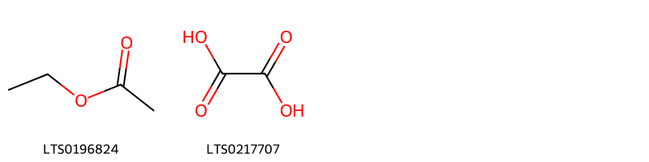
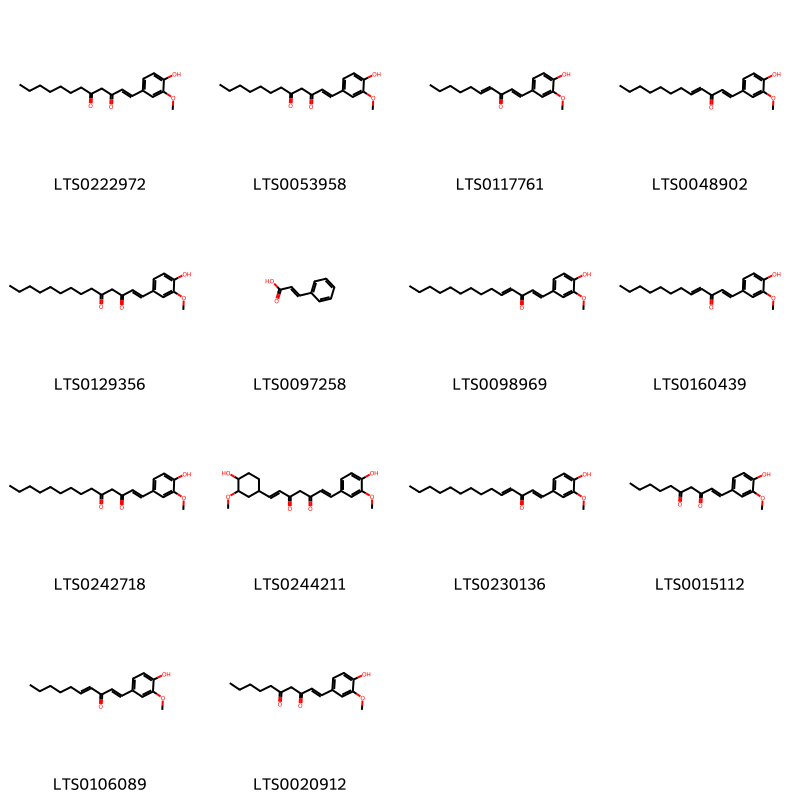
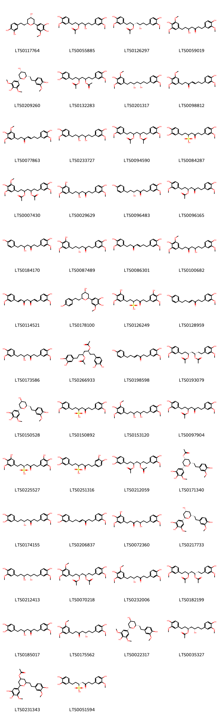
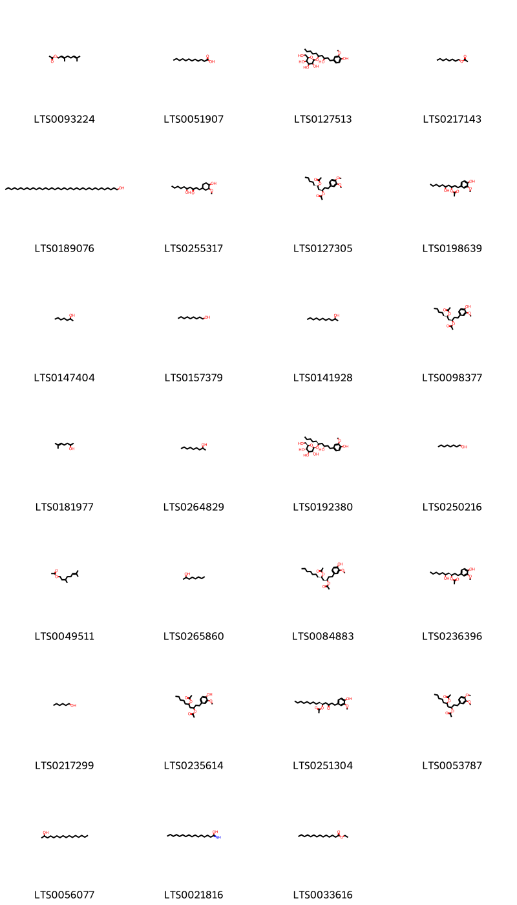
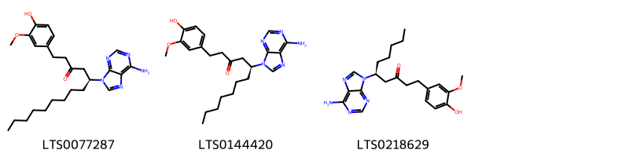
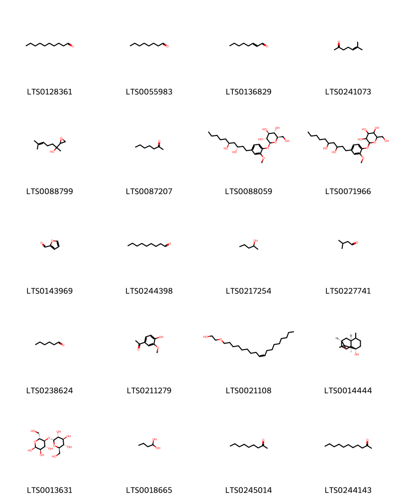
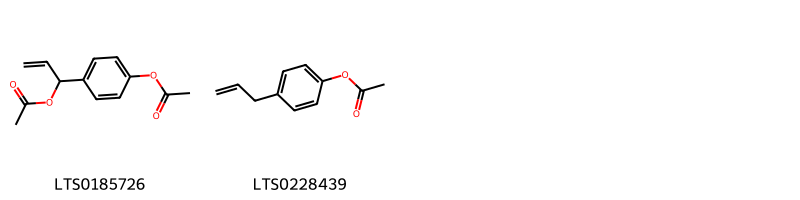
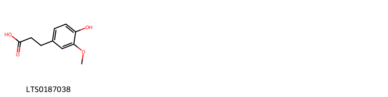
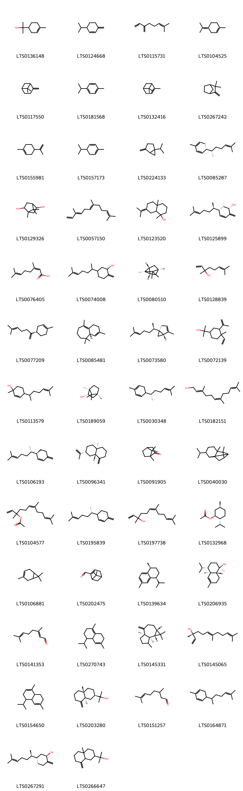
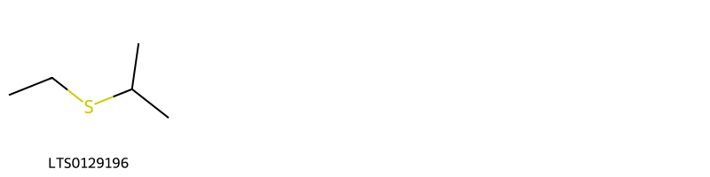

!!! abstract "Tóm tắt"

    Cây Gừng có tên khoa học là Zingiber officinale Rose, thuộc họ Gừng (Zingiberaceae). Tại Việt Nam, gừng được trồng ở khắp nơi trong nước ta để lấy củ ăn và làm thuốc, dùng trong nước và xuất khẩu. Trong nhân dân, gừng là một vị thuốc giúp sự tiêu hóa, dùng trong những trường hợp kém ăn, ăn uống không tiêu, nôn mửa đi ỉa, cảm mạo, phong hàn, làm thuốc ra mồ hôi, chữa ho mất tiếng. Tác dung dược lý của gừng: dịch chiết gừng khô có  tác dụng chống nôn; chiết xuất gừng có tác dụng chống viêm, giảm đau; ngoài ra, gừng còn ức chế thần kinh trung ương, làm giảm vận động tự nhiên và tăng thời gian gây ngủ của thuốc ngủ barbituric. Gừng phơi khô chứa: tinh bột (>50%), protein (9%), lipid (6-8%) gồm triglyceride, acid phosphatidic, lecithin và các acid tự do; chất xơ (5.9%), tro (5.7%), canxi (0.1%), photpho (0.15%), sắt (0.011%), natri (0.03%), kali (1.4%), vitamin A (175 IU/100g), B1 (0.05mg/100g), vitamin B2 (0.13mg/100g), niacin (1.9mg/100g), vitamin C (12mg/100g), và khoảng 380kcal/100g.

## Thông tin về thực vật

Dược liệu **Gừng (Thân Rễ)** từ bộ phận **Thân rễ** từ loài *Zingiber officinale*.

**Mô tả thực vật:** Gừng là một loại cây nhỏ, sống lâu năm, cao 0,60 đến 1m. Thân rễ mẫm lên thành củ, lâu dần thành xơ. Lá mọc so le, không cuống, có bẹ, hình mác cài 15 đến 20cm, rộng chừng 2cm, mặt bóng nhẵn, gân giữa hơi trắng nhạt, vò có mùi thơm. Trục hoa xuất phát từ gốc, dài tới 20cm, cụm hoa thành bông mọc sít nhau, hoa dài 5cm, rộng 2-3cm, lá bắc hình trứng, dài 2,5cm, mép lưng màu vàng, đài hoa dài chừng 1cm, có 3 răng ngăn, 3 cành hoa dài chừng 2cm, màu vàng xanh, mép cánh hoa màu tím, nhị cũng tím. Loài gừng trồng ít ra hoa.

*Tài liệu tham khảo:* "Những cây thuốc và vị thuốc Việt Nam" - Đỗ Tất Lợi 
Trong dược điển Việt nam, một loài được sử dụng làm dược liệu là *Zingiber officinale*.

!!! info "Phân loại thực vật của *Zingiber officinale*"
    - **Kingdom:** Plantae
    - **Phylum:** Tracheophyta
    - **Order:** Zingiberales
    - **Family:** Zingiberaceae
    - **Genus:** Zingiber
    - **Species:** *Zingiber officinale*

**Phân bố trên thế giới:** nan, Germany, Haiti, Nepal, Mayotte, Sri Lanka, Seychelles, Guadeloupe, French Guiana, Mexico, Chinese Taipei, Colombia, Hong Kong, Réunion, Cambodia, Japan, Australia, Martinique, Panama, Indonesia, Madagascar, Trinidad and Tobago, United Kingdom of Great Britain and Northern Ireland, Guatemala, India, Brazil, Costa Rica, Viet Nam, Thailand, United States of America, Philippines, Bolivia (Plurinational State of), China, Pakistan, Dominican Republic, Nicaragua, Malaysia, Ecuador, Puerto Rico, El Salvador, Sierra Leone

**Phân bố tại Việt nam:** Hà Nội

## Thông tin về dược liệu 

### Định danh

!!! info "Thông tin về tên gọi"

    - Dược liệu tiếng Việt: gừng
    - Dược liệu tiếng Trung: 干姜 (Gan Jiang)
    - Dược liệu tiếng Anh: Zingiber Officinale
    - Dược liệu latin thông dụng: Rhizoma Zingiberis
    - Dược liệu latin kiểu DĐVN: *rhizoma zingiberis*
    - Dược liệu latin kiểu DĐVN: *None*
    - Dược liệu latin kiểu thông tư: *None*
    - Bộ phận dùng: Thân rễ (Rhizoma)

### Mô tả dược liệu 

- **Theo dược điển Việt nam V:** 
Thân rễ (quen gọi là củ) không có hình dạng nhất định, thường phân nhánh, dài 3 cm đến 7 cm. dày 0,5 cm đến  5 cm. Mặt ngoài màu trắng tro hay vàng nhạt, có vết nhăn dọc. Đỉnh các nhánh có đỉnh sinh trưởng của thân rễ. vết bẻ màu trắng tro hoặc ngà vàng, có bột, vân tròn rõ. Mặt cắt ngang có sợi thưa. Mùi thơm, vị cay nóng.

- **Mô tả dược liệu theo thông tư chế biến dược liệu theo phương pháp cổ truyền:** 

### Chế biến 

- **Chế biến theo dược điển việt nam V**: 
Thân rễ. Thu hoạch vào mùa đông. Muốn giữ tươi lâu, đặt gừng vào chậu, phủ cát lên. Gừng tươi là sinh khương, gừng khô là can khương.nĐào lấy củ gừng già, rửa sạch, phơi hoặc sấy đến khô (can khương). Khi dùng có thể sao vàng hoặc sao cháy (thán khương).nn

- **Chế biến theo thông tư:** 

--- 

## Thành phần hóa học

- Theo tài liệu của GS. Đỗ Tất Lợi:  (1) Tinh bột (>50%), protein (9%), lipid (6-8%) gồm triglyceride, acid phosphatidic, lecithin và các acid tự do; chất xơ (5.9%), tro (5.7%), canxi (0.1%), photpho (0.15%), sắt (0.011%), natri (0.03%), kali (1.4%), vitamin A (175 IU/100g), B1 (0.05mg/100g), vitamin B2 (0.13mg/100g), niacin (1.9mg/100g), vitamin C (12mg/100g), và khoảng 380kcal/100g.
(2) Trong dược điển Hồng Kông, hoạt chất chính của gừng được biết đến là gingerol và shogaol.
    

**Thành phần hóa học từ loài **Zingiber officinale**

Theo cơ sở dữ liệu lotus, loài *Zingiber officinale* đã phân lập và xác định được **383** hoạt chất thuộc về các nhóm Diarylheptanoids, Epoxides, Fatty Acyls, Phenols, Pyrimidine nucleosides, Carboxylic acids and derivatives, Unsaturated hydrocarbons, Saturated hydrocarbons, Harmala alkaloids, Steroids and steroid derivatives, Phenylpropanoic acids, Saccharolipids, Heteroaromatic compounds, Imidazopyrimidines, Tetrahydrofurans, Benzene and substituted derivatives, Prenol lipids, Oxanes, Pyrans, Organooxygen compounds, Lactones, Cinnamic acids and derivatives, Indoles and derivatives, Thioethers, Glycerolipids, Phenol esters trong bảng dưới đây. Danh sách các hoạt chất như sau hexanol [(LTS0217299)](https://lotus.naturalproducts.net/compound/lotus_id/LTS0217299), 4-isopropyl-1,6-dimethyl-2,3,4,4a,7,8-hexahydronaphthalene [(LTS0270743)](https://lotus.naturalproducts.net/compound/lotus_id/LTS0270743), (1e,4e)-1-(4-hydroxy-3-methoxyphenyl)deca-1,4-dien-3-one [(LTS0117761)](https://lotus.naturalproducts.net/compound/lotus_id/LTS0117761), 5-(acetyloxy)-1,7-bis(3,4-dihydroxyphenyl)heptan-3-yl acetate [(LTS0011692)](https://lotus.naturalproducts.net/compound/lotus_id/LTS0011692), β-eudesmol [(LTS0203280)](https://lotus.naturalproducts.net/compound/lotus_id/LTS0203280), phellandrene [(LTS0157173)](https://lotus.naturalproducts.net/compound/lotus_id/LTS0157173), 1-(4-hydroxy-3-methoxyphenyl)propane-1,2-diol [(LTS0126894)](https://lotus.naturalproducts.net/compound/lotus_id/LTS0126894), (3r)-1,7-bis(4-hydroxy-3-methoxyphenyl)-5-oxoheptan-3-yl acetate [(LTS0058941)](https://lotus.naturalproducts.net/compound/lotus_id/LTS0058941), rosefuran [(LTS0216128)](https://lotus.naturalproducts.net/compound/lotus_id/LTS0216128), oxalic acid [(LTS0217707)](https://lotus.naturalproducts.net/compound/lotus_id/LTS0217707), menthyl acetate [(LTS0132968)](https://lotus.naturalproducts.net/compound/lotus_id/LTS0132968), β-bisabolol [(LTS0115229)](https://lotus.naturalproducts.net/compound/lotus_id/LTS0115229), linalyl oxide [(LTS0065533)](https://lotus.naturalproducts.net/compound/lotus_id/LTS0065533), (4e,6r)-6-hydroxy-1-(4-hydroxy-3-methoxyphenyl)dec-4-en-3-one [(LTS0094069)](https://lotus.naturalproducts.net/compound/lotus_id/LTS0094069), 7-(4-hydroxy-3,5-dimethoxyphenyl)-1-(4-hydroxy-3-methoxyphenyl)hept-4-en-3-one [(LTS0025738)](https://lotus.naturalproducts.net/compound/lotus_id/LTS0025738), (8)-gingerol [(LTS0026120)](https://lotus.naturalproducts.net/compound/lotus_id/LTS0026120), (-)-α-curcumene [(LTS0216936)](https://lotus.naturalproducts.net/compound/lotus_id/LTS0216936), 4-{2-[(2s,4r,6r)-2-[(1e)-2,6-dimethylhepta-1,5-dien-1-yl]-6-pentyl-1,3-dioxan-4-yl]ethyl}-2-methoxyphenol [(LTS0127910)](https://lotus.naturalproducts.net/compound/lotus_id/LTS0127910), (3r,5s)-5-hydroxy-1,7-bis(4-hydroxy-3-methoxyphenyl)heptan-3-yl acetate [(LTS0126297)](https://lotus.naturalproducts.net/compound/lotus_id/LTS0126297), gingerenone a [(LTS0086301)](https://lotus.naturalproducts.net/compound/lotus_id/LTS0086301), (r)-β-bisabolene [(LTS0077209)](https://lotus.naturalproducts.net/compound/lotus_id/LTS0077209), (5s)-1-(3,4-dihydroxy-5-methoxyphenyl)-5-hydroxy-7-(4-hydroxy-3-methoxyphenyl)heptan-3-one [(LTS0003753)](https://lotus.naturalproducts.net/compound/lotus_id/LTS0003753), 4-(3,4-dimethoxyphenyl)butan-2-one [(LTS0223473)](https://lotus.naturalproducts.net/compound/lotus_id/LTS0223473), 1-(4-hydroxy-3-methoxyphenyl)deca-1,4-dien-3-one [(LTS0106089)](https://lotus.naturalproducts.net/compound/lotus_id/LTS0106089), (5s)-5-hydroxy-1,7-bis(4-hydroxy-3-methoxyphenyl)heptan-3-one [(LTS0173586)](https://lotus.naturalproducts.net/compound/lotus_id/LTS0173586), 5-{4-hydroxy-6-[2-(4-hydroxy-3-methoxyphenyl)ethyl]oxan-2-yl}-3-methoxybenzene-1,2-diol [(LTS0032006)](https://lotus.naturalproducts.net/compound/lotus_id/LTS0032006), 3,7-dimethyl-2,6-octadienal [(LTS0141353)](https://lotus.naturalproducts.net/compound/lotus_id/LTS0141353), 1,7-bis(4-hydroxy-3-methoxyphenyl)hept-4-en-3-one [(LTS0050456)](https://lotus.naturalproducts.net/compound/lotus_id/LTS0050456), 3-[(2s)-6-methylhept-5-en-2-yl]-6-methylidenecyclohex-1-ene [(LTS0195839)](https://lotus.naturalproducts.net/compound/lotus_id/LTS0195839), tricyclene [(LTS0179930)](https://lotus.naturalproducts.net/compound/lotus_id/LTS0179930), heptane [(LTS0062507)](https://lotus.naturalproducts.net/compound/lotus_id/LTS0062507), (5s)-1-(4-hydroxy-3-methoxyphenyl)-3-oxotetradecan-5-yl acetate [(LTS0251304)](https://lotus.naturalproducts.net/compound/lotus_id/LTS0251304), perillene [(LTS0083458)](https://lotus.naturalproducts.net/compound/lotus_id/LTS0083458), camphor [(LTS0091905)](https://lotus.naturalproducts.net/compound/lotus_id/LTS0091905), vanillyl alcohol [(LTS0035070)](https://lotus.naturalproducts.net/compound/lotus_id/LTS0035070), terpineol [(LTS0136148)](https://lotus.naturalproducts.net/compound/lotus_id/LTS0136148), 2-(4-hydroxy-3,5-dimethoxyphenyl)-6-[2-(4-hydroxy-3-methoxyphenyl)ethyl]oxan-4-ol [(LTS0015434)](https://lotus.naturalproducts.net/compound/lotus_id/LTS0015434), octanal [(LTS0055983)](https://lotus.naturalproducts.net/compound/lotus_id/LTS0055983), gamma-muurolene [(LTS0052920)](https://lotus.naturalproducts.net/compound/lotus_id/LTS0052920), 7-(3,4-dihydroxy-5-methoxyphenyl)-5-hydroxy-1-(4-hydroxy-3-methoxyphenyl)heptan-3-one [(LTS0029629)](https://lotus.naturalproducts.net/compound/lotus_id/LTS0029629), (+)-α-terpineol [(LTS0258249)](https://lotus.naturalproducts.net/compound/lotus_id/LTS0258249), 5-(acetyloxy)-7-(4-hydroxy-3,5-dimethoxyphenyl)-1-(4-hydroxy-3-methoxyphenyl)heptan-3-yl acetate [(LTS0007430)](https://lotus.naturalproducts.net/compound/lotus_id/LTS0007430), (3s,5r)-5-(acetyloxy)-1,7-bis(4-hydroxy-3-methoxyphenyl)heptan-3-yl acetate [(LTS0193079)](https://lotus.naturalproducts.net/compound/lotus_id/LTS0193079), 1-(3,4-dihydroxy-5-methoxyphenyl)-5-hydroxydecan-3-one [(LTS0006138)](https://lotus.naturalproducts.net/compound/lotus_id/LTS0006138), 1-(3,4-dihydroxyphenyl)-7-(4-hydroxy-3-methoxyphenyl)-5-oxoheptane-3-sulfonic acid [(LTS0084287)](https://lotus.naturalproducts.net/compound/lotus_id/LTS0084287), (5s)-5-hydroxy-1-(4-hydroxy-3-methoxyphenyl)undecan-3-one [(LTS0062749)](https://lotus.naturalproducts.net/compound/lotus_id/LTS0062749), (3r,5s)-1,7-bis(4-hydroxy-3-methoxyphenyl)heptane-3,5-diol [(LTS0028864)](https://lotus.naturalproducts.net/compound/lotus_id/LTS0028864), gingerdiol [(LTS0125400)](https://lotus.naturalproducts.net/compound/lotus_id/LTS0125400), (2r,4r)-rose oxide [(LTS0270571)](https://lotus.naturalproducts.net/compound/lotus_id/LTS0270571), hexanal [(LTS0238624)](https://lotus.naturalproducts.net/compound/lotus_id/LTS0238624), 5-hydroxy-1-(4-hydroxy-3-methoxycyclohexyl)decan-3-one [(LTS0255317)](https://lotus.naturalproducts.net/compound/lotus_id/LTS0255317), 5-hydroxy-1-(4-hydroxy-3,5-dimethoxyphenyl)-7-(4-hydroxy-3-methoxyphenyl)heptan-3-one [(LTS0100682)](https://lotus.naturalproducts.net/compound/lotus_id/LTS0100682), (1s,5s)-5-[(2r)-6-methylhept-5-en-2-yl]-2-methylidenecyclohex-3-en-1-ol [(LTS0125899)](https://lotus.naturalproducts.net/compound/lotus_id/LTS0125899), 1-(5-ethyl-6-methylheptan-2-yl)-5-hydroxy-9a,11a-dimethyl-1h,2h,3h,3ah,3bh,4h,5h,8h,9h,9bh,10h,11h-cyclopenta[a]phenanthren-7-one [(LTS0210386)](https://lotus.naturalproducts.net/compound/lotus_id/LTS0210386), (4e)-1-(3,4-dimethoxyphenyl)dodec-4-en-3-one [(LTS0267899)](https://lotus.naturalproducts.net/compound/lotus_id/LTS0267899), (1e)-1-(4-hydroxy-3-methoxyphenyl)tetradec-1-ene-3,5-dione [(LTS0129356)](https://lotus.naturalproducts.net/compound/lotus_id/LTS0129356), 1-(4-hydroxy-3-methoxyphenyl)tetradec-1-ene-3,5-dione [(LTS0242718)](https://lotus.naturalproducts.net/compound/lotus_id/LTS0242718), 2-hydroxy-3-{[(2r,3r,4s,5r,6r)-3,4,5-trihydroxy-6-({[(2s,3r,4s,5r,6r)-3,4,5-trihydroxy-6-(hydroxymethyl)oxan-2-yl]oxy}methyl)oxan-2-yl]oxy}propyl (9z,12z)-octadeca-9,12-dienoate [(LTS0076749)](https://lotus.naturalproducts.net/compound/lotus_id/LTS0076749), 4-isopropyl-1-methyl-6-methylidene-2,3,4,7,8,8a-hexahydro-1h-naphthalene [(LTS0247064)](https://lotus.naturalproducts.net/compound/lotus_id/LTS0247064), (3r,5s)-3-(acetyloxy)-1-(4-hydroxy-3-methoxyphenyl)decan-5-yl acetate [(LTS0098377)](https://lotus.naturalproducts.net/compound/lotus_id/LTS0098377), 5-hydroxy-1,7-bis(4-hydroxy-3-methoxyphenyl)heptan-3-yl acetate [(LTS0055885)](https://lotus.naturalproducts.net/compound/lotus_id/LTS0055885), (5r)-7-(3,4-dihydroxy-5-methoxyphenyl)-5-hydroxy-1-(4-hydroxy-3-methoxyphenyl)heptan-3-one [(LTS0087489)](https://lotus.naturalproducts.net/compound/lotus_id/LTS0087489), monoterpenes [(LTS0106881)](https://lotus.naturalproducts.net/compound/lotus_id/LTS0106881), 1,7,7-trimethylbicyclo[2.2.1]heptane-2,5-diol [(LTS0129326)](https://lotus.naturalproducts.net/compound/lotus_id/LTS0129326), farnesene [(LTS0057150)](https://lotus.naturalproducts.net/compound/lotus_id/LTS0057150), (e)-2-octenal [(LTS0136829)](https://lotus.naturalproducts.net/compound/lotus_id/LTS0136829), 7-(3,4-dihydroxyphenyl)-1-(4-hydroxy-3-methoxyphenyl)hept-4-en-3-one [(LTS0206837)](https://lotus.naturalproducts.net/compound/lotus_id/LTS0206837), β phellandrene [(LTS0124668)](https://lotus.naturalproducts.net/compound/lotus_id/LTS0124668), ethyl isopropyl sulfide [(LTS0129196)](https://lotus.naturalproducts.net/compound/lotus_id/LTS0129196), (4e)-1-[4-hydroxy-3-(hydroxymethyl)phenyl]dec-4-en-3-one [(LTS0264518)](https://lotus.naturalproducts.net/compound/lotus_id/LTS0264518), 3,7,11-trimethyldodeca-1,6,10-trien-3-yl acetate [(LTS0104577)](https://lotus.naturalproducts.net/compound/lotus_id/LTS0104577), (3r,5s)-3-hydroxy-1-(4-hydroxy-3-methoxyphenyl)decan-5-yl acetate [(LTS0140718)](https://lotus.naturalproducts.net/compound/lotus_id/LTS0140718), (1z,3z)-3-hydroxy-1-(4-hydroxy-3-methoxyphenyl)deca-1,3-dien-5-one [(LTS0163557)](https://lotus.naturalproducts.net/compound/lotus_id/LTS0163557), (3s,5s)-1-(4-hydroxy-3-methoxyphenyl)decane-3,5-diol [(LTS0180009)](https://lotus.naturalproducts.net/compound/lotus_id/LTS0180009), α-muurolene [(LTS0022607)](https://lotus.naturalproducts.net/compound/lotus_id/LTS0022607), 1-(4-hydroxy-3-methoxyphenyl)decane-3,5-diol [(LTS0127109)](https://lotus.naturalproducts.net/compound/lotus_id/LTS0127109), (4e)-1-(4-hydroxy-3-methoxyphenyl)hexadec-4-en-3-one [(LTS0097309)](https://lotus.naturalproducts.net/compound/lotus_id/LTS0097309), (2r,3r,4s,5s,6r)-2-{[(3s,5s)-3-hydroxy-1-(4-hydroxy-3-methoxyphenyl)decan-5-yl]oxy}-6-(hydroxymethyl)oxane-3,4,5-triol [(LTS0192380)](https://lotus.naturalproducts.net/compound/lotus_id/LTS0192380), nerolidol isomers [(LTS0007569)](https://lotus.naturalproducts.net/compound/lotus_id/LTS0007569), bornyl acetate [(LTS0060565)](https://lotus.naturalproducts.net/compound/lotus_id/LTS0060565), α-thujene [(LTS0185078)](https://lotus.naturalproducts.net/compound/lotus_id/LTS0185078), (6e,10r)-10-hydroxy-2,6,10-trimethyldodeca-2,6,11-trien-4-one [(LTS0067450)](https://lotus.naturalproducts.net/compound/lotus_id/LTS0067450), 1-(4-hydroxy-3-methoxyphenyl)tetradeca-1,4-dien-3-one [(LTS0098969)](https://lotus.naturalproducts.net/compound/lotus_id/LTS0098969), (3r,5s)-5-(acetyloxy)-7-(3,4-dihydroxyphenyl)-1-(4-hydroxy-3-methoxyphenyl)heptan-3-yl acetate [(LTS0212059)](https://lotus.naturalproducts.net/compound/lotus_id/LTS0212059), (-)-delta(3)-carene [(LTS0104784)](https://lotus.naturalproducts.net/compound/lotus_id/LTS0104784), 1-(4-hydroxy-3-methoxyphenyl)dec-7-en-3-one [(LTS0015210)](https://lotus.naturalproducts.net/compound/lotus_id/LTS0015210), (5r)-5-hydroxy-1-(4-hydroxy-3-methoxyphenyl)-7-(4-hydroxyphenyl)heptan-3-one [(LTS0096483)](https://lotus.naturalproducts.net/compound/lotus_id/LTS0096483), e,e-farnesal [(LTS0118407)](https://lotus.naturalproducts.net/compound/lotus_id/LTS0118407), 1,4a-dimethyl-7-(propan-2-ylidene)-hexahydro-2h-naphthalen-1-ol [(LTS0123520)](https://lotus.naturalproducts.net/compound/lotus_id/LTS0123520), (2r,3r,4s,5s,6r)-2-{[(1r,2s,4r,5r)-5-hydroxy-1,7,7-trimethylbicyclo[2.2.1]heptan-2-yl]oxy}-6-(hydroxymethyl)oxane-3,4,5-triol [(LTS0219389)](https://lotus.naturalproducts.net/compound/lotus_id/LTS0219389), (2s,4r)-1,7,7-trimethylbicyclo[2.2.1]heptan-2-ol [(LTS0010050)](https://lotus.naturalproducts.net/compound/lotus_id/LTS0010050), 2-methyl-5-[(2r)-6-methylhept-5-en-2-yl]phenol [(LTS0246670)](https://lotus.naturalproducts.net/compound/lotus_id/LTS0246670), homovanillic acid [(LTS0251061)](https://lotus.naturalproducts.net/compound/lotus_id/LTS0251061), citronellol, (+-)- [(LTS0090925)](https://lotus.naturalproducts.net/compound/lotus_id/LTS0090925), borneol [(LTS0264960)](https://lotus.naturalproducts.net/compound/lotus_id/LTS0264960), gingerdione [(LTS0061248)](https://lotus.naturalproducts.net/compound/lotus_id/LTS0061248), (5r)-1-(4-hydroxy-3-methoxyphenyl)-3-oxodecane-5-sulfonic acid [(LTS0084059)](https://lotus.naturalproducts.net/compound/lotus_id/LTS0084059), (5s)-1-(3,4-dimethoxyphenyl)-5-hydroxydecan-3-one [(LTS0256019)](https://lotus.naturalproducts.net/compound/lotus_id/LTS0256019), homovanillinic acid [(LTS0187038)](https://lotus.naturalproducts.net/compound/lotus_id/LTS0187038), elemol [(LTS0208556)](https://lotus.naturalproducts.net/compound/lotus_id/LTS0208556), (1e,4e)-1-(4-hydroxy-3-methoxyphenyl)tetradeca-1,4-dien-3-one [(LTS0230136)](https://lotus.naturalproducts.net/compound/lotus_id/LTS0230136), (4e)-1-(4-hydroxy-3-methoxyphenyl)oct-4-en-3-one [(LTS0165426)](https://lotus.naturalproducts.net/compound/lotus_id/LTS0165426), 1,7-bis(3,4-dihydroxyphenyl)-5-oxoheptane-3-sulfonic acid [(LTS0251316)](https://lotus.naturalproducts.net/compound/lotus_id/LTS0251316), 1-(4-hydroxy-3-methoxyphenyl)tetradec-4-en-3-one [(LTS0208945)](https://lotus.naturalproducts.net/compound/lotus_id/LTS0208945), (5s)-1-(3,4-dihydroxy-5-methoxyphenyl)-5-hydroxydecan-3-one [(LTS0232258)](https://lotus.naturalproducts.net/compound/lotus_id/LTS0232258), 2-heptanone [(LTS0087207)](https://lotus.naturalproducts.net/compound/lotus_id/LTS0087207), octane [(LTS0186469)](https://lotus.naturalproducts.net/compound/lotus_id/LTS0186469), (2s,3r,4s,5s,6r)-2-{4-[(3s,5s)-3,5-dihydroxydecyl]-2-methoxyphenoxy}-6-(hydroxymethyl)oxane-3,4,5-triol [(LTS0088059)](https://lotus.naturalproducts.net/compound/lotus_id/LTS0088059), (4r)-8-(4-hydroxy-3-methoxyphenyl)-6-oxooctane-4-sulfonic acid [(LTS0135275)](https://lotus.naturalproducts.net/compound/lotus_id/LTS0135275), 1-(4-hydroxy-3-methoxyphenyl)dodec-4-en-3-one [(LTS0019883)](https://lotus.naturalproducts.net/compound/lotus_id/LTS0019883), (4e)-7-(4-hydroxy-3,5-dimethoxyphenyl)-1-(4-hydroxy-3-methoxyphenyl)hept-4-en-3-one [(LTS0129836)](https://lotus.naturalproducts.net/compound/lotus_id/LTS0129836), (z)-γ-bisabolene [(LTS0143321)](https://lotus.naturalproducts.net/compound/lotus_id/LTS0143321), 1-[4-(acetyloxy)phenyl]prop-2-en-1-yl acetate [(LTS0185726)](https://lotus.naturalproducts.net/compound/lotus_id/LTS0185726), (4e)-1-(3,4-dihydroxy-5-methoxyphenyl)dec-4-en-3-one [(LTS0105235)](https://lotus.naturalproducts.net/compound/lotus_id/LTS0105235), 2-methoxy-1,7,7-trimethylbicyclo[2.2.1]heptane [(LTS0154024)](https://lotus.naturalproducts.net/compound/lotus_id/LTS0154024), 5-[(2s,4s,6s)-4-hydroxy-6-[2-(4-hydroxy-3-methoxyphenyl)ethyl]oxan-2-yl]-3-methoxybenzene-1,2-diol [(LTS0150528)](https://lotus.naturalproducts.net/compound/lotus_id/LTS0150528), undecan-2-one [(LTS0244143)](https://lotus.naturalproducts.net/compound/lotus_id/LTS0244143), 4-hydroxydihydrocinnamaldehyde [(LTS0088636)](https://lotus.naturalproducts.net/compound/lotus_id/LTS0088636), apocynin [(LTS0211279)](https://lotus.naturalproducts.net/compound/lotus_id/LTS0211279), (4s,4as,8as)-4-isopropyl-1,6-dimethyl-3,4,4a,7,8,8a-hexahydronaphthalene [(LTS0014980)](https://lotus.naturalproducts.net/compound/lotus_id/LTS0014980), (1e,6e)-1-(4-hydroxy-3-methoxycyclohexyl)-7-(4-hydroxy-3-methoxyphenyl)hepta-1,6-diene-3,5-dione [(LTS0244211)](https://lotus.naturalproducts.net/compound/lotus_id/LTS0244211), curcumin [(LTS0114521)](https://lotus.naturalproducts.net/compound/lotus_id/LTS0114521), (2s,4s,6s)-2-(3,4-dihydroxy-5-methoxyphenyl)-6-[2-(4-hydroxy-3-methoxyphenyl)ethyl]oxan-4-yl acetate [(LTS0255853)](https://lotus.naturalproducts.net/compound/lotus_id/LTS0255853), vanillate [(LTS0253904)](https://lotus.naturalproducts.net/compound/lotus_id/LTS0253904), octanol [(LTS0250216)](https://lotus.naturalproducts.net/compound/lotus_id/LTS0250216), (+)-β-thujone [(LTS0180873)](https://lotus.naturalproducts.net/compound/lotus_id/LTS0180873), β-ionone [(LTS0155301)](https://lotus.naturalproducts.net/compound/lotus_id/LTS0155301), linalool dihydroepoxide [(LTS0088799)](https://lotus.naturalproducts.net/compound/lotus_id/LTS0088799), nonan-1-ol [(LTS0157379)](https://lotus.naturalproducts.net/compound/lotus_id/LTS0157379), β-carboline [(LTS0263207)](https://lotus.naturalproducts.net/compound/lotus_id/LTS0263207), 1-methyl-4-(6-methylhept-5-en-2-yl)cyclohex-2-en-1-ol [(LTS0113579)](https://lotus.naturalproducts.net/compound/lotus_id/LTS0113579), (3s)-1,7-bis(4-hydroxy-3-methoxyphenyl)-5-oxoheptan-3-yl acetate [(LTS0096165)](https://lotus.naturalproducts.net/compound/lotus_id/LTS0096165), (5s)-1-(4-hydroxy-3-methoxyphenyl)-3-oxododecane-5-sulfonic acid [(LTS0234187)](https://lotus.naturalproducts.net/compound/lotus_id/LTS0234187), (3r,6e)-nerolidol [(LTS0145065)](https://lotus.naturalproducts.net/compound/lotus_id/LTS0145065), α-maltose [(LTS0013631)](https://lotus.naturalproducts.net/compound/lotus_id/LTS0013631), 5-[(2s,4s,6s)-6-[2-(3,4-dihydroxyphenyl)ethyl]-4-hydroxyoxan-2-yl]-3-methoxybenzene-1,2-diol [(LTS0117764)](https://lotus.naturalproducts.net/compound/lotus_id/LTS0117764), (5s)-5-(6-aminopurin-9-yl)-1-(4-hydroxy-3-methoxyphenyl)tetradecan-3-one [(LTS0077287)](https://lotus.naturalproducts.net/compound/lotus_id/LTS0077287), 5-hydroxy-1-(4-hydroxy-3-methoxyphenyl)undecan-3-one [(LTS0119199)](https://lotus.naturalproducts.net/compound/lotus_id/LTS0119199), (3r,5s)-1-(4-hydroxy-3,5-dimethoxyphenyl)-7-(4-hydroxy-3-methoxyphenyl)heptane-3,5-diol [(LTS0201317)](https://lotus.naturalproducts.net/compound/lotus_id/LTS0201317), 6-gingerol [(LTS0103909)](https://lotus.naturalproducts.net/compound/lotus_id/LTS0103909), myrtenal [(LTS0202475)](https://lotus.naturalproducts.net/compound/lotus_id/LTS0202475), 6-methyl-5-hepten-2-ol [(LTS0181977)](https://lotus.naturalproducts.net/compound/lotus_id/LTS0181977), p-cymen-8-ol [(LTS0223641)](https://lotus.naturalproducts.net/compound/lotus_id/LTS0223641), gingerol [(LTS0061759)](https://lotus.naturalproducts.net/compound/lotus_id/LTS0061759), hexadecanimidic acid [(LTS0021816)](https://lotus.naturalproducts.net/compound/lotus_id/LTS0021816), stigmast-5-en-3-ol, (3β)- [(LTS0204616)](https://lotus.naturalproducts.net/compound/lotus_id/LTS0204616), 1,8-cineole [(LTS0166505)](https://lotus.naturalproducts.net/compound/lotus_id/LTS0166505), (1s,2r,4r,6s)-1,7,7-trimethyltricyclo[2.2.1.0²,⁶]heptane [(LTS0080510)](https://lotus.naturalproducts.net/compound/lotus_id/LTS0080510), β-sesquiphellandrene [(LTS0106193)](https://lotus.naturalproducts.net/compound/lotus_id/LTS0106193), 3-hydroxy-1-(4-hydroxy-3-methoxyphenyl)decan-5-yl acetate [(LTS0266911)](https://lotus.naturalproducts.net/compound/lotus_id/LTS0266911), 1,7-bis(4-hydroxy-3-methoxyphenyl)heptane-3,5-diol [(LTS0233727)](https://lotus.naturalproducts.net/compound/lotus_id/LTS0233727), isoeugenol [(LTS0136836)](https://lotus.naturalproducts.net/compound/lotus_id/LTS0136836), (5s)-5-hydroxy-1-(4-hydroxy-3,5-dimethoxyphenyl)-7-(4-hydroxy-3-methoxyphenyl)heptan-3-one [(LTS0175562)](https://lotus.naturalproducts.net/compound/lotus_id/LTS0175562), (3r)-1,7-bis(3,4-dihydroxy-5-methoxyphenyl)-5-oxoheptane-3-sulfonic acid [(LTS0262807)](https://lotus.naturalproducts.net/compound/lotus_id/LTS0262807), (3r,5s)-1-(3,4-dimethoxyphenyl)decane-3,5-diol [(LTS0077771)](https://lotus.naturalproducts.net/compound/lotus_id/LTS0077771), guaiol [(LTS0240901)](https://lotus.naturalproducts.net/compound/lotus_id/LTS0240901), (2s)-2-hydroxy-3-{[(2r,3r,4s,5r,6r)-3,4,5-trihydroxy-6-({[(2s,3r,4s,5r,6r)-3,4,5-trihydroxy-6-(hydroxymethyl)oxan-2-yl]oxy}methyl)oxan-2-yl]oxy}propyl (9z,12z,15z)-octadeca-9,12,15-trienoate [(LTS0011050)](https://lotus.naturalproducts.net/compound/lotus_id/LTS0011050), (10)-shogaol [(LTS0051767)](https://lotus.naturalproducts.net/compound/lotus_id/LTS0051767), camphene hydrate [(LTS0071319)](https://lotus.naturalproducts.net/compound/lotus_id/LTS0071319), 1,7-bis(4-hydroxy-3-methoxyphenyl)-5-oxoheptan-3-yl acetate [(LTS0097904)](https://lotus.naturalproducts.net/compound/lotus_id/LTS0097904), paradol [(LTS0262716)](https://lotus.naturalproducts.net/compound/lotus_id/LTS0262716), (1s)-8-isopropyl-1,3-dimethyltricyclo[4.4.0.0²,⁷]dec-3-ene [(LTS0199723)](https://lotus.naturalproducts.net/compound/lotus_id/LTS0199723), delta-cadinene [(LTS0019321)](https://lotus.naturalproducts.net/compound/lotus_id/LTS0019321), curcumene [(LTS0190074)](https://lotus.naturalproducts.net/compound/lotus_id/LTS0190074), 4-hydroxy-6-(4-hydroxy-3-methoxyphenyl)hexa-3,5-dien-2-one [(LTS0015760)](https://lotus.naturalproducts.net/compound/lotus_id/LTS0015760), (-)-β-bisabolene [(LTS0009940)](https://lotus.naturalproducts.net/compound/lotus_id/LTS0009940), (r)-β-himachalene [(LTS0085481)](https://lotus.naturalproducts.net/compound/lotus_id/LTS0085481), (3s,5s)-1,7-bis(4-hydroxy-3-methoxyphenyl)heptane-3,5-diol [(LTS0212413)](https://lotus.naturalproducts.net/compound/lotus_id/LTS0212413), (3r,5s)-5-(acetyloxy)-7-(4-hydroxy-3,5-dimethoxyphenyl)-1-(4-hydroxy-3-methoxyphenyl)heptan-3-yl acetate [(LTS0070218)](https://lotus.naturalproducts.net/compound/lotus_id/LTS0070218), 2-undecanol [(LTS0141928)](https://lotus.naturalproducts.net/compound/lotus_id/LTS0141928), β-selinene [(LTS0096341)](https://lotus.naturalproducts.net/compound/lotus_id/LTS0096341), 2-hydroxy-3-{[3,4,5-trihydroxy-6-({[3,4,5-trihydroxy-6-(hydroxymethyl)oxan-2-yl]oxy}methyl)oxan-2-yl]oxy}propyl octadec-9-enoate [(LTS0035881)](https://lotus.naturalproducts.net/compound/lotus_id/LTS0035881), (1s,3r,7s,8s)-2,2,6,8-tetramethyltricyclo[5.3.1.0³,⁸]undecan-3-ol [(LTS0014444)](https://lotus.naturalproducts.net/compound/lotus_id/LTS0014444), sabinene [(LTS0224133)](https://lotus.naturalproducts.net/compound/lotus_id/LTS0224133), neral [(LTS0165243)](https://lotus.naturalproducts.net/compound/lotus_id/LTS0165243), (e,z)-farnesol [(LTS0182151)](https://lotus.naturalproducts.net/compound/lotus_id/LTS0182151), (3s,5s)-1-(4-hydroxy-3-methoxyphenyl)tetradecane-3,5-diol [(LTS0064116)](https://lotus.naturalproducts.net/compound/lotus_id/LTS0064116), galanolactone [(LTS0151774)](https://lotus.naturalproducts.net/compound/lotus_id/LTS0151774), 6-hydroxy-1-(4-hydroxy-3-methoxyphenyl)dec-4-en-3-one [(LTS0101379)](https://lotus.naturalproducts.net/compound/lotus_id/LTS0101379), 1-(4-hydroxy-3-methoxyphenyl)nonadec-2-en-1-one [(LTS0212627)](https://lotus.naturalproducts.net/compound/lotus_id/LTS0212627), 1-[4-hydroxy-3-(hydroxymethyl)phenyl]dec-4-en-3-one [(LTS0145591)](https://lotus.naturalproducts.net/compound/lotus_id/LTS0145591), 4-isopropyl-1,6-dimethyl-3,4,4a,7,8,8a-hexahydronaphthalene [(LTS0154650)](https://lotus.naturalproducts.net/compound/lotus_id/LTS0154650), 5-ethenyl-2-methoxyphenol [(LTS0076260)](https://lotus.naturalproducts.net/compound/lotus_id/LTS0076260), octyl acetate [(LTS0217143)](https://lotus.naturalproducts.net/compound/lotus_id/LTS0217143), sitosterol [(LTS0168132)](https://lotus.naturalproducts.net/compound/lotus_id/LTS0168132), 2-methyl-5-[(2s)-6-methylhept-5-en-2-yl]cyclohexa-1,3-diene [(LTS0030348)](https://lotus.naturalproducts.net/compound/lotus_id/LTS0030348), β-farnesene [(LTS0067925)](https://lotus.naturalproducts.net/compound/lotus_id/LTS0067925), limonene,  [(LTS0155981)](https://lotus.naturalproducts.net/compound/lotus_id/LTS0155981), (2s)-2-hydroxy-3-{[(2r,3r,4s,5r,6r)-3,4,5-trihydroxy-6-({[(2s,3r,4s,5r,6r)-3,4,5-trihydroxy-6-(hydroxymethyl)oxan-2-yl]oxy}methyl)oxan-2-yl]oxy}propyl (9z)-octadec-9-enoate [(LTS0024860)](https://lotus.naturalproducts.net/compound/lotus_id/LTS0024860), (2r,3r,4s,5s,6r)-2-{[(2e)-3,7-dimethylocta-2,6-dien-1-yl]oxy}-6-(hydroxymethyl)oxane-3,4,5-triol [(LTS0116837)](https://lotus.naturalproducts.net/compound/lotus_id/LTS0116837), citronella [(LTS0151257)](https://lotus.naturalproducts.net/compound/lotus_id/LTS0151257), 8-(4-hydroxy-3-methoxyphenyl)-6-oxooctane-4-sulfonic acid [(LTS0002278)](https://lotus.naturalproducts.net/compound/lotus_id/LTS0002278), (5s)-5-(6-aminopurin-9-yl)-1-(4-hydroxy-3-methoxyphenyl)decan-3-one [(LTS0218629)](https://lotus.naturalproducts.net/compound/lotus_id/LTS0218629), 2-{[3-hydroxy-1-(4-hydroxy-3-methoxyphenyl)decan-5-yl]oxy}-6-(hydroxymethyl)oxane-3,4,5-triol [(LTS0127513)](https://lotus.naturalproducts.net/compound/lotus_id/LTS0127513), (3e,5e)-4-hydroxy-6-(4-hydroxy-3-methoxyphenyl)hexa-3,5-dien-2-one [(LTS0142627)](https://lotus.naturalproducts.net/compound/lotus_id/LTS0142627), 1-(3,4-dimethoxyphenyl)decan-3-one [(LTS0102731)](https://lotus.naturalproducts.net/compound/lotus_id/LTS0102731), 1-(3,4-dihydroxy-5-methoxyphenyl)dec-4-en-3-one [(LTS0065621)](https://lotus.naturalproducts.net/compound/lotus_id/LTS0065621), 5-(acetyloxy)-1,7-bis(4-hydroxy-3-methoxyphenyl)heptan-3-yl acetate [(LTS0094590)](https://lotus.naturalproducts.net/compound/lotus_id/LTS0094590), (1e)-1-(4-hydroxy-3-methoxyphenyl)dodec-1-ene-3,5-dione [(LTS0222972)](https://lotus.naturalproducts.net/compound/lotus_id/LTS0222972), (3z)-3-hydroxy-1-(4-hydroxy-3-methoxyphenyl)tetradec-3-en-5-one [(LTS0060956)](https://lotus.naturalproducts.net/compound/lotus_id/LTS0060956), oleth-3 [(LTS0021108)](https://lotus.naturalproducts.net/compound/lotus_id/LTS0021108), 2-nonanol [(LTS0264829)](https://lotus.naturalproducts.net/compound/lotus_id/LTS0264829), 6-methyl-5-hepten-2-one [(LTS0241073)](https://lotus.naturalproducts.net/compound/lotus_id/LTS0241073), α-selinene [(LTS0024564)](https://lotus.naturalproducts.net/compound/lotus_id/LTS0024564), 2-hydroxy-3-{[3,4,5-trihydroxy-6-({[3,4,5-trihydroxy-6-(hydroxymethyl)oxan-2-yl]oxy}methyl)oxan-2-yl]oxy}propyl (9z,12z,15z)-octadeca-9,12,15-trienoate [(LTS0184445)](https://lotus.naturalproducts.net/compound/lotus_id/LTS0184445), 4-(3-hydroxydecyl)-2-methoxyphenol [(LTS0077217)](https://lotus.naturalproducts.net/compound/lotus_id/LTS0077217), (2s,4r,6s)-2-(4-hydroxy-3,5-dimethoxyphenyl)-6-[2-(4-hydroxy-3-methoxyphenyl)ethyl]oxan-4-ol [(LTS0209260)](https://lotus.naturalproducts.net/compound/lotus_id/LTS0209260), lauric acid [(LTS0051907)](https://lotus.naturalproducts.net/compound/lotus_id/LTS0051907), phenylacrylic acid [(LTS0097258)](https://lotus.naturalproducts.net/compound/lotus_id/LTS0097258), citronellyl acetate [(LTS0049511)](https://lotus.naturalproducts.net/compound/lotus_id/LTS0049511), 1-(4-hydroxy-3-methoxyphenyl)tetradecane-3,5-dione [(LTS0110340)](https://lotus.naturalproducts.net/compound/lotus_id/LTS0110340), 5-hydroxy-1-(4-hydroxy-3-methoxyphenyl)-7-(4-hydroxyphenyl)heptan-3-one [(LTS0184170)](https://lotus.naturalproducts.net/compound/lotus_id/LTS0184170), [1,1'-biphenyl]-3-carbaldehyde [(LTS0067525)](https://lotus.naturalproducts.net/compound/lotus_id/LTS0067525), cymene [(LTS0181568)](https://lotus.naturalproducts.net/compound/lotus_id/LTS0181568), (4e)-1-(3,4-dimethoxyphenyl)dec-4-en-3-one [(LTS0077972)](https://lotus.naturalproducts.net/compound/lotus_id/LTS0077972), geraniol [(LTS0258838)](https://lotus.naturalproducts.net/compound/lotus_id/LTS0258838), 5-(acetyloxy)-1-(4-hydroxy-3-methoxyphenyl)octan-3-yl acetate [(LTS0248064)](https://lotus.naturalproducts.net/compound/lotus_id/LTS0248064), 2-nonanone [(LTS0245014)](https://lotus.naturalproducts.net/compound/lotus_id/LTS0245014), (3r,5s)-3-(acetyloxy)-1-(4-hydroxy-3-methoxyphenyl)dodecan-5-yl acetate [(LTS0084883)](https://lotus.naturalproducts.net/compound/lotus_id/LTS0084883), 5-(6-methylhept-5-en-2-yl)-2-methylidenecyclohex-3-en-1-ol [(LTS0154687)](https://lotus.naturalproducts.net/compound/lotus_id/LTS0154687), (5s)-5-hydroxy-1-(4-hydroxy-3-methoxyphenyl)octan-3-one [(LTS0198963)](https://lotus.naturalproducts.net/compound/lotus_id/LTS0198963), 1-(4-hydroxy-3-methoxyphenyl)tetradecane-3,5-diol [(LTS0203738)](https://lotus.naturalproducts.net/compound/lotus_id/LTS0203738), 4-(prop-2-en-1-yl)phenyl acetate [(LTS0228439)](https://lotus.naturalproducts.net/compound/lotus_id/LTS0228439), (4s)-8-(4-hydroxy-3-methoxyphenyl)-6-oxooctane-4-sulfonic acid [(LTS0003207)](https://lotus.naturalproducts.net/compound/lotus_id/LTS0003207), (4e)-7-(3,4-dihydroxyphenyl)-1-(4-hydroxy-3-methoxyphenyl)hept-4-en-3-one [(LTS0130084)](https://lotus.naturalproducts.net/compound/lotus_id/LTS0130084), shogaol [(LTS0032763)](https://lotus.naturalproducts.net/compound/lotus_id/LTS0032763), 2-hydroxy-3-{[3,4,5-trihydroxy-6-({[3,4,5-trihydroxy-6-(hydroxymethyl)oxan-2-yl]oxy}methyl)oxan-2-yl]oxy}propyl octadeca-9,12,15-trienoate [(LTS0123437)](https://lotus.naturalproducts.net/compound/lotus_id/LTS0123437), (2e)-2-(2-{5,5,8a-trimethyl-hexahydro-1h-spiro[naphthalene-2,2'-oxiran]-1-yl}ethylidene)butanedial [(LTS0141156)](https://lotus.naturalproducts.net/compound/lotus_id/LTS0141156), 5-hydroxy-1-(4-hydroxy-3-methoxyphenyl)tetradecan-3-one [(LTS0068888)](https://lotus.naturalproducts.net/compound/lotus_id/LTS0068888), β-pinene [(LTS0117550)](https://lotus.naturalproducts.net/compound/lotus_id/LTS0117550), β-cadinene [(LTS0049088)](https://lotus.naturalproducts.net/compound/lotus_id/LTS0049088), 5-hydroxy-1-(4-hydroxy-3-methoxyphenyl)octan-3-one [(LTS0116632)](https://lotus.naturalproducts.net/compound/lotus_id/LTS0116632), nonanal [(LTS0244398)](https://lotus.naturalproducts.net/compound/lotus_id/LTS0244398), (3s,5s)-5-(acetyloxy)-1,7-bis(3,4-dihydroxyphenyl)heptan-3-yl acetate [(LTS0266933)](https://lotus.naturalproducts.net/compound/lotus_id/LTS0266933), cadinene [(LTS0003360)](https://lotus.naturalproducts.net/compound/lotus_id/LTS0003360), stigmast-5-en-3-ol [(LTS0071224)](https://lotus.naturalproducts.net/compound/lotus_id/LTS0071224), terpinolene [(LTS0104525)](https://lotus.naturalproducts.net/compound/lotus_id/LTS0104525), (3s)-1,7-bis(4-hydroxy-3-methoxyphenyl)-5-oxoheptane-3-sulfonic acid [(LTS0134625)](https://lotus.naturalproducts.net/compound/lotus_id/LTS0134625), ethylmyristate [(LTS0033616)](https://lotus.naturalproducts.net/compound/lotus_id/LTS0033616), 3-(4-hydroxy-3-methoxyphenyl)propanal [(LTS0209903)](https://lotus.naturalproducts.net/compound/lotus_id/LTS0209903), (+)-gamma-cadinene [(LTS0103949)](https://lotus.naturalproducts.net/compound/lotus_id/LTS0103949), (6e)-8,8-dimethoxy-3,7-dimethylocta-2,6-dienal [(LTS0244737)](https://lotus.naturalproducts.net/compound/lotus_id/LTS0244737), hexahydrocurcumin [(LTS0000795)](https://lotus.naturalproducts.net/compound/lotus_id/LTS0000795), 1-(4-hydroxy-3-methoxyphenyl)oct-4-en-3-one [(LTS0101226)](https://lotus.naturalproducts.net/compound/lotus_id/LTS0101226), (1as,4ar,7as,7br)-1,1,7-trimethyl-4-methylidene-octahydro-1ah-cyclopropa[e]azulene [(LTS0145331)](https://lotus.naturalproducts.net/compound/lotus_id/LTS0145331), 3-{2-[(4ar,8as)-5,5,8a-trimethyl-2-methylidene-hexahydro-1h-naphthalen-1-yl]ethenyl}furan [(LTS0071838)](https://lotus.naturalproducts.net/compound/lotus_id/LTS0071838), 1,7-bis(3,4-dihydroxy-5-methoxyphenyl)-5-oxoheptane-3-sulfonic acid [(LTS0126249)](https://lotus.naturalproducts.net/compound/lotus_id/LTS0126249), 5-hydroxy-1-(4-hydroxy-3-methoxyphenyl)dodecan-3-one [(LTS0239336)](https://lotus.naturalproducts.net/compound/lotus_id/LTS0239336), uridine [(LTS0220125)](https://lotus.naturalproducts.net/compound/lotus_id/LTS0220125), (1r,5s)-5-[(2r)-6-methylhept-5-en-2-yl]-2-methylidenecyclohexan-1-ol [(LTS0267291)](https://lotus.naturalproducts.net/compound/lotus_id/LTS0267291), 1-(3,4-dimethoxyphenyl)decane-3,5-diol [(LTS0051201)](https://lotus.naturalproducts.net/compound/lotus_id/LTS0051201), (1r,2s)-1-(4-hydroxy-3-methoxyphenyl)propane-1,2-diol [(LTS0166462)](https://lotus.naturalproducts.net/compound/lotus_id/LTS0166462), α terpinene [(LTS0232891)](https://lotus.naturalproducts.net/compound/lotus_id/LTS0232891), (5s)-1-(4-hydroxy-3-methoxyphenyl)-3-oxodecane-5-sulfonic acid [(LTS0042585)](https://lotus.naturalproducts.net/compound/lotus_id/LTS0042585), (3s)-1,7-bis(3,4-dihydroxyphenyl)-5-oxoheptane-3-sulfonic acid [(LTS0254468)](https://lotus.naturalproducts.net/compound/lotus_id/LTS0254468), (4r,4ar,8as)-4-isopropyl-6-methyl-1-methylidene-3,4,4a,7,8,8a-hexahydro-2h-naphthalene [(LTS0057456)](https://lotus.naturalproducts.net/compound/lotus_id/LTS0057456), 2-[4-(3,5-dihydroxydecyl)-2-methoxyphenoxy]-6-(hydroxymethyl)oxane-3,4,5-triol [(LTS0071966)](https://lotus.naturalproducts.net/compound/lotus_id/LTS0071966), 3-hydroxy-1-(4-hydroxy-3-methoxyphenyl)deca-1,3-dien-5-one [(LTS0026943)](https://lotus.naturalproducts.net/compound/lotus_id/LTS0026943), (4e)-1-(4-hydroxy-3,5-dimethoxyphenyl)-7-(4-hydroxy-3-methoxyphenyl)hept-4-en-3-one [(LTS0098812)](https://lotus.naturalproducts.net/compound/lotus_id/LTS0098812), (3s,5s)-5-(acetyloxy)-1,7-bis(4-hydroxy-3-methoxyphenyl)heptan-3-yl acetate [(LTS0182199)](https://lotus.naturalproducts.net/compound/lotus_id/LTS0182199), 2-hydroxy-3-{[3,4,5-trihydroxy-6-({[3,4,5-trihydroxy-6-(hydroxymethyl)oxan-2-yl]oxy}methyl)oxan-2-yl]oxy}propyl (9z)-octadec-9-enoate [(LTS0205516)](https://lotus.naturalproducts.net/compound/lotus_id/LTS0205516), (5r)-5-hydroxy-7-(4-hydroxy-3,5-dimethoxyphenyl)-1-(4-hydroxy-3-methoxyphenyl)heptan-3-one [(LTS0232006)](https://lotus.naturalproducts.net/compound/lotus_id/LTS0232006), (5s)-5-(6-aminopurin-9-yl)-1-(4-hydroxy-3-methoxyphenyl)dodecan-3-one [(LTS0144420)](https://lotus.naturalproducts.net/compound/lotus_id/LTS0144420), (2e)-2-{2-[(1r,2s,8as)-5,5,8a-trimethyl-hexahydro-1h-spiro[naphthalene-2,2'-oxiran]-1-yl]ethylidene}butanedial [(LTS0196591)](https://lotus.naturalproducts.net/compound/lotus_id/LTS0196591), (1as,4as,7as,7br)-1,1,7-trimethyl-4-methylidene-octahydro-1ah-cyclopropa[e]azulene [(LTS0160636)](https://lotus.naturalproducts.net/compound/lotus_id/LTS0160636), 1-(4-hydroxy-3-methoxyphenyl)oct-7-en-3-one [(LTS0013056)](https://lotus.naturalproducts.net/compound/lotus_id/LTS0013056), (+)-borneol [(LTS0189059)](https://lotus.naturalproducts.net/compound/lotus_id/LTS0189059), α-myrcene [(LTS0115731)](https://lotus.naturalproducts.net/compound/lotus_id/LTS0115731), (2s)-2-hydroxy-3-{[(2r,3r,4s,5r,6r)-3,4,5-trihydroxy-6-({[(2s,3r,4s,5r,6r)-3,4,5-trihydroxy-6-(hydroxymethyl)oxan-2-yl]oxy}methyl)oxan-2-yl]oxy}propyl (9z,12z)-octadeca-9,12-dienoate [(LTS0237595)](https://lotus.naturalproducts.net/compound/lotus_id/LTS0237595), zingerone [(LTS0266587)](https://lotus.naturalproducts.net/compound/lotus_id/LTS0266587), zingiberene [(LTS0085287)](https://lotus.naturalproducts.net/compound/lotus_id/LTS0085287), (3s,5s)-5-hydroxy-1,7-bis(4-hydroxy-3-methoxyphenyl)heptan-3-yl acetate [(LTS0035327)](https://lotus.naturalproducts.net/compound/lotus_id/LTS0035327), camphene [(LTS0267242)](https://lotus.naturalproducts.net/compound/lotus_id/LTS0267242), α-cadinol [(LTS0206935)](https://lotus.naturalproducts.net/compound/lotus_id/LTS0206935), linalool, (+-)- [(LTS0128839)](https://lotus.naturalproducts.net/compound/lotus_id/LTS0128839), 5-(acetyloxy)-7-(3,4-dihydroxyphenyl)-1-(4-hydroxy-3-methoxyphenyl)heptan-3-yl acetate [(LTS0132283)](https://lotus.naturalproducts.net/compound/lotus_id/LTS0132283), 1-(4-hydroxy-3-methoxyphenyl)-3-oxodecane-5-sulfonic acid [(LTS0113744)](https://lotus.naturalproducts.net/compound/lotus_id/LTS0113744), 7-epi-sesquithujene [(LTS0073580)](https://lotus.naturalproducts.net/compound/lotus_id/LTS0073580), 4-terpineol [(LTS0253733)](https://lotus.naturalproducts.net/compound/lotus_id/LTS0253733), 1-(4-hydroxy-3-methoxyphenyl)dodeca-1,4-dien-3-one [(LTS0160439)](https://lotus.naturalproducts.net/compound/lotus_id/LTS0160439), 2-methyl-5-(prop-1-en-2-yl)cyclopentane-1-carbaldehyde [(LTS0035478)](https://lotus.naturalproducts.net/compound/lotus_id/LTS0035478), harmane [(LTS0068205)](https://lotus.naturalproducts.net/compound/lotus_id/LTS0068205), 2-({5-hydroxy-1,7,7-trimethylbicyclo[2.2.1]heptan-2-yl}oxy)-6-(hydroxymethyl)oxane-3,4,5-triol [(LTS0031222)](https://lotus.naturalproducts.net/compound/lotus_id/LTS0031222), (2r,4r,5s,6r)-3,3,4,5-tetrahydroxy-2-propoxy-6-({[(2s,3s,4s,5r,6r)-3,4,5-trihydroxy-6-(hydroxymethyl)oxan-2-yl]oxy}methyl)oxan-4-yl (9z,12z,15z)-octadeca-9,12,15-trienoate [(LTS0174462)](https://lotus.naturalproducts.net/compound/lotus_id/LTS0174462), 4-methyl-1-(6-methylhept-5-en-2-yl)cyclohex-3-en-1-ol [(LTS0000924)](https://lotus.naturalproducts.net/compound/lotus_id/LTS0000924), α pinene [(LTS0132416)](https://lotus.naturalproducts.net/compound/lotus_id/LTS0132416), 2-hydroxy-3-{[3,4,5-trihydroxy-6-({[3,4,5-trihydroxy-6-(hydroxymethyl)oxan-2-yl]oxy}methyl)oxan-2-yl]oxy}propyl octadeca-9,12-dienoate [(LTS0033977)](https://lotus.naturalproducts.net/compound/lotus_id/LTS0033977), geranyl acetate [(LTS0093224)](https://lotus.naturalproducts.net/compound/lotus_id/LTS0093224), 1-(3,4-dimethoxyphenyl)-5-hydroxydecan-3-one [(LTS0102243)](https://lotus.naturalproducts.net/compound/lotus_id/LTS0102243), shogaol [(LTS0176515)](https://lotus.naturalproducts.net/compound/lotus_id/LTS0176515), (3s)-1,7-bis(3,4-dihydroxy-5-methoxyphenyl)-5-oxoheptane-3-sulfonic acid [(LTS0225527)](https://lotus.naturalproducts.net/compound/lotus_id/LTS0225527), 3-(acetyloxy)-1-(4-hydroxy-3-methoxyphenyl)decan-5-yl acetate [(LTS0235614)](https://lotus.naturalproducts.net/compound/lotus_id/LTS0235614), 2-pentanol [(LTS0217254)](https://lotus.naturalproducts.net/compound/lotus_id/LTS0217254), (2s,4r,6s)-2-(3,4-dihydroxy-5-methoxyphenyl)-6-[2-(4-hydroxy-3-methoxyphenyl)ethyl]oxan-4-yl acetate [(LTS0171340)](https://lotus.naturalproducts.net/compound/lotus_id/LTS0171340), ethyl acetate [(LTS0196824)](https://lotus.naturalproducts.net/compound/lotus_id/LTS0196824), 1-(4-hydroxy-3-methoxyphenyl)-7-(4-hydroxyphenyl)hept-4-en-3-one [(LTS0198598)](https://lotus.naturalproducts.net/compound/lotus_id/LTS0198598), (1s,4s)-4-isopropyl-1,6-dimethyl-1,2,3,4-tetrahydronaphthalene [(LTS0139634)](https://lotus.naturalproducts.net/compound/lotus_id/LTS0139634), (1r,2s,6s,7s,8r)-8-isopropyl-1,3-dimethyltricyclo[4.4.0.0²,⁷]dec-3-ene [(LTS0106607)](https://lotus.naturalproducts.net/compound/lotus_id/LTS0106607), decanal [(LTS0128361)](https://lotus.naturalproducts.net/compound/lotus_id/LTS0128361), isovaleraldehyde [(LTS0227741)](https://lotus.naturalproducts.net/compound/lotus_id/LTS0227741), (1e,3z)-3-hydroxy-1-(4-hydroxy-3-methoxyphenyl)deca-1,3-dien-5-one [(LTS0034010)](https://lotus.naturalproducts.net/compound/lotus_id/LTS0034010), β-eudesmol [(LTS0266647)](https://lotus.naturalproducts.net/compound/lotus_id/LTS0266647), 8-isopropyl-1,2-dimethyltetracyclo[4.4.0.0²,⁴.0³,⁷]decane [(LTS0040030)](https://lotus.naturalproducts.net/compound/lotus_id/LTS0040030), α-ylangene [(LTS0254603)](https://lotus.naturalproducts.net/compound/lotus_id/LTS0254603), (6s)-6-hydroxy-8-(4-hydroxy-3-methoxyphenyl)octan-4-one [(LTS0241275)](https://lotus.naturalproducts.net/compound/lotus_id/LTS0241275), bran oil [(LTS0143969)](https://lotus.naturalproducts.net/compound/lotus_id/LTS0143969), 2-methyl-5-(6-methylhept-5-en-2-yl)cyclohexa-1,3-diene [(LTS0164871)](https://lotus.naturalproducts.net/compound/lotus_id/LTS0164871), homovanillyl alcohol [(LTS0181753)](https://lotus.naturalproducts.net/compound/lotus_id/LTS0181753), 5-(6-methylhept-5-en-2-yl)-2-methylidenecyclohexan-1-ol [(LTS0074008)](https://lotus.naturalproducts.net/compound/lotus_id/LTS0074008), butanediol [(LTS0018665)](https://lotus.naturalproducts.net/compound/lotus_id/LTS0018665), (5r)-7-(3,4-dihydroxyphenyl)-5-hydroxy-1-(4-hydroxy-3-methoxyphenyl)heptan-3-one [(LTS0174155)](https://lotus.naturalproducts.net/compound/lotus_id/LTS0174155), 5-[(2s,4r,6s)-4-hydroxy-6-[2-(4-hydroxy-3-methoxyphenyl)ethyl]oxan-2-yl]-3-methoxybenzene-1,2-diol [(LTS0217733)](https://lotus.naturalproducts.net/compound/lotus_id/LTS0217733), benzaldehyde [(LTS0094193)](https://lotus.naturalproducts.net/compound/lotus_id/LTS0094193), nerol oxide [(LTS0174383)](https://lotus.naturalproducts.net/compound/lotus_id/LTS0174383), (3z)-3-hydroxy-1-(4-hydroxy-3-methoxyphenyl)dec-3-en-5-one [(LTS0268251)](https://lotus.naturalproducts.net/compound/lotus_id/LTS0268251), 1-(4-hydroxy-3-methoxyphenyl)dec-1-ene-3,5-dione [(LTS0015112)](https://lotus.naturalproducts.net/compound/lotus_id/LTS0015112), nerol [(LTS0244289)](https://lotus.naturalproducts.net/compound/lotus_id/LTS0244289), gamma-eudesmol [(LTS0147389)](https://lotus.naturalproducts.net/compound/lotus_id/LTS0147389), (4e)-1-(4-hydroxy-3-methoxyphenyl)-7-(4-hydroxyphenyl)hept-4-en-3-one [(LTS0128959)](https://lotus.naturalproducts.net/compound/lotus_id/LTS0128959), rose oxide [(LTS0036561)](https://lotus.naturalproducts.net/compound/lotus_id/LTS0036561), (1e,4e)-1-(4-hydroxy-3-methoxyphenyl)dodeca-1,4-dien-3-one [(LTS0048902)](https://lotus.naturalproducts.net/compound/lotus_id/LTS0048902), α-copaene [(LTS0207598)](https://lotus.naturalproducts.net/compound/lotus_id/LTS0207598), 2-(3,4-dihydroxy-5-methoxyphenyl)-6-[2-(4-hydroxy-3-methoxyphenyl)ethyl]oxan-4-yl acetate [(LTS0231343)](https://lotus.naturalproducts.net/compound/lotus_id/LTS0231343), 7-(3,4-dihydroxyphenyl)-5-hydroxy-1-(4-hydroxy-3-methoxyphenyl)heptan-3-one [(LTS0185017)](https://lotus.naturalproducts.net/compound/lotus_id/LTS0185017), 1-(4-hydroxy-3-methoxyphenyl)dodec-7-en-3-one [(LTS0257202)](https://lotus.naturalproducts.net/compound/lotus_id/LTS0257202), verbenone [(LTS0264577)](https://lotus.naturalproducts.net/compound/lotus_id/LTS0264577), 4-isopropyl-6-methyl-1-methylidene-3,4,4a,7,8,8a-hexahydro-2h-naphthalene [(LTS0111070)](https://lotus.naturalproducts.net/compound/lotus_id/LTS0111070), nerolidol [(LTS0197738)](https://lotus.naturalproducts.net/compound/lotus_id/LTS0197738), 5-hydroxy-1-(4-hydroxy-3-methoxyphenyl)decan-3-yl acetate [(LTS0198639)](https://lotus.naturalproducts.net/compound/lotus_id/LTS0198639), (10e)-2,6,11,15-tetramethylhexadeca-2,7,10,14-tetraen-6-ol [(LTS0057371)](https://lotus.naturalproducts.net/compound/lotus_id/LTS0057371), 5-hydroxy-1-(4-hydroxy-3-methoxyphenyl)hexadecan-3-one [(LTS0258134)](https://lotus.naturalproducts.net/compound/lotus_id/LTS0258134), 5-hydroxy-7-(4-hydroxy-3,5-dimethoxyphenyl)-1-(4-hydroxy-3-methoxyphenyl)heptan-3-one [(LTS0059019)](https://lotus.naturalproducts.net/compound/lotus_id/LTS0059019), (5s)-1-(4-hydroxy-3-methoxyphenyl)-3-oxotetradecane-5-sulfonic acid [(LTS0061661)](https://lotus.naturalproducts.net/compound/lotus_id/LTS0061661), α-curcumene [(LTS0019880)](https://lotus.naturalproducts.net/compound/lotus_id/LTS0019880), α-citral [(LTS0246122)](https://lotus.naturalproducts.net/compound/lotus_id/LTS0246122), (3r,5s)-5-(acetyloxy)-1-(4-hydroxy-3-methoxyphenyl)octan-3-yl acetate [(LTS0258204)](https://lotus.naturalproducts.net/compound/lotus_id/LTS0258204), (3s,5r)-1-(4-hydroxy-3-methoxyphenyl)decane-3,5-diol [(LTS0110895)](https://lotus.naturalproducts.net/compound/lotus_id/LTS0110895), 2-[4-ethenyl-4-methyl-3-(prop-1-en-2-yl)cyclohexyl]propan-2-ol [(LTS0072139)](https://lotus.naturalproducts.net/compound/lotus_id/LTS0072139), β-elemene [(LTS0225699)](https://lotus.naturalproducts.net/compound/lotus_id/LTS0225699), geranic acid [(LTS0226491)](https://lotus.naturalproducts.net/compound/lotus_id/LTS0226491), 1,7-bis(4-hydroxy-3-methoxyphenyl)heptan-3-one [(LTS0260565)](https://lotus.naturalproducts.net/compound/lotus_id/LTS0260565), frambinone [(LTS0021621)](https://lotus.naturalproducts.net/compound/lotus_id/LTS0021621), 2-heptanol [(LTS0147404)](https://lotus.naturalproducts.net/compound/lotus_id/LTS0147404), nonane [(LTS0096012)](https://lotus.naturalproducts.net/compound/lotus_id/LTS0096012), (8)-shogaol [(LTS0203092)](https://lotus.naturalproducts.net/compound/lotus_id/LTS0203092), 1-(4-hydroxy-3,5-dimethoxyphenyl)-7-(4-hydroxy-3-methoxyphenyl)heptane-3,5-diol [(LTS0153120)](https://lotus.naturalproducts.net/compound/lotus_id/LTS0153120), (1e)-1-(4-hydroxy-3-methoxyphenyl)dec-1-ene-3,5-dione [(LTS0020912)](https://lotus.naturalproducts.net/compound/lotus_id/LTS0020912), 1-(4-hydroxy-3,5-dimethoxyphenyl)-7-(4-hydroxy-3-methoxyphenyl)hept-4-en-3-one [(LTS0077863)](https://lotus.naturalproducts.net/compound/lotus_id/LTS0077863), 1-(4-hydroxy-3-methoxyphenyl)dodecan-3-one [(LTS0099836)](https://lotus.naturalproducts.net/compound/lotus_id/LTS0099836), 1,7-bis(4-hydroxy-3-methoxyphenyl)-5-oxoheptane-3-sulfonic acid [(LTS0150892)](https://lotus.naturalproducts.net/compound/lotus_id/LTS0150892), (4e)-1-[4-hydroxy-3-(hydroxymethyl)phenyl]tetradec-4-en-3-one [(LTS0100571)](https://lotus.naturalproducts.net/compound/lotus_id/LTS0100571), 1-(6-methylhept-5-en-2-yl)-4-methylidenebicyclo[3.1.0]hexane [(LTS0264824)](https://lotus.naturalproducts.net/compound/lotus_id/LTS0264824), 2-octanol [(LTS0265860)](https://lotus.naturalproducts.net/compound/lotus_id/LTS0265860), (3r,5s)-5-hydroxy-1-(4-hydroxy-3-methoxyphenyl)decan-3-yl acetate [(LTS0236396)](https://lotus.naturalproducts.net/compound/lotus_id/LTS0236396), 1-(4-hydroxy-3-methoxyphenyl)dodecane-3,5-diol [(LTS0176569)](https://lotus.naturalproducts.net/compound/lotus_id/LTS0176569), caryophyllene [(LTS0085212)](https://lotus.naturalproducts.net/compound/lotus_id/LTS0085212), nerol oxide [(LTS0076405)](https://lotus.naturalproducts.net/compound/lotus_id/LTS0076405), 3-ethenyl-6-methoxybenzene-1,2-diol [(LTS0201370)](https://lotus.naturalproducts.net/compound/lotus_id/LTS0201370), 1-[4-hydroxy-3-(hydroxymethyl)phenyl]tetradec-4-en-3-one [(LTS0159826)](https://lotus.naturalproducts.net/compound/lotus_id/LTS0159826), (3r,5s)-3-(acetyloxy)-1-(3,4-dimethoxyphenyl)decan-5-yl acetate [(LTS0127305)](https://lotus.naturalproducts.net/compound/lotus_id/LTS0127305), 3-(acetyloxy)-1-(3,4-dimethoxyphenyl)decan-5-yl acetate [(LTS0053787)](https://lotus.naturalproducts.net/compound/lotus_id/LTS0053787), 3,4-dimethoxyphenylacetic acid [(LTS0271925)](https://lotus.naturalproducts.net/compound/lotus_id/LTS0271925), gingerol [(LTS0171573)](https://lotus.naturalproducts.net/compound/lotus_id/LTS0171573), terpinene [(LTS0136858)](https://lotus.naturalproducts.net/compound/lotus_id/LTS0136858), 2-hexadecanol [(LTS0056077)](https://lotus.naturalproducts.net/compound/lotus_id/LTS0056077), [3-methyl-3-(4-methylpent-3-en-1-yl)oxiran-2-yl]methanol [(LTS0182704)](https://lotus.naturalproducts.net/compound/lotus_id/LTS0182704), 7-epi-zingiberene [(LTS0241514)](https://lotus.naturalproducts.net/compound/lotus_id/LTS0241514), 4-biphenylaldehyde [(LTS0057438)](https://lotus.naturalproducts.net/compound/lotus_id/LTS0057438), (2s,4s,6s)-2-(4-hydroxy-3,5-dimethoxyphenyl)-6-[2-(4-hydroxy-3-methoxyphenyl)ethyl]oxan-4-ol [(LTS0022317)](https://lotus.naturalproducts.net/compound/lotus_id/LTS0022317), 4,6,6-trimethylbicyclo[3.1.1]hept-3-en-1-ol [(LTS0155332)](https://lotus.naturalproducts.net/compound/lotus_id/LTS0155332), (10)-gingerol [(LTS0012062)](https://lotus.naturalproducts.net/compound/lotus_id/LTS0012062), 5-[(2s,4r,6s)-4-hydroxy-6-[2-(4-hydroxyphenyl)ethyl]oxan-2-yl]-3-methoxybenzene-1,2-diol [(LTS0178100)](https://lotus.naturalproducts.net/compound/lotus_id/LTS0178100), (3e)-3-{2-[(1r,2s)-5,5,8a-trimethyl-hexahydro-1h-spiro[naphthalene-2,2'-oxiran]-1-yl]ethylidene}oxolan-2-one [(LTS0203906)](https://lotus.naturalproducts.net/compound/lotus_id/LTS0203906), 4-{2-[2-(2,6-dimethylhepta-1,5-dien-1-yl)-6-pentyl-1,3-dioxan-4-yl]ethyl}-2-methoxyphenol [(LTS0143665)](https://lotus.naturalproducts.net/compound/lotus_id/LTS0143665), (1r,3as,3bs,5r,9ar,9bs,11ar)-1-[(2r,5r)-5-ethyl-6-methylheptan-2-yl]-5-hydroxy-9a,11a-dimethyl-1h,2h,3h,3ah,3bh,4h,5h,8h,9h,9bh,10h,11h-cyclopenta[a]phenanthren-7-one [(LTS0044529)](https://lotus.naturalproducts.net/compound/lotus_id/LTS0044529), 1-(4-hydroxy-3-methoxyphenyl)dodec-1-ene-3,5-dione [(LTS0053958)](https://lotus.naturalproducts.net/compound/lotus_id/LTS0053958), heptatriacontan-1-ol [(LTS0189076)](https://lotus.naturalproducts.net/compound/lotus_id/LTS0189076), (1e,3z)-3-hydroxy-1-(4-hydroxy-3-methoxyphenyl)tetradeca-1,3-dien-5-one [(LTS0221841)](https://lotus.naturalproducts.net/compound/lotus_id/LTS0221841), (1r,2s,7s,8s)-8-isopropyl-1,3-dimethyltricyclo[4.4.0.0²,⁷]dec-3-ene [(LTS0190031)](https://lotus.naturalproducts.net/compound/lotus_id/LTS0190031), (3r)-1-(3,4-dihydroxyphenyl)-7-(4-hydroxy-3-methoxyphenyl)-5-oxoheptane-3-sulfonic acid [(LTS0051594)](https://lotus.naturalproducts.net/compound/lotus_id/LTS0051594), 3-(6-methylhept-5-en-2-yl)-6-methylidenecyclohex-1-ene [(LTS0016484)](https://lotus.naturalproducts.net/compound/lotus_id/LTS0016484), 1-(3,4-dihydroxy-5-methoxyphenyl)-5-hydroxy-7-(4-hydroxy-3-methoxyphenyl)heptan-3-one [(LTS0072360)](https://lotus.naturalproducts.net/compound/lotus_id/LTS0072360), (3r,5s)-1-(4-hydroxy-3-methoxyphenyl)tetradecane-3,5-diol [(LTS0258322)](https://lotus.naturalproducts.net/compound/lotus_id/LTS0258322). 
        
| chemicalTaxonomyClassyfireClass     |   smiles_count |
|:------------------------------------|---------------:|
| Benzene and substituted derivatives |            511 |
| Carboxylic acids and derivatives    |             21 |
| Cinnamic acids and derivatives      |            498 |
| Diarylheptanoids                    |           3342 |
| Epoxides                            |             19 |
| Fatty Acyls                         |            808 |
| Glycerolipids                       |            833 |
| Harmala alkaloids                   |             23 |
| Heteroaromatic compounds            |             32 |
| Imidazopyrimidines                  |            162 |
| Indoles and derivatives             |             24 |
| Lactones                            |            108 |
| Organooxygen compounds              |            468 |
| Oxanes                              |             70 |
| Phenol esters                       |             51 |
| Phenols                             |           2649 |
| Phenylpropanoic acids               |             21 |
| Prenol lipids                       |           3500 |
| Pyrans                              |             19 |
| Pyrimidine nucleosides              |             46 |
| Saccharolipids                      |            118 |
| Saturated hydrocarbons              |             24 |
| Steroids and steroid derivatives    |            362 |
| Tetrahydrofurans                    |             23 |
| Thioethers                          |              8 |
| Unsaturated hydrocarbons            |             18 |

            
### Nhóm Benzene and substituted derivatives
<figure markdown="span">
    { width=100% }
<figcaption>Hình ảnh cấu trúc hóa học của hoạt chất thuộc nhóm *Benzene and substituted derivatives*. Tên thường gọi của các hoạt chất tương ứng là (3r,5s)-1-(3,4-dimethoxyphenyl)decane-3,5-diol [(LTS0077771)](https://lotus.naturalproducts.net/compound/lotus_id/LTS0077771), 1-(3,4-dimethoxyphenyl)decane-3,5-diol [(LTS0051201)](https://lotus.naturalproducts.net/compound/lotus_id/LTS0051201), 1-[4-hydroxy-3-(hydroxymethyl)phenyl]tetradec-4-en-3-one [(LTS0159826)](https://lotus.naturalproducts.net/compound/lotus_id/LTS0159826), (4e)-1-[4-hydroxy-3-(hydroxymethyl)phenyl]tetradec-4-en-3-one [(LTS0100571)](https://lotus.naturalproducts.net/compound/lotus_id/LTS0100571), 1-(3,4-dimethoxyphenyl)-5-hydroxydecan-3-one [(LTS0102243)](https://lotus.naturalproducts.net/compound/lotus_id/LTS0102243), [1,1'-biphenyl]-3-carbaldehyde [(LTS0067525)](https://lotus.naturalproducts.net/compound/lotus_id/LTS0067525), 1-[4-hydroxy-3-(hydroxymethyl)phenyl]dec-4-en-3-one [(LTS0145591)](https://lotus.naturalproducts.net/compound/lotus_id/LTS0145591), benzaldehyde [(LTS0094193)](https://lotus.naturalproducts.net/compound/lotus_id/LTS0094193), vanillate [(LTS0253904)](https://lotus.naturalproducts.net/compound/lotus_id/LTS0253904), (5s)-1-(3,4-dimethoxyphenyl)-5-hydroxydecan-3-one [(LTS0256019)](https://lotus.naturalproducts.net/compound/lotus_id/LTS0256019), 1-(3,4-dimethoxyphenyl)decan-3-one [(LTS0102731)](https://lotus.naturalproducts.net/compound/lotus_id/LTS0102731), (4e)-1-(3,4-dimethoxyphenyl)dec-4-en-3-one [(LTS0077972)](https://lotus.naturalproducts.net/compound/lotus_id/LTS0077972), 4-(3,4-dimethoxyphenyl)butan-2-one [(LTS0223473)](https://lotus.naturalproducts.net/compound/lotus_id/LTS0223473), 4-biphenylaldehyde [(LTS0057438)](https://lotus.naturalproducts.net/compound/lotus_id/LTS0057438), (4e)-1-(3,4-dimethoxyphenyl)dodec-4-en-3-one [(LTS0267899)](https://lotus.naturalproducts.net/compound/lotus_id/LTS0267899), 3,4-dimethoxyphenylacetic acid [(LTS0271925)](https://lotus.naturalproducts.net/compound/lotus_id/LTS0271925), (4e)-1-[4-hydroxy-3-(hydroxymethyl)phenyl]dec-4-en-3-one [(LTS0264518)](https://lotus.naturalproducts.net/compound/lotus_id/LTS0264518), p-cymen-8-ol [(LTS0223641)](https://lotus.naturalproducts.net/compound/lotus_id/LTS0223641).</figcaption>
</figure>

            
            
### Nhóm Benzene and substituted derivatives
<figure markdown="span">
    { width=100% }
<figcaption>Hình ảnh cấu trúc hóa học của hoạt chất thuộc nhóm *Benzene and substituted derivatives*. Tên thường gọi của các hoạt chất tương ứng là (3r,5s)-1-(3,4-dimethoxyphenyl)decane-3,5-diol [(LTS0077771)](https://lotus.naturalproducts.net/compound/lotus_id/LTS0077771), 1-(3,4-dimethoxyphenyl)decane-3,5-diol [(LTS0051201)](https://lotus.naturalproducts.net/compound/lotus_id/LTS0051201), 1-[4-hydroxy-3-(hydroxymethyl)phenyl]tetradec-4-en-3-one [(LTS0159826)](https://lotus.naturalproducts.net/compound/lotus_id/LTS0159826), (4e)-1-[4-hydroxy-3-(hydroxymethyl)phenyl]tetradec-4-en-3-one [(LTS0100571)](https://lotus.naturalproducts.net/compound/lotus_id/LTS0100571), 1-(3,4-dimethoxyphenyl)-5-hydroxydecan-3-one [(LTS0102243)](https://lotus.naturalproducts.net/compound/lotus_id/LTS0102243), [1,1'-biphenyl]-3-carbaldehyde [(LTS0067525)](https://lotus.naturalproducts.net/compound/lotus_id/LTS0067525), 1-[4-hydroxy-3-(hydroxymethyl)phenyl]dec-4-en-3-one [(LTS0145591)](https://lotus.naturalproducts.net/compound/lotus_id/LTS0145591), benzaldehyde [(LTS0094193)](https://lotus.naturalproducts.net/compound/lotus_id/LTS0094193), vanillate [(LTS0253904)](https://lotus.naturalproducts.net/compound/lotus_id/LTS0253904), (5s)-1-(3,4-dimethoxyphenyl)-5-hydroxydecan-3-one [(LTS0256019)](https://lotus.naturalproducts.net/compound/lotus_id/LTS0256019), 1-(3,4-dimethoxyphenyl)decan-3-one [(LTS0102731)](https://lotus.naturalproducts.net/compound/lotus_id/LTS0102731), (4e)-1-(3,4-dimethoxyphenyl)dec-4-en-3-one [(LTS0077972)](https://lotus.naturalproducts.net/compound/lotus_id/LTS0077972), 4-(3,4-dimethoxyphenyl)butan-2-one [(LTS0223473)](https://lotus.naturalproducts.net/compound/lotus_id/LTS0223473), 4-biphenylaldehyde [(LTS0057438)](https://lotus.naturalproducts.net/compound/lotus_id/LTS0057438), (4e)-1-(3,4-dimethoxyphenyl)dodec-4-en-3-one [(LTS0267899)](https://lotus.naturalproducts.net/compound/lotus_id/LTS0267899), 3,4-dimethoxyphenylacetic acid [(LTS0271925)](https://lotus.naturalproducts.net/compound/lotus_id/LTS0271925), (4e)-1-[4-hydroxy-3-(hydroxymethyl)phenyl]dec-4-en-3-one [(LTS0264518)](https://lotus.naturalproducts.net/compound/lotus_id/LTS0264518), p-cymen-8-ol [(LTS0223641)](https://lotus.naturalproducts.net/compound/lotus_id/LTS0223641).</figcaption>
</figure>

### Nhóm Carboxylic acids and derivatives
<figure markdown="span">
    { width=100% }
<figcaption>Hình ảnh cấu trúc hóa học của hoạt chất thuộc nhóm *Carboxylic acids and derivatives*. Tên thường gọi của các hoạt chất tương ứng là ethyl acetate [(LTS0196824)](https://lotus.naturalproducts.net/compound/lotus_id/LTS0196824), oxalic acid [(LTS0217707)](https://lotus.naturalproducts.net/compound/lotus_id/LTS0217707).</figcaption>
</figure>

            
            
### Nhóm Benzene and substituted derivatives
<figure markdown="span">
    { width=100% }
<figcaption>Hình ảnh cấu trúc hóa học của hoạt chất thuộc nhóm *Benzene and substituted derivatives*. Tên thường gọi của các hoạt chất tương ứng là (3r,5s)-1-(3,4-dimethoxyphenyl)decane-3,5-diol [(LTS0077771)](https://lotus.naturalproducts.net/compound/lotus_id/LTS0077771), 1-(3,4-dimethoxyphenyl)decane-3,5-diol [(LTS0051201)](https://lotus.naturalproducts.net/compound/lotus_id/LTS0051201), 1-[4-hydroxy-3-(hydroxymethyl)phenyl]tetradec-4-en-3-one [(LTS0159826)](https://lotus.naturalproducts.net/compound/lotus_id/LTS0159826), (4e)-1-[4-hydroxy-3-(hydroxymethyl)phenyl]tetradec-4-en-3-one [(LTS0100571)](https://lotus.naturalproducts.net/compound/lotus_id/LTS0100571), 1-(3,4-dimethoxyphenyl)-5-hydroxydecan-3-one [(LTS0102243)](https://lotus.naturalproducts.net/compound/lotus_id/LTS0102243), [1,1'-biphenyl]-3-carbaldehyde [(LTS0067525)](https://lotus.naturalproducts.net/compound/lotus_id/LTS0067525), 1-[4-hydroxy-3-(hydroxymethyl)phenyl]dec-4-en-3-one [(LTS0145591)](https://lotus.naturalproducts.net/compound/lotus_id/LTS0145591), benzaldehyde [(LTS0094193)](https://lotus.naturalproducts.net/compound/lotus_id/LTS0094193), vanillate [(LTS0253904)](https://lotus.naturalproducts.net/compound/lotus_id/LTS0253904), (5s)-1-(3,4-dimethoxyphenyl)-5-hydroxydecan-3-one [(LTS0256019)](https://lotus.naturalproducts.net/compound/lotus_id/LTS0256019), 1-(3,4-dimethoxyphenyl)decan-3-one [(LTS0102731)](https://lotus.naturalproducts.net/compound/lotus_id/LTS0102731), (4e)-1-(3,4-dimethoxyphenyl)dec-4-en-3-one [(LTS0077972)](https://lotus.naturalproducts.net/compound/lotus_id/LTS0077972), 4-(3,4-dimethoxyphenyl)butan-2-one [(LTS0223473)](https://lotus.naturalproducts.net/compound/lotus_id/LTS0223473), 4-biphenylaldehyde [(LTS0057438)](https://lotus.naturalproducts.net/compound/lotus_id/LTS0057438), (4e)-1-(3,4-dimethoxyphenyl)dodec-4-en-3-one [(LTS0267899)](https://lotus.naturalproducts.net/compound/lotus_id/LTS0267899), 3,4-dimethoxyphenylacetic acid [(LTS0271925)](https://lotus.naturalproducts.net/compound/lotus_id/LTS0271925), (4e)-1-[4-hydroxy-3-(hydroxymethyl)phenyl]dec-4-en-3-one [(LTS0264518)](https://lotus.naturalproducts.net/compound/lotus_id/LTS0264518), p-cymen-8-ol [(LTS0223641)](https://lotus.naturalproducts.net/compound/lotus_id/LTS0223641).</figcaption>
</figure>

### Nhóm Carboxylic acids and derivatives
<figure markdown="span">
    { width=100% }
<figcaption>Hình ảnh cấu trúc hóa học của hoạt chất thuộc nhóm *Carboxylic acids and derivatives*. Tên thường gọi của các hoạt chất tương ứng là ethyl acetate [(LTS0196824)](https://lotus.naturalproducts.net/compound/lotus_id/LTS0196824), oxalic acid [(LTS0217707)](https://lotus.naturalproducts.net/compound/lotus_id/LTS0217707).</figcaption>
</figure>

### Nhóm Cinnamic acids and derivatives
<figure markdown="span">
    { width=100% }
<figcaption>Hình ảnh cấu trúc hóa học của hoạt chất thuộc nhóm *Cinnamic acids and derivatives*. Tên thường gọi của các hoạt chất tương ứng là (1e)-1-(4-hydroxy-3-methoxyphenyl)dodec-1-ene-3,5-dione [(LTS0222972)](https://lotus.naturalproducts.net/compound/lotus_id/LTS0222972), 1-(4-hydroxy-3-methoxyphenyl)dodec-1-ene-3,5-dione [(LTS0053958)](https://lotus.naturalproducts.net/compound/lotus_id/LTS0053958), (1e,4e)-1-(4-hydroxy-3-methoxyphenyl)deca-1,4-dien-3-one [(LTS0117761)](https://lotus.naturalproducts.net/compound/lotus_id/LTS0117761), (1e,4e)-1-(4-hydroxy-3-methoxyphenyl)dodeca-1,4-dien-3-one [(LTS0048902)](https://lotus.naturalproducts.net/compound/lotus_id/LTS0048902), (1e)-1-(4-hydroxy-3-methoxyphenyl)tetradec-1-ene-3,5-dione [(LTS0129356)](https://lotus.naturalproducts.net/compound/lotus_id/LTS0129356), phenylacrylic acid [(LTS0097258)](https://lotus.naturalproducts.net/compound/lotus_id/LTS0097258), 1-(4-hydroxy-3-methoxyphenyl)tetradeca-1,4-dien-3-one [(LTS0098969)](https://lotus.naturalproducts.net/compound/lotus_id/LTS0098969), 1-(4-hydroxy-3-methoxyphenyl)dodeca-1,4-dien-3-one [(LTS0160439)](https://lotus.naturalproducts.net/compound/lotus_id/LTS0160439), 1-(4-hydroxy-3-methoxyphenyl)tetradec-1-ene-3,5-dione [(LTS0242718)](https://lotus.naturalproducts.net/compound/lotus_id/LTS0242718), (1e,6e)-1-(4-hydroxy-3-methoxycyclohexyl)-7-(4-hydroxy-3-methoxyphenyl)hepta-1,6-diene-3,5-dione [(LTS0244211)](https://lotus.naturalproducts.net/compound/lotus_id/LTS0244211), (1e,4e)-1-(4-hydroxy-3-methoxyphenyl)tetradeca-1,4-dien-3-one [(LTS0230136)](https://lotus.naturalproducts.net/compound/lotus_id/LTS0230136), 1-(4-hydroxy-3-methoxyphenyl)dec-1-ene-3,5-dione [(LTS0015112)](https://lotus.naturalproducts.net/compound/lotus_id/LTS0015112), 1-(4-hydroxy-3-methoxyphenyl)deca-1,4-dien-3-one [(LTS0106089)](https://lotus.naturalproducts.net/compound/lotus_id/LTS0106089), (1e)-1-(4-hydroxy-3-methoxyphenyl)dec-1-ene-3,5-dione [(LTS0020912)](https://lotus.naturalproducts.net/compound/lotus_id/LTS0020912).</figcaption>
</figure>

            
            
### Nhóm Benzene and substituted derivatives
<figure markdown="span">
    { width=100% }
<figcaption>Hình ảnh cấu trúc hóa học của hoạt chất thuộc nhóm *Benzene and substituted derivatives*. Tên thường gọi của các hoạt chất tương ứng là (3r,5s)-1-(3,4-dimethoxyphenyl)decane-3,5-diol [(LTS0077771)](https://lotus.naturalproducts.net/compound/lotus_id/LTS0077771), 1-(3,4-dimethoxyphenyl)decane-3,5-diol [(LTS0051201)](https://lotus.naturalproducts.net/compound/lotus_id/LTS0051201), 1-[4-hydroxy-3-(hydroxymethyl)phenyl]tetradec-4-en-3-one [(LTS0159826)](https://lotus.naturalproducts.net/compound/lotus_id/LTS0159826), (4e)-1-[4-hydroxy-3-(hydroxymethyl)phenyl]tetradec-4-en-3-one [(LTS0100571)](https://lotus.naturalproducts.net/compound/lotus_id/LTS0100571), 1-(3,4-dimethoxyphenyl)-5-hydroxydecan-3-one [(LTS0102243)](https://lotus.naturalproducts.net/compound/lotus_id/LTS0102243), [1,1'-biphenyl]-3-carbaldehyde [(LTS0067525)](https://lotus.naturalproducts.net/compound/lotus_id/LTS0067525), 1-[4-hydroxy-3-(hydroxymethyl)phenyl]dec-4-en-3-one [(LTS0145591)](https://lotus.naturalproducts.net/compound/lotus_id/LTS0145591), benzaldehyde [(LTS0094193)](https://lotus.naturalproducts.net/compound/lotus_id/LTS0094193), vanillate [(LTS0253904)](https://lotus.naturalproducts.net/compound/lotus_id/LTS0253904), (5s)-1-(3,4-dimethoxyphenyl)-5-hydroxydecan-3-one [(LTS0256019)](https://lotus.naturalproducts.net/compound/lotus_id/LTS0256019), 1-(3,4-dimethoxyphenyl)decan-3-one [(LTS0102731)](https://lotus.naturalproducts.net/compound/lotus_id/LTS0102731), (4e)-1-(3,4-dimethoxyphenyl)dec-4-en-3-one [(LTS0077972)](https://lotus.naturalproducts.net/compound/lotus_id/LTS0077972), 4-(3,4-dimethoxyphenyl)butan-2-one [(LTS0223473)](https://lotus.naturalproducts.net/compound/lotus_id/LTS0223473), 4-biphenylaldehyde [(LTS0057438)](https://lotus.naturalproducts.net/compound/lotus_id/LTS0057438), (4e)-1-(3,4-dimethoxyphenyl)dodec-4-en-3-one [(LTS0267899)](https://lotus.naturalproducts.net/compound/lotus_id/LTS0267899), 3,4-dimethoxyphenylacetic acid [(LTS0271925)](https://lotus.naturalproducts.net/compound/lotus_id/LTS0271925), (4e)-1-[4-hydroxy-3-(hydroxymethyl)phenyl]dec-4-en-3-one [(LTS0264518)](https://lotus.naturalproducts.net/compound/lotus_id/LTS0264518), p-cymen-8-ol [(LTS0223641)](https://lotus.naturalproducts.net/compound/lotus_id/LTS0223641).</figcaption>
</figure>

### Nhóm Carboxylic acids and derivatives
<figure markdown="span">
    { width=100% }
<figcaption>Hình ảnh cấu trúc hóa học của hoạt chất thuộc nhóm *Carboxylic acids and derivatives*. Tên thường gọi của các hoạt chất tương ứng là ethyl acetate [(LTS0196824)](https://lotus.naturalproducts.net/compound/lotus_id/LTS0196824), oxalic acid [(LTS0217707)](https://lotus.naturalproducts.net/compound/lotus_id/LTS0217707).</figcaption>
</figure>

### Nhóm Cinnamic acids and derivatives
<figure markdown="span">
    { width=100% }
<figcaption>Hình ảnh cấu trúc hóa học của hoạt chất thuộc nhóm *Cinnamic acids and derivatives*. Tên thường gọi của các hoạt chất tương ứng là (1e)-1-(4-hydroxy-3-methoxyphenyl)dodec-1-ene-3,5-dione [(LTS0222972)](https://lotus.naturalproducts.net/compound/lotus_id/LTS0222972), 1-(4-hydroxy-3-methoxyphenyl)dodec-1-ene-3,5-dione [(LTS0053958)](https://lotus.naturalproducts.net/compound/lotus_id/LTS0053958), (1e,4e)-1-(4-hydroxy-3-methoxyphenyl)deca-1,4-dien-3-one [(LTS0117761)](https://lotus.naturalproducts.net/compound/lotus_id/LTS0117761), (1e,4e)-1-(4-hydroxy-3-methoxyphenyl)dodeca-1,4-dien-3-one [(LTS0048902)](https://lotus.naturalproducts.net/compound/lotus_id/LTS0048902), (1e)-1-(4-hydroxy-3-methoxyphenyl)tetradec-1-ene-3,5-dione [(LTS0129356)](https://lotus.naturalproducts.net/compound/lotus_id/LTS0129356), phenylacrylic acid [(LTS0097258)](https://lotus.naturalproducts.net/compound/lotus_id/LTS0097258), 1-(4-hydroxy-3-methoxyphenyl)tetradeca-1,4-dien-3-one [(LTS0098969)](https://lotus.naturalproducts.net/compound/lotus_id/LTS0098969), 1-(4-hydroxy-3-methoxyphenyl)dodeca-1,4-dien-3-one [(LTS0160439)](https://lotus.naturalproducts.net/compound/lotus_id/LTS0160439), 1-(4-hydroxy-3-methoxyphenyl)tetradec-1-ene-3,5-dione [(LTS0242718)](https://lotus.naturalproducts.net/compound/lotus_id/LTS0242718), (1e,6e)-1-(4-hydroxy-3-methoxycyclohexyl)-7-(4-hydroxy-3-methoxyphenyl)hepta-1,6-diene-3,5-dione [(LTS0244211)](https://lotus.naturalproducts.net/compound/lotus_id/LTS0244211), (1e,4e)-1-(4-hydroxy-3-methoxyphenyl)tetradeca-1,4-dien-3-one [(LTS0230136)](https://lotus.naturalproducts.net/compound/lotus_id/LTS0230136), 1-(4-hydroxy-3-methoxyphenyl)dec-1-ene-3,5-dione [(LTS0015112)](https://lotus.naturalproducts.net/compound/lotus_id/LTS0015112), 1-(4-hydroxy-3-methoxyphenyl)deca-1,4-dien-3-one [(LTS0106089)](https://lotus.naturalproducts.net/compound/lotus_id/LTS0106089), (1e)-1-(4-hydroxy-3-methoxyphenyl)dec-1-ene-3,5-dione [(LTS0020912)](https://lotus.naturalproducts.net/compound/lotus_id/LTS0020912).</figcaption>
</figure>

### Nhóm Diarylheptanoids
<figure markdown="span">
    { width=100% }
<figcaption>Hình ảnh cấu trúc hóa học của hoạt chất thuộc nhóm *Diarylheptanoids*. Tên thường gọi của các hoạt chất tương ứng là 5-[(2s,4s,6s)-6-[2-(3,4-dihydroxyphenyl)ethyl]-4-hydroxyoxan-2-yl]-3-methoxybenzene-1,2-diol [(LTS0117764)](https://lotus.naturalproducts.net/compound/lotus_id/LTS0117764), 5-hydroxy-1,7-bis(4-hydroxy-3-methoxyphenyl)heptan-3-yl acetate [(LTS0055885)](https://lotus.naturalproducts.net/compound/lotus_id/LTS0055885), (3r,5s)-5-hydroxy-1,7-bis(4-hydroxy-3-methoxyphenyl)heptan-3-yl acetate [(LTS0126297)](https://lotus.naturalproducts.net/compound/lotus_id/LTS0126297), 5-hydroxy-7-(4-hydroxy-3,5-dimethoxyphenyl)-1-(4-hydroxy-3-methoxyphenyl)heptan-3-one [(LTS0059019)](https://lotus.naturalproducts.net/compound/lotus_id/LTS0059019), (2s,4r,6s)-2-(4-hydroxy-3,5-dimethoxyphenyl)-6-[2-(4-hydroxy-3-methoxyphenyl)ethyl]oxan-4-ol [(LTS0209260)](https://lotus.naturalproducts.net/compound/lotus_id/LTS0209260), 5-(acetyloxy)-7-(3,4-dihydroxyphenyl)-1-(4-hydroxy-3-methoxyphenyl)heptan-3-yl acetate [(LTS0132283)](https://lotus.naturalproducts.net/compound/lotus_id/LTS0132283), (3r,5s)-1-(4-hydroxy-3,5-dimethoxyphenyl)-7-(4-hydroxy-3-methoxyphenyl)heptane-3,5-diol [(LTS0201317)](https://lotus.naturalproducts.net/compound/lotus_id/LTS0201317), (4e)-1-(4-hydroxy-3,5-dimethoxyphenyl)-7-(4-hydroxy-3-methoxyphenyl)hept-4-en-3-one [(LTS0098812)](https://lotus.naturalproducts.net/compound/lotus_id/LTS0098812), 1-(4-hydroxy-3,5-dimethoxyphenyl)-7-(4-hydroxy-3-methoxyphenyl)hept-4-en-3-one [(LTS0077863)](https://lotus.naturalproducts.net/compound/lotus_id/LTS0077863), 1,7-bis(4-hydroxy-3-methoxyphenyl)heptane-3,5-diol [(LTS0233727)](https://lotus.naturalproducts.net/compound/lotus_id/LTS0233727), 5-(acetyloxy)-1,7-bis(4-hydroxy-3-methoxyphenyl)heptan-3-yl acetate [(LTS0094590)](https://lotus.naturalproducts.net/compound/lotus_id/LTS0094590), 1-(3,4-dihydroxyphenyl)-7-(4-hydroxy-3-methoxyphenyl)-5-oxoheptane-3-sulfonic acid [(LTS0084287)](https://lotus.naturalproducts.net/compound/lotus_id/LTS0084287), 5-(acetyloxy)-7-(4-hydroxy-3,5-dimethoxyphenyl)-1-(4-hydroxy-3-methoxyphenyl)heptan-3-yl acetate [(LTS0007430)](https://lotus.naturalproducts.net/compound/lotus_id/LTS0007430), 7-(3,4-dihydroxy-5-methoxyphenyl)-5-hydroxy-1-(4-hydroxy-3-methoxyphenyl)heptan-3-one [(LTS0029629)](https://lotus.naturalproducts.net/compound/lotus_id/LTS0029629), (5r)-5-hydroxy-1-(4-hydroxy-3-methoxyphenyl)-7-(4-hydroxyphenyl)heptan-3-one [(LTS0096483)](https://lotus.naturalproducts.net/compound/lotus_id/LTS0096483), (3s)-1,7-bis(4-hydroxy-3-methoxyphenyl)-5-oxoheptan-3-yl acetate [(LTS0096165)](https://lotus.naturalproducts.net/compound/lotus_id/LTS0096165), 5-hydroxy-1-(4-hydroxy-3-methoxyphenyl)-7-(4-hydroxyphenyl)heptan-3-one [(LTS0184170)](https://lotus.naturalproducts.net/compound/lotus_id/LTS0184170), (5r)-7-(3,4-dihydroxy-5-methoxyphenyl)-5-hydroxy-1-(4-hydroxy-3-methoxyphenyl)heptan-3-one [(LTS0087489)](https://lotus.naturalproducts.net/compound/lotus_id/LTS0087489), gingerenone a [(LTS0086301)](https://lotus.naturalproducts.net/compound/lotus_id/LTS0086301), 5-hydroxy-1-(4-hydroxy-3,5-dimethoxyphenyl)-7-(4-hydroxy-3-methoxyphenyl)heptan-3-one [(LTS0100682)](https://lotus.naturalproducts.net/compound/lotus_id/LTS0100682), curcumin [(LTS0114521)](https://lotus.naturalproducts.net/compound/lotus_id/LTS0114521), 5-[(2s,4r,6s)-4-hydroxy-6-[2-(4-hydroxyphenyl)ethyl]oxan-2-yl]-3-methoxybenzene-1,2-diol [(LTS0178100)](https://lotus.naturalproducts.net/compound/lotus_id/LTS0178100), 1,7-bis(3,4-dihydroxy-5-methoxyphenyl)-5-oxoheptane-3-sulfonic acid [(LTS0126249)](https://lotus.naturalproducts.net/compound/lotus_id/LTS0126249), (4e)-1-(4-hydroxy-3-methoxyphenyl)-7-(4-hydroxyphenyl)hept-4-en-3-one [(LTS0128959)](https://lotus.naturalproducts.net/compound/lotus_id/LTS0128959), (5s)-5-hydroxy-1,7-bis(4-hydroxy-3-methoxyphenyl)heptan-3-one [(LTS0173586)](https://lotus.naturalproducts.net/compound/lotus_id/LTS0173586), (3s,5s)-5-(acetyloxy)-1,7-bis(3,4-dihydroxyphenyl)heptan-3-yl acetate [(LTS0266933)](https://lotus.naturalproducts.net/compound/lotus_id/LTS0266933), 1-(4-hydroxy-3-methoxyphenyl)-7-(4-hydroxyphenyl)hept-4-en-3-one [(LTS0198598)](https://lotus.naturalproducts.net/compound/lotus_id/LTS0198598), (3s,5r)-5-(acetyloxy)-1,7-bis(4-hydroxy-3-methoxyphenyl)heptan-3-yl acetate [(LTS0193079)](https://lotus.naturalproducts.net/compound/lotus_id/LTS0193079), 5-[(2s,4s,6s)-4-hydroxy-6-[2-(4-hydroxy-3-methoxyphenyl)ethyl]oxan-2-yl]-3-methoxybenzene-1,2-diol [(LTS0150528)](https://lotus.naturalproducts.net/compound/lotus_id/LTS0150528), 1,7-bis(4-hydroxy-3-methoxyphenyl)-5-oxoheptane-3-sulfonic acid [(LTS0150892)](https://lotus.naturalproducts.net/compound/lotus_id/LTS0150892), 1-(4-hydroxy-3,5-dimethoxyphenyl)-7-(4-hydroxy-3-methoxyphenyl)heptane-3,5-diol [(LTS0153120)](https://lotus.naturalproducts.net/compound/lotus_id/LTS0153120), 1,7-bis(4-hydroxy-3-methoxyphenyl)-5-oxoheptan-3-yl acetate [(LTS0097904)](https://lotus.naturalproducts.net/compound/lotus_id/LTS0097904), (3s)-1,7-bis(3,4-dihydroxy-5-methoxyphenyl)-5-oxoheptane-3-sulfonic acid [(LTS0225527)](https://lotus.naturalproducts.net/compound/lotus_id/LTS0225527), 1,7-bis(3,4-dihydroxyphenyl)-5-oxoheptane-3-sulfonic acid [(LTS0251316)](https://lotus.naturalproducts.net/compound/lotus_id/LTS0251316), (3r,5s)-5-(acetyloxy)-7-(3,4-dihydroxyphenyl)-1-(4-hydroxy-3-methoxyphenyl)heptan-3-yl acetate [(LTS0212059)](https://lotus.naturalproducts.net/compound/lotus_id/LTS0212059), (2s,4r,6s)-2-(3,4-dihydroxy-5-methoxyphenyl)-6-[2-(4-hydroxy-3-methoxyphenyl)ethyl]oxan-4-yl acetate [(LTS0171340)](https://lotus.naturalproducts.net/compound/lotus_id/LTS0171340), (5r)-7-(3,4-dihydroxyphenyl)-5-hydroxy-1-(4-hydroxy-3-methoxyphenyl)heptan-3-one [(LTS0174155)](https://lotus.naturalproducts.net/compound/lotus_id/LTS0174155), 7-(3,4-dihydroxyphenyl)-1-(4-hydroxy-3-methoxyphenyl)hept-4-en-3-one [(LTS0206837)](https://lotus.naturalproducts.net/compound/lotus_id/LTS0206837), 1-(3,4-dihydroxy-5-methoxyphenyl)-5-hydroxy-7-(4-hydroxy-3-methoxyphenyl)heptan-3-one [(LTS0072360)](https://lotus.naturalproducts.net/compound/lotus_id/LTS0072360), 5-[(2s,4r,6s)-4-hydroxy-6-[2-(4-hydroxy-3-methoxyphenyl)ethyl]oxan-2-yl]-3-methoxybenzene-1,2-diol [(LTS0217733)](https://lotus.naturalproducts.net/compound/lotus_id/LTS0217733), (3s,5s)-1,7-bis(4-hydroxy-3-methoxyphenyl)heptane-3,5-diol [(LTS0212413)](https://lotus.naturalproducts.net/compound/lotus_id/LTS0212413), (3r,5s)-5-(acetyloxy)-7-(4-hydroxy-3,5-dimethoxyphenyl)-1-(4-hydroxy-3-methoxyphenyl)heptan-3-yl acetate [(LTS0070218)](https://lotus.naturalproducts.net/compound/lotus_id/LTS0070218), (5r)-5-hydroxy-7-(4-hydroxy-3,5-dimethoxyphenyl)-1-(4-hydroxy-3-methoxyphenyl)heptan-3-one [(LTS0232006)](https://lotus.naturalproducts.net/compound/lotus_id/LTS0232006), (3s,5s)-5-(acetyloxy)-1,7-bis(4-hydroxy-3-methoxyphenyl)heptan-3-yl acetate [(LTS0182199)](https://lotus.naturalproducts.net/compound/lotus_id/LTS0182199), 7-(3,4-dihydroxyphenyl)-5-hydroxy-1-(4-hydroxy-3-methoxyphenyl)heptan-3-one [(LTS0185017)](https://lotus.naturalproducts.net/compound/lotus_id/LTS0185017), (5s)-5-hydroxy-1-(4-hydroxy-3,5-dimethoxyphenyl)-7-(4-hydroxy-3-methoxyphenyl)heptan-3-one [(LTS0175562)](https://lotus.naturalproducts.net/compound/lotus_id/LTS0175562), (2s,4s,6s)-2-(4-hydroxy-3,5-dimethoxyphenyl)-6-[2-(4-hydroxy-3-methoxyphenyl)ethyl]oxan-4-ol [(LTS0022317)](https://lotus.naturalproducts.net/compound/lotus_id/LTS0022317), (3s,5s)-5-hydroxy-1,7-bis(4-hydroxy-3-methoxyphenyl)heptan-3-yl acetate [(LTS0035327)](https://lotus.naturalproducts.net/compound/lotus_id/LTS0035327), 2-(3,4-dihydroxy-5-methoxyphenyl)-6-[2-(4-hydroxy-3-methoxyphenyl)ethyl]oxan-4-yl acetate [(LTS0231343)](https://lotus.naturalproducts.net/compound/lotus_id/LTS0231343), (3r)-1-(3,4-dihydroxyphenyl)-7-(4-hydroxy-3-methoxyphenyl)-5-oxoheptane-3-sulfonic acid [(LTS0051594)](https://lotus.naturalproducts.net/compound/lotus_id/LTS0051594), (4e)-7-(3,4-dihydroxyphenyl)-1-(4-hydroxy-3-methoxyphenyl)hept-4-en-3-one [(LTS0130084)](https://lotus.naturalproducts.net/compound/lotus_id/LTS0130084), (4e)-7-(4-hydroxy-3,5-dimethoxyphenyl)-1-(4-hydroxy-3-methoxyphenyl)hept-4-en-3-one [(LTS0129836)](https://lotus.naturalproducts.net/compound/lotus_id/LTS0129836), 1,7-bis(4-hydroxy-3-methoxyphenyl)heptan-3-one [(LTS0260565)](https://lotus.naturalproducts.net/compound/lotus_id/LTS0260565), (2s,4s,6s)-2-(3,4-dihydroxy-5-methoxyphenyl)-6-[2-(4-hydroxy-3-methoxyphenyl)ethyl]oxan-4-yl acetate [(LTS0255853)](https://lotus.naturalproducts.net/compound/lotus_id/LTS0255853), (3r,5s)-1,7-bis(4-hydroxy-3-methoxyphenyl)heptane-3,5-diol [(LTS0028864)](https://lotus.naturalproducts.net/compound/lotus_id/LTS0028864), 7-(4-hydroxy-3,5-dimethoxyphenyl)-1-(4-hydroxy-3-methoxyphenyl)hept-4-en-3-one [(LTS0025738)](https://lotus.naturalproducts.net/compound/lotus_id/LTS0025738), (5s)-1-(3,4-dihydroxy-5-methoxyphenyl)-5-hydroxy-7-(4-hydroxy-3-methoxyphenyl)heptan-3-one [(LTS0003753)](https://lotus.naturalproducts.net/compound/lotus_id/LTS0003753), (3s)-1,7-bis(4-hydroxy-3-methoxyphenyl)-5-oxoheptane-3-sulfonic acid [(LTS0134625)](https://lotus.naturalproducts.net/compound/lotus_id/LTS0134625), (3r)-1,7-bis(4-hydroxy-3-methoxyphenyl)-5-oxoheptan-3-yl acetate [(LTS0058941)](https://lotus.naturalproducts.net/compound/lotus_id/LTS0058941), 2-(4-hydroxy-3,5-dimethoxyphenyl)-6-[2-(4-hydroxy-3-methoxyphenyl)ethyl]oxan-4-ol [(LTS0015434)](https://lotus.naturalproducts.net/compound/lotus_id/LTS0015434), hexahydrocurcumin [(LTS0000795)](https://lotus.naturalproducts.net/compound/lotus_id/LTS0000795), (3r)-1,7-bis(3,4-dihydroxy-5-methoxyphenyl)-5-oxoheptane-3-sulfonic acid [(LTS0262807)](https://lotus.naturalproducts.net/compound/lotus_id/LTS0262807), 5-(acetyloxy)-1,7-bis(3,4-dihydroxyphenyl)heptan-3-yl acetate [(LTS0011692)](https://lotus.naturalproducts.net/compound/lotus_id/LTS0011692), (3s)-1,7-bis(3,4-dihydroxyphenyl)-5-oxoheptane-3-sulfonic acid [(LTS0254468)](https://lotus.naturalproducts.net/compound/lotus_id/LTS0254468), 5-{4-hydroxy-6-[2-(4-hydroxy-3-methoxyphenyl)ethyl]oxan-2-yl}-3-methoxybenzene-1,2-diol [(LTS0032006)](https://lotus.naturalproducts.net/compound/lotus_id/LTS0032006), 1,7-bis(4-hydroxy-3-methoxyphenyl)hept-4-en-3-one [(LTS0050456)](https://lotus.naturalproducts.net/compound/lotus_id/LTS0050456).</figcaption>
</figure>

            
            
### Nhóm Benzene and substituted derivatives
<figure markdown="span">
    { width=100% }
<figcaption>Hình ảnh cấu trúc hóa học của hoạt chất thuộc nhóm *Benzene and substituted derivatives*. Tên thường gọi của các hoạt chất tương ứng là (3r,5s)-1-(3,4-dimethoxyphenyl)decane-3,5-diol [(LTS0077771)](https://lotus.naturalproducts.net/compound/lotus_id/LTS0077771), 1-(3,4-dimethoxyphenyl)decane-3,5-diol [(LTS0051201)](https://lotus.naturalproducts.net/compound/lotus_id/LTS0051201), 1-[4-hydroxy-3-(hydroxymethyl)phenyl]tetradec-4-en-3-one [(LTS0159826)](https://lotus.naturalproducts.net/compound/lotus_id/LTS0159826), (4e)-1-[4-hydroxy-3-(hydroxymethyl)phenyl]tetradec-4-en-3-one [(LTS0100571)](https://lotus.naturalproducts.net/compound/lotus_id/LTS0100571), 1-(3,4-dimethoxyphenyl)-5-hydroxydecan-3-one [(LTS0102243)](https://lotus.naturalproducts.net/compound/lotus_id/LTS0102243), [1,1'-biphenyl]-3-carbaldehyde [(LTS0067525)](https://lotus.naturalproducts.net/compound/lotus_id/LTS0067525), 1-[4-hydroxy-3-(hydroxymethyl)phenyl]dec-4-en-3-one [(LTS0145591)](https://lotus.naturalproducts.net/compound/lotus_id/LTS0145591), benzaldehyde [(LTS0094193)](https://lotus.naturalproducts.net/compound/lotus_id/LTS0094193), vanillate [(LTS0253904)](https://lotus.naturalproducts.net/compound/lotus_id/LTS0253904), (5s)-1-(3,4-dimethoxyphenyl)-5-hydroxydecan-3-one [(LTS0256019)](https://lotus.naturalproducts.net/compound/lotus_id/LTS0256019), 1-(3,4-dimethoxyphenyl)decan-3-one [(LTS0102731)](https://lotus.naturalproducts.net/compound/lotus_id/LTS0102731), (4e)-1-(3,4-dimethoxyphenyl)dec-4-en-3-one [(LTS0077972)](https://lotus.naturalproducts.net/compound/lotus_id/LTS0077972), 4-(3,4-dimethoxyphenyl)butan-2-one [(LTS0223473)](https://lotus.naturalproducts.net/compound/lotus_id/LTS0223473), 4-biphenylaldehyde [(LTS0057438)](https://lotus.naturalproducts.net/compound/lotus_id/LTS0057438), (4e)-1-(3,4-dimethoxyphenyl)dodec-4-en-3-one [(LTS0267899)](https://lotus.naturalproducts.net/compound/lotus_id/LTS0267899), 3,4-dimethoxyphenylacetic acid [(LTS0271925)](https://lotus.naturalproducts.net/compound/lotus_id/LTS0271925), (4e)-1-[4-hydroxy-3-(hydroxymethyl)phenyl]dec-4-en-3-one [(LTS0264518)](https://lotus.naturalproducts.net/compound/lotus_id/LTS0264518), p-cymen-8-ol [(LTS0223641)](https://lotus.naturalproducts.net/compound/lotus_id/LTS0223641).</figcaption>
</figure>

### Nhóm Carboxylic acids and derivatives
<figure markdown="span">
    { width=100% }
<figcaption>Hình ảnh cấu trúc hóa học của hoạt chất thuộc nhóm *Carboxylic acids and derivatives*. Tên thường gọi của các hoạt chất tương ứng là ethyl acetate [(LTS0196824)](https://lotus.naturalproducts.net/compound/lotus_id/LTS0196824), oxalic acid [(LTS0217707)](https://lotus.naturalproducts.net/compound/lotus_id/LTS0217707).</figcaption>
</figure>

### Nhóm Cinnamic acids and derivatives
<figure markdown="span">
    { width=100% }
<figcaption>Hình ảnh cấu trúc hóa học của hoạt chất thuộc nhóm *Cinnamic acids and derivatives*. Tên thường gọi của các hoạt chất tương ứng là (1e)-1-(4-hydroxy-3-methoxyphenyl)dodec-1-ene-3,5-dione [(LTS0222972)](https://lotus.naturalproducts.net/compound/lotus_id/LTS0222972), 1-(4-hydroxy-3-methoxyphenyl)dodec-1-ene-3,5-dione [(LTS0053958)](https://lotus.naturalproducts.net/compound/lotus_id/LTS0053958), (1e,4e)-1-(4-hydroxy-3-methoxyphenyl)deca-1,4-dien-3-one [(LTS0117761)](https://lotus.naturalproducts.net/compound/lotus_id/LTS0117761), (1e,4e)-1-(4-hydroxy-3-methoxyphenyl)dodeca-1,4-dien-3-one [(LTS0048902)](https://lotus.naturalproducts.net/compound/lotus_id/LTS0048902), (1e)-1-(4-hydroxy-3-methoxyphenyl)tetradec-1-ene-3,5-dione [(LTS0129356)](https://lotus.naturalproducts.net/compound/lotus_id/LTS0129356), phenylacrylic acid [(LTS0097258)](https://lotus.naturalproducts.net/compound/lotus_id/LTS0097258), 1-(4-hydroxy-3-methoxyphenyl)tetradeca-1,4-dien-3-one [(LTS0098969)](https://lotus.naturalproducts.net/compound/lotus_id/LTS0098969), 1-(4-hydroxy-3-methoxyphenyl)dodeca-1,4-dien-3-one [(LTS0160439)](https://lotus.naturalproducts.net/compound/lotus_id/LTS0160439), 1-(4-hydroxy-3-methoxyphenyl)tetradec-1-ene-3,5-dione [(LTS0242718)](https://lotus.naturalproducts.net/compound/lotus_id/LTS0242718), (1e,6e)-1-(4-hydroxy-3-methoxycyclohexyl)-7-(4-hydroxy-3-methoxyphenyl)hepta-1,6-diene-3,5-dione [(LTS0244211)](https://lotus.naturalproducts.net/compound/lotus_id/LTS0244211), (1e,4e)-1-(4-hydroxy-3-methoxyphenyl)tetradeca-1,4-dien-3-one [(LTS0230136)](https://lotus.naturalproducts.net/compound/lotus_id/LTS0230136), 1-(4-hydroxy-3-methoxyphenyl)dec-1-ene-3,5-dione [(LTS0015112)](https://lotus.naturalproducts.net/compound/lotus_id/LTS0015112), 1-(4-hydroxy-3-methoxyphenyl)deca-1,4-dien-3-one [(LTS0106089)](https://lotus.naturalproducts.net/compound/lotus_id/LTS0106089), (1e)-1-(4-hydroxy-3-methoxyphenyl)dec-1-ene-3,5-dione [(LTS0020912)](https://lotus.naturalproducts.net/compound/lotus_id/LTS0020912).</figcaption>
</figure>

### Nhóm Diarylheptanoids
<figure markdown="span">
    { width=100% }
<figcaption>Hình ảnh cấu trúc hóa học của hoạt chất thuộc nhóm *Diarylheptanoids*. Tên thường gọi của các hoạt chất tương ứng là 5-[(2s,4s,6s)-6-[2-(3,4-dihydroxyphenyl)ethyl]-4-hydroxyoxan-2-yl]-3-methoxybenzene-1,2-diol [(LTS0117764)](https://lotus.naturalproducts.net/compound/lotus_id/LTS0117764), 5-hydroxy-1,7-bis(4-hydroxy-3-methoxyphenyl)heptan-3-yl acetate [(LTS0055885)](https://lotus.naturalproducts.net/compound/lotus_id/LTS0055885), (3r,5s)-5-hydroxy-1,7-bis(4-hydroxy-3-methoxyphenyl)heptan-3-yl acetate [(LTS0126297)](https://lotus.naturalproducts.net/compound/lotus_id/LTS0126297), 5-hydroxy-7-(4-hydroxy-3,5-dimethoxyphenyl)-1-(4-hydroxy-3-methoxyphenyl)heptan-3-one [(LTS0059019)](https://lotus.naturalproducts.net/compound/lotus_id/LTS0059019), (2s,4r,6s)-2-(4-hydroxy-3,5-dimethoxyphenyl)-6-[2-(4-hydroxy-3-methoxyphenyl)ethyl]oxan-4-ol [(LTS0209260)](https://lotus.naturalproducts.net/compound/lotus_id/LTS0209260), 5-(acetyloxy)-7-(3,4-dihydroxyphenyl)-1-(4-hydroxy-3-methoxyphenyl)heptan-3-yl acetate [(LTS0132283)](https://lotus.naturalproducts.net/compound/lotus_id/LTS0132283), (3r,5s)-1-(4-hydroxy-3,5-dimethoxyphenyl)-7-(4-hydroxy-3-methoxyphenyl)heptane-3,5-diol [(LTS0201317)](https://lotus.naturalproducts.net/compound/lotus_id/LTS0201317), (4e)-1-(4-hydroxy-3,5-dimethoxyphenyl)-7-(4-hydroxy-3-methoxyphenyl)hept-4-en-3-one [(LTS0098812)](https://lotus.naturalproducts.net/compound/lotus_id/LTS0098812), 1-(4-hydroxy-3,5-dimethoxyphenyl)-7-(4-hydroxy-3-methoxyphenyl)hept-4-en-3-one [(LTS0077863)](https://lotus.naturalproducts.net/compound/lotus_id/LTS0077863), 1,7-bis(4-hydroxy-3-methoxyphenyl)heptane-3,5-diol [(LTS0233727)](https://lotus.naturalproducts.net/compound/lotus_id/LTS0233727), 5-(acetyloxy)-1,7-bis(4-hydroxy-3-methoxyphenyl)heptan-3-yl acetate [(LTS0094590)](https://lotus.naturalproducts.net/compound/lotus_id/LTS0094590), 1-(3,4-dihydroxyphenyl)-7-(4-hydroxy-3-methoxyphenyl)-5-oxoheptane-3-sulfonic acid [(LTS0084287)](https://lotus.naturalproducts.net/compound/lotus_id/LTS0084287), 5-(acetyloxy)-7-(4-hydroxy-3,5-dimethoxyphenyl)-1-(4-hydroxy-3-methoxyphenyl)heptan-3-yl acetate [(LTS0007430)](https://lotus.naturalproducts.net/compound/lotus_id/LTS0007430), 7-(3,4-dihydroxy-5-methoxyphenyl)-5-hydroxy-1-(4-hydroxy-3-methoxyphenyl)heptan-3-one [(LTS0029629)](https://lotus.naturalproducts.net/compound/lotus_id/LTS0029629), (5r)-5-hydroxy-1-(4-hydroxy-3-methoxyphenyl)-7-(4-hydroxyphenyl)heptan-3-one [(LTS0096483)](https://lotus.naturalproducts.net/compound/lotus_id/LTS0096483), (3s)-1,7-bis(4-hydroxy-3-methoxyphenyl)-5-oxoheptan-3-yl acetate [(LTS0096165)](https://lotus.naturalproducts.net/compound/lotus_id/LTS0096165), 5-hydroxy-1-(4-hydroxy-3-methoxyphenyl)-7-(4-hydroxyphenyl)heptan-3-one [(LTS0184170)](https://lotus.naturalproducts.net/compound/lotus_id/LTS0184170), (5r)-7-(3,4-dihydroxy-5-methoxyphenyl)-5-hydroxy-1-(4-hydroxy-3-methoxyphenyl)heptan-3-one [(LTS0087489)](https://lotus.naturalproducts.net/compound/lotus_id/LTS0087489), gingerenone a [(LTS0086301)](https://lotus.naturalproducts.net/compound/lotus_id/LTS0086301), 5-hydroxy-1-(4-hydroxy-3,5-dimethoxyphenyl)-7-(4-hydroxy-3-methoxyphenyl)heptan-3-one [(LTS0100682)](https://lotus.naturalproducts.net/compound/lotus_id/LTS0100682), curcumin [(LTS0114521)](https://lotus.naturalproducts.net/compound/lotus_id/LTS0114521), 5-[(2s,4r,6s)-4-hydroxy-6-[2-(4-hydroxyphenyl)ethyl]oxan-2-yl]-3-methoxybenzene-1,2-diol [(LTS0178100)](https://lotus.naturalproducts.net/compound/lotus_id/LTS0178100), 1,7-bis(3,4-dihydroxy-5-methoxyphenyl)-5-oxoheptane-3-sulfonic acid [(LTS0126249)](https://lotus.naturalproducts.net/compound/lotus_id/LTS0126249), (4e)-1-(4-hydroxy-3-methoxyphenyl)-7-(4-hydroxyphenyl)hept-4-en-3-one [(LTS0128959)](https://lotus.naturalproducts.net/compound/lotus_id/LTS0128959), (5s)-5-hydroxy-1,7-bis(4-hydroxy-3-methoxyphenyl)heptan-3-one [(LTS0173586)](https://lotus.naturalproducts.net/compound/lotus_id/LTS0173586), (3s,5s)-5-(acetyloxy)-1,7-bis(3,4-dihydroxyphenyl)heptan-3-yl acetate [(LTS0266933)](https://lotus.naturalproducts.net/compound/lotus_id/LTS0266933), 1-(4-hydroxy-3-methoxyphenyl)-7-(4-hydroxyphenyl)hept-4-en-3-one [(LTS0198598)](https://lotus.naturalproducts.net/compound/lotus_id/LTS0198598), (3s,5r)-5-(acetyloxy)-1,7-bis(4-hydroxy-3-methoxyphenyl)heptan-3-yl acetate [(LTS0193079)](https://lotus.naturalproducts.net/compound/lotus_id/LTS0193079), 5-[(2s,4s,6s)-4-hydroxy-6-[2-(4-hydroxy-3-methoxyphenyl)ethyl]oxan-2-yl]-3-methoxybenzene-1,2-diol [(LTS0150528)](https://lotus.naturalproducts.net/compound/lotus_id/LTS0150528), 1,7-bis(4-hydroxy-3-methoxyphenyl)-5-oxoheptane-3-sulfonic acid [(LTS0150892)](https://lotus.naturalproducts.net/compound/lotus_id/LTS0150892), 1-(4-hydroxy-3,5-dimethoxyphenyl)-7-(4-hydroxy-3-methoxyphenyl)heptane-3,5-diol [(LTS0153120)](https://lotus.naturalproducts.net/compound/lotus_id/LTS0153120), 1,7-bis(4-hydroxy-3-methoxyphenyl)-5-oxoheptan-3-yl acetate [(LTS0097904)](https://lotus.naturalproducts.net/compound/lotus_id/LTS0097904), (3s)-1,7-bis(3,4-dihydroxy-5-methoxyphenyl)-5-oxoheptane-3-sulfonic acid [(LTS0225527)](https://lotus.naturalproducts.net/compound/lotus_id/LTS0225527), 1,7-bis(3,4-dihydroxyphenyl)-5-oxoheptane-3-sulfonic acid [(LTS0251316)](https://lotus.naturalproducts.net/compound/lotus_id/LTS0251316), (3r,5s)-5-(acetyloxy)-7-(3,4-dihydroxyphenyl)-1-(4-hydroxy-3-methoxyphenyl)heptan-3-yl acetate [(LTS0212059)](https://lotus.naturalproducts.net/compound/lotus_id/LTS0212059), (2s,4r,6s)-2-(3,4-dihydroxy-5-methoxyphenyl)-6-[2-(4-hydroxy-3-methoxyphenyl)ethyl]oxan-4-yl acetate [(LTS0171340)](https://lotus.naturalproducts.net/compound/lotus_id/LTS0171340), (5r)-7-(3,4-dihydroxyphenyl)-5-hydroxy-1-(4-hydroxy-3-methoxyphenyl)heptan-3-one [(LTS0174155)](https://lotus.naturalproducts.net/compound/lotus_id/LTS0174155), 7-(3,4-dihydroxyphenyl)-1-(4-hydroxy-3-methoxyphenyl)hept-4-en-3-one [(LTS0206837)](https://lotus.naturalproducts.net/compound/lotus_id/LTS0206837), 1-(3,4-dihydroxy-5-methoxyphenyl)-5-hydroxy-7-(4-hydroxy-3-methoxyphenyl)heptan-3-one [(LTS0072360)](https://lotus.naturalproducts.net/compound/lotus_id/LTS0072360), 5-[(2s,4r,6s)-4-hydroxy-6-[2-(4-hydroxy-3-methoxyphenyl)ethyl]oxan-2-yl]-3-methoxybenzene-1,2-diol [(LTS0217733)](https://lotus.naturalproducts.net/compound/lotus_id/LTS0217733), (3s,5s)-1,7-bis(4-hydroxy-3-methoxyphenyl)heptane-3,5-diol [(LTS0212413)](https://lotus.naturalproducts.net/compound/lotus_id/LTS0212413), (3r,5s)-5-(acetyloxy)-7-(4-hydroxy-3,5-dimethoxyphenyl)-1-(4-hydroxy-3-methoxyphenyl)heptan-3-yl acetate [(LTS0070218)](https://lotus.naturalproducts.net/compound/lotus_id/LTS0070218), (5r)-5-hydroxy-7-(4-hydroxy-3,5-dimethoxyphenyl)-1-(4-hydroxy-3-methoxyphenyl)heptan-3-one [(LTS0232006)](https://lotus.naturalproducts.net/compound/lotus_id/LTS0232006), (3s,5s)-5-(acetyloxy)-1,7-bis(4-hydroxy-3-methoxyphenyl)heptan-3-yl acetate [(LTS0182199)](https://lotus.naturalproducts.net/compound/lotus_id/LTS0182199), 7-(3,4-dihydroxyphenyl)-5-hydroxy-1-(4-hydroxy-3-methoxyphenyl)heptan-3-one [(LTS0185017)](https://lotus.naturalproducts.net/compound/lotus_id/LTS0185017), (5s)-5-hydroxy-1-(4-hydroxy-3,5-dimethoxyphenyl)-7-(4-hydroxy-3-methoxyphenyl)heptan-3-one [(LTS0175562)](https://lotus.naturalproducts.net/compound/lotus_id/LTS0175562), (2s,4s,6s)-2-(4-hydroxy-3,5-dimethoxyphenyl)-6-[2-(4-hydroxy-3-methoxyphenyl)ethyl]oxan-4-ol [(LTS0022317)](https://lotus.naturalproducts.net/compound/lotus_id/LTS0022317), (3s,5s)-5-hydroxy-1,7-bis(4-hydroxy-3-methoxyphenyl)heptan-3-yl acetate [(LTS0035327)](https://lotus.naturalproducts.net/compound/lotus_id/LTS0035327), 2-(3,4-dihydroxy-5-methoxyphenyl)-6-[2-(4-hydroxy-3-methoxyphenyl)ethyl]oxan-4-yl acetate [(LTS0231343)](https://lotus.naturalproducts.net/compound/lotus_id/LTS0231343), (3r)-1-(3,4-dihydroxyphenyl)-7-(4-hydroxy-3-methoxyphenyl)-5-oxoheptane-3-sulfonic acid [(LTS0051594)](https://lotus.naturalproducts.net/compound/lotus_id/LTS0051594), (4e)-7-(3,4-dihydroxyphenyl)-1-(4-hydroxy-3-methoxyphenyl)hept-4-en-3-one [(LTS0130084)](https://lotus.naturalproducts.net/compound/lotus_id/LTS0130084), (4e)-7-(4-hydroxy-3,5-dimethoxyphenyl)-1-(4-hydroxy-3-methoxyphenyl)hept-4-en-3-one [(LTS0129836)](https://lotus.naturalproducts.net/compound/lotus_id/LTS0129836), 1,7-bis(4-hydroxy-3-methoxyphenyl)heptan-3-one [(LTS0260565)](https://lotus.naturalproducts.net/compound/lotus_id/LTS0260565), (2s,4s,6s)-2-(3,4-dihydroxy-5-methoxyphenyl)-6-[2-(4-hydroxy-3-methoxyphenyl)ethyl]oxan-4-yl acetate [(LTS0255853)](https://lotus.naturalproducts.net/compound/lotus_id/LTS0255853), (3r,5s)-1,7-bis(4-hydroxy-3-methoxyphenyl)heptane-3,5-diol [(LTS0028864)](https://lotus.naturalproducts.net/compound/lotus_id/LTS0028864), 7-(4-hydroxy-3,5-dimethoxyphenyl)-1-(4-hydroxy-3-methoxyphenyl)hept-4-en-3-one [(LTS0025738)](https://lotus.naturalproducts.net/compound/lotus_id/LTS0025738), (5s)-1-(3,4-dihydroxy-5-methoxyphenyl)-5-hydroxy-7-(4-hydroxy-3-methoxyphenyl)heptan-3-one [(LTS0003753)](https://lotus.naturalproducts.net/compound/lotus_id/LTS0003753), (3s)-1,7-bis(4-hydroxy-3-methoxyphenyl)-5-oxoheptane-3-sulfonic acid [(LTS0134625)](https://lotus.naturalproducts.net/compound/lotus_id/LTS0134625), (3r)-1,7-bis(4-hydroxy-3-methoxyphenyl)-5-oxoheptan-3-yl acetate [(LTS0058941)](https://lotus.naturalproducts.net/compound/lotus_id/LTS0058941), 2-(4-hydroxy-3,5-dimethoxyphenyl)-6-[2-(4-hydroxy-3-methoxyphenyl)ethyl]oxan-4-ol [(LTS0015434)](https://lotus.naturalproducts.net/compound/lotus_id/LTS0015434), hexahydrocurcumin [(LTS0000795)](https://lotus.naturalproducts.net/compound/lotus_id/LTS0000795), (3r)-1,7-bis(3,4-dihydroxy-5-methoxyphenyl)-5-oxoheptane-3-sulfonic acid [(LTS0262807)](https://lotus.naturalproducts.net/compound/lotus_id/LTS0262807), 5-(acetyloxy)-1,7-bis(3,4-dihydroxyphenyl)heptan-3-yl acetate [(LTS0011692)](https://lotus.naturalproducts.net/compound/lotus_id/LTS0011692), (3s)-1,7-bis(3,4-dihydroxyphenyl)-5-oxoheptane-3-sulfonic acid [(LTS0254468)](https://lotus.naturalproducts.net/compound/lotus_id/LTS0254468), 5-{4-hydroxy-6-[2-(4-hydroxy-3-methoxyphenyl)ethyl]oxan-2-yl}-3-methoxybenzene-1,2-diol [(LTS0032006)](https://lotus.naturalproducts.net/compound/lotus_id/LTS0032006), 1,7-bis(4-hydroxy-3-methoxyphenyl)hept-4-en-3-one [(LTS0050456)](https://lotus.naturalproducts.net/compound/lotus_id/LTS0050456).</figcaption>
</figure>

### Nhóm Epoxides
<figure markdown="span">
    { width=100% }
<figcaption>Hình ảnh cấu trúc hóa học của hoạt chất thuộc nhóm *Epoxides*. Tên thường gọi của các hoạt chất tương ứng là [3-methyl-3-(4-methylpent-3-en-1-yl)oxiran-2-yl]methanol [(LTS0182704)](https://lotus.naturalproducts.net/compound/lotus_id/LTS0182704).</figcaption>
</figure>

            
            
### Nhóm Benzene and substituted derivatives
<figure markdown="span">
    { width=100% }
<figcaption>Hình ảnh cấu trúc hóa học của hoạt chất thuộc nhóm *Benzene and substituted derivatives*. Tên thường gọi của các hoạt chất tương ứng là (3r,5s)-1-(3,4-dimethoxyphenyl)decane-3,5-diol [(LTS0077771)](https://lotus.naturalproducts.net/compound/lotus_id/LTS0077771), 1-(3,4-dimethoxyphenyl)decane-3,5-diol [(LTS0051201)](https://lotus.naturalproducts.net/compound/lotus_id/LTS0051201), 1-[4-hydroxy-3-(hydroxymethyl)phenyl]tetradec-4-en-3-one [(LTS0159826)](https://lotus.naturalproducts.net/compound/lotus_id/LTS0159826), (4e)-1-[4-hydroxy-3-(hydroxymethyl)phenyl]tetradec-4-en-3-one [(LTS0100571)](https://lotus.naturalproducts.net/compound/lotus_id/LTS0100571), 1-(3,4-dimethoxyphenyl)-5-hydroxydecan-3-one [(LTS0102243)](https://lotus.naturalproducts.net/compound/lotus_id/LTS0102243), [1,1'-biphenyl]-3-carbaldehyde [(LTS0067525)](https://lotus.naturalproducts.net/compound/lotus_id/LTS0067525), 1-[4-hydroxy-3-(hydroxymethyl)phenyl]dec-4-en-3-one [(LTS0145591)](https://lotus.naturalproducts.net/compound/lotus_id/LTS0145591), benzaldehyde [(LTS0094193)](https://lotus.naturalproducts.net/compound/lotus_id/LTS0094193), vanillate [(LTS0253904)](https://lotus.naturalproducts.net/compound/lotus_id/LTS0253904), (5s)-1-(3,4-dimethoxyphenyl)-5-hydroxydecan-3-one [(LTS0256019)](https://lotus.naturalproducts.net/compound/lotus_id/LTS0256019), 1-(3,4-dimethoxyphenyl)decan-3-one [(LTS0102731)](https://lotus.naturalproducts.net/compound/lotus_id/LTS0102731), (4e)-1-(3,4-dimethoxyphenyl)dec-4-en-3-one [(LTS0077972)](https://lotus.naturalproducts.net/compound/lotus_id/LTS0077972), 4-(3,4-dimethoxyphenyl)butan-2-one [(LTS0223473)](https://lotus.naturalproducts.net/compound/lotus_id/LTS0223473), 4-biphenylaldehyde [(LTS0057438)](https://lotus.naturalproducts.net/compound/lotus_id/LTS0057438), (4e)-1-(3,4-dimethoxyphenyl)dodec-4-en-3-one [(LTS0267899)](https://lotus.naturalproducts.net/compound/lotus_id/LTS0267899), 3,4-dimethoxyphenylacetic acid [(LTS0271925)](https://lotus.naturalproducts.net/compound/lotus_id/LTS0271925), (4e)-1-[4-hydroxy-3-(hydroxymethyl)phenyl]dec-4-en-3-one [(LTS0264518)](https://lotus.naturalproducts.net/compound/lotus_id/LTS0264518), p-cymen-8-ol [(LTS0223641)](https://lotus.naturalproducts.net/compound/lotus_id/LTS0223641).</figcaption>
</figure>

### Nhóm Carboxylic acids and derivatives
<figure markdown="span">
    { width=100% }
<figcaption>Hình ảnh cấu trúc hóa học của hoạt chất thuộc nhóm *Carboxylic acids and derivatives*. Tên thường gọi của các hoạt chất tương ứng là ethyl acetate [(LTS0196824)](https://lotus.naturalproducts.net/compound/lotus_id/LTS0196824), oxalic acid [(LTS0217707)](https://lotus.naturalproducts.net/compound/lotus_id/LTS0217707).</figcaption>
</figure>

### Nhóm Cinnamic acids and derivatives
<figure markdown="span">
    { width=100% }
<figcaption>Hình ảnh cấu trúc hóa học của hoạt chất thuộc nhóm *Cinnamic acids and derivatives*. Tên thường gọi của các hoạt chất tương ứng là (1e)-1-(4-hydroxy-3-methoxyphenyl)dodec-1-ene-3,5-dione [(LTS0222972)](https://lotus.naturalproducts.net/compound/lotus_id/LTS0222972), 1-(4-hydroxy-3-methoxyphenyl)dodec-1-ene-3,5-dione [(LTS0053958)](https://lotus.naturalproducts.net/compound/lotus_id/LTS0053958), (1e,4e)-1-(4-hydroxy-3-methoxyphenyl)deca-1,4-dien-3-one [(LTS0117761)](https://lotus.naturalproducts.net/compound/lotus_id/LTS0117761), (1e,4e)-1-(4-hydroxy-3-methoxyphenyl)dodeca-1,4-dien-3-one [(LTS0048902)](https://lotus.naturalproducts.net/compound/lotus_id/LTS0048902), (1e)-1-(4-hydroxy-3-methoxyphenyl)tetradec-1-ene-3,5-dione [(LTS0129356)](https://lotus.naturalproducts.net/compound/lotus_id/LTS0129356), phenylacrylic acid [(LTS0097258)](https://lotus.naturalproducts.net/compound/lotus_id/LTS0097258), 1-(4-hydroxy-3-methoxyphenyl)tetradeca-1,4-dien-3-one [(LTS0098969)](https://lotus.naturalproducts.net/compound/lotus_id/LTS0098969), 1-(4-hydroxy-3-methoxyphenyl)dodeca-1,4-dien-3-one [(LTS0160439)](https://lotus.naturalproducts.net/compound/lotus_id/LTS0160439), 1-(4-hydroxy-3-methoxyphenyl)tetradec-1-ene-3,5-dione [(LTS0242718)](https://lotus.naturalproducts.net/compound/lotus_id/LTS0242718), (1e,6e)-1-(4-hydroxy-3-methoxycyclohexyl)-7-(4-hydroxy-3-methoxyphenyl)hepta-1,6-diene-3,5-dione [(LTS0244211)](https://lotus.naturalproducts.net/compound/lotus_id/LTS0244211), (1e,4e)-1-(4-hydroxy-3-methoxyphenyl)tetradeca-1,4-dien-3-one [(LTS0230136)](https://lotus.naturalproducts.net/compound/lotus_id/LTS0230136), 1-(4-hydroxy-3-methoxyphenyl)dec-1-ene-3,5-dione [(LTS0015112)](https://lotus.naturalproducts.net/compound/lotus_id/LTS0015112), 1-(4-hydroxy-3-methoxyphenyl)deca-1,4-dien-3-one [(LTS0106089)](https://lotus.naturalproducts.net/compound/lotus_id/LTS0106089), (1e)-1-(4-hydroxy-3-methoxyphenyl)dec-1-ene-3,5-dione [(LTS0020912)](https://lotus.naturalproducts.net/compound/lotus_id/LTS0020912).</figcaption>
</figure>

### Nhóm Diarylheptanoids
<figure markdown="span">
    { width=100% }
<figcaption>Hình ảnh cấu trúc hóa học của hoạt chất thuộc nhóm *Diarylheptanoids*. Tên thường gọi của các hoạt chất tương ứng là 5-[(2s,4s,6s)-6-[2-(3,4-dihydroxyphenyl)ethyl]-4-hydroxyoxan-2-yl]-3-methoxybenzene-1,2-diol [(LTS0117764)](https://lotus.naturalproducts.net/compound/lotus_id/LTS0117764), 5-hydroxy-1,7-bis(4-hydroxy-3-methoxyphenyl)heptan-3-yl acetate [(LTS0055885)](https://lotus.naturalproducts.net/compound/lotus_id/LTS0055885), (3r,5s)-5-hydroxy-1,7-bis(4-hydroxy-3-methoxyphenyl)heptan-3-yl acetate [(LTS0126297)](https://lotus.naturalproducts.net/compound/lotus_id/LTS0126297), 5-hydroxy-7-(4-hydroxy-3,5-dimethoxyphenyl)-1-(4-hydroxy-3-methoxyphenyl)heptan-3-one [(LTS0059019)](https://lotus.naturalproducts.net/compound/lotus_id/LTS0059019), (2s,4r,6s)-2-(4-hydroxy-3,5-dimethoxyphenyl)-6-[2-(4-hydroxy-3-methoxyphenyl)ethyl]oxan-4-ol [(LTS0209260)](https://lotus.naturalproducts.net/compound/lotus_id/LTS0209260), 5-(acetyloxy)-7-(3,4-dihydroxyphenyl)-1-(4-hydroxy-3-methoxyphenyl)heptan-3-yl acetate [(LTS0132283)](https://lotus.naturalproducts.net/compound/lotus_id/LTS0132283), (3r,5s)-1-(4-hydroxy-3,5-dimethoxyphenyl)-7-(4-hydroxy-3-methoxyphenyl)heptane-3,5-diol [(LTS0201317)](https://lotus.naturalproducts.net/compound/lotus_id/LTS0201317), (4e)-1-(4-hydroxy-3,5-dimethoxyphenyl)-7-(4-hydroxy-3-methoxyphenyl)hept-4-en-3-one [(LTS0098812)](https://lotus.naturalproducts.net/compound/lotus_id/LTS0098812), 1-(4-hydroxy-3,5-dimethoxyphenyl)-7-(4-hydroxy-3-methoxyphenyl)hept-4-en-3-one [(LTS0077863)](https://lotus.naturalproducts.net/compound/lotus_id/LTS0077863), 1,7-bis(4-hydroxy-3-methoxyphenyl)heptane-3,5-diol [(LTS0233727)](https://lotus.naturalproducts.net/compound/lotus_id/LTS0233727), 5-(acetyloxy)-1,7-bis(4-hydroxy-3-methoxyphenyl)heptan-3-yl acetate [(LTS0094590)](https://lotus.naturalproducts.net/compound/lotus_id/LTS0094590), 1-(3,4-dihydroxyphenyl)-7-(4-hydroxy-3-methoxyphenyl)-5-oxoheptane-3-sulfonic acid [(LTS0084287)](https://lotus.naturalproducts.net/compound/lotus_id/LTS0084287), 5-(acetyloxy)-7-(4-hydroxy-3,5-dimethoxyphenyl)-1-(4-hydroxy-3-methoxyphenyl)heptan-3-yl acetate [(LTS0007430)](https://lotus.naturalproducts.net/compound/lotus_id/LTS0007430), 7-(3,4-dihydroxy-5-methoxyphenyl)-5-hydroxy-1-(4-hydroxy-3-methoxyphenyl)heptan-3-one [(LTS0029629)](https://lotus.naturalproducts.net/compound/lotus_id/LTS0029629), (5r)-5-hydroxy-1-(4-hydroxy-3-methoxyphenyl)-7-(4-hydroxyphenyl)heptan-3-one [(LTS0096483)](https://lotus.naturalproducts.net/compound/lotus_id/LTS0096483), (3s)-1,7-bis(4-hydroxy-3-methoxyphenyl)-5-oxoheptan-3-yl acetate [(LTS0096165)](https://lotus.naturalproducts.net/compound/lotus_id/LTS0096165), 5-hydroxy-1-(4-hydroxy-3-methoxyphenyl)-7-(4-hydroxyphenyl)heptan-3-one [(LTS0184170)](https://lotus.naturalproducts.net/compound/lotus_id/LTS0184170), (5r)-7-(3,4-dihydroxy-5-methoxyphenyl)-5-hydroxy-1-(4-hydroxy-3-methoxyphenyl)heptan-3-one [(LTS0087489)](https://lotus.naturalproducts.net/compound/lotus_id/LTS0087489), gingerenone a [(LTS0086301)](https://lotus.naturalproducts.net/compound/lotus_id/LTS0086301), 5-hydroxy-1-(4-hydroxy-3,5-dimethoxyphenyl)-7-(4-hydroxy-3-methoxyphenyl)heptan-3-one [(LTS0100682)](https://lotus.naturalproducts.net/compound/lotus_id/LTS0100682), curcumin [(LTS0114521)](https://lotus.naturalproducts.net/compound/lotus_id/LTS0114521), 5-[(2s,4r,6s)-4-hydroxy-6-[2-(4-hydroxyphenyl)ethyl]oxan-2-yl]-3-methoxybenzene-1,2-diol [(LTS0178100)](https://lotus.naturalproducts.net/compound/lotus_id/LTS0178100), 1,7-bis(3,4-dihydroxy-5-methoxyphenyl)-5-oxoheptane-3-sulfonic acid [(LTS0126249)](https://lotus.naturalproducts.net/compound/lotus_id/LTS0126249), (4e)-1-(4-hydroxy-3-methoxyphenyl)-7-(4-hydroxyphenyl)hept-4-en-3-one [(LTS0128959)](https://lotus.naturalproducts.net/compound/lotus_id/LTS0128959), (5s)-5-hydroxy-1,7-bis(4-hydroxy-3-methoxyphenyl)heptan-3-one [(LTS0173586)](https://lotus.naturalproducts.net/compound/lotus_id/LTS0173586), (3s,5s)-5-(acetyloxy)-1,7-bis(3,4-dihydroxyphenyl)heptan-3-yl acetate [(LTS0266933)](https://lotus.naturalproducts.net/compound/lotus_id/LTS0266933), 1-(4-hydroxy-3-methoxyphenyl)-7-(4-hydroxyphenyl)hept-4-en-3-one [(LTS0198598)](https://lotus.naturalproducts.net/compound/lotus_id/LTS0198598), (3s,5r)-5-(acetyloxy)-1,7-bis(4-hydroxy-3-methoxyphenyl)heptan-3-yl acetate [(LTS0193079)](https://lotus.naturalproducts.net/compound/lotus_id/LTS0193079), 5-[(2s,4s,6s)-4-hydroxy-6-[2-(4-hydroxy-3-methoxyphenyl)ethyl]oxan-2-yl]-3-methoxybenzene-1,2-diol [(LTS0150528)](https://lotus.naturalproducts.net/compound/lotus_id/LTS0150528), 1,7-bis(4-hydroxy-3-methoxyphenyl)-5-oxoheptane-3-sulfonic acid [(LTS0150892)](https://lotus.naturalproducts.net/compound/lotus_id/LTS0150892), 1-(4-hydroxy-3,5-dimethoxyphenyl)-7-(4-hydroxy-3-methoxyphenyl)heptane-3,5-diol [(LTS0153120)](https://lotus.naturalproducts.net/compound/lotus_id/LTS0153120), 1,7-bis(4-hydroxy-3-methoxyphenyl)-5-oxoheptan-3-yl acetate [(LTS0097904)](https://lotus.naturalproducts.net/compound/lotus_id/LTS0097904), (3s)-1,7-bis(3,4-dihydroxy-5-methoxyphenyl)-5-oxoheptane-3-sulfonic acid [(LTS0225527)](https://lotus.naturalproducts.net/compound/lotus_id/LTS0225527), 1,7-bis(3,4-dihydroxyphenyl)-5-oxoheptane-3-sulfonic acid [(LTS0251316)](https://lotus.naturalproducts.net/compound/lotus_id/LTS0251316), (3r,5s)-5-(acetyloxy)-7-(3,4-dihydroxyphenyl)-1-(4-hydroxy-3-methoxyphenyl)heptan-3-yl acetate [(LTS0212059)](https://lotus.naturalproducts.net/compound/lotus_id/LTS0212059), (2s,4r,6s)-2-(3,4-dihydroxy-5-methoxyphenyl)-6-[2-(4-hydroxy-3-methoxyphenyl)ethyl]oxan-4-yl acetate [(LTS0171340)](https://lotus.naturalproducts.net/compound/lotus_id/LTS0171340), (5r)-7-(3,4-dihydroxyphenyl)-5-hydroxy-1-(4-hydroxy-3-methoxyphenyl)heptan-3-one [(LTS0174155)](https://lotus.naturalproducts.net/compound/lotus_id/LTS0174155), 7-(3,4-dihydroxyphenyl)-1-(4-hydroxy-3-methoxyphenyl)hept-4-en-3-one [(LTS0206837)](https://lotus.naturalproducts.net/compound/lotus_id/LTS0206837), 1-(3,4-dihydroxy-5-methoxyphenyl)-5-hydroxy-7-(4-hydroxy-3-methoxyphenyl)heptan-3-one [(LTS0072360)](https://lotus.naturalproducts.net/compound/lotus_id/LTS0072360), 5-[(2s,4r,6s)-4-hydroxy-6-[2-(4-hydroxy-3-methoxyphenyl)ethyl]oxan-2-yl]-3-methoxybenzene-1,2-diol [(LTS0217733)](https://lotus.naturalproducts.net/compound/lotus_id/LTS0217733), (3s,5s)-1,7-bis(4-hydroxy-3-methoxyphenyl)heptane-3,5-diol [(LTS0212413)](https://lotus.naturalproducts.net/compound/lotus_id/LTS0212413), (3r,5s)-5-(acetyloxy)-7-(4-hydroxy-3,5-dimethoxyphenyl)-1-(4-hydroxy-3-methoxyphenyl)heptan-3-yl acetate [(LTS0070218)](https://lotus.naturalproducts.net/compound/lotus_id/LTS0070218), (5r)-5-hydroxy-7-(4-hydroxy-3,5-dimethoxyphenyl)-1-(4-hydroxy-3-methoxyphenyl)heptan-3-one [(LTS0232006)](https://lotus.naturalproducts.net/compound/lotus_id/LTS0232006), (3s,5s)-5-(acetyloxy)-1,7-bis(4-hydroxy-3-methoxyphenyl)heptan-3-yl acetate [(LTS0182199)](https://lotus.naturalproducts.net/compound/lotus_id/LTS0182199), 7-(3,4-dihydroxyphenyl)-5-hydroxy-1-(4-hydroxy-3-methoxyphenyl)heptan-3-one [(LTS0185017)](https://lotus.naturalproducts.net/compound/lotus_id/LTS0185017), (5s)-5-hydroxy-1-(4-hydroxy-3,5-dimethoxyphenyl)-7-(4-hydroxy-3-methoxyphenyl)heptan-3-one [(LTS0175562)](https://lotus.naturalproducts.net/compound/lotus_id/LTS0175562), (2s,4s,6s)-2-(4-hydroxy-3,5-dimethoxyphenyl)-6-[2-(4-hydroxy-3-methoxyphenyl)ethyl]oxan-4-ol [(LTS0022317)](https://lotus.naturalproducts.net/compound/lotus_id/LTS0022317), (3s,5s)-5-hydroxy-1,7-bis(4-hydroxy-3-methoxyphenyl)heptan-3-yl acetate [(LTS0035327)](https://lotus.naturalproducts.net/compound/lotus_id/LTS0035327), 2-(3,4-dihydroxy-5-methoxyphenyl)-6-[2-(4-hydroxy-3-methoxyphenyl)ethyl]oxan-4-yl acetate [(LTS0231343)](https://lotus.naturalproducts.net/compound/lotus_id/LTS0231343), (3r)-1-(3,4-dihydroxyphenyl)-7-(4-hydroxy-3-methoxyphenyl)-5-oxoheptane-3-sulfonic acid [(LTS0051594)](https://lotus.naturalproducts.net/compound/lotus_id/LTS0051594), (4e)-7-(3,4-dihydroxyphenyl)-1-(4-hydroxy-3-methoxyphenyl)hept-4-en-3-one [(LTS0130084)](https://lotus.naturalproducts.net/compound/lotus_id/LTS0130084), (4e)-7-(4-hydroxy-3,5-dimethoxyphenyl)-1-(4-hydroxy-3-methoxyphenyl)hept-4-en-3-one [(LTS0129836)](https://lotus.naturalproducts.net/compound/lotus_id/LTS0129836), 1,7-bis(4-hydroxy-3-methoxyphenyl)heptan-3-one [(LTS0260565)](https://lotus.naturalproducts.net/compound/lotus_id/LTS0260565), (2s,4s,6s)-2-(3,4-dihydroxy-5-methoxyphenyl)-6-[2-(4-hydroxy-3-methoxyphenyl)ethyl]oxan-4-yl acetate [(LTS0255853)](https://lotus.naturalproducts.net/compound/lotus_id/LTS0255853), (3r,5s)-1,7-bis(4-hydroxy-3-methoxyphenyl)heptane-3,5-diol [(LTS0028864)](https://lotus.naturalproducts.net/compound/lotus_id/LTS0028864), 7-(4-hydroxy-3,5-dimethoxyphenyl)-1-(4-hydroxy-3-methoxyphenyl)hept-4-en-3-one [(LTS0025738)](https://lotus.naturalproducts.net/compound/lotus_id/LTS0025738), (5s)-1-(3,4-dihydroxy-5-methoxyphenyl)-5-hydroxy-7-(4-hydroxy-3-methoxyphenyl)heptan-3-one [(LTS0003753)](https://lotus.naturalproducts.net/compound/lotus_id/LTS0003753), (3s)-1,7-bis(4-hydroxy-3-methoxyphenyl)-5-oxoheptane-3-sulfonic acid [(LTS0134625)](https://lotus.naturalproducts.net/compound/lotus_id/LTS0134625), (3r)-1,7-bis(4-hydroxy-3-methoxyphenyl)-5-oxoheptan-3-yl acetate [(LTS0058941)](https://lotus.naturalproducts.net/compound/lotus_id/LTS0058941), 2-(4-hydroxy-3,5-dimethoxyphenyl)-6-[2-(4-hydroxy-3-methoxyphenyl)ethyl]oxan-4-ol [(LTS0015434)](https://lotus.naturalproducts.net/compound/lotus_id/LTS0015434), hexahydrocurcumin [(LTS0000795)](https://lotus.naturalproducts.net/compound/lotus_id/LTS0000795), (3r)-1,7-bis(3,4-dihydroxy-5-methoxyphenyl)-5-oxoheptane-3-sulfonic acid [(LTS0262807)](https://lotus.naturalproducts.net/compound/lotus_id/LTS0262807), 5-(acetyloxy)-1,7-bis(3,4-dihydroxyphenyl)heptan-3-yl acetate [(LTS0011692)](https://lotus.naturalproducts.net/compound/lotus_id/LTS0011692), (3s)-1,7-bis(3,4-dihydroxyphenyl)-5-oxoheptane-3-sulfonic acid [(LTS0254468)](https://lotus.naturalproducts.net/compound/lotus_id/LTS0254468), 5-{4-hydroxy-6-[2-(4-hydroxy-3-methoxyphenyl)ethyl]oxan-2-yl}-3-methoxybenzene-1,2-diol [(LTS0032006)](https://lotus.naturalproducts.net/compound/lotus_id/LTS0032006), 1,7-bis(4-hydroxy-3-methoxyphenyl)hept-4-en-3-one [(LTS0050456)](https://lotus.naturalproducts.net/compound/lotus_id/LTS0050456).</figcaption>
</figure>

### Nhóm Epoxides
<figure markdown="span">
    { width=100% }
<figcaption>Hình ảnh cấu trúc hóa học của hoạt chất thuộc nhóm *Epoxides*. Tên thường gọi của các hoạt chất tương ứng là [3-methyl-3-(4-methylpent-3-en-1-yl)oxiran-2-yl]methanol [(LTS0182704)](https://lotus.naturalproducts.net/compound/lotus_id/LTS0182704).</figcaption>
</figure>

### Nhóm Fatty Acyls
<figure markdown="span">
    { width=100% }
<figcaption>Hình ảnh cấu trúc hóa học của hoạt chất thuộc nhóm *Fatty Acyls*. Tên thường gọi của các hoạt chất tương ứng là geranyl acetate [(LTS0093224)](https://lotus.naturalproducts.net/compound/lotus_id/LTS0093224), lauric acid [(LTS0051907)](https://lotus.naturalproducts.net/compound/lotus_id/LTS0051907), 2-{[3-hydroxy-1-(4-hydroxy-3-methoxyphenyl)decan-5-yl]oxy}-6-(hydroxymethyl)oxane-3,4,5-triol [(LTS0127513)](https://lotus.naturalproducts.net/compound/lotus_id/LTS0127513), octyl acetate [(LTS0217143)](https://lotus.naturalproducts.net/compound/lotus_id/LTS0217143), heptatriacontan-1-ol [(LTS0189076)](https://lotus.naturalproducts.net/compound/lotus_id/LTS0189076), 5-hydroxy-1-(4-hydroxy-3-methoxycyclohexyl)decan-3-one [(LTS0255317)](https://lotus.naturalproducts.net/compound/lotus_id/LTS0255317), (3r,5s)-3-(acetyloxy)-1-(3,4-dimethoxyphenyl)decan-5-yl acetate [(LTS0127305)](https://lotus.naturalproducts.net/compound/lotus_id/LTS0127305), 5-hydroxy-1-(4-hydroxy-3-methoxyphenyl)decan-3-yl acetate [(LTS0198639)](https://lotus.naturalproducts.net/compound/lotus_id/LTS0198639), 2-heptanol [(LTS0147404)](https://lotus.naturalproducts.net/compound/lotus_id/LTS0147404), nonan-1-ol [(LTS0157379)](https://lotus.naturalproducts.net/compound/lotus_id/LTS0157379), 2-undecanol [(LTS0141928)](https://lotus.naturalproducts.net/compound/lotus_id/LTS0141928), (3r,5s)-3-(acetyloxy)-1-(4-hydroxy-3-methoxyphenyl)decan-5-yl acetate [(LTS0098377)](https://lotus.naturalproducts.net/compound/lotus_id/LTS0098377), 6-methyl-5-hepten-2-ol [(LTS0181977)](https://lotus.naturalproducts.net/compound/lotus_id/LTS0181977), 2-nonanol [(LTS0264829)](https://lotus.naturalproducts.net/compound/lotus_id/LTS0264829), (2r,3r,4s,5s,6r)-2-{[(3s,5s)-3-hydroxy-1-(4-hydroxy-3-methoxyphenyl)decan-5-yl]oxy}-6-(hydroxymethyl)oxane-3,4,5-triol [(LTS0192380)](https://lotus.naturalproducts.net/compound/lotus_id/LTS0192380), octanol [(LTS0250216)](https://lotus.naturalproducts.net/compound/lotus_id/LTS0250216), citronellyl acetate [(LTS0049511)](https://lotus.naturalproducts.net/compound/lotus_id/LTS0049511), 2-octanol [(LTS0265860)](https://lotus.naturalproducts.net/compound/lotus_id/LTS0265860), (3r,5s)-3-(acetyloxy)-1-(4-hydroxy-3-methoxyphenyl)dodecan-5-yl acetate [(LTS0084883)](https://lotus.naturalproducts.net/compound/lotus_id/LTS0084883), (3r,5s)-5-hydroxy-1-(4-hydroxy-3-methoxyphenyl)decan-3-yl acetate [(LTS0236396)](https://lotus.naturalproducts.net/compound/lotus_id/LTS0236396), hexanol [(LTS0217299)](https://lotus.naturalproducts.net/compound/lotus_id/LTS0217299), 3-(acetyloxy)-1-(4-hydroxy-3-methoxyphenyl)decan-5-yl acetate [(LTS0235614)](https://lotus.naturalproducts.net/compound/lotus_id/LTS0235614), (5s)-1-(4-hydroxy-3-methoxyphenyl)-3-oxotetradecan-5-yl acetate [(LTS0251304)](https://lotus.naturalproducts.net/compound/lotus_id/LTS0251304), 3-(acetyloxy)-1-(3,4-dimethoxyphenyl)decan-5-yl acetate [(LTS0053787)](https://lotus.naturalproducts.net/compound/lotus_id/LTS0053787), 2-hexadecanol [(LTS0056077)](https://lotus.naturalproducts.net/compound/lotus_id/LTS0056077), hexadecanimidic acid [(LTS0021816)](https://lotus.naturalproducts.net/compound/lotus_id/LTS0021816), ethylmyristate [(LTS0033616)](https://lotus.naturalproducts.net/compound/lotus_id/LTS0033616).</figcaption>
</figure>

            
            
### Nhóm Benzene and substituted derivatives
<figure markdown="span">
    { width=100% }
<figcaption>Hình ảnh cấu trúc hóa học của hoạt chất thuộc nhóm *Benzene and substituted derivatives*. Tên thường gọi của các hoạt chất tương ứng là (3r,5s)-1-(3,4-dimethoxyphenyl)decane-3,5-diol [(LTS0077771)](https://lotus.naturalproducts.net/compound/lotus_id/LTS0077771), 1-(3,4-dimethoxyphenyl)decane-3,5-diol [(LTS0051201)](https://lotus.naturalproducts.net/compound/lotus_id/LTS0051201), 1-[4-hydroxy-3-(hydroxymethyl)phenyl]tetradec-4-en-3-one [(LTS0159826)](https://lotus.naturalproducts.net/compound/lotus_id/LTS0159826), (4e)-1-[4-hydroxy-3-(hydroxymethyl)phenyl]tetradec-4-en-3-one [(LTS0100571)](https://lotus.naturalproducts.net/compound/lotus_id/LTS0100571), 1-(3,4-dimethoxyphenyl)-5-hydroxydecan-3-one [(LTS0102243)](https://lotus.naturalproducts.net/compound/lotus_id/LTS0102243), [1,1'-biphenyl]-3-carbaldehyde [(LTS0067525)](https://lotus.naturalproducts.net/compound/lotus_id/LTS0067525), 1-[4-hydroxy-3-(hydroxymethyl)phenyl]dec-4-en-3-one [(LTS0145591)](https://lotus.naturalproducts.net/compound/lotus_id/LTS0145591), benzaldehyde [(LTS0094193)](https://lotus.naturalproducts.net/compound/lotus_id/LTS0094193), vanillate [(LTS0253904)](https://lotus.naturalproducts.net/compound/lotus_id/LTS0253904), (5s)-1-(3,4-dimethoxyphenyl)-5-hydroxydecan-3-one [(LTS0256019)](https://lotus.naturalproducts.net/compound/lotus_id/LTS0256019), 1-(3,4-dimethoxyphenyl)decan-3-one [(LTS0102731)](https://lotus.naturalproducts.net/compound/lotus_id/LTS0102731), (4e)-1-(3,4-dimethoxyphenyl)dec-4-en-3-one [(LTS0077972)](https://lotus.naturalproducts.net/compound/lotus_id/LTS0077972), 4-(3,4-dimethoxyphenyl)butan-2-one [(LTS0223473)](https://lotus.naturalproducts.net/compound/lotus_id/LTS0223473), 4-biphenylaldehyde [(LTS0057438)](https://lotus.naturalproducts.net/compound/lotus_id/LTS0057438), (4e)-1-(3,4-dimethoxyphenyl)dodec-4-en-3-one [(LTS0267899)](https://lotus.naturalproducts.net/compound/lotus_id/LTS0267899), 3,4-dimethoxyphenylacetic acid [(LTS0271925)](https://lotus.naturalproducts.net/compound/lotus_id/LTS0271925), (4e)-1-[4-hydroxy-3-(hydroxymethyl)phenyl]dec-4-en-3-one [(LTS0264518)](https://lotus.naturalproducts.net/compound/lotus_id/LTS0264518), p-cymen-8-ol [(LTS0223641)](https://lotus.naturalproducts.net/compound/lotus_id/LTS0223641).</figcaption>
</figure>

### Nhóm Carboxylic acids and derivatives
<figure markdown="span">
    { width=100% }
<figcaption>Hình ảnh cấu trúc hóa học của hoạt chất thuộc nhóm *Carboxylic acids and derivatives*. Tên thường gọi của các hoạt chất tương ứng là ethyl acetate [(LTS0196824)](https://lotus.naturalproducts.net/compound/lotus_id/LTS0196824), oxalic acid [(LTS0217707)](https://lotus.naturalproducts.net/compound/lotus_id/LTS0217707).</figcaption>
</figure>

### Nhóm Cinnamic acids and derivatives
<figure markdown="span">
    { width=100% }
<figcaption>Hình ảnh cấu trúc hóa học của hoạt chất thuộc nhóm *Cinnamic acids and derivatives*. Tên thường gọi của các hoạt chất tương ứng là (1e)-1-(4-hydroxy-3-methoxyphenyl)dodec-1-ene-3,5-dione [(LTS0222972)](https://lotus.naturalproducts.net/compound/lotus_id/LTS0222972), 1-(4-hydroxy-3-methoxyphenyl)dodec-1-ene-3,5-dione [(LTS0053958)](https://lotus.naturalproducts.net/compound/lotus_id/LTS0053958), (1e,4e)-1-(4-hydroxy-3-methoxyphenyl)deca-1,4-dien-3-one [(LTS0117761)](https://lotus.naturalproducts.net/compound/lotus_id/LTS0117761), (1e,4e)-1-(4-hydroxy-3-methoxyphenyl)dodeca-1,4-dien-3-one [(LTS0048902)](https://lotus.naturalproducts.net/compound/lotus_id/LTS0048902), (1e)-1-(4-hydroxy-3-methoxyphenyl)tetradec-1-ene-3,5-dione [(LTS0129356)](https://lotus.naturalproducts.net/compound/lotus_id/LTS0129356), phenylacrylic acid [(LTS0097258)](https://lotus.naturalproducts.net/compound/lotus_id/LTS0097258), 1-(4-hydroxy-3-methoxyphenyl)tetradeca-1,4-dien-3-one [(LTS0098969)](https://lotus.naturalproducts.net/compound/lotus_id/LTS0098969), 1-(4-hydroxy-3-methoxyphenyl)dodeca-1,4-dien-3-one [(LTS0160439)](https://lotus.naturalproducts.net/compound/lotus_id/LTS0160439), 1-(4-hydroxy-3-methoxyphenyl)tetradec-1-ene-3,5-dione [(LTS0242718)](https://lotus.naturalproducts.net/compound/lotus_id/LTS0242718), (1e,6e)-1-(4-hydroxy-3-methoxycyclohexyl)-7-(4-hydroxy-3-methoxyphenyl)hepta-1,6-diene-3,5-dione [(LTS0244211)](https://lotus.naturalproducts.net/compound/lotus_id/LTS0244211), (1e,4e)-1-(4-hydroxy-3-methoxyphenyl)tetradeca-1,4-dien-3-one [(LTS0230136)](https://lotus.naturalproducts.net/compound/lotus_id/LTS0230136), 1-(4-hydroxy-3-methoxyphenyl)dec-1-ene-3,5-dione [(LTS0015112)](https://lotus.naturalproducts.net/compound/lotus_id/LTS0015112), 1-(4-hydroxy-3-methoxyphenyl)deca-1,4-dien-3-one [(LTS0106089)](https://lotus.naturalproducts.net/compound/lotus_id/LTS0106089), (1e)-1-(4-hydroxy-3-methoxyphenyl)dec-1-ene-3,5-dione [(LTS0020912)](https://lotus.naturalproducts.net/compound/lotus_id/LTS0020912).</figcaption>
</figure>

### Nhóm Diarylheptanoids
<figure markdown="span">
    { width=100% }
<figcaption>Hình ảnh cấu trúc hóa học của hoạt chất thuộc nhóm *Diarylheptanoids*. Tên thường gọi của các hoạt chất tương ứng là 5-[(2s,4s,6s)-6-[2-(3,4-dihydroxyphenyl)ethyl]-4-hydroxyoxan-2-yl]-3-methoxybenzene-1,2-diol [(LTS0117764)](https://lotus.naturalproducts.net/compound/lotus_id/LTS0117764), 5-hydroxy-1,7-bis(4-hydroxy-3-methoxyphenyl)heptan-3-yl acetate [(LTS0055885)](https://lotus.naturalproducts.net/compound/lotus_id/LTS0055885), (3r,5s)-5-hydroxy-1,7-bis(4-hydroxy-3-methoxyphenyl)heptan-3-yl acetate [(LTS0126297)](https://lotus.naturalproducts.net/compound/lotus_id/LTS0126297), 5-hydroxy-7-(4-hydroxy-3,5-dimethoxyphenyl)-1-(4-hydroxy-3-methoxyphenyl)heptan-3-one [(LTS0059019)](https://lotus.naturalproducts.net/compound/lotus_id/LTS0059019), (2s,4r,6s)-2-(4-hydroxy-3,5-dimethoxyphenyl)-6-[2-(4-hydroxy-3-methoxyphenyl)ethyl]oxan-4-ol [(LTS0209260)](https://lotus.naturalproducts.net/compound/lotus_id/LTS0209260), 5-(acetyloxy)-7-(3,4-dihydroxyphenyl)-1-(4-hydroxy-3-methoxyphenyl)heptan-3-yl acetate [(LTS0132283)](https://lotus.naturalproducts.net/compound/lotus_id/LTS0132283), (3r,5s)-1-(4-hydroxy-3,5-dimethoxyphenyl)-7-(4-hydroxy-3-methoxyphenyl)heptane-3,5-diol [(LTS0201317)](https://lotus.naturalproducts.net/compound/lotus_id/LTS0201317), (4e)-1-(4-hydroxy-3,5-dimethoxyphenyl)-7-(4-hydroxy-3-methoxyphenyl)hept-4-en-3-one [(LTS0098812)](https://lotus.naturalproducts.net/compound/lotus_id/LTS0098812), 1-(4-hydroxy-3,5-dimethoxyphenyl)-7-(4-hydroxy-3-methoxyphenyl)hept-4-en-3-one [(LTS0077863)](https://lotus.naturalproducts.net/compound/lotus_id/LTS0077863), 1,7-bis(4-hydroxy-3-methoxyphenyl)heptane-3,5-diol [(LTS0233727)](https://lotus.naturalproducts.net/compound/lotus_id/LTS0233727), 5-(acetyloxy)-1,7-bis(4-hydroxy-3-methoxyphenyl)heptan-3-yl acetate [(LTS0094590)](https://lotus.naturalproducts.net/compound/lotus_id/LTS0094590), 1-(3,4-dihydroxyphenyl)-7-(4-hydroxy-3-methoxyphenyl)-5-oxoheptane-3-sulfonic acid [(LTS0084287)](https://lotus.naturalproducts.net/compound/lotus_id/LTS0084287), 5-(acetyloxy)-7-(4-hydroxy-3,5-dimethoxyphenyl)-1-(4-hydroxy-3-methoxyphenyl)heptan-3-yl acetate [(LTS0007430)](https://lotus.naturalproducts.net/compound/lotus_id/LTS0007430), 7-(3,4-dihydroxy-5-methoxyphenyl)-5-hydroxy-1-(4-hydroxy-3-methoxyphenyl)heptan-3-one [(LTS0029629)](https://lotus.naturalproducts.net/compound/lotus_id/LTS0029629), (5r)-5-hydroxy-1-(4-hydroxy-3-methoxyphenyl)-7-(4-hydroxyphenyl)heptan-3-one [(LTS0096483)](https://lotus.naturalproducts.net/compound/lotus_id/LTS0096483), (3s)-1,7-bis(4-hydroxy-3-methoxyphenyl)-5-oxoheptan-3-yl acetate [(LTS0096165)](https://lotus.naturalproducts.net/compound/lotus_id/LTS0096165), 5-hydroxy-1-(4-hydroxy-3-methoxyphenyl)-7-(4-hydroxyphenyl)heptan-3-one [(LTS0184170)](https://lotus.naturalproducts.net/compound/lotus_id/LTS0184170), (5r)-7-(3,4-dihydroxy-5-methoxyphenyl)-5-hydroxy-1-(4-hydroxy-3-methoxyphenyl)heptan-3-one [(LTS0087489)](https://lotus.naturalproducts.net/compound/lotus_id/LTS0087489), gingerenone a [(LTS0086301)](https://lotus.naturalproducts.net/compound/lotus_id/LTS0086301), 5-hydroxy-1-(4-hydroxy-3,5-dimethoxyphenyl)-7-(4-hydroxy-3-methoxyphenyl)heptan-3-one [(LTS0100682)](https://lotus.naturalproducts.net/compound/lotus_id/LTS0100682), curcumin [(LTS0114521)](https://lotus.naturalproducts.net/compound/lotus_id/LTS0114521), 5-[(2s,4r,6s)-4-hydroxy-6-[2-(4-hydroxyphenyl)ethyl]oxan-2-yl]-3-methoxybenzene-1,2-diol [(LTS0178100)](https://lotus.naturalproducts.net/compound/lotus_id/LTS0178100), 1,7-bis(3,4-dihydroxy-5-methoxyphenyl)-5-oxoheptane-3-sulfonic acid [(LTS0126249)](https://lotus.naturalproducts.net/compound/lotus_id/LTS0126249), (4e)-1-(4-hydroxy-3-methoxyphenyl)-7-(4-hydroxyphenyl)hept-4-en-3-one [(LTS0128959)](https://lotus.naturalproducts.net/compound/lotus_id/LTS0128959), (5s)-5-hydroxy-1,7-bis(4-hydroxy-3-methoxyphenyl)heptan-3-one [(LTS0173586)](https://lotus.naturalproducts.net/compound/lotus_id/LTS0173586), (3s,5s)-5-(acetyloxy)-1,7-bis(3,4-dihydroxyphenyl)heptan-3-yl acetate [(LTS0266933)](https://lotus.naturalproducts.net/compound/lotus_id/LTS0266933), 1-(4-hydroxy-3-methoxyphenyl)-7-(4-hydroxyphenyl)hept-4-en-3-one [(LTS0198598)](https://lotus.naturalproducts.net/compound/lotus_id/LTS0198598), (3s,5r)-5-(acetyloxy)-1,7-bis(4-hydroxy-3-methoxyphenyl)heptan-3-yl acetate [(LTS0193079)](https://lotus.naturalproducts.net/compound/lotus_id/LTS0193079), 5-[(2s,4s,6s)-4-hydroxy-6-[2-(4-hydroxy-3-methoxyphenyl)ethyl]oxan-2-yl]-3-methoxybenzene-1,2-diol [(LTS0150528)](https://lotus.naturalproducts.net/compound/lotus_id/LTS0150528), 1,7-bis(4-hydroxy-3-methoxyphenyl)-5-oxoheptane-3-sulfonic acid [(LTS0150892)](https://lotus.naturalproducts.net/compound/lotus_id/LTS0150892), 1-(4-hydroxy-3,5-dimethoxyphenyl)-7-(4-hydroxy-3-methoxyphenyl)heptane-3,5-diol [(LTS0153120)](https://lotus.naturalproducts.net/compound/lotus_id/LTS0153120), 1,7-bis(4-hydroxy-3-methoxyphenyl)-5-oxoheptan-3-yl acetate [(LTS0097904)](https://lotus.naturalproducts.net/compound/lotus_id/LTS0097904), (3s)-1,7-bis(3,4-dihydroxy-5-methoxyphenyl)-5-oxoheptane-3-sulfonic acid [(LTS0225527)](https://lotus.naturalproducts.net/compound/lotus_id/LTS0225527), 1,7-bis(3,4-dihydroxyphenyl)-5-oxoheptane-3-sulfonic acid [(LTS0251316)](https://lotus.naturalproducts.net/compound/lotus_id/LTS0251316), (3r,5s)-5-(acetyloxy)-7-(3,4-dihydroxyphenyl)-1-(4-hydroxy-3-methoxyphenyl)heptan-3-yl acetate [(LTS0212059)](https://lotus.naturalproducts.net/compound/lotus_id/LTS0212059), (2s,4r,6s)-2-(3,4-dihydroxy-5-methoxyphenyl)-6-[2-(4-hydroxy-3-methoxyphenyl)ethyl]oxan-4-yl acetate [(LTS0171340)](https://lotus.naturalproducts.net/compound/lotus_id/LTS0171340), (5r)-7-(3,4-dihydroxyphenyl)-5-hydroxy-1-(4-hydroxy-3-methoxyphenyl)heptan-3-one [(LTS0174155)](https://lotus.naturalproducts.net/compound/lotus_id/LTS0174155), 7-(3,4-dihydroxyphenyl)-1-(4-hydroxy-3-methoxyphenyl)hept-4-en-3-one [(LTS0206837)](https://lotus.naturalproducts.net/compound/lotus_id/LTS0206837), 1-(3,4-dihydroxy-5-methoxyphenyl)-5-hydroxy-7-(4-hydroxy-3-methoxyphenyl)heptan-3-one [(LTS0072360)](https://lotus.naturalproducts.net/compound/lotus_id/LTS0072360), 5-[(2s,4r,6s)-4-hydroxy-6-[2-(4-hydroxy-3-methoxyphenyl)ethyl]oxan-2-yl]-3-methoxybenzene-1,2-diol [(LTS0217733)](https://lotus.naturalproducts.net/compound/lotus_id/LTS0217733), (3s,5s)-1,7-bis(4-hydroxy-3-methoxyphenyl)heptane-3,5-diol [(LTS0212413)](https://lotus.naturalproducts.net/compound/lotus_id/LTS0212413), (3r,5s)-5-(acetyloxy)-7-(4-hydroxy-3,5-dimethoxyphenyl)-1-(4-hydroxy-3-methoxyphenyl)heptan-3-yl acetate [(LTS0070218)](https://lotus.naturalproducts.net/compound/lotus_id/LTS0070218), (5r)-5-hydroxy-7-(4-hydroxy-3,5-dimethoxyphenyl)-1-(4-hydroxy-3-methoxyphenyl)heptan-3-one [(LTS0232006)](https://lotus.naturalproducts.net/compound/lotus_id/LTS0232006), (3s,5s)-5-(acetyloxy)-1,7-bis(4-hydroxy-3-methoxyphenyl)heptan-3-yl acetate [(LTS0182199)](https://lotus.naturalproducts.net/compound/lotus_id/LTS0182199), 7-(3,4-dihydroxyphenyl)-5-hydroxy-1-(4-hydroxy-3-methoxyphenyl)heptan-3-one [(LTS0185017)](https://lotus.naturalproducts.net/compound/lotus_id/LTS0185017), (5s)-5-hydroxy-1-(4-hydroxy-3,5-dimethoxyphenyl)-7-(4-hydroxy-3-methoxyphenyl)heptan-3-one [(LTS0175562)](https://lotus.naturalproducts.net/compound/lotus_id/LTS0175562), (2s,4s,6s)-2-(4-hydroxy-3,5-dimethoxyphenyl)-6-[2-(4-hydroxy-3-methoxyphenyl)ethyl]oxan-4-ol [(LTS0022317)](https://lotus.naturalproducts.net/compound/lotus_id/LTS0022317), (3s,5s)-5-hydroxy-1,7-bis(4-hydroxy-3-methoxyphenyl)heptan-3-yl acetate [(LTS0035327)](https://lotus.naturalproducts.net/compound/lotus_id/LTS0035327), 2-(3,4-dihydroxy-5-methoxyphenyl)-6-[2-(4-hydroxy-3-methoxyphenyl)ethyl]oxan-4-yl acetate [(LTS0231343)](https://lotus.naturalproducts.net/compound/lotus_id/LTS0231343), (3r)-1-(3,4-dihydroxyphenyl)-7-(4-hydroxy-3-methoxyphenyl)-5-oxoheptane-3-sulfonic acid [(LTS0051594)](https://lotus.naturalproducts.net/compound/lotus_id/LTS0051594), (4e)-7-(3,4-dihydroxyphenyl)-1-(4-hydroxy-3-methoxyphenyl)hept-4-en-3-one [(LTS0130084)](https://lotus.naturalproducts.net/compound/lotus_id/LTS0130084), (4e)-7-(4-hydroxy-3,5-dimethoxyphenyl)-1-(4-hydroxy-3-methoxyphenyl)hept-4-en-3-one [(LTS0129836)](https://lotus.naturalproducts.net/compound/lotus_id/LTS0129836), 1,7-bis(4-hydroxy-3-methoxyphenyl)heptan-3-one [(LTS0260565)](https://lotus.naturalproducts.net/compound/lotus_id/LTS0260565), (2s,4s,6s)-2-(3,4-dihydroxy-5-methoxyphenyl)-6-[2-(4-hydroxy-3-methoxyphenyl)ethyl]oxan-4-yl acetate [(LTS0255853)](https://lotus.naturalproducts.net/compound/lotus_id/LTS0255853), (3r,5s)-1,7-bis(4-hydroxy-3-methoxyphenyl)heptane-3,5-diol [(LTS0028864)](https://lotus.naturalproducts.net/compound/lotus_id/LTS0028864), 7-(4-hydroxy-3,5-dimethoxyphenyl)-1-(4-hydroxy-3-methoxyphenyl)hept-4-en-3-one [(LTS0025738)](https://lotus.naturalproducts.net/compound/lotus_id/LTS0025738), (5s)-1-(3,4-dihydroxy-5-methoxyphenyl)-5-hydroxy-7-(4-hydroxy-3-methoxyphenyl)heptan-3-one [(LTS0003753)](https://lotus.naturalproducts.net/compound/lotus_id/LTS0003753), (3s)-1,7-bis(4-hydroxy-3-methoxyphenyl)-5-oxoheptane-3-sulfonic acid [(LTS0134625)](https://lotus.naturalproducts.net/compound/lotus_id/LTS0134625), (3r)-1,7-bis(4-hydroxy-3-methoxyphenyl)-5-oxoheptan-3-yl acetate [(LTS0058941)](https://lotus.naturalproducts.net/compound/lotus_id/LTS0058941), 2-(4-hydroxy-3,5-dimethoxyphenyl)-6-[2-(4-hydroxy-3-methoxyphenyl)ethyl]oxan-4-ol [(LTS0015434)](https://lotus.naturalproducts.net/compound/lotus_id/LTS0015434), hexahydrocurcumin [(LTS0000795)](https://lotus.naturalproducts.net/compound/lotus_id/LTS0000795), (3r)-1,7-bis(3,4-dihydroxy-5-methoxyphenyl)-5-oxoheptane-3-sulfonic acid [(LTS0262807)](https://lotus.naturalproducts.net/compound/lotus_id/LTS0262807), 5-(acetyloxy)-1,7-bis(3,4-dihydroxyphenyl)heptan-3-yl acetate [(LTS0011692)](https://lotus.naturalproducts.net/compound/lotus_id/LTS0011692), (3s)-1,7-bis(3,4-dihydroxyphenyl)-5-oxoheptane-3-sulfonic acid [(LTS0254468)](https://lotus.naturalproducts.net/compound/lotus_id/LTS0254468), 5-{4-hydroxy-6-[2-(4-hydroxy-3-methoxyphenyl)ethyl]oxan-2-yl}-3-methoxybenzene-1,2-diol [(LTS0032006)](https://lotus.naturalproducts.net/compound/lotus_id/LTS0032006), 1,7-bis(4-hydroxy-3-methoxyphenyl)hept-4-en-3-one [(LTS0050456)](https://lotus.naturalproducts.net/compound/lotus_id/LTS0050456).</figcaption>
</figure>

### Nhóm Epoxides
<figure markdown="span">
    { width=100% }
<figcaption>Hình ảnh cấu trúc hóa học của hoạt chất thuộc nhóm *Epoxides*. Tên thường gọi của các hoạt chất tương ứng là [3-methyl-3-(4-methylpent-3-en-1-yl)oxiran-2-yl]methanol [(LTS0182704)](https://lotus.naturalproducts.net/compound/lotus_id/LTS0182704).</figcaption>
</figure>

### Nhóm Fatty Acyls
<figure markdown="span">
    { width=100% }
<figcaption>Hình ảnh cấu trúc hóa học của hoạt chất thuộc nhóm *Fatty Acyls*. Tên thường gọi của các hoạt chất tương ứng là geranyl acetate [(LTS0093224)](https://lotus.naturalproducts.net/compound/lotus_id/LTS0093224), lauric acid [(LTS0051907)](https://lotus.naturalproducts.net/compound/lotus_id/LTS0051907), 2-{[3-hydroxy-1-(4-hydroxy-3-methoxyphenyl)decan-5-yl]oxy}-6-(hydroxymethyl)oxane-3,4,5-triol [(LTS0127513)](https://lotus.naturalproducts.net/compound/lotus_id/LTS0127513), octyl acetate [(LTS0217143)](https://lotus.naturalproducts.net/compound/lotus_id/LTS0217143), heptatriacontan-1-ol [(LTS0189076)](https://lotus.naturalproducts.net/compound/lotus_id/LTS0189076), 5-hydroxy-1-(4-hydroxy-3-methoxycyclohexyl)decan-3-one [(LTS0255317)](https://lotus.naturalproducts.net/compound/lotus_id/LTS0255317), (3r,5s)-3-(acetyloxy)-1-(3,4-dimethoxyphenyl)decan-5-yl acetate [(LTS0127305)](https://lotus.naturalproducts.net/compound/lotus_id/LTS0127305), 5-hydroxy-1-(4-hydroxy-3-methoxyphenyl)decan-3-yl acetate [(LTS0198639)](https://lotus.naturalproducts.net/compound/lotus_id/LTS0198639), 2-heptanol [(LTS0147404)](https://lotus.naturalproducts.net/compound/lotus_id/LTS0147404), nonan-1-ol [(LTS0157379)](https://lotus.naturalproducts.net/compound/lotus_id/LTS0157379), 2-undecanol [(LTS0141928)](https://lotus.naturalproducts.net/compound/lotus_id/LTS0141928), (3r,5s)-3-(acetyloxy)-1-(4-hydroxy-3-methoxyphenyl)decan-5-yl acetate [(LTS0098377)](https://lotus.naturalproducts.net/compound/lotus_id/LTS0098377), 6-methyl-5-hepten-2-ol [(LTS0181977)](https://lotus.naturalproducts.net/compound/lotus_id/LTS0181977), 2-nonanol [(LTS0264829)](https://lotus.naturalproducts.net/compound/lotus_id/LTS0264829), (2r,3r,4s,5s,6r)-2-{[(3s,5s)-3-hydroxy-1-(4-hydroxy-3-methoxyphenyl)decan-5-yl]oxy}-6-(hydroxymethyl)oxane-3,4,5-triol [(LTS0192380)](https://lotus.naturalproducts.net/compound/lotus_id/LTS0192380), octanol [(LTS0250216)](https://lotus.naturalproducts.net/compound/lotus_id/LTS0250216), citronellyl acetate [(LTS0049511)](https://lotus.naturalproducts.net/compound/lotus_id/LTS0049511), 2-octanol [(LTS0265860)](https://lotus.naturalproducts.net/compound/lotus_id/LTS0265860), (3r,5s)-3-(acetyloxy)-1-(4-hydroxy-3-methoxyphenyl)dodecan-5-yl acetate [(LTS0084883)](https://lotus.naturalproducts.net/compound/lotus_id/LTS0084883), (3r,5s)-5-hydroxy-1-(4-hydroxy-3-methoxyphenyl)decan-3-yl acetate [(LTS0236396)](https://lotus.naturalproducts.net/compound/lotus_id/LTS0236396), hexanol [(LTS0217299)](https://lotus.naturalproducts.net/compound/lotus_id/LTS0217299), 3-(acetyloxy)-1-(4-hydroxy-3-methoxyphenyl)decan-5-yl acetate [(LTS0235614)](https://lotus.naturalproducts.net/compound/lotus_id/LTS0235614), (5s)-1-(4-hydroxy-3-methoxyphenyl)-3-oxotetradecan-5-yl acetate [(LTS0251304)](https://lotus.naturalproducts.net/compound/lotus_id/LTS0251304), 3-(acetyloxy)-1-(3,4-dimethoxyphenyl)decan-5-yl acetate [(LTS0053787)](https://lotus.naturalproducts.net/compound/lotus_id/LTS0053787), 2-hexadecanol [(LTS0056077)](https://lotus.naturalproducts.net/compound/lotus_id/LTS0056077), hexadecanimidic acid [(LTS0021816)](https://lotus.naturalproducts.net/compound/lotus_id/LTS0021816), ethylmyristate [(LTS0033616)](https://lotus.naturalproducts.net/compound/lotus_id/LTS0033616).</figcaption>
</figure>

### Nhóm Glycerolipids
<figure markdown="span">
    { width=100% }
<figcaption>Hình ảnh cấu trúc hóa học của hoạt chất thuộc nhóm *Glycerolipids*. Tên thường gọi của các hoạt chất tương ứng là 2-hydroxy-3-{[3,4,5-trihydroxy-6-({[3,4,5-trihydroxy-6-(hydroxymethyl)oxan-2-yl]oxy}methyl)oxan-2-yl]oxy}propyl (9z)-octadec-9-enoate [(LTS0205516)](https://lotus.naturalproducts.net/compound/lotus_id/LTS0205516), 2-hydroxy-3-{[(2r,3r,4s,5r,6r)-3,4,5-trihydroxy-6-({[(2s,3r,4s,5r,6r)-3,4,5-trihydroxy-6-(hydroxymethyl)oxan-2-yl]oxy}methyl)oxan-2-yl]oxy}propyl (9z,12z)-octadeca-9,12-dienoate [(LTS0076749)](https://lotus.naturalproducts.net/compound/lotus_id/LTS0076749), (2s)-2-hydroxy-3-{[(2r,3r,4s,5r,6r)-3,4,5-trihydroxy-6-({[(2s,3r,4s,5r,6r)-3,4,5-trihydroxy-6-(hydroxymethyl)oxan-2-yl]oxy}methyl)oxan-2-yl]oxy}propyl (9z)-octadec-9-enoate [(LTS0024860)](https://lotus.naturalproducts.net/compound/lotus_id/LTS0024860), 2-hydroxy-3-{[3,4,5-trihydroxy-6-({[3,4,5-trihydroxy-6-(hydroxymethyl)oxan-2-yl]oxy}methyl)oxan-2-yl]oxy}propyl (9z,12z,15z)-octadeca-9,12,15-trienoate [(LTS0184445)](https://lotus.naturalproducts.net/compound/lotus_id/LTS0184445), (2s)-2-hydroxy-3-{[(2r,3r,4s,5r,6r)-3,4,5-trihydroxy-6-({[(2s,3r,4s,5r,6r)-3,4,5-trihydroxy-6-(hydroxymethyl)oxan-2-yl]oxy}methyl)oxan-2-yl]oxy}propyl (9z,12z)-octadeca-9,12-dienoate [(LTS0237595)](https://lotus.naturalproducts.net/compound/lotus_id/LTS0237595), 2-hydroxy-3-{[3,4,5-trihydroxy-6-({[3,4,5-trihydroxy-6-(hydroxymethyl)oxan-2-yl]oxy}methyl)oxan-2-yl]oxy}propyl octadec-9-enoate [(LTS0035881)](https://lotus.naturalproducts.net/compound/lotus_id/LTS0035881), (2s)-2-hydroxy-3-{[(2r,3r,4s,5r,6r)-3,4,5-trihydroxy-6-({[(2s,3r,4s,5r,6r)-3,4,5-trihydroxy-6-(hydroxymethyl)oxan-2-yl]oxy}methyl)oxan-2-yl]oxy}propyl (9z,12z,15z)-octadeca-9,12,15-trienoate [(LTS0011050)](https://lotus.naturalproducts.net/compound/lotus_id/LTS0011050), 2-hydroxy-3-{[3,4,5-trihydroxy-6-({[3,4,5-trihydroxy-6-(hydroxymethyl)oxan-2-yl]oxy}methyl)oxan-2-yl]oxy}propyl octadeca-9,12-dienoate [(LTS0033977)](https://lotus.naturalproducts.net/compound/lotus_id/LTS0033977), 2-hydroxy-3-{[3,4,5-trihydroxy-6-({[3,4,5-trihydroxy-6-(hydroxymethyl)oxan-2-yl]oxy}methyl)oxan-2-yl]oxy}propyl octadeca-9,12,15-trienoate [(LTS0123437)](https://lotus.naturalproducts.net/compound/lotus_id/LTS0123437).</figcaption>
</figure>

            
            
### Nhóm Benzene and substituted derivatives
<figure markdown="span">
    { width=100% }
<figcaption>Hình ảnh cấu trúc hóa học của hoạt chất thuộc nhóm *Benzene and substituted derivatives*. Tên thường gọi của các hoạt chất tương ứng là (3r,5s)-1-(3,4-dimethoxyphenyl)decane-3,5-diol [(LTS0077771)](https://lotus.naturalproducts.net/compound/lotus_id/LTS0077771), 1-(3,4-dimethoxyphenyl)decane-3,5-diol [(LTS0051201)](https://lotus.naturalproducts.net/compound/lotus_id/LTS0051201), 1-[4-hydroxy-3-(hydroxymethyl)phenyl]tetradec-4-en-3-one [(LTS0159826)](https://lotus.naturalproducts.net/compound/lotus_id/LTS0159826), (4e)-1-[4-hydroxy-3-(hydroxymethyl)phenyl]tetradec-4-en-3-one [(LTS0100571)](https://lotus.naturalproducts.net/compound/lotus_id/LTS0100571), 1-(3,4-dimethoxyphenyl)-5-hydroxydecan-3-one [(LTS0102243)](https://lotus.naturalproducts.net/compound/lotus_id/LTS0102243), [1,1'-biphenyl]-3-carbaldehyde [(LTS0067525)](https://lotus.naturalproducts.net/compound/lotus_id/LTS0067525), 1-[4-hydroxy-3-(hydroxymethyl)phenyl]dec-4-en-3-one [(LTS0145591)](https://lotus.naturalproducts.net/compound/lotus_id/LTS0145591), benzaldehyde [(LTS0094193)](https://lotus.naturalproducts.net/compound/lotus_id/LTS0094193), vanillate [(LTS0253904)](https://lotus.naturalproducts.net/compound/lotus_id/LTS0253904), (5s)-1-(3,4-dimethoxyphenyl)-5-hydroxydecan-3-one [(LTS0256019)](https://lotus.naturalproducts.net/compound/lotus_id/LTS0256019), 1-(3,4-dimethoxyphenyl)decan-3-one [(LTS0102731)](https://lotus.naturalproducts.net/compound/lotus_id/LTS0102731), (4e)-1-(3,4-dimethoxyphenyl)dec-4-en-3-one [(LTS0077972)](https://lotus.naturalproducts.net/compound/lotus_id/LTS0077972), 4-(3,4-dimethoxyphenyl)butan-2-one [(LTS0223473)](https://lotus.naturalproducts.net/compound/lotus_id/LTS0223473), 4-biphenylaldehyde [(LTS0057438)](https://lotus.naturalproducts.net/compound/lotus_id/LTS0057438), (4e)-1-(3,4-dimethoxyphenyl)dodec-4-en-3-one [(LTS0267899)](https://lotus.naturalproducts.net/compound/lotus_id/LTS0267899), 3,4-dimethoxyphenylacetic acid [(LTS0271925)](https://lotus.naturalproducts.net/compound/lotus_id/LTS0271925), (4e)-1-[4-hydroxy-3-(hydroxymethyl)phenyl]dec-4-en-3-one [(LTS0264518)](https://lotus.naturalproducts.net/compound/lotus_id/LTS0264518), p-cymen-8-ol [(LTS0223641)](https://lotus.naturalproducts.net/compound/lotus_id/LTS0223641).</figcaption>
</figure>

### Nhóm Carboxylic acids and derivatives
<figure markdown="span">
    { width=100% }
<figcaption>Hình ảnh cấu trúc hóa học của hoạt chất thuộc nhóm *Carboxylic acids and derivatives*. Tên thường gọi của các hoạt chất tương ứng là ethyl acetate [(LTS0196824)](https://lotus.naturalproducts.net/compound/lotus_id/LTS0196824), oxalic acid [(LTS0217707)](https://lotus.naturalproducts.net/compound/lotus_id/LTS0217707).</figcaption>
</figure>

### Nhóm Cinnamic acids and derivatives
<figure markdown="span">
    { width=100% }
<figcaption>Hình ảnh cấu trúc hóa học của hoạt chất thuộc nhóm *Cinnamic acids and derivatives*. Tên thường gọi của các hoạt chất tương ứng là (1e)-1-(4-hydroxy-3-methoxyphenyl)dodec-1-ene-3,5-dione [(LTS0222972)](https://lotus.naturalproducts.net/compound/lotus_id/LTS0222972), 1-(4-hydroxy-3-methoxyphenyl)dodec-1-ene-3,5-dione [(LTS0053958)](https://lotus.naturalproducts.net/compound/lotus_id/LTS0053958), (1e,4e)-1-(4-hydroxy-3-methoxyphenyl)deca-1,4-dien-3-one [(LTS0117761)](https://lotus.naturalproducts.net/compound/lotus_id/LTS0117761), (1e,4e)-1-(4-hydroxy-3-methoxyphenyl)dodeca-1,4-dien-3-one [(LTS0048902)](https://lotus.naturalproducts.net/compound/lotus_id/LTS0048902), (1e)-1-(4-hydroxy-3-methoxyphenyl)tetradec-1-ene-3,5-dione [(LTS0129356)](https://lotus.naturalproducts.net/compound/lotus_id/LTS0129356), phenylacrylic acid [(LTS0097258)](https://lotus.naturalproducts.net/compound/lotus_id/LTS0097258), 1-(4-hydroxy-3-methoxyphenyl)tetradeca-1,4-dien-3-one [(LTS0098969)](https://lotus.naturalproducts.net/compound/lotus_id/LTS0098969), 1-(4-hydroxy-3-methoxyphenyl)dodeca-1,4-dien-3-one [(LTS0160439)](https://lotus.naturalproducts.net/compound/lotus_id/LTS0160439), 1-(4-hydroxy-3-methoxyphenyl)tetradec-1-ene-3,5-dione [(LTS0242718)](https://lotus.naturalproducts.net/compound/lotus_id/LTS0242718), (1e,6e)-1-(4-hydroxy-3-methoxycyclohexyl)-7-(4-hydroxy-3-methoxyphenyl)hepta-1,6-diene-3,5-dione [(LTS0244211)](https://lotus.naturalproducts.net/compound/lotus_id/LTS0244211), (1e,4e)-1-(4-hydroxy-3-methoxyphenyl)tetradeca-1,4-dien-3-one [(LTS0230136)](https://lotus.naturalproducts.net/compound/lotus_id/LTS0230136), 1-(4-hydroxy-3-methoxyphenyl)dec-1-ene-3,5-dione [(LTS0015112)](https://lotus.naturalproducts.net/compound/lotus_id/LTS0015112), 1-(4-hydroxy-3-methoxyphenyl)deca-1,4-dien-3-one [(LTS0106089)](https://lotus.naturalproducts.net/compound/lotus_id/LTS0106089), (1e)-1-(4-hydroxy-3-methoxyphenyl)dec-1-ene-3,5-dione [(LTS0020912)](https://lotus.naturalproducts.net/compound/lotus_id/LTS0020912).</figcaption>
</figure>

### Nhóm Diarylheptanoids
<figure markdown="span">
    { width=100% }
<figcaption>Hình ảnh cấu trúc hóa học của hoạt chất thuộc nhóm *Diarylheptanoids*. Tên thường gọi của các hoạt chất tương ứng là 5-[(2s,4s,6s)-6-[2-(3,4-dihydroxyphenyl)ethyl]-4-hydroxyoxan-2-yl]-3-methoxybenzene-1,2-diol [(LTS0117764)](https://lotus.naturalproducts.net/compound/lotus_id/LTS0117764), 5-hydroxy-1,7-bis(4-hydroxy-3-methoxyphenyl)heptan-3-yl acetate [(LTS0055885)](https://lotus.naturalproducts.net/compound/lotus_id/LTS0055885), (3r,5s)-5-hydroxy-1,7-bis(4-hydroxy-3-methoxyphenyl)heptan-3-yl acetate [(LTS0126297)](https://lotus.naturalproducts.net/compound/lotus_id/LTS0126297), 5-hydroxy-7-(4-hydroxy-3,5-dimethoxyphenyl)-1-(4-hydroxy-3-methoxyphenyl)heptan-3-one [(LTS0059019)](https://lotus.naturalproducts.net/compound/lotus_id/LTS0059019), (2s,4r,6s)-2-(4-hydroxy-3,5-dimethoxyphenyl)-6-[2-(4-hydroxy-3-methoxyphenyl)ethyl]oxan-4-ol [(LTS0209260)](https://lotus.naturalproducts.net/compound/lotus_id/LTS0209260), 5-(acetyloxy)-7-(3,4-dihydroxyphenyl)-1-(4-hydroxy-3-methoxyphenyl)heptan-3-yl acetate [(LTS0132283)](https://lotus.naturalproducts.net/compound/lotus_id/LTS0132283), (3r,5s)-1-(4-hydroxy-3,5-dimethoxyphenyl)-7-(4-hydroxy-3-methoxyphenyl)heptane-3,5-diol [(LTS0201317)](https://lotus.naturalproducts.net/compound/lotus_id/LTS0201317), (4e)-1-(4-hydroxy-3,5-dimethoxyphenyl)-7-(4-hydroxy-3-methoxyphenyl)hept-4-en-3-one [(LTS0098812)](https://lotus.naturalproducts.net/compound/lotus_id/LTS0098812), 1-(4-hydroxy-3,5-dimethoxyphenyl)-7-(4-hydroxy-3-methoxyphenyl)hept-4-en-3-one [(LTS0077863)](https://lotus.naturalproducts.net/compound/lotus_id/LTS0077863), 1,7-bis(4-hydroxy-3-methoxyphenyl)heptane-3,5-diol [(LTS0233727)](https://lotus.naturalproducts.net/compound/lotus_id/LTS0233727), 5-(acetyloxy)-1,7-bis(4-hydroxy-3-methoxyphenyl)heptan-3-yl acetate [(LTS0094590)](https://lotus.naturalproducts.net/compound/lotus_id/LTS0094590), 1-(3,4-dihydroxyphenyl)-7-(4-hydroxy-3-methoxyphenyl)-5-oxoheptane-3-sulfonic acid [(LTS0084287)](https://lotus.naturalproducts.net/compound/lotus_id/LTS0084287), 5-(acetyloxy)-7-(4-hydroxy-3,5-dimethoxyphenyl)-1-(4-hydroxy-3-methoxyphenyl)heptan-3-yl acetate [(LTS0007430)](https://lotus.naturalproducts.net/compound/lotus_id/LTS0007430), 7-(3,4-dihydroxy-5-methoxyphenyl)-5-hydroxy-1-(4-hydroxy-3-methoxyphenyl)heptan-3-one [(LTS0029629)](https://lotus.naturalproducts.net/compound/lotus_id/LTS0029629), (5r)-5-hydroxy-1-(4-hydroxy-3-methoxyphenyl)-7-(4-hydroxyphenyl)heptan-3-one [(LTS0096483)](https://lotus.naturalproducts.net/compound/lotus_id/LTS0096483), (3s)-1,7-bis(4-hydroxy-3-methoxyphenyl)-5-oxoheptan-3-yl acetate [(LTS0096165)](https://lotus.naturalproducts.net/compound/lotus_id/LTS0096165), 5-hydroxy-1-(4-hydroxy-3-methoxyphenyl)-7-(4-hydroxyphenyl)heptan-3-one [(LTS0184170)](https://lotus.naturalproducts.net/compound/lotus_id/LTS0184170), (5r)-7-(3,4-dihydroxy-5-methoxyphenyl)-5-hydroxy-1-(4-hydroxy-3-methoxyphenyl)heptan-3-one [(LTS0087489)](https://lotus.naturalproducts.net/compound/lotus_id/LTS0087489), gingerenone a [(LTS0086301)](https://lotus.naturalproducts.net/compound/lotus_id/LTS0086301), 5-hydroxy-1-(4-hydroxy-3,5-dimethoxyphenyl)-7-(4-hydroxy-3-methoxyphenyl)heptan-3-one [(LTS0100682)](https://lotus.naturalproducts.net/compound/lotus_id/LTS0100682), curcumin [(LTS0114521)](https://lotus.naturalproducts.net/compound/lotus_id/LTS0114521), 5-[(2s,4r,6s)-4-hydroxy-6-[2-(4-hydroxyphenyl)ethyl]oxan-2-yl]-3-methoxybenzene-1,2-diol [(LTS0178100)](https://lotus.naturalproducts.net/compound/lotus_id/LTS0178100), 1,7-bis(3,4-dihydroxy-5-methoxyphenyl)-5-oxoheptane-3-sulfonic acid [(LTS0126249)](https://lotus.naturalproducts.net/compound/lotus_id/LTS0126249), (4e)-1-(4-hydroxy-3-methoxyphenyl)-7-(4-hydroxyphenyl)hept-4-en-3-one [(LTS0128959)](https://lotus.naturalproducts.net/compound/lotus_id/LTS0128959), (5s)-5-hydroxy-1,7-bis(4-hydroxy-3-methoxyphenyl)heptan-3-one [(LTS0173586)](https://lotus.naturalproducts.net/compound/lotus_id/LTS0173586), (3s,5s)-5-(acetyloxy)-1,7-bis(3,4-dihydroxyphenyl)heptan-3-yl acetate [(LTS0266933)](https://lotus.naturalproducts.net/compound/lotus_id/LTS0266933), 1-(4-hydroxy-3-methoxyphenyl)-7-(4-hydroxyphenyl)hept-4-en-3-one [(LTS0198598)](https://lotus.naturalproducts.net/compound/lotus_id/LTS0198598), (3s,5r)-5-(acetyloxy)-1,7-bis(4-hydroxy-3-methoxyphenyl)heptan-3-yl acetate [(LTS0193079)](https://lotus.naturalproducts.net/compound/lotus_id/LTS0193079), 5-[(2s,4s,6s)-4-hydroxy-6-[2-(4-hydroxy-3-methoxyphenyl)ethyl]oxan-2-yl]-3-methoxybenzene-1,2-diol [(LTS0150528)](https://lotus.naturalproducts.net/compound/lotus_id/LTS0150528), 1,7-bis(4-hydroxy-3-methoxyphenyl)-5-oxoheptane-3-sulfonic acid [(LTS0150892)](https://lotus.naturalproducts.net/compound/lotus_id/LTS0150892), 1-(4-hydroxy-3,5-dimethoxyphenyl)-7-(4-hydroxy-3-methoxyphenyl)heptane-3,5-diol [(LTS0153120)](https://lotus.naturalproducts.net/compound/lotus_id/LTS0153120), 1,7-bis(4-hydroxy-3-methoxyphenyl)-5-oxoheptan-3-yl acetate [(LTS0097904)](https://lotus.naturalproducts.net/compound/lotus_id/LTS0097904), (3s)-1,7-bis(3,4-dihydroxy-5-methoxyphenyl)-5-oxoheptane-3-sulfonic acid [(LTS0225527)](https://lotus.naturalproducts.net/compound/lotus_id/LTS0225527), 1,7-bis(3,4-dihydroxyphenyl)-5-oxoheptane-3-sulfonic acid [(LTS0251316)](https://lotus.naturalproducts.net/compound/lotus_id/LTS0251316), (3r,5s)-5-(acetyloxy)-7-(3,4-dihydroxyphenyl)-1-(4-hydroxy-3-methoxyphenyl)heptan-3-yl acetate [(LTS0212059)](https://lotus.naturalproducts.net/compound/lotus_id/LTS0212059), (2s,4r,6s)-2-(3,4-dihydroxy-5-methoxyphenyl)-6-[2-(4-hydroxy-3-methoxyphenyl)ethyl]oxan-4-yl acetate [(LTS0171340)](https://lotus.naturalproducts.net/compound/lotus_id/LTS0171340), (5r)-7-(3,4-dihydroxyphenyl)-5-hydroxy-1-(4-hydroxy-3-methoxyphenyl)heptan-3-one [(LTS0174155)](https://lotus.naturalproducts.net/compound/lotus_id/LTS0174155), 7-(3,4-dihydroxyphenyl)-1-(4-hydroxy-3-methoxyphenyl)hept-4-en-3-one [(LTS0206837)](https://lotus.naturalproducts.net/compound/lotus_id/LTS0206837), 1-(3,4-dihydroxy-5-methoxyphenyl)-5-hydroxy-7-(4-hydroxy-3-methoxyphenyl)heptan-3-one [(LTS0072360)](https://lotus.naturalproducts.net/compound/lotus_id/LTS0072360), 5-[(2s,4r,6s)-4-hydroxy-6-[2-(4-hydroxy-3-methoxyphenyl)ethyl]oxan-2-yl]-3-methoxybenzene-1,2-diol [(LTS0217733)](https://lotus.naturalproducts.net/compound/lotus_id/LTS0217733), (3s,5s)-1,7-bis(4-hydroxy-3-methoxyphenyl)heptane-3,5-diol [(LTS0212413)](https://lotus.naturalproducts.net/compound/lotus_id/LTS0212413), (3r,5s)-5-(acetyloxy)-7-(4-hydroxy-3,5-dimethoxyphenyl)-1-(4-hydroxy-3-methoxyphenyl)heptan-3-yl acetate [(LTS0070218)](https://lotus.naturalproducts.net/compound/lotus_id/LTS0070218), (5r)-5-hydroxy-7-(4-hydroxy-3,5-dimethoxyphenyl)-1-(4-hydroxy-3-methoxyphenyl)heptan-3-one [(LTS0232006)](https://lotus.naturalproducts.net/compound/lotus_id/LTS0232006), (3s,5s)-5-(acetyloxy)-1,7-bis(4-hydroxy-3-methoxyphenyl)heptan-3-yl acetate [(LTS0182199)](https://lotus.naturalproducts.net/compound/lotus_id/LTS0182199), 7-(3,4-dihydroxyphenyl)-5-hydroxy-1-(4-hydroxy-3-methoxyphenyl)heptan-3-one [(LTS0185017)](https://lotus.naturalproducts.net/compound/lotus_id/LTS0185017), (5s)-5-hydroxy-1-(4-hydroxy-3,5-dimethoxyphenyl)-7-(4-hydroxy-3-methoxyphenyl)heptan-3-one [(LTS0175562)](https://lotus.naturalproducts.net/compound/lotus_id/LTS0175562), (2s,4s,6s)-2-(4-hydroxy-3,5-dimethoxyphenyl)-6-[2-(4-hydroxy-3-methoxyphenyl)ethyl]oxan-4-ol [(LTS0022317)](https://lotus.naturalproducts.net/compound/lotus_id/LTS0022317), (3s,5s)-5-hydroxy-1,7-bis(4-hydroxy-3-methoxyphenyl)heptan-3-yl acetate [(LTS0035327)](https://lotus.naturalproducts.net/compound/lotus_id/LTS0035327), 2-(3,4-dihydroxy-5-methoxyphenyl)-6-[2-(4-hydroxy-3-methoxyphenyl)ethyl]oxan-4-yl acetate [(LTS0231343)](https://lotus.naturalproducts.net/compound/lotus_id/LTS0231343), (3r)-1-(3,4-dihydroxyphenyl)-7-(4-hydroxy-3-methoxyphenyl)-5-oxoheptane-3-sulfonic acid [(LTS0051594)](https://lotus.naturalproducts.net/compound/lotus_id/LTS0051594), (4e)-7-(3,4-dihydroxyphenyl)-1-(4-hydroxy-3-methoxyphenyl)hept-4-en-3-one [(LTS0130084)](https://lotus.naturalproducts.net/compound/lotus_id/LTS0130084), (4e)-7-(4-hydroxy-3,5-dimethoxyphenyl)-1-(4-hydroxy-3-methoxyphenyl)hept-4-en-3-one [(LTS0129836)](https://lotus.naturalproducts.net/compound/lotus_id/LTS0129836), 1,7-bis(4-hydroxy-3-methoxyphenyl)heptan-3-one [(LTS0260565)](https://lotus.naturalproducts.net/compound/lotus_id/LTS0260565), (2s,4s,6s)-2-(3,4-dihydroxy-5-methoxyphenyl)-6-[2-(4-hydroxy-3-methoxyphenyl)ethyl]oxan-4-yl acetate [(LTS0255853)](https://lotus.naturalproducts.net/compound/lotus_id/LTS0255853), (3r,5s)-1,7-bis(4-hydroxy-3-methoxyphenyl)heptane-3,5-diol [(LTS0028864)](https://lotus.naturalproducts.net/compound/lotus_id/LTS0028864), 7-(4-hydroxy-3,5-dimethoxyphenyl)-1-(4-hydroxy-3-methoxyphenyl)hept-4-en-3-one [(LTS0025738)](https://lotus.naturalproducts.net/compound/lotus_id/LTS0025738), (5s)-1-(3,4-dihydroxy-5-methoxyphenyl)-5-hydroxy-7-(4-hydroxy-3-methoxyphenyl)heptan-3-one [(LTS0003753)](https://lotus.naturalproducts.net/compound/lotus_id/LTS0003753), (3s)-1,7-bis(4-hydroxy-3-methoxyphenyl)-5-oxoheptane-3-sulfonic acid [(LTS0134625)](https://lotus.naturalproducts.net/compound/lotus_id/LTS0134625), (3r)-1,7-bis(4-hydroxy-3-methoxyphenyl)-5-oxoheptan-3-yl acetate [(LTS0058941)](https://lotus.naturalproducts.net/compound/lotus_id/LTS0058941), 2-(4-hydroxy-3,5-dimethoxyphenyl)-6-[2-(4-hydroxy-3-methoxyphenyl)ethyl]oxan-4-ol [(LTS0015434)](https://lotus.naturalproducts.net/compound/lotus_id/LTS0015434), hexahydrocurcumin [(LTS0000795)](https://lotus.naturalproducts.net/compound/lotus_id/LTS0000795), (3r)-1,7-bis(3,4-dihydroxy-5-methoxyphenyl)-5-oxoheptane-3-sulfonic acid [(LTS0262807)](https://lotus.naturalproducts.net/compound/lotus_id/LTS0262807), 5-(acetyloxy)-1,7-bis(3,4-dihydroxyphenyl)heptan-3-yl acetate [(LTS0011692)](https://lotus.naturalproducts.net/compound/lotus_id/LTS0011692), (3s)-1,7-bis(3,4-dihydroxyphenyl)-5-oxoheptane-3-sulfonic acid [(LTS0254468)](https://lotus.naturalproducts.net/compound/lotus_id/LTS0254468), 5-{4-hydroxy-6-[2-(4-hydroxy-3-methoxyphenyl)ethyl]oxan-2-yl}-3-methoxybenzene-1,2-diol [(LTS0032006)](https://lotus.naturalproducts.net/compound/lotus_id/LTS0032006), 1,7-bis(4-hydroxy-3-methoxyphenyl)hept-4-en-3-one [(LTS0050456)](https://lotus.naturalproducts.net/compound/lotus_id/LTS0050456).</figcaption>
</figure>

### Nhóm Epoxides
<figure markdown="span">
    { width=100% }
<figcaption>Hình ảnh cấu trúc hóa học của hoạt chất thuộc nhóm *Epoxides*. Tên thường gọi của các hoạt chất tương ứng là [3-methyl-3-(4-methylpent-3-en-1-yl)oxiran-2-yl]methanol [(LTS0182704)](https://lotus.naturalproducts.net/compound/lotus_id/LTS0182704).</figcaption>
</figure>

### Nhóm Fatty Acyls
<figure markdown="span">
    { width=100% }
<figcaption>Hình ảnh cấu trúc hóa học của hoạt chất thuộc nhóm *Fatty Acyls*. Tên thường gọi của các hoạt chất tương ứng là geranyl acetate [(LTS0093224)](https://lotus.naturalproducts.net/compound/lotus_id/LTS0093224), lauric acid [(LTS0051907)](https://lotus.naturalproducts.net/compound/lotus_id/LTS0051907), 2-{[3-hydroxy-1-(4-hydroxy-3-methoxyphenyl)decan-5-yl]oxy}-6-(hydroxymethyl)oxane-3,4,5-triol [(LTS0127513)](https://lotus.naturalproducts.net/compound/lotus_id/LTS0127513), octyl acetate [(LTS0217143)](https://lotus.naturalproducts.net/compound/lotus_id/LTS0217143), heptatriacontan-1-ol [(LTS0189076)](https://lotus.naturalproducts.net/compound/lotus_id/LTS0189076), 5-hydroxy-1-(4-hydroxy-3-methoxycyclohexyl)decan-3-one [(LTS0255317)](https://lotus.naturalproducts.net/compound/lotus_id/LTS0255317), (3r,5s)-3-(acetyloxy)-1-(3,4-dimethoxyphenyl)decan-5-yl acetate [(LTS0127305)](https://lotus.naturalproducts.net/compound/lotus_id/LTS0127305), 5-hydroxy-1-(4-hydroxy-3-methoxyphenyl)decan-3-yl acetate [(LTS0198639)](https://lotus.naturalproducts.net/compound/lotus_id/LTS0198639), 2-heptanol [(LTS0147404)](https://lotus.naturalproducts.net/compound/lotus_id/LTS0147404), nonan-1-ol [(LTS0157379)](https://lotus.naturalproducts.net/compound/lotus_id/LTS0157379), 2-undecanol [(LTS0141928)](https://lotus.naturalproducts.net/compound/lotus_id/LTS0141928), (3r,5s)-3-(acetyloxy)-1-(4-hydroxy-3-methoxyphenyl)decan-5-yl acetate [(LTS0098377)](https://lotus.naturalproducts.net/compound/lotus_id/LTS0098377), 6-methyl-5-hepten-2-ol [(LTS0181977)](https://lotus.naturalproducts.net/compound/lotus_id/LTS0181977), 2-nonanol [(LTS0264829)](https://lotus.naturalproducts.net/compound/lotus_id/LTS0264829), (2r,3r,4s,5s,6r)-2-{[(3s,5s)-3-hydroxy-1-(4-hydroxy-3-methoxyphenyl)decan-5-yl]oxy}-6-(hydroxymethyl)oxane-3,4,5-triol [(LTS0192380)](https://lotus.naturalproducts.net/compound/lotus_id/LTS0192380), octanol [(LTS0250216)](https://lotus.naturalproducts.net/compound/lotus_id/LTS0250216), citronellyl acetate [(LTS0049511)](https://lotus.naturalproducts.net/compound/lotus_id/LTS0049511), 2-octanol [(LTS0265860)](https://lotus.naturalproducts.net/compound/lotus_id/LTS0265860), (3r,5s)-3-(acetyloxy)-1-(4-hydroxy-3-methoxyphenyl)dodecan-5-yl acetate [(LTS0084883)](https://lotus.naturalproducts.net/compound/lotus_id/LTS0084883), (3r,5s)-5-hydroxy-1-(4-hydroxy-3-methoxyphenyl)decan-3-yl acetate [(LTS0236396)](https://lotus.naturalproducts.net/compound/lotus_id/LTS0236396), hexanol [(LTS0217299)](https://lotus.naturalproducts.net/compound/lotus_id/LTS0217299), 3-(acetyloxy)-1-(4-hydroxy-3-methoxyphenyl)decan-5-yl acetate [(LTS0235614)](https://lotus.naturalproducts.net/compound/lotus_id/LTS0235614), (5s)-1-(4-hydroxy-3-methoxyphenyl)-3-oxotetradecan-5-yl acetate [(LTS0251304)](https://lotus.naturalproducts.net/compound/lotus_id/LTS0251304), 3-(acetyloxy)-1-(3,4-dimethoxyphenyl)decan-5-yl acetate [(LTS0053787)](https://lotus.naturalproducts.net/compound/lotus_id/LTS0053787), 2-hexadecanol [(LTS0056077)](https://lotus.naturalproducts.net/compound/lotus_id/LTS0056077), hexadecanimidic acid [(LTS0021816)](https://lotus.naturalproducts.net/compound/lotus_id/LTS0021816), ethylmyristate [(LTS0033616)](https://lotus.naturalproducts.net/compound/lotus_id/LTS0033616).</figcaption>
</figure>

### Nhóm Glycerolipids
<figure markdown="span">
    { width=100% }
<figcaption>Hình ảnh cấu trúc hóa học của hoạt chất thuộc nhóm *Glycerolipids*. Tên thường gọi của các hoạt chất tương ứng là 2-hydroxy-3-{[3,4,5-trihydroxy-6-({[3,4,5-trihydroxy-6-(hydroxymethyl)oxan-2-yl]oxy}methyl)oxan-2-yl]oxy}propyl (9z)-octadec-9-enoate [(LTS0205516)](https://lotus.naturalproducts.net/compound/lotus_id/LTS0205516), 2-hydroxy-3-{[(2r,3r,4s,5r,6r)-3,4,5-trihydroxy-6-({[(2s,3r,4s,5r,6r)-3,4,5-trihydroxy-6-(hydroxymethyl)oxan-2-yl]oxy}methyl)oxan-2-yl]oxy}propyl (9z,12z)-octadeca-9,12-dienoate [(LTS0076749)](https://lotus.naturalproducts.net/compound/lotus_id/LTS0076749), (2s)-2-hydroxy-3-{[(2r,3r,4s,5r,6r)-3,4,5-trihydroxy-6-({[(2s,3r,4s,5r,6r)-3,4,5-trihydroxy-6-(hydroxymethyl)oxan-2-yl]oxy}methyl)oxan-2-yl]oxy}propyl (9z)-octadec-9-enoate [(LTS0024860)](https://lotus.naturalproducts.net/compound/lotus_id/LTS0024860), 2-hydroxy-3-{[3,4,5-trihydroxy-6-({[3,4,5-trihydroxy-6-(hydroxymethyl)oxan-2-yl]oxy}methyl)oxan-2-yl]oxy}propyl (9z,12z,15z)-octadeca-9,12,15-trienoate [(LTS0184445)](https://lotus.naturalproducts.net/compound/lotus_id/LTS0184445), (2s)-2-hydroxy-3-{[(2r,3r,4s,5r,6r)-3,4,5-trihydroxy-6-({[(2s,3r,4s,5r,6r)-3,4,5-trihydroxy-6-(hydroxymethyl)oxan-2-yl]oxy}methyl)oxan-2-yl]oxy}propyl (9z,12z)-octadeca-9,12-dienoate [(LTS0237595)](https://lotus.naturalproducts.net/compound/lotus_id/LTS0237595), 2-hydroxy-3-{[3,4,5-trihydroxy-6-({[3,4,5-trihydroxy-6-(hydroxymethyl)oxan-2-yl]oxy}methyl)oxan-2-yl]oxy}propyl octadec-9-enoate [(LTS0035881)](https://lotus.naturalproducts.net/compound/lotus_id/LTS0035881), (2s)-2-hydroxy-3-{[(2r,3r,4s,5r,6r)-3,4,5-trihydroxy-6-({[(2s,3r,4s,5r,6r)-3,4,5-trihydroxy-6-(hydroxymethyl)oxan-2-yl]oxy}methyl)oxan-2-yl]oxy}propyl (9z,12z,15z)-octadeca-9,12,15-trienoate [(LTS0011050)](https://lotus.naturalproducts.net/compound/lotus_id/LTS0011050), 2-hydroxy-3-{[3,4,5-trihydroxy-6-({[3,4,5-trihydroxy-6-(hydroxymethyl)oxan-2-yl]oxy}methyl)oxan-2-yl]oxy}propyl octadeca-9,12-dienoate [(LTS0033977)](https://lotus.naturalproducts.net/compound/lotus_id/LTS0033977), 2-hydroxy-3-{[3,4,5-trihydroxy-6-({[3,4,5-trihydroxy-6-(hydroxymethyl)oxan-2-yl]oxy}methyl)oxan-2-yl]oxy}propyl octadeca-9,12,15-trienoate [(LTS0123437)](https://lotus.naturalproducts.net/compound/lotus_id/LTS0123437).</figcaption>
</figure>

### Nhóm Harmala alkaloids
<figure markdown="span">
    { width=100% }
<figcaption>Hình ảnh cấu trúc hóa học của hoạt chất thuộc nhóm *Harmala alkaloids*. Tên thường gọi của các hoạt chất tương ứng là harmane [(LTS0068205)](https://lotus.naturalproducts.net/compound/lotus_id/LTS0068205).</figcaption>
</figure>

            
            
### Nhóm Benzene and substituted derivatives
<figure markdown="span">
    { width=100% }
<figcaption>Hình ảnh cấu trúc hóa học của hoạt chất thuộc nhóm *Benzene and substituted derivatives*. Tên thường gọi của các hoạt chất tương ứng là (3r,5s)-1-(3,4-dimethoxyphenyl)decane-3,5-diol [(LTS0077771)](https://lotus.naturalproducts.net/compound/lotus_id/LTS0077771), 1-(3,4-dimethoxyphenyl)decane-3,5-diol [(LTS0051201)](https://lotus.naturalproducts.net/compound/lotus_id/LTS0051201), 1-[4-hydroxy-3-(hydroxymethyl)phenyl]tetradec-4-en-3-one [(LTS0159826)](https://lotus.naturalproducts.net/compound/lotus_id/LTS0159826), (4e)-1-[4-hydroxy-3-(hydroxymethyl)phenyl]tetradec-4-en-3-one [(LTS0100571)](https://lotus.naturalproducts.net/compound/lotus_id/LTS0100571), 1-(3,4-dimethoxyphenyl)-5-hydroxydecan-3-one [(LTS0102243)](https://lotus.naturalproducts.net/compound/lotus_id/LTS0102243), [1,1'-biphenyl]-3-carbaldehyde [(LTS0067525)](https://lotus.naturalproducts.net/compound/lotus_id/LTS0067525), 1-[4-hydroxy-3-(hydroxymethyl)phenyl]dec-4-en-3-one [(LTS0145591)](https://lotus.naturalproducts.net/compound/lotus_id/LTS0145591), benzaldehyde [(LTS0094193)](https://lotus.naturalproducts.net/compound/lotus_id/LTS0094193), vanillate [(LTS0253904)](https://lotus.naturalproducts.net/compound/lotus_id/LTS0253904), (5s)-1-(3,4-dimethoxyphenyl)-5-hydroxydecan-3-one [(LTS0256019)](https://lotus.naturalproducts.net/compound/lotus_id/LTS0256019), 1-(3,4-dimethoxyphenyl)decan-3-one [(LTS0102731)](https://lotus.naturalproducts.net/compound/lotus_id/LTS0102731), (4e)-1-(3,4-dimethoxyphenyl)dec-4-en-3-one [(LTS0077972)](https://lotus.naturalproducts.net/compound/lotus_id/LTS0077972), 4-(3,4-dimethoxyphenyl)butan-2-one [(LTS0223473)](https://lotus.naturalproducts.net/compound/lotus_id/LTS0223473), 4-biphenylaldehyde [(LTS0057438)](https://lotus.naturalproducts.net/compound/lotus_id/LTS0057438), (4e)-1-(3,4-dimethoxyphenyl)dodec-4-en-3-one [(LTS0267899)](https://lotus.naturalproducts.net/compound/lotus_id/LTS0267899), 3,4-dimethoxyphenylacetic acid [(LTS0271925)](https://lotus.naturalproducts.net/compound/lotus_id/LTS0271925), (4e)-1-[4-hydroxy-3-(hydroxymethyl)phenyl]dec-4-en-3-one [(LTS0264518)](https://lotus.naturalproducts.net/compound/lotus_id/LTS0264518), p-cymen-8-ol [(LTS0223641)](https://lotus.naturalproducts.net/compound/lotus_id/LTS0223641).</figcaption>
</figure>

### Nhóm Carboxylic acids and derivatives
<figure markdown="span">
    { width=100% }
<figcaption>Hình ảnh cấu trúc hóa học của hoạt chất thuộc nhóm *Carboxylic acids and derivatives*. Tên thường gọi của các hoạt chất tương ứng là ethyl acetate [(LTS0196824)](https://lotus.naturalproducts.net/compound/lotus_id/LTS0196824), oxalic acid [(LTS0217707)](https://lotus.naturalproducts.net/compound/lotus_id/LTS0217707).</figcaption>
</figure>

### Nhóm Cinnamic acids and derivatives
<figure markdown="span">
    { width=100% }
<figcaption>Hình ảnh cấu trúc hóa học của hoạt chất thuộc nhóm *Cinnamic acids and derivatives*. Tên thường gọi của các hoạt chất tương ứng là (1e)-1-(4-hydroxy-3-methoxyphenyl)dodec-1-ene-3,5-dione [(LTS0222972)](https://lotus.naturalproducts.net/compound/lotus_id/LTS0222972), 1-(4-hydroxy-3-methoxyphenyl)dodec-1-ene-3,5-dione [(LTS0053958)](https://lotus.naturalproducts.net/compound/lotus_id/LTS0053958), (1e,4e)-1-(4-hydroxy-3-methoxyphenyl)deca-1,4-dien-3-one [(LTS0117761)](https://lotus.naturalproducts.net/compound/lotus_id/LTS0117761), (1e,4e)-1-(4-hydroxy-3-methoxyphenyl)dodeca-1,4-dien-3-one [(LTS0048902)](https://lotus.naturalproducts.net/compound/lotus_id/LTS0048902), (1e)-1-(4-hydroxy-3-methoxyphenyl)tetradec-1-ene-3,5-dione [(LTS0129356)](https://lotus.naturalproducts.net/compound/lotus_id/LTS0129356), phenylacrylic acid [(LTS0097258)](https://lotus.naturalproducts.net/compound/lotus_id/LTS0097258), 1-(4-hydroxy-3-methoxyphenyl)tetradeca-1,4-dien-3-one [(LTS0098969)](https://lotus.naturalproducts.net/compound/lotus_id/LTS0098969), 1-(4-hydroxy-3-methoxyphenyl)dodeca-1,4-dien-3-one [(LTS0160439)](https://lotus.naturalproducts.net/compound/lotus_id/LTS0160439), 1-(4-hydroxy-3-methoxyphenyl)tetradec-1-ene-3,5-dione [(LTS0242718)](https://lotus.naturalproducts.net/compound/lotus_id/LTS0242718), (1e,6e)-1-(4-hydroxy-3-methoxycyclohexyl)-7-(4-hydroxy-3-methoxyphenyl)hepta-1,6-diene-3,5-dione [(LTS0244211)](https://lotus.naturalproducts.net/compound/lotus_id/LTS0244211), (1e,4e)-1-(4-hydroxy-3-methoxyphenyl)tetradeca-1,4-dien-3-one [(LTS0230136)](https://lotus.naturalproducts.net/compound/lotus_id/LTS0230136), 1-(4-hydroxy-3-methoxyphenyl)dec-1-ene-3,5-dione [(LTS0015112)](https://lotus.naturalproducts.net/compound/lotus_id/LTS0015112), 1-(4-hydroxy-3-methoxyphenyl)deca-1,4-dien-3-one [(LTS0106089)](https://lotus.naturalproducts.net/compound/lotus_id/LTS0106089), (1e)-1-(4-hydroxy-3-methoxyphenyl)dec-1-ene-3,5-dione [(LTS0020912)](https://lotus.naturalproducts.net/compound/lotus_id/LTS0020912).</figcaption>
</figure>

### Nhóm Diarylheptanoids
<figure markdown="span">
    { width=100% }
<figcaption>Hình ảnh cấu trúc hóa học của hoạt chất thuộc nhóm *Diarylheptanoids*. Tên thường gọi của các hoạt chất tương ứng là 5-[(2s,4s,6s)-6-[2-(3,4-dihydroxyphenyl)ethyl]-4-hydroxyoxan-2-yl]-3-methoxybenzene-1,2-diol [(LTS0117764)](https://lotus.naturalproducts.net/compound/lotus_id/LTS0117764), 5-hydroxy-1,7-bis(4-hydroxy-3-methoxyphenyl)heptan-3-yl acetate [(LTS0055885)](https://lotus.naturalproducts.net/compound/lotus_id/LTS0055885), (3r,5s)-5-hydroxy-1,7-bis(4-hydroxy-3-methoxyphenyl)heptan-3-yl acetate [(LTS0126297)](https://lotus.naturalproducts.net/compound/lotus_id/LTS0126297), 5-hydroxy-7-(4-hydroxy-3,5-dimethoxyphenyl)-1-(4-hydroxy-3-methoxyphenyl)heptan-3-one [(LTS0059019)](https://lotus.naturalproducts.net/compound/lotus_id/LTS0059019), (2s,4r,6s)-2-(4-hydroxy-3,5-dimethoxyphenyl)-6-[2-(4-hydroxy-3-methoxyphenyl)ethyl]oxan-4-ol [(LTS0209260)](https://lotus.naturalproducts.net/compound/lotus_id/LTS0209260), 5-(acetyloxy)-7-(3,4-dihydroxyphenyl)-1-(4-hydroxy-3-methoxyphenyl)heptan-3-yl acetate [(LTS0132283)](https://lotus.naturalproducts.net/compound/lotus_id/LTS0132283), (3r,5s)-1-(4-hydroxy-3,5-dimethoxyphenyl)-7-(4-hydroxy-3-methoxyphenyl)heptane-3,5-diol [(LTS0201317)](https://lotus.naturalproducts.net/compound/lotus_id/LTS0201317), (4e)-1-(4-hydroxy-3,5-dimethoxyphenyl)-7-(4-hydroxy-3-methoxyphenyl)hept-4-en-3-one [(LTS0098812)](https://lotus.naturalproducts.net/compound/lotus_id/LTS0098812), 1-(4-hydroxy-3,5-dimethoxyphenyl)-7-(4-hydroxy-3-methoxyphenyl)hept-4-en-3-one [(LTS0077863)](https://lotus.naturalproducts.net/compound/lotus_id/LTS0077863), 1,7-bis(4-hydroxy-3-methoxyphenyl)heptane-3,5-diol [(LTS0233727)](https://lotus.naturalproducts.net/compound/lotus_id/LTS0233727), 5-(acetyloxy)-1,7-bis(4-hydroxy-3-methoxyphenyl)heptan-3-yl acetate [(LTS0094590)](https://lotus.naturalproducts.net/compound/lotus_id/LTS0094590), 1-(3,4-dihydroxyphenyl)-7-(4-hydroxy-3-methoxyphenyl)-5-oxoheptane-3-sulfonic acid [(LTS0084287)](https://lotus.naturalproducts.net/compound/lotus_id/LTS0084287), 5-(acetyloxy)-7-(4-hydroxy-3,5-dimethoxyphenyl)-1-(4-hydroxy-3-methoxyphenyl)heptan-3-yl acetate [(LTS0007430)](https://lotus.naturalproducts.net/compound/lotus_id/LTS0007430), 7-(3,4-dihydroxy-5-methoxyphenyl)-5-hydroxy-1-(4-hydroxy-3-methoxyphenyl)heptan-3-one [(LTS0029629)](https://lotus.naturalproducts.net/compound/lotus_id/LTS0029629), (5r)-5-hydroxy-1-(4-hydroxy-3-methoxyphenyl)-7-(4-hydroxyphenyl)heptan-3-one [(LTS0096483)](https://lotus.naturalproducts.net/compound/lotus_id/LTS0096483), (3s)-1,7-bis(4-hydroxy-3-methoxyphenyl)-5-oxoheptan-3-yl acetate [(LTS0096165)](https://lotus.naturalproducts.net/compound/lotus_id/LTS0096165), 5-hydroxy-1-(4-hydroxy-3-methoxyphenyl)-7-(4-hydroxyphenyl)heptan-3-one [(LTS0184170)](https://lotus.naturalproducts.net/compound/lotus_id/LTS0184170), (5r)-7-(3,4-dihydroxy-5-methoxyphenyl)-5-hydroxy-1-(4-hydroxy-3-methoxyphenyl)heptan-3-one [(LTS0087489)](https://lotus.naturalproducts.net/compound/lotus_id/LTS0087489), gingerenone a [(LTS0086301)](https://lotus.naturalproducts.net/compound/lotus_id/LTS0086301), 5-hydroxy-1-(4-hydroxy-3,5-dimethoxyphenyl)-7-(4-hydroxy-3-methoxyphenyl)heptan-3-one [(LTS0100682)](https://lotus.naturalproducts.net/compound/lotus_id/LTS0100682), curcumin [(LTS0114521)](https://lotus.naturalproducts.net/compound/lotus_id/LTS0114521), 5-[(2s,4r,6s)-4-hydroxy-6-[2-(4-hydroxyphenyl)ethyl]oxan-2-yl]-3-methoxybenzene-1,2-diol [(LTS0178100)](https://lotus.naturalproducts.net/compound/lotus_id/LTS0178100), 1,7-bis(3,4-dihydroxy-5-methoxyphenyl)-5-oxoheptane-3-sulfonic acid [(LTS0126249)](https://lotus.naturalproducts.net/compound/lotus_id/LTS0126249), (4e)-1-(4-hydroxy-3-methoxyphenyl)-7-(4-hydroxyphenyl)hept-4-en-3-one [(LTS0128959)](https://lotus.naturalproducts.net/compound/lotus_id/LTS0128959), (5s)-5-hydroxy-1,7-bis(4-hydroxy-3-methoxyphenyl)heptan-3-one [(LTS0173586)](https://lotus.naturalproducts.net/compound/lotus_id/LTS0173586), (3s,5s)-5-(acetyloxy)-1,7-bis(3,4-dihydroxyphenyl)heptan-3-yl acetate [(LTS0266933)](https://lotus.naturalproducts.net/compound/lotus_id/LTS0266933), 1-(4-hydroxy-3-methoxyphenyl)-7-(4-hydroxyphenyl)hept-4-en-3-one [(LTS0198598)](https://lotus.naturalproducts.net/compound/lotus_id/LTS0198598), (3s,5r)-5-(acetyloxy)-1,7-bis(4-hydroxy-3-methoxyphenyl)heptan-3-yl acetate [(LTS0193079)](https://lotus.naturalproducts.net/compound/lotus_id/LTS0193079), 5-[(2s,4s,6s)-4-hydroxy-6-[2-(4-hydroxy-3-methoxyphenyl)ethyl]oxan-2-yl]-3-methoxybenzene-1,2-diol [(LTS0150528)](https://lotus.naturalproducts.net/compound/lotus_id/LTS0150528), 1,7-bis(4-hydroxy-3-methoxyphenyl)-5-oxoheptane-3-sulfonic acid [(LTS0150892)](https://lotus.naturalproducts.net/compound/lotus_id/LTS0150892), 1-(4-hydroxy-3,5-dimethoxyphenyl)-7-(4-hydroxy-3-methoxyphenyl)heptane-3,5-diol [(LTS0153120)](https://lotus.naturalproducts.net/compound/lotus_id/LTS0153120), 1,7-bis(4-hydroxy-3-methoxyphenyl)-5-oxoheptan-3-yl acetate [(LTS0097904)](https://lotus.naturalproducts.net/compound/lotus_id/LTS0097904), (3s)-1,7-bis(3,4-dihydroxy-5-methoxyphenyl)-5-oxoheptane-3-sulfonic acid [(LTS0225527)](https://lotus.naturalproducts.net/compound/lotus_id/LTS0225527), 1,7-bis(3,4-dihydroxyphenyl)-5-oxoheptane-3-sulfonic acid [(LTS0251316)](https://lotus.naturalproducts.net/compound/lotus_id/LTS0251316), (3r,5s)-5-(acetyloxy)-7-(3,4-dihydroxyphenyl)-1-(4-hydroxy-3-methoxyphenyl)heptan-3-yl acetate [(LTS0212059)](https://lotus.naturalproducts.net/compound/lotus_id/LTS0212059), (2s,4r,6s)-2-(3,4-dihydroxy-5-methoxyphenyl)-6-[2-(4-hydroxy-3-methoxyphenyl)ethyl]oxan-4-yl acetate [(LTS0171340)](https://lotus.naturalproducts.net/compound/lotus_id/LTS0171340), (5r)-7-(3,4-dihydroxyphenyl)-5-hydroxy-1-(4-hydroxy-3-methoxyphenyl)heptan-3-one [(LTS0174155)](https://lotus.naturalproducts.net/compound/lotus_id/LTS0174155), 7-(3,4-dihydroxyphenyl)-1-(4-hydroxy-3-methoxyphenyl)hept-4-en-3-one [(LTS0206837)](https://lotus.naturalproducts.net/compound/lotus_id/LTS0206837), 1-(3,4-dihydroxy-5-methoxyphenyl)-5-hydroxy-7-(4-hydroxy-3-methoxyphenyl)heptan-3-one [(LTS0072360)](https://lotus.naturalproducts.net/compound/lotus_id/LTS0072360), 5-[(2s,4r,6s)-4-hydroxy-6-[2-(4-hydroxy-3-methoxyphenyl)ethyl]oxan-2-yl]-3-methoxybenzene-1,2-diol [(LTS0217733)](https://lotus.naturalproducts.net/compound/lotus_id/LTS0217733), (3s,5s)-1,7-bis(4-hydroxy-3-methoxyphenyl)heptane-3,5-diol [(LTS0212413)](https://lotus.naturalproducts.net/compound/lotus_id/LTS0212413), (3r,5s)-5-(acetyloxy)-7-(4-hydroxy-3,5-dimethoxyphenyl)-1-(4-hydroxy-3-methoxyphenyl)heptan-3-yl acetate [(LTS0070218)](https://lotus.naturalproducts.net/compound/lotus_id/LTS0070218), (5r)-5-hydroxy-7-(4-hydroxy-3,5-dimethoxyphenyl)-1-(4-hydroxy-3-methoxyphenyl)heptan-3-one [(LTS0232006)](https://lotus.naturalproducts.net/compound/lotus_id/LTS0232006), (3s,5s)-5-(acetyloxy)-1,7-bis(4-hydroxy-3-methoxyphenyl)heptan-3-yl acetate [(LTS0182199)](https://lotus.naturalproducts.net/compound/lotus_id/LTS0182199), 7-(3,4-dihydroxyphenyl)-5-hydroxy-1-(4-hydroxy-3-methoxyphenyl)heptan-3-one [(LTS0185017)](https://lotus.naturalproducts.net/compound/lotus_id/LTS0185017), (5s)-5-hydroxy-1-(4-hydroxy-3,5-dimethoxyphenyl)-7-(4-hydroxy-3-methoxyphenyl)heptan-3-one [(LTS0175562)](https://lotus.naturalproducts.net/compound/lotus_id/LTS0175562), (2s,4s,6s)-2-(4-hydroxy-3,5-dimethoxyphenyl)-6-[2-(4-hydroxy-3-methoxyphenyl)ethyl]oxan-4-ol [(LTS0022317)](https://lotus.naturalproducts.net/compound/lotus_id/LTS0022317), (3s,5s)-5-hydroxy-1,7-bis(4-hydroxy-3-methoxyphenyl)heptan-3-yl acetate [(LTS0035327)](https://lotus.naturalproducts.net/compound/lotus_id/LTS0035327), 2-(3,4-dihydroxy-5-methoxyphenyl)-6-[2-(4-hydroxy-3-methoxyphenyl)ethyl]oxan-4-yl acetate [(LTS0231343)](https://lotus.naturalproducts.net/compound/lotus_id/LTS0231343), (3r)-1-(3,4-dihydroxyphenyl)-7-(4-hydroxy-3-methoxyphenyl)-5-oxoheptane-3-sulfonic acid [(LTS0051594)](https://lotus.naturalproducts.net/compound/lotus_id/LTS0051594), (4e)-7-(3,4-dihydroxyphenyl)-1-(4-hydroxy-3-methoxyphenyl)hept-4-en-3-one [(LTS0130084)](https://lotus.naturalproducts.net/compound/lotus_id/LTS0130084), (4e)-7-(4-hydroxy-3,5-dimethoxyphenyl)-1-(4-hydroxy-3-methoxyphenyl)hept-4-en-3-one [(LTS0129836)](https://lotus.naturalproducts.net/compound/lotus_id/LTS0129836), 1,7-bis(4-hydroxy-3-methoxyphenyl)heptan-3-one [(LTS0260565)](https://lotus.naturalproducts.net/compound/lotus_id/LTS0260565), (2s,4s,6s)-2-(3,4-dihydroxy-5-methoxyphenyl)-6-[2-(4-hydroxy-3-methoxyphenyl)ethyl]oxan-4-yl acetate [(LTS0255853)](https://lotus.naturalproducts.net/compound/lotus_id/LTS0255853), (3r,5s)-1,7-bis(4-hydroxy-3-methoxyphenyl)heptane-3,5-diol [(LTS0028864)](https://lotus.naturalproducts.net/compound/lotus_id/LTS0028864), 7-(4-hydroxy-3,5-dimethoxyphenyl)-1-(4-hydroxy-3-methoxyphenyl)hept-4-en-3-one [(LTS0025738)](https://lotus.naturalproducts.net/compound/lotus_id/LTS0025738), (5s)-1-(3,4-dihydroxy-5-methoxyphenyl)-5-hydroxy-7-(4-hydroxy-3-methoxyphenyl)heptan-3-one [(LTS0003753)](https://lotus.naturalproducts.net/compound/lotus_id/LTS0003753), (3s)-1,7-bis(4-hydroxy-3-methoxyphenyl)-5-oxoheptane-3-sulfonic acid [(LTS0134625)](https://lotus.naturalproducts.net/compound/lotus_id/LTS0134625), (3r)-1,7-bis(4-hydroxy-3-methoxyphenyl)-5-oxoheptan-3-yl acetate [(LTS0058941)](https://lotus.naturalproducts.net/compound/lotus_id/LTS0058941), 2-(4-hydroxy-3,5-dimethoxyphenyl)-6-[2-(4-hydroxy-3-methoxyphenyl)ethyl]oxan-4-ol [(LTS0015434)](https://lotus.naturalproducts.net/compound/lotus_id/LTS0015434), hexahydrocurcumin [(LTS0000795)](https://lotus.naturalproducts.net/compound/lotus_id/LTS0000795), (3r)-1,7-bis(3,4-dihydroxy-5-methoxyphenyl)-5-oxoheptane-3-sulfonic acid [(LTS0262807)](https://lotus.naturalproducts.net/compound/lotus_id/LTS0262807), 5-(acetyloxy)-1,7-bis(3,4-dihydroxyphenyl)heptan-3-yl acetate [(LTS0011692)](https://lotus.naturalproducts.net/compound/lotus_id/LTS0011692), (3s)-1,7-bis(3,4-dihydroxyphenyl)-5-oxoheptane-3-sulfonic acid [(LTS0254468)](https://lotus.naturalproducts.net/compound/lotus_id/LTS0254468), 5-{4-hydroxy-6-[2-(4-hydroxy-3-methoxyphenyl)ethyl]oxan-2-yl}-3-methoxybenzene-1,2-diol [(LTS0032006)](https://lotus.naturalproducts.net/compound/lotus_id/LTS0032006), 1,7-bis(4-hydroxy-3-methoxyphenyl)hept-4-en-3-one [(LTS0050456)](https://lotus.naturalproducts.net/compound/lotus_id/LTS0050456).</figcaption>
</figure>

### Nhóm Epoxides
<figure markdown="span">
    { width=100% }
<figcaption>Hình ảnh cấu trúc hóa học của hoạt chất thuộc nhóm *Epoxides*. Tên thường gọi của các hoạt chất tương ứng là [3-methyl-3-(4-methylpent-3-en-1-yl)oxiran-2-yl]methanol [(LTS0182704)](https://lotus.naturalproducts.net/compound/lotus_id/LTS0182704).</figcaption>
</figure>

### Nhóm Fatty Acyls
<figure markdown="span">
    { width=100% }
<figcaption>Hình ảnh cấu trúc hóa học của hoạt chất thuộc nhóm *Fatty Acyls*. Tên thường gọi của các hoạt chất tương ứng là geranyl acetate [(LTS0093224)](https://lotus.naturalproducts.net/compound/lotus_id/LTS0093224), lauric acid [(LTS0051907)](https://lotus.naturalproducts.net/compound/lotus_id/LTS0051907), 2-{[3-hydroxy-1-(4-hydroxy-3-methoxyphenyl)decan-5-yl]oxy}-6-(hydroxymethyl)oxane-3,4,5-triol [(LTS0127513)](https://lotus.naturalproducts.net/compound/lotus_id/LTS0127513), octyl acetate [(LTS0217143)](https://lotus.naturalproducts.net/compound/lotus_id/LTS0217143), heptatriacontan-1-ol [(LTS0189076)](https://lotus.naturalproducts.net/compound/lotus_id/LTS0189076), 5-hydroxy-1-(4-hydroxy-3-methoxycyclohexyl)decan-3-one [(LTS0255317)](https://lotus.naturalproducts.net/compound/lotus_id/LTS0255317), (3r,5s)-3-(acetyloxy)-1-(3,4-dimethoxyphenyl)decan-5-yl acetate [(LTS0127305)](https://lotus.naturalproducts.net/compound/lotus_id/LTS0127305), 5-hydroxy-1-(4-hydroxy-3-methoxyphenyl)decan-3-yl acetate [(LTS0198639)](https://lotus.naturalproducts.net/compound/lotus_id/LTS0198639), 2-heptanol [(LTS0147404)](https://lotus.naturalproducts.net/compound/lotus_id/LTS0147404), nonan-1-ol [(LTS0157379)](https://lotus.naturalproducts.net/compound/lotus_id/LTS0157379), 2-undecanol [(LTS0141928)](https://lotus.naturalproducts.net/compound/lotus_id/LTS0141928), (3r,5s)-3-(acetyloxy)-1-(4-hydroxy-3-methoxyphenyl)decan-5-yl acetate [(LTS0098377)](https://lotus.naturalproducts.net/compound/lotus_id/LTS0098377), 6-methyl-5-hepten-2-ol [(LTS0181977)](https://lotus.naturalproducts.net/compound/lotus_id/LTS0181977), 2-nonanol [(LTS0264829)](https://lotus.naturalproducts.net/compound/lotus_id/LTS0264829), (2r,3r,4s,5s,6r)-2-{[(3s,5s)-3-hydroxy-1-(4-hydroxy-3-methoxyphenyl)decan-5-yl]oxy}-6-(hydroxymethyl)oxane-3,4,5-triol [(LTS0192380)](https://lotus.naturalproducts.net/compound/lotus_id/LTS0192380), octanol [(LTS0250216)](https://lotus.naturalproducts.net/compound/lotus_id/LTS0250216), citronellyl acetate [(LTS0049511)](https://lotus.naturalproducts.net/compound/lotus_id/LTS0049511), 2-octanol [(LTS0265860)](https://lotus.naturalproducts.net/compound/lotus_id/LTS0265860), (3r,5s)-3-(acetyloxy)-1-(4-hydroxy-3-methoxyphenyl)dodecan-5-yl acetate [(LTS0084883)](https://lotus.naturalproducts.net/compound/lotus_id/LTS0084883), (3r,5s)-5-hydroxy-1-(4-hydroxy-3-methoxyphenyl)decan-3-yl acetate [(LTS0236396)](https://lotus.naturalproducts.net/compound/lotus_id/LTS0236396), hexanol [(LTS0217299)](https://lotus.naturalproducts.net/compound/lotus_id/LTS0217299), 3-(acetyloxy)-1-(4-hydroxy-3-methoxyphenyl)decan-5-yl acetate [(LTS0235614)](https://lotus.naturalproducts.net/compound/lotus_id/LTS0235614), (5s)-1-(4-hydroxy-3-methoxyphenyl)-3-oxotetradecan-5-yl acetate [(LTS0251304)](https://lotus.naturalproducts.net/compound/lotus_id/LTS0251304), 3-(acetyloxy)-1-(3,4-dimethoxyphenyl)decan-5-yl acetate [(LTS0053787)](https://lotus.naturalproducts.net/compound/lotus_id/LTS0053787), 2-hexadecanol [(LTS0056077)](https://lotus.naturalproducts.net/compound/lotus_id/LTS0056077), hexadecanimidic acid [(LTS0021816)](https://lotus.naturalproducts.net/compound/lotus_id/LTS0021816), ethylmyristate [(LTS0033616)](https://lotus.naturalproducts.net/compound/lotus_id/LTS0033616).</figcaption>
</figure>

### Nhóm Glycerolipids
<figure markdown="span">
    { width=100% }
<figcaption>Hình ảnh cấu trúc hóa học của hoạt chất thuộc nhóm *Glycerolipids*. Tên thường gọi của các hoạt chất tương ứng là 2-hydroxy-3-{[3,4,5-trihydroxy-6-({[3,4,5-trihydroxy-6-(hydroxymethyl)oxan-2-yl]oxy}methyl)oxan-2-yl]oxy}propyl (9z)-octadec-9-enoate [(LTS0205516)](https://lotus.naturalproducts.net/compound/lotus_id/LTS0205516), 2-hydroxy-3-{[(2r,3r,4s,5r,6r)-3,4,5-trihydroxy-6-({[(2s,3r,4s,5r,6r)-3,4,5-trihydroxy-6-(hydroxymethyl)oxan-2-yl]oxy}methyl)oxan-2-yl]oxy}propyl (9z,12z)-octadeca-9,12-dienoate [(LTS0076749)](https://lotus.naturalproducts.net/compound/lotus_id/LTS0076749), (2s)-2-hydroxy-3-{[(2r,3r,4s,5r,6r)-3,4,5-trihydroxy-6-({[(2s,3r,4s,5r,6r)-3,4,5-trihydroxy-6-(hydroxymethyl)oxan-2-yl]oxy}methyl)oxan-2-yl]oxy}propyl (9z)-octadec-9-enoate [(LTS0024860)](https://lotus.naturalproducts.net/compound/lotus_id/LTS0024860), 2-hydroxy-3-{[3,4,5-trihydroxy-6-({[3,4,5-trihydroxy-6-(hydroxymethyl)oxan-2-yl]oxy}methyl)oxan-2-yl]oxy}propyl (9z,12z,15z)-octadeca-9,12,15-trienoate [(LTS0184445)](https://lotus.naturalproducts.net/compound/lotus_id/LTS0184445), (2s)-2-hydroxy-3-{[(2r,3r,4s,5r,6r)-3,4,5-trihydroxy-6-({[(2s,3r,4s,5r,6r)-3,4,5-trihydroxy-6-(hydroxymethyl)oxan-2-yl]oxy}methyl)oxan-2-yl]oxy}propyl (9z,12z)-octadeca-9,12-dienoate [(LTS0237595)](https://lotus.naturalproducts.net/compound/lotus_id/LTS0237595), 2-hydroxy-3-{[3,4,5-trihydroxy-6-({[3,4,5-trihydroxy-6-(hydroxymethyl)oxan-2-yl]oxy}methyl)oxan-2-yl]oxy}propyl octadec-9-enoate [(LTS0035881)](https://lotus.naturalproducts.net/compound/lotus_id/LTS0035881), (2s)-2-hydroxy-3-{[(2r,3r,4s,5r,6r)-3,4,5-trihydroxy-6-({[(2s,3r,4s,5r,6r)-3,4,5-trihydroxy-6-(hydroxymethyl)oxan-2-yl]oxy}methyl)oxan-2-yl]oxy}propyl (9z,12z,15z)-octadeca-9,12,15-trienoate [(LTS0011050)](https://lotus.naturalproducts.net/compound/lotus_id/LTS0011050), 2-hydroxy-3-{[3,4,5-trihydroxy-6-({[3,4,5-trihydroxy-6-(hydroxymethyl)oxan-2-yl]oxy}methyl)oxan-2-yl]oxy}propyl octadeca-9,12-dienoate [(LTS0033977)](https://lotus.naturalproducts.net/compound/lotus_id/LTS0033977), 2-hydroxy-3-{[3,4,5-trihydroxy-6-({[3,4,5-trihydroxy-6-(hydroxymethyl)oxan-2-yl]oxy}methyl)oxan-2-yl]oxy}propyl octadeca-9,12,15-trienoate [(LTS0123437)](https://lotus.naturalproducts.net/compound/lotus_id/LTS0123437).</figcaption>
</figure>

### Nhóm Harmala alkaloids
<figure markdown="span">
    { width=100% }
<figcaption>Hình ảnh cấu trúc hóa học của hoạt chất thuộc nhóm *Harmala alkaloids*. Tên thường gọi của các hoạt chất tương ứng là harmane [(LTS0068205)](https://lotus.naturalproducts.net/compound/lotus_id/LTS0068205).</figcaption>
</figure>

### Nhóm Heteroaromatic compounds
<figure markdown="span">
    { width=100% }
<figcaption>Hình ảnh cấu trúc hóa học của hoạt chất thuộc nhóm *Heteroaromatic compounds*. Tên thường gọi của các hoạt chất tương ứng là perillene [(LTS0083458)](https://lotus.naturalproducts.net/compound/lotus_id/LTS0083458), rosefuran [(LTS0216128)](https://lotus.naturalproducts.net/compound/lotus_id/LTS0216128).</figcaption>
</figure>

            
            
### Nhóm Benzene and substituted derivatives
<figure markdown="span">
    { width=100% }
<figcaption>Hình ảnh cấu trúc hóa học của hoạt chất thuộc nhóm *Benzene and substituted derivatives*. Tên thường gọi của các hoạt chất tương ứng là (3r,5s)-1-(3,4-dimethoxyphenyl)decane-3,5-diol [(LTS0077771)](https://lotus.naturalproducts.net/compound/lotus_id/LTS0077771), 1-(3,4-dimethoxyphenyl)decane-3,5-diol [(LTS0051201)](https://lotus.naturalproducts.net/compound/lotus_id/LTS0051201), 1-[4-hydroxy-3-(hydroxymethyl)phenyl]tetradec-4-en-3-one [(LTS0159826)](https://lotus.naturalproducts.net/compound/lotus_id/LTS0159826), (4e)-1-[4-hydroxy-3-(hydroxymethyl)phenyl]tetradec-4-en-3-one [(LTS0100571)](https://lotus.naturalproducts.net/compound/lotus_id/LTS0100571), 1-(3,4-dimethoxyphenyl)-5-hydroxydecan-3-one [(LTS0102243)](https://lotus.naturalproducts.net/compound/lotus_id/LTS0102243), [1,1'-biphenyl]-3-carbaldehyde [(LTS0067525)](https://lotus.naturalproducts.net/compound/lotus_id/LTS0067525), 1-[4-hydroxy-3-(hydroxymethyl)phenyl]dec-4-en-3-one [(LTS0145591)](https://lotus.naturalproducts.net/compound/lotus_id/LTS0145591), benzaldehyde [(LTS0094193)](https://lotus.naturalproducts.net/compound/lotus_id/LTS0094193), vanillate [(LTS0253904)](https://lotus.naturalproducts.net/compound/lotus_id/LTS0253904), (5s)-1-(3,4-dimethoxyphenyl)-5-hydroxydecan-3-one [(LTS0256019)](https://lotus.naturalproducts.net/compound/lotus_id/LTS0256019), 1-(3,4-dimethoxyphenyl)decan-3-one [(LTS0102731)](https://lotus.naturalproducts.net/compound/lotus_id/LTS0102731), (4e)-1-(3,4-dimethoxyphenyl)dec-4-en-3-one [(LTS0077972)](https://lotus.naturalproducts.net/compound/lotus_id/LTS0077972), 4-(3,4-dimethoxyphenyl)butan-2-one [(LTS0223473)](https://lotus.naturalproducts.net/compound/lotus_id/LTS0223473), 4-biphenylaldehyde [(LTS0057438)](https://lotus.naturalproducts.net/compound/lotus_id/LTS0057438), (4e)-1-(3,4-dimethoxyphenyl)dodec-4-en-3-one [(LTS0267899)](https://lotus.naturalproducts.net/compound/lotus_id/LTS0267899), 3,4-dimethoxyphenylacetic acid [(LTS0271925)](https://lotus.naturalproducts.net/compound/lotus_id/LTS0271925), (4e)-1-[4-hydroxy-3-(hydroxymethyl)phenyl]dec-4-en-3-one [(LTS0264518)](https://lotus.naturalproducts.net/compound/lotus_id/LTS0264518), p-cymen-8-ol [(LTS0223641)](https://lotus.naturalproducts.net/compound/lotus_id/LTS0223641).</figcaption>
</figure>

### Nhóm Carboxylic acids and derivatives
<figure markdown="span">
    { width=100% }
<figcaption>Hình ảnh cấu trúc hóa học của hoạt chất thuộc nhóm *Carboxylic acids and derivatives*. Tên thường gọi của các hoạt chất tương ứng là ethyl acetate [(LTS0196824)](https://lotus.naturalproducts.net/compound/lotus_id/LTS0196824), oxalic acid [(LTS0217707)](https://lotus.naturalproducts.net/compound/lotus_id/LTS0217707).</figcaption>
</figure>

### Nhóm Cinnamic acids and derivatives
<figure markdown="span">
    { width=100% }
<figcaption>Hình ảnh cấu trúc hóa học của hoạt chất thuộc nhóm *Cinnamic acids and derivatives*. Tên thường gọi của các hoạt chất tương ứng là (1e)-1-(4-hydroxy-3-methoxyphenyl)dodec-1-ene-3,5-dione [(LTS0222972)](https://lotus.naturalproducts.net/compound/lotus_id/LTS0222972), 1-(4-hydroxy-3-methoxyphenyl)dodec-1-ene-3,5-dione [(LTS0053958)](https://lotus.naturalproducts.net/compound/lotus_id/LTS0053958), (1e,4e)-1-(4-hydroxy-3-methoxyphenyl)deca-1,4-dien-3-one [(LTS0117761)](https://lotus.naturalproducts.net/compound/lotus_id/LTS0117761), (1e,4e)-1-(4-hydroxy-3-methoxyphenyl)dodeca-1,4-dien-3-one [(LTS0048902)](https://lotus.naturalproducts.net/compound/lotus_id/LTS0048902), (1e)-1-(4-hydroxy-3-methoxyphenyl)tetradec-1-ene-3,5-dione [(LTS0129356)](https://lotus.naturalproducts.net/compound/lotus_id/LTS0129356), phenylacrylic acid [(LTS0097258)](https://lotus.naturalproducts.net/compound/lotus_id/LTS0097258), 1-(4-hydroxy-3-methoxyphenyl)tetradeca-1,4-dien-3-one [(LTS0098969)](https://lotus.naturalproducts.net/compound/lotus_id/LTS0098969), 1-(4-hydroxy-3-methoxyphenyl)dodeca-1,4-dien-3-one [(LTS0160439)](https://lotus.naturalproducts.net/compound/lotus_id/LTS0160439), 1-(4-hydroxy-3-methoxyphenyl)tetradec-1-ene-3,5-dione [(LTS0242718)](https://lotus.naturalproducts.net/compound/lotus_id/LTS0242718), (1e,6e)-1-(4-hydroxy-3-methoxycyclohexyl)-7-(4-hydroxy-3-methoxyphenyl)hepta-1,6-diene-3,5-dione [(LTS0244211)](https://lotus.naturalproducts.net/compound/lotus_id/LTS0244211), (1e,4e)-1-(4-hydroxy-3-methoxyphenyl)tetradeca-1,4-dien-3-one [(LTS0230136)](https://lotus.naturalproducts.net/compound/lotus_id/LTS0230136), 1-(4-hydroxy-3-methoxyphenyl)dec-1-ene-3,5-dione [(LTS0015112)](https://lotus.naturalproducts.net/compound/lotus_id/LTS0015112), 1-(4-hydroxy-3-methoxyphenyl)deca-1,4-dien-3-one [(LTS0106089)](https://lotus.naturalproducts.net/compound/lotus_id/LTS0106089), (1e)-1-(4-hydroxy-3-methoxyphenyl)dec-1-ene-3,5-dione [(LTS0020912)](https://lotus.naturalproducts.net/compound/lotus_id/LTS0020912).</figcaption>
</figure>

### Nhóm Diarylheptanoids
<figure markdown="span">
    { width=100% }
<figcaption>Hình ảnh cấu trúc hóa học của hoạt chất thuộc nhóm *Diarylheptanoids*. Tên thường gọi của các hoạt chất tương ứng là 5-[(2s,4s,6s)-6-[2-(3,4-dihydroxyphenyl)ethyl]-4-hydroxyoxan-2-yl]-3-methoxybenzene-1,2-diol [(LTS0117764)](https://lotus.naturalproducts.net/compound/lotus_id/LTS0117764), 5-hydroxy-1,7-bis(4-hydroxy-3-methoxyphenyl)heptan-3-yl acetate [(LTS0055885)](https://lotus.naturalproducts.net/compound/lotus_id/LTS0055885), (3r,5s)-5-hydroxy-1,7-bis(4-hydroxy-3-methoxyphenyl)heptan-3-yl acetate [(LTS0126297)](https://lotus.naturalproducts.net/compound/lotus_id/LTS0126297), 5-hydroxy-7-(4-hydroxy-3,5-dimethoxyphenyl)-1-(4-hydroxy-3-methoxyphenyl)heptan-3-one [(LTS0059019)](https://lotus.naturalproducts.net/compound/lotus_id/LTS0059019), (2s,4r,6s)-2-(4-hydroxy-3,5-dimethoxyphenyl)-6-[2-(4-hydroxy-3-methoxyphenyl)ethyl]oxan-4-ol [(LTS0209260)](https://lotus.naturalproducts.net/compound/lotus_id/LTS0209260), 5-(acetyloxy)-7-(3,4-dihydroxyphenyl)-1-(4-hydroxy-3-methoxyphenyl)heptan-3-yl acetate [(LTS0132283)](https://lotus.naturalproducts.net/compound/lotus_id/LTS0132283), (3r,5s)-1-(4-hydroxy-3,5-dimethoxyphenyl)-7-(4-hydroxy-3-methoxyphenyl)heptane-3,5-diol [(LTS0201317)](https://lotus.naturalproducts.net/compound/lotus_id/LTS0201317), (4e)-1-(4-hydroxy-3,5-dimethoxyphenyl)-7-(4-hydroxy-3-methoxyphenyl)hept-4-en-3-one [(LTS0098812)](https://lotus.naturalproducts.net/compound/lotus_id/LTS0098812), 1-(4-hydroxy-3,5-dimethoxyphenyl)-7-(4-hydroxy-3-methoxyphenyl)hept-4-en-3-one [(LTS0077863)](https://lotus.naturalproducts.net/compound/lotus_id/LTS0077863), 1,7-bis(4-hydroxy-3-methoxyphenyl)heptane-3,5-diol [(LTS0233727)](https://lotus.naturalproducts.net/compound/lotus_id/LTS0233727), 5-(acetyloxy)-1,7-bis(4-hydroxy-3-methoxyphenyl)heptan-3-yl acetate [(LTS0094590)](https://lotus.naturalproducts.net/compound/lotus_id/LTS0094590), 1-(3,4-dihydroxyphenyl)-7-(4-hydroxy-3-methoxyphenyl)-5-oxoheptane-3-sulfonic acid [(LTS0084287)](https://lotus.naturalproducts.net/compound/lotus_id/LTS0084287), 5-(acetyloxy)-7-(4-hydroxy-3,5-dimethoxyphenyl)-1-(4-hydroxy-3-methoxyphenyl)heptan-3-yl acetate [(LTS0007430)](https://lotus.naturalproducts.net/compound/lotus_id/LTS0007430), 7-(3,4-dihydroxy-5-methoxyphenyl)-5-hydroxy-1-(4-hydroxy-3-methoxyphenyl)heptan-3-one [(LTS0029629)](https://lotus.naturalproducts.net/compound/lotus_id/LTS0029629), (5r)-5-hydroxy-1-(4-hydroxy-3-methoxyphenyl)-7-(4-hydroxyphenyl)heptan-3-one [(LTS0096483)](https://lotus.naturalproducts.net/compound/lotus_id/LTS0096483), (3s)-1,7-bis(4-hydroxy-3-methoxyphenyl)-5-oxoheptan-3-yl acetate [(LTS0096165)](https://lotus.naturalproducts.net/compound/lotus_id/LTS0096165), 5-hydroxy-1-(4-hydroxy-3-methoxyphenyl)-7-(4-hydroxyphenyl)heptan-3-one [(LTS0184170)](https://lotus.naturalproducts.net/compound/lotus_id/LTS0184170), (5r)-7-(3,4-dihydroxy-5-methoxyphenyl)-5-hydroxy-1-(4-hydroxy-3-methoxyphenyl)heptan-3-one [(LTS0087489)](https://lotus.naturalproducts.net/compound/lotus_id/LTS0087489), gingerenone a [(LTS0086301)](https://lotus.naturalproducts.net/compound/lotus_id/LTS0086301), 5-hydroxy-1-(4-hydroxy-3,5-dimethoxyphenyl)-7-(4-hydroxy-3-methoxyphenyl)heptan-3-one [(LTS0100682)](https://lotus.naturalproducts.net/compound/lotus_id/LTS0100682), curcumin [(LTS0114521)](https://lotus.naturalproducts.net/compound/lotus_id/LTS0114521), 5-[(2s,4r,6s)-4-hydroxy-6-[2-(4-hydroxyphenyl)ethyl]oxan-2-yl]-3-methoxybenzene-1,2-diol [(LTS0178100)](https://lotus.naturalproducts.net/compound/lotus_id/LTS0178100), 1,7-bis(3,4-dihydroxy-5-methoxyphenyl)-5-oxoheptane-3-sulfonic acid [(LTS0126249)](https://lotus.naturalproducts.net/compound/lotus_id/LTS0126249), (4e)-1-(4-hydroxy-3-methoxyphenyl)-7-(4-hydroxyphenyl)hept-4-en-3-one [(LTS0128959)](https://lotus.naturalproducts.net/compound/lotus_id/LTS0128959), (5s)-5-hydroxy-1,7-bis(4-hydroxy-3-methoxyphenyl)heptan-3-one [(LTS0173586)](https://lotus.naturalproducts.net/compound/lotus_id/LTS0173586), (3s,5s)-5-(acetyloxy)-1,7-bis(3,4-dihydroxyphenyl)heptan-3-yl acetate [(LTS0266933)](https://lotus.naturalproducts.net/compound/lotus_id/LTS0266933), 1-(4-hydroxy-3-methoxyphenyl)-7-(4-hydroxyphenyl)hept-4-en-3-one [(LTS0198598)](https://lotus.naturalproducts.net/compound/lotus_id/LTS0198598), (3s,5r)-5-(acetyloxy)-1,7-bis(4-hydroxy-3-methoxyphenyl)heptan-3-yl acetate [(LTS0193079)](https://lotus.naturalproducts.net/compound/lotus_id/LTS0193079), 5-[(2s,4s,6s)-4-hydroxy-6-[2-(4-hydroxy-3-methoxyphenyl)ethyl]oxan-2-yl]-3-methoxybenzene-1,2-diol [(LTS0150528)](https://lotus.naturalproducts.net/compound/lotus_id/LTS0150528), 1,7-bis(4-hydroxy-3-methoxyphenyl)-5-oxoheptane-3-sulfonic acid [(LTS0150892)](https://lotus.naturalproducts.net/compound/lotus_id/LTS0150892), 1-(4-hydroxy-3,5-dimethoxyphenyl)-7-(4-hydroxy-3-methoxyphenyl)heptane-3,5-diol [(LTS0153120)](https://lotus.naturalproducts.net/compound/lotus_id/LTS0153120), 1,7-bis(4-hydroxy-3-methoxyphenyl)-5-oxoheptan-3-yl acetate [(LTS0097904)](https://lotus.naturalproducts.net/compound/lotus_id/LTS0097904), (3s)-1,7-bis(3,4-dihydroxy-5-methoxyphenyl)-5-oxoheptane-3-sulfonic acid [(LTS0225527)](https://lotus.naturalproducts.net/compound/lotus_id/LTS0225527), 1,7-bis(3,4-dihydroxyphenyl)-5-oxoheptane-3-sulfonic acid [(LTS0251316)](https://lotus.naturalproducts.net/compound/lotus_id/LTS0251316), (3r,5s)-5-(acetyloxy)-7-(3,4-dihydroxyphenyl)-1-(4-hydroxy-3-methoxyphenyl)heptan-3-yl acetate [(LTS0212059)](https://lotus.naturalproducts.net/compound/lotus_id/LTS0212059), (2s,4r,6s)-2-(3,4-dihydroxy-5-methoxyphenyl)-6-[2-(4-hydroxy-3-methoxyphenyl)ethyl]oxan-4-yl acetate [(LTS0171340)](https://lotus.naturalproducts.net/compound/lotus_id/LTS0171340), (5r)-7-(3,4-dihydroxyphenyl)-5-hydroxy-1-(4-hydroxy-3-methoxyphenyl)heptan-3-one [(LTS0174155)](https://lotus.naturalproducts.net/compound/lotus_id/LTS0174155), 7-(3,4-dihydroxyphenyl)-1-(4-hydroxy-3-methoxyphenyl)hept-4-en-3-one [(LTS0206837)](https://lotus.naturalproducts.net/compound/lotus_id/LTS0206837), 1-(3,4-dihydroxy-5-methoxyphenyl)-5-hydroxy-7-(4-hydroxy-3-methoxyphenyl)heptan-3-one [(LTS0072360)](https://lotus.naturalproducts.net/compound/lotus_id/LTS0072360), 5-[(2s,4r,6s)-4-hydroxy-6-[2-(4-hydroxy-3-methoxyphenyl)ethyl]oxan-2-yl]-3-methoxybenzene-1,2-diol [(LTS0217733)](https://lotus.naturalproducts.net/compound/lotus_id/LTS0217733), (3s,5s)-1,7-bis(4-hydroxy-3-methoxyphenyl)heptane-3,5-diol [(LTS0212413)](https://lotus.naturalproducts.net/compound/lotus_id/LTS0212413), (3r,5s)-5-(acetyloxy)-7-(4-hydroxy-3,5-dimethoxyphenyl)-1-(4-hydroxy-3-methoxyphenyl)heptan-3-yl acetate [(LTS0070218)](https://lotus.naturalproducts.net/compound/lotus_id/LTS0070218), (5r)-5-hydroxy-7-(4-hydroxy-3,5-dimethoxyphenyl)-1-(4-hydroxy-3-methoxyphenyl)heptan-3-one [(LTS0232006)](https://lotus.naturalproducts.net/compound/lotus_id/LTS0232006), (3s,5s)-5-(acetyloxy)-1,7-bis(4-hydroxy-3-methoxyphenyl)heptan-3-yl acetate [(LTS0182199)](https://lotus.naturalproducts.net/compound/lotus_id/LTS0182199), 7-(3,4-dihydroxyphenyl)-5-hydroxy-1-(4-hydroxy-3-methoxyphenyl)heptan-3-one [(LTS0185017)](https://lotus.naturalproducts.net/compound/lotus_id/LTS0185017), (5s)-5-hydroxy-1-(4-hydroxy-3,5-dimethoxyphenyl)-7-(4-hydroxy-3-methoxyphenyl)heptan-3-one [(LTS0175562)](https://lotus.naturalproducts.net/compound/lotus_id/LTS0175562), (2s,4s,6s)-2-(4-hydroxy-3,5-dimethoxyphenyl)-6-[2-(4-hydroxy-3-methoxyphenyl)ethyl]oxan-4-ol [(LTS0022317)](https://lotus.naturalproducts.net/compound/lotus_id/LTS0022317), (3s,5s)-5-hydroxy-1,7-bis(4-hydroxy-3-methoxyphenyl)heptan-3-yl acetate [(LTS0035327)](https://lotus.naturalproducts.net/compound/lotus_id/LTS0035327), 2-(3,4-dihydroxy-5-methoxyphenyl)-6-[2-(4-hydroxy-3-methoxyphenyl)ethyl]oxan-4-yl acetate [(LTS0231343)](https://lotus.naturalproducts.net/compound/lotus_id/LTS0231343), (3r)-1-(3,4-dihydroxyphenyl)-7-(4-hydroxy-3-methoxyphenyl)-5-oxoheptane-3-sulfonic acid [(LTS0051594)](https://lotus.naturalproducts.net/compound/lotus_id/LTS0051594), (4e)-7-(3,4-dihydroxyphenyl)-1-(4-hydroxy-3-methoxyphenyl)hept-4-en-3-one [(LTS0130084)](https://lotus.naturalproducts.net/compound/lotus_id/LTS0130084), (4e)-7-(4-hydroxy-3,5-dimethoxyphenyl)-1-(4-hydroxy-3-methoxyphenyl)hept-4-en-3-one [(LTS0129836)](https://lotus.naturalproducts.net/compound/lotus_id/LTS0129836), 1,7-bis(4-hydroxy-3-methoxyphenyl)heptan-3-one [(LTS0260565)](https://lotus.naturalproducts.net/compound/lotus_id/LTS0260565), (2s,4s,6s)-2-(3,4-dihydroxy-5-methoxyphenyl)-6-[2-(4-hydroxy-3-methoxyphenyl)ethyl]oxan-4-yl acetate [(LTS0255853)](https://lotus.naturalproducts.net/compound/lotus_id/LTS0255853), (3r,5s)-1,7-bis(4-hydroxy-3-methoxyphenyl)heptane-3,5-diol [(LTS0028864)](https://lotus.naturalproducts.net/compound/lotus_id/LTS0028864), 7-(4-hydroxy-3,5-dimethoxyphenyl)-1-(4-hydroxy-3-methoxyphenyl)hept-4-en-3-one [(LTS0025738)](https://lotus.naturalproducts.net/compound/lotus_id/LTS0025738), (5s)-1-(3,4-dihydroxy-5-methoxyphenyl)-5-hydroxy-7-(4-hydroxy-3-methoxyphenyl)heptan-3-one [(LTS0003753)](https://lotus.naturalproducts.net/compound/lotus_id/LTS0003753), (3s)-1,7-bis(4-hydroxy-3-methoxyphenyl)-5-oxoheptane-3-sulfonic acid [(LTS0134625)](https://lotus.naturalproducts.net/compound/lotus_id/LTS0134625), (3r)-1,7-bis(4-hydroxy-3-methoxyphenyl)-5-oxoheptan-3-yl acetate [(LTS0058941)](https://lotus.naturalproducts.net/compound/lotus_id/LTS0058941), 2-(4-hydroxy-3,5-dimethoxyphenyl)-6-[2-(4-hydroxy-3-methoxyphenyl)ethyl]oxan-4-ol [(LTS0015434)](https://lotus.naturalproducts.net/compound/lotus_id/LTS0015434), hexahydrocurcumin [(LTS0000795)](https://lotus.naturalproducts.net/compound/lotus_id/LTS0000795), (3r)-1,7-bis(3,4-dihydroxy-5-methoxyphenyl)-5-oxoheptane-3-sulfonic acid [(LTS0262807)](https://lotus.naturalproducts.net/compound/lotus_id/LTS0262807), 5-(acetyloxy)-1,7-bis(3,4-dihydroxyphenyl)heptan-3-yl acetate [(LTS0011692)](https://lotus.naturalproducts.net/compound/lotus_id/LTS0011692), (3s)-1,7-bis(3,4-dihydroxyphenyl)-5-oxoheptane-3-sulfonic acid [(LTS0254468)](https://lotus.naturalproducts.net/compound/lotus_id/LTS0254468), 5-{4-hydroxy-6-[2-(4-hydroxy-3-methoxyphenyl)ethyl]oxan-2-yl}-3-methoxybenzene-1,2-diol [(LTS0032006)](https://lotus.naturalproducts.net/compound/lotus_id/LTS0032006), 1,7-bis(4-hydroxy-3-methoxyphenyl)hept-4-en-3-one [(LTS0050456)](https://lotus.naturalproducts.net/compound/lotus_id/LTS0050456).</figcaption>
</figure>

### Nhóm Epoxides
<figure markdown="span">
    { width=100% }
<figcaption>Hình ảnh cấu trúc hóa học của hoạt chất thuộc nhóm *Epoxides*. Tên thường gọi của các hoạt chất tương ứng là [3-methyl-3-(4-methylpent-3-en-1-yl)oxiran-2-yl]methanol [(LTS0182704)](https://lotus.naturalproducts.net/compound/lotus_id/LTS0182704).</figcaption>
</figure>

### Nhóm Fatty Acyls
<figure markdown="span">
    { width=100% }
<figcaption>Hình ảnh cấu trúc hóa học của hoạt chất thuộc nhóm *Fatty Acyls*. Tên thường gọi của các hoạt chất tương ứng là geranyl acetate [(LTS0093224)](https://lotus.naturalproducts.net/compound/lotus_id/LTS0093224), lauric acid [(LTS0051907)](https://lotus.naturalproducts.net/compound/lotus_id/LTS0051907), 2-{[3-hydroxy-1-(4-hydroxy-3-methoxyphenyl)decan-5-yl]oxy}-6-(hydroxymethyl)oxane-3,4,5-triol [(LTS0127513)](https://lotus.naturalproducts.net/compound/lotus_id/LTS0127513), octyl acetate [(LTS0217143)](https://lotus.naturalproducts.net/compound/lotus_id/LTS0217143), heptatriacontan-1-ol [(LTS0189076)](https://lotus.naturalproducts.net/compound/lotus_id/LTS0189076), 5-hydroxy-1-(4-hydroxy-3-methoxycyclohexyl)decan-3-one [(LTS0255317)](https://lotus.naturalproducts.net/compound/lotus_id/LTS0255317), (3r,5s)-3-(acetyloxy)-1-(3,4-dimethoxyphenyl)decan-5-yl acetate [(LTS0127305)](https://lotus.naturalproducts.net/compound/lotus_id/LTS0127305), 5-hydroxy-1-(4-hydroxy-3-methoxyphenyl)decan-3-yl acetate [(LTS0198639)](https://lotus.naturalproducts.net/compound/lotus_id/LTS0198639), 2-heptanol [(LTS0147404)](https://lotus.naturalproducts.net/compound/lotus_id/LTS0147404), nonan-1-ol [(LTS0157379)](https://lotus.naturalproducts.net/compound/lotus_id/LTS0157379), 2-undecanol [(LTS0141928)](https://lotus.naturalproducts.net/compound/lotus_id/LTS0141928), (3r,5s)-3-(acetyloxy)-1-(4-hydroxy-3-methoxyphenyl)decan-5-yl acetate [(LTS0098377)](https://lotus.naturalproducts.net/compound/lotus_id/LTS0098377), 6-methyl-5-hepten-2-ol [(LTS0181977)](https://lotus.naturalproducts.net/compound/lotus_id/LTS0181977), 2-nonanol [(LTS0264829)](https://lotus.naturalproducts.net/compound/lotus_id/LTS0264829), (2r,3r,4s,5s,6r)-2-{[(3s,5s)-3-hydroxy-1-(4-hydroxy-3-methoxyphenyl)decan-5-yl]oxy}-6-(hydroxymethyl)oxane-3,4,5-triol [(LTS0192380)](https://lotus.naturalproducts.net/compound/lotus_id/LTS0192380), octanol [(LTS0250216)](https://lotus.naturalproducts.net/compound/lotus_id/LTS0250216), citronellyl acetate [(LTS0049511)](https://lotus.naturalproducts.net/compound/lotus_id/LTS0049511), 2-octanol [(LTS0265860)](https://lotus.naturalproducts.net/compound/lotus_id/LTS0265860), (3r,5s)-3-(acetyloxy)-1-(4-hydroxy-3-methoxyphenyl)dodecan-5-yl acetate [(LTS0084883)](https://lotus.naturalproducts.net/compound/lotus_id/LTS0084883), (3r,5s)-5-hydroxy-1-(4-hydroxy-3-methoxyphenyl)decan-3-yl acetate [(LTS0236396)](https://lotus.naturalproducts.net/compound/lotus_id/LTS0236396), hexanol [(LTS0217299)](https://lotus.naturalproducts.net/compound/lotus_id/LTS0217299), 3-(acetyloxy)-1-(4-hydroxy-3-methoxyphenyl)decan-5-yl acetate [(LTS0235614)](https://lotus.naturalproducts.net/compound/lotus_id/LTS0235614), (5s)-1-(4-hydroxy-3-methoxyphenyl)-3-oxotetradecan-5-yl acetate [(LTS0251304)](https://lotus.naturalproducts.net/compound/lotus_id/LTS0251304), 3-(acetyloxy)-1-(3,4-dimethoxyphenyl)decan-5-yl acetate [(LTS0053787)](https://lotus.naturalproducts.net/compound/lotus_id/LTS0053787), 2-hexadecanol [(LTS0056077)](https://lotus.naturalproducts.net/compound/lotus_id/LTS0056077), hexadecanimidic acid [(LTS0021816)](https://lotus.naturalproducts.net/compound/lotus_id/LTS0021816), ethylmyristate [(LTS0033616)](https://lotus.naturalproducts.net/compound/lotus_id/LTS0033616).</figcaption>
</figure>

### Nhóm Glycerolipids
<figure markdown="span">
    { width=100% }
<figcaption>Hình ảnh cấu trúc hóa học của hoạt chất thuộc nhóm *Glycerolipids*. Tên thường gọi của các hoạt chất tương ứng là 2-hydroxy-3-{[3,4,5-trihydroxy-6-({[3,4,5-trihydroxy-6-(hydroxymethyl)oxan-2-yl]oxy}methyl)oxan-2-yl]oxy}propyl (9z)-octadec-9-enoate [(LTS0205516)](https://lotus.naturalproducts.net/compound/lotus_id/LTS0205516), 2-hydroxy-3-{[(2r,3r,4s,5r,6r)-3,4,5-trihydroxy-6-({[(2s,3r,4s,5r,6r)-3,4,5-trihydroxy-6-(hydroxymethyl)oxan-2-yl]oxy}methyl)oxan-2-yl]oxy}propyl (9z,12z)-octadeca-9,12-dienoate [(LTS0076749)](https://lotus.naturalproducts.net/compound/lotus_id/LTS0076749), (2s)-2-hydroxy-3-{[(2r,3r,4s,5r,6r)-3,4,5-trihydroxy-6-({[(2s,3r,4s,5r,6r)-3,4,5-trihydroxy-6-(hydroxymethyl)oxan-2-yl]oxy}methyl)oxan-2-yl]oxy}propyl (9z)-octadec-9-enoate [(LTS0024860)](https://lotus.naturalproducts.net/compound/lotus_id/LTS0024860), 2-hydroxy-3-{[3,4,5-trihydroxy-6-({[3,4,5-trihydroxy-6-(hydroxymethyl)oxan-2-yl]oxy}methyl)oxan-2-yl]oxy}propyl (9z,12z,15z)-octadeca-9,12,15-trienoate [(LTS0184445)](https://lotus.naturalproducts.net/compound/lotus_id/LTS0184445), (2s)-2-hydroxy-3-{[(2r,3r,4s,5r,6r)-3,4,5-trihydroxy-6-({[(2s,3r,4s,5r,6r)-3,4,5-trihydroxy-6-(hydroxymethyl)oxan-2-yl]oxy}methyl)oxan-2-yl]oxy}propyl (9z,12z)-octadeca-9,12-dienoate [(LTS0237595)](https://lotus.naturalproducts.net/compound/lotus_id/LTS0237595), 2-hydroxy-3-{[3,4,5-trihydroxy-6-({[3,4,5-trihydroxy-6-(hydroxymethyl)oxan-2-yl]oxy}methyl)oxan-2-yl]oxy}propyl octadec-9-enoate [(LTS0035881)](https://lotus.naturalproducts.net/compound/lotus_id/LTS0035881), (2s)-2-hydroxy-3-{[(2r,3r,4s,5r,6r)-3,4,5-trihydroxy-6-({[(2s,3r,4s,5r,6r)-3,4,5-trihydroxy-6-(hydroxymethyl)oxan-2-yl]oxy}methyl)oxan-2-yl]oxy}propyl (9z,12z,15z)-octadeca-9,12,15-trienoate [(LTS0011050)](https://lotus.naturalproducts.net/compound/lotus_id/LTS0011050), 2-hydroxy-3-{[3,4,5-trihydroxy-6-({[3,4,5-trihydroxy-6-(hydroxymethyl)oxan-2-yl]oxy}methyl)oxan-2-yl]oxy}propyl octadeca-9,12-dienoate [(LTS0033977)](https://lotus.naturalproducts.net/compound/lotus_id/LTS0033977), 2-hydroxy-3-{[3,4,5-trihydroxy-6-({[3,4,5-trihydroxy-6-(hydroxymethyl)oxan-2-yl]oxy}methyl)oxan-2-yl]oxy}propyl octadeca-9,12,15-trienoate [(LTS0123437)](https://lotus.naturalproducts.net/compound/lotus_id/LTS0123437).</figcaption>
</figure>

### Nhóm Harmala alkaloids
<figure markdown="span">
    { width=100% }
<figcaption>Hình ảnh cấu trúc hóa học của hoạt chất thuộc nhóm *Harmala alkaloids*. Tên thường gọi của các hoạt chất tương ứng là harmane [(LTS0068205)](https://lotus.naturalproducts.net/compound/lotus_id/LTS0068205).</figcaption>
</figure>

### Nhóm Heteroaromatic compounds
<figure markdown="span">
    { width=100% }
<figcaption>Hình ảnh cấu trúc hóa học của hoạt chất thuộc nhóm *Heteroaromatic compounds*. Tên thường gọi của các hoạt chất tương ứng là perillene [(LTS0083458)](https://lotus.naturalproducts.net/compound/lotus_id/LTS0083458), rosefuran [(LTS0216128)](https://lotus.naturalproducts.net/compound/lotus_id/LTS0216128).</figcaption>
</figure>

### Nhóm Imidazopyrimidines
<figure markdown="span">
    { width=100% }
<figcaption>Hình ảnh cấu trúc hóa học của hoạt chất thuộc nhóm *Imidazopyrimidines*. Tên thường gọi của các hoạt chất tương ứng là (5s)-5-(6-aminopurin-9-yl)-1-(4-hydroxy-3-methoxyphenyl)tetradecan-3-one [(LTS0077287)](https://lotus.naturalproducts.net/compound/lotus_id/LTS0077287), (5s)-5-(6-aminopurin-9-yl)-1-(4-hydroxy-3-methoxyphenyl)dodecan-3-one [(LTS0144420)](https://lotus.naturalproducts.net/compound/lotus_id/LTS0144420), (5s)-5-(6-aminopurin-9-yl)-1-(4-hydroxy-3-methoxyphenyl)decan-3-one [(LTS0218629)](https://lotus.naturalproducts.net/compound/lotus_id/LTS0218629).</figcaption>
</figure>

            
            
### Nhóm Benzene and substituted derivatives
<figure markdown="span">
    { width=100% }
<figcaption>Hình ảnh cấu trúc hóa học của hoạt chất thuộc nhóm *Benzene and substituted derivatives*. Tên thường gọi của các hoạt chất tương ứng là (3r,5s)-1-(3,4-dimethoxyphenyl)decane-3,5-diol [(LTS0077771)](https://lotus.naturalproducts.net/compound/lotus_id/LTS0077771), 1-(3,4-dimethoxyphenyl)decane-3,5-diol [(LTS0051201)](https://lotus.naturalproducts.net/compound/lotus_id/LTS0051201), 1-[4-hydroxy-3-(hydroxymethyl)phenyl]tetradec-4-en-3-one [(LTS0159826)](https://lotus.naturalproducts.net/compound/lotus_id/LTS0159826), (4e)-1-[4-hydroxy-3-(hydroxymethyl)phenyl]tetradec-4-en-3-one [(LTS0100571)](https://lotus.naturalproducts.net/compound/lotus_id/LTS0100571), 1-(3,4-dimethoxyphenyl)-5-hydroxydecan-3-one [(LTS0102243)](https://lotus.naturalproducts.net/compound/lotus_id/LTS0102243), [1,1'-biphenyl]-3-carbaldehyde [(LTS0067525)](https://lotus.naturalproducts.net/compound/lotus_id/LTS0067525), 1-[4-hydroxy-3-(hydroxymethyl)phenyl]dec-4-en-3-one [(LTS0145591)](https://lotus.naturalproducts.net/compound/lotus_id/LTS0145591), benzaldehyde [(LTS0094193)](https://lotus.naturalproducts.net/compound/lotus_id/LTS0094193), vanillate [(LTS0253904)](https://lotus.naturalproducts.net/compound/lotus_id/LTS0253904), (5s)-1-(3,4-dimethoxyphenyl)-5-hydroxydecan-3-one [(LTS0256019)](https://lotus.naturalproducts.net/compound/lotus_id/LTS0256019), 1-(3,4-dimethoxyphenyl)decan-3-one [(LTS0102731)](https://lotus.naturalproducts.net/compound/lotus_id/LTS0102731), (4e)-1-(3,4-dimethoxyphenyl)dec-4-en-3-one [(LTS0077972)](https://lotus.naturalproducts.net/compound/lotus_id/LTS0077972), 4-(3,4-dimethoxyphenyl)butan-2-one [(LTS0223473)](https://lotus.naturalproducts.net/compound/lotus_id/LTS0223473), 4-biphenylaldehyde [(LTS0057438)](https://lotus.naturalproducts.net/compound/lotus_id/LTS0057438), (4e)-1-(3,4-dimethoxyphenyl)dodec-4-en-3-one [(LTS0267899)](https://lotus.naturalproducts.net/compound/lotus_id/LTS0267899), 3,4-dimethoxyphenylacetic acid [(LTS0271925)](https://lotus.naturalproducts.net/compound/lotus_id/LTS0271925), (4e)-1-[4-hydroxy-3-(hydroxymethyl)phenyl]dec-4-en-3-one [(LTS0264518)](https://lotus.naturalproducts.net/compound/lotus_id/LTS0264518), p-cymen-8-ol [(LTS0223641)](https://lotus.naturalproducts.net/compound/lotus_id/LTS0223641).</figcaption>
</figure>

### Nhóm Carboxylic acids and derivatives
<figure markdown="span">
    { width=100% }
<figcaption>Hình ảnh cấu trúc hóa học của hoạt chất thuộc nhóm *Carboxylic acids and derivatives*. Tên thường gọi của các hoạt chất tương ứng là ethyl acetate [(LTS0196824)](https://lotus.naturalproducts.net/compound/lotus_id/LTS0196824), oxalic acid [(LTS0217707)](https://lotus.naturalproducts.net/compound/lotus_id/LTS0217707).</figcaption>
</figure>

### Nhóm Cinnamic acids and derivatives
<figure markdown="span">
    { width=100% }
<figcaption>Hình ảnh cấu trúc hóa học của hoạt chất thuộc nhóm *Cinnamic acids and derivatives*. Tên thường gọi của các hoạt chất tương ứng là (1e)-1-(4-hydroxy-3-methoxyphenyl)dodec-1-ene-3,5-dione [(LTS0222972)](https://lotus.naturalproducts.net/compound/lotus_id/LTS0222972), 1-(4-hydroxy-3-methoxyphenyl)dodec-1-ene-3,5-dione [(LTS0053958)](https://lotus.naturalproducts.net/compound/lotus_id/LTS0053958), (1e,4e)-1-(4-hydroxy-3-methoxyphenyl)deca-1,4-dien-3-one [(LTS0117761)](https://lotus.naturalproducts.net/compound/lotus_id/LTS0117761), (1e,4e)-1-(4-hydroxy-3-methoxyphenyl)dodeca-1,4-dien-3-one [(LTS0048902)](https://lotus.naturalproducts.net/compound/lotus_id/LTS0048902), (1e)-1-(4-hydroxy-3-methoxyphenyl)tetradec-1-ene-3,5-dione [(LTS0129356)](https://lotus.naturalproducts.net/compound/lotus_id/LTS0129356), phenylacrylic acid [(LTS0097258)](https://lotus.naturalproducts.net/compound/lotus_id/LTS0097258), 1-(4-hydroxy-3-methoxyphenyl)tetradeca-1,4-dien-3-one [(LTS0098969)](https://lotus.naturalproducts.net/compound/lotus_id/LTS0098969), 1-(4-hydroxy-3-methoxyphenyl)dodeca-1,4-dien-3-one [(LTS0160439)](https://lotus.naturalproducts.net/compound/lotus_id/LTS0160439), 1-(4-hydroxy-3-methoxyphenyl)tetradec-1-ene-3,5-dione [(LTS0242718)](https://lotus.naturalproducts.net/compound/lotus_id/LTS0242718), (1e,6e)-1-(4-hydroxy-3-methoxycyclohexyl)-7-(4-hydroxy-3-methoxyphenyl)hepta-1,6-diene-3,5-dione [(LTS0244211)](https://lotus.naturalproducts.net/compound/lotus_id/LTS0244211), (1e,4e)-1-(4-hydroxy-3-methoxyphenyl)tetradeca-1,4-dien-3-one [(LTS0230136)](https://lotus.naturalproducts.net/compound/lotus_id/LTS0230136), 1-(4-hydroxy-3-methoxyphenyl)dec-1-ene-3,5-dione [(LTS0015112)](https://lotus.naturalproducts.net/compound/lotus_id/LTS0015112), 1-(4-hydroxy-3-methoxyphenyl)deca-1,4-dien-3-one [(LTS0106089)](https://lotus.naturalproducts.net/compound/lotus_id/LTS0106089), (1e)-1-(4-hydroxy-3-methoxyphenyl)dec-1-ene-3,5-dione [(LTS0020912)](https://lotus.naturalproducts.net/compound/lotus_id/LTS0020912).</figcaption>
</figure>

### Nhóm Diarylheptanoids
<figure markdown="span">
    { width=100% }
<figcaption>Hình ảnh cấu trúc hóa học của hoạt chất thuộc nhóm *Diarylheptanoids*. Tên thường gọi của các hoạt chất tương ứng là 5-[(2s,4s,6s)-6-[2-(3,4-dihydroxyphenyl)ethyl]-4-hydroxyoxan-2-yl]-3-methoxybenzene-1,2-diol [(LTS0117764)](https://lotus.naturalproducts.net/compound/lotus_id/LTS0117764), 5-hydroxy-1,7-bis(4-hydroxy-3-methoxyphenyl)heptan-3-yl acetate [(LTS0055885)](https://lotus.naturalproducts.net/compound/lotus_id/LTS0055885), (3r,5s)-5-hydroxy-1,7-bis(4-hydroxy-3-methoxyphenyl)heptan-3-yl acetate [(LTS0126297)](https://lotus.naturalproducts.net/compound/lotus_id/LTS0126297), 5-hydroxy-7-(4-hydroxy-3,5-dimethoxyphenyl)-1-(4-hydroxy-3-methoxyphenyl)heptan-3-one [(LTS0059019)](https://lotus.naturalproducts.net/compound/lotus_id/LTS0059019), (2s,4r,6s)-2-(4-hydroxy-3,5-dimethoxyphenyl)-6-[2-(4-hydroxy-3-methoxyphenyl)ethyl]oxan-4-ol [(LTS0209260)](https://lotus.naturalproducts.net/compound/lotus_id/LTS0209260), 5-(acetyloxy)-7-(3,4-dihydroxyphenyl)-1-(4-hydroxy-3-methoxyphenyl)heptan-3-yl acetate [(LTS0132283)](https://lotus.naturalproducts.net/compound/lotus_id/LTS0132283), (3r,5s)-1-(4-hydroxy-3,5-dimethoxyphenyl)-7-(4-hydroxy-3-methoxyphenyl)heptane-3,5-diol [(LTS0201317)](https://lotus.naturalproducts.net/compound/lotus_id/LTS0201317), (4e)-1-(4-hydroxy-3,5-dimethoxyphenyl)-7-(4-hydroxy-3-methoxyphenyl)hept-4-en-3-one [(LTS0098812)](https://lotus.naturalproducts.net/compound/lotus_id/LTS0098812), 1-(4-hydroxy-3,5-dimethoxyphenyl)-7-(4-hydroxy-3-methoxyphenyl)hept-4-en-3-one [(LTS0077863)](https://lotus.naturalproducts.net/compound/lotus_id/LTS0077863), 1,7-bis(4-hydroxy-3-methoxyphenyl)heptane-3,5-diol [(LTS0233727)](https://lotus.naturalproducts.net/compound/lotus_id/LTS0233727), 5-(acetyloxy)-1,7-bis(4-hydroxy-3-methoxyphenyl)heptan-3-yl acetate [(LTS0094590)](https://lotus.naturalproducts.net/compound/lotus_id/LTS0094590), 1-(3,4-dihydroxyphenyl)-7-(4-hydroxy-3-methoxyphenyl)-5-oxoheptane-3-sulfonic acid [(LTS0084287)](https://lotus.naturalproducts.net/compound/lotus_id/LTS0084287), 5-(acetyloxy)-7-(4-hydroxy-3,5-dimethoxyphenyl)-1-(4-hydroxy-3-methoxyphenyl)heptan-3-yl acetate [(LTS0007430)](https://lotus.naturalproducts.net/compound/lotus_id/LTS0007430), 7-(3,4-dihydroxy-5-methoxyphenyl)-5-hydroxy-1-(4-hydroxy-3-methoxyphenyl)heptan-3-one [(LTS0029629)](https://lotus.naturalproducts.net/compound/lotus_id/LTS0029629), (5r)-5-hydroxy-1-(4-hydroxy-3-methoxyphenyl)-7-(4-hydroxyphenyl)heptan-3-one [(LTS0096483)](https://lotus.naturalproducts.net/compound/lotus_id/LTS0096483), (3s)-1,7-bis(4-hydroxy-3-methoxyphenyl)-5-oxoheptan-3-yl acetate [(LTS0096165)](https://lotus.naturalproducts.net/compound/lotus_id/LTS0096165), 5-hydroxy-1-(4-hydroxy-3-methoxyphenyl)-7-(4-hydroxyphenyl)heptan-3-one [(LTS0184170)](https://lotus.naturalproducts.net/compound/lotus_id/LTS0184170), (5r)-7-(3,4-dihydroxy-5-methoxyphenyl)-5-hydroxy-1-(4-hydroxy-3-methoxyphenyl)heptan-3-one [(LTS0087489)](https://lotus.naturalproducts.net/compound/lotus_id/LTS0087489), gingerenone a [(LTS0086301)](https://lotus.naturalproducts.net/compound/lotus_id/LTS0086301), 5-hydroxy-1-(4-hydroxy-3,5-dimethoxyphenyl)-7-(4-hydroxy-3-methoxyphenyl)heptan-3-one [(LTS0100682)](https://lotus.naturalproducts.net/compound/lotus_id/LTS0100682), curcumin [(LTS0114521)](https://lotus.naturalproducts.net/compound/lotus_id/LTS0114521), 5-[(2s,4r,6s)-4-hydroxy-6-[2-(4-hydroxyphenyl)ethyl]oxan-2-yl]-3-methoxybenzene-1,2-diol [(LTS0178100)](https://lotus.naturalproducts.net/compound/lotus_id/LTS0178100), 1,7-bis(3,4-dihydroxy-5-methoxyphenyl)-5-oxoheptane-3-sulfonic acid [(LTS0126249)](https://lotus.naturalproducts.net/compound/lotus_id/LTS0126249), (4e)-1-(4-hydroxy-3-methoxyphenyl)-7-(4-hydroxyphenyl)hept-4-en-3-one [(LTS0128959)](https://lotus.naturalproducts.net/compound/lotus_id/LTS0128959), (5s)-5-hydroxy-1,7-bis(4-hydroxy-3-methoxyphenyl)heptan-3-one [(LTS0173586)](https://lotus.naturalproducts.net/compound/lotus_id/LTS0173586), (3s,5s)-5-(acetyloxy)-1,7-bis(3,4-dihydroxyphenyl)heptan-3-yl acetate [(LTS0266933)](https://lotus.naturalproducts.net/compound/lotus_id/LTS0266933), 1-(4-hydroxy-3-methoxyphenyl)-7-(4-hydroxyphenyl)hept-4-en-3-one [(LTS0198598)](https://lotus.naturalproducts.net/compound/lotus_id/LTS0198598), (3s,5r)-5-(acetyloxy)-1,7-bis(4-hydroxy-3-methoxyphenyl)heptan-3-yl acetate [(LTS0193079)](https://lotus.naturalproducts.net/compound/lotus_id/LTS0193079), 5-[(2s,4s,6s)-4-hydroxy-6-[2-(4-hydroxy-3-methoxyphenyl)ethyl]oxan-2-yl]-3-methoxybenzene-1,2-diol [(LTS0150528)](https://lotus.naturalproducts.net/compound/lotus_id/LTS0150528), 1,7-bis(4-hydroxy-3-methoxyphenyl)-5-oxoheptane-3-sulfonic acid [(LTS0150892)](https://lotus.naturalproducts.net/compound/lotus_id/LTS0150892), 1-(4-hydroxy-3,5-dimethoxyphenyl)-7-(4-hydroxy-3-methoxyphenyl)heptane-3,5-diol [(LTS0153120)](https://lotus.naturalproducts.net/compound/lotus_id/LTS0153120), 1,7-bis(4-hydroxy-3-methoxyphenyl)-5-oxoheptan-3-yl acetate [(LTS0097904)](https://lotus.naturalproducts.net/compound/lotus_id/LTS0097904), (3s)-1,7-bis(3,4-dihydroxy-5-methoxyphenyl)-5-oxoheptane-3-sulfonic acid [(LTS0225527)](https://lotus.naturalproducts.net/compound/lotus_id/LTS0225527), 1,7-bis(3,4-dihydroxyphenyl)-5-oxoheptane-3-sulfonic acid [(LTS0251316)](https://lotus.naturalproducts.net/compound/lotus_id/LTS0251316), (3r,5s)-5-(acetyloxy)-7-(3,4-dihydroxyphenyl)-1-(4-hydroxy-3-methoxyphenyl)heptan-3-yl acetate [(LTS0212059)](https://lotus.naturalproducts.net/compound/lotus_id/LTS0212059), (2s,4r,6s)-2-(3,4-dihydroxy-5-methoxyphenyl)-6-[2-(4-hydroxy-3-methoxyphenyl)ethyl]oxan-4-yl acetate [(LTS0171340)](https://lotus.naturalproducts.net/compound/lotus_id/LTS0171340), (5r)-7-(3,4-dihydroxyphenyl)-5-hydroxy-1-(4-hydroxy-3-methoxyphenyl)heptan-3-one [(LTS0174155)](https://lotus.naturalproducts.net/compound/lotus_id/LTS0174155), 7-(3,4-dihydroxyphenyl)-1-(4-hydroxy-3-methoxyphenyl)hept-4-en-3-one [(LTS0206837)](https://lotus.naturalproducts.net/compound/lotus_id/LTS0206837), 1-(3,4-dihydroxy-5-methoxyphenyl)-5-hydroxy-7-(4-hydroxy-3-methoxyphenyl)heptan-3-one [(LTS0072360)](https://lotus.naturalproducts.net/compound/lotus_id/LTS0072360), 5-[(2s,4r,6s)-4-hydroxy-6-[2-(4-hydroxy-3-methoxyphenyl)ethyl]oxan-2-yl]-3-methoxybenzene-1,2-diol [(LTS0217733)](https://lotus.naturalproducts.net/compound/lotus_id/LTS0217733), (3s,5s)-1,7-bis(4-hydroxy-3-methoxyphenyl)heptane-3,5-diol [(LTS0212413)](https://lotus.naturalproducts.net/compound/lotus_id/LTS0212413), (3r,5s)-5-(acetyloxy)-7-(4-hydroxy-3,5-dimethoxyphenyl)-1-(4-hydroxy-3-methoxyphenyl)heptan-3-yl acetate [(LTS0070218)](https://lotus.naturalproducts.net/compound/lotus_id/LTS0070218), (5r)-5-hydroxy-7-(4-hydroxy-3,5-dimethoxyphenyl)-1-(4-hydroxy-3-methoxyphenyl)heptan-3-one [(LTS0232006)](https://lotus.naturalproducts.net/compound/lotus_id/LTS0232006), (3s,5s)-5-(acetyloxy)-1,7-bis(4-hydroxy-3-methoxyphenyl)heptan-3-yl acetate [(LTS0182199)](https://lotus.naturalproducts.net/compound/lotus_id/LTS0182199), 7-(3,4-dihydroxyphenyl)-5-hydroxy-1-(4-hydroxy-3-methoxyphenyl)heptan-3-one [(LTS0185017)](https://lotus.naturalproducts.net/compound/lotus_id/LTS0185017), (5s)-5-hydroxy-1-(4-hydroxy-3,5-dimethoxyphenyl)-7-(4-hydroxy-3-methoxyphenyl)heptan-3-one [(LTS0175562)](https://lotus.naturalproducts.net/compound/lotus_id/LTS0175562), (2s,4s,6s)-2-(4-hydroxy-3,5-dimethoxyphenyl)-6-[2-(4-hydroxy-3-methoxyphenyl)ethyl]oxan-4-ol [(LTS0022317)](https://lotus.naturalproducts.net/compound/lotus_id/LTS0022317), (3s,5s)-5-hydroxy-1,7-bis(4-hydroxy-3-methoxyphenyl)heptan-3-yl acetate [(LTS0035327)](https://lotus.naturalproducts.net/compound/lotus_id/LTS0035327), 2-(3,4-dihydroxy-5-methoxyphenyl)-6-[2-(4-hydroxy-3-methoxyphenyl)ethyl]oxan-4-yl acetate [(LTS0231343)](https://lotus.naturalproducts.net/compound/lotus_id/LTS0231343), (3r)-1-(3,4-dihydroxyphenyl)-7-(4-hydroxy-3-methoxyphenyl)-5-oxoheptane-3-sulfonic acid [(LTS0051594)](https://lotus.naturalproducts.net/compound/lotus_id/LTS0051594), (4e)-7-(3,4-dihydroxyphenyl)-1-(4-hydroxy-3-methoxyphenyl)hept-4-en-3-one [(LTS0130084)](https://lotus.naturalproducts.net/compound/lotus_id/LTS0130084), (4e)-7-(4-hydroxy-3,5-dimethoxyphenyl)-1-(4-hydroxy-3-methoxyphenyl)hept-4-en-3-one [(LTS0129836)](https://lotus.naturalproducts.net/compound/lotus_id/LTS0129836), 1,7-bis(4-hydroxy-3-methoxyphenyl)heptan-3-one [(LTS0260565)](https://lotus.naturalproducts.net/compound/lotus_id/LTS0260565), (2s,4s,6s)-2-(3,4-dihydroxy-5-methoxyphenyl)-6-[2-(4-hydroxy-3-methoxyphenyl)ethyl]oxan-4-yl acetate [(LTS0255853)](https://lotus.naturalproducts.net/compound/lotus_id/LTS0255853), (3r,5s)-1,7-bis(4-hydroxy-3-methoxyphenyl)heptane-3,5-diol [(LTS0028864)](https://lotus.naturalproducts.net/compound/lotus_id/LTS0028864), 7-(4-hydroxy-3,5-dimethoxyphenyl)-1-(4-hydroxy-3-methoxyphenyl)hept-4-en-3-one [(LTS0025738)](https://lotus.naturalproducts.net/compound/lotus_id/LTS0025738), (5s)-1-(3,4-dihydroxy-5-methoxyphenyl)-5-hydroxy-7-(4-hydroxy-3-methoxyphenyl)heptan-3-one [(LTS0003753)](https://lotus.naturalproducts.net/compound/lotus_id/LTS0003753), (3s)-1,7-bis(4-hydroxy-3-methoxyphenyl)-5-oxoheptane-3-sulfonic acid [(LTS0134625)](https://lotus.naturalproducts.net/compound/lotus_id/LTS0134625), (3r)-1,7-bis(4-hydroxy-3-methoxyphenyl)-5-oxoheptan-3-yl acetate [(LTS0058941)](https://lotus.naturalproducts.net/compound/lotus_id/LTS0058941), 2-(4-hydroxy-3,5-dimethoxyphenyl)-6-[2-(4-hydroxy-3-methoxyphenyl)ethyl]oxan-4-ol [(LTS0015434)](https://lotus.naturalproducts.net/compound/lotus_id/LTS0015434), hexahydrocurcumin [(LTS0000795)](https://lotus.naturalproducts.net/compound/lotus_id/LTS0000795), (3r)-1,7-bis(3,4-dihydroxy-5-methoxyphenyl)-5-oxoheptane-3-sulfonic acid [(LTS0262807)](https://lotus.naturalproducts.net/compound/lotus_id/LTS0262807), 5-(acetyloxy)-1,7-bis(3,4-dihydroxyphenyl)heptan-3-yl acetate [(LTS0011692)](https://lotus.naturalproducts.net/compound/lotus_id/LTS0011692), (3s)-1,7-bis(3,4-dihydroxyphenyl)-5-oxoheptane-3-sulfonic acid [(LTS0254468)](https://lotus.naturalproducts.net/compound/lotus_id/LTS0254468), 5-{4-hydroxy-6-[2-(4-hydroxy-3-methoxyphenyl)ethyl]oxan-2-yl}-3-methoxybenzene-1,2-diol [(LTS0032006)](https://lotus.naturalproducts.net/compound/lotus_id/LTS0032006), 1,7-bis(4-hydroxy-3-methoxyphenyl)hept-4-en-3-one [(LTS0050456)](https://lotus.naturalproducts.net/compound/lotus_id/LTS0050456).</figcaption>
</figure>

### Nhóm Epoxides
<figure markdown="span">
    { width=100% }
<figcaption>Hình ảnh cấu trúc hóa học của hoạt chất thuộc nhóm *Epoxides*. Tên thường gọi của các hoạt chất tương ứng là [3-methyl-3-(4-methylpent-3-en-1-yl)oxiran-2-yl]methanol [(LTS0182704)](https://lotus.naturalproducts.net/compound/lotus_id/LTS0182704).</figcaption>
</figure>

### Nhóm Fatty Acyls
<figure markdown="span">
    { width=100% }
<figcaption>Hình ảnh cấu trúc hóa học của hoạt chất thuộc nhóm *Fatty Acyls*. Tên thường gọi của các hoạt chất tương ứng là geranyl acetate [(LTS0093224)](https://lotus.naturalproducts.net/compound/lotus_id/LTS0093224), lauric acid [(LTS0051907)](https://lotus.naturalproducts.net/compound/lotus_id/LTS0051907), 2-{[3-hydroxy-1-(4-hydroxy-3-methoxyphenyl)decan-5-yl]oxy}-6-(hydroxymethyl)oxane-3,4,5-triol [(LTS0127513)](https://lotus.naturalproducts.net/compound/lotus_id/LTS0127513), octyl acetate [(LTS0217143)](https://lotus.naturalproducts.net/compound/lotus_id/LTS0217143), heptatriacontan-1-ol [(LTS0189076)](https://lotus.naturalproducts.net/compound/lotus_id/LTS0189076), 5-hydroxy-1-(4-hydroxy-3-methoxycyclohexyl)decan-3-one [(LTS0255317)](https://lotus.naturalproducts.net/compound/lotus_id/LTS0255317), (3r,5s)-3-(acetyloxy)-1-(3,4-dimethoxyphenyl)decan-5-yl acetate [(LTS0127305)](https://lotus.naturalproducts.net/compound/lotus_id/LTS0127305), 5-hydroxy-1-(4-hydroxy-3-methoxyphenyl)decan-3-yl acetate [(LTS0198639)](https://lotus.naturalproducts.net/compound/lotus_id/LTS0198639), 2-heptanol [(LTS0147404)](https://lotus.naturalproducts.net/compound/lotus_id/LTS0147404), nonan-1-ol [(LTS0157379)](https://lotus.naturalproducts.net/compound/lotus_id/LTS0157379), 2-undecanol [(LTS0141928)](https://lotus.naturalproducts.net/compound/lotus_id/LTS0141928), (3r,5s)-3-(acetyloxy)-1-(4-hydroxy-3-methoxyphenyl)decan-5-yl acetate [(LTS0098377)](https://lotus.naturalproducts.net/compound/lotus_id/LTS0098377), 6-methyl-5-hepten-2-ol [(LTS0181977)](https://lotus.naturalproducts.net/compound/lotus_id/LTS0181977), 2-nonanol [(LTS0264829)](https://lotus.naturalproducts.net/compound/lotus_id/LTS0264829), (2r,3r,4s,5s,6r)-2-{[(3s,5s)-3-hydroxy-1-(4-hydroxy-3-methoxyphenyl)decan-5-yl]oxy}-6-(hydroxymethyl)oxane-3,4,5-triol [(LTS0192380)](https://lotus.naturalproducts.net/compound/lotus_id/LTS0192380), octanol [(LTS0250216)](https://lotus.naturalproducts.net/compound/lotus_id/LTS0250216), citronellyl acetate [(LTS0049511)](https://lotus.naturalproducts.net/compound/lotus_id/LTS0049511), 2-octanol [(LTS0265860)](https://lotus.naturalproducts.net/compound/lotus_id/LTS0265860), (3r,5s)-3-(acetyloxy)-1-(4-hydroxy-3-methoxyphenyl)dodecan-5-yl acetate [(LTS0084883)](https://lotus.naturalproducts.net/compound/lotus_id/LTS0084883), (3r,5s)-5-hydroxy-1-(4-hydroxy-3-methoxyphenyl)decan-3-yl acetate [(LTS0236396)](https://lotus.naturalproducts.net/compound/lotus_id/LTS0236396), hexanol [(LTS0217299)](https://lotus.naturalproducts.net/compound/lotus_id/LTS0217299), 3-(acetyloxy)-1-(4-hydroxy-3-methoxyphenyl)decan-5-yl acetate [(LTS0235614)](https://lotus.naturalproducts.net/compound/lotus_id/LTS0235614), (5s)-1-(4-hydroxy-3-methoxyphenyl)-3-oxotetradecan-5-yl acetate [(LTS0251304)](https://lotus.naturalproducts.net/compound/lotus_id/LTS0251304), 3-(acetyloxy)-1-(3,4-dimethoxyphenyl)decan-5-yl acetate [(LTS0053787)](https://lotus.naturalproducts.net/compound/lotus_id/LTS0053787), 2-hexadecanol [(LTS0056077)](https://lotus.naturalproducts.net/compound/lotus_id/LTS0056077), hexadecanimidic acid [(LTS0021816)](https://lotus.naturalproducts.net/compound/lotus_id/LTS0021816), ethylmyristate [(LTS0033616)](https://lotus.naturalproducts.net/compound/lotus_id/LTS0033616).</figcaption>
</figure>

### Nhóm Glycerolipids
<figure markdown="span">
    { width=100% }
<figcaption>Hình ảnh cấu trúc hóa học của hoạt chất thuộc nhóm *Glycerolipids*. Tên thường gọi của các hoạt chất tương ứng là 2-hydroxy-3-{[3,4,5-trihydroxy-6-({[3,4,5-trihydroxy-6-(hydroxymethyl)oxan-2-yl]oxy}methyl)oxan-2-yl]oxy}propyl (9z)-octadec-9-enoate [(LTS0205516)](https://lotus.naturalproducts.net/compound/lotus_id/LTS0205516), 2-hydroxy-3-{[(2r,3r,4s,5r,6r)-3,4,5-trihydroxy-6-({[(2s,3r,4s,5r,6r)-3,4,5-trihydroxy-6-(hydroxymethyl)oxan-2-yl]oxy}methyl)oxan-2-yl]oxy}propyl (9z,12z)-octadeca-9,12-dienoate [(LTS0076749)](https://lotus.naturalproducts.net/compound/lotus_id/LTS0076749), (2s)-2-hydroxy-3-{[(2r,3r,4s,5r,6r)-3,4,5-trihydroxy-6-({[(2s,3r,4s,5r,6r)-3,4,5-trihydroxy-6-(hydroxymethyl)oxan-2-yl]oxy}methyl)oxan-2-yl]oxy}propyl (9z)-octadec-9-enoate [(LTS0024860)](https://lotus.naturalproducts.net/compound/lotus_id/LTS0024860), 2-hydroxy-3-{[3,4,5-trihydroxy-6-({[3,4,5-trihydroxy-6-(hydroxymethyl)oxan-2-yl]oxy}methyl)oxan-2-yl]oxy}propyl (9z,12z,15z)-octadeca-9,12,15-trienoate [(LTS0184445)](https://lotus.naturalproducts.net/compound/lotus_id/LTS0184445), (2s)-2-hydroxy-3-{[(2r,3r,4s,5r,6r)-3,4,5-trihydroxy-6-({[(2s,3r,4s,5r,6r)-3,4,5-trihydroxy-6-(hydroxymethyl)oxan-2-yl]oxy}methyl)oxan-2-yl]oxy}propyl (9z,12z)-octadeca-9,12-dienoate [(LTS0237595)](https://lotus.naturalproducts.net/compound/lotus_id/LTS0237595), 2-hydroxy-3-{[3,4,5-trihydroxy-6-({[3,4,5-trihydroxy-6-(hydroxymethyl)oxan-2-yl]oxy}methyl)oxan-2-yl]oxy}propyl octadec-9-enoate [(LTS0035881)](https://lotus.naturalproducts.net/compound/lotus_id/LTS0035881), (2s)-2-hydroxy-3-{[(2r,3r,4s,5r,6r)-3,4,5-trihydroxy-6-({[(2s,3r,4s,5r,6r)-3,4,5-trihydroxy-6-(hydroxymethyl)oxan-2-yl]oxy}methyl)oxan-2-yl]oxy}propyl (9z,12z,15z)-octadeca-9,12,15-trienoate [(LTS0011050)](https://lotus.naturalproducts.net/compound/lotus_id/LTS0011050), 2-hydroxy-3-{[3,4,5-trihydroxy-6-({[3,4,5-trihydroxy-6-(hydroxymethyl)oxan-2-yl]oxy}methyl)oxan-2-yl]oxy}propyl octadeca-9,12-dienoate [(LTS0033977)](https://lotus.naturalproducts.net/compound/lotus_id/LTS0033977), 2-hydroxy-3-{[3,4,5-trihydroxy-6-({[3,4,5-trihydroxy-6-(hydroxymethyl)oxan-2-yl]oxy}methyl)oxan-2-yl]oxy}propyl octadeca-9,12,15-trienoate [(LTS0123437)](https://lotus.naturalproducts.net/compound/lotus_id/LTS0123437).</figcaption>
</figure>

### Nhóm Harmala alkaloids
<figure markdown="span">
    { width=100% }
<figcaption>Hình ảnh cấu trúc hóa học của hoạt chất thuộc nhóm *Harmala alkaloids*. Tên thường gọi của các hoạt chất tương ứng là harmane [(LTS0068205)](https://lotus.naturalproducts.net/compound/lotus_id/LTS0068205).</figcaption>
</figure>

### Nhóm Heteroaromatic compounds
<figure markdown="span">
    { width=100% }
<figcaption>Hình ảnh cấu trúc hóa học của hoạt chất thuộc nhóm *Heteroaromatic compounds*. Tên thường gọi của các hoạt chất tương ứng là perillene [(LTS0083458)](https://lotus.naturalproducts.net/compound/lotus_id/LTS0083458), rosefuran [(LTS0216128)](https://lotus.naturalproducts.net/compound/lotus_id/LTS0216128).</figcaption>
</figure>

### Nhóm Imidazopyrimidines
<figure markdown="span">
    { width=100% }
<figcaption>Hình ảnh cấu trúc hóa học của hoạt chất thuộc nhóm *Imidazopyrimidines*. Tên thường gọi của các hoạt chất tương ứng là (5s)-5-(6-aminopurin-9-yl)-1-(4-hydroxy-3-methoxyphenyl)tetradecan-3-one [(LTS0077287)](https://lotus.naturalproducts.net/compound/lotus_id/LTS0077287), (5s)-5-(6-aminopurin-9-yl)-1-(4-hydroxy-3-methoxyphenyl)dodecan-3-one [(LTS0144420)](https://lotus.naturalproducts.net/compound/lotus_id/LTS0144420), (5s)-5-(6-aminopurin-9-yl)-1-(4-hydroxy-3-methoxyphenyl)decan-3-one [(LTS0218629)](https://lotus.naturalproducts.net/compound/lotus_id/LTS0218629).</figcaption>
</figure>

### Nhóm Indoles and derivatives
<figure markdown="span">
    { width=100% }
<figcaption>Hình ảnh cấu trúc hóa học của hoạt chất thuộc nhóm *Indoles and derivatives*. Tên thường gọi của các hoạt chất tương ứng là β-carboline [(LTS0263207)](https://lotus.naturalproducts.net/compound/lotus_id/LTS0263207).</figcaption>
</figure>

            
            
### Nhóm Benzene and substituted derivatives
<figure markdown="span">
    { width=100% }
<figcaption>Hình ảnh cấu trúc hóa học của hoạt chất thuộc nhóm *Benzene and substituted derivatives*. Tên thường gọi của các hoạt chất tương ứng là (3r,5s)-1-(3,4-dimethoxyphenyl)decane-3,5-diol [(LTS0077771)](https://lotus.naturalproducts.net/compound/lotus_id/LTS0077771), 1-(3,4-dimethoxyphenyl)decane-3,5-diol [(LTS0051201)](https://lotus.naturalproducts.net/compound/lotus_id/LTS0051201), 1-[4-hydroxy-3-(hydroxymethyl)phenyl]tetradec-4-en-3-one [(LTS0159826)](https://lotus.naturalproducts.net/compound/lotus_id/LTS0159826), (4e)-1-[4-hydroxy-3-(hydroxymethyl)phenyl]tetradec-4-en-3-one [(LTS0100571)](https://lotus.naturalproducts.net/compound/lotus_id/LTS0100571), 1-(3,4-dimethoxyphenyl)-5-hydroxydecan-3-one [(LTS0102243)](https://lotus.naturalproducts.net/compound/lotus_id/LTS0102243), [1,1'-biphenyl]-3-carbaldehyde [(LTS0067525)](https://lotus.naturalproducts.net/compound/lotus_id/LTS0067525), 1-[4-hydroxy-3-(hydroxymethyl)phenyl]dec-4-en-3-one [(LTS0145591)](https://lotus.naturalproducts.net/compound/lotus_id/LTS0145591), benzaldehyde [(LTS0094193)](https://lotus.naturalproducts.net/compound/lotus_id/LTS0094193), vanillate [(LTS0253904)](https://lotus.naturalproducts.net/compound/lotus_id/LTS0253904), (5s)-1-(3,4-dimethoxyphenyl)-5-hydroxydecan-3-one [(LTS0256019)](https://lotus.naturalproducts.net/compound/lotus_id/LTS0256019), 1-(3,4-dimethoxyphenyl)decan-3-one [(LTS0102731)](https://lotus.naturalproducts.net/compound/lotus_id/LTS0102731), (4e)-1-(3,4-dimethoxyphenyl)dec-4-en-3-one [(LTS0077972)](https://lotus.naturalproducts.net/compound/lotus_id/LTS0077972), 4-(3,4-dimethoxyphenyl)butan-2-one [(LTS0223473)](https://lotus.naturalproducts.net/compound/lotus_id/LTS0223473), 4-biphenylaldehyde [(LTS0057438)](https://lotus.naturalproducts.net/compound/lotus_id/LTS0057438), (4e)-1-(3,4-dimethoxyphenyl)dodec-4-en-3-one [(LTS0267899)](https://lotus.naturalproducts.net/compound/lotus_id/LTS0267899), 3,4-dimethoxyphenylacetic acid [(LTS0271925)](https://lotus.naturalproducts.net/compound/lotus_id/LTS0271925), (4e)-1-[4-hydroxy-3-(hydroxymethyl)phenyl]dec-4-en-3-one [(LTS0264518)](https://lotus.naturalproducts.net/compound/lotus_id/LTS0264518), p-cymen-8-ol [(LTS0223641)](https://lotus.naturalproducts.net/compound/lotus_id/LTS0223641).</figcaption>
</figure>

### Nhóm Carboxylic acids and derivatives
<figure markdown="span">
    { width=100% }
<figcaption>Hình ảnh cấu trúc hóa học của hoạt chất thuộc nhóm *Carboxylic acids and derivatives*. Tên thường gọi của các hoạt chất tương ứng là ethyl acetate [(LTS0196824)](https://lotus.naturalproducts.net/compound/lotus_id/LTS0196824), oxalic acid [(LTS0217707)](https://lotus.naturalproducts.net/compound/lotus_id/LTS0217707).</figcaption>
</figure>

### Nhóm Cinnamic acids and derivatives
<figure markdown="span">
    { width=100% }
<figcaption>Hình ảnh cấu trúc hóa học của hoạt chất thuộc nhóm *Cinnamic acids and derivatives*. Tên thường gọi của các hoạt chất tương ứng là (1e)-1-(4-hydroxy-3-methoxyphenyl)dodec-1-ene-3,5-dione [(LTS0222972)](https://lotus.naturalproducts.net/compound/lotus_id/LTS0222972), 1-(4-hydroxy-3-methoxyphenyl)dodec-1-ene-3,5-dione [(LTS0053958)](https://lotus.naturalproducts.net/compound/lotus_id/LTS0053958), (1e,4e)-1-(4-hydroxy-3-methoxyphenyl)deca-1,4-dien-3-one [(LTS0117761)](https://lotus.naturalproducts.net/compound/lotus_id/LTS0117761), (1e,4e)-1-(4-hydroxy-3-methoxyphenyl)dodeca-1,4-dien-3-one [(LTS0048902)](https://lotus.naturalproducts.net/compound/lotus_id/LTS0048902), (1e)-1-(4-hydroxy-3-methoxyphenyl)tetradec-1-ene-3,5-dione [(LTS0129356)](https://lotus.naturalproducts.net/compound/lotus_id/LTS0129356), phenylacrylic acid [(LTS0097258)](https://lotus.naturalproducts.net/compound/lotus_id/LTS0097258), 1-(4-hydroxy-3-methoxyphenyl)tetradeca-1,4-dien-3-one [(LTS0098969)](https://lotus.naturalproducts.net/compound/lotus_id/LTS0098969), 1-(4-hydroxy-3-methoxyphenyl)dodeca-1,4-dien-3-one [(LTS0160439)](https://lotus.naturalproducts.net/compound/lotus_id/LTS0160439), 1-(4-hydroxy-3-methoxyphenyl)tetradec-1-ene-3,5-dione [(LTS0242718)](https://lotus.naturalproducts.net/compound/lotus_id/LTS0242718), (1e,6e)-1-(4-hydroxy-3-methoxycyclohexyl)-7-(4-hydroxy-3-methoxyphenyl)hepta-1,6-diene-3,5-dione [(LTS0244211)](https://lotus.naturalproducts.net/compound/lotus_id/LTS0244211), (1e,4e)-1-(4-hydroxy-3-methoxyphenyl)tetradeca-1,4-dien-3-one [(LTS0230136)](https://lotus.naturalproducts.net/compound/lotus_id/LTS0230136), 1-(4-hydroxy-3-methoxyphenyl)dec-1-ene-3,5-dione [(LTS0015112)](https://lotus.naturalproducts.net/compound/lotus_id/LTS0015112), 1-(4-hydroxy-3-methoxyphenyl)deca-1,4-dien-3-one [(LTS0106089)](https://lotus.naturalproducts.net/compound/lotus_id/LTS0106089), (1e)-1-(4-hydroxy-3-methoxyphenyl)dec-1-ene-3,5-dione [(LTS0020912)](https://lotus.naturalproducts.net/compound/lotus_id/LTS0020912).</figcaption>
</figure>

### Nhóm Diarylheptanoids
<figure markdown="span">
    { width=100% }
<figcaption>Hình ảnh cấu trúc hóa học của hoạt chất thuộc nhóm *Diarylheptanoids*. Tên thường gọi của các hoạt chất tương ứng là 5-[(2s,4s,6s)-6-[2-(3,4-dihydroxyphenyl)ethyl]-4-hydroxyoxan-2-yl]-3-methoxybenzene-1,2-diol [(LTS0117764)](https://lotus.naturalproducts.net/compound/lotus_id/LTS0117764), 5-hydroxy-1,7-bis(4-hydroxy-3-methoxyphenyl)heptan-3-yl acetate [(LTS0055885)](https://lotus.naturalproducts.net/compound/lotus_id/LTS0055885), (3r,5s)-5-hydroxy-1,7-bis(4-hydroxy-3-methoxyphenyl)heptan-3-yl acetate [(LTS0126297)](https://lotus.naturalproducts.net/compound/lotus_id/LTS0126297), 5-hydroxy-7-(4-hydroxy-3,5-dimethoxyphenyl)-1-(4-hydroxy-3-methoxyphenyl)heptan-3-one [(LTS0059019)](https://lotus.naturalproducts.net/compound/lotus_id/LTS0059019), (2s,4r,6s)-2-(4-hydroxy-3,5-dimethoxyphenyl)-6-[2-(4-hydroxy-3-methoxyphenyl)ethyl]oxan-4-ol [(LTS0209260)](https://lotus.naturalproducts.net/compound/lotus_id/LTS0209260), 5-(acetyloxy)-7-(3,4-dihydroxyphenyl)-1-(4-hydroxy-3-methoxyphenyl)heptan-3-yl acetate [(LTS0132283)](https://lotus.naturalproducts.net/compound/lotus_id/LTS0132283), (3r,5s)-1-(4-hydroxy-3,5-dimethoxyphenyl)-7-(4-hydroxy-3-methoxyphenyl)heptane-3,5-diol [(LTS0201317)](https://lotus.naturalproducts.net/compound/lotus_id/LTS0201317), (4e)-1-(4-hydroxy-3,5-dimethoxyphenyl)-7-(4-hydroxy-3-methoxyphenyl)hept-4-en-3-one [(LTS0098812)](https://lotus.naturalproducts.net/compound/lotus_id/LTS0098812), 1-(4-hydroxy-3,5-dimethoxyphenyl)-7-(4-hydroxy-3-methoxyphenyl)hept-4-en-3-one [(LTS0077863)](https://lotus.naturalproducts.net/compound/lotus_id/LTS0077863), 1,7-bis(4-hydroxy-3-methoxyphenyl)heptane-3,5-diol [(LTS0233727)](https://lotus.naturalproducts.net/compound/lotus_id/LTS0233727), 5-(acetyloxy)-1,7-bis(4-hydroxy-3-methoxyphenyl)heptan-3-yl acetate [(LTS0094590)](https://lotus.naturalproducts.net/compound/lotus_id/LTS0094590), 1-(3,4-dihydroxyphenyl)-7-(4-hydroxy-3-methoxyphenyl)-5-oxoheptane-3-sulfonic acid [(LTS0084287)](https://lotus.naturalproducts.net/compound/lotus_id/LTS0084287), 5-(acetyloxy)-7-(4-hydroxy-3,5-dimethoxyphenyl)-1-(4-hydroxy-3-methoxyphenyl)heptan-3-yl acetate [(LTS0007430)](https://lotus.naturalproducts.net/compound/lotus_id/LTS0007430), 7-(3,4-dihydroxy-5-methoxyphenyl)-5-hydroxy-1-(4-hydroxy-3-methoxyphenyl)heptan-3-one [(LTS0029629)](https://lotus.naturalproducts.net/compound/lotus_id/LTS0029629), (5r)-5-hydroxy-1-(4-hydroxy-3-methoxyphenyl)-7-(4-hydroxyphenyl)heptan-3-one [(LTS0096483)](https://lotus.naturalproducts.net/compound/lotus_id/LTS0096483), (3s)-1,7-bis(4-hydroxy-3-methoxyphenyl)-5-oxoheptan-3-yl acetate [(LTS0096165)](https://lotus.naturalproducts.net/compound/lotus_id/LTS0096165), 5-hydroxy-1-(4-hydroxy-3-methoxyphenyl)-7-(4-hydroxyphenyl)heptan-3-one [(LTS0184170)](https://lotus.naturalproducts.net/compound/lotus_id/LTS0184170), (5r)-7-(3,4-dihydroxy-5-methoxyphenyl)-5-hydroxy-1-(4-hydroxy-3-methoxyphenyl)heptan-3-one [(LTS0087489)](https://lotus.naturalproducts.net/compound/lotus_id/LTS0087489), gingerenone a [(LTS0086301)](https://lotus.naturalproducts.net/compound/lotus_id/LTS0086301), 5-hydroxy-1-(4-hydroxy-3,5-dimethoxyphenyl)-7-(4-hydroxy-3-methoxyphenyl)heptan-3-one [(LTS0100682)](https://lotus.naturalproducts.net/compound/lotus_id/LTS0100682), curcumin [(LTS0114521)](https://lotus.naturalproducts.net/compound/lotus_id/LTS0114521), 5-[(2s,4r,6s)-4-hydroxy-6-[2-(4-hydroxyphenyl)ethyl]oxan-2-yl]-3-methoxybenzene-1,2-diol [(LTS0178100)](https://lotus.naturalproducts.net/compound/lotus_id/LTS0178100), 1,7-bis(3,4-dihydroxy-5-methoxyphenyl)-5-oxoheptane-3-sulfonic acid [(LTS0126249)](https://lotus.naturalproducts.net/compound/lotus_id/LTS0126249), (4e)-1-(4-hydroxy-3-methoxyphenyl)-7-(4-hydroxyphenyl)hept-4-en-3-one [(LTS0128959)](https://lotus.naturalproducts.net/compound/lotus_id/LTS0128959), (5s)-5-hydroxy-1,7-bis(4-hydroxy-3-methoxyphenyl)heptan-3-one [(LTS0173586)](https://lotus.naturalproducts.net/compound/lotus_id/LTS0173586), (3s,5s)-5-(acetyloxy)-1,7-bis(3,4-dihydroxyphenyl)heptan-3-yl acetate [(LTS0266933)](https://lotus.naturalproducts.net/compound/lotus_id/LTS0266933), 1-(4-hydroxy-3-methoxyphenyl)-7-(4-hydroxyphenyl)hept-4-en-3-one [(LTS0198598)](https://lotus.naturalproducts.net/compound/lotus_id/LTS0198598), (3s,5r)-5-(acetyloxy)-1,7-bis(4-hydroxy-3-methoxyphenyl)heptan-3-yl acetate [(LTS0193079)](https://lotus.naturalproducts.net/compound/lotus_id/LTS0193079), 5-[(2s,4s,6s)-4-hydroxy-6-[2-(4-hydroxy-3-methoxyphenyl)ethyl]oxan-2-yl]-3-methoxybenzene-1,2-diol [(LTS0150528)](https://lotus.naturalproducts.net/compound/lotus_id/LTS0150528), 1,7-bis(4-hydroxy-3-methoxyphenyl)-5-oxoheptane-3-sulfonic acid [(LTS0150892)](https://lotus.naturalproducts.net/compound/lotus_id/LTS0150892), 1-(4-hydroxy-3,5-dimethoxyphenyl)-7-(4-hydroxy-3-methoxyphenyl)heptane-3,5-diol [(LTS0153120)](https://lotus.naturalproducts.net/compound/lotus_id/LTS0153120), 1,7-bis(4-hydroxy-3-methoxyphenyl)-5-oxoheptan-3-yl acetate [(LTS0097904)](https://lotus.naturalproducts.net/compound/lotus_id/LTS0097904), (3s)-1,7-bis(3,4-dihydroxy-5-methoxyphenyl)-5-oxoheptane-3-sulfonic acid [(LTS0225527)](https://lotus.naturalproducts.net/compound/lotus_id/LTS0225527), 1,7-bis(3,4-dihydroxyphenyl)-5-oxoheptane-3-sulfonic acid [(LTS0251316)](https://lotus.naturalproducts.net/compound/lotus_id/LTS0251316), (3r,5s)-5-(acetyloxy)-7-(3,4-dihydroxyphenyl)-1-(4-hydroxy-3-methoxyphenyl)heptan-3-yl acetate [(LTS0212059)](https://lotus.naturalproducts.net/compound/lotus_id/LTS0212059), (2s,4r,6s)-2-(3,4-dihydroxy-5-methoxyphenyl)-6-[2-(4-hydroxy-3-methoxyphenyl)ethyl]oxan-4-yl acetate [(LTS0171340)](https://lotus.naturalproducts.net/compound/lotus_id/LTS0171340), (5r)-7-(3,4-dihydroxyphenyl)-5-hydroxy-1-(4-hydroxy-3-methoxyphenyl)heptan-3-one [(LTS0174155)](https://lotus.naturalproducts.net/compound/lotus_id/LTS0174155), 7-(3,4-dihydroxyphenyl)-1-(4-hydroxy-3-methoxyphenyl)hept-4-en-3-one [(LTS0206837)](https://lotus.naturalproducts.net/compound/lotus_id/LTS0206837), 1-(3,4-dihydroxy-5-methoxyphenyl)-5-hydroxy-7-(4-hydroxy-3-methoxyphenyl)heptan-3-one [(LTS0072360)](https://lotus.naturalproducts.net/compound/lotus_id/LTS0072360), 5-[(2s,4r,6s)-4-hydroxy-6-[2-(4-hydroxy-3-methoxyphenyl)ethyl]oxan-2-yl]-3-methoxybenzene-1,2-diol [(LTS0217733)](https://lotus.naturalproducts.net/compound/lotus_id/LTS0217733), (3s,5s)-1,7-bis(4-hydroxy-3-methoxyphenyl)heptane-3,5-diol [(LTS0212413)](https://lotus.naturalproducts.net/compound/lotus_id/LTS0212413), (3r,5s)-5-(acetyloxy)-7-(4-hydroxy-3,5-dimethoxyphenyl)-1-(4-hydroxy-3-methoxyphenyl)heptan-3-yl acetate [(LTS0070218)](https://lotus.naturalproducts.net/compound/lotus_id/LTS0070218), (5r)-5-hydroxy-7-(4-hydroxy-3,5-dimethoxyphenyl)-1-(4-hydroxy-3-methoxyphenyl)heptan-3-one [(LTS0232006)](https://lotus.naturalproducts.net/compound/lotus_id/LTS0232006), (3s,5s)-5-(acetyloxy)-1,7-bis(4-hydroxy-3-methoxyphenyl)heptan-3-yl acetate [(LTS0182199)](https://lotus.naturalproducts.net/compound/lotus_id/LTS0182199), 7-(3,4-dihydroxyphenyl)-5-hydroxy-1-(4-hydroxy-3-methoxyphenyl)heptan-3-one [(LTS0185017)](https://lotus.naturalproducts.net/compound/lotus_id/LTS0185017), (5s)-5-hydroxy-1-(4-hydroxy-3,5-dimethoxyphenyl)-7-(4-hydroxy-3-methoxyphenyl)heptan-3-one [(LTS0175562)](https://lotus.naturalproducts.net/compound/lotus_id/LTS0175562), (2s,4s,6s)-2-(4-hydroxy-3,5-dimethoxyphenyl)-6-[2-(4-hydroxy-3-methoxyphenyl)ethyl]oxan-4-ol [(LTS0022317)](https://lotus.naturalproducts.net/compound/lotus_id/LTS0022317), (3s,5s)-5-hydroxy-1,7-bis(4-hydroxy-3-methoxyphenyl)heptan-3-yl acetate [(LTS0035327)](https://lotus.naturalproducts.net/compound/lotus_id/LTS0035327), 2-(3,4-dihydroxy-5-methoxyphenyl)-6-[2-(4-hydroxy-3-methoxyphenyl)ethyl]oxan-4-yl acetate [(LTS0231343)](https://lotus.naturalproducts.net/compound/lotus_id/LTS0231343), (3r)-1-(3,4-dihydroxyphenyl)-7-(4-hydroxy-3-methoxyphenyl)-5-oxoheptane-3-sulfonic acid [(LTS0051594)](https://lotus.naturalproducts.net/compound/lotus_id/LTS0051594), (4e)-7-(3,4-dihydroxyphenyl)-1-(4-hydroxy-3-methoxyphenyl)hept-4-en-3-one [(LTS0130084)](https://lotus.naturalproducts.net/compound/lotus_id/LTS0130084), (4e)-7-(4-hydroxy-3,5-dimethoxyphenyl)-1-(4-hydroxy-3-methoxyphenyl)hept-4-en-3-one [(LTS0129836)](https://lotus.naturalproducts.net/compound/lotus_id/LTS0129836), 1,7-bis(4-hydroxy-3-methoxyphenyl)heptan-3-one [(LTS0260565)](https://lotus.naturalproducts.net/compound/lotus_id/LTS0260565), (2s,4s,6s)-2-(3,4-dihydroxy-5-methoxyphenyl)-6-[2-(4-hydroxy-3-methoxyphenyl)ethyl]oxan-4-yl acetate [(LTS0255853)](https://lotus.naturalproducts.net/compound/lotus_id/LTS0255853), (3r,5s)-1,7-bis(4-hydroxy-3-methoxyphenyl)heptane-3,5-diol [(LTS0028864)](https://lotus.naturalproducts.net/compound/lotus_id/LTS0028864), 7-(4-hydroxy-3,5-dimethoxyphenyl)-1-(4-hydroxy-3-methoxyphenyl)hept-4-en-3-one [(LTS0025738)](https://lotus.naturalproducts.net/compound/lotus_id/LTS0025738), (5s)-1-(3,4-dihydroxy-5-methoxyphenyl)-5-hydroxy-7-(4-hydroxy-3-methoxyphenyl)heptan-3-one [(LTS0003753)](https://lotus.naturalproducts.net/compound/lotus_id/LTS0003753), (3s)-1,7-bis(4-hydroxy-3-methoxyphenyl)-5-oxoheptane-3-sulfonic acid [(LTS0134625)](https://lotus.naturalproducts.net/compound/lotus_id/LTS0134625), (3r)-1,7-bis(4-hydroxy-3-methoxyphenyl)-5-oxoheptan-3-yl acetate [(LTS0058941)](https://lotus.naturalproducts.net/compound/lotus_id/LTS0058941), 2-(4-hydroxy-3,5-dimethoxyphenyl)-6-[2-(4-hydroxy-3-methoxyphenyl)ethyl]oxan-4-ol [(LTS0015434)](https://lotus.naturalproducts.net/compound/lotus_id/LTS0015434), hexahydrocurcumin [(LTS0000795)](https://lotus.naturalproducts.net/compound/lotus_id/LTS0000795), (3r)-1,7-bis(3,4-dihydroxy-5-methoxyphenyl)-5-oxoheptane-3-sulfonic acid [(LTS0262807)](https://lotus.naturalproducts.net/compound/lotus_id/LTS0262807), 5-(acetyloxy)-1,7-bis(3,4-dihydroxyphenyl)heptan-3-yl acetate [(LTS0011692)](https://lotus.naturalproducts.net/compound/lotus_id/LTS0011692), (3s)-1,7-bis(3,4-dihydroxyphenyl)-5-oxoheptane-3-sulfonic acid [(LTS0254468)](https://lotus.naturalproducts.net/compound/lotus_id/LTS0254468), 5-{4-hydroxy-6-[2-(4-hydroxy-3-methoxyphenyl)ethyl]oxan-2-yl}-3-methoxybenzene-1,2-diol [(LTS0032006)](https://lotus.naturalproducts.net/compound/lotus_id/LTS0032006), 1,7-bis(4-hydroxy-3-methoxyphenyl)hept-4-en-3-one [(LTS0050456)](https://lotus.naturalproducts.net/compound/lotus_id/LTS0050456).</figcaption>
</figure>

### Nhóm Epoxides
<figure markdown="span">
    { width=100% }
<figcaption>Hình ảnh cấu trúc hóa học của hoạt chất thuộc nhóm *Epoxides*. Tên thường gọi của các hoạt chất tương ứng là [3-methyl-3-(4-methylpent-3-en-1-yl)oxiran-2-yl]methanol [(LTS0182704)](https://lotus.naturalproducts.net/compound/lotus_id/LTS0182704).</figcaption>
</figure>

### Nhóm Fatty Acyls
<figure markdown="span">
    { width=100% }
<figcaption>Hình ảnh cấu trúc hóa học của hoạt chất thuộc nhóm *Fatty Acyls*. Tên thường gọi của các hoạt chất tương ứng là geranyl acetate [(LTS0093224)](https://lotus.naturalproducts.net/compound/lotus_id/LTS0093224), lauric acid [(LTS0051907)](https://lotus.naturalproducts.net/compound/lotus_id/LTS0051907), 2-{[3-hydroxy-1-(4-hydroxy-3-methoxyphenyl)decan-5-yl]oxy}-6-(hydroxymethyl)oxane-3,4,5-triol [(LTS0127513)](https://lotus.naturalproducts.net/compound/lotus_id/LTS0127513), octyl acetate [(LTS0217143)](https://lotus.naturalproducts.net/compound/lotus_id/LTS0217143), heptatriacontan-1-ol [(LTS0189076)](https://lotus.naturalproducts.net/compound/lotus_id/LTS0189076), 5-hydroxy-1-(4-hydroxy-3-methoxycyclohexyl)decan-3-one [(LTS0255317)](https://lotus.naturalproducts.net/compound/lotus_id/LTS0255317), (3r,5s)-3-(acetyloxy)-1-(3,4-dimethoxyphenyl)decan-5-yl acetate [(LTS0127305)](https://lotus.naturalproducts.net/compound/lotus_id/LTS0127305), 5-hydroxy-1-(4-hydroxy-3-methoxyphenyl)decan-3-yl acetate [(LTS0198639)](https://lotus.naturalproducts.net/compound/lotus_id/LTS0198639), 2-heptanol [(LTS0147404)](https://lotus.naturalproducts.net/compound/lotus_id/LTS0147404), nonan-1-ol [(LTS0157379)](https://lotus.naturalproducts.net/compound/lotus_id/LTS0157379), 2-undecanol [(LTS0141928)](https://lotus.naturalproducts.net/compound/lotus_id/LTS0141928), (3r,5s)-3-(acetyloxy)-1-(4-hydroxy-3-methoxyphenyl)decan-5-yl acetate [(LTS0098377)](https://lotus.naturalproducts.net/compound/lotus_id/LTS0098377), 6-methyl-5-hepten-2-ol [(LTS0181977)](https://lotus.naturalproducts.net/compound/lotus_id/LTS0181977), 2-nonanol [(LTS0264829)](https://lotus.naturalproducts.net/compound/lotus_id/LTS0264829), (2r,3r,4s,5s,6r)-2-{[(3s,5s)-3-hydroxy-1-(4-hydroxy-3-methoxyphenyl)decan-5-yl]oxy}-6-(hydroxymethyl)oxane-3,4,5-triol [(LTS0192380)](https://lotus.naturalproducts.net/compound/lotus_id/LTS0192380), octanol [(LTS0250216)](https://lotus.naturalproducts.net/compound/lotus_id/LTS0250216), citronellyl acetate [(LTS0049511)](https://lotus.naturalproducts.net/compound/lotus_id/LTS0049511), 2-octanol [(LTS0265860)](https://lotus.naturalproducts.net/compound/lotus_id/LTS0265860), (3r,5s)-3-(acetyloxy)-1-(4-hydroxy-3-methoxyphenyl)dodecan-5-yl acetate [(LTS0084883)](https://lotus.naturalproducts.net/compound/lotus_id/LTS0084883), (3r,5s)-5-hydroxy-1-(4-hydroxy-3-methoxyphenyl)decan-3-yl acetate [(LTS0236396)](https://lotus.naturalproducts.net/compound/lotus_id/LTS0236396), hexanol [(LTS0217299)](https://lotus.naturalproducts.net/compound/lotus_id/LTS0217299), 3-(acetyloxy)-1-(4-hydroxy-3-methoxyphenyl)decan-5-yl acetate [(LTS0235614)](https://lotus.naturalproducts.net/compound/lotus_id/LTS0235614), (5s)-1-(4-hydroxy-3-methoxyphenyl)-3-oxotetradecan-5-yl acetate [(LTS0251304)](https://lotus.naturalproducts.net/compound/lotus_id/LTS0251304), 3-(acetyloxy)-1-(3,4-dimethoxyphenyl)decan-5-yl acetate [(LTS0053787)](https://lotus.naturalproducts.net/compound/lotus_id/LTS0053787), 2-hexadecanol [(LTS0056077)](https://lotus.naturalproducts.net/compound/lotus_id/LTS0056077), hexadecanimidic acid [(LTS0021816)](https://lotus.naturalproducts.net/compound/lotus_id/LTS0021816), ethylmyristate [(LTS0033616)](https://lotus.naturalproducts.net/compound/lotus_id/LTS0033616).</figcaption>
</figure>

### Nhóm Glycerolipids
<figure markdown="span">
    { width=100% }
<figcaption>Hình ảnh cấu trúc hóa học của hoạt chất thuộc nhóm *Glycerolipids*. Tên thường gọi của các hoạt chất tương ứng là 2-hydroxy-3-{[3,4,5-trihydroxy-6-({[3,4,5-trihydroxy-6-(hydroxymethyl)oxan-2-yl]oxy}methyl)oxan-2-yl]oxy}propyl (9z)-octadec-9-enoate [(LTS0205516)](https://lotus.naturalproducts.net/compound/lotus_id/LTS0205516), 2-hydroxy-3-{[(2r,3r,4s,5r,6r)-3,4,5-trihydroxy-6-({[(2s,3r,4s,5r,6r)-3,4,5-trihydroxy-6-(hydroxymethyl)oxan-2-yl]oxy}methyl)oxan-2-yl]oxy}propyl (9z,12z)-octadeca-9,12-dienoate [(LTS0076749)](https://lotus.naturalproducts.net/compound/lotus_id/LTS0076749), (2s)-2-hydroxy-3-{[(2r,3r,4s,5r,6r)-3,4,5-trihydroxy-6-({[(2s,3r,4s,5r,6r)-3,4,5-trihydroxy-6-(hydroxymethyl)oxan-2-yl]oxy}methyl)oxan-2-yl]oxy}propyl (9z)-octadec-9-enoate [(LTS0024860)](https://lotus.naturalproducts.net/compound/lotus_id/LTS0024860), 2-hydroxy-3-{[3,4,5-trihydroxy-6-({[3,4,5-trihydroxy-6-(hydroxymethyl)oxan-2-yl]oxy}methyl)oxan-2-yl]oxy}propyl (9z,12z,15z)-octadeca-9,12,15-trienoate [(LTS0184445)](https://lotus.naturalproducts.net/compound/lotus_id/LTS0184445), (2s)-2-hydroxy-3-{[(2r,3r,4s,5r,6r)-3,4,5-trihydroxy-6-({[(2s,3r,4s,5r,6r)-3,4,5-trihydroxy-6-(hydroxymethyl)oxan-2-yl]oxy}methyl)oxan-2-yl]oxy}propyl (9z,12z)-octadeca-9,12-dienoate [(LTS0237595)](https://lotus.naturalproducts.net/compound/lotus_id/LTS0237595), 2-hydroxy-3-{[3,4,5-trihydroxy-6-({[3,4,5-trihydroxy-6-(hydroxymethyl)oxan-2-yl]oxy}methyl)oxan-2-yl]oxy}propyl octadec-9-enoate [(LTS0035881)](https://lotus.naturalproducts.net/compound/lotus_id/LTS0035881), (2s)-2-hydroxy-3-{[(2r,3r,4s,5r,6r)-3,4,5-trihydroxy-6-({[(2s,3r,4s,5r,6r)-3,4,5-trihydroxy-6-(hydroxymethyl)oxan-2-yl]oxy}methyl)oxan-2-yl]oxy}propyl (9z,12z,15z)-octadeca-9,12,15-trienoate [(LTS0011050)](https://lotus.naturalproducts.net/compound/lotus_id/LTS0011050), 2-hydroxy-3-{[3,4,5-trihydroxy-6-({[3,4,5-trihydroxy-6-(hydroxymethyl)oxan-2-yl]oxy}methyl)oxan-2-yl]oxy}propyl octadeca-9,12-dienoate [(LTS0033977)](https://lotus.naturalproducts.net/compound/lotus_id/LTS0033977), 2-hydroxy-3-{[3,4,5-trihydroxy-6-({[3,4,5-trihydroxy-6-(hydroxymethyl)oxan-2-yl]oxy}methyl)oxan-2-yl]oxy}propyl octadeca-9,12,15-trienoate [(LTS0123437)](https://lotus.naturalproducts.net/compound/lotus_id/LTS0123437).</figcaption>
</figure>

### Nhóm Harmala alkaloids
<figure markdown="span">
    { width=100% }
<figcaption>Hình ảnh cấu trúc hóa học của hoạt chất thuộc nhóm *Harmala alkaloids*. Tên thường gọi của các hoạt chất tương ứng là harmane [(LTS0068205)](https://lotus.naturalproducts.net/compound/lotus_id/LTS0068205).</figcaption>
</figure>

### Nhóm Heteroaromatic compounds
<figure markdown="span">
    { width=100% }
<figcaption>Hình ảnh cấu trúc hóa học của hoạt chất thuộc nhóm *Heteroaromatic compounds*. Tên thường gọi của các hoạt chất tương ứng là perillene [(LTS0083458)](https://lotus.naturalproducts.net/compound/lotus_id/LTS0083458), rosefuran [(LTS0216128)](https://lotus.naturalproducts.net/compound/lotus_id/LTS0216128).</figcaption>
</figure>

### Nhóm Imidazopyrimidines
<figure markdown="span">
    { width=100% }
<figcaption>Hình ảnh cấu trúc hóa học của hoạt chất thuộc nhóm *Imidazopyrimidines*. Tên thường gọi của các hoạt chất tương ứng là (5s)-5-(6-aminopurin-9-yl)-1-(4-hydroxy-3-methoxyphenyl)tetradecan-3-one [(LTS0077287)](https://lotus.naturalproducts.net/compound/lotus_id/LTS0077287), (5s)-5-(6-aminopurin-9-yl)-1-(4-hydroxy-3-methoxyphenyl)dodecan-3-one [(LTS0144420)](https://lotus.naturalproducts.net/compound/lotus_id/LTS0144420), (5s)-5-(6-aminopurin-9-yl)-1-(4-hydroxy-3-methoxyphenyl)decan-3-one [(LTS0218629)](https://lotus.naturalproducts.net/compound/lotus_id/LTS0218629).</figcaption>
</figure>

### Nhóm Indoles and derivatives
<figure markdown="span">
    { width=100% }
<figcaption>Hình ảnh cấu trúc hóa học của hoạt chất thuộc nhóm *Indoles and derivatives*. Tên thường gọi của các hoạt chất tương ứng là β-carboline [(LTS0263207)](https://lotus.naturalproducts.net/compound/lotus_id/LTS0263207).</figcaption>
</figure>

### Nhóm Lactones
<figure markdown="span">
    { width=100% }
<figcaption>Hình ảnh cấu trúc hóa học của hoạt chất thuộc nhóm *Lactones*. Tên thường gọi của các hoạt chất tương ứng là (3e)-3-{2-[(1r,2s)-5,5,8a-trimethyl-hexahydro-1h-spiro[naphthalene-2,2'-oxiran]-1-yl]ethylidene}oxolan-2-one [(LTS0203906)](https://lotus.naturalproducts.net/compound/lotus_id/LTS0203906), galanolactone [(LTS0151774)](https://lotus.naturalproducts.net/compound/lotus_id/LTS0151774).</figcaption>
</figure>

            
            
### Nhóm Benzene and substituted derivatives
<figure markdown="span">
    { width=100% }
<figcaption>Hình ảnh cấu trúc hóa học của hoạt chất thuộc nhóm *Benzene and substituted derivatives*. Tên thường gọi của các hoạt chất tương ứng là (3r,5s)-1-(3,4-dimethoxyphenyl)decane-3,5-diol [(LTS0077771)](https://lotus.naturalproducts.net/compound/lotus_id/LTS0077771), 1-(3,4-dimethoxyphenyl)decane-3,5-diol [(LTS0051201)](https://lotus.naturalproducts.net/compound/lotus_id/LTS0051201), 1-[4-hydroxy-3-(hydroxymethyl)phenyl]tetradec-4-en-3-one [(LTS0159826)](https://lotus.naturalproducts.net/compound/lotus_id/LTS0159826), (4e)-1-[4-hydroxy-3-(hydroxymethyl)phenyl]tetradec-4-en-3-one [(LTS0100571)](https://lotus.naturalproducts.net/compound/lotus_id/LTS0100571), 1-(3,4-dimethoxyphenyl)-5-hydroxydecan-3-one [(LTS0102243)](https://lotus.naturalproducts.net/compound/lotus_id/LTS0102243), [1,1'-biphenyl]-3-carbaldehyde [(LTS0067525)](https://lotus.naturalproducts.net/compound/lotus_id/LTS0067525), 1-[4-hydroxy-3-(hydroxymethyl)phenyl]dec-4-en-3-one [(LTS0145591)](https://lotus.naturalproducts.net/compound/lotus_id/LTS0145591), benzaldehyde [(LTS0094193)](https://lotus.naturalproducts.net/compound/lotus_id/LTS0094193), vanillate [(LTS0253904)](https://lotus.naturalproducts.net/compound/lotus_id/LTS0253904), (5s)-1-(3,4-dimethoxyphenyl)-5-hydroxydecan-3-one [(LTS0256019)](https://lotus.naturalproducts.net/compound/lotus_id/LTS0256019), 1-(3,4-dimethoxyphenyl)decan-3-one [(LTS0102731)](https://lotus.naturalproducts.net/compound/lotus_id/LTS0102731), (4e)-1-(3,4-dimethoxyphenyl)dec-4-en-3-one [(LTS0077972)](https://lotus.naturalproducts.net/compound/lotus_id/LTS0077972), 4-(3,4-dimethoxyphenyl)butan-2-one [(LTS0223473)](https://lotus.naturalproducts.net/compound/lotus_id/LTS0223473), 4-biphenylaldehyde [(LTS0057438)](https://lotus.naturalproducts.net/compound/lotus_id/LTS0057438), (4e)-1-(3,4-dimethoxyphenyl)dodec-4-en-3-one [(LTS0267899)](https://lotus.naturalproducts.net/compound/lotus_id/LTS0267899), 3,4-dimethoxyphenylacetic acid [(LTS0271925)](https://lotus.naturalproducts.net/compound/lotus_id/LTS0271925), (4e)-1-[4-hydroxy-3-(hydroxymethyl)phenyl]dec-4-en-3-one [(LTS0264518)](https://lotus.naturalproducts.net/compound/lotus_id/LTS0264518), p-cymen-8-ol [(LTS0223641)](https://lotus.naturalproducts.net/compound/lotus_id/LTS0223641).</figcaption>
</figure>

### Nhóm Carboxylic acids and derivatives
<figure markdown="span">
    { width=100% }
<figcaption>Hình ảnh cấu trúc hóa học của hoạt chất thuộc nhóm *Carboxylic acids and derivatives*. Tên thường gọi của các hoạt chất tương ứng là ethyl acetate [(LTS0196824)](https://lotus.naturalproducts.net/compound/lotus_id/LTS0196824), oxalic acid [(LTS0217707)](https://lotus.naturalproducts.net/compound/lotus_id/LTS0217707).</figcaption>
</figure>

### Nhóm Cinnamic acids and derivatives
<figure markdown="span">
    { width=100% }
<figcaption>Hình ảnh cấu trúc hóa học của hoạt chất thuộc nhóm *Cinnamic acids and derivatives*. Tên thường gọi của các hoạt chất tương ứng là (1e)-1-(4-hydroxy-3-methoxyphenyl)dodec-1-ene-3,5-dione [(LTS0222972)](https://lotus.naturalproducts.net/compound/lotus_id/LTS0222972), 1-(4-hydroxy-3-methoxyphenyl)dodec-1-ene-3,5-dione [(LTS0053958)](https://lotus.naturalproducts.net/compound/lotus_id/LTS0053958), (1e,4e)-1-(4-hydroxy-3-methoxyphenyl)deca-1,4-dien-3-one [(LTS0117761)](https://lotus.naturalproducts.net/compound/lotus_id/LTS0117761), (1e,4e)-1-(4-hydroxy-3-methoxyphenyl)dodeca-1,4-dien-3-one [(LTS0048902)](https://lotus.naturalproducts.net/compound/lotus_id/LTS0048902), (1e)-1-(4-hydroxy-3-methoxyphenyl)tetradec-1-ene-3,5-dione [(LTS0129356)](https://lotus.naturalproducts.net/compound/lotus_id/LTS0129356), phenylacrylic acid [(LTS0097258)](https://lotus.naturalproducts.net/compound/lotus_id/LTS0097258), 1-(4-hydroxy-3-methoxyphenyl)tetradeca-1,4-dien-3-one [(LTS0098969)](https://lotus.naturalproducts.net/compound/lotus_id/LTS0098969), 1-(4-hydroxy-3-methoxyphenyl)dodeca-1,4-dien-3-one [(LTS0160439)](https://lotus.naturalproducts.net/compound/lotus_id/LTS0160439), 1-(4-hydroxy-3-methoxyphenyl)tetradec-1-ene-3,5-dione [(LTS0242718)](https://lotus.naturalproducts.net/compound/lotus_id/LTS0242718), (1e,6e)-1-(4-hydroxy-3-methoxycyclohexyl)-7-(4-hydroxy-3-methoxyphenyl)hepta-1,6-diene-3,5-dione [(LTS0244211)](https://lotus.naturalproducts.net/compound/lotus_id/LTS0244211), (1e,4e)-1-(4-hydroxy-3-methoxyphenyl)tetradeca-1,4-dien-3-one [(LTS0230136)](https://lotus.naturalproducts.net/compound/lotus_id/LTS0230136), 1-(4-hydroxy-3-methoxyphenyl)dec-1-ene-3,5-dione [(LTS0015112)](https://lotus.naturalproducts.net/compound/lotus_id/LTS0015112), 1-(4-hydroxy-3-methoxyphenyl)deca-1,4-dien-3-one [(LTS0106089)](https://lotus.naturalproducts.net/compound/lotus_id/LTS0106089), (1e)-1-(4-hydroxy-3-methoxyphenyl)dec-1-ene-3,5-dione [(LTS0020912)](https://lotus.naturalproducts.net/compound/lotus_id/LTS0020912).</figcaption>
</figure>

### Nhóm Diarylheptanoids
<figure markdown="span">
    { width=100% }
<figcaption>Hình ảnh cấu trúc hóa học của hoạt chất thuộc nhóm *Diarylheptanoids*. Tên thường gọi của các hoạt chất tương ứng là 5-[(2s,4s,6s)-6-[2-(3,4-dihydroxyphenyl)ethyl]-4-hydroxyoxan-2-yl]-3-methoxybenzene-1,2-diol [(LTS0117764)](https://lotus.naturalproducts.net/compound/lotus_id/LTS0117764), 5-hydroxy-1,7-bis(4-hydroxy-3-methoxyphenyl)heptan-3-yl acetate [(LTS0055885)](https://lotus.naturalproducts.net/compound/lotus_id/LTS0055885), (3r,5s)-5-hydroxy-1,7-bis(4-hydroxy-3-methoxyphenyl)heptan-3-yl acetate [(LTS0126297)](https://lotus.naturalproducts.net/compound/lotus_id/LTS0126297), 5-hydroxy-7-(4-hydroxy-3,5-dimethoxyphenyl)-1-(4-hydroxy-3-methoxyphenyl)heptan-3-one [(LTS0059019)](https://lotus.naturalproducts.net/compound/lotus_id/LTS0059019), (2s,4r,6s)-2-(4-hydroxy-3,5-dimethoxyphenyl)-6-[2-(4-hydroxy-3-methoxyphenyl)ethyl]oxan-4-ol [(LTS0209260)](https://lotus.naturalproducts.net/compound/lotus_id/LTS0209260), 5-(acetyloxy)-7-(3,4-dihydroxyphenyl)-1-(4-hydroxy-3-methoxyphenyl)heptan-3-yl acetate [(LTS0132283)](https://lotus.naturalproducts.net/compound/lotus_id/LTS0132283), (3r,5s)-1-(4-hydroxy-3,5-dimethoxyphenyl)-7-(4-hydroxy-3-methoxyphenyl)heptane-3,5-diol [(LTS0201317)](https://lotus.naturalproducts.net/compound/lotus_id/LTS0201317), (4e)-1-(4-hydroxy-3,5-dimethoxyphenyl)-7-(4-hydroxy-3-methoxyphenyl)hept-4-en-3-one [(LTS0098812)](https://lotus.naturalproducts.net/compound/lotus_id/LTS0098812), 1-(4-hydroxy-3,5-dimethoxyphenyl)-7-(4-hydroxy-3-methoxyphenyl)hept-4-en-3-one [(LTS0077863)](https://lotus.naturalproducts.net/compound/lotus_id/LTS0077863), 1,7-bis(4-hydroxy-3-methoxyphenyl)heptane-3,5-diol [(LTS0233727)](https://lotus.naturalproducts.net/compound/lotus_id/LTS0233727), 5-(acetyloxy)-1,7-bis(4-hydroxy-3-methoxyphenyl)heptan-3-yl acetate [(LTS0094590)](https://lotus.naturalproducts.net/compound/lotus_id/LTS0094590), 1-(3,4-dihydroxyphenyl)-7-(4-hydroxy-3-methoxyphenyl)-5-oxoheptane-3-sulfonic acid [(LTS0084287)](https://lotus.naturalproducts.net/compound/lotus_id/LTS0084287), 5-(acetyloxy)-7-(4-hydroxy-3,5-dimethoxyphenyl)-1-(4-hydroxy-3-methoxyphenyl)heptan-3-yl acetate [(LTS0007430)](https://lotus.naturalproducts.net/compound/lotus_id/LTS0007430), 7-(3,4-dihydroxy-5-methoxyphenyl)-5-hydroxy-1-(4-hydroxy-3-methoxyphenyl)heptan-3-one [(LTS0029629)](https://lotus.naturalproducts.net/compound/lotus_id/LTS0029629), (5r)-5-hydroxy-1-(4-hydroxy-3-methoxyphenyl)-7-(4-hydroxyphenyl)heptan-3-one [(LTS0096483)](https://lotus.naturalproducts.net/compound/lotus_id/LTS0096483), (3s)-1,7-bis(4-hydroxy-3-methoxyphenyl)-5-oxoheptan-3-yl acetate [(LTS0096165)](https://lotus.naturalproducts.net/compound/lotus_id/LTS0096165), 5-hydroxy-1-(4-hydroxy-3-methoxyphenyl)-7-(4-hydroxyphenyl)heptan-3-one [(LTS0184170)](https://lotus.naturalproducts.net/compound/lotus_id/LTS0184170), (5r)-7-(3,4-dihydroxy-5-methoxyphenyl)-5-hydroxy-1-(4-hydroxy-3-methoxyphenyl)heptan-3-one [(LTS0087489)](https://lotus.naturalproducts.net/compound/lotus_id/LTS0087489), gingerenone a [(LTS0086301)](https://lotus.naturalproducts.net/compound/lotus_id/LTS0086301), 5-hydroxy-1-(4-hydroxy-3,5-dimethoxyphenyl)-7-(4-hydroxy-3-methoxyphenyl)heptan-3-one [(LTS0100682)](https://lotus.naturalproducts.net/compound/lotus_id/LTS0100682), curcumin [(LTS0114521)](https://lotus.naturalproducts.net/compound/lotus_id/LTS0114521), 5-[(2s,4r,6s)-4-hydroxy-6-[2-(4-hydroxyphenyl)ethyl]oxan-2-yl]-3-methoxybenzene-1,2-diol [(LTS0178100)](https://lotus.naturalproducts.net/compound/lotus_id/LTS0178100), 1,7-bis(3,4-dihydroxy-5-methoxyphenyl)-5-oxoheptane-3-sulfonic acid [(LTS0126249)](https://lotus.naturalproducts.net/compound/lotus_id/LTS0126249), (4e)-1-(4-hydroxy-3-methoxyphenyl)-7-(4-hydroxyphenyl)hept-4-en-3-one [(LTS0128959)](https://lotus.naturalproducts.net/compound/lotus_id/LTS0128959), (5s)-5-hydroxy-1,7-bis(4-hydroxy-3-methoxyphenyl)heptan-3-one [(LTS0173586)](https://lotus.naturalproducts.net/compound/lotus_id/LTS0173586), (3s,5s)-5-(acetyloxy)-1,7-bis(3,4-dihydroxyphenyl)heptan-3-yl acetate [(LTS0266933)](https://lotus.naturalproducts.net/compound/lotus_id/LTS0266933), 1-(4-hydroxy-3-methoxyphenyl)-7-(4-hydroxyphenyl)hept-4-en-3-one [(LTS0198598)](https://lotus.naturalproducts.net/compound/lotus_id/LTS0198598), (3s,5r)-5-(acetyloxy)-1,7-bis(4-hydroxy-3-methoxyphenyl)heptan-3-yl acetate [(LTS0193079)](https://lotus.naturalproducts.net/compound/lotus_id/LTS0193079), 5-[(2s,4s,6s)-4-hydroxy-6-[2-(4-hydroxy-3-methoxyphenyl)ethyl]oxan-2-yl]-3-methoxybenzene-1,2-diol [(LTS0150528)](https://lotus.naturalproducts.net/compound/lotus_id/LTS0150528), 1,7-bis(4-hydroxy-3-methoxyphenyl)-5-oxoheptane-3-sulfonic acid [(LTS0150892)](https://lotus.naturalproducts.net/compound/lotus_id/LTS0150892), 1-(4-hydroxy-3,5-dimethoxyphenyl)-7-(4-hydroxy-3-methoxyphenyl)heptane-3,5-diol [(LTS0153120)](https://lotus.naturalproducts.net/compound/lotus_id/LTS0153120), 1,7-bis(4-hydroxy-3-methoxyphenyl)-5-oxoheptan-3-yl acetate [(LTS0097904)](https://lotus.naturalproducts.net/compound/lotus_id/LTS0097904), (3s)-1,7-bis(3,4-dihydroxy-5-methoxyphenyl)-5-oxoheptane-3-sulfonic acid [(LTS0225527)](https://lotus.naturalproducts.net/compound/lotus_id/LTS0225527), 1,7-bis(3,4-dihydroxyphenyl)-5-oxoheptane-3-sulfonic acid [(LTS0251316)](https://lotus.naturalproducts.net/compound/lotus_id/LTS0251316), (3r,5s)-5-(acetyloxy)-7-(3,4-dihydroxyphenyl)-1-(4-hydroxy-3-methoxyphenyl)heptan-3-yl acetate [(LTS0212059)](https://lotus.naturalproducts.net/compound/lotus_id/LTS0212059), (2s,4r,6s)-2-(3,4-dihydroxy-5-methoxyphenyl)-6-[2-(4-hydroxy-3-methoxyphenyl)ethyl]oxan-4-yl acetate [(LTS0171340)](https://lotus.naturalproducts.net/compound/lotus_id/LTS0171340), (5r)-7-(3,4-dihydroxyphenyl)-5-hydroxy-1-(4-hydroxy-3-methoxyphenyl)heptan-3-one [(LTS0174155)](https://lotus.naturalproducts.net/compound/lotus_id/LTS0174155), 7-(3,4-dihydroxyphenyl)-1-(4-hydroxy-3-methoxyphenyl)hept-4-en-3-one [(LTS0206837)](https://lotus.naturalproducts.net/compound/lotus_id/LTS0206837), 1-(3,4-dihydroxy-5-methoxyphenyl)-5-hydroxy-7-(4-hydroxy-3-methoxyphenyl)heptan-3-one [(LTS0072360)](https://lotus.naturalproducts.net/compound/lotus_id/LTS0072360), 5-[(2s,4r,6s)-4-hydroxy-6-[2-(4-hydroxy-3-methoxyphenyl)ethyl]oxan-2-yl]-3-methoxybenzene-1,2-diol [(LTS0217733)](https://lotus.naturalproducts.net/compound/lotus_id/LTS0217733), (3s,5s)-1,7-bis(4-hydroxy-3-methoxyphenyl)heptane-3,5-diol [(LTS0212413)](https://lotus.naturalproducts.net/compound/lotus_id/LTS0212413), (3r,5s)-5-(acetyloxy)-7-(4-hydroxy-3,5-dimethoxyphenyl)-1-(4-hydroxy-3-methoxyphenyl)heptan-3-yl acetate [(LTS0070218)](https://lotus.naturalproducts.net/compound/lotus_id/LTS0070218), (5r)-5-hydroxy-7-(4-hydroxy-3,5-dimethoxyphenyl)-1-(4-hydroxy-3-methoxyphenyl)heptan-3-one [(LTS0232006)](https://lotus.naturalproducts.net/compound/lotus_id/LTS0232006), (3s,5s)-5-(acetyloxy)-1,7-bis(4-hydroxy-3-methoxyphenyl)heptan-3-yl acetate [(LTS0182199)](https://lotus.naturalproducts.net/compound/lotus_id/LTS0182199), 7-(3,4-dihydroxyphenyl)-5-hydroxy-1-(4-hydroxy-3-methoxyphenyl)heptan-3-one [(LTS0185017)](https://lotus.naturalproducts.net/compound/lotus_id/LTS0185017), (5s)-5-hydroxy-1-(4-hydroxy-3,5-dimethoxyphenyl)-7-(4-hydroxy-3-methoxyphenyl)heptan-3-one [(LTS0175562)](https://lotus.naturalproducts.net/compound/lotus_id/LTS0175562), (2s,4s,6s)-2-(4-hydroxy-3,5-dimethoxyphenyl)-6-[2-(4-hydroxy-3-methoxyphenyl)ethyl]oxan-4-ol [(LTS0022317)](https://lotus.naturalproducts.net/compound/lotus_id/LTS0022317), (3s,5s)-5-hydroxy-1,7-bis(4-hydroxy-3-methoxyphenyl)heptan-3-yl acetate [(LTS0035327)](https://lotus.naturalproducts.net/compound/lotus_id/LTS0035327), 2-(3,4-dihydroxy-5-methoxyphenyl)-6-[2-(4-hydroxy-3-methoxyphenyl)ethyl]oxan-4-yl acetate [(LTS0231343)](https://lotus.naturalproducts.net/compound/lotus_id/LTS0231343), (3r)-1-(3,4-dihydroxyphenyl)-7-(4-hydroxy-3-methoxyphenyl)-5-oxoheptane-3-sulfonic acid [(LTS0051594)](https://lotus.naturalproducts.net/compound/lotus_id/LTS0051594), (4e)-7-(3,4-dihydroxyphenyl)-1-(4-hydroxy-3-methoxyphenyl)hept-4-en-3-one [(LTS0130084)](https://lotus.naturalproducts.net/compound/lotus_id/LTS0130084), (4e)-7-(4-hydroxy-3,5-dimethoxyphenyl)-1-(4-hydroxy-3-methoxyphenyl)hept-4-en-3-one [(LTS0129836)](https://lotus.naturalproducts.net/compound/lotus_id/LTS0129836), 1,7-bis(4-hydroxy-3-methoxyphenyl)heptan-3-one [(LTS0260565)](https://lotus.naturalproducts.net/compound/lotus_id/LTS0260565), (2s,4s,6s)-2-(3,4-dihydroxy-5-methoxyphenyl)-6-[2-(4-hydroxy-3-methoxyphenyl)ethyl]oxan-4-yl acetate [(LTS0255853)](https://lotus.naturalproducts.net/compound/lotus_id/LTS0255853), (3r,5s)-1,7-bis(4-hydroxy-3-methoxyphenyl)heptane-3,5-diol [(LTS0028864)](https://lotus.naturalproducts.net/compound/lotus_id/LTS0028864), 7-(4-hydroxy-3,5-dimethoxyphenyl)-1-(4-hydroxy-3-methoxyphenyl)hept-4-en-3-one [(LTS0025738)](https://lotus.naturalproducts.net/compound/lotus_id/LTS0025738), (5s)-1-(3,4-dihydroxy-5-methoxyphenyl)-5-hydroxy-7-(4-hydroxy-3-methoxyphenyl)heptan-3-one [(LTS0003753)](https://lotus.naturalproducts.net/compound/lotus_id/LTS0003753), (3s)-1,7-bis(4-hydroxy-3-methoxyphenyl)-5-oxoheptane-3-sulfonic acid [(LTS0134625)](https://lotus.naturalproducts.net/compound/lotus_id/LTS0134625), (3r)-1,7-bis(4-hydroxy-3-methoxyphenyl)-5-oxoheptan-3-yl acetate [(LTS0058941)](https://lotus.naturalproducts.net/compound/lotus_id/LTS0058941), 2-(4-hydroxy-3,5-dimethoxyphenyl)-6-[2-(4-hydroxy-3-methoxyphenyl)ethyl]oxan-4-ol [(LTS0015434)](https://lotus.naturalproducts.net/compound/lotus_id/LTS0015434), hexahydrocurcumin [(LTS0000795)](https://lotus.naturalproducts.net/compound/lotus_id/LTS0000795), (3r)-1,7-bis(3,4-dihydroxy-5-methoxyphenyl)-5-oxoheptane-3-sulfonic acid [(LTS0262807)](https://lotus.naturalproducts.net/compound/lotus_id/LTS0262807), 5-(acetyloxy)-1,7-bis(3,4-dihydroxyphenyl)heptan-3-yl acetate [(LTS0011692)](https://lotus.naturalproducts.net/compound/lotus_id/LTS0011692), (3s)-1,7-bis(3,4-dihydroxyphenyl)-5-oxoheptane-3-sulfonic acid [(LTS0254468)](https://lotus.naturalproducts.net/compound/lotus_id/LTS0254468), 5-{4-hydroxy-6-[2-(4-hydroxy-3-methoxyphenyl)ethyl]oxan-2-yl}-3-methoxybenzene-1,2-diol [(LTS0032006)](https://lotus.naturalproducts.net/compound/lotus_id/LTS0032006), 1,7-bis(4-hydroxy-3-methoxyphenyl)hept-4-en-3-one [(LTS0050456)](https://lotus.naturalproducts.net/compound/lotus_id/LTS0050456).</figcaption>
</figure>

### Nhóm Epoxides
<figure markdown="span">
    { width=100% }
<figcaption>Hình ảnh cấu trúc hóa học của hoạt chất thuộc nhóm *Epoxides*. Tên thường gọi của các hoạt chất tương ứng là [3-methyl-3-(4-methylpent-3-en-1-yl)oxiran-2-yl]methanol [(LTS0182704)](https://lotus.naturalproducts.net/compound/lotus_id/LTS0182704).</figcaption>
</figure>

### Nhóm Fatty Acyls
<figure markdown="span">
    { width=100% }
<figcaption>Hình ảnh cấu trúc hóa học của hoạt chất thuộc nhóm *Fatty Acyls*. Tên thường gọi của các hoạt chất tương ứng là geranyl acetate [(LTS0093224)](https://lotus.naturalproducts.net/compound/lotus_id/LTS0093224), lauric acid [(LTS0051907)](https://lotus.naturalproducts.net/compound/lotus_id/LTS0051907), 2-{[3-hydroxy-1-(4-hydroxy-3-methoxyphenyl)decan-5-yl]oxy}-6-(hydroxymethyl)oxane-3,4,5-triol [(LTS0127513)](https://lotus.naturalproducts.net/compound/lotus_id/LTS0127513), octyl acetate [(LTS0217143)](https://lotus.naturalproducts.net/compound/lotus_id/LTS0217143), heptatriacontan-1-ol [(LTS0189076)](https://lotus.naturalproducts.net/compound/lotus_id/LTS0189076), 5-hydroxy-1-(4-hydroxy-3-methoxycyclohexyl)decan-3-one [(LTS0255317)](https://lotus.naturalproducts.net/compound/lotus_id/LTS0255317), (3r,5s)-3-(acetyloxy)-1-(3,4-dimethoxyphenyl)decan-5-yl acetate [(LTS0127305)](https://lotus.naturalproducts.net/compound/lotus_id/LTS0127305), 5-hydroxy-1-(4-hydroxy-3-methoxyphenyl)decan-3-yl acetate [(LTS0198639)](https://lotus.naturalproducts.net/compound/lotus_id/LTS0198639), 2-heptanol [(LTS0147404)](https://lotus.naturalproducts.net/compound/lotus_id/LTS0147404), nonan-1-ol [(LTS0157379)](https://lotus.naturalproducts.net/compound/lotus_id/LTS0157379), 2-undecanol [(LTS0141928)](https://lotus.naturalproducts.net/compound/lotus_id/LTS0141928), (3r,5s)-3-(acetyloxy)-1-(4-hydroxy-3-methoxyphenyl)decan-5-yl acetate [(LTS0098377)](https://lotus.naturalproducts.net/compound/lotus_id/LTS0098377), 6-methyl-5-hepten-2-ol [(LTS0181977)](https://lotus.naturalproducts.net/compound/lotus_id/LTS0181977), 2-nonanol [(LTS0264829)](https://lotus.naturalproducts.net/compound/lotus_id/LTS0264829), (2r,3r,4s,5s,6r)-2-{[(3s,5s)-3-hydroxy-1-(4-hydroxy-3-methoxyphenyl)decan-5-yl]oxy}-6-(hydroxymethyl)oxane-3,4,5-triol [(LTS0192380)](https://lotus.naturalproducts.net/compound/lotus_id/LTS0192380), octanol [(LTS0250216)](https://lotus.naturalproducts.net/compound/lotus_id/LTS0250216), citronellyl acetate [(LTS0049511)](https://lotus.naturalproducts.net/compound/lotus_id/LTS0049511), 2-octanol [(LTS0265860)](https://lotus.naturalproducts.net/compound/lotus_id/LTS0265860), (3r,5s)-3-(acetyloxy)-1-(4-hydroxy-3-methoxyphenyl)dodecan-5-yl acetate [(LTS0084883)](https://lotus.naturalproducts.net/compound/lotus_id/LTS0084883), (3r,5s)-5-hydroxy-1-(4-hydroxy-3-methoxyphenyl)decan-3-yl acetate [(LTS0236396)](https://lotus.naturalproducts.net/compound/lotus_id/LTS0236396), hexanol [(LTS0217299)](https://lotus.naturalproducts.net/compound/lotus_id/LTS0217299), 3-(acetyloxy)-1-(4-hydroxy-3-methoxyphenyl)decan-5-yl acetate [(LTS0235614)](https://lotus.naturalproducts.net/compound/lotus_id/LTS0235614), (5s)-1-(4-hydroxy-3-methoxyphenyl)-3-oxotetradecan-5-yl acetate [(LTS0251304)](https://lotus.naturalproducts.net/compound/lotus_id/LTS0251304), 3-(acetyloxy)-1-(3,4-dimethoxyphenyl)decan-5-yl acetate [(LTS0053787)](https://lotus.naturalproducts.net/compound/lotus_id/LTS0053787), 2-hexadecanol [(LTS0056077)](https://lotus.naturalproducts.net/compound/lotus_id/LTS0056077), hexadecanimidic acid [(LTS0021816)](https://lotus.naturalproducts.net/compound/lotus_id/LTS0021816), ethylmyristate [(LTS0033616)](https://lotus.naturalproducts.net/compound/lotus_id/LTS0033616).</figcaption>
</figure>

### Nhóm Glycerolipids
<figure markdown="span">
    { width=100% }
<figcaption>Hình ảnh cấu trúc hóa học của hoạt chất thuộc nhóm *Glycerolipids*. Tên thường gọi của các hoạt chất tương ứng là 2-hydroxy-3-{[3,4,5-trihydroxy-6-({[3,4,5-trihydroxy-6-(hydroxymethyl)oxan-2-yl]oxy}methyl)oxan-2-yl]oxy}propyl (9z)-octadec-9-enoate [(LTS0205516)](https://lotus.naturalproducts.net/compound/lotus_id/LTS0205516), 2-hydroxy-3-{[(2r,3r,4s,5r,6r)-3,4,5-trihydroxy-6-({[(2s,3r,4s,5r,6r)-3,4,5-trihydroxy-6-(hydroxymethyl)oxan-2-yl]oxy}methyl)oxan-2-yl]oxy}propyl (9z,12z)-octadeca-9,12-dienoate [(LTS0076749)](https://lotus.naturalproducts.net/compound/lotus_id/LTS0076749), (2s)-2-hydroxy-3-{[(2r,3r,4s,5r,6r)-3,4,5-trihydroxy-6-({[(2s,3r,4s,5r,6r)-3,4,5-trihydroxy-6-(hydroxymethyl)oxan-2-yl]oxy}methyl)oxan-2-yl]oxy}propyl (9z)-octadec-9-enoate [(LTS0024860)](https://lotus.naturalproducts.net/compound/lotus_id/LTS0024860), 2-hydroxy-3-{[3,4,5-trihydroxy-6-({[3,4,5-trihydroxy-6-(hydroxymethyl)oxan-2-yl]oxy}methyl)oxan-2-yl]oxy}propyl (9z,12z,15z)-octadeca-9,12,15-trienoate [(LTS0184445)](https://lotus.naturalproducts.net/compound/lotus_id/LTS0184445), (2s)-2-hydroxy-3-{[(2r,3r,4s,5r,6r)-3,4,5-trihydroxy-6-({[(2s,3r,4s,5r,6r)-3,4,5-trihydroxy-6-(hydroxymethyl)oxan-2-yl]oxy}methyl)oxan-2-yl]oxy}propyl (9z,12z)-octadeca-9,12-dienoate [(LTS0237595)](https://lotus.naturalproducts.net/compound/lotus_id/LTS0237595), 2-hydroxy-3-{[3,4,5-trihydroxy-6-({[3,4,5-trihydroxy-6-(hydroxymethyl)oxan-2-yl]oxy}methyl)oxan-2-yl]oxy}propyl octadec-9-enoate [(LTS0035881)](https://lotus.naturalproducts.net/compound/lotus_id/LTS0035881), (2s)-2-hydroxy-3-{[(2r,3r,4s,5r,6r)-3,4,5-trihydroxy-6-({[(2s,3r,4s,5r,6r)-3,4,5-trihydroxy-6-(hydroxymethyl)oxan-2-yl]oxy}methyl)oxan-2-yl]oxy}propyl (9z,12z,15z)-octadeca-9,12,15-trienoate [(LTS0011050)](https://lotus.naturalproducts.net/compound/lotus_id/LTS0011050), 2-hydroxy-3-{[3,4,5-trihydroxy-6-({[3,4,5-trihydroxy-6-(hydroxymethyl)oxan-2-yl]oxy}methyl)oxan-2-yl]oxy}propyl octadeca-9,12-dienoate [(LTS0033977)](https://lotus.naturalproducts.net/compound/lotus_id/LTS0033977), 2-hydroxy-3-{[3,4,5-trihydroxy-6-({[3,4,5-trihydroxy-6-(hydroxymethyl)oxan-2-yl]oxy}methyl)oxan-2-yl]oxy}propyl octadeca-9,12,15-trienoate [(LTS0123437)](https://lotus.naturalproducts.net/compound/lotus_id/LTS0123437).</figcaption>
</figure>

### Nhóm Harmala alkaloids
<figure markdown="span">
    { width=100% }
<figcaption>Hình ảnh cấu trúc hóa học của hoạt chất thuộc nhóm *Harmala alkaloids*. Tên thường gọi của các hoạt chất tương ứng là harmane [(LTS0068205)](https://lotus.naturalproducts.net/compound/lotus_id/LTS0068205).</figcaption>
</figure>

### Nhóm Heteroaromatic compounds
<figure markdown="span">
    { width=100% }
<figcaption>Hình ảnh cấu trúc hóa học của hoạt chất thuộc nhóm *Heteroaromatic compounds*. Tên thường gọi của các hoạt chất tương ứng là perillene [(LTS0083458)](https://lotus.naturalproducts.net/compound/lotus_id/LTS0083458), rosefuran [(LTS0216128)](https://lotus.naturalproducts.net/compound/lotus_id/LTS0216128).</figcaption>
</figure>

### Nhóm Imidazopyrimidines
<figure markdown="span">
    { width=100% }
<figcaption>Hình ảnh cấu trúc hóa học của hoạt chất thuộc nhóm *Imidazopyrimidines*. Tên thường gọi của các hoạt chất tương ứng là (5s)-5-(6-aminopurin-9-yl)-1-(4-hydroxy-3-methoxyphenyl)tetradecan-3-one [(LTS0077287)](https://lotus.naturalproducts.net/compound/lotus_id/LTS0077287), (5s)-5-(6-aminopurin-9-yl)-1-(4-hydroxy-3-methoxyphenyl)dodecan-3-one [(LTS0144420)](https://lotus.naturalproducts.net/compound/lotus_id/LTS0144420), (5s)-5-(6-aminopurin-9-yl)-1-(4-hydroxy-3-methoxyphenyl)decan-3-one [(LTS0218629)](https://lotus.naturalproducts.net/compound/lotus_id/LTS0218629).</figcaption>
</figure>

### Nhóm Indoles and derivatives
<figure markdown="span">
    { width=100% }
<figcaption>Hình ảnh cấu trúc hóa học của hoạt chất thuộc nhóm *Indoles and derivatives*. Tên thường gọi của các hoạt chất tương ứng là β-carboline [(LTS0263207)](https://lotus.naturalproducts.net/compound/lotus_id/LTS0263207).</figcaption>
</figure>

### Nhóm Lactones
<figure markdown="span">
    { width=100% }
<figcaption>Hình ảnh cấu trúc hóa học của hoạt chất thuộc nhóm *Lactones*. Tên thường gọi của các hoạt chất tương ứng là (3e)-3-{2-[(1r,2s)-5,5,8a-trimethyl-hexahydro-1h-spiro[naphthalene-2,2'-oxiran]-1-yl]ethylidene}oxolan-2-one [(LTS0203906)](https://lotus.naturalproducts.net/compound/lotus_id/LTS0203906), galanolactone [(LTS0151774)](https://lotus.naturalproducts.net/compound/lotus_id/LTS0151774).</figcaption>
</figure>

### Nhóm Organooxygen compounds
<figure markdown="span">
    { width=100% }
<figcaption>Hình ảnh cấu trúc hóa học của hoạt chất thuộc nhóm *Organooxygen compounds*. Tên thường gọi của các hoạt chất tương ứng là decanal [(LTS0128361)](https://lotus.naturalproducts.net/compound/lotus_id/LTS0128361), octanal [(LTS0055983)](https://lotus.naturalproducts.net/compound/lotus_id/LTS0055983), (e)-2-octenal [(LTS0136829)](https://lotus.naturalproducts.net/compound/lotus_id/LTS0136829), 6-methyl-5-hepten-2-one [(LTS0241073)](https://lotus.naturalproducts.net/compound/lotus_id/LTS0241073), linalool dihydroepoxide [(LTS0088799)](https://lotus.naturalproducts.net/compound/lotus_id/LTS0088799), 2-heptanone [(LTS0087207)](https://lotus.naturalproducts.net/compound/lotus_id/LTS0087207), (2s,3r,4s,5s,6r)-2-{4-[(3s,5s)-3,5-dihydroxydecyl]-2-methoxyphenoxy}-6-(hydroxymethyl)oxane-3,4,5-triol [(LTS0088059)](https://lotus.naturalproducts.net/compound/lotus_id/LTS0088059), 2-[4-(3,5-dihydroxydecyl)-2-methoxyphenoxy]-6-(hydroxymethyl)oxane-3,4,5-triol [(LTS0071966)](https://lotus.naturalproducts.net/compound/lotus_id/LTS0071966), bran oil [(LTS0143969)](https://lotus.naturalproducts.net/compound/lotus_id/LTS0143969), nonanal [(LTS0244398)](https://lotus.naturalproducts.net/compound/lotus_id/LTS0244398), 2-pentanol [(LTS0217254)](https://lotus.naturalproducts.net/compound/lotus_id/LTS0217254), isovaleraldehyde [(LTS0227741)](https://lotus.naturalproducts.net/compound/lotus_id/LTS0227741), hexanal [(LTS0238624)](https://lotus.naturalproducts.net/compound/lotus_id/LTS0238624), apocynin [(LTS0211279)](https://lotus.naturalproducts.net/compound/lotus_id/LTS0211279), oleth-3 [(LTS0021108)](https://lotus.naturalproducts.net/compound/lotus_id/LTS0021108), (1s,3r,7s,8s)-2,2,6,8-tetramethyltricyclo[5.3.1.0³,⁸]undecan-3-ol [(LTS0014444)](https://lotus.naturalproducts.net/compound/lotus_id/LTS0014444), α-maltose [(LTS0013631)](https://lotus.naturalproducts.net/compound/lotus_id/LTS0013631), butanediol [(LTS0018665)](https://lotus.naturalproducts.net/compound/lotus_id/LTS0018665), 2-nonanone [(LTS0245014)](https://lotus.naturalproducts.net/compound/lotus_id/LTS0245014), undecan-2-one [(LTS0244143)](https://lotus.naturalproducts.net/compound/lotus_id/LTS0244143).</figcaption>
</figure>

            
            
### Nhóm Benzene and substituted derivatives
<figure markdown="span">
    { width=100% }
<figcaption>Hình ảnh cấu trúc hóa học của hoạt chất thuộc nhóm *Benzene and substituted derivatives*. Tên thường gọi của các hoạt chất tương ứng là (3r,5s)-1-(3,4-dimethoxyphenyl)decane-3,5-diol [(LTS0077771)](https://lotus.naturalproducts.net/compound/lotus_id/LTS0077771), 1-(3,4-dimethoxyphenyl)decane-3,5-diol [(LTS0051201)](https://lotus.naturalproducts.net/compound/lotus_id/LTS0051201), 1-[4-hydroxy-3-(hydroxymethyl)phenyl]tetradec-4-en-3-one [(LTS0159826)](https://lotus.naturalproducts.net/compound/lotus_id/LTS0159826), (4e)-1-[4-hydroxy-3-(hydroxymethyl)phenyl]tetradec-4-en-3-one [(LTS0100571)](https://lotus.naturalproducts.net/compound/lotus_id/LTS0100571), 1-(3,4-dimethoxyphenyl)-5-hydroxydecan-3-one [(LTS0102243)](https://lotus.naturalproducts.net/compound/lotus_id/LTS0102243), [1,1'-biphenyl]-3-carbaldehyde [(LTS0067525)](https://lotus.naturalproducts.net/compound/lotus_id/LTS0067525), 1-[4-hydroxy-3-(hydroxymethyl)phenyl]dec-4-en-3-one [(LTS0145591)](https://lotus.naturalproducts.net/compound/lotus_id/LTS0145591), benzaldehyde [(LTS0094193)](https://lotus.naturalproducts.net/compound/lotus_id/LTS0094193), vanillate [(LTS0253904)](https://lotus.naturalproducts.net/compound/lotus_id/LTS0253904), (5s)-1-(3,4-dimethoxyphenyl)-5-hydroxydecan-3-one [(LTS0256019)](https://lotus.naturalproducts.net/compound/lotus_id/LTS0256019), 1-(3,4-dimethoxyphenyl)decan-3-one [(LTS0102731)](https://lotus.naturalproducts.net/compound/lotus_id/LTS0102731), (4e)-1-(3,4-dimethoxyphenyl)dec-4-en-3-one [(LTS0077972)](https://lotus.naturalproducts.net/compound/lotus_id/LTS0077972), 4-(3,4-dimethoxyphenyl)butan-2-one [(LTS0223473)](https://lotus.naturalproducts.net/compound/lotus_id/LTS0223473), 4-biphenylaldehyde [(LTS0057438)](https://lotus.naturalproducts.net/compound/lotus_id/LTS0057438), (4e)-1-(3,4-dimethoxyphenyl)dodec-4-en-3-one [(LTS0267899)](https://lotus.naturalproducts.net/compound/lotus_id/LTS0267899), 3,4-dimethoxyphenylacetic acid [(LTS0271925)](https://lotus.naturalproducts.net/compound/lotus_id/LTS0271925), (4e)-1-[4-hydroxy-3-(hydroxymethyl)phenyl]dec-4-en-3-one [(LTS0264518)](https://lotus.naturalproducts.net/compound/lotus_id/LTS0264518), p-cymen-8-ol [(LTS0223641)](https://lotus.naturalproducts.net/compound/lotus_id/LTS0223641).</figcaption>
</figure>

### Nhóm Carboxylic acids and derivatives
<figure markdown="span">
    { width=100% }
<figcaption>Hình ảnh cấu trúc hóa học của hoạt chất thuộc nhóm *Carboxylic acids and derivatives*. Tên thường gọi của các hoạt chất tương ứng là ethyl acetate [(LTS0196824)](https://lotus.naturalproducts.net/compound/lotus_id/LTS0196824), oxalic acid [(LTS0217707)](https://lotus.naturalproducts.net/compound/lotus_id/LTS0217707).</figcaption>
</figure>

### Nhóm Cinnamic acids and derivatives
<figure markdown="span">
    { width=100% }
<figcaption>Hình ảnh cấu trúc hóa học của hoạt chất thuộc nhóm *Cinnamic acids and derivatives*. Tên thường gọi của các hoạt chất tương ứng là (1e)-1-(4-hydroxy-3-methoxyphenyl)dodec-1-ene-3,5-dione [(LTS0222972)](https://lotus.naturalproducts.net/compound/lotus_id/LTS0222972), 1-(4-hydroxy-3-methoxyphenyl)dodec-1-ene-3,5-dione [(LTS0053958)](https://lotus.naturalproducts.net/compound/lotus_id/LTS0053958), (1e,4e)-1-(4-hydroxy-3-methoxyphenyl)deca-1,4-dien-3-one [(LTS0117761)](https://lotus.naturalproducts.net/compound/lotus_id/LTS0117761), (1e,4e)-1-(4-hydroxy-3-methoxyphenyl)dodeca-1,4-dien-3-one [(LTS0048902)](https://lotus.naturalproducts.net/compound/lotus_id/LTS0048902), (1e)-1-(4-hydroxy-3-methoxyphenyl)tetradec-1-ene-3,5-dione [(LTS0129356)](https://lotus.naturalproducts.net/compound/lotus_id/LTS0129356), phenylacrylic acid [(LTS0097258)](https://lotus.naturalproducts.net/compound/lotus_id/LTS0097258), 1-(4-hydroxy-3-methoxyphenyl)tetradeca-1,4-dien-3-one [(LTS0098969)](https://lotus.naturalproducts.net/compound/lotus_id/LTS0098969), 1-(4-hydroxy-3-methoxyphenyl)dodeca-1,4-dien-3-one [(LTS0160439)](https://lotus.naturalproducts.net/compound/lotus_id/LTS0160439), 1-(4-hydroxy-3-methoxyphenyl)tetradec-1-ene-3,5-dione [(LTS0242718)](https://lotus.naturalproducts.net/compound/lotus_id/LTS0242718), (1e,6e)-1-(4-hydroxy-3-methoxycyclohexyl)-7-(4-hydroxy-3-methoxyphenyl)hepta-1,6-diene-3,5-dione [(LTS0244211)](https://lotus.naturalproducts.net/compound/lotus_id/LTS0244211), (1e,4e)-1-(4-hydroxy-3-methoxyphenyl)tetradeca-1,4-dien-3-one [(LTS0230136)](https://lotus.naturalproducts.net/compound/lotus_id/LTS0230136), 1-(4-hydroxy-3-methoxyphenyl)dec-1-ene-3,5-dione [(LTS0015112)](https://lotus.naturalproducts.net/compound/lotus_id/LTS0015112), 1-(4-hydroxy-3-methoxyphenyl)deca-1,4-dien-3-one [(LTS0106089)](https://lotus.naturalproducts.net/compound/lotus_id/LTS0106089), (1e)-1-(4-hydroxy-3-methoxyphenyl)dec-1-ene-3,5-dione [(LTS0020912)](https://lotus.naturalproducts.net/compound/lotus_id/LTS0020912).</figcaption>
</figure>

### Nhóm Diarylheptanoids
<figure markdown="span">
    { width=100% }
<figcaption>Hình ảnh cấu trúc hóa học của hoạt chất thuộc nhóm *Diarylheptanoids*. Tên thường gọi của các hoạt chất tương ứng là 5-[(2s,4s,6s)-6-[2-(3,4-dihydroxyphenyl)ethyl]-4-hydroxyoxan-2-yl]-3-methoxybenzene-1,2-diol [(LTS0117764)](https://lotus.naturalproducts.net/compound/lotus_id/LTS0117764), 5-hydroxy-1,7-bis(4-hydroxy-3-methoxyphenyl)heptan-3-yl acetate [(LTS0055885)](https://lotus.naturalproducts.net/compound/lotus_id/LTS0055885), (3r,5s)-5-hydroxy-1,7-bis(4-hydroxy-3-methoxyphenyl)heptan-3-yl acetate [(LTS0126297)](https://lotus.naturalproducts.net/compound/lotus_id/LTS0126297), 5-hydroxy-7-(4-hydroxy-3,5-dimethoxyphenyl)-1-(4-hydroxy-3-methoxyphenyl)heptan-3-one [(LTS0059019)](https://lotus.naturalproducts.net/compound/lotus_id/LTS0059019), (2s,4r,6s)-2-(4-hydroxy-3,5-dimethoxyphenyl)-6-[2-(4-hydroxy-3-methoxyphenyl)ethyl]oxan-4-ol [(LTS0209260)](https://lotus.naturalproducts.net/compound/lotus_id/LTS0209260), 5-(acetyloxy)-7-(3,4-dihydroxyphenyl)-1-(4-hydroxy-3-methoxyphenyl)heptan-3-yl acetate [(LTS0132283)](https://lotus.naturalproducts.net/compound/lotus_id/LTS0132283), (3r,5s)-1-(4-hydroxy-3,5-dimethoxyphenyl)-7-(4-hydroxy-3-methoxyphenyl)heptane-3,5-diol [(LTS0201317)](https://lotus.naturalproducts.net/compound/lotus_id/LTS0201317), (4e)-1-(4-hydroxy-3,5-dimethoxyphenyl)-7-(4-hydroxy-3-methoxyphenyl)hept-4-en-3-one [(LTS0098812)](https://lotus.naturalproducts.net/compound/lotus_id/LTS0098812), 1-(4-hydroxy-3,5-dimethoxyphenyl)-7-(4-hydroxy-3-methoxyphenyl)hept-4-en-3-one [(LTS0077863)](https://lotus.naturalproducts.net/compound/lotus_id/LTS0077863), 1,7-bis(4-hydroxy-3-methoxyphenyl)heptane-3,5-diol [(LTS0233727)](https://lotus.naturalproducts.net/compound/lotus_id/LTS0233727), 5-(acetyloxy)-1,7-bis(4-hydroxy-3-methoxyphenyl)heptan-3-yl acetate [(LTS0094590)](https://lotus.naturalproducts.net/compound/lotus_id/LTS0094590), 1-(3,4-dihydroxyphenyl)-7-(4-hydroxy-3-methoxyphenyl)-5-oxoheptane-3-sulfonic acid [(LTS0084287)](https://lotus.naturalproducts.net/compound/lotus_id/LTS0084287), 5-(acetyloxy)-7-(4-hydroxy-3,5-dimethoxyphenyl)-1-(4-hydroxy-3-methoxyphenyl)heptan-3-yl acetate [(LTS0007430)](https://lotus.naturalproducts.net/compound/lotus_id/LTS0007430), 7-(3,4-dihydroxy-5-methoxyphenyl)-5-hydroxy-1-(4-hydroxy-3-methoxyphenyl)heptan-3-one [(LTS0029629)](https://lotus.naturalproducts.net/compound/lotus_id/LTS0029629), (5r)-5-hydroxy-1-(4-hydroxy-3-methoxyphenyl)-7-(4-hydroxyphenyl)heptan-3-one [(LTS0096483)](https://lotus.naturalproducts.net/compound/lotus_id/LTS0096483), (3s)-1,7-bis(4-hydroxy-3-methoxyphenyl)-5-oxoheptan-3-yl acetate [(LTS0096165)](https://lotus.naturalproducts.net/compound/lotus_id/LTS0096165), 5-hydroxy-1-(4-hydroxy-3-methoxyphenyl)-7-(4-hydroxyphenyl)heptan-3-one [(LTS0184170)](https://lotus.naturalproducts.net/compound/lotus_id/LTS0184170), (5r)-7-(3,4-dihydroxy-5-methoxyphenyl)-5-hydroxy-1-(4-hydroxy-3-methoxyphenyl)heptan-3-one [(LTS0087489)](https://lotus.naturalproducts.net/compound/lotus_id/LTS0087489), gingerenone a [(LTS0086301)](https://lotus.naturalproducts.net/compound/lotus_id/LTS0086301), 5-hydroxy-1-(4-hydroxy-3,5-dimethoxyphenyl)-7-(4-hydroxy-3-methoxyphenyl)heptan-3-one [(LTS0100682)](https://lotus.naturalproducts.net/compound/lotus_id/LTS0100682), curcumin [(LTS0114521)](https://lotus.naturalproducts.net/compound/lotus_id/LTS0114521), 5-[(2s,4r,6s)-4-hydroxy-6-[2-(4-hydroxyphenyl)ethyl]oxan-2-yl]-3-methoxybenzene-1,2-diol [(LTS0178100)](https://lotus.naturalproducts.net/compound/lotus_id/LTS0178100), 1,7-bis(3,4-dihydroxy-5-methoxyphenyl)-5-oxoheptane-3-sulfonic acid [(LTS0126249)](https://lotus.naturalproducts.net/compound/lotus_id/LTS0126249), (4e)-1-(4-hydroxy-3-methoxyphenyl)-7-(4-hydroxyphenyl)hept-4-en-3-one [(LTS0128959)](https://lotus.naturalproducts.net/compound/lotus_id/LTS0128959), (5s)-5-hydroxy-1,7-bis(4-hydroxy-3-methoxyphenyl)heptan-3-one [(LTS0173586)](https://lotus.naturalproducts.net/compound/lotus_id/LTS0173586), (3s,5s)-5-(acetyloxy)-1,7-bis(3,4-dihydroxyphenyl)heptan-3-yl acetate [(LTS0266933)](https://lotus.naturalproducts.net/compound/lotus_id/LTS0266933), 1-(4-hydroxy-3-methoxyphenyl)-7-(4-hydroxyphenyl)hept-4-en-3-one [(LTS0198598)](https://lotus.naturalproducts.net/compound/lotus_id/LTS0198598), (3s,5r)-5-(acetyloxy)-1,7-bis(4-hydroxy-3-methoxyphenyl)heptan-3-yl acetate [(LTS0193079)](https://lotus.naturalproducts.net/compound/lotus_id/LTS0193079), 5-[(2s,4s,6s)-4-hydroxy-6-[2-(4-hydroxy-3-methoxyphenyl)ethyl]oxan-2-yl]-3-methoxybenzene-1,2-diol [(LTS0150528)](https://lotus.naturalproducts.net/compound/lotus_id/LTS0150528), 1,7-bis(4-hydroxy-3-methoxyphenyl)-5-oxoheptane-3-sulfonic acid [(LTS0150892)](https://lotus.naturalproducts.net/compound/lotus_id/LTS0150892), 1-(4-hydroxy-3,5-dimethoxyphenyl)-7-(4-hydroxy-3-methoxyphenyl)heptane-3,5-diol [(LTS0153120)](https://lotus.naturalproducts.net/compound/lotus_id/LTS0153120), 1,7-bis(4-hydroxy-3-methoxyphenyl)-5-oxoheptan-3-yl acetate [(LTS0097904)](https://lotus.naturalproducts.net/compound/lotus_id/LTS0097904), (3s)-1,7-bis(3,4-dihydroxy-5-methoxyphenyl)-5-oxoheptane-3-sulfonic acid [(LTS0225527)](https://lotus.naturalproducts.net/compound/lotus_id/LTS0225527), 1,7-bis(3,4-dihydroxyphenyl)-5-oxoheptane-3-sulfonic acid [(LTS0251316)](https://lotus.naturalproducts.net/compound/lotus_id/LTS0251316), (3r,5s)-5-(acetyloxy)-7-(3,4-dihydroxyphenyl)-1-(4-hydroxy-3-methoxyphenyl)heptan-3-yl acetate [(LTS0212059)](https://lotus.naturalproducts.net/compound/lotus_id/LTS0212059), (2s,4r,6s)-2-(3,4-dihydroxy-5-methoxyphenyl)-6-[2-(4-hydroxy-3-methoxyphenyl)ethyl]oxan-4-yl acetate [(LTS0171340)](https://lotus.naturalproducts.net/compound/lotus_id/LTS0171340), (5r)-7-(3,4-dihydroxyphenyl)-5-hydroxy-1-(4-hydroxy-3-methoxyphenyl)heptan-3-one [(LTS0174155)](https://lotus.naturalproducts.net/compound/lotus_id/LTS0174155), 7-(3,4-dihydroxyphenyl)-1-(4-hydroxy-3-methoxyphenyl)hept-4-en-3-one [(LTS0206837)](https://lotus.naturalproducts.net/compound/lotus_id/LTS0206837), 1-(3,4-dihydroxy-5-methoxyphenyl)-5-hydroxy-7-(4-hydroxy-3-methoxyphenyl)heptan-3-one [(LTS0072360)](https://lotus.naturalproducts.net/compound/lotus_id/LTS0072360), 5-[(2s,4r,6s)-4-hydroxy-6-[2-(4-hydroxy-3-methoxyphenyl)ethyl]oxan-2-yl]-3-methoxybenzene-1,2-diol [(LTS0217733)](https://lotus.naturalproducts.net/compound/lotus_id/LTS0217733), (3s,5s)-1,7-bis(4-hydroxy-3-methoxyphenyl)heptane-3,5-diol [(LTS0212413)](https://lotus.naturalproducts.net/compound/lotus_id/LTS0212413), (3r,5s)-5-(acetyloxy)-7-(4-hydroxy-3,5-dimethoxyphenyl)-1-(4-hydroxy-3-methoxyphenyl)heptan-3-yl acetate [(LTS0070218)](https://lotus.naturalproducts.net/compound/lotus_id/LTS0070218), (5r)-5-hydroxy-7-(4-hydroxy-3,5-dimethoxyphenyl)-1-(4-hydroxy-3-methoxyphenyl)heptan-3-one [(LTS0232006)](https://lotus.naturalproducts.net/compound/lotus_id/LTS0232006), (3s,5s)-5-(acetyloxy)-1,7-bis(4-hydroxy-3-methoxyphenyl)heptan-3-yl acetate [(LTS0182199)](https://lotus.naturalproducts.net/compound/lotus_id/LTS0182199), 7-(3,4-dihydroxyphenyl)-5-hydroxy-1-(4-hydroxy-3-methoxyphenyl)heptan-3-one [(LTS0185017)](https://lotus.naturalproducts.net/compound/lotus_id/LTS0185017), (5s)-5-hydroxy-1-(4-hydroxy-3,5-dimethoxyphenyl)-7-(4-hydroxy-3-methoxyphenyl)heptan-3-one [(LTS0175562)](https://lotus.naturalproducts.net/compound/lotus_id/LTS0175562), (2s,4s,6s)-2-(4-hydroxy-3,5-dimethoxyphenyl)-6-[2-(4-hydroxy-3-methoxyphenyl)ethyl]oxan-4-ol [(LTS0022317)](https://lotus.naturalproducts.net/compound/lotus_id/LTS0022317), (3s,5s)-5-hydroxy-1,7-bis(4-hydroxy-3-methoxyphenyl)heptan-3-yl acetate [(LTS0035327)](https://lotus.naturalproducts.net/compound/lotus_id/LTS0035327), 2-(3,4-dihydroxy-5-methoxyphenyl)-6-[2-(4-hydroxy-3-methoxyphenyl)ethyl]oxan-4-yl acetate [(LTS0231343)](https://lotus.naturalproducts.net/compound/lotus_id/LTS0231343), (3r)-1-(3,4-dihydroxyphenyl)-7-(4-hydroxy-3-methoxyphenyl)-5-oxoheptane-3-sulfonic acid [(LTS0051594)](https://lotus.naturalproducts.net/compound/lotus_id/LTS0051594), (4e)-7-(3,4-dihydroxyphenyl)-1-(4-hydroxy-3-methoxyphenyl)hept-4-en-3-one [(LTS0130084)](https://lotus.naturalproducts.net/compound/lotus_id/LTS0130084), (4e)-7-(4-hydroxy-3,5-dimethoxyphenyl)-1-(4-hydroxy-3-methoxyphenyl)hept-4-en-3-one [(LTS0129836)](https://lotus.naturalproducts.net/compound/lotus_id/LTS0129836), 1,7-bis(4-hydroxy-3-methoxyphenyl)heptan-3-one [(LTS0260565)](https://lotus.naturalproducts.net/compound/lotus_id/LTS0260565), (2s,4s,6s)-2-(3,4-dihydroxy-5-methoxyphenyl)-6-[2-(4-hydroxy-3-methoxyphenyl)ethyl]oxan-4-yl acetate [(LTS0255853)](https://lotus.naturalproducts.net/compound/lotus_id/LTS0255853), (3r,5s)-1,7-bis(4-hydroxy-3-methoxyphenyl)heptane-3,5-diol [(LTS0028864)](https://lotus.naturalproducts.net/compound/lotus_id/LTS0028864), 7-(4-hydroxy-3,5-dimethoxyphenyl)-1-(4-hydroxy-3-methoxyphenyl)hept-4-en-3-one [(LTS0025738)](https://lotus.naturalproducts.net/compound/lotus_id/LTS0025738), (5s)-1-(3,4-dihydroxy-5-methoxyphenyl)-5-hydroxy-7-(4-hydroxy-3-methoxyphenyl)heptan-3-one [(LTS0003753)](https://lotus.naturalproducts.net/compound/lotus_id/LTS0003753), (3s)-1,7-bis(4-hydroxy-3-methoxyphenyl)-5-oxoheptane-3-sulfonic acid [(LTS0134625)](https://lotus.naturalproducts.net/compound/lotus_id/LTS0134625), (3r)-1,7-bis(4-hydroxy-3-methoxyphenyl)-5-oxoheptan-3-yl acetate [(LTS0058941)](https://lotus.naturalproducts.net/compound/lotus_id/LTS0058941), 2-(4-hydroxy-3,5-dimethoxyphenyl)-6-[2-(4-hydroxy-3-methoxyphenyl)ethyl]oxan-4-ol [(LTS0015434)](https://lotus.naturalproducts.net/compound/lotus_id/LTS0015434), hexahydrocurcumin [(LTS0000795)](https://lotus.naturalproducts.net/compound/lotus_id/LTS0000795), (3r)-1,7-bis(3,4-dihydroxy-5-methoxyphenyl)-5-oxoheptane-3-sulfonic acid [(LTS0262807)](https://lotus.naturalproducts.net/compound/lotus_id/LTS0262807), 5-(acetyloxy)-1,7-bis(3,4-dihydroxyphenyl)heptan-3-yl acetate [(LTS0011692)](https://lotus.naturalproducts.net/compound/lotus_id/LTS0011692), (3s)-1,7-bis(3,4-dihydroxyphenyl)-5-oxoheptane-3-sulfonic acid [(LTS0254468)](https://lotus.naturalproducts.net/compound/lotus_id/LTS0254468), 5-{4-hydroxy-6-[2-(4-hydroxy-3-methoxyphenyl)ethyl]oxan-2-yl}-3-methoxybenzene-1,2-diol [(LTS0032006)](https://lotus.naturalproducts.net/compound/lotus_id/LTS0032006), 1,7-bis(4-hydroxy-3-methoxyphenyl)hept-4-en-3-one [(LTS0050456)](https://lotus.naturalproducts.net/compound/lotus_id/LTS0050456).</figcaption>
</figure>

### Nhóm Epoxides
<figure markdown="span">
    { width=100% }
<figcaption>Hình ảnh cấu trúc hóa học của hoạt chất thuộc nhóm *Epoxides*. Tên thường gọi của các hoạt chất tương ứng là [3-methyl-3-(4-methylpent-3-en-1-yl)oxiran-2-yl]methanol [(LTS0182704)](https://lotus.naturalproducts.net/compound/lotus_id/LTS0182704).</figcaption>
</figure>

### Nhóm Fatty Acyls
<figure markdown="span">
    { width=100% }
<figcaption>Hình ảnh cấu trúc hóa học của hoạt chất thuộc nhóm *Fatty Acyls*. Tên thường gọi của các hoạt chất tương ứng là geranyl acetate [(LTS0093224)](https://lotus.naturalproducts.net/compound/lotus_id/LTS0093224), lauric acid [(LTS0051907)](https://lotus.naturalproducts.net/compound/lotus_id/LTS0051907), 2-{[3-hydroxy-1-(4-hydroxy-3-methoxyphenyl)decan-5-yl]oxy}-6-(hydroxymethyl)oxane-3,4,5-triol [(LTS0127513)](https://lotus.naturalproducts.net/compound/lotus_id/LTS0127513), octyl acetate [(LTS0217143)](https://lotus.naturalproducts.net/compound/lotus_id/LTS0217143), heptatriacontan-1-ol [(LTS0189076)](https://lotus.naturalproducts.net/compound/lotus_id/LTS0189076), 5-hydroxy-1-(4-hydroxy-3-methoxycyclohexyl)decan-3-one [(LTS0255317)](https://lotus.naturalproducts.net/compound/lotus_id/LTS0255317), (3r,5s)-3-(acetyloxy)-1-(3,4-dimethoxyphenyl)decan-5-yl acetate [(LTS0127305)](https://lotus.naturalproducts.net/compound/lotus_id/LTS0127305), 5-hydroxy-1-(4-hydroxy-3-methoxyphenyl)decan-3-yl acetate [(LTS0198639)](https://lotus.naturalproducts.net/compound/lotus_id/LTS0198639), 2-heptanol [(LTS0147404)](https://lotus.naturalproducts.net/compound/lotus_id/LTS0147404), nonan-1-ol [(LTS0157379)](https://lotus.naturalproducts.net/compound/lotus_id/LTS0157379), 2-undecanol [(LTS0141928)](https://lotus.naturalproducts.net/compound/lotus_id/LTS0141928), (3r,5s)-3-(acetyloxy)-1-(4-hydroxy-3-methoxyphenyl)decan-5-yl acetate [(LTS0098377)](https://lotus.naturalproducts.net/compound/lotus_id/LTS0098377), 6-methyl-5-hepten-2-ol [(LTS0181977)](https://lotus.naturalproducts.net/compound/lotus_id/LTS0181977), 2-nonanol [(LTS0264829)](https://lotus.naturalproducts.net/compound/lotus_id/LTS0264829), (2r,3r,4s,5s,6r)-2-{[(3s,5s)-3-hydroxy-1-(4-hydroxy-3-methoxyphenyl)decan-5-yl]oxy}-6-(hydroxymethyl)oxane-3,4,5-triol [(LTS0192380)](https://lotus.naturalproducts.net/compound/lotus_id/LTS0192380), octanol [(LTS0250216)](https://lotus.naturalproducts.net/compound/lotus_id/LTS0250216), citronellyl acetate [(LTS0049511)](https://lotus.naturalproducts.net/compound/lotus_id/LTS0049511), 2-octanol [(LTS0265860)](https://lotus.naturalproducts.net/compound/lotus_id/LTS0265860), (3r,5s)-3-(acetyloxy)-1-(4-hydroxy-3-methoxyphenyl)dodecan-5-yl acetate [(LTS0084883)](https://lotus.naturalproducts.net/compound/lotus_id/LTS0084883), (3r,5s)-5-hydroxy-1-(4-hydroxy-3-methoxyphenyl)decan-3-yl acetate [(LTS0236396)](https://lotus.naturalproducts.net/compound/lotus_id/LTS0236396), hexanol [(LTS0217299)](https://lotus.naturalproducts.net/compound/lotus_id/LTS0217299), 3-(acetyloxy)-1-(4-hydroxy-3-methoxyphenyl)decan-5-yl acetate [(LTS0235614)](https://lotus.naturalproducts.net/compound/lotus_id/LTS0235614), (5s)-1-(4-hydroxy-3-methoxyphenyl)-3-oxotetradecan-5-yl acetate [(LTS0251304)](https://lotus.naturalproducts.net/compound/lotus_id/LTS0251304), 3-(acetyloxy)-1-(3,4-dimethoxyphenyl)decan-5-yl acetate [(LTS0053787)](https://lotus.naturalproducts.net/compound/lotus_id/LTS0053787), 2-hexadecanol [(LTS0056077)](https://lotus.naturalproducts.net/compound/lotus_id/LTS0056077), hexadecanimidic acid [(LTS0021816)](https://lotus.naturalproducts.net/compound/lotus_id/LTS0021816), ethylmyristate [(LTS0033616)](https://lotus.naturalproducts.net/compound/lotus_id/LTS0033616).</figcaption>
</figure>

### Nhóm Glycerolipids
<figure markdown="span">
    { width=100% }
<figcaption>Hình ảnh cấu trúc hóa học của hoạt chất thuộc nhóm *Glycerolipids*. Tên thường gọi của các hoạt chất tương ứng là 2-hydroxy-3-{[3,4,5-trihydroxy-6-({[3,4,5-trihydroxy-6-(hydroxymethyl)oxan-2-yl]oxy}methyl)oxan-2-yl]oxy}propyl (9z)-octadec-9-enoate [(LTS0205516)](https://lotus.naturalproducts.net/compound/lotus_id/LTS0205516), 2-hydroxy-3-{[(2r,3r,4s,5r,6r)-3,4,5-trihydroxy-6-({[(2s,3r,4s,5r,6r)-3,4,5-trihydroxy-6-(hydroxymethyl)oxan-2-yl]oxy}methyl)oxan-2-yl]oxy}propyl (9z,12z)-octadeca-9,12-dienoate [(LTS0076749)](https://lotus.naturalproducts.net/compound/lotus_id/LTS0076749), (2s)-2-hydroxy-3-{[(2r,3r,4s,5r,6r)-3,4,5-trihydroxy-6-({[(2s,3r,4s,5r,6r)-3,4,5-trihydroxy-6-(hydroxymethyl)oxan-2-yl]oxy}methyl)oxan-2-yl]oxy}propyl (9z)-octadec-9-enoate [(LTS0024860)](https://lotus.naturalproducts.net/compound/lotus_id/LTS0024860), 2-hydroxy-3-{[3,4,5-trihydroxy-6-({[3,4,5-trihydroxy-6-(hydroxymethyl)oxan-2-yl]oxy}methyl)oxan-2-yl]oxy}propyl (9z,12z,15z)-octadeca-9,12,15-trienoate [(LTS0184445)](https://lotus.naturalproducts.net/compound/lotus_id/LTS0184445), (2s)-2-hydroxy-3-{[(2r,3r,4s,5r,6r)-3,4,5-trihydroxy-6-({[(2s,3r,4s,5r,6r)-3,4,5-trihydroxy-6-(hydroxymethyl)oxan-2-yl]oxy}methyl)oxan-2-yl]oxy}propyl (9z,12z)-octadeca-9,12-dienoate [(LTS0237595)](https://lotus.naturalproducts.net/compound/lotus_id/LTS0237595), 2-hydroxy-3-{[3,4,5-trihydroxy-6-({[3,4,5-trihydroxy-6-(hydroxymethyl)oxan-2-yl]oxy}methyl)oxan-2-yl]oxy}propyl octadec-9-enoate [(LTS0035881)](https://lotus.naturalproducts.net/compound/lotus_id/LTS0035881), (2s)-2-hydroxy-3-{[(2r,3r,4s,5r,6r)-3,4,5-trihydroxy-6-({[(2s,3r,4s,5r,6r)-3,4,5-trihydroxy-6-(hydroxymethyl)oxan-2-yl]oxy}methyl)oxan-2-yl]oxy}propyl (9z,12z,15z)-octadeca-9,12,15-trienoate [(LTS0011050)](https://lotus.naturalproducts.net/compound/lotus_id/LTS0011050), 2-hydroxy-3-{[3,4,5-trihydroxy-6-({[3,4,5-trihydroxy-6-(hydroxymethyl)oxan-2-yl]oxy}methyl)oxan-2-yl]oxy}propyl octadeca-9,12-dienoate [(LTS0033977)](https://lotus.naturalproducts.net/compound/lotus_id/LTS0033977), 2-hydroxy-3-{[3,4,5-trihydroxy-6-({[3,4,5-trihydroxy-6-(hydroxymethyl)oxan-2-yl]oxy}methyl)oxan-2-yl]oxy}propyl octadeca-9,12,15-trienoate [(LTS0123437)](https://lotus.naturalproducts.net/compound/lotus_id/LTS0123437).</figcaption>
</figure>

### Nhóm Harmala alkaloids
<figure markdown="span">
    { width=100% }
<figcaption>Hình ảnh cấu trúc hóa học của hoạt chất thuộc nhóm *Harmala alkaloids*. Tên thường gọi của các hoạt chất tương ứng là harmane [(LTS0068205)](https://lotus.naturalproducts.net/compound/lotus_id/LTS0068205).</figcaption>
</figure>

### Nhóm Heteroaromatic compounds
<figure markdown="span">
    { width=100% }
<figcaption>Hình ảnh cấu trúc hóa học của hoạt chất thuộc nhóm *Heteroaromatic compounds*. Tên thường gọi của các hoạt chất tương ứng là perillene [(LTS0083458)](https://lotus.naturalproducts.net/compound/lotus_id/LTS0083458), rosefuran [(LTS0216128)](https://lotus.naturalproducts.net/compound/lotus_id/LTS0216128).</figcaption>
</figure>

### Nhóm Imidazopyrimidines
<figure markdown="span">
    { width=100% }
<figcaption>Hình ảnh cấu trúc hóa học của hoạt chất thuộc nhóm *Imidazopyrimidines*. Tên thường gọi của các hoạt chất tương ứng là (5s)-5-(6-aminopurin-9-yl)-1-(4-hydroxy-3-methoxyphenyl)tetradecan-3-one [(LTS0077287)](https://lotus.naturalproducts.net/compound/lotus_id/LTS0077287), (5s)-5-(6-aminopurin-9-yl)-1-(4-hydroxy-3-methoxyphenyl)dodecan-3-one [(LTS0144420)](https://lotus.naturalproducts.net/compound/lotus_id/LTS0144420), (5s)-5-(6-aminopurin-9-yl)-1-(4-hydroxy-3-methoxyphenyl)decan-3-one [(LTS0218629)](https://lotus.naturalproducts.net/compound/lotus_id/LTS0218629).</figcaption>
</figure>

### Nhóm Indoles and derivatives
<figure markdown="span">
    { width=100% }
<figcaption>Hình ảnh cấu trúc hóa học của hoạt chất thuộc nhóm *Indoles and derivatives*. Tên thường gọi của các hoạt chất tương ứng là β-carboline [(LTS0263207)](https://lotus.naturalproducts.net/compound/lotus_id/LTS0263207).</figcaption>
</figure>

### Nhóm Lactones
<figure markdown="span">
    { width=100% }
<figcaption>Hình ảnh cấu trúc hóa học của hoạt chất thuộc nhóm *Lactones*. Tên thường gọi của các hoạt chất tương ứng là (3e)-3-{2-[(1r,2s)-5,5,8a-trimethyl-hexahydro-1h-spiro[naphthalene-2,2'-oxiran]-1-yl]ethylidene}oxolan-2-one [(LTS0203906)](https://lotus.naturalproducts.net/compound/lotus_id/LTS0203906), galanolactone [(LTS0151774)](https://lotus.naturalproducts.net/compound/lotus_id/LTS0151774).</figcaption>
</figure>

### Nhóm Organooxygen compounds
<figure markdown="span">
    { width=100% }
<figcaption>Hình ảnh cấu trúc hóa học của hoạt chất thuộc nhóm *Organooxygen compounds*. Tên thường gọi của các hoạt chất tương ứng là decanal [(LTS0128361)](https://lotus.naturalproducts.net/compound/lotus_id/LTS0128361), octanal [(LTS0055983)](https://lotus.naturalproducts.net/compound/lotus_id/LTS0055983), (e)-2-octenal [(LTS0136829)](https://lotus.naturalproducts.net/compound/lotus_id/LTS0136829), 6-methyl-5-hepten-2-one [(LTS0241073)](https://lotus.naturalproducts.net/compound/lotus_id/LTS0241073), linalool dihydroepoxide [(LTS0088799)](https://lotus.naturalproducts.net/compound/lotus_id/LTS0088799), 2-heptanone [(LTS0087207)](https://lotus.naturalproducts.net/compound/lotus_id/LTS0087207), (2s,3r,4s,5s,6r)-2-{4-[(3s,5s)-3,5-dihydroxydecyl]-2-methoxyphenoxy}-6-(hydroxymethyl)oxane-3,4,5-triol [(LTS0088059)](https://lotus.naturalproducts.net/compound/lotus_id/LTS0088059), 2-[4-(3,5-dihydroxydecyl)-2-methoxyphenoxy]-6-(hydroxymethyl)oxane-3,4,5-triol [(LTS0071966)](https://lotus.naturalproducts.net/compound/lotus_id/LTS0071966), bran oil [(LTS0143969)](https://lotus.naturalproducts.net/compound/lotus_id/LTS0143969), nonanal [(LTS0244398)](https://lotus.naturalproducts.net/compound/lotus_id/LTS0244398), 2-pentanol [(LTS0217254)](https://lotus.naturalproducts.net/compound/lotus_id/LTS0217254), isovaleraldehyde [(LTS0227741)](https://lotus.naturalproducts.net/compound/lotus_id/LTS0227741), hexanal [(LTS0238624)](https://lotus.naturalproducts.net/compound/lotus_id/LTS0238624), apocynin [(LTS0211279)](https://lotus.naturalproducts.net/compound/lotus_id/LTS0211279), oleth-3 [(LTS0021108)](https://lotus.naturalproducts.net/compound/lotus_id/LTS0021108), (1s,3r,7s,8s)-2,2,6,8-tetramethyltricyclo[5.3.1.0³,⁸]undecan-3-ol [(LTS0014444)](https://lotus.naturalproducts.net/compound/lotus_id/LTS0014444), α-maltose [(LTS0013631)](https://lotus.naturalproducts.net/compound/lotus_id/LTS0013631), butanediol [(LTS0018665)](https://lotus.naturalproducts.net/compound/lotus_id/LTS0018665), 2-nonanone [(LTS0245014)](https://lotus.naturalproducts.net/compound/lotus_id/LTS0245014), undecan-2-one [(LTS0244143)](https://lotus.naturalproducts.net/compound/lotus_id/LTS0244143).</figcaption>
</figure>

### Nhóm Oxanes
<figure markdown="span">
    { width=100% }
<figcaption>Hình ảnh cấu trúc hóa học của hoạt chất thuộc nhóm *Oxanes*. Tên thường gọi của các hoạt chất tương ứng là 1,8-cineole [(LTS0166505)](https://lotus.naturalproducts.net/compound/lotus_id/LTS0166505), (2r,4r)-rose oxide [(LTS0270571)](https://lotus.naturalproducts.net/compound/lotus_id/LTS0270571), rose oxide [(LTS0036561)](https://lotus.naturalproducts.net/compound/lotus_id/LTS0036561).</figcaption>
</figure>

            
            
### Nhóm Benzene and substituted derivatives
<figure markdown="span">
    { width=100% }
<figcaption>Hình ảnh cấu trúc hóa học của hoạt chất thuộc nhóm *Benzene and substituted derivatives*. Tên thường gọi của các hoạt chất tương ứng là (3r,5s)-1-(3,4-dimethoxyphenyl)decane-3,5-diol [(LTS0077771)](https://lotus.naturalproducts.net/compound/lotus_id/LTS0077771), 1-(3,4-dimethoxyphenyl)decane-3,5-diol [(LTS0051201)](https://lotus.naturalproducts.net/compound/lotus_id/LTS0051201), 1-[4-hydroxy-3-(hydroxymethyl)phenyl]tetradec-4-en-3-one [(LTS0159826)](https://lotus.naturalproducts.net/compound/lotus_id/LTS0159826), (4e)-1-[4-hydroxy-3-(hydroxymethyl)phenyl]tetradec-4-en-3-one [(LTS0100571)](https://lotus.naturalproducts.net/compound/lotus_id/LTS0100571), 1-(3,4-dimethoxyphenyl)-5-hydroxydecan-3-one [(LTS0102243)](https://lotus.naturalproducts.net/compound/lotus_id/LTS0102243), [1,1'-biphenyl]-3-carbaldehyde [(LTS0067525)](https://lotus.naturalproducts.net/compound/lotus_id/LTS0067525), 1-[4-hydroxy-3-(hydroxymethyl)phenyl]dec-4-en-3-one [(LTS0145591)](https://lotus.naturalproducts.net/compound/lotus_id/LTS0145591), benzaldehyde [(LTS0094193)](https://lotus.naturalproducts.net/compound/lotus_id/LTS0094193), vanillate [(LTS0253904)](https://lotus.naturalproducts.net/compound/lotus_id/LTS0253904), (5s)-1-(3,4-dimethoxyphenyl)-5-hydroxydecan-3-one [(LTS0256019)](https://lotus.naturalproducts.net/compound/lotus_id/LTS0256019), 1-(3,4-dimethoxyphenyl)decan-3-one [(LTS0102731)](https://lotus.naturalproducts.net/compound/lotus_id/LTS0102731), (4e)-1-(3,4-dimethoxyphenyl)dec-4-en-3-one [(LTS0077972)](https://lotus.naturalproducts.net/compound/lotus_id/LTS0077972), 4-(3,4-dimethoxyphenyl)butan-2-one [(LTS0223473)](https://lotus.naturalproducts.net/compound/lotus_id/LTS0223473), 4-biphenylaldehyde [(LTS0057438)](https://lotus.naturalproducts.net/compound/lotus_id/LTS0057438), (4e)-1-(3,4-dimethoxyphenyl)dodec-4-en-3-one [(LTS0267899)](https://lotus.naturalproducts.net/compound/lotus_id/LTS0267899), 3,4-dimethoxyphenylacetic acid [(LTS0271925)](https://lotus.naturalproducts.net/compound/lotus_id/LTS0271925), (4e)-1-[4-hydroxy-3-(hydroxymethyl)phenyl]dec-4-en-3-one [(LTS0264518)](https://lotus.naturalproducts.net/compound/lotus_id/LTS0264518), p-cymen-8-ol [(LTS0223641)](https://lotus.naturalproducts.net/compound/lotus_id/LTS0223641).</figcaption>
</figure>

### Nhóm Carboxylic acids and derivatives
<figure markdown="span">
    { width=100% }
<figcaption>Hình ảnh cấu trúc hóa học của hoạt chất thuộc nhóm *Carboxylic acids and derivatives*. Tên thường gọi của các hoạt chất tương ứng là ethyl acetate [(LTS0196824)](https://lotus.naturalproducts.net/compound/lotus_id/LTS0196824), oxalic acid [(LTS0217707)](https://lotus.naturalproducts.net/compound/lotus_id/LTS0217707).</figcaption>
</figure>

### Nhóm Cinnamic acids and derivatives
<figure markdown="span">
    { width=100% }
<figcaption>Hình ảnh cấu trúc hóa học của hoạt chất thuộc nhóm *Cinnamic acids and derivatives*. Tên thường gọi của các hoạt chất tương ứng là (1e)-1-(4-hydroxy-3-methoxyphenyl)dodec-1-ene-3,5-dione [(LTS0222972)](https://lotus.naturalproducts.net/compound/lotus_id/LTS0222972), 1-(4-hydroxy-3-methoxyphenyl)dodec-1-ene-3,5-dione [(LTS0053958)](https://lotus.naturalproducts.net/compound/lotus_id/LTS0053958), (1e,4e)-1-(4-hydroxy-3-methoxyphenyl)deca-1,4-dien-3-one [(LTS0117761)](https://lotus.naturalproducts.net/compound/lotus_id/LTS0117761), (1e,4e)-1-(4-hydroxy-3-methoxyphenyl)dodeca-1,4-dien-3-one [(LTS0048902)](https://lotus.naturalproducts.net/compound/lotus_id/LTS0048902), (1e)-1-(4-hydroxy-3-methoxyphenyl)tetradec-1-ene-3,5-dione [(LTS0129356)](https://lotus.naturalproducts.net/compound/lotus_id/LTS0129356), phenylacrylic acid [(LTS0097258)](https://lotus.naturalproducts.net/compound/lotus_id/LTS0097258), 1-(4-hydroxy-3-methoxyphenyl)tetradeca-1,4-dien-3-one [(LTS0098969)](https://lotus.naturalproducts.net/compound/lotus_id/LTS0098969), 1-(4-hydroxy-3-methoxyphenyl)dodeca-1,4-dien-3-one [(LTS0160439)](https://lotus.naturalproducts.net/compound/lotus_id/LTS0160439), 1-(4-hydroxy-3-methoxyphenyl)tetradec-1-ene-3,5-dione [(LTS0242718)](https://lotus.naturalproducts.net/compound/lotus_id/LTS0242718), (1e,6e)-1-(4-hydroxy-3-methoxycyclohexyl)-7-(4-hydroxy-3-methoxyphenyl)hepta-1,6-diene-3,5-dione [(LTS0244211)](https://lotus.naturalproducts.net/compound/lotus_id/LTS0244211), (1e,4e)-1-(4-hydroxy-3-methoxyphenyl)tetradeca-1,4-dien-3-one [(LTS0230136)](https://lotus.naturalproducts.net/compound/lotus_id/LTS0230136), 1-(4-hydroxy-3-methoxyphenyl)dec-1-ene-3,5-dione [(LTS0015112)](https://lotus.naturalproducts.net/compound/lotus_id/LTS0015112), 1-(4-hydroxy-3-methoxyphenyl)deca-1,4-dien-3-one [(LTS0106089)](https://lotus.naturalproducts.net/compound/lotus_id/LTS0106089), (1e)-1-(4-hydroxy-3-methoxyphenyl)dec-1-ene-3,5-dione [(LTS0020912)](https://lotus.naturalproducts.net/compound/lotus_id/LTS0020912).</figcaption>
</figure>

### Nhóm Diarylheptanoids
<figure markdown="span">
    { width=100% }
<figcaption>Hình ảnh cấu trúc hóa học của hoạt chất thuộc nhóm *Diarylheptanoids*. Tên thường gọi của các hoạt chất tương ứng là 5-[(2s,4s,6s)-6-[2-(3,4-dihydroxyphenyl)ethyl]-4-hydroxyoxan-2-yl]-3-methoxybenzene-1,2-diol [(LTS0117764)](https://lotus.naturalproducts.net/compound/lotus_id/LTS0117764), 5-hydroxy-1,7-bis(4-hydroxy-3-methoxyphenyl)heptan-3-yl acetate [(LTS0055885)](https://lotus.naturalproducts.net/compound/lotus_id/LTS0055885), (3r,5s)-5-hydroxy-1,7-bis(4-hydroxy-3-methoxyphenyl)heptan-3-yl acetate [(LTS0126297)](https://lotus.naturalproducts.net/compound/lotus_id/LTS0126297), 5-hydroxy-7-(4-hydroxy-3,5-dimethoxyphenyl)-1-(4-hydroxy-3-methoxyphenyl)heptan-3-one [(LTS0059019)](https://lotus.naturalproducts.net/compound/lotus_id/LTS0059019), (2s,4r,6s)-2-(4-hydroxy-3,5-dimethoxyphenyl)-6-[2-(4-hydroxy-3-methoxyphenyl)ethyl]oxan-4-ol [(LTS0209260)](https://lotus.naturalproducts.net/compound/lotus_id/LTS0209260), 5-(acetyloxy)-7-(3,4-dihydroxyphenyl)-1-(4-hydroxy-3-methoxyphenyl)heptan-3-yl acetate [(LTS0132283)](https://lotus.naturalproducts.net/compound/lotus_id/LTS0132283), (3r,5s)-1-(4-hydroxy-3,5-dimethoxyphenyl)-7-(4-hydroxy-3-methoxyphenyl)heptane-3,5-diol [(LTS0201317)](https://lotus.naturalproducts.net/compound/lotus_id/LTS0201317), (4e)-1-(4-hydroxy-3,5-dimethoxyphenyl)-7-(4-hydroxy-3-methoxyphenyl)hept-4-en-3-one [(LTS0098812)](https://lotus.naturalproducts.net/compound/lotus_id/LTS0098812), 1-(4-hydroxy-3,5-dimethoxyphenyl)-7-(4-hydroxy-3-methoxyphenyl)hept-4-en-3-one [(LTS0077863)](https://lotus.naturalproducts.net/compound/lotus_id/LTS0077863), 1,7-bis(4-hydroxy-3-methoxyphenyl)heptane-3,5-diol [(LTS0233727)](https://lotus.naturalproducts.net/compound/lotus_id/LTS0233727), 5-(acetyloxy)-1,7-bis(4-hydroxy-3-methoxyphenyl)heptan-3-yl acetate [(LTS0094590)](https://lotus.naturalproducts.net/compound/lotus_id/LTS0094590), 1-(3,4-dihydroxyphenyl)-7-(4-hydroxy-3-methoxyphenyl)-5-oxoheptane-3-sulfonic acid [(LTS0084287)](https://lotus.naturalproducts.net/compound/lotus_id/LTS0084287), 5-(acetyloxy)-7-(4-hydroxy-3,5-dimethoxyphenyl)-1-(4-hydroxy-3-methoxyphenyl)heptan-3-yl acetate [(LTS0007430)](https://lotus.naturalproducts.net/compound/lotus_id/LTS0007430), 7-(3,4-dihydroxy-5-methoxyphenyl)-5-hydroxy-1-(4-hydroxy-3-methoxyphenyl)heptan-3-one [(LTS0029629)](https://lotus.naturalproducts.net/compound/lotus_id/LTS0029629), (5r)-5-hydroxy-1-(4-hydroxy-3-methoxyphenyl)-7-(4-hydroxyphenyl)heptan-3-one [(LTS0096483)](https://lotus.naturalproducts.net/compound/lotus_id/LTS0096483), (3s)-1,7-bis(4-hydroxy-3-methoxyphenyl)-5-oxoheptan-3-yl acetate [(LTS0096165)](https://lotus.naturalproducts.net/compound/lotus_id/LTS0096165), 5-hydroxy-1-(4-hydroxy-3-methoxyphenyl)-7-(4-hydroxyphenyl)heptan-3-one [(LTS0184170)](https://lotus.naturalproducts.net/compound/lotus_id/LTS0184170), (5r)-7-(3,4-dihydroxy-5-methoxyphenyl)-5-hydroxy-1-(4-hydroxy-3-methoxyphenyl)heptan-3-one [(LTS0087489)](https://lotus.naturalproducts.net/compound/lotus_id/LTS0087489), gingerenone a [(LTS0086301)](https://lotus.naturalproducts.net/compound/lotus_id/LTS0086301), 5-hydroxy-1-(4-hydroxy-3,5-dimethoxyphenyl)-7-(4-hydroxy-3-methoxyphenyl)heptan-3-one [(LTS0100682)](https://lotus.naturalproducts.net/compound/lotus_id/LTS0100682), curcumin [(LTS0114521)](https://lotus.naturalproducts.net/compound/lotus_id/LTS0114521), 5-[(2s,4r,6s)-4-hydroxy-6-[2-(4-hydroxyphenyl)ethyl]oxan-2-yl]-3-methoxybenzene-1,2-diol [(LTS0178100)](https://lotus.naturalproducts.net/compound/lotus_id/LTS0178100), 1,7-bis(3,4-dihydroxy-5-methoxyphenyl)-5-oxoheptane-3-sulfonic acid [(LTS0126249)](https://lotus.naturalproducts.net/compound/lotus_id/LTS0126249), (4e)-1-(4-hydroxy-3-methoxyphenyl)-7-(4-hydroxyphenyl)hept-4-en-3-one [(LTS0128959)](https://lotus.naturalproducts.net/compound/lotus_id/LTS0128959), (5s)-5-hydroxy-1,7-bis(4-hydroxy-3-methoxyphenyl)heptan-3-one [(LTS0173586)](https://lotus.naturalproducts.net/compound/lotus_id/LTS0173586), (3s,5s)-5-(acetyloxy)-1,7-bis(3,4-dihydroxyphenyl)heptan-3-yl acetate [(LTS0266933)](https://lotus.naturalproducts.net/compound/lotus_id/LTS0266933), 1-(4-hydroxy-3-methoxyphenyl)-7-(4-hydroxyphenyl)hept-4-en-3-one [(LTS0198598)](https://lotus.naturalproducts.net/compound/lotus_id/LTS0198598), (3s,5r)-5-(acetyloxy)-1,7-bis(4-hydroxy-3-methoxyphenyl)heptan-3-yl acetate [(LTS0193079)](https://lotus.naturalproducts.net/compound/lotus_id/LTS0193079), 5-[(2s,4s,6s)-4-hydroxy-6-[2-(4-hydroxy-3-methoxyphenyl)ethyl]oxan-2-yl]-3-methoxybenzene-1,2-diol [(LTS0150528)](https://lotus.naturalproducts.net/compound/lotus_id/LTS0150528), 1,7-bis(4-hydroxy-3-methoxyphenyl)-5-oxoheptane-3-sulfonic acid [(LTS0150892)](https://lotus.naturalproducts.net/compound/lotus_id/LTS0150892), 1-(4-hydroxy-3,5-dimethoxyphenyl)-7-(4-hydroxy-3-methoxyphenyl)heptane-3,5-diol [(LTS0153120)](https://lotus.naturalproducts.net/compound/lotus_id/LTS0153120), 1,7-bis(4-hydroxy-3-methoxyphenyl)-5-oxoheptan-3-yl acetate [(LTS0097904)](https://lotus.naturalproducts.net/compound/lotus_id/LTS0097904), (3s)-1,7-bis(3,4-dihydroxy-5-methoxyphenyl)-5-oxoheptane-3-sulfonic acid [(LTS0225527)](https://lotus.naturalproducts.net/compound/lotus_id/LTS0225527), 1,7-bis(3,4-dihydroxyphenyl)-5-oxoheptane-3-sulfonic acid [(LTS0251316)](https://lotus.naturalproducts.net/compound/lotus_id/LTS0251316), (3r,5s)-5-(acetyloxy)-7-(3,4-dihydroxyphenyl)-1-(4-hydroxy-3-methoxyphenyl)heptan-3-yl acetate [(LTS0212059)](https://lotus.naturalproducts.net/compound/lotus_id/LTS0212059), (2s,4r,6s)-2-(3,4-dihydroxy-5-methoxyphenyl)-6-[2-(4-hydroxy-3-methoxyphenyl)ethyl]oxan-4-yl acetate [(LTS0171340)](https://lotus.naturalproducts.net/compound/lotus_id/LTS0171340), (5r)-7-(3,4-dihydroxyphenyl)-5-hydroxy-1-(4-hydroxy-3-methoxyphenyl)heptan-3-one [(LTS0174155)](https://lotus.naturalproducts.net/compound/lotus_id/LTS0174155), 7-(3,4-dihydroxyphenyl)-1-(4-hydroxy-3-methoxyphenyl)hept-4-en-3-one [(LTS0206837)](https://lotus.naturalproducts.net/compound/lotus_id/LTS0206837), 1-(3,4-dihydroxy-5-methoxyphenyl)-5-hydroxy-7-(4-hydroxy-3-methoxyphenyl)heptan-3-one [(LTS0072360)](https://lotus.naturalproducts.net/compound/lotus_id/LTS0072360), 5-[(2s,4r,6s)-4-hydroxy-6-[2-(4-hydroxy-3-methoxyphenyl)ethyl]oxan-2-yl]-3-methoxybenzene-1,2-diol [(LTS0217733)](https://lotus.naturalproducts.net/compound/lotus_id/LTS0217733), (3s,5s)-1,7-bis(4-hydroxy-3-methoxyphenyl)heptane-3,5-diol [(LTS0212413)](https://lotus.naturalproducts.net/compound/lotus_id/LTS0212413), (3r,5s)-5-(acetyloxy)-7-(4-hydroxy-3,5-dimethoxyphenyl)-1-(4-hydroxy-3-methoxyphenyl)heptan-3-yl acetate [(LTS0070218)](https://lotus.naturalproducts.net/compound/lotus_id/LTS0070218), (5r)-5-hydroxy-7-(4-hydroxy-3,5-dimethoxyphenyl)-1-(4-hydroxy-3-methoxyphenyl)heptan-3-one [(LTS0232006)](https://lotus.naturalproducts.net/compound/lotus_id/LTS0232006), (3s,5s)-5-(acetyloxy)-1,7-bis(4-hydroxy-3-methoxyphenyl)heptan-3-yl acetate [(LTS0182199)](https://lotus.naturalproducts.net/compound/lotus_id/LTS0182199), 7-(3,4-dihydroxyphenyl)-5-hydroxy-1-(4-hydroxy-3-methoxyphenyl)heptan-3-one [(LTS0185017)](https://lotus.naturalproducts.net/compound/lotus_id/LTS0185017), (5s)-5-hydroxy-1-(4-hydroxy-3,5-dimethoxyphenyl)-7-(4-hydroxy-3-methoxyphenyl)heptan-3-one [(LTS0175562)](https://lotus.naturalproducts.net/compound/lotus_id/LTS0175562), (2s,4s,6s)-2-(4-hydroxy-3,5-dimethoxyphenyl)-6-[2-(4-hydroxy-3-methoxyphenyl)ethyl]oxan-4-ol [(LTS0022317)](https://lotus.naturalproducts.net/compound/lotus_id/LTS0022317), (3s,5s)-5-hydroxy-1,7-bis(4-hydroxy-3-methoxyphenyl)heptan-3-yl acetate [(LTS0035327)](https://lotus.naturalproducts.net/compound/lotus_id/LTS0035327), 2-(3,4-dihydroxy-5-methoxyphenyl)-6-[2-(4-hydroxy-3-methoxyphenyl)ethyl]oxan-4-yl acetate [(LTS0231343)](https://lotus.naturalproducts.net/compound/lotus_id/LTS0231343), (3r)-1-(3,4-dihydroxyphenyl)-7-(4-hydroxy-3-methoxyphenyl)-5-oxoheptane-3-sulfonic acid [(LTS0051594)](https://lotus.naturalproducts.net/compound/lotus_id/LTS0051594), (4e)-7-(3,4-dihydroxyphenyl)-1-(4-hydroxy-3-methoxyphenyl)hept-4-en-3-one [(LTS0130084)](https://lotus.naturalproducts.net/compound/lotus_id/LTS0130084), (4e)-7-(4-hydroxy-3,5-dimethoxyphenyl)-1-(4-hydroxy-3-methoxyphenyl)hept-4-en-3-one [(LTS0129836)](https://lotus.naturalproducts.net/compound/lotus_id/LTS0129836), 1,7-bis(4-hydroxy-3-methoxyphenyl)heptan-3-one [(LTS0260565)](https://lotus.naturalproducts.net/compound/lotus_id/LTS0260565), (2s,4s,6s)-2-(3,4-dihydroxy-5-methoxyphenyl)-6-[2-(4-hydroxy-3-methoxyphenyl)ethyl]oxan-4-yl acetate [(LTS0255853)](https://lotus.naturalproducts.net/compound/lotus_id/LTS0255853), (3r,5s)-1,7-bis(4-hydroxy-3-methoxyphenyl)heptane-3,5-diol [(LTS0028864)](https://lotus.naturalproducts.net/compound/lotus_id/LTS0028864), 7-(4-hydroxy-3,5-dimethoxyphenyl)-1-(4-hydroxy-3-methoxyphenyl)hept-4-en-3-one [(LTS0025738)](https://lotus.naturalproducts.net/compound/lotus_id/LTS0025738), (5s)-1-(3,4-dihydroxy-5-methoxyphenyl)-5-hydroxy-7-(4-hydroxy-3-methoxyphenyl)heptan-3-one [(LTS0003753)](https://lotus.naturalproducts.net/compound/lotus_id/LTS0003753), (3s)-1,7-bis(4-hydroxy-3-methoxyphenyl)-5-oxoheptane-3-sulfonic acid [(LTS0134625)](https://lotus.naturalproducts.net/compound/lotus_id/LTS0134625), (3r)-1,7-bis(4-hydroxy-3-methoxyphenyl)-5-oxoheptan-3-yl acetate [(LTS0058941)](https://lotus.naturalproducts.net/compound/lotus_id/LTS0058941), 2-(4-hydroxy-3,5-dimethoxyphenyl)-6-[2-(4-hydroxy-3-methoxyphenyl)ethyl]oxan-4-ol [(LTS0015434)](https://lotus.naturalproducts.net/compound/lotus_id/LTS0015434), hexahydrocurcumin [(LTS0000795)](https://lotus.naturalproducts.net/compound/lotus_id/LTS0000795), (3r)-1,7-bis(3,4-dihydroxy-5-methoxyphenyl)-5-oxoheptane-3-sulfonic acid [(LTS0262807)](https://lotus.naturalproducts.net/compound/lotus_id/LTS0262807), 5-(acetyloxy)-1,7-bis(3,4-dihydroxyphenyl)heptan-3-yl acetate [(LTS0011692)](https://lotus.naturalproducts.net/compound/lotus_id/LTS0011692), (3s)-1,7-bis(3,4-dihydroxyphenyl)-5-oxoheptane-3-sulfonic acid [(LTS0254468)](https://lotus.naturalproducts.net/compound/lotus_id/LTS0254468), 5-{4-hydroxy-6-[2-(4-hydroxy-3-methoxyphenyl)ethyl]oxan-2-yl}-3-methoxybenzene-1,2-diol [(LTS0032006)](https://lotus.naturalproducts.net/compound/lotus_id/LTS0032006), 1,7-bis(4-hydroxy-3-methoxyphenyl)hept-4-en-3-one [(LTS0050456)](https://lotus.naturalproducts.net/compound/lotus_id/LTS0050456).</figcaption>
</figure>

### Nhóm Epoxides
<figure markdown="span">
    { width=100% }
<figcaption>Hình ảnh cấu trúc hóa học của hoạt chất thuộc nhóm *Epoxides*. Tên thường gọi của các hoạt chất tương ứng là [3-methyl-3-(4-methylpent-3-en-1-yl)oxiran-2-yl]methanol [(LTS0182704)](https://lotus.naturalproducts.net/compound/lotus_id/LTS0182704).</figcaption>
</figure>

### Nhóm Fatty Acyls
<figure markdown="span">
    { width=100% }
<figcaption>Hình ảnh cấu trúc hóa học của hoạt chất thuộc nhóm *Fatty Acyls*. Tên thường gọi của các hoạt chất tương ứng là geranyl acetate [(LTS0093224)](https://lotus.naturalproducts.net/compound/lotus_id/LTS0093224), lauric acid [(LTS0051907)](https://lotus.naturalproducts.net/compound/lotus_id/LTS0051907), 2-{[3-hydroxy-1-(4-hydroxy-3-methoxyphenyl)decan-5-yl]oxy}-6-(hydroxymethyl)oxane-3,4,5-triol [(LTS0127513)](https://lotus.naturalproducts.net/compound/lotus_id/LTS0127513), octyl acetate [(LTS0217143)](https://lotus.naturalproducts.net/compound/lotus_id/LTS0217143), heptatriacontan-1-ol [(LTS0189076)](https://lotus.naturalproducts.net/compound/lotus_id/LTS0189076), 5-hydroxy-1-(4-hydroxy-3-methoxycyclohexyl)decan-3-one [(LTS0255317)](https://lotus.naturalproducts.net/compound/lotus_id/LTS0255317), (3r,5s)-3-(acetyloxy)-1-(3,4-dimethoxyphenyl)decan-5-yl acetate [(LTS0127305)](https://lotus.naturalproducts.net/compound/lotus_id/LTS0127305), 5-hydroxy-1-(4-hydroxy-3-methoxyphenyl)decan-3-yl acetate [(LTS0198639)](https://lotus.naturalproducts.net/compound/lotus_id/LTS0198639), 2-heptanol [(LTS0147404)](https://lotus.naturalproducts.net/compound/lotus_id/LTS0147404), nonan-1-ol [(LTS0157379)](https://lotus.naturalproducts.net/compound/lotus_id/LTS0157379), 2-undecanol [(LTS0141928)](https://lotus.naturalproducts.net/compound/lotus_id/LTS0141928), (3r,5s)-3-(acetyloxy)-1-(4-hydroxy-3-methoxyphenyl)decan-5-yl acetate [(LTS0098377)](https://lotus.naturalproducts.net/compound/lotus_id/LTS0098377), 6-methyl-5-hepten-2-ol [(LTS0181977)](https://lotus.naturalproducts.net/compound/lotus_id/LTS0181977), 2-nonanol [(LTS0264829)](https://lotus.naturalproducts.net/compound/lotus_id/LTS0264829), (2r,3r,4s,5s,6r)-2-{[(3s,5s)-3-hydroxy-1-(4-hydroxy-3-methoxyphenyl)decan-5-yl]oxy}-6-(hydroxymethyl)oxane-3,4,5-triol [(LTS0192380)](https://lotus.naturalproducts.net/compound/lotus_id/LTS0192380), octanol [(LTS0250216)](https://lotus.naturalproducts.net/compound/lotus_id/LTS0250216), citronellyl acetate [(LTS0049511)](https://lotus.naturalproducts.net/compound/lotus_id/LTS0049511), 2-octanol [(LTS0265860)](https://lotus.naturalproducts.net/compound/lotus_id/LTS0265860), (3r,5s)-3-(acetyloxy)-1-(4-hydroxy-3-methoxyphenyl)dodecan-5-yl acetate [(LTS0084883)](https://lotus.naturalproducts.net/compound/lotus_id/LTS0084883), (3r,5s)-5-hydroxy-1-(4-hydroxy-3-methoxyphenyl)decan-3-yl acetate [(LTS0236396)](https://lotus.naturalproducts.net/compound/lotus_id/LTS0236396), hexanol [(LTS0217299)](https://lotus.naturalproducts.net/compound/lotus_id/LTS0217299), 3-(acetyloxy)-1-(4-hydroxy-3-methoxyphenyl)decan-5-yl acetate [(LTS0235614)](https://lotus.naturalproducts.net/compound/lotus_id/LTS0235614), (5s)-1-(4-hydroxy-3-methoxyphenyl)-3-oxotetradecan-5-yl acetate [(LTS0251304)](https://lotus.naturalproducts.net/compound/lotus_id/LTS0251304), 3-(acetyloxy)-1-(3,4-dimethoxyphenyl)decan-5-yl acetate [(LTS0053787)](https://lotus.naturalproducts.net/compound/lotus_id/LTS0053787), 2-hexadecanol [(LTS0056077)](https://lotus.naturalproducts.net/compound/lotus_id/LTS0056077), hexadecanimidic acid [(LTS0021816)](https://lotus.naturalproducts.net/compound/lotus_id/LTS0021816), ethylmyristate [(LTS0033616)](https://lotus.naturalproducts.net/compound/lotus_id/LTS0033616).</figcaption>
</figure>

### Nhóm Glycerolipids
<figure markdown="span">
    { width=100% }
<figcaption>Hình ảnh cấu trúc hóa học của hoạt chất thuộc nhóm *Glycerolipids*. Tên thường gọi của các hoạt chất tương ứng là 2-hydroxy-3-{[3,4,5-trihydroxy-6-({[3,4,5-trihydroxy-6-(hydroxymethyl)oxan-2-yl]oxy}methyl)oxan-2-yl]oxy}propyl (9z)-octadec-9-enoate [(LTS0205516)](https://lotus.naturalproducts.net/compound/lotus_id/LTS0205516), 2-hydroxy-3-{[(2r,3r,4s,5r,6r)-3,4,5-trihydroxy-6-({[(2s,3r,4s,5r,6r)-3,4,5-trihydroxy-6-(hydroxymethyl)oxan-2-yl]oxy}methyl)oxan-2-yl]oxy}propyl (9z,12z)-octadeca-9,12-dienoate [(LTS0076749)](https://lotus.naturalproducts.net/compound/lotus_id/LTS0076749), (2s)-2-hydroxy-3-{[(2r,3r,4s,5r,6r)-3,4,5-trihydroxy-6-({[(2s,3r,4s,5r,6r)-3,4,5-trihydroxy-6-(hydroxymethyl)oxan-2-yl]oxy}methyl)oxan-2-yl]oxy}propyl (9z)-octadec-9-enoate [(LTS0024860)](https://lotus.naturalproducts.net/compound/lotus_id/LTS0024860), 2-hydroxy-3-{[3,4,5-trihydroxy-6-({[3,4,5-trihydroxy-6-(hydroxymethyl)oxan-2-yl]oxy}methyl)oxan-2-yl]oxy}propyl (9z,12z,15z)-octadeca-9,12,15-trienoate [(LTS0184445)](https://lotus.naturalproducts.net/compound/lotus_id/LTS0184445), (2s)-2-hydroxy-3-{[(2r,3r,4s,5r,6r)-3,4,5-trihydroxy-6-({[(2s,3r,4s,5r,6r)-3,4,5-trihydroxy-6-(hydroxymethyl)oxan-2-yl]oxy}methyl)oxan-2-yl]oxy}propyl (9z,12z)-octadeca-9,12-dienoate [(LTS0237595)](https://lotus.naturalproducts.net/compound/lotus_id/LTS0237595), 2-hydroxy-3-{[3,4,5-trihydroxy-6-({[3,4,5-trihydroxy-6-(hydroxymethyl)oxan-2-yl]oxy}methyl)oxan-2-yl]oxy}propyl octadec-9-enoate [(LTS0035881)](https://lotus.naturalproducts.net/compound/lotus_id/LTS0035881), (2s)-2-hydroxy-3-{[(2r,3r,4s,5r,6r)-3,4,5-trihydroxy-6-({[(2s,3r,4s,5r,6r)-3,4,5-trihydroxy-6-(hydroxymethyl)oxan-2-yl]oxy}methyl)oxan-2-yl]oxy}propyl (9z,12z,15z)-octadeca-9,12,15-trienoate [(LTS0011050)](https://lotus.naturalproducts.net/compound/lotus_id/LTS0011050), 2-hydroxy-3-{[3,4,5-trihydroxy-6-({[3,4,5-trihydroxy-6-(hydroxymethyl)oxan-2-yl]oxy}methyl)oxan-2-yl]oxy}propyl octadeca-9,12-dienoate [(LTS0033977)](https://lotus.naturalproducts.net/compound/lotus_id/LTS0033977), 2-hydroxy-3-{[3,4,5-trihydroxy-6-({[3,4,5-trihydroxy-6-(hydroxymethyl)oxan-2-yl]oxy}methyl)oxan-2-yl]oxy}propyl octadeca-9,12,15-trienoate [(LTS0123437)](https://lotus.naturalproducts.net/compound/lotus_id/LTS0123437).</figcaption>
</figure>

### Nhóm Harmala alkaloids
<figure markdown="span">
    { width=100% }
<figcaption>Hình ảnh cấu trúc hóa học của hoạt chất thuộc nhóm *Harmala alkaloids*. Tên thường gọi của các hoạt chất tương ứng là harmane [(LTS0068205)](https://lotus.naturalproducts.net/compound/lotus_id/LTS0068205).</figcaption>
</figure>

### Nhóm Heteroaromatic compounds
<figure markdown="span">
    { width=100% }
<figcaption>Hình ảnh cấu trúc hóa học của hoạt chất thuộc nhóm *Heteroaromatic compounds*. Tên thường gọi của các hoạt chất tương ứng là perillene [(LTS0083458)](https://lotus.naturalproducts.net/compound/lotus_id/LTS0083458), rosefuran [(LTS0216128)](https://lotus.naturalproducts.net/compound/lotus_id/LTS0216128).</figcaption>
</figure>

### Nhóm Imidazopyrimidines
<figure markdown="span">
    { width=100% }
<figcaption>Hình ảnh cấu trúc hóa học của hoạt chất thuộc nhóm *Imidazopyrimidines*. Tên thường gọi của các hoạt chất tương ứng là (5s)-5-(6-aminopurin-9-yl)-1-(4-hydroxy-3-methoxyphenyl)tetradecan-3-one [(LTS0077287)](https://lotus.naturalproducts.net/compound/lotus_id/LTS0077287), (5s)-5-(6-aminopurin-9-yl)-1-(4-hydroxy-3-methoxyphenyl)dodecan-3-one [(LTS0144420)](https://lotus.naturalproducts.net/compound/lotus_id/LTS0144420), (5s)-5-(6-aminopurin-9-yl)-1-(4-hydroxy-3-methoxyphenyl)decan-3-one [(LTS0218629)](https://lotus.naturalproducts.net/compound/lotus_id/LTS0218629).</figcaption>
</figure>

### Nhóm Indoles and derivatives
<figure markdown="span">
    { width=100% }
<figcaption>Hình ảnh cấu trúc hóa học của hoạt chất thuộc nhóm *Indoles and derivatives*. Tên thường gọi của các hoạt chất tương ứng là β-carboline [(LTS0263207)](https://lotus.naturalproducts.net/compound/lotus_id/LTS0263207).</figcaption>
</figure>

### Nhóm Lactones
<figure markdown="span">
    { width=100% }
<figcaption>Hình ảnh cấu trúc hóa học của hoạt chất thuộc nhóm *Lactones*. Tên thường gọi của các hoạt chất tương ứng là (3e)-3-{2-[(1r,2s)-5,5,8a-trimethyl-hexahydro-1h-spiro[naphthalene-2,2'-oxiran]-1-yl]ethylidene}oxolan-2-one [(LTS0203906)](https://lotus.naturalproducts.net/compound/lotus_id/LTS0203906), galanolactone [(LTS0151774)](https://lotus.naturalproducts.net/compound/lotus_id/LTS0151774).</figcaption>
</figure>

### Nhóm Organooxygen compounds
<figure markdown="span">
    { width=100% }
<figcaption>Hình ảnh cấu trúc hóa học của hoạt chất thuộc nhóm *Organooxygen compounds*. Tên thường gọi của các hoạt chất tương ứng là decanal [(LTS0128361)](https://lotus.naturalproducts.net/compound/lotus_id/LTS0128361), octanal [(LTS0055983)](https://lotus.naturalproducts.net/compound/lotus_id/LTS0055983), (e)-2-octenal [(LTS0136829)](https://lotus.naturalproducts.net/compound/lotus_id/LTS0136829), 6-methyl-5-hepten-2-one [(LTS0241073)](https://lotus.naturalproducts.net/compound/lotus_id/LTS0241073), linalool dihydroepoxide [(LTS0088799)](https://lotus.naturalproducts.net/compound/lotus_id/LTS0088799), 2-heptanone [(LTS0087207)](https://lotus.naturalproducts.net/compound/lotus_id/LTS0087207), (2s,3r,4s,5s,6r)-2-{4-[(3s,5s)-3,5-dihydroxydecyl]-2-methoxyphenoxy}-6-(hydroxymethyl)oxane-3,4,5-triol [(LTS0088059)](https://lotus.naturalproducts.net/compound/lotus_id/LTS0088059), 2-[4-(3,5-dihydroxydecyl)-2-methoxyphenoxy]-6-(hydroxymethyl)oxane-3,4,5-triol [(LTS0071966)](https://lotus.naturalproducts.net/compound/lotus_id/LTS0071966), bran oil [(LTS0143969)](https://lotus.naturalproducts.net/compound/lotus_id/LTS0143969), nonanal [(LTS0244398)](https://lotus.naturalproducts.net/compound/lotus_id/LTS0244398), 2-pentanol [(LTS0217254)](https://lotus.naturalproducts.net/compound/lotus_id/LTS0217254), isovaleraldehyde [(LTS0227741)](https://lotus.naturalproducts.net/compound/lotus_id/LTS0227741), hexanal [(LTS0238624)](https://lotus.naturalproducts.net/compound/lotus_id/LTS0238624), apocynin [(LTS0211279)](https://lotus.naturalproducts.net/compound/lotus_id/LTS0211279), oleth-3 [(LTS0021108)](https://lotus.naturalproducts.net/compound/lotus_id/LTS0021108), (1s,3r,7s,8s)-2,2,6,8-tetramethyltricyclo[5.3.1.0³,⁸]undecan-3-ol [(LTS0014444)](https://lotus.naturalproducts.net/compound/lotus_id/LTS0014444), α-maltose [(LTS0013631)](https://lotus.naturalproducts.net/compound/lotus_id/LTS0013631), butanediol [(LTS0018665)](https://lotus.naturalproducts.net/compound/lotus_id/LTS0018665), 2-nonanone [(LTS0245014)](https://lotus.naturalproducts.net/compound/lotus_id/LTS0245014), undecan-2-one [(LTS0244143)](https://lotus.naturalproducts.net/compound/lotus_id/LTS0244143).</figcaption>
</figure>

### Nhóm Oxanes
<figure markdown="span">
    { width=100% }
<figcaption>Hình ảnh cấu trúc hóa học của hoạt chất thuộc nhóm *Oxanes*. Tên thường gọi của các hoạt chất tương ứng là 1,8-cineole [(LTS0166505)](https://lotus.naturalproducts.net/compound/lotus_id/LTS0166505), (2r,4r)-rose oxide [(LTS0270571)](https://lotus.naturalproducts.net/compound/lotus_id/LTS0270571), rose oxide [(LTS0036561)](https://lotus.naturalproducts.net/compound/lotus_id/LTS0036561).</figcaption>
</figure>

### Nhóm Phenol esters
<figure markdown="span">
    { width=100% }
<figcaption>Hình ảnh cấu trúc hóa học của hoạt chất thuộc nhóm *Phenol esters*. Tên thường gọi của các hoạt chất tương ứng là 1-[4-(acetyloxy)phenyl]prop-2-en-1-yl acetate [(LTS0185726)](https://lotus.naturalproducts.net/compound/lotus_id/LTS0185726), 4-(prop-2-en-1-yl)phenyl acetate [(LTS0228439)](https://lotus.naturalproducts.net/compound/lotus_id/LTS0228439).</figcaption>
</figure>

            
            
### Nhóm Benzene and substituted derivatives
<figure markdown="span">
    { width=100% }
<figcaption>Hình ảnh cấu trúc hóa học của hoạt chất thuộc nhóm *Benzene and substituted derivatives*. Tên thường gọi của các hoạt chất tương ứng là (3r,5s)-1-(3,4-dimethoxyphenyl)decane-3,5-diol [(LTS0077771)](https://lotus.naturalproducts.net/compound/lotus_id/LTS0077771), 1-(3,4-dimethoxyphenyl)decane-3,5-diol [(LTS0051201)](https://lotus.naturalproducts.net/compound/lotus_id/LTS0051201), 1-[4-hydroxy-3-(hydroxymethyl)phenyl]tetradec-4-en-3-one [(LTS0159826)](https://lotus.naturalproducts.net/compound/lotus_id/LTS0159826), (4e)-1-[4-hydroxy-3-(hydroxymethyl)phenyl]tetradec-4-en-3-one [(LTS0100571)](https://lotus.naturalproducts.net/compound/lotus_id/LTS0100571), 1-(3,4-dimethoxyphenyl)-5-hydroxydecan-3-one [(LTS0102243)](https://lotus.naturalproducts.net/compound/lotus_id/LTS0102243), [1,1'-biphenyl]-3-carbaldehyde [(LTS0067525)](https://lotus.naturalproducts.net/compound/lotus_id/LTS0067525), 1-[4-hydroxy-3-(hydroxymethyl)phenyl]dec-4-en-3-one [(LTS0145591)](https://lotus.naturalproducts.net/compound/lotus_id/LTS0145591), benzaldehyde [(LTS0094193)](https://lotus.naturalproducts.net/compound/lotus_id/LTS0094193), vanillate [(LTS0253904)](https://lotus.naturalproducts.net/compound/lotus_id/LTS0253904), (5s)-1-(3,4-dimethoxyphenyl)-5-hydroxydecan-3-one [(LTS0256019)](https://lotus.naturalproducts.net/compound/lotus_id/LTS0256019), 1-(3,4-dimethoxyphenyl)decan-3-one [(LTS0102731)](https://lotus.naturalproducts.net/compound/lotus_id/LTS0102731), (4e)-1-(3,4-dimethoxyphenyl)dec-4-en-3-one [(LTS0077972)](https://lotus.naturalproducts.net/compound/lotus_id/LTS0077972), 4-(3,4-dimethoxyphenyl)butan-2-one [(LTS0223473)](https://lotus.naturalproducts.net/compound/lotus_id/LTS0223473), 4-biphenylaldehyde [(LTS0057438)](https://lotus.naturalproducts.net/compound/lotus_id/LTS0057438), (4e)-1-(3,4-dimethoxyphenyl)dodec-4-en-3-one [(LTS0267899)](https://lotus.naturalproducts.net/compound/lotus_id/LTS0267899), 3,4-dimethoxyphenylacetic acid [(LTS0271925)](https://lotus.naturalproducts.net/compound/lotus_id/LTS0271925), (4e)-1-[4-hydroxy-3-(hydroxymethyl)phenyl]dec-4-en-3-one [(LTS0264518)](https://lotus.naturalproducts.net/compound/lotus_id/LTS0264518), p-cymen-8-ol [(LTS0223641)](https://lotus.naturalproducts.net/compound/lotus_id/LTS0223641).</figcaption>
</figure>

### Nhóm Carboxylic acids and derivatives
<figure markdown="span">
    { width=100% }
<figcaption>Hình ảnh cấu trúc hóa học của hoạt chất thuộc nhóm *Carboxylic acids and derivatives*. Tên thường gọi của các hoạt chất tương ứng là ethyl acetate [(LTS0196824)](https://lotus.naturalproducts.net/compound/lotus_id/LTS0196824), oxalic acid [(LTS0217707)](https://lotus.naturalproducts.net/compound/lotus_id/LTS0217707).</figcaption>
</figure>

### Nhóm Cinnamic acids and derivatives
<figure markdown="span">
    { width=100% }
<figcaption>Hình ảnh cấu trúc hóa học của hoạt chất thuộc nhóm *Cinnamic acids and derivatives*. Tên thường gọi của các hoạt chất tương ứng là (1e)-1-(4-hydroxy-3-methoxyphenyl)dodec-1-ene-3,5-dione [(LTS0222972)](https://lotus.naturalproducts.net/compound/lotus_id/LTS0222972), 1-(4-hydroxy-3-methoxyphenyl)dodec-1-ene-3,5-dione [(LTS0053958)](https://lotus.naturalproducts.net/compound/lotus_id/LTS0053958), (1e,4e)-1-(4-hydroxy-3-methoxyphenyl)deca-1,4-dien-3-one [(LTS0117761)](https://lotus.naturalproducts.net/compound/lotus_id/LTS0117761), (1e,4e)-1-(4-hydroxy-3-methoxyphenyl)dodeca-1,4-dien-3-one [(LTS0048902)](https://lotus.naturalproducts.net/compound/lotus_id/LTS0048902), (1e)-1-(4-hydroxy-3-methoxyphenyl)tetradec-1-ene-3,5-dione [(LTS0129356)](https://lotus.naturalproducts.net/compound/lotus_id/LTS0129356), phenylacrylic acid [(LTS0097258)](https://lotus.naturalproducts.net/compound/lotus_id/LTS0097258), 1-(4-hydroxy-3-methoxyphenyl)tetradeca-1,4-dien-3-one [(LTS0098969)](https://lotus.naturalproducts.net/compound/lotus_id/LTS0098969), 1-(4-hydroxy-3-methoxyphenyl)dodeca-1,4-dien-3-one [(LTS0160439)](https://lotus.naturalproducts.net/compound/lotus_id/LTS0160439), 1-(4-hydroxy-3-methoxyphenyl)tetradec-1-ene-3,5-dione [(LTS0242718)](https://lotus.naturalproducts.net/compound/lotus_id/LTS0242718), (1e,6e)-1-(4-hydroxy-3-methoxycyclohexyl)-7-(4-hydroxy-3-methoxyphenyl)hepta-1,6-diene-3,5-dione [(LTS0244211)](https://lotus.naturalproducts.net/compound/lotus_id/LTS0244211), (1e,4e)-1-(4-hydroxy-3-methoxyphenyl)tetradeca-1,4-dien-3-one [(LTS0230136)](https://lotus.naturalproducts.net/compound/lotus_id/LTS0230136), 1-(4-hydroxy-3-methoxyphenyl)dec-1-ene-3,5-dione [(LTS0015112)](https://lotus.naturalproducts.net/compound/lotus_id/LTS0015112), 1-(4-hydroxy-3-methoxyphenyl)deca-1,4-dien-3-one [(LTS0106089)](https://lotus.naturalproducts.net/compound/lotus_id/LTS0106089), (1e)-1-(4-hydroxy-3-methoxyphenyl)dec-1-ene-3,5-dione [(LTS0020912)](https://lotus.naturalproducts.net/compound/lotus_id/LTS0020912).</figcaption>
</figure>

### Nhóm Diarylheptanoids
<figure markdown="span">
    { width=100% }
<figcaption>Hình ảnh cấu trúc hóa học của hoạt chất thuộc nhóm *Diarylheptanoids*. Tên thường gọi của các hoạt chất tương ứng là 5-[(2s,4s,6s)-6-[2-(3,4-dihydroxyphenyl)ethyl]-4-hydroxyoxan-2-yl]-3-methoxybenzene-1,2-diol [(LTS0117764)](https://lotus.naturalproducts.net/compound/lotus_id/LTS0117764), 5-hydroxy-1,7-bis(4-hydroxy-3-methoxyphenyl)heptan-3-yl acetate [(LTS0055885)](https://lotus.naturalproducts.net/compound/lotus_id/LTS0055885), (3r,5s)-5-hydroxy-1,7-bis(4-hydroxy-3-methoxyphenyl)heptan-3-yl acetate [(LTS0126297)](https://lotus.naturalproducts.net/compound/lotus_id/LTS0126297), 5-hydroxy-7-(4-hydroxy-3,5-dimethoxyphenyl)-1-(4-hydroxy-3-methoxyphenyl)heptan-3-one [(LTS0059019)](https://lotus.naturalproducts.net/compound/lotus_id/LTS0059019), (2s,4r,6s)-2-(4-hydroxy-3,5-dimethoxyphenyl)-6-[2-(4-hydroxy-3-methoxyphenyl)ethyl]oxan-4-ol [(LTS0209260)](https://lotus.naturalproducts.net/compound/lotus_id/LTS0209260), 5-(acetyloxy)-7-(3,4-dihydroxyphenyl)-1-(4-hydroxy-3-methoxyphenyl)heptan-3-yl acetate [(LTS0132283)](https://lotus.naturalproducts.net/compound/lotus_id/LTS0132283), (3r,5s)-1-(4-hydroxy-3,5-dimethoxyphenyl)-7-(4-hydroxy-3-methoxyphenyl)heptane-3,5-diol [(LTS0201317)](https://lotus.naturalproducts.net/compound/lotus_id/LTS0201317), (4e)-1-(4-hydroxy-3,5-dimethoxyphenyl)-7-(4-hydroxy-3-methoxyphenyl)hept-4-en-3-one [(LTS0098812)](https://lotus.naturalproducts.net/compound/lotus_id/LTS0098812), 1-(4-hydroxy-3,5-dimethoxyphenyl)-7-(4-hydroxy-3-methoxyphenyl)hept-4-en-3-one [(LTS0077863)](https://lotus.naturalproducts.net/compound/lotus_id/LTS0077863), 1,7-bis(4-hydroxy-3-methoxyphenyl)heptane-3,5-diol [(LTS0233727)](https://lotus.naturalproducts.net/compound/lotus_id/LTS0233727), 5-(acetyloxy)-1,7-bis(4-hydroxy-3-methoxyphenyl)heptan-3-yl acetate [(LTS0094590)](https://lotus.naturalproducts.net/compound/lotus_id/LTS0094590), 1-(3,4-dihydroxyphenyl)-7-(4-hydroxy-3-methoxyphenyl)-5-oxoheptane-3-sulfonic acid [(LTS0084287)](https://lotus.naturalproducts.net/compound/lotus_id/LTS0084287), 5-(acetyloxy)-7-(4-hydroxy-3,5-dimethoxyphenyl)-1-(4-hydroxy-3-methoxyphenyl)heptan-3-yl acetate [(LTS0007430)](https://lotus.naturalproducts.net/compound/lotus_id/LTS0007430), 7-(3,4-dihydroxy-5-methoxyphenyl)-5-hydroxy-1-(4-hydroxy-3-methoxyphenyl)heptan-3-one [(LTS0029629)](https://lotus.naturalproducts.net/compound/lotus_id/LTS0029629), (5r)-5-hydroxy-1-(4-hydroxy-3-methoxyphenyl)-7-(4-hydroxyphenyl)heptan-3-one [(LTS0096483)](https://lotus.naturalproducts.net/compound/lotus_id/LTS0096483), (3s)-1,7-bis(4-hydroxy-3-methoxyphenyl)-5-oxoheptan-3-yl acetate [(LTS0096165)](https://lotus.naturalproducts.net/compound/lotus_id/LTS0096165), 5-hydroxy-1-(4-hydroxy-3-methoxyphenyl)-7-(4-hydroxyphenyl)heptan-3-one [(LTS0184170)](https://lotus.naturalproducts.net/compound/lotus_id/LTS0184170), (5r)-7-(3,4-dihydroxy-5-methoxyphenyl)-5-hydroxy-1-(4-hydroxy-3-methoxyphenyl)heptan-3-one [(LTS0087489)](https://lotus.naturalproducts.net/compound/lotus_id/LTS0087489), gingerenone a [(LTS0086301)](https://lotus.naturalproducts.net/compound/lotus_id/LTS0086301), 5-hydroxy-1-(4-hydroxy-3,5-dimethoxyphenyl)-7-(4-hydroxy-3-methoxyphenyl)heptan-3-one [(LTS0100682)](https://lotus.naturalproducts.net/compound/lotus_id/LTS0100682), curcumin [(LTS0114521)](https://lotus.naturalproducts.net/compound/lotus_id/LTS0114521), 5-[(2s,4r,6s)-4-hydroxy-6-[2-(4-hydroxyphenyl)ethyl]oxan-2-yl]-3-methoxybenzene-1,2-diol [(LTS0178100)](https://lotus.naturalproducts.net/compound/lotus_id/LTS0178100), 1,7-bis(3,4-dihydroxy-5-methoxyphenyl)-5-oxoheptane-3-sulfonic acid [(LTS0126249)](https://lotus.naturalproducts.net/compound/lotus_id/LTS0126249), (4e)-1-(4-hydroxy-3-methoxyphenyl)-7-(4-hydroxyphenyl)hept-4-en-3-one [(LTS0128959)](https://lotus.naturalproducts.net/compound/lotus_id/LTS0128959), (5s)-5-hydroxy-1,7-bis(4-hydroxy-3-methoxyphenyl)heptan-3-one [(LTS0173586)](https://lotus.naturalproducts.net/compound/lotus_id/LTS0173586), (3s,5s)-5-(acetyloxy)-1,7-bis(3,4-dihydroxyphenyl)heptan-3-yl acetate [(LTS0266933)](https://lotus.naturalproducts.net/compound/lotus_id/LTS0266933), 1-(4-hydroxy-3-methoxyphenyl)-7-(4-hydroxyphenyl)hept-4-en-3-one [(LTS0198598)](https://lotus.naturalproducts.net/compound/lotus_id/LTS0198598), (3s,5r)-5-(acetyloxy)-1,7-bis(4-hydroxy-3-methoxyphenyl)heptan-3-yl acetate [(LTS0193079)](https://lotus.naturalproducts.net/compound/lotus_id/LTS0193079), 5-[(2s,4s,6s)-4-hydroxy-6-[2-(4-hydroxy-3-methoxyphenyl)ethyl]oxan-2-yl]-3-methoxybenzene-1,2-diol [(LTS0150528)](https://lotus.naturalproducts.net/compound/lotus_id/LTS0150528), 1,7-bis(4-hydroxy-3-methoxyphenyl)-5-oxoheptane-3-sulfonic acid [(LTS0150892)](https://lotus.naturalproducts.net/compound/lotus_id/LTS0150892), 1-(4-hydroxy-3,5-dimethoxyphenyl)-7-(4-hydroxy-3-methoxyphenyl)heptane-3,5-diol [(LTS0153120)](https://lotus.naturalproducts.net/compound/lotus_id/LTS0153120), 1,7-bis(4-hydroxy-3-methoxyphenyl)-5-oxoheptan-3-yl acetate [(LTS0097904)](https://lotus.naturalproducts.net/compound/lotus_id/LTS0097904), (3s)-1,7-bis(3,4-dihydroxy-5-methoxyphenyl)-5-oxoheptane-3-sulfonic acid [(LTS0225527)](https://lotus.naturalproducts.net/compound/lotus_id/LTS0225527), 1,7-bis(3,4-dihydroxyphenyl)-5-oxoheptane-3-sulfonic acid [(LTS0251316)](https://lotus.naturalproducts.net/compound/lotus_id/LTS0251316), (3r,5s)-5-(acetyloxy)-7-(3,4-dihydroxyphenyl)-1-(4-hydroxy-3-methoxyphenyl)heptan-3-yl acetate [(LTS0212059)](https://lotus.naturalproducts.net/compound/lotus_id/LTS0212059), (2s,4r,6s)-2-(3,4-dihydroxy-5-methoxyphenyl)-6-[2-(4-hydroxy-3-methoxyphenyl)ethyl]oxan-4-yl acetate [(LTS0171340)](https://lotus.naturalproducts.net/compound/lotus_id/LTS0171340), (5r)-7-(3,4-dihydroxyphenyl)-5-hydroxy-1-(4-hydroxy-3-methoxyphenyl)heptan-3-one [(LTS0174155)](https://lotus.naturalproducts.net/compound/lotus_id/LTS0174155), 7-(3,4-dihydroxyphenyl)-1-(4-hydroxy-3-methoxyphenyl)hept-4-en-3-one [(LTS0206837)](https://lotus.naturalproducts.net/compound/lotus_id/LTS0206837), 1-(3,4-dihydroxy-5-methoxyphenyl)-5-hydroxy-7-(4-hydroxy-3-methoxyphenyl)heptan-3-one [(LTS0072360)](https://lotus.naturalproducts.net/compound/lotus_id/LTS0072360), 5-[(2s,4r,6s)-4-hydroxy-6-[2-(4-hydroxy-3-methoxyphenyl)ethyl]oxan-2-yl]-3-methoxybenzene-1,2-diol [(LTS0217733)](https://lotus.naturalproducts.net/compound/lotus_id/LTS0217733), (3s,5s)-1,7-bis(4-hydroxy-3-methoxyphenyl)heptane-3,5-diol [(LTS0212413)](https://lotus.naturalproducts.net/compound/lotus_id/LTS0212413), (3r,5s)-5-(acetyloxy)-7-(4-hydroxy-3,5-dimethoxyphenyl)-1-(4-hydroxy-3-methoxyphenyl)heptan-3-yl acetate [(LTS0070218)](https://lotus.naturalproducts.net/compound/lotus_id/LTS0070218), (5r)-5-hydroxy-7-(4-hydroxy-3,5-dimethoxyphenyl)-1-(4-hydroxy-3-methoxyphenyl)heptan-3-one [(LTS0232006)](https://lotus.naturalproducts.net/compound/lotus_id/LTS0232006), (3s,5s)-5-(acetyloxy)-1,7-bis(4-hydroxy-3-methoxyphenyl)heptan-3-yl acetate [(LTS0182199)](https://lotus.naturalproducts.net/compound/lotus_id/LTS0182199), 7-(3,4-dihydroxyphenyl)-5-hydroxy-1-(4-hydroxy-3-methoxyphenyl)heptan-3-one [(LTS0185017)](https://lotus.naturalproducts.net/compound/lotus_id/LTS0185017), (5s)-5-hydroxy-1-(4-hydroxy-3,5-dimethoxyphenyl)-7-(4-hydroxy-3-methoxyphenyl)heptan-3-one [(LTS0175562)](https://lotus.naturalproducts.net/compound/lotus_id/LTS0175562), (2s,4s,6s)-2-(4-hydroxy-3,5-dimethoxyphenyl)-6-[2-(4-hydroxy-3-methoxyphenyl)ethyl]oxan-4-ol [(LTS0022317)](https://lotus.naturalproducts.net/compound/lotus_id/LTS0022317), (3s,5s)-5-hydroxy-1,7-bis(4-hydroxy-3-methoxyphenyl)heptan-3-yl acetate [(LTS0035327)](https://lotus.naturalproducts.net/compound/lotus_id/LTS0035327), 2-(3,4-dihydroxy-5-methoxyphenyl)-6-[2-(4-hydroxy-3-methoxyphenyl)ethyl]oxan-4-yl acetate [(LTS0231343)](https://lotus.naturalproducts.net/compound/lotus_id/LTS0231343), (3r)-1-(3,4-dihydroxyphenyl)-7-(4-hydroxy-3-methoxyphenyl)-5-oxoheptane-3-sulfonic acid [(LTS0051594)](https://lotus.naturalproducts.net/compound/lotus_id/LTS0051594), (4e)-7-(3,4-dihydroxyphenyl)-1-(4-hydroxy-3-methoxyphenyl)hept-4-en-3-one [(LTS0130084)](https://lotus.naturalproducts.net/compound/lotus_id/LTS0130084), (4e)-7-(4-hydroxy-3,5-dimethoxyphenyl)-1-(4-hydroxy-3-methoxyphenyl)hept-4-en-3-one [(LTS0129836)](https://lotus.naturalproducts.net/compound/lotus_id/LTS0129836), 1,7-bis(4-hydroxy-3-methoxyphenyl)heptan-3-one [(LTS0260565)](https://lotus.naturalproducts.net/compound/lotus_id/LTS0260565), (2s,4s,6s)-2-(3,4-dihydroxy-5-methoxyphenyl)-6-[2-(4-hydroxy-3-methoxyphenyl)ethyl]oxan-4-yl acetate [(LTS0255853)](https://lotus.naturalproducts.net/compound/lotus_id/LTS0255853), (3r,5s)-1,7-bis(4-hydroxy-3-methoxyphenyl)heptane-3,5-diol [(LTS0028864)](https://lotus.naturalproducts.net/compound/lotus_id/LTS0028864), 7-(4-hydroxy-3,5-dimethoxyphenyl)-1-(4-hydroxy-3-methoxyphenyl)hept-4-en-3-one [(LTS0025738)](https://lotus.naturalproducts.net/compound/lotus_id/LTS0025738), (5s)-1-(3,4-dihydroxy-5-methoxyphenyl)-5-hydroxy-7-(4-hydroxy-3-methoxyphenyl)heptan-3-one [(LTS0003753)](https://lotus.naturalproducts.net/compound/lotus_id/LTS0003753), (3s)-1,7-bis(4-hydroxy-3-methoxyphenyl)-5-oxoheptane-3-sulfonic acid [(LTS0134625)](https://lotus.naturalproducts.net/compound/lotus_id/LTS0134625), (3r)-1,7-bis(4-hydroxy-3-methoxyphenyl)-5-oxoheptan-3-yl acetate [(LTS0058941)](https://lotus.naturalproducts.net/compound/lotus_id/LTS0058941), 2-(4-hydroxy-3,5-dimethoxyphenyl)-6-[2-(4-hydroxy-3-methoxyphenyl)ethyl]oxan-4-ol [(LTS0015434)](https://lotus.naturalproducts.net/compound/lotus_id/LTS0015434), hexahydrocurcumin [(LTS0000795)](https://lotus.naturalproducts.net/compound/lotus_id/LTS0000795), (3r)-1,7-bis(3,4-dihydroxy-5-methoxyphenyl)-5-oxoheptane-3-sulfonic acid [(LTS0262807)](https://lotus.naturalproducts.net/compound/lotus_id/LTS0262807), 5-(acetyloxy)-1,7-bis(3,4-dihydroxyphenyl)heptan-3-yl acetate [(LTS0011692)](https://lotus.naturalproducts.net/compound/lotus_id/LTS0011692), (3s)-1,7-bis(3,4-dihydroxyphenyl)-5-oxoheptane-3-sulfonic acid [(LTS0254468)](https://lotus.naturalproducts.net/compound/lotus_id/LTS0254468), 5-{4-hydroxy-6-[2-(4-hydroxy-3-methoxyphenyl)ethyl]oxan-2-yl}-3-methoxybenzene-1,2-diol [(LTS0032006)](https://lotus.naturalproducts.net/compound/lotus_id/LTS0032006), 1,7-bis(4-hydroxy-3-methoxyphenyl)hept-4-en-3-one [(LTS0050456)](https://lotus.naturalproducts.net/compound/lotus_id/LTS0050456).</figcaption>
</figure>

### Nhóm Epoxides
<figure markdown="span">
    { width=100% }
<figcaption>Hình ảnh cấu trúc hóa học của hoạt chất thuộc nhóm *Epoxides*. Tên thường gọi của các hoạt chất tương ứng là [3-methyl-3-(4-methylpent-3-en-1-yl)oxiran-2-yl]methanol [(LTS0182704)](https://lotus.naturalproducts.net/compound/lotus_id/LTS0182704).</figcaption>
</figure>

### Nhóm Fatty Acyls
<figure markdown="span">
    { width=100% }
<figcaption>Hình ảnh cấu trúc hóa học của hoạt chất thuộc nhóm *Fatty Acyls*. Tên thường gọi của các hoạt chất tương ứng là geranyl acetate [(LTS0093224)](https://lotus.naturalproducts.net/compound/lotus_id/LTS0093224), lauric acid [(LTS0051907)](https://lotus.naturalproducts.net/compound/lotus_id/LTS0051907), 2-{[3-hydroxy-1-(4-hydroxy-3-methoxyphenyl)decan-5-yl]oxy}-6-(hydroxymethyl)oxane-3,4,5-triol [(LTS0127513)](https://lotus.naturalproducts.net/compound/lotus_id/LTS0127513), octyl acetate [(LTS0217143)](https://lotus.naturalproducts.net/compound/lotus_id/LTS0217143), heptatriacontan-1-ol [(LTS0189076)](https://lotus.naturalproducts.net/compound/lotus_id/LTS0189076), 5-hydroxy-1-(4-hydroxy-3-methoxycyclohexyl)decan-3-one [(LTS0255317)](https://lotus.naturalproducts.net/compound/lotus_id/LTS0255317), (3r,5s)-3-(acetyloxy)-1-(3,4-dimethoxyphenyl)decan-5-yl acetate [(LTS0127305)](https://lotus.naturalproducts.net/compound/lotus_id/LTS0127305), 5-hydroxy-1-(4-hydroxy-3-methoxyphenyl)decan-3-yl acetate [(LTS0198639)](https://lotus.naturalproducts.net/compound/lotus_id/LTS0198639), 2-heptanol [(LTS0147404)](https://lotus.naturalproducts.net/compound/lotus_id/LTS0147404), nonan-1-ol [(LTS0157379)](https://lotus.naturalproducts.net/compound/lotus_id/LTS0157379), 2-undecanol [(LTS0141928)](https://lotus.naturalproducts.net/compound/lotus_id/LTS0141928), (3r,5s)-3-(acetyloxy)-1-(4-hydroxy-3-methoxyphenyl)decan-5-yl acetate [(LTS0098377)](https://lotus.naturalproducts.net/compound/lotus_id/LTS0098377), 6-methyl-5-hepten-2-ol [(LTS0181977)](https://lotus.naturalproducts.net/compound/lotus_id/LTS0181977), 2-nonanol [(LTS0264829)](https://lotus.naturalproducts.net/compound/lotus_id/LTS0264829), (2r,3r,4s,5s,6r)-2-{[(3s,5s)-3-hydroxy-1-(4-hydroxy-3-methoxyphenyl)decan-5-yl]oxy}-6-(hydroxymethyl)oxane-3,4,5-triol [(LTS0192380)](https://lotus.naturalproducts.net/compound/lotus_id/LTS0192380), octanol [(LTS0250216)](https://lotus.naturalproducts.net/compound/lotus_id/LTS0250216), citronellyl acetate [(LTS0049511)](https://lotus.naturalproducts.net/compound/lotus_id/LTS0049511), 2-octanol [(LTS0265860)](https://lotus.naturalproducts.net/compound/lotus_id/LTS0265860), (3r,5s)-3-(acetyloxy)-1-(4-hydroxy-3-methoxyphenyl)dodecan-5-yl acetate [(LTS0084883)](https://lotus.naturalproducts.net/compound/lotus_id/LTS0084883), (3r,5s)-5-hydroxy-1-(4-hydroxy-3-methoxyphenyl)decan-3-yl acetate [(LTS0236396)](https://lotus.naturalproducts.net/compound/lotus_id/LTS0236396), hexanol [(LTS0217299)](https://lotus.naturalproducts.net/compound/lotus_id/LTS0217299), 3-(acetyloxy)-1-(4-hydroxy-3-methoxyphenyl)decan-5-yl acetate [(LTS0235614)](https://lotus.naturalproducts.net/compound/lotus_id/LTS0235614), (5s)-1-(4-hydroxy-3-methoxyphenyl)-3-oxotetradecan-5-yl acetate [(LTS0251304)](https://lotus.naturalproducts.net/compound/lotus_id/LTS0251304), 3-(acetyloxy)-1-(3,4-dimethoxyphenyl)decan-5-yl acetate [(LTS0053787)](https://lotus.naturalproducts.net/compound/lotus_id/LTS0053787), 2-hexadecanol [(LTS0056077)](https://lotus.naturalproducts.net/compound/lotus_id/LTS0056077), hexadecanimidic acid [(LTS0021816)](https://lotus.naturalproducts.net/compound/lotus_id/LTS0021816), ethylmyristate [(LTS0033616)](https://lotus.naturalproducts.net/compound/lotus_id/LTS0033616).</figcaption>
</figure>

### Nhóm Glycerolipids
<figure markdown="span">
    { width=100% }
<figcaption>Hình ảnh cấu trúc hóa học của hoạt chất thuộc nhóm *Glycerolipids*. Tên thường gọi của các hoạt chất tương ứng là 2-hydroxy-3-{[3,4,5-trihydroxy-6-({[3,4,5-trihydroxy-6-(hydroxymethyl)oxan-2-yl]oxy}methyl)oxan-2-yl]oxy}propyl (9z)-octadec-9-enoate [(LTS0205516)](https://lotus.naturalproducts.net/compound/lotus_id/LTS0205516), 2-hydroxy-3-{[(2r,3r,4s,5r,6r)-3,4,5-trihydroxy-6-({[(2s,3r,4s,5r,6r)-3,4,5-trihydroxy-6-(hydroxymethyl)oxan-2-yl]oxy}methyl)oxan-2-yl]oxy}propyl (9z,12z)-octadeca-9,12-dienoate [(LTS0076749)](https://lotus.naturalproducts.net/compound/lotus_id/LTS0076749), (2s)-2-hydroxy-3-{[(2r,3r,4s,5r,6r)-3,4,5-trihydroxy-6-({[(2s,3r,4s,5r,6r)-3,4,5-trihydroxy-6-(hydroxymethyl)oxan-2-yl]oxy}methyl)oxan-2-yl]oxy}propyl (9z)-octadec-9-enoate [(LTS0024860)](https://lotus.naturalproducts.net/compound/lotus_id/LTS0024860), 2-hydroxy-3-{[3,4,5-trihydroxy-6-({[3,4,5-trihydroxy-6-(hydroxymethyl)oxan-2-yl]oxy}methyl)oxan-2-yl]oxy}propyl (9z,12z,15z)-octadeca-9,12,15-trienoate [(LTS0184445)](https://lotus.naturalproducts.net/compound/lotus_id/LTS0184445), (2s)-2-hydroxy-3-{[(2r,3r,4s,5r,6r)-3,4,5-trihydroxy-6-({[(2s,3r,4s,5r,6r)-3,4,5-trihydroxy-6-(hydroxymethyl)oxan-2-yl]oxy}methyl)oxan-2-yl]oxy}propyl (9z,12z)-octadeca-9,12-dienoate [(LTS0237595)](https://lotus.naturalproducts.net/compound/lotus_id/LTS0237595), 2-hydroxy-3-{[3,4,5-trihydroxy-6-({[3,4,5-trihydroxy-6-(hydroxymethyl)oxan-2-yl]oxy}methyl)oxan-2-yl]oxy}propyl octadec-9-enoate [(LTS0035881)](https://lotus.naturalproducts.net/compound/lotus_id/LTS0035881), (2s)-2-hydroxy-3-{[(2r,3r,4s,5r,6r)-3,4,5-trihydroxy-6-({[(2s,3r,4s,5r,6r)-3,4,5-trihydroxy-6-(hydroxymethyl)oxan-2-yl]oxy}methyl)oxan-2-yl]oxy}propyl (9z,12z,15z)-octadeca-9,12,15-trienoate [(LTS0011050)](https://lotus.naturalproducts.net/compound/lotus_id/LTS0011050), 2-hydroxy-3-{[3,4,5-trihydroxy-6-({[3,4,5-trihydroxy-6-(hydroxymethyl)oxan-2-yl]oxy}methyl)oxan-2-yl]oxy}propyl octadeca-9,12-dienoate [(LTS0033977)](https://lotus.naturalproducts.net/compound/lotus_id/LTS0033977), 2-hydroxy-3-{[3,4,5-trihydroxy-6-({[3,4,5-trihydroxy-6-(hydroxymethyl)oxan-2-yl]oxy}methyl)oxan-2-yl]oxy}propyl octadeca-9,12,15-trienoate [(LTS0123437)](https://lotus.naturalproducts.net/compound/lotus_id/LTS0123437).</figcaption>
</figure>

### Nhóm Harmala alkaloids
<figure markdown="span">
    { width=100% }
<figcaption>Hình ảnh cấu trúc hóa học của hoạt chất thuộc nhóm *Harmala alkaloids*. Tên thường gọi của các hoạt chất tương ứng là harmane [(LTS0068205)](https://lotus.naturalproducts.net/compound/lotus_id/LTS0068205).</figcaption>
</figure>

### Nhóm Heteroaromatic compounds
<figure markdown="span">
    { width=100% }
<figcaption>Hình ảnh cấu trúc hóa học của hoạt chất thuộc nhóm *Heteroaromatic compounds*. Tên thường gọi của các hoạt chất tương ứng là perillene [(LTS0083458)](https://lotus.naturalproducts.net/compound/lotus_id/LTS0083458), rosefuran [(LTS0216128)](https://lotus.naturalproducts.net/compound/lotus_id/LTS0216128).</figcaption>
</figure>

### Nhóm Imidazopyrimidines
<figure markdown="span">
    { width=100% }
<figcaption>Hình ảnh cấu trúc hóa học của hoạt chất thuộc nhóm *Imidazopyrimidines*. Tên thường gọi của các hoạt chất tương ứng là (5s)-5-(6-aminopurin-9-yl)-1-(4-hydroxy-3-methoxyphenyl)tetradecan-3-one [(LTS0077287)](https://lotus.naturalproducts.net/compound/lotus_id/LTS0077287), (5s)-5-(6-aminopurin-9-yl)-1-(4-hydroxy-3-methoxyphenyl)dodecan-3-one [(LTS0144420)](https://lotus.naturalproducts.net/compound/lotus_id/LTS0144420), (5s)-5-(6-aminopurin-9-yl)-1-(4-hydroxy-3-methoxyphenyl)decan-3-one [(LTS0218629)](https://lotus.naturalproducts.net/compound/lotus_id/LTS0218629).</figcaption>
</figure>

### Nhóm Indoles and derivatives
<figure markdown="span">
    { width=100% }
<figcaption>Hình ảnh cấu trúc hóa học của hoạt chất thuộc nhóm *Indoles and derivatives*. Tên thường gọi của các hoạt chất tương ứng là β-carboline [(LTS0263207)](https://lotus.naturalproducts.net/compound/lotus_id/LTS0263207).</figcaption>
</figure>

### Nhóm Lactones
<figure markdown="span">
    { width=100% }
<figcaption>Hình ảnh cấu trúc hóa học của hoạt chất thuộc nhóm *Lactones*. Tên thường gọi của các hoạt chất tương ứng là (3e)-3-{2-[(1r,2s)-5,5,8a-trimethyl-hexahydro-1h-spiro[naphthalene-2,2'-oxiran]-1-yl]ethylidene}oxolan-2-one [(LTS0203906)](https://lotus.naturalproducts.net/compound/lotus_id/LTS0203906), galanolactone [(LTS0151774)](https://lotus.naturalproducts.net/compound/lotus_id/LTS0151774).</figcaption>
</figure>

### Nhóm Organooxygen compounds
<figure markdown="span">
    { width=100% }
<figcaption>Hình ảnh cấu trúc hóa học của hoạt chất thuộc nhóm *Organooxygen compounds*. Tên thường gọi của các hoạt chất tương ứng là decanal [(LTS0128361)](https://lotus.naturalproducts.net/compound/lotus_id/LTS0128361), octanal [(LTS0055983)](https://lotus.naturalproducts.net/compound/lotus_id/LTS0055983), (e)-2-octenal [(LTS0136829)](https://lotus.naturalproducts.net/compound/lotus_id/LTS0136829), 6-methyl-5-hepten-2-one [(LTS0241073)](https://lotus.naturalproducts.net/compound/lotus_id/LTS0241073), linalool dihydroepoxide [(LTS0088799)](https://lotus.naturalproducts.net/compound/lotus_id/LTS0088799), 2-heptanone [(LTS0087207)](https://lotus.naturalproducts.net/compound/lotus_id/LTS0087207), (2s,3r,4s,5s,6r)-2-{4-[(3s,5s)-3,5-dihydroxydecyl]-2-methoxyphenoxy}-6-(hydroxymethyl)oxane-3,4,5-triol [(LTS0088059)](https://lotus.naturalproducts.net/compound/lotus_id/LTS0088059), 2-[4-(3,5-dihydroxydecyl)-2-methoxyphenoxy]-6-(hydroxymethyl)oxane-3,4,5-triol [(LTS0071966)](https://lotus.naturalproducts.net/compound/lotus_id/LTS0071966), bran oil [(LTS0143969)](https://lotus.naturalproducts.net/compound/lotus_id/LTS0143969), nonanal [(LTS0244398)](https://lotus.naturalproducts.net/compound/lotus_id/LTS0244398), 2-pentanol [(LTS0217254)](https://lotus.naturalproducts.net/compound/lotus_id/LTS0217254), isovaleraldehyde [(LTS0227741)](https://lotus.naturalproducts.net/compound/lotus_id/LTS0227741), hexanal [(LTS0238624)](https://lotus.naturalproducts.net/compound/lotus_id/LTS0238624), apocynin [(LTS0211279)](https://lotus.naturalproducts.net/compound/lotus_id/LTS0211279), oleth-3 [(LTS0021108)](https://lotus.naturalproducts.net/compound/lotus_id/LTS0021108), (1s,3r,7s,8s)-2,2,6,8-tetramethyltricyclo[5.3.1.0³,⁸]undecan-3-ol [(LTS0014444)](https://lotus.naturalproducts.net/compound/lotus_id/LTS0014444), α-maltose [(LTS0013631)](https://lotus.naturalproducts.net/compound/lotus_id/LTS0013631), butanediol [(LTS0018665)](https://lotus.naturalproducts.net/compound/lotus_id/LTS0018665), 2-nonanone [(LTS0245014)](https://lotus.naturalproducts.net/compound/lotus_id/LTS0245014), undecan-2-one [(LTS0244143)](https://lotus.naturalproducts.net/compound/lotus_id/LTS0244143).</figcaption>
</figure>

### Nhóm Oxanes
<figure markdown="span">
    { width=100% }
<figcaption>Hình ảnh cấu trúc hóa học của hoạt chất thuộc nhóm *Oxanes*. Tên thường gọi của các hoạt chất tương ứng là 1,8-cineole [(LTS0166505)](https://lotus.naturalproducts.net/compound/lotus_id/LTS0166505), (2r,4r)-rose oxide [(LTS0270571)](https://lotus.naturalproducts.net/compound/lotus_id/LTS0270571), rose oxide [(LTS0036561)](https://lotus.naturalproducts.net/compound/lotus_id/LTS0036561).</figcaption>
</figure>

### Nhóm Phenol esters
<figure markdown="span">
    { width=100% }
<figcaption>Hình ảnh cấu trúc hóa học của hoạt chất thuộc nhóm *Phenol esters*. Tên thường gọi của các hoạt chất tương ứng là 1-[4-(acetyloxy)phenyl]prop-2-en-1-yl acetate [(LTS0185726)](https://lotus.naturalproducts.net/compound/lotus_id/LTS0185726), 4-(prop-2-en-1-yl)phenyl acetate [(LTS0228439)](https://lotus.naturalproducts.net/compound/lotus_id/LTS0228439).</figcaption>
</figure>

### Nhóm Phenols
<figure markdown="span">
    { width=100% }
<figcaption>Hình ảnh cấu trúc hóa học của hoạt chất thuộc nhóm *Phenols*. Tên thường gọi của các hoạt chất tương ứng là frambinone [(LTS0021621)](https://lotus.naturalproducts.net/compound/lotus_id/LTS0021621), 5-hydroxy-1-(4-hydroxy-3-methoxyphenyl)undecan-3-one [(LTS0119199)](https://lotus.naturalproducts.net/compound/lotus_id/LTS0119199), gingerdiol [(LTS0125400)](https://lotus.naturalproducts.net/compound/lotus_id/LTS0125400), (5s)-5-hydroxy-1-(4-hydroxy-3-methoxyphenyl)octan-3-one [(LTS0198963)](https://lotus.naturalproducts.net/compound/lotus_id/LTS0198963), 1-(4-hydroxy-3-methoxyphenyl)decane-3,5-diol [(LTS0127109)](https://lotus.naturalproducts.net/compound/lotus_id/LTS0127109), (5s)-1-(4-hydroxy-3-methoxyphenyl)-3-oxododecane-5-sulfonic acid [(LTS0234187)](https://lotus.naturalproducts.net/compound/lotus_id/LTS0234187), 1-(4-hydroxy-3-methoxyphenyl)nonadec-2-en-1-one [(LTS0212627)](https://lotus.naturalproducts.net/compound/lotus_id/LTS0212627), 4-(3-hydroxydecyl)-2-methoxyphenol [(LTS0077217)](https://lotus.naturalproducts.net/compound/lotus_id/LTS0077217), (1e,3z)-3-hydroxy-1-(4-hydroxy-3-methoxyphenyl)tetradeca-1,3-dien-5-one [(LTS0221841)](https://lotus.naturalproducts.net/compound/lotus_id/LTS0221841), (4e)-1-(4-hydroxy-3-methoxyphenyl)oct-4-en-3-one [(LTS0165426)](https://lotus.naturalproducts.net/compound/lotus_id/LTS0165426), 1-(4-hydroxy-3-methoxyphenyl)dodec-4-en-3-one [(LTS0019883)](https://lotus.naturalproducts.net/compound/lotus_id/LTS0019883), (1e,3z)-3-hydroxy-1-(4-hydroxy-3-methoxyphenyl)deca-1,3-dien-5-one [(LTS0034010)](https://lotus.naturalproducts.net/compound/lotus_id/LTS0034010), (3s,5s)-1-(4-hydroxy-3-methoxyphenyl)decane-3,5-diol [(LTS0180009)](https://lotus.naturalproducts.net/compound/lotus_id/LTS0180009), (4e,6r)-6-hydroxy-1-(4-hydroxy-3-methoxyphenyl)dec-4-en-3-one [(LTS0094069)](https://lotus.naturalproducts.net/compound/lotus_id/LTS0094069), 1-(4-hydroxy-3-methoxyphenyl)dodecane-3,5-diol [(LTS0176569)](https://lotus.naturalproducts.net/compound/lotus_id/LTS0176569), 1-(4-hydroxy-3-methoxyphenyl)tetradecane-3,5-diol [(LTS0203738)](https://lotus.naturalproducts.net/compound/lotus_id/LTS0203738), 1-(4-hydroxy-3-methoxyphenyl)oct-4-en-3-one [(LTS0101226)](https://lotus.naturalproducts.net/compound/lotus_id/LTS0101226), (3s,5r)-1-(4-hydroxy-3-methoxyphenyl)decane-3,5-diol [(LTS0110895)](https://lotus.naturalproducts.net/compound/lotus_id/LTS0110895), (3z)-3-hydroxy-1-(4-hydroxy-3-methoxyphenyl)tetradec-3-en-5-one [(LTS0060956)](https://lotus.naturalproducts.net/compound/lotus_id/LTS0060956), 3-ethenyl-6-methoxybenzene-1,2-diol [(LTS0201370)](https://lotus.naturalproducts.net/compound/lotus_id/LTS0201370), (5s)-5-hydroxy-1-(4-hydroxy-3-methoxyphenyl)undecan-3-one [(LTS0062749)](https://lotus.naturalproducts.net/compound/lotus_id/LTS0062749), (5s)-1-(4-hydroxy-3-methoxyphenyl)-3-oxodecane-5-sulfonic acid [(LTS0042585)](https://lotus.naturalproducts.net/compound/lotus_id/LTS0042585), shogaol [(LTS0176515)](https://lotus.naturalproducts.net/compound/lotus_id/LTS0176515), (10)-shogaol [(LTS0051767)](https://lotus.naturalproducts.net/compound/lotus_id/LTS0051767), homovanillyl alcohol [(LTS0181753)](https://lotus.naturalproducts.net/compound/lotus_id/LTS0181753), 5-hydroxy-1-(4-hydroxy-3-methoxyphenyl)octan-3-one [(LTS0116632)](https://lotus.naturalproducts.net/compound/lotus_id/LTS0116632), 4-{2-[(2s,4r,6r)-2-[(1e)-2,6-dimethylhepta-1,5-dien-1-yl]-6-pentyl-1,3-dioxan-4-yl]ethyl}-2-methoxyphenol [(LTS0127910)](https://lotus.naturalproducts.net/compound/lotus_id/LTS0127910), paradol [(LTS0262716)](https://lotus.naturalproducts.net/compound/lotus_id/LTS0262716), (4e)-1-(3,4-dihydroxy-5-methoxyphenyl)dec-4-en-3-one [(LTS0105235)](https://lotus.naturalproducts.net/compound/lotus_id/LTS0105235), (8)-shogaol [(LTS0203092)](https://lotus.naturalproducts.net/compound/lotus_id/LTS0203092), 4-{2-[2-(2,6-dimethylhepta-1,5-dien-1-yl)-6-pentyl-1,3-dioxan-4-yl]ethyl}-2-methoxyphenol [(LTS0143665)](https://lotus.naturalproducts.net/compound/lotus_id/LTS0143665), (3r,5s)-3-hydroxy-1-(4-hydroxy-3-methoxyphenyl)decan-5-yl acetate [(LTS0140718)](https://lotus.naturalproducts.net/compound/lotus_id/LTS0140718), (3e,5e)-4-hydroxy-6-(4-hydroxy-3-methoxyphenyl)hexa-3,5-dien-2-one [(LTS0142627)](https://lotus.naturalproducts.net/compound/lotus_id/LTS0142627), 1-(4-hydroxy-3-methoxyphenyl)-3-oxodecane-5-sulfonic acid [(LTS0113744)](https://lotus.naturalproducts.net/compound/lotus_id/LTS0113744), 5-hydroxy-1-(4-hydroxy-3-methoxyphenyl)dodecan-3-one [(LTS0239336)](https://lotus.naturalproducts.net/compound/lotus_id/LTS0239336), 6-hydroxy-1-(4-hydroxy-3-methoxyphenyl)dec-4-en-3-one [(LTS0101379)](https://lotus.naturalproducts.net/compound/lotus_id/LTS0101379), gingerol [(LTS0171573)](https://lotus.naturalproducts.net/compound/lotus_id/LTS0171573), (1r,2s)-1-(4-hydroxy-3-methoxyphenyl)propane-1,2-diol [(LTS0166462)](https://lotus.naturalproducts.net/compound/lotus_id/LTS0166462), 5-(acetyloxy)-1-(4-hydroxy-3-methoxyphenyl)octan-3-yl acetate [(LTS0248064)](https://lotus.naturalproducts.net/compound/lotus_id/LTS0248064), 1-(4-hydroxy-3-methoxyphenyl)dodecan-3-one [(LTS0099836)](https://lotus.naturalproducts.net/compound/lotus_id/LTS0099836), 1-(4-hydroxy-3-methoxyphenyl)dodec-7-en-3-one [(LTS0257202)](https://lotus.naturalproducts.net/compound/lotus_id/LTS0257202), 1-(4-hydroxy-3-methoxyphenyl)tetradecane-3,5-dione [(LTS0110340)](https://lotus.naturalproducts.net/compound/lotus_id/LTS0110340), zingerone [(LTS0266587)](https://lotus.naturalproducts.net/compound/lotus_id/LTS0266587), 1-(3,4-dihydroxy-5-methoxyphenyl)dec-4-en-3-one [(LTS0065621)](https://lotus.naturalproducts.net/compound/lotus_id/LTS0065621), (5r)-1-(4-hydroxy-3-methoxyphenyl)-3-oxodecane-5-sulfonic acid [(LTS0084059)](https://lotus.naturalproducts.net/compound/lotus_id/LTS0084059), 4-hydroxydihydrocinnamaldehyde [(LTS0088636)](https://lotus.naturalproducts.net/compound/lotus_id/LTS0088636), 1-(4-hydroxy-3-methoxyphenyl)tetradec-4-en-3-one [(LTS0208945)](https://lotus.naturalproducts.net/compound/lotus_id/LTS0208945), (8)-gingerol [(LTS0026120)](https://lotus.naturalproducts.net/compound/lotus_id/LTS0026120), 3-(4-hydroxy-3-methoxyphenyl)propanal [(LTS0209903)](https://lotus.naturalproducts.net/compound/lotus_id/LTS0209903), (3r,5s)-1-(4-hydroxy-3-methoxyphenyl)tetradecane-3,5-diol [(LTS0258322)](https://lotus.naturalproducts.net/compound/lotus_id/LTS0258322), gingerol [(LTS0061759)](https://lotus.naturalproducts.net/compound/lotus_id/LTS0061759), (6s)-6-hydroxy-8-(4-hydroxy-3-methoxyphenyl)octan-4-one [(LTS0241275)](https://lotus.naturalproducts.net/compound/lotus_id/LTS0241275), homovanillic acid [(LTS0251061)](https://lotus.naturalproducts.net/compound/lotus_id/LTS0251061), (5s)-1-(4-hydroxy-3-methoxyphenyl)-3-oxotetradecane-5-sulfonic acid [(LTS0061661)](https://lotus.naturalproducts.net/compound/lotus_id/LTS0061661), 1-(4-hydroxy-3-methoxyphenyl)dec-7-en-3-one [(LTS0015210)](https://lotus.naturalproducts.net/compound/lotus_id/LTS0015210), (10)-gingerol [(LTS0012062)](https://lotus.naturalproducts.net/compound/lotus_id/LTS0012062), gingerdione [(LTS0061248)](https://lotus.naturalproducts.net/compound/lotus_id/LTS0061248), 8-(4-hydroxy-3-methoxyphenyl)-6-oxooctane-4-sulfonic acid [(LTS0002278)](https://lotus.naturalproducts.net/compound/lotus_id/LTS0002278), 3-hydroxy-1-(4-hydroxy-3-methoxyphenyl)decan-5-yl acetate [(LTS0266911)](https://lotus.naturalproducts.net/compound/lotus_id/LTS0266911), 4-hydroxy-6-(4-hydroxy-3-methoxyphenyl)hexa-3,5-dien-2-one [(LTS0015760)](https://lotus.naturalproducts.net/compound/lotus_id/LTS0015760), 5-hydroxy-1-(4-hydroxy-3-methoxyphenyl)tetradecan-3-one [(LTS0068888)](https://lotus.naturalproducts.net/compound/lotus_id/LTS0068888), (3s,5s)-1-(4-hydroxy-3-methoxyphenyl)tetradecane-3,5-diol [(LTS0064116)](https://lotus.naturalproducts.net/compound/lotus_id/LTS0064116), 1-(3,4-dihydroxy-5-methoxyphenyl)-5-hydroxydecan-3-one [(LTS0006138)](https://lotus.naturalproducts.net/compound/lotus_id/LTS0006138), (4s)-8-(4-hydroxy-3-methoxyphenyl)-6-oxooctane-4-sulfonic acid [(LTS0003207)](https://lotus.naturalproducts.net/compound/lotus_id/LTS0003207), 1-(4-hydroxy-3-methoxyphenyl)oct-7-en-3-one [(LTS0013056)](https://lotus.naturalproducts.net/compound/lotus_id/LTS0013056), (5s)-1-(3,4-dihydroxy-5-methoxyphenyl)-5-hydroxydecan-3-one [(LTS0232258)](https://lotus.naturalproducts.net/compound/lotus_id/LTS0232258), 5-ethenyl-2-methoxyphenol [(LTS0076260)](https://lotus.naturalproducts.net/compound/lotus_id/LTS0076260), 5-hydroxy-1-(4-hydroxy-3-methoxyphenyl)hexadecan-3-one [(LTS0258134)](https://lotus.naturalproducts.net/compound/lotus_id/LTS0258134), shogaol [(LTS0032763)](https://lotus.naturalproducts.net/compound/lotus_id/LTS0032763), isoeugenol [(LTS0136836)](https://lotus.naturalproducts.net/compound/lotus_id/LTS0136836), (3r,5s)-5-(acetyloxy)-1-(4-hydroxy-3-methoxyphenyl)octan-3-yl acetate [(LTS0258204)](https://lotus.naturalproducts.net/compound/lotus_id/LTS0258204), (4e)-1-(4-hydroxy-3-methoxyphenyl)hexadec-4-en-3-one [(LTS0097309)](https://lotus.naturalproducts.net/compound/lotus_id/LTS0097309), 3-hydroxy-1-(4-hydroxy-3-methoxyphenyl)deca-1,3-dien-5-one [(LTS0026943)](https://lotus.naturalproducts.net/compound/lotus_id/LTS0026943), (4r)-8-(4-hydroxy-3-methoxyphenyl)-6-oxooctane-4-sulfonic acid [(LTS0135275)](https://lotus.naturalproducts.net/compound/lotus_id/LTS0135275), 1-(4-hydroxy-3-methoxyphenyl)propane-1,2-diol [(LTS0126894)](https://lotus.naturalproducts.net/compound/lotus_id/LTS0126894), vanillyl alcohol [(LTS0035070)](https://lotus.naturalproducts.net/compound/lotus_id/LTS0035070), 6-gingerol [(LTS0103909)](https://lotus.naturalproducts.net/compound/lotus_id/LTS0103909).</figcaption>
</figure>

            
            
### Nhóm Benzene and substituted derivatives
<figure markdown="span">
    { width=100% }
<figcaption>Hình ảnh cấu trúc hóa học của hoạt chất thuộc nhóm *Benzene and substituted derivatives*. Tên thường gọi của các hoạt chất tương ứng là (3r,5s)-1-(3,4-dimethoxyphenyl)decane-3,5-diol [(LTS0077771)](https://lotus.naturalproducts.net/compound/lotus_id/LTS0077771), 1-(3,4-dimethoxyphenyl)decane-3,5-diol [(LTS0051201)](https://lotus.naturalproducts.net/compound/lotus_id/LTS0051201), 1-[4-hydroxy-3-(hydroxymethyl)phenyl]tetradec-4-en-3-one [(LTS0159826)](https://lotus.naturalproducts.net/compound/lotus_id/LTS0159826), (4e)-1-[4-hydroxy-3-(hydroxymethyl)phenyl]tetradec-4-en-3-one [(LTS0100571)](https://lotus.naturalproducts.net/compound/lotus_id/LTS0100571), 1-(3,4-dimethoxyphenyl)-5-hydroxydecan-3-one [(LTS0102243)](https://lotus.naturalproducts.net/compound/lotus_id/LTS0102243), [1,1'-biphenyl]-3-carbaldehyde [(LTS0067525)](https://lotus.naturalproducts.net/compound/lotus_id/LTS0067525), 1-[4-hydroxy-3-(hydroxymethyl)phenyl]dec-4-en-3-one [(LTS0145591)](https://lotus.naturalproducts.net/compound/lotus_id/LTS0145591), benzaldehyde [(LTS0094193)](https://lotus.naturalproducts.net/compound/lotus_id/LTS0094193), vanillate [(LTS0253904)](https://lotus.naturalproducts.net/compound/lotus_id/LTS0253904), (5s)-1-(3,4-dimethoxyphenyl)-5-hydroxydecan-3-one [(LTS0256019)](https://lotus.naturalproducts.net/compound/lotus_id/LTS0256019), 1-(3,4-dimethoxyphenyl)decan-3-one [(LTS0102731)](https://lotus.naturalproducts.net/compound/lotus_id/LTS0102731), (4e)-1-(3,4-dimethoxyphenyl)dec-4-en-3-one [(LTS0077972)](https://lotus.naturalproducts.net/compound/lotus_id/LTS0077972), 4-(3,4-dimethoxyphenyl)butan-2-one [(LTS0223473)](https://lotus.naturalproducts.net/compound/lotus_id/LTS0223473), 4-biphenylaldehyde [(LTS0057438)](https://lotus.naturalproducts.net/compound/lotus_id/LTS0057438), (4e)-1-(3,4-dimethoxyphenyl)dodec-4-en-3-one [(LTS0267899)](https://lotus.naturalproducts.net/compound/lotus_id/LTS0267899), 3,4-dimethoxyphenylacetic acid [(LTS0271925)](https://lotus.naturalproducts.net/compound/lotus_id/LTS0271925), (4e)-1-[4-hydroxy-3-(hydroxymethyl)phenyl]dec-4-en-3-one [(LTS0264518)](https://lotus.naturalproducts.net/compound/lotus_id/LTS0264518), p-cymen-8-ol [(LTS0223641)](https://lotus.naturalproducts.net/compound/lotus_id/LTS0223641).</figcaption>
</figure>

### Nhóm Carboxylic acids and derivatives
<figure markdown="span">
    { width=100% }
<figcaption>Hình ảnh cấu trúc hóa học của hoạt chất thuộc nhóm *Carboxylic acids and derivatives*. Tên thường gọi của các hoạt chất tương ứng là ethyl acetate [(LTS0196824)](https://lotus.naturalproducts.net/compound/lotus_id/LTS0196824), oxalic acid [(LTS0217707)](https://lotus.naturalproducts.net/compound/lotus_id/LTS0217707).</figcaption>
</figure>

### Nhóm Cinnamic acids and derivatives
<figure markdown="span">
    { width=100% }
<figcaption>Hình ảnh cấu trúc hóa học của hoạt chất thuộc nhóm *Cinnamic acids and derivatives*. Tên thường gọi của các hoạt chất tương ứng là (1e)-1-(4-hydroxy-3-methoxyphenyl)dodec-1-ene-3,5-dione [(LTS0222972)](https://lotus.naturalproducts.net/compound/lotus_id/LTS0222972), 1-(4-hydroxy-3-methoxyphenyl)dodec-1-ene-3,5-dione [(LTS0053958)](https://lotus.naturalproducts.net/compound/lotus_id/LTS0053958), (1e,4e)-1-(4-hydroxy-3-methoxyphenyl)deca-1,4-dien-3-one [(LTS0117761)](https://lotus.naturalproducts.net/compound/lotus_id/LTS0117761), (1e,4e)-1-(4-hydroxy-3-methoxyphenyl)dodeca-1,4-dien-3-one [(LTS0048902)](https://lotus.naturalproducts.net/compound/lotus_id/LTS0048902), (1e)-1-(4-hydroxy-3-methoxyphenyl)tetradec-1-ene-3,5-dione [(LTS0129356)](https://lotus.naturalproducts.net/compound/lotus_id/LTS0129356), phenylacrylic acid [(LTS0097258)](https://lotus.naturalproducts.net/compound/lotus_id/LTS0097258), 1-(4-hydroxy-3-methoxyphenyl)tetradeca-1,4-dien-3-one [(LTS0098969)](https://lotus.naturalproducts.net/compound/lotus_id/LTS0098969), 1-(4-hydroxy-3-methoxyphenyl)dodeca-1,4-dien-3-one [(LTS0160439)](https://lotus.naturalproducts.net/compound/lotus_id/LTS0160439), 1-(4-hydroxy-3-methoxyphenyl)tetradec-1-ene-3,5-dione [(LTS0242718)](https://lotus.naturalproducts.net/compound/lotus_id/LTS0242718), (1e,6e)-1-(4-hydroxy-3-methoxycyclohexyl)-7-(4-hydroxy-3-methoxyphenyl)hepta-1,6-diene-3,5-dione [(LTS0244211)](https://lotus.naturalproducts.net/compound/lotus_id/LTS0244211), (1e,4e)-1-(4-hydroxy-3-methoxyphenyl)tetradeca-1,4-dien-3-one [(LTS0230136)](https://lotus.naturalproducts.net/compound/lotus_id/LTS0230136), 1-(4-hydroxy-3-methoxyphenyl)dec-1-ene-3,5-dione [(LTS0015112)](https://lotus.naturalproducts.net/compound/lotus_id/LTS0015112), 1-(4-hydroxy-3-methoxyphenyl)deca-1,4-dien-3-one [(LTS0106089)](https://lotus.naturalproducts.net/compound/lotus_id/LTS0106089), (1e)-1-(4-hydroxy-3-methoxyphenyl)dec-1-ene-3,5-dione [(LTS0020912)](https://lotus.naturalproducts.net/compound/lotus_id/LTS0020912).</figcaption>
</figure>

### Nhóm Diarylheptanoids
<figure markdown="span">
    { width=100% }
<figcaption>Hình ảnh cấu trúc hóa học của hoạt chất thuộc nhóm *Diarylheptanoids*. Tên thường gọi của các hoạt chất tương ứng là 5-[(2s,4s,6s)-6-[2-(3,4-dihydroxyphenyl)ethyl]-4-hydroxyoxan-2-yl]-3-methoxybenzene-1,2-diol [(LTS0117764)](https://lotus.naturalproducts.net/compound/lotus_id/LTS0117764), 5-hydroxy-1,7-bis(4-hydroxy-3-methoxyphenyl)heptan-3-yl acetate [(LTS0055885)](https://lotus.naturalproducts.net/compound/lotus_id/LTS0055885), (3r,5s)-5-hydroxy-1,7-bis(4-hydroxy-3-methoxyphenyl)heptan-3-yl acetate [(LTS0126297)](https://lotus.naturalproducts.net/compound/lotus_id/LTS0126297), 5-hydroxy-7-(4-hydroxy-3,5-dimethoxyphenyl)-1-(4-hydroxy-3-methoxyphenyl)heptan-3-one [(LTS0059019)](https://lotus.naturalproducts.net/compound/lotus_id/LTS0059019), (2s,4r,6s)-2-(4-hydroxy-3,5-dimethoxyphenyl)-6-[2-(4-hydroxy-3-methoxyphenyl)ethyl]oxan-4-ol [(LTS0209260)](https://lotus.naturalproducts.net/compound/lotus_id/LTS0209260), 5-(acetyloxy)-7-(3,4-dihydroxyphenyl)-1-(4-hydroxy-3-methoxyphenyl)heptan-3-yl acetate [(LTS0132283)](https://lotus.naturalproducts.net/compound/lotus_id/LTS0132283), (3r,5s)-1-(4-hydroxy-3,5-dimethoxyphenyl)-7-(4-hydroxy-3-methoxyphenyl)heptane-3,5-diol [(LTS0201317)](https://lotus.naturalproducts.net/compound/lotus_id/LTS0201317), (4e)-1-(4-hydroxy-3,5-dimethoxyphenyl)-7-(4-hydroxy-3-methoxyphenyl)hept-4-en-3-one [(LTS0098812)](https://lotus.naturalproducts.net/compound/lotus_id/LTS0098812), 1-(4-hydroxy-3,5-dimethoxyphenyl)-7-(4-hydroxy-3-methoxyphenyl)hept-4-en-3-one [(LTS0077863)](https://lotus.naturalproducts.net/compound/lotus_id/LTS0077863), 1,7-bis(4-hydroxy-3-methoxyphenyl)heptane-3,5-diol [(LTS0233727)](https://lotus.naturalproducts.net/compound/lotus_id/LTS0233727), 5-(acetyloxy)-1,7-bis(4-hydroxy-3-methoxyphenyl)heptan-3-yl acetate [(LTS0094590)](https://lotus.naturalproducts.net/compound/lotus_id/LTS0094590), 1-(3,4-dihydroxyphenyl)-7-(4-hydroxy-3-methoxyphenyl)-5-oxoheptane-3-sulfonic acid [(LTS0084287)](https://lotus.naturalproducts.net/compound/lotus_id/LTS0084287), 5-(acetyloxy)-7-(4-hydroxy-3,5-dimethoxyphenyl)-1-(4-hydroxy-3-methoxyphenyl)heptan-3-yl acetate [(LTS0007430)](https://lotus.naturalproducts.net/compound/lotus_id/LTS0007430), 7-(3,4-dihydroxy-5-methoxyphenyl)-5-hydroxy-1-(4-hydroxy-3-methoxyphenyl)heptan-3-one [(LTS0029629)](https://lotus.naturalproducts.net/compound/lotus_id/LTS0029629), (5r)-5-hydroxy-1-(4-hydroxy-3-methoxyphenyl)-7-(4-hydroxyphenyl)heptan-3-one [(LTS0096483)](https://lotus.naturalproducts.net/compound/lotus_id/LTS0096483), (3s)-1,7-bis(4-hydroxy-3-methoxyphenyl)-5-oxoheptan-3-yl acetate [(LTS0096165)](https://lotus.naturalproducts.net/compound/lotus_id/LTS0096165), 5-hydroxy-1-(4-hydroxy-3-methoxyphenyl)-7-(4-hydroxyphenyl)heptan-3-one [(LTS0184170)](https://lotus.naturalproducts.net/compound/lotus_id/LTS0184170), (5r)-7-(3,4-dihydroxy-5-methoxyphenyl)-5-hydroxy-1-(4-hydroxy-3-methoxyphenyl)heptan-3-one [(LTS0087489)](https://lotus.naturalproducts.net/compound/lotus_id/LTS0087489), gingerenone a [(LTS0086301)](https://lotus.naturalproducts.net/compound/lotus_id/LTS0086301), 5-hydroxy-1-(4-hydroxy-3,5-dimethoxyphenyl)-7-(4-hydroxy-3-methoxyphenyl)heptan-3-one [(LTS0100682)](https://lotus.naturalproducts.net/compound/lotus_id/LTS0100682), curcumin [(LTS0114521)](https://lotus.naturalproducts.net/compound/lotus_id/LTS0114521), 5-[(2s,4r,6s)-4-hydroxy-6-[2-(4-hydroxyphenyl)ethyl]oxan-2-yl]-3-methoxybenzene-1,2-diol [(LTS0178100)](https://lotus.naturalproducts.net/compound/lotus_id/LTS0178100), 1,7-bis(3,4-dihydroxy-5-methoxyphenyl)-5-oxoheptane-3-sulfonic acid [(LTS0126249)](https://lotus.naturalproducts.net/compound/lotus_id/LTS0126249), (4e)-1-(4-hydroxy-3-methoxyphenyl)-7-(4-hydroxyphenyl)hept-4-en-3-one [(LTS0128959)](https://lotus.naturalproducts.net/compound/lotus_id/LTS0128959), (5s)-5-hydroxy-1,7-bis(4-hydroxy-3-methoxyphenyl)heptan-3-one [(LTS0173586)](https://lotus.naturalproducts.net/compound/lotus_id/LTS0173586), (3s,5s)-5-(acetyloxy)-1,7-bis(3,4-dihydroxyphenyl)heptan-3-yl acetate [(LTS0266933)](https://lotus.naturalproducts.net/compound/lotus_id/LTS0266933), 1-(4-hydroxy-3-methoxyphenyl)-7-(4-hydroxyphenyl)hept-4-en-3-one [(LTS0198598)](https://lotus.naturalproducts.net/compound/lotus_id/LTS0198598), (3s,5r)-5-(acetyloxy)-1,7-bis(4-hydroxy-3-methoxyphenyl)heptan-3-yl acetate [(LTS0193079)](https://lotus.naturalproducts.net/compound/lotus_id/LTS0193079), 5-[(2s,4s,6s)-4-hydroxy-6-[2-(4-hydroxy-3-methoxyphenyl)ethyl]oxan-2-yl]-3-methoxybenzene-1,2-diol [(LTS0150528)](https://lotus.naturalproducts.net/compound/lotus_id/LTS0150528), 1,7-bis(4-hydroxy-3-methoxyphenyl)-5-oxoheptane-3-sulfonic acid [(LTS0150892)](https://lotus.naturalproducts.net/compound/lotus_id/LTS0150892), 1-(4-hydroxy-3,5-dimethoxyphenyl)-7-(4-hydroxy-3-methoxyphenyl)heptane-3,5-diol [(LTS0153120)](https://lotus.naturalproducts.net/compound/lotus_id/LTS0153120), 1,7-bis(4-hydroxy-3-methoxyphenyl)-5-oxoheptan-3-yl acetate [(LTS0097904)](https://lotus.naturalproducts.net/compound/lotus_id/LTS0097904), (3s)-1,7-bis(3,4-dihydroxy-5-methoxyphenyl)-5-oxoheptane-3-sulfonic acid [(LTS0225527)](https://lotus.naturalproducts.net/compound/lotus_id/LTS0225527), 1,7-bis(3,4-dihydroxyphenyl)-5-oxoheptane-3-sulfonic acid [(LTS0251316)](https://lotus.naturalproducts.net/compound/lotus_id/LTS0251316), (3r,5s)-5-(acetyloxy)-7-(3,4-dihydroxyphenyl)-1-(4-hydroxy-3-methoxyphenyl)heptan-3-yl acetate [(LTS0212059)](https://lotus.naturalproducts.net/compound/lotus_id/LTS0212059), (2s,4r,6s)-2-(3,4-dihydroxy-5-methoxyphenyl)-6-[2-(4-hydroxy-3-methoxyphenyl)ethyl]oxan-4-yl acetate [(LTS0171340)](https://lotus.naturalproducts.net/compound/lotus_id/LTS0171340), (5r)-7-(3,4-dihydroxyphenyl)-5-hydroxy-1-(4-hydroxy-3-methoxyphenyl)heptan-3-one [(LTS0174155)](https://lotus.naturalproducts.net/compound/lotus_id/LTS0174155), 7-(3,4-dihydroxyphenyl)-1-(4-hydroxy-3-methoxyphenyl)hept-4-en-3-one [(LTS0206837)](https://lotus.naturalproducts.net/compound/lotus_id/LTS0206837), 1-(3,4-dihydroxy-5-methoxyphenyl)-5-hydroxy-7-(4-hydroxy-3-methoxyphenyl)heptan-3-one [(LTS0072360)](https://lotus.naturalproducts.net/compound/lotus_id/LTS0072360), 5-[(2s,4r,6s)-4-hydroxy-6-[2-(4-hydroxy-3-methoxyphenyl)ethyl]oxan-2-yl]-3-methoxybenzene-1,2-diol [(LTS0217733)](https://lotus.naturalproducts.net/compound/lotus_id/LTS0217733), (3s,5s)-1,7-bis(4-hydroxy-3-methoxyphenyl)heptane-3,5-diol [(LTS0212413)](https://lotus.naturalproducts.net/compound/lotus_id/LTS0212413), (3r,5s)-5-(acetyloxy)-7-(4-hydroxy-3,5-dimethoxyphenyl)-1-(4-hydroxy-3-methoxyphenyl)heptan-3-yl acetate [(LTS0070218)](https://lotus.naturalproducts.net/compound/lotus_id/LTS0070218), (5r)-5-hydroxy-7-(4-hydroxy-3,5-dimethoxyphenyl)-1-(4-hydroxy-3-methoxyphenyl)heptan-3-one [(LTS0232006)](https://lotus.naturalproducts.net/compound/lotus_id/LTS0232006), (3s,5s)-5-(acetyloxy)-1,7-bis(4-hydroxy-3-methoxyphenyl)heptan-3-yl acetate [(LTS0182199)](https://lotus.naturalproducts.net/compound/lotus_id/LTS0182199), 7-(3,4-dihydroxyphenyl)-5-hydroxy-1-(4-hydroxy-3-methoxyphenyl)heptan-3-one [(LTS0185017)](https://lotus.naturalproducts.net/compound/lotus_id/LTS0185017), (5s)-5-hydroxy-1-(4-hydroxy-3,5-dimethoxyphenyl)-7-(4-hydroxy-3-methoxyphenyl)heptan-3-one [(LTS0175562)](https://lotus.naturalproducts.net/compound/lotus_id/LTS0175562), (2s,4s,6s)-2-(4-hydroxy-3,5-dimethoxyphenyl)-6-[2-(4-hydroxy-3-methoxyphenyl)ethyl]oxan-4-ol [(LTS0022317)](https://lotus.naturalproducts.net/compound/lotus_id/LTS0022317), (3s,5s)-5-hydroxy-1,7-bis(4-hydroxy-3-methoxyphenyl)heptan-3-yl acetate [(LTS0035327)](https://lotus.naturalproducts.net/compound/lotus_id/LTS0035327), 2-(3,4-dihydroxy-5-methoxyphenyl)-6-[2-(4-hydroxy-3-methoxyphenyl)ethyl]oxan-4-yl acetate [(LTS0231343)](https://lotus.naturalproducts.net/compound/lotus_id/LTS0231343), (3r)-1-(3,4-dihydroxyphenyl)-7-(4-hydroxy-3-methoxyphenyl)-5-oxoheptane-3-sulfonic acid [(LTS0051594)](https://lotus.naturalproducts.net/compound/lotus_id/LTS0051594), (4e)-7-(3,4-dihydroxyphenyl)-1-(4-hydroxy-3-methoxyphenyl)hept-4-en-3-one [(LTS0130084)](https://lotus.naturalproducts.net/compound/lotus_id/LTS0130084), (4e)-7-(4-hydroxy-3,5-dimethoxyphenyl)-1-(4-hydroxy-3-methoxyphenyl)hept-4-en-3-one [(LTS0129836)](https://lotus.naturalproducts.net/compound/lotus_id/LTS0129836), 1,7-bis(4-hydroxy-3-methoxyphenyl)heptan-3-one [(LTS0260565)](https://lotus.naturalproducts.net/compound/lotus_id/LTS0260565), (2s,4s,6s)-2-(3,4-dihydroxy-5-methoxyphenyl)-6-[2-(4-hydroxy-3-methoxyphenyl)ethyl]oxan-4-yl acetate [(LTS0255853)](https://lotus.naturalproducts.net/compound/lotus_id/LTS0255853), (3r,5s)-1,7-bis(4-hydroxy-3-methoxyphenyl)heptane-3,5-diol [(LTS0028864)](https://lotus.naturalproducts.net/compound/lotus_id/LTS0028864), 7-(4-hydroxy-3,5-dimethoxyphenyl)-1-(4-hydroxy-3-methoxyphenyl)hept-4-en-3-one [(LTS0025738)](https://lotus.naturalproducts.net/compound/lotus_id/LTS0025738), (5s)-1-(3,4-dihydroxy-5-methoxyphenyl)-5-hydroxy-7-(4-hydroxy-3-methoxyphenyl)heptan-3-one [(LTS0003753)](https://lotus.naturalproducts.net/compound/lotus_id/LTS0003753), (3s)-1,7-bis(4-hydroxy-3-methoxyphenyl)-5-oxoheptane-3-sulfonic acid [(LTS0134625)](https://lotus.naturalproducts.net/compound/lotus_id/LTS0134625), (3r)-1,7-bis(4-hydroxy-3-methoxyphenyl)-5-oxoheptan-3-yl acetate [(LTS0058941)](https://lotus.naturalproducts.net/compound/lotus_id/LTS0058941), 2-(4-hydroxy-3,5-dimethoxyphenyl)-6-[2-(4-hydroxy-3-methoxyphenyl)ethyl]oxan-4-ol [(LTS0015434)](https://lotus.naturalproducts.net/compound/lotus_id/LTS0015434), hexahydrocurcumin [(LTS0000795)](https://lotus.naturalproducts.net/compound/lotus_id/LTS0000795), (3r)-1,7-bis(3,4-dihydroxy-5-methoxyphenyl)-5-oxoheptane-3-sulfonic acid [(LTS0262807)](https://lotus.naturalproducts.net/compound/lotus_id/LTS0262807), 5-(acetyloxy)-1,7-bis(3,4-dihydroxyphenyl)heptan-3-yl acetate [(LTS0011692)](https://lotus.naturalproducts.net/compound/lotus_id/LTS0011692), (3s)-1,7-bis(3,4-dihydroxyphenyl)-5-oxoheptane-3-sulfonic acid [(LTS0254468)](https://lotus.naturalproducts.net/compound/lotus_id/LTS0254468), 5-{4-hydroxy-6-[2-(4-hydroxy-3-methoxyphenyl)ethyl]oxan-2-yl}-3-methoxybenzene-1,2-diol [(LTS0032006)](https://lotus.naturalproducts.net/compound/lotus_id/LTS0032006), 1,7-bis(4-hydroxy-3-methoxyphenyl)hept-4-en-3-one [(LTS0050456)](https://lotus.naturalproducts.net/compound/lotus_id/LTS0050456).</figcaption>
</figure>

### Nhóm Epoxides
<figure markdown="span">
    { width=100% }
<figcaption>Hình ảnh cấu trúc hóa học của hoạt chất thuộc nhóm *Epoxides*. Tên thường gọi của các hoạt chất tương ứng là [3-methyl-3-(4-methylpent-3-en-1-yl)oxiran-2-yl]methanol [(LTS0182704)](https://lotus.naturalproducts.net/compound/lotus_id/LTS0182704).</figcaption>
</figure>

### Nhóm Fatty Acyls
<figure markdown="span">
    { width=100% }
<figcaption>Hình ảnh cấu trúc hóa học của hoạt chất thuộc nhóm *Fatty Acyls*. Tên thường gọi của các hoạt chất tương ứng là geranyl acetate [(LTS0093224)](https://lotus.naturalproducts.net/compound/lotus_id/LTS0093224), lauric acid [(LTS0051907)](https://lotus.naturalproducts.net/compound/lotus_id/LTS0051907), 2-{[3-hydroxy-1-(4-hydroxy-3-methoxyphenyl)decan-5-yl]oxy}-6-(hydroxymethyl)oxane-3,4,5-triol [(LTS0127513)](https://lotus.naturalproducts.net/compound/lotus_id/LTS0127513), octyl acetate [(LTS0217143)](https://lotus.naturalproducts.net/compound/lotus_id/LTS0217143), heptatriacontan-1-ol [(LTS0189076)](https://lotus.naturalproducts.net/compound/lotus_id/LTS0189076), 5-hydroxy-1-(4-hydroxy-3-methoxycyclohexyl)decan-3-one [(LTS0255317)](https://lotus.naturalproducts.net/compound/lotus_id/LTS0255317), (3r,5s)-3-(acetyloxy)-1-(3,4-dimethoxyphenyl)decan-5-yl acetate [(LTS0127305)](https://lotus.naturalproducts.net/compound/lotus_id/LTS0127305), 5-hydroxy-1-(4-hydroxy-3-methoxyphenyl)decan-3-yl acetate [(LTS0198639)](https://lotus.naturalproducts.net/compound/lotus_id/LTS0198639), 2-heptanol [(LTS0147404)](https://lotus.naturalproducts.net/compound/lotus_id/LTS0147404), nonan-1-ol [(LTS0157379)](https://lotus.naturalproducts.net/compound/lotus_id/LTS0157379), 2-undecanol [(LTS0141928)](https://lotus.naturalproducts.net/compound/lotus_id/LTS0141928), (3r,5s)-3-(acetyloxy)-1-(4-hydroxy-3-methoxyphenyl)decan-5-yl acetate [(LTS0098377)](https://lotus.naturalproducts.net/compound/lotus_id/LTS0098377), 6-methyl-5-hepten-2-ol [(LTS0181977)](https://lotus.naturalproducts.net/compound/lotus_id/LTS0181977), 2-nonanol [(LTS0264829)](https://lotus.naturalproducts.net/compound/lotus_id/LTS0264829), (2r,3r,4s,5s,6r)-2-{[(3s,5s)-3-hydroxy-1-(4-hydroxy-3-methoxyphenyl)decan-5-yl]oxy}-6-(hydroxymethyl)oxane-3,4,5-triol [(LTS0192380)](https://lotus.naturalproducts.net/compound/lotus_id/LTS0192380), octanol [(LTS0250216)](https://lotus.naturalproducts.net/compound/lotus_id/LTS0250216), citronellyl acetate [(LTS0049511)](https://lotus.naturalproducts.net/compound/lotus_id/LTS0049511), 2-octanol [(LTS0265860)](https://lotus.naturalproducts.net/compound/lotus_id/LTS0265860), (3r,5s)-3-(acetyloxy)-1-(4-hydroxy-3-methoxyphenyl)dodecan-5-yl acetate [(LTS0084883)](https://lotus.naturalproducts.net/compound/lotus_id/LTS0084883), (3r,5s)-5-hydroxy-1-(4-hydroxy-3-methoxyphenyl)decan-3-yl acetate [(LTS0236396)](https://lotus.naturalproducts.net/compound/lotus_id/LTS0236396), hexanol [(LTS0217299)](https://lotus.naturalproducts.net/compound/lotus_id/LTS0217299), 3-(acetyloxy)-1-(4-hydroxy-3-methoxyphenyl)decan-5-yl acetate [(LTS0235614)](https://lotus.naturalproducts.net/compound/lotus_id/LTS0235614), (5s)-1-(4-hydroxy-3-methoxyphenyl)-3-oxotetradecan-5-yl acetate [(LTS0251304)](https://lotus.naturalproducts.net/compound/lotus_id/LTS0251304), 3-(acetyloxy)-1-(3,4-dimethoxyphenyl)decan-5-yl acetate [(LTS0053787)](https://lotus.naturalproducts.net/compound/lotus_id/LTS0053787), 2-hexadecanol [(LTS0056077)](https://lotus.naturalproducts.net/compound/lotus_id/LTS0056077), hexadecanimidic acid [(LTS0021816)](https://lotus.naturalproducts.net/compound/lotus_id/LTS0021816), ethylmyristate [(LTS0033616)](https://lotus.naturalproducts.net/compound/lotus_id/LTS0033616).</figcaption>
</figure>

### Nhóm Glycerolipids
<figure markdown="span">
    { width=100% }
<figcaption>Hình ảnh cấu trúc hóa học của hoạt chất thuộc nhóm *Glycerolipids*. Tên thường gọi của các hoạt chất tương ứng là 2-hydroxy-3-{[3,4,5-trihydroxy-6-({[3,4,5-trihydroxy-6-(hydroxymethyl)oxan-2-yl]oxy}methyl)oxan-2-yl]oxy}propyl (9z)-octadec-9-enoate [(LTS0205516)](https://lotus.naturalproducts.net/compound/lotus_id/LTS0205516), 2-hydroxy-3-{[(2r,3r,4s,5r,6r)-3,4,5-trihydroxy-6-({[(2s,3r,4s,5r,6r)-3,4,5-trihydroxy-6-(hydroxymethyl)oxan-2-yl]oxy}methyl)oxan-2-yl]oxy}propyl (9z,12z)-octadeca-9,12-dienoate [(LTS0076749)](https://lotus.naturalproducts.net/compound/lotus_id/LTS0076749), (2s)-2-hydroxy-3-{[(2r,3r,4s,5r,6r)-3,4,5-trihydroxy-6-({[(2s,3r,4s,5r,6r)-3,4,5-trihydroxy-6-(hydroxymethyl)oxan-2-yl]oxy}methyl)oxan-2-yl]oxy}propyl (9z)-octadec-9-enoate [(LTS0024860)](https://lotus.naturalproducts.net/compound/lotus_id/LTS0024860), 2-hydroxy-3-{[3,4,5-trihydroxy-6-({[3,4,5-trihydroxy-6-(hydroxymethyl)oxan-2-yl]oxy}methyl)oxan-2-yl]oxy}propyl (9z,12z,15z)-octadeca-9,12,15-trienoate [(LTS0184445)](https://lotus.naturalproducts.net/compound/lotus_id/LTS0184445), (2s)-2-hydroxy-3-{[(2r,3r,4s,5r,6r)-3,4,5-trihydroxy-6-({[(2s,3r,4s,5r,6r)-3,4,5-trihydroxy-6-(hydroxymethyl)oxan-2-yl]oxy}methyl)oxan-2-yl]oxy}propyl (9z,12z)-octadeca-9,12-dienoate [(LTS0237595)](https://lotus.naturalproducts.net/compound/lotus_id/LTS0237595), 2-hydroxy-3-{[3,4,5-trihydroxy-6-({[3,4,5-trihydroxy-6-(hydroxymethyl)oxan-2-yl]oxy}methyl)oxan-2-yl]oxy}propyl octadec-9-enoate [(LTS0035881)](https://lotus.naturalproducts.net/compound/lotus_id/LTS0035881), (2s)-2-hydroxy-3-{[(2r,3r,4s,5r,6r)-3,4,5-trihydroxy-6-({[(2s,3r,4s,5r,6r)-3,4,5-trihydroxy-6-(hydroxymethyl)oxan-2-yl]oxy}methyl)oxan-2-yl]oxy}propyl (9z,12z,15z)-octadeca-9,12,15-trienoate [(LTS0011050)](https://lotus.naturalproducts.net/compound/lotus_id/LTS0011050), 2-hydroxy-3-{[3,4,5-trihydroxy-6-({[3,4,5-trihydroxy-6-(hydroxymethyl)oxan-2-yl]oxy}methyl)oxan-2-yl]oxy}propyl octadeca-9,12-dienoate [(LTS0033977)](https://lotus.naturalproducts.net/compound/lotus_id/LTS0033977), 2-hydroxy-3-{[3,4,5-trihydroxy-6-({[3,4,5-trihydroxy-6-(hydroxymethyl)oxan-2-yl]oxy}methyl)oxan-2-yl]oxy}propyl octadeca-9,12,15-trienoate [(LTS0123437)](https://lotus.naturalproducts.net/compound/lotus_id/LTS0123437).</figcaption>
</figure>

### Nhóm Harmala alkaloids
<figure markdown="span">
    { width=100% }
<figcaption>Hình ảnh cấu trúc hóa học của hoạt chất thuộc nhóm *Harmala alkaloids*. Tên thường gọi của các hoạt chất tương ứng là harmane [(LTS0068205)](https://lotus.naturalproducts.net/compound/lotus_id/LTS0068205).</figcaption>
</figure>

### Nhóm Heteroaromatic compounds
<figure markdown="span">
    { width=100% }
<figcaption>Hình ảnh cấu trúc hóa học của hoạt chất thuộc nhóm *Heteroaromatic compounds*. Tên thường gọi của các hoạt chất tương ứng là perillene [(LTS0083458)](https://lotus.naturalproducts.net/compound/lotus_id/LTS0083458), rosefuran [(LTS0216128)](https://lotus.naturalproducts.net/compound/lotus_id/LTS0216128).</figcaption>
</figure>

### Nhóm Imidazopyrimidines
<figure markdown="span">
    { width=100% }
<figcaption>Hình ảnh cấu trúc hóa học của hoạt chất thuộc nhóm *Imidazopyrimidines*. Tên thường gọi của các hoạt chất tương ứng là (5s)-5-(6-aminopurin-9-yl)-1-(4-hydroxy-3-methoxyphenyl)tetradecan-3-one [(LTS0077287)](https://lotus.naturalproducts.net/compound/lotus_id/LTS0077287), (5s)-5-(6-aminopurin-9-yl)-1-(4-hydroxy-3-methoxyphenyl)dodecan-3-one [(LTS0144420)](https://lotus.naturalproducts.net/compound/lotus_id/LTS0144420), (5s)-5-(6-aminopurin-9-yl)-1-(4-hydroxy-3-methoxyphenyl)decan-3-one [(LTS0218629)](https://lotus.naturalproducts.net/compound/lotus_id/LTS0218629).</figcaption>
</figure>

### Nhóm Indoles and derivatives
<figure markdown="span">
    { width=100% }
<figcaption>Hình ảnh cấu trúc hóa học của hoạt chất thuộc nhóm *Indoles and derivatives*. Tên thường gọi của các hoạt chất tương ứng là β-carboline [(LTS0263207)](https://lotus.naturalproducts.net/compound/lotus_id/LTS0263207).</figcaption>
</figure>

### Nhóm Lactones
<figure markdown="span">
    { width=100% }
<figcaption>Hình ảnh cấu trúc hóa học của hoạt chất thuộc nhóm *Lactones*. Tên thường gọi của các hoạt chất tương ứng là (3e)-3-{2-[(1r,2s)-5,5,8a-trimethyl-hexahydro-1h-spiro[naphthalene-2,2'-oxiran]-1-yl]ethylidene}oxolan-2-one [(LTS0203906)](https://lotus.naturalproducts.net/compound/lotus_id/LTS0203906), galanolactone [(LTS0151774)](https://lotus.naturalproducts.net/compound/lotus_id/LTS0151774).</figcaption>
</figure>

### Nhóm Organooxygen compounds
<figure markdown="span">
    { width=100% }
<figcaption>Hình ảnh cấu trúc hóa học của hoạt chất thuộc nhóm *Organooxygen compounds*. Tên thường gọi của các hoạt chất tương ứng là decanal [(LTS0128361)](https://lotus.naturalproducts.net/compound/lotus_id/LTS0128361), octanal [(LTS0055983)](https://lotus.naturalproducts.net/compound/lotus_id/LTS0055983), (e)-2-octenal [(LTS0136829)](https://lotus.naturalproducts.net/compound/lotus_id/LTS0136829), 6-methyl-5-hepten-2-one [(LTS0241073)](https://lotus.naturalproducts.net/compound/lotus_id/LTS0241073), linalool dihydroepoxide [(LTS0088799)](https://lotus.naturalproducts.net/compound/lotus_id/LTS0088799), 2-heptanone [(LTS0087207)](https://lotus.naturalproducts.net/compound/lotus_id/LTS0087207), (2s,3r,4s,5s,6r)-2-{4-[(3s,5s)-3,5-dihydroxydecyl]-2-methoxyphenoxy}-6-(hydroxymethyl)oxane-3,4,5-triol [(LTS0088059)](https://lotus.naturalproducts.net/compound/lotus_id/LTS0088059), 2-[4-(3,5-dihydroxydecyl)-2-methoxyphenoxy]-6-(hydroxymethyl)oxane-3,4,5-triol [(LTS0071966)](https://lotus.naturalproducts.net/compound/lotus_id/LTS0071966), bran oil [(LTS0143969)](https://lotus.naturalproducts.net/compound/lotus_id/LTS0143969), nonanal [(LTS0244398)](https://lotus.naturalproducts.net/compound/lotus_id/LTS0244398), 2-pentanol [(LTS0217254)](https://lotus.naturalproducts.net/compound/lotus_id/LTS0217254), isovaleraldehyde [(LTS0227741)](https://lotus.naturalproducts.net/compound/lotus_id/LTS0227741), hexanal [(LTS0238624)](https://lotus.naturalproducts.net/compound/lotus_id/LTS0238624), apocynin [(LTS0211279)](https://lotus.naturalproducts.net/compound/lotus_id/LTS0211279), oleth-3 [(LTS0021108)](https://lotus.naturalproducts.net/compound/lotus_id/LTS0021108), (1s,3r,7s,8s)-2,2,6,8-tetramethyltricyclo[5.3.1.0³,⁸]undecan-3-ol [(LTS0014444)](https://lotus.naturalproducts.net/compound/lotus_id/LTS0014444), α-maltose [(LTS0013631)](https://lotus.naturalproducts.net/compound/lotus_id/LTS0013631), butanediol [(LTS0018665)](https://lotus.naturalproducts.net/compound/lotus_id/LTS0018665), 2-nonanone [(LTS0245014)](https://lotus.naturalproducts.net/compound/lotus_id/LTS0245014), undecan-2-one [(LTS0244143)](https://lotus.naturalproducts.net/compound/lotus_id/LTS0244143).</figcaption>
</figure>

### Nhóm Oxanes
<figure markdown="span">
    { width=100% }
<figcaption>Hình ảnh cấu trúc hóa học của hoạt chất thuộc nhóm *Oxanes*. Tên thường gọi của các hoạt chất tương ứng là 1,8-cineole [(LTS0166505)](https://lotus.naturalproducts.net/compound/lotus_id/LTS0166505), (2r,4r)-rose oxide [(LTS0270571)](https://lotus.naturalproducts.net/compound/lotus_id/LTS0270571), rose oxide [(LTS0036561)](https://lotus.naturalproducts.net/compound/lotus_id/LTS0036561).</figcaption>
</figure>

### Nhóm Phenol esters
<figure markdown="span">
    { width=100% }
<figcaption>Hình ảnh cấu trúc hóa học của hoạt chất thuộc nhóm *Phenol esters*. Tên thường gọi của các hoạt chất tương ứng là 1-[4-(acetyloxy)phenyl]prop-2-en-1-yl acetate [(LTS0185726)](https://lotus.naturalproducts.net/compound/lotus_id/LTS0185726), 4-(prop-2-en-1-yl)phenyl acetate [(LTS0228439)](https://lotus.naturalproducts.net/compound/lotus_id/LTS0228439).</figcaption>
</figure>

### Nhóm Phenols
<figure markdown="span">
    { width=100% }
<figcaption>Hình ảnh cấu trúc hóa học của hoạt chất thuộc nhóm *Phenols*. Tên thường gọi của các hoạt chất tương ứng là frambinone [(LTS0021621)](https://lotus.naturalproducts.net/compound/lotus_id/LTS0021621), 5-hydroxy-1-(4-hydroxy-3-methoxyphenyl)undecan-3-one [(LTS0119199)](https://lotus.naturalproducts.net/compound/lotus_id/LTS0119199), gingerdiol [(LTS0125400)](https://lotus.naturalproducts.net/compound/lotus_id/LTS0125400), (5s)-5-hydroxy-1-(4-hydroxy-3-methoxyphenyl)octan-3-one [(LTS0198963)](https://lotus.naturalproducts.net/compound/lotus_id/LTS0198963), 1-(4-hydroxy-3-methoxyphenyl)decane-3,5-diol [(LTS0127109)](https://lotus.naturalproducts.net/compound/lotus_id/LTS0127109), (5s)-1-(4-hydroxy-3-methoxyphenyl)-3-oxododecane-5-sulfonic acid [(LTS0234187)](https://lotus.naturalproducts.net/compound/lotus_id/LTS0234187), 1-(4-hydroxy-3-methoxyphenyl)nonadec-2-en-1-one [(LTS0212627)](https://lotus.naturalproducts.net/compound/lotus_id/LTS0212627), 4-(3-hydroxydecyl)-2-methoxyphenol [(LTS0077217)](https://lotus.naturalproducts.net/compound/lotus_id/LTS0077217), (1e,3z)-3-hydroxy-1-(4-hydroxy-3-methoxyphenyl)tetradeca-1,3-dien-5-one [(LTS0221841)](https://lotus.naturalproducts.net/compound/lotus_id/LTS0221841), (4e)-1-(4-hydroxy-3-methoxyphenyl)oct-4-en-3-one [(LTS0165426)](https://lotus.naturalproducts.net/compound/lotus_id/LTS0165426), 1-(4-hydroxy-3-methoxyphenyl)dodec-4-en-3-one [(LTS0019883)](https://lotus.naturalproducts.net/compound/lotus_id/LTS0019883), (1e,3z)-3-hydroxy-1-(4-hydroxy-3-methoxyphenyl)deca-1,3-dien-5-one [(LTS0034010)](https://lotus.naturalproducts.net/compound/lotus_id/LTS0034010), (3s,5s)-1-(4-hydroxy-3-methoxyphenyl)decane-3,5-diol [(LTS0180009)](https://lotus.naturalproducts.net/compound/lotus_id/LTS0180009), (4e,6r)-6-hydroxy-1-(4-hydroxy-3-methoxyphenyl)dec-4-en-3-one [(LTS0094069)](https://lotus.naturalproducts.net/compound/lotus_id/LTS0094069), 1-(4-hydroxy-3-methoxyphenyl)dodecane-3,5-diol [(LTS0176569)](https://lotus.naturalproducts.net/compound/lotus_id/LTS0176569), 1-(4-hydroxy-3-methoxyphenyl)tetradecane-3,5-diol [(LTS0203738)](https://lotus.naturalproducts.net/compound/lotus_id/LTS0203738), 1-(4-hydroxy-3-methoxyphenyl)oct-4-en-3-one [(LTS0101226)](https://lotus.naturalproducts.net/compound/lotus_id/LTS0101226), (3s,5r)-1-(4-hydroxy-3-methoxyphenyl)decane-3,5-diol [(LTS0110895)](https://lotus.naturalproducts.net/compound/lotus_id/LTS0110895), (3z)-3-hydroxy-1-(4-hydroxy-3-methoxyphenyl)tetradec-3-en-5-one [(LTS0060956)](https://lotus.naturalproducts.net/compound/lotus_id/LTS0060956), 3-ethenyl-6-methoxybenzene-1,2-diol [(LTS0201370)](https://lotus.naturalproducts.net/compound/lotus_id/LTS0201370), (5s)-5-hydroxy-1-(4-hydroxy-3-methoxyphenyl)undecan-3-one [(LTS0062749)](https://lotus.naturalproducts.net/compound/lotus_id/LTS0062749), (5s)-1-(4-hydroxy-3-methoxyphenyl)-3-oxodecane-5-sulfonic acid [(LTS0042585)](https://lotus.naturalproducts.net/compound/lotus_id/LTS0042585), shogaol [(LTS0176515)](https://lotus.naturalproducts.net/compound/lotus_id/LTS0176515), (10)-shogaol [(LTS0051767)](https://lotus.naturalproducts.net/compound/lotus_id/LTS0051767), homovanillyl alcohol [(LTS0181753)](https://lotus.naturalproducts.net/compound/lotus_id/LTS0181753), 5-hydroxy-1-(4-hydroxy-3-methoxyphenyl)octan-3-one [(LTS0116632)](https://lotus.naturalproducts.net/compound/lotus_id/LTS0116632), 4-{2-[(2s,4r,6r)-2-[(1e)-2,6-dimethylhepta-1,5-dien-1-yl]-6-pentyl-1,3-dioxan-4-yl]ethyl}-2-methoxyphenol [(LTS0127910)](https://lotus.naturalproducts.net/compound/lotus_id/LTS0127910), paradol [(LTS0262716)](https://lotus.naturalproducts.net/compound/lotus_id/LTS0262716), (4e)-1-(3,4-dihydroxy-5-methoxyphenyl)dec-4-en-3-one [(LTS0105235)](https://lotus.naturalproducts.net/compound/lotus_id/LTS0105235), (8)-shogaol [(LTS0203092)](https://lotus.naturalproducts.net/compound/lotus_id/LTS0203092), 4-{2-[2-(2,6-dimethylhepta-1,5-dien-1-yl)-6-pentyl-1,3-dioxan-4-yl]ethyl}-2-methoxyphenol [(LTS0143665)](https://lotus.naturalproducts.net/compound/lotus_id/LTS0143665), (3r,5s)-3-hydroxy-1-(4-hydroxy-3-methoxyphenyl)decan-5-yl acetate [(LTS0140718)](https://lotus.naturalproducts.net/compound/lotus_id/LTS0140718), (3e,5e)-4-hydroxy-6-(4-hydroxy-3-methoxyphenyl)hexa-3,5-dien-2-one [(LTS0142627)](https://lotus.naturalproducts.net/compound/lotus_id/LTS0142627), 1-(4-hydroxy-3-methoxyphenyl)-3-oxodecane-5-sulfonic acid [(LTS0113744)](https://lotus.naturalproducts.net/compound/lotus_id/LTS0113744), 5-hydroxy-1-(4-hydroxy-3-methoxyphenyl)dodecan-3-one [(LTS0239336)](https://lotus.naturalproducts.net/compound/lotus_id/LTS0239336), 6-hydroxy-1-(4-hydroxy-3-methoxyphenyl)dec-4-en-3-one [(LTS0101379)](https://lotus.naturalproducts.net/compound/lotus_id/LTS0101379), gingerol [(LTS0171573)](https://lotus.naturalproducts.net/compound/lotus_id/LTS0171573), (1r,2s)-1-(4-hydroxy-3-methoxyphenyl)propane-1,2-diol [(LTS0166462)](https://lotus.naturalproducts.net/compound/lotus_id/LTS0166462), 5-(acetyloxy)-1-(4-hydroxy-3-methoxyphenyl)octan-3-yl acetate [(LTS0248064)](https://lotus.naturalproducts.net/compound/lotus_id/LTS0248064), 1-(4-hydroxy-3-methoxyphenyl)dodecan-3-one [(LTS0099836)](https://lotus.naturalproducts.net/compound/lotus_id/LTS0099836), 1-(4-hydroxy-3-methoxyphenyl)dodec-7-en-3-one [(LTS0257202)](https://lotus.naturalproducts.net/compound/lotus_id/LTS0257202), 1-(4-hydroxy-3-methoxyphenyl)tetradecane-3,5-dione [(LTS0110340)](https://lotus.naturalproducts.net/compound/lotus_id/LTS0110340), zingerone [(LTS0266587)](https://lotus.naturalproducts.net/compound/lotus_id/LTS0266587), 1-(3,4-dihydroxy-5-methoxyphenyl)dec-4-en-3-one [(LTS0065621)](https://lotus.naturalproducts.net/compound/lotus_id/LTS0065621), (5r)-1-(4-hydroxy-3-methoxyphenyl)-3-oxodecane-5-sulfonic acid [(LTS0084059)](https://lotus.naturalproducts.net/compound/lotus_id/LTS0084059), 4-hydroxydihydrocinnamaldehyde [(LTS0088636)](https://lotus.naturalproducts.net/compound/lotus_id/LTS0088636), 1-(4-hydroxy-3-methoxyphenyl)tetradec-4-en-3-one [(LTS0208945)](https://lotus.naturalproducts.net/compound/lotus_id/LTS0208945), (8)-gingerol [(LTS0026120)](https://lotus.naturalproducts.net/compound/lotus_id/LTS0026120), 3-(4-hydroxy-3-methoxyphenyl)propanal [(LTS0209903)](https://lotus.naturalproducts.net/compound/lotus_id/LTS0209903), (3r,5s)-1-(4-hydroxy-3-methoxyphenyl)tetradecane-3,5-diol [(LTS0258322)](https://lotus.naturalproducts.net/compound/lotus_id/LTS0258322), gingerol [(LTS0061759)](https://lotus.naturalproducts.net/compound/lotus_id/LTS0061759), (6s)-6-hydroxy-8-(4-hydroxy-3-methoxyphenyl)octan-4-one [(LTS0241275)](https://lotus.naturalproducts.net/compound/lotus_id/LTS0241275), homovanillic acid [(LTS0251061)](https://lotus.naturalproducts.net/compound/lotus_id/LTS0251061), (5s)-1-(4-hydroxy-3-methoxyphenyl)-3-oxotetradecane-5-sulfonic acid [(LTS0061661)](https://lotus.naturalproducts.net/compound/lotus_id/LTS0061661), 1-(4-hydroxy-3-methoxyphenyl)dec-7-en-3-one [(LTS0015210)](https://lotus.naturalproducts.net/compound/lotus_id/LTS0015210), (10)-gingerol [(LTS0012062)](https://lotus.naturalproducts.net/compound/lotus_id/LTS0012062), gingerdione [(LTS0061248)](https://lotus.naturalproducts.net/compound/lotus_id/LTS0061248), 8-(4-hydroxy-3-methoxyphenyl)-6-oxooctane-4-sulfonic acid [(LTS0002278)](https://lotus.naturalproducts.net/compound/lotus_id/LTS0002278), 3-hydroxy-1-(4-hydroxy-3-methoxyphenyl)decan-5-yl acetate [(LTS0266911)](https://lotus.naturalproducts.net/compound/lotus_id/LTS0266911), 4-hydroxy-6-(4-hydroxy-3-methoxyphenyl)hexa-3,5-dien-2-one [(LTS0015760)](https://lotus.naturalproducts.net/compound/lotus_id/LTS0015760), 5-hydroxy-1-(4-hydroxy-3-methoxyphenyl)tetradecan-3-one [(LTS0068888)](https://lotus.naturalproducts.net/compound/lotus_id/LTS0068888), (3s,5s)-1-(4-hydroxy-3-methoxyphenyl)tetradecane-3,5-diol [(LTS0064116)](https://lotus.naturalproducts.net/compound/lotus_id/LTS0064116), 1-(3,4-dihydroxy-5-methoxyphenyl)-5-hydroxydecan-3-one [(LTS0006138)](https://lotus.naturalproducts.net/compound/lotus_id/LTS0006138), (4s)-8-(4-hydroxy-3-methoxyphenyl)-6-oxooctane-4-sulfonic acid [(LTS0003207)](https://lotus.naturalproducts.net/compound/lotus_id/LTS0003207), 1-(4-hydroxy-3-methoxyphenyl)oct-7-en-3-one [(LTS0013056)](https://lotus.naturalproducts.net/compound/lotus_id/LTS0013056), (5s)-1-(3,4-dihydroxy-5-methoxyphenyl)-5-hydroxydecan-3-one [(LTS0232258)](https://lotus.naturalproducts.net/compound/lotus_id/LTS0232258), 5-ethenyl-2-methoxyphenol [(LTS0076260)](https://lotus.naturalproducts.net/compound/lotus_id/LTS0076260), 5-hydroxy-1-(4-hydroxy-3-methoxyphenyl)hexadecan-3-one [(LTS0258134)](https://lotus.naturalproducts.net/compound/lotus_id/LTS0258134), shogaol [(LTS0032763)](https://lotus.naturalproducts.net/compound/lotus_id/LTS0032763), isoeugenol [(LTS0136836)](https://lotus.naturalproducts.net/compound/lotus_id/LTS0136836), (3r,5s)-5-(acetyloxy)-1-(4-hydroxy-3-methoxyphenyl)octan-3-yl acetate [(LTS0258204)](https://lotus.naturalproducts.net/compound/lotus_id/LTS0258204), (4e)-1-(4-hydroxy-3-methoxyphenyl)hexadec-4-en-3-one [(LTS0097309)](https://lotus.naturalproducts.net/compound/lotus_id/LTS0097309), 3-hydroxy-1-(4-hydroxy-3-methoxyphenyl)deca-1,3-dien-5-one [(LTS0026943)](https://lotus.naturalproducts.net/compound/lotus_id/LTS0026943), (4r)-8-(4-hydroxy-3-methoxyphenyl)-6-oxooctane-4-sulfonic acid [(LTS0135275)](https://lotus.naturalproducts.net/compound/lotus_id/LTS0135275), 1-(4-hydroxy-3-methoxyphenyl)propane-1,2-diol [(LTS0126894)](https://lotus.naturalproducts.net/compound/lotus_id/LTS0126894), vanillyl alcohol [(LTS0035070)](https://lotus.naturalproducts.net/compound/lotus_id/LTS0035070), 6-gingerol [(LTS0103909)](https://lotus.naturalproducts.net/compound/lotus_id/LTS0103909).</figcaption>
</figure>

### Nhóm Phenylpropanoic acids
<figure markdown="span">
    { width=100% }
<figcaption>Hình ảnh cấu trúc hóa học của hoạt chất thuộc nhóm *Phenylpropanoic acids*. Tên thường gọi của các hoạt chất tương ứng là homovanillinic acid [(LTS0187038)](https://lotus.naturalproducts.net/compound/lotus_id/LTS0187038).</figcaption>
</figure>

            
            
### Nhóm Benzene and substituted derivatives
<figure markdown="span">
    { width=100% }
<figcaption>Hình ảnh cấu trúc hóa học của hoạt chất thuộc nhóm *Benzene and substituted derivatives*. Tên thường gọi của các hoạt chất tương ứng là (3r,5s)-1-(3,4-dimethoxyphenyl)decane-3,5-diol [(LTS0077771)](https://lotus.naturalproducts.net/compound/lotus_id/LTS0077771), 1-(3,4-dimethoxyphenyl)decane-3,5-diol [(LTS0051201)](https://lotus.naturalproducts.net/compound/lotus_id/LTS0051201), 1-[4-hydroxy-3-(hydroxymethyl)phenyl]tetradec-4-en-3-one [(LTS0159826)](https://lotus.naturalproducts.net/compound/lotus_id/LTS0159826), (4e)-1-[4-hydroxy-3-(hydroxymethyl)phenyl]tetradec-4-en-3-one [(LTS0100571)](https://lotus.naturalproducts.net/compound/lotus_id/LTS0100571), 1-(3,4-dimethoxyphenyl)-5-hydroxydecan-3-one [(LTS0102243)](https://lotus.naturalproducts.net/compound/lotus_id/LTS0102243), [1,1'-biphenyl]-3-carbaldehyde [(LTS0067525)](https://lotus.naturalproducts.net/compound/lotus_id/LTS0067525), 1-[4-hydroxy-3-(hydroxymethyl)phenyl]dec-4-en-3-one [(LTS0145591)](https://lotus.naturalproducts.net/compound/lotus_id/LTS0145591), benzaldehyde [(LTS0094193)](https://lotus.naturalproducts.net/compound/lotus_id/LTS0094193), vanillate [(LTS0253904)](https://lotus.naturalproducts.net/compound/lotus_id/LTS0253904), (5s)-1-(3,4-dimethoxyphenyl)-5-hydroxydecan-3-one [(LTS0256019)](https://lotus.naturalproducts.net/compound/lotus_id/LTS0256019), 1-(3,4-dimethoxyphenyl)decan-3-one [(LTS0102731)](https://lotus.naturalproducts.net/compound/lotus_id/LTS0102731), (4e)-1-(3,4-dimethoxyphenyl)dec-4-en-3-one [(LTS0077972)](https://lotus.naturalproducts.net/compound/lotus_id/LTS0077972), 4-(3,4-dimethoxyphenyl)butan-2-one [(LTS0223473)](https://lotus.naturalproducts.net/compound/lotus_id/LTS0223473), 4-biphenylaldehyde [(LTS0057438)](https://lotus.naturalproducts.net/compound/lotus_id/LTS0057438), (4e)-1-(3,4-dimethoxyphenyl)dodec-4-en-3-one [(LTS0267899)](https://lotus.naturalproducts.net/compound/lotus_id/LTS0267899), 3,4-dimethoxyphenylacetic acid [(LTS0271925)](https://lotus.naturalproducts.net/compound/lotus_id/LTS0271925), (4e)-1-[4-hydroxy-3-(hydroxymethyl)phenyl]dec-4-en-3-one [(LTS0264518)](https://lotus.naturalproducts.net/compound/lotus_id/LTS0264518), p-cymen-8-ol [(LTS0223641)](https://lotus.naturalproducts.net/compound/lotus_id/LTS0223641).</figcaption>
</figure>

### Nhóm Carboxylic acids and derivatives
<figure markdown="span">
    { width=100% }
<figcaption>Hình ảnh cấu trúc hóa học của hoạt chất thuộc nhóm *Carboxylic acids and derivatives*. Tên thường gọi của các hoạt chất tương ứng là ethyl acetate [(LTS0196824)](https://lotus.naturalproducts.net/compound/lotus_id/LTS0196824), oxalic acid [(LTS0217707)](https://lotus.naturalproducts.net/compound/lotus_id/LTS0217707).</figcaption>
</figure>

### Nhóm Cinnamic acids and derivatives
<figure markdown="span">
    { width=100% }
<figcaption>Hình ảnh cấu trúc hóa học của hoạt chất thuộc nhóm *Cinnamic acids and derivatives*. Tên thường gọi của các hoạt chất tương ứng là (1e)-1-(4-hydroxy-3-methoxyphenyl)dodec-1-ene-3,5-dione [(LTS0222972)](https://lotus.naturalproducts.net/compound/lotus_id/LTS0222972), 1-(4-hydroxy-3-methoxyphenyl)dodec-1-ene-3,5-dione [(LTS0053958)](https://lotus.naturalproducts.net/compound/lotus_id/LTS0053958), (1e,4e)-1-(4-hydroxy-3-methoxyphenyl)deca-1,4-dien-3-one [(LTS0117761)](https://lotus.naturalproducts.net/compound/lotus_id/LTS0117761), (1e,4e)-1-(4-hydroxy-3-methoxyphenyl)dodeca-1,4-dien-3-one [(LTS0048902)](https://lotus.naturalproducts.net/compound/lotus_id/LTS0048902), (1e)-1-(4-hydroxy-3-methoxyphenyl)tetradec-1-ene-3,5-dione [(LTS0129356)](https://lotus.naturalproducts.net/compound/lotus_id/LTS0129356), phenylacrylic acid [(LTS0097258)](https://lotus.naturalproducts.net/compound/lotus_id/LTS0097258), 1-(4-hydroxy-3-methoxyphenyl)tetradeca-1,4-dien-3-one [(LTS0098969)](https://lotus.naturalproducts.net/compound/lotus_id/LTS0098969), 1-(4-hydroxy-3-methoxyphenyl)dodeca-1,4-dien-3-one [(LTS0160439)](https://lotus.naturalproducts.net/compound/lotus_id/LTS0160439), 1-(4-hydroxy-3-methoxyphenyl)tetradec-1-ene-3,5-dione [(LTS0242718)](https://lotus.naturalproducts.net/compound/lotus_id/LTS0242718), (1e,6e)-1-(4-hydroxy-3-methoxycyclohexyl)-7-(4-hydroxy-3-methoxyphenyl)hepta-1,6-diene-3,5-dione [(LTS0244211)](https://lotus.naturalproducts.net/compound/lotus_id/LTS0244211), (1e,4e)-1-(4-hydroxy-3-methoxyphenyl)tetradeca-1,4-dien-3-one [(LTS0230136)](https://lotus.naturalproducts.net/compound/lotus_id/LTS0230136), 1-(4-hydroxy-3-methoxyphenyl)dec-1-ene-3,5-dione [(LTS0015112)](https://lotus.naturalproducts.net/compound/lotus_id/LTS0015112), 1-(4-hydroxy-3-methoxyphenyl)deca-1,4-dien-3-one [(LTS0106089)](https://lotus.naturalproducts.net/compound/lotus_id/LTS0106089), (1e)-1-(4-hydroxy-3-methoxyphenyl)dec-1-ene-3,5-dione [(LTS0020912)](https://lotus.naturalproducts.net/compound/lotus_id/LTS0020912).</figcaption>
</figure>

### Nhóm Diarylheptanoids
<figure markdown="span">
    { width=100% }
<figcaption>Hình ảnh cấu trúc hóa học của hoạt chất thuộc nhóm *Diarylheptanoids*. Tên thường gọi của các hoạt chất tương ứng là 5-[(2s,4s,6s)-6-[2-(3,4-dihydroxyphenyl)ethyl]-4-hydroxyoxan-2-yl]-3-methoxybenzene-1,2-diol [(LTS0117764)](https://lotus.naturalproducts.net/compound/lotus_id/LTS0117764), 5-hydroxy-1,7-bis(4-hydroxy-3-methoxyphenyl)heptan-3-yl acetate [(LTS0055885)](https://lotus.naturalproducts.net/compound/lotus_id/LTS0055885), (3r,5s)-5-hydroxy-1,7-bis(4-hydroxy-3-methoxyphenyl)heptan-3-yl acetate [(LTS0126297)](https://lotus.naturalproducts.net/compound/lotus_id/LTS0126297), 5-hydroxy-7-(4-hydroxy-3,5-dimethoxyphenyl)-1-(4-hydroxy-3-methoxyphenyl)heptan-3-one [(LTS0059019)](https://lotus.naturalproducts.net/compound/lotus_id/LTS0059019), (2s,4r,6s)-2-(4-hydroxy-3,5-dimethoxyphenyl)-6-[2-(4-hydroxy-3-methoxyphenyl)ethyl]oxan-4-ol [(LTS0209260)](https://lotus.naturalproducts.net/compound/lotus_id/LTS0209260), 5-(acetyloxy)-7-(3,4-dihydroxyphenyl)-1-(4-hydroxy-3-methoxyphenyl)heptan-3-yl acetate [(LTS0132283)](https://lotus.naturalproducts.net/compound/lotus_id/LTS0132283), (3r,5s)-1-(4-hydroxy-3,5-dimethoxyphenyl)-7-(4-hydroxy-3-methoxyphenyl)heptane-3,5-diol [(LTS0201317)](https://lotus.naturalproducts.net/compound/lotus_id/LTS0201317), (4e)-1-(4-hydroxy-3,5-dimethoxyphenyl)-7-(4-hydroxy-3-methoxyphenyl)hept-4-en-3-one [(LTS0098812)](https://lotus.naturalproducts.net/compound/lotus_id/LTS0098812), 1-(4-hydroxy-3,5-dimethoxyphenyl)-7-(4-hydroxy-3-methoxyphenyl)hept-4-en-3-one [(LTS0077863)](https://lotus.naturalproducts.net/compound/lotus_id/LTS0077863), 1,7-bis(4-hydroxy-3-methoxyphenyl)heptane-3,5-diol [(LTS0233727)](https://lotus.naturalproducts.net/compound/lotus_id/LTS0233727), 5-(acetyloxy)-1,7-bis(4-hydroxy-3-methoxyphenyl)heptan-3-yl acetate [(LTS0094590)](https://lotus.naturalproducts.net/compound/lotus_id/LTS0094590), 1-(3,4-dihydroxyphenyl)-7-(4-hydroxy-3-methoxyphenyl)-5-oxoheptane-3-sulfonic acid [(LTS0084287)](https://lotus.naturalproducts.net/compound/lotus_id/LTS0084287), 5-(acetyloxy)-7-(4-hydroxy-3,5-dimethoxyphenyl)-1-(4-hydroxy-3-methoxyphenyl)heptan-3-yl acetate [(LTS0007430)](https://lotus.naturalproducts.net/compound/lotus_id/LTS0007430), 7-(3,4-dihydroxy-5-methoxyphenyl)-5-hydroxy-1-(4-hydroxy-3-methoxyphenyl)heptan-3-one [(LTS0029629)](https://lotus.naturalproducts.net/compound/lotus_id/LTS0029629), (5r)-5-hydroxy-1-(4-hydroxy-3-methoxyphenyl)-7-(4-hydroxyphenyl)heptan-3-one [(LTS0096483)](https://lotus.naturalproducts.net/compound/lotus_id/LTS0096483), (3s)-1,7-bis(4-hydroxy-3-methoxyphenyl)-5-oxoheptan-3-yl acetate [(LTS0096165)](https://lotus.naturalproducts.net/compound/lotus_id/LTS0096165), 5-hydroxy-1-(4-hydroxy-3-methoxyphenyl)-7-(4-hydroxyphenyl)heptan-3-one [(LTS0184170)](https://lotus.naturalproducts.net/compound/lotus_id/LTS0184170), (5r)-7-(3,4-dihydroxy-5-methoxyphenyl)-5-hydroxy-1-(4-hydroxy-3-methoxyphenyl)heptan-3-one [(LTS0087489)](https://lotus.naturalproducts.net/compound/lotus_id/LTS0087489), gingerenone a [(LTS0086301)](https://lotus.naturalproducts.net/compound/lotus_id/LTS0086301), 5-hydroxy-1-(4-hydroxy-3,5-dimethoxyphenyl)-7-(4-hydroxy-3-methoxyphenyl)heptan-3-one [(LTS0100682)](https://lotus.naturalproducts.net/compound/lotus_id/LTS0100682), curcumin [(LTS0114521)](https://lotus.naturalproducts.net/compound/lotus_id/LTS0114521), 5-[(2s,4r,6s)-4-hydroxy-6-[2-(4-hydroxyphenyl)ethyl]oxan-2-yl]-3-methoxybenzene-1,2-diol [(LTS0178100)](https://lotus.naturalproducts.net/compound/lotus_id/LTS0178100), 1,7-bis(3,4-dihydroxy-5-methoxyphenyl)-5-oxoheptane-3-sulfonic acid [(LTS0126249)](https://lotus.naturalproducts.net/compound/lotus_id/LTS0126249), (4e)-1-(4-hydroxy-3-methoxyphenyl)-7-(4-hydroxyphenyl)hept-4-en-3-one [(LTS0128959)](https://lotus.naturalproducts.net/compound/lotus_id/LTS0128959), (5s)-5-hydroxy-1,7-bis(4-hydroxy-3-methoxyphenyl)heptan-3-one [(LTS0173586)](https://lotus.naturalproducts.net/compound/lotus_id/LTS0173586), (3s,5s)-5-(acetyloxy)-1,7-bis(3,4-dihydroxyphenyl)heptan-3-yl acetate [(LTS0266933)](https://lotus.naturalproducts.net/compound/lotus_id/LTS0266933), 1-(4-hydroxy-3-methoxyphenyl)-7-(4-hydroxyphenyl)hept-4-en-3-one [(LTS0198598)](https://lotus.naturalproducts.net/compound/lotus_id/LTS0198598), (3s,5r)-5-(acetyloxy)-1,7-bis(4-hydroxy-3-methoxyphenyl)heptan-3-yl acetate [(LTS0193079)](https://lotus.naturalproducts.net/compound/lotus_id/LTS0193079), 5-[(2s,4s,6s)-4-hydroxy-6-[2-(4-hydroxy-3-methoxyphenyl)ethyl]oxan-2-yl]-3-methoxybenzene-1,2-diol [(LTS0150528)](https://lotus.naturalproducts.net/compound/lotus_id/LTS0150528), 1,7-bis(4-hydroxy-3-methoxyphenyl)-5-oxoheptane-3-sulfonic acid [(LTS0150892)](https://lotus.naturalproducts.net/compound/lotus_id/LTS0150892), 1-(4-hydroxy-3,5-dimethoxyphenyl)-7-(4-hydroxy-3-methoxyphenyl)heptane-3,5-diol [(LTS0153120)](https://lotus.naturalproducts.net/compound/lotus_id/LTS0153120), 1,7-bis(4-hydroxy-3-methoxyphenyl)-5-oxoheptan-3-yl acetate [(LTS0097904)](https://lotus.naturalproducts.net/compound/lotus_id/LTS0097904), (3s)-1,7-bis(3,4-dihydroxy-5-methoxyphenyl)-5-oxoheptane-3-sulfonic acid [(LTS0225527)](https://lotus.naturalproducts.net/compound/lotus_id/LTS0225527), 1,7-bis(3,4-dihydroxyphenyl)-5-oxoheptane-3-sulfonic acid [(LTS0251316)](https://lotus.naturalproducts.net/compound/lotus_id/LTS0251316), (3r,5s)-5-(acetyloxy)-7-(3,4-dihydroxyphenyl)-1-(4-hydroxy-3-methoxyphenyl)heptan-3-yl acetate [(LTS0212059)](https://lotus.naturalproducts.net/compound/lotus_id/LTS0212059), (2s,4r,6s)-2-(3,4-dihydroxy-5-methoxyphenyl)-6-[2-(4-hydroxy-3-methoxyphenyl)ethyl]oxan-4-yl acetate [(LTS0171340)](https://lotus.naturalproducts.net/compound/lotus_id/LTS0171340), (5r)-7-(3,4-dihydroxyphenyl)-5-hydroxy-1-(4-hydroxy-3-methoxyphenyl)heptan-3-one [(LTS0174155)](https://lotus.naturalproducts.net/compound/lotus_id/LTS0174155), 7-(3,4-dihydroxyphenyl)-1-(4-hydroxy-3-methoxyphenyl)hept-4-en-3-one [(LTS0206837)](https://lotus.naturalproducts.net/compound/lotus_id/LTS0206837), 1-(3,4-dihydroxy-5-methoxyphenyl)-5-hydroxy-7-(4-hydroxy-3-methoxyphenyl)heptan-3-one [(LTS0072360)](https://lotus.naturalproducts.net/compound/lotus_id/LTS0072360), 5-[(2s,4r,6s)-4-hydroxy-6-[2-(4-hydroxy-3-methoxyphenyl)ethyl]oxan-2-yl]-3-methoxybenzene-1,2-diol [(LTS0217733)](https://lotus.naturalproducts.net/compound/lotus_id/LTS0217733), (3s,5s)-1,7-bis(4-hydroxy-3-methoxyphenyl)heptane-3,5-diol [(LTS0212413)](https://lotus.naturalproducts.net/compound/lotus_id/LTS0212413), (3r,5s)-5-(acetyloxy)-7-(4-hydroxy-3,5-dimethoxyphenyl)-1-(4-hydroxy-3-methoxyphenyl)heptan-3-yl acetate [(LTS0070218)](https://lotus.naturalproducts.net/compound/lotus_id/LTS0070218), (5r)-5-hydroxy-7-(4-hydroxy-3,5-dimethoxyphenyl)-1-(4-hydroxy-3-methoxyphenyl)heptan-3-one [(LTS0232006)](https://lotus.naturalproducts.net/compound/lotus_id/LTS0232006), (3s,5s)-5-(acetyloxy)-1,7-bis(4-hydroxy-3-methoxyphenyl)heptan-3-yl acetate [(LTS0182199)](https://lotus.naturalproducts.net/compound/lotus_id/LTS0182199), 7-(3,4-dihydroxyphenyl)-5-hydroxy-1-(4-hydroxy-3-methoxyphenyl)heptan-3-one [(LTS0185017)](https://lotus.naturalproducts.net/compound/lotus_id/LTS0185017), (5s)-5-hydroxy-1-(4-hydroxy-3,5-dimethoxyphenyl)-7-(4-hydroxy-3-methoxyphenyl)heptan-3-one [(LTS0175562)](https://lotus.naturalproducts.net/compound/lotus_id/LTS0175562), (2s,4s,6s)-2-(4-hydroxy-3,5-dimethoxyphenyl)-6-[2-(4-hydroxy-3-methoxyphenyl)ethyl]oxan-4-ol [(LTS0022317)](https://lotus.naturalproducts.net/compound/lotus_id/LTS0022317), (3s,5s)-5-hydroxy-1,7-bis(4-hydroxy-3-methoxyphenyl)heptan-3-yl acetate [(LTS0035327)](https://lotus.naturalproducts.net/compound/lotus_id/LTS0035327), 2-(3,4-dihydroxy-5-methoxyphenyl)-6-[2-(4-hydroxy-3-methoxyphenyl)ethyl]oxan-4-yl acetate [(LTS0231343)](https://lotus.naturalproducts.net/compound/lotus_id/LTS0231343), (3r)-1-(3,4-dihydroxyphenyl)-7-(4-hydroxy-3-methoxyphenyl)-5-oxoheptane-3-sulfonic acid [(LTS0051594)](https://lotus.naturalproducts.net/compound/lotus_id/LTS0051594), (4e)-7-(3,4-dihydroxyphenyl)-1-(4-hydroxy-3-methoxyphenyl)hept-4-en-3-one [(LTS0130084)](https://lotus.naturalproducts.net/compound/lotus_id/LTS0130084), (4e)-7-(4-hydroxy-3,5-dimethoxyphenyl)-1-(4-hydroxy-3-methoxyphenyl)hept-4-en-3-one [(LTS0129836)](https://lotus.naturalproducts.net/compound/lotus_id/LTS0129836), 1,7-bis(4-hydroxy-3-methoxyphenyl)heptan-3-one [(LTS0260565)](https://lotus.naturalproducts.net/compound/lotus_id/LTS0260565), (2s,4s,6s)-2-(3,4-dihydroxy-5-methoxyphenyl)-6-[2-(4-hydroxy-3-methoxyphenyl)ethyl]oxan-4-yl acetate [(LTS0255853)](https://lotus.naturalproducts.net/compound/lotus_id/LTS0255853), (3r,5s)-1,7-bis(4-hydroxy-3-methoxyphenyl)heptane-3,5-diol [(LTS0028864)](https://lotus.naturalproducts.net/compound/lotus_id/LTS0028864), 7-(4-hydroxy-3,5-dimethoxyphenyl)-1-(4-hydroxy-3-methoxyphenyl)hept-4-en-3-one [(LTS0025738)](https://lotus.naturalproducts.net/compound/lotus_id/LTS0025738), (5s)-1-(3,4-dihydroxy-5-methoxyphenyl)-5-hydroxy-7-(4-hydroxy-3-methoxyphenyl)heptan-3-one [(LTS0003753)](https://lotus.naturalproducts.net/compound/lotus_id/LTS0003753), (3s)-1,7-bis(4-hydroxy-3-methoxyphenyl)-5-oxoheptane-3-sulfonic acid [(LTS0134625)](https://lotus.naturalproducts.net/compound/lotus_id/LTS0134625), (3r)-1,7-bis(4-hydroxy-3-methoxyphenyl)-5-oxoheptan-3-yl acetate [(LTS0058941)](https://lotus.naturalproducts.net/compound/lotus_id/LTS0058941), 2-(4-hydroxy-3,5-dimethoxyphenyl)-6-[2-(4-hydroxy-3-methoxyphenyl)ethyl]oxan-4-ol [(LTS0015434)](https://lotus.naturalproducts.net/compound/lotus_id/LTS0015434), hexahydrocurcumin [(LTS0000795)](https://lotus.naturalproducts.net/compound/lotus_id/LTS0000795), (3r)-1,7-bis(3,4-dihydroxy-5-methoxyphenyl)-5-oxoheptane-3-sulfonic acid [(LTS0262807)](https://lotus.naturalproducts.net/compound/lotus_id/LTS0262807), 5-(acetyloxy)-1,7-bis(3,4-dihydroxyphenyl)heptan-3-yl acetate [(LTS0011692)](https://lotus.naturalproducts.net/compound/lotus_id/LTS0011692), (3s)-1,7-bis(3,4-dihydroxyphenyl)-5-oxoheptane-3-sulfonic acid [(LTS0254468)](https://lotus.naturalproducts.net/compound/lotus_id/LTS0254468), 5-{4-hydroxy-6-[2-(4-hydroxy-3-methoxyphenyl)ethyl]oxan-2-yl}-3-methoxybenzene-1,2-diol [(LTS0032006)](https://lotus.naturalproducts.net/compound/lotus_id/LTS0032006), 1,7-bis(4-hydroxy-3-methoxyphenyl)hept-4-en-3-one [(LTS0050456)](https://lotus.naturalproducts.net/compound/lotus_id/LTS0050456).</figcaption>
</figure>

### Nhóm Epoxides
<figure markdown="span">
    { width=100% }
<figcaption>Hình ảnh cấu trúc hóa học của hoạt chất thuộc nhóm *Epoxides*. Tên thường gọi của các hoạt chất tương ứng là [3-methyl-3-(4-methylpent-3-en-1-yl)oxiran-2-yl]methanol [(LTS0182704)](https://lotus.naturalproducts.net/compound/lotus_id/LTS0182704).</figcaption>
</figure>

### Nhóm Fatty Acyls
<figure markdown="span">
    { width=100% }
<figcaption>Hình ảnh cấu trúc hóa học của hoạt chất thuộc nhóm *Fatty Acyls*. Tên thường gọi của các hoạt chất tương ứng là geranyl acetate [(LTS0093224)](https://lotus.naturalproducts.net/compound/lotus_id/LTS0093224), lauric acid [(LTS0051907)](https://lotus.naturalproducts.net/compound/lotus_id/LTS0051907), 2-{[3-hydroxy-1-(4-hydroxy-3-methoxyphenyl)decan-5-yl]oxy}-6-(hydroxymethyl)oxane-3,4,5-triol [(LTS0127513)](https://lotus.naturalproducts.net/compound/lotus_id/LTS0127513), octyl acetate [(LTS0217143)](https://lotus.naturalproducts.net/compound/lotus_id/LTS0217143), heptatriacontan-1-ol [(LTS0189076)](https://lotus.naturalproducts.net/compound/lotus_id/LTS0189076), 5-hydroxy-1-(4-hydroxy-3-methoxycyclohexyl)decan-3-one [(LTS0255317)](https://lotus.naturalproducts.net/compound/lotus_id/LTS0255317), (3r,5s)-3-(acetyloxy)-1-(3,4-dimethoxyphenyl)decan-5-yl acetate [(LTS0127305)](https://lotus.naturalproducts.net/compound/lotus_id/LTS0127305), 5-hydroxy-1-(4-hydroxy-3-methoxyphenyl)decan-3-yl acetate [(LTS0198639)](https://lotus.naturalproducts.net/compound/lotus_id/LTS0198639), 2-heptanol [(LTS0147404)](https://lotus.naturalproducts.net/compound/lotus_id/LTS0147404), nonan-1-ol [(LTS0157379)](https://lotus.naturalproducts.net/compound/lotus_id/LTS0157379), 2-undecanol [(LTS0141928)](https://lotus.naturalproducts.net/compound/lotus_id/LTS0141928), (3r,5s)-3-(acetyloxy)-1-(4-hydroxy-3-methoxyphenyl)decan-5-yl acetate [(LTS0098377)](https://lotus.naturalproducts.net/compound/lotus_id/LTS0098377), 6-methyl-5-hepten-2-ol [(LTS0181977)](https://lotus.naturalproducts.net/compound/lotus_id/LTS0181977), 2-nonanol [(LTS0264829)](https://lotus.naturalproducts.net/compound/lotus_id/LTS0264829), (2r,3r,4s,5s,6r)-2-{[(3s,5s)-3-hydroxy-1-(4-hydroxy-3-methoxyphenyl)decan-5-yl]oxy}-6-(hydroxymethyl)oxane-3,4,5-triol [(LTS0192380)](https://lotus.naturalproducts.net/compound/lotus_id/LTS0192380), octanol [(LTS0250216)](https://lotus.naturalproducts.net/compound/lotus_id/LTS0250216), citronellyl acetate [(LTS0049511)](https://lotus.naturalproducts.net/compound/lotus_id/LTS0049511), 2-octanol [(LTS0265860)](https://lotus.naturalproducts.net/compound/lotus_id/LTS0265860), (3r,5s)-3-(acetyloxy)-1-(4-hydroxy-3-methoxyphenyl)dodecan-5-yl acetate [(LTS0084883)](https://lotus.naturalproducts.net/compound/lotus_id/LTS0084883), (3r,5s)-5-hydroxy-1-(4-hydroxy-3-methoxyphenyl)decan-3-yl acetate [(LTS0236396)](https://lotus.naturalproducts.net/compound/lotus_id/LTS0236396), hexanol [(LTS0217299)](https://lotus.naturalproducts.net/compound/lotus_id/LTS0217299), 3-(acetyloxy)-1-(4-hydroxy-3-methoxyphenyl)decan-5-yl acetate [(LTS0235614)](https://lotus.naturalproducts.net/compound/lotus_id/LTS0235614), (5s)-1-(4-hydroxy-3-methoxyphenyl)-3-oxotetradecan-5-yl acetate [(LTS0251304)](https://lotus.naturalproducts.net/compound/lotus_id/LTS0251304), 3-(acetyloxy)-1-(3,4-dimethoxyphenyl)decan-5-yl acetate [(LTS0053787)](https://lotus.naturalproducts.net/compound/lotus_id/LTS0053787), 2-hexadecanol [(LTS0056077)](https://lotus.naturalproducts.net/compound/lotus_id/LTS0056077), hexadecanimidic acid [(LTS0021816)](https://lotus.naturalproducts.net/compound/lotus_id/LTS0021816), ethylmyristate [(LTS0033616)](https://lotus.naturalproducts.net/compound/lotus_id/LTS0033616).</figcaption>
</figure>

### Nhóm Glycerolipids
<figure markdown="span">
    { width=100% }
<figcaption>Hình ảnh cấu trúc hóa học của hoạt chất thuộc nhóm *Glycerolipids*. Tên thường gọi của các hoạt chất tương ứng là 2-hydroxy-3-{[3,4,5-trihydroxy-6-({[3,4,5-trihydroxy-6-(hydroxymethyl)oxan-2-yl]oxy}methyl)oxan-2-yl]oxy}propyl (9z)-octadec-9-enoate [(LTS0205516)](https://lotus.naturalproducts.net/compound/lotus_id/LTS0205516), 2-hydroxy-3-{[(2r,3r,4s,5r,6r)-3,4,5-trihydroxy-6-({[(2s,3r,4s,5r,6r)-3,4,5-trihydroxy-6-(hydroxymethyl)oxan-2-yl]oxy}methyl)oxan-2-yl]oxy}propyl (9z,12z)-octadeca-9,12-dienoate [(LTS0076749)](https://lotus.naturalproducts.net/compound/lotus_id/LTS0076749), (2s)-2-hydroxy-3-{[(2r,3r,4s,5r,6r)-3,4,5-trihydroxy-6-({[(2s,3r,4s,5r,6r)-3,4,5-trihydroxy-6-(hydroxymethyl)oxan-2-yl]oxy}methyl)oxan-2-yl]oxy}propyl (9z)-octadec-9-enoate [(LTS0024860)](https://lotus.naturalproducts.net/compound/lotus_id/LTS0024860), 2-hydroxy-3-{[3,4,5-trihydroxy-6-({[3,4,5-trihydroxy-6-(hydroxymethyl)oxan-2-yl]oxy}methyl)oxan-2-yl]oxy}propyl (9z,12z,15z)-octadeca-9,12,15-trienoate [(LTS0184445)](https://lotus.naturalproducts.net/compound/lotus_id/LTS0184445), (2s)-2-hydroxy-3-{[(2r,3r,4s,5r,6r)-3,4,5-trihydroxy-6-({[(2s,3r,4s,5r,6r)-3,4,5-trihydroxy-6-(hydroxymethyl)oxan-2-yl]oxy}methyl)oxan-2-yl]oxy}propyl (9z,12z)-octadeca-9,12-dienoate [(LTS0237595)](https://lotus.naturalproducts.net/compound/lotus_id/LTS0237595), 2-hydroxy-3-{[3,4,5-trihydroxy-6-({[3,4,5-trihydroxy-6-(hydroxymethyl)oxan-2-yl]oxy}methyl)oxan-2-yl]oxy}propyl octadec-9-enoate [(LTS0035881)](https://lotus.naturalproducts.net/compound/lotus_id/LTS0035881), (2s)-2-hydroxy-3-{[(2r,3r,4s,5r,6r)-3,4,5-trihydroxy-6-({[(2s,3r,4s,5r,6r)-3,4,5-trihydroxy-6-(hydroxymethyl)oxan-2-yl]oxy}methyl)oxan-2-yl]oxy}propyl (9z,12z,15z)-octadeca-9,12,15-trienoate [(LTS0011050)](https://lotus.naturalproducts.net/compound/lotus_id/LTS0011050), 2-hydroxy-3-{[3,4,5-trihydroxy-6-({[3,4,5-trihydroxy-6-(hydroxymethyl)oxan-2-yl]oxy}methyl)oxan-2-yl]oxy}propyl octadeca-9,12-dienoate [(LTS0033977)](https://lotus.naturalproducts.net/compound/lotus_id/LTS0033977), 2-hydroxy-3-{[3,4,5-trihydroxy-6-({[3,4,5-trihydroxy-6-(hydroxymethyl)oxan-2-yl]oxy}methyl)oxan-2-yl]oxy}propyl octadeca-9,12,15-trienoate [(LTS0123437)](https://lotus.naturalproducts.net/compound/lotus_id/LTS0123437).</figcaption>
</figure>

### Nhóm Harmala alkaloids
<figure markdown="span">
    { width=100% }
<figcaption>Hình ảnh cấu trúc hóa học của hoạt chất thuộc nhóm *Harmala alkaloids*. Tên thường gọi của các hoạt chất tương ứng là harmane [(LTS0068205)](https://lotus.naturalproducts.net/compound/lotus_id/LTS0068205).</figcaption>
</figure>

### Nhóm Heteroaromatic compounds
<figure markdown="span">
    { width=100% }
<figcaption>Hình ảnh cấu trúc hóa học của hoạt chất thuộc nhóm *Heteroaromatic compounds*. Tên thường gọi của các hoạt chất tương ứng là perillene [(LTS0083458)](https://lotus.naturalproducts.net/compound/lotus_id/LTS0083458), rosefuran [(LTS0216128)](https://lotus.naturalproducts.net/compound/lotus_id/LTS0216128).</figcaption>
</figure>

### Nhóm Imidazopyrimidines
<figure markdown="span">
    { width=100% }
<figcaption>Hình ảnh cấu trúc hóa học của hoạt chất thuộc nhóm *Imidazopyrimidines*. Tên thường gọi của các hoạt chất tương ứng là (5s)-5-(6-aminopurin-9-yl)-1-(4-hydroxy-3-methoxyphenyl)tetradecan-3-one [(LTS0077287)](https://lotus.naturalproducts.net/compound/lotus_id/LTS0077287), (5s)-5-(6-aminopurin-9-yl)-1-(4-hydroxy-3-methoxyphenyl)dodecan-3-one [(LTS0144420)](https://lotus.naturalproducts.net/compound/lotus_id/LTS0144420), (5s)-5-(6-aminopurin-9-yl)-1-(4-hydroxy-3-methoxyphenyl)decan-3-one [(LTS0218629)](https://lotus.naturalproducts.net/compound/lotus_id/LTS0218629).</figcaption>
</figure>

### Nhóm Indoles and derivatives
<figure markdown="span">
    { width=100% }
<figcaption>Hình ảnh cấu trúc hóa học của hoạt chất thuộc nhóm *Indoles and derivatives*. Tên thường gọi của các hoạt chất tương ứng là β-carboline [(LTS0263207)](https://lotus.naturalproducts.net/compound/lotus_id/LTS0263207).</figcaption>
</figure>

### Nhóm Lactones
<figure markdown="span">
    { width=100% }
<figcaption>Hình ảnh cấu trúc hóa học của hoạt chất thuộc nhóm *Lactones*. Tên thường gọi của các hoạt chất tương ứng là (3e)-3-{2-[(1r,2s)-5,5,8a-trimethyl-hexahydro-1h-spiro[naphthalene-2,2'-oxiran]-1-yl]ethylidene}oxolan-2-one [(LTS0203906)](https://lotus.naturalproducts.net/compound/lotus_id/LTS0203906), galanolactone [(LTS0151774)](https://lotus.naturalproducts.net/compound/lotus_id/LTS0151774).</figcaption>
</figure>

### Nhóm Organooxygen compounds
<figure markdown="span">
    { width=100% }
<figcaption>Hình ảnh cấu trúc hóa học của hoạt chất thuộc nhóm *Organooxygen compounds*. Tên thường gọi của các hoạt chất tương ứng là decanal [(LTS0128361)](https://lotus.naturalproducts.net/compound/lotus_id/LTS0128361), octanal [(LTS0055983)](https://lotus.naturalproducts.net/compound/lotus_id/LTS0055983), (e)-2-octenal [(LTS0136829)](https://lotus.naturalproducts.net/compound/lotus_id/LTS0136829), 6-methyl-5-hepten-2-one [(LTS0241073)](https://lotus.naturalproducts.net/compound/lotus_id/LTS0241073), linalool dihydroepoxide [(LTS0088799)](https://lotus.naturalproducts.net/compound/lotus_id/LTS0088799), 2-heptanone [(LTS0087207)](https://lotus.naturalproducts.net/compound/lotus_id/LTS0087207), (2s,3r,4s,5s,6r)-2-{4-[(3s,5s)-3,5-dihydroxydecyl]-2-methoxyphenoxy}-6-(hydroxymethyl)oxane-3,4,5-triol [(LTS0088059)](https://lotus.naturalproducts.net/compound/lotus_id/LTS0088059), 2-[4-(3,5-dihydroxydecyl)-2-methoxyphenoxy]-6-(hydroxymethyl)oxane-3,4,5-triol [(LTS0071966)](https://lotus.naturalproducts.net/compound/lotus_id/LTS0071966), bran oil [(LTS0143969)](https://lotus.naturalproducts.net/compound/lotus_id/LTS0143969), nonanal [(LTS0244398)](https://lotus.naturalproducts.net/compound/lotus_id/LTS0244398), 2-pentanol [(LTS0217254)](https://lotus.naturalproducts.net/compound/lotus_id/LTS0217254), isovaleraldehyde [(LTS0227741)](https://lotus.naturalproducts.net/compound/lotus_id/LTS0227741), hexanal [(LTS0238624)](https://lotus.naturalproducts.net/compound/lotus_id/LTS0238624), apocynin [(LTS0211279)](https://lotus.naturalproducts.net/compound/lotus_id/LTS0211279), oleth-3 [(LTS0021108)](https://lotus.naturalproducts.net/compound/lotus_id/LTS0021108), (1s,3r,7s,8s)-2,2,6,8-tetramethyltricyclo[5.3.1.0³,⁸]undecan-3-ol [(LTS0014444)](https://lotus.naturalproducts.net/compound/lotus_id/LTS0014444), α-maltose [(LTS0013631)](https://lotus.naturalproducts.net/compound/lotus_id/LTS0013631), butanediol [(LTS0018665)](https://lotus.naturalproducts.net/compound/lotus_id/LTS0018665), 2-nonanone [(LTS0245014)](https://lotus.naturalproducts.net/compound/lotus_id/LTS0245014), undecan-2-one [(LTS0244143)](https://lotus.naturalproducts.net/compound/lotus_id/LTS0244143).</figcaption>
</figure>

### Nhóm Oxanes
<figure markdown="span">
    { width=100% }
<figcaption>Hình ảnh cấu trúc hóa học của hoạt chất thuộc nhóm *Oxanes*. Tên thường gọi của các hoạt chất tương ứng là 1,8-cineole [(LTS0166505)](https://lotus.naturalproducts.net/compound/lotus_id/LTS0166505), (2r,4r)-rose oxide [(LTS0270571)](https://lotus.naturalproducts.net/compound/lotus_id/LTS0270571), rose oxide [(LTS0036561)](https://lotus.naturalproducts.net/compound/lotus_id/LTS0036561).</figcaption>
</figure>

### Nhóm Phenol esters
<figure markdown="span">
    { width=100% }
<figcaption>Hình ảnh cấu trúc hóa học của hoạt chất thuộc nhóm *Phenol esters*. Tên thường gọi của các hoạt chất tương ứng là 1-[4-(acetyloxy)phenyl]prop-2-en-1-yl acetate [(LTS0185726)](https://lotus.naturalproducts.net/compound/lotus_id/LTS0185726), 4-(prop-2-en-1-yl)phenyl acetate [(LTS0228439)](https://lotus.naturalproducts.net/compound/lotus_id/LTS0228439).</figcaption>
</figure>

### Nhóm Phenols
<figure markdown="span">
    { width=100% }
<figcaption>Hình ảnh cấu trúc hóa học của hoạt chất thuộc nhóm *Phenols*. Tên thường gọi của các hoạt chất tương ứng là frambinone [(LTS0021621)](https://lotus.naturalproducts.net/compound/lotus_id/LTS0021621), 5-hydroxy-1-(4-hydroxy-3-methoxyphenyl)undecan-3-one [(LTS0119199)](https://lotus.naturalproducts.net/compound/lotus_id/LTS0119199), gingerdiol [(LTS0125400)](https://lotus.naturalproducts.net/compound/lotus_id/LTS0125400), (5s)-5-hydroxy-1-(4-hydroxy-3-methoxyphenyl)octan-3-one [(LTS0198963)](https://lotus.naturalproducts.net/compound/lotus_id/LTS0198963), 1-(4-hydroxy-3-methoxyphenyl)decane-3,5-diol [(LTS0127109)](https://lotus.naturalproducts.net/compound/lotus_id/LTS0127109), (5s)-1-(4-hydroxy-3-methoxyphenyl)-3-oxododecane-5-sulfonic acid [(LTS0234187)](https://lotus.naturalproducts.net/compound/lotus_id/LTS0234187), 1-(4-hydroxy-3-methoxyphenyl)nonadec-2-en-1-one [(LTS0212627)](https://lotus.naturalproducts.net/compound/lotus_id/LTS0212627), 4-(3-hydroxydecyl)-2-methoxyphenol [(LTS0077217)](https://lotus.naturalproducts.net/compound/lotus_id/LTS0077217), (1e,3z)-3-hydroxy-1-(4-hydroxy-3-methoxyphenyl)tetradeca-1,3-dien-5-one [(LTS0221841)](https://lotus.naturalproducts.net/compound/lotus_id/LTS0221841), (4e)-1-(4-hydroxy-3-methoxyphenyl)oct-4-en-3-one [(LTS0165426)](https://lotus.naturalproducts.net/compound/lotus_id/LTS0165426), 1-(4-hydroxy-3-methoxyphenyl)dodec-4-en-3-one [(LTS0019883)](https://lotus.naturalproducts.net/compound/lotus_id/LTS0019883), (1e,3z)-3-hydroxy-1-(4-hydroxy-3-methoxyphenyl)deca-1,3-dien-5-one [(LTS0034010)](https://lotus.naturalproducts.net/compound/lotus_id/LTS0034010), (3s,5s)-1-(4-hydroxy-3-methoxyphenyl)decane-3,5-diol [(LTS0180009)](https://lotus.naturalproducts.net/compound/lotus_id/LTS0180009), (4e,6r)-6-hydroxy-1-(4-hydroxy-3-methoxyphenyl)dec-4-en-3-one [(LTS0094069)](https://lotus.naturalproducts.net/compound/lotus_id/LTS0094069), 1-(4-hydroxy-3-methoxyphenyl)dodecane-3,5-diol [(LTS0176569)](https://lotus.naturalproducts.net/compound/lotus_id/LTS0176569), 1-(4-hydroxy-3-methoxyphenyl)tetradecane-3,5-diol [(LTS0203738)](https://lotus.naturalproducts.net/compound/lotus_id/LTS0203738), 1-(4-hydroxy-3-methoxyphenyl)oct-4-en-3-one [(LTS0101226)](https://lotus.naturalproducts.net/compound/lotus_id/LTS0101226), (3s,5r)-1-(4-hydroxy-3-methoxyphenyl)decane-3,5-diol [(LTS0110895)](https://lotus.naturalproducts.net/compound/lotus_id/LTS0110895), (3z)-3-hydroxy-1-(4-hydroxy-3-methoxyphenyl)tetradec-3-en-5-one [(LTS0060956)](https://lotus.naturalproducts.net/compound/lotus_id/LTS0060956), 3-ethenyl-6-methoxybenzene-1,2-diol [(LTS0201370)](https://lotus.naturalproducts.net/compound/lotus_id/LTS0201370), (5s)-5-hydroxy-1-(4-hydroxy-3-methoxyphenyl)undecan-3-one [(LTS0062749)](https://lotus.naturalproducts.net/compound/lotus_id/LTS0062749), (5s)-1-(4-hydroxy-3-methoxyphenyl)-3-oxodecane-5-sulfonic acid [(LTS0042585)](https://lotus.naturalproducts.net/compound/lotus_id/LTS0042585), shogaol [(LTS0176515)](https://lotus.naturalproducts.net/compound/lotus_id/LTS0176515), (10)-shogaol [(LTS0051767)](https://lotus.naturalproducts.net/compound/lotus_id/LTS0051767), homovanillyl alcohol [(LTS0181753)](https://lotus.naturalproducts.net/compound/lotus_id/LTS0181753), 5-hydroxy-1-(4-hydroxy-3-methoxyphenyl)octan-3-one [(LTS0116632)](https://lotus.naturalproducts.net/compound/lotus_id/LTS0116632), 4-{2-[(2s,4r,6r)-2-[(1e)-2,6-dimethylhepta-1,5-dien-1-yl]-6-pentyl-1,3-dioxan-4-yl]ethyl}-2-methoxyphenol [(LTS0127910)](https://lotus.naturalproducts.net/compound/lotus_id/LTS0127910), paradol [(LTS0262716)](https://lotus.naturalproducts.net/compound/lotus_id/LTS0262716), (4e)-1-(3,4-dihydroxy-5-methoxyphenyl)dec-4-en-3-one [(LTS0105235)](https://lotus.naturalproducts.net/compound/lotus_id/LTS0105235), (8)-shogaol [(LTS0203092)](https://lotus.naturalproducts.net/compound/lotus_id/LTS0203092), 4-{2-[2-(2,6-dimethylhepta-1,5-dien-1-yl)-6-pentyl-1,3-dioxan-4-yl]ethyl}-2-methoxyphenol [(LTS0143665)](https://lotus.naturalproducts.net/compound/lotus_id/LTS0143665), (3r,5s)-3-hydroxy-1-(4-hydroxy-3-methoxyphenyl)decan-5-yl acetate [(LTS0140718)](https://lotus.naturalproducts.net/compound/lotus_id/LTS0140718), (3e,5e)-4-hydroxy-6-(4-hydroxy-3-methoxyphenyl)hexa-3,5-dien-2-one [(LTS0142627)](https://lotus.naturalproducts.net/compound/lotus_id/LTS0142627), 1-(4-hydroxy-3-methoxyphenyl)-3-oxodecane-5-sulfonic acid [(LTS0113744)](https://lotus.naturalproducts.net/compound/lotus_id/LTS0113744), 5-hydroxy-1-(4-hydroxy-3-methoxyphenyl)dodecan-3-one [(LTS0239336)](https://lotus.naturalproducts.net/compound/lotus_id/LTS0239336), 6-hydroxy-1-(4-hydroxy-3-methoxyphenyl)dec-4-en-3-one [(LTS0101379)](https://lotus.naturalproducts.net/compound/lotus_id/LTS0101379), gingerol [(LTS0171573)](https://lotus.naturalproducts.net/compound/lotus_id/LTS0171573), (1r,2s)-1-(4-hydroxy-3-methoxyphenyl)propane-1,2-diol [(LTS0166462)](https://lotus.naturalproducts.net/compound/lotus_id/LTS0166462), 5-(acetyloxy)-1-(4-hydroxy-3-methoxyphenyl)octan-3-yl acetate [(LTS0248064)](https://lotus.naturalproducts.net/compound/lotus_id/LTS0248064), 1-(4-hydroxy-3-methoxyphenyl)dodecan-3-one [(LTS0099836)](https://lotus.naturalproducts.net/compound/lotus_id/LTS0099836), 1-(4-hydroxy-3-methoxyphenyl)dodec-7-en-3-one [(LTS0257202)](https://lotus.naturalproducts.net/compound/lotus_id/LTS0257202), 1-(4-hydroxy-3-methoxyphenyl)tetradecane-3,5-dione [(LTS0110340)](https://lotus.naturalproducts.net/compound/lotus_id/LTS0110340), zingerone [(LTS0266587)](https://lotus.naturalproducts.net/compound/lotus_id/LTS0266587), 1-(3,4-dihydroxy-5-methoxyphenyl)dec-4-en-3-one [(LTS0065621)](https://lotus.naturalproducts.net/compound/lotus_id/LTS0065621), (5r)-1-(4-hydroxy-3-methoxyphenyl)-3-oxodecane-5-sulfonic acid [(LTS0084059)](https://lotus.naturalproducts.net/compound/lotus_id/LTS0084059), 4-hydroxydihydrocinnamaldehyde [(LTS0088636)](https://lotus.naturalproducts.net/compound/lotus_id/LTS0088636), 1-(4-hydroxy-3-methoxyphenyl)tetradec-4-en-3-one [(LTS0208945)](https://lotus.naturalproducts.net/compound/lotus_id/LTS0208945), (8)-gingerol [(LTS0026120)](https://lotus.naturalproducts.net/compound/lotus_id/LTS0026120), 3-(4-hydroxy-3-methoxyphenyl)propanal [(LTS0209903)](https://lotus.naturalproducts.net/compound/lotus_id/LTS0209903), (3r,5s)-1-(4-hydroxy-3-methoxyphenyl)tetradecane-3,5-diol [(LTS0258322)](https://lotus.naturalproducts.net/compound/lotus_id/LTS0258322), gingerol [(LTS0061759)](https://lotus.naturalproducts.net/compound/lotus_id/LTS0061759), (6s)-6-hydroxy-8-(4-hydroxy-3-methoxyphenyl)octan-4-one [(LTS0241275)](https://lotus.naturalproducts.net/compound/lotus_id/LTS0241275), homovanillic acid [(LTS0251061)](https://lotus.naturalproducts.net/compound/lotus_id/LTS0251061), (5s)-1-(4-hydroxy-3-methoxyphenyl)-3-oxotetradecane-5-sulfonic acid [(LTS0061661)](https://lotus.naturalproducts.net/compound/lotus_id/LTS0061661), 1-(4-hydroxy-3-methoxyphenyl)dec-7-en-3-one [(LTS0015210)](https://lotus.naturalproducts.net/compound/lotus_id/LTS0015210), (10)-gingerol [(LTS0012062)](https://lotus.naturalproducts.net/compound/lotus_id/LTS0012062), gingerdione [(LTS0061248)](https://lotus.naturalproducts.net/compound/lotus_id/LTS0061248), 8-(4-hydroxy-3-methoxyphenyl)-6-oxooctane-4-sulfonic acid [(LTS0002278)](https://lotus.naturalproducts.net/compound/lotus_id/LTS0002278), 3-hydroxy-1-(4-hydroxy-3-methoxyphenyl)decan-5-yl acetate [(LTS0266911)](https://lotus.naturalproducts.net/compound/lotus_id/LTS0266911), 4-hydroxy-6-(4-hydroxy-3-methoxyphenyl)hexa-3,5-dien-2-one [(LTS0015760)](https://lotus.naturalproducts.net/compound/lotus_id/LTS0015760), 5-hydroxy-1-(4-hydroxy-3-methoxyphenyl)tetradecan-3-one [(LTS0068888)](https://lotus.naturalproducts.net/compound/lotus_id/LTS0068888), (3s,5s)-1-(4-hydroxy-3-methoxyphenyl)tetradecane-3,5-diol [(LTS0064116)](https://lotus.naturalproducts.net/compound/lotus_id/LTS0064116), 1-(3,4-dihydroxy-5-methoxyphenyl)-5-hydroxydecan-3-one [(LTS0006138)](https://lotus.naturalproducts.net/compound/lotus_id/LTS0006138), (4s)-8-(4-hydroxy-3-methoxyphenyl)-6-oxooctane-4-sulfonic acid [(LTS0003207)](https://lotus.naturalproducts.net/compound/lotus_id/LTS0003207), 1-(4-hydroxy-3-methoxyphenyl)oct-7-en-3-one [(LTS0013056)](https://lotus.naturalproducts.net/compound/lotus_id/LTS0013056), (5s)-1-(3,4-dihydroxy-5-methoxyphenyl)-5-hydroxydecan-3-one [(LTS0232258)](https://lotus.naturalproducts.net/compound/lotus_id/LTS0232258), 5-ethenyl-2-methoxyphenol [(LTS0076260)](https://lotus.naturalproducts.net/compound/lotus_id/LTS0076260), 5-hydroxy-1-(4-hydroxy-3-methoxyphenyl)hexadecan-3-one [(LTS0258134)](https://lotus.naturalproducts.net/compound/lotus_id/LTS0258134), shogaol [(LTS0032763)](https://lotus.naturalproducts.net/compound/lotus_id/LTS0032763), isoeugenol [(LTS0136836)](https://lotus.naturalproducts.net/compound/lotus_id/LTS0136836), (3r,5s)-5-(acetyloxy)-1-(4-hydroxy-3-methoxyphenyl)octan-3-yl acetate [(LTS0258204)](https://lotus.naturalproducts.net/compound/lotus_id/LTS0258204), (4e)-1-(4-hydroxy-3-methoxyphenyl)hexadec-4-en-3-one [(LTS0097309)](https://lotus.naturalproducts.net/compound/lotus_id/LTS0097309), 3-hydroxy-1-(4-hydroxy-3-methoxyphenyl)deca-1,3-dien-5-one [(LTS0026943)](https://lotus.naturalproducts.net/compound/lotus_id/LTS0026943), (4r)-8-(4-hydroxy-3-methoxyphenyl)-6-oxooctane-4-sulfonic acid [(LTS0135275)](https://lotus.naturalproducts.net/compound/lotus_id/LTS0135275), 1-(4-hydroxy-3-methoxyphenyl)propane-1,2-diol [(LTS0126894)](https://lotus.naturalproducts.net/compound/lotus_id/LTS0126894), vanillyl alcohol [(LTS0035070)](https://lotus.naturalproducts.net/compound/lotus_id/LTS0035070), 6-gingerol [(LTS0103909)](https://lotus.naturalproducts.net/compound/lotus_id/LTS0103909).</figcaption>
</figure>

### Nhóm Phenylpropanoic acids
<figure markdown="span">
    { width=100% }
<figcaption>Hình ảnh cấu trúc hóa học của hoạt chất thuộc nhóm *Phenylpropanoic acids*. Tên thường gọi của các hoạt chất tương ứng là homovanillinic acid [(LTS0187038)](https://lotus.naturalproducts.net/compound/lotus_id/LTS0187038).</figcaption>
</figure>

### Nhóm Prenol lipids
<figure markdown="span">
    { width=100% }
<figcaption>Hình ảnh cấu trúc hóa học của hoạt chất thuộc nhóm *Prenol lipids*. Tên thường gọi của các hoạt chất tương ứng là terpineol [(LTS0136148)](https://lotus.naturalproducts.net/compound/lotus_id/LTS0136148), β phellandrene [(LTS0124668)](https://lotus.naturalproducts.net/compound/lotus_id/LTS0124668), α-myrcene [(LTS0115731)](https://lotus.naturalproducts.net/compound/lotus_id/LTS0115731), terpinolene [(LTS0104525)](https://lotus.naturalproducts.net/compound/lotus_id/LTS0104525), β-pinene [(LTS0117550)](https://lotus.naturalproducts.net/compound/lotus_id/LTS0117550), cymene [(LTS0181568)](https://lotus.naturalproducts.net/compound/lotus_id/LTS0181568), α pinene [(LTS0132416)](https://lotus.naturalproducts.net/compound/lotus_id/LTS0132416), camphene [(LTS0267242)](https://lotus.naturalproducts.net/compound/lotus_id/LTS0267242), limonene,  [(LTS0155981)](https://lotus.naturalproducts.net/compound/lotus_id/LTS0155981), phellandrene [(LTS0157173)](https://lotus.naturalproducts.net/compound/lotus_id/LTS0157173), sabinene [(LTS0224133)](https://lotus.naturalproducts.net/compound/lotus_id/LTS0224133), zingiberene [(LTS0085287)](https://lotus.naturalproducts.net/compound/lotus_id/LTS0085287), 1,7,7-trimethylbicyclo[2.2.1]heptane-2,5-diol [(LTS0129326)](https://lotus.naturalproducts.net/compound/lotus_id/LTS0129326), farnesene [(LTS0057150)](https://lotus.naturalproducts.net/compound/lotus_id/LTS0057150), 1,4a-dimethyl-7-(propan-2-ylidene)-hexahydro-2h-naphthalen-1-ol [(LTS0123520)](https://lotus.naturalproducts.net/compound/lotus_id/LTS0123520), (1s,5s)-5-[(2r)-6-methylhept-5-en-2-yl]-2-methylidenecyclohex-3-en-1-ol [(LTS0125899)](https://lotus.naturalproducts.net/compound/lotus_id/LTS0125899), nerol oxide [(LTS0076405)](https://lotus.naturalproducts.net/compound/lotus_id/LTS0076405), 5-(6-methylhept-5-en-2-yl)-2-methylidenecyclohexan-1-ol [(LTS0074008)](https://lotus.naturalproducts.net/compound/lotus_id/LTS0074008), (1s,2r,4r,6s)-1,7,7-trimethyltricyclo[2.2.1.0²,⁶]heptane [(LTS0080510)](https://lotus.naturalproducts.net/compound/lotus_id/LTS0080510), linalool, (+-)- [(LTS0128839)](https://lotus.naturalproducts.net/compound/lotus_id/LTS0128839), (r)-β-bisabolene [(LTS0077209)](https://lotus.naturalproducts.net/compound/lotus_id/LTS0077209), (r)-β-himachalene [(LTS0085481)](https://lotus.naturalproducts.net/compound/lotus_id/LTS0085481), 7-epi-sesquithujene [(LTS0073580)](https://lotus.naturalproducts.net/compound/lotus_id/LTS0073580), 2-[4-ethenyl-4-methyl-3-(prop-1-en-2-yl)cyclohexyl]propan-2-ol [(LTS0072139)](https://lotus.naturalproducts.net/compound/lotus_id/LTS0072139), 1-methyl-4-(6-methylhept-5-en-2-yl)cyclohex-2-en-1-ol [(LTS0113579)](https://lotus.naturalproducts.net/compound/lotus_id/LTS0113579), (+)-borneol [(LTS0189059)](https://lotus.naturalproducts.net/compound/lotus_id/LTS0189059), 2-methyl-5-[(2s)-6-methylhept-5-en-2-yl]cyclohexa-1,3-diene [(LTS0030348)](https://lotus.naturalproducts.net/compound/lotus_id/LTS0030348), (e,z)-farnesol [(LTS0182151)](https://lotus.naturalproducts.net/compound/lotus_id/LTS0182151), β-sesquiphellandrene [(LTS0106193)](https://lotus.naturalproducts.net/compound/lotus_id/LTS0106193), β-selinene [(LTS0096341)](https://lotus.naturalproducts.net/compound/lotus_id/LTS0096341), camphor [(LTS0091905)](https://lotus.naturalproducts.net/compound/lotus_id/LTS0091905), 8-isopropyl-1,2-dimethyltetracyclo[4.4.0.0²,⁴.0³,⁷]decane [(LTS0040030)](https://lotus.naturalproducts.net/compound/lotus_id/LTS0040030), 3,7,11-trimethyldodeca-1,6,10-trien-3-yl acetate [(LTS0104577)](https://lotus.naturalproducts.net/compound/lotus_id/LTS0104577), 3-[(2s)-6-methylhept-5-en-2-yl]-6-methylidenecyclohex-1-ene [(LTS0195839)](https://lotus.naturalproducts.net/compound/lotus_id/LTS0195839), nerolidol [(LTS0197738)](https://lotus.naturalproducts.net/compound/lotus_id/LTS0197738), menthyl acetate [(LTS0132968)](https://lotus.naturalproducts.net/compound/lotus_id/LTS0132968), monoterpenes [(LTS0106881)](https://lotus.naturalproducts.net/compound/lotus_id/LTS0106881), myrtenal [(LTS0202475)](https://lotus.naturalproducts.net/compound/lotus_id/LTS0202475), (1s,4s)-4-isopropyl-1,6-dimethyl-1,2,3,4-tetrahydronaphthalene [(LTS0139634)](https://lotus.naturalproducts.net/compound/lotus_id/LTS0139634), α-cadinol [(LTS0206935)](https://lotus.naturalproducts.net/compound/lotus_id/LTS0206935), 3,7-dimethyl-2,6-octadienal [(LTS0141353)](https://lotus.naturalproducts.net/compound/lotus_id/LTS0141353), 4-isopropyl-1,6-dimethyl-2,3,4,4a,7,8-hexahydronaphthalene [(LTS0270743)](https://lotus.naturalproducts.net/compound/lotus_id/LTS0270743), (1as,4ar,7as,7br)-1,1,7-trimethyl-4-methylidene-octahydro-1ah-cyclopropa[e]azulene [(LTS0145331)](https://lotus.naturalproducts.net/compound/lotus_id/LTS0145331), (3r,6e)-nerolidol [(LTS0145065)](https://lotus.naturalproducts.net/compound/lotus_id/LTS0145065), 4-isopropyl-1,6-dimethyl-3,4,4a,7,8,8a-hexahydronaphthalene [(LTS0154650)](https://lotus.naturalproducts.net/compound/lotus_id/LTS0154650), β-eudesmol [(LTS0203280)](https://lotus.naturalproducts.net/compound/lotus_id/LTS0203280), citronella [(LTS0151257)](https://lotus.naturalproducts.net/compound/lotus_id/LTS0151257), 2-methyl-5-(6-methylhept-5-en-2-yl)cyclohexa-1,3-diene [(LTS0164871)](https://lotus.naturalproducts.net/compound/lotus_id/LTS0164871), (1r,5s)-5-[(2r)-6-methylhept-5-en-2-yl]-2-methylidenecyclohexan-1-ol [(LTS0267291)](https://lotus.naturalproducts.net/compound/lotus_id/LTS0267291), β-eudesmol [(LTS0266647)](https://lotus.naturalproducts.net/compound/lotus_id/LTS0266647), 2-methoxy-1,7,7-trimethylbicyclo[2.2.1]heptane [(LTS0154024)](https://lotus.naturalproducts.net/compound/lotus_id/LTS0154024), β-ionone [(LTS0155301)](https://lotus.naturalproducts.net/compound/lotus_id/LTS0155301), 4,6,6-trimethylbicyclo[3.1.1]hept-3-en-1-ol [(LTS0155332)](https://lotus.naturalproducts.net/compound/lotus_id/LTS0155332), 5-(6-methylhept-5-en-2-yl)-2-methylidenecyclohex-3-en-1-ol [(LTS0154687)](https://lotus.naturalproducts.net/compound/lotus_id/LTS0154687), (2e)-2-(2-{5,5,8a-trimethyl-hexahydro-1h-spiro[naphthalene-2,2'-oxiran]-1-yl}ethylidene)butanedial [(LTS0141156)](https://lotus.naturalproducts.net/compound/lotus_id/LTS0141156), β-elemene [(LTS0225699)](https://lotus.naturalproducts.net/compound/lotus_id/LTS0225699), α-ylangene [(LTS0254603)](https://lotus.naturalproducts.net/compound/lotus_id/LTS0254603), (z)-γ-bisabolene [(LTS0143321)](https://lotus.naturalproducts.net/compound/lotus_id/LTS0143321), gamma-eudesmol [(LTS0147389)](https://lotus.naturalproducts.net/compound/lotus_id/LTS0147389), 4-terpineol [(LTS0253733)](https://lotus.naturalproducts.net/compound/lotus_id/LTS0253733), 4-isopropyl-1-methyl-6-methylidene-2,3,4,7,8,8a-hexahydro-1h-naphthalene [(LTS0247064)](https://lotus.naturalproducts.net/compound/lotus_id/LTS0247064), borneol [(LTS0264960)](https://lotus.naturalproducts.net/compound/lotus_id/LTS0264960), (+)-gamma-cadinene [(LTS0103949)](https://lotus.naturalproducts.net/compound/lotus_id/LTS0103949), tricyclene [(LTS0179930)](https://lotus.naturalproducts.net/compound/lotus_id/LTS0179930), (2r,3r,4s,5s,6r)-2-{[(2e)-3,7-dimethylocta-2,6-dien-1-yl]oxy}-6-(hydroxymethyl)oxane-3,4,5-triol [(LTS0116837)](https://lotus.naturalproducts.net/compound/lotus_id/LTS0116837), caryophyllene [(LTS0085212)](https://lotus.naturalproducts.net/compound/lotus_id/LTS0085212), (-)-α-curcumene [(LTS0216936)](https://lotus.naturalproducts.net/compound/lotus_id/LTS0216936), verbenone [(LTS0264577)](https://lotus.naturalproducts.net/compound/lotus_id/LTS0264577), (1s)-8-isopropyl-1,3-dimethyltricyclo[4.4.0.0²,⁷]dec-3-ene [(LTS0199723)](https://lotus.naturalproducts.net/compound/lotus_id/LTS0199723), β-farnesene [(LTS0067925)](https://lotus.naturalproducts.net/compound/lotus_id/LTS0067925), bornyl acetate [(LTS0060565)](https://lotus.naturalproducts.net/compound/lotus_id/LTS0060565), camphene hydrate [(LTS0071319)](https://lotus.naturalproducts.net/compound/lotus_id/LTS0071319), α-copaene [(LTS0207598)](https://lotus.naturalproducts.net/compound/lotus_id/LTS0207598), 1-(6-methylhept-5-en-2-yl)-4-methylidenebicyclo[3.1.0]hexane [(LTS0264824)](https://lotus.naturalproducts.net/compound/lotus_id/LTS0264824), (2r,3r,4s,5s,6r)-2-{[(1r,2s,4r,5r)-5-hydroxy-1,7,7-trimethylbicyclo[2.2.1]heptan-2-yl]oxy}-6-(hydroxymethyl)oxane-3,4,5-triol [(LTS0219389)](https://lotus.naturalproducts.net/compound/lotus_id/LTS0219389), 3-{2-[(4ar,8as)-5,5,8a-trimethyl-2-methylidene-hexahydro-1h-naphthalen-1-yl]ethenyl}furan [(LTS0071838)](https://lotus.naturalproducts.net/compound/lotus_id/LTS0071838), 3-(6-methylhept-5-en-2-yl)-6-methylidenecyclohex-1-ene [(LTS0016484)](https://lotus.naturalproducts.net/compound/lotus_id/LTS0016484), guaiol [(LTS0240901)](https://lotus.naturalproducts.net/compound/lotus_id/LTS0240901), α-thujene [(LTS0185078)](https://lotus.naturalproducts.net/compound/lotus_id/LTS0185078), (1as,4as,7as,7br)-1,1,7-trimethyl-4-methylidene-octahydro-1ah-cyclopropa[e]azulene [(LTS0160636)](https://lotus.naturalproducts.net/compound/lotus_id/LTS0160636), elemol [(LTS0208556)](https://lotus.naturalproducts.net/compound/lotus_id/LTS0208556), geranic acid [(LTS0226491)](https://lotus.naturalproducts.net/compound/lotus_id/LTS0226491), neral [(LTS0165243)](https://lotus.naturalproducts.net/compound/lotus_id/LTS0165243), (+)-β-thujone [(LTS0180873)](https://lotus.naturalproducts.net/compound/lotus_id/LTS0180873), 2-methyl-5-(prop-1-en-2-yl)cyclopentane-1-carbaldehyde [(LTS0035478)](https://lotus.naturalproducts.net/compound/lotus_id/LTS0035478), geraniol [(LTS0258838)](https://lotus.naturalproducts.net/compound/lotus_id/LTS0258838), curcumene [(LTS0190074)](https://lotus.naturalproducts.net/compound/lotus_id/LTS0190074), (1r,2s,7s,8s)-8-isopropyl-1,3-dimethyltricyclo[4.4.0.0²,⁷]dec-3-ene [(LTS0190031)](https://lotus.naturalproducts.net/compound/lotus_id/LTS0190031), nerolidol isomers [(LTS0007569)](https://lotus.naturalproducts.net/compound/lotus_id/LTS0007569), (+)-α-terpineol [(LTS0258249)](https://lotus.naturalproducts.net/compound/lotus_id/LTS0258249), (2s,4r)-1,7,7-trimethylbicyclo[2.2.1]heptan-2-ol [(LTS0010050)](https://lotus.naturalproducts.net/compound/lotus_id/LTS0010050), (10e)-2,6,11,15-tetramethylhexadeca-2,7,10,14-tetraen-6-ol [(LTS0057371)](https://lotus.naturalproducts.net/compound/lotus_id/LTS0057371), β-cadinene [(LTS0049088)](https://lotus.naturalproducts.net/compound/lotus_id/LTS0049088), (6e,10r)-10-hydroxy-2,6,10-trimethyldodeca-2,6,11-trien-4-one [(LTS0067450)](https://lotus.naturalproducts.net/compound/lotus_id/LTS0067450), gamma-muurolene [(LTS0052920)](https://lotus.naturalproducts.net/compound/lotus_id/LTS0052920), terpinene [(LTS0136858)](https://lotus.naturalproducts.net/compound/lotus_id/LTS0136858), (-)-β-bisabolene [(LTS0009940)](https://lotus.naturalproducts.net/compound/lotus_id/LTS0009940), α-muurolene [(LTS0022607)](https://lotus.naturalproducts.net/compound/lotus_id/LTS0022607), 4-methyl-1-(6-methylhept-5-en-2-yl)cyclohex-3-en-1-ol [(LTS0000924)](https://lotus.naturalproducts.net/compound/lotus_id/LTS0000924), (4s,4as,8as)-4-isopropyl-1,6-dimethyl-3,4,4a,7,8,8a-hexahydronaphthalene [(LTS0014980)](https://lotus.naturalproducts.net/compound/lotus_id/LTS0014980), α-curcumene [(LTS0019880)](https://lotus.naturalproducts.net/compound/lotus_id/LTS0019880), (4r,4ar,8as)-4-isopropyl-6-methyl-1-methylidene-3,4,4a,7,8,8a-hexahydro-2h-naphthalene [(LTS0057456)](https://lotus.naturalproducts.net/compound/lotus_id/LTS0057456), (1r,2s,6s,7s,8r)-8-isopropyl-1,3-dimethyltricyclo[4.4.0.0²,⁷]dec-3-ene [(LTS0106607)](https://lotus.naturalproducts.net/compound/lotus_id/LTS0106607), nerol [(LTS0244289)](https://lotus.naturalproducts.net/compound/lotus_id/LTS0244289), delta-cadinene [(LTS0019321)](https://lotus.naturalproducts.net/compound/lotus_id/LTS0019321), 2-({5-hydroxy-1,7,7-trimethylbicyclo[2.2.1]heptan-2-yl}oxy)-6-(hydroxymethyl)oxane-3,4,5-triol [(LTS0031222)](https://lotus.naturalproducts.net/compound/lotus_id/LTS0031222), α-selinene [(LTS0024564)](https://lotus.naturalproducts.net/compound/lotus_id/LTS0024564), cadinene [(LTS0003360)](https://lotus.naturalproducts.net/compound/lotus_id/LTS0003360), 7-epi-zingiberene [(LTS0241514)](https://lotus.naturalproducts.net/compound/lotus_id/LTS0241514), citronellol, (+-)- [(LTS0090925)](https://lotus.naturalproducts.net/compound/lotus_id/LTS0090925), (-)-delta(3)-carene [(LTS0104784)](https://lotus.naturalproducts.net/compound/lotus_id/LTS0104784), 2-methyl-5-[(2r)-6-methylhept-5-en-2-yl]phenol [(LTS0246670)](https://lotus.naturalproducts.net/compound/lotus_id/LTS0246670), β-bisabolol [(LTS0115229)](https://lotus.naturalproducts.net/compound/lotus_id/LTS0115229), α-citral [(LTS0246122)](https://lotus.naturalproducts.net/compound/lotus_id/LTS0246122), 4-isopropyl-6-methyl-1-methylidene-3,4,4a,7,8,8a-hexahydro-2h-naphthalene [(LTS0111070)](https://lotus.naturalproducts.net/compound/lotus_id/LTS0111070), e,e-farnesal [(LTS0118407)](https://lotus.naturalproducts.net/compound/lotus_id/LTS0118407).</figcaption>
</figure>

            
            
### Nhóm Benzene and substituted derivatives
<figure markdown="span">
    { width=100% }
<figcaption>Hình ảnh cấu trúc hóa học của hoạt chất thuộc nhóm *Benzene and substituted derivatives*. Tên thường gọi của các hoạt chất tương ứng là (3r,5s)-1-(3,4-dimethoxyphenyl)decane-3,5-diol [(LTS0077771)](https://lotus.naturalproducts.net/compound/lotus_id/LTS0077771), 1-(3,4-dimethoxyphenyl)decane-3,5-diol [(LTS0051201)](https://lotus.naturalproducts.net/compound/lotus_id/LTS0051201), 1-[4-hydroxy-3-(hydroxymethyl)phenyl]tetradec-4-en-3-one [(LTS0159826)](https://lotus.naturalproducts.net/compound/lotus_id/LTS0159826), (4e)-1-[4-hydroxy-3-(hydroxymethyl)phenyl]tetradec-4-en-3-one [(LTS0100571)](https://lotus.naturalproducts.net/compound/lotus_id/LTS0100571), 1-(3,4-dimethoxyphenyl)-5-hydroxydecan-3-one [(LTS0102243)](https://lotus.naturalproducts.net/compound/lotus_id/LTS0102243), [1,1'-biphenyl]-3-carbaldehyde [(LTS0067525)](https://lotus.naturalproducts.net/compound/lotus_id/LTS0067525), 1-[4-hydroxy-3-(hydroxymethyl)phenyl]dec-4-en-3-one [(LTS0145591)](https://lotus.naturalproducts.net/compound/lotus_id/LTS0145591), benzaldehyde [(LTS0094193)](https://lotus.naturalproducts.net/compound/lotus_id/LTS0094193), vanillate [(LTS0253904)](https://lotus.naturalproducts.net/compound/lotus_id/LTS0253904), (5s)-1-(3,4-dimethoxyphenyl)-5-hydroxydecan-3-one [(LTS0256019)](https://lotus.naturalproducts.net/compound/lotus_id/LTS0256019), 1-(3,4-dimethoxyphenyl)decan-3-one [(LTS0102731)](https://lotus.naturalproducts.net/compound/lotus_id/LTS0102731), (4e)-1-(3,4-dimethoxyphenyl)dec-4-en-3-one [(LTS0077972)](https://lotus.naturalproducts.net/compound/lotus_id/LTS0077972), 4-(3,4-dimethoxyphenyl)butan-2-one [(LTS0223473)](https://lotus.naturalproducts.net/compound/lotus_id/LTS0223473), 4-biphenylaldehyde [(LTS0057438)](https://lotus.naturalproducts.net/compound/lotus_id/LTS0057438), (4e)-1-(3,4-dimethoxyphenyl)dodec-4-en-3-one [(LTS0267899)](https://lotus.naturalproducts.net/compound/lotus_id/LTS0267899), 3,4-dimethoxyphenylacetic acid [(LTS0271925)](https://lotus.naturalproducts.net/compound/lotus_id/LTS0271925), (4e)-1-[4-hydroxy-3-(hydroxymethyl)phenyl]dec-4-en-3-one [(LTS0264518)](https://lotus.naturalproducts.net/compound/lotus_id/LTS0264518), p-cymen-8-ol [(LTS0223641)](https://lotus.naturalproducts.net/compound/lotus_id/LTS0223641).</figcaption>
</figure>

### Nhóm Carboxylic acids and derivatives
<figure markdown="span">
    { width=100% }
<figcaption>Hình ảnh cấu trúc hóa học của hoạt chất thuộc nhóm *Carboxylic acids and derivatives*. Tên thường gọi của các hoạt chất tương ứng là ethyl acetate [(LTS0196824)](https://lotus.naturalproducts.net/compound/lotus_id/LTS0196824), oxalic acid [(LTS0217707)](https://lotus.naturalproducts.net/compound/lotus_id/LTS0217707).</figcaption>
</figure>

### Nhóm Cinnamic acids and derivatives
<figure markdown="span">
    { width=100% }
<figcaption>Hình ảnh cấu trúc hóa học của hoạt chất thuộc nhóm *Cinnamic acids and derivatives*. Tên thường gọi của các hoạt chất tương ứng là (1e)-1-(4-hydroxy-3-methoxyphenyl)dodec-1-ene-3,5-dione [(LTS0222972)](https://lotus.naturalproducts.net/compound/lotus_id/LTS0222972), 1-(4-hydroxy-3-methoxyphenyl)dodec-1-ene-3,5-dione [(LTS0053958)](https://lotus.naturalproducts.net/compound/lotus_id/LTS0053958), (1e,4e)-1-(4-hydroxy-3-methoxyphenyl)deca-1,4-dien-3-one [(LTS0117761)](https://lotus.naturalproducts.net/compound/lotus_id/LTS0117761), (1e,4e)-1-(4-hydroxy-3-methoxyphenyl)dodeca-1,4-dien-3-one [(LTS0048902)](https://lotus.naturalproducts.net/compound/lotus_id/LTS0048902), (1e)-1-(4-hydroxy-3-methoxyphenyl)tetradec-1-ene-3,5-dione [(LTS0129356)](https://lotus.naturalproducts.net/compound/lotus_id/LTS0129356), phenylacrylic acid [(LTS0097258)](https://lotus.naturalproducts.net/compound/lotus_id/LTS0097258), 1-(4-hydroxy-3-methoxyphenyl)tetradeca-1,4-dien-3-one [(LTS0098969)](https://lotus.naturalproducts.net/compound/lotus_id/LTS0098969), 1-(4-hydroxy-3-methoxyphenyl)dodeca-1,4-dien-3-one [(LTS0160439)](https://lotus.naturalproducts.net/compound/lotus_id/LTS0160439), 1-(4-hydroxy-3-methoxyphenyl)tetradec-1-ene-3,5-dione [(LTS0242718)](https://lotus.naturalproducts.net/compound/lotus_id/LTS0242718), (1e,6e)-1-(4-hydroxy-3-methoxycyclohexyl)-7-(4-hydroxy-3-methoxyphenyl)hepta-1,6-diene-3,5-dione [(LTS0244211)](https://lotus.naturalproducts.net/compound/lotus_id/LTS0244211), (1e,4e)-1-(4-hydroxy-3-methoxyphenyl)tetradeca-1,4-dien-3-one [(LTS0230136)](https://lotus.naturalproducts.net/compound/lotus_id/LTS0230136), 1-(4-hydroxy-3-methoxyphenyl)dec-1-ene-3,5-dione [(LTS0015112)](https://lotus.naturalproducts.net/compound/lotus_id/LTS0015112), 1-(4-hydroxy-3-methoxyphenyl)deca-1,4-dien-3-one [(LTS0106089)](https://lotus.naturalproducts.net/compound/lotus_id/LTS0106089), (1e)-1-(4-hydroxy-3-methoxyphenyl)dec-1-ene-3,5-dione [(LTS0020912)](https://lotus.naturalproducts.net/compound/lotus_id/LTS0020912).</figcaption>
</figure>

### Nhóm Diarylheptanoids
<figure markdown="span">
    { width=100% }
<figcaption>Hình ảnh cấu trúc hóa học của hoạt chất thuộc nhóm *Diarylheptanoids*. Tên thường gọi của các hoạt chất tương ứng là 5-[(2s,4s,6s)-6-[2-(3,4-dihydroxyphenyl)ethyl]-4-hydroxyoxan-2-yl]-3-methoxybenzene-1,2-diol [(LTS0117764)](https://lotus.naturalproducts.net/compound/lotus_id/LTS0117764), 5-hydroxy-1,7-bis(4-hydroxy-3-methoxyphenyl)heptan-3-yl acetate [(LTS0055885)](https://lotus.naturalproducts.net/compound/lotus_id/LTS0055885), (3r,5s)-5-hydroxy-1,7-bis(4-hydroxy-3-methoxyphenyl)heptan-3-yl acetate [(LTS0126297)](https://lotus.naturalproducts.net/compound/lotus_id/LTS0126297), 5-hydroxy-7-(4-hydroxy-3,5-dimethoxyphenyl)-1-(4-hydroxy-3-methoxyphenyl)heptan-3-one [(LTS0059019)](https://lotus.naturalproducts.net/compound/lotus_id/LTS0059019), (2s,4r,6s)-2-(4-hydroxy-3,5-dimethoxyphenyl)-6-[2-(4-hydroxy-3-methoxyphenyl)ethyl]oxan-4-ol [(LTS0209260)](https://lotus.naturalproducts.net/compound/lotus_id/LTS0209260), 5-(acetyloxy)-7-(3,4-dihydroxyphenyl)-1-(4-hydroxy-3-methoxyphenyl)heptan-3-yl acetate [(LTS0132283)](https://lotus.naturalproducts.net/compound/lotus_id/LTS0132283), (3r,5s)-1-(4-hydroxy-3,5-dimethoxyphenyl)-7-(4-hydroxy-3-methoxyphenyl)heptane-3,5-diol [(LTS0201317)](https://lotus.naturalproducts.net/compound/lotus_id/LTS0201317), (4e)-1-(4-hydroxy-3,5-dimethoxyphenyl)-7-(4-hydroxy-3-methoxyphenyl)hept-4-en-3-one [(LTS0098812)](https://lotus.naturalproducts.net/compound/lotus_id/LTS0098812), 1-(4-hydroxy-3,5-dimethoxyphenyl)-7-(4-hydroxy-3-methoxyphenyl)hept-4-en-3-one [(LTS0077863)](https://lotus.naturalproducts.net/compound/lotus_id/LTS0077863), 1,7-bis(4-hydroxy-3-methoxyphenyl)heptane-3,5-diol [(LTS0233727)](https://lotus.naturalproducts.net/compound/lotus_id/LTS0233727), 5-(acetyloxy)-1,7-bis(4-hydroxy-3-methoxyphenyl)heptan-3-yl acetate [(LTS0094590)](https://lotus.naturalproducts.net/compound/lotus_id/LTS0094590), 1-(3,4-dihydroxyphenyl)-7-(4-hydroxy-3-methoxyphenyl)-5-oxoheptane-3-sulfonic acid [(LTS0084287)](https://lotus.naturalproducts.net/compound/lotus_id/LTS0084287), 5-(acetyloxy)-7-(4-hydroxy-3,5-dimethoxyphenyl)-1-(4-hydroxy-3-methoxyphenyl)heptan-3-yl acetate [(LTS0007430)](https://lotus.naturalproducts.net/compound/lotus_id/LTS0007430), 7-(3,4-dihydroxy-5-methoxyphenyl)-5-hydroxy-1-(4-hydroxy-3-methoxyphenyl)heptan-3-one [(LTS0029629)](https://lotus.naturalproducts.net/compound/lotus_id/LTS0029629), (5r)-5-hydroxy-1-(4-hydroxy-3-methoxyphenyl)-7-(4-hydroxyphenyl)heptan-3-one [(LTS0096483)](https://lotus.naturalproducts.net/compound/lotus_id/LTS0096483), (3s)-1,7-bis(4-hydroxy-3-methoxyphenyl)-5-oxoheptan-3-yl acetate [(LTS0096165)](https://lotus.naturalproducts.net/compound/lotus_id/LTS0096165), 5-hydroxy-1-(4-hydroxy-3-methoxyphenyl)-7-(4-hydroxyphenyl)heptan-3-one [(LTS0184170)](https://lotus.naturalproducts.net/compound/lotus_id/LTS0184170), (5r)-7-(3,4-dihydroxy-5-methoxyphenyl)-5-hydroxy-1-(4-hydroxy-3-methoxyphenyl)heptan-3-one [(LTS0087489)](https://lotus.naturalproducts.net/compound/lotus_id/LTS0087489), gingerenone a [(LTS0086301)](https://lotus.naturalproducts.net/compound/lotus_id/LTS0086301), 5-hydroxy-1-(4-hydroxy-3,5-dimethoxyphenyl)-7-(4-hydroxy-3-methoxyphenyl)heptan-3-one [(LTS0100682)](https://lotus.naturalproducts.net/compound/lotus_id/LTS0100682), curcumin [(LTS0114521)](https://lotus.naturalproducts.net/compound/lotus_id/LTS0114521), 5-[(2s,4r,6s)-4-hydroxy-6-[2-(4-hydroxyphenyl)ethyl]oxan-2-yl]-3-methoxybenzene-1,2-diol [(LTS0178100)](https://lotus.naturalproducts.net/compound/lotus_id/LTS0178100), 1,7-bis(3,4-dihydroxy-5-methoxyphenyl)-5-oxoheptane-3-sulfonic acid [(LTS0126249)](https://lotus.naturalproducts.net/compound/lotus_id/LTS0126249), (4e)-1-(4-hydroxy-3-methoxyphenyl)-7-(4-hydroxyphenyl)hept-4-en-3-one [(LTS0128959)](https://lotus.naturalproducts.net/compound/lotus_id/LTS0128959), (5s)-5-hydroxy-1,7-bis(4-hydroxy-3-methoxyphenyl)heptan-3-one [(LTS0173586)](https://lotus.naturalproducts.net/compound/lotus_id/LTS0173586), (3s,5s)-5-(acetyloxy)-1,7-bis(3,4-dihydroxyphenyl)heptan-3-yl acetate [(LTS0266933)](https://lotus.naturalproducts.net/compound/lotus_id/LTS0266933), 1-(4-hydroxy-3-methoxyphenyl)-7-(4-hydroxyphenyl)hept-4-en-3-one [(LTS0198598)](https://lotus.naturalproducts.net/compound/lotus_id/LTS0198598), (3s,5r)-5-(acetyloxy)-1,7-bis(4-hydroxy-3-methoxyphenyl)heptan-3-yl acetate [(LTS0193079)](https://lotus.naturalproducts.net/compound/lotus_id/LTS0193079), 5-[(2s,4s,6s)-4-hydroxy-6-[2-(4-hydroxy-3-methoxyphenyl)ethyl]oxan-2-yl]-3-methoxybenzene-1,2-diol [(LTS0150528)](https://lotus.naturalproducts.net/compound/lotus_id/LTS0150528), 1,7-bis(4-hydroxy-3-methoxyphenyl)-5-oxoheptane-3-sulfonic acid [(LTS0150892)](https://lotus.naturalproducts.net/compound/lotus_id/LTS0150892), 1-(4-hydroxy-3,5-dimethoxyphenyl)-7-(4-hydroxy-3-methoxyphenyl)heptane-3,5-diol [(LTS0153120)](https://lotus.naturalproducts.net/compound/lotus_id/LTS0153120), 1,7-bis(4-hydroxy-3-methoxyphenyl)-5-oxoheptan-3-yl acetate [(LTS0097904)](https://lotus.naturalproducts.net/compound/lotus_id/LTS0097904), (3s)-1,7-bis(3,4-dihydroxy-5-methoxyphenyl)-5-oxoheptane-3-sulfonic acid [(LTS0225527)](https://lotus.naturalproducts.net/compound/lotus_id/LTS0225527), 1,7-bis(3,4-dihydroxyphenyl)-5-oxoheptane-3-sulfonic acid [(LTS0251316)](https://lotus.naturalproducts.net/compound/lotus_id/LTS0251316), (3r,5s)-5-(acetyloxy)-7-(3,4-dihydroxyphenyl)-1-(4-hydroxy-3-methoxyphenyl)heptan-3-yl acetate [(LTS0212059)](https://lotus.naturalproducts.net/compound/lotus_id/LTS0212059), (2s,4r,6s)-2-(3,4-dihydroxy-5-methoxyphenyl)-6-[2-(4-hydroxy-3-methoxyphenyl)ethyl]oxan-4-yl acetate [(LTS0171340)](https://lotus.naturalproducts.net/compound/lotus_id/LTS0171340), (5r)-7-(3,4-dihydroxyphenyl)-5-hydroxy-1-(4-hydroxy-3-methoxyphenyl)heptan-3-one [(LTS0174155)](https://lotus.naturalproducts.net/compound/lotus_id/LTS0174155), 7-(3,4-dihydroxyphenyl)-1-(4-hydroxy-3-methoxyphenyl)hept-4-en-3-one [(LTS0206837)](https://lotus.naturalproducts.net/compound/lotus_id/LTS0206837), 1-(3,4-dihydroxy-5-methoxyphenyl)-5-hydroxy-7-(4-hydroxy-3-methoxyphenyl)heptan-3-one [(LTS0072360)](https://lotus.naturalproducts.net/compound/lotus_id/LTS0072360), 5-[(2s,4r,6s)-4-hydroxy-6-[2-(4-hydroxy-3-methoxyphenyl)ethyl]oxan-2-yl]-3-methoxybenzene-1,2-diol [(LTS0217733)](https://lotus.naturalproducts.net/compound/lotus_id/LTS0217733), (3s,5s)-1,7-bis(4-hydroxy-3-methoxyphenyl)heptane-3,5-diol [(LTS0212413)](https://lotus.naturalproducts.net/compound/lotus_id/LTS0212413), (3r,5s)-5-(acetyloxy)-7-(4-hydroxy-3,5-dimethoxyphenyl)-1-(4-hydroxy-3-methoxyphenyl)heptan-3-yl acetate [(LTS0070218)](https://lotus.naturalproducts.net/compound/lotus_id/LTS0070218), (5r)-5-hydroxy-7-(4-hydroxy-3,5-dimethoxyphenyl)-1-(4-hydroxy-3-methoxyphenyl)heptan-3-one [(LTS0232006)](https://lotus.naturalproducts.net/compound/lotus_id/LTS0232006), (3s,5s)-5-(acetyloxy)-1,7-bis(4-hydroxy-3-methoxyphenyl)heptan-3-yl acetate [(LTS0182199)](https://lotus.naturalproducts.net/compound/lotus_id/LTS0182199), 7-(3,4-dihydroxyphenyl)-5-hydroxy-1-(4-hydroxy-3-methoxyphenyl)heptan-3-one [(LTS0185017)](https://lotus.naturalproducts.net/compound/lotus_id/LTS0185017), (5s)-5-hydroxy-1-(4-hydroxy-3,5-dimethoxyphenyl)-7-(4-hydroxy-3-methoxyphenyl)heptan-3-one [(LTS0175562)](https://lotus.naturalproducts.net/compound/lotus_id/LTS0175562), (2s,4s,6s)-2-(4-hydroxy-3,5-dimethoxyphenyl)-6-[2-(4-hydroxy-3-methoxyphenyl)ethyl]oxan-4-ol [(LTS0022317)](https://lotus.naturalproducts.net/compound/lotus_id/LTS0022317), (3s,5s)-5-hydroxy-1,7-bis(4-hydroxy-3-methoxyphenyl)heptan-3-yl acetate [(LTS0035327)](https://lotus.naturalproducts.net/compound/lotus_id/LTS0035327), 2-(3,4-dihydroxy-5-methoxyphenyl)-6-[2-(4-hydroxy-3-methoxyphenyl)ethyl]oxan-4-yl acetate [(LTS0231343)](https://lotus.naturalproducts.net/compound/lotus_id/LTS0231343), (3r)-1-(3,4-dihydroxyphenyl)-7-(4-hydroxy-3-methoxyphenyl)-5-oxoheptane-3-sulfonic acid [(LTS0051594)](https://lotus.naturalproducts.net/compound/lotus_id/LTS0051594), (4e)-7-(3,4-dihydroxyphenyl)-1-(4-hydroxy-3-methoxyphenyl)hept-4-en-3-one [(LTS0130084)](https://lotus.naturalproducts.net/compound/lotus_id/LTS0130084), (4e)-7-(4-hydroxy-3,5-dimethoxyphenyl)-1-(4-hydroxy-3-methoxyphenyl)hept-4-en-3-one [(LTS0129836)](https://lotus.naturalproducts.net/compound/lotus_id/LTS0129836), 1,7-bis(4-hydroxy-3-methoxyphenyl)heptan-3-one [(LTS0260565)](https://lotus.naturalproducts.net/compound/lotus_id/LTS0260565), (2s,4s,6s)-2-(3,4-dihydroxy-5-methoxyphenyl)-6-[2-(4-hydroxy-3-methoxyphenyl)ethyl]oxan-4-yl acetate [(LTS0255853)](https://lotus.naturalproducts.net/compound/lotus_id/LTS0255853), (3r,5s)-1,7-bis(4-hydroxy-3-methoxyphenyl)heptane-3,5-diol [(LTS0028864)](https://lotus.naturalproducts.net/compound/lotus_id/LTS0028864), 7-(4-hydroxy-3,5-dimethoxyphenyl)-1-(4-hydroxy-3-methoxyphenyl)hept-4-en-3-one [(LTS0025738)](https://lotus.naturalproducts.net/compound/lotus_id/LTS0025738), (5s)-1-(3,4-dihydroxy-5-methoxyphenyl)-5-hydroxy-7-(4-hydroxy-3-methoxyphenyl)heptan-3-one [(LTS0003753)](https://lotus.naturalproducts.net/compound/lotus_id/LTS0003753), (3s)-1,7-bis(4-hydroxy-3-methoxyphenyl)-5-oxoheptane-3-sulfonic acid [(LTS0134625)](https://lotus.naturalproducts.net/compound/lotus_id/LTS0134625), (3r)-1,7-bis(4-hydroxy-3-methoxyphenyl)-5-oxoheptan-3-yl acetate [(LTS0058941)](https://lotus.naturalproducts.net/compound/lotus_id/LTS0058941), 2-(4-hydroxy-3,5-dimethoxyphenyl)-6-[2-(4-hydroxy-3-methoxyphenyl)ethyl]oxan-4-ol [(LTS0015434)](https://lotus.naturalproducts.net/compound/lotus_id/LTS0015434), hexahydrocurcumin [(LTS0000795)](https://lotus.naturalproducts.net/compound/lotus_id/LTS0000795), (3r)-1,7-bis(3,4-dihydroxy-5-methoxyphenyl)-5-oxoheptane-3-sulfonic acid [(LTS0262807)](https://lotus.naturalproducts.net/compound/lotus_id/LTS0262807), 5-(acetyloxy)-1,7-bis(3,4-dihydroxyphenyl)heptan-3-yl acetate [(LTS0011692)](https://lotus.naturalproducts.net/compound/lotus_id/LTS0011692), (3s)-1,7-bis(3,4-dihydroxyphenyl)-5-oxoheptane-3-sulfonic acid [(LTS0254468)](https://lotus.naturalproducts.net/compound/lotus_id/LTS0254468), 5-{4-hydroxy-6-[2-(4-hydroxy-3-methoxyphenyl)ethyl]oxan-2-yl}-3-methoxybenzene-1,2-diol [(LTS0032006)](https://lotus.naturalproducts.net/compound/lotus_id/LTS0032006), 1,7-bis(4-hydroxy-3-methoxyphenyl)hept-4-en-3-one [(LTS0050456)](https://lotus.naturalproducts.net/compound/lotus_id/LTS0050456).</figcaption>
</figure>

### Nhóm Epoxides
<figure markdown="span">
    { width=100% }
<figcaption>Hình ảnh cấu trúc hóa học của hoạt chất thuộc nhóm *Epoxides*. Tên thường gọi của các hoạt chất tương ứng là [3-methyl-3-(4-methylpent-3-en-1-yl)oxiran-2-yl]methanol [(LTS0182704)](https://lotus.naturalproducts.net/compound/lotus_id/LTS0182704).</figcaption>
</figure>

### Nhóm Fatty Acyls
<figure markdown="span">
    { width=100% }
<figcaption>Hình ảnh cấu trúc hóa học của hoạt chất thuộc nhóm *Fatty Acyls*. Tên thường gọi của các hoạt chất tương ứng là geranyl acetate [(LTS0093224)](https://lotus.naturalproducts.net/compound/lotus_id/LTS0093224), lauric acid [(LTS0051907)](https://lotus.naturalproducts.net/compound/lotus_id/LTS0051907), 2-{[3-hydroxy-1-(4-hydroxy-3-methoxyphenyl)decan-5-yl]oxy}-6-(hydroxymethyl)oxane-3,4,5-triol [(LTS0127513)](https://lotus.naturalproducts.net/compound/lotus_id/LTS0127513), octyl acetate [(LTS0217143)](https://lotus.naturalproducts.net/compound/lotus_id/LTS0217143), heptatriacontan-1-ol [(LTS0189076)](https://lotus.naturalproducts.net/compound/lotus_id/LTS0189076), 5-hydroxy-1-(4-hydroxy-3-methoxycyclohexyl)decan-3-one [(LTS0255317)](https://lotus.naturalproducts.net/compound/lotus_id/LTS0255317), (3r,5s)-3-(acetyloxy)-1-(3,4-dimethoxyphenyl)decan-5-yl acetate [(LTS0127305)](https://lotus.naturalproducts.net/compound/lotus_id/LTS0127305), 5-hydroxy-1-(4-hydroxy-3-methoxyphenyl)decan-3-yl acetate [(LTS0198639)](https://lotus.naturalproducts.net/compound/lotus_id/LTS0198639), 2-heptanol [(LTS0147404)](https://lotus.naturalproducts.net/compound/lotus_id/LTS0147404), nonan-1-ol [(LTS0157379)](https://lotus.naturalproducts.net/compound/lotus_id/LTS0157379), 2-undecanol [(LTS0141928)](https://lotus.naturalproducts.net/compound/lotus_id/LTS0141928), (3r,5s)-3-(acetyloxy)-1-(4-hydroxy-3-methoxyphenyl)decan-5-yl acetate [(LTS0098377)](https://lotus.naturalproducts.net/compound/lotus_id/LTS0098377), 6-methyl-5-hepten-2-ol [(LTS0181977)](https://lotus.naturalproducts.net/compound/lotus_id/LTS0181977), 2-nonanol [(LTS0264829)](https://lotus.naturalproducts.net/compound/lotus_id/LTS0264829), (2r,3r,4s,5s,6r)-2-{[(3s,5s)-3-hydroxy-1-(4-hydroxy-3-methoxyphenyl)decan-5-yl]oxy}-6-(hydroxymethyl)oxane-3,4,5-triol [(LTS0192380)](https://lotus.naturalproducts.net/compound/lotus_id/LTS0192380), octanol [(LTS0250216)](https://lotus.naturalproducts.net/compound/lotus_id/LTS0250216), citronellyl acetate [(LTS0049511)](https://lotus.naturalproducts.net/compound/lotus_id/LTS0049511), 2-octanol [(LTS0265860)](https://lotus.naturalproducts.net/compound/lotus_id/LTS0265860), (3r,5s)-3-(acetyloxy)-1-(4-hydroxy-3-methoxyphenyl)dodecan-5-yl acetate [(LTS0084883)](https://lotus.naturalproducts.net/compound/lotus_id/LTS0084883), (3r,5s)-5-hydroxy-1-(4-hydroxy-3-methoxyphenyl)decan-3-yl acetate [(LTS0236396)](https://lotus.naturalproducts.net/compound/lotus_id/LTS0236396), hexanol [(LTS0217299)](https://lotus.naturalproducts.net/compound/lotus_id/LTS0217299), 3-(acetyloxy)-1-(4-hydroxy-3-methoxyphenyl)decan-5-yl acetate [(LTS0235614)](https://lotus.naturalproducts.net/compound/lotus_id/LTS0235614), (5s)-1-(4-hydroxy-3-methoxyphenyl)-3-oxotetradecan-5-yl acetate [(LTS0251304)](https://lotus.naturalproducts.net/compound/lotus_id/LTS0251304), 3-(acetyloxy)-1-(3,4-dimethoxyphenyl)decan-5-yl acetate [(LTS0053787)](https://lotus.naturalproducts.net/compound/lotus_id/LTS0053787), 2-hexadecanol [(LTS0056077)](https://lotus.naturalproducts.net/compound/lotus_id/LTS0056077), hexadecanimidic acid [(LTS0021816)](https://lotus.naturalproducts.net/compound/lotus_id/LTS0021816), ethylmyristate [(LTS0033616)](https://lotus.naturalproducts.net/compound/lotus_id/LTS0033616).</figcaption>
</figure>

### Nhóm Glycerolipids
<figure markdown="span">
    { width=100% }
<figcaption>Hình ảnh cấu trúc hóa học của hoạt chất thuộc nhóm *Glycerolipids*. Tên thường gọi của các hoạt chất tương ứng là 2-hydroxy-3-{[3,4,5-trihydroxy-6-({[3,4,5-trihydroxy-6-(hydroxymethyl)oxan-2-yl]oxy}methyl)oxan-2-yl]oxy}propyl (9z)-octadec-9-enoate [(LTS0205516)](https://lotus.naturalproducts.net/compound/lotus_id/LTS0205516), 2-hydroxy-3-{[(2r,3r,4s,5r,6r)-3,4,5-trihydroxy-6-({[(2s,3r,4s,5r,6r)-3,4,5-trihydroxy-6-(hydroxymethyl)oxan-2-yl]oxy}methyl)oxan-2-yl]oxy}propyl (9z,12z)-octadeca-9,12-dienoate [(LTS0076749)](https://lotus.naturalproducts.net/compound/lotus_id/LTS0076749), (2s)-2-hydroxy-3-{[(2r,3r,4s,5r,6r)-3,4,5-trihydroxy-6-({[(2s,3r,4s,5r,6r)-3,4,5-trihydroxy-6-(hydroxymethyl)oxan-2-yl]oxy}methyl)oxan-2-yl]oxy}propyl (9z)-octadec-9-enoate [(LTS0024860)](https://lotus.naturalproducts.net/compound/lotus_id/LTS0024860), 2-hydroxy-3-{[3,4,5-trihydroxy-6-({[3,4,5-trihydroxy-6-(hydroxymethyl)oxan-2-yl]oxy}methyl)oxan-2-yl]oxy}propyl (9z,12z,15z)-octadeca-9,12,15-trienoate [(LTS0184445)](https://lotus.naturalproducts.net/compound/lotus_id/LTS0184445), (2s)-2-hydroxy-3-{[(2r,3r,4s,5r,6r)-3,4,5-trihydroxy-6-({[(2s,3r,4s,5r,6r)-3,4,5-trihydroxy-6-(hydroxymethyl)oxan-2-yl]oxy}methyl)oxan-2-yl]oxy}propyl (9z,12z)-octadeca-9,12-dienoate [(LTS0237595)](https://lotus.naturalproducts.net/compound/lotus_id/LTS0237595), 2-hydroxy-3-{[3,4,5-trihydroxy-6-({[3,4,5-trihydroxy-6-(hydroxymethyl)oxan-2-yl]oxy}methyl)oxan-2-yl]oxy}propyl octadec-9-enoate [(LTS0035881)](https://lotus.naturalproducts.net/compound/lotus_id/LTS0035881), (2s)-2-hydroxy-3-{[(2r,3r,4s,5r,6r)-3,4,5-trihydroxy-6-({[(2s,3r,4s,5r,6r)-3,4,5-trihydroxy-6-(hydroxymethyl)oxan-2-yl]oxy}methyl)oxan-2-yl]oxy}propyl (9z,12z,15z)-octadeca-9,12,15-trienoate [(LTS0011050)](https://lotus.naturalproducts.net/compound/lotus_id/LTS0011050), 2-hydroxy-3-{[3,4,5-trihydroxy-6-({[3,4,5-trihydroxy-6-(hydroxymethyl)oxan-2-yl]oxy}methyl)oxan-2-yl]oxy}propyl octadeca-9,12-dienoate [(LTS0033977)](https://lotus.naturalproducts.net/compound/lotus_id/LTS0033977), 2-hydroxy-3-{[3,4,5-trihydroxy-6-({[3,4,5-trihydroxy-6-(hydroxymethyl)oxan-2-yl]oxy}methyl)oxan-2-yl]oxy}propyl octadeca-9,12,15-trienoate [(LTS0123437)](https://lotus.naturalproducts.net/compound/lotus_id/LTS0123437).</figcaption>
</figure>

### Nhóm Harmala alkaloids
<figure markdown="span">
    { width=100% }
<figcaption>Hình ảnh cấu trúc hóa học của hoạt chất thuộc nhóm *Harmala alkaloids*. Tên thường gọi của các hoạt chất tương ứng là harmane [(LTS0068205)](https://lotus.naturalproducts.net/compound/lotus_id/LTS0068205).</figcaption>
</figure>

### Nhóm Heteroaromatic compounds
<figure markdown="span">
    { width=100% }
<figcaption>Hình ảnh cấu trúc hóa học của hoạt chất thuộc nhóm *Heteroaromatic compounds*. Tên thường gọi của các hoạt chất tương ứng là perillene [(LTS0083458)](https://lotus.naturalproducts.net/compound/lotus_id/LTS0083458), rosefuran [(LTS0216128)](https://lotus.naturalproducts.net/compound/lotus_id/LTS0216128).</figcaption>
</figure>

### Nhóm Imidazopyrimidines
<figure markdown="span">
    { width=100% }
<figcaption>Hình ảnh cấu trúc hóa học của hoạt chất thuộc nhóm *Imidazopyrimidines*. Tên thường gọi của các hoạt chất tương ứng là (5s)-5-(6-aminopurin-9-yl)-1-(4-hydroxy-3-methoxyphenyl)tetradecan-3-one [(LTS0077287)](https://lotus.naturalproducts.net/compound/lotus_id/LTS0077287), (5s)-5-(6-aminopurin-9-yl)-1-(4-hydroxy-3-methoxyphenyl)dodecan-3-one [(LTS0144420)](https://lotus.naturalproducts.net/compound/lotus_id/LTS0144420), (5s)-5-(6-aminopurin-9-yl)-1-(4-hydroxy-3-methoxyphenyl)decan-3-one [(LTS0218629)](https://lotus.naturalproducts.net/compound/lotus_id/LTS0218629).</figcaption>
</figure>

### Nhóm Indoles and derivatives
<figure markdown="span">
    { width=100% }
<figcaption>Hình ảnh cấu trúc hóa học của hoạt chất thuộc nhóm *Indoles and derivatives*. Tên thường gọi của các hoạt chất tương ứng là β-carboline [(LTS0263207)](https://lotus.naturalproducts.net/compound/lotus_id/LTS0263207).</figcaption>
</figure>

### Nhóm Lactones
<figure markdown="span">
    { width=100% }
<figcaption>Hình ảnh cấu trúc hóa học của hoạt chất thuộc nhóm *Lactones*. Tên thường gọi của các hoạt chất tương ứng là (3e)-3-{2-[(1r,2s)-5,5,8a-trimethyl-hexahydro-1h-spiro[naphthalene-2,2'-oxiran]-1-yl]ethylidene}oxolan-2-one [(LTS0203906)](https://lotus.naturalproducts.net/compound/lotus_id/LTS0203906), galanolactone [(LTS0151774)](https://lotus.naturalproducts.net/compound/lotus_id/LTS0151774).</figcaption>
</figure>

### Nhóm Organooxygen compounds
<figure markdown="span">
    { width=100% }
<figcaption>Hình ảnh cấu trúc hóa học của hoạt chất thuộc nhóm *Organooxygen compounds*. Tên thường gọi của các hoạt chất tương ứng là decanal [(LTS0128361)](https://lotus.naturalproducts.net/compound/lotus_id/LTS0128361), octanal [(LTS0055983)](https://lotus.naturalproducts.net/compound/lotus_id/LTS0055983), (e)-2-octenal [(LTS0136829)](https://lotus.naturalproducts.net/compound/lotus_id/LTS0136829), 6-methyl-5-hepten-2-one [(LTS0241073)](https://lotus.naturalproducts.net/compound/lotus_id/LTS0241073), linalool dihydroepoxide [(LTS0088799)](https://lotus.naturalproducts.net/compound/lotus_id/LTS0088799), 2-heptanone [(LTS0087207)](https://lotus.naturalproducts.net/compound/lotus_id/LTS0087207), (2s,3r,4s,5s,6r)-2-{4-[(3s,5s)-3,5-dihydroxydecyl]-2-methoxyphenoxy}-6-(hydroxymethyl)oxane-3,4,5-triol [(LTS0088059)](https://lotus.naturalproducts.net/compound/lotus_id/LTS0088059), 2-[4-(3,5-dihydroxydecyl)-2-methoxyphenoxy]-6-(hydroxymethyl)oxane-3,4,5-triol [(LTS0071966)](https://lotus.naturalproducts.net/compound/lotus_id/LTS0071966), bran oil [(LTS0143969)](https://lotus.naturalproducts.net/compound/lotus_id/LTS0143969), nonanal [(LTS0244398)](https://lotus.naturalproducts.net/compound/lotus_id/LTS0244398), 2-pentanol [(LTS0217254)](https://lotus.naturalproducts.net/compound/lotus_id/LTS0217254), isovaleraldehyde [(LTS0227741)](https://lotus.naturalproducts.net/compound/lotus_id/LTS0227741), hexanal [(LTS0238624)](https://lotus.naturalproducts.net/compound/lotus_id/LTS0238624), apocynin [(LTS0211279)](https://lotus.naturalproducts.net/compound/lotus_id/LTS0211279), oleth-3 [(LTS0021108)](https://lotus.naturalproducts.net/compound/lotus_id/LTS0021108), (1s,3r,7s,8s)-2,2,6,8-tetramethyltricyclo[5.3.1.0³,⁸]undecan-3-ol [(LTS0014444)](https://lotus.naturalproducts.net/compound/lotus_id/LTS0014444), α-maltose [(LTS0013631)](https://lotus.naturalproducts.net/compound/lotus_id/LTS0013631), butanediol [(LTS0018665)](https://lotus.naturalproducts.net/compound/lotus_id/LTS0018665), 2-nonanone [(LTS0245014)](https://lotus.naturalproducts.net/compound/lotus_id/LTS0245014), undecan-2-one [(LTS0244143)](https://lotus.naturalproducts.net/compound/lotus_id/LTS0244143).</figcaption>
</figure>

### Nhóm Oxanes
<figure markdown="span">
    { width=100% }
<figcaption>Hình ảnh cấu trúc hóa học của hoạt chất thuộc nhóm *Oxanes*. Tên thường gọi của các hoạt chất tương ứng là 1,8-cineole [(LTS0166505)](https://lotus.naturalproducts.net/compound/lotus_id/LTS0166505), (2r,4r)-rose oxide [(LTS0270571)](https://lotus.naturalproducts.net/compound/lotus_id/LTS0270571), rose oxide [(LTS0036561)](https://lotus.naturalproducts.net/compound/lotus_id/LTS0036561).</figcaption>
</figure>

### Nhóm Phenol esters
<figure markdown="span">
    { width=100% }
<figcaption>Hình ảnh cấu trúc hóa học của hoạt chất thuộc nhóm *Phenol esters*. Tên thường gọi của các hoạt chất tương ứng là 1-[4-(acetyloxy)phenyl]prop-2-en-1-yl acetate [(LTS0185726)](https://lotus.naturalproducts.net/compound/lotus_id/LTS0185726), 4-(prop-2-en-1-yl)phenyl acetate [(LTS0228439)](https://lotus.naturalproducts.net/compound/lotus_id/LTS0228439).</figcaption>
</figure>

### Nhóm Phenols
<figure markdown="span">
    { width=100% }
<figcaption>Hình ảnh cấu trúc hóa học của hoạt chất thuộc nhóm *Phenols*. Tên thường gọi của các hoạt chất tương ứng là frambinone [(LTS0021621)](https://lotus.naturalproducts.net/compound/lotus_id/LTS0021621), 5-hydroxy-1-(4-hydroxy-3-methoxyphenyl)undecan-3-one [(LTS0119199)](https://lotus.naturalproducts.net/compound/lotus_id/LTS0119199), gingerdiol [(LTS0125400)](https://lotus.naturalproducts.net/compound/lotus_id/LTS0125400), (5s)-5-hydroxy-1-(4-hydroxy-3-methoxyphenyl)octan-3-one [(LTS0198963)](https://lotus.naturalproducts.net/compound/lotus_id/LTS0198963), 1-(4-hydroxy-3-methoxyphenyl)decane-3,5-diol [(LTS0127109)](https://lotus.naturalproducts.net/compound/lotus_id/LTS0127109), (5s)-1-(4-hydroxy-3-methoxyphenyl)-3-oxododecane-5-sulfonic acid [(LTS0234187)](https://lotus.naturalproducts.net/compound/lotus_id/LTS0234187), 1-(4-hydroxy-3-methoxyphenyl)nonadec-2-en-1-one [(LTS0212627)](https://lotus.naturalproducts.net/compound/lotus_id/LTS0212627), 4-(3-hydroxydecyl)-2-methoxyphenol [(LTS0077217)](https://lotus.naturalproducts.net/compound/lotus_id/LTS0077217), (1e,3z)-3-hydroxy-1-(4-hydroxy-3-methoxyphenyl)tetradeca-1,3-dien-5-one [(LTS0221841)](https://lotus.naturalproducts.net/compound/lotus_id/LTS0221841), (4e)-1-(4-hydroxy-3-methoxyphenyl)oct-4-en-3-one [(LTS0165426)](https://lotus.naturalproducts.net/compound/lotus_id/LTS0165426), 1-(4-hydroxy-3-methoxyphenyl)dodec-4-en-3-one [(LTS0019883)](https://lotus.naturalproducts.net/compound/lotus_id/LTS0019883), (1e,3z)-3-hydroxy-1-(4-hydroxy-3-methoxyphenyl)deca-1,3-dien-5-one [(LTS0034010)](https://lotus.naturalproducts.net/compound/lotus_id/LTS0034010), (3s,5s)-1-(4-hydroxy-3-methoxyphenyl)decane-3,5-diol [(LTS0180009)](https://lotus.naturalproducts.net/compound/lotus_id/LTS0180009), (4e,6r)-6-hydroxy-1-(4-hydroxy-3-methoxyphenyl)dec-4-en-3-one [(LTS0094069)](https://lotus.naturalproducts.net/compound/lotus_id/LTS0094069), 1-(4-hydroxy-3-methoxyphenyl)dodecane-3,5-diol [(LTS0176569)](https://lotus.naturalproducts.net/compound/lotus_id/LTS0176569), 1-(4-hydroxy-3-methoxyphenyl)tetradecane-3,5-diol [(LTS0203738)](https://lotus.naturalproducts.net/compound/lotus_id/LTS0203738), 1-(4-hydroxy-3-methoxyphenyl)oct-4-en-3-one [(LTS0101226)](https://lotus.naturalproducts.net/compound/lotus_id/LTS0101226), (3s,5r)-1-(4-hydroxy-3-methoxyphenyl)decane-3,5-diol [(LTS0110895)](https://lotus.naturalproducts.net/compound/lotus_id/LTS0110895), (3z)-3-hydroxy-1-(4-hydroxy-3-methoxyphenyl)tetradec-3-en-5-one [(LTS0060956)](https://lotus.naturalproducts.net/compound/lotus_id/LTS0060956), 3-ethenyl-6-methoxybenzene-1,2-diol [(LTS0201370)](https://lotus.naturalproducts.net/compound/lotus_id/LTS0201370), (5s)-5-hydroxy-1-(4-hydroxy-3-methoxyphenyl)undecan-3-one [(LTS0062749)](https://lotus.naturalproducts.net/compound/lotus_id/LTS0062749), (5s)-1-(4-hydroxy-3-methoxyphenyl)-3-oxodecane-5-sulfonic acid [(LTS0042585)](https://lotus.naturalproducts.net/compound/lotus_id/LTS0042585), shogaol [(LTS0176515)](https://lotus.naturalproducts.net/compound/lotus_id/LTS0176515), (10)-shogaol [(LTS0051767)](https://lotus.naturalproducts.net/compound/lotus_id/LTS0051767), homovanillyl alcohol [(LTS0181753)](https://lotus.naturalproducts.net/compound/lotus_id/LTS0181753), 5-hydroxy-1-(4-hydroxy-3-methoxyphenyl)octan-3-one [(LTS0116632)](https://lotus.naturalproducts.net/compound/lotus_id/LTS0116632), 4-{2-[(2s,4r,6r)-2-[(1e)-2,6-dimethylhepta-1,5-dien-1-yl]-6-pentyl-1,3-dioxan-4-yl]ethyl}-2-methoxyphenol [(LTS0127910)](https://lotus.naturalproducts.net/compound/lotus_id/LTS0127910), paradol [(LTS0262716)](https://lotus.naturalproducts.net/compound/lotus_id/LTS0262716), (4e)-1-(3,4-dihydroxy-5-methoxyphenyl)dec-4-en-3-one [(LTS0105235)](https://lotus.naturalproducts.net/compound/lotus_id/LTS0105235), (8)-shogaol [(LTS0203092)](https://lotus.naturalproducts.net/compound/lotus_id/LTS0203092), 4-{2-[2-(2,6-dimethylhepta-1,5-dien-1-yl)-6-pentyl-1,3-dioxan-4-yl]ethyl}-2-methoxyphenol [(LTS0143665)](https://lotus.naturalproducts.net/compound/lotus_id/LTS0143665), (3r,5s)-3-hydroxy-1-(4-hydroxy-3-methoxyphenyl)decan-5-yl acetate [(LTS0140718)](https://lotus.naturalproducts.net/compound/lotus_id/LTS0140718), (3e,5e)-4-hydroxy-6-(4-hydroxy-3-methoxyphenyl)hexa-3,5-dien-2-one [(LTS0142627)](https://lotus.naturalproducts.net/compound/lotus_id/LTS0142627), 1-(4-hydroxy-3-methoxyphenyl)-3-oxodecane-5-sulfonic acid [(LTS0113744)](https://lotus.naturalproducts.net/compound/lotus_id/LTS0113744), 5-hydroxy-1-(4-hydroxy-3-methoxyphenyl)dodecan-3-one [(LTS0239336)](https://lotus.naturalproducts.net/compound/lotus_id/LTS0239336), 6-hydroxy-1-(4-hydroxy-3-methoxyphenyl)dec-4-en-3-one [(LTS0101379)](https://lotus.naturalproducts.net/compound/lotus_id/LTS0101379), gingerol [(LTS0171573)](https://lotus.naturalproducts.net/compound/lotus_id/LTS0171573), (1r,2s)-1-(4-hydroxy-3-methoxyphenyl)propane-1,2-diol [(LTS0166462)](https://lotus.naturalproducts.net/compound/lotus_id/LTS0166462), 5-(acetyloxy)-1-(4-hydroxy-3-methoxyphenyl)octan-3-yl acetate [(LTS0248064)](https://lotus.naturalproducts.net/compound/lotus_id/LTS0248064), 1-(4-hydroxy-3-methoxyphenyl)dodecan-3-one [(LTS0099836)](https://lotus.naturalproducts.net/compound/lotus_id/LTS0099836), 1-(4-hydroxy-3-methoxyphenyl)dodec-7-en-3-one [(LTS0257202)](https://lotus.naturalproducts.net/compound/lotus_id/LTS0257202), 1-(4-hydroxy-3-methoxyphenyl)tetradecane-3,5-dione [(LTS0110340)](https://lotus.naturalproducts.net/compound/lotus_id/LTS0110340), zingerone [(LTS0266587)](https://lotus.naturalproducts.net/compound/lotus_id/LTS0266587), 1-(3,4-dihydroxy-5-methoxyphenyl)dec-4-en-3-one [(LTS0065621)](https://lotus.naturalproducts.net/compound/lotus_id/LTS0065621), (5r)-1-(4-hydroxy-3-methoxyphenyl)-3-oxodecane-5-sulfonic acid [(LTS0084059)](https://lotus.naturalproducts.net/compound/lotus_id/LTS0084059), 4-hydroxydihydrocinnamaldehyde [(LTS0088636)](https://lotus.naturalproducts.net/compound/lotus_id/LTS0088636), 1-(4-hydroxy-3-methoxyphenyl)tetradec-4-en-3-one [(LTS0208945)](https://lotus.naturalproducts.net/compound/lotus_id/LTS0208945), (8)-gingerol [(LTS0026120)](https://lotus.naturalproducts.net/compound/lotus_id/LTS0026120), 3-(4-hydroxy-3-methoxyphenyl)propanal [(LTS0209903)](https://lotus.naturalproducts.net/compound/lotus_id/LTS0209903), (3r,5s)-1-(4-hydroxy-3-methoxyphenyl)tetradecane-3,5-diol [(LTS0258322)](https://lotus.naturalproducts.net/compound/lotus_id/LTS0258322), gingerol [(LTS0061759)](https://lotus.naturalproducts.net/compound/lotus_id/LTS0061759), (6s)-6-hydroxy-8-(4-hydroxy-3-methoxyphenyl)octan-4-one [(LTS0241275)](https://lotus.naturalproducts.net/compound/lotus_id/LTS0241275), homovanillic acid [(LTS0251061)](https://lotus.naturalproducts.net/compound/lotus_id/LTS0251061), (5s)-1-(4-hydroxy-3-methoxyphenyl)-3-oxotetradecane-5-sulfonic acid [(LTS0061661)](https://lotus.naturalproducts.net/compound/lotus_id/LTS0061661), 1-(4-hydroxy-3-methoxyphenyl)dec-7-en-3-one [(LTS0015210)](https://lotus.naturalproducts.net/compound/lotus_id/LTS0015210), (10)-gingerol [(LTS0012062)](https://lotus.naturalproducts.net/compound/lotus_id/LTS0012062), gingerdione [(LTS0061248)](https://lotus.naturalproducts.net/compound/lotus_id/LTS0061248), 8-(4-hydroxy-3-methoxyphenyl)-6-oxooctane-4-sulfonic acid [(LTS0002278)](https://lotus.naturalproducts.net/compound/lotus_id/LTS0002278), 3-hydroxy-1-(4-hydroxy-3-methoxyphenyl)decan-5-yl acetate [(LTS0266911)](https://lotus.naturalproducts.net/compound/lotus_id/LTS0266911), 4-hydroxy-6-(4-hydroxy-3-methoxyphenyl)hexa-3,5-dien-2-one [(LTS0015760)](https://lotus.naturalproducts.net/compound/lotus_id/LTS0015760), 5-hydroxy-1-(4-hydroxy-3-methoxyphenyl)tetradecan-3-one [(LTS0068888)](https://lotus.naturalproducts.net/compound/lotus_id/LTS0068888), (3s,5s)-1-(4-hydroxy-3-methoxyphenyl)tetradecane-3,5-diol [(LTS0064116)](https://lotus.naturalproducts.net/compound/lotus_id/LTS0064116), 1-(3,4-dihydroxy-5-methoxyphenyl)-5-hydroxydecan-3-one [(LTS0006138)](https://lotus.naturalproducts.net/compound/lotus_id/LTS0006138), (4s)-8-(4-hydroxy-3-methoxyphenyl)-6-oxooctane-4-sulfonic acid [(LTS0003207)](https://lotus.naturalproducts.net/compound/lotus_id/LTS0003207), 1-(4-hydroxy-3-methoxyphenyl)oct-7-en-3-one [(LTS0013056)](https://lotus.naturalproducts.net/compound/lotus_id/LTS0013056), (5s)-1-(3,4-dihydroxy-5-methoxyphenyl)-5-hydroxydecan-3-one [(LTS0232258)](https://lotus.naturalproducts.net/compound/lotus_id/LTS0232258), 5-ethenyl-2-methoxyphenol [(LTS0076260)](https://lotus.naturalproducts.net/compound/lotus_id/LTS0076260), 5-hydroxy-1-(4-hydroxy-3-methoxyphenyl)hexadecan-3-one [(LTS0258134)](https://lotus.naturalproducts.net/compound/lotus_id/LTS0258134), shogaol [(LTS0032763)](https://lotus.naturalproducts.net/compound/lotus_id/LTS0032763), isoeugenol [(LTS0136836)](https://lotus.naturalproducts.net/compound/lotus_id/LTS0136836), (3r,5s)-5-(acetyloxy)-1-(4-hydroxy-3-methoxyphenyl)octan-3-yl acetate [(LTS0258204)](https://lotus.naturalproducts.net/compound/lotus_id/LTS0258204), (4e)-1-(4-hydroxy-3-methoxyphenyl)hexadec-4-en-3-one [(LTS0097309)](https://lotus.naturalproducts.net/compound/lotus_id/LTS0097309), 3-hydroxy-1-(4-hydroxy-3-methoxyphenyl)deca-1,3-dien-5-one [(LTS0026943)](https://lotus.naturalproducts.net/compound/lotus_id/LTS0026943), (4r)-8-(4-hydroxy-3-methoxyphenyl)-6-oxooctane-4-sulfonic acid [(LTS0135275)](https://lotus.naturalproducts.net/compound/lotus_id/LTS0135275), 1-(4-hydroxy-3-methoxyphenyl)propane-1,2-diol [(LTS0126894)](https://lotus.naturalproducts.net/compound/lotus_id/LTS0126894), vanillyl alcohol [(LTS0035070)](https://lotus.naturalproducts.net/compound/lotus_id/LTS0035070), 6-gingerol [(LTS0103909)](https://lotus.naturalproducts.net/compound/lotus_id/LTS0103909).</figcaption>
</figure>

### Nhóm Phenylpropanoic acids
<figure markdown="span">
    { width=100% }
<figcaption>Hình ảnh cấu trúc hóa học của hoạt chất thuộc nhóm *Phenylpropanoic acids*. Tên thường gọi của các hoạt chất tương ứng là homovanillinic acid [(LTS0187038)](https://lotus.naturalproducts.net/compound/lotus_id/LTS0187038).</figcaption>
</figure>

### Nhóm Prenol lipids
<figure markdown="span">
    { width=100% }
<figcaption>Hình ảnh cấu trúc hóa học của hoạt chất thuộc nhóm *Prenol lipids*. Tên thường gọi của các hoạt chất tương ứng là terpineol [(LTS0136148)](https://lotus.naturalproducts.net/compound/lotus_id/LTS0136148), β phellandrene [(LTS0124668)](https://lotus.naturalproducts.net/compound/lotus_id/LTS0124668), α-myrcene [(LTS0115731)](https://lotus.naturalproducts.net/compound/lotus_id/LTS0115731), terpinolene [(LTS0104525)](https://lotus.naturalproducts.net/compound/lotus_id/LTS0104525), β-pinene [(LTS0117550)](https://lotus.naturalproducts.net/compound/lotus_id/LTS0117550), cymene [(LTS0181568)](https://lotus.naturalproducts.net/compound/lotus_id/LTS0181568), α pinene [(LTS0132416)](https://lotus.naturalproducts.net/compound/lotus_id/LTS0132416), camphene [(LTS0267242)](https://lotus.naturalproducts.net/compound/lotus_id/LTS0267242), limonene,  [(LTS0155981)](https://lotus.naturalproducts.net/compound/lotus_id/LTS0155981), phellandrene [(LTS0157173)](https://lotus.naturalproducts.net/compound/lotus_id/LTS0157173), sabinene [(LTS0224133)](https://lotus.naturalproducts.net/compound/lotus_id/LTS0224133), zingiberene [(LTS0085287)](https://lotus.naturalproducts.net/compound/lotus_id/LTS0085287), 1,7,7-trimethylbicyclo[2.2.1]heptane-2,5-diol [(LTS0129326)](https://lotus.naturalproducts.net/compound/lotus_id/LTS0129326), farnesene [(LTS0057150)](https://lotus.naturalproducts.net/compound/lotus_id/LTS0057150), 1,4a-dimethyl-7-(propan-2-ylidene)-hexahydro-2h-naphthalen-1-ol [(LTS0123520)](https://lotus.naturalproducts.net/compound/lotus_id/LTS0123520), (1s,5s)-5-[(2r)-6-methylhept-5-en-2-yl]-2-methylidenecyclohex-3-en-1-ol [(LTS0125899)](https://lotus.naturalproducts.net/compound/lotus_id/LTS0125899), nerol oxide [(LTS0076405)](https://lotus.naturalproducts.net/compound/lotus_id/LTS0076405), 5-(6-methylhept-5-en-2-yl)-2-methylidenecyclohexan-1-ol [(LTS0074008)](https://lotus.naturalproducts.net/compound/lotus_id/LTS0074008), (1s,2r,4r,6s)-1,7,7-trimethyltricyclo[2.2.1.0²,⁶]heptane [(LTS0080510)](https://lotus.naturalproducts.net/compound/lotus_id/LTS0080510), linalool, (+-)- [(LTS0128839)](https://lotus.naturalproducts.net/compound/lotus_id/LTS0128839), (r)-β-bisabolene [(LTS0077209)](https://lotus.naturalproducts.net/compound/lotus_id/LTS0077209), (r)-β-himachalene [(LTS0085481)](https://lotus.naturalproducts.net/compound/lotus_id/LTS0085481), 7-epi-sesquithujene [(LTS0073580)](https://lotus.naturalproducts.net/compound/lotus_id/LTS0073580), 2-[4-ethenyl-4-methyl-3-(prop-1-en-2-yl)cyclohexyl]propan-2-ol [(LTS0072139)](https://lotus.naturalproducts.net/compound/lotus_id/LTS0072139), 1-methyl-4-(6-methylhept-5-en-2-yl)cyclohex-2-en-1-ol [(LTS0113579)](https://lotus.naturalproducts.net/compound/lotus_id/LTS0113579), (+)-borneol [(LTS0189059)](https://lotus.naturalproducts.net/compound/lotus_id/LTS0189059), 2-methyl-5-[(2s)-6-methylhept-5-en-2-yl]cyclohexa-1,3-diene [(LTS0030348)](https://lotus.naturalproducts.net/compound/lotus_id/LTS0030348), (e,z)-farnesol [(LTS0182151)](https://lotus.naturalproducts.net/compound/lotus_id/LTS0182151), β-sesquiphellandrene [(LTS0106193)](https://lotus.naturalproducts.net/compound/lotus_id/LTS0106193), β-selinene [(LTS0096341)](https://lotus.naturalproducts.net/compound/lotus_id/LTS0096341), camphor [(LTS0091905)](https://lotus.naturalproducts.net/compound/lotus_id/LTS0091905), 8-isopropyl-1,2-dimethyltetracyclo[4.4.0.0²,⁴.0³,⁷]decane [(LTS0040030)](https://lotus.naturalproducts.net/compound/lotus_id/LTS0040030), 3,7,11-trimethyldodeca-1,6,10-trien-3-yl acetate [(LTS0104577)](https://lotus.naturalproducts.net/compound/lotus_id/LTS0104577), 3-[(2s)-6-methylhept-5-en-2-yl]-6-methylidenecyclohex-1-ene [(LTS0195839)](https://lotus.naturalproducts.net/compound/lotus_id/LTS0195839), nerolidol [(LTS0197738)](https://lotus.naturalproducts.net/compound/lotus_id/LTS0197738), menthyl acetate [(LTS0132968)](https://lotus.naturalproducts.net/compound/lotus_id/LTS0132968), monoterpenes [(LTS0106881)](https://lotus.naturalproducts.net/compound/lotus_id/LTS0106881), myrtenal [(LTS0202475)](https://lotus.naturalproducts.net/compound/lotus_id/LTS0202475), (1s,4s)-4-isopropyl-1,6-dimethyl-1,2,3,4-tetrahydronaphthalene [(LTS0139634)](https://lotus.naturalproducts.net/compound/lotus_id/LTS0139634), α-cadinol [(LTS0206935)](https://lotus.naturalproducts.net/compound/lotus_id/LTS0206935), 3,7-dimethyl-2,6-octadienal [(LTS0141353)](https://lotus.naturalproducts.net/compound/lotus_id/LTS0141353), 4-isopropyl-1,6-dimethyl-2,3,4,4a,7,8-hexahydronaphthalene [(LTS0270743)](https://lotus.naturalproducts.net/compound/lotus_id/LTS0270743), (1as,4ar,7as,7br)-1,1,7-trimethyl-4-methylidene-octahydro-1ah-cyclopropa[e]azulene [(LTS0145331)](https://lotus.naturalproducts.net/compound/lotus_id/LTS0145331), (3r,6e)-nerolidol [(LTS0145065)](https://lotus.naturalproducts.net/compound/lotus_id/LTS0145065), 4-isopropyl-1,6-dimethyl-3,4,4a,7,8,8a-hexahydronaphthalene [(LTS0154650)](https://lotus.naturalproducts.net/compound/lotus_id/LTS0154650), β-eudesmol [(LTS0203280)](https://lotus.naturalproducts.net/compound/lotus_id/LTS0203280), citronella [(LTS0151257)](https://lotus.naturalproducts.net/compound/lotus_id/LTS0151257), 2-methyl-5-(6-methylhept-5-en-2-yl)cyclohexa-1,3-diene [(LTS0164871)](https://lotus.naturalproducts.net/compound/lotus_id/LTS0164871), (1r,5s)-5-[(2r)-6-methylhept-5-en-2-yl]-2-methylidenecyclohexan-1-ol [(LTS0267291)](https://lotus.naturalproducts.net/compound/lotus_id/LTS0267291), β-eudesmol [(LTS0266647)](https://lotus.naturalproducts.net/compound/lotus_id/LTS0266647), 2-methoxy-1,7,7-trimethylbicyclo[2.2.1]heptane [(LTS0154024)](https://lotus.naturalproducts.net/compound/lotus_id/LTS0154024), β-ionone [(LTS0155301)](https://lotus.naturalproducts.net/compound/lotus_id/LTS0155301), 4,6,6-trimethylbicyclo[3.1.1]hept-3-en-1-ol [(LTS0155332)](https://lotus.naturalproducts.net/compound/lotus_id/LTS0155332), 5-(6-methylhept-5-en-2-yl)-2-methylidenecyclohex-3-en-1-ol [(LTS0154687)](https://lotus.naturalproducts.net/compound/lotus_id/LTS0154687), (2e)-2-(2-{5,5,8a-trimethyl-hexahydro-1h-spiro[naphthalene-2,2'-oxiran]-1-yl}ethylidene)butanedial [(LTS0141156)](https://lotus.naturalproducts.net/compound/lotus_id/LTS0141156), β-elemene [(LTS0225699)](https://lotus.naturalproducts.net/compound/lotus_id/LTS0225699), α-ylangene [(LTS0254603)](https://lotus.naturalproducts.net/compound/lotus_id/LTS0254603), (z)-γ-bisabolene [(LTS0143321)](https://lotus.naturalproducts.net/compound/lotus_id/LTS0143321), gamma-eudesmol [(LTS0147389)](https://lotus.naturalproducts.net/compound/lotus_id/LTS0147389), 4-terpineol [(LTS0253733)](https://lotus.naturalproducts.net/compound/lotus_id/LTS0253733), 4-isopropyl-1-methyl-6-methylidene-2,3,4,7,8,8a-hexahydro-1h-naphthalene [(LTS0247064)](https://lotus.naturalproducts.net/compound/lotus_id/LTS0247064), borneol [(LTS0264960)](https://lotus.naturalproducts.net/compound/lotus_id/LTS0264960), (+)-gamma-cadinene [(LTS0103949)](https://lotus.naturalproducts.net/compound/lotus_id/LTS0103949), tricyclene [(LTS0179930)](https://lotus.naturalproducts.net/compound/lotus_id/LTS0179930), (2r,3r,4s,5s,6r)-2-{[(2e)-3,7-dimethylocta-2,6-dien-1-yl]oxy}-6-(hydroxymethyl)oxane-3,4,5-triol [(LTS0116837)](https://lotus.naturalproducts.net/compound/lotus_id/LTS0116837), caryophyllene [(LTS0085212)](https://lotus.naturalproducts.net/compound/lotus_id/LTS0085212), (-)-α-curcumene [(LTS0216936)](https://lotus.naturalproducts.net/compound/lotus_id/LTS0216936), verbenone [(LTS0264577)](https://lotus.naturalproducts.net/compound/lotus_id/LTS0264577), (1s)-8-isopropyl-1,3-dimethyltricyclo[4.4.0.0²,⁷]dec-3-ene [(LTS0199723)](https://lotus.naturalproducts.net/compound/lotus_id/LTS0199723), β-farnesene [(LTS0067925)](https://lotus.naturalproducts.net/compound/lotus_id/LTS0067925), bornyl acetate [(LTS0060565)](https://lotus.naturalproducts.net/compound/lotus_id/LTS0060565), camphene hydrate [(LTS0071319)](https://lotus.naturalproducts.net/compound/lotus_id/LTS0071319), α-copaene [(LTS0207598)](https://lotus.naturalproducts.net/compound/lotus_id/LTS0207598), 1-(6-methylhept-5-en-2-yl)-4-methylidenebicyclo[3.1.0]hexane [(LTS0264824)](https://lotus.naturalproducts.net/compound/lotus_id/LTS0264824), (2r,3r,4s,5s,6r)-2-{[(1r,2s,4r,5r)-5-hydroxy-1,7,7-trimethylbicyclo[2.2.1]heptan-2-yl]oxy}-6-(hydroxymethyl)oxane-3,4,5-triol [(LTS0219389)](https://lotus.naturalproducts.net/compound/lotus_id/LTS0219389), 3-{2-[(4ar,8as)-5,5,8a-trimethyl-2-methylidene-hexahydro-1h-naphthalen-1-yl]ethenyl}furan [(LTS0071838)](https://lotus.naturalproducts.net/compound/lotus_id/LTS0071838), 3-(6-methylhept-5-en-2-yl)-6-methylidenecyclohex-1-ene [(LTS0016484)](https://lotus.naturalproducts.net/compound/lotus_id/LTS0016484), guaiol [(LTS0240901)](https://lotus.naturalproducts.net/compound/lotus_id/LTS0240901), α-thujene [(LTS0185078)](https://lotus.naturalproducts.net/compound/lotus_id/LTS0185078), (1as,4as,7as,7br)-1,1,7-trimethyl-4-methylidene-octahydro-1ah-cyclopropa[e]azulene [(LTS0160636)](https://lotus.naturalproducts.net/compound/lotus_id/LTS0160636), elemol [(LTS0208556)](https://lotus.naturalproducts.net/compound/lotus_id/LTS0208556), geranic acid [(LTS0226491)](https://lotus.naturalproducts.net/compound/lotus_id/LTS0226491), neral [(LTS0165243)](https://lotus.naturalproducts.net/compound/lotus_id/LTS0165243), (+)-β-thujone [(LTS0180873)](https://lotus.naturalproducts.net/compound/lotus_id/LTS0180873), 2-methyl-5-(prop-1-en-2-yl)cyclopentane-1-carbaldehyde [(LTS0035478)](https://lotus.naturalproducts.net/compound/lotus_id/LTS0035478), geraniol [(LTS0258838)](https://lotus.naturalproducts.net/compound/lotus_id/LTS0258838), curcumene [(LTS0190074)](https://lotus.naturalproducts.net/compound/lotus_id/LTS0190074), (1r,2s,7s,8s)-8-isopropyl-1,3-dimethyltricyclo[4.4.0.0²,⁷]dec-3-ene [(LTS0190031)](https://lotus.naturalproducts.net/compound/lotus_id/LTS0190031), nerolidol isomers [(LTS0007569)](https://lotus.naturalproducts.net/compound/lotus_id/LTS0007569), (+)-α-terpineol [(LTS0258249)](https://lotus.naturalproducts.net/compound/lotus_id/LTS0258249), (2s,4r)-1,7,7-trimethylbicyclo[2.2.1]heptan-2-ol [(LTS0010050)](https://lotus.naturalproducts.net/compound/lotus_id/LTS0010050), (10e)-2,6,11,15-tetramethylhexadeca-2,7,10,14-tetraen-6-ol [(LTS0057371)](https://lotus.naturalproducts.net/compound/lotus_id/LTS0057371), β-cadinene [(LTS0049088)](https://lotus.naturalproducts.net/compound/lotus_id/LTS0049088), (6e,10r)-10-hydroxy-2,6,10-trimethyldodeca-2,6,11-trien-4-one [(LTS0067450)](https://lotus.naturalproducts.net/compound/lotus_id/LTS0067450), gamma-muurolene [(LTS0052920)](https://lotus.naturalproducts.net/compound/lotus_id/LTS0052920), terpinene [(LTS0136858)](https://lotus.naturalproducts.net/compound/lotus_id/LTS0136858), (-)-β-bisabolene [(LTS0009940)](https://lotus.naturalproducts.net/compound/lotus_id/LTS0009940), α-muurolene [(LTS0022607)](https://lotus.naturalproducts.net/compound/lotus_id/LTS0022607), 4-methyl-1-(6-methylhept-5-en-2-yl)cyclohex-3-en-1-ol [(LTS0000924)](https://lotus.naturalproducts.net/compound/lotus_id/LTS0000924), (4s,4as,8as)-4-isopropyl-1,6-dimethyl-3,4,4a,7,8,8a-hexahydronaphthalene [(LTS0014980)](https://lotus.naturalproducts.net/compound/lotus_id/LTS0014980), α-curcumene [(LTS0019880)](https://lotus.naturalproducts.net/compound/lotus_id/LTS0019880), (4r,4ar,8as)-4-isopropyl-6-methyl-1-methylidene-3,4,4a,7,8,8a-hexahydro-2h-naphthalene [(LTS0057456)](https://lotus.naturalproducts.net/compound/lotus_id/LTS0057456), (1r,2s,6s,7s,8r)-8-isopropyl-1,3-dimethyltricyclo[4.4.0.0²,⁷]dec-3-ene [(LTS0106607)](https://lotus.naturalproducts.net/compound/lotus_id/LTS0106607), nerol [(LTS0244289)](https://lotus.naturalproducts.net/compound/lotus_id/LTS0244289), delta-cadinene [(LTS0019321)](https://lotus.naturalproducts.net/compound/lotus_id/LTS0019321), 2-({5-hydroxy-1,7,7-trimethylbicyclo[2.2.1]heptan-2-yl}oxy)-6-(hydroxymethyl)oxane-3,4,5-triol [(LTS0031222)](https://lotus.naturalproducts.net/compound/lotus_id/LTS0031222), α-selinene [(LTS0024564)](https://lotus.naturalproducts.net/compound/lotus_id/LTS0024564), cadinene [(LTS0003360)](https://lotus.naturalproducts.net/compound/lotus_id/LTS0003360), 7-epi-zingiberene [(LTS0241514)](https://lotus.naturalproducts.net/compound/lotus_id/LTS0241514), citronellol, (+-)- [(LTS0090925)](https://lotus.naturalproducts.net/compound/lotus_id/LTS0090925), (-)-delta(3)-carene [(LTS0104784)](https://lotus.naturalproducts.net/compound/lotus_id/LTS0104784), 2-methyl-5-[(2r)-6-methylhept-5-en-2-yl]phenol [(LTS0246670)](https://lotus.naturalproducts.net/compound/lotus_id/LTS0246670), β-bisabolol [(LTS0115229)](https://lotus.naturalproducts.net/compound/lotus_id/LTS0115229), α-citral [(LTS0246122)](https://lotus.naturalproducts.net/compound/lotus_id/LTS0246122), 4-isopropyl-6-methyl-1-methylidene-3,4,4a,7,8,8a-hexahydro-2h-naphthalene [(LTS0111070)](https://lotus.naturalproducts.net/compound/lotus_id/LTS0111070), e,e-farnesal [(LTS0118407)](https://lotus.naturalproducts.net/compound/lotus_id/LTS0118407).</figcaption>
</figure>

### Nhóm Pyrans
<figure markdown="span">
    { width=100% }
<figcaption>Hình ảnh cấu trúc hóa học của hoạt chất thuộc nhóm *Pyrans*. Tên thường gọi của các hoạt chất tương ứng là nerol oxide [(LTS0174383)](https://lotus.naturalproducts.net/compound/lotus_id/LTS0174383).</figcaption>
</figure>

            
            
### Nhóm Benzene and substituted derivatives
<figure markdown="span">
    { width=100% }
<figcaption>Hình ảnh cấu trúc hóa học của hoạt chất thuộc nhóm *Benzene and substituted derivatives*. Tên thường gọi của các hoạt chất tương ứng là (3r,5s)-1-(3,4-dimethoxyphenyl)decane-3,5-diol [(LTS0077771)](https://lotus.naturalproducts.net/compound/lotus_id/LTS0077771), 1-(3,4-dimethoxyphenyl)decane-3,5-diol [(LTS0051201)](https://lotus.naturalproducts.net/compound/lotus_id/LTS0051201), 1-[4-hydroxy-3-(hydroxymethyl)phenyl]tetradec-4-en-3-one [(LTS0159826)](https://lotus.naturalproducts.net/compound/lotus_id/LTS0159826), (4e)-1-[4-hydroxy-3-(hydroxymethyl)phenyl]tetradec-4-en-3-one [(LTS0100571)](https://lotus.naturalproducts.net/compound/lotus_id/LTS0100571), 1-(3,4-dimethoxyphenyl)-5-hydroxydecan-3-one [(LTS0102243)](https://lotus.naturalproducts.net/compound/lotus_id/LTS0102243), [1,1'-biphenyl]-3-carbaldehyde [(LTS0067525)](https://lotus.naturalproducts.net/compound/lotus_id/LTS0067525), 1-[4-hydroxy-3-(hydroxymethyl)phenyl]dec-4-en-3-one [(LTS0145591)](https://lotus.naturalproducts.net/compound/lotus_id/LTS0145591), benzaldehyde [(LTS0094193)](https://lotus.naturalproducts.net/compound/lotus_id/LTS0094193), vanillate [(LTS0253904)](https://lotus.naturalproducts.net/compound/lotus_id/LTS0253904), (5s)-1-(3,4-dimethoxyphenyl)-5-hydroxydecan-3-one [(LTS0256019)](https://lotus.naturalproducts.net/compound/lotus_id/LTS0256019), 1-(3,4-dimethoxyphenyl)decan-3-one [(LTS0102731)](https://lotus.naturalproducts.net/compound/lotus_id/LTS0102731), (4e)-1-(3,4-dimethoxyphenyl)dec-4-en-3-one [(LTS0077972)](https://lotus.naturalproducts.net/compound/lotus_id/LTS0077972), 4-(3,4-dimethoxyphenyl)butan-2-one [(LTS0223473)](https://lotus.naturalproducts.net/compound/lotus_id/LTS0223473), 4-biphenylaldehyde [(LTS0057438)](https://lotus.naturalproducts.net/compound/lotus_id/LTS0057438), (4e)-1-(3,4-dimethoxyphenyl)dodec-4-en-3-one [(LTS0267899)](https://lotus.naturalproducts.net/compound/lotus_id/LTS0267899), 3,4-dimethoxyphenylacetic acid [(LTS0271925)](https://lotus.naturalproducts.net/compound/lotus_id/LTS0271925), (4e)-1-[4-hydroxy-3-(hydroxymethyl)phenyl]dec-4-en-3-one [(LTS0264518)](https://lotus.naturalproducts.net/compound/lotus_id/LTS0264518), p-cymen-8-ol [(LTS0223641)](https://lotus.naturalproducts.net/compound/lotus_id/LTS0223641).</figcaption>
</figure>

### Nhóm Carboxylic acids and derivatives
<figure markdown="span">
    { width=100% }
<figcaption>Hình ảnh cấu trúc hóa học của hoạt chất thuộc nhóm *Carboxylic acids and derivatives*. Tên thường gọi của các hoạt chất tương ứng là ethyl acetate [(LTS0196824)](https://lotus.naturalproducts.net/compound/lotus_id/LTS0196824), oxalic acid [(LTS0217707)](https://lotus.naturalproducts.net/compound/lotus_id/LTS0217707).</figcaption>
</figure>

### Nhóm Cinnamic acids and derivatives
<figure markdown="span">
    { width=100% }
<figcaption>Hình ảnh cấu trúc hóa học của hoạt chất thuộc nhóm *Cinnamic acids and derivatives*. Tên thường gọi của các hoạt chất tương ứng là (1e)-1-(4-hydroxy-3-methoxyphenyl)dodec-1-ene-3,5-dione [(LTS0222972)](https://lotus.naturalproducts.net/compound/lotus_id/LTS0222972), 1-(4-hydroxy-3-methoxyphenyl)dodec-1-ene-3,5-dione [(LTS0053958)](https://lotus.naturalproducts.net/compound/lotus_id/LTS0053958), (1e,4e)-1-(4-hydroxy-3-methoxyphenyl)deca-1,4-dien-3-one [(LTS0117761)](https://lotus.naturalproducts.net/compound/lotus_id/LTS0117761), (1e,4e)-1-(4-hydroxy-3-methoxyphenyl)dodeca-1,4-dien-3-one [(LTS0048902)](https://lotus.naturalproducts.net/compound/lotus_id/LTS0048902), (1e)-1-(4-hydroxy-3-methoxyphenyl)tetradec-1-ene-3,5-dione [(LTS0129356)](https://lotus.naturalproducts.net/compound/lotus_id/LTS0129356), phenylacrylic acid [(LTS0097258)](https://lotus.naturalproducts.net/compound/lotus_id/LTS0097258), 1-(4-hydroxy-3-methoxyphenyl)tetradeca-1,4-dien-3-one [(LTS0098969)](https://lotus.naturalproducts.net/compound/lotus_id/LTS0098969), 1-(4-hydroxy-3-methoxyphenyl)dodeca-1,4-dien-3-one [(LTS0160439)](https://lotus.naturalproducts.net/compound/lotus_id/LTS0160439), 1-(4-hydroxy-3-methoxyphenyl)tetradec-1-ene-3,5-dione [(LTS0242718)](https://lotus.naturalproducts.net/compound/lotus_id/LTS0242718), (1e,6e)-1-(4-hydroxy-3-methoxycyclohexyl)-7-(4-hydroxy-3-methoxyphenyl)hepta-1,6-diene-3,5-dione [(LTS0244211)](https://lotus.naturalproducts.net/compound/lotus_id/LTS0244211), (1e,4e)-1-(4-hydroxy-3-methoxyphenyl)tetradeca-1,4-dien-3-one [(LTS0230136)](https://lotus.naturalproducts.net/compound/lotus_id/LTS0230136), 1-(4-hydroxy-3-methoxyphenyl)dec-1-ene-3,5-dione [(LTS0015112)](https://lotus.naturalproducts.net/compound/lotus_id/LTS0015112), 1-(4-hydroxy-3-methoxyphenyl)deca-1,4-dien-3-one [(LTS0106089)](https://lotus.naturalproducts.net/compound/lotus_id/LTS0106089), (1e)-1-(4-hydroxy-3-methoxyphenyl)dec-1-ene-3,5-dione [(LTS0020912)](https://lotus.naturalproducts.net/compound/lotus_id/LTS0020912).</figcaption>
</figure>

### Nhóm Diarylheptanoids
<figure markdown="span">
    { width=100% }
<figcaption>Hình ảnh cấu trúc hóa học của hoạt chất thuộc nhóm *Diarylheptanoids*. Tên thường gọi của các hoạt chất tương ứng là 5-[(2s,4s,6s)-6-[2-(3,4-dihydroxyphenyl)ethyl]-4-hydroxyoxan-2-yl]-3-methoxybenzene-1,2-diol [(LTS0117764)](https://lotus.naturalproducts.net/compound/lotus_id/LTS0117764), 5-hydroxy-1,7-bis(4-hydroxy-3-methoxyphenyl)heptan-3-yl acetate [(LTS0055885)](https://lotus.naturalproducts.net/compound/lotus_id/LTS0055885), (3r,5s)-5-hydroxy-1,7-bis(4-hydroxy-3-methoxyphenyl)heptan-3-yl acetate [(LTS0126297)](https://lotus.naturalproducts.net/compound/lotus_id/LTS0126297), 5-hydroxy-7-(4-hydroxy-3,5-dimethoxyphenyl)-1-(4-hydroxy-3-methoxyphenyl)heptan-3-one [(LTS0059019)](https://lotus.naturalproducts.net/compound/lotus_id/LTS0059019), (2s,4r,6s)-2-(4-hydroxy-3,5-dimethoxyphenyl)-6-[2-(4-hydroxy-3-methoxyphenyl)ethyl]oxan-4-ol [(LTS0209260)](https://lotus.naturalproducts.net/compound/lotus_id/LTS0209260), 5-(acetyloxy)-7-(3,4-dihydroxyphenyl)-1-(4-hydroxy-3-methoxyphenyl)heptan-3-yl acetate [(LTS0132283)](https://lotus.naturalproducts.net/compound/lotus_id/LTS0132283), (3r,5s)-1-(4-hydroxy-3,5-dimethoxyphenyl)-7-(4-hydroxy-3-methoxyphenyl)heptane-3,5-diol [(LTS0201317)](https://lotus.naturalproducts.net/compound/lotus_id/LTS0201317), (4e)-1-(4-hydroxy-3,5-dimethoxyphenyl)-7-(4-hydroxy-3-methoxyphenyl)hept-4-en-3-one [(LTS0098812)](https://lotus.naturalproducts.net/compound/lotus_id/LTS0098812), 1-(4-hydroxy-3,5-dimethoxyphenyl)-7-(4-hydroxy-3-methoxyphenyl)hept-4-en-3-one [(LTS0077863)](https://lotus.naturalproducts.net/compound/lotus_id/LTS0077863), 1,7-bis(4-hydroxy-3-methoxyphenyl)heptane-3,5-diol [(LTS0233727)](https://lotus.naturalproducts.net/compound/lotus_id/LTS0233727), 5-(acetyloxy)-1,7-bis(4-hydroxy-3-methoxyphenyl)heptan-3-yl acetate [(LTS0094590)](https://lotus.naturalproducts.net/compound/lotus_id/LTS0094590), 1-(3,4-dihydroxyphenyl)-7-(4-hydroxy-3-methoxyphenyl)-5-oxoheptane-3-sulfonic acid [(LTS0084287)](https://lotus.naturalproducts.net/compound/lotus_id/LTS0084287), 5-(acetyloxy)-7-(4-hydroxy-3,5-dimethoxyphenyl)-1-(4-hydroxy-3-methoxyphenyl)heptan-3-yl acetate [(LTS0007430)](https://lotus.naturalproducts.net/compound/lotus_id/LTS0007430), 7-(3,4-dihydroxy-5-methoxyphenyl)-5-hydroxy-1-(4-hydroxy-3-methoxyphenyl)heptan-3-one [(LTS0029629)](https://lotus.naturalproducts.net/compound/lotus_id/LTS0029629), (5r)-5-hydroxy-1-(4-hydroxy-3-methoxyphenyl)-7-(4-hydroxyphenyl)heptan-3-one [(LTS0096483)](https://lotus.naturalproducts.net/compound/lotus_id/LTS0096483), (3s)-1,7-bis(4-hydroxy-3-methoxyphenyl)-5-oxoheptan-3-yl acetate [(LTS0096165)](https://lotus.naturalproducts.net/compound/lotus_id/LTS0096165), 5-hydroxy-1-(4-hydroxy-3-methoxyphenyl)-7-(4-hydroxyphenyl)heptan-3-one [(LTS0184170)](https://lotus.naturalproducts.net/compound/lotus_id/LTS0184170), (5r)-7-(3,4-dihydroxy-5-methoxyphenyl)-5-hydroxy-1-(4-hydroxy-3-methoxyphenyl)heptan-3-one [(LTS0087489)](https://lotus.naturalproducts.net/compound/lotus_id/LTS0087489), gingerenone a [(LTS0086301)](https://lotus.naturalproducts.net/compound/lotus_id/LTS0086301), 5-hydroxy-1-(4-hydroxy-3,5-dimethoxyphenyl)-7-(4-hydroxy-3-methoxyphenyl)heptan-3-one [(LTS0100682)](https://lotus.naturalproducts.net/compound/lotus_id/LTS0100682), curcumin [(LTS0114521)](https://lotus.naturalproducts.net/compound/lotus_id/LTS0114521), 5-[(2s,4r,6s)-4-hydroxy-6-[2-(4-hydroxyphenyl)ethyl]oxan-2-yl]-3-methoxybenzene-1,2-diol [(LTS0178100)](https://lotus.naturalproducts.net/compound/lotus_id/LTS0178100), 1,7-bis(3,4-dihydroxy-5-methoxyphenyl)-5-oxoheptane-3-sulfonic acid [(LTS0126249)](https://lotus.naturalproducts.net/compound/lotus_id/LTS0126249), (4e)-1-(4-hydroxy-3-methoxyphenyl)-7-(4-hydroxyphenyl)hept-4-en-3-one [(LTS0128959)](https://lotus.naturalproducts.net/compound/lotus_id/LTS0128959), (5s)-5-hydroxy-1,7-bis(4-hydroxy-3-methoxyphenyl)heptan-3-one [(LTS0173586)](https://lotus.naturalproducts.net/compound/lotus_id/LTS0173586), (3s,5s)-5-(acetyloxy)-1,7-bis(3,4-dihydroxyphenyl)heptan-3-yl acetate [(LTS0266933)](https://lotus.naturalproducts.net/compound/lotus_id/LTS0266933), 1-(4-hydroxy-3-methoxyphenyl)-7-(4-hydroxyphenyl)hept-4-en-3-one [(LTS0198598)](https://lotus.naturalproducts.net/compound/lotus_id/LTS0198598), (3s,5r)-5-(acetyloxy)-1,7-bis(4-hydroxy-3-methoxyphenyl)heptan-3-yl acetate [(LTS0193079)](https://lotus.naturalproducts.net/compound/lotus_id/LTS0193079), 5-[(2s,4s,6s)-4-hydroxy-6-[2-(4-hydroxy-3-methoxyphenyl)ethyl]oxan-2-yl]-3-methoxybenzene-1,2-diol [(LTS0150528)](https://lotus.naturalproducts.net/compound/lotus_id/LTS0150528), 1,7-bis(4-hydroxy-3-methoxyphenyl)-5-oxoheptane-3-sulfonic acid [(LTS0150892)](https://lotus.naturalproducts.net/compound/lotus_id/LTS0150892), 1-(4-hydroxy-3,5-dimethoxyphenyl)-7-(4-hydroxy-3-methoxyphenyl)heptane-3,5-diol [(LTS0153120)](https://lotus.naturalproducts.net/compound/lotus_id/LTS0153120), 1,7-bis(4-hydroxy-3-methoxyphenyl)-5-oxoheptan-3-yl acetate [(LTS0097904)](https://lotus.naturalproducts.net/compound/lotus_id/LTS0097904), (3s)-1,7-bis(3,4-dihydroxy-5-methoxyphenyl)-5-oxoheptane-3-sulfonic acid [(LTS0225527)](https://lotus.naturalproducts.net/compound/lotus_id/LTS0225527), 1,7-bis(3,4-dihydroxyphenyl)-5-oxoheptane-3-sulfonic acid [(LTS0251316)](https://lotus.naturalproducts.net/compound/lotus_id/LTS0251316), (3r,5s)-5-(acetyloxy)-7-(3,4-dihydroxyphenyl)-1-(4-hydroxy-3-methoxyphenyl)heptan-3-yl acetate [(LTS0212059)](https://lotus.naturalproducts.net/compound/lotus_id/LTS0212059), (2s,4r,6s)-2-(3,4-dihydroxy-5-methoxyphenyl)-6-[2-(4-hydroxy-3-methoxyphenyl)ethyl]oxan-4-yl acetate [(LTS0171340)](https://lotus.naturalproducts.net/compound/lotus_id/LTS0171340), (5r)-7-(3,4-dihydroxyphenyl)-5-hydroxy-1-(4-hydroxy-3-methoxyphenyl)heptan-3-one [(LTS0174155)](https://lotus.naturalproducts.net/compound/lotus_id/LTS0174155), 7-(3,4-dihydroxyphenyl)-1-(4-hydroxy-3-methoxyphenyl)hept-4-en-3-one [(LTS0206837)](https://lotus.naturalproducts.net/compound/lotus_id/LTS0206837), 1-(3,4-dihydroxy-5-methoxyphenyl)-5-hydroxy-7-(4-hydroxy-3-methoxyphenyl)heptan-3-one [(LTS0072360)](https://lotus.naturalproducts.net/compound/lotus_id/LTS0072360), 5-[(2s,4r,6s)-4-hydroxy-6-[2-(4-hydroxy-3-methoxyphenyl)ethyl]oxan-2-yl]-3-methoxybenzene-1,2-diol [(LTS0217733)](https://lotus.naturalproducts.net/compound/lotus_id/LTS0217733), (3s,5s)-1,7-bis(4-hydroxy-3-methoxyphenyl)heptane-3,5-diol [(LTS0212413)](https://lotus.naturalproducts.net/compound/lotus_id/LTS0212413), (3r,5s)-5-(acetyloxy)-7-(4-hydroxy-3,5-dimethoxyphenyl)-1-(4-hydroxy-3-methoxyphenyl)heptan-3-yl acetate [(LTS0070218)](https://lotus.naturalproducts.net/compound/lotus_id/LTS0070218), (5r)-5-hydroxy-7-(4-hydroxy-3,5-dimethoxyphenyl)-1-(4-hydroxy-3-methoxyphenyl)heptan-3-one [(LTS0232006)](https://lotus.naturalproducts.net/compound/lotus_id/LTS0232006), (3s,5s)-5-(acetyloxy)-1,7-bis(4-hydroxy-3-methoxyphenyl)heptan-3-yl acetate [(LTS0182199)](https://lotus.naturalproducts.net/compound/lotus_id/LTS0182199), 7-(3,4-dihydroxyphenyl)-5-hydroxy-1-(4-hydroxy-3-methoxyphenyl)heptan-3-one [(LTS0185017)](https://lotus.naturalproducts.net/compound/lotus_id/LTS0185017), (5s)-5-hydroxy-1-(4-hydroxy-3,5-dimethoxyphenyl)-7-(4-hydroxy-3-methoxyphenyl)heptan-3-one [(LTS0175562)](https://lotus.naturalproducts.net/compound/lotus_id/LTS0175562), (2s,4s,6s)-2-(4-hydroxy-3,5-dimethoxyphenyl)-6-[2-(4-hydroxy-3-methoxyphenyl)ethyl]oxan-4-ol [(LTS0022317)](https://lotus.naturalproducts.net/compound/lotus_id/LTS0022317), (3s,5s)-5-hydroxy-1,7-bis(4-hydroxy-3-methoxyphenyl)heptan-3-yl acetate [(LTS0035327)](https://lotus.naturalproducts.net/compound/lotus_id/LTS0035327), 2-(3,4-dihydroxy-5-methoxyphenyl)-6-[2-(4-hydroxy-3-methoxyphenyl)ethyl]oxan-4-yl acetate [(LTS0231343)](https://lotus.naturalproducts.net/compound/lotus_id/LTS0231343), (3r)-1-(3,4-dihydroxyphenyl)-7-(4-hydroxy-3-methoxyphenyl)-5-oxoheptane-3-sulfonic acid [(LTS0051594)](https://lotus.naturalproducts.net/compound/lotus_id/LTS0051594), (4e)-7-(3,4-dihydroxyphenyl)-1-(4-hydroxy-3-methoxyphenyl)hept-4-en-3-one [(LTS0130084)](https://lotus.naturalproducts.net/compound/lotus_id/LTS0130084), (4e)-7-(4-hydroxy-3,5-dimethoxyphenyl)-1-(4-hydroxy-3-methoxyphenyl)hept-4-en-3-one [(LTS0129836)](https://lotus.naturalproducts.net/compound/lotus_id/LTS0129836), 1,7-bis(4-hydroxy-3-methoxyphenyl)heptan-3-one [(LTS0260565)](https://lotus.naturalproducts.net/compound/lotus_id/LTS0260565), (2s,4s,6s)-2-(3,4-dihydroxy-5-methoxyphenyl)-6-[2-(4-hydroxy-3-methoxyphenyl)ethyl]oxan-4-yl acetate [(LTS0255853)](https://lotus.naturalproducts.net/compound/lotus_id/LTS0255853), (3r,5s)-1,7-bis(4-hydroxy-3-methoxyphenyl)heptane-3,5-diol [(LTS0028864)](https://lotus.naturalproducts.net/compound/lotus_id/LTS0028864), 7-(4-hydroxy-3,5-dimethoxyphenyl)-1-(4-hydroxy-3-methoxyphenyl)hept-4-en-3-one [(LTS0025738)](https://lotus.naturalproducts.net/compound/lotus_id/LTS0025738), (5s)-1-(3,4-dihydroxy-5-methoxyphenyl)-5-hydroxy-7-(4-hydroxy-3-methoxyphenyl)heptan-3-one [(LTS0003753)](https://lotus.naturalproducts.net/compound/lotus_id/LTS0003753), (3s)-1,7-bis(4-hydroxy-3-methoxyphenyl)-5-oxoheptane-3-sulfonic acid [(LTS0134625)](https://lotus.naturalproducts.net/compound/lotus_id/LTS0134625), (3r)-1,7-bis(4-hydroxy-3-methoxyphenyl)-5-oxoheptan-3-yl acetate [(LTS0058941)](https://lotus.naturalproducts.net/compound/lotus_id/LTS0058941), 2-(4-hydroxy-3,5-dimethoxyphenyl)-6-[2-(4-hydroxy-3-methoxyphenyl)ethyl]oxan-4-ol [(LTS0015434)](https://lotus.naturalproducts.net/compound/lotus_id/LTS0015434), hexahydrocurcumin [(LTS0000795)](https://lotus.naturalproducts.net/compound/lotus_id/LTS0000795), (3r)-1,7-bis(3,4-dihydroxy-5-methoxyphenyl)-5-oxoheptane-3-sulfonic acid [(LTS0262807)](https://lotus.naturalproducts.net/compound/lotus_id/LTS0262807), 5-(acetyloxy)-1,7-bis(3,4-dihydroxyphenyl)heptan-3-yl acetate [(LTS0011692)](https://lotus.naturalproducts.net/compound/lotus_id/LTS0011692), (3s)-1,7-bis(3,4-dihydroxyphenyl)-5-oxoheptane-3-sulfonic acid [(LTS0254468)](https://lotus.naturalproducts.net/compound/lotus_id/LTS0254468), 5-{4-hydroxy-6-[2-(4-hydroxy-3-methoxyphenyl)ethyl]oxan-2-yl}-3-methoxybenzene-1,2-diol [(LTS0032006)](https://lotus.naturalproducts.net/compound/lotus_id/LTS0032006), 1,7-bis(4-hydroxy-3-methoxyphenyl)hept-4-en-3-one [(LTS0050456)](https://lotus.naturalproducts.net/compound/lotus_id/LTS0050456).</figcaption>
</figure>

### Nhóm Epoxides
<figure markdown="span">
    { width=100% }
<figcaption>Hình ảnh cấu trúc hóa học của hoạt chất thuộc nhóm *Epoxides*. Tên thường gọi của các hoạt chất tương ứng là [3-methyl-3-(4-methylpent-3-en-1-yl)oxiran-2-yl]methanol [(LTS0182704)](https://lotus.naturalproducts.net/compound/lotus_id/LTS0182704).</figcaption>
</figure>

### Nhóm Fatty Acyls
<figure markdown="span">
    { width=100% }
<figcaption>Hình ảnh cấu trúc hóa học của hoạt chất thuộc nhóm *Fatty Acyls*. Tên thường gọi của các hoạt chất tương ứng là geranyl acetate [(LTS0093224)](https://lotus.naturalproducts.net/compound/lotus_id/LTS0093224), lauric acid [(LTS0051907)](https://lotus.naturalproducts.net/compound/lotus_id/LTS0051907), 2-{[3-hydroxy-1-(4-hydroxy-3-methoxyphenyl)decan-5-yl]oxy}-6-(hydroxymethyl)oxane-3,4,5-triol [(LTS0127513)](https://lotus.naturalproducts.net/compound/lotus_id/LTS0127513), octyl acetate [(LTS0217143)](https://lotus.naturalproducts.net/compound/lotus_id/LTS0217143), heptatriacontan-1-ol [(LTS0189076)](https://lotus.naturalproducts.net/compound/lotus_id/LTS0189076), 5-hydroxy-1-(4-hydroxy-3-methoxycyclohexyl)decan-3-one [(LTS0255317)](https://lotus.naturalproducts.net/compound/lotus_id/LTS0255317), (3r,5s)-3-(acetyloxy)-1-(3,4-dimethoxyphenyl)decan-5-yl acetate [(LTS0127305)](https://lotus.naturalproducts.net/compound/lotus_id/LTS0127305), 5-hydroxy-1-(4-hydroxy-3-methoxyphenyl)decan-3-yl acetate [(LTS0198639)](https://lotus.naturalproducts.net/compound/lotus_id/LTS0198639), 2-heptanol [(LTS0147404)](https://lotus.naturalproducts.net/compound/lotus_id/LTS0147404), nonan-1-ol [(LTS0157379)](https://lotus.naturalproducts.net/compound/lotus_id/LTS0157379), 2-undecanol [(LTS0141928)](https://lotus.naturalproducts.net/compound/lotus_id/LTS0141928), (3r,5s)-3-(acetyloxy)-1-(4-hydroxy-3-methoxyphenyl)decan-5-yl acetate [(LTS0098377)](https://lotus.naturalproducts.net/compound/lotus_id/LTS0098377), 6-methyl-5-hepten-2-ol [(LTS0181977)](https://lotus.naturalproducts.net/compound/lotus_id/LTS0181977), 2-nonanol [(LTS0264829)](https://lotus.naturalproducts.net/compound/lotus_id/LTS0264829), (2r,3r,4s,5s,6r)-2-{[(3s,5s)-3-hydroxy-1-(4-hydroxy-3-methoxyphenyl)decan-5-yl]oxy}-6-(hydroxymethyl)oxane-3,4,5-triol [(LTS0192380)](https://lotus.naturalproducts.net/compound/lotus_id/LTS0192380), octanol [(LTS0250216)](https://lotus.naturalproducts.net/compound/lotus_id/LTS0250216), citronellyl acetate [(LTS0049511)](https://lotus.naturalproducts.net/compound/lotus_id/LTS0049511), 2-octanol [(LTS0265860)](https://lotus.naturalproducts.net/compound/lotus_id/LTS0265860), (3r,5s)-3-(acetyloxy)-1-(4-hydroxy-3-methoxyphenyl)dodecan-5-yl acetate [(LTS0084883)](https://lotus.naturalproducts.net/compound/lotus_id/LTS0084883), (3r,5s)-5-hydroxy-1-(4-hydroxy-3-methoxyphenyl)decan-3-yl acetate [(LTS0236396)](https://lotus.naturalproducts.net/compound/lotus_id/LTS0236396), hexanol [(LTS0217299)](https://lotus.naturalproducts.net/compound/lotus_id/LTS0217299), 3-(acetyloxy)-1-(4-hydroxy-3-methoxyphenyl)decan-5-yl acetate [(LTS0235614)](https://lotus.naturalproducts.net/compound/lotus_id/LTS0235614), (5s)-1-(4-hydroxy-3-methoxyphenyl)-3-oxotetradecan-5-yl acetate [(LTS0251304)](https://lotus.naturalproducts.net/compound/lotus_id/LTS0251304), 3-(acetyloxy)-1-(3,4-dimethoxyphenyl)decan-5-yl acetate [(LTS0053787)](https://lotus.naturalproducts.net/compound/lotus_id/LTS0053787), 2-hexadecanol [(LTS0056077)](https://lotus.naturalproducts.net/compound/lotus_id/LTS0056077), hexadecanimidic acid [(LTS0021816)](https://lotus.naturalproducts.net/compound/lotus_id/LTS0021816), ethylmyristate [(LTS0033616)](https://lotus.naturalproducts.net/compound/lotus_id/LTS0033616).</figcaption>
</figure>

### Nhóm Glycerolipids
<figure markdown="span">
    { width=100% }
<figcaption>Hình ảnh cấu trúc hóa học của hoạt chất thuộc nhóm *Glycerolipids*. Tên thường gọi của các hoạt chất tương ứng là 2-hydroxy-3-{[3,4,5-trihydroxy-6-({[3,4,5-trihydroxy-6-(hydroxymethyl)oxan-2-yl]oxy}methyl)oxan-2-yl]oxy}propyl (9z)-octadec-9-enoate [(LTS0205516)](https://lotus.naturalproducts.net/compound/lotus_id/LTS0205516), 2-hydroxy-3-{[(2r,3r,4s,5r,6r)-3,4,5-trihydroxy-6-({[(2s,3r,4s,5r,6r)-3,4,5-trihydroxy-6-(hydroxymethyl)oxan-2-yl]oxy}methyl)oxan-2-yl]oxy}propyl (9z,12z)-octadeca-9,12-dienoate [(LTS0076749)](https://lotus.naturalproducts.net/compound/lotus_id/LTS0076749), (2s)-2-hydroxy-3-{[(2r,3r,4s,5r,6r)-3,4,5-trihydroxy-6-({[(2s,3r,4s,5r,6r)-3,4,5-trihydroxy-6-(hydroxymethyl)oxan-2-yl]oxy}methyl)oxan-2-yl]oxy}propyl (9z)-octadec-9-enoate [(LTS0024860)](https://lotus.naturalproducts.net/compound/lotus_id/LTS0024860), 2-hydroxy-3-{[3,4,5-trihydroxy-6-({[3,4,5-trihydroxy-6-(hydroxymethyl)oxan-2-yl]oxy}methyl)oxan-2-yl]oxy}propyl (9z,12z,15z)-octadeca-9,12,15-trienoate [(LTS0184445)](https://lotus.naturalproducts.net/compound/lotus_id/LTS0184445), (2s)-2-hydroxy-3-{[(2r,3r,4s,5r,6r)-3,4,5-trihydroxy-6-({[(2s,3r,4s,5r,6r)-3,4,5-trihydroxy-6-(hydroxymethyl)oxan-2-yl]oxy}methyl)oxan-2-yl]oxy}propyl (9z,12z)-octadeca-9,12-dienoate [(LTS0237595)](https://lotus.naturalproducts.net/compound/lotus_id/LTS0237595), 2-hydroxy-3-{[3,4,5-trihydroxy-6-({[3,4,5-trihydroxy-6-(hydroxymethyl)oxan-2-yl]oxy}methyl)oxan-2-yl]oxy}propyl octadec-9-enoate [(LTS0035881)](https://lotus.naturalproducts.net/compound/lotus_id/LTS0035881), (2s)-2-hydroxy-3-{[(2r,3r,4s,5r,6r)-3,4,5-trihydroxy-6-({[(2s,3r,4s,5r,6r)-3,4,5-trihydroxy-6-(hydroxymethyl)oxan-2-yl]oxy}methyl)oxan-2-yl]oxy}propyl (9z,12z,15z)-octadeca-9,12,15-trienoate [(LTS0011050)](https://lotus.naturalproducts.net/compound/lotus_id/LTS0011050), 2-hydroxy-3-{[3,4,5-trihydroxy-6-({[3,4,5-trihydroxy-6-(hydroxymethyl)oxan-2-yl]oxy}methyl)oxan-2-yl]oxy}propyl octadeca-9,12-dienoate [(LTS0033977)](https://lotus.naturalproducts.net/compound/lotus_id/LTS0033977), 2-hydroxy-3-{[3,4,5-trihydroxy-6-({[3,4,5-trihydroxy-6-(hydroxymethyl)oxan-2-yl]oxy}methyl)oxan-2-yl]oxy}propyl octadeca-9,12,15-trienoate [(LTS0123437)](https://lotus.naturalproducts.net/compound/lotus_id/LTS0123437).</figcaption>
</figure>

### Nhóm Harmala alkaloids
<figure markdown="span">
    { width=100% }
<figcaption>Hình ảnh cấu trúc hóa học của hoạt chất thuộc nhóm *Harmala alkaloids*. Tên thường gọi của các hoạt chất tương ứng là harmane [(LTS0068205)](https://lotus.naturalproducts.net/compound/lotus_id/LTS0068205).</figcaption>
</figure>

### Nhóm Heteroaromatic compounds
<figure markdown="span">
    { width=100% }
<figcaption>Hình ảnh cấu trúc hóa học của hoạt chất thuộc nhóm *Heteroaromatic compounds*. Tên thường gọi của các hoạt chất tương ứng là perillene [(LTS0083458)](https://lotus.naturalproducts.net/compound/lotus_id/LTS0083458), rosefuran [(LTS0216128)](https://lotus.naturalproducts.net/compound/lotus_id/LTS0216128).</figcaption>
</figure>

### Nhóm Imidazopyrimidines
<figure markdown="span">
    { width=100% }
<figcaption>Hình ảnh cấu trúc hóa học của hoạt chất thuộc nhóm *Imidazopyrimidines*. Tên thường gọi của các hoạt chất tương ứng là (5s)-5-(6-aminopurin-9-yl)-1-(4-hydroxy-3-methoxyphenyl)tetradecan-3-one [(LTS0077287)](https://lotus.naturalproducts.net/compound/lotus_id/LTS0077287), (5s)-5-(6-aminopurin-9-yl)-1-(4-hydroxy-3-methoxyphenyl)dodecan-3-one [(LTS0144420)](https://lotus.naturalproducts.net/compound/lotus_id/LTS0144420), (5s)-5-(6-aminopurin-9-yl)-1-(4-hydroxy-3-methoxyphenyl)decan-3-one [(LTS0218629)](https://lotus.naturalproducts.net/compound/lotus_id/LTS0218629).</figcaption>
</figure>

### Nhóm Indoles and derivatives
<figure markdown="span">
    { width=100% }
<figcaption>Hình ảnh cấu trúc hóa học của hoạt chất thuộc nhóm *Indoles and derivatives*. Tên thường gọi của các hoạt chất tương ứng là β-carboline [(LTS0263207)](https://lotus.naturalproducts.net/compound/lotus_id/LTS0263207).</figcaption>
</figure>

### Nhóm Lactones
<figure markdown="span">
    { width=100% }
<figcaption>Hình ảnh cấu trúc hóa học của hoạt chất thuộc nhóm *Lactones*. Tên thường gọi của các hoạt chất tương ứng là (3e)-3-{2-[(1r,2s)-5,5,8a-trimethyl-hexahydro-1h-spiro[naphthalene-2,2'-oxiran]-1-yl]ethylidene}oxolan-2-one [(LTS0203906)](https://lotus.naturalproducts.net/compound/lotus_id/LTS0203906), galanolactone [(LTS0151774)](https://lotus.naturalproducts.net/compound/lotus_id/LTS0151774).</figcaption>
</figure>

### Nhóm Organooxygen compounds
<figure markdown="span">
    { width=100% }
<figcaption>Hình ảnh cấu trúc hóa học của hoạt chất thuộc nhóm *Organooxygen compounds*. Tên thường gọi của các hoạt chất tương ứng là decanal [(LTS0128361)](https://lotus.naturalproducts.net/compound/lotus_id/LTS0128361), octanal [(LTS0055983)](https://lotus.naturalproducts.net/compound/lotus_id/LTS0055983), (e)-2-octenal [(LTS0136829)](https://lotus.naturalproducts.net/compound/lotus_id/LTS0136829), 6-methyl-5-hepten-2-one [(LTS0241073)](https://lotus.naturalproducts.net/compound/lotus_id/LTS0241073), linalool dihydroepoxide [(LTS0088799)](https://lotus.naturalproducts.net/compound/lotus_id/LTS0088799), 2-heptanone [(LTS0087207)](https://lotus.naturalproducts.net/compound/lotus_id/LTS0087207), (2s,3r,4s,5s,6r)-2-{4-[(3s,5s)-3,5-dihydroxydecyl]-2-methoxyphenoxy}-6-(hydroxymethyl)oxane-3,4,5-triol [(LTS0088059)](https://lotus.naturalproducts.net/compound/lotus_id/LTS0088059), 2-[4-(3,5-dihydroxydecyl)-2-methoxyphenoxy]-6-(hydroxymethyl)oxane-3,4,5-triol [(LTS0071966)](https://lotus.naturalproducts.net/compound/lotus_id/LTS0071966), bran oil [(LTS0143969)](https://lotus.naturalproducts.net/compound/lotus_id/LTS0143969), nonanal [(LTS0244398)](https://lotus.naturalproducts.net/compound/lotus_id/LTS0244398), 2-pentanol [(LTS0217254)](https://lotus.naturalproducts.net/compound/lotus_id/LTS0217254), isovaleraldehyde [(LTS0227741)](https://lotus.naturalproducts.net/compound/lotus_id/LTS0227741), hexanal [(LTS0238624)](https://lotus.naturalproducts.net/compound/lotus_id/LTS0238624), apocynin [(LTS0211279)](https://lotus.naturalproducts.net/compound/lotus_id/LTS0211279), oleth-3 [(LTS0021108)](https://lotus.naturalproducts.net/compound/lotus_id/LTS0021108), (1s,3r,7s,8s)-2,2,6,8-tetramethyltricyclo[5.3.1.0³,⁸]undecan-3-ol [(LTS0014444)](https://lotus.naturalproducts.net/compound/lotus_id/LTS0014444), α-maltose [(LTS0013631)](https://lotus.naturalproducts.net/compound/lotus_id/LTS0013631), butanediol [(LTS0018665)](https://lotus.naturalproducts.net/compound/lotus_id/LTS0018665), 2-nonanone [(LTS0245014)](https://lotus.naturalproducts.net/compound/lotus_id/LTS0245014), undecan-2-one [(LTS0244143)](https://lotus.naturalproducts.net/compound/lotus_id/LTS0244143).</figcaption>
</figure>

### Nhóm Oxanes
<figure markdown="span">
    { width=100% }
<figcaption>Hình ảnh cấu trúc hóa học của hoạt chất thuộc nhóm *Oxanes*. Tên thường gọi của các hoạt chất tương ứng là 1,8-cineole [(LTS0166505)](https://lotus.naturalproducts.net/compound/lotus_id/LTS0166505), (2r,4r)-rose oxide [(LTS0270571)](https://lotus.naturalproducts.net/compound/lotus_id/LTS0270571), rose oxide [(LTS0036561)](https://lotus.naturalproducts.net/compound/lotus_id/LTS0036561).</figcaption>
</figure>

### Nhóm Phenol esters
<figure markdown="span">
    { width=100% }
<figcaption>Hình ảnh cấu trúc hóa học của hoạt chất thuộc nhóm *Phenol esters*. Tên thường gọi của các hoạt chất tương ứng là 1-[4-(acetyloxy)phenyl]prop-2-en-1-yl acetate [(LTS0185726)](https://lotus.naturalproducts.net/compound/lotus_id/LTS0185726), 4-(prop-2-en-1-yl)phenyl acetate [(LTS0228439)](https://lotus.naturalproducts.net/compound/lotus_id/LTS0228439).</figcaption>
</figure>

### Nhóm Phenols
<figure markdown="span">
    { width=100% }
<figcaption>Hình ảnh cấu trúc hóa học của hoạt chất thuộc nhóm *Phenols*. Tên thường gọi của các hoạt chất tương ứng là frambinone [(LTS0021621)](https://lotus.naturalproducts.net/compound/lotus_id/LTS0021621), 5-hydroxy-1-(4-hydroxy-3-methoxyphenyl)undecan-3-one [(LTS0119199)](https://lotus.naturalproducts.net/compound/lotus_id/LTS0119199), gingerdiol [(LTS0125400)](https://lotus.naturalproducts.net/compound/lotus_id/LTS0125400), (5s)-5-hydroxy-1-(4-hydroxy-3-methoxyphenyl)octan-3-one [(LTS0198963)](https://lotus.naturalproducts.net/compound/lotus_id/LTS0198963), 1-(4-hydroxy-3-methoxyphenyl)decane-3,5-diol [(LTS0127109)](https://lotus.naturalproducts.net/compound/lotus_id/LTS0127109), (5s)-1-(4-hydroxy-3-methoxyphenyl)-3-oxododecane-5-sulfonic acid [(LTS0234187)](https://lotus.naturalproducts.net/compound/lotus_id/LTS0234187), 1-(4-hydroxy-3-methoxyphenyl)nonadec-2-en-1-one [(LTS0212627)](https://lotus.naturalproducts.net/compound/lotus_id/LTS0212627), 4-(3-hydroxydecyl)-2-methoxyphenol [(LTS0077217)](https://lotus.naturalproducts.net/compound/lotus_id/LTS0077217), (1e,3z)-3-hydroxy-1-(4-hydroxy-3-methoxyphenyl)tetradeca-1,3-dien-5-one [(LTS0221841)](https://lotus.naturalproducts.net/compound/lotus_id/LTS0221841), (4e)-1-(4-hydroxy-3-methoxyphenyl)oct-4-en-3-one [(LTS0165426)](https://lotus.naturalproducts.net/compound/lotus_id/LTS0165426), 1-(4-hydroxy-3-methoxyphenyl)dodec-4-en-3-one [(LTS0019883)](https://lotus.naturalproducts.net/compound/lotus_id/LTS0019883), (1e,3z)-3-hydroxy-1-(4-hydroxy-3-methoxyphenyl)deca-1,3-dien-5-one [(LTS0034010)](https://lotus.naturalproducts.net/compound/lotus_id/LTS0034010), (3s,5s)-1-(4-hydroxy-3-methoxyphenyl)decane-3,5-diol [(LTS0180009)](https://lotus.naturalproducts.net/compound/lotus_id/LTS0180009), (4e,6r)-6-hydroxy-1-(4-hydroxy-3-methoxyphenyl)dec-4-en-3-one [(LTS0094069)](https://lotus.naturalproducts.net/compound/lotus_id/LTS0094069), 1-(4-hydroxy-3-methoxyphenyl)dodecane-3,5-diol [(LTS0176569)](https://lotus.naturalproducts.net/compound/lotus_id/LTS0176569), 1-(4-hydroxy-3-methoxyphenyl)tetradecane-3,5-diol [(LTS0203738)](https://lotus.naturalproducts.net/compound/lotus_id/LTS0203738), 1-(4-hydroxy-3-methoxyphenyl)oct-4-en-3-one [(LTS0101226)](https://lotus.naturalproducts.net/compound/lotus_id/LTS0101226), (3s,5r)-1-(4-hydroxy-3-methoxyphenyl)decane-3,5-diol [(LTS0110895)](https://lotus.naturalproducts.net/compound/lotus_id/LTS0110895), (3z)-3-hydroxy-1-(4-hydroxy-3-methoxyphenyl)tetradec-3-en-5-one [(LTS0060956)](https://lotus.naturalproducts.net/compound/lotus_id/LTS0060956), 3-ethenyl-6-methoxybenzene-1,2-diol [(LTS0201370)](https://lotus.naturalproducts.net/compound/lotus_id/LTS0201370), (5s)-5-hydroxy-1-(4-hydroxy-3-methoxyphenyl)undecan-3-one [(LTS0062749)](https://lotus.naturalproducts.net/compound/lotus_id/LTS0062749), (5s)-1-(4-hydroxy-3-methoxyphenyl)-3-oxodecane-5-sulfonic acid [(LTS0042585)](https://lotus.naturalproducts.net/compound/lotus_id/LTS0042585), shogaol [(LTS0176515)](https://lotus.naturalproducts.net/compound/lotus_id/LTS0176515), (10)-shogaol [(LTS0051767)](https://lotus.naturalproducts.net/compound/lotus_id/LTS0051767), homovanillyl alcohol [(LTS0181753)](https://lotus.naturalproducts.net/compound/lotus_id/LTS0181753), 5-hydroxy-1-(4-hydroxy-3-methoxyphenyl)octan-3-one [(LTS0116632)](https://lotus.naturalproducts.net/compound/lotus_id/LTS0116632), 4-{2-[(2s,4r,6r)-2-[(1e)-2,6-dimethylhepta-1,5-dien-1-yl]-6-pentyl-1,3-dioxan-4-yl]ethyl}-2-methoxyphenol [(LTS0127910)](https://lotus.naturalproducts.net/compound/lotus_id/LTS0127910), paradol [(LTS0262716)](https://lotus.naturalproducts.net/compound/lotus_id/LTS0262716), (4e)-1-(3,4-dihydroxy-5-methoxyphenyl)dec-4-en-3-one [(LTS0105235)](https://lotus.naturalproducts.net/compound/lotus_id/LTS0105235), (8)-shogaol [(LTS0203092)](https://lotus.naturalproducts.net/compound/lotus_id/LTS0203092), 4-{2-[2-(2,6-dimethylhepta-1,5-dien-1-yl)-6-pentyl-1,3-dioxan-4-yl]ethyl}-2-methoxyphenol [(LTS0143665)](https://lotus.naturalproducts.net/compound/lotus_id/LTS0143665), (3r,5s)-3-hydroxy-1-(4-hydroxy-3-methoxyphenyl)decan-5-yl acetate [(LTS0140718)](https://lotus.naturalproducts.net/compound/lotus_id/LTS0140718), (3e,5e)-4-hydroxy-6-(4-hydroxy-3-methoxyphenyl)hexa-3,5-dien-2-one [(LTS0142627)](https://lotus.naturalproducts.net/compound/lotus_id/LTS0142627), 1-(4-hydroxy-3-methoxyphenyl)-3-oxodecane-5-sulfonic acid [(LTS0113744)](https://lotus.naturalproducts.net/compound/lotus_id/LTS0113744), 5-hydroxy-1-(4-hydroxy-3-methoxyphenyl)dodecan-3-one [(LTS0239336)](https://lotus.naturalproducts.net/compound/lotus_id/LTS0239336), 6-hydroxy-1-(4-hydroxy-3-methoxyphenyl)dec-4-en-3-one [(LTS0101379)](https://lotus.naturalproducts.net/compound/lotus_id/LTS0101379), gingerol [(LTS0171573)](https://lotus.naturalproducts.net/compound/lotus_id/LTS0171573), (1r,2s)-1-(4-hydroxy-3-methoxyphenyl)propane-1,2-diol [(LTS0166462)](https://lotus.naturalproducts.net/compound/lotus_id/LTS0166462), 5-(acetyloxy)-1-(4-hydroxy-3-methoxyphenyl)octan-3-yl acetate [(LTS0248064)](https://lotus.naturalproducts.net/compound/lotus_id/LTS0248064), 1-(4-hydroxy-3-methoxyphenyl)dodecan-3-one [(LTS0099836)](https://lotus.naturalproducts.net/compound/lotus_id/LTS0099836), 1-(4-hydroxy-3-methoxyphenyl)dodec-7-en-3-one [(LTS0257202)](https://lotus.naturalproducts.net/compound/lotus_id/LTS0257202), 1-(4-hydroxy-3-methoxyphenyl)tetradecane-3,5-dione [(LTS0110340)](https://lotus.naturalproducts.net/compound/lotus_id/LTS0110340), zingerone [(LTS0266587)](https://lotus.naturalproducts.net/compound/lotus_id/LTS0266587), 1-(3,4-dihydroxy-5-methoxyphenyl)dec-4-en-3-one [(LTS0065621)](https://lotus.naturalproducts.net/compound/lotus_id/LTS0065621), (5r)-1-(4-hydroxy-3-methoxyphenyl)-3-oxodecane-5-sulfonic acid [(LTS0084059)](https://lotus.naturalproducts.net/compound/lotus_id/LTS0084059), 4-hydroxydihydrocinnamaldehyde [(LTS0088636)](https://lotus.naturalproducts.net/compound/lotus_id/LTS0088636), 1-(4-hydroxy-3-methoxyphenyl)tetradec-4-en-3-one [(LTS0208945)](https://lotus.naturalproducts.net/compound/lotus_id/LTS0208945), (8)-gingerol [(LTS0026120)](https://lotus.naturalproducts.net/compound/lotus_id/LTS0026120), 3-(4-hydroxy-3-methoxyphenyl)propanal [(LTS0209903)](https://lotus.naturalproducts.net/compound/lotus_id/LTS0209903), (3r,5s)-1-(4-hydroxy-3-methoxyphenyl)tetradecane-3,5-diol [(LTS0258322)](https://lotus.naturalproducts.net/compound/lotus_id/LTS0258322), gingerol [(LTS0061759)](https://lotus.naturalproducts.net/compound/lotus_id/LTS0061759), (6s)-6-hydroxy-8-(4-hydroxy-3-methoxyphenyl)octan-4-one [(LTS0241275)](https://lotus.naturalproducts.net/compound/lotus_id/LTS0241275), homovanillic acid [(LTS0251061)](https://lotus.naturalproducts.net/compound/lotus_id/LTS0251061), (5s)-1-(4-hydroxy-3-methoxyphenyl)-3-oxotetradecane-5-sulfonic acid [(LTS0061661)](https://lotus.naturalproducts.net/compound/lotus_id/LTS0061661), 1-(4-hydroxy-3-methoxyphenyl)dec-7-en-3-one [(LTS0015210)](https://lotus.naturalproducts.net/compound/lotus_id/LTS0015210), (10)-gingerol [(LTS0012062)](https://lotus.naturalproducts.net/compound/lotus_id/LTS0012062), gingerdione [(LTS0061248)](https://lotus.naturalproducts.net/compound/lotus_id/LTS0061248), 8-(4-hydroxy-3-methoxyphenyl)-6-oxooctane-4-sulfonic acid [(LTS0002278)](https://lotus.naturalproducts.net/compound/lotus_id/LTS0002278), 3-hydroxy-1-(4-hydroxy-3-methoxyphenyl)decan-5-yl acetate [(LTS0266911)](https://lotus.naturalproducts.net/compound/lotus_id/LTS0266911), 4-hydroxy-6-(4-hydroxy-3-methoxyphenyl)hexa-3,5-dien-2-one [(LTS0015760)](https://lotus.naturalproducts.net/compound/lotus_id/LTS0015760), 5-hydroxy-1-(4-hydroxy-3-methoxyphenyl)tetradecan-3-one [(LTS0068888)](https://lotus.naturalproducts.net/compound/lotus_id/LTS0068888), (3s,5s)-1-(4-hydroxy-3-methoxyphenyl)tetradecane-3,5-diol [(LTS0064116)](https://lotus.naturalproducts.net/compound/lotus_id/LTS0064116), 1-(3,4-dihydroxy-5-methoxyphenyl)-5-hydroxydecan-3-one [(LTS0006138)](https://lotus.naturalproducts.net/compound/lotus_id/LTS0006138), (4s)-8-(4-hydroxy-3-methoxyphenyl)-6-oxooctane-4-sulfonic acid [(LTS0003207)](https://lotus.naturalproducts.net/compound/lotus_id/LTS0003207), 1-(4-hydroxy-3-methoxyphenyl)oct-7-en-3-one [(LTS0013056)](https://lotus.naturalproducts.net/compound/lotus_id/LTS0013056), (5s)-1-(3,4-dihydroxy-5-methoxyphenyl)-5-hydroxydecan-3-one [(LTS0232258)](https://lotus.naturalproducts.net/compound/lotus_id/LTS0232258), 5-ethenyl-2-methoxyphenol [(LTS0076260)](https://lotus.naturalproducts.net/compound/lotus_id/LTS0076260), 5-hydroxy-1-(4-hydroxy-3-methoxyphenyl)hexadecan-3-one [(LTS0258134)](https://lotus.naturalproducts.net/compound/lotus_id/LTS0258134), shogaol [(LTS0032763)](https://lotus.naturalproducts.net/compound/lotus_id/LTS0032763), isoeugenol [(LTS0136836)](https://lotus.naturalproducts.net/compound/lotus_id/LTS0136836), (3r,5s)-5-(acetyloxy)-1-(4-hydroxy-3-methoxyphenyl)octan-3-yl acetate [(LTS0258204)](https://lotus.naturalproducts.net/compound/lotus_id/LTS0258204), (4e)-1-(4-hydroxy-3-methoxyphenyl)hexadec-4-en-3-one [(LTS0097309)](https://lotus.naturalproducts.net/compound/lotus_id/LTS0097309), 3-hydroxy-1-(4-hydroxy-3-methoxyphenyl)deca-1,3-dien-5-one [(LTS0026943)](https://lotus.naturalproducts.net/compound/lotus_id/LTS0026943), (4r)-8-(4-hydroxy-3-methoxyphenyl)-6-oxooctane-4-sulfonic acid [(LTS0135275)](https://lotus.naturalproducts.net/compound/lotus_id/LTS0135275), 1-(4-hydroxy-3-methoxyphenyl)propane-1,2-diol [(LTS0126894)](https://lotus.naturalproducts.net/compound/lotus_id/LTS0126894), vanillyl alcohol [(LTS0035070)](https://lotus.naturalproducts.net/compound/lotus_id/LTS0035070), 6-gingerol [(LTS0103909)](https://lotus.naturalproducts.net/compound/lotus_id/LTS0103909).</figcaption>
</figure>

### Nhóm Phenylpropanoic acids
<figure markdown="span">
    { width=100% }
<figcaption>Hình ảnh cấu trúc hóa học của hoạt chất thuộc nhóm *Phenylpropanoic acids*. Tên thường gọi của các hoạt chất tương ứng là homovanillinic acid [(LTS0187038)](https://lotus.naturalproducts.net/compound/lotus_id/LTS0187038).</figcaption>
</figure>

### Nhóm Prenol lipids
<figure markdown="span">
    { width=100% }
<figcaption>Hình ảnh cấu trúc hóa học của hoạt chất thuộc nhóm *Prenol lipids*. Tên thường gọi của các hoạt chất tương ứng là terpineol [(LTS0136148)](https://lotus.naturalproducts.net/compound/lotus_id/LTS0136148), β phellandrene [(LTS0124668)](https://lotus.naturalproducts.net/compound/lotus_id/LTS0124668), α-myrcene [(LTS0115731)](https://lotus.naturalproducts.net/compound/lotus_id/LTS0115731), terpinolene [(LTS0104525)](https://lotus.naturalproducts.net/compound/lotus_id/LTS0104525), β-pinene [(LTS0117550)](https://lotus.naturalproducts.net/compound/lotus_id/LTS0117550), cymene [(LTS0181568)](https://lotus.naturalproducts.net/compound/lotus_id/LTS0181568), α pinene [(LTS0132416)](https://lotus.naturalproducts.net/compound/lotus_id/LTS0132416), camphene [(LTS0267242)](https://lotus.naturalproducts.net/compound/lotus_id/LTS0267242), limonene,  [(LTS0155981)](https://lotus.naturalproducts.net/compound/lotus_id/LTS0155981), phellandrene [(LTS0157173)](https://lotus.naturalproducts.net/compound/lotus_id/LTS0157173), sabinene [(LTS0224133)](https://lotus.naturalproducts.net/compound/lotus_id/LTS0224133), zingiberene [(LTS0085287)](https://lotus.naturalproducts.net/compound/lotus_id/LTS0085287), 1,7,7-trimethylbicyclo[2.2.1]heptane-2,5-diol [(LTS0129326)](https://lotus.naturalproducts.net/compound/lotus_id/LTS0129326), farnesene [(LTS0057150)](https://lotus.naturalproducts.net/compound/lotus_id/LTS0057150), 1,4a-dimethyl-7-(propan-2-ylidene)-hexahydro-2h-naphthalen-1-ol [(LTS0123520)](https://lotus.naturalproducts.net/compound/lotus_id/LTS0123520), (1s,5s)-5-[(2r)-6-methylhept-5-en-2-yl]-2-methylidenecyclohex-3-en-1-ol [(LTS0125899)](https://lotus.naturalproducts.net/compound/lotus_id/LTS0125899), nerol oxide [(LTS0076405)](https://lotus.naturalproducts.net/compound/lotus_id/LTS0076405), 5-(6-methylhept-5-en-2-yl)-2-methylidenecyclohexan-1-ol [(LTS0074008)](https://lotus.naturalproducts.net/compound/lotus_id/LTS0074008), (1s,2r,4r,6s)-1,7,7-trimethyltricyclo[2.2.1.0²,⁶]heptane [(LTS0080510)](https://lotus.naturalproducts.net/compound/lotus_id/LTS0080510), linalool, (+-)- [(LTS0128839)](https://lotus.naturalproducts.net/compound/lotus_id/LTS0128839), (r)-β-bisabolene [(LTS0077209)](https://lotus.naturalproducts.net/compound/lotus_id/LTS0077209), (r)-β-himachalene [(LTS0085481)](https://lotus.naturalproducts.net/compound/lotus_id/LTS0085481), 7-epi-sesquithujene [(LTS0073580)](https://lotus.naturalproducts.net/compound/lotus_id/LTS0073580), 2-[4-ethenyl-4-methyl-3-(prop-1-en-2-yl)cyclohexyl]propan-2-ol [(LTS0072139)](https://lotus.naturalproducts.net/compound/lotus_id/LTS0072139), 1-methyl-4-(6-methylhept-5-en-2-yl)cyclohex-2-en-1-ol [(LTS0113579)](https://lotus.naturalproducts.net/compound/lotus_id/LTS0113579), (+)-borneol [(LTS0189059)](https://lotus.naturalproducts.net/compound/lotus_id/LTS0189059), 2-methyl-5-[(2s)-6-methylhept-5-en-2-yl]cyclohexa-1,3-diene [(LTS0030348)](https://lotus.naturalproducts.net/compound/lotus_id/LTS0030348), (e,z)-farnesol [(LTS0182151)](https://lotus.naturalproducts.net/compound/lotus_id/LTS0182151), β-sesquiphellandrene [(LTS0106193)](https://lotus.naturalproducts.net/compound/lotus_id/LTS0106193), β-selinene [(LTS0096341)](https://lotus.naturalproducts.net/compound/lotus_id/LTS0096341), camphor [(LTS0091905)](https://lotus.naturalproducts.net/compound/lotus_id/LTS0091905), 8-isopropyl-1,2-dimethyltetracyclo[4.4.0.0²,⁴.0³,⁷]decane [(LTS0040030)](https://lotus.naturalproducts.net/compound/lotus_id/LTS0040030), 3,7,11-trimethyldodeca-1,6,10-trien-3-yl acetate [(LTS0104577)](https://lotus.naturalproducts.net/compound/lotus_id/LTS0104577), 3-[(2s)-6-methylhept-5-en-2-yl]-6-methylidenecyclohex-1-ene [(LTS0195839)](https://lotus.naturalproducts.net/compound/lotus_id/LTS0195839), nerolidol [(LTS0197738)](https://lotus.naturalproducts.net/compound/lotus_id/LTS0197738), menthyl acetate [(LTS0132968)](https://lotus.naturalproducts.net/compound/lotus_id/LTS0132968), monoterpenes [(LTS0106881)](https://lotus.naturalproducts.net/compound/lotus_id/LTS0106881), myrtenal [(LTS0202475)](https://lotus.naturalproducts.net/compound/lotus_id/LTS0202475), (1s,4s)-4-isopropyl-1,6-dimethyl-1,2,3,4-tetrahydronaphthalene [(LTS0139634)](https://lotus.naturalproducts.net/compound/lotus_id/LTS0139634), α-cadinol [(LTS0206935)](https://lotus.naturalproducts.net/compound/lotus_id/LTS0206935), 3,7-dimethyl-2,6-octadienal [(LTS0141353)](https://lotus.naturalproducts.net/compound/lotus_id/LTS0141353), 4-isopropyl-1,6-dimethyl-2,3,4,4a,7,8-hexahydronaphthalene [(LTS0270743)](https://lotus.naturalproducts.net/compound/lotus_id/LTS0270743), (1as,4ar,7as,7br)-1,1,7-trimethyl-4-methylidene-octahydro-1ah-cyclopropa[e]azulene [(LTS0145331)](https://lotus.naturalproducts.net/compound/lotus_id/LTS0145331), (3r,6e)-nerolidol [(LTS0145065)](https://lotus.naturalproducts.net/compound/lotus_id/LTS0145065), 4-isopropyl-1,6-dimethyl-3,4,4a,7,8,8a-hexahydronaphthalene [(LTS0154650)](https://lotus.naturalproducts.net/compound/lotus_id/LTS0154650), β-eudesmol [(LTS0203280)](https://lotus.naturalproducts.net/compound/lotus_id/LTS0203280), citronella [(LTS0151257)](https://lotus.naturalproducts.net/compound/lotus_id/LTS0151257), 2-methyl-5-(6-methylhept-5-en-2-yl)cyclohexa-1,3-diene [(LTS0164871)](https://lotus.naturalproducts.net/compound/lotus_id/LTS0164871), (1r,5s)-5-[(2r)-6-methylhept-5-en-2-yl]-2-methylidenecyclohexan-1-ol [(LTS0267291)](https://lotus.naturalproducts.net/compound/lotus_id/LTS0267291), β-eudesmol [(LTS0266647)](https://lotus.naturalproducts.net/compound/lotus_id/LTS0266647), 2-methoxy-1,7,7-trimethylbicyclo[2.2.1]heptane [(LTS0154024)](https://lotus.naturalproducts.net/compound/lotus_id/LTS0154024), β-ionone [(LTS0155301)](https://lotus.naturalproducts.net/compound/lotus_id/LTS0155301), 4,6,6-trimethylbicyclo[3.1.1]hept-3-en-1-ol [(LTS0155332)](https://lotus.naturalproducts.net/compound/lotus_id/LTS0155332), 5-(6-methylhept-5-en-2-yl)-2-methylidenecyclohex-3-en-1-ol [(LTS0154687)](https://lotus.naturalproducts.net/compound/lotus_id/LTS0154687), (2e)-2-(2-{5,5,8a-trimethyl-hexahydro-1h-spiro[naphthalene-2,2'-oxiran]-1-yl}ethylidene)butanedial [(LTS0141156)](https://lotus.naturalproducts.net/compound/lotus_id/LTS0141156), β-elemene [(LTS0225699)](https://lotus.naturalproducts.net/compound/lotus_id/LTS0225699), α-ylangene [(LTS0254603)](https://lotus.naturalproducts.net/compound/lotus_id/LTS0254603), (z)-γ-bisabolene [(LTS0143321)](https://lotus.naturalproducts.net/compound/lotus_id/LTS0143321), gamma-eudesmol [(LTS0147389)](https://lotus.naturalproducts.net/compound/lotus_id/LTS0147389), 4-terpineol [(LTS0253733)](https://lotus.naturalproducts.net/compound/lotus_id/LTS0253733), 4-isopropyl-1-methyl-6-methylidene-2,3,4,7,8,8a-hexahydro-1h-naphthalene [(LTS0247064)](https://lotus.naturalproducts.net/compound/lotus_id/LTS0247064), borneol [(LTS0264960)](https://lotus.naturalproducts.net/compound/lotus_id/LTS0264960), (+)-gamma-cadinene [(LTS0103949)](https://lotus.naturalproducts.net/compound/lotus_id/LTS0103949), tricyclene [(LTS0179930)](https://lotus.naturalproducts.net/compound/lotus_id/LTS0179930), (2r,3r,4s,5s,6r)-2-{[(2e)-3,7-dimethylocta-2,6-dien-1-yl]oxy}-6-(hydroxymethyl)oxane-3,4,5-triol [(LTS0116837)](https://lotus.naturalproducts.net/compound/lotus_id/LTS0116837), caryophyllene [(LTS0085212)](https://lotus.naturalproducts.net/compound/lotus_id/LTS0085212), (-)-α-curcumene [(LTS0216936)](https://lotus.naturalproducts.net/compound/lotus_id/LTS0216936), verbenone [(LTS0264577)](https://lotus.naturalproducts.net/compound/lotus_id/LTS0264577), (1s)-8-isopropyl-1,3-dimethyltricyclo[4.4.0.0²,⁷]dec-3-ene [(LTS0199723)](https://lotus.naturalproducts.net/compound/lotus_id/LTS0199723), β-farnesene [(LTS0067925)](https://lotus.naturalproducts.net/compound/lotus_id/LTS0067925), bornyl acetate [(LTS0060565)](https://lotus.naturalproducts.net/compound/lotus_id/LTS0060565), camphene hydrate [(LTS0071319)](https://lotus.naturalproducts.net/compound/lotus_id/LTS0071319), α-copaene [(LTS0207598)](https://lotus.naturalproducts.net/compound/lotus_id/LTS0207598), 1-(6-methylhept-5-en-2-yl)-4-methylidenebicyclo[3.1.0]hexane [(LTS0264824)](https://lotus.naturalproducts.net/compound/lotus_id/LTS0264824), (2r,3r,4s,5s,6r)-2-{[(1r,2s,4r,5r)-5-hydroxy-1,7,7-trimethylbicyclo[2.2.1]heptan-2-yl]oxy}-6-(hydroxymethyl)oxane-3,4,5-triol [(LTS0219389)](https://lotus.naturalproducts.net/compound/lotus_id/LTS0219389), 3-{2-[(4ar,8as)-5,5,8a-trimethyl-2-methylidene-hexahydro-1h-naphthalen-1-yl]ethenyl}furan [(LTS0071838)](https://lotus.naturalproducts.net/compound/lotus_id/LTS0071838), 3-(6-methylhept-5-en-2-yl)-6-methylidenecyclohex-1-ene [(LTS0016484)](https://lotus.naturalproducts.net/compound/lotus_id/LTS0016484), guaiol [(LTS0240901)](https://lotus.naturalproducts.net/compound/lotus_id/LTS0240901), α-thujene [(LTS0185078)](https://lotus.naturalproducts.net/compound/lotus_id/LTS0185078), (1as,4as,7as,7br)-1,1,7-trimethyl-4-methylidene-octahydro-1ah-cyclopropa[e]azulene [(LTS0160636)](https://lotus.naturalproducts.net/compound/lotus_id/LTS0160636), elemol [(LTS0208556)](https://lotus.naturalproducts.net/compound/lotus_id/LTS0208556), geranic acid [(LTS0226491)](https://lotus.naturalproducts.net/compound/lotus_id/LTS0226491), neral [(LTS0165243)](https://lotus.naturalproducts.net/compound/lotus_id/LTS0165243), (+)-β-thujone [(LTS0180873)](https://lotus.naturalproducts.net/compound/lotus_id/LTS0180873), 2-methyl-5-(prop-1-en-2-yl)cyclopentane-1-carbaldehyde [(LTS0035478)](https://lotus.naturalproducts.net/compound/lotus_id/LTS0035478), geraniol [(LTS0258838)](https://lotus.naturalproducts.net/compound/lotus_id/LTS0258838), curcumene [(LTS0190074)](https://lotus.naturalproducts.net/compound/lotus_id/LTS0190074), (1r,2s,7s,8s)-8-isopropyl-1,3-dimethyltricyclo[4.4.0.0²,⁷]dec-3-ene [(LTS0190031)](https://lotus.naturalproducts.net/compound/lotus_id/LTS0190031), nerolidol isomers [(LTS0007569)](https://lotus.naturalproducts.net/compound/lotus_id/LTS0007569), (+)-α-terpineol [(LTS0258249)](https://lotus.naturalproducts.net/compound/lotus_id/LTS0258249), (2s,4r)-1,7,7-trimethylbicyclo[2.2.1]heptan-2-ol [(LTS0010050)](https://lotus.naturalproducts.net/compound/lotus_id/LTS0010050), (10e)-2,6,11,15-tetramethylhexadeca-2,7,10,14-tetraen-6-ol [(LTS0057371)](https://lotus.naturalproducts.net/compound/lotus_id/LTS0057371), β-cadinene [(LTS0049088)](https://lotus.naturalproducts.net/compound/lotus_id/LTS0049088), (6e,10r)-10-hydroxy-2,6,10-trimethyldodeca-2,6,11-trien-4-one [(LTS0067450)](https://lotus.naturalproducts.net/compound/lotus_id/LTS0067450), gamma-muurolene [(LTS0052920)](https://lotus.naturalproducts.net/compound/lotus_id/LTS0052920), terpinene [(LTS0136858)](https://lotus.naturalproducts.net/compound/lotus_id/LTS0136858), (-)-β-bisabolene [(LTS0009940)](https://lotus.naturalproducts.net/compound/lotus_id/LTS0009940), α-muurolene [(LTS0022607)](https://lotus.naturalproducts.net/compound/lotus_id/LTS0022607), 4-methyl-1-(6-methylhept-5-en-2-yl)cyclohex-3-en-1-ol [(LTS0000924)](https://lotus.naturalproducts.net/compound/lotus_id/LTS0000924), (4s,4as,8as)-4-isopropyl-1,6-dimethyl-3,4,4a,7,8,8a-hexahydronaphthalene [(LTS0014980)](https://lotus.naturalproducts.net/compound/lotus_id/LTS0014980), α-curcumene [(LTS0019880)](https://lotus.naturalproducts.net/compound/lotus_id/LTS0019880), (4r,4ar,8as)-4-isopropyl-6-methyl-1-methylidene-3,4,4a,7,8,8a-hexahydro-2h-naphthalene [(LTS0057456)](https://lotus.naturalproducts.net/compound/lotus_id/LTS0057456), (1r,2s,6s,7s,8r)-8-isopropyl-1,3-dimethyltricyclo[4.4.0.0²,⁷]dec-3-ene [(LTS0106607)](https://lotus.naturalproducts.net/compound/lotus_id/LTS0106607), nerol [(LTS0244289)](https://lotus.naturalproducts.net/compound/lotus_id/LTS0244289), delta-cadinene [(LTS0019321)](https://lotus.naturalproducts.net/compound/lotus_id/LTS0019321), 2-({5-hydroxy-1,7,7-trimethylbicyclo[2.2.1]heptan-2-yl}oxy)-6-(hydroxymethyl)oxane-3,4,5-triol [(LTS0031222)](https://lotus.naturalproducts.net/compound/lotus_id/LTS0031222), α-selinene [(LTS0024564)](https://lotus.naturalproducts.net/compound/lotus_id/LTS0024564), cadinene [(LTS0003360)](https://lotus.naturalproducts.net/compound/lotus_id/LTS0003360), 7-epi-zingiberene [(LTS0241514)](https://lotus.naturalproducts.net/compound/lotus_id/LTS0241514), citronellol, (+-)- [(LTS0090925)](https://lotus.naturalproducts.net/compound/lotus_id/LTS0090925), (-)-delta(3)-carene [(LTS0104784)](https://lotus.naturalproducts.net/compound/lotus_id/LTS0104784), 2-methyl-5-[(2r)-6-methylhept-5-en-2-yl]phenol [(LTS0246670)](https://lotus.naturalproducts.net/compound/lotus_id/LTS0246670), β-bisabolol [(LTS0115229)](https://lotus.naturalproducts.net/compound/lotus_id/LTS0115229), α-citral [(LTS0246122)](https://lotus.naturalproducts.net/compound/lotus_id/LTS0246122), 4-isopropyl-6-methyl-1-methylidene-3,4,4a,7,8,8a-hexahydro-2h-naphthalene [(LTS0111070)](https://lotus.naturalproducts.net/compound/lotus_id/LTS0111070), e,e-farnesal [(LTS0118407)](https://lotus.naturalproducts.net/compound/lotus_id/LTS0118407).</figcaption>
</figure>

### Nhóm Pyrans
<figure markdown="span">
    { width=100% }
<figcaption>Hình ảnh cấu trúc hóa học của hoạt chất thuộc nhóm *Pyrans*. Tên thường gọi của các hoạt chất tương ứng là nerol oxide [(LTS0174383)](https://lotus.naturalproducts.net/compound/lotus_id/LTS0174383).</figcaption>
</figure>

### Nhóm Pyrimidine nucleosides
<figure markdown="span">
    { width=100% }
<figcaption>Hình ảnh cấu trúc hóa học của hoạt chất thuộc nhóm *Pyrimidine nucleosides*. Tên thường gọi của các hoạt chất tương ứng là uridine [(LTS0220125)](https://lotus.naturalproducts.net/compound/lotus_id/LTS0220125).</figcaption>
</figure>

            
            
### Nhóm Benzene and substituted derivatives
<figure markdown="span">
    { width=100% }
<figcaption>Hình ảnh cấu trúc hóa học của hoạt chất thuộc nhóm *Benzene and substituted derivatives*. Tên thường gọi của các hoạt chất tương ứng là (3r,5s)-1-(3,4-dimethoxyphenyl)decane-3,5-diol [(LTS0077771)](https://lotus.naturalproducts.net/compound/lotus_id/LTS0077771), 1-(3,4-dimethoxyphenyl)decane-3,5-diol [(LTS0051201)](https://lotus.naturalproducts.net/compound/lotus_id/LTS0051201), 1-[4-hydroxy-3-(hydroxymethyl)phenyl]tetradec-4-en-3-one [(LTS0159826)](https://lotus.naturalproducts.net/compound/lotus_id/LTS0159826), (4e)-1-[4-hydroxy-3-(hydroxymethyl)phenyl]tetradec-4-en-3-one [(LTS0100571)](https://lotus.naturalproducts.net/compound/lotus_id/LTS0100571), 1-(3,4-dimethoxyphenyl)-5-hydroxydecan-3-one [(LTS0102243)](https://lotus.naturalproducts.net/compound/lotus_id/LTS0102243), [1,1'-biphenyl]-3-carbaldehyde [(LTS0067525)](https://lotus.naturalproducts.net/compound/lotus_id/LTS0067525), 1-[4-hydroxy-3-(hydroxymethyl)phenyl]dec-4-en-3-one [(LTS0145591)](https://lotus.naturalproducts.net/compound/lotus_id/LTS0145591), benzaldehyde [(LTS0094193)](https://lotus.naturalproducts.net/compound/lotus_id/LTS0094193), vanillate [(LTS0253904)](https://lotus.naturalproducts.net/compound/lotus_id/LTS0253904), (5s)-1-(3,4-dimethoxyphenyl)-5-hydroxydecan-3-one [(LTS0256019)](https://lotus.naturalproducts.net/compound/lotus_id/LTS0256019), 1-(3,4-dimethoxyphenyl)decan-3-one [(LTS0102731)](https://lotus.naturalproducts.net/compound/lotus_id/LTS0102731), (4e)-1-(3,4-dimethoxyphenyl)dec-4-en-3-one [(LTS0077972)](https://lotus.naturalproducts.net/compound/lotus_id/LTS0077972), 4-(3,4-dimethoxyphenyl)butan-2-one [(LTS0223473)](https://lotus.naturalproducts.net/compound/lotus_id/LTS0223473), 4-biphenylaldehyde [(LTS0057438)](https://lotus.naturalproducts.net/compound/lotus_id/LTS0057438), (4e)-1-(3,4-dimethoxyphenyl)dodec-4-en-3-one [(LTS0267899)](https://lotus.naturalproducts.net/compound/lotus_id/LTS0267899), 3,4-dimethoxyphenylacetic acid [(LTS0271925)](https://lotus.naturalproducts.net/compound/lotus_id/LTS0271925), (4e)-1-[4-hydroxy-3-(hydroxymethyl)phenyl]dec-4-en-3-one [(LTS0264518)](https://lotus.naturalproducts.net/compound/lotus_id/LTS0264518), p-cymen-8-ol [(LTS0223641)](https://lotus.naturalproducts.net/compound/lotus_id/LTS0223641).</figcaption>
</figure>

### Nhóm Carboxylic acids and derivatives
<figure markdown="span">
    { width=100% }
<figcaption>Hình ảnh cấu trúc hóa học của hoạt chất thuộc nhóm *Carboxylic acids and derivatives*. Tên thường gọi của các hoạt chất tương ứng là ethyl acetate [(LTS0196824)](https://lotus.naturalproducts.net/compound/lotus_id/LTS0196824), oxalic acid [(LTS0217707)](https://lotus.naturalproducts.net/compound/lotus_id/LTS0217707).</figcaption>
</figure>

### Nhóm Cinnamic acids and derivatives
<figure markdown="span">
    { width=100% }
<figcaption>Hình ảnh cấu trúc hóa học của hoạt chất thuộc nhóm *Cinnamic acids and derivatives*. Tên thường gọi của các hoạt chất tương ứng là (1e)-1-(4-hydroxy-3-methoxyphenyl)dodec-1-ene-3,5-dione [(LTS0222972)](https://lotus.naturalproducts.net/compound/lotus_id/LTS0222972), 1-(4-hydroxy-3-methoxyphenyl)dodec-1-ene-3,5-dione [(LTS0053958)](https://lotus.naturalproducts.net/compound/lotus_id/LTS0053958), (1e,4e)-1-(4-hydroxy-3-methoxyphenyl)deca-1,4-dien-3-one [(LTS0117761)](https://lotus.naturalproducts.net/compound/lotus_id/LTS0117761), (1e,4e)-1-(4-hydroxy-3-methoxyphenyl)dodeca-1,4-dien-3-one [(LTS0048902)](https://lotus.naturalproducts.net/compound/lotus_id/LTS0048902), (1e)-1-(4-hydroxy-3-methoxyphenyl)tetradec-1-ene-3,5-dione [(LTS0129356)](https://lotus.naturalproducts.net/compound/lotus_id/LTS0129356), phenylacrylic acid [(LTS0097258)](https://lotus.naturalproducts.net/compound/lotus_id/LTS0097258), 1-(4-hydroxy-3-methoxyphenyl)tetradeca-1,4-dien-3-one [(LTS0098969)](https://lotus.naturalproducts.net/compound/lotus_id/LTS0098969), 1-(4-hydroxy-3-methoxyphenyl)dodeca-1,4-dien-3-one [(LTS0160439)](https://lotus.naturalproducts.net/compound/lotus_id/LTS0160439), 1-(4-hydroxy-3-methoxyphenyl)tetradec-1-ene-3,5-dione [(LTS0242718)](https://lotus.naturalproducts.net/compound/lotus_id/LTS0242718), (1e,6e)-1-(4-hydroxy-3-methoxycyclohexyl)-7-(4-hydroxy-3-methoxyphenyl)hepta-1,6-diene-3,5-dione [(LTS0244211)](https://lotus.naturalproducts.net/compound/lotus_id/LTS0244211), (1e,4e)-1-(4-hydroxy-3-methoxyphenyl)tetradeca-1,4-dien-3-one [(LTS0230136)](https://lotus.naturalproducts.net/compound/lotus_id/LTS0230136), 1-(4-hydroxy-3-methoxyphenyl)dec-1-ene-3,5-dione [(LTS0015112)](https://lotus.naturalproducts.net/compound/lotus_id/LTS0015112), 1-(4-hydroxy-3-methoxyphenyl)deca-1,4-dien-3-one [(LTS0106089)](https://lotus.naturalproducts.net/compound/lotus_id/LTS0106089), (1e)-1-(4-hydroxy-3-methoxyphenyl)dec-1-ene-3,5-dione [(LTS0020912)](https://lotus.naturalproducts.net/compound/lotus_id/LTS0020912).</figcaption>
</figure>

### Nhóm Diarylheptanoids
<figure markdown="span">
    { width=100% }
<figcaption>Hình ảnh cấu trúc hóa học của hoạt chất thuộc nhóm *Diarylheptanoids*. Tên thường gọi của các hoạt chất tương ứng là 5-[(2s,4s,6s)-6-[2-(3,4-dihydroxyphenyl)ethyl]-4-hydroxyoxan-2-yl]-3-methoxybenzene-1,2-diol [(LTS0117764)](https://lotus.naturalproducts.net/compound/lotus_id/LTS0117764), 5-hydroxy-1,7-bis(4-hydroxy-3-methoxyphenyl)heptan-3-yl acetate [(LTS0055885)](https://lotus.naturalproducts.net/compound/lotus_id/LTS0055885), (3r,5s)-5-hydroxy-1,7-bis(4-hydroxy-3-methoxyphenyl)heptan-3-yl acetate [(LTS0126297)](https://lotus.naturalproducts.net/compound/lotus_id/LTS0126297), 5-hydroxy-7-(4-hydroxy-3,5-dimethoxyphenyl)-1-(4-hydroxy-3-methoxyphenyl)heptan-3-one [(LTS0059019)](https://lotus.naturalproducts.net/compound/lotus_id/LTS0059019), (2s,4r,6s)-2-(4-hydroxy-3,5-dimethoxyphenyl)-6-[2-(4-hydroxy-3-methoxyphenyl)ethyl]oxan-4-ol [(LTS0209260)](https://lotus.naturalproducts.net/compound/lotus_id/LTS0209260), 5-(acetyloxy)-7-(3,4-dihydroxyphenyl)-1-(4-hydroxy-3-methoxyphenyl)heptan-3-yl acetate [(LTS0132283)](https://lotus.naturalproducts.net/compound/lotus_id/LTS0132283), (3r,5s)-1-(4-hydroxy-3,5-dimethoxyphenyl)-7-(4-hydroxy-3-methoxyphenyl)heptane-3,5-diol [(LTS0201317)](https://lotus.naturalproducts.net/compound/lotus_id/LTS0201317), (4e)-1-(4-hydroxy-3,5-dimethoxyphenyl)-7-(4-hydroxy-3-methoxyphenyl)hept-4-en-3-one [(LTS0098812)](https://lotus.naturalproducts.net/compound/lotus_id/LTS0098812), 1-(4-hydroxy-3,5-dimethoxyphenyl)-7-(4-hydroxy-3-methoxyphenyl)hept-4-en-3-one [(LTS0077863)](https://lotus.naturalproducts.net/compound/lotus_id/LTS0077863), 1,7-bis(4-hydroxy-3-methoxyphenyl)heptane-3,5-diol [(LTS0233727)](https://lotus.naturalproducts.net/compound/lotus_id/LTS0233727), 5-(acetyloxy)-1,7-bis(4-hydroxy-3-methoxyphenyl)heptan-3-yl acetate [(LTS0094590)](https://lotus.naturalproducts.net/compound/lotus_id/LTS0094590), 1-(3,4-dihydroxyphenyl)-7-(4-hydroxy-3-methoxyphenyl)-5-oxoheptane-3-sulfonic acid [(LTS0084287)](https://lotus.naturalproducts.net/compound/lotus_id/LTS0084287), 5-(acetyloxy)-7-(4-hydroxy-3,5-dimethoxyphenyl)-1-(4-hydroxy-3-methoxyphenyl)heptan-3-yl acetate [(LTS0007430)](https://lotus.naturalproducts.net/compound/lotus_id/LTS0007430), 7-(3,4-dihydroxy-5-methoxyphenyl)-5-hydroxy-1-(4-hydroxy-3-methoxyphenyl)heptan-3-one [(LTS0029629)](https://lotus.naturalproducts.net/compound/lotus_id/LTS0029629), (5r)-5-hydroxy-1-(4-hydroxy-3-methoxyphenyl)-7-(4-hydroxyphenyl)heptan-3-one [(LTS0096483)](https://lotus.naturalproducts.net/compound/lotus_id/LTS0096483), (3s)-1,7-bis(4-hydroxy-3-methoxyphenyl)-5-oxoheptan-3-yl acetate [(LTS0096165)](https://lotus.naturalproducts.net/compound/lotus_id/LTS0096165), 5-hydroxy-1-(4-hydroxy-3-methoxyphenyl)-7-(4-hydroxyphenyl)heptan-3-one [(LTS0184170)](https://lotus.naturalproducts.net/compound/lotus_id/LTS0184170), (5r)-7-(3,4-dihydroxy-5-methoxyphenyl)-5-hydroxy-1-(4-hydroxy-3-methoxyphenyl)heptan-3-one [(LTS0087489)](https://lotus.naturalproducts.net/compound/lotus_id/LTS0087489), gingerenone a [(LTS0086301)](https://lotus.naturalproducts.net/compound/lotus_id/LTS0086301), 5-hydroxy-1-(4-hydroxy-3,5-dimethoxyphenyl)-7-(4-hydroxy-3-methoxyphenyl)heptan-3-one [(LTS0100682)](https://lotus.naturalproducts.net/compound/lotus_id/LTS0100682), curcumin [(LTS0114521)](https://lotus.naturalproducts.net/compound/lotus_id/LTS0114521), 5-[(2s,4r,6s)-4-hydroxy-6-[2-(4-hydroxyphenyl)ethyl]oxan-2-yl]-3-methoxybenzene-1,2-diol [(LTS0178100)](https://lotus.naturalproducts.net/compound/lotus_id/LTS0178100), 1,7-bis(3,4-dihydroxy-5-methoxyphenyl)-5-oxoheptane-3-sulfonic acid [(LTS0126249)](https://lotus.naturalproducts.net/compound/lotus_id/LTS0126249), (4e)-1-(4-hydroxy-3-methoxyphenyl)-7-(4-hydroxyphenyl)hept-4-en-3-one [(LTS0128959)](https://lotus.naturalproducts.net/compound/lotus_id/LTS0128959), (5s)-5-hydroxy-1,7-bis(4-hydroxy-3-methoxyphenyl)heptan-3-one [(LTS0173586)](https://lotus.naturalproducts.net/compound/lotus_id/LTS0173586), (3s,5s)-5-(acetyloxy)-1,7-bis(3,4-dihydroxyphenyl)heptan-3-yl acetate [(LTS0266933)](https://lotus.naturalproducts.net/compound/lotus_id/LTS0266933), 1-(4-hydroxy-3-methoxyphenyl)-7-(4-hydroxyphenyl)hept-4-en-3-one [(LTS0198598)](https://lotus.naturalproducts.net/compound/lotus_id/LTS0198598), (3s,5r)-5-(acetyloxy)-1,7-bis(4-hydroxy-3-methoxyphenyl)heptan-3-yl acetate [(LTS0193079)](https://lotus.naturalproducts.net/compound/lotus_id/LTS0193079), 5-[(2s,4s,6s)-4-hydroxy-6-[2-(4-hydroxy-3-methoxyphenyl)ethyl]oxan-2-yl]-3-methoxybenzene-1,2-diol [(LTS0150528)](https://lotus.naturalproducts.net/compound/lotus_id/LTS0150528), 1,7-bis(4-hydroxy-3-methoxyphenyl)-5-oxoheptane-3-sulfonic acid [(LTS0150892)](https://lotus.naturalproducts.net/compound/lotus_id/LTS0150892), 1-(4-hydroxy-3,5-dimethoxyphenyl)-7-(4-hydroxy-3-methoxyphenyl)heptane-3,5-diol [(LTS0153120)](https://lotus.naturalproducts.net/compound/lotus_id/LTS0153120), 1,7-bis(4-hydroxy-3-methoxyphenyl)-5-oxoheptan-3-yl acetate [(LTS0097904)](https://lotus.naturalproducts.net/compound/lotus_id/LTS0097904), (3s)-1,7-bis(3,4-dihydroxy-5-methoxyphenyl)-5-oxoheptane-3-sulfonic acid [(LTS0225527)](https://lotus.naturalproducts.net/compound/lotus_id/LTS0225527), 1,7-bis(3,4-dihydroxyphenyl)-5-oxoheptane-3-sulfonic acid [(LTS0251316)](https://lotus.naturalproducts.net/compound/lotus_id/LTS0251316), (3r,5s)-5-(acetyloxy)-7-(3,4-dihydroxyphenyl)-1-(4-hydroxy-3-methoxyphenyl)heptan-3-yl acetate [(LTS0212059)](https://lotus.naturalproducts.net/compound/lotus_id/LTS0212059), (2s,4r,6s)-2-(3,4-dihydroxy-5-methoxyphenyl)-6-[2-(4-hydroxy-3-methoxyphenyl)ethyl]oxan-4-yl acetate [(LTS0171340)](https://lotus.naturalproducts.net/compound/lotus_id/LTS0171340), (5r)-7-(3,4-dihydroxyphenyl)-5-hydroxy-1-(4-hydroxy-3-methoxyphenyl)heptan-3-one [(LTS0174155)](https://lotus.naturalproducts.net/compound/lotus_id/LTS0174155), 7-(3,4-dihydroxyphenyl)-1-(4-hydroxy-3-methoxyphenyl)hept-4-en-3-one [(LTS0206837)](https://lotus.naturalproducts.net/compound/lotus_id/LTS0206837), 1-(3,4-dihydroxy-5-methoxyphenyl)-5-hydroxy-7-(4-hydroxy-3-methoxyphenyl)heptan-3-one [(LTS0072360)](https://lotus.naturalproducts.net/compound/lotus_id/LTS0072360), 5-[(2s,4r,6s)-4-hydroxy-6-[2-(4-hydroxy-3-methoxyphenyl)ethyl]oxan-2-yl]-3-methoxybenzene-1,2-diol [(LTS0217733)](https://lotus.naturalproducts.net/compound/lotus_id/LTS0217733), (3s,5s)-1,7-bis(4-hydroxy-3-methoxyphenyl)heptane-3,5-diol [(LTS0212413)](https://lotus.naturalproducts.net/compound/lotus_id/LTS0212413), (3r,5s)-5-(acetyloxy)-7-(4-hydroxy-3,5-dimethoxyphenyl)-1-(4-hydroxy-3-methoxyphenyl)heptan-3-yl acetate [(LTS0070218)](https://lotus.naturalproducts.net/compound/lotus_id/LTS0070218), (5r)-5-hydroxy-7-(4-hydroxy-3,5-dimethoxyphenyl)-1-(4-hydroxy-3-methoxyphenyl)heptan-3-one [(LTS0232006)](https://lotus.naturalproducts.net/compound/lotus_id/LTS0232006), (3s,5s)-5-(acetyloxy)-1,7-bis(4-hydroxy-3-methoxyphenyl)heptan-3-yl acetate [(LTS0182199)](https://lotus.naturalproducts.net/compound/lotus_id/LTS0182199), 7-(3,4-dihydroxyphenyl)-5-hydroxy-1-(4-hydroxy-3-methoxyphenyl)heptan-3-one [(LTS0185017)](https://lotus.naturalproducts.net/compound/lotus_id/LTS0185017), (5s)-5-hydroxy-1-(4-hydroxy-3,5-dimethoxyphenyl)-7-(4-hydroxy-3-methoxyphenyl)heptan-3-one [(LTS0175562)](https://lotus.naturalproducts.net/compound/lotus_id/LTS0175562), (2s,4s,6s)-2-(4-hydroxy-3,5-dimethoxyphenyl)-6-[2-(4-hydroxy-3-methoxyphenyl)ethyl]oxan-4-ol [(LTS0022317)](https://lotus.naturalproducts.net/compound/lotus_id/LTS0022317), (3s,5s)-5-hydroxy-1,7-bis(4-hydroxy-3-methoxyphenyl)heptan-3-yl acetate [(LTS0035327)](https://lotus.naturalproducts.net/compound/lotus_id/LTS0035327), 2-(3,4-dihydroxy-5-methoxyphenyl)-6-[2-(4-hydroxy-3-methoxyphenyl)ethyl]oxan-4-yl acetate [(LTS0231343)](https://lotus.naturalproducts.net/compound/lotus_id/LTS0231343), (3r)-1-(3,4-dihydroxyphenyl)-7-(4-hydroxy-3-methoxyphenyl)-5-oxoheptane-3-sulfonic acid [(LTS0051594)](https://lotus.naturalproducts.net/compound/lotus_id/LTS0051594), (4e)-7-(3,4-dihydroxyphenyl)-1-(4-hydroxy-3-methoxyphenyl)hept-4-en-3-one [(LTS0130084)](https://lotus.naturalproducts.net/compound/lotus_id/LTS0130084), (4e)-7-(4-hydroxy-3,5-dimethoxyphenyl)-1-(4-hydroxy-3-methoxyphenyl)hept-4-en-3-one [(LTS0129836)](https://lotus.naturalproducts.net/compound/lotus_id/LTS0129836), 1,7-bis(4-hydroxy-3-methoxyphenyl)heptan-3-one [(LTS0260565)](https://lotus.naturalproducts.net/compound/lotus_id/LTS0260565), (2s,4s,6s)-2-(3,4-dihydroxy-5-methoxyphenyl)-6-[2-(4-hydroxy-3-methoxyphenyl)ethyl]oxan-4-yl acetate [(LTS0255853)](https://lotus.naturalproducts.net/compound/lotus_id/LTS0255853), (3r,5s)-1,7-bis(4-hydroxy-3-methoxyphenyl)heptane-3,5-diol [(LTS0028864)](https://lotus.naturalproducts.net/compound/lotus_id/LTS0028864), 7-(4-hydroxy-3,5-dimethoxyphenyl)-1-(4-hydroxy-3-methoxyphenyl)hept-4-en-3-one [(LTS0025738)](https://lotus.naturalproducts.net/compound/lotus_id/LTS0025738), (5s)-1-(3,4-dihydroxy-5-methoxyphenyl)-5-hydroxy-7-(4-hydroxy-3-methoxyphenyl)heptan-3-one [(LTS0003753)](https://lotus.naturalproducts.net/compound/lotus_id/LTS0003753), (3s)-1,7-bis(4-hydroxy-3-methoxyphenyl)-5-oxoheptane-3-sulfonic acid [(LTS0134625)](https://lotus.naturalproducts.net/compound/lotus_id/LTS0134625), (3r)-1,7-bis(4-hydroxy-3-methoxyphenyl)-5-oxoheptan-3-yl acetate [(LTS0058941)](https://lotus.naturalproducts.net/compound/lotus_id/LTS0058941), 2-(4-hydroxy-3,5-dimethoxyphenyl)-6-[2-(4-hydroxy-3-methoxyphenyl)ethyl]oxan-4-ol [(LTS0015434)](https://lotus.naturalproducts.net/compound/lotus_id/LTS0015434), hexahydrocurcumin [(LTS0000795)](https://lotus.naturalproducts.net/compound/lotus_id/LTS0000795), (3r)-1,7-bis(3,4-dihydroxy-5-methoxyphenyl)-5-oxoheptane-3-sulfonic acid [(LTS0262807)](https://lotus.naturalproducts.net/compound/lotus_id/LTS0262807), 5-(acetyloxy)-1,7-bis(3,4-dihydroxyphenyl)heptan-3-yl acetate [(LTS0011692)](https://lotus.naturalproducts.net/compound/lotus_id/LTS0011692), (3s)-1,7-bis(3,4-dihydroxyphenyl)-5-oxoheptane-3-sulfonic acid [(LTS0254468)](https://lotus.naturalproducts.net/compound/lotus_id/LTS0254468), 5-{4-hydroxy-6-[2-(4-hydroxy-3-methoxyphenyl)ethyl]oxan-2-yl}-3-methoxybenzene-1,2-diol [(LTS0032006)](https://lotus.naturalproducts.net/compound/lotus_id/LTS0032006), 1,7-bis(4-hydroxy-3-methoxyphenyl)hept-4-en-3-one [(LTS0050456)](https://lotus.naturalproducts.net/compound/lotus_id/LTS0050456).</figcaption>
</figure>

### Nhóm Epoxides
<figure markdown="span">
    { width=100% }
<figcaption>Hình ảnh cấu trúc hóa học của hoạt chất thuộc nhóm *Epoxides*. Tên thường gọi của các hoạt chất tương ứng là [3-methyl-3-(4-methylpent-3-en-1-yl)oxiran-2-yl]methanol [(LTS0182704)](https://lotus.naturalproducts.net/compound/lotus_id/LTS0182704).</figcaption>
</figure>

### Nhóm Fatty Acyls
<figure markdown="span">
    { width=100% }
<figcaption>Hình ảnh cấu trúc hóa học của hoạt chất thuộc nhóm *Fatty Acyls*. Tên thường gọi của các hoạt chất tương ứng là geranyl acetate [(LTS0093224)](https://lotus.naturalproducts.net/compound/lotus_id/LTS0093224), lauric acid [(LTS0051907)](https://lotus.naturalproducts.net/compound/lotus_id/LTS0051907), 2-{[3-hydroxy-1-(4-hydroxy-3-methoxyphenyl)decan-5-yl]oxy}-6-(hydroxymethyl)oxane-3,4,5-triol [(LTS0127513)](https://lotus.naturalproducts.net/compound/lotus_id/LTS0127513), octyl acetate [(LTS0217143)](https://lotus.naturalproducts.net/compound/lotus_id/LTS0217143), heptatriacontan-1-ol [(LTS0189076)](https://lotus.naturalproducts.net/compound/lotus_id/LTS0189076), 5-hydroxy-1-(4-hydroxy-3-methoxycyclohexyl)decan-3-one [(LTS0255317)](https://lotus.naturalproducts.net/compound/lotus_id/LTS0255317), (3r,5s)-3-(acetyloxy)-1-(3,4-dimethoxyphenyl)decan-5-yl acetate [(LTS0127305)](https://lotus.naturalproducts.net/compound/lotus_id/LTS0127305), 5-hydroxy-1-(4-hydroxy-3-methoxyphenyl)decan-3-yl acetate [(LTS0198639)](https://lotus.naturalproducts.net/compound/lotus_id/LTS0198639), 2-heptanol [(LTS0147404)](https://lotus.naturalproducts.net/compound/lotus_id/LTS0147404), nonan-1-ol [(LTS0157379)](https://lotus.naturalproducts.net/compound/lotus_id/LTS0157379), 2-undecanol [(LTS0141928)](https://lotus.naturalproducts.net/compound/lotus_id/LTS0141928), (3r,5s)-3-(acetyloxy)-1-(4-hydroxy-3-methoxyphenyl)decan-5-yl acetate [(LTS0098377)](https://lotus.naturalproducts.net/compound/lotus_id/LTS0098377), 6-methyl-5-hepten-2-ol [(LTS0181977)](https://lotus.naturalproducts.net/compound/lotus_id/LTS0181977), 2-nonanol [(LTS0264829)](https://lotus.naturalproducts.net/compound/lotus_id/LTS0264829), (2r,3r,4s,5s,6r)-2-{[(3s,5s)-3-hydroxy-1-(4-hydroxy-3-methoxyphenyl)decan-5-yl]oxy}-6-(hydroxymethyl)oxane-3,4,5-triol [(LTS0192380)](https://lotus.naturalproducts.net/compound/lotus_id/LTS0192380), octanol [(LTS0250216)](https://lotus.naturalproducts.net/compound/lotus_id/LTS0250216), citronellyl acetate [(LTS0049511)](https://lotus.naturalproducts.net/compound/lotus_id/LTS0049511), 2-octanol [(LTS0265860)](https://lotus.naturalproducts.net/compound/lotus_id/LTS0265860), (3r,5s)-3-(acetyloxy)-1-(4-hydroxy-3-methoxyphenyl)dodecan-5-yl acetate [(LTS0084883)](https://lotus.naturalproducts.net/compound/lotus_id/LTS0084883), (3r,5s)-5-hydroxy-1-(4-hydroxy-3-methoxyphenyl)decan-3-yl acetate [(LTS0236396)](https://lotus.naturalproducts.net/compound/lotus_id/LTS0236396), hexanol [(LTS0217299)](https://lotus.naturalproducts.net/compound/lotus_id/LTS0217299), 3-(acetyloxy)-1-(4-hydroxy-3-methoxyphenyl)decan-5-yl acetate [(LTS0235614)](https://lotus.naturalproducts.net/compound/lotus_id/LTS0235614), (5s)-1-(4-hydroxy-3-methoxyphenyl)-3-oxotetradecan-5-yl acetate [(LTS0251304)](https://lotus.naturalproducts.net/compound/lotus_id/LTS0251304), 3-(acetyloxy)-1-(3,4-dimethoxyphenyl)decan-5-yl acetate [(LTS0053787)](https://lotus.naturalproducts.net/compound/lotus_id/LTS0053787), 2-hexadecanol [(LTS0056077)](https://lotus.naturalproducts.net/compound/lotus_id/LTS0056077), hexadecanimidic acid [(LTS0021816)](https://lotus.naturalproducts.net/compound/lotus_id/LTS0021816), ethylmyristate [(LTS0033616)](https://lotus.naturalproducts.net/compound/lotus_id/LTS0033616).</figcaption>
</figure>

### Nhóm Glycerolipids
<figure markdown="span">
    { width=100% }
<figcaption>Hình ảnh cấu trúc hóa học của hoạt chất thuộc nhóm *Glycerolipids*. Tên thường gọi của các hoạt chất tương ứng là 2-hydroxy-3-{[3,4,5-trihydroxy-6-({[3,4,5-trihydroxy-6-(hydroxymethyl)oxan-2-yl]oxy}methyl)oxan-2-yl]oxy}propyl (9z)-octadec-9-enoate [(LTS0205516)](https://lotus.naturalproducts.net/compound/lotus_id/LTS0205516), 2-hydroxy-3-{[(2r,3r,4s,5r,6r)-3,4,5-trihydroxy-6-({[(2s,3r,4s,5r,6r)-3,4,5-trihydroxy-6-(hydroxymethyl)oxan-2-yl]oxy}methyl)oxan-2-yl]oxy}propyl (9z,12z)-octadeca-9,12-dienoate [(LTS0076749)](https://lotus.naturalproducts.net/compound/lotus_id/LTS0076749), (2s)-2-hydroxy-3-{[(2r,3r,4s,5r,6r)-3,4,5-trihydroxy-6-({[(2s,3r,4s,5r,6r)-3,4,5-trihydroxy-6-(hydroxymethyl)oxan-2-yl]oxy}methyl)oxan-2-yl]oxy}propyl (9z)-octadec-9-enoate [(LTS0024860)](https://lotus.naturalproducts.net/compound/lotus_id/LTS0024860), 2-hydroxy-3-{[3,4,5-trihydroxy-6-({[3,4,5-trihydroxy-6-(hydroxymethyl)oxan-2-yl]oxy}methyl)oxan-2-yl]oxy}propyl (9z,12z,15z)-octadeca-9,12,15-trienoate [(LTS0184445)](https://lotus.naturalproducts.net/compound/lotus_id/LTS0184445), (2s)-2-hydroxy-3-{[(2r,3r,4s,5r,6r)-3,4,5-trihydroxy-6-({[(2s,3r,4s,5r,6r)-3,4,5-trihydroxy-6-(hydroxymethyl)oxan-2-yl]oxy}methyl)oxan-2-yl]oxy}propyl (9z,12z)-octadeca-9,12-dienoate [(LTS0237595)](https://lotus.naturalproducts.net/compound/lotus_id/LTS0237595), 2-hydroxy-3-{[3,4,5-trihydroxy-6-({[3,4,5-trihydroxy-6-(hydroxymethyl)oxan-2-yl]oxy}methyl)oxan-2-yl]oxy}propyl octadec-9-enoate [(LTS0035881)](https://lotus.naturalproducts.net/compound/lotus_id/LTS0035881), (2s)-2-hydroxy-3-{[(2r,3r,4s,5r,6r)-3,4,5-trihydroxy-6-({[(2s,3r,4s,5r,6r)-3,4,5-trihydroxy-6-(hydroxymethyl)oxan-2-yl]oxy}methyl)oxan-2-yl]oxy}propyl (9z,12z,15z)-octadeca-9,12,15-trienoate [(LTS0011050)](https://lotus.naturalproducts.net/compound/lotus_id/LTS0011050), 2-hydroxy-3-{[3,4,5-trihydroxy-6-({[3,4,5-trihydroxy-6-(hydroxymethyl)oxan-2-yl]oxy}methyl)oxan-2-yl]oxy}propyl octadeca-9,12-dienoate [(LTS0033977)](https://lotus.naturalproducts.net/compound/lotus_id/LTS0033977), 2-hydroxy-3-{[3,4,5-trihydroxy-6-({[3,4,5-trihydroxy-6-(hydroxymethyl)oxan-2-yl]oxy}methyl)oxan-2-yl]oxy}propyl octadeca-9,12,15-trienoate [(LTS0123437)](https://lotus.naturalproducts.net/compound/lotus_id/LTS0123437).</figcaption>
</figure>

### Nhóm Harmala alkaloids
<figure markdown="span">
    { width=100% }
<figcaption>Hình ảnh cấu trúc hóa học của hoạt chất thuộc nhóm *Harmala alkaloids*. Tên thường gọi của các hoạt chất tương ứng là harmane [(LTS0068205)](https://lotus.naturalproducts.net/compound/lotus_id/LTS0068205).</figcaption>
</figure>

### Nhóm Heteroaromatic compounds
<figure markdown="span">
    { width=100% }
<figcaption>Hình ảnh cấu trúc hóa học của hoạt chất thuộc nhóm *Heteroaromatic compounds*. Tên thường gọi của các hoạt chất tương ứng là perillene [(LTS0083458)](https://lotus.naturalproducts.net/compound/lotus_id/LTS0083458), rosefuran [(LTS0216128)](https://lotus.naturalproducts.net/compound/lotus_id/LTS0216128).</figcaption>
</figure>

### Nhóm Imidazopyrimidines
<figure markdown="span">
    { width=100% }
<figcaption>Hình ảnh cấu trúc hóa học của hoạt chất thuộc nhóm *Imidazopyrimidines*. Tên thường gọi của các hoạt chất tương ứng là (5s)-5-(6-aminopurin-9-yl)-1-(4-hydroxy-3-methoxyphenyl)tetradecan-3-one [(LTS0077287)](https://lotus.naturalproducts.net/compound/lotus_id/LTS0077287), (5s)-5-(6-aminopurin-9-yl)-1-(4-hydroxy-3-methoxyphenyl)dodecan-3-one [(LTS0144420)](https://lotus.naturalproducts.net/compound/lotus_id/LTS0144420), (5s)-5-(6-aminopurin-9-yl)-1-(4-hydroxy-3-methoxyphenyl)decan-3-one [(LTS0218629)](https://lotus.naturalproducts.net/compound/lotus_id/LTS0218629).</figcaption>
</figure>

### Nhóm Indoles and derivatives
<figure markdown="span">
    { width=100% }
<figcaption>Hình ảnh cấu trúc hóa học của hoạt chất thuộc nhóm *Indoles and derivatives*. Tên thường gọi của các hoạt chất tương ứng là β-carboline [(LTS0263207)](https://lotus.naturalproducts.net/compound/lotus_id/LTS0263207).</figcaption>
</figure>

### Nhóm Lactones
<figure markdown="span">
    { width=100% }
<figcaption>Hình ảnh cấu trúc hóa học của hoạt chất thuộc nhóm *Lactones*. Tên thường gọi của các hoạt chất tương ứng là (3e)-3-{2-[(1r,2s)-5,5,8a-trimethyl-hexahydro-1h-spiro[naphthalene-2,2'-oxiran]-1-yl]ethylidene}oxolan-2-one [(LTS0203906)](https://lotus.naturalproducts.net/compound/lotus_id/LTS0203906), galanolactone [(LTS0151774)](https://lotus.naturalproducts.net/compound/lotus_id/LTS0151774).</figcaption>
</figure>

### Nhóm Organooxygen compounds
<figure markdown="span">
    { width=100% }
<figcaption>Hình ảnh cấu trúc hóa học của hoạt chất thuộc nhóm *Organooxygen compounds*. Tên thường gọi của các hoạt chất tương ứng là decanal [(LTS0128361)](https://lotus.naturalproducts.net/compound/lotus_id/LTS0128361), octanal [(LTS0055983)](https://lotus.naturalproducts.net/compound/lotus_id/LTS0055983), (e)-2-octenal [(LTS0136829)](https://lotus.naturalproducts.net/compound/lotus_id/LTS0136829), 6-methyl-5-hepten-2-one [(LTS0241073)](https://lotus.naturalproducts.net/compound/lotus_id/LTS0241073), linalool dihydroepoxide [(LTS0088799)](https://lotus.naturalproducts.net/compound/lotus_id/LTS0088799), 2-heptanone [(LTS0087207)](https://lotus.naturalproducts.net/compound/lotus_id/LTS0087207), (2s,3r,4s,5s,6r)-2-{4-[(3s,5s)-3,5-dihydroxydecyl]-2-methoxyphenoxy}-6-(hydroxymethyl)oxane-3,4,5-triol [(LTS0088059)](https://lotus.naturalproducts.net/compound/lotus_id/LTS0088059), 2-[4-(3,5-dihydroxydecyl)-2-methoxyphenoxy]-6-(hydroxymethyl)oxane-3,4,5-triol [(LTS0071966)](https://lotus.naturalproducts.net/compound/lotus_id/LTS0071966), bran oil [(LTS0143969)](https://lotus.naturalproducts.net/compound/lotus_id/LTS0143969), nonanal [(LTS0244398)](https://lotus.naturalproducts.net/compound/lotus_id/LTS0244398), 2-pentanol [(LTS0217254)](https://lotus.naturalproducts.net/compound/lotus_id/LTS0217254), isovaleraldehyde [(LTS0227741)](https://lotus.naturalproducts.net/compound/lotus_id/LTS0227741), hexanal [(LTS0238624)](https://lotus.naturalproducts.net/compound/lotus_id/LTS0238624), apocynin [(LTS0211279)](https://lotus.naturalproducts.net/compound/lotus_id/LTS0211279), oleth-3 [(LTS0021108)](https://lotus.naturalproducts.net/compound/lotus_id/LTS0021108), (1s,3r,7s,8s)-2,2,6,8-tetramethyltricyclo[5.3.1.0³,⁸]undecan-3-ol [(LTS0014444)](https://lotus.naturalproducts.net/compound/lotus_id/LTS0014444), α-maltose [(LTS0013631)](https://lotus.naturalproducts.net/compound/lotus_id/LTS0013631), butanediol [(LTS0018665)](https://lotus.naturalproducts.net/compound/lotus_id/LTS0018665), 2-nonanone [(LTS0245014)](https://lotus.naturalproducts.net/compound/lotus_id/LTS0245014), undecan-2-one [(LTS0244143)](https://lotus.naturalproducts.net/compound/lotus_id/LTS0244143).</figcaption>
</figure>

### Nhóm Oxanes
<figure markdown="span">
    { width=100% }
<figcaption>Hình ảnh cấu trúc hóa học của hoạt chất thuộc nhóm *Oxanes*. Tên thường gọi của các hoạt chất tương ứng là 1,8-cineole [(LTS0166505)](https://lotus.naturalproducts.net/compound/lotus_id/LTS0166505), (2r,4r)-rose oxide [(LTS0270571)](https://lotus.naturalproducts.net/compound/lotus_id/LTS0270571), rose oxide [(LTS0036561)](https://lotus.naturalproducts.net/compound/lotus_id/LTS0036561).</figcaption>
</figure>

### Nhóm Phenol esters
<figure markdown="span">
    { width=100% }
<figcaption>Hình ảnh cấu trúc hóa học của hoạt chất thuộc nhóm *Phenol esters*. Tên thường gọi của các hoạt chất tương ứng là 1-[4-(acetyloxy)phenyl]prop-2-en-1-yl acetate [(LTS0185726)](https://lotus.naturalproducts.net/compound/lotus_id/LTS0185726), 4-(prop-2-en-1-yl)phenyl acetate [(LTS0228439)](https://lotus.naturalproducts.net/compound/lotus_id/LTS0228439).</figcaption>
</figure>

### Nhóm Phenols
<figure markdown="span">
    { width=100% }
<figcaption>Hình ảnh cấu trúc hóa học của hoạt chất thuộc nhóm *Phenols*. Tên thường gọi của các hoạt chất tương ứng là frambinone [(LTS0021621)](https://lotus.naturalproducts.net/compound/lotus_id/LTS0021621), 5-hydroxy-1-(4-hydroxy-3-methoxyphenyl)undecan-3-one [(LTS0119199)](https://lotus.naturalproducts.net/compound/lotus_id/LTS0119199), gingerdiol [(LTS0125400)](https://lotus.naturalproducts.net/compound/lotus_id/LTS0125400), (5s)-5-hydroxy-1-(4-hydroxy-3-methoxyphenyl)octan-3-one [(LTS0198963)](https://lotus.naturalproducts.net/compound/lotus_id/LTS0198963), 1-(4-hydroxy-3-methoxyphenyl)decane-3,5-diol [(LTS0127109)](https://lotus.naturalproducts.net/compound/lotus_id/LTS0127109), (5s)-1-(4-hydroxy-3-methoxyphenyl)-3-oxododecane-5-sulfonic acid [(LTS0234187)](https://lotus.naturalproducts.net/compound/lotus_id/LTS0234187), 1-(4-hydroxy-3-methoxyphenyl)nonadec-2-en-1-one [(LTS0212627)](https://lotus.naturalproducts.net/compound/lotus_id/LTS0212627), 4-(3-hydroxydecyl)-2-methoxyphenol [(LTS0077217)](https://lotus.naturalproducts.net/compound/lotus_id/LTS0077217), (1e,3z)-3-hydroxy-1-(4-hydroxy-3-methoxyphenyl)tetradeca-1,3-dien-5-one [(LTS0221841)](https://lotus.naturalproducts.net/compound/lotus_id/LTS0221841), (4e)-1-(4-hydroxy-3-methoxyphenyl)oct-4-en-3-one [(LTS0165426)](https://lotus.naturalproducts.net/compound/lotus_id/LTS0165426), 1-(4-hydroxy-3-methoxyphenyl)dodec-4-en-3-one [(LTS0019883)](https://lotus.naturalproducts.net/compound/lotus_id/LTS0019883), (1e,3z)-3-hydroxy-1-(4-hydroxy-3-methoxyphenyl)deca-1,3-dien-5-one [(LTS0034010)](https://lotus.naturalproducts.net/compound/lotus_id/LTS0034010), (3s,5s)-1-(4-hydroxy-3-methoxyphenyl)decane-3,5-diol [(LTS0180009)](https://lotus.naturalproducts.net/compound/lotus_id/LTS0180009), (4e,6r)-6-hydroxy-1-(4-hydroxy-3-methoxyphenyl)dec-4-en-3-one [(LTS0094069)](https://lotus.naturalproducts.net/compound/lotus_id/LTS0094069), 1-(4-hydroxy-3-methoxyphenyl)dodecane-3,5-diol [(LTS0176569)](https://lotus.naturalproducts.net/compound/lotus_id/LTS0176569), 1-(4-hydroxy-3-methoxyphenyl)tetradecane-3,5-diol [(LTS0203738)](https://lotus.naturalproducts.net/compound/lotus_id/LTS0203738), 1-(4-hydroxy-3-methoxyphenyl)oct-4-en-3-one [(LTS0101226)](https://lotus.naturalproducts.net/compound/lotus_id/LTS0101226), (3s,5r)-1-(4-hydroxy-3-methoxyphenyl)decane-3,5-diol [(LTS0110895)](https://lotus.naturalproducts.net/compound/lotus_id/LTS0110895), (3z)-3-hydroxy-1-(4-hydroxy-3-methoxyphenyl)tetradec-3-en-5-one [(LTS0060956)](https://lotus.naturalproducts.net/compound/lotus_id/LTS0060956), 3-ethenyl-6-methoxybenzene-1,2-diol [(LTS0201370)](https://lotus.naturalproducts.net/compound/lotus_id/LTS0201370), (5s)-5-hydroxy-1-(4-hydroxy-3-methoxyphenyl)undecan-3-one [(LTS0062749)](https://lotus.naturalproducts.net/compound/lotus_id/LTS0062749), (5s)-1-(4-hydroxy-3-methoxyphenyl)-3-oxodecane-5-sulfonic acid [(LTS0042585)](https://lotus.naturalproducts.net/compound/lotus_id/LTS0042585), shogaol [(LTS0176515)](https://lotus.naturalproducts.net/compound/lotus_id/LTS0176515), (10)-shogaol [(LTS0051767)](https://lotus.naturalproducts.net/compound/lotus_id/LTS0051767), homovanillyl alcohol [(LTS0181753)](https://lotus.naturalproducts.net/compound/lotus_id/LTS0181753), 5-hydroxy-1-(4-hydroxy-3-methoxyphenyl)octan-3-one [(LTS0116632)](https://lotus.naturalproducts.net/compound/lotus_id/LTS0116632), 4-{2-[(2s,4r,6r)-2-[(1e)-2,6-dimethylhepta-1,5-dien-1-yl]-6-pentyl-1,3-dioxan-4-yl]ethyl}-2-methoxyphenol [(LTS0127910)](https://lotus.naturalproducts.net/compound/lotus_id/LTS0127910), paradol [(LTS0262716)](https://lotus.naturalproducts.net/compound/lotus_id/LTS0262716), (4e)-1-(3,4-dihydroxy-5-methoxyphenyl)dec-4-en-3-one [(LTS0105235)](https://lotus.naturalproducts.net/compound/lotus_id/LTS0105235), (8)-shogaol [(LTS0203092)](https://lotus.naturalproducts.net/compound/lotus_id/LTS0203092), 4-{2-[2-(2,6-dimethylhepta-1,5-dien-1-yl)-6-pentyl-1,3-dioxan-4-yl]ethyl}-2-methoxyphenol [(LTS0143665)](https://lotus.naturalproducts.net/compound/lotus_id/LTS0143665), (3r,5s)-3-hydroxy-1-(4-hydroxy-3-methoxyphenyl)decan-5-yl acetate [(LTS0140718)](https://lotus.naturalproducts.net/compound/lotus_id/LTS0140718), (3e,5e)-4-hydroxy-6-(4-hydroxy-3-methoxyphenyl)hexa-3,5-dien-2-one [(LTS0142627)](https://lotus.naturalproducts.net/compound/lotus_id/LTS0142627), 1-(4-hydroxy-3-methoxyphenyl)-3-oxodecane-5-sulfonic acid [(LTS0113744)](https://lotus.naturalproducts.net/compound/lotus_id/LTS0113744), 5-hydroxy-1-(4-hydroxy-3-methoxyphenyl)dodecan-3-one [(LTS0239336)](https://lotus.naturalproducts.net/compound/lotus_id/LTS0239336), 6-hydroxy-1-(4-hydroxy-3-methoxyphenyl)dec-4-en-3-one [(LTS0101379)](https://lotus.naturalproducts.net/compound/lotus_id/LTS0101379), gingerol [(LTS0171573)](https://lotus.naturalproducts.net/compound/lotus_id/LTS0171573), (1r,2s)-1-(4-hydroxy-3-methoxyphenyl)propane-1,2-diol [(LTS0166462)](https://lotus.naturalproducts.net/compound/lotus_id/LTS0166462), 5-(acetyloxy)-1-(4-hydroxy-3-methoxyphenyl)octan-3-yl acetate [(LTS0248064)](https://lotus.naturalproducts.net/compound/lotus_id/LTS0248064), 1-(4-hydroxy-3-methoxyphenyl)dodecan-3-one [(LTS0099836)](https://lotus.naturalproducts.net/compound/lotus_id/LTS0099836), 1-(4-hydroxy-3-methoxyphenyl)dodec-7-en-3-one [(LTS0257202)](https://lotus.naturalproducts.net/compound/lotus_id/LTS0257202), 1-(4-hydroxy-3-methoxyphenyl)tetradecane-3,5-dione [(LTS0110340)](https://lotus.naturalproducts.net/compound/lotus_id/LTS0110340), zingerone [(LTS0266587)](https://lotus.naturalproducts.net/compound/lotus_id/LTS0266587), 1-(3,4-dihydroxy-5-methoxyphenyl)dec-4-en-3-one [(LTS0065621)](https://lotus.naturalproducts.net/compound/lotus_id/LTS0065621), (5r)-1-(4-hydroxy-3-methoxyphenyl)-3-oxodecane-5-sulfonic acid [(LTS0084059)](https://lotus.naturalproducts.net/compound/lotus_id/LTS0084059), 4-hydroxydihydrocinnamaldehyde [(LTS0088636)](https://lotus.naturalproducts.net/compound/lotus_id/LTS0088636), 1-(4-hydroxy-3-methoxyphenyl)tetradec-4-en-3-one [(LTS0208945)](https://lotus.naturalproducts.net/compound/lotus_id/LTS0208945), (8)-gingerol [(LTS0026120)](https://lotus.naturalproducts.net/compound/lotus_id/LTS0026120), 3-(4-hydroxy-3-methoxyphenyl)propanal [(LTS0209903)](https://lotus.naturalproducts.net/compound/lotus_id/LTS0209903), (3r,5s)-1-(4-hydroxy-3-methoxyphenyl)tetradecane-3,5-diol [(LTS0258322)](https://lotus.naturalproducts.net/compound/lotus_id/LTS0258322), gingerol [(LTS0061759)](https://lotus.naturalproducts.net/compound/lotus_id/LTS0061759), (6s)-6-hydroxy-8-(4-hydroxy-3-methoxyphenyl)octan-4-one [(LTS0241275)](https://lotus.naturalproducts.net/compound/lotus_id/LTS0241275), homovanillic acid [(LTS0251061)](https://lotus.naturalproducts.net/compound/lotus_id/LTS0251061), (5s)-1-(4-hydroxy-3-methoxyphenyl)-3-oxotetradecane-5-sulfonic acid [(LTS0061661)](https://lotus.naturalproducts.net/compound/lotus_id/LTS0061661), 1-(4-hydroxy-3-methoxyphenyl)dec-7-en-3-one [(LTS0015210)](https://lotus.naturalproducts.net/compound/lotus_id/LTS0015210), (10)-gingerol [(LTS0012062)](https://lotus.naturalproducts.net/compound/lotus_id/LTS0012062), gingerdione [(LTS0061248)](https://lotus.naturalproducts.net/compound/lotus_id/LTS0061248), 8-(4-hydroxy-3-methoxyphenyl)-6-oxooctane-4-sulfonic acid [(LTS0002278)](https://lotus.naturalproducts.net/compound/lotus_id/LTS0002278), 3-hydroxy-1-(4-hydroxy-3-methoxyphenyl)decan-5-yl acetate [(LTS0266911)](https://lotus.naturalproducts.net/compound/lotus_id/LTS0266911), 4-hydroxy-6-(4-hydroxy-3-methoxyphenyl)hexa-3,5-dien-2-one [(LTS0015760)](https://lotus.naturalproducts.net/compound/lotus_id/LTS0015760), 5-hydroxy-1-(4-hydroxy-3-methoxyphenyl)tetradecan-3-one [(LTS0068888)](https://lotus.naturalproducts.net/compound/lotus_id/LTS0068888), (3s,5s)-1-(4-hydroxy-3-methoxyphenyl)tetradecane-3,5-diol [(LTS0064116)](https://lotus.naturalproducts.net/compound/lotus_id/LTS0064116), 1-(3,4-dihydroxy-5-methoxyphenyl)-5-hydroxydecan-3-one [(LTS0006138)](https://lotus.naturalproducts.net/compound/lotus_id/LTS0006138), (4s)-8-(4-hydroxy-3-methoxyphenyl)-6-oxooctane-4-sulfonic acid [(LTS0003207)](https://lotus.naturalproducts.net/compound/lotus_id/LTS0003207), 1-(4-hydroxy-3-methoxyphenyl)oct-7-en-3-one [(LTS0013056)](https://lotus.naturalproducts.net/compound/lotus_id/LTS0013056), (5s)-1-(3,4-dihydroxy-5-methoxyphenyl)-5-hydroxydecan-3-one [(LTS0232258)](https://lotus.naturalproducts.net/compound/lotus_id/LTS0232258), 5-ethenyl-2-methoxyphenol [(LTS0076260)](https://lotus.naturalproducts.net/compound/lotus_id/LTS0076260), 5-hydroxy-1-(4-hydroxy-3-methoxyphenyl)hexadecan-3-one [(LTS0258134)](https://lotus.naturalproducts.net/compound/lotus_id/LTS0258134), shogaol [(LTS0032763)](https://lotus.naturalproducts.net/compound/lotus_id/LTS0032763), isoeugenol [(LTS0136836)](https://lotus.naturalproducts.net/compound/lotus_id/LTS0136836), (3r,5s)-5-(acetyloxy)-1-(4-hydroxy-3-methoxyphenyl)octan-3-yl acetate [(LTS0258204)](https://lotus.naturalproducts.net/compound/lotus_id/LTS0258204), (4e)-1-(4-hydroxy-3-methoxyphenyl)hexadec-4-en-3-one [(LTS0097309)](https://lotus.naturalproducts.net/compound/lotus_id/LTS0097309), 3-hydroxy-1-(4-hydroxy-3-methoxyphenyl)deca-1,3-dien-5-one [(LTS0026943)](https://lotus.naturalproducts.net/compound/lotus_id/LTS0026943), (4r)-8-(4-hydroxy-3-methoxyphenyl)-6-oxooctane-4-sulfonic acid [(LTS0135275)](https://lotus.naturalproducts.net/compound/lotus_id/LTS0135275), 1-(4-hydroxy-3-methoxyphenyl)propane-1,2-diol [(LTS0126894)](https://lotus.naturalproducts.net/compound/lotus_id/LTS0126894), vanillyl alcohol [(LTS0035070)](https://lotus.naturalproducts.net/compound/lotus_id/LTS0035070), 6-gingerol [(LTS0103909)](https://lotus.naturalproducts.net/compound/lotus_id/LTS0103909).</figcaption>
</figure>

### Nhóm Phenylpropanoic acids
<figure markdown="span">
    { width=100% }
<figcaption>Hình ảnh cấu trúc hóa học của hoạt chất thuộc nhóm *Phenylpropanoic acids*. Tên thường gọi của các hoạt chất tương ứng là homovanillinic acid [(LTS0187038)](https://lotus.naturalproducts.net/compound/lotus_id/LTS0187038).</figcaption>
</figure>

### Nhóm Prenol lipids
<figure markdown="span">
    { width=100% }
<figcaption>Hình ảnh cấu trúc hóa học của hoạt chất thuộc nhóm *Prenol lipids*. Tên thường gọi của các hoạt chất tương ứng là terpineol [(LTS0136148)](https://lotus.naturalproducts.net/compound/lotus_id/LTS0136148), β phellandrene [(LTS0124668)](https://lotus.naturalproducts.net/compound/lotus_id/LTS0124668), α-myrcene [(LTS0115731)](https://lotus.naturalproducts.net/compound/lotus_id/LTS0115731), terpinolene [(LTS0104525)](https://lotus.naturalproducts.net/compound/lotus_id/LTS0104525), β-pinene [(LTS0117550)](https://lotus.naturalproducts.net/compound/lotus_id/LTS0117550), cymene [(LTS0181568)](https://lotus.naturalproducts.net/compound/lotus_id/LTS0181568), α pinene [(LTS0132416)](https://lotus.naturalproducts.net/compound/lotus_id/LTS0132416), camphene [(LTS0267242)](https://lotus.naturalproducts.net/compound/lotus_id/LTS0267242), limonene,  [(LTS0155981)](https://lotus.naturalproducts.net/compound/lotus_id/LTS0155981), phellandrene [(LTS0157173)](https://lotus.naturalproducts.net/compound/lotus_id/LTS0157173), sabinene [(LTS0224133)](https://lotus.naturalproducts.net/compound/lotus_id/LTS0224133), zingiberene [(LTS0085287)](https://lotus.naturalproducts.net/compound/lotus_id/LTS0085287), 1,7,7-trimethylbicyclo[2.2.1]heptane-2,5-diol [(LTS0129326)](https://lotus.naturalproducts.net/compound/lotus_id/LTS0129326), farnesene [(LTS0057150)](https://lotus.naturalproducts.net/compound/lotus_id/LTS0057150), 1,4a-dimethyl-7-(propan-2-ylidene)-hexahydro-2h-naphthalen-1-ol [(LTS0123520)](https://lotus.naturalproducts.net/compound/lotus_id/LTS0123520), (1s,5s)-5-[(2r)-6-methylhept-5-en-2-yl]-2-methylidenecyclohex-3-en-1-ol [(LTS0125899)](https://lotus.naturalproducts.net/compound/lotus_id/LTS0125899), nerol oxide [(LTS0076405)](https://lotus.naturalproducts.net/compound/lotus_id/LTS0076405), 5-(6-methylhept-5-en-2-yl)-2-methylidenecyclohexan-1-ol [(LTS0074008)](https://lotus.naturalproducts.net/compound/lotus_id/LTS0074008), (1s,2r,4r,6s)-1,7,7-trimethyltricyclo[2.2.1.0²,⁶]heptane [(LTS0080510)](https://lotus.naturalproducts.net/compound/lotus_id/LTS0080510), linalool, (+-)- [(LTS0128839)](https://lotus.naturalproducts.net/compound/lotus_id/LTS0128839), (r)-β-bisabolene [(LTS0077209)](https://lotus.naturalproducts.net/compound/lotus_id/LTS0077209), (r)-β-himachalene [(LTS0085481)](https://lotus.naturalproducts.net/compound/lotus_id/LTS0085481), 7-epi-sesquithujene [(LTS0073580)](https://lotus.naturalproducts.net/compound/lotus_id/LTS0073580), 2-[4-ethenyl-4-methyl-3-(prop-1-en-2-yl)cyclohexyl]propan-2-ol [(LTS0072139)](https://lotus.naturalproducts.net/compound/lotus_id/LTS0072139), 1-methyl-4-(6-methylhept-5-en-2-yl)cyclohex-2-en-1-ol [(LTS0113579)](https://lotus.naturalproducts.net/compound/lotus_id/LTS0113579), (+)-borneol [(LTS0189059)](https://lotus.naturalproducts.net/compound/lotus_id/LTS0189059), 2-methyl-5-[(2s)-6-methylhept-5-en-2-yl]cyclohexa-1,3-diene [(LTS0030348)](https://lotus.naturalproducts.net/compound/lotus_id/LTS0030348), (e,z)-farnesol [(LTS0182151)](https://lotus.naturalproducts.net/compound/lotus_id/LTS0182151), β-sesquiphellandrene [(LTS0106193)](https://lotus.naturalproducts.net/compound/lotus_id/LTS0106193), β-selinene [(LTS0096341)](https://lotus.naturalproducts.net/compound/lotus_id/LTS0096341), camphor [(LTS0091905)](https://lotus.naturalproducts.net/compound/lotus_id/LTS0091905), 8-isopropyl-1,2-dimethyltetracyclo[4.4.0.0²,⁴.0³,⁷]decane [(LTS0040030)](https://lotus.naturalproducts.net/compound/lotus_id/LTS0040030), 3,7,11-trimethyldodeca-1,6,10-trien-3-yl acetate [(LTS0104577)](https://lotus.naturalproducts.net/compound/lotus_id/LTS0104577), 3-[(2s)-6-methylhept-5-en-2-yl]-6-methylidenecyclohex-1-ene [(LTS0195839)](https://lotus.naturalproducts.net/compound/lotus_id/LTS0195839), nerolidol [(LTS0197738)](https://lotus.naturalproducts.net/compound/lotus_id/LTS0197738), menthyl acetate [(LTS0132968)](https://lotus.naturalproducts.net/compound/lotus_id/LTS0132968), monoterpenes [(LTS0106881)](https://lotus.naturalproducts.net/compound/lotus_id/LTS0106881), myrtenal [(LTS0202475)](https://lotus.naturalproducts.net/compound/lotus_id/LTS0202475), (1s,4s)-4-isopropyl-1,6-dimethyl-1,2,3,4-tetrahydronaphthalene [(LTS0139634)](https://lotus.naturalproducts.net/compound/lotus_id/LTS0139634), α-cadinol [(LTS0206935)](https://lotus.naturalproducts.net/compound/lotus_id/LTS0206935), 3,7-dimethyl-2,6-octadienal [(LTS0141353)](https://lotus.naturalproducts.net/compound/lotus_id/LTS0141353), 4-isopropyl-1,6-dimethyl-2,3,4,4a,7,8-hexahydronaphthalene [(LTS0270743)](https://lotus.naturalproducts.net/compound/lotus_id/LTS0270743), (1as,4ar,7as,7br)-1,1,7-trimethyl-4-methylidene-octahydro-1ah-cyclopropa[e]azulene [(LTS0145331)](https://lotus.naturalproducts.net/compound/lotus_id/LTS0145331), (3r,6e)-nerolidol [(LTS0145065)](https://lotus.naturalproducts.net/compound/lotus_id/LTS0145065), 4-isopropyl-1,6-dimethyl-3,4,4a,7,8,8a-hexahydronaphthalene [(LTS0154650)](https://lotus.naturalproducts.net/compound/lotus_id/LTS0154650), β-eudesmol [(LTS0203280)](https://lotus.naturalproducts.net/compound/lotus_id/LTS0203280), citronella [(LTS0151257)](https://lotus.naturalproducts.net/compound/lotus_id/LTS0151257), 2-methyl-5-(6-methylhept-5-en-2-yl)cyclohexa-1,3-diene [(LTS0164871)](https://lotus.naturalproducts.net/compound/lotus_id/LTS0164871), (1r,5s)-5-[(2r)-6-methylhept-5-en-2-yl]-2-methylidenecyclohexan-1-ol [(LTS0267291)](https://lotus.naturalproducts.net/compound/lotus_id/LTS0267291), β-eudesmol [(LTS0266647)](https://lotus.naturalproducts.net/compound/lotus_id/LTS0266647), 2-methoxy-1,7,7-trimethylbicyclo[2.2.1]heptane [(LTS0154024)](https://lotus.naturalproducts.net/compound/lotus_id/LTS0154024), β-ionone [(LTS0155301)](https://lotus.naturalproducts.net/compound/lotus_id/LTS0155301), 4,6,6-trimethylbicyclo[3.1.1]hept-3-en-1-ol [(LTS0155332)](https://lotus.naturalproducts.net/compound/lotus_id/LTS0155332), 5-(6-methylhept-5-en-2-yl)-2-methylidenecyclohex-3-en-1-ol [(LTS0154687)](https://lotus.naturalproducts.net/compound/lotus_id/LTS0154687), (2e)-2-(2-{5,5,8a-trimethyl-hexahydro-1h-spiro[naphthalene-2,2'-oxiran]-1-yl}ethylidene)butanedial [(LTS0141156)](https://lotus.naturalproducts.net/compound/lotus_id/LTS0141156), β-elemene [(LTS0225699)](https://lotus.naturalproducts.net/compound/lotus_id/LTS0225699), α-ylangene [(LTS0254603)](https://lotus.naturalproducts.net/compound/lotus_id/LTS0254603), (z)-γ-bisabolene [(LTS0143321)](https://lotus.naturalproducts.net/compound/lotus_id/LTS0143321), gamma-eudesmol [(LTS0147389)](https://lotus.naturalproducts.net/compound/lotus_id/LTS0147389), 4-terpineol [(LTS0253733)](https://lotus.naturalproducts.net/compound/lotus_id/LTS0253733), 4-isopropyl-1-methyl-6-methylidene-2,3,4,7,8,8a-hexahydro-1h-naphthalene [(LTS0247064)](https://lotus.naturalproducts.net/compound/lotus_id/LTS0247064), borneol [(LTS0264960)](https://lotus.naturalproducts.net/compound/lotus_id/LTS0264960), (+)-gamma-cadinene [(LTS0103949)](https://lotus.naturalproducts.net/compound/lotus_id/LTS0103949), tricyclene [(LTS0179930)](https://lotus.naturalproducts.net/compound/lotus_id/LTS0179930), (2r,3r,4s,5s,6r)-2-{[(2e)-3,7-dimethylocta-2,6-dien-1-yl]oxy}-6-(hydroxymethyl)oxane-3,4,5-triol [(LTS0116837)](https://lotus.naturalproducts.net/compound/lotus_id/LTS0116837), caryophyllene [(LTS0085212)](https://lotus.naturalproducts.net/compound/lotus_id/LTS0085212), (-)-α-curcumene [(LTS0216936)](https://lotus.naturalproducts.net/compound/lotus_id/LTS0216936), verbenone [(LTS0264577)](https://lotus.naturalproducts.net/compound/lotus_id/LTS0264577), (1s)-8-isopropyl-1,3-dimethyltricyclo[4.4.0.0²,⁷]dec-3-ene [(LTS0199723)](https://lotus.naturalproducts.net/compound/lotus_id/LTS0199723), β-farnesene [(LTS0067925)](https://lotus.naturalproducts.net/compound/lotus_id/LTS0067925), bornyl acetate [(LTS0060565)](https://lotus.naturalproducts.net/compound/lotus_id/LTS0060565), camphene hydrate [(LTS0071319)](https://lotus.naturalproducts.net/compound/lotus_id/LTS0071319), α-copaene [(LTS0207598)](https://lotus.naturalproducts.net/compound/lotus_id/LTS0207598), 1-(6-methylhept-5-en-2-yl)-4-methylidenebicyclo[3.1.0]hexane [(LTS0264824)](https://lotus.naturalproducts.net/compound/lotus_id/LTS0264824), (2r,3r,4s,5s,6r)-2-{[(1r,2s,4r,5r)-5-hydroxy-1,7,7-trimethylbicyclo[2.2.1]heptan-2-yl]oxy}-6-(hydroxymethyl)oxane-3,4,5-triol [(LTS0219389)](https://lotus.naturalproducts.net/compound/lotus_id/LTS0219389), 3-{2-[(4ar,8as)-5,5,8a-trimethyl-2-methylidene-hexahydro-1h-naphthalen-1-yl]ethenyl}furan [(LTS0071838)](https://lotus.naturalproducts.net/compound/lotus_id/LTS0071838), 3-(6-methylhept-5-en-2-yl)-6-methylidenecyclohex-1-ene [(LTS0016484)](https://lotus.naturalproducts.net/compound/lotus_id/LTS0016484), guaiol [(LTS0240901)](https://lotus.naturalproducts.net/compound/lotus_id/LTS0240901), α-thujene [(LTS0185078)](https://lotus.naturalproducts.net/compound/lotus_id/LTS0185078), (1as,4as,7as,7br)-1,1,7-trimethyl-4-methylidene-octahydro-1ah-cyclopropa[e]azulene [(LTS0160636)](https://lotus.naturalproducts.net/compound/lotus_id/LTS0160636), elemol [(LTS0208556)](https://lotus.naturalproducts.net/compound/lotus_id/LTS0208556), geranic acid [(LTS0226491)](https://lotus.naturalproducts.net/compound/lotus_id/LTS0226491), neral [(LTS0165243)](https://lotus.naturalproducts.net/compound/lotus_id/LTS0165243), (+)-β-thujone [(LTS0180873)](https://lotus.naturalproducts.net/compound/lotus_id/LTS0180873), 2-methyl-5-(prop-1-en-2-yl)cyclopentane-1-carbaldehyde [(LTS0035478)](https://lotus.naturalproducts.net/compound/lotus_id/LTS0035478), geraniol [(LTS0258838)](https://lotus.naturalproducts.net/compound/lotus_id/LTS0258838), curcumene [(LTS0190074)](https://lotus.naturalproducts.net/compound/lotus_id/LTS0190074), (1r,2s,7s,8s)-8-isopropyl-1,3-dimethyltricyclo[4.4.0.0²,⁷]dec-3-ene [(LTS0190031)](https://lotus.naturalproducts.net/compound/lotus_id/LTS0190031), nerolidol isomers [(LTS0007569)](https://lotus.naturalproducts.net/compound/lotus_id/LTS0007569), (+)-α-terpineol [(LTS0258249)](https://lotus.naturalproducts.net/compound/lotus_id/LTS0258249), (2s,4r)-1,7,7-trimethylbicyclo[2.2.1]heptan-2-ol [(LTS0010050)](https://lotus.naturalproducts.net/compound/lotus_id/LTS0010050), (10e)-2,6,11,15-tetramethylhexadeca-2,7,10,14-tetraen-6-ol [(LTS0057371)](https://lotus.naturalproducts.net/compound/lotus_id/LTS0057371), β-cadinene [(LTS0049088)](https://lotus.naturalproducts.net/compound/lotus_id/LTS0049088), (6e,10r)-10-hydroxy-2,6,10-trimethyldodeca-2,6,11-trien-4-one [(LTS0067450)](https://lotus.naturalproducts.net/compound/lotus_id/LTS0067450), gamma-muurolene [(LTS0052920)](https://lotus.naturalproducts.net/compound/lotus_id/LTS0052920), terpinene [(LTS0136858)](https://lotus.naturalproducts.net/compound/lotus_id/LTS0136858), (-)-β-bisabolene [(LTS0009940)](https://lotus.naturalproducts.net/compound/lotus_id/LTS0009940), α-muurolene [(LTS0022607)](https://lotus.naturalproducts.net/compound/lotus_id/LTS0022607), 4-methyl-1-(6-methylhept-5-en-2-yl)cyclohex-3-en-1-ol [(LTS0000924)](https://lotus.naturalproducts.net/compound/lotus_id/LTS0000924), (4s,4as,8as)-4-isopropyl-1,6-dimethyl-3,4,4a,7,8,8a-hexahydronaphthalene [(LTS0014980)](https://lotus.naturalproducts.net/compound/lotus_id/LTS0014980), α-curcumene [(LTS0019880)](https://lotus.naturalproducts.net/compound/lotus_id/LTS0019880), (4r,4ar,8as)-4-isopropyl-6-methyl-1-methylidene-3,4,4a,7,8,8a-hexahydro-2h-naphthalene [(LTS0057456)](https://lotus.naturalproducts.net/compound/lotus_id/LTS0057456), (1r,2s,6s,7s,8r)-8-isopropyl-1,3-dimethyltricyclo[4.4.0.0²,⁷]dec-3-ene [(LTS0106607)](https://lotus.naturalproducts.net/compound/lotus_id/LTS0106607), nerol [(LTS0244289)](https://lotus.naturalproducts.net/compound/lotus_id/LTS0244289), delta-cadinene [(LTS0019321)](https://lotus.naturalproducts.net/compound/lotus_id/LTS0019321), 2-({5-hydroxy-1,7,7-trimethylbicyclo[2.2.1]heptan-2-yl}oxy)-6-(hydroxymethyl)oxane-3,4,5-triol [(LTS0031222)](https://lotus.naturalproducts.net/compound/lotus_id/LTS0031222), α-selinene [(LTS0024564)](https://lotus.naturalproducts.net/compound/lotus_id/LTS0024564), cadinene [(LTS0003360)](https://lotus.naturalproducts.net/compound/lotus_id/LTS0003360), 7-epi-zingiberene [(LTS0241514)](https://lotus.naturalproducts.net/compound/lotus_id/LTS0241514), citronellol, (+-)- [(LTS0090925)](https://lotus.naturalproducts.net/compound/lotus_id/LTS0090925), (-)-delta(3)-carene [(LTS0104784)](https://lotus.naturalproducts.net/compound/lotus_id/LTS0104784), 2-methyl-5-[(2r)-6-methylhept-5-en-2-yl]phenol [(LTS0246670)](https://lotus.naturalproducts.net/compound/lotus_id/LTS0246670), β-bisabolol [(LTS0115229)](https://lotus.naturalproducts.net/compound/lotus_id/LTS0115229), α-citral [(LTS0246122)](https://lotus.naturalproducts.net/compound/lotus_id/LTS0246122), 4-isopropyl-6-methyl-1-methylidene-3,4,4a,7,8,8a-hexahydro-2h-naphthalene [(LTS0111070)](https://lotus.naturalproducts.net/compound/lotus_id/LTS0111070), e,e-farnesal [(LTS0118407)](https://lotus.naturalproducts.net/compound/lotus_id/LTS0118407).</figcaption>
</figure>

### Nhóm Pyrans
<figure markdown="span">
    { width=100% }
<figcaption>Hình ảnh cấu trúc hóa học của hoạt chất thuộc nhóm *Pyrans*. Tên thường gọi của các hoạt chất tương ứng là nerol oxide [(LTS0174383)](https://lotus.naturalproducts.net/compound/lotus_id/LTS0174383).</figcaption>
</figure>

### Nhóm Pyrimidine nucleosides
<figure markdown="span">
    { width=100% }
<figcaption>Hình ảnh cấu trúc hóa học của hoạt chất thuộc nhóm *Pyrimidine nucleosides*. Tên thường gọi của các hoạt chất tương ứng là uridine [(LTS0220125)](https://lotus.naturalproducts.net/compound/lotus_id/LTS0220125).</figcaption>
</figure>

### Nhóm Saccharolipids
<figure markdown="span">
    { width=100% }
<figcaption>Hình ảnh cấu trúc hóa học của hoạt chất thuộc nhóm *Saccharolipids*. Tên thường gọi của các hoạt chất tương ứng là (2r,4r,5s,6r)-3,3,4,5-tetrahydroxy-2-propoxy-6-({[(2s,3s,4s,5r,6r)-3,4,5-trihydroxy-6-(hydroxymethyl)oxan-2-yl]oxy}methyl)oxan-4-yl (9z,12z,15z)-octadeca-9,12,15-trienoate [(LTS0174462)](https://lotus.naturalproducts.net/compound/lotus_id/LTS0174462).</figcaption>
</figure>

            
            
### Nhóm Benzene and substituted derivatives
<figure markdown="span">
    { width=100% }
<figcaption>Hình ảnh cấu trúc hóa học của hoạt chất thuộc nhóm *Benzene and substituted derivatives*. Tên thường gọi của các hoạt chất tương ứng là (3r,5s)-1-(3,4-dimethoxyphenyl)decane-3,5-diol [(LTS0077771)](https://lotus.naturalproducts.net/compound/lotus_id/LTS0077771), 1-(3,4-dimethoxyphenyl)decane-3,5-diol [(LTS0051201)](https://lotus.naturalproducts.net/compound/lotus_id/LTS0051201), 1-[4-hydroxy-3-(hydroxymethyl)phenyl]tetradec-4-en-3-one [(LTS0159826)](https://lotus.naturalproducts.net/compound/lotus_id/LTS0159826), (4e)-1-[4-hydroxy-3-(hydroxymethyl)phenyl]tetradec-4-en-3-one [(LTS0100571)](https://lotus.naturalproducts.net/compound/lotus_id/LTS0100571), 1-(3,4-dimethoxyphenyl)-5-hydroxydecan-3-one [(LTS0102243)](https://lotus.naturalproducts.net/compound/lotus_id/LTS0102243), [1,1'-biphenyl]-3-carbaldehyde [(LTS0067525)](https://lotus.naturalproducts.net/compound/lotus_id/LTS0067525), 1-[4-hydroxy-3-(hydroxymethyl)phenyl]dec-4-en-3-one [(LTS0145591)](https://lotus.naturalproducts.net/compound/lotus_id/LTS0145591), benzaldehyde [(LTS0094193)](https://lotus.naturalproducts.net/compound/lotus_id/LTS0094193), vanillate [(LTS0253904)](https://lotus.naturalproducts.net/compound/lotus_id/LTS0253904), (5s)-1-(3,4-dimethoxyphenyl)-5-hydroxydecan-3-one [(LTS0256019)](https://lotus.naturalproducts.net/compound/lotus_id/LTS0256019), 1-(3,4-dimethoxyphenyl)decan-3-one [(LTS0102731)](https://lotus.naturalproducts.net/compound/lotus_id/LTS0102731), (4e)-1-(3,4-dimethoxyphenyl)dec-4-en-3-one [(LTS0077972)](https://lotus.naturalproducts.net/compound/lotus_id/LTS0077972), 4-(3,4-dimethoxyphenyl)butan-2-one [(LTS0223473)](https://lotus.naturalproducts.net/compound/lotus_id/LTS0223473), 4-biphenylaldehyde [(LTS0057438)](https://lotus.naturalproducts.net/compound/lotus_id/LTS0057438), (4e)-1-(3,4-dimethoxyphenyl)dodec-4-en-3-one [(LTS0267899)](https://lotus.naturalproducts.net/compound/lotus_id/LTS0267899), 3,4-dimethoxyphenylacetic acid [(LTS0271925)](https://lotus.naturalproducts.net/compound/lotus_id/LTS0271925), (4e)-1-[4-hydroxy-3-(hydroxymethyl)phenyl]dec-4-en-3-one [(LTS0264518)](https://lotus.naturalproducts.net/compound/lotus_id/LTS0264518), p-cymen-8-ol [(LTS0223641)](https://lotus.naturalproducts.net/compound/lotus_id/LTS0223641).</figcaption>
</figure>

### Nhóm Carboxylic acids and derivatives
<figure markdown="span">
    { width=100% }
<figcaption>Hình ảnh cấu trúc hóa học của hoạt chất thuộc nhóm *Carboxylic acids and derivatives*. Tên thường gọi của các hoạt chất tương ứng là ethyl acetate [(LTS0196824)](https://lotus.naturalproducts.net/compound/lotus_id/LTS0196824), oxalic acid [(LTS0217707)](https://lotus.naturalproducts.net/compound/lotus_id/LTS0217707).</figcaption>
</figure>

### Nhóm Cinnamic acids and derivatives
<figure markdown="span">
    { width=100% }
<figcaption>Hình ảnh cấu trúc hóa học của hoạt chất thuộc nhóm *Cinnamic acids and derivatives*. Tên thường gọi của các hoạt chất tương ứng là (1e)-1-(4-hydroxy-3-methoxyphenyl)dodec-1-ene-3,5-dione [(LTS0222972)](https://lotus.naturalproducts.net/compound/lotus_id/LTS0222972), 1-(4-hydroxy-3-methoxyphenyl)dodec-1-ene-3,5-dione [(LTS0053958)](https://lotus.naturalproducts.net/compound/lotus_id/LTS0053958), (1e,4e)-1-(4-hydroxy-3-methoxyphenyl)deca-1,4-dien-3-one [(LTS0117761)](https://lotus.naturalproducts.net/compound/lotus_id/LTS0117761), (1e,4e)-1-(4-hydroxy-3-methoxyphenyl)dodeca-1,4-dien-3-one [(LTS0048902)](https://lotus.naturalproducts.net/compound/lotus_id/LTS0048902), (1e)-1-(4-hydroxy-3-methoxyphenyl)tetradec-1-ene-3,5-dione [(LTS0129356)](https://lotus.naturalproducts.net/compound/lotus_id/LTS0129356), phenylacrylic acid [(LTS0097258)](https://lotus.naturalproducts.net/compound/lotus_id/LTS0097258), 1-(4-hydroxy-3-methoxyphenyl)tetradeca-1,4-dien-3-one [(LTS0098969)](https://lotus.naturalproducts.net/compound/lotus_id/LTS0098969), 1-(4-hydroxy-3-methoxyphenyl)dodeca-1,4-dien-3-one [(LTS0160439)](https://lotus.naturalproducts.net/compound/lotus_id/LTS0160439), 1-(4-hydroxy-3-methoxyphenyl)tetradec-1-ene-3,5-dione [(LTS0242718)](https://lotus.naturalproducts.net/compound/lotus_id/LTS0242718), (1e,6e)-1-(4-hydroxy-3-methoxycyclohexyl)-7-(4-hydroxy-3-methoxyphenyl)hepta-1,6-diene-3,5-dione [(LTS0244211)](https://lotus.naturalproducts.net/compound/lotus_id/LTS0244211), (1e,4e)-1-(4-hydroxy-3-methoxyphenyl)tetradeca-1,4-dien-3-one [(LTS0230136)](https://lotus.naturalproducts.net/compound/lotus_id/LTS0230136), 1-(4-hydroxy-3-methoxyphenyl)dec-1-ene-3,5-dione [(LTS0015112)](https://lotus.naturalproducts.net/compound/lotus_id/LTS0015112), 1-(4-hydroxy-3-methoxyphenyl)deca-1,4-dien-3-one [(LTS0106089)](https://lotus.naturalproducts.net/compound/lotus_id/LTS0106089), (1e)-1-(4-hydroxy-3-methoxyphenyl)dec-1-ene-3,5-dione [(LTS0020912)](https://lotus.naturalproducts.net/compound/lotus_id/LTS0020912).</figcaption>
</figure>

### Nhóm Diarylheptanoids
<figure markdown="span">
    { width=100% }
<figcaption>Hình ảnh cấu trúc hóa học của hoạt chất thuộc nhóm *Diarylheptanoids*. Tên thường gọi của các hoạt chất tương ứng là 5-[(2s,4s,6s)-6-[2-(3,4-dihydroxyphenyl)ethyl]-4-hydroxyoxan-2-yl]-3-methoxybenzene-1,2-diol [(LTS0117764)](https://lotus.naturalproducts.net/compound/lotus_id/LTS0117764), 5-hydroxy-1,7-bis(4-hydroxy-3-methoxyphenyl)heptan-3-yl acetate [(LTS0055885)](https://lotus.naturalproducts.net/compound/lotus_id/LTS0055885), (3r,5s)-5-hydroxy-1,7-bis(4-hydroxy-3-methoxyphenyl)heptan-3-yl acetate [(LTS0126297)](https://lotus.naturalproducts.net/compound/lotus_id/LTS0126297), 5-hydroxy-7-(4-hydroxy-3,5-dimethoxyphenyl)-1-(4-hydroxy-3-methoxyphenyl)heptan-3-one [(LTS0059019)](https://lotus.naturalproducts.net/compound/lotus_id/LTS0059019), (2s,4r,6s)-2-(4-hydroxy-3,5-dimethoxyphenyl)-6-[2-(4-hydroxy-3-methoxyphenyl)ethyl]oxan-4-ol [(LTS0209260)](https://lotus.naturalproducts.net/compound/lotus_id/LTS0209260), 5-(acetyloxy)-7-(3,4-dihydroxyphenyl)-1-(4-hydroxy-3-methoxyphenyl)heptan-3-yl acetate [(LTS0132283)](https://lotus.naturalproducts.net/compound/lotus_id/LTS0132283), (3r,5s)-1-(4-hydroxy-3,5-dimethoxyphenyl)-7-(4-hydroxy-3-methoxyphenyl)heptane-3,5-diol [(LTS0201317)](https://lotus.naturalproducts.net/compound/lotus_id/LTS0201317), (4e)-1-(4-hydroxy-3,5-dimethoxyphenyl)-7-(4-hydroxy-3-methoxyphenyl)hept-4-en-3-one [(LTS0098812)](https://lotus.naturalproducts.net/compound/lotus_id/LTS0098812), 1-(4-hydroxy-3,5-dimethoxyphenyl)-7-(4-hydroxy-3-methoxyphenyl)hept-4-en-3-one [(LTS0077863)](https://lotus.naturalproducts.net/compound/lotus_id/LTS0077863), 1,7-bis(4-hydroxy-3-methoxyphenyl)heptane-3,5-diol [(LTS0233727)](https://lotus.naturalproducts.net/compound/lotus_id/LTS0233727), 5-(acetyloxy)-1,7-bis(4-hydroxy-3-methoxyphenyl)heptan-3-yl acetate [(LTS0094590)](https://lotus.naturalproducts.net/compound/lotus_id/LTS0094590), 1-(3,4-dihydroxyphenyl)-7-(4-hydroxy-3-methoxyphenyl)-5-oxoheptane-3-sulfonic acid [(LTS0084287)](https://lotus.naturalproducts.net/compound/lotus_id/LTS0084287), 5-(acetyloxy)-7-(4-hydroxy-3,5-dimethoxyphenyl)-1-(4-hydroxy-3-methoxyphenyl)heptan-3-yl acetate [(LTS0007430)](https://lotus.naturalproducts.net/compound/lotus_id/LTS0007430), 7-(3,4-dihydroxy-5-methoxyphenyl)-5-hydroxy-1-(4-hydroxy-3-methoxyphenyl)heptan-3-one [(LTS0029629)](https://lotus.naturalproducts.net/compound/lotus_id/LTS0029629), (5r)-5-hydroxy-1-(4-hydroxy-3-methoxyphenyl)-7-(4-hydroxyphenyl)heptan-3-one [(LTS0096483)](https://lotus.naturalproducts.net/compound/lotus_id/LTS0096483), (3s)-1,7-bis(4-hydroxy-3-methoxyphenyl)-5-oxoheptan-3-yl acetate [(LTS0096165)](https://lotus.naturalproducts.net/compound/lotus_id/LTS0096165), 5-hydroxy-1-(4-hydroxy-3-methoxyphenyl)-7-(4-hydroxyphenyl)heptan-3-one [(LTS0184170)](https://lotus.naturalproducts.net/compound/lotus_id/LTS0184170), (5r)-7-(3,4-dihydroxy-5-methoxyphenyl)-5-hydroxy-1-(4-hydroxy-3-methoxyphenyl)heptan-3-one [(LTS0087489)](https://lotus.naturalproducts.net/compound/lotus_id/LTS0087489), gingerenone a [(LTS0086301)](https://lotus.naturalproducts.net/compound/lotus_id/LTS0086301), 5-hydroxy-1-(4-hydroxy-3,5-dimethoxyphenyl)-7-(4-hydroxy-3-methoxyphenyl)heptan-3-one [(LTS0100682)](https://lotus.naturalproducts.net/compound/lotus_id/LTS0100682), curcumin [(LTS0114521)](https://lotus.naturalproducts.net/compound/lotus_id/LTS0114521), 5-[(2s,4r,6s)-4-hydroxy-6-[2-(4-hydroxyphenyl)ethyl]oxan-2-yl]-3-methoxybenzene-1,2-diol [(LTS0178100)](https://lotus.naturalproducts.net/compound/lotus_id/LTS0178100), 1,7-bis(3,4-dihydroxy-5-methoxyphenyl)-5-oxoheptane-3-sulfonic acid [(LTS0126249)](https://lotus.naturalproducts.net/compound/lotus_id/LTS0126249), (4e)-1-(4-hydroxy-3-methoxyphenyl)-7-(4-hydroxyphenyl)hept-4-en-3-one [(LTS0128959)](https://lotus.naturalproducts.net/compound/lotus_id/LTS0128959), (5s)-5-hydroxy-1,7-bis(4-hydroxy-3-methoxyphenyl)heptan-3-one [(LTS0173586)](https://lotus.naturalproducts.net/compound/lotus_id/LTS0173586), (3s,5s)-5-(acetyloxy)-1,7-bis(3,4-dihydroxyphenyl)heptan-3-yl acetate [(LTS0266933)](https://lotus.naturalproducts.net/compound/lotus_id/LTS0266933), 1-(4-hydroxy-3-methoxyphenyl)-7-(4-hydroxyphenyl)hept-4-en-3-one [(LTS0198598)](https://lotus.naturalproducts.net/compound/lotus_id/LTS0198598), (3s,5r)-5-(acetyloxy)-1,7-bis(4-hydroxy-3-methoxyphenyl)heptan-3-yl acetate [(LTS0193079)](https://lotus.naturalproducts.net/compound/lotus_id/LTS0193079), 5-[(2s,4s,6s)-4-hydroxy-6-[2-(4-hydroxy-3-methoxyphenyl)ethyl]oxan-2-yl]-3-methoxybenzene-1,2-diol [(LTS0150528)](https://lotus.naturalproducts.net/compound/lotus_id/LTS0150528), 1,7-bis(4-hydroxy-3-methoxyphenyl)-5-oxoheptane-3-sulfonic acid [(LTS0150892)](https://lotus.naturalproducts.net/compound/lotus_id/LTS0150892), 1-(4-hydroxy-3,5-dimethoxyphenyl)-7-(4-hydroxy-3-methoxyphenyl)heptane-3,5-diol [(LTS0153120)](https://lotus.naturalproducts.net/compound/lotus_id/LTS0153120), 1,7-bis(4-hydroxy-3-methoxyphenyl)-5-oxoheptan-3-yl acetate [(LTS0097904)](https://lotus.naturalproducts.net/compound/lotus_id/LTS0097904), (3s)-1,7-bis(3,4-dihydroxy-5-methoxyphenyl)-5-oxoheptane-3-sulfonic acid [(LTS0225527)](https://lotus.naturalproducts.net/compound/lotus_id/LTS0225527), 1,7-bis(3,4-dihydroxyphenyl)-5-oxoheptane-3-sulfonic acid [(LTS0251316)](https://lotus.naturalproducts.net/compound/lotus_id/LTS0251316), (3r,5s)-5-(acetyloxy)-7-(3,4-dihydroxyphenyl)-1-(4-hydroxy-3-methoxyphenyl)heptan-3-yl acetate [(LTS0212059)](https://lotus.naturalproducts.net/compound/lotus_id/LTS0212059), (2s,4r,6s)-2-(3,4-dihydroxy-5-methoxyphenyl)-6-[2-(4-hydroxy-3-methoxyphenyl)ethyl]oxan-4-yl acetate [(LTS0171340)](https://lotus.naturalproducts.net/compound/lotus_id/LTS0171340), (5r)-7-(3,4-dihydroxyphenyl)-5-hydroxy-1-(4-hydroxy-3-methoxyphenyl)heptan-3-one [(LTS0174155)](https://lotus.naturalproducts.net/compound/lotus_id/LTS0174155), 7-(3,4-dihydroxyphenyl)-1-(4-hydroxy-3-methoxyphenyl)hept-4-en-3-one [(LTS0206837)](https://lotus.naturalproducts.net/compound/lotus_id/LTS0206837), 1-(3,4-dihydroxy-5-methoxyphenyl)-5-hydroxy-7-(4-hydroxy-3-methoxyphenyl)heptan-3-one [(LTS0072360)](https://lotus.naturalproducts.net/compound/lotus_id/LTS0072360), 5-[(2s,4r,6s)-4-hydroxy-6-[2-(4-hydroxy-3-methoxyphenyl)ethyl]oxan-2-yl]-3-methoxybenzene-1,2-diol [(LTS0217733)](https://lotus.naturalproducts.net/compound/lotus_id/LTS0217733), (3s,5s)-1,7-bis(4-hydroxy-3-methoxyphenyl)heptane-3,5-diol [(LTS0212413)](https://lotus.naturalproducts.net/compound/lotus_id/LTS0212413), (3r,5s)-5-(acetyloxy)-7-(4-hydroxy-3,5-dimethoxyphenyl)-1-(4-hydroxy-3-methoxyphenyl)heptan-3-yl acetate [(LTS0070218)](https://lotus.naturalproducts.net/compound/lotus_id/LTS0070218), (5r)-5-hydroxy-7-(4-hydroxy-3,5-dimethoxyphenyl)-1-(4-hydroxy-3-methoxyphenyl)heptan-3-one [(LTS0232006)](https://lotus.naturalproducts.net/compound/lotus_id/LTS0232006), (3s,5s)-5-(acetyloxy)-1,7-bis(4-hydroxy-3-methoxyphenyl)heptan-3-yl acetate [(LTS0182199)](https://lotus.naturalproducts.net/compound/lotus_id/LTS0182199), 7-(3,4-dihydroxyphenyl)-5-hydroxy-1-(4-hydroxy-3-methoxyphenyl)heptan-3-one [(LTS0185017)](https://lotus.naturalproducts.net/compound/lotus_id/LTS0185017), (5s)-5-hydroxy-1-(4-hydroxy-3,5-dimethoxyphenyl)-7-(4-hydroxy-3-methoxyphenyl)heptan-3-one [(LTS0175562)](https://lotus.naturalproducts.net/compound/lotus_id/LTS0175562), (2s,4s,6s)-2-(4-hydroxy-3,5-dimethoxyphenyl)-6-[2-(4-hydroxy-3-methoxyphenyl)ethyl]oxan-4-ol [(LTS0022317)](https://lotus.naturalproducts.net/compound/lotus_id/LTS0022317), (3s,5s)-5-hydroxy-1,7-bis(4-hydroxy-3-methoxyphenyl)heptan-3-yl acetate [(LTS0035327)](https://lotus.naturalproducts.net/compound/lotus_id/LTS0035327), 2-(3,4-dihydroxy-5-methoxyphenyl)-6-[2-(4-hydroxy-3-methoxyphenyl)ethyl]oxan-4-yl acetate [(LTS0231343)](https://lotus.naturalproducts.net/compound/lotus_id/LTS0231343), (3r)-1-(3,4-dihydroxyphenyl)-7-(4-hydroxy-3-methoxyphenyl)-5-oxoheptane-3-sulfonic acid [(LTS0051594)](https://lotus.naturalproducts.net/compound/lotus_id/LTS0051594), (4e)-7-(3,4-dihydroxyphenyl)-1-(4-hydroxy-3-methoxyphenyl)hept-4-en-3-one [(LTS0130084)](https://lotus.naturalproducts.net/compound/lotus_id/LTS0130084), (4e)-7-(4-hydroxy-3,5-dimethoxyphenyl)-1-(4-hydroxy-3-methoxyphenyl)hept-4-en-3-one [(LTS0129836)](https://lotus.naturalproducts.net/compound/lotus_id/LTS0129836), 1,7-bis(4-hydroxy-3-methoxyphenyl)heptan-3-one [(LTS0260565)](https://lotus.naturalproducts.net/compound/lotus_id/LTS0260565), (2s,4s,6s)-2-(3,4-dihydroxy-5-methoxyphenyl)-6-[2-(4-hydroxy-3-methoxyphenyl)ethyl]oxan-4-yl acetate [(LTS0255853)](https://lotus.naturalproducts.net/compound/lotus_id/LTS0255853), (3r,5s)-1,7-bis(4-hydroxy-3-methoxyphenyl)heptane-3,5-diol [(LTS0028864)](https://lotus.naturalproducts.net/compound/lotus_id/LTS0028864), 7-(4-hydroxy-3,5-dimethoxyphenyl)-1-(4-hydroxy-3-methoxyphenyl)hept-4-en-3-one [(LTS0025738)](https://lotus.naturalproducts.net/compound/lotus_id/LTS0025738), (5s)-1-(3,4-dihydroxy-5-methoxyphenyl)-5-hydroxy-7-(4-hydroxy-3-methoxyphenyl)heptan-3-one [(LTS0003753)](https://lotus.naturalproducts.net/compound/lotus_id/LTS0003753), (3s)-1,7-bis(4-hydroxy-3-methoxyphenyl)-5-oxoheptane-3-sulfonic acid [(LTS0134625)](https://lotus.naturalproducts.net/compound/lotus_id/LTS0134625), (3r)-1,7-bis(4-hydroxy-3-methoxyphenyl)-5-oxoheptan-3-yl acetate [(LTS0058941)](https://lotus.naturalproducts.net/compound/lotus_id/LTS0058941), 2-(4-hydroxy-3,5-dimethoxyphenyl)-6-[2-(4-hydroxy-3-methoxyphenyl)ethyl]oxan-4-ol [(LTS0015434)](https://lotus.naturalproducts.net/compound/lotus_id/LTS0015434), hexahydrocurcumin [(LTS0000795)](https://lotus.naturalproducts.net/compound/lotus_id/LTS0000795), (3r)-1,7-bis(3,4-dihydroxy-5-methoxyphenyl)-5-oxoheptane-3-sulfonic acid [(LTS0262807)](https://lotus.naturalproducts.net/compound/lotus_id/LTS0262807), 5-(acetyloxy)-1,7-bis(3,4-dihydroxyphenyl)heptan-3-yl acetate [(LTS0011692)](https://lotus.naturalproducts.net/compound/lotus_id/LTS0011692), (3s)-1,7-bis(3,4-dihydroxyphenyl)-5-oxoheptane-3-sulfonic acid [(LTS0254468)](https://lotus.naturalproducts.net/compound/lotus_id/LTS0254468), 5-{4-hydroxy-6-[2-(4-hydroxy-3-methoxyphenyl)ethyl]oxan-2-yl}-3-methoxybenzene-1,2-diol [(LTS0032006)](https://lotus.naturalproducts.net/compound/lotus_id/LTS0032006), 1,7-bis(4-hydroxy-3-methoxyphenyl)hept-4-en-3-one [(LTS0050456)](https://lotus.naturalproducts.net/compound/lotus_id/LTS0050456).</figcaption>
</figure>

### Nhóm Epoxides
<figure markdown="span">
    { width=100% }
<figcaption>Hình ảnh cấu trúc hóa học của hoạt chất thuộc nhóm *Epoxides*. Tên thường gọi của các hoạt chất tương ứng là [3-methyl-3-(4-methylpent-3-en-1-yl)oxiran-2-yl]methanol [(LTS0182704)](https://lotus.naturalproducts.net/compound/lotus_id/LTS0182704).</figcaption>
</figure>

### Nhóm Fatty Acyls
<figure markdown="span">
    { width=100% }
<figcaption>Hình ảnh cấu trúc hóa học của hoạt chất thuộc nhóm *Fatty Acyls*. Tên thường gọi của các hoạt chất tương ứng là geranyl acetate [(LTS0093224)](https://lotus.naturalproducts.net/compound/lotus_id/LTS0093224), lauric acid [(LTS0051907)](https://lotus.naturalproducts.net/compound/lotus_id/LTS0051907), 2-{[3-hydroxy-1-(4-hydroxy-3-methoxyphenyl)decan-5-yl]oxy}-6-(hydroxymethyl)oxane-3,4,5-triol [(LTS0127513)](https://lotus.naturalproducts.net/compound/lotus_id/LTS0127513), octyl acetate [(LTS0217143)](https://lotus.naturalproducts.net/compound/lotus_id/LTS0217143), heptatriacontan-1-ol [(LTS0189076)](https://lotus.naturalproducts.net/compound/lotus_id/LTS0189076), 5-hydroxy-1-(4-hydroxy-3-methoxycyclohexyl)decan-3-one [(LTS0255317)](https://lotus.naturalproducts.net/compound/lotus_id/LTS0255317), (3r,5s)-3-(acetyloxy)-1-(3,4-dimethoxyphenyl)decan-5-yl acetate [(LTS0127305)](https://lotus.naturalproducts.net/compound/lotus_id/LTS0127305), 5-hydroxy-1-(4-hydroxy-3-methoxyphenyl)decan-3-yl acetate [(LTS0198639)](https://lotus.naturalproducts.net/compound/lotus_id/LTS0198639), 2-heptanol [(LTS0147404)](https://lotus.naturalproducts.net/compound/lotus_id/LTS0147404), nonan-1-ol [(LTS0157379)](https://lotus.naturalproducts.net/compound/lotus_id/LTS0157379), 2-undecanol [(LTS0141928)](https://lotus.naturalproducts.net/compound/lotus_id/LTS0141928), (3r,5s)-3-(acetyloxy)-1-(4-hydroxy-3-methoxyphenyl)decan-5-yl acetate [(LTS0098377)](https://lotus.naturalproducts.net/compound/lotus_id/LTS0098377), 6-methyl-5-hepten-2-ol [(LTS0181977)](https://lotus.naturalproducts.net/compound/lotus_id/LTS0181977), 2-nonanol [(LTS0264829)](https://lotus.naturalproducts.net/compound/lotus_id/LTS0264829), (2r,3r,4s,5s,6r)-2-{[(3s,5s)-3-hydroxy-1-(4-hydroxy-3-methoxyphenyl)decan-5-yl]oxy}-6-(hydroxymethyl)oxane-3,4,5-triol [(LTS0192380)](https://lotus.naturalproducts.net/compound/lotus_id/LTS0192380), octanol [(LTS0250216)](https://lotus.naturalproducts.net/compound/lotus_id/LTS0250216), citronellyl acetate [(LTS0049511)](https://lotus.naturalproducts.net/compound/lotus_id/LTS0049511), 2-octanol [(LTS0265860)](https://lotus.naturalproducts.net/compound/lotus_id/LTS0265860), (3r,5s)-3-(acetyloxy)-1-(4-hydroxy-3-methoxyphenyl)dodecan-5-yl acetate [(LTS0084883)](https://lotus.naturalproducts.net/compound/lotus_id/LTS0084883), (3r,5s)-5-hydroxy-1-(4-hydroxy-3-methoxyphenyl)decan-3-yl acetate [(LTS0236396)](https://lotus.naturalproducts.net/compound/lotus_id/LTS0236396), hexanol [(LTS0217299)](https://lotus.naturalproducts.net/compound/lotus_id/LTS0217299), 3-(acetyloxy)-1-(4-hydroxy-3-methoxyphenyl)decan-5-yl acetate [(LTS0235614)](https://lotus.naturalproducts.net/compound/lotus_id/LTS0235614), (5s)-1-(4-hydroxy-3-methoxyphenyl)-3-oxotetradecan-5-yl acetate [(LTS0251304)](https://lotus.naturalproducts.net/compound/lotus_id/LTS0251304), 3-(acetyloxy)-1-(3,4-dimethoxyphenyl)decan-5-yl acetate [(LTS0053787)](https://lotus.naturalproducts.net/compound/lotus_id/LTS0053787), 2-hexadecanol [(LTS0056077)](https://lotus.naturalproducts.net/compound/lotus_id/LTS0056077), hexadecanimidic acid [(LTS0021816)](https://lotus.naturalproducts.net/compound/lotus_id/LTS0021816), ethylmyristate [(LTS0033616)](https://lotus.naturalproducts.net/compound/lotus_id/LTS0033616).</figcaption>
</figure>

### Nhóm Glycerolipids
<figure markdown="span">
    { width=100% }
<figcaption>Hình ảnh cấu trúc hóa học của hoạt chất thuộc nhóm *Glycerolipids*. Tên thường gọi của các hoạt chất tương ứng là 2-hydroxy-3-{[3,4,5-trihydroxy-6-({[3,4,5-trihydroxy-6-(hydroxymethyl)oxan-2-yl]oxy}methyl)oxan-2-yl]oxy}propyl (9z)-octadec-9-enoate [(LTS0205516)](https://lotus.naturalproducts.net/compound/lotus_id/LTS0205516), 2-hydroxy-3-{[(2r,3r,4s,5r,6r)-3,4,5-trihydroxy-6-({[(2s,3r,4s,5r,6r)-3,4,5-trihydroxy-6-(hydroxymethyl)oxan-2-yl]oxy}methyl)oxan-2-yl]oxy}propyl (9z,12z)-octadeca-9,12-dienoate [(LTS0076749)](https://lotus.naturalproducts.net/compound/lotus_id/LTS0076749), (2s)-2-hydroxy-3-{[(2r,3r,4s,5r,6r)-3,4,5-trihydroxy-6-({[(2s,3r,4s,5r,6r)-3,4,5-trihydroxy-6-(hydroxymethyl)oxan-2-yl]oxy}methyl)oxan-2-yl]oxy}propyl (9z)-octadec-9-enoate [(LTS0024860)](https://lotus.naturalproducts.net/compound/lotus_id/LTS0024860), 2-hydroxy-3-{[3,4,5-trihydroxy-6-({[3,4,5-trihydroxy-6-(hydroxymethyl)oxan-2-yl]oxy}methyl)oxan-2-yl]oxy}propyl (9z,12z,15z)-octadeca-9,12,15-trienoate [(LTS0184445)](https://lotus.naturalproducts.net/compound/lotus_id/LTS0184445), (2s)-2-hydroxy-3-{[(2r,3r,4s,5r,6r)-3,4,5-trihydroxy-6-({[(2s,3r,4s,5r,6r)-3,4,5-trihydroxy-6-(hydroxymethyl)oxan-2-yl]oxy}methyl)oxan-2-yl]oxy}propyl (9z,12z)-octadeca-9,12-dienoate [(LTS0237595)](https://lotus.naturalproducts.net/compound/lotus_id/LTS0237595), 2-hydroxy-3-{[3,4,5-trihydroxy-6-({[3,4,5-trihydroxy-6-(hydroxymethyl)oxan-2-yl]oxy}methyl)oxan-2-yl]oxy}propyl octadec-9-enoate [(LTS0035881)](https://lotus.naturalproducts.net/compound/lotus_id/LTS0035881), (2s)-2-hydroxy-3-{[(2r,3r,4s,5r,6r)-3,4,5-trihydroxy-6-({[(2s,3r,4s,5r,6r)-3,4,5-trihydroxy-6-(hydroxymethyl)oxan-2-yl]oxy}methyl)oxan-2-yl]oxy}propyl (9z,12z,15z)-octadeca-9,12,15-trienoate [(LTS0011050)](https://lotus.naturalproducts.net/compound/lotus_id/LTS0011050), 2-hydroxy-3-{[3,4,5-trihydroxy-6-({[3,4,5-trihydroxy-6-(hydroxymethyl)oxan-2-yl]oxy}methyl)oxan-2-yl]oxy}propyl octadeca-9,12-dienoate [(LTS0033977)](https://lotus.naturalproducts.net/compound/lotus_id/LTS0033977), 2-hydroxy-3-{[3,4,5-trihydroxy-6-({[3,4,5-trihydroxy-6-(hydroxymethyl)oxan-2-yl]oxy}methyl)oxan-2-yl]oxy}propyl octadeca-9,12,15-trienoate [(LTS0123437)](https://lotus.naturalproducts.net/compound/lotus_id/LTS0123437).</figcaption>
</figure>

### Nhóm Harmala alkaloids
<figure markdown="span">
    { width=100% }
<figcaption>Hình ảnh cấu trúc hóa học của hoạt chất thuộc nhóm *Harmala alkaloids*. Tên thường gọi của các hoạt chất tương ứng là harmane [(LTS0068205)](https://lotus.naturalproducts.net/compound/lotus_id/LTS0068205).</figcaption>
</figure>

### Nhóm Heteroaromatic compounds
<figure markdown="span">
    { width=100% }
<figcaption>Hình ảnh cấu trúc hóa học của hoạt chất thuộc nhóm *Heteroaromatic compounds*. Tên thường gọi của các hoạt chất tương ứng là perillene [(LTS0083458)](https://lotus.naturalproducts.net/compound/lotus_id/LTS0083458), rosefuran [(LTS0216128)](https://lotus.naturalproducts.net/compound/lotus_id/LTS0216128).</figcaption>
</figure>

### Nhóm Imidazopyrimidines
<figure markdown="span">
    { width=100% }
<figcaption>Hình ảnh cấu trúc hóa học của hoạt chất thuộc nhóm *Imidazopyrimidines*. Tên thường gọi của các hoạt chất tương ứng là (5s)-5-(6-aminopurin-9-yl)-1-(4-hydroxy-3-methoxyphenyl)tetradecan-3-one [(LTS0077287)](https://lotus.naturalproducts.net/compound/lotus_id/LTS0077287), (5s)-5-(6-aminopurin-9-yl)-1-(4-hydroxy-3-methoxyphenyl)dodecan-3-one [(LTS0144420)](https://lotus.naturalproducts.net/compound/lotus_id/LTS0144420), (5s)-5-(6-aminopurin-9-yl)-1-(4-hydroxy-3-methoxyphenyl)decan-3-one [(LTS0218629)](https://lotus.naturalproducts.net/compound/lotus_id/LTS0218629).</figcaption>
</figure>

### Nhóm Indoles and derivatives
<figure markdown="span">
    { width=100% }
<figcaption>Hình ảnh cấu trúc hóa học của hoạt chất thuộc nhóm *Indoles and derivatives*. Tên thường gọi của các hoạt chất tương ứng là β-carboline [(LTS0263207)](https://lotus.naturalproducts.net/compound/lotus_id/LTS0263207).</figcaption>
</figure>

### Nhóm Lactones
<figure markdown="span">
    { width=100% }
<figcaption>Hình ảnh cấu trúc hóa học của hoạt chất thuộc nhóm *Lactones*. Tên thường gọi của các hoạt chất tương ứng là (3e)-3-{2-[(1r,2s)-5,5,8a-trimethyl-hexahydro-1h-spiro[naphthalene-2,2'-oxiran]-1-yl]ethylidene}oxolan-2-one [(LTS0203906)](https://lotus.naturalproducts.net/compound/lotus_id/LTS0203906), galanolactone [(LTS0151774)](https://lotus.naturalproducts.net/compound/lotus_id/LTS0151774).</figcaption>
</figure>

### Nhóm Organooxygen compounds
<figure markdown="span">
    { width=100% }
<figcaption>Hình ảnh cấu trúc hóa học của hoạt chất thuộc nhóm *Organooxygen compounds*. Tên thường gọi của các hoạt chất tương ứng là decanal [(LTS0128361)](https://lotus.naturalproducts.net/compound/lotus_id/LTS0128361), octanal [(LTS0055983)](https://lotus.naturalproducts.net/compound/lotus_id/LTS0055983), (e)-2-octenal [(LTS0136829)](https://lotus.naturalproducts.net/compound/lotus_id/LTS0136829), 6-methyl-5-hepten-2-one [(LTS0241073)](https://lotus.naturalproducts.net/compound/lotus_id/LTS0241073), linalool dihydroepoxide [(LTS0088799)](https://lotus.naturalproducts.net/compound/lotus_id/LTS0088799), 2-heptanone [(LTS0087207)](https://lotus.naturalproducts.net/compound/lotus_id/LTS0087207), (2s,3r,4s,5s,6r)-2-{4-[(3s,5s)-3,5-dihydroxydecyl]-2-methoxyphenoxy}-6-(hydroxymethyl)oxane-3,4,5-triol [(LTS0088059)](https://lotus.naturalproducts.net/compound/lotus_id/LTS0088059), 2-[4-(3,5-dihydroxydecyl)-2-methoxyphenoxy]-6-(hydroxymethyl)oxane-3,4,5-triol [(LTS0071966)](https://lotus.naturalproducts.net/compound/lotus_id/LTS0071966), bran oil [(LTS0143969)](https://lotus.naturalproducts.net/compound/lotus_id/LTS0143969), nonanal [(LTS0244398)](https://lotus.naturalproducts.net/compound/lotus_id/LTS0244398), 2-pentanol [(LTS0217254)](https://lotus.naturalproducts.net/compound/lotus_id/LTS0217254), isovaleraldehyde [(LTS0227741)](https://lotus.naturalproducts.net/compound/lotus_id/LTS0227741), hexanal [(LTS0238624)](https://lotus.naturalproducts.net/compound/lotus_id/LTS0238624), apocynin [(LTS0211279)](https://lotus.naturalproducts.net/compound/lotus_id/LTS0211279), oleth-3 [(LTS0021108)](https://lotus.naturalproducts.net/compound/lotus_id/LTS0021108), (1s,3r,7s,8s)-2,2,6,8-tetramethyltricyclo[5.3.1.0³,⁸]undecan-3-ol [(LTS0014444)](https://lotus.naturalproducts.net/compound/lotus_id/LTS0014444), α-maltose [(LTS0013631)](https://lotus.naturalproducts.net/compound/lotus_id/LTS0013631), butanediol [(LTS0018665)](https://lotus.naturalproducts.net/compound/lotus_id/LTS0018665), 2-nonanone [(LTS0245014)](https://lotus.naturalproducts.net/compound/lotus_id/LTS0245014), undecan-2-one [(LTS0244143)](https://lotus.naturalproducts.net/compound/lotus_id/LTS0244143).</figcaption>
</figure>

### Nhóm Oxanes
<figure markdown="span">
    { width=100% }
<figcaption>Hình ảnh cấu trúc hóa học của hoạt chất thuộc nhóm *Oxanes*. Tên thường gọi của các hoạt chất tương ứng là 1,8-cineole [(LTS0166505)](https://lotus.naturalproducts.net/compound/lotus_id/LTS0166505), (2r,4r)-rose oxide [(LTS0270571)](https://lotus.naturalproducts.net/compound/lotus_id/LTS0270571), rose oxide [(LTS0036561)](https://lotus.naturalproducts.net/compound/lotus_id/LTS0036561).</figcaption>
</figure>

### Nhóm Phenol esters
<figure markdown="span">
    { width=100% }
<figcaption>Hình ảnh cấu trúc hóa học của hoạt chất thuộc nhóm *Phenol esters*. Tên thường gọi của các hoạt chất tương ứng là 1-[4-(acetyloxy)phenyl]prop-2-en-1-yl acetate [(LTS0185726)](https://lotus.naturalproducts.net/compound/lotus_id/LTS0185726), 4-(prop-2-en-1-yl)phenyl acetate [(LTS0228439)](https://lotus.naturalproducts.net/compound/lotus_id/LTS0228439).</figcaption>
</figure>

### Nhóm Phenols
<figure markdown="span">
    { width=100% }
<figcaption>Hình ảnh cấu trúc hóa học của hoạt chất thuộc nhóm *Phenols*. Tên thường gọi của các hoạt chất tương ứng là frambinone [(LTS0021621)](https://lotus.naturalproducts.net/compound/lotus_id/LTS0021621), 5-hydroxy-1-(4-hydroxy-3-methoxyphenyl)undecan-3-one [(LTS0119199)](https://lotus.naturalproducts.net/compound/lotus_id/LTS0119199), gingerdiol [(LTS0125400)](https://lotus.naturalproducts.net/compound/lotus_id/LTS0125400), (5s)-5-hydroxy-1-(4-hydroxy-3-methoxyphenyl)octan-3-one [(LTS0198963)](https://lotus.naturalproducts.net/compound/lotus_id/LTS0198963), 1-(4-hydroxy-3-methoxyphenyl)decane-3,5-diol [(LTS0127109)](https://lotus.naturalproducts.net/compound/lotus_id/LTS0127109), (5s)-1-(4-hydroxy-3-methoxyphenyl)-3-oxododecane-5-sulfonic acid [(LTS0234187)](https://lotus.naturalproducts.net/compound/lotus_id/LTS0234187), 1-(4-hydroxy-3-methoxyphenyl)nonadec-2-en-1-one [(LTS0212627)](https://lotus.naturalproducts.net/compound/lotus_id/LTS0212627), 4-(3-hydroxydecyl)-2-methoxyphenol [(LTS0077217)](https://lotus.naturalproducts.net/compound/lotus_id/LTS0077217), (1e,3z)-3-hydroxy-1-(4-hydroxy-3-methoxyphenyl)tetradeca-1,3-dien-5-one [(LTS0221841)](https://lotus.naturalproducts.net/compound/lotus_id/LTS0221841), (4e)-1-(4-hydroxy-3-methoxyphenyl)oct-4-en-3-one [(LTS0165426)](https://lotus.naturalproducts.net/compound/lotus_id/LTS0165426), 1-(4-hydroxy-3-methoxyphenyl)dodec-4-en-3-one [(LTS0019883)](https://lotus.naturalproducts.net/compound/lotus_id/LTS0019883), (1e,3z)-3-hydroxy-1-(4-hydroxy-3-methoxyphenyl)deca-1,3-dien-5-one [(LTS0034010)](https://lotus.naturalproducts.net/compound/lotus_id/LTS0034010), (3s,5s)-1-(4-hydroxy-3-methoxyphenyl)decane-3,5-diol [(LTS0180009)](https://lotus.naturalproducts.net/compound/lotus_id/LTS0180009), (4e,6r)-6-hydroxy-1-(4-hydroxy-3-methoxyphenyl)dec-4-en-3-one [(LTS0094069)](https://lotus.naturalproducts.net/compound/lotus_id/LTS0094069), 1-(4-hydroxy-3-methoxyphenyl)dodecane-3,5-diol [(LTS0176569)](https://lotus.naturalproducts.net/compound/lotus_id/LTS0176569), 1-(4-hydroxy-3-methoxyphenyl)tetradecane-3,5-diol [(LTS0203738)](https://lotus.naturalproducts.net/compound/lotus_id/LTS0203738), 1-(4-hydroxy-3-methoxyphenyl)oct-4-en-3-one [(LTS0101226)](https://lotus.naturalproducts.net/compound/lotus_id/LTS0101226), (3s,5r)-1-(4-hydroxy-3-methoxyphenyl)decane-3,5-diol [(LTS0110895)](https://lotus.naturalproducts.net/compound/lotus_id/LTS0110895), (3z)-3-hydroxy-1-(4-hydroxy-3-methoxyphenyl)tetradec-3-en-5-one [(LTS0060956)](https://lotus.naturalproducts.net/compound/lotus_id/LTS0060956), 3-ethenyl-6-methoxybenzene-1,2-diol [(LTS0201370)](https://lotus.naturalproducts.net/compound/lotus_id/LTS0201370), (5s)-5-hydroxy-1-(4-hydroxy-3-methoxyphenyl)undecan-3-one [(LTS0062749)](https://lotus.naturalproducts.net/compound/lotus_id/LTS0062749), (5s)-1-(4-hydroxy-3-methoxyphenyl)-3-oxodecane-5-sulfonic acid [(LTS0042585)](https://lotus.naturalproducts.net/compound/lotus_id/LTS0042585), shogaol [(LTS0176515)](https://lotus.naturalproducts.net/compound/lotus_id/LTS0176515), (10)-shogaol [(LTS0051767)](https://lotus.naturalproducts.net/compound/lotus_id/LTS0051767), homovanillyl alcohol [(LTS0181753)](https://lotus.naturalproducts.net/compound/lotus_id/LTS0181753), 5-hydroxy-1-(4-hydroxy-3-methoxyphenyl)octan-3-one [(LTS0116632)](https://lotus.naturalproducts.net/compound/lotus_id/LTS0116632), 4-{2-[(2s,4r,6r)-2-[(1e)-2,6-dimethylhepta-1,5-dien-1-yl]-6-pentyl-1,3-dioxan-4-yl]ethyl}-2-methoxyphenol [(LTS0127910)](https://lotus.naturalproducts.net/compound/lotus_id/LTS0127910), paradol [(LTS0262716)](https://lotus.naturalproducts.net/compound/lotus_id/LTS0262716), (4e)-1-(3,4-dihydroxy-5-methoxyphenyl)dec-4-en-3-one [(LTS0105235)](https://lotus.naturalproducts.net/compound/lotus_id/LTS0105235), (8)-shogaol [(LTS0203092)](https://lotus.naturalproducts.net/compound/lotus_id/LTS0203092), 4-{2-[2-(2,6-dimethylhepta-1,5-dien-1-yl)-6-pentyl-1,3-dioxan-4-yl]ethyl}-2-methoxyphenol [(LTS0143665)](https://lotus.naturalproducts.net/compound/lotus_id/LTS0143665), (3r,5s)-3-hydroxy-1-(4-hydroxy-3-methoxyphenyl)decan-5-yl acetate [(LTS0140718)](https://lotus.naturalproducts.net/compound/lotus_id/LTS0140718), (3e,5e)-4-hydroxy-6-(4-hydroxy-3-methoxyphenyl)hexa-3,5-dien-2-one [(LTS0142627)](https://lotus.naturalproducts.net/compound/lotus_id/LTS0142627), 1-(4-hydroxy-3-methoxyphenyl)-3-oxodecane-5-sulfonic acid [(LTS0113744)](https://lotus.naturalproducts.net/compound/lotus_id/LTS0113744), 5-hydroxy-1-(4-hydroxy-3-methoxyphenyl)dodecan-3-one [(LTS0239336)](https://lotus.naturalproducts.net/compound/lotus_id/LTS0239336), 6-hydroxy-1-(4-hydroxy-3-methoxyphenyl)dec-4-en-3-one [(LTS0101379)](https://lotus.naturalproducts.net/compound/lotus_id/LTS0101379), gingerol [(LTS0171573)](https://lotus.naturalproducts.net/compound/lotus_id/LTS0171573), (1r,2s)-1-(4-hydroxy-3-methoxyphenyl)propane-1,2-diol [(LTS0166462)](https://lotus.naturalproducts.net/compound/lotus_id/LTS0166462), 5-(acetyloxy)-1-(4-hydroxy-3-methoxyphenyl)octan-3-yl acetate [(LTS0248064)](https://lotus.naturalproducts.net/compound/lotus_id/LTS0248064), 1-(4-hydroxy-3-methoxyphenyl)dodecan-3-one [(LTS0099836)](https://lotus.naturalproducts.net/compound/lotus_id/LTS0099836), 1-(4-hydroxy-3-methoxyphenyl)dodec-7-en-3-one [(LTS0257202)](https://lotus.naturalproducts.net/compound/lotus_id/LTS0257202), 1-(4-hydroxy-3-methoxyphenyl)tetradecane-3,5-dione [(LTS0110340)](https://lotus.naturalproducts.net/compound/lotus_id/LTS0110340), zingerone [(LTS0266587)](https://lotus.naturalproducts.net/compound/lotus_id/LTS0266587), 1-(3,4-dihydroxy-5-methoxyphenyl)dec-4-en-3-one [(LTS0065621)](https://lotus.naturalproducts.net/compound/lotus_id/LTS0065621), (5r)-1-(4-hydroxy-3-methoxyphenyl)-3-oxodecane-5-sulfonic acid [(LTS0084059)](https://lotus.naturalproducts.net/compound/lotus_id/LTS0084059), 4-hydroxydihydrocinnamaldehyde [(LTS0088636)](https://lotus.naturalproducts.net/compound/lotus_id/LTS0088636), 1-(4-hydroxy-3-methoxyphenyl)tetradec-4-en-3-one [(LTS0208945)](https://lotus.naturalproducts.net/compound/lotus_id/LTS0208945), (8)-gingerol [(LTS0026120)](https://lotus.naturalproducts.net/compound/lotus_id/LTS0026120), 3-(4-hydroxy-3-methoxyphenyl)propanal [(LTS0209903)](https://lotus.naturalproducts.net/compound/lotus_id/LTS0209903), (3r,5s)-1-(4-hydroxy-3-methoxyphenyl)tetradecane-3,5-diol [(LTS0258322)](https://lotus.naturalproducts.net/compound/lotus_id/LTS0258322), gingerol [(LTS0061759)](https://lotus.naturalproducts.net/compound/lotus_id/LTS0061759), (6s)-6-hydroxy-8-(4-hydroxy-3-methoxyphenyl)octan-4-one [(LTS0241275)](https://lotus.naturalproducts.net/compound/lotus_id/LTS0241275), homovanillic acid [(LTS0251061)](https://lotus.naturalproducts.net/compound/lotus_id/LTS0251061), (5s)-1-(4-hydroxy-3-methoxyphenyl)-3-oxotetradecane-5-sulfonic acid [(LTS0061661)](https://lotus.naturalproducts.net/compound/lotus_id/LTS0061661), 1-(4-hydroxy-3-methoxyphenyl)dec-7-en-3-one [(LTS0015210)](https://lotus.naturalproducts.net/compound/lotus_id/LTS0015210), (10)-gingerol [(LTS0012062)](https://lotus.naturalproducts.net/compound/lotus_id/LTS0012062), gingerdione [(LTS0061248)](https://lotus.naturalproducts.net/compound/lotus_id/LTS0061248), 8-(4-hydroxy-3-methoxyphenyl)-6-oxooctane-4-sulfonic acid [(LTS0002278)](https://lotus.naturalproducts.net/compound/lotus_id/LTS0002278), 3-hydroxy-1-(4-hydroxy-3-methoxyphenyl)decan-5-yl acetate [(LTS0266911)](https://lotus.naturalproducts.net/compound/lotus_id/LTS0266911), 4-hydroxy-6-(4-hydroxy-3-methoxyphenyl)hexa-3,5-dien-2-one [(LTS0015760)](https://lotus.naturalproducts.net/compound/lotus_id/LTS0015760), 5-hydroxy-1-(4-hydroxy-3-methoxyphenyl)tetradecan-3-one [(LTS0068888)](https://lotus.naturalproducts.net/compound/lotus_id/LTS0068888), (3s,5s)-1-(4-hydroxy-3-methoxyphenyl)tetradecane-3,5-diol [(LTS0064116)](https://lotus.naturalproducts.net/compound/lotus_id/LTS0064116), 1-(3,4-dihydroxy-5-methoxyphenyl)-5-hydroxydecan-3-one [(LTS0006138)](https://lotus.naturalproducts.net/compound/lotus_id/LTS0006138), (4s)-8-(4-hydroxy-3-methoxyphenyl)-6-oxooctane-4-sulfonic acid [(LTS0003207)](https://lotus.naturalproducts.net/compound/lotus_id/LTS0003207), 1-(4-hydroxy-3-methoxyphenyl)oct-7-en-3-one [(LTS0013056)](https://lotus.naturalproducts.net/compound/lotus_id/LTS0013056), (5s)-1-(3,4-dihydroxy-5-methoxyphenyl)-5-hydroxydecan-3-one [(LTS0232258)](https://lotus.naturalproducts.net/compound/lotus_id/LTS0232258), 5-ethenyl-2-methoxyphenol [(LTS0076260)](https://lotus.naturalproducts.net/compound/lotus_id/LTS0076260), 5-hydroxy-1-(4-hydroxy-3-methoxyphenyl)hexadecan-3-one [(LTS0258134)](https://lotus.naturalproducts.net/compound/lotus_id/LTS0258134), shogaol [(LTS0032763)](https://lotus.naturalproducts.net/compound/lotus_id/LTS0032763), isoeugenol [(LTS0136836)](https://lotus.naturalproducts.net/compound/lotus_id/LTS0136836), (3r,5s)-5-(acetyloxy)-1-(4-hydroxy-3-methoxyphenyl)octan-3-yl acetate [(LTS0258204)](https://lotus.naturalproducts.net/compound/lotus_id/LTS0258204), (4e)-1-(4-hydroxy-3-methoxyphenyl)hexadec-4-en-3-one [(LTS0097309)](https://lotus.naturalproducts.net/compound/lotus_id/LTS0097309), 3-hydroxy-1-(4-hydroxy-3-methoxyphenyl)deca-1,3-dien-5-one [(LTS0026943)](https://lotus.naturalproducts.net/compound/lotus_id/LTS0026943), (4r)-8-(4-hydroxy-3-methoxyphenyl)-6-oxooctane-4-sulfonic acid [(LTS0135275)](https://lotus.naturalproducts.net/compound/lotus_id/LTS0135275), 1-(4-hydroxy-3-methoxyphenyl)propane-1,2-diol [(LTS0126894)](https://lotus.naturalproducts.net/compound/lotus_id/LTS0126894), vanillyl alcohol [(LTS0035070)](https://lotus.naturalproducts.net/compound/lotus_id/LTS0035070), 6-gingerol [(LTS0103909)](https://lotus.naturalproducts.net/compound/lotus_id/LTS0103909).</figcaption>
</figure>

### Nhóm Phenylpropanoic acids
<figure markdown="span">
    { width=100% }
<figcaption>Hình ảnh cấu trúc hóa học của hoạt chất thuộc nhóm *Phenylpropanoic acids*. Tên thường gọi của các hoạt chất tương ứng là homovanillinic acid [(LTS0187038)](https://lotus.naturalproducts.net/compound/lotus_id/LTS0187038).</figcaption>
</figure>

### Nhóm Prenol lipids
<figure markdown="span">
    { width=100% }
<figcaption>Hình ảnh cấu trúc hóa học của hoạt chất thuộc nhóm *Prenol lipids*. Tên thường gọi của các hoạt chất tương ứng là terpineol [(LTS0136148)](https://lotus.naturalproducts.net/compound/lotus_id/LTS0136148), β phellandrene [(LTS0124668)](https://lotus.naturalproducts.net/compound/lotus_id/LTS0124668), α-myrcene [(LTS0115731)](https://lotus.naturalproducts.net/compound/lotus_id/LTS0115731), terpinolene [(LTS0104525)](https://lotus.naturalproducts.net/compound/lotus_id/LTS0104525), β-pinene [(LTS0117550)](https://lotus.naturalproducts.net/compound/lotus_id/LTS0117550), cymene [(LTS0181568)](https://lotus.naturalproducts.net/compound/lotus_id/LTS0181568), α pinene [(LTS0132416)](https://lotus.naturalproducts.net/compound/lotus_id/LTS0132416), camphene [(LTS0267242)](https://lotus.naturalproducts.net/compound/lotus_id/LTS0267242), limonene,  [(LTS0155981)](https://lotus.naturalproducts.net/compound/lotus_id/LTS0155981), phellandrene [(LTS0157173)](https://lotus.naturalproducts.net/compound/lotus_id/LTS0157173), sabinene [(LTS0224133)](https://lotus.naturalproducts.net/compound/lotus_id/LTS0224133), zingiberene [(LTS0085287)](https://lotus.naturalproducts.net/compound/lotus_id/LTS0085287), 1,7,7-trimethylbicyclo[2.2.1]heptane-2,5-diol [(LTS0129326)](https://lotus.naturalproducts.net/compound/lotus_id/LTS0129326), farnesene [(LTS0057150)](https://lotus.naturalproducts.net/compound/lotus_id/LTS0057150), 1,4a-dimethyl-7-(propan-2-ylidene)-hexahydro-2h-naphthalen-1-ol [(LTS0123520)](https://lotus.naturalproducts.net/compound/lotus_id/LTS0123520), (1s,5s)-5-[(2r)-6-methylhept-5-en-2-yl]-2-methylidenecyclohex-3-en-1-ol [(LTS0125899)](https://lotus.naturalproducts.net/compound/lotus_id/LTS0125899), nerol oxide [(LTS0076405)](https://lotus.naturalproducts.net/compound/lotus_id/LTS0076405), 5-(6-methylhept-5-en-2-yl)-2-methylidenecyclohexan-1-ol [(LTS0074008)](https://lotus.naturalproducts.net/compound/lotus_id/LTS0074008), (1s,2r,4r,6s)-1,7,7-trimethyltricyclo[2.2.1.0²,⁶]heptane [(LTS0080510)](https://lotus.naturalproducts.net/compound/lotus_id/LTS0080510), linalool, (+-)- [(LTS0128839)](https://lotus.naturalproducts.net/compound/lotus_id/LTS0128839), (r)-β-bisabolene [(LTS0077209)](https://lotus.naturalproducts.net/compound/lotus_id/LTS0077209), (r)-β-himachalene [(LTS0085481)](https://lotus.naturalproducts.net/compound/lotus_id/LTS0085481), 7-epi-sesquithujene [(LTS0073580)](https://lotus.naturalproducts.net/compound/lotus_id/LTS0073580), 2-[4-ethenyl-4-methyl-3-(prop-1-en-2-yl)cyclohexyl]propan-2-ol [(LTS0072139)](https://lotus.naturalproducts.net/compound/lotus_id/LTS0072139), 1-methyl-4-(6-methylhept-5-en-2-yl)cyclohex-2-en-1-ol [(LTS0113579)](https://lotus.naturalproducts.net/compound/lotus_id/LTS0113579), (+)-borneol [(LTS0189059)](https://lotus.naturalproducts.net/compound/lotus_id/LTS0189059), 2-methyl-5-[(2s)-6-methylhept-5-en-2-yl]cyclohexa-1,3-diene [(LTS0030348)](https://lotus.naturalproducts.net/compound/lotus_id/LTS0030348), (e,z)-farnesol [(LTS0182151)](https://lotus.naturalproducts.net/compound/lotus_id/LTS0182151), β-sesquiphellandrene [(LTS0106193)](https://lotus.naturalproducts.net/compound/lotus_id/LTS0106193), β-selinene [(LTS0096341)](https://lotus.naturalproducts.net/compound/lotus_id/LTS0096341), camphor [(LTS0091905)](https://lotus.naturalproducts.net/compound/lotus_id/LTS0091905), 8-isopropyl-1,2-dimethyltetracyclo[4.4.0.0²,⁴.0³,⁷]decane [(LTS0040030)](https://lotus.naturalproducts.net/compound/lotus_id/LTS0040030), 3,7,11-trimethyldodeca-1,6,10-trien-3-yl acetate [(LTS0104577)](https://lotus.naturalproducts.net/compound/lotus_id/LTS0104577), 3-[(2s)-6-methylhept-5-en-2-yl]-6-methylidenecyclohex-1-ene [(LTS0195839)](https://lotus.naturalproducts.net/compound/lotus_id/LTS0195839), nerolidol [(LTS0197738)](https://lotus.naturalproducts.net/compound/lotus_id/LTS0197738), menthyl acetate [(LTS0132968)](https://lotus.naturalproducts.net/compound/lotus_id/LTS0132968), monoterpenes [(LTS0106881)](https://lotus.naturalproducts.net/compound/lotus_id/LTS0106881), myrtenal [(LTS0202475)](https://lotus.naturalproducts.net/compound/lotus_id/LTS0202475), (1s,4s)-4-isopropyl-1,6-dimethyl-1,2,3,4-tetrahydronaphthalene [(LTS0139634)](https://lotus.naturalproducts.net/compound/lotus_id/LTS0139634), α-cadinol [(LTS0206935)](https://lotus.naturalproducts.net/compound/lotus_id/LTS0206935), 3,7-dimethyl-2,6-octadienal [(LTS0141353)](https://lotus.naturalproducts.net/compound/lotus_id/LTS0141353), 4-isopropyl-1,6-dimethyl-2,3,4,4a,7,8-hexahydronaphthalene [(LTS0270743)](https://lotus.naturalproducts.net/compound/lotus_id/LTS0270743), (1as,4ar,7as,7br)-1,1,7-trimethyl-4-methylidene-octahydro-1ah-cyclopropa[e]azulene [(LTS0145331)](https://lotus.naturalproducts.net/compound/lotus_id/LTS0145331), (3r,6e)-nerolidol [(LTS0145065)](https://lotus.naturalproducts.net/compound/lotus_id/LTS0145065), 4-isopropyl-1,6-dimethyl-3,4,4a,7,8,8a-hexahydronaphthalene [(LTS0154650)](https://lotus.naturalproducts.net/compound/lotus_id/LTS0154650), β-eudesmol [(LTS0203280)](https://lotus.naturalproducts.net/compound/lotus_id/LTS0203280), citronella [(LTS0151257)](https://lotus.naturalproducts.net/compound/lotus_id/LTS0151257), 2-methyl-5-(6-methylhept-5-en-2-yl)cyclohexa-1,3-diene [(LTS0164871)](https://lotus.naturalproducts.net/compound/lotus_id/LTS0164871), (1r,5s)-5-[(2r)-6-methylhept-5-en-2-yl]-2-methylidenecyclohexan-1-ol [(LTS0267291)](https://lotus.naturalproducts.net/compound/lotus_id/LTS0267291), β-eudesmol [(LTS0266647)](https://lotus.naturalproducts.net/compound/lotus_id/LTS0266647), 2-methoxy-1,7,7-trimethylbicyclo[2.2.1]heptane [(LTS0154024)](https://lotus.naturalproducts.net/compound/lotus_id/LTS0154024), β-ionone [(LTS0155301)](https://lotus.naturalproducts.net/compound/lotus_id/LTS0155301), 4,6,6-trimethylbicyclo[3.1.1]hept-3-en-1-ol [(LTS0155332)](https://lotus.naturalproducts.net/compound/lotus_id/LTS0155332), 5-(6-methylhept-5-en-2-yl)-2-methylidenecyclohex-3-en-1-ol [(LTS0154687)](https://lotus.naturalproducts.net/compound/lotus_id/LTS0154687), (2e)-2-(2-{5,5,8a-trimethyl-hexahydro-1h-spiro[naphthalene-2,2'-oxiran]-1-yl}ethylidene)butanedial [(LTS0141156)](https://lotus.naturalproducts.net/compound/lotus_id/LTS0141156), β-elemene [(LTS0225699)](https://lotus.naturalproducts.net/compound/lotus_id/LTS0225699), α-ylangene [(LTS0254603)](https://lotus.naturalproducts.net/compound/lotus_id/LTS0254603), (z)-γ-bisabolene [(LTS0143321)](https://lotus.naturalproducts.net/compound/lotus_id/LTS0143321), gamma-eudesmol [(LTS0147389)](https://lotus.naturalproducts.net/compound/lotus_id/LTS0147389), 4-terpineol [(LTS0253733)](https://lotus.naturalproducts.net/compound/lotus_id/LTS0253733), 4-isopropyl-1-methyl-6-methylidene-2,3,4,7,8,8a-hexahydro-1h-naphthalene [(LTS0247064)](https://lotus.naturalproducts.net/compound/lotus_id/LTS0247064), borneol [(LTS0264960)](https://lotus.naturalproducts.net/compound/lotus_id/LTS0264960), (+)-gamma-cadinene [(LTS0103949)](https://lotus.naturalproducts.net/compound/lotus_id/LTS0103949), tricyclene [(LTS0179930)](https://lotus.naturalproducts.net/compound/lotus_id/LTS0179930), (2r,3r,4s,5s,6r)-2-{[(2e)-3,7-dimethylocta-2,6-dien-1-yl]oxy}-6-(hydroxymethyl)oxane-3,4,5-triol [(LTS0116837)](https://lotus.naturalproducts.net/compound/lotus_id/LTS0116837), caryophyllene [(LTS0085212)](https://lotus.naturalproducts.net/compound/lotus_id/LTS0085212), (-)-α-curcumene [(LTS0216936)](https://lotus.naturalproducts.net/compound/lotus_id/LTS0216936), verbenone [(LTS0264577)](https://lotus.naturalproducts.net/compound/lotus_id/LTS0264577), (1s)-8-isopropyl-1,3-dimethyltricyclo[4.4.0.0²,⁷]dec-3-ene [(LTS0199723)](https://lotus.naturalproducts.net/compound/lotus_id/LTS0199723), β-farnesene [(LTS0067925)](https://lotus.naturalproducts.net/compound/lotus_id/LTS0067925), bornyl acetate [(LTS0060565)](https://lotus.naturalproducts.net/compound/lotus_id/LTS0060565), camphene hydrate [(LTS0071319)](https://lotus.naturalproducts.net/compound/lotus_id/LTS0071319), α-copaene [(LTS0207598)](https://lotus.naturalproducts.net/compound/lotus_id/LTS0207598), 1-(6-methylhept-5-en-2-yl)-4-methylidenebicyclo[3.1.0]hexane [(LTS0264824)](https://lotus.naturalproducts.net/compound/lotus_id/LTS0264824), (2r,3r,4s,5s,6r)-2-{[(1r,2s,4r,5r)-5-hydroxy-1,7,7-trimethylbicyclo[2.2.1]heptan-2-yl]oxy}-6-(hydroxymethyl)oxane-3,4,5-triol [(LTS0219389)](https://lotus.naturalproducts.net/compound/lotus_id/LTS0219389), 3-{2-[(4ar,8as)-5,5,8a-trimethyl-2-methylidene-hexahydro-1h-naphthalen-1-yl]ethenyl}furan [(LTS0071838)](https://lotus.naturalproducts.net/compound/lotus_id/LTS0071838), 3-(6-methylhept-5-en-2-yl)-6-methylidenecyclohex-1-ene [(LTS0016484)](https://lotus.naturalproducts.net/compound/lotus_id/LTS0016484), guaiol [(LTS0240901)](https://lotus.naturalproducts.net/compound/lotus_id/LTS0240901), α-thujene [(LTS0185078)](https://lotus.naturalproducts.net/compound/lotus_id/LTS0185078), (1as,4as,7as,7br)-1,1,7-trimethyl-4-methylidene-octahydro-1ah-cyclopropa[e]azulene [(LTS0160636)](https://lotus.naturalproducts.net/compound/lotus_id/LTS0160636), elemol [(LTS0208556)](https://lotus.naturalproducts.net/compound/lotus_id/LTS0208556), geranic acid [(LTS0226491)](https://lotus.naturalproducts.net/compound/lotus_id/LTS0226491), neral [(LTS0165243)](https://lotus.naturalproducts.net/compound/lotus_id/LTS0165243), (+)-β-thujone [(LTS0180873)](https://lotus.naturalproducts.net/compound/lotus_id/LTS0180873), 2-methyl-5-(prop-1-en-2-yl)cyclopentane-1-carbaldehyde [(LTS0035478)](https://lotus.naturalproducts.net/compound/lotus_id/LTS0035478), geraniol [(LTS0258838)](https://lotus.naturalproducts.net/compound/lotus_id/LTS0258838), curcumene [(LTS0190074)](https://lotus.naturalproducts.net/compound/lotus_id/LTS0190074), (1r,2s,7s,8s)-8-isopropyl-1,3-dimethyltricyclo[4.4.0.0²,⁷]dec-3-ene [(LTS0190031)](https://lotus.naturalproducts.net/compound/lotus_id/LTS0190031), nerolidol isomers [(LTS0007569)](https://lotus.naturalproducts.net/compound/lotus_id/LTS0007569), (+)-α-terpineol [(LTS0258249)](https://lotus.naturalproducts.net/compound/lotus_id/LTS0258249), (2s,4r)-1,7,7-trimethylbicyclo[2.2.1]heptan-2-ol [(LTS0010050)](https://lotus.naturalproducts.net/compound/lotus_id/LTS0010050), (10e)-2,6,11,15-tetramethylhexadeca-2,7,10,14-tetraen-6-ol [(LTS0057371)](https://lotus.naturalproducts.net/compound/lotus_id/LTS0057371), β-cadinene [(LTS0049088)](https://lotus.naturalproducts.net/compound/lotus_id/LTS0049088), (6e,10r)-10-hydroxy-2,6,10-trimethyldodeca-2,6,11-trien-4-one [(LTS0067450)](https://lotus.naturalproducts.net/compound/lotus_id/LTS0067450), gamma-muurolene [(LTS0052920)](https://lotus.naturalproducts.net/compound/lotus_id/LTS0052920), terpinene [(LTS0136858)](https://lotus.naturalproducts.net/compound/lotus_id/LTS0136858), (-)-β-bisabolene [(LTS0009940)](https://lotus.naturalproducts.net/compound/lotus_id/LTS0009940), α-muurolene [(LTS0022607)](https://lotus.naturalproducts.net/compound/lotus_id/LTS0022607), 4-methyl-1-(6-methylhept-5-en-2-yl)cyclohex-3-en-1-ol [(LTS0000924)](https://lotus.naturalproducts.net/compound/lotus_id/LTS0000924), (4s,4as,8as)-4-isopropyl-1,6-dimethyl-3,4,4a,7,8,8a-hexahydronaphthalene [(LTS0014980)](https://lotus.naturalproducts.net/compound/lotus_id/LTS0014980), α-curcumene [(LTS0019880)](https://lotus.naturalproducts.net/compound/lotus_id/LTS0019880), (4r,4ar,8as)-4-isopropyl-6-methyl-1-methylidene-3,4,4a,7,8,8a-hexahydro-2h-naphthalene [(LTS0057456)](https://lotus.naturalproducts.net/compound/lotus_id/LTS0057456), (1r,2s,6s,7s,8r)-8-isopropyl-1,3-dimethyltricyclo[4.4.0.0²,⁷]dec-3-ene [(LTS0106607)](https://lotus.naturalproducts.net/compound/lotus_id/LTS0106607), nerol [(LTS0244289)](https://lotus.naturalproducts.net/compound/lotus_id/LTS0244289), delta-cadinene [(LTS0019321)](https://lotus.naturalproducts.net/compound/lotus_id/LTS0019321), 2-({5-hydroxy-1,7,7-trimethylbicyclo[2.2.1]heptan-2-yl}oxy)-6-(hydroxymethyl)oxane-3,4,5-triol [(LTS0031222)](https://lotus.naturalproducts.net/compound/lotus_id/LTS0031222), α-selinene [(LTS0024564)](https://lotus.naturalproducts.net/compound/lotus_id/LTS0024564), cadinene [(LTS0003360)](https://lotus.naturalproducts.net/compound/lotus_id/LTS0003360), 7-epi-zingiberene [(LTS0241514)](https://lotus.naturalproducts.net/compound/lotus_id/LTS0241514), citronellol, (+-)- [(LTS0090925)](https://lotus.naturalproducts.net/compound/lotus_id/LTS0090925), (-)-delta(3)-carene [(LTS0104784)](https://lotus.naturalproducts.net/compound/lotus_id/LTS0104784), 2-methyl-5-[(2r)-6-methylhept-5-en-2-yl]phenol [(LTS0246670)](https://lotus.naturalproducts.net/compound/lotus_id/LTS0246670), β-bisabolol [(LTS0115229)](https://lotus.naturalproducts.net/compound/lotus_id/LTS0115229), α-citral [(LTS0246122)](https://lotus.naturalproducts.net/compound/lotus_id/LTS0246122), 4-isopropyl-6-methyl-1-methylidene-3,4,4a,7,8,8a-hexahydro-2h-naphthalene [(LTS0111070)](https://lotus.naturalproducts.net/compound/lotus_id/LTS0111070), e,e-farnesal [(LTS0118407)](https://lotus.naturalproducts.net/compound/lotus_id/LTS0118407).</figcaption>
</figure>

### Nhóm Pyrans
<figure markdown="span">
    { width=100% }
<figcaption>Hình ảnh cấu trúc hóa học của hoạt chất thuộc nhóm *Pyrans*. Tên thường gọi của các hoạt chất tương ứng là nerol oxide [(LTS0174383)](https://lotus.naturalproducts.net/compound/lotus_id/LTS0174383).</figcaption>
</figure>

### Nhóm Pyrimidine nucleosides
<figure markdown="span">
    { width=100% }
<figcaption>Hình ảnh cấu trúc hóa học của hoạt chất thuộc nhóm *Pyrimidine nucleosides*. Tên thường gọi của các hoạt chất tương ứng là uridine [(LTS0220125)](https://lotus.naturalproducts.net/compound/lotus_id/LTS0220125).</figcaption>
</figure>

### Nhóm Saccharolipids
<figure markdown="span">
    { width=100% }
<figcaption>Hình ảnh cấu trúc hóa học của hoạt chất thuộc nhóm *Saccharolipids*. Tên thường gọi của các hoạt chất tương ứng là (2r,4r,5s,6r)-3,3,4,5-tetrahydroxy-2-propoxy-6-({[(2s,3s,4s,5r,6r)-3,4,5-trihydroxy-6-(hydroxymethyl)oxan-2-yl]oxy}methyl)oxan-4-yl (9z,12z,15z)-octadeca-9,12,15-trienoate [(LTS0174462)](https://lotus.naturalproducts.net/compound/lotus_id/LTS0174462).</figcaption>
</figure>

### Nhóm Saturated hydrocarbons
<figure markdown="span">
    { width=100% }
<figcaption>Hình ảnh cấu trúc hóa học của hoạt chất thuộc nhóm *Saturated hydrocarbons*. Tên thường gọi của các hoạt chất tương ứng là nonane [(LTS0096012)](https://lotus.naturalproducts.net/compound/lotus_id/LTS0096012), octane [(LTS0186469)](https://lotus.naturalproducts.net/compound/lotus_id/LTS0186469), heptane [(LTS0062507)](https://lotus.naturalproducts.net/compound/lotus_id/LTS0062507).</figcaption>
</figure>

            
            
### Nhóm Benzene and substituted derivatives
<figure markdown="span">
    { width=100% }
<figcaption>Hình ảnh cấu trúc hóa học của hoạt chất thuộc nhóm *Benzene and substituted derivatives*. Tên thường gọi của các hoạt chất tương ứng là (3r,5s)-1-(3,4-dimethoxyphenyl)decane-3,5-diol [(LTS0077771)](https://lotus.naturalproducts.net/compound/lotus_id/LTS0077771), 1-(3,4-dimethoxyphenyl)decane-3,5-diol [(LTS0051201)](https://lotus.naturalproducts.net/compound/lotus_id/LTS0051201), 1-[4-hydroxy-3-(hydroxymethyl)phenyl]tetradec-4-en-3-one [(LTS0159826)](https://lotus.naturalproducts.net/compound/lotus_id/LTS0159826), (4e)-1-[4-hydroxy-3-(hydroxymethyl)phenyl]tetradec-4-en-3-one [(LTS0100571)](https://lotus.naturalproducts.net/compound/lotus_id/LTS0100571), 1-(3,4-dimethoxyphenyl)-5-hydroxydecan-3-one [(LTS0102243)](https://lotus.naturalproducts.net/compound/lotus_id/LTS0102243), [1,1'-biphenyl]-3-carbaldehyde [(LTS0067525)](https://lotus.naturalproducts.net/compound/lotus_id/LTS0067525), 1-[4-hydroxy-3-(hydroxymethyl)phenyl]dec-4-en-3-one [(LTS0145591)](https://lotus.naturalproducts.net/compound/lotus_id/LTS0145591), benzaldehyde [(LTS0094193)](https://lotus.naturalproducts.net/compound/lotus_id/LTS0094193), vanillate [(LTS0253904)](https://lotus.naturalproducts.net/compound/lotus_id/LTS0253904), (5s)-1-(3,4-dimethoxyphenyl)-5-hydroxydecan-3-one [(LTS0256019)](https://lotus.naturalproducts.net/compound/lotus_id/LTS0256019), 1-(3,4-dimethoxyphenyl)decan-3-one [(LTS0102731)](https://lotus.naturalproducts.net/compound/lotus_id/LTS0102731), (4e)-1-(3,4-dimethoxyphenyl)dec-4-en-3-one [(LTS0077972)](https://lotus.naturalproducts.net/compound/lotus_id/LTS0077972), 4-(3,4-dimethoxyphenyl)butan-2-one [(LTS0223473)](https://lotus.naturalproducts.net/compound/lotus_id/LTS0223473), 4-biphenylaldehyde [(LTS0057438)](https://lotus.naturalproducts.net/compound/lotus_id/LTS0057438), (4e)-1-(3,4-dimethoxyphenyl)dodec-4-en-3-one [(LTS0267899)](https://lotus.naturalproducts.net/compound/lotus_id/LTS0267899), 3,4-dimethoxyphenylacetic acid [(LTS0271925)](https://lotus.naturalproducts.net/compound/lotus_id/LTS0271925), (4e)-1-[4-hydroxy-3-(hydroxymethyl)phenyl]dec-4-en-3-one [(LTS0264518)](https://lotus.naturalproducts.net/compound/lotus_id/LTS0264518), p-cymen-8-ol [(LTS0223641)](https://lotus.naturalproducts.net/compound/lotus_id/LTS0223641).</figcaption>
</figure>

### Nhóm Carboxylic acids and derivatives
<figure markdown="span">
    { width=100% }
<figcaption>Hình ảnh cấu trúc hóa học của hoạt chất thuộc nhóm *Carboxylic acids and derivatives*. Tên thường gọi của các hoạt chất tương ứng là ethyl acetate [(LTS0196824)](https://lotus.naturalproducts.net/compound/lotus_id/LTS0196824), oxalic acid [(LTS0217707)](https://lotus.naturalproducts.net/compound/lotus_id/LTS0217707).</figcaption>
</figure>

### Nhóm Cinnamic acids and derivatives
<figure markdown="span">
    { width=100% }
<figcaption>Hình ảnh cấu trúc hóa học của hoạt chất thuộc nhóm *Cinnamic acids and derivatives*. Tên thường gọi của các hoạt chất tương ứng là (1e)-1-(4-hydroxy-3-methoxyphenyl)dodec-1-ene-3,5-dione [(LTS0222972)](https://lotus.naturalproducts.net/compound/lotus_id/LTS0222972), 1-(4-hydroxy-3-methoxyphenyl)dodec-1-ene-3,5-dione [(LTS0053958)](https://lotus.naturalproducts.net/compound/lotus_id/LTS0053958), (1e,4e)-1-(4-hydroxy-3-methoxyphenyl)deca-1,4-dien-3-one [(LTS0117761)](https://lotus.naturalproducts.net/compound/lotus_id/LTS0117761), (1e,4e)-1-(4-hydroxy-3-methoxyphenyl)dodeca-1,4-dien-3-one [(LTS0048902)](https://lotus.naturalproducts.net/compound/lotus_id/LTS0048902), (1e)-1-(4-hydroxy-3-methoxyphenyl)tetradec-1-ene-3,5-dione [(LTS0129356)](https://lotus.naturalproducts.net/compound/lotus_id/LTS0129356), phenylacrylic acid [(LTS0097258)](https://lotus.naturalproducts.net/compound/lotus_id/LTS0097258), 1-(4-hydroxy-3-methoxyphenyl)tetradeca-1,4-dien-3-one [(LTS0098969)](https://lotus.naturalproducts.net/compound/lotus_id/LTS0098969), 1-(4-hydroxy-3-methoxyphenyl)dodeca-1,4-dien-3-one [(LTS0160439)](https://lotus.naturalproducts.net/compound/lotus_id/LTS0160439), 1-(4-hydroxy-3-methoxyphenyl)tetradec-1-ene-3,5-dione [(LTS0242718)](https://lotus.naturalproducts.net/compound/lotus_id/LTS0242718), (1e,6e)-1-(4-hydroxy-3-methoxycyclohexyl)-7-(4-hydroxy-3-methoxyphenyl)hepta-1,6-diene-3,5-dione [(LTS0244211)](https://lotus.naturalproducts.net/compound/lotus_id/LTS0244211), (1e,4e)-1-(4-hydroxy-3-methoxyphenyl)tetradeca-1,4-dien-3-one [(LTS0230136)](https://lotus.naturalproducts.net/compound/lotus_id/LTS0230136), 1-(4-hydroxy-3-methoxyphenyl)dec-1-ene-3,5-dione [(LTS0015112)](https://lotus.naturalproducts.net/compound/lotus_id/LTS0015112), 1-(4-hydroxy-3-methoxyphenyl)deca-1,4-dien-3-one [(LTS0106089)](https://lotus.naturalproducts.net/compound/lotus_id/LTS0106089), (1e)-1-(4-hydroxy-3-methoxyphenyl)dec-1-ene-3,5-dione [(LTS0020912)](https://lotus.naturalproducts.net/compound/lotus_id/LTS0020912).</figcaption>
</figure>

### Nhóm Diarylheptanoids
<figure markdown="span">
    { width=100% }
<figcaption>Hình ảnh cấu trúc hóa học của hoạt chất thuộc nhóm *Diarylheptanoids*. Tên thường gọi của các hoạt chất tương ứng là 5-[(2s,4s,6s)-6-[2-(3,4-dihydroxyphenyl)ethyl]-4-hydroxyoxan-2-yl]-3-methoxybenzene-1,2-diol [(LTS0117764)](https://lotus.naturalproducts.net/compound/lotus_id/LTS0117764), 5-hydroxy-1,7-bis(4-hydroxy-3-methoxyphenyl)heptan-3-yl acetate [(LTS0055885)](https://lotus.naturalproducts.net/compound/lotus_id/LTS0055885), (3r,5s)-5-hydroxy-1,7-bis(4-hydroxy-3-methoxyphenyl)heptan-3-yl acetate [(LTS0126297)](https://lotus.naturalproducts.net/compound/lotus_id/LTS0126297), 5-hydroxy-7-(4-hydroxy-3,5-dimethoxyphenyl)-1-(4-hydroxy-3-methoxyphenyl)heptan-3-one [(LTS0059019)](https://lotus.naturalproducts.net/compound/lotus_id/LTS0059019), (2s,4r,6s)-2-(4-hydroxy-3,5-dimethoxyphenyl)-6-[2-(4-hydroxy-3-methoxyphenyl)ethyl]oxan-4-ol [(LTS0209260)](https://lotus.naturalproducts.net/compound/lotus_id/LTS0209260), 5-(acetyloxy)-7-(3,4-dihydroxyphenyl)-1-(4-hydroxy-3-methoxyphenyl)heptan-3-yl acetate [(LTS0132283)](https://lotus.naturalproducts.net/compound/lotus_id/LTS0132283), (3r,5s)-1-(4-hydroxy-3,5-dimethoxyphenyl)-7-(4-hydroxy-3-methoxyphenyl)heptane-3,5-diol [(LTS0201317)](https://lotus.naturalproducts.net/compound/lotus_id/LTS0201317), (4e)-1-(4-hydroxy-3,5-dimethoxyphenyl)-7-(4-hydroxy-3-methoxyphenyl)hept-4-en-3-one [(LTS0098812)](https://lotus.naturalproducts.net/compound/lotus_id/LTS0098812), 1-(4-hydroxy-3,5-dimethoxyphenyl)-7-(4-hydroxy-3-methoxyphenyl)hept-4-en-3-one [(LTS0077863)](https://lotus.naturalproducts.net/compound/lotus_id/LTS0077863), 1,7-bis(4-hydroxy-3-methoxyphenyl)heptane-3,5-diol [(LTS0233727)](https://lotus.naturalproducts.net/compound/lotus_id/LTS0233727), 5-(acetyloxy)-1,7-bis(4-hydroxy-3-methoxyphenyl)heptan-3-yl acetate [(LTS0094590)](https://lotus.naturalproducts.net/compound/lotus_id/LTS0094590), 1-(3,4-dihydroxyphenyl)-7-(4-hydroxy-3-methoxyphenyl)-5-oxoheptane-3-sulfonic acid [(LTS0084287)](https://lotus.naturalproducts.net/compound/lotus_id/LTS0084287), 5-(acetyloxy)-7-(4-hydroxy-3,5-dimethoxyphenyl)-1-(4-hydroxy-3-methoxyphenyl)heptan-3-yl acetate [(LTS0007430)](https://lotus.naturalproducts.net/compound/lotus_id/LTS0007430), 7-(3,4-dihydroxy-5-methoxyphenyl)-5-hydroxy-1-(4-hydroxy-3-methoxyphenyl)heptan-3-one [(LTS0029629)](https://lotus.naturalproducts.net/compound/lotus_id/LTS0029629), (5r)-5-hydroxy-1-(4-hydroxy-3-methoxyphenyl)-7-(4-hydroxyphenyl)heptan-3-one [(LTS0096483)](https://lotus.naturalproducts.net/compound/lotus_id/LTS0096483), (3s)-1,7-bis(4-hydroxy-3-methoxyphenyl)-5-oxoheptan-3-yl acetate [(LTS0096165)](https://lotus.naturalproducts.net/compound/lotus_id/LTS0096165), 5-hydroxy-1-(4-hydroxy-3-methoxyphenyl)-7-(4-hydroxyphenyl)heptan-3-one [(LTS0184170)](https://lotus.naturalproducts.net/compound/lotus_id/LTS0184170), (5r)-7-(3,4-dihydroxy-5-methoxyphenyl)-5-hydroxy-1-(4-hydroxy-3-methoxyphenyl)heptan-3-one [(LTS0087489)](https://lotus.naturalproducts.net/compound/lotus_id/LTS0087489), gingerenone a [(LTS0086301)](https://lotus.naturalproducts.net/compound/lotus_id/LTS0086301), 5-hydroxy-1-(4-hydroxy-3,5-dimethoxyphenyl)-7-(4-hydroxy-3-methoxyphenyl)heptan-3-one [(LTS0100682)](https://lotus.naturalproducts.net/compound/lotus_id/LTS0100682), curcumin [(LTS0114521)](https://lotus.naturalproducts.net/compound/lotus_id/LTS0114521), 5-[(2s,4r,6s)-4-hydroxy-6-[2-(4-hydroxyphenyl)ethyl]oxan-2-yl]-3-methoxybenzene-1,2-diol [(LTS0178100)](https://lotus.naturalproducts.net/compound/lotus_id/LTS0178100), 1,7-bis(3,4-dihydroxy-5-methoxyphenyl)-5-oxoheptane-3-sulfonic acid [(LTS0126249)](https://lotus.naturalproducts.net/compound/lotus_id/LTS0126249), (4e)-1-(4-hydroxy-3-methoxyphenyl)-7-(4-hydroxyphenyl)hept-4-en-3-one [(LTS0128959)](https://lotus.naturalproducts.net/compound/lotus_id/LTS0128959), (5s)-5-hydroxy-1,7-bis(4-hydroxy-3-methoxyphenyl)heptan-3-one [(LTS0173586)](https://lotus.naturalproducts.net/compound/lotus_id/LTS0173586), (3s,5s)-5-(acetyloxy)-1,7-bis(3,4-dihydroxyphenyl)heptan-3-yl acetate [(LTS0266933)](https://lotus.naturalproducts.net/compound/lotus_id/LTS0266933), 1-(4-hydroxy-3-methoxyphenyl)-7-(4-hydroxyphenyl)hept-4-en-3-one [(LTS0198598)](https://lotus.naturalproducts.net/compound/lotus_id/LTS0198598), (3s,5r)-5-(acetyloxy)-1,7-bis(4-hydroxy-3-methoxyphenyl)heptan-3-yl acetate [(LTS0193079)](https://lotus.naturalproducts.net/compound/lotus_id/LTS0193079), 5-[(2s,4s,6s)-4-hydroxy-6-[2-(4-hydroxy-3-methoxyphenyl)ethyl]oxan-2-yl]-3-methoxybenzene-1,2-diol [(LTS0150528)](https://lotus.naturalproducts.net/compound/lotus_id/LTS0150528), 1,7-bis(4-hydroxy-3-methoxyphenyl)-5-oxoheptane-3-sulfonic acid [(LTS0150892)](https://lotus.naturalproducts.net/compound/lotus_id/LTS0150892), 1-(4-hydroxy-3,5-dimethoxyphenyl)-7-(4-hydroxy-3-methoxyphenyl)heptane-3,5-diol [(LTS0153120)](https://lotus.naturalproducts.net/compound/lotus_id/LTS0153120), 1,7-bis(4-hydroxy-3-methoxyphenyl)-5-oxoheptan-3-yl acetate [(LTS0097904)](https://lotus.naturalproducts.net/compound/lotus_id/LTS0097904), (3s)-1,7-bis(3,4-dihydroxy-5-methoxyphenyl)-5-oxoheptane-3-sulfonic acid [(LTS0225527)](https://lotus.naturalproducts.net/compound/lotus_id/LTS0225527), 1,7-bis(3,4-dihydroxyphenyl)-5-oxoheptane-3-sulfonic acid [(LTS0251316)](https://lotus.naturalproducts.net/compound/lotus_id/LTS0251316), (3r,5s)-5-(acetyloxy)-7-(3,4-dihydroxyphenyl)-1-(4-hydroxy-3-methoxyphenyl)heptan-3-yl acetate [(LTS0212059)](https://lotus.naturalproducts.net/compound/lotus_id/LTS0212059), (2s,4r,6s)-2-(3,4-dihydroxy-5-methoxyphenyl)-6-[2-(4-hydroxy-3-methoxyphenyl)ethyl]oxan-4-yl acetate [(LTS0171340)](https://lotus.naturalproducts.net/compound/lotus_id/LTS0171340), (5r)-7-(3,4-dihydroxyphenyl)-5-hydroxy-1-(4-hydroxy-3-methoxyphenyl)heptan-3-one [(LTS0174155)](https://lotus.naturalproducts.net/compound/lotus_id/LTS0174155), 7-(3,4-dihydroxyphenyl)-1-(4-hydroxy-3-methoxyphenyl)hept-4-en-3-one [(LTS0206837)](https://lotus.naturalproducts.net/compound/lotus_id/LTS0206837), 1-(3,4-dihydroxy-5-methoxyphenyl)-5-hydroxy-7-(4-hydroxy-3-methoxyphenyl)heptan-3-one [(LTS0072360)](https://lotus.naturalproducts.net/compound/lotus_id/LTS0072360), 5-[(2s,4r,6s)-4-hydroxy-6-[2-(4-hydroxy-3-methoxyphenyl)ethyl]oxan-2-yl]-3-methoxybenzene-1,2-diol [(LTS0217733)](https://lotus.naturalproducts.net/compound/lotus_id/LTS0217733), (3s,5s)-1,7-bis(4-hydroxy-3-methoxyphenyl)heptane-3,5-diol [(LTS0212413)](https://lotus.naturalproducts.net/compound/lotus_id/LTS0212413), (3r,5s)-5-(acetyloxy)-7-(4-hydroxy-3,5-dimethoxyphenyl)-1-(4-hydroxy-3-methoxyphenyl)heptan-3-yl acetate [(LTS0070218)](https://lotus.naturalproducts.net/compound/lotus_id/LTS0070218), (5r)-5-hydroxy-7-(4-hydroxy-3,5-dimethoxyphenyl)-1-(4-hydroxy-3-methoxyphenyl)heptan-3-one [(LTS0232006)](https://lotus.naturalproducts.net/compound/lotus_id/LTS0232006), (3s,5s)-5-(acetyloxy)-1,7-bis(4-hydroxy-3-methoxyphenyl)heptan-3-yl acetate [(LTS0182199)](https://lotus.naturalproducts.net/compound/lotus_id/LTS0182199), 7-(3,4-dihydroxyphenyl)-5-hydroxy-1-(4-hydroxy-3-methoxyphenyl)heptan-3-one [(LTS0185017)](https://lotus.naturalproducts.net/compound/lotus_id/LTS0185017), (5s)-5-hydroxy-1-(4-hydroxy-3,5-dimethoxyphenyl)-7-(4-hydroxy-3-methoxyphenyl)heptan-3-one [(LTS0175562)](https://lotus.naturalproducts.net/compound/lotus_id/LTS0175562), (2s,4s,6s)-2-(4-hydroxy-3,5-dimethoxyphenyl)-6-[2-(4-hydroxy-3-methoxyphenyl)ethyl]oxan-4-ol [(LTS0022317)](https://lotus.naturalproducts.net/compound/lotus_id/LTS0022317), (3s,5s)-5-hydroxy-1,7-bis(4-hydroxy-3-methoxyphenyl)heptan-3-yl acetate [(LTS0035327)](https://lotus.naturalproducts.net/compound/lotus_id/LTS0035327), 2-(3,4-dihydroxy-5-methoxyphenyl)-6-[2-(4-hydroxy-3-methoxyphenyl)ethyl]oxan-4-yl acetate [(LTS0231343)](https://lotus.naturalproducts.net/compound/lotus_id/LTS0231343), (3r)-1-(3,4-dihydroxyphenyl)-7-(4-hydroxy-3-methoxyphenyl)-5-oxoheptane-3-sulfonic acid [(LTS0051594)](https://lotus.naturalproducts.net/compound/lotus_id/LTS0051594), (4e)-7-(3,4-dihydroxyphenyl)-1-(4-hydroxy-3-methoxyphenyl)hept-4-en-3-one [(LTS0130084)](https://lotus.naturalproducts.net/compound/lotus_id/LTS0130084), (4e)-7-(4-hydroxy-3,5-dimethoxyphenyl)-1-(4-hydroxy-3-methoxyphenyl)hept-4-en-3-one [(LTS0129836)](https://lotus.naturalproducts.net/compound/lotus_id/LTS0129836), 1,7-bis(4-hydroxy-3-methoxyphenyl)heptan-3-one [(LTS0260565)](https://lotus.naturalproducts.net/compound/lotus_id/LTS0260565), (2s,4s,6s)-2-(3,4-dihydroxy-5-methoxyphenyl)-6-[2-(4-hydroxy-3-methoxyphenyl)ethyl]oxan-4-yl acetate [(LTS0255853)](https://lotus.naturalproducts.net/compound/lotus_id/LTS0255853), (3r,5s)-1,7-bis(4-hydroxy-3-methoxyphenyl)heptane-3,5-diol [(LTS0028864)](https://lotus.naturalproducts.net/compound/lotus_id/LTS0028864), 7-(4-hydroxy-3,5-dimethoxyphenyl)-1-(4-hydroxy-3-methoxyphenyl)hept-4-en-3-one [(LTS0025738)](https://lotus.naturalproducts.net/compound/lotus_id/LTS0025738), (5s)-1-(3,4-dihydroxy-5-methoxyphenyl)-5-hydroxy-7-(4-hydroxy-3-methoxyphenyl)heptan-3-one [(LTS0003753)](https://lotus.naturalproducts.net/compound/lotus_id/LTS0003753), (3s)-1,7-bis(4-hydroxy-3-methoxyphenyl)-5-oxoheptane-3-sulfonic acid [(LTS0134625)](https://lotus.naturalproducts.net/compound/lotus_id/LTS0134625), (3r)-1,7-bis(4-hydroxy-3-methoxyphenyl)-5-oxoheptan-3-yl acetate [(LTS0058941)](https://lotus.naturalproducts.net/compound/lotus_id/LTS0058941), 2-(4-hydroxy-3,5-dimethoxyphenyl)-6-[2-(4-hydroxy-3-methoxyphenyl)ethyl]oxan-4-ol [(LTS0015434)](https://lotus.naturalproducts.net/compound/lotus_id/LTS0015434), hexahydrocurcumin [(LTS0000795)](https://lotus.naturalproducts.net/compound/lotus_id/LTS0000795), (3r)-1,7-bis(3,4-dihydroxy-5-methoxyphenyl)-5-oxoheptane-3-sulfonic acid [(LTS0262807)](https://lotus.naturalproducts.net/compound/lotus_id/LTS0262807), 5-(acetyloxy)-1,7-bis(3,4-dihydroxyphenyl)heptan-3-yl acetate [(LTS0011692)](https://lotus.naturalproducts.net/compound/lotus_id/LTS0011692), (3s)-1,7-bis(3,4-dihydroxyphenyl)-5-oxoheptane-3-sulfonic acid [(LTS0254468)](https://lotus.naturalproducts.net/compound/lotus_id/LTS0254468), 5-{4-hydroxy-6-[2-(4-hydroxy-3-methoxyphenyl)ethyl]oxan-2-yl}-3-methoxybenzene-1,2-diol [(LTS0032006)](https://lotus.naturalproducts.net/compound/lotus_id/LTS0032006), 1,7-bis(4-hydroxy-3-methoxyphenyl)hept-4-en-3-one [(LTS0050456)](https://lotus.naturalproducts.net/compound/lotus_id/LTS0050456).</figcaption>
</figure>

### Nhóm Epoxides
<figure markdown="span">
    { width=100% }
<figcaption>Hình ảnh cấu trúc hóa học của hoạt chất thuộc nhóm *Epoxides*. Tên thường gọi của các hoạt chất tương ứng là [3-methyl-3-(4-methylpent-3-en-1-yl)oxiran-2-yl]methanol [(LTS0182704)](https://lotus.naturalproducts.net/compound/lotus_id/LTS0182704).</figcaption>
</figure>

### Nhóm Fatty Acyls
<figure markdown="span">
    { width=100% }
<figcaption>Hình ảnh cấu trúc hóa học của hoạt chất thuộc nhóm *Fatty Acyls*. Tên thường gọi của các hoạt chất tương ứng là geranyl acetate [(LTS0093224)](https://lotus.naturalproducts.net/compound/lotus_id/LTS0093224), lauric acid [(LTS0051907)](https://lotus.naturalproducts.net/compound/lotus_id/LTS0051907), 2-{[3-hydroxy-1-(4-hydroxy-3-methoxyphenyl)decan-5-yl]oxy}-6-(hydroxymethyl)oxane-3,4,5-triol [(LTS0127513)](https://lotus.naturalproducts.net/compound/lotus_id/LTS0127513), octyl acetate [(LTS0217143)](https://lotus.naturalproducts.net/compound/lotus_id/LTS0217143), heptatriacontan-1-ol [(LTS0189076)](https://lotus.naturalproducts.net/compound/lotus_id/LTS0189076), 5-hydroxy-1-(4-hydroxy-3-methoxycyclohexyl)decan-3-one [(LTS0255317)](https://lotus.naturalproducts.net/compound/lotus_id/LTS0255317), (3r,5s)-3-(acetyloxy)-1-(3,4-dimethoxyphenyl)decan-5-yl acetate [(LTS0127305)](https://lotus.naturalproducts.net/compound/lotus_id/LTS0127305), 5-hydroxy-1-(4-hydroxy-3-methoxyphenyl)decan-3-yl acetate [(LTS0198639)](https://lotus.naturalproducts.net/compound/lotus_id/LTS0198639), 2-heptanol [(LTS0147404)](https://lotus.naturalproducts.net/compound/lotus_id/LTS0147404), nonan-1-ol [(LTS0157379)](https://lotus.naturalproducts.net/compound/lotus_id/LTS0157379), 2-undecanol [(LTS0141928)](https://lotus.naturalproducts.net/compound/lotus_id/LTS0141928), (3r,5s)-3-(acetyloxy)-1-(4-hydroxy-3-methoxyphenyl)decan-5-yl acetate [(LTS0098377)](https://lotus.naturalproducts.net/compound/lotus_id/LTS0098377), 6-methyl-5-hepten-2-ol [(LTS0181977)](https://lotus.naturalproducts.net/compound/lotus_id/LTS0181977), 2-nonanol [(LTS0264829)](https://lotus.naturalproducts.net/compound/lotus_id/LTS0264829), (2r,3r,4s,5s,6r)-2-{[(3s,5s)-3-hydroxy-1-(4-hydroxy-3-methoxyphenyl)decan-5-yl]oxy}-6-(hydroxymethyl)oxane-3,4,5-triol [(LTS0192380)](https://lotus.naturalproducts.net/compound/lotus_id/LTS0192380), octanol [(LTS0250216)](https://lotus.naturalproducts.net/compound/lotus_id/LTS0250216), citronellyl acetate [(LTS0049511)](https://lotus.naturalproducts.net/compound/lotus_id/LTS0049511), 2-octanol [(LTS0265860)](https://lotus.naturalproducts.net/compound/lotus_id/LTS0265860), (3r,5s)-3-(acetyloxy)-1-(4-hydroxy-3-methoxyphenyl)dodecan-5-yl acetate [(LTS0084883)](https://lotus.naturalproducts.net/compound/lotus_id/LTS0084883), (3r,5s)-5-hydroxy-1-(4-hydroxy-3-methoxyphenyl)decan-3-yl acetate [(LTS0236396)](https://lotus.naturalproducts.net/compound/lotus_id/LTS0236396), hexanol [(LTS0217299)](https://lotus.naturalproducts.net/compound/lotus_id/LTS0217299), 3-(acetyloxy)-1-(4-hydroxy-3-methoxyphenyl)decan-5-yl acetate [(LTS0235614)](https://lotus.naturalproducts.net/compound/lotus_id/LTS0235614), (5s)-1-(4-hydroxy-3-methoxyphenyl)-3-oxotetradecan-5-yl acetate [(LTS0251304)](https://lotus.naturalproducts.net/compound/lotus_id/LTS0251304), 3-(acetyloxy)-1-(3,4-dimethoxyphenyl)decan-5-yl acetate [(LTS0053787)](https://lotus.naturalproducts.net/compound/lotus_id/LTS0053787), 2-hexadecanol [(LTS0056077)](https://lotus.naturalproducts.net/compound/lotus_id/LTS0056077), hexadecanimidic acid [(LTS0021816)](https://lotus.naturalproducts.net/compound/lotus_id/LTS0021816), ethylmyristate [(LTS0033616)](https://lotus.naturalproducts.net/compound/lotus_id/LTS0033616).</figcaption>
</figure>

### Nhóm Glycerolipids
<figure markdown="span">
    { width=100% }
<figcaption>Hình ảnh cấu trúc hóa học của hoạt chất thuộc nhóm *Glycerolipids*. Tên thường gọi của các hoạt chất tương ứng là 2-hydroxy-3-{[3,4,5-trihydroxy-6-({[3,4,5-trihydroxy-6-(hydroxymethyl)oxan-2-yl]oxy}methyl)oxan-2-yl]oxy}propyl (9z)-octadec-9-enoate [(LTS0205516)](https://lotus.naturalproducts.net/compound/lotus_id/LTS0205516), 2-hydroxy-3-{[(2r,3r,4s,5r,6r)-3,4,5-trihydroxy-6-({[(2s,3r,4s,5r,6r)-3,4,5-trihydroxy-6-(hydroxymethyl)oxan-2-yl]oxy}methyl)oxan-2-yl]oxy}propyl (9z,12z)-octadeca-9,12-dienoate [(LTS0076749)](https://lotus.naturalproducts.net/compound/lotus_id/LTS0076749), (2s)-2-hydroxy-3-{[(2r,3r,4s,5r,6r)-3,4,5-trihydroxy-6-({[(2s,3r,4s,5r,6r)-3,4,5-trihydroxy-6-(hydroxymethyl)oxan-2-yl]oxy}methyl)oxan-2-yl]oxy}propyl (9z)-octadec-9-enoate [(LTS0024860)](https://lotus.naturalproducts.net/compound/lotus_id/LTS0024860), 2-hydroxy-3-{[3,4,5-trihydroxy-6-({[3,4,5-trihydroxy-6-(hydroxymethyl)oxan-2-yl]oxy}methyl)oxan-2-yl]oxy}propyl (9z,12z,15z)-octadeca-9,12,15-trienoate [(LTS0184445)](https://lotus.naturalproducts.net/compound/lotus_id/LTS0184445), (2s)-2-hydroxy-3-{[(2r,3r,4s,5r,6r)-3,4,5-trihydroxy-6-({[(2s,3r,4s,5r,6r)-3,4,5-trihydroxy-6-(hydroxymethyl)oxan-2-yl]oxy}methyl)oxan-2-yl]oxy}propyl (9z,12z)-octadeca-9,12-dienoate [(LTS0237595)](https://lotus.naturalproducts.net/compound/lotus_id/LTS0237595), 2-hydroxy-3-{[3,4,5-trihydroxy-6-({[3,4,5-trihydroxy-6-(hydroxymethyl)oxan-2-yl]oxy}methyl)oxan-2-yl]oxy}propyl octadec-9-enoate [(LTS0035881)](https://lotus.naturalproducts.net/compound/lotus_id/LTS0035881), (2s)-2-hydroxy-3-{[(2r,3r,4s,5r,6r)-3,4,5-trihydroxy-6-({[(2s,3r,4s,5r,6r)-3,4,5-trihydroxy-6-(hydroxymethyl)oxan-2-yl]oxy}methyl)oxan-2-yl]oxy}propyl (9z,12z,15z)-octadeca-9,12,15-trienoate [(LTS0011050)](https://lotus.naturalproducts.net/compound/lotus_id/LTS0011050), 2-hydroxy-3-{[3,4,5-trihydroxy-6-({[3,4,5-trihydroxy-6-(hydroxymethyl)oxan-2-yl]oxy}methyl)oxan-2-yl]oxy}propyl octadeca-9,12-dienoate [(LTS0033977)](https://lotus.naturalproducts.net/compound/lotus_id/LTS0033977), 2-hydroxy-3-{[3,4,5-trihydroxy-6-({[3,4,5-trihydroxy-6-(hydroxymethyl)oxan-2-yl]oxy}methyl)oxan-2-yl]oxy}propyl octadeca-9,12,15-trienoate [(LTS0123437)](https://lotus.naturalproducts.net/compound/lotus_id/LTS0123437).</figcaption>
</figure>

### Nhóm Harmala alkaloids
<figure markdown="span">
    { width=100% }
<figcaption>Hình ảnh cấu trúc hóa học của hoạt chất thuộc nhóm *Harmala alkaloids*. Tên thường gọi của các hoạt chất tương ứng là harmane [(LTS0068205)](https://lotus.naturalproducts.net/compound/lotus_id/LTS0068205).</figcaption>
</figure>

### Nhóm Heteroaromatic compounds
<figure markdown="span">
    { width=100% }
<figcaption>Hình ảnh cấu trúc hóa học của hoạt chất thuộc nhóm *Heteroaromatic compounds*. Tên thường gọi của các hoạt chất tương ứng là perillene [(LTS0083458)](https://lotus.naturalproducts.net/compound/lotus_id/LTS0083458), rosefuran [(LTS0216128)](https://lotus.naturalproducts.net/compound/lotus_id/LTS0216128).</figcaption>
</figure>

### Nhóm Imidazopyrimidines
<figure markdown="span">
    { width=100% }
<figcaption>Hình ảnh cấu trúc hóa học của hoạt chất thuộc nhóm *Imidazopyrimidines*. Tên thường gọi của các hoạt chất tương ứng là (5s)-5-(6-aminopurin-9-yl)-1-(4-hydroxy-3-methoxyphenyl)tetradecan-3-one [(LTS0077287)](https://lotus.naturalproducts.net/compound/lotus_id/LTS0077287), (5s)-5-(6-aminopurin-9-yl)-1-(4-hydroxy-3-methoxyphenyl)dodecan-3-one [(LTS0144420)](https://lotus.naturalproducts.net/compound/lotus_id/LTS0144420), (5s)-5-(6-aminopurin-9-yl)-1-(4-hydroxy-3-methoxyphenyl)decan-3-one [(LTS0218629)](https://lotus.naturalproducts.net/compound/lotus_id/LTS0218629).</figcaption>
</figure>

### Nhóm Indoles and derivatives
<figure markdown="span">
    { width=100% }
<figcaption>Hình ảnh cấu trúc hóa học của hoạt chất thuộc nhóm *Indoles and derivatives*. Tên thường gọi của các hoạt chất tương ứng là β-carboline [(LTS0263207)](https://lotus.naturalproducts.net/compound/lotus_id/LTS0263207).</figcaption>
</figure>

### Nhóm Lactones
<figure markdown="span">
    { width=100% }
<figcaption>Hình ảnh cấu trúc hóa học của hoạt chất thuộc nhóm *Lactones*. Tên thường gọi của các hoạt chất tương ứng là (3e)-3-{2-[(1r,2s)-5,5,8a-trimethyl-hexahydro-1h-spiro[naphthalene-2,2'-oxiran]-1-yl]ethylidene}oxolan-2-one [(LTS0203906)](https://lotus.naturalproducts.net/compound/lotus_id/LTS0203906), galanolactone [(LTS0151774)](https://lotus.naturalproducts.net/compound/lotus_id/LTS0151774).</figcaption>
</figure>

### Nhóm Organooxygen compounds
<figure markdown="span">
    { width=100% }
<figcaption>Hình ảnh cấu trúc hóa học của hoạt chất thuộc nhóm *Organooxygen compounds*. Tên thường gọi của các hoạt chất tương ứng là decanal [(LTS0128361)](https://lotus.naturalproducts.net/compound/lotus_id/LTS0128361), octanal [(LTS0055983)](https://lotus.naturalproducts.net/compound/lotus_id/LTS0055983), (e)-2-octenal [(LTS0136829)](https://lotus.naturalproducts.net/compound/lotus_id/LTS0136829), 6-methyl-5-hepten-2-one [(LTS0241073)](https://lotus.naturalproducts.net/compound/lotus_id/LTS0241073), linalool dihydroepoxide [(LTS0088799)](https://lotus.naturalproducts.net/compound/lotus_id/LTS0088799), 2-heptanone [(LTS0087207)](https://lotus.naturalproducts.net/compound/lotus_id/LTS0087207), (2s,3r,4s,5s,6r)-2-{4-[(3s,5s)-3,5-dihydroxydecyl]-2-methoxyphenoxy}-6-(hydroxymethyl)oxane-3,4,5-triol [(LTS0088059)](https://lotus.naturalproducts.net/compound/lotus_id/LTS0088059), 2-[4-(3,5-dihydroxydecyl)-2-methoxyphenoxy]-6-(hydroxymethyl)oxane-3,4,5-triol [(LTS0071966)](https://lotus.naturalproducts.net/compound/lotus_id/LTS0071966), bran oil [(LTS0143969)](https://lotus.naturalproducts.net/compound/lotus_id/LTS0143969), nonanal [(LTS0244398)](https://lotus.naturalproducts.net/compound/lotus_id/LTS0244398), 2-pentanol [(LTS0217254)](https://lotus.naturalproducts.net/compound/lotus_id/LTS0217254), isovaleraldehyde [(LTS0227741)](https://lotus.naturalproducts.net/compound/lotus_id/LTS0227741), hexanal [(LTS0238624)](https://lotus.naturalproducts.net/compound/lotus_id/LTS0238624), apocynin [(LTS0211279)](https://lotus.naturalproducts.net/compound/lotus_id/LTS0211279), oleth-3 [(LTS0021108)](https://lotus.naturalproducts.net/compound/lotus_id/LTS0021108), (1s,3r,7s,8s)-2,2,6,8-tetramethyltricyclo[5.3.1.0³,⁸]undecan-3-ol [(LTS0014444)](https://lotus.naturalproducts.net/compound/lotus_id/LTS0014444), α-maltose [(LTS0013631)](https://lotus.naturalproducts.net/compound/lotus_id/LTS0013631), butanediol [(LTS0018665)](https://lotus.naturalproducts.net/compound/lotus_id/LTS0018665), 2-nonanone [(LTS0245014)](https://lotus.naturalproducts.net/compound/lotus_id/LTS0245014), undecan-2-one [(LTS0244143)](https://lotus.naturalproducts.net/compound/lotus_id/LTS0244143).</figcaption>
</figure>

### Nhóm Oxanes
<figure markdown="span">
    { width=100% }
<figcaption>Hình ảnh cấu trúc hóa học của hoạt chất thuộc nhóm *Oxanes*. Tên thường gọi của các hoạt chất tương ứng là 1,8-cineole [(LTS0166505)](https://lotus.naturalproducts.net/compound/lotus_id/LTS0166505), (2r,4r)-rose oxide [(LTS0270571)](https://lotus.naturalproducts.net/compound/lotus_id/LTS0270571), rose oxide [(LTS0036561)](https://lotus.naturalproducts.net/compound/lotus_id/LTS0036561).</figcaption>
</figure>

### Nhóm Phenol esters
<figure markdown="span">
    { width=100% }
<figcaption>Hình ảnh cấu trúc hóa học của hoạt chất thuộc nhóm *Phenol esters*. Tên thường gọi của các hoạt chất tương ứng là 1-[4-(acetyloxy)phenyl]prop-2-en-1-yl acetate [(LTS0185726)](https://lotus.naturalproducts.net/compound/lotus_id/LTS0185726), 4-(prop-2-en-1-yl)phenyl acetate [(LTS0228439)](https://lotus.naturalproducts.net/compound/lotus_id/LTS0228439).</figcaption>
</figure>

### Nhóm Phenols
<figure markdown="span">
    { width=100% }
<figcaption>Hình ảnh cấu trúc hóa học của hoạt chất thuộc nhóm *Phenols*. Tên thường gọi của các hoạt chất tương ứng là frambinone [(LTS0021621)](https://lotus.naturalproducts.net/compound/lotus_id/LTS0021621), 5-hydroxy-1-(4-hydroxy-3-methoxyphenyl)undecan-3-one [(LTS0119199)](https://lotus.naturalproducts.net/compound/lotus_id/LTS0119199), gingerdiol [(LTS0125400)](https://lotus.naturalproducts.net/compound/lotus_id/LTS0125400), (5s)-5-hydroxy-1-(4-hydroxy-3-methoxyphenyl)octan-3-one [(LTS0198963)](https://lotus.naturalproducts.net/compound/lotus_id/LTS0198963), 1-(4-hydroxy-3-methoxyphenyl)decane-3,5-diol [(LTS0127109)](https://lotus.naturalproducts.net/compound/lotus_id/LTS0127109), (5s)-1-(4-hydroxy-3-methoxyphenyl)-3-oxododecane-5-sulfonic acid [(LTS0234187)](https://lotus.naturalproducts.net/compound/lotus_id/LTS0234187), 1-(4-hydroxy-3-methoxyphenyl)nonadec-2-en-1-one [(LTS0212627)](https://lotus.naturalproducts.net/compound/lotus_id/LTS0212627), 4-(3-hydroxydecyl)-2-methoxyphenol [(LTS0077217)](https://lotus.naturalproducts.net/compound/lotus_id/LTS0077217), (1e,3z)-3-hydroxy-1-(4-hydroxy-3-methoxyphenyl)tetradeca-1,3-dien-5-one [(LTS0221841)](https://lotus.naturalproducts.net/compound/lotus_id/LTS0221841), (4e)-1-(4-hydroxy-3-methoxyphenyl)oct-4-en-3-one [(LTS0165426)](https://lotus.naturalproducts.net/compound/lotus_id/LTS0165426), 1-(4-hydroxy-3-methoxyphenyl)dodec-4-en-3-one [(LTS0019883)](https://lotus.naturalproducts.net/compound/lotus_id/LTS0019883), (1e,3z)-3-hydroxy-1-(4-hydroxy-3-methoxyphenyl)deca-1,3-dien-5-one [(LTS0034010)](https://lotus.naturalproducts.net/compound/lotus_id/LTS0034010), (3s,5s)-1-(4-hydroxy-3-methoxyphenyl)decane-3,5-diol [(LTS0180009)](https://lotus.naturalproducts.net/compound/lotus_id/LTS0180009), (4e,6r)-6-hydroxy-1-(4-hydroxy-3-methoxyphenyl)dec-4-en-3-one [(LTS0094069)](https://lotus.naturalproducts.net/compound/lotus_id/LTS0094069), 1-(4-hydroxy-3-methoxyphenyl)dodecane-3,5-diol [(LTS0176569)](https://lotus.naturalproducts.net/compound/lotus_id/LTS0176569), 1-(4-hydroxy-3-methoxyphenyl)tetradecane-3,5-diol [(LTS0203738)](https://lotus.naturalproducts.net/compound/lotus_id/LTS0203738), 1-(4-hydroxy-3-methoxyphenyl)oct-4-en-3-one [(LTS0101226)](https://lotus.naturalproducts.net/compound/lotus_id/LTS0101226), (3s,5r)-1-(4-hydroxy-3-methoxyphenyl)decane-3,5-diol [(LTS0110895)](https://lotus.naturalproducts.net/compound/lotus_id/LTS0110895), (3z)-3-hydroxy-1-(4-hydroxy-3-methoxyphenyl)tetradec-3-en-5-one [(LTS0060956)](https://lotus.naturalproducts.net/compound/lotus_id/LTS0060956), 3-ethenyl-6-methoxybenzene-1,2-diol [(LTS0201370)](https://lotus.naturalproducts.net/compound/lotus_id/LTS0201370), (5s)-5-hydroxy-1-(4-hydroxy-3-methoxyphenyl)undecan-3-one [(LTS0062749)](https://lotus.naturalproducts.net/compound/lotus_id/LTS0062749), (5s)-1-(4-hydroxy-3-methoxyphenyl)-3-oxodecane-5-sulfonic acid [(LTS0042585)](https://lotus.naturalproducts.net/compound/lotus_id/LTS0042585), shogaol [(LTS0176515)](https://lotus.naturalproducts.net/compound/lotus_id/LTS0176515), (10)-shogaol [(LTS0051767)](https://lotus.naturalproducts.net/compound/lotus_id/LTS0051767), homovanillyl alcohol [(LTS0181753)](https://lotus.naturalproducts.net/compound/lotus_id/LTS0181753), 5-hydroxy-1-(4-hydroxy-3-methoxyphenyl)octan-3-one [(LTS0116632)](https://lotus.naturalproducts.net/compound/lotus_id/LTS0116632), 4-{2-[(2s,4r,6r)-2-[(1e)-2,6-dimethylhepta-1,5-dien-1-yl]-6-pentyl-1,3-dioxan-4-yl]ethyl}-2-methoxyphenol [(LTS0127910)](https://lotus.naturalproducts.net/compound/lotus_id/LTS0127910), paradol [(LTS0262716)](https://lotus.naturalproducts.net/compound/lotus_id/LTS0262716), (4e)-1-(3,4-dihydroxy-5-methoxyphenyl)dec-4-en-3-one [(LTS0105235)](https://lotus.naturalproducts.net/compound/lotus_id/LTS0105235), (8)-shogaol [(LTS0203092)](https://lotus.naturalproducts.net/compound/lotus_id/LTS0203092), 4-{2-[2-(2,6-dimethylhepta-1,5-dien-1-yl)-6-pentyl-1,3-dioxan-4-yl]ethyl}-2-methoxyphenol [(LTS0143665)](https://lotus.naturalproducts.net/compound/lotus_id/LTS0143665), (3r,5s)-3-hydroxy-1-(4-hydroxy-3-methoxyphenyl)decan-5-yl acetate [(LTS0140718)](https://lotus.naturalproducts.net/compound/lotus_id/LTS0140718), (3e,5e)-4-hydroxy-6-(4-hydroxy-3-methoxyphenyl)hexa-3,5-dien-2-one [(LTS0142627)](https://lotus.naturalproducts.net/compound/lotus_id/LTS0142627), 1-(4-hydroxy-3-methoxyphenyl)-3-oxodecane-5-sulfonic acid [(LTS0113744)](https://lotus.naturalproducts.net/compound/lotus_id/LTS0113744), 5-hydroxy-1-(4-hydroxy-3-methoxyphenyl)dodecan-3-one [(LTS0239336)](https://lotus.naturalproducts.net/compound/lotus_id/LTS0239336), 6-hydroxy-1-(4-hydroxy-3-methoxyphenyl)dec-4-en-3-one [(LTS0101379)](https://lotus.naturalproducts.net/compound/lotus_id/LTS0101379), gingerol [(LTS0171573)](https://lotus.naturalproducts.net/compound/lotus_id/LTS0171573), (1r,2s)-1-(4-hydroxy-3-methoxyphenyl)propane-1,2-diol [(LTS0166462)](https://lotus.naturalproducts.net/compound/lotus_id/LTS0166462), 5-(acetyloxy)-1-(4-hydroxy-3-methoxyphenyl)octan-3-yl acetate [(LTS0248064)](https://lotus.naturalproducts.net/compound/lotus_id/LTS0248064), 1-(4-hydroxy-3-methoxyphenyl)dodecan-3-one [(LTS0099836)](https://lotus.naturalproducts.net/compound/lotus_id/LTS0099836), 1-(4-hydroxy-3-methoxyphenyl)dodec-7-en-3-one [(LTS0257202)](https://lotus.naturalproducts.net/compound/lotus_id/LTS0257202), 1-(4-hydroxy-3-methoxyphenyl)tetradecane-3,5-dione [(LTS0110340)](https://lotus.naturalproducts.net/compound/lotus_id/LTS0110340), zingerone [(LTS0266587)](https://lotus.naturalproducts.net/compound/lotus_id/LTS0266587), 1-(3,4-dihydroxy-5-methoxyphenyl)dec-4-en-3-one [(LTS0065621)](https://lotus.naturalproducts.net/compound/lotus_id/LTS0065621), (5r)-1-(4-hydroxy-3-methoxyphenyl)-3-oxodecane-5-sulfonic acid [(LTS0084059)](https://lotus.naturalproducts.net/compound/lotus_id/LTS0084059), 4-hydroxydihydrocinnamaldehyde [(LTS0088636)](https://lotus.naturalproducts.net/compound/lotus_id/LTS0088636), 1-(4-hydroxy-3-methoxyphenyl)tetradec-4-en-3-one [(LTS0208945)](https://lotus.naturalproducts.net/compound/lotus_id/LTS0208945), (8)-gingerol [(LTS0026120)](https://lotus.naturalproducts.net/compound/lotus_id/LTS0026120), 3-(4-hydroxy-3-methoxyphenyl)propanal [(LTS0209903)](https://lotus.naturalproducts.net/compound/lotus_id/LTS0209903), (3r,5s)-1-(4-hydroxy-3-methoxyphenyl)tetradecane-3,5-diol [(LTS0258322)](https://lotus.naturalproducts.net/compound/lotus_id/LTS0258322), gingerol [(LTS0061759)](https://lotus.naturalproducts.net/compound/lotus_id/LTS0061759), (6s)-6-hydroxy-8-(4-hydroxy-3-methoxyphenyl)octan-4-one [(LTS0241275)](https://lotus.naturalproducts.net/compound/lotus_id/LTS0241275), homovanillic acid [(LTS0251061)](https://lotus.naturalproducts.net/compound/lotus_id/LTS0251061), (5s)-1-(4-hydroxy-3-methoxyphenyl)-3-oxotetradecane-5-sulfonic acid [(LTS0061661)](https://lotus.naturalproducts.net/compound/lotus_id/LTS0061661), 1-(4-hydroxy-3-methoxyphenyl)dec-7-en-3-one [(LTS0015210)](https://lotus.naturalproducts.net/compound/lotus_id/LTS0015210), (10)-gingerol [(LTS0012062)](https://lotus.naturalproducts.net/compound/lotus_id/LTS0012062), gingerdione [(LTS0061248)](https://lotus.naturalproducts.net/compound/lotus_id/LTS0061248), 8-(4-hydroxy-3-methoxyphenyl)-6-oxooctane-4-sulfonic acid [(LTS0002278)](https://lotus.naturalproducts.net/compound/lotus_id/LTS0002278), 3-hydroxy-1-(4-hydroxy-3-methoxyphenyl)decan-5-yl acetate [(LTS0266911)](https://lotus.naturalproducts.net/compound/lotus_id/LTS0266911), 4-hydroxy-6-(4-hydroxy-3-methoxyphenyl)hexa-3,5-dien-2-one [(LTS0015760)](https://lotus.naturalproducts.net/compound/lotus_id/LTS0015760), 5-hydroxy-1-(4-hydroxy-3-methoxyphenyl)tetradecan-3-one [(LTS0068888)](https://lotus.naturalproducts.net/compound/lotus_id/LTS0068888), (3s,5s)-1-(4-hydroxy-3-methoxyphenyl)tetradecane-3,5-diol [(LTS0064116)](https://lotus.naturalproducts.net/compound/lotus_id/LTS0064116), 1-(3,4-dihydroxy-5-methoxyphenyl)-5-hydroxydecan-3-one [(LTS0006138)](https://lotus.naturalproducts.net/compound/lotus_id/LTS0006138), (4s)-8-(4-hydroxy-3-methoxyphenyl)-6-oxooctane-4-sulfonic acid [(LTS0003207)](https://lotus.naturalproducts.net/compound/lotus_id/LTS0003207), 1-(4-hydroxy-3-methoxyphenyl)oct-7-en-3-one [(LTS0013056)](https://lotus.naturalproducts.net/compound/lotus_id/LTS0013056), (5s)-1-(3,4-dihydroxy-5-methoxyphenyl)-5-hydroxydecan-3-one [(LTS0232258)](https://lotus.naturalproducts.net/compound/lotus_id/LTS0232258), 5-ethenyl-2-methoxyphenol [(LTS0076260)](https://lotus.naturalproducts.net/compound/lotus_id/LTS0076260), 5-hydroxy-1-(4-hydroxy-3-methoxyphenyl)hexadecan-3-one [(LTS0258134)](https://lotus.naturalproducts.net/compound/lotus_id/LTS0258134), shogaol [(LTS0032763)](https://lotus.naturalproducts.net/compound/lotus_id/LTS0032763), isoeugenol [(LTS0136836)](https://lotus.naturalproducts.net/compound/lotus_id/LTS0136836), (3r,5s)-5-(acetyloxy)-1-(4-hydroxy-3-methoxyphenyl)octan-3-yl acetate [(LTS0258204)](https://lotus.naturalproducts.net/compound/lotus_id/LTS0258204), (4e)-1-(4-hydroxy-3-methoxyphenyl)hexadec-4-en-3-one [(LTS0097309)](https://lotus.naturalproducts.net/compound/lotus_id/LTS0097309), 3-hydroxy-1-(4-hydroxy-3-methoxyphenyl)deca-1,3-dien-5-one [(LTS0026943)](https://lotus.naturalproducts.net/compound/lotus_id/LTS0026943), (4r)-8-(4-hydroxy-3-methoxyphenyl)-6-oxooctane-4-sulfonic acid [(LTS0135275)](https://lotus.naturalproducts.net/compound/lotus_id/LTS0135275), 1-(4-hydroxy-3-methoxyphenyl)propane-1,2-diol [(LTS0126894)](https://lotus.naturalproducts.net/compound/lotus_id/LTS0126894), vanillyl alcohol [(LTS0035070)](https://lotus.naturalproducts.net/compound/lotus_id/LTS0035070), 6-gingerol [(LTS0103909)](https://lotus.naturalproducts.net/compound/lotus_id/LTS0103909).</figcaption>
</figure>

### Nhóm Phenylpropanoic acids
<figure markdown="span">
    { width=100% }
<figcaption>Hình ảnh cấu trúc hóa học của hoạt chất thuộc nhóm *Phenylpropanoic acids*. Tên thường gọi của các hoạt chất tương ứng là homovanillinic acid [(LTS0187038)](https://lotus.naturalproducts.net/compound/lotus_id/LTS0187038).</figcaption>
</figure>

### Nhóm Prenol lipids
<figure markdown="span">
    { width=100% }
<figcaption>Hình ảnh cấu trúc hóa học của hoạt chất thuộc nhóm *Prenol lipids*. Tên thường gọi của các hoạt chất tương ứng là terpineol [(LTS0136148)](https://lotus.naturalproducts.net/compound/lotus_id/LTS0136148), β phellandrene [(LTS0124668)](https://lotus.naturalproducts.net/compound/lotus_id/LTS0124668), α-myrcene [(LTS0115731)](https://lotus.naturalproducts.net/compound/lotus_id/LTS0115731), terpinolene [(LTS0104525)](https://lotus.naturalproducts.net/compound/lotus_id/LTS0104525), β-pinene [(LTS0117550)](https://lotus.naturalproducts.net/compound/lotus_id/LTS0117550), cymene [(LTS0181568)](https://lotus.naturalproducts.net/compound/lotus_id/LTS0181568), α pinene [(LTS0132416)](https://lotus.naturalproducts.net/compound/lotus_id/LTS0132416), camphene [(LTS0267242)](https://lotus.naturalproducts.net/compound/lotus_id/LTS0267242), limonene,  [(LTS0155981)](https://lotus.naturalproducts.net/compound/lotus_id/LTS0155981), phellandrene [(LTS0157173)](https://lotus.naturalproducts.net/compound/lotus_id/LTS0157173), sabinene [(LTS0224133)](https://lotus.naturalproducts.net/compound/lotus_id/LTS0224133), zingiberene [(LTS0085287)](https://lotus.naturalproducts.net/compound/lotus_id/LTS0085287), 1,7,7-trimethylbicyclo[2.2.1]heptane-2,5-diol [(LTS0129326)](https://lotus.naturalproducts.net/compound/lotus_id/LTS0129326), farnesene [(LTS0057150)](https://lotus.naturalproducts.net/compound/lotus_id/LTS0057150), 1,4a-dimethyl-7-(propan-2-ylidene)-hexahydro-2h-naphthalen-1-ol [(LTS0123520)](https://lotus.naturalproducts.net/compound/lotus_id/LTS0123520), (1s,5s)-5-[(2r)-6-methylhept-5-en-2-yl]-2-methylidenecyclohex-3-en-1-ol [(LTS0125899)](https://lotus.naturalproducts.net/compound/lotus_id/LTS0125899), nerol oxide [(LTS0076405)](https://lotus.naturalproducts.net/compound/lotus_id/LTS0076405), 5-(6-methylhept-5-en-2-yl)-2-methylidenecyclohexan-1-ol [(LTS0074008)](https://lotus.naturalproducts.net/compound/lotus_id/LTS0074008), (1s,2r,4r,6s)-1,7,7-trimethyltricyclo[2.2.1.0²,⁶]heptane [(LTS0080510)](https://lotus.naturalproducts.net/compound/lotus_id/LTS0080510), linalool, (+-)- [(LTS0128839)](https://lotus.naturalproducts.net/compound/lotus_id/LTS0128839), (r)-β-bisabolene [(LTS0077209)](https://lotus.naturalproducts.net/compound/lotus_id/LTS0077209), (r)-β-himachalene [(LTS0085481)](https://lotus.naturalproducts.net/compound/lotus_id/LTS0085481), 7-epi-sesquithujene [(LTS0073580)](https://lotus.naturalproducts.net/compound/lotus_id/LTS0073580), 2-[4-ethenyl-4-methyl-3-(prop-1-en-2-yl)cyclohexyl]propan-2-ol [(LTS0072139)](https://lotus.naturalproducts.net/compound/lotus_id/LTS0072139), 1-methyl-4-(6-methylhept-5-en-2-yl)cyclohex-2-en-1-ol [(LTS0113579)](https://lotus.naturalproducts.net/compound/lotus_id/LTS0113579), (+)-borneol [(LTS0189059)](https://lotus.naturalproducts.net/compound/lotus_id/LTS0189059), 2-methyl-5-[(2s)-6-methylhept-5-en-2-yl]cyclohexa-1,3-diene [(LTS0030348)](https://lotus.naturalproducts.net/compound/lotus_id/LTS0030348), (e,z)-farnesol [(LTS0182151)](https://lotus.naturalproducts.net/compound/lotus_id/LTS0182151), β-sesquiphellandrene [(LTS0106193)](https://lotus.naturalproducts.net/compound/lotus_id/LTS0106193), β-selinene [(LTS0096341)](https://lotus.naturalproducts.net/compound/lotus_id/LTS0096341), camphor [(LTS0091905)](https://lotus.naturalproducts.net/compound/lotus_id/LTS0091905), 8-isopropyl-1,2-dimethyltetracyclo[4.4.0.0²,⁴.0³,⁷]decane [(LTS0040030)](https://lotus.naturalproducts.net/compound/lotus_id/LTS0040030), 3,7,11-trimethyldodeca-1,6,10-trien-3-yl acetate [(LTS0104577)](https://lotus.naturalproducts.net/compound/lotus_id/LTS0104577), 3-[(2s)-6-methylhept-5-en-2-yl]-6-methylidenecyclohex-1-ene [(LTS0195839)](https://lotus.naturalproducts.net/compound/lotus_id/LTS0195839), nerolidol [(LTS0197738)](https://lotus.naturalproducts.net/compound/lotus_id/LTS0197738), menthyl acetate [(LTS0132968)](https://lotus.naturalproducts.net/compound/lotus_id/LTS0132968), monoterpenes [(LTS0106881)](https://lotus.naturalproducts.net/compound/lotus_id/LTS0106881), myrtenal [(LTS0202475)](https://lotus.naturalproducts.net/compound/lotus_id/LTS0202475), (1s,4s)-4-isopropyl-1,6-dimethyl-1,2,3,4-tetrahydronaphthalene [(LTS0139634)](https://lotus.naturalproducts.net/compound/lotus_id/LTS0139634), α-cadinol [(LTS0206935)](https://lotus.naturalproducts.net/compound/lotus_id/LTS0206935), 3,7-dimethyl-2,6-octadienal [(LTS0141353)](https://lotus.naturalproducts.net/compound/lotus_id/LTS0141353), 4-isopropyl-1,6-dimethyl-2,3,4,4a,7,8-hexahydronaphthalene [(LTS0270743)](https://lotus.naturalproducts.net/compound/lotus_id/LTS0270743), (1as,4ar,7as,7br)-1,1,7-trimethyl-4-methylidene-octahydro-1ah-cyclopropa[e]azulene [(LTS0145331)](https://lotus.naturalproducts.net/compound/lotus_id/LTS0145331), (3r,6e)-nerolidol [(LTS0145065)](https://lotus.naturalproducts.net/compound/lotus_id/LTS0145065), 4-isopropyl-1,6-dimethyl-3,4,4a,7,8,8a-hexahydronaphthalene [(LTS0154650)](https://lotus.naturalproducts.net/compound/lotus_id/LTS0154650), β-eudesmol [(LTS0203280)](https://lotus.naturalproducts.net/compound/lotus_id/LTS0203280), citronella [(LTS0151257)](https://lotus.naturalproducts.net/compound/lotus_id/LTS0151257), 2-methyl-5-(6-methylhept-5-en-2-yl)cyclohexa-1,3-diene [(LTS0164871)](https://lotus.naturalproducts.net/compound/lotus_id/LTS0164871), (1r,5s)-5-[(2r)-6-methylhept-5-en-2-yl]-2-methylidenecyclohexan-1-ol [(LTS0267291)](https://lotus.naturalproducts.net/compound/lotus_id/LTS0267291), β-eudesmol [(LTS0266647)](https://lotus.naturalproducts.net/compound/lotus_id/LTS0266647), 2-methoxy-1,7,7-trimethylbicyclo[2.2.1]heptane [(LTS0154024)](https://lotus.naturalproducts.net/compound/lotus_id/LTS0154024), β-ionone [(LTS0155301)](https://lotus.naturalproducts.net/compound/lotus_id/LTS0155301), 4,6,6-trimethylbicyclo[3.1.1]hept-3-en-1-ol [(LTS0155332)](https://lotus.naturalproducts.net/compound/lotus_id/LTS0155332), 5-(6-methylhept-5-en-2-yl)-2-methylidenecyclohex-3-en-1-ol [(LTS0154687)](https://lotus.naturalproducts.net/compound/lotus_id/LTS0154687), (2e)-2-(2-{5,5,8a-trimethyl-hexahydro-1h-spiro[naphthalene-2,2'-oxiran]-1-yl}ethylidene)butanedial [(LTS0141156)](https://lotus.naturalproducts.net/compound/lotus_id/LTS0141156), β-elemene [(LTS0225699)](https://lotus.naturalproducts.net/compound/lotus_id/LTS0225699), α-ylangene [(LTS0254603)](https://lotus.naturalproducts.net/compound/lotus_id/LTS0254603), (z)-γ-bisabolene [(LTS0143321)](https://lotus.naturalproducts.net/compound/lotus_id/LTS0143321), gamma-eudesmol [(LTS0147389)](https://lotus.naturalproducts.net/compound/lotus_id/LTS0147389), 4-terpineol [(LTS0253733)](https://lotus.naturalproducts.net/compound/lotus_id/LTS0253733), 4-isopropyl-1-methyl-6-methylidene-2,3,4,7,8,8a-hexahydro-1h-naphthalene [(LTS0247064)](https://lotus.naturalproducts.net/compound/lotus_id/LTS0247064), borneol [(LTS0264960)](https://lotus.naturalproducts.net/compound/lotus_id/LTS0264960), (+)-gamma-cadinene [(LTS0103949)](https://lotus.naturalproducts.net/compound/lotus_id/LTS0103949), tricyclene [(LTS0179930)](https://lotus.naturalproducts.net/compound/lotus_id/LTS0179930), (2r,3r,4s,5s,6r)-2-{[(2e)-3,7-dimethylocta-2,6-dien-1-yl]oxy}-6-(hydroxymethyl)oxane-3,4,5-triol [(LTS0116837)](https://lotus.naturalproducts.net/compound/lotus_id/LTS0116837), caryophyllene [(LTS0085212)](https://lotus.naturalproducts.net/compound/lotus_id/LTS0085212), (-)-α-curcumene [(LTS0216936)](https://lotus.naturalproducts.net/compound/lotus_id/LTS0216936), verbenone [(LTS0264577)](https://lotus.naturalproducts.net/compound/lotus_id/LTS0264577), (1s)-8-isopropyl-1,3-dimethyltricyclo[4.4.0.0²,⁷]dec-3-ene [(LTS0199723)](https://lotus.naturalproducts.net/compound/lotus_id/LTS0199723), β-farnesene [(LTS0067925)](https://lotus.naturalproducts.net/compound/lotus_id/LTS0067925), bornyl acetate [(LTS0060565)](https://lotus.naturalproducts.net/compound/lotus_id/LTS0060565), camphene hydrate [(LTS0071319)](https://lotus.naturalproducts.net/compound/lotus_id/LTS0071319), α-copaene [(LTS0207598)](https://lotus.naturalproducts.net/compound/lotus_id/LTS0207598), 1-(6-methylhept-5-en-2-yl)-4-methylidenebicyclo[3.1.0]hexane [(LTS0264824)](https://lotus.naturalproducts.net/compound/lotus_id/LTS0264824), (2r,3r,4s,5s,6r)-2-{[(1r,2s,4r,5r)-5-hydroxy-1,7,7-trimethylbicyclo[2.2.1]heptan-2-yl]oxy}-6-(hydroxymethyl)oxane-3,4,5-triol [(LTS0219389)](https://lotus.naturalproducts.net/compound/lotus_id/LTS0219389), 3-{2-[(4ar,8as)-5,5,8a-trimethyl-2-methylidene-hexahydro-1h-naphthalen-1-yl]ethenyl}furan [(LTS0071838)](https://lotus.naturalproducts.net/compound/lotus_id/LTS0071838), 3-(6-methylhept-5-en-2-yl)-6-methylidenecyclohex-1-ene [(LTS0016484)](https://lotus.naturalproducts.net/compound/lotus_id/LTS0016484), guaiol [(LTS0240901)](https://lotus.naturalproducts.net/compound/lotus_id/LTS0240901), α-thujene [(LTS0185078)](https://lotus.naturalproducts.net/compound/lotus_id/LTS0185078), (1as,4as,7as,7br)-1,1,7-trimethyl-4-methylidene-octahydro-1ah-cyclopropa[e]azulene [(LTS0160636)](https://lotus.naturalproducts.net/compound/lotus_id/LTS0160636), elemol [(LTS0208556)](https://lotus.naturalproducts.net/compound/lotus_id/LTS0208556), geranic acid [(LTS0226491)](https://lotus.naturalproducts.net/compound/lotus_id/LTS0226491), neral [(LTS0165243)](https://lotus.naturalproducts.net/compound/lotus_id/LTS0165243), (+)-β-thujone [(LTS0180873)](https://lotus.naturalproducts.net/compound/lotus_id/LTS0180873), 2-methyl-5-(prop-1-en-2-yl)cyclopentane-1-carbaldehyde [(LTS0035478)](https://lotus.naturalproducts.net/compound/lotus_id/LTS0035478), geraniol [(LTS0258838)](https://lotus.naturalproducts.net/compound/lotus_id/LTS0258838), curcumene [(LTS0190074)](https://lotus.naturalproducts.net/compound/lotus_id/LTS0190074), (1r,2s,7s,8s)-8-isopropyl-1,3-dimethyltricyclo[4.4.0.0²,⁷]dec-3-ene [(LTS0190031)](https://lotus.naturalproducts.net/compound/lotus_id/LTS0190031), nerolidol isomers [(LTS0007569)](https://lotus.naturalproducts.net/compound/lotus_id/LTS0007569), (+)-α-terpineol [(LTS0258249)](https://lotus.naturalproducts.net/compound/lotus_id/LTS0258249), (2s,4r)-1,7,7-trimethylbicyclo[2.2.1]heptan-2-ol [(LTS0010050)](https://lotus.naturalproducts.net/compound/lotus_id/LTS0010050), (10e)-2,6,11,15-tetramethylhexadeca-2,7,10,14-tetraen-6-ol [(LTS0057371)](https://lotus.naturalproducts.net/compound/lotus_id/LTS0057371), β-cadinene [(LTS0049088)](https://lotus.naturalproducts.net/compound/lotus_id/LTS0049088), (6e,10r)-10-hydroxy-2,6,10-trimethyldodeca-2,6,11-trien-4-one [(LTS0067450)](https://lotus.naturalproducts.net/compound/lotus_id/LTS0067450), gamma-muurolene [(LTS0052920)](https://lotus.naturalproducts.net/compound/lotus_id/LTS0052920), terpinene [(LTS0136858)](https://lotus.naturalproducts.net/compound/lotus_id/LTS0136858), (-)-β-bisabolene [(LTS0009940)](https://lotus.naturalproducts.net/compound/lotus_id/LTS0009940), α-muurolene [(LTS0022607)](https://lotus.naturalproducts.net/compound/lotus_id/LTS0022607), 4-methyl-1-(6-methylhept-5-en-2-yl)cyclohex-3-en-1-ol [(LTS0000924)](https://lotus.naturalproducts.net/compound/lotus_id/LTS0000924), (4s,4as,8as)-4-isopropyl-1,6-dimethyl-3,4,4a,7,8,8a-hexahydronaphthalene [(LTS0014980)](https://lotus.naturalproducts.net/compound/lotus_id/LTS0014980), α-curcumene [(LTS0019880)](https://lotus.naturalproducts.net/compound/lotus_id/LTS0019880), (4r,4ar,8as)-4-isopropyl-6-methyl-1-methylidene-3,4,4a,7,8,8a-hexahydro-2h-naphthalene [(LTS0057456)](https://lotus.naturalproducts.net/compound/lotus_id/LTS0057456), (1r,2s,6s,7s,8r)-8-isopropyl-1,3-dimethyltricyclo[4.4.0.0²,⁷]dec-3-ene [(LTS0106607)](https://lotus.naturalproducts.net/compound/lotus_id/LTS0106607), nerol [(LTS0244289)](https://lotus.naturalproducts.net/compound/lotus_id/LTS0244289), delta-cadinene [(LTS0019321)](https://lotus.naturalproducts.net/compound/lotus_id/LTS0019321), 2-({5-hydroxy-1,7,7-trimethylbicyclo[2.2.1]heptan-2-yl}oxy)-6-(hydroxymethyl)oxane-3,4,5-triol [(LTS0031222)](https://lotus.naturalproducts.net/compound/lotus_id/LTS0031222), α-selinene [(LTS0024564)](https://lotus.naturalproducts.net/compound/lotus_id/LTS0024564), cadinene [(LTS0003360)](https://lotus.naturalproducts.net/compound/lotus_id/LTS0003360), 7-epi-zingiberene [(LTS0241514)](https://lotus.naturalproducts.net/compound/lotus_id/LTS0241514), citronellol, (+-)- [(LTS0090925)](https://lotus.naturalproducts.net/compound/lotus_id/LTS0090925), (-)-delta(3)-carene [(LTS0104784)](https://lotus.naturalproducts.net/compound/lotus_id/LTS0104784), 2-methyl-5-[(2r)-6-methylhept-5-en-2-yl]phenol [(LTS0246670)](https://lotus.naturalproducts.net/compound/lotus_id/LTS0246670), β-bisabolol [(LTS0115229)](https://lotus.naturalproducts.net/compound/lotus_id/LTS0115229), α-citral [(LTS0246122)](https://lotus.naturalproducts.net/compound/lotus_id/LTS0246122), 4-isopropyl-6-methyl-1-methylidene-3,4,4a,7,8,8a-hexahydro-2h-naphthalene [(LTS0111070)](https://lotus.naturalproducts.net/compound/lotus_id/LTS0111070), e,e-farnesal [(LTS0118407)](https://lotus.naturalproducts.net/compound/lotus_id/LTS0118407).</figcaption>
</figure>

### Nhóm Pyrans
<figure markdown="span">
    { width=100% }
<figcaption>Hình ảnh cấu trúc hóa học của hoạt chất thuộc nhóm *Pyrans*. Tên thường gọi của các hoạt chất tương ứng là nerol oxide [(LTS0174383)](https://lotus.naturalproducts.net/compound/lotus_id/LTS0174383).</figcaption>
</figure>

### Nhóm Pyrimidine nucleosides
<figure markdown="span">
    { width=100% }
<figcaption>Hình ảnh cấu trúc hóa học của hoạt chất thuộc nhóm *Pyrimidine nucleosides*. Tên thường gọi của các hoạt chất tương ứng là uridine [(LTS0220125)](https://lotus.naturalproducts.net/compound/lotus_id/LTS0220125).</figcaption>
</figure>

### Nhóm Saccharolipids
<figure markdown="span">
    { width=100% }
<figcaption>Hình ảnh cấu trúc hóa học của hoạt chất thuộc nhóm *Saccharolipids*. Tên thường gọi của các hoạt chất tương ứng là (2r,4r,5s,6r)-3,3,4,5-tetrahydroxy-2-propoxy-6-({[(2s,3s,4s,5r,6r)-3,4,5-trihydroxy-6-(hydroxymethyl)oxan-2-yl]oxy}methyl)oxan-4-yl (9z,12z,15z)-octadeca-9,12,15-trienoate [(LTS0174462)](https://lotus.naturalproducts.net/compound/lotus_id/LTS0174462).</figcaption>
</figure>

### Nhóm Saturated hydrocarbons
<figure markdown="span">
    { width=100% }
<figcaption>Hình ảnh cấu trúc hóa học của hoạt chất thuộc nhóm *Saturated hydrocarbons*. Tên thường gọi của các hoạt chất tương ứng là nonane [(LTS0096012)](https://lotus.naturalproducts.net/compound/lotus_id/LTS0096012), octane [(LTS0186469)](https://lotus.naturalproducts.net/compound/lotus_id/LTS0186469), heptane [(LTS0062507)](https://lotus.naturalproducts.net/compound/lotus_id/LTS0062507).</figcaption>
</figure>

### Nhóm Steroids and steroid derivatives
<figure markdown="span">
    { width=100% }
<figcaption>Hình ảnh cấu trúc hóa học của hoạt chất thuộc nhóm *Steroids and steroid derivatives*. Tên thường gọi của các hoạt chất tương ứng là stigmast-5-en-3-ol [(LTS0071224)](https://lotus.naturalproducts.net/compound/lotus_id/LTS0071224), stigmast-5-en-3-ol, (3β)- [(LTS0204616)](https://lotus.naturalproducts.net/compound/lotus_id/LTS0204616), sitosterol [(LTS0168132)](https://lotus.naturalproducts.net/compound/lotus_id/LTS0168132), 1-(5-ethyl-6-methylheptan-2-yl)-5-hydroxy-9a,11a-dimethyl-1h,2h,3h,3ah,3bh,4h,5h,8h,9h,9bh,10h,11h-cyclopenta[a]phenanthren-7-one [(LTS0210386)](https://lotus.naturalproducts.net/compound/lotus_id/LTS0210386), (1r,3as,3bs,5r,9ar,9bs,11ar)-1-[(2r,5r)-5-ethyl-6-methylheptan-2-yl]-5-hydroxy-9a,11a-dimethyl-1h,2h,3h,3ah,3bh,4h,5h,8h,9h,9bh,10h,11h-cyclopenta[a]phenanthren-7-one [(LTS0044529)](https://lotus.naturalproducts.net/compound/lotus_id/LTS0044529).</figcaption>
</figure>

            
            
### Nhóm Benzene and substituted derivatives
<figure markdown="span">
    { width=100% }
<figcaption>Hình ảnh cấu trúc hóa học của hoạt chất thuộc nhóm *Benzene and substituted derivatives*. Tên thường gọi của các hoạt chất tương ứng là (3r,5s)-1-(3,4-dimethoxyphenyl)decane-3,5-diol [(LTS0077771)](https://lotus.naturalproducts.net/compound/lotus_id/LTS0077771), 1-(3,4-dimethoxyphenyl)decane-3,5-diol [(LTS0051201)](https://lotus.naturalproducts.net/compound/lotus_id/LTS0051201), 1-[4-hydroxy-3-(hydroxymethyl)phenyl]tetradec-4-en-3-one [(LTS0159826)](https://lotus.naturalproducts.net/compound/lotus_id/LTS0159826), (4e)-1-[4-hydroxy-3-(hydroxymethyl)phenyl]tetradec-4-en-3-one [(LTS0100571)](https://lotus.naturalproducts.net/compound/lotus_id/LTS0100571), 1-(3,4-dimethoxyphenyl)-5-hydroxydecan-3-one [(LTS0102243)](https://lotus.naturalproducts.net/compound/lotus_id/LTS0102243), [1,1'-biphenyl]-3-carbaldehyde [(LTS0067525)](https://lotus.naturalproducts.net/compound/lotus_id/LTS0067525), 1-[4-hydroxy-3-(hydroxymethyl)phenyl]dec-4-en-3-one [(LTS0145591)](https://lotus.naturalproducts.net/compound/lotus_id/LTS0145591), benzaldehyde [(LTS0094193)](https://lotus.naturalproducts.net/compound/lotus_id/LTS0094193), vanillate [(LTS0253904)](https://lotus.naturalproducts.net/compound/lotus_id/LTS0253904), (5s)-1-(3,4-dimethoxyphenyl)-5-hydroxydecan-3-one [(LTS0256019)](https://lotus.naturalproducts.net/compound/lotus_id/LTS0256019), 1-(3,4-dimethoxyphenyl)decan-3-one [(LTS0102731)](https://lotus.naturalproducts.net/compound/lotus_id/LTS0102731), (4e)-1-(3,4-dimethoxyphenyl)dec-4-en-3-one [(LTS0077972)](https://lotus.naturalproducts.net/compound/lotus_id/LTS0077972), 4-(3,4-dimethoxyphenyl)butan-2-one [(LTS0223473)](https://lotus.naturalproducts.net/compound/lotus_id/LTS0223473), 4-biphenylaldehyde [(LTS0057438)](https://lotus.naturalproducts.net/compound/lotus_id/LTS0057438), (4e)-1-(3,4-dimethoxyphenyl)dodec-4-en-3-one [(LTS0267899)](https://lotus.naturalproducts.net/compound/lotus_id/LTS0267899), 3,4-dimethoxyphenylacetic acid [(LTS0271925)](https://lotus.naturalproducts.net/compound/lotus_id/LTS0271925), (4e)-1-[4-hydroxy-3-(hydroxymethyl)phenyl]dec-4-en-3-one [(LTS0264518)](https://lotus.naturalproducts.net/compound/lotus_id/LTS0264518), p-cymen-8-ol [(LTS0223641)](https://lotus.naturalproducts.net/compound/lotus_id/LTS0223641).</figcaption>
</figure>

### Nhóm Carboxylic acids and derivatives
<figure markdown="span">
    { width=100% }
<figcaption>Hình ảnh cấu trúc hóa học của hoạt chất thuộc nhóm *Carboxylic acids and derivatives*. Tên thường gọi của các hoạt chất tương ứng là ethyl acetate [(LTS0196824)](https://lotus.naturalproducts.net/compound/lotus_id/LTS0196824), oxalic acid [(LTS0217707)](https://lotus.naturalproducts.net/compound/lotus_id/LTS0217707).</figcaption>
</figure>

### Nhóm Cinnamic acids and derivatives
<figure markdown="span">
    { width=100% }
<figcaption>Hình ảnh cấu trúc hóa học của hoạt chất thuộc nhóm *Cinnamic acids and derivatives*. Tên thường gọi của các hoạt chất tương ứng là (1e)-1-(4-hydroxy-3-methoxyphenyl)dodec-1-ene-3,5-dione [(LTS0222972)](https://lotus.naturalproducts.net/compound/lotus_id/LTS0222972), 1-(4-hydroxy-3-methoxyphenyl)dodec-1-ene-3,5-dione [(LTS0053958)](https://lotus.naturalproducts.net/compound/lotus_id/LTS0053958), (1e,4e)-1-(4-hydroxy-3-methoxyphenyl)deca-1,4-dien-3-one [(LTS0117761)](https://lotus.naturalproducts.net/compound/lotus_id/LTS0117761), (1e,4e)-1-(4-hydroxy-3-methoxyphenyl)dodeca-1,4-dien-3-one [(LTS0048902)](https://lotus.naturalproducts.net/compound/lotus_id/LTS0048902), (1e)-1-(4-hydroxy-3-methoxyphenyl)tetradec-1-ene-3,5-dione [(LTS0129356)](https://lotus.naturalproducts.net/compound/lotus_id/LTS0129356), phenylacrylic acid [(LTS0097258)](https://lotus.naturalproducts.net/compound/lotus_id/LTS0097258), 1-(4-hydroxy-3-methoxyphenyl)tetradeca-1,4-dien-3-one [(LTS0098969)](https://lotus.naturalproducts.net/compound/lotus_id/LTS0098969), 1-(4-hydroxy-3-methoxyphenyl)dodeca-1,4-dien-3-one [(LTS0160439)](https://lotus.naturalproducts.net/compound/lotus_id/LTS0160439), 1-(4-hydroxy-3-methoxyphenyl)tetradec-1-ene-3,5-dione [(LTS0242718)](https://lotus.naturalproducts.net/compound/lotus_id/LTS0242718), (1e,6e)-1-(4-hydroxy-3-methoxycyclohexyl)-7-(4-hydroxy-3-methoxyphenyl)hepta-1,6-diene-3,5-dione [(LTS0244211)](https://lotus.naturalproducts.net/compound/lotus_id/LTS0244211), (1e,4e)-1-(4-hydroxy-3-methoxyphenyl)tetradeca-1,4-dien-3-one [(LTS0230136)](https://lotus.naturalproducts.net/compound/lotus_id/LTS0230136), 1-(4-hydroxy-3-methoxyphenyl)dec-1-ene-3,5-dione [(LTS0015112)](https://lotus.naturalproducts.net/compound/lotus_id/LTS0015112), 1-(4-hydroxy-3-methoxyphenyl)deca-1,4-dien-3-one [(LTS0106089)](https://lotus.naturalproducts.net/compound/lotus_id/LTS0106089), (1e)-1-(4-hydroxy-3-methoxyphenyl)dec-1-ene-3,5-dione [(LTS0020912)](https://lotus.naturalproducts.net/compound/lotus_id/LTS0020912).</figcaption>
</figure>

### Nhóm Diarylheptanoids
<figure markdown="span">
    { width=100% }
<figcaption>Hình ảnh cấu trúc hóa học của hoạt chất thuộc nhóm *Diarylheptanoids*. Tên thường gọi của các hoạt chất tương ứng là 5-[(2s,4s,6s)-6-[2-(3,4-dihydroxyphenyl)ethyl]-4-hydroxyoxan-2-yl]-3-methoxybenzene-1,2-diol [(LTS0117764)](https://lotus.naturalproducts.net/compound/lotus_id/LTS0117764), 5-hydroxy-1,7-bis(4-hydroxy-3-methoxyphenyl)heptan-3-yl acetate [(LTS0055885)](https://lotus.naturalproducts.net/compound/lotus_id/LTS0055885), (3r,5s)-5-hydroxy-1,7-bis(4-hydroxy-3-methoxyphenyl)heptan-3-yl acetate [(LTS0126297)](https://lotus.naturalproducts.net/compound/lotus_id/LTS0126297), 5-hydroxy-7-(4-hydroxy-3,5-dimethoxyphenyl)-1-(4-hydroxy-3-methoxyphenyl)heptan-3-one [(LTS0059019)](https://lotus.naturalproducts.net/compound/lotus_id/LTS0059019), (2s,4r,6s)-2-(4-hydroxy-3,5-dimethoxyphenyl)-6-[2-(4-hydroxy-3-methoxyphenyl)ethyl]oxan-4-ol [(LTS0209260)](https://lotus.naturalproducts.net/compound/lotus_id/LTS0209260), 5-(acetyloxy)-7-(3,4-dihydroxyphenyl)-1-(4-hydroxy-3-methoxyphenyl)heptan-3-yl acetate [(LTS0132283)](https://lotus.naturalproducts.net/compound/lotus_id/LTS0132283), (3r,5s)-1-(4-hydroxy-3,5-dimethoxyphenyl)-7-(4-hydroxy-3-methoxyphenyl)heptane-3,5-diol [(LTS0201317)](https://lotus.naturalproducts.net/compound/lotus_id/LTS0201317), (4e)-1-(4-hydroxy-3,5-dimethoxyphenyl)-7-(4-hydroxy-3-methoxyphenyl)hept-4-en-3-one [(LTS0098812)](https://lotus.naturalproducts.net/compound/lotus_id/LTS0098812), 1-(4-hydroxy-3,5-dimethoxyphenyl)-7-(4-hydroxy-3-methoxyphenyl)hept-4-en-3-one [(LTS0077863)](https://lotus.naturalproducts.net/compound/lotus_id/LTS0077863), 1,7-bis(4-hydroxy-3-methoxyphenyl)heptane-3,5-diol [(LTS0233727)](https://lotus.naturalproducts.net/compound/lotus_id/LTS0233727), 5-(acetyloxy)-1,7-bis(4-hydroxy-3-methoxyphenyl)heptan-3-yl acetate [(LTS0094590)](https://lotus.naturalproducts.net/compound/lotus_id/LTS0094590), 1-(3,4-dihydroxyphenyl)-7-(4-hydroxy-3-methoxyphenyl)-5-oxoheptane-3-sulfonic acid [(LTS0084287)](https://lotus.naturalproducts.net/compound/lotus_id/LTS0084287), 5-(acetyloxy)-7-(4-hydroxy-3,5-dimethoxyphenyl)-1-(4-hydroxy-3-methoxyphenyl)heptan-3-yl acetate [(LTS0007430)](https://lotus.naturalproducts.net/compound/lotus_id/LTS0007430), 7-(3,4-dihydroxy-5-methoxyphenyl)-5-hydroxy-1-(4-hydroxy-3-methoxyphenyl)heptan-3-one [(LTS0029629)](https://lotus.naturalproducts.net/compound/lotus_id/LTS0029629), (5r)-5-hydroxy-1-(4-hydroxy-3-methoxyphenyl)-7-(4-hydroxyphenyl)heptan-3-one [(LTS0096483)](https://lotus.naturalproducts.net/compound/lotus_id/LTS0096483), (3s)-1,7-bis(4-hydroxy-3-methoxyphenyl)-5-oxoheptan-3-yl acetate [(LTS0096165)](https://lotus.naturalproducts.net/compound/lotus_id/LTS0096165), 5-hydroxy-1-(4-hydroxy-3-methoxyphenyl)-7-(4-hydroxyphenyl)heptan-3-one [(LTS0184170)](https://lotus.naturalproducts.net/compound/lotus_id/LTS0184170), (5r)-7-(3,4-dihydroxy-5-methoxyphenyl)-5-hydroxy-1-(4-hydroxy-3-methoxyphenyl)heptan-3-one [(LTS0087489)](https://lotus.naturalproducts.net/compound/lotus_id/LTS0087489), gingerenone a [(LTS0086301)](https://lotus.naturalproducts.net/compound/lotus_id/LTS0086301), 5-hydroxy-1-(4-hydroxy-3,5-dimethoxyphenyl)-7-(4-hydroxy-3-methoxyphenyl)heptan-3-one [(LTS0100682)](https://lotus.naturalproducts.net/compound/lotus_id/LTS0100682), curcumin [(LTS0114521)](https://lotus.naturalproducts.net/compound/lotus_id/LTS0114521), 5-[(2s,4r,6s)-4-hydroxy-6-[2-(4-hydroxyphenyl)ethyl]oxan-2-yl]-3-methoxybenzene-1,2-diol [(LTS0178100)](https://lotus.naturalproducts.net/compound/lotus_id/LTS0178100), 1,7-bis(3,4-dihydroxy-5-methoxyphenyl)-5-oxoheptane-3-sulfonic acid [(LTS0126249)](https://lotus.naturalproducts.net/compound/lotus_id/LTS0126249), (4e)-1-(4-hydroxy-3-methoxyphenyl)-7-(4-hydroxyphenyl)hept-4-en-3-one [(LTS0128959)](https://lotus.naturalproducts.net/compound/lotus_id/LTS0128959), (5s)-5-hydroxy-1,7-bis(4-hydroxy-3-methoxyphenyl)heptan-3-one [(LTS0173586)](https://lotus.naturalproducts.net/compound/lotus_id/LTS0173586), (3s,5s)-5-(acetyloxy)-1,7-bis(3,4-dihydroxyphenyl)heptan-3-yl acetate [(LTS0266933)](https://lotus.naturalproducts.net/compound/lotus_id/LTS0266933), 1-(4-hydroxy-3-methoxyphenyl)-7-(4-hydroxyphenyl)hept-4-en-3-one [(LTS0198598)](https://lotus.naturalproducts.net/compound/lotus_id/LTS0198598), (3s,5r)-5-(acetyloxy)-1,7-bis(4-hydroxy-3-methoxyphenyl)heptan-3-yl acetate [(LTS0193079)](https://lotus.naturalproducts.net/compound/lotus_id/LTS0193079), 5-[(2s,4s,6s)-4-hydroxy-6-[2-(4-hydroxy-3-methoxyphenyl)ethyl]oxan-2-yl]-3-methoxybenzene-1,2-diol [(LTS0150528)](https://lotus.naturalproducts.net/compound/lotus_id/LTS0150528), 1,7-bis(4-hydroxy-3-methoxyphenyl)-5-oxoheptane-3-sulfonic acid [(LTS0150892)](https://lotus.naturalproducts.net/compound/lotus_id/LTS0150892), 1-(4-hydroxy-3,5-dimethoxyphenyl)-7-(4-hydroxy-3-methoxyphenyl)heptane-3,5-diol [(LTS0153120)](https://lotus.naturalproducts.net/compound/lotus_id/LTS0153120), 1,7-bis(4-hydroxy-3-methoxyphenyl)-5-oxoheptan-3-yl acetate [(LTS0097904)](https://lotus.naturalproducts.net/compound/lotus_id/LTS0097904), (3s)-1,7-bis(3,4-dihydroxy-5-methoxyphenyl)-5-oxoheptane-3-sulfonic acid [(LTS0225527)](https://lotus.naturalproducts.net/compound/lotus_id/LTS0225527), 1,7-bis(3,4-dihydroxyphenyl)-5-oxoheptane-3-sulfonic acid [(LTS0251316)](https://lotus.naturalproducts.net/compound/lotus_id/LTS0251316), (3r,5s)-5-(acetyloxy)-7-(3,4-dihydroxyphenyl)-1-(4-hydroxy-3-methoxyphenyl)heptan-3-yl acetate [(LTS0212059)](https://lotus.naturalproducts.net/compound/lotus_id/LTS0212059), (2s,4r,6s)-2-(3,4-dihydroxy-5-methoxyphenyl)-6-[2-(4-hydroxy-3-methoxyphenyl)ethyl]oxan-4-yl acetate [(LTS0171340)](https://lotus.naturalproducts.net/compound/lotus_id/LTS0171340), (5r)-7-(3,4-dihydroxyphenyl)-5-hydroxy-1-(4-hydroxy-3-methoxyphenyl)heptan-3-one [(LTS0174155)](https://lotus.naturalproducts.net/compound/lotus_id/LTS0174155), 7-(3,4-dihydroxyphenyl)-1-(4-hydroxy-3-methoxyphenyl)hept-4-en-3-one [(LTS0206837)](https://lotus.naturalproducts.net/compound/lotus_id/LTS0206837), 1-(3,4-dihydroxy-5-methoxyphenyl)-5-hydroxy-7-(4-hydroxy-3-methoxyphenyl)heptan-3-one [(LTS0072360)](https://lotus.naturalproducts.net/compound/lotus_id/LTS0072360), 5-[(2s,4r,6s)-4-hydroxy-6-[2-(4-hydroxy-3-methoxyphenyl)ethyl]oxan-2-yl]-3-methoxybenzene-1,2-diol [(LTS0217733)](https://lotus.naturalproducts.net/compound/lotus_id/LTS0217733), (3s,5s)-1,7-bis(4-hydroxy-3-methoxyphenyl)heptane-3,5-diol [(LTS0212413)](https://lotus.naturalproducts.net/compound/lotus_id/LTS0212413), (3r,5s)-5-(acetyloxy)-7-(4-hydroxy-3,5-dimethoxyphenyl)-1-(4-hydroxy-3-methoxyphenyl)heptan-3-yl acetate [(LTS0070218)](https://lotus.naturalproducts.net/compound/lotus_id/LTS0070218), (5r)-5-hydroxy-7-(4-hydroxy-3,5-dimethoxyphenyl)-1-(4-hydroxy-3-methoxyphenyl)heptan-3-one [(LTS0232006)](https://lotus.naturalproducts.net/compound/lotus_id/LTS0232006), (3s,5s)-5-(acetyloxy)-1,7-bis(4-hydroxy-3-methoxyphenyl)heptan-3-yl acetate [(LTS0182199)](https://lotus.naturalproducts.net/compound/lotus_id/LTS0182199), 7-(3,4-dihydroxyphenyl)-5-hydroxy-1-(4-hydroxy-3-methoxyphenyl)heptan-3-one [(LTS0185017)](https://lotus.naturalproducts.net/compound/lotus_id/LTS0185017), (5s)-5-hydroxy-1-(4-hydroxy-3,5-dimethoxyphenyl)-7-(4-hydroxy-3-methoxyphenyl)heptan-3-one [(LTS0175562)](https://lotus.naturalproducts.net/compound/lotus_id/LTS0175562), (2s,4s,6s)-2-(4-hydroxy-3,5-dimethoxyphenyl)-6-[2-(4-hydroxy-3-methoxyphenyl)ethyl]oxan-4-ol [(LTS0022317)](https://lotus.naturalproducts.net/compound/lotus_id/LTS0022317), (3s,5s)-5-hydroxy-1,7-bis(4-hydroxy-3-methoxyphenyl)heptan-3-yl acetate [(LTS0035327)](https://lotus.naturalproducts.net/compound/lotus_id/LTS0035327), 2-(3,4-dihydroxy-5-methoxyphenyl)-6-[2-(4-hydroxy-3-methoxyphenyl)ethyl]oxan-4-yl acetate [(LTS0231343)](https://lotus.naturalproducts.net/compound/lotus_id/LTS0231343), (3r)-1-(3,4-dihydroxyphenyl)-7-(4-hydroxy-3-methoxyphenyl)-5-oxoheptane-3-sulfonic acid [(LTS0051594)](https://lotus.naturalproducts.net/compound/lotus_id/LTS0051594), (4e)-7-(3,4-dihydroxyphenyl)-1-(4-hydroxy-3-methoxyphenyl)hept-4-en-3-one [(LTS0130084)](https://lotus.naturalproducts.net/compound/lotus_id/LTS0130084), (4e)-7-(4-hydroxy-3,5-dimethoxyphenyl)-1-(4-hydroxy-3-methoxyphenyl)hept-4-en-3-one [(LTS0129836)](https://lotus.naturalproducts.net/compound/lotus_id/LTS0129836), 1,7-bis(4-hydroxy-3-methoxyphenyl)heptan-3-one [(LTS0260565)](https://lotus.naturalproducts.net/compound/lotus_id/LTS0260565), (2s,4s,6s)-2-(3,4-dihydroxy-5-methoxyphenyl)-6-[2-(4-hydroxy-3-methoxyphenyl)ethyl]oxan-4-yl acetate [(LTS0255853)](https://lotus.naturalproducts.net/compound/lotus_id/LTS0255853), (3r,5s)-1,7-bis(4-hydroxy-3-methoxyphenyl)heptane-3,5-diol [(LTS0028864)](https://lotus.naturalproducts.net/compound/lotus_id/LTS0028864), 7-(4-hydroxy-3,5-dimethoxyphenyl)-1-(4-hydroxy-3-methoxyphenyl)hept-4-en-3-one [(LTS0025738)](https://lotus.naturalproducts.net/compound/lotus_id/LTS0025738), (5s)-1-(3,4-dihydroxy-5-methoxyphenyl)-5-hydroxy-7-(4-hydroxy-3-methoxyphenyl)heptan-3-one [(LTS0003753)](https://lotus.naturalproducts.net/compound/lotus_id/LTS0003753), (3s)-1,7-bis(4-hydroxy-3-methoxyphenyl)-5-oxoheptane-3-sulfonic acid [(LTS0134625)](https://lotus.naturalproducts.net/compound/lotus_id/LTS0134625), (3r)-1,7-bis(4-hydroxy-3-methoxyphenyl)-5-oxoheptan-3-yl acetate [(LTS0058941)](https://lotus.naturalproducts.net/compound/lotus_id/LTS0058941), 2-(4-hydroxy-3,5-dimethoxyphenyl)-6-[2-(4-hydroxy-3-methoxyphenyl)ethyl]oxan-4-ol [(LTS0015434)](https://lotus.naturalproducts.net/compound/lotus_id/LTS0015434), hexahydrocurcumin [(LTS0000795)](https://lotus.naturalproducts.net/compound/lotus_id/LTS0000795), (3r)-1,7-bis(3,4-dihydroxy-5-methoxyphenyl)-5-oxoheptane-3-sulfonic acid [(LTS0262807)](https://lotus.naturalproducts.net/compound/lotus_id/LTS0262807), 5-(acetyloxy)-1,7-bis(3,4-dihydroxyphenyl)heptan-3-yl acetate [(LTS0011692)](https://lotus.naturalproducts.net/compound/lotus_id/LTS0011692), (3s)-1,7-bis(3,4-dihydroxyphenyl)-5-oxoheptane-3-sulfonic acid [(LTS0254468)](https://lotus.naturalproducts.net/compound/lotus_id/LTS0254468), 5-{4-hydroxy-6-[2-(4-hydroxy-3-methoxyphenyl)ethyl]oxan-2-yl}-3-methoxybenzene-1,2-diol [(LTS0032006)](https://lotus.naturalproducts.net/compound/lotus_id/LTS0032006), 1,7-bis(4-hydroxy-3-methoxyphenyl)hept-4-en-3-one [(LTS0050456)](https://lotus.naturalproducts.net/compound/lotus_id/LTS0050456).</figcaption>
</figure>

### Nhóm Epoxides
<figure markdown="span">
    { width=100% }
<figcaption>Hình ảnh cấu trúc hóa học của hoạt chất thuộc nhóm *Epoxides*. Tên thường gọi của các hoạt chất tương ứng là [3-methyl-3-(4-methylpent-3-en-1-yl)oxiran-2-yl]methanol [(LTS0182704)](https://lotus.naturalproducts.net/compound/lotus_id/LTS0182704).</figcaption>
</figure>

### Nhóm Fatty Acyls
<figure markdown="span">
    { width=100% }
<figcaption>Hình ảnh cấu trúc hóa học của hoạt chất thuộc nhóm *Fatty Acyls*. Tên thường gọi của các hoạt chất tương ứng là geranyl acetate [(LTS0093224)](https://lotus.naturalproducts.net/compound/lotus_id/LTS0093224), lauric acid [(LTS0051907)](https://lotus.naturalproducts.net/compound/lotus_id/LTS0051907), 2-{[3-hydroxy-1-(4-hydroxy-3-methoxyphenyl)decan-5-yl]oxy}-6-(hydroxymethyl)oxane-3,4,5-triol [(LTS0127513)](https://lotus.naturalproducts.net/compound/lotus_id/LTS0127513), octyl acetate [(LTS0217143)](https://lotus.naturalproducts.net/compound/lotus_id/LTS0217143), heptatriacontan-1-ol [(LTS0189076)](https://lotus.naturalproducts.net/compound/lotus_id/LTS0189076), 5-hydroxy-1-(4-hydroxy-3-methoxycyclohexyl)decan-3-one [(LTS0255317)](https://lotus.naturalproducts.net/compound/lotus_id/LTS0255317), (3r,5s)-3-(acetyloxy)-1-(3,4-dimethoxyphenyl)decan-5-yl acetate [(LTS0127305)](https://lotus.naturalproducts.net/compound/lotus_id/LTS0127305), 5-hydroxy-1-(4-hydroxy-3-methoxyphenyl)decan-3-yl acetate [(LTS0198639)](https://lotus.naturalproducts.net/compound/lotus_id/LTS0198639), 2-heptanol [(LTS0147404)](https://lotus.naturalproducts.net/compound/lotus_id/LTS0147404), nonan-1-ol [(LTS0157379)](https://lotus.naturalproducts.net/compound/lotus_id/LTS0157379), 2-undecanol [(LTS0141928)](https://lotus.naturalproducts.net/compound/lotus_id/LTS0141928), (3r,5s)-3-(acetyloxy)-1-(4-hydroxy-3-methoxyphenyl)decan-5-yl acetate [(LTS0098377)](https://lotus.naturalproducts.net/compound/lotus_id/LTS0098377), 6-methyl-5-hepten-2-ol [(LTS0181977)](https://lotus.naturalproducts.net/compound/lotus_id/LTS0181977), 2-nonanol [(LTS0264829)](https://lotus.naturalproducts.net/compound/lotus_id/LTS0264829), (2r,3r,4s,5s,6r)-2-{[(3s,5s)-3-hydroxy-1-(4-hydroxy-3-methoxyphenyl)decan-5-yl]oxy}-6-(hydroxymethyl)oxane-3,4,5-triol [(LTS0192380)](https://lotus.naturalproducts.net/compound/lotus_id/LTS0192380), octanol [(LTS0250216)](https://lotus.naturalproducts.net/compound/lotus_id/LTS0250216), citronellyl acetate [(LTS0049511)](https://lotus.naturalproducts.net/compound/lotus_id/LTS0049511), 2-octanol [(LTS0265860)](https://lotus.naturalproducts.net/compound/lotus_id/LTS0265860), (3r,5s)-3-(acetyloxy)-1-(4-hydroxy-3-methoxyphenyl)dodecan-5-yl acetate [(LTS0084883)](https://lotus.naturalproducts.net/compound/lotus_id/LTS0084883), (3r,5s)-5-hydroxy-1-(4-hydroxy-3-methoxyphenyl)decan-3-yl acetate [(LTS0236396)](https://lotus.naturalproducts.net/compound/lotus_id/LTS0236396), hexanol [(LTS0217299)](https://lotus.naturalproducts.net/compound/lotus_id/LTS0217299), 3-(acetyloxy)-1-(4-hydroxy-3-methoxyphenyl)decan-5-yl acetate [(LTS0235614)](https://lotus.naturalproducts.net/compound/lotus_id/LTS0235614), (5s)-1-(4-hydroxy-3-methoxyphenyl)-3-oxotetradecan-5-yl acetate [(LTS0251304)](https://lotus.naturalproducts.net/compound/lotus_id/LTS0251304), 3-(acetyloxy)-1-(3,4-dimethoxyphenyl)decan-5-yl acetate [(LTS0053787)](https://lotus.naturalproducts.net/compound/lotus_id/LTS0053787), 2-hexadecanol [(LTS0056077)](https://lotus.naturalproducts.net/compound/lotus_id/LTS0056077), hexadecanimidic acid [(LTS0021816)](https://lotus.naturalproducts.net/compound/lotus_id/LTS0021816), ethylmyristate [(LTS0033616)](https://lotus.naturalproducts.net/compound/lotus_id/LTS0033616).</figcaption>
</figure>

### Nhóm Glycerolipids
<figure markdown="span">
    { width=100% }
<figcaption>Hình ảnh cấu trúc hóa học của hoạt chất thuộc nhóm *Glycerolipids*. Tên thường gọi của các hoạt chất tương ứng là 2-hydroxy-3-{[3,4,5-trihydroxy-6-({[3,4,5-trihydroxy-6-(hydroxymethyl)oxan-2-yl]oxy}methyl)oxan-2-yl]oxy}propyl (9z)-octadec-9-enoate [(LTS0205516)](https://lotus.naturalproducts.net/compound/lotus_id/LTS0205516), 2-hydroxy-3-{[(2r,3r,4s,5r,6r)-3,4,5-trihydroxy-6-({[(2s,3r,4s,5r,6r)-3,4,5-trihydroxy-6-(hydroxymethyl)oxan-2-yl]oxy}methyl)oxan-2-yl]oxy}propyl (9z,12z)-octadeca-9,12-dienoate [(LTS0076749)](https://lotus.naturalproducts.net/compound/lotus_id/LTS0076749), (2s)-2-hydroxy-3-{[(2r,3r,4s,5r,6r)-3,4,5-trihydroxy-6-({[(2s,3r,4s,5r,6r)-3,4,5-trihydroxy-6-(hydroxymethyl)oxan-2-yl]oxy}methyl)oxan-2-yl]oxy}propyl (9z)-octadec-9-enoate [(LTS0024860)](https://lotus.naturalproducts.net/compound/lotus_id/LTS0024860), 2-hydroxy-3-{[3,4,5-trihydroxy-6-({[3,4,5-trihydroxy-6-(hydroxymethyl)oxan-2-yl]oxy}methyl)oxan-2-yl]oxy}propyl (9z,12z,15z)-octadeca-9,12,15-trienoate [(LTS0184445)](https://lotus.naturalproducts.net/compound/lotus_id/LTS0184445), (2s)-2-hydroxy-3-{[(2r,3r,4s,5r,6r)-3,4,5-trihydroxy-6-({[(2s,3r,4s,5r,6r)-3,4,5-trihydroxy-6-(hydroxymethyl)oxan-2-yl]oxy}methyl)oxan-2-yl]oxy}propyl (9z,12z)-octadeca-9,12-dienoate [(LTS0237595)](https://lotus.naturalproducts.net/compound/lotus_id/LTS0237595), 2-hydroxy-3-{[3,4,5-trihydroxy-6-({[3,4,5-trihydroxy-6-(hydroxymethyl)oxan-2-yl]oxy}methyl)oxan-2-yl]oxy}propyl octadec-9-enoate [(LTS0035881)](https://lotus.naturalproducts.net/compound/lotus_id/LTS0035881), (2s)-2-hydroxy-3-{[(2r,3r,4s,5r,6r)-3,4,5-trihydroxy-6-({[(2s,3r,4s,5r,6r)-3,4,5-trihydroxy-6-(hydroxymethyl)oxan-2-yl]oxy}methyl)oxan-2-yl]oxy}propyl (9z,12z,15z)-octadeca-9,12,15-trienoate [(LTS0011050)](https://lotus.naturalproducts.net/compound/lotus_id/LTS0011050), 2-hydroxy-3-{[3,4,5-trihydroxy-6-({[3,4,5-trihydroxy-6-(hydroxymethyl)oxan-2-yl]oxy}methyl)oxan-2-yl]oxy}propyl octadeca-9,12-dienoate [(LTS0033977)](https://lotus.naturalproducts.net/compound/lotus_id/LTS0033977), 2-hydroxy-3-{[3,4,5-trihydroxy-6-({[3,4,5-trihydroxy-6-(hydroxymethyl)oxan-2-yl]oxy}methyl)oxan-2-yl]oxy}propyl octadeca-9,12,15-trienoate [(LTS0123437)](https://lotus.naturalproducts.net/compound/lotus_id/LTS0123437).</figcaption>
</figure>

### Nhóm Harmala alkaloids
<figure markdown="span">
    { width=100% }
<figcaption>Hình ảnh cấu trúc hóa học của hoạt chất thuộc nhóm *Harmala alkaloids*. Tên thường gọi của các hoạt chất tương ứng là harmane [(LTS0068205)](https://lotus.naturalproducts.net/compound/lotus_id/LTS0068205).</figcaption>
</figure>

### Nhóm Heteroaromatic compounds
<figure markdown="span">
    { width=100% }
<figcaption>Hình ảnh cấu trúc hóa học của hoạt chất thuộc nhóm *Heteroaromatic compounds*. Tên thường gọi của các hoạt chất tương ứng là perillene [(LTS0083458)](https://lotus.naturalproducts.net/compound/lotus_id/LTS0083458), rosefuran [(LTS0216128)](https://lotus.naturalproducts.net/compound/lotus_id/LTS0216128).</figcaption>
</figure>

### Nhóm Imidazopyrimidines
<figure markdown="span">
    { width=100% }
<figcaption>Hình ảnh cấu trúc hóa học của hoạt chất thuộc nhóm *Imidazopyrimidines*. Tên thường gọi của các hoạt chất tương ứng là (5s)-5-(6-aminopurin-9-yl)-1-(4-hydroxy-3-methoxyphenyl)tetradecan-3-one [(LTS0077287)](https://lotus.naturalproducts.net/compound/lotus_id/LTS0077287), (5s)-5-(6-aminopurin-9-yl)-1-(4-hydroxy-3-methoxyphenyl)dodecan-3-one [(LTS0144420)](https://lotus.naturalproducts.net/compound/lotus_id/LTS0144420), (5s)-5-(6-aminopurin-9-yl)-1-(4-hydroxy-3-methoxyphenyl)decan-3-one [(LTS0218629)](https://lotus.naturalproducts.net/compound/lotus_id/LTS0218629).</figcaption>
</figure>

### Nhóm Indoles and derivatives
<figure markdown="span">
    { width=100% }
<figcaption>Hình ảnh cấu trúc hóa học của hoạt chất thuộc nhóm *Indoles and derivatives*. Tên thường gọi của các hoạt chất tương ứng là β-carboline [(LTS0263207)](https://lotus.naturalproducts.net/compound/lotus_id/LTS0263207).</figcaption>
</figure>

### Nhóm Lactones
<figure markdown="span">
    { width=100% }
<figcaption>Hình ảnh cấu trúc hóa học của hoạt chất thuộc nhóm *Lactones*. Tên thường gọi của các hoạt chất tương ứng là (3e)-3-{2-[(1r,2s)-5,5,8a-trimethyl-hexahydro-1h-spiro[naphthalene-2,2'-oxiran]-1-yl]ethylidene}oxolan-2-one [(LTS0203906)](https://lotus.naturalproducts.net/compound/lotus_id/LTS0203906), galanolactone [(LTS0151774)](https://lotus.naturalproducts.net/compound/lotus_id/LTS0151774).</figcaption>
</figure>

### Nhóm Organooxygen compounds
<figure markdown="span">
    { width=100% }
<figcaption>Hình ảnh cấu trúc hóa học của hoạt chất thuộc nhóm *Organooxygen compounds*. Tên thường gọi của các hoạt chất tương ứng là decanal [(LTS0128361)](https://lotus.naturalproducts.net/compound/lotus_id/LTS0128361), octanal [(LTS0055983)](https://lotus.naturalproducts.net/compound/lotus_id/LTS0055983), (e)-2-octenal [(LTS0136829)](https://lotus.naturalproducts.net/compound/lotus_id/LTS0136829), 6-methyl-5-hepten-2-one [(LTS0241073)](https://lotus.naturalproducts.net/compound/lotus_id/LTS0241073), linalool dihydroepoxide [(LTS0088799)](https://lotus.naturalproducts.net/compound/lotus_id/LTS0088799), 2-heptanone [(LTS0087207)](https://lotus.naturalproducts.net/compound/lotus_id/LTS0087207), (2s,3r,4s,5s,6r)-2-{4-[(3s,5s)-3,5-dihydroxydecyl]-2-methoxyphenoxy}-6-(hydroxymethyl)oxane-3,4,5-triol [(LTS0088059)](https://lotus.naturalproducts.net/compound/lotus_id/LTS0088059), 2-[4-(3,5-dihydroxydecyl)-2-methoxyphenoxy]-6-(hydroxymethyl)oxane-3,4,5-triol [(LTS0071966)](https://lotus.naturalproducts.net/compound/lotus_id/LTS0071966), bran oil [(LTS0143969)](https://lotus.naturalproducts.net/compound/lotus_id/LTS0143969), nonanal [(LTS0244398)](https://lotus.naturalproducts.net/compound/lotus_id/LTS0244398), 2-pentanol [(LTS0217254)](https://lotus.naturalproducts.net/compound/lotus_id/LTS0217254), isovaleraldehyde [(LTS0227741)](https://lotus.naturalproducts.net/compound/lotus_id/LTS0227741), hexanal [(LTS0238624)](https://lotus.naturalproducts.net/compound/lotus_id/LTS0238624), apocynin [(LTS0211279)](https://lotus.naturalproducts.net/compound/lotus_id/LTS0211279), oleth-3 [(LTS0021108)](https://lotus.naturalproducts.net/compound/lotus_id/LTS0021108), (1s,3r,7s,8s)-2,2,6,8-tetramethyltricyclo[5.3.1.0³,⁸]undecan-3-ol [(LTS0014444)](https://lotus.naturalproducts.net/compound/lotus_id/LTS0014444), α-maltose [(LTS0013631)](https://lotus.naturalproducts.net/compound/lotus_id/LTS0013631), butanediol [(LTS0018665)](https://lotus.naturalproducts.net/compound/lotus_id/LTS0018665), 2-nonanone [(LTS0245014)](https://lotus.naturalproducts.net/compound/lotus_id/LTS0245014), undecan-2-one [(LTS0244143)](https://lotus.naturalproducts.net/compound/lotus_id/LTS0244143).</figcaption>
</figure>

### Nhóm Oxanes
<figure markdown="span">
    { width=100% }
<figcaption>Hình ảnh cấu trúc hóa học của hoạt chất thuộc nhóm *Oxanes*. Tên thường gọi của các hoạt chất tương ứng là 1,8-cineole [(LTS0166505)](https://lotus.naturalproducts.net/compound/lotus_id/LTS0166505), (2r,4r)-rose oxide [(LTS0270571)](https://lotus.naturalproducts.net/compound/lotus_id/LTS0270571), rose oxide [(LTS0036561)](https://lotus.naturalproducts.net/compound/lotus_id/LTS0036561).</figcaption>
</figure>

### Nhóm Phenol esters
<figure markdown="span">
    { width=100% }
<figcaption>Hình ảnh cấu trúc hóa học của hoạt chất thuộc nhóm *Phenol esters*. Tên thường gọi của các hoạt chất tương ứng là 1-[4-(acetyloxy)phenyl]prop-2-en-1-yl acetate [(LTS0185726)](https://lotus.naturalproducts.net/compound/lotus_id/LTS0185726), 4-(prop-2-en-1-yl)phenyl acetate [(LTS0228439)](https://lotus.naturalproducts.net/compound/lotus_id/LTS0228439).</figcaption>
</figure>

### Nhóm Phenols
<figure markdown="span">
    { width=100% }
<figcaption>Hình ảnh cấu trúc hóa học của hoạt chất thuộc nhóm *Phenols*. Tên thường gọi của các hoạt chất tương ứng là frambinone [(LTS0021621)](https://lotus.naturalproducts.net/compound/lotus_id/LTS0021621), 5-hydroxy-1-(4-hydroxy-3-methoxyphenyl)undecan-3-one [(LTS0119199)](https://lotus.naturalproducts.net/compound/lotus_id/LTS0119199), gingerdiol [(LTS0125400)](https://lotus.naturalproducts.net/compound/lotus_id/LTS0125400), (5s)-5-hydroxy-1-(4-hydroxy-3-methoxyphenyl)octan-3-one [(LTS0198963)](https://lotus.naturalproducts.net/compound/lotus_id/LTS0198963), 1-(4-hydroxy-3-methoxyphenyl)decane-3,5-diol [(LTS0127109)](https://lotus.naturalproducts.net/compound/lotus_id/LTS0127109), (5s)-1-(4-hydroxy-3-methoxyphenyl)-3-oxododecane-5-sulfonic acid [(LTS0234187)](https://lotus.naturalproducts.net/compound/lotus_id/LTS0234187), 1-(4-hydroxy-3-methoxyphenyl)nonadec-2-en-1-one [(LTS0212627)](https://lotus.naturalproducts.net/compound/lotus_id/LTS0212627), 4-(3-hydroxydecyl)-2-methoxyphenol [(LTS0077217)](https://lotus.naturalproducts.net/compound/lotus_id/LTS0077217), (1e,3z)-3-hydroxy-1-(4-hydroxy-3-methoxyphenyl)tetradeca-1,3-dien-5-one [(LTS0221841)](https://lotus.naturalproducts.net/compound/lotus_id/LTS0221841), (4e)-1-(4-hydroxy-3-methoxyphenyl)oct-4-en-3-one [(LTS0165426)](https://lotus.naturalproducts.net/compound/lotus_id/LTS0165426), 1-(4-hydroxy-3-methoxyphenyl)dodec-4-en-3-one [(LTS0019883)](https://lotus.naturalproducts.net/compound/lotus_id/LTS0019883), (1e,3z)-3-hydroxy-1-(4-hydroxy-3-methoxyphenyl)deca-1,3-dien-5-one [(LTS0034010)](https://lotus.naturalproducts.net/compound/lotus_id/LTS0034010), (3s,5s)-1-(4-hydroxy-3-methoxyphenyl)decane-3,5-diol [(LTS0180009)](https://lotus.naturalproducts.net/compound/lotus_id/LTS0180009), (4e,6r)-6-hydroxy-1-(4-hydroxy-3-methoxyphenyl)dec-4-en-3-one [(LTS0094069)](https://lotus.naturalproducts.net/compound/lotus_id/LTS0094069), 1-(4-hydroxy-3-methoxyphenyl)dodecane-3,5-diol [(LTS0176569)](https://lotus.naturalproducts.net/compound/lotus_id/LTS0176569), 1-(4-hydroxy-3-methoxyphenyl)tetradecane-3,5-diol [(LTS0203738)](https://lotus.naturalproducts.net/compound/lotus_id/LTS0203738), 1-(4-hydroxy-3-methoxyphenyl)oct-4-en-3-one [(LTS0101226)](https://lotus.naturalproducts.net/compound/lotus_id/LTS0101226), (3s,5r)-1-(4-hydroxy-3-methoxyphenyl)decane-3,5-diol [(LTS0110895)](https://lotus.naturalproducts.net/compound/lotus_id/LTS0110895), (3z)-3-hydroxy-1-(4-hydroxy-3-methoxyphenyl)tetradec-3-en-5-one [(LTS0060956)](https://lotus.naturalproducts.net/compound/lotus_id/LTS0060956), 3-ethenyl-6-methoxybenzene-1,2-diol [(LTS0201370)](https://lotus.naturalproducts.net/compound/lotus_id/LTS0201370), (5s)-5-hydroxy-1-(4-hydroxy-3-methoxyphenyl)undecan-3-one [(LTS0062749)](https://lotus.naturalproducts.net/compound/lotus_id/LTS0062749), (5s)-1-(4-hydroxy-3-methoxyphenyl)-3-oxodecane-5-sulfonic acid [(LTS0042585)](https://lotus.naturalproducts.net/compound/lotus_id/LTS0042585), shogaol [(LTS0176515)](https://lotus.naturalproducts.net/compound/lotus_id/LTS0176515), (10)-shogaol [(LTS0051767)](https://lotus.naturalproducts.net/compound/lotus_id/LTS0051767), homovanillyl alcohol [(LTS0181753)](https://lotus.naturalproducts.net/compound/lotus_id/LTS0181753), 5-hydroxy-1-(4-hydroxy-3-methoxyphenyl)octan-3-one [(LTS0116632)](https://lotus.naturalproducts.net/compound/lotus_id/LTS0116632), 4-{2-[(2s,4r,6r)-2-[(1e)-2,6-dimethylhepta-1,5-dien-1-yl]-6-pentyl-1,3-dioxan-4-yl]ethyl}-2-methoxyphenol [(LTS0127910)](https://lotus.naturalproducts.net/compound/lotus_id/LTS0127910), paradol [(LTS0262716)](https://lotus.naturalproducts.net/compound/lotus_id/LTS0262716), (4e)-1-(3,4-dihydroxy-5-methoxyphenyl)dec-4-en-3-one [(LTS0105235)](https://lotus.naturalproducts.net/compound/lotus_id/LTS0105235), (8)-shogaol [(LTS0203092)](https://lotus.naturalproducts.net/compound/lotus_id/LTS0203092), 4-{2-[2-(2,6-dimethylhepta-1,5-dien-1-yl)-6-pentyl-1,3-dioxan-4-yl]ethyl}-2-methoxyphenol [(LTS0143665)](https://lotus.naturalproducts.net/compound/lotus_id/LTS0143665), (3r,5s)-3-hydroxy-1-(4-hydroxy-3-methoxyphenyl)decan-5-yl acetate [(LTS0140718)](https://lotus.naturalproducts.net/compound/lotus_id/LTS0140718), (3e,5e)-4-hydroxy-6-(4-hydroxy-3-methoxyphenyl)hexa-3,5-dien-2-one [(LTS0142627)](https://lotus.naturalproducts.net/compound/lotus_id/LTS0142627), 1-(4-hydroxy-3-methoxyphenyl)-3-oxodecane-5-sulfonic acid [(LTS0113744)](https://lotus.naturalproducts.net/compound/lotus_id/LTS0113744), 5-hydroxy-1-(4-hydroxy-3-methoxyphenyl)dodecan-3-one [(LTS0239336)](https://lotus.naturalproducts.net/compound/lotus_id/LTS0239336), 6-hydroxy-1-(4-hydroxy-3-methoxyphenyl)dec-4-en-3-one [(LTS0101379)](https://lotus.naturalproducts.net/compound/lotus_id/LTS0101379), gingerol [(LTS0171573)](https://lotus.naturalproducts.net/compound/lotus_id/LTS0171573), (1r,2s)-1-(4-hydroxy-3-methoxyphenyl)propane-1,2-diol [(LTS0166462)](https://lotus.naturalproducts.net/compound/lotus_id/LTS0166462), 5-(acetyloxy)-1-(4-hydroxy-3-methoxyphenyl)octan-3-yl acetate [(LTS0248064)](https://lotus.naturalproducts.net/compound/lotus_id/LTS0248064), 1-(4-hydroxy-3-methoxyphenyl)dodecan-3-one [(LTS0099836)](https://lotus.naturalproducts.net/compound/lotus_id/LTS0099836), 1-(4-hydroxy-3-methoxyphenyl)dodec-7-en-3-one [(LTS0257202)](https://lotus.naturalproducts.net/compound/lotus_id/LTS0257202), 1-(4-hydroxy-3-methoxyphenyl)tetradecane-3,5-dione [(LTS0110340)](https://lotus.naturalproducts.net/compound/lotus_id/LTS0110340), zingerone [(LTS0266587)](https://lotus.naturalproducts.net/compound/lotus_id/LTS0266587), 1-(3,4-dihydroxy-5-methoxyphenyl)dec-4-en-3-one [(LTS0065621)](https://lotus.naturalproducts.net/compound/lotus_id/LTS0065621), (5r)-1-(4-hydroxy-3-methoxyphenyl)-3-oxodecane-5-sulfonic acid [(LTS0084059)](https://lotus.naturalproducts.net/compound/lotus_id/LTS0084059), 4-hydroxydihydrocinnamaldehyde [(LTS0088636)](https://lotus.naturalproducts.net/compound/lotus_id/LTS0088636), 1-(4-hydroxy-3-methoxyphenyl)tetradec-4-en-3-one [(LTS0208945)](https://lotus.naturalproducts.net/compound/lotus_id/LTS0208945), (8)-gingerol [(LTS0026120)](https://lotus.naturalproducts.net/compound/lotus_id/LTS0026120), 3-(4-hydroxy-3-methoxyphenyl)propanal [(LTS0209903)](https://lotus.naturalproducts.net/compound/lotus_id/LTS0209903), (3r,5s)-1-(4-hydroxy-3-methoxyphenyl)tetradecane-3,5-diol [(LTS0258322)](https://lotus.naturalproducts.net/compound/lotus_id/LTS0258322), gingerol [(LTS0061759)](https://lotus.naturalproducts.net/compound/lotus_id/LTS0061759), (6s)-6-hydroxy-8-(4-hydroxy-3-methoxyphenyl)octan-4-one [(LTS0241275)](https://lotus.naturalproducts.net/compound/lotus_id/LTS0241275), homovanillic acid [(LTS0251061)](https://lotus.naturalproducts.net/compound/lotus_id/LTS0251061), (5s)-1-(4-hydroxy-3-methoxyphenyl)-3-oxotetradecane-5-sulfonic acid [(LTS0061661)](https://lotus.naturalproducts.net/compound/lotus_id/LTS0061661), 1-(4-hydroxy-3-methoxyphenyl)dec-7-en-3-one [(LTS0015210)](https://lotus.naturalproducts.net/compound/lotus_id/LTS0015210), (10)-gingerol [(LTS0012062)](https://lotus.naturalproducts.net/compound/lotus_id/LTS0012062), gingerdione [(LTS0061248)](https://lotus.naturalproducts.net/compound/lotus_id/LTS0061248), 8-(4-hydroxy-3-methoxyphenyl)-6-oxooctane-4-sulfonic acid [(LTS0002278)](https://lotus.naturalproducts.net/compound/lotus_id/LTS0002278), 3-hydroxy-1-(4-hydroxy-3-methoxyphenyl)decan-5-yl acetate [(LTS0266911)](https://lotus.naturalproducts.net/compound/lotus_id/LTS0266911), 4-hydroxy-6-(4-hydroxy-3-methoxyphenyl)hexa-3,5-dien-2-one [(LTS0015760)](https://lotus.naturalproducts.net/compound/lotus_id/LTS0015760), 5-hydroxy-1-(4-hydroxy-3-methoxyphenyl)tetradecan-3-one [(LTS0068888)](https://lotus.naturalproducts.net/compound/lotus_id/LTS0068888), (3s,5s)-1-(4-hydroxy-3-methoxyphenyl)tetradecane-3,5-diol [(LTS0064116)](https://lotus.naturalproducts.net/compound/lotus_id/LTS0064116), 1-(3,4-dihydroxy-5-methoxyphenyl)-5-hydroxydecan-3-one [(LTS0006138)](https://lotus.naturalproducts.net/compound/lotus_id/LTS0006138), (4s)-8-(4-hydroxy-3-methoxyphenyl)-6-oxooctane-4-sulfonic acid [(LTS0003207)](https://lotus.naturalproducts.net/compound/lotus_id/LTS0003207), 1-(4-hydroxy-3-methoxyphenyl)oct-7-en-3-one [(LTS0013056)](https://lotus.naturalproducts.net/compound/lotus_id/LTS0013056), (5s)-1-(3,4-dihydroxy-5-methoxyphenyl)-5-hydroxydecan-3-one [(LTS0232258)](https://lotus.naturalproducts.net/compound/lotus_id/LTS0232258), 5-ethenyl-2-methoxyphenol [(LTS0076260)](https://lotus.naturalproducts.net/compound/lotus_id/LTS0076260), 5-hydroxy-1-(4-hydroxy-3-methoxyphenyl)hexadecan-3-one [(LTS0258134)](https://lotus.naturalproducts.net/compound/lotus_id/LTS0258134), shogaol [(LTS0032763)](https://lotus.naturalproducts.net/compound/lotus_id/LTS0032763), isoeugenol [(LTS0136836)](https://lotus.naturalproducts.net/compound/lotus_id/LTS0136836), (3r,5s)-5-(acetyloxy)-1-(4-hydroxy-3-methoxyphenyl)octan-3-yl acetate [(LTS0258204)](https://lotus.naturalproducts.net/compound/lotus_id/LTS0258204), (4e)-1-(4-hydroxy-3-methoxyphenyl)hexadec-4-en-3-one [(LTS0097309)](https://lotus.naturalproducts.net/compound/lotus_id/LTS0097309), 3-hydroxy-1-(4-hydroxy-3-methoxyphenyl)deca-1,3-dien-5-one [(LTS0026943)](https://lotus.naturalproducts.net/compound/lotus_id/LTS0026943), (4r)-8-(4-hydroxy-3-methoxyphenyl)-6-oxooctane-4-sulfonic acid [(LTS0135275)](https://lotus.naturalproducts.net/compound/lotus_id/LTS0135275), 1-(4-hydroxy-3-methoxyphenyl)propane-1,2-diol [(LTS0126894)](https://lotus.naturalproducts.net/compound/lotus_id/LTS0126894), vanillyl alcohol [(LTS0035070)](https://lotus.naturalproducts.net/compound/lotus_id/LTS0035070), 6-gingerol [(LTS0103909)](https://lotus.naturalproducts.net/compound/lotus_id/LTS0103909).</figcaption>
</figure>

### Nhóm Phenylpropanoic acids
<figure markdown="span">
    { width=100% }
<figcaption>Hình ảnh cấu trúc hóa học của hoạt chất thuộc nhóm *Phenylpropanoic acids*. Tên thường gọi của các hoạt chất tương ứng là homovanillinic acid [(LTS0187038)](https://lotus.naturalproducts.net/compound/lotus_id/LTS0187038).</figcaption>
</figure>

### Nhóm Prenol lipids
<figure markdown="span">
    { width=100% }
<figcaption>Hình ảnh cấu trúc hóa học của hoạt chất thuộc nhóm *Prenol lipids*. Tên thường gọi của các hoạt chất tương ứng là terpineol [(LTS0136148)](https://lotus.naturalproducts.net/compound/lotus_id/LTS0136148), β phellandrene [(LTS0124668)](https://lotus.naturalproducts.net/compound/lotus_id/LTS0124668), α-myrcene [(LTS0115731)](https://lotus.naturalproducts.net/compound/lotus_id/LTS0115731), terpinolene [(LTS0104525)](https://lotus.naturalproducts.net/compound/lotus_id/LTS0104525), β-pinene [(LTS0117550)](https://lotus.naturalproducts.net/compound/lotus_id/LTS0117550), cymene [(LTS0181568)](https://lotus.naturalproducts.net/compound/lotus_id/LTS0181568), α pinene [(LTS0132416)](https://lotus.naturalproducts.net/compound/lotus_id/LTS0132416), camphene [(LTS0267242)](https://lotus.naturalproducts.net/compound/lotus_id/LTS0267242), limonene,  [(LTS0155981)](https://lotus.naturalproducts.net/compound/lotus_id/LTS0155981), phellandrene [(LTS0157173)](https://lotus.naturalproducts.net/compound/lotus_id/LTS0157173), sabinene [(LTS0224133)](https://lotus.naturalproducts.net/compound/lotus_id/LTS0224133), zingiberene [(LTS0085287)](https://lotus.naturalproducts.net/compound/lotus_id/LTS0085287), 1,7,7-trimethylbicyclo[2.2.1]heptane-2,5-diol [(LTS0129326)](https://lotus.naturalproducts.net/compound/lotus_id/LTS0129326), farnesene [(LTS0057150)](https://lotus.naturalproducts.net/compound/lotus_id/LTS0057150), 1,4a-dimethyl-7-(propan-2-ylidene)-hexahydro-2h-naphthalen-1-ol [(LTS0123520)](https://lotus.naturalproducts.net/compound/lotus_id/LTS0123520), (1s,5s)-5-[(2r)-6-methylhept-5-en-2-yl]-2-methylidenecyclohex-3-en-1-ol [(LTS0125899)](https://lotus.naturalproducts.net/compound/lotus_id/LTS0125899), nerol oxide [(LTS0076405)](https://lotus.naturalproducts.net/compound/lotus_id/LTS0076405), 5-(6-methylhept-5-en-2-yl)-2-methylidenecyclohexan-1-ol [(LTS0074008)](https://lotus.naturalproducts.net/compound/lotus_id/LTS0074008), (1s,2r,4r,6s)-1,7,7-trimethyltricyclo[2.2.1.0²,⁶]heptane [(LTS0080510)](https://lotus.naturalproducts.net/compound/lotus_id/LTS0080510), linalool, (+-)- [(LTS0128839)](https://lotus.naturalproducts.net/compound/lotus_id/LTS0128839), (r)-β-bisabolene [(LTS0077209)](https://lotus.naturalproducts.net/compound/lotus_id/LTS0077209), (r)-β-himachalene [(LTS0085481)](https://lotus.naturalproducts.net/compound/lotus_id/LTS0085481), 7-epi-sesquithujene [(LTS0073580)](https://lotus.naturalproducts.net/compound/lotus_id/LTS0073580), 2-[4-ethenyl-4-methyl-3-(prop-1-en-2-yl)cyclohexyl]propan-2-ol [(LTS0072139)](https://lotus.naturalproducts.net/compound/lotus_id/LTS0072139), 1-methyl-4-(6-methylhept-5-en-2-yl)cyclohex-2-en-1-ol [(LTS0113579)](https://lotus.naturalproducts.net/compound/lotus_id/LTS0113579), (+)-borneol [(LTS0189059)](https://lotus.naturalproducts.net/compound/lotus_id/LTS0189059), 2-methyl-5-[(2s)-6-methylhept-5-en-2-yl]cyclohexa-1,3-diene [(LTS0030348)](https://lotus.naturalproducts.net/compound/lotus_id/LTS0030348), (e,z)-farnesol [(LTS0182151)](https://lotus.naturalproducts.net/compound/lotus_id/LTS0182151), β-sesquiphellandrene [(LTS0106193)](https://lotus.naturalproducts.net/compound/lotus_id/LTS0106193), β-selinene [(LTS0096341)](https://lotus.naturalproducts.net/compound/lotus_id/LTS0096341), camphor [(LTS0091905)](https://lotus.naturalproducts.net/compound/lotus_id/LTS0091905), 8-isopropyl-1,2-dimethyltetracyclo[4.4.0.0²,⁴.0³,⁷]decane [(LTS0040030)](https://lotus.naturalproducts.net/compound/lotus_id/LTS0040030), 3,7,11-trimethyldodeca-1,6,10-trien-3-yl acetate [(LTS0104577)](https://lotus.naturalproducts.net/compound/lotus_id/LTS0104577), 3-[(2s)-6-methylhept-5-en-2-yl]-6-methylidenecyclohex-1-ene [(LTS0195839)](https://lotus.naturalproducts.net/compound/lotus_id/LTS0195839), nerolidol [(LTS0197738)](https://lotus.naturalproducts.net/compound/lotus_id/LTS0197738), menthyl acetate [(LTS0132968)](https://lotus.naturalproducts.net/compound/lotus_id/LTS0132968), monoterpenes [(LTS0106881)](https://lotus.naturalproducts.net/compound/lotus_id/LTS0106881), myrtenal [(LTS0202475)](https://lotus.naturalproducts.net/compound/lotus_id/LTS0202475), (1s,4s)-4-isopropyl-1,6-dimethyl-1,2,3,4-tetrahydronaphthalene [(LTS0139634)](https://lotus.naturalproducts.net/compound/lotus_id/LTS0139634), α-cadinol [(LTS0206935)](https://lotus.naturalproducts.net/compound/lotus_id/LTS0206935), 3,7-dimethyl-2,6-octadienal [(LTS0141353)](https://lotus.naturalproducts.net/compound/lotus_id/LTS0141353), 4-isopropyl-1,6-dimethyl-2,3,4,4a,7,8-hexahydronaphthalene [(LTS0270743)](https://lotus.naturalproducts.net/compound/lotus_id/LTS0270743), (1as,4ar,7as,7br)-1,1,7-trimethyl-4-methylidene-octahydro-1ah-cyclopropa[e]azulene [(LTS0145331)](https://lotus.naturalproducts.net/compound/lotus_id/LTS0145331), (3r,6e)-nerolidol [(LTS0145065)](https://lotus.naturalproducts.net/compound/lotus_id/LTS0145065), 4-isopropyl-1,6-dimethyl-3,4,4a,7,8,8a-hexahydronaphthalene [(LTS0154650)](https://lotus.naturalproducts.net/compound/lotus_id/LTS0154650), β-eudesmol [(LTS0203280)](https://lotus.naturalproducts.net/compound/lotus_id/LTS0203280), citronella [(LTS0151257)](https://lotus.naturalproducts.net/compound/lotus_id/LTS0151257), 2-methyl-5-(6-methylhept-5-en-2-yl)cyclohexa-1,3-diene [(LTS0164871)](https://lotus.naturalproducts.net/compound/lotus_id/LTS0164871), (1r,5s)-5-[(2r)-6-methylhept-5-en-2-yl]-2-methylidenecyclohexan-1-ol [(LTS0267291)](https://lotus.naturalproducts.net/compound/lotus_id/LTS0267291), β-eudesmol [(LTS0266647)](https://lotus.naturalproducts.net/compound/lotus_id/LTS0266647), 2-methoxy-1,7,7-trimethylbicyclo[2.2.1]heptane [(LTS0154024)](https://lotus.naturalproducts.net/compound/lotus_id/LTS0154024), β-ionone [(LTS0155301)](https://lotus.naturalproducts.net/compound/lotus_id/LTS0155301), 4,6,6-trimethylbicyclo[3.1.1]hept-3-en-1-ol [(LTS0155332)](https://lotus.naturalproducts.net/compound/lotus_id/LTS0155332), 5-(6-methylhept-5-en-2-yl)-2-methylidenecyclohex-3-en-1-ol [(LTS0154687)](https://lotus.naturalproducts.net/compound/lotus_id/LTS0154687), (2e)-2-(2-{5,5,8a-trimethyl-hexahydro-1h-spiro[naphthalene-2,2'-oxiran]-1-yl}ethylidene)butanedial [(LTS0141156)](https://lotus.naturalproducts.net/compound/lotus_id/LTS0141156), β-elemene [(LTS0225699)](https://lotus.naturalproducts.net/compound/lotus_id/LTS0225699), α-ylangene [(LTS0254603)](https://lotus.naturalproducts.net/compound/lotus_id/LTS0254603), (z)-γ-bisabolene [(LTS0143321)](https://lotus.naturalproducts.net/compound/lotus_id/LTS0143321), gamma-eudesmol [(LTS0147389)](https://lotus.naturalproducts.net/compound/lotus_id/LTS0147389), 4-terpineol [(LTS0253733)](https://lotus.naturalproducts.net/compound/lotus_id/LTS0253733), 4-isopropyl-1-methyl-6-methylidene-2,3,4,7,8,8a-hexahydro-1h-naphthalene [(LTS0247064)](https://lotus.naturalproducts.net/compound/lotus_id/LTS0247064), borneol [(LTS0264960)](https://lotus.naturalproducts.net/compound/lotus_id/LTS0264960), (+)-gamma-cadinene [(LTS0103949)](https://lotus.naturalproducts.net/compound/lotus_id/LTS0103949), tricyclene [(LTS0179930)](https://lotus.naturalproducts.net/compound/lotus_id/LTS0179930), (2r,3r,4s,5s,6r)-2-{[(2e)-3,7-dimethylocta-2,6-dien-1-yl]oxy}-6-(hydroxymethyl)oxane-3,4,5-triol [(LTS0116837)](https://lotus.naturalproducts.net/compound/lotus_id/LTS0116837), caryophyllene [(LTS0085212)](https://lotus.naturalproducts.net/compound/lotus_id/LTS0085212), (-)-α-curcumene [(LTS0216936)](https://lotus.naturalproducts.net/compound/lotus_id/LTS0216936), verbenone [(LTS0264577)](https://lotus.naturalproducts.net/compound/lotus_id/LTS0264577), (1s)-8-isopropyl-1,3-dimethyltricyclo[4.4.0.0²,⁷]dec-3-ene [(LTS0199723)](https://lotus.naturalproducts.net/compound/lotus_id/LTS0199723), β-farnesene [(LTS0067925)](https://lotus.naturalproducts.net/compound/lotus_id/LTS0067925), bornyl acetate [(LTS0060565)](https://lotus.naturalproducts.net/compound/lotus_id/LTS0060565), camphene hydrate [(LTS0071319)](https://lotus.naturalproducts.net/compound/lotus_id/LTS0071319), α-copaene [(LTS0207598)](https://lotus.naturalproducts.net/compound/lotus_id/LTS0207598), 1-(6-methylhept-5-en-2-yl)-4-methylidenebicyclo[3.1.0]hexane [(LTS0264824)](https://lotus.naturalproducts.net/compound/lotus_id/LTS0264824), (2r,3r,4s,5s,6r)-2-{[(1r,2s,4r,5r)-5-hydroxy-1,7,7-trimethylbicyclo[2.2.1]heptan-2-yl]oxy}-6-(hydroxymethyl)oxane-3,4,5-triol [(LTS0219389)](https://lotus.naturalproducts.net/compound/lotus_id/LTS0219389), 3-{2-[(4ar,8as)-5,5,8a-trimethyl-2-methylidene-hexahydro-1h-naphthalen-1-yl]ethenyl}furan [(LTS0071838)](https://lotus.naturalproducts.net/compound/lotus_id/LTS0071838), 3-(6-methylhept-5-en-2-yl)-6-methylidenecyclohex-1-ene [(LTS0016484)](https://lotus.naturalproducts.net/compound/lotus_id/LTS0016484), guaiol [(LTS0240901)](https://lotus.naturalproducts.net/compound/lotus_id/LTS0240901), α-thujene [(LTS0185078)](https://lotus.naturalproducts.net/compound/lotus_id/LTS0185078), (1as,4as,7as,7br)-1,1,7-trimethyl-4-methylidene-octahydro-1ah-cyclopropa[e]azulene [(LTS0160636)](https://lotus.naturalproducts.net/compound/lotus_id/LTS0160636), elemol [(LTS0208556)](https://lotus.naturalproducts.net/compound/lotus_id/LTS0208556), geranic acid [(LTS0226491)](https://lotus.naturalproducts.net/compound/lotus_id/LTS0226491), neral [(LTS0165243)](https://lotus.naturalproducts.net/compound/lotus_id/LTS0165243), (+)-β-thujone [(LTS0180873)](https://lotus.naturalproducts.net/compound/lotus_id/LTS0180873), 2-methyl-5-(prop-1-en-2-yl)cyclopentane-1-carbaldehyde [(LTS0035478)](https://lotus.naturalproducts.net/compound/lotus_id/LTS0035478), geraniol [(LTS0258838)](https://lotus.naturalproducts.net/compound/lotus_id/LTS0258838), curcumene [(LTS0190074)](https://lotus.naturalproducts.net/compound/lotus_id/LTS0190074), (1r,2s,7s,8s)-8-isopropyl-1,3-dimethyltricyclo[4.4.0.0²,⁷]dec-3-ene [(LTS0190031)](https://lotus.naturalproducts.net/compound/lotus_id/LTS0190031), nerolidol isomers [(LTS0007569)](https://lotus.naturalproducts.net/compound/lotus_id/LTS0007569), (+)-α-terpineol [(LTS0258249)](https://lotus.naturalproducts.net/compound/lotus_id/LTS0258249), (2s,4r)-1,7,7-trimethylbicyclo[2.2.1]heptan-2-ol [(LTS0010050)](https://lotus.naturalproducts.net/compound/lotus_id/LTS0010050), (10e)-2,6,11,15-tetramethylhexadeca-2,7,10,14-tetraen-6-ol [(LTS0057371)](https://lotus.naturalproducts.net/compound/lotus_id/LTS0057371), β-cadinene [(LTS0049088)](https://lotus.naturalproducts.net/compound/lotus_id/LTS0049088), (6e,10r)-10-hydroxy-2,6,10-trimethyldodeca-2,6,11-trien-4-one [(LTS0067450)](https://lotus.naturalproducts.net/compound/lotus_id/LTS0067450), gamma-muurolene [(LTS0052920)](https://lotus.naturalproducts.net/compound/lotus_id/LTS0052920), terpinene [(LTS0136858)](https://lotus.naturalproducts.net/compound/lotus_id/LTS0136858), (-)-β-bisabolene [(LTS0009940)](https://lotus.naturalproducts.net/compound/lotus_id/LTS0009940), α-muurolene [(LTS0022607)](https://lotus.naturalproducts.net/compound/lotus_id/LTS0022607), 4-methyl-1-(6-methylhept-5-en-2-yl)cyclohex-3-en-1-ol [(LTS0000924)](https://lotus.naturalproducts.net/compound/lotus_id/LTS0000924), (4s,4as,8as)-4-isopropyl-1,6-dimethyl-3,4,4a,7,8,8a-hexahydronaphthalene [(LTS0014980)](https://lotus.naturalproducts.net/compound/lotus_id/LTS0014980), α-curcumene [(LTS0019880)](https://lotus.naturalproducts.net/compound/lotus_id/LTS0019880), (4r,4ar,8as)-4-isopropyl-6-methyl-1-methylidene-3,4,4a,7,8,8a-hexahydro-2h-naphthalene [(LTS0057456)](https://lotus.naturalproducts.net/compound/lotus_id/LTS0057456), (1r,2s,6s,7s,8r)-8-isopropyl-1,3-dimethyltricyclo[4.4.0.0²,⁷]dec-3-ene [(LTS0106607)](https://lotus.naturalproducts.net/compound/lotus_id/LTS0106607), nerol [(LTS0244289)](https://lotus.naturalproducts.net/compound/lotus_id/LTS0244289), delta-cadinene [(LTS0019321)](https://lotus.naturalproducts.net/compound/lotus_id/LTS0019321), 2-({5-hydroxy-1,7,7-trimethylbicyclo[2.2.1]heptan-2-yl}oxy)-6-(hydroxymethyl)oxane-3,4,5-triol [(LTS0031222)](https://lotus.naturalproducts.net/compound/lotus_id/LTS0031222), α-selinene [(LTS0024564)](https://lotus.naturalproducts.net/compound/lotus_id/LTS0024564), cadinene [(LTS0003360)](https://lotus.naturalproducts.net/compound/lotus_id/LTS0003360), 7-epi-zingiberene [(LTS0241514)](https://lotus.naturalproducts.net/compound/lotus_id/LTS0241514), citronellol, (+-)- [(LTS0090925)](https://lotus.naturalproducts.net/compound/lotus_id/LTS0090925), (-)-delta(3)-carene [(LTS0104784)](https://lotus.naturalproducts.net/compound/lotus_id/LTS0104784), 2-methyl-5-[(2r)-6-methylhept-5-en-2-yl]phenol [(LTS0246670)](https://lotus.naturalproducts.net/compound/lotus_id/LTS0246670), β-bisabolol [(LTS0115229)](https://lotus.naturalproducts.net/compound/lotus_id/LTS0115229), α-citral [(LTS0246122)](https://lotus.naturalproducts.net/compound/lotus_id/LTS0246122), 4-isopropyl-6-methyl-1-methylidene-3,4,4a,7,8,8a-hexahydro-2h-naphthalene [(LTS0111070)](https://lotus.naturalproducts.net/compound/lotus_id/LTS0111070), e,e-farnesal [(LTS0118407)](https://lotus.naturalproducts.net/compound/lotus_id/LTS0118407).</figcaption>
</figure>

### Nhóm Pyrans
<figure markdown="span">
    { width=100% }
<figcaption>Hình ảnh cấu trúc hóa học của hoạt chất thuộc nhóm *Pyrans*. Tên thường gọi của các hoạt chất tương ứng là nerol oxide [(LTS0174383)](https://lotus.naturalproducts.net/compound/lotus_id/LTS0174383).</figcaption>
</figure>

### Nhóm Pyrimidine nucleosides
<figure markdown="span">
    { width=100% }
<figcaption>Hình ảnh cấu trúc hóa học của hoạt chất thuộc nhóm *Pyrimidine nucleosides*. Tên thường gọi của các hoạt chất tương ứng là uridine [(LTS0220125)](https://lotus.naturalproducts.net/compound/lotus_id/LTS0220125).</figcaption>
</figure>

### Nhóm Saccharolipids
<figure markdown="span">
    { width=100% }
<figcaption>Hình ảnh cấu trúc hóa học của hoạt chất thuộc nhóm *Saccharolipids*. Tên thường gọi của các hoạt chất tương ứng là (2r,4r,5s,6r)-3,3,4,5-tetrahydroxy-2-propoxy-6-({[(2s,3s,4s,5r,6r)-3,4,5-trihydroxy-6-(hydroxymethyl)oxan-2-yl]oxy}methyl)oxan-4-yl (9z,12z,15z)-octadeca-9,12,15-trienoate [(LTS0174462)](https://lotus.naturalproducts.net/compound/lotus_id/LTS0174462).</figcaption>
</figure>

### Nhóm Saturated hydrocarbons
<figure markdown="span">
    { width=100% }
<figcaption>Hình ảnh cấu trúc hóa học của hoạt chất thuộc nhóm *Saturated hydrocarbons*. Tên thường gọi của các hoạt chất tương ứng là nonane [(LTS0096012)](https://lotus.naturalproducts.net/compound/lotus_id/LTS0096012), octane [(LTS0186469)](https://lotus.naturalproducts.net/compound/lotus_id/LTS0186469), heptane [(LTS0062507)](https://lotus.naturalproducts.net/compound/lotus_id/LTS0062507).</figcaption>
</figure>

### Nhóm Steroids and steroid derivatives
<figure markdown="span">
    { width=100% }
<figcaption>Hình ảnh cấu trúc hóa học của hoạt chất thuộc nhóm *Steroids and steroid derivatives*. Tên thường gọi của các hoạt chất tương ứng là stigmast-5-en-3-ol [(LTS0071224)](https://lotus.naturalproducts.net/compound/lotus_id/LTS0071224), stigmast-5-en-3-ol, (3β)- [(LTS0204616)](https://lotus.naturalproducts.net/compound/lotus_id/LTS0204616), sitosterol [(LTS0168132)](https://lotus.naturalproducts.net/compound/lotus_id/LTS0168132), 1-(5-ethyl-6-methylheptan-2-yl)-5-hydroxy-9a,11a-dimethyl-1h,2h,3h,3ah,3bh,4h,5h,8h,9h,9bh,10h,11h-cyclopenta[a]phenanthren-7-one [(LTS0210386)](https://lotus.naturalproducts.net/compound/lotus_id/LTS0210386), (1r,3as,3bs,5r,9ar,9bs,11ar)-1-[(2r,5r)-5-ethyl-6-methylheptan-2-yl]-5-hydroxy-9a,11a-dimethyl-1h,2h,3h,3ah,3bh,4h,5h,8h,9h,9bh,10h,11h-cyclopenta[a]phenanthren-7-one [(LTS0044529)](https://lotus.naturalproducts.net/compound/lotus_id/LTS0044529).</figcaption>
</figure>

### Nhóm Tetrahydrofurans
<figure markdown="span">
    { width=100% }
<figcaption>Hình ảnh cấu trúc hóa học của hoạt chất thuộc nhóm *Tetrahydrofurans*. Tên thường gọi của các hoạt chất tương ứng là linalyl oxide [(LTS0065533)](https://lotus.naturalproducts.net/compound/lotus_id/LTS0065533).</figcaption>
</figure>

            
            
### Nhóm Benzene and substituted derivatives
<figure markdown="span">
    { width=100% }
<figcaption>Hình ảnh cấu trúc hóa học của hoạt chất thuộc nhóm *Benzene and substituted derivatives*. Tên thường gọi của các hoạt chất tương ứng là (3r,5s)-1-(3,4-dimethoxyphenyl)decane-3,5-diol [(LTS0077771)](https://lotus.naturalproducts.net/compound/lotus_id/LTS0077771), 1-(3,4-dimethoxyphenyl)decane-3,5-diol [(LTS0051201)](https://lotus.naturalproducts.net/compound/lotus_id/LTS0051201), 1-[4-hydroxy-3-(hydroxymethyl)phenyl]tetradec-4-en-3-one [(LTS0159826)](https://lotus.naturalproducts.net/compound/lotus_id/LTS0159826), (4e)-1-[4-hydroxy-3-(hydroxymethyl)phenyl]tetradec-4-en-3-one [(LTS0100571)](https://lotus.naturalproducts.net/compound/lotus_id/LTS0100571), 1-(3,4-dimethoxyphenyl)-5-hydroxydecan-3-one [(LTS0102243)](https://lotus.naturalproducts.net/compound/lotus_id/LTS0102243), [1,1'-biphenyl]-3-carbaldehyde [(LTS0067525)](https://lotus.naturalproducts.net/compound/lotus_id/LTS0067525), 1-[4-hydroxy-3-(hydroxymethyl)phenyl]dec-4-en-3-one [(LTS0145591)](https://lotus.naturalproducts.net/compound/lotus_id/LTS0145591), benzaldehyde [(LTS0094193)](https://lotus.naturalproducts.net/compound/lotus_id/LTS0094193), vanillate [(LTS0253904)](https://lotus.naturalproducts.net/compound/lotus_id/LTS0253904), (5s)-1-(3,4-dimethoxyphenyl)-5-hydroxydecan-3-one [(LTS0256019)](https://lotus.naturalproducts.net/compound/lotus_id/LTS0256019), 1-(3,4-dimethoxyphenyl)decan-3-one [(LTS0102731)](https://lotus.naturalproducts.net/compound/lotus_id/LTS0102731), (4e)-1-(3,4-dimethoxyphenyl)dec-4-en-3-one [(LTS0077972)](https://lotus.naturalproducts.net/compound/lotus_id/LTS0077972), 4-(3,4-dimethoxyphenyl)butan-2-one [(LTS0223473)](https://lotus.naturalproducts.net/compound/lotus_id/LTS0223473), 4-biphenylaldehyde [(LTS0057438)](https://lotus.naturalproducts.net/compound/lotus_id/LTS0057438), (4e)-1-(3,4-dimethoxyphenyl)dodec-4-en-3-one [(LTS0267899)](https://lotus.naturalproducts.net/compound/lotus_id/LTS0267899), 3,4-dimethoxyphenylacetic acid [(LTS0271925)](https://lotus.naturalproducts.net/compound/lotus_id/LTS0271925), (4e)-1-[4-hydroxy-3-(hydroxymethyl)phenyl]dec-4-en-3-one [(LTS0264518)](https://lotus.naturalproducts.net/compound/lotus_id/LTS0264518), p-cymen-8-ol [(LTS0223641)](https://lotus.naturalproducts.net/compound/lotus_id/LTS0223641).</figcaption>
</figure>

### Nhóm Carboxylic acids and derivatives
<figure markdown="span">
    { width=100% }
<figcaption>Hình ảnh cấu trúc hóa học của hoạt chất thuộc nhóm *Carboxylic acids and derivatives*. Tên thường gọi của các hoạt chất tương ứng là ethyl acetate [(LTS0196824)](https://lotus.naturalproducts.net/compound/lotus_id/LTS0196824), oxalic acid [(LTS0217707)](https://lotus.naturalproducts.net/compound/lotus_id/LTS0217707).</figcaption>
</figure>

### Nhóm Cinnamic acids and derivatives
<figure markdown="span">
    { width=100% }
<figcaption>Hình ảnh cấu trúc hóa học của hoạt chất thuộc nhóm *Cinnamic acids and derivatives*. Tên thường gọi của các hoạt chất tương ứng là (1e)-1-(4-hydroxy-3-methoxyphenyl)dodec-1-ene-3,5-dione [(LTS0222972)](https://lotus.naturalproducts.net/compound/lotus_id/LTS0222972), 1-(4-hydroxy-3-methoxyphenyl)dodec-1-ene-3,5-dione [(LTS0053958)](https://lotus.naturalproducts.net/compound/lotus_id/LTS0053958), (1e,4e)-1-(4-hydroxy-3-methoxyphenyl)deca-1,4-dien-3-one [(LTS0117761)](https://lotus.naturalproducts.net/compound/lotus_id/LTS0117761), (1e,4e)-1-(4-hydroxy-3-methoxyphenyl)dodeca-1,4-dien-3-one [(LTS0048902)](https://lotus.naturalproducts.net/compound/lotus_id/LTS0048902), (1e)-1-(4-hydroxy-3-methoxyphenyl)tetradec-1-ene-3,5-dione [(LTS0129356)](https://lotus.naturalproducts.net/compound/lotus_id/LTS0129356), phenylacrylic acid [(LTS0097258)](https://lotus.naturalproducts.net/compound/lotus_id/LTS0097258), 1-(4-hydroxy-3-methoxyphenyl)tetradeca-1,4-dien-3-one [(LTS0098969)](https://lotus.naturalproducts.net/compound/lotus_id/LTS0098969), 1-(4-hydroxy-3-methoxyphenyl)dodeca-1,4-dien-3-one [(LTS0160439)](https://lotus.naturalproducts.net/compound/lotus_id/LTS0160439), 1-(4-hydroxy-3-methoxyphenyl)tetradec-1-ene-3,5-dione [(LTS0242718)](https://lotus.naturalproducts.net/compound/lotus_id/LTS0242718), (1e,6e)-1-(4-hydroxy-3-methoxycyclohexyl)-7-(4-hydroxy-3-methoxyphenyl)hepta-1,6-diene-3,5-dione [(LTS0244211)](https://lotus.naturalproducts.net/compound/lotus_id/LTS0244211), (1e,4e)-1-(4-hydroxy-3-methoxyphenyl)tetradeca-1,4-dien-3-one [(LTS0230136)](https://lotus.naturalproducts.net/compound/lotus_id/LTS0230136), 1-(4-hydroxy-3-methoxyphenyl)dec-1-ene-3,5-dione [(LTS0015112)](https://lotus.naturalproducts.net/compound/lotus_id/LTS0015112), 1-(4-hydroxy-3-methoxyphenyl)deca-1,4-dien-3-one [(LTS0106089)](https://lotus.naturalproducts.net/compound/lotus_id/LTS0106089), (1e)-1-(4-hydroxy-3-methoxyphenyl)dec-1-ene-3,5-dione [(LTS0020912)](https://lotus.naturalproducts.net/compound/lotus_id/LTS0020912).</figcaption>
</figure>

### Nhóm Diarylheptanoids
<figure markdown="span">
    { width=100% }
<figcaption>Hình ảnh cấu trúc hóa học của hoạt chất thuộc nhóm *Diarylheptanoids*. Tên thường gọi của các hoạt chất tương ứng là 5-[(2s,4s,6s)-6-[2-(3,4-dihydroxyphenyl)ethyl]-4-hydroxyoxan-2-yl]-3-methoxybenzene-1,2-diol [(LTS0117764)](https://lotus.naturalproducts.net/compound/lotus_id/LTS0117764), 5-hydroxy-1,7-bis(4-hydroxy-3-methoxyphenyl)heptan-3-yl acetate [(LTS0055885)](https://lotus.naturalproducts.net/compound/lotus_id/LTS0055885), (3r,5s)-5-hydroxy-1,7-bis(4-hydroxy-3-methoxyphenyl)heptan-3-yl acetate [(LTS0126297)](https://lotus.naturalproducts.net/compound/lotus_id/LTS0126297), 5-hydroxy-7-(4-hydroxy-3,5-dimethoxyphenyl)-1-(4-hydroxy-3-methoxyphenyl)heptan-3-one [(LTS0059019)](https://lotus.naturalproducts.net/compound/lotus_id/LTS0059019), (2s,4r,6s)-2-(4-hydroxy-3,5-dimethoxyphenyl)-6-[2-(4-hydroxy-3-methoxyphenyl)ethyl]oxan-4-ol [(LTS0209260)](https://lotus.naturalproducts.net/compound/lotus_id/LTS0209260), 5-(acetyloxy)-7-(3,4-dihydroxyphenyl)-1-(4-hydroxy-3-methoxyphenyl)heptan-3-yl acetate [(LTS0132283)](https://lotus.naturalproducts.net/compound/lotus_id/LTS0132283), (3r,5s)-1-(4-hydroxy-3,5-dimethoxyphenyl)-7-(4-hydroxy-3-methoxyphenyl)heptane-3,5-diol [(LTS0201317)](https://lotus.naturalproducts.net/compound/lotus_id/LTS0201317), (4e)-1-(4-hydroxy-3,5-dimethoxyphenyl)-7-(4-hydroxy-3-methoxyphenyl)hept-4-en-3-one [(LTS0098812)](https://lotus.naturalproducts.net/compound/lotus_id/LTS0098812), 1-(4-hydroxy-3,5-dimethoxyphenyl)-7-(4-hydroxy-3-methoxyphenyl)hept-4-en-3-one [(LTS0077863)](https://lotus.naturalproducts.net/compound/lotus_id/LTS0077863), 1,7-bis(4-hydroxy-3-methoxyphenyl)heptane-3,5-diol [(LTS0233727)](https://lotus.naturalproducts.net/compound/lotus_id/LTS0233727), 5-(acetyloxy)-1,7-bis(4-hydroxy-3-methoxyphenyl)heptan-3-yl acetate [(LTS0094590)](https://lotus.naturalproducts.net/compound/lotus_id/LTS0094590), 1-(3,4-dihydroxyphenyl)-7-(4-hydroxy-3-methoxyphenyl)-5-oxoheptane-3-sulfonic acid [(LTS0084287)](https://lotus.naturalproducts.net/compound/lotus_id/LTS0084287), 5-(acetyloxy)-7-(4-hydroxy-3,5-dimethoxyphenyl)-1-(4-hydroxy-3-methoxyphenyl)heptan-3-yl acetate [(LTS0007430)](https://lotus.naturalproducts.net/compound/lotus_id/LTS0007430), 7-(3,4-dihydroxy-5-methoxyphenyl)-5-hydroxy-1-(4-hydroxy-3-methoxyphenyl)heptan-3-one [(LTS0029629)](https://lotus.naturalproducts.net/compound/lotus_id/LTS0029629), (5r)-5-hydroxy-1-(4-hydroxy-3-methoxyphenyl)-7-(4-hydroxyphenyl)heptan-3-one [(LTS0096483)](https://lotus.naturalproducts.net/compound/lotus_id/LTS0096483), (3s)-1,7-bis(4-hydroxy-3-methoxyphenyl)-5-oxoheptan-3-yl acetate [(LTS0096165)](https://lotus.naturalproducts.net/compound/lotus_id/LTS0096165), 5-hydroxy-1-(4-hydroxy-3-methoxyphenyl)-7-(4-hydroxyphenyl)heptan-3-one [(LTS0184170)](https://lotus.naturalproducts.net/compound/lotus_id/LTS0184170), (5r)-7-(3,4-dihydroxy-5-methoxyphenyl)-5-hydroxy-1-(4-hydroxy-3-methoxyphenyl)heptan-3-one [(LTS0087489)](https://lotus.naturalproducts.net/compound/lotus_id/LTS0087489), gingerenone a [(LTS0086301)](https://lotus.naturalproducts.net/compound/lotus_id/LTS0086301), 5-hydroxy-1-(4-hydroxy-3,5-dimethoxyphenyl)-7-(4-hydroxy-3-methoxyphenyl)heptan-3-one [(LTS0100682)](https://lotus.naturalproducts.net/compound/lotus_id/LTS0100682), curcumin [(LTS0114521)](https://lotus.naturalproducts.net/compound/lotus_id/LTS0114521), 5-[(2s,4r,6s)-4-hydroxy-6-[2-(4-hydroxyphenyl)ethyl]oxan-2-yl]-3-methoxybenzene-1,2-diol [(LTS0178100)](https://lotus.naturalproducts.net/compound/lotus_id/LTS0178100), 1,7-bis(3,4-dihydroxy-5-methoxyphenyl)-5-oxoheptane-3-sulfonic acid [(LTS0126249)](https://lotus.naturalproducts.net/compound/lotus_id/LTS0126249), (4e)-1-(4-hydroxy-3-methoxyphenyl)-7-(4-hydroxyphenyl)hept-4-en-3-one [(LTS0128959)](https://lotus.naturalproducts.net/compound/lotus_id/LTS0128959), (5s)-5-hydroxy-1,7-bis(4-hydroxy-3-methoxyphenyl)heptan-3-one [(LTS0173586)](https://lotus.naturalproducts.net/compound/lotus_id/LTS0173586), (3s,5s)-5-(acetyloxy)-1,7-bis(3,4-dihydroxyphenyl)heptan-3-yl acetate [(LTS0266933)](https://lotus.naturalproducts.net/compound/lotus_id/LTS0266933), 1-(4-hydroxy-3-methoxyphenyl)-7-(4-hydroxyphenyl)hept-4-en-3-one [(LTS0198598)](https://lotus.naturalproducts.net/compound/lotus_id/LTS0198598), (3s,5r)-5-(acetyloxy)-1,7-bis(4-hydroxy-3-methoxyphenyl)heptan-3-yl acetate [(LTS0193079)](https://lotus.naturalproducts.net/compound/lotus_id/LTS0193079), 5-[(2s,4s,6s)-4-hydroxy-6-[2-(4-hydroxy-3-methoxyphenyl)ethyl]oxan-2-yl]-3-methoxybenzene-1,2-diol [(LTS0150528)](https://lotus.naturalproducts.net/compound/lotus_id/LTS0150528), 1,7-bis(4-hydroxy-3-methoxyphenyl)-5-oxoheptane-3-sulfonic acid [(LTS0150892)](https://lotus.naturalproducts.net/compound/lotus_id/LTS0150892), 1-(4-hydroxy-3,5-dimethoxyphenyl)-7-(4-hydroxy-3-methoxyphenyl)heptane-3,5-diol [(LTS0153120)](https://lotus.naturalproducts.net/compound/lotus_id/LTS0153120), 1,7-bis(4-hydroxy-3-methoxyphenyl)-5-oxoheptan-3-yl acetate [(LTS0097904)](https://lotus.naturalproducts.net/compound/lotus_id/LTS0097904), (3s)-1,7-bis(3,4-dihydroxy-5-methoxyphenyl)-5-oxoheptane-3-sulfonic acid [(LTS0225527)](https://lotus.naturalproducts.net/compound/lotus_id/LTS0225527), 1,7-bis(3,4-dihydroxyphenyl)-5-oxoheptane-3-sulfonic acid [(LTS0251316)](https://lotus.naturalproducts.net/compound/lotus_id/LTS0251316), (3r,5s)-5-(acetyloxy)-7-(3,4-dihydroxyphenyl)-1-(4-hydroxy-3-methoxyphenyl)heptan-3-yl acetate [(LTS0212059)](https://lotus.naturalproducts.net/compound/lotus_id/LTS0212059), (2s,4r,6s)-2-(3,4-dihydroxy-5-methoxyphenyl)-6-[2-(4-hydroxy-3-methoxyphenyl)ethyl]oxan-4-yl acetate [(LTS0171340)](https://lotus.naturalproducts.net/compound/lotus_id/LTS0171340), (5r)-7-(3,4-dihydroxyphenyl)-5-hydroxy-1-(4-hydroxy-3-methoxyphenyl)heptan-3-one [(LTS0174155)](https://lotus.naturalproducts.net/compound/lotus_id/LTS0174155), 7-(3,4-dihydroxyphenyl)-1-(4-hydroxy-3-methoxyphenyl)hept-4-en-3-one [(LTS0206837)](https://lotus.naturalproducts.net/compound/lotus_id/LTS0206837), 1-(3,4-dihydroxy-5-methoxyphenyl)-5-hydroxy-7-(4-hydroxy-3-methoxyphenyl)heptan-3-one [(LTS0072360)](https://lotus.naturalproducts.net/compound/lotus_id/LTS0072360), 5-[(2s,4r,6s)-4-hydroxy-6-[2-(4-hydroxy-3-methoxyphenyl)ethyl]oxan-2-yl]-3-methoxybenzene-1,2-diol [(LTS0217733)](https://lotus.naturalproducts.net/compound/lotus_id/LTS0217733), (3s,5s)-1,7-bis(4-hydroxy-3-methoxyphenyl)heptane-3,5-diol [(LTS0212413)](https://lotus.naturalproducts.net/compound/lotus_id/LTS0212413), (3r,5s)-5-(acetyloxy)-7-(4-hydroxy-3,5-dimethoxyphenyl)-1-(4-hydroxy-3-methoxyphenyl)heptan-3-yl acetate [(LTS0070218)](https://lotus.naturalproducts.net/compound/lotus_id/LTS0070218), (5r)-5-hydroxy-7-(4-hydroxy-3,5-dimethoxyphenyl)-1-(4-hydroxy-3-methoxyphenyl)heptan-3-one [(LTS0232006)](https://lotus.naturalproducts.net/compound/lotus_id/LTS0232006), (3s,5s)-5-(acetyloxy)-1,7-bis(4-hydroxy-3-methoxyphenyl)heptan-3-yl acetate [(LTS0182199)](https://lotus.naturalproducts.net/compound/lotus_id/LTS0182199), 7-(3,4-dihydroxyphenyl)-5-hydroxy-1-(4-hydroxy-3-methoxyphenyl)heptan-3-one [(LTS0185017)](https://lotus.naturalproducts.net/compound/lotus_id/LTS0185017), (5s)-5-hydroxy-1-(4-hydroxy-3,5-dimethoxyphenyl)-7-(4-hydroxy-3-methoxyphenyl)heptan-3-one [(LTS0175562)](https://lotus.naturalproducts.net/compound/lotus_id/LTS0175562), (2s,4s,6s)-2-(4-hydroxy-3,5-dimethoxyphenyl)-6-[2-(4-hydroxy-3-methoxyphenyl)ethyl]oxan-4-ol [(LTS0022317)](https://lotus.naturalproducts.net/compound/lotus_id/LTS0022317), (3s,5s)-5-hydroxy-1,7-bis(4-hydroxy-3-methoxyphenyl)heptan-3-yl acetate [(LTS0035327)](https://lotus.naturalproducts.net/compound/lotus_id/LTS0035327), 2-(3,4-dihydroxy-5-methoxyphenyl)-6-[2-(4-hydroxy-3-methoxyphenyl)ethyl]oxan-4-yl acetate [(LTS0231343)](https://lotus.naturalproducts.net/compound/lotus_id/LTS0231343), (3r)-1-(3,4-dihydroxyphenyl)-7-(4-hydroxy-3-methoxyphenyl)-5-oxoheptane-3-sulfonic acid [(LTS0051594)](https://lotus.naturalproducts.net/compound/lotus_id/LTS0051594), (4e)-7-(3,4-dihydroxyphenyl)-1-(4-hydroxy-3-methoxyphenyl)hept-4-en-3-one [(LTS0130084)](https://lotus.naturalproducts.net/compound/lotus_id/LTS0130084), (4e)-7-(4-hydroxy-3,5-dimethoxyphenyl)-1-(4-hydroxy-3-methoxyphenyl)hept-4-en-3-one [(LTS0129836)](https://lotus.naturalproducts.net/compound/lotus_id/LTS0129836), 1,7-bis(4-hydroxy-3-methoxyphenyl)heptan-3-one [(LTS0260565)](https://lotus.naturalproducts.net/compound/lotus_id/LTS0260565), (2s,4s,6s)-2-(3,4-dihydroxy-5-methoxyphenyl)-6-[2-(4-hydroxy-3-methoxyphenyl)ethyl]oxan-4-yl acetate [(LTS0255853)](https://lotus.naturalproducts.net/compound/lotus_id/LTS0255853), (3r,5s)-1,7-bis(4-hydroxy-3-methoxyphenyl)heptane-3,5-diol [(LTS0028864)](https://lotus.naturalproducts.net/compound/lotus_id/LTS0028864), 7-(4-hydroxy-3,5-dimethoxyphenyl)-1-(4-hydroxy-3-methoxyphenyl)hept-4-en-3-one [(LTS0025738)](https://lotus.naturalproducts.net/compound/lotus_id/LTS0025738), (5s)-1-(3,4-dihydroxy-5-methoxyphenyl)-5-hydroxy-7-(4-hydroxy-3-methoxyphenyl)heptan-3-one [(LTS0003753)](https://lotus.naturalproducts.net/compound/lotus_id/LTS0003753), (3s)-1,7-bis(4-hydroxy-3-methoxyphenyl)-5-oxoheptane-3-sulfonic acid [(LTS0134625)](https://lotus.naturalproducts.net/compound/lotus_id/LTS0134625), (3r)-1,7-bis(4-hydroxy-3-methoxyphenyl)-5-oxoheptan-3-yl acetate [(LTS0058941)](https://lotus.naturalproducts.net/compound/lotus_id/LTS0058941), 2-(4-hydroxy-3,5-dimethoxyphenyl)-6-[2-(4-hydroxy-3-methoxyphenyl)ethyl]oxan-4-ol [(LTS0015434)](https://lotus.naturalproducts.net/compound/lotus_id/LTS0015434), hexahydrocurcumin [(LTS0000795)](https://lotus.naturalproducts.net/compound/lotus_id/LTS0000795), (3r)-1,7-bis(3,4-dihydroxy-5-methoxyphenyl)-5-oxoheptane-3-sulfonic acid [(LTS0262807)](https://lotus.naturalproducts.net/compound/lotus_id/LTS0262807), 5-(acetyloxy)-1,7-bis(3,4-dihydroxyphenyl)heptan-3-yl acetate [(LTS0011692)](https://lotus.naturalproducts.net/compound/lotus_id/LTS0011692), (3s)-1,7-bis(3,4-dihydroxyphenyl)-5-oxoheptane-3-sulfonic acid [(LTS0254468)](https://lotus.naturalproducts.net/compound/lotus_id/LTS0254468), 5-{4-hydroxy-6-[2-(4-hydroxy-3-methoxyphenyl)ethyl]oxan-2-yl}-3-methoxybenzene-1,2-diol [(LTS0032006)](https://lotus.naturalproducts.net/compound/lotus_id/LTS0032006), 1,7-bis(4-hydroxy-3-methoxyphenyl)hept-4-en-3-one [(LTS0050456)](https://lotus.naturalproducts.net/compound/lotus_id/LTS0050456).</figcaption>
</figure>

### Nhóm Epoxides
<figure markdown="span">
    { width=100% }
<figcaption>Hình ảnh cấu trúc hóa học của hoạt chất thuộc nhóm *Epoxides*. Tên thường gọi của các hoạt chất tương ứng là [3-methyl-3-(4-methylpent-3-en-1-yl)oxiran-2-yl]methanol [(LTS0182704)](https://lotus.naturalproducts.net/compound/lotus_id/LTS0182704).</figcaption>
</figure>

### Nhóm Fatty Acyls
<figure markdown="span">
    { width=100% }
<figcaption>Hình ảnh cấu trúc hóa học của hoạt chất thuộc nhóm *Fatty Acyls*. Tên thường gọi của các hoạt chất tương ứng là geranyl acetate [(LTS0093224)](https://lotus.naturalproducts.net/compound/lotus_id/LTS0093224), lauric acid [(LTS0051907)](https://lotus.naturalproducts.net/compound/lotus_id/LTS0051907), 2-{[3-hydroxy-1-(4-hydroxy-3-methoxyphenyl)decan-5-yl]oxy}-6-(hydroxymethyl)oxane-3,4,5-triol [(LTS0127513)](https://lotus.naturalproducts.net/compound/lotus_id/LTS0127513), octyl acetate [(LTS0217143)](https://lotus.naturalproducts.net/compound/lotus_id/LTS0217143), heptatriacontan-1-ol [(LTS0189076)](https://lotus.naturalproducts.net/compound/lotus_id/LTS0189076), 5-hydroxy-1-(4-hydroxy-3-methoxycyclohexyl)decan-3-one [(LTS0255317)](https://lotus.naturalproducts.net/compound/lotus_id/LTS0255317), (3r,5s)-3-(acetyloxy)-1-(3,4-dimethoxyphenyl)decan-5-yl acetate [(LTS0127305)](https://lotus.naturalproducts.net/compound/lotus_id/LTS0127305), 5-hydroxy-1-(4-hydroxy-3-methoxyphenyl)decan-3-yl acetate [(LTS0198639)](https://lotus.naturalproducts.net/compound/lotus_id/LTS0198639), 2-heptanol [(LTS0147404)](https://lotus.naturalproducts.net/compound/lotus_id/LTS0147404), nonan-1-ol [(LTS0157379)](https://lotus.naturalproducts.net/compound/lotus_id/LTS0157379), 2-undecanol [(LTS0141928)](https://lotus.naturalproducts.net/compound/lotus_id/LTS0141928), (3r,5s)-3-(acetyloxy)-1-(4-hydroxy-3-methoxyphenyl)decan-5-yl acetate [(LTS0098377)](https://lotus.naturalproducts.net/compound/lotus_id/LTS0098377), 6-methyl-5-hepten-2-ol [(LTS0181977)](https://lotus.naturalproducts.net/compound/lotus_id/LTS0181977), 2-nonanol [(LTS0264829)](https://lotus.naturalproducts.net/compound/lotus_id/LTS0264829), (2r,3r,4s,5s,6r)-2-{[(3s,5s)-3-hydroxy-1-(4-hydroxy-3-methoxyphenyl)decan-5-yl]oxy}-6-(hydroxymethyl)oxane-3,4,5-triol [(LTS0192380)](https://lotus.naturalproducts.net/compound/lotus_id/LTS0192380), octanol [(LTS0250216)](https://lotus.naturalproducts.net/compound/lotus_id/LTS0250216), citronellyl acetate [(LTS0049511)](https://lotus.naturalproducts.net/compound/lotus_id/LTS0049511), 2-octanol [(LTS0265860)](https://lotus.naturalproducts.net/compound/lotus_id/LTS0265860), (3r,5s)-3-(acetyloxy)-1-(4-hydroxy-3-methoxyphenyl)dodecan-5-yl acetate [(LTS0084883)](https://lotus.naturalproducts.net/compound/lotus_id/LTS0084883), (3r,5s)-5-hydroxy-1-(4-hydroxy-3-methoxyphenyl)decan-3-yl acetate [(LTS0236396)](https://lotus.naturalproducts.net/compound/lotus_id/LTS0236396), hexanol [(LTS0217299)](https://lotus.naturalproducts.net/compound/lotus_id/LTS0217299), 3-(acetyloxy)-1-(4-hydroxy-3-methoxyphenyl)decan-5-yl acetate [(LTS0235614)](https://lotus.naturalproducts.net/compound/lotus_id/LTS0235614), (5s)-1-(4-hydroxy-3-methoxyphenyl)-3-oxotetradecan-5-yl acetate [(LTS0251304)](https://lotus.naturalproducts.net/compound/lotus_id/LTS0251304), 3-(acetyloxy)-1-(3,4-dimethoxyphenyl)decan-5-yl acetate [(LTS0053787)](https://lotus.naturalproducts.net/compound/lotus_id/LTS0053787), 2-hexadecanol [(LTS0056077)](https://lotus.naturalproducts.net/compound/lotus_id/LTS0056077), hexadecanimidic acid [(LTS0021816)](https://lotus.naturalproducts.net/compound/lotus_id/LTS0021816), ethylmyristate [(LTS0033616)](https://lotus.naturalproducts.net/compound/lotus_id/LTS0033616).</figcaption>
</figure>

### Nhóm Glycerolipids
<figure markdown="span">
    { width=100% }
<figcaption>Hình ảnh cấu trúc hóa học của hoạt chất thuộc nhóm *Glycerolipids*. Tên thường gọi của các hoạt chất tương ứng là 2-hydroxy-3-{[3,4,5-trihydroxy-6-({[3,4,5-trihydroxy-6-(hydroxymethyl)oxan-2-yl]oxy}methyl)oxan-2-yl]oxy}propyl (9z)-octadec-9-enoate [(LTS0205516)](https://lotus.naturalproducts.net/compound/lotus_id/LTS0205516), 2-hydroxy-3-{[(2r,3r,4s,5r,6r)-3,4,5-trihydroxy-6-({[(2s,3r,4s,5r,6r)-3,4,5-trihydroxy-6-(hydroxymethyl)oxan-2-yl]oxy}methyl)oxan-2-yl]oxy}propyl (9z,12z)-octadeca-9,12-dienoate [(LTS0076749)](https://lotus.naturalproducts.net/compound/lotus_id/LTS0076749), (2s)-2-hydroxy-3-{[(2r,3r,4s,5r,6r)-3,4,5-trihydroxy-6-({[(2s,3r,4s,5r,6r)-3,4,5-trihydroxy-6-(hydroxymethyl)oxan-2-yl]oxy}methyl)oxan-2-yl]oxy}propyl (9z)-octadec-9-enoate [(LTS0024860)](https://lotus.naturalproducts.net/compound/lotus_id/LTS0024860), 2-hydroxy-3-{[3,4,5-trihydroxy-6-({[3,4,5-trihydroxy-6-(hydroxymethyl)oxan-2-yl]oxy}methyl)oxan-2-yl]oxy}propyl (9z,12z,15z)-octadeca-9,12,15-trienoate [(LTS0184445)](https://lotus.naturalproducts.net/compound/lotus_id/LTS0184445), (2s)-2-hydroxy-3-{[(2r,3r,4s,5r,6r)-3,4,5-trihydroxy-6-({[(2s,3r,4s,5r,6r)-3,4,5-trihydroxy-6-(hydroxymethyl)oxan-2-yl]oxy}methyl)oxan-2-yl]oxy}propyl (9z,12z)-octadeca-9,12-dienoate [(LTS0237595)](https://lotus.naturalproducts.net/compound/lotus_id/LTS0237595), 2-hydroxy-3-{[3,4,5-trihydroxy-6-({[3,4,5-trihydroxy-6-(hydroxymethyl)oxan-2-yl]oxy}methyl)oxan-2-yl]oxy}propyl octadec-9-enoate [(LTS0035881)](https://lotus.naturalproducts.net/compound/lotus_id/LTS0035881), (2s)-2-hydroxy-3-{[(2r,3r,4s,5r,6r)-3,4,5-trihydroxy-6-({[(2s,3r,4s,5r,6r)-3,4,5-trihydroxy-6-(hydroxymethyl)oxan-2-yl]oxy}methyl)oxan-2-yl]oxy}propyl (9z,12z,15z)-octadeca-9,12,15-trienoate [(LTS0011050)](https://lotus.naturalproducts.net/compound/lotus_id/LTS0011050), 2-hydroxy-3-{[3,4,5-trihydroxy-6-({[3,4,5-trihydroxy-6-(hydroxymethyl)oxan-2-yl]oxy}methyl)oxan-2-yl]oxy}propyl octadeca-9,12-dienoate [(LTS0033977)](https://lotus.naturalproducts.net/compound/lotus_id/LTS0033977), 2-hydroxy-3-{[3,4,5-trihydroxy-6-({[3,4,5-trihydroxy-6-(hydroxymethyl)oxan-2-yl]oxy}methyl)oxan-2-yl]oxy}propyl octadeca-9,12,15-trienoate [(LTS0123437)](https://lotus.naturalproducts.net/compound/lotus_id/LTS0123437).</figcaption>
</figure>

### Nhóm Harmala alkaloids
<figure markdown="span">
    { width=100% }
<figcaption>Hình ảnh cấu trúc hóa học của hoạt chất thuộc nhóm *Harmala alkaloids*. Tên thường gọi của các hoạt chất tương ứng là harmane [(LTS0068205)](https://lotus.naturalproducts.net/compound/lotus_id/LTS0068205).</figcaption>
</figure>

### Nhóm Heteroaromatic compounds
<figure markdown="span">
    { width=100% }
<figcaption>Hình ảnh cấu trúc hóa học của hoạt chất thuộc nhóm *Heteroaromatic compounds*. Tên thường gọi của các hoạt chất tương ứng là perillene [(LTS0083458)](https://lotus.naturalproducts.net/compound/lotus_id/LTS0083458), rosefuran [(LTS0216128)](https://lotus.naturalproducts.net/compound/lotus_id/LTS0216128).</figcaption>
</figure>

### Nhóm Imidazopyrimidines
<figure markdown="span">
    { width=100% }
<figcaption>Hình ảnh cấu trúc hóa học của hoạt chất thuộc nhóm *Imidazopyrimidines*. Tên thường gọi của các hoạt chất tương ứng là (5s)-5-(6-aminopurin-9-yl)-1-(4-hydroxy-3-methoxyphenyl)tetradecan-3-one [(LTS0077287)](https://lotus.naturalproducts.net/compound/lotus_id/LTS0077287), (5s)-5-(6-aminopurin-9-yl)-1-(4-hydroxy-3-methoxyphenyl)dodecan-3-one [(LTS0144420)](https://lotus.naturalproducts.net/compound/lotus_id/LTS0144420), (5s)-5-(6-aminopurin-9-yl)-1-(4-hydroxy-3-methoxyphenyl)decan-3-one [(LTS0218629)](https://lotus.naturalproducts.net/compound/lotus_id/LTS0218629).</figcaption>
</figure>

### Nhóm Indoles and derivatives
<figure markdown="span">
    { width=100% }
<figcaption>Hình ảnh cấu trúc hóa học của hoạt chất thuộc nhóm *Indoles and derivatives*. Tên thường gọi của các hoạt chất tương ứng là β-carboline [(LTS0263207)](https://lotus.naturalproducts.net/compound/lotus_id/LTS0263207).</figcaption>
</figure>

### Nhóm Lactones
<figure markdown="span">
    { width=100% }
<figcaption>Hình ảnh cấu trúc hóa học của hoạt chất thuộc nhóm *Lactones*. Tên thường gọi của các hoạt chất tương ứng là (3e)-3-{2-[(1r,2s)-5,5,8a-trimethyl-hexahydro-1h-spiro[naphthalene-2,2'-oxiran]-1-yl]ethylidene}oxolan-2-one [(LTS0203906)](https://lotus.naturalproducts.net/compound/lotus_id/LTS0203906), galanolactone [(LTS0151774)](https://lotus.naturalproducts.net/compound/lotus_id/LTS0151774).</figcaption>
</figure>

### Nhóm Organooxygen compounds
<figure markdown="span">
    { width=100% }
<figcaption>Hình ảnh cấu trúc hóa học của hoạt chất thuộc nhóm *Organooxygen compounds*. Tên thường gọi của các hoạt chất tương ứng là decanal [(LTS0128361)](https://lotus.naturalproducts.net/compound/lotus_id/LTS0128361), octanal [(LTS0055983)](https://lotus.naturalproducts.net/compound/lotus_id/LTS0055983), (e)-2-octenal [(LTS0136829)](https://lotus.naturalproducts.net/compound/lotus_id/LTS0136829), 6-methyl-5-hepten-2-one [(LTS0241073)](https://lotus.naturalproducts.net/compound/lotus_id/LTS0241073), linalool dihydroepoxide [(LTS0088799)](https://lotus.naturalproducts.net/compound/lotus_id/LTS0088799), 2-heptanone [(LTS0087207)](https://lotus.naturalproducts.net/compound/lotus_id/LTS0087207), (2s,3r,4s,5s,6r)-2-{4-[(3s,5s)-3,5-dihydroxydecyl]-2-methoxyphenoxy}-6-(hydroxymethyl)oxane-3,4,5-triol [(LTS0088059)](https://lotus.naturalproducts.net/compound/lotus_id/LTS0088059), 2-[4-(3,5-dihydroxydecyl)-2-methoxyphenoxy]-6-(hydroxymethyl)oxane-3,4,5-triol [(LTS0071966)](https://lotus.naturalproducts.net/compound/lotus_id/LTS0071966), bran oil [(LTS0143969)](https://lotus.naturalproducts.net/compound/lotus_id/LTS0143969), nonanal [(LTS0244398)](https://lotus.naturalproducts.net/compound/lotus_id/LTS0244398), 2-pentanol [(LTS0217254)](https://lotus.naturalproducts.net/compound/lotus_id/LTS0217254), isovaleraldehyde [(LTS0227741)](https://lotus.naturalproducts.net/compound/lotus_id/LTS0227741), hexanal [(LTS0238624)](https://lotus.naturalproducts.net/compound/lotus_id/LTS0238624), apocynin [(LTS0211279)](https://lotus.naturalproducts.net/compound/lotus_id/LTS0211279), oleth-3 [(LTS0021108)](https://lotus.naturalproducts.net/compound/lotus_id/LTS0021108), (1s,3r,7s,8s)-2,2,6,8-tetramethyltricyclo[5.3.1.0³,⁸]undecan-3-ol [(LTS0014444)](https://lotus.naturalproducts.net/compound/lotus_id/LTS0014444), α-maltose [(LTS0013631)](https://lotus.naturalproducts.net/compound/lotus_id/LTS0013631), butanediol [(LTS0018665)](https://lotus.naturalproducts.net/compound/lotus_id/LTS0018665), 2-nonanone [(LTS0245014)](https://lotus.naturalproducts.net/compound/lotus_id/LTS0245014), undecan-2-one [(LTS0244143)](https://lotus.naturalproducts.net/compound/lotus_id/LTS0244143).</figcaption>
</figure>

### Nhóm Oxanes
<figure markdown="span">
    { width=100% }
<figcaption>Hình ảnh cấu trúc hóa học của hoạt chất thuộc nhóm *Oxanes*. Tên thường gọi của các hoạt chất tương ứng là 1,8-cineole [(LTS0166505)](https://lotus.naturalproducts.net/compound/lotus_id/LTS0166505), (2r,4r)-rose oxide [(LTS0270571)](https://lotus.naturalproducts.net/compound/lotus_id/LTS0270571), rose oxide [(LTS0036561)](https://lotus.naturalproducts.net/compound/lotus_id/LTS0036561).</figcaption>
</figure>

### Nhóm Phenol esters
<figure markdown="span">
    { width=100% }
<figcaption>Hình ảnh cấu trúc hóa học của hoạt chất thuộc nhóm *Phenol esters*. Tên thường gọi của các hoạt chất tương ứng là 1-[4-(acetyloxy)phenyl]prop-2-en-1-yl acetate [(LTS0185726)](https://lotus.naturalproducts.net/compound/lotus_id/LTS0185726), 4-(prop-2-en-1-yl)phenyl acetate [(LTS0228439)](https://lotus.naturalproducts.net/compound/lotus_id/LTS0228439).</figcaption>
</figure>

### Nhóm Phenols
<figure markdown="span">
    { width=100% }
<figcaption>Hình ảnh cấu trúc hóa học của hoạt chất thuộc nhóm *Phenols*. Tên thường gọi của các hoạt chất tương ứng là frambinone [(LTS0021621)](https://lotus.naturalproducts.net/compound/lotus_id/LTS0021621), 5-hydroxy-1-(4-hydroxy-3-methoxyphenyl)undecan-3-one [(LTS0119199)](https://lotus.naturalproducts.net/compound/lotus_id/LTS0119199), gingerdiol [(LTS0125400)](https://lotus.naturalproducts.net/compound/lotus_id/LTS0125400), (5s)-5-hydroxy-1-(4-hydroxy-3-methoxyphenyl)octan-3-one [(LTS0198963)](https://lotus.naturalproducts.net/compound/lotus_id/LTS0198963), 1-(4-hydroxy-3-methoxyphenyl)decane-3,5-diol [(LTS0127109)](https://lotus.naturalproducts.net/compound/lotus_id/LTS0127109), (5s)-1-(4-hydroxy-3-methoxyphenyl)-3-oxododecane-5-sulfonic acid [(LTS0234187)](https://lotus.naturalproducts.net/compound/lotus_id/LTS0234187), 1-(4-hydroxy-3-methoxyphenyl)nonadec-2-en-1-one [(LTS0212627)](https://lotus.naturalproducts.net/compound/lotus_id/LTS0212627), 4-(3-hydroxydecyl)-2-methoxyphenol [(LTS0077217)](https://lotus.naturalproducts.net/compound/lotus_id/LTS0077217), (1e,3z)-3-hydroxy-1-(4-hydroxy-3-methoxyphenyl)tetradeca-1,3-dien-5-one [(LTS0221841)](https://lotus.naturalproducts.net/compound/lotus_id/LTS0221841), (4e)-1-(4-hydroxy-3-methoxyphenyl)oct-4-en-3-one [(LTS0165426)](https://lotus.naturalproducts.net/compound/lotus_id/LTS0165426), 1-(4-hydroxy-3-methoxyphenyl)dodec-4-en-3-one [(LTS0019883)](https://lotus.naturalproducts.net/compound/lotus_id/LTS0019883), (1e,3z)-3-hydroxy-1-(4-hydroxy-3-methoxyphenyl)deca-1,3-dien-5-one [(LTS0034010)](https://lotus.naturalproducts.net/compound/lotus_id/LTS0034010), (3s,5s)-1-(4-hydroxy-3-methoxyphenyl)decane-3,5-diol [(LTS0180009)](https://lotus.naturalproducts.net/compound/lotus_id/LTS0180009), (4e,6r)-6-hydroxy-1-(4-hydroxy-3-methoxyphenyl)dec-4-en-3-one [(LTS0094069)](https://lotus.naturalproducts.net/compound/lotus_id/LTS0094069), 1-(4-hydroxy-3-methoxyphenyl)dodecane-3,5-diol [(LTS0176569)](https://lotus.naturalproducts.net/compound/lotus_id/LTS0176569), 1-(4-hydroxy-3-methoxyphenyl)tetradecane-3,5-diol [(LTS0203738)](https://lotus.naturalproducts.net/compound/lotus_id/LTS0203738), 1-(4-hydroxy-3-methoxyphenyl)oct-4-en-3-one [(LTS0101226)](https://lotus.naturalproducts.net/compound/lotus_id/LTS0101226), (3s,5r)-1-(4-hydroxy-3-methoxyphenyl)decane-3,5-diol [(LTS0110895)](https://lotus.naturalproducts.net/compound/lotus_id/LTS0110895), (3z)-3-hydroxy-1-(4-hydroxy-3-methoxyphenyl)tetradec-3-en-5-one [(LTS0060956)](https://lotus.naturalproducts.net/compound/lotus_id/LTS0060956), 3-ethenyl-6-methoxybenzene-1,2-diol [(LTS0201370)](https://lotus.naturalproducts.net/compound/lotus_id/LTS0201370), (5s)-5-hydroxy-1-(4-hydroxy-3-methoxyphenyl)undecan-3-one [(LTS0062749)](https://lotus.naturalproducts.net/compound/lotus_id/LTS0062749), (5s)-1-(4-hydroxy-3-methoxyphenyl)-3-oxodecane-5-sulfonic acid [(LTS0042585)](https://lotus.naturalproducts.net/compound/lotus_id/LTS0042585), shogaol [(LTS0176515)](https://lotus.naturalproducts.net/compound/lotus_id/LTS0176515), (10)-shogaol [(LTS0051767)](https://lotus.naturalproducts.net/compound/lotus_id/LTS0051767), homovanillyl alcohol [(LTS0181753)](https://lotus.naturalproducts.net/compound/lotus_id/LTS0181753), 5-hydroxy-1-(4-hydroxy-3-methoxyphenyl)octan-3-one [(LTS0116632)](https://lotus.naturalproducts.net/compound/lotus_id/LTS0116632), 4-{2-[(2s,4r,6r)-2-[(1e)-2,6-dimethylhepta-1,5-dien-1-yl]-6-pentyl-1,3-dioxan-4-yl]ethyl}-2-methoxyphenol [(LTS0127910)](https://lotus.naturalproducts.net/compound/lotus_id/LTS0127910), paradol [(LTS0262716)](https://lotus.naturalproducts.net/compound/lotus_id/LTS0262716), (4e)-1-(3,4-dihydroxy-5-methoxyphenyl)dec-4-en-3-one [(LTS0105235)](https://lotus.naturalproducts.net/compound/lotus_id/LTS0105235), (8)-shogaol [(LTS0203092)](https://lotus.naturalproducts.net/compound/lotus_id/LTS0203092), 4-{2-[2-(2,6-dimethylhepta-1,5-dien-1-yl)-6-pentyl-1,3-dioxan-4-yl]ethyl}-2-methoxyphenol [(LTS0143665)](https://lotus.naturalproducts.net/compound/lotus_id/LTS0143665), (3r,5s)-3-hydroxy-1-(4-hydroxy-3-methoxyphenyl)decan-5-yl acetate [(LTS0140718)](https://lotus.naturalproducts.net/compound/lotus_id/LTS0140718), (3e,5e)-4-hydroxy-6-(4-hydroxy-3-methoxyphenyl)hexa-3,5-dien-2-one [(LTS0142627)](https://lotus.naturalproducts.net/compound/lotus_id/LTS0142627), 1-(4-hydroxy-3-methoxyphenyl)-3-oxodecane-5-sulfonic acid [(LTS0113744)](https://lotus.naturalproducts.net/compound/lotus_id/LTS0113744), 5-hydroxy-1-(4-hydroxy-3-methoxyphenyl)dodecan-3-one [(LTS0239336)](https://lotus.naturalproducts.net/compound/lotus_id/LTS0239336), 6-hydroxy-1-(4-hydroxy-3-methoxyphenyl)dec-4-en-3-one [(LTS0101379)](https://lotus.naturalproducts.net/compound/lotus_id/LTS0101379), gingerol [(LTS0171573)](https://lotus.naturalproducts.net/compound/lotus_id/LTS0171573), (1r,2s)-1-(4-hydroxy-3-methoxyphenyl)propane-1,2-diol [(LTS0166462)](https://lotus.naturalproducts.net/compound/lotus_id/LTS0166462), 5-(acetyloxy)-1-(4-hydroxy-3-methoxyphenyl)octan-3-yl acetate [(LTS0248064)](https://lotus.naturalproducts.net/compound/lotus_id/LTS0248064), 1-(4-hydroxy-3-methoxyphenyl)dodecan-3-one [(LTS0099836)](https://lotus.naturalproducts.net/compound/lotus_id/LTS0099836), 1-(4-hydroxy-3-methoxyphenyl)dodec-7-en-3-one [(LTS0257202)](https://lotus.naturalproducts.net/compound/lotus_id/LTS0257202), 1-(4-hydroxy-3-methoxyphenyl)tetradecane-3,5-dione [(LTS0110340)](https://lotus.naturalproducts.net/compound/lotus_id/LTS0110340), zingerone [(LTS0266587)](https://lotus.naturalproducts.net/compound/lotus_id/LTS0266587), 1-(3,4-dihydroxy-5-methoxyphenyl)dec-4-en-3-one [(LTS0065621)](https://lotus.naturalproducts.net/compound/lotus_id/LTS0065621), (5r)-1-(4-hydroxy-3-methoxyphenyl)-3-oxodecane-5-sulfonic acid [(LTS0084059)](https://lotus.naturalproducts.net/compound/lotus_id/LTS0084059), 4-hydroxydihydrocinnamaldehyde [(LTS0088636)](https://lotus.naturalproducts.net/compound/lotus_id/LTS0088636), 1-(4-hydroxy-3-methoxyphenyl)tetradec-4-en-3-one [(LTS0208945)](https://lotus.naturalproducts.net/compound/lotus_id/LTS0208945), (8)-gingerol [(LTS0026120)](https://lotus.naturalproducts.net/compound/lotus_id/LTS0026120), 3-(4-hydroxy-3-methoxyphenyl)propanal [(LTS0209903)](https://lotus.naturalproducts.net/compound/lotus_id/LTS0209903), (3r,5s)-1-(4-hydroxy-3-methoxyphenyl)tetradecane-3,5-diol [(LTS0258322)](https://lotus.naturalproducts.net/compound/lotus_id/LTS0258322), gingerol [(LTS0061759)](https://lotus.naturalproducts.net/compound/lotus_id/LTS0061759), (6s)-6-hydroxy-8-(4-hydroxy-3-methoxyphenyl)octan-4-one [(LTS0241275)](https://lotus.naturalproducts.net/compound/lotus_id/LTS0241275), homovanillic acid [(LTS0251061)](https://lotus.naturalproducts.net/compound/lotus_id/LTS0251061), (5s)-1-(4-hydroxy-3-methoxyphenyl)-3-oxotetradecane-5-sulfonic acid [(LTS0061661)](https://lotus.naturalproducts.net/compound/lotus_id/LTS0061661), 1-(4-hydroxy-3-methoxyphenyl)dec-7-en-3-one [(LTS0015210)](https://lotus.naturalproducts.net/compound/lotus_id/LTS0015210), (10)-gingerol [(LTS0012062)](https://lotus.naturalproducts.net/compound/lotus_id/LTS0012062), gingerdione [(LTS0061248)](https://lotus.naturalproducts.net/compound/lotus_id/LTS0061248), 8-(4-hydroxy-3-methoxyphenyl)-6-oxooctane-4-sulfonic acid [(LTS0002278)](https://lotus.naturalproducts.net/compound/lotus_id/LTS0002278), 3-hydroxy-1-(4-hydroxy-3-methoxyphenyl)decan-5-yl acetate [(LTS0266911)](https://lotus.naturalproducts.net/compound/lotus_id/LTS0266911), 4-hydroxy-6-(4-hydroxy-3-methoxyphenyl)hexa-3,5-dien-2-one [(LTS0015760)](https://lotus.naturalproducts.net/compound/lotus_id/LTS0015760), 5-hydroxy-1-(4-hydroxy-3-methoxyphenyl)tetradecan-3-one [(LTS0068888)](https://lotus.naturalproducts.net/compound/lotus_id/LTS0068888), (3s,5s)-1-(4-hydroxy-3-methoxyphenyl)tetradecane-3,5-diol [(LTS0064116)](https://lotus.naturalproducts.net/compound/lotus_id/LTS0064116), 1-(3,4-dihydroxy-5-methoxyphenyl)-5-hydroxydecan-3-one [(LTS0006138)](https://lotus.naturalproducts.net/compound/lotus_id/LTS0006138), (4s)-8-(4-hydroxy-3-methoxyphenyl)-6-oxooctane-4-sulfonic acid [(LTS0003207)](https://lotus.naturalproducts.net/compound/lotus_id/LTS0003207), 1-(4-hydroxy-3-methoxyphenyl)oct-7-en-3-one [(LTS0013056)](https://lotus.naturalproducts.net/compound/lotus_id/LTS0013056), (5s)-1-(3,4-dihydroxy-5-methoxyphenyl)-5-hydroxydecan-3-one [(LTS0232258)](https://lotus.naturalproducts.net/compound/lotus_id/LTS0232258), 5-ethenyl-2-methoxyphenol [(LTS0076260)](https://lotus.naturalproducts.net/compound/lotus_id/LTS0076260), 5-hydroxy-1-(4-hydroxy-3-methoxyphenyl)hexadecan-3-one [(LTS0258134)](https://lotus.naturalproducts.net/compound/lotus_id/LTS0258134), shogaol [(LTS0032763)](https://lotus.naturalproducts.net/compound/lotus_id/LTS0032763), isoeugenol [(LTS0136836)](https://lotus.naturalproducts.net/compound/lotus_id/LTS0136836), (3r,5s)-5-(acetyloxy)-1-(4-hydroxy-3-methoxyphenyl)octan-3-yl acetate [(LTS0258204)](https://lotus.naturalproducts.net/compound/lotus_id/LTS0258204), (4e)-1-(4-hydroxy-3-methoxyphenyl)hexadec-4-en-3-one [(LTS0097309)](https://lotus.naturalproducts.net/compound/lotus_id/LTS0097309), 3-hydroxy-1-(4-hydroxy-3-methoxyphenyl)deca-1,3-dien-5-one [(LTS0026943)](https://lotus.naturalproducts.net/compound/lotus_id/LTS0026943), (4r)-8-(4-hydroxy-3-methoxyphenyl)-6-oxooctane-4-sulfonic acid [(LTS0135275)](https://lotus.naturalproducts.net/compound/lotus_id/LTS0135275), 1-(4-hydroxy-3-methoxyphenyl)propane-1,2-diol [(LTS0126894)](https://lotus.naturalproducts.net/compound/lotus_id/LTS0126894), vanillyl alcohol [(LTS0035070)](https://lotus.naturalproducts.net/compound/lotus_id/LTS0035070), 6-gingerol [(LTS0103909)](https://lotus.naturalproducts.net/compound/lotus_id/LTS0103909).</figcaption>
</figure>

### Nhóm Phenylpropanoic acids
<figure markdown="span">
    { width=100% }
<figcaption>Hình ảnh cấu trúc hóa học của hoạt chất thuộc nhóm *Phenylpropanoic acids*. Tên thường gọi của các hoạt chất tương ứng là homovanillinic acid [(LTS0187038)](https://lotus.naturalproducts.net/compound/lotus_id/LTS0187038).</figcaption>
</figure>

### Nhóm Prenol lipids
<figure markdown="span">
    { width=100% }
<figcaption>Hình ảnh cấu trúc hóa học của hoạt chất thuộc nhóm *Prenol lipids*. Tên thường gọi của các hoạt chất tương ứng là terpineol [(LTS0136148)](https://lotus.naturalproducts.net/compound/lotus_id/LTS0136148), β phellandrene [(LTS0124668)](https://lotus.naturalproducts.net/compound/lotus_id/LTS0124668), α-myrcene [(LTS0115731)](https://lotus.naturalproducts.net/compound/lotus_id/LTS0115731), terpinolene [(LTS0104525)](https://lotus.naturalproducts.net/compound/lotus_id/LTS0104525), β-pinene [(LTS0117550)](https://lotus.naturalproducts.net/compound/lotus_id/LTS0117550), cymene [(LTS0181568)](https://lotus.naturalproducts.net/compound/lotus_id/LTS0181568), α pinene [(LTS0132416)](https://lotus.naturalproducts.net/compound/lotus_id/LTS0132416), camphene [(LTS0267242)](https://lotus.naturalproducts.net/compound/lotus_id/LTS0267242), limonene,  [(LTS0155981)](https://lotus.naturalproducts.net/compound/lotus_id/LTS0155981), phellandrene [(LTS0157173)](https://lotus.naturalproducts.net/compound/lotus_id/LTS0157173), sabinene [(LTS0224133)](https://lotus.naturalproducts.net/compound/lotus_id/LTS0224133), zingiberene [(LTS0085287)](https://lotus.naturalproducts.net/compound/lotus_id/LTS0085287), 1,7,7-trimethylbicyclo[2.2.1]heptane-2,5-diol [(LTS0129326)](https://lotus.naturalproducts.net/compound/lotus_id/LTS0129326), farnesene [(LTS0057150)](https://lotus.naturalproducts.net/compound/lotus_id/LTS0057150), 1,4a-dimethyl-7-(propan-2-ylidene)-hexahydro-2h-naphthalen-1-ol [(LTS0123520)](https://lotus.naturalproducts.net/compound/lotus_id/LTS0123520), (1s,5s)-5-[(2r)-6-methylhept-5-en-2-yl]-2-methylidenecyclohex-3-en-1-ol [(LTS0125899)](https://lotus.naturalproducts.net/compound/lotus_id/LTS0125899), nerol oxide [(LTS0076405)](https://lotus.naturalproducts.net/compound/lotus_id/LTS0076405), 5-(6-methylhept-5-en-2-yl)-2-methylidenecyclohexan-1-ol [(LTS0074008)](https://lotus.naturalproducts.net/compound/lotus_id/LTS0074008), (1s,2r,4r,6s)-1,7,7-trimethyltricyclo[2.2.1.0²,⁶]heptane [(LTS0080510)](https://lotus.naturalproducts.net/compound/lotus_id/LTS0080510), linalool, (+-)- [(LTS0128839)](https://lotus.naturalproducts.net/compound/lotus_id/LTS0128839), (r)-β-bisabolene [(LTS0077209)](https://lotus.naturalproducts.net/compound/lotus_id/LTS0077209), (r)-β-himachalene [(LTS0085481)](https://lotus.naturalproducts.net/compound/lotus_id/LTS0085481), 7-epi-sesquithujene [(LTS0073580)](https://lotus.naturalproducts.net/compound/lotus_id/LTS0073580), 2-[4-ethenyl-4-methyl-3-(prop-1-en-2-yl)cyclohexyl]propan-2-ol [(LTS0072139)](https://lotus.naturalproducts.net/compound/lotus_id/LTS0072139), 1-methyl-4-(6-methylhept-5-en-2-yl)cyclohex-2-en-1-ol [(LTS0113579)](https://lotus.naturalproducts.net/compound/lotus_id/LTS0113579), (+)-borneol [(LTS0189059)](https://lotus.naturalproducts.net/compound/lotus_id/LTS0189059), 2-methyl-5-[(2s)-6-methylhept-5-en-2-yl]cyclohexa-1,3-diene [(LTS0030348)](https://lotus.naturalproducts.net/compound/lotus_id/LTS0030348), (e,z)-farnesol [(LTS0182151)](https://lotus.naturalproducts.net/compound/lotus_id/LTS0182151), β-sesquiphellandrene [(LTS0106193)](https://lotus.naturalproducts.net/compound/lotus_id/LTS0106193), β-selinene [(LTS0096341)](https://lotus.naturalproducts.net/compound/lotus_id/LTS0096341), camphor [(LTS0091905)](https://lotus.naturalproducts.net/compound/lotus_id/LTS0091905), 8-isopropyl-1,2-dimethyltetracyclo[4.4.0.0²,⁴.0³,⁷]decane [(LTS0040030)](https://lotus.naturalproducts.net/compound/lotus_id/LTS0040030), 3,7,11-trimethyldodeca-1,6,10-trien-3-yl acetate [(LTS0104577)](https://lotus.naturalproducts.net/compound/lotus_id/LTS0104577), 3-[(2s)-6-methylhept-5-en-2-yl]-6-methylidenecyclohex-1-ene [(LTS0195839)](https://lotus.naturalproducts.net/compound/lotus_id/LTS0195839), nerolidol [(LTS0197738)](https://lotus.naturalproducts.net/compound/lotus_id/LTS0197738), menthyl acetate [(LTS0132968)](https://lotus.naturalproducts.net/compound/lotus_id/LTS0132968), monoterpenes [(LTS0106881)](https://lotus.naturalproducts.net/compound/lotus_id/LTS0106881), myrtenal [(LTS0202475)](https://lotus.naturalproducts.net/compound/lotus_id/LTS0202475), (1s,4s)-4-isopropyl-1,6-dimethyl-1,2,3,4-tetrahydronaphthalene [(LTS0139634)](https://lotus.naturalproducts.net/compound/lotus_id/LTS0139634), α-cadinol [(LTS0206935)](https://lotus.naturalproducts.net/compound/lotus_id/LTS0206935), 3,7-dimethyl-2,6-octadienal [(LTS0141353)](https://lotus.naturalproducts.net/compound/lotus_id/LTS0141353), 4-isopropyl-1,6-dimethyl-2,3,4,4a,7,8-hexahydronaphthalene [(LTS0270743)](https://lotus.naturalproducts.net/compound/lotus_id/LTS0270743), (1as,4ar,7as,7br)-1,1,7-trimethyl-4-methylidene-octahydro-1ah-cyclopropa[e]azulene [(LTS0145331)](https://lotus.naturalproducts.net/compound/lotus_id/LTS0145331), (3r,6e)-nerolidol [(LTS0145065)](https://lotus.naturalproducts.net/compound/lotus_id/LTS0145065), 4-isopropyl-1,6-dimethyl-3,4,4a,7,8,8a-hexahydronaphthalene [(LTS0154650)](https://lotus.naturalproducts.net/compound/lotus_id/LTS0154650), β-eudesmol [(LTS0203280)](https://lotus.naturalproducts.net/compound/lotus_id/LTS0203280), citronella [(LTS0151257)](https://lotus.naturalproducts.net/compound/lotus_id/LTS0151257), 2-methyl-5-(6-methylhept-5-en-2-yl)cyclohexa-1,3-diene [(LTS0164871)](https://lotus.naturalproducts.net/compound/lotus_id/LTS0164871), (1r,5s)-5-[(2r)-6-methylhept-5-en-2-yl]-2-methylidenecyclohexan-1-ol [(LTS0267291)](https://lotus.naturalproducts.net/compound/lotus_id/LTS0267291), β-eudesmol [(LTS0266647)](https://lotus.naturalproducts.net/compound/lotus_id/LTS0266647), 2-methoxy-1,7,7-trimethylbicyclo[2.2.1]heptane [(LTS0154024)](https://lotus.naturalproducts.net/compound/lotus_id/LTS0154024), β-ionone [(LTS0155301)](https://lotus.naturalproducts.net/compound/lotus_id/LTS0155301), 4,6,6-trimethylbicyclo[3.1.1]hept-3-en-1-ol [(LTS0155332)](https://lotus.naturalproducts.net/compound/lotus_id/LTS0155332), 5-(6-methylhept-5-en-2-yl)-2-methylidenecyclohex-3-en-1-ol [(LTS0154687)](https://lotus.naturalproducts.net/compound/lotus_id/LTS0154687), (2e)-2-(2-{5,5,8a-trimethyl-hexahydro-1h-spiro[naphthalene-2,2'-oxiran]-1-yl}ethylidene)butanedial [(LTS0141156)](https://lotus.naturalproducts.net/compound/lotus_id/LTS0141156), β-elemene [(LTS0225699)](https://lotus.naturalproducts.net/compound/lotus_id/LTS0225699), α-ylangene [(LTS0254603)](https://lotus.naturalproducts.net/compound/lotus_id/LTS0254603), (z)-γ-bisabolene [(LTS0143321)](https://lotus.naturalproducts.net/compound/lotus_id/LTS0143321), gamma-eudesmol [(LTS0147389)](https://lotus.naturalproducts.net/compound/lotus_id/LTS0147389), 4-terpineol [(LTS0253733)](https://lotus.naturalproducts.net/compound/lotus_id/LTS0253733), 4-isopropyl-1-methyl-6-methylidene-2,3,4,7,8,8a-hexahydro-1h-naphthalene [(LTS0247064)](https://lotus.naturalproducts.net/compound/lotus_id/LTS0247064), borneol [(LTS0264960)](https://lotus.naturalproducts.net/compound/lotus_id/LTS0264960), (+)-gamma-cadinene [(LTS0103949)](https://lotus.naturalproducts.net/compound/lotus_id/LTS0103949), tricyclene [(LTS0179930)](https://lotus.naturalproducts.net/compound/lotus_id/LTS0179930), (2r,3r,4s,5s,6r)-2-{[(2e)-3,7-dimethylocta-2,6-dien-1-yl]oxy}-6-(hydroxymethyl)oxane-3,4,5-triol [(LTS0116837)](https://lotus.naturalproducts.net/compound/lotus_id/LTS0116837), caryophyllene [(LTS0085212)](https://lotus.naturalproducts.net/compound/lotus_id/LTS0085212), (-)-α-curcumene [(LTS0216936)](https://lotus.naturalproducts.net/compound/lotus_id/LTS0216936), verbenone [(LTS0264577)](https://lotus.naturalproducts.net/compound/lotus_id/LTS0264577), (1s)-8-isopropyl-1,3-dimethyltricyclo[4.4.0.0²,⁷]dec-3-ene [(LTS0199723)](https://lotus.naturalproducts.net/compound/lotus_id/LTS0199723), β-farnesene [(LTS0067925)](https://lotus.naturalproducts.net/compound/lotus_id/LTS0067925), bornyl acetate [(LTS0060565)](https://lotus.naturalproducts.net/compound/lotus_id/LTS0060565), camphene hydrate [(LTS0071319)](https://lotus.naturalproducts.net/compound/lotus_id/LTS0071319), α-copaene [(LTS0207598)](https://lotus.naturalproducts.net/compound/lotus_id/LTS0207598), 1-(6-methylhept-5-en-2-yl)-4-methylidenebicyclo[3.1.0]hexane [(LTS0264824)](https://lotus.naturalproducts.net/compound/lotus_id/LTS0264824), (2r,3r,4s,5s,6r)-2-{[(1r,2s,4r,5r)-5-hydroxy-1,7,7-trimethylbicyclo[2.2.1]heptan-2-yl]oxy}-6-(hydroxymethyl)oxane-3,4,5-triol [(LTS0219389)](https://lotus.naturalproducts.net/compound/lotus_id/LTS0219389), 3-{2-[(4ar,8as)-5,5,8a-trimethyl-2-methylidene-hexahydro-1h-naphthalen-1-yl]ethenyl}furan [(LTS0071838)](https://lotus.naturalproducts.net/compound/lotus_id/LTS0071838), 3-(6-methylhept-5-en-2-yl)-6-methylidenecyclohex-1-ene [(LTS0016484)](https://lotus.naturalproducts.net/compound/lotus_id/LTS0016484), guaiol [(LTS0240901)](https://lotus.naturalproducts.net/compound/lotus_id/LTS0240901), α-thujene [(LTS0185078)](https://lotus.naturalproducts.net/compound/lotus_id/LTS0185078), (1as,4as,7as,7br)-1,1,7-trimethyl-4-methylidene-octahydro-1ah-cyclopropa[e]azulene [(LTS0160636)](https://lotus.naturalproducts.net/compound/lotus_id/LTS0160636), elemol [(LTS0208556)](https://lotus.naturalproducts.net/compound/lotus_id/LTS0208556), geranic acid [(LTS0226491)](https://lotus.naturalproducts.net/compound/lotus_id/LTS0226491), neral [(LTS0165243)](https://lotus.naturalproducts.net/compound/lotus_id/LTS0165243), (+)-β-thujone [(LTS0180873)](https://lotus.naturalproducts.net/compound/lotus_id/LTS0180873), 2-methyl-5-(prop-1-en-2-yl)cyclopentane-1-carbaldehyde [(LTS0035478)](https://lotus.naturalproducts.net/compound/lotus_id/LTS0035478), geraniol [(LTS0258838)](https://lotus.naturalproducts.net/compound/lotus_id/LTS0258838), curcumene [(LTS0190074)](https://lotus.naturalproducts.net/compound/lotus_id/LTS0190074), (1r,2s,7s,8s)-8-isopropyl-1,3-dimethyltricyclo[4.4.0.0²,⁷]dec-3-ene [(LTS0190031)](https://lotus.naturalproducts.net/compound/lotus_id/LTS0190031), nerolidol isomers [(LTS0007569)](https://lotus.naturalproducts.net/compound/lotus_id/LTS0007569), (+)-α-terpineol [(LTS0258249)](https://lotus.naturalproducts.net/compound/lotus_id/LTS0258249), (2s,4r)-1,7,7-trimethylbicyclo[2.2.1]heptan-2-ol [(LTS0010050)](https://lotus.naturalproducts.net/compound/lotus_id/LTS0010050), (10e)-2,6,11,15-tetramethylhexadeca-2,7,10,14-tetraen-6-ol [(LTS0057371)](https://lotus.naturalproducts.net/compound/lotus_id/LTS0057371), β-cadinene [(LTS0049088)](https://lotus.naturalproducts.net/compound/lotus_id/LTS0049088), (6e,10r)-10-hydroxy-2,6,10-trimethyldodeca-2,6,11-trien-4-one [(LTS0067450)](https://lotus.naturalproducts.net/compound/lotus_id/LTS0067450), gamma-muurolene [(LTS0052920)](https://lotus.naturalproducts.net/compound/lotus_id/LTS0052920), terpinene [(LTS0136858)](https://lotus.naturalproducts.net/compound/lotus_id/LTS0136858), (-)-β-bisabolene [(LTS0009940)](https://lotus.naturalproducts.net/compound/lotus_id/LTS0009940), α-muurolene [(LTS0022607)](https://lotus.naturalproducts.net/compound/lotus_id/LTS0022607), 4-methyl-1-(6-methylhept-5-en-2-yl)cyclohex-3-en-1-ol [(LTS0000924)](https://lotus.naturalproducts.net/compound/lotus_id/LTS0000924), (4s,4as,8as)-4-isopropyl-1,6-dimethyl-3,4,4a,7,8,8a-hexahydronaphthalene [(LTS0014980)](https://lotus.naturalproducts.net/compound/lotus_id/LTS0014980), α-curcumene [(LTS0019880)](https://lotus.naturalproducts.net/compound/lotus_id/LTS0019880), (4r,4ar,8as)-4-isopropyl-6-methyl-1-methylidene-3,4,4a,7,8,8a-hexahydro-2h-naphthalene [(LTS0057456)](https://lotus.naturalproducts.net/compound/lotus_id/LTS0057456), (1r,2s,6s,7s,8r)-8-isopropyl-1,3-dimethyltricyclo[4.4.0.0²,⁷]dec-3-ene [(LTS0106607)](https://lotus.naturalproducts.net/compound/lotus_id/LTS0106607), nerol [(LTS0244289)](https://lotus.naturalproducts.net/compound/lotus_id/LTS0244289), delta-cadinene [(LTS0019321)](https://lotus.naturalproducts.net/compound/lotus_id/LTS0019321), 2-({5-hydroxy-1,7,7-trimethylbicyclo[2.2.1]heptan-2-yl}oxy)-6-(hydroxymethyl)oxane-3,4,5-triol [(LTS0031222)](https://lotus.naturalproducts.net/compound/lotus_id/LTS0031222), α-selinene [(LTS0024564)](https://lotus.naturalproducts.net/compound/lotus_id/LTS0024564), cadinene [(LTS0003360)](https://lotus.naturalproducts.net/compound/lotus_id/LTS0003360), 7-epi-zingiberene [(LTS0241514)](https://lotus.naturalproducts.net/compound/lotus_id/LTS0241514), citronellol, (+-)- [(LTS0090925)](https://lotus.naturalproducts.net/compound/lotus_id/LTS0090925), (-)-delta(3)-carene [(LTS0104784)](https://lotus.naturalproducts.net/compound/lotus_id/LTS0104784), 2-methyl-5-[(2r)-6-methylhept-5-en-2-yl]phenol [(LTS0246670)](https://lotus.naturalproducts.net/compound/lotus_id/LTS0246670), β-bisabolol [(LTS0115229)](https://lotus.naturalproducts.net/compound/lotus_id/LTS0115229), α-citral [(LTS0246122)](https://lotus.naturalproducts.net/compound/lotus_id/LTS0246122), 4-isopropyl-6-methyl-1-methylidene-3,4,4a,7,8,8a-hexahydro-2h-naphthalene [(LTS0111070)](https://lotus.naturalproducts.net/compound/lotus_id/LTS0111070), e,e-farnesal [(LTS0118407)](https://lotus.naturalproducts.net/compound/lotus_id/LTS0118407).</figcaption>
</figure>

### Nhóm Pyrans
<figure markdown="span">
    { width=100% }
<figcaption>Hình ảnh cấu trúc hóa học của hoạt chất thuộc nhóm *Pyrans*. Tên thường gọi của các hoạt chất tương ứng là nerol oxide [(LTS0174383)](https://lotus.naturalproducts.net/compound/lotus_id/LTS0174383).</figcaption>
</figure>

### Nhóm Pyrimidine nucleosides
<figure markdown="span">
    { width=100% }
<figcaption>Hình ảnh cấu trúc hóa học của hoạt chất thuộc nhóm *Pyrimidine nucleosides*. Tên thường gọi của các hoạt chất tương ứng là uridine [(LTS0220125)](https://lotus.naturalproducts.net/compound/lotus_id/LTS0220125).</figcaption>
</figure>

### Nhóm Saccharolipids
<figure markdown="span">
    { width=100% }
<figcaption>Hình ảnh cấu trúc hóa học của hoạt chất thuộc nhóm *Saccharolipids*. Tên thường gọi của các hoạt chất tương ứng là (2r,4r,5s,6r)-3,3,4,5-tetrahydroxy-2-propoxy-6-({[(2s,3s,4s,5r,6r)-3,4,5-trihydroxy-6-(hydroxymethyl)oxan-2-yl]oxy}methyl)oxan-4-yl (9z,12z,15z)-octadeca-9,12,15-trienoate [(LTS0174462)](https://lotus.naturalproducts.net/compound/lotus_id/LTS0174462).</figcaption>
</figure>

### Nhóm Saturated hydrocarbons
<figure markdown="span">
    { width=100% }
<figcaption>Hình ảnh cấu trúc hóa học của hoạt chất thuộc nhóm *Saturated hydrocarbons*. Tên thường gọi của các hoạt chất tương ứng là nonane [(LTS0096012)](https://lotus.naturalproducts.net/compound/lotus_id/LTS0096012), octane [(LTS0186469)](https://lotus.naturalproducts.net/compound/lotus_id/LTS0186469), heptane [(LTS0062507)](https://lotus.naturalproducts.net/compound/lotus_id/LTS0062507).</figcaption>
</figure>

### Nhóm Steroids and steroid derivatives
<figure markdown="span">
    { width=100% }
<figcaption>Hình ảnh cấu trúc hóa học của hoạt chất thuộc nhóm *Steroids and steroid derivatives*. Tên thường gọi của các hoạt chất tương ứng là stigmast-5-en-3-ol [(LTS0071224)](https://lotus.naturalproducts.net/compound/lotus_id/LTS0071224), stigmast-5-en-3-ol, (3β)- [(LTS0204616)](https://lotus.naturalproducts.net/compound/lotus_id/LTS0204616), sitosterol [(LTS0168132)](https://lotus.naturalproducts.net/compound/lotus_id/LTS0168132), 1-(5-ethyl-6-methylheptan-2-yl)-5-hydroxy-9a,11a-dimethyl-1h,2h,3h,3ah,3bh,4h,5h,8h,9h,9bh,10h,11h-cyclopenta[a]phenanthren-7-one [(LTS0210386)](https://lotus.naturalproducts.net/compound/lotus_id/LTS0210386), (1r,3as,3bs,5r,9ar,9bs,11ar)-1-[(2r,5r)-5-ethyl-6-methylheptan-2-yl]-5-hydroxy-9a,11a-dimethyl-1h,2h,3h,3ah,3bh,4h,5h,8h,9h,9bh,10h,11h-cyclopenta[a]phenanthren-7-one [(LTS0044529)](https://lotus.naturalproducts.net/compound/lotus_id/LTS0044529).</figcaption>
</figure>

### Nhóm Tetrahydrofurans
<figure markdown="span">
    { width=100% }
<figcaption>Hình ảnh cấu trúc hóa học của hoạt chất thuộc nhóm *Tetrahydrofurans*. Tên thường gọi của các hoạt chất tương ứng là linalyl oxide [(LTS0065533)](https://lotus.naturalproducts.net/compound/lotus_id/LTS0065533).</figcaption>
</figure>

### Nhóm Thioethers
<figure markdown="span">
    { width=100% }
<figcaption>Hình ảnh cấu trúc hóa học của hoạt chất thuộc nhóm *Thioethers*. Tên thường gọi của các hoạt chất tương ứng là ethyl isopropyl sulfide [(LTS0129196)](https://lotus.naturalproducts.net/compound/lotus_id/LTS0129196).</figcaption>
</figure>

            
            
### Nhóm Benzene and substituted derivatives
<figure markdown="span">
    { width=100% }
<figcaption>Hình ảnh cấu trúc hóa học của hoạt chất thuộc nhóm *Benzene and substituted derivatives*. Tên thường gọi của các hoạt chất tương ứng là (3r,5s)-1-(3,4-dimethoxyphenyl)decane-3,5-diol [(LTS0077771)](https://lotus.naturalproducts.net/compound/lotus_id/LTS0077771), 1-(3,4-dimethoxyphenyl)decane-3,5-diol [(LTS0051201)](https://lotus.naturalproducts.net/compound/lotus_id/LTS0051201), 1-[4-hydroxy-3-(hydroxymethyl)phenyl]tetradec-4-en-3-one [(LTS0159826)](https://lotus.naturalproducts.net/compound/lotus_id/LTS0159826), (4e)-1-[4-hydroxy-3-(hydroxymethyl)phenyl]tetradec-4-en-3-one [(LTS0100571)](https://lotus.naturalproducts.net/compound/lotus_id/LTS0100571), 1-(3,4-dimethoxyphenyl)-5-hydroxydecan-3-one [(LTS0102243)](https://lotus.naturalproducts.net/compound/lotus_id/LTS0102243), [1,1'-biphenyl]-3-carbaldehyde [(LTS0067525)](https://lotus.naturalproducts.net/compound/lotus_id/LTS0067525), 1-[4-hydroxy-3-(hydroxymethyl)phenyl]dec-4-en-3-one [(LTS0145591)](https://lotus.naturalproducts.net/compound/lotus_id/LTS0145591), benzaldehyde [(LTS0094193)](https://lotus.naturalproducts.net/compound/lotus_id/LTS0094193), vanillate [(LTS0253904)](https://lotus.naturalproducts.net/compound/lotus_id/LTS0253904), (5s)-1-(3,4-dimethoxyphenyl)-5-hydroxydecan-3-one [(LTS0256019)](https://lotus.naturalproducts.net/compound/lotus_id/LTS0256019), 1-(3,4-dimethoxyphenyl)decan-3-one [(LTS0102731)](https://lotus.naturalproducts.net/compound/lotus_id/LTS0102731), (4e)-1-(3,4-dimethoxyphenyl)dec-4-en-3-one [(LTS0077972)](https://lotus.naturalproducts.net/compound/lotus_id/LTS0077972), 4-(3,4-dimethoxyphenyl)butan-2-one [(LTS0223473)](https://lotus.naturalproducts.net/compound/lotus_id/LTS0223473), 4-biphenylaldehyde [(LTS0057438)](https://lotus.naturalproducts.net/compound/lotus_id/LTS0057438), (4e)-1-(3,4-dimethoxyphenyl)dodec-4-en-3-one [(LTS0267899)](https://lotus.naturalproducts.net/compound/lotus_id/LTS0267899), 3,4-dimethoxyphenylacetic acid [(LTS0271925)](https://lotus.naturalproducts.net/compound/lotus_id/LTS0271925), (4e)-1-[4-hydroxy-3-(hydroxymethyl)phenyl]dec-4-en-3-one [(LTS0264518)](https://lotus.naturalproducts.net/compound/lotus_id/LTS0264518), p-cymen-8-ol [(LTS0223641)](https://lotus.naturalproducts.net/compound/lotus_id/LTS0223641).</figcaption>
</figure>

### Nhóm Carboxylic acids and derivatives
<figure markdown="span">
    { width=100% }
<figcaption>Hình ảnh cấu trúc hóa học của hoạt chất thuộc nhóm *Carboxylic acids and derivatives*. Tên thường gọi của các hoạt chất tương ứng là ethyl acetate [(LTS0196824)](https://lotus.naturalproducts.net/compound/lotus_id/LTS0196824), oxalic acid [(LTS0217707)](https://lotus.naturalproducts.net/compound/lotus_id/LTS0217707).</figcaption>
</figure>

### Nhóm Cinnamic acids and derivatives
<figure markdown="span">
    { width=100% }
<figcaption>Hình ảnh cấu trúc hóa học của hoạt chất thuộc nhóm *Cinnamic acids and derivatives*. Tên thường gọi của các hoạt chất tương ứng là (1e)-1-(4-hydroxy-3-methoxyphenyl)dodec-1-ene-3,5-dione [(LTS0222972)](https://lotus.naturalproducts.net/compound/lotus_id/LTS0222972), 1-(4-hydroxy-3-methoxyphenyl)dodec-1-ene-3,5-dione [(LTS0053958)](https://lotus.naturalproducts.net/compound/lotus_id/LTS0053958), (1e,4e)-1-(4-hydroxy-3-methoxyphenyl)deca-1,4-dien-3-one [(LTS0117761)](https://lotus.naturalproducts.net/compound/lotus_id/LTS0117761), (1e,4e)-1-(4-hydroxy-3-methoxyphenyl)dodeca-1,4-dien-3-one [(LTS0048902)](https://lotus.naturalproducts.net/compound/lotus_id/LTS0048902), (1e)-1-(4-hydroxy-3-methoxyphenyl)tetradec-1-ene-3,5-dione [(LTS0129356)](https://lotus.naturalproducts.net/compound/lotus_id/LTS0129356), phenylacrylic acid [(LTS0097258)](https://lotus.naturalproducts.net/compound/lotus_id/LTS0097258), 1-(4-hydroxy-3-methoxyphenyl)tetradeca-1,4-dien-3-one [(LTS0098969)](https://lotus.naturalproducts.net/compound/lotus_id/LTS0098969), 1-(4-hydroxy-3-methoxyphenyl)dodeca-1,4-dien-3-one [(LTS0160439)](https://lotus.naturalproducts.net/compound/lotus_id/LTS0160439), 1-(4-hydroxy-3-methoxyphenyl)tetradec-1-ene-3,5-dione [(LTS0242718)](https://lotus.naturalproducts.net/compound/lotus_id/LTS0242718), (1e,6e)-1-(4-hydroxy-3-methoxycyclohexyl)-7-(4-hydroxy-3-methoxyphenyl)hepta-1,6-diene-3,5-dione [(LTS0244211)](https://lotus.naturalproducts.net/compound/lotus_id/LTS0244211), (1e,4e)-1-(4-hydroxy-3-methoxyphenyl)tetradeca-1,4-dien-3-one [(LTS0230136)](https://lotus.naturalproducts.net/compound/lotus_id/LTS0230136), 1-(4-hydroxy-3-methoxyphenyl)dec-1-ene-3,5-dione [(LTS0015112)](https://lotus.naturalproducts.net/compound/lotus_id/LTS0015112), 1-(4-hydroxy-3-methoxyphenyl)deca-1,4-dien-3-one [(LTS0106089)](https://lotus.naturalproducts.net/compound/lotus_id/LTS0106089), (1e)-1-(4-hydroxy-3-methoxyphenyl)dec-1-ene-3,5-dione [(LTS0020912)](https://lotus.naturalproducts.net/compound/lotus_id/LTS0020912).</figcaption>
</figure>

### Nhóm Diarylheptanoids
<figure markdown="span">
    { width=100% }
<figcaption>Hình ảnh cấu trúc hóa học của hoạt chất thuộc nhóm *Diarylheptanoids*. Tên thường gọi của các hoạt chất tương ứng là 5-[(2s,4s,6s)-6-[2-(3,4-dihydroxyphenyl)ethyl]-4-hydroxyoxan-2-yl]-3-methoxybenzene-1,2-diol [(LTS0117764)](https://lotus.naturalproducts.net/compound/lotus_id/LTS0117764), 5-hydroxy-1,7-bis(4-hydroxy-3-methoxyphenyl)heptan-3-yl acetate [(LTS0055885)](https://lotus.naturalproducts.net/compound/lotus_id/LTS0055885), (3r,5s)-5-hydroxy-1,7-bis(4-hydroxy-3-methoxyphenyl)heptan-3-yl acetate [(LTS0126297)](https://lotus.naturalproducts.net/compound/lotus_id/LTS0126297), 5-hydroxy-7-(4-hydroxy-3,5-dimethoxyphenyl)-1-(4-hydroxy-3-methoxyphenyl)heptan-3-one [(LTS0059019)](https://lotus.naturalproducts.net/compound/lotus_id/LTS0059019), (2s,4r,6s)-2-(4-hydroxy-3,5-dimethoxyphenyl)-6-[2-(4-hydroxy-3-methoxyphenyl)ethyl]oxan-4-ol [(LTS0209260)](https://lotus.naturalproducts.net/compound/lotus_id/LTS0209260), 5-(acetyloxy)-7-(3,4-dihydroxyphenyl)-1-(4-hydroxy-3-methoxyphenyl)heptan-3-yl acetate [(LTS0132283)](https://lotus.naturalproducts.net/compound/lotus_id/LTS0132283), (3r,5s)-1-(4-hydroxy-3,5-dimethoxyphenyl)-7-(4-hydroxy-3-methoxyphenyl)heptane-3,5-diol [(LTS0201317)](https://lotus.naturalproducts.net/compound/lotus_id/LTS0201317), (4e)-1-(4-hydroxy-3,5-dimethoxyphenyl)-7-(4-hydroxy-3-methoxyphenyl)hept-4-en-3-one [(LTS0098812)](https://lotus.naturalproducts.net/compound/lotus_id/LTS0098812), 1-(4-hydroxy-3,5-dimethoxyphenyl)-7-(4-hydroxy-3-methoxyphenyl)hept-4-en-3-one [(LTS0077863)](https://lotus.naturalproducts.net/compound/lotus_id/LTS0077863), 1,7-bis(4-hydroxy-3-methoxyphenyl)heptane-3,5-diol [(LTS0233727)](https://lotus.naturalproducts.net/compound/lotus_id/LTS0233727), 5-(acetyloxy)-1,7-bis(4-hydroxy-3-methoxyphenyl)heptan-3-yl acetate [(LTS0094590)](https://lotus.naturalproducts.net/compound/lotus_id/LTS0094590), 1-(3,4-dihydroxyphenyl)-7-(4-hydroxy-3-methoxyphenyl)-5-oxoheptane-3-sulfonic acid [(LTS0084287)](https://lotus.naturalproducts.net/compound/lotus_id/LTS0084287), 5-(acetyloxy)-7-(4-hydroxy-3,5-dimethoxyphenyl)-1-(4-hydroxy-3-methoxyphenyl)heptan-3-yl acetate [(LTS0007430)](https://lotus.naturalproducts.net/compound/lotus_id/LTS0007430), 7-(3,4-dihydroxy-5-methoxyphenyl)-5-hydroxy-1-(4-hydroxy-3-methoxyphenyl)heptan-3-one [(LTS0029629)](https://lotus.naturalproducts.net/compound/lotus_id/LTS0029629), (5r)-5-hydroxy-1-(4-hydroxy-3-methoxyphenyl)-7-(4-hydroxyphenyl)heptan-3-one [(LTS0096483)](https://lotus.naturalproducts.net/compound/lotus_id/LTS0096483), (3s)-1,7-bis(4-hydroxy-3-methoxyphenyl)-5-oxoheptan-3-yl acetate [(LTS0096165)](https://lotus.naturalproducts.net/compound/lotus_id/LTS0096165), 5-hydroxy-1-(4-hydroxy-3-methoxyphenyl)-7-(4-hydroxyphenyl)heptan-3-one [(LTS0184170)](https://lotus.naturalproducts.net/compound/lotus_id/LTS0184170), (5r)-7-(3,4-dihydroxy-5-methoxyphenyl)-5-hydroxy-1-(4-hydroxy-3-methoxyphenyl)heptan-3-one [(LTS0087489)](https://lotus.naturalproducts.net/compound/lotus_id/LTS0087489), gingerenone a [(LTS0086301)](https://lotus.naturalproducts.net/compound/lotus_id/LTS0086301), 5-hydroxy-1-(4-hydroxy-3,5-dimethoxyphenyl)-7-(4-hydroxy-3-methoxyphenyl)heptan-3-one [(LTS0100682)](https://lotus.naturalproducts.net/compound/lotus_id/LTS0100682), curcumin [(LTS0114521)](https://lotus.naturalproducts.net/compound/lotus_id/LTS0114521), 5-[(2s,4r,6s)-4-hydroxy-6-[2-(4-hydroxyphenyl)ethyl]oxan-2-yl]-3-methoxybenzene-1,2-diol [(LTS0178100)](https://lotus.naturalproducts.net/compound/lotus_id/LTS0178100), 1,7-bis(3,4-dihydroxy-5-methoxyphenyl)-5-oxoheptane-3-sulfonic acid [(LTS0126249)](https://lotus.naturalproducts.net/compound/lotus_id/LTS0126249), (4e)-1-(4-hydroxy-3-methoxyphenyl)-7-(4-hydroxyphenyl)hept-4-en-3-one [(LTS0128959)](https://lotus.naturalproducts.net/compound/lotus_id/LTS0128959), (5s)-5-hydroxy-1,7-bis(4-hydroxy-3-methoxyphenyl)heptan-3-one [(LTS0173586)](https://lotus.naturalproducts.net/compound/lotus_id/LTS0173586), (3s,5s)-5-(acetyloxy)-1,7-bis(3,4-dihydroxyphenyl)heptan-3-yl acetate [(LTS0266933)](https://lotus.naturalproducts.net/compound/lotus_id/LTS0266933), 1-(4-hydroxy-3-methoxyphenyl)-7-(4-hydroxyphenyl)hept-4-en-3-one [(LTS0198598)](https://lotus.naturalproducts.net/compound/lotus_id/LTS0198598), (3s,5r)-5-(acetyloxy)-1,7-bis(4-hydroxy-3-methoxyphenyl)heptan-3-yl acetate [(LTS0193079)](https://lotus.naturalproducts.net/compound/lotus_id/LTS0193079), 5-[(2s,4s,6s)-4-hydroxy-6-[2-(4-hydroxy-3-methoxyphenyl)ethyl]oxan-2-yl]-3-methoxybenzene-1,2-diol [(LTS0150528)](https://lotus.naturalproducts.net/compound/lotus_id/LTS0150528), 1,7-bis(4-hydroxy-3-methoxyphenyl)-5-oxoheptane-3-sulfonic acid [(LTS0150892)](https://lotus.naturalproducts.net/compound/lotus_id/LTS0150892), 1-(4-hydroxy-3,5-dimethoxyphenyl)-7-(4-hydroxy-3-methoxyphenyl)heptane-3,5-diol [(LTS0153120)](https://lotus.naturalproducts.net/compound/lotus_id/LTS0153120), 1,7-bis(4-hydroxy-3-methoxyphenyl)-5-oxoheptan-3-yl acetate [(LTS0097904)](https://lotus.naturalproducts.net/compound/lotus_id/LTS0097904), (3s)-1,7-bis(3,4-dihydroxy-5-methoxyphenyl)-5-oxoheptane-3-sulfonic acid [(LTS0225527)](https://lotus.naturalproducts.net/compound/lotus_id/LTS0225527), 1,7-bis(3,4-dihydroxyphenyl)-5-oxoheptane-3-sulfonic acid [(LTS0251316)](https://lotus.naturalproducts.net/compound/lotus_id/LTS0251316), (3r,5s)-5-(acetyloxy)-7-(3,4-dihydroxyphenyl)-1-(4-hydroxy-3-methoxyphenyl)heptan-3-yl acetate [(LTS0212059)](https://lotus.naturalproducts.net/compound/lotus_id/LTS0212059), (2s,4r,6s)-2-(3,4-dihydroxy-5-methoxyphenyl)-6-[2-(4-hydroxy-3-methoxyphenyl)ethyl]oxan-4-yl acetate [(LTS0171340)](https://lotus.naturalproducts.net/compound/lotus_id/LTS0171340), (5r)-7-(3,4-dihydroxyphenyl)-5-hydroxy-1-(4-hydroxy-3-methoxyphenyl)heptan-3-one [(LTS0174155)](https://lotus.naturalproducts.net/compound/lotus_id/LTS0174155), 7-(3,4-dihydroxyphenyl)-1-(4-hydroxy-3-methoxyphenyl)hept-4-en-3-one [(LTS0206837)](https://lotus.naturalproducts.net/compound/lotus_id/LTS0206837), 1-(3,4-dihydroxy-5-methoxyphenyl)-5-hydroxy-7-(4-hydroxy-3-methoxyphenyl)heptan-3-one [(LTS0072360)](https://lotus.naturalproducts.net/compound/lotus_id/LTS0072360), 5-[(2s,4r,6s)-4-hydroxy-6-[2-(4-hydroxy-3-methoxyphenyl)ethyl]oxan-2-yl]-3-methoxybenzene-1,2-diol [(LTS0217733)](https://lotus.naturalproducts.net/compound/lotus_id/LTS0217733), (3s,5s)-1,7-bis(4-hydroxy-3-methoxyphenyl)heptane-3,5-diol [(LTS0212413)](https://lotus.naturalproducts.net/compound/lotus_id/LTS0212413), (3r,5s)-5-(acetyloxy)-7-(4-hydroxy-3,5-dimethoxyphenyl)-1-(4-hydroxy-3-methoxyphenyl)heptan-3-yl acetate [(LTS0070218)](https://lotus.naturalproducts.net/compound/lotus_id/LTS0070218), (5r)-5-hydroxy-7-(4-hydroxy-3,5-dimethoxyphenyl)-1-(4-hydroxy-3-methoxyphenyl)heptan-3-one [(LTS0232006)](https://lotus.naturalproducts.net/compound/lotus_id/LTS0232006), (3s,5s)-5-(acetyloxy)-1,7-bis(4-hydroxy-3-methoxyphenyl)heptan-3-yl acetate [(LTS0182199)](https://lotus.naturalproducts.net/compound/lotus_id/LTS0182199), 7-(3,4-dihydroxyphenyl)-5-hydroxy-1-(4-hydroxy-3-methoxyphenyl)heptan-3-one [(LTS0185017)](https://lotus.naturalproducts.net/compound/lotus_id/LTS0185017), (5s)-5-hydroxy-1-(4-hydroxy-3,5-dimethoxyphenyl)-7-(4-hydroxy-3-methoxyphenyl)heptan-3-one [(LTS0175562)](https://lotus.naturalproducts.net/compound/lotus_id/LTS0175562), (2s,4s,6s)-2-(4-hydroxy-3,5-dimethoxyphenyl)-6-[2-(4-hydroxy-3-methoxyphenyl)ethyl]oxan-4-ol [(LTS0022317)](https://lotus.naturalproducts.net/compound/lotus_id/LTS0022317), (3s,5s)-5-hydroxy-1,7-bis(4-hydroxy-3-methoxyphenyl)heptan-3-yl acetate [(LTS0035327)](https://lotus.naturalproducts.net/compound/lotus_id/LTS0035327), 2-(3,4-dihydroxy-5-methoxyphenyl)-6-[2-(4-hydroxy-3-methoxyphenyl)ethyl]oxan-4-yl acetate [(LTS0231343)](https://lotus.naturalproducts.net/compound/lotus_id/LTS0231343), (3r)-1-(3,4-dihydroxyphenyl)-7-(4-hydroxy-3-methoxyphenyl)-5-oxoheptane-3-sulfonic acid [(LTS0051594)](https://lotus.naturalproducts.net/compound/lotus_id/LTS0051594), (4e)-7-(3,4-dihydroxyphenyl)-1-(4-hydroxy-3-methoxyphenyl)hept-4-en-3-one [(LTS0130084)](https://lotus.naturalproducts.net/compound/lotus_id/LTS0130084), (4e)-7-(4-hydroxy-3,5-dimethoxyphenyl)-1-(4-hydroxy-3-methoxyphenyl)hept-4-en-3-one [(LTS0129836)](https://lotus.naturalproducts.net/compound/lotus_id/LTS0129836), 1,7-bis(4-hydroxy-3-methoxyphenyl)heptan-3-one [(LTS0260565)](https://lotus.naturalproducts.net/compound/lotus_id/LTS0260565), (2s,4s,6s)-2-(3,4-dihydroxy-5-methoxyphenyl)-6-[2-(4-hydroxy-3-methoxyphenyl)ethyl]oxan-4-yl acetate [(LTS0255853)](https://lotus.naturalproducts.net/compound/lotus_id/LTS0255853), (3r,5s)-1,7-bis(4-hydroxy-3-methoxyphenyl)heptane-3,5-diol [(LTS0028864)](https://lotus.naturalproducts.net/compound/lotus_id/LTS0028864), 7-(4-hydroxy-3,5-dimethoxyphenyl)-1-(4-hydroxy-3-methoxyphenyl)hept-4-en-3-one [(LTS0025738)](https://lotus.naturalproducts.net/compound/lotus_id/LTS0025738), (5s)-1-(3,4-dihydroxy-5-methoxyphenyl)-5-hydroxy-7-(4-hydroxy-3-methoxyphenyl)heptan-3-one [(LTS0003753)](https://lotus.naturalproducts.net/compound/lotus_id/LTS0003753), (3s)-1,7-bis(4-hydroxy-3-methoxyphenyl)-5-oxoheptane-3-sulfonic acid [(LTS0134625)](https://lotus.naturalproducts.net/compound/lotus_id/LTS0134625), (3r)-1,7-bis(4-hydroxy-3-methoxyphenyl)-5-oxoheptan-3-yl acetate [(LTS0058941)](https://lotus.naturalproducts.net/compound/lotus_id/LTS0058941), 2-(4-hydroxy-3,5-dimethoxyphenyl)-6-[2-(4-hydroxy-3-methoxyphenyl)ethyl]oxan-4-ol [(LTS0015434)](https://lotus.naturalproducts.net/compound/lotus_id/LTS0015434), hexahydrocurcumin [(LTS0000795)](https://lotus.naturalproducts.net/compound/lotus_id/LTS0000795), (3r)-1,7-bis(3,4-dihydroxy-5-methoxyphenyl)-5-oxoheptane-3-sulfonic acid [(LTS0262807)](https://lotus.naturalproducts.net/compound/lotus_id/LTS0262807), 5-(acetyloxy)-1,7-bis(3,4-dihydroxyphenyl)heptan-3-yl acetate [(LTS0011692)](https://lotus.naturalproducts.net/compound/lotus_id/LTS0011692), (3s)-1,7-bis(3,4-dihydroxyphenyl)-5-oxoheptane-3-sulfonic acid [(LTS0254468)](https://lotus.naturalproducts.net/compound/lotus_id/LTS0254468), 5-{4-hydroxy-6-[2-(4-hydroxy-3-methoxyphenyl)ethyl]oxan-2-yl}-3-methoxybenzene-1,2-diol [(LTS0032006)](https://lotus.naturalproducts.net/compound/lotus_id/LTS0032006), 1,7-bis(4-hydroxy-3-methoxyphenyl)hept-4-en-3-one [(LTS0050456)](https://lotus.naturalproducts.net/compound/lotus_id/LTS0050456).</figcaption>
</figure>

### Nhóm Epoxides
<figure markdown="span">
    { width=100% }
<figcaption>Hình ảnh cấu trúc hóa học của hoạt chất thuộc nhóm *Epoxides*. Tên thường gọi của các hoạt chất tương ứng là [3-methyl-3-(4-methylpent-3-en-1-yl)oxiran-2-yl]methanol [(LTS0182704)](https://lotus.naturalproducts.net/compound/lotus_id/LTS0182704).</figcaption>
</figure>

### Nhóm Fatty Acyls
<figure markdown="span">
    { width=100% }
<figcaption>Hình ảnh cấu trúc hóa học của hoạt chất thuộc nhóm *Fatty Acyls*. Tên thường gọi của các hoạt chất tương ứng là geranyl acetate [(LTS0093224)](https://lotus.naturalproducts.net/compound/lotus_id/LTS0093224), lauric acid [(LTS0051907)](https://lotus.naturalproducts.net/compound/lotus_id/LTS0051907), 2-{[3-hydroxy-1-(4-hydroxy-3-methoxyphenyl)decan-5-yl]oxy}-6-(hydroxymethyl)oxane-3,4,5-triol [(LTS0127513)](https://lotus.naturalproducts.net/compound/lotus_id/LTS0127513), octyl acetate [(LTS0217143)](https://lotus.naturalproducts.net/compound/lotus_id/LTS0217143), heptatriacontan-1-ol [(LTS0189076)](https://lotus.naturalproducts.net/compound/lotus_id/LTS0189076), 5-hydroxy-1-(4-hydroxy-3-methoxycyclohexyl)decan-3-one [(LTS0255317)](https://lotus.naturalproducts.net/compound/lotus_id/LTS0255317), (3r,5s)-3-(acetyloxy)-1-(3,4-dimethoxyphenyl)decan-5-yl acetate [(LTS0127305)](https://lotus.naturalproducts.net/compound/lotus_id/LTS0127305), 5-hydroxy-1-(4-hydroxy-3-methoxyphenyl)decan-3-yl acetate [(LTS0198639)](https://lotus.naturalproducts.net/compound/lotus_id/LTS0198639), 2-heptanol [(LTS0147404)](https://lotus.naturalproducts.net/compound/lotus_id/LTS0147404), nonan-1-ol [(LTS0157379)](https://lotus.naturalproducts.net/compound/lotus_id/LTS0157379), 2-undecanol [(LTS0141928)](https://lotus.naturalproducts.net/compound/lotus_id/LTS0141928), (3r,5s)-3-(acetyloxy)-1-(4-hydroxy-3-methoxyphenyl)decan-5-yl acetate [(LTS0098377)](https://lotus.naturalproducts.net/compound/lotus_id/LTS0098377), 6-methyl-5-hepten-2-ol [(LTS0181977)](https://lotus.naturalproducts.net/compound/lotus_id/LTS0181977), 2-nonanol [(LTS0264829)](https://lotus.naturalproducts.net/compound/lotus_id/LTS0264829), (2r,3r,4s,5s,6r)-2-{[(3s,5s)-3-hydroxy-1-(4-hydroxy-3-methoxyphenyl)decan-5-yl]oxy}-6-(hydroxymethyl)oxane-3,4,5-triol [(LTS0192380)](https://lotus.naturalproducts.net/compound/lotus_id/LTS0192380), octanol [(LTS0250216)](https://lotus.naturalproducts.net/compound/lotus_id/LTS0250216), citronellyl acetate [(LTS0049511)](https://lotus.naturalproducts.net/compound/lotus_id/LTS0049511), 2-octanol [(LTS0265860)](https://lotus.naturalproducts.net/compound/lotus_id/LTS0265860), (3r,5s)-3-(acetyloxy)-1-(4-hydroxy-3-methoxyphenyl)dodecan-5-yl acetate [(LTS0084883)](https://lotus.naturalproducts.net/compound/lotus_id/LTS0084883), (3r,5s)-5-hydroxy-1-(4-hydroxy-3-methoxyphenyl)decan-3-yl acetate [(LTS0236396)](https://lotus.naturalproducts.net/compound/lotus_id/LTS0236396), hexanol [(LTS0217299)](https://lotus.naturalproducts.net/compound/lotus_id/LTS0217299), 3-(acetyloxy)-1-(4-hydroxy-3-methoxyphenyl)decan-5-yl acetate [(LTS0235614)](https://lotus.naturalproducts.net/compound/lotus_id/LTS0235614), (5s)-1-(4-hydroxy-3-methoxyphenyl)-3-oxotetradecan-5-yl acetate [(LTS0251304)](https://lotus.naturalproducts.net/compound/lotus_id/LTS0251304), 3-(acetyloxy)-1-(3,4-dimethoxyphenyl)decan-5-yl acetate [(LTS0053787)](https://lotus.naturalproducts.net/compound/lotus_id/LTS0053787), 2-hexadecanol [(LTS0056077)](https://lotus.naturalproducts.net/compound/lotus_id/LTS0056077), hexadecanimidic acid [(LTS0021816)](https://lotus.naturalproducts.net/compound/lotus_id/LTS0021816), ethylmyristate [(LTS0033616)](https://lotus.naturalproducts.net/compound/lotus_id/LTS0033616).</figcaption>
</figure>

### Nhóm Glycerolipids
<figure markdown="span">
    { width=100% }
<figcaption>Hình ảnh cấu trúc hóa học của hoạt chất thuộc nhóm *Glycerolipids*. Tên thường gọi của các hoạt chất tương ứng là 2-hydroxy-3-{[3,4,5-trihydroxy-6-({[3,4,5-trihydroxy-6-(hydroxymethyl)oxan-2-yl]oxy}methyl)oxan-2-yl]oxy}propyl (9z)-octadec-9-enoate [(LTS0205516)](https://lotus.naturalproducts.net/compound/lotus_id/LTS0205516), 2-hydroxy-3-{[(2r,3r,4s,5r,6r)-3,4,5-trihydroxy-6-({[(2s,3r,4s,5r,6r)-3,4,5-trihydroxy-6-(hydroxymethyl)oxan-2-yl]oxy}methyl)oxan-2-yl]oxy}propyl (9z,12z)-octadeca-9,12-dienoate [(LTS0076749)](https://lotus.naturalproducts.net/compound/lotus_id/LTS0076749), (2s)-2-hydroxy-3-{[(2r,3r,4s,5r,6r)-3,4,5-trihydroxy-6-({[(2s,3r,4s,5r,6r)-3,4,5-trihydroxy-6-(hydroxymethyl)oxan-2-yl]oxy}methyl)oxan-2-yl]oxy}propyl (9z)-octadec-9-enoate [(LTS0024860)](https://lotus.naturalproducts.net/compound/lotus_id/LTS0024860), 2-hydroxy-3-{[3,4,5-trihydroxy-6-({[3,4,5-trihydroxy-6-(hydroxymethyl)oxan-2-yl]oxy}methyl)oxan-2-yl]oxy}propyl (9z,12z,15z)-octadeca-9,12,15-trienoate [(LTS0184445)](https://lotus.naturalproducts.net/compound/lotus_id/LTS0184445), (2s)-2-hydroxy-3-{[(2r,3r,4s,5r,6r)-3,4,5-trihydroxy-6-({[(2s,3r,4s,5r,6r)-3,4,5-trihydroxy-6-(hydroxymethyl)oxan-2-yl]oxy}methyl)oxan-2-yl]oxy}propyl (9z,12z)-octadeca-9,12-dienoate [(LTS0237595)](https://lotus.naturalproducts.net/compound/lotus_id/LTS0237595), 2-hydroxy-3-{[3,4,5-trihydroxy-6-({[3,4,5-trihydroxy-6-(hydroxymethyl)oxan-2-yl]oxy}methyl)oxan-2-yl]oxy}propyl octadec-9-enoate [(LTS0035881)](https://lotus.naturalproducts.net/compound/lotus_id/LTS0035881), (2s)-2-hydroxy-3-{[(2r,3r,4s,5r,6r)-3,4,5-trihydroxy-6-({[(2s,3r,4s,5r,6r)-3,4,5-trihydroxy-6-(hydroxymethyl)oxan-2-yl]oxy}methyl)oxan-2-yl]oxy}propyl (9z,12z,15z)-octadeca-9,12,15-trienoate [(LTS0011050)](https://lotus.naturalproducts.net/compound/lotus_id/LTS0011050), 2-hydroxy-3-{[3,4,5-trihydroxy-6-({[3,4,5-trihydroxy-6-(hydroxymethyl)oxan-2-yl]oxy}methyl)oxan-2-yl]oxy}propyl octadeca-9,12-dienoate [(LTS0033977)](https://lotus.naturalproducts.net/compound/lotus_id/LTS0033977), 2-hydroxy-3-{[3,4,5-trihydroxy-6-({[3,4,5-trihydroxy-6-(hydroxymethyl)oxan-2-yl]oxy}methyl)oxan-2-yl]oxy}propyl octadeca-9,12,15-trienoate [(LTS0123437)](https://lotus.naturalproducts.net/compound/lotus_id/LTS0123437).</figcaption>
</figure>

### Nhóm Harmala alkaloids
<figure markdown="span">
    { width=100% }
<figcaption>Hình ảnh cấu trúc hóa học của hoạt chất thuộc nhóm *Harmala alkaloids*. Tên thường gọi của các hoạt chất tương ứng là harmane [(LTS0068205)](https://lotus.naturalproducts.net/compound/lotus_id/LTS0068205).</figcaption>
</figure>

### Nhóm Heteroaromatic compounds
<figure markdown="span">
    { width=100% }
<figcaption>Hình ảnh cấu trúc hóa học của hoạt chất thuộc nhóm *Heteroaromatic compounds*. Tên thường gọi của các hoạt chất tương ứng là perillene [(LTS0083458)](https://lotus.naturalproducts.net/compound/lotus_id/LTS0083458), rosefuran [(LTS0216128)](https://lotus.naturalproducts.net/compound/lotus_id/LTS0216128).</figcaption>
</figure>

### Nhóm Imidazopyrimidines
<figure markdown="span">
    { width=100% }
<figcaption>Hình ảnh cấu trúc hóa học của hoạt chất thuộc nhóm *Imidazopyrimidines*. Tên thường gọi của các hoạt chất tương ứng là (5s)-5-(6-aminopurin-9-yl)-1-(4-hydroxy-3-methoxyphenyl)tetradecan-3-one [(LTS0077287)](https://lotus.naturalproducts.net/compound/lotus_id/LTS0077287), (5s)-5-(6-aminopurin-9-yl)-1-(4-hydroxy-3-methoxyphenyl)dodecan-3-one [(LTS0144420)](https://lotus.naturalproducts.net/compound/lotus_id/LTS0144420), (5s)-5-(6-aminopurin-9-yl)-1-(4-hydroxy-3-methoxyphenyl)decan-3-one [(LTS0218629)](https://lotus.naturalproducts.net/compound/lotus_id/LTS0218629).</figcaption>
</figure>

### Nhóm Indoles and derivatives
<figure markdown="span">
    { width=100% }
<figcaption>Hình ảnh cấu trúc hóa học của hoạt chất thuộc nhóm *Indoles and derivatives*. Tên thường gọi của các hoạt chất tương ứng là β-carboline [(LTS0263207)](https://lotus.naturalproducts.net/compound/lotus_id/LTS0263207).</figcaption>
</figure>

### Nhóm Lactones
<figure markdown="span">
    { width=100% }
<figcaption>Hình ảnh cấu trúc hóa học của hoạt chất thuộc nhóm *Lactones*. Tên thường gọi của các hoạt chất tương ứng là (3e)-3-{2-[(1r,2s)-5,5,8a-trimethyl-hexahydro-1h-spiro[naphthalene-2,2'-oxiran]-1-yl]ethylidene}oxolan-2-one [(LTS0203906)](https://lotus.naturalproducts.net/compound/lotus_id/LTS0203906), galanolactone [(LTS0151774)](https://lotus.naturalproducts.net/compound/lotus_id/LTS0151774).</figcaption>
</figure>

### Nhóm Organooxygen compounds
<figure markdown="span">
    { width=100% }
<figcaption>Hình ảnh cấu trúc hóa học của hoạt chất thuộc nhóm *Organooxygen compounds*. Tên thường gọi của các hoạt chất tương ứng là decanal [(LTS0128361)](https://lotus.naturalproducts.net/compound/lotus_id/LTS0128361), octanal [(LTS0055983)](https://lotus.naturalproducts.net/compound/lotus_id/LTS0055983), (e)-2-octenal [(LTS0136829)](https://lotus.naturalproducts.net/compound/lotus_id/LTS0136829), 6-methyl-5-hepten-2-one [(LTS0241073)](https://lotus.naturalproducts.net/compound/lotus_id/LTS0241073), linalool dihydroepoxide [(LTS0088799)](https://lotus.naturalproducts.net/compound/lotus_id/LTS0088799), 2-heptanone [(LTS0087207)](https://lotus.naturalproducts.net/compound/lotus_id/LTS0087207), (2s,3r,4s,5s,6r)-2-{4-[(3s,5s)-3,5-dihydroxydecyl]-2-methoxyphenoxy}-6-(hydroxymethyl)oxane-3,4,5-triol [(LTS0088059)](https://lotus.naturalproducts.net/compound/lotus_id/LTS0088059), 2-[4-(3,5-dihydroxydecyl)-2-methoxyphenoxy]-6-(hydroxymethyl)oxane-3,4,5-triol [(LTS0071966)](https://lotus.naturalproducts.net/compound/lotus_id/LTS0071966), bran oil [(LTS0143969)](https://lotus.naturalproducts.net/compound/lotus_id/LTS0143969), nonanal [(LTS0244398)](https://lotus.naturalproducts.net/compound/lotus_id/LTS0244398), 2-pentanol [(LTS0217254)](https://lotus.naturalproducts.net/compound/lotus_id/LTS0217254), isovaleraldehyde [(LTS0227741)](https://lotus.naturalproducts.net/compound/lotus_id/LTS0227741), hexanal [(LTS0238624)](https://lotus.naturalproducts.net/compound/lotus_id/LTS0238624), apocynin [(LTS0211279)](https://lotus.naturalproducts.net/compound/lotus_id/LTS0211279), oleth-3 [(LTS0021108)](https://lotus.naturalproducts.net/compound/lotus_id/LTS0021108), (1s,3r,7s,8s)-2,2,6,8-tetramethyltricyclo[5.3.1.0³,⁸]undecan-3-ol [(LTS0014444)](https://lotus.naturalproducts.net/compound/lotus_id/LTS0014444), α-maltose [(LTS0013631)](https://lotus.naturalproducts.net/compound/lotus_id/LTS0013631), butanediol [(LTS0018665)](https://lotus.naturalproducts.net/compound/lotus_id/LTS0018665), 2-nonanone [(LTS0245014)](https://lotus.naturalproducts.net/compound/lotus_id/LTS0245014), undecan-2-one [(LTS0244143)](https://lotus.naturalproducts.net/compound/lotus_id/LTS0244143).</figcaption>
</figure>

### Nhóm Oxanes
<figure markdown="span">
    { width=100% }
<figcaption>Hình ảnh cấu trúc hóa học của hoạt chất thuộc nhóm *Oxanes*. Tên thường gọi của các hoạt chất tương ứng là 1,8-cineole [(LTS0166505)](https://lotus.naturalproducts.net/compound/lotus_id/LTS0166505), (2r,4r)-rose oxide [(LTS0270571)](https://lotus.naturalproducts.net/compound/lotus_id/LTS0270571), rose oxide [(LTS0036561)](https://lotus.naturalproducts.net/compound/lotus_id/LTS0036561).</figcaption>
</figure>

### Nhóm Phenol esters
<figure markdown="span">
    { width=100% }
<figcaption>Hình ảnh cấu trúc hóa học của hoạt chất thuộc nhóm *Phenol esters*. Tên thường gọi của các hoạt chất tương ứng là 1-[4-(acetyloxy)phenyl]prop-2-en-1-yl acetate [(LTS0185726)](https://lotus.naturalproducts.net/compound/lotus_id/LTS0185726), 4-(prop-2-en-1-yl)phenyl acetate [(LTS0228439)](https://lotus.naturalproducts.net/compound/lotus_id/LTS0228439).</figcaption>
</figure>

### Nhóm Phenols
<figure markdown="span">
    { width=100% }
<figcaption>Hình ảnh cấu trúc hóa học của hoạt chất thuộc nhóm *Phenols*. Tên thường gọi của các hoạt chất tương ứng là frambinone [(LTS0021621)](https://lotus.naturalproducts.net/compound/lotus_id/LTS0021621), 5-hydroxy-1-(4-hydroxy-3-methoxyphenyl)undecan-3-one [(LTS0119199)](https://lotus.naturalproducts.net/compound/lotus_id/LTS0119199), gingerdiol [(LTS0125400)](https://lotus.naturalproducts.net/compound/lotus_id/LTS0125400), (5s)-5-hydroxy-1-(4-hydroxy-3-methoxyphenyl)octan-3-one [(LTS0198963)](https://lotus.naturalproducts.net/compound/lotus_id/LTS0198963), 1-(4-hydroxy-3-methoxyphenyl)decane-3,5-diol [(LTS0127109)](https://lotus.naturalproducts.net/compound/lotus_id/LTS0127109), (5s)-1-(4-hydroxy-3-methoxyphenyl)-3-oxododecane-5-sulfonic acid [(LTS0234187)](https://lotus.naturalproducts.net/compound/lotus_id/LTS0234187), 1-(4-hydroxy-3-methoxyphenyl)nonadec-2-en-1-one [(LTS0212627)](https://lotus.naturalproducts.net/compound/lotus_id/LTS0212627), 4-(3-hydroxydecyl)-2-methoxyphenol [(LTS0077217)](https://lotus.naturalproducts.net/compound/lotus_id/LTS0077217), (1e,3z)-3-hydroxy-1-(4-hydroxy-3-methoxyphenyl)tetradeca-1,3-dien-5-one [(LTS0221841)](https://lotus.naturalproducts.net/compound/lotus_id/LTS0221841), (4e)-1-(4-hydroxy-3-methoxyphenyl)oct-4-en-3-one [(LTS0165426)](https://lotus.naturalproducts.net/compound/lotus_id/LTS0165426), 1-(4-hydroxy-3-methoxyphenyl)dodec-4-en-3-one [(LTS0019883)](https://lotus.naturalproducts.net/compound/lotus_id/LTS0019883), (1e,3z)-3-hydroxy-1-(4-hydroxy-3-methoxyphenyl)deca-1,3-dien-5-one [(LTS0034010)](https://lotus.naturalproducts.net/compound/lotus_id/LTS0034010), (3s,5s)-1-(4-hydroxy-3-methoxyphenyl)decane-3,5-diol [(LTS0180009)](https://lotus.naturalproducts.net/compound/lotus_id/LTS0180009), (4e,6r)-6-hydroxy-1-(4-hydroxy-3-methoxyphenyl)dec-4-en-3-one [(LTS0094069)](https://lotus.naturalproducts.net/compound/lotus_id/LTS0094069), 1-(4-hydroxy-3-methoxyphenyl)dodecane-3,5-diol [(LTS0176569)](https://lotus.naturalproducts.net/compound/lotus_id/LTS0176569), 1-(4-hydroxy-3-methoxyphenyl)tetradecane-3,5-diol [(LTS0203738)](https://lotus.naturalproducts.net/compound/lotus_id/LTS0203738), 1-(4-hydroxy-3-methoxyphenyl)oct-4-en-3-one [(LTS0101226)](https://lotus.naturalproducts.net/compound/lotus_id/LTS0101226), (3s,5r)-1-(4-hydroxy-3-methoxyphenyl)decane-3,5-diol [(LTS0110895)](https://lotus.naturalproducts.net/compound/lotus_id/LTS0110895), (3z)-3-hydroxy-1-(4-hydroxy-3-methoxyphenyl)tetradec-3-en-5-one [(LTS0060956)](https://lotus.naturalproducts.net/compound/lotus_id/LTS0060956), 3-ethenyl-6-methoxybenzene-1,2-diol [(LTS0201370)](https://lotus.naturalproducts.net/compound/lotus_id/LTS0201370), (5s)-5-hydroxy-1-(4-hydroxy-3-methoxyphenyl)undecan-3-one [(LTS0062749)](https://lotus.naturalproducts.net/compound/lotus_id/LTS0062749), (5s)-1-(4-hydroxy-3-methoxyphenyl)-3-oxodecane-5-sulfonic acid [(LTS0042585)](https://lotus.naturalproducts.net/compound/lotus_id/LTS0042585), shogaol [(LTS0176515)](https://lotus.naturalproducts.net/compound/lotus_id/LTS0176515), (10)-shogaol [(LTS0051767)](https://lotus.naturalproducts.net/compound/lotus_id/LTS0051767), homovanillyl alcohol [(LTS0181753)](https://lotus.naturalproducts.net/compound/lotus_id/LTS0181753), 5-hydroxy-1-(4-hydroxy-3-methoxyphenyl)octan-3-one [(LTS0116632)](https://lotus.naturalproducts.net/compound/lotus_id/LTS0116632), 4-{2-[(2s,4r,6r)-2-[(1e)-2,6-dimethylhepta-1,5-dien-1-yl]-6-pentyl-1,3-dioxan-4-yl]ethyl}-2-methoxyphenol [(LTS0127910)](https://lotus.naturalproducts.net/compound/lotus_id/LTS0127910), paradol [(LTS0262716)](https://lotus.naturalproducts.net/compound/lotus_id/LTS0262716), (4e)-1-(3,4-dihydroxy-5-methoxyphenyl)dec-4-en-3-one [(LTS0105235)](https://lotus.naturalproducts.net/compound/lotus_id/LTS0105235), (8)-shogaol [(LTS0203092)](https://lotus.naturalproducts.net/compound/lotus_id/LTS0203092), 4-{2-[2-(2,6-dimethylhepta-1,5-dien-1-yl)-6-pentyl-1,3-dioxan-4-yl]ethyl}-2-methoxyphenol [(LTS0143665)](https://lotus.naturalproducts.net/compound/lotus_id/LTS0143665), (3r,5s)-3-hydroxy-1-(4-hydroxy-3-methoxyphenyl)decan-5-yl acetate [(LTS0140718)](https://lotus.naturalproducts.net/compound/lotus_id/LTS0140718), (3e,5e)-4-hydroxy-6-(4-hydroxy-3-methoxyphenyl)hexa-3,5-dien-2-one [(LTS0142627)](https://lotus.naturalproducts.net/compound/lotus_id/LTS0142627), 1-(4-hydroxy-3-methoxyphenyl)-3-oxodecane-5-sulfonic acid [(LTS0113744)](https://lotus.naturalproducts.net/compound/lotus_id/LTS0113744), 5-hydroxy-1-(4-hydroxy-3-methoxyphenyl)dodecan-3-one [(LTS0239336)](https://lotus.naturalproducts.net/compound/lotus_id/LTS0239336), 6-hydroxy-1-(4-hydroxy-3-methoxyphenyl)dec-4-en-3-one [(LTS0101379)](https://lotus.naturalproducts.net/compound/lotus_id/LTS0101379), gingerol [(LTS0171573)](https://lotus.naturalproducts.net/compound/lotus_id/LTS0171573), (1r,2s)-1-(4-hydroxy-3-methoxyphenyl)propane-1,2-diol [(LTS0166462)](https://lotus.naturalproducts.net/compound/lotus_id/LTS0166462), 5-(acetyloxy)-1-(4-hydroxy-3-methoxyphenyl)octan-3-yl acetate [(LTS0248064)](https://lotus.naturalproducts.net/compound/lotus_id/LTS0248064), 1-(4-hydroxy-3-methoxyphenyl)dodecan-3-one [(LTS0099836)](https://lotus.naturalproducts.net/compound/lotus_id/LTS0099836), 1-(4-hydroxy-3-methoxyphenyl)dodec-7-en-3-one [(LTS0257202)](https://lotus.naturalproducts.net/compound/lotus_id/LTS0257202), 1-(4-hydroxy-3-methoxyphenyl)tetradecane-3,5-dione [(LTS0110340)](https://lotus.naturalproducts.net/compound/lotus_id/LTS0110340), zingerone [(LTS0266587)](https://lotus.naturalproducts.net/compound/lotus_id/LTS0266587), 1-(3,4-dihydroxy-5-methoxyphenyl)dec-4-en-3-one [(LTS0065621)](https://lotus.naturalproducts.net/compound/lotus_id/LTS0065621), (5r)-1-(4-hydroxy-3-methoxyphenyl)-3-oxodecane-5-sulfonic acid [(LTS0084059)](https://lotus.naturalproducts.net/compound/lotus_id/LTS0084059), 4-hydroxydihydrocinnamaldehyde [(LTS0088636)](https://lotus.naturalproducts.net/compound/lotus_id/LTS0088636), 1-(4-hydroxy-3-methoxyphenyl)tetradec-4-en-3-one [(LTS0208945)](https://lotus.naturalproducts.net/compound/lotus_id/LTS0208945), (8)-gingerol [(LTS0026120)](https://lotus.naturalproducts.net/compound/lotus_id/LTS0026120), 3-(4-hydroxy-3-methoxyphenyl)propanal [(LTS0209903)](https://lotus.naturalproducts.net/compound/lotus_id/LTS0209903), (3r,5s)-1-(4-hydroxy-3-methoxyphenyl)tetradecane-3,5-diol [(LTS0258322)](https://lotus.naturalproducts.net/compound/lotus_id/LTS0258322), gingerol [(LTS0061759)](https://lotus.naturalproducts.net/compound/lotus_id/LTS0061759), (6s)-6-hydroxy-8-(4-hydroxy-3-methoxyphenyl)octan-4-one [(LTS0241275)](https://lotus.naturalproducts.net/compound/lotus_id/LTS0241275), homovanillic acid [(LTS0251061)](https://lotus.naturalproducts.net/compound/lotus_id/LTS0251061), (5s)-1-(4-hydroxy-3-methoxyphenyl)-3-oxotetradecane-5-sulfonic acid [(LTS0061661)](https://lotus.naturalproducts.net/compound/lotus_id/LTS0061661), 1-(4-hydroxy-3-methoxyphenyl)dec-7-en-3-one [(LTS0015210)](https://lotus.naturalproducts.net/compound/lotus_id/LTS0015210), (10)-gingerol [(LTS0012062)](https://lotus.naturalproducts.net/compound/lotus_id/LTS0012062), gingerdione [(LTS0061248)](https://lotus.naturalproducts.net/compound/lotus_id/LTS0061248), 8-(4-hydroxy-3-methoxyphenyl)-6-oxooctane-4-sulfonic acid [(LTS0002278)](https://lotus.naturalproducts.net/compound/lotus_id/LTS0002278), 3-hydroxy-1-(4-hydroxy-3-methoxyphenyl)decan-5-yl acetate [(LTS0266911)](https://lotus.naturalproducts.net/compound/lotus_id/LTS0266911), 4-hydroxy-6-(4-hydroxy-3-methoxyphenyl)hexa-3,5-dien-2-one [(LTS0015760)](https://lotus.naturalproducts.net/compound/lotus_id/LTS0015760), 5-hydroxy-1-(4-hydroxy-3-methoxyphenyl)tetradecan-3-one [(LTS0068888)](https://lotus.naturalproducts.net/compound/lotus_id/LTS0068888), (3s,5s)-1-(4-hydroxy-3-methoxyphenyl)tetradecane-3,5-diol [(LTS0064116)](https://lotus.naturalproducts.net/compound/lotus_id/LTS0064116), 1-(3,4-dihydroxy-5-methoxyphenyl)-5-hydroxydecan-3-one [(LTS0006138)](https://lotus.naturalproducts.net/compound/lotus_id/LTS0006138), (4s)-8-(4-hydroxy-3-methoxyphenyl)-6-oxooctane-4-sulfonic acid [(LTS0003207)](https://lotus.naturalproducts.net/compound/lotus_id/LTS0003207), 1-(4-hydroxy-3-methoxyphenyl)oct-7-en-3-one [(LTS0013056)](https://lotus.naturalproducts.net/compound/lotus_id/LTS0013056), (5s)-1-(3,4-dihydroxy-5-methoxyphenyl)-5-hydroxydecan-3-one [(LTS0232258)](https://lotus.naturalproducts.net/compound/lotus_id/LTS0232258), 5-ethenyl-2-methoxyphenol [(LTS0076260)](https://lotus.naturalproducts.net/compound/lotus_id/LTS0076260), 5-hydroxy-1-(4-hydroxy-3-methoxyphenyl)hexadecan-3-one [(LTS0258134)](https://lotus.naturalproducts.net/compound/lotus_id/LTS0258134), shogaol [(LTS0032763)](https://lotus.naturalproducts.net/compound/lotus_id/LTS0032763), isoeugenol [(LTS0136836)](https://lotus.naturalproducts.net/compound/lotus_id/LTS0136836), (3r,5s)-5-(acetyloxy)-1-(4-hydroxy-3-methoxyphenyl)octan-3-yl acetate [(LTS0258204)](https://lotus.naturalproducts.net/compound/lotus_id/LTS0258204), (4e)-1-(4-hydroxy-3-methoxyphenyl)hexadec-4-en-3-one [(LTS0097309)](https://lotus.naturalproducts.net/compound/lotus_id/LTS0097309), 3-hydroxy-1-(4-hydroxy-3-methoxyphenyl)deca-1,3-dien-5-one [(LTS0026943)](https://lotus.naturalproducts.net/compound/lotus_id/LTS0026943), (4r)-8-(4-hydroxy-3-methoxyphenyl)-6-oxooctane-4-sulfonic acid [(LTS0135275)](https://lotus.naturalproducts.net/compound/lotus_id/LTS0135275), 1-(4-hydroxy-3-methoxyphenyl)propane-1,2-diol [(LTS0126894)](https://lotus.naturalproducts.net/compound/lotus_id/LTS0126894), vanillyl alcohol [(LTS0035070)](https://lotus.naturalproducts.net/compound/lotus_id/LTS0035070), 6-gingerol [(LTS0103909)](https://lotus.naturalproducts.net/compound/lotus_id/LTS0103909).</figcaption>
</figure>

### Nhóm Phenylpropanoic acids
<figure markdown="span">
    { width=100% }
<figcaption>Hình ảnh cấu trúc hóa học của hoạt chất thuộc nhóm *Phenylpropanoic acids*. Tên thường gọi của các hoạt chất tương ứng là homovanillinic acid [(LTS0187038)](https://lotus.naturalproducts.net/compound/lotus_id/LTS0187038).</figcaption>
</figure>

### Nhóm Prenol lipids
<figure markdown="span">
    { width=100% }
<figcaption>Hình ảnh cấu trúc hóa học của hoạt chất thuộc nhóm *Prenol lipids*. Tên thường gọi của các hoạt chất tương ứng là terpineol [(LTS0136148)](https://lotus.naturalproducts.net/compound/lotus_id/LTS0136148), β phellandrene [(LTS0124668)](https://lotus.naturalproducts.net/compound/lotus_id/LTS0124668), α-myrcene [(LTS0115731)](https://lotus.naturalproducts.net/compound/lotus_id/LTS0115731), terpinolene [(LTS0104525)](https://lotus.naturalproducts.net/compound/lotus_id/LTS0104525), β-pinene [(LTS0117550)](https://lotus.naturalproducts.net/compound/lotus_id/LTS0117550), cymene [(LTS0181568)](https://lotus.naturalproducts.net/compound/lotus_id/LTS0181568), α pinene [(LTS0132416)](https://lotus.naturalproducts.net/compound/lotus_id/LTS0132416), camphene [(LTS0267242)](https://lotus.naturalproducts.net/compound/lotus_id/LTS0267242), limonene,  [(LTS0155981)](https://lotus.naturalproducts.net/compound/lotus_id/LTS0155981), phellandrene [(LTS0157173)](https://lotus.naturalproducts.net/compound/lotus_id/LTS0157173), sabinene [(LTS0224133)](https://lotus.naturalproducts.net/compound/lotus_id/LTS0224133), zingiberene [(LTS0085287)](https://lotus.naturalproducts.net/compound/lotus_id/LTS0085287), 1,7,7-trimethylbicyclo[2.2.1]heptane-2,5-diol [(LTS0129326)](https://lotus.naturalproducts.net/compound/lotus_id/LTS0129326), farnesene [(LTS0057150)](https://lotus.naturalproducts.net/compound/lotus_id/LTS0057150), 1,4a-dimethyl-7-(propan-2-ylidene)-hexahydro-2h-naphthalen-1-ol [(LTS0123520)](https://lotus.naturalproducts.net/compound/lotus_id/LTS0123520), (1s,5s)-5-[(2r)-6-methylhept-5-en-2-yl]-2-methylidenecyclohex-3-en-1-ol [(LTS0125899)](https://lotus.naturalproducts.net/compound/lotus_id/LTS0125899), nerol oxide [(LTS0076405)](https://lotus.naturalproducts.net/compound/lotus_id/LTS0076405), 5-(6-methylhept-5-en-2-yl)-2-methylidenecyclohexan-1-ol [(LTS0074008)](https://lotus.naturalproducts.net/compound/lotus_id/LTS0074008), (1s,2r,4r,6s)-1,7,7-trimethyltricyclo[2.2.1.0²,⁶]heptane [(LTS0080510)](https://lotus.naturalproducts.net/compound/lotus_id/LTS0080510), linalool, (+-)- [(LTS0128839)](https://lotus.naturalproducts.net/compound/lotus_id/LTS0128839), (r)-β-bisabolene [(LTS0077209)](https://lotus.naturalproducts.net/compound/lotus_id/LTS0077209), (r)-β-himachalene [(LTS0085481)](https://lotus.naturalproducts.net/compound/lotus_id/LTS0085481), 7-epi-sesquithujene [(LTS0073580)](https://lotus.naturalproducts.net/compound/lotus_id/LTS0073580), 2-[4-ethenyl-4-methyl-3-(prop-1-en-2-yl)cyclohexyl]propan-2-ol [(LTS0072139)](https://lotus.naturalproducts.net/compound/lotus_id/LTS0072139), 1-methyl-4-(6-methylhept-5-en-2-yl)cyclohex-2-en-1-ol [(LTS0113579)](https://lotus.naturalproducts.net/compound/lotus_id/LTS0113579), (+)-borneol [(LTS0189059)](https://lotus.naturalproducts.net/compound/lotus_id/LTS0189059), 2-methyl-5-[(2s)-6-methylhept-5-en-2-yl]cyclohexa-1,3-diene [(LTS0030348)](https://lotus.naturalproducts.net/compound/lotus_id/LTS0030348), (e,z)-farnesol [(LTS0182151)](https://lotus.naturalproducts.net/compound/lotus_id/LTS0182151), β-sesquiphellandrene [(LTS0106193)](https://lotus.naturalproducts.net/compound/lotus_id/LTS0106193), β-selinene [(LTS0096341)](https://lotus.naturalproducts.net/compound/lotus_id/LTS0096341), camphor [(LTS0091905)](https://lotus.naturalproducts.net/compound/lotus_id/LTS0091905), 8-isopropyl-1,2-dimethyltetracyclo[4.4.0.0²,⁴.0³,⁷]decane [(LTS0040030)](https://lotus.naturalproducts.net/compound/lotus_id/LTS0040030), 3,7,11-trimethyldodeca-1,6,10-trien-3-yl acetate [(LTS0104577)](https://lotus.naturalproducts.net/compound/lotus_id/LTS0104577), 3-[(2s)-6-methylhept-5-en-2-yl]-6-methylidenecyclohex-1-ene [(LTS0195839)](https://lotus.naturalproducts.net/compound/lotus_id/LTS0195839), nerolidol [(LTS0197738)](https://lotus.naturalproducts.net/compound/lotus_id/LTS0197738), menthyl acetate [(LTS0132968)](https://lotus.naturalproducts.net/compound/lotus_id/LTS0132968), monoterpenes [(LTS0106881)](https://lotus.naturalproducts.net/compound/lotus_id/LTS0106881), myrtenal [(LTS0202475)](https://lotus.naturalproducts.net/compound/lotus_id/LTS0202475), (1s,4s)-4-isopropyl-1,6-dimethyl-1,2,3,4-tetrahydronaphthalene [(LTS0139634)](https://lotus.naturalproducts.net/compound/lotus_id/LTS0139634), α-cadinol [(LTS0206935)](https://lotus.naturalproducts.net/compound/lotus_id/LTS0206935), 3,7-dimethyl-2,6-octadienal [(LTS0141353)](https://lotus.naturalproducts.net/compound/lotus_id/LTS0141353), 4-isopropyl-1,6-dimethyl-2,3,4,4a,7,8-hexahydronaphthalene [(LTS0270743)](https://lotus.naturalproducts.net/compound/lotus_id/LTS0270743), (1as,4ar,7as,7br)-1,1,7-trimethyl-4-methylidene-octahydro-1ah-cyclopropa[e]azulene [(LTS0145331)](https://lotus.naturalproducts.net/compound/lotus_id/LTS0145331), (3r,6e)-nerolidol [(LTS0145065)](https://lotus.naturalproducts.net/compound/lotus_id/LTS0145065), 4-isopropyl-1,6-dimethyl-3,4,4a,7,8,8a-hexahydronaphthalene [(LTS0154650)](https://lotus.naturalproducts.net/compound/lotus_id/LTS0154650), β-eudesmol [(LTS0203280)](https://lotus.naturalproducts.net/compound/lotus_id/LTS0203280), citronella [(LTS0151257)](https://lotus.naturalproducts.net/compound/lotus_id/LTS0151257), 2-methyl-5-(6-methylhept-5-en-2-yl)cyclohexa-1,3-diene [(LTS0164871)](https://lotus.naturalproducts.net/compound/lotus_id/LTS0164871), (1r,5s)-5-[(2r)-6-methylhept-5-en-2-yl]-2-methylidenecyclohexan-1-ol [(LTS0267291)](https://lotus.naturalproducts.net/compound/lotus_id/LTS0267291), β-eudesmol [(LTS0266647)](https://lotus.naturalproducts.net/compound/lotus_id/LTS0266647), 2-methoxy-1,7,7-trimethylbicyclo[2.2.1]heptane [(LTS0154024)](https://lotus.naturalproducts.net/compound/lotus_id/LTS0154024), β-ionone [(LTS0155301)](https://lotus.naturalproducts.net/compound/lotus_id/LTS0155301), 4,6,6-trimethylbicyclo[3.1.1]hept-3-en-1-ol [(LTS0155332)](https://lotus.naturalproducts.net/compound/lotus_id/LTS0155332), 5-(6-methylhept-5-en-2-yl)-2-methylidenecyclohex-3-en-1-ol [(LTS0154687)](https://lotus.naturalproducts.net/compound/lotus_id/LTS0154687), (2e)-2-(2-{5,5,8a-trimethyl-hexahydro-1h-spiro[naphthalene-2,2'-oxiran]-1-yl}ethylidene)butanedial [(LTS0141156)](https://lotus.naturalproducts.net/compound/lotus_id/LTS0141156), β-elemene [(LTS0225699)](https://lotus.naturalproducts.net/compound/lotus_id/LTS0225699), α-ylangene [(LTS0254603)](https://lotus.naturalproducts.net/compound/lotus_id/LTS0254603), (z)-γ-bisabolene [(LTS0143321)](https://lotus.naturalproducts.net/compound/lotus_id/LTS0143321), gamma-eudesmol [(LTS0147389)](https://lotus.naturalproducts.net/compound/lotus_id/LTS0147389), 4-terpineol [(LTS0253733)](https://lotus.naturalproducts.net/compound/lotus_id/LTS0253733), 4-isopropyl-1-methyl-6-methylidene-2,3,4,7,8,8a-hexahydro-1h-naphthalene [(LTS0247064)](https://lotus.naturalproducts.net/compound/lotus_id/LTS0247064), borneol [(LTS0264960)](https://lotus.naturalproducts.net/compound/lotus_id/LTS0264960), (+)-gamma-cadinene [(LTS0103949)](https://lotus.naturalproducts.net/compound/lotus_id/LTS0103949), tricyclene [(LTS0179930)](https://lotus.naturalproducts.net/compound/lotus_id/LTS0179930), (2r,3r,4s,5s,6r)-2-{[(2e)-3,7-dimethylocta-2,6-dien-1-yl]oxy}-6-(hydroxymethyl)oxane-3,4,5-triol [(LTS0116837)](https://lotus.naturalproducts.net/compound/lotus_id/LTS0116837), caryophyllene [(LTS0085212)](https://lotus.naturalproducts.net/compound/lotus_id/LTS0085212), (-)-α-curcumene [(LTS0216936)](https://lotus.naturalproducts.net/compound/lotus_id/LTS0216936), verbenone [(LTS0264577)](https://lotus.naturalproducts.net/compound/lotus_id/LTS0264577), (1s)-8-isopropyl-1,3-dimethyltricyclo[4.4.0.0²,⁷]dec-3-ene [(LTS0199723)](https://lotus.naturalproducts.net/compound/lotus_id/LTS0199723), β-farnesene [(LTS0067925)](https://lotus.naturalproducts.net/compound/lotus_id/LTS0067925), bornyl acetate [(LTS0060565)](https://lotus.naturalproducts.net/compound/lotus_id/LTS0060565), camphene hydrate [(LTS0071319)](https://lotus.naturalproducts.net/compound/lotus_id/LTS0071319), α-copaene [(LTS0207598)](https://lotus.naturalproducts.net/compound/lotus_id/LTS0207598), 1-(6-methylhept-5-en-2-yl)-4-methylidenebicyclo[3.1.0]hexane [(LTS0264824)](https://lotus.naturalproducts.net/compound/lotus_id/LTS0264824), (2r,3r,4s,5s,6r)-2-{[(1r,2s,4r,5r)-5-hydroxy-1,7,7-trimethylbicyclo[2.2.1]heptan-2-yl]oxy}-6-(hydroxymethyl)oxane-3,4,5-triol [(LTS0219389)](https://lotus.naturalproducts.net/compound/lotus_id/LTS0219389), 3-{2-[(4ar,8as)-5,5,8a-trimethyl-2-methylidene-hexahydro-1h-naphthalen-1-yl]ethenyl}furan [(LTS0071838)](https://lotus.naturalproducts.net/compound/lotus_id/LTS0071838), 3-(6-methylhept-5-en-2-yl)-6-methylidenecyclohex-1-ene [(LTS0016484)](https://lotus.naturalproducts.net/compound/lotus_id/LTS0016484), guaiol [(LTS0240901)](https://lotus.naturalproducts.net/compound/lotus_id/LTS0240901), α-thujene [(LTS0185078)](https://lotus.naturalproducts.net/compound/lotus_id/LTS0185078), (1as,4as,7as,7br)-1,1,7-trimethyl-4-methylidene-octahydro-1ah-cyclopropa[e]azulene [(LTS0160636)](https://lotus.naturalproducts.net/compound/lotus_id/LTS0160636), elemol [(LTS0208556)](https://lotus.naturalproducts.net/compound/lotus_id/LTS0208556), geranic acid [(LTS0226491)](https://lotus.naturalproducts.net/compound/lotus_id/LTS0226491), neral [(LTS0165243)](https://lotus.naturalproducts.net/compound/lotus_id/LTS0165243), (+)-β-thujone [(LTS0180873)](https://lotus.naturalproducts.net/compound/lotus_id/LTS0180873), 2-methyl-5-(prop-1-en-2-yl)cyclopentane-1-carbaldehyde [(LTS0035478)](https://lotus.naturalproducts.net/compound/lotus_id/LTS0035478), geraniol [(LTS0258838)](https://lotus.naturalproducts.net/compound/lotus_id/LTS0258838), curcumene [(LTS0190074)](https://lotus.naturalproducts.net/compound/lotus_id/LTS0190074), (1r,2s,7s,8s)-8-isopropyl-1,3-dimethyltricyclo[4.4.0.0²,⁷]dec-3-ene [(LTS0190031)](https://lotus.naturalproducts.net/compound/lotus_id/LTS0190031), nerolidol isomers [(LTS0007569)](https://lotus.naturalproducts.net/compound/lotus_id/LTS0007569), (+)-α-terpineol [(LTS0258249)](https://lotus.naturalproducts.net/compound/lotus_id/LTS0258249), (2s,4r)-1,7,7-trimethylbicyclo[2.2.1]heptan-2-ol [(LTS0010050)](https://lotus.naturalproducts.net/compound/lotus_id/LTS0010050), (10e)-2,6,11,15-tetramethylhexadeca-2,7,10,14-tetraen-6-ol [(LTS0057371)](https://lotus.naturalproducts.net/compound/lotus_id/LTS0057371), β-cadinene [(LTS0049088)](https://lotus.naturalproducts.net/compound/lotus_id/LTS0049088), (6e,10r)-10-hydroxy-2,6,10-trimethyldodeca-2,6,11-trien-4-one [(LTS0067450)](https://lotus.naturalproducts.net/compound/lotus_id/LTS0067450), gamma-muurolene [(LTS0052920)](https://lotus.naturalproducts.net/compound/lotus_id/LTS0052920), terpinene [(LTS0136858)](https://lotus.naturalproducts.net/compound/lotus_id/LTS0136858), (-)-β-bisabolene [(LTS0009940)](https://lotus.naturalproducts.net/compound/lotus_id/LTS0009940), α-muurolene [(LTS0022607)](https://lotus.naturalproducts.net/compound/lotus_id/LTS0022607), 4-methyl-1-(6-methylhept-5-en-2-yl)cyclohex-3-en-1-ol [(LTS0000924)](https://lotus.naturalproducts.net/compound/lotus_id/LTS0000924), (4s,4as,8as)-4-isopropyl-1,6-dimethyl-3,4,4a,7,8,8a-hexahydronaphthalene [(LTS0014980)](https://lotus.naturalproducts.net/compound/lotus_id/LTS0014980), α-curcumene [(LTS0019880)](https://lotus.naturalproducts.net/compound/lotus_id/LTS0019880), (4r,4ar,8as)-4-isopropyl-6-methyl-1-methylidene-3,4,4a,7,8,8a-hexahydro-2h-naphthalene [(LTS0057456)](https://lotus.naturalproducts.net/compound/lotus_id/LTS0057456), (1r,2s,6s,7s,8r)-8-isopropyl-1,3-dimethyltricyclo[4.4.0.0²,⁷]dec-3-ene [(LTS0106607)](https://lotus.naturalproducts.net/compound/lotus_id/LTS0106607), nerol [(LTS0244289)](https://lotus.naturalproducts.net/compound/lotus_id/LTS0244289), delta-cadinene [(LTS0019321)](https://lotus.naturalproducts.net/compound/lotus_id/LTS0019321), 2-({5-hydroxy-1,7,7-trimethylbicyclo[2.2.1]heptan-2-yl}oxy)-6-(hydroxymethyl)oxane-3,4,5-triol [(LTS0031222)](https://lotus.naturalproducts.net/compound/lotus_id/LTS0031222), α-selinene [(LTS0024564)](https://lotus.naturalproducts.net/compound/lotus_id/LTS0024564), cadinene [(LTS0003360)](https://lotus.naturalproducts.net/compound/lotus_id/LTS0003360), 7-epi-zingiberene [(LTS0241514)](https://lotus.naturalproducts.net/compound/lotus_id/LTS0241514), citronellol, (+-)- [(LTS0090925)](https://lotus.naturalproducts.net/compound/lotus_id/LTS0090925), (-)-delta(3)-carene [(LTS0104784)](https://lotus.naturalproducts.net/compound/lotus_id/LTS0104784), 2-methyl-5-[(2r)-6-methylhept-5-en-2-yl]phenol [(LTS0246670)](https://lotus.naturalproducts.net/compound/lotus_id/LTS0246670), β-bisabolol [(LTS0115229)](https://lotus.naturalproducts.net/compound/lotus_id/LTS0115229), α-citral [(LTS0246122)](https://lotus.naturalproducts.net/compound/lotus_id/LTS0246122), 4-isopropyl-6-methyl-1-methylidene-3,4,4a,7,8,8a-hexahydro-2h-naphthalene [(LTS0111070)](https://lotus.naturalproducts.net/compound/lotus_id/LTS0111070), e,e-farnesal [(LTS0118407)](https://lotus.naturalproducts.net/compound/lotus_id/LTS0118407).</figcaption>
</figure>

### Nhóm Pyrans
<figure markdown="span">
    { width=100% }
<figcaption>Hình ảnh cấu trúc hóa học của hoạt chất thuộc nhóm *Pyrans*. Tên thường gọi của các hoạt chất tương ứng là nerol oxide [(LTS0174383)](https://lotus.naturalproducts.net/compound/lotus_id/LTS0174383).</figcaption>
</figure>

### Nhóm Pyrimidine nucleosides
<figure markdown="span">
    { width=100% }
<figcaption>Hình ảnh cấu trúc hóa học của hoạt chất thuộc nhóm *Pyrimidine nucleosides*. Tên thường gọi của các hoạt chất tương ứng là uridine [(LTS0220125)](https://lotus.naturalproducts.net/compound/lotus_id/LTS0220125).</figcaption>
</figure>

### Nhóm Saccharolipids
<figure markdown="span">
    { width=100% }
<figcaption>Hình ảnh cấu trúc hóa học của hoạt chất thuộc nhóm *Saccharolipids*. Tên thường gọi của các hoạt chất tương ứng là (2r,4r,5s,6r)-3,3,4,5-tetrahydroxy-2-propoxy-6-({[(2s,3s,4s,5r,6r)-3,4,5-trihydroxy-6-(hydroxymethyl)oxan-2-yl]oxy}methyl)oxan-4-yl (9z,12z,15z)-octadeca-9,12,15-trienoate [(LTS0174462)](https://lotus.naturalproducts.net/compound/lotus_id/LTS0174462).</figcaption>
</figure>

### Nhóm Saturated hydrocarbons
<figure markdown="span">
    { width=100% }
<figcaption>Hình ảnh cấu trúc hóa học của hoạt chất thuộc nhóm *Saturated hydrocarbons*. Tên thường gọi của các hoạt chất tương ứng là nonane [(LTS0096012)](https://lotus.naturalproducts.net/compound/lotus_id/LTS0096012), octane [(LTS0186469)](https://lotus.naturalproducts.net/compound/lotus_id/LTS0186469), heptane [(LTS0062507)](https://lotus.naturalproducts.net/compound/lotus_id/LTS0062507).</figcaption>
</figure>

### Nhóm Steroids and steroid derivatives
<figure markdown="span">
    { width=100% }
<figcaption>Hình ảnh cấu trúc hóa học của hoạt chất thuộc nhóm *Steroids and steroid derivatives*. Tên thường gọi của các hoạt chất tương ứng là stigmast-5-en-3-ol [(LTS0071224)](https://lotus.naturalproducts.net/compound/lotus_id/LTS0071224), stigmast-5-en-3-ol, (3β)- [(LTS0204616)](https://lotus.naturalproducts.net/compound/lotus_id/LTS0204616), sitosterol [(LTS0168132)](https://lotus.naturalproducts.net/compound/lotus_id/LTS0168132), 1-(5-ethyl-6-methylheptan-2-yl)-5-hydroxy-9a,11a-dimethyl-1h,2h,3h,3ah,3bh,4h,5h,8h,9h,9bh,10h,11h-cyclopenta[a]phenanthren-7-one [(LTS0210386)](https://lotus.naturalproducts.net/compound/lotus_id/LTS0210386), (1r,3as,3bs,5r,9ar,9bs,11ar)-1-[(2r,5r)-5-ethyl-6-methylheptan-2-yl]-5-hydroxy-9a,11a-dimethyl-1h,2h,3h,3ah,3bh,4h,5h,8h,9h,9bh,10h,11h-cyclopenta[a]phenanthren-7-one [(LTS0044529)](https://lotus.naturalproducts.net/compound/lotus_id/LTS0044529).</figcaption>
</figure>

### Nhóm Tetrahydrofurans
<figure markdown="span">
    { width=100% }
<figcaption>Hình ảnh cấu trúc hóa học của hoạt chất thuộc nhóm *Tetrahydrofurans*. Tên thường gọi của các hoạt chất tương ứng là linalyl oxide [(LTS0065533)](https://lotus.naturalproducts.net/compound/lotus_id/LTS0065533).</figcaption>
</figure>

### Nhóm Thioethers
<figure markdown="span">
    { width=100% }
<figcaption>Hình ảnh cấu trúc hóa học của hoạt chất thuộc nhóm *Thioethers*. Tên thường gọi của các hoạt chất tương ứng là ethyl isopropyl sulfide [(LTS0129196)](https://lotus.naturalproducts.net/compound/lotus_id/LTS0129196).</figcaption>
</figure>

### Nhóm Unsaturated hydrocarbons
<figure markdown="span">
    { width=100% }
<figcaption>Hình ảnh cấu trúc hóa học của hoạt chất thuộc nhóm *Unsaturated hydrocarbons*. Tên thường gọi của các hoạt chất tương ứng là α terpinene [(LTS0232891)](https://lotus.naturalproducts.net/compound/lotus_id/LTS0232891).</figcaption>
</figure>

            

---

## Tác dụng dược lý

Theo tài liệu "Những cây thuốc và vị thuốc Việt Nam" - Đỗ Tất Lợi:- Chiết xuất gừng có tác dụng chống viêm, giảm đau
- Tác dụng ức chế thần kinh trung ương, làm giảm vận động tự nhiên và tăng thời gian gây ngủ của thuốc ngủ barbituric.
- Dịch chiết gừng khô có  tác dụng chống nôn
- Tác dụng chống tiểu đường

Theo tài liệu quốc tế: To dispel cold from the spleen and the stomach, to promote recovery from collapse, and to eliminate damp and phlegm.

---

## Dược điển Việt Nam V

### Soi bột:

Mảnh mô mềm gồm những tế bào hình nhiều cạnh, rải rác có chứa tế bào tiết tinh dầu màu vàng nhạt. Tinh bột hình trứng, có vân rõ. Mảnh bần gồm các tế bào hình chữ nhật, vách dày. màu vàng nâu. Sợi có thành mỏng. Mảnh mạch vạch, mạch vòng, mạch điểm.nn

<!-- Hình ảnh soi bột sẽ được tự động chèn vào đây sau -->

### Vi phẫu:

Biểu bì gồm một lớp tế bào nhỏ hình chữ nhật, xếp tương đối đều đặn. Dưới lớp biểu bì là lớp suberoid gồm 5 đến 6 hàng tế bào tròn hoặc gần tròn nhuộm màu xanh, xếp xen kẽ nhau. Phía dưới lớp suberoid là lớp bần gồm những tế bào hình chữ nhật, xếp xuyên tâm và đồng tâm. Mô mềm vỏ gồm các tế bào tròn. Phía trong, lớp nội bì tạo thành vòng không liên tục, sát lớp nội bì là lớp trụ bì. Các bó libe-gỗ rải rác trong phần mô mềm vỏ và mô mềm ruột, tập trung nhiều nhất ờ sát lớp nội bì. Mỗi bó hình tròn hay hình trứng có 1 đến 6 mạch gỗ ở giữa, libe chồng lên gỗ, rải rác có các mạch gỗ bị cắt dọc. Những tế bào tiết tinh dầu rải rác khắp mô mềm ruột và mô mềm vỏ.

<!-- Hình ảnh vi phẫu sẽ được tự động chèn vào đây sau -->

### Định tính

Lấy khoảng 5 g bột dược liệu, thêm 20 ml ethanol 70 % (TT), đun sôi, lắc đều, lọc. Lấy 1 ml dịch lọc, thêm 5 giọt dung dịch natri nitroprusiat 1 % (TT), thêm 3 giọt dung dịch natri hydroxyd 10 % (TT), xuất hiện màu đỏ. Thêm 2 giọt acid acetic băng (TT). có tủa chuyển sang màu vàng. Lấy 1 ml dịch lọc, thêm 3 giọt dung dịch paranitrovanilin (TT), thêm 0,5 ml dung dịch natri hydrocarbonat 5 % (TT), 4 ml nước, đun sôi, để nguội, dung dịch có màu nâu đỏ. Phương pháp sắc ký lớp mỏng (Phụ lục 5.4). Bản mỏng: Silicagel GF254 Dung môi khai triển: n-Hexan – aceton – acid acetic loãng (7,5 : 2,5 : 4 giọt). Dung dịch thử: Lấy 2 g bột dược liệu, thêm 5 ml aceton (TT), lắc trong 3 min. lọc, lấy dịch lọc làm dung dịch thử. Dung dịch đối chiếu: Lấy 2 g bột thân rễ Gừng (mẫu chuẩn) chiết như mô tả ở phần Dung dịch thử. Cách tiến hành: Chấm riêng biệt từng bản mỏng 5 pl mỗi dung dịch trên. Sau khi khai triển xong, lấy bản mỏng ra để khô ở nhiệt độ phòng. Phun thuốc thử vanilin – sulfuric (TT). Sấy bản mỏng ở 110 °c cho đến khi xuất hiện vết. Quan sát dưới ánh sáng thường. Trên sắc ký đồ của dung dịch thử phải có ít nhất 10 vết cùng màu sắc và giá trị R, với các vết trên sắc ký đồ của dung dịch đối chiếu.

### Định lượng

Tiến hành theo phương pháp chiết lạnh (Phụ lục 12.10). Chất chiết được trong nước: Không ít hơn 14,0 % tính theo dược liệu khô kiệt. Chất chiết được trong ethanol 90 %: Không ít hơn 6,0 % tính theo dược liệu khô kiệt.nĐịnh lượng Định lượng tinh dầu trong dược liệu (Phụ lục 12.7). Cho 30 g dược liệu đã được cắt nhỏ vào bình cầu dung tích 500 ml của bộ dụng cụ định lượng tinh dầu trong dược liệu. Thêm 300 ml nước, tiến hành cất trong 3 h. Dược liệu phải chứa ít nhất 0,5 % tinh dầu tính theo dược liệu khô kiệt.

### Thông tin khác 

- ** Độ ẩm: ** 
Không quá 13,0 % (Phụ lục 12.13).

- ** Bảo quản:** 
Để nơi khô, mát.nn

## Dược điển Hồng kong

<!-- PDF sẽ được tự động chèn vào đây sau -->

---

## Y dược học cổ truyền

- **Tên vị thuốc:** None
- **Tính vị quy kinh:** Tân, nhiệt. Vào các kinh tâm, phê, ty. vị, thận, đại tràng.
- **Công năng chủ trị:** Ôn trung tán hàn, hồi dương, thùng mạch, táo thấp tiêu đàm.
Chủ trị: Đau bụng lạnh, đầy trướng không tiêu, nôn mửa ỉa chảy, tứ chi lạnh, đàm ẩm, ho suyễn.
Thán khương tăng cường chỉ huyết.
- **Chú ý:** 
- **Kiêng kỵ:** 
Âm hư nội nhiệt sinh ho, biểu hư ra mồ hôi nhiều hoặc mất máu không nên dùng.nn

## Bình luận

