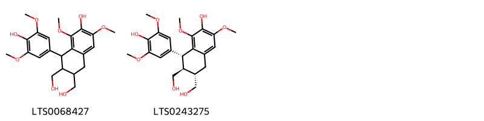
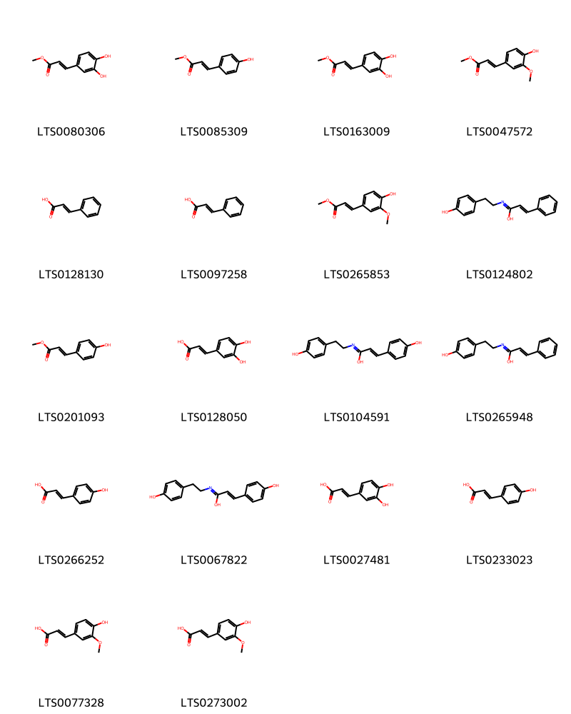
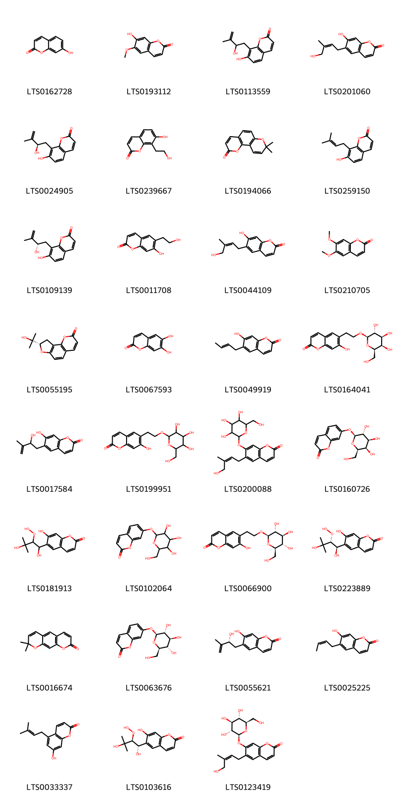
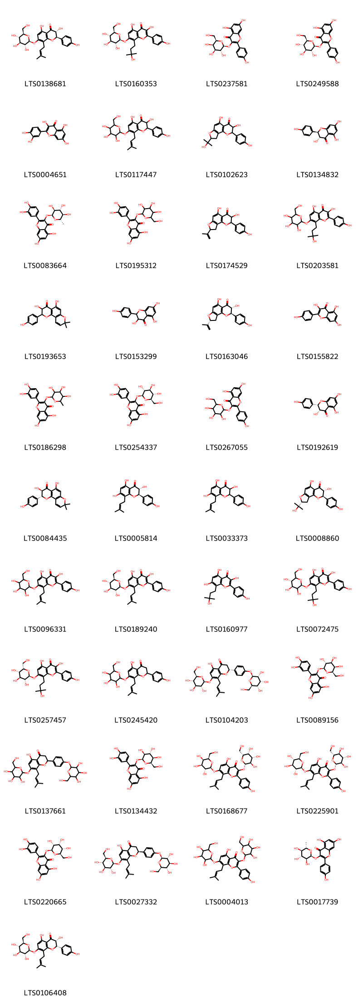
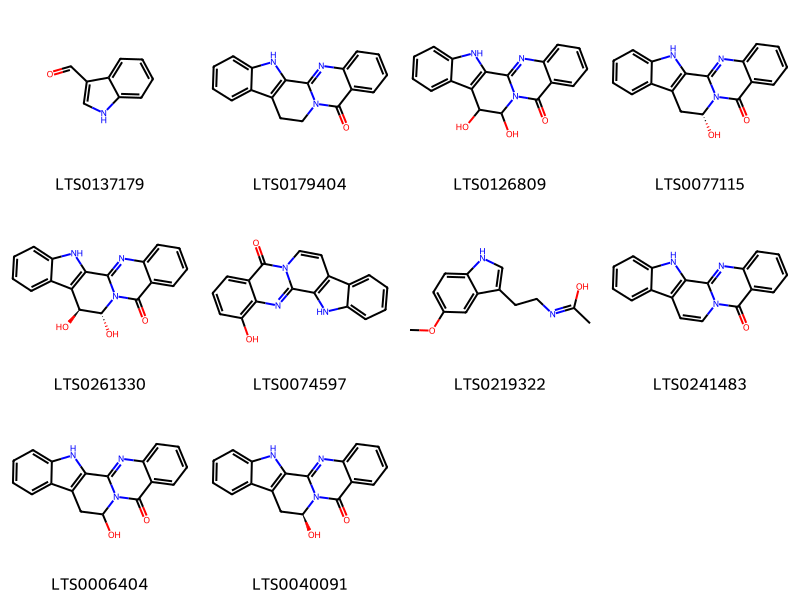
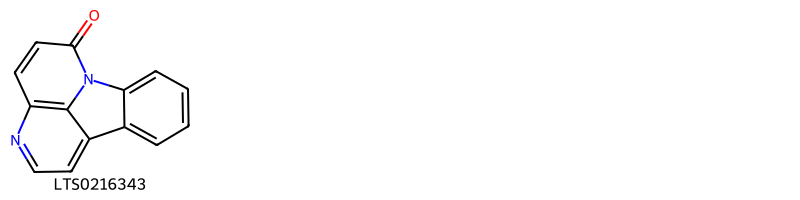
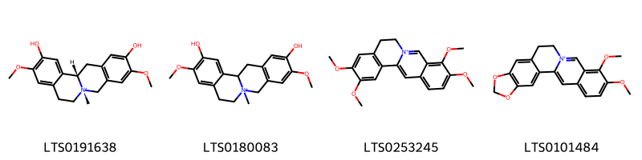
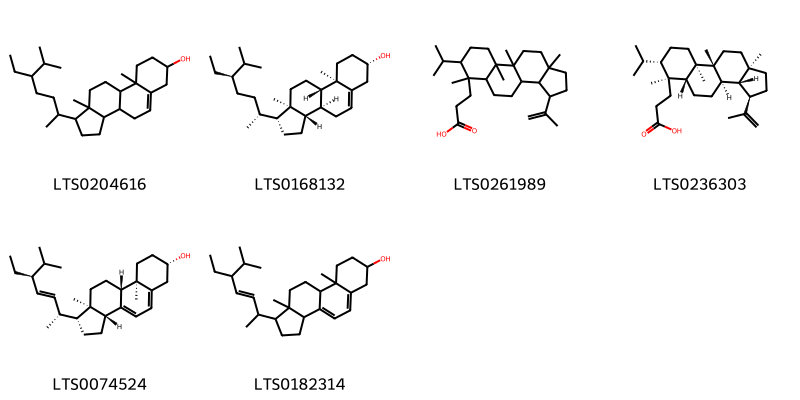

!!! abstract "Tóm tắt"

    Cây Hoàng bá (Phellodendron chinense Schneid, hoặc Phellodendron amurense Rupr.) thuộc họ Cam (Rutaceae). Phân bố bản địa của loài này là từ Viễn Đông Nga đến Bắc và Đông Trung Quốc, Nhiệt độ Đông Á- là một loại cây và mọc chủ yếu ở quần xã sinh vật ôn đới sau đó di thực: Bulgaria, Connecticut, Delaware, Illinois, Maryland, Massachusetts, New Hampshire, New Jersey, New York, Ohio, Pennsylvania, Québec, Rhode I., Romania, Tajikistan...Từ xưa người dân dùng Hoàng bá để thanh nhiệt táo thấp, tư âm giáng hỏa, giải độc; chủ trị: âm hư phát sốt, xương đau âm ỉ, ra mồ hôi trộm; viêm tiết niệu; tả lỵ thấp nhiệt; hoàng đàn; mụn nhọt lở ngứa. Tác dụng dược lý của Hoàng bá là kháng khuẩn, ức chế thần kinh trung ương, diệt amip, hạ huyết áp, thuốc diệt nấm, chống viêm, chống co thắt cơ trơn trên tử cung và ruột, kháng histamin, thuốc hạ số, thuốc đối kháng calci, kháng virus, hạ cholesteron máu,... bởi nó chứa chủ yếu là các alkaloid: Berberin (C20H19O5N), Palmatin (C21H23O5N), Magnoflorin, Candicin, Phellodendrin, ngoài ra còn có các hợp chất phenolic: gồm glucosid của 5-5’ dimethoxylariciresinol 2-(p-hydroxy phenyl) ethanol và N.methylhigenamin, lionresinol syringin,...; những chất có tinh thể không chứa nitơ như obakunon C26H30O7 và obakulacton C26H30O...

## Thông tin về thực vật

Dược liệu **Hoàng Bá (Vỏ Thân)** từ bộ phận **nan** từ loài *Phellodendron chinense*.

**Mô tả thực vật:** Hoàng bá là một cây to cao, có thể cao tới 20-25m, đường kính thân có thể đạt tới 20cm. Vỏ thân dày phân thành hai tầng rõ rệt. Tầng ngoài màu xám, tầng trong màu vàng. Lá mọc đối, kém gồm 5-13 lá chét nhỏ hình trứng đài, mép nguyên. Hoa tím đen, trong chứa 2-5 hạt. Ra hoa mùa hạ. Quả hình cầu.
Ngoài cây hoàng bá kể trên, tại Trung Quốc người ta còn khai thác vỏ cày xuyên hoàng bá Phellodendron qmurense RuỤtr. - Vat. sachalinensis Fr. Schmidt (có tác giả xác định là Phellodendron sinensis Schneider), cây nhỏ và thấp hơn, 7-15 lá chết, quả hình trứng.

*Tài liệu tham khảo:* "Những cây thuốc và vị thuốc Việt Nam" - Đỗ Tất Lợi 
Trong dược điển Việt nam, một số loài có thể dùng thay thế cho nhau làm dược liệu bao gồm *Phellodendron chinense, Phellodendron amurense*

!!! info "Phân loại thực vật của *Phellodendron chinense*"
    - **Kingdom:** Plantae
    - **Phylum:** Tracheophyta
    - **Order:** Sapindales
    - **Family:** Rutaceae
    - **Genus:** Phellodendron
    - **Species:** *Phellodendron chinense*

**Phân bố trên thế giới:** nan, France, United States of America, Russian Federation, Chinese Taipei, China, Canada, Japan, Korea, Republic of, Netherlands, Belgium

**Phân bố tại Việt nam:** Không có ghi nhận ở Việt Nam

!!! info "Phân loại thực vật của *Phellodendron amurense*"
    - **Kingdom:** Plantae
    - **Phylum:** Tracheophyta
    - **Order:** Sapindales
    - **Family:** Rutaceae
    - **Genus:** Phellodendron
    - **Species:** *Phellodendron amurense*

**Phân bố trên thế giới:** United States of America, Poland, Russian Federation, China, Chinese Taipei, Estonia, Kazakhstan, Canada, Japan, Belarus, Ukraine

**Phân bố tại Việt nam:** Không có ghi nhận ở Việt Nam

## Thông tin về dược liệu 

### Định danh

!!! info "Thông tin về tên gọi"

    - Dược liệu tiếng Việt: nan
    - Dược liệu tiếng Trung: nan (nan)
    - Dược liệu tiếng Anh: nan
    - Dược liệu latin thông dụng: nan
    - Dược liệu latin kiểu DĐVN: *cortex phellodendri*
    - Dược liệu latin kiểu DĐVN: *nan*
    - Dược liệu latin kiểu thông tư: *nan*
    - Bộ phận dùng: nan (nan)

### Mô tả dược liệu 

- **Theo dược điển Việt nam V:** nan

- **Mô tả dược liệu theo thông tư chế biến dược liệu theo phương pháp cổ truyền:** nan

### Chế biến 

- **Chế biến theo dược điển việt nam V**: nan

- **Chế biến theo thông tư:** nan

--- 

## Thành phần hóa học

- Theo tài liệu của GS. Đỗ Tất Lợi:  (1) Nhóm hóa học:
- Các alkaloid: Berberin (C20H19O5N), Palmatin (C21H23O5N), Magnoflorin, Candicin, Phellodendrin.
- Các hợp chất phenolic: gồm glucosid của 5-5’ dimethoxylariciresinol 2-(p-hydroxy phenyl) ethanol và N.methylhigenamin, lionresinol syringin,...
- Ngoài ra trong hoàng bá còn có những chất có tinh thể, không chứa nitơ như obakunon C26H30O7 và obakulacton C26H30O8...
(2) Dược điển Đài Loan:
1,2% Berberin
    

**Thành phần hóa học từ loài **Phellodendron amurense**

Theo cơ sở dữ liệu lotus, loài *Phellodendron amurense* đã phân lập và xác định được **206** hoạt chất thuộc về các nhóm Steroids and steroid derivatives, Organooxygen compounds, Lignan glycosides, Flavonoids, Fatty Acyls, Cinnamic acids and derivatives, Quinolines and derivatives, Aryltetralin lignans, Aporphines, Indoles and derivatives, Prenol lipids, Phenols, Isoquinolines and derivatives, Benzene and substituted derivatives, Coumarins and derivatives, Indolonaphthyridine alkaloids, Protoberberine alkaloids and derivatives trong bảng dưới đây. Danh sách các hoạt chất như sau [(2r,3s,4s,5r,6s)-6-{[(2r,3r)-3,5-dihydroxy-2-(4-hydroxyphenyl)-8-(3-methylbut-2-en-1-yl)-4-oxo-2,3-dihydro-1-benzopyran-7-yl]oxy}-3,4,5-trihydroxyoxan-2-yl]methyl acetate [(LTS0039412)](https://lotus.naturalproducts.net/compound/lotus_id/LTS0039412), (2r,11r)-3-(acetyloxy)-15-(furan-3-yl)-2,7,7,11,16-pentamethyl-5-oxo-6-oxatetracyclo[9.7.0.0²,⁸.0¹²,¹⁶]octadec-12-en-10-yl acetate [(LTS0090929)](https://lotus.naturalproducts.net/compound/lotus_id/LTS0090929), 7-(5-hydroxy-2-oxo-5h-furan-3-yl)-1,8,12,17,17-pentamethyl-3,6,16-trioxapentacyclo[9.9.0.0²,⁴.0²,⁸.0¹²,¹⁸]icos-13-ene-5,15,20-trione [(LTS0120280)](https://lotus.naturalproducts.net/compound/lotus_id/LTS0120280), paraben [(LTS0224398)](https://lotus.naturalproducts.net/compound/lotus_id/LTS0224398), (2s)-5-hydroxy-8-(3-methylbut-2-en-1-yl)-7-{[(2s,3r,4s,5s,6r)-3,4,5-trihydroxy-6-(hydroxymethyl)oxan-2-yl]oxy}-2-(4-{[(2s,3r,4s,5s,6r)-3,4,5-trihydroxy-6-(hydroxymethyl)oxan-2-yl]oxy}phenyl)-2,3-dihydro-1-benzopyran-4-one [(LTS0027332)](https://lotus.naturalproducts.net/compound/lotus_id/LTS0027332), kaempherol [(LTS0155822)](https://lotus.naturalproducts.net/compound/lotus_id/LTS0155822), umbelliferone [(LTS0162728)](https://lotus.naturalproducts.net/compound/lotus_id/LTS0162728), ferulic acid [(LTS0077328)](https://lotus.naturalproducts.net/compound/lotus_id/LTS0077328), (2r,3s,4s,5r,6r)-2-({[(2r,3r,4r)-3,4-dihydroxy-4-(hydroxymethyl)oxolan-2-yl]oxy}methyl)-6-[2-(4-hydroxyphenyl)ethoxy]oxane-3,4,5-triol [(LTS0242435)](https://lotus.naturalproducts.net/compound/lotus_id/LTS0242435), 6-[(1r,2r)-2-hydroperoxy-1,3-dihydroxy-3-methylbutyl]-7-hydroxychromen-2-one [(LTS0223889)](https://lotus.naturalproducts.net/compound/lotus_id/LTS0223889), (1r,2r,4s,7s,8s,11s,12r,18s)-7-(furan-3-yl)-1,8,12,17,17-pentamethyl-3,6,16-trioxapentacyclo[9.9.0.0²,⁴.0²,⁸.0¹²,¹⁸]icos-13-ene-5,15,20-trione [(LTS0270227)](https://lotus.naturalproducts.net/compound/lotus_id/LTS0270227), 2-(4-{4-[(4-hydroxy-3,5-dimethoxyphenyl)methyl]-3-(hydroxymethyl)oxolan-2-yl}-2,6-dimethoxyphenoxy)-6-(hydroxymethyl)oxane-3,4,5-triol [(LTS0141095)](https://lotus.naturalproducts.net/compound/lotus_id/LTS0141095), (1s,3as,5ar,9ar,9br,11as)-1-[(3s,5r,6s)-5,6-dihydroxy-7,7-dimethyloxepan-3-yl]-3a,6,6,9a,11a-pentamethyl-1h,2h,3h,5h,5ah,8h,9h,9bh,10h,11h-cyclopenta[a]phenanthren-7-one [(LTS0215285)](https://lotus.naturalproducts.net/compound/lotus_id/LTS0215285), 4-[(2r,4s)-2,4-dihydroxy-2,6,6-trimethylcyclohexylidene]but-3-en-2-one [(LTS0233974)](https://lotus.naturalproducts.net/compound/lotus_id/LTS0233974), methyl caffeate [(LTS0163009)](https://lotus.naturalproducts.net/compound/lotus_id/LTS0163009), para-coumaric acid [(LTS0266252)](https://lotus.naturalproducts.net/compound/lotus_id/LTS0266252), skimmianine [(LTS0091404)](https://lotus.naturalproducts.net/compound/lotus_id/LTS0091404), 2-(hydroxymethyl)-6-[4-(3-hydroxyprop-1-en-1-yl)-2-methoxyphenoxy]oxane-3,4,5-triol [(LTS0126144)](https://lotus.naturalproducts.net/compound/lotus_id/LTS0126144), (2s,3r,4s,5s,6r)-2-{[(1r)-6-hydroxy-1-[(4-hydroxyphenyl)methyl]-2-methyl-3,4-dihydro-1h-isoquinolin-7-yl]oxy}-6-(hydroxymethyl)oxane-3,4,5-triol [(LTS0165635)](https://lotus.naturalproducts.net/compound/lotus_id/LTS0165635), (1s,3as,5ar,7s,9ar,9br,11as)-1-[(2s,4r)-4-[(2s)-3,3-dimethyloxiran-2-yl]-4-hydroxybutan-2-yl]-3a,6,6,9a,11a-pentamethyl-1h,2h,3h,5h,5ah,7h,8h,9h,9bh,10h,11h-cyclopenta[a]phenanthren-7-ol [(LTS0269481)](https://lotus.naturalproducts.net/compound/lotus_id/LTS0269481), (2s,3r,4s,5s,6r)-2-{4-[(2s,3r,4r)-4-[(4-hydroxy-3,5-dimethoxyphenyl)methyl]-3-(hydroxymethyl)oxolan-2-yl]-2,6-dimethoxyphenoxy}-6-(hydroxymethyl)oxane-3,4,5-triol [(LTS0246602)](https://lotus.naturalproducts.net/compound/lotus_id/LTS0246602), chlorogenic acid [(LTS0226495)](https://lotus.naturalproducts.net/compound/lotus_id/LTS0226495), (3s,4r,6s)-6-[(1s,3as,5ar,7s,9ar,9br,11as)-7-hydroxy-3a,6,6,9a,11a-pentamethyl-1h,2h,3h,5h,5ah,7h,8h,9h,9bh,10h,11h-cyclopenta[a]phenanthren-1-yl]-2-methylheptane-2,3,4-triol [(LTS0231256)](https://lotus.naturalproducts.net/compound/lotus_id/LTS0231256), 7-hydroxy-8-[(2r)-2-hydroxy-3-methylbut-3-en-1-yl]chromen-2-one [(LTS0024905)](https://lotus.naturalproducts.net/compound/lotus_id/LTS0024905), methyl ferulate [(LTS0265853)](https://lotus.naturalproducts.net/compound/lotus_id/LTS0265853), 7-hydroxy-6-(2-hydroxyethyl)chromen-2-one [(LTS0011708)](https://lotus.naturalproducts.net/compound/lotus_id/LTS0011708), 5,7-dihydroxy-2-(4-hydroxyphenyl)-3-{[(2s,3s,4r,5r,6s)-3,4,5-trihydroxy-6-methyloxan-2-yl]oxy}chromen-4-one [(LTS0017739)](https://lotus.naturalproducts.net/compound/lotus_id/LTS0017739), methyl (1s,3r,4r,5r)-1,3,4-trihydroxy-5-{[(2e)-3-(4-hydroxy-3-methoxyphenyl)prop-2-enoyl]oxy}cyclohexane-1-carboxylate [(LTS0178125)](https://lotus.naturalproducts.net/compound/lotus_id/LTS0178125), (1r,2r,4s,7r,8s,11s,12r,18s)-7-[(2s)-2-hydroxy-5-oxo-2h-furan-3-yl]-1,8,12,17,17-pentamethyl-3,6,16-trioxapentacyclo[9.9.0.0²,⁴.0²,⁸.0¹²,¹⁸]icos-13-ene-5,15,20-trione [(LTS0220001)](https://lotus.naturalproducts.net/compound/lotus_id/LTS0220001), astragalin [(LTS0249588)](https://lotus.naturalproducts.net/compound/lotus_id/LTS0249588), 3-(acetyloxy)-15-(furan-3-yl)-2,7,7,11,16-pentamethyl-5-oxo-6-oxatetracyclo[9.7.0.0²,⁸.0¹²,¹⁶]octadec-12-en-10-yl acetate [(LTS0079204)](https://lotus.naturalproducts.net/compound/lotus_id/LTS0079204), (4r,11r,12r)-8,11-dihydroxy-12-(4-hydroxyphenyl)-4-(2-hydroxypropan-2-yl)-5,13-dioxatricyclo[7.4.0.0²,⁶]trideca-1(9),2(6),7-trien-10-one [(LTS0008860)](https://lotus.naturalproducts.net/compound/lotus_id/LTS0008860), [(2r,3s,4s,5r,6s)-6-{[3,5-dihydroxy-2-(4-hydroxyphenyl)-8-(3-methylbut-2-en-1-yl)-4-oxochromen-7-yl]oxy}-3,4,5-trihydroxyoxan-2-yl]methyl acetate [(LTS0060815)](https://lotus.naturalproducts.net/compound/lotus_id/LTS0060815), 3-(4-hydroxyphenyl)-n-[2-(4-hydroxyphenyl)ethyl]prop-2-enimidic acid [(LTS0104591)](https://lotus.naturalproducts.net/compound/lotus_id/LTS0104591), 2-(3,4-dihydroxyphenyl)-5,7-dihydroxy-3-{[(2s,3s,4r,5r,6s)-3,4,5-trihydroxy-6-methyloxan-2-yl]oxy}chromen-4-one [(LTS0083664)](https://lotus.naturalproducts.net/compound/lotus_id/LTS0083664), 3-[7-isopropyl-6,9a,9b,11a-tetramethyl-3-(prop-1-en-2-yl)-dodecahydro-1h-cyclopenta[a]phenanthren-6-yl]propanoic acid [(LTS0261989)](https://lotus.naturalproducts.net/compound/lotus_id/LTS0261989), (1r,3ar,5ar,5br,7ar,9r,11ar,11br,13ar,13bs)-3a,5a,5b,8,8,11a-hexamethyl-1-(prop-1-en-2-yl)-hexadecahydrocyclopenta[a]chrysen-9-ol [(LTS0255487)](https://lotus.naturalproducts.net/compound/lotus_id/LTS0255487), dictamnine [(LTS0266561)](https://lotus.naturalproducts.net/compound/lotus_id/LTS0266561), hyperoside [(LTS0089156)](https://lotus.naturalproducts.net/compound/lotus_id/LTS0089156), 7-hydroxy-5-(3-methylbut-2-en-1-yl)chromen-2-one [(LTS0033337)](https://lotus.naturalproducts.net/compound/lotus_id/LTS0033337), (1r,2r,8s,11s,12r,18s)-7-(furan-3-yl)-1,8,12,17,17-pentamethyl-5,15,20-trioxo-3,6,16-trioxapentacyclo[9.9.0.0²,⁴.0²,⁸.0¹²,¹⁸]icosan-13-yl acetate [(LTS0234033)](https://lotus.naturalproducts.net/compound/lotus_id/LTS0234033), (1r,2r,7s,10s,13r,14r,16s,19s,20s)-19-(furan-3-yl)-9,9,13,20-tetramethyl-4,8,15,18-tetraoxahexacyclo[11.9.0.0²,⁷.0²,¹⁰.0¹⁴,¹⁶.0¹⁴,²⁰]docosane-5,12,17-trione [(LTS0222914)](https://lotus.naturalproducts.net/compound/lotus_id/LTS0222914), (2s,3r,4s,5s,6r)-2-{4-[(2r,3s,4s)-4-[(4-hydroxy-3,5-dimethoxyphenyl)methyl]-3-(hydroxymethyl)oxolan-2-yl]-2,6-dimethoxyphenoxy}-6-(hydroxymethyl)oxane-3,4,5-triol [(LTS0149429)](https://lotus.naturalproducts.net/compound/lotus_id/LTS0149429), esculetin [(LTS0067593)](https://lotus.naturalproducts.net/compound/lotus_id/LTS0067593), magnoflorine [(LTS0120825)](https://lotus.naturalproducts.net/compound/lotus_id/LTS0120825), 7-hydroxy-8-[(1r)-1-hydroxy-3-methylbut-3-en-1-yl]chromen-2-one [(LTS0077923)](https://lotus.naturalproducts.net/compound/lotus_id/LTS0077923), phenylacrylic acid [(LTS0097258)](https://lotus.naturalproducts.net/compound/lotus_id/LTS0097258), 5-hydroxy-2-(4-hydroxyphenyl)-8-(3-methylbut-2-en-1-yl)-3,7-bis({[(2s,3r,4s,5r,6r)-3,4,5-trihydroxy-6-(hydroxymethyl)oxan-2-yl]oxy})chromen-4-one [(LTS0168677)](https://lotus.naturalproducts.net/compound/lotus_id/LTS0168677), fagarine [(LTS0156697)](https://lotus.naturalproducts.net/compound/lotus_id/LTS0156697), 2-(3,4-dihydroxyphenyl)-5,7-dihydroxy-3-{[3,4,5-trihydroxy-6-(hydroxymethyl)oxan-2-yl]oxy}chromen-4-one [(LTS0195312)](https://lotus.naturalproducts.net/compound/lotus_id/LTS0195312), 3-[(3r,3ar,3br,5ar,6s,7s,9ar,9br,11ar)-7-isopropyl-6,9a,9b,11a-tetramethyl-3-(prop-1-en-2-yl)-dodecahydro-1h-cyclopenta[a]phenanthren-6-yl]propanoic acid [(LTS0236303)](https://lotus.naturalproducts.net/compound/lotus_id/LTS0236303), scopoletin [(LTS0193112)](https://lotus.naturalproducts.net/compound/lotus_id/LTS0193112), 5-hydroxy-8-(3-methylbut-2-en-1-yl)-7-{[3,4,5-trihydroxy-6-(hydroxymethyl)oxan-2-yl]oxy}-2-(4-{[3,4,5-trihydroxy-6-(hydroxymethyl)oxan-2-yl]oxy}phenyl)-2,3-dihydro-1-benzopyran-4-one [(LTS0137661)](https://lotus.naturalproducts.net/compound/lotus_id/LTS0137661), 2-(3,4-dihydroxyphenyl)-5,7-dihydroxy-3-{[(2s,3r,4r,5s,6r)-3,4,5-trihydroxy-6-(hydroxymethyl)oxan-2-yl]oxy}chromen-4-one [(LTS0220665)](https://lotus.naturalproducts.net/compound/lotus_id/LTS0220665), friedelin [(LTS0213494)](https://lotus.naturalproducts.net/compound/lotus_id/LTS0213494), (1r,3as,5ar,9ar,9bs,11as)-1-[(3s)-5-hydroxy-6-(2-hydroxypropan-2-yl)oxan-3-yl]-3a,6,6,9a,11a-pentamethyl-1h,2h,3h,5h,5ah,8h,9h,9bh,10h,11h-cyclopenta[a]phenanthren-7-one [(LTS0074054)](https://lotus.naturalproducts.net/compound/lotus_id/LTS0074054), seselin [(LTS0194066)](https://lotus.naturalproducts.net/compound/lotus_id/LTS0194066), coniferin [(LTS0119031)](https://lotus.naturalproducts.net/compound/lotus_id/LTS0119031), (2s,3r)-3,5,7-trihydroxy-2-(4-hydroxyphenyl)-2,3-dihydro-1-benzopyran-4-one [(LTS0192619)](https://lotus.naturalproducts.net/compound/lotus_id/LTS0192619), anisaldehyde [(LTS0054560)](https://lotus.naturalproducts.net/compound/lotus_id/LTS0054560), (2e)-3-(4-hydroxyphenyl)-n-[2-(4-hydroxyphenyl)ethyl]prop-2-enimidic acid [(LTS0067822)](https://lotus.naturalproducts.net/compound/lotus_id/LTS0067822), 2-({[3,4-dihydroxy-4-(hydroxymethyl)oxolan-2-yl]oxy}methyl)-6-[2-(4-hydroxyphenyl)ethoxy]oxane-3,4,5-triol [(LTS0202880)](https://lotus.naturalproducts.net/compound/lotus_id/LTS0202880), 3a,5a,5b,8,8,11a-hexamethyl-1-(prop-1-en-2-yl)-tetradecahydro-1h-cyclopenta[a]chrysen-9-one [(LTS0257989)](https://lotus.naturalproducts.net/compound/lotus_id/LTS0257989), 3-(acetyloxy)-2,7,7,11,16-pentamethyl-5-oxo-15-(5-oxooxolan-3-yl)-6-oxatetracyclo[9.7.0.0²,⁸.0¹²,¹⁶]octadec-12-en-10-yl acetate [(LTS0056126)](https://lotus.naturalproducts.net/compound/lotus_id/LTS0056126), (4r)-5-butoxy-4-hydroxy-5-oxopentanoic acid [(LTS0002686)](https://lotus.naturalproducts.net/compound/lotus_id/LTS0002686), 2-(3,4-dihydroxyphenyl)-5,7-dihydroxy-3-{[(2s,3s,4r,5r,6r)-3,4,5-trihydroxy-6-(hydroxymethyl)oxan-2-yl]oxy}chromen-4-one [(LTS0134432)](https://lotus.naturalproducts.net/compound/lotus_id/LTS0134432), syringin [(LTS0046227)](https://lotus.naturalproducts.net/compound/lotus_id/LTS0046227), acanthoside d [(LTS0155579)](https://lotus.naturalproducts.net/compound/lotus_id/LTS0155579), methyl (2e)-3-(4-hydroxyphenyl)prop-2-enoate [(LTS0085309)](https://lotus.naturalproducts.net/compound/lotus_id/LTS0085309), 3,13,21-triazapentacyclo[11.8.0.0²,¹⁰.0⁴,⁹.0¹⁵,²⁰]henicosa-1(21),2(10),4(9),5,7,11,15,17,19-nonaen-14-one [(LTS0241483)](https://lotus.naturalproducts.net/compound/lotus_id/LTS0241483), methyl (1r,3r,4s,5r)-1,3,4-trihydroxy-5-{[3-(4-hydroxy-3-methoxyphenyl)prop-2-enoyl]oxy}cyclohexane-1-carboxylate [(LTS0263466)](https://lotus.naturalproducts.net/compound/lotus_id/LTS0263466), 7-(furan-3-yl)-1,8,12,17,17-pentamethyl-5,15,20-trioxo-3,6,16-trioxapentacyclo[9.9.0.0²,⁴.0²,⁸.0¹²,¹⁸]icosan-13-yl acetate [(LTS0267734)](https://lotus.naturalproducts.net/compound/lotus_id/LTS0267734), (1r,2r,3s,8r,10r,11r,15s,16s)-3-(acetyloxy)-2,7,7,11,16-pentamethyl-5-oxo-15-[(3s)-5-oxooxolan-3-yl]-6-oxatetracyclo[9.7.0.0²,⁸.0¹²,¹⁶]octadec-12-en-10-yl acetate [(LTS0139410)](https://lotus.naturalproducts.net/compound/lotus_id/LTS0139410), rutaecarpine [(LTS0179404)](https://lotus.naturalproducts.net/compound/lotus_id/LTS0179404), 6-[(2z)-4-hydroxy-3-methylbut-2-en-1-yl]-7-{[(2s,3r,4s,5s,6r)-3,4,5-trihydroxy-6-(hydroxymethyl)oxan-2-yl]oxy}chromen-2-one [(LTS0123419)](https://lotus.naturalproducts.net/compound/lotus_id/LTS0123419), 12-hydroxy-3,13,21-triazapentacyclo[11.8.0.0²,¹⁰.0⁴,⁹.0¹⁵,²⁰]henicosa-1(21),2(10),4,6,8,15,17,19-octaen-14-one [(LTS0006404)](https://lotus.naturalproducts.net/compound/lotus_id/LTS0006404), 3,5-dihydroxy-2-(4-hydroxyphenyl)-8-(3-methylbut-2-en-1-yl)-7-{[(2s,3r,4s,5s,6r)-3,4,5-trihydroxy-6-(hydroxymethyl)oxan-2-yl]oxy}chromen-4-one [(LTS0189240)](https://lotus.naturalproducts.net/compound/lotus_id/LTS0189240), skimmin [(LTS0063676)](https://lotus.naturalproducts.net/compound/lotus_id/LTS0063676), (2e)-3-(3,5-dimethoxy-4-{[(2s,3r,4s,5s,6r)-3,4,5-trihydroxy-6-(hydroxymethyl)oxan-2-yl]oxy}phenyl)prop-2-enal [(LTS0269793)](https://lotus.naturalproducts.net/compound/lotus_id/LTS0269793), 1-(5-ethyl-6-methylhept-3-en-2-yl)-9a,11a-dimethyl-1h,2h,3h,3ah,6h,7h,8h,9h,9bh,10h,11h-cyclopenta[a]phenanthren-7-ol [(LTS0182314)](https://lotus.naturalproducts.net/compound/lotus_id/LTS0182314), 17-methoxy-5,7-dioxa-13-azapentacyclo[11.8.0.0²,¹⁰.0⁴,⁸.0¹⁵,²⁰]henicosa-1(21),2,4(8),9,14,17,19-heptaen-16-one [(LTS0026788)](https://lotus.naturalproducts.net/compound/lotus_id/LTS0026788), methyl 1,3,4-trihydroxy-5-{[3-(4-hydroxy-3-methoxyphenyl)prop-2-enoyl]oxy}cyclohexane-1-carboxylate [(LTS0188954)](https://lotus.naturalproducts.net/compound/lotus_id/LTS0188954), 3,4-dihydroxycinnamic acid [(LTS0128050)](https://lotus.naturalproducts.net/compound/lotus_id/LTS0128050), 3,5-dihydroxy-2-(4-hydroxyphenyl)-8-(3-methylbut-2-en-1-yl)-7-{[3,4,5-trihydroxy-6-(hydroxymethyl)oxan-2-yl]oxy}-2,3-dihydro-1-benzopyran-4-one [(LTS0117447)](https://lotus.naturalproducts.net/compound/lotus_id/LTS0117447), (4r,11s,12r)-8,11-dihydroxy-12-(4-hydroxyphenyl)-4-(prop-1-en-2-yl)-5,13-dioxatricyclo[7.4.0.0²,⁶]trideca-1(9),2(6),7-trien-10-one [(LTS0231756)](https://lotus.naturalproducts.net/compound/lotus_id/LTS0231756), isoquercetin [(LTS0254337)](https://lotus.naturalproducts.net/compound/lotus_id/LTS0254337), methyl anisate [(LTS0113372)](https://lotus.naturalproducts.net/compound/lotus_id/LTS0113372), amurensin [(LTS0072475)](https://lotus.naturalproducts.net/compound/lotus_id/LTS0072475), 2,11-dihydroxy-3,10-dimethoxy-6-methyl-7,8,12b,13-tetrahydro-5h-6-azatetraphen-6-ium [(LTS0180083)](https://lotus.naturalproducts.net/compound/lotus_id/LTS0180083), 5-hydroxy-2-(4-hydroxyphenyl)-8-(3-methylbut-2-en-1-yl)-3,7-bis({[(2s,3r,4s,5s,6r)-3,4,5-trihydroxy-6-(hydroxymethyl)oxan-2-yl]oxy})chromen-4-one [(LTS0225901)](https://lotus.naturalproducts.net/compound/lotus_id/LTS0225901), xanthyletin [(LTS0016674)](https://lotus.naturalproducts.net/compound/lotus_id/LTS0016674), (6s,7s,8r)-8-(4-hydroxy-3,5-dimethoxyphenyl)-6,7-bis(hydroxymethyl)-1,3-dimethoxy-5,6,7,8-tetrahydronaphthalen-2-ol [(LTS0243275)](https://lotus.naturalproducts.net/compound/lotus_id/LTS0243275), noricaritin [(LTS0160977)](https://lotus.naturalproducts.net/compound/lotus_id/LTS0160977), 7-hydroxy-8-(2-hydroxy-3-methylbut-3-en-1-yl)chromen-2-one [(LTS0113559)](https://lotus.naturalproducts.net/compound/lotus_id/LTS0113559), (12r)-12-hydroxy-3,13,21-triazapentacyclo[11.8.0.0²,¹⁰.0⁴,⁹.0¹⁵,²⁰]henicosa-1(21),2(10),4,6,8,15,17,19-octaen-14-one [(LTS0077115)](https://lotus.naturalproducts.net/compound/lotus_id/LTS0077115), quercitrin [(LTS0186298)](https://lotus.naturalproducts.net/compound/lotus_id/LTS0186298), 3,5,7-trihydroxy-2-(4-hydroxyphenyl)-8-(3-methylbut-2-en-1-yl)-2,3-dihydro-1-benzopyran-4-one [(LTS0033373)](https://lotus.naturalproducts.net/compound/lotus_id/LTS0033373), (12s)-12-hydroxy-3,13,21-triazapentacyclo[11.8.0.0²,¹⁰.0⁴,⁹.0¹⁵,²⁰]henicosa-1(21),2(10),4,6,8,15,17,19-octaen-14-one [(LTS0040091)](https://lotus.naturalproducts.net/compound/lotus_id/LTS0040091), (1r,2r,4s,7r,8s,11r,12r,18r)-7-(5-hydroxy-2-oxo-5h-furan-3-yl)-1,8,12,17,17-pentamethyl-3,6,16-trioxapentacyclo[9.9.0.0²,⁴.0²,⁸.0¹²,¹⁸]icos-13-ene-5,15,20-trione [(LTS0150120)](https://lotus.naturalproducts.net/compound/lotus_id/LTS0150120), (2s,3r)-3,5-dihydroxy-2-(4-hydroxyphenyl)-8-(3-methylbut-2-en-1-yl)-7-{[(2s,3r,4s,5s,6r)-3,4,5-trihydroxy-6-(hydroxymethyl)oxan-2-yl]oxy}-2,3-dihydro-1-benzopyran-4-one [(LTS0106408)](https://lotus.naturalproducts.net/compound/lotus_id/LTS0106408), p-hydroxybenzaldehyde [(LTS0259836)](https://lotus.naturalproducts.net/compound/lotus_id/LTS0259836), 3,4-dimethoxy-2-{5-oxo-2h,7h,8h-[1,3]dioxolo[4,5-g]isoquinoline-6-carbonyl}benzoic acid [(LTS0102501)](https://lotus.naturalproducts.net/compound/lotus_id/LTS0102501), stigmast-5-en-3-ol, (3β)- [(LTS0204616)](https://lotus.naturalproducts.net/compound/lotus_id/LTS0204616), 8,11-dihydroxy-12-(4-hydroxyphenyl)-4-(2-hydroxypropan-2-yl)-5,13-dioxatricyclo[7.4.0.0²,⁶]trideca-1(9),2(6),7-trien-10-one [(LTS0102623)](https://lotus.naturalproducts.net/compound/lotus_id/LTS0102623), 8,11-dihydroxy-12-(4-hydroxyphenyl)-4-(prop-1-en-2-yl)-5,13-dioxatricyclo[7.4.0.0²,⁶]trideca-1(9),2(6),7-trien-10-one [(LTS0174529)](https://lotus.naturalproducts.net/compound/lotus_id/LTS0174529), skimmin [(LTS0102064)](https://lotus.naturalproducts.net/compound/lotus_id/LTS0102064), trifolin [(LTS0237581)](https://lotus.naturalproducts.net/compound/lotus_id/LTS0237581), (11s,12r)-11,12-dihydroxy-3,13,21-triazapentacyclo[11.8.0.0²,¹⁰.0⁴,⁹.0¹⁵,²⁰]henicosa-1(21),2(10),4,6,8,15,17,19-octaen-14-one [(LTS0261330)](https://lotus.naturalproducts.net/compound/lotus_id/LTS0261330), 3,4,11-trimethoxy-7,8-dihydro-6-azatetraphen-10-one [(LTS0258799)](https://lotus.naturalproducts.net/compound/lotus_id/LTS0258799), 2-(hydroxymethyl)-6-[4-(hydroxymethyl)-2-methoxyphenoxy]oxane-3,4,5-triol [(LTS0098044)](https://lotus.naturalproducts.net/compound/lotus_id/LTS0098044), 6-(4-hydroxy-3-methylbut-2-en-1-yl)-7-{[3,4,5-trihydroxy-6-(hydroxymethyl)oxan-2-yl]oxy}chromen-2-one [(LTS0200088)](https://lotus.naturalproducts.net/compound/lotus_id/LTS0200088), vanilloloside [(LTS0157289)](https://lotus.naturalproducts.net/compound/lotus_id/LTS0157289), (+)-dihydrokaempferol [(LTS0134832)](https://lotus.naturalproducts.net/compound/lotus_id/LTS0134832), (4r,11r,12r)-8,11-dihydroxy-12-(4-hydroxyphenyl)-4-(prop-1-en-2-yl)-5,13-dioxatricyclo[7.4.0.0²,⁶]trideca-1(9),2(6),7-trien-10-one [(LTS0163046)](https://lotus.naturalproducts.net/compound/lotus_id/LTS0163046), methyl hydroxycinnamate [(LTS0201093)](https://lotus.naturalproducts.net/compound/lotus_id/LTS0201093), methyl 3-[(22s,23s)-17-ethenyl-12-ethyl-13,18,22,27-tetramethyl-3,5-dioxo-4-oxa-8,24,25,26-tetraazahexacyclo[19.2.1.1⁶,⁹.1¹¹,¹⁴.1¹⁶,¹⁹.0²,⁷]heptacosa-1(24),2(7),6(27),9,11(26),12,14,16,18,20-decaen-23-yl]propanoate [(LTS0186630)](https://lotus.naturalproducts.net/compound/lotus_id/LTS0186630), 7-hydroxy-6-(2-{[(2r,3r,4s,5s,6r)-3,4,5-trihydroxy-6-(hydroxymethyl)oxan-2-yl]oxy}ethyl)chromen-2-one [(LTS0066900)](https://lotus.naturalproducts.net/compound/lotus_id/LTS0066900), 1,3,4-trihydroxy-5-{[3-(4-hydroxy-3-methoxyphenyl)prop-2-enoyl]oxy}cyclohexane-1-carboxylic acid [(LTS0008946)](https://lotus.naturalproducts.net/compound/lotus_id/LTS0008946), lupeol [(LTS0088634)](https://lotus.naturalproducts.net/compound/lotus_id/LTS0088634), epilupeol [(LTS0108662)](https://lotus.naturalproducts.net/compound/lotus_id/LTS0108662), (+)-columbianetin [(LTS0055195)](https://lotus.naturalproducts.net/compound/lotus_id/LTS0055195), quercetin [(LTS0004651)](https://lotus.naturalproducts.net/compound/lotus_id/LTS0004651), methyl 3-(3,4-dihydroxyphenyl)prop-2-enoate [(LTS0080306)](https://lotus.naturalproducts.net/compound/lotus_id/LTS0080306), (1s,3as,5ar,9ar,9br,11as)-3a,6,6,9a,11a-pentamethyl-1-[(2s,4r,5s)-4,5,6-trihydroxy-6-methylheptan-2-yl]-1h,2h,3h,5h,5ah,8h,9h,9bh,10h,11h-cyclopenta[a]phenanthren-7-one [(LTS0189980)](https://lotus.naturalproducts.net/compound/lotus_id/LTS0189980), (1s,2r,7s,10r,13r,14r,16s,19s,20s)-19-(furan-3-yl)-9,9,13,20-tetramethyl-4,8,15,18-tetraoxahexacyclo[11.9.0.0²,⁷.0²,¹⁰.0¹⁴,¹⁶.0¹⁴,²⁰]docosane-5,12,17-trione [(LTS0254229)](https://lotus.naturalproducts.net/compound/lotus_id/LTS0254229), 2-(hydroxymethyl)-6-[4-(3-hydroxyprop-1-en-1-yl)-2,6-dimethoxyphenoxy]oxane-3,4,5-triol [(LTS0188912)](https://lotus.naturalproducts.net/compound/lotus_id/LTS0188912), (1s,3as,5ar,9ar,9bs,11as)-1-[(2s,4r)-4-[(2s)-3,3-dimethyloxiran-2-yl]-4-hydroxybutan-2-yl]-3a,6,6,9a,11a-pentamethyl-1h,2h,3h,5h,5ah,8h,9h,9bh,10h,11h-cyclopenta[a]phenanthren-7-one [(LTS0048025)](https://lotus.naturalproducts.net/compound/lotus_id/LTS0048025), 2-{4-[4-(3,5-dimethoxy-4-{[3,4,5-trihydroxy-6-(hydroxymethyl)oxan-2-yl]oxy}phenyl)-hexahydrofuro[3,4-c]furan-1-yl]-2,6-dimethoxyphenoxy}-6-(hydroxymethyl)oxane-3,4,5-triol [(LTS0011685)](https://lotus.naturalproducts.net/compound/lotus_id/LTS0011685), amurensin (flavonol) [(LTS0160353)](https://lotus.naturalproducts.net/compound/lotus_id/LTS0160353), canthin-6-one [(LTS0216343)](https://lotus.naturalproducts.net/compound/lotus_id/LTS0216343), 3,5-dihydroxy-2-(4-hydroxyphenyl)-8,8-dimethyl-2h,3h-pyrano[2,3-f]chromen-4-one [(LTS0193653)](https://lotus.naturalproducts.net/compound/lotus_id/LTS0193653), 6-[(2z)-but-2-en-1-yl]-7-hydroxychromen-2-one [(LTS0025225)](https://lotus.naturalproducts.net/compound/lotus_id/LTS0025225), caffeic acid [(LTS0027481)](https://lotus.naturalproducts.net/compound/lotus_id/LTS0027481), n-[2-(5-methoxy-1h-indol-3-yl)ethyl]ethanimidic acid [(LTS0219322)](https://lotus.naturalproducts.net/compound/lotus_id/LTS0219322), 6-[(1s,2s)-2-hydroperoxy-1,3-dihydroxy-3-methylbutyl]-7-hydroxychromen-2-one [(LTS0103616)](https://lotus.naturalproducts.net/compound/lotus_id/LTS0103616), cinnamic acid [(LTS0128130)](https://lotus.naturalproducts.net/compound/lotus_id/LTS0128130), 7-hydroxy-6-(2-hydroxy-3-methylbut-3-en-1-yl)chromen-2-one [(LTS0017584)](https://lotus.naturalproducts.net/compound/lotus_id/LTS0017584), 3,5-dihydroxy-2-(4-hydroxyphenyl)-8-(3-methylbut-2-en-1-yl)-7-{[3,4,5-trihydroxy-6-(hydroxymethyl)oxan-2-yl]oxy}chromen-4-one [(LTS0096331)](https://lotus.naturalproducts.net/compound/lotus_id/LTS0096331), 1-[4-(3,3-dimethyloxiran-2-yl)-4-hydroxybutan-2-yl]-3a,6,6,9a,11a-pentamethyl-1h,2h,3h,5h,5ah,8h,9h,9bh,10h,11h-cyclopenta[a]phenanthren-7-one [(LTS0095321)](https://lotus.naturalproducts.net/compound/lotus_id/LTS0095321), ferulic acid [(LTS0273002)](https://lotus.naturalproducts.net/compound/lotus_id/LTS0273002), 5-butoxy-4-hydroxy-5-oxopentanoic acid [(LTS0242521)](https://lotus.naturalproducts.net/compound/lotus_id/LTS0242521), (2r,3r)-3,5-dihydroxy-2-(4-hydroxyphenyl)-8,8-dimethyl-2h,3h-pyrano[2,3-f]chromen-4-one [(LTS0084435)](https://lotus.naturalproducts.net/compound/lotus_id/LTS0084435), 2-({6-hydroxy-1-[(4-hydroxyphenyl)methyl]-2-methyl-3,4-dihydro-1h-isoquinolin-7-yl}oxy)-6-(hydroxymethyl)oxane-3,4,5-triol [(LTS0069377)](https://lotus.naturalproducts.net/compound/lotus_id/LTS0069377), 6-(but-2-en-1-yl)-7-hydroxychromen-2-one [(LTS0049919)](https://lotus.naturalproducts.net/compound/lotus_id/LTS0049919), 7-hydroxy-6-(2-{[3,4,5-trihydroxy-6-(hydroxymethyl)oxan-2-yl]oxy}ethyl)chromen-2-one [(LTS0199951)](https://lotus.naturalproducts.net/compound/lotus_id/LTS0199951), methyl 3-[(22s,23s)-17-ethenyl-12-ethyl-13,18,22,27-tetramethyl-3,5-dioxo-4-oxa-8,24,25,26-tetraazahexacyclo[19.2.1.1⁶,⁹.1¹¹,¹⁴.1¹⁶,¹⁹.0²,⁷]heptacosa-1(24),2(7),6(27),9,11(26),12,14,16,18,20-decaen-23-yl]propanoate [(LTS0097747)](https://lotus.naturalproducts.net/compound/lotus_id/LTS0097747), 3-(3,5-dimethoxy-4-{[3,4,5-trihydroxy-6-(hydroxymethyl)oxan-2-yl]oxy}phenyl)prop-2-enal [(LTS0232765)](https://lotus.naturalproducts.net/compound/lotus_id/LTS0232765), vanillic acid [(LTS0229113)](https://lotus.naturalproducts.net/compound/lotus_id/LTS0229113), δ7-stigmasterol [(LTS0074524)](https://lotus.naturalproducts.net/compound/lotus_id/LTS0074524), methyl (1r,3r,4s,5r)-1,3,4-trihydroxy-5-{[(2e)-3-(4-hydroxy-3-methoxyphenyl)prop-2-enoyl]oxy}cyclohexane-1-carboxylate [(LTS0228653)](https://lotus.naturalproducts.net/compound/lotus_id/LTS0228653), (2r)-5-hydroxy-8-(3-methylbut-2-en-1-yl)-7-{[(2s,3r,4s,5s,6r)-3,4,5-trihydroxy-6-(hydroxymethyl)oxan-2-yl]oxy}-2-(4-{[(2s,3r,4r,5s,6r)-3,4,5-trihydroxy-6-(hydroxymethyl)oxan-2-yl]oxy}phenyl)-2,3-dihydro-1-benzopyran-4-one [(LTS0104203)](https://lotus.naturalproducts.net/compound/lotus_id/LTS0104203), berberine [(LTS0101484)](https://lotus.naturalproducts.net/compound/lotus_id/LTS0101484), (1s,3as,5ar,9ar,9br,11as)-1-[(2s,4r)-4-[(2s)-3,3-dimethyloxiran-2-yl]-4-hydroxybutan-2-yl]-3a,6,6,9a,11a-pentamethyl-1h,2h,3h,5h,5ah,8h,9h,9bh,10h,11h-cyclopenta[a]phenanthren-7-one [(LTS0248938)](https://lotus.naturalproducts.net/compound/lotus_id/LTS0248938), 7-(furan-3-yl)-1,8,12,17,17-pentamethyl-3,6,16-trioxapentacyclo[9.9.0.0²,⁴.0²,⁸.0¹²,¹⁸]icos-13-ene-5,15,20-trione [(LTS0163399)](https://lotus.naturalproducts.net/compound/lotus_id/LTS0163399), (6-{[3,5-dihydroxy-2-(4-hydroxyphenyl)-8-(3-methylbut-2-en-1-yl)-4-oxo-2,3-dihydro-1-benzopyran-7-yl]oxy}-3,4,5-trihydroxyoxan-2-yl)methyl acetate [(LTS0088218)](https://lotus.naturalproducts.net/compound/lotus_id/LTS0088218), 7-hydroxy-6-[(2z)-4-hydroxy-3-methylbut-2-en-1-yl]chromen-2-one [(LTS0044109)](https://lotus.naturalproducts.net/compound/lotus_id/LTS0044109), 7-(2-hydroxy-5-oxo-2h-furan-3-yl)-1,8,12,17,17-pentamethyl-3,6,16-trioxapentacyclo[9.9.0.0²,⁴.0²,⁸.0¹²,¹⁸]icos-13-ene-5,15,20-trione [(LTS0148979)](https://lotus.naturalproducts.net/compound/lotus_id/LTS0148979), (4s,11r,12r)-8,11-dihydroxy-12-(4-hydroxyphenyl)-4-(2-hydroxypropan-2-yl)-5,13-dioxatricyclo[7.4.0.0²,⁶]trideca-1(9),2(6),7-trien-10-one [(LTS0274094)](https://lotus.naturalproducts.net/compound/lotus_id/LTS0274094), (2r,11r)-3-(acetyloxy)-2,7,7,11,16-pentamethyl-5-oxo-15-[(3s)-5-oxooxolan-3-yl]-6-oxatetracyclo[9.7.0.0²,⁸.0¹²,¹⁶]octadec-12-en-10-yl acetate [(LTS0111578)](https://lotus.naturalproducts.net/compound/lotus_id/LTS0111578), 7-hydroxy-6-(2-{[(2r,3r,4s,5r,6r)-3,4,5-trihydroxy-6-(hydroxymethyl)oxan-2-yl]oxy}ethyl)chromen-2-one [(LTS0164041)](https://lotus.naturalproducts.net/compound/lotus_id/LTS0164041), (6-{[3,5-dihydroxy-2-(4-hydroxyphenyl)-8-(3-methylbut-2-en-1-yl)-4-oxochromen-7-yl]oxy}-3,4,5-trihydroxyoxan-2-yl)methyl acetate [(LTS0071271)](https://lotus.naturalproducts.net/compound/lotus_id/LTS0071271), 11,12-dihydroxy-3,13,21-triazapentacyclo[11.8.0.0²,¹⁰.0⁴,⁹.0¹⁵,²⁰]henicosa-1(21),2(10),4,6,8,15,17,19-octaen-14-one [(LTS0126809)](https://lotus.naturalproducts.net/compound/lotus_id/LTS0126809), (1r,3ar,5ar,5br,7ar,11ar,11br,13ar,13bs)-3a,5a,5b,8,8,11a-hexamethyl-1-(prop-1-en-2-yl)-tetradecahydro-1h-cyclopenta[a]chrysen-9-one [(LTS0012580)](https://lotus.naturalproducts.net/compound/lotus_id/LTS0012580), (1r,2r,3s,8r,10r,11r,15r,16s)-3-(acetyloxy)-15-(furan-3-yl)-2,7,7,11,16-pentamethyl-5-oxo-6-oxatetracyclo[9.7.0.0²,⁸.0¹²,¹⁶]octadec-12-en-10-yl acetate [(LTS0014380)](https://lotus.naturalproducts.net/compound/lotus_id/LTS0014380), scoparone [(LTS0210705)](https://lotus.naturalproducts.net/compound/lotus_id/LTS0210705), 7-hydroxy-6-[(2r)-2-hydroxy-3-methylbut-3-en-1-yl]chromen-2-one [(LTS0055621)](https://lotus.naturalproducts.net/compound/lotus_id/LTS0055621), (-)-friedelin [(LTS0041645)](https://lotus.naturalproducts.net/compound/lotus_id/LTS0041645), 5-hydroxy-2-(4-hydroxyphenyl)-8-(3-methylbut-2-en-1-yl)-7-{[3,4,5-trihydroxy-6-(hydroxymethyl)oxan-2-yl]oxy}-2,3-dihydro-1-benzopyran-4-one [(LTS0245420)](https://lotus.naturalproducts.net/compound/lotus_id/LTS0245420), palmatine [(LTS0253245)](https://lotus.naturalproducts.net/compound/lotus_id/LTS0253245), 1-(5-methoxyfuran-2-yl)ethanone [(LTS0239986)](https://lotus.naturalproducts.net/compound/lotus_id/LTS0239986), phellodendrine [(LTS0191638)](https://lotus.naturalproducts.net/compound/lotus_id/LTS0191638), (1r,2r,4s,7r,8s,11s,12r,18s)-7-[(5r)-5-hydroxy-2-oxo-5h-furan-3-yl]-1,8,12,17,17-pentamethyl-3,6,16-trioxapentacyclo[9.9.0.0²,⁴.0²,⁸.0¹²,¹⁸]icos-13-ene-5,15,20-trione [(LTS0053241)](https://lotus.naturalproducts.net/compound/lotus_id/LTS0053241), obacunone [(LTS0261586)](https://lotus.naturalproducts.net/compound/lotus_id/LTS0261586), trifolin [(LTS0267055)](https://lotus.naturalproducts.net/compound/lotus_id/LTS0267055), p-hydroxybenzoic acid [(LTS0263634)](https://lotus.naturalproducts.net/compound/lotus_id/LTS0263634), lupenone [(LTS0107900)](https://lotus.naturalproducts.net/compound/lotus_id/LTS0107900), indole-3-carboxaldehyde [(LTS0137179)](https://lotus.naturalproducts.net/compound/lotus_id/LTS0137179), (2r,3r)-3,5,7-trihydroxy-2-(4-hydroxyphenyl)-8-(3-methylbut-2-en-1-yl)-2,3-dihydro-1-benzopyran-4-one [(LTS0005814)](https://lotus.naturalproducts.net/compound/lotus_id/LTS0005814), (2r)-5-hydroxy-2-(4-hydroxyphenyl)-8-(3-methylbut-2-en-1-yl)-7-{[(2s,3r,4s,5s,6r)-3,4,5-trihydroxy-6-(hydroxymethyl)oxan-2-yl]oxy}-2,3-dihydro-1-benzopyran-4-one [(LTS0232440)](https://lotus.naturalproducts.net/compound/lotus_id/LTS0232440), 3-o-feruloyl-d-quinic acid [(LTS0039027)](https://lotus.naturalproducts.net/compound/lotus_id/LTS0039027), 19-hydroxy-3,13,21-triazapentacyclo[11.8.0.0²,¹⁰.0⁴,⁹.0¹⁵,²⁰]henicosa-1(21),2(10),4(9),5,7,11,15,17,19-nonaen-14-one [(LTS0074597)](https://lotus.naturalproducts.net/compound/lotus_id/LTS0074597), limonin [(LTS0207873)](https://lotus.naturalproducts.net/compound/lotus_id/LTS0207873), 6-(2-hydroperoxy-1,3-dihydroxy-3-methylbutyl)-7-hydroxychromen-2-one [(LTS0181913)](https://lotus.naturalproducts.net/compound/lotus_id/LTS0181913), n-[2-(4-hydroxyphenyl)ethyl]-3-phenylprop-2-enimidic acid [(LTS0124802)](https://lotus.naturalproducts.net/compound/lotus_id/LTS0124802), 3,5-dihydroxy-8-(3-hydroxy-3-methylbutyl)-2-(4-hydroxyphenyl)-7-{[(2s,3r,4s,5s,6s)-3,4,5-trihydroxy-6-(hydroxymethyl)oxan-2-yl]oxy}chromen-4-one [(LTS0257457)](https://lotus.naturalproducts.net/compound/lotus_id/LTS0257457), (3as,5ar,9ar,9br,11as)-1-[4-(3,3-dimethyloxiran-2-yl)-4-hydroxybutan-2-yl]-3a,6,6,9a,11a-pentamethyl-1h,2h,3h,5h,5ah,8h,9h,9bh,10h,11h-cyclopenta[a]phenanthren-7-one [(LTS0274890)](https://lotus.naturalproducts.net/compound/lotus_id/LTS0274890), (1r,2r,4s,7r,8s,11r,12r,18r)-7-(2-hydroxy-5-oxo-2h-furan-3-yl)-1,8,12,17,17-pentamethyl-3,6,16-trioxapentacyclo[9.9.0.0²,⁴.0²,⁸.0¹²,¹⁸]icos-13-ene-5,15,20-trione [(LTS0002971)](https://lotus.naturalproducts.net/compound/lotus_id/LTS0002971), sitosterol [(LTS0168132)](https://lotus.naturalproducts.net/compound/lotus_id/LTS0168132), 5-hydroxy-2-(4-hydroxyphenyl)-8-(3-methylbut-2-en-1-yl)-3,7-bis({[3,4,5-trihydroxy-6-(hydroxymethyl)oxan-2-yl]oxy})chromen-4-one [(LTS0004013)](https://lotus.naturalproducts.net/compound/lotus_id/LTS0004013), (2e)-n-[2-(4-hydroxyphenyl)ethyl]-3-phenylprop-2-enimidic acid [(LTS0265948)](https://lotus.naturalproducts.net/compound/lotus_id/LTS0265948), 7-hydroxy-6-(4-hydroxy-3-methylbut-2-en-1-yl)chromen-2-one [(LTS0201060)](https://lotus.naturalproducts.net/compound/lotus_id/LTS0201060), α-myrcene [(LTS0115731)](https://lotus.naturalproducts.net/compound/lotus_id/LTS0115731), benzoic acid [(LTS0145871)](https://lotus.naturalproducts.net/compound/lotus_id/LTS0145871), hydroxycinnamic acid [(LTS0233023)](https://lotus.naturalproducts.net/compound/lotus_id/LTS0233023), limonin [(LTS0143013)](https://lotus.naturalproducts.net/compound/lotus_id/LTS0143013), 7-hydroxy-8-(2-hydroxyethyl)chromen-2-one [(LTS0239667)](https://lotus.naturalproducts.net/compound/lotus_id/LTS0239667), methyl 3,4-dimethoxy-2-{5-oxo-2h,7h,8h-[1,3]dioxolo[4,5-g]isoquinoline-6-carbonyl}benzoate [(LTS0155036)](https://lotus.naturalproducts.net/compound/lotus_id/LTS0155036), 7-{[(2s,3r,4s,5r,6r)-3,4,5-trihydroxy-6-(hydroxymethyl)oxan-2-yl]oxy}chromen-2-one [(LTS0160726)](https://lotus.naturalproducts.net/compound/lotus_id/LTS0160726), tyrosol [(LTS0132195)](https://lotus.naturalproducts.net/compound/lotus_id/LTS0132195), phellamurin [(LTS0138681)](https://lotus.naturalproducts.net/compound/lotus_id/LTS0138681), 8-(4-hydroxy-3,5-dimethoxyphenyl)-6,7-bis(hydroxymethyl)-1,3-dimethoxy-5,6,7,8-tetrahydronaphthalen-2-ol [(LTS0068427)](https://lotus.naturalproducts.net/compound/lotus_id/LTS0068427), osthenol [(LTS0259150)](https://lotus.naturalproducts.net/compound/lotus_id/LTS0259150), amurensin [(LTS0203581)](https://lotus.naturalproducts.net/compound/lotus_id/LTS0203581), aromadendrin [(LTS0153299)](https://lotus.naturalproducts.net/compound/lotus_id/LTS0153299), 7-hydroxy-8-[(2s)-2-hydroxy-3-methylbut-3-en-1-yl]chromen-2-one [(LTS0109139)](https://lotus.naturalproducts.net/compound/lotus_id/LTS0109139), methyl ferulate [(LTS0047572)](https://lotus.naturalproducts.net/compound/lotus_id/LTS0047572). 
        
| chemicalTaxonomyClassyfireClass          |   smiles_count |
|:-----------------------------------------|---------------:|
| Aporphines                               |             53 |
| Aryltetralin lignans                     |            109 |
| Benzene and substituted derivatives      |            102 |
| Cinnamic acids and derivatives           |            448 |
| Coumarins and derivatives                |           1138 |
| Fatty Acyls                              |             48 |
| Flavonoids                               |           3018 |
| Indoles and derivatives                  |            384 |
| Indolonaphthyridine alkaloids            |             26 |
| Isoquinolines and derivatives            |            315 |
| Lignan glycosides                        |            508 |
| Organooxygen compounds                   |            995 |
| Phenols                                  |             14 |
| Prenol lipids                            |           3412 |
| Protoberberine alkaloids and derivatives |            181 |
| Quinolines and derivatives               |             73 |
| Steroids and steroid derivatives         |            429 |

            
### Nhóm Aporphines
<figure markdown="span">
    { width=100% }
<figcaption>Hình ảnh cấu trúc hóa học của hoạt chất thuộc nhóm *Aporphines*. Tên thường gọi của các hoạt chất tương ứng là magnoflorine [(LTS0120825)](https://lotus.naturalproducts.net/compound/lotus_id/LTS0120825).</figcaption>
</figure>

            
            
### Nhóm Aporphines
<figure markdown="span">
    { width=100% }
<figcaption>Hình ảnh cấu trúc hóa học của hoạt chất thuộc nhóm *Aporphines*. Tên thường gọi của các hoạt chất tương ứng là magnoflorine [(LTS0120825)](https://lotus.naturalproducts.net/compound/lotus_id/LTS0120825).</figcaption>
</figure>

### Nhóm Aryltetralin lignans
<figure markdown="span">
    { width=100% }
<figcaption>Hình ảnh cấu trúc hóa học của hoạt chất thuộc nhóm *Aryltetralin lignans*. Tên thường gọi của các hoạt chất tương ứng là 8-(4-hydroxy-3,5-dimethoxyphenyl)-6,7-bis(hydroxymethyl)-1,3-dimethoxy-5,6,7,8-tetrahydronaphthalen-2-ol [(LTS0068427)](https://lotus.naturalproducts.net/compound/lotus_id/LTS0068427), (6s,7s,8r)-8-(4-hydroxy-3,5-dimethoxyphenyl)-6,7-bis(hydroxymethyl)-1,3-dimethoxy-5,6,7,8-tetrahydronaphthalen-2-ol [(LTS0243275)](https://lotus.naturalproducts.net/compound/lotus_id/LTS0243275).</figcaption>
</figure>

            
            
### Nhóm Aporphines
<figure markdown="span">
    { width=100% }
<figcaption>Hình ảnh cấu trúc hóa học của hoạt chất thuộc nhóm *Aporphines*. Tên thường gọi của các hoạt chất tương ứng là magnoflorine [(LTS0120825)](https://lotus.naturalproducts.net/compound/lotus_id/LTS0120825).</figcaption>
</figure>

### Nhóm Aryltetralin lignans
<figure markdown="span">
    { width=100% }
<figcaption>Hình ảnh cấu trúc hóa học của hoạt chất thuộc nhóm *Aryltetralin lignans*. Tên thường gọi của các hoạt chất tương ứng là 8-(4-hydroxy-3,5-dimethoxyphenyl)-6,7-bis(hydroxymethyl)-1,3-dimethoxy-5,6,7,8-tetrahydronaphthalen-2-ol [(LTS0068427)](https://lotus.naturalproducts.net/compound/lotus_id/LTS0068427), (6s,7s,8r)-8-(4-hydroxy-3,5-dimethoxyphenyl)-6,7-bis(hydroxymethyl)-1,3-dimethoxy-5,6,7,8-tetrahydronaphthalen-2-ol [(LTS0243275)](https://lotus.naturalproducts.net/compound/lotus_id/LTS0243275).</figcaption>
</figure>

### Nhóm Benzene and substituted derivatives
<figure markdown="span">
    { width=100% }
<figcaption>Hình ảnh cấu trúc hóa học của hoạt chất thuộc nhóm *Benzene and substituted derivatives*. Tên thường gọi của các hoạt chất tương ứng là p-hydroxybenzoic acid [(LTS0263634)](https://lotus.naturalproducts.net/compound/lotus_id/LTS0263634), paraben [(LTS0224398)](https://lotus.naturalproducts.net/compound/lotus_id/LTS0224398), vanillic acid [(LTS0229113)](https://lotus.naturalproducts.net/compound/lotus_id/LTS0229113), methyl anisate [(LTS0113372)](https://lotus.naturalproducts.net/compound/lotus_id/LTS0113372), benzoic acid [(LTS0145871)](https://lotus.naturalproducts.net/compound/lotus_id/LTS0145871), anisaldehyde [(LTS0054560)](https://lotus.naturalproducts.net/compound/lotus_id/LTS0054560).</figcaption>
</figure>

            
            
### Nhóm Aporphines
<figure markdown="span">
    { width=100% }
<figcaption>Hình ảnh cấu trúc hóa học của hoạt chất thuộc nhóm *Aporphines*. Tên thường gọi của các hoạt chất tương ứng là magnoflorine [(LTS0120825)](https://lotus.naturalproducts.net/compound/lotus_id/LTS0120825).</figcaption>
</figure>

### Nhóm Aryltetralin lignans
<figure markdown="span">
    { width=100% }
<figcaption>Hình ảnh cấu trúc hóa học của hoạt chất thuộc nhóm *Aryltetralin lignans*. Tên thường gọi của các hoạt chất tương ứng là 8-(4-hydroxy-3,5-dimethoxyphenyl)-6,7-bis(hydroxymethyl)-1,3-dimethoxy-5,6,7,8-tetrahydronaphthalen-2-ol [(LTS0068427)](https://lotus.naturalproducts.net/compound/lotus_id/LTS0068427), (6s,7s,8r)-8-(4-hydroxy-3,5-dimethoxyphenyl)-6,7-bis(hydroxymethyl)-1,3-dimethoxy-5,6,7,8-tetrahydronaphthalen-2-ol [(LTS0243275)](https://lotus.naturalproducts.net/compound/lotus_id/LTS0243275).</figcaption>
</figure>

### Nhóm Benzene and substituted derivatives
<figure markdown="span">
    { width=100% }
<figcaption>Hình ảnh cấu trúc hóa học của hoạt chất thuộc nhóm *Benzene and substituted derivatives*. Tên thường gọi của các hoạt chất tương ứng là p-hydroxybenzoic acid [(LTS0263634)](https://lotus.naturalproducts.net/compound/lotus_id/LTS0263634), paraben [(LTS0224398)](https://lotus.naturalproducts.net/compound/lotus_id/LTS0224398), vanillic acid [(LTS0229113)](https://lotus.naturalproducts.net/compound/lotus_id/LTS0229113), methyl anisate [(LTS0113372)](https://lotus.naturalproducts.net/compound/lotus_id/LTS0113372), benzoic acid [(LTS0145871)](https://lotus.naturalproducts.net/compound/lotus_id/LTS0145871), anisaldehyde [(LTS0054560)](https://lotus.naturalproducts.net/compound/lotus_id/LTS0054560).</figcaption>
</figure>

### Nhóm Cinnamic acids and derivatives
<figure markdown="span">
    { width=100% }
<figcaption>Hình ảnh cấu trúc hóa học của hoạt chất thuộc nhóm *Cinnamic acids and derivatives*. Tên thường gọi của các hoạt chất tương ứng là methyl 3-(3,4-dihydroxyphenyl)prop-2-enoate [(LTS0080306)](https://lotus.naturalproducts.net/compound/lotus_id/LTS0080306), methyl (2e)-3-(4-hydroxyphenyl)prop-2-enoate [(LTS0085309)](https://lotus.naturalproducts.net/compound/lotus_id/LTS0085309), methyl caffeate [(LTS0163009)](https://lotus.naturalproducts.net/compound/lotus_id/LTS0163009), methyl ferulate [(LTS0047572)](https://lotus.naturalproducts.net/compound/lotus_id/LTS0047572), cinnamic acid [(LTS0128130)](https://lotus.naturalproducts.net/compound/lotus_id/LTS0128130), phenylacrylic acid [(LTS0097258)](https://lotus.naturalproducts.net/compound/lotus_id/LTS0097258), methyl ferulate [(LTS0265853)](https://lotus.naturalproducts.net/compound/lotus_id/LTS0265853), n-[2-(4-hydroxyphenyl)ethyl]-3-phenylprop-2-enimidic acid [(LTS0124802)](https://lotus.naturalproducts.net/compound/lotus_id/LTS0124802), methyl hydroxycinnamate [(LTS0201093)](https://lotus.naturalproducts.net/compound/lotus_id/LTS0201093), 3,4-dihydroxycinnamic acid [(LTS0128050)](https://lotus.naturalproducts.net/compound/lotus_id/LTS0128050), 3-(4-hydroxyphenyl)-n-[2-(4-hydroxyphenyl)ethyl]prop-2-enimidic acid [(LTS0104591)](https://lotus.naturalproducts.net/compound/lotus_id/LTS0104591), (2e)-n-[2-(4-hydroxyphenyl)ethyl]-3-phenylprop-2-enimidic acid [(LTS0265948)](https://lotus.naturalproducts.net/compound/lotus_id/LTS0265948), para-coumaric acid [(LTS0266252)](https://lotus.naturalproducts.net/compound/lotus_id/LTS0266252), (2e)-3-(4-hydroxyphenyl)-n-[2-(4-hydroxyphenyl)ethyl]prop-2-enimidic acid [(LTS0067822)](https://lotus.naturalproducts.net/compound/lotus_id/LTS0067822), caffeic acid [(LTS0027481)](https://lotus.naturalproducts.net/compound/lotus_id/LTS0027481), hydroxycinnamic acid [(LTS0233023)](https://lotus.naturalproducts.net/compound/lotus_id/LTS0233023), ferulic acid [(LTS0077328)](https://lotus.naturalproducts.net/compound/lotus_id/LTS0077328), ferulic acid [(LTS0273002)](https://lotus.naturalproducts.net/compound/lotus_id/LTS0273002).</figcaption>
</figure>

            
            
### Nhóm Aporphines
<figure markdown="span">
    { width=100% }
<figcaption>Hình ảnh cấu trúc hóa học của hoạt chất thuộc nhóm *Aporphines*. Tên thường gọi của các hoạt chất tương ứng là magnoflorine [(LTS0120825)](https://lotus.naturalproducts.net/compound/lotus_id/LTS0120825).</figcaption>
</figure>

### Nhóm Aryltetralin lignans
<figure markdown="span">
    { width=100% }
<figcaption>Hình ảnh cấu trúc hóa học của hoạt chất thuộc nhóm *Aryltetralin lignans*. Tên thường gọi của các hoạt chất tương ứng là 8-(4-hydroxy-3,5-dimethoxyphenyl)-6,7-bis(hydroxymethyl)-1,3-dimethoxy-5,6,7,8-tetrahydronaphthalen-2-ol [(LTS0068427)](https://lotus.naturalproducts.net/compound/lotus_id/LTS0068427), (6s,7s,8r)-8-(4-hydroxy-3,5-dimethoxyphenyl)-6,7-bis(hydroxymethyl)-1,3-dimethoxy-5,6,7,8-tetrahydronaphthalen-2-ol [(LTS0243275)](https://lotus.naturalproducts.net/compound/lotus_id/LTS0243275).</figcaption>
</figure>

### Nhóm Benzene and substituted derivatives
<figure markdown="span">
    { width=100% }
<figcaption>Hình ảnh cấu trúc hóa học của hoạt chất thuộc nhóm *Benzene and substituted derivatives*. Tên thường gọi của các hoạt chất tương ứng là p-hydroxybenzoic acid [(LTS0263634)](https://lotus.naturalproducts.net/compound/lotus_id/LTS0263634), paraben [(LTS0224398)](https://lotus.naturalproducts.net/compound/lotus_id/LTS0224398), vanillic acid [(LTS0229113)](https://lotus.naturalproducts.net/compound/lotus_id/LTS0229113), methyl anisate [(LTS0113372)](https://lotus.naturalproducts.net/compound/lotus_id/LTS0113372), benzoic acid [(LTS0145871)](https://lotus.naturalproducts.net/compound/lotus_id/LTS0145871), anisaldehyde [(LTS0054560)](https://lotus.naturalproducts.net/compound/lotus_id/LTS0054560).</figcaption>
</figure>

### Nhóm Cinnamic acids and derivatives
<figure markdown="span">
    { width=100% }
<figcaption>Hình ảnh cấu trúc hóa học của hoạt chất thuộc nhóm *Cinnamic acids and derivatives*. Tên thường gọi của các hoạt chất tương ứng là methyl 3-(3,4-dihydroxyphenyl)prop-2-enoate [(LTS0080306)](https://lotus.naturalproducts.net/compound/lotus_id/LTS0080306), methyl (2e)-3-(4-hydroxyphenyl)prop-2-enoate [(LTS0085309)](https://lotus.naturalproducts.net/compound/lotus_id/LTS0085309), methyl caffeate [(LTS0163009)](https://lotus.naturalproducts.net/compound/lotus_id/LTS0163009), methyl ferulate [(LTS0047572)](https://lotus.naturalproducts.net/compound/lotus_id/LTS0047572), cinnamic acid [(LTS0128130)](https://lotus.naturalproducts.net/compound/lotus_id/LTS0128130), phenylacrylic acid [(LTS0097258)](https://lotus.naturalproducts.net/compound/lotus_id/LTS0097258), methyl ferulate [(LTS0265853)](https://lotus.naturalproducts.net/compound/lotus_id/LTS0265853), n-[2-(4-hydroxyphenyl)ethyl]-3-phenylprop-2-enimidic acid [(LTS0124802)](https://lotus.naturalproducts.net/compound/lotus_id/LTS0124802), methyl hydroxycinnamate [(LTS0201093)](https://lotus.naturalproducts.net/compound/lotus_id/LTS0201093), 3,4-dihydroxycinnamic acid [(LTS0128050)](https://lotus.naturalproducts.net/compound/lotus_id/LTS0128050), 3-(4-hydroxyphenyl)-n-[2-(4-hydroxyphenyl)ethyl]prop-2-enimidic acid [(LTS0104591)](https://lotus.naturalproducts.net/compound/lotus_id/LTS0104591), (2e)-n-[2-(4-hydroxyphenyl)ethyl]-3-phenylprop-2-enimidic acid [(LTS0265948)](https://lotus.naturalproducts.net/compound/lotus_id/LTS0265948), para-coumaric acid [(LTS0266252)](https://lotus.naturalproducts.net/compound/lotus_id/LTS0266252), (2e)-3-(4-hydroxyphenyl)-n-[2-(4-hydroxyphenyl)ethyl]prop-2-enimidic acid [(LTS0067822)](https://lotus.naturalproducts.net/compound/lotus_id/LTS0067822), caffeic acid [(LTS0027481)](https://lotus.naturalproducts.net/compound/lotus_id/LTS0027481), hydroxycinnamic acid [(LTS0233023)](https://lotus.naturalproducts.net/compound/lotus_id/LTS0233023), ferulic acid [(LTS0077328)](https://lotus.naturalproducts.net/compound/lotus_id/LTS0077328), ferulic acid [(LTS0273002)](https://lotus.naturalproducts.net/compound/lotus_id/LTS0273002).</figcaption>
</figure>

### Nhóm Coumarins and derivatives
<figure markdown="span">
    { width=100% }
<figcaption>Hình ảnh cấu trúc hóa học của hoạt chất thuộc nhóm *Coumarins and derivatives*. Tên thường gọi của các hoạt chất tương ứng là umbelliferone [(LTS0162728)](https://lotus.naturalproducts.net/compound/lotus_id/LTS0162728), scopoletin [(LTS0193112)](https://lotus.naturalproducts.net/compound/lotus_id/LTS0193112), 7-hydroxy-8-(2-hydroxy-3-methylbut-3-en-1-yl)chromen-2-one [(LTS0113559)](https://lotus.naturalproducts.net/compound/lotus_id/LTS0113559), 7-hydroxy-6-(4-hydroxy-3-methylbut-2-en-1-yl)chromen-2-one [(LTS0201060)](https://lotus.naturalproducts.net/compound/lotus_id/LTS0201060), 7-hydroxy-8-[(2r)-2-hydroxy-3-methylbut-3-en-1-yl]chromen-2-one [(LTS0024905)](https://lotus.naturalproducts.net/compound/lotus_id/LTS0024905), 7-hydroxy-8-(2-hydroxyethyl)chromen-2-one [(LTS0239667)](https://lotus.naturalproducts.net/compound/lotus_id/LTS0239667), seselin [(LTS0194066)](https://lotus.naturalproducts.net/compound/lotus_id/LTS0194066), osthenol [(LTS0259150)](https://lotus.naturalproducts.net/compound/lotus_id/LTS0259150), 7-hydroxy-8-[(2s)-2-hydroxy-3-methylbut-3-en-1-yl]chromen-2-one [(LTS0109139)](https://lotus.naturalproducts.net/compound/lotus_id/LTS0109139), 7-hydroxy-6-(2-hydroxyethyl)chromen-2-one [(LTS0011708)](https://lotus.naturalproducts.net/compound/lotus_id/LTS0011708), 7-hydroxy-6-[(2z)-4-hydroxy-3-methylbut-2-en-1-yl]chromen-2-one [(LTS0044109)](https://lotus.naturalproducts.net/compound/lotus_id/LTS0044109), scoparone [(LTS0210705)](https://lotus.naturalproducts.net/compound/lotus_id/LTS0210705), (+)-columbianetin [(LTS0055195)](https://lotus.naturalproducts.net/compound/lotus_id/LTS0055195), esculetin [(LTS0067593)](https://lotus.naturalproducts.net/compound/lotus_id/LTS0067593), 6-(but-2-en-1-yl)-7-hydroxychromen-2-one [(LTS0049919)](https://lotus.naturalproducts.net/compound/lotus_id/LTS0049919), 7-hydroxy-6-(2-{[(2r,3r,4s,5r,6r)-3,4,5-trihydroxy-6-(hydroxymethyl)oxan-2-yl]oxy}ethyl)chromen-2-one [(LTS0164041)](https://lotus.naturalproducts.net/compound/lotus_id/LTS0164041), 7-hydroxy-6-(2-hydroxy-3-methylbut-3-en-1-yl)chromen-2-one [(LTS0017584)](https://lotus.naturalproducts.net/compound/lotus_id/LTS0017584), 7-hydroxy-6-(2-{[3,4,5-trihydroxy-6-(hydroxymethyl)oxan-2-yl]oxy}ethyl)chromen-2-one [(LTS0199951)](https://lotus.naturalproducts.net/compound/lotus_id/LTS0199951), 6-(4-hydroxy-3-methylbut-2-en-1-yl)-7-{[3,4,5-trihydroxy-6-(hydroxymethyl)oxan-2-yl]oxy}chromen-2-one [(LTS0200088)](https://lotus.naturalproducts.net/compound/lotus_id/LTS0200088), 7-{[(2s,3r,4s,5r,6r)-3,4,5-trihydroxy-6-(hydroxymethyl)oxan-2-yl]oxy}chromen-2-one [(LTS0160726)](https://lotus.naturalproducts.net/compound/lotus_id/LTS0160726), 6-(2-hydroperoxy-1,3-dihydroxy-3-methylbutyl)-7-hydroxychromen-2-one [(LTS0181913)](https://lotus.naturalproducts.net/compound/lotus_id/LTS0181913), skimmin [(LTS0102064)](https://lotus.naturalproducts.net/compound/lotus_id/LTS0102064), 7-hydroxy-6-(2-{[(2r,3r,4s,5s,6r)-3,4,5-trihydroxy-6-(hydroxymethyl)oxan-2-yl]oxy}ethyl)chromen-2-one [(LTS0066900)](https://lotus.naturalproducts.net/compound/lotus_id/LTS0066900), 6-[(1r,2r)-2-hydroperoxy-1,3-dihydroxy-3-methylbutyl]-7-hydroxychromen-2-one [(LTS0223889)](https://lotus.naturalproducts.net/compound/lotus_id/LTS0223889), xanthyletin [(LTS0016674)](https://lotus.naturalproducts.net/compound/lotus_id/LTS0016674), skimmin [(LTS0063676)](https://lotus.naturalproducts.net/compound/lotus_id/LTS0063676), 7-hydroxy-6-[(2r)-2-hydroxy-3-methylbut-3-en-1-yl]chromen-2-one [(LTS0055621)](https://lotus.naturalproducts.net/compound/lotus_id/LTS0055621), 6-[(2z)-but-2-en-1-yl]-7-hydroxychromen-2-one [(LTS0025225)](https://lotus.naturalproducts.net/compound/lotus_id/LTS0025225), 7-hydroxy-5-(3-methylbut-2-en-1-yl)chromen-2-one [(LTS0033337)](https://lotus.naturalproducts.net/compound/lotus_id/LTS0033337), 6-[(1s,2s)-2-hydroperoxy-1,3-dihydroxy-3-methylbutyl]-7-hydroxychromen-2-one [(LTS0103616)](https://lotus.naturalproducts.net/compound/lotus_id/LTS0103616), 6-[(2z)-4-hydroxy-3-methylbut-2-en-1-yl]-7-{[(2s,3r,4s,5s,6r)-3,4,5-trihydroxy-6-(hydroxymethyl)oxan-2-yl]oxy}chromen-2-one [(LTS0123419)](https://lotus.naturalproducts.net/compound/lotus_id/LTS0123419).</figcaption>
</figure>

            
            
### Nhóm Aporphines
<figure markdown="span">
    { width=100% }
<figcaption>Hình ảnh cấu trúc hóa học của hoạt chất thuộc nhóm *Aporphines*. Tên thường gọi của các hoạt chất tương ứng là magnoflorine [(LTS0120825)](https://lotus.naturalproducts.net/compound/lotus_id/LTS0120825).</figcaption>
</figure>

### Nhóm Aryltetralin lignans
<figure markdown="span">
    { width=100% }
<figcaption>Hình ảnh cấu trúc hóa học của hoạt chất thuộc nhóm *Aryltetralin lignans*. Tên thường gọi của các hoạt chất tương ứng là 8-(4-hydroxy-3,5-dimethoxyphenyl)-6,7-bis(hydroxymethyl)-1,3-dimethoxy-5,6,7,8-tetrahydronaphthalen-2-ol [(LTS0068427)](https://lotus.naturalproducts.net/compound/lotus_id/LTS0068427), (6s,7s,8r)-8-(4-hydroxy-3,5-dimethoxyphenyl)-6,7-bis(hydroxymethyl)-1,3-dimethoxy-5,6,7,8-tetrahydronaphthalen-2-ol [(LTS0243275)](https://lotus.naturalproducts.net/compound/lotus_id/LTS0243275).</figcaption>
</figure>

### Nhóm Benzene and substituted derivatives
<figure markdown="span">
    { width=100% }
<figcaption>Hình ảnh cấu trúc hóa học của hoạt chất thuộc nhóm *Benzene and substituted derivatives*. Tên thường gọi của các hoạt chất tương ứng là p-hydroxybenzoic acid [(LTS0263634)](https://lotus.naturalproducts.net/compound/lotus_id/LTS0263634), paraben [(LTS0224398)](https://lotus.naturalproducts.net/compound/lotus_id/LTS0224398), vanillic acid [(LTS0229113)](https://lotus.naturalproducts.net/compound/lotus_id/LTS0229113), methyl anisate [(LTS0113372)](https://lotus.naturalproducts.net/compound/lotus_id/LTS0113372), benzoic acid [(LTS0145871)](https://lotus.naturalproducts.net/compound/lotus_id/LTS0145871), anisaldehyde [(LTS0054560)](https://lotus.naturalproducts.net/compound/lotus_id/LTS0054560).</figcaption>
</figure>

### Nhóm Cinnamic acids and derivatives
<figure markdown="span">
    { width=100% }
<figcaption>Hình ảnh cấu trúc hóa học của hoạt chất thuộc nhóm *Cinnamic acids and derivatives*. Tên thường gọi của các hoạt chất tương ứng là methyl 3-(3,4-dihydroxyphenyl)prop-2-enoate [(LTS0080306)](https://lotus.naturalproducts.net/compound/lotus_id/LTS0080306), methyl (2e)-3-(4-hydroxyphenyl)prop-2-enoate [(LTS0085309)](https://lotus.naturalproducts.net/compound/lotus_id/LTS0085309), methyl caffeate [(LTS0163009)](https://lotus.naturalproducts.net/compound/lotus_id/LTS0163009), methyl ferulate [(LTS0047572)](https://lotus.naturalproducts.net/compound/lotus_id/LTS0047572), cinnamic acid [(LTS0128130)](https://lotus.naturalproducts.net/compound/lotus_id/LTS0128130), phenylacrylic acid [(LTS0097258)](https://lotus.naturalproducts.net/compound/lotus_id/LTS0097258), methyl ferulate [(LTS0265853)](https://lotus.naturalproducts.net/compound/lotus_id/LTS0265853), n-[2-(4-hydroxyphenyl)ethyl]-3-phenylprop-2-enimidic acid [(LTS0124802)](https://lotus.naturalproducts.net/compound/lotus_id/LTS0124802), methyl hydroxycinnamate [(LTS0201093)](https://lotus.naturalproducts.net/compound/lotus_id/LTS0201093), 3,4-dihydroxycinnamic acid [(LTS0128050)](https://lotus.naturalproducts.net/compound/lotus_id/LTS0128050), 3-(4-hydroxyphenyl)-n-[2-(4-hydroxyphenyl)ethyl]prop-2-enimidic acid [(LTS0104591)](https://lotus.naturalproducts.net/compound/lotus_id/LTS0104591), (2e)-n-[2-(4-hydroxyphenyl)ethyl]-3-phenylprop-2-enimidic acid [(LTS0265948)](https://lotus.naturalproducts.net/compound/lotus_id/LTS0265948), para-coumaric acid [(LTS0266252)](https://lotus.naturalproducts.net/compound/lotus_id/LTS0266252), (2e)-3-(4-hydroxyphenyl)-n-[2-(4-hydroxyphenyl)ethyl]prop-2-enimidic acid [(LTS0067822)](https://lotus.naturalproducts.net/compound/lotus_id/LTS0067822), caffeic acid [(LTS0027481)](https://lotus.naturalproducts.net/compound/lotus_id/LTS0027481), hydroxycinnamic acid [(LTS0233023)](https://lotus.naturalproducts.net/compound/lotus_id/LTS0233023), ferulic acid [(LTS0077328)](https://lotus.naturalproducts.net/compound/lotus_id/LTS0077328), ferulic acid [(LTS0273002)](https://lotus.naturalproducts.net/compound/lotus_id/LTS0273002).</figcaption>
</figure>

### Nhóm Coumarins and derivatives
<figure markdown="span">
    { width=100% }
<figcaption>Hình ảnh cấu trúc hóa học của hoạt chất thuộc nhóm *Coumarins and derivatives*. Tên thường gọi của các hoạt chất tương ứng là umbelliferone [(LTS0162728)](https://lotus.naturalproducts.net/compound/lotus_id/LTS0162728), scopoletin [(LTS0193112)](https://lotus.naturalproducts.net/compound/lotus_id/LTS0193112), 7-hydroxy-8-(2-hydroxy-3-methylbut-3-en-1-yl)chromen-2-one [(LTS0113559)](https://lotus.naturalproducts.net/compound/lotus_id/LTS0113559), 7-hydroxy-6-(4-hydroxy-3-methylbut-2-en-1-yl)chromen-2-one [(LTS0201060)](https://lotus.naturalproducts.net/compound/lotus_id/LTS0201060), 7-hydroxy-8-[(2r)-2-hydroxy-3-methylbut-3-en-1-yl]chromen-2-one [(LTS0024905)](https://lotus.naturalproducts.net/compound/lotus_id/LTS0024905), 7-hydroxy-8-(2-hydroxyethyl)chromen-2-one [(LTS0239667)](https://lotus.naturalproducts.net/compound/lotus_id/LTS0239667), seselin [(LTS0194066)](https://lotus.naturalproducts.net/compound/lotus_id/LTS0194066), osthenol [(LTS0259150)](https://lotus.naturalproducts.net/compound/lotus_id/LTS0259150), 7-hydroxy-8-[(2s)-2-hydroxy-3-methylbut-3-en-1-yl]chromen-2-one [(LTS0109139)](https://lotus.naturalproducts.net/compound/lotus_id/LTS0109139), 7-hydroxy-6-(2-hydroxyethyl)chromen-2-one [(LTS0011708)](https://lotus.naturalproducts.net/compound/lotus_id/LTS0011708), 7-hydroxy-6-[(2z)-4-hydroxy-3-methylbut-2-en-1-yl]chromen-2-one [(LTS0044109)](https://lotus.naturalproducts.net/compound/lotus_id/LTS0044109), scoparone [(LTS0210705)](https://lotus.naturalproducts.net/compound/lotus_id/LTS0210705), (+)-columbianetin [(LTS0055195)](https://lotus.naturalproducts.net/compound/lotus_id/LTS0055195), esculetin [(LTS0067593)](https://lotus.naturalproducts.net/compound/lotus_id/LTS0067593), 6-(but-2-en-1-yl)-7-hydroxychromen-2-one [(LTS0049919)](https://lotus.naturalproducts.net/compound/lotus_id/LTS0049919), 7-hydroxy-6-(2-{[(2r,3r,4s,5r,6r)-3,4,5-trihydroxy-6-(hydroxymethyl)oxan-2-yl]oxy}ethyl)chromen-2-one [(LTS0164041)](https://lotus.naturalproducts.net/compound/lotus_id/LTS0164041), 7-hydroxy-6-(2-hydroxy-3-methylbut-3-en-1-yl)chromen-2-one [(LTS0017584)](https://lotus.naturalproducts.net/compound/lotus_id/LTS0017584), 7-hydroxy-6-(2-{[3,4,5-trihydroxy-6-(hydroxymethyl)oxan-2-yl]oxy}ethyl)chromen-2-one [(LTS0199951)](https://lotus.naturalproducts.net/compound/lotus_id/LTS0199951), 6-(4-hydroxy-3-methylbut-2-en-1-yl)-7-{[3,4,5-trihydroxy-6-(hydroxymethyl)oxan-2-yl]oxy}chromen-2-one [(LTS0200088)](https://lotus.naturalproducts.net/compound/lotus_id/LTS0200088), 7-{[(2s,3r,4s,5r,6r)-3,4,5-trihydroxy-6-(hydroxymethyl)oxan-2-yl]oxy}chromen-2-one [(LTS0160726)](https://lotus.naturalproducts.net/compound/lotus_id/LTS0160726), 6-(2-hydroperoxy-1,3-dihydroxy-3-methylbutyl)-7-hydroxychromen-2-one [(LTS0181913)](https://lotus.naturalproducts.net/compound/lotus_id/LTS0181913), skimmin [(LTS0102064)](https://lotus.naturalproducts.net/compound/lotus_id/LTS0102064), 7-hydroxy-6-(2-{[(2r,3r,4s,5s,6r)-3,4,5-trihydroxy-6-(hydroxymethyl)oxan-2-yl]oxy}ethyl)chromen-2-one [(LTS0066900)](https://lotus.naturalproducts.net/compound/lotus_id/LTS0066900), 6-[(1r,2r)-2-hydroperoxy-1,3-dihydroxy-3-methylbutyl]-7-hydroxychromen-2-one [(LTS0223889)](https://lotus.naturalproducts.net/compound/lotus_id/LTS0223889), xanthyletin [(LTS0016674)](https://lotus.naturalproducts.net/compound/lotus_id/LTS0016674), skimmin [(LTS0063676)](https://lotus.naturalproducts.net/compound/lotus_id/LTS0063676), 7-hydroxy-6-[(2r)-2-hydroxy-3-methylbut-3-en-1-yl]chromen-2-one [(LTS0055621)](https://lotus.naturalproducts.net/compound/lotus_id/LTS0055621), 6-[(2z)-but-2-en-1-yl]-7-hydroxychromen-2-one [(LTS0025225)](https://lotus.naturalproducts.net/compound/lotus_id/LTS0025225), 7-hydroxy-5-(3-methylbut-2-en-1-yl)chromen-2-one [(LTS0033337)](https://lotus.naturalproducts.net/compound/lotus_id/LTS0033337), 6-[(1s,2s)-2-hydroperoxy-1,3-dihydroxy-3-methylbutyl]-7-hydroxychromen-2-one [(LTS0103616)](https://lotus.naturalproducts.net/compound/lotus_id/LTS0103616), 6-[(2z)-4-hydroxy-3-methylbut-2-en-1-yl]-7-{[(2s,3r,4s,5s,6r)-3,4,5-trihydroxy-6-(hydroxymethyl)oxan-2-yl]oxy}chromen-2-one [(LTS0123419)](https://lotus.naturalproducts.net/compound/lotus_id/LTS0123419).</figcaption>
</figure>

### Nhóm Fatty Acyls
<figure markdown="span">
    { width=100% }
<figcaption>Hình ảnh cấu trúc hóa học của hoạt chất thuộc nhóm *Fatty Acyls*. Tên thường gọi của các hoạt chất tương ứng là 5-butoxy-4-hydroxy-5-oxopentanoic acid [(LTS0242521)](https://lotus.naturalproducts.net/compound/lotus_id/LTS0242521), (4r)-5-butoxy-4-hydroxy-5-oxopentanoic acid [(LTS0002686)](https://lotus.naturalproducts.net/compound/lotus_id/LTS0002686).</figcaption>
</figure>

            
            
### Nhóm Aporphines
<figure markdown="span">
    { width=100% }
<figcaption>Hình ảnh cấu trúc hóa học của hoạt chất thuộc nhóm *Aporphines*. Tên thường gọi của các hoạt chất tương ứng là magnoflorine [(LTS0120825)](https://lotus.naturalproducts.net/compound/lotus_id/LTS0120825).</figcaption>
</figure>

### Nhóm Aryltetralin lignans
<figure markdown="span">
    { width=100% }
<figcaption>Hình ảnh cấu trúc hóa học của hoạt chất thuộc nhóm *Aryltetralin lignans*. Tên thường gọi của các hoạt chất tương ứng là 8-(4-hydroxy-3,5-dimethoxyphenyl)-6,7-bis(hydroxymethyl)-1,3-dimethoxy-5,6,7,8-tetrahydronaphthalen-2-ol [(LTS0068427)](https://lotus.naturalproducts.net/compound/lotus_id/LTS0068427), (6s,7s,8r)-8-(4-hydroxy-3,5-dimethoxyphenyl)-6,7-bis(hydroxymethyl)-1,3-dimethoxy-5,6,7,8-tetrahydronaphthalen-2-ol [(LTS0243275)](https://lotus.naturalproducts.net/compound/lotus_id/LTS0243275).</figcaption>
</figure>

### Nhóm Benzene and substituted derivatives
<figure markdown="span">
    { width=100% }
<figcaption>Hình ảnh cấu trúc hóa học của hoạt chất thuộc nhóm *Benzene and substituted derivatives*. Tên thường gọi của các hoạt chất tương ứng là p-hydroxybenzoic acid [(LTS0263634)](https://lotus.naturalproducts.net/compound/lotus_id/LTS0263634), paraben [(LTS0224398)](https://lotus.naturalproducts.net/compound/lotus_id/LTS0224398), vanillic acid [(LTS0229113)](https://lotus.naturalproducts.net/compound/lotus_id/LTS0229113), methyl anisate [(LTS0113372)](https://lotus.naturalproducts.net/compound/lotus_id/LTS0113372), benzoic acid [(LTS0145871)](https://lotus.naturalproducts.net/compound/lotus_id/LTS0145871), anisaldehyde [(LTS0054560)](https://lotus.naturalproducts.net/compound/lotus_id/LTS0054560).</figcaption>
</figure>

### Nhóm Cinnamic acids and derivatives
<figure markdown="span">
    { width=100% }
<figcaption>Hình ảnh cấu trúc hóa học của hoạt chất thuộc nhóm *Cinnamic acids and derivatives*. Tên thường gọi của các hoạt chất tương ứng là methyl 3-(3,4-dihydroxyphenyl)prop-2-enoate [(LTS0080306)](https://lotus.naturalproducts.net/compound/lotus_id/LTS0080306), methyl (2e)-3-(4-hydroxyphenyl)prop-2-enoate [(LTS0085309)](https://lotus.naturalproducts.net/compound/lotus_id/LTS0085309), methyl caffeate [(LTS0163009)](https://lotus.naturalproducts.net/compound/lotus_id/LTS0163009), methyl ferulate [(LTS0047572)](https://lotus.naturalproducts.net/compound/lotus_id/LTS0047572), cinnamic acid [(LTS0128130)](https://lotus.naturalproducts.net/compound/lotus_id/LTS0128130), phenylacrylic acid [(LTS0097258)](https://lotus.naturalproducts.net/compound/lotus_id/LTS0097258), methyl ferulate [(LTS0265853)](https://lotus.naturalproducts.net/compound/lotus_id/LTS0265853), n-[2-(4-hydroxyphenyl)ethyl]-3-phenylprop-2-enimidic acid [(LTS0124802)](https://lotus.naturalproducts.net/compound/lotus_id/LTS0124802), methyl hydroxycinnamate [(LTS0201093)](https://lotus.naturalproducts.net/compound/lotus_id/LTS0201093), 3,4-dihydroxycinnamic acid [(LTS0128050)](https://lotus.naturalproducts.net/compound/lotus_id/LTS0128050), 3-(4-hydroxyphenyl)-n-[2-(4-hydroxyphenyl)ethyl]prop-2-enimidic acid [(LTS0104591)](https://lotus.naturalproducts.net/compound/lotus_id/LTS0104591), (2e)-n-[2-(4-hydroxyphenyl)ethyl]-3-phenylprop-2-enimidic acid [(LTS0265948)](https://lotus.naturalproducts.net/compound/lotus_id/LTS0265948), para-coumaric acid [(LTS0266252)](https://lotus.naturalproducts.net/compound/lotus_id/LTS0266252), (2e)-3-(4-hydroxyphenyl)-n-[2-(4-hydroxyphenyl)ethyl]prop-2-enimidic acid [(LTS0067822)](https://lotus.naturalproducts.net/compound/lotus_id/LTS0067822), caffeic acid [(LTS0027481)](https://lotus.naturalproducts.net/compound/lotus_id/LTS0027481), hydroxycinnamic acid [(LTS0233023)](https://lotus.naturalproducts.net/compound/lotus_id/LTS0233023), ferulic acid [(LTS0077328)](https://lotus.naturalproducts.net/compound/lotus_id/LTS0077328), ferulic acid [(LTS0273002)](https://lotus.naturalproducts.net/compound/lotus_id/LTS0273002).</figcaption>
</figure>

### Nhóm Coumarins and derivatives
<figure markdown="span">
    { width=100% }
<figcaption>Hình ảnh cấu trúc hóa học của hoạt chất thuộc nhóm *Coumarins and derivatives*. Tên thường gọi của các hoạt chất tương ứng là umbelliferone [(LTS0162728)](https://lotus.naturalproducts.net/compound/lotus_id/LTS0162728), scopoletin [(LTS0193112)](https://lotus.naturalproducts.net/compound/lotus_id/LTS0193112), 7-hydroxy-8-(2-hydroxy-3-methylbut-3-en-1-yl)chromen-2-one [(LTS0113559)](https://lotus.naturalproducts.net/compound/lotus_id/LTS0113559), 7-hydroxy-6-(4-hydroxy-3-methylbut-2-en-1-yl)chromen-2-one [(LTS0201060)](https://lotus.naturalproducts.net/compound/lotus_id/LTS0201060), 7-hydroxy-8-[(2r)-2-hydroxy-3-methylbut-3-en-1-yl]chromen-2-one [(LTS0024905)](https://lotus.naturalproducts.net/compound/lotus_id/LTS0024905), 7-hydroxy-8-(2-hydroxyethyl)chromen-2-one [(LTS0239667)](https://lotus.naturalproducts.net/compound/lotus_id/LTS0239667), seselin [(LTS0194066)](https://lotus.naturalproducts.net/compound/lotus_id/LTS0194066), osthenol [(LTS0259150)](https://lotus.naturalproducts.net/compound/lotus_id/LTS0259150), 7-hydroxy-8-[(2s)-2-hydroxy-3-methylbut-3-en-1-yl]chromen-2-one [(LTS0109139)](https://lotus.naturalproducts.net/compound/lotus_id/LTS0109139), 7-hydroxy-6-(2-hydroxyethyl)chromen-2-one [(LTS0011708)](https://lotus.naturalproducts.net/compound/lotus_id/LTS0011708), 7-hydroxy-6-[(2z)-4-hydroxy-3-methylbut-2-en-1-yl]chromen-2-one [(LTS0044109)](https://lotus.naturalproducts.net/compound/lotus_id/LTS0044109), scoparone [(LTS0210705)](https://lotus.naturalproducts.net/compound/lotus_id/LTS0210705), (+)-columbianetin [(LTS0055195)](https://lotus.naturalproducts.net/compound/lotus_id/LTS0055195), esculetin [(LTS0067593)](https://lotus.naturalproducts.net/compound/lotus_id/LTS0067593), 6-(but-2-en-1-yl)-7-hydroxychromen-2-one [(LTS0049919)](https://lotus.naturalproducts.net/compound/lotus_id/LTS0049919), 7-hydroxy-6-(2-{[(2r,3r,4s,5r,6r)-3,4,5-trihydroxy-6-(hydroxymethyl)oxan-2-yl]oxy}ethyl)chromen-2-one [(LTS0164041)](https://lotus.naturalproducts.net/compound/lotus_id/LTS0164041), 7-hydroxy-6-(2-hydroxy-3-methylbut-3-en-1-yl)chromen-2-one [(LTS0017584)](https://lotus.naturalproducts.net/compound/lotus_id/LTS0017584), 7-hydroxy-6-(2-{[3,4,5-trihydroxy-6-(hydroxymethyl)oxan-2-yl]oxy}ethyl)chromen-2-one [(LTS0199951)](https://lotus.naturalproducts.net/compound/lotus_id/LTS0199951), 6-(4-hydroxy-3-methylbut-2-en-1-yl)-7-{[3,4,5-trihydroxy-6-(hydroxymethyl)oxan-2-yl]oxy}chromen-2-one [(LTS0200088)](https://lotus.naturalproducts.net/compound/lotus_id/LTS0200088), 7-{[(2s,3r,4s,5r,6r)-3,4,5-trihydroxy-6-(hydroxymethyl)oxan-2-yl]oxy}chromen-2-one [(LTS0160726)](https://lotus.naturalproducts.net/compound/lotus_id/LTS0160726), 6-(2-hydroperoxy-1,3-dihydroxy-3-methylbutyl)-7-hydroxychromen-2-one [(LTS0181913)](https://lotus.naturalproducts.net/compound/lotus_id/LTS0181913), skimmin [(LTS0102064)](https://lotus.naturalproducts.net/compound/lotus_id/LTS0102064), 7-hydroxy-6-(2-{[(2r,3r,4s,5s,6r)-3,4,5-trihydroxy-6-(hydroxymethyl)oxan-2-yl]oxy}ethyl)chromen-2-one [(LTS0066900)](https://lotus.naturalproducts.net/compound/lotus_id/LTS0066900), 6-[(1r,2r)-2-hydroperoxy-1,3-dihydroxy-3-methylbutyl]-7-hydroxychromen-2-one [(LTS0223889)](https://lotus.naturalproducts.net/compound/lotus_id/LTS0223889), xanthyletin [(LTS0016674)](https://lotus.naturalproducts.net/compound/lotus_id/LTS0016674), skimmin [(LTS0063676)](https://lotus.naturalproducts.net/compound/lotus_id/LTS0063676), 7-hydroxy-6-[(2r)-2-hydroxy-3-methylbut-3-en-1-yl]chromen-2-one [(LTS0055621)](https://lotus.naturalproducts.net/compound/lotus_id/LTS0055621), 6-[(2z)-but-2-en-1-yl]-7-hydroxychromen-2-one [(LTS0025225)](https://lotus.naturalproducts.net/compound/lotus_id/LTS0025225), 7-hydroxy-5-(3-methylbut-2-en-1-yl)chromen-2-one [(LTS0033337)](https://lotus.naturalproducts.net/compound/lotus_id/LTS0033337), 6-[(1s,2s)-2-hydroperoxy-1,3-dihydroxy-3-methylbutyl]-7-hydroxychromen-2-one [(LTS0103616)](https://lotus.naturalproducts.net/compound/lotus_id/LTS0103616), 6-[(2z)-4-hydroxy-3-methylbut-2-en-1-yl]-7-{[(2s,3r,4s,5s,6r)-3,4,5-trihydroxy-6-(hydroxymethyl)oxan-2-yl]oxy}chromen-2-one [(LTS0123419)](https://lotus.naturalproducts.net/compound/lotus_id/LTS0123419).</figcaption>
</figure>

### Nhóm Fatty Acyls
<figure markdown="span">
    { width=100% }
<figcaption>Hình ảnh cấu trúc hóa học của hoạt chất thuộc nhóm *Fatty Acyls*. Tên thường gọi của các hoạt chất tương ứng là 5-butoxy-4-hydroxy-5-oxopentanoic acid [(LTS0242521)](https://lotus.naturalproducts.net/compound/lotus_id/LTS0242521), (4r)-5-butoxy-4-hydroxy-5-oxopentanoic acid [(LTS0002686)](https://lotus.naturalproducts.net/compound/lotus_id/LTS0002686).</figcaption>
</figure>

### Nhóm Flavonoids
<figure markdown="span">
    { width=100% }
<figcaption>Hình ảnh cấu trúc hóa học của hoạt chất thuộc nhóm *Flavonoids*. Tên thường gọi của các hoạt chất tương ứng là phellamurin [(LTS0138681)](https://lotus.naturalproducts.net/compound/lotus_id/LTS0138681), amurensin (flavonol) [(LTS0160353)](https://lotus.naturalproducts.net/compound/lotus_id/LTS0160353), trifolin [(LTS0237581)](https://lotus.naturalproducts.net/compound/lotus_id/LTS0237581), astragalin [(LTS0249588)](https://lotus.naturalproducts.net/compound/lotus_id/LTS0249588), quercetin [(LTS0004651)](https://lotus.naturalproducts.net/compound/lotus_id/LTS0004651), 3,5-dihydroxy-2-(4-hydroxyphenyl)-8-(3-methylbut-2-en-1-yl)-7-{[3,4,5-trihydroxy-6-(hydroxymethyl)oxan-2-yl]oxy}-2,3-dihydro-1-benzopyran-4-one [(LTS0117447)](https://lotus.naturalproducts.net/compound/lotus_id/LTS0117447), 8,11-dihydroxy-12-(4-hydroxyphenyl)-4-(2-hydroxypropan-2-yl)-5,13-dioxatricyclo[7.4.0.0²,⁶]trideca-1(9),2(6),7-trien-10-one [(LTS0102623)](https://lotus.naturalproducts.net/compound/lotus_id/LTS0102623), (+)-dihydrokaempferol [(LTS0134832)](https://lotus.naturalproducts.net/compound/lotus_id/LTS0134832), 2-(3,4-dihydroxyphenyl)-5,7-dihydroxy-3-{[(2s,3s,4r,5r,6s)-3,4,5-trihydroxy-6-methyloxan-2-yl]oxy}chromen-4-one [(LTS0083664)](https://lotus.naturalproducts.net/compound/lotus_id/LTS0083664), 2-(3,4-dihydroxyphenyl)-5,7-dihydroxy-3-{[3,4,5-trihydroxy-6-(hydroxymethyl)oxan-2-yl]oxy}chromen-4-one [(LTS0195312)](https://lotus.naturalproducts.net/compound/lotus_id/LTS0195312), 8,11-dihydroxy-12-(4-hydroxyphenyl)-4-(prop-1-en-2-yl)-5,13-dioxatricyclo[7.4.0.0²,⁶]trideca-1(9),2(6),7-trien-10-one [(LTS0174529)](https://lotus.naturalproducts.net/compound/lotus_id/LTS0174529), amurensin [(LTS0203581)](https://lotus.naturalproducts.net/compound/lotus_id/LTS0203581), 3,5-dihydroxy-2-(4-hydroxyphenyl)-8,8-dimethyl-2h,3h-pyrano[2,3-f]chromen-4-one [(LTS0193653)](https://lotus.naturalproducts.net/compound/lotus_id/LTS0193653), aromadendrin [(LTS0153299)](https://lotus.naturalproducts.net/compound/lotus_id/LTS0153299), (4r,11r,12r)-8,11-dihydroxy-12-(4-hydroxyphenyl)-4-(prop-1-en-2-yl)-5,13-dioxatricyclo[7.4.0.0²,⁶]trideca-1(9),2(6),7-trien-10-one [(LTS0163046)](https://lotus.naturalproducts.net/compound/lotus_id/LTS0163046), kaempherol [(LTS0155822)](https://lotus.naturalproducts.net/compound/lotus_id/LTS0155822), quercitrin [(LTS0186298)](https://lotus.naturalproducts.net/compound/lotus_id/LTS0186298), isoquercetin [(LTS0254337)](https://lotus.naturalproducts.net/compound/lotus_id/LTS0254337), trifolin [(LTS0267055)](https://lotus.naturalproducts.net/compound/lotus_id/LTS0267055), (2s,3r)-3,5,7-trihydroxy-2-(4-hydroxyphenyl)-2,3-dihydro-1-benzopyran-4-one [(LTS0192619)](https://lotus.naturalproducts.net/compound/lotus_id/LTS0192619), (2r,3r)-3,5-dihydroxy-2-(4-hydroxyphenyl)-8,8-dimethyl-2h,3h-pyrano[2,3-f]chromen-4-one [(LTS0084435)](https://lotus.naturalproducts.net/compound/lotus_id/LTS0084435), (2r,3r)-3,5,7-trihydroxy-2-(4-hydroxyphenyl)-8-(3-methylbut-2-en-1-yl)-2,3-dihydro-1-benzopyran-4-one [(LTS0005814)](https://lotus.naturalproducts.net/compound/lotus_id/LTS0005814), 3,5,7-trihydroxy-2-(4-hydroxyphenyl)-8-(3-methylbut-2-en-1-yl)-2,3-dihydro-1-benzopyran-4-one [(LTS0033373)](https://lotus.naturalproducts.net/compound/lotus_id/LTS0033373), (4r,11r,12r)-8,11-dihydroxy-12-(4-hydroxyphenyl)-4-(2-hydroxypropan-2-yl)-5,13-dioxatricyclo[7.4.0.0²,⁶]trideca-1(9),2(6),7-trien-10-one [(LTS0008860)](https://lotus.naturalproducts.net/compound/lotus_id/LTS0008860), 3,5-dihydroxy-2-(4-hydroxyphenyl)-8-(3-methylbut-2-en-1-yl)-7-{[3,4,5-trihydroxy-6-(hydroxymethyl)oxan-2-yl]oxy}chromen-4-one [(LTS0096331)](https://lotus.naturalproducts.net/compound/lotus_id/LTS0096331), 3,5-dihydroxy-2-(4-hydroxyphenyl)-8-(3-methylbut-2-en-1-yl)-7-{[(2s,3r,4s,5s,6r)-3,4,5-trihydroxy-6-(hydroxymethyl)oxan-2-yl]oxy}chromen-4-one [(LTS0189240)](https://lotus.naturalproducts.net/compound/lotus_id/LTS0189240), noricaritin [(LTS0160977)](https://lotus.naturalproducts.net/compound/lotus_id/LTS0160977), amurensin [(LTS0072475)](https://lotus.naturalproducts.net/compound/lotus_id/LTS0072475), 3,5-dihydroxy-8-(3-hydroxy-3-methylbutyl)-2-(4-hydroxyphenyl)-7-{[(2s,3r,4s,5s,6s)-3,4,5-trihydroxy-6-(hydroxymethyl)oxan-2-yl]oxy}chromen-4-one [(LTS0257457)](https://lotus.naturalproducts.net/compound/lotus_id/LTS0257457), 5-hydroxy-2-(4-hydroxyphenyl)-8-(3-methylbut-2-en-1-yl)-7-{[3,4,5-trihydroxy-6-(hydroxymethyl)oxan-2-yl]oxy}-2,3-dihydro-1-benzopyran-4-one [(LTS0245420)](https://lotus.naturalproducts.net/compound/lotus_id/LTS0245420), (2r)-5-hydroxy-8-(3-methylbut-2-en-1-yl)-7-{[(2s,3r,4s,5s,6r)-3,4,5-trihydroxy-6-(hydroxymethyl)oxan-2-yl]oxy}-2-(4-{[(2s,3r,4r,5s,6r)-3,4,5-trihydroxy-6-(hydroxymethyl)oxan-2-yl]oxy}phenyl)-2,3-dihydro-1-benzopyran-4-one [(LTS0104203)](https://lotus.naturalproducts.net/compound/lotus_id/LTS0104203), hyperoside [(LTS0089156)](https://lotus.naturalproducts.net/compound/lotus_id/LTS0089156), 5-hydroxy-8-(3-methylbut-2-en-1-yl)-7-{[3,4,5-trihydroxy-6-(hydroxymethyl)oxan-2-yl]oxy}-2-(4-{[3,4,5-trihydroxy-6-(hydroxymethyl)oxan-2-yl]oxy}phenyl)-2,3-dihydro-1-benzopyran-4-one [(LTS0137661)](https://lotus.naturalproducts.net/compound/lotus_id/LTS0137661), 2-(3,4-dihydroxyphenyl)-5,7-dihydroxy-3-{[(2s,3s,4r,5r,6r)-3,4,5-trihydroxy-6-(hydroxymethyl)oxan-2-yl]oxy}chromen-4-one [(LTS0134432)](https://lotus.naturalproducts.net/compound/lotus_id/LTS0134432), 5-hydroxy-2-(4-hydroxyphenyl)-8-(3-methylbut-2-en-1-yl)-3,7-bis({[(2s,3r,4s,5r,6r)-3,4,5-trihydroxy-6-(hydroxymethyl)oxan-2-yl]oxy})chromen-4-one [(LTS0168677)](https://lotus.naturalproducts.net/compound/lotus_id/LTS0168677), 5-hydroxy-2-(4-hydroxyphenyl)-8-(3-methylbut-2-en-1-yl)-3,7-bis({[(2s,3r,4s,5s,6r)-3,4,5-trihydroxy-6-(hydroxymethyl)oxan-2-yl]oxy})chromen-4-one [(LTS0225901)](https://lotus.naturalproducts.net/compound/lotus_id/LTS0225901), 2-(3,4-dihydroxyphenyl)-5,7-dihydroxy-3-{[(2s,3r,4r,5s,6r)-3,4,5-trihydroxy-6-(hydroxymethyl)oxan-2-yl]oxy}chromen-4-one [(LTS0220665)](https://lotus.naturalproducts.net/compound/lotus_id/LTS0220665), (2s)-5-hydroxy-8-(3-methylbut-2-en-1-yl)-7-{[(2s,3r,4s,5s,6r)-3,4,5-trihydroxy-6-(hydroxymethyl)oxan-2-yl]oxy}-2-(4-{[(2s,3r,4s,5s,6r)-3,4,5-trihydroxy-6-(hydroxymethyl)oxan-2-yl]oxy}phenyl)-2,3-dihydro-1-benzopyran-4-one [(LTS0027332)](https://lotus.naturalproducts.net/compound/lotus_id/LTS0027332), 5-hydroxy-2-(4-hydroxyphenyl)-8-(3-methylbut-2-en-1-yl)-3,7-bis({[3,4,5-trihydroxy-6-(hydroxymethyl)oxan-2-yl]oxy})chromen-4-one [(LTS0004013)](https://lotus.naturalproducts.net/compound/lotus_id/LTS0004013), 5,7-dihydroxy-2-(4-hydroxyphenyl)-3-{[(2s,3s,4r,5r,6s)-3,4,5-trihydroxy-6-methyloxan-2-yl]oxy}chromen-4-one [(LTS0017739)](https://lotus.naturalproducts.net/compound/lotus_id/LTS0017739), (2s,3r)-3,5-dihydroxy-2-(4-hydroxyphenyl)-8-(3-methylbut-2-en-1-yl)-7-{[(2s,3r,4s,5s,6r)-3,4,5-trihydroxy-6-(hydroxymethyl)oxan-2-yl]oxy}-2,3-dihydro-1-benzopyran-4-one [(LTS0106408)](https://lotus.naturalproducts.net/compound/lotus_id/LTS0106408).</figcaption>
</figure>

            
            
### Nhóm Aporphines
<figure markdown="span">
    { width=100% }
<figcaption>Hình ảnh cấu trúc hóa học của hoạt chất thuộc nhóm *Aporphines*. Tên thường gọi của các hoạt chất tương ứng là magnoflorine [(LTS0120825)](https://lotus.naturalproducts.net/compound/lotus_id/LTS0120825).</figcaption>
</figure>

### Nhóm Aryltetralin lignans
<figure markdown="span">
    { width=100% }
<figcaption>Hình ảnh cấu trúc hóa học của hoạt chất thuộc nhóm *Aryltetralin lignans*. Tên thường gọi của các hoạt chất tương ứng là 8-(4-hydroxy-3,5-dimethoxyphenyl)-6,7-bis(hydroxymethyl)-1,3-dimethoxy-5,6,7,8-tetrahydronaphthalen-2-ol [(LTS0068427)](https://lotus.naturalproducts.net/compound/lotus_id/LTS0068427), (6s,7s,8r)-8-(4-hydroxy-3,5-dimethoxyphenyl)-6,7-bis(hydroxymethyl)-1,3-dimethoxy-5,6,7,8-tetrahydronaphthalen-2-ol [(LTS0243275)](https://lotus.naturalproducts.net/compound/lotus_id/LTS0243275).</figcaption>
</figure>

### Nhóm Benzene and substituted derivatives
<figure markdown="span">
    { width=100% }
<figcaption>Hình ảnh cấu trúc hóa học của hoạt chất thuộc nhóm *Benzene and substituted derivatives*. Tên thường gọi của các hoạt chất tương ứng là p-hydroxybenzoic acid [(LTS0263634)](https://lotus.naturalproducts.net/compound/lotus_id/LTS0263634), paraben [(LTS0224398)](https://lotus.naturalproducts.net/compound/lotus_id/LTS0224398), vanillic acid [(LTS0229113)](https://lotus.naturalproducts.net/compound/lotus_id/LTS0229113), methyl anisate [(LTS0113372)](https://lotus.naturalproducts.net/compound/lotus_id/LTS0113372), benzoic acid [(LTS0145871)](https://lotus.naturalproducts.net/compound/lotus_id/LTS0145871), anisaldehyde [(LTS0054560)](https://lotus.naturalproducts.net/compound/lotus_id/LTS0054560).</figcaption>
</figure>

### Nhóm Cinnamic acids and derivatives
<figure markdown="span">
    { width=100% }
<figcaption>Hình ảnh cấu trúc hóa học của hoạt chất thuộc nhóm *Cinnamic acids and derivatives*. Tên thường gọi của các hoạt chất tương ứng là methyl 3-(3,4-dihydroxyphenyl)prop-2-enoate [(LTS0080306)](https://lotus.naturalproducts.net/compound/lotus_id/LTS0080306), methyl (2e)-3-(4-hydroxyphenyl)prop-2-enoate [(LTS0085309)](https://lotus.naturalproducts.net/compound/lotus_id/LTS0085309), methyl caffeate [(LTS0163009)](https://lotus.naturalproducts.net/compound/lotus_id/LTS0163009), methyl ferulate [(LTS0047572)](https://lotus.naturalproducts.net/compound/lotus_id/LTS0047572), cinnamic acid [(LTS0128130)](https://lotus.naturalproducts.net/compound/lotus_id/LTS0128130), phenylacrylic acid [(LTS0097258)](https://lotus.naturalproducts.net/compound/lotus_id/LTS0097258), methyl ferulate [(LTS0265853)](https://lotus.naturalproducts.net/compound/lotus_id/LTS0265853), n-[2-(4-hydroxyphenyl)ethyl]-3-phenylprop-2-enimidic acid [(LTS0124802)](https://lotus.naturalproducts.net/compound/lotus_id/LTS0124802), methyl hydroxycinnamate [(LTS0201093)](https://lotus.naturalproducts.net/compound/lotus_id/LTS0201093), 3,4-dihydroxycinnamic acid [(LTS0128050)](https://lotus.naturalproducts.net/compound/lotus_id/LTS0128050), 3-(4-hydroxyphenyl)-n-[2-(4-hydroxyphenyl)ethyl]prop-2-enimidic acid [(LTS0104591)](https://lotus.naturalproducts.net/compound/lotus_id/LTS0104591), (2e)-n-[2-(4-hydroxyphenyl)ethyl]-3-phenylprop-2-enimidic acid [(LTS0265948)](https://lotus.naturalproducts.net/compound/lotus_id/LTS0265948), para-coumaric acid [(LTS0266252)](https://lotus.naturalproducts.net/compound/lotus_id/LTS0266252), (2e)-3-(4-hydroxyphenyl)-n-[2-(4-hydroxyphenyl)ethyl]prop-2-enimidic acid [(LTS0067822)](https://lotus.naturalproducts.net/compound/lotus_id/LTS0067822), caffeic acid [(LTS0027481)](https://lotus.naturalproducts.net/compound/lotus_id/LTS0027481), hydroxycinnamic acid [(LTS0233023)](https://lotus.naturalproducts.net/compound/lotus_id/LTS0233023), ferulic acid [(LTS0077328)](https://lotus.naturalproducts.net/compound/lotus_id/LTS0077328), ferulic acid [(LTS0273002)](https://lotus.naturalproducts.net/compound/lotus_id/LTS0273002).</figcaption>
</figure>

### Nhóm Coumarins and derivatives
<figure markdown="span">
    { width=100% }
<figcaption>Hình ảnh cấu trúc hóa học của hoạt chất thuộc nhóm *Coumarins and derivatives*. Tên thường gọi của các hoạt chất tương ứng là umbelliferone [(LTS0162728)](https://lotus.naturalproducts.net/compound/lotus_id/LTS0162728), scopoletin [(LTS0193112)](https://lotus.naturalproducts.net/compound/lotus_id/LTS0193112), 7-hydroxy-8-(2-hydroxy-3-methylbut-3-en-1-yl)chromen-2-one [(LTS0113559)](https://lotus.naturalproducts.net/compound/lotus_id/LTS0113559), 7-hydroxy-6-(4-hydroxy-3-methylbut-2-en-1-yl)chromen-2-one [(LTS0201060)](https://lotus.naturalproducts.net/compound/lotus_id/LTS0201060), 7-hydroxy-8-[(2r)-2-hydroxy-3-methylbut-3-en-1-yl]chromen-2-one [(LTS0024905)](https://lotus.naturalproducts.net/compound/lotus_id/LTS0024905), 7-hydroxy-8-(2-hydroxyethyl)chromen-2-one [(LTS0239667)](https://lotus.naturalproducts.net/compound/lotus_id/LTS0239667), seselin [(LTS0194066)](https://lotus.naturalproducts.net/compound/lotus_id/LTS0194066), osthenol [(LTS0259150)](https://lotus.naturalproducts.net/compound/lotus_id/LTS0259150), 7-hydroxy-8-[(2s)-2-hydroxy-3-methylbut-3-en-1-yl]chromen-2-one [(LTS0109139)](https://lotus.naturalproducts.net/compound/lotus_id/LTS0109139), 7-hydroxy-6-(2-hydroxyethyl)chromen-2-one [(LTS0011708)](https://lotus.naturalproducts.net/compound/lotus_id/LTS0011708), 7-hydroxy-6-[(2z)-4-hydroxy-3-methylbut-2-en-1-yl]chromen-2-one [(LTS0044109)](https://lotus.naturalproducts.net/compound/lotus_id/LTS0044109), scoparone [(LTS0210705)](https://lotus.naturalproducts.net/compound/lotus_id/LTS0210705), (+)-columbianetin [(LTS0055195)](https://lotus.naturalproducts.net/compound/lotus_id/LTS0055195), esculetin [(LTS0067593)](https://lotus.naturalproducts.net/compound/lotus_id/LTS0067593), 6-(but-2-en-1-yl)-7-hydroxychromen-2-one [(LTS0049919)](https://lotus.naturalproducts.net/compound/lotus_id/LTS0049919), 7-hydroxy-6-(2-{[(2r,3r,4s,5r,6r)-3,4,5-trihydroxy-6-(hydroxymethyl)oxan-2-yl]oxy}ethyl)chromen-2-one [(LTS0164041)](https://lotus.naturalproducts.net/compound/lotus_id/LTS0164041), 7-hydroxy-6-(2-hydroxy-3-methylbut-3-en-1-yl)chromen-2-one [(LTS0017584)](https://lotus.naturalproducts.net/compound/lotus_id/LTS0017584), 7-hydroxy-6-(2-{[3,4,5-trihydroxy-6-(hydroxymethyl)oxan-2-yl]oxy}ethyl)chromen-2-one [(LTS0199951)](https://lotus.naturalproducts.net/compound/lotus_id/LTS0199951), 6-(4-hydroxy-3-methylbut-2-en-1-yl)-7-{[3,4,5-trihydroxy-6-(hydroxymethyl)oxan-2-yl]oxy}chromen-2-one [(LTS0200088)](https://lotus.naturalproducts.net/compound/lotus_id/LTS0200088), 7-{[(2s,3r,4s,5r,6r)-3,4,5-trihydroxy-6-(hydroxymethyl)oxan-2-yl]oxy}chromen-2-one [(LTS0160726)](https://lotus.naturalproducts.net/compound/lotus_id/LTS0160726), 6-(2-hydroperoxy-1,3-dihydroxy-3-methylbutyl)-7-hydroxychromen-2-one [(LTS0181913)](https://lotus.naturalproducts.net/compound/lotus_id/LTS0181913), skimmin [(LTS0102064)](https://lotus.naturalproducts.net/compound/lotus_id/LTS0102064), 7-hydroxy-6-(2-{[(2r,3r,4s,5s,6r)-3,4,5-trihydroxy-6-(hydroxymethyl)oxan-2-yl]oxy}ethyl)chromen-2-one [(LTS0066900)](https://lotus.naturalproducts.net/compound/lotus_id/LTS0066900), 6-[(1r,2r)-2-hydroperoxy-1,3-dihydroxy-3-methylbutyl]-7-hydroxychromen-2-one [(LTS0223889)](https://lotus.naturalproducts.net/compound/lotus_id/LTS0223889), xanthyletin [(LTS0016674)](https://lotus.naturalproducts.net/compound/lotus_id/LTS0016674), skimmin [(LTS0063676)](https://lotus.naturalproducts.net/compound/lotus_id/LTS0063676), 7-hydroxy-6-[(2r)-2-hydroxy-3-methylbut-3-en-1-yl]chromen-2-one [(LTS0055621)](https://lotus.naturalproducts.net/compound/lotus_id/LTS0055621), 6-[(2z)-but-2-en-1-yl]-7-hydroxychromen-2-one [(LTS0025225)](https://lotus.naturalproducts.net/compound/lotus_id/LTS0025225), 7-hydroxy-5-(3-methylbut-2-en-1-yl)chromen-2-one [(LTS0033337)](https://lotus.naturalproducts.net/compound/lotus_id/LTS0033337), 6-[(1s,2s)-2-hydroperoxy-1,3-dihydroxy-3-methylbutyl]-7-hydroxychromen-2-one [(LTS0103616)](https://lotus.naturalproducts.net/compound/lotus_id/LTS0103616), 6-[(2z)-4-hydroxy-3-methylbut-2-en-1-yl]-7-{[(2s,3r,4s,5s,6r)-3,4,5-trihydroxy-6-(hydroxymethyl)oxan-2-yl]oxy}chromen-2-one [(LTS0123419)](https://lotus.naturalproducts.net/compound/lotus_id/LTS0123419).</figcaption>
</figure>

### Nhóm Fatty Acyls
<figure markdown="span">
    { width=100% }
<figcaption>Hình ảnh cấu trúc hóa học của hoạt chất thuộc nhóm *Fatty Acyls*. Tên thường gọi của các hoạt chất tương ứng là 5-butoxy-4-hydroxy-5-oxopentanoic acid [(LTS0242521)](https://lotus.naturalproducts.net/compound/lotus_id/LTS0242521), (4r)-5-butoxy-4-hydroxy-5-oxopentanoic acid [(LTS0002686)](https://lotus.naturalproducts.net/compound/lotus_id/LTS0002686).</figcaption>
</figure>

### Nhóm Flavonoids
<figure markdown="span">
    { width=100% }
<figcaption>Hình ảnh cấu trúc hóa học của hoạt chất thuộc nhóm *Flavonoids*. Tên thường gọi của các hoạt chất tương ứng là phellamurin [(LTS0138681)](https://lotus.naturalproducts.net/compound/lotus_id/LTS0138681), amurensin (flavonol) [(LTS0160353)](https://lotus.naturalproducts.net/compound/lotus_id/LTS0160353), trifolin [(LTS0237581)](https://lotus.naturalproducts.net/compound/lotus_id/LTS0237581), astragalin [(LTS0249588)](https://lotus.naturalproducts.net/compound/lotus_id/LTS0249588), quercetin [(LTS0004651)](https://lotus.naturalproducts.net/compound/lotus_id/LTS0004651), 3,5-dihydroxy-2-(4-hydroxyphenyl)-8-(3-methylbut-2-en-1-yl)-7-{[3,4,5-trihydroxy-6-(hydroxymethyl)oxan-2-yl]oxy}-2,3-dihydro-1-benzopyran-4-one [(LTS0117447)](https://lotus.naturalproducts.net/compound/lotus_id/LTS0117447), 8,11-dihydroxy-12-(4-hydroxyphenyl)-4-(2-hydroxypropan-2-yl)-5,13-dioxatricyclo[7.4.0.0²,⁶]trideca-1(9),2(6),7-trien-10-one [(LTS0102623)](https://lotus.naturalproducts.net/compound/lotus_id/LTS0102623), (+)-dihydrokaempferol [(LTS0134832)](https://lotus.naturalproducts.net/compound/lotus_id/LTS0134832), 2-(3,4-dihydroxyphenyl)-5,7-dihydroxy-3-{[(2s,3s,4r,5r,6s)-3,4,5-trihydroxy-6-methyloxan-2-yl]oxy}chromen-4-one [(LTS0083664)](https://lotus.naturalproducts.net/compound/lotus_id/LTS0083664), 2-(3,4-dihydroxyphenyl)-5,7-dihydroxy-3-{[3,4,5-trihydroxy-6-(hydroxymethyl)oxan-2-yl]oxy}chromen-4-one [(LTS0195312)](https://lotus.naturalproducts.net/compound/lotus_id/LTS0195312), 8,11-dihydroxy-12-(4-hydroxyphenyl)-4-(prop-1-en-2-yl)-5,13-dioxatricyclo[7.4.0.0²,⁶]trideca-1(9),2(6),7-trien-10-one [(LTS0174529)](https://lotus.naturalproducts.net/compound/lotus_id/LTS0174529), amurensin [(LTS0203581)](https://lotus.naturalproducts.net/compound/lotus_id/LTS0203581), 3,5-dihydroxy-2-(4-hydroxyphenyl)-8,8-dimethyl-2h,3h-pyrano[2,3-f]chromen-4-one [(LTS0193653)](https://lotus.naturalproducts.net/compound/lotus_id/LTS0193653), aromadendrin [(LTS0153299)](https://lotus.naturalproducts.net/compound/lotus_id/LTS0153299), (4r,11r,12r)-8,11-dihydroxy-12-(4-hydroxyphenyl)-4-(prop-1-en-2-yl)-5,13-dioxatricyclo[7.4.0.0²,⁶]trideca-1(9),2(6),7-trien-10-one [(LTS0163046)](https://lotus.naturalproducts.net/compound/lotus_id/LTS0163046), kaempherol [(LTS0155822)](https://lotus.naturalproducts.net/compound/lotus_id/LTS0155822), quercitrin [(LTS0186298)](https://lotus.naturalproducts.net/compound/lotus_id/LTS0186298), isoquercetin [(LTS0254337)](https://lotus.naturalproducts.net/compound/lotus_id/LTS0254337), trifolin [(LTS0267055)](https://lotus.naturalproducts.net/compound/lotus_id/LTS0267055), (2s,3r)-3,5,7-trihydroxy-2-(4-hydroxyphenyl)-2,3-dihydro-1-benzopyran-4-one [(LTS0192619)](https://lotus.naturalproducts.net/compound/lotus_id/LTS0192619), (2r,3r)-3,5-dihydroxy-2-(4-hydroxyphenyl)-8,8-dimethyl-2h,3h-pyrano[2,3-f]chromen-4-one [(LTS0084435)](https://lotus.naturalproducts.net/compound/lotus_id/LTS0084435), (2r,3r)-3,5,7-trihydroxy-2-(4-hydroxyphenyl)-8-(3-methylbut-2-en-1-yl)-2,3-dihydro-1-benzopyran-4-one [(LTS0005814)](https://lotus.naturalproducts.net/compound/lotus_id/LTS0005814), 3,5,7-trihydroxy-2-(4-hydroxyphenyl)-8-(3-methylbut-2-en-1-yl)-2,3-dihydro-1-benzopyran-4-one [(LTS0033373)](https://lotus.naturalproducts.net/compound/lotus_id/LTS0033373), (4r,11r,12r)-8,11-dihydroxy-12-(4-hydroxyphenyl)-4-(2-hydroxypropan-2-yl)-5,13-dioxatricyclo[7.4.0.0²,⁶]trideca-1(9),2(6),7-trien-10-one [(LTS0008860)](https://lotus.naturalproducts.net/compound/lotus_id/LTS0008860), 3,5-dihydroxy-2-(4-hydroxyphenyl)-8-(3-methylbut-2-en-1-yl)-7-{[3,4,5-trihydroxy-6-(hydroxymethyl)oxan-2-yl]oxy}chromen-4-one [(LTS0096331)](https://lotus.naturalproducts.net/compound/lotus_id/LTS0096331), 3,5-dihydroxy-2-(4-hydroxyphenyl)-8-(3-methylbut-2-en-1-yl)-7-{[(2s,3r,4s,5s,6r)-3,4,5-trihydroxy-6-(hydroxymethyl)oxan-2-yl]oxy}chromen-4-one [(LTS0189240)](https://lotus.naturalproducts.net/compound/lotus_id/LTS0189240), noricaritin [(LTS0160977)](https://lotus.naturalproducts.net/compound/lotus_id/LTS0160977), amurensin [(LTS0072475)](https://lotus.naturalproducts.net/compound/lotus_id/LTS0072475), 3,5-dihydroxy-8-(3-hydroxy-3-methylbutyl)-2-(4-hydroxyphenyl)-7-{[(2s,3r,4s,5s,6s)-3,4,5-trihydroxy-6-(hydroxymethyl)oxan-2-yl]oxy}chromen-4-one [(LTS0257457)](https://lotus.naturalproducts.net/compound/lotus_id/LTS0257457), 5-hydroxy-2-(4-hydroxyphenyl)-8-(3-methylbut-2-en-1-yl)-7-{[3,4,5-trihydroxy-6-(hydroxymethyl)oxan-2-yl]oxy}-2,3-dihydro-1-benzopyran-4-one [(LTS0245420)](https://lotus.naturalproducts.net/compound/lotus_id/LTS0245420), (2r)-5-hydroxy-8-(3-methylbut-2-en-1-yl)-7-{[(2s,3r,4s,5s,6r)-3,4,5-trihydroxy-6-(hydroxymethyl)oxan-2-yl]oxy}-2-(4-{[(2s,3r,4r,5s,6r)-3,4,5-trihydroxy-6-(hydroxymethyl)oxan-2-yl]oxy}phenyl)-2,3-dihydro-1-benzopyran-4-one [(LTS0104203)](https://lotus.naturalproducts.net/compound/lotus_id/LTS0104203), hyperoside [(LTS0089156)](https://lotus.naturalproducts.net/compound/lotus_id/LTS0089156), 5-hydroxy-8-(3-methylbut-2-en-1-yl)-7-{[3,4,5-trihydroxy-6-(hydroxymethyl)oxan-2-yl]oxy}-2-(4-{[3,4,5-trihydroxy-6-(hydroxymethyl)oxan-2-yl]oxy}phenyl)-2,3-dihydro-1-benzopyran-4-one [(LTS0137661)](https://lotus.naturalproducts.net/compound/lotus_id/LTS0137661), 2-(3,4-dihydroxyphenyl)-5,7-dihydroxy-3-{[(2s,3s,4r,5r,6r)-3,4,5-trihydroxy-6-(hydroxymethyl)oxan-2-yl]oxy}chromen-4-one [(LTS0134432)](https://lotus.naturalproducts.net/compound/lotus_id/LTS0134432), 5-hydroxy-2-(4-hydroxyphenyl)-8-(3-methylbut-2-en-1-yl)-3,7-bis({[(2s,3r,4s,5r,6r)-3,4,5-trihydroxy-6-(hydroxymethyl)oxan-2-yl]oxy})chromen-4-one [(LTS0168677)](https://lotus.naturalproducts.net/compound/lotus_id/LTS0168677), 5-hydroxy-2-(4-hydroxyphenyl)-8-(3-methylbut-2-en-1-yl)-3,7-bis({[(2s,3r,4s,5s,6r)-3,4,5-trihydroxy-6-(hydroxymethyl)oxan-2-yl]oxy})chromen-4-one [(LTS0225901)](https://lotus.naturalproducts.net/compound/lotus_id/LTS0225901), 2-(3,4-dihydroxyphenyl)-5,7-dihydroxy-3-{[(2s,3r,4r,5s,6r)-3,4,5-trihydroxy-6-(hydroxymethyl)oxan-2-yl]oxy}chromen-4-one [(LTS0220665)](https://lotus.naturalproducts.net/compound/lotus_id/LTS0220665), (2s)-5-hydroxy-8-(3-methylbut-2-en-1-yl)-7-{[(2s,3r,4s,5s,6r)-3,4,5-trihydroxy-6-(hydroxymethyl)oxan-2-yl]oxy}-2-(4-{[(2s,3r,4s,5s,6r)-3,4,5-trihydroxy-6-(hydroxymethyl)oxan-2-yl]oxy}phenyl)-2,3-dihydro-1-benzopyran-4-one [(LTS0027332)](https://lotus.naturalproducts.net/compound/lotus_id/LTS0027332), 5-hydroxy-2-(4-hydroxyphenyl)-8-(3-methylbut-2-en-1-yl)-3,7-bis({[3,4,5-trihydroxy-6-(hydroxymethyl)oxan-2-yl]oxy})chromen-4-one [(LTS0004013)](https://lotus.naturalproducts.net/compound/lotus_id/LTS0004013), 5,7-dihydroxy-2-(4-hydroxyphenyl)-3-{[(2s,3s,4r,5r,6s)-3,4,5-trihydroxy-6-methyloxan-2-yl]oxy}chromen-4-one [(LTS0017739)](https://lotus.naturalproducts.net/compound/lotus_id/LTS0017739), (2s,3r)-3,5-dihydroxy-2-(4-hydroxyphenyl)-8-(3-methylbut-2-en-1-yl)-7-{[(2s,3r,4s,5s,6r)-3,4,5-trihydroxy-6-(hydroxymethyl)oxan-2-yl]oxy}-2,3-dihydro-1-benzopyran-4-one [(LTS0106408)](https://lotus.naturalproducts.net/compound/lotus_id/LTS0106408).</figcaption>
</figure>

### Nhóm Indoles and derivatives
<figure markdown="span">
    { width=100% }
<figcaption>Hình ảnh cấu trúc hóa học của hoạt chất thuộc nhóm *Indoles and derivatives*. Tên thường gọi của các hoạt chất tương ứng là indole-3-carboxaldehyde [(LTS0137179)](https://lotus.naturalproducts.net/compound/lotus_id/LTS0137179), rutaecarpine [(LTS0179404)](https://lotus.naturalproducts.net/compound/lotus_id/LTS0179404), 11,12-dihydroxy-3,13,21-triazapentacyclo[11.8.0.0²,¹⁰.0⁴,⁹.0¹⁵,²⁰]henicosa-1(21),2(10),4,6,8,15,17,19-octaen-14-one [(LTS0126809)](https://lotus.naturalproducts.net/compound/lotus_id/LTS0126809), (12r)-12-hydroxy-3,13,21-triazapentacyclo[11.8.0.0²,¹⁰.0⁴,⁹.0¹⁵,²⁰]henicosa-1(21),2(10),4,6,8,15,17,19-octaen-14-one [(LTS0077115)](https://lotus.naturalproducts.net/compound/lotus_id/LTS0077115), (11s,12r)-11,12-dihydroxy-3,13,21-triazapentacyclo[11.8.0.0²,¹⁰.0⁴,⁹.0¹⁵,²⁰]henicosa-1(21),2(10),4,6,8,15,17,19-octaen-14-one [(LTS0261330)](https://lotus.naturalproducts.net/compound/lotus_id/LTS0261330), 19-hydroxy-3,13,21-triazapentacyclo[11.8.0.0²,¹⁰.0⁴,⁹.0¹⁵,²⁰]henicosa-1(21),2(10),4(9),5,7,11,15,17,19-nonaen-14-one [(LTS0074597)](https://lotus.naturalproducts.net/compound/lotus_id/LTS0074597), n-[2-(5-methoxy-1h-indol-3-yl)ethyl]ethanimidic acid [(LTS0219322)](https://lotus.naturalproducts.net/compound/lotus_id/LTS0219322), 3,13,21-triazapentacyclo[11.8.0.0²,¹⁰.0⁴,⁹.0¹⁵,²⁰]henicosa-1(21),2(10),4(9),5,7,11,15,17,19-nonaen-14-one [(LTS0241483)](https://lotus.naturalproducts.net/compound/lotus_id/LTS0241483), 12-hydroxy-3,13,21-triazapentacyclo[11.8.0.0²,¹⁰.0⁴,⁹.0¹⁵,²⁰]henicosa-1(21),2(10),4,6,8,15,17,19-octaen-14-one [(LTS0006404)](https://lotus.naturalproducts.net/compound/lotus_id/LTS0006404), (12s)-12-hydroxy-3,13,21-triazapentacyclo[11.8.0.0²,¹⁰.0⁴,⁹.0¹⁵,²⁰]henicosa-1(21),2(10),4,6,8,15,17,19-octaen-14-one [(LTS0040091)](https://lotus.naturalproducts.net/compound/lotus_id/LTS0040091).</figcaption>
</figure>

            
            
### Nhóm Aporphines
<figure markdown="span">
    { width=100% }
<figcaption>Hình ảnh cấu trúc hóa học của hoạt chất thuộc nhóm *Aporphines*. Tên thường gọi của các hoạt chất tương ứng là magnoflorine [(LTS0120825)](https://lotus.naturalproducts.net/compound/lotus_id/LTS0120825).</figcaption>
</figure>

### Nhóm Aryltetralin lignans
<figure markdown="span">
    { width=100% }
<figcaption>Hình ảnh cấu trúc hóa học của hoạt chất thuộc nhóm *Aryltetralin lignans*. Tên thường gọi của các hoạt chất tương ứng là 8-(4-hydroxy-3,5-dimethoxyphenyl)-6,7-bis(hydroxymethyl)-1,3-dimethoxy-5,6,7,8-tetrahydronaphthalen-2-ol [(LTS0068427)](https://lotus.naturalproducts.net/compound/lotus_id/LTS0068427), (6s,7s,8r)-8-(4-hydroxy-3,5-dimethoxyphenyl)-6,7-bis(hydroxymethyl)-1,3-dimethoxy-5,6,7,8-tetrahydronaphthalen-2-ol [(LTS0243275)](https://lotus.naturalproducts.net/compound/lotus_id/LTS0243275).</figcaption>
</figure>

### Nhóm Benzene and substituted derivatives
<figure markdown="span">
    { width=100% }
<figcaption>Hình ảnh cấu trúc hóa học của hoạt chất thuộc nhóm *Benzene and substituted derivatives*. Tên thường gọi của các hoạt chất tương ứng là p-hydroxybenzoic acid [(LTS0263634)](https://lotus.naturalproducts.net/compound/lotus_id/LTS0263634), paraben [(LTS0224398)](https://lotus.naturalproducts.net/compound/lotus_id/LTS0224398), vanillic acid [(LTS0229113)](https://lotus.naturalproducts.net/compound/lotus_id/LTS0229113), methyl anisate [(LTS0113372)](https://lotus.naturalproducts.net/compound/lotus_id/LTS0113372), benzoic acid [(LTS0145871)](https://lotus.naturalproducts.net/compound/lotus_id/LTS0145871), anisaldehyde [(LTS0054560)](https://lotus.naturalproducts.net/compound/lotus_id/LTS0054560).</figcaption>
</figure>

### Nhóm Cinnamic acids and derivatives
<figure markdown="span">
    { width=100% }
<figcaption>Hình ảnh cấu trúc hóa học của hoạt chất thuộc nhóm *Cinnamic acids and derivatives*. Tên thường gọi của các hoạt chất tương ứng là methyl 3-(3,4-dihydroxyphenyl)prop-2-enoate [(LTS0080306)](https://lotus.naturalproducts.net/compound/lotus_id/LTS0080306), methyl (2e)-3-(4-hydroxyphenyl)prop-2-enoate [(LTS0085309)](https://lotus.naturalproducts.net/compound/lotus_id/LTS0085309), methyl caffeate [(LTS0163009)](https://lotus.naturalproducts.net/compound/lotus_id/LTS0163009), methyl ferulate [(LTS0047572)](https://lotus.naturalproducts.net/compound/lotus_id/LTS0047572), cinnamic acid [(LTS0128130)](https://lotus.naturalproducts.net/compound/lotus_id/LTS0128130), phenylacrylic acid [(LTS0097258)](https://lotus.naturalproducts.net/compound/lotus_id/LTS0097258), methyl ferulate [(LTS0265853)](https://lotus.naturalproducts.net/compound/lotus_id/LTS0265853), n-[2-(4-hydroxyphenyl)ethyl]-3-phenylprop-2-enimidic acid [(LTS0124802)](https://lotus.naturalproducts.net/compound/lotus_id/LTS0124802), methyl hydroxycinnamate [(LTS0201093)](https://lotus.naturalproducts.net/compound/lotus_id/LTS0201093), 3,4-dihydroxycinnamic acid [(LTS0128050)](https://lotus.naturalproducts.net/compound/lotus_id/LTS0128050), 3-(4-hydroxyphenyl)-n-[2-(4-hydroxyphenyl)ethyl]prop-2-enimidic acid [(LTS0104591)](https://lotus.naturalproducts.net/compound/lotus_id/LTS0104591), (2e)-n-[2-(4-hydroxyphenyl)ethyl]-3-phenylprop-2-enimidic acid [(LTS0265948)](https://lotus.naturalproducts.net/compound/lotus_id/LTS0265948), para-coumaric acid [(LTS0266252)](https://lotus.naturalproducts.net/compound/lotus_id/LTS0266252), (2e)-3-(4-hydroxyphenyl)-n-[2-(4-hydroxyphenyl)ethyl]prop-2-enimidic acid [(LTS0067822)](https://lotus.naturalproducts.net/compound/lotus_id/LTS0067822), caffeic acid [(LTS0027481)](https://lotus.naturalproducts.net/compound/lotus_id/LTS0027481), hydroxycinnamic acid [(LTS0233023)](https://lotus.naturalproducts.net/compound/lotus_id/LTS0233023), ferulic acid [(LTS0077328)](https://lotus.naturalproducts.net/compound/lotus_id/LTS0077328), ferulic acid [(LTS0273002)](https://lotus.naturalproducts.net/compound/lotus_id/LTS0273002).</figcaption>
</figure>

### Nhóm Coumarins and derivatives
<figure markdown="span">
    { width=100% }
<figcaption>Hình ảnh cấu trúc hóa học của hoạt chất thuộc nhóm *Coumarins and derivatives*. Tên thường gọi của các hoạt chất tương ứng là umbelliferone [(LTS0162728)](https://lotus.naturalproducts.net/compound/lotus_id/LTS0162728), scopoletin [(LTS0193112)](https://lotus.naturalproducts.net/compound/lotus_id/LTS0193112), 7-hydroxy-8-(2-hydroxy-3-methylbut-3-en-1-yl)chromen-2-one [(LTS0113559)](https://lotus.naturalproducts.net/compound/lotus_id/LTS0113559), 7-hydroxy-6-(4-hydroxy-3-methylbut-2-en-1-yl)chromen-2-one [(LTS0201060)](https://lotus.naturalproducts.net/compound/lotus_id/LTS0201060), 7-hydroxy-8-[(2r)-2-hydroxy-3-methylbut-3-en-1-yl]chromen-2-one [(LTS0024905)](https://lotus.naturalproducts.net/compound/lotus_id/LTS0024905), 7-hydroxy-8-(2-hydroxyethyl)chromen-2-one [(LTS0239667)](https://lotus.naturalproducts.net/compound/lotus_id/LTS0239667), seselin [(LTS0194066)](https://lotus.naturalproducts.net/compound/lotus_id/LTS0194066), osthenol [(LTS0259150)](https://lotus.naturalproducts.net/compound/lotus_id/LTS0259150), 7-hydroxy-8-[(2s)-2-hydroxy-3-methylbut-3-en-1-yl]chromen-2-one [(LTS0109139)](https://lotus.naturalproducts.net/compound/lotus_id/LTS0109139), 7-hydroxy-6-(2-hydroxyethyl)chromen-2-one [(LTS0011708)](https://lotus.naturalproducts.net/compound/lotus_id/LTS0011708), 7-hydroxy-6-[(2z)-4-hydroxy-3-methylbut-2-en-1-yl]chromen-2-one [(LTS0044109)](https://lotus.naturalproducts.net/compound/lotus_id/LTS0044109), scoparone [(LTS0210705)](https://lotus.naturalproducts.net/compound/lotus_id/LTS0210705), (+)-columbianetin [(LTS0055195)](https://lotus.naturalproducts.net/compound/lotus_id/LTS0055195), esculetin [(LTS0067593)](https://lotus.naturalproducts.net/compound/lotus_id/LTS0067593), 6-(but-2-en-1-yl)-7-hydroxychromen-2-one [(LTS0049919)](https://lotus.naturalproducts.net/compound/lotus_id/LTS0049919), 7-hydroxy-6-(2-{[(2r,3r,4s,5r,6r)-3,4,5-trihydroxy-6-(hydroxymethyl)oxan-2-yl]oxy}ethyl)chromen-2-one [(LTS0164041)](https://lotus.naturalproducts.net/compound/lotus_id/LTS0164041), 7-hydroxy-6-(2-hydroxy-3-methylbut-3-en-1-yl)chromen-2-one [(LTS0017584)](https://lotus.naturalproducts.net/compound/lotus_id/LTS0017584), 7-hydroxy-6-(2-{[3,4,5-trihydroxy-6-(hydroxymethyl)oxan-2-yl]oxy}ethyl)chromen-2-one [(LTS0199951)](https://lotus.naturalproducts.net/compound/lotus_id/LTS0199951), 6-(4-hydroxy-3-methylbut-2-en-1-yl)-7-{[3,4,5-trihydroxy-6-(hydroxymethyl)oxan-2-yl]oxy}chromen-2-one [(LTS0200088)](https://lotus.naturalproducts.net/compound/lotus_id/LTS0200088), 7-{[(2s,3r,4s,5r,6r)-3,4,5-trihydroxy-6-(hydroxymethyl)oxan-2-yl]oxy}chromen-2-one [(LTS0160726)](https://lotus.naturalproducts.net/compound/lotus_id/LTS0160726), 6-(2-hydroperoxy-1,3-dihydroxy-3-methylbutyl)-7-hydroxychromen-2-one [(LTS0181913)](https://lotus.naturalproducts.net/compound/lotus_id/LTS0181913), skimmin [(LTS0102064)](https://lotus.naturalproducts.net/compound/lotus_id/LTS0102064), 7-hydroxy-6-(2-{[(2r,3r,4s,5s,6r)-3,4,5-trihydroxy-6-(hydroxymethyl)oxan-2-yl]oxy}ethyl)chromen-2-one [(LTS0066900)](https://lotus.naturalproducts.net/compound/lotus_id/LTS0066900), 6-[(1r,2r)-2-hydroperoxy-1,3-dihydroxy-3-methylbutyl]-7-hydroxychromen-2-one [(LTS0223889)](https://lotus.naturalproducts.net/compound/lotus_id/LTS0223889), xanthyletin [(LTS0016674)](https://lotus.naturalproducts.net/compound/lotus_id/LTS0016674), skimmin [(LTS0063676)](https://lotus.naturalproducts.net/compound/lotus_id/LTS0063676), 7-hydroxy-6-[(2r)-2-hydroxy-3-methylbut-3-en-1-yl]chromen-2-one [(LTS0055621)](https://lotus.naturalproducts.net/compound/lotus_id/LTS0055621), 6-[(2z)-but-2-en-1-yl]-7-hydroxychromen-2-one [(LTS0025225)](https://lotus.naturalproducts.net/compound/lotus_id/LTS0025225), 7-hydroxy-5-(3-methylbut-2-en-1-yl)chromen-2-one [(LTS0033337)](https://lotus.naturalproducts.net/compound/lotus_id/LTS0033337), 6-[(1s,2s)-2-hydroperoxy-1,3-dihydroxy-3-methylbutyl]-7-hydroxychromen-2-one [(LTS0103616)](https://lotus.naturalproducts.net/compound/lotus_id/LTS0103616), 6-[(2z)-4-hydroxy-3-methylbut-2-en-1-yl]-7-{[(2s,3r,4s,5s,6r)-3,4,5-trihydroxy-6-(hydroxymethyl)oxan-2-yl]oxy}chromen-2-one [(LTS0123419)](https://lotus.naturalproducts.net/compound/lotus_id/LTS0123419).</figcaption>
</figure>

### Nhóm Fatty Acyls
<figure markdown="span">
    { width=100% }
<figcaption>Hình ảnh cấu trúc hóa học của hoạt chất thuộc nhóm *Fatty Acyls*. Tên thường gọi của các hoạt chất tương ứng là 5-butoxy-4-hydroxy-5-oxopentanoic acid [(LTS0242521)](https://lotus.naturalproducts.net/compound/lotus_id/LTS0242521), (4r)-5-butoxy-4-hydroxy-5-oxopentanoic acid [(LTS0002686)](https://lotus.naturalproducts.net/compound/lotus_id/LTS0002686).</figcaption>
</figure>

### Nhóm Flavonoids
<figure markdown="span">
    { width=100% }
<figcaption>Hình ảnh cấu trúc hóa học của hoạt chất thuộc nhóm *Flavonoids*. Tên thường gọi của các hoạt chất tương ứng là phellamurin [(LTS0138681)](https://lotus.naturalproducts.net/compound/lotus_id/LTS0138681), amurensin (flavonol) [(LTS0160353)](https://lotus.naturalproducts.net/compound/lotus_id/LTS0160353), trifolin [(LTS0237581)](https://lotus.naturalproducts.net/compound/lotus_id/LTS0237581), astragalin [(LTS0249588)](https://lotus.naturalproducts.net/compound/lotus_id/LTS0249588), quercetin [(LTS0004651)](https://lotus.naturalproducts.net/compound/lotus_id/LTS0004651), 3,5-dihydroxy-2-(4-hydroxyphenyl)-8-(3-methylbut-2-en-1-yl)-7-{[3,4,5-trihydroxy-6-(hydroxymethyl)oxan-2-yl]oxy}-2,3-dihydro-1-benzopyran-4-one [(LTS0117447)](https://lotus.naturalproducts.net/compound/lotus_id/LTS0117447), 8,11-dihydroxy-12-(4-hydroxyphenyl)-4-(2-hydroxypropan-2-yl)-5,13-dioxatricyclo[7.4.0.0²,⁶]trideca-1(9),2(6),7-trien-10-one [(LTS0102623)](https://lotus.naturalproducts.net/compound/lotus_id/LTS0102623), (+)-dihydrokaempferol [(LTS0134832)](https://lotus.naturalproducts.net/compound/lotus_id/LTS0134832), 2-(3,4-dihydroxyphenyl)-5,7-dihydroxy-3-{[(2s,3s,4r,5r,6s)-3,4,5-trihydroxy-6-methyloxan-2-yl]oxy}chromen-4-one [(LTS0083664)](https://lotus.naturalproducts.net/compound/lotus_id/LTS0083664), 2-(3,4-dihydroxyphenyl)-5,7-dihydroxy-3-{[3,4,5-trihydroxy-6-(hydroxymethyl)oxan-2-yl]oxy}chromen-4-one [(LTS0195312)](https://lotus.naturalproducts.net/compound/lotus_id/LTS0195312), 8,11-dihydroxy-12-(4-hydroxyphenyl)-4-(prop-1-en-2-yl)-5,13-dioxatricyclo[7.4.0.0²,⁶]trideca-1(9),2(6),7-trien-10-one [(LTS0174529)](https://lotus.naturalproducts.net/compound/lotus_id/LTS0174529), amurensin [(LTS0203581)](https://lotus.naturalproducts.net/compound/lotus_id/LTS0203581), 3,5-dihydroxy-2-(4-hydroxyphenyl)-8,8-dimethyl-2h,3h-pyrano[2,3-f]chromen-4-one [(LTS0193653)](https://lotus.naturalproducts.net/compound/lotus_id/LTS0193653), aromadendrin [(LTS0153299)](https://lotus.naturalproducts.net/compound/lotus_id/LTS0153299), (4r,11r,12r)-8,11-dihydroxy-12-(4-hydroxyphenyl)-4-(prop-1-en-2-yl)-5,13-dioxatricyclo[7.4.0.0²,⁶]trideca-1(9),2(6),7-trien-10-one [(LTS0163046)](https://lotus.naturalproducts.net/compound/lotus_id/LTS0163046), kaempherol [(LTS0155822)](https://lotus.naturalproducts.net/compound/lotus_id/LTS0155822), quercitrin [(LTS0186298)](https://lotus.naturalproducts.net/compound/lotus_id/LTS0186298), isoquercetin [(LTS0254337)](https://lotus.naturalproducts.net/compound/lotus_id/LTS0254337), trifolin [(LTS0267055)](https://lotus.naturalproducts.net/compound/lotus_id/LTS0267055), (2s,3r)-3,5,7-trihydroxy-2-(4-hydroxyphenyl)-2,3-dihydro-1-benzopyran-4-one [(LTS0192619)](https://lotus.naturalproducts.net/compound/lotus_id/LTS0192619), (2r,3r)-3,5-dihydroxy-2-(4-hydroxyphenyl)-8,8-dimethyl-2h,3h-pyrano[2,3-f]chromen-4-one [(LTS0084435)](https://lotus.naturalproducts.net/compound/lotus_id/LTS0084435), (2r,3r)-3,5,7-trihydroxy-2-(4-hydroxyphenyl)-8-(3-methylbut-2-en-1-yl)-2,3-dihydro-1-benzopyran-4-one [(LTS0005814)](https://lotus.naturalproducts.net/compound/lotus_id/LTS0005814), 3,5,7-trihydroxy-2-(4-hydroxyphenyl)-8-(3-methylbut-2-en-1-yl)-2,3-dihydro-1-benzopyran-4-one [(LTS0033373)](https://lotus.naturalproducts.net/compound/lotus_id/LTS0033373), (4r,11r,12r)-8,11-dihydroxy-12-(4-hydroxyphenyl)-4-(2-hydroxypropan-2-yl)-5,13-dioxatricyclo[7.4.0.0²,⁶]trideca-1(9),2(6),7-trien-10-one [(LTS0008860)](https://lotus.naturalproducts.net/compound/lotus_id/LTS0008860), 3,5-dihydroxy-2-(4-hydroxyphenyl)-8-(3-methylbut-2-en-1-yl)-7-{[3,4,5-trihydroxy-6-(hydroxymethyl)oxan-2-yl]oxy}chromen-4-one [(LTS0096331)](https://lotus.naturalproducts.net/compound/lotus_id/LTS0096331), 3,5-dihydroxy-2-(4-hydroxyphenyl)-8-(3-methylbut-2-en-1-yl)-7-{[(2s,3r,4s,5s,6r)-3,4,5-trihydroxy-6-(hydroxymethyl)oxan-2-yl]oxy}chromen-4-one [(LTS0189240)](https://lotus.naturalproducts.net/compound/lotus_id/LTS0189240), noricaritin [(LTS0160977)](https://lotus.naturalproducts.net/compound/lotus_id/LTS0160977), amurensin [(LTS0072475)](https://lotus.naturalproducts.net/compound/lotus_id/LTS0072475), 3,5-dihydroxy-8-(3-hydroxy-3-methylbutyl)-2-(4-hydroxyphenyl)-7-{[(2s,3r,4s,5s,6s)-3,4,5-trihydroxy-6-(hydroxymethyl)oxan-2-yl]oxy}chromen-4-one [(LTS0257457)](https://lotus.naturalproducts.net/compound/lotus_id/LTS0257457), 5-hydroxy-2-(4-hydroxyphenyl)-8-(3-methylbut-2-en-1-yl)-7-{[3,4,5-trihydroxy-6-(hydroxymethyl)oxan-2-yl]oxy}-2,3-dihydro-1-benzopyran-4-one [(LTS0245420)](https://lotus.naturalproducts.net/compound/lotus_id/LTS0245420), (2r)-5-hydroxy-8-(3-methylbut-2-en-1-yl)-7-{[(2s,3r,4s,5s,6r)-3,4,5-trihydroxy-6-(hydroxymethyl)oxan-2-yl]oxy}-2-(4-{[(2s,3r,4r,5s,6r)-3,4,5-trihydroxy-6-(hydroxymethyl)oxan-2-yl]oxy}phenyl)-2,3-dihydro-1-benzopyran-4-one [(LTS0104203)](https://lotus.naturalproducts.net/compound/lotus_id/LTS0104203), hyperoside [(LTS0089156)](https://lotus.naturalproducts.net/compound/lotus_id/LTS0089156), 5-hydroxy-8-(3-methylbut-2-en-1-yl)-7-{[3,4,5-trihydroxy-6-(hydroxymethyl)oxan-2-yl]oxy}-2-(4-{[3,4,5-trihydroxy-6-(hydroxymethyl)oxan-2-yl]oxy}phenyl)-2,3-dihydro-1-benzopyran-4-one [(LTS0137661)](https://lotus.naturalproducts.net/compound/lotus_id/LTS0137661), 2-(3,4-dihydroxyphenyl)-5,7-dihydroxy-3-{[(2s,3s,4r,5r,6r)-3,4,5-trihydroxy-6-(hydroxymethyl)oxan-2-yl]oxy}chromen-4-one [(LTS0134432)](https://lotus.naturalproducts.net/compound/lotus_id/LTS0134432), 5-hydroxy-2-(4-hydroxyphenyl)-8-(3-methylbut-2-en-1-yl)-3,7-bis({[(2s,3r,4s,5r,6r)-3,4,5-trihydroxy-6-(hydroxymethyl)oxan-2-yl]oxy})chromen-4-one [(LTS0168677)](https://lotus.naturalproducts.net/compound/lotus_id/LTS0168677), 5-hydroxy-2-(4-hydroxyphenyl)-8-(3-methylbut-2-en-1-yl)-3,7-bis({[(2s,3r,4s,5s,6r)-3,4,5-trihydroxy-6-(hydroxymethyl)oxan-2-yl]oxy})chromen-4-one [(LTS0225901)](https://lotus.naturalproducts.net/compound/lotus_id/LTS0225901), 2-(3,4-dihydroxyphenyl)-5,7-dihydroxy-3-{[(2s,3r,4r,5s,6r)-3,4,5-trihydroxy-6-(hydroxymethyl)oxan-2-yl]oxy}chromen-4-one [(LTS0220665)](https://lotus.naturalproducts.net/compound/lotus_id/LTS0220665), (2s)-5-hydroxy-8-(3-methylbut-2-en-1-yl)-7-{[(2s,3r,4s,5s,6r)-3,4,5-trihydroxy-6-(hydroxymethyl)oxan-2-yl]oxy}-2-(4-{[(2s,3r,4s,5s,6r)-3,4,5-trihydroxy-6-(hydroxymethyl)oxan-2-yl]oxy}phenyl)-2,3-dihydro-1-benzopyran-4-one [(LTS0027332)](https://lotus.naturalproducts.net/compound/lotus_id/LTS0027332), 5-hydroxy-2-(4-hydroxyphenyl)-8-(3-methylbut-2-en-1-yl)-3,7-bis({[3,4,5-trihydroxy-6-(hydroxymethyl)oxan-2-yl]oxy})chromen-4-one [(LTS0004013)](https://lotus.naturalproducts.net/compound/lotus_id/LTS0004013), 5,7-dihydroxy-2-(4-hydroxyphenyl)-3-{[(2s,3s,4r,5r,6s)-3,4,5-trihydroxy-6-methyloxan-2-yl]oxy}chromen-4-one [(LTS0017739)](https://lotus.naturalproducts.net/compound/lotus_id/LTS0017739), (2s,3r)-3,5-dihydroxy-2-(4-hydroxyphenyl)-8-(3-methylbut-2-en-1-yl)-7-{[(2s,3r,4s,5s,6r)-3,4,5-trihydroxy-6-(hydroxymethyl)oxan-2-yl]oxy}-2,3-dihydro-1-benzopyran-4-one [(LTS0106408)](https://lotus.naturalproducts.net/compound/lotus_id/LTS0106408).</figcaption>
</figure>

### Nhóm Indoles and derivatives
<figure markdown="span">
    { width=100% }
<figcaption>Hình ảnh cấu trúc hóa học của hoạt chất thuộc nhóm *Indoles and derivatives*. Tên thường gọi của các hoạt chất tương ứng là indole-3-carboxaldehyde [(LTS0137179)](https://lotus.naturalproducts.net/compound/lotus_id/LTS0137179), rutaecarpine [(LTS0179404)](https://lotus.naturalproducts.net/compound/lotus_id/LTS0179404), 11,12-dihydroxy-3,13,21-triazapentacyclo[11.8.0.0²,¹⁰.0⁴,⁹.0¹⁵,²⁰]henicosa-1(21),2(10),4,6,8,15,17,19-octaen-14-one [(LTS0126809)](https://lotus.naturalproducts.net/compound/lotus_id/LTS0126809), (12r)-12-hydroxy-3,13,21-triazapentacyclo[11.8.0.0²,¹⁰.0⁴,⁹.0¹⁵,²⁰]henicosa-1(21),2(10),4,6,8,15,17,19-octaen-14-one [(LTS0077115)](https://lotus.naturalproducts.net/compound/lotus_id/LTS0077115), (11s,12r)-11,12-dihydroxy-3,13,21-triazapentacyclo[11.8.0.0²,¹⁰.0⁴,⁹.0¹⁵,²⁰]henicosa-1(21),2(10),4,6,8,15,17,19-octaen-14-one [(LTS0261330)](https://lotus.naturalproducts.net/compound/lotus_id/LTS0261330), 19-hydroxy-3,13,21-triazapentacyclo[11.8.0.0²,¹⁰.0⁴,⁹.0¹⁵,²⁰]henicosa-1(21),2(10),4(9),5,7,11,15,17,19-nonaen-14-one [(LTS0074597)](https://lotus.naturalproducts.net/compound/lotus_id/LTS0074597), n-[2-(5-methoxy-1h-indol-3-yl)ethyl]ethanimidic acid [(LTS0219322)](https://lotus.naturalproducts.net/compound/lotus_id/LTS0219322), 3,13,21-triazapentacyclo[11.8.0.0²,¹⁰.0⁴,⁹.0¹⁵,²⁰]henicosa-1(21),2(10),4(9),5,7,11,15,17,19-nonaen-14-one [(LTS0241483)](https://lotus.naturalproducts.net/compound/lotus_id/LTS0241483), 12-hydroxy-3,13,21-triazapentacyclo[11.8.0.0²,¹⁰.0⁴,⁹.0¹⁵,²⁰]henicosa-1(21),2(10),4,6,8,15,17,19-octaen-14-one [(LTS0006404)](https://lotus.naturalproducts.net/compound/lotus_id/LTS0006404), (12s)-12-hydroxy-3,13,21-triazapentacyclo[11.8.0.0²,¹⁰.0⁴,⁹.0¹⁵,²⁰]henicosa-1(21),2(10),4,6,8,15,17,19-octaen-14-one [(LTS0040091)](https://lotus.naturalproducts.net/compound/lotus_id/LTS0040091).</figcaption>
</figure>

### Nhóm Indolonaphthyridine alkaloids
<figure markdown="span">
    { width=100% }
<figcaption>Hình ảnh cấu trúc hóa học của hoạt chất thuộc nhóm *Indolonaphthyridine alkaloids*. Tên thường gọi của các hoạt chất tương ứng là canthin-6-one [(LTS0216343)](https://lotus.naturalproducts.net/compound/lotus_id/LTS0216343).</figcaption>
</figure>

            
            
### Nhóm Aporphines
<figure markdown="span">
    { width=100% }
<figcaption>Hình ảnh cấu trúc hóa học của hoạt chất thuộc nhóm *Aporphines*. Tên thường gọi của các hoạt chất tương ứng là magnoflorine [(LTS0120825)](https://lotus.naturalproducts.net/compound/lotus_id/LTS0120825).</figcaption>
</figure>

### Nhóm Aryltetralin lignans
<figure markdown="span">
    { width=100% }
<figcaption>Hình ảnh cấu trúc hóa học của hoạt chất thuộc nhóm *Aryltetralin lignans*. Tên thường gọi của các hoạt chất tương ứng là 8-(4-hydroxy-3,5-dimethoxyphenyl)-6,7-bis(hydroxymethyl)-1,3-dimethoxy-5,6,7,8-tetrahydronaphthalen-2-ol [(LTS0068427)](https://lotus.naturalproducts.net/compound/lotus_id/LTS0068427), (6s,7s,8r)-8-(4-hydroxy-3,5-dimethoxyphenyl)-6,7-bis(hydroxymethyl)-1,3-dimethoxy-5,6,7,8-tetrahydronaphthalen-2-ol [(LTS0243275)](https://lotus.naturalproducts.net/compound/lotus_id/LTS0243275).</figcaption>
</figure>

### Nhóm Benzene and substituted derivatives
<figure markdown="span">
    { width=100% }
<figcaption>Hình ảnh cấu trúc hóa học của hoạt chất thuộc nhóm *Benzene and substituted derivatives*. Tên thường gọi của các hoạt chất tương ứng là p-hydroxybenzoic acid [(LTS0263634)](https://lotus.naturalproducts.net/compound/lotus_id/LTS0263634), paraben [(LTS0224398)](https://lotus.naturalproducts.net/compound/lotus_id/LTS0224398), vanillic acid [(LTS0229113)](https://lotus.naturalproducts.net/compound/lotus_id/LTS0229113), methyl anisate [(LTS0113372)](https://lotus.naturalproducts.net/compound/lotus_id/LTS0113372), benzoic acid [(LTS0145871)](https://lotus.naturalproducts.net/compound/lotus_id/LTS0145871), anisaldehyde [(LTS0054560)](https://lotus.naturalproducts.net/compound/lotus_id/LTS0054560).</figcaption>
</figure>

### Nhóm Cinnamic acids and derivatives
<figure markdown="span">
    { width=100% }
<figcaption>Hình ảnh cấu trúc hóa học của hoạt chất thuộc nhóm *Cinnamic acids and derivatives*. Tên thường gọi của các hoạt chất tương ứng là methyl 3-(3,4-dihydroxyphenyl)prop-2-enoate [(LTS0080306)](https://lotus.naturalproducts.net/compound/lotus_id/LTS0080306), methyl (2e)-3-(4-hydroxyphenyl)prop-2-enoate [(LTS0085309)](https://lotus.naturalproducts.net/compound/lotus_id/LTS0085309), methyl caffeate [(LTS0163009)](https://lotus.naturalproducts.net/compound/lotus_id/LTS0163009), methyl ferulate [(LTS0047572)](https://lotus.naturalproducts.net/compound/lotus_id/LTS0047572), cinnamic acid [(LTS0128130)](https://lotus.naturalproducts.net/compound/lotus_id/LTS0128130), phenylacrylic acid [(LTS0097258)](https://lotus.naturalproducts.net/compound/lotus_id/LTS0097258), methyl ferulate [(LTS0265853)](https://lotus.naturalproducts.net/compound/lotus_id/LTS0265853), n-[2-(4-hydroxyphenyl)ethyl]-3-phenylprop-2-enimidic acid [(LTS0124802)](https://lotus.naturalproducts.net/compound/lotus_id/LTS0124802), methyl hydroxycinnamate [(LTS0201093)](https://lotus.naturalproducts.net/compound/lotus_id/LTS0201093), 3,4-dihydroxycinnamic acid [(LTS0128050)](https://lotus.naturalproducts.net/compound/lotus_id/LTS0128050), 3-(4-hydroxyphenyl)-n-[2-(4-hydroxyphenyl)ethyl]prop-2-enimidic acid [(LTS0104591)](https://lotus.naturalproducts.net/compound/lotus_id/LTS0104591), (2e)-n-[2-(4-hydroxyphenyl)ethyl]-3-phenylprop-2-enimidic acid [(LTS0265948)](https://lotus.naturalproducts.net/compound/lotus_id/LTS0265948), para-coumaric acid [(LTS0266252)](https://lotus.naturalproducts.net/compound/lotus_id/LTS0266252), (2e)-3-(4-hydroxyphenyl)-n-[2-(4-hydroxyphenyl)ethyl]prop-2-enimidic acid [(LTS0067822)](https://lotus.naturalproducts.net/compound/lotus_id/LTS0067822), caffeic acid [(LTS0027481)](https://lotus.naturalproducts.net/compound/lotus_id/LTS0027481), hydroxycinnamic acid [(LTS0233023)](https://lotus.naturalproducts.net/compound/lotus_id/LTS0233023), ferulic acid [(LTS0077328)](https://lotus.naturalproducts.net/compound/lotus_id/LTS0077328), ferulic acid [(LTS0273002)](https://lotus.naturalproducts.net/compound/lotus_id/LTS0273002).</figcaption>
</figure>

### Nhóm Coumarins and derivatives
<figure markdown="span">
    { width=100% }
<figcaption>Hình ảnh cấu trúc hóa học của hoạt chất thuộc nhóm *Coumarins and derivatives*. Tên thường gọi của các hoạt chất tương ứng là umbelliferone [(LTS0162728)](https://lotus.naturalproducts.net/compound/lotus_id/LTS0162728), scopoletin [(LTS0193112)](https://lotus.naturalproducts.net/compound/lotus_id/LTS0193112), 7-hydroxy-8-(2-hydroxy-3-methylbut-3-en-1-yl)chromen-2-one [(LTS0113559)](https://lotus.naturalproducts.net/compound/lotus_id/LTS0113559), 7-hydroxy-6-(4-hydroxy-3-methylbut-2-en-1-yl)chromen-2-one [(LTS0201060)](https://lotus.naturalproducts.net/compound/lotus_id/LTS0201060), 7-hydroxy-8-[(2r)-2-hydroxy-3-methylbut-3-en-1-yl]chromen-2-one [(LTS0024905)](https://lotus.naturalproducts.net/compound/lotus_id/LTS0024905), 7-hydroxy-8-(2-hydroxyethyl)chromen-2-one [(LTS0239667)](https://lotus.naturalproducts.net/compound/lotus_id/LTS0239667), seselin [(LTS0194066)](https://lotus.naturalproducts.net/compound/lotus_id/LTS0194066), osthenol [(LTS0259150)](https://lotus.naturalproducts.net/compound/lotus_id/LTS0259150), 7-hydroxy-8-[(2s)-2-hydroxy-3-methylbut-3-en-1-yl]chromen-2-one [(LTS0109139)](https://lotus.naturalproducts.net/compound/lotus_id/LTS0109139), 7-hydroxy-6-(2-hydroxyethyl)chromen-2-one [(LTS0011708)](https://lotus.naturalproducts.net/compound/lotus_id/LTS0011708), 7-hydroxy-6-[(2z)-4-hydroxy-3-methylbut-2-en-1-yl]chromen-2-one [(LTS0044109)](https://lotus.naturalproducts.net/compound/lotus_id/LTS0044109), scoparone [(LTS0210705)](https://lotus.naturalproducts.net/compound/lotus_id/LTS0210705), (+)-columbianetin [(LTS0055195)](https://lotus.naturalproducts.net/compound/lotus_id/LTS0055195), esculetin [(LTS0067593)](https://lotus.naturalproducts.net/compound/lotus_id/LTS0067593), 6-(but-2-en-1-yl)-7-hydroxychromen-2-one [(LTS0049919)](https://lotus.naturalproducts.net/compound/lotus_id/LTS0049919), 7-hydroxy-6-(2-{[(2r,3r,4s,5r,6r)-3,4,5-trihydroxy-6-(hydroxymethyl)oxan-2-yl]oxy}ethyl)chromen-2-one [(LTS0164041)](https://lotus.naturalproducts.net/compound/lotus_id/LTS0164041), 7-hydroxy-6-(2-hydroxy-3-methylbut-3-en-1-yl)chromen-2-one [(LTS0017584)](https://lotus.naturalproducts.net/compound/lotus_id/LTS0017584), 7-hydroxy-6-(2-{[3,4,5-trihydroxy-6-(hydroxymethyl)oxan-2-yl]oxy}ethyl)chromen-2-one [(LTS0199951)](https://lotus.naturalproducts.net/compound/lotus_id/LTS0199951), 6-(4-hydroxy-3-methylbut-2-en-1-yl)-7-{[3,4,5-trihydroxy-6-(hydroxymethyl)oxan-2-yl]oxy}chromen-2-one [(LTS0200088)](https://lotus.naturalproducts.net/compound/lotus_id/LTS0200088), 7-{[(2s,3r,4s,5r,6r)-3,4,5-trihydroxy-6-(hydroxymethyl)oxan-2-yl]oxy}chromen-2-one [(LTS0160726)](https://lotus.naturalproducts.net/compound/lotus_id/LTS0160726), 6-(2-hydroperoxy-1,3-dihydroxy-3-methylbutyl)-7-hydroxychromen-2-one [(LTS0181913)](https://lotus.naturalproducts.net/compound/lotus_id/LTS0181913), skimmin [(LTS0102064)](https://lotus.naturalproducts.net/compound/lotus_id/LTS0102064), 7-hydroxy-6-(2-{[(2r,3r,4s,5s,6r)-3,4,5-trihydroxy-6-(hydroxymethyl)oxan-2-yl]oxy}ethyl)chromen-2-one [(LTS0066900)](https://lotus.naturalproducts.net/compound/lotus_id/LTS0066900), 6-[(1r,2r)-2-hydroperoxy-1,3-dihydroxy-3-methylbutyl]-7-hydroxychromen-2-one [(LTS0223889)](https://lotus.naturalproducts.net/compound/lotus_id/LTS0223889), xanthyletin [(LTS0016674)](https://lotus.naturalproducts.net/compound/lotus_id/LTS0016674), skimmin [(LTS0063676)](https://lotus.naturalproducts.net/compound/lotus_id/LTS0063676), 7-hydroxy-6-[(2r)-2-hydroxy-3-methylbut-3-en-1-yl]chromen-2-one [(LTS0055621)](https://lotus.naturalproducts.net/compound/lotus_id/LTS0055621), 6-[(2z)-but-2-en-1-yl]-7-hydroxychromen-2-one [(LTS0025225)](https://lotus.naturalproducts.net/compound/lotus_id/LTS0025225), 7-hydroxy-5-(3-methylbut-2-en-1-yl)chromen-2-one [(LTS0033337)](https://lotus.naturalproducts.net/compound/lotus_id/LTS0033337), 6-[(1s,2s)-2-hydroperoxy-1,3-dihydroxy-3-methylbutyl]-7-hydroxychromen-2-one [(LTS0103616)](https://lotus.naturalproducts.net/compound/lotus_id/LTS0103616), 6-[(2z)-4-hydroxy-3-methylbut-2-en-1-yl]-7-{[(2s,3r,4s,5s,6r)-3,4,5-trihydroxy-6-(hydroxymethyl)oxan-2-yl]oxy}chromen-2-one [(LTS0123419)](https://lotus.naturalproducts.net/compound/lotus_id/LTS0123419).</figcaption>
</figure>

### Nhóm Fatty Acyls
<figure markdown="span">
    { width=100% }
<figcaption>Hình ảnh cấu trúc hóa học của hoạt chất thuộc nhóm *Fatty Acyls*. Tên thường gọi của các hoạt chất tương ứng là 5-butoxy-4-hydroxy-5-oxopentanoic acid [(LTS0242521)](https://lotus.naturalproducts.net/compound/lotus_id/LTS0242521), (4r)-5-butoxy-4-hydroxy-5-oxopentanoic acid [(LTS0002686)](https://lotus.naturalproducts.net/compound/lotus_id/LTS0002686).</figcaption>
</figure>

### Nhóm Flavonoids
<figure markdown="span">
    { width=100% }
<figcaption>Hình ảnh cấu trúc hóa học của hoạt chất thuộc nhóm *Flavonoids*. Tên thường gọi của các hoạt chất tương ứng là phellamurin [(LTS0138681)](https://lotus.naturalproducts.net/compound/lotus_id/LTS0138681), amurensin (flavonol) [(LTS0160353)](https://lotus.naturalproducts.net/compound/lotus_id/LTS0160353), trifolin [(LTS0237581)](https://lotus.naturalproducts.net/compound/lotus_id/LTS0237581), astragalin [(LTS0249588)](https://lotus.naturalproducts.net/compound/lotus_id/LTS0249588), quercetin [(LTS0004651)](https://lotus.naturalproducts.net/compound/lotus_id/LTS0004651), 3,5-dihydroxy-2-(4-hydroxyphenyl)-8-(3-methylbut-2-en-1-yl)-7-{[3,4,5-trihydroxy-6-(hydroxymethyl)oxan-2-yl]oxy}-2,3-dihydro-1-benzopyran-4-one [(LTS0117447)](https://lotus.naturalproducts.net/compound/lotus_id/LTS0117447), 8,11-dihydroxy-12-(4-hydroxyphenyl)-4-(2-hydroxypropan-2-yl)-5,13-dioxatricyclo[7.4.0.0²,⁶]trideca-1(9),2(6),7-trien-10-one [(LTS0102623)](https://lotus.naturalproducts.net/compound/lotus_id/LTS0102623), (+)-dihydrokaempferol [(LTS0134832)](https://lotus.naturalproducts.net/compound/lotus_id/LTS0134832), 2-(3,4-dihydroxyphenyl)-5,7-dihydroxy-3-{[(2s,3s,4r,5r,6s)-3,4,5-trihydroxy-6-methyloxan-2-yl]oxy}chromen-4-one [(LTS0083664)](https://lotus.naturalproducts.net/compound/lotus_id/LTS0083664), 2-(3,4-dihydroxyphenyl)-5,7-dihydroxy-3-{[3,4,5-trihydroxy-6-(hydroxymethyl)oxan-2-yl]oxy}chromen-4-one [(LTS0195312)](https://lotus.naturalproducts.net/compound/lotus_id/LTS0195312), 8,11-dihydroxy-12-(4-hydroxyphenyl)-4-(prop-1-en-2-yl)-5,13-dioxatricyclo[7.4.0.0²,⁶]trideca-1(9),2(6),7-trien-10-one [(LTS0174529)](https://lotus.naturalproducts.net/compound/lotus_id/LTS0174529), amurensin [(LTS0203581)](https://lotus.naturalproducts.net/compound/lotus_id/LTS0203581), 3,5-dihydroxy-2-(4-hydroxyphenyl)-8,8-dimethyl-2h,3h-pyrano[2,3-f]chromen-4-one [(LTS0193653)](https://lotus.naturalproducts.net/compound/lotus_id/LTS0193653), aromadendrin [(LTS0153299)](https://lotus.naturalproducts.net/compound/lotus_id/LTS0153299), (4r,11r,12r)-8,11-dihydroxy-12-(4-hydroxyphenyl)-4-(prop-1-en-2-yl)-5,13-dioxatricyclo[7.4.0.0²,⁶]trideca-1(9),2(6),7-trien-10-one [(LTS0163046)](https://lotus.naturalproducts.net/compound/lotus_id/LTS0163046), kaempherol [(LTS0155822)](https://lotus.naturalproducts.net/compound/lotus_id/LTS0155822), quercitrin [(LTS0186298)](https://lotus.naturalproducts.net/compound/lotus_id/LTS0186298), isoquercetin [(LTS0254337)](https://lotus.naturalproducts.net/compound/lotus_id/LTS0254337), trifolin [(LTS0267055)](https://lotus.naturalproducts.net/compound/lotus_id/LTS0267055), (2s,3r)-3,5,7-trihydroxy-2-(4-hydroxyphenyl)-2,3-dihydro-1-benzopyran-4-one [(LTS0192619)](https://lotus.naturalproducts.net/compound/lotus_id/LTS0192619), (2r,3r)-3,5-dihydroxy-2-(4-hydroxyphenyl)-8,8-dimethyl-2h,3h-pyrano[2,3-f]chromen-4-one [(LTS0084435)](https://lotus.naturalproducts.net/compound/lotus_id/LTS0084435), (2r,3r)-3,5,7-trihydroxy-2-(4-hydroxyphenyl)-8-(3-methylbut-2-en-1-yl)-2,3-dihydro-1-benzopyran-4-one [(LTS0005814)](https://lotus.naturalproducts.net/compound/lotus_id/LTS0005814), 3,5,7-trihydroxy-2-(4-hydroxyphenyl)-8-(3-methylbut-2-en-1-yl)-2,3-dihydro-1-benzopyran-4-one [(LTS0033373)](https://lotus.naturalproducts.net/compound/lotus_id/LTS0033373), (4r,11r,12r)-8,11-dihydroxy-12-(4-hydroxyphenyl)-4-(2-hydroxypropan-2-yl)-5,13-dioxatricyclo[7.4.0.0²,⁶]trideca-1(9),2(6),7-trien-10-one [(LTS0008860)](https://lotus.naturalproducts.net/compound/lotus_id/LTS0008860), 3,5-dihydroxy-2-(4-hydroxyphenyl)-8-(3-methylbut-2-en-1-yl)-7-{[3,4,5-trihydroxy-6-(hydroxymethyl)oxan-2-yl]oxy}chromen-4-one [(LTS0096331)](https://lotus.naturalproducts.net/compound/lotus_id/LTS0096331), 3,5-dihydroxy-2-(4-hydroxyphenyl)-8-(3-methylbut-2-en-1-yl)-7-{[(2s,3r,4s,5s,6r)-3,4,5-trihydroxy-6-(hydroxymethyl)oxan-2-yl]oxy}chromen-4-one [(LTS0189240)](https://lotus.naturalproducts.net/compound/lotus_id/LTS0189240), noricaritin [(LTS0160977)](https://lotus.naturalproducts.net/compound/lotus_id/LTS0160977), amurensin [(LTS0072475)](https://lotus.naturalproducts.net/compound/lotus_id/LTS0072475), 3,5-dihydroxy-8-(3-hydroxy-3-methylbutyl)-2-(4-hydroxyphenyl)-7-{[(2s,3r,4s,5s,6s)-3,4,5-trihydroxy-6-(hydroxymethyl)oxan-2-yl]oxy}chromen-4-one [(LTS0257457)](https://lotus.naturalproducts.net/compound/lotus_id/LTS0257457), 5-hydroxy-2-(4-hydroxyphenyl)-8-(3-methylbut-2-en-1-yl)-7-{[3,4,5-trihydroxy-6-(hydroxymethyl)oxan-2-yl]oxy}-2,3-dihydro-1-benzopyran-4-one [(LTS0245420)](https://lotus.naturalproducts.net/compound/lotus_id/LTS0245420), (2r)-5-hydroxy-8-(3-methylbut-2-en-1-yl)-7-{[(2s,3r,4s,5s,6r)-3,4,5-trihydroxy-6-(hydroxymethyl)oxan-2-yl]oxy}-2-(4-{[(2s,3r,4r,5s,6r)-3,4,5-trihydroxy-6-(hydroxymethyl)oxan-2-yl]oxy}phenyl)-2,3-dihydro-1-benzopyran-4-one [(LTS0104203)](https://lotus.naturalproducts.net/compound/lotus_id/LTS0104203), hyperoside [(LTS0089156)](https://lotus.naturalproducts.net/compound/lotus_id/LTS0089156), 5-hydroxy-8-(3-methylbut-2-en-1-yl)-7-{[3,4,5-trihydroxy-6-(hydroxymethyl)oxan-2-yl]oxy}-2-(4-{[3,4,5-trihydroxy-6-(hydroxymethyl)oxan-2-yl]oxy}phenyl)-2,3-dihydro-1-benzopyran-4-one [(LTS0137661)](https://lotus.naturalproducts.net/compound/lotus_id/LTS0137661), 2-(3,4-dihydroxyphenyl)-5,7-dihydroxy-3-{[(2s,3s,4r,5r,6r)-3,4,5-trihydroxy-6-(hydroxymethyl)oxan-2-yl]oxy}chromen-4-one [(LTS0134432)](https://lotus.naturalproducts.net/compound/lotus_id/LTS0134432), 5-hydroxy-2-(4-hydroxyphenyl)-8-(3-methylbut-2-en-1-yl)-3,7-bis({[(2s,3r,4s,5r,6r)-3,4,5-trihydroxy-6-(hydroxymethyl)oxan-2-yl]oxy})chromen-4-one [(LTS0168677)](https://lotus.naturalproducts.net/compound/lotus_id/LTS0168677), 5-hydroxy-2-(4-hydroxyphenyl)-8-(3-methylbut-2-en-1-yl)-3,7-bis({[(2s,3r,4s,5s,6r)-3,4,5-trihydroxy-6-(hydroxymethyl)oxan-2-yl]oxy})chromen-4-one [(LTS0225901)](https://lotus.naturalproducts.net/compound/lotus_id/LTS0225901), 2-(3,4-dihydroxyphenyl)-5,7-dihydroxy-3-{[(2s,3r,4r,5s,6r)-3,4,5-trihydroxy-6-(hydroxymethyl)oxan-2-yl]oxy}chromen-4-one [(LTS0220665)](https://lotus.naturalproducts.net/compound/lotus_id/LTS0220665), (2s)-5-hydroxy-8-(3-methylbut-2-en-1-yl)-7-{[(2s,3r,4s,5s,6r)-3,4,5-trihydroxy-6-(hydroxymethyl)oxan-2-yl]oxy}-2-(4-{[(2s,3r,4s,5s,6r)-3,4,5-trihydroxy-6-(hydroxymethyl)oxan-2-yl]oxy}phenyl)-2,3-dihydro-1-benzopyran-4-one [(LTS0027332)](https://lotus.naturalproducts.net/compound/lotus_id/LTS0027332), 5-hydroxy-2-(4-hydroxyphenyl)-8-(3-methylbut-2-en-1-yl)-3,7-bis({[3,4,5-trihydroxy-6-(hydroxymethyl)oxan-2-yl]oxy})chromen-4-one [(LTS0004013)](https://lotus.naturalproducts.net/compound/lotus_id/LTS0004013), 5,7-dihydroxy-2-(4-hydroxyphenyl)-3-{[(2s,3s,4r,5r,6s)-3,4,5-trihydroxy-6-methyloxan-2-yl]oxy}chromen-4-one [(LTS0017739)](https://lotus.naturalproducts.net/compound/lotus_id/LTS0017739), (2s,3r)-3,5-dihydroxy-2-(4-hydroxyphenyl)-8-(3-methylbut-2-en-1-yl)-7-{[(2s,3r,4s,5s,6r)-3,4,5-trihydroxy-6-(hydroxymethyl)oxan-2-yl]oxy}-2,3-dihydro-1-benzopyran-4-one [(LTS0106408)](https://lotus.naturalproducts.net/compound/lotus_id/LTS0106408).</figcaption>
</figure>

### Nhóm Indoles and derivatives
<figure markdown="span">
    { width=100% }
<figcaption>Hình ảnh cấu trúc hóa học của hoạt chất thuộc nhóm *Indoles and derivatives*. Tên thường gọi của các hoạt chất tương ứng là indole-3-carboxaldehyde [(LTS0137179)](https://lotus.naturalproducts.net/compound/lotus_id/LTS0137179), rutaecarpine [(LTS0179404)](https://lotus.naturalproducts.net/compound/lotus_id/LTS0179404), 11,12-dihydroxy-3,13,21-triazapentacyclo[11.8.0.0²,¹⁰.0⁴,⁹.0¹⁵,²⁰]henicosa-1(21),2(10),4,6,8,15,17,19-octaen-14-one [(LTS0126809)](https://lotus.naturalproducts.net/compound/lotus_id/LTS0126809), (12r)-12-hydroxy-3,13,21-triazapentacyclo[11.8.0.0²,¹⁰.0⁴,⁹.0¹⁵,²⁰]henicosa-1(21),2(10),4,6,8,15,17,19-octaen-14-one [(LTS0077115)](https://lotus.naturalproducts.net/compound/lotus_id/LTS0077115), (11s,12r)-11,12-dihydroxy-3,13,21-triazapentacyclo[11.8.0.0²,¹⁰.0⁴,⁹.0¹⁵,²⁰]henicosa-1(21),2(10),4,6,8,15,17,19-octaen-14-one [(LTS0261330)](https://lotus.naturalproducts.net/compound/lotus_id/LTS0261330), 19-hydroxy-3,13,21-triazapentacyclo[11.8.0.0²,¹⁰.0⁴,⁹.0¹⁵,²⁰]henicosa-1(21),2(10),4(9),5,7,11,15,17,19-nonaen-14-one [(LTS0074597)](https://lotus.naturalproducts.net/compound/lotus_id/LTS0074597), n-[2-(5-methoxy-1h-indol-3-yl)ethyl]ethanimidic acid [(LTS0219322)](https://lotus.naturalproducts.net/compound/lotus_id/LTS0219322), 3,13,21-triazapentacyclo[11.8.0.0²,¹⁰.0⁴,⁹.0¹⁵,²⁰]henicosa-1(21),2(10),4(9),5,7,11,15,17,19-nonaen-14-one [(LTS0241483)](https://lotus.naturalproducts.net/compound/lotus_id/LTS0241483), 12-hydroxy-3,13,21-triazapentacyclo[11.8.0.0²,¹⁰.0⁴,⁹.0¹⁵,²⁰]henicosa-1(21),2(10),4,6,8,15,17,19-octaen-14-one [(LTS0006404)](https://lotus.naturalproducts.net/compound/lotus_id/LTS0006404), (12s)-12-hydroxy-3,13,21-triazapentacyclo[11.8.0.0²,¹⁰.0⁴,⁹.0¹⁵,²⁰]henicosa-1(21),2(10),4,6,8,15,17,19-octaen-14-one [(LTS0040091)](https://lotus.naturalproducts.net/compound/lotus_id/LTS0040091).</figcaption>
</figure>

### Nhóm Indolonaphthyridine alkaloids
<figure markdown="span">
    { width=100% }
<figcaption>Hình ảnh cấu trúc hóa học của hoạt chất thuộc nhóm *Indolonaphthyridine alkaloids*. Tên thường gọi của các hoạt chất tương ứng là canthin-6-one [(LTS0216343)](https://lotus.naturalproducts.net/compound/lotus_id/LTS0216343).</figcaption>
</figure>

### Nhóm Isoquinolines and derivatives
<figure markdown="span">
    { width=100% }
<figcaption>Hình ảnh cấu trúc hóa học của hoạt chất thuộc nhóm *Isoquinolines and derivatives*. Tên thường gọi của các hoạt chất tương ứng là 3,4-dimethoxy-2-{5-oxo-2h,7h,8h-[1,3]dioxolo[4,5-g]isoquinoline-6-carbonyl}benzoic acid [(LTS0102501)](https://lotus.naturalproducts.net/compound/lotus_id/LTS0102501), methyl 3,4-dimethoxy-2-{5-oxo-2h,7h,8h-[1,3]dioxolo[4,5-g]isoquinoline-6-carbonyl}benzoate [(LTS0155036)](https://lotus.naturalproducts.net/compound/lotus_id/LTS0155036), 2-({6-hydroxy-1-[(4-hydroxyphenyl)methyl]-2-methyl-3,4-dihydro-1h-isoquinolin-7-yl}oxy)-6-(hydroxymethyl)oxane-3,4,5-triol [(LTS0069377)](https://lotus.naturalproducts.net/compound/lotus_id/LTS0069377), (2s,3r,4s,5s,6r)-2-{[(1r)-6-hydroxy-1-[(4-hydroxyphenyl)methyl]-2-methyl-3,4-dihydro-1h-isoquinolin-7-yl]oxy}-6-(hydroxymethyl)oxane-3,4,5-triol [(LTS0165635)](https://lotus.naturalproducts.net/compound/lotus_id/LTS0165635), 3,4,11-trimethoxy-7,8-dihydro-6-azatetraphen-10-one [(LTS0258799)](https://lotus.naturalproducts.net/compound/lotus_id/LTS0258799), 17-methoxy-5,7-dioxa-13-azapentacyclo[11.8.0.0²,¹⁰.0⁴,⁸.0¹⁵,²⁰]henicosa-1(21),2,4(8),9,14,17,19-heptaen-16-one [(LTS0026788)](https://lotus.naturalproducts.net/compound/lotus_id/LTS0026788).</figcaption>
</figure>

            
            
### Nhóm Aporphines
<figure markdown="span">
    { width=100% }
<figcaption>Hình ảnh cấu trúc hóa học của hoạt chất thuộc nhóm *Aporphines*. Tên thường gọi của các hoạt chất tương ứng là magnoflorine [(LTS0120825)](https://lotus.naturalproducts.net/compound/lotus_id/LTS0120825).</figcaption>
</figure>

### Nhóm Aryltetralin lignans
<figure markdown="span">
    { width=100% }
<figcaption>Hình ảnh cấu trúc hóa học của hoạt chất thuộc nhóm *Aryltetralin lignans*. Tên thường gọi của các hoạt chất tương ứng là 8-(4-hydroxy-3,5-dimethoxyphenyl)-6,7-bis(hydroxymethyl)-1,3-dimethoxy-5,6,7,8-tetrahydronaphthalen-2-ol [(LTS0068427)](https://lotus.naturalproducts.net/compound/lotus_id/LTS0068427), (6s,7s,8r)-8-(4-hydroxy-3,5-dimethoxyphenyl)-6,7-bis(hydroxymethyl)-1,3-dimethoxy-5,6,7,8-tetrahydronaphthalen-2-ol [(LTS0243275)](https://lotus.naturalproducts.net/compound/lotus_id/LTS0243275).</figcaption>
</figure>

### Nhóm Benzene and substituted derivatives
<figure markdown="span">
    { width=100% }
<figcaption>Hình ảnh cấu trúc hóa học của hoạt chất thuộc nhóm *Benzene and substituted derivatives*. Tên thường gọi của các hoạt chất tương ứng là p-hydroxybenzoic acid [(LTS0263634)](https://lotus.naturalproducts.net/compound/lotus_id/LTS0263634), paraben [(LTS0224398)](https://lotus.naturalproducts.net/compound/lotus_id/LTS0224398), vanillic acid [(LTS0229113)](https://lotus.naturalproducts.net/compound/lotus_id/LTS0229113), methyl anisate [(LTS0113372)](https://lotus.naturalproducts.net/compound/lotus_id/LTS0113372), benzoic acid [(LTS0145871)](https://lotus.naturalproducts.net/compound/lotus_id/LTS0145871), anisaldehyde [(LTS0054560)](https://lotus.naturalproducts.net/compound/lotus_id/LTS0054560).</figcaption>
</figure>

### Nhóm Cinnamic acids and derivatives
<figure markdown="span">
    { width=100% }
<figcaption>Hình ảnh cấu trúc hóa học của hoạt chất thuộc nhóm *Cinnamic acids and derivatives*. Tên thường gọi của các hoạt chất tương ứng là methyl 3-(3,4-dihydroxyphenyl)prop-2-enoate [(LTS0080306)](https://lotus.naturalproducts.net/compound/lotus_id/LTS0080306), methyl (2e)-3-(4-hydroxyphenyl)prop-2-enoate [(LTS0085309)](https://lotus.naturalproducts.net/compound/lotus_id/LTS0085309), methyl caffeate [(LTS0163009)](https://lotus.naturalproducts.net/compound/lotus_id/LTS0163009), methyl ferulate [(LTS0047572)](https://lotus.naturalproducts.net/compound/lotus_id/LTS0047572), cinnamic acid [(LTS0128130)](https://lotus.naturalproducts.net/compound/lotus_id/LTS0128130), phenylacrylic acid [(LTS0097258)](https://lotus.naturalproducts.net/compound/lotus_id/LTS0097258), methyl ferulate [(LTS0265853)](https://lotus.naturalproducts.net/compound/lotus_id/LTS0265853), n-[2-(4-hydroxyphenyl)ethyl]-3-phenylprop-2-enimidic acid [(LTS0124802)](https://lotus.naturalproducts.net/compound/lotus_id/LTS0124802), methyl hydroxycinnamate [(LTS0201093)](https://lotus.naturalproducts.net/compound/lotus_id/LTS0201093), 3,4-dihydroxycinnamic acid [(LTS0128050)](https://lotus.naturalproducts.net/compound/lotus_id/LTS0128050), 3-(4-hydroxyphenyl)-n-[2-(4-hydroxyphenyl)ethyl]prop-2-enimidic acid [(LTS0104591)](https://lotus.naturalproducts.net/compound/lotus_id/LTS0104591), (2e)-n-[2-(4-hydroxyphenyl)ethyl]-3-phenylprop-2-enimidic acid [(LTS0265948)](https://lotus.naturalproducts.net/compound/lotus_id/LTS0265948), para-coumaric acid [(LTS0266252)](https://lotus.naturalproducts.net/compound/lotus_id/LTS0266252), (2e)-3-(4-hydroxyphenyl)-n-[2-(4-hydroxyphenyl)ethyl]prop-2-enimidic acid [(LTS0067822)](https://lotus.naturalproducts.net/compound/lotus_id/LTS0067822), caffeic acid [(LTS0027481)](https://lotus.naturalproducts.net/compound/lotus_id/LTS0027481), hydroxycinnamic acid [(LTS0233023)](https://lotus.naturalproducts.net/compound/lotus_id/LTS0233023), ferulic acid [(LTS0077328)](https://lotus.naturalproducts.net/compound/lotus_id/LTS0077328), ferulic acid [(LTS0273002)](https://lotus.naturalproducts.net/compound/lotus_id/LTS0273002).</figcaption>
</figure>

### Nhóm Coumarins and derivatives
<figure markdown="span">
    { width=100% }
<figcaption>Hình ảnh cấu trúc hóa học của hoạt chất thuộc nhóm *Coumarins and derivatives*. Tên thường gọi của các hoạt chất tương ứng là umbelliferone [(LTS0162728)](https://lotus.naturalproducts.net/compound/lotus_id/LTS0162728), scopoletin [(LTS0193112)](https://lotus.naturalproducts.net/compound/lotus_id/LTS0193112), 7-hydroxy-8-(2-hydroxy-3-methylbut-3-en-1-yl)chromen-2-one [(LTS0113559)](https://lotus.naturalproducts.net/compound/lotus_id/LTS0113559), 7-hydroxy-6-(4-hydroxy-3-methylbut-2-en-1-yl)chromen-2-one [(LTS0201060)](https://lotus.naturalproducts.net/compound/lotus_id/LTS0201060), 7-hydroxy-8-[(2r)-2-hydroxy-3-methylbut-3-en-1-yl]chromen-2-one [(LTS0024905)](https://lotus.naturalproducts.net/compound/lotus_id/LTS0024905), 7-hydroxy-8-(2-hydroxyethyl)chromen-2-one [(LTS0239667)](https://lotus.naturalproducts.net/compound/lotus_id/LTS0239667), seselin [(LTS0194066)](https://lotus.naturalproducts.net/compound/lotus_id/LTS0194066), osthenol [(LTS0259150)](https://lotus.naturalproducts.net/compound/lotus_id/LTS0259150), 7-hydroxy-8-[(2s)-2-hydroxy-3-methylbut-3-en-1-yl]chromen-2-one [(LTS0109139)](https://lotus.naturalproducts.net/compound/lotus_id/LTS0109139), 7-hydroxy-6-(2-hydroxyethyl)chromen-2-one [(LTS0011708)](https://lotus.naturalproducts.net/compound/lotus_id/LTS0011708), 7-hydroxy-6-[(2z)-4-hydroxy-3-methylbut-2-en-1-yl]chromen-2-one [(LTS0044109)](https://lotus.naturalproducts.net/compound/lotus_id/LTS0044109), scoparone [(LTS0210705)](https://lotus.naturalproducts.net/compound/lotus_id/LTS0210705), (+)-columbianetin [(LTS0055195)](https://lotus.naturalproducts.net/compound/lotus_id/LTS0055195), esculetin [(LTS0067593)](https://lotus.naturalproducts.net/compound/lotus_id/LTS0067593), 6-(but-2-en-1-yl)-7-hydroxychromen-2-one [(LTS0049919)](https://lotus.naturalproducts.net/compound/lotus_id/LTS0049919), 7-hydroxy-6-(2-{[(2r,3r,4s,5r,6r)-3,4,5-trihydroxy-6-(hydroxymethyl)oxan-2-yl]oxy}ethyl)chromen-2-one [(LTS0164041)](https://lotus.naturalproducts.net/compound/lotus_id/LTS0164041), 7-hydroxy-6-(2-hydroxy-3-methylbut-3-en-1-yl)chromen-2-one [(LTS0017584)](https://lotus.naturalproducts.net/compound/lotus_id/LTS0017584), 7-hydroxy-6-(2-{[3,4,5-trihydroxy-6-(hydroxymethyl)oxan-2-yl]oxy}ethyl)chromen-2-one [(LTS0199951)](https://lotus.naturalproducts.net/compound/lotus_id/LTS0199951), 6-(4-hydroxy-3-methylbut-2-en-1-yl)-7-{[3,4,5-trihydroxy-6-(hydroxymethyl)oxan-2-yl]oxy}chromen-2-one [(LTS0200088)](https://lotus.naturalproducts.net/compound/lotus_id/LTS0200088), 7-{[(2s,3r,4s,5r,6r)-3,4,5-trihydroxy-6-(hydroxymethyl)oxan-2-yl]oxy}chromen-2-one [(LTS0160726)](https://lotus.naturalproducts.net/compound/lotus_id/LTS0160726), 6-(2-hydroperoxy-1,3-dihydroxy-3-methylbutyl)-7-hydroxychromen-2-one [(LTS0181913)](https://lotus.naturalproducts.net/compound/lotus_id/LTS0181913), skimmin [(LTS0102064)](https://lotus.naturalproducts.net/compound/lotus_id/LTS0102064), 7-hydroxy-6-(2-{[(2r,3r,4s,5s,6r)-3,4,5-trihydroxy-6-(hydroxymethyl)oxan-2-yl]oxy}ethyl)chromen-2-one [(LTS0066900)](https://lotus.naturalproducts.net/compound/lotus_id/LTS0066900), 6-[(1r,2r)-2-hydroperoxy-1,3-dihydroxy-3-methylbutyl]-7-hydroxychromen-2-one [(LTS0223889)](https://lotus.naturalproducts.net/compound/lotus_id/LTS0223889), xanthyletin [(LTS0016674)](https://lotus.naturalproducts.net/compound/lotus_id/LTS0016674), skimmin [(LTS0063676)](https://lotus.naturalproducts.net/compound/lotus_id/LTS0063676), 7-hydroxy-6-[(2r)-2-hydroxy-3-methylbut-3-en-1-yl]chromen-2-one [(LTS0055621)](https://lotus.naturalproducts.net/compound/lotus_id/LTS0055621), 6-[(2z)-but-2-en-1-yl]-7-hydroxychromen-2-one [(LTS0025225)](https://lotus.naturalproducts.net/compound/lotus_id/LTS0025225), 7-hydroxy-5-(3-methylbut-2-en-1-yl)chromen-2-one [(LTS0033337)](https://lotus.naturalproducts.net/compound/lotus_id/LTS0033337), 6-[(1s,2s)-2-hydroperoxy-1,3-dihydroxy-3-methylbutyl]-7-hydroxychromen-2-one [(LTS0103616)](https://lotus.naturalproducts.net/compound/lotus_id/LTS0103616), 6-[(2z)-4-hydroxy-3-methylbut-2-en-1-yl]-7-{[(2s,3r,4s,5s,6r)-3,4,5-trihydroxy-6-(hydroxymethyl)oxan-2-yl]oxy}chromen-2-one [(LTS0123419)](https://lotus.naturalproducts.net/compound/lotus_id/LTS0123419).</figcaption>
</figure>

### Nhóm Fatty Acyls
<figure markdown="span">
    { width=100% }
<figcaption>Hình ảnh cấu trúc hóa học của hoạt chất thuộc nhóm *Fatty Acyls*. Tên thường gọi của các hoạt chất tương ứng là 5-butoxy-4-hydroxy-5-oxopentanoic acid [(LTS0242521)](https://lotus.naturalproducts.net/compound/lotus_id/LTS0242521), (4r)-5-butoxy-4-hydroxy-5-oxopentanoic acid [(LTS0002686)](https://lotus.naturalproducts.net/compound/lotus_id/LTS0002686).</figcaption>
</figure>

### Nhóm Flavonoids
<figure markdown="span">
    { width=100% }
<figcaption>Hình ảnh cấu trúc hóa học của hoạt chất thuộc nhóm *Flavonoids*. Tên thường gọi của các hoạt chất tương ứng là phellamurin [(LTS0138681)](https://lotus.naturalproducts.net/compound/lotus_id/LTS0138681), amurensin (flavonol) [(LTS0160353)](https://lotus.naturalproducts.net/compound/lotus_id/LTS0160353), trifolin [(LTS0237581)](https://lotus.naturalproducts.net/compound/lotus_id/LTS0237581), astragalin [(LTS0249588)](https://lotus.naturalproducts.net/compound/lotus_id/LTS0249588), quercetin [(LTS0004651)](https://lotus.naturalproducts.net/compound/lotus_id/LTS0004651), 3,5-dihydroxy-2-(4-hydroxyphenyl)-8-(3-methylbut-2-en-1-yl)-7-{[3,4,5-trihydroxy-6-(hydroxymethyl)oxan-2-yl]oxy}-2,3-dihydro-1-benzopyran-4-one [(LTS0117447)](https://lotus.naturalproducts.net/compound/lotus_id/LTS0117447), 8,11-dihydroxy-12-(4-hydroxyphenyl)-4-(2-hydroxypropan-2-yl)-5,13-dioxatricyclo[7.4.0.0²,⁶]trideca-1(9),2(6),7-trien-10-one [(LTS0102623)](https://lotus.naturalproducts.net/compound/lotus_id/LTS0102623), (+)-dihydrokaempferol [(LTS0134832)](https://lotus.naturalproducts.net/compound/lotus_id/LTS0134832), 2-(3,4-dihydroxyphenyl)-5,7-dihydroxy-3-{[(2s,3s,4r,5r,6s)-3,4,5-trihydroxy-6-methyloxan-2-yl]oxy}chromen-4-one [(LTS0083664)](https://lotus.naturalproducts.net/compound/lotus_id/LTS0083664), 2-(3,4-dihydroxyphenyl)-5,7-dihydroxy-3-{[3,4,5-trihydroxy-6-(hydroxymethyl)oxan-2-yl]oxy}chromen-4-one [(LTS0195312)](https://lotus.naturalproducts.net/compound/lotus_id/LTS0195312), 8,11-dihydroxy-12-(4-hydroxyphenyl)-4-(prop-1-en-2-yl)-5,13-dioxatricyclo[7.4.0.0²,⁶]trideca-1(9),2(6),7-trien-10-one [(LTS0174529)](https://lotus.naturalproducts.net/compound/lotus_id/LTS0174529), amurensin [(LTS0203581)](https://lotus.naturalproducts.net/compound/lotus_id/LTS0203581), 3,5-dihydroxy-2-(4-hydroxyphenyl)-8,8-dimethyl-2h,3h-pyrano[2,3-f]chromen-4-one [(LTS0193653)](https://lotus.naturalproducts.net/compound/lotus_id/LTS0193653), aromadendrin [(LTS0153299)](https://lotus.naturalproducts.net/compound/lotus_id/LTS0153299), (4r,11r,12r)-8,11-dihydroxy-12-(4-hydroxyphenyl)-4-(prop-1-en-2-yl)-5,13-dioxatricyclo[7.4.0.0²,⁶]trideca-1(9),2(6),7-trien-10-one [(LTS0163046)](https://lotus.naturalproducts.net/compound/lotus_id/LTS0163046), kaempherol [(LTS0155822)](https://lotus.naturalproducts.net/compound/lotus_id/LTS0155822), quercitrin [(LTS0186298)](https://lotus.naturalproducts.net/compound/lotus_id/LTS0186298), isoquercetin [(LTS0254337)](https://lotus.naturalproducts.net/compound/lotus_id/LTS0254337), trifolin [(LTS0267055)](https://lotus.naturalproducts.net/compound/lotus_id/LTS0267055), (2s,3r)-3,5,7-trihydroxy-2-(4-hydroxyphenyl)-2,3-dihydro-1-benzopyran-4-one [(LTS0192619)](https://lotus.naturalproducts.net/compound/lotus_id/LTS0192619), (2r,3r)-3,5-dihydroxy-2-(4-hydroxyphenyl)-8,8-dimethyl-2h,3h-pyrano[2,3-f]chromen-4-one [(LTS0084435)](https://lotus.naturalproducts.net/compound/lotus_id/LTS0084435), (2r,3r)-3,5,7-trihydroxy-2-(4-hydroxyphenyl)-8-(3-methylbut-2-en-1-yl)-2,3-dihydro-1-benzopyran-4-one [(LTS0005814)](https://lotus.naturalproducts.net/compound/lotus_id/LTS0005814), 3,5,7-trihydroxy-2-(4-hydroxyphenyl)-8-(3-methylbut-2-en-1-yl)-2,3-dihydro-1-benzopyran-4-one [(LTS0033373)](https://lotus.naturalproducts.net/compound/lotus_id/LTS0033373), (4r,11r,12r)-8,11-dihydroxy-12-(4-hydroxyphenyl)-4-(2-hydroxypropan-2-yl)-5,13-dioxatricyclo[7.4.0.0²,⁶]trideca-1(9),2(6),7-trien-10-one [(LTS0008860)](https://lotus.naturalproducts.net/compound/lotus_id/LTS0008860), 3,5-dihydroxy-2-(4-hydroxyphenyl)-8-(3-methylbut-2-en-1-yl)-7-{[3,4,5-trihydroxy-6-(hydroxymethyl)oxan-2-yl]oxy}chromen-4-one [(LTS0096331)](https://lotus.naturalproducts.net/compound/lotus_id/LTS0096331), 3,5-dihydroxy-2-(4-hydroxyphenyl)-8-(3-methylbut-2-en-1-yl)-7-{[(2s,3r,4s,5s,6r)-3,4,5-trihydroxy-6-(hydroxymethyl)oxan-2-yl]oxy}chromen-4-one [(LTS0189240)](https://lotus.naturalproducts.net/compound/lotus_id/LTS0189240), noricaritin [(LTS0160977)](https://lotus.naturalproducts.net/compound/lotus_id/LTS0160977), amurensin [(LTS0072475)](https://lotus.naturalproducts.net/compound/lotus_id/LTS0072475), 3,5-dihydroxy-8-(3-hydroxy-3-methylbutyl)-2-(4-hydroxyphenyl)-7-{[(2s,3r,4s,5s,6s)-3,4,5-trihydroxy-6-(hydroxymethyl)oxan-2-yl]oxy}chromen-4-one [(LTS0257457)](https://lotus.naturalproducts.net/compound/lotus_id/LTS0257457), 5-hydroxy-2-(4-hydroxyphenyl)-8-(3-methylbut-2-en-1-yl)-7-{[3,4,5-trihydroxy-6-(hydroxymethyl)oxan-2-yl]oxy}-2,3-dihydro-1-benzopyran-4-one [(LTS0245420)](https://lotus.naturalproducts.net/compound/lotus_id/LTS0245420), (2r)-5-hydroxy-8-(3-methylbut-2-en-1-yl)-7-{[(2s,3r,4s,5s,6r)-3,4,5-trihydroxy-6-(hydroxymethyl)oxan-2-yl]oxy}-2-(4-{[(2s,3r,4r,5s,6r)-3,4,5-trihydroxy-6-(hydroxymethyl)oxan-2-yl]oxy}phenyl)-2,3-dihydro-1-benzopyran-4-one [(LTS0104203)](https://lotus.naturalproducts.net/compound/lotus_id/LTS0104203), hyperoside [(LTS0089156)](https://lotus.naturalproducts.net/compound/lotus_id/LTS0089156), 5-hydroxy-8-(3-methylbut-2-en-1-yl)-7-{[3,4,5-trihydroxy-6-(hydroxymethyl)oxan-2-yl]oxy}-2-(4-{[3,4,5-trihydroxy-6-(hydroxymethyl)oxan-2-yl]oxy}phenyl)-2,3-dihydro-1-benzopyran-4-one [(LTS0137661)](https://lotus.naturalproducts.net/compound/lotus_id/LTS0137661), 2-(3,4-dihydroxyphenyl)-5,7-dihydroxy-3-{[(2s,3s,4r,5r,6r)-3,4,5-trihydroxy-6-(hydroxymethyl)oxan-2-yl]oxy}chromen-4-one [(LTS0134432)](https://lotus.naturalproducts.net/compound/lotus_id/LTS0134432), 5-hydroxy-2-(4-hydroxyphenyl)-8-(3-methylbut-2-en-1-yl)-3,7-bis({[(2s,3r,4s,5r,6r)-3,4,5-trihydroxy-6-(hydroxymethyl)oxan-2-yl]oxy})chromen-4-one [(LTS0168677)](https://lotus.naturalproducts.net/compound/lotus_id/LTS0168677), 5-hydroxy-2-(4-hydroxyphenyl)-8-(3-methylbut-2-en-1-yl)-3,7-bis({[(2s,3r,4s,5s,6r)-3,4,5-trihydroxy-6-(hydroxymethyl)oxan-2-yl]oxy})chromen-4-one [(LTS0225901)](https://lotus.naturalproducts.net/compound/lotus_id/LTS0225901), 2-(3,4-dihydroxyphenyl)-5,7-dihydroxy-3-{[(2s,3r,4r,5s,6r)-3,4,5-trihydroxy-6-(hydroxymethyl)oxan-2-yl]oxy}chromen-4-one [(LTS0220665)](https://lotus.naturalproducts.net/compound/lotus_id/LTS0220665), (2s)-5-hydroxy-8-(3-methylbut-2-en-1-yl)-7-{[(2s,3r,4s,5s,6r)-3,4,5-trihydroxy-6-(hydroxymethyl)oxan-2-yl]oxy}-2-(4-{[(2s,3r,4s,5s,6r)-3,4,5-trihydroxy-6-(hydroxymethyl)oxan-2-yl]oxy}phenyl)-2,3-dihydro-1-benzopyran-4-one [(LTS0027332)](https://lotus.naturalproducts.net/compound/lotus_id/LTS0027332), 5-hydroxy-2-(4-hydroxyphenyl)-8-(3-methylbut-2-en-1-yl)-3,7-bis({[3,4,5-trihydroxy-6-(hydroxymethyl)oxan-2-yl]oxy})chromen-4-one [(LTS0004013)](https://lotus.naturalproducts.net/compound/lotus_id/LTS0004013), 5,7-dihydroxy-2-(4-hydroxyphenyl)-3-{[(2s,3s,4r,5r,6s)-3,4,5-trihydroxy-6-methyloxan-2-yl]oxy}chromen-4-one [(LTS0017739)](https://lotus.naturalproducts.net/compound/lotus_id/LTS0017739), (2s,3r)-3,5-dihydroxy-2-(4-hydroxyphenyl)-8-(3-methylbut-2-en-1-yl)-7-{[(2s,3r,4s,5s,6r)-3,4,5-trihydroxy-6-(hydroxymethyl)oxan-2-yl]oxy}-2,3-dihydro-1-benzopyran-4-one [(LTS0106408)](https://lotus.naturalproducts.net/compound/lotus_id/LTS0106408).</figcaption>
</figure>

### Nhóm Indoles and derivatives
<figure markdown="span">
    { width=100% }
<figcaption>Hình ảnh cấu trúc hóa học của hoạt chất thuộc nhóm *Indoles and derivatives*. Tên thường gọi của các hoạt chất tương ứng là indole-3-carboxaldehyde [(LTS0137179)](https://lotus.naturalproducts.net/compound/lotus_id/LTS0137179), rutaecarpine [(LTS0179404)](https://lotus.naturalproducts.net/compound/lotus_id/LTS0179404), 11,12-dihydroxy-3,13,21-triazapentacyclo[11.8.0.0²,¹⁰.0⁴,⁹.0¹⁵,²⁰]henicosa-1(21),2(10),4,6,8,15,17,19-octaen-14-one [(LTS0126809)](https://lotus.naturalproducts.net/compound/lotus_id/LTS0126809), (12r)-12-hydroxy-3,13,21-triazapentacyclo[11.8.0.0²,¹⁰.0⁴,⁹.0¹⁵,²⁰]henicosa-1(21),2(10),4,6,8,15,17,19-octaen-14-one [(LTS0077115)](https://lotus.naturalproducts.net/compound/lotus_id/LTS0077115), (11s,12r)-11,12-dihydroxy-3,13,21-triazapentacyclo[11.8.0.0²,¹⁰.0⁴,⁹.0¹⁵,²⁰]henicosa-1(21),2(10),4,6,8,15,17,19-octaen-14-one [(LTS0261330)](https://lotus.naturalproducts.net/compound/lotus_id/LTS0261330), 19-hydroxy-3,13,21-triazapentacyclo[11.8.0.0²,¹⁰.0⁴,⁹.0¹⁵,²⁰]henicosa-1(21),2(10),4(9),5,7,11,15,17,19-nonaen-14-one [(LTS0074597)](https://lotus.naturalproducts.net/compound/lotus_id/LTS0074597), n-[2-(5-methoxy-1h-indol-3-yl)ethyl]ethanimidic acid [(LTS0219322)](https://lotus.naturalproducts.net/compound/lotus_id/LTS0219322), 3,13,21-triazapentacyclo[11.8.0.0²,¹⁰.0⁴,⁹.0¹⁵,²⁰]henicosa-1(21),2(10),4(9),5,7,11,15,17,19-nonaen-14-one [(LTS0241483)](https://lotus.naturalproducts.net/compound/lotus_id/LTS0241483), 12-hydroxy-3,13,21-triazapentacyclo[11.8.0.0²,¹⁰.0⁴,⁹.0¹⁵,²⁰]henicosa-1(21),2(10),4,6,8,15,17,19-octaen-14-one [(LTS0006404)](https://lotus.naturalproducts.net/compound/lotus_id/LTS0006404), (12s)-12-hydroxy-3,13,21-triazapentacyclo[11.8.0.0²,¹⁰.0⁴,⁹.0¹⁵,²⁰]henicosa-1(21),2(10),4,6,8,15,17,19-octaen-14-one [(LTS0040091)](https://lotus.naturalproducts.net/compound/lotus_id/LTS0040091).</figcaption>
</figure>

### Nhóm Indolonaphthyridine alkaloids
<figure markdown="span">
    { width=100% }
<figcaption>Hình ảnh cấu trúc hóa học của hoạt chất thuộc nhóm *Indolonaphthyridine alkaloids*. Tên thường gọi của các hoạt chất tương ứng là canthin-6-one [(LTS0216343)](https://lotus.naturalproducts.net/compound/lotus_id/LTS0216343).</figcaption>
</figure>

### Nhóm Isoquinolines and derivatives
<figure markdown="span">
    { width=100% }
<figcaption>Hình ảnh cấu trúc hóa học của hoạt chất thuộc nhóm *Isoquinolines and derivatives*. Tên thường gọi của các hoạt chất tương ứng là 3,4-dimethoxy-2-{5-oxo-2h,7h,8h-[1,3]dioxolo[4,5-g]isoquinoline-6-carbonyl}benzoic acid [(LTS0102501)](https://lotus.naturalproducts.net/compound/lotus_id/LTS0102501), methyl 3,4-dimethoxy-2-{5-oxo-2h,7h,8h-[1,3]dioxolo[4,5-g]isoquinoline-6-carbonyl}benzoate [(LTS0155036)](https://lotus.naturalproducts.net/compound/lotus_id/LTS0155036), 2-({6-hydroxy-1-[(4-hydroxyphenyl)methyl]-2-methyl-3,4-dihydro-1h-isoquinolin-7-yl}oxy)-6-(hydroxymethyl)oxane-3,4,5-triol [(LTS0069377)](https://lotus.naturalproducts.net/compound/lotus_id/LTS0069377), (2s,3r,4s,5s,6r)-2-{[(1r)-6-hydroxy-1-[(4-hydroxyphenyl)methyl]-2-methyl-3,4-dihydro-1h-isoquinolin-7-yl]oxy}-6-(hydroxymethyl)oxane-3,4,5-triol [(LTS0165635)](https://lotus.naturalproducts.net/compound/lotus_id/LTS0165635), 3,4,11-trimethoxy-7,8-dihydro-6-azatetraphen-10-one [(LTS0258799)](https://lotus.naturalproducts.net/compound/lotus_id/LTS0258799), 17-methoxy-5,7-dioxa-13-azapentacyclo[11.8.0.0²,¹⁰.0⁴,⁸.0¹⁵,²⁰]henicosa-1(21),2,4(8),9,14,17,19-heptaen-16-one [(LTS0026788)](https://lotus.naturalproducts.net/compound/lotus_id/LTS0026788).</figcaption>
</figure>

### Nhóm Lignan glycosides
<figure markdown="span">
    { width=100% }
<figcaption>Hình ảnh cấu trúc hóa học của hoạt chất thuộc nhóm *Lignan glycosides*. Tên thường gọi của các hoạt chất tương ứng là (2s,3r,4s,5s,6r)-2-{4-[(2r,3s,4s)-4-[(4-hydroxy-3,5-dimethoxyphenyl)methyl]-3-(hydroxymethyl)oxolan-2-yl]-2,6-dimethoxyphenoxy}-6-(hydroxymethyl)oxane-3,4,5-triol [(LTS0149429)](https://lotus.naturalproducts.net/compound/lotus_id/LTS0149429), 2-(4-{4-[(4-hydroxy-3,5-dimethoxyphenyl)methyl]-3-(hydroxymethyl)oxolan-2-yl}-2,6-dimethoxyphenoxy)-6-(hydroxymethyl)oxane-3,4,5-triol [(LTS0141095)](https://lotus.naturalproducts.net/compound/lotus_id/LTS0141095), acanthoside d [(LTS0155579)](https://lotus.naturalproducts.net/compound/lotus_id/LTS0155579), 2-{4-[4-(3,5-dimethoxy-4-{[3,4,5-trihydroxy-6-(hydroxymethyl)oxan-2-yl]oxy}phenyl)-hexahydrofuro[3,4-c]furan-1-yl]-2,6-dimethoxyphenoxy}-6-(hydroxymethyl)oxane-3,4,5-triol [(LTS0011685)](https://lotus.naturalproducts.net/compound/lotus_id/LTS0011685), (2s,3r,4s,5s,6r)-2-{4-[(2s,3r,4r)-4-[(4-hydroxy-3,5-dimethoxyphenyl)methyl]-3-(hydroxymethyl)oxolan-2-yl]-2,6-dimethoxyphenoxy}-6-(hydroxymethyl)oxane-3,4,5-triol [(LTS0246602)](https://lotus.naturalproducts.net/compound/lotus_id/LTS0246602).</figcaption>
</figure>

            
            
### Nhóm Aporphines
<figure markdown="span">
    { width=100% }
<figcaption>Hình ảnh cấu trúc hóa học của hoạt chất thuộc nhóm *Aporphines*. Tên thường gọi của các hoạt chất tương ứng là magnoflorine [(LTS0120825)](https://lotus.naturalproducts.net/compound/lotus_id/LTS0120825).</figcaption>
</figure>

### Nhóm Aryltetralin lignans
<figure markdown="span">
    { width=100% }
<figcaption>Hình ảnh cấu trúc hóa học của hoạt chất thuộc nhóm *Aryltetralin lignans*. Tên thường gọi của các hoạt chất tương ứng là 8-(4-hydroxy-3,5-dimethoxyphenyl)-6,7-bis(hydroxymethyl)-1,3-dimethoxy-5,6,7,8-tetrahydronaphthalen-2-ol [(LTS0068427)](https://lotus.naturalproducts.net/compound/lotus_id/LTS0068427), (6s,7s,8r)-8-(4-hydroxy-3,5-dimethoxyphenyl)-6,7-bis(hydroxymethyl)-1,3-dimethoxy-5,6,7,8-tetrahydronaphthalen-2-ol [(LTS0243275)](https://lotus.naturalproducts.net/compound/lotus_id/LTS0243275).</figcaption>
</figure>

### Nhóm Benzene and substituted derivatives
<figure markdown="span">
    { width=100% }
<figcaption>Hình ảnh cấu trúc hóa học của hoạt chất thuộc nhóm *Benzene and substituted derivatives*. Tên thường gọi của các hoạt chất tương ứng là p-hydroxybenzoic acid [(LTS0263634)](https://lotus.naturalproducts.net/compound/lotus_id/LTS0263634), paraben [(LTS0224398)](https://lotus.naturalproducts.net/compound/lotus_id/LTS0224398), vanillic acid [(LTS0229113)](https://lotus.naturalproducts.net/compound/lotus_id/LTS0229113), methyl anisate [(LTS0113372)](https://lotus.naturalproducts.net/compound/lotus_id/LTS0113372), benzoic acid [(LTS0145871)](https://lotus.naturalproducts.net/compound/lotus_id/LTS0145871), anisaldehyde [(LTS0054560)](https://lotus.naturalproducts.net/compound/lotus_id/LTS0054560).</figcaption>
</figure>

### Nhóm Cinnamic acids and derivatives
<figure markdown="span">
    { width=100% }
<figcaption>Hình ảnh cấu trúc hóa học của hoạt chất thuộc nhóm *Cinnamic acids and derivatives*. Tên thường gọi của các hoạt chất tương ứng là methyl 3-(3,4-dihydroxyphenyl)prop-2-enoate [(LTS0080306)](https://lotus.naturalproducts.net/compound/lotus_id/LTS0080306), methyl (2e)-3-(4-hydroxyphenyl)prop-2-enoate [(LTS0085309)](https://lotus.naturalproducts.net/compound/lotus_id/LTS0085309), methyl caffeate [(LTS0163009)](https://lotus.naturalproducts.net/compound/lotus_id/LTS0163009), methyl ferulate [(LTS0047572)](https://lotus.naturalproducts.net/compound/lotus_id/LTS0047572), cinnamic acid [(LTS0128130)](https://lotus.naturalproducts.net/compound/lotus_id/LTS0128130), phenylacrylic acid [(LTS0097258)](https://lotus.naturalproducts.net/compound/lotus_id/LTS0097258), methyl ferulate [(LTS0265853)](https://lotus.naturalproducts.net/compound/lotus_id/LTS0265853), n-[2-(4-hydroxyphenyl)ethyl]-3-phenylprop-2-enimidic acid [(LTS0124802)](https://lotus.naturalproducts.net/compound/lotus_id/LTS0124802), methyl hydroxycinnamate [(LTS0201093)](https://lotus.naturalproducts.net/compound/lotus_id/LTS0201093), 3,4-dihydroxycinnamic acid [(LTS0128050)](https://lotus.naturalproducts.net/compound/lotus_id/LTS0128050), 3-(4-hydroxyphenyl)-n-[2-(4-hydroxyphenyl)ethyl]prop-2-enimidic acid [(LTS0104591)](https://lotus.naturalproducts.net/compound/lotus_id/LTS0104591), (2e)-n-[2-(4-hydroxyphenyl)ethyl]-3-phenylprop-2-enimidic acid [(LTS0265948)](https://lotus.naturalproducts.net/compound/lotus_id/LTS0265948), para-coumaric acid [(LTS0266252)](https://lotus.naturalproducts.net/compound/lotus_id/LTS0266252), (2e)-3-(4-hydroxyphenyl)-n-[2-(4-hydroxyphenyl)ethyl]prop-2-enimidic acid [(LTS0067822)](https://lotus.naturalproducts.net/compound/lotus_id/LTS0067822), caffeic acid [(LTS0027481)](https://lotus.naturalproducts.net/compound/lotus_id/LTS0027481), hydroxycinnamic acid [(LTS0233023)](https://lotus.naturalproducts.net/compound/lotus_id/LTS0233023), ferulic acid [(LTS0077328)](https://lotus.naturalproducts.net/compound/lotus_id/LTS0077328), ferulic acid [(LTS0273002)](https://lotus.naturalproducts.net/compound/lotus_id/LTS0273002).</figcaption>
</figure>

### Nhóm Coumarins and derivatives
<figure markdown="span">
    { width=100% }
<figcaption>Hình ảnh cấu trúc hóa học của hoạt chất thuộc nhóm *Coumarins and derivatives*. Tên thường gọi của các hoạt chất tương ứng là umbelliferone [(LTS0162728)](https://lotus.naturalproducts.net/compound/lotus_id/LTS0162728), scopoletin [(LTS0193112)](https://lotus.naturalproducts.net/compound/lotus_id/LTS0193112), 7-hydroxy-8-(2-hydroxy-3-methylbut-3-en-1-yl)chromen-2-one [(LTS0113559)](https://lotus.naturalproducts.net/compound/lotus_id/LTS0113559), 7-hydroxy-6-(4-hydroxy-3-methylbut-2-en-1-yl)chromen-2-one [(LTS0201060)](https://lotus.naturalproducts.net/compound/lotus_id/LTS0201060), 7-hydroxy-8-[(2r)-2-hydroxy-3-methylbut-3-en-1-yl]chromen-2-one [(LTS0024905)](https://lotus.naturalproducts.net/compound/lotus_id/LTS0024905), 7-hydroxy-8-(2-hydroxyethyl)chromen-2-one [(LTS0239667)](https://lotus.naturalproducts.net/compound/lotus_id/LTS0239667), seselin [(LTS0194066)](https://lotus.naturalproducts.net/compound/lotus_id/LTS0194066), osthenol [(LTS0259150)](https://lotus.naturalproducts.net/compound/lotus_id/LTS0259150), 7-hydroxy-8-[(2s)-2-hydroxy-3-methylbut-3-en-1-yl]chromen-2-one [(LTS0109139)](https://lotus.naturalproducts.net/compound/lotus_id/LTS0109139), 7-hydroxy-6-(2-hydroxyethyl)chromen-2-one [(LTS0011708)](https://lotus.naturalproducts.net/compound/lotus_id/LTS0011708), 7-hydroxy-6-[(2z)-4-hydroxy-3-methylbut-2-en-1-yl]chromen-2-one [(LTS0044109)](https://lotus.naturalproducts.net/compound/lotus_id/LTS0044109), scoparone [(LTS0210705)](https://lotus.naturalproducts.net/compound/lotus_id/LTS0210705), (+)-columbianetin [(LTS0055195)](https://lotus.naturalproducts.net/compound/lotus_id/LTS0055195), esculetin [(LTS0067593)](https://lotus.naturalproducts.net/compound/lotus_id/LTS0067593), 6-(but-2-en-1-yl)-7-hydroxychromen-2-one [(LTS0049919)](https://lotus.naturalproducts.net/compound/lotus_id/LTS0049919), 7-hydroxy-6-(2-{[(2r,3r,4s,5r,6r)-3,4,5-trihydroxy-6-(hydroxymethyl)oxan-2-yl]oxy}ethyl)chromen-2-one [(LTS0164041)](https://lotus.naturalproducts.net/compound/lotus_id/LTS0164041), 7-hydroxy-6-(2-hydroxy-3-methylbut-3-en-1-yl)chromen-2-one [(LTS0017584)](https://lotus.naturalproducts.net/compound/lotus_id/LTS0017584), 7-hydroxy-6-(2-{[3,4,5-trihydroxy-6-(hydroxymethyl)oxan-2-yl]oxy}ethyl)chromen-2-one [(LTS0199951)](https://lotus.naturalproducts.net/compound/lotus_id/LTS0199951), 6-(4-hydroxy-3-methylbut-2-en-1-yl)-7-{[3,4,5-trihydroxy-6-(hydroxymethyl)oxan-2-yl]oxy}chromen-2-one [(LTS0200088)](https://lotus.naturalproducts.net/compound/lotus_id/LTS0200088), 7-{[(2s,3r,4s,5r,6r)-3,4,5-trihydroxy-6-(hydroxymethyl)oxan-2-yl]oxy}chromen-2-one [(LTS0160726)](https://lotus.naturalproducts.net/compound/lotus_id/LTS0160726), 6-(2-hydroperoxy-1,3-dihydroxy-3-methylbutyl)-7-hydroxychromen-2-one [(LTS0181913)](https://lotus.naturalproducts.net/compound/lotus_id/LTS0181913), skimmin [(LTS0102064)](https://lotus.naturalproducts.net/compound/lotus_id/LTS0102064), 7-hydroxy-6-(2-{[(2r,3r,4s,5s,6r)-3,4,5-trihydroxy-6-(hydroxymethyl)oxan-2-yl]oxy}ethyl)chromen-2-one [(LTS0066900)](https://lotus.naturalproducts.net/compound/lotus_id/LTS0066900), 6-[(1r,2r)-2-hydroperoxy-1,3-dihydroxy-3-methylbutyl]-7-hydroxychromen-2-one [(LTS0223889)](https://lotus.naturalproducts.net/compound/lotus_id/LTS0223889), xanthyletin [(LTS0016674)](https://lotus.naturalproducts.net/compound/lotus_id/LTS0016674), skimmin [(LTS0063676)](https://lotus.naturalproducts.net/compound/lotus_id/LTS0063676), 7-hydroxy-6-[(2r)-2-hydroxy-3-methylbut-3-en-1-yl]chromen-2-one [(LTS0055621)](https://lotus.naturalproducts.net/compound/lotus_id/LTS0055621), 6-[(2z)-but-2-en-1-yl]-7-hydroxychromen-2-one [(LTS0025225)](https://lotus.naturalproducts.net/compound/lotus_id/LTS0025225), 7-hydroxy-5-(3-methylbut-2-en-1-yl)chromen-2-one [(LTS0033337)](https://lotus.naturalproducts.net/compound/lotus_id/LTS0033337), 6-[(1s,2s)-2-hydroperoxy-1,3-dihydroxy-3-methylbutyl]-7-hydroxychromen-2-one [(LTS0103616)](https://lotus.naturalproducts.net/compound/lotus_id/LTS0103616), 6-[(2z)-4-hydroxy-3-methylbut-2-en-1-yl]-7-{[(2s,3r,4s,5s,6r)-3,4,5-trihydroxy-6-(hydroxymethyl)oxan-2-yl]oxy}chromen-2-one [(LTS0123419)](https://lotus.naturalproducts.net/compound/lotus_id/LTS0123419).</figcaption>
</figure>

### Nhóm Fatty Acyls
<figure markdown="span">
    { width=100% }
<figcaption>Hình ảnh cấu trúc hóa học của hoạt chất thuộc nhóm *Fatty Acyls*. Tên thường gọi của các hoạt chất tương ứng là 5-butoxy-4-hydroxy-5-oxopentanoic acid [(LTS0242521)](https://lotus.naturalproducts.net/compound/lotus_id/LTS0242521), (4r)-5-butoxy-4-hydroxy-5-oxopentanoic acid [(LTS0002686)](https://lotus.naturalproducts.net/compound/lotus_id/LTS0002686).</figcaption>
</figure>

### Nhóm Flavonoids
<figure markdown="span">
    { width=100% }
<figcaption>Hình ảnh cấu trúc hóa học của hoạt chất thuộc nhóm *Flavonoids*. Tên thường gọi của các hoạt chất tương ứng là phellamurin [(LTS0138681)](https://lotus.naturalproducts.net/compound/lotus_id/LTS0138681), amurensin (flavonol) [(LTS0160353)](https://lotus.naturalproducts.net/compound/lotus_id/LTS0160353), trifolin [(LTS0237581)](https://lotus.naturalproducts.net/compound/lotus_id/LTS0237581), astragalin [(LTS0249588)](https://lotus.naturalproducts.net/compound/lotus_id/LTS0249588), quercetin [(LTS0004651)](https://lotus.naturalproducts.net/compound/lotus_id/LTS0004651), 3,5-dihydroxy-2-(4-hydroxyphenyl)-8-(3-methylbut-2-en-1-yl)-7-{[3,4,5-trihydroxy-6-(hydroxymethyl)oxan-2-yl]oxy}-2,3-dihydro-1-benzopyran-4-one [(LTS0117447)](https://lotus.naturalproducts.net/compound/lotus_id/LTS0117447), 8,11-dihydroxy-12-(4-hydroxyphenyl)-4-(2-hydroxypropan-2-yl)-5,13-dioxatricyclo[7.4.0.0²,⁶]trideca-1(9),2(6),7-trien-10-one [(LTS0102623)](https://lotus.naturalproducts.net/compound/lotus_id/LTS0102623), (+)-dihydrokaempferol [(LTS0134832)](https://lotus.naturalproducts.net/compound/lotus_id/LTS0134832), 2-(3,4-dihydroxyphenyl)-5,7-dihydroxy-3-{[(2s,3s,4r,5r,6s)-3,4,5-trihydroxy-6-methyloxan-2-yl]oxy}chromen-4-one [(LTS0083664)](https://lotus.naturalproducts.net/compound/lotus_id/LTS0083664), 2-(3,4-dihydroxyphenyl)-5,7-dihydroxy-3-{[3,4,5-trihydroxy-6-(hydroxymethyl)oxan-2-yl]oxy}chromen-4-one [(LTS0195312)](https://lotus.naturalproducts.net/compound/lotus_id/LTS0195312), 8,11-dihydroxy-12-(4-hydroxyphenyl)-4-(prop-1-en-2-yl)-5,13-dioxatricyclo[7.4.0.0²,⁶]trideca-1(9),2(6),7-trien-10-one [(LTS0174529)](https://lotus.naturalproducts.net/compound/lotus_id/LTS0174529), amurensin [(LTS0203581)](https://lotus.naturalproducts.net/compound/lotus_id/LTS0203581), 3,5-dihydroxy-2-(4-hydroxyphenyl)-8,8-dimethyl-2h,3h-pyrano[2,3-f]chromen-4-one [(LTS0193653)](https://lotus.naturalproducts.net/compound/lotus_id/LTS0193653), aromadendrin [(LTS0153299)](https://lotus.naturalproducts.net/compound/lotus_id/LTS0153299), (4r,11r,12r)-8,11-dihydroxy-12-(4-hydroxyphenyl)-4-(prop-1-en-2-yl)-5,13-dioxatricyclo[7.4.0.0²,⁶]trideca-1(9),2(6),7-trien-10-one [(LTS0163046)](https://lotus.naturalproducts.net/compound/lotus_id/LTS0163046), kaempherol [(LTS0155822)](https://lotus.naturalproducts.net/compound/lotus_id/LTS0155822), quercitrin [(LTS0186298)](https://lotus.naturalproducts.net/compound/lotus_id/LTS0186298), isoquercetin [(LTS0254337)](https://lotus.naturalproducts.net/compound/lotus_id/LTS0254337), trifolin [(LTS0267055)](https://lotus.naturalproducts.net/compound/lotus_id/LTS0267055), (2s,3r)-3,5,7-trihydroxy-2-(4-hydroxyphenyl)-2,3-dihydro-1-benzopyran-4-one [(LTS0192619)](https://lotus.naturalproducts.net/compound/lotus_id/LTS0192619), (2r,3r)-3,5-dihydroxy-2-(4-hydroxyphenyl)-8,8-dimethyl-2h,3h-pyrano[2,3-f]chromen-4-one [(LTS0084435)](https://lotus.naturalproducts.net/compound/lotus_id/LTS0084435), (2r,3r)-3,5,7-trihydroxy-2-(4-hydroxyphenyl)-8-(3-methylbut-2-en-1-yl)-2,3-dihydro-1-benzopyran-4-one [(LTS0005814)](https://lotus.naturalproducts.net/compound/lotus_id/LTS0005814), 3,5,7-trihydroxy-2-(4-hydroxyphenyl)-8-(3-methylbut-2-en-1-yl)-2,3-dihydro-1-benzopyran-4-one [(LTS0033373)](https://lotus.naturalproducts.net/compound/lotus_id/LTS0033373), (4r,11r,12r)-8,11-dihydroxy-12-(4-hydroxyphenyl)-4-(2-hydroxypropan-2-yl)-5,13-dioxatricyclo[7.4.0.0²,⁶]trideca-1(9),2(6),7-trien-10-one [(LTS0008860)](https://lotus.naturalproducts.net/compound/lotus_id/LTS0008860), 3,5-dihydroxy-2-(4-hydroxyphenyl)-8-(3-methylbut-2-en-1-yl)-7-{[3,4,5-trihydroxy-6-(hydroxymethyl)oxan-2-yl]oxy}chromen-4-one [(LTS0096331)](https://lotus.naturalproducts.net/compound/lotus_id/LTS0096331), 3,5-dihydroxy-2-(4-hydroxyphenyl)-8-(3-methylbut-2-en-1-yl)-7-{[(2s,3r,4s,5s,6r)-3,4,5-trihydroxy-6-(hydroxymethyl)oxan-2-yl]oxy}chromen-4-one [(LTS0189240)](https://lotus.naturalproducts.net/compound/lotus_id/LTS0189240), noricaritin [(LTS0160977)](https://lotus.naturalproducts.net/compound/lotus_id/LTS0160977), amurensin [(LTS0072475)](https://lotus.naturalproducts.net/compound/lotus_id/LTS0072475), 3,5-dihydroxy-8-(3-hydroxy-3-methylbutyl)-2-(4-hydroxyphenyl)-7-{[(2s,3r,4s,5s,6s)-3,4,5-trihydroxy-6-(hydroxymethyl)oxan-2-yl]oxy}chromen-4-one [(LTS0257457)](https://lotus.naturalproducts.net/compound/lotus_id/LTS0257457), 5-hydroxy-2-(4-hydroxyphenyl)-8-(3-methylbut-2-en-1-yl)-7-{[3,4,5-trihydroxy-6-(hydroxymethyl)oxan-2-yl]oxy}-2,3-dihydro-1-benzopyran-4-one [(LTS0245420)](https://lotus.naturalproducts.net/compound/lotus_id/LTS0245420), (2r)-5-hydroxy-8-(3-methylbut-2-en-1-yl)-7-{[(2s,3r,4s,5s,6r)-3,4,5-trihydroxy-6-(hydroxymethyl)oxan-2-yl]oxy}-2-(4-{[(2s,3r,4r,5s,6r)-3,4,5-trihydroxy-6-(hydroxymethyl)oxan-2-yl]oxy}phenyl)-2,3-dihydro-1-benzopyran-4-one [(LTS0104203)](https://lotus.naturalproducts.net/compound/lotus_id/LTS0104203), hyperoside [(LTS0089156)](https://lotus.naturalproducts.net/compound/lotus_id/LTS0089156), 5-hydroxy-8-(3-methylbut-2-en-1-yl)-7-{[3,4,5-trihydroxy-6-(hydroxymethyl)oxan-2-yl]oxy}-2-(4-{[3,4,5-trihydroxy-6-(hydroxymethyl)oxan-2-yl]oxy}phenyl)-2,3-dihydro-1-benzopyran-4-one [(LTS0137661)](https://lotus.naturalproducts.net/compound/lotus_id/LTS0137661), 2-(3,4-dihydroxyphenyl)-5,7-dihydroxy-3-{[(2s,3s,4r,5r,6r)-3,4,5-trihydroxy-6-(hydroxymethyl)oxan-2-yl]oxy}chromen-4-one [(LTS0134432)](https://lotus.naturalproducts.net/compound/lotus_id/LTS0134432), 5-hydroxy-2-(4-hydroxyphenyl)-8-(3-methylbut-2-en-1-yl)-3,7-bis({[(2s,3r,4s,5r,6r)-3,4,5-trihydroxy-6-(hydroxymethyl)oxan-2-yl]oxy})chromen-4-one [(LTS0168677)](https://lotus.naturalproducts.net/compound/lotus_id/LTS0168677), 5-hydroxy-2-(4-hydroxyphenyl)-8-(3-methylbut-2-en-1-yl)-3,7-bis({[(2s,3r,4s,5s,6r)-3,4,5-trihydroxy-6-(hydroxymethyl)oxan-2-yl]oxy})chromen-4-one [(LTS0225901)](https://lotus.naturalproducts.net/compound/lotus_id/LTS0225901), 2-(3,4-dihydroxyphenyl)-5,7-dihydroxy-3-{[(2s,3r,4r,5s,6r)-3,4,5-trihydroxy-6-(hydroxymethyl)oxan-2-yl]oxy}chromen-4-one [(LTS0220665)](https://lotus.naturalproducts.net/compound/lotus_id/LTS0220665), (2s)-5-hydroxy-8-(3-methylbut-2-en-1-yl)-7-{[(2s,3r,4s,5s,6r)-3,4,5-trihydroxy-6-(hydroxymethyl)oxan-2-yl]oxy}-2-(4-{[(2s,3r,4s,5s,6r)-3,4,5-trihydroxy-6-(hydroxymethyl)oxan-2-yl]oxy}phenyl)-2,3-dihydro-1-benzopyran-4-one [(LTS0027332)](https://lotus.naturalproducts.net/compound/lotus_id/LTS0027332), 5-hydroxy-2-(4-hydroxyphenyl)-8-(3-methylbut-2-en-1-yl)-3,7-bis({[3,4,5-trihydroxy-6-(hydroxymethyl)oxan-2-yl]oxy})chromen-4-one [(LTS0004013)](https://lotus.naturalproducts.net/compound/lotus_id/LTS0004013), 5,7-dihydroxy-2-(4-hydroxyphenyl)-3-{[(2s,3s,4r,5r,6s)-3,4,5-trihydroxy-6-methyloxan-2-yl]oxy}chromen-4-one [(LTS0017739)](https://lotus.naturalproducts.net/compound/lotus_id/LTS0017739), (2s,3r)-3,5-dihydroxy-2-(4-hydroxyphenyl)-8-(3-methylbut-2-en-1-yl)-7-{[(2s,3r,4s,5s,6r)-3,4,5-trihydroxy-6-(hydroxymethyl)oxan-2-yl]oxy}-2,3-dihydro-1-benzopyran-4-one [(LTS0106408)](https://lotus.naturalproducts.net/compound/lotus_id/LTS0106408).</figcaption>
</figure>

### Nhóm Indoles and derivatives
<figure markdown="span">
    { width=100% }
<figcaption>Hình ảnh cấu trúc hóa học của hoạt chất thuộc nhóm *Indoles and derivatives*. Tên thường gọi của các hoạt chất tương ứng là indole-3-carboxaldehyde [(LTS0137179)](https://lotus.naturalproducts.net/compound/lotus_id/LTS0137179), rutaecarpine [(LTS0179404)](https://lotus.naturalproducts.net/compound/lotus_id/LTS0179404), 11,12-dihydroxy-3,13,21-triazapentacyclo[11.8.0.0²,¹⁰.0⁴,⁹.0¹⁵,²⁰]henicosa-1(21),2(10),4,6,8,15,17,19-octaen-14-one [(LTS0126809)](https://lotus.naturalproducts.net/compound/lotus_id/LTS0126809), (12r)-12-hydroxy-3,13,21-triazapentacyclo[11.8.0.0²,¹⁰.0⁴,⁹.0¹⁵,²⁰]henicosa-1(21),2(10),4,6,8,15,17,19-octaen-14-one [(LTS0077115)](https://lotus.naturalproducts.net/compound/lotus_id/LTS0077115), (11s,12r)-11,12-dihydroxy-3,13,21-triazapentacyclo[11.8.0.0²,¹⁰.0⁴,⁹.0¹⁵,²⁰]henicosa-1(21),2(10),4,6,8,15,17,19-octaen-14-one [(LTS0261330)](https://lotus.naturalproducts.net/compound/lotus_id/LTS0261330), 19-hydroxy-3,13,21-triazapentacyclo[11.8.0.0²,¹⁰.0⁴,⁹.0¹⁵,²⁰]henicosa-1(21),2(10),4(9),5,7,11,15,17,19-nonaen-14-one [(LTS0074597)](https://lotus.naturalproducts.net/compound/lotus_id/LTS0074597), n-[2-(5-methoxy-1h-indol-3-yl)ethyl]ethanimidic acid [(LTS0219322)](https://lotus.naturalproducts.net/compound/lotus_id/LTS0219322), 3,13,21-triazapentacyclo[11.8.0.0²,¹⁰.0⁴,⁹.0¹⁵,²⁰]henicosa-1(21),2(10),4(9),5,7,11,15,17,19-nonaen-14-one [(LTS0241483)](https://lotus.naturalproducts.net/compound/lotus_id/LTS0241483), 12-hydroxy-3,13,21-triazapentacyclo[11.8.0.0²,¹⁰.0⁴,⁹.0¹⁵,²⁰]henicosa-1(21),2(10),4,6,8,15,17,19-octaen-14-one [(LTS0006404)](https://lotus.naturalproducts.net/compound/lotus_id/LTS0006404), (12s)-12-hydroxy-3,13,21-triazapentacyclo[11.8.0.0²,¹⁰.0⁴,⁹.0¹⁵,²⁰]henicosa-1(21),2(10),4,6,8,15,17,19-octaen-14-one [(LTS0040091)](https://lotus.naturalproducts.net/compound/lotus_id/LTS0040091).</figcaption>
</figure>

### Nhóm Indolonaphthyridine alkaloids
<figure markdown="span">
    { width=100% }
<figcaption>Hình ảnh cấu trúc hóa học của hoạt chất thuộc nhóm *Indolonaphthyridine alkaloids*. Tên thường gọi của các hoạt chất tương ứng là canthin-6-one [(LTS0216343)](https://lotus.naturalproducts.net/compound/lotus_id/LTS0216343).</figcaption>
</figure>

### Nhóm Isoquinolines and derivatives
<figure markdown="span">
    { width=100% }
<figcaption>Hình ảnh cấu trúc hóa học của hoạt chất thuộc nhóm *Isoquinolines and derivatives*. Tên thường gọi của các hoạt chất tương ứng là 3,4-dimethoxy-2-{5-oxo-2h,7h,8h-[1,3]dioxolo[4,5-g]isoquinoline-6-carbonyl}benzoic acid [(LTS0102501)](https://lotus.naturalproducts.net/compound/lotus_id/LTS0102501), methyl 3,4-dimethoxy-2-{5-oxo-2h,7h,8h-[1,3]dioxolo[4,5-g]isoquinoline-6-carbonyl}benzoate [(LTS0155036)](https://lotus.naturalproducts.net/compound/lotus_id/LTS0155036), 2-({6-hydroxy-1-[(4-hydroxyphenyl)methyl]-2-methyl-3,4-dihydro-1h-isoquinolin-7-yl}oxy)-6-(hydroxymethyl)oxane-3,4,5-triol [(LTS0069377)](https://lotus.naturalproducts.net/compound/lotus_id/LTS0069377), (2s,3r,4s,5s,6r)-2-{[(1r)-6-hydroxy-1-[(4-hydroxyphenyl)methyl]-2-methyl-3,4-dihydro-1h-isoquinolin-7-yl]oxy}-6-(hydroxymethyl)oxane-3,4,5-triol [(LTS0165635)](https://lotus.naturalproducts.net/compound/lotus_id/LTS0165635), 3,4,11-trimethoxy-7,8-dihydro-6-azatetraphen-10-one [(LTS0258799)](https://lotus.naturalproducts.net/compound/lotus_id/LTS0258799), 17-methoxy-5,7-dioxa-13-azapentacyclo[11.8.0.0²,¹⁰.0⁴,⁸.0¹⁵,²⁰]henicosa-1(21),2,4(8),9,14,17,19-heptaen-16-one [(LTS0026788)](https://lotus.naturalproducts.net/compound/lotus_id/LTS0026788).</figcaption>
</figure>

### Nhóm Lignan glycosides
<figure markdown="span">
    { width=100% }
<figcaption>Hình ảnh cấu trúc hóa học của hoạt chất thuộc nhóm *Lignan glycosides*. Tên thường gọi của các hoạt chất tương ứng là (2s,3r,4s,5s,6r)-2-{4-[(2r,3s,4s)-4-[(4-hydroxy-3,5-dimethoxyphenyl)methyl]-3-(hydroxymethyl)oxolan-2-yl]-2,6-dimethoxyphenoxy}-6-(hydroxymethyl)oxane-3,4,5-triol [(LTS0149429)](https://lotus.naturalproducts.net/compound/lotus_id/LTS0149429), 2-(4-{4-[(4-hydroxy-3,5-dimethoxyphenyl)methyl]-3-(hydroxymethyl)oxolan-2-yl}-2,6-dimethoxyphenoxy)-6-(hydroxymethyl)oxane-3,4,5-triol [(LTS0141095)](https://lotus.naturalproducts.net/compound/lotus_id/LTS0141095), acanthoside d [(LTS0155579)](https://lotus.naturalproducts.net/compound/lotus_id/LTS0155579), 2-{4-[4-(3,5-dimethoxy-4-{[3,4,5-trihydroxy-6-(hydroxymethyl)oxan-2-yl]oxy}phenyl)-hexahydrofuro[3,4-c]furan-1-yl]-2,6-dimethoxyphenoxy}-6-(hydroxymethyl)oxane-3,4,5-triol [(LTS0011685)](https://lotus.naturalproducts.net/compound/lotus_id/LTS0011685), (2s,3r,4s,5s,6r)-2-{4-[(2s,3r,4r)-4-[(4-hydroxy-3,5-dimethoxyphenyl)methyl]-3-(hydroxymethyl)oxolan-2-yl]-2,6-dimethoxyphenoxy}-6-(hydroxymethyl)oxane-3,4,5-triol [(LTS0246602)](https://lotus.naturalproducts.net/compound/lotus_id/LTS0246602).</figcaption>
</figure>

### Nhóm Organooxygen compounds
<figure markdown="span">
    { width=100% }
<figcaption>Hình ảnh cấu trúc hóa học của hoạt chất thuộc nhóm *Organooxygen compounds*. Tên thường gọi của các hoạt chất tương ứng là p-hydroxybenzaldehyde [(LTS0259836)](https://lotus.naturalproducts.net/compound/lotus_id/LTS0259836), chlorogenic acid [(LTS0226495)](https://lotus.naturalproducts.net/compound/lotus_id/LTS0226495), syringin [(LTS0046227)](https://lotus.naturalproducts.net/compound/lotus_id/LTS0046227), 2-(hydroxymethyl)-6-[4-(3-hydroxyprop-1-en-1-yl)-2-methoxyphenoxy]oxane-3,4,5-triol [(LTS0126144)](https://lotus.naturalproducts.net/compound/lotus_id/LTS0126144), vanilloloside [(LTS0157289)](https://lotus.naturalproducts.net/compound/lotus_id/LTS0157289), 2-({[3,4-dihydroxy-4-(hydroxymethyl)oxolan-2-yl]oxy}methyl)-6-[2-(4-hydroxyphenyl)ethoxy]oxane-3,4,5-triol [(LTS0202880)](https://lotus.naturalproducts.net/compound/lotus_id/LTS0202880), 3-o-feruloyl-d-quinic acid [(LTS0039027)](https://lotus.naturalproducts.net/compound/lotus_id/LTS0039027), methyl (1s,3r,4r,5r)-1,3,4-trihydroxy-5-{[(2e)-3-(4-hydroxy-3-methoxyphenyl)prop-2-enoyl]oxy}cyclohexane-1-carboxylate [(LTS0178125)](https://lotus.naturalproducts.net/compound/lotus_id/LTS0178125), methyl (1r,3r,4s,5r)-1,3,4-trihydroxy-5-{[3-(4-hydroxy-3-methoxyphenyl)prop-2-enoyl]oxy}cyclohexane-1-carboxylate [(LTS0263466)](https://lotus.naturalproducts.net/compound/lotus_id/LTS0263466), 1-(5-methoxyfuran-2-yl)ethanone [(LTS0239986)](https://lotus.naturalproducts.net/compound/lotus_id/LTS0239986), methyl 1,3,4-trihydroxy-5-{[3-(4-hydroxy-3-methoxyphenyl)prop-2-enoyl]oxy}cyclohexane-1-carboxylate [(LTS0188954)](https://lotus.naturalproducts.net/compound/lotus_id/LTS0188954), 2-(hydroxymethyl)-6-[4-(hydroxymethyl)-2-methoxyphenoxy]oxane-3,4,5-triol [(LTS0098044)](https://lotus.naturalproducts.net/compound/lotus_id/LTS0098044), methyl (1r,3r,4s,5r)-1,3,4-trihydroxy-5-{[(2e)-3-(4-hydroxy-3-methoxyphenyl)prop-2-enoyl]oxy}cyclohexane-1-carboxylate [(LTS0228653)](https://lotus.naturalproducts.net/compound/lotus_id/LTS0228653), 2-(hydroxymethyl)-6-[4-(3-hydroxyprop-1-en-1-yl)-2,6-dimethoxyphenoxy]oxane-3,4,5-triol [(LTS0188912)](https://lotus.naturalproducts.net/compound/lotus_id/LTS0188912), 3-(3,5-dimethoxy-4-{[3,4,5-trihydroxy-6-(hydroxymethyl)oxan-2-yl]oxy}phenyl)prop-2-enal [(LTS0232765)](https://lotus.naturalproducts.net/compound/lotus_id/LTS0232765), 1,3,4-trihydroxy-5-{[3-(4-hydroxy-3-methoxyphenyl)prop-2-enoyl]oxy}cyclohexane-1-carboxylic acid [(LTS0008946)](https://lotus.naturalproducts.net/compound/lotus_id/LTS0008946), (2e)-3-(3,5-dimethoxy-4-{[(2s,3r,4s,5s,6r)-3,4,5-trihydroxy-6-(hydroxymethyl)oxan-2-yl]oxy}phenyl)prop-2-enal [(LTS0269793)](https://lotus.naturalproducts.net/compound/lotus_id/LTS0269793), (2r,3s,4s,5r,6r)-2-({[(2r,3r,4r)-3,4-dihydroxy-4-(hydroxymethyl)oxolan-2-yl]oxy}methyl)-6-[2-(4-hydroxyphenyl)ethoxy]oxane-3,4,5-triol [(LTS0242435)](https://lotus.naturalproducts.net/compound/lotus_id/LTS0242435), coniferin [(LTS0119031)](https://lotus.naturalproducts.net/compound/lotus_id/LTS0119031).</figcaption>
</figure>

            
            
### Nhóm Aporphines
<figure markdown="span">
    { width=100% }
<figcaption>Hình ảnh cấu trúc hóa học của hoạt chất thuộc nhóm *Aporphines*. Tên thường gọi của các hoạt chất tương ứng là magnoflorine [(LTS0120825)](https://lotus.naturalproducts.net/compound/lotus_id/LTS0120825).</figcaption>
</figure>

### Nhóm Aryltetralin lignans
<figure markdown="span">
    { width=100% }
<figcaption>Hình ảnh cấu trúc hóa học của hoạt chất thuộc nhóm *Aryltetralin lignans*. Tên thường gọi của các hoạt chất tương ứng là 8-(4-hydroxy-3,5-dimethoxyphenyl)-6,7-bis(hydroxymethyl)-1,3-dimethoxy-5,6,7,8-tetrahydronaphthalen-2-ol [(LTS0068427)](https://lotus.naturalproducts.net/compound/lotus_id/LTS0068427), (6s,7s,8r)-8-(4-hydroxy-3,5-dimethoxyphenyl)-6,7-bis(hydroxymethyl)-1,3-dimethoxy-5,6,7,8-tetrahydronaphthalen-2-ol [(LTS0243275)](https://lotus.naturalproducts.net/compound/lotus_id/LTS0243275).</figcaption>
</figure>

### Nhóm Benzene and substituted derivatives
<figure markdown="span">
    { width=100% }
<figcaption>Hình ảnh cấu trúc hóa học của hoạt chất thuộc nhóm *Benzene and substituted derivatives*. Tên thường gọi của các hoạt chất tương ứng là p-hydroxybenzoic acid [(LTS0263634)](https://lotus.naturalproducts.net/compound/lotus_id/LTS0263634), paraben [(LTS0224398)](https://lotus.naturalproducts.net/compound/lotus_id/LTS0224398), vanillic acid [(LTS0229113)](https://lotus.naturalproducts.net/compound/lotus_id/LTS0229113), methyl anisate [(LTS0113372)](https://lotus.naturalproducts.net/compound/lotus_id/LTS0113372), benzoic acid [(LTS0145871)](https://lotus.naturalproducts.net/compound/lotus_id/LTS0145871), anisaldehyde [(LTS0054560)](https://lotus.naturalproducts.net/compound/lotus_id/LTS0054560).</figcaption>
</figure>

### Nhóm Cinnamic acids and derivatives
<figure markdown="span">
    { width=100% }
<figcaption>Hình ảnh cấu trúc hóa học của hoạt chất thuộc nhóm *Cinnamic acids and derivatives*. Tên thường gọi của các hoạt chất tương ứng là methyl 3-(3,4-dihydroxyphenyl)prop-2-enoate [(LTS0080306)](https://lotus.naturalproducts.net/compound/lotus_id/LTS0080306), methyl (2e)-3-(4-hydroxyphenyl)prop-2-enoate [(LTS0085309)](https://lotus.naturalproducts.net/compound/lotus_id/LTS0085309), methyl caffeate [(LTS0163009)](https://lotus.naturalproducts.net/compound/lotus_id/LTS0163009), methyl ferulate [(LTS0047572)](https://lotus.naturalproducts.net/compound/lotus_id/LTS0047572), cinnamic acid [(LTS0128130)](https://lotus.naturalproducts.net/compound/lotus_id/LTS0128130), phenylacrylic acid [(LTS0097258)](https://lotus.naturalproducts.net/compound/lotus_id/LTS0097258), methyl ferulate [(LTS0265853)](https://lotus.naturalproducts.net/compound/lotus_id/LTS0265853), n-[2-(4-hydroxyphenyl)ethyl]-3-phenylprop-2-enimidic acid [(LTS0124802)](https://lotus.naturalproducts.net/compound/lotus_id/LTS0124802), methyl hydroxycinnamate [(LTS0201093)](https://lotus.naturalproducts.net/compound/lotus_id/LTS0201093), 3,4-dihydroxycinnamic acid [(LTS0128050)](https://lotus.naturalproducts.net/compound/lotus_id/LTS0128050), 3-(4-hydroxyphenyl)-n-[2-(4-hydroxyphenyl)ethyl]prop-2-enimidic acid [(LTS0104591)](https://lotus.naturalproducts.net/compound/lotus_id/LTS0104591), (2e)-n-[2-(4-hydroxyphenyl)ethyl]-3-phenylprop-2-enimidic acid [(LTS0265948)](https://lotus.naturalproducts.net/compound/lotus_id/LTS0265948), para-coumaric acid [(LTS0266252)](https://lotus.naturalproducts.net/compound/lotus_id/LTS0266252), (2e)-3-(4-hydroxyphenyl)-n-[2-(4-hydroxyphenyl)ethyl]prop-2-enimidic acid [(LTS0067822)](https://lotus.naturalproducts.net/compound/lotus_id/LTS0067822), caffeic acid [(LTS0027481)](https://lotus.naturalproducts.net/compound/lotus_id/LTS0027481), hydroxycinnamic acid [(LTS0233023)](https://lotus.naturalproducts.net/compound/lotus_id/LTS0233023), ferulic acid [(LTS0077328)](https://lotus.naturalproducts.net/compound/lotus_id/LTS0077328), ferulic acid [(LTS0273002)](https://lotus.naturalproducts.net/compound/lotus_id/LTS0273002).</figcaption>
</figure>

### Nhóm Coumarins and derivatives
<figure markdown="span">
    { width=100% }
<figcaption>Hình ảnh cấu trúc hóa học của hoạt chất thuộc nhóm *Coumarins and derivatives*. Tên thường gọi của các hoạt chất tương ứng là umbelliferone [(LTS0162728)](https://lotus.naturalproducts.net/compound/lotus_id/LTS0162728), scopoletin [(LTS0193112)](https://lotus.naturalproducts.net/compound/lotus_id/LTS0193112), 7-hydroxy-8-(2-hydroxy-3-methylbut-3-en-1-yl)chromen-2-one [(LTS0113559)](https://lotus.naturalproducts.net/compound/lotus_id/LTS0113559), 7-hydroxy-6-(4-hydroxy-3-methylbut-2-en-1-yl)chromen-2-one [(LTS0201060)](https://lotus.naturalproducts.net/compound/lotus_id/LTS0201060), 7-hydroxy-8-[(2r)-2-hydroxy-3-methylbut-3-en-1-yl]chromen-2-one [(LTS0024905)](https://lotus.naturalproducts.net/compound/lotus_id/LTS0024905), 7-hydroxy-8-(2-hydroxyethyl)chromen-2-one [(LTS0239667)](https://lotus.naturalproducts.net/compound/lotus_id/LTS0239667), seselin [(LTS0194066)](https://lotus.naturalproducts.net/compound/lotus_id/LTS0194066), osthenol [(LTS0259150)](https://lotus.naturalproducts.net/compound/lotus_id/LTS0259150), 7-hydroxy-8-[(2s)-2-hydroxy-3-methylbut-3-en-1-yl]chromen-2-one [(LTS0109139)](https://lotus.naturalproducts.net/compound/lotus_id/LTS0109139), 7-hydroxy-6-(2-hydroxyethyl)chromen-2-one [(LTS0011708)](https://lotus.naturalproducts.net/compound/lotus_id/LTS0011708), 7-hydroxy-6-[(2z)-4-hydroxy-3-methylbut-2-en-1-yl]chromen-2-one [(LTS0044109)](https://lotus.naturalproducts.net/compound/lotus_id/LTS0044109), scoparone [(LTS0210705)](https://lotus.naturalproducts.net/compound/lotus_id/LTS0210705), (+)-columbianetin [(LTS0055195)](https://lotus.naturalproducts.net/compound/lotus_id/LTS0055195), esculetin [(LTS0067593)](https://lotus.naturalproducts.net/compound/lotus_id/LTS0067593), 6-(but-2-en-1-yl)-7-hydroxychromen-2-one [(LTS0049919)](https://lotus.naturalproducts.net/compound/lotus_id/LTS0049919), 7-hydroxy-6-(2-{[(2r,3r,4s,5r,6r)-3,4,5-trihydroxy-6-(hydroxymethyl)oxan-2-yl]oxy}ethyl)chromen-2-one [(LTS0164041)](https://lotus.naturalproducts.net/compound/lotus_id/LTS0164041), 7-hydroxy-6-(2-hydroxy-3-methylbut-3-en-1-yl)chromen-2-one [(LTS0017584)](https://lotus.naturalproducts.net/compound/lotus_id/LTS0017584), 7-hydroxy-6-(2-{[3,4,5-trihydroxy-6-(hydroxymethyl)oxan-2-yl]oxy}ethyl)chromen-2-one [(LTS0199951)](https://lotus.naturalproducts.net/compound/lotus_id/LTS0199951), 6-(4-hydroxy-3-methylbut-2-en-1-yl)-7-{[3,4,5-trihydroxy-6-(hydroxymethyl)oxan-2-yl]oxy}chromen-2-one [(LTS0200088)](https://lotus.naturalproducts.net/compound/lotus_id/LTS0200088), 7-{[(2s,3r,4s,5r,6r)-3,4,5-trihydroxy-6-(hydroxymethyl)oxan-2-yl]oxy}chromen-2-one [(LTS0160726)](https://lotus.naturalproducts.net/compound/lotus_id/LTS0160726), 6-(2-hydroperoxy-1,3-dihydroxy-3-methylbutyl)-7-hydroxychromen-2-one [(LTS0181913)](https://lotus.naturalproducts.net/compound/lotus_id/LTS0181913), skimmin [(LTS0102064)](https://lotus.naturalproducts.net/compound/lotus_id/LTS0102064), 7-hydroxy-6-(2-{[(2r,3r,4s,5s,6r)-3,4,5-trihydroxy-6-(hydroxymethyl)oxan-2-yl]oxy}ethyl)chromen-2-one [(LTS0066900)](https://lotus.naturalproducts.net/compound/lotus_id/LTS0066900), 6-[(1r,2r)-2-hydroperoxy-1,3-dihydroxy-3-methylbutyl]-7-hydroxychromen-2-one [(LTS0223889)](https://lotus.naturalproducts.net/compound/lotus_id/LTS0223889), xanthyletin [(LTS0016674)](https://lotus.naturalproducts.net/compound/lotus_id/LTS0016674), skimmin [(LTS0063676)](https://lotus.naturalproducts.net/compound/lotus_id/LTS0063676), 7-hydroxy-6-[(2r)-2-hydroxy-3-methylbut-3-en-1-yl]chromen-2-one [(LTS0055621)](https://lotus.naturalproducts.net/compound/lotus_id/LTS0055621), 6-[(2z)-but-2-en-1-yl]-7-hydroxychromen-2-one [(LTS0025225)](https://lotus.naturalproducts.net/compound/lotus_id/LTS0025225), 7-hydroxy-5-(3-methylbut-2-en-1-yl)chromen-2-one [(LTS0033337)](https://lotus.naturalproducts.net/compound/lotus_id/LTS0033337), 6-[(1s,2s)-2-hydroperoxy-1,3-dihydroxy-3-methylbutyl]-7-hydroxychromen-2-one [(LTS0103616)](https://lotus.naturalproducts.net/compound/lotus_id/LTS0103616), 6-[(2z)-4-hydroxy-3-methylbut-2-en-1-yl]-7-{[(2s,3r,4s,5s,6r)-3,4,5-trihydroxy-6-(hydroxymethyl)oxan-2-yl]oxy}chromen-2-one [(LTS0123419)](https://lotus.naturalproducts.net/compound/lotus_id/LTS0123419).</figcaption>
</figure>

### Nhóm Fatty Acyls
<figure markdown="span">
    { width=100% }
<figcaption>Hình ảnh cấu trúc hóa học của hoạt chất thuộc nhóm *Fatty Acyls*. Tên thường gọi của các hoạt chất tương ứng là 5-butoxy-4-hydroxy-5-oxopentanoic acid [(LTS0242521)](https://lotus.naturalproducts.net/compound/lotus_id/LTS0242521), (4r)-5-butoxy-4-hydroxy-5-oxopentanoic acid [(LTS0002686)](https://lotus.naturalproducts.net/compound/lotus_id/LTS0002686).</figcaption>
</figure>

### Nhóm Flavonoids
<figure markdown="span">
    { width=100% }
<figcaption>Hình ảnh cấu trúc hóa học của hoạt chất thuộc nhóm *Flavonoids*. Tên thường gọi của các hoạt chất tương ứng là phellamurin [(LTS0138681)](https://lotus.naturalproducts.net/compound/lotus_id/LTS0138681), amurensin (flavonol) [(LTS0160353)](https://lotus.naturalproducts.net/compound/lotus_id/LTS0160353), trifolin [(LTS0237581)](https://lotus.naturalproducts.net/compound/lotus_id/LTS0237581), astragalin [(LTS0249588)](https://lotus.naturalproducts.net/compound/lotus_id/LTS0249588), quercetin [(LTS0004651)](https://lotus.naturalproducts.net/compound/lotus_id/LTS0004651), 3,5-dihydroxy-2-(4-hydroxyphenyl)-8-(3-methylbut-2-en-1-yl)-7-{[3,4,5-trihydroxy-6-(hydroxymethyl)oxan-2-yl]oxy}-2,3-dihydro-1-benzopyran-4-one [(LTS0117447)](https://lotus.naturalproducts.net/compound/lotus_id/LTS0117447), 8,11-dihydroxy-12-(4-hydroxyphenyl)-4-(2-hydroxypropan-2-yl)-5,13-dioxatricyclo[7.4.0.0²,⁶]trideca-1(9),2(6),7-trien-10-one [(LTS0102623)](https://lotus.naturalproducts.net/compound/lotus_id/LTS0102623), (+)-dihydrokaempferol [(LTS0134832)](https://lotus.naturalproducts.net/compound/lotus_id/LTS0134832), 2-(3,4-dihydroxyphenyl)-5,7-dihydroxy-3-{[(2s,3s,4r,5r,6s)-3,4,5-trihydroxy-6-methyloxan-2-yl]oxy}chromen-4-one [(LTS0083664)](https://lotus.naturalproducts.net/compound/lotus_id/LTS0083664), 2-(3,4-dihydroxyphenyl)-5,7-dihydroxy-3-{[3,4,5-trihydroxy-6-(hydroxymethyl)oxan-2-yl]oxy}chromen-4-one [(LTS0195312)](https://lotus.naturalproducts.net/compound/lotus_id/LTS0195312), 8,11-dihydroxy-12-(4-hydroxyphenyl)-4-(prop-1-en-2-yl)-5,13-dioxatricyclo[7.4.0.0²,⁶]trideca-1(9),2(6),7-trien-10-one [(LTS0174529)](https://lotus.naturalproducts.net/compound/lotus_id/LTS0174529), amurensin [(LTS0203581)](https://lotus.naturalproducts.net/compound/lotus_id/LTS0203581), 3,5-dihydroxy-2-(4-hydroxyphenyl)-8,8-dimethyl-2h,3h-pyrano[2,3-f]chromen-4-one [(LTS0193653)](https://lotus.naturalproducts.net/compound/lotus_id/LTS0193653), aromadendrin [(LTS0153299)](https://lotus.naturalproducts.net/compound/lotus_id/LTS0153299), (4r,11r,12r)-8,11-dihydroxy-12-(4-hydroxyphenyl)-4-(prop-1-en-2-yl)-5,13-dioxatricyclo[7.4.0.0²,⁶]trideca-1(9),2(6),7-trien-10-one [(LTS0163046)](https://lotus.naturalproducts.net/compound/lotus_id/LTS0163046), kaempherol [(LTS0155822)](https://lotus.naturalproducts.net/compound/lotus_id/LTS0155822), quercitrin [(LTS0186298)](https://lotus.naturalproducts.net/compound/lotus_id/LTS0186298), isoquercetin [(LTS0254337)](https://lotus.naturalproducts.net/compound/lotus_id/LTS0254337), trifolin [(LTS0267055)](https://lotus.naturalproducts.net/compound/lotus_id/LTS0267055), (2s,3r)-3,5,7-trihydroxy-2-(4-hydroxyphenyl)-2,3-dihydro-1-benzopyran-4-one [(LTS0192619)](https://lotus.naturalproducts.net/compound/lotus_id/LTS0192619), (2r,3r)-3,5-dihydroxy-2-(4-hydroxyphenyl)-8,8-dimethyl-2h,3h-pyrano[2,3-f]chromen-4-one [(LTS0084435)](https://lotus.naturalproducts.net/compound/lotus_id/LTS0084435), (2r,3r)-3,5,7-trihydroxy-2-(4-hydroxyphenyl)-8-(3-methylbut-2-en-1-yl)-2,3-dihydro-1-benzopyran-4-one [(LTS0005814)](https://lotus.naturalproducts.net/compound/lotus_id/LTS0005814), 3,5,7-trihydroxy-2-(4-hydroxyphenyl)-8-(3-methylbut-2-en-1-yl)-2,3-dihydro-1-benzopyran-4-one [(LTS0033373)](https://lotus.naturalproducts.net/compound/lotus_id/LTS0033373), (4r,11r,12r)-8,11-dihydroxy-12-(4-hydroxyphenyl)-4-(2-hydroxypropan-2-yl)-5,13-dioxatricyclo[7.4.0.0²,⁶]trideca-1(9),2(6),7-trien-10-one [(LTS0008860)](https://lotus.naturalproducts.net/compound/lotus_id/LTS0008860), 3,5-dihydroxy-2-(4-hydroxyphenyl)-8-(3-methylbut-2-en-1-yl)-7-{[3,4,5-trihydroxy-6-(hydroxymethyl)oxan-2-yl]oxy}chromen-4-one [(LTS0096331)](https://lotus.naturalproducts.net/compound/lotus_id/LTS0096331), 3,5-dihydroxy-2-(4-hydroxyphenyl)-8-(3-methylbut-2-en-1-yl)-7-{[(2s,3r,4s,5s,6r)-3,4,5-trihydroxy-6-(hydroxymethyl)oxan-2-yl]oxy}chromen-4-one [(LTS0189240)](https://lotus.naturalproducts.net/compound/lotus_id/LTS0189240), noricaritin [(LTS0160977)](https://lotus.naturalproducts.net/compound/lotus_id/LTS0160977), amurensin [(LTS0072475)](https://lotus.naturalproducts.net/compound/lotus_id/LTS0072475), 3,5-dihydroxy-8-(3-hydroxy-3-methylbutyl)-2-(4-hydroxyphenyl)-7-{[(2s,3r,4s,5s,6s)-3,4,5-trihydroxy-6-(hydroxymethyl)oxan-2-yl]oxy}chromen-4-one [(LTS0257457)](https://lotus.naturalproducts.net/compound/lotus_id/LTS0257457), 5-hydroxy-2-(4-hydroxyphenyl)-8-(3-methylbut-2-en-1-yl)-7-{[3,4,5-trihydroxy-6-(hydroxymethyl)oxan-2-yl]oxy}-2,3-dihydro-1-benzopyran-4-one [(LTS0245420)](https://lotus.naturalproducts.net/compound/lotus_id/LTS0245420), (2r)-5-hydroxy-8-(3-methylbut-2-en-1-yl)-7-{[(2s,3r,4s,5s,6r)-3,4,5-trihydroxy-6-(hydroxymethyl)oxan-2-yl]oxy}-2-(4-{[(2s,3r,4r,5s,6r)-3,4,5-trihydroxy-6-(hydroxymethyl)oxan-2-yl]oxy}phenyl)-2,3-dihydro-1-benzopyran-4-one [(LTS0104203)](https://lotus.naturalproducts.net/compound/lotus_id/LTS0104203), hyperoside [(LTS0089156)](https://lotus.naturalproducts.net/compound/lotus_id/LTS0089156), 5-hydroxy-8-(3-methylbut-2-en-1-yl)-7-{[3,4,5-trihydroxy-6-(hydroxymethyl)oxan-2-yl]oxy}-2-(4-{[3,4,5-trihydroxy-6-(hydroxymethyl)oxan-2-yl]oxy}phenyl)-2,3-dihydro-1-benzopyran-4-one [(LTS0137661)](https://lotus.naturalproducts.net/compound/lotus_id/LTS0137661), 2-(3,4-dihydroxyphenyl)-5,7-dihydroxy-3-{[(2s,3s,4r,5r,6r)-3,4,5-trihydroxy-6-(hydroxymethyl)oxan-2-yl]oxy}chromen-4-one [(LTS0134432)](https://lotus.naturalproducts.net/compound/lotus_id/LTS0134432), 5-hydroxy-2-(4-hydroxyphenyl)-8-(3-methylbut-2-en-1-yl)-3,7-bis({[(2s,3r,4s,5r,6r)-3,4,5-trihydroxy-6-(hydroxymethyl)oxan-2-yl]oxy})chromen-4-one [(LTS0168677)](https://lotus.naturalproducts.net/compound/lotus_id/LTS0168677), 5-hydroxy-2-(4-hydroxyphenyl)-8-(3-methylbut-2-en-1-yl)-3,7-bis({[(2s,3r,4s,5s,6r)-3,4,5-trihydroxy-6-(hydroxymethyl)oxan-2-yl]oxy})chromen-4-one [(LTS0225901)](https://lotus.naturalproducts.net/compound/lotus_id/LTS0225901), 2-(3,4-dihydroxyphenyl)-5,7-dihydroxy-3-{[(2s,3r,4r,5s,6r)-3,4,5-trihydroxy-6-(hydroxymethyl)oxan-2-yl]oxy}chromen-4-one [(LTS0220665)](https://lotus.naturalproducts.net/compound/lotus_id/LTS0220665), (2s)-5-hydroxy-8-(3-methylbut-2-en-1-yl)-7-{[(2s,3r,4s,5s,6r)-3,4,5-trihydroxy-6-(hydroxymethyl)oxan-2-yl]oxy}-2-(4-{[(2s,3r,4s,5s,6r)-3,4,5-trihydroxy-6-(hydroxymethyl)oxan-2-yl]oxy}phenyl)-2,3-dihydro-1-benzopyran-4-one [(LTS0027332)](https://lotus.naturalproducts.net/compound/lotus_id/LTS0027332), 5-hydroxy-2-(4-hydroxyphenyl)-8-(3-methylbut-2-en-1-yl)-3,7-bis({[3,4,5-trihydroxy-6-(hydroxymethyl)oxan-2-yl]oxy})chromen-4-one [(LTS0004013)](https://lotus.naturalproducts.net/compound/lotus_id/LTS0004013), 5,7-dihydroxy-2-(4-hydroxyphenyl)-3-{[(2s,3s,4r,5r,6s)-3,4,5-trihydroxy-6-methyloxan-2-yl]oxy}chromen-4-one [(LTS0017739)](https://lotus.naturalproducts.net/compound/lotus_id/LTS0017739), (2s,3r)-3,5-dihydroxy-2-(4-hydroxyphenyl)-8-(3-methylbut-2-en-1-yl)-7-{[(2s,3r,4s,5s,6r)-3,4,5-trihydroxy-6-(hydroxymethyl)oxan-2-yl]oxy}-2,3-dihydro-1-benzopyran-4-one [(LTS0106408)](https://lotus.naturalproducts.net/compound/lotus_id/LTS0106408).</figcaption>
</figure>

### Nhóm Indoles and derivatives
<figure markdown="span">
    { width=100% }
<figcaption>Hình ảnh cấu trúc hóa học của hoạt chất thuộc nhóm *Indoles and derivatives*. Tên thường gọi của các hoạt chất tương ứng là indole-3-carboxaldehyde [(LTS0137179)](https://lotus.naturalproducts.net/compound/lotus_id/LTS0137179), rutaecarpine [(LTS0179404)](https://lotus.naturalproducts.net/compound/lotus_id/LTS0179404), 11,12-dihydroxy-3,13,21-triazapentacyclo[11.8.0.0²,¹⁰.0⁴,⁹.0¹⁵,²⁰]henicosa-1(21),2(10),4,6,8,15,17,19-octaen-14-one [(LTS0126809)](https://lotus.naturalproducts.net/compound/lotus_id/LTS0126809), (12r)-12-hydroxy-3,13,21-triazapentacyclo[11.8.0.0²,¹⁰.0⁴,⁹.0¹⁵,²⁰]henicosa-1(21),2(10),4,6,8,15,17,19-octaen-14-one [(LTS0077115)](https://lotus.naturalproducts.net/compound/lotus_id/LTS0077115), (11s,12r)-11,12-dihydroxy-3,13,21-triazapentacyclo[11.8.0.0²,¹⁰.0⁴,⁹.0¹⁵,²⁰]henicosa-1(21),2(10),4,6,8,15,17,19-octaen-14-one [(LTS0261330)](https://lotus.naturalproducts.net/compound/lotus_id/LTS0261330), 19-hydroxy-3,13,21-triazapentacyclo[11.8.0.0²,¹⁰.0⁴,⁹.0¹⁵,²⁰]henicosa-1(21),2(10),4(9),5,7,11,15,17,19-nonaen-14-one [(LTS0074597)](https://lotus.naturalproducts.net/compound/lotus_id/LTS0074597), n-[2-(5-methoxy-1h-indol-3-yl)ethyl]ethanimidic acid [(LTS0219322)](https://lotus.naturalproducts.net/compound/lotus_id/LTS0219322), 3,13,21-triazapentacyclo[11.8.0.0²,¹⁰.0⁴,⁹.0¹⁵,²⁰]henicosa-1(21),2(10),4(9),5,7,11,15,17,19-nonaen-14-one [(LTS0241483)](https://lotus.naturalproducts.net/compound/lotus_id/LTS0241483), 12-hydroxy-3,13,21-triazapentacyclo[11.8.0.0²,¹⁰.0⁴,⁹.0¹⁵,²⁰]henicosa-1(21),2(10),4,6,8,15,17,19-octaen-14-one [(LTS0006404)](https://lotus.naturalproducts.net/compound/lotus_id/LTS0006404), (12s)-12-hydroxy-3,13,21-triazapentacyclo[11.8.0.0²,¹⁰.0⁴,⁹.0¹⁵,²⁰]henicosa-1(21),2(10),4,6,8,15,17,19-octaen-14-one [(LTS0040091)](https://lotus.naturalproducts.net/compound/lotus_id/LTS0040091).</figcaption>
</figure>

### Nhóm Indolonaphthyridine alkaloids
<figure markdown="span">
    { width=100% }
<figcaption>Hình ảnh cấu trúc hóa học của hoạt chất thuộc nhóm *Indolonaphthyridine alkaloids*. Tên thường gọi của các hoạt chất tương ứng là canthin-6-one [(LTS0216343)](https://lotus.naturalproducts.net/compound/lotus_id/LTS0216343).</figcaption>
</figure>

### Nhóm Isoquinolines and derivatives
<figure markdown="span">
    { width=100% }
<figcaption>Hình ảnh cấu trúc hóa học của hoạt chất thuộc nhóm *Isoquinolines and derivatives*. Tên thường gọi của các hoạt chất tương ứng là 3,4-dimethoxy-2-{5-oxo-2h,7h,8h-[1,3]dioxolo[4,5-g]isoquinoline-6-carbonyl}benzoic acid [(LTS0102501)](https://lotus.naturalproducts.net/compound/lotus_id/LTS0102501), methyl 3,4-dimethoxy-2-{5-oxo-2h,7h,8h-[1,3]dioxolo[4,5-g]isoquinoline-6-carbonyl}benzoate [(LTS0155036)](https://lotus.naturalproducts.net/compound/lotus_id/LTS0155036), 2-({6-hydroxy-1-[(4-hydroxyphenyl)methyl]-2-methyl-3,4-dihydro-1h-isoquinolin-7-yl}oxy)-6-(hydroxymethyl)oxane-3,4,5-triol [(LTS0069377)](https://lotus.naturalproducts.net/compound/lotus_id/LTS0069377), (2s,3r,4s,5s,6r)-2-{[(1r)-6-hydroxy-1-[(4-hydroxyphenyl)methyl]-2-methyl-3,4-dihydro-1h-isoquinolin-7-yl]oxy}-6-(hydroxymethyl)oxane-3,4,5-triol [(LTS0165635)](https://lotus.naturalproducts.net/compound/lotus_id/LTS0165635), 3,4,11-trimethoxy-7,8-dihydro-6-azatetraphen-10-one [(LTS0258799)](https://lotus.naturalproducts.net/compound/lotus_id/LTS0258799), 17-methoxy-5,7-dioxa-13-azapentacyclo[11.8.0.0²,¹⁰.0⁴,⁸.0¹⁵,²⁰]henicosa-1(21),2,4(8),9,14,17,19-heptaen-16-one [(LTS0026788)](https://lotus.naturalproducts.net/compound/lotus_id/LTS0026788).</figcaption>
</figure>

### Nhóm Lignan glycosides
<figure markdown="span">
    { width=100% }
<figcaption>Hình ảnh cấu trúc hóa học của hoạt chất thuộc nhóm *Lignan glycosides*. Tên thường gọi của các hoạt chất tương ứng là (2s,3r,4s,5s,6r)-2-{4-[(2r,3s,4s)-4-[(4-hydroxy-3,5-dimethoxyphenyl)methyl]-3-(hydroxymethyl)oxolan-2-yl]-2,6-dimethoxyphenoxy}-6-(hydroxymethyl)oxane-3,4,5-triol [(LTS0149429)](https://lotus.naturalproducts.net/compound/lotus_id/LTS0149429), 2-(4-{4-[(4-hydroxy-3,5-dimethoxyphenyl)methyl]-3-(hydroxymethyl)oxolan-2-yl}-2,6-dimethoxyphenoxy)-6-(hydroxymethyl)oxane-3,4,5-triol [(LTS0141095)](https://lotus.naturalproducts.net/compound/lotus_id/LTS0141095), acanthoside d [(LTS0155579)](https://lotus.naturalproducts.net/compound/lotus_id/LTS0155579), 2-{4-[4-(3,5-dimethoxy-4-{[3,4,5-trihydroxy-6-(hydroxymethyl)oxan-2-yl]oxy}phenyl)-hexahydrofuro[3,4-c]furan-1-yl]-2,6-dimethoxyphenoxy}-6-(hydroxymethyl)oxane-3,4,5-triol [(LTS0011685)](https://lotus.naturalproducts.net/compound/lotus_id/LTS0011685), (2s,3r,4s,5s,6r)-2-{4-[(2s,3r,4r)-4-[(4-hydroxy-3,5-dimethoxyphenyl)methyl]-3-(hydroxymethyl)oxolan-2-yl]-2,6-dimethoxyphenoxy}-6-(hydroxymethyl)oxane-3,4,5-triol [(LTS0246602)](https://lotus.naturalproducts.net/compound/lotus_id/LTS0246602).</figcaption>
</figure>

### Nhóm Organooxygen compounds
<figure markdown="span">
    { width=100% }
<figcaption>Hình ảnh cấu trúc hóa học của hoạt chất thuộc nhóm *Organooxygen compounds*. Tên thường gọi của các hoạt chất tương ứng là p-hydroxybenzaldehyde [(LTS0259836)](https://lotus.naturalproducts.net/compound/lotus_id/LTS0259836), chlorogenic acid [(LTS0226495)](https://lotus.naturalproducts.net/compound/lotus_id/LTS0226495), syringin [(LTS0046227)](https://lotus.naturalproducts.net/compound/lotus_id/LTS0046227), 2-(hydroxymethyl)-6-[4-(3-hydroxyprop-1-en-1-yl)-2-methoxyphenoxy]oxane-3,4,5-triol [(LTS0126144)](https://lotus.naturalproducts.net/compound/lotus_id/LTS0126144), vanilloloside [(LTS0157289)](https://lotus.naturalproducts.net/compound/lotus_id/LTS0157289), 2-({[3,4-dihydroxy-4-(hydroxymethyl)oxolan-2-yl]oxy}methyl)-6-[2-(4-hydroxyphenyl)ethoxy]oxane-3,4,5-triol [(LTS0202880)](https://lotus.naturalproducts.net/compound/lotus_id/LTS0202880), 3-o-feruloyl-d-quinic acid [(LTS0039027)](https://lotus.naturalproducts.net/compound/lotus_id/LTS0039027), methyl (1s,3r,4r,5r)-1,3,4-trihydroxy-5-{[(2e)-3-(4-hydroxy-3-methoxyphenyl)prop-2-enoyl]oxy}cyclohexane-1-carboxylate [(LTS0178125)](https://lotus.naturalproducts.net/compound/lotus_id/LTS0178125), methyl (1r,3r,4s,5r)-1,3,4-trihydroxy-5-{[3-(4-hydroxy-3-methoxyphenyl)prop-2-enoyl]oxy}cyclohexane-1-carboxylate [(LTS0263466)](https://lotus.naturalproducts.net/compound/lotus_id/LTS0263466), 1-(5-methoxyfuran-2-yl)ethanone [(LTS0239986)](https://lotus.naturalproducts.net/compound/lotus_id/LTS0239986), methyl 1,3,4-trihydroxy-5-{[3-(4-hydroxy-3-methoxyphenyl)prop-2-enoyl]oxy}cyclohexane-1-carboxylate [(LTS0188954)](https://lotus.naturalproducts.net/compound/lotus_id/LTS0188954), 2-(hydroxymethyl)-6-[4-(hydroxymethyl)-2-methoxyphenoxy]oxane-3,4,5-triol [(LTS0098044)](https://lotus.naturalproducts.net/compound/lotus_id/LTS0098044), methyl (1r,3r,4s,5r)-1,3,4-trihydroxy-5-{[(2e)-3-(4-hydroxy-3-methoxyphenyl)prop-2-enoyl]oxy}cyclohexane-1-carboxylate [(LTS0228653)](https://lotus.naturalproducts.net/compound/lotus_id/LTS0228653), 2-(hydroxymethyl)-6-[4-(3-hydroxyprop-1-en-1-yl)-2,6-dimethoxyphenoxy]oxane-3,4,5-triol [(LTS0188912)](https://lotus.naturalproducts.net/compound/lotus_id/LTS0188912), 3-(3,5-dimethoxy-4-{[3,4,5-trihydroxy-6-(hydroxymethyl)oxan-2-yl]oxy}phenyl)prop-2-enal [(LTS0232765)](https://lotus.naturalproducts.net/compound/lotus_id/LTS0232765), 1,3,4-trihydroxy-5-{[3-(4-hydroxy-3-methoxyphenyl)prop-2-enoyl]oxy}cyclohexane-1-carboxylic acid [(LTS0008946)](https://lotus.naturalproducts.net/compound/lotus_id/LTS0008946), (2e)-3-(3,5-dimethoxy-4-{[(2s,3r,4s,5s,6r)-3,4,5-trihydroxy-6-(hydroxymethyl)oxan-2-yl]oxy}phenyl)prop-2-enal [(LTS0269793)](https://lotus.naturalproducts.net/compound/lotus_id/LTS0269793), (2r,3s,4s,5r,6r)-2-({[(2r,3r,4r)-3,4-dihydroxy-4-(hydroxymethyl)oxolan-2-yl]oxy}methyl)-6-[2-(4-hydroxyphenyl)ethoxy]oxane-3,4,5-triol [(LTS0242435)](https://lotus.naturalproducts.net/compound/lotus_id/LTS0242435), coniferin [(LTS0119031)](https://lotus.naturalproducts.net/compound/lotus_id/LTS0119031).</figcaption>
</figure>

### Nhóm Phenols
<figure markdown="span">
    { width=100% }
<figcaption>Hình ảnh cấu trúc hóa học của hoạt chất thuộc nhóm *Phenols*. Tên thường gọi của các hoạt chất tương ứng là tyrosol [(LTS0132195)](https://lotus.naturalproducts.net/compound/lotus_id/LTS0132195).</figcaption>
</figure>

            
            
### Nhóm Aporphines
<figure markdown="span">
    { width=100% }
<figcaption>Hình ảnh cấu trúc hóa học của hoạt chất thuộc nhóm *Aporphines*. Tên thường gọi của các hoạt chất tương ứng là magnoflorine [(LTS0120825)](https://lotus.naturalproducts.net/compound/lotus_id/LTS0120825).</figcaption>
</figure>

### Nhóm Aryltetralin lignans
<figure markdown="span">
    { width=100% }
<figcaption>Hình ảnh cấu trúc hóa học của hoạt chất thuộc nhóm *Aryltetralin lignans*. Tên thường gọi của các hoạt chất tương ứng là 8-(4-hydroxy-3,5-dimethoxyphenyl)-6,7-bis(hydroxymethyl)-1,3-dimethoxy-5,6,7,8-tetrahydronaphthalen-2-ol [(LTS0068427)](https://lotus.naturalproducts.net/compound/lotus_id/LTS0068427), (6s,7s,8r)-8-(4-hydroxy-3,5-dimethoxyphenyl)-6,7-bis(hydroxymethyl)-1,3-dimethoxy-5,6,7,8-tetrahydronaphthalen-2-ol [(LTS0243275)](https://lotus.naturalproducts.net/compound/lotus_id/LTS0243275).</figcaption>
</figure>

### Nhóm Benzene and substituted derivatives
<figure markdown="span">
    { width=100% }
<figcaption>Hình ảnh cấu trúc hóa học của hoạt chất thuộc nhóm *Benzene and substituted derivatives*. Tên thường gọi của các hoạt chất tương ứng là p-hydroxybenzoic acid [(LTS0263634)](https://lotus.naturalproducts.net/compound/lotus_id/LTS0263634), paraben [(LTS0224398)](https://lotus.naturalproducts.net/compound/lotus_id/LTS0224398), vanillic acid [(LTS0229113)](https://lotus.naturalproducts.net/compound/lotus_id/LTS0229113), methyl anisate [(LTS0113372)](https://lotus.naturalproducts.net/compound/lotus_id/LTS0113372), benzoic acid [(LTS0145871)](https://lotus.naturalproducts.net/compound/lotus_id/LTS0145871), anisaldehyde [(LTS0054560)](https://lotus.naturalproducts.net/compound/lotus_id/LTS0054560).</figcaption>
</figure>

### Nhóm Cinnamic acids and derivatives
<figure markdown="span">
    { width=100% }
<figcaption>Hình ảnh cấu trúc hóa học của hoạt chất thuộc nhóm *Cinnamic acids and derivatives*. Tên thường gọi của các hoạt chất tương ứng là methyl 3-(3,4-dihydroxyphenyl)prop-2-enoate [(LTS0080306)](https://lotus.naturalproducts.net/compound/lotus_id/LTS0080306), methyl (2e)-3-(4-hydroxyphenyl)prop-2-enoate [(LTS0085309)](https://lotus.naturalproducts.net/compound/lotus_id/LTS0085309), methyl caffeate [(LTS0163009)](https://lotus.naturalproducts.net/compound/lotus_id/LTS0163009), methyl ferulate [(LTS0047572)](https://lotus.naturalproducts.net/compound/lotus_id/LTS0047572), cinnamic acid [(LTS0128130)](https://lotus.naturalproducts.net/compound/lotus_id/LTS0128130), phenylacrylic acid [(LTS0097258)](https://lotus.naturalproducts.net/compound/lotus_id/LTS0097258), methyl ferulate [(LTS0265853)](https://lotus.naturalproducts.net/compound/lotus_id/LTS0265853), n-[2-(4-hydroxyphenyl)ethyl]-3-phenylprop-2-enimidic acid [(LTS0124802)](https://lotus.naturalproducts.net/compound/lotus_id/LTS0124802), methyl hydroxycinnamate [(LTS0201093)](https://lotus.naturalproducts.net/compound/lotus_id/LTS0201093), 3,4-dihydroxycinnamic acid [(LTS0128050)](https://lotus.naturalproducts.net/compound/lotus_id/LTS0128050), 3-(4-hydroxyphenyl)-n-[2-(4-hydroxyphenyl)ethyl]prop-2-enimidic acid [(LTS0104591)](https://lotus.naturalproducts.net/compound/lotus_id/LTS0104591), (2e)-n-[2-(4-hydroxyphenyl)ethyl]-3-phenylprop-2-enimidic acid [(LTS0265948)](https://lotus.naturalproducts.net/compound/lotus_id/LTS0265948), para-coumaric acid [(LTS0266252)](https://lotus.naturalproducts.net/compound/lotus_id/LTS0266252), (2e)-3-(4-hydroxyphenyl)-n-[2-(4-hydroxyphenyl)ethyl]prop-2-enimidic acid [(LTS0067822)](https://lotus.naturalproducts.net/compound/lotus_id/LTS0067822), caffeic acid [(LTS0027481)](https://lotus.naturalproducts.net/compound/lotus_id/LTS0027481), hydroxycinnamic acid [(LTS0233023)](https://lotus.naturalproducts.net/compound/lotus_id/LTS0233023), ferulic acid [(LTS0077328)](https://lotus.naturalproducts.net/compound/lotus_id/LTS0077328), ferulic acid [(LTS0273002)](https://lotus.naturalproducts.net/compound/lotus_id/LTS0273002).</figcaption>
</figure>

### Nhóm Coumarins and derivatives
<figure markdown="span">
    { width=100% }
<figcaption>Hình ảnh cấu trúc hóa học của hoạt chất thuộc nhóm *Coumarins and derivatives*. Tên thường gọi của các hoạt chất tương ứng là umbelliferone [(LTS0162728)](https://lotus.naturalproducts.net/compound/lotus_id/LTS0162728), scopoletin [(LTS0193112)](https://lotus.naturalproducts.net/compound/lotus_id/LTS0193112), 7-hydroxy-8-(2-hydroxy-3-methylbut-3-en-1-yl)chromen-2-one [(LTS0113559)](https://lotus.naturalproducts.net/compound/lotus_id/LTS0113559), 7-hydroxy-6-(4-hydroxy-3-methylbut-2-en-1-yl)chromen-2-one [(LTS0201060)](https://lotus.naturalproducts.net/compound/lotus_id/LTS0201060), 7-hydroxy-8-[(2r)-2-hydroxy-3-methylbut-3-en-1-yl]chromen-2-one [(LTS0024905)](https://lotus.naturalproducts.net/compound/lotus_id/LTS0024905), 7-hydroxy-8-(2-hydroxyethyl)chromen-2-one [(LTS0239667)](https://lotus.naturalproducts.net/compound/lotus_id/LTS0239667), seselin [(LTS0194066)](https://lotus.naturalproducts.net/compound/lotus_id/LTS0194066), osthenol [(LTS0259150)](https://lotus.naturalproducts.net/compound/lotus_id/LTS0259150), 7-hydroxy-8-[(2s)-2-hydroxy-3-methylbut-3-en-1-yl]chromen-2-one [(LTS0109139)](https://lotus.naturalproducts.net/compound/lotus_id/LTS0109139), 7-hydroxy-6-(2-hydroxyethyl)chromen-2-one [(LTS0011708)](https://lotus.naturalproducts.net/compound/lotus_id/LTS0011708), 7-hydroxy-6-[(2z)-4-hydroxy-3-methylbut-2-en-1-yl]chromen-2-one [(LTS0044109)](https://lotus.naturalproducts.net/compound/lotus_id/LTS0044109), scoparone [(LTS0210705)](https://lotus.naturalproducts.net/compound/lotus_id/LTS0210705), (+)-columbianetin [(LTS0055195)](https://lotus.naturalproducts.net/compound/lotus_id/LTS0055195), esculetin [(LTS0067593)](https://lotus.naturalproducts.net/compound/lotus_id/LTS0067593), 6-(but-2-en-1-yl)-7-hydroxychromen-2-one [(LTS0049919)](https://lotus.naturalproducts.net/compound/lotus_id/LTS0049919), 7-hydroxy-6-(2-{[(2r,3r,4s,5r,6r)-3,4,5-trihydroxy-6-(hydroxymethyl)oxan-2-yl]oxy}ethyl)chromen-2-one [(LTS0164041)](https://lotus.naturalproducts.net/compound/lotus_id/LTS0164041), 7-hydroxy-6-(2-hydroxy-3-methylbut-3-en-1-yl)chromen-2-one [(LTS0017584)](https://lotus.naturalproducts.net/compound/lotus_id/LTS0017584), 7-hydroxy-6-(2-{[3,4,5-trihydroxy-6-(hydroxymethyl)oxan-2-yl]oxy}ethyl)chromen-2-one [(LTS0199951)](https://lotus.naturalproducts.net/compound/lotus_id/LTS0199951), 6-(4-hydroxy-3-methylbut-2-en-1-yl)-7-{[3,4,5-trihydroxy-6-(hydroxymethyl)oxan-2-yl]oxy}chromen-2-one [(LTS0200088)](https://lotus.naturalproducts.net/compound/lotus_id/LTS0200088), 7-{[(2s,3r,4s,5r,6r)-3,4,5-trihydroxy-6-(hydroxymethyl)oxan-2-yl]oxy}chromen-2-one [(LTS0160726)](https://lotus.naturalproducts.net/compound/lotus_id/LTS0160726), 6-(2-hydroperoxy-1,3-dihydroxy-3-methylbutyl)-7-hydroxychromen-2-one [(LTS0181913)](https://lotus.naturalproducts.net/compound/lotus_id/LTS0181913), skimmin [(LTS0102064)](https://lotus.naturalproducts.net/compound/lotus_id/LTS0102064), 7-hydroxy-6-(2-{[(2r,3r,4s,5s,6r)-3,4,5-trihydroxy-6-(hydroxymethyl)oxan-2-yl]oxy}ethyl)chromen-2-one [(LTS0066900)](https://lotus.naturalproducts.net/compound/lotus_id/LTS0066900), 6-[(1r,2r)-2-hydroperoxy-1,3-dihydroxy-3-methylbutyl]-7-hydroxychromen-2-one [(LTS0223889)](https://lotus.naturalproducts.net/compound/lotus_id/LTS0223889), xanthyletin [(LTS0016674)](https://lotus.naturalproducts.net/compound/lotus_id/LTS0016674), skimmin [(LTS0063676)](https://lotus.naturalproducts.net/compound/lotus_id/LTS0063676), 7-hydroxy-6-[(2r)-2-hydroxy-3-methylbut-3-en-1-yl]chromen-2-one [(LTS0055621)](https://lotus.naturalproducts.net/compound/lotus_id/LTS0055621), 6-[(2z)-but-2-en-1-yl]-7-hydroxychromen-2-one [(LTS0025225)](https://lotus.naturalproducts.net/compound/lotus_id/LTS0025225), 7-hydroxy-5-(3-methylbut-2-en-1-yl)chromen-2-one [(LTS0033337)](https://lotus.naturalproducts.net/compound/lotus_id/LTS0033337), 6-[(1s,2s)-2-hydroperoxy-1,3-dihydroxy-3-methylbutyl]-7-hydroxychromen-2-one [(LTS0103616)](https://lotus.naturalproducts.net/compound/lotus_id/LTS0103616), 6-[(2z)-4-hydroxy-3-methylbut-2-en-1-yl]-7-{[(2s,3r,4s,5s,6r)-3,4,5-trihydroxy-6-(hydroxymethyl)oxan-2-yl]oxy}chromen-2-one [(LTS0123419)](https://lotus.naturalproducts.net/compound/lotus_id/LTS0123419).</figcaption>
</figure>

### Nhóm Fatty Acyls
<figure markdown="span">
    { width=100% }
<figcaption>Hình ảnh cấu trúc hóa học của hoạt chất thuộc nhóm *Fatty Acyls*. Tên thường gọi của các hoạt chất tương ứng là 5-butoxy-4-hydroxy-5-oxopentanoic acid [(LTS0242521)](https://lotus.naturalproducts.net/compound/lotus_id/LTS0242521), (4r)-5-butoxy-4-hydroxy-5-oxopentanoic acid [(LTS0002686)](https://lotus.naturalproducts.net/compound/lotus_id/LTS0002686).</figcaption>
</figure>

### Nhóm Flavonoids
<figure markdown="span">
    { width=100% }
<figcaption>Hình ảnh cấu trúc hóa học của hoạt chất thuộc nhóm *Flavonoids*. Tên thường gọi của các hoạt chất tương ứng là phellamurin [(LTS0138681)](https://lotus.naturalproducts.net/compound/lotus_id/LTS0138681), amurensin (flavonol) [(LTS0160353)](https://lotus.naturalproducts.net/compound/lotus_id/LTS0160353), trifolin [(LTS0237581)](https://lotus.naturalproducts.net/compound/lotus_id/LTS0237581), astragalin [(LTS0249588)](https://lotus.naturalproducts.net/compound/lotus_id/LTS0249588), quercetin [(LTS0004651)](https://lotus.naturalproducts.net/compound/lotus_id/LTS0004651), 3,5-dihydroxy-2-(4-hydroxyphenyl)-8-(3-methylbut-2-en-1-yl)-7-{[3,4,5-trihydroxy-6-(hydroxymethyl)oxan-2-yl]oxy}-2,3-dihydro-1-benzopyran-4-one [(LTS0117447)](https://lotus.naturalproducts.net/compound/lotus_id/LTS0117447), 8,11-dihydroxy-12-(4-hydroxyphenyl)-4-(2-hydroxypropan-2-yl)-5,13-dioxatricyclo[7.4.0.0²,⁶]trideca-1(9),2(6),7-trien-10-one [(LTS0102623)](https://lotus.naturalproducts.net/compound/lotus_id/LTS0102623), (+)-dihydrokaempferol [(LTS0134832)](https://lotus.naturalproducts.net/compound/lotus_id/LTS0134832), 2-(3,4-dihydroxyphenyl)-5,7-dihydroxy-3-{[(2s,3s,4r,5r,6s)-3,4,5-trihydroxy-6-methyloxan-2-yl]oxy}chromen-4-one [(LTS0083664)](https://lotus.naturalproducts.net/compound/lotus_id/LTS0083664), 2-(3,4-dihydroxyphenyl)-5,7-dihydroxy-3-{[3,4,5-trihydroxy-6-(hydroxymethyl)oxan-2-yl]oxy}chromen-4-one [(LTS0195312)](https://lotus.naturalproducts.net/compound/lotus_id/LTS0195312), 8,11-dihydroxy-12-(4-hydroxyphenyl)-4-(prop-1-en-2-yl)-5,13-dioxatricyclo[7.4.0.0²,⁶]trideca-1(9),2(6),7-trien-10-one [(LTS0174529)](https://lotus.naturalproducts.net/compound/lotus_id/LTS0174529), amurensin [(LTS0203581)](https://lotus.naturalproducts.net/compound/lotus_id/LTS0203581), 3,5-dihydroxy-2-(4-hydroxyphenyl)-8,8-dimethyl-2h,3h-pyrano[2,3-f]chromen-4-one [(LTS0193653)](https://lotus.naturalproducts.net/compound/lotus_id/LTS0193653), aromadendrin [(LTS0153299)](https://lotus.naturalproducts.net/compound/lotus_id/LTS0153299), (4r,11r,12r)-8,11-dihydroxy-12-(4-hydroxyphenyl)-4-(prop-1-en-2-yl)-5,13-dioxatricyclo[7.4.0.0²,⁶]trideca-1(9),2(6),7-trien-10-one [(LTS0163046)](https://lotus.naturalproducts.net/compound/lotus_id/LTS0163046), kaempherol [(LTS0155822)](https://lotus.naturalproducts.net/compound/lotus_id/LTS0155822), quercitrin [(LTS0186298)](https://lotus.naturalproducts.net/compound/lotus_id/LTS0186298), isoquercetin [(LTS0254337)](https://lotus.naturalproducts.net/compound/lotus_id/LTS0254337), trifolin [(LTS0267055)](https://lotus.naturalproducts.net/compound/lotus_id/LTS0267055), (2s,3r)-3,5,7-trihydroxy-2-(4-hydroxyphenyl)-2,3-dihydro-1-benzopyran-4-one [(LTS0192619)](https://lotus.naturalproducts.net/compound/lotus_id/LTS0192619), (2r,3r)-3,5-dihydroxy-2-(4-hydroxyphenyl)-8,8-dimethyl-2h,3h-pyrano[2,3-f]chromen-4-one [(LTS0084435)](https://lotus.naturalproducts.net/compound/lotus_id/LTS0084435), (2r,3r)-3,5,7-trihydroxy-2-(4-hydroxyphenyl)-8-(3-methylbut-2-en-1-yl)-2,3-dihydro-1-benzopyran-4-one [(LTS0005814)](https://lotus.naturalproducts.net/compound/lotus_id/LTS0005814), 3,5,7-trihydroxy-2-(4-hydroxyphenyl)-8-(3-methylbut-2-en-1-yl)-2,3-dihydro-1-benzopyran-4-one [(LTS0033373)](https://lotus.naturalproducts.net/compound/lotus_id/LTS0033373), (4r,11r,12r)-8,11-dihydroxy-12-(4-hydroxyphenyl)-4-(2-hydroxypropan-2-yl)-5,13-dioxatricyclo[7.4.0.0²,⁶]trideca-1(9),2(6),7-trien-10-one [(LTS0008860)](https://lotus.naturalproducts.net/compound/lotus_id/LTS0008860), 3,5-dihydroxy-2-(4-hydroxyphenyl)-8-(3-methylbut-2-en-1-yl)-7-{[3,4,5-trihydroxy-6-(hydroxymethyl)oxan-2-yl]oxy}chromen-4-one [(LTS0096331)](https://lotus.naturalproducts.net/compound/lotus_id/LTS0096331), 3,5-dihydroxy-2-(4-hydroxyphenyl)-8-(3-methylbut-2-en-1-yl)-7-{[(2s,3r,4s,5s,6r)-3,4,5-trihydroxy-6-(hydroxymethyl)oxan-2-yl]oxy}chromen-4-one [(LTS0189240)](https://lotus.naturalproducts.net/compound/lotus_id/LTS0189240), noricaritin [(LTS0160977)](https://lotus.naturalproducts.net/compound/lotus_id/LTS0160977), amurensin [(LTS0072475)](https://lotus.naturalproducts.net/compound/lotus_id/LTS0072475), 3,5-dihydroxy-8-(3-hydroxy-3-methylbutyl)-2-(4-hydroxyphenyl)-7-{[(2s,3r,4s,5s,6s)-3,4,5-trihydroxy-6-(hydroxymethyl)oxan-2-yl]oxy}chromen-4-one [(LTS0257457)](https://lotus.naturalproducts.net/compound/lotus_id/LTS0257457), 5-hydroxy-2-(4-hydroxyphenyl)-8-(3-methylbut-2-en-1-yl)-7-{[3,4,5-trihydroxy-6-(hydroxymethyl)oxan-2-yl]oxy}-2,3-dihydro-1-benzopyran-4-one [(LTS0245420)](https://lotus.naturalproducts.net/compound/lotus_id/LTS0245420), (2r)-5-hydroxy-8-(3-methylbut-2-en-1-yl)-7-{[(2s,3r,4s,5s,6r)-3,4,5-trihydroxy-6-(hydroxymethyl)oxan-2-yl]oxy}-2-(4-{[(2s,3r,4r,5s,6r)-3,4,5-trihydroxy-6-(hydroxymethyl)oxan-2-yl]oxy}phenyl)-2,3-dihydro-1-benzopyran-4-one [(LTS0104203)](https://lotus.naturalproducts.net/compound/lotus_id/LTS0104203), hyperoside [(LTS0089156)](https://lotus.naturalproducts.net/compound/lotus_id/LTS0089156), 5-hydroxy-8-(3-methylbut-2-en-1-yl)-7-{[3,4,5-trihydroxy-6-(hydroxymethyl)oxan-2-yl]oxy}-2-(4-{[3,4,5-trihydroxy-6-(hydroxymethyl)oxan-2-yl]oxy}phenyl)-2,3-dihydro-1-benzopyran-4-one [(LTS0137661)](https://lotus.naturalproducts.net/compound/lotus_id/LTS0137661), 2-(3,4-dihydroxyphenyl)-5,7-dihydroxy-3-{[(2s,3s,4r,5r,6r)-3,4,5-trihydroxy-6-(hydroxymethyl)oxan-2-yl]oxy}chromen-4-one [(LTS0134432)](https://lotus.naturalproducts.net/compound/lotus_id/LTS0134432), 5-hydroxy-2-(4-hydroxyphenyl)-8-(3-methylbut-2-en-1-yl)-3,7-bis({[(2s,3r,4s,5r,6r)-3,4,5-trihydroxy-6-(hydroxymethyl)oxan-2-yl]oxy})chromen-4-one [(LTS0168677)](https://lotus.naturalproducts.net/compound/lotus_id/LTS0168677), 5-hydroxy-2-(4-hydroxyphenyl)-8-(3-methylbut-2-en-1-yl)-3,7-bis({[(2s,3r,4s,5s,6r)-3,4,5-trihydroxy-6-(hydroxymethyl)oxan-2-yl]oxy})chromen-4-one [(LTS0225901)](https://lotus.naturalproducts.net/compound/lotus_id/LTS0225901), 2-(3,4-dihydroxyphenyl)-5,7-dihydroxy-3-{[(2s,3r,4r,5s,6r)-3,4,5-trihydroxy-6-(hydroxymethyl)oxan-2-yl]oxy}chromen-4-one [(LTS0220665)](https://lotus.naturalproducts.net/compound/lotus_id/LTS0220665), (2s)-5-hydroxy-8-(3-methylbut-2-en-1-yl)-7-{[(2s,3r,4s,5s,6r)-3,4,5-trihydroxy-6-(hydroxymethyl)oxan-2-yl]oxy}-2-(4-{[(2s,3r,4s,5s,6r)-3,4,5-trihydroxy-6-(hydroxymethyl)oxan-2-yl]oxy}phenyl)-2,3-dihydro-1-benzopyran-4-one [(LTS0027332)](https://lotus.naturalproducts.net/compound/lotus_id/LTS0027332), 5-hydroxy-2-(4-hydroxyphenyl)-8-(3-methylbut-2-en-1-yl)-3,7-bis({[3,4,5-trihydroxy-6-(hydroxymethyl)oxan-2-yl]oxy})chromen-4-one [(LTS0004013)](https://lotus.naturalproducts.net/compound/lotus_id/LTS0004013), 5,7-dihydroxy-2-(4-hydroxyphenyl)-3-{[(2s,3s,4r,5r,6s)-3,4,5-trihydroxy-6-methyloxan-2-yl]oxy}chromen-4-one [(LTS0017739)](https://lotus.naturalproducts.net/compound/lotus_id/LTS0017739), (2s,3r)-3,5-dihydroxy-2-(4-hydroxyphenyl)-8-(3-methylbut-2-en-1-yl)-7-{[(2s,3r,4s,5s,6r)-3,4,5-trihydroxy-6-(hydroxymethyl)oxan-2-yl]oxy}-2,3-dihydro-1-benzopyran-4-one [(LTS0106408)](https://lotus.naturalproducts.net/compound/lotus_id/LTS0106408).</figcaption>
</figure>

### Nhóm Indoles and derivatives
<figure markdown="span">
    { width=100% }
<figcaption>Hình ảnh cấu trúc hóa học của hoạt chất thuộc nhóm *Indoles and derivatives*. Tên thường gọi của các hoạt chất tương ứng là indole-3-carboxaldehyde [(LTS0137179)](https://lotus.naturalproducts.net/compound/lotus_id/LTS0137179), rutaecarpine [(LTS0179404)](https://lotus.naturalproducts.net/compound/lotus_id/LTS0179404), 11,12-dihydroxy-3,13,21-triazapentacyclo[11.8.0.0²,¹⁰.0⁴,⁹.0¹⁵,²⁰]henicosa-1(21),2(10),4,6,8,15,17,19-octaen-14-one [(LTS0126809)](https://lotus.naturalproducts.net/compound/lotus_id/LTS0126809), (12r)-12-hydroxy-3,13,21-triazapentacyclo[11.8.0.0²,¹⁰.0⁴,⁹.0¹⁵,²⁰]henicosa-1(21),2(10),4,6,8,15,17,19-octaen-14-one [(LTS0077115)](https://lotus.naturalproducts.net/compound/lotus_id/LTS0077115), (11s,12r)-11,12-dihydroxy-3,13,21-triazapentacyclo[11.8.0.0²,¹⁰.0⁴,⁹.0¹⁵,²⁰]henicosa-1(21),2(10),4,6,8,15,17,19-octaen-14-one [(LTS0261330)](https://lotus.naturalproducts.net/compound/lotus_id/LTS0261330), 19-hydroxy-3,13,21-triazapentacyclo[11.8.0.0²,¹⁰.0⁴,⁹.0¹⁵,²⁰]henicosa-1(21),2(10),4(9),5,7,11,15,17,19-nonaen-14-one [(LTS0074597)](https://lotus.naturalproducts.net/compound/lotus_id/LTS0074597), n-[2-(5-methoxy-1h-indol-3-yl)ethyl]ethanimidic acid [(LTS0219322)](https://lotus.naturalproducts.net/compound/lotus_id/LTS0219322), 3,13,21-triazapentacyclo[11.8.0.0²,¹⁰.0⁴,⁹.0¹⁵,²⁰]henicosa-1(21),2(10),4(9),5,7,11,15,17,19-nonaen-14-one [(LTS0241483)](https://lotus.naturalproducts.net/compound/lotus_id/LTS0241483), 12-hydroxy-3,13,21-triazapentacyclo[11.8.0.0²,¹⁰.0⁴,⁹.0¹⁵,²⁰]henicosa-1(21),2(10),4,6,8,15,17,19-octaen-14-one [(LTS0006404)](https://lotus.naturalproducts.net/compound/lotus_id/LTS0006404), (12s)-12-hydroxy-3,13,21-triazapentacyclo[11.8.0.0²,¹⁰.0⁴,⁹.0¹⁵,²⁰]henicosa-1(21),2(10),4,6,8,15,17,19-octaen-14-one [(LTS0040091)](https://lotus.naturalproducts.net/compound/lotus_id/LTS0040091).</figcaption>
</figure>

### Nhóm Indolonaphthyridine alkaloids
<figure markdown="span">
    { width=100% }
<figcaption>Hình ảnh cấu trúc hóa học của hoạt chất thuộc nhóm *Indolonaphthyridine alkaloids*. Tên thường gọi của các hoạt chất tương ứng là canthin-6-one [(LTS0216343)](https://lotus.naturalproducts.net/compound/lotus_id/LTS0216343).</figcaption>
</figure>

### Nhóm Isoquinolines and derivatives
<figure markdown="span">
    { width=100% }
<figcaption>Hình ảnh cấu trúc hóa học của hoạt chất thuộc nhóm *Isoquinolines and derivatives*. Tên thường gọi của các hoạt chất tương ứng là 3,4-dimethoxy-2-{5-oxo-2h,7h,8h-[1,3]dioxolo[4,5-g]isoquinoline-6-carbonyl}benzoic acid [(LTS0102501)](https://lotus.naturalproducts.net/compound/lotus_id/LTS0102501), methyl 3,4-dimethoxy-2-{5-oxo-2h,7h,8h-[1,3]dioxolo[4,5-g]isoquinoline-6-carbonyl}benzoate [(LTS0155036)](https://lotus.naturalproducts.net/compound/lotus_id/LTS0155036), 2-({6-hydroxy-1-[(4-hydroxyphenyl)methyl]-2-methyl-3,4-dihydro-1h-isoquinolin-7-yl}oxy)-6-(hydroxymethyl)oxane-3,4,5-triol [(LTS0069377)](https://lotus.naturalproducts.net/compound/lotus_id/LTS0069377), (2s,3r,4s,5s,6r)-2-{[(1r)-6-hydroxy-1-[(4-hydroxyphenyl)methyl]-2-methyl-3,4-dihydro-1h-isoquinolin-7-yl]oxy}-6-(hydroxymethyl)oxane-3,4,5-triol [(LTS0165635)](https://lotus.naturalproducts.net/compound/lotus_id/LTS0165635), 3,4,11-trimethoxy-7,8-dihydro-6-azatetraphen-10-one [(LTS0258799)](https://lotus.naturalproducts.net/compound/lotus_id/LTS0258799), 17-methoxy-5,7-dioxa-13-azapentacyclo[11.8.0.0²,¹⁰.0⁴,⁸.0¹⁵,²⁰]henicosa-1(21),2,4(8),9,14,17,19-heptaen-16-one [(LTS0026788)](https://lotus.naturalproducts.net/compound/lotus_id/LTS0026788).</figcaption>
</figure>

### Nhóm Lignan glycosides
<figure markdown="span">
    { width=100% }
<figcaption>Hình ảnh cấu trúc hóa học của hoạt chất thuộc nhóm *Lignan glycosides*. Tên thường gọi của các hoạt chất tương ứng là (2s,3r,4s,5s,6r)-2-{4-[(2r,3s,4s)-4-[(4-hydroxy-3,5-dimethoxyphenyl)methyl]-3-(hydroxymethyl)oxolan-2-yl]-2,6-dimethoxyphenoxy}-6-(hydroxymethyl)oxane-3,4,5-triol [(LTS0149429)](https://lotus.naturalproducts.net/compound/lotus_id/LTS0149429), 2-(4-{4-[(4-hydroxy-3,5-dimethoxyphenyl)methyl]-3-(hydroxymethyl)oxolan-2-yl}-2,6-dimethoxyphenoxy)-6-(hydroxymethyl)oxane-3,4,5-triol [(LTS0141095)](https://lotus.naturalproducts.net/compound/lotus_id/LTS0141095), acanthoside d [(LTS0155579)](https://lotus.naturalproducts.net/compound/lotus_id/LTS0155579), 2-{4-[4-(3,5-dimethoxy-4-{[3,4,5-trihydroxy-6-(hydroxymethyl)oxan-2-yl]oxy}phenyl)-hexahydrofuro[3,4-c]furan-1-yl]-2,6-dimethoxyphenoxy}-6-(hydroxymethyl)oxane-3,4,5-triol [(LTS0011685)](https://lotus.naturalproducts.net/compound/lotus_id/LTS0011685), (2s,3r,4s,5s,6r)-2-{4-[(2s,3r,4r)-4-[(4-hydroxy-3,5-dimethoxyphenyl)methyl]-3-(hydroxymethyl)oxolan-2-yl]-2,6-dimethoxyphenoxy}-6-(hydroxymethyl)oxane-3,4,5-triol [(LTS0246602)](https://lotus.naturalproducts.net/compound/lotus_id/LTS0246602).</figcaption>
</figure>

### Nhóm Organooxygen compounds
<figure markdown="span">
    { width=100% }
<figcaption>Hình ảnh cấu trúc hóa học của hoạt chất thuộc nhóm *Organooxygen compounds*. Tên thường gọi của các hoạt chất tương ứng là p-hydroxybenzaldehyde [(LTS0259836)](https://lotus.naturalproducts.net/compound/lotus_id/LTS0259836), chlorogenic acid [(LTS0226495)](https://lotus.naturalproducts.net/compound/lotus_id/LTS0226495), syringin [(LTS0046227)](https://lotus.naturalproducts.net/compound/lotus_id/LTS0046227), 2-(hydroxymethyl)-6-[4-(3-hydroxyprop-1-en-1-yl)-2-methoxyphenoxy]oxane-3,4,5-triol [(LTS0126144)](https://lotus.naturalproducts.net/compound/lotus_id/LTS0126144), vanilloloside [(LTS0157289)](https://lotus.naturalproducts.net/compound/lotus_id/LTS0157289), 2-({[3,4-dihydroxy-4-(hydroxymethyl)oxolan-2-yl]oxy}methyl)-6-[2-(4-hydroxyphenyl)ethoxy]oxane-3,4,5-triol [(LTS0202880)](https://lotus.naturalproducts.net/compound/lotus_id/LTS0202880), 3-o-feruloyl-d-quinic acid [(LTS0039027)](https://lotus.naturalproducts.net/compound/lotus_id/LTS0039027), methyl (1s,3r,4r,5r)-1,3,4-trihydroxy-5-{[(2e)-3-(4-hydroxy-3-methoxyphenyl)prop-2-enoyl]oxy}cyclohexane-1-carboxylate [(LTS0178125)](https://lotus.naturalproducts.net/compound/lotus_id/LTS0178125), methyl (1r,3r,4s,5r)-1,3,4-trihydroxy-5-{[3-(4-hydroxy-3-methoxyphenyl)prop-2-enoyl]oxy}cyclohexane-1-carboxylate [(LTS0263466)](https://lotus.naturalproducts.net/compound/lotus_id/LTS0263466), 1-(5-methoxyfuran-2-yl)ethanone [(LTS0239986)](https://lotus.naturalproducts.net/compound/lotus_id/LTS0239986), methyl 1,3,4-trihydroxy-5-{[3-(4-hydroxy-3-methoxyphenyl)prop-2-enoyl]oxy}cyclohexane-1-carboxylate [(LTS0188954)](https://lotus.naturalproducts.net/compound/lotus_id/LTS0188954), 2-(hydroxymethyl)-6-[4-(hydroxymethyl)-2-methoxyphenoxy]oxane-3,4,5-triol [(LTS0098044)](https://lotus.naturalproducts.net/compound/lotus_id/LTS0098044), methyl (1r,3r,4s,5r)-1,3,4-trihydroxy-5-{[(2e)-3-(4-hydroxy-3-methoxyphenyl)prop-2-enoyl]oxy}cyclohexane-1-carboxylate [(LTS0228653)](https://lotus.naturalproducts.net/compound/lotus_id/LTS0228653), 2-(hydroxymethyl)-6-[4-(3-hydroxyprop-1-en-1-yl)-2,6-dimethoxyphenoxy]oxane-3,4,5-triol [(LTS0188912)](https://lotus.naturalproducts.net/compound/lotus_id/LTS0188912), 3-(3,5-dimethoxy-4-{[3,4,5-trihydroxy-6-(hydroxymethyl)oxan-2-yl]oxy}phenyl)prop-2-enal [(LTS0232765)](https://lotus.naturalproducts.net/compound/lotus_id/LTS0232765), 1,3,4-trihydroxy-5-{[3-(4-hydroxy-3-methoxyphenyl)prop-2-enoyl]oxy}cyclohexane-1-carboxylic acid [(LTS0008946)](https://lotus.naturalproducts.net/compound/lotus_id/LTS0008946), (2e)-3-(3,5-dimethoxy-4-{[(2s,3r,4s,5s,6r)-3,4,5-trihydroxy-6-(hydroxymethyl)oxan-2-yl]oxy}phenyl)prop-2-enal [(LTS0269793)](https://lotus.naturalproducts.net/compound/lotus_id/LTS0269793), (2r,3s,4s,5r,6r)-2-({[(2r,3r,4r)-3,4-dihydroxy-4-(hydroxymethyl)oxolan-2-yl]oxy}methyl)-6-[2-(4-hydroxyphenyl)ethoxy]oxane-3,4,5-triol [(LTS0242435)](https://lotus.naturalproducts.net/compound/lotus_id/LTS0242435), coniferin [(LTS0119031)](https://lotus.naturalproducts.net/compound/lotus_id/LTS0119031).</figcaption>
</figure>

### Nhóm Phenols
<figure markdown="span">
    { width=100% }
<figcaption>Hình ảnh cấu trúc hóa học của hoạt chất thuộc nhóm *Phenols*. Tên thường gọi của các hoạt chất tương ứng là tyrosol [(LTS0132195)](https://lotus.naturalproducts.net/compound/lotus_id/LTS0132195).</figcaption>
</figure>

### Nhóm Prenol lipids
<figure markdown="span">
    { width=100% }
<figcaption>Hình ảnh cấu trúc hóa học của hoạt chất thuộc nhóm *Prenol lipids*. Tên thường gọi của các hoạt chất tương ứng là 3a,5a,5b,8,8,11a-hexamethyl-1-(prop-1-en-2-yl)-tetradecahydro-1h-cyclopenta[a]chrysen-9-one [(LTS0257989)](https://lotus.naturalproducts.net/compound/lotus_id/LTS0257989), lupenone [(LTS0107900)](https://lotus.naturalproducts.net/compound/lotus_id/LTS0107900), limonin [(LTS0143013)](https://lotus.naturalproducts.net/compound/lotus_id/LTS0143013), limonin [(LTS0207873)](https://lotus.naturalproducts.net/compound/lotus_id/LTS0207873), (1s,2r,7s,10r,13r,14r,16s,19s,20s)-19-(furan-3-yl)-9,9,13,20-tetramethyl-4,8,15,18-tetraoxahexacyclo[11.9.0.0²,⁷.0²,¹⁰.0¹⁴,¹⁶.0¹⁴,²⁰]docosane-5,12,17-trione [(LTS0254229)](https://lotus.naturalproducts.net/compound/lotus_id/LTS0254229), lupeol [(LTS0088634)](https://lotus.naturalproducts.net/compound/lotus_id/LTS0088634), α-myrcene [(LTS0115731)](https://lotus.naturalproducts.net/compound/lotus_id/LTS0115731), (-)-friedelin [(LTS0041645)](https://lotus.naturalproducts.net/compound/lotus_id/LTS0041645), (1r,3ar,5ar,5br,7ar,11ar,11br,13ar,13bs)-3a,5a,5b,8,8,11a-hexamethyl-1-(prop-1-en-2-yl)-tetradecahydro-1h-cyclopenta[a]chrysen-9-one [(LTS0012580)](https://lotus.naturalproducts.net/compound/lotus_id/LTS0012580), (1r,3ar,5ar,5br,7ar,9r,11ar,11br,13ar,13bs)-3a,5a,5b,8,8,11a-hexamethyl-1-(prop-1-en-2-yl)-hexadecahydrocyclopenta[a]chrysen-9-ol [(LTS0255487)](https://lotus.naturalproducts.net/compound/lotus_id/LTS0255487), 4-[(2r,4s)-2,4-dihydroxy-2,6,6-trimethylcyclohexylidene]but-3-en-2-one [(LTS0233974)](https://lotus.naturalproducts.net/compound/lotus_id/LTS0233974), epilupeol [(LTS0108662)](https://lotus.naturalproducts.net/compound/lotus_id/LTS0108662), friedelin [(LTS0213494)](https://lotus.naturalproducts.net/compound/lotus_id/LTS0213494), (1r,2r,4s,7r,8s,11s,12r,18s)-7-[(2s)-2-hydroxy-5-oxo-2h-furan-3-yl]-1,8,12,17,17-pentamethyl-3,6,16-trioxapentacyclo[9.9.0.0²,⁴.0²,⁸.0¹²,¹⁸]icos-13-ene-5,15,20-trione [(LTS0220001)](https://lotus.naturalproducts.net/compound/lotus_id/LTS0220001), (1r,2r,7s,10s,13r,14r,16s,19s,20s)-19-(furan-3-yl)-9,9,13,20-tetramethyl-4,8,15,18-tetraoxahexacyclo[11.9.0.0²,⁷.0²,¹⁰.0¹⁴,¹⁶.0¹⁴,²⁰]docosane-5,12,17-trione [(LTS0222914)](https://lotus.naturalproducts.net/compound/lotus_id/LTS0222914), 3-(acetyloxy)-15-(furan-3-yl)-2,7,7,11,16-pentamethyl-5-oxo-6-oxatetracyclo[9.7.0.0²,⁸.0¹²,¹⁶]octadec-12-en-10-yl acetate [(LTS0079204)](https://lotus.naturalproducts.net/compound/lotus_id/LTS0079204), (2r,11r)-3-(acetyloxy)-15-(furan-3-yl)-2,7,7,11,16-pentamethyl-5-oxo-6-oxatetracyclo[9.7.0.0²,⁸.0¹²,¹⁶]octadec-12-en-10-yl acetate [(LTS0090929)](https://lotus.naturalproducts.net/compound/lotus_id/LTS0090929), (1s,3as,5ar,9ar,9bs,11as)-1-[(2s,4r)-4-[(2s)-3,3-dimethyloxiran-2-yl]-4-hydroxybutan-2-yl]-3a,6,6,9a,11a-pentamethyl-1h,2h,3h,5h,5ah,8h,9h,9bh,10h,11h-cyclopenta[a]phenanthren-7-one [(LTS0048025)](https://lotus.naturalproducts.net/compound/lotus_id/LTS0048025), (1r,2r,4s,7r,8s,11r,12r,18r)-7-(5-hydroxy-2-oxo-5h-furan-3-yl)-1,8,12,17,17-pentamethyl-3,6,16-trioxapentacyclo[9.9.0.0²,⁴.0²,⁸.0¹²,¹⁸]icos-13-ene-5,15,20-trione [(LTS0150120)](https://lotus.naturalproducts.net/compound/lotus_id/LTS0150120), (1r,2r,3s,8r,10r,11r,15s,16s)-3-(acetyloxy)-2,7,7,11,16-pentamethyl-5-oxo-15-[(3s)-5-oxooxolan-3-yl]-6-oxatetracyclo[9.7.0.0²,⁸.0¹²,¹⁶]octadec-12-en-10-yl acetate [(LTS0139410)](https://lotus.naturalproducts.net/compound/lotus_id/LTS0139410), 7-(furan-3-yl)-1,8,12,17,17-pentamethyl-3,6,16-trioxapentacyclo[9.9.0.0²,⁴.0²,⁸.0¹²,¹⁸]icos-13-ene-5,15,20-trione [(LTS0163399)](https://lotus.naturalproducts.net/compound/lotus_id/LTS0163399), (2r,11r)-3-(acetyloxy)-2,7,7,11,16-pentamethyl-5-oxo-15-[(3s)-5-oxooxolan-3-yl]-6-oxatetracyclo[9.7.0.0²,⁸.0¹²,¹⁶]octadec-12-en-10-yl acetate [(LTS0111578)](https://lotus.naturalproducts.net/compound/lotus_id/LTS0111578), 1-[4-(3,3-dimethyloxiran-2-yl)-4-hydroxybutan-2-yl]-3a,6,6,9a,11a-pentamethyl-1h,2h,3h,5h,5ah,8h,9h,9bh,10h,11h-cyclopenta[a]phenanthren-7-one [(LTS0095321)](https://lotus.naturalproducts.net/compound/lotus_id/LTS0095321), (3s,4r,6s)-6-[(1s,3as,5ar,7s,9ar,9br,11as)-7-hydroxy-3a,6,6,9a,11a-pentamethyl-1h,2h,3h,5h,5ah,7h,8h,9h,9bh,10h,11h-cyclopenta[a]phenanthren-1-yl]-2-methylheptane-2,3,4-triol [(LTS0231256)](https://lotus.naturalproducts.net/compound/lotus_id/LTS0231256), (1r,2r,4s,7r,8s,11s,12r,18s)-7-[(5r)-5-hydroxy-2-oxo-5h-furan-3-yl]-1,8,12,17,17-pentamethyl-3,6,16-trioxapentacyclo[9.9.0.0²,⁴.0²,⁸.0¹²,¹⁸]icos-13-ene-5,15,20-trione [(LTS0053241)](https://lotus.naturalproducts.net/compound/lotus_id/LTS0053241), (1r,3as,5ar,9ar,9bs,11as)-1-[(3s)-5-hydroxy-6-(2-hydroxypropan-2-yl)oxan-3-yl]-3a,6,6,9a,11a-pentamethyl-1h,2h,3h,5h,5ah,8h,9h,9bh,10h,11h-cyclopenta[a]phenanthren-7-one [(LTS0074054)](https://lotus.naturalproducts.net/compound/lotus_id/LTS0074054), (1s,3as,5ar,9ar,9br,11as)-1-[(2s,4r)-4-[(2s)-3,3-dimethyloxiran-2-yl]-4-hydroxybutan-2-yl]-3a,6,6,9a,11a-pentamethyl-1h,2h,3h,5h,5ah,8h,9h,9bh,10h,11h-cyclopenta[a]phenanthren-7-one [(LTS0248938)](https://lotus.naturalproducts.net/compound/lotus_id/LTS0248938), 3-(acetyloxy)-2,7,7,11,16-pentamethyl-5-oxo-15-(5-oxooxolan-3-yl)-6-oxatetracyclo[9.7.0.0²,⁸.0¹²,¹⁶]octadec-12-en-10-yl acetate [(LTS0056126)](https://lotus.naturalproducts.net/compound/lotus_id/LTS0056126), (1s,3as,5ar,9ar,9br,11as)-1-[(3s,5r,6s)-5,6-dihydroxy-7,7-dimethyloxepan-3-yl]-3a,6,6,9a,11a-pentamethyl-1h,2h,3h,5h,5ah,8h,9h,9bh,10h,11h-cyclopenta[a]phenanthren-7-one [(LTS0215285)](https://lotus.naturalproducts.net/compound/lotus_id/LTS0215285), (1r,2r,8s,11s,12r,18s)-7-(furan-3-yl)-1,8,12,17,17-pentamethyl-5,15,20-trioxo-3,6,16-trioxapentacyclo[9.9.0.0²,⁴.0²,⁸.0¹²,¹⁸]icosan-13-yl acetate [(LTS0234033)](https://lotus.naturalproducts.net/compound/lotus_id/LTS0234033), 7-(2-hydroxy-5-oxo-2h-furan-3-yl)-1,8,12,17,17-pentamethyl-3,6,16-trioxapentacyclo[9.9.0.0²,⁴.0²,⁸.0¹²,¹⁸]icos-13-ene-5,15,20-trione [(LTS0148979)](https://lotus.naturalproducts.net/compound/lotus_id/LTS0148979), (1s,3as,5ar,9ar,9br,11as)-3a,6,6,9a,11a-pentamethyl-1-[(2s,4r,5s)-4,5,6-trihydroxy-6-methylheptan-2-yl]-1h,2h,3h,5h,5ah,8h,9h,9bh,10h,11h-cyclopenta[a]phenanthren-7-one [(LTS0189980)](https://lotus.naturalproducts.net/compound/lotus_id/LTS0189980), (3as,5ar,9ar,9br,11as)-1-[4-(3,3-dimethyloxiran-2-yl)-4-hydroxybutan-2-yl]-3a,6,6,9a,11a-pentamethyl-1h,2h,3h,5h,5ah,8h,9h,9bh,10h,11h-cyclopenta[a]phenanthren-7-one [(LTS0274890)](https://lotus.naturalproducts.net/compound/lotus_id/LTS0274890), (1s,3as,5ar,7s,9ar,9br,11as)-1-[(2s,4r)-4-[(2s)-3,3-dimethyloxiran-2-yl]-4-hydroxybutan-2-yl]-3a,6,6,9a,11a-pentamethyl-1h,2h,3h,5h,5ah,7h,8h,9h,9bh,10h,11h-cyclopenta[a]phenanthren-7-ol [(LTS0269481)](https://lotus.naturalproducts.net/compound/lotus_id/LTS0269481), 7-(5-hydroxy-2-oxo-5h-furan-3-yl)-1,8,12,17,17-pentamethyl-3,6,16-trioxapentacyclo[9.9.0.0²,⁴.0²,⁸.0¹²,¹⁸]icos-13-ene-5,15,20-trione [(LTS0120280)](https://lotus.naturalproducts.net/compound/lotus_id/LTS0120280), 7-(furan-3-yl)-1,8,12,17,17-pentamethyl-5,15,20-trioxo-3,6,16-trioxapentacyclo[9.9.0.0²,⁴.0²,⁸.0¹²,¹⁸]icosan-13-yl acetate [(LTS0267734)](https://lotus.naturalproducts.net/compound/lotus_id/LTS0267734), (1r,2r,4s,7s,8s,11s,12r,18s)-7-(furan-3-yl)-1,8,12,17,17-pentamethyl-3,6,16-trioxapentacyclo[9.9.0.0²,⁴.0²,⁸.0¹²,¹⁸]icos-13-ene-5,15,20-trione [(LTS0270227)](https://lotus.naturalproducts.net/compound/lotus_id/LTS0270227), (1r,2r,3s,8r,10r,11r,15r,16s)-3-(acetyloxy)-15-(furan-3-yl)-2,7,7,11,16-pentamethyl-5-oxo-6-oxatetracyclo[9.7.0.0²,⁸.0¹²,¹⁶]octadec-12-en-10-yl acetate [(LTS0014380)](https://lotus.naturalproducts.net/compound/lotus_id/LTS0014380), obacunone [(LTS0261586)](https://lotus.naturalproducts.net/compound/lotus_id/LTS0261586), (1r,2r,4s,7r,8s,11r,12r,18r)-7-(2-hydroxy-5-oxo-2h-furan-3-yl)-1,8,12,17,17-pentamethyl-3,6,16-trioxapentacyclo[9.9.0.0²,⁴.0²,⁸.0¹²,¹⁸]icos-13-ene-5,15,20-trione [(LTS0002971)](https://lotus.naturalproducts.net/compound/lotus_id/LTS0002971).</figcaption>
</figure>

            
            
### Nhóm Aporphines
<figure markdown="span">
    { width=100% }
<figcaption>Hình ảnh cấu trúc hóa học của hoạt chất thuộc nhóm *Aporphines*. Tên thường gọi của các hoạt chất tương ứng là magnoflorine [(LTS0120825)](https://lotus.naturalproducts.net/compound/lotus_id/LTS0120825).</figcaption>
</figure>

### Nhóm Aryltetralin lignans
<figure markdown="span">
    { width=100% }
<figcaption>Hình ảnh cấu trúc hóa học của hoạt chất thuộc nhóm *Aryltetralin lignans*. Tên thường gọi của các hoạt chất tương ứng là 8-(4-hydroxy-3,5-dimethoxyphenyl)-6,7-bis(hydroxymethyl)-1,3-dimethoxy-5,6,7,8-tetrahydronaphthalen-2-ol [(LTS0068427)](https://lotus.naturalproducts.net/compound/lotus_id/LTS0068427), (6s,7s,8r)-8-(4-hydroxy-3,5-dimethoxyphenyl)-6,7-bis(hydroxymethyl)-1,3-dimethoxy-5,6,7,8-tetrahydronaphthalen-2-ol [(LTS0243275)](https://lotus.naturalproducts.net/compound/lotus_id/LTS0243275).</figcaption>
</figure>

### Nhóm Benzene and substituted derivatives
<figure markdown="span">
    { width=100% }
<figcaption>Hình ảnh cấu trúc hóa học của hoạt chất thuộc nhóm *Benzene and substituted derivatives*. Tên thường gọi của các hoạt chất tương ứng là p-hydroxybenzoic acid [(LTS0263634)](https://lotus.naturalproducts.net/compound/lotus_id/LTS0263634), paraben [(LTS0224398)](https://lotus.naturalproducts.net/compound/lotus_id/LTS0224398), vanillic acid [(LTS0229113)](https://lotus.naturalproducts.net/compound/lotus_id/LTS0229113), methyl anisate [(LTS0113372)](https://lotus.naturalproducts.net/compound/lotus_id/LTS0113372), benzoic acid [(LTS0145871)](https://lotus.naturalproducts.net/compound/lotus_id/LTS0145871), anisaldehyde [(LTS0054560)](https://lotus.naturalproducts.net/compound/lotus_id/LTS0054560).</figcaption>
</figure>

### Nhóm Cinnamic acids and derivatives
<figure markdown="span">
    { width=100% }
<figcaption>Hình ảnh cấu trúc hóa học của hoạt chất thuộc nhóm *Cinnamic acids and derivatives*. Tên thường gọi của các hoạt chất tương ứng là methyl 3-(3,4-dihydroxyphenyl)prop-2-enoate [(LTS0080306)](https://lotus.naturalproducts.net/compound/lotus_id/LTS0080306), methyl (2e)-3-(4-hydroxyphenyl)prop-2-enoate [(LTS0085309)](https://lotus.naturalproducts.net/compound/lotus_id/LTS0085309), methyl caffeate [(LTS0163009)](https://lotus.naturalproducts.net/compound/lotus_id/LTS0163009), methyl ferulate [(LTS0047572)](https://lotus.naturalproducts.net/compound/lotus_id/LTS0047572), cinnamic acid [(LTS0128130)](https://lotus.naturalproducts.net/compound/lotus_id/LTS0128130), phenylacrylic acid [(LTS0097258)](https://lotus.naturalproducts.net/compound/lotus_id/LTS0097258), methyl ferulate [(LTS0265853)](https://lotus.naturalproducts.net/compound/lotus_id/LTS0265853), n-[2-(4-hydroxyphenyl)ethyl]-3-phenylprop-2-enimidic acid [(LTS0124802)](https://lotus.naturalproducts.net/compound/lotus_id/LTS0124802), methyl hydroxycinnamate [(LTS0201093)](https://lotus.naturalproducts.net/compound/lotus_id/LTS0201093), 3,4-dihydroxycinnamic acid [(LTS0128050)](https://lotus.naturalproducts.net/compound/lotus_id/LTS0128050), 3-(4-hydroxyphenyl)-n-[2-(4-hydroxyphenyl)ethyl]prop-2-enimidic acid [(LTS0104591)](https://lotus.naturalproducts.net/compound/lotus_id/LTS0104591), (2e)-n-[2-(4-hydroxyphenyl)ethyl]-3-phenylprop-2-enimidic acid [(LTS0265948)](https://lotus.naturalproducts.net/compound/lotus_id/LTS0265948), para-coumaric acid [(LTS0266252)](https://lotus.naturalproducts.net/compound/lotus_id/LTS0266252), (2e)-3-(4-hydroxyphenyl)-n-[2-(4-hydroxyphenyl)ethyl]prop-2-enimidic acid [(LTS0067822)](https://lotus.naturalproducts.net/compound/lotus_id/LTS0067822), caffeic acid [(LTS0027481)](https://lotus.naturalproducts.net/compound/lotus_id/LTS0027481), hydroxycinnamic acid [(LTS0233023)](https://lotus.naturalproducts.net/compound/lotus_id/LTS0233023), ferulic acid [(LTS0077328)](https://lotus.naturalproducts.net/compound/lotus_id/LTS0077328), ferulic acid [(LTS0273002)](https://lotus.naturalproducts.net/compound/lotus_id/LTS0273002).</figcaption>
</figure>

### Nhóm Coumarins and derivatives
<figure markdown="span">
    { width=100% }
<figcaption>Hình ảnh cấu trúc hóa học của hoạt chất thuộc nhóm *Coumarins and derivatives*. Tên thường gọi của các hoạt chất tương ứng là umbelliferone [(LTS0162728)](https://lotus.naturalproducts.net/compound/lotus_id/LTS0162728), scopoletin [(LTS0193112)](https://lotus.naturalproducts.net/compound/lotus_id/LTS0193112), 7-hydroxy-8-(2-hydroxy-3-methylbut-3-en-1-yl)chromen-2-one [(LTS0113559)](https://lotus.naturalproducts.net/compound/lotus_id/LTS0113559), 7-hydroxy-6-(4-hydroxy-3-methylbut-2-en-1-yl)chromen-2-one [(LTS0201060)](https://lotus.naturalproducts.net/compound/lotus_id/LTS0201060), 7-hydroxy-8-[(2r)-2-hydroxy-3-methylbut-3-en-1-yl]chromen-2-one [(LTS0024905)](https://lotus.naturalproducts.net/compound/lotus_id/LTS0024905), 7-hydroxy-8-(2-hydroxyethyl)chromen-2-one [(LTS0239667)](https://lotus.naturalproducts.net/compound/lotus_id/LTS0239667), seselin [(LTS0194066)](https://lotus.naturalproducts.net/compound/lotus_id/LTS0194066), osthenol [(LTS0259150)](https://lotus.naturalproducts.net/compound/lotus_id/LTS0259150), 7-hydroxy-8-[(2s)-2-hydroxy-3-methylbut-3-en-1-yl]chromen-2-one [(LTS0109139)](https://lotus.naturalproducts.net/compound/lotus_id/LTS0109139), 7-hydroxy-6-(2-hydroxyethyl)chromen-2-one [(LTS0011708)](https://lotus.naturalproducts.net/compound/lotus_id/LTS0011708), 7-hydroxy-6-[(2z)-4-hydroxy-3-methylbut-2-en-1-yl]chromen-2-one [(LTS0044109)](https://lotus.naturalproducts.net/compound/lotus_id/LTS0044109), scoparone [(LTS0210705)](https://lotus.naturalproducts.net/compound/lotus_id/LTS0210705), (+)-columbianetin [(LTS0055195)](https://lotus.naturalproducts.net/compound/lotus_id/LTS0055195), esculetin [(LTS0067593)](https://lotus.naturalproducts.net/compound/lotus_id/LTS0067593), 6-(but-2-en-1-yl)-7-hydroxychromen-2-one [(LTS0049919)](https://lotus.naturalproducts.net/compound/lotus_id/LTS0049919), 7-hydroxy-6-(2-{[(2r,3r,4s,5r,6r)-3,4,5-trihydroxy-6-(hydroxymethyl)oxan-2-yl]oxy}ethyl)chromen-2-one [(LTS0164041)](https://lotus.naturalproducts.net/compound/lotus_id/LTS0164041), 7-hydroxy-6-(2-hydroxy-3-methylbut-3-en-1-yl)chromen-2-one [(LTS0017584)](https://lotus.naturalproducts.net/compound/lotus_id/LTS0017584), 7-hydroxy-6-(2-{[3,4,5-trihydroxy-6-(hydroxymethyl)oxan-2-yl]oxy}ethyl)chromen-2-one [(LTS0199951)](https://lotus.naturalproducts.net/compound/lotus_id/LTS0199951), 6-(4-hydroxy-3-methylbut-2-en-1-yl)-7-{[3,4,5-trihydroxy-6-(hydroxymethyl)oxan-2-yl]oxy}chromen-2-one [(LTS0200088)](https://lotus.naturalproducts.net/compound/lotus_id/LTS0200088), 7-{[(2s,3r,4s,5r,6r)-3,4,5-trihydroxy-6-(hydroxymethyl)oxan-2-yl]oxy}chromen-2-one [(LTS0160726)](https://lotus.naturalproducts.net/compound/lotus_id/LTS0160726), 6-(2-hydroperoxy-1,3-dihydroxy-3-methylbutyl)-7-hydroxychromen-2-one [(LTS0181913)](https://lotus.naturalproducts.net/compound/lotus_id/LTS0181913), skimmin [(LTS0102064)](https://lotus.naturalproducts.net/compound/lotus_id/LTS0102064), 7-hydroxy-6-(2-{[(2r,3r,4s,5s,6r)-3,4,5-trihydroxy-6-(hydroxymethyl)oxan-2-yl]oxy}ethyl)chromen-2-one [(LTS0066900)](https://lotus.naturalproducts.net/compound/lotus_id/LTS0066900), 6-[(1r,2r)-2-hydroperoxy-1,3-dihydroxy-3-methylbutyl]-7-hydroxychromen-2-one [(LTS0223889)](https://lotus.naturalproducts.net/compound/lotus_id/LTS0223889), xanthyletin [(LTS0016674)](https://lotus.naturalproducts.net/compound/lotus_id/LTS0016674), skimmin [(LTS0063676)](https://lotus.naturalproducts.net/compound/lotus_id/LTS0063676), 7-hydroxy-6-[(2r)-2-hydroxy-3-methylbut-3-en-1-yl]chromen-2-one [(LTS0055621)](https://lotus.naturalproducts.net/compound/lotus_id/LTS0055621), 6-[(2z)-but-2-en-1-yl]-7-hydroxychromen-2-one [(LTS0025225)](https://lotus.naturalproducts.net/compound/lotus_id/LTS0025225), 7-hydroxy-5-(3-methylbut-2-en-1-yl)chromen-2-one [(LTS0033337)](https://lotus.naturalproducts.net/compound/lotus_id/LTS0033337), 6-[(1s,2s)-2-hydroperoxy-1,3-dihydroxy-3-methylbutyl]-7-hydroxychromen-2-one [(LTS0103616)](https://lotus.naturalproducts.net/compound/lotus_id/LTS0103616), 6-[(2z)-4-hydroxy-3-methylbut-2-en-1-yl]-7-{[(2s,3r,4s,5s,6r)-3,4,5-trihydroxy-6-(hydroxymethyl)oxan-2-yl]oxy}chromen-2-one [(LTS0123419)](https://lotus.naturalproducts.net/compound/lotus_id/LTS0123419).</figcaption>
</figure>

### Nhóm Fatty Acyls
<figure markdown="span">
    { width=100% }
<figcaption>Hình ảnh cấu trúc hóa học của hoạt chất thuộc nhóm *Fatty Acyls*. Tên thường gọi của các hoạt chất tương ứng là 5-butoxy-4-hydroxy-5-oxopentanoic acid [(LTS0242521)](https://lotus.naturalproducts.net/compound/lotus_id/LTS0242521), (4r)-5-butoxy-4-hydroxy-5-oxopentanoic acid [(LTS0002686)](https://lotus.naturalproducts.net/compound/lotus_id/LTS0002686).</figcaption>
</figure>

### Nhóm Flavonoids
<figure markdown="span">
    { width=100% }
<figcaption>Hình ảnh cấu trúc hóa học của hoạt chất thuộc nhóm *Flavonoids*. Tên thường gọi của các hoạt chất tương ứng là phellamurin [(LTS0138681)](https://lotus.naturalproducts.net/compound/lotus_id/LTS0138681), amurensin (flavonol) [(LTS0160353)](https://lotus.naturalproducts.net/compound/lotus_id/LTS0160353), trifolin [(LTS0237581)](https://lotus.naturalproducts.net/compound/lotus_id/LTS0237581), astragalin [(LTS0249588)](https://lotus.naturalproducts.net/compound/lotus_id/LTS0249588), quercetin [(LTS0004651)](https://lotus.naturalproducts.net/compound/lotus_id/LTS0004651), 3,5-dihydroxy-2-(4-hydroxyphenyl)-8-(3-methylbut-2-en-1-yl)-7-{[3,4,5-trihydroxy-6-(hydroxymethyl)oxan-2-yl]oxy}-2,3-dihydro-1-benzopyran-4-one [(LTS0117447)](https://lotus.naturalproducts.net/compound/lotus_id/LTS0117447), 8,11-dihydroxy-12-(4-hydroxyphenyl)-4-(2-hydroxypropan-2-yl)-5,13-dioxatricyclo[7.4.0.0²,⁶]trideca-1(9),2(6),7-trien-10-one [(LTS0102623)](https://lotus.naturalproducts.net/compound/lotus_id/LTS0102623), (+)-dihydrokaempferol [(LTS0134832)](https://lotus.naturalproducts.net/compound/lotus_id/LTS0134832), 2-(3,4-dihydroxyphenyl)-5,7-dihydroxy-3-{[(2s,3s,4r,5r,6s)-3,4,5-trihydroxy-6-methyloxan-2-yl]oxy}chromen-4-one [(LTS0083664)](https://lotus.naturalproducts.net/compound/lotus_id/LTS0083664), 2-(3,4-dihydroxyphenyl)-5,7-dihydroxy-3-{[3,4,5-trihydroxy-6-(hydroxymethyl)oxan-2-yl]oxy}chromen-4-one [(LTS0195312)](https://lotus.naturalproducts.net/compound/lotus_id/LTS0195312), 8,11-dihydroxy-12-(4-hydroxyphenyl)-4-(prop-1-en-2-yl)-5,13-dioxatricyclo[7.4.0.0²,⁶]trideca-1(9),2(6),7-trien-10-one [(LTS0174529)](https://lotus.naturalproducts.net/compound/lotus_id/LTS0174529), amurensin [(LTS0203581)](https://lotus.naturalproducts.net/compound/lotus_id/LTS0203581), 3,5-dihydroxy-2-(4-hydroxyphenyl)-8,8-dimethyl-2h,3h-pyrano[2,3-f]chromen-4-one [(LTS0193653)](https://lotus.naturalproducts.net/compound/lotus_id/LTS0193653), aromadendrin [(LTS0153299)](https://lotus.naturalproducts.net/compound/lotus_id/LTS0153299), (4r,11r,12r)-8,11-dihydroxy-12-(4-hydroxyphenyl)-4-(prop-1-en-2-yl)-5,13-dioxatricyclo[7.4.0.0²,⁶]trideca-1(9),2(6),7-trien-10-one [(LTS0163046)](https://lotus.naturalproducts.net/compound/lotus_id/LTS0163046), kaempherol [(LTS0155822)](https://lotus.naturalproducts.net/compound/lotus_id/LTS0155822), quercitrin [(LTS0186298)](https://lotus.naturalproducts.net/compound/lotus_id/LTS0186298), isoquercetin [(LTS0254337)](https://lotus.naturalproducts.net/compound/lotus_id/LTS0254337), trifolin [(LTS0267055)](https://lotus.naturalproducts.net/compound/lotus_id/LTS0267055), (2s,3r)-3,5,7-trihydroxy-2-(4-hydroxyphenyl)-2,3-dihydro-1-benzopyran-4-one [(LTS0192619)](https://lotus.naturalproducts.net/compound/lotus_id/LTS0192619), (2r,3r)-3,5-dihydroxy-2-(4-hydroxyphenyl)-8,8-dimethyl-2h,3h-pyrano[2,3-f]chromen-4-one [(LTS0084435)](https://lotus.naturalproducts.net/compound/lotus_id/LTS0084435), (2r,3r)-3,5,7-trihydroxy-2-(4-hydroxyphenyl)-8-(3-methylbut-2-en-1-yl)-2,3-dihydro-1-benzopyran-4-one [(LTS0005814)](https://lotus.naturalproducts.net/compound/lotus_id/LTS0005814), 3,5,7-trihydroxy-2-(4-hydroxyphenyl)-8-(3-methylbut-2-en-1-yl)-2,3-dihydro-1-benzopyran-4-one [(LTS0033373)](https://lotus.naturalproducts.net/compound/lotus_id/LTS0033373), (4r,11r,12r)-8,11-dihydroxy-12-(4-hydroxyphenyl)-4-(2-hydroxypropan-2-yl)-5,13-dioxatricyclo[7.4.0.0²,⁶]trideca-1(9),2(6),7-trien-10-one [(LTS0008860)](https://lotus.naturalproducts.net/compound/lotus_id/LTS0008860), 3,5-dihydroxy-2-(4-hydroxyphenyl)-8-(3-methylbut-2-en-1-yl)-7-{[3,4,5-trihydroxy-6-(hydroxymethyl)oxan-2-yl]oxy}chromen-4-one [(LTS0096331)](https://lotus.naturalproducts.net/compound/lotus_id/LTS0096331), 3,5-dihydroxy-2-(4-hydroxyphenyl)-8-(3-methylbut-2-en-1-yl)-7-{[(2s,3r,4s,5s,6r)-3,4,5-trihydroxy-6-(hydroxymethyl)oxan-2-yl]oxy}chromen-4-one [(LTS0189240)](https://lotus.naturalproducts.net/compound/lotus_id/LTS0189240), noricaritin [(LTS0160977)](https://lotus.naturalproducts.net/compound/lotus_id/LTS0160977), amurensin [(LTS0072475)](https://lotus.naturalproducts.net/compound/lotus_id/LTS0072475), 3,5-dihydroxy-8-(3-hydroxy-3-methylbutyl)-2-(4-hydroxyphenyl)-7-{[(2s,3r,4s,5s,6s)-3,4,5-trihydroxy-6-(hydroxymethyl)oxan-2-yl]oxy}chromen-4-one [(LTS0257457)](https://lotus.naturalproducts.net/compound/lotus_id/LTS0257457), 5-hydroxy-2-(4-hydroxyphenyl)-8-(3-methylbut-2-en-1-yl)-7-{[3,4,5-trihydroxy-6-(hydroxymethyl)oxan-2-yl]oxy}-2,3-dihydro-1-benzopyran-4-one [(LTS0245420)](https://lotus.naturalproducts.net/compound/lotus_id/LTS0245420), (2r)-5-hydroxy-8-(3-methylbut-2-en-1-yl)-7-{[(2s,3r,4s,5s,6r)-3,4,5-trihydroxy-6-(hydroxymethyl)oxan-2-yl]oxy}-2-(4-{[(2s,3r,4r,5s,6r)-3,4,5-trihydroxy-6-(hydroxymethyl)oxan-2-yl]oxy}phenyl)-2,3-dihydro-1-benzopyran-4-one [(LTS0104203)](https://lotus.naturalproducts.net/compound/lotus_id/LTS0104203), hyperoside [(LTS0089156)](https://lotus.naturalproducts.net/compound/lotus_id/LTS0089156), 5-hydroxy-8-(3-methylbut-2-en-1-yl)-7-{[3,4,5-trihydroxy-6-(hydroxymethyl)oxan-2-yl]oxy}-2-(4-{[3,4,5-trihydroxy-6-(hydroxymethyl)oxan-2-yl]oxy}phenyl)-2,3-dihydro-1-benzopyran-4-one [(LTS0137661)](https://lotus.naturalproducts.net/compound/lotus_id/LTS0137661), 2-(3,4-dihydroxyphenyl)-5,7-dihydroxy-3-{[(2s,3s,4r,5r,6r)-3,4,5-trihydroxy-6-(hydroxymethyl)oxan-2-yl]oxy}chromen-4-one [(LTS0134432)](https://lotus.naturalproducts.net/compound/lotus_id/LTS0134432), 5-hydroxy-2-(4-hydroxyphenyl)-8-(3-methylbut-2-en-1-yl)-3,7-bis({[(2s,3r,4s,5r,6r)-3,4,5-trihydroxy-6-(hydroxymethyl)oxan-2-yl]oxy})chromen-4-one [(LTS0168677)](https://lotus.naturalproducts.net/compound/lotus_id/LTS0168677), 5-hydroxy-2-(4-hydroxyphenyl)-8-(3-methylbut-2-en-1-yl)-3,7-bis({[(2s,3r,4s,5s,6r)-3,4,5-trihydroxy-6-(hydroxymethyl)oxan-2-yl]oxy})chromen-4-one [(LTS0225901)](https://lotus.naturalproducts.net/compound/lotus_id/LTS0225901), 2-(3,4-dihydroxyphenyl)-5,7-dihydroxy-3-{[(2s,3r,4r,5s,6r)-3,4,5-trihydroxy-6-(hydroxymethyl)oxan-2-yl]oxy}chromen-4-one [(LTS0220665)](https://lotus.naturalproducts.net/compound/lotus_id/LTS0220665), (2s)-5-hydroxy-8-(3-methylbut-2-en-1-yl)-7-{[(2s,3r,4s,5s,6r)-3,4,5-trihydroxy-6-(hydroxymethyl)oxan-2-yl]oxy}-2-(4-{[(2s,3r,4s,5s,6r)-3,4,5-trihydroxy-6-(hydroxymethyl)oxan-2-yl]oxy}phenyl)-2,3-dihydro-1-benzopyran-4-one [(LTS0027332)](https://lotus.naturalproducts.net/compound/lotus_id/LTS0027332), 5-hydroxy-2-(4-hydroxyphenyl)-8-(3-methylbut-2-en-1-yl)-3,7-bis({[3,4,5-trihydroxy-6-(hydroxymethyl)oxan-2-yl]oxy})chromen-4-one [(LTS0004013)](https://lotus.naturalproducts.net/compound/lotus_id/LTS0004013), 5,7-dihydroxy-2-(4-hydroxyphenyl)-3-{[(2s,3s,4r,5r,6s)-3,4,5-trihydroxy-6-methyloxan-2-yl]oxy}chromen-4-one [(LTS0017739)](https://lotus.naturalproducts.net/compound/lotus_id/LTS0017739), (2s,3r)-3,5-dihydroxy-2-(4-hydroxyphenyl)-8-(3-methylbut-2-en-1-yl)-7-{[(2s,3r,4s,5s,6r)-3,4,5-trihydroxy-6-(hydroxymethyl)oxan-2-yl]oxy}-2,3-dihydro-1-benzopyran-4-one [(LTS0106408)](https://lotus.naturalproducts.net/compound/lotus_id/LTS0106408).</figcaption>
</figure>

### Nhóm Indoles and derivatives
<figure markdown="span">
    { width=100% }
<figcaption>Hình ảnh cấu trúc hóa học của hoạt chất thuộc nhóm *Indoles and derivatives*. Tên thường gọi của các hoạt chất tương ứng là indole-3-carboxaldehyde [(LTS0137179)](https://lotus.naturalproducts.net/compound/lotus_id/LTS0137179), rutaecarpine [(LTS0179404)](https://lotus.naturalproducts.net/compound/lotus_id/LTS0179404), 11,12-dihydroxy-3,13,21-triazapentacyclo[11.8.0.0²,¹⁰.0⁴,⁹.0¹⁵,²⁰]henicosa-1(21),2(10),4,6,8,15,17,19-octaen-14-one [(LTS0126809)](https://lotus.naturalproducts.net/compound/lotus_id/LTS0126809), (12r)-12-hydroxy-3,13,21-triazapentacyclo[11.8.0.0²,¹⁰.0⁴,⁹.0¹⁵,²⁰]henicosa-1(21),2(10),4,6,8,15,17,19-octaen-14-one [(LTS0077115)](https://lotus.naturalproducts.net/compound/lotus_id/LTS0077115), (11s,12r)-11,12-dihydroxy-3,13,21-triazapentacyclo[11.8.0.0²,¹⁰.0⁴,⁹.0¹⁵,²⁰]henicosa-1(21),2(10),4,6,8,15,17,19-octaen-14-one [(LTS0261330)](https://lotus.naturalproducts.net/compound/lotus_id/LTS0261330), 19-hydroxy-3,13,21-triazapentacyclo[11.8.0.0²,¹⁰.0⁴,⁹.0¹⁵,²⁰]henicosa-1(21),2(10),4(9),5,7,11,15,17,19-nonaen-14-one [(LTS0074597)](https://lotus.naturalproducts.net/compound/lotus_id/LTS0074597), n-[2-(5-methoxy-1h-indol-3-yl)ethyl]ethanimidic acid [(LTS0219322)](https://lotus.naturalproducts.net/compound/lotus_id/LTS0219322), 3,13,21-triazapentacyclo[11.8.0.0²,¹⁰.0⁴,⁹.0¹⁵,²⁰]henicosa-1(21),2(10),4(9),5,7,11,15,17,19-nonaen-14-one [(LTS0241483)](https://lotus.naturalproducts.net/compound/lotus_id/LTS0241483), 12-hydroxy-3,13,21-triazapentacyclo[11.8.0.0²,¹⁰.0⁴,⁹.0¹⁵,²⁰]henicosa-1(21),2(10),4,6,8,15,17,19-octaen-14-one [(LTS0006404)](https://lotus.naturalproducts.net/compound/lotus_id/LTS0006404), (12s)-12-hydroxy-3,13,21-triazapentacyclo[11.8.0.0²,¹⁰.0⁴,⁹.0¹⁵,²⁰]henicosa-1(21),2(10),4,6,8,15,17,19-octaen-14-one [(LTS0040091)](https://lotus.naturalproducts.net/compound/lotus_id/LTS0040091).</figcaption>
</figure>

### Nhóm Indolonaphthyridine alkaloids
<figure markdown="span">
    { width=100% }
<figcaption>Hình ảnh cấu trúc hóa học của hoạt chất thuộc nhóm *Indolonaphthyridine alkaloids*. Tên thường gọi của các hoạt chất tương ứng là canthin-6-one [(LTS0216343)](https://lotus.naturalproducts.net/compound/lotus_id/LTS0216343).</figcaption>
</figure>

### Nhóm Isoquinolines and derivatives
<figure markdown="span">
    { width=100% }
<figcaption>Hình ảnh cấu trúc hóa học của hoạt chất thuộc nhóm *Isoquinolines and derivatives*. Tên thường gọi của các hoạt chất tương ứng là 3,4-dimethoxy-2-{5-oxo-2h,7h,8h-[1,3]dioxolo[4,5-g]isoquinoline-6-carbonyl}benzoic acid [(LTS0102501)](https://lotus.naturalproducts.net/compound/lotus_id/LTS0102501), methyl 3,4-dimethoxy-2-{5-oxo-2h,7h,8h-[1,3]dioxolo[4,5-g]isoquinoline-6-carbonyl}benzoate [(LTS0155036)](https://lotus.naturalproducts.net/compound/lotus_id/LTS0155036), 2-({6-hydroxy-1-[(4-hydroxyphenyl)methyl]-2-methyl-3,4-dihydro-1h-isoquinolin-7-yl}oxy)-6-(hydroxymethyl)oxane-3,4,5-triol [(LTS0069377)](https://lotus.naturalproducts.net/compound/lotus_id/LTS0069377), (2s,3r,4s,5s,6r)-2-{[(1r)-6-hydroxy-1-[(4-hydroxyphenyl)methyl]-2-methyl-3,4-dihydro-1h-isoquinolin-7-yl]oxy}-6-(hydroxymethyl)oxane-3,4,5-triol [(LTS0165635)](https://lotus.naturalproducts.net/compound/lotus_id/LTS0165635), 3,4,11-trimethoxy-7,8-dihydro-6-azatetraphen-10-one [(LTS0258799)](https://lotus.naturalproducts.net/compound/lotus_id/LTS0258799), 17-methoxy-5,7-dioxa-13-azapentacyclo[11.8.0.0²,¹⁰.0⁴,⁸.0¹⁵,²⁰]henicosa-1(21),2,4(8),9,14,17,19-heptaen-16-one [(LTS0026788)](https://lotus.naturalproducts.net/compound/lotus_id/LTS0026788).</figcaption>
</figure>

### Nhóm Lignan glycosides
<figure markdown="span">
    { width=100% }
<figcaption>Hình ảnh cấu trúc hóa học của hoạt chất thuộc nhóm *Lignan glycosides*. Tên thường gọi của các hoạt chất tương ứng là (2s,3r,4s,5s,6r)-2-{4-[(2r,3s,4s)-4-[(4-hydroxy-3,5-dimethoxyphenyl)methyl]-3-(hydroxymethyl)oxolan-2-yl]-2,6-dimethoxyphenoxy}-6-(hydroxymethyl)oxane-3,4,5-triol [(LTS0149429)](https://lotus.naturalproducts.net/compound/lotus_id/LTS0149429), 2-(4-{4-[(4-hydroxy-3,5-dimethoxyphenyl)methyl]-3-(hydroxymethyl)oxolan-2-yl}-2,6-dimethoxyphenoxy)-6-(hydroxymethyl)oxane-3,4,5-triol [(LTS0141095)](https://lotus.naturalproducts.net/compound/lotus_id/LTS0141095), acanthoside d [(LTS0155579)](https://lotus.naturalproducts.net/compound/lotus_id/LTS0155579), 2-{4-[4-(3,5-dimethoxy-4-{[3,4,5-trihydroxy-6-(hydroxymethyl)oxan-2-yl]oxy}phenyl)-hexahydrofuro[3,4-c]furan-1-yl]-2,6-dimethoxyphenoxy}-6-(hydroxymethyl)oxane-3,4,5-triol [(LTS0011685)](https://lotus.naturalproducts.net/compound/lotus_id/LTS0011685), (2s,3r,4s,5s,6r)-2-{4-[(2s,3r,4r)-4-[(4-hydroxy-3,5-dimethoxyphenyl)methyl]-3-(hydroxymethyl)oxolan-2-yl]-2,6-dimethoxyphenoxy}-6-(hydroxymethyl)oxane-3,4,5-triol [(LTS0246602)](https://lotus.naturalproducts.net/compound/lotus_id/LTS0246602).</figcaption>
</figure>

### Nhóm Organooxygen compounds
<figure markdown="span">
    { width=100% }
<figcaption>Hình ảnh cấu trúc hóa học của hoạt chất thuộc nhóm *Organooxygen compounds*. Tên thường gọi của các hoạt chất tương ứng là p-hydroxybenzaldehyde [(LTS0259836)](https://lotus.naturalproducts.net/compound/lotus_id/LTS0259836), chlorogenic acid [(LTS0226495)](https://lotus.naturalproducts.net/compound/lotus_id/LTS0226495), syringin [(LTS0046227)](https://lotus.naturalproducts.net/compound/lotus_id/LTS0046227), 2-(hydroxymethyl)-6-[4-(3-hydroxyprop-1-en-1-yl)-2-methoxyphenoxy]oxane-3,4,5-triol [(LTS0126144)](https://lotus.naturalproducts.net/compound/lotus_id/LTS0126144), vanilloloside [(LTS0157289)](https://lotus.naturalproducts.net/compound/lotus_id/LTS0157289), 2-({[3,4-dihydroxy-4-(hydroxymethyl)oxolan-2-yl]oxy}methyl)-6-[2-(4-hydroxyphenyl)ethoxy]oxane-3,4,5-triol [(LTS0202880)](https://lotus.naturalproducts.net/compound/lotus_id/LTS0202880), 3-o-feruloyl-d-quinic acid [(LTS0039027)](https://lotus.naturalproducts.net/compound/lotus_id/LTS0039027), methyl (1s,3r,4r,5r)-1,3,4-trihydroxy-5-{[(2e)-3-(4-hydroxy-3-methoxyphenyl)prop-2-enoyl]oxy}cyclohexane-1-carboxylate [(LTS0178125)](https://lotus.naturalproducts.net/compound/lotus_id/LTS0178125), methyl (1r,3r,4s,5r)-1,3,4-trihydroxy-5-{[3-(4-hydroxy-3-methoxyphenyl)prop-2-enoyl]oxy}cyclohexane-1-carboxylate [(LTS0263466)](https://lotus.naturalproducts.net/compound/lotus_id/LTS0263466), 1-(5-methoxyfuran-2-yl)ethanone [(LTS0239986)](https://lotus.naturalproducts.net/compound/lotus_id/LTS0239986), methyl 1,3,4-trihydroxy-5-{[3-(4-hydroxy-3-methoxyphenyl)prop-2-enoyl]oxy}cyclohexane-1-carboxylate [(LTS0188954)](https://lotus.naturalproducts.net/compound/lotus_id/LTS0188954), 2-(hydroxymethyl)-6-[4-(hydroxymethyl)-2-methoxyphenoxy]oxane-3,4,5-triol [(LTS0098044)](https://lotus.naturalproducts.net/compound/lotus_id/LTS0098044), methyl (1r,3r,4s,5r)-1,3,4-trihydroxy-5-{[(2e)-3-(4-hydroxy-3-methoxyphenyl)prop-2-enoyl]oxy}cyclohexane-1-carboxylate [(LTS0228653)](https://lotus.naturalproducts.net/compound/lotus_id/LTS0228653), 2-(hydroxymethyl)-6-[4-(3-hydroxyprop-1-en-1-yl)-2,6-dimethoxyphenoxy]oxane-3,4,5-triol [(LTS0188912)](https://lotus.naturalproducts.net/compound/lotus_id/LTS0188912), 3-(3,5-dimethoxy-4-{[3,4,5-trihydroxy-6-(hydroxymethyl)oxan-2-yl]oxy}phenyl)prop-2-enal [(LTS0232765)](https://lotus.naturalproducts.net/compound/lotus_id/LTS0232765), 1,3,4-trihydroxy-5-{[3-(4-hydroxy-3-methoxyphenyl)prop-2-enoyl]oxy}cyclohexane-1-carboxylic acid [(LTS0008946)](https://lotus.naturalproducts.net/compound/lotus_id/LTS0008946), (2e)-3-(3,5-dimethoxy-4-{[(2s,3r,4s,5s,6r)-3,4,5-trihydroxy-6-(hydroxymethyl)oxan-2-yl]oxy}phenyl)prop-2-enal [(LTS0269793)](https://lotus.naturalproducts.net/compound/lotus_id/LTS0269793), (2r,3s,4s,5r,6r)-2-({[(2r,3r,4r)-3,4-dihydroxy-4-(hydroxymethyl)oxolan-2-yl]oxy}methyl)-6-[2-(4-hydroxyphenyl)ethoxy]oxane-3,4,5-triol [(LTS0242435)](https://lotus.naturalproducts.net/compound/lotus_id/LTS0242435), coniferin [(LTS0119031)](https://lotus.naturalproducts.net/compound/lotus_id/LTS0119031).</figcaption>
</figure>

### Nhóm Phenols
<figure markdown="span">
    { width=100% }
<figcaption>Hình ảnh cấu trúc hóa học của hoạt chất thuộc nhóm *Phenols*. Tên thường gọi của các hoạt chất tương ứng là tyrosol [(LTS0132195)](https://lotus.naturalproducts.net/compound/lotus_id/LTS0132195).</figcaption>
</figure>

### Nhóm Prenol lipids
<figure markdown="span">
    { width=100% }
<figcaption>Hình ảnh cấu trúc hóa học của hoạt chất thuộc nhóm *Prenol lipids*. Tên thường gọi của các hoạt chất tương ứng là 3a,5a,5b,8,8,11a-hexamethyl-1-(prop-1-en-2-yl)-tetradecahydro-1h-cyclopenta[a]chrysen-9-one [(LTS0257989)](https://lotus.naturalproducts.net/compound/lotus_id/LTS0257989), lupenone [(LTS0107900)](https://lotus.naturalproducts.net/compound/lotus_id/LTS0107900), limonin [(LTS0143013)](https://lotus.naturalproducts.net/compound/lotus_id/LTS0143013), limonin [(LTS0207873)](https://lotus.naturalproducts.net/compound/lotus_id/LTS0207873), (1s,2r,7s,10r,13r,14r,16s,19s,20s)-19-(furan-3-yl)-9,9,13,20-tetramethyl-4,8,15,18-tetraoxahexacyclo[11.9.0.0²,⁷.0²,¹⁰.0¹⁴,¹⁶.0¹⁴,²⁰]docosane-5,12,17-trione [(LTS0254229)](https://lotus.naturalproducts.net/compound/lotus_id/LTS0254229), lupeol [(LTS0088634)](https://lotus.naturalproducts.net/compound/lotus_id/LTS0088634), α-myrcene [(LTS0115731)](https://lotus.naturalproducts.net/compound/lotus_id/LTS0115731), (-)-friedelin [(LTS0041645)](https://lotus.naturalproducts.net/compound/lotus_id/LTS0041645), (1r,3ar,5ar,5br,7ar,11ar,11br,13ar,13bs)-3a,5a,5b,8,8,11a-hexamethyl-1-(prop-1-en-2-yl)-tetradecahydro-1h-cyclopenta[a]chrysen-9-one [(LTS0012580)](https://lotus.naturalproducts.net/compound/lotus_id/LTS0012580), (1r,3ar,5ar,5br,7ar,9r,11ar,11br,13ar,13bs)-3a,5a,5b,8,8,11a-hexamethyl-1-(prop-1-en-2-yl)-hexadecahydrocyclopenta[a]chrysen-9-ol [(LTS0255487)](https://lotus.naturalproducts.net/compound/lotus_id/LTS0255487), 4-[(2r,4s)-2,4-dihydroxy-2,6,6-trimethylcyclohexylidene]but-3-en-2-one [(LTS0233974)](https://lotus.naturalproducts.net/compound/lotus_id/LTS0233974), epilupeol [(LTS0108662)](https://lotus.naturalproducts.net/compound/lotus_id/LTS0108662), friedelin [(LTS0213494)](https://lotus.naturalproducts.net/compound/lotus_id/LTS0213494), (1r,2r,4s,7r,8s,11s,12r,18s)-7-[(2s)-2-hydroxy-5-oxo-2h-furan-3-yl]-1,8,12,17,17-pentamethyl-3,6,16-trioxapentacyclo[9.9.0.0²,⁴.0²,⁸.0¹²,¹⁸]icos-13-ene-5,15,20-trione [(LTS0220001)](https://lotus.naturalproducts.net/compound/lotus_id/LTS0220001), (1r,2r,7s,10s,13r,14r,16s,19s,20s)-19-(furan-3-yl)-9,9,13,20-tetramethyl-4,8,15,18-tetraoxahexacyclo[11.9.0.0²,⁷.0²,¹⁰.0¹⁴,¹⁶.0¹⁴,²⁰]docosane-5,12,17-trione [(LTS0222914)](https://lotus.naturalproducts.net/compound/lotus_id/LTS0222914), 3-(acetyloxy)-15-(furan-3-yl)-2,7,7,11,16-pentamethyl-5-oxo-6-oxatetracyclo[9.7.0.0²,⁸.0¹²,¹⁶]octadec-12-en-10-yl acetate [(LTS0079204)](https://lotus.naturalproducts.net/compound/lotus_id/LTS0079204), (2r,11r)-3-(acetyloxy)-15-(furan-3-yl)-2,7,7,11,16-pentamethyl-5-oxo-6-oxatetracyclo[9.7.0.0²,⁸.0¹²,¹⁶]octadec-12-en-10-yl acetate [(LTS0090929)](https://lotus.naturalproducts.net/compound/lotus_id/LTS0090929), (1s,3as,5ar,9ar,9bs,11as)-1-[(2s,4r)-4-[(2s)-3,3-dimethyloxiran-2-yl]-4-hydroxybutan-2-yl]-3a,6,6,9a,11a-pentamethyl-1h,2h,3h,5h,5ah,8h,9h,9bh,10h,11h-cyclopenta[a]phenanthren-7-one [(LTS0048025)](https://lotus.naturalproducts.net/compound/lotus_id/LTS0048025), (1r,2r,4s,7r,8s,11r,12r,18r)-7-(5-hydroxy-2-oxo-5h-furan-3-yl)-1,8,12,17,17-pentamethyl-3,6,16-trioxapentacyclo[9.9.0.0²,⁴.0²,⁸.0¹²,¹⁸]icos-13-ene-5,15,20-trione [(LTS0150120)](https://lotus.naturalproducts.net/compound/lotus_id/LTS0150120), (1r,2r,3s,8r,10r,11r,15s,16s)-3-(acetyloxy)-2,7,7,11,16-pentamethyl-5-oxo-15-[(3s)-5-oxooxolan-3-yl]-6-oxatetracyclo[9.7.0.0²,⁸.0¹²,¹⁶]octadec-12-en-10-yl acetate [(LTS0139410)](https://lotus.naturalproducts.net/compound/lotus_id/LTS0139410), 7-(furan-3-yl)-1,8,12,17,17-pentamethyl-3,6,16-trioxapentacyclo[9.9.0.0²,⁴.0²,⁸.0¹²,¹⁸]icos-13-ene-5,15,20-trione [(LTS0163399)](https://lotus.naturalproducts.net/compound/lotus_id/LTS0163399), (2r,11r)-3-(acetyloxy)-2,7,7,11,16-pentamethyl-5-oxo-15-[(3s)-5-oxooxolan-3-yl]-6-oxatetracyclo[9.7.0.0²,⁸.0¹²,¹⁶]octadec-12-en-10-yl acetate [(LTS0111578)](https://lotus.naturalproducts.net/compound/lotus_id/LTS0111578), 1-[4-(3,3-dimethyloxiran-2-yl)-4-hydroxybutan-2-yl]-3a,6,6,9a,11a-pentamethyl-1h,2h,3h,5h,5ah,8h,9h,9bh,10h,11h-cyclopenta[a]phenanthren-7-one [(LTS0095321)](https://lotus.naturalproducts.net/compound/lotus_id/LTS0095321), (3s,4r,6s)-6-[(1s,3as,5ar,7s,9ar,9br,11as)-7-hydroxy-3a,6,6,9a,11a-pentamethyl-1h,2h,3h,5h,5ah,7h,8h,9h,9bh,10h,11h-cyclopenta[a]phenanthren-1-yl]-2-methylheptane-2,3,4-triol [(LTS0231256)](https://lotus.naturalproducts.net/compound/lotus_id/LTS0231256), (1r,2r,4s,7r,8s,11s,12r,18s)-7-[(5r)-5-hydroxy-2-oxo-5h-furan-3-yl]-1,8,12,17,17-pentamethyl-3,6,16-trioxapentacyclo[9.9.0.0²,⁴.0²,⁸.0¹²,¹⁸]icos-13-ene-5,15,20-trione [(LTS0053241)](https://lotus.naturalproducts.net/compound/lotus_id/LTS0053241), (1r,3as,5ar,9ar,9bs,11as)-1-[(3s)-5-hydroxy-6-(2-hydroxypropan-2-yl)oxan-3-yl]-3a,6,6,9a,11a-pentamethyl-1h,2h,3h,5h,5ah,8h,9h,9bh,10h,11h-cyclopenta[a]phenanthren-7-one [(LTS0074054)](https://lotus.naturalproducts.net/compound/lotus_id/LTS0074054), (1s,3as,5ar,9ar,9br,11as)-1-[(2s,4r)-4-[(2s)-3,3-dimethyloxiran-2-yl]-4-hydroxybutan-2-yl]-3a,6,6,9a,11a-pentamethyl-1h,2h,3h,5h,5ah,8h,9h,9bh,10h,11h-cyclopenta[a]phenanthren-7-one [(LTS0248938)](https://lotus.naturalproducts.net/compound/lotus_id/LTS0248938), 3-(acetyloxy)-2,7,7,11,16-pentamethyl-5-oxo-15-(5-oxooxolan-3-yl)-6-oxatetracyclo[9.7.0.0²,⁸.0¹²,¹⁶]octadec-12-en-10-yl acetate [(LTS0056126)](https://lotus.naturalproducts.net/compound/lotus_id/LTS0056126), (1s,3as,5ar,9ar,9br,11as)-1-[(3s,5r,6s)-5,6-dihydroxy-7,7-dimethyloxepan-3-yl]-3a,6,6,9a,11a-pentamethyl-1h,2h,3h,5h,5ah,8h,9h,9bh,10h,11h-cyclopenta[a]phenanthren-7-one [(LTS0215285)](https://lotus.naturalproducts.net/compound/lotus_id/LTS0215285), (1r,2r,8s,11s,12r,18s)-7-(furan-3-yl)-1,8,12,17,17-pentamethyl-5,15,20-trioxo-3,6,16-trioxapentacyclo[9.9.0.0²,⁴.0²,⁸.0¹²,¹⁸]icosan-13-yl acetate [(LTS0234033)](https://lotus.naturalproducts.net/compound/lotus_id/LTS0234033), 7-(2-hydroxy-5-oxo-2h-furan-3-yl)-1,8,12,17,17-pentamethyl-3,6,16-trioxapentacyclo[9.9.0.0²,⁴.0²,⁸.0¹²,¹⁸]icos-13-ene-5,15,20-trione [(LTS0148979)](https://lotus.naturalproducts.net/compound/lotus_id/LTS0148979), (1s,3as,5ar,9ar,9br,11as)-3a,6,6,9a,11a-pentamethyl-1-[(2s,4r,5s)-4,5,6-trihydroxy-6-methylheptan-2-yl]-1h,2h,3h,5h,5ah,8h,9h,9bh,10h,11h-cyclopenta[a]phenanthren-7-one [(LTS0189980)](https://lotus.naturalproducts.net/compound/lotus_id/LTS0189980), (3as,5ar,9ar,9br,11as)-1-[4-(3,3-dimethyloxiran-2-yl)-4-hydroxybutan-2-yl]-3a,6,6,9a,11a-pentamethyl-1h,2h,3h,5h,5ah,8h,9h,9bh,10h,11h-cyclopenta[a]phenanthren-7-one [(LTS0274890)](https://lotus.naturalproducts.net/compound/lotus_id/LTS0274890), (1s,3as,5ar,7s,9ar,9br,11as)-1-[(2s,4r)-4-[(2s)-3,3-dimethyloxiran-2-yl]-4-hydroxybutan-2-yl]-3a,6,6,9a,11a-pentamethyl-1h,2h,3h,5h,5ah,7h,8h,9h,9bh,10h,11h-cyclopenta[a]phenanthren-7-ol [(LTS0269481)](https://lotus.naturalproducts.net/compound/lotus_id/LTS0269481), 7-(5-hydroxy-2-oxo-5h-furan-3-yl)-1,8,12,17,17-pentamethyl-3,6,16-trioxapentacyclo[9.9.0.0²,⁴.0²,⁸.0¹²,¹⁸]icos-13-ene-5,15,20-trione [(LTS0120280)](https://lotus.naturalproducts.net/compound/lotus_id/LTS0120280), 7-(furan-3-yl)-1,8,12,17,17-pentamethyl-5,15,20-trioxo-3,6,16-trioxapentacyclo[9.9.0.0²,⁴.0²,⁸.0¹²,¹⁸]icosan-13-yl acetate [(LTS0267734)](https://lotus.naturalproducts.net/compound/lotus_id/LTS0267734), (1r,2r,4s,7s,8s,11s,12r,18s)-7-(furan-3-yl)-1,8,12,17,17-pentamethyl-3,6,16-trioxapentacyclo[9.9.0.0²,⁴.0²,⁸.0¹²,¹⁸]icos-13-ene-5,15,20-trione [(LTS0270227)](https://lotus.naturalproducts.net/compound/lotus_id/LTS0270227), (1r,2r,3s,8r,10r,11r,15r,16s)-3-(acetyloxy)-15-(furan-3-yl)-2,7,7,11,16-pentamethyl-5-oxo-6-oxatetracyclo[9.7.0.0²,⁸.0¹²,¹⁶]octadec-12-en-10-yl acetate [(LTS0014380)](https://lotus.naturalproducts.net/compound/lotus_id/LTS0014380), obacunone [(LTS0261586)](https://lotus.naturalproducts.net/compound/lotus_id/LTS0261586), (1r,2r,4s,7r,8s,11r,12r,18r)-7-(2-hydroxy-5-oxo-2h-furan-3-yl)-1,8,12,17,17-pentamethyl-3,6,16-trioxapentacyclo[9.9.0.0²,⁴.0²,⁸.0¹²,¹⁸]icos-13-ene-5,15,20-trione [(LTS0002971)](https://lotus.naturalproducts.net/compound/lotus_id/LTS0002971).</figcaption>
</figure>

### Nhóm Protoberberine alkaloids and derivatives
<figure markdown="span">
    { width=100% }
<figcaption>Hình ảnh cấu trúc hóa học của hoạt chất thuộc nhóm *Protoberberine alkaloids and derivatives*. Tên thường gọi của các hoạt chất tương ứng là phellodendrine [(LTS0191638)](https://lotus.naturalproducts.net/compound/lotus_id/LTS0191638), 2,11-dihydroxy-3,10-dimethoxy-6-methyl-7,8,12b,13-tetrahydro-5h-6-azatetraphen-6-ium [(LTS0180083)](https://lotus.naturalproducts.net/compound/lotus_id/LTS0180083), palmatine [(LTS0253245)](https://lotus.naturalproducts.net/compound/lotus_id/LTS0253245), berberine [(LTS0101484)](https://lotus.naturalproducts.net/compound/lotus_id/LTS0101484).</figcaption>
</figure>

            
            
### Nhóm Aporphines
<figure markdown="span">
    { width=100% }
<figcaption>Hình ảnh cấu trúc hóa học của hoạt chất thuộc nhóm *Aporphines*. Tên thường gọi của các hoạt chất tương ứng là magnoflorine [(LTS0120825)](https://lotus.naturalproducts.net/compound/lotus_id/LTS0120825).</figcaption>
</figure>

### Nhóm Aryltetralin lignans
<figure markdown="span">
    { width=100% }
<figcaption>Hình ảnh cấu trúc hóa học của hoạt chất thuộc nhóm *Aryltetralin lignans*. Tên thường gọi của các hoạt chất tương ứng là 8-(4-hydroxy-3,5-dimethoxyphenyl)-6,7-bis(hydroxymethyl)-1,3-dimethoxy-5,6,7,8-tetrahydronaphthalen-2-ol [(LTS0068427)](https://lotus.naturalproducts.net/compound/lotus_id/LTS0068427), (6s,7s,8r)-8-(4-hydroxy-3,5-dimethoxyphenyl)-6,7-bis(hydroxymethyl)-1,3-dimethoxy-5,6,7,8-tetrahydronaphthalen-2-ol [(LTS0243275)](https://lotus.naturalproducts.net/compound/lotus_id/LTS0243275).</figcaption>
</figure>

### Nhóm Benzene and substituted derivatives
<figure markdown="span">
    { width=100% }
<figcaption>Hình ảnh cấu trúc hóa học của hoạt chất thuộc nhóm *Benzene and substituted derivatives*. Tên thường gọi của các hoạt chất tương ứng là p-hydroxybenzoic acid [(LTS0263634)](https://lotus.naturalproducts.net/compound/lotus_id/LTS0263634), paraben [(LTS0224398)](https://lotus.naturalproducts.net/compound/lotus_id/LTS0224398), vanillic acid [(LTS0229113)](https://lotus.naturalproducts.net/compound/lotus_id/LTS0229113), methyl anisate [(LTS0113372)](https://lotus.naturalproducts.net/compound/lotus_id/LTS0113372), benzoic acid [(LTS0145871)](https://lotus.naturalproducts.net/compound/lotus_id/LTS0145871), anisaldehyde [(LTS0054560)](https://lotus.naturalproducts.net/compound/lotus_id/LTS0054560).</figcaption>
</figure>

### Nhóm Cinnamic acids and derivatives
<figure markdown="span">
    { width=100% }
<figcaption>Hình ảnh cấu trúc hóa học của hoạt chất thuộc nhóm *Cinnamic acids and derivatives*. Tên thường gọi của các hoạt chất tương ứng là methyl 3-(3,4-dihydroxyphenyl)prop-2-enoate [(LTS0080306)](https://lotus.naturalproducts.net/compound/lotus_id/LTS0080306), methyl (2e)-3-(4-hydroxyphenyl)prop-2-enoate [(LTS0085309)](https://lotus.naturalproducts.net/compound/lotus_id/LTS0085309), methyl caffeate [(LTS0163009)](https://lotus.naturalproducts.net/compound/lotus_id/LTS0163009), methyl ferulate [(LTS0047572)](https://lotus.naturalproducts.net/compound/lotus_id/LTS0047572), cinnamic acid [(LTS0128130)](https://lotus.naturalproducts.net/compound/lotus_id/LTS0128130), phenylacrylic acid [(LTS0097258)](https://lotus.naturalproducts.net/compound/lotus_id/LTS0097258), methyl ferulate [(LTS0265853)](https://lotus.naturalproducts.net/compound/lotus_id/LTS0265853), n-[2-(4-hydroxyphenyl)ethyl]-3-phenylprop-2-enimidic acid [(LTS0124802)](https://lotus.naturalproducts.net/compound/lotus_id/LTS0124802), methyl hydroxycinnamate [(LTS0201093)](https://lotus.naturalproducts.net/compound/lotus_id/LTS0201093), 3,4-dihydroxycinnamic acid [(LTS0128050)](https://lotus.naturalproducts.net/compound/lotus_id/LTS0128050), 3-(4-hydroxyphenyl)-n-[2-(4-hydroxyphenyl)ethyl]prop-2-enimidic acid [(LTS0104591)](https://lotus.naturalproducts.net/compound/lotus_id/LTS0104591), (2e)-n-[2-(4-hydroxyphenyl)ethyl]-3-phenylprop-2-enimidic acid [(LTS0265948)](https://lotus.naturalproducts.net/compound/lotus_id/LTS0265948), para-coumaric acid [(LTS0266252)](https://lotus.naturalproducts.net/compound/lotus_id/LTS0266252), (2e)-3-(4-hydroxyphenyl)-n-[2-(4-hydroxyphenyl)ethyl]prop-2-enimidic acid [(LTS0067822)](https://lotus.naturalproducts.net/compound/lotus_id/LTS0067822), caffeic acid [(LTS0027481)](https://lotus.naturalproducts.net/compound/lotus_id/LTS0027481), hydroxycinnamic acid [(LTS0233023)](https://lotus.naturalproducts.net/compound/lotus_id/LTS0233023), ferulic acid [(LTS0077328)](https://lotus.naturalproducts.net/compound/lotus_id/LTS0077328), ferulic acid [(LTS0273002)](https://lotus.naturalproducts.net/compound/lotus_id/LTS0273002).</figcaption>
</figure>

### Nhóm Coumarins and derivatives
<figure markdown="span">
    { width=100% }
<figcaption>Hình ảnh cấu trúc hóa học của hoạt chất thuộc nhóm *Coumarins and derivatives*. Tên thường gọi của các hoạt chất tương ứng là umbelliferone [(LTS0162728)](https://lotus.naturalproducts.net/compound/lotus_id/LTS0162728), scopoletin [(LTS0193112)](https://lotus.naturalproducts.net/compound/lotus_id/LTS0193112), 7-hydroxy-8-(2-hydroxy-3-methylbut-3-en-1-yl)chromen-2-one [(LTS0113559)](https://lotus.naturalproducts.net/compound/lotus_id/LTS0113559), 7-hydroxy-6-(4-hydroxy-3-methylbut-2-en-1-yl)chromen-2-one [(LTS0201060)](https://lotus.naturalproducts.net/compound/lotus_id/LTS0201060), 7-hydroxy-8-[(2r)-2-hydroxy-3-methylbut-3-en-1-yl]chromen-2-one [(LTS0024905)](https://lotus.naturalproducts.net/compound/lotus_id/LTS0024905), 7-hydroxy-8-(2-hydroxyethyl)chromen-2-one [(LTS0239667)](https://lotus.naturalproducts.net/compound/lotus_id/LTS0239667), seselin [(LTS0194066)](https://lotus.naturalproducts.net/compound/lotus_id/LTS0194066), osthenol [(LTS0259150)](https://lotus.naturalproducts.net/compound/lotus_id/LTS0259150), 7-hydroxy-8-[(2s)-2-hydroxy-3-methylbut-3-en-1-yl]chromen-2-one [(LTS0109139)](https://lotus.naturalproducts.net/compound/lotus_id/LTS0109139), 7-hydroxy-6-(2-hydroxyethyl)chromen-2-one [(LTS0011708)](https://lotus.naturalproducts.net/compound/lotus_id/LTS0011708), 7-hydroxy-6-[(2z)-4-hydroxy-3-methylbut-2-en-1-yl]chromen-2-one [(LTS0044109)](https://lotus.naturalproducts.net/compound/lotus_id/LTS0044109), scoparone [(LTS0210705)](https://lotus.naturalproducts.net/compound/lotus_id/LTS0210705), (+)-columbianetin [(LTS0055195)](https://lotus.naturalproducts.net/compound/lotus_id/LTS0055195), esculetin [(LTS0067593)](https://lotus.naturalproducts.net/compound/lotus_id/LTS0067593), 6-(but-2-en-1-yl)-7-hydroxychromen-2-one [(LTS0049919)](https://lotus.naturalproducts.net/compound/lotus_id/LTS0049919), 7-hydroxy-6-(2-{[(2r,3r,4s,5r,6r)-3,4,5-trihydroxy-6-(hydroxymethyl)oxan-2-yl]oxy}ethyl)chromen-2-one [(LTS0164041)](https://lotus.naturalproducts.net/compound/lotus_id/LTS0164041), 7-hydroxy-6-(2-hydroxy-3-methylbut-3-en-1-yl)chromen-2-one [(LTS0017584)](https://lotus.naturalproducts.net/compound/lotus_id/LTS0017584), 7-hydroxy-6-(2-{[3,4,5-trihydroxy-6-(hydroxymethyl)oxan-2-yl]oxy}ethyl)chromen-2-one [(LTS0199951)](https://lotus.naturalproducts.net/compound/lotus_id/LTS0199951), 6-(4-hydroxy-3-methylbut-2-en-1-yl)-7-{[3,4,5-trihydroxy-6-(hydroxymethyl)oxan-2-yl]oxy}chromen-2-one [(LTS0200088)](https://lotus.naturalproducts.net/compound/lotus_id/LTS0200088), 7-{[(2s,3r,4s,5r,6r)-3,4,5-trihydroxy-6-(hydroxymethyl)oxan-2-yl]oxy}chromen-2-one [(LTS0160726)](https://lotus.naturalproducts.net/compound/lotus_id/LTS0160726), 6-(2-hydroperoxy-1,3-dihydroxy-3-methylbutyl)-7-hydroxychromen-2-one [(LTS0181913)](https://lotus.naturalproducts.net/compound/lotus_id/LTS0181913), skimmin [(LTS0102064)](https://lotus.naturalproducts.net/compound/lotus_id/LTS0102064), 7-hydroxy-6-(2-{[(2r,3r,4s,5s,6r)-3,4,5-trihydroxy-6-(hydroxymethyl)oxan-2-yl]oxy}ethyl)chromen-2-one [(LTS0066900)](https://lotus.naturalproducts.net/compound/lotus_id/LTS0066900), 6-[(1r,2r)-2-hydroperoxy-1,3-dihydroxy-3-methylbutyl]-7-hydroxychromen-2-one [(LTS0223889)](https://lotus.naturalproducts.net/compound/lotus_id/LTS0223889), xanthyletin [(LTS0016674)](https://lotus.naturalproducts.net/compound/lotus_id/LTS0016674), skimmin [(LTS0063676)](https://lotus.naturalproducts.net/compound/lotus_id/LTS0063676), 7-hydroxy-6-[(2r)-2-hydroxy-3-methylbut-3-en-1-yl]chromen-2-one [(LTS0055621)](https://lotus.naturalproducts.net/compound/lotus_id/LTS0055621), 6-[(2z)-but-2-en-1-yl]-7-hydroxychromen-2-one [(LTS0025225)](https://lotus.naturalproducts.net/compound/lotus_id/LTS0025225), 7-hydroxy-5-(3-methylbut-2-en-1-yl)chromen-2-one [(LTS0033337)](https://lotus.naturalproducts.net/compound/lotus_id/LTS0033337), 6-[(1s,2s)-2-hydroperoxy-1,3-dihydroxy-3-methylbutyl]-7-hydroxychromen-2-one [(LTS0103616)](https://lotus.naturalproducts.net/compound/lotus_id/LTS0103616), 6-[(2z)-4-hydroxy-3-methylbut-2-en-1-yl]-7-{[(2s,3r,4s,5s,6r)-3,4,5-trihydroxy-6-(hydroxymethyl)oxan-2-yl]oxy}chromen-2-one [(LTS0123419)](https://lotus.naturalproducts.net/compound/lotus_id/LTS0123419).</figcaption>
</figure>

### Nhóm Fatty Acyls
<figure markdown="span">
    { width=100% }
<figcaption>Hình ảnh cấu trúc hóa học của hoạt chất thuộc nhóm *Fatty Acyls*. Tên thường gọi của các hoạt chất tương ứng là 5-butoxy-4-hydroxy-5-oxopentanoic acid [(LTS0242521)](https://lotus.naturalproducts.net/compound/lotus_id/LTS0242521), (4r)-5-butoxy-4-hydroxy-5-oxopentanoic acid [(LTS0002686)](https://lotus.naturalproducts.net/compound/lotus_id/LTS0002686).</figcaption>
</figure>

### Nhóm Flavonoids
<figure markdown="span">
    { width=100% }
<figcaption>Hình ảnh cấu trúc hóa học của hoạt chất thuộc nhóm *Flavonoids*. Tên thường gọi của các hoạt chất tương ứng là phellamurin [(LTS0138681)](https://lotus.naturalproducts.net/compound/lotus_id/LTS0138681), amurensin (flavonol) [(LTS0160353)](https://lotus.naturalproducts.net/compound/lotus_id/LTS0160353), trifolin [(LTS0237581)](https://lotus.naturalproducts.net/compound/lotus_id/LTS0237581), astragalin [(LTS0249588)](https://lotus.naturalproducts.net/compound/lotus_id/LTS0249588), quercetin [(LTS0004651)](https://lotus.naturalproducts.net/compound/lotus_id/LTS0004651), 3,5-dihydroxy-2-(4-hydroxyphenyl)-8-(3-methylbut-2-en-1-yl)-7-{[3,4,5-trihydroxy-6-(hydroxymethyl)oxan-2-yl]oxy}-2,3-dihydro-1-benzopyran-4-one [(LTS0117447)](https://lotus.naturalproducts.net/compound/lotus_id/LTS0117447), 8,11-dihydroxy-12-(4-hydroxyphenyl)-4-(2-hydroxypropan-2-yl)-5,13-dioxatricyclo[7.4.0.0²,⁶]trideca-1(9),2(6),7-trien-10-one [(LTS0102623)](https://lotus.naturalproducts.net/compound/lotus_id/LTS0102623), (+)-dihydrokaempferol [(LTS0134832)](https://lotus.naturalproducts.net/compound/lotus_id/LTS0134832), 2-(3,4-dihydroxyphenyl)-5,7-dihydroxy-3-{[(2s,3s,4r,5r,6s)-3,4,5-trihydroxy-6-methyloxan-2-yl]oxy}chromen-4-one [(LTS0083664)](https://lotus.naturalproducts.net/compound/lotus_id/LTS0083664), 2-(3,4-dihydroxyphenyl)-5,7-dihydroxy-3-{[3,4,5-trihydroxy-6-(hydroxymethyl)oxan-2-yl]oxy}chromen-4-one [(LTS0195312)](https://lotus.naturalproducts.net/compound/lotus_id/LTS0195312), 8,11-dihydroxy-12-(4-hydroxyphenyl)-4-(prop-1-en-2-yl)-5,13-dioxatricyclo[7.4.0.0²,⁶]trideca-1(9),2(6),7-trien-10-one [(LTS0174529)](https://lotus.naturalproducts.net/compound/lotus_id/LTS0174529), amurensin [(LTS0203581)](https://lotus.naturalproducts.net/compound/lotus_id/LTS0203581), 3,5-dihydroxy-2-(4-hydroxyphenyl)-8,8-dimethyl-2h,3h-pyrano[2,3-f]chromen-4-one [(LTS0193653)](https://lotus.naturalproducts.net/compound/lotus_id/LTS0193653), aromadendrin [(LTS0153299)](https://lotus.naturalproducts.net/compound/lotus_id/LTS0153299), (4r,11r,12r)-8,11-dihydroxy-12-(4-hydroxyphenyl)-4-(prop-1-en-2-yl)-5,13-dioxatricyclo[7.4.0.0²,⁶]trideca-1(9),2(6),7-trien-10-one [(LTS0163046)](https://lotus.naturalproducts.net/compound/lotus_id/LTS0163046), kaempherol [(LTS0155822)](https://lotus.naturalproducts.net/compound/lotus_id/LTS0155822), quercitrin [(LTS0186298)](https://lotus.naturalproducts.net/compound/lotus_id/LTS0186298), isoquercetin [(LTS0254337)](https://lotus.naturalproducts.net/compound/lotus_id/LTS0254337), trifolin [(LTS0267055)](https://lotus.naturalproducts.net/compound/lotus_id/LTS0267055), (2s,3r)-3,5,7-trihydroxy-2-(4-hydroxyphenyl)-2,3-dihydro-1-benzopyran-4-one [(LTS0192619)](https://lotus.naturalproducts.net/compound/lotus_id/LTS0192619), (2r,3r)-3,5-dihydroxy-2-(4-hydroxyphenyl)-8,8-dimethyl-2h,3h-pyrano[2,3-f]chromen-4-one [(LTS0084435)](https://lotus.naturalproducts.net/compound/lotus_id/LTS0084435), (2r,3r)-3,5,7-trihydroxy-2-(4-hydroxyphenyl)-8-(3-methylbut-2-en-1-yl)-2,3-dihydro-1-benzopyran-4-one [(LTS0005814)](https://lotus.naturalproducts.net/compound/lotus_id/LTS0005814), 3,5,7-trihydroxy-2-(4-hydroxyphenyl)-8-(3-methylbut-2-en-1-yl)-2,3-dihydro-1-benzopyran-4-one [(LTS0033373)](https://lotus.naturalproducts.net/compound/lotus_id/LTS0033373), (4r,11r,12r)-8,11-dihydroxy-12-(4-hydroxyphenyl)-4-(2-hydroxypropan-2-yl)-5,13-dioxatricyclo[7.4.0.0²,⁶]trideca-1(9),2(6),7-trien-10-one [(LTS0008860)](https://lotus.naturalproducts.net/compound/lotus_id/LTS0008860), 3,5-dihydroxy-2-(4-hydroxyphenyl)-8-(3-methylbut-2-en-1-yl)-7-{[3,4,5-trihydroxy-6-(hydroxymethyl)oxan-2-yl]oxy}chromen-4-one [(LTS0096331)](https://lotus.naturalproducts.net/compound/lotus_id/LTS0096331), 3,5-dihydroxy-2-(4-hydroxyphenyl)-8-(3-methylbut-2-en-1-yl)-7-{[(2s,3r,4s,5s,6r)-3,4,5-trihydroxy-6-(hydroxymethyl)oxan-2-yl]oxy}chromen-4-one [(LTS0189240)](https://lotus.naturalproducts.net/compound/lotus_id/LTS0189240), noricaritin [(LTS0160977)](https://lotus.naturalproducts.net/compound/lotus_id/LTS0160977), amurensin [(LTS0072475)](https://lotus.naturalproducts.net/compound/lotus_id/LTS0072475), 3,5-dihydroxy-8-(3-hydroxy-3-methylbutyl)-2-(4-hydroxyphenyl)-7-{[(2s,3r,4s,5s,6s)-3,4,5-trihydroxy-6-(hydroxymethyl)oxan-2-yl]oxy}chromen-4-one [(LTS0257457)](https://lotus.naturalproducts.net/compound/lotus_id/LTS0257457), 5-hydroxy-2-(4-hydroxyphenyl)-8-(3-methylbut-2-en-1-yl)-7-{[3,4,5-trihydroxy-6-(hydroxymethyl)oxan-2-yl]oxy}-2,3-dihydro-1-benzopyran-4-one [(LTS0245420)](https://lotus.naturalproducts.net/compound/lotus_id/LTS0245420), (2r)-5-hydroxy-8-(3-methylbut-2-en-1-yl)-7-{[(2s,3r,4s,5s,6r)-3,4,5-trihydroxy-6-(hydroxymethyl)oxan-2-yl]oxy}-2-(4-{[(2s,3r,4r,5s,6r)-3,4,5-trihydroxy-6-(hydroxymethyl)oxan-2-yl]oxy}phenyl)-2,3-dihydro-1-benzopyran-4-one [(LTS0104203)](https://lotus.naturalproducts.net/compound/lotus_id/LTS0104203), hyperoside [(LTS0089156)](https://lotus.naturalproducts.net/compound/lotus_id/LTS0089156), 5-hydroxy-8-(3-methylbut-2-en-1-yl)-7-{[3,4,5-trihydroxy-6-(hydroxymethyl)oxan-2-yl]oxy}-2-(4-{[3,4,5-trihydroxy-6-(hydroxymethyl)oxan-2-yl]oxy}phenyl)-2,3-dihydro-1-benzopyran-4-one [(LTS0137661)](https://lotus.naturalproducts.net/compound/lotus_id/LTS0137661), 2-(3,4-dihydroxyphenyl)-5,7-dihydroxy-3-{[(2s,3s,4r,5r,6r)-3,4,5-trihydroxy-6-(hydroxymethyl)oxan-2-yl]oxy}chromen-4-one [(LTS0134432)](https://lotus.naturalproducts.net/compound/lotus_id/LTS0134432), 5-hydroxy-2-(4-hydroxyphenyl)-8-(3-methylbut-2-en-1-yl)-3,7-bis({[(2s,3r,4s,5r,6r)-3,4,5-trihydroxy-6-(hydroxymethyl)oxan-2-yl]oxy})chromen-4-one [(LTS0168677)](https://lotus.naturalproducts.net/compound/lotus_id/LTS0168677), 5-hydroxy-2-(4-hydroxyphenyl)-8-(3-methylbut-2-en-1-yl)-3,7-bis({[(2s,3r,4s,5s,6r)-3,4,5-trihydroxy-6-(hydroxymethyl)oxan-2-yl]oxy})chromen-4-one [(LTS0225901)](https://lotus.naturalproducts.net/compound/lotus_id/LTS0225901), 2-(3,4-dihydroxyphenyl)-5,7-dihydroxy-3-{[(2s,3r,4r,5s,6r)-3,4,5-trihydroxy-6-(hydroxymethyl)oxan-2-yl]oxy}chromen-4-one [(LTS0220665)](https://lotus.naturalproducts.net/compound/lotus_id/LTS0220665), (2s)-5-hydroxy-8-(3-methylbut-2-en-1-yl)-7-{[(2s,3r,4s,5s,6r)-3,4,5-trihydroxy-6-(hydroxymethyl)oxan-2-yl]oxy}-2-(4-{[(2s,3r,4s,5s,6r)-3,4,5-trihydroxy-6-(hydroxymethyl)oxan-2-yl]oxy}phenyl)-2,3-dihydro-1-benzopyran-4-one [(LTS0027332)](https://lotus.naturalproducts.net/compound/lotus_id/LTS0027332), 5-hydroxy-2-(4-hydroxyphenyl)-8-(3-methylbut-2-en-1-yl)-3,7-bis({[3,4,5-trihydroxy-6-(hydroxymethyl)oxan-2-yl]oxy})chromen-4-one [(LTS0004013)](https://lotus.naturalproducts.net/compound/lotus_id/LTS0004013), 5,7-dihydroxy-2-(4-hydroxyphenyl)-3-{[(2s,3s,4r,5r,6s)-3,4,5-trihydroxy-6-methyloxan-2-yl]oxy}chromen-4-one [(LTS0017739)](https://lotus.naturalproducts.net/compound/lotus_id/LTS0017739), (2s,3r)-3,5-dihydroxy-2-(4-hydroxyphenyl)-8-(3-methylbut-2-en-1-yl)-7-{[(2s,3r,4s,5s,6r)-3,4,5-trihydroxy-6-(hydroxymethyl)oxan-2-yl]oxy}-2,3-dihydro-1-benzopyran-4-one [(LTS0106408)](https://lotus.naturalproducts.net/compound/lotus_id/LTS0106408).</figcaption>
</figure>

### Nhóm Indoles and derivatives
<figure markdown="span">
    { width=100% }
<figcaption>Hình ảnh cấu trúc hóa học của hoạt chất thuộc nhóm *Indoles and derivatives*. Tên thường gọi của các hoạt chất tương ứng là indole-3-carboxaldehyde [(LTS0137179)](https://lotus.naturalproducts.net/compound/lotus_id/LTS0137179), rutaecarpine [(LTS0179404)](https://lotus.naturalproducts.net/compound/lotus_id/LTS0179404), 11,12-dihydroxy-3,13,21-triazapentacyclo[11.8.0.0²,¹⁰.0⁴,⁹.0¹⁵,²⁰]henicosa-1(21),2(10),4,6,8,15,17,19-octaen-14-one [(LTS0126809)](https://lotus.naturalproducts.net/compound/lotus_id/LTS0126809), (12r)-12-hydroxy-3,13,21-triazapentacyclo[11.8.0.0²,¹⁰.0⁴,⁹.0¹⁵,²⁰]henicosa-1(21),2(10),4,6,8,15,17,19-octaen-14-one [(LTS0077115)](https://lotus.naturalproducts.net/compound/lotus_id/LTS0077115), (11s,12r)-11,12-dihydroxy-3,13,21-triazapentacyclo[11.8.0.0²,¹⁰.0⁴,⁹.0¹⁵,²⁰]henicosa-1(21),2(10),4,6,8,15,17,19-octaen-14-one [(LTS0261330)](https://lotus.naturalproducts.net/compound/lotus_id/LTS0261330), 19-hydroxy-3,13,21-triazapentacyclo[11.8.0.0²,¹⁰.0⁴,⁹.0¹⁵,²⁰]henicosa-1(21),2(10),4(9),5,7,11,15,17,19-nonaen-14-one [(LTS0074597)](https://lotus.naturalproducts.net/compound/lotus_id/LTS0074597), n-[2-(5-methoxy-1h-indol-3-yl)ethyl]ethanimidic acid [(LTS0219322)](https://lotus.naturalproducts.net/compound/lotus_id/LTS0219322), 3,13,21-triazapentacyclo[11.8.0.0²,¹⁰.0⁴,⁹.0¹⁵,²⁰]henicosa-1(21),2(10),4(9),5,7,11,15,17,19-nonaen-14-one [(LTS0241483)](https://lotus.naturalproducts.net/compound/lotus_id/LTS0241483), 12-hydroxy-3,13,21-triazapentacyclo[11.8.0.0²,¹⁰.0⁴,⁹.0¹⁵,²⁰]henicosa-1(21),2(10),4,6,8,15,17,19-octaen-14-one [(LTS0006404)](https://lotus.naturalproducts.net/compound/lotus_id/LTS0006404), (12s)-12-hydroxy-3,13,21-triazapentacyclo[11.8.0.0²,¹⁰.0⁴,⁹.0¹⁵,²⁰]henicosa-1(21),2(10),4,6,8,15,17,19-octaen-14-one [(LTS0040091)](https://lotus.naturalproducts.net/compound/lotus_id/LTS0040091).</figcaption>
</figure>

### Nhóm Indolonaphthyridine alkaloids
<figure markdown="span">
    { width=100% }
<figcaption>Hình ảnh cấu trúc hóa học của hoạt chất thuộc nhóm *Indolonaphthyridine alkaloids*. Tên thường gọi của các hoạt chất tương ứng là canthin-6-one [(LTS0216343)](https://lotus.naturalproducts.net/compound/lotus_id/LTS0216343).</figcaption>
</figure>

### Nhóm Isoquinolines and derivatives
<figure markdown="span">
    { width=100% }
<figcaption>Hình ảnh cấu trúc hóa học của hoạt chất thuộc nhóm *Isoquinolines and derivatives*. Tên thường gọi của các hoạt chất tương ứng là 3,4-dimethoxy-2-{5-oxo-2h,7h,8h-[1,3]dioxolo[4,5-g]isoquinoline-6-carbonyl}benzoic acid [(LTS0102501)](https://lotus.naturalproducts.net/compound/lotus_id/LTS0102501), methyl 3,4-dimethoxy-2-{5-oxo-2h,7h,8h-[1,3]dioxolo[4,5-g]isoquinoline-6-carbonyl}benzoate [(LTS0155036)](https://lotus.naturalproducts.net/compound/lotus_id/LTS0155036), 2-({6-hydroxy-1-[(4-hydroxyphenyl)methyl]-2-methyl-3,4-dihydro-1h-isoquinolin-7-yl}oxy)-6-(hydroxymethyl)oxane-3,4,5-triol [(LTS0069377)](https://lotus.naturalproducts.net/compound/lotus_id/LTS0069377), (2s,3r,4s,5s,6r)-2-{[(1r)-6-hydroxy-1-[(4-hydroxyphenyl)methyl]-2-methyl-3,4-dihydro-1h-isoquinolin-7-yl]oxy}-6-(hydroxymethyl)oxane-3,4,5-triol [(LTS0165635)](https://lotus.naturalproducts.net/compound/lotus_id/LTS0165635), 3,4,11-trimethoxy-7,8-dihydro-6-azatetraphen-10-one [(LTS0258799)](https://lotus.naturalproducts.net/compound/lotus_id/LTS0258799), 17-methoxy-5,7-dioxa-13-azapentacyclo[11.8.0.0²,¹⁰.0⁴,⁸.0¹⁵,²⁰]henicosa-1(21),2,4(8),9,14,17,19-heptaen-16-one [(LTS0026788)](https://lotus.naturalproducts.net/compound/lotus_id/LTS0026788).</figcaption>
</figure>

### Nhóm Lignan glycosides
<figure markdown="span">
    { width=100% }
<figcaption>Hình ảnh cấu trúc hóa học của hoạt chất thuộc nhóm *Lignan glycosides*. Tên thường gọi của các hoạt chất tương ứng là (2s,3r,4s,5s,6r)-2-{4-[(2r,3s,4s)-4-[(4-hydroxy-3,5-dimethoxyphenyl)methyl]-3-(hydroxymethyl)oxolan-2-yl]-2,6-dimethoxyphenoxy}-6-(hydroxymethyl)oxane-3,4,5-triol [(LTS0149429)](https://lotus.naturalproducts.net/compound/lotus_id/LTS0149429), 2-(4-{4-[(4-hydroxy-3,5-dimethoxyphenyl)methyl]-3-(hydroxymethyl)oxolan-2-yl}-2,6-dimethoxyphenoxy)-6-(hydroxymethyl)oxane-3,4,5-triol [(LTS0141095)](https://lotus.naturalproducts.net/compound/lotus_id/LTS0141095), acanthoside d [(LTS0155579)](https://lotus.naturalproducts.net/compound/lotus_id/LTS0155579), 2-{4-[4-(3,5-dimethoxy-4-{[3,4,5-trihydroxy-6-(hydroxymethyl)oxan-2-yl]oxy}phenyl)-hexahydrofuro[3,4-c]furan-1-yl]-2,6-dimethoxyphenoxy}-6-(hydroxymethyl)oxane-3,4,5-triol [(LTS0011685)](https://lotus.naturalproducts.net/compound/lotus_id/LTS0011685), (2s,3r,4s,5s,6r)-2-{4-[(2s,3r,4r)-4-[(4-hydroxy-3,5-dimethoxyphenyl)methyl]-3-(hydroxymethyl)oxolan-2-yl]-2,6-dimethoxyphenoxy}-6-(hydroxymethyl)oxane-3,4,5-triol [(LTS0246602)](https://lotus.naturalproducts.net/compound/lotus_id/LTS0246602).</figcaption>
</figure>

### Nhóm Organooxygen compounds
<figure markdown="span">
    { width=100% }
<figcaption>Hình ảnh cấu trúc hóa học của hoạt chất thuộc nhóm *Organooxygen compounds*. Tên thường gọi của các hoạt chất tương ứng là p-hydroxybenzaldehyde [(LTS0259836)](https://lotus.naturalproducts.net/compound/lotus_id/LTS0259836), chlorogenic acid [(LTS0226495)](https://lotus.naturalproducts.net/compound/lotus_id/LTS0226495), syringin [(LTS0046227)](https://lotus.naturalproducts.net/compound/lotus_id/LTS0046227), 2-(hydroxymethyl)-6-[4-(3-hydroxyprop-1-en-1-yl)-2-methoxyphenoxy]oxane-3,4,5-triol [(LTS0126144)](https://lotus.naturalproducts.net/compound/lotus_id/LTS0126144), vanilloloside [(LTS0157289)](https://lotus.naturalproducts.net/compound/lotus_id/LTS0157289), 2-({[3,4-dihydroxy-4-(hydroxymethyl)oxolan-2-yl]oxy}methyl)-6-[2-(4-hydroxyphenyl)ethoxy]oxane-3,4,5-triol [(LTS0202880)](https://lotus.naturalproducts.net/compound/lotus_id/LTS0202880), 3-o-feruloyl-d-quinic acid [(LTS0039027)](https://lotus.naturalproducts.net/compound/lotus_id/LTS0039027), methyl (1s,3r,4r,5r)-1,3,4-trihydroxy-5-{[(2e)-3-(4-hydroxy-3-methoxyphenyl)prop-2-enoyl]oxy}cyclohexane-1-carboxylate [(LTS0178125)](https://lotus.naturalproducts.net/compound/lotus_id/LTS0178125), methyl (1r,3r,4s,5r)-1,3,4-trihydroxy-5-{[3-(4-hydroxy-3-methoxyphenyl)prop-2-enoyl]oxy}cyclohexane-1-carboxylate [(LTS0263466)](https://lotus.naturalproducts.net/compound/lotus_id/LTS0263466), 1-(5-methoxyfuran-2-yl)ethanone [(LTS0239986)](https://lotus.naturalproducts.net/compound/lotus_id/LTS0239986), methyl 1,3,4-trihydroxy-5-{[3-(4-hydroxy-3-methoxyphenyl)prop-2-enoyl]oxy}cyclohexane-1-carboxylate [(LTS0188954)](https://lotus.naturalproducts.net/compound/lotus_id/LTS0188954), 2-(hydroxymethyl)-6-[4-(hydroxymethyl)-2-methoxyphenoxy]oxane-3,4,5-triol [(LTS0098044)](https://lotus.naturalproducts.net/compound/lotus_id/LTS0098044), methyl (1r,3r,4s,5r)-1,3,4-trihydroxy-5-{[(2e)-3-(4-hydroxy-3-methoxyphenyl)prop-2-enoyl]oxy}cyclohexane-1-carboxylate [(LTS0228653)](https://lotus.naturalproducts.net/compound/lotus_id/LTS0228653), 2-(hydroxymethyl)-6-[4-(3-hydroxyprop-1-en-1-yl)-2,6-dimethoxyphenoxy]oxane-3,4,5-triol [(LTS0188912)](https://lotus.naturalproducts.net/compound/lotus_id/LTS0188912), 3-(3,5-dimethoxy-4-{[3,4,5-trihydroxy-6-(hydroxymethyl)oxan-2-yl]oxy}phenyl)prop-2-enal [(LTS0232765)](https://lotus.naturalproducts.net/compound/lotus_id/LTS0232765), 1,3,4-trihydroxy-5-{[3-(4-hydroxy-3-methoxyphenyl)prop-2-enoyl]oxy}cyclohexane-1-carboxylic acid [(LTS0008946)](https://lotus.naturalproducts.net/compound/lotus_id/LTS0008946), (2e)-3-(3,5-dimethoxy-4-{[(2s,3r,4s,5s,6r)-3,4,5-trihydroxy-6-(hydroxymethyl)oxan-2-yl]oxy}phenyl)prop-2-enal [(LTS0269793)](https://lotus.naturalproducts.net/compound/lotus_id/LTS0269793), (2r,3s,4s,5r,6r)-2-({[(2r,3r,4r)-3,4-dihydroxy-4-(hydroxymethyl)oxolan-2-yl]oxy}methyl)-6-[2-(4-hydroxyphenyl)ethoxy]oxane-3,4,5-triol [(LTS0242435)](https://lotus.naturalproducts.net/compound/lotus_id/LTS0242435), coniferin [(LTS0119031)](https://lotus.naturalproducts.net/compound/lotus_id/LTS0119031).</figcaption>
</figure>

### Nhóm Phenols
<figure markdown="span">
    { width=100% }
<figcaption>Hình ảnh cấu trúc hóa học của hoạt chất thuộc nhóm *Phenols*. Tên thường gọi của các hoạt chất tương ứng là tyrosol [(LTS0132195)](https://lotus.naturalproducts.net/compound/lotus_id/LTS0132195).</figcaption>
</figure>

### Nhóm Prenol lipids
<figure markdown="span">
    { width=100% }
<figcaption>Hình ảnh cấu trúc hóa học của hoạt chất thuộc nhóm *Prenol lipids*. Tên thường gọi của các hoạt chất tương ứng là 3a,5a,5b,8,8,11a-hexamethyl-1-(prop-1-en-2-yl)-tetradecahydro-1h-cyclopenta[a]chrysen-9-one [(LTS0257989)](https://lotus.naturalproducts.net/compound/lotus_id/LTS0257989), lupenone [(LTS0107900)](https://lotus.naturalproducts.net/compound/lotus_id/LTS0107900), limonin [(LTS0143013)](https://lotus.naturalproducts.net/compound/lotus_id/LTS0143013), limonin [(LTS0207873)](https://lotus.naturalproducts.net/compound/lotus_id/LTS0207873), (1s,2r,7s,10r,13r,14r,16s,19s,20s)-19-(furan-3-yl)-9,9,13,20-tetramethyl-4,8,15,18-tetraoxahexacyclo[11.9.0.0²,⁷.0²,¹⁰.0¹⁴,¹⁶.0¹⁴,²⁰]docosane-5,12,17-trione [(LTS0254229)](https://lotus.naturalproducts.net/compound/lotus_id/LTS0254229), lupeol [(LTS0088634)](https://lotus.naturalproducts.net/compound/lotus_id/LTS0088634), α-myrcene [(LTS0115731)](https://lotus.naturalproducts.net/compound/lotus_id/LTS0115731), (-)-friedelin [(LTS0041645)](https://lotus.naturalproducts.net/compound/lotus_id/LTS0041645), (1r,3ar,5ar,5br,7ar,11ar,11br,13ar,13bs)-3a,5a,5b,8,8,11a-hexamethyl-1-(prop-1-en-2-yl)-tetradecahydro-1h-cyclopenta[a]chrysen-9-one [(LTS0012580)](https://lotus.naturalproducts.net/compound/lotus_id/LTS0012580), (1r,3ar,5ar,5br,7ar,9r,11ar,11br,13ar,13bs)-3a,5a,5b,8,8,11a-hexamethyl-1-(prop-1-en-2-yl)-hexadecahydrocyclopenta[a]chrysen-9-ol [(LTS0255487)](https://lotus.naturalproducts.net/compound/lotus_id/LTS0255487), 4-[(2r,4s)-2,4-dihydroxy-2,6,6-trimethylcyclohexylidene]but-3-en-2-one [(LTS0233974)](https://lotus.naturalproducts.net/compound/lotus_id/LTS0233974), epilupeol [(LTS0108662)](https://lotus.naturalproducts.net/compound/lotus_id/LTS0108662), friedelin [(LTS0213494)](https://lotus.naturalproducts.net/compound/lotus_id/LTS0213494), (1r,2r,4s,7r,8s,11s,12r,18s)-7-[(2s)-2-hydroxy-5-oxo-2h-furan-3-yl]-1,8,12,17,17-pentamethyl-3,6,16-trioxapentacyclo[9.9.0.0²,⁴.0²,⁸.0¹²,¹⁸]icos-13-ene-5,15,20-trione [(LTS0220001)](https://lotus.naturalproducts.net/compound/lotus_id/LTS0220001), (1r,2r,7s,10s,13r,14r,16s,19s,20s)-19-(furan-3-yl)-9,9,13,20-tetramethyl-4,8,15,18-tetraoxahexacyclo[11.9.0.0²,⁷.0²,¹⁰.0¹⁴,¹⁶.0¹⁴,²⁰]docosane-5,12,17-trione [(LTS0222914)](https://lotus.naturalproducts.net/compound/lotus_id/LTS0222914), 3-(acetyloxy)-15-(furan-3-yl)-2,7,7,11,16-pentamethyl-5-oxo-6-oxatetracyclo[9.7.0.0²,⁸.0¹²,¹⁶]octadec-12-en-10-yl acetate [(LTS0079204)](https://lotus.naturalproducts.net/compound/lotus_id/LTS0079204), (2r,11r)-3-(acetyloxy)-15-(furan-3-yl)-2,7,7,11,16-pentamethyl-5-oxo-6-oxatetracyclo[9.7.0.0²,⁸.0¹²,¹⁶]octadec-12-en-10-yl acetate [(LTS0090929)](https://lotus.naturalproducts.net/compound/lotus_id/LTS0090929), (1s,3as,5ar,9ar,9bs,11as)-1-[(2s,4r)-4-[(2s)-3,3-dimethyloxiran-2-yl]-4-hydroxybutan-2-yl]-3a,6,6,9a,11a-pentamethyl-1h,2h,3h,5h,5ah,8h,9h,9bh,10h,11h-cyclopenta[a]phenanthren-7-one [(LTS0048025)](https://lotus.naturalproducts.net/compound/lotus_id/LTS0048025), (1r,2r,4s,7r,8s,11r,12r,18r)-7-(5-hydroxy-2-oxo-5h-furan-3-yl)-1,8,12,17,17-pentamethyl-3,6,16-trioxapentacyclo[9.9.0.0²,⁴.0²,⁸.0¹²,¹⁸]icos-13-ene-5,15,20-trione [(LTS0150120)](https://lotus.naturalproducts.net/compound/lotus_id/LTS0150120), (1r,2r,3s,8r,10r,11r,15s,16s)-3-(acetyloxy)-2,7,7,11,16-pentamethyl-5-oxo-15-[(3s)-5-oxooxolan-3-yl]-6-oxatetracyclo[9.7.0.0²,⁸.0¹²,¹⁶]octadec-12-en-10-yl acetate [(LTS0139410)](https://lotus.naturalproducts.net/compound/lotus_id/LTS0139410), 7-(furan-3-yl)-1,8,12,17,17-pentamethyl-3,6,16-trioxapentacyclo[9.9.0.0²,⁴.0²,⁸.0¹²,¹⁸]icos-13-ene-5,15,20-trione [(LTS0163399)](https://lotus.naturalproducts.net/compound/lotus_id/LTS0163399), (2r,11r)-3-(acetyloxy)-2,7,7,11,16-pentamethyl-5-oxo-15-[(3s)-5-oxooxolan-3-yl]-6-oxatetracyclo[9.7.0.0²,⁸.0¹²,¹⁶]octadec-12-en-10-yl acetate [(LTS0111578)](https://lotus.naturalproducts.net/compound/lotus_id/LTS0111578), 1-[4-(3,3-dimethyloxiran-2-yl)-4-hydroxybutan-2-yl]-3a,6,6,9a,11a-pentamethyl-1h,2h,3h,5h,5ah,8h,9h,9bh,10h,11h-cyclopenta[a]phenanthren-7-one [(LTS0095321)](https://lotus.naturalproducts.net/compound/lotus_id/LTS0095321), (3s,4r,6s)-6-[(1s,3as,5ar,7s,9ar,9br,11as)-7-hydroxy-3a,6,6,9a,11a-pentamethyl-1h,2h,3h,5h,5ah,7h,8h,9h,9bh,10h,11h-cyclopenta[a]phenanthren-1-yl]-2-methylheptane-2,3,4-triol [(LTS0231256)](https://lotus.naturalproducts.net/compound/lotus_id/LTS0231256), (1r,2r,4s,7r,8s,11s,12r,18s)-7-[(5r)-5-hydroxy-2-oxo-5h-furan-3-yl]-1,8,12,17,17-pentamethyl-3,6,16-trioxapentacyclo[9.9.0.0²,⁴.0²,⁸.0¹²,¹⁸]icos-13-ene-5,15,20-trione [(LTS0053241)](https://lotus.naturalproducts.net/compound/lotus_id/LTS0053241), (1r,3as,5ar,9ar,9bs,11as)-1-[(3s)-5-hydroxy-6-(2-hydroxypropan-2-yl)oxan-3-yl]-3a,6,6,9a,11a-pentamethyl-1h,2h,3h,5h,5ah,8h,9h,9bh,10h,11h-cyclopenta[a]phenanthren-7-one [(LTS0074054)](https://lotus.naturalproducts.net/compound/lotus_id/LTS0074054), (1s,3as,5ar,9ar,9br,11as)-1-[(2s,4r)-4-[(2s)-3,3-dimethyloxiran-2-yl]-4-hydroxybutan-2-yl]-3a,6,6,9a,11a-pentamethyl-1h,2h,3h,5h,5ah,8h,9h,9bh,10h,11h-cyclopenta[a]phenanthren-7-one [(LTS0248938)](https://lotus.naturalproducts.net/compound/lotus_id/LTS0248938), 3-(acetyloxy)-2,7,7,11,16-pentamethyl-5-oxo-15-(5-oxooxolan-3-yl)-6-oxatetracyclo[9.7.0.0²,⁸.0¹²,¹⁶]octadec-12-en-10-yl acetate [(LTS0056126)](https://lotus.naturalproducts.net/compound/lotus_id/LTS0056126), (1s,3as,5ar,9ar,9br,11as)-1-[(3s,5r,6s)-5,6-dihydroxy-7,7-dimethyloxepan-3-yl]-3a,6,6,9a,11a-pentamethyl-1h,2h,3h,5h,5ah,8h,9h,9bh,10h,11h-cyclopenta[a]phenanthren-7-one [(LTS0215285)](https://lotus.naturalproducts.net/compound/lotus_id/LTS0215285), (1r,2r,8s,11s,12r,18s)-7-(furan-3-yl)-1,8,12,17,17-pentamethyl-5,15,20-trioxo-3,6,16-trioxapentacyclo[9.9.0.0²,⁴.0²,⁸.0¹²,¹⁸]icosan-13-yl acetate [(LTS0234033)](https://lotus.naturalproducts.net/compound/lotus_id/LTS0234033), 7-(2-hydroxy-5-oxo-2h-furan-3-yl)-1,8,12,17,17-pentamethyl-3,6,16-trioxapentacyclo[9.9.0.0²,⁴.0²,⁸.0¹²,¹⁸]icos-13-ene-5,15,20-trione [(LTS0148979)](https://lotus.naturalproducts.net/compound/lotus_id/LTS0148979), (1s,3as,5ar,9ar,9br,11as)-3a,6,6,9a,11a-pentamethyl-1-[(2s,4r,5s)-4,5,6-trihydroxy-6-methylheptan-2-yl]-1h,2h,3h,5h,5ah,8h,9h,9bh,10h,11h-cyclopenta[a]phenanthren-7-one [(LTS0189980)](https://lotus.naturalproducts.net/compound/lotus_id/LTS0189980), (3as,5ar,9ar,9br,11as)-1-[4-(3,3-dimethyloxiran-2-yl)-4-hydroxybutan-2-yl]-3a,6,6,9a,11a-pentamethyl-1h,2h,3h,5h,5ah,8h,9h,9bh,10h,11h-cyclopenta[a]phenanthren-7-one [(LTS0274890)](https://lotus.naturalproducts.net/compound/lotus_id/LTS0274890), (1s,3as,5ar,7s,9ar,9br,11as)-1-[(2s,4r)-4-[(2s)-3,3-dimethyloxiran-2-yl]-4-hydroxybutan-2-yl]-3a,6,6,9a,11a-pentamethyl-1h,2h,3h,5h,5ah,7h,8h,9h,9bh,10h,11h-cyclopenta[a]phenanthren-7-ol [(LTS0269481)](https://lotus.naturalproducts.net/compound/lotus_id/LTS0269481), 7-(5-hydroxy-2-oxo-5h-furan-3-yl)-1,8,12,17,17-pentamethyl-3,6,16-trioxapentacyclo[9.9.0.0²,⁴.0²,⁸.0¹²,¹⁸]icos-13-ene-5,15,20-trione [(LTS0120280)](https://lotus.naturalproducts.net/compound/lotus_id/LTS0120280), 7-(furan-3-yl)-1,8,12,17,17-pentamethyl-5,15,20-trioxo-3,6,16-trioxapentacyclo[9.9.0.0²,⁴.0²,⁸.0¹²,¹⁸]icosan-13-yl acetate [(LTS0267734)](https://lotus.naturalproducts.net/compound/lotus_id/LTS0267734), (1r,2r,4s,7s,8s,11s,12r,18s)-7-(furan-3-yl)-1,8,12,17,17-pentamethyl-3,6,16-trioxapentacyclo[9.9.0.0²,⁴.0²,⁸.0¹²,¹⁸]icos-13-ene-5,15,20-trione [(LTS0270227)](https://lotus.naturalproducts.net/compound/lotus_id/LTS0270227), (1r,2r,3s,8r,10r,11r,15r,16s)-3-(acetyloxy)-15-(furan-3-yl)-2,7,7,11,16-pentamethyl-5-oxo-6-oxatetracyclo[9.7.0.0²,⁸.0¹²,¹⁶]octadec-12-en-10-yl acetate [(LTS0014380)](https://lotus.naturalproducts.net/compound/lotus_id/LTS0014380), obacunone [(LTS0261586)](https://lotus.naturalproducts.net/compound/lotus_id/LTS0261586), (1r,2r,4s,7r,8s,11r,12r,18r)-7-(2-hydroxy-5-oxo-2h-furan-3-yl)-1,8,12,17,17-pentamethyl-3,6,16-trioxapentacyclo[9.9.0.0²,⁴.0²,⁸.0¹²,¹⁸]icos-13-ene-5,15,20-trione [(LTS0002971)](https://lotus.naturalproducts.net/compound/lotus_id/LTS0002971).</figcaption>
</figure>

### Nhóm Protoberberine alkaloids and derivatives
<figure markdown="span">
    { width=100% }
<figcaption>Hình ảnh cấu trúc hóa học của hoạt chất thuộc nhóm *Protoberberine alkaloids and derivatives*. Tên thường gọi của các hoạt chất tương ứng là phellodendrine [(LTS0191638)](https://lotus.naturalproducts.net/compound/lotus_id/LTS0191638), 2,11-dihydroxy-3,10-dimethoxy-6-methyl-7,8,12b,13-tetrahydro-5h-6-azatetraphen-6-ium [(LTS0180083)](https://lotus.naturalproducts.net/compound/lotus_id/LTS0180083), palmatine [(LTS0253245)](https://lotus.naturalproducts.net/compound/lotus_id/LTS0253245), berberine [(LTS0101484)](https://lotus.naturalproducts.net/compound/lotus_id/LTS0101484).</figcaption>
</figure>

### Nhóm Quinolines and derivatives
<figure markdown="span">
    { width=100% }
<figcaption>Hình ảnh cấu trúc hóa học của hoạt chất thuộc nhóm *Quinolines and derivatives*. Tên thường gọi của các hoạt chất tương ứng là skimmianine [(LTS0091404)](https://lotus.naturalproducts.net/compound/lotus_id/LTS0091404), fagarine [(LTS0156697)](https://lotus.naturalproducts.net/compound/lotus_id/LTS0156697), dictamnine [(LTS0266561)](https://lotus.naturalproducts.net/compound/lotus_id/LTS0266561).</figcaption>
</figure>

            
            
### Nhóm Aporphines
<figure markdown="span">
    { width=100% }
<figcaption>Hình ảnh cấu trúc hóa học của hoạt chất thuộc nhóm *Aporphines*. Tên thường gọi của các hoạt chất tương ứng là magnoflorine [(LTS0120825)](https://lotus.naturalproducts.net/compound/lotus_id/LTS0120825).</figcaption>
</figure>

### Nhóm Aryltetralin lignans
<figure markdown="span">
    { width=100% }
<figcaption>Hình ảnh cấu trúc hóa học của hoạt chất thuộc nhóm *Aryltetralin lignans*. Tên thường gọi của các hoạt chất tương ứng là 8-(4-hydroxy-3,5-dimethoxyphenyl)-6,7-bis(hydroxymethyl)-1,3-dimethoxy-5,6,7,8-tetrahydronaphthalen-2-ol [(LTS0068427)](https://lotus.naturalproducts.net/compound/lotus_id/LTS0068427), (6s,7s,8r)-8-(4-hydroxy-3,5-dimethoxyphenyl)-6,7-bis(hydroxymethyl)-1,3-dimethoxy-5,6,7,8-tetrahydronaphthalen-2-ol [(LTS0243275)](https://lotus.naturalproducts.net/compound/lotus_id/LTS0243275).</figcaption>
</figure>

### Nhóm Benzene and substituted derivatives
<figure markdown="span">
    { width=100% }
<figcaption>Hình ảnh cấu trúc hóa học của hoạt chất thuộc nhóm *Benzene and substituted derivatives*. Tên thường gọi của các hoạt chất tương ứng là p-hydroxybenzoic acid [(LTS0263634)](https://lotus.naturalproducts.net/compound/lotus_id/LTS0263634), paraben [(LTS0224398)](https://lotus.naturalproducts.net/compound/lotus_id/LTS0224398), vanillic acid [(LTS0229113)](https://lotus.naturalproducts.net/compound/lotus_id/LTS0229113), methyl anisate [(LTS0113372)](https://lotus.naturalproducts.net/compound/lotus_id/LTS0113372), benzoic acid [(LTS0145871)](https://lotus.naturalproducts.net/compound/lotus_id/LTS0145871), anisaldehyde [(LTS0054560)](https://lotus.naturalproducts.net/compound/lotus_id/LTS0054560).</figcaption>
</figure>

### Nhóm Cinnamic acids and derivatives
<figure markdown="span">
    { width=100% }
<figcaption>Hình ảnh cấu trúc hóa học của hoạt chất thuộc nhóm *Cinnamic acids and derivatives*. Tên thường gọi của các hoạt chất tương ứng là methyl 3-(3,4-dihydroxyphenyl)prop-2-enoate [(LTS0080306)](https://lotus.naturalproducts.net/compound/lotus_id/LTS0080306), methyl (2e)-3-(4-hydroxyphenyl)prop-2-enoate [(LTS0085309)](https://lotus.naturalproducts.net/compound/lotus_id/LTS0085309), methyl caffeate [(LTS0163009)](https://lotus.naturalproducts.net/compound/lotus_id/LTS0163009), methyl ferulate [(LTS0047572)](https://lotus.naturalproducts.net/compound/lotus_id/LTS0047572), cinnamic acid [(LTS0128130)](https://lotus.naturalproducts.net/compound/lotus_id/LTS0128130), phenylacrylic acid [(LTS0097258)](https://lotus.naturalproducts.net/compound/lotus_id/LTS0097258), methyl ferulate [(LTS0265853)](https://lotus.naturalproducts.net/compound/lotus_id/LTS0265853), n-[2-(4-hydroxyphenyl)ethyl]-3-phenylprop-2-enimidic acid [(LTS0124802)](https://lotus.naturalproducts.net/compound/lotus_id/LTS0124802), methyl hydroxycinnamate [(LTS0201093)](https://lotus.naturalproducts.net/compound/lotus_id/LTS0201093), 3,4-dihydroxycinnamic acid [(LTS0128050)](https://lotus.naturalproducts.net/compound/lotus_id/LTS0128050), 3-(4-hydroxyphenyl)-n-[2-(4-hydroxyphenyl)ethyl]prop-2-enimidic acid [(LTS0104591)](https://lotus.naturalproducts.net/compound/lotus_id/LTS0104591), (2e)-n-[2-(4-hydroxyphenyl)ethyl]-3-phenylprop-2-enimidic acid [(LTS0265948)](https://lotus.naturalproducts.net/compound/lotus_id/LTS0265948), para-coumaric acid [(LTS0266252)](https://lotus.naturalproducts.net/compound/lotus_id/LTS0266252), (2e)-3-(4-hydroxyphenyl)-n-[2-(4-hydroxyphenyl)ethyl]prop-2-enimidic acid [(LTS0067822)](https://lotus.naturalproducts.net/compound/lotus_id/LTS0067822), caffeic acid [(LTS0027481)](https://lotus.naturalproducts.net/compound/lotus_id/LTS0027481), hydroxycinnamic acid [(LTS0233023)](https://lotus.naturalproducts.net/compound/lotus_id/LTS0233023), ferulic acid [(LTS0077328)](https://lotus.naturalproducts.net/compound/lotus_id/LTS0077328), ferulic acid [(LTS0273002)](https://lotus.naturalproducts.net/compound/lotus_id/LTS0273002).</figcaption>
</figure>

### Nhóm Coumarins and derivatives
<figure markdown="span">
    { width=100% }
<figcaption>Hình ảnh cấu trúc hóa học của hoạt chất thuộc nhóm *Coumarins and derivatives*. Tên thường gọi của các hoạt chất tương ứng là umbelliferone [(LTS0162728)](https://lotus.naturalproducts.net/compound/lotus_id/LTS0162728), scopoletin [(LTS0193112)](https://lotus.naturalproducts.net/compound/lotus_id/LTS0193112), 7-hydroxy-8-(2-hydroxy-3-methylbut-3-en-1-yl)chromen-2-one [(LTS0113559)](https://lotus.naturalproducts.net/compound/lotus_id/LTS0113559), 7-hydroxy-6-(4-hydroxy-3-methylbut-2-en-1-yl)chromen-2-one [(LTS0201060)](https://lotus.naturalproducts.net/compound/lotus_id/LTS0201060), 7-hydroxy-8-[(2r)-2-hydroxy-3-methylbut-3-en-1-yl]chromen-2-one [(LTS0024905)](https://lotus.naturalproducts.net/compound/lotus_id/LTS0024905), 7-hydroxy-8-(2-hydroxyethyl)chromen-2-one [(LTS0239667)](https://lotus.naturalproducts.net/compound/lotus_id/LTS0239667), seselin [(LTS0194066)](https://lotus.naturalproducts.net/compound/lotus_id/LTS0194066), osthenol [(LTS0259150)](https://lotus.naturalproducts.net/compound/lotus_id/LTS0259150), 7-hydroxy-8-[(2s)-2-hydroxy-3-methylbut-3-en-1-yl]chromen-2-one [(LTS0109139)](https://lotus.naturalproducts.net/compound/lotus_id/LTS0109139), 7-hydroxy-6-(2-hydroxyethyl)chromen-2-one [(LTS0011708)](https://lotus.naturalproducts.net/compound/lotus_id/LTS0011708), 7-hydroxy-6-[(2z)-4-hydroxy-3-methylbut-2-en-1-yl]chromen-2-one [(LTS0044109)](https://lotus.naturalproducts.net/compound/lotus_id/LTS0044109), scoparone [(LTS0210705)](https://lotus.naturalproducts.net/compound/lotus_id/LTS0210705), (+)-columbianetin [(LTS0055195)](https://lotus.naturalproducts.net/compound/lotus_id/LTS0055195), esculetin [(LTS0067593)](https://lotus.naturalproducts.net/compound/lotus_id/LTS0067593), 6-(but-2-en-1-yl)-7-hydroxychromen-2-one [(LTS0049919)](https://lotus.naturalproducts.net/compound/lotus_id/LTS0049919), 7-hydroxy-6-(2-{[(2r,3r,4s,5r,6r)-3,4,5-trihydroxy-6-(hydroxymethyl)oxan-2-yl]oxy}ethyl)chromen-2-one [(LTS0164041)](https://lotus.naturalproducts.net/compound/lotus_id/LTS0164041), 7-hydroxy-6-(2-hydroxy-3-methylbut-3-en-1-yl)chromen-2-one [(LTS0017584)](https://lotus.naturalproducts.net/compound/lotus_id/LTS0017584), 7-hydroxy-6-(2-{[3,4,5-trihydroxy-6-(hydroxymethyl)oxan-2-yl]oxy}ethyl)chromen-2-one [(LTS0199951)](https://lotus.naturalproducts.net/compound/lotus_id/LTS0199951), 6-(4-hydroxy-3-methylbut-2-en-1-yl)-7-{[3,4,5-trihydroxy-6-(hydroxymethyl)oxan-2-yl]oxy}chromen-2-one [(LTS0200088)](https://lotus.naturalproducts.net/compound/lotus_id/LTS0200088), 7-{[(2s,3r,4s,5r,6r)-3,4,5-trihydroxy-6-(hydroxymethyl)oxan-2-yl]oxy}chromen-2-one [(LTS0160726)](https://lotus.naturalproducts.net/compound/lotus_id/LTS0160726), 6-(2-hydroperoxy-1,3-dihydroxy-3-methylbutyl)-7-hydroxychromen-2-one [(LTS0181913)](https://lotus.naturalproducts.net/compound/lotus_id/LTS0181913), skimmin [(LTS0102064)](https://lotus.naturalproducts.net/compound/lotus_id/LTS0102064), 7-hydroxy-6-(2-{[(2r,3r,4s,5s,6r)-3,4,5-trihydroxy-6-(hydroxymethyl)oxan-2-yl]oxy}ethyl)chromen-2-one [(LTS0066900)](https://lotus.naturalproducts.net/compound/lotus_id/LTS0066900), 6-[(1r,2r)-2-hydroperoxy-1,3-dihydroxy-3-methylbutyl]-7-hydroxychromen-2-one [(LTS0223889)](https://lotus.naturalproducts.net/compound/lotus_id/LTS0223889), xanthyletin [(LTS0016674)](https://lotus.naturalproducts.net/compound/lotus_id/LTS0016674), skimmin [(LTS0063676)](https://lotus.naturalproducts.net/compound/lotus_id/LTS0063676), 7-hydroxy-6-[(2r)-2-hydroxy-3-methylbut-3-en-1-yl]chromen-2-one [(LTS0055621)](https://lotus.naturalproducts.net/compound/lotus_id/LTS0055621), 6-[(2z)-but-2-en-1-yl]-7-hydroxychromen-2-one [(LTS0025225)](https://lotus.naturalproducts.net/compound/lotus_id/LTS0025225), 7-hydroxy-5-(3-methylbut-2-en-1-yl)chromen-2-one [(LTS0033337)](https://lotus.naturalproducts.net/compound/lotus_id/LTS0033337), 6-[(1s,2s)-2-hydroperoxy-1,3-dihydroxy-3-methylbutyl]-7-hydroxychromen-2-one [(LTS0103616)](https://lotus.naturalproducts.net/compound/lotus_id/LTS0103616), 6-[(2z)-4-hydroxy-3-methylbut-2-en-1-yl]-7-{[(2s,3r,4s,5s,6r)-3,4,5-trihydroxy-6-(hydroxymethyl)oxan-2-yl]oxy}chromen-2-one [(LTS0123419)](https://lotus.naturalproducts.net/compound/lotus_id/LTS0123419).</figcaption>
</figure>

### Nhóm Fatty Acyls
<figure markdown="span">
    { width=100% }
<figcaption>Hình ảnh cấu trúc hóa học của hoạt chất thuộc nhóm *Fatty Acyls*. Tên thường gọi của các hoạt chất tương ứng là 5-butoxy-4-hydroxy-5-oxopentanoic acid [(LTS0242521)](https://lotus.naturalproducts.net/compound/lotus_id/LTS0242521), (4r)-5-butoxy-4-hydroxy-5-oxopentanoic acid [(LTS0002686)](https://lotus.naturalproducts.net/compound/lotus_id/LTS0002686).</figcaption>
</figure>

### Nhóm Flavonoids
<figure markdown="span">
    { width=100% }
<figcaption>Hình ảnh cấu trúc hóa học của hoạt chất thuộc nhóm *Flavonoids*. Tên thường gọi của các hoạt chất tương ứng là phellamurin [(LTS0138681)](https://lotus.naturalproducts.net/compound/lotus_id/LTS0138681), amurensin (flavonol) [(LTS0160353)](https://lotus.naturalproducts.net/compound/lotus_id/LTS0160353), trifolin [(LTS0237581)](https://lotus.naturalproducts.net/compound/lotus_id/LTS0237581), astragalin [(LTS0249588)](https://lotus.naturalproducts.net/compound/lotus_id/LTS0249588), quercetin [(LTS0004651)](https://lotus.naturalproducts.net/compound/lotus_id/LTS0004651), 3,5-dihydroxy-2-(4-hydroxyphenyl)-8-(3-methylbut-2-en-1-yl)-7-{[3,4,5-trihydroxy-6-(hydroxymethyl)oxan-2-yl]oxy}-2,3-dihydro-1-benzopyran-4-one [(LTS0117447)](https://lotus.naturalproducts.net/compound/lotus_id/LTS0117447), 8,11-dihydroxy-12-(4-hydroxyphenyl)-4-(2-hydroxypropan-2-yl)-5,13-dioxatricyclo[7.4.0.0²,⁶]trideca-1(9),2(6),7-trien-10-one [(LTS0102623)](https://lotus.naturalproducts.net/compound/lotus_id/LTS0102623), (+)-dihydrokaempferol [(LTS0134832)](https://lotus.naturalproducts.net/compound/lotus_id/LTS0134832), 2-(3,4-dihydroxyphenyl)-5,7-dihydroxy-3-{[(2s,3s,4r,5r,6s)-3,4,5-trihydroxy-6-methyloxan-2-yl]oxy}chromen-4-one [(LTS0083664)](https://lotus.naturalproducts.net/compound/lotus_id/LTS0083664), 2-(3,4-dihydroxyphenyl)-5,7-dihydroxy-3-{[3,4,5-trihydroxy-6-(hydroxymethyl)oxan-2-yl]oxy}chromen-4-one [(LTS0195312)](https://lotus.naturalproducts.net/compound/lotus_id/LTS0195312), 8,11-dihydroxy-12-(4-hydroxyphenyl)-4-(prop-1-en-2-yl)-5,13-dioxatricyclo[7.4.0.0²,⁶]trideca-1(9),2(6),7-trien-10-one [(LTS0174529)](https://lotus.naturalproducts.net/compound/lotus_id/LTS0174529), amurensin [(LTS0203581)](https://lotus.naturalproducts.net/compound/lotus_id/LTS0203581), 3,5-dihydroxy-2-(4-hydroxyphenyl)-8,8-dimethyl-2h,3h-pyrano[2,3-f]chromen-4-one [(LTS0193653)](https://lotus.naturalproducts.net/compound/lotus_id/LTS0193653), aromadendrin [(LTS0153299)](https://lotus.naturalproducts.net/compound/lotus_id/LTS0153299), (4r,11r,12r)-8,11-dihydroxy-12-(4-hydroxyphenyl)-4-(prop-1-en-2-yl)-5,13-dioxatricyclo[7.4.0.0²,⁶]trideca-1(9),2(6),7-trien-10-one [(LTS0163046)](https://lotus.naturalproducts.net/compound/lotus_id/LTS0163046), kaempherol [(LTS0155822)](https://lotus.naturalproducts.net/compound/lotus_id/LTS0155822), quercitrin [(LTS0186298)](https://lotus.naturalproducts.net/compound/lotus_id/LTS0186298), isoquercetin [(LTS0254337)](https://lotus.naturalproducts.net/compound/lotus_id/LTS0254337), trifolin [(LTS0267055)](https://lotus.naturalproducts.net/compound/lotus_id/LTS0267055), (2s,3r)-3,5,7-trihydroxy-2-(4-hydroxyphenyl)-2,3-dihydro-1-benzopyran-4-one [(LTS0192619)](https://lotus.naturalproducts.net/compound/lotus_id/LTS0192619), (2r,3r)-3,5-dihydroxy-2-(4-hydroxyphenyl)-8,8-dimethyl-2h,3h-pyrano[2,3-f]chromen-4-one [(LTS0084435)](https://lotus.naturalproducts.net/compound/lotus_id/LTS0084435), (2r,3r)-3,5,7-trihydroxy-2-(4-hydroxyphenyl)-8-(3-methylbut-2-en-1-yl)-2,3-dihydro-1-benzopyran-4-one [(LTS0005814)](https://lotus.naturalproducts.net/compound/lotus_id/LTS0005814), 3,5,7-trihydroxy-2-(4-hydroxyphenyl)-8-(3-methylbut-2-en-1-yl)-2,3-dihydro-1-benzopyran-4-one [(LTS0033373)](https://lotus.naturalproducts.net/compound/lotus_id/LTS0033373), (4r,11r,12r)-8,11-dihydroxy-12-(4-hydroxyphenyl)-4-(2-hydroxypropan-2-yl)-5,13-dioxatricyclo[7.4.0.0²,⁶]trideca-1(9),2(6),7-trien-10-one [(LTS0008860)](https://lotus.naturalproducts.net/compound/lotus_id/LTS0008860), 3,5-dihydroxy-2-(4-hydroxyphenyl)-8-(3-methylbut-2-en-1-yl)-7-{[3,4,5-trihydroxy-6-(hydroxymethyl)oxan-2-yl]oxy}chromen-4-one [(LTS0096331)](https://lotus.naturalproducts.net/compound/lotus_id/LTS0096331), 3,5-dihydroxy-2-(4-hydroxyphenyl)-8-(3-methylbut-2-en-1-yl)-7-{[(2s,3r,4s,5s,6r)-3,4,5-trihydroxy-6-(hydroxymethyl)oxan-2-yl]oxy}chromen-4-one [(LTS0189240)](https://lotus.naturalproducts.net/compound/lotus_id/LTS0189240), noricaritin [(LTS0160977)](https://lotus.naturalproducts.net/compound/lotus_id/LTS0160977), amurensin [(LTS0072475)](https://lotus.naturalproducts.net/compound/lotus_id/LTS0072475), 3,5-dihydroxy-8-(3-hydroxy-3-methylbutyl)-2-(4-hydroxyphenyl)-7-{[(2s,3r,4s,5s,6s)-3,4,5-trihydroxy-6-(hydroxymethyl)oxan-2-yl]oxy}chromen-4-one [(LTS0257457)](https://lotus.naturalproducts.net/compound/lotus_id/LTS0257457), 5-hydroxy-2-(4-hydroxyphenyl)-8-(3-methylbut-2-en-1-yl)-7-{[3,4,5-trihydroxy-6-(hydroxymethyl)oxan-2-yl]oxy}-2,3-dihydro-1-benzopyran-4-one [(LTS0245420)](https://lotus.naturalproducts.net/compound/lotus_id/LTS0245420), (2r)-5-hydroxy-8-(3-methylbut-2-en-1-yl)-7-{[(2s,3r,4s,5s,6r)-3,4,5-trihydroxy-6-(hydroxymethyl)oxan-2-yl]oxy}-2-(4-{[(2s,3r,4r,5s,6r)-3,4,5-trihydroxy-6-(hydroxymethyl)oxan-2-yl]oxy}phenyl)-2,3-dihydro-1-benzopyran-4-one [(LTS0104203)](https://lotus.naturalproducts.net/compound/lotus_id/LTS0104203), hyperoside [(LTS0089156)](https://lotus.naturalproducts.net/compound/lotus_id/LTS0089156), 5-hydroxy-8-(3-methylbut-2-en-1-yl)-7-{[3,4,5-trihydroxy-6-(hydroxymethyl)oxan-2-yl]oxy}-2-(4-{[3,4,5-trihydroxy-6-(hydroxymethyl)oxan-2-yl]oxy}phenyl)-2,3-dihydro-1-benzopyran-4-one [(LTS0137661)](https://lotus.naturalproducts.net/compound/lotus_id/LTS0137661), 2-(3,4-dihydroxyphenyl)-5,7-dihydroxy-3-{[(2s,3s,4r,5r,6r)-3,4,5-trihydroxy-6-(hydroxymethyl)oxan-2-yl]oxy}chromen-4-one [(LTS0134432)](https://lotus.naturalproducts.net/compound/lotus_id/LTS0134432), 5-hydroxy-2-(4-hydroxyphenyl)-8-(3-methylbut-2-en-1-yl)-3,7-bis({[(2s,3r,4s,5r,6r)-3,4,5-trihydroxy-6-(hydroxymethyl)oxan-2-yl]oxy})chromen-4-one [(LTS0168677)](https://lotus.naturalproducts.net/compound/lotus_id/LTS0168677), 5-hydroxy-2-(4-hydroxyphenyl)-8-(3-methylbut-2-en-1-yl)-3,7-bis({[(2s,3r,4s,5s,6r)-3,4,5-trihydroxy-6-(hydroxymethyl)oxan-2-yl]oxy})chromen-4-one [(LTS0225901)](https://lotus.naturalproducts.net/compound/lotus_id/LTS0225901), 2-(3,4-dihydroxyphenyl)-5,7-dihydroxy-3-{[(2s,3r,4r,5s,6r)-3,4,5-trihydroxy-6-(hydroxymethyl)oxan-2-yl]oxy}chromen-4-one [(LTS0220665)](https://lotus.naturalproducts.net/compound/lotus_id/LTS0220665), (2s)-5-hydroxy-8-(3-methylbut-2-en-1-yl)-7-{[(2s,3r,4s,5s,6r)-3,4,5-trihydroxy-6-(hydroxymethyl)oxan-2-yl]oxy}-2-(4-{[(2s,3r,4s,5s,6r)-3,4,5-trihydroxy-6-(hydroxymethyl)oxan-2-yl]oxy}phenyl)-2,3-dihydro-1-benzopyran-4-one [(LTS0027332)](https://lotus.naturalproducts.net/compound/lotus_id/LTS0027332), 5-hydroxy-2-(4-hydroxyphenyl)-8-(3-methylbut-2-en-1-yl)-3,7-bis({[3,4,5-trihydroxy-6-(hydroxymethyl)oxan-2-yl]oxy})chromen-4-one [(LTS0004013)](https://lotus.naturalproducts.net/compound/lotus_id/LTS0004013), 5,7-dihydroxy-2-(4-hydroxyphenyl)-3-{[(2s,3s,4r,5r,6s)-3,4,5-trihydroxy-6-methyloxan-2-yl]oxy}chromen-4-one [(LTS0017739)](https://lotus.naturalproducts.net/compound/lotus_id/LTS0017739), (2s,3r)-3,5-dihydroxy-2-(4-hydroxyphenyl)-8-(3-methylbut-2-en-1-yl)-7-{[(2s,3r,4s,5s,6r)-3,4,5-trihydroxy-6-(hydroxymethyl)oxan-2-yl]oxy}-2,3-dihydro-1-benzopyran-4-one [(LTS0106408)](https://lotus.naturalproducts.net/compound/lotus_id/LTS0106408).</figcaption>
</figure>

### Nhóm Indoles and derivatives
<figure markdown="span">
    { width=100% }
<figcaption>Hình ảnh cấu trúc hóa học của hoạt chất thuộc nhóm *Indoles and derivatives*. Tên thường gọi của các hoạt chất tương ứng là indole-3-carboxaldehyde [(LTS0137179)](https://lotus.naturalproducts.net/compound/lotus_id/LTS0137179), rutaecarpine [(LTS0179404)](https://lotus.naturalproducts.net/compound/lotus_id/LTS0179404), 11,12-dihydroxy-3,13,21-triazapentacyclo[11.8.0.0²,¹⁰.0⁴,⁹.0¹⁵,²⁰]henicosa-1(21),2(10),4,6,8,15,17,19-octaen-14-one [(LTS0126809)](https://lotus.naturalproducts.net/compound/lotus_id/LTS0126809), (12r)-12-hydroxy-3,13,21-triazapentacyclo[11.8.0.0²,¹⁰.0⁴,⁹.0¹⁵,²⁰]henicosa-1(21),2(10),4,6,8,15,17,19-octaen-14-one [(LTS0077115)](https://lotus.naturalproducts.net/compound/lotus_id/LTS0077115), (11s,12r)-11,12-dihydroxy-3,13,21-triazapentacyclo[11.8.0.0²,¹⁰.0⁴,⁹.0¹⁵,²⁰]henicosa-1(21),2(10),4,6,8,15,17,19-octaen-14-one [(LTS0261330)](https://lotus.naturalproducts.net/compound/lotus_id/LTS0261330), 19-hydroxy-3,13,21-triazapentacyclo[11.8.0.0²,¹⁰.0⁴,⁹.0¹⁵,²⁰]henicosa-1(21),2(10),4(9),5,7,11,15,17,19-nonaen-14-one [(LTS0074597)](https://lotus.naturalproducts.net/compound/lotus_id/LTS0074597), n-[2-(5-methoxy-1h-indol-3-yl)ethyl]ethanimidic acid [(LTS0219322)](https://lotus.naturalproducts.net/compound/lotus_id/LTS0219322), 3,13,21-triazapentacyclo[11.8.0.0²,¹⁰.0⁴,⁹.0¹⁵,²⁰]henicosa-1(21),2(10),4(9),5,7,11,15,17,19-nonaen-14-one [(LTS0241483)](https://lotus.naturalproducts.net/compound/lotus_id/LTS0241483), 12-hydroxy-3,13,21-triazapentacyclo[11.8.0.0²,¹⁰.0⁴,⁹.0¹⁵,²⁰]henicosa-1(21),2(10),4,6,8,15,17,19-octaen-14-one [(LTS0006404)](https://lotus.naturalproducts.net/compound/lotus_id/LTS0006404), (12s)-12-hydroxy-3,13,21-triazapentacyclo[11.8.0.0²,¹⁰.0⁴,⁹.0¹⁵,²⁰]henicosa-1(21),2(10),4,6,8,15,17,19-octaen-14-one [(LTS0040091)](https://lotus.naturalproducts.net/compound/lotus_id/LTS0040091).</figcaption>
</figure>

### Nhóm Indolonaphthyridine alkaloids
<figure markdown="span">
    { width=100% }
<figcaption>Hình ảnh cấu trúc hóa học của hoạt chất thuộc nhóm *Indolonaphthyridine alkaloids*. Tên thường gọi của các hoạt chất tương ứng là canthin-6-one [(LTS0216343)](https://lotus.naturalproducts.net/compound/lotus_id/LTS0216343).</figcaption>
</figure>

### Nhóm Isoquinolines and derivatives
<figure markdown="span">
    { width=100% }
<figcaption>Hình ảnh cấu trúc hóa học của hoạt chất thuộc nhóm *Isoquinolines and derivatives*. Tên thường gọi của các hoạt chất tương ứng là 3,4-dimethoxy-2-{5-oxo-2h,7h,8h-[1,3]dioxolo[4,5-g]isoquinoline-6-carbonyl}benzoic acid [(LTS0102501)](https://lotus.naturalproducts.net/compound/lotus_id/LTS0102501), methyl 3,4-dimethoxy-2-{5-oxo-2h,7h,8h-[1,3]dioxolo[4,5-g]isoquinoline-6-carbonyl}benzoate [(LTS0155036)](https://lotus.naturalproducts.net/compound/lotus_id/LTS0155036), 2-({6-hydroxy-1-[(4-hydroxyphenyl)methyl]-2-methyl-3,4-dihydro-1h-isoquinolin-7-yl}oxy)-6-(hydroxymethyl)oxane-3,4,5-triol [(LTS0069377)](https://lotus.naturalproducts.net/compound/lotus_id/LTS0069377), (2s,3r,4s,5s,6r)-2-{[(1r)-6-hydroxy-1-[(4-hydroxyphenyl)methyl]-2-methyl-3,4-dihydro-1h-isoquinolin-7-yl]oxy}-6-(hydroxymethyl)oxane-3,4,5-triol [(LTS0165635)](https://lotus.naturalproducts.net/compound/lotus_id/LTS0165635), 3,4,11-trimethoxy-7,8-dihydro-6-azatetraphen-10-one [(LTS0258799)](https://lotus.naturalproducts.net/compound/lotus_id/LTS0258799), 17-methoxy-5,7-dioxa-13-azapentacyclo[11.8.0.0²,¹⁰.0⁴,⁸.0¹⁵,²⁰]henicosa-1(21),2,4(8),9,14,17,19-heptaen-16-one [(LTS0026788)](https://lotus.naturalproducts.net/compound/lotus_id/LTS0026788).</figcaption>
</figure>

### Nhóm Lignan glycosides
<figure markdown="span">
    { width=100% }
<figcaption>Hình ảnh cấu trúc hóa học của hoạt chất thuộc nhóm *Lignan glycosides*. Tên thường gọi của các hoạt chất tương ứng là (2s,3r,4s,5s,6r)-2-{4-[(2r,3s,4s)-4-[(4-hydroxy-3,5-dimethoxyphenyl)methyl]-3-(hydroxymethyl)oxolan-2-yl]-2,6-dimethoxyphenoxy}-6-(hydroxymethyl)oxane-3,4,5-triol [(LTS0149429)](https://lotus.naturalproducts.net/compound/lotus_id/LTS0149429), 2-(4-{4-[(4-hydroxy-3,5-dimethoxyphenyl)methyl]-3-(hydroxymethyl)oxolan-2-yl}-2,6-dimethoxyphenoxy)-6-(hydroxymethyl)oxane-3,4,5-triol [(LTS0141095)](https://lotus.naturalproducts.net/compound/lotus_id/LTS0141095), acanthoside d [(LTS0155579)](https://lotus.naturalproducts.net/compound/lotus_id/LTS0155579), 2-{4-[4-(3,5-dimethoxy-4-{[3,4,5-trihydroxy-6-(hydroxymethyl)oxan-2-yl]oxy}phenyl)-hexahydrofuro[3,4-c]furan-1-yl]-2,6-dimethoxyphenoxy}-6-(hydroxymethyl)oxane-3,4,5-triol [(LTS0011685)](https://lotus.naturalproducts.net/compound/lotus_id/LTS0011685), (2s,3r,4s,5s,6r)-2-{4-[(2s,3r,4r)-4-[(4-hydroxy-3,5-dimethoxyphenyl)methyl]-3-(hydroxymethyl)oxolan-2-yl]-2,6-dimethoxyphenoxy}-6-(hydroxymethyl)oxane-3,4,5-triol [(LTS0246602)](https://lotus.naturalproducts.net/compound/lotus_id/LTS0246602).</figcaption>
</figure>

### Nhóm Organooxygen compounds
<figure markdown="span">
    { width=100% }
<figcaption>Hình ảnh cấu trúc hóa học của hoạt chất thuộc nhóm *Organooxygen compounds*. Tên thường gọi của các hoạt chất tương ứng là p-hydroxybenzaldehyde [(LTS0259836)](https://lotus.naturalproducts.net/compound/lotus_id/LTS0259836), chlorogenic acid [(LTS0226495)](https://lotus.naturalproducts.net/compound/lotus_id/LTS0226495), syringin [(LTS0046227)](https://lotus.naturalproducts.net/compound/lotus_id/LTS0046227), 2-(hydroxymethyl)-6-[4-(3-hydroxyprop-1-en-1-yl)-2-methoxyphenoxy]oxane-3,4,5-triol [(LTS0126144)](https://lotus.naturalproducts.net/compound/lotus_id/LTS0126144), vanilloloside [(LTS0157289)](https://lotus.naturalproducts.net/compound/lotus_id/LTS0157289), 2-({[3,4-dihydroxy-4-(hydroxymethyl)oxolan-2-yl]oxy}methyl)-6-[2-(4-hydroxyphenyl)ethoxy]oxane-3,4,5-triol [(LTS0202880)](https://lotus.naturalproducts.net/compound/lotus_id/LTS0202880), 3-o-feruloyl-d-quinic acid [(LTS0039027)](https://lotus.naturalproducts.net/compound/lotus_id/LTS0039027), methyl (1s,3r,4r,5r)-1,3,4-trihydroxy-5-{[(2e)-3-(4-hydroxy-3-methoxyphenyl)prop-2-enoyl]oxy}cyclohexane-1-carboxylate [(LTS0178125)](https://lotus.naturalproducts.net/compound/lotus_id/LTS0178125), methyl (1r,3r,4s,5r)-1,3,4-trihydroxy-5-{[3-(4-hydroxy-3-methoxyphenyl)prop-2-enoyl]oxy}cyclohexane-1-carboxylate [(LTS0263466)](https://lotus.naturalproducts.net/compound/lotus_id/LTS0263466), 1-(5-methoxyfuran-2-yl)ethanone [(LTS0239986)](https://lotus.naturalproducts.net/compound/lotus_id/LTS0239986), methyl 1,3,4-trihydroxy-5-{[3-(4-hydroxy-3-methoxyphenyl)prop-2-enoyl]oxy}cyclohexane-1-carboxylate [(LTS0188954)](https://lotus.naturalproducts.net/compound/lotus_id/LTS0188954), 2-(hydroxymethyl)-6-[4-(hydroxymethyl)-2-methoxyphenoxy]oxane-3,4,5-triol [(LTS0098044)](https://lotus.naturalproducts.net/compound/lotus_id/LTS0098044), methyl (1r,3r,4s,5r)-1,3,4-trihydroxy-5-{[(2e)-3-(4-hydroxy-3-methoxyphenyl)prop-2-enoyl]oxy}cyclohexane-1-carboxylate [(LTS0228653)](https://lotus.naturalproducts.net/compound/lotus_id/LTS0228653), 2-(hydroxymethyl)-6-[4-(3-hydroxyprop-1-en-1-yl)-2,6-dimethoxyphenoxy]oxane-3,4,5-triol [(LTS0188912)](https://lotus.naturalproducts.net/compound/lotus_id/LTS0188912), 3-(3,5-dimethoxy-4-{[3,4,5-trihydroxy-6-(hydroxymethyl)oxan-2-yl]oxy}phenyl)prop-2-enal [(LTS0232765)](https://lotus.naturalproducts.net/compound/lotus_id/LTS0232765), 1,3,4-trihydroxy-5-{[3-(4-hydroxy-3-methoxyphenyl)prop-2-enoyl]oxy}cyclohexane-1-carboxylic acid [(LTS0008946)](https://lotus.naturalproducts.net/compound/lotus_id/LTS0008946), (2e)-3-(3,5-dimethoxy-4-{[(2s,3r,4s,5s,6r)-3,4,5-trihydroxy-6-(hydroxymethyl)oxan-2-yl]oxy}phenyl)prop-2-enal [(LTS0269793)](https://lotus.naturalproducts.net/compound/lotus_id/LTS0269793), (2r,3s,4s,5r,6r)-2-({[(2r,3r,4r)-3,4-dihydroxy-4-(hydroxymethyl)oxolan-2-yl]oxy}methyl)-6-[2-(4-hydroxyphenyl)ethoxy]oxane-3,4,5-triol [(LTS0242435)](https://lotus.naturalproducts.net/compound/lotus_id/LTS0242435), coniferin [(LTS0119031)](https://lotus.naturalproducts.net/compound/lotus_id/LTS0119031).</figcaption>
</figure>

### Nhóm Phenols
<figure markdown="span">
    { width=100% }
<figcaption>Hình ảnh cấu trúc hóa học của hoạt chất thuộc nhóm *Phenols*. Tên thường gọi của các hoạt chất tương ứng là tyrosol [(LTS0132195)](https://lotus.naturalproducts.net/compound/lotus_id/LTS0132195).</figcaption>
</figure>

### Nhóm Prenol lipids
<figure markdown="span">
    { width=100% }
<figcaption>Hình ảnh cấu trúc hóa học của hoạt chất thuộc nhóm *Prenol lipids*. Tên thường gọi của các hoạt chất tương ứng là 3a,5a,5b,8,8,11a-hexamethyl-1-(prop-1-en-2-yl)-tetradecahydro-1h-cyclopenta[a]chrysen-9-one [(LTS0257989)](https://lotus.naturalproducts.net/compound/lotus_id/LTS0257989), lupenone [(LTS0107900)](https://lotus.naturalproducts.net/compound/lotus_id/LTS0107900), limonin [(LTS0143013)](https://lotus.naturalproducts.net/compound/lotus_id/LTS0143013), limonin [(LTS0207873)](https://lotus.naturalproducts.net/compound/lotus_id/LTS0207873), (1s,2r,7s,10r,13r,14r,16s,19s,20s)-19-(furan-3-yl)-9,9,13,20-tetramethyl-4,8,15,18-tetraoxahexacyclo[11.9.0.0²,⁷.0²,¹⁰.0¹⁴,¹⁶.0¹⁴,²⁰]docosane-5,12,17-trione [(LTS0254229)](https://lotus.naturalproducts.net/compound/lotus_id/LTS0254229), lupeol [(LTS0088634)](https://lotus.naturalproducts.net/compound/lotus_id/LTS0088634), α-myrcene [(LTS0115731)](https://lotus.naturalproducts.net/compound/lotus_id/LTS0115731), (-)-friedelin [(LTS0041645)](https://lotus.naturalproducts.net/compound/lotus_id/LTS0041645), (1r,3ar,5ar,5br,7ar,11ar,11br,13ar,13bs)-3a,5a,5b,8,8,11a-hexamethyl-1-(prop-1-en-2-yl)-tetradecahydro-1h-cyclopenta[a]chrysen-9-one [(LTS0012580)](https://lotus.naturalproducts.net/compound/lotus_id/LTS0012580), (1r,3ar,5ar,5br,7ar,9r,11ar,11br,13ar,13bs)-3a,5a,5b,8,8,11a-hexamethyl-1-(prop-1-en-2-yl)-hexadecahydrocyclopenta[a]chrysen-9-ol [(LTS0255487)](https://lotus.naturalproducts.net/compound/lotus_id/LTS0255487), 4-[(2r,4s)-2,4-dihydroxy-2,6,6-trimethylcyclohexylidene]but-3-en-2-one [(LTS0233974)](https://lotus.naturalproducts.net/compound/lotus_id/LTS0233974), epilupeol [(LTS0108662)](https://lotus.naturalproducts.net/compound/lotus_id/LTS0108662), friedelin [(LTS0213494)](https://lotus.naturalproducts.net/compound/lotus_id/LTS0213494), (1r,2r,4s,7r,8s,11s,12r,18s)-7-[(2s)-2-hydroxy-5-oxo-2h-furan-3-yl]-1,8,12,17,17-pentamethyl-3,6,16-trioxapentacyclo[9.9.0.0²,⁴.0²,⁸.0¹²,¹⁸]icos-13-ene-5,15,20-trione [(LTS0220001)](https://lotus.naturalproducts.net/compound/lotus_id/LTS0220001), (1r,2r,7s,10s,13r,14r,16s,19s,20s)-19-(furan-3-yl)-9,9,13,20-tetramethyl-4,8,15,18-tetraoxahexacyclo[11.9.0.0²,⁷.0²,¹⁰.0¹⁴,¹⁶.0¹⁴,²⁰]docosane-5,12,17-trione [(LTS0222914)](https://lotus.naturalproducts.net/compound/lotus_id/LTS0222914), 3-(acetyloxy)-15-(furan-3-yl)-2,7,7,11,16-pentamethyl-5-oxo-6-oxatetracyclo[9.7.0.0²,⁸.0¹²,¹⁶]octadec-12-en-10-yl acetate [(LTS0079204)](https://lotus.naturalproducts.net/compound/lotus_id/LTS0079204), (2r,11r)-3-(acetyloxy)-15-(furan-3-yl)-2,7,7,11,16-pentamethyl-5-oxo-6-oxatetracyclo[9.7.0.0²,⁸.0¹²,¹⁶]octadec-12-en-10-yl acetate [(LTS0090929)](https://lotus.naturalproducts.net/compound/lotus_id/LTS0090929), (1s,3as,5ar,9ar,9bs,11as)-1-[(2s,4r)-4-[(2s)-3,3-dimethyloxiran-2-yl]-4-hydroxybutan-2-yl]-3a,6,6,9a,11a-pentamethyl-1h,2h,3h,5h,5ah,8h,9h,9bh,10h,11h-cyclopenta[a]phenanthren-7-one [(LTS0048025)](https://lotus.naturalproducts.net/compound/lotus_id/LTS0048025), (1r,2r,4s,7r,8s,11r,12r,18r)-7-(5-hydroxy-2-oxo-5h-furan-3-yl)-1,8,12,17,17-pentamethyl-3,6,16-trioxapentacyclo[9.9.0.0²,⁴.0²,⁸.0¹²,¹⁸]icos-13-ene-5,15,20-trione [(LTS0150120)](https://lotus.naturalproducts.net/compound/lotus_id/LTS0150120), (1r,2r,3s,8r,10r,11r,15s,16s)-3-(acetyloxy)-2,7,7,11,16-pentamethyl-5-oxo-15-[(3s)-5-oxooxolan-3-yl]-6-oxatetracyclo[9.7.0.0²,⁸.0¹²,¹⁶]octadec-12-en-10-yl acetate [(LTS0139410)](https://lotus.naturalproducts.net/compound/lotus_id/LTS0139410), 7-(furan-3-yl)-1,8,12,17,17-pentamethyl-3,6,16-trioxapentacyclo[9.9.0.0²,⁴.0²,⁸.0¹²,¹⁸]icos-13-ene-5,15,20-trione [(LTS0163399)](https://lotus.naturalproducts.net/compound/lotus_id/LTS0163399), (2r,11r)-3-(acetyloxy)-2,7,7,11,16-pentamethyl-5-oxo-15-[(3s)-5-oxooxolan-3-yl]-6-oxatetracyclo[9.7.0.0²,⁸.0¹²,¹⁶]octadec-12-en-10-yl acetate [(LTS0111578)](https://lotus.naturalproducts.net/compound/lotus_id/LTS0111578), 1-[4-(3,3-dimethyloxiran-2-yl)-4-hydroxybutan-2-yl]-3a,6,6,9a,11a-pentamethyl-1h,2h,3h,5h,5ah,8h,9h,9bh,10h,11h-cyclopenta[a]phenanthren-7-one [(LTS0095321)](https://lotus.naturalproducts.net/compound/lotus_id/LTS0095321), (3s,4r,6s)-6-[(1s,3as,5ar,7s,9ar,9br,11as)-7-hydroxy-3a,6,6,9a,11a-pentamethyl-1h,2h,3h,5h,5ah,7h,8h,9h,9bh,10h,11h-cyclopenta[a]phenanthren-1-yl]-2-methylheptane-2,3,4-triol [(LTS0231256)](https://lotus.naturalproducts.net/compound/lotus_id/LTS0231256), (1r,2r,4s,7r,8s,11s,12r,18s)-7-[(5r)-5-hydroxy-2-oxo-5h-furan-3-yl]-1,8,12,17,17-pentamethyl-3,6,16-trioxapentacyclo[9.9.0.0²,⁴.0²,⁸.0¹²,¹⁸]icos-13-ene-5,15,20-trione [(LTS0053241)](https://lotus.naturalproducts.net/compound/lotus_id/LTS0053241), (1r,3as,5ar,9ar,9bs,11as)-1-[(3s)-5-hydroxy-6-(2-hydroxypropan-2-yl)oxan-3-yl]-3a,6,6,9a,11a-pentamethyl-1h,2h,3h,5h,5ah,8h,9h,9bh,10h,11h-cyclopenta[a]phenanthren-7-one [(LTS0074054)](https://lotus.naturalproducts.net/compound/lotus_id/LTS0074054), (1s,3as,5ar,9ar,9br,11as)-1-[(2s,4r)-4-[(2s)-3,3-dimethyloxiran-2-yl]-4-hydroxybutan-2-yl]-3a,6,6,9a,11a-pentamethyl-1h,2h,3h,5h,5ah,8h,9h,9bh,10h,11h-cyclopenta[a]phenanthren-7-one [(LTS0248938)](https://lotus.naturalproducts.net/compound/lotus_id/LTS0248938), 3-(acetyloxy)-2,7,7,11,16-pentamethyl-5-oxo-15-(5-oxooxolan-3-yl)-6-oxatetracyclo[9.7.0.0²,⁸.0¹²,¹⁶]octadec-12-en-10-yl acetate [(LTS0056126)](https://lotus.naturalproducts.net/compound/lotus_id/LTS0056126), (1s,3as,5ar,9ar,9br,11as)-1-[(3s,5r,6s)-5,6-dihydroxy-7,7-dimethyloxepan-3-yl]-3a,6,6,9a,11a-pentamethyl-1h,2h,3h,5h,5ah,8h,9h,9bh,10h,11h-cyclopenta[a]phenanthren-7-one [(LTS0215285)](https://lotus.naturalproducts.net/compound/lotus_id/LTS0215285), (1r,2r,8s,11s,12r,18s)-7-(furan-3-yl)-1,8,12,17,17-pentamethyl-5,15,20-trioxo-3,6,16-trioxapentacyclo[9.9.0.0²,⁴.0²,⁸.0¹²,¹⁸]icosan-13-yl acetate [(LTS0234033)](https://lotus.naturalproducts.net/compound/lotus_id/LTS0234033), 7-(2-hydroxy-5-oxo-2h-furan-3-yl)-1,8,12,17,17-pentamethyl-3,6,16-trioxapentacyclo[9.9.0.0²,⁴.0²,⁸.0¹²,¹⁸]icos-13-ene-5,15,20-trione [(LTS0148979)](https://lotus.naturalproducts.net/compound/lotus_id/LTS0148979), (1s,3as,5ar,9ar,9br,11as)-3a,6,6,9a,11a-pentamethyl-1-[(2s,4r,5s)-4,5,6-trihydroxy-6-methylheptan-2-yl]-1h,2h,3h,5h,5ah,8h,9h,9bh,10h,11h-cyclopenta[a]phenanthren-7-one [(LTS0189980)](https://lotus.naturalproducts.net/compound/lotus_id/LTS0189980), (3as,5ar,9ar,9br,11as)-1-[4-(3,3-dimethyloxiran-2-yl)-4-hydroxybutan-2-yl]-3a,6,6,9a,11a-pentamethyl-1h,2h,3h,5h,5ah,8h,9h,9bh,10h,11h-cyclopenta[a]phenanthren-7-one [(LTS0274890)](https://lotus.naturalproducts.net/compound/lotus_id/LTS0274890), (1s,3as,5ar,7s,9ar,9br,11as)-1-[(2s,4r)-4-[(2s)-3,3-dimethyloxiran-2-yl]-4-hydroxybutan-2-yl]-3a,6,6,9a,11a-pentamethyl-1h,2h,3h,5h,5ah,7h,8h,9h,9bh,10h,11h-cyclopenta[a]phenanthren-7-ol [(LTS0269481)](https://lotus.naturalproducts.net/compound/lotus_id/LTS0269481), 7-(5-hydroxy-2-oxo-5h-furan-3-yl)-1,8,12,17,17-pentamethyl-3,6,16-trioxapentacyclo[9.9.0.0²,⁴.0²,⁸.0¹²,¹⁸]icos-13-ene-5,15,20-trione [(LTS0120280)](https://lotus.naturalproducts.net/compound/lotus_id/LTS0120280), 7-(furan-3-yl)-1,8,12,17,17-pentamethyl-5,15,20-trioxo-3,6,16-trioxapentacyclo[9.9.0.0²,⁴.0²,⁸.0¹²,¹⁸]icosan-13-yl acetate [(LTS0267734)](https://lotus.naturalproducts.net/compound/lotus_id/LTS0267734), (1r,2r,4s,7s,8s,11s,12r,18s)-7-(furan-3-yl)-1,8,12,17,17-pentamethyl-3,6,16-trioxapentacyclo[9.9.0.0²,⁴.0²,⁸.0¹²,¹⁸]icos-13-ene-5,15,20-trione [(LTS0270227)](https://lotus.naturalproducts.net/compound/lotus_id/LTS0270227), (1r,2r,3s,8r,10r,11r,15r,16s)-3-(acetyloxy)-15-(furan-3-yl)-2,7,7,11,16-pentamethyl-5-oxo-6-oxatetracyclo[9.7.0.0²,⁸.0¹²,¹⁶]octadec-12-en-10-yl acetate [(LTS0014380)](https://lotus.naturalproducts.net/compound/lotus_id/LTS0014380), obacunone [(LTS0261586)](https://lotus.naturalproducts.net/compound/lotus_id/LTS0261586), (1r,2r,4s,7r,8s,11r,12r,18r)-7-(2-hydroxy-5-oxo-2h-furan-3-yl)-1,8,12,17,17-pentamethyl-3,6,16-trioxapentacyclo[9.9.0.0²,⁴.0²,⁸.0¹²,¹⁸]icos-13-ene-5,15,20-trione [(LTS0002971)](https://lotus.naturalproducts.net/compound/lotus_id/LTS0002971).</figcaption>
</figure>

### Nhóm Protoberberine alkaloids and derivatives
<figure markdown="span">
    { width=100% }
<figcaption>Hình ảnh cấu trúc hóa học của hoạt chất thuộc nhóm *Protoberberine alkaloids and derivatives*. Tên thường gọi của các hoạt chất tương ứng là phellodendrine [(LTS0191638)](https://lotus.naturalproducts.net/compound/lotus_id/LTS0191638), 2,11-dihydroxy-3,10-dimethoxy-6-methyl-7,8,12b,13-tetrahydro-5h-6-azatetraphen-6-ium [(LTS0180083)](https://lotus.naturalproducts.net/compound/lotus_id/LTS0180083), palmatine [(LTS0253245)](https://lotus.naturalproducts.net/compound/lotus_id/LTS0253245), berberine [(LTS0101484)](https://lotus.naturalproducts.net/compound/lotus_id/LTS0101484).</figcaption>
</figure>

### Nhóm Quinolines and derivatives
<figure markdown="span">
    { width=100% }
<figcaption>Hình ảnh cấu trúc hóa học của hoạt chất thuộc nhóm *Quinolines and derivatives*. Tên thường gọi của các hoạt chất tương ứng là skimmianine [(LTS0091404)](https://lotus.naturalproducts.net/compound/lotus_id/LTS0091404), fagarine [(LTS0156697)](https://lotus.naturalproducts.net/compound/lotus_id/LTS0156697), dictamnine [(LTS0266561)](https://lotus.naturalproducts.net/compound/lotus_id/LTS0266561).</figcaption>
</figure>

### Nhóm Steroids and steroid derivatives
<figure markdown="span">
    { width=100% }
<figcaption>Hình ảnh cấu trúc hóa học của hoạt chất thuộc nhóm *Steroids and steroid derivatives*. Tên thường gọi của các hoạt chất tương ứng là stigmast-5-en-3-ol, (3β)- [(LTS0204616)](https://lotus.naturalproducts.net/compound/lotus_id/LTS0204616), sitosterol [(LTS0168132)](https://lotus.naturalproducts.net/compound/lotus_id/LTS0168132), 3-[7-isopropyl-6,9a,9b,11a-tetramethyl-3-(prop-1-en-2-yl)-dodecahydro-1h-cyclopenta[a]phenanthren-6-yl]propanoic acid [(LTS0261989)](https://lotus.naturalproducts.net/compound/lotus_id/LTS0261989), 3-[(3r,3ar,3br,5ar,6s,7s,9ar,9br,11ar)-7-isopropyl-6,9a,9b,11a-tetramethyl-3-(prop-1-en-2-yl)-dodecahydro-1h-cyclopenta[a]phenanthren-6-yl]propanoic acid [(LTS0236303)](https://lotus.naturalproducts.net/compound/lotus_id/LTS0236303), δ7-stigmasterol [(LTS0074524)](https://lotus.naturalproducts.net/compound/lotus_id/LTS0074524), 1-(5-ethyl-6-methylhept-3-en-2-yl)-9a,11a-dimethyl-1h,2h,3h,3ah,6h,7h,8h,9h,9bh,10h,11h-cyclopenta[a]phenanthren-7-ol [(LTS0182314)](https://lotus.naturalproducts.net/compound/lotus_id/LTS0182314).</figcaption>
</figure>

            

---

## Tác dụng dược lý

Theo tài liệu "Những cây thuốc và vị thuốc Việt Nam" - Đỗ Tất Lợi:- Kháng khuẩn
- Ức chế thần kinh trung ương
- Diệt amip
- Hạ huyết áp
- Thuốc diệt nấm
- Chống viêm
- Chống co thắt cơ trơn trên tử cung và ruột
- Kháng histamin
- Thuốc hạ sốt
- Thuốc đối kháng calci
- Kháng virus
- Hạ cholesteron máu,...

Theo tài liệu quốc tế: nan

---

## Dược điển Việt Nam V

### Soi bột:

nan

<!-- Hình ảnh soi bột sẽ được tự động chèn vào đây sau -->

### Vi phẫu:

nan

<!-- Hình ảnh vi phẫu sẽ được tự động chèn vào đây sau -->

### Định tính

nan

### Định lượng

nan

### Thông tin khác 

- ** Độ ẩm: ** nan
- ** Bảo quản:** nan

## Dược điển Hồng kong

<!-- PDF sẽ được tự động chèn vào đây sau -->

---

## Y dược học cổ truyền

- **Tên vị thuốc:** nan
- **Tính vị quy kinh:** Khổ, hàn. Vào các kinh thận, bàng quang.
- **Công năng chủ trị:** Thanh nhiệt táo thấp, tư âm giáng hỏa, giải độc.
Chủ trị: âm hư phát sốt, xương đau âm ỉ, ra mồ hôi trộm; viêm tiết niệu; tả lỵ thấp nhiệt; hoàng đàn; mụn nhọt lở ngứa.
- **Chú ý:** nan
- **Kiêng kỵ:** nan

## Bình luận

