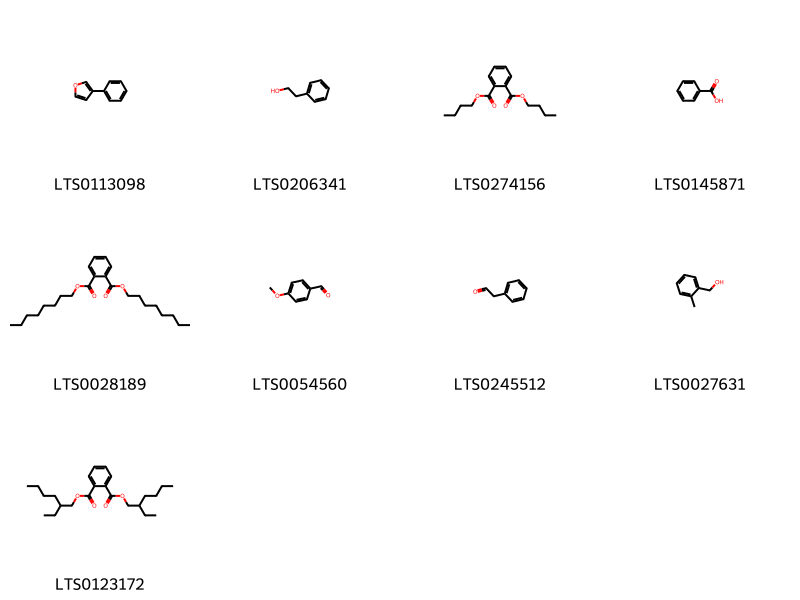
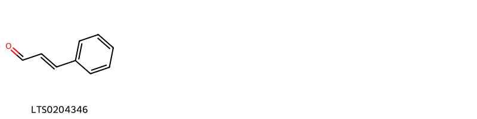
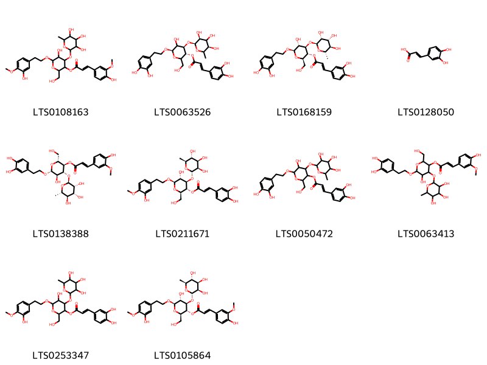
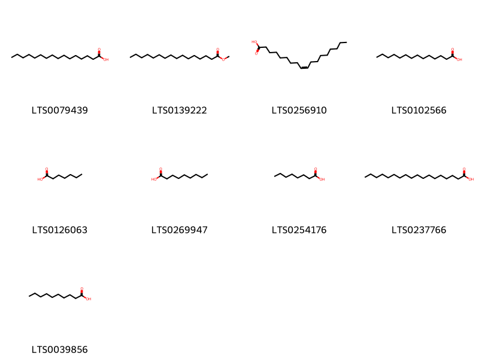
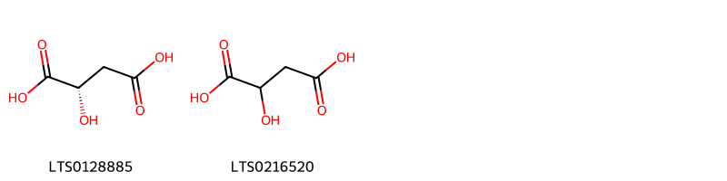
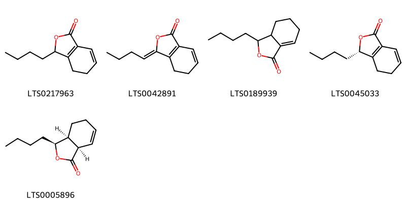
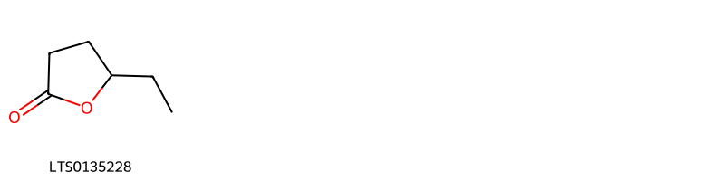
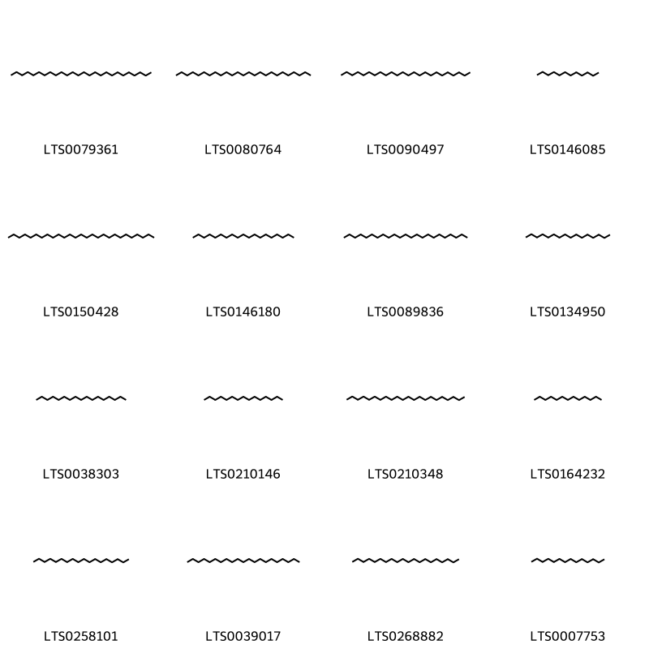

!!! abstract "Tóm tắt"

    Rễ cây hoàng cầm (Radix Scutellariae) là một dược liệu quý trong y học cổ truyền, được chiết xuất từ rễ cây hoàng cầm (Scutellaria baicalensis), thuộc họ hoa môi (Lamiaceae). Cây phân bố chủ yếu ở khu vực châu Á, đặc biệt là khu vực Trung Quốc, Hàn Quốc, 1 số vùng ở Việt Nam, ưa khí hậu ôn đới và thường mọc ở các khu vực đất ẩm. Rễ cây hoàng cầm chứa các flavonoid như baicalin, baicalein và wogonin. Những hợp chất có tác dụng kháng khuẩn, chống viêm, hạt sốt, lợi tiểu, chống ung thư, an thần. Trong y học cổ truyền, rễ hoàng cầm được sử dụng để điều trị các bệnh lý về gan, tiêu hóa, viêm họng, ho, và các chứng viêm nhiễm khác.

## Thông tin về thực vật

Dược liệu **Hoàng Cầm (Rễ)** từ bộ phận **Rễ** từ loài *Scutellaria baicalensis*.

**Mô tả thực vật:** Hoàng cầm là một loại cây cỏ sống dai, cao 20-50cm, có rễ phình to thành hình chuỳ, mặt ngoài màu vàng, phân nhánh, nhẵn hoặc có lông ngắn. Lá mọc đối, cuống rất ngắn hoặc không cuống, phiến lá hình mác hẹp, hơi đầu tù, mép nguyên, dài 1,5-4cm, rộng 3-8mm hoặc 1cm, mặt trên màu xanh sẫm, mặt dưới xanh nhạt. Hoa mọc thành bông ở đầu cành, màu lam tím. Cánh hoa gồm 2 môi, 4 nhị (2 nhị lớn dài hơn tràng) màu vàng, bầu có 4 ngăn.

*Tài liệu tham khảo:* "Những cây thuốc và vị thuốc Việt Nam" - Đỗ Tất Lợi 
Trong dược điển Việt nam, một loài được sử dụng làm dược liệu là *Scutellaria baicalensis*.

!!! info "Phân loại thực vật của *Scutellaria baicalensis*"
    - **Kingdom:** Plantae
    - **Phylum:** Tracheophyta
    - **Order:** Lamiales
    - **Family:** Lamiaceae
    - **Genus:** Scutellaria
    - **Species:** *Scutellaria baicalensis*

**Phân bố trên thế giới:** nan, United States of America, Russian Federation, China, Belarus, Chinese Taipei, Korea, Republic of, Mongolia, Ukraine

**Phân bố tại Việt nam:** Không có ghi nhận ở Việt Nam

## Thông tin về dược liệu 

### Định danh

!!! info "Thông tin về tên gọi"

    - Dược liệu tiếng Việt: hoàng cầm
    - Dược liệu tiếng Trung: 黄芩 (Huang Qin)
    - Dược liệu tiếng Anh: Scutellaria Baicalensis
    - Dược liệu latin thông dụng: Radix ScutellariaenRadix Scutellariae
    - Dược liệu latin kiểu DĐVN: *radix scutellariae*
    - Dược liệu latin kiểu DĐVN: *Radix Scutellariae*
    - Dược liệu latin kiểu thông tư: *Radix Scutellariae*
    - Bộ phận dùng: Rễ (Radix)

### Mô tả dược liệu 

- **Theo dược điển Việt nam V:** 
Rễ hình chùy, vặn xoắn, dài 8 cm đến 25 cm, đường kính 1 cm đến 3 cm. Mặt ngoài nâu vàng hay vàng thẫm, rải rác có các vết của rễ con hơi lồi, phần trên hơi ráp, có các vết khía dọc vặn vẹo hoặc vân dạng mạng; phần dưới có các vết khía dọc và có các vết nhăn nhỏ. Rễ già gọi là Khô cầm, mặt ngoài vàng, trong rỗng hoặc chứa các vụn mục màu nâu đen hoặc nâu tối. Rễ con gọi là Điều cầm, chất cứng chắc, mịn, ngoài vàng, trong màu xanh vàng, giòn, dễ bẻ. Hoàng cầm không mùi. Vị hơi đắng.

- **Mô tả dược liệu theo thông tư chế biến dược liệu theo phương pháp cổ truyền:** 

### Chế biến 

- **Chế biến theo dược điển việt nam V**: 
Thu hoạch vào mùa xuân, mùa thu, đào lấy rễ, loại bỏ thân, lá, rễ con, đất cát, phơi khô, đập bỏ lớp ráp ngoài (vỏ thô), đến khi vỏ màu nâu vàng thì đem phơi khô. Bào chế Hoàng cầm: Loại bỏ tạp chất, thân còn sót lại, ngâm vào nước lạnh hoặc ngâm vào nước sôi 10 min, hoặc đồ trong 30 min. lấy ra ủ cho mềm, thái phiến mỏng, phơi hoặc sấy khô (tránh phơi nắng to), Dược liệu là phiến mỏng hình tròn hoặc hình không đều, vỏ ngoài màu vàng nâu đến màu nâu. mặt cắt màu vàng nâu đến vàng lục có vân xuyên tâm. Tửu Hoàng cầm (chế rượu): Lấy Hoàng cầm đã thái phiến mỏng, phun rượu cho ướt, trộn đều. Dùng lửa nhỏ sao qua, đem phơi khô. Cứ 10 kg Hoàng cầm dùng 1,5 L rượu.

- **Chế biến theo thông tư:** 

--- 

## Thành phần hóa học

- Theo tài liệu của GS. Đỗ Tất Lợi:  (1) Dẫn xuất flavonoid: Scutelarin (woogonin) và baicalin, ngoài ra có tanin và chất nhựa
(2) Baicalin, baicalein, woogonin
    

**Thành phần hóa học từ loài **Scutellaria baicalensis**

Theo cơ sở dữ liệu lotus, loài *Scutellaria baicalensis* đã phân lập và xác định được **192** hoạt chất thuộc về các nhóm Isobenzofurans, Fatty Acyls, Phenols, Isocoumarans, Carboxylic acids and derivatives, Saturated hydrocarbons, Cinnamaldehydes, Flavonoids, Heteroaromatic compounds, Benzopyrans, Benzene and substituted derivatives, Prenol lipids, Pyrans, Organooxygen compounds, Cinnamic acids and derivatives, Lactones, Hydroxy acids and derivatives, Indoles and derivatives, Phenol ethers, Benzofurans trong bảng dưới đây. Danh sách các hoạt chất như sau 5,7-dihydroxy-2-phenyl-8-[(2s,3r,4r,5s,6r)-3,4,5-trihydroxy-6-(hydroxymethyl)oxan-2-yl]-6-[(2s,3r,4s,5s)-3,4,5-trihydroxyoxan-2-yl]chromen-4-one [(LTS0031917)](https://lotus.naturalproducts.net/compound/lotus_id/LTS0031917), 4-terpineol [(LTS0253733)](https://lotus.naturalproducts.net/compound/lotus_id/LTS0253733), salidroside [(LTS0093636)](https://lotus.naturalproducts.net/compound/lotus_id/LTS0093636), 6,10,14-trimethylpentadecan-2-one [(LTS0258077)](https://lotus.naturalproducts.net/compound/lotus_id/LTS0258077), heptadecane [(LTS0038303)](https://lotus.naturalproducts.net/compound/lotus_id/LTS0038303), β-eudesmol [(LTS0203280)](https://lotus.naturalproducts.net/compound/lotus_id/LTS0203280), 5-hydroxy-2-(2-hydroxy-6-{[3,4,5-trihydroxy-6-(hydroxymethyl)oxan-2-yl]oxy}phenyl)-6,7,8-trimethoxychromen-4-one [(LTS0098532)](https://lotus.naturalproducts.net/compound/lotus_id/LTS0098532), viscidulin ii [(LTS0079452)](https://lotus.naturalproducts.net/compound/lotus_id/LTS0079452), stearic acid [(LTS0237766)](https://lotus.naturalproducts.net/compound/lotus_id/LTS0237766), fumaric acid [(LTS0114831)](https://lotus.naturalproducts.net/compound/lotus_id/LTS0114831), isoschaftoside [(LTS0157117)](https://lotus.naturalproducts.net/compound/lotus_id/LTS0157117), eugenol [(LTS0052342)](https://lotus.naturalproducts.net/compound/lotus_id/LTS0052342), tricosane [(LTS0089836)](https://lotus.naturalproducts.net/compound/lotus_id/LTS0089836), capric acid [(LTS0039856)](https://lotus.naturalproducts.net/compound/lotus_id/LTS0039856), cupressuflavone [(LTS0173497)](https://lotus.naturalproducts.net/compound/lotus_id/LTS0173497), (-)-malic acid [(LTS0128885)](https://lotus.naturalproducts.net/compound/lotus_id/LTS0128885), 2-phenyl-ethanol [(LTS0206341)](https://lotus.naturalproducts.net/compound/lotus_id/LTS0206341), 5-hydroxy-8-methoxy-4-oxo-2-phenylchromen-7-yl (2s,3s,4s,5r)-2,3,4,5-tetrahydroxy-6-oxohexanoate [(LTS0266126)](https://lotus.naturalproducts.net/compound/lotus_id/LTS0266126), tridecane [(LTS0164232)](https://lotus.naturalproducts.net/compound/lotus_id/LTS0164232), wogonin [(LTS0176185)](https://lotus.naturalproducts.net/compound/lotus_id/LTS0176185), 2-hydroxyacetophenone [(LTS0222693)](https://lotus.naturalproducts.net/compound/lotus_id/LTS0222693), (2r,3r,4s,5r,6s)-6-[(5,6-dihydroxy-4-oxo-2-phenylchromen-7-yl)oxy]-3,4,5-trihydroxyoxane-2-carboxylic acid [(LTS0000114)](https://lotus.naturalproducts.net/compound/lotus_id/LTS0000114), oroxindin [(LTS0114948)](https://lotus.naturalproducts.net/compound/lotus_id/LTS0114948), indole [(LTS0185357)](https://lotus.naturalproducts.net/compound/lotus_id/LTS0185357), 2-(2,3-dihydroxyphenyl)-5,7-dihydroxychromen-4-one [(LTS0147542)](https://lotus.naturalproducts.net/compound/lotus_id/LTS0147542), (2r)-2-(2,6-dihydroxyphenyl)-3,4-dihydro-2h-1-benzopyran-5,7-diol [(LTS0276379)](https://lotus.naturalproducts.net/compound/lotus_id/LTS0276379), butylidenephthalide [(LTS0147414)](https://lotus.naturalproducts.net/compound/lotus_id/LTS0147414), methyl palmitate [(LTS0139222)](https://lotus.naturalproducts.net/compound/lotus_id/LTS0139222), 2-(2,3-dihydroxy-6-methoxyphenyl)-5,7-dihydroxy-8-methoxychromen-4-one [(LTS0038470)](https://lotus.naturalproducts.net/compound/lotus_id/LTS0038470), 5,7-dihydroxy-2-(2-hydroxy-6-{[3,4,5-trihydroxy-6-(hydroxymethyl)oxan-2-yl]oxy}phenyl)chromen-4-one [(LTS0144307)](https://lotus.naturalproducts.net/compound/lotus_id/LTS0144307), 5-hydroxy-2-(2-hydroxy-6-methoxyphenyl)-6,7,8-trimethylchromen-4-one [(LTS0005135)](https://lotus.naturalproducts.net/compound/lotus_id/LTS0005135), chrysosplenetin [(LTS0202772)](https://lotus.naturalproducts.net/compound/lotus_id/LTS0202772), 6-[2-(3,4-dihydroxyphenyl)ethoxy]-5-hydroxy-2-(hydroxymethyl)-4-[(3,4,5-trihydroxy-6-methyloxan-2-yl)oxy]oxan-3-yl 3-(3,4-dihydroxyphenyl)prop-2-enoate [(LTS0050472)](https://lotus.naturalproducts.net/compound/lotus_id/LTS0050472), dihydrooroxylin a [(LTS0210859)](https://lotus.naturalproducts.net/compound/lotus_id/LTS0210859), (2s)-5,7-dihydroxy-2-(4-hydroxyphenyl)-6-methoxy-2,3-dihydro-1-benzopyran-4-one [(LTS0019378)](https://lotus.naturalproducts.net/compound/lotus_id/LTS0019378), 7-{[(1s,3s,4r,5s,8r)-4,8-dihydroxy-7-oxo-2,6-dioxabicyclo[3.2.1]octan-3-yl]oxy}-5,6-dihydroxy-2-phenylchromen-4-one [(LTS0058857)](https://lotus.naturalproducts.net/compound/lotus_id/LTS0058857), 6-hydroxy-2-(2-hydroxy-6-methoxyphenyl)-5,7,8-trimethoxychromen-4-one [(LTS0212477)](https://lotus.naturalproducts.net/compound/lotus_id/LTS0212477), 2-(2,5-dihydroxyphenyl)-5,7-dihydroxychromen-4-one [(LTS0264412)](https://lotus.naturalproducts.net/compound/lotus_id/LTS0264412), 2-methylbenzyl alcohol [(LTS0027631)](https://lotus.naturalproducts.net/compound/lotus_id/LTS0027631), verbascoside [(LTS0168159)](https://lotus.naturalproducts.net/compound/lotus_id/LTS0168159), eicosane [(LTS0268882)](https://lotus.naturalproducts.net/compound/lotus_id/LTS0268882), chrysin [(LTS0200644)](https://lotus.naturalproducts.net/compound/lotus_id/LTS0200644), 3,4,5-trihydroxy-6-[2-(5-hydroxy-7,8-dimethoxy-4-oxochromen-2-yl)-3-methoxyphenoxy]oxane-2-carboxylic acid [(LTS0173761)](https://lotus.naturalproducts.net/compound/lotus_id/LTS0173761), 3-phenylfuran [(LTS0113098)](https://lotus.naturalproducts.net/compound/lotus_id/LTS0113098), 5,7-dihydroxy-2-(2-hydroxyphenyl)-6,8-dimethoxychromen-4-one [(LTS0119169)](https://lotus.naturalproducts.net/compound/lotus_id/LTS0119169), (2s,3s,4s,5r,6s)-6-{[(2s)-5,6-dihydroxy-4-oxo-2-phenyl-2,3-dihydro-1-benzopyran-7-yl]oxy}-3,4,5-trihydroxyoxane-2-carboxylic acid [(LTS0117574)](https://lotus.naturalproducts.net/compound/lotus_id/LTS0117574), acetophenone [(LTS0155971)](https://lotus.naturalproducts.net/compound/lotus_id/LTS0155971), p-cresol [(LTS0208715)](https://lotus.naturalproducts.net/compound/lotus_id/LTS0208715), geraldone [(LTS0044420)](https://lotus.naturalproducts.net/compound/lotus_id/LTS0044420), 7-({4,8-dihydroxy-7-oxo-2,6-dioxabicyclo[3.2.1]octan-3-yl}oxy)-5,6-dihydroxy-2-phenylchromen-4-one [(LTS0111934)](https://lotus.naturalproducts.net/compound/lotus_id/LTS0111934), butylidenephthalide [(LTS0259092)](https://lotus.naturalproducts.net/compound/lotus_id/LTS0259092), amylfuran [(LTS0044471)](https://lotus.naturalproducts.net/compound/lotus_id/LTS0044471), 5-hydroxy-6-[2-(3-hydroxy-4-methoxyphenyl)ethoxy]-2-(hydroxymethyl)-4-[(3,4,5-trihydroxy-6-methyloxan-2-yl)oxy]oxan-3-yl 3-(3,4-dihydroxyphenyl)prop-2-enoate [(LTS0253347)](https://lotus.naturalproducts.net/compound/lotus_id/LTS0253347), heptanoic acid [(LTS0126063)](https://lotus.naturalproducts.net/compound/lotus_id/LTS0126063), butylphthalide [(LTS0150205)](https://lotus.naturalproducts.net/compound/lotus_id/LTS0150205), 5,6-dihydroxy-2-phenyl-7-{[(2s,3r,4s,5s,6r)-3,4,5-trihydroxy-6-(hydroxymethyl)oxan-2-yl]oxy}chromen-4-one [(LTS0136774)](https://lotus.naturalproducts.net/compound/lotus_id/LTS0136774), anisaldehyde [(LTS0054560)](https://lotus.naturalproducts.net/compound/lotus_id/LTS0054560), (3r,4r,6r)-6-[2-(3,4-dihydroxyphenyl)ethoxy]-5-hydroxy-2-(hydroxymethyl)-4-{[(2s,3s,5r)-3,4,5-trihydroxy-6-methyloxan-2-yl]oxy}oxan-3-yl (2e)-3-(3,4-dihydroxyphenyl)prop-2-enoate [(LTS0063526)](https://lotus.naturalproducts.net/compound/lotus_id/LTS0063526), 5-hydroxy-8-methoxy-4-oxo-2-phenylchromen-7-yl 2,3,4,5-tetrahydroxy-6-oxohexanoate [(LTS0247042)](https://lotus.naturalproducts.net/compound/lotus_id/LTS0247042), (z)-ligustilide [(LTS0042891)](https://lotus.naturalproducts.net/compound/lotus_id/LTS0042891), 5,7-dihydroxy-2-phenyl-6-[(2s,3r,4r,5s,6r)-3,4,5-trihydroxy-6-(hydroxymethyl)oxan-2-yl]-8-[(2s,3r,4s,5s)-3,4,5-trihydroxyoxan-2-yl]chromen-4-one [(LTS0122056)](https://lotus.naturalproducts.net/compound/lotus_id/LTS0122056), malonic acid [(LTS0195913)](https://lotus.naturalproducts.net/compound/lotus_id/LTS0195913), dibutyl-phthalate [(LTS0274156)](https://lotus.naturalproducts.net/compound/lotus_id/LTS0274156), 5-hydroxy-2-(2-hydroxy-6-{[(2s,3s,4s,5s,6r)-3,4,5-trihydroxy-6-(hydroxymethyl)oxan-2-yl]oxy}phenyl)-6,7,8-trimethoxychromen-4-one [(LTS0055785)](https://lotus.naturalproducts.net/compound/lotus_id/LTS0055785), baicalein [(LTS0214160)](https://lotus.naturalproducts.net/compound/lotus_id/LTS0214160), skullcapflavone ii [(LTS0213690)](https://lotus.naturalproducts.net/compound/lotus_id/LTS0213690), p-methoxyacetophenone [(LTS0040648)](https://lotus.naturalproducts.net/compound/lotus_id/LTS0040648), 2-acetylpyrrole [(LTS0001423)](https://lotus.naturalproducts.net/compound/lotus_id/LTS0001423), elemicin [(LTS0188875)](https://lotus.naturalproducts.net/compound/lotus_id/LTS0188875), 2-(2,6-dihydroxyphenyl)-5,7-dihydroxy-2,3-dihydro-1-benzopyran-4-one [(LTS0134302)](https://lotus.naturalproducts.net/compound/lotus_id/LTS0134302), 5-hydroxy-6-[2-(3-hydroxy-4-methoxyphenyl)ethoxy]-2-(hydroxymethyl)-4-[(3,4,5-trihydroxy-6-methyloxan-2-yl)oxy]oxan-3-yl 3-(4-hydroxy-3-methoxyphenyl)prop-2-enoate [(LTS0108163)](https://lotus.naturalproducts.net/compound/lotus_id/LTS0108163), 5,7-dihydroxy-2-(2-hydroxy-6-{[(2s,3r,4s,5s,6r)-3,4,5-trihydroxy-6-(hydroxymethyl)oxan-2-yl]oxy}phenyl)chromen-4-one [(LTS0240477)](https://lotus.naturalproducts.net/compound/lotus_id/LTS0240477), nonadecane [(LTS0146180)](https://lotus.naturalproducts.net/compound/lotus_id/LTS0146180), methyl 6-[(5,6-dihydroxy-4-oxo-2-phenylchromen-7-yl)oxy]-3,4,5-trihydroxyoxane-2-carboxylate [(LTS0063942)](https://lotus.naturalproducts.net/compound/lotus_id/LTS0063942), dodecane [(LTS0146085)](https://lotus.naturalproducts.net/compound/lotus_id/LTS0146085), 3,4-dihydroxycinnamic acid [(LTS0128050)](https://lotus.naturalproducts.net/compound/lotus_id/LTS0128050), 2-(2,6-dihydroxyphenyl)-5,7-dihydroxychromen-4-one [(LTS0184906)](https://lotus.naturalproducts.net/compound/lotus_id/LTS0184906), guaiacol [(LTS0179228)](https://lotus.naturalproducts.net/compound/lotus_id/LTS0179228), (1s,5r,7s,10r)-7-isopropyl-4,10-dimethyltricyclo[4.4.0.0¹,⁵]dec-3-ene [(LTS0064715)](https://lotus.naturalproducts.net/compound/lotus_id/LTS0064715), galangin [(LTS0210648)](https://lotus.naturalproducts.net/compound/lotus_id/LTS0210648), butenedioic acid [(LTS0069098)](https://lotus.naturalproducts.net/compound/lotus_id/LTS0069098), 5,7-dihydroxy-2-(2-hydroxy-6-methoxyphenyl)-8-methoxychromen-4-one [(LTS0084502)](https://lotus.naturalproducts.net/compound/lotus_id/LTS0084502), hexacosane [(LTS0079361)](https://lotus.naturalproducts.net/compound/lotus_id/LTS0079361), phenylacetaldehyde [(LTS0245512)](https://lotus.naturalproducts.net/compound/lotus_id/LTS0245512), nonanoic acid [(LTS0269947)](https://lotus.naturalproducts.net/compound/lotus_id/LTS0269947), 5,7-dihydroxy-2-(3-hydroxy-2-methoxy-6-{[3,4,5-trihydroxy-6-(hydroxymethyl)oxan-2-yl]oxy}phenyl)-8-methoxychromen-4-one [(LTS0014531)](https://lotus.naturalproducts.net/compound/lotus_id/LTS0014531), (2r,3r,4r,5r,6r)-5-hydroxy-6-[2-(3-hydroxy-4-methoxyphenyl)ethoxy]-2-(hydroxymethyl)-4-{[(2s,3r,4r,5r,6s)-3,4,5-trihydroxy-6-methyloxan-2-yl]oxy}oxan-3-yl (2e)-3-(3,4-dihydroxyphenyl)prop-2-enoate [(LTS0211671)](https://lotus.naturalproducts.net/compound/lotus_id/LTS0211671), 2-(2,6-dihydroxyphenyl)-3,5,7-trihydroxy-2,3-dihydro-1-benzopyran-4-one [(LTS0104504)](https://lotus.naturalproducts.net/compound/lotus_id/LTS0104504), senkyunolide a [(LTS0045033)](https://lotus.naturalproducts.net/compound/lotus_id/LTS0045033), (1r,2s,3r,4r,4as,8ar)-2-(benzoyloxy)-3-hydroxy-3,4,8a-trimethyl-8-methylidene-4-[2-(5-oxo-2h-furan-3-yl)ethyl]-hexahydronaphthalen-1-yl benzoate [(LTS0051547)](https://lotus.naturalproducts.net/compound/lotus_id/LTS0051547), tenaxin i [(LTS0050862)](https://lotus.naturalproducts.net/compound/lotus_id/LTS0050862), salvigenin [(LTS0020289)](https://lotus.naturalproducts.net/compound/lotus_id/LTS0020289), 3-butyl-4,5-dihydro-3h-2-benzofuran-1-one [(LTS0217963)](https://lotus.naturalproducts.net/compound/lotus_id/LTS0217963), 5,7-dihydroxy-2-phenyl-8-[3,4,5-trihydroxy-6-(hydroxymethyl)oxan-2-yl]-6-(3,4,5-trihydroxyoxan-2-yl)chromen-4-one [(LTS0124241)](https://lotus.naturalproducts.net/compound/lotus_id/LTS0124241), 2,3,3,5,6-pentahydroxy-2-phenyl-1-benzopyran-4-one [(LTS0181619)](https://lotus.naturalproducts.net/compound/lotus_id/LTS0181619), malic acid [(LTS0216520)](https://lotus.naturalproducts.net/compound/lotus_id/LTS0216520), succinic acid [(LTS0237204)](https://lotus.naturalproducts.net/compound/lotus_id/LTS0237204), skullcapflavone i [(LTS0072996)](https://lotus.naturalproducts.net/compound/lotus_id/LTS0072996), 5-hydroxy-2-(2-hydroxy-6-{[3,4,5-trihydroxy-6-(hydroxymethyl)oxan-2-yl]oxy}phenyl)-6,7-dimethoxychromen-4-one [(LTS0249819)](https://lotus.naturalproducts.net/compound/lotus_id/LTS0249819), norwogonin [(LTS0225911)](https://lotus.naturalproducts.net/compound/lotus_id/LTS0225911), isoeugenol [(LTS0136836)](https://lotus.naturalproducts.net/compound/lotus_id/LTS0136836), 5-methylfurfural [(LTS0186625)](https://lotus.naturalproducts.net/compound/lotus_id/LTS0186625), octadecane [(LTS0258101)](https://lotus.naturalproducts.net/compound/lotus_id/LTS0258101), palmitic acid [(LTS0079439)](https://lotus.naturalproducts.net/compound/lotus_id/LTS0079439), tetracosane [(LTS0090497)](https://lotus.naturalproducts.net/compound/lotus_id/LTS0090497), 3-phenyl-2-propenal [(LTS0204346)](https://lotus.naturalproducts.net/compound/lotus_id/LTS0204346), β-elemene [(LTS0225699)](https://lotus.naturalproducts.net/compound/lotus_id/LTS0225699), phenol [(LTS0092642)](https://lotus.naturalproducts.net/compound/lotus_id/LTS0092642), scutellarein [(LTS0136843)](https://lotus.naturalproducts.net/compound/lotus_id/LTS0136843), 5-hydroxy-2-(2-hydroxy-3-methoxyphenyl)-6,7,8-trimethoxychromen-4-one [(LTS0033601)](https://lotus.naturalproducts.net/compound/lotus_id/LTS0033601), (2r,3r,4r,5r,6r)-5-hydroxy-6-[2-(3-hydroxy-4-methoxyphenyl)ethoxy]-2-(hydroxymethyl)-4-{[(2s,3r,4r,5r,6s)-3,4,5-trihydroxy-6-methyloxan-2-yl]oxy}oxan-3-yl (2e)-3-(4-hydroxy-3-methoxyphenyl)prop-2-enoate [(LTS0105864)](https://lotus.naturalproducts.net/compound/lotus_id/LTS0105864), pyrrole-2-carboxaldehyde [(LTS0154195)](https://lotus.naturalproducts.net/compound/lotus_id/LTS0154195), vanillin [(LTS0136163)](https://lotus.naturalproducts.net/compound/lotus_id/LTS0136163), (2s,3r)-2-(2,6-dihydroxyphenyl)-3,5,7-trihydroxy-2,3-dihydro-1-benzopyran-4-one [(LTS0099399)](https://lotus.naturalproducts.net/compound/lotus_id/LTS0099399), o-cresol [(LTS0108586)](https://lotus.naturalproducts.net/compound/lotus_id/LTS0108586), isoscutellarein [(LTS0141375)](https://lotus.naturalproducts.net/compound/lotus_id/LTS0141375), 4'-hydroxywogonin [(LTS0161723)](https://lotus.naturalproducts.net/compound/lotus_id/LTS0161723), 5,7-dihydroxy-2-phenyl-6-[3,4,5-trihydroxy-6-(hydroxymethyl)oxan-2-yl]-8-(3,4,5-trihydroxyoxan-2-yl)chromen-4-one [(LTS0237657)](https://lotus.naturalproducts.net/compound/lotus_id/LTS0237657), baicalin [(LTS0222306)](https://lotus.naturalproducts.net/compound/lotus_id/LTS0222306), dioctyl phthalate [(LTS0028189)](https://lotus.naturalproducts.net/compound/lotus_id/LTS0028189), ferruginol [(LTS0045608)](https://lotus.naturalproducts.net/compound/lotus_id/LTS0045608), quercetin [(LTS0004651)](https://lotus.naturalproducts.net/compound/lotus_id/LTS0004651), 5,7-dihydroxy-2-(4-hydroxyphenyl)-8-[3,4,5-trihydroxy-6-(hydroxymethyl)oxan-2-yl]-6-(3,4,5-trihydroxyoxan-2-yl)chromen-4-one [(LTS0108519)](https://lotus.naturalproducts.net/compound/lotus_id/LTS0108519), mellein [(LTS0027076)](https://lotus.naturalproducts.net/compound/lotus_id/LTS0027076), 2-(benzoyloxy)-3-hydroxy-3,4,8a-trimethyl-8-methylidene-4-[2-(5-oxo-2h-furan-3-yl)ethyl]-hexahydronaphthalen-1-yl benzoate [(LTS0238927)](https://lotus.naturalproducts.net/compound/lotus_id/LTS0238927), 2-(hydroxymethyl)-6-[2-(4-hydroxyphenyl)ethoxy]oxane-3,4,5-triol [(LTS0187014)](https://lotus.naturalproducts.net/compound/lotus_id/LTS0187014), (2s,3s,4s,5r,6r)-3,4,5-trihydroxy-6-[(5-hydroxy-6-methoxy-4-oxo-2-phenylchromen-7-yl)oxy]oxane-2-carboxylic acid [(LTS0223846)](https://lotus.naturalproducts.net/compound/lotus_id/LTS0223846), (2r,3r,4r,5r,6r)-6-[2-(3,4-dihydroxyphenyl)ethoxy]-5-hydroxy-2-(hydroxymethyl)-4-{[(2s,3r,4r,5r,6s)-3,4,5-trihydroxy-6-methyloxan-2-yl]oxy}oxan-3-yl (2e)-3-(4-hydroxy-3-methoxyphenyl)prop-2-enoate [(LTS0138388)](https://lotus.naturalproducts.net/compound/lotus_id/LTS0138388), 5-hydroxy-2-(2-hydroxy-6-{[(2s,3r,4s,5s,6r)-3,4,5-trihydroxy-6-(hydroxymethyl)oxan-2-yl]oxy}phenyl)-6,7,8-trimethoxychromen-4-one [(LTS0248135)](https://lotus.naturalproducts.net/compound/lotus_id/LTS0248135), 2-(2,6-dihydroxyphenyl)-5,6,7,8-tetrahydroxychromen-4-one [(LTS0133299)](https://lotus.naturalproducts.net/compound/lotus_id/LTS0133299), 2-(2,6-dimethoxyphenyl)-3,5,7-trimethoxy-2,3-dihydro-1-benzopyran-4-one [(LTS0081780)](https://lotus.naturalproducts.net/compound/lotus_id/LTS0081780), n-[2-(5-methoxy-1h-indol-3-yl)ethyl]ethanimidic acid [(LTS0219322)](https://lotus.naturalproducts.net/compound/lotus_id/LTS0219322), sedanolide [(LTS0189939)](https://lotus.naturalproducts.net/compound/lotus_id/LTS0189939), oroxylin a [(LTS0188883)](https://lotus.naturalproducts.net/compound/lotus_id/LTS0188883), caryophyllene [(LTS0131870)](https://lotus.naturalproducts.net/compound/lotus_id/LTS0131870), (2s,3s,4s,5r,6s)-3,4,5-trihydroxy-6-[2-(5-hydroxy-7,8-dimethoxy-4-oxochromen-2-yl)-3-methoxyphenoxy]oxane-2-carboxylic acid [(LTS0136780)](https://lotus.naturalproducts.net/compound/lotus_id/LTS0136780), cnidilide [(LTS0005896)](https://lotus.naturalproducts.net/compound/lotus_id/LTS0005896), diosmine [(LTS0271026)](https://lotus.naturalproducts.net/compound/lotus_id/LTS0271026), paeonol [(LTS0014950)](https://lotus.naturalproducts.net/compound/lotus_id/LTS0014950), methyl (2s,3s,4s,5r,6s)-6-[(5,6-dihydroxy-4-oxo-2-phenylchromen-7-yl)oxy]-3,4,5-trihydroxyoxane-2-carboxylate [(LTS0072666)](https://lotus.naturalproducts.net/compound/lotus_id/LTS0072666), (2r,3s)-2-(2,6-dihydroxyphenyl)-3,4-dihydro-2h-1-benzopyran-3,5,7-triol [(LTS0071278)](https://lotus.naturalproducts.net/compound/lotus_id/LTS0071278), 2-(2,6-dihydroxyphenyl)-3,4-dihydro-2h-1-benzopyran-3,5,7-triol [(LTS0001410)](https://lotus.naturalproducts.net/compound/lotus_id/LTS0001410), (2r,3r)-2-(2,6-dihydroxyphenyl)-3,5,7-trihydroxy-2,3-dihydro-1-benzopyran-4-one [(LTS0089205)](https://lotus.naturalproducts.net/compound/lotus_id/LTS0089205), chamomile [(LTS0104946)](https://lotus.naturalproducts.net/compound/lotus_id/LTS0104946), heptacosane [(LTS0150428)](https://lotus.naturalproducts.net/compound/lotus_id/LTS0150428), (-)-α-cubebene [(LTS0042045)](https://lotus.naturalproducts.net/compound/lotus_id/LTS0042045), 5,7-dihydroxy-2-(2-hydroxyphenyl)chromen-4-one [(LTS0077695)](https://lotus.naturalproducts.net/compound/lotus_id/LTS0077695), 2-(2,6-dihydroxyphenyl)-3,4-dihydro-2h-1-benzopyran-5,7-diol [(LTS0100447)](https://lotus.naturalproducts.net/compound/lotus_id/LTS0100447), 5,8-dihydroxy-2-(2-hydroxyphenyl)-7-methoxychromen-4-one [(LTS0061177)](https://lotus.naturalproducts.net/compound/lotus_id/LTS0061177), caprylic acid [(LTS0254176)](https://lotus.naturalproducts.net/compound/lotus_id/LTS0254176), 5-hydroxy-2-(2-hydroxy-6-{[(2s,3r,4s,5s,6r)-3,4,5-trihydroxy-6-(hydroxymethyl)oxan-2-yl]oxy}phenyl)-7,8-dimethoxychromen-4-one [(LTS0206564)](https://lotus.naturalproducts.net/compound/lotus_id/LTS0206564), 3,4,5-trihydroxy-6-[(5-hydroxy-8-methoxy-4-oxo-2-phenylchromen-7-yl)oxy]oxane-2-carboxylic acid [(LTS0210438)](https://lotus.naturalproducts.net/compound/lotus_id/LTS0210438), docosane [(LTS0210348)](https://lotus.naturalproducts.net/compound/lotus_id/LTS0210348), heneicosane [(LTS0039017)](https://lotus.naturalproducts.net/compound/lotus_id/LTS0039017), citric acid [(LTS0213921)](https://lotus.naturalproducts.net/compound/lotus_id/LTS0213921), (+/-)-eriodictyol [(LTS0106920)](https://lotus.naturalproducts.net/compound/lotus_id/LTS0106920), myristic acid [(LTS0102566)](https://lotus.naturalproducts.net/compound/lotus_id/LTS0102566), gamma-hexalactone [(LTS0135228)](https://lotus.naturalproducts.net/compound/lotus_id/LTS0135228), damascone [(LTS0185057)](https://lotus.naturalproducts.net/compound/lotus_id/LTS0185057), eriodictyol [(LTS0220769)](https://lotus.naturalproducts.net/compound/lotus_id/LTS0220769), (.+-.)-tartaric acid [(LTS0061981)](https://lotus.naturalproducts.net/compound/lotus_id/LTS0061981), pentadecane [(LTS0210146)](https://lotus.naturalproducts.net/compound/lotus_id/LTS0210146), (2s)-2-(2,6-dihydroxyphenyl)-5,7-dihydroxy-2,3-dihydro-1-benzopyran-4-one [(LTS0085335)](https://lotus.naturalproducts.net/compound/lotus_id/LTS0085335), tetradecane [(LTS0007753)](https://lotus.naturalproducts.net/compound/lotus_id/LTS0007753), oroxylin a glucoronide [(LTS0224895)](https://lotus.naturalproducts.net/compound/lotus_id/LTS0224895), cetane [(LTS0134950)](https://lotus.naturalproducts.net/compound/lotus_id/LTS0134950), rehderianin i [(LTS0187098)](https://lotus.naturalproducts.net/compound/lotus_id/LTS0187098), geranylacetone [(LTS0231623)](https://lotus.naturalproducts.net/compound/lotus_id/LTS0231623), 5-hydroxy-2-(2-hydroxy-6-{[(2s,3r,4s,5s,6r)-3,4,5-trihydroxy-6-(hydroxymethyl)oxan-2-yl]oxy}phenyl)-6,7-dimethoxychromen-4-one [(LTS0022912)](https://lotus.naturalproducts.net/compound/lotus_id/LTS0022912), 6-[(5,6-dihydroxy-4-oxo-2-phenylchromen-7-yl)oxy]-3,4,5-trihydroxyoxane-2-carboxylic acid [(LTS0105879)](https://lotus.naturalproducts.net/compound/lotus_id/LTS0105879), 5-hydroxy-2-(2-hydroxy-6-{[3,4,5-trihydroxy-6-(hydroxymethyl)oxan-2-yl]oxy}phenyl)-7,8-dimethoxychromen-4-one [(LTS0243740)](https://lotus.naturalproducts.net/compound/lotus_id/LTS0243740), (4bs)-2-isopropyl-4b,8,8-trimethyl-5,6,7,8a,9,10-hexahydrophenanthren-3-ol [(LTS0251712)](https://lotus.naturalproducts.net/compound/lotus_id/LTS0251712), 5-ethenyl-2-methoxyphenol [(LTS0076260)](https://lotus.naturalproducts.net/compound/lotus_id/LTS0076260), 5,7-dihydroxy-2-(3-hydroxy-2-methoxy-6-{[(2s,3r,4s,5s,6r)-3,4,5-trihydroxy-6-(hydroxymethyl)oxan-2-yl]oxy}phenyl)-8-methoxychromen-4-one [(LTS0061433)](https://lotus.naturalproducts.net/compound/lotus_id/LTS0061433), 5,7-dihydroxy-2-(2-hydroxyphenyl)-6-methoxychromen-4-one [(LTS0072979)](https://lotus.naturalproducts.net/compound/lotus_id/LTS0072979), 6-[2-(3,4-dihydroxyphenyl)ethoxy]-5-hydroxy-2-(hydroxymethyl)-4-[(3,4,5-trihydroxy-6-methyloxan-2-yl)oxy]oxan-3-yl 3-(4-hydroxy-3-methoxyphenyl)prop-2-enoate [(LTS0063413)](https://lotus.naturalproducts.net/compound/lotus_id/LTS0063413), oleic acid [(LTS0256910)](https://lotus.naturalproducts.net/compound/lotus_id/LTS0256910), benzoic acid [(LTS0145871)](https://lotus.naturalproducts.net/compound/lotus_id/LTS0145871), (2r,3r)-2-(2,6-dimethoxyphenyl)-3,5,7-trimethoxy-2,3-dihydro-1-benzopyran-4-one [(LTS0009511)](https://lotus.naturalproducts.net/compound/lotus_id/LTS0009511), pentacosane [(LTS0080764)](https://lotus.naturalproducts.net/compound/lotus_id/LTS0080764), rivularin (flavone) [(LTS0273103)](https://lotus.naturalproducts.net/compound/lotus_id/LTS0273103), ganhuangenin [(LTS0004448)](https://lotus.naturalproducts.net/compound/lotus_id/LTS0004448), talmon [(LTS0152081)](https://lotus.naturalproducts.net/compound/lotus_id/LTS0152081), diosmetin [(LTS0252065)](https://lotus.naturalproducts.net/compound/lotus_id/LTS0252065), 2-methoxy-4-vinyl-phenol [(LTS0128961)](https://lotus.naturalproducts.net/compound/lotus_id/LTS0128961), (-)-tartaric acid [(LTS0214562)](https://lotus.naturalproducts.net/compound/lotus_id/LTS0214562), etalon [(LTS0123172)](https://lotus.naturalproducts.net/compound/lotus_id/LTS0123172), 5,8-dihydroxy-2-(2-hydroxyphenyl)-6,7-dimethoxychromen-4-one [(LTS0148116)](https://lotus.naturalproducts.net/compound/lotus_id/LTS0148116), 3,7,4'-trihydroxyflavone [(LTS0011409)](https://lotus.naturalproducts.net/compound/lotus_id/LTS0011409), linalool, (+-)- [(LTS0128839)](https://lotus.naturalproducts.net/compound/lotus_id/LTS0128839), 5-hydroxy-2-(2-hydroxy-6-{[(2s,3r,4s,5s,6s)-3,4,5-trihydroxy-6-(hydroxymethyl)oxan-2-yl]oxy}phenyl)-6,7-dimethoxychromen-4-one [(LTS0178799)](https://lotus.naturalproducts.net/compound/lotus_id/LTS0178799), (2s,3s,4s,5r,6r)-3,4,5-trihydroxy-6-{[5-hydroxy-2-(4-hydroxyphenyl)-4-oxochromen-7-yl]oxy}oxane-2-carboxylic acid [(LTS0047582)](https://lotus.naturalproducts.net/compound/lotus_id/LTS0047582). 
        
| chemicalTaxonomyClassyfireClass     |   smiles_count |
|:------------------------------------|---------------:|
| Benzene and substituted derivatives |            185 |
| Benzofurans                         |             21 |
| Benzopyrans                         |             22 |
| Carboxylic acids and derivatives    |             85 |
| Cinnamaldehydes                     |             14 |
| Cinnamic acids and derivatives      |            922 |
| Fatty Acyls                         |            165 |
| Flavonoids                          |           5028 |
| Heteroaromatic compounds            |             12 |
| Hydroxy acids and derivatives       |             38 |
| Indoles and derivatives             |             45 |
| Isobenzofurans                      |            135 |
| Isocoumarans                        |             46 |
| Lactones                            |             13 |
| Organooxygen compounds              |            276 |
| Phenol ethers                       |             24 |
| Phenols                             |            134 |
| Prenol lipids                       |            507 |
| Pyrans                              |             14 |
| Saturated hydrocarbons              |            312 |

            
### Nhóm Benzene and substituted derivatives
<figure markdown="span">
    { width=100% }
<figcaption>Hình ảnh cấu trúc hóa học của hoạt chất thuộc nhóm *Benzene and substituted derivatives*. Tên thường gọi của các hoạt chất tương ứng là 3-phenylfuran [(LTS0113098)](https://lotus.naturalproducts.net/compound/lotus_id/LTS0113098), 2-phenyl-ethanol [(LTS0206341)](https://lotus.naturalproducts.net/compound/lotus_id/LTS0206341), dibutyl-phthalate [(LTS0274156)](https://lotus.naturalproducts.net/compound/lotus_id/LTS0274156), benzoic acid [(LTS0145871)](https://lotus.naturalproducts.net/compound/lotus_id/LTS0145871), dioctyl phthalate [(LTS0028189)](https://lotus.naturalproducts.net/compound/lotus_id/LTS0028189), anisaldehyde [(LTS0054560)](https://lotus.naturalproducts.net/compound/lotus_id/LTS0054560), phenylacetaldehyde [(LTS0245512)](https://lotus.naturalproducts.net/compound/lotus_id/LTS0245512), 2-methylbenzyl alcohol [(LTS0027631)](https://lotus.naturalproducts.net/compound/lotus_id/LTS0027631), etalon [(LTS0123172)](https://lotus.naturalproducts.net/compound/lotus_id/LTS0123172).</figcaption>
</figure>

            
            
### Nhóm Benzene and substituted derivatives
<figure markdown="span">
    { width=100% }
<figcaption>Hình ảnh cấu trúc hóa học của hoạt chất thuộc nhóm *Benzene and substituted derivatives*. Tên thường gọi của các hoạt chất tương ứng là 3-phenylfuran [(LTS0113098)](https://lotus.naturalproducts.net/compound/lotus_id/LTS0113098), 2-phenyl-ethanol [(LTS0206341)](https://lotus.naturalproducts.net/compound/lotus_id/LTS0206341), dibutyl-phthalate [(LTS0274156)](https://lotus.naturalproducts.net/compound/lotus_id/LTS0274156), benzoic acid [(LTS0145871)](https://lotus.naturalproducts.net/compound/lotus_id/LTS0145871), dioctyl phthalate [(LTS0028189)](https://lotus.naturalproducts.net/compound/lotus_id/LTS0028189), anisaldehyde [(LTS0054560)](https://lotus.naturalproducts.net/compound/lotus_id/LTS0054560), phenylacetaldehyde [(LTS0245512)](https://lotus.naturalproducts.net/compound/lotus_id/LTS0245512), 2-methylbenzyl alcohol [(LTS0027631)](https://lotus.naturalproducts.net/compound/lotus_id/LTS0027631), etalon [(LTS0123172)](https://lotus.naturalproducts.net/compound/lotus_id/LTS0123172).</figcaption>
</figure>

### Nhóm Benzofurans
<figure markdown="span">
    { width=100% }
<figcaption>Hình ảnh cấu trúc hóa học của hoạt chất thuộc nhóm *Benzofurans*. Tên thường gọi của các hoạt chất tương ứng là butylphthalide [(LTS0150205)](https://lotus.naturalproducts.net/compound/lotus_id/LTS0150205).</figcaption>
</figure>

            
            
### Nhóm Benzene and substituted derivatives
<figure markdown="span">
    { width=100% }
<figcaption>Hình ảnh cấu trúc hóa học của hoạt chất thuộc nhóm *Benzene and substituted derivatives*. Tên thường gọi của các hoạt chất tương ứng là 3-phenylfuran [(LTS0113098)](https://lotus.naturalproducts.net/compound/lotus_id/LTS0113098), 2-phenyl-ethanol [(LTS0206341)](https://lotus.naturalproducts.net/compound/lotus_id/LTS0206341), dibutyl-phthalate [(LTS0274156)](https://lotus.naturalproducts.net/compound/lotus_id/LTS0274156), benzoic acid [(LTS0145871)](https://lotus.naturalproducts.net/compound/lotus_id/LTS0145871), dioctyl phthalate [(LTS0028189)](https://lotus.naturalproducts.net/compound/lotus_id/LTS0028189), anisaldehyde [(LTS0054560)](https://lotus.naturalproducts.net/compound/lotus_id/LTS0054560), phenylacetaldehyde [(LTS0245512)](https://lotus.naturalproducts.net/compound/lotus_id/LTS0245512), 2-methylbenzyl alcohol [(LTS0027631)](https://lotus.naturalproducts.net/compound/lotus_id/LTS0027631), etalon [(LTS0123172)](https://lotus.naturalproducts.net/compound/lotus_id/LTS0123172).</figcaption>
</figure>

### Nhóm Benzofurans
<figure markdown="span">
    { width=100% }
<figcaption>Hình ảnh cấu trúc hóa học của hoạt chất thuộc nhóm *Benzofurans*. Tên thường gọi của các hoạt chất tương ứng là butylphthalide [(LTS0150205)](https://lotus.naturalproducts.net/compound/lotus_id/LTS0150205).</figcaption>
</figure>

### Nhóm Benzopyrans
<figure markdown="span">
    { width=100% }
<figcaption>Hình ảnh cấu trúc hóa học của hoạt chất thuộc nhóm *Benzopyrans*. Tên thường gọi của các hoạt chất tương ứng là mellein [(LTS0027076)](https://lotus.naturalproducts.net/compound/lotus_id/LTS0027076).</figcaption>
</figure>

            
            
### Nhóm Benzene and substituted derivatives
<figure markdown="span">
    { width=100% }
<figcaption>Hình ảnh cấu trúc hóa học của hoạt chất thuộc nhóm *Benzene and substituted derivatives*. Tên thường gọi của các hoạt chất tương ứng là 3-phenylfuran [(LTS0113098)](https://lotus.naturalproducts.net/compound/lotus_id/LTS0113098), 2-phenyl-ethanol [(LTS0206341)](https://lotus.naturalproducts.net/compound/lotus_id/LTS0206341), dibutyl-phthalate [(LTS0274156)](https://lotus.naturalproducts.net/compound/lotus_id/LTS0274156), benzoic acid [(LTS0145871)](https://lotus.naturalproducts.net/compound/lotus_id/LTS0145871), dioctyl phthalate [(LTS0028189)](https://lotus.naturalproducts.net/compound/lotus_id/LTS0028189), anisaldehyde [(LTS0054560)](https://lotus.naturalproducts.net/compound/lotus_id/LTS0054560), phenylacetaldehyde [(LTS0245512)](https://lotus.naturalproducts.net/compound/lotus_id/LTS0245512), 2-methylbenzyl alcohol [(LTS0027631)](https://lotus.naturalproducts.net/compound/lotus_id/LTS0027631), etalon [(LTS0123172)](https://lotus.naturalproducts.net/compound/lotus_id/LTS0123172).</figcaption>
</figure>

### Nhóm Benzofurans
<figure markdown="span">
    { width=100% }
<figcaption>Hình ảnh cấu trúc hóa học của hoạt chất thuộc nhóm *Benzofurans*. Tên thường gọi của các hoạt chất tương ứng là butylphthalide [(LTS0150205)](https://lotus.naturalproducts.net/compound/lotus_id/LTS0150205).</figcaption>
</figure>

### Nhóm Benzopyrans
<figure markdown="span">
    { width=100% }
<figcaption>Hình ảnh cấu trúc hóa học của hoạt chất thuộc nhóm *Benzopyrans*. Tên thường gọi của các hoạt chất tương ứng là mellein [(LTS0027076)](https://lotus.naturalproducts.net/compound/lotus_id/LTS0027076).</figcaption>
</figure>

### Nhóm Carboxylic acids and derivatives
<figure markdown="span">
    { width=100% }
<figcaption>Hình ảnh cấu trúc hóa học của hoạt chất thuộc nhóm *Carboxylic acids and derivatives*. Tên thường gọi của các hoạt chất tương ứng là citric acid [(LTS0213921)](https://lotus.naturalproducts.net/compound/lotus_id/LTS0213921), fumaric acid [(LTS0114831)](https://lotus.naturalproducts.net/compound/lotus_id/LTS0114831), malonic acid [(LTS0195913)](https://lotus.naturalproducts.net/compound/lotus_id/LTS0195913), succinic acid [(LTS0237204)](https://lotus.naturalproducts.net/compound/lotus_id/LTS0237204), butenedioic acid [(LTS0069098)](https://lotus.naturalproducts.net/compound/lotus_id/LTS0069098).</figcaption>
</figure>

            
            
### Nhóm Benzene and substituted derivatives
<figure markdown="span">
    { width=100% }
<figcaption>Hình ảnh cấu trúc hóa học của hoạt chất thuộc nhóm *Benzene and substituted derivatives*. Tên thường gọi của các hoạt chất tương ứng là 3-phenylfuran [(LTS0113098)](https://lotus.naturalproducts.net/compound/lotus_id/LTS0113098), 2-phenyl-ethanol [(LTS0206341)](https://lotus.naturalproducts.net/compound/lotus_id/LTS0206341), dibutyl-phthalate [(LTS0274156)](https://lotus.naturalproducts.net/compound/lotus_id/LTS0274156), benzoic acid [(LTS0145871)](https://lotus.naturalproducts.net/compound/lotus_id/LTS0145871), dioctyl phthalate [(LTS0028189)](https://lotus.naturalproducts.net/compound/lotus_id/LTS0028189), anisaldehyde [(LTS0054560)](https://lotus.naturalproducts.net/compound/lotus_id/LTS0054560), phenylacetaldehyde [(LTS0245512)](https://lotus.naturalproducts.net/compound/lotus_id/LTS0245512), 2-methylbenzyl alcohol [(LTS0027631)](https://lotus.naturalproducts.net/compound/lotus_id/LTS0027631), etalon [(LTS0123172)](https://lotus.naturalproducts.net/compound/lotus_id/LTS0123172).</figcaption>
</figure>

### Nhóm Benzofurans
<figure markdown="span">
    { width=100% }
<figcaption>Hình ảnh cấu trúc hóa học của hoạt chất thuộc nhóm *Benzofurans*. Tên thường gọi của các hoạt chất tương ứng là butylphthalide [(LTS0150205)](https://lotus.naturalproducts.net/compound/lotus_id/LTS0150205).</figcaption>
</figure>

### Nhóm Benzopyrans
<figure markdown="span">
    { width=100% }
<figcaption>Hình ảnh cấu trúc hóa học của hoạt chất thuộc nhóm *Benzopyrans*. Tên thường gọi của các hoạt chất tương ứng là mellein [(LTS0027076)](https://lotus.naturalproducts.net/compound/lotus_id/LTS0027076).</figcaption>
</figure>

### Nhóm Carboxylic acids and derivatives
<figure markdown="span">
    { width=100% }
<figcaption>Hình ảnh cấu trúc hóa học của hoạt chất thuộc nhóm *Carboxylic acids and derivatives*. Tên thường gọi của các hoạt chất tương ứng là citric acid [(LTS0213921)](https://lotus.naturalproducts.net/compound/lotus_id/LTS0213921), fumaric acid [(LTS0114831)](https://lotus.naturalproducts.net/compound/lotus_id/LTS0114831), malonic acid [(LTS0195913)](https://lotus.naturalproducts.net/compound/lotus_id/LTS0195913), succinic acid [(LTS0237204)](https://lotus.naturalproducts.net/compound/lotus_id/LTS0237204), butenedioic acid [(LTS0069098)](https://lotus.naturalproducts.net/compound/lotus_id/LTS0069098).</figcaption>
</figure>

### Nhóm Cinnamaldehydes
<figure markdown="span">
    { width=100% }
<figcaption>Hình ảnh cấu trúc hóa học của hoạt chất thuộc nhóm *Cinnamaldehydes*. Tên thường gọi của các hoạt chất tương ứng là 3-phenyl-2-propenal [(LTS0204346)](https://lotus.naturalproducts.net/compound/lotus_id/LTS0204346).</figcaption>
</figure>

            
            
### Nhóm Benzene and substituted derivatives
<figure markdown="span">
    { width=100% }
<figcaption>Hình ảnh cấu trúc hóa học của hoạt chất thuộc nhóm *Benzene and substituted derivatives*. Tên thường gọi của các hoạt chất tương ứng là 3-phenylfuran [(LTS0113098)](https://lotus.naturalproducts.net/compound/lotus_id/LTS0113098), 2-phenyl-ethanol [(LTS0206341)](https://lotus.naturalproducts.net/compound/lotus_id/LTS0206341), dibutyl-phthalate [(LTS0274156)](https://lotus.naturalproducts.net/compound/lotus_id/LTS0274156), benzoic acid [(LTS0145871)](https://lotus.naturalproducts.net/compound/lotus_id/LTS0145871), dioctyl phthalate [(LTS0028189)](https://lotus.naturalproducts.net/compound/lotus_id/LTS0028189), anisaldehyde [(LTS0054560)](https://lotus.naturalproducts.net/compound/lotus_id/LTS0054560), phenylacetaldehyde [(LTS0245512)](https://lotus.naturalproducts.net/compound/lotus_id/LTS0245512), 2-methylbenzyl alcohol [(LTS0027631)](https://lotus.naturalproducts.net/compound/lotus_id/LTS0027631), etalon [(LTS0123172)](https://lotus.naturalproducts.net/compound/lotus_id/LTS0123172).</figcaption>
</figure>

### Nhóm Benzofurans
<figure markdown="span">
    { width=100% }
<figcaption>Hình ảnh cấu trúc hóa học của hoạt chất thuộc nhóm *Benzofurans*. Tên thường gọi của các hoạt chất tương ứng là butylphthalide [(LTS0150205)](https://lotus.naturalproducts.net/compound/lotus_id/LTS0150205).</figcaption>
</figure>

### Nhóm Benzopyrans
<figure markdown="span">
    { width=100% }
<figcaption>Hình ảnh cấu trúc hóa học của hoạt chất thuộc nhóm *Benzopyrans*. Tên thường gọi của các hoạt chất tương ứng là mellein [(LTS0027076)](https://lotus.naturalproducts.net/compound/lotus_id/LTS0027076).</figcaption>
</figure>

### Nhóm Carboxylic acids and derivatives
<figure markdown="span">
    { width=100% }
<figcaption>Hình ảnh cấu trúc hóa học của hoạt chất thuộc nhóm *Carboxylic acids and derivatives*. Tên thường gọi của các hoạt chất tương ứng là citric acid [(LTS0213921)](https://lotus.naturalproducts.net/compound/lotus_id/LTS0213921), fumaric acid [(LTS0114831)](https://lotus.naturalproducts.net/compound/lotus_id/LTS0114831), malonic acid [(LTS0195913)](https://lotus.naturalproducts.net/compound/lotus_id/LTS0195913), succinic acid [(LTS0237204)](https://lotus.naturalproducts.net/compound/lotus_id/LTS0237204), butenedioic acid [(LTS0069098)](https://lotus.naturalproducts.net/compound/lotus_id/LTS0069098).</figcaption>
</figure>

### Nhóm Cinnamaldehydes
<figure markdown="span">
    { width=100% }
<figcaption>Hình ảnh cấu trúc hóa học của hoạt chất thuộc nhóm *Cinnamaldehydes*. Tên thường gọi của các hoạt chất tương ứng là 3-phenyl-2-propenal [(LTS0204346)](https://lotus.naturalproducts.net/compound/lotus_id/LTS0204346).</figcaption>
</figure>

### Nhóm Cinnamic acids and derivatives
<figure markdown="span">
    { width=100% }
<figcaption>Hình ảnh cấu trúc hóa học của hoạt chất thuộc nhóm *Cinnamic acids and derivatives*. Tên thường gọi của các hoạt chất tương ứng là 5-hydroxy-6-[2-(3-hydroxy-4-methoxyphenyl)ethoxy]-2-(hydroxymethyl)-4-[(3,4,5-trihydroxy-6-methyloxan-2-yl)oxy]oxan-3-yl 3-(4-hydroxy-3-methoxyphenyl)prop-2-enoate [(LTS0108163)](https://lotus.naturalproducts.net/compound/lotus_id/LTS0108163), (3r,4r,6r)-6-[2-(3,4-dihydroxyphenyl)ethoxy]-5-hydroxy-2-(hydroxymethyl)-4-{[(2s,3s,5r)-3,4,5-trihydroxy-6-methyloxan-2-yl]oxy}oxan-3-yl (2e)-3-(3,4-dihydroxyphenyl)prop-2-enoate [(LTS0063526)](https://lotus.naturalproducts.net/compound/lotus_id/LTS0063526), verbascoside [(LTS0168159)](https://lotus.naturalproducts.net/compound/lotus_id/LTS0168159), 3,4-dihydroxycinnamic acid [(LTS0128050)](https://lotus.naturalproducts.net/compound/lotus_id/LTS0128050), (2r,3r,4r,5r,6r)-6-[2-(3,4-dihydroxyphenyl)ethoxy]-5-hydroxy-2-(hydroxymethyl)-4-{[(2s,3r,4r,5r,6s)-3,4,5-trihydroxy-6-methyloxan-2-yl]oxy}oxan-3-yl (2e)-3-(4-hydroxy-3-methoxyphenyl)prop-2-enoate [(LTS0138388)](https://lotus.naturalproducts.net/compound/lotus_id/LTS0138388), (2r,3r,4r,5r,6r)-5-hydroxy-6-[2-(3-hydroxy-4-methoxyphenyl)ethoxy]-2-(hydroxymethyl)-4-{[(2s,3r,4r,5r,6s)-3,4,5-trihydroxy-6-methyloxan-2-yl]oxy}oxan-3-yl (2e)-3-(3,4-dihydroxyphenyl)prop-2-enoate [(LTS0211671)](https://lotus.naturalproducts.net/compound/lotus_id/LTS0211671), 6-[2-(3,4-dihydroxyphenyl)ethoxy]-5-hydroxy-2-(hydroxymethyl)-4-[(3,4,5-trihydroxy-6-methyloxan-2-yl)oxy]oxan-3-yl 3-(3,4-dihydroxyphenyl)prop-2-enoate [(LTS0050472)](https://lotus.naturalproducts.net/compound/lotus_id/LTS0050472), 6-[2-(3,4-dihydroxyphenyl)ethoxy]-5-hydroxy-2-(hydroxymethyl)-4-[(3,4,5-trihydroxy-6-methyloxan-2-yl)oxy]oxan-3-yl 3-(4-hydroxy-3-methoxyphenyl)prop-2-enoate [(LTS0063413)](https://lotus.naturalproducts.net/compound/lotus_id/LTS0063413), 5-hydroxy-6-[2-(3-hydroxy-4-methoxyphenyl)ethoxy]-2-(hydroxymethyl)-4-[(3,4,5-trihydroxy-6-methyloxan-2-yl)oxy]oxan-3-yl 3-(3,4-dihydroxyphenyl)prop-2-enoate [(LTS0253347)](https://lotus.naturalproducts.net/compound/lotus_id/LTS0253347), (2r,3r,4r,5r,6r)-5-hydroxy-6-[2-(3-hydroxy-4-methoxyphenyl)ethoxy]-2-(hydroxymethyl)-4-{[(2s,3r,4r,5r,6s)-3,4,5-trihydroxy-6-methyloxan-2-yl]oxy}oxan-3-yl (2e)-3-(4-hydroxy-3-methoxyphenyl)prop-2-enoate [(LTS0105864)](https://lotus.naturalproducts.net/compound/lotus_id/LTS0105864).</figcaption>
</figure>

            
            
### Nhóm Benzene and substituted derivatives
<figure markdown="span">
    { width=100% }
<figcaption>Hình ảnh cấu trúc hóa học của hoạt chất thuộc nhóm *Benzene and substituted derivatives*. Tên thường gọi của các hoạt chất tương ứng là 3-phenylfuran [(LTS0113098)](https://lotus.naturalproducts.net/compound/lotus_id/LTS0113098), 2-phenyl-ethanol [(LTS0206341)](https://lotus.naturalproducts.net/compound/lotus_id/LTS0206341), dibutyl-phthalate [(LTS0274156)](https://lotus.naturalproducts.net/compound/lotus_id/LTS0274156), benzoic acid [(LTS0145871)](https://lotus.naturalproducts.net/compound/lotus_id/LTS0145871), dioctyl phthalate [(LTS0028189)](https://lotus.naturalproducts.net/compound/lotus_id/LTS0028189), anisaldehyde [(LTS0054560)](https://lotus.naturalproducts.net/compound/lotus_id/LTS0054560), phenylacetaldehyde [(LTS0245512)](https://lotus.naturalproducts.net/compound/lotus_id/LTS0245512), 2-methylbenzyl alcohol [(LTS0027631)](https://lotus.naturalproducts.net/compound/lotus_id/LTS0027631), etalon [(LTS0123172)](https://lotus.naturalproducts.net/compound/lotus_id/LTS0123172).</figcaption>
</figure>

### Nhóm Benzofurans
<figure markdown="span">
    { width=100% }
<figcaption>Hình ảnh cấu trúc hóa học của hoạt chất thuộc nhóm *Benzofurans*. Tên thường gọi của các hoạt chất tương ứng là butylphthalide [(LTS0150205)](https://lotus.naturalproducts.net/compound/lotus_id/LTS0150205).</figcaption>
</figure>

### Nhóm Benzopyrans
<figure markdown="span">
    { width=100% }
<figcaption>Hình ảnh cấu trúc hóa học của hoạt chất thuộc nhóm *Benzopyrans*. Tên thường gọi của các hoạt chất tương ứng là mellein [(LTS0027076)](https://lotus.naturalproducts.net/compound/lotus_id/LTS0027076).</figcaption>
</figure>

### Nhóm Carboxylic acids and derivatives
<figure markdown="span">
    { width=100% }
<figcaption>Hình ảnh cấu trúc hóa học của hoạt chất thuộc nhóm *Carboxylic acids and derivatives*. Tên thường gọi của các hoạt chất tương ứng là citric acid [(LTS0213921)](https://lotus.naturalproducts.net/compound/lotus_id/LTS0213921), fumaric acid [(LTS0114831)](https://lotus.naturalproducts.net/compound/lotus_id/LTS0114831), malonic acid [(LTS0195913)](https://lotus.naturalproducts.net/compound/lotus_id/LTS0195913), succinic acid [(LTS0237204)](https://lotus.naturalproducts.net/compound/lotus_id/LTS0237204), butenedioic acid [(LTS0069098)](https://lotus.naturalproducts.net/compound/lotus_id/LTS0069098).</figcaption>
</figure>

### Nhóm Cinnamaldehydes
<figure markdown="span">
    { width=100% }
<figcaption>Hình ảnh cấu trúc hóa học của hoạt chất thuộc nhóm *Cinnamaldehydes*. Tên thường gọi của các hoạt chất tương ứng là 3-phenyl-2-propenal [(LTS0204346)](https://lotus.naturalproducts.net/compound/lotus_id/LTS0204346).</figcaption>
</figure>

### Nhóm Cinnamic acids and derivatives
<figure markdown="span">
    { width=100% }
<figcaption>Hình ảnh cấu trúc hóa học của hoạt chất thuộc nhóm *Cinnamic acids and derivatives*. Tên thường gọi của các hoạt chất tương ứng là 5-hydroxy-6-[2-(3-hydroxy-4-methoxyphenyl)ethoxy]-2-(hydroxymethyl)-4-[(3,4,5-trihydroxy-6-methyloxan-2-yl)oxy]oxan-3-yl 3-(4-hydroxy-3-methoxyphenyl)prop-2-enoate [(LTS0108163)](https://lotus.naturalproducts.net/compound/lotus_id/LTS0108163), (3r,4r,6r)-6-[2-(3,4-dihydroxyphenyl)ethoxy]-5-hydroxy-2-(hydroxymethyl)-4-{[(2s,3s,5r)-3,4,5-trihydroxy-6-methyloxan-2-yl]oxy}oxan-3-yl (2e)-3-(3,4-dihydroxyphenyl)prop-2-enoate [(LTS0063526)](https://lotus.naturalproducts.net/compound/lotus_id/LTS0063526), verbascoside [(LTS0168159)](https://lotus.naturalproducts.net/compound/lotus_id/LTS0168159), 3,4-dihydroxycinnamic acid [(LTS0128050)](https://lotus.naturalproducts.net/compound/lotus_id/LTS0128050), (2r,3r,4r,5r,6r)-6-[2-(3,4-dihydroxyphenyl)ethoxy]-5-hydroxy-2-(hydroxymethyl)-4-{[(2s,3r,4r,5r,6s)-3,4,5-trihydroxy-6-methyloxan-2-yl]oxy}oxan-3-yl (2e)-3-(4-hydroxy-3-methoxyphenyl)prop-2-enoate [(LTS0138388)](https://lotus.naturalproducts.net/compound/lotus_id/LTS0138388), (2r,3r,4r,5r,6r)-5-hydroxy-6-[2-(3-hydroxy-4-methoxyphenyl)ethoxy]-2-(hydroxymethyl)-4-{[(2s,3r,4r,5r,6s)-3,4,5-trihydroxy-6-methyloxan-2-yl]oxy}oxan-3-yl (2e)-3-(3,4-dihydroxyphenyl)prop-2-enoate [(LTS0211671)](https://lotus.naturalproducts.net/compound/lotus_id/LTS0211671), 6-[2-(3,4-dihydroxyphenyl)ethoxy]-5-hydroxy-2-(hydroxymethyl)-4-[(3,4,5-trihydroxy-6-methyloxan-2-yl)oxy]oxan-3-yl 3-(3,4-dihydroxyphenyl)prop-2-enoate [(LTS0050472)](https://lotus.naturalproducts.net/compound/lotus_id/LTS0050472), 6-[2-(3,4-dihydroxyphenyl)ethoxy]-5-hydroxy-2-(hydroxymethyl)-4-[(3,4,5-trihydroxy-6-methyloxan-2-yl)oxy]oxan-3-yl 3-(4-hydroxy-3-methoxyphenyl)prop-2-enoate [(LTS0063413)](https://lotus.naturalproducts.net/compound/lotus_id/LTS0063413), 5-hydroxy-6-[2-(3-hydroxy-4-methoxyphenyl)ethoxy]-2-(hydroxymethyl)-4-[(3,4,5-trihydroxy-6-methyloxan-2-yl)oxy]oxan-3-yl 3-(3,4-dihydroxyphenyl)prop-2-enoate [(LTS0253347)](https://lotus.naturalproducts.net/compound/lotus_id/LTS0253347), (2r,3r,4r,5r,6r)-5-hydroxy-6-[2-(3-hydroxy-4-methoxyphenyl)ethoxy]-2-(hydroxymethyl)-4-{[(2s,3r,4r,5r,6s)-3,4,5-trihydroxy-6-methyloxan-2-yl]oxy}oxan-3-yl (2e)-3-(4-hydroxy-3-methoxyphenyl)prop-2-enoate [(LTS0105864)](https://lotus.naturalproducts.net/compound/lotus_id/LTS0105864).</figcaption>
</figure>

### Nhóm Fatty Acyls
<figure markdown="span">
    { width=100% }
<figcaption>Hình ảnh cấu trúc hóa học của hoạt chất thuộc nhóm *Fatty Acyls*. Tên thường gọi của các hoạt chất tương ứng là palmitic acid [(LTS0079439)](https://lotus.naturalproducts.net/compound/lotus_id/LTS0079439), methyl palmitate [(LTS0139222)](https://lotus.naturalproducts.net/compound/lotus_id/LTS0139222), oleic acid [(LTS0256910)](https://lotus.naturalproducts.net/compound/lotus_id/LTS0256910), myristic acid [(LTS0102566)](https://lotus.naturalproducts.net/compound/lotus_id/LTS0102566), heptanoic acid [(LTS0126063)](https://lotus.naturalproducts.net/compound/lotus_id/LTS0126063), nonanoic acid [(LTS0269947)](https://lotus.naturalproducts.net/compound/lotus_id/LTS0269947), caprylic acid [(LTS0254176)](https://lotus.naturalproducts.net/compound/lotus_id/LTS0254176), stearic acid [(LTS0237766)](https://lotus.naturalproducts.net/compound/lotus_id/LTS0237766), capric acid [(LTS0039856)](https://lotus.naturalproducts.net/compound/lotus_id/LTS0039856).</figcaption>
</figure>

            
            
### Nhóm Benzene and substituted derivatives
<figure markdown="span">
    { width=100% }
<figcaption>Hình ảnh cấu trúc hóa học của hoạt chất thuộc nhóm *Benzene and substituted derivatives*. Tên thường gọi của các hoạt chất tương ứng là 3-phenylfuran [(LTS0113098)](https://lotus.naturalproducts.net/compound/lotus_id/LTS0113098), 2-phenyl-ethanol [(LTS0206341)](https://lotus.naturalproducts.net/compound/lotus_id/LTS0206341), dibutyl-phthalate [(LTS0274156)](https://lotus.naturalproducts.net/compound/lotus_id/LTS0274156), benzoic acid [(LTS0145871)](https://lotus.naturalproducts.net/compound/lotus_id/LTS0145871), dioctyl phthalate [(LTS0028189)](https://lotus.naturalproducts.net/compound/lotus_id/LTS0028189), anisaldehyde [(LTS0054560)](https://lotus.naturalproducts.net/compound/lotus_id/LTS0054560), phenylacetaldehyde [(LTS0245512)](https://lotus.naturalproducts.net/compound/lotus_id/LTS0245512), 2-methylbenzyl alcohol [(LTS0027631)](https://lotus.naturalproducts.net/compound/lotus_id/LTS0027631), etalon [(LTS0123172)](https://lotus.naturalproducts.net/compound/lotus_id/LTS0123172).</figcaption>
</figure>

### Nhóm Benzofurans
<figure markdown="span">
    { width=100% }
<figcaption>Hình ảnh cấu trúc hóa học của hoạt chất thuộc nhóm *Benzofurans*. Tên thường gọi của các hoạt chất tương ứng là butylphthalide [(LTS0150205)](https://lotus.naturalproducts.net/compound/lotus_id/LTS0150205).</figcaption>
</figure>

### Nhóm Benzopyrans
<figure markdown="span">
    { width=100% }
<figcaption>Hình ảnh cấu trúc hóa học của hoạt chất thuộc nhóm *Benzopyrans*. Tên thường gọi của các hoạt chất tương ứng là mellein [(LTS0027076)](https://lotus.naturalproducts.net/compound/lotus_id/LTS0027076).</figcaption>
</figure>

### Nhóm Carboxylic acids and derivatives
<figure markdown="span">
    { width=100% }
<figcaption>Hình ảnh cấu trúc hóa học của hoạt chất thuộc nhóm *Carboxylic acids and derivatives*. Tên thường gọi của các hoạt chất tương ứng là citric acid [(LTS0213921)](https://lotus.naturalproducts.net/compound/lotus_id/LTS0213921), fumaric acid [(LTS0114831)](https://lotus.naturalproducts.net/compound/lotus_id/LTS0114831), malonic acid [(LTS0195913)](https://lotus.naturalproducts.net/compound/lotus_id/LTS0195913), succinic acid [(LTS0237204)](https://lotus.naturalproducts.net/compound/lotus_id/LTS0237204), butenedioic acid [(LTS0069098)](https://lotus.naturalproducts.net/compound/lotus_id/LTS0069098).</figcaption>
</figure>

### Nhóm Cinnamaldehydes
<figure markdown="span">
    { width=100% }
<figcaption>Hình ảnh cấu trúc hóa học của hoạt chất thuộc nhóm *Cinnamaldehydes*. Tên thường gọi của các hoạt chất tương ứng là 3-phenyl-2-propenal [(LTS0204346)](https://lotus.naturalproducts.net/compound/lotus_id/LTS0204346).</figcaption>
</figure>

### Nhóm Cinnamic acids and derivatives
<figure markdown="span">
    { width=100% }
<figcaption>Hình ảnh cấu trúc hóa học của hoạt chất thuộc nhóm *Cinnamic acids and derivatives*. Tên thường gọi của các hoạt chất tương ứng là 5-hydroxy-6-[2-(3-hydroxy-4-methoxyphenyl)ethoxy]-2-(hydroxymethyl)-4-[(3,4,5-trihydroxy-6-methyloxan-2-yl)oxy]oxan-3-yl 3-(4-hydroxy-3-methoxyphenyl)prop-2-enoate [(LTS0108163)](https://lotus.naturalproducts.net/compound/lotus_id/LTS0108163), (3r,4r,6r)-6-[2-(3,4-dihydroxyphenyl)ethoxy]-5-hydroxy-2-(hydroxymethyl)-4-{[(2s,3s,5r)-3,4,5-trihydroxy-6-methyloxan-2-yl]oxy}oxan-3-yl (2e)-3-(3,4-dihydroxyphenyl)prop-2-enoate [(LTS0063526)](https://lotus.naturalproducts.net/compound/lotus_id/LTS0063526), verbascoside [(LTS0168159)](https://lotus.naturalproducts.net/compound/lotus_id/LTS0168159), 3,4-dihydroxycinnamic acid [(LTS0128050)](https://lotus.naturalproducts.net/compound/lotus_id/LTS0128050), (2r,3r,4r,5r,6r)-6-[2-(3,4-dihydroxyphenyl)ethoxy]-5-hydroxy-2-(hydroxymethyl)-4-{[(2s,3r,4r,5r,6s)-3,4,5-trihydroxy-6-methyloxan-2-yl]oxy}oxan-3-yl (2e)-3-(4-hydroxy-3-methoxyphenyl)prop-2-enoate [(LTS0138388)](https://lotus.naturalproducts.net/compound/lotus_id/LTS0138388), (2r,3r,4r,5r,6r)-5-hydroxy-6-[2-(3-hydroxy-4-methoxyphenyl)ethoxy]-2-(hydroxymethyl)-4-{[(2s,3r,4r,5r,6s)-3,4,5-trihydroxy-6-methyloxan-2-yl]oxy}oxan-3-yl (2e)-3-(3,4-dihydroxyphenyl)prop-2-enoate [(LTS0211671)](https://lotus.naturalproducts.net/compound/lotus_id/LTS0211671), 6-[2-(3,4-dihydroxyphenyl)ethoxy]-5-hydroxy-2-(hydroxymethyl)-4-[(3,4,5-trihydroxy-6-methyloxan-2-yl)oxy]oxan-3-yl 3-(3,4-dihydroxyphenyl)prop-2-enoate [(LTS0050472)](https://lotus.naturalproducts.net/compound/lotus_id/LTS0050472), 6-[2-(3,4-dihydroxyphenyl)ethoxy]-5-hydroxy-2-(hydroxymethyl)-4-[(3,4,5-trihydroxy-6-methyloxan-2-yl)oxy]oxan-3-yl 3-(4-hydroxy-3-methoxyphenyl)prop-2-enoate [(LTS0063413)](https://lotus.naturalproducts.net/compound/lotus_id/LTS0063413), 5-hydroxy-6-[2-(3-hydroxy-4-methoxyphenyl)ethoxy]-2-(hydroxymethyl)-4-[(3,4,5-trihydroxy-6-methyloxan-2-yl)oxy]oxan-3-yl 3-(3,4-dihydroxyphenyl)prop-2-enoate [(LTS0253347)](https://lotus.naturalproducts.net/compound/lotus_id/LTS0253347), (2r,3r,4r,5r,6r)-5-hydroxy-6-[2-(3-hydroxy-4-methoxyphenyl)ethoxy]-2-(hydroxymethyl)-4-{[(2s,3r,4r,5r,6s)-3,4,5-trihydroxy-6-methyloxan-2-yl]oxy}oxan-3-yl (2e)-3-(4-hydroxy-3-methoxyphenyl)prop-2-enoate [(LTS0105864)](https://lotus.naturalproducts.net/compound/lotus_id/LTS0105864).</figcaption>
</figure>

### Nhóm Fatty Acyls
<figure markdown="span">
    { width=100% }
<figcaption>Hình ảnh cấu trúc hóa học của hoạt chất thuộc nhóm *Fatty Acyls*. Tên thường gọi của các hoạt chất tương ứng là palmitic acid [(LTS0079439)](https://lotus.naturalproducts.net/compound/lotus_id/LTS0079439), methyl palmitate [(LTS0139222)](https://lotus.naturalproducts.net/compound/lotus_id/LTS0139222), oleic acid [(LTS0256910)](https://lotus.naturalproducts.net/compound/lotus_id/LTS0256910), myristic acid [(LTS0102566)](https://lotus.naturalproducts.net/compound/lotus_id/LTS0102566), heptanoic acid [(LTS0126063)](https://lotus.naturalproducts.net/compound/lotus_id/LTS0126063), nonanoic acid [(LTS0269947)](https://lotus.naturalproducts.net/compound/lotus_id/LTS0269947), caprylic acid [(LTS0254176)](https://lotus.naturalproducts.net/compound/lotus_id/LTS0254176), stearic acid [(LTS0237766)](https://lotus.naturalproducts.net/compound/lotus_id/LTS0237766), capric acid [(LTS0039856)](https://lotus.naturalproducts.net/compound/lotus_id/LTS0039856).</figcaption>
</figure>

### Nhóm Flavonoids
<figure markdown="span">
    { width=100% }
<figcaption>Hình ảnh cấu trúc hóa học của hoạt chất thuộc nhóm *Flavonoids*. Tên thường gọi của các hoạt chất tương ứng là 5,8-dihydroxy-2-(2-hydroxyphenyl)-7-methoxychromen-4-one [(LTS0061177)](https://lotus.naturalproducts.net/compound/lotus_id/LTS0061177), 5,7-dihydroxy-2-(3-hydroxy-2-methoxy-6-{[(2s,3r,4s,5s,6r)-3,4,5-trihydroxy-6-(hydroxymethyl)oxan-2-yl]oxy}phenyl)-8-methoxychromen-4-one [(LTS0061433)](https://lotus.naturalproducts.net/compound/lotus_id/LTS0061433), 5,7-dihydroxy-2-(2-hydroxyphenyl)-6,8-dimethoxychromen-4-one [(LTS0119169)](https://lotus.naturalproducts.net/compound/lotus_id/LTS0119169), (2s)-2-(2,6-dihydroxyphenyl)-5,7-dihydroxy-2,3-dihydro-1-benzopyran-4-one [(LTS0085335)](https://lotus.naturalproducts.net/compound/lotus_id/LTS0085335), skullcapflavone ii [(LTS0213690)](https://lotus.naturalproducts.net/compound/lotus_id/LTS0213690), skullcapflavone i [(LTS0072996)](https://lotus.naturalproducts.net/compound/lotus_id/LTS0072996), 2-(2,6-dihydroxyphenyl)-5,6,7,8-tetrahydroxychromen-4-one [(LTS0133299)](https://lotus.naturalproducts.net/compound/lotus_id/LTS0133299), 2-(2,6-dihydroxyphenyl)-5,7-dihydroxy-2,3-dihydro-1-benzopyran-4-one [(LTS0134302)](https://lotus.naturalproducts.net/compound/lotus_id/LTS0134302), 2-(2,6-dimethoxyphenyl)-3,5,7-trimethoxy-2,3-dihydro-1-benzopyran-4-one [(LTS0081780)](https://lotus.naturalproducts.net/compound/lotus_id/LTS0081780), dihydrooroxylin a [(LTS0210859)](https://lotus.naturalproducts.net/compound/lotus_id/LTS0210859), methyl (2s,3s,4s,5r,6s)-6-[(5,6-dihydroxy-4-oxo-2-phenylchromen-7-yl)oxy]-3,4,5-trihydroxyoxane-2-carboxylate [(LTS0072666)](https://lotus.naturalproducts.net/compound/lotus_id/LTS0072666), 5,7-dihydroxy-2-(2-hydroxyphenyl)-6-methoxychromen-4-one [(LTS0072979)](https://lotus.naturalproducts.net/compound/lotus_id/LTS0072979), 5,7-dihydroxy-2-phenyl-8-[3,4,5-trihydroxy-6-(hydroxymethyl)oxan-2-yl]-6-(3,4,5-trihydroxyoxan-2-yl)chromen-4-one [(LTS0124241)](https://lotus.naturalproducts.net/compound/lotus_id/LTS0124241), 2-(2,6-dihydroxyphenyl)-3,4-dihydro-2h-1-benzopyran-5,7-diol [(LTS0100447)](https://lotus.naturalproducts.net/compound/lotus_id/LTS0100447), (2r,3r)-2-(2,6-dihydroxyphenyl)-3,5,7-trihydroxy-2,3-dihydro-1-benzopyran-4-one [(LTS0089205)](https://lotus.naturalproducts.net/compound/lotus_id/LTS0089205), (2s,3r)-2-(2,6-dihydroxyphenyl)-3,5,7-trihydroxy-2,3-dihydro-1-benzopyran-4-one [(LTS0099399)](https://lotus.naturalproducts.net/compound/lotus_id/LTS0099399), (2r,3s)-2-(2,6-dihydroxyphenyl)-3,4-dihydro-2h-1-benzopyran-3,5,7-triol [(LTS0071278)](https://lotus.naturalproducts.net/compound/lotus_id/LTS0071278), salvigenin [(LTS0020289)](https://lotus.naturalproducts.net/compound/lotus_id/LTS0020289), tenaxin i [(LTS0050862)](https://lotus.naturalproducts.net/compound/lotus_id/LTS0050862), geraldone [(LTS0044420)](https://lotus.naturalproducts.net/compound/lotus_id/LTS0044420), 6-[(5,6-dihydroxy-4-oxo-2-phenylchromen-7-yl)oxy]-3,4,5-trihydroxyoxane-2-carboxylic acid [(LTS0105879)](https://lotus.naturalproducts.net/compound/lotus_id/LTS0105879), chamomile [(LTS0104946)](https://lotus.naturalproducts.net/compound/lotus_id/LTS0104946), 2-(2,6-dihydroxyphenyl)-3,5,7-trihydroxy-2,3-dihydro-1-benzopyran-4-one [(LTS0104504)](https://lotus.naturalproducts.net/compound/lotus_id/LTS0104504), (2s,3s,4s,5r,6r)-3,4,5-trihydroxy-6-{[5-hydroxy-2-(4-hydroxyphenyl)-4-oxochromen-7-yl]oxy}oxane-2-carboxylic acid [(LTS0047582)](https://lotus.naturalproducts.net/compound/lotus_id/LTS0047582), 3,4,5-trihydroxy-6-[2-(5-hydroxy-7,8-dimethoxy-4-oxochromen-2-yl)-3-methoxyphenoxy]oxane-2-carboxylic acid [(LTS0173761)](https://lotus.naturalproducts.net/compound/lotus_id/LTS0173761), chrysin [(LTS0200644)](https://lotus.naturalproducts.net/compound/lotus_id/LTS0200644), 5,6-dihydroxy-2-phenyl-7-{[(2s,3r,4s,5s,6r)-3,4,5-trihydroxy-6-(hydroxymethyl)oxan-2-yl]oxy}chromen-4-one [(LTS0136774)](https://lotus.naturalproducts.net/compound/lotus_id/LTS0136774), 5,8-dihydroxy-2-(2-hydroxyphenyl)-6,7-dimethoxychromen-4-one [(LTS0148116)](https://lotus.naturalproducts.net/compound/lotus_id/LTS0148116), 5,7-dihydroxy-2-(2-hydroxy-6-{[3,4,5-trihydroxy-6-(hydroxymethyl)oxan-2-yl]oxy}phenyl)chromen-4-one [(LTS0144307)](https://lotus.naturalproducts.net/compound/lotus_id/LTS0144307), isoscutellarein [(LTS0141375)](https://lotus.naturalproducts.net/compound/lotus_id/LTS0141375), isoschaftoside [(LTS0157117)](https://lotus.naturalproducts.net/compound/lotus_id/LTS0157117), 5,7-dihydroxy-2-(2-hydroxy-6-methoxyphenyl)-8-methoxychromen-4-one [(LTS0084502)](https://lotus.naturalproducts.net/compound/lotus_id/LTS0084502), 4'-hydroxywogonin [(LTS0161723)](https://lotus.naturalproducts.net/compound/lotus_id/LTS0161723), 5-hydroxy-2-(2-hydroxy-6-{[3,4,5-trihydroxy-6-(hydroxymethyl)oxan-2-yl]oxy}phenyl)-6,7,8-trimethoxychromen-4-one [(LTS0098532)](https://lotus.naturalproducts.net/compound/lotus_id/LTS0098532), viscidulin ii [(LTS0079452)](https://lotus.naturalproducts.net/compound/lotus_id/LTS0079452), diosmine [(LTS0271026)](https://lotus.naturalproducts.net/compound/lotus_id/LTS0271026), 5,7-dihydroxy-2-phenyl-6-[3,4,5-trihydroxy-6-(hydroxymethyl)oxan-2-yl]-8-(3,4,5-trihydroxyoxan-2-yl)chromen-4-one [(LTS0237657)](https://lotus.naturalproducts.net/compound/lotus_id/LTS0237657), (2r)-2-(2,6-dihydroxyphenyl)-3,4-dihydro-2h-1-benzopyran-5,7-diol [(LTS0276379)](https://lotus.naturalproducts.net/compound/lotus_id/LTS0276379), diosmetin [(LTS0252065)](https://lotus.naturalproducts.net/compound/lotus_id/LTS0252065), 5-hydroxy-2-(2-hydroxy-6-{[(2s,3r,4s,5s,6r)-3,4,5-trihydroxy-6-(hydroxymethyl)oxan-2-yl]oxy}phenyl)-6,7,8-trimethoxychromen-4-one [(LTS0248135)](https://lotus.naturalproducts.net/compound/lotus_id/LTS0248135), 2,3,3,5,6-pentahydroxy-2-phenyl-1-benzopyran-4-one [(LTS0181619)](https://lotus.naturalproducts.net/compound/lotus_id/LTS0181619), 7-({4,8-dihydroxy-7-oxo-2,6-dioxabicyclo[3.2.1]octan-3-yl}oxy)-5,6-dihydroxy-2-phenylchromen-4-one [(LTS0111934)](https://lotus.naturalproducts.net/compound/lotus_id/LTS0111934), rehderianin i [(LTS0187098)](https://lotus.naturalproducts.net/compound/lotus_id/LTS0187098), wogonin [(LTS0176185)](https://lotus.naturalproducts.net/compound/lotus_id/LTS0176185), cupressuflavone [(LTS0173497)](https://lotus.naturalproducts.net/compound/lotus_id/LTS0173497), 5,7-dihydroxy-2-phenyl-6-[(2s,3r,4r,5s,6r)-3,4,5-trihydroxy-6-(hydroxymethyl)oxan-2-yl]-8-[(2s,3r,4s,5s)-3,4,5-trihydroxyoxan-2-yl]chromen-4-one [(LTS0122056)](https://lotus.naturalproducts.net/compound/lotus_id/LTS0122056), (+/-)-eriodictyol [(LTS0106920)](https://lotus.naturalproducts.net/compound/lotus_id/LTS0106920), oroxindin [(LTS0114948)](https://lotus.naturalproducts.net/compound/lotus_id/LTS0114948), rivularin (flavone) [(LTS0273103)](https://lotus.naturalproducts.net/compound/lotus_id/LTS0273103), chrysosplenetin [(LTS0202772)](https://lotus.naturalproducts.net/compound/lotus_id/LTS0202772), 5-hydroxy-2-(2-hydroxy-6-{[3,4,5-trihydroxy-6-(hydroxymethyl)oxan-2-yl]oxy}phenyl)-7,8-dimethoxychromen-4-one [(LTS0243740)](https://lotus.naturalproducts.net/compound/lotus_id/LTS0243740), galangin [(LTS0210648)](https://lotus.naturalproducts.net/compound/lotus_id/LTS0210648), 5-hydroxy-2-(2-hydroxy-6-{[(2s,3r,4s,5s,6r)-3,4,5-trihydroxy-6-(hydroxymethyl)oxan-2-yl]oxy}phenyl)-7,8-dimethoxychromen-4-one [(LTS0206564)](https://lotus.naturalproducts.net/compound/lotus_id/LTS0206564), 3,4,5-trihydroxy-6-[(5-hydroxy-8-methoxy-4-oxo-2-phenylchromen-7-yl)oxy]oxane-2-carboxylic acid [(LTS0210438)](https://lotus.naturalproducts.net/compound/lotus_id/LTS0210438), 5,7-dihydroxy-2-(2-hydroxyphenyl)chromen-4-one [(LTS0077695)](https://lotus.naturalproducts.net/compound/lotus_id/LTS0077695), methyl 6-[(5,6-dihydroxy-4-oxo-2-phenylchromen-7-yl)oxy]-3,4,5-trihydroxyoxane-2-carboxylate [(LTS0063942)](https://lotus.naturalproducts.net/compound/lotus_id/LTS0063942), 5-hydroxy-2-(2-hydroxy-6-{[(2s,3s,4s,5s,6r)-3,4,5-trihydroxy-6-(hydroxymethyl)oxan-2-yl]oxy}phenyl)-6,7,8-trimethoxychromen-4-one [(LTS0055785)](https://lotus.naturalproducts.net/compound/lotus_id/LTS0055785), (2s,3s,4s,5r,6r)-3,4,5-trihydroxy-6-[(5-hydroxy-6-methoxy-4-oxo-2-phenylchromen-7-yl)oxy]oxane-2-carboxylic acid [(LTS0223846)](https://lotus.naturalproducts.net/compound/lotus_id/LTS0223846), baicalein [(LTS0214160)](https://lotus.naturalproducts.net/compound/lotus_id/LTS0214160), baicalin [(LTS0222306)](https://lotus.naturalproducts.net/compound/lotus_id/LTS0222306), 7-{[(1s,3s,4r,5s,8r)-4,8-dihydroxy-7-oxo-2,6-dioxabicyclo[3.2.1]octan-3-yl]oxy}-5,6-dihydroxy-2-phenylchromen-4-one [(LTS0058857)](https://lotus.naturalproducts.net/compound/lotus_id/LTS0058857), eriodictyol [(LTS0220769)](https://lotus.naturalproducts.net/compound/lotus_id/LTS0220769), 2-(2,5-dihydroxyphenyl)-5,7-dihydroxychromen-4-one [(LTS0264412)](https://lotus.naturalproducts.net/compound/lotus_id/LTS0264412), 2-(2,3-dihydroxyphenyl)-5,7-dihydroxychromen-4-one [(LTS0147542)](https://lotus.naturalproducts.net/compound/lotus_id/LTS0147542), (2r,3r)-2-(2,6-dimethoxyphenyl)-3,5,7-trimethoxy-2,3-dihydro-1-benzopyran-4-one [(LTS0009511)](https://lotus.naturalproducts.net/compound/lotus_id/LTS0009511), 5,7-dihydroxy-2-(2-hydroxy-6-{[(2s,3r,4s,5s,6r)-3,4,5-trihydroxy-6-(hydroxymethyl)oxan-2-yl]oxy}phenyl)chromen-4-one [(LTS0240477)](https://lotus.naturalproducts.net/compound/lotus_id/LTS0240477), 2-(2,6-dihydroxyphenyl)-5,7-dihydroxychromen-4-one [(LTS0184906)](https://lotus.naturalproducts.net/compound/lotus_id/LTS0184906), 6-hydroxy-2-(2-hydroxy-6-methoxyphenyl)-5,7,8-trimethoxychromen-4-one [(LTS0212477)](https://lotus.naturalproducts.net/compound/lotus_id/LTS0212477), 5,7-dihydroxy-2-(3-hydroxy-2-methoxy-6-{[3,4,5-trihydroxy-6-(hydroxymethyl)oxan-2-yl]oxy}phenyl)-8-methoxychromen-4-one [(LTS0014531)](https://lotus.naturalproducts.net/compound/lotus_id/LTS0014531), 2-(2,3-dihydroxy-6-methoxyphenyl)-5,7-dihydroxy-8-methoxychromen-4-one [(LTS0038470)](https://lotus.naturalproducts.net/compound/lotus_id/LTS0038470), 5-hydroxy-2-(2-hydroxy-6-{[3,4,5-trihydroxy-6-(hydroxymethyl)oxan-2-yl]oxy}phenyl)-6,7-dimethoxychromen-4-one [(LTS0249819)](https://lotus.naturalproducts.net/compound/lotus_id/LTS0249819), 5-hydroxy-8-methoxy-4-oxo-2-phenylchromen-7-yl 2,3,4,5-tetrahydroxy-6-oxohexanoate [(LTS0247042)](https://lotus.naturalproducts.net/compound/lotus_id/LTS0247042), oroxylin a [(LTS0188883)](https://lotus.naturalproducts.net/compound/lotus_id/LTS0188883), norwogonin [(LTS0225911)](https://lotus.naturalproducts.net/compound/lotus_id/LTS0225911), 5-hydroxy-2-(2-hydroxy-6-{[(2s,3r,4s,5s,6s)-3,4,5-trihydroxy-6-(hydroxymethyl)oxan-2-yl]oxy}phenyl)-6,7-dimethoxychromen-4-one [(LTS0178799)](https://lotus.naturalproducts.net/compound/lotus_id/LTS0178799), (2s,3s,4s,5r,6s)-3,4,5-trihydroxy-6-[2-(5-hydroxy-7,8-dimethoxy-4-oxochromen-2-yl)-3-methoxyphenoxy]oxane-2-carboxylic acid [(LTS0136780)](https://lotus.naturalproducts.net/compound/lotus_id/LTS0136780), 3,7,4'-trihydroxyflavone [(LTS0011409)](https://lotus.naturalproducts.net/compound/lotus_id/LTS0011409), (2r,3r,4s,5r,6s)-6-[(5,6-dihydroxy-4-oxo-2-phenylchromen-7-yl)oxy]-3,4,5-trihydroxyoxane-2-carboxylic acid [(LTS0000114)](https://lotus.naturalproducts.net/compound/lotus_id/LTS0000114), 5,7-dihydroxy-2-phenyl-8-[(2s,3r,4r,5s,6r)-3,4,5-trihydroxy-6-(hydroxymethyl)oxan-2-yl]-6-[(2s,3r,4s,5s)-3,4,5-trihydroxyoxan-2-yl]chromen-4-one [(LTS0031917)](https://lotus.naturalproducts.net/compound/lotus_id/LTS0031917), quercetin [(LTS0004651)](https://lotus.naturalproducts.net/compound/lotus_id/LTS0004651), 5-hydroxy-2-(2-hydroxy-3-methoxyphenyl)-6,7,8-trimethoxychromen-4-one [(LTS0033601)](https://lotus.naturalproducts.net/compound/lotus_id/LTS0033601), ganhuangenin [(LTS0004448)](https://lotus.naturalproducts.net/compound/lotus_id/LTS0004448), 5-hydroxy-8-methoxy-4-oxo-2-phenylchromen-7-yl (2s,3s,4s,5r)-2,3,4,5-tetrahydroxy-6-oxohexanoate [(LTS0266126)](https://lotus.naturalproducts.net/compound/lotus_id/LTS0266126), 2-(2,6-dihydroxyphenyl)-3,4-dihydro-2h-1-benzopyran-3,5,7-triol [(LTS0001410)](https://lotus.naturalproducts.net/compound/lotus_id/LTS0001410), 5-hydroxy-2-(2-hydroxy-6-methoxyphenyl)-6,7,8-trimethylchromen-4-one [(LTS0005135)](https://lotus.naturalproducts.net/compound/lotus_id/LTS0005135), 5-hydroxy-2-(2-hydroxy-6-{[(2s,3r,4s,5s,6r)-3,4,5-trihydroxy-6-(hydroxymethyl)oxan-2-yl]oxy}phenyl)-6,7-dimethoxychromen-4-one [(LTS0022912)](https://lotus.naturalproducts.net/compound/lotus_id/LTS0022912), (2s,3s,4s,5r,6s)-6-{[(2s)-5,6-dihydroxy-4-oxo-2-phenyl-2,3-dihydro-1-benzopyran-7-yl]oxy}-3,4,5-trihydroxyoxane-2-carboxylic acid [(LTS0117574)](https://lotus.naturalproducts.net/compound/lotus_id/LTS0117574), 5,7-dihydroxy-2-(4-hydroxyphenyl)-8-[3,4,5-trihydroxy-6-(hydroxymethyl)oxan-2-yl]-6-(3,4,5-trihydroxyoxan-2-yl)chromen-4-one [(LTS0108519)](https://lotus.naturalproducts.net/compound/lotus_id/LTS0108519), oroxylin a glucoronide [(LTS0224895)](https://lotus.naturalproducts.net/compound/lotus_id/LTS0224895), (2s)-5,7-dihydroxy-2-(4-hydroxyphenyl)-6-methoxy-2,3-dihydro-1-benzopyran-4-one [(LTS0019378)](https://lotus.naturalproducts.net/compound/lotus_id/LTS0019378), scutellarein [(LTS0136843)](https://lotus.naturalproducts.net/compound/lotus_id/LTS0136843).</figcaption>
</figure>

            
            
### Nhóm Benzene and substituted derivatives
<figure markdown="span">
    { width=100% }
<figcaption>Hình ảnh cấu trúc hóa học của hoạt chất thuộc nhóm *Benzene and substituted derivatives*. Tên thường gọi của các hoạt chất tương ứng là 3-phenylfuran [(LTS0113098)](https://lotus.naturalproducts.net/compound/lotus_id/LTS0113098), 2-phenyl-ethanol [(LTS0206341)](https://lotus.naturalproducts.net/compound/lotus_id/LTS0206341), dibutyl-phthalate [(LTS0274156)](https://lotus.naturalproducts.net/compound/lotus_id/LTS0274156), benzoic acid [(LTS0145871)](https://lotus.naturalproducts.net/compound/lotus_id/LTS0145871), dioctyl phthalate [(LTS0028189)](https://lotus.naturalproducts.net/compound/lotus_id/LTS0028189), anisaldehyde [(LTS0054560)](https://lotus.naturalproducts.net/compound/lotus_id/LTS0054560), phenylacetaldehyde [(LTS0245512)](https://lotus.naturalproducts.net/compound/lotus_id/LTS0245512), 2-methylbenzyl alcohol [(LTS0027631)](https://lotus.naturalproducts.net/compound/lotus_id/LTS0027631), etalon [(LTS0123172)](https://lotus.naturalproducts.net/compound/lotus_id/LTS0123172).</figcaption>
</figure>

### Nhóm Benzofurans
<figure markdown="span">
    { width=100% }
<figcaption>Hình ảnh cấu trúc hóa học của hoạt chất thuộc nhóm *Benzofurans*. Tên thường gọi của các hoạt chất tương ứng là butylphthalide [(LTS0150205)](https://lotus.naturalproducts.net/compound/lotus_id/LTS0150205).</figcaption>
</figure>

### Nhóm Benzopyrans
<figure markdown="span">
    { width=100% }
<figcaption>Hình ảnh cấu trúc hóa học của hoạt chất thuộc nhóm *Benzopyrans*. Tên thường gọi của các hoạt chất tương ứng là mellein [(LTS0027076)](https://lotus.naturalproducts.net/compound/lotus_id/LTS0027076).</figcaption>
</figure>

### Nhóm Carboxylic acids and derivatives
<figure markdown="span">
    { width=100% }
<figcaption>Hình ảnh cấu trúc hóa học của hoạt chất thuộc nhóm *Carboxylic acids and derivatives*. Tên thường gọi của các hoạt chất tương ứng là citric acid [(LTS0213921)](https://lotus.naturalproducts.net/compound/lotus_id/LTS0213921), fumaric acid [(LTS0114831)](https://lotus.naturalproducts.net/compound/lotus_id/LTS0114831), malonic acid [(LTS0195913)](https://lotus.naturalproducts.net/compound/lotus_id/LTS0195913), succinic acid [(LTS0237204)](https://lotus.naturalproducts.net/compound/lotus_id/LTS0237204), butenedioic acid [(LTS0069098)](https://lotus.naturalproducts.net/compound/lotus_id/LTS0069098).</figcaption>
</figure>

### Nhóm Cinnamaldehydes
<figure markdown="span">
    { width=100% }
<figcaption>Hình ảnh cấu trúc hóa học của hoạt chất thuộc nhóm *Cinnamaldehydes*. Tên thường gọi của các hoạt chất tương ứng là 3-phenyl-2-propenal [(LTS0204346)](https://lotus.naturalproducts.net/compound/lotus_id/LTS0204346).</figcaption>
</figure>

### Nhóm Cinnamic acids and derivatives
<figure markdown="span">
    { width=100% }
<figcaption>Hình ảnh cấu trúc hóa học của hoạt chất thuộc nhóm *Cinnamic acids and derivatives*. Tên thường gọi của các hoạt chất tương ứng là 5-hydroxy-6-[2-(3-hydroxy-4-methoxyphenyl)ethoxy]-2-(hydroxymethyl)-4-[(3,4,5-trihydroxy-6-methyloxan-2-yl)oxy]oxan-3-yl 3-(4-hydroxy-3-methoxyphenyl)prop-2-enoate [(LTS0108163)](https://lotus.naturalproducts.net/compound/lotus_id/LTS0108163), (3r,4r,6r)-6-[2-(3,4-dihydroxyphenyl)ethoxy]-5-hydroxy-2-(hydroxymethyl)-4-{[(2s,3s,5r)-3,4,5-trihydroxy-6-methyloxan-2-yl]oxy}oxan-3-yl (2e)-3-(3,4-dihydroxyphenyl)prop-2-enoate [(LTS0063526)](https://lotus.naturalproducts.net/compound/lotus_id/LTS0063526), verbascoside [(LTS0168159)](https://lotus.naturalproducts.net/compound/lotus_id/LTS0168159), 3,4-dihydroxycinnamic acid [(LTS0128050)](https://lotus.naturalproducts.net/compound/lotus_id/LTS0128050), (2r,3r,4r,5r,6r)-6-[2-(3,4-dihydroxyphenyl)ethoxy]-5-hydroxy-2-(hydroxymethyl)-4-{[(2s,3r,4r,5r,6s)-3,4,5-trihydroxy-6-methyloxan-2-yl]oxy}oxan-3-yl (2e)-3-(4-hydroxy-3-methoxyphenyl)prop-2-enoate [(LTS0138388)](https://lotus.naturalproducts.net/compound/lotus_id/LTS0138388), (2r,3r,4r,5r,6r)-5-hydroxy-6-[2-(3-hydroxy-4-methoxyphenyl)ethoxy]-2-(hydroxymethyl)-4-{[(2s,3r,4r,5r,6s)-3,4,5-trihydroxy-6-methyloxan-2-yl]oxy}oxan-3-yl (2e)-3-(3,4-dihydroxyphenyl)prop-2-enoate [(LTS0211671)](https://lotus.naturalproducts.net/compound/lotus_id/LTS0211671), 6-[2-(3,4-dihydroxyphenyl)ethoxy]-5-hydroxy-2-(hydroxymethyl)-4-[(3,4,5-trihydroxy-6-methyloxan-2-yl)oxy]oxan-3-yl 3-(3,4-dihydroxyphenyl)prop-2-enoate [(LTS0050472)](https://lotus.naturalproducts.net/compound/lotus_id/LTS0050472), 6-[2-(3,4-dihydroxyphenyl)ethoxy]-5-hydroxy-2-(hydroxymethyl)-4-[(3,4,5-trihydroxy-6-methyloxan-2-yl)oxy]oxan-3-yl 3-(4-hydroxy-3-methoxyphenyl)prop-2-enoate [(LTS0063413)](https://lotus.naturalproducts.net/compound/lotus_id/LTS0063413), 5-hydroxy-6-[2-(3-hydroxy-4-methoxyphenyl)ethoxy]-2-(hydroxymethyl)-4-[(3,4,5-trihydroxy-6-methyloxan-2-yl)oxy]oxan-3-yl 3-(3,4-dihydroxyphenyl)prop-2-enoate [(LTS0253347)](https://lotus.naturalproducts.net/compound/lotus_id/LTS0253347), (2r,3r,4r,5r,6r)-5-hydroxy-6-[2-(3-hydroxy-4-methoxyphenyl)ethoxy]-2-(hydroxymethyl)-4-{[(2s,3r,4r,5r,6s)-3,4,5-trihydroxy-6-methyloxan-2-yl]oxy}oxan-3-yl (2e)-3-(4-hydroxy-3-methoxyphenyl)prop-2-enoate [(LTS0105864)](https://lotus.naturalproducts.net/compound/lotus_id/LTS0105864).</figcaption>
</figure>

### Nhóm Fatty Acyls
<figure markdown="span">
    { width=100% }
<figcaption>Hình ảnh cấu trúc hóa học của hoạt chất thuộc nhóm *Fatty Acyls*. Tên thường gọi của các hoạt chất tương ứng là palmitic acid [(LTS0079439)](https://lotus.naturalproducts.net/compound/lotus_id/LTS0079439), methyl palmitate [(LTS0139222)](https://lotus.naturalproducts.net/compound/lotus_id/LTS0139222), oleic acid [(LTS0256910)](https://lotus.naturalproducts.net/compound/lotus_id/LTS0256910), myristic acid [(LTS0102566)](https://lotus.naturalproducts.net/compound/lotus_id/LTS0102566), heptanoic acid [(LTS0126063)](https://lotus.naturalproducts.net/compound/lotus_id/LTS0126063), nonanoic acid [(LTS0269947)](https://lotus.naturalproducts.net/compound/lotus_id/LTS0269947), caprylic acid [(LTS0254176)](https://lotus.naturalproducts.net/compound/lotus_id/LTS0254176), stearic acid [(LTS0237766)](https://lotus.naturalproducts.net/compound/lotus_id/LTS0237766), capric acid [(LTS0039856)](https://lotus.naturalproducts.net/compound/lotus_id/LTS0039856).</figcaption>
</figure>

### Nhóm Flavonoids
<figure markdown="span">
    { width=100% }
<figcaption>Hình ảnh cấu trúc hóa học của hoạt chất thuộc nhóm *Flavonoids*. Tên thường gọi của các hoạt chất tương ứng là 5,8-dihydroxy-2-(2-hydroxyphenyl)-7-methoxychromen-4-one [(LTS0061177)](https://lotus.naturalproducts.net/compound/lotus_id/LTS0061177), 5,7-dihydroxy-2-(3-hydroxy-2-methoxy-6-{[(2s,3r,4s,5s,6r)-3,4,5-trihydroxy-6-(hydroxymethyl)oxan-2-yl]oxy}phenyl)-8-methoxychromen-4-one [(LTS0061433)](https://lotus.naturalproducts.net/compound/lotus_id/LTS0061433), 5,7-dihydroxy-2-(2-hydroxyphenyl)-6,8-dimethoxychromen-4-one [(LTS0119169)](https://lotus.naturalproducts.net/compound/lotus_id/LTS0119169), (2s)-2-(2,6-dihydroxyphenyl)-5,7-dihydroxy-2,3-dihydro-1-benzopyran-4-one [(LTS0085335)](https://lotus.naturalproducts.net/compound/lotus_id/LTS0085335), skullcapflavone ii [(LTS0213690)](https://lotus.naturalproducts.net/compound/lotus_id/LTS0213690), skullcapflavone i [(LTS0072996)](https://lotus.naturalproducts.net/compound/lotus_id/LTS0072996), 2-(2,6-dihydroxyphenyl)-5,6,7,8-tetrahydroxychromen-4-one [(LTS0133299)](https://lotus.naturalproducts.net/compound/lotus_id/LTS0133299), 2-(2,6-dihydroxyphenyl)-5,7-dihydroxy-2,3-dihydro-1-benzopyran-4-one [(LTS0134302)](https://lotus.naturalproducts.net/compound/lotus_id/LTS0134302), 2-(2,6-dimethoxyphenyl)-3,5,7-trimethoxy-2,3-dihydro-1-benzopyran-4-one [(LTS0081780)](https://lotus.naturalproducts.net/compound/lotus_id/LTS0081780), dihydrooroxylin a [(LTS0210859)](https://lotus.naturalproducts.net/compound/lotus_id/LTS0210859), methyl (2s,3s,4s,5r,6s)-6-[(5,6-dihydroxy-4-oxo-2-phenylchromen-7-yl)oxy]-3,4,5-trihydroxyoxane-2-carboxylate [(LTS0072666)](https://lotus.naturalproducts.net/compound/lotus_id/LTS0072666), 5,7-dihydroxy-2-(2-hydroxyphenyl)-6-methoxychromen-4-one [(LTS0072979)](https://lotus.naturalproducts.net/compound/lotus_id/LTS0072979), 5,7-dihydroxy-2-phenyl-8-[3,4,5-trihydroxy-6-(hydroxymethyl)oxan-2-yl]-6-(3,4,5-trihydroxyoxan-2-yl)chromen-4-one [(LTS0124241)](https://lotus.naturalproducts.net/compound/lotus_id/LTS0124241), 2-(2,6-dihydroxyphenyl)-3,4-dihydro-2h-1-benzopyran-5,7-diol [(LTS0100447)](https://lotus.naturalproducts.net/compound/lotus_id/LTS0100447), (2r,3r)-2-(2,6-dihydroxyphenyl)-3,5,7-trihydroxy-2,3-dihydro-1-benzopyran-4-one [(LTS0089205)](https://lotus.naturalproducts.net/compound/lotus_id/LTS0089205), (2s,3r)-2-(2,6-dihydroxyphenyl)-3,5,7-trihydroxy-2,3-dihydro-1-benzopyran-4-one [(LTS0099399)](https://lotus.naturalproducts.net/compound/lotus_id/LTS0099399), (2r,3s)-2-(2,6-dihydroxyphenyl)-3,4-dihydro-2h-1-benzopyran-3,5,7-triol [(LTS0071278)](https://lotus.naturalproducts.net/compound/lotus_id/LTS0071278), salvigenin [(LTS0020289)](https://lotus.naturalproducts.net/compound/lotus_id/LTS0020289), tenaxin i [(LTS0050862)](https://lotus.naturalproducts.net/compound/lotus_id/LTS0050862), geraldone [(LTS0044420)](https://lotus.naturalproducts.net/compound/lotus_id/LTS0044420), 6-[(5,6-dihydroxy-4-oxo-2-phenylchromen-7-yl)oxy]-3,4,5-trihydroxyoxane-2-carboxylic acid [(LTS0105879)](https://lotus.naturalproducts.net/compound/lotus_id/LTS0105879), chamomile [(LTS0104946)](https://lotus.naturalproducts.net/compound/lotus_id/LTS0104946), 2-(2,6-dihydroxyphenyl)-3,5,7-trihydroxy-2,3-dihydro-1-benzopyran-4-one [(LTS0104504)](https://lotus.naturalproducts.net/compound/lotus_id/LTS0104504), (2s,3s,4s,5r,6r)-3,4,5-trihydroxy-6-{[5-hydroxy-2-(4-hydroxyphenyl)-4-oxochromen-7-yl]oxy}oxane-2-carboxylic acid [(LTS0047582)](https://lotus.naturalproducts.net/compound/lotus_id/LTS0047582), 3,4,5-trihydroxy-6-[2-(5-hydroxy-7,8-dimethoxy-4-oxochromen-2-yl)-3-methoxyphenoxy]oxane-2-carboxylic acid [(LTS0173761)](https://lotus.naturalproducts.net/compound/lotus_id/LTS0173761), chrysin [(LTS0200644)](https://lotus.naturalproducts.net/compound/lotus_id/LTS0200644), 5,6-dihydroxy-2-phenyl-7-{[(2s,3r,4s,5s,6r)-3,4,5-trihydroxy-6-(hydroxymethyl)oxan-2-yl]oxy}chromen-4-one [(LTS0136774)](https://lotus.naturalproducts.net/compound/lotus_id/LTS0136774), 5,8-dihydroxy-2-(2-hydroxyphenyl)-6,7-dimethoxychromen-4-one [(LTS0148116)](https://lotus.naturalproducts.net/compound/lotus_id/LTS0148116), 5,7-dihydroxy-2-(2-hydroxy-6-{[3,4,5-trihydroxy-6-(hydroxymethyl)oxan-2-yl]oxy}phenyl)chromen-4-one [(LTS0144307)](https://lotus.naturalproducts.net/compound/lotus_id/LTS0144307), isoscutellarein [(LTS0141375)](https://lotus.naturalproducts.net/compound/lotus_id/LTS0141375), isoschaftoside [(LTS0157117)](https://lotus.naturalproducts.net/compound/lotus_id/LTS0157117), 5,7-dihydroxy-2-(2-hydroxy-6-methoxyphenyl)-8-methoxychromen-4-one [(LTS0084502)](https://lotus.naturalproducts.net/compound/lotus_id/LTS0084502), 4'-hydroxywogonin [(LTS0161723)](https://lotus.naturalproducts.net/compound/lotus_id/LTS0161723), 5-hydroxy-2-(2-hydroxy-6-{[3,4,5-trihydroxy-6-(hydroxymethyl)oxan-2-yl]oxy}phenyl)-6,7,8-trimethoxychromen-4-one [(LTS0098532)](https://lotus.naturalproducts.net/compound/lotus_id/LTS0098532), viscidulin ii [(LTS0079452)](https://lotus.naturalproducts.net/compound/lotus_id/LTS0079452), diosmine [(LTS0271026)](https://lotus.naturalproducts.net/compound/lotus_id/LTS0271026), 5,7-dihydroxy-2-phenyl-6-[3,4,5-trihydroxy-6-(hydroxymethyl)oxan-2-yl]-8-(3,4,5-trihydroxyoxan-2-yl)chromen-4-one [(LTS0237657)](https://lotus.naturalproducts.net/compound/lotus_id/LTS0237657), (2r)-2-(2,6-dihydroxyphenyl)-3,4-dihydro-2h-1-benzopyran-5,7-diol [(LTS0276379)](https://lotus.naturalproducts.net/compound/lotus_id/LTS0276379), diosmetin [(LTS0252065)](https://lotus.naturalproducts.net/compound/lotus_id/LTS0252065), 5-hydroxy-2-(2-hydroxy-6-{[(2s,3r,4s,5s,6r)-3,4,5-trihydroxy-6-(hydroxymethyl)oxan-2-yl]oxy}phenyl)-6,7,8-trimethoxychromen-4-one [(LTS0248135)](https://lotus.naturalproducts.net/compound/lotus_id/LTS0248135), 2,3,3,5,6-pentahydroxy-2-phenyl-1-benzopyran-4-one [(LTS0181619)](https://lotus.naturalproducts.net/compound/lotus_id/LTS0181619), 7-({4,8-dihydroxy-7-oxo-2,6-dioxabicyclo[3.2.1]octan-3-yl}oxy)-5,6-dihydroxy-2-phenylchromen-4-one [(LTS0111934)](https://lotus.naturalproducts.net/compound/lotus_id/LTS0111934), rehderianin i [(LTS0187098)](https://lotus.naturalproducts.net/compound/lotus_id/LTS0187098), wogonin [(LTS0176185)](https://lotus.naturalproducts.net/compound/lotus_id/LTS0176185), cupressuflavone [(LTS0173497)](https://lotus.naturalproducts.net/compound/lotus_id/LTS0173497), 5,7-dihydroxy-2-phenyl-6-[(2s,3r,4r,5s,6r)-3,4,5-trihydroxy-6-(hydroxymethyl)oxan-2-yl]-8-[(2s,3r,4s,5s)-3,4,5-trihydroxyoxan-2-yl]chromen-4-one [(LTS0122056)](https://lotus.naturalproducts.net/compound/lotus_id/LTS0122056), (+/-)-eriodictyol [(LTS0106920)](https://lotus.naturalproducts.net/compound/lotus_id/LTS0106920), oroxindin [(LTS0114948)](https://lotus.naturalproducts.net/compound/lotus_id/LTS0114948), rivularin (flavone) [(LTS0273103)](https://lotus.naturalproducts.net/compound/lotus_id/LTS0273103), chrysosplenetin [(LTS0202772)](https://lotus.naturalproducts.net/compound/lotus_id/LTS0202772), 5-hydroxy-2-(2-hydroxy-6-{[3,4,5-trihydroxy-6-(hydroxymethyl)oxan-2-yl]oxy}phenyl)-7,8-dimethoxychromen-4-one [(LTS0243740)](https://lotus.naturalproducts.net/compound/lotus_id/LTS0243740), galangin [(LTS0210648)](https://lotus.naturalproducts.net/compound/lotus_id/LTS0210648), 5-hydroxy-2-(2-hydroxy-6-{[(2s,3r,4s,5s,6r)-3,4,5-trihydroxy-6-(hydroxymethyl)oxan-2-yl]oxy}phenyl)-7,8-dimethoxychromen-4-one [(LTS0206564)](https://lotus.naturalproducts.net/compound/lotus_id/LTS0206564), 3,4,5-trihydroxy-6-[(5-hydroxy-8-methoxy-4-oxo-2-phenylchromen-7-yl)oxy]oxane-2-carboxylic acid [(LTS0210438)](https://lotus.naturalproducts.net/compound/lotus_id/LTS0210438), 5,7-dihydroxy-2-(2-hydroxyphenyl)chromen-4-one [(LTS0077695)](https://lotus.naturalproducts.net/compound/lotus_id/LTS0077695), methyl 6-[(5,6-dihydroxy-4-oxo-2-phenylchromen-7-yl)oxy]-3,4,5-trihydroxyoxane-2-carboxylate [(LTS0063942)](https://lotus.naturalproducts.net/compound/lotus_id/LTS0063942), 5-hydroxy-2-(2-hydroxy-6-{[(2s,3s,4s,5s,6r)-3,4,5-trihydroxy-6-(hydroxymethyl)oxan-2-yl]oxy}phenyl)-6,7,8-trimethoxychromen-4-one [(LTS0055785)](https://lotus.naturalproducts.net/compound/lotus_id/LTS0055785), (2s,3s,4s,5r,6r)-3,4,5-trihydroxy-6-[(5-hydroxy-6-methoxy-4-oxo-2-phenylchromen-7-yl)oxy]oxane-2-carboxylic acid [(LTS0223846)](https://lotus.naturalproducts.net/compound/lotus_id/LTS0223846), baicalein [(LTS0214160)](https://lotus.naturalproducts.net/compound/lotus_id/LTS0214160), baicalin [(LTS0222306)](https://lotus.naturalproducts.net/compound/lotus_id/LTS0222306), 7-{[(1s,3s,4r,5s,8r)-4,8-dihydroxy-7-oxo-2,6-dioxabicyclo[3.2.1]octan-3-yl]oxy}-5,6-dihydroxy-2-phenylchromen-4-one [(LTS0058857)](https://lotus.naturalproducts.net/compound/lotus_id/LTS0058857), eriodictyol [(LTS0220769)](https://lotus.naturalproducts.net/compound/lotus_id/LTS0220769), 2-(2,5-dihydroxyphenyl)-5,7-dihydroxychromen-4-one [(LTS0264412)](https://lotus.naturalproducts.net/compound/lotus_id/LTS0264412), 2-(2,3-dihydroxyphenyl)-5,7-dihydroxychromen-4-one [(LTS0147542)](https://lotus.naturalproducts.net/compound/lotus_id/LTS0147542), (2r,3r)-2-(2,6-dimethoxyphenyl)-3,5,7-trimethoxy-2,3-dihydro-1-benzopyran-4-one [(LTS0009511)](https://lotus.naturalproducts.net/compound/lotus_id/LTS0009511), 5,7-dihydroxy-2-(2-hydroxy-6-{[(2s,3r,4s,5s,6r)-3,4,5-trihydroxy-6-(hydroxymethyl)oxan-2-yl]oxy}phenyl)chromen-4-one [(LTS0240477)](https://lotus.naturalproducts.net/compound/lotus_id/LTS0240477), 2-(2,6-dihydroxyphenyl)-5,7-dihydroxychromen-4-one [(LTS0184906)](https://lotus.naturalproducts.net/compound/lotus_id/LTS0184906), 6-hydroxy-2-(2-hydroxy-6-methoxyphenyl)-5,7,8-trimethoxychromen-4-one [(LTS0212477)](https://lotus.naturalproducts.net/compound/lotus_id/LTS0212477), 5,7-dihydroxy-2-(3-hydroxy-2-methoxy-6-{[3,4,5-trihydroxy-6-(hydroxymethyl)oxan-2-yl]oxy}phenyl)-8-methoxychromen-4-one [(LTS0014531)](https://lotus.naturalproducts.net/compound/lotus_id/LTS0014531), 2-(2,3-dihydroxy-6-methoxyphenyl)-5,7-dihydroxy-8-methoxychromen-4-one [(LTS0038470)](https://lotus.naturalproducts.net/compound/lotus_id/LTS0038470), 5-hydroxy-2-(2-hydroxy-6-{[3,4,5-trihydroxy-6-(hydroxymethyl)oxan-2-yl]oxy}phenyl)-6,7-dimethoxychromen-4-one [(LTS0249819)](https://lotus.naturalproducts.net/compound/lotus_id/LTS0249819), 5-hydroxy-8-methoxy-4-oxo-2-phenylchromen-7-yl 2,3,4,5-tetrahydroxy-6-oxohexanoate [(LTS0247042)](https://lotus.naturalproducts.net/compound/lotus_id/LTS0247042), oroxylin a [(LTS0188883)](https://lotus.naturalproducts.net/compound/lotus_id/LTS0188883), norwogonin [(LTS0225911)](https://lotus.naturalproducts.net/compound/lotus_id/LTS0225911), 5-hydroxy-2-(2-hydroxy-6-{[(2s,3r,4s,5s,6s)-3,4,5-trihydroxy-6-(hydroxymethyl)oxan-2-yl]oxy}phenyl)-6,7-dimethoxychromen-4-one [(LTS0178799)](https://lotus.naturalproducts.net/compound/lotus_id/LTS0178799), (2s,3s,4s,5r,6s)-3,4,5-trihydroxy-6-[2-(5-hydroxy-7,8-dimethoxy-4-oxochromen-2-yl)-3-methoxyphenoxy]oxane-2-carboxylic acid [(LTS0136780)](https://lotus.naturalproducts.net/compound/lotus_id/LTS0136780), 3,7,4'-trihydroxyflavone [(LTS0011409)](https://lotus.naturalproducts.net/compound/lotus_id/LTS0011409), (2r,3r,4s,5r,6s)-6-[(5,6-dihydroxy-4-oxo-2-phenylchromen-7-yl)oxy]-3,4,5-trihydroxyoxane-2-carboxylic acid [(LTS0000114)](https://lotus.naturalproducts.net/compound/lotus_id/LTS0000114), 5,7-dihydroxy-2-phenyl-8-[(2s,3r,4r,5s,6r)-3,4,5-trihydroxy-6-(hydroxymethyl)oxan-2-yl]-6-[(2s,3r,4s,5s)-3,4,5-trihydroxyoxan-2-yl]chromen-4-one [(LTS0031917)](https://lotus.naturalproducts.net/compound/lotus_id/LTS0031917), quercetin [(LTS0004651)](https://lotus.naturalproducts.net/compound/lotus_id/LTS0004651), 5-hydroxy-2-(2-hydroxy-3-methoxyphenyl)-6,7,8-trimethoxychromen-4-one [(LTS0033601)](https://lotus.naturalproducts.net/compound/lotus_id/LTS0033601), ganhuangenin [(LTS0004448)](https://lotus.naturalproducts.net/compound/lotus_id/LTS0004448), 5-hydroxy-8-methoxy-4-oxo-2-phenylchromen-7-yl (2s,3s,4s,5r)-2,3,4,5-tetrahydroxy-6-oxohexanoate [(LTS0266126)](https://lotus.naturalproducts.net/compound/lotus_id/LTS0266126), 2-(2,6-dihydroxyphenyl)-3,4-dihydro-2h-1-benzopyran-3,5,7-triol [(LTS0001410)](https://lotus.naturalproducts.net/compound/lotus_id/LTS0001410), 5-hydroxy-2-(2-hydroxy-6-methoxyphenyl)-6,7,8-trimethylchromen-4-one [(LTS0005135)](https://lotus.naturalproducts.net/compound/lotus_id/LTS0005135), 5-hydroxy-2-(2-hydroxy-6-{[(2s,3r,4s,5s,6r)-3,4,5-trihydroxy-6-(hydroxymethyl)oxan-2-yl]oxy}phenyl)-6,7-dimethoxychromen-4-one [(LTS0022912)](https://lotus.naturalproducts.net/compound/lotus_id/LTS0022912), (2s,3s,4s,5r,6s)-6-{[(2s)-5,6-dihydroxy-4-oxo-2-phenyl-2,3-dihydro-1-benzopyran-7-yl]oxy}-3,4,5-trihydroxyoxane-2-carboxylic acid [(LTS0117574)](https://lotus.naturalproducts.net/compound/lotus_id/LTS0117574), 5,7-dihydroxy-2-(4-hydroxyphenyl)-8-[3,4,5-trihydroxy-6-(hydroxymethyl)oxan-2-yl]-6-(3,4,5-trihydroxyoxan-2-yl)chromen-4-one [(LTS0108519)](https://lotus.naturalproducts.net/compound/lotus_id/LTS0108519), oroxylin a glucoronide [(LTS0224895)](https://lotus.naturalproducts.net/compound/lotus_id/LTS0224895), (2s)-5,7-dihydroxy-2-(4-hydroxyphenyl)-6-methoxy-2,3-dihydro-1-benzopyran-4-one [(LTS0019378)](https://lotus.naturalproducts.net/compound/lotus_id/LTS0019378), scutellarein [(LTS0136843)](https://lotus.naturalproducts.net/compound/lotus_id/LTS0136843).</figcaption>
</figure>

### Nhóm Heteroaromatic compounds
<figure markdown="span">
    { width=100% }
<figcaption>Hình ảnh cấu trúc hóa học của hoạt chất thuộc nhóm *Heteroaromatic compounds*. Tên thường gọi của các hoạt chất tương ứng là amylfuran [(LTS0044471)](https://lotus.naturalproducts.net/compound/lotus_id/LTS0044471).</figcaption>
</figure>

            
            
### Nhóm Benzene and substituted derivatives
<figure markdown="span">
    { width=100% }
<figcaption>Hình ảnh cấu trúc hóa học của hoạt chất thuộc nhóm *Benzene and substituted derivatives*. Tên thường gọi của các hoạt chất tương ứng là 3-phenylfuran [(LTS0113098)](https://lotus.naturalproducts.net/compound/lotus_id/LTS0113098), 2-phenyl-ethanol [(LTS0206341)](https://lotus.naturalproducts.net/compound/lotus_id/LTS0206341), dibutyl-phthalate [(LTS0274156)](https://lotus.naturalproducts.net/compound/lotus_id/LTS0274156), benzoic acid [(LTS0145871)](https://lotus.naturalproducts.net/compound/lotus_id/LTS0145871), dioctyl phthalate [(LTS0028189)](https://lotus.naturalproducts.net/compound/lotus_id/LTS0028189), anisaldehyde [(LTS0054560)](https://lotus.naturalproducts.net/compound/lotus_id/LTS0054560), phenylacetaldehyde [(LTS0245512)](https://lotus.naturalproducts.net/compound/lotus_id/LTS0245512), 2-methylbenzyl alcohol [(LTS0027631)](https://lotus.naturalproducts.net/compound/lotus_id/LTS0027631), etalon [(LTS0123172)](https://lotus.naturalproducts.net/compound/lotus_id/LTS0123172).</figcaption>
</figure>

### Nhóm Benzofurans
<figure markdown="span">
    { width=100% }
<figcaption>Hình ảnh cấu trúc hóa học của hoạt chất thuộc nhóm *Benzofurans*. Tên thường gọi của các hoạt chất tương ứng là butylphthalide [(LTS0150205)](https://lotus.naturalproducts.net/compound/lotus_id/LTS0150205).</figcaption>
</figure>

### Nhóm Benzopyrans
<figure markdown="span">
    { width=100% }
<figcaption>Hình ảnh cấu trúc hóa học của hoạt chất thuộc nhóm *Benzopyrans*. Tên thường gọi của các hoạt chất tương ứng là mellein [(LTS0027076)](https://lotus.naturalproducts.net/compound/lotus_id/LTS0027076).</figcaption>
</figure>

### Nhóm Carboxylic acids and derivatives
<figure markdown="span">
    { width=100% }
<figcaption>Hình ảnh cấu trúc hóa học của hoạt chất thuộc nhóm *Carboxylic acids and derivatives*. Tên thường gọi của các hoạt chất tương ứng là citric acid [(LTS0213921)](https://lotus.naturalproducts.net/compound/lotus_id/LTS0213921), fumaric acid [(LTS0114831)](https://lotus.naturalproducts.net/compound/lotus_id/LTS0114831), malonic acid [(LTS0195913)](https://lotus.naturalproducts.net/compound/lotus_id/LTS0195913), succinic acid [(LTS0237204)](https://lotus.naturalproducts.net/compound/lotus_id/LTS0237204), butenedioic acid [(LTS0069098)](https://lotus.naturalproducts.net/compound/lotus_id/LTS0069098).</figcaption>
</figure>

### Nhóm Cinnamaldehydes
<figure markdown="span">
    { width=100% }
<figcaption>Hình ảnh cấu trúc hóa học của hoạt chất thuộc nhóm *Cinnamaldehydes*. Tên thường gọi của các hoạt chất tương ứng là 3-phenyl-2-propenal [(LTS0204346)](https://lotus.naturalproducts.net/compound/lotus_id/LTS0204346).</figcaption>
</figure>

### Nhóm Cinnamic acids and derivatives
<figure markdown="span">
    { width=100% }
<figcaption>Hình ảnh cấu trúc hóa học của hoạt chất thuộc nhóm *Cinnamic acids and derivatives*. Tên thường gọi của các hoạt chất tương ứng là 5-hydroxy-6-[2-(3-hydroxy-4-methoxyphenyl)ethoxy]-2-(hydroxymethyl)-4-[(3,4,5-trihydroxy-6-methyloxan-2-yl)oxy]oxan-3-yl 3-(4-hydroxy-3-methoxyphenyl)prop-2-enoate [(LTS0108163)](https://lotus.naturalproducts.net/compound/lotus_id/LTS0108163), (3r,4r,6r)-6-[2-(3,4-dihydroxyphenyl)ethoxy]-5-hydroxy-2-(hydroxymethyl)-4-{[(2s,3s,5r)-3,4,5-trihydroxy-6-methyloxan-2-yl]oxy}oxan-3-yl (2e)-3-(3,4-dihydroxyphenyl)prop-2-enoate [(LTS0063526)](https://lotus.naturalproducts.net/compound/lotus_id/LTS0063526), verbascoside [(LTS0168159)](https://lotus.naturalproducts.net/compound/lotus_id/LTS0168159), 3,4-dihydroxycinnamic acid [(LTS0128050)](https://lotus.naturalproducts.net/compound/lotus_id/LTS0128050), (2r,3r,4r,5r,6r)-6-[2-(3,4-dihydroxyphenyl)ethoxy]-5-hydroxy-2-(hydroxymethyl)-4-{[(2s,3r,4r,5r,6s)-3,4,5-trihydroxy-6-methyloxan-2-yl]oxy}oxan-3-yl (2e)-3-(4-hydroxy-3-methoxyphenyl)prop-2-enoate [(LTS0138388)](https://lotus.naturalproducts.net/compound/lotus_id/LTS0138388), (2r,3r,4r,5r,6r)-5-hydroxy-6-[2-(3-hydroxy-4-methoxyphenyl)ethoxy]-2-(hydroxymethyl)-4-{[(2s,3r,4r,5r,6s)-3,4,5-trihydroxy-6-methyloxan-2-yl]oxy}oxan-3-yl (2e)-3-(3,4-dihydroxyphenyl)prop-2-enoate [(LTS0211671)](https://lotus.naturalproducts.net/compound/lotus_id/LTS0211671), 6-[2-(3,4-dihydroxyphenyl)ethoxy]-5-hydroxy-2-(hydroxymethyl)-4-[(3,4,5-trihydroxy-6-methyloxan-2-yl)oxy]oxan-3-yl 3-(3,4-dihydroxyphenyl)prop-2-enoate [(LTS0050472)](https://lotus.naturalproducts.net/compound/lotus_id/LTS0050472), 6-[2-(3,4-dihydroxyphenyl)ethoxy]-5-hydroxy-2-(hydroxymethyl)-4-[(3,4,5-trihydroxy-6-methyloxan-2-yl)oxy]oxan-3-yl 3-(4-hydroxy-3-methoxyphenyl)prop-2-enoate [(LTS0063413)](https://lotus.naturalproducts.net/compound/lotus_id/LTS0063413), 5-hydroxy-6-[2-(3-hydroxy-4-methoxyphenyl)ethoxy]-2-(hydroxymethyl)-4-[(3,4,5-trihydroxy-6-methyloxan-2-yl)oxy]oxan-3-yl 3-(3,4-dihydroxyphenyl)prop-2-enoate [(LTS0253347)](https://lotus.naturalproducts.net/compound/lotus_id/LTS0253347), (2r,3r,4r,5r,6r)-5-hydroxy-6-[2-(3-hydroxy-4-methoxyphenyl)ethoxy]-2-(hydroxymethyl)-4-{[(2s,3r,4r,5r,6s)-3,4,5-trihydroxy-6-methyloxan-2-yl]oxy}oxan-3-yl (2e)-3-(4-hydroxy-3-methoxyphenyl)prop-2-enoate [(LTS0105864)](https://lotus.naturalproducts.net/compound/lotus_id/LTS0105864).</figcaption>
</figure>

### Nhóm Fatty Acyls
<figure markdown="span">
    { width=100% }
<figcaption>Hình ảnh cấu trúc hóa học của hoạt chất thuộc nhóm *Fatty Acyls*. Tên thường gọi của các hoạt chất tương ứng là palmitic acid [(LTS0079439)](https://lotus.naturalproducts.net/compound/lotus_id/LTS0079439), methyl palmitate [(LTS0139222)](https://lotus.naturalproducts.net/compound/lotus_id/LTS0139222), oleic acid [(LTS0256910)](https://lotus.naturalproducts.net/compound/lotus_id/LTS0256910), myristic acid [(LTS0102566)](https://lotus.naturalproducts.net/compound/lotus_id/LTS0102566), heptanoic acid [(LTS0126063)](https://lotus.naturalproducts.net/compound/lotus_id/LTS0126063), nonanoic acid [(LTS0269947)](https://lotus.naturalproducts.net/compound/lotus_id/LTS0269947), caprylic acid [(LTS0254176)](https://lotus.naturalproducts.net/compound/lotus_id/LTS0254176), stearic acid [(LTS0237766)](https://lotus.naturalproducts.net/compound/lotus_id/LTS0237766), capric acid [(LTS0039856)](https://lotus.naturalproducts.net/compound/lotus_id/LTS0039856).</figcaption>
</figure>

### Nhóm Flavonoids
<figure markdown="span">
    { width=100% }
<figcaption>Hình ảnh cấu trúc hóa học của hoạt chất thuộc nhóm *Flavonoids*. Tên thường gọi của các hoạt chất tương ứng là 5,8-dihydroxy-2-(2-hydroxyphenyl)-7-methoxychromen-4-one [(LTS0061177)](https://lotus.naturalproducts.net/compound/lotus_id/LTS0061177), 5,7-dihydroxy-2-(3-hydroxy-2-methoxy-6-{[(2s,3r,4s,5s,6r)-3,4,5-trihydroxy-6-(hydroxymethyl)oxan-2-yl]oxy}phenyl)-8-methoxychromen-4-one [(LTS0061433)](https://lotus.naturalproducts.net/compound/lotus_id/LTS0061433), 5,7-dihydroxy-2-(2-hydroxyphenyl)-6,8-dimethoxychromen-4-one [(LTS0119169)](https://lotus.naturalproducts.net/compound/lotus_id/LTS0119169), (2s)-2-(2,6-dihydroxyphenyl)-5,7-dihydroxy-2,3-dihydro-1-benzopyran-4-one [(LTS0085335)](https://lotus.naturalproducts.net/compound/lotus_id/LTS0085335), skullcapflavone ii [(LTS0213690)](https://lotus.naturalproducts.net/compound/lotus_id/LTS0213690), skullcapflavone i [(LTS0072996)](https://lotus.naturalproducts.net/compound/lotus_id/LTS0072996), 2-(2,6-dihydroxyphenyl)-5,6,7,8-tetrahydroxychromen-4-one [(LTS0133299)](https://lotus.naturalproducts.net/compound/lotus_id/LTS0133299), 2-(2,6-dihydroxyphenyl)-5,7-dihydroxy-2,3-dihydro-1-benzopyran-4-one [(LTS0134302)](https://lotus.naturalproducts.net/compound/lotus_id/LTS0134302), 2-(2,6-dimethoxyphenyl)-3,5,7-trimethoxy-2,3-dihydro-1-benzopyran-4-one [(LTS0081780)](https://lotus.naturalproducts.net/compound/lotus_id/LTS0081780), dihydrooroxylin a [(LTS0210859)](https://lotus.naturalproducts.net/compound/lotus_id/LTS0210859), methyl (2s,3s,4s,5r,6s)-6-[(5,6-dihydroxy-4-oxo-2-phenylchromen-7-yl)oxy]-3,4,5-trihydroxyoxane-2-carboxylate [(LTS0072666)](https://lotus.naturalproducts.net/compound/lotus_id/LTS0072666), 5,7-dihydroxy-2-(2-hydroxyphenyl)-6-methoxychromen-4-one [(LTS0072979)](https://lotus.naturalproducts.net/compound/lotus_id/LTS0072979), 5,7-dihydroxy-2-phenyl-8-[3,4,5-trihydroxy-6-(hydroxymethyl)oxan-2-yl]-6-(3,4,5-trihydroxyoxan-2-yl)chromen-4-one [(LTS0124241)](https://lotus.naturalproducts.net/compound/lotus_id/LTS0124241), 2-(2,6-dihydroxyphenyl)-3,4-dihydro-2h-1-benzopyran-5,7-diol [(LTS0100447)](https://lotus.naturalproducts.net/compound/lotus_id/LTS0100447), (2r,3r)-2-(2,6-dihydroxyphenyl)-3,5,7-trihydroxy-2,3-dihydro-1-benzopyran-4-one [(LTS0089205)](https://lotus.naturalproducts.net/compound/lotus_id/LTS0089205), (2s,3r)-2-(2,6-dihydroxyphenyl)-3,5,7-trihydroxy-2,3-dihydro-1-benzopyran-4-one [(LTS0099399)](https://lotus.naturalproducts.net/compound/lotus_id/LTS0099399), (2r,3s)-2-(2,6-dihydroxyphenyl)-3,4-dihydro-2h-1-benzopyran-3,5,7-triol [(LTS0071278)](https://lotus.naturalproducts.net/compound/lotus_id/LTS0071278), salvigenin [(LTS0020289)](https://lotus.naturalproducts.net/compound/lotus_id/LTS0020289), tenaxin i [(LTS0050862)](https://lotus.naturalproducts.net/compound/lotus_id/LTS0050862), geraldone [(LTS0044420)](https://lotus.naturalproducts.net/compound/lotus_id/LTS0044420), 6-[(5,6-dihydroxy-4-oxo-2-phenylchromen-7-yl)oxy]-3,4,5-trihydroxyoxane-2-carboxylic acid [(LTS0105879)](https://lotus.naturalproducts.net/compound/lotus_id/LTS0105879), chamomile [(LTS0104946)](https://lotus.naturalproducts.net/compound/lotus_id/LTS0104946), 2-(2,6-dihydroxyphenyl)-3,5,7-trihydroxy-2,3-dihydro-1-benzopyran-4-one [(LTS0104504)](https://lotus.naturalproducts.net/compound/lotus_id/LTS0104504), (2s,3s,4s,5r,6r)-3,4,5-trihydroxy-6-{[5-hydroxy-2-(4-hydroxyphenyl)-4-oxochromen-7-yl]oxy}oxane-2-carboxylic acid [(LTS0047582)](https://lotus.naturalproducts.net/compound/lotus_id/LTS0047582), 3,4,5-trihydroxy-6-[2-(5-hydroxy-7,8-dimethoxy-4-oxochromen-2-yl)-3-methoxyphenoxy]oxane-2-carboxylic acid [(LTS0173761)](https://lotus.naturalproducts.net/compound/lotus_id/LTS0173761), chrysin [(LTS0200644)](https://lotus.naturalproducts.net/compound/lotus_id/LTS0200644), 5,6-dihydroxy-2-phenyl-7-{[(2s,3r,4s,5s,6r)-3,4,5-trihydroxy-6-(hydroxymethyl)oxan-2-yl]oxy}chromen-4-one [(LTS0136774)](https://lotus.naturalproducts.net/compound/lotus_id/LTS0136774), 5,8-dihydroxy-2-(2-hydroxyphenyl)-6,7-dimethoxychromen-4-one [(LTS0148116)](https://lotus.naturalproducts.net/compound/lotus_id/LTS0148116), 5,7-dihydroxy-2-(2-hydroxy-6-{[3,4,5-trihydroxy-6-(hydroxymethyl)oxan-2-yl]oxy}phenyl)chromen-4-one [(LTS0144307)](https://lotus.naturalproducts.net/compound/lotus_id/LTS0144307), isoscutellarein [(LTS0141375)](https://lotus.naturalproducts.net/compound/lotus_id/LTS0141375), isoschaftoside [(LTS0157117)](https://lotus.naturalproducts.net/compound/lotus_id/LTS0157117), 5,7-dihydroxy-2-(2-hydroxy-6-methoxyphenyl)-8-methoxychromen-4-one [(LTS0084502)](https://lotus.naturalproducts.net/compound/lotus_id/LTS0084502), 4'-hydroxywogonin [(LTS0161723)](https://lotus.naturalproducts.net/compound/lotus_id/LTS0161723), 5-hydroxy-2-(2-hydroxy-6-{[3,4,5-trihydroxy-6-(hydroxymethyl)oxan-2-yl]oxy}phenyl)-6,7,8-trimethoxychromen-4-one [(LTS0098532)](https://lotus.naturalproducts.net/compound/lotus_id/LTS0098532), viscidulin ii [(LTS0079452)](https://lotus.naturalproducts.net/compound/lotus_id/LTS0079452), diosmine [(LTS0271026)](https://lotus.naturalproducts.net/compound/lotus_id/LTS0271026), 5,7-dihydroxy-2-phenyl-6-[3,4,5-trihydroxy-6-(hydroxymethyl)oxan-2-yl]-8-(3,4,5-trihydroxyoxan-2-yl)chromen-4-one [(LTS0237657)](https://lotus.naturalproducts.net/compound/lotus_id/LTS0237657), (2r)-2-(2,6-dihydroxyphenyl)-3,4-dihydro-2h-1-benzopyran-5,7-diol [(LTS0276379)](https://lotus.naturalproducts.net/compound/lotus_id/LTS0276379), diosmetin [(LTS0252065)](https://lotus.naturalproducts.net/compound/lotus_id/LTS0252065), 5-hydroxy-2-(2-hydroxy-6-{[(2s,3r,4s,5s,6r)-3,4,5-trihydroxy-6-(hydroxymethyl)oxan-2-yl]oxy}phenyl)-6,7,8-trimethoxychromen-4-one [(LTS0248135)](https://lotus.naturalproducts.net/compound/lotus_id/LTS0248135), 2,3,3,5,6-pentahydroxy-2-phenyl-1-benzopyran-4-one [(LTS0181619)](https://lotus.naturalproducts.net/compound/lotus_id/LTS0181619), 7-({4,8-dihydroxy-7-oxo-2,6-dioxabicyclo[3.2.1]octan-3-yl}oxy)-5,6-dihydroxy-2-phenylchromen-4-one [(LTS0111934)](https://lotus.naturalproducts.net/compound/lotus_id/LTS0111934), rehderianin i [(LTS0187098)](https://lotus.naturalproducts.net/compound/lotus_id/LTS0187098), wogonin [(LTS0176185)](https://lotus.naturalproducts.net/compound/lotus_id/LTS0176185), cupressuflavone [(LTS0173497)](https://lotus.naturalproducts.net/compound/lotus_id/LTS0173497), 5,7-dihydroxy-2-phenyl-6-[(2s,3r,4r,5s,6r)-3,4,5-trihydroxy-6-(hydroxymethyl)oxan-2-yl]-8-[(2s,3r,4s,5s)-3,4,5-trihydroxyoxan-2-yl]chromen-4-one [(LTS0122056)](https://lotus.naturalproducts.net/compound/lotus_id/LTS0122056), (+/-)-eriodictyol [(LTS0106920)](https://lotus.naturalproducts.net/compound/lotus_id/LTS0106920), oroxindin [(LTS0114948)](https://lotus.naturalproducts.net/compound/lotus_id/LTS0114948), rivularin (flavone) [(LTS0273103)](https://lotus.naturalproducts.net/compound/lotus_id/LTS0273103), chrysosplenetin [(LTS0202772)](https://lotus.naturalproducts.net/compound/lotus_id/LTS0202772), 5-hydroxy-2-(2-hydroxy-6-{[3,4,5-trihydroxy-6-(hydroxymethyl)oxan-2-yl]oxy}phenyl)-7,8-dimethoxychromen-4-one [(LTS0243740)](https://lotus.naturalproducts.net/compound/lotus_id/LTS0243740), galangin [(LTS0210648)](https://lotus.naturalproducts.net/compound/lotus_id/LTS0210648), 5-hydroxy-2-(2-hydroxy-6-{[(2s,3r,4s,5s,6r)-3,4,5-trihydroxy-6-(hydroxymethyl)oxan-2-yl]oxy}phenyl)-7,8-dimethoxychromen-4-one [(LTS0206564)](https://lotus.naturalproducts.net/compound/lotus_id/LTS0206564), 3,4,5-trihydroxy-6-[(5-hydroxy-8-methoxy-4-oxo-2-phenylchromen-7-yl)oxy]oxane-2-carboxylic acid [(LTS0210438)](https://lotus.naturalproducts.net/compound/lotus_id/LTS0210438), 5,7-dihydroxy-2-(2-hydroxyphenyl)chromen-4-one [(LTS0077695)](https://lotus.naturalproducts.net/compound/lotus_id/LTS0077695), methyl 6-[(5,6-dihydroxy-4-oxo-2-phenylchromen-7-yl)oxy]-3,4,5-trihydroxyoxane-2-carboxylate [(LTS0063942)](https://lotus.naturalproducts.net/compound/lotus_id/LTS0063942), 5-hydroxy-2-(2-hydroxy-6-{[(2s,3s,4s,5s,6r)-3,4,5-trihydroxy-6-(hydroxymethyl)oxan-2-yl]oxy}phenyl)-6,7,8-trimethoxychromen-4-one [(LTS0055785)](https://lotus.naturalproducts.net/compound/lotus_id/LTS0055785), (2s,3s,4s,5r,6r)-3,4,5-trihydroxy-6-[(5-hydroxy-6-methoxy-4-oxo-2-phenylchromen-7-yl)oxy]oxane-2-carboxylic acid [(LTS0223846)](https://lotus.naturalproducts.net/compound/lotus_id/LTS0223846), baicalein [(LTS0214160)](https://lotus.naturalproducts.net/compound/lotus_id/LTS0214160), baicalin [(LTS0222306)](https://lotus.naturalproducts.net/compound/lotus_id/LTS0222306), 7-{[(1s,3s,4r,5s,8r)-4,8-dihydroxy-7-oxo-2,6-dioxabicyclo[3.2.1]octan-3-yl]oxy}-5,6-dihydroxy-2-phenylchromen-4-one [(LTS0058857)](https://lotus.naturalproducts.net/compound/lotus_id/LTS0058857), eriodictyol [(LTS0220769)](https://lotus.naturalproducts.net/compound/lotus_id/LTS0220769), 2-(2,5-dihydroxyphenyl)-5,7-dihydroxychromen-4-one [(LTS0264412)](https://lotus.naturalproducts.net/compound/lotus_id/LTS0264412), 2-(2,3-dihydroxyphenyl)-5,7-dihydroxychromen-4-one [(LTS0147542)](https://lotus.naturalproducts.net/compound/lotus_id/LTS0147542), (2r,3r)-2-(2,6-dimethoxyphenyl)-3,5,7-trimethoxy-2,3-dihydro-1-benzopyran-4-one [(LTS0009511)](https://lotus.naturalproducts.net/compound/lotus_id/LTS0009511), 5,7-dihydroxy-2-(2-hydroxy-6-{[(2s,3r,4s,5s,6r)-3,4,5-trihydroxy-6-(hydroxymethyl)oxan-2-yl]oxy}phenyl)chromen-4-one [(LTS0240477)](https://lotus.naturalproducts.net/compound/lotus_id/LTS0240477), 2-(2,6-dihydroxyphenyl)-5,7-dihydroxychromen-4-one [(LTS0184906)](https://lotus.naturalproducts.net/compound/lotus_id/LTS0184906), 6-hydroxy-2-(2-hydroxy-6-methoxyphenyl)-5,7,8-trimethoxychromen-4-one [(LTS0212477)](https://lotus.naturalproducts.net/compound/lotus_id/LTS0212477), 5,7-dihydroxy-2-(3-hydroxy-2-methoxy-6-{[3,4,5-trihydroxy-6-(hydroxymethyl)oxan-2-yl]oxy}phenyl)-8-methoxychromen-4-one [(LTS0014531)](https://lotus.naturalproducts.net/compound/lotus_id/LTS0014531), 2-(2,3-dihydroxy-6-methoxyphenyl)-5,7-dihydroxy-8-methoxychromen-4-one [(LTS0038470)](https://lotus.naturalproducts.net/compound/lotus_id/LTS0038470), 5-hydroxy-2-(2-hydroxy-6-{[3,4,5-trihydroxy-6-(hydroxymethyl)oxan-2-yl]oxy}phenyl)-6,7-dimethoxychromen-4-one [(LTS0249819)](https://lotus.naturalproducts.net/compound/lotus_id/LTS0249819), 5-hydroxy-8-methoxy-4-oxo-2-phenylchromen-7-yl 2,3,4,5-tetrahydroxy-6-oxohexanoate [(LTS0247042)](https://lotus.naturalproducts.net/compound/lotus_id/LTS0247042), oroxylin a [(LTS0188883)](https://lotus.naturalproducts.net/compound/lotus_id/LTS0188883), norwogonin [(LTS0225911)](https://lotus.naturalproducts.net/compound/lotus_id/LTS0225911), 5-hydroxy-2-(2-hydroxy-6-{[(2s,3r,4s,5s,6s)-3,4,5-trihydroxy-6-(hydroxymethyl)oxan-2-yl]oxy}phenyl)-6,7-dimethoxychromen-4-one [(LTS0178799)](https://lotus.naturalproducts.net/compound/lotus_id/LTS0178799), (2s,3s,4s,5r,6s)-3,4,5-trihydroxy-6-[2-(5-hydroxy-7,8-dimethoxy-4-oxochromen-2-yl)-3-methoxyphenoxy]oxane-2-carboxylic acid [(LTS0136780)](https://lotus.naturalproducts.net/compound/lotus_id/LTS0136780), 3,7,4'-trihydroxyflavone [(LTS0011409)](https://lotus.naturalproducts.net/compound/lotus_id/LTS0011409), (2r,3r,4s,5r,6s)-6-[(5,6-dihydroxy-4-oxo-2-phenylchromen-7-yl)oxy]-3,4,5-trihydroxyoxane-2-carboxylic acid [(LTS0000114)](https://lotus.naturalproducts.net/compound/lotus_id/LTS0000114), 5,7-dihydroxy-2-phenyl-8-[(2s,3r,4r,5s,6r)-3,4,5-trihydroxy-6-(hydroxymethyl)oxan-2-yl]-6-[(2s,3r,4s,5s)-3,4,5-trihydroxyoxan-2-yl]chromen-4-one [(LTS0031917)](https://lotus.naturalproducts.net/compound/lotus_id/LTS0031917), quercetin [(LTS0004651)](https://lotus.naturalproducts.net/compound/lotus_id/LTS0004651), 5-hydroxy-2-(2-hydroxy-3-methoxyphenyl)-6,7,8-trimethoxychromen-4-one [(LTS0033601)](https://lotus.naturalproducts.net/compound/lotus_id/LTS0033601), ganhuangenin [(LTS0004448)](https://lotus.naturalproducts.net/compound/lotus_id/LTS0004448), 5-hydroxy-8-methoxy-4-oxo-2-phenylchromen-7-yl (2s,3s,4s,5r)-2,3,4,5-tetrahydroxy-6-oxohexanoate [(LTS0266126)](https://lotus.naturalproducts.net/compound/lotus_id/LTS0266126), 2-(2,6-dihydroxyphenyl)-3,4-dihydro-2h-1-benzopyran-3,5,7-triol [(LTS0001410)](https://lotus.naturalproducts.net/compound/lotus_id/LTS0001410), 5-hydroxy-2-(2-hydroxy-6-methoxyphenyl)-6,7,8-trimethylchromen-4-one [(LTS0005135)](https://lotus.naturalproducts.net/compound/lotus_id/LTS0005135), 5-hydroxy-2-(2-hydroxy-6-{[(2s,3r,4s,5s,6r)-3,4,5-trihydroxy-6-(hydroxymethyl)oxan-2-yl]oxy}phenyl)-6,7-dimethoxychromen-4-one [(LTS0022912)](https://lotus.naturalproducts.net/compound/lotus_id/LTS0022912), (2s,3s,4s,5r,6s)-6-{[(2s)-5,6-dihydroxy-4-oxo-2-phenyl-2,3-dihydro-1-benzopyran-7-yl]oxy}-3,4,5-trihydroxyoxane-2-carboxylic acid [(LTS0117574)](https://lotus.naturalproducts.net/compound/lotus_id/LTS0117574), 5,7-dihydroxy-2-(4-hydroxyphenyl)-8-[3,4,5-trihydroxy-6-(hydroxymethyl)oxan-2-yl]-6-(3,4,5-trihydroxyoxan-2-yl)chromen-4-one [(LTS0108519)](https://lotus.naturalproducts.net/compound/lotus_id/LTS0108519), oroxylin a glucoronide [(LTS0224895)](https://lotus.naturalproducts.net/compound/lotus_id/LTS0224895), (2s)-5,7-dihydroxy-2-(4-hydroxyphenyl)-6-methoxy-2,3-dihydro-1-benzopyran-4-one [(LTS0019378)](https://lotus.naturalproducts.net/compound/lotus_id/LTS0019378), scutellarein [(LTS0136843)](https://lotus.naturalproducts.net/compound/lotus_id/LTS0136843).</figcaption>
</figure>

### Nhóm Heteroaromatic compounds
<figure markdown="span">
    { width=100% }
<figcaption>Hình ảnh cấu trúc hóa học của hoạt chất thuộc nhóm *Heteroaromatic compounds*. Tên thường gọi của các hoạt chất tương ứng là amylfuran [(LTS0044471)](https://lotus.naturalproducts.net/compound/lotus_id/LTS0044471).</figcaption>
</figure>

### Nhóm Hydroxy acids and derivatives
<figure markdown="span">
    { width=100% }
<figcaption>Hình ảnh cấu trúc hóa học của hoạt chất thuộc nhóm *Hydroxy acids and derivatives*. Tên thường gọi của các hoạt chất tương ứng là (-)-malic acid [(LTS0128885)](https://lotus.naturalproducts.net/compound/lotus_id/LTS0128885), malic acid [(LTS0216520)](https://lotus.naturalproducts.net/compound/lotus_id/LTS0216520).</figcaption>
</figure>

            
            
### Nhóm Benzene and substituted derivatives
<figure markdown="span">
    { width=100% }
<figcaption>Hình ảnh cấu trúc hóa học của hoạt chất thuộc nhóm *Benzene and substituted derivatives*. Tên thường gọi của các hoạt chất tương ứng là 3-phenylfuran [(LTS0113098)](https://lotus.naturalproducts.net/compound/lotus_id/LTS0113098), 2-phenyl-ethanol [(LTS0206341)](https://lotus.naturalproducts.net/compound/lotus_id/LTS0206341), dibutyl-phthalate [(LTS0274156)](https://lotus.naturalproducts.net/compound/lotus_id/LTS0274156), benzoic acid [(LTS0145871)](https://lotus.naturalproducts.net/compound/lotus_id/LTS0145871), dioctyl phthalate [(LTS0028189)](https://lotus.naturalproducts.net/compound/lotus_id/LTS0028189), anisaldehyde [(LTS0054560)](https://lotus.naturalproducts.net/compound/lotus_id/LTS0054560), phenylacetaldehyde [(LTS0245512)](https://lotus.naturalproducts.net/compound/lotus_id/LTS0245512), 2-methylbenzyl alcohol [(LTS0027631)](https://lotus.naturalproducts.net/compound/lotus_id/LTS0027631), etalon [(LTS0123172)](https://lotus.naturalproducts.net/compound/lotus_id/LTS0123172).</figcaption>
</figure>

### Nhóm Benzofurans
<figure markdown="span">
    { width=100% }
<figcaption>Hình ảnh cấu trúc hóa học của hoạt chất thuộc nhóm *Benzofurans*. Tên thường gọi của các hoạt chất tương ứng là butylphthalide [(LTS0150205)](https://lotus.naturalproducts.net/compound/lotus_id/LTS0150205).</figcaption>
</figure>

### Nhóm Benzopyrans
<figure markdown="span">
    { width=100% }
<figcaption>Hình ảnh cấu trúc hóa học của hoạt chất thuộc nhóm *Benzopyrans*. Tên thường gọi của các hoạt chất tương ứng là mellein [(LTS0027076)](https://lotus.naturalproducts.net/compound/lotus_id/LTS0027076).</figcaption>
</figure>

### Nhóm Carboxylic acids and derivatives
<figure markdown="span">
    { width=100% }
<figcaption>Hình ảnh cấu trúc hóa học của hoạt chất thuộc nhóm *Carboxylic acids and derivatives*. Tên thường gọi của các hoạt chất tương ứng là citric acid [(LTS0213921)](https://lotus.naturalproducts.net/compound/lotus_id/LTS0213921), fumaric acid [(LTS0114831)](https://lotus.naturalproducts.net/compound/lotus_id/LTS0114831), malonic acid [(LTS0195913)](https://lotus.naturalproducts.net/compound/lotus_id/LTS0195913), succinic acid [(LTS0237204)](https://lotus.naturalproducts.net/compound/lotus_id/LTS0237204), butenedioic acid [(LTS0069098)](https://lotus.naturalproducts.net/compound/lotus_id/LTS0069098).</figcaption>
</figure>

### Nhóm Cinnamaldehydes
<figure markdown="span">
    { width=100% }
<figcaption>Hình ảnh cấu trúc hóa học của hoạt chất thuộc nhóm *Cinnamaldehydes*. Tên thường gọi của các hoạt chất tương ứng là 3-phenyl-2-propenal [(LTS0204346)](https://lotus.naturalproducts.net/compound/lotus_id/LTS0204346).</figcaption>
</figure>

### Nhóm Cinnamic acids and derivatives
<figure markdown="span">
    { width=100% }
<figcaption>Hình ảnh cấu trúc hóa học của hoạt chất thuộc nhóm *Cinnamic acids and derivatives*. Tên thường gọi của các hoạt chất tương ứng là 5-hydroxy-6-[2-(3-hydroxy-4-methoxyphenyl)ethoxy]-2-(hydroxymethyl)-4-[(3,4,5-trihydroxy-6-methyloxan-2-yl)oxy]oxan-3-yl 3-(4-hydroxy-3-methoxyphenyl)prop-2-enoate [(LTS0108163)](https://lotus.naturalproducts.net/compound/lotus_id/LTS0108163), (3r,4r,6r)-6-[2-(3,4-dihydroxyphenyl)ethoxy]-5-hydroxy-2-(hydroxymethyl)-4-{[(2s,3s,5r)-3,4,5-trihydroxy-6-methyloxan-2-yl]oxy}oxan-3-yl (2e)-3-(3,4-dihydroxyphenyl)prop-2-enoate [(LTS0063526)](https://lotus.naturalproducts.net/compound/lotus_id/LTS0063526), verbascoside [(LTS0168159)](https://lotus.naturalproducts.net/compound/lotus_id/LTS0168159), 3,4-dihydroxycinnamic acid [(LTS0128050)](https://lotus.naturalproducts.net/compound/lotus_id/LTS0128050), (2r,3r,4r,5r,6r)-6-[2-(3,4-dihydroxyphenyl)ethoxy]-5-hydroxy-2-(hydroxymethyl)-4-{[(2s,3r,4r,5r,6s)-3,4,5-trihydroxy-6-methyloxan-2-yl]oxy}oxan-3-yl (2e)-3-(4-hydroxy-3-methoxyphenyl)prop-2-enoate [(LTS0138388)](https://lotus.naturalproducts.net/compound/lotus_id/LTS0138388), (2r,3r,4r,5r,6r)-5-hydroxy-6-[2-(3-hydroxy-4-methoxyphenyl)ethoxy]-2-(hydroxymethyl)-4-{[(2s,3r,4r,5r,6s)-3,4,5-trihydroxy-6-methyloxan-2-yl]oxy}oxan-3-yl (2e)-3-(3,4-dihydroxyphenyl)prop-2-enoate [(LTS0211671)](https://lotus.naturalproducts.net/compound/lotus_id/LTS0211671), 6-[2-(3,4-dihydroxyphenyl)ethoxy]-5-hydroxy-2-(hydroxymethyl)-4-[(3,4,5-trihydroxy-6-methyloxan-2-yl)oxy]oxan-3-yl 3-(3,4-dihydroxyphenyl)prop-2-enoate [(LTS0050472)](https://lotus.naturalproducts.net/compound/lotus_id/LTS0050472), 6-[2-(3,4-dihydroxyphenyl)ethoxy]-5-hydroxy-2-(hydroxymethyl)-4-[(3,4,5-trihydroxy-6-methyloxan-2-yl)oxy]oxan-3-yl 3-(4-hydroxy-3-methoxyphenyl)prop-2-enoate [(LTS0063413)](https://lotus.naturalproducts.net/compound/lotus_id/LTS0063413), 5-hydroxy-6-[2-(3-hydroxy-4-methoxyphenyl)ethoxy]-2-(hydroxymethyl)-4-[(3,4,5-trihydroxy-6-methyloxan-2-yl)oxy]oxan-3-yl 3-(3,4-dihydroxyphenyl)prop-2-enoate [(LTS0253347)](https://lotus.naturalproducts.net/compound/lotus_id/LTS0253347), (2r,3r,4r,5r,6r)-5-hydroxy-6-[2-(3-hydroxy-4-methoxyphenyl)ethoxy]-2-(hydroxymethyl)-4-{[(2s,3r,4r,5r,6s)-3,4,5-trihydroxy-6-methyloxan-2-yl]oxy}oxan-3-yl (2e)-3-(4-hydroxy-3-methoxyphenyl)prop-2-enoate [(LTS0105864)](https://lotus.naturalproducts.net/compound/lotus_id/LTS0105864).</figcaption>
</figure>

### Nhóm Fatty Acyls
<figure markdown="span">
    { width=100% }
<figcaption>Hình ảnh cấu trúc hóa học của hoạt chất thuộc nhóm *Fatty Acyls*. Tên thường gọi của các hoạt chất tương ứng là palmitic acid [(LTS0079439)](https://lotus.naturalproducts.net/compound/lotus_id/LTS0079439), methyl palmitate [(LTS0139222)](https://lotus.naturalproducts.net/compound/lotus_id/LTS0139222), oleic acid [(LTS0256910)](https://lotus.naturalproducts.net/compound/lotus_id/LTS0256910), myristic acid [(LTS0102566)](https://lotus.naturalproducts.net/compound/lotus_id/LTS0102566), heptanoic acid [(LTS0126063)](https://lotus.naturalproducts.net/compound/lotus_id/LTS0126063), nonanoic acid [(LTS0269947)](https://lotus.naturalproducts.net/compound/lotus_id/LTS0269947), caprylic acid [(LTS0254176)](https://lotus.naturalproducts.net/compound/lotus_id/LTS0254176), stearic acid [(LTS0237766)](https://lotus.naturalproducts.net/compound/lotus_id/LTS0237766), capric acid [(LTS0039856)](https://lotus.naturalproducts.net/compound/lotus_id/LTS0039856).</figcaption>
</figure>

### Nhóm Flavonoids
<figure markdown="span">
    { width=100% }
<figcaption>Hình ảnh cấu trúc hóa học của hoạt chất thuộc nhóm *Flavonoids*. Tên thường gọi của các hoạt chất tương ứng là 5,8-dihydroxy-2-(2-hydroxyphenyl)-7-methoxychromen-4-one [(LTS0061177)](https://lotus.naturalproducts.net/compound/lotus_id/LTS0061177), 5,7-dihydroxy-2-(3-hydroxy-2-methoxy-6-{[(2s,3r,4s,5s,6r)-3,4,5-trihydroxy-6-(hydroxymethyl)oxan-2-yl]oxy}phenyl)-8-methoxychromen-4-one [(LTS0061433)](https://lotus.naturalproducts.net/compound/lotus_id/LTS0061433), 5,7-dihydroxy-2-(2-hydroxyphenyl)-6,8-dimethoxychromen-4-one [(LTS0119169)](https://lotus.naturalproducts.net/compound/lotus_id/LTS0119169), (2s)-2-(2,6-dihydroxyphenyl)-5,7-dihydroxy-2,3-dihydro-1-benzopyran-4-one [(LTS0085335)](https://lotus.naturalproducts.net/compound/lotus_id/LTS0085335), skullcapflavone ii [(LTS0213690)](https://lotus.naturalproducts.net/compound/lotus_id/LTS0213690), skullcapflavone i [(LTS0072996)](https://lotus.naturalproducts.net/compound/lotus_id/LTS0072996), 2-(2,6-dihydroxyphenyl)-5,6,7,8-tetrahydroxychromen-4-one [(LTS0133299)](https://lotus.naturalproducts.net/compound/lotus_id/LTS0133299), 2-(2,6-dihydroxyphenyl)-5,7-dihydroxy-2,3-dihydro-1-benzopyran-4-one [(LTS0134302)](https://lotus.naturalproducts.net/compound/lotus_id/LTS0134302), 2-(2,6-dimethoxyphenyl)-3,5,7-trimethoxy-2,3-dihydro-1-benzopyran-4-one [(LTS0081780)](https://lotus.naturalproducts.net/compound/lotus_id/LTS0081780), dihydrooroxylin a [(LTS0210859)](https://lotus.naturalproducts.net/compound/lotus_id/LTS0210859), methyl (2s,3s,4s,5r,6s)-6-[(5,6-dihydroxy-4-oxo-2-phenylchromen-7-yl)oxy]-3,4,5-trihydroxyoxane-2-carboxylate [(LTS0072666)](https://lotus.naturalproducts.net/compound/lotus_id/LTS0072666), 5,7-dihydroxy-2-(2-hydroxyphenyl)-6-methoxychromen-4-one [(LTS0072979)](https://lotus.naturalproducts.net/compound/lotus_id/LTS0072979), 5,7-dihydroxy-2-phenyl-8-[3,4,5-trihydroxy-6-(hydroxymethyl)oxan-2-yl]-6-(3,4,5-trihydroxyoxan-2-yl)chromen-4-one [(LTS0124241)](https://lotus.naturalproducts.net/compound/lotus_id/LTS0124241), 2-(2,6-dihydroxyphenyl)-3,4-dihydro-2h-1-benzopyran-5,7-diol [(LTS0100447)](https://lotus.naturalproducts.net/compound/lotus_id/LTS0100447), (2r,3r)-2-(2,6-dihydroxyphenyl)-3,5,7-trihydroxy-2,3-dihydro-1-benzopyran-4-one [(LTS0089205)](https://lotus.naturalproducts.net/compound/lotus_id/LTS0089205), (2s,3r)-2-(2,6-dihydroxyphenyl)-3,5,7-trihydroxy-2,3-dihydro-1-benzopyran-4-one [(LTS0099399)](https://lotus.naturalproducts.net/compound/lotus_id/LTS0099399), (2r,3s)-2-(2,6-dihydroxyphenyl)-3,4-dihydro-2h-1-benzopyran-3,5,7-triol [(LTS0071278)](https://lotus.naturalproducts.net/compound/lotus_id/LTS0071278), salvigenin [(LTS0020289)](https://lotus.naturalproducts.net/compound/lotus_id/LTS0020289), tenaxin i [(LTS0050862)](https://lotus.naturalproducts.net/compound/lotus_id/LTS0050862), geraldone [(LTS0044420)](https://lotus.naturalproducts.net/compound/lotus_id/LTS0044420), 6-[(5,6-dihydroxy-4-oxo-2-phenylchromen-7-yl)oxy]-3,4,5-trihydroxyoxane-2-carboxylic acid [(LTS0105879)](https://lotus.naturalproducts.net/compound/lotus_id/LTS0105879), chamomile [(LTS0104946)](https://lotus.naturalproducts.net/compound/lotus_id/LTS0104946), 2-(2,6-dihydroxyphenyl)-3,5,7-trihydroxy-2,3-dihydro-1-benzopyran-4-one [(LTS0104504)](https://lotus.naturalproducts.net/compound/lotus_id/LTS0104504), (2s,3s,4s,5r,6r)-3,4,5-trihydroxy-6-{[5-hydroxy-2-(4-hydroxyphenyl)-4-oxochromen-7-yl]oxy}oxane-2-carboxylic acid [(LTS0047582)](https://lotus.naturalproducts.net/compound/lotus_id/LTS0047582), 3,4,5-trihydroxy-6-[2-(5-hydroxy-7,8-dimethoxy-4-oxochromen-2-yl)-3-methoxyphenoxy]oxane-2-carboxylic acid [(LTS0173761)](https://lotus.naturalproducts.net/compound/lotus_id/LTS0173761), chrysin [(LTS0200644)](https://lotus.naturalproducts.net/compound/lotus_id/LTS0200644), 5,6-dihydroxy-2-phenyl-7-{[(2s,3r,4s,5s,6r)-3,4,5-trihydroxy-6-(hydroxymethyl)oxan-2-yl]oxy}chromen-4-one [(LTS0136774)](https://lotus.naturalproducts.net/compound/lotus_id/LTS0136774), 5,8-dihydroxy-2-(2-hydroxyphenyl)-6,7-dimethoxychromen-4-one [(LTS0148116)](https://lotus.naturalproducts.net/compound/lotus_id/LTS0148116), 5,7-dihydroxy-2-(2-hydroxy-6-{[3,4,5-trihydroxy-6-(hydroxymethyl)oxan-2-yl]oxy}phenyl)chromen-4-one [(LTS0144307)](https://lotus.naturalproducts.net/compound/lotus_id/LTS0144307), isoscutellarein [(LTS0141375)](https://lotus.naturalproducts.net/compound/lotus_id/LTS0141375), isoschaftoside [(LTS0157117)](https://lotus.naturalproducts.net/compound/lotus_id/LTS0157117), 5,7-dihydroxy-2-(2-hydroxy-6-methoxyphenyl)-8-methoxychromen-4-one [(LTS0084502)](https://lotus.naturalproducts.net/compound/lotus_id/LTS0084502), 4'-hydroxywogonin [(LTS0161723)](https://lotus.naturalproducts.net/compound/lotus_id/LTS0161723), 5-hydroxy-2-(2-hydroxy-6-{[3,4,5-trihydroxy-6-(hydroxymethyl)oxan-2-yl]oxy}phenyl)-6,7,8-trimethoxychromen-4-one [(LTS0098532)](https://lotus.naturalproducts.net/compound/lotus_id/LTS0098532), viscidulin ii [(LTS0079452)](https://lotus.naturalproducts.net/compound/lotus_id/LTS0079452), diosmine [(LTS0271026)](https://lotus.naturalproducts.net/compound/lotus_id/LTS0271026), 5,7-dihydroxy-2-phenyl-6-[3,4,5-trihydroxy-6-(hydroxymethyl)oxan-2-yl]-8-(3,4,5-trihydroxyoxan-2-yl)chromen-4-one [(LTS0237657)](https://lotus.naturalproducts.net/compound/lotus_id/LTS0237657), (2r)-2-(2,6-dihydroxyphenyl)-3,4-dihydro-2h-1-benzopyran-5,7-diol [(LTS0276379)](https://lotus.naturalproducts.net/compound/lotus_id/LTS0276379), diosmetin [(LTS0252065)](https://lotus.naturalproducts.net/compound/lotus_id/LTS0252065), 5-hydroxy-2-(2-hydroxy-6-{[(2s,3r,4s,5s,6r)-3,4,5-trihydroxy-6-(hydroxymethyl)oxan-2-yl]oxy}phenyl)-6,7,8-trimethoxychromen-4-one [(LTS0248135)](https://lotus.naturalproducts.net/compound/lotus_id/LTS0248135), 2,3,3,5,6-pentahydroxy-2-phenyl-1-benzopyran-4-one [(LTS0181619)](https://lotus.naturalproducts.net/compound/lotus_id/LTS0181619), 7-({4,8-dihydroxy-7-oxo-2,6-dioxabicyclo[3.2.1]octan-3-yl}oxy)-5,6-dihydroxy-2-phenylchromen-4-one [(LTS0111934)](https://lotus.naturalproducts.net/compound/lotus_id/LTS0111934), rehderianin i [(LTS0187098)](https://lotus.naturalproducts.net/compound/lotus_id/LTS0187098), wogonin [(LTS0176185)](https://lotus.naturalproducts.net/compound/lotus_id/LTS0176185), cupressuflavone [(LTS0173497)](https://lotus.naturalproducts.net/compound/lotus_id/LTS0173497), 5,7-dihydroxy-2-phenyl-6-[(2s,3r,4r,5s,6r)-3,4,5-trihydroxy-6-(hydroxymethyl)oxan-2-yl]-8-[(2s,3r,4s,5s)-3,4,5-trihydroxyoxan-2-yl]chromen-4-one [(LTS0122056)](https://lotus.naturalproducts.net/compound/lotus_id/LTS0122056), (+/-)-eriodictyol [(LTS0106920)](https://lotus.naturalproducts.net/compound/lotus_id/LTS0106920), oroxindin [(LTS0114948)](https://lotus.naturalproducts.net/compound/lotus_id/LTS0114948), rivularin (flavone) [(LTS0273103)](https://lotus.naturalproducts.net/compound/lotus_id/LTS0273103), chrysosplenetin [(LTS0202772)](https://lotus.naturalproducts.net/compound/lotus_id/LTS0202772), 5-hydroxy-2-(2-hydroxy-6-{[3,4,5-trihydroxy-6-(hydroxymethyl)oxan-2-yl]oxy}phenyl)-7,8-dimethoxychromen-4-one [(LTS0243740)](https://lotus.naturalproducts.net/compound/lotus_id/LTS0243740), galangin [(LTS0210648)](https://lotus.naturalproducts.net/compound/lotus_id/LTS0210648), 5-hydroxy-2-(2-hydroxy-6-{[(2s,3r,4s,5s,6r)-3,4,5-trihydroxy-6-(hydroxymethyl)oxan-2-yl]oxy}phenyl)-7,8-dimethoxychromen-4-one [(LTS0206564)](https://lotus.naturalproducts.net/compound/lotus_id/LTS0206564), 3,4,5-trihydroxy-6-[(5-hydroxy-8-methoxy-4-oxo-2-phenylchromen-7-yl)oxy]oxane-2-carboxylic acid [(LTS0210438)](https://lotus.naturalproducts.net/compound/lotus_id/LTS0210438), 5,7-dihydroxy-2-(2-hydroxyphenyl)chromen-4-one [(LTS0077695)](https://lotus.naturalproducts.net/compound/lotus_id/LTS0077695), methyl 6-[(5,6-dihydroxy-4-oxo-2-phenylchromen-7-yl)oxy]-3,4,5-trihydroxyoxane-2-carboxylate [(LTS0063942)](https://lotus.naturalproducts.net/compound/lotus_id/LTS0063942), 5-hydroxy-2-(2-hydroxy-6-{[(2s,3s,4s,5s,6r)-3,4,5-trihydroxy-6-(hydroxymethyl)oxan-2-yl]oxy}phenyl)-6,7,8-trimethoxychromen-4-one [(LTS0055785)](https://lotus.naturalproducts.net/compound/lotus_id/LTS0055785), (2s,3s,4s,5r,6r)-3,4,5-trihydroxy-6-[(5-hydroxy-6-methoxy-4-oxo-2-phenylchromen-7-yl)oxy]oxane-2-carboxylic acid [(LTS0223846)](https://lotus.naturalproducts.net/compound/lotus_id/LTS0223846), baicalein [(LTS0214160)](https://lotus.naturalproducts.net/compound/lotus_id/LTS0214160), baicalin [(LTS0222306)](https://lotus.naturalproducts.net/compound/lotus_id/LTS0222306), 7-{[(1s,3s,4r,5s,8r)-4,8-dihydroxy-7-oxo-2,6-dioxabicyclo[3.2.1]octan-3-yl]oxy}-5,6-dihydroxy-2-phenylchromen-4-one [(LTS0058857)](https://lotus.naturalproducts.net/compound/lotus_id/LTS0058857), eriodictyol [(LTS0220769)](https://lotus.naturalproducts.net/compound/lotus_id/LTS0220769), 2-(2,5-dihydroxyphenyl)-5,7-dihydroxychromen-4-one [(LTS0264412)](https://lotus.naturalproducts.net/compound/lotus_id/LTS0264412), 2-(2,3-dihydroxyphenyl)-5,7-dihydroxychromen-4-one [(LTS0147542)](https://lotus.naturalproducts.net/compound/lotus_id/LTS0147542), (2r,3r)-2-(2,6-dimethoxyphenyl)-3,5,7-trimethoxy-2,3-dihydro-1-benzopyran-4-one [(LTS0009511)](https://lotus.naturalproducts.net/compound/lotus_id/LTS0009511), 5,7-dihydroxy-2-(2-hydroxy-6-{[(2s,3r,4s,5s,6r)-3,4,5-trihydroxy-6-(hydroxymethyl)oxan-2-yl]oxy}phenyl)chromen-4-one [(LTS0240477)](https://lotus.naturalproducts.net/compound/lotus_id/LTS0240477), 2-(2,6-dihydroxyphenyl)-5,7-dihydroxychromen-4-one [(LTS0184906)](https://lotus.naturalproducts.net/compound/lotus_id/LTS0184906), 6-hydroxy-2-(2-hydroxy-6-methoxyphenyl)-5,7,8-trimethoxychromen-4-one [(LTS0212477)](https://lotus.naturalproducts.net/compound/lotus_id/LTS0212477), 5,7-dihydroxy-2-(3-hydroxy-2-methoxy-6-{[3,4,5-trihydroxy-6-(hydroxymethyl)oxan-2-yl]oxy}phenyl)-8-methoxychromen-4-one [(LTS0014531)](https://lotus.naturalproducts.net/compound/lotus_id/LTS0014531), 2-(2,3-dihydroxy-6-methoxyphenyl)-5,7-dihydroxy-8-methoxychromen-4-one [(LTS0038470)](https://lotus.naturalproducts.net/compound/lotus_id/LTS0038470), 5-hydroxy-2-(2-hydroxy-6-{[3,4,5-trihydroxy-6-(hydroxymethyl)oxan-2-yl]oxy}phenyl)-6,7-dimethoxychromen-4-one [(LTS0249819)](https://lotus.naturalproducts.net/compound/lotus_id/LTS0249819), 5-hydroxy-8-methoxy-4-oxo-2-phenylchromen-7-yl 2,3,4,5-tetrahydroxy-6-oxohexanoate [(LTS0247042)](https://lotus.naturalproducts.net/compound/lotus_id/LTS0247042), oroxylin a [(LTS0188883)](https://lotus.naturalproducts.net/compound/lotus_id/LTS0188883), norwogonin [(LTS0225911)](https://lotus.naturalproducts.net/compound/lotus_id/LTS0225911), 5-hydroxy-2-(2-hydroxy-6-{[(2s,3r,4s,5s,6s)-3,4,5-trihydroxy-6-(hydroxymethyl)oxan-2-yl]oxy}phenyl)-6,7-dimethoxychromen-4-one [(LTS0178799)](https://lotus.naturalproducts.net/compound/lotus_id/LTS0178799), (2s,3s,4s,5r,6s)-3,4,5-trihydroxy-6-[2-(5-hydroxy-7,8-dimethoxy-4-oxochromen-2-yl)-3-methoxyphenoxy]oxane-2-carboxylic acid [(LTS0136780)](https://lotus.naturalproducts.net/compound/lotus_id/LTS0136780), 3,7,4'-trihydroxyflavone [(LTS0011409)](https://lotus.naturalproducts.net/compound/lotus_id/LTS0011409), (2r,3r,4s,5r,6s)-6-[(5,6-dihydroxy-4-oxo-2-phenylchromen-7-yl)oxy]-3,4,5-trihydroxyoxane-2-carboxylic acid [(LTS0000114)](https://lotus.naturalproducts.net/compound/lotus_id/LTS0000114), 5,7-dihydroxy-2-phenyl-8-[(2s,3r,4r,5s,6r)-3,4,5-trihydroxy-6-(hydroxymethyl)oxan-2-yl]-6-[(2s,3r,4s,5s)-3,4,5-trihydroxyoxan-2-yl]chromen-4-one [(LTS0031917)](https://lotus.naturalproducts.net/compound/lotus_id/LTS0031917), quercetin [(LTS0004651)](https://lotus.naturalproducts.net/compound/lotus_id/LTS0004651), 5-hydroxy-2-(2-hydroxy-3-methoxyphenyl)-6,7,8-trimethoxychromen-4-one [(LTS0033601)](https://lotus.naturalproducts.net/compound/lotus_id/LTS0033601), ganhuangenin [(LTS0004448)](https://lotus.naturalproducts.net/compound/lotus_id/LTS0004448), 5-hydroxy-8-methoxy-4-oxo-2-phenylchromen-7-yl (2s,3s,4s,5r)-2,3,4,5-tetrahydroxy-6-oxohexanoate [(LTS0266126)](https://lotus.naturalproducts.net/compound/lotus_id/LTS0266126), 2-(2,6-dihydroxyphenyl)-3,4-dihydro-2h-1-benzopyran-3,5,7-triol [(LTS0001410)](https://lotus.naturalproducts.net/compound/lotus_id/LTS0001410), 5-hydroxy-2-(2-hydroxy-6-methoxyphenyl)-6,7,8-trimethylchromen-4-one [(LTS0005135)](https://lotus.naturalproducts.net/compound/lotus_id/LTS0005135), 5-hydroxy-2-(2-hydroxy-6-{[(2s,3r,4s,5s,6r)-3,4,5-trihydroxy-6-(hydroxymethyl)oxan-2-yl]oxy}phenyl)-6,7-dimethoxychromen-4-one [(LTS0022912)](https://lotus.naturalproducts.net/compound/lotus_id/LTS0022912), (2s,3s,4s,5r,6s)-6-{[(2s)-5,6-dihydroxy-4-oxo-2-phenyl-2,3-dihydro-1-benzopyran-7-yl]oxy}-3,4,5-trihydroxyoxane-2-carboxylic acid [(LTS0117574)](https://lotus.naturalproducts.net/compound/lotus_id/LTS0117574), 5,7-dihydroxy-2-(4-hydroxyphenyl)-8-[3,4,5-trihydroxy-6-(hydroxymethyl)oxan-2-yl]-6-(3,4,5-trihydroxyoxan-2-yl)chromen-4-one [(LTS0108519)](https://lotus.naturalproducts.net/compound/lotus_id/LTS0108519), oroxylin a glucoronide [(LTS0224895)](https://lotus.naturalproducts.net/compound/lotus_id/LTS0224895), (2s)-5,7-dihydroxy-2-(4-hydroxyphenyl)-6-methoxy-2,3-dihydro-1-benzopyran-4-one [(LTS0019378)](https://lotus.naturalproducts.net/compound/lotus_id/LTS0019378), scutellarein [(LTS0136843)](https://lotus.naturalproducts.net/compound/lotus_id/LTS0136843).</figcaption>
</figure>

### Nhóm Heteroaromatic compounds
<figure markdown="span">
    { width=100% }
<figcaption>Hình ảnh cấu trúc hóa học của hoạt chất thuộc nhóm *Heteroaromatic compounds*. Tên thường gọi của các hoạt chất tương ứng là amylfuran [(LTS0044471)](https://lotus.naturalproducts.net/compound/lotus_id/LTS0044471).</figcaption>
</figure>

### Nhóm Hydroxy acids and derivatives
<figure markdown="span">
    { width=100% }
<figcaption>Hình ảnh cấu trúc hóa học của hoạt chất thuộc nhóm *Hydroxy acids and derivatives*. Tên thường gọi của các hoạt chất tương ứng là (-)-malic acid [(LTS0128885)](https://lotus.naturalproducts.net/compound/lotus_id/LTS0128885), malic acid [(LTS0216520)](https://lotus.naturalproducts.net/compound/lotus_id/LTS0216520).</figcaption>
</figure>

### Nhóm Indoles and derivatives
<figure markdown="span">
    { width=100% }
<figcaption>Hình ảnh cấu trúc hóa học của hoạt chất thuộc nhóm *Indoles and derivatives*. Tên thường gọi của các hoạt chất tương ứng là indole [(LTS0185357)](https://lotus.naturalproducts.net/compound/lotus_id/LTS0185357), n-[2-(5-methoxy-1h-indol-3-yl)ethyl]ethanimidic acid [(LTS0219322)](https://lotus.naturalproducts.net/compound/lotus_id/LTS0219322).</figcaption>
</figure>

            
            
### Nhóm Benzene and substituted derivatives
<figure markdown="span">
    { width=100% }
<figcaption>Hình ảnh cấu trúc hóa học của hoạt chất thuộc nhóm *Benzene and substituted derivatives*. Tên thường gọi của các hoạt chất tương ứng là 3-phenylfuran [(LTS0113098)](https://lotus.naturalproducts.net/compound/lotus_id/LTS0113098), 2-phenyl-ethanol [(LTS0206341)](https://lotus.naturalproducts.net/compound/lotus_id/LTS0206341), dibutyl-phthalate [(LTS0274156)](https://lotus.naturalproducts.net/compound/lotus_id/LTS0274156), benzoic acid [(LTS0145871)](https://lotus.naturalproducts.net/compound/lotus_id/LTS0145871), dioctyl phthalate [(LTS0028189)](https://lotus.naturalproducts.net/compound/lotus_id/LTS0028189), anisaldehyde [(LTS0054560)](https://lotus.naturalproducts.net/compound/lotus_id/LTS0054560), phenylacetaldehyde [(LTS0245512)](https://lotus.naturalproducts.net/compound/lotus_id/LTS0245512), 2-methylbenzyl alcohol [(LTS0027631)](https://lotus.naturalproducts.net/compound/lotus_id/LTS0027631), etalon [(LTS0123172)](https://lotus.naturalproducts.net/compound/lotus_id/LTS0123172).</figcaption>
</figure>

### Nhóm Benzofurans
<figure markdown="span">
    { width=100% }
<figcaption>Hình ảnh cấu trúc hóa học của hoạt chất thuộc nhóm *Benzofurans*. Tên thường gọi của các hoạt chất tương ứng là butylphthalide [(LTS0150205)](https://lotus.naturalproducts.net/compound/lotus_id/LTS0150205).</figcaption>
</figure>

### Nhóm Benzopyrans
<figure markdown="span">
    { width=100% }
<figcaption>Hình ảnh cấu trúc hóa học của hoạt chất thuộc nhóm *Benzopyrans*. Tên thường gọi của các hoạt chất tương ứng là mellein [(LTS0027076)](https://lotus.naturalproducts.net/compound/lotus_id/LTS0027076).</figcaption>
</figure>

### Nhóm Carboxylic acids and derivatives
<figure markdown="span">
    { width=100% }
<figcaption>Hình ảnh cấu trúc hóa học của hoạt chất thuộc nhóm *Carboxylic acids and derivatives*. Tên thường gọi của các hoạt chất tương ứng là citric acid [(LTS0213921)](https://lotus.naturalproducts.net/compound/lotus_id/LTS0213921), fumaric acid [(LTS0114831)](https://lotus.naturalproducts.net/compound/lotus_id/LTS0114831), malonic acid [(LTS0195913)](https://lotus.naturalproducts.net/compound/lotus_id/LTS0195913), succinic acid [(LTS0237204)](https://lotus.naturalproducts.net/compound/lotus_id/LTS0237204), butenedioic acid [(LTS0069098)](https://lotus.naturalproducts.net/compound/lotus_id/LTS0069098).</figcaption>
</figure>

### Nhóm Cinnamaldehydes
<figure markdown="span">
    { width=100% }
<figcaption>Hình ảnh cấu trúc hóa học của hoạt chất thuộc nhóm *Cinnamaldehydes*. Tên thường gọi của các hoạt chất tương ứng là 3-phenyl-2-propenal [(LTS0204346)](https://lotus.naturalproducts.net/compound/lotus_id/LTS0204346).</figcaption>
</figure>

### Nhóm Cinnamic acids and derivatives
<figure markdown="span">
    { width=100% }
<figcaption>Hình ảnh cấu trúc hóa học của hoạt chất thuộc nhóm *Cinnamic acids and derivatives*. Tên thường gọi của các hoạt chất tương ứng là 5-hydroxy-6-[2-(3-hydroxy-4-methoxyphenyl)ethoxy]-2-(hydroxymethyl)-4-[(3,4,5-trihydroxy-6-methyloxan-2-yl)oxy]oxan-3-yl 3-(4-hydroxy-3-methoxyphenyl)prop-2-enoate [(LTS0108163)](https://lotus.naturalproducts.net/compound/lotus_id/LTS0108163), (3r,4r,6r)-6-[2-(3,4-dihydroxyphenyl)ethoxy]-5-hydroxy-2-(hydroxymethyl)-4-{[(2s,3s,5r)-3,4,5-trihydroxy-6-methyloxan-2-yl]oxy}oxan-3-yl (2e)-3-(3,4-dihydroxyphenyl)prop-2-enoate [(LTS0063526)](https://lotus.naturalproducts.net/compound/lotus_id/LTS0063526), verbascoside [(LTS0168159)](https://lotus.naturalproducts.net/compound/lotus_id/LTS0168159), 3,4-dihydroxycinnamic acid [(LTS0128050)](https://lotus.naturalproducts.net/compound/lotus_id/LTS0128050), (2r,3r,4r,5r,6r)-6-[2-(3,4-dihydroxyphenyl)ethoxy]-5-hydroxy-2-(hydroxymethyl)-4-{[(2s,3r,4r,5r,6s)-3,4,5-trihydroxy-6-methyloxan-2-yl]oxy}oxan-3-yl (2e)-3-(4-hydroxy-3-methoxyphenyl)prop-2-enoate [(LTS0138388)](https://lotus.naturalproducts.net/compound/lotus_id/LTS0138388), (2r,3r,4r,5r,6r)-5-hydroxy-6-[2-(3-hydroxy-4-methoxyphenyl)ethoxy]-2-(hydroxymethyl)-4-{[(2s,3r,4r,5r,6s)-3,4,5-trihydroxy-6-methyloxan-2-yl]oxy}oxan-3-yl (2e)-3-(3,4-dihydroxyphenyl)prop-2-enoate [(LTS0211671)](https://lotus.naturalproducts.net/compound/lotus_id/LTS0211671), 6-[2-(3,4-dihydroxyphenyl)ethoxy]-5-hydroxy-2-(hydroxymethyl)-4-[(3,4,5-trihydroxy-6-methyloxan-2-yl)oxy]oxan-3-yl 3-(3,4-dihydroxyphenyl)prop-2-enoate [(LTS0050472)](https://lotus.naturalproducts.net/compound/lotus_id/LTS0050472), 6-[2-(3,4-dihydroxyphenyl)ethoxy]-5-hydroxy-2-(hydroxymethyl)-4-[(3,4,5-trihydroxy-6-methyloxan-2-yl)oxy]oxan-3-yl 3-(4-hydroxy-3-methoxyphenyl)prop-2-enoate [(LTS0063413)](https://lotus.naturalproducts.net/compound/lotus_id/LTS0063413), 5-hydroxy-6-[2-(3-hydroxy-4-methoxyphenyl)ethoxy]-2-(hydroxymethyl)-4-[(3,4,5-trihydroxy-6-methyloxan-2-yl)oxy]oxan-3-yl 3-(3,4-dihydroxyphenyl)prop-2-enoate [(LTS0253347)](https://lotus.naturalproducts.net/compound/lotus_id/LTS0253347), (2r,3r,4r,5r,6r)-5-hydroxy-6-[2-(3-hydroxy-4-methoxyphenyl)ethoxy]-2-(hydroxymethyl)-4-{[(2s,3r,4r,5r,6s)-3,4,5-trihydroxy-6-methyloxan-2-yl]oxy}oxan-3-yl (2e)-3-(4-hydroxy-3-methoxyphenyl)prop-2-enoate [(LTS0105864)](https://lotus.naturalproducts.net/compound/lotus_id/LTS0105864).</figcaption>
</figure>

### Nhóm Fatty Acyls
<figure markdown="span">
    { width=100% }
<figcaption>Hình ảnh cấu trúc hóa học của hoạt chất thuộc nhóm *Fatty Acyls*. Tên thường gọi của các hoạt chất tương ứng là palmitic acid [(LTS0079439)](https://lotus.naturalproducts.net/compound/lotus_id/LTS0079439), methyl palmitate [(LTS0139222)](https://lotus.naturalproducts.net/compound/lotus_id/LTS0139222), oleic acid [(LTS0256910)](https://lotus.naturalproducts.net/compound/lotus_id/LTS0256910), myristic acid [(LTS0102566)](https://lotus.naturalproducts.net/compound/lotus_id/LTS0102566), heptanoic acid [(LTS0126063)](https://lotus.naturalproducts.net/compound/lotus_id/LTS0126063), nonanoic acid [(LTS0269947)](https://lotus.naturalproducts.net/compound/lotus_id/LTS0269947), caprylic acid [(LTS0254176)](https://lotus.naturalproducts.net/compound/lotus_id/LTS0254176), stearic acid [(LTS0237766)](https://lotus.naturalproducts.net/compound/lotus_id/LTS0237766), capric acid [(LTS0039856)](https://lotus.naturalproducts.net/compound/lotus_id/LTS0039856).</figcaption>
</figure>

### Nhóm Flavonoids
<figure markdown="span">
    { width=100% }
<figcaption>Hình ảnh cấu trúc hóa học của hoạt chất thuộc nhóm *Flavonoids*. Tên thường gọi của các hoạt chất tương ứng là 5,8-dihydroxy-2-(2-hydroxyphenyl)-7-methoxychromen-4-one [(LTS0061177)](https://lotus.naturalproducts.net/compound/lotus_id/LTS0061177), 5,7-dihydroxy-2-(3-hydroxy-2-methoxy-6-{[(2s,3r,4s,5s,6r)-3,4,5-trihydroxy-6-(hydroxymethyl)oxan-2-yl]oxy}phenyl)-8-methoxychromen-4-one [(LTS0061433)](https://lotus.naturalproducts.net/compound/lotus_id/LTS0061433), 5,7-dihydroxy-2-(2-hydroxyphenyl)-6,8-dimethoxychromen-4-one [(LTS0119169)](https://lotus.naturalproducts.net/compound/lotus_id/LTS0119169), (2s)-2-(2,6-dihydroxyphenyl)-5,7-dihydroxy-2,3-dihydro-1-benzopyran-4-one [(LTS0085335)](https://lotus.naturalproducts.net/compound/lotus_id/LTS0085335), skullcapflavone ii [(LTS0213690)](https://lotus.naturalproducts.net/compound/lotus_id/LTS0213690), skullcapflavone i [(LTS0072996)](https://lotus.naturalproducts.net/compound/lotus_id/LTS0072996), 2-(2,6-dihydroxyphenyl)-5,6,7,8-tetrahydroxychromen-4-one [(LTS0133299)](https://lotus.naturalproducts.net/compound/lotus_id/LTS0133299), 2-(2,6-dihydroxyphenyl)-5,7-dihydroxy-2,3-dihydro-1-benzopyran-4-one [(LTS0134302)](https://lotus.naturalproducts.net/compound/lotus_id/LTS0134302), 2-(2,6-dimethoxyphenyl)-3,5,7-trimethoxy-2,3-dihydro-1-benzopyran-4-one [(LTS0081780)](https://lotus.naturalproducts.net/compound/lotus_id/LTS0081780), dihydrooroxylin a [(LTS0210859)](https://lotus.naturalproducts.net/compound/lotus_id/LTS0210859), methyl (2s,3s,4s,5r,6s)-6-[(5,6-dihydroxy-4-oxo-2-phenylchromen-7-yl)oxy]-3,4,5-trihydroxyoxane-2-carboxylate [(LTS0072666)](https://lotus.naturalproducts.net/compound/lotus_id/LTS0072666), 5,7-dihydroxy-2-(2-hydroxyphenyl)-6-methoxychromen-4-one [(LTS0072979)](https://lotus.naturalproducts.net/compound/lotus_id/LTS0072979), 5,7-dihydroxy-2-phenyl-8-[3,4,5-trihydroxy-6-(hydroxymethyl)oxan-2-yl]-6-(3,4,5-trihydroxyoxan-2-yl)chromen-4-one [(LTS0124241)](https://lotus.naturalproducts.net/compound/lotus_id/LTS0124241), 2-(2,6-dihydroxyphenyl)-3,4-dihydro-2h-1-benzopyran-5,7-diol [(LTS0100447)](https://lotus.naturalproducts.net/compound/lotus_id/LTS0100447), (2r,3r)-2-(2,6-dihydroxyphenyl)-3,5,7-trihydroxy-2,3-dihydro-1-benzopyran-4-one [(LTS0089205)](https://lotus.naturalproducts.net/compound/lotus_id/LTS0089205), (2s,3r)-2-(2,6-dihydroxyphenyl)-3,5,7-trihydroxy-2,3-dihydro-1-benzopyran-4-one [(LTS0099399)](https://lotus.naturalproducts.net/compound/lotus_id/LTS0099399), (2r,3s)-2-(2,6-dihydroxyphenyl)-3,4-dihydro-2h-1-benzopyran-3,5,7-triol [(LTS0071278)](https://lotus.naturalproducts.net/compound/lotus_id/LTS0071278), salvigenin [(LTS0020289)](https://lotus.naturalproducts.net/compound/lotus_id/LTS0020289), tenaxin i [(LTS0050862)](https://lotus.naturalproducts.net/compound/lotus_id/LTS0050862), geraldone [(LTS0044420)](https://lotus.naturalproducts.net/compound/lotus_id/LTS0044420), 6-[(5,6-dihydroxy-4-oxo-2-phenylchromen-7-yl)oxy]-3,4,5-trihydroxyoxane-2-carboxylic acid [(LTS0105879)](https://lotus.naturalproducts.net/compound/lotus_id/LTS0105879), chamomile [(LTS0104946)](https://lotus.naturalproducts.net/compound/lotus_id/LTS0104946), 2-(2,6-dihydroxyphenyl)-3,5,7-trihydroxy-2,3-dihydro-1-benzopyran-4-one [(LTS0104504)](https://lotus.naturalproducts.net/compound/lotus_id/LTS0104504), (2s,3s,4s,5r,6r)-3,4,5-trihydroxy-6-{[5-hydroxy-2-(4-hydroxyphenyl)-4-oxochromen-7-yl]oxy}oxane-2-carboxylic acid [(LTS0047582)](https://lotus.naturalproducts.net/compound/lotus_id/LTS0047582), 3,4,5-trihydroxy-6-[2-(5-hydroxy-7,8-dimethoxy-4-oxochromen-2-yl)-3-methoxyphenoxy]oxane-2-carboxylic acid [(LTS0173761)](https://lotus.naturalproducts.net/compound/lotus_id/LTS0173761), chrysin [(LTS0200644)](https://lotus.naturalproducts.net/compound/lotus_id/LTS0200644), 5,6-dihydroxy-2-phenyl-7-{[(2s,3r,4s,5s,6r)-3,4,5-trihydroxy-6-(hydroxymethyl)oxan-2-yl]oxy}chromen-4-one [(LTS0136774)](https://lotus.naturalproducts.net/compound/lotus_id/LTS0136774), 5,8-dihydroxy-2-(2-hydroxyphenyl)-6,7-dimethoxychromen-4-one [(LTS0148116)](https://lotus.naturalproducts.net/compound/lotus_id/LTS0148116), 5,7-dihydroxy-2-(2-hydroxy-6-{[3,4,5-trihydroxy-6-(hydroxymethyl)oxan-2-yl]oxy}phenyl)chromen-4-one [(LTS0144307)](https://lotus.naturalproducts.net/compound/lotus_id/LTS0144307), isoscutellarein [(LTS0141375)](https://lotus.naturalproducts.net/compound/lotus_id/LTS0141375), isoschaftoside [(LTS0157117)](https://lotus.naturalproducts.net/compound/lotus_id/LTS0157117), 5,7-dihydroxy-2-(2-hydroxy-6-methoxyphenyl)-8-methoxychromen-4-one [(LTS0084502)](https://lotus.naturalproducts.net/compound/lotus_id/LTS0084502), 4'-hydroxywogonin [(LTS0161723)](https://lotus.naturalproducts.net/compound/lotus_id/LTS0161723), 5-hydroxy-2-(2-hydroxy-6-{[3,4,5-trihydroxy-6-(hydroxymethyl)oxan-2-yl]oxy}phenyl)-6,7,8-trimethoxychromen-4-one [(LTS0098532)](https://lotus.naturalproducts.net/compound/lotus_id/LTS0098532), viscidulin ii [(LTS0079452)](https://lotus.naturalproducts.net/compound/lotus_id/LTS0079452), diosmine [(LTS0271026)](https://lotus.naturalproducts.net/compound/lotus_id/LTS0271026), 5,7-dihydroxy-2-phenyl-6-[3,4,5-trihydroxy-6-(hydroxymethyl)oxan-2-yl]-8-(3,4,5-trihydroxyoxan-2-yl)chromen-4-one [(LTS0237657)](https://lotus.naturalproducts.net/compound/lotus_id/LTS0237657), (2r)-2-(2,6-dihydroxyphenyl)-3,4-dihydro-2h-1-benzopyran-5,7-diol [(LTS0276379)](https://lotus.naturalproducts.net/compound/lotus_id/LTS0276379), diosmetin [(LTS0252065)](https://lotus.naturalproducts.net/compound/lotus_id/LTS0252065), 5-hydroxy-2-(2-hydroxy-6-{[(2s,3r,4s,5s,6r)-3,4,5-trihydroxy-6-(hydroxymethyl)oxan-2-yl]oxy}phenyl)-6,7,8-trimethoxychromen-4-one [(LTS0248135)](https://lotus.naturalproducts.net/compound/lotus_id/LTS0248135), 2,3,3,5,6-pentahydroxy-2-phenyl-1-benzopyran-4-one [(LTS0181619)](https://lotus.naturalproducts.net/compound/lotus_id/LTS0181619), 7-({4,8-dihydroxy-7-oxo-2,6-dioxabicyclo[3.2.1]octan-3-yl}oxy)-5,6-dihydroxy-2-phenylchromen-4-one [(LTS0111934)](https://lotus.naturalproducts.net/compound/lotus_id/LTS0111934), rehderianin i [(LTS0187098)](https://lotus.naturalproducts.net/compound/lotus_id/LTS0187098), wogonin [(LTS0176185)](https://lotus.naturalproducts.net/compound/lotus_id/LTS0176185), cupressuflavone [(LTS0173497)](https://lotus.naturalproducts.net/compound/lotus_id/LTS0173497), 5,7-dihydroxy-2-phenyl-6-[(2s,3r,4r,5s,6r)-3,4,5-trihydroxy-6-(hydroxymethyl)oxan-2-yl]-8-[(2s,3r,4s,5s)-3,4,5-trihydroxyoxan-2-yl]chromen-4-one [(LTS0122056)](https://lotus.naturalproducts.net/compound/lotus_id/LTS0122056), (+/-)-eriodictyol [(LTS0106920)](https://lotus.naturalproducts.net/compound/lotus_id/LTS0106920), oroxindin [(LTS0114948)](https://lotus.naturalproducts.net/compound/lotus_id/LTS0114948), rivularin (flavone) [(LTS0273103)](https://lotus.naturalproducts.net/compound/lotus_id/LTS0273103), chrysosplenetin [(LTS0202772)](https://lotus.naturalproducts.net/compound/lotus_id/LTS0202772), 5-hydroxy-2-(2-hydroxy-6-{[3,4,5-trihydroxy-6-(hydroxymethyl)oxan-2-yl]oxy}phenyl)-7,8-dimethoxychromen-4-one [(LTS0243740)](https://lotus.naturalproducts.net/compound/lotus_id/LTS0243740), galangin [(LTS0210648)](https://lotus.naturalproducts.net/compound/lotus_id/LTS0210648), 5-hydroxy-2-(2-hydroxy-6-{[(2s,3r,4s,5s,6r)-3,4,5-trihydroxy-6-(hydroxymethyl)oxan-2-yl]oxy}phenyl)-7,8-dimethoxychromen-4-one [(LTS0206564)](https://lotus.naturalproducts.net/compound/lotus_id/LTS0206564), 3,4,5-trihydroxy-6-[(5-hydroxy-8-methoxy-4-oxo-2-phenylchromen-7-yl)oxy]oxane-2-carboxylic acid [(LTS0210438)](https://lotus.naturalproducts.net/compound/lotus_id/LTS0210438), 5,7-dihydroxy-2-(2-hydroxyphenyl)chromen-4-one [(LTS0077695)](https://lotus.naturalproducts.net/compound/lotus_id/LTS0077695), methyl 6-[(5,6-dihydroxy-4-oxo-2-phenylchromen-7-yl)oxy]-3,4,5-trihydroxyoxane-2-carboxylate [(LTS0063942)](https://lotus.naturalproducts.net/compound/lotus_id/LTS0063942), 5-hydroxy-2-(2-hydroxy-6-{[(2s,3s,4s,5s,6r)-3,4,5-trihydroxy-6-(hydroxymethyl)oxan-2-yl]oxy}phenyl)-6,7,8-trimethoxychromen-4-one [(LTS0055785)](https://lotus.naturalproducts.net/compound/lotus_id/LTS0055785), (2s,3s,4s,5r,6r)-3,4,5-trihydroxy-6-[(5-hydroxy-6-methoxy-4-oxo-2-phenylchromen-7-yl)oxy]oxane-2-carboxylic acid [(LTS0223846)](https://lotus.naturalproducts.net/compound/lotus_id/LTS0223846), baicalein [(LTS0214160)](https://lotus.naturalproducts.net/compound/lotus_id/LTS0214160), baicalin [(LTS0222306)](https://lotus.naturalproducts.net/compound/lotus_id/LTS0222306), 7-{[(1s,3s,4r,5s,8r)-4,8-dihydroxy-7-oxo-2,6-dioxabicyclo[3.2.1]octan-3-yl]oxy}-5,6-dihydroxy-2-phenylchromen-4-one [(LTS0058857)](https://lotus.naturalproducts.net/compound/lotus_id/LTS0058857), eriodictyol [(LTS0220769)](https://lotus.naturalproducts.net/compound/lotus_id/LTS0220769), 2-(2,5-dihydroxyphenyl)-5,7-dihydroxychromen-4-one [(LTS0264412)](https://lotus.naturalproducts.net/compound/lotus_id/LTS0264412), 2-(2,3-dihydroxyphenyl)-5,7-dihydroxychromen-4-one [(LTS0147542)](https://lotus.naturalproducts.net/compound/lotus_id/LTS0147542), (2r,3r)-2-(2,6-dimethoxyphenyl)-3,5,7-trimethoxy-2,3-dihydro-1-benzopyran-4-one [(LTS0009511)](https://lotus.naturalproducts.net/compound/lotus_id/LTS0009511), 5,7-dihydroxy-2-(2-hydroxy-6-{[(2s,3r,4s,5s,6r)-3,4,5-trihydroxy-6-(hydroxymethyl)oxan-2-yl]oxy}phenyl)chromen-4-one [(LTS0240477)](https://lotus.naturalproducts.net/compound/lotus_id/LTS0240477), 2-(2,6-dihydroxyphenyl)-5,7-dihydroxychromen-4-one [(LTS0184906)](https://lotus.naturalproducts.net/compound/lotus_id/LTS0184906), 6-hydroxy-2-(2-hydroxy-6-methoxyphenyl)-5,7,8-trimethoxychromen-4-one [(LTS0212477)](https://lotus.naturalproducts.net/compound/lotus_id/LTS0212477), 5,7-dihydroxy-2-(3-hydroxy-2-methoxy-6-{[3,4,5-trihydroxy-6-(hydroxymethyl)oxan-2-yl]oxy}phenyl)-8-methoxychromen-4-one [(LTS0014531)](https://lotus.naturalproducts.net/compound/lotus_id/LTS0014531), 2-(2,3-dihydroxy-6-methoxyphenyl)-5,7-dihydroxy-8-methoxychromen-4-one [(LTS0038470)](https://lotus.naturalproducts.net/compound/lotus_id/LTS0038470), 5-hydroxy-2-(2-hydroxy-6-{[3,4,5-trihydroxy-6-(hydroxymethyl)oxan-2-yl]oxy}phenyl)-6,7-dimethoxychromen-4-one [(LTS0249819)](https://lotus.naturalproducts.net/compound/lotus_id/LTS0249819), 5-hydroxy-8-methoxy-4-oxo-2-phenylchromen-7-yl 2,3,4,5-tetrahydroxy-6-oxohexanoate [(LTS0247042)](https://lotus.naturalproducts.net/compound/lotus_id/LTS0247042), oroxylin a [(LTS0188883)](https://lotus.naturalproducts.net/compound/lotus_id/LTS0188883), norwogonin [(LTS0225911)](https://lotus.naturalproducts.net/compound/lotus_id/LTS0225911), 5-hydroxy-2-(2-hydroxy-6-{[(2s,3r,4s,5s,6s)-3,4,5-trihydroxy-6-(hydroxymethyl)oxan-2-yl]oxy}phenyl)-6,7-dimethoxychromen-4-one [(LTS0178799)](https://lotus.naturalproducts.net/compound/lotus_id/LTS0178799), (2s,3s,4s,5r,6s)-3,4,5-trihydroxy-6-[2-(5-hydroxy-7,8-dimethoxy-4-oxochromen-2-yl)-3-methoxyphenoxy]oxane-2-carboxylic acid [(LTS0136780)](https://lotus.naturalproducts.net/compound/lotus_id/LTS0136780), 3,7,4'-trihydroxyflavone [(LTS0011409)](https://lotus.naturalproducts.net/compound/lotus_id/LTS0011409), (2r,3r,4s,5r,6s)-6-[(5,6-dihydroxy-4-oxo-2-phenylchromen-7-yl)oxy]-3,4,5-trihydroxyoxane-2-carboxylic acid [(LTS0000114)](https://lotus.naturalproducts.net/compound/lotus_id/LTS0000114), 5,7-dihydroxy-2-phenyl-8-[(2s,3r,4r,5s,6r)-3,4,5-trihydroxy-6-(hydroxymethyl)oxan-2-yl]-6-[(2s,3r,4s,5s)-3,4,5-trihydroxyoxan-2-yl]chromen-4-one [(LTS0031917)](https://lotus.naturalproducts.net/compound/lotus_id/LTS0031917), quercetin [(LTS0004651)](https://lotus.naturalproducts.net/compound/lotus_id/LTS0004651), 5-hydroxy-2-(2-hydroxy-3-methoxyphenyl)-6,7,8-trimethoxychromen-4-one [(LTS0033601)](https://lotus.naturalproducts.net/compound/lotus_id/LTS0033601), ganhuangenin [(LTS0004448)](https://lotus.naturalproducts.net/compound/lotus_id/LTS0004448), 5-hydroxy-8-methoxy-4-oxo-2-phenylchromen-7-yl (2s,3s,4s,5r)-2,3,4,5-tetrahydroxy-6-oxohexanoate [(LTS0266126)](https://lotus.naturalproducts.net/compound/lotus_id/LTS0266126), 2-(2,6-dihydroxyphenyl)-3,4-dihydro-2h-1-benzopyran-3,5,7-triol [(LTS0001410)](https://lotus.naturalproducts.net/compound/lotus_id/LTS0001410), 5-hydroxy-2-(2-hydroxy-6-methoxyphenyl)-6,7,8-trimethylchromen-4-one [(LTS0005135)](https://lotus.naturalproducts.net/compound/lotus_id/LTS0005135), 5-hydroxy-2-(2-hydroxy-6-{[(2s,3r,4s,5s,6r)-3,4,5-trihydroxy-6-(hydroxymethyl)oxan-2-yl]oxy}phenyl)-6,7-dimethoxychromen-4-one [(LTS0022912)](https://lotus.naturalproducts.net/compound/lotus_id/LTS0022912), (2s,3s,4s,5r,6s)-6-{[(2s)-5,6-dihydroxy-4-oxo-2-phenyl-2,3-dihydro-1-benzopyran-7-yl]oxy}-3,4,5-trihydroxyoxane-2-carboxylic acid [(LTS0117574)](https://lotus.naturalproducts.net/compound/lotus_id/LTS0117574), 5,7-dihydroxy-2-(4-hydroxyphenyl)-8-[3,4,5-trihydroxy-6-(hydroxymethyl)oxan-2-yl]-6-(3,4,5-trihydroxyoxan-2-yl)chromen-4-one [(LTS0108519)](https://lotus.naturalproducts.net/compound/lotus_id/LTS0108519), oroxylin a glucoronide [(LTS0224895)](https://lotus.naturalproducts.net/compound/lotus_id/LTS0224895), (2s)-5,7-dihydroxy-2-(4-hydroxyphenyl)-6-methoxy-2,3-dihydro-1-benzopyran-4-one [(LTS0019378)](https://lotus.naturalproducts.net/compound/lotus_id/LTS0019378), scutellarein [(LTS0136843)](https://lotus.naturalproducts.net/compound/lotus_id/LTS0136843).</figcaption>
</figure>

### Nhóm Heteroaromatic compounds
<figure markdown="span">
    { width=100% }
<figcaption>Hình ảnh cấu trúc hóa học của hoạt chất thuộc nhóm *Heteroaromatic compounds*. Tên thường gọi của các hoạt chất tương ứng là amylfuran [(LTS0044471)](https://lotus.naturalproducts.net/compound/lotus_id/LTS0044471).</figcaption>
</figure>

### Nhóm Hydroxy acids and derivatives
<figure markdown="span">
    { width=100% }
<figcaption>Hình ảnh cấu trúc hóa học của hoạt chất thuộc nhóm *Hydroxy acids and derivatives*. Tên thường gọi của các hoạt chất tương ứng là (-)-malic acid [(LTS0128885)](https://lotus.naturalproducts.net/compound/lotus_id/LTS0128885), malic acid [(LTS0216520)](https://lotus.naturalproducts.net/compound/lotus_id/LTS0216520).</figcaption>
</figure>

### Nhóm Indoles and derivatives
<figure markdown="span">
    { width=100% }
<figcaption>Hình ảnh cấu trúc hóa học của hoạt chất thuộc nhóm *Indoles and derivatives*. Tên thường gọi của các hoạt chất tương ứng là indole [(LTS0185357)](https://lotus.naturalproducts.net/compound/lotus_id/LTS0185357), n-[2-(5-methoxy-1h-indol-3-yl)ethyl]ethanimidic acid [(LTS0219322)](https://lotus.naturalproducts.net/compound/lotus_id/LTS0219322).</figcaption>
</figure>

### Nhóm Isobenzofurans
<figure markdown="span">
    { width=100% }
<figcaption>Hình ảnh cấu trúc hóa học của hoạt chất thuộc nhóm *Isobenzofurans*. Tên thường gọi của các hoạt chất tương ứng là 3-butyl-4,5-dihydro-3h-2-benzofuran-1-one [(LTS0217963)](https://lotus.naturalproducts.net/compound/lotus_id/LTS0217963), (z)-ligustilide [(LTS0042891)](https://lotus.naturalproducts.net/compound/lotus_id/LTS0042891), sedanolide [(LTS0189939)](https://lotus.naturalproducts.net/compound/lotus_id/LTS0189939), senkyunolide a [(LTS0045033)](https://lotus.naturalproducts.net/compound/lotus_id/LTS0045033), cnidilide [(LTS0005896)](https://lotus.naturalproducts.net/compound/lotus_id/LTS0005896).</figcaption>
</figure>

            
            
### Nhóm Benzene and substituted derivatives
<figure markdown="span">
    { width=100% }
<figcaption>Hình ảnh cấu trúc hóa học của hoạt chất thuộc nhóm *Benzene and substituted derivatives*. Tên thường gọi của các hoạt chất tương ứng là 3-phenylfuran [(LTS0113098)](https://lotus.naturalproducts.net/compound/lotus_id/LTS0113098), 2-phenyl-ethanol [(LTS0206341)](https://lotus.naturalproducts.net/compound/lotus_id/LTS0206341), dibutyl-phthalate [(LTS0274156)](https://lotus.naturalproducts.net/compound/lotus_id/LTS0274156), benzoic acid [(LTS0145871)](https://lotus.naturalproducts.net/compound/lotus_id/LTS0145871), dioctyl phthalate [(LTS0028189)](https://lotus.naturalproducts.net/compound/lotus_id/LTS0028189), anisaldehyde [(LTS0054560)](https://lotus.naturalproducts.net/compound/lotus_id/LTS0054560), phenylacetaldehyde [(LTS0245512)](https://lotus.naturalproducts.net/compound/lotus_id/LTS0245512), 2-methylbenzyl alcohol [(LTS0027631)](https://lotus.naturalproducts.net/compound/lotus_id/LTS0027631), etalon [(LTS0123172)](https://lotus.naturalproducts.net/compound/lotus_id/LTS0123172).</figcaption>
</figure>

### Nhóm Benzofurans
<figure markdown="span">
    { width=100% }
<figcaption>Hình ảnh cấu trúc hóa học của hoạt chất thuộc nhóm *Benzofurans*. Tên thường gọi của các hoạt chất tương ứng là butylphthalide [(LTS0150205)](https://lotus.naturalproducts.net/compound/lotus_id/LTS0150205).</figcaption>
</figure>

### Nhóm Benzopyrans
<figure markdown="span">
    { width=100% }
<figcaption>Hình ảnh cấu trúc hóa học của hoạt chất thuộc nhóm *Benzopyrans*. Tên thường gọi của các hoạt chất tương ứng là mellein [(LTS0027076)](https://lotus.naturalproducts.net/compound/lotus_id/LTS0027076).</figcaption>
</figure>

### Nhóm Carboxylic acids and derivatives
<figure markdown="span">
    { width=100% }
<figcaption>Hình ảnh cấu trúc hóa học của hoạt chất thuộc nhóm *Carboxylic acids and derivatives*. Tên thường gọi của các hoạt chất tương ứng là citric acid [(LTS0213921)](https://lotus.naturalproducts.net/compound/lotus_id/LTS0213921), fumaric acid [(LTS0114831)](https://lotus.naturalproducts.net/compound/lotus_id/LTS0114831), malonic acid [(LTS0195913)](https://lotus.naturalproducts.net/compound/lotus_id/LTS0195913), succinic acid [(LTS0237204)](https://lotus.naturalproducts.net/compound/lotus_id/LTS0237204), butenedioic acid [(LTS0069098)](https://lotus.naturalproducts.net/compound/lotus_id/LTS0069098).</figcaption>
</figure>

### Nhóm Cinnamaldehydes
<figure markdown="span">
    { width=100% }
<figcaption>Hình ảnh cấu trúc hóa học của hoạt chất thuộc nhóm *Cinnamaldehydes*. Tên thường gọi của các hoạt chất tương ứng là 3-phenyl-2-propenal [(LTS0204346)](https://lotus.naturalproducts.net/compound/lotus_id/LTS0204346).</figcaption>
</figure>

### Nhóm Cinnamic acids and derivatives
<figure markdown="span">
    { width=100% }
<figcaption>Hình ảnh cấu trúc hóa học của hoạt chất thuộc nhóm *Cinnamic acids and derivatives*. Tên thường gọi của các hoạt chất tương ứng là 5-hydroxy-6-[2-(3-hydroxy-4-methoxyphenyl)ethoxy]-2-(hydroxymethyl)-4-[(3,4,5-trihydroxy-6-methyloxan-2-yl)oxy]oxan-3-yl 3-(4-hydroxy-3-methoxyphenyl)prop-2-enoate [(LTS0108163)](https://lotus.naturalproducts.net/compound/lotus_id/LTS0108163), (3r,4r,6r)-6-[2-(3,4-dihydroxyphenyl)ethoxy]-5-hydroxy-2-(hydroxymethyl)-4-{[(2s,3s,5r)-3,4,5-trihydroxy-6-methyloxan-2-yl]oxy}oxan-3-yl (2e)-3-(3,4-dihydroxyphenyl)prop-2-enoate [(LTS0063526)](https://lotus.naturalproducts.net/compound/lotus_id/LTS0063526), verbascoside [(LTS0168159)](https://lotus.naturalproducts.net/compound/lotus_id/LTS0168159), 3,4-dihydroxycinnamic acid [(LTS0128050)](https://lotus.naturalproducts.net/compound/lotus_id/LTS0128050), (2r,3r,4r,5r,6r)-6-[2-(3,4-dihydroxyphenyl)ethoxy]-5-hydroxy-2-(hydroxymethyl)-4-{[(2s,3r,4r,5r,6s)-3,4,5-trihydroxy-6-methyloxan-2-yl]oxy}oxan-3-yl (2e)-3-(4-hydroxy-3-methoxyphenyl)prop-2-enoate [(LTS0138388)](https://lotus.naturalproducts.net/compound/lotus_id/LTS0138388), (2r,3r,4r,5r,6r)-5-hydroxy-6-[2-(3-hydroxy-4-methoxyphenyl)ethoxy]-2-(hydroxymethyl)-4-{[(2s,3r,4r,5r,6s)-3,4,5-trihydroxy-6-methyloxan-2-yl]oxy}oxan-3-yl (2e)-3-(3,4-dihydroxyphenyl)prop-2-enoate [(LTS0211671)](https://lotus.naturalproducts.net/compound/lotus_id/LTS0211671), 6-[2-(3,4-dihydroxyphenyl)ethoxy]-5-hydroxy-2-(hydroxymethyl)-4-[(3,4,5-trihydroxy-6-methyloxan-2-yl)oxy]oxan-3-yl 3-(3,4-dihydroxyphenyl)prop-2-enoate [(LTS0050472)](https://lotus.naturalproducts.net/compound/lotus_id/LTS0050472), 6-[2-(3,4-dihydroxyphenyl)ethoxy]-5-hydroxy-2-(hydroxymethyl)-4-[(3,4,5-trihydroxy-6-methyloxan-2-yl)oxy]oxan-3-yl 3-(4-hydroxy-3-methoxyphenyl)prop-2-enoate [(LTS0063413)](https://lotus.naturalproducts.net/compound/lotus_id/LTS0063413), 5-hydroxy-6-[2-(3-hydroxy-4-methoxyphenyl)ethoxy]-2-(hydroxymethyl)-4-[(3,4,5-trihydroxy-6-methyloxan-2-yl)oxy]oxan-3-yl 3-(3,4-dihydroxyphenyl)prop-2-enoate [(LTS0253347)](https://lotus.naturalproducts.net/compound/lotus_id/LTS0253347), (2r,3r,4r,5r,6r)-5-hydroxy-6-[2-(3-hydroxy-4-methoxyphenyl)ethoxy]-2-(hydroxymethyl)-4-{[(2s,3r,4r,5r,6s)-3,4,5-trihydroxy-6-methyloxan-2-yl]oxy}oxan-3-yl (2e)-3-(4-hydroxy-3-methoxyphenyl)prop-2-enoate [(LTS0105864)](https://lotus.naturalproducts.net/compound/lotus_id/LTS0105864).</figcaption>
</figure>

### Nhóm Fatty Acyls
<figure markdown="span">
    { width=100% }
<figcaption>Hình ảnh cấu trúc hóa học của hoạt chất thuộc nhóm *Fatty Acyls*. Tên thường gọi của các hoạt chất tương ứng là palmitic acid [(LTS0079439)](https://lotus.naturalproducts.net/compound/lotus_id/LTS0079439), methyl palmitate [(LTS0139222)](https://lotus.naturalproducts.net/compound/lotus_id/LTS0139222), oleic acid [(LTS0256910)](https://lotus.naturalproducts.net/compound/lotus_id/LTS0256910), myristic acid [(LTS0102566)](https://lotus.naturalproducts.net/compound/lotus_id/LTS0102566), heptanoic acid [(LTS0126063)](https://lotus.naturalproducts.net/compound/lotus_id/LTS0126063), nonanoic acid [(LTS0269947)](https://lotus.naturalproducts.net/compound/lotus_id/LTS0269947), caprylic acid [(LTS0254176)](https://lotus.naturalproducts.net/compound/lotus_id/LTS0254176), stearic acid [(LTS0237766)](https://lotus.naturalproducts.net/compound/lotus_id/LTS0237766), capric acid [(LTS0039856)](https://lotus.naturalproducts.net/compound/lotus_id/LTS0039856).</figcaption>
</figure>

### Nhóm Flavonoids
<figure markdown="span">
    { width=100% }
<figcaption>Hình ảnh cấu trúc hóa học của hoạt chất thuộc nhóm *Flavonoids*. Tên thường gọi của các hoạt chất tương ứng là 5,8-dihydroxy-2-(2-hydroxyphenyl)-7-methoxychromen-4-one [(LTS0061177)](https://lotus.naturalproducts.net/compound/lotus_id/LTS0061177), 5,7-dihydroxy-2-(3-hydroxy-2-methoxy-6-{[(2s,3r,4s,5s,6r)-3,4,5-trihydroxy-6-(hydroxymethyl)oxan-2-yl]oxy}phenyl)-8-methoxychromen-4-one [(LTS0061433)](https://lotus.naturalproducts.net/compound/lotus_id/LTS0061433), 5,7-dihydroxy-2-(2-hydroxyphenyl)-6,8-dimethoxychromen-4-one [(LTS0119169)](https://lotus.naturalproducts.net/compound/lotus_id/LTS0119169), (2s)-2-(2,6-dihydroxyphenyl)-5,7-dihydroxy-2,3-dihydro-1-benzopyran-4-one [(LTS0085335)](https://lotus.naturalproducts.net/compound/lotus_id/LTS0085335), skullcapflavone ii [(LTS0213690)](https://lotus.naturalproducts.net/compound/lotus_id/LTS0213690), skullcapflavone i [(LTS0072996)](https://lotus.naturalproducts.net/compound/lotus_id/LTS0072996), 2-(2,6-dihydroxyphenyl)-5,6,7,8-tetrahydroxychromen-4-one [(LTS0133299)](https://lotus.naturalproducts.net/compound/lotus_id/LTS0133299), 2-(2,6-dihydroxyphenyl)-5,7-dihydroxy-2,3-dihydro-1-benzopyran-4-one [(LTS0134302)](https://lotus.naturalproducts.net/compound/lotus_id/LTS0134302), 2-(2,6-dimethoxyphenyl)-3,5,7-trimethoxy-2,3-dihydro-1-benzopyran-4-one [(LTS0081780)](https://lotus.naturalproducts.net/compound/lotus_id/LTS0081780), dihydrooroxylin a [(LTS0210859)](https://lotus.naturalproducts.net/compound/lotus_id/LTS0210859), methyl (2s,3s,4s,5r,6s)-6-[(5,6-dihydroxy-4-oxo-2-phenylchromen-7-yl)oxy]-3,4,5-trihydroxyoxane-2-carboxylate [(LTS0072666)](https://lotus.naturalproducts.net/compound/lotus_id/LTS0072666), 5,7-dihydroxy-2-(2-hydroxyphenyl)-6-methoxychromen-4-one [(LTS0072979)](https://lotus.naturalproducts.net/compound/lotus_id/LTS0072979), 5,7-dihydroxy-2-phenyl-8-[3,4,5-trihydroxy-6-(hydroxymethyl)oxan-2-yl]-6-(3,4,5-trihydroxyoxan-2-yl)chromen-4-one [(LTS0124241)](https://lotus.naturalproducts.net/compound/lotus_id/LTS0124241), 2-(2,6-dihydroxyphenyl)-3,4-dihydro-2h-1-benzopyran-5,7-diol [(LTS0100447)](https://lotus.naturalproducts.net/compound/lotus_id/LTS0100447), (2r,3r)-2-(2,6-dihydroxyphenyl)-3,5,7-trihydroxy-2,3-dihydro-1-benzopyran-4-one [(LTS0089205)](https://lotus.naturalproducts.net/compound/lotus_id/LTS0089205), (2s,3r)-2-(2,6-dihydroxyphenyl)-3,5,7-trihydroxy-2,3-dihydro-1-benzopyran-4-one [(LTS0099399)](https://lotus.naturalproducts.net/compound/lotus_id/LTS0099399), (2r,3s)-2-(2,6-dihydroxyphenyl)-3,4-dihydro-2h-1-benzopyran-3,5,7-triol [(LTS0071278)](https://lotus.naturalproducts.net/compound/lotus_id/LTS0071278), salvigenin [(LTS0020289)](https://lotus.naturalproducts.net/compound/lotus_id/LTS0020289), tenaxin i [(LTS0050862)](https://lotus.naturalproducts.net/compound/lotus_id/LTS0050862), geraldone [(LTS0044420)](https://lotus.naturalproducts.net/compound/lotus_id/LTS0044420), 6-[(5,6-dihydroxy-4-oxo-2-phenylchromen-7-yl)oxy]-3,4,5-trihydroxyoxane-2-carboxylic acid [(LTS0105879)](https://lotus.naturalproducts.net/compound/lotus_id/LTS0105879), chamomile [(LTS0104946)](https://lotus.naturalproducts.net/compound/lotus_id/LTS0104946), 2-(2,6-dihydroxyphenyl)-3,5,7-trihydroxy-2,3-dihydro-1-benzopyran-4-one [(LTS0104504)](https://lotus.naturalproducts.net/compound/lotus_id/LTS0104504), (2s,3s,4s,5r,6r)-3,4,5-trihydroxy-6-{[5-hydroxy-2-(4-hydroxyphenyl)-4-oxochromen-7-yl]oxy}oxane-2-carboxylic acid [(LTS0047582)](https://lotus.naturalproducts.net/compound/lotus_id/LTS0047582), 3,4,5-trihydroxy-6-[2-(5-hydroxy-7,8-dimethoxy-4-oxochromen-2-yl)-3-methoxyphenoxy]oxane-2-carboxylic acid [(LTS0173761)](https://lotus.naturalproducts.net/compound/lotus_id/LTS0173761), chrysin [(LTS0200644)](https://lotus.naturalproducts.net/compound/lotus_id/LTS0200644), 5,6-dihydroxy-2-phenyl-7-{[(2s,3r,4s,5s,6r)-3,4,5-trihydroxy-6-(hydroxymethyl)oxan-2-yl]oxy}chromen-4-one [(LTS0136774)](https://lotus.naturalproducts.net/compound/lotus_id/LTS0136774), 5,8-dihydroxy-2-(2-hydroxyphenyl)-6,7-dimethoxychromen-4-one [(LTS0148116)](https://lotus.naturalproducts.net/compound/lotus_id/LTS0148116), 5,7-dihydroxy-2-(2-hydroxy-6-{[3,4,5-trihydroxy-6-(hydroxymethyl)oxan-2-yl]oxy}phenyl)chromen-4-one [(LTS0144307)](https://lotus.naturalproducts.net/compound/lotus_id/LTS0144307), isoscutellarein [(LTS0141375)](https://lotus.naturalproducts.net/compound/lotus_id/LTS0141375), isoschaftoside [(LTS0157117)](https://lotus.naturalproducts.net/compound/lotus_id/LTS0157117), 5,7-dihydroxy-2-(2-hydroxy-6-methoxyphenyl)-8-methoxychromen-4-one [(LTS0084502)](https://lotus.naturalproducts.net/compound/lotus_id/LTS0084502), 4'-hydroxywogonin [(LTS0161723)](https://lotus.naturalproducts.net/compound/lotus_id/LTS0161723), 5-hydroxy-2-(2-hydroxy-6-{[3,4,5-trihydroxy-6-(hydroxymethyl)oxan-2-yl]oxy}phenyl)-6,7,8-trimethoxychromen-4-one [(LTS0098532)](https://lotus.naturalproducts.net/compound/lotus_id/LTS0098532), viscidulin ii [(LTS0079452)](https://lotus.naturalproducts.net/compound/lotus_id/LTS0079452), diosmine [(LTS0271026)](https://lotus.naturalproducts.net/compound/lotus_id/LTS0271026), 5,7-dihydroxy-2-phenyl-6-[3,4,5-trihydroxy-6-(hydroxymethyl)oxan-2-yl]-8-(3,4,5-trihydroxyoxan-2-yl)chromen-4-one [(LTS0237657)](https://lotus.naturalproducts.net/compound/lotus_id/LTS0237657), (2r)-2-(2,6-dihydroxyphenyl)-3,4-dihydro-2h-1-benzopyran-5,7-diol [(LTS0276379)](https://lotus.naturalproducts.net/compound/lotus_id/LTS0276379), diosmetin [(LTS0252065)](https://lotus.naturalproducts.net/compound/lotus_id/LTS0252065), 5-hydroxy-2-(2-hydroxy-6-{[(2s,3r,4s,5s,6r)-3,4,5-trihydroxy-6-(hydroxymethyl)oxan-2-yl]oxy}phenyl)-6,7,8-trimethoxychromen-4-one [(LTS0248135)](https://lotus.naturalproducts.net/compound/lotus_id/LTS0248135), 2,3,3,5,6-pentahydroxy-2-phenyl-1-benzopyran-4-one [(LTS0181619)](https://lotus.naturalproducts.net/compound/lotus_id/LTS0181619), 7-({4,8-dihydroxy-7-oxo-2,6-dioxabicyclo[3.2.1]octan-3-yl}oxy)-5,6-dihydroxy-2-phenylchromen-4-one [(LTS0111934)](https://lotus.naturalproducts.net/compound/lotus_id/LTS0111934), rehderianin i [(LTS0187098)](https://lotus.naturalproducts.net/compound/lotus_id/LTS0187098), wogonin [(LTS0176185)](https://lotus.naturalproducts.net/compound/lotus_id/LTS0176185), cupressuflavone [(LTS0173497)](https://lotus.naturalproducts.net/compound/lotus_id/LTS0173497), 5,7-dihydroxy-2-phenyl-6-[(2s,3r,4r,5s,6r)-3,4,5-trihydroxy-6-(hydroxymethyl)oxan-2-yl]-8-[(2s,3r,4s,5s)-3,4,5-trihydroxyoxan-2-yl]chromen-4-one [(LTS0122056)](https://lotus.naturalproducts.net/compound/lotus_id/LTS0122056), (+/-)-eriodictyol [(LTS0106920)](https://lotus.naturalproducts.net/compound/lotus_id/LTS0106920), oroxindin [(LTS0114948)](https://lotus.naturalproducts.net/compound/lotus_id/LTS0114948), rivularin (flavone) [(LTS0273103)](https://lotus.naturalproducts.net/compound/lotus_id/LTS0273103), chrysosplenetin [(LTS0202772)](https://lotus.naturalproducts.net/compound/lotus_id/LTS0202772), 5-hydroxy-2-(2-hydroxy-6-{[3,4,5-trihydroxy-6-(hydroxymethyl)oxan-2-yl]oxy}phenyl)-7,8-dimethoxychromen-4-one [(LTS0243740)](https://lotus.naturalproducts.net/compound/lotus_id/LTS0243740), galangin [(LTS0210648)](https://lotus.naturalproducts.net/compound/lotus_id/LTS0210648), 5-hydroxy-2-(2-hydroxy-6-{[(2s,3r,4s,5s,6r)-3,4,5-trihydroxy-6-(hydroxymethyl)oxan-2-yl]oxy}phenyl)-7,8-dimethoxychromen-4-one [(LTS0206564)](https://lotus.naturalproducts.net/compound/lotus_id/LTS0206564), 3,4,5-trihydroxy-6-[(5-hydroxy-8-methoxy-4-oxo-2-phenylchromen-7-yl)oxy]oxane-2-carboxylic acid [(LTS0210438)](https://lotus.naturalproducts.net/compound/lotus_id/LTS0210438), 5,7-dihydroxy-2-(2-hydroxyphenyl)chromen-4-one [(LTS0077695)](https://lotus.naturalproducts.net/compound/lotus_id/LTS0077695), methyl 6-[(5,6-dihydroxy-4-oxo-2-phenylchromen-7-yl)oxy]-3,4,5-trihydroxyoxane-2-carboxylate [(LTS0063942)](https://lotus.naturalproducts.net/compound/lotus_id/LTS0063942), 5-hydroxy-2-(2-hydroxy-6-{[(2s,3s,4s,5s,6r)-3,4,5-trihydroxy-6-(hydroxymethyl)oxan-2-yl]oxy}phenyl)-6,7,8-trimethoxychromen-4-one [(LTS0055785)](https://lotus.naturalproducts.net/compound/lotus_id/LTS0055785), (2s,3s,4s,5r,6r)-3,4,5-trihydroxy-6-[(5-hydroxy-6-methoxy-4-oxo-2-phenylchromen-7-yl)oxy]oxane-2-carboxylic acid [(LTS0223846)](https://lotus.naturalproducts.net/compound/lotus_id/LTS0223846), baicalein [(LTS0214160)](https://lotus.naturalproducts.net/compound/lotus_id/LTS0214160), baicalin [(LTS0222306)](https://lotus.naturalproducts.net/compound/lotus_id/LTS0222306), 7-{[(1s,3s,4r,5s,8r)-4,8-dihydroxy-7-oxo-2,6-dioxabicyclo[3.2.1]octan-3-yl]oxy}-5,6-dihydroxy-2-phenylchromen-4-one [(LTS0058857)](https://lotus.naturalproducts.net/compound/lotus_id/LTS0058857), eriodictyol [(LTS0220769)](https://lotus.naturalproducts.net/compound/lotus_id/LTS0220769), 2-(2,5-dihydroxyphenyl)-5,7-dihydroxychromen-4-one [(LTS0264412)](https://lotus.naturalproducts.net/compound/lotus_id/LTS0264412), 2-(2,3-dihydroxyphenyl)-5,7-dihydroxychromen-4-one [(LTS0147542)](https://lotus.naturalproducts.net/compound/lotus_id/LTS0147542), (2r,3r)-2-(2,6-dimethoxyphenyl)-3,5,7-trimethoxy-2,3-dihydro-1-benzopyran-4-one [(LTS0009511)](https://lotus.naturalproducts.net/compound/lotus_id/LTS0009511), 5,7-dihydroxy-2-(2-hydroxy-6-{[(2s,3r,4s,5s,6r)-3,4,5-trihydroxy-6-(hydroxymethyl)oxan-2-yl]oxy}phenyl)chromen-4-one [(LTS0240477)](https://lotus.naturalproducts.net/compound/lotus_id/LTS0240477), 2-(2,6-dihydroxyphenyl)-5,7-dihydroxychromen-4-one [(LTS0184906)](https://lotus.naturalproducts.net/compound/lotus_id/LTS0184906), 6-hydroxy-2-(2-hydroxy-6-methoxyphenyl)-5,7,8-trimethoxychromen-4-one [(LTS0212477)](https://lotus.naturalproducts.net/compound/lotus_id/LTS0212477), 5,7-dihydroxy-2-(3-hydroxy-2-methoxy-6-{[3,4,5-trihydroxy-6-(hydroxymethyl)oxan-2-yl]oxy}phenyl)-8-methoxychromen-4-one [(LTS0014531)](https://lotus.naturalproducts.net/compound/lotus_id/LTS0014531), 2-(2,3-dihydroxy-6-methoxyphenyl)-5,7-dihydroxy-8-methoxychromen-4-one [(LTS0038470)](https://lotus.naturalproducts.net/compound/lotus_id/LTS0038470), 5-hydroxy-2-(2-hydroxy-6-{[3,4,5-trihydroxy-6-(hydroxymethyl)oxan-2-yl]oxy}phenyl)-6,7-dimethoxychromen-4-one [(LTS0249819)](https://lotus.naturalproducts.net/compound/lotus_id/LTS0249819), 5-hydroxy-8-methoxy-4-oxo-2-phenylchromen-7-yl 2,3,4,5-tetrahydroxy-6-oxohexanoate [(LTS0247042)](https://lotus.naturalproducts.net/compound/lotus_id/LTS0247042), oroxylin a [(LTS0188883)](https://lotus.naturalproducts.net/compound/lotus_id/LTS0188883), norwogonin [(LTS0225911)](https://lotus.naturalproducts.net/compound/lotus_id/LTS0225911), 5-hydroxy-2-(2-hydroxy-6-{[(2s,3r,4s,5s,6s)-3,4,5-trihydroxy-6-(hydroxymethyl)oxan-2-yl]oxy}phenyl)-6,7-dimethoxychromen-4-one [(LTS0178799)](https://lotus.naturalproducts.net/compound/lotus_id/LTS0178799), (2s,3s,4s,5r,6s)-3,4,5-trihydroxy-6-[2-(5-hydroxy-7,8-dimethoxy-4-oxochromen-2-yl)-3-methoxyphenoxy]oxane-2-carboxylic acid [(LTS0136780)](https://lotus.naturalproducts.net/compound/lotus_id/LTS0136780), 3,7,4'-trihydroxyflavone [(LTS0011409)](https://lotus.naturalproducts.net/compound/lotus_id/LTS0011409), (2r,3r,4s,5r,6s)-6-[(5,6-dihydroxy-4-oxo-2-phenylchromen-7-yl)oxy]-3,4,5-trihydroxyoxane-2-carboxylic acid [(LTS0000114)](https://lotus.naturalproducts.net/compound/lotus_id/LTS0000114), 5,7-dihydroxy-2-phenyl-8-[(2s,3r,4r,5s,6r)-3,4,5-trihydroxy-6-(hydroxymethyl)oxan-2-yl]-6-[(2s,3r,4s,5s)-3,4,5-trihydroxyoxan-2-yl]chromen-4-one [(LTS0031917)](https://lotus.naturalproducts.net/compound/lotus_id/LTS0031917), quercetin [(LTS0004651)](https://lotus.naturalproducts.net/compound/lotus_id/LTS0004651), 5-hydroxy-2-(2-hydroxy-3-methoxyphenyl)-6,7,8-trimethoxychromen-4-one [(LTS0033601)](https://lotus.naturalproducts.net/compound/lotus_id/LTS0033601), ganhuangenin [(LTS0004448)](https://lotus.naturalproducts.net/compound/lotus_id/LTS0004448), 5-hydroxy-8-methoxy-4-oxo-2-phenylchromen-7-yl (2s,3s,4s,5r)-2,3,4,5-tetrahydroxy-6-oxohexanoate [(LTS0266126)](https://lotus.naturalproducts.net/compound/lotus_id/LTS0266126), 2-(2,6-dihydroxyphenyl)-3,4-dihydro-2h-1-benzopyran-3,5,7-triol [(LTS0001410)](https://lotus.naturalproducts.net/compound/lotus_id/LTS0001410), 5-hydroxy-2-(2-hydroxy-6-methoxyphenyl)-6,7,8-trimethylchromen-4-one [(LTS0005135)](https://lotus.naturalproducts.net/compound/lotus_id/LTS0005135), 5-hydroxy-2-(2-hydroxy-6-{[(2s,3r,4s,5s,6r)-3,4,5-trihydroxy-6-(hydroxymethyl)oxan-2-yl]oxy}phenyl)-6,7-dimethoxychromen-4-one [(LTS0022912)](https://lotus.naturalproducts.net/compound/lotus_id/LTS0022912), (2s,3s,4s,5r,6s)-6-{[(2s)-5,6-dihydroxy-4-oxo-2-phenyl-2,3-dihydro-1-benzopyran-7-yl]oxy}-3,4,5-trihydroxyoxane-2-carboxylic acid [(LTS0117574)](https://lotus.naturalproducts.net/compound/lotus_id/LTS0117574), 5,7-dihydroxy-2-(4-hydroxyphenyl)-8-[3,4,5-trihydroxy-6-(hydroxymethyl)oxan-2-yl]-6-(3,4,5-trihydroxyoxan-2-yl)chromen-4-one [(LTS0108519)](https://lotus.naturalproducts.net/compound/lotus_id/LTS0108519), oroxylin a glucoronide [(LTS0224895)](https://lotus.naturalproducts.net/compound/lotus_id/LTS0224895), (2s)-5,7-dihydroxy-2-(4-hydroxyphenyl)-6-methoxy-2,3-dihydro-1-benzopyran-4-one [(LTS0019378)](https://lotus.naturalproducts.net/compound/lotus_id/LTS0019378), scutellarein [(LTS0136843)](https://lotus.naturalproducts.net/compound/lotus_id/LTS0136843).</figcaption>
</figure>

### Nhóm Heteroaromatic compounds
<figure markdown="span">
    { width=100% }
<figcaption>Hình ảnh cấu trúc hóa học của hoạt chất thuộc nhóm *Heteroaromatic compounds*. Tên thường gọi của các hoạt chất tương ứng là amylfuran [(LTS0044471)](https://lotus.naturalproducts.net/compound/lotus_id/LTS0044471).</figcaption>
</figure>

### Nhóm Hydroxy acids and derivatives
<figure markdown="span">
    { width=100% }
<figcaption>Hình ảnh cấu trúc hóa học của hoạt chất thuộc nhóm *Hydroxy acids and derivatives*. Tên thường gọi của các hoạt chất tương ứng là (-)-malic acid [(LTS0128885)](https://lotus.naturalproducts.net/compound/lotus_id/LTS0128885), malic acid [(LTS0216520)](https://lotus.naturalproducts.net/compound/lotus_id/LTS0216520).</figcaption>
</figure>

### Nhóm Indoles and derivatives
<figure markdown="span">
    { width=100% }
<figcaption>Hình ảnh cấu trúc hóa học của hoạt chất thuộc nhóm *Indoles and derivatives*. Tên thường gọi của các hoạt chất tương ứng là indole [(LTS0185357)](https://lotus.naturalproducts.net/compound/lotus_id/LTS0185357), n-[2-(5-methoxy-1h-indol-3-yl)ethyl]ethanimidic acid [(LTS0219322)](https://lotus.naturalproducts.net/compound/lotus_id/LTS0219322).</figcaption>
</figure>

### Nhóm Isobenzofurans
<figure markdown="span">
    { width=100% }
<figcaption>Hình ảnh cấu trúc hóa học của hoạt chất thuộc nhóm *Isobenzofurans*. Tên thường gọi của các hoạt chất tương ứng là 3-butyl-4,5-dihydro-3h-2-benzofuran-1-one [(LTS0217963)](https://lotus.naturalproducts.net/compound/lotus_id/LTS0217963), (z)-ligustilide [(LTS0042891)](https://lotus.naturalproducts.net/compound/lotus_id/LTS0042891), sedanolide [(LTS0189939)](https://lotus.naturalproducts.net/compound/lotus_id/LTS0189939), senkyunolide a [(LTS0045033)](https://lotus.naturalproducts.net/compound/lotus_id/LTS0045033), cnidilide [(LTS0005896)](https://lotus.naturalproducts.net/compound/lotus_id/LTS0005896).</figcaption>
</figure>

### Nhóm Isocoumarans
<figure markdown="span">
    { width=100% }
<figcaption>Hình ảnh cấu trúc hóa học của hoạt chất thuộc nhóm *Isocoumarans*. Tên thường gọi của các hoạt chất tương ứng là butylidenephthalide [(LTS0147414)](https://lotus.naturalproducts.net/compound/lotus_id/LTS0147414), butylidenephthalide [(LTS0259092)](https://lotus.naturalproducts.net/compound/lotus_id/LTS0259092).</figcaption>
</figure>

            
            
### Nhóm Benzene and substituted derivatives
<figure markdown="span">
    { width=100% }
<figcaption>Hình ảnh cấu trúc hóa học của hoạt chất thuộc nhóm *Benzene and substituted derivatives*. Tên thường gọi của các hoạt chất tương ứng là 3-phenylfuran [(LTS0113098)](https://lotus.naturalproducts.net/compound/lotus_id/LTS0113098), 2-phenyl-ethanol [(LTS0206341)](https://lotus.naturalproducts.net/compound/lotus_id/LTS0206341), dibutyl-phthalate [(LTS0274156)](https://lotus.naturalproducts.net/compound/lotus_id/LTS0274156), benzoic acid [(LTS0145871)](https://lotus.naturalproducts.net/compound/lotus_id/LTS0145871), dioctyl phthalate [(LTS0028189)](https://lotus.naturalproducts.net/compound/lotus_id/LTS0028189), anisaldehyde [(LTS0054560)](https://lotus.naturalproducts.net/compound/lotus_id/LTS0054560), phenylacetaldehyde [(LTS0245512)](https://lotus.naturalproducts.net/compound/lotus_id/LTS0245512), 2-methylbenzyl alcohol [(LTS0027631)](https://lotus.naturalproducts.net/compound/lotus_id/LTS0027631), etalon [(LTS0123172)](https://lotus.naturalproducts.net/compound/lotus_id/LTS0123172).</figcaption>
</figure>

### Nhóm Benzofurans
<figure markdown="span">
    { width=100% }
<figcaption>Hình ảnh cấu trúc hóa học của hoạt chất thuộc nhóm *Benzofurans*. Tên thường gọi của các hoạt chất tương ứng là butylphthalide [(LTS0150205)](https://lotus.naturalproducts.net/compound/lotus_id/LTS0150205).</figcaption>
</figure>

### Nhóm Benzopyrans
<figure markdown="span">
    { width=100% }
<figcaption>Hình ảnh cấu trúc hóa học của hoạt chất thuộc nhóm *Benzopyrans*. Tên thường gọi của các hoạt chất tương ứng là mellein [(LTS0027076)](https://lotus.naturalproducts.net/compound/lotus_id/LTS0027076).</figcaption>
</figure>

### Nhóm Carboxylic acids and derivatives
<figure markdown="span">
    { width=100% }
<figcaption>Hình ảnh cấu trúc hóa học của hoạt chất thuộc nhóm *Carboxylic acids and derivatives*. Tên thường gọi của các hoạt chất tương ứng là citric acid [(LTS0213921)](https://lotus.naturalproducts.net/compound/lotus_id/LTS0213921), fumaric acid [(LTS0114831)](https://lotus.naturalproducts.net/compound/lotus_id/LTS0114831), malonic acid [(LTS0195913)](https://lotus.naturalproducts.net/compound/lotus_id/LTS0195913), succinic acid [(LTS0237204)](https://lotus.naturalproducts.net/compound/lotus_id/LTS0237204), butenedioic acid [(LTS0069098)](https://lotus.naturalproducts.net/compound/lotus_id/LTS0069098).</figcaption>
</figure>

### Nhóm Cinnamaldehydes
<figure markdown="span">
    { width=100% }
<figcaption>Hình ảnh cấu trúc hóa học của hoạt chất thuộc nhóm *Cinnamaldehydes*. Tên thường gọi của các hoạt chất tương ứng là 3-phenyl-2-propenal [(LTS0204346)](https://lotus.naturalproducts.net/compound/lotus_id/LTS0204346).</figcaption>
</figure>

### Nhóm Cinnamic acids and derivatives
<figure markdown="span">
    { width=100% }
<figcaption>Hình ảnh cấu trúc hóa học của hoạt chất thuộc nhóm *Cinnamic acids and derivatives*. Tên thường gọi của các hoạt chất tương ứng là 5-hydroxy-6-[2-(3-hydroxy-4-methoxyphenyl)ethoxy]-2-(hydroxymethyl)-4-[(3,4,5-trihydroxy-6-methyloxan-2-yl)oxy]oxan-3-yl 3-(4-hydroxy-3-methoxyphenyl)prop-2-enoate [(LTS0108163)](https://lotus.naturalproducts.net/compound/lotus_id/LTS0108163), (3r,4r,6r)-6-[2-(3,4-dihydroxyphenyl)ethoxy]-5-hydroxy-2-(hydroxymethyl)-4-{[(2s,3s,5r)-3,4,5-trihydroxy-6-methyloxan-2-yl]oxy}oxan-3-yl (2e)-3-(3,4-dihydroxyphenyl)prop-2-enoate [(LTS0063526)](https://lotus.naturalproducts.net/compound/lotus_id/LTS0063526), verbascoside [(LTS0168159)](https://lotus.naturalproducts.net/compound/lotus_id/LTS0168159), 3,4-dihydroxycinnamic acid [(LTS0128050)](https://lotus.naturalproducts.net/compound/lotus_id/LTS0128050), (2r,3r,4r,5r,6r)-6-[2-(3,4-dihydroxyphenyl)ethoxy]-5-hydroxy-2-(hydroxymethyl)-4-{[(2s,3r,4r,5r,6s)-3,4,5-trihydroxy-6-methyloxan-2-yl]oxy}oxan-3-yl (2e)-3-(4-hydroxy-3-methoxyphenyl)prop-2-enoate [(LTS0138388)](https://lotus.naturalproducts.net/compound/lotus_id/LTS0138388), (2r,3r,4r,5r,6r)-5-hydroxy-6-[2-(3-hydroxy-4-methoxyphenyl)ethoxy]-2-(hydroxymethyl)-4-{[(2s,3r,4r,5r,6s)-3,4,5-trihydroxy-6-methyloxan-2-yl]oxy}oxan-3-yl (2e)-3-(3,4-dihydroxyphenyl)prop-2-enoate [(LTS0211671)](https://lotus.naturalproducts.net/compound/lotus_id/LTS0211671), 6-[2-(3,4-dihydroxyphenyl)ethoxy]-5-hydroxy-2-(hydroxymethyl)-4-[(3,4,5-trihydroxy-6-methyloxan-2-yl)oxy]oxan-3-yl 3-(3,4-dihydroxyphenyl)prop-2-enoate [(LTS0050472)](https://lotus.naturalproducts.net/compound/lotus_id/LTS0050472), 6-[2-(3,4-dihydroxyphenyl)ethoxy]-5-hydroxy-2-(hydroxymethyl)-4-[(3,4,5-trihydroxy-6-methyloxan-2-yl)oxy]oxan-3-yl 3-(4-hydroxy-3-methoxyphenyl)prop-2-enoate [(LTS0063413)](https://lotus.naturalproducts.net/compound/lotus_id/LTS0063413), 5-hydroxy-6-[2-(3-hydroxy-4-methoxyphenyl)ethoxy]-2-(hydroxymethyl)-4-[(3,4,5-trihydroxy-6-methyloxan-2-yl)oxy]oxan-3-yl 3-(3,4-dihydroxyphenyl)prop-2-enoate [(LTS0253347)](https://lotus.naturalproducts.net/compound/lotus_id/LTS0253347), (2r,3r,4r,5r,6r)-5-hydroxy-6-[2-(3-hydroxy-4-methoxyphenyl)ethoxy]-2-(hydroxymethyl)-4-{[(2s,3r,4r,5r,6s)-3,4,5-trihydroxy-6-methyloxan-2-yl]oxy}oxan-3-yl (2e)-3-(4-hydroxy-3-methoxyphenyl)prop-2-enoate [(LTS0105864)](https://lotus.naturalproducts.net/compound/lotus_id/LTS0105864).</figcaption>
</figure>

### Nhóm Fatty Acyls
<figure markdown="span">
    { width=100% }
<figcaption>Hình ảnh cấu trúc hóa học của hoạt chất thuộc nhóm *Fatty Acyls*. Tên thường gọi của các hoạt chất tương ứng là palmitic acid [(LTS0079439)](https://lotus.naturalproducts.net/compound/lotus_id/LTS0079439), methyl palmitate [(LTS0139222)](https://lotus.naturalproducts.net/compound/lotus_id/LTS0139222), oleic acid [(LTS0256910)](https://lotus.naturalproducts.net/compound/lotus_id/LTS0256910), myristic acid [(LTS0102566)](https://lotus.naturalproducts.net/compound/lotus_id/LTS0102566), heptanoic acid [(LTS0126063)](https://lotus.naturalproducts.net/compound/lotus_id/LTS0126063), nonanoic acid [(LTS0269947)](https://lotus.naturalproducts.net/compound/lotus_id/LTS0269947), caprylic acid [(LTS0254176)](https://lotus.naturalproducts.net/compound/lotus_id/LTS0254176), stearic acid [(LTS0237766)](https://lotus.naturalproducts.net/compound/lotus_id/LTS0237766), capric acid [(LTS0039856)](https://lotus.naturalproducts.net/compound/lotus_id/LTS0039856).</figcaption>
</figure>

### Nhóm Flavonoids
<figure markdown="span">
    { width=100% }
<figcaption>Hình ảnh cấu trúc hóa học của hoạt chất thuộc nhóm *Flavonoids*. Tên thường gọi của các hoạt chất tương ứng là 5,8-dihydroxy-2-(2-hydroxyphenyl)-7-methoxychromen-4-one [(LTS0061177)](https://lotus.naturalproducts.net/compound/lotus_id/LTS0061177), 5,7-dihydroxy-2-(3-hydroxy-2-methoxy-6-{[(2s,3r,4s,5s,6r)-3,4,5-trihydroxy-6-(hydroxymethyl)oxan-2-yl]oxy}phenyl)-8-methoxychromen-4-one [(LTS0061433)](https://lotus.naturalproducts.net/compound/lotus_id/LTS0061433), 5,7-dihydroxy-2-(2-hydroxyphenyl)-6,8-dimethoxychromen-4-one [(LTS0119169)](https://lotus.naturalproducts.net/compound/lotus_id/LTS0119169), (2s)-2-(2,6-dihydroxyphenyl)-5,7-dihydroxy-2,3-dihydro-1-benzopyran-4-one [(LTS0085335)](https://lotus.naturalproducts.net/compound/lotus_id/LTS0085335), skullcapflavone ii [(LTS0213690)](https://lotus.naturalproducts.net/compound/lotus_id/LTS0213690), skullcapflavone i [(LTS0072996)](https://lotus.naturalproducts.net/compound/lotus_id/LTS0072996), 2-(2,6-dihydroxyphenyl)-5,6,7,8-tetrahydroxychromen-4-one [(LTS0133299)](https://lotus.naturalproducts.net/compound/lotus_id/LTS0133299), 2-(2,6-dihydroxyphenyl)-5,7-dihydroxy-2,3-dihydro-1-benzopyran-4-one [(LTS0134302)](https://lotus.naturalproducts.net/compound/lotus_id/LTS0134302), 2-(2,6-dimethoxyphenyl)-3,5,7-trimethoxy-2,3-dihydro-1-benzopyran-4-one [(LTS0081780)](https://lotus.naturalproducts.net/compound/lotus_id/LTS0081780), dihydrooroxylin a [(LTS0210859)](https://lotus.naturalproducts.net/compound/lotus_id/LTS0210859), methyl (2s,3s,4s,5r,6s)-6-[(5,6-dihydroxy-4-oxo-2-phenylchromen-7-yl)oxy]-3,4,5-trihydroxyoxane-2-carboxylate [(LTS0072666)](https://lotus.naturalproducts.net/compound/lotus_id/LTS0072666), 5,7-dihydroxy-2-(2-hydroxyphenyl)-6-methoxychromen-4-one [(LTS0072979)](https://lotus.naturalproducts.net/compound/lotus_id/LTS0072979), 5,7-dihydroxy-2-phenyl-8-[3,4,5-trihydroxy-6-(hydroxymethyl)oxan-2-yl]-6-(3,4,5-trihydroxyoxan-2-yl)chromen-4-one [(LTS0124241)](https://lotus.naturalproducts.net/compound/lotus_id/LTS0124241), 2-(2,6-dihydroxyphenyl)-3,4-dihydro-2h-1-benzopyran-5,7-diol [(LTS0100447)](https://lotus.naturalproducts.net/compound/lotus_id/LTS0100447), (2r,3r)-2-(2,6-dihydroxyphenyl)-3,5,7-trihydroxy-2,3-dihydro-1-benzopyran-4-one [(LTS0089205)](https://lotus.naturalproducts.net/compound/lotus_id/LTS0089205), (2s,3r)-2-(2,6-dihydroxyphenyl)-3,5,7-trihydroxy-2,3-dihydro-1-benzopyran-4-one [(LTS0099399)](https://lotus.naturalproducts.net/compound/lotus_id/LTS0099399), (2r,3s)-2-(2,6-dihydroxyphenyl)-3,4-dihydro-2h-1-benzopyran-3,5,7-triol [(LTS0071278)](https://lotus.naturalproducts.net/compound/lotus_id/LTS0071278), salvigenin [(LTS0020289)](https://lotus.naturalproducts.net/compound/lotus_id/LTS0020289), tenaxin i [(LTS0050862)](https://lotus.naturalproducts.net/compound/lotus_id/LTS0050862), geraldone [(LTS0044420)](https://lotus.naturalproducts.net/compound/lotus_id/LTS0044420), 6-[(5,6-dihydroxy-4-oxo-2-phenylchromen-7-yl)oxy]-3,4,5-trihydroxyoxane-2-carboxylic acid [(LTS0105879)](https://lotus.naturalproducts.net/compound/lotus_id/LTS0105879), chamomile [(LTS0104946)](https://lotus.naturalproducts.net/compound/lotus_id/LTS0104946), 2-(2,6-dihydroxyphenyl)-3,5,7-trihydroxy-2,3-dihydro-1-benzopyran-4-one [(LTS0104504)](https://lotus.naturalproducts.net/compound/lotus_id/LTS0104504), (2s,3s,4s,5r,6r)-3,4,5-trihydroxy-6-{[5-hydroxy-2-(4-hydroxyphenyl)-4-oxochromen-7-yl]oxy}oxane-2-carboxylic acid [(LTS0047582)](https://lotus.naturalproducts.net/compound/lotus_id/LTS0047582), 3,4,5-trihydroxy-6-[2-(5-hydroxy-7,8-dimethoxy-4-oxochromen-2-yl)-3-methoxyphenoxy]oxane-2-carboxylic acid [(LTS0173761)](https://lotus.naturalproducts.net/compound/lotus_id/LTS0173761), chrysin [(LTS0200644)](https://lotus.naturalproducts.net/compound/lotus_id/LTS0200644), 5,6-dihydroxy-2-phenyl-7-{[(2s,3r,4s,5s,6r)-3,4,5-trihydroxy-6-(hydroxymethyl)oxan-2-yl]oxy}chromen-4-one [(LTS0136774)](https://lotus.naturalproducts.net/compound/lotus_id/LTS0136774), 5,8-dihydroxy-2-(2-hydroxyphenyl)-6,7-dimethoxychromen-4-one [(LTS0148116)](https://lotus.naturalproducts.net/compound/lotus_id/LTS0148116), 5,7-dihydroxy-2-(2-hydroxy-6-{[3,4,5-trihydroxy-6-(hydroxymethyl)oxan-2-yl]oxy}phenyl)chromen-4-one [(LTS0144307)](https://lotus.naturalproducts.net/compound/lotus_id/LTS0144307), isoscutellarein [(LTS0141375)](https://lotus.naturalproducts.net/compound/lotus_id/LTS0141375), isoschaftoside [(LTS0157117)](https://lotus.naturalproducts.net/compound/lotus_id/LTS0157117), 5,7-dihydroxy-2-(2-hydroxy-6-methoxyphenyl)-8-methoxychromen-4-one [(LTS0084502)](https://lotus.naturalproducts.net/compound/lotus_id/LTS0084502), 4'-hydroxywogonin [(LTS0161723)](https://lotus.naturalproducts.net/compound/lotus_id/LTS0161723), 5-hydroxy-2-(2-hydroxy-6-{[3,4,5-trihydroxy-6-(hydroxymethyl)oxan-2-yl]oxy}phenyl)-6,7,8-trimethoxychromen-4-one [(LTS0098532)](https://lotus.naturalproducts.net/compound/lotus_id/LTS0098532), viscidulin ii [(LTS0079452)](https://lotus.naturalproducts.net/compound/lotus_id/LTS0079452), diosmine [(LTS0271026)](https://lotus.naturalproducts.net/compound/lotus_id/LTS0271026), 5,7-dihydroxy-2-phenyl-6-[3,4,5-trihydroxy-6-(hydroxymethyl)oxan-2-yl]-8-(3,4,5-trihydroxyoxan-2-yl)chromen-4-one [(LTS0237657)](https://lotus.naturalproducts.net/compound/lotus_id/LTS0237657), (2r)-2-(2,6-dihydroxyphenyl)-3,4-dihydro-2h-1-benzopyran-5,7-diol [(LTS0276379)](https://lotus.naturalproducts.net/compound/lotus_id/LTS0276379), diosmetin [(LTS0252065)](https://lotus.naturalproducts.net/compound/lotus_id/LTS0252065), 5-hydroxy-2-(2-hydroxy-6-{[(2s,3r,4s,5s,6r)-3,4,5-trihydroxy-6-(hydroxymethyl)oxan-2-yl]oxy}phenyl)-6,7,8-trimethoxychromen-4-one [(LTS0248135)](https://lotus.naturalproducts.net/compound/lotus_id/LTS0248135), 2,3,3,5,6-pentahydroxy-2-phenyl-1-benzopyran-4-one [(LTS0181619)](https://lotus.naturalproducts.net/compound/lotus_id/LTS0181619), 7-({4,8-dihydroxy-7-oxo-2,6-dioxabicyclo[3.2.1]octan-3-yl}oxy)-5,6-dihydroxy-2-phenylchromen-4-one [(LTS0111934)](https://lotus.naturalproducts.net/compound/lotus_id/LTS0111934), rehderianin i [(LTS0187098)](https://lotus.naturalproducts.net/compound/lotus_id/LTS0187098), wogonin [(LTS0176185)](https://lotus.naturalproducts.net/compound/lotus_id/LTS0176185), cupressuflavone [(LTS0173497)](https://lotus.naturalproducts.net/compound/lotus_id/LTS0173497), 5,7-dihydroxy-2-phenyl-6-[(2s,3r,4r,5s,6r)-3,4,5-trihydroxy-6-(hydroxymethyl)oxan-2-yl]-8-[(2s,3r,4s,5s)-3,4,5-trihydroxyoxan-2-yl]chromen-4-one [(LTS0122056)](https://lotus.naturalproducts.net/compound/lotus_id/LTS0122056), (+/-)-eriodictyol [(LTS0106920)](https://lotus.naturalproducts.net/compound/lotus_id/LTS0106920), oroxindin [(LTS0114948)](https://lotus.naturalproducts.net/compound/lotus_id/LTS0114948), rivularin (flavone) [(LTS0273103)](https://lotus.naturalproducts.net/compound/lotus_id/LTS0273103), chrysosplenetin [(LTS0202772)](https://lotus.naturalproducts.net/compound/lotus_id/LTS0202772), 5-hydroxy-2-(2-hydroxy-6-{[3,4,5-trihydroxy-6-(hydroxymethyl)oxan-2-yl]oxy}phenyl)-7,8-dimethoxychromen-4-one [(LTS0243740)](https://lotus.naturalproducts.net/compound/lotus_id/LTS0243740), galangin [(LTS0210648)](https://lotus.naturalproducts.net/compound/lotus_id/LTS0210648), 5-hydroxy-2-(2-hydroxy-6-{[(2s,3r,4s,5s,6r)-3,4,5-trihydroxy-6-(hydroxymethyl)oxan-2-yl]oxy}phenyl)-7,8-dimethoxychromen-4-one [(LTS0206564)](https://lotus.naturalproducts.net/compound/lotus_id/LTS0206564), 3,4,5-trihydroxy-6-[(5-hydroxy-8-methoxy-4-oxo-2-phenylchromen-7-yl)oxy]oxane-2-carboxylic acid [(LTS0210438)](https://lotus.naturalproducts.net/compound/lotus_id/LTS0210438), 5,7-dihydroxy-2-(2-hydroxyphenyl)chromen-4-one [(LTS0077695)](https://lotus.naturalproducts.net/compound/lotus_id/LTS0077695), methyl 6-[(5,6-dihydroxy-4-oxo-2-phenylchromen-7-yl)oxy]-3,4,5-trihydroxyoxane-2-carboxylate [(LTS0063942)](https://lotus.naturalproducts.net/compound/lotus_id/LTS0063942), 5-hydroxy-2-(2-hydroxy-6-{[(2s,3s,4s,5s,6r)-3,4,5-trihydroxy-6-(hydroxymethyl)oxan-2-yl]oxy}phenyl)-6,7,8-trimethoxychromen-4-one [(LTS0055785)](https://lotus.naturalproducts.net/compound/lotus_id/LTS0055785), (2s,3s,4s,5r,6r)-3,4,5-trihydroxy-6-[(5-hydroxy-6-methoxy-4-oxo-2-phenylchromen-7-yl)oxy]oxane-2-carboxylic acid [(LTS0223846)](https://lotus.naturalproducts.net/compound/lotus_id/LTS0223846), baicalein [(LTS0214160)](https://lotus.naturalproducts.net/compound/lotus_id/LTS0214160), baicalin [(LTS0222306)](https://lotus.naturalproducts.net/compound/lotus_id/LTS0222306), 7-{[(1s,3s,4r,5s,8r)-4,8-dihydroxy-7-oxo-2,6-dioxabicyclo[3.2.1]octan-3-yl]oxy}-5,6-dihydroxy-2-phenylchromen-4-one [(LTS0058857)](https://lotus.naturalproducts.net/compound/lotus_id/LTS0058857), eriodictyol [(LTS0220769)](https://lotus.naturalproducts.net/compound/lotus_id/LTS0220769), 2-(2,5-dihydroxyphenyl)-5,7-dihydroxychromen-4-one [(LTS0264412)](https://lotus.naturalproducts.net/compound/lotus_id/LTS0264412), 2-(2,3-dihydroxyphenyl)-5,7-dihydroxychromen-4-one [(LTS0147542)](https://lotus.naturalproducts.net/compound/lotus_id/LTS0147542), (2r,3r)-2-(2,6-dimethoxyphenyl)-3,5,7-trimethoxy-2,3-dihydro-1-benzopyran-4-one [(LTS0009511)](https://lotus.naturalproducts.net/compound/lotus_id/LTS0009511), 5,7-dihydroxy-2-(2-hydroxy-6-{[(2s,3r,4s,5s,6r)-3,4,5-trihydroxy-6-(hydroxymethyl)oxan-2-yl]oxy}phenyl)chromen-4-one [(LTS0240477)](https://lotus.naturalproducts.net/compound/lotus_id/LTS0240477), 2-(2,6-dihydroxyphenyl)-5,7-dihydroxychromen-4-one [(LTS0184906)](https://lotus.naturalproducts.net/compound/lotus_id/LTS0184906), 6-hydroxy-2-(2-hydroxy-6-methoxyphenyl)-5,7,8-trimethoxychromen-4-one [(LTS0212477)](https://lotus.naturalproducts.net/compound/lotus_id/LTS0212477), 5,7-dihydroxy-2-(3-hydroxy-2-methoxy-6-{[3,4,5-trihydroxy-6-(hydroxymethyl)oxan-2-yl]oxy}phenyl)-8-methoxychromen-4-one [(LTS0014531)](https://lotus.naturalproducts.net/compound/lotus_id/LTS0014531), 2-(2,3-dihydroxy-6-methoxyphenyl)-5,7-dihydroxy-8-methoxychromen-4-one [(LTS0038470)](https://lotus.naturalproducts.net/compound/lotus_id/LTS0038470), 5-hydroxy-2-(2-hydroxy-6-{[3,4,5-trihydroxy-6-(hydroxymethyl)oxan-2-yl]oxy}phenyl)-6,7-dimethoxychromen-4-one [(LTS0249819)](https://lotus.naturalproducts.net/compound/lotus_id/LTS0249819), 5-hydroxy-8-methoxy-4-oxo-2-phenylchromen-7-yl 2,3,4,5-tetrahydroxy-6-oxohexanoate [(LTS0247042)](https://lotus.naturalproducts.net/compound/lotus_id/LTS0247042), oroxylin a [(LTS0188883)](https://lotus.naturalproducts.net/compound/lotus_id/LTS0188883), norwogonin [(LTS0225911)](https://lotus.naturalproducts.net/compound/lotus_id/LTS0225911), 5-hydroxy-2-(2-hydroxy-6-{[(2s,3r,4s,5s,6s)-3,4,5-trihydroxy-6-(hydroxymethyl)oxan-2-yl]oxy}phenyl)-6,7-dimethoxychromen-4-one [(LTS0178799)](https://lotus.naturalproducts.net/compound/lotus_id/LTS0178799), (2s,3s,4s,5r,6s)-3,4,5-trihydroxy-6-[2-(5-hydroxy-7,8-dimethoxy-4-oxochromen-2-yl)-3-methoxyphenoxy]oxane-2-carboxylic acid [(LTS0136780)](https://lotus.naturalproducts.net/compound/lotus_id/LTS0136780), 3,7,4'-trihydroxyflavone [(LTS0011409)](https://lotus.naturalproducts.net/compound/lotus_id/LTS0011409), (2r,3r,4s,5r,6s)-6-[(5,6-dihydroxy-4-oxo-2-phenylchromen-7-yl)oxy]-3,4,5-trihydroxyoxane-2-carboxylic acid [(LTS0000114)](https://lotus.naturalproducts.net/compound/lotus_id/LTS0000114), 5,7-dihydroxy-2-phenyl-8-[(2s,3r,4r,5s,6r)-3,4,5-trihydroxy-6-(hydroxymethyl)oxan-2-yl]-6-[(2s,3r,4s,5s)-3,4,5-trihydroxyoxan-2-yl]chromen-4-one [(LTS0031917)](https://lotus.naturalproducts.net/compound/lotus_id/LTS0031917), quercetin [(LTS0004651)](https://lotus.naturalproducts.net/compound/lotus_id/LTS0004651), 5-hydroxy-2-(2-hydroxy-3-methoxyphenyl)-6,7,8-trimethoxychromen-4-one [(LTS0033601)](https://lotus.naturalproducts.net/compound/lotus_id/LTS0033601), ganhuangenin [(LTS0004448)](https://lotus.naturalproducts.net/compound/lotus_id/LTS0004448), 5-hydroxy-8-methoxy-4-oxo-2-phenylchromen-7-yl (2s,3s,4s,5r)-2,3,4,5-tetrahydroxy-6-oxohexanoate [(LTS0266126)](https://lotus.naturalproducts.net/compound/lotus_id/LTS0266126), 2-(2,6-dihydroxyphenyl)-3,4-dihydro-2h-1-benzopyran-3,5,7-triol [(LTS0001410)](https://lotus.naturalproducts.net/compound/lotus_id/LTS0001410), 5-hydroxy-2-(2-hydroxy-6-methoxyphenyl)-6,7,8-trimethylchromen-4-one [(LTS0005135)](https://lotus.naturalproducts.net/compound/lotus_id/LTS0005135), 5-hydroxy-2-(2-hydroxy-6-{[(2s,3r,4s,5s,6r)-3,4,5-trihydroxy-6-(hydroxymethyl)oxan-2-yl]oxy}phenyl)-6,7-dimethoxychromen-4-one [(LTS0022912)](https://lotus.naturalproducts.net/compound/lotus_id/LTS0022912), (2s,3s,4s,5r,6s)-6-{[(2s)-5,6-dihydroxy-4-oxo-2-phenyl-2,3-dihydro-1-benzopyran-7-yl]oxy}-3,4,5-trihydroxyoxane-2-carboxylic acid [(LTS0117574)](https://lotus.naturalproducts.net/compound/lotus_id/LTS0117574), 5,7-dihydroxy-2-(4-hydroxyphenyl)-8-[3,4,5-trihydroxy-6-(hydroxymethyl)oxan-2-yl]-6-(3,4,5-trihydroxyoxan-2-yl)chromen-4-one [(LTS0108519)](https://lotus.naturalproducts.net/compound/lotus_id/LTS0108519), oroxylin a glucoronide [(LTS0224895)](https://lotus.naturalproducts.net/compound/lotus_id/LTS0224895), (2s)-5,7-dihydroxy-2-(4-hydroxyphenyl)-6-methoxy-2,3-dihydro-1-benzopyran-4-one [(LTS0019378)](https://lotus.naturalproducts.net/compound/lotus_id/LTS0019378), scutellarein [(LTS0136843)](https://lotus.naturalproducts.net/compound/lotus_id/LTS0136843).</figcaption>
</figure>

### Nhóm Heteroaromatic compounds
<figure markdown="span">
    { width=100% }
<figcaption>Hình ảnh cấu trúc hóa học của hoạt chất thuộc nhóm *Heteroaromatic compounds*. Tên thường gọi của các hoạt chất tương ứng là amylfuran [(LTS0044471)](https://lotus.naturalproducts.net/compound/lotus_id/LTS0044471).</figcaption>
</figure>

### Nhóm Hydroxy acids and derivatives
<figure markdown="span">
    { width=100% }
<figcaption>Hình ảnh cấu trúc hóa học của hoạt chất thuộc nhóm *Hydroxy acids and derivatives*. Tên thường gọi của các hoạt chất tương ứng là (-)-malic acid [(LTS0128885)](https://lotus.naturalproducts.net/compound/lotus_id/LTS0128885), malic acid [(LTS0216520)](https://lotus.naturalproducts.net/compound/lotus_id/LTS0216520).</figcaption>
</figure>

### Nhóm Indoles and derivatives
<figure markdown="span">
    { width=100% }
<figcaption>Hình ảnh cấu trúc hóa học của hoạt chất thuộc nhóm *Indoles and derivatives*. Tên thường gọi của các hoạt chất tương ứng là indole [(LTS0185357)](https://lotus.naturalproducts.net/compound/lotus_id/LTS0185357), n-[2-(5-methoxy-1h-indol-3-yl)ethyl]ethanimidic acid [(LTS0219322)](https://lotus.naturalproducts.net/compound/lotus_id/LTS0219322).</figcaption>
</figure>

### Nhóm Isobenzofurans
<figure markdown="span">
    { width=100% }
<figcaption>Hình ảnh cấu trúc hóa học của hoạt chất thuộc nhóm *Isobenzofurans*. Tên thường gọi của các hoạt chất tương ứng là 3-butyl-4,5-dihydro-3h-2-benzofuran-1-one [(LTS0217963)](https://lotus.naturalproducts.net/compound/lotus_id/LTS0217963), (z)-ligustilide [(LTS0042891)](https://lotus.naturalproducts.net/compound/lotus_id/LTS0042891), sedanolide [(LTS0189939)](https://lotus.naturalproducts.net/compound/lotus_id/LTS0189939), senkyunolide a [(LTS0045033)](https://lotus.naturalproducts.net/compound/lotus_id/LTS0045033), cnidilide [(LTS0005896)](https://lotus.naturalproducts.net/compound/lotus_id/LTS0005896).</figcaption>
</figure>

### Nhóm Isocoumarans
<figure markdown="span">
    { width=100% }
<figcaption>Hình ảnh cấu trúc hóa học của hoạt chất thuộc nhóm *Isocoumarans*. Tên thường gọi của các hoạt chất tương ứng là butylidenephthalide [(LTS0147414)](https://lotus.naturalproducts.net/compound/lotus_id/LTS0147414), butylidenephthalide [(LTS0259092)](https://lotus.naturalproducts.net/compound/lotus_id/LTS0259092).</figcaption>
</figure>

### Nhóm Lactones
<figure markdown="span">
    { width=100% }
<figcaption>Hình ảnh cấu trúc hóa học của hoạt chất thuộc nhóm *Lactones*. Tên thường gọi của các hoạt chất tương ứng là gamma-hexalactone [(LTS0135228)](https://lotus.naturalproducts.net/compound/lotus_id/LTS0135228).</figcaption>
</figure>

            
            
### Nhóm Benzene and substituted derivatives
<figure markdown="span">
    { width=100% }
<figcaption>Hình ảnh cấu trúc hóa học của hoạt chất thuộc nhóm *Benzene and substituted derivatives*. Tên thường gọi của các hoạt chất tương ứng là 3-phenylfuran [(LTS0113098)](https://lotus.naturalproducts.net/compound/lotus_id/LTS0113098), 2-phenyl-ethanol [(LTS0206341)](https://lotus.naturalproducts.net/compound/lotus_id/LTS0206341), dibutyl-phthalate [(LTS0274156)](https://lotus.naturalproducts.net/compound/lotus_id/LTS0274156), benzoic acid [(LTS0145871)](https://lotus.naturalproducts.net/compound/lotus_id/LTS0145871), dioctyl phthalate [(LTS0028189)](https://lotus.naturalproducts.net/compound/lotus_id/LTS0028189), anisaldehyde [(LTS0054560)](https://lotus.naturalproducts.net/compound/lotus_id/LTS0054560), phenylacetaldehyde [(LTS0245512)](https://lotus.naturalproducts.net/compound/lotus_id/LTS0245512), 2-methylbenzyl alcohol [(LTS0027631)](https://lotus.naturalproducts.net/compound/lotus_id/LTS0027631), etalon [(LTS0123172)](https://lotus.naturalproducts.net/compound/lotus_id/LTS0123172).</figcaption>
</figure>

### Nhóm Benzofurans
<figure markdown="span">
    { width=100% }
<figcaption>Hình ảnh cấu trúc hóa học của hoạt chất thuộc nhóm *Benzofurans*. Tên thường gọi của các hoạt chất tương ứng là butylphthalide [(LTS0150205)](https://lotus.naturalproducts.net/compound/lotus_id/LTS0150205).</figcaption>
</figure>

### Nhóm Benzopyrans
<figure markdown="span">
    { width=100% }
<figcaption>Hình ảnh cấu trúc hóa học của hoạt chất thuộc nhóm *Benzopyrans*. Tên thường gọi của các hoạt chất tương ứng là mellein [(LTS0027076)](https://lotus.naturalproducts.net/compound/lotus_id/LTS0027076).</figcaption>
</figure>

### Nhóm Carboxylic acids and derivatives
<figure markdown="span">
    { width=100% }
<figcaption>Hình ảnh cấu trúc hóa học của hoạt chất thuộc nhóm *Carboxylic acids and derivatives*. Tên thường gọi của các hoạt chất tương ứng là citric acid [(LTS0213921)](https://lotus.naturalproducts.net/compound/lotus_id/LTS0213921), fumaric acid [(LTS0114831)](https://lotus.naturalproducts.net/compound/lotus_id/LTS0114831), malonic acid [(LTS0195913)](https://lotus.naturalproducts.net/compound/lotus_id/LTS0195913), succinic acid [(LTS0237204)](https://lotus.naturalproducts.net/compound/lotus_id/LTS0237204), butenedioic acid [(LTS0069098)](https://lotus.naturalproducts.net/compound/lotus_id/LTS0069098).</figcaption>
</figure>

### Nhóm Cinnamaldehydes
<figure markdown="span">
    { width=100% }
<figcaption>Hình ảnh cấu trúc hóa học của hoạt chất thuộc nhóm *Cinnamaldehydes*. Tên thường gọi của các hoạt chất tương ứng là 3-phenyl-2-propenal [(LTS0204346)](https://lotus.naturalproducts.net/compound/lotus_id/LTS0204346).</figcaption>
</figure>

### Nhóm Cinnamic acids and derivatives
<figure markdown="span">
    { width=100% }
<figcaption>Hình ảnh cấu trúc hóa học của hoạt chất thuộc nhóm *Cinnamic acids and derivatives*. Tên thường gọi của các hoạt chất tương ứng là 5-hydroxy-6-[2-(3-hydroxy-4-methoxyphenyl)ethoxy]-2-(hydroxymethyl)-4-[(3,4,5-trihydroxy-6-methyloxan-2-yl)oxy]oxan-3-yl 3-(4-hydroxy-3-methoxyphenyl)prop-2-enoate [(LTS0108163)](https://lotus.naturalproducts.net/compound/lotus_id/LTS0108163), (3r,4r,6r)-6-[2-(3,4-dihydroxyphenyl)ethoxy]-5-hydroxy-2-(hydroxymethyl)-4-{[(2s,3s,5r)-3,4,5-trihydroxy-6-methyloxan-2-yl]oxy}oxan-3-yl (2e)-3-(3,4-dihydroxyphenyl)prop-2-enoate [(LTS0063526)](https://lotus.naturalproducts.net/compound/lotus_id/LTS0063526), verbascoside [(LTS0168159)](https://lotus.naturalproducts.net/compound/lotus_id/LTS0168159), 3,4-dihydroxycinnamic acid [(LTS0128050)](https://lotus.naturalproducts.net/compound/lotus_id/LTS0128050), (2r,3r,4r,5r,6r)-6-[2-(3,4-dihydroxyphenyl)ethoxy]-5-hydroxy-2-(hydroxymethyl)-4-{[(2s,3r,4r,5r,6s)-3,4,5-trihydroxy-6-methyloxan-2-yl]oxy}oxan-3-yl (2e)-3-(4-hydroxy-3-methoxyphenyl)prop-2-enoate [(LTS0138388)](https://lotus.naturalproducts.net/compound/lotus_id/LTS0138388), (2r,3r,4r,5r,6r)-5-hydroxy-6-[2-(3-hydroxy-4-methoxyphenyl)ethoxy]-2-(hydroxymethyl)-4-{[(2s,3r,4r,5r,6s)-3,4,5-trihydroxy-6-methyloxan-2-yl]oxy}oxan-3-yl (2e)-3-(3,4-dihydroxyphenyl)prop-2-enoate [(LTS0211671)](https://lotus.naturalproducts.net/compound/lotus_id/LTS0211671), 6-[2-(3,4-dihydroxyphenyl)ethoxy]-5-hydroxy-2-(hydroxymethyl)-4-[(3,4,5-trihydroxy-6-methyloxan-2-yl)oxy]oxan-3-yl 3-(3,4-dihydroxyphenyl)prop-2-enoate [(LTS0050472)](https://lotus.naturalproducts.net/compound/lotus_id/LTS0050472), 6-[2-(3,4-dihydroxyphenyl)ethoxy]-5-hydroxy-2-(hydroxymethyl)-4-[(3,4,5-trihydroxy-6-methyloxan-2-yl)oxy]oxan-3-yl 3-(4-hydroxy-3-methoxyphenyl)prop-2-enoate [(LTS0063413)](https://lotus.naturalproducts.net/compound/lotus_id/LTS0063413), 5-hydroxy-6-[2-(3-hydroxy-4-methoxyphenyl)ethoxy]-2-(hydroxymethyl)-4-[(3,4,5-trihydroxy-6-methyloxan-2-yl)oxy]oxan-3-yl 3-(3,4-dihydroxyphenyl)prop-2-enoate [(LTS0253347)](https://lotus.naturalproducts.net/compound/lotus_id/LTS0253347), (2r,3r,4r,5r,6r)-5-hydroxy-6-[2-(3-hydroxy-4-methoxyphenyl)ethoxy]-2-(hydroxymethyl)-4-{[(2s,3r,4r,5r,6s)-3,4,5-trihydroxy-6-methyloxan-2-yl]oxy}oxan-3-yl (2e)-3-(4-hydroxy-3-methoxyphenyl)prop-2-enoate [(LTS0105864)](https://lotus.naturalproducts.net/compound/lotus_id/LTS0105864).</figcaption>
</figure>

### Nhóm Fatty Acyls
<figure markdown="span">
    { width=100% }
<figcaption>Hình ảnh cấu trúc hóa học của hoạt chất thuộc nhóm *Fatty Acyls*. Tên thường gọi của các hoạt chất tương ứng là palmitic acid [(LTS0079439)](https://lotus.naturalproducts.net/compound/lotus_id/LTS0079439), methyl palmitate [(LTS0139222)](https://lotus.naturalproducts.net/compound/lotus_id/LTS0139222), oleic acid [(LTS0256910)](https://lotus.naturalproducts.net/compound/lotus_id/LTS0256910), myristic acid [(LTS0102566)](https://lotus.naturalproducts.net/compound/lotus_id/LTS0102566), heptanoic acid [(LTS0126063)](https://lotus.naturalproducts.net/compound/lotus_id/LTS0126063), nonanoic acid [(LTS0269947)](https://lotus.naturalproducts.net/compound/lotus_id/LTS0269947), caprylic acid [(LTS0254176)](https://lotus.naturalproducts.net/compound/lotus_id/LTS0254176), stearic acid [(LTS0237766)](https://lotus.naturalproducts.net/compound/lotus_id/LTS0237766), capric acid [(LTS0039856)](https://lotus.naturalproducts.net/compound/lotus_id/LTS0039856).</figcaption>
</figure>

### Nhóm Flavonoids
<figure markdown="span">
    { width=100% }
<figcaption>Hình ảnh cấu trúc hóa học của hoạt chất thuộc nhóm *Flavonoids*. Tên thường gọi của các hoạt chất tương ứng là 5,8-dihydroxy-2-(2-hydroxyphenyl)-7-methoxychromen-4-one [(LTS0061177)](https://lotus.naturalproducts.net/compound/lotus_id/LTS0061177), 5,7-dihydroxy-2-(3-hydroxy-2-methoxy-6-{[(2s,3r,4s,5s,6r)-3,4,5-trihydroxy-6-(hydroxymethyl)oxan-2-yl]oxy}phenyl)-8-methoxychromen-4-one [(LTS0061433)](https://lotus.naturalproducts.net/compound/lotus_id/LTS0061433), 5,7-dihydroxy-2-(2-hydroxyphenyl)-6,8-dimethoxychromen-4-one [(LTS0119169)](https://lotus.naturalproducts.net/compound/lotus_id/LTS0119169), (2s)-2-(2,6-dihydroxyphenyl)-5,7-dihydroxy-2,3-dihydro-1-benzopyran-4-one [(LTS0085335)](https://lotus.naturalproducts.net/compound/lotus_id/LTS0085335), skullcapflavone ii [(LTS0213690)](https://lotus.naturalproducts.net/compound/lotus_id/LTS0213690), skullcapflavone i [(LTS0072996)](https://lotus.naturalproducts.net/compound/lotus_id/LTS0072996), 2-(2,6-dihydroxyphenyl)-5,6,7,8-tetrahydroxychromen-4-one [(LTS0133299)](https://lotus.naturalproducts.net/compound/lotus_id/LTS0133299), 2-(2,6-dihydroxyphenyl)-5,7-dihydroxy-2,3-dihydro-1-benzopyran-4-one [(LTS0134302)](https://lotus.naturalproducts.net/compound/lotus_id/LTS0134302), 2-(2,6-dimethoxyphenyl)-3,5,7-trimethoxy-2,3-dihydro-1-benzopyran-4-one [(LTS0081780)](https://lotus.naturalproducts.net/compound/lotus_id/LTS0081780), dihydrooroxylin a [(LTS0210859)](https://lotus.naturalproducts.net/compound/lotus_id/LTS0210859), methyl (2s,3s,4s,5r,6s)-6-[(5,6-dihydroxy-4-oxo-2-phenylchromen-7-yl)oxy]-3,4,5-trihydroxyoxane-2-carboxylate [(LTS0072666)](https://lotus.naturalproducts.net/compound/lotus_id/LTS0072666), 5,7-dihydroxy-2-(2-hydroxyphenyl)-6-methoxychromen-4-one [(LTS0072979)](https://lotus.naturalproducts.net/compound/lotus_id/LTS0072979), 5,7-dihydroxy-2-phenyl-8-[3,4,5-trihydroxy-6-(hydroxymethyl)oxan-2-yl]-6-(3,4,5-trihydroxyoxan-2-yl)chromen-4-one [(LTS0124241)](https://lotus.naturalproducts.net/compound/lotus_id/LTS0124241), 2-(2,6-dihydroxyphenyl)-3,4-dihydro-2h-1-benzopyran-5,7-diol [(LTS0100447)](https://lotus.naturalproducts.net/compound/lotus_id/LTS0100447), (2r,3r)-2-(2,6-dihydroxyphenyl)-3,5,7-trihydroxy-2,3-dihydro-1-benzopyran-4-one [(LTS0089205)](https://lotus.naturalproducts.net/compound/lotus_id/LTS0089205), (2s,3r)-2-(2,6-dihydroxyphenyl)-3,5,7-trihydroxy-2,3-dihydro-1-benzopyran-4-one [(LTS0099399)](https://lotus.naturalproducts.net/compound/lotus_id/LTS0099399), (2r,3s)-2-(2,6-dihydroxyphenyl)-3,4-dihydro-2h-1-benzopyran-3,5,7-triol [(LTS0071278)](https://lotus.naturalproducts.net/compound/lotus_id/LTS0071278), salvigenin [(LTS0020289)](https://lotus.naturalproducts.net/compound/lotus_id/LTS0020289), tenaxin i [(LTS0050862)](https://lotus.naturalproducts.net/compound/lotus_id/LTS0050862), geraldone [(LTS0044420)](https://lotus.naturalproducts.net/compound/lotus_id/LTS0044420), 6-[(5,6-dihydroxy-4-oxo-2-phenylchromen-7-yl)oxy]-3,4,5-trihydroxyoxane-2-carboxylic acid [(LTS0105879)](https://lotus.naturalproducts.net/compound/lotus_id/LTS0105879), chamomile [(LTS0104946)](https://lotus.naturalproducts.net/compound/lotus_id/LTS0104946), 2-(2,6-dihydroxyphenyl)-3,5,7-trihydroxy-2,3-dihydro-1-benzopyran-4-one [(LTS0104504)](https://lotus.naturalproducts.net/compound/lotus_id/LTS0104504), (2s,3s,4s,5r,6r)-3,4,5-trihydroxy-6-{[5-hydroxy-2-(4-hydroxyphenyl)-4-oxochromen-7-yl]oxy}oxane-2-carboxylic acid [(LTS0047582)](https://lotus.naturalproducts.net/compound/lotus_id/LTS0047582), 3,4,5-trihydroxy-6-[2-(5-hydroxy-7,8-dimethoxy-4-oxochromen-2-yl)-3-methoxyphenoxy]oxane-2-carboxylic acid [(LTS0173761)](https://lotus.naturalproducts.net/compound/lotus_id/LTS0173761), chrysin [(LTS0200644)](https://lotus.naturalproducts.net/compound/lotus_id/LTS0200644), 5,6-dihydroxy-2-phenyl-7-{[(2s,3r,4s,5s,6r)-3,4,5-trihydroxy-6-(hydroxymethyl)oxan-2-yl]oxy}chromen-4-one [(LTS0136774)](https://lotus.naturalproducts.net/compound/lotus_id/LTS0136774), 5,8-dihydroxy-2-(2-hydroxyphenyl)-6,7-dimethoxychromen-4-one [(LTS0148116)](https://lotus.naturalproducts.net/compound/lotus_id/LTS0148116), 5,7-dihydroxy-2-(2-hydroxy-6-{[3,4,5-trihydroxy-6-(hydroxymethyl)oxan-2-yl]oxy}phenyl)chromen-4-one [(LTS0144307)](https://lotus.naturalproducts.net/compound/lotus_id/LTS0144307), isoscutellarein [(LTS0141375)](https://lotus.naturalproducts.net/compound/lotus_id/LTS0141375), isoschaftoside [(LTS0157117)](https://lotus.naturalproducts.net/compound/lotus_id/LTS0157117), 5,7-dihydroxy-2-(2-hydroxy-6-methoxyphenyl)-8-methoxychromen-4-one [(LTS0084502)](https://lotus.naturalproducts.net/compound/lotus_id/LTS0084502), 4'-hydroxywogonin [(LTS0161723)](https://lotus.naturalproducts.net/compound/lotus_id/LTS0161723), 5-hydroxy-2-(2-hydroxy-6-{[3,4,5-trihydroxy-6-(hydroxymethyl)oxan-2-yl]oxy}phenyl)-6,7,8-trimethoxychromen-4-one [(LTS0098532)](https://lotus.naturalproducts.net/compound/lotus_id/LTS0098532), viscidulin ii [(LTS0079452)](https://lotus.naturalproducts.net/compound/lotus_id/LTS0079452), diosmine [(LTS0271026)](https://lotus.naturalproducts.net/compound/lotus_id/LTS0271026), 5,7-dihydroxy-2-phenyl-6-[3,4,5-trihydroxy-6-(hydroxymethyl)oxan-2-yl]-8-(3,4,5-trihydroxyoxan-2-yl)chromen-4-one [(LTS0237657)](https://lotus.naturalproducts.net/compound/lotus_id/LTS0237657), (2r)-2-(2,6-dihydroxyphenyl)-3,4-dihydro-2h-1-benzopyran-5,7-diol [(LTS0276379)](https://lotus.naturalproducts.net/compound/lotus_id/LTS0276379), diosmetin [(LTS0252065)](https://lotus.naturalproducts.net/compound/lotus_id/LTS0252065), 5-hydroxy-2-(2-hydroxy-6-{[(2s,3r,4s,5s,6r)-3,4,5-trihydroxy-6-(hydroxymethyl)oxan-2-yl]oxy}phenyl)-6,7,8-trimethoxychromen-4-one [(LTS0248135)](https://lotus.naturalproducts.net/compound/lotus_id/LTS0248135), 2,3,3,5,6-pentahydroxy-2-phenyl-1-benzopyran-4-one [(LTS0181619)](https://lotus.naturalproducts.net/compound/lotus_id/LTS0181619), 7-({4,8-dihydroxy-7-oxo-2,6-dioxabicyclo[3.2.1]octan-3-yl}oxy)-5,6-dihydroxy-2-phenylchromen-4-one [(LTS0111934)](https://lotus.naturalproducts.net/compound/lotus_id/LTS0111934), rehderianin i [(LTS0187098)](https://lotus.naturalproducts.net/compound/lotus_id/LTS0187098), wogonin [(LTS0176185)](https://lotus.naturalproducts.net/compound/lotus_id/LTS0176185), cupressuflavone [(LTS0173497)](https://lotus.naturalproducts.net/compound/lotus_id/LTS0173497), 5,7-dihydroxy-2-phenyl-6-[(2s,3r,4r,5s,6r)-3,4,5-trihydroxy-6-(hydroxymethyl)oxan-2-yl]-8-[(2s,3r,4s,5s)-3,4,5-trihydroxyoxan-2-yl]chromen-4-one [(LTS0122056)](https://lotus.naturalproducts.net/compound/lotus_id/LTS0122056), (+/-)-eriodictyol [(LTS0106920)](https://lotus.naturalproducts.net/compound/lotus_id/LTS0106920), oroxindin [(LTS0114948)](https://lotus.naturalproducts.net/compound/lotus_id/LTS0114948), rivularin (flavone) [(LTS0273103)](https://lotus.naturalproducts.net/compound/lotus_id/LTS0273103), chrysosplenetin [(LTS0202772)](https://lotus.naturalproducts.net/compound/lotus_id/LTS0202772), 5-hydroxy-2-(2-hydroxy-6-{[3,4,5-trihydroxy-6-(hydroxymethyl)oxan-2-yl]oxy}phenyl)-7,8-dimethoxychromen-4-one [(LTS0243740)](https://lotus.naturalproducts.net/compound/lotus_id/LTS0243740), galangin [(LTS0210648)](https://lotus.naturalproducts.net/compound/lotus_id/LTS0210648), 5-hydroxy-2-(2-hydroxy-6-{[(2s,3r,4s,5s,6r)-3,4,5-trihydroxy-6-(hydroxymethyl)oxan-2-yl]oxy}phenyl)-7,8-dimethoxychromen-4-one [(LTS0206564)](https://lotus.naturalproducts.net/compound/lotus_id/LTS0206564), 3,4,5-trihydroxy-6-[(5-hydroxy-8-methoxy-4-oxo-2-phenylchromen-7-yl)oxy]oxane-2-carboxylic acid [(LTS0210438)](https://lotus.naturalproducts.net/compound/lotus_id/LTS0210438), 5,7-dihydroxy-2-(2-hydroxyphenyl)chromen-4-one [(LTS0077695)](https://lotus.naturalproducts.net/compound/lotus_id/LTS0077695), methyl 6-[(5,6-dihydroxy-4-oxo-2-phenylchromen-7-yl)oxy]-3,4,5-trihydroxyoxane-2-carboxylate [(LTS0063942)](https://lotus.naturalproducts.net/compound/lotus_id/LTS0063942), 5-hydroxy-2-(2-hydroxy-6-{[(2s,3s,4s,5s,6r)-3,4,5-trihydroxy-6-(hydroxymethyl)oxan-2-yl]oxy}phenyl)-6,7,8-trimethoxychromen-4-one [(LTS0055785)](https://lotus.naturalproducts.net/compound/lotus_id/LTS0055785), (2s,3s,4s,5r,6r)-3,4,5-trihydroxy-6-[(5-hydroxy-6-methoxy-4-oxo-2-phenylchromen-7-yl)oxy]oxane-2-carboxylic acid [(LTS0223846)](https://lotus.naturalproducts.net/compound/lotus_id/LTS0223846), baicalein [(LTS0214160)](https://lotus.naturalproducts.net/compound/lotus_id/LTS0214160), baicalin [(LTS0222306)](https://lotus.naturalproducts.net/compound/lotus_id/LTS0222306), 7-{[(1s,3s,4r,5s,8r)-4,8-dihydroxy-7-oxo-2,6-dioxabicyclo[3.2.1]octan-3-yl]oxy}-5,6-dihydroxy-2-phenylchromen-4-one [(LTS0058857)](https://lotus.naturalproducts.net/compound/lotus_id/LTS0058857), eriodictyol [(LTS0220769)](https://lotus.naturalproducts.net/compound/lotus_id/LTS0220769), 2-(2,5-dihydroxyphenyl)-5,7-dihydroxychromen-4-one [(LTS0264412)](https://lotus.naturalproducts.net/compound/lotus_id/LTS0264412), 2-(2,3-dihydroxyphenyl)-5,7-dihydroxychromen-4-one [(LTS0147542)](https://lotus.naturalproducts.net/compound/lotus_id/LTS0147542), (2r,3r)-2-(2,6-dimethoxyphenyl)-3,5,7-trimethoxy-2,3-dihydro-1-benzopyran-4-one [(LTS0009511)](https://lotus.naturalproducts.net/compound/lotus_id/LTS0009511), 5,7-dihydroxy-2-(2-hydroxy-6-{[(2s,3r,4s,5s,6r)-3,4,5-trihydroxy-6-(hydroxymethyl)oxan-2-yl]oxy}phenyl)chromen-4-one [(LTS0240477)](https://lotus.naturalproducts.net/compound/lotus_id/LTS0240477), 2-(2,6-dihydroxyphenyl)-5,7-dihydroxychromen-4-one [(LTS0184906)](https://lotus.naturalproducts.net/compound/lotus_id/LTS0184906), 6-hydroxy-2-(2-hydroxy-6-methoxyphenyl)-5,7,8-trimethoxychromen-4-one [(LTS0212477)](https://lotus.naturalproducts.net/compound/lotus_id/LTS0212477), 5,7-dihydroxy-2-(3-hydroxy-2-methoxy-6-{[3,4,5-trihydroxy-6-(hydroxymethyl)oxan-2-yl]oxy}phenyl)-8-methoxychromen-4-one [(LTS0014531)](https://lotus.naturalproducts.net/compound/lotus_id/LTS0014531), 2-(2,3-dihydroxy-6-methoxyphenyl)-5,7-dihydroxy-8-methoxychromen-4-one [(LTS0038470)](https://lotus.naturalproducts.net/compound/lotus_id/LTS0038470), 5-hydroxy-2-(2-hydroxy-6-{[3,4,5-trihydroxy-6-(hydroxymethyl)oxan-2-yl]oxy}phenyl)-6,7-dimethoxychromen-4-one [(LTS0249819)](https://lotus.naturalproducts.net/compound/lotus_id/LTS0249819), 5-hydroxy-8-methoxy-4-oxo-2-phenylchromen-7-yl 2,3,4,5-tetrahydroxy-6-oxohexanoate [(LTS0247042)](https://lotus.naturalproducts.net/compound/lotus_id/LTS0247042), oroxylin a [(LTS0188883)](https://lotus.naturalproducts.net/compound/lotus_id/LTS0188883), norwogonin [(LTS0225911)](https://lotus.naturalproducts.net/compound/lotus_id/LTS0225911), 5-hydroxy-2-(2-hydroxy-6-{[(2s,3r,4s,5s,6s)-3,4,5-trihydroxy-6-(hydroxymethyl)oxan-2-yl]oxy}phenyl)-6,7-dimethoxychromen-4-one [(LTS0178799)](https://lotus.naturalproducts.net/compound/lotus_id/LTS0178799), (2s,3s,4s,5r,6s)-3,4,5-trihydroxy-6-[2-(5-hydroxy-7,8-dimethoxy-4-oxochromen-2-yl)-3-methoxyphenoxy]oxane-2-carboxylic acid [(LTS0136780)](https://lotus.naturalproducts.net/compound/lotus_id/LTS0136780), 3,7,4'-trihydroxyflavone [(LTS0011409)](https://lotus.naturalproducts.net/compound/lotus_id/LTS0011409), (2r,3r,4s,5r,6s)-6-[(5,6-dihydroxy-4-oxo-2-phenylchromen-7-yl)oxy]-3,4,5-trihydroxyoxane-2-carboxylic acid [(LTS0000114)](https://lotus.naturalproducts.net/compound/lotus_id/LTS0000114), 5,7-dihydroxy-2-phenyl-8-[(2s,3r,4r,5s,6r)-3,4,5-trihydroxy-6-(hydroxymethyl)oxan-2-yl]-6-[(2s,3r,4s,5s)-3,4,5-trihydroxyoxan-2-yl]chromen-4-one [(LTS0031917)](https://lotus.naturalproducts.net/compound/lotus_id/LTS0031917), quercetin [(LTS0004651)](https://lotus.naturalproducts.net/compound/lotus_id/LTS0004651), 5-hydroxy-2-(2-hydroxy-3-methoxyphenyl)-6,7,8-trimethoxychromen-4-one [(LTS0033601)](https://lotus.naturalproducts.net/compound/lotus_id/LTS0033601), ganhuangenin [(LTS0004448)](https://lotus.naturalproducts.net/compound/lotus_id/LTS0004448), 5-hydroxy-8-methoxy-4-oxo-2-phenylchromen-7-yl (2s,3s,4s,5r)-2,3,4,5-tetrahydroxy-6-oxohexanoate [(LTS0266126)](https://lotus.naturalproducts.net/compound/lotus_id/LTS0266126), 2-(2,6-dihydroxyphenyl)-3,4-dihydro-2h-1-benzopyran-3,5,7-triol [(LTS0001410)](https://lotus.naturalproducts.net/compound/lotus_id/LTS0001410), 5-hydroxy-2-(2-hydroxy-6-methoxyphenyl)-6,7,8-trimethylchromen-4-one [(LTS0005135)](https://lotus.naturalproducts.net/compound/lotus_id/LTS0005135), 5-hydroxy-2-(2-hydroxy-6-{[(2s,3r,4s,5s,6r)-3,4,5-trihydroxy-6-(hydroxymethyl)oxan-2-yl]oxy}phenyl)-6,7-dimethoxychromen-4-one [(LTS0022912)](https://lotus.naturalproducts.net/compound/lotus_id/LTS0022912), (2s,3s,4s,5r,6s)-6-{[(2s)-5,6-dihydroxy-4-oxo-2-phenyl-2,3-dihydro-1-benzopyran-7-yl]oxy}-3,4,5-trihydroxyoxane-2-carboxylic acid [(LTS0117574)](https://lotus.naturalproducts.net/compound/lotus_id/LTS0117574), 5,7-dihydroxy-2-(4-hydroxyphenyl)-8-[3,4,5-trihydroxy-6-(hydroxymethyl)oxan-2-yl]-6-(3,4,5-trihydroxyoxan-2-yl)chromen-4-one [(LTS0108519)](https://lotus.naturalproducts.net/compound/lotus_id/LTS0108519), oroxylin a glucoronide [(LTS0224895)](https://lotus.naturalproducts.net/compound/lotus_id/LTS0224895), (2s)-5,7-dihydroxy-2-(4-hydroxyphenyl)-6-methoxy-2,3-dihydro-1-benzopyran-4-one [(LTS0019378)](https://lotus.naturalproducts.net/compound/lotus_id/LTS0019378), scutellarein [(LTS0136843)](https://lotus.naturalproducts.net/compound/lotus_id/LTS0136843).</figcaption>
</figure>

### Nhóm Heteroaromatic compounds
<figure markdown="span">
    { width=100% }
<figcaption>Hình ảnh cấu trúc hóa học của hoạt chất thuộc nhóm *Heteroaromatic compounds*. Tên thường gọi của các hoạt chất tương ứng là amylfuran [(LTS0044471)](https://lotus.naturalproducts.net/compound/lotus_id/LTS0044471).</figcaption>
</figure>

### Nhóm Hydroxy acids and derivatives
<figure markdown="span">
    { width=100% }
<figcaption>Hình ảnh cấu trúc hóa học của hoạt chất thuộc nhóm *Hydroxy acids and derivatives*. Tên thường gọi của các hoạt chất tương ứng là (-)-malic acid [(LTS0128885)](https://lotus.naturalproducts.net/compound/lotus_id/LTS0128885), malic acid [(LTS0216520)](https://lotus.naturalproducts.net/compound/lotus_id/LTS0216520).</figcaption>
</figure>

### Nhóm Indoles and derivatives
<figure markdown="span">
    { width=100% }
<figcaption>Hình ảnh cấu trúc hóa học của hoạt chất thuộc nhóm *Indoles and derivatives*. Tên thường gọi của các hoạt chất tương ứng là indole [(LTS0185357)](https://lotus.naturalproducts.net/compound/lotus_id/LTS0185357), n-[2-(5-methoxy-1h-indol-3-yl)ethyl]ethanimidic acid [(LTS0219322)](https://lotus.naturalproducts.net/compound/lotus_id/LTS0219322).</figcaption>
</figure>

### Nhóm Isobenzofurans
<figure markdown="span">
    { width=100% }
<figcaption>Hình ảnh cấu trúc hóa học của hoạt chất thuộc nhóm *Isobenzofurans*. Tên thường gọi của các hoạt chất tương ứng là 3-butyl-4,5-dihydro-3h-2-benzofuran-1-one [(LTS0217963)](https://lotus.naturalproducts.net/compound/lotus_id/LTS0217963), (z)-ligustilide [(LTS0042891)](https://lotus.naturalproducts.net/compound/lotus_id/LTS0042891), sedanolide [(LTS0189939)](https://lotus.naturalproducts.net/compound/lotus_id/LTS0189939), senkyunolide a [(LTS0045033)](https://lotus.naturalproducts.net/compound/lotus_id/LTS0045033), cnidilide [(LTS0005896)](https://lotus.naturalproducts.net/compound/lotus_id/LTS0005896).</figcaption>
</figure>

### Nhóm Isocoumarans
<figure markdown="span">
    { width=100% }
<figcaption>Hình ảnh cấu trúc hóa học của hoạt chất thuộc nhóm *Isocoumarans*. Tên thường gọi của các hoạt chất tương ứng là butylidenephthalide [(LTS0147414)](https://lotus.naturalproducts.net/compound/lotus_id/LTS0147414), butylidenephthalide [(LTS0259092)](https://lotus.naturalproducts.net/compound/lotus_id/LTS0259092).</figcaption>
</figure>

### Nhóm Lactones
<figure markdown="span">
    { width=100% }
<figcaption>Hình ảnh cấu trúc hóa học của hoạt chất thuộc nhóm *Lactones*. Tên thường gọi của các hoạt chất tương ứng là gamma-hexalactone [(LTS0135228)](https://lotus.naturalproducts.net/compound/lotus_id/LTS0135228).</figcaption>
</figure>

### Nhóm Organooxygen compounds
<figure markdown="span">
    { width=100% }
<figcaption>Hình ảnh cấu trúc hóa học của hoạt chất thuộc nhóm *Organooxygen compounds*. Tên thường gọi của các hoạt chất tương ứng là acetophenone [(LTS0155971)](https://lotus.naturalproducts.net/compound/lotus_id/LTS0155971), salidroside [(LTS0093636)](https://lotus.naturalproducts.net/compound/lotus_id/LTS0093636), pyrrole-2-carboxaldehyde [(LTS0154195)](https://lotus.naturalproducts.net/compound/lotus_id/LTS0154195), damascone [(LTS0185057)](https://lotus.naturalproducts.net/compound/lotus_id/LTS0185057), 2-(hydroxymethyl)-6-[2-(4-hydroxyphenyl)ethoxy]oxane-3,4,5-triol [(LTS0187014)](https://lotus.naturalproducts.net/compound/lotus_id/LTS0187014), (-)-tartaric acid [(LTS0214562)](https://lotus.naturalproducts.net/compound/lotus_id/LTS0214562), 2-hydroxyacetophenone [(LTS0222693)](https://lotus.naturalproducts.net/compound/lotus_id/LTS0222693), p-methoxyacetophenone [(LTS0040648)](https://lotus.naturalproducts.net/compound/lotus_id/LTS0040648), 5-methylfurfural [(LTS0186625)](https://lotus.naturalproducts.net/compound/lotus_id/LTS0186625), 2-acetylpyrrole [(LTS0001423)](https://lotus.naturalproducts.net/compound/lotus_id/LTS0001423), (.+-.)-tartaric acid [(LTS0061981)](https://lotus.naturalproducts.net/compound/lotus_id/LTS0061981), paeonol [(LTS0014950)](https://lotus.naturalproducts.net/compound/lotus_id/LTS0014950).</figcaption>
</figure>

            
            
### Nhóm Benzene and substituted derivatives
<figure markdown="span">
    { width=100% }
<figcaption>Hình ảnh cấu trúc hóa học của hoạt chất thuộc nhóm *Benzene and substituted derivatives*. Tên thường gọi của các hoạt chất tương ứng là 3-phenylfuran [(LTS0113098)](https://lotus.naturalproducts.net/compound/lotus_id/LTS0113098), 2-phenyl-ethanol [(LTS0206341)](https://lotus.naturalproducts.net/compound/lotus_id/LTS0206341), dibutyl-phthalate [(LTS0274156)](https://lotus.naturalproducts.net/compound/lotus_id/LTS0274156), benzoic acid [(LTS0145871)](https://lotus.naturalproducts.net/compound/lotus_id/LTS0145871), dioctyl phthalate [(LTS0028189)](https://lotus.naturalproducts.net/compound/lotus_id/LTS0028189), anisaldehyde [(LTS0054560)](https://lotus.naturalproducts.net/compound/lotus_id/LTS0054560), phenylacetaldehyde [(LTS0245512)](https://lotus.naturalproducts.net/compound/lotus_id/LTS0245512), 2-methylbenzyl alcohol [(LTS0027631)](https://lotus.naturalproducts.net/compound/lotus_id/LTS0027631), etalon [(LTS0123172)](https://lotus.naturalproducts.net/compound/lotus_id/LTS0123172).</figcaption>
</figure>

### Nhóm Benzofurans
<figure markdown="span">
    { width=100% }
<figcaption>Hình ảnh cấu trúc hóa học của hoạt chất thuộc nhóm *Benzofurans*. Tên thường gọi của các hoạt chất tương ứng là butylphthalide [(LTS0150205)](https://lotus.naturalproducts.net/compound/lotus_id/LTS0150205).</figcaption>
</figure>

### Nhóm Benzopyrans
<figure markdown="span">
    { width=100% }
<figcaption>Hình ảnh cấu trúc hóa học của hoạt chất thuộc nhóm *Benzopyrans*. Tên thường gọi của các hoạt chất tương ứng là mellein [(LTS0027076)](https://lotus.naturalproducts.net/compound/lotus_id/LTS0027076).</figcaption>
</figure>

### Nhóm Carboxylic acids and derivatives
<figure markdown="span">
    { width=100% }
<figcaption>Hình ảnh cấu trúc hóa học của hoạt chất thuộc nhóm *Carboxylic acids and derivatives*. Tên thường gọi của các hoạt chất tương ứng là citric acid [(LTS0213921)](https://lotus.naturalproducts.net/compound/lotus_id/LTS0213921), fumaric acid [(LTS0114831)](https://lotus.naturalproducts.net/compound/lotus_id/LTS0114831), malonic acid [(LTS0195913)](https://lotus.naturalproducts.net/compound/lotus_id/LTS0195913), succinic acid [(LTS0237204)](https://lotus.naturalproducts.net/compound/lotus_id/LTS0237204), butenedioic acid [(LTS0069098)](https://lotus.naturalproducts.net/compound/lotus_id/LTS0069098).</figcaption>
</figure>

### Nhóm Cinnamaldehydes
<figure markdown="span">
    { width=100% }
<figcaption>Hình ảnh cấu trúc hóa học của hoạt chất thuộc nhóm *Cinnamaldehydes*. Tên thường gọi của các hoạt chất tương ứng là 3-phenyl-2-propenal [(LTS0204346)](https://lotus.naturalproducts.net/compound/lotus_id/LTS0204346).</figcaption>
</figure>

### Nhóm Cinnamic acids and derivatives
<figure markdown="span">
    { width=100% }
<figcaption>Hình ảnh cấu trúc hóa học của hoạt chất thuộc nhóm *Cinnamic acids and derivatives*. Tên thường gọi của các hoạt chất tương ứng là 5-hydroxy-6-[2-(3-hydroxy-4-methoxyphenyl)ethoxy]-2-(hydroxymethyl)-4-[(3,4,5-trihydroxy-6-methyloxan-2-yl)oxy]oxan-3-yl 3-(4-hydroxy-3-methoxyphenyl)prop-2-enoate [(LTS0108163)](https://lotus.naturalproducts.net/compound/lotus_id/LTS0108163), (3r,4r,6r)-6-[2-(3,4-dihydroxyphenyl)ethoxy]-5-hydroxy-2-(hydroxymethyl)-4-{[(2s,3s,5r)-3,4,5-trihydroxy-6-methyloxan-2-yl]oxy}oxan-3-yl (2e)-3-(3,4-dihydroxyphenyl)prop-2-enoate [(LTS0063526)](https://lotus.naturalproducts.net/compound/lotus_id/LTS0063526), verbascoside [(LTS0168159)](https://lotus.naturalproducts.net/compound/lotus_id/LTS0168159), 3,4-dihydroxycinnamic acid [(LTS0128050)](https://lotus.naturalproducts.net/compound/lotus_id/LTS0128050), (2r,3r,4r,5r,6r)-6-[2-(3,4-dihydroxyphenyl)ethoxy]-5-hydroxy-2-(hydroxymethyl)-4-{[(2s,3r,4r,5r,6s)-3,4,5-trihydroxy-6-methyloxan-2-yl]oxy}oxan-3-yl (2e)-3-(4-hydroxy-3-methoxyphenyl)prop-2-enoate [(LTS0138388)](https://lotus.naturalproducts.net/compound/lotus_id/LTS0138388), (2r,3r,4r,5r,6r)-5-hydroxy-6-[2-(3-hydroxy-4-methoxyphenyl)ethoxy]-2-(hydroxymethyl)-4-{[(2s,3r,4r,5r,6s)-3,4,5-trihydroxy-6-methyloxan-2-yl]oxy}oxan-3-yl (2e)-3-(3,4-dihydroxyphenyl)prop-2-enoate [(LTS0211671)](https://lotus.naturalproducts.net/compound/lotus_id/LTS0211671), 6-[2-(3,4-dihydroxyphenyl)ethoxy]-5-hydroxy-2-(hydroxymethyl)-4-[(3,4,5-trihydroxy-6-methyloxan-2-yl)oxy]oxan-3-yl 3-(3,4-dihydroxyphenyl)prop-2-enoate [(LTS0050472)](https://lotus.naturalproducts.net/compound/lotus_id/LTS0050472), 6-[2-(3,4-dihydroxyphenyl)ethoxy]-5-hydroxy-2-(hydroxymethyl)-4-[(3,4,5-trihydroxy-6-methyloxan-2-yl)oxy]oxan-3-yl 3-(4-hydroxy-3-methoxyphenyl)prop-2-enoate [(LTS0063413)](https://lotus.naturalproducts.net/compound/lotus_id/LTS0063413), 5-hydroxy-6-[2-(3-hydroxy-4-methoxyphenyl)ethoxy]-2-(hydroxymethyl)-4-[(3,4,5-trihydroxy-6-methyloxan-2-yl)oxy]oxan-3-yl 3-(3,4-dihydroxyphenyl)prop-2-enoate [(LTS0253347)](https://lotus.naturalproducts.net/compound/lotus_id/LTS0253347), (2r,3r,4r,5r,6r)-5-hydroxy-6-[2-(3-hydroxy-4-methoxyphenyl)ethoxy]-2-(hydroxymethyl)-4-{[(2s,3r,4r,5r,6s)-3,4,5-trihydroxy-6-methyloxan-2-yl]oxy}oxan-3-yl (2e)-3-(4-hydroxy-3-methoxyphenyl)prop-2-enoate [(LTS0105864)](https://lotus.naturalproducts.net/compound/lotus_id/LTS0105864).</figcaption>
</figure>

### Nhóm Fatty Acyls
<figure markdown="span">
    { width=100% }
<figcaption>Hình ảnh cấu trúc hóa học của hoạt chất thuộc nhóm *Fatty Acyls*. Tên thường gọi của các hoạt chất tương ứng là palmitic acid [(LTS0079439)](https://lotus.naturalproducts.net/compound/lotus_id/LTS0079439), methyl palmitate [(LTS0139222)](https://lotus.naturalproducts.net/compound/lotus_id/LTS0139222), oleic acid [(LTS0256910)](https://lotus.naturalproducts.net/compound/lotus_id/LTS0256910), myristic acid [(LTS0102566)](https://lotus.naturalproducts.net/compound/lotus_id/LTS0102566), heptanoic acid [(LTS0126063)](https://lotus.naturalproducts.net/compound/lotus_id/LTS0126063), nonanoic acid [(LTS0269947)](https://lotus.naturalproducts.net/compound/lotus_id/LTS0269947), caprylic acid [(LTS0254176)](https://lotus.naturalproducts.net/compound/lotus_id/LTS0254176), stearic acid [(LTS0237766)](https://lotus.naturalproducts.net/compound/lotus_id/LTS0237766), capric acid [(LTS0039856)](https://lotus.naturalproducts.net/compound/lotus_id/LTS0039856).</figcaption>
</figure>

### Nhóm Flavonoids
<figure markdown="span">
    { width=100% }
<figcaption>Hình ảnh cấu trúc hóa học của hoạt chất thuộc nhóm *Flavonoids*. Tên thường gọi của các hoạt chất tương ứng là 5,8-dihydroxy-2-(2-hydroxyphenyl)-7-methoxychromen-4-one [(LTS0061177)](https://lotus.naturalproducts.net/compound/lotus_id/LTS0061177), 5,7-dihydroxy-2-(3-hydroxy-2-methoxy-6-{[(2s,3r,4s,5s,6r)-3,4,5-trihydroxy-6-(hydroxymethyl)oxan-2-yl]oxy}phenyl)-8-methoxychromen-4-one [(LTS0061433)](https://lotus.naturalproducts.net/compound/lotus_id/LTS0061433), 5,7-dihydroxy-2-(2-hydroxyphenyl)-6,8-dimethoxychromen-4-one [(LTS0119169)](https://lotus.naturalproducts.net/compound/lotus_id/LTS0119169), (2s)-2-(2,6-dihydroxyphenyl)-5,7-dihydroxy-2,3-dihydro-1-benzopyran-4-one [(LTS0085335)](https://lotus.naturalproducts.net/compound/lotus_id/LTS0085335), skullcapflavone ii [(LTS0213690)](https://lotus.naturalproducts.net/compound/lotus_id/LTS0213690), skullcapflavone i [(LTS0072996)](https://lotus.naturalproducts.net/compound/lotus_id/LTS0072996), 2-(2,6-dihydroxyphenyl)-5,6,7,8-tetrahydroxychromen-4-one [(LTS0133299)](https://lotus.naturalproducts.net/compound/lotus_id/LTS0133299), 2-(2,6-dihydroxyphenyl)-5,7-dihydroxy-2,3-dihydro-1-benzopyran-4-one [(LTS0134302)](https://lotus.naturalproducts.net/compound/lotus_id/LTS0134302), 2-(2,6-dimethoxyphenyl)-3,5,7-trimethoxy-2,3-dihydro-1-benzopyran-4-one [(LTS0081780)](https://lotus.naturalproducts.net/compound/lotus_id/LTS0081780), dihydrooroxylin a [(LTS0210859)](https://lotus.naturalproducts.net/compound/lotus_id/LTS0210859), methyl (2s,3s,4s,5r,6s)-6-[(5,6-dihydroxy-4-oxo-2-phenylchromen-7-yl)oxy]-3,4,5-trihydroxyoxane-2-carboxylate [(LTS0072666)](https://lotus.naturalproducts.net/compound/lotus_id/LTS0072666), 5,7-dihydroxy-2-(2-hydroxyphenyl)-6-methoxychromen-4-one [(LTS0072979)](https://lotus.naturalproducts.net/compound/lotus_id/LTS0072979), 5,7-dihydroxy-2-phenyl-8-[3,4,5-trihydroxy-6-(hydroxymethyl)oxan-2-yl]-6-(3,4,5-trihydroxyoxan-2-yl)chromen-4-one [(LTS0124241)](https://lotus.naturalproducts.net/compound/lotus_id/LTS0124241), 2-(2,6-dihydroxyphenyl)-3,4-dihydro-2h-1-benzopyran-5,7-diol [(LTS0100447)](https://lotus.naturalproducts.net/compound/lotus_id/LTS0100447), (2r,3r)-2-(2,6-dihydroxyphenyl)-3,5,7-trihydroxy-2,3-dihydro-1-benzopyran-4-one [(LTS0089205)](https://lotus.naturalproducts.net/compound/lotus_id/LTS0089205), (2s,3r)-2-(2,6-dihydroxyphenyl)-3,5,7-trihydroxy-2,3-dihydro-1-benzopyran-4-one [(LTS0099399)](https://lotus.naturalproducts.net/compound/lotus_id/LTS0099399), (2r,3s)-2-(2,6-dihydroxyphenyl)-3,4-dihydro-2h-1-benzopyran-3,5,7-triol [(LTS0071278)](https://lotus.naturalproducts.net/compound/lotus_id/LTS0071278), salvigenin [(LTS0020289)](https://lotus.naturalproducts.net/compound/lotus_id/LTS0020289), tenaxin i [(LTS0050862)](https://lotus.naturalproducts.net/compound/lotus_id/LTS0050862), geraldone [(LTS0044420)](https://lotus.naturalproducts.net/compound/lotus_id/LTS0044420), 6-[(5,6-dihydroxy-4-oxo-2-phenylchromen-7-yl)oxy]-3,4,5-trihydroxyoxane-2-carboxylic acid [(LTS0105879)](https://lotus.naturalproducts.net/compound/lotus_id/LTS0105879), chamomile [(LTS0104946)](https://lotus.naturalproducts.net/compound/lotus_id/LTS0104946), 2-(2,6-dihydroxyphenyl)-3,5,7-trihydroxy-2,3-dihydro-1-benzopyran-4-one [(LTS0104504)](https://lotus.naturalproducts.net/compound/lotus_id/LTS0104504), (2s,3s,4s,5r,6r)-3,4,5-trihydroxy-6-{[5-hydroxy-2-(4-hydroxyphenyl)-4-oxochromen-7-yl]oxy}oxane-2-carboxylic acid [(LTS0047582)](https://lotus.naturalproducts.net/compound/lotus_id/LTS0047582), 3,4,5-trihydroxy-6-[2-(5-hydroxy-7,8-dimethoxy-4-oxochromen-2-yl)-3-methoxyphenoxy]oxane-2-carboxylic acid [(LTS0173761)](https://lotus.naturalproducts.net/compound/lotus_id/LTS0173761), chrysin [(LTS0200644)](https://lotus.naturalproducts.net/compound/lotus_id/LTS0200644), 5,6-dihydroxy-2-phenyl-7-{[(2s,3r,4s,5s,6r)-3,4,5-trihydroxy-6-(hydroxymethyl)oxan-2-yl]oxy}chromen-4-one [(LTS0136774)](https://lotus.naturalproducts.net/compound/lotus_id/LTS0136774), 5,8-dihydroxy-2-(2-hydroxyphenyl)-6,7-dimethoxychromen-4-one [(LTS0148116)](https://lotus.naturalproducts.net/compound/lotus_id/LTS0148116), 5,7-dihydroxy-2-(2-hydroxy-6-{[3,4,5-trihydroxy-6-(hydroxymethyl)oxan-2-yl]oxy}phenyl)chromen-4-one [(LTS0144307)](https://lotus.naturalproducts.net/compound/lotus_id/LTS0144307), isoscutellarein [(LTS0141375)](https://lotus.naturalproducts.net/compound/lotus_id/LTS0141375), isoschaftoside [(LTS0157117)](https://lotus.naturalproducts.net/compound/lotus_id/LTS0157117), 5,7-dihydroxy-2-(2-hydroxy-6-methoxyphenyl)-8-methoxychromen-4-one [(LTS0084502)](https://lotus.naturalproducts.net/compound/lotus_id/LTS0084502), 4'-hydroxywogonin [(LTS0161723)](https://lotus.naturalproducts.net/compound/lotus_id/LTS0161723), 5-hydroxy-2-(2-hydroxy-6-{[3,4,5-trihydroxy-6-(hydroxymethyl)oxan-2-yl]oxy}phenyl)-6,7,8-trimethoxychromen-4-one [(LTS0098532)](https://lotus.naturalproducts.net/compound/lotus_id/LTS0098532), viscidulin ii [(LTS0079452)](https://lotus.naturalproducts.net/compound/lotus_id/LTS0079452), diosmine [(LTS0271026)](https://lotus.naturalproducts.net/compound/lotus_id/LTS0271026), 5,7-dihydroxy-2-phenyl-6-[3,4,5-trihydroxy-6-(hydroxymethyl)oxan-2-yl]-8-(3,4,5-trihydroxyoxan-2-yl)chromen-4-one [(LTS0237657)](https://lotus.naturalproducts.net/compound/lotus_id/LTS0237657), (2r)-2-(2,6-dihydroxyphenyl)-3,4-dihydro-2h-1-benzopyran-5,7-diol [(LTS0276379)](https://lotus.naturalproducts.net/compound/lotus_id/LTS0276379), diosmetin [(LTS0252065)](https://lotus.naturalproducts.net/compound/lotus_id/LTS0252065), 5-hydroxy-2-(2-hydroxy-6-{[(2s,3r,4s,5s,6r)-3,4,5-trihydroxy-6-(hydroxymethyl)oxan-2-yl]oxy}phenyl)-6,7,8-trimethoxychromen-4-one [(LTS0248135)](https://lotus.naturalproducts.net/compound/lotus_id/LTS0248135), 2,3,3,5,6-pentahydroxy-2-phenyl-1-benzopyran-4-one [(LTS0181619)](https://lotus.naturalproducts.net/compound/lotus_id/LTS0181619), 7-({4,8-dihydroxy-7-oxo-2,6-dioxabicyclo[3.2.1]octan-3-yl}oxy)-5,6-dihydroxy-2-phenylchromen-4-one [(LTS0111934)](https://lotus.naturalproducts.net/compound/lotus_id/LTS0111934), rehderianin i [(LTS0187098)](https://lotus.naturalproducts.net/compound/lotus_id/LTS0187098), wogonin [(LTS0176185)](https://lotus.naturalproducts.net/compound/lotus_id/LTS0176185), cupressuflavone [(LTS0173497)](https://lotus.naturalproducts.net/compound/lotus_id/LTS0173497), 5,7-dihydroxy-2-phenyl-6-[(2s,3r,4r,5s,6r)-3,4,5-trihydroxy-6-(hydroxymethyl)oxan-2-yl]-8-[(2s,3r,4s,5s)-3,4,5-trihydroxyoxan-2-yl]chromen-4-one [(LTS0122056)](https://lotus.naturalproducts.net/compound/lotus_id/LTS0122056), (+/-)-eriodictyol [(LTS0106920)](https://lotus.naturalproducts.net/compound/lotus_id/LTS0106920), oroxindin [(LTS0114948)](https://lotus.naturalproducts.net/compound/lotus_id/LTS0114948), rivularin (flavone) [(LTS0273103)](https://lotus.naturalproducts.net/compound/lotus_id/LTS0273103), chrysosplenetin [(LTS0202772)](https://lotus.naturalproducts.net/compound/lotus_id/LTS0202772), 5-hydroxy-2-(2-hydroxy-6-{[3,4,5-trihydroxy-6-(hydroxymethyl)oxan-2-yl]oxy}phenyl)-7,8-dimethoxychromen-4-one [(LTS0243740)](https://lotus.naturalproducts.net/compound/lotus_id/LTS0243740), galangin [(LTS0210648)](https://lotus.naturalproducts.net/compound/lotus_id/LTS0210648), 5-hydroxy-2-(2-hydroxy-6-{[(2s,3r,4s,5s,6r)-3,4,5-trihydroxy-6-(hydroxymethyl)oxan-2-yl]oxy}phenyl)-7,8-dimethoxychromen-4-one [(LTS0206564)](https://lotus.naturalproducts.net/compound/lotus_id/LTS0206564), 3,4,5-trihydroxy-6-[(5-hydroxy-8-methoxy-4-oxo-2-phenylchromen-7-yl)oxy]oxane-2-carboxylic acid [(LTS0210438)](https://lotus.naturalproducts.net/compound/lotus_id/LTS0210438), 5,7-dihydroxy-2-(2-hydroxyphenyl)chromen-4-one [(LTS0077695)](https://lotus.naturalproducts.net/compound/lotus_id/LTS0077695), methyl 6-[(5,6-dihydroxy-4-oxo-2-phenylchromen-7-yl)oxy]-3,4,5-trihydroxyoxane-2-carboxylate [(LTS0063942)](https://lotus.naturalproducts.net/compound/lotus_id/LTS0063942), 5-hydroxy-2-(2-hydroxy-6-{[(2s,3s,4s,5s,6r)-3,4,5-trihydroxy-6-(hydroxymethyl)oxan-2-yl]oxy}phenyl)-6,7,8-trimethoxychromen-4-one [(LTS0055785)](https://lotus.naturalproducts.net/compound/lotus_id/LTS0055785), (2s,3s,4s,5r,6r)-3,4,5-trihydroxy-6-[(5-hydroxy-6-methoxy-4-oxo-2-phenylchromen-7-yl)oxy]oxane-2-carboxylic acid [(LTS0223846)](https://lotus.naturalproducts.net/compound/lotus_id/LTS0223846), baicalein [(LTS0214160)](https://lotus.naturalproducts.net/compound/lotus_id/LTS0214160), baicalin [(LTS0222306)](https://lotus.naturalproducts.net/compound/lotus_id/LTS0222306), 7-{[(1s,3s,4r,5s,8r)-4,8-dihydroxy-7-oxo-2,6-dioxabicyclo[3.2.1]octan-3-yl]oxy}-5,6-dihydroxy-2-phenylchromen-4-one [(LTS0058857)](https://lotus.naturalproducts.net/compound/lotus_id/LTS0058857), eriodictyol [(LTS0220769)](https://lotus.naturalproducts.net/compound/lotus_id/LTS0220769), 2-(2,5-dihydroxyphenyl)-5,7-dihydroxychromen-4-one [(LTS0264412)](https://lotus.naturalproducts.net/compound/lotus_id/LTS0264412), 2-(2,3-dihydroxyphenyl)-5,7-dihydroxychromen-4-one [(LTS0147542)](https://lotus.naturalproducts.net/compound/lotus_id/LTS0147542), (2r,3r)-2-(2,6-dimethoxyphenyl)-3,5,7-trimethoxy-2,3-dihydro-1-benzopyran-4-one [(LTS0009511)](https://lotus.naturalproducts.net/compound/lotus_id/LTS0009511), 5,7-dihydroxy-2-(2-hydroxy-6-{[(2s,3r,4s,5s,6r)-3,4,5-trihydroxy-6-(hydroxymethyl)oxan-2-yl]oxy}phenyl)chromen-4-one [(LTS0240477)](https://lotus.naturalproducts.net/compound/lotus_id/LTS0240477), 2-(2,6-dihydroxyphenyl)-5,7-dihydroxychromen-4-one [(LTS0184906)](https://lotus.naturalproducts.net/compound/lotus_id/LTS0184906), 6-hydroxy-2-(2-hydroxy-6-methoxyphenyl)-5,7,8-trimethoxychromen-4-one [(LTS0212477)](https://lotus.naturalproducts.net/compound/lotus_id/LTS0212477), 5,7-dihydroxy-2-(3-hydroxy-2-methoxy-6-{[3,4,5-trihydroxy-6-(hydroxymethyl)oxan-2-yl]oxy}phenyl)-8-methoxychromen-4-one [(LTS0014531)](https://lotus.naturalproducts.net/compound/lotus_id/LTS0014531), 2-(2,3-dihydroxy-6-methoxyphenyl)-5,7-dihydroxy-8-methoxychromen-4-one [(LTS0038470)](https://lotus.naturalproducts.net/compound/lotus_id/LTS0038470), 5-hydroxy-2-(2-hydroxy-6-{[3,4,5-trihydroxy-6-(hydroxymethyl)oxan-2-yl]oxy}phenyl)-6,7-dimethoxychromen-4-one [(LTS0249819)](https://lotus.naturalproducts.net/compound/lotus_id/LTS0249819), 5-hydroxy-8-methoxy-4-oxo-2-phenylchromen-7-yl 2,3,4,5-tetrahydroxy-6-oxohexanoate [(LTS0247042)](https://lotus.naturalproducts.net/compound/lotus_id/LTS0247042), oroxylin a [(LTS0188883)](https://lotus.naturalproducts.net/compound/lotus_id/LTS0188883), norwogonin [(LTS0225911)](https://lotus.naturalproducts.net/compound/lotus_id/LTS0225911), 5-hydroxy-2-(2-hydroxy-6-{[(2s,3r,4s,5s,6s)-3,4,5-trihydroxy-6-(hydroxymethyl)oxan-2-yl]oxy}phenyl)-6,7-dimethoxychromen-4-one [(LTS0178799)](https://lotus.naturalproducts.net/compound/lotus_id/LTS0178799), (2s,3s,4s,5r,6s)-3,4,5-trihydroxy-6-[2-(5-hydroxy-7,8-dimethoxy-4-oxochromen-2-yl)-3-methoxyphenoxy]oxane-2-carboxylic acid [(LTS0136780)](https://lotus.naturalproducts.net/compound/lotus_id/LTS0136780), 3,7,4'-trihydroxyflavone [(LTS0011409)](https://lotus.naturalproducts.net/compound/lotus_id/LTS0011409), (2r,3r,4s,5r,6s)-6-[(5,6-dihydroxy-4-oxo-2-phenylchromen-7-yl)oxy]-3,4,5-trihydroxyoxane-2-carboxylic acid [(LTS0000114)](https://lotus.naturalproducts.net/compound/lotus_id/LTS0000114), 5,7-dihydroxy-2-phenyl-8-[(2s,3r,4r,5s,6r)-3,4,5-trihydroxy-6-(hydroxymethyl)oxan-2-yl]-6-[(2s,3r,4s,5s)-3,4,5-trihydroxyoxan-2-yl]chromen-4-one [(LTS0031917)](https://lotus.naturalproducts.net/compound/lotus_id/LTS0031917), quercetin [(LTS0004651)](https://lotus.naturalproducts.net/compound/lotus_id/LTS0004651), 5-hydroxy-2-(2-hydroxy-3-methoxyphenyl)-6,7,8-trimethoxychromen-4-one [(LTS0033601)](https://lotus.naturalproducts.net/compound/lotus_id/LTS0033601), ganhuangenin [(LTS0004448)](https://lotus.naturalproducts.net/compound/lotus_id/LTS0004448), 5-hydroxy-8-methoxy-4-oxo-2-phenylchromen-7-yl (2s,3s,4s,5r)-2,3,4,5-tetrahydroxy-6-oxohexanoate [(LTS0266126)](https://lotus.naturalproducts.net/compound/lotus_id/LTS0266126), 2-(2,6-dihydroxyphenyl)-3,4-dihydro-2h-1-benzopyran-3,5,7-triol [(LTS0001410)](https://lotus.naturalproducts.net/compound/lotus_id/LTS0001410), 5-hydroxy-2-(2-hydroxy-6-methoxyphenyl)-6,7,8-trimethylchromen-4-one [(LTS0005135)](https://lotus.naturalproducts.net/compound/lotus_id/LTS0005135), 5-hydroxy-2-(2-hydroxy-6-{[(2s,3r,4s,5s,6r)-3,4,5-trihydroxy-6-(hydroxymethyl)oxan-2-yl]oxy}phenyl)-6,7-dimethoxychromen-4-one [(LTS0022912)](https://lotus.naturalproducts.net/compound/lotus_id/LTS0022912), (2s,3s,4s,5r,6s)-6-{[(2s)-5,6-dihydroxy-4-oxo-2-phenyl-2,3-dihydro-1-benzopyran-7-yl]oxy}-3,4,5-trihydroxyoxane-2-carboxylic acid [(LTS0117574)](https://lotus.naturalproducts.net/compound/lotus_id/LTS0117574), 5,7-dihydroxy-2-(4-hydroxyphenyl)-8-[3,4,5-trihydroxy-6-(hydroxymethyl)oxan-2-yl]-6-(3,4,5-trihydroxyoxan-2-yl)chromen-4-one [(LTS0108519)](https://lotus.naturalproducts.net/compound/lotus_id/LTS0108519), oroxylin a glucoronide [(LTS0224895)](https://lotus.naturalproducts.net/compound/lotus_id/LTS0224895), (2s)-5,7-dihydroxy-2-(4-hydroxyphenyl)-6-methoxy-2,3-dihydro-1-benzopyran-4-one [(LTS0019378)](https://lotus.naturalproducts.net/compound/lotus_id/LTS0019378), scutellarein [(LTS0136843)](https://lotus.naturalproducts.net/compound/lotus_id/LTS0136843).</figcaption>
</figure>

### Nhóm Heteroaromatic compounds
<figure markdown="span">
    { width=100% }
<figcaption>Hình ảnh cấu trúc hóa học của hoạt chất thuộc nhóm *Heteroaromatic compounds*. Tên thường gọi của các hoạt chất tương ứng là amylfuran [(LTS0044471)](https://lotus.naturalproducts.net/compound/lotus_id/LTS0044471).</figcaption>
</figure>

### Nhóm Hydroxy acids and derivatives
<figure markdown="span">
    { width=100% }
<figcaption>Hình ảnh cấu trúc hóa học của hoạt chất thuộc nhóm *Hydroxy acids and derivatives*. Tên thường gọi của các hoạt chất tương ứng là (-)-malic acid [(LTS0128885)](https://lotus.naturalproducts.net/compound/lotus_id/LTS0128885), malic acid [(LTS0216520)](https://lotus.naturalproducts.net/compound/lotus_id/LTS0216520).</figcaption>
</figure>

### Nhóm Indoles and derivatives
<figure markdown="span">
    { width=100% }
<figcaption>Hình ảnh cấu trúc hóa học của hoạt chất thuộc nhóm *Indoles and derivatives*. Tên thường gọi của các hoạt chất tương ứng là indole [(LTS0185357)](https://lotus.naturalproducts.net/compound/lotus_id/LTS0185357), n-[2-(5-methoxy-1h-indol-3-yl)ethyl]ethanimidic acid [(LTS0219322)](https://lotus.naturalproducts.net/compound/lotus_id/LTS0219322).</figcaption>
</figure>

### Nhóm Isobenzofurans
<figure markdown="span">
    { width=100% }
<figcaption>Hình ảnh cấu trúc hóa học của hoạt chất thuộc nhóm *Isobenzofurans*. Tên thường gọi của các hoạt chất tương ứng là 3-butyl-4,5-dihydro-3h-2-benzofuran-1-one [(LTS0217963)](https://lotus.naturalproducts.net/compound/lotus_id/LTS0217963), (z)-ligustilide [(LTS0042891)](https://lotus.naturalproducts.net/compound/lotus_id/LTS0042891), sedanolide [(LTS0189939)](https://lotus.naturalproducts.net/compound/lotus_id/LTS0189939), senkyunolide a [(LTS0045033)](https://lotus.naturalproducts.net/compound/lotus_id/LTS0045033), cnidilide [(LTS0005896)](https://lotus.naturalproducts.net/compound/lotus_id/LTS0005896).</figcaption>
</figure>

### Nhóm Isocoumarans
<figure markdown="span">
    { width=100% }
<figcaption>Hình ảnh cấu trúc hóa học của hoạt chất thuộc nhóm *Isocoumarans*. Tên thường gọi của các hoạt chất tương ứng là butylidenephthalide [(LTS0147414)](https://lotus.naturalproducts.net/compound/lotus_id/LTS0147414), butylidenephthalide [(LTS0259092)](https://lotus.naturalproducts.net/compound/lotus_id/LTS0259092).</figcaption>
</figure>

### Nhóm Lactones
<figure markdown="span">
    { width=100% }
<figcaption>Hình ảnh cấu trúc hóa học của hoạt chất thuộc nhóm *Lactones*. Tên thường gọi của các hoạt chất tương ứng là gamma-hexalactone [(LTS0135228)](https://lotus.naturalproducts.net/compound/lotus_id/LTS0135228).</figcaption>
</figure>

### Nhóm Organooxygen compounds
<figure markdown="span">
    { width=100% }
<figcaption>Hình ảnh cấu trúc hóa học của hoạt chất thuộc nhóm *Organooxygen compounds*. Tên thường gọi của các hoạt chất tương ứng là acetophenone [(LTS0155971)](https://lotus.naturalproducts.net/compound/lotus_id/LTS0155971), salidroside [(LTS0093636)](https://lotus.naturalproducts.net/compound/lotus_id/LTS0093636), pyrrole-2-carboxaldehyde [(LTS0154195)](https://lotus.naturalproducts.net/compound/lotus_id/LTS0154195), damascone [(LTS0185057)](https://lotus.naturalproducts.net/compound/lotus_id/LTS0185057), 2-(hydroxymethyl)-6-[2-(4-hydroxyphenyl)ethoxy]oxane-3,4,5-triol [(LTS0187014)](https://lotus.naturalproducts.net/compound/lotus_id/LTS0187014), (-)-tartaric acid [(LTS0214562)](https://lotus.naturalproducts.net/compound/lotus_id/LTS0214562), 2-hydroxyacetophenone [(LTS0222693)](https://lotus.naturalproducts.net/compound/lotus_id/LTS0222693), p-methoxyacetophenone [(LTS0040648)](https://lotus.naturalproducts.net/compound/lotus_id/LTS0040648), 5-methylfurfural [(LTS0186625)](https://lotus.naturalproducts.net/compound/lotus_id/LTS0186625), 2-acetylpyrrole [(LTS0001423)](https://lotus.naturalproducts.net/compound/lotus_id/LTS0001423), (.+-.)-tartaric acid [(LTS0061981)](https://lotus.naturalproducts.net/compound/lotus_id/LTS0061981), paeonol [(LTS0014950)](https://lotus.naturalproducts.net/compound/lotus_id/LTS0014950).</figcaption>
</figure>

### Nhóm Phenol ethers
<figure markdown="span">
    { width=100% }
<figcaption>Hình ảnh cấu trúc hóa học của hoạt chất thuộc nhóm *Phenol ethers*. Tên thường gọi của các hoạt chất tương ứng là elemicin [(LTS0188875)](https://lotus.naturalproducts.net/compound/lotus_id/LTS0188875).</figcaption>
</figure>

            
            
### Nhóm Benzene and substituted derivatives
<figure markdown="span">
    { width=100% }
<figcaption>Hình ảnh cấu trúc hóa học của hoạt chất thuộc nhóm *Benzene and substituted derivatives*. Tên thường gọi của các hoạt chất tương ứng là 3-phenylfuran [(LTS0113098)](https://lotus.naturalproducts.net/compound/lotus_id/LTS0113098), 2-phenyl-ethanol [(LTS0206341)](https://lotus.naturalproducts.net/compound/lotus_id/LTS0206341), dibutyl-phthalate [(LTS0274156)](https://lotus.naturalproducts.net/compound/lotus_id/LTS0274156), benzoic acid [(LTS0145871)](https://lotus.naturalproducts.net/compound/lotus_id/LTS0145871), dioctyl phthalate [(LTS0028189)](https://lotus.naturalproducts.net/compound/lotus_id/LTS0028189), anisaldehyde [(LTS0054560)](https://lotus.naturalproducts.net/compound/lotus_id/LTS0054560), phenylacetaldehyde [(LTS0245512)](https://lotus.naturalproducts.net/compound/lotus_id/LTS0245512), 2-methylbenzyl alcohol [(LTS0027631)](https://lotus.naturalproducts.net/compound/lotus_id/LTS0027631), etalon [(LTS0123172)](https://lotus.naturalproducts.net/compound/lotus_id/LTS0123172).</figcaption>
</figure>

### Nhóm Benzofurans
<figure markdown="span">
    { width=100% }
<figcaption>Hình ảnh cấu trúc hóa học của hoạt chất thuộc nhóm *Benzofurans*. Tên thường gọi của các hoạt chất tương ứng là butylphthalide [(LTS0150205)](https://lotus.naturalproducts.net/compound/lotus_id/LTS0150205).</figcaption>
</figure>

### Nhóm Benzopyrans
<figure markdown="span">
    { width=100% }
<figcaption>Hình ảnh cấu trúc hóa học của hoạt chất thuộc nhóm *Benzopyrans*. Tên thường gọi của các hoạt chất tương ứng là mellein [(LTS0027076)](https://lotus.naturalproducts.net/compound/lotus_id/LTS0027076).</figcaption>
</figure>

### Nhóm Carboxylic acids and derivatives
<figure markdown="span">
    { width=100% }
<figcaption>Hình ảnh cấu trúc hóa học của hoạt chất thuộc nhóm *Carboxylic acids and derivatives*. Tên thường gọi của các hoạt chất tương ứng là citric acid [(LTS0213921)](https://lotus.naturalproducts.net/compound/lotus_id/LTS0213921), fumaric acid [(LTS0114831)](https://lotus.naturalproducts.net/compound/lotus_id/LTS0114831), malonic acid [(LTS0195913)](https://lotus.naturalproducts.net/compound/lotus_id/LTS0195913), succinic acid [(LTS0237204)](https://lotus.naturalproducts.net/compound/lotus_id/LTS0237204), butenedioic acid [(LTS0069098)](https://lotus.naturalproducts.net/compound/lotus_id/LTS0069098).</figcaption>
</figure>

### Nhóm Cinnamaldehydes
<figure markdown="span">
    { width=100% }
<figcaption>Hình ảnh cấu trúc hóa học của hoạt chất thuộc nhóm *Cinnamaldehydes*. Tên thường gọi của các hoạt chất tương ứng là 3-phenyl-2-propenal [(LTS0204346)](https://lotus.naturalproducts.net/compound/lotus_id/LTS0204346).</figcaption>
</figure>

### Nhóm Cinnamic acids and derivatives
<figure markdown="span">
    { width=100% }
<figcaption>Hình ảnh cấu trúc hóa học của hoạt chất thuộc nhóm *Cinnamic acids and derivatives*. Tên thường gọi của các hoạt chất tương ứng là 5-hydroxy-6-[2-(3-hydroxy-4-methoxyphenyl)ethoxy]-2-(hydroxymethyl)-4-[(3,4,5-trihydroxy-6-methyloxan-2-yl)oxy]oxan-3-yl 3-(4-hydroxy-3-methoxyphenyl)prop-2-enoate [(LTS0108163)](https://lotus.naturalproducts.net/compound/lotus_id/LTS0108163), (3r,4r,6r)-6-[2-(3,4-dihydroxyphenyl)ethoxy]-5-hydroxy-2-(hydroxymethyl)-4-{[(2s,3s,5r)-3,4,5-trihydroxy-6-methyloxan-2-yl]oxy}oxan-3-yl (2e)-3-(3,4-dihydroxyphenyl)prop-2-enoate [(LTS0063526)](https://lotus.naturalproducts.net/compound/lotus_id/LTS0063526), verbascoside [(LTS0168159)](https://lotus.naturalproducts.net/compound/lotus_id/LTS0168159), 3,4-dihydroxycinnamic acid [(LTS0128050)](https://lotus.naturalproducts.net/compound/lotus_id/LTS0128050), (2r,3r,4r,5r,6r)-6-[2-(3,4-dihydroxyphenyl)ethoxy]-5-hydroxy-2-(hydroxymethyl)-4-{[(2s,3r,4r,5r,6s)-3,4,5-trihydroxy-6-methyloxan-2-yl]oxy}oxan-3-yl (2e)-3-(4-hydroxy-3-methoxyphenyl)prop-2-enoate [(LTS0138388)](https://lotus.naturalproducts.net/compound/lotus_id/LTS0138388), (2r,3r,4r,5r,6r)-5-hydroxy-6-[2-(3-hydroxy-4-methoxyphenyl)ethoxy]-2-(hydroxymethyl)-4-{[(2s,3r,4r,5r,6s)-3,4,5-trihydroxy-6-methyloxan-2-yl]oxy}oxan-3-yl (2e)-3-(3,4-dihydroxyphenyl)prop-2-enoate [(LTS0211671)](https://lotus.naturalproducts.net/compound/lotus_id/LTS0211671), 6-[2-(3,4-dihydroxyphenyl)ethoxy]-5-hydroxy-2-(hydroxymethyl)-4-[(3,4,5-trihydroxy-6-methyloxan-2-yl)oxy]oxan-3-yl 3-(3,4-dihydroxyphenyl)prop-2-enoate [(LTS0050472)](https://lotus.naturalproducts.net/compound/lotus_id/LTS0050472), 6-[2-(3,4-dihydroxyphenyl)ethoxy]-5-hydroxy-2-(hydroxymethyl)-4-[(3,4,5-trihydroxy-6-methyloxan-2-yl)oxy]oxan-3-yl 3-(4-hydroxy-3-methoxyphenyl)prop-2-enoate [(LTS0063413)](https://lotus.naturalproducts.net/compound/lotus_id/LTS0063413), 5-hydroxy-6-[2-(3-hydroxy-4-methoxyphenyl)ethoxy]-2-(hydroxymethyl)-4-[(3,4,5-trihydroxy-6-methyloxan-2-yl)oxy]oxan-3-yl 3-(3,4-dihydroxyphenyl)prop-2-enoate [(LTS0253347)](https://lotus.naturalproducts.net/compound/lotus_id/LTS0253347), (2r,3r,4r,5r,6r)-5-hydroxy-6-[2-(3-hydroxy-4-methoxyphenyl)ethoxy]-2-(hydroxymethyl)-4-{[(2s,3r,4r,5r,6s)-3,4,5-trihydroxy-6-methyloxan-2-yl]oxy}oxan-3-yl (2e)-3-(4-hydroxy-3-methoxyphenyl)prop-2-enoate [(LTS0105864)](https://lotus.naturalproducts.net/compound/lotus_id/LTS0105864).</figcaption>
</figure>

### Nhóm Fatty Acyls
<figure markdown="span">
    { width=100% }
<figcaption>Hình ảnh cấu trúc hóa học của hoạt chất thuộc nhóm *Fatty Acyls*. Tên thường gọi của các hoạt chất tương ứng là palmitic acid [(LTS0079439)](https://lotus.naturalproducts.net/compound/lotus_id/LTS0079439), methyl palmitate [(LTS0139222)](https://lotus.naturalproducts.net/compound/lotus_id/LTS0139222), oleic acid [(LTS0256910)](https://lotus.naturalproducts.net/compound/lotus_id/LTS0256910), myristic acid [(LTS0102566)](https://lotus.naturalproducts.net/compound/lotus_id/LTS0102566), heptanoic acid [(LTS0126063)](https://lotus.naturalproducts.net/compound/lotus_id/LTS0126063), nonanoic acid [(LTS0269947)](https://lotus.naturalproducts.net/compound/lotus_id/LTS0269947), caprylic acid [(LTS0254176)](https://lotus.naturalproducts.net/compound/lotus_id/LTS0254176), stearic acid [(LTS0237766)](https://lotus.naturalproducts.net/compound/lotus_id/LTS0237766), capric acid [(LTS0039856)](https://lotus.naturalproducts.net/compound/lotus_id/LTS0039856).</figcaption>
</figure>

### Nhóm Flavonoids
<figure markdown="span">
    { width=100% }
<figcaption>Hình ảnh cấu trúc hóa học của hoạt chất thuộc nhóm *Flavonoids*. Tên thường gọi của các hoạt chất tương ứng là 5,8-dihydroxy-2-(2-hydroxyphenyl)-7-methoxychromen-4-one [(LTS0061177)](https://lotus.naturalproducts.net/compound/lotus_id/LTS0061177), 5,7-dihydroxy-2-(3-hydroxy-2-methoxy-6-{[(2s,3r,4s,5s,6r)-3,4,5-trihydroxy-6-(hydroxymethyl)oxan-2-yl]oxy}phenyl)-8-methoxychromen-4-one [(LTS0061433)](https://lotus.naturalproducts.net/compound/lotus_id/LTS0061433), 5,7-dihydroxy-2-(2-hydroxyphenyl)-6,8-dimethoxychromen-4-one [(LTS0119169)](https://lotus.naturalproducts.net/compound/lotus_id/LTS0119169), (2s)-2-(2,6-dihydroxyphenyl)-5,7-dihydroxy-2,3-dihydro-1-benzopyran-4-one [(LTS0085335)](https://lotus.naturalproducts.net/compound/lotus_id/LTS0085335), skullcapflavone ii [(LTS0213690)](https://lotus.naturalproducts.net/compound/lotus_id/LTS0213690), skullcapflavone i [(LTS0072996)](https://lotus.naturalproducts.net/compound/lotus_id/LTS0072996), 2-(2,6-dihydroxyphenyl)-5,6,7,8-tetrahydroxychromen-4-one [(LTS0133299)](https://lotus.naturalproducts.net/compound/lotus_id/LTS0133299), 2-(2,6-dihydroxyphenyl)-5,7-dihydroxy-2,3-dihydro-1-benzopyran-4-one [(LTS0134302)](https://lotus.naturalproducts.net/compound/lotus_id/LTS0134302), 2-(2,6-dimethoxyphenyl)-3,5,7-trimethoxy-2,3-dihydro-1-benzopyran-4-one [(LTS0081780)](https://lotus.naturalproducts.net/compound/lotus_id/LTS0081780), dihydrooroxylin a [(LTS0210859)](https://lotus.naturalproducts.net/compound/lotus_id/LTS0210859), methyl (2s,3s,4s,5r,6s)-6-[(5,6-dihydroxy-4-oxo-2-phenylchromen-7-yl)oxy]-3,4,5-trihydroxyoxane-2-carboxylate [(LTS0072666)](https://lotus.naturalproducts.net/compound/lotus_id/LTS0072666), 5,7-dihydroxy-2-(2-hydroxyphenyl)-6-methoxychromen-4-one [(LTS0072979)](https://lotus.naturalproducts.net/compound/lotus_id/LTS0072979), 5,7-dihydroxy-2-phenyl-8-[3,4,5-trihydroxy-6-(hydroxymethyl)oxan-2-yl]-6-(3,4,5-trihydroxyoxan-2-yl)chromen-4-one [(LTS0124241)](https://lotus.naturalproducts.net/compound/lotus_id/LTS0124241), 2-(2,6-dihydroxyphenyl)-3,4-dihydro-2h-1-benzopyran-5,7-diol [(LTS0100447)](https://lotus.naturalproducts.net/compound/lotus_id/LTS0100447), (2r,3r)-2-(2,6-dihydroxyphenyl)-3,5,7-trihydroxy-2,3-dihydro-1-benzopyran-4-one [(LTS0089205)](https://lotus.naturalproducts.net/compound/lotus_id/LTS0089205), (2s,3r)-2-(2,6-dihydroxyphenyl)-3,5,7-trihydroxy-2,3-dihydro-1-benzopyran-4-one [(LTS0099399)](https://lotus.naturalproducts.net/compound/lotus_id/LTS0099399), (2r,3s)-2-(2,6-dihydroxyphenyl)-3,4-dihydro-2h-1-benzopyran-3,5,7-triol [(LTS0071278)](https://lotus.naturalproducts.net/compound/lotus_id/LTS0071278), salvigenin [(LTS0020289)](https://lotus.naturalproducts.net/compound/lotus_id/LTS0020289), tenaxin i [(LTS0050862)](https://lotus.naturalproducts.net/compound/lotus_id/LTS0050862), geraldone [(LTS0044420)](https://lotus.naturalproducts.net/compound/lotus_id/LTS0044420), 6-[(5,6-dihydroxy-4-oxo-2-phenylchromen-7-yl)oxy]-3,4,5-trihydroxyoxane-2-carboxylic acid [(LTS0105879)](https://lotus.naturalproducts.net/compound/lotus_id/LTS0105879), chamomile [(LTS0104946)](https://lotus.naturalproducts.net/compound/lotus_id/LTS0104946), 2-(2,6-dihydroxyphenyl)-3,5,7-trihydroxy-2,3-dihydro-1-benzopyran-4-one [(LTS0104504)](https://lotus.naturalproducts.net/compound/lotus_id/LTS0104504), (2s,3s,4s,5r,6r)-3,4,5-trihydroxy-6-{[5-hydroxy-2-(4-hydroxyphenyl)-4-oxochromen-7-yl]oxy}oxane-2-carboxylic acid [(LTS0047582)](https://lotus.naturalproducts.net/compound/lotus_id/LTS0047582), 3,4,5-trihydroxy-6-[2-(5-hydroxy-7,8-dimethoxy-4-oxochromen-2-yl)-3-methoxyphenoxy]oxane-2-carboxylic acid [(LTS0173761)](https://lotus.naturalproducts.net/compound/lotus_id/LTS0173761), chrysin [(LTS0200644)](https://lotus.naturalproducts.net/compound/lotus_id/LTS0200644), 5,6-dihydroxy-2-phenyl-7-{[(2s,3r,4s,5s,6r)-3,4,5-trihydroxy-6-(hydroxymethyl)oxan-2-yl]oxy}chromen-4-one [(LTS0136774)](https://lotus.naturalproducts.net/compound/lotus_id/LTS0136774), 5,8-dihydroxy-2-(2-hydroxyphenyl)-6,7-dimethoxychromen-4-one [(LTS0148116)](https://lotus.naturalproducts.net/compound/lotus_id/LTS0148116), 5,7-dihydroxy-2-(2-hydroxy-6-{[3,4,5-trihydroxy-6-(hydroxymethyl)oxan-2-yl]oxy}phenyl)chromen-4-one [(LTS0144307)](https://lotus.naturalproducts.net/compound/lotus_id/LTS0144307), isoscutellarein [(LTS0141375)](https://lotus.naturalproducts.net/compound/lotus_id/LTS0141375), isoschaftoside [(LTS0157117)](https://lotus.naturalproducts.net/compound/lotus_id/LTS0157117), 5,7-dihydroxy-2-(2-hydroxy-6-methoxyphenyl)-8-methoxychromen-4-one [(LTS0084502)](https://lotus.naturalproducts.net/compound/lotus_id/LTS0084502), 4'-hydroxywogonin [(LTS0161723)](https://lotus.naturalproducts.net/compound/lotus_id/LTS0161723), 5-hydroxy-2-(2-hydroxy-6-{[3,4,5-trihydroxy-6-(hydroxymethyl)oxan-2-yl]oxy}phenyl)-6,7,8-trimethoxychromen-4-one [(LTS0098532)](https://lotus.naturalproducts.net/compound/lotus_id/LTS0098532), viscidulin ii [(LTS0079452)](https://lotus.naturalproducts.net/compound/lotus_id/LTS0079452), diosmine [(LTS0271026)](https://lotus.naturalproducts.net/compound/lotus_id/LTS0271026), 5,7-dihydroxy-2-phenyl-6-[3,4,5-trihydroxy-6-(hydroxymethyl)oxan-2-yl]-8-(3,4,5-trihydroxyoxan-2-yl)chromen-4-one [(LTS0237657)](https://lotus.naturalproducts.net/compound/lotus_id/LTS0237657), (2r)-2-(2,6-dihydroxyphenyl)-3,4-dihydro-2h-1-benzopyran-5,7-diol [(LTS0276379)](https://lotus.naturalproducts.net/compound/lotus_id/LTS0276379), diosmetin [(LTS0252065)](https://lotus.naturalproducts.net/compound/lotus_id/LTS0252065), 5-hydroxy-2-(2-hydroxy-6-{[(2s,3r,4s,5s,6r)-3,4,5-trihydroxy-6-(hydroxymethyl)oxan-2-yl]oxy}phenyl)-6,7,8-trimethoxychromen-4-one [(LTS0248135)](https://lotus.naturalproducts.net/compound/lotus_id/LTS0248135), 2,3,3,5,6-pentahydroxy-2-phenyl-1-benzopyran-4-one [(LTS0181619)](https://lotus.naturalproducts.net/compound/lotus_id/LTS0181619), 7-({4,8-dihydroxy-7-oxo-2,6-dioxabicyclo[3.2.1]octan-3-yl}oxy)-5,6-dihydroxy-2-phenylchromen-4-one [(LTS0111934)](https://lotus.naturalproducts.net/compound/lotus_id/LTS0111934), rehderianin i [(LTS0187098)](https://lotus.naturalproducts.net/compound/lotus_id/LTS0187098), wogonin [(LTS0176185)](https://lotus.naturalproducts.net/compound/lotus_id/LTS0176185), cupressuflavone [(LTS0173497)](https://lotus.naturalproducts.net/compound/lotus_id/LTS0173497), 5,7-dihydroxy-2-phenyl-6-[(2s,3r,4r,5s,6r)-3,4,5-trihydroxy-6-(hydroxymethyl)oxan-2-yl]-8-[(2s,3r,4s,5s)-3,4,5-trihydroxyoxan-2-yl]chromen-4-one [(LTS0122056)](https://lotus.naturalproducts.net/compound/lotus_id/LTS0122056), (+/-)-eriodictyol [(LTS0106920)](https://lotus.naturalproducts.net/compound/lotus_id/LTS0106920), oroxindin [(LTS0114948)](https://lotus.naturalproducts.net/compound/lotus_id/LTS0114948), rivularin (flavone) [(LTS0273103)](https://lotus.naturalproducts.net/compound/lotus_id/LTS0273103), chrysosplenetin [(LTS0202772)](https://lotus.naturalproducts.net/compound/lotus_id/LTS0202772), 5-hydroxy-2-(2-hydroxy-6-{[3,4,5-trihydroxy-6-(hydroxymethyl)oxan-2-yl]oxy}phenyl)-7,8-dimethoxychromen-4-one [(LTS0243740)](https://lotus.naturalproducts.net/compound/lotus_id/LTS0243740), galangin [(LTS0210648)](https://lotus.naturalproducts.net/compound/lotus_id/LTS0210648), 5-hydroxy-2-(2-hydroxy-6-{[(2s,3r,4s,5s,6r)-3,4,5-trihydroxy-6-(hydroxymethyl)oxan-2-yl]oxy}phenyl)-7,8-dimethoxychromen-4-one [(LTS0206564)](https://lotus.naturalproducts.net/compound/lotus_id/LTS0206564), 3,4,5-trihydroxy-6-[(5-hydroxy-8-methoxy-4-oxo-2-phenylchromen-7-yl)oxy]oxane-2-carboxylic acid [(LTS0210438)](https://lotus.naturalproducts.net/compound/lotus_id/LTS0210438), 5,7-dihydroxy-2-(2-hydroxyphenyl)chromen-4-one [(LTS0077695)](https://lotus.naturalproducts.net/compound/lotus_id/LTS0077695), methyl 6-[(5,6-dihydroxy-4-oxo-2-phenylchromen-7-yl)oxy]-3,4,5-trihydroxyoxane-2-carboxylate [(LTS0063942)](https://lotus.naturalproducts.net/compound/lotus_id/LTS0063942), 5-hydroxy-2-(2-hydroxy-6-{[(2s,3s,4s,5s,6r)-3,4,5-trihydroxy-6-(hydroxymethyl)oxan-2-yl]oxy}phenyl)-6,7,8-trimethoxychromen-4-one [(LTS0055785)](https://lotus.naturalproducts.net/compound/lotus_id/LTS0055785), (2s,3s,4s,5r,6r)-3,4,5-trihydroxy-6-[(5-hydroxy-6-methoxy-4-oxo-2-phenylchromen-7-yl)oxy]oxane-2-carboxylic acid [(LTS0223846)](https://lotus.naturalproducts.net/compound/lotus_id/LTS0223846), baicalein [(LTS0214160)](https://lotus.naturalproducts.net/compound/lotus_id/LTS0214160), baicalin [(LTS0222306)](https://lotus.naturalproducts.net/compound/lotus_id/LTS0222306), 7-{[(1s,3s,4r,5s,8r)-4,8-dihydroxy-7-oxo-2,6-dioxabicyclo[3.2.1]octan-3-yl]oxy}-5,6-dihydroxy-2-phenylchromen-4-one [(LTS0058857)](https://lotus.naturalproducts.net/compound/lotus_id/LTS0058857), eriodictyol [(LTS0220769)](https://lotus.naturalproducts.net/compound/lotus_id/LTS0220769), 2-(2,5-dihydroxyphenyl)-5,7-dihydroxychromen-4-one [(LTS0264412)](https://lotus.naturalproducts.net/compound/lotus_id/LTS0264412), 2-(2,3-dihydroxyphenyl)-5,7-dihydroxychromen-4-one [(LTS0147542)](https://lotus.naturalproducts.net/compound/lotus_id/LTS0147542), (2r,3r)-2-(2,6-dimethoxyphenyl)-3,5,7-trimethoxy-2,3-dihydro-1-benzopyran-4-one [(LTS0009511)](https://lotus.naturalproducts.net/compound/lotus_id/LTS0009511), 5,7-dihydroxy-2-(2-hydroxy-6-{[(2s,3r,4s,5s,6r)-3,4,5-trihydroxy-6-(hydroxymethyl)oxan-2-yl]oxy}phenyl)chromen-4-one [(LTS0240477)](https://lotus.naturalproducts.net/compound/lotus_id/LTS0240477), 2-(2,6-dihydroxyphenyl)-5,7-dihydroxychromen-4-one [(LTS0184906)](https://lotus.naturalproducts.net/compound/lotus_id/LTS0184906), 6-hydroxy-2-(2-hydroxy-6-methoxyphenyl)-5,7,8-trimethoxychromen-4-one [(LTS0212477)](https://lotus.naturalproducts.net/compound/lotus_id/LTS0212477), 5,7-dihydroxy-2-(3-hydroxy-2-methoxy-6-{[3,4,5-trihydroxy-6-(hydroxymethyl)oxan-2-yl]oxy}phenyl)-8-methoxychromen-4-one [(LTS0014531)](https://lotus.naturalproducts.net/compound/lotus_id/LTS0014531), 2-(2,3-dihydroxy-6-methoxyphenyl)-5,7-dihydroxy-8-methoxychromen-4-one [(LTS0038470)](https://lotus.naturalproducts.net/compound/lotus_id/LTS0038470), 5-hydroxy-2-(2-hydroxy-6-{[3,4,5-trihydroxy-6-(hydroxymethyl)oxan-2-yl]oxy}phenyl)-6,7-dimethoxychromen-4-one [(LTS0249819)](https://lotus.naturalproducts.net/compound/lotus_id/LTS0249819), 5-hydroxy-8-methoxy-4-oxo-2-phenylchromen-7-yl 2,3,4,5-tetrahydroxy-6-oxohexanoate [(LTS0247042)](https://lotus.naturalproducts.net/compound/lotus_id/LTS0247042), oroxylin a [(LTS0188883)](https://lotus.naturalproducts.net/compound/lotus_id/LTS0188883), norwogonin [(LTS0225911)](https://lotus.naturalproducts.net/compound/lotus_id/LTS0225911), 5-hydroxy-2-(2-hydroxy-6-{[(2s,3r,4s,5s,6s)-3,4,5-trihydroxy-6-(hydroxymethyl)oxan-2-yl]oxy}phenyl)-6,7-dimethoxychromen-4-one [(LTS0178799)](https://lotus.naturalproducts.net/compound/lotus_id/LTS0178799), (2s,3s,4s,5r,6s)-3,4,5-trihydroxy-6-[2-(5-hydroxy-7,8-dimethoxy-4-oxochromen-2-yl)-3-methoxyphenoxy]oxane-2-carboxylic acid [(LTS0136780)](https://lotus.naturalproducts.net/compound/lotus_id/LTS0136780), 3,7,4'-trihydroxyflavone [(LTS0011409)](https://lotus.naturalproducts.net/compound/lotus_id/LTS0011409), (2r,3r,4s,5r,6s)-6-[(5,6-dihydroxy-4-oxo-2-phenylchromen-7-yl)oxy]-3,4,5-trihydroxyoxane-2-carboxylic acid [(LTS0000114)](https://lotus.naturalproducts.net/compound/lotus_id/LTS0000114), 5,7-dihydroxy-2-phenyl-8-[(2s,3r,4r,5s,6r)-3,4,5-trihydroxy-6-(hydroxymethyl)oxan-2-yl]-6-[(2s,3r,4s,5s)-3,4,5-trihydroxyoxan-2-yl]chromen-4-one [(LTS0031917)](https://lotus.naturalproducts.net/compound/lotus_id/LTS0031917), quercetin [(LTS0004651)](https://lotus.naturalproducts.net/compound/lotus_id/LTS0004651), 5-hydroxy-2-(2-hydroxy-3-methoxyphenyl)-6,7,8-trimethoxychromen-4-one [(LTS0033601)](https://lotus.naturalproducts.net/compound/lotus_id/LTS0033601), ganhuangenin [(LTS0004448)](https://lotus.naturalproducts.net/compound/lotus_id/LTS0004448), 5-hydroxy-8-methoxy-4-oxo-2-phenylchromen-7-yl (2s,3s,4s,5r)-2,3,4,5-tetrahydroxy-6-oxohexanoate [(LTS0266126)](https://lotus.naturalproducts.net/compound/lotus_id/LTS0266126), 2-(2,6-dihydroxyphenyl)-3,4-dihydro-2h-1-benzopyran-3,5,7-triol [(LTS0001410)](https://lotus.naturalproducts.net/compound/lotus_id/LTS0001410), 5-hydroxy-2-(2-hydroxy-6-methoxyphenyl)-6,7,8-trimethylchromen-4-one [(LTS0005135)](https://lotus.naturalproducts.net/compound/lotus_id/LTS0005135), 5-hydroxy-2-(2-hydroxy-6-{[(2s,3r,4s,5s,6r)-3,4,5-trihydroxy-6-(hydroxymethyl)oxan-2-yl]oxy}phenyl)-6,7-dimethoxychromen-4-one [(LTS0022912)](https://lotus.naturalproducts.net/compound/lotus_id/LTS0022912), (2s,3s,4s,5r,6s)-6-{[(2s)-5,6-dihydroxy-4-oxo-2-phenyl-2,3-dihydro-1-benzopyran-7-yl]oxy}-3,4,5-trihydroxyoxane-2-carboxylic acid [(LTS0117574)](https://lotus.naturalproducts.net/compound/lotus_id/LTS0117574), 5,7-dihydroxy-2-(4-hydroxyphenyl)-8-[3,4,5-trihydroxy-6-(hydroxymethyl)oxan-2-yl]-6-(3,4,5-trihydroxyoxan-2-yl)chromen-4-one [(LTS0108519)](https://lotus.naturalproducts.net/compound/lotus_id/LTS0108519), oroxylin a glucoronide [(LTS0224895)](https://lotus.naturalproducts.net/compound/lotus_id/LTS0224895), (2s)-5,7-dihydroxy-2-(4-hydroxyphenyl)-6-methoxy-2,3-dihydro-1-benzopyran-4-one [(LTS0019378)](https://lotus.naturalproducts.net/compound/lotus_id/LTS0019378), scutellarein [(LTS0136843)](https://lotus.naturalproducts.net/compound/lotus_id/LTS0136843).</figcaption>
</figure>

### Nhóm Heteroaromatic compounds
<figure markdown="span">
    { width=100% }
<figcaption>Hình ảnh cấu trúc hóa học của hoạt chất thuộc nhóm *Heteroaromatic compounds*. Tên thường gọi của các hoạt chất tương ứng là amylfuran [(LTS0044471)](https://lotus.naturalproducts.net/compound/lotus_id/LTS0044471).</figcaption>
</figure>

### Nhóm Hydroxy acids and derivatives
<figure markdown="span">
    { width=100% }
<figcaption>Hình ảnh cấu trúc hóa học của hoạt chất thuộc nhóm *Hydroxy acids and derivatives*. Tên thường gọi của các hoạt chất tương ứng là (-)-malic acid [(LTS0128885)](https://lotus.naturalproducts.net/compound/lotus_id/LTS0128885), malic acid [(LTS0216520)](https://lotus.naturalproducts.net/compound/lotus_id/LTS0216520).</figcaption>
</figure>

### Nhóm Indoles and derivatives
<figure markdown="span">
    { width=100% }
<figcaption>Hình ảnh cấu trúc hóa học của hoạt chất thuộc nhóm *Indoles and derivatives*. Tên thường gọi của các hoạt chất tương ứng là indole [(LTS0185357)](https://lotus.naturalproducts.net/compound/lotus_id/LTS0185357), n-[2-(5-methoxy-1h-indol-3-yl)ethyl]ethanimidic acid [(LTS0219322)](https://lotus.naturalproducts.net/compound/lotus_id/LTS0219322).</figcaption>
</figure>

### Nhóm Isobenzofurans
<figure markdown="span">
    { width=100% }
<figcaption>Hình ảnh cấu trúc hóa học của hoạt chất thuộc nhóm *Isobenzofurans*. Tên thường gọi của các hoạt chất tương ứng là 3-butyl-4,5-dihydro-3h-2-benzofuran-1-one [(LTS0217963)](https://lotus.naturalproducts.net/compound/lotus_id/LTS0217963), (z)-ligustilide [(LTS0042891)](https://lotus.naturalproducts.net/compound/lotus_id/LTS0042891), sedanolide [(LTS0189939)](https://lotus.naturalproducts.net/compound/lotus_id/LTS0189939), senkyunolide a [(LTS0045033)](https://lotus.naturalproducts.net/compound/lotus_id/LTS0045033), cnidilide [(LTS0005896)](https://lotus.naturalproducts.net/compound/lotus_id/LTS0005896).</figcaption>
</figure>

### Nhóm Isocoumarans
<figure markdown="span">
    { width=100% }
<figcaption>Hình ảnh cấu trúc hóa học của hoạt chất thuộc nhóm *Isocoumarans*. Tên thường gọi của các hoạt chất tương ứng là butylidenephthalide [(LTS0147414)](https://lotus.naturalproducts.net/compound/lotus_id/LTS0147414), butylidenephthalide [(LTS0259092)](https://lotus.naturalproducts.net/compound/lotus_id/LTS0259092).</figcaption>
</figure>

### Nhóm Lactones
<figure markdown="span">
    { width=100% }
<figcaption>Hình ảnh cấu trúc hóa học của hoạt chất thuộc nhóm *Lactones*. Tên thường gọi của các hoạt chất tương ứng là gamma-hexalactone [(LTS0135228)](https://lotus.naturalproducts.net/compound/lotus_id/LTS0135228).</figcaption>
</figure>

### Nhóm Organooxygen compounds
<figure markdown="span">
    { width=100% }
<figcaption>Hình ảnh cấu trúc hóa học của hoạt chất thuộc nhóm *Organooxygen compounds*. Tên thường gọi của các hoạt chất tương ứng là acetophenone [(LTS0155971)](https://lotus.naturalproducts.net/compound/lotus_id/LTS0155971), salidroside [(LTS0093636)](https://lotus.naturalproducts.net/compound/lotus_id/LTS0093636), pyrrole-2-carboxaldehyde [(LTS0154195)](https://lotus.naturalproducts.net/compound/lotus_id/LTS0154195), damascone [(LTS0185057)](https://lotus.naturalproducts.net/compound/lotus_id/LTS0185057), 2-(hydroxymethyl)-6-[2-(4-hydroxyphenyl)ethoxy]oxane-3,4,5-triol [(LTS0187014)](https://lotus.naturalproducts.net/compound/lotus_id/LTS0187014), (-)-tartaric acid [(LTS0214562)](https://lotus.naturalproducts.net/compound/lotus_id/LTS0214562), 2-hydroxyacetophenone [(LTS0222693)](https://lotus.naturalproducts.net/compound/lotus_id/LTS0222693), p-methoxyacetophenone [(LTS0040648)](https://lotus.naturalproducts.net/compound/lotus_id/LTS0040648), 5-methylfurfural [(LTS0186625)](https://lotus.naturalproducts.net/compound/lotus_id/LTS0186625), 2-acetylpyrrole [(LTS0001423)](https://lotus.naturalproducts.net/compound/lotus_id/LTS0001423), (.+-.)-tartaric acid [(LTS0061981)](https://lotus.naturalproducts.net/compound/lotus_id/LTS0061981), paeonol [(LTS0014950)](https://lotus.naturalproducts.net/compound/lotus_id/LTS0014950).</figcaption>
</figure>

### Nhóm Phenol ethers
<figure markdown="span">
    { width=100% }
<figcaption>Hình ảnh cấu trúc hóa học của hoạt chất thuộc nhóm *Phenol ethers*. Tên thường gọi của các hoạt chất tương ứng là elemicin [(LTS0188875)](https://lotus.naturalproducts.net/compound/lotus_id/LTS0188875).</figcaption>
</figure>

### Nhóm Phenols
<figure markdown="span">
    { width=100% }
<figcaption>Hình ảnh cấu trúc hóa học của hoạt chất thuộc nhóm *Phenols*. Tên thường gọi của các hoạt chất tương ứng là vanillin [(LTS0136163)](https://lotus.naturalproducts.net/compound/lotus_id/LTS0136163), 2-methoxy-4-vinyl-phenol [(LTS0128961)](https://lotus.naturalproducts.net/compound/lotus_id/LTS0128961), eugenol [(LTS0052342)](https://lotus.naturalproducts.net/compound/lotus_id/LTS0052342), o-cresol [(LTS0108586)](https://lotus.naturalproducts.net/compound/lotus_id/LTS0108586), p-cresol [(LTS0208715)](https://lotus.naturalproducts.net/compound/lotus_id/LTS0208715), guaiacol [(LTS0179228)](https://lotus.naturalproducts.net/compound/lotus_id/LTS0179228), 5-ethenyl-2-methoxyphenol [(LTS0076260)](https://lotus.naturalproducts.net/compound/lotus_id/LTS0076260), phenol [(LTS0092642)](https://lotus.naturalproducts.net/compound/lotus_id/LTS0092642), isoeugenol [(LTS0136836)](https://lotus.naturalproducts.net/compound/lotus_id/LTS0136836).</figcaption>
</figure>

            
            
### Nhóm Benzene and substituted derivatives
<figure markdown="span">
    { width=100% }
<figcaption>Hình ảnh cấu trúc hóa học của hoạt chất thuộc nhóm *Benzene and substituted derivatives*. Tên thường gọi của các hoạt chất tương ứng là 3-phenylfuran [(LTS0113098)](https://lotus.naturalproducts.net/compound/lotus_id/LTS0113098), 2-phenyl-ethanol [(LTS0206341)](https://lotus.naturalproducts.net/compound/lotus_id/LTS0206341), dibutyl-phthalate [(LTS0274156)](https://lotus.naturalproducts.net/compound/lotus_id/LTS0274156), benzoic acid [(LTS0145871)](https://lotus.naturalproducts.net/compound/lotus_id/LTS0145871), dioctyl phthalate [(LTS0028189)](https://lotus.naturalproducts.net/compound/lotus_id/LTS0028189), anisaldehyde [(LTS0054560)](https://lotus.naturalproducts.net/compound/lotus_id/LTS0054560), phenylacetaldehyde [(LTS0245512)](https://lotus.naturalproducts.net/compound/lotus_id/LTS0245512), 2-methylbenzyl alcohol [(LTS0027631)](https://lotus.naturalproducts.net/compound/lotus_id/LTS0027631), etalon [(LTS0123172)](https://lotus.naturalproducts.net/compound/lotus_id/LTS0123172).</figcaption>
</figure>

### Nhóm Benzofurans
<figure markdown="span">
    { width=100% }
<figcaption>Hình ảnh cấu trúc hóa học của hoạt chất thuộc nhóm *Benzofurans*. Tên thường gọi của các hoạt chất tương ứng là butylphthalide [(LTS0150205)](https://lotus.naturalproducts.net/compound/lotus_id/LTS0150205).</figcaption>
</figure>

### Nhóm Benzopyrans
<figure markdown="span">
    { width=100% }
<figcaption>Hình ảnh cấu trúc hóa học của hoạt chất thuộc nhóm *Benzopyrans*. Tên thường gọi của các hoạt chất tương ứng là mellein [(LTS0027076)](https://lotus.naturalproducts.net/compound/lotus_id/LTS0027076).</figcaption>
</figure>

### Nhóm Carboxylic acids and derivatives
<figure markdown="span">
    { width=100% }
<figcaption>Hình ảnh cấu trúc hóa học của hoạt chất thuộc nhóm *Carboxylic acids and derivatives*. Tên thường gọi của các hoạt chất tương ứng là citric acid [(LTS0213921)](https://lotus.naturalproducts.net/compound/lotus_id/LTS0213921), fumaric acid [(LTS0114831)](https://lotus.naturalproducts.net/compound/lotus_id/LTS0114831), malonic acid [(LTS0195913)](https://lotus.naturalproducts.net/compound/lotus_id/LTS0195913), succinic acid [(LTS0237204)](https://lotus.naturalproducts.net/compound/lotus_id/LTS0237204), butenedioic acid [(LTS0069098)](https://lotus.naturalproducts.net/compound/lotus_id/LTS0069098).</figcaption>
</figure>

### Nhóm Cinnamaldehydes
<figure markdown="span">
    { width=100% }
<figcaption>Hình ảnh cấu trúc hóa học của hoạt chất thuộc nhóm *Cinnamaldehydes*. Tên thường gọi của các hoạt chất tương ứng là 3-phenyl-2-propenal [(LTS0204346)](https://lotus.naturalproducts.net/compound/lotus_id/LTS0204346).</figcaption>
</figure>

### Nhóm Cinnamic acids and derivatives
<figure markdown="span">
    { width=100% }
<figcaption>Hình ảnh cấu trúc hóa học của hoạt chất thuộc nhóm *Cinnamic acids and derivatives*. Tên thường gọi của các hoạt chất tương ứng là 5-hydroxy-6-[2-(3-hydroxy-4-methoxyphenyl)ethoxy]-2-(hydroxymethyl)-4-[(3,4,5-trihydroxy-6-methyloxan-2-yl)oxy]oxan-3-yl 3-(4-hydroxy-3-methoxyphenyl)prop-2-enoate [(LTS0108163)](https://lotus.naturalproducts.net/compound/lotus_id/LTS0108163), (3r,4r,6r)-6-[2-(3,4-dihydroxyphenyl)ethoxy]-5-hydroxy-2-(hydroxymethyl)-4-{[(2s,3s,5r)-3,4,5-trihydroxy-6-methyloxan-2-yl]oxy}oxan-3-yl (2e)-3-(3,4-dihydroxyphenyl)prop-2-enoate [(LTS0063526)](https://lotus.naturalproducts.net/compound/lotus_id/LTS0063526), verbascoside [(LTS0168159)](https://lotus.naturalproducts.net/compound/lotus_id/LTS0168159), 3,4-dihydroxycinnamic acid [(LTS0128050)](https://lotus.naturalproducts.net/compound/lotus_id/LTS0128050), (2r,3r,4r,5r,6r)-6-[2-(3,4-dihydroxyphenyl)ethoxy]-5-hydroxy-2-(hydroxymethyl)-4-{[(2s,3r,4r,5r,6s)-3,4,5-trihydroxy-6-methyloxan-2-yl]oxy}oxan-3-yl (2e)-3-(4-hydroxy-3-methoxyphenyl)prop-2-enoate [(LTS0138388)](https://lotus.naturalproducts.net/compound/lotus_id/LTS0138388), (2r,3r,4r,5r,6r)-5-hydroxy-6-[2-(3-hydroxy-4-methoxyphenyl)ethoxy]-2-(hydroxymethyl)-4-{[(2s,3r,4r,5r,6s)-3,4,5-trihydroxy-6-methyloxan-2-yl]oxy}oxan-3-yl (2e)-3-(3,4-dihydroxyphenyl)prop-2-enoate [(LTS0211671)](https://lotus.naturalproducts.net/compound/lotus_id/LTS0211671), 6-[2-(3,4-dihydroxyphenyl)ethoxy]-5-hydroxy-2-(hydroxymethyl)-4-[(3,4,5-trihydroxy-6-methyloxan-2-yl)oxy]oxan-3-yl 3-(3,4-dihydroxyphenyl)prop-2-enoate [(LTS0050472)](https://lotus.naturalproducts.net/compound/lotus_id/LTS0050472), 6-[2-(3,4-dihydroxyphenyl)ethoxy]-5-hydroxy-2-(hydroxymethyl)-4-[(3,4,5-trihydroxy-6-methyloxan-2-yl)oxy]oxan-3-yl 3-(4-hydroxy-3-methoxyphenyl)prop-2-enoate [(LTS0063413)](https://lotus.naturalproducts.net/compound/lotus_id/LTS0063413), 5-hydroxy-6-[2-(3-hydroxy-4-methoxyphenyl)ethoxy]-2-(hydroxymethyl)-4-[(3,4,5-trihydroxy-6-methyloxan-2-yl)oxy]oxan-3-yl 3-(3,4-dihydroxyphenyl)prop-2-enoate [(LTS0253347)](https://lotus.naturalproducts.net/compound/lotus_id/LTS0253347), (2r,3r,4r,5r,6r)-5-hydroxy-6-[2-(3-hydroxy-4-methoxyphenyl)ethoxy]-2-(hydroxymethyl)-4-{[(2s,3r,4r,5r,6s)-3,4,5-trihydroxy-6-methyloxan-2-yl]oxy}oxan-3-yl (2e)-3-(4-hydroxy-3-methoxyphenyl)prop-2-enoate [(LTS0105864)](https://lotus.naturalproducts.net/compound/lotus_id/LTS0105864).</figcaption>
</figure>

### Nhóm Fatty Acyls
<figure markdown="span">
    { width=100% }
<figcaption>Hình ảnh cấu trúc hóa học của hoạt chất thuộc nhóm *Fatty Acyls*. Tên thường gọi của các hoạt chất tương ứng là palmitic acid [(LTS0079439)](https://lotus.naturalproducts.net/compound/lotus_id/LTS0079439), methyl palmitate [(LTS0139222)](https://lotus.naturalproducts.net/compound/lotus_id/LTS0139222), oleic acid [(LTS0256910)](https://lotus.naturalproducts.net/compound/lotus_id/LTS0256910), myristic acid [(LTS0102566)](https://lotus.naturalproducts.net/compound/lotus_id/LTS0102566), heptanoic acid [(LTS0126063)](https://lotus.naturalproducts.net/compound/lotus_id/LTS0126063), nonanoic acid [(LTS0269947)](https://lotus.naturalproducts.net/compound/lotus_id/LTS0269947), caprylic acid [(LTS0254176)](https://lotus.naturalproducts.net/compound/lotus_id/LTS0254176), stearic acid [(LTS0237766)](https://lotus.naturalproducts.net/compound/lotus_id/LTS0237766), capric acid [(LTS0039856)](https://lotus.naturalproducts.net/compound/lotus_id/LTS0039856).</figcaption>
</figure>

### Nhóm Flavonoids
<figure markdown="span">
    { width=100% }
<figcaption>Hình ảnh cấu trúc hóa học của hoạt chất thuộc nhóm *Flavonoids*. Tên thường gọi của các hoạt chất tương ứng là 5,8-dihydroxy-2-(2-hydroxyphenyl)-7-methoxychromen-4-one [(LTS0061177)](https://lotus.naturalproducts.net/compound/lotus_id/LTS0061177), 5,7-dihydroxy-2-(3-hydroxy-2-methoxy-6-{[(2s,3r,4s,5s,6r)-3,4,5-trihydroxy-6-(hydroxymethyl)oxan-2-yl]oxy}phenyl)-8-methoxychromen-4-one [(LTS0061433)](https://lotus.naturalproducts.net/compound/lotus_id/LTS0061433), 5,7-dihydroxy-2-(2-hydroxyphenyl)-6,8-dimethoxychromen-4-one [(LTS0119169)](https://lotus.naturalproducts.net/compound/lotus_id/LTS0119169), (2s)-2-(2,6-dihydroxyphenyl)-5,7-dihydroxy-2,3-dihydro-1-benzopyran-4-one [(LTS0085335)](https://lotus.naturalproducts.net/compound/lotus_id/LTS0085335), skullcapflavone ii [(LTS0213690)](https://lotus.naturalproducts.net/compound/lotus_id/LTS0213690), skullcapflavone i [(LTS0072996)](https://lotus.naturalproducts.net/compound/lotus_id/LTS0072996), 2-(2,6-dihydroxyphenyl)-5,6,7,8-tetrahydroxychromen-4-one [(LTS0133299)](https://lotus.naturalproducts.net/compound/lotus_id/LTS0133299), 2-(2,6-dihydroxyphenyl)-5,7-dihydroxy-2,3-dihydro-1-benzopyran-4-one [(LTS0134302)](https://lotus.naturalproducts.net/compound/lotus_id/LTS0134302), 2-(2,6-dimethoxyphenyl)-3,5,7-trimethoxy-2,3-dihydro-1-benzopyran-4-one [(LTS0081780)](https://lotus.naturalproducts.net/compound/lotus_id/LTS0081780), dihydrooroxylin a [(LTS0210859)](https://lotus.naturalproducts.net/compound/lotus_id/LTS0210859), methyl (2s,3s,4s,5r,6s)-6-[(5,6-dihydroxy-4-oxo-2-phenylchromen-7-yl)oxy]-3,4,5-trihydroxyoxane-2-carboxylate [(LTS0072666)](https://lotus.naturalproducts.net/compound/lotus_id/LTS0072666), 5,7-dihydroxy-2-(2-hydroxyphenyl)-6-methoxychromen-4-one [(LTS0072979)](https://lotus.naturalproducts.net/compound/lotus_id/LTS0072979), 5,7-dihydroxy-2-phenyl-8-[3,4,5-trihydroxy-6-(hydroxymethyl)oxan-2-yl]-6-(3,4,5-trihydroxyoxan-2-yl)chromen-4-one [(LTS0124241)](https://lotus.naturalproducts.net/compound/lotus_id/LTS0124241), 2-(2,6-dihydroxyphenyl)-3,4-dihydro-2h-1-benzopyran-5,7-diol [(LTS0100447)](https://lotus.naturalproducts.net/compound/lotus_id/LTS0100447), (2r,3r)-2-(2,6-dihydroxyphenyl)-3,5,7-trihydroxy-2,3-dihydro-1-benzopyran-4-one [(LTS0089205)](https://lotus.naturalproducts.net/compound/lotus_id/LTS0089205), (2s,3r)-2-(2,6-dihydroxyphenyl)-3,5,7-trihydroxy-2,3-dihydro-1-benzopyran-4-one [(LTS0099399)](https://lotus.naturalproducts.net/compound/lotus_id/LTS0099399), (2r,3s)-2-(2,6-dihydroxyphenyl)-3,4-dihydro-2h-1-benzopyran-3,5,7-triol [(LTS0071278)](https://lotus.naturalproducts.net/compound/lotus_id/LTS0071278), salvigenin [(LTS0020289)](https://lotus.naturalproducts.net/compound/lotus_id/LTS0020289), tenaxin i [(LTS0050862)](https://lotus.naturalproducts.net/compound/lotus_id/LTS0050862), geraldone [(LTS0044420)](https://lotus.naturalproducts.net/compound/lotus_id/LTS0044420), 6-[(5,6-dihydroxy-4-oxo-2-phenylchromen-7-yl)oxy]-3,4,5-trihydroxyoxane-2-carboxylic acid [(LTS0105879)](https://lotus.naturalproducts.net/compound/lotus_id/LTS0105879), chamomile [(LTS0104946)](https://lotus.naturalproducts.net/compound/lotus_id/LTS0104946), 2-(2,6-dihydroxyphenyl)-3,5,7-trihydroxy-2,3-dihydro-1-benzopyran-4-one [(LTS0104504)](https://lotus.naturalproducts.net/compound/lotus_id/LTS0104504), (2s,3s,4s,5r,6r)-3,4,5-trihydroxy-6-{[5-hydroxy-2-(4-hydroxyphenyl)-4-oxochromen-7-yl]oxy}oxane-2-carboxylic acid [(LTS0047582)](https://lotus.naturalproducts.net/compound/lotus_id/LTS0047582), 3,4,5-trihydroxy-6-[2-(5-hydroxy-7,8-dimethoxy-4-oxochromen-2-yl)-3-methoxyphenoxy]oxane-2-carboxylic acid [(LTS0173761)](https://lotus.naturalproducts.net/compound/lotus_id/LTS0173761), chrysin [(LTS0200644)](https://lotus.naturalproducts.net/compound/lotus_id/LTS0200644), 5,6-dihydroxy-2-phenyl-7-{[(2s,3r,4s,5s,6r)-3,4,5-trihydroxy-6-(hydroxymethyl)oxan-2-yl]oxy}chromen-4-one [(LTS0136774)](https://lotus.naturalproducts.net/compound/lotus_id/LTS0136774), 5,8-dihydroxy-2-(2-hydroxyphenyl)-6,7-dimethoxychromen-4-one [(LTS0148116)](https://lotus.naturalproducts.net/compound/lotus_id/LTS0148116), 5,7-dihydroxy-2-(2-hydroxy-6-{[3,4,5-trihydroxy-6-(hydroxymethyl)oxan-2-yl]oxy}phenyl)chromen-4-one [(LTS0144307)](https://lotus.naturalproducts.net/compound/lotus_id/LTS0144307), isoscutellarein [(LTS0141375)](https://lotus.naturalproducts.net/compound/lotus_id/LTS0141375), isoschaftoside [(LTS0157117)](https://lotus.naturalproducts.net/compound/lotus_id/LTS0157117), 5,7-dihydroxy-2-(2-hydroxy-6-methoxyphenyl)-8-methoxychromen-4-one [(LTS0084502)](https://lotus.naturalproducts.net/compound/lotus_id/LTS0084502), 4'-hydroxywogonin [(LTS0161723)](https://lotus.naturalproducts.net/compound/lotus_id/LTS0161723), 5-hydroxy-2-(2-hydroxy-6-{[3,4,5-trihydroxy-6-(hydroxymethyl)oxan-2-yl]oxy}phenyl)-6,7,8-trimethoxychromen-4-one [(LTS0098532)](https://lotus.naturalproducts.net/compound/lotus_id/LTS0098532), viscidulin ii [(LTS0079452)](https://lotus.naturalproducts.net/compound/lotus_id/LTS0079452), diosmine [(LTS0271026)](https://lotus.naturalproducts.net/compound/lotus_id/LTS0271026), 5,7-dihydroxy-2-phenyl-6-[3,4,5-trihydroxy-6-(hydroxymethyl)oxan-2-yl]-8-(3,4,5-trihydroxyoxan-2-yl)chromen-4-one [(LTS0237657)](https://lotus.naturalproducts.net/compound/lotus_id/LTS0237657), (2r)-2-(2,6-dihydroxyphenyl)-3,4-dihydro-2h-1-benzopyran-5,7-diol [(LTS0276379)](https://lotus.naturalproducts.net/compound/lotus_id/LTS0276379), diosmetin [(LTS0252065)](https://lotus.naturalproducts.net/compound/lotus_id/LTS0252065), 5-hydroxy-2-(2-hydroxy-6-{[(2s,3r,4s,5s,6r)-3,4,5-trihydroxy-6-(hydroxymethyl)oxan-2-yl]oxy}phenyl)-6,7,8-trimethoxychromen-4-one [(LTS0248135)](https://lotus.naturalproducts.net/compound/lotus_id/LTS0248135), 2,3,3,5,6-pentahydroxy-2-phenyl-1-benzopyran-4-one [(LTS0181619)](https://lotus.naturalproducts.net/compound/lotus_id/LTS0181619), 7-({4,8-dihydroxy-7-oxo-2,6-dioxabicyclo[3.2.1]octan-3-yl}oxy)-5,6-dihydroxy-2-phenylchromen-4-one [(LTS0111934)](https://lotus.naturalproducts.net/compound/lotus_id/LTS0111934), rehderianin i [(LTS0187098)](https://lotus.naturalproducts.net/compound/lotus_id/LTS0187098), wogonin [(LTS0176185)](https://lotus.naturalproducts.net/compound/lotus_id/LTS0176185), cupressuflavone [(LTS0173497)](https://lotus.naturalproducts.net/compound/lotus_id/LTS0173497), 5,7-dihydroxy-2-phenyl-6-[(2s,3r,4r,5s,6r)-3,4,5-trihydroxy-6-(hydroxymethyl)oxan-2-yl]-8-[(2s,3r,4s,5s)-3,4,5-trihydroxyoxan-2-yl]chromen-4-one [(LTS0122056)](https://lotus.naturalproducts.net/compound/lotus_id/LTS0122056), (+/-)-eriodictyol [(LTS0106920)](https://lotus.naturalproducts.net/compound/lotus_id/LTS0106920), oroxindin [(LTS0114948)](https://lotus.naturalproducts.net/compound/lotus_id/LTS0114948), rivularin (flavone) [(LTS0273103)](https://lotus.naturalproducts.net/compound/lotus_id/LTS0273103), chrysosplenetin [(LTS0202772)](https://lotus.naturalproducts.net/compound/lotus_id/LTS0202772), 5-hydroxy-2-(2-hydroxy-6-{[3,4,5-trihydroxy-6-(hydroxymethyl)oxan-2-yl]oxy}phenyl)-7,8-dimethoxychromen-4-one [(LTS0243740)](https://lotus.naturalproducts.net/compound/lotus_id/LTS0243740), galangin [(LTS0210648)](https://lotus.naturalproducts.net/compound/lotus_id/LTS0210648), 5-hydroxy-2-(2-hydroxy-6-{[(2s,3r,4s,5s,6r)-3,4,5-trihydroxy-6-(hydroxymethyl)oxan-2-yl]oxy}phenyl)-7,8-dimethoxychromen-4-one [(LTS0206564)](https://lotus.naturalproducts.net/compound/lotus_id/LTS0206564), 3,4,5-trihydroxy-6-[(5-hydroxy-8-methoxy-4-oxo-2-phenylchromen-7-yl)oxy]oxane-2-carboxylic acid [(LTS0210438)](https://lotus.naturalproducts.net/compound/lotus_id/LTS0210438), 5,7-dihydroxy-2-(2-hydroxyphenyl)chromen-4-one [(LTS0077695)](https://lotus.naturalproducts.net/compound/lotus_id/LTS0077695), methyl 6-[(5,6-dihydroxy-4-oxo-2-phenylchromen-7-yl)oxy]-3,4,5-trihydroxyoxane-2-carboxylate [(LTS0063942)](https://lotus.naturalproducts.net/compound/lotus_id/LTS0063942), 5-hydroxy-2-(2-hydroxy-6-{[(2s,3s,4s,5s,6r)-3,4,5-trihydroxy-6-(hydroxymethyl)oxan-2-yl]oxy}phenyl)-6,7,8-trimethoxychromen-4-one [(LTS0055785)](https://lotus.naturalproducts.net/compound/lotus_id/LTS0055785), (2s,3s,4s,5r,6r)-3,4,5-trihydroxy-6-[(5-hydroxy-6-methoxy-4-oxo-2-phenylchromen-7-yl)oxy]oxane-2-carboxylic acid [(LTS0223846)](https://lotus.naturalproducts.net/compound/lotus_id/LTS0223846), baicalein [(LTS0214160)](https://lotus.naturalproducts.net/compound/lotus_id/LTS0214160), baicalin [(LTS0222306)](https://lotus.naturalproducts.net/compound/lotus_id/LTS0222306), 7-{[(1s,3s,4r,5s,8r)-4,8-dihydroxy-7-oxo-2,6-dioxabicyclo[3.2.1]octan-3-yl]oxy}-5,6-dihydroxy-2-phenylchromen-4-one [(LTS0058857)](https://lotus.naturalproducts.net/compound/lotus_id/LTS0058857), eriodictyol [(LTS0220769)](https://lotus.naturalproducts.net/compound/lotus_id/LTS0220769), 2-(2,5-dihydroxyphenyl)-5,7-dihydroxychromen-4-one [(LTS0264412)](https://lotus.naturalproducts.net/compound/lotus_id/LTS0264412), 2-(2,3-dihydroxyphenyl)-5,7-dihydroxychromen-4-one [(LTS0147542)](https://lotus.naturalproducts.net/compound/lotus_id/LTS0147542), (2r,3r)-2-(2,6-dimethoxyphenyl)-3,5,7-trimethoxy-2,3-dihydro-1-benzopyran-4-one [(LTS0009511)](https://lotus.naturalproducts.net/compound/lotus_id/LTS0009511), 5,7-dihydroxy-2-(2-hydroxy-6-{[(2s,3r,4s,5s,6r)-3,4,5-trihydroxy-6-(hydroxymethyl)oxan-2-yl]oxy}phenyl)chromen-4-one [(LTS0240477)](https://lotus.naturalproducts.net/compound/lotus_id/LTS0240477), 2-(2,6-dihydroxyphenyl)-5,7-dihydroxychromen-4-one [(LTS0184906)](https://lotus.naturalproducts.net/compound/lotus_id/LTS0184906), 6-hydroxy-2-(2-hydroxy-6-methoxyphenyl)-5,7,8-trimethoxychromen-4-one [(LTS0212477)](https://lotus.naturalproducts.net/compound/lotus_id/LTS0212477), 5,7-dihydroxy-2-(3-hydroxy-2-methoxy-6-{[3,4,5-trihydroxy-6-(hydroxymethyl)oxan-2-yl]oxy}phenyl)-8-methoxychromen-4-one [(LTS0014531)](https://lotus.naturalproducts.net/compound/lotus_id/LTS0014531), 2-(2,3-dihydroxy-6-methoxyphenyl)-5,7-dihydroxy-8-methoxychromen-4-one [(LTS0038470)](https://lotus.naturalproducts.net/compound/lotus_id/LTS0038470), 5-hydroxy-2-(2-hydroxy-6-{[3,4,5-trihydroxy-6-(hydroxymethyl)oxan-2-yl]oxy}phenyl)-6,7-dimethoxychromen-4-one [(LTS0249819)](https://lotus.naturalproducts.net/compound/lotus_id/LTS0249819), 5-hydroxy-8-methoxy-4-oxo-2-phenylchromen-7-yl 2,3,4,5-tetrahydroxy-6-oxohexanoate [(LTS0247042)](https://lotus.naturalproducts.net/compound/lotus_id/LTS0247042), oroxylin a [(LTS0188883)](https://lotus.naturalproducts.net/compound/lotus_id/LTS0188883), norwogonin [(LTS0225911)](https://lotus.naturalproducts.net/compound/lotus_id/LTS0225911), 5-hydroxy-2-(2-hydroxy-6-{[(2s,3r,4s,5s,6s)-3,4,5-trihydroxy-6-(hydroxymethyl)oxan-2-yl]oxy}phenyl)-6,7-dimethoxychromen-4-one [(LTS0178799)](https://lotus.naturalproducts.net/compound/lotus_id/LTS0178799), (2s,3s,4s,5r,6s)-3,4,5-trihydroxy-6-[2-(5-hydroxy-7,8-dimethoxy-4-oxochromen-2-yl)-3-methoxyphenoxy]oxane-2-carboxylic acid [(LTS0136780)](https://lotus.naturalproducts.net/compound/lotus_id/LTS0136780), 3,7,4'-trihydroxyflavone [(LTS0011409)](https://lotus.naturalproducts.net/compound/lotus_id/LTS0011409), (2r,3r,4s,5r,6s)-6-[(5,6-dihydroxy-4-oxo-2-phenylchromen-7-yl)oxy]-3,4,5-trihydroxyoxane-2-carboxylic acid [(LTS0000114)](https://lotus.naturalproducts.net/compound/lotus_id/LTS0000114), 5,7-dihydroxy-2-phenyl-8-[(2s,3r,4r,5s,6r)-3,4,5-trihydroxy-6-(hydroxymethyl)oxan-2-yl]-6-[(2s,3r,4s,5s)-3,4,5-trihydroxyoxan-2-yl]chromen-4-one [(LTS0031917)](https://lotus.naturalproducts.net/compound/lotus_id/LTS0031917), quercetin [(LTS0004651)](https://lotus.naturalproducts.net/compound/lotus_id/LTS0004651), 5-hydroxy-2-(2-hydroxy-3-methoxyphenyl)-6,7,8-trimethoxychromen-4-one [(LTS0033601)](https://lotus.naturalproducts.net/compound/lotus_id/LTS0033601), ganhuangenin [(LTS0004448)](https://lotus.naturalproducts.net/compound/lotus_id/LTS0004448), 5-hydroxy-8-methoxy-4-oxo-2-phenylchromen-7-yl (2s,3s,4s,5r)-2,3,4,5-tetrahydroxy-6-oxohexanoate [(LTS0266126)](https://lotus.naturalproducts.net/compound/lotus_id/LTS0266126), 2-(2,6-dihydroxyphenyl)-3,4-dihydro-2h-1-benzopyran-3,5,7-triol [(LTS0001410)](https://lotus.naturalproducts.net/compound/lotus_id/LTS0001410), 5-hydroxy-2-(2-hydroxy-6-methoxyphenyl)-6,7,8-trimethylchromen-4-one [(LTS0005135)](https://lotus.naturalproducts.net/compound/lotus_id/LTS0005135), 5-hydroxy-2-(2-hydroxy-6-{[(2s,3r,4s,5s,6r)-3,4,5-trihydroxy-6-(hydroxymethyl)oxan-2-yl]oxy}phenyl)-6,7-dimethoxychromen-4-one [(LTS0022912)](https://lotus.naturalproducts.net/compound/lotus_id/LTS0022912), (2s,3s,4s,5r,6s)-6-{[(2s)-5,6-dihydroxy-4-oxo-2-phenyl-2,3-dihydro-1-benzopyran-7-yl]oxy}-3,4,5-trihydroxyoxane-2-carboxylic acid [(LTS0117574)](https://lotus.naturalproducts.net/compound/lotus_id/LTS0117574), 5,7-dihydroxy-2-(4-hydroxyphenyl)-8-[3,4,5-trihydroxy-6-(hydroxymethyl)oxan-2-yl]-6-(3,4,5-trihydroxyoxan-2-yl)chromen-4-one [(LTS0108519)](https://lotus.naturalproducts.net/compound/lotus_id/LTS0108519), oroxylin a glucoronide [(LTS0224895)](https://lotus.naturalproducts.net/compound/lotus_id/LTS0224895), (2s)-5,7-dihydroxy-2-(4-hydroxyphenyl)-6-methoxy-2,3-dihydro-1-benzopyran-4-one [(LTS0019378)](https://lotus.naturalproducts.net/compound/lotus_id/LTS0019378), scutellarein [(LTS0136843)](https://lotus.naturalproducts.net/compound/lotus_id/LTS0136843).</figcaption>
</figure>

### Nhóm Heteroaromatic compounds
<figure markdown="span">
    { width=100% }
<figcaption>Hình ảnh cấu trúc hóa học của hoạt chất thuộc nhóm *Heteroaromatic compounds*. Tên thường gọi của các hoạt chất tương ứng là amylfuran [(LTS0044471)](https://lotus.naturalproducts.net/compound/lotus_id/LTS0044471).</figcaption>
</figure>

### Nhóm Hydroxy acids and derivatives
<figure markdown="span">
    { width=100% }
<figcaption>Hình ảnh cấu trúc hóa học của hoạt chất thuộc nhóm *Hydroxy acids and derivatives*. Tên thường gọi của các hoạt chất tương ứng là (-)-malic acid [(LTS0128885)](https://lotus.naturalproducts.net/compound/lotus_id/LTS0128885), malic acid [(LTS0216520)](https://lotus.naturalproducts.net/compound/lotus_id/LTS0216520).</figcaption>
</figure>

### Nhóm Indoles and derivatives
<figure markdown="span">
    { width=100% }
<figcaption>Hình ảnh cấu trúc hóa học của hoạt chất thuộc nhóm *Indoles and derivatives*. Tên thường gọi của các hoạt chất tương ứng là indole [(LTS0185357)](https://lotus.naturalproducts.net/compound/lotus_id/LTS0185357), n-[2-(5-methoxy-1h-indol-3-yl)ethyl]ethanimidic acid [(LTS0219322)](https://lotus.naturalproducts.net/compound/lotus_id/LTS0219322).</figcaption>
</figure>

### Nhóm Isobenzofurans
<figure markdown="span">
    { width=100% }
<figcaption>Hình ảnh cấu trúc hóa học của hoạt chất thuộc nhóm *Isobenzofurans*. Tên thường gọi của các hoạt chất tương ứng là 3-butyl-4,5-dihydro-3h-2-benzofuran-1-one [(LTS0217963)](https://lotus.naturalproducts.net/compound/lotus_id/LTS0217963), (z)-ligustilide [(LTS0042891)](https://lotus.naturalproducts.net/compound/lotus_id/LTS0042891), sedanolide [(LTS0189939)](https://lotus.naturalproducts.net/compound/lotus_id/LTS0189939), senkyunolide a [(LTS0045033)](https://lotus.naturalproducts.net/compound/lotus_id/LTS0045033), cnidilide [(LTS0005896)](https://lotus.naturalproducts.net/compound/lotus_id/LTS0005896).</figcaption>
</figure>

### Nhóm Isocoumarans
<figure markdown="span">
    { width=100% }
<figcaption>Hình ảnh cấu trúc hóa học của hoạt chất thuộc nhóm *Isocoumarans*. Tên thường gọi của các hoạt chất tương ứng là butylidenephthalide [(LTS0147414)](https://lotus.naturalproducts.net/compound/lotus_id/LTS0147414), butylidenephthalide [(LTS0259092)](https://lotus.naturalproducts.net/compound/lotus_id/LTS0259092).</figcaption>
</figure>

### Nhóm Lactones
<figure markdown="span">
    { width=100% }
<figcaption>Hình ảnh cấu trúc hóa học của hoạt chất thuộc nhóm *Lactones*. Tên thường gọi của các hoạt chất tương ứng là gamma-hexalactone [(LTS0135228)](https://lotus.naturalproducts.net/compound/lotus_id/LTS0135228).</figcaption>
</figure>

### Nhóm Organooxygen compounds
<figure markdown="span">
    { width=100% }
<figcaption>Hình ảnh cấu trúc hóa học của hoạt chất thuộc nhóm *Organooxygen compounds*. Tên thường gọi của các hoạt chất tương ứng là acetophenone [(LTS0155971)](https://lotus.naturalproducts.net/compound/lotus_id/LTS0155971), salidroside [(LTS0093636)](https://lotus.naturalproducts.net/compound/lotus_id/LTS0093636), pyrrole-2-carboxaldehyde [(LTS0154195)](https://lotus.naturalproducts.net/compound/lotus_id/LTS0154195), damascone [(LTS0185057)](https://lotus.naturalproducts.net/compound/lotus_id/LTS0185057), 2-(hydroxymethyl)-6-[2-(4-hydroxyphenyl)ethoxy]oxane-3,4,5-triol [(LTS0187014)](https://lotus.naturalproducts.net/compound/lotus_id/LTS0187014), (-)-tartaric acid [(LTS0214562)](https://lotus.naturalproducts.net/compound/lotus_id/LTS0214562), 2-hydroxyacetophenone [(LTS0222693)](https://lotus.naturalproducts.net/compound/lotus_id/LTS0222693), p-methoxyacetophenone [(LTS0040648)](https://lotus.naturalproducts.net/compound/lotus_id/LTS0040648), 5-methylfurfural [(LTS0186625)](https://lotus.naturalproducts.net/compound/lotus_id/LTS0186625), 2-acetylpyrrole [(LTS0001423)](https://lotus.naturalproducts.net/compound/lotus_id/LTS0001423), (.+-.)-tartaric acid [(LTS0061981)](https://lotus.naturalproducts.net/compound/lotus_id/LTS0061981), paeonol [(LTS0014950)](https://lotus.naturalproducts.net/compound/lotus_id/LTS0014950).</figcaption>
</figure>

### Nhóm Phenol ethers
<figure markdown="span">
    { width=100% }
<figcaption>Hình ảnh cấu trúc hóa học của hoạt chất thuộc nhóm *Phenol ethers*. Tên thường gọi của các hoạt chất tương ứng là elemicin [(LTS0188875)](https://lotus.naturalproducts.net/compound/lotus_id/LTS0188875).</figcaption>
</figure>

### Nhóm Phenols
<figure markdown="span">
    { width=100% }
<figcaption>Hình ảnh cấu trúc hóa học của hoạt chất thuộc nhóm *Phenols*. Tên thường gọi của các hoạt chất tương ứng là vanillin [(LTS0136163)](https://lotus.naturalproducts.net/compound/lotus_id/LTS0136163), 2-methoxy-4-vinyl-phenol [(LTS0128961)](https://lotus.naturalproducts.net/compound/lotus_id/LTS0128961), eugenol [(LTS0052342)](https://lotus.naturalproducts.net/compound/lotus_id/LTS0052342), o-cresol [(LTS0108586)](https://lotus.naturalproducts.net/compound/lotus_id/LTS0108586), p-cresol [(LTS0208715)](https://lotus.naturalproducts.net/compound/lotus_id/LTS0208715), guaiacol [(LTS0179228)](https://lotus.naturalproducts.net/compound/lotus_id/LTS0179228), 5-ethenyl-2-methoxyphenol [(LTS0076260)](https://lotus.naturalproducts.net/compound/lotus_id/LTS0076260), phenol [(LTS0092642)](https://lotus.naturalproducts.net/compound/lotus_id/LTS0092642), isoeugenol [(LTS0136836)](https://lotus.naturalproducts.net/compound/lotus_id/LTS0136836).</figcaption>
</figure>

### Nhóm Prenol lipids
<figure markdown="span">
    { width=100% }
<figcaption>Hình ảnh cấu trúc hóa học của hoạt chất thuộc nhóm *Prenol lipids*. Tên thường gọi của các hoạt chất tương ứng là linalool, (+-)- [(LTS0128839)](https://lotus.naturalproducts.net/compound/lotus_id/LTS0128839), (1s,5r,7s,10r)-7-isopropyl-4,10-dimethyltricyclo[4.4.0.0¹,⁵]dec-3-ene [(LTS0064715)](https://lotus.naturalproducts.net/compound/lotus_id/LTS0064715), β-eudesmol [(LTS0203280)](https://lotus.naturalproducts.net/compound/lotus_id/LTS0203280), β-elemene [(LTS0225699)](https://lotus.naturalproducts.net/compound/lotus_id/LTS0225699), 4-terpineol [(LTS0253733)](https://lotus.naturalproducts.net/compound/lotus_id/LTS0253733), 2-(benzoyloxy)-3-hydroxy-3,4,8a-trimethyl-8-methylidene-4-[2-(5-oxo-2h-furan-3-yl)ethyl]-hexahydronaphthalen-1-yl benzoate [(LTS0238927)](https://lotus.naturalproducts.net/compound/lotus_id/LTS0238927), 6,10,14-trimethylpentadecan-2-one [(LTS0258077)](https://lotus.naturalproducts.net/compound/lotus_id/LTS0258077), ferruginol [(LTS0045608)](https://lotus.naturalproducts.net/compound/lotus_id/LTS0045608), caryophyllene [(LTS0131870)](https://lotus.naturalproducts.net/compound/lotus_id/LTS0131870), (1r,2s,3r,4r,4as,8ar)-2-(benzoyloxy)-3-hydroxy-3,4,8a-trimethyl-8-methylidene-4-[2-(5-oxo-2h-furan-3-yl)ethyl]-hexahydronaphthalen-1-yl benzoate [(LTS0051547)](https://lotus.naturalproducts.net/compound/lotus_id/LTS0051547), (-)-α-cubebene [(LTS0042045)](https://lotus.naturalproducts.net/compound/lotus_id/LTS0042045), geranylacetone [(LTS0231623)](https://lotus.naturalproducts.net/compound/lotus_id/LTS0231623).</figcaption>
</figure>

            
            
### Nhóm Benzene and substituted derivatives
<figure markdown="span">
    { width=100% }
<figcaption>Hình ảnh cấu trúc hóa học của hoạt chất thuộc nhóm *Benzene and substituted derivatives*. Tên thường gọi của các hoạt chất tương ứng là 3-phenylfuran [(LTS0113098)](https://lotus.naturalproducts.net/compound/lotus_id/LTS0113098), 2-phenyl-ethanol [(LTS0206341)](https://lotus.naturalproducts.net/compound/lotus_id/LTS0206341), dibutyl-phthalate [(LTS0274156)](https://lotus.naturalproducts.net/compound/lotus_id/LTS0274156), benzoic acid [(LTS0145871)](https://lotus.naturalproducts.net/compound/lotus_id/LTS0145871), dioctyl phthalate [(LTS0028189)](https://lotus.naturalproducts.net/compound/lotus_id/LTS0028189), anisaldehyde [(LTS0054560)](https://lotus.naturalproducts.net/compound/lotus_id/LTS0054560), phenylacetaldehyde [(LTS0245512)](https://lotus.naturalproducts.net/compound/lotus_id/LTS0245512), 2-methylbenzyl alcohol [(LTS0027631)](https://lotus.naturalproducts.net/compound/lotus_id/LTS0027631), etalon [(LTS0123172)](https://lotus.naturalproducts.net/compound/lotus_id/LTS0123172).</figcaption>
</figure>

### Nhóm Benzofurans
<figure markdown="span">
    { width=100% }
<figcaption>Hình ảnh cấu trúc hóa học của hoạt chất thuộc nhóm *Benzofurans*. Tên thường gọi của các hoạt chất tương ứng là butylphthalide [(LTS0150205)](https://lotus.naturalproducts.net/compound/lotus_id/LTS0150205).</figcaption>
</figure>

### Nhóm Benzopyrans
<figure markdown="span">
    { width=100% }
<figcaption>Hình ảnh cấu trúc hóa học của hoạt chất thuộc nhóm *Benzopyrans*. Tên thường gọi của các hoạt chất tương ứng là mellein [(LTS0027076)](https://lotus.naturalproducts.net/compound/lotus_id/LTS0027076).</figcaption>
</figure>

### Nhóm Carboxylic acids and derivatives
<figure markdown="span">
    { width=100% }
<figcaption>Hình ảnh cấu trúc hóa học của hoạt chất thuộc nhóm *Carboxylic acids and derivatives*. Tên thường gọi của các hoạt chất tương ứng là citric acid [(LTS0213921)](https://lotus.naturalproducts.net/compound/lotus_id/LTS0213921), fumaric acid [(LTS0114831)](https://lotus.naturalproducts.net/compound/lotus_id/LTS0114831), malonic acid [(LTS0195913)](https://lotus.naturalproducts.net/compound/lotus_id/LTS0195913), succinic acid [(LTS0237204)](https://lotus.naturalproducts.net/compound/lotus_id/LTS0237204), butenedioic acid [(LTS0069098)](https://lotus.naturalproducts.net/compound/lotus_id/LTS0069098).</figcaption>
</figure>

### Nhóm Cinnamaldehydes
<figure markdown="span">
    { width=100% }
<figcaption>Hình ảnh cấu trúc hóa học của hoạt chất thuộc nhóm *Cinnamaldehydes*. Tên thường gọi của các hoạt chất tương ứng là 3-phenyl-2-propenal [(LTS0204346)](https://lotus.naturalproducts.net/compound/lotus_id/LTS0204346).</figcaption>
</figure>

### Nhóm Cinnamic acids and derivatives
<figure markdown="span">
    { width=100% }
<figcaption>Hình ảnh cấu trúc hóa học của hoạt chất thuộc nhóm *Cinnamic acids and derivatives*. Tên thường gọi của các hoạt chất tương ứng là 5-hydroxy-6-[2-(3-hydroxy-4-methoxyphenyl)ethoxy]-2-(hydroxymethyl)-4-[(3,4,5-trihydroxy-6-methyloxan-2-yl)oxy]oxan-3-yl 3-(4-hydroxy-3-methoxyphenyl)prop-2-enoate [(LTS0108163)](https://lotus.naturalproducts.net/compound/lotus_id/LTS0108163), (3r,4r,6r)-6-[2-(3,4-dihydroxyphenyl)ethoxy]-5-hydroxy-2-(hydroxymethyl)-4-{[(2s,3s,5r)-3,4,5-trihydroxy-6-methyloxan-2-yl]oxy}oxan-3-yl (2e)-3-(3,4-dihydroxyphenyl)prop-2-enoate [(LTS0063526)](https://lotus.naturalproducts.net/compound/lotus_id/LTS0063526), verbascoside [(LTS0168159)](https://lotus.naturalproducts.net/compound/lotus_id/LTS0168159), 3,4-dihydroxycinnamic acid [(LTS0128050)](https://lotus.naturalproducts.net/compound/lotus_id/LTS0128050), (2r,3r,4r,5r,6r)-6-[2-(3,4-dihydroxyphenyl)ethoxy]-5-hydroxy-2-(hydroxymethyl)-4-{[(2s,3r,4r,5r,6s)-3,4,5-trihydroxy-6-methyloxan-2-yl]oxy}oxan-3-yl (2e)-3-(4-hydroxy-3-methoxyphenyl)prop-2-enoate [(LTS0138388)](https://lotus.naturalproducts.net/compound/lotus_id/LTS0138388), (2r,3r,4r,5r,6r)-5-hydroxy-6-[2-(3-hydroxy-4-methoxyphenyl)ethoxy]-2-(hydroxymethyl)-4-{[(2s,3r,4r,5r,6s)-3,4,5-trihydroxy-6-methyloxan-2-yl]oxy}oxan-3-yl (2e)-3-(3,4-dihydroxyphenyl)prop-2-enoate [(LTS0211671)](https://lotus.naturalproducts.net/compound/lotus_id/LTS0211671), 6-[2-(3,4-dihydroxyphenyl)ethoxy]-5-hydroxy-2-(hydroxymethyl)-4-[(3,4,5-trihydroxy-6-methyloxan-2-yl)oxy]oxan-3-yl 3-(3,4-dihydroxyphenyl)prop-2-enoate [(LTS0050472)](https://lotus.naturalproducts.net/compound/lotus_id/LTS0050472), 6-[2-(3,4-dihydroxyphenyl)ethoxy]-5-hydroxy-2-(hydroxymethyl)-4-[(3,4,5-trihydroxy-6-methyloxan-2-yl)oxy]oxan-3-yl 3-(4-hydroxy-3-methoxyphenyl)prop-2-enoate [(LTS0063413)](https://lotus.naturalproducts.net/compound/lotus_id/LTS0063413), 5-hydroxy-6-[2-(3-hydroxy-4-methoxyphenyl)ethoxy]-2-(hydroxymethyl)-4-[(3,4,5-trihydroxy-6-methyloxan-2-yl)oxy]oxan-3-yl 3-(3,4-dihydroxyphenyl)prop-2-enoate [(LTS0253347)](https://lotus.naturalproducts.net/compound/lotus_id/LTS0253347), (2r,3r,4r,5r,6r)-5-hydroxy-6-[2-(3-hydroxy-4-methoxyphenyl)ethoxy]-2-(hydroxymethyl)-4-{[(2s,3r,4r,5r,6s)-3,4,5-trihydroxy-6-methyloxan-2-yl]oxy}oxan-3-yl (2e)-3-(4-hydroxy-3-methoxyphenyl)prop-2-enoate [(LTS0105864)](https://lotus.naturalproducts.net/compound/lotus_id/LTS0105864).</figcaption>
</figure>

### Nhóm Fatty Acyls
<figure markdown="span">
    { width=100% }
<figcaption>Hình ảnh cấu trúc hóa học của hoạt chất thuộc nhóm *Fatty Acyls*. Tên thường gọi của các hoạt chất tương ứng là palmitic acid [(LTS0079439)](https://lotus.naturalproducts.net/compound/lotus_id/LTS0079439), methyl palmitate [(LTS0139222)](https://lotus.naturalproducts.net/compound/lotus_id/LTS0139222), oleic acid [(LTS0256910)](https://lotus.naturalproducts.net/compound/lotus_id/LTS0256910), myristic acid [(LTS0102566)](https://lotus.naturalproducts.net/compound/lotus_id/LTS0102566), heptanoic acid [(LTS0126063)](https://lotus.naturalproducts.net/compound/lotus_id/LTS0126063), nonanoic acid [(LTS0269947)](https://lotus.naturalproducts.net/compound/lotus_id/LTS0269947), caprylic acid [(LTS0254176)](https://lotus.naturalproducts.net/compound/lotus_id/LTS0254176), stearic acid [(LTS0237766)](https://lotus.naturalproducts.net/compound/lotus_id/LTS0237766), capric acid [(LTS0039856)](https://lotus.naturalproducts.net/compound/lotus_id/LTS0039856).</figcaption>
</figure>

### Nhóm Flavonoids
<figure markdown="span">
    { width=100% }
<figcaption>Hình ảnh cấu trúc hóa học của hoạt chất thuộc nhóm *Flavonoids*. Tên thường gọi của các hoạt chất tương ứng là 5,8-dihydroxy-2-(2-hydroxyphenyl)-7-methoxychromen-4-one [(LTS0061177)](https://lotus.naturalproducts.net/compound/lotus_id/LTS0061177), 5,7-dihydroxy-2-(3-hydroxy-2-methoxy-6-{[(2s,3r,4s,5s,6r)-3,4,5-trihydroxy-6-(hydroxymethyl)oxan-2-yl]oxy}phenyl)-8-methoxychromen-4-one [(LTS0061433)](https://lotus.naturalproducts.net/compound/lotus_id/LTS0061433), 5,7-dihydroxy-2-(2-hydroxyphenyl)-6,8-dimethoxychromen-4-one [(LTS0119169)](https://lotus.naturalproducts.net/compound/lotus_id/LTS0119169), (2s)-2-(2,6-dihydroxyphenyl)-5,7-dihydroxy-2,3-dihydro-1-benzopyran-4-one [(LTS0085335)](https://lotus.naturalproducts.net/compound/lotus_id/LTS0085335), skullcapflavone ii [(LTS0213690)](https://lotus.naturalproducts.net/compound/lotus_id/LTS0213690), skullcapflavone i [(LTS0072996)](https://lotus.naturalproducts.net/compound/lotus_id/LTS0072996), 2-(2,6-dihydroxyphenyl)-5,6,7,8-tetrahydroxychromen-4-one [(LTS0133299)](https://lotus.naturalproducts.net/compound/lotus_id/LTS0133299), 2-(2,6-dihydroxyphenyl)-5,7-dihydroxy-2,3-dihydro-1-benzopyran-4-one [(LTS0134302)](https://lotus.naturalproducts.net/compound/lotus_id/LTS0134302), 2-(2,6-dimethoxyphenyl)-3,5,7-trimethoxy-2,3-dihydro-1-benzopyran-4-one [(LTS0081780)](https://lotus.naturalproducts.net/compound/lotus_id/LTS0081780), dihydrooroxylin a [(LTS0210859)](https://lotus.naturalproducts.net/compound/lotus_id/LTS0210859), methyl (2s,3s,4s,5r,6s)-6-[(5,6-dihydroxy-4-oxo-2-phenylchromen-7-yl)oxy]-3,4,5-trihydroxyoxane-2-carboxylate [(LTS0072666)](https://lotus.naturalproducts.net/compound/lotus_id/LTS0072666), 5,7-dihydroxy-2-(2-hydroxyphenyl)-6-methoxychromen-4-one [(LTS0072979)](https://lotus.naturalproducts.net/compound/lotus_id/LTS0072979), 5,7-dihydroxy-2-phenyl-8-[3,4,5-trihydroxy-6-(hydroxymethyl)oxan-2-yl]-6-(3,4,5-trihydroxyoxan-2-yl)chromen-4-one [(LTS0124241)](https://lotus.naturalproducts.net/compound/lotus_id/LTS0124241), 2-(2,6-dihydroxyphenyl)-3,4-dihydro-2h-1-benzopyran-5,7-diol [(LTS0100447)](https://lotus.naturalproducts.net/compound/lotus_id/LTS0100447), (2r,3r)-2-(2,6-dihydroxyphenyl)-3,5,7-trihydroxy-2,3-dihydro-1-benzopyran-4-one [(LTS0089205)](https://lotus.naturalproducts.net/compound/lotus_id/LTS0089205), (2s,3r)-2-(2,6-dihydroxyphenyl)-3,5,7-trihydroxy-2,3-dihydro-1-benzopyran-4-one [(LTS0099399)](https://lotus.naturalproducts.net/compound/lotus_id/LTS0099399), (2r,3s)-2-(2,6-dihydroxyphenyl)-3,4-dihydro-2h-1-benzopyran-3,5,7-triol [(LTS0071278)](https://lotus.naturalproducts.net/compound/lotus_id/LTS0071278), salvigenin [(LTS0020289)](https://lotus.naturalproducts.net/compound/lotus_id/LTS0020289), tenaxin i [(LTS0050862)](https://lotus.naturalproducts.net/compound/lotus_id/LTS0050862), geraldone [(LTS0044420)](https://lotus.naturalproducts.net/compound/lotus_id/LTS0044420), 6-[(5,6-dihydroxy-4-oxo-2-phenylchromen-7-yl)oxy]-3,4,5-trihydroxyoxane-2-carboxylic acid [(LTS0105879)](https://lotus.naturalproducts.net/compound/lotus_id/LTS0105879), chamomile [(LTS0104946)](https://lotus.naturalproducts.net/compound/lotus_id/LTS0104946), 2-(2,6-dihydroxyphenyl)-3,5,7-trihydroxy-2,3-dihydro-1-benzopyran-4-one [(LTS0104504)](https://lotus.naturalproducts.net/compound/lotus_id/LTS0104504), (2s,3s,4s,5r,6r)-3,4,5-trihydroxy-6-{[5-hydroxy-2-(4-hydroxyphenyl)-4-oxochromen-7-yl]oxy}oxane-2-carboxylic acid [(LTS0047582)](https://lotus.naturalproducts.net/compound/lotus_id/LTS0047582), 3,4,5-trihydroxy-6-[2-(5-hydroxy-7,8-dimethoxy-4-oxochromen-2-yl)-3-methoxyphenoxy]oxane-2-carboxylic acid [(LTS0173761)](https://lotus.naturalproducts.net/compound/lotus_id/LTS0173761), chrysin [(LTS0200644)](https://lotus.naturalproducts.net/compound/lotus_id/LTS0200644), 5,6-dihydroxy-2-phenyl-7-{[(2s,3r,4s,5s,6r)-3,4,5-trihydroxy-6-(hydroxymethyl)oxan-2-yl]oxy}chromen-4-one [(LTS0136774)](https://lotus.naturalproducts.net/compound/lotus_id/LTS0136774), 5,8-dihydroxy-2-(2-hydroxyphenyl)-6,7-dimethoxychromen-4-one [(LTS0148116)](https://lotus.naturalproducts.net/compound/lotus_id/LTS0148116), 5,7-dihydroxy-2-(2-hydroxy-6-{[3,4,5-trihydroxy-6-(hydroxymethyl)oxan-2-yl]oxy}phenyl)chromen-4-one [(LTS0144307)](https://lotus.naturalproducts.net/compound/lotus_id/LTS0144307), isoscutellarein [(LTS0141375)](https://lotus.naturalproducts.net/compound/lotus_id/LTS0141375), isoschaftoside [(LTS0157117)](https://lotus.naturalproducts.net/compound/lotus_id/LTS0157117), 5,7-dihydroxy-2-(2-hydroxy-6-methoxyphenyl)-8-methoxychromen-4-one [(LTS0084502)](https://lotus.naturalproducts.net/compound/lotus_id/LTS0084502), 4'-hydroxywogonin [(LTS0161723)](https://lotus.naturalproducts.net/compound/lotus_id/LTS0161723), 5-hydroxy-2-(2-hydroxy-6-{[3,4,5-trihydroxy-6-(hydroxymethyl)oxan-2-yl]oxy}phenyl)-6,7,8-trimethoxychromen-4-one [(LTS0098532)](https://lotus.naturalproducts.net/compound/lotus_id/LTS0098532), viscidulin ii [(LTS0079452)](https://lotus.naturalproducts.net/compound/lotus_id/LTS0079452), diosmine [(LTS0271026)](https://lotus.naturalproducts.net/compound/lotus_id/LTS0271026), 5,7-dihydroxy-2-phenyl-6-[3,4,5-trihydroxy-6-(hydroxymethyl)oxan-2-yl]-8-(3,4,5-trihydroxyoxan-2-yl)chromen-4-one [(LTS0237657)](https://lotus.naturalproducts.net/compound/lotus_id/LTS0237657), (2r)-2-(2,6-dihydroxyphenyl)-3,4-dihydro-2h-1-benzopyran-5,7-diol [(LTS0276379)](https://lotus.naturalproducts.net/compound/lotus_id/LTS0276379), diosmetin [(LTS0252065)](https://lotus.naturalproducts.net/compound/lotus_id/LTS0252065), 5-hydroxy-2-(2-hydroxy-6-{[(2s,3r,4s,5s,6r)-3,4,5-trihydroxy-6-(hydroxymethyl)oxan-2-yl]oxy}phenyl)-6,7,8-trimethoxychromen-4-one [(LTS0248135)](https://lotus.naturalproducts.net/compound/lotus_id/LTS0248135), 2,3,3,5,6-pentahydroxy-2-phenyl-1-benzopyran-4-one [(LTS0181619)](https://lotus.naturalproducts.net/compound/lotus_id/LTS0181619), 7-({4,8-dihydroxy-7-oxo-2,6-dioxabicyclo[3.2.1]octan-3-yl}oxy)-5,6-dihydroxy-2-phenylchromen-4-one [(LTS0111934)](https://lotus.naturalproducts.net/compound/lotus_id/LTS0111934), rehderianin i [(LTS0187098)](https://lotus.naturalproducts.net/compound/lotus_id/LTS0187098), wogonin [(LTS0176185)](https://lotus.naturalproducts.net/compound/lotus_id/LTS0176185), cupressuflavone [(LTS0173497)](https://lotus.naturalproducts.net/compound/lotus_id/LTS0173497), 5,7-dihydroxy-2-phenyl-6-[(2s,3r,4r,5s,6r)-3,4,5-trihydroxy-6-(hydroxymethyl)oxan-2-yl]-8-[(2s,3r,4s,5s)-3,4,5-trihydroxyoxan-2-yl]chromen-4-one [(LTS0122056)](https://lotus.naturalproducts.net/compound/lotus_id/LTS0122056), (+/-)-eriodictyol [(LTS0106920)](https://lotus.naturalproducts.net/compound/lotus_id/LTS0106920), oroxindin [(LTS0114948)](https://lotus.naturalproducts.net/compound/lotus_id/LTS0114948), rivularin (flavone) [(LTS0273103)](https://lotus.naturalproducts.net/compound/lotus_id/LTS0273103), chrysosplenetin [(LTS0202772)](https://lotus.naturalproducts.net/compound/lotus_id/LTS0202772), 5-hydroxy-2-(2-hydroxy-6-{[3,4,5-trihydroxy-6-(hydroxymethyl)oxan-2-yl]oxy}phenyl)-7,8-dimethoxychromen-4-one [(LTS0243740)](https://lotus.naturalproducts.net/compound/lotus_id/LTS0243740), galangin [(LTS0210648)](https://lotus.naturalproducts.net/compound/lotus_id/LTS0210648), 5-hydroxy-2-(2-hydroxy-6-{[(2s,3r,4s,5s,6r)-3,4,5-trihydroxy-6-(hydroxymethyl)oxan-2-yl]oxy}phenyl)-7,8-dimethoxychromen-4-one [(LTS0206564)](https://lotus.naturalproducts.net/compound/lotus_id/LTS0206564), 3,4,5-trihydroxy-6-[(5-hydroxy-8-methoxy-4-oxo-2-phenylchromen-7-yl)oxy]oxane-2-carboxylic acid [(LTS0210438)](https://lotus.naturalproducts.net/compound/lotus_id/LTS0210438), 5,7-dihydroxy-2-(2-hydroxyphenyl)chromen-4-one [(LTS0077695)](https://lotus.naturalproducts.net/compound/lotus_id/LTS0077695), methyl 6-[(5,6-dihydroxy-4-oxo-2-phenylchromen-7-yl)oxy]-3,4,5-trihydroxyoxane-2-carboxylate [(LTS0063942)](https://lotus.naturalproducts.net/compound/lotus_id/LTS0063942), 5-hydroxy-2-(2-hydroxy-6-{[(2s,3s,4s,5s,6r)-3,4,5-trihydroxy-6-(hydroxymethyl)oxan-2-yl]oxy}phenyl)-6,7,8-trimethoxychromen-4-one [(LTS0055785)](https://lotus.naturalproducts.net/compound/lotus_id/LTS0055785), (2s,3s,4s,5r,6r)-3,4,5-trihydroxy-6-[(5-hydroxy-6-methoxy-4-oxo-2-phenylchromen-7-yl)oxy]oxane-2-carboxylic acid [(LTS0223846)](https://lotus.naturalproducts.net/compound/lotus_id/LTS0223846), baicalein [(LTS0214160)](https://lotus.naturalproducts.net/compound/lotus_id/LTS0214160), baicalin [(LTS0222306)](https://lotus.naturalproducts.net/compound/lotus_id/LTS0222306), 7-{[(1s,3s,4r,5s,8r)-4,8-dihydroxy-7-oxo-2,6-dioxabicyclo[3.2.1]octan-3-yl]oxy}-5,6-dihydroxy-2-phenylchromen-4-one [(LTS0058857)](https://lotus.naturalproducts.net/compound/lotus_id/LTS0058857), eriodictyol [(LTS0220769)](https://lotus.naturalproducts.net/compound/lotus_id/LTS0220769), 2-(2,5-dihydroxyphenyl)-5,7-dihydroxychromen-4-one [(LTS0264412)](https://lotus.naturalproducts.net/compound/lotus_id/LTS0264412), 2-(2,3-dihydroxyphenyl)-5,7-dihydroxychromen-4-one [(LTS0147542)](https://lotus.naturalproducts.net/compound/lotus_id/LTS0147542), (2r,3r)-2-(2,6-dimethoxyphenyl)-3,5,7-trimethoxy-2,3-dihydro-1-benzopyran-4-one [(LTS0009511)](https://lotus.naturalproducts.net/compound/lotus_id/LTS0009511), 5,7-dihydroxy-2-(2-hydroxy-6-{[(2s,3r,4s,5s,6r)-3,4,5-trihydroxy-6-(hydroxymethyl)oxan-2-yl]oxy}phenyl)chromen-4-one [(LTS0240477)](https://lotus.naturalproducts.net/compound/lotus_id/LTS0240477), 2-(2,6-dihydroxyphenyl)-5,7-dihydroxychromen-4-one [(LTS0184906)](https://lotus.naturalproducts.net/compound/lotus_id/LTS0184906), 6-hydroxy-2-(2-hydroxy-6-methoxyphenyl)-5,7,8-trimethoxychromen-4-one [(LTS0212477)](https://lotus.naturalproducts.net/compound/lotus_id/LTS0212477), 5,7-dihydroxy-2-(3-hydroxy-2-methoxy-6-{[3,4,5-trihydroxy-6-(hydroxymethyl)oxan-2-yl]oxy}phenyl)-8-methoxychromen-4-one [(LTS0014531)](https://lotus.naturalproducts.net/compound/lotus_id/LTS0014531), 2-(2,3-dihydroxy-6-methoxyphenyl)-5,7-dihydroxy-8-methoxychromen-4-one [(LTS0038470)](https://lotus.naturalproducts.net/compound/lotus_id/LTS0038470), 5-hydroxy-2-(2-hydroxy-6-{[3,4,5-trihydroxy-6-(hydroxymethyl)oxan-2-yl]oxy}phenyl)-6,7-dimethoxychromen-4-one [(LTS0249819)](https://lotus.naturalproducts.net/compound/lotus_id/LTS0249819), 5-hydroxy-8-methoxy-4-oxo-2-phenylchromen-7-yl 2,3,4,5-tetrahydroxy-6-oxohexanoate [(LTS0247042)](https://lotus.naturalproducts.net/compound/lotus_id/LTS0247042), oroxylin a [(LTS0188883)](https://lotus.naturalproducts.net/compound/lotus_id/LTS0188883), norwogonin [(LTS0225911)](https://lotus.naturalproducts.net/compound/lotus_id/LTS0225911), 5-hydroxy-2-(2-hydroxy-6-{[(2s,3r,4s,5s,6s)-3,4,5-trihydroxy-6-(hydroxymethyl)oxan-2-yl]oxy}phenyl)-6,7-dimethoxychromen-4-one [(LTS0178799)](https://lotus.naturalproducts.net/compound/lotus_id/LTS0178799), (2s,3s,4s,5r,6s)-3,4,5-trihydroxy-6-[2-(5-hydroxy-7,8-dimethoxy-4-oxochromen-2-yl)-3-methoxyphenoxy]oxane-2-carboxylic acid [(LTS0136780)](https://lotus.naturalproducts.net/compound/lotus_id/LTS0136780), 3,7,4'-trihydroxyflavone [(LTS0011409)](https://lotus.naturalproducts.net/compound/lotus_id/LTS0011409), (2r,3r,4s,5r,6s)-6-[(5,6-dihydroxy-4-oxo-2-phenylchromen-7-yl)oxy]-3,4,5-trihydroxyoxane-2-carboxylic acid [(LTS0000114)](https://lotus.naturalproducts.net/compound/lotus_id/LTS0000114), 5,7-dihydroxy-2-phenyl-8-[(2s,3r,4r,5s,6r)-3,4,5-trihydroxy-6-(hydroxymethyl)oxan-2-yl]-6-[(2s,3r,4s,5s)-3,4,5-trihydroxyoxan-2-yl]chromen-4-one [(LTS0031917)](https://lotus.naturalproducts.net/compound/lotus_id/LTS0031917), quercetin [(LTS0004651)](https://lotus.naturalproducts.net/compound/lotus_id/LTS0004651), 5-hydroxy-2-(2-hydroxy-3-methoxyphenyl)-6,7,8-trimethoxychromen-4-one [(LTS0033601)](https://lotus.naturalproducts.net/compound/lotus_id/LTS0033601), ganhuangenin [(LTS0004448)](https://lotus.naturalproducts.net/compound/lotus_id/LTS0004448), 5-hydroxy-8-methoxy-4-oxo-2-phenylchromen-7-yl (2s,3s,4s,5r)-2,3,4,5-tetrahydroxy-6-oxohexanoate [(LTS0266126)](https://lotus.naturalproducts.net/compound/lotus_id/LTS0266126), 2-(2,6-dihydroxyphenyl)-3,4-dihydro-2h-1-benzopyran-3,5,7-triol [(LTS0001410)](https://lotus.naturalproducts.net/compound/lotus_id/LTS0001410), 5-hydroxy-2-(2-hydroxy-6-methoxyphenyl)-6,7,8-trimethylchromen-4-one [(LTS0005135)](https://lotus.naturalproducts.net/compound/lotus_id/LTS0005135), 5-hydroxy-2-(2-hydroxy-6-{[(2s,3r,4s,5s,6r)-3,4,5-trihydroxy-6-(hydroxymethyl)oxan-2-yl]oxy}phenyl)-6,7-dimethoxychromen-4-one [(LTS0022912)](https://lotus.naturalproducts.net/compound/lotus_id/LTS0022912), (2s,3s,4s,5r,6s)-6-{[(2s)-5,6-dihydroxy-4-oxo-2-phenyl-2,3-dihydro-1-benzopyran-7-yl]oxy}-3,4,5-trihydroxyoxane-2-carboxylic acid [(LTS0117574)](https://lotus.naturalproducts.net/compound/lotus_id/LTS0117574), 5,7-dihydroxy-2-(4-hydroxyphenyl)-8-[3,4,5-trihydroxy-6-(hydroxymethyl)oxan-2-yl]-6-(3,4,5-trihydroxyoxan-2-yl)chromen-4-one [(LTS0108519)](https://lotus.naturalproducts.net/compound/lotus_id/LTS0108519), oroxylin a glucoronide [(LTS0224895)](https://lotus.naturalproducts.net/compound/lotus_id/LTS0224895), (2s)-5,7-dihydroxy-2-(4-hydroxyphenyl)-6-methoxy-2,3-dihydro-1-benzopyran-4-one [(LTS0019378)](https://lotus.naturalproducts.net/compound/lotus_id/LTS0019378), scutellarein [(LTS0136843)](https://lotus.naturalproducts.net/compound/lotus_id/LTS0136843).</figcaption>
</figure>

### Nhóm Heteroaromatic compounds
<figure markdown="span">
    { width=100% }
<figcaption>Hình ảnh cấu trúc hóa học của hoạt chất thuộc nhóm *Heteroaromatic compounds*. Tên thường gọi của các hoạt chất tương ứng là amylfuran [(LTS0044471)](https://lotus.naturalproducts.net/compound/lotus_id/LTS0044471).</figcaption>
</figure>

### Nhóm Hydroxy acids and derivatives
<figure markdown="span">
    { width=100% }
<figcaption>Hình ảnh cấu trúc hóa học của hoạt chất thuộc nhóm *Hydroxy acids and derivatives*. Tên thường gọi của các hoạt chất tương ứng là (-)-malic acid [(LTS0128885)](https://lotus.naturalproducts.net/compound/lotus_id/LTS0128885), malic acid [(LTS0216520)](https://lotus.naturalproducts.net/compound/lotus_id/LTS0216520).</figcaption>
</figure>

### Nhóm Indoles and derivatives
<figure markdown="span">
    { width=100% }
<figcaption>Hình ảnh cấu trúc hóa học của hoạt chất thuộc nhóm *Indoles and derivatives*. Tên thường gọi của các hoạt chất tương ứng là indole [(LTS0185357)](https://lotus.naturalproducts.net/compound/lotus_id/LTS0185357), n-[2-(5-methoxy-1h-indol-3-yl)ethyl]ethanimidic acid [(LTS0219322)](https://lotus.naturalproducts.net/compound/lotus_id/LTS0219322).</figcaption>
</figure>

### Nhóm Isobenzofurans
<figure markdown="span">
    { width=100% }
<figcaption>Hình ảnh cấu trúc hóa học của hoạt chất thuộc nhóm *Isobenzofurans*. Tên thường gọi của các hoạt chất tương ứng là 3-butyl-4,5-dihydro-3h-2-benzofuran-1-one [(LTS0217963)](https://lotus.naturalproducts.net/compound/lotus_id/LTS0217963), (z)-ligustilide [(LTS0042891)](https://lotus.naturalproducts.net/compound/lotus_id/LTS0042891), sedanolide [(LTS0189939)](https://lotus.naturalproducts.net/compound/lotus_id/LTS0189939), senkyunolide a [(LTS0045033)](https://lotus.naturalproducts.net/compound/lotus_id/LTS0045033), cnidilide [(LTS0005896)](https://lotus.naturalproducts.net/compound/lotus_id/LTS0005896).</figcaption>
</figure>

### Nhóm Isocoumarans
<figure markdown="span">
    { width=100% }
<figcaption>Hình ảnh cấu trúc hóa học của hoạt chất thuộc nhóm *Isocoumarans*. Tên thường gọi của các hoạt chất tương ứng là butylidenephthalide [(LTS0147414)](https://lotus.naturalproducts.net/compound/lotus_id/LTS0147414), butylidenephthalide [(LTS0259092)](https://lotus.naturalproducts.net/compound/lotus_id/LTS0259092).</figcaption>
</figure>

### Nhóm Lactones
<figure markdown="span">
    { width=100% }
<figcaption>Hình ảnh cấu trúc hóa học của hoạt chất thuộc nhóm *Lactones*. Tên thường gọi của các hoạt chất tương ứng là gamma-hexalactone [(LTS0135228)](https://lotus.naturalproducts.net/compound/lotus_id/LTS0135228).</figcaption>
</figure>

### Nhóm Organooxygen compounds
<figure markdown="span">
    { width=100% }
<figcaption>Hình ảnh cấu trúc hóa học của hoạt chất thuộc nhóm *Organooxygen compounds*. Tên thường gọi của các hoạt chất tương ứng là acetophenone [(LTS0155971)](https://lotus.naturalproducts.net/compound/lotus_id/LTS0155971), salidroside [(LTS0093636)](https://lotus.naturalproducts.net/compound/lotus_id/LTS0093636), pyrrole-2-carboxaldehyde [(LTS0154195)](https://lotus.naturalproducts.net/compound/lotus_id/LTS0154195), damascone [(LTS0185057)](https://lotus.naturalproducts.net/compound/lotus_id/LTS0185057), 2-(hydroxymethyl)-6-[2-(4-hydroxyphenyl)ethoxy]oxane-3,4,5-triol [(LTS0187014)](https://lotus.naturalproducts.net/compound/lotus_id/LTS0187014), (-)-tartaric acid [(LTS0214562)](https://lotus.naturalproducts.net/compound/lotus_id/LTS0214562), 2-hydroxyacetophenone [(LTS0222693)](https://lotus.naturalproducts.net/compound/lotus_id/LTS0222693), p-methoxyacetophenone [(LTS0040648)](https://lotus.naturalproducts.net/compound/lotus_id/LTS0040648), 5-methylfurfural [(LTS0186625)](https://lotus.naturalproducts.net/compound/lotus_id/LTS0186625), 2-acetylpyrrole [(LTS0001423)](https://lotus.naturalproducts.net/compound/lotus_id/LTS0001423), (.+-.)-tartaric acid [(LTS0061981)](https://lotus.naturalproducts.net/compound/lotus_id/LTS0061981), paeonol [(LTS0014950)](https://lotus.naturalproducts.net/compound/lotus_id/LTS0014950).</figcaption>
</figure>

### Nhóm Phenol ethers
<figure markdown="span">
    { width=100% }
<figcaption>Hình ảnh cấu trúc hóa học của hoạt chất thuộc nhóm *Phenol ethers*. Tên thường gọi của các hoạt chất tương ứng là elemicin [(LTS0188875)](https://lotus.naturalproducts.net/compound/lotus_id/LTS0188875).</figcaption>
</figure>

### Nhóm Phenols
<figure markdown="span">
    { width=100% }
<figcaption>Hình ảnh cấu trúc hóa học của hoạt chất thuộc nhóm *Phenols*. Tên thường gọi của các hoạt chất tương ứng là vanillin [(LTS0136163)](https://lotus.naturalproducts.net/compound/lotus_id/LTS0136163), 2-methoxy-4-vinyl-phenol [(LTS0128961)](https://lotus.naturalproducts.net/compound/lotus_id/LTS0128961), eugenol [(LTS0052342)](https://lotus.naturalproducts.net/compound/lotus_id/LTS0052342), o-cresol [(LTS0108586)](https://lotus.naturalproducts.net/compound/lotus_id/LTS0108586), p-cresol [(LTS0208715)](https://lotus.naturalproducts.net/compound/lotus_id/LTS0208715), guaiacol [(LTS0179228)](https://lotus.naturalproducts.net/compound/lotus_id/LTS0179228), 5-ethenyl-2-methoxyphenol [(LTS0076260)](https://lotus.naturalproducts.net/compound/lotus_id/LTS0076260), phenol [(LTS0092642)](https://lotus.naturalproducts.net/compound/lotus_id/LTS0092642), isoeugenol [(LTS0136836)](https://lotus.naturalproducts.net/compound/lotus_id/LTS0136836).</figcaption>
</figure>

### Nhóm Prenol lipids
<figure markdown="span">
    { width=100% }
<figcaption>Hình ảnh cấu trúc hóa học của hoạt chất thuộc nhóm *Prenol lipids*. Tên thường gọi của các hoạt chất tương ứng là linalool, (+-)- [(LTS0128839)](https://lotus.naturalproducts.net/compound/lotus_id/LTS0128839), (1s,5r,7s,10r)-7-isopropyl-4,10-dimethyltricyclo[4.4.0.0¹,⁵]dec-3-ene [(LTS0064715)](https://lotus.naturalproducts.net/compound/lotus_id/LTS0064715), β-eudesmol [(LTS0203280)](https://lotus.naturalproducts.net/compound/lotus_id/LTS0203280), β-elemene [(LTS0225699)](https://lotus.naturalproducts.net/compound/lotus_id/LTS0225699), 4-terpineol [(LTS0253733)](https://lotus.naturalproducts.net/compound/lotus_id/LTS0253733), 2-(benzoyloxy)-3-hydroxy-3,4,8a-trimethyl-8-methylidene-4-[2-(5-oxo-2h-furan-3-yl)ethyl]-hexahydronaphthalen-1-yl benzoate [(LTS0238927)](https://lotus.naturalproducts.net/compound/lotus_id/LTS0238927), 6,10,14-trimethylpentadecan-2-one [(LTS0258077)](https://lotus.naturalproducts.net/compound/lotus_id/LTS0258077), ferruginol [(LTS0045608)](https://lotus.naturalproducts.net/compound/lotus_id/LTS0045608), caryophyllene [(LTS0131870)](https://lotus.naturalproducts.net/compound/lotus_id/LTS0131870), (1r,2s,3r,4r,4as,8ar)-2-(benzoyloxy)-3-hydroxy-3,4,8a-trimethyl-8-methylidene-4-[2-(5-oxo-2h-furan-3-yl)ethyl]-hexahydronaphthalen-1-yl benzoate [(LTS0051547)](https://lotus.naturalproducts.net/compound/lotus_id/LTS0051547), (-)-α-cubebene [(LTS0042045)](https://lotus.naturalproducts.net/compound/lotus_id/LTS0042045), geranylacetone [(LTS0231623)](https://lotus.naturalproducts.net/compound/lotus_id/LTS0231623).</figcaption>
</figure>

### Nhóm Pyrans
<figure markdown="span">
    { width=100% }
<figcaption>Hình ảnh cấu trúc hóa học của hoạt chất thuộc nhóm *Pyrans*. Tên thường gọi của các hoạt chất tương ứng là talmon [(LTS0152081)](https://lotus.naturalproducts.net/compound/lotus_id/LTS0152081).</figcaption>
</figure>

            
            
### Nhóm Benzene and substituted derivatives
<figure markdown="span">
    { width=100% }
<figcaption>Hình ảnh cấu trúc hóa học của hoạt chất thuộc nhóm *Benzene and substituted derivatives*. Tên thường gọi của các hoạt chất tương ứng là 3-phenylfuran [(LTS0113098)](https://lotus.naturalproducts.net/compound/lotus_id/LTS0113098), 2-phenyl-ethanol [(LTS0206341)](https://lotus.naturalproducts.net/compound/lotus_id/LTS0206341), dibutyl-phthalate [(LTS0274156)](https://lotus.naturalproducts.net/compound/lotus_id/LTS0274156), benzoic acid [(LTS0145871)](https://lotus.naturalproducts.net/compound/lotus_id/LTS0145871), dioctyl phthalate [(LTS0028189)](https://lotus.naturalproducts.net/compound/lotus_id/LTS0028189), anisaldehyde [(LTS0054560)](https://lotus.naturalproducts.net/compound/lotus_id/LTS0054560), phenylacetaldehyde [(LTS0245512)](https://lotus.naturalproducts.net/compound/lotus_id/LTS0245512), 2-methylbenzyl alcohol [(LTS0027631)](https://lotus.naturalproducts.net/compound/lotus_id/LTS0027631), etalon [(LTS0123172)](https://lotus.naturalproducts.net/compound/lotus_id/LTS0123172).</figcaption>
</figure>

### Nhóm Benzofurans
<figure markdown="span">
    { width=100% }
<figcaption>Hình ảnh cấu trúc hóa học của hoạt chất thuộc nhóm *Benzofurans*. Tên thường gọi của các hoạt chất tương ứng là butylphthalide [(LTS0150205)](https://lotus.naturalproducts.net/compound/lotus_id/LTS0150205).</figcaption>
</figure>

### Nhóm Benzopyrans
<figure markdown="span">
    { width=100% }
<figcaption>Hình ảnh cấu trúc hóa học của hoạt chất thuộc nhóm *Benzopyrans*. Tên thường gọi của các hoạt chất tương ứng là mellein [(LTS0027076)](https://lotus.naturalproducts.net/compound/lotus_id/LTS0027076).</figcaption>
</figure>

### Nhóm Carboxylic acids and derivatives
<figure markdown="span">
    { width=100% }
<figcaption>Hình ảnh cấu trúc hóa học của hoạt chất thuộc nhóm *Carboxylic acids and derivatives*. Tên thường gọi của các hoạt chất tương ứng là citric acid [(LTS0213921)](https://lotus.naturalproducts.net/compound/lotus_id/LTS0213921), fumaric acid [(LTS0114831)](https://lotus.naturalproducts.net/compound/lotus_id/LTS0114831), malonic acid [(LTS0195913)](https://lotus.naturalproducts.net/compound/lotus_id/LTS0195913), succinic acid [(LTS0237204)](https://lotus.naturalproducts.net/compound/lotus_id/LTS0237204), butenedioic acid [(LTS0069098)](https://lotus.naturalproducts.net/compound/lotus_id/LTS0069098).</figcaption>
</figure>

### Nhóm Cinnamaldehydes
<figure markdown="span">
    { width=100% }
<figcaption>Hình ảnh cấu trúc hóa học của hoạt chất thuộc nhóm *Cinnamaldehydes*. Tên thường gọi của các hoạt chất tương ứng là 3-phenyl-2-propenal [(LTS0204346)](https://lotus.naturalproducts.net/compound/lotus_id/LTS0204346).</figcaption>
</figure>

### Nhóm Cinnamic acids and derivatives
<figure markdown="span">
    { width=100% }
<figcaption>Hình ảnh cấu trúc hóa học của hoạt chất thuộc nhóm *Cinnamic acids and derivatives*. Tên thường gọi của các hoạt chất tương ứng là 5-hydroxy-6-[2-(3-hydroxy-4-methoxyphenyl)ethoxy]-2-(hydroxymethyl)-4-[(3,4,5-trihydroxy-6-methyloxan-2-yl)oxy]oxan-3-yl 3-(4-hydroxy-3-methoxyphenyl)prop-2-enoate [(LTS0108163)](https://lotus.naturalproducts.net/compound/lotus_id/LTS0108163), (3r,4r,6r)-6-[2-(3,4-dihydroxyphenyl)ethoxy]-5-hydroxy-2-(hydroxymethyl)-4-{[(2s,3s,5r)-3,4,5-trihydroxy-6-methyloxan-2-yl]oxy}oxan-3-yl (2e)-3-(3,4-dihydroxyphenyl)prop-2-enoate [(LTS0063526)](https://lotus.naturalproducts.net/compound/lotus_id/LTS0063526), verbascoside [(LTS0168159)](https://lotus.naturalproducts.net/compound/lotus_id/LTS0168159), 3,4-dihydroxycinnamic acid [(LTS0128050)](https://lotus.naturalproducts.net/compound/lotus_id/LTS0128050), (2r,3r,4r,5r,6r)-6-[2-(3,4-dihydroxyphenyl)ethoxy]-5-hydroxy-2-(hydroxymethyl)-4-{[(2s,3r,4r,5r,6s)-3,4,5-trihydroxy-6-methyloxan-2-yl]oxy}oxan-3-yl (2e)-3-(4-hydroxy-3-methoxyphenyl)prop-2-enoate [(LTS0138388)](https://lotus.naturalproducts.net/compound/lotus_id/LTS0138388), (2r,3r,4r,5r,6r)-5-hydroxy-6-[2-(3-hydroxy-4-methoxyphenyl)ethoxy]-2-(hydroxymethyl)-4-{[(2s,3r,4r,5r,6s)-3,4,5-trihydroxy-6-methyloxan-2-yl]oxy}oxan-3-yl (2e)-3-(3,4-dihydroxyphenyl)prop-2-enoate [(LTS0211671)](https://lotus.naturalproducts.net/compound/lotus_id/LTS0211671), 6-[2-(3,4-dihydroxyphenyl)ethoxy]-5-hydroxy-2-(hydroxymethyl)-4-[(3,4,5-trihydroxy-6-methyloxan-2-yl)oxy]oxan-3-yl 3-(3,4-dihydroxyphenyl)prop-2-enoate [(LTS0050472)](https://lotus.naturalproducts.net/compound/lotus_id/LTS0050472), 6-[2-(3,4-dihydroxyphenyl)ethoxy]-5-hydroxy-2-(hydroxymethyl)-4-[(3,4,5-trihydroxy-6-methyloxan-2-yl)oxy]oxan-3-yl 3-(4-hydroxy-3-methoxyphenyl)prop-2-enoate [(LTS0063413)](https://lotus.naturalproducts.net/compound/lotus_id/LTS0063413), 5-hydroxy-6-[2-(3-hydroxy-4-methoxyphenyl)ethoxy]-2-(hydroxymethyl)-4-[(3,4,5-trihydroxy-6-methyloxan-2-yl)oxy]oxan-3-yl 3-(3,4-dihydroxyphenyl)prop-2-enoate [(LTS0253347)](https://lotus.naturalproducts.net/compound/lotus_id/LTS0253347), (2r,3r,4r,5r,6r)-5-hydroxy-6-[2-(3-hydroxy-4-methoxyphenyl)ethoxy]-2-(hydroxymethyl)-4-{[(2s,3r,4r,5r,6s)-3,4,5-trihydroxy-6-methyloxan-2-yl]oxy}oxan-3-yl (2e)-3-(4-hydroxy-3-methoxyphenyl)prop-2-enoate [(LTS0105864)](https://lotus.naturalproducts.net/compound/lotus_id/LTS0105864).</figcaption>
</figure>

### Nhóm Fatty Acyls
<figure markdown="span">
    { width=100% }
<figcaption>Hình ảnh cấu trúc hóa học của hoạt chất thuộc nhóm *Fatty Acyls*. Tên thường gọi của các hoạt chất tương ứng là palmitic acid [(LTS0079439)](https://lotus.naturalproducts.net/compound/lotus_id/LTS0079439), methyl palmitate [(LTS0139222)](https://lotus.naturalproducts.net/compound/lotus_id/LTS0139222), oleic acid [(LTS0256910)](https://lotus.naturalproducts.net/compound/lotus_id/LTS0256910), myristic acid [(LTS0102566)](https://lotus.naturalproducts.net/compound/lotus_id/LTS0102566), heptanoic acid [(LTS0126063)](https://lotus.naturalproducts.net/compound/lotus_id/LTS0126063), nonanoic acid [(LTS0269947)](https://lotus.naturalproducts.net/compound/lotus_id/LTS0269947), caprylic acid [(LTS0254176)](https://lotus.naturalproducts.net/compound/lotus_id/LTS0254176), stearic acid [(LTS0237766)](https://lotus.naturalproducts.net/compound/lotus_id/LTS0237766), capric acid [(LTS0039856)](https://lotus.naturalproducts.net/compound/lotus_id/LTS0039856).</figcaption>
</figure>

### Nhóm Flavonoids
<figure markdown="span">
    { width=100% }
<figcaption>Hình ảnh cấu trúc hóa học của hoạt chất thuộc nhóm *Flavonoids*. Tên thường gọi của các hoạt chất tương ứng là 5,8-dihydroxy-2-(2-hydroxyphenyl)-7-methoxychromen-4-one [(LTS0061177)](https://lotus.naturalproducts.net/compound/lotus_id/LTS0061177), 5,7-dihydroxy-2-(3-hydroxy-2-methoxy-6-{[(2s,3r,4s,5s,6r)-3,4,5-trihydroxy-6-(hydroxymethyl)oxan-2-yl]oxy}phenyl)-8-methoxychromen-4-one [(LTS0061433)](https://lotus.naturalproducts.net/compound/lotus_id/LTS0061433), 5,7-dihydroxy-2-(2-hydroxyphenyl)-6,8-dimethoxychromen-4-one [(LTS0119169)](https://lotus.naturalproducts.net/compound/lotus_id/LTS0119169), (2s)-2-(2,6-dihydroxyphenyl)-5,7-dihydroxy-2,3-dihydro-1-benzopyran-4-one [(LTS0085335)](https://lotus.naturalproducts.net/compound/lotus_id/LTS0085335), skullcapflavone ii [(LTS0213690)](https://lotus.naturalproducts.net/compound/lotus_id/LTS0213690), skullcapflavone i [(LTS0072996)](https://lotus.naturalproducts.net/compound/lotus_id/LTS0072996), 2-(2,6-dihydroxyphenyl)-5,6,7,8-tetrahydroxychromen-4-one [(LTS0133299)](https://lotus.naturalproducts.net/compound/lotus_id/LTS0133299), 2-(2,6-dihydroxyphenyl)-5,7-dihydroxy-2,3-dihydro-1-benzopyran-4-one [(LTS0134302)](https://lotus.naturalproducts.net/compound/lotus_id/LTS0134302), 2-(2,6-dimethoxyphenyl)-3,5,7-trimethoxy-2,3-dihydro-1-benzopyran-4-one [(LTS0081780)](https://lotus.naturalproducts.net/compound/lotus_id/LTS0081780), dihydrooroxylin a [(LTS0210859)](https://lotus.naturalproducts.net/compound/lotus_id/LTS0210859), methyl (2s,3s,4s,5r,6s)-6-[(5,6-dihydroxy-4-oxo-2-phenylchromen-7-yl)oxy]-3,4,5-trihydroxyoxane-2-carboxylate [(LTS0072666)](https://lotus.naturalproducts.net/compound/lotus_id/LTS0072666), 5,7-dihydroxy-2-(2-hydroxyphenyl)-6-methoxychromen-4-one [(LTS0072979)](https://lotus.naturalproducts.net/compound/lotus_id/LTS0072979), 5,7-dihydroxy-2-phenyl-8-[3,4,5-trihydroxy-6-(hydroxymethyl)oxan-2-yl]-6-(3,4,5-trihydroxyoxan-2-yl)chromen-4-one [(LTS0124241)](https://lotus.naturalproducts.net/compound/lotus_id/LTS0124241), 2-(2,6-dihydroxyphenyl)-3,4-dihydro-2h-1-benzopyran-5,7-diol [(LTS0100447)](https://lotus.naturalproducts.net/compound/lotus_id/LTS0100447), (2r,3r)-2-(2,6-dihydroxyphenyl)-3,5,7-trihydroxy-2,3-dihydro-1-benzopyran-4-one [(LTS0089205)](https://lotus.naturalproducts.net/compound/lotus_id/LTS0089205), (2s,3r)-2-(2,6-dihydroxyphenyl)-3,5,7-trihydroxy-2,3-dihydro-1-benzopyran-4-one [(LTS0099399)](https://lotus.naturalproducts.net/compound/lotus_id/LTS0099399), (2r,3s)-2-(2,6-dihydroxyphenyl)-3,4-dihydro-2h-1-benzopyran-3,5,7-triol [(LTS0071278)](https://lotus.naturalproducts.net/compound/lotus_id/LTS0071278), salvigenin [(LTS0020289)](https://lotus.naturalproducts.net/compound/lotus_id/LTS0020289), tenaxin i [(LTS0050862)](https://lotus.naturalproducts.net/compound/lotus_id/LTS0050862), geraldone [(LTS0044420)](https://lotus.naturalproducts.net/compound/lotus_id/LTS0044420), 6-[(5,6-dihydroxy-4-oxo-2-phenylchromen-7-yl)oxy]-3,4,5-trihydroxyoxane-2-carboxylic acid [(LTS0105879)](https://lotus.naturalproducts.net/compound/lotus_id/LTS0105879), chamomile [(LTS0104946)](https://lotus.naturalproducts.net/compound/lotus_id/LTS0104946), 2-(2,6-dihydroxyphenyl)-3,5,7-trihydroxy-2,3-dihydro-1-benzopyran-4-one [(LTS0104504)](https://lotus.naturalproducts.net/compound/lotus_id/LTS0104504), (2s,3s,4s,5r,6r)-3,4,5-trihydroxy-6-{[5-hydroxy-2-(4-hydroxyphenyl)-4-oxochromen-7-yl]oxy}oxane-2-carboxylic acid [(LTS0047582)](https://lotus.naturalproducts.net/compound/lotus_id/LTS0047582), 3,4,5-trihydroxy-6-[2-(5-hydroxy-7,8-dimethoxy-4-oxochromen-2-yl)-3-methoxyphenoxy]oxane-2-carboxylic acid [(LTS0173761)](https://lotus.naturalproducts.net/compound/lotus_id/LTS0173761), chrysin [(LTS0200644)](https://lotus.naturalproducts.net/compound/lotus_id/LTS0200644), 5,6-dihydroxy-2-phenyl-7-{[(2s,3r,4s,5s,6r)-3,4,5-trihydroxy-6-(hydroxymethyl)oxan-2-yl]oxy}chromen-4-one [(LTS0136774)](https://lotus.naturalproducts.net/compound/lotus_id/LTS0136774), 5,8-dihydroxy-2-(2-hydroxyphenyl)-6,7-dimethoxychromen-4-one [(LTS0148116)](https://lotus.naturalproducts.net/compound/lotus_id/LTS0148116), 5,7-dihydroxy-2-(2-hydroxy-6-{[3,4,5-trihydroxy-6-(hydroxymethyl)oxan-2-yl]oxy}phenyl)chromen-4-one [(LTS0144307)](https://lotus.naturalproducts.net/compound/lotus_id/LTS0144307), isoscutellarein [(LTS0141375)](https://lotus.naturalproducts.net/compound/lotus_id/LTS0141375), isoschaftoside [(LTS0157117)](https://lotus.naturalproducts.net/compound/lotus_id/LTS0157117), 5,7-dihydroxy-2-(2-hydroxy-6-methoxyphenyl)-8-methoxychromen-4-one [(LTS0084502)](https://lotus.naturalproducts.net/compound/lotus_id/LTS0084502), 4'-hydroxywogonin [(LTS0161723)](https://lotus.naturalproducts.net/compound/lotus_id/LTS0161723), 5-hydroxy-2-(2-hydroxy-6-{[3,4,5-trihydroxy-6-(hydroxymethyl)oxan-2-yl]oxy}phenyl)-6,7,8-trimethoxychromen-4-one [(LTS0098532)](https://lotus.naturalproducts.net/compound/lotus_id/LTS0098532), viscidulin ii [(LTS0079452)](https://lotus.naturalproducts.net/compound/lotus_id/LTS0079452), diosmine [(LTS0271026)](https://lotus.naturalproducts.net/compound/lotus_id/LTS0271026), 5,7-dihydroxy-2-phenyl-6-[3,4,5-trihydroxy-6-(hydroxymethyl)oxan-2-yl]-8-(3,4,5-trihydroxyoxan-2-yl)chromen-4-one [(LTS0237657)](https://lotus.naturalproducts.net/compound/lotus_id/LTS0237657), (2r)-2-(2,6-dihydroxyphenyl)-3,4-dihydro-2h-1-benzopyran-5,7-diol [(LTS0276379)](https://lotus.naturalproducts.net/compound/lotus_id/LTS0276379), diosmetin [(LTS0252065)](https://lotus.naturalproducts.net/compound/lotus_id/LTS0252065), 5-hydroxy-2-(2-hydroxy-6-{[(2s,3r,4s,5s,6r)-3,4,5-trihydroxy-6-(hydroxymethyl)oxan-2-yl]oxy}phenyl)-6,7,8-trimethoxychromen-4-one [(LTS0248135)](https://lotus.naturalproducts.net/compound/lotus_id/LTS0248135), 2,3,3,5,6-pentahydroxy-2-phenyl-1-benzopyran-4-one [(LTS0181619)](https://lotus.naturalproducts.net/compound/lotus_id/LTS0181619), 7-({4,8-dihydroxy-7-oxo-2,6-dioxabicyclo[3.2.1]octan-3-yl}oxy)-5,6-dihydroxy-2-phenylchromen-4-one [(LTS0111934)](https://lotus.naturalproducts.net/compound/lotus_id/LTS0111934), rehderianin i [(LTS0187098)](https://lotus.naturalproducts.net/compound/lotus_id/LTS0187098), wogonin [(LTS0176185)](https://lotus.naturalproducts.net/compound/lotus_id/LTS0176185), cupressuflavone [(LTS0173497)](https://lotus.naturalproducts.net/compound/lotus_id/LTS0173497), 5,7-dihydroxy-2-phenyl-6-[(2s,3r,4r,5s,6r)-3,4,5-trihydroxy-6-(hydroxymethyl)oxan-2-yl]-8-[(2s,3r,4s,5s)-3,4,5-trihydroxyoxan-2-yl]chromen-4-one [(LTS0122056)](https://lotus.naturalproducts.net/compound/lotus_id/LTS0122056), (+/-)-eriodictyol [(LTS0106920)](https://lotus.naturalproducts.net/compound/lotus_id/LTS0106920), oroxindin [(LTS0114948)](https://lotus.naturalproducts.net/compound/lotus_id/LTS0114948), rivularin (flavone) [(LTS0273103)](https://lotus.naturalproducts.net/compound/lotus_id/LTS0273103), chrysosplenetin [(LTS0202772)](https://lotus.naturalproducts.net/compound/lotus_id/LTS0202772), 5-hydroxy-2-(2-hydroxy-6-{[3,4,5-trihydroxy-6-(hydroxymethyl)oxan-2-yl]oxy}phenyl)-7,8-dimethoxychromen-4-one [(LTS0243740)](https://lotus.naturalproducts.net/compound/lotus_id/LTS0243740), galangin [(LTS0210648)](https://lotus.naturalproducts.net/compound/lotus_id/LTS0210648), 5-hydroxy-2-(2-hydroxy-6-{[(2s,3r,4s,5s,6r)-3,4,5-trihydroxy-6-(hydroxymethyl)oxan-2-yl]oxy}phenyl)-7,8-dimethoxychromen-4-one [(LTS0206564)](https://lotus.naturalproducts.net/compound/lotus_id/LTS0206564), 3,4,5-trihydroxy-6-[(5-hydroxy-8-methoxy-4-oxo-2-phenylchromen-7-yl)oxy]oxane-2-carboxylic acid [(LTS0210438)](https://lotus.naturalproducts.net/compound/lotus_id/LTS0210438), 5,7-dihydroxy-2-(2-hydroxyphenyl)chromen-4-one [(LTS0077695)](https://lotus.naturalproducts.net/compound/lotus_id/LTS0077695), methyl 6-[(5,6-dihydroxy-4-oxo-2-phenylchromen-7-yl)oxy]-3,4,5-trihydroxyoxane-2-carboxylate [(LTS0063942)](https://lotus.naturalproducts.net/compound/lotus_id/LTS0063942), 5-hydroxy-2-(2-hydroxy-6-{[(2s,3s,4s,5s,6r)-3,4,5-trihydroxy-6-(hydroxymethyl)oxan-2-yl]oxy}phenyl)-6,7,8-trimethoxychromen-4-one [(LTS0055785)](https://lotus.naturalproducts.net/compound/lotus_id/LTS0055785), (2s,3s,4s,5r,6r)-3,4,5-trihydroxy-6-[(5-hydroxy-6-methoxy-4-oxo-2-phenylchromen-7-yl)oxy]oxane-2-carboxylic acid [(LTS0223846)](https://lotus.naturalproducts.net/compound/lotus_id/LTS0223846), baicalein [(LTS0214160)](https://lotus.naturalproducts.net/compound/lotus_id/LTS0214160), baicalin [(LTS0222306)](https://lotus.naturalproducts.net/compound/lotus_id/LTS0222306), 7-{[(1s,3s,4r,5s,8r)-4,8-dihydroxy-7-oxo-2,6-dioxabicyclo[3.2.1]octan-3-yl]oxy}-5,6-dihydroxy-2-phenylchromen-4-one [(LTS0058857)](https://lotus.naturalproducts.net/compound/lotus_id/LTS0058857), eriodictyol [(LTS0220769)](https://lotus.naturalproducts.net/compound/lotus_id/LTS0220769), 2-(2,5-dihydroxyphenyl)-5,7-dihydroxychromen-4-one [(LTS0264412)](https://lotus.naturalproducts.net/compound/lotus_id/LTS0264412), 2-(2,3-dihydroxyphenyl)-5,7-dihydroxychromen-4-one [(LTS0147542)](https://lotus.naturalproducts.net/compound/lotus_id/LTS0147542), (2r,3r)-2-(2,6-dimethoxyphenyl)-3,5,7-trimethoxy-2,3-dihydro-1-benzopyran-4-one [(LTS0009511)](https://lotus.naturalproducts.net/compound/lotus_id/LTS0009511), 5,7-dihydroxy-2-(2-hydroxy-6-{[(2s,3r,4s,5s,6r)-3,4,5-trihydroxy-6-(hydroxymethyl)oxan-2-yl]oxy}phenyl)chromen-4-one [(LTS0240477)](https://lotus.naturalproducts.net/compound/lotus_id/LTS0240477), 2-(2,6-dihydroxyphenyl)-5,7-dihydroxychromen-4-one [(LTS0184906)](https://lotus.naturalproducts.net/compound/lotus_id/LTS0184906), 6-hydroxy-2-(2-hydroxy-6-methoxyphenyl)-5,7,8-trimethoxychromen-4-one [(LTS0212477)](https://lotus.naturalproducts.net/compound/lotus_id/LTS0212477), 5,7-dihydroxy-2-(3-hydroxy-2-methoxy-6-{[3,4,5-trihydroxy-6-(hydroxymethyl)oxan-2-yl]oxy}phenyl)-8-methoxychromen-4-one [(LTS0014531)](https://lotus.naturalproducts.net/compound/lotus_id/LTS0014531), 2-(2,3-dihydroxy-6-methoxyphenyl)-5,7-dihydroxy-8-methoxychromen-4-one [(LTS0038470)](https://lotus.naturalproducts.net/compound/lotus_id/LTS0038470), 5-hydroxy-2-(2-hydroxy-6-{[3,4,5-trihydroxy-6-(hydroxymethyl)oxan-2-yl]oxy}phenyl)-6,7-dimethoxychromen-4-one [(LTS0249819)](https://lotus.naturalproducts.net/compound/lotus_id/LTS0249819), 5-hydroxy-8-methoxy-4-oxo-2-phenylchromen-7-yl 2,3,4,5-tetrahydroxy-6-oxohexanoate [(LTS0247042)](https://lotus.naturalproducts.net/compound/lotus_id/LTS0247042), oroxylin a [(LTS0188883)](https://lotus.naturalproducts.net/compound/lotus_id/LTS0188883), norwogonin [(LTS0225911)](https://lotus.naturalproducts.net/compound/lotus_id/LTS0225911), 5-hydroxy-2-(2-hydroxy-6-{[(2s,3r,4s,5s,6s)-3,4,5-trihydroxy-6-(hydroxymethyl)oxan-2-yl]oxy}phenyl)-6,7-dimethoxychromen-4-one [(LTS0178799)](https://lotus.naturalproducts.net/compound/lotus_id/LTS0178799), (2s,3s,4s,5r,6s)-3,4,5-trihydroxy-6-[2-(5-hydroxy-7,8-dimethoxy-4-oxochromen-2-yl)-3-methoxyphenoxy]oxane-2-carboxylic acid [(LTS0136780)](https://lotus.naturalproducts.net/compound/lotus_id/LTS0136780), 3,7,4'-trihydroxyflavone [(LTS0011409)](https://lotus.naturalproducts.net/compound/lotus_id/LTS0011409), (2r,3r,4s,5r,6s)-6-[(5,6-dihydroxy-4-oxo-2-phenylchromen-7-yl)oxy]-3,4,5-trihydroxyoxane-2-carboxylic acid [(LTS0000114)](https://lotus.naturalproducts.net/compound/lotus_id/LTS0000114), 5,7-dihydroxy-2-phenyl-8-[(2s,3r,4r,5s,6r)-3,4,5-trihydroxy-6-(hydroxymethyl)oxan-2-yl]-6-[(2s,3r,4s,5s)-3,4,5-trihydroxyoxan-2-yl]chromen-4-one [(LTS0031917)](https://lotus.naturalproducts.net/compound/lotus_id/LTS0031917), quercetin [(LTS0004651)](https://lotus.naturalproducts.net/compound/lotus_id/LTS0004651), 5-hydroxy-2-(2-hydroxy-3-methoxyphenyl)-6,7,8-trimethoxychromen-4-one [(LTS0033601)](https://lotus.naturalproducts.net/compound/lotus_id/LTS0033601), ganhuangenin [(LTS0004448)](https://lotus.naturalproducts.net/compound/lotus_id/LTS0004448), 5-hydroxy-8-methoxy-4-oxo-2-phenylchromen-7-yl (2s,3s,4s,5r)-2,3,4,5-tetrahydroxy-6-oxohexanoate [(LTS0266126)](https://lotus.naturalproducts.net/compound/lotus_id/LTS0266126), 2-(2,6-dihydroxyphenyl)-3,4-dihydro-2h-1-benzopyran-3,5,7-triol [(LTS0001410)](https://lotus.naturalproducts.net/compound/lotus_id/LTS0001410), 5-hydroxy-2-(2-hydroxy-6-methoxyphenyl)-6,7,8-trimethylchromen-4-one [(LTS0005135)](https://lotus.naturalproducts.net/compound/lotus_id/LTS0005135), 5-hydroxy-2-(2-hydroxy-6-{[(2s,3r,4s,5s,6r)-3,4,5-trihydroxy-6-(hydroxymethyl)oxan-2-yl]oxy}phenyl)-6,7-dimethoxychromen-4-one [(LTS0022912)](https://lotus.naturalproducts.net/compound/lotus_id/LTS0022912), (2s,3s,4s,5r,6s)-6-{[(2s)-5,6-dihydroxy-4-oxo-2-phenyl-2,3-dihydro-1-benzopyran-7-yl]oxy}-3,4,5-trihydroxyoxane-2-carboxylic acid [(LTS0117574)](https://lotus.naturalproducts.net/compound/lotus_id/LTS0117574), 5,7-dihydroxy-2-(4-hydroxyphenyl)-8-[3,4,5-trihydroxy-6-(hydroxymethyl)oxan-2-yl]-6-(3,4,5-trihydroxyoxan-2-yl)chromen-4-one [(LTS0108519)](https://lotus.naturalproducts.net/compound/lotus_id/LTS0108519), oroxylin a glucoronide [(LTS0224895)](https://lotus.naturalproducts.net/compound/lotus_id/LTS0224895), (2s)-5,7-dihydroxy-2-(4-hydroxyphenyl)-6-methoxy-2,3-dihydro-1-benzopyran-4-one [(LTS0019378)](https://lotus.naturalproducts.net/compound/lotus_id/LTS0019378), scutellarein [(LTS0136843)](https://lotus.naturalproducts.net/compound/lotus_id/LTS0136843).</figcaption>
</figure>

### Nhóm Heteroaromatic compounds
<figure markdown="span">
    { width=100% }
<figcaption>Hình ảnh cấu trúc hóa học của hoạt chất thuộc nhóm *Heteroaromatic compounds*. Tên thường gọi của các hoạt chất tương ứng là amylfuran [(LTS0044471)](https://lotus.naturalproducts.net/compound/lotus_id/LTS0044471).</figcaption>
</figure>

### Nhóm Hydroxy acids and derivatives
<figure markdown="span">
    { width=100% }
<figcaption>Hình ảnh cấu trúc hóa học của hoạt chất thuộc nhóm *Hydroxy acids and derivatives*. Tên thường gọi của các hoạt chất tương ứng là (-)-malic acid [(LTS0128885)](https://lotus.naturalproducts.net/compound/lotus_id/LTS0128885), malic acid [(LTS0216520)](https://lotus.naturalproducts.net/compound/lotus_id/LTS0216520).</figcaption>
</figure>

### Nhóm Indoles and derivatives
<figure markdown="span">
    { width=100% }
<figcaption>Hình ảnh cấu trúc hóa học của hoạt chất thuộc nhóm *Indoles and derivatives*. Tên thường gọi của các hoạt chất tương ứng là indole [(LTS0185357)](https://lotus.naturalproducts.net/compound/lotus_id/LTS0185357), n-[2-(5-methoxy-1h-indol-3-yl)ethyl]ethanimidic acid [(LTS0219322)](https://lotus.naturalproducts.net/compound/lotus_id/LTS0219322).</figcaption>
</figure>

### Nhóm Isobenzofurans
<figure markdown="span">
    { width=100% }
<figcaption>Hình ảnh cấu trúc hóa học của hoạt chất thuộc nhóm *Isobenzofurans*. Tên thường gọi của các hoạt chất tương ứng là 3-butyl-4,5-dihydro-3h-2-benzofuran-1-one [(LTS0217963)](https://lotus.naturalproducts.net/compound/lotus_id/LTS0217963), (z)-ligustilide [(LTS0042891)](https://lotus.naturalproducts.net/compound/lotus_id/LTS0042891), sedanolide [(LTS0189939)](https://lotus.naturalproducts.net/compound/lotus_id/LTS0189939), senkyunolide a [(LTS0045033)](https://lotus.naturalproducts.net/compound/lotus_id/LTS0045033), cnidilide [(LTS0005896)](https://lotus.naturalproducts.net/compound/lotus_id/LTS0005896).</figcaption>
</figure>

### Nhóm Isocoumarans
<figure markdown="span">
    { width=100% }
<figcaption>Hình ảnh cấu trúc hóa học của hoạt chất thuộc nhóm *Isocoumarans*. Tên thường gọi của các hoạt chất tương ứng là butylidenephthalide [(LTS0147414)](https://lotus.naturalproducts.net/compound/lotus_id/LTS0147414), butylidenephthalide [(LTS0259092)](https://lotus.naturalproducts.net/compound/lotus_id/LTS0259092).</figcaption>
</figure>

### Nhóm Lactones
<figure markdown="span">
    { width=100% }
<figcaption>Hình ảnh cấu trúc hóa học của hoạt chất thuộc nhóm *Lactones*. Tên thường gọi của các hoạt chất tương ứng là gamma-hexalactone [(LTS0135228)](https://lotus.naturalproducts.net/compound/lotus_id/LTS0135228).</figcaption>
</figure>

### Nhóm Organooxygen compounds
<figure markdown="span">
    { width=100% }
<figcaption>Hình ảnh cấu trúc hóa học của hoạt chất thuộc nhóm *Organooxygen compounds*. Tên thường gọi của các hoạt chất tương ứng là acetophenone [(LTS0155971)](https://lotus.naturalproducts.net/compound/lotus_id/LTS0155971), salidroside [(LTS0093636)](https://lotus.naturalproducts.net/compound/lotus_id/LTS0093636), pyrrole-2-carboxaldehyde [(LTS0154195)](https://lotus.naturalproducts.net/compound/lotus_id/LTS0154195), damascone [(LTS0185057)](https://lotus.naturalproducts.net/compound/lotus_id/LTS0185057), 2-(hydroxymethyl)-6-[2-(4-hydroxyphenyl)ethoxy]oxane-3,4,5-triol [(LTS0187014)](https://lotus.naturalproducts.net/compound/lotus_id/LTS0187014), (-)-tartaric acid [(LTS0214562)](https://lotus.naturalproducts.net/compound/lotus_id/LTS0214562), 2-hydroxyacetophenone [(LTS0222693)](https://lotus.naturalproducts.net/compound/lotus_id/LTS0222693), p-methoxyacetophenone [(LTS0040648)](https://lotus.naturalproducts.net/compound/lotus_id/LTS0040648), 5-methylfurfural [(LTS0186625)](https://lotus.naturalproducts.net/compound/lotus_id/LTS0186625), 2-acetylpyrrole [(LTS0001423)](https://lotus.naturalproducts.net/compound/lotus_id/LTS0001423), (.+-.)-tartaric acid [(LTS0061981)](https://lotus.naturalproducts.net/compound/lotus_id/LTS0061981), paeonol [(LTS0014950)](https://lotus.naturalproducts.net/compound/lotus_id/LTS0014950).</figcaption>
</figure>

### Nhóm Phenol ethers
<figure markdown="span">
    { width=100% }
<figcaption>Hình ảnh cấu trúc hóa học của hoạt chất thuộc nhóm *Phenol ethers*. Tên thường gọi của các hoạt chất tương ứng là elemicin [(LTS0188875)](https://lotus.naturalproducts.net/compound/lotus_id/LTS0188875).</figcaption>
</figure>

### Nhóm Phenols
<figure markdown="span">
    { width=100% }
<figcaption>Hình ảnh cấu trúc hóa học của hoạt chất thuộc nhóm *Phenols*. Tên thường gọi của các hoạt chất tương ứng là vanillin [(LTS0136163)](https://lotus.naturalproducts.net/compound/lotus_id/LTS0136163), 2-methoxy-4-vinyl-phenol [(LTS0128961)](https://lotus.naturalproducts.net/compound/lotus_id/LTS0128961), eugenol [(LTS0052342)](https://lotus.naturalproducts.net/compound/lotus_id/LTS0052342), o-cresol [(LTS0108586)](https://lotus.naturalproducts.net/compound/lotus_id/LTS0108586), p-cresol [(LTS0208715)](https://lotus.naturalproducts.net/compound/lotus_id/LTS0208715), guaiacol [(LTS0179228)](https://lotus.naturalproducts.net/compound/lotus_id/LTS0179228), 5-ethenyl-2-methoxyphenol [(LTS0076260)](https://lotus.naturalproducts.net/compound/lotus_id/LTS0076260), phenol [(LTS0092642)](https://lotus.naturalproducts.net/compound/lotus_id/LTS0092642), isoeugenol [(LTS0136836)](https://lotus.naturalproducts.net/compound/lotus_id/LTS0136836).</figcaption>
</figure>

### Nhóm Prenol lipids
<figure markdown="span">
    { width=100% }
<figcaption>Hình ảnh cấu trúc hóa học của hoạt chất thuộc nhóm *Prenol lipids*. Tên thường gọi của các hoạt chất tương ứng là linalool, (+-)- [(LTS0128839)](https://lotus.naturalproducts.net/compound/lotus_id/LTS0128839), (1s,5r,7s,10r)-7-isopropyl-4,10-dimethyltricyclo[4.4.0.0¹,⁵]dec-3-ene [(LTS0064715)](https://lotus.naturalproducts.net/compound/lotus_id/LTS0064715), β-eudesmol [(LTS0203280)](https://lotus.naturalproducts.net/compound/lotus_id/LTS0203280), β-elemene [(LTS0225699)](https://lotus.naturalproducts.net/compound/lotus_id/LTS0225699), 4-terpineol [(LTS0253733)](https://lotus.naturalproducts.net/compound/lotus_id/LTS0253733), 2-(benzoyloxy)-3-hydroxy-3,4,8a-trimethyl-8-methylidene-4-[2-(5-oxo-2h-furan-3-yl)ethyl]-hexahydronaphthalen-1-yl benzoate [(LTS0238927)](https://lotus.naturalproducts.net/compound/lotus_id/LTS0238927), 6,10,14-trimethylpentadecan-2-one [(LTS0258077)](https://lotus.naturalproducts.net/compound/lotus_id/LTS0258077), ferruginol [(LTS0045608)](https://lotus.naturalproducts.net/compound/lotus_id/LTS0045608), caryophyllene [(LTS0131870)](https://lotus.naturalproducts.net/compound/lotus_id/LTS0131870), (1r,2s,3r,4r,4as,8ar)-2-(benzoyloxy)-3-hydroxy-3,4,8a-trimethyl-8-methylidene-4-[2-(5-oxo-2h-furan-3-yl)ethyl]-hexahydronaphthalen-1-yl benzoate [(LTS0051547)](https://lotus.naturalproducts.net/compound/lotus_id/LTS0051547), (-)-α-cubebene [(LTS0042045)](https://lotus.naturalproducts.net/compound/lotus_id/LTS0042045), geranylacetone [(LTS0231623)](https://lotus.naturalproducts.net/compound/lotus_id/LTS0231623).</figcaption>
</figure>

### Nhóm Pyrans
<figure markdown="span">
    { width=100% }
<figcaption>Hình ảnh cấu trúc hóa học của hoạt chất thuộc nhóm *Pyrans*. Tên thường gọi của các hoạt chất tương ứng là talmon [(LTS0152081)](https://lotus.naturalproducts.net/compound/lotus_id/LTS0152081).</figcaption>
</figure>

### Nhóm Saturated hydrocarbons
<figure markdown="span">
    { width=100% }
<figcaption>Hình ảnh cấu trúc hóa học của hoạt chất thuộc nhóm *Saturated hydrocarbons*. Tên thường gọi của các hoạt chất tương ứng là hexacosane [(LTS0079361)](https://lotus.naturalproducts.net/compound/lotus_id/LTS0079361), pentacosane [(LTS0080764)](https://lotus.naturalproducts.net/compound/lotus_id/LTS0080764), tetracosane [(LTS0090497)](https://lotus.naturalproducts.net/compound/lotus_id/LTS0090497), dodecane [(LTS0146085)](https://lotus.naturalproducts.net/compound/lotus_id/LTS0146085), heptacosane [(LTS0150428)](https://lotus.naturalproducts.net/compound/lotus_id/LTS0150428), nonadecane [(LTS0146180)](https://lotus.naturalproducts.net/compound/lotus_id/LTS0146180), tricosane [(LTS0089836)](https://lotus.naturalproducts.net/compound/lotus_id/LTS0089836), cetane [(LTS0134950)](https://lotus.naturalproducts.net/compound/lotus_id/LTS0134950), heptadecane [(LTS0038303)](https://lotus.naturalproducts.net/compound/lotus_id/LTS0038303), pentadecane [(LTS0210146)](https://lotus.naturalproducts.net/compound/lotus_id/LTS0210146), docosane [(LTS0210348)](https://lotus.naturalproducts.net/compound/lotus_id/LTS0210348), tridecane [(LTS0164232)](https://lotus.naturalproducts.net/compound/lotus_id/LTS0164232), octadecane [(LTS0258101)](https://lotus.naturalproducts.net/compound/lotus_id/LTS0258101), heneicosane [(LTS0039017)](https://lotus.naturalproducts.net/compound/lotus_id/LTS0039017), eicosane [(LTS0268882)](https://lotus.naturalproducts.net/compound/lotus_id/LTS0268882), tetradecane [(LTS0007753)](https://lotus.naturalproducts.net/compound/lotus_id/LTS0007753).</figcaption>
</figure>

            

---

## Tác dụng dược lý

Theo tài liệu "Những cây thuốc và vị thuốc Việt Nam" - Đỗ Tất Lợi:- Tác dụng hạ huyết áp
- Tác dụng kháng khuẩn
-  Tác dụng hạ sốt
- Tác dụng lợi tiểu
- Tác dụng chống ung thư
- Tác dụng an thần

Theo tài liệu quốc tế: To remove damp-heat, to quench fire and counteract toxicity, to arrest bleeding, and to prevent abortion.

---

## Dược điển Việt Nam V

### Soi bột:

<!-- Hình ảnh soi bột sẽ được tự động chèn vào đây sau -->

### Vi phẫu:

Màu vàng hay vàng nâu. Sợi libe rải rác hoặc tập hợp thành bó, hình thoi, dài 60 pm đến 250 pm, đường kính 9 pm đến 33 pm, thành dày có nhiều ống trao đổi nhỏ. Tế bào đá hơi tròn hoặc hình vuông hay chữ nhật, thành dày hay rất dày. Tố bào bần màu vàng nâu, nhiều cạnh. Mảnh mạch nhiều, thường là mạch mạng, đường kính 24 pm đến 27 pm. Sợi gỗ thường đứt gãy, đường kính 12 pm với các lỗ xiên rải rác. Nhiều hạt tinh bột, hạt đơn hình cầu đường kính 2 pm đến 10 pm, có rốn nổi rõ, có khi hạt kép 2 đến 3.

<!-- Hình ảnh vi phẫu sẽ được tự động chèn vào đây sau -->

### Định tính

Định tính Lấy 2 g bột dược liệu, thêm 20 ml ethanol(TT), đun hồi lưu trên cách thủy 15 min, lọc. Lấy dịch lọc tiến hành các phản ứng sau: Lấy 1 ml dịch lọc nhỏ thêm 2 giọt đến 3 giọt dung dịch chì acetat 9,5 % (TT), sẽ có tủa màu vàng. Lấy 1 ml dịch lọc khác, cho thêm 1 ít bột magnesi (TT) và 3 giọt đến 4 giọt acid hydrocloric (TT) sẽ có màu đỏ. Lấy 0,5 g bột dược liệu, thêm 20 ml ether(TT), đun hồi lưu trên cách thủy 5 min, để nguội, lọc. Bốc hơi dịch lọc đến khô, hòa tan cắn trong 10 ml ethanol(TT). Lấy 3 ml dung dịch, nhỏ thêm 1 giọt đến 2 giọt dung dịch sắt (III) clorid 5 % (TT), xuất hiện màu lục xám sau chuyển thành màu nâu tía. Phương pháp sắc ký lớp mỏng (Phụ lục 5.4). Bản mỏng: Silica gel G. Dung môi khai triển: Toluen – ethyl acetat – methanol – acid formic (10:3:1:2). Dung dịch thử; Lấy 1 g bột dược liệu, thêm 30 ml hỗn hợp ethyl acetat – methanol (3 : 1), đun sôi hồi lưu trong cách thủy trong 30 min, để nguội, lọc. Cô dịch lọc trên cách thủy đến cạn. Hòa tan cắn trong 5 ml ethanol (TT) được dung dịch thử. Dung dịch đối chiếu: Lấy 1 g bột Hoàng cầm (mẫu chuẩn). Tiến hành chiết như mô tả ở phần Dung dịch thử. Cách tiến hành: Chấm riêng biệt lên bản mỏng 5 pl mỗi dung dịch trên. Sau khi triển khai xong, lấy bản mỏng ra để khô trong không khí rồi phun dung dịch sắt (III) clorid 1 % trong ethanol (TT), sấy bản mỏng ở 105 °c cho đến khi hiện rõ vết. Quan sát dưới ánh sáng thường. Trên sắc ký đồ của dung dịch thử phải có các vết có cùng màu sắc và cùng giá trị Rf với các vết trên sắc kyý đồ của dung dịch đối chiếu.

### Định lượng

Phương pháp sắc ký lỏng (Phụ lục 5.3). Pha động: Methanol – dung dịch acid phosphoric 0,5 % (47 : 53)7 Dung dịch chuẩn: Cân chính xác và hòa tan baicalin chuẩn trong methanol (TT) để được dung dịch chuẩn có nồng độ khoảng 25 pg/ml. Dung dịch thử. Cân chính xác khoảng 0,3 g bột dược liệu (qua rây số 710) vào bình nón nút mài, thêm 40 ml ethanol 70 % (TT), đun hồi lưu trong cách thủy trong 3 h, để nguội, lọc. Chuyển dịch lọc vào bình định mức 100 ml, tráng rửa bình nón và cắn 3 lần bằng ethanol 70 % (TT), mỗi lần 10 ml rồi gộp dịch rửa vào bình định mức trên, thêm ethanol 70 % (TT) vừa đủ đến vạch, trộn đều. Lấy chính xác 1 ml dung dịch trên vào bình định mức 10 ml. thêm methanol (TT) vừa đủ đến vạch, trộn đều, lọc qua màng lọc 0,45 pm được dung dịch thử. Điều kiện sắc ký: Cột kích thước (25 cm X 4,6 mm), được nhồi pha tĩnh c dùng cho sắc ký (5 pm). Detector quang phổ tử ngoại đặt ở bước sóng 280 nm. Tốc độ dòng: 1 ml đên 2 ml/min. Thể tích tiêm: 10 pl. Cách tiến hành Tiêm dung dịch chuẩn. Tính số đĩa lý thuyết, số đĩa lý thuyết không được dưới 2500 tinh theo pic của baicalin. Tiêm riêng biệt dung dịch thử và dung dịch chuẩn. Căn cứ vào diện tích pic thu được từ dung dịch thử, dung dịch chuẩn và hàm lượng C21H18O11 của baicalin chuẩn, tính hàm lượng baicalin trong dược liệu Hàm lượng baicalin (C21H18O11) trong dược liệu không ít hơn 8,0 % tính theo dược liệu khô kiệt.

### Thông tin khác 

- ** Độ ẩm: ** 
Không quá 12,0 % (Phụ lục 9.6, 1 g, 105 °c 5 h).

- ** Bảo quản:** 
Để nơi khô, mát, tránh mốc, mọt.nn

## Dược điển Hồng kong

<!-- PDF sẽ được tự động chèn vào đây sau -->

---

## Y dược học cổ truyền

- **Tên vị thuốc:** Hoàng cầm
- **Tính vị quy kinh:** Khổ, hàn. Vào các kinh tâm, phế, can đờm, đại trường, tiểu trường.
- **Công năng chủ trị:** Thanh nhiệt táo thấp, tả hòa giải độc, an thai.

Chủ trị: Phế nhiệt ho đờm đặc, đau sưng họng, nôn ra máu, máu cam, viêm gan mật, kiết lỵ, tiêu chảy, mụn nhọt, lở ngứa, động thai chảy máu.
- **Chú ý:** 
- **Kiêng kỵ:** 
Người tỳ vị hư hàn, không có thấp nhiệt, thực hỏa thì không nên dùng.nn

## Bình luận

