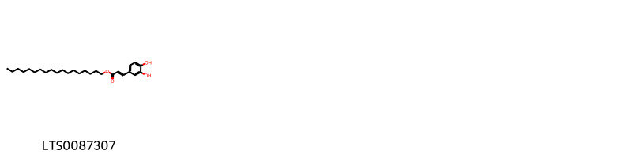
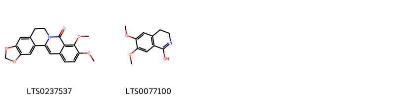
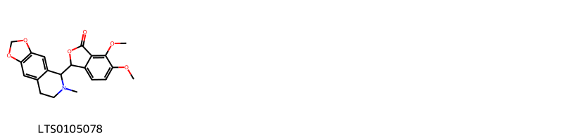

!!! abstract "Tóm tắt"

    Hoàng liên (Coptis – Rhizoma Coptidis) là thân rễ phơi khô của nhiều loài hoàng liên chân gà như Coptis quinquesecta, Coptis sinensis Franch, Coptis teeta Wall., Coptis teetoides C. Y. Cheng v.v… đều thuộc họ Mao lương (Ranunculaceae). Cây chủ yếu mọc ở các vùng núi cao từ 1.500-2.000m, đặc biệt tại các tỉnh Lào Cai, Sapa, và dãy núi Hoàng Liên Sơn, khu Tây Bắc Việt Nam. Trong y học cổ truyền, hoàng liên có vị đắng, tính hàn, vào các kinh tâm, tỳ, vị, can, đởm, và đại tràng, được dùng để thanh nhiệt, trừ phiền, sáng mắt, và giải độc. Tác dụng dược lý của hoàng liên rất đa dạng, bao gồm tác dụng chống vi trùng, hỗ trợ tiêu hóa, điều trị viêm dạ dày, ruột, và lỵ, giảm huyết áp, và tác dụng lên hệ tim mạch. Ngoài ra, hoàng liên còn giúp thanh nhiệt, giải độc, trị đau bụng, viêm ruột, mất ngủ, và đau mắt đỏ. Thành phần hóa học chủ yếu là các alkaloid như berberin, coptisin, worenin, và columbamin. Đặc biệt là berberin chloride và palmatine chloride.

## Thông tin về thực vật

Dược liệu **Hoàng Liên (Thân Rễ)** từ bộ phận **nan** từ loài *Coptis chinensis*.

**Mô tả thực vật:** Thân rễ là những mẩu cong queo, dài 3 cm trở lên, đường kính 0,2 cm đến 0,8 cm, có nhiều đốt khúc khuỷu và phân nhiều nhánh. Mặt ngoài màu vàng nâu hay vàng xám, mang vết tích của rễ con và cuống lá. Chất cứng rắn, vết bẻ ngang không phẳng, phần gỗ màu vàng tươi, tia ruột có chỗ rách, phần vỏ và một màu vàng đỏ, cũng có khi rỗng. Không mùi. vị rất đắng và tồn tại lâu.

*Tài liệu tham khảo:* "Những cây thuốc và vị thuốc Việt Nam" - Đỗ Tất Lợi 
Trong dược điển Việt nam, một số loài có thể dùng thay thế cho nhau làm dược liệu bao gồm *Coptis chinensis, Coptis quinquesecta, Coptis teeta*

!!! info "Phân loại thực vật của *Coptis chinensis*"
    - **Kingdom:** Plantae
    - **Phylum:** Tracheophyta
    - **Order:** Ranunculales
    - **Family:** Ranunculaceae
    - **Genus:** Coptis
    - **Species:** *Coptis chinensis*

**Phân bố trên thế giới:** nan, United States of America, China, India, Viet Nam

**Phân bố tại Việt nam:** Lai Chau

 
Chưa có thông tin về loài này trên gibf

!!! info "Phân loại thực vật của *Coptis teeta*"
    - **Kingdom:** Plantae
    - **Phylum:** Tracheophyta
    - **Order:** Ranunculales
    - **Family:** Ranunculaceae
    - **Genus:** Coptis
    - **Species:** *Coptis teeta*

**Phân bố trên thế giới:** Myanmar, nan, China, unknown or invalid, Bangladesh, United Kingdom of Great Britain and Northern Ireland, Japan, India, Indonesia

**Phân bố tại Việt nam:** Không có ghi nhận ở Việt Nam

## Thông tin về dược liệu 

### Định danh

!!! info "Thông tin về tên gọi"

    - Dược liệu tiếng Việt: nan
    - Dược liệu tiếng Trung: nan (nan)
    - Dược liệu tiếng Anh: nan
    - Dược liệu latin thông dụng: nan
    - Dược liệu latin kiểu DĐVN: *rhizoma coptidis*
    - Dược liệu latin kiểu DĐVN: *nan*
    - Dược liệu latin kiểu thông tư: *nan*
    - Bộ phận dùng: nan (nan)

### Mô tả dược liệu 

- **Theo dược điển Việt nam V:** nan

- **Mô tả dược liệu theo thông tư chế biến dược liệu theo phương pháp cổ truyền:** nan

### Chế biến 

- **Chế biến theo dược điển việt nam V**: nan

- **Chế biến theo thông tư:** nan

--- 

## Thành phần hóa học

- Theo tài liệu của GS. Đỗ Tất Lợi:  (1) Alkaloid (berberin C20H19NO5, coptisin C19H15NO5, worenin C24H15NO4, columbamin C20H20NO4)
(2) Dược điển Việt Nam: berberin clorid (C20H18N04Cl), palmatin clorid (C21H22NO4Cl)
Dược điển Hồng Kông: Berberine chloride, palmatine chloride 
Dược điển Trung Quốc: Berberine chloride
    

**Thành phần hóa học từ loài **Coptis teeta**

Theo cơ sở dữ liệu lotus, loài *Coptis teeta* đã phân lập và xác định được **9** hoạt chất thuộc về các nhóm Cinnamic acids and derivatives, Phthalide isoquinolines, Isoquinolines and derivatives, Unsaturated hydrocarbons, Protoberberine alkaloids and derivatives trong bảng dưới đây. Danh sách các hoạt chất như sau palmatine [(LTS0253245)](https://lotus.naturalproducts.net/compound/lotus_id/LTS0253245), octadecyl (2z)-3-(3,4-dihydroxyphenyl)prop-2-enoate [(LTS0030803)](https://lotus.naturalproducts.net/compound/lotus_id/LTS0030803), 6,7-dimethoxy-3,4-dihydroisoquinolin-1-ol [(LTS0077100)](https://lotus.naturalproducts.net/compound/lotus_id/LTS0077100), 8-oxyberberine [(LTS0237537)](https://lotus.naturalproducts.net/compound/lotus_id/LTS0237537), octadecyl (2e)-3-(3,4-dihydroxyphenyl)prop-2-enoate [(LTS0087307)](https://lotus.naturalproducts.net/compound/lotus_id/LTS0087307), berberine [(LTS0101484)](https://lotus.naturalproducts.net/compound/lotus_id/LTS0101484), hydrastine [(LTS0105078)](https://lotus.naturalproducts.net/compound/lotus_id/LTS0105078), tetradecene [(LTS0225565)](https://lotus.naturalproducts.net/compound/lotus_id/LTS0225565), 5,7,17,19-tetraoxa-13λ⁵-azahexacyclo[11.11.0.0²,¹⁰.0⁴,⁸.0¹⁵,²³.0¹⁶,²⁰]tetracosa-1(24),2,4(8),9,13,15,20,22-octaen-13-ylium [(LTS0142299)](https://lotus.naturalproducts.net/compound/lotus_id/LTS0142299). 
        
| chemicalTaxonomyClassyfireClass          |   smiles_count |
|:-----------------------------------------|---------------:|
| Cinnamic acids and derivatives           |             43 |
| Isoquinolines and derivatives            |             68 |
| Phthalide isoquinolines                  |             45 |
| Protoberberine alkaloids and derivatives |            131 |
| Unsaturated hydrocarbons                 |             15 |

            
### Nhóm Cinnamic acids and derivatives
<figure markdown="span">
    { width=100% }
<figcaption>Hình ảnh cấu trúc hóa học của hoạt chất thuộc nhóm *Cinnamic acids and derivatives*. Tên thường gọi của các hoạt chất tương ứng là octadecyl (2e)-3-(3,4-dihydroxyphenyl)prop-2-enoate [(LTS0087307)](https://lotus.naturalproducts.net/compound/lotus_id/LTS0087307).</figcaption>
</figure>

            
            
### Nhóm Cinnamic acids and derivatives
<figure markdown="span">
    { width=100% }
<figcaption>Hình ảnh cấu trúc hóa học của hoạt chất thuộc nhóm *Cinnamic acids and derivatives*. Tên thường gọi của các hoạt chất tương ứng là octadecyl (2e)-3-(3,4-dihydroxyphenyl)prop-2-enoate [(LTS0087307)](https://lotus.naturalproducts.net/compound/lotus_id/LTS0087307).</figcaption>
</figure>

### Nhóm Isoquinolines and derivatives
<figure markdown="span">
    { width=100% }
<figcaption>Hình ảnh cấu trúc hóa học của hoạt chất thuộc nhóm *Isoquinolines and derivatives*. Tên thường gọi của các hoạt chất tương ứng là 8-oxyberberine [(LTS0237537)](https://lotus.naturalproducts.net/compound/lotus_id/LTS0237537), 6,7-dimethoxy-3,4-dihydroisoquinolin-1-ol [(LTS0077100)](https://lotus.naturalproducts.net/compound/lotus_id/LTS0077100).</figcaption>
</figure>

            
            
### Nhóm Cinnamic acids and derivatives
<figure markdown="span">
    { width=100% }
<figcaption>Hình ảnh cấu trúc hóa học của hoạt chất thuộc nhóm *Cinnamic acids and derivatives*. Tên thường gọi của các hoạt chất tương ứng là octadecyl (2e)-3-(3,4-dihydroxyphenyl)prop-2-enoate [(LTS0087307)](https://lotus.naturalproducts.net/compound/lotus_id/LTS0087307).</figcaption>
</figure>

### Nhóm Isoquinolines and derivatives
<figure markdown="span">
    { width=100% }
<figcaption>Hình ảnh cấu trúc hóa học của hoạt chất thuộc nhóm *Isoquinolines and derivatives*. Tên thường gọi của các hoạt chất tương ứng là 8-oxyberberine [(LTS0237537)](https://lotus.naturalproducts.net/compound/lotus_id/LTS0237537), 6,7-dimethoxy-3,4-dihydroisoquinolin-1-ol [(LTS0077100)](https://lotus.naturalproducts.net/compound/lotus_id/LTS0077100).</figcaption>
</figure>

### Nhóm Phthalide isoquinolines
<figure markdown="span">
    { width=100% }
<figcaption>Hình ảnh cấu trúc hóa học của hoạt chất thuộc nhóm *Phthalide isoquinolines*. Tên thường gọi của các hoạt chất tương ứng là hydrastine [(LTS0105078)](https://lotus.naturalproducts.net/compound/lotus_id/LTS0105078).</figcaption>
</figure>

            
            
### Nhóm Cinnamic acids and derivatives
<figure markdown="span">
    { width=100% }
<figcaption>Hình ảnh cấu trúc hóa học của hoạt chất thuộc nhóm *Cinnamic acids and derivatives*. Tên thường gọi của các hoạt chất tương ứng là octadecyl (2e)-3-(3,4-dihydroxyphenyl)prop-2-enoate [(LTS0087307)](https://lotus.naturalproducts.net/compound/lotus_id/LTS0087307).</figcaption>
</figure>

### Nhóm Isoquinolines and derivatives
<figure markdown="span">
    { width=100% }
<figcaption>Hình ảnh cấu trúc hóa học của hoạt chất thuộc nhóm *Isoquinolines and derivatives*. Tên thường gọi của các hoạt chất tương ứng là 8-oxyberberine [(LTS0237537)](https://lotus.naturalproducts.net/compound/lotus_id/LTS0237537), 6,7-dimethoxy-3,4-dihydroisoquinolin-1-ol [(LTS0077100)](https://lotus.naturalproducts.net/compound/lotus_id/LTS0077100).</figcaption>
</figure>

### Nhóm Phthalide isoquinolines
<figure markdown="span">
    { width=100% }
<figcaption>Hình ảnh cấu trúc hóa học của hoạt chất thuộc nhóm *Phthalide isoquinolines*. Tên thường gọi của các hoạt chất tương ứng là hydrastine [(LTS0105078)](https://lotus.naturalproducts.net/compound/lotus_id/LTS0105078).</figcaption>
</figure>

### Nhóm Protoberberine alkaloids and derivatives
<figure markdown="span">
    { width=100% }
<figcaption>Hình ảnh cấu trúc hóa học của hoạt chất thuộc nhóm *Protoberberine alkaloids and derivatives*. Tên thường gọi của các hoạt chất tương ứng là 5,7,17,19-tetraoxa-13λ⁵-azahexacyclo[11.11.0.0²,¹⁰.0⁴,⁸.0¹⁵,²³.0¹⁶,²⁰]tetracosa-1(24),2,4(8),9,13,15,20,22-octaen-13-ylium [(LTS0142299)](https://lotus.naturalproducts.net/compound/lotus_id/LTS0142299), palmatine [(LTS0253245)](https://lotus.naturalproducts.net/compound/lotus_id/LTS0253245), berberine [(LTS0101484)](https://lotus.naturalproducts.net/compound/lotus_id/LTS0101484).</figcaption>
</figure>

            
            
### Nhóm Cinnamic acids and derivatives
<figure markdown="span">
    { width=100% }
<figcaption>Hình ảnh cấu trúc hóa học của hoạt chất thuộc nhóm *Cinnamic acids and derivatives*. Tên thường gọi của các hoạt chất tương ứng là octadecyl (2e)-3-(3,4-dihydroxyphenyl)prop-2-enoate [(LTS0087307)](https://lotus.naturalproducts.net/compound/lotus_id/LTS0087307).</figcaption>
</figure>

### Nhóm Isoquinolines and derivatives
<figure markdown="span">
    { width=100% }
<figcaption>Hình ảnh cấu trúc hóa học của hoạt chất thuộc nhóm *Isoquinolines and derivatives*. Tên thường gọi của các hoạt chất tương ứng là 8-oxyberberine [(LTS0237537)](https://lotus.naturalproducts.net/compound/lotus_id/LTS0237537), 6,7-dimethoxy-3,4-dihydroisoquinolin-1-ol [(LTS0077100)](https://lotus.naturalproducts.net/compound/lotus_id/LTS0077100).</figcaption>
</figure>

### Nhóm Phthalide isoquinolines
<figure markdown="span">
    { width=100% }
<figcaption>Hình ảnh cấu trúc hóa học của hoạt chất thuộc nhóm *Phthalide isoquinolines*. Tên thường gọi của các hoạt chất tương ứng là hydrastine [(LTS0105078)](https://lotus.naturalproducts.net/compound/lotus_id/LTS0105078).</figcaption>
</figure>

### Nhóm Protoberberine alkaloids and derivatives
<figure markdown="span">
    { width=100% }
<figcaption>Hình ảnh cấu trúc hóa học của hoạt chất thuộc nhóm *Protoberberine alkaloids and derivatives*. Tên thường gọi của các hoạt chất tương ứng là 5,7,17,19-tetraoxa-13λ⁵-azahexacyclo[11.11.0.0²,¹⁰.0⁴,⁸.0¹⁵,²³.0¹⁶,²⁰]tetracosa-1(24),2,4(8),9,13,15,20,22-octaen-13-ylium [(LTS0142299)](https://lotus.naturalproducts.net/compound/lotus_id/LTS0142299), palmatine [(LTS0253245)](https://lotus.naturalproducts.net/compound/lotus_id/LTS0253245), berberine [(LTS0101484)](https://lotus.naturalproducts.net/compound/lotus_id/LTS0101484).</figcaption>
</figure>

### Nhóm Unsaturated hydrocarbons
<figure markdown="span">
    { width=100% }
<figcaption>Hình ảnh cấu trúc hóa học của hoạt chất thuộc nhóm *Unsaturated hydrocarbons*. Tên thường gọi của các hoạt chất tương ứng là tetradecene [(LTS0225565)](https://lotus.naturalproducts.net/compound/lotus_id/LTS0225565).</figcaption>
</figure>

            

---

## Tác dụng dược lý

Theo tài liệu "Những cây thuốc và vị thuốc Việt Nam" - Đỗ Tất Lợi:- Tác dụng chống vi trùng
- Tác dụng giúp sự tiêu hóa, chữa viêm dạ dày và ruột, chữa lỵ.
- Liều nhỏ kích thích sự hấp, liều cao làm cho hô hấp kém có thể đi tới ngạt do tê liệt trung tâm hô hấp, tim vẫn tiếp tục đập.
- Tác dụng giảm huyết áp và xỉu đối với hệ tim mạch

Theo tài liệu quốc tế: nan

---

## Dược điển Việt Nam V

### Soi bột:

nan

<!-- Hình ảnh soi bột sẽ được tự động chèn vào đây sau -->

### Vi phẫu:

nan

<!-- Hình ảnh vi phẫu sẽ được tự động chèn vào đây sau -->

### Định tính

nan

### Định lượng

nan

### Thông tin khác 

- ** Độ ẩm: ** nan
- ** Bảo quản:** nan

## Dược điển Hồng kong

<!-- PDF sẽ được tự động chèn vào đây sau -->

---

## Y dược học cổ truyền

- **Tên vị thuốc:** nan
- **Tính vị quy kinh:** Vị đắng, tính hàn. Vào kinh tâm, tỳ, vị, can, đởm, đại tràng.
- **Công năng chủ trị:** Thanh nhiệt táo thấp, thanh tâm, trừ phiền, thanh can sáng mắt, tả hỏa, giải độc.

Chủ trị: Đau bụng, viêm ruột, ỉa lỵ, bồn chồn mất ngủ, đau mắt đỏ.
- **Chú ý:** nan
- **Kiêng kỵ:** nan

## Bình luận

