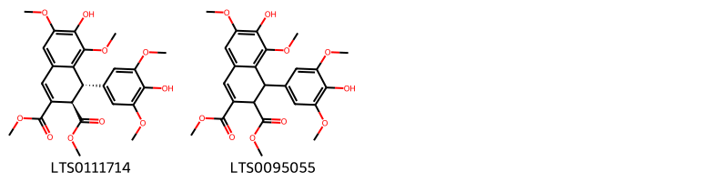
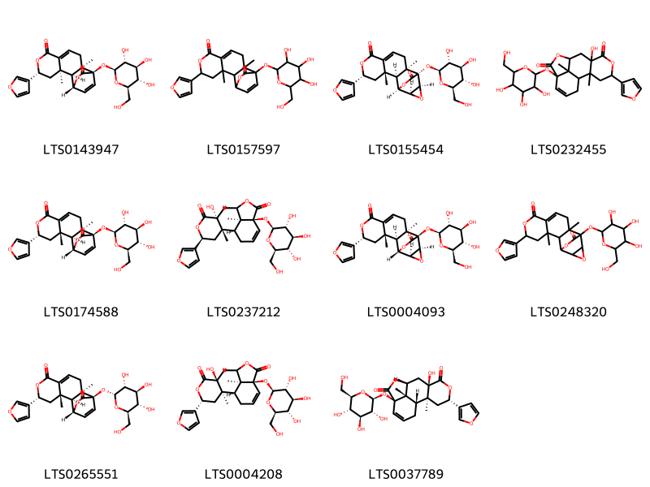
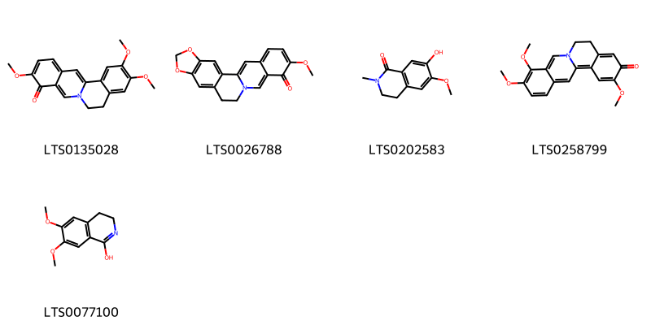
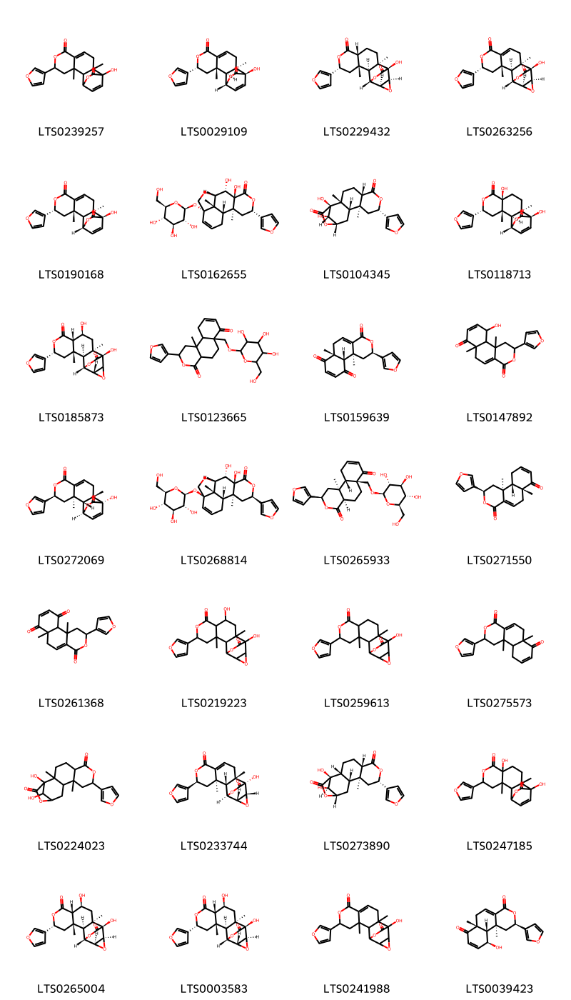
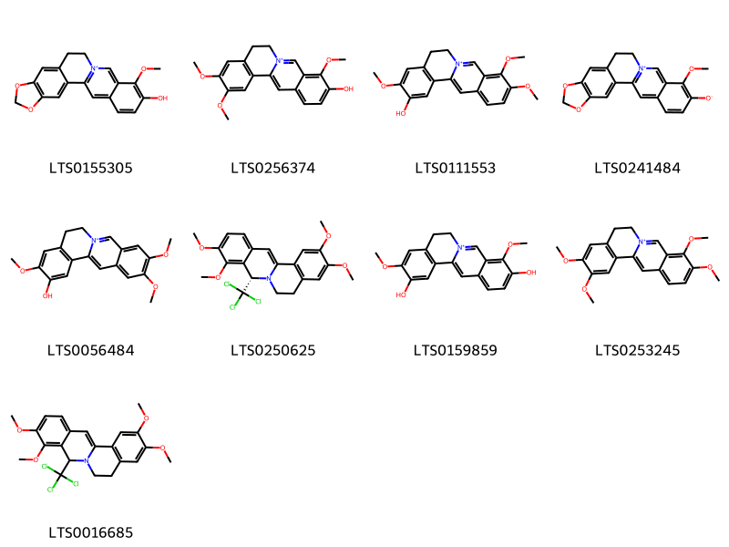

!!! abstract "Tóm tắt"

    Hoàng đằng (Fibraurea recisa Pierre và Fibraurea tinctoria Lour.) thuộc họ Tiết dê (Menispermaceae). Cây chủ yếu phân bố ở các khu vực nhiệt đới và cận nhiệt đới của Đông Nam Á, ưa khí hậu nóng ẩm, thường mọc trong các khu rừng nhiệt đới, rừng mưa hoặc những vùng đất ẩm ướt. Tại Việt Nam, cây Hoàng đằng thường gặp ở các tỉnh miền núi phía Bắc. Rễ của cây chứa nhiều alkaloid như palmatine, ngoài ra còn có jatrorrhizin, columbamin, berberin. Có tác dụng kháng viêm, kháng khuẩn, kháng sinh đối với các vi khuẩn đường ruột. Thân cây cũng chứa các hợp chất có lợi cho sức khỏe, trong dân gian được sử dụng trong các bài thuốc điều trị viêm gan, tiêu chảy, các bệnh nhiễm trùng và các bệnh lý liên quan đến gan mật.

## Thông tin về thực vật

Dược liệu **Hoàng Đằng (Thân Và Rễ)** từ bộ phận **nan** từ loài *Fibraurea recisa*.

**Mô tả thực vật:** 1. Cây hoàng đằng Fibraaurea recisa là một loài cây mọc leo, thân rất cứng, to. Lá mọc so le dài 9-20 cm, rộng 4-10cm, cứng, nhẵn, phiến lá hình ba cạnh dài, phía dưới tròn, có 3 gân lá chính rõ và 2 gân cong, cuống dài 5-14cm có 2 nốt phình lên, một ở phía dưới một ở phía trên. Hoa mọc thành cây, 2-3 lần phân nhánh, dài 30-40cm ở kế các lá đã rụng.
2. Cây Fibraurea tinctoria theo các tác giả chia làm 2 loài thì khác cây trên ở chỗ lá nhọn, chuỳ 2 đến 4 lá ngắn hơn, chỉ phân nhánh 2 lần.

*Tài liệu tham khảo:* "Những cây thuốc và vị thuốc Việt Nam" - Đỗ Tất Lợi 
Trong dược điển Việt nam, một số loài có thể dùng thay thế cho nhau làm dược liệu bao gồm *Fibraurea recisa, Fibraurea tinctoria*

!!! info "Phân loại thực vật của *Fibraurea recisa*"
    - **Kingdom:** Plantae
    - **Phylum:** Tracheophyta
    - **Order:** Ranunculales
    - **Family:** Menispermaceae
    - **Genus:** Fibraurea
    - **Species:** *Fibraurea recisa*

**Phân bố trên thế giới:** Myanmar, nan, China, Cambodia, Japan, Lao People’s Democratic Republic, Viet Nam

**Phân bố tại Việt nam:** Thanh Hoa, Ha Tinh, Lang Son

!!! info "Phân loại thực vật của *Fibraurea tinctoria*"
    - **Kingdom:** Plantae
    - **Phylum:** Tracheophyta
    - **Order:** Ranunculales
    - **Family:** Menispermaceae
    - **Genus:** Fibraurea
    - **Species:** *Fibraurea tinctoria*

**Phân bố trên thế giới:** Thailand, nan, Philippines, Brunei Darussalam, China, unknown or invalid, Cambodia, Malaysia, Indonesia, India, Singapore, Lao People’s Democratic Republic, Viet Nam

**Phân bố tại Việt nam:** Da Nang, Ninh Thuan, Bac Kan, Hà Tinh, Tonkin, 东京, Annam

## Thông tin về dược liệu 

### Định danh

!!! info "Thông tin về tên gọi"

    - Dược liệu tiếng Việt: nan
    - Dược liệu tiếng Trung: nan (nan)
    - Dược liệu tiếng Anh: nan
    - Dược liệu latin thông dụng: nan
    - Dược liệu latin kiểu DĐVN: *caulis et radix fibraureae*
    - Dược liệu latin kiểu DĐVN: *nan*
    - Dược liệu latin kiểu thông tư: *nan*
    - Bộ phận dùng: nan (nan)

### Mô tả dược liệu 

- **Theo dược điển Việt nam V:** nan

- **Mô tả dược liệu theo thông tư chế biến dược liệu theo phương pháp cổ truyền:** nan

### Chế biến 

- **Chế biến theo dược điển việt nam V**: nan

- **Chế biến theo thông tư:** nan

--- 

## Thành phần hóa học

- Theo tài liệu của GS. Đỗ Tất Lợi:  (1) Alkaloid: Chủ yếu là palmatin (1-3%), ngoài ra còn có jatrorrhizin, columbamin, berberin.
Terpenoid: diterpen
(2) palmatin clorua, jatrorrhizin clorua
    

**Thành phần hóa học từ loài **Fibraurea tinctoria**

Theo cơ sở dữ liệu lotus, loài *Fibraurea tinctoria* đã phân lập và xác định được **97** hoạt chất thuộc về các nhóm Anthracenes, Steroids and steroid derivatives, Organooxygen compounds, Fatty Acyls, Cinnamic acids and derivatives, Aryltetralin lignans, Aporphines, Protoberberine alkaloids and derivatives, Phenols, Isoquinolines and derivatives, Naphthopyrans, Benzene and substituted derivatives, Prenol lipids trong bảng dưới đây. Danh sách các hoạt chất như sau (1s,2s,3s,5r,8s,9s,11r,12s,13s,15s)-5-(furan-3-yl)-9,12-dihydroxy-3,11-dimethyl-6,14,16-trioxapentacyclo[10.3.2.0²,¹¹.0³,⁸.0¹³,¹⁵]heptadecane-7,17-dione [(LTS0265004)](https://lotus.naturalproducts.net/compound/lotus_id/LTS0265004), 5-(furan-3-yl)-9,12-dihydroxy-3,11-dimethyl-6,14,16-trioxapentacyclo[10.3.2.0²,¹¹.0³,⁸.0¹³,¹⁵]heptadecane-7,17-dione [(LTS0219223)](https://lotus.naturalproducts.net/compound/lotus_id/LTS0219223), (1r,3s,5r,11r,12r)-5-(furan-3-yl)-12-hydroxy-3,11-dimethyl-6,14-dioxatetracyclo[10.2.2.0²,¹¹.0³,⁸]hexadeca-8,15-diene-7,13-dione [(LTS0190168)](https://lotus.naturalproducts.net/compound/lotus_id/LTS0190168), syringaldehyde [(LTS0201406)](https://lotus.naturalproducts.net/compound/lotus_id/LTS0201406), (1s,2s,4r,7s,8s,9s,12r,16s)-4-(furan-3-yl)-7,8-dihydroxy-2,16-dimethyl-12-{[(2s,3r,4s,5s,6r)-3,4,5-trihydroxy-6-(hydroxymethyl)oxan-2-yl]oxy}-5,10-dioxatetracyclo[7.6.1.0²,⁷.0¹²,¹⁶]hexadec-13-en-6-one [(LTS0268814)](https://lotus.naturalproducts.net/compound/lotus_id/LTS0268814), (2z)-3-(4-hydroxyphenyl)-n-[2-(4-hydroxyphenyl)ethyl]prop-2-enimidic acid [(LTS0199254)](https://lotus.naturalproducts.net/compound/lotus_id/LTS0199254), (1s,3as,5ar,7r,8s,9ar,9br,11ar)-3a,8-dihydroxy-9a,11a-dimethyl-1-[(2s,3r,5r)-2,3,6-trihydroxy-5,6-dimethylheptan-2-yl]-7-{[(2r,3r,4s,5s,6r)-3,4,5-trihydroxy-6-(hydroxymethyl)oxan-2-yl]oxy}-1h,2h,3h,5ah,6h,7h,8h,9h,9bh,10h,11h-cyclopenta[a]phenanthren-5-one [(LTS0260821)](https://lotus.naturalproducts.net/compound/lotus_id/LTS0260821), 3-(4-hydroxyphenyl)-n-[2-(4-hydroxyphenyl)ethyl]prop-2-enimidic acid [(LTS0104591)](https://lotus.naturalproducts.net/compound/lotus_id/LTS0104591), 17-hydroxy-16-methoxy-5,7-dioxa-13λ⁵-azapentacyclo[11.8.0.0²,¹⁰.0⁴,⁸.0¹⁵,²⁰]henicosa-1(13),2,4(8),9,14,16,18,20-octaen-13-ylium [(LTS0155305)](https://lotus.naturalproducts.net/compound/lotus_id/LTS0155305), (1s,3as,5ar,7r,8s,9ar,9br,11ar)-3a,7,8-trihydroxy-9a,11a-dimethyl-1-[(2s,3r,5r)-2,3,6-trihydroxy-5,6-dimethylheptan-2-yl]-1h,2h,3h,5ah,6h,7h,8h,9h,9bh,10h,11h-cyclopenta[a]phenanthren-5-one [(LTS0021296)](https://lotus.naturalproducts.net/compound/lotus_id/LTS0021296), (1s,2r,5s,8s,10s,11s,13s,16s)-8-(furan-3-yl)-1,16-dihydroxy-2,10-dimethyl-7,14-dioxatetracyclo[11.2.1.0²,¹¹.0⁵,¹⁰]hexadecane-6,15-dione [(LTS0104345)](https://lotus.naturalproducts.net/compound/lotus_id/LTS0104345), 2-(furan-3-yl)-10b-methyl-6a-({[3,4,5-trihydroxy-6-(hydroxymethyl)oxan-2-yl]oxy}methyl)-1h,2h,4ah,5h,6h,10h,10ah-naphtho[2,1-c]pyran-4,7-dione [(LTS0123665)](https://lotus.naturalproducts.net/compound/lotus_id/LTS0123665), vanillate [(LTS0253904)](https://lotus.naturalproducts.net/compound/lotus_id/LTS0253904), 2-(furan-3-yl)-10-hydroxy-6a,10b-dimethyl-1h,2h,6h,10h,10ah-naphtho[2,1-c]pyran-4,7-dione [(LTS0147892)](https://lotus.naturalproducts.net/compound/lotus_id/LTS0147892), (1s,2s,4s,7r,9r,12r,16s)-4-(furan-3-yl)-7-hydroxy-2,16-dimethyl-12-{[(2s,3r,4s,5s,6r)-3,4,5-trihydroxy-6-(hydroxymethyl)oxan-2-yl]oxy}-5,10-dioxatetracyclo[7.6.1.0²,⁷.0¹²,¹⁶]hexadec-13-ene-6,11-dione [(LTS0037789)](https://lotus.naturalproducts.net/compound/lotus_id/LTS0037789), (1r,2s,3s,5r,11r,12r)-5-(furan-3-yl)-12-hydroxy-3,11-dimethyl-6,14-dioxatetracyclo[10.2.2.0²,¹¹.0³,⁸]hexadeca-8,15-diene-7,13-dione [(LTS0029109)](https://lotus.naturalproducts.net/compound/lotus_id/LTS0029109), (1s,2s,4s,7s,8s,9s,12s,16s)-4-(furan-3-yl)-7,8-dihydroxy-2,16-dimethyl-12-{[(2s,3r,4s,5s,6r)-3,4,5-trihydroxy-6-(hydroxymethyl)oxan-2-yl]oxy}-5,10-dioxatetracyclo[7.6.1.0²,⁷.0¹²,¹⁶]hexadec-13-en-6-one [(LTS0162655)](https://lotus.naturalproducts.net/compound/lotus_id/LTS0162655), tinosporide [(LTS0259613)](https://lotus.naturalproducts.net/compound/lotus_id/LTS0259613), (2e)-3-(4-hydroxyphenyl)-n-[2-(4-hydroxyphenyl)ethyl]prop-2-enimidic acid [(LTS0067822)](https://lotus.naturalproducts.net/compound/lotus_id/LTS0067822), dehydrozingerone [(LTS0197654)](https://lotus.naturalproducts.net/compound/lotus_id/LTS0197654), methyl (2s,4as,6ar,10as,10bs)-2-(furan-3-yl)-6a,10b-dimethyl-4-oxo-1h,2h,4ah,5h,6h,9h,10h,10ah-naphtho[2,1-c]pyran-7-carboxylate [(LTS0212473)](https://lotus.naturalproducts.net/compound/lotus_id/LTS0212473), 3-(4-hydroxy-3-methoxyphenyl)-n-[2-(4-hydroxyphenyl)ethyl]prop-2-enimidic acid [(LTS0240896)](https://lotus.naturalproducts.net/compound/lotus_id/LTS0240896), thalifolin [(LTS0202583)](https://lotus.naturalproducts.net/compound/lotus_id/LTS0202583), (1s,2r,3r,5s,11s,12s)-5-(furan-3-yl)-12-hydroxy-3,11-dimethyl-6,14-dioxatetracyclo[10.2.2.0²,¹¹.0³,⁸]hexadeca-8,15-diene-7,13-dione [(LTS0272069)](https://lotus.naturalproducts.net/compound/lotus_id/LTS0272069), (1s,5ar,7r,8s,9ar,11ar)-3a,7,8-trihydroxy-9a,11a-dimethyl-1-(2,3,6-trihydroxy-5,6-dimethylheptan-2-yl)-1h,2h,3h,5ah,6h,7h,8h,9h,9bh,10h,11h-cyclopenta[a]phenanthren-5-one [(LTS0086545)](https://lotus.naturalproducts.net/compound/lotus_id/LTS0086545), 2,3-dimethyl (1s,2r)-7-hydroxy-1-(4-hydroxy-3,5-dimethoxyphenyl)-6,8-dimethoxy-1,2-dihydronaphthalene-2,3-dicarboxylate [(LTS0111714)](https://lotus.naturalproducts.net/compound/lotus_id/LTS0111714), (2r,6ar,10s,10as,10bs)-2-(furan-3-yl)-10-hydroxy-6a,10b-dimethyl-1h,2h,6h,10h,10ah-naphtho[2,1-c]pyran-4,7-dione [(LTS0039423)](https://lotus.naturalproducts.net/compound/lotus_id/LTS0039423), pseudocolumbamine [(LTS0056484)](https://lotus.naturalproducts.net/compound/lotus_id/LTS0056484), 17-methoxy-5,7-dioxa-13-azapentacyclo[11.8.0.0²,¹⁰.0⁴,⁸.0¹⁵,²⁰]henicosa-1(21),2,4(8),9,14,17,19-heptaen-16-one [(LTS0026788)](https://lotus.naturalproducts.net/compound/lotus_id/LTS0026788), columbamine [(LTS0111553)](https://lotus.naturalproducts.net/compound/lotus_id/LTS0111553), 3,4-dihydroxycinnamic acid [(LTS0128050)](https://lotus.naturalproducts.net/compound/lotus_id/LTS0128050), (5s)-3,4,10,11-tetramethoxy-5-(trichloromethyl)-7,8-dihydro-5h-6-azatetraphene [(LTS0250625)](https://lotus.naturalproducts.net/compound/lotus_id/LTS0250625), 4-(furan-3-yl)-7-hydroxy-2,16-dimethyl-12-{[3,4,5-trihydroxy-6-(hydroxymethyl)oxan-2-yl]oxy}-5,10-dioxatetracyclo[7.6.1.0²,⁷.0¹²,¹⁶]hexadec-13-ene-6,11-dione [(LTS0232455)](https://lotus.naturalproducts.net/compound/lotus_id/LTS0232455), 5-(furan-3-yl)-3,11-dimethyl-12-{[3,4,5-trihydroxy-6-(hydroxymethyl)oxan-2-yl]oxy}-6,14,16-trioxapentacyclo[10.3.2.0²,¹¹.0³,⁸.0¹³,¹⁵]heptadec-8-ene-7,17-dione [(LTS0248320)](https://lotus.naturalproducts.net/compound/lotus_id/LTS0248320), 5-(furan-3-yl)-12-hydroxy-3,11-dimethyl-6,14-dioxatetracyclo[10.2.2.0²,¹¹.0³,⁸]hexadeca-8,15-diene-7,13-dione [(LTS0239257)](https://lotus.naturalproducts.net/compound/lotus_id/LTS0239257), 5-(furan-3-yl)-3,11-dimethyl-12-{[3,4,5-trihydroxy-6-(hydroxymethyl)oxan-2-yl]oxy}-6,14-dioxatetracyclo[10.2.2.0²,¹¹.0³,⁸]hexadeca-8,15-diene-7,13-dione [(LTS0157597)](https://lotus.naturalproducts.net/compound/lotus_id/LTS0157597), 16-methoxy-5,7-dioxa-13λ⁵-azapentacyclo[11.8.0.0²,¹⁰.0⁴,⁸.0¹⁵,²⁰]henicosa-1(13),2,4(8),9,14,16,18,20-octaen-13-ylium-17-olate [(LTS0241484)](https://lotus.naturalproducts.net/compound/lotus_id/LTS0241484), (1r,2s,3r,5r,11r,12r)-5-(furan-3-yl)-3,11-dimethyl-12-{[(2s,3r,4s,5s,6r)-3,4,5-trihydroxy-6-(hydroxymethyl)oxan-2-yl]oxy}-6,14-dioxatetracyclo[10.2.2.0²,¹¹.0³,⁸]hexadeca-8,15-diene-7,13-dione [(LTS0143947)](https://lotus.naturalproducts.net/compound/lotus_id/LTS0143947), p-hydroxybenzaldehyde [(LTS0259836)](https://lotus.naturalproducts.net/compound/lotus_id/LTS0259836), stigmast-5-en-3-ol, (3β)- [(LTS0204616)](https://lotus.naturalproducts.net/compound/lotus_id/LTS0204616), 3,4,11-trimethoxy-7,8-dihydro-6-azatetraphen-10-one [(LTS0258799)](https://lotus.naturalproducts.net/compound/lotus_id/LTS0258799), (1s,2r,4r,7s,9r,12s,16s)-4-(furan-3-yl)-7-hydroxy-2,16-dimethyl-12-{[(2s,3r,4s,5s,6r)-3,4,5-trihydroxy-6-(hydroxymethyl)oxan-2-yl]oxy}-5,10-dioxatetracyclo[7.6.1.0²,⁷.0¹²,¹⁶]hexadec-13-ene-6,11-dione [(LTS0004208)](https://lotus.naturalproducts.net/compound/lotus_id/LTS0004208), 2-(furan-3-yl)-6a,10b-dimethyl-1h,2h,6h,10ah-naphtho[2,1-c]pyran-4,7,10-trione [(LTS0261368)](https://lotus.naturalproducts.net/compound/lotus_id/LTS0261368), (1s,2r,5s,8s,10s,11r,13s,16r)-8-(furan-3-yl)-1,16-dihydroxy-10-methyl-7,14-dioxatetracyclo[11.2.1.0²,¹¹.0⁵,¹⁰]hexadecane-6,15-dione [(LTS0273890)](https://lotus.naturalproducts.net/compound/lotus_id/LTS0273890), 6,7-dimethoxy-3,4-dihydroisoquinolin-1-ol [(LTS0077100)](https://lotus.naturalproducts.net/compound/lotus_id/LTS0077100), methyl 2-(furan-3-yl)-6a,10b-dimethyl-4-oxo-9-{[3,4,5-trihydroxy-6-(hydroxymethyl)oxan-2-yl]oxy}-1h,2h,4ah,5h,6h,9h,10h,10ah-naphtho[2,1-c]pyran-7-carboxylate [(LTS0121744)](https://lotus.naturalproducts.net/compound/lotus_id/LTS0121744), (2r,6ar,10as,10bs)-2-(furan-3-yl)-6a,10b-dimethyl-1h,2h,6h,10h,10ah-naphtho[2,1-c]pyran-4,7-dione [(LTS0271550)](https://lotus.naturalproducts.net/compound/lotus_id/LTS0271550), (2z)-3-(4-hydroxy-3-methoxyphenyl)-n-[2-(4-hydroxyphenyl)ethyl]prop-2-enimidic acid [(LTS0255533)](https://lotus.naturalproducts.net/compound/lotus_id/LTS0255533), sitogluside [(LTS0201798)](https://lotus.naturalproducts.net/compound/lotus_id/LTS0201798), (1s,2s,3s,5r,8s,9s,11r,12s,15r)-5-(furan-3-yl)-9,12-dihydroxy-3,11-dimethyl-6,14,16-trioxapentacyclo[10.3.2.0²,¹¹.0³,⁸.0¹³,¹⁵]heptadecane-7,17-dione [(LTS0185873)](https://lotus.naturalproducts.net/compound/lotus_id/LTS0185873), vanillin [(LTS0136163)](https://lotus.naturalproducts.net/compound/lotus_id/LTS0136163), 3,11-dihydroxy-4,10-dimethoxy-7,8-dihydro-6λ⁵-azatetraphen-6-ylium [(LTS0159859)](https://lotus.naturalproducts.net/compound/lotus_id/LTS0159859), (2r,4ar,6ar,10as,10bs)-2-(furan-3-yl)-10b-methyl-6a-({[(2r,3r,4s,5s,6r)-3,4,5-trihydroxy-6-(hydroxymethyl)oxan-2-yl]oxy}methyl)-1h,2h,4ah,5h,6h,10h,10ah-naphtho[2,1-c]pyran-4,7-dione [(LTS0265933)](https://lotus.naturalproducts.net/compound/lotus_id/LTS0265933), octadecyl (2e)-3-(4-hydroxy-3-methoxyphenyl)prop-2-enoate [(LTS0135394)](https://lotus.naturalproducts.net/compound/lotus_id/LTS0135394), 3,10,11-trimethoxy-7,8-dihydro-6-azatetraphen-4-one [(LTS0135028)](https://lotus.naturalproducts.net/compound/lotus_id/LTS0135028), 5-(furan-3-yl)-12-hydroxy-3,11-dimethyl-6,14,16-trioxapentacyclo[10.3.2.0²,¹¹.0³,⁸.0¹³,¹⁵]heptadec-8-ene-7,17-dione [(LTS0241988)](https://lotus.naturalproducts.net/compound/lotus_id/LTS0241988), caffeic acid [(LTS0027481)](https://lotus.naturalproducts.net/compound/lotus_id/LTS0027481), (1s,2r,5s,8s,10s,11s,13s,16s)-8-(furan-3-yl)-1,5,16-trihydroxy-2,10-dimethyl-7,14-dioxatetracyclo[11.2.1.0²,¹¹.0⁵,¹⁰]hexadecane-6,15-dione [(LTS0074176)](https://lotus.naturalproducts.net/compound/lotus_id/LTS0074176), 8-(furan-3-yl)-1,16-dihydroxy-2,10-dimethyl-7,14-dioxatetracyclo[11.2.1.0²,¹¹.0⁵,¹⁰]hexadecane-6,15-dione [(LTS0224023)](https://lotus.naturalproducts.net/compound/lotus_id/LTS0224023), (2r,6ar,10as,10bs)-2-(furan-3-yl)-6a,10b-dimethyl-1h,2h,6h,10ah-naphtho[2,1-c]pyran-4,7,10-trione [(LTS0159639)](https://lotus.naturalproducts.net/compound/lotus_id/LTS0159639), 3,4,10,11-tetramethoxy-5-(trichloromethyl)-7,8-dihydro-5h-6-azatetraphene [(LTS0016685)](https://lotus.naturalproducts.net/compound/lotus_id/LTS0016685), (1r,2s,3s,5r,11r,12r)-5-(furan-3-yl)-3,11-dimethyl-12-{[(2s,3r,4s,5s,6r)-3,4,5-trihydroxy-6-(hydroxymethyl)oxan-2-yl]oxy}-6,14-dioxatetracyclo[10.2.2.0²,¹¹.0³,⁸]hexadeca-8,15-diene-7,13-dione [(LTS0174588)](https://lotus.naturalproducts.net/compound/lotus_id/LTS0174588), methyl (2s,4as,6ar,9r,10as,10bs)-2-(furan-3-yl)-6a,10b-dimethyl-4-oxo-9-{[(2r,3r,4s,5s,6r)-3,4,5-trihydroxy-6-(hydroxymethyl)oxan-2-yl]oxy}-1h,2h,4ah,5h,6h,9h,10h,10ah-naphtho[2,1-c]pyran-7-carboxylate [(LTS0051625)](https://lotus.naturalproducts.net/compound/lotus_id/LTS0051625), vanillylidene acetone [(LTS0226067)](https://lotus.naturalproducts.net/compound/lotus_id/LTS0226067), methyl 2-(furan-3-yl)-6a,10b-dimethyl-4-oxo-1h,2h,4ah,5h,6h,9h,10h,10ah-naphtho[2,1-c]pyran-7-carboxylate [(LTS0099368)](https://lotus.naturalproducts.net/compound/lotus_id/LTS0099368), vanillic acid [(LTS0229113)](https://lotus.naturalproducts.net/compound/lotus_id/LTS0229113), chasmanthin [(LTS0229432)](https://lotus.naturalproducts.net/compound/lotus_id/LTS0229432), makisterone a [(LTS0124558)](https://lotus.naturalproducts.net/compound/lotus_id/LTS0124558), methyl (2s,4as,6ar,9r,10as,10bs)-2-(furan-3-yl)-6a,10b-dimethyl-4-oxo-9-{[(2s,3r,4s,5s,6r)-3,4,5-trihydroxy-6-(hydroxymethyl)oxan-2-yl]oxy}-1h,2h,4ah,5h,6h,9h,10h,10ah-naphtho[2,1-c]pyran-7-carboxylate [(LTS0025950)](https://lotus.naturalproducts.net/compound/lotus_id/LTS0025950), 2-{[1-(5-ethyl-6-methylheptan-2-yl)-9a,11a-dimethyl-1h,2h,3h,3ah,3bh,4h,6h,7h,8h,9h,9bh,10h,11h-cyclopenta[a]phenanthren-7-yl]oxy}-6-(hydroxymethyl)oxane-3,4,5-triol [(LTS0158828)](https://lotus.naturalproducts.net/compound/lotus_id/LTS0158828), phytosterol [(LTS0029311)](https://lotus.naturalproducts.net/compound/lotus_id/LTS0029311), (1r,2r,3r,5s,11s,12r,13r,15r)-5-(furan-3-yl)-12-hydroxy-3,11-dimethyl-6,14,16-trioxapentacyclo[10.3.2.0²,¹¹.0³,⁸.0¹³,¹⁵]heptadec-8-ene-7,17-dione [(LTS0233744)](https://lotus.naturalproducts.net/compound/lotus_id/LTS0233744), 3a,8-dihydroxy-9a,11a-dimethyl-1-(2,3,6-trihydroxy-5,6-dimethylheptan-2-yl)-7-{[3,4,5-trihydroxy-6-(hydroxymethyl)oxan-2-yl]oxy}-1h,2h,3h,5ah,6h,7h,8h,9h,9bh,10h,11h-cyclopenta[a]phenanthren-5-one [(LTS0033933)](https://lotus.naturalproducts.net/compound/lotus_id/LTS0033933), (1r,2s,3s,5r,11r,12r,13s,15s)-5-(furan-3-yl)-3,11-dimethyl-12-{[(2s,3r,4s,5s,6r)-3,4,5-trihydroxy-6-(hydroxymethyl)oxan-2-yl]oxy}-6,14,16-trioxapentacyclo[10.3.2.0²,¹¹.0³,⁸.0¹³,¹⁵]heptadec-8-ene-7,17-dione [(LTS0155454)](https://lotus.naturalproducts.net/compound/lotus_id/LTS0155454), (1s,2s,3s,5r,11r,12s,13s,15s)-5-(furan-3-yl)-3,11-dimethyl-12-{[(2s,3r,4s,5s,6r)-3,4,5-trihydroxy-6-(hydroxymethyl)oxan-2-yl]oxy}-6,14,16-trioxapentacyclo[10.3.2.0²,¹¹.0³,⁸.0¹³,¹⁵]heptadec-8-ene-7,17-dione [(LTS0004093)](https://lotus.naturalproducts.net/compound/lotus_id/LTS0004093), syringic acid [(LTS0210036)](https://lotus.naturalproducts.net/compound/lotus_id/LTS0210036), 14,15,16-trimethoxy-10-azatetracyclo[7.7.1.0²,⁷.0¹³,¹⁷]heptadeca-1(17),2(7),3,5,8,13,15-heptaene-10-carbaldehyde [(LTS0252064)](https://lotus.naturalproducts.net/compound/lotus_id/LTS0252064), palmatine [(LTS0253245)](https://lotus.naturalproducts.net/compound/lotus_id/LTS0253245), (1s,2s,4s,7r,9r,12s,16s)-4-(furan-3-yl)-7-hydroxy-2,16-dimethyl-12-{[(2s,3r,4s,5s,6r)-3,4,5-trihydroxy-6-(hydroxymethyl)oxan-2-yl]oxy}-5,10-dioxatetracyclo[7.6.1.0²,⁷.0¹²,¹⁶]hexadec-13-ene-6,11-dione [(LTS0237212)](https://lotus.naturalproducts.net/compound/lotus_id/LTS0237212), 2,3-dimethyl 7-hydroxy-1-(4-hydroxy-3,5-dimethoxyphenyl)-6,8-dimethoxy-1,2-dihydronaphthalene-2,3-dicarboxylate [(LTS0095055)](https://lotus.naturalproducts.net/compound/lotus_id/LTS0095055), (1r,2s,3s,5r,11r,12r,13s,15s)-5-(furan-3-yl)-12-hydroxy-3,11-dimethyl-6,14,16-trioxapentacyclo[10.3.2.0²,¹¹.0³,⁸.0¹³,¹⁵]heptadec-8-ene-7,17-dione [(LTS0223440)](https://lotus.naturalproducts.net/compound/lotus_id/LTS0223440), 2-(furan-3-yl)-6a,10b-dimethyl-1h,2h,6h,10h,10ah-naphtho[2,1-c]pyran-4,7-dione [(LTS0275573)](https://lotus.naturalproducts.net/compound/lotus_id/LTS0275573), (1s,2s,3s,5r,8s,9s,11r,12s,13s,15r)-5-(furan-3-yl)-9,12-dihydroxy-3,11-dimethyl-6,14,16-trioxapentacyclo[10.3.2.0²,¹¹.0³,⁸.0¹³,¹⁵]heptadecane-7,17-dione [(LTS0003583)](https://lotus.naturalproducts.net/compound/lotus_id/LTS0003583), physcion [(LTS0052688)](https://lotus.naturalproducts.net/compound/lotus_id/LTS0052688), 3a,7,8-trihydroxy-9a,11a-dimethyl-1-(2,3,6-trihydroxy-5,6-dimethylheptan-2-yl)-1h,2h,3h,5ah,6h,7h,8h,9h,9bh,10h,11h-cyclopenta[a]phenanthren-5-one [(LTS0032384)](https://lotus.naturalproducts.net/compound/lotus_id/LTS0032384), (1r,2s,3s,5r,8s,11r,12r)-5-(furan-3-yl)-8,12-dihydroxy-3,11-dimethyl-6,14-dioxatetracyclo[10.2.2.0²,¹¹.0³,⁸]hexadec-15-ene-7,13-dione [(LTS0118713)](https://lotus.naturalproducts.net/compound/lotus_id/LTS0118713), sitosterol [(LTS0168132)](https://lotus.naturalproducts.net/compound/lotus_id/LTS0168132), 5-(furan-3-yl)-8,12-dihydroxy-3,11-dimethyl-6,14-dioxatetracyclo[10.2.2.0²,¹¹.0³,⁸]hexadec-15-ene-7,13-dione [(LTS0247185)](https://lotus.naturalproducts.net/compound/lotus_id/LTS0247185), (1s,3as,5ar,7r,8s,9ar,9br,11ar)-3a,8-dihydroxy-9a,11a-dimethyl-1-[(2r,3r,5r)-2,3,6-trihydroxy-5,6-dimethylheptan-2-yl]-7-{[(2r,3r,4s,5s,6r)-3,4,5-trihydroxy-6-(hydroxymethyl)oxan-2-yl]oxy}-1h,2h,3h,5ah,6h,7h,8h,9h,9bh,10h,11h-cyclopenta[a]phenanthren-5-one [(LTS0159681)](https://lotus.naturalproducts.net/compound/lotus_id/LTS0159681), syringate [(LTS0079777)](https://lotus.naturalproducts.net/compound/lotus_id/LTS0079777), (1r,2s,3s,5r,11r,12r)-5-(furan-3-yl)-3,11-dimethyl-12-{[(2r,3r,4s,5s,6r)-3,4,5-trihydroxy-6-(hydroxymethyl)oxan-2-yl]oxy}-6,14-dioxatetracyclo[10.2.2.0²,¹¹.0³,⁸]hexadeca-8,15-diene-7,13-dione [(LTS0265551)](https://lotus.naturalproducts.net/compound/lotus_id/LTS0265551), 8-(furan-3-yl)-1,5,16-trihydroxy-2,10-dimethyl-7,14-dioxatetracyclo[11.2.1.0²,¹¹.0⁵,¹⁰]hexadecane-6,15-dione [(LTS0166286)](https://lotus.naturalproducts.net/compound/lotus_id/LTS0166286), dehydrocorydalmine [(LTS0256374)](https://lotus.naturalproducts.net/compound/lotus_id/LTS0256374), stigmasterol [(LTS0024262)](https://lotus.naturalproducts.net/compound/lotus_id/LTS0024262), (1s,2s,3s,5r,11r,12s,13s,15s)-5-(furan-3-yl)-12-hydroxy-3,11-dimethyl-6,14,16-trioxapentacyclo[10.3.2.0²,¹¹.0³,⁸.0¹³,¹⁵]heptadec-8-ene-7,17-dione [(LTS0263256)](https://lotus.naturalproducts.net/compound/lotus_id/LTS0263256), octadecyl 3-(4-hydroxy-3-methoxyphenyl)prop-2-enoate [(LTS0273840)](https://lotus.naturalproducts.net/compound/lotus_id/LTS0273840), (2e)-3-(4-hydroxy-3-methoxyphenyl)-n-[2-(4-hydroxyphenyl)ethyl]prop-2-enimidic acid [(LTS0187051)](https://lotus.naturalproducts.net/compound/lotus_id/LTS0187051). 
        
| chemicalTaxonomyClassyfireClass          |   smiles_count |
|:-----------------------------------------|---------------:|
| Anthracenes                              |             39 |
| Aporphines                               |             42 |
| Aryltetralin lignans                     |            130 |
| Benzene and substituted derivatives      |             90 |
| Cinnamic acids and derivatives           |            355 |
| Fatty Acyls                              |           1155 |
| Isoquinolines and derivatives            |            176 |
| Naphthopyrans                            |           2041 |
| Organooxygen compounds                   |             14 |
| Phenols                                  |             73 |
| Prenol lipids                            |            402 |
| Protoberberine alkaloids and derivatives |            419 |
| Steroids and steroid derivatives         |           1385 |

            
### Nhóm Anthracenes
<figure markdown="span">
    { width=100% }
<figcaption>Hình ảnh cấu trúc hóa học của hoạt chất thuộc nhóm *Anthracenes*. Tên thường gọi của các hoạt chất tương ứng là physcion [(LTS0052688)](https://lotus.naturalproducts.net/compound/lotus_id/LTS0052688).</figcaption>
</figure>

            
            
### Nhóm Anthracenes
<figure markdown="span">
    { width=100% }
<figcaption>Hình ảnh cấu trúc hóa học của hoạt chất thuộc nhóm *Anthracenes*. Tên thường gọi của các hoạt chất tương ứng là physcion [(LTS0052688)](https://lotus.naturalproducts.net/compound/lotus_id/LTS0052688).</figcaption>
</figure>

### Nhóm Aporphines
<figure markdown="span">
    { width=100% }
<figcaption>Hình ảnh cấu trúc hóa học của hoạt chất thuộc nhóm *Aporphines*. Tên thường gọi của các hoạt chất tương ứng là 14,15,16-trimethoxy-10-azatetracyclo[7.7.1.0²,⁷.0¹³,¹⁷]heptadeca-1(17),2(7),3,5,8,13,15-heptaene-10-carbaldehyde [(LTS0252064)](https://lotus.naturalproducts.net/compound/lotus_id/LTS0252064).</figcaption>
</figure>

            
            
### Nhóm Anthracenes
<figure markdown="span">
    { width=100% }
<figcaption>Hình ảnh cấu trúc hóa học của hoạt chất thuộc nhóm *Anthracenes*. Tên thường gọi của các hoạt chất tương ứng là physcion [(LTS0052688)](https://lotus.naturalproducts.net/compound/lotus_id/LTS0052688).</figcaption>
</figure>

### Nhóm Aporphines
<figure markdown="span">
    { width=100% }
<figcaption>Hình ảnh cấu trúc hóa học của hoạt chất thuộc nhóm *Aporphines*. Tên thường gọi của các hoạt chất tương ứng là 14,15,16-trimethoxy-10-azatetracyclo[7.7.1.0²,⁷.0¹³,¹⁷]heptadeca-1(17),2(7),3,5,8,13,15-heptaene-10-carbaldehyde [(LTS0252064)](https://lotus.naturalproducts.net/compound/lotus_id/LTS0252064).</figcaption>
</figure>

### Nhóm Aryltetralin lignans
<figure markdown="span">
    { width=100% }
<figcaption>Hình ảnh cấu trúc hóa học của hoạt chất thuộc nhóm *Aryltetralin lignans*. Tên thường gọi của các hoạt chất tương ứng là 2,3-dimethyl (1s,2r)-7-hydroxy-1-(4-hydroxy-3,5-dimethoxyphenyl)-6,8-dimethoxy-1,2-dihydronaphthalene-2,3-dicarboxylate [(LTS0111714)](https://lotus.naturalproducts.net/compound/lotus_id/LTS0111714), 2,3-dimethyl 7-hydroxy-1-(4-hydroxy-3,5-dimethoxyphenyl)-6,8-dimethoxy-1,2-dihydronaphthalene-2,3-dicarboxylate [(LTS0095055)](https://lotus.naturalproducts.net/compound/lotus_id/LTS0095055).</figcaption>
</figure>

            
            
### Nhóm Anthracenes
<figure markdown="span">
    { width=100% }
<figcaption>Hình ảnh cấu trúc hóa học của hoạt chất thuộc nhóm *Anthracenes*. Tên thường gọi của các hoạt chất tương ứng là physcion [(LTS0052688)](https://lotus.naturalproducts.net/compound/lotus_id/LTS0052688).</figcaption>
</figure>

### Nhóm Aporphines
<figure markdown="span">
    { width=100% }
<figcaption>Hình ảnh cấu trúc hóa học của hoạt chất thuộc nhóm *Aporphines*. Tên thường gọi của các hoạt chất tương ứng là 14,15,16-trimethoxy-10-azatetracyclo[7.7.1.0²,⁷.0¹³,¹⁷]heptadeca-1(17),2(7),3,5,8,13,15-heptaene-10-carbaldehyde [(LTS0252064)](https://lotus.naturalproducts.net/compound/lotus_id/LTS0252064).</figcaption>
</figure>

### Nhóm Aryltetralin lignans
<figure markdown="span">
    { width=100% }
<figcaption>Hình ảnh cấu trúc hóa học của hoạt chất thuộc nhóm *Aryltetralin lignans*. Tên thường gọi của các hoạt chất tương ứng là 2,3-dimethyl (1s,2r)-7-hydroxy-1-(4-hydroxy-3,5-dimethoxyphenyl)-6,8-dimethoxy-1,2-dihydronaphthalene-2,3-dicarboxylate [(LTS0111714)](https://lotus.naturalproducts.net/compound/lotus_id/LTS0111714), 2,3-dimethyl 7-hydroxy-1-(4-hydroxy-3,5-dimethoxyphenyl)-6,8-dimethoxy-1,2-dihydronaphthalene-2,3-dicarboxylate [(LTS0095055)](https://lotus.naturalproducts.net/compound/lotus_id/LTS0095055).</figcaption>
</figure>

### Nhóm Benzene and substituted derivatives
<figure markdown="span">
    { width=100% }
<figcaption>Hình ảnh cấu trúc hóa học của hoạt chất thuộc nhóm *Benzene and substituted derivatives*. Tên thường gọi của các hoạt chất tương ứng là syringic acid [(LTS0210036)](https://lotus.naturalproducts.net/compound/lotus_id/LTS0210036), vanillate [(LTS0253904)](https://lotus.naturalproducts.net/compound/lotus_id/LTS0253904), syringate [(LTS0079777)](https://lotus.naturalproducts.net/compound/lotus_id/LTS0079777), vanillic acid [(LTS0229113)](https://lotus.naturalproducts.net/compound/lotus_id/LTS0229113).</figcaption>
</figure>

            
            
### Nhóm Anthracenes
<figure markdown="span">
    { width=100% }
<figcaption>Hình ảnh cấu trúc hóa học của hoạt chất thuộc nhóm *Anthracenes*. Tên thường gọi của các hoạt chất tương ứng là physcion [(LTS0052688)](https://lotus.naturalproducts.net/compound/lotus_id/LTS0052688).</figcaption>
</figure>

### Nhóm Aporphines
<figure markdown="span">
    { width=100% }
<figcaption>Hình ảnh cấu trúc hóa học của hoạt chất thuộc nhóm *Aporphines*. Tên thường gọi của các hoạt chất tương ứng là 14,15,16-trimethoxy-10-azatetracyclo[7.7.1.0²,⁷.0¹³,¹⁷]heptadeca-1(17),2(7),3,5,8,13,15-heptaene-10-carbaldehyde [(LTS0252064)](https://lotus.naturalproducts.net/compound/lotus_id/LTS0252064).</figcaption>
</figure>

### Nhóm Aryltetralin lignans
<figure markdown="span">
    { width=100% }
<figcaption>Hình ảnh cấu trúc hóa học của hoạt chất thuộc nhóm *Aryltetralin lignans*. Tên thường gọi của các hoạt chất tương ứng là 2,3-dimethyl (1s,2r)-7-hydroxy-1-(4-hydroxy-3,5-dimethoxyphenyl)-6,8-dimethoxy-1,2-dihydronaphthalene-2,3-dicarboxylate [(LTS0111714)](https://lotus.naturalproducts.net/compound/lotus_id/LTS0111714), 2,3-dimethyl 7-hydroxy-1-(4-hydroxy-3,5-dimethoxyphenyl)-6,8-dimethoxy-1,2-dihydronaphthalene-2,3-dicarboxylate [(LTS0095055)](https://lotus.naturalproducts.net/compound/lotus_id/LTS0095055).</figcaption>
</figure>

### Nhóm Benzene and substituted derivatives
<figure markdown="span">
    { width=100% }
<figcaption>Hình ảnh cấu trúc hóa học của hoạt chất thuộc nhóm *Benzene and substituted derivatives*. Tên thường gọi của các hoạt chất tương ứng là syringic acid [(LTS0210036)](https://lotus.naturalproducts.net/compound/lotus_id/LTS0210036), vanillate [(LTS0253904)](https://lotus.naturalproducts.net/compound/lotus_id/LTS0253904), syringate [(LTS0079777)](https://lotus.naturalproducts.net/compound/lotus_id/LTS0079777), vanillic acid [(LTS0229113)](https://lotus.naturalproducts.net/compound/lotus_id/LTS0229113).</figcaption>
</figure>

### Nhóm Cinnamic acids and derivatives
<figure markdown="span">
    { width=100% }
<figcaption>Hình ảnh cấu trúc hóa học của hoạt chất thuộc nhóm *Cinnamic acids and derivatives*. Tên thường gọi của các hoạt chất tương ứng là octadecyl (2e)-3-(4-hydroxy-3-methoxyphenyl)prop-2-enoate [(LTS0135394)](https://lotus.naturalproducts.net/compound/lotus_id/LTS0135394), (2z)-3-(4-hydroxyphenyl)-n-[2-(4-hydroxyphenyl)ethyl]prop-2-enimidic acid [(LTS0199254)](https://lotus.naturalproducts.net/compound/lotus_id/LTS0199254), 3-(4-hydroxy-3-methoxyphenyl)-n-[2-(4-hydroxyphenyl)ethyl]prop-2-enimidic acid [(LTS0240896)](https://lotus.naturalproducts.net/compound/lotus_id/LTS0240896), dehydrozingerone [(LTS0197654)](https://lotus.naturalproducts.net/compound/lotus_id/LTS0197654), 3,4-dihydroxycinnamic acid [(LTS0128050)](https://lotus.naturalproducts.net/compound/lotus_id/LTS0128050), 3-(4-hydroxyphenyl)-n-[2-(4-hydroxyphenyl)ethyl]prop-2-enimidic acid [(LTS0104591)](https://lotus.naturalproducts.net/compound/lotus_id/LTS0104591), (2e)-3-(4-hydroxyphenyl)-n-[2-(4-hydroxyphenyl)ethyl]prop-2-enimidic acid [(LTS0067822)](https://lotus.naturalproducts.net/compound/lotus_id/LTS0067822), caffeic acid [(LTS0027481)](https://lotus.naturalproducts.net/compound/lotus_id/LTS0027481), vanillylidene acetone [(LTS0226067)](https://lotus.naturalproducts.net/compound/lotus_id/LTS0226067), octadecyl 3-(4-hydroxy-3-methoxyphenyl)prop-2-enoate [(LTS0273840)](https://lotus.naturalproducts.net/compound/lotus_id/LTS0273840), (2z)-3-(4-hydroxy-3-methoxyphenyl)-n-[2-(4-hydroxyphenyl)ethyl]prop-2-enimidic acid [(LTS0255533)](https://lotus.naturalproducts.net/compound/lotus_id/LTS0255533).</figcaption>
</figure>

            
            
### Nhóm Anthracenes
<figure markdown="span">
    { width=100% }
<figcaption>Hình ảnh cấu trúc hóa học của hoạt chất thuộc nhóm *Anthracenes*. Tên thường gọi của các hoạt chất tương ứng là physcion [(LTS0052688)](https://lotus.naturalproducts.net/compound/lotus_id/LTS0052688).</figcaption>
</figure>

### Nhóm Aporphines
<figure markdown="span">
    { width=100% }
<figcaption>Hình ảnh cấu trúc hóa học của hoạt chất thuộc nhóm *Aporphines*. Tên thường gọi của các hoạt chất tương ứng là 14,15,16-trimethoxy-10-azatetracyclo[7.7.1.0²,⁷.0¹³,¹⁷]heptadeca-1(17),2(7),3,5,8,13,15-heptaene-10-carbaldehyde [(LTS0252064)](https://lotus.naturalproducts.net/compound/lotus_id/LTS0252064).</figcaption>
</figure>

### Nhóm Aryltetralin lignans
<figure markdown="span">
    { width=100% }
<figcaption>Hình ảnh cấu trúc hóa học của hoạt chất thuộc nhóm *Aryltetralin lignans*. Tên thường gọi của các hoạt chất tương ứng là 2,3-dimethyl (1s,2r)-7-hydroxy-1-(4-hydroxy-3,5-dimethoxyphenyl)-6,8-dimethoxy-1,2-dihydronaphthalene-2,3-dicarboxylate [(LTS0111714)](https://lotus.naturalproducts.net/compound/lotus_id/LTS0111714), 2,3-dimethyl 7-hydroxy-1-(4-hydroxy-3,5-dimethoxyphenyl)-6,8-dimethoxy-1,2-dihydronaphthalene-2,3-dicarboxylate [(LTS0095055)](https://lotus.naturalproducts.net/compound/lotus_id/LTS0095055).</figcaption>
</figure>

### Nhóm Benzene and substituted derivatives
<figure markdown="span">
    { width=100% }
<figcaption>Hình ảnh cấu trúc hóa học của hoạt chất thuộc nhóm *Benzene and substituted derivatives*. Tên thường gọi của các hoạt chất tương ứng là syringic acid [(LTS0210036)](https://lotus.naturalproducts.net/compound/lotus_id/LTS0210036), vanillate [(LTS0253904)](https://lotus.naturalproducts.net/compound/lotus_id/LTS0253904), syringate [(LTS0079777)](https://lotus.naturalproducts.net/compound/lotus_id/LTS0079777), vanillic acid [(LTS0229113)](https://lotus.naturalproducts.net/compound/lotus_id/LTS0229113).</figcaption>
</figure>

### Nhóm Cinnamic acids and derivatives
<figure markdown="span">
    { width=100% }
<figcaption>Hình ảnh cấu trúc hóa học của hoạt chất thuộc nhóm *Cinnamic acids and derivatives*. Tên thường gọi của các hoạt chất tương ứng là octadecyl (2e)-3-(4-hydroxy-3-methoxyphenyl)prop-2-enoate [(LTS0135394)](https://lotus.naturalproducts.net/compound/lotus_id/LTS0135394), (2z)-3-(4-hydroxyphenyl)-n-[2-(4-hydroxyphenyl)ethyl]prop-2-enimidic acid [(LTS0199254)](https://lotus.naturalproducts.net/compound/lotus_id/LTS0199254), 3-(4-hydroxy-3-methoxyphenyl)-n-[2-(4-hydroxyphenyl)ethyl]prop-2-enimidic acid [(LTS0240896)](https://lotus.naturalproducts.net/compound/lotus_id/LTS0240896), dehydrozingerone [(LTS0197654)](https://lotus.naturalproducts.net/compound/lotus_id/LTS0197654), 3,4-dihydroxycinnamic acid [(LTS0128050)](https://lotus.naturalproducts.net/compound/lotus_id/LTS0128050), 3-(4-hydroxyphenyl)-n-[2-(4-hydroxyphenyl)ethyl]prop-2-enimidic acid [(LTS0104591)](https://lotus.naturalproducts.net/compound/lotus_id/LTS0104591), (2e)-3-(4-hydroxyphenyl)-n-[2-(4-hydroxyphenyl)ethyl]prop-2-enimidic acid [(LTS0067822)](https://lotus.naturalproducts.net/compound/lotus_id/LTS0067822), caffeic acid [(LTS0027481)](https://lotus.naturalproducts.net/compound/lotus_id/LTS0027481), vanillylidene acetone [(LTS0226067)](https://lotus.naturalproducts.net/compound/lotus_id/LTS0226067), octadecyl 3-(4-hydroxy-3-methoxyphenyl)prop-2-enoate [(LTS0273840)](https://lotus.naturalproducts.net/compound/lotus_id/LTS0273840), (2z)-3-(4-hydroxy-3-methoxyphenyl)-n-[2-(4-hydroxyphenyl)ethyl]prop-2-enimidic acid [(LTS0255533)](https://lotus.naturalproducts.net/compound/lotus_id/LTS0255533).</figcaption>
</figure>

### Nhóm Fatty Acyls
<figure markdown="span">
    { width=100% }
<figcaption>Hình ảnh cấu trúc hóa học của hoạt chất thuộc nhóm *Fatty Acyls*. Tên thường gọi của các hoạt chất tương ứng là (1r,2s,3r,5r,11r,12r)-5-(furan-3-yl)-3,11-dimethyl-12-{[(2s,3r,4s,5s,6r)-3,4,5-trihydroxy-6-(hydroxymethyl)oxan-2-yl]oxy}-6,14-dioxatetracyclo[10.2.2.0²,¹¹.0³,⁸]hexadeca-8,15-diene-7,13-dione [(LTS0143947)](https://lotus.naturalproducts.net/compound/lotus_id/LTS0143947), 5-(furan-3-yl)-3,11-dimethyl-12-{[3,4,5-trihydroxy-6-(hydroxymethyl)oxan-2-yl]oxy}-6,14-dioxatetracyclo[10.2.2.0²,¹¹.0³,⁸]hexadeca-8,15-diene-7,13-dione [(LTS0157597)](https://lotus.naturalproducts.net/compound/lotus_id/LTS0157597), (1r,2s,3s,5r,11r,12r,13s,15s)-5-(furan-3-yl)-3,11-dimethyl-12-{[(2s,3r,4s,5s,6r)-3,4,5-trihydroxy-6-(hydroxymethyl)oxan-2-yl]oxy}-6,14,16-trioxapentacyclo[10.3.2.0²,¹¹.0³,⁸.0¹³,¹⁵]heptadec-8-ene-7,17-dione [(LTS0155454)](https://lotus.naturalproducts.net/compound/lotus_id/LTS0155454), 4-(furan-3-yl)-7-hydroxy-2,16-dimethyl-12-{[3,4,5-trihydroxy-6-(hydroxymethyl)oxan-2-yl]oxy}-5,10-dioxatetracyclo[7.6.1.0²,⁷.0¹²,¹⁶]hexadec-13-ene-6,11-dione [(LTS0232455)](https://lotus.naturalproducts.net/compound/lotus_id/LTS0232455), (1r,2s,3s,5r,11r,12r)-5-(furan-3-yl)-3,11-dimethyl-12-{[(2s,3r,4s,5s,6r)-3,4,5-trihydroxy-6-(hydroxymethyl)oxan-2-yl]oxy}-6,14-dioxatetracyclo[10.2.2.0²,¹¹.0³,⁸]hexadeca-8,15-diene-7,13-dione [(LTS0174588)](https://lotus.naturalproducts.net/compound/lotus_id/LTS0174588), (1s,2s,4s,7r,9r,12s,16s)-4-(furan-3-yl)-7-hydroxy-2,16-dimethyl-12-{[(2s,3r,4s,5s,6r)-3,4,5-trihydroxy-6-(hydroxymethyl)oxan-2-yl]oxy}-5,10-dioxatetracyclo[7.6.1.0²,⁷.0¹²,¹⁶]hexadec-13-ene-6,11-dione [(LTS0237212)](https://lotus.naturalproducts.net/compound/lotus_id/LTS0237212), (1s,2s,3s,5r,11r,12s,13s,15s)-5-(furan-3-yl)-3,11-dimethyl-12-{[(2s,3r,4s,5s,6r)-3,4,5-trihydroxy-6-(hydroxymethyl)oxan-2-yl]oxy}-6,14,16-trioxapentacyclo[10.3.2.0²,¹¹.0³,⁸.0¹³,¹⁵]heptadec-8-ene-7,17-dione [(LTS0004093)](https://lotus.naturalproducts.net/compound/lotus_id/LTS0004093), 5-(furan-3-yl)-3,11-dimethyl-12-{[3,4,5-trihydroxy-6-(hydroxymethyl)oxan-2-yl]oxy}-6,14,16-trioxapentacyclo[10.3.2.0²,¹¹.0³,⁸.0¹³,¹⁵]heptadec-8-ene-7,17-dione [(LTS0248320)](https://lotus.naturalproducts.net/compound/lotus_id/LTS0248320), (1r,2s,3s,5r,11r,12r)-5-(furan-3-yl)-3,11-dimethyl-12-{[(2r,3r,4s,5s,6r)-3,4,5-trihydroxy-6-(hydroxymethyl)oxan-2-yl]oxy}-6,14-dioxatetracyclo[10.2.2.0²,¹¹.0³,⁸]hexadeca-8,15-diene-7,13-dione [(LTS0265551)](https://lotus.naturalproducts.net/compound/lotus_id/LTS0265551), (1s,2r,4r,7s,9r,12s,16s)-4-(furan-3-yl)-7-hydroxy-2,16-dimethyl-12-{[(2s,3r,4s,5s,6r)-3,4,5-trihydroxy-6-(hydroxymethyl)oxan-2-yl]oxy}-5,10-dioxatetracyclo[7.6.1.0²,⁷.0¹²,¹⁶]hexadec-13-ene-6,11-dione [(LTS0004208)](https://lotus.naturalproducts.net/compound/lotus_id/LTS0004208), (1s,2s,4s,7r,9r,12r,16s)-4-(furan-3-yl)-7-hydroxy-2,16-dimethyl-12-{[(2s,3r,4s,5s,6r)-3,4,5-trihydroxy-6-(hydroxymethyl)oxan-2-yl]oxy}-5,10-dioxatetracyclo[7.6.1.0²,⁷.0¹²,¹⁶]hexadec-13-ene-6,11-dione [(LTS0037789)](https://lotus.naturalproducts.net/compound/lotus_id/LTS0037789).</figcaption>
</figure>

            
            
### Nhóm Anthracenes
<figure markdown="span">
    { width=100% }
<figcaption>Hình ảnh cấu trúc hóa học của hoạt chất thuộc nhóm *Anthracenes*. Tên thường gọi của các hoạt chất tương ứng là physcion [(LTS0052688)](https://lotus.naturalproducts.net/compound/lotus_id/LTS0052688).</figcaption>
</figure>

### Nhóm Aporphines
<figure markdown="span">
    { width=100% }
<figcaption>Hình ảnh cấu trúc hóa học của hoạt chất thuộc nhóm *Aporphines*. Tên thường gọi của các hoạt chất tương ứng là 14,15,16-trimethoxy-10-azatetracyclo[7.7.1.0²,⁷.0¹³,¹⁷]heptadeca-1(17),2(7),3,5,8,13,15-heptaene-10-carbaldehyde [(LTS0252064)](https://lotus.naturalproducts.net/compound/lotus_id/LTS0252064).</figcaption>
</figure>

### Nhóm Aryltetralin lignans
<figure markdown="span">
    { width=100% }
<figcaption>Hình ảnh cấu trúc hóa học của hoạt chất thuộc nhóm *Aryltetralin lignans*. Tên thường gọi của các hoạt chất tương ứng là 2,3-dimethyl (1s,2r)-7-hydroxy-1-(4-hydroxy-3,5-dimethoxyphenyl)-6,8-dimethoxy-1,2-dihydronaphthalene-2,3-dicarboxylate [(LTS0111714)](https://lotus.naturalproducts.net/compound/lotus_id/LTS0111714), 2,3-dimethyl 7-hydroxy-1-(4-hydroxy-3,5-dimethoxyphenyl)-6,8-dimethoxy-1,2-dihydronaphthalene-2,3-dicarboxylate [(LTS0095055)](https://lotus.naturalproducts.net/compound/lotus_id/LTS0095055).</figcaption>
</figure>

### Nhóm Benzene and substituted derivatives
<figure markdown="span">
    { width=100% }
<figcaption>Hình ảnh cấu trúc hóa học của hoạt chất thuộc nhóm *Benzene and substituted derivatives*. Tên thường gọi của các hoạt chất tương ứng là syringic acid [(LTS0210036)](https://lotus.naturalproducts.net/compound/lotus_id/LTS0210036), vanillate [(LTS0253904)](https://lotus.naturalproducts.net/compound/lotus_id/LTS0253904), syringate [(LTS0079777)](https://lotus.naturalproducts.net/compound/lotus_id/LTS0079777), vanillic acid [(LTS0229113)](https://lotus.naturalproducts.net/compound/lotus_id/LTS0229113).</figcaption>
</figure>

### Nhóm Cinnamic acids and derivatives
<figure markdown="span">
    { width=100% }
<figcaption>Hình ảnh cấu trúc hóa học của hoạt chất thuộc nhóm *Cinnamic acids and derivatives*. Tên thường gọi của các hoạt chất tương ứng là octadecyl (2e)-3-(4-hydroxy-3-methoxyphenyl)prop-2-enoate [(LTS0135394)](https://lotus.naturalproducts.net/compound/lotus_id/LTS0135394), (2z)-3-(4-hydroxyphenyl)-n-[2-(4-hydroxyphenyl)ethyl]prop-2-enimidic acid [(LTS0199254)](https://lotus.naturalproducts.net/compound/lotus_id/LTS0199254), 3-(4-hydroxy-3-methoxyphenyl)-n-[2-(4-hydroxyphenyl)ethyl]prop-2-enimidic acid [(LTS0240896)](https://lotus.naturalproducts.net/compound/lotus_id/LTS0240896), dehydrozingerone [(LTS0197654)](https://lotus.naturalproducts.net/compound/lotus_id/LTS0197654), 3,4-dihydroxycinnamic acid [(LTS0128050)](https://lotus.naturalproducts.net/compound/lotus_id/LTS0128050), 3-(4-hydroxyphenyl)-n-[2-(4-hydroxyphenyl)ethyl]prop-2-enimidic acid [(LTS0104591)](https://lotus.naturalproducts.net/compound/lotus_id/LTS0104591), (2e)-3-(4-hydroxyphenyl)-n-[2-(4-hydroxyphenyl)ethyl]prop-2-enimidic acid [(LTS0067822)](https://lotus.naturalproducts.net/compound/lotus_id/LTS0067822), caffeic acid [(LTS0027481)](https://lotus.naturalproducts.net/compound/lotus_id/LTS0027481), vanillylidene acetone [(LTS0226067)](https://lotus.naturalproducts.net/compound/lotus_id/LTS0226067), octadecyl 3-(4-hydroxy-3-methoxyphenyl)prop-2-enoate [(LTS0273840)](https://lotus.naturalproducts.net/compound/lotus_id/LTS0273840), (2z)-3-(4-hydroxy-3-methoxyphenyl)-n-[2-(4-hydroxyphenyl)ethyl]prop-2-enimidic acid [(LTS0255533)](https://lotus.naturalproducts.net/compound/lotus_id/LTS0255533).</figcaption>
</figure>

### Nhóm Fatty Acyls
<figure markdown="span">
    { width=100% }
<figcaption>Hình ảnh cấu trúc hóa học của hoạt chất thuộc nhóm *Fatty Acyls*. Tên thường gọi của các hoạt chất tương ứng là (1r,2s,3r,5r,11r,12r)-5-(furan-3-yl)-3,11-dimethyl-12-{[(2s,3r,4s,5s,6r)-3,4,5-trihydroxy-6-(hydroxymethyl)oxan-2-yl]oxy}-6,14-dioxatetracyclo[10.2.2.0²,¹¹.0³,⁸]hexadeca-8,15-diene-7,13-dione [(LTS0143947)](https://lotus.naturalproducts.net/compound/lotus_id/LTS0143947), 5-(furan-3-yl)-3,11-dimethyl-12-{[3,4,5-trihydroxy-6-(hydroxymethyl)oxan-2-yl]oxy}-6,14-dioxatetracyclo[10.2.2.0²,¹¹.0³,⁸]hexadeca-8,15-diene-7,13-dione [(LTS0157597)](https://lotus.naturalproducts.net/compound/lotus_id/LTS0157597), (1r,2s,3s,5r,11r,12r,13s,15s)-5-(furan-3-yl)-3,11-dimethyl-12-{[(2s,3r,4s,5s,6r)-3,4,5-trihydroxy-6-(hydroxymethyl)oxan-2-yl]oxy}-6,14,16-trioxapentacyclo[10.3.2.0²,¹¹.0³,⁸.0¹³,¹⁵]heptadec-8-ene-7,17-dione [(LTS0155454)](https://lotus.naturalproducts.net/compound/lotus_id/LTS0155454), 4-(furan-3-yl)-7-hydroxy-2,16-dimethyl-12-{[3,4,5-trihydroxy-6-(hydroxymethyl)oxan-2-yl]oxy}-5,10-dioxatetracyclo[7.6.1.0²,⁷.0¹²,¹⁶]hexadec-13-ene-6,11-dione [(LTS0232455)](https://lotus.naturalproducts.net/compound/lotus_id/LTS0232455), (1r,2s,3s,5r,11r,12r)-5-(furan-3-yl)-3,11-dimethyl-12-{[(2s,3r,4s,5s,6r)-3,4,5-trihydroxy-6-(hydroxymethyl)oxan-2-yl]oxy}-6,14-dioxatetracyclo[10.2.2.0²,¹¹.0³,⁸]hexadeca-8,15-diene-7,13-dione [(LTS0174588)](https://lotus.naturalproducts.net/compound/lotus_id/LTS0174588), (1s,2s,4s,7r,9r,12s,16s)-4-(furan-3-yl)-7-hydroxy-2,16-dimethyl-12-{[(2s,3r,4s,5s,6r)-3,4,5-trihydroxy-6-(hydroxymethyl)oxan-2-yl]oxy}-5,10-dioxatetracyclo[7.6.1.0²,⁷.0¹²,¹⁶]hexadec-13-ene-6,11-dione [(LTS0237212)](https://lotus.naturalproducts.net/compound/lotus_id/LTS0237212), (1s,2s,3s,5r,11r,12s,13s,15s)-5-(furan-3-yl)-3,11-dimethyl-12-{[(2s,3r,4s,5s,6r)-3,4,5-trihydroxy-6-(hydroxymethyl)oxan-2-yl]oxy}-6,14,16-trioxapentacyclo[10.3.2.0²,¹¹.0³,⁸.0¹³,¹⁵]heptadec-8-ene-7,17-dione [(LTS0004093)](https://lotus.naturalproducts.net/compound/lotus_id/LTS0004093), 5-(furan-3-yl)-3,11-dimethyl-12-{[3,4,5-trihydroxy-6-(hydroxymethyl)oxan-2-yl]oxy}-6,14,16-trioxapentacyclo[10.3.2.0²,¹¹.0³,⁸.0¹³,¹⁵]heptadec-8-ene-7,17-dione [(LTS0248320)](https://lotus.naturalproducts.net/compound/lotus_id/LTS0248320), (1r,2s,3s,5r,11r,12r)-5-(furan-3-yl)-3,11-dimethyl-12-{[(2r,3r,4s,5s,6r)-3,4,5-trihydroxy-6-(hydroxymethyl)oxan-2-yl]oxy}-6,14-dioxatetracyclo[10.2.2.0²,¹¹.0³,⁸]hexadeca-8,15-diene-7,13-dione [(LTS0265551)](https://lotus.naturalproducts.net/compound/lotus_id/LTS0265551), (1s,2r,4r,7s,9r,12s,16s)-4-(furan-3-yl)-7-hydroxy-2,16-dimethyl-12-{[(2s,3r,4s,5s,6r)-3,4,5-trihydroxy-6-(hydroxymethyl)oxan-2-yl]oxy}-5,10-dioxatetracyclo[7.6.1.0²,⁷.0¹²,¹⁶]hexadec-13-ene-6,11-dione [(LTS0004208)](https://lotus.naturalproducts.net/compound/lotus_id/LTS0004208), (1s,2s,4s,7r,9r,12r,16s)-4-(furan-3-yl)-7-hydroxy-2,16-dimethyl-12-{[(2s,3r,4s,5s,6r)-3,4,5-trihydroxy-6-(hydroxymethyl)oxan-2-yl]oxy}-5,10-dioxatetracyclo[7.6.1.0²,⁷.0¹²,¹⁶]hexadec-13-ene-6,11-dione [(LTS0037789)](https://lotus.naturalproducts.net/compound/lotus_id/LTS0037789).</figcaption>
</figure>

### Nhóm Isoquinolines and derivatives
<figure markdown="span">
    { width=100% }
<figcaption>Hình ảnh cấu trúc hóa học của hoạt chất thuộc nhóm *Isoquinolines and derivatives*. Tên thường gọi của các hoạt chất tương ứng là 3,10,11-trimethoxy-7,8-dihydro-6-azatetraphen-4-one [(LTS0135028)](https://lotus.naturalproducts.net/compound/lotus_id/LTS0135028), 17-methoxy-5,7-dioxa-13-azapentacyclo[11.8.0.0²,¹⁰.0⁴,⁸.0¹⁵,²⁰]henicosa-1(21),2,4(8),9,14,17,19-heptaen-16-one [(LTS0026788)](https://lotus.naturalproducts.net/compound/lotus_id/LTS0026788), thalifolin [(LTS0202583)](https://lotus.naturalproducts.net/compound/lotus_id/LTS0202583), 3,4,11-trimethoxy-7,8-dihydro-6-azatetraphen-10-one [(LTS0258799)](https://lotus.naturalproducts.net/compound/lotus_id/LTS0258799), 6,7-dimethoxy-3,4-dihydroisoquinolin-1-ol [(LTS0077100)](https://lotus.naturalproducts.net/compound/lotus_id/LTS0077100).</figcaption>
</figure>

            
            
### Nhóm Anthracenes
<figure markdown="span">
    { width=100% }
<figcaption>Hình ảnh cấu trúc hóa học của hoạt chất thuộc nhóm *Anthracenes*. Tên thường gọi của các hoạt chất tương ứng là physcion [(LTS0052688)](https://lotus.naturalproducts.net/compound/lotus_id/LTS0052688).</figcaption>
</figure>

### Nhóm Aporphines
<figure markdown="span">
    { width=100% }
<figcaption>Hình ảnh cấu trúc hóa học của hoạt chất thuộc nhóm *Aporphines*. Tên thường gọi của các hoạt chất tương ứng là 14,15,16-trimethoxy-10-azatetracyclo[7.7.1.0²,⁷.0¹³,¹⁷]heptadeca-1(17),2(7),3,5,8,13,15-heptaene-10-carbaldehyde [(LTS0252064)](https://lotus.naturalproducts.net/compound/lotus_id/LTS0252064).</figcaption>
</figure>

### Nhóm Aryltetralin lignans
<figure markdown="span">
    { width=100% }
<figcaption>Hình ảnh cấu trúc hóa học của hoạt chất thuộc nhóm *Aryltetralin lignans*. Tên thường gọi của các hoạt chất tương ứng là 2,3-dimethyl (1s,2r)-7-hydroxy-1-(4-hydroxy-3,5-dimethoxyphenyl)-6,8-dimethoxy-1,2-dihydronaphthalene-2,3-dicarboxylate [(LTS0111714)](https://lotus.naturalproducts.net/compound/lotus_id/LTS0111714), 2,3-dimethyl 7-hydroxy-1-(4-hydroxy-3,5-dimethoxyphenyl)-6,8-dimethoxy-1,2-dihydronaphthalene-2,3-dicarboxylate [(LTS0095055)](https://lotus.naturalproducts.net/compound/lotus_id/LTS0095055).</figcaption>
</figure>

### Nhóm Benzene and substituted derivatives
<figure markdown="span">
    { width=100% }
<figcaption>Hình ảnh cấu trúc hóa học của hoạt chất thuộc nhóm *Benzene and substituted derivatives*. Tên thường gọi của các hoạt chất tương ứng là syringic acid [(LTS0210036)](https://lotus.naturalproducts.net/compound/lotus_id/LTS0210036), vanillate [(LTS0253904)](https://lotus.naturalproducts.net/compound/lotus_id/LTS0253904), syringate [(LTS0079777)](https://lotus.naturalproducts.net/compound/lotus_id/LTS0079777), vanillic acid [(LTS0229113)](https://lotus.naturalproducts.net/compound/lotus_id/LTS0229113).</figcaption>
</figure>

### Nhóm Cinnamic acids and derivatives
<figure markdown="span">
    { width=100% }
<figcaption>Hình ảnh cấu trúc hóa học của hoạt chất thuộc nhóm *Cinnamic acids and derivatives*. Tên thường gọi của các hoạt chất tương ứng là octadecyl (2e)-3-(4-hydroxy-3-methoxyphenyl)prop-2-enoate [(LTS0135394)](https://lotus.naturalproducts.net/compound/lotus_id/LTS0135394), (2z)-3-(4-hydroxyphenyl)-n-[2-(4-hydroxyphenyl)ethyl]prop-2-enimidic acid [(LTS0199254)](https://lotus.naturalproducts.net/compound/lotus_id/LTS0199254), 3-(4-hydroxy-3-methoxyphenyl)-n-[2-(4-hydroxyphenyl)ethyl]prop-2-enimidic acid [(LTS0240896)](https://lotus.naturalproducts.net/compound/lotus_id/LTS0240896), dehydrozingerone [(LTS0197654)](https://lotus.naturalproducts.net/compound/lotus_id/LTS0197654), 3,4-dihydroxycinnamic acid [(LTS0128050)](https://lotus.naturalproducts.net/compound/lotus_id/LTS0128050), 3-(4-hydroxyphenyl)-n-[2-(4-hydroxyphenyl)ethyl]prop-2-enimidic acid [(LTS0104591)](https://lotus.naturalproducts.net/compound/lotus_id/LTS0104591), (2e)-3-(4-hydroxyphenyl)-n-[2-(4-hydroxyphenyl)ethyl]prop-2-enimidic acid [(LTS0067822)](https://lotus.naturalproducts.net/compound/lotus_id/LTS0067822), caffeic acid [(LTS0027481)](https://lotus.naturalproducts.net/compound/lotus_id/LTS0027481), vanillylidene acetone [(LTS0226067)](https://lotus.naturalproducts.net/compound/lotus_id/LTS0226067), octadecyl 3-(4-hydroxy-3-methoxyphenyl)prop-2-enoate [(LTS0273840)](https://lotus.naturalproducts.net/compound/lotus_id/LTS0273840), (2z)-3-(4-hydroxy-3-methoxyphenyl)-n-[2-(4-hydroxyphenyl)ethyl]prop-2-enimidic acid [(LTS0255533)](https://lotus.naturalproducts.net/compound/lotus_id/LTS0255533).</figcaption>
</figure>

### Nhóm Fatty Acyls
<figure markdown="span">
    { width=100% }
<figcaption>Hình ảnh cấu trúc hóa học của hoạt chất thuộc nhóm *Fatty Acyls*. Tên thường gọi của các hoạt chất tương ứng là (1r,2s,3r,5r,11r,12r)-5-(furan-3-yl)-3,11-dimethyl-12-{[(2s,3r,4s,5s,6r)-3,4,5-trihydroxy-6-(hydroxymethyl)oxan-2-yl]oxy}-6,14-dioxatetracyclo[10.2.2.0²,¹¹.0³,⁸]hexadeca-8,15-diene-7,13-dione [(LTS0143947)](https://lotus.naturalproducts.net/compound/lotus_id/LTS0143947), 5-(furan-3-yl)-3,11-dimethyl-12-{[3,4,5-trihydroxy-6-(hydroxymethyl)oxan-2-yl]oxy}-6,14-dioxatetracyclo[10.2.2.0²,¹¹.0³,⁸]hexadeca-8,15-diene-7,13-dione [(LTS0157597)](https://lotus.naturalproducts.net/compound/lotus_id/LTS0157597), (1r,2s,3s,5r,11r,12r,13s,15s)-5-(furan-3-yl)-3,11-dimethyl-12-{[(2s,3r,4s,5s,6r)-3,4,5-trihydroxy-6-(hydroxymethyl)oxan-2-yl]oxy}-6,14,16-trioxapentacyclo[10.3.2.0²,¹¹.0³,⁸.0¹³,¹⁵]heptadec-8-ene-7,17-dione [(LTS0155454)](https://lotus.naturalproducts.net/compound/lotus_id/LTS0155454), 4-(furan-3-yl)-7-hydroxy-2,16-dimethyl-12-{[3,4,5-trihydroxy-6-(hydroxymethyl)oxan-2-yl]oxy}-5,10-dioxatetracyclo[7.6.1.0²,⁷.0¹²,¹⁶]hexadec-13-ene-6,11-dione [(LTS0232455)](https://lotus.naturalproducts.net/compound/lotus_id/LTS0232455), (1r,2s,3s,5r,11r,12r)-5-(furan-3-yl)-3,11-dimethyl-12-{[(2s,3r,4s,5s,6r)-3,4,5-trihydroxy-6-(hydroxymethyl)oxan-2-yl]oxy}-6,14-dioxatetracyclo[10.2.2.0²,¹¹.0³,⁸]hexadeca-8,15-diene-7,13-dione [(LTS0174588)](https://lotus.naturalproducts.net/compound/lotus_id/LTS0174588), (1s,2s,4s,7r,9r,12s,16s)-4-(furan-3-yl)-7-hydroxy-2,16-dimethyl-12-{[(2s,3r,4s,5s,6r)-3,4,5-trihydroxy-6-(hydroxymethyl)oxan-2-yl]oxy}-5,10-dioxatetracyclo[7.6.1.0²,⁷.0¹²,¹⁶]hexadec-13-ene-6,11-dione [(LTS0237212)](https://lotus.naturalproducts.net/compound/lotus_id/LTS0237212), (1s,2s,3s,5r,11r,12s,13s,15s)-5-(furan-3-yl)-3,11-dimethyl-12-{[(2s,3r,4s,5s,6r)-3,4,5-trihydroxy-6-(hydroxymethyl)oxan-2-yl]oxy}-6,14,16-trioxapentacyclo[10.3.2.0²,¹¹.0³,⁸.0¹³,¹⁵]heptadec-8-ene-7,17-dione [(LTS0004093)](https://lotus.naturalproducts.net/compound/lotus_id/LTS0004093), 5-(furan-3-yl)-3,11-dimethyl-12-{[3,4,5-trihydroxy-6-(hydroxymethyl)oxan-2-yl]oxy}-6,14,16-trioxapentacyclo[10.3.2.0²,¹¹.0³,⁸.0¹³,¹⁵]heptadec-8-ene-7,17-dione [(LTS0248320)](https://lotus.naturalproducts.net/compound/lotus_id/LTS0248320), (1r,2s,3s,5r,11r,12r)-5-(furan-3-yl)-3,11-dimethyl-12-{[(2r,3r,4s,5s,6r)-3,4,5-trihydroxy-6-(hydroxymethyl)oxan-2-yl]oxy}-6,14-dioxatetracyclo[10.2.2.0²,¹¹.0³,⁸]hexadeca-8,15-diene-7,13-dione [(LTS0265551)](https://lotus.naturalproducts.net/compound/lotus_id/LTS0265551), (1s,2r,4r,7s,9r,12s,16s)-4-(furan-3-yl)-7-hydroxy-2,16-dimethyl-12-{[(2s,3r,4s,5s,6r)-3,4,5-trihydroxy-6-(hydroxymethyl)oxan-2-yl]oxy}-5,10-dioxatetracyclo[7.6.1.0²,⁷.0¹²,¹⁶]hexadec-13-ene-6,11-dione [(LTS0004208)](https://lotus.naturalproducts.net/compound/lotus_id/LTS0004208), (1s,2s,4s,7r,9r,12r,16s)-4-(furan-3-yl)-7-hydroxy-2,16-dimethyl-12-{[(2s,3r,4s,5s,6r)-3,4,5-trihydroxy-6-(hydroxymethyl)oxan-2-yl]oxy}-5,10-dioxatetracyclo[7.6.1.0²,⁷.0¹²,¹⁶]hexadec-13-ene-6,11-dione [(LTS0037789)](https://lotus.naturalproducts.net/compound/lotus_id/LTS0037789).</figcaption>
</figure>

### Nhóm Isoquinolines and derivatives
<figure markdown="span">
    { width=100% }
<figcaption>Hình ảnh cấu trúc hóa học của hoạt chất thuộc nhóm *Isoquinolines and derivatives*. Tên thường gọi của các hoạt chất tương ứng là 3,10,11-trimethoxy-7,8-dihydro-6-azatetraphen-4-one [(LTS0135028)](https://lotus.naturalproducts.net/compound/lotus_id/LTS0135028), 17-methoxy-5,7-dioxa-13-azapentacyclo[11.8.0.0²,¹⁰.0⁴,⁸.0¹⁵,²⁰]henicosa-1(21),2,4(8),9,14,17,19-heptaen-16-one [(LTS0026788)](https://lotus.naturalproducts.net/compound/lotus_id/LTS0026788), thalifolin [(LTS0202583)](https://lotus.naturalproducts.net/compound/lotus_id/LTS0202583), 3,4,11-trimethoxy-7,8-dihydro-6-azatetraphen-10-one [(LTS0258799)](https://lotus.naturalproducts.net/compound/lotus_id/LTS0258799), 6,7-dimethoxy-3,4-dihydroisoquinolin-1-ol [(LTS0077100)](https://lotus.naturalproducts.net/compound/lotus_id/LTS0077100).</figcaption>
</figure>

### Nhóm Naphthopyrans
<figure markdown="span">
    { width=100% }
<figcaption>Hình ảnh cấu trúc hóa học của hoạt chất thuộc nhóm *Naphthopyrans*. Tên thường gọi của các hoạt chất tương ứng là 5-(furan-3-yl)-12-hydroxy-3,11-dimethyl-6,14-dioxatetracyclo[10.2.2.0²,¹¹.0³,⁸]hexadeca-8,15-diene-7,13-dione [(LTS0239257)](https://lotus.naturalproducts.net/compound/lotus_id/LTS0239257), (1r,2s,3s,5r,11r,12r)-5-(furan-3-yl)-12-hydroxy-3,11-dimethyl-6,14-dioxatetracyclo[10.2.2.0²,¹¹.0³,⁸]hexadeca-8,15-diene-7,13-dione [(LTS0029109)](https://lotus.naturalproducts.net/compound/lotus_id/LTS0029109), chasmanthin [(LTS0229432)](https://lotus.naturalproducts.net/compound/lotus_id/LTS0229432), (1s,2s,3s,5r,11r,12s,13s,15s)-5-(furan-3-yl)-12-hydroxy-3,11-dimethyl-6,14,16-trioxapentacyclo[10.3.2.0²,¹¹.0³,⁸.0¹³,¹⁵]heptadec-8-ene-7,17-dione [(LTS0263256)](https://lotus.naturalproducts.net/compound/lotus_id/LTS0263256), (1r,3s,5r,11r,12r)-5-(furan-3-yl)-12-hydroxy-3,11-dimethyl-6,14-dioxatetracyclo[10.2.2.0²,¹¹.0³,⁸]hexadeca-8,15-diene-7,13-dione [(LTS0190168)](https://lotus.naturalproducts.net/compound/lotus_id/LTS0190168), (1s,2s,4s,7s,8s,9s,12s,16s)-4-(furan-3-yl)-7,8-dihydroxy-2,16-dimethyl-12-{[(2s,3r,4s,5s,6r)-3,4,5-trihydroxy-6-(hydroxymethyl)oxan-2-yl]oxy}-5,10-dioxatetracyclo[7.6.1.0²,⁷.0¹²,¹⁶]hexadec-13-en-6-one [(LTS0162655)](https://lotus.naturalproducts.net/compound/lotus_id/LTS0162655), (1s,2r,5s,8s,10s,11s,13s,16s)-8-(furan-3-yl)-1,16-dihydroxy-2,10-dimethyl-7,14-dioxatetracyclo[11.2.1.0²,¹¹.0⁵,¹⁰]hexadecane-6,15-dione [(LTS0104345)](https://lotus.naturalproducts.net/compound/lotus_id/LTS0104345), (1r,2s,3s,5r,8s,11r,12r)-5-(furan-3-yl)-8,12-dihydroxy-3,11-dimethyl-6,14-dioxatetracyclo[10.2.2.0²,¹¹.0³,⁸]hexadec-15-ene-7,13-dione [(LTS0118713)](https://lotus.naturalproducts.net/compound/lotus_id/LTS0118713), (1s,2s,3s,5r,8s,9s,11r,12s,15r)-5-(furan-3-yl)-9,12-dihydroxy-3,11-dimethyl-6,14,16-trioxapentacyclo[10.3.2.0²,¹¹.0³,⁸.0¹³,¹⁵]heptadecane-7,17-dione [(LTS0185873)](https://lotus.naturalproducts.net/compound/lotus_id/LTS0185873), 2-(furan-3-yl)-10b-methyl-6a-({[3,4,5-trihydroxy-6-(hydroxymethyl)oxan-2-yl]oxy}methyl)-1h,2h,4ah,5h,6h,10h,10ah-naphtho[2,1-c]pyran-4,7-dione [(LTS0123665)](https://lotus.naturalproducts.net/compound/lotus_id/LTS0123665), (2r,6ar,10as,10bs)-2-(furan-3-yl)-6a,10b-dimethyl-1h,2h,6h,10ah-naphtho[2,1-c]pyran-4,7,10-trione [(LTS0159639)](https://lotus.naturalproducts.net/compound/lotus_id/LTS0159639), 2-(furan-3-yl)-10-hydroxy-6a,10b-dimethyl-1h,2h,6h,10h,10ah-naphtho[2,1-c]pyran-4,7-dione [(LTS0147892)](https://lotus.naturalproducts.net/compound/lotus_id/LTS0147892), (1s,2r,3r,5s,11s,12s)-5-(furan-3-yl)-12-hydroxy-3,11-dimethyl-6,14-dioxatetracyclo[10.2.2.0²,¹¹.0³,⁸]hexadeca-8,15-diene-7,13-dione [(LTS0272069)](https://lotus.naturalproducts.net/compound/lotus_id/LTS0272069), (1s,2s,4r,7s,8s,9s,12r,16s)-4-(furan-3-yl)-7,8-dihydroxy-2,16-dimethyl-12-{[(2s,3r,4s,5s,6r)-3,4,5-trihydroxy-6-(hydroxymethyl)oxan-2-yl]oxy}-5,10-dioxatetracyclo[7.6.1.0²,⁷.0¹²,¹⁶]hexadec-13-en-6-one [(LTS0268814)](https://lotus.naturalproducts.net/compound/lotus_id/LTS0268814), (2r,4ar,6ar,10as,10bs)-2-(furan-3-yl)-10b-methyl-6a-({[(2r,3r,4s,5s,6r)-3,4,5-trihydroxy-6-(hydroxymethyl)oxan-2-yl]oxy}methyl)-1h,2h,4ah,5h,6h,10h,10ah-naphtho[2,1-c]pyran-4,7-dione [(LTS0265933)](https://lotus.naturalproducts.net/compound/lotus_id/LTS0265933), (2r,6ar,10as,10bs)-2-(furan-3-yl)-6a,10b-dimethyl-1h,2h,6h,10h,10ah-naphtho[2,1-c]pyran-4,7-dione [(LTS0271550)](https://lotus.naturalproducts.net/compound/lotus_id/LTS0271550), 2-(furan-3-yl)-6a,10b-dimethyl-1h,2h,6h,10ah-naphtho[2,1-c]pyran-4,7,10-trione [(LTS0261368)](https://lotus.naturalproducts.net/compound/lotus_id/LTS0261368), 5-(furan-3-yl)-9,12-dihydroxy-3,11-dimethyl-6,14,16-trioxapentacyclo[10.3.2.0²,¹¹.0³,⁸.0¹³,¹⁵]heptadecane-7,17-dione [(LTS0219223)](https://lotus.naturalproducts.net/compound/lotus_id/LTS0219223), tinosporide [(LTS0259613)](https://lotus.naturalproducts.net/compound/lotus_id/LTS0259613), 2-(furan-3-yl)-6a,10b-dimethyl-1h,2h,6h,10h,10ah-naphtho[2,1-c]pyran-4,7-dione [(LTS0275573)](https://lotus.naturalproducts.net/compound/lotus_id/LTS0275573), 8-(furan-3-yl)-1,16-dihydroxy-2,10-dimethyl-7,14-dioxatetracyclo[11.2.1.0²,¹¹.0⁵,¹⁰]hexadecane-6,15-dione [(LTS0224023)](https://lotus.naturalproducts.net/compound/lotus_id/LTS0224023), (1r,2r,3r,5s,11s,12r,13r,15r)-5-(furan-3-yl)-12-hydroxy-3,11-dimethyl-6,14,16-trioxapentacyclo[10.3.2.0²,¹¹.0³,⁸.0¹³,¹⁵]heptadec-8-ene-7,17-dione [(LTS0233744)](https://lotus.naturalproducts.net/compound/lotus_id/LTS0233744), (1s,2r,5s,8s,10s,11r,13s,16r)-8-(furan-3-yl)-1,16-dihydroxy-10-methyl-7,14-dioxatetracyclo[11.2.1.0²,¹¹.0⁵,¹⁰]hexadecane-6,15-dione [(LTS0273890)](https://lotus.naturalproducts.net/compound/lotus_id/LTS0273890), 5-(furan-3-yl)-8,12-dihydroxy-3,11-dimethyl-6,14-dioxatetracyclo[10.2.2.0²,¹¹.0³,⁸]hexadec-15-ene-7,13-dione [(LTS0247185)](https://lotus.naturalproducts.net/compound/lotus_id/LTS0247185), (1s,2s,3s,5r,8s,9s,11r,12s,13s,15s)-5-(furan-3-yl)-9,12-dihydroxy-3,11-dimethyl-6,14,16-trioxapentacyclo[10.3.2.0²,¹¹.0³,⁸.0¹³,¹⁵]heptadecane-7,17-dione [(LTS0265004)](https://lotus.naturalproducts.net/compound/lotus_id/LTS0265004), (1s,2s,3s,5r,8s,9s,11r,12s,13s,15r)-5-(furan-3-yl)-9,12-dihydroxy-3,11-dimethyl-6,14,16-trioxapentacyclo[10.3.2.0²,¹¹.0³,⁸.0¹³,¹⁵]heptadecane-7,17-dione [(LTS0003583)](https://lotus.naturalproducts.net/compound/lotus_id/LTS0003583), 5-(furan-3-yl)-12-hydroxy-3,11-dimethyl-6,14,16-trioxapentacyclo[10.3.2.0²,¹¹.0³,⁸.0¹³,¹⁵]heptadec-8-ene-7,17-dione [(LTS0241988)](https://lotus.naturalproducts.net/compound/lotus_id/LTS0241988), (2r,6ar,10s,10as,10bs)-2-(furan-3-yl)-10-hydroxy-6a,10b-dimethyl-1h,2h,6h,10h,10ah-naphtho[2,1-c]pyran-4,7-dione [(LTS0039423)](https://lotus.naturalproducts.net/compound/lotus_id/LTS0039423).</figcaption>
</figure>

            
            
### Nhóm Anthracenes
<figure markdown="span">
    { width=100% }
<figcaption>Hình ảnh cấu trúc hóa học của hoạt chất thuộc nhóm *Anthracenes*. Tên thường gọi của các hoạt chất tương ứng là physcion [(LTS0052688)](https://lotus.naturalproducts.net/compound/lotus_id/LTS0052688).</figcaption>
</figure>

### Nhóm Aporphines
<figure markdown="span">
    { width=100% }
<figcaption>Hình ảnh cấu trúc hóa học của hoạt chất thuộc nhóm *Aporphines*. Tên thường gọi của các hoạt chất tương ứng là 14,15,16-trimethoxy-10-azatetracyclo[7.7.1.0²,⁷.0¹³,¹⁷]heptadeca-1(17),2(7),3,5,8,13,15-heptaene-10-carbaldehyde [(LTS0252064)](https://lotus.naturalproducts.net/compound/lotus_id/LTS0252064).</figcaption>
</figure>

### Nhóm Aryltetralin lignans
<figure markdown="span">
    { width=100% }
<figcaption>Hình ảnh cấu trúc hóa học của hoạt chất thuộc nhóm *Aryltetralin lignans*. Tên thường gọi của các hoạt chất tương ứng là 2,3-dimethyl (1s,2r)-7-hydroxy-1-(4-hydroxy-3,5-dimethoxyphenyl)-6,8-dimethoxy-1,2-dihydronaphthalene-2,3-dicarboxylate [(LTS0111714)](https://lotus.naturalproducts.net/compound/lotus_id/LTS0111714), 2,3-dimethyl 7-hydroxy-1-(4-hydroxy-3,5-dimethoxyphenyl)-6,8-dimethoxy-1,2-dihydronaphthalene-2,3-dicarboxylate [(LTS0095055)](https://lotus.naturalproducts.net/compound/lotus_id/LTS0095055).</figcaption>
</figure>

### Nhóm Benzene and substituted derivatives
<figure markdown="span">
    { width=100% }
<figcaption>Hình ảnh cấu trúc hóa học của hoạt chất thuộc nhóm *Benzene and substituted derivatives*. Tên thường gọi của các hoạt chất tương ứng là syringic acid [(LTS0210036)](https://lotus.naturalproducts.net/compound/lotus_id/LTS0210036), vanillate [(LTS0253904)](https://lotus.naturalproducts.net/compound/lotus_id/LTS0253904), syringate [(LTS0079777)](https://lotus.naturalproducts.net/compound/lotus_id/LTS0079777), vanillic acid [(LTS0229113)](https://lotus.naturalproducts.net/compound/lotus_id/LTS0229113).</figcaption>
</figure>

### Nhóm Cinnamic acids and derivatives
<figure markdown="span">
    { width=100% }
<figcaption>Hình ảnh cấu trúc hóa học của hoạt chất thuộc nhóm *Cinnamic acids and derivatives*. Tên thường gọi của các hoạt chất tương ứng là octadecyl (2e)-3-(4-hydroxy-3-methoxyphenyl)prop-2-enoate [(LTS0135394)](https://lotus.naturalproducts.net/compound/lotus_id/LTS0135394), (2z)-3-(4-hydroxyphenyl)-n-[2-(4-hydroxyphenyl)ethyl]prop-2-enimidic acid [(LTS0199254)](https://lotus.naturalproducts.net/compound/lotus_id/LTS0199254), 3-(4-hydroxy-3-methoxyphenyl)-n-[2-(4-hydroxyphenyl)ethyl]prop-2-enimidic acid [(LTS0240896)](https://lotus.naturalproducts.net/compound/lotus_id/LTS0240896), dehydrozingerone [(LTS0197654)](https://lotus.naturalproducts.net/compound/lotus_id/LTS0197654), 3,4-dihydroxycinnamic acid [(LTS0128050)](https://lotus.naturalproducts.net/compound/lotus_id/LTS0128050), 3-(4-hydroxyphenyl)-n-[2-(4-hydroxyphenyl)ethyl]prop-2-enimidic acid [(LTS0104591)](https://lotus.naturalproducts.net/compound/lotus_id/LTS0104591), (2e)-3-(4-hydroxyphenyl)-n-[2-(4-hydroxyphenyl)ethyl]prop-2-enimidic acid [(LTS0067822)](https://lotus.naturalproducts.net/compound/lotus_id/LTS0067822), caffeic acid [(LTS0027481)](https://lotus.naturalproducts.net/compound/lotus_id/LTS0027481), vanillylidene acetone [(LTS0226067)](https://lotus.naturalproducts.net/compound/lotus_id/LTS0226067), octadecyl 3-(4-hydroxy-3-methoxyphenyl)prop-2-enoate [(LTS0273840)](https://lotus.naturalproducts.net/compound/lotus_id/LTS0273840), (2z)-3-(4-hydroxy-3-methoxyphenyl)-n-[2-(4-hydroxyphenyl)ethyl]prop-2-enimidic acid [(LTS0255533)](https://lotus.naturalproducts.net/compound/lotus_id/LTS0255533).</figcaption>
</figure>

### Nhóm Fatty Acyls
<figure markdown="span">
    { width=100% }
<figcaption>Hình ảnh cấu trúc hóa học của hoạt chất thuộc nhóm *Fatty Acyls*. Tên thường gọi của các hoạt chất tương ứng là (1r,2s,3r,5r,11r,12r)-5-(furan-3-yl)-3,11-dimethyl-12-{[(2s,3r,4s,5s,6r)-3,4,5-trihydroxy-6-(hydroxymethyl)oxan-2-yl]oxy}-6,14-dioxatetracyclo[10.2.2.0²,¹¹.0³,⁸]hexadeca-8,15-diene-7,13-dione [(LTS0143947)](https://lotus.naturalproducts.net/compound/lotus_id/LTS0143947), 5-(furan-3-yl)-3,11-dimethyl-12-{[3,4,5-trihydroxy-6-(hydroxymethyl)oxan-2-yl]oxy}-6,14-dioxatetracyclo[10.2.2.0²,¹¹.0³,⁸]hexadeca-8,15-diene-7,13-dione [(LTS0157597)](https://lotus.naturalproducts.net/compound/lotus_id/LTS0157597), (1r,2s,3s,5r,11r,12r,13s,15s)-5-(furan-3-yl)-3,11-dimethyl-12-{[(2s,3r,4s,5s,6r)-3,4,5-trihydroxy-6-(hydroxymethyl)oxan-2-yl]oxy}-6,14,16-trioxapentacyclo[10.3.2.0²,¹¹.0³,⁸.0¹³,¹⁵]heptadec-8-ene-7,17-dione [(LTS0155454)](https://lotus.naturalproducts.net/compound/lotus_id/LTS0155454), 4-(furan-3-yl)-7-hydroxy-2,16-dimethyl-12-{[3,4,5-trihydroxy-6-(hydroxymethyl)oxan-2-yl]oxy}-5,10-dioxatetracyclo[7.6.1.0²,⁷.0¹²,¹⁶]hexadec-13-ene-6,11-dione [(LTS0232455)](https://lotus.naturalproducts.net/compound/lotus_id/LTS0232455), (1r,2s,3s,5r,11r,12r)-5-(furan-3-yl)-3,11-dimethyl-12-{[(2s,3r,4s,5s,6r)-3,4,5-trihydroxy-6-(hydroxymethyl)oxan-2-yl]oxy}-6,14-dioxatetracyclo[10.2.2.0²,¹¹.0³,⁸]hexadeca-8,15-diene-7,13-dione [(LTS0174588)](https://lotus.naturalproducts.net/compound/lotus_id/LTS0174588), (1s,2s,4s,7r,9r,12s,16s)-4-(furan-3-yl)-7-hydroxy-2,16-dimethyl-12-{[(2s,3r,4s,5s,6r)-3,4,5-trihydroxy-6-(hydroxymethyl)oxan-2-yl]oxy}-5,10-dioxatetracyclo[7.6.1.0²,⁷.0¹²,¹⁶]hexadec-13-ene-6,11-dione [(LTS0237212)](https://lotus.naturalproducts.net/compound/lotus_id/LTS0237212), (1s,2s,3s,5r,11r,12s,13s,15s)-5-(furan-3-yl)-3,11-dimethyl-12-{[(2s,3r,4s,5s,6r)-3,4,5-trihydroxy-6-(hydroxymethyl)oxan-2-yl]oxy}-6,14,16-trioxapentacyclo[10.3.2.0²,¹¹.0³,⁸.0¹³,¹⁵]heptadec-8-ene-7,17-dione [(LTS0004093)](https://lotus.naturalproducts.net/compound/lotus_id/LTS0004093), 5-(furan-3-yl)-3,11-dimethyl-12-{[3,4,5-trihydroxy-6-(hydroxymethyl)oxan-2-yl]oxy}-6,14,16-trioxapentacyclo[10.3.2.0²,¹¹.0³,⁸.0¹³,¹⁵]heptadec-8-ene-7,17-dione [(LTS0248320)](https://lotus.naturalproducts.net/compound/lotus_id/LTS0248320), (1r,2s,3s,5r,11r,12r)-5-(furan-3-yl)-3,11-dimethyl-12-{[(2r,3r,4s,5s,6r)-3,4,5-trihydroxy-6-(hydroxymethyl)oxan-2-yl]oxy}-6,14-dioxatetracyclo[10.2.2.0²,¹¹.0³,⁸]hexadeca-8,15-diene-7,13-dione [(LTS0265551)](https://lotus.naturalproducts.net/compound/lotus_id/LTS0265551), (1s,2r,4r,7s,9r,12s,16s)-4-(furan-3-yl)-7-hydroxy-2,16-dimethyl-12-{[(2s,3r,4s,5s,6r)-3,4,5-trihydroxy-6-(hydroxymethyl)oxan-2-yl]oxy}-5,10-dioxatetracyclo[7.6.1.0²,⁷.0¹²,¹⁶]hexadec-13-ene-6,11-dione [(LTS0004208)](https://lotus.naturalproducts.net/compound/lotus_id/LTS0004208), (1s,2s,4s,7r,9r,12r,16s)-4-(furan-3-yl)-7-hydroxy-2,16-dimethyl-12-{[(2s,3r,4s,5s,6r)-3,4,5-trihydroxy-6-(hydroxymethyl)oxan-2-yl]oxy}-5,10-dioxatetracyclo[7.6.1.0²,⁷.0¹²,¹⁶]hexadec-13-ene-6,11-dione [(LTS0037789)](https://lotus.naturalproducts.net/compound/lotus_id/LTS0037789).</figcaption>
</figure>

### Nhóm Isoquinolines and derivatives
<figure markdown="span">
    { width=100% }
<figcaption>Hình ảnh cấu trúc hóa học của hoạt chất thuộc nhóm *Isoquinolines and derivatives*. Tên thường gọi của các hoạt chất tương ứng là 3,10,11-trimethoxy-7,8-dihydro-6-azatetraphen-4-one [(LTS0135028)](https://lotus.naturalproducts.net/compound/lotus_id/LTS0135028), 17-methoxy-5,7-dioxa-13-azapentacyclo[11.8.0.0²,¹⁰.0⁴,⁸.0¹⁵,²⁰]henicosa-1(21),2,4(8),9,14,17,19-heptaen-16-one [(LTS0026788)](https://lotus.naturalproducts.net/compound/lotus_id/LTS0026788), thalifolin [(LTS0202583)](https://lotus.naturalproducts.net/compound/lotus_id/LTS0202583), 3,4,11-trimethoxy-7,8-dihydro-6-azatetraphen-10-one [(LTS0258799)](https://lotus.naturalproducts.net/compound/lotus_id/LTS0258799), 6,7-dimethoxy-3,4-dihydroisoquinolin-1-ol [(LTS0077100)](https://lotus.naturalproducts.net/compound/lotus_id/LTS0077100).</figcaption>
</figure>

### Nhóm Naphthopyrans
<figure markdown="span">
    { width=100% }
<figcaption>Hình ảnh cấu trúc hóa học của hoạt chất thuộc nhóm *Naphthopyrans*. Tên thường gọi của các hoạt chất tương ứng là 5-(furan-3-yl)-12-hydroxy-3,11-dimethyl-6,14-dioxatetracyclo[10.2.2.0²,¹¹.0³,⁸]hexadeca-8,15-diene-7,13-dione [(LTS0239257)](https://lotus.naturalproducts.net/compound/lotus_id/LTS0239257), (1r,2s,3s,5r,11r,12r)-5-(furan-3-yl)-12-hydroxy-3,11-dimethyl-6,14-dioxatetracyclo[10.2.2.0²,¹¹.0³,⁸]hexadeca-8,15-diene-7,13-dione [(LTS0029109)](https://lotus.naturalproducts.net/compound/lotus_id/LTS0029109), chasmanthin [(LTS0229432)](https://lotus.naturalproducts.net/compound/lotus_id/LTS0229432), (1s,2s,3s,5r,11r,12s,13s,15s)-5-(furan-3-yl)-12-hydroxy-3,11-dimethyl-6,14,16-trioxapentacyclo[10.3.2.0²,¹¹.0³,⁸.0¹³,¹⁵]heptadec-8-ene-7,17-dione [(LTS0263256)](https://lotus.naturalproducts.net/compound/lotus_id/LTS0263256), (1r,3s,5r,11r,12r)-5-(furan-3-yl)-12-hydroxy-3,11-dimethyl-6,14-dioxatetracyclo[10.2.2.0²,¹¹.0³,⁸]hexadeca-8,15-diene-7,13-dione [(LTS0190168)](https://lotus.naturalproducts.net/compound/lotus_id/LTS0190168), (1s,2s,4s,7s,8s,9s,12s,16s)-4-(furan-3-yl)-7,8-dihydroxy-2,16-dimethyl-12-{[(2s,3r,4s,5s,6r)-3,4,5-trihydroxy-6-(hydroxymethyl)oxan-2-yl]oxy}-5,10-dioxatetracyclo[7.6.1.0²,⁷.0¹²,¹⁶]hexadec-13-en-6-one [(LTS0162655)](https://lotus.naturalproducts.net/compound/lotus_id/LTS0162655), (1s,2r,5s,8s,10s,11s,13s,16s)-8-(furan-3-yl)-1,16-dihydroxy-2,10-dimethyl-7,14-dioxatetracyclo[11.2.1.0²,¹¹.0⁵,¹⁰]hexadecane-6,15-dione [(LTS0104345)](https://lotus.naturalproducts.net/compound/lotus_id/LTS0104345), (1r,2s,3s,5r,8s,11r,12r)-5-(furan-3-yl)-8,12-dihydroxy-3,11-dimethyl-6,14-dioxatetracyclo[10.2.2.0²,¹¹.0³,⁸]hexadec-15-ene-7,13-dione [(LTS0118713)](https://lotus.naturalproducts.net/compound/lotus_id/LTS0118713), (1s,2s,3s,5r,8s,9s,11r,12s,15r)-5-(furan-3-yl)-9,12-dihydroxy-3,11-dimethyl-6,14,16-trioxapentacyclo[10.3.2.0²,¹¹.0³,⁸.0¹³,¹⁵]heptadecane-7,17-dione [(LTS0185873)](https://lotus.naturalproducts.net/compound/lotus_id/LTS0185873), 2-(furan-3-yl)-10b-methyl-6a-({[3,4,5-trihydroxy-6-(hydroxymethyl)oxan-2-yl]oxy}methyl)-1h,2h,4ah,5h,6h,10h,10ah-naphtho[2,1-c]pyran-4,7-dione [(LTS0123665)](https://lotus.naturalproducts.net/compound/lotus_id/LTS0123665), (2r,6ar,10as,10bs)-2-(furan-3-yl)-6a,10b-dimethyl-1h,2h,6h,10ah-naphtho[2,1-c]pyran-4,7,10-trione [(LTS0159639)](https://lotus.naturalproducts.net/compound/lotus_id/LTS0159639), 2-(furan-3-yl)-10-hydroxy-6a,10b-dimethyl-1h,2h,6h,10h,10ah-naphtho[2,1-c]pyran-4,7-dione [(LTS0147892)](https://lotus.naturalproducts.net/compound/lotus_id/LTS0147892), (1s,2r,3r,5s,11s,12s)-5-(furan-3-yl)-12-hydroxy-3,11-dimethyl-6,14-dioxatetracyclo[10.2.2.0²,¹¹.0³,⁸]hexadeca-8,15-diene-7,13-dione [(LTS0272069)](https://lotus.naturalproducts.net/compound/lotus_id/LTS0272069), (1s,2s,4r,7s,8s,9s,12r,16s)-4-(furan-3-yl)-7,8-dihydroxy-2,16-dimethyl-12-{[(2s,3r,4s,5s,6r)-3,4,5-trihydroxy-6-(hydroxymethyl)oxan-2-yl]oxy}-5,10-dioxatetracyclo[7.6.1.0²,⁷.0¹²,¹⁶]hexadec-13-en-6-one [(LTS0268814)](https://lotus.naturalproducts.net/compound/lotus_id/LTS0268814), (2r,4ar,6ar,10as,10bs)-2-(furan-3-yl)-10b-methyl-6a-({[(2r,3r,4s,5s,6r)-3,4,5-trihydroxy-6-(hydroxymethyl)oxan-2-yl]oxy}methyl)-1h,2h,4ah,5h,6h,10h,10ah-naphtho[2,1-c]pyran-4,7-dione [(LTS0265933)](https://lotus.naturalproducts.net/compound/lotus_id/LTS0265933), (2r,6ar,10as,10bs)-2-(furan-3-yl)-6a,10b-dimethyl-1h,2h,6h,10h,10ah-naphtho[2,1-c]pyran-4,7-dione [(LTS0271550)](https://lotus.naturalproducts.net/compound/lotus_id/LTS0271550), 2-(furan-3-yl)-6a,10b-dimethyl-1h,2h,6h,10ah-naphtho[2,1-c]pyran-4,7,10-trione [(LTS0261368)](https://lotus.naturalproducts.net/compound/lotus_id/LTS0261368), 5-(furan-3-yl)-9,12-dihydroxy-3,11-dimethyl-6,14,16-trioxapentacyclo[10.3.2.0²,¹¹.0³,⁸.0¹³,¹⁵]heptadecane-7,17-dione [(LTS0219223)](https://lotus.naturalproducts.net/compound/lotus_id/LTS0219223), tinosporide [(LTS0259613)](https://lotus.naturalproducts.net/compound/lotus_id/LTS0259613), 2-(furan-3-yl)-6a,10b-dimethyl-1h,2h,6h,10h,10ah-naphtho[2,1-c]pyran-4,7-dione [(LTS0275573)](https://lotus.naturalproducts.net/compound/lotus_id/LTS0275573), 8-(furan-3-yl)-1,16-dihydroxy-2,10-dimethyl-7,14-dioxatetracyclo[11.2.1.0²,¹¹.0⁵,¹⁰]hexadecane-6,15-dione [(LTS0224023)](https://lotus.naturalproducts.net/compound/lotus_id/LTS0224023), (1r,2r,3r,5s,11s,12r,13r,15r)-5-(furan-3-yl)-12-hydroxy-3,11-dimethyl-6,14,16-trioxapentacyclo[10.3.2.0²,¹¹.0³,⁸.0¹³,¹⁵]heptadec-8-ene-7,17-dione [(LTS0233744)](https://lotus.naturalproducts.net/compound/lotus_id/LTS0233744), (1s,2r,5s,8s,10s,11r,13s,16r)-8-(furan-3-yl)-1,16-dihydroxy-10-methyl-7,14-dioxatetracyclo[11.2.1.0²,¹¹.0⁵,¹⁰]hexadecane-6,15-dione [(LTS0273890)](https://lotus.naturalproducts.net/compound/lotus_id/LTS0273890), 5-(furan-3-yl)-8,12-dihydroxy-3,11-dimethyl-6,14-dioxatetracyclo[10.2.2.0²,¹¹.0³,⁸]hexadec-15-ene-7,13-dione [(LTS0247185)](https://lotus.naturalproducts.net/compound/lotus_id/LTS0247185), (1s,2s,3s,5r,8s,9s,11r,12s,13s,15s)-5-(furan-3-yl)-9,12-dihydroxy-3,11-dimethyl-6,14,16-trioxapentacyclo[10.3.2.0²,¹¹.0³,⁸.0¹³,¹⁵]heptadecane-7,17-dione [(LTS0265004)](https://lotus.naturalproducts.net/compound/lotus_id/LTS0265004), (1s,2s,3s,5r,8s,9s,11r,12s,13s,15r)-5-(furan-3-yl)-9,12-dihydroxy-3,11-dimethyl-6,14,16-trioxapentacyclo[10.3.2.0²,¹¹.0³,⁸.0¹³,¹⁵]heptadecane-7,17-dione [(LTS0003583)](https://lotus.naturalproducts.net/compound/lotus_id/LTS0003583), 5-(furan-3-yl)-12-hydroxy-3,11-dimethyl-6,14,16-trioxapentacyclo[10.3.2.0²,¹¹.0³,⁸.0¹³,¹⁵]heptadec-8-ene-7,17-dione [(LTS0241988)](https://lotus.naturalproducts.net/compound/lotus_id/LTS0241988), (2r,6ar,10s,10as,10bs)-2-(furan-3-yl)-10-hydroxy-6a,10b-dimethyl-1h,2h,6h,10h,10ah-naphtho[2,1-c]pyran-4,7-dione [(LTS0039423)](https://lotus.naturalproducts.net/compound/lotus_id/LTS0039423).</figcaption>
</figure>

### Nhóm Organooxygen compounds
<figure markdown="span">
    { width=100% }
<figcaption>Hình ảnh cấu trúc hóa học của hoạt chất thuộc nhóm *Organooxygen compounds*. Tên thường gọi của các hoạt chất tương ứng là p-hydroxybenzaldehyde [(LTS0259836)](https://lotus.naturalproducts.net/compound/lotus_id/LTS0259836).</figcaption>
</figure>

            
            
### Nhóm Anthracenes
<figure markdown="span">
    { width=100% }
<figcaption>Hình ảnh cấu trúc hóa học của hoạt chất thuộc nhóm *Anthracenes*. Tên thường gọi của các hoạt chất tương ứng là physcion [(LTS0052688)](https://lotus.naturalproducts.net/compound/lotus_id/LTS0052688).</figcaption>
</figure>

### Nhóm Aporphines
<figure markdown="span">
    { width=100% }
<figcaption>Hình ảnh cấu trúc hóa học của hoạt chất thuộc nhóm *Aporphines*. Tên thường gọi của các hoạt chất tương ứng là 14,15,16-trimethoxy-10-azatetracyclo[7.7.1.0²,⁷.0¹³,¹⁷]heptadeca-1(17),2(7),3,5,8,13,15-heptaene-10-carbaldehyde [(LTS0252064)](https://lotus.naturalproducts.net/compound/lotus_id/LTS0252064).</figcaption>
</figure>

### Nhóm Aryltetralin lignans
<figure markdown="span">
    { width=100% }
<figcaption>Hình ảnh cấu trúc hóa học của hoạt chất thuộc nhóm *Aryltetralin lignans*. Tên thường gọi của các hoạt chất tương ứng là 2,3-dimethyl (1s,2r)-7-hydroxy-1-(4-hydroxy-3,5-dimethoxyphenyl)-6,8-dimethoxy-1,2-dihydronaphthalene-2,3-dicarboxylate [(LTS0111714)](https://lotus.naturalproducts.net/compound/lotus_id/LTS0111714), 2,3-dimethyl 7-hydroxy-1-(4-hydroxy-3,5-dimethoxyphenyl)-6,8-dimethoxy-1,2-dihydronaphthalene-2,3-dicarboxylate [(LTS0095055)](https://lotus.naturalproducts.net/compound/lotus_id/LTS0095055).</figcaption>
</figure>

### Nhóm Benzene and substituted derivatives
<figure markdown="span">
    { width=100% }
<figcaption>Hình ảnh cấu trúc hóa học của hoạt chất thuộc nhóm *Benzene and substituted derivatives*. Tên thường gọi của các hoạt chất tương ứng là syringic acid [(LTS0210036)](https://lotus.naturalproducts.net/compound/lotus_id/LTS0210036), vanillate [(LTS0253904)](https://lotus.naturalproducts.net/compound/lotus_id/LTS0253904), syringate [(LTS0079777)](https://lotus.naturalproducts.net/compound/lotus_id/LTS0079777), vanillic acid [(LTS0229113)](https://lotus.naturalproducts.net/compound/lotus_id/LTS0229113).</figcaption>
</figure>

### Nhóm Cinnamic acids and derivatives
<figure markdown="span">
    { width=100% }
<figcaption>Hình ảnh cấu trúc hóa học của hoạt chất thuộc nhóm *Cinnamic acids and derivatives*. Tên thường gọi của các hoạt chất tương ứng là octadecyl (2e)-3-(4-hydroxy-3-methoxyphenyl)prop-2-enoate [(LTS0135394)](https://lotus.naturalproducts.net/compound/lotus_id/LTS0135394), (2z)-3-(4-hydroxyphenyl)-n-[2-(4-hydroxyphenyl)ethyl]prop-2-enimidic acid [(LTS0199254)](https://lotus.naturalproducts.net/compound/lotus_id/LTS0199254), 3-(4-hydroxy-3-methoxyphenyl)-n-[2-(4-hydroxyphenyl)ethyl]prop-2-enimidic acid [(LTS0240896)](https://lotus.naturalproducts.net/compound/lotus_id/LTS0240896), dehydrozingerone [(LTS0197654)](https://lotus.naturalproducts.net/compound/lotus_id/LTS0197654), 3,4-dihydroxycinnamic acid [(LTS0128050)](https://lotus.naturalproducts.net/compound/lotus_id/LTS0128050), 3-(4-hydroxyphenyl)-n-[2-(4-hydroxyphenyl)ethyl]prop-2-enimidic acid [(LTS0104591)](https://lotus.naturalproducts.net/compound/lotus_id/LTS0104591), (2e)-3-(4-hydroxyphenyl)-n-[2-(4-hydroxyphenyl)ethyl]prop-2-enimidic acid [(LTS0067822)](https://lotus.naturalproducts.net/compound/lotus_id/LTS0067822), caffeic acid [(LTS0027481)](https://lotus.naturalproducts.net/compound/lotus_id/LTS0027481), vanillylidene acetone [(LTS0226067)](https://lotus.naturalproducts.net/compound/lotus_id/LTS0226067), octadecyl 3-(4-hydroxy-3-methoxyphenyl)prop-2-enoate [(LTS0273840)](https://lotus.naturalproducts.net/compound/lotus_id/LTS0273840), (2z)-3-(4-hydroxy-3-methoxyphenyl)-n-[2-(4-hydroxyphenyl)ethyl]prop-2-enimidic acid [(LTS0255533)](https://lotus.naturalproducts.net/compound/lotus_id/LTS0255533).</figcaption>
</figure>

### Nhóm Fatty Acyls
<figure markdown="span">
    { width=100% }
<figcaption>Hình ảnh cấu trúc hóa học của hoạt chất thuộc nhóm *Fatty Acyls*. Tên thường gọi của các hoạt chất tương ứng là (1r,2s,3r,5r,11r,12r)-5-(furan-3-yl)-3,11-dimethyl-12-{[(2s,3r,4s,5s,6r)-3,4,5-trihydroxy-6-(hydroxymethyl)oxan-2-yl]oxy}-6,14-dioxatetracyclo[10.2.2.0²,¹¹.0³,⁸]hexadeca-8,15-diene-7,13-dione [(LTS0143947)](https://lotus.naturalproducts.net/compound/lotus_id/LTS0143947), 5-(furan-3-yl)-3,11-dimethyl-12-{[3,4,5-trihydroxy-6-(hydroxymethyl)oxan-2-yl]oxy}-6,14-dioxatetracyclo[10.2.2.0²,¹¹.0³,⁸]hexadeca-8,15-diene-7,13-dione [(LTS0157597)](https://lotus.naturalproducts.net/compound/lotus_id/LTS0157597), (1r,2s,3s,5r,11r,12r,13s,15s)-5-(furan-3-yl)-3,11-dimethyl-12-{[(2s,3r,4s,5s,6r)-3,4,5-trihydroxy-6-(hydroxymethyl)oxan-2-yl]oxy}-6,14,16-trioxapentacyclo[10.3.2.0²,¹¹.0³,⁸.0¹³,¹⁵]heptadec-8-ene-7,17-dione [(LTS0155454)](https://lotus.naturalproducts.net/compound/lotus_id/LTS0155454), 4-(furan-3-yl)-7-hydroxy-2,16-dimethyl-12-{[3,4,5-trihydroxy-6-(hydroxymethyl)oxan-2-yl]oxy}-5,10-dioxatetracyclo[7.6.1.0²,⁷.0¹²,¹⁶]hexadec-13-ene-6,11-dione [(LTS0232455)](https://lotus.naturalproducts.net/compound/lotus_id/LTS0232455), (1r,2s,3s,5r,11r,12r)-5-(furan-3-yl)-3,11-dimethyl-12-{[(2s,3r,4s,5s,6r)-3,4,5-trihydroxy-6-(hydroxymethyl)oxan-2-yl]oxy}-6,14-dioxatetracyclo[10.2.2.0²,¹¹.0³,⁸]hexadeca-8,15-diene-7,13-dione [(LTS0174588)](https://lotus.naturalproducts.net/compound/lotus_id/LTS0174588), (1s,2s,4s,7r,9r,12s,16s)-4-(furan-3-yl)-7-hydroxy-2,16-dimethyl-12-{[(2s,3r,4s,5s,6r)-3,4,5-trihydroxy-6-(hydroxymethyl)oxan-2-yl]oxy}-5,10-dioxatetracyclo[7.6.1.0²,⁷.0¹²,¹⁶]hexadec-13-ene-6,11-dione [(LTS0237212)](https://lotus.naturalproducts.net/compound/lotus_id/LTS0237212), (1s,2s,3s,5r,11r,12s,13s,15s)-5-(furan-3-yl)-3,11-dimethyl-12-{[(2s,3r,4s,5s,6r)-3,4,5-trihydroxy-6-(hydroxymethyl)oxan-2-yl]oxy}-6,14,16-trioxapentacyclo[10.3.2.0²,¹¹.0³,⁸.0¹³,¹⁵]heptadec-8-ene-7,17-dione [(LTS0004093)](https://lotus.naturalproducts.net/compound/lotus_id/LTS0004093), 5-(furan-3-yl)-3,11-dimethyl-12-{[3,4,5-trihydroxy-6-(hydroxymethyl)oxan-2-yl]oxy}-6,14,16-trioxapentacyclo[10.3.2.0²,¹¹.0³,⁸.0¹³,¹⁵]heptadec-8-ene-7,17-dione [(LTS0248320)](https://lotus.naturalproducts.net/compound/lotus_id/LTS0248320), (1r,2s,3s,5r,11r,12r)-5-(furan-3-yl)-3,11-dimethyl-12-{[(2r,3r,4s,5s,6r)-3,4,5-trihydroxy-6-(hydroxymethyl)oxan-2-yl]oxy}-6,14-dioxatetracyclo[10.2.2.0²,¹¹.0³,⁸]hexadeca-8,15-diene-7,13-dione [(LTS0265551)](https://lotus.naturalproducts.net/compound/lotus_id/LTS0265551), (1s,2r,4r,7s,9r,12s,16s)-4-(furan-3-yl)-7-hydroxy-2,16-dimethyl-12-{[(2s,3r,4s,5s,6r)-3,4,5-trihydroxy-6-(hydroxymethyl)oxan-2-yl]oxy}-5,10-dioxatetracyclo[7.6.1.0²,⁷.0¹²,¹⁶]hexadec-13-ene-6,11-dione [(LTS0004208)](https://lotus.naturalproducts.net/compound/lotus_id/LTS0004208), (1s,2s,4s,7r,9r,12r,16s)-4-(furan-3-yl)-7-hydroxy-2,16-dimethyl-12-{[(2s,3r,4s,5s,6r)-3,4,5-trihydroxy-6-(hydroxymethyl)oxan-2-yl]oxy}-5,10-dioxatetracyclo[7.6.1.0²,⁷.0¹²,¹⁶]hexadec-13-ene-6,11-dione [(LTS0037789)](https://lotus.naturalproducts.net/compound/lotus_id/LTS0037789).</figcaption>
</figure>

### Nhóm Isoquinolines and derivatives
<figure markdown="span">
    { width=100% }
<figcaption>Hình ảnh cấu trúc hóa học của hoạt chất thuộc nhóm *Isoquinolines and derivatives*. Tên thường gọi của các hoạt chất tương ứng là 3,10,11-trimethoxy-7,8-dihydro-6-azatetraphen-4-one [(LTS0135028)](https://lotus.naturalproducts.net/compound/lotus_id/LTS0135028), 17-methoxy-5,7-dioxa-13-azapentacyclo[11.8.0.0²,¹⁰.0⁴,⁸.0¹⁵,²⁰]henicosa-1(21),2,4(8),9,14,17,19-heptaen-16-one [(LTS0026788)](https://lotus.naturalproducts.net/compound/lotus_id/LTS0026788), thalifolin [(LTS0202583)](https://lotus.naturalproducts.net/compound/lotus_id/LTS0202583), 3,4,11-trimethoxy-7,8-dihydro-6-azatetraphen-10-one [(LTS0258799)](https://lotus.naturalproducts.net/compound/lotus_id/LTS0258799), 6,7-dimethoxy-3,4-dihydroisoquinolin-1-ol [(LTS0077100)](https://lotus.naturalproducts.net/compound/lotus_id/LTS0077100).</figcaption>
</figure>

### Nhóm Naphthopyrans
<figure markdown="span">
    { width=100% }
<figcaption>Hình ảnh cấu trúc hóa học của hoạt chất thuộc nhóm *Naphthopyrans*. Tên thường gọi của các hoạt chất tương ứng là 5-(furan-3-yl)-12-hydroxy-3,11-dimethyl-6,14-dioxatetracyclo[10.2.2.0²,¹¹.0³,⁸]hexadeca-8,15-diene-7,13-dione [(LTS0239257)](https://lotus.naturalproducts.net/compound/lotus_id/LTS0239257), (1r,2s,3s,5r,11r,12r)-5-(furan-3-yl)-12-hydroxy-3,11-dimethyl-6,14-dioxatetracyclo[10.2.2.0²,¹¹.0³,⁸]hexadeca-8,15-diene-7,13-dione [(LTS0029109)](https://lotus.naturalproducts.net/compound/lotus_id/LTS0029109), chasmanthin [(LTS0229432)](https://lotus.naturalproducts.net/compound/lotus_id/LTS0229432), (1s,2s,3s,5r,11r,12s,13s,15s)-5-(furan-3-yl)-12-hydroxy-3,11-dimethyl-6,14,16-trioxapentacyclo[10.3.2.0²,¹¹.0³,⁸.0¹³,¹⁵]heptadec-8-ene-7,17-dione [(LTS0263256)](https://lotus.naturalproducts.net/compound/lotus_id/LTS0263256), (1r,3s,5r,11r,12r)-5-(furan-3-yl)-12-hydroxy-3,11-dimethyl-6,14-dioxatetracyclo[10.2.2.0²,¹¹.0³,⁸]hexadeca-8,15-diene-7,13-dione [(LTS0190168)](https://lotus.naturalproducts.net/compound/lotus_id/LTS0190168), (1s,2s,4s,7s,8s,9s,12s,16s)-4-(furan-3-yl)-7,8-dihydroxy-2,16-dimethyl-12-{[(2s,3r,4s,5s,6r)-3,4,5-trihydroxy-6-(hydroxymethyl)oxan-2-yl]oxy}-5,10-dioxatetracyclo[7.6.1.0²,⁷.0¹²,¹⁶]hexadec-13-en-6-one [(LTS0162655)](https://lotus.naturalproducts.net/compound/lotus_id/LTS0162655), (1s,2r,5s,8s,10s,11s,13s,16s)-8-(furan-3-yl)-1,16-dihydroxy-2,10-dimethyl-7,14-dioxatetracyclo[11.2.1.0²,¹¹.0⁵,¹⁰]hexadecane-6,15-dione [(LTS0104345)](https://lotus.naturalproducts.net/compound/lotus_id/LTS0104345), (1r,2s,3s,5r,8s,11r,12r)-5-(furan-3-yl)-8,12-dihydroxy-3,11-dimethyl-6,14-dioxatetracyclo[10.2.2.0²,¹¹.0³,⁸]hexadec-15-ene-7,13-dione [(LTS0118713)](https://lotus.naturalproducts.net/compound/lotus_id/LTS0118713), (1s,2s,3s,5r,8s,9s,11r,12s,15r)-5-(furan-3-yl)-9,12-dihydroxy-3,11-dimethyl-6,14,16-trioxapentacyclo[10.3.2.0²,¹¹.0³,⁸.0¹³,¹⁵]heptadecane-7,17-dione [(LTS0185873)](https://lotus.naturalproducts.net/compound/lotus_id/LTS0185873), 2-(furan-3-yl)-10b-methyl-6a-({[3,4,5-trihydroxy-6-(hydroxymethyl)oxan-2-yl]oxy}methyl)-1h,2h,4ah,5h,6h,10h,10ah-naphtho[2,1-c]pyran-4,7-dione [(LTS0123665)](https://lotus.naturalproducts.net/compound/lotus_id/LTS0123665), (2r,6ar,10as,10bs)-2-(furan-3-yl)-6a,10b-dimethyl-1h,2h,6h,10ah-naphtho[2,1-c]pyran-4,7,10-trione [(LTS0159639)](https://lotus.naturalproducts.net/compound/lotus_id/LTS0159639), 2-(furan-3-yl)-10-hydroxy-6a,10b-dimethyl-1h,2h,6h,10h,10ah-naphtho[2,1-c]pyran-4,7-dione [(LTS0147892)](https://lotus.naturalproducts.net/compound/lotus_id/LTS0147892), (1s,2r,3r,5s,11s,12s)-5-(furan-3-yl)-12-hydroxy-3,11-dimethyl-6,14-dioxatetracyclo[10.2.2.0²,¹¹.0³,⁸]hexadeca-8,15-diene-7,13-dione [(LTS0272069)](https://lotus.naturalproducts.net/compound/lotus_id/LTS0272069), (1s,2s,4r,7s,8s,9s,12r,16s)-4-(furan-3-yl)-7,8-dihydroxy-2,16-dimethyl-12-{[(2s,3r,4s,5s,6r)-3,4,5-trihydroxy-6-(hydroxymethyl)oxan-2-yl]oxy}-5,10-dioxatetracyclo[7.6.1.0²,⁷.0¹²,¹⁶]hexadec-13-en-6-one [(LTS0268814)](https://lotus.naturalproducts.net/compound/lotus_id/LTS0268814), (2r,4ar,6ar,10as,10bs)-2-(furan-3-yl)-10b-methyl-6a-({[(2r,3r,4s,5s,6r)-3,4,5-trihydroxy-6-(hydroxymethyl)oxan-2-yl]oxy}methyl)-1h,2h,4ah,5h,6h,10h,10ah-naphtho[2,1-c]pyran-4,7-dione [(LTS0265933)](https://lotus.naturalproducts.net/compound/lotus_id/LTS0265933), (2r,6ar,10as,10bs)-2-(furan-3-yl)-6a,10b-dimethyl-1h,2h,6h,10h,10ah-naphtho[2,1-c]pyran-4,7-dione [(LTS0271550)](https://lotus.naturalproducts.net/compound/lotus_id/LTS0271550), 2-(furan-3-yl)-6a,10b-dimethyl-1h,2h,6h,10ah-naphtho[2,1-c]pyran-4,7,10-trione [(LTS0261368)](https://lotus.naturalproducts.net/compound/lotus_id/LTS0261368), 5-(furan-3-yl)-9,12-dihydroxy-3,11-dimethyl-6,14,16-trioxapentacyclo[10.3.2.0²,¹¹.0³,⁸.0¹³,¹⁵]heptadecane-7,17-dione [(LTS0219223)](https://lotus.naturalproducts.net/compound/lotus_id/LTS0219223), tinosporide [(LTS0259613)](https://lotus.naturalproducts.net/compound/lotus_id/LTS0259613), 2-(furan-3-yl)-6a,10b-dimethyl-1h,2h,6h,10h,10ah-naphtho[2,1-c]pyran-4,7-dione [(LTS0275573)](https://lotus.naturalproducts.net/compound/lotus_id/LTS0275573), 8-(furan-3-yl)-1,16-dihydroxy-2,10-dimethyl-7,14-dioxatetracyclo[11.2.1.0²,¹¹.0⁵,¹⁰]hexadecane-6,15-dione [(LTS0224023)](https://lotus.naturalproducts.net/compound/lotus_id/LTS0224023), (1r,2r,3r,5s,11s,12r,13r,15r)-5-(furan-3-yl)-12-hydroxy-3,11-dimethyl-6,14,16-trioxapentacyclo[10.3.2.0²,¹¹.0³,⁸.0¹³,¹⁵]heptadec-8-ene-7,17-dione [(LTS0233744)](https://lotus.naturalproducts.net/compound/lotus_id/LTS0233744), (1s,2r,5s,8s,10s,11r,13s,16r)-8-(furan-3-yl)-1,16-dihydroxy-10-methyl-7,14-dioxatetracyclo[11.2.1.0²,¹¹.0⁵,¹⁰]hexadecane-6,15-dione [(LTS0273890)](https://lotus.naturalproducts.net/compound/lotus_id/LTS0273890), 5-(furan-3-yl)-8,12-dihydroxy-3,11-dimethyl-6,14-dioxatetracyclo[10.2.2.0²,¹¹.0³,⁸]hexadec-15-ene-7,13-dione [(LTS0247185)](https://lotus.naturalproducts.net/compound/lotus_id/LTS0247185), (1s,2s,3s,5r,8s,9s,11r,12s,13s,15s)-5-(furan-3-yl)-9,12-dihydroxy-3,11-dimethyl-6,14,16-trioxapentacyclo[10.3.2.0²,¹¹.0³,⁸.0¹³,¹⁵]heptadecane-7,17-dione [(LTS0265004)](https://lotus.naturalproducts.net/compound/lotus_id/LTS0265004), (1s,2s,3s,5r,8s,9s,11r,12s,13s,15r)-5-(furan-3-yl)-9,12-dihydroxy-3,11-dimethyl-6,14,16-trioxapentacyclo[10.3.2.0²,¹¹.0³,⁸.0¹³,¹⁵]heptadecane-7,17-dione [(LTS0003583)](https://lotus.naturalproducts.net/compound/lotus_id/LTS0003583), 5-(furan-3-yl)-12-hydroxy-3,11-dimethyl-6,14,16-trioxapentacyclo[10.3.2.0²,¹¹.0³,⁸.0¹³,¹⁵]heptadec-8-ene-7,17-dione [(LTS0241988)](https://lotus.naturalproducts.net/compound/lotus_id/LTS0241988), (2r,6ar,10s,10as,10bs)-2-(furan-3-yl)-10-hydroxy-6a,10b-dimethyl-1h,2h,6h,10h,10ah-naphtho[2,1-c]pyran-4,7-dione [(LTS0039423)](https://lotus.naturalproducts.net/compound/lotus_id/LTS0039423).</figcaption>
</figure>

### Nhóm Organooxygen compounds
<figure markdown="span">
    { width=100% }
<figcaption>Hình ảnh cấu trúc hóa học của hoạt chất thuộc nhóm *Organooxygen compounds*. Tên thường gọi của các hoạt chất tương ứng là p-hydroxybenzaldehyde [(LTS0259836)](https://lotus.naturalproducts.net/compound/lotus_id/LTS0259836).</figcaption>
</figure>

### Nhóm Phenols
<figure markdown="span">
    { width=100% }
<figcaption>Hình ảnh cấu trúc hóa học của hoạt chất thuộc nhóm *Phenols*. Tên thường gọi của các hoạt chất tương ứng là vanillin [(LTS0136163)](https://lotus.naturalproducts.net/compound/lotus_id/LTS0136163), syringaldehyde [(LTS0201406)](https://lotus.naturalproducts.net/compound/lotus_id/LTS0201406), (2e)-3-(4-hydroxy-3-methoxyphenyl)-n-[2-(4-hydroxyphenyl)ethyl]prop-2-enimidic acid [(LTS0187051)](https://lotus.naturalproducts.net/compound/lotus_id/LTS0187051).</figcaption>
</figure>

            
            
### Nhóm Anthracenes
<figure markdown="span">
    { width=100% }
<figcaption>Hình ảnh cấu trúc hóa học của hoạt chất thuộc nhóm *Anthracenes*. Tên thường gọi của các hoạt chất tương ứng là physcion [(LTS0052688)](https://lotus.naturalproducts.net/compound/lotus_id/LTS0052688).</figcaption>
</figure>

### Nhóm Aporphines
<figure markdown="span">
    { width=100% }
<figcaption>Hình ảnh cấu trúc hóa học của hoạt chất thuộc nhóm *Aporphines*. Tên thường gọi của các hoạt chất tương ứng là 14,15,16-trimethoxy-10-azatetracyclo[7.7.1.0²,⁷.0¹³,¹⁷]heptadeca-1(17),2(7),3,5,8,13,15-heptaene-10-carbaldehyde [(LTS0252064)](https://lotus.naturalproducts.net/compound/lotus_id/LTS0252064).</figcaption>
</figure>

### Nhóm Aryltetralin lignans
<figure markdown="span">
    { width=100% }
<figcaption>Hình ảnh cấu trúc hóa học của hoạt chất thuộc nhóm *Aryltetralin lignans*. Tên thường gọi của các hoạt chất tương ứng là 2,3-dimethyl (1s,2r)-7-hydroxy-1-(4-hydroxy-3,5-dimethoxyphenyl)-6,8-dimethoxy-1,2-dihydronaphthalene-2,3-dicarboxylate [(LTS0111714)](https://lotus.naturalproducts.net/compound/lotus_id/LTS0111714), 2,3-dimethyl 7-hydroxy-1-(4-hydroxy-3,5-dimethoxyphenyl)-6,8-dimethoxy-1,2-dihydronaphthalene-2,3-dicarboxylate [(LTS0095055)](https://lotus.naturalproducts.net/compound/lotus_id/LTS0095055).</figcaption>
</figure>

### Nhóm Benzene and substituted derivatives
<figure markdown="span">
    { width=100% }
<figcaption>Hình ảnh cấu trúc hóa học của hoạt chất thuộc nhóm *Benzene and substituted derivatives*. Tên thường gọi của các hoạt chất tương ứng là syringic acid [(LTS0210036)](https://lotus.naturalproducts.net/compound/lotus_id/LTS0210036), vanillate [(LTS0253904)](https://lotus.naturalproducts.net/compound/lotus_id/LTS0253904), syringate [(LTS0079777)](https://lotus.naturalproducts.net/compound/lotus_id/LTS0079777), vanillic acid [(LTS0229113)](https://lotus.naturalproducts.net/compound/lotus_id/LTS0229113).</figcaption>
</figure>

### Nhóm Cinnamic acids and derivatives
<figure markdown="span">
    { width=100% }
<figcaption>Hình ảnh cấu trúc hóa học của hoạt chất thuộc nhóm *Cinnamic acids and derivatives*. Tên thường gọi của các hoạt chất tương ứng là octadecyl (2e)-3-(4-hydroxy-3-methoxyphenyl)prop-2-enoate [(LTS0135394)](https://lotus.naturalproducts.net/compound/lotus_id/LTS0135394), (2z)-3-(4-hydroxyphenyl)-n-[2-(4-hydroxyphenyl)ethyl]prop-2-enimidic acid [(LTS0199254)](https://lotus.naturalproducts.net/compound/lotus_id/LTS0199254), 3-(4-hydroxy-3-methoxyphenyl)-n-[2-(4-hydroxyphenyl)ethyl]prop-2-enimidic acid [(LTS0240896)](https://lotus.naturalproducts.net/compound/lotus_id/LTS0240896), dehydrozingerone [(LTS0197654)](https://lotus.naturalproducts.net/compound/lotus_id/LTS0197654), 3,4-dihydroxycinnamic acid [(LTS0128050)](https://lotus.naturalproducts.net/compound/lotus_id/LTS0128050), 3-(4-hydroxyphenyl)-n-[2-(4-hydroxyphenyl)ethyl]prop-2-enimidic acid [(LTS0104591)](https://lotus.naturalproducts.net/compound/lotus_id/LTS0104591), (2e)-3-(4-hydroxyphenyl)-n-[2-(4-hydroxyphenyl)ethyl]prop-2-enimidic acid [(LTS0067822)](https://lotus.naturalproducts.net/compound/lotus_id/LTS0067822), caffeic acid [(LTS0027481)](https://lotus.naturalproducts.net/compound/lotus_id/LTS0027481), vanillylidene acetone [(LTS0226067)](https://lotus.naturalproducts.net/compound/lotus_id/LTS0226067), octadecyl 3-(4-hydroxy-3-methoxyphenyl)prop-2-enoate [(LTS0273840)](https://lotus.naturalproducts.net/compound/lotus_id/LTS0273840), (2z)-3-(4-hydroxy-3-methoxyphenyl)-n-[2-(4-hydroxyphenyl)ethyl]prop-2-enimidic acid [(LTS0255533)](https://lotus.naturalproducts.net/compound/lotus_id/LTS0255533).</figcaption>
</figure>

### Nhóm Fatty Acyls
<figure markdown="span">
    { width=100% }
<figcaption>Hình ảnh cấu trúc hóa học của hoạt chất thuộc nhóm *Fatty Acyls*. Tên thường gọi của các hoạt chất tương ứng là (1r,2s,3r,5r,11r,12r)-5-(furan-3-yl)-3,11-dimethyl-12-{[(2s,3r,4s,5s,6r)-3,4,5-trihydroxy-6-(hydroxymethyl)oxan-2-yl]oxy}-6,14-dioxatetracyclo[10.2.2.0²,¹¹.0³,⁸]hexadeca-8,15-diene-7,13-dione [(LTS0143947)](https://lotus.naturalproducts.net/compound/lotus_id/LTS0143947), 5-(furan-3-yl)-3,11-dimethyl-12-{[3,4,5-trihydroxy-6-(hydroxymethyl)oxan-2-yl]oxy}-6,14-dioxatetracyclo[10.2.2.0²,¹¹.0³,⁸]hexadeca-8,15-diene-7,13-dione [(LTS0157597)](https://lotus.naturalproducts.net/compound/lotus_id/LTS0157597), (1r,2s,3s,5r,11r,12r,13s,15s)-5-(furan-3-yl)-3,11-dimethyl-12-{[(2s,3r,4s,5s,6r)-3,4,5-trihydroxy-6-(hydroxymethyl)oxan-2-yl]oxy}-6,14,16-trioxapentacyclo[10.3.2.0²,¹¹.0³,⁸.0¹³,¹⁵]heptadec-8-ene-7,17-dione [(LTS0155454)](https://lotus.naturalproducts.net/compound/lotus_id/LTS0155454), 4-(furan-3-yl)-7-hydroxy-2,16-dimethyl-12-{[3,4,5-trihydroxy-6-(hydroxymethyl)oxan-2-yl]oxy}-5,10-dioxatetracyclo[7.6.1.0²,⁷.0¹²,¹⁶]hexadec-13-ene-6,11-dione [(LTS0232455)](https://lotus.naturalproducts.net/compound/lotus_id/LTS0232455), (1r,2s,3s,5r,11r,12r)-5-(furan-3-yl)-3,11-dimethyl-12-{[(2s,3r,4s,5s,6r)-3,4,5-trihydroxy-6-(hydroxymethyl)oxan-2-yl]oxy}-6,14-dioxatetracyclo[10.2.2.0²,¹¹.0³,⁸]hexadeca-8,15-diene-7,13-dione [(LTS0174588)](https://lotus.naturalproducts.net/compound/lotus_id/LTS0174588), (1s,2s,4s,7r,9r,12s,16s)-4-(furan-3-yl)-7-hydroxy-2,16-dimethyl-12-{[(2s,3r,4s,5s,6r)-3,4,5-trihydroxy-6-(hydroxymethyl)oxan-2-yl]oxy}-5,10-dioxatetracyclo[7.6.1.0²,⁷.0¹²,¹⁶]hexadec-13-ene-6,11-dione [(LTS0237212)](https://lotus.naturalproducts.net/compound/lotus_id/LTS0237212), (1s,2s,3s,5r,11r,12s,13s,15s)-5-(furan-3-yl)-3,11-dimethyl-12-{[(2s,3r,4s,5s,6r)-3,4,5-trihydroxy-6-(hydroxymethyl)oxan-2-yl]oxy}-6,14,16-trioxapentacyclo[10.3.2.0²,¹¹.0³,⁸.0¹³,¹⁵]heptadec-8-ene-7,17-dione [(LTS0004093)](https://lotus.naturalproducts.net/compound/lotus_id/LTS0004093), 5-(furan-3-yl)-3,11-dimethyl-12-{[3,4,5-trihydroxy-6-(hydroxymethyl)oxan-2-yl]oxy}-6,14,16-trioxapentacyclo[10.3.2.0²,¹¹.0³,⁸.0¹³,¹⁵]heptadec-8-ene-7,17-dione [(LTS0248320)](https://lotus.naturalproducts.net/compound/lotus_id/LTS0248320), (1r,2s,3s,5r,11r,12r)-5-(furan-3-yl)-3,11-dimethyl-12-{[(2r,3r,4s,5s,6r)-3,4,5-trihydroxy-6-(hydroxymethyl)oxan-2-yl]oxy}-6,14-dioxatetracyclo[10.2.2.0²,¹¹.0³,⁸]hexadeca-8,15-diene-7,13-dione [(LTS0265551)](https://lotus.naturalproducts.net/compound/lotus_id/LTS0265551), (1s,2r,4r,7s,9r,12s,16s)-4-(furan-3-yl)-7-hydroxy-2,16-dimethyl-12-{[(2s,3r,4s,5s,6r)-3,4,5-trihydroxy-6-(hydroxymethyl)oxan-2-yl]oxy}-5,10-dioxatetracyclo[7.6.1.0²,⁷.0¹²,¹⁶]hexadec-13-ene-6,11-dione [(LTS0004208)](https://lotus.naturalproducts.net/compound/lotus_id/LTS0004208), (1s,2s,4s,7r,9r,12r,16s)-4-(furan-3-yl)-7-hydroxy-2,16-dimethyl-12-{[(2s,3r,4s,5s,6r)-3,4,5-trihydroxy-6-(hydroxymethyl)oxan-2-yl]oxy}-5,10-dioxatetracyclo[7.6.1.0²,⁷.0¹²,¹⁶]hexadec-13-ene-6,11-dione [(LTS0037789)](https://lotus.naturalproducts.net/compound/lotus_id/LTS0037789).</figcaption>
</figure>

### Nhóm Isoquinolines and derivatives
<figure markdown="span">
    { width=100% }
<figcaption>Hình ảnh cấu trúc hóa học của hoạt chất thuộc nhóm *Isoquinolines and derivatives*. Tên thường gọi của các hoạt chất tương ứng là 3,10,11-trimethoxy-7,8-dihydro-6-azatetraphen-4-one [(LTS0135028)](https://lotus.naturalproducts.net/compound/lotus_id/LTS0135028), 17-methoxy-5,7-dioxa-13-azapentacyclo[11.8.0.0²,¹⁰.0⁴,⁸.0¹⁵,²⁰]henicosa-1(21),2,4(8),9,14,17,19-heptaen-16-one [(LTS0026788)](https://lotus.naturalproducts.net/compound/lotus_id/LTS0026788), thalifolin [(LTS0202583)](https://lotus.naturalproducts.net/compound/lotus_id/LTS0202583), 3,4,11-trimethoxy-7,8-dihydro-6-azatetraphen-10-one [(LTS0258799)](https://lotus.naturalproducts.net/compound/lotus_id/LTS0258799), 6,7-dimethoxy-3,4-dihydroisoquinolin-1-ol [(LTS0077100)](https://lotus.naturalproducts.net/compound/lotus_id/LTS0077100).</figcaption>
</figure>

### Nhóm Naphthopyrans
<figure markdown="span">
    { width=100% }
<figcaption>Hình ảnh cấu trúc hóa học của hoạt chất thuộc nhóm *Naphthopyrans*. Tên thường gọi của các hoạt chất tương ứng là 5-(furan-3-yl)-12-hydroxy-3,11-dimethyl-6,14-dioxatetracyclo[10.2.2.0²,¹¹.0³,⁸]hexadeca-8,15-diene-7,13-dione [(LTS0239257)](https://lotus.naturalproducts.net/compound/lotus_id/LTS0239257), (1r,2s,3s,5r,11r,12r)-5-(furan-3-yl)-12-hydroxy-3,11-dimethyl-6,14-dioxatetracyclo[10.2.2.0²,¹¹.0³,⁸]hexadeca-8,15-diene-7,13-dione [(LTS0029109)](https://lotus.naturalproducts.net/compound/lotus_id/LTS0029109), chasmanthin [(LTS0229432)](https://lotus.naturalproducts.net/compound/lotus_id/LTS0229432), (1s,2s,3s,5r,11r,12s,13s,15s)-5-(furan-3-yl)-12-hydroxy-3,11-dimethyl-6,14,16-trioxapentacyclo[10.3.2.0²,¹¹.0³,⁸.0¹³,¹⁵]heptadec-8-ene-7,17-dione [(LTS0263256)](https://lotus.naturalproducts.net/compound/lotus_id/LTS0263256), (1r,3s,5r,11r,12r)-5-(furan-3-yl)-12-hydroxy-3,11-dimethyl-6,14-dioxatetracyclo[10.2.2.0²,¹¹.0³,⁸]hexadeca-8,15-diene-7,13-dione [(LTS0190168)](https://lotus.naturalproducts.net/compound/lotus_id/LTS0190168), (1s,2s,4s,7s,8s,9s,12s,16s)-4-(furan-3-yl)-7,8-dihydroxy-2,16-dimethyl-12-{[(2s,3r,4s,5s,6r)-3,4,5-trihydroxy-6-(hydroxymethyl)oxan-2-yl]oxy}-5,10-dioxatetracyclo[7.6.1.0²,⁷.0¹²,¹⁶]hexadec-13-en-6-one [(LTS0162655)](https://lotus.naturalproducts.net/compound/lotus_id/LTS0162655), (1s,2r,5s,8s,10s,11s,13s,16s)-8-(furan-3-yl)-1,16-dihydroxy-2,10-dimethyl-7,14-dioxatetracyclo[11.2.1.0²,¹¹.0⁵,¹⁰]hexadecane-6,15-dione [(LTS0104345)](https://lotus.naturalproducts.net/compound/lotus_id/LTS0104345), (1r,2s,3s,5r,8s,11r,12r)-5-(furan-3-yl)-8,12-dihydroxy-3,11-dimethyl-6,14-dioxatetracyclo[10.2.2.0²,¹¹.0³,⁸]hexadec-15-ene-7,13-dione [(LTS0118713)](https://lotus.naturalproducts.net/compound/lotus_id/LTS0118713), (1s,2s,3s,5r,8s,9s,11r,12s,15r)-5-(furan-3-yl)-9,12-dihydroxy-3,11-dimethyl-6,14,16-trioxapentacyclo[10.3.2.0²,¹¹.0³,⁸.0¹³,¹⁵]heptadecane-7,17-dione [(LTS0185873)](https://lotus.naturalproducts.net/compound/lotus_id/LTS0185873), 2-(furan-3-yl)-10b-methyl-6a-({[3,4,5-trihydroxy-6-(hydroxymethyl)oxan-2-yl]oxy}methyl)-1h,2h,4ah,5h,6h,10h,10ah-naphtho[2,1-c]pyran-4,7-dione [(LTS0123665)](https://lotus.naturalproducts.net/compound/lotus_id/LTS0123665), (2r,6ar,10as,10bs)-2-(furan-3-yl)-6a,10b-dimethyl-1h,2h,6h,10ah-naphtho[2,1-c]pyran-4,7,10-trione [(LTS0159639)](https://lotus.naturalproducts.net/compound/lotus_id/LTS0159639), 2-(furan-3-yl)-10-hydroxy-6a,10b-dimethyl-1h,2h,6h,10h,10ah-naphtho[2,1-c]pyran-4,7-dione [(LTS0147892)](https://lotus.naturalproducts.net/compound/lotus_id/LTS0147892), (1s,2r,3r,5s,11s,12s)-5-(furan-3-yl)-12-hydroxy-3,11-dimethyl-6,14-dioxatetracyclo[10.2.2.0²,¹¹.0³,⁸]hexadeca-8,15-diene-7,13-dione [(LTS0272069)](https://lotus.naturalproducts.net/compound/lotus_id/LTS0272069), (1s,2s,4r,7s,8s,9s,12r,16s)-4-(furan-3-yl)-7,8-dihydroxy-2,16-dimethyl-12-{[(2s,3r,4s,5s,6r)-3,4,5-trihydroxy-6-(hydroxymethyl)oxan-2-yl]oxy}-5,10-dioxatetracyclo[7.6.1.0²,⁷.0¹²,¹⁶]hexadec-13-en-6-one [(LTS0268814)](https://lotus.naturalproducts.net/compound/lotus_id/LTS0268814), (2r,4ar,6ar,10as,10bs)-2-(furan-3-yl)-10b-methyl-6a-({[(2r,3r,4s,5s,6r)-3,4,5-trihydroxy-6-(hydroxymethyl)oxan-2-yl]oxy}methyl)-1h,2h,4ah,5h,6h,10h,10ah-naphtho[2,1-c]pyran-4,7-dione [(LTS0265933)](https://lotus.naturalproducts.net/compound/lotus_id/LTS0265933), (2r,6ar,10as,10bs)-2-(furan-3-yl)-6a,10b-dimethyl-1h,2h,6h,10h,10ah-naphtho[2,1-c]pyran-4,7-dione [(LTS0271550)](https://lotus.naturalproducts.net/compound/lotus_id/LTS0271550), 2-(furan-3-yl)-6a,10b-dimethyl-1h,2h,6h,10ah-naphtho[2,1-c]pyran-4,7,10-trione [(LTS0261368)](https://lotus.naturalproducts.net/compound/lotus_id/LTS0261368), 5-(furan-3-yl)-9,12-dihydroxy-3,11-dimethyl-6,14,16-trioxapentacyclo[10.3.2.0²,¹¹.0³,⁸.0¹³,¹⁵]heptadecane-7,17-dione [(LTS0219223)](https://lotus.naturalproducts.net/compound/lotus_id/LTS0219223), tinosporide [(LTS0259613)](https://lotus.naturalproducts.net/compound/lotus_id/LTS0259613), 2-(furan-3-yl)-6a,10b-dimethyl-1h,2h,6h,10h,10ah-naphtho[2,1-c]pyran-4,7-dione [(LTS0275573)](https://lotus.naturalproducts.net/compound/lotus_id/LTS0275573), 8-(furan-3-yl)-1,16-dihydroxy-2,10-dimethyl-7,14-dioxatetracyclo[11.2.1.0²,¹¹.0⁵,¹⁰]hexadecane-6,15-dione [(LTS0224023)](https://lotus.naturalproducts.net/compound/lotus_id/LTS0224023), (1r,2r,3r,5s,11s,12r,13r,15r)-5-(furan-3-yl)-12-hydroxy-3,11-dimethyl-6,14,16-trioxapentacyclo[10.3.2.0²,¹¹.0³,⁸.0¹³,¹⁵]heptadec-8-ene-7,17-dione [(LTS0233744)](https://lotus.naturalproducts.net/compound/lotus_id/LTS0233744), (1s,2r,5s,8s,10s,11r,13s,16r)-8-(furan-3-yl)-1,16-dihydroxy-10-methyl-7,14-dioxatetracyclo[11.2.1.0²,¹¹.0⁵,¹⁰]hexadecane-6,15-dione [(LTS0273890)](https://lotus.naturalproducts.net/compound/lotus_id/LTS0273890), 5-(furan-3-yl)-8,12-dihydroxy-3,11-dimethyl-6,14-dioxatetracyclo[10.2.2.0²,¹¹.0³,⁸]hexadec-15-ene-7,13-dione [(LTS0247185)](https://lotus.naturalproducts.net/compound/lotus_id/LTS0247185), (1s,2s,3s,5r,8s,9s,11r,12s,13s,15s)-5-(furan-3-yl)-9,12-dihydroxy-3,11-dimethyl-6,14,16-trioxapentacyclo[10.3.2.0²,¹¹.0³,⁸.0¹³,¹⁵]heptadecane-7,17-dione [(LTS0265004)](https://lotus.naturalproducts.net/compound/lotus_id/LTS0265004), (1s,2s,3s,5r,8s,9s,11r,12s,13s,15r)-5-(furan-3-yl)-9,12-dihydroxy-3,11-dimethyl-6,14,16-trioxapentacyclo[10.3.2.0²,¹¹.0³,⁸.0¹³,¹⁵]heptadecane-7,17-dione [(LTS0003583)](https://lotus.naturalproducts.net/compound/lotus_id/LTS0003583), 5-(furan-3-yl)-12-hydroxy-3,11-dimethyl-6,14,16-trioxapentacyclo[10.3.2.0²,¹¹.0³,⁸.0¹³,¹⁵]heptadec-8-ene-7,17-dione [(LTS0241988)](https://lotus.naturalproducts.net/compound/lotus_id/LTS0241988), (2r,6ar,10s,10as,10bs)-2-(furan-3-yl)-10-hydroxy-6a,10b-dimethyl-1h,2h,6h,10h,10ah-naphtho[2,1-c]pyran-4,7-dione [(LTS0039423)](https://lotus.naturalproducts.net/compound/lotus_id/LTS0039423).</figcaption>
</figure>

### Nhóm Organooxygen compounds
<figure markdown="span">
    { width=100% }
<figcaption>Hình ảnh cấu trúc hóa học của hoạt chất thuộc nhóm *Organooxygen compounds*. Tên thường gọi của các hoạt chất tương ứng là p-hydroxybenzaldehyde [(LTS0259836)](https://lotus.naturalproducts.net/compound/lotus_id/LTS0259836).</figcaption>
</figure>

### Nhóm Phenols
<figure markdown="span">
    { width=100% }
<figcaption>Hình ảnh cấu trúc hóa học của hoạt chất thuộc nhóm *Phenols*. Tên thường gọi của các hoạt chất tương ứng là vanillin [(LTS0136163)](https://lotus.naturalproducts.net/compound/lotus_id/LTS0136163), syringaldehyde [(LTS0201406)](https://lotus.naturalproducts.net/compound/lotus_id/LTS0201406), (2e)-3-(4-hydroxy-3-methoxyphenyl)-n-[2-(4-hydroxyphenyl)ethyl]prop-2-enimidic acid [(LTS0187051)](https://lotus.naturalproducts.net/compound/lotus_id/LTS0187051).</figcaption>
</figure>

### Nhóm Prenol lipids
<figure markdown="span">
    { width=100% }
<figcaption>Hình ảnh cấu trúc hóa học của hoạt chất thuộc nhóm *Prenol lipids*. Tên thường gọi của các hoạt chất tương ứng là methyl 2-(furan-3-yl)-6a,10b-dimethyl-4-oxo-1h,2h,4ah,5h,6h,9h,10h,10ah-naphtho[2,1-c]pyran-7-carboxylate [(LTS0099368)](https://lotus.naturalproducts.net/compound/lotus_id/LTS0099368), methyl 2-(furan-3-yl)-6a,10b-dimethyl-4-oxo-9-{[3,4,5-trihydroxy-6-(hydroxymethyl)oxan-2-yl]oxy}-1h,2h,4ah,5h,6h,9h,10h,10ah-naphtho[2,1-c]pyran-7-carboxylate [(LTS0121744)](https://lotus.naturalproducts.net/compound/lotus_id/LTS0121744), methyl (2s,4as,6ar,10as,10bs)-2-(furan-3-yl)-6a,10b-dimethyl-4-oxo-1h,2h,4ah,5h,6h,9h,10h,10ah-naphtho[2,1-c]pyran-7-carboxylate [(LTS0212473)](https://lotus.naturalproducts.net/compound/lotus_id/LTS0212473), methyl (2s,4as,6ar,9r,10as,10bs)-2-(furan-3-yl)-6a,10b-dimethyl-4-oxo-9-{[(2r,3r,4s,5s,6r)-3,4,5-trihydroxy-6-(hydroxymethyl)oxan-2-yl]oxy}-1h,2h,4ah,5h,6h,9h,10h,10ah-naphtho[2,1-c]pyran-7-carboxylate [(LTS0051625)](https://lotus.naturalproducts.net/compound/lotus_id/LTS0051625), methyl (2s,4as,6ar,9r,10as,10bs)-2-(furan-3-yl)-6a,10b-dimethyl-4-oxo-9-{[(2s,3r,4s,5s,6r)-3,4,5-trihydroxy-6-(hydroxymethyl)oxan-2-yl]oxy}-1h,2h,4ah,5h,6h,9h,10h,10ah-naphtho[2,1-c]pyran-7-carboxylate [(LTS0025950)](https://lotus.naturalproducts.net/compound/lotus_id/LTS0025950).</figcaption>
</figure>

            
            
### Nhóm Anthracenes
<figure markdown="span">
    { width=100% }
<figcaption>Hình ảnh cấu trúc hóa học của hoạt chất thuộc nhóm *Anthracenes*. Tên thường gọi của các hoạt chất tương ứng là physcion [(LTS0052688)](https://lotus.naturalproducts.net/compound/lotus_id/LTS0052688).</figcaption>
</figure>

### Nhóm Aporphines
<figure markdown="span">
    { width=100% }
<figcaption>Hình ảnh cấu trúc hóa học của hoạt chất thuộc nhóm *Aporphines*. Tên thường gọi của các hoạt chất tương ứng là 14,15,16-trimethoxy-10-azatetracyclo[7.7.1.0²,⁷.0¹³,¹⁷]heptadeca-1(17),2(7),3,5,8,13,15-heptaene-10-carbaldehyde [(LTS0252064)](https://lotus.naturalproducts.net/compound/lotus_id/LTS0252064).</figcaption>
</figure>

### Nhóm Aryltetralin lignans
<figure markdown="span">
    { width=100% }
<figcaption>Hình ảnh cấu trúc hóa học của hoạt chất thuộc nhóm *Aryltetralin lignans*. Tên thường gọi của các hoạt chất tương ứng là 2,3-dimethyl (1s,2r)-7-hydroxy-1-(4-hydroxy-3,5-dimethoxyphenyl)-6,8-dimethoxy-1,2-dihydronaphthalene-2,3-dicarboxylate [(LTS0111714)](https://lotus.naturalproducts.net/compound/lotus_id/LTS0111714), 2,3-dimethyl 7-hydroxy-1-(4-hydroxy-3,5-dimethoxyphenyl)-6,8-dimethoxy-1,2-dihydronaphthalene-2,3-dicarboxylate [(LTS0095055)](https://lotus.naturalproducts.net/compound/lotus_id/LTS0095055).</figcaption>
</figure>

### Nhóm Benzene and substituted derivatives
<figure markdown="span">
    { width=100% }
<figcaption>Hình ảnh cấu trúc hóa học của hoạt chất thuộc nhóm *Benzene and substituted derivatives*. Tên thường gọi của các hoạt chất tương ứng là syringic acid [(LTS0210036)](https://lotus.naturalproducts.net/compound/lotus_id/LTS0210036), vanillate [(LTS0253904)](https://lotus.naturalproducts.net/compound/lotus_id/LTS0253904), syringate [(LTS0079777)](https://lotus.naturalproducts.net/compound/lotus_id/LTS0079777), vanillic acid [(LTS0229113)](https://lotus.naturalproducts.net/compound/lotus_id/LTS0229113).</figcaption>
</figure>

### Nhóm Cinnamic acids and derivatives
<figure markdown="span">
    { width=100% }
<figcaption>Hình ảnh cấu trúc hóa học của hoạt chất thuộc nhóm *Cinnamic acids and derivatives*. Tên thường gọi của các hoạt chất tương ứng là octadecyl (2e)-3-(4-hydroxy-3-methoxyphenyl)prop-2-enoate [(LTS0135394)](https://lotus.naturalproducts.net/compound/lotus_id/LTS0135394), (2z)-3-(4-hydroxyphenyl)-n-[2-(4-hydroxyphenyl)ethyl]prop-2-enimidic acid [(LTS0199254)](https://lotus.naturalproducts.net/compound/lotus_id/LTS0199254), 3-(4-hydroxy-3-methoxyphenyl)-n-[2-(4-hydroxyphenyl)ethyl]prop-2-enimidic acid [(LTS0240896)](https://lotus.naturalproducts.net/compound/lotus_id/LTS0240896), dehydrozingerone [(LTS0197654)](https://lotus.naturalproducts.net/compound/lotus_id/LTS0197654), 3,4-dihydroxycinnamic acid [(LTS0128050)](https://lotus.naturalproducts.net/compound/lotus_id/LTS0128050), 3-(4-hydroxyphenyl)-n-[2-(4-hydroxyphenyl)ethyl]prop-2-enimidic acid [(LTS0104591)](https://lotus.naturalproducts.net/compound/lotus_id/LTS0104591), (2e)-3-(4-hydroxyphenyl)-n-[2-(4-hydroxyphenyl)ethyl]prop-2-enimidic acid [(LTS0067822)](https://lotus.naturalproducts.net/compound/lotus_id/LTS0067822), caffeic acid [(LTS0027481)](https://lotus.naturalproducts.net/compound/lotus_id/LTS0027481), vanillylidene acetone [(LTS0226067)](https://lotus.naturalproducts.net/compound/lotus_id/LTS0226067), octadecyl 3-(4-hydroxy-3-methoxyphenyl)prop-2-enoate [(LTS0273840)](https://lotus.naturalproducts.net/compound/lotus_id/LTS0273840), (2z)-3-(4-hydroxy-3-methoxyphenyl)-n-[2-(4-hydroxyphenyl)ethyl]prop-2-enimidic acid [(LTS0255533)](https://lotus.naturalproducts.net/compound/lotus_id/LTS0255533).</figcaption>
</figure>

### Nhóm Fatty Acyls
<figure markdown="span">
    { width=100% }
<figcaption>Hình ảnh cấu trúc hóa học của hoạt chất thuộc nhóm *Fatty Acyls*. Tên thường gọi của các hoạt chất tương ứng là (1r,2s,3r,5r,11r,12r)-5-(furan-3-yl)-3,11-dimethyl-12-{[(2s,3r,4s,5s,6r)-3,4,5-trihydroxy-6-(hydroxymethyl)oxan-2-yl]oxy}-6,14-dioxatetracyclo[10.2.2.0²,¹¹.0³,⁸]hexadeca-8,15-diene-7,13-dione [(LTS0143947)](https://lotus.naturalproducts.net/compound/lotus_id/LTS0143947), 5-(furan-3-yl)-3,11-dimethyl-12-{[3,4,5-trihydroxy-6-(hydroxymethyl)oxan-2-yl]oxy}-6,14-dioxatetracyclo[10.2.2.0²,¹¹.0³,⁸]hexadeca-8,15-diene-7,13-dione [(LTS0157597)](https://lotus.naturalproducts.net/compound/lotus_id/LTS0157597), (1r,2s,3s,5r,11r,12r,13s,15s)-5-(furan-3-yl)-3,11-dimethyl-12-{[(2s,3r,4s,5s,6r)-3,4,5-trihydroxy-6-(hydroxymethyl)oxan-2-yl]oxy}-6,14,16-trioxapentacyclo[10.3.2.0²,¹¹.0³,⁸.0¹³,¹⁵]heptadec-8-ene-7,17-dione [(LTS0155454)](https://lotus.naturalproducts.net/compound/lotus_id/LTS0155454), 4-(furan-3-yl)-7-hydroxy-2,16-dimethyl-12-{[3,4,5-trihydroxy-6-(hydroxymethyl)oxan-2-yl]oxy}-5,10-dioxatetracyclo[7.6.1.0²,⁷.0¹²,¹⁶]hexadec-13-ene-6,11-dione [(LTS0232455)](https://lotus.naturalproducts.net/compound/lotus_id/LTS0232455), (1r,2s,3s,5r,11r,12r)-5-(furan-3-yl)-3,11-dimethyl-12-{[(2s,3r,4s,5s,6r)-3,4,5-trihydroxy-6-(hydroxymethyl)oxan-2-yl]oxy}-6,14-dioxatetracyclo[10.2.2.0²,¹¹.0³,⁸]hexadeca-8,15-diene-7,13-dione [(LTS0174588)](https://lotus.naturalproducts.net/compound/lotus_id/LTS0174588), (1s,2s,4s,7r,9r,12s,16s)-4-(furan-3-yl)-7-hydroxy-2,16-dimethyl-12-{[(2s,3r,4s,5s,6r)-3,4,5-trihydroxy-6-(hydroxymethyl)oxan-2-yl]oxy}-5,10-dioxatetracyclo[7.6.1.0²,⁷.0¹²,¹⁶]hexadec-13-ene-6,11-dione [(LTS0237212)](https://lotus.naturalproducts.net/compound/lotus_id/LTS0237212), (1s,2s,3s,5r,11r,12s,13s,15s)-5-(furan-3-yl)-3,11-dimethyl-12-{[(2s,3r,4s,5s,6r)-3,4,5-trihydroxy-6-(hydroxymethyl)oxan-2-yl]oxy}-6,14,16-trioxapentacyclo[10.3.2.0²,¹¹.0³,⁸.0¹³,¹⁵]heptadec-8-ene-7,17-dione [(LTS0004093)](https://lotus.naturalproducts.net/compound/lotus_id/LTS0004093), 5-(furan-3-yl)-3,11-dimethyl-12-{[3,4,5-trihydroxy-6-(hydroxymethyl)oxan-2-yl]oxy}-6,14,16-trioxapentacyclo[10.3.2.0²,¹¹.0³,⁸.0¹³,¹⁵]heptadec-8-ene-7,17-dione [(LTS0248320)](https://lotus.naturalproducts.net/compound/lotus_id/LTS0248320), (1r,2s,3s,5r,11r,12r)-5-(furan-3-yl)-3,11-dimethyl-12-{[(2r,3r,4s,5s,6r)-3,4,5-trihydroxy-6-(hydroxymethyl)oxan-2-yl]oxy}-6,14-dioxatetracyclo[10.2.2.0²,¹¹.0³,⁸]hexadeca-8,15-diene-7,13-dione [(LTS0265551)](https://lotus.naturalproducts.net/compound/lotus_id/LTS0265551), (1s,2r,4r,7s,9r,12s,16s)-4-(furan-3-yl)-7-hydroxy-2,16-dimethyl-12-{[(2s,3r,4s,5s,6r)-3,4,5-trihydroxy-6-(hydroxymethyl)oxan-2-yl]oxy}-5,10-dioxatetracyclo[7.6.1.0²,⁷.0¹²,¹⁶]hexadec-13-ene-6,11-dione [(LTS0004208)](https://lotus.naturalproducts.net/compound/lotus_id/LTS0004208), (1s,2s,4s,7r,9r,12r,16s)-4-(furan-3-yl)-7-hydroxy-2,16-dimethyl-12-{[(2s,3r,4s,5s,6r)-3,4,5-trihydroxy-6-(hydroxymethyl)oxan-2-yl]oxy}-5,10-dioxatetracyclo[7.6.1.0²,⁷.0¹²,¹⁶]hexadec-13-ene-6,11-dione [(LTS0037789)](https://lotus.naturalproducts.net/compound/lotus_id/LTS0037789).</figcaption>
</figure>

### Nhóm Isoquinolines and derivatives
<figure markdown="span">
    { width=100% }
<figcaption>Hình ảnh cấu trúc hóa học của hoạt chất thuộc nhóm *Isoquinolines and derivatives*. Tên thường gọi của các hoạt chất tương ứng là 3,10,11-trimethoxy-7,8-dihydro-6-azatetraphen-4-one [(LTS0135028)](https://lotus.naturalproducts.net/compound/lotus_id/LTS0135028), 17-methoxy-5,7-dioxa-13-azapentacyclo[11.8.0.0²,¹⁰.0⁴,⁸.0¹⁵,²⁰]henicosa-1(21),2,4(8),9,14,17,19-heptaen-16-one [(LTS0026788)](https://lotus.naturalproducts.net/compound/lotus_id/LTS0026788), thalifolin [(LTS0202583)](https://lotus.naturalproducts.net/compound/lotus_id/LTS0202583), 3,4,11-trimethoxy-7,8-dihydro-6-azatetraphen-10-one [(LTS0258799)](https://lotus.naturalproducts.net/compound/lotus_id/LTS0258799), 6,7-dimethoxy-3,4-dihydroisoquinolin-1-ol [(LTS0077100)](https://lotus.naturalproducts.net/compound/lotus_id/LTS0077100).</figcaption>
</figure>

### Nhóm Naphthopyrans
<figure markdown="span">
    { width=100% }
<figcaption>Hình ảnh cấu trúc hóa học của hoạt chất thuộc nhóm *Naphthopyrans*. Tên thường gọi của các hoạt chất tương ứng là 5-(furan-3-yl)-12-hydroxy-3,11-dimethyl-6,14-dioxatetracyclo[10.2.2.0²,¹¹.0³,⁸]hexadeca-8,15-diene-7,13-dione [(LTS0239257)](https://lotus.naturalproducts.net/compound/lotus_id/LTS0239257), (1r,2s,3s,5r,11r,12r)-5-(furan-3-yl)-12-hydroxy-3,11-dimethyl-6,14-dioxatetracyclo[10.2.2.0²,¹¹.0³,⁸]hexadeca-8,15-diene-7,13-dione [(LTS0029109)](https://lotus.naturalproducts.net/compound/lotus_id/LTS0029109), chasmanthin [(LTS0229432)](https://lotus.naturalproducts.net/compound/lotus_id/LTS0229432), (1s,2s,3s,5r,11r,12s,13s,15s)-5-(furan-3-yl)-12-hydroxy-3,11-dimethyl-6,14,16-trioxapentacyclo[10.3.2.0²,¹¹.0³,⁸.0¹³,¹⁵]heptadec-8-ene-7,17-dione [(LTS0263256)](https://lotus.naturalproducts.net/compound/lotus_id/LTS0263256), (1r,3s,5r,11r,12r)-5-(furan-3-yl)-12-hydroxy-3,11-dimethyl-6,14-dioxatetracyclo[10.2.2.0²,¹¹.0³,⁸]hexadeca-8,15-diene-7,13-dione [(LTS0190168)](https://lotus.naturalproducts.net/compound/lotus_id/LTS0190168), (1s,2s,4s,7s,8s,9s,12s,16s)-4-(furan-3-yl)-7,8-dihydroxy-2,16-dimethyl-12-{[(2s,3r,4s,5s,6r)-3,4,5-trihydroxy-6-(hydroxymethyl)oxan-2-yl]oxy}-5,10-dioxatetracyclo[7.6.1.0²,⁷.0¹²,¹⁶]hexadec-13-en-6-one [(LTS0162655)](https://lotus.naturalproducts.net/compound/lotus_id/LTS0162655), (1s,2r,5s,8s,10s,11s,13s,16s)-8-(furan-3-yl)-1,16-dihydroxy-2,10-dimethyl-7,14-dioxatetracyclo[11.2.1.0²,¹¹.0⁵,¹⁰]hexadecane-6,15-dione [(LTS0104345)](https://lotus.naturalproducts.net/compound/lotus_id/LTS0104345), (1r,2s,3s,5r,8s,11r,12r)-5-(furan-3-yl)-8,12-dihydroxy-3,11-dimethyl-6,14-dioxatetracyclo[10.2.2.0²,¹¹.0³,⁸]hexadec-15-ene-7,13-dione [(LTS0118713)](https://lotus.naturalproducts.net/compound/lotus_id/LTS0118713), (1s,2s,3s,5r,8s,9s,11r,12s,15r)-5-(furan-3-yl)-9,12-dihydroxy-3,11-dimethyl-6,14,16-trioxapentacyclo[10.3.2.0²,¹¹.0³,⁸.0¹³,¹⁵]heptadecane-7,17-dione [(LTS0185873)](https://lotus.naturalproducts.net/compound/lotus_id/LTS0185873), 2-(furan-3-yl)-10b-methyl-6a-({[3,4,5-trihydroxy-6-(hydroxymethyl)oxan-2-yl]oxy}methyl)-1h,2h,4ah,5h,6h,10h,10ah-naphtho[2,1-c]pyran-4,7-dione [(LTS0123665)](https://lotus.naturalproducts.net/compound/lotus_id/LTS0123665), (2r,6ar,10as,10bs)-2-(furan-3-yl)-6a,10b-dimethyl-1h,2h,6h,10ah-naphtho[2,1-c]pyran-4,7,10-trione [(LTS0159639)](https://lotus.naturalproducts.net/compound/lotus_id/LTS0159639), 2-(furan-3-yl)-10-hydroxy-6a,10b-dimethyl-1h,2h,6h,10h,10ah-naphtho[2,1-c]pyran-4,7-dione [(LTS0147892)](https://lotus.naturalproducts.net/compound/lotus_id/LTS0147892), (1s,2r,3r,5s,11s,12s)-5-(furan-3-yl)-12-hydroxy-3,11-dimethyl-6,14-dioxatetracyclo[10.2.2.0²,¹¹.0³,⁸]hexadeca-8,15-diene-7,13-dione [(LTS0272069)](https://lotus.naturalproducts.net/compound/lotus_id/LTS0272069), (1s,2s,4r,7s,8s,9s,12r,16s)-4-(furan-3-yl)-7,8-dihydroxy-2,16-dimethyl-12-{[(2s,3r,4s,5s,6r)-3,4,5-trihydroxy-6-(hydroxymethyl)oxan-2-yl]oxy}-5,10-dioxatetracyclo[7.6.1.0²,⁷.0¹²,¹⁶]hexadec-13-en-6-one [(LTS0268814)](https://lotus.naturalproducts.net/compound/lotus_id/LTS0268814), (2r,4ar,6ar,10as,10bs)-2-(furan-3-yl)-10b-methyl-6a-({[(2r,3r,4s,5s,6r)-3,4,5-trihydroxy-6-(hydroxymethyl)oxan-2-yl]oxy}methyl)-1h,2h,4ah,5h,6h,10h,10ah-naphtho[2,1-c]pyran-4,7-dione [(LTS0265933)](https://lotus.naturalproducts.net/compound/lotus_id/LTS0265933), (2r,6ar,10as,10bs)-2-(furan-3-yl)-6a,10b-dimethyl-1h,2h,6h,10h,10ah-naphtho[2,1-c]pyran-4,7-dione [(LTS0271550)](https://lotus.naturalproducts.net/compound/lotus_id/LTS0271550), 2-(furan-3-yl)-6a,10b-dimethyl-1h,2h,6h,10ah-naphtho[2,1-c]pyran-4,7,10-trione [(LTS0261368)](https://lotus.naturalproducts.net/compound/lotus_id/LTS0261368), 5-(furan-3-yl)-9,12-dihydroxy-3,11-dimethyl-6,14,16-trioxapentacyclo[10.3.2.0²,¹¹.0³,⁸.0¹³,¹⁵]heptadecane-7,17-dione [(LTS0219223)](https://lotus.naturalproducts.net/compound/lotus_id/LTS0219223), tinosporide [(LTS0259613)](https://lotus.naturalproducts.net/compound/lotus_id/LTS0259613), 2-(furan-3-yl)-6a,10b-dimethyl-1h,2h,6h,10h,10ah-naphtho[2,1-c]pyran-4,7-dione [(LTS0275573)](https://lotus.naturalproducts.net/compound/lotus_id/LTS0275573), 8-(furan-3-yl)-1,16-dihydroxy-2,10-dimethyl-7,14-dioxatetracyclo[11.2.1.0²,¹¹.0⁵,¹⁰]hexadecane-6,15-dione [(LTS0224023)](https://lotus.naturalproducts.net/compound/lotus_id/LTS0224023), (1r,2r,3r,5s,11s,12r,13r,15r)-5-(furan-3-yl)-12-hydroxy-3,11-dimethyl-6,14,16-trioxapentacyclo[10.3.2.0²,¹¹.0³,⁸.0¹³,¹⁵]heptadec-8-ene-7,17-dione [(LTS0233744)](https://lotus.naturalproducts.net/compound/lotus_id/LTS0233744), (1s,2r,5s,8s,10s,11r,13s,16r)-8-(furan-3-yl)-1,16-dihydroxy-10-methyl-7,14-dioxatetracyclo[11.2.1.0²,¹¹.0⁵,¹⁰]hexadecane-6,15-dione [(LTS0273890)](https://lotus.naturalproducts.net/compound/lotus_id/LTS0273890), 5-(furan-3-yl)-8,12-dihydroxy-3,11-dimethyl-6,14-dioxatetracyclo[10.2.2.0²,¹¹.0³,⁸]hexadec-15-ene-7,13-dione [(LTS0247185)](https://lotus.naturalproducts.net/compound/lotus_id/LTS0247185), (1s,2s,3s,5r,8s,9s,11r,12s,13s,15s)-5-(furan-3-yl)-9,12-dihydroxy-3,11-dimethyl-6,14,16-trioxapentacyclo[10.3.2.0²,¹¹.0³,⁸.0¹³,¹⁵]heptadecane-7,17-dione [(LTS0265004)](https://lotus.naturalproducts.net/compound/lotus_id/LTS0265004), (1s,2s,3s,5r,8s,9s,11r,12s,13s,15r)-5-(furan-3-yl)-9,12-dihydroxy-3,11-dimethyl-6,14,16-trioxapentacyclo[10.3.2.0²,¹¹.0³,⁸.0¹³,¹⁵]heptadecane-7,17-dione [(LTS0003583)](https://lotus.naturalproducts.net/compound/lotus_id/LTS0003583), 5-(furan-3-yl)-12-hydroxy-3,11-dimethyl-6,14,16-trioxapentacyclo[10.3.2.0²,¹¹.0³,⁸.0¹³,¹⁵]heptadec-8-ene-7,17-dione [(LTS0241988)](https://lotus.naturalproducts.net/compound/lotus_id/LTS0241988), (2r,6ar,10s,10as,10bs)-2-(furan-3-yl)-10-hydroxy-6a,10b-dimethyl-1h,2h,6h,10h,10ah-naphtho[2,1-c]pyran-4,7-dione [(LTS0039423)](https://lotus.naturalproducts.net/compound/lotus_id/LTS0039423).</figcaption>
</figure>

### Nhóm Organooxygen compounds
<figure markdown="span">
    { width=100% }
<figcaption>Hình ảnh cấu trúc hóa học của hoạt chất thuộc nhóm *Organooxygen compounds*. Tên thường gọi của các hoạt chất tương ứng là p-hydroxybenzaldehyde [(LTS0259836)](https://lotus.naturalproducts.net/compound/lotus_id/LTS0259836).</figcaption>
</figure>

### Nhóm Phenols
<figure markdown="span">
    { width=100% }
<figcaption>Hình ảnh cấu trúc hóa học của hoạt chất thuộc nhóm *Phenols*. Tên thường gọi của các hoạt chất tương ứng là vanillin [(LTS0136163)](https://lotus.naturalproducts.net/compound/lotus_id/LTS0136163), syringaldehyde [(LTS0201406)](https://lotus.naturalproducts.net/compound/lotus_id/LTS0201406), (2e)-3-(4-hydroxy-3-methoxyphenyl)-n-[2-(4-hydroxyphenyl)ethyl]prop-2-enimidic acid [(LTS0187051)](https://lotus.naturalproducts.net/compound/lotus_id/LTS0187051).</figcaption>
</figure>

### Nhóm Prenol lipids
<figure markdown="span">
    { width=100% }
<figcaption>Hình ảnh cấu trúc hóa học của hoạt chất thuộc nhóm *Prenol lipids*. Tên thường gọi của các hoạt chất tương ứng là methyl 2-(furan-3-yl)-6a,10b-dimethyl-4-oxo-1h,2h,4ah,5h,6h,9h,10h,10ah-naphtho[2,1-c]pyran-7-carboxylate [(LTS0099368)](https://lotus.naturalproducts.net/compound/lotus_id/LTS0099368), methyl 2-(furan-3-yl)-6a,10b-dimethyl-4-oxo-9-{[3,4,5-trihydroxy-6-(hydroxymethyl)oxan-2-yl]oxy}-1h,2h,4ah,5h,6h,9h,10h,10ah-naphtho[2,1-c]pyran-7-carboxylate [(LTS0121744)](https://lotus.naturalproducts.net/compound/lotus_id/LTS0121744), methyl (2s,4as,6ar,10as,10bs)-2-(furan-3-yl)-6a,10b-dimethyl-4-oxo-1h,2h,4ah,5h,6h,9h,10h,10ah-naphtho[2,1-c]pyran-7-carboxylate [(LTS0212473)](https://lotus.naturalproducts.net/compound/lotus_id/LTS0212473), methyl (2s,4as,6ar,9r,10as,10bs)-2-(furan-3-yl)-6a,10b-dimethyl-4-oxo-9-{[(2r,3r,4s,5s,6r)-3,4,5-trihydroxy-6-(hydroxymethyl)oxan-2-yl]oxy}-1h,2h,4ah,5h,6h,9h,10h,10ah-naphtho[2,1-c]pyran-7-carboxylate [(LTS0051625)](https://lotus.naturalproducts.net/compound/lotus_id/LTS0051625), methyl (2s,4as,6ar,9r,10as,10bs)-2-(furan-3-yl)-6a,10b-dimethyl-4-oxo-9-{[(2s,3r,4s,5s,6r)-3,4,5-trihydroxy-6-(hydroxymethyl)oxan-2-yl]oxy}-1h,2h,4ah,5h,6h,9h,10h,10ah-naphtho[2,1-c]pyran-7-carboxylate [(LTS0025950)](https://lotus.naturalproducts.net/compound/lotus_id/LTS0025950).</figcaption>
</figure>

### Nhóm Protoberberine alkaloids and derivatives
<figure markdown="span">
    { width=100% }
<figcaption>Hình ảnh cấu trúc hóa học của hoạt chất thuộc nhóm *Protoberberine alkaloids and derivatives*. Tên thường gọi của các hoạt chất tương ứng là 17-hydroxy-16-methoxy-5,7-dioxa-13λ⁵-azapentacyclo[11.8.0.0²,¹⁰.0⁴,⁸.0¹⁵,²⁰]henicosa-1(13),2,4(8),9,14,16,18,20-octaen-13-ylium [(LTS0155305)](https://lotus.naturalproducts.net/compound/lotus_id/LTS0155305), dehydrocorydalmine [(LTS0256374)](https://lotus.naturalproducts.net/compound/lotus_id/LTS0256374), columbamine [(LTS0111553)](https://lotus.naturalproducts.net/compound/lotus_id/LTS0111553), 16-methoxy-5,7-dioxa-13λ⁵-azapentacyclo[11.8.0.0²,¹⁰.0⁴,⁸.0¹⁵,²⁰]henicosa-1(13),2,4(8),9,14,16,18,20-octaen-13-ylium-17-olate [(LTS0241484)](https://lotus.naturalproducts.net/compound/lotus_id/LTS0241484), pseudocolumbamine [(LTS0056484)](https://lotus.naturalproducts.net/compound/lotus_id/LTS0056484), (5s)-3,4,10,11-tetramethoxy-5-(trichloromethyl)-7,8-dihydro-5h-6-azatetraphene [(LTS0250625)](https://lotus.naturalproducts.net/compound/lotus_id/LTS0250625), 3,11-dihydroxy-4,10-dimethoxy-7,8-dihydro-6λ⁵-azatetraphen-6-ylium [(LTS0159859)](https://lotus.naturalproducts.net/compound/lotus_id/LTS0159859), palmatine [(LTS0253245)](https://lotus.naturalproducts.net/compound/lotus_id/LTS0253245), 3,4,10,11-tetramethoxy-5-(trichloromethyl)-7,8-dihydro-5h-6-azatetraphene [(LTS0016685)](https://lotus.naturalproducts.net/compound/lotus_id/LTS0016685).</figcaption>
</figure>

            
            
### Nhóm Anthracenes
<figure markdown="span">
    { width=100% }
<figcaption>Hình ảnh cấu trúc hóa học của hoạt chất thuộc nhóm *Anthracenes*. Tên thường gọi của các hoạt chất tương ứng là physcion [(LTS0052688)](https://lotus.naturalproducts.net/compound/lotus_id/LTS0052688).</figcaption>
</figure>

### Nhóm Aporphines
<figure markdown="span">
    { width=100% }
<figcaption>Hình ảnh cấu trúc hóa học của hoạt chất thuộc nhóm *Aporphines*. Tên thường gọi của các hoạt chất tương ứng là 14,15,16-trimethoxy-10-azatetracyclo[7.7.1.0²,⁷.0¹³,¹⁷]heptadeca-1(17),2(7),3,5,8,13,15-heptaene-10-carbaldehyde [(LTS0252064)](https://lotus.naturalproducts.net/compound/lotus_id/LTS0252064).</figcaption>
</figure>

### Nhóm Aryltetralin lignans
<figure markdown="span">
    { width=100% }
<figcaption>Hình ảnh cấu trúc hóa học của hoạt chất thuộc nhóm *Aryltetralin lignans*. Tên thường gọi của các hoạt chất tương ứng là 2,3-dimethyl (1s,2r)-7-hydroxy-1-(4-hydroxy-3,5-dimethoxyphenyl)-6,8-dimethoxy-1,2-dihydronaphthalene-2,3-dicarboxylate [(LTS0111714)](https://lotus.naturalproducts.net/compound/lotus_id/LTS0111714), 2,3-dimethyl 7-hydroxy-1-(4-hydroxy-3,5-dimethoxyphenyl)-6,8-dimethoxy-1,2-dihydronaphthalene-2,3-dicarboxylate [(LTS0095055)](https://lotus.naturalproducts.net/compound/lotus_id/LTS0095055).</figcaption>
</figure>

### Nhóm Benzene and substituted derivatives
<figure markdown="span">
    { width=100% }
<figcaption>Hình ảnh cấu trúc hóa học của hoạt chất thuộc nhóm *Benzene and substituted derivatives*. Tên thường gọi của các hoạt chất tương ứng là syringic acid [(LTS0210036)](https://lotus.naturalproducts.net/compound/lotus_id/LTS0210036), vanillate [(LTS0253904)](https://lotus.naturalproducts.net/compound/lotus_id/LTS0253904), syringate [(LTS0079777)](https://lotus.naturalproducts.net/compound/lotus_id/LTS0079777), vanillic acid [(LTS0229113)](https://lotus.naturalproducts.net/compound/lotus_id/LTS0229113).</figcaption>
</figure>

### Nhóm Cinnamic acids and derivatives
<figure markdown="span">
    { width=100% }
<figcaption>Hình ảnh cấu trúc hóa học của hoạt chất thuộc nhóm *Cinnamic acids and derivatives*. Tên thường gọi của các hoạt chất tương ứng là octadecyl (2e)-3-(4-hydroxy-3-methoxyphenyl)prop-2-enoate [(LTS0135394)](https://lotus.naturalproducts.net/compound/lotus_id/LTS0135394), (2z)-3-(4-hydroxyphenyl)-n-[2-(4-hydroxyphenyl)ethyl]prop-2-enimidic acid [(LTS0199254)](https://lotus.naturalproducts.net/compound/lotus_id/LTS0199254), 3-(4-hydroxy-3-methoxyphenyl)-n-[2-(4-hydroxyphenyl)ethyl]prop-2-enimidic acid [(LTS0240896)](https://lotus.naturalproducts.net/compound/lotus_id/LTS0240896), dehydrozingerone [(LTS0197654)](https://lotus.naturalproducts.net/compound/lotus_id/LTS0197654), 3,4-dihydroxycinnamic acid [(LTS0128050)](https://lotus.naturalproducts.net/compound/lotus_id/LTS0128050), 3-(4-hydroxyphenyl)-n-[2-(4-hydroxyphenyl)ethyl]prop-2-enimidic acid [(LTS0104591)](https://lotus.naturalproducts.net/compound/lotus_id/LTS0104591), (2e)-3-(4-hydroxyphenyl)-n-[2-(4-hydroxyphenyl)ethyl]prop-2-enimidic acid [(LTS0067822)](https://lotus.naturalproducts.net/compound/lotus_id/LTS0067822), caffeic acid [(LTS0027481)](https://lotus.naturalproducts.net/compound/lotus_id/LTS0027481), vanillylidene acetone [(LTS0226067)](https://lotus.naturalproducts.net/compound/lotus_id/LTS0226067), octadecyl 3-(4-hydroxy-3-methoxyphenyl)prop-2-enoate [(LTS0273840)](https://lotus.naturalproducts.net/compound/lotus_id/LTS0273840), (2z)-3-(4-hydroxy-3-methoxyphenyl)-n-[2-(4-hydroxyphenyl)ethyl]prop-2-enimidic acid [(LTS0255533)](https://lotus.naturalproducts.net/compound/lotus_id/LTS0255533).</figcaption>
</figure>

### Nhóm Fatty Acyls
<figure markdown="span">
    { width=100% }
<figcaption>Hình ảnh cấu trúc hóa học của hoạt chất thuộc nhóm *Fatty Acyls*. Tên thường gọi của các hoạt chất tương ứng là (1r,2s,3r,5r,11r,12r)-5-(furan-3-yl)-3,11-dimethyl-12-{[(2s,3r,4s,5s,6r)-3,4,5-trihydroxy-6-(hydroxymethyl)oxan-2-yl]oxy}-6,14-dioxatetracyclo[10.2.2.0²,¹¹.0³,⁸]hexadeca-8,15-diene-7,13-dione [(LTS0143947)](https://lotus.naturalproducts.net/compound/lotus_id/LTS0143947), 5-(furan-3-yl)-3,11-dimethyl-12-{[3,4,5-trihydroxy-6-(hydroxymethyl)oxan-2-yl]oxy}-6,14-dioxatetracyclo[10.2.2.0²,¹¹.0³,⁸]hexadeca-8,15-diene-7,13-dione [(LTS0157597)](https://lotus.naturalproducts.net/compound/lotus_id/LTS0157597), (1r,2s,3s,5r,11r,12r,13s,15s)-5-(furan-3-yl)-3,11-dimethyl-12-{[(2s,3r,4s,5s,6r)-3,4,5-trihydroxy-6-(hydroxymethyl)oxan-2-yl]oxy}-6,14,16-trioxapentacyclo[10.3.2.0²,¹¹.0³,⁸.0¹³,¹⁵]heptadec-8-ene-7,17-dione [(LTS0155454)](https://lotus.naturalproducts.net/compound/lotus_id/LTS0155454), 4-(furan-3-yl)-7-hydroxy-2,16-dimethyl-12-{[3,4,5-trihydroxy-6-(hydroxymethyl)oxan-2-yl]oxy}-5,10-dioxatetracyclo[7.6.1.0²,⁷.0¹²,¹⁶]hexadec-13-ene-6,11-dione [(LTS0232455)](https://lotus.naturalproducts.net/compound/lotus_id/LTS0232455), (1r,2s,3s,5r,11r,12r)-5-(furan-3-yl)-3,11-dimethyl-12-{[(2s,3r,4s,5s,6r)-3,4,5-trihydroxy-6-(hydroxymethyl)oxan-2-yl]oxy}-6,14-dioxatetracyclo[10.2.2.0²,¹¹.0³,⁸]hexadeca-8,15-diene-7,13-dione [(LTS0174588)](https://lotus.naturalproducts.net/compound/lotus_id/LTS0174588), (1s,2s,4s,7r,9r,12s,16s)-4-(furan-3-yl)-7-hydroxy-2,16-dimethyl-12-{[(2s,3r,4s,5s,6r)-3,4,5-trihydroxy-6-(hydroxymethyl)oxan-2-yl]oxy}-5,10-dioxatetracyclo[7.6.1.0²,⁷.0¹²,¹⁶]hexadec-13-ene-6,11-dione [(LTS0237212)](https://lotus.naturalproducts.net/compound/lotus_id/LTS0237212), (1s,2s,3s,5r,11r,12s,13s,15s)-5-(furan-3-yl)-3,11-dimethyl-12-{[(2s,3r,4s,5s,6r)-3,4,5-trihydroxy-6-(hydroxymethyl)oxan-2-yl]oxy}-6,14,16-trioxapentacyclo[10.3.2.0²,¹¹.0³,⁸.0¹³,¹⁵]heptadec-8-ene-7,17-dione [(LTS0004093)](https://lotus.naturalproducts.net/compound/lotus_id/LTS0004093), 5-(furan-3-yl)-3,11-dimethyl-12-{[3,4,5-trihydroxy-6-(hydroxymethyl)oxan-2-yl]oxy}-6,14,16-trioxapentacyclo[10.3.2.0²,¹¹.0³,⁸.0¹³,¹⁵]heptadec-8-ene-7,17-dione [(LTS0248320)](https://lotus.naturalproducts.net/compound/lotus_id/LTS0248320), (1r,2s,3s,5r,11r,12r)-5-(furan-3-yl)-3,11-dimethyl-12-{[(2r,3r,4s,5s,6r)-3,4,5-trihydroxy-6-(hydroxymethyl)oxan-2-yl]oxy}-6,14-dioxatetracyclo[10.2.2.0²,¹¹.0³,⁸]hexadeca-8,15-diene-7,13-dione [(LTS0265551)](https://lotus.naturalproducts.net/compound/lotus_id/LTS0265551), (1s,2r,4r,7s,9r,12s,16s)-4-(furan-3-yl)-7-hydroxy-2,16-dimethyl-12-{[(2s,3r,4s,5s,6r)-3,4,5-trihydroxy-6-(hydroxymethyl)oxan-2-yl]oxy}-5,10-dioxatetracyclo[7.6.1.0²,⁷.0¹²,¹⁶]hexadec-13-ene-6,11-dione [(LTS0004208)](https://lotus.naturalproducts.net/compound/lotus_id/LTS0004208), (1s,2s,4s,7r,9r,12r,16s)-4-(furan-3-yl)-7-hydroxy-2,16-dimethyl-12-{[(2s,3r,4s,5s,6r)-3,4,5-trihydroxy-6-(hydroxymethyl)oxan-2-yl]oxy}-5,10-dioxatetracyclo[7.6.1.0²,⁷.0¹²,¹⁶]hexadec-13-ene-6,11-dione [(LTS0037789)](https://lotus.naturalproducts.net/compound/lotus_id/LTS0037789).</figcaption>
</figure>

### Nhóm Isoquinolines and derivatives
<figure markdown="span">
    { width=100% }
<figcaption>Hình ảnh cấu trúc hóa học của hoạt chất thuộc nhóm *Isoquinolines and derivatives*. Tên thường gọi của các hoạt chất tương ứng là 3,10,11-trimethoxy-7,8-dihydro-6-azatetraphen-4-one [(LTS0135028)](https://lotus.naturalproducts.net/compound/lotus_id/LTS0135028), 17-methoxy-5,7-dioxa-13-azapentacyclo[11.8.0.0²,¹⁰.0⁴,⁸.0¹⁵,²⁰]henicosa-1(21),2,4(8),9,14,17,19-heptaen-16-one [(LTS0026788)](https://lotus.naturalproducts.net/compound/lotus_id/LTS0026788), thalifolin [(LTS0202583)](https://lotus.naturalproducts.net/compound/lotus_id/LTS0202583), 3,4,11-trimethoxy-7,8-dihydro-6-azatetraphen-10-one [(LTS0258799)](https://lotus.naturalproducts.net/compound/lotus_id/LTS0258799), 6,7-dimethoxy-3,4-dihydroisoquinolin-1-ol [(LTS0077100)](https://lotus.naturalproducts.net/compound/lotus_id/LTS0077100).</figcaption>
</figure>

### Nhóm Naphthopyrans
<figure markdown="span">
    { width=100% }
<figcaption>Hình ảnh cấu trúc hóa học của hoạt chất thuộc nhóm *Naphthopyrans*. Tên thường gọi của các hoạt chất tương ứng là 5-(furan-3-yl)-12-hydroxy-3,11-dimethyl-6,14-dioxatetracyclo[10.2.2.0²,¹¹.0³,⁸]hexadeca-8,15-diene-7,13-dione [(LTS0239257)](https://lotus.naturalproducts.net/compound/lotus_id/LTS0239257), (1r,2s,3s,5r,11r,12r)-5-(furan-3-yl)-12-hydroxy-3,11-dimethyl-6,14-dioxatetracyclo[10.2.2.0²,¹¹.0³,⁸]hexadeca-8,15-diene-7,13-dione [(LTS0029109)](https://lotus.naturalproducts.net/compound/lotus_id/LTS0029109), chasmanthin [(LTS0229432)](https://lotus.naturalproducts.net/compound/lotus_id/LTS0229432), (1s,2s,3s,5r,11r,12s,13s,15s)-5-(furan-3-yl)-12-hydroxy-3,11-dimethyl-6,14,16-trioxapentacyclo[10.3.2.0²,¹¹.0³,⁸.0¹³,¹⁵]heptadec-8-ene-7,17-dione [(LTS0263256)](https://lotus.naturalproducts.net/compound/lotus_id/LTS0263256), (1r,3s,5r,11r,12r)-5-(furan-3-yl)-12-hydroxy-3,11-dimethyl-6,14-dioxatetracyclo[10.2.2.0²,¹¹.0³,⁸]hexadeca-8,15-diene-7,13-dione [(LTS0190168)](https://lotus.naturalproducts.net/compound/lotus_id/LTS0190168), (1s,2s,4s,7s,8s,9s,12s,16s)-4-(furan-3-yl)-7,8-dihydroxy-2,16-dimethyl-12-{[(2s,3r,4s,5s,6r)-3,4,5-trihydroxy-6-(hydroxymethyl)oxan-2-yl]oxy}-5,10-dioxatetracyclo[7.6.1.0²,⁷.0¹²,¹⁶]hexadec-13-en-6-one [(LTS0162655)](https://lotus.naturalproducts.net/compound/lotus_id/LTS0162655), (1s,2r,5s,8s,10s,11s,13s,16s)-8-(furan-3-yl)-1,16-dihydroxy-2,10-dimethyl-7,14-dioxatetracyclo[11.2.1.0²,¹¹.0⁵,¹⁰]hexadecane-6,15-dione [(LTS0104345)](https://lotus.naturalproducts.net/compound/lotus_id/LTS0104345), (1r,2s,3s,5r,8s,11r,12r)-5-(furan-3-yl)-8,12-dihydroxy-3,11-dimethyl-6,14-dioxatetracyclo[10.2.2.0²,¹¹.0³,⁸]hexadec-15-ene-7,13-dione [(LTS0118713)](https://lotus.naturalproducts.net/compound/lotus_id/LTS0118713), (1s,2s,3s,5r,8s,9s,11r,12s,15r)-5-(furan-3-yl)-9,12-dihydroxy-3,11-dimethyl-6,14,16-trioxapentacyclo[10.3.2.0²,¹¹.0³,⁸.0¹³,¹⁵]heptadecane-7,17-dione [(LTS0185873)](https://lotus.naturalproducts.net/compound/lotus_id/LTS0185873), 2-(furan-3-yl)-10b-methyl-6a-({[3,4,5-trihydroxy-6-(hydroxymethyl)oxan-2-yl]oxy}methyl)-1h,2h,4ah,5h,6h,10h,10ah-naphtho[2,1-c]pyran-4,7-dione [(LTS0123665)](https://lotus.naturalproducts.net/compound/lotus_id/LTS0123665), (2r,6ar,10as,10bs)-2-(furan-3-yl)-6a,10b-dimethyl-1h,2h,6h,10ah-naphtho[2,1-c]pyran-4,7,10-trione [(LTS0159639)](https://lotus.naturalproducts.net/compound/lotus_id/LTS0159639), 2-(furan-3-yl)-10-hydroxy-6a,10b-dimethyl-1h,2h,6h,10h,10ah-naphtho[2,1-c]pyran-4,7-dione [(LTS0147892)](https://lotus.naturalproducts.net/compound/lotus_id/LTS0147892), (1s,2r,3r,5s,11s,12s)-5-(furan-3-yl)-12-hydroxy-3,11-dimethyl-6,14-dioxatetracyclo[10.2.2.0²,¹¹.0³,⁸]hexadeca-8,15-diene-7,13-dione [(LTS0272069)](https://lotus.naturalproducts.net/compound/lotus_id/LTS0272069), (1s,2s,4r,7s,8s,9s,12r,16s)-4-(furan-3-yl)-7,8-dihydroxy-2,16-dimethyl-12-{[(2s,3r,4s,5s,6r)-3,4,5-trihydroxy-6-(hydroxymethyl)oxan-2-yl]oxy}-5,10-dioxatetracyclo[7.6.1.0²,⁷.0¹²,¹⁶]hexadec-13-en-6-one [(LTS0268814)](https://lotus.naturalproducts.net/compound/lotus_id/LTS0268814), (2r,4ar,6ar,10as,10bs)-2-(furan-3-yl)-10b-methyl-6a-({[(2r,3r,4s,5s,6r)-3,4,5-trihydroxy-6-(hydroxymethyl)oxan-2-yl]oxy}methyl)-1h,2h,4ah,5h,6h,10h,10ah-naphtho[2,1-c]pyran-4,7-dione [(LTS0265933)](https://lotus.naturalproducts.net/compound/lotus_id/LTS0265933), (2r,6ar,10as,10bs)-2-(furan-3-yl)-6a,10b-dimethyl-1h,2h,6h,10h,10ah-naphtho[2,1-c]pyran-4,7-dione [(LTS0271550)](https://lotus.naturalproducts.net/compound/lotus_id/LTS0271550), 2-(furan-3-yl)-6a,10b-dimethyl-1h,2h,6h,10ah-naphtho[2,1-c]pyran-4,7,10-trione [(LTS0261368)](https://lotus.naturalproducts.net/compound/lotus_id/LTS0261368), 5-(furan-3-yl)-9,12-dihydroxy-3,11-dimethyl-6,14,16-trioxapentacyclo[10.3.2.0²,¹¹.0³,⁸.0¹³,¹⁵]heptadecane-7,17-dione [(LTS0219223)](https://lotus.naturalproducts.net/compound/lotus_id/LTS0219223), tinosporide [(LTS0259613)](https://lotus.naturalproducts.net/compound/lotus_id/LTS0259613), 2-(furan-3-yl)-6a,10b-dimethyl-1h,2h,6h,10h,10ah-naphtho[2,1-c]pyran-4,7-dione [(LTS0275573)](https://lotus.naturalproducts.net/compound/lotus_id/LTS0275573), 8-(furan-3-yl)-1,16-dihydroxy-2,10-dimethyl-7,14-dioxatetracyclo[11.2.1.0²,¹¹.0⁵,¹⁰]hexadecane-6,15-dione [(LTS0224023)](https://lotus.naturalproducts.net/compound/lotus_id/LTS0224023), (1r,2r,3r,5s,11s,12r,13r,15r)-5-(furan-3-yl)-12-hydroxy-3,11-dimethyl-6,14,16-trioxapentacyclo[10.3.2.0²,¹¹.0³,⁸.0¹³,¹⁵]heptadec-8-ene-7,17-dione [(LTS0233744)](https://lotus.naturalproducts.net/compound/lotus_id/LTS0233744), (1s,2r,5s,8s,10s,11r,13s,16r)-8-(furan-3-yl)-1,16-dihydroxy-10-methyl-7,14-dioxatetracyclo[11.2.1.0²,¹¹.0⁵,¹⁰]hexadecane-6,15-dione [(LTS0273890)](https://lotus.naturalproducts.net/compound/lotus_id/LTS0273890), 5-(furan-3-yl)-8,12-dihydroxy-3,11-dimethyl-6,14-dioxatetracyclo[10.2.2.0²,¹¹.0³,⁸]hexadec-15-ene-7,13-dione [(LTS0247185)](https://lotus.naturalproducts.net/compound/lotus_id/LTS0247185), (1s,2s,3s,5r,8s,9s,11r,12s,13s,15s)-5-(furan-3-yl)-9,12-dihydroxy-3,11-dimethyl-6,14,16-trioxapentacyclo[10.3.2.0²,¹¹.0³,⁸.0¹³,¹⁵]heptadecane-7,17-dione [(LTS0265004)](https://lotus.naturalproducts.net/compound/lotus_id/LTS0265004), (1s,2s,3s,5r,8s,9s,11r,12s,13s,15r)-5-(furan-3-yl)-9,12-dihydroxy-3,11-dimethyl-6,14,16-trioxapentacyclo[10.3.2.0²,¹¹.0³,⁸.0¹³,¹⁵]heptadecane-7,17-dione [(LTS0003583)](https://lotus.naturalproducts.net/compound/lotus_id/LTS0003583), 5-(furan-3-yl)-12-hydroxy-3,11-dimethyl-6,14,16-trioxapentacyclo[10.3.2.0²,¹¹.0³,⁸.0¹³,¹⁵]heptadec-8-ene-7,17-dione [(LTS0241988)](https://lotus.naturalproducts.net/compound/lotus_id/LTS0241988), (2r,6ar,10s,10as,10bs)-2-(furan-3-yl)-10-hydroxy-6a,10b-dimethyl-1h,2h,6h,10h,10ah-naphtho[2,1-c]pyran-4,7-dione [(LTS0039423)](https://lotus.naturalproducts.net/compound/lotus_id/LTS0039423).</figcaption>
</figure>

### Nhóm Organooxygen compounds
<figure markdown="span">
    { width=100% }
<figcaption>Hình ảnh cấu trúc hóa học của hoạt chất thuộc nhóm *Organooxygen compounds*. Tên thường gọi của các hoạt chất tương ứng là p-hydroxybenzaldehyde [(LTS0259836)](https://lotus.naturalproducts.net/compound/lotus_id/LTS0259836).</figcaption>
</figure>

### Nhóm Phenols
<figure markdown="span">
    { width=100% }
<figcaption>Hình ảnh cấu trúc hóa học của hoạt chất thuộc nhóm *Phenols*. Tên thường gọi của các hoạt chất tương ứng là vanillin [(LTS0136163)](https://lotus.naturalproducts.net/compound/lotus_id/LTS0136163), syringaldehyde [(LTS0201406)](https://lotus.naturalproducts.net/compound/lotus_id/LTS0201406), (2e)-3-(4-hydroxy-3-methoxyphenyl)-n-[2-(4-hydroxyphenyl)ethyl]prop-2-enimidic acid [(LTS0187051)](https://lotus.naturalproducts.net/compound/lotus_id/LTS0187051).</figcaption>
</figure>

### Nhóm Prenol lipids
<figure markdown="span">
    { width=100% }
<figcaption>Hình ảnh cấu trúc hóa học của hoạt chất thuộc nhóm *Prenol lipids*. Tên thường gọi của các hoạt chất tương ứng là methyl 2-(furan-3-yl)-6a,10b-dimethyl-4-oxo-1h,2h,4ah,5h,6h,9h,10h,10ah-naphtho[2,1-c]pyran-7-carboxylate [(LTS0099368)](https://lotus.naturalproducts.net/compound/lotus_id/LTS0099368), methyl 2-(furan-3-yl)-6a,10b-dimethyl-4-oxo-9-{[3,4,5-trihydroxy-6-(hydroxymethyl)oxan-2-yl]oxy}-1h,2h,4ah,5h,6h,9h,10h,10ah-naphtho[2,1-c]pyran-7-carboxylate [(LTS0121744)](https://lotus.naturalproducts.net/compound/lotus_id/LTS0121744), methyl (2s,4as,6ar,10as,10bs)-2-(furan-3-yl)-6a,10b-dimethyl-4-oxo-1h,2h,4ah,5h,6h,9h,10h,10ah-naphtho[2,1-c]pyran-7-carboxylate [(LTS0212473)](https://lotus.naturalproducts.net/compound/lotus_id/LTS0212473), methyl (2s,4as,6ar,9r,10as,10bs)-2-(furan-3-yl)-6a,10b-dimethyl-4-oxo-9-{[(2r,3r,4s,5s,6r)-3,4,5-trihydroxy-6-(hydroxymethyl)oxan-2-yl]oxy}-1h,2h,4ah,5h,6h,9h,10h,10ah-naphtho[2,1-c]pyran-7-carboxylate [(LTS0051625)](https://lotus.naturalproducts.net/compound/lotus_id/LTS0051625), methyl (2s,4as,6ar,9r,10as,10bs)-2-(furan-3-yl)-6a,10b-dimethyl-4-oxo-9-{[(2s,3r,4s,5s,6r)-3,4,5-trihydroxy-6-(hydroxymethyl)oxan-2-yl]oxy}-1h,2h,4ah,5h,6h,9h,10h,10ah-naphtho[2,1-c]pyran-7-carboxylate [(LTS0025950)](https://lotus.naturalproducts.net/compound/lotus_id/LTS0025950).</figcaption>
</figure>

### Nhóm Protoberberine alkaloids and derivatives
<figure markdown="span">
    { width=100% }
<figcaption>Hình ảnh cấu trúc hóa học của hoạt chất thuộc nhóm *Protoberberine alkaloids and derivatives*. Tên thường gọi của các hoạt chất tương ứng là 17-hydroxy-16-methoxy-5,7-dioxa-13λ⁵-azapentacyclo[11.8.0.0²,¹⁰.0⁴,⁸.0¹⁵,²⁰]henicosa-1(13),2,4(8),9,14,16,18,20-octaen-13-ylium [(LTS0155305)](https://lotus.naturalproducts.net/compound/lotus_id/LTS0155305), dehydrocorydalmine [(LTS0256374)](https://lotus.naturalproducts.net/compound/lotus_id/LTS0256374), columbamine [(LTS0111553)](https://lotus.naturalproducts.net/compound/lotus_id/LTS0111553), 16-methoxy-5,7-dioxa-13λ⁵-azapentacyclo[11.8.0.0²,¹⁰.0⁴,⁸.0¹⁵,²⁰]henicosa-1(13),2,4(8),9,14,16,18,20-octaen-13-ylium-17-olate [(LTS0241484)](https://lotus.naturalproducts.net/compound/lotus_id/LTS0241484), pseudocolumbamine [(LTS0056484)](https://lotus.naturalproducts.net/compound/lotus_id/LTS0056484), (5s)-3,4,10,11-tetramethoxy-5-(trichloromethyl)-7,8-dihydro-5h-6-azatetraphene [(LTS0250625)](https://lotus.naturalproducts.net/compound/lotus_id/LTS0250625), 3,11-dihydroxy-4,10-dimethoxy-7,8-dihydro-6λ⁵-azatetraphen-6-ylium [(LTS0159859)](https://lotus.naturalproducts.net/compound/lotus_id/LTS0159859), palmatine [(LTS0253245)](https://lotus.naturalproducts.net/compound/lotus_id/LTS0253245), 3,4,10,11-tetramethoxy-5-(trichloromethyl)-7,8-dihydro-5h-6-azatetraphene [(LTS0016685)](https://lotus.naturalproducts.net/compound/lotus_id/LTS0016685).</figcaption>
</figure>

### Nhóm Steroids and steroid derivatives
<figure markdown="span">
    { width=100% }
<figcaption>Hình ảnh cấu trúc hóa học của hoạt chất thuộc nhóm *Steroids and steroid derivatives*. Tên thường gọi của các hoạt chất tương ứng là 8-(furan-3-yl)-1,5,16-trihydroxy-2,10-dimethyl-7,14-dioxatetracyclo[11.2.1.0²,¹¹.0⁵,¹⁰]hexadecane-6,15-dione [(LTS0166286)](https://lotus.naturalproducts.net/compound/lotus_id/LTS0166286), sitosterol [(LTS0168132)](https://lotus.naturalproducts.net/compound/lotus_id/LTS0168132), 3a,7,8-trihydroxy-9a,11a-dimethyl-1-(2,3,6-trihydroxy-5,6-dimethylheptan-2-yl)-1h,2h,3h,5ah,6h,7h,8h,9h,9bh,10h,11h-cyclopenta[a]phenanthren-5-one [(LTS0032384)](https://lotus.naturalproducts.net/compound/lotus_id/LTS0032384), (1s,3as,5ar,7r,8s,9ar,9br,11ar)-3a,8-dihydroxy-9a,11a-dimethyl-1-[(2r,3r,5r)-2,3,6-trihydroxy-5,6-dimethylheptan-2-yl]-7-{[(2r,3r,4s,5s,6r)-3,4,5-trihydroxy-6-(hydroxymethyl)oxan-2-yl]oxy}-1h,2h,3h,5ah,6h,7h,8h,9h,9bh,10h,11h-cyclopenta[a]phenanthren-5-one [(LTS0159681)](https://lotus.naturalproducts.net/compound/lotus_id/LTS0159681), stigmast-5-en-3-ol, (3β)- [(LTS0204616)](https://lotus.naturalproducts.net/compound/lotus_id/LTS0204616), sitogluside [(LTS0201798)](https://lotus.naturalproducts.net/compound/lotus_id/LTS0201798), 2-{[1-(5-ethyl-6-methylheptan-2-yl)-9a,11a-dimethyl-1h,2h,3h,3ah,3bh,4h,6h,7h,8h,9h,9bh,10h,11h-cyclopenta[a]phenanthren-7-yl]oxy}-6-(hydroxymethyl)oxane-3,4,5-triol [(LTS0158828)](https://lotus.naturalproducts.net/compound/lotus_id/LTS0158828), (1s,5ar,7r,8s,9ar,11ar)-3a,7,8-trihydroxy-9a,11a-dimethyl-1-(2,3,6-trihydroxy-5,6-dimethylheptan-2-yl)-1h,2h,3h,5ah,6h,7h,8h,9h,9bh,10h,11h-cyclopenta[a]phenanthren-5-one [(LTS0086545)](https://lotus.naturalproducts.net/compound/lotus_id/LTS0086545), makisterone a [(LTS0124558)](https://lotus.naturalproducts.net/compound/lotus_id/LTS0124558), (1s,2r,5s,8s,10s,11s,13s,16s)-8-(furan-3-yl)-1,5,16-trihydroxy-2,10-dimethyl-7,14-dioxatetracyclo[11.2.1.0²,¹¹.0⁵,¹⁰]hexadecane-6,15-dione [(LTS0074176)](https://lotus.naturalproducts.net/compound/lotus_id/LTS0074176), phytosterol [(LTS0029311)](https://lotus.naturalproducts.net/compound/lotus_id/LTS0029311), stigmasterol [(LTS0024262)](https://lotus.naturalproducts.net/compound/lotus_id/LTS0024262), 3a,8-dihydroxy-9a,11a-dimethyl-1-(2,3,6-trihydroxy-5,6-dimethylheptan-2-yl)-7-{[3,4,5-trihydroxy-6-(hydroxymethyl)oxan-2-yl]oxy}-1h,2h,3h,5ah,6h,7h,8h,9h,9bh,10h,11h-cyclopenta[a]phenanthren-5-one [(LTS0033933)](https://lotus.naturalproducts.net/compound/lotus_id/LTS0033933), (1s,3as,5ar,7r,8s,9ar,9br,11ar)-3a,7,8-trihydroxy-9a,11a-dimethyl-1-[(2s,3r,5r)-2,3,6-trihydroxy-5,6-dimethylheptan-2-yl]-1h,2h,3h,5ah,6h,7h,8h,9h,9bh,10h,11h-cyclopenta[a]phenanthren-5-one [(LTS0021296)](https://lotus.naturalproducts.net/compound/lotus_id/LTS0021296), (1s,3as,5ar,7r,8s,9ar,9br,11ar)-3a,8-dihydroxy-9a,11a-dimethyl-1-[(2s,3r,5r)-2,3,6-trihydroxy-5,6-dimethylheptan-2-yl]-7-{[(2r,3r,4s,5s,6r)-3,4,5-trihydroxy-6-(hydroxymethyl)oxan-2-yl]oxy}-1h,2h,3h,5ah,6h,7h,8h,9h,9bh,10h,11h-cyclopenta[a]phenanthren-5-one [(LTS0260821)](https://lotus.naturalproducts.net/compound/lotus_id/LTS0260821).</figcaption>
</figure>

            

---

## Tác dụng dược lý

Theo tài liệu "Những cây thuốc và vị thuốc Việt Nam" - Đỗ Tất Lợi:- Tác dụng kháng khuẩn (đối với chủng Staphyllococ và Streptococ)
- Tác dụng hạ sốt
- Tác dụng kháng viêm nhẹ

Theo tài liệu quốc tế: nan

---

## Dược điển Việt Nam V

### Soi bột:

nan

<!-- Hình ảnh soi bột sẽ được tự động chèn vào đây sau -->

### Vi phẫu:

nan

<!-- Hình ảnh vi phẫu sẽ được tự động chèn vào đây sau -->

### Định tính

nan

### Định lượng

nan

### Thông tin khác 

- ** Độ ẩm: ** nan
- ** Bảo quản:** nan

## Dược điển Hồng kong

<!-- PDF sẽ được tự động chèn vào đây sau -->

---

## Y dược học cổ truyền

- **Tên vị thuốc:** nan
- **Tính vị quy kinh:** Khổ, hàn. Vào các kinh tâm, can, đờm, vị.
- **Công năng chủ trị:** Thanh nhiệt tiêu viêm, lợi thấp, giải độc

Chủ trị: Chữa đau mắt đỏ, viêm họng, mụn nhọt mẩn ngứa, kiết lỵ, viêm bàng quang.
- **Chú ý:** nan
- **Kiêng kỵ:** nan

## Bình luận

