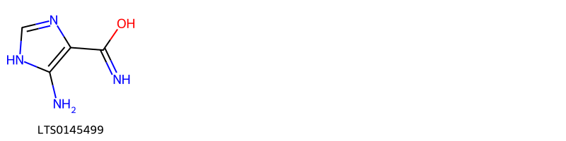
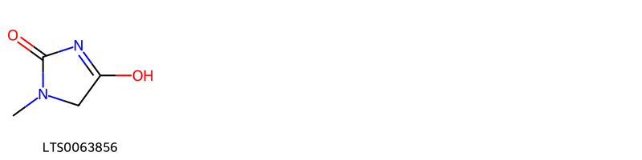
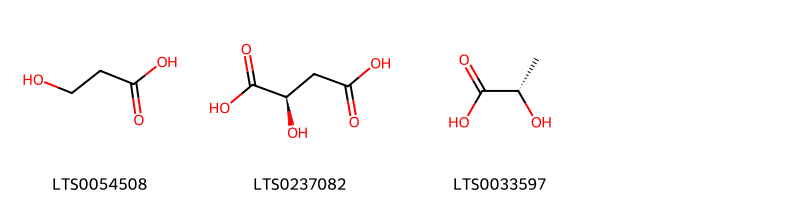
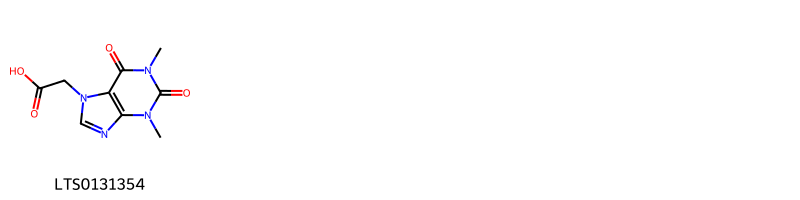
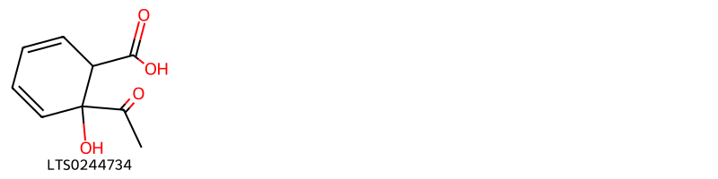
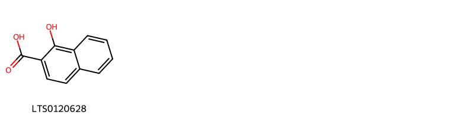
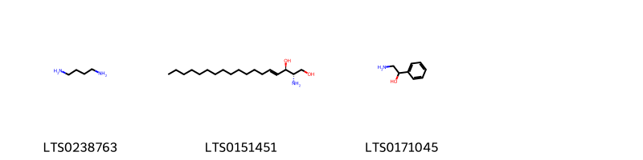
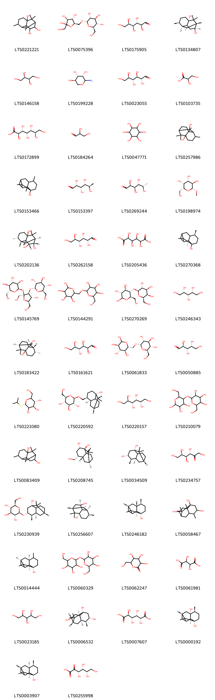
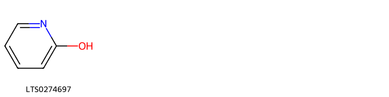
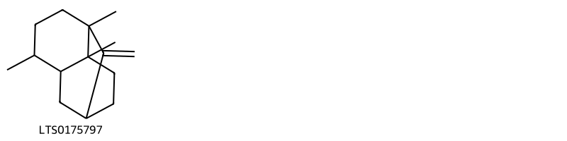

!!! abstract "Tóm tắt"

    Hoắc hương có tên khoa học là Pogostemon cablin (Blanco) Benth (họ Bạc hà - Lamiaceae). Cây Hoắc hương được trồng nhiều nơi ở miền Bắc nước ta, nhiều nhất tại vùng Kim Sơn (Hà Nam), Hưng Yên. Trên thế giới cây được phân bố ở một số nước như Trung Quốc, Đài Loan, Thái Lan, Malaysia và Ấn Độ. Theo kinh nghiệm sử dụng dân gian, hoắc hương được dùng trong những trường hợp ăn không ngon, sôi bụng đau bụng đi ngoài, hôi miêng. Cây còn được dùng làm thuốc chữa cảm mạo, nhức đầu, mình mẩy đau đớn, triệu chứng cảm cúm. Lá hoắc hương khô có chứa 0.5-0,6% tinh dầu, thành phần chủ yếu là long não patchouli, có tác dụng làm mạnh dạ dày, giúp ổn định tiêu hóa.

## Thông tin về thực vật

Dược liệu **Hoắc Hương** từ bộ phận **** từ loài *Pogostemon cablin*.

**Mô tả thực vật:** Hoắc hương là một cây cỏ sống lâu năm, thân có phân nhánh, cao chừng 30cm đến 60cm. Trên thân có lông. Lá vò có mùi thơm. Lá có cuống ngắn, phiến lá hình trứng hay hình thuỗn, dài chừng 5-10cm, rộng 2,5-7cm, mép có răng cưa to, mặt dưới nhiều lông hơn. Hoa màu hồng tím nhạt mọc thành bông ở kẽ lá hay đầu cành. Tuy nhiên cây trồng ở Việt Nam hầu như không thấy có hoa và kết quả.

*Tài liệu tham khảo:* "Những cây thuốc và vị thuốc Việt Nam" - Đỗ Tất Lợi 
Trong dược điển Việt nam, một loài được sử dụng làm dược liệu là *Pogostemon cablin*.

!!! info "Phân loại thực vật của *Pogostemon cablin*"
    - **Kingdom:** Plantae
    - **Phylum:** Tracheophyta
    - **Order:** Lamiales
    - **Family:** Lamiaceae
    - **Genus:** Pogostemon
    - **Species:** *Pogostemon cablin*

**Phân bố trên thế giới:** Germany, nan, Cook Islands, Micronesia (Federated States of), Tonga, Seychelles, Guadeloupe, French Guiana, Mexico, Chinese Taipei, Papua New Guinea, unknown or invalid, South Africa, Kiribati, Martinique, Indonesia, Paraguay, Dominica, Niue, Trinidad and Tobago, India, Brazil, Costa Rica, Thailand, United States of America, Philippines, China, Fiji, Malaysia, Canada, Samoa, Belgium

**Phân bố tại Việt nam:** Không có ghi nhận ở Việt Nam

## Thông tin về dược liệu 

### Định danh

!!! info "Thông tin về tên gọi"

    - Dược liệu tiếng Việt: hoắc hương
    - Dược liệu tiếng Trung:  ()
    - Dược liệu tiếng Anh: 
    - Dược liệu latin thông dụng: Herba Pogostemonis
    - Dược liệu latin kiểu DĐVN: *herba pogostemonis*
    - Dược liệu latin kiểu DĐVN: **
    - Dược liệu latin kiểu thông tư: **
    - Bộ phận dùng:  (Herba)

### Mô tả dược liệu 

- **Theo dược điển Việt nam V:** Thân hình trụ vuông, phân nhiều cành, cành hơi cong, dài 30 cm đến 60 cm, đường kính 2 mm đến 7 mm, có lông tơ. Chất giòn, dễ gãy, ở mặt gãy thấy tủy rõ. Thân già gần hình trụ, đường kính 10 mm đến 12 mm, màu nâu xám. Lá mọc đối, thường là một khối nhàu nát; lá nguyên hình trứng hoặc hình elip, dài 4 cm đến 9 cm, rộng 3 cm đến 7 cm, cả hai mặt lá màu lục xám có lông mượt như nhung, chóp lá hơi nhọn hoặc tròn, gốc lá vát nhọn hoặc tròn, mép lá có răng cưa không đều, cuống lá thon nhỏ dài 2 cm đến 5 cm, có lông. Mùi thơm đặc trưng, vị hơi đắng.

- **Mô tả dược liệu theo thông tư chế biến dược liệu theo phương pháp cổ truyền:** 

### Chế biến 

- **Chế biến theo dược điển việt nam V**: Khi cây có cành lá xum xuê, cắt lấy phần cây trên mặt đất, ngày phơi, đêm đậy kín, làm nhiều lần như vậy cho đến khi dược liệu khô. Bào chế Loại bỏ rễ còn sót lại và các tạp chất, lấy lá sạch để riêng. Rửa sạch thân, ủ mềm, cất đoạn, phơi khô, rồi trộn đều thân với lá. nn

- **Chế biến theo thông tư:** 

--- 

## Thành phần hóa học

- Theo tài liệu của GS. Đỗ Tất Lợi:  Nhóm hóa học : Tinh dầu
    

**Thành phần hóa học từ loài **Pogostemon cablin**

Theo cơ sở dữ liệu lotus, loài *Pogostemon cablin* đã phân lập và xác định được **124** hoạt chất thuộc về các nhóm Organonitrogen compounds, Fatty Acyls, Phenols, Carboxylic acids and derivatives, Unsaturated hydrocarbons, Steroids and steroid derivatives, Flavonoids, Azoles, Pyridines and derivatives, Azolines, Imidazopyrimidines, Keto acids and derivatives, Benzene and substituted derivatives, Prenol lipids, Polycyclic hydrocarbons, Organooxygen compounds, Naphthalenes, Hydroxy acids and derivatives, Sphingolipids, Linear 1,3-diarylpropanoids trong bảng dưới đây. Danh sách các hoạt chất như sau d-sorbitol [(LTS0220157)](https://lotus.naturalproducts.net/compound/lotus_id/LTS0220157), 4-isopropyl-1,6-dimethyl-2,3,4,4a,7,8-hexahydronaphthalene [(LTS0270743)](https://lotus.naturalproducts.net/compound/lotus_id/LTS0270743), l-rhamnose [(LTS0153397)](https://lotus.naturalproducts.net/compound/lotus_id/LTS0153397), (+)-glucose [(LTS0262158)](https://lotus.naturalproducts.net/compound/lotus_id/LTS0262158), d-altrose [(LTS0161621)](https://lotus.naturalproducts.net/compound/lotus_id/LTS0161621), patchoulol [(LTS0270368)](https://lotus.naturalproducts.net/compound/lotus_id/LTS0270368), (1s,3s,5s,6s,7r,8r,10r)-2,2,6,8-tetramethyltricyclo[5.3.1.0³,⁸]undecane-3,5,10-triol [(LTS0006532)](https://lotus.naturalproducts.net/compound/lotus_id/LTS0006532), guaiene [(LTS0039431)](https://lotus.naturalproducts.net/compound/lotus_id/LTS0039431), rhamnetin [(LTS0209810)](https://lotus.naturalproducts.net/compound/lotus_id/LTS0209810), methyl β-galactoside [(LTS0198974)](https://lotus.naturalproducts.net/compound/lotus_id/LTS0198974), 1,5,11,11-tetramethyltricyclo[6.2.1.0²,⁶]undec-2(6)-ene [(LTS0048996)](https://lotus.naturalproducts.net/compound/lotus_id/LTS0048996), iminodiacetic acid [(LTS0075590)](https://lotus.naturalproducts.net/compound/lotus_id/LTS0075590), (3s,4s,5r)-2-aminooxane-3,4,5-triol [(LTS0199228)](https://lotus.naturalproducts.net/compound/lotus_id/LTS0199228), (1s,3s,6r,7r,8s,9r,10s)-2,2,6,8-tetramethyltricyclo[5.3.1.0³,⁸]undecane-3,9,10-triol [(LTS0202136)](https://lotus.naturalproducts.net/compound/lotus_id/LTS0202136), β phenylethanolamine [(LTS0171045)](https://lotus.naturalproducts.net/compound/lotus_id/LTS0171045), 2-hydroxypyridine [(LTS0274697)](https://lotus.naturalproducts.net/compound/lotus_id/LTS0274697), benzyl alcohol [(LTS0125638)](https://lotus.naturalproducts.net/compound/lotus_id/LTS0125638), retusin [(LTS0236094)](https://lotus.naturalproducts.net/compound/lotus_id/LTS0236094), (2s)-2-(3,4-dimethoxyphenyl)-5-hydroxy-7-methoxy-2,3-dihydro-1-benzopyran-4-one [(LTS0091820)](https://lotus.naturalproducts.net/compound/lotus_id/LTS0091820), 3,6,8-trimethyl-2-methylidenetricyclo[5.3.1.0³,⁸]undecane [(LTS0175797)](https://lotus.naturalproducts.net/compound/lotus_id/LTS0175797), tagatose [(LTS0234757)](https://lotus.naturalproducts.net/compound/lotus_id/LTS0234757), [(2r,3s,4s,5r,6s)-3,4,5-trihydroxy-6-{[5-hydroxy-2-(4-methoxyphenyl)-4-oxochromen-7-yl]oxy}oxan-2-yl]methyl acetate [(LTS0154363)](https://lotus.naturalproducts.net/compound/lotus_id/LTS0154363), (2r,3r,4s,5s,6r)-2-{[(1r,3s,4s,7r,8s)-7-hydroxy-8,11,11-trimethyltricyclo[5.3.1.0³,⁸]undecan-4-yl]methoxy}-6-(hydroxymethyl)oxane-3,4,5-triol [(LTS0220592)](https://lotus.naturalproducts.net/compound/lotus_id/LTS0220592), (-)-threitol [(LTS0146158)](https://lotus.naturalproducts.net/compound/lotus_id/LTS0146158), (+/-)-glyceraldehyde [(LTS0184264)](https://lotus.naturalproducts.net/compound/lotus_id/LTS0184264), (1r,3r,6s,7r,8s)-2,2,6,8-tetramethyltricyclo[5.3.1.0³,⁸]undecane-3,7-diol [(LTS0000192)](https://lotus.naturalproducts.net/compound/lotus_id/LTS0000192), trehalose [(LTS0060329)](https://lotus.naturalproducts.net/compound/lotus_id/LTS0060329), n-methyl-l-glutamic acid [(LTS0195359)](https://lotus.naturalproducts.net/compound/lotus_id/LTS0195359), 2-keto-l-gulonic acid [(LTS0255998)](https://lotus.naturalproducts.net/compound/lotus_id/LTS0255998), (1s,3s,4s,6r,7r,8r)-6-(hydroxymethyl)-2,2,8-trimethyltricyclo[5.3.1.0³,⁸]undecane-3,4-diol [(LTS0208745)](https://lotus.naturalproducts.net/compound/lotus_id/LTS0208745), (3r,4r,5s,6r)-6-(hydroxymethyl)-5-{[(2s,3r,4s,5r,6r)-3,4,5-trihydroxy-6-(hydroxymethyl)oxan-2-yl]oxy}oxane-2,3,4-triol [(LTS0270269)](https://lotus.naturalproducts.net/compound/lotus_id/LTS0270269), glucoheptonic acid [(LTS0172899)](https://lotus.naturalproducts.net/compound/lotus_id/LTS0172899), 4,8,11,11-tetramethyltricyclo[5.3.1.0³,⁸]undecane-2,7-diol [(LTS0257986)](https://lotus.naturalproducts.net/compound/lotus_id/LTS0257986), 2,2,6,8-tetramethyltricyclo[5.3.1.0³,⁸]undecan-3-ol [(LTS0153466)](https://lotus.naturalproducts.net/compound/lotus_id/LTS0153466), aldono-1,5-lactone [(LTS0062247)](https://lotus.naturalproducts.net/compound/lotus_id/LTS0062247), putrescine [(LTS0238763)](https://lotus.naturalproducts.net/compound/lotus_id/LTS0238763), guaiene [(LTS0236201)](https://lotus.naturalproducts.net/compound/lotus_id/LTS0236201), malonic acid [(LTS0195913)](https://lotus.naturalproducts.net/compound/lotus_id/LTS0195913), (1r,3r,6s,7r,8s)-2,2,6,8-tetramethyltricyclo[5.3.1.0³,⁸]undecan-3-ol [(LTS0246182)](https://lotus.naturalproducts.net/compound/lotus_id/LTS0246182), cair [(LTS0145499)](https://lotus.naturalproducts.net/compound/lotus_id/LTS0145499), turanose [(LTS0155519)](https://lotus.naturalproducts.net/compound/lotus_id/LTS0155519), aldehydo-d-allose [(LTS0023055)](https://lotus.naturalproducts.net/compound/lotus_id/LTS0023055), kumatakenin [(LTS0018267)](https://lotus.naturalproducts.net/compound/lotus_id/LTS0018267), d-xylitol [(LTS0246343)](https://lotus.naturalproducts.net/compound/lotus_id/LTS0246343), 1-hydroxy-2-naphthoic acid [(LTS0120628)](https://lotus.naturalproducts.net/compound/lotus_id/LTS0120628), (1s,3r,6s,7s,8r,9r)-2,2,6,8-tetramethyltricyclo[5.3.1.0³,⁸]undecane-3,9-diol [(LTS0256607)](https://lotus.naturalproducts.net/compound/lotus_id/LTS0256607), saccharic acid [(LTS0007607)](https://lotus.naturalproducts.net/compound/lotus_id/LTS0007607), 4,10,11,11-tetramethyltricyclo[5.3.1.0¹,⁵]undec-9-ene [(LTS0020350)](https://lotus.naturalproducts.net/compound/lotus_id/LTS0020350), tartronic acid [(LTS0155922)](https://lotus.naturalproducts.net/compound/lotus_id/LTS0155922), (1r,2r,3r,4r,7s,8r)-4,8,11,11-tetramethyltricyclo[5.3.1.0³,⁸]undecane-2,7-diol [(LTS0183422)](https://lotus.naturalproducts.net/compound/lotus_id/LTS0183422), 2,2,6,8-tetramethyltricyclo[5.3.1.0³,⁸]undecane-3,10-diol [(LTS0083409)](https://lotus.naturalproducts.net/compound/lotus_id/LTS0083409), 2,2,6,8-tetramethyltricyclo[5.3.1.0³,⁸]undecane-3,9,10-triol [(LTS0221221)](https://lotus.naturalproducts.net/compound/lotus_id/LTS0221221), pachypodol [(LTS0093471)](https://lotus.naturalproducts.net/compound/lotus_id/LTS0093471), (2s)-5-hydroxy-7-methoxy-2-(4-methoxyphenyl)-2,3-dihydro-1-benzopyran-4-one [(LTS0045841)](https://lotus.naturalproducts.net/compound/lotus_id/LTS0045841), 1,2,3,4,5-pentahydroxypentane [(LTS0023185)](https://lotus.naturalproducts.net/compound/lotus_id/LTS0023185), l-leucine [(LTS0113423)](https://lotus.naturalproducts.net/compound/lotus_id/LTS0113423), 5-hydroxy-3,7-dimethoxy-2-(4-methoxyphenyl)chromen-4-one [(LTS0253313)](https://lotus.naturalproducts.net/compound/lotus_id/LTS0253313), 2-(3,4-dimethoxyphenyl)-5-hydroxy-7-methoxy-2,3-dihydro-1-benzopyran-4-one [(LTS0232986)](https://lotus.naturalproducts.net/compound/lotus_id/LTS0232986), 2-isopropylmalic acid [(LTS0071638)](https://lotus.naturalproducts.net/compound/lotus_id/LTS0071638), (2r,3s,4s,5r,6s)-2-(hydroxymethyl)-6-{[(2r,3r,4s,5s,6r)-2,4,5-trihydroxy-6-(hydroxymethyl)oxan-3-yl]oxy}oxane-3,4,5-triol [(LTS0252376)](https://lotus.naturalproducts.net/compound/lotus_id/LTS0252376), 2-hydroxy-n-[(4e,8e)-3-hydroxy-1-{[(2r,3r,4s,5s,6r)-3,4,5-trihydroxy-6-(hydroxymethyl)oxan-2-yl]oxy}octadeca-4,8-dien-2-yl]hexadecanimidic acid [(LTS0182674)](https://lotus.naturalproducts.net/compound/lotus_id/LTS0182674), 4-guanidinobutyric acid [(LTS0236153)](https://lotus.naturalproducts.net/compound/lotus_id/LTS0236153), patchoulol [(LTS0003907)](https://lotus.naturalproducts.net/compound/lotus_id/LTS0003907), 3-hydroxy-propanoic acid [(LTS0054508)](https://lotus.naturalproducts.net/compound/lotus_id/LTS0054508), 2-hydroxy-6-methyl-3-(4-methylpentanoyl)pyran-4-one [(LTS0246877)](https://lotus.naturalproducts.net/compound/lotus_id/LTS0246877), (2s)-5-hydroxy-2-(4-hydroxy-3-methoxyphenyl)-7-methoxy-2,3-dihydro-1-benzopyran-4-one [(LTS0232226)](https://lotus.naturalproducts.net/compound/lotus_id/LTS0232226), .+-.-malic acid [(LTS0237082)](https://lotus.naturalproducts.net/compound/lotus_id/LTS0237082), (3r,4r,6s)-2-(hydroxymethyl)-6-(isopropylsulfanyl)oxane-3,4,5-triol [(LTS0221080)](https://lotus.naturalproducts.net/compound/lotus_id/LTS0221080), (2r,3r,4s,5s,6r)-2-{[(1r,3r,5r,6r,7s,8s)-3-hydroxy-2,2,6,8-tetramethyltricyclo[5.3.1.0³,⁸]undecan-5-yl]oxy}-6-(hydroxymethyl)oxane-3,4,5-triol [(LTS0230939)](https://lotus.naturalproducts.net/compound/lotus_id/LTS0230939), mandelic acid [(LTS0194920)](https://lotus.naturalproducts.net/compound/lotus_id/LTS0194920), β-elemene [(LTS0225699)](https://lotus.naturalproducts.net/compound/lotus_id/LTS0225699), 6-acetyl-6-hydroxycyclohexa-2,4-diene-1-carboxylic acid [(LTS0244734)](https://lotus.naturalproducts.net/compound/lotus_id/LTS0244734), ombuin [(LTS0110319)](https://lotus.naturalproducts.net/compound/lotus_id/LTS0110319), polydextrose [(LTS0144291)](https://lotus.naturalproducts.net/compound/lotus_id/LTS0144291), 1,4-dimethyl-7-(prop-1-en-2-yl)-1,2,3,5,6,7,8,8a-octahydroazulene [(LTS0192721)](https://lotus.naturalproducts.net/compound/lotus_id/LTS0192721), lisoleucine [(LTS0126267)](https://lotus.naturalproducts.net/compound/lotus_id/LTS0126267), norleucine [(LTS0132632)](https://lotus.naturalproducts.net/compound/lotus_id/LTS0132632), l-serine [(LTS0106692)](https://lotus.naturalproducts.net/compound/lotus_id/LTS0106692), 5-hydroxy-2-(4-hydroxy-3-methoxyphenyl)-7-methoxy-2,3-dihydro-1-benzopyran-4-one [(LTS0101481)](https://lotus.naturalproducts.net/compound/lotus_id/LTS0101481), l-proline [(LTS0090383)](https://lotus.naturalproducts.net/compound/lotus_id/LTS0090383), d-lyxose [(LTS0050885)](https://lotus.naturalproducts.net/compound/lotus_id/LTS0050885), l-valine [(LTS0231703)](https://lotus.naturalproducts.net/compound/lotus_id/LTS0231703), (2r,3r,4s,5s,6r)-2-{[(2s,3s,4r,5r)-4-hydroxy-2,5-bis(hydroxymethyl)-2-{[(2r,3r,4s,5s,6r)-3,4,5-trihydroxy-6-(hydroxymethyl)oxan-2-yl]oxy}oxolan-3-yl]oxy}-6-(hydroxymethyl)oxane-3,4,5-triol [(LTS0145769)](https://lotus.naturalproducts.net/compound/lotus_id/LTS0145769), delta-cadinene [(LTS0019321)](https://lotus.naturalproducts.net/compound/lotus_id/LTS0019321), β-sitostenone [(LTS0049492)](https://lotus.naturalproducts.net/compound/lotus_id/LTS0049492), l-threonine [(LTS0184056)](https://lotus.naturalproducts.net/compound/lotus_id/LTS0184056), chamomile [(LTS0104946)](https://lotus.naturalproducts.net/compound/lotus_id/LTS0104946), caryophyllene [(LTS0085212)](https://lotus.naturalproducts.net/compound/lotus_id/LTS0085212), 6-(hydroxymethyl)-2,2,8-trimethyltricyclo[5.3.1.0³,⁸]undecane-3,4-diol [(LTS0020847)](https://lotus.naturalproducts.net/compound/lotus_id/LTS0020847), vanillylmandelic acid [(LTS0152032)](https://lotus.naturalproducts.net/compound/lotus_id/LTS0152032), germacrene b [(LTS0265072)](https://lotus.naturalproducts.net/compound/lotus_id/LTS0265072), leucrose [(LTS0069843)](https://lotus.naturalproducts.net/compound/lotus_id/LTS0069843), maleic monoamide [(LTS0235415)](https://lotus.naturalproducts.net/compound/lotus_id/LTS0235415), (1s,3r,7s,8s)-2,2,6,8-tetramethyltricyclo[5.3.1.0³,⁸]undecan-3-ol [(LTS0014444)](https://lotus.naturalproducts.net/compound/lotus_id/LTS0014444), (1r,3r,6s,7s,8s,10s)-2,2,6,8-tetramethyltricyclo[5.3.1.0³,⁸]undecane-3,10-diol [(LTS0134807)](https://lotus.naturalproducts.net/compound/lotus_id/LTS0134807), (1r,3r,5r,6r,7s,8s)-2,2,6,8-tetramethyltricyclo[5.3.1.0³,⁸]undecane-3,5-diol [(LTS0034509)](https://lotus.naturalproducts.net/compound/lotus_id/LTS0034509), α-bulnesene [(LTS0202512)](https://lotus.naturalproducts.net/compound/lotus_id/LTS0202512), 1,4-dimethyl-7-(prop-1-en-2-yl)-octahydro-1h-azulen-4-ol [(LTS0221658)](https://lotus.naturalproducts.net/compound/lotus_id/LTS0221658), licochalcone a [(LTS0018907)](https://lotus.naturalproducts.net/compound/lotus_id/LTS0018907), methylmalonic acid [(LTS0005254)](https://lotus.naturalproducts.net/compound/lotus_id/LTS0005254), 2,2,6,8-tetramethyltricyclo[5.3.1.0³,⁸]undecane-3,5,10-triol [(LTS0058467)](https://lotus.naturalproducts.net/compound/lotus_id/LTS0058467), β alanine [(LTS0209241)](https://lotus.naturalproducts.net/compound/lotus_id/LTS0209241), 3-[4-hydroxy-2-methoxy-5-(2-methylbut-3-en-2-yl)phenyl]-1-(4-hydroxyphenyl)prop-2-en-1-one [(LTS0269210)](https://lotus.naturalproducts.net/compound/lotus_id/LTS0269210), starch [(LTS0210079)](https://lotus.naturalproducts.net/compound/lotus_id/LTS0210079), naringenin 7,4'-dimethyl ether [(LTS0121421)](https://lotus.naturalproducts.net/compound/lotus_id/LTS0121421), (.+-.)-tartaric acid [(LTS0061981)](https://lotus.naturalproducts.net/compound/lotus_id/LTS0061981), lactobionic acid [(LTS0065099)](https://lotus.naturalproducts.net/compound/lotus_id/LTS0065099), isomaltulose [(LTS0075396)](https://lotus.naturalproducts.net/compound/lotus_id/LTS0075396), acefylline [(LTS0131354)](https://lotus.naturalproducts.net/compound/lotus_id/LTS0131354), (-)-inositol [(LTS0047771)](https://lotus.naturalproducts.net/compound/lotus_id/LTS0047771), (1r,2r,4s,5r)-6-{[(2r,3r,4s,5r,6r)-3,4,5-trihydroxy-6-(hydroxymethyl)oxan-2-yl]oxy}cyclohexane-1,2,3,4,5-pentol [(LTS0188871)](https://lotus.naturalproducts.net/compound/lotus_id/LTS0188871), 1-methylhydantoin [(LTS0063856)](https://lotus.naturalproducts.net/compound/lotus_id/LTS0063856), n-ethylglycine [(LTS0234437)](https://lotus.naturalproducts.net/compound/lotus_id/LTS0234437), aldehydo-l-fucose [(LTS0269244)](https://lotus.naturalproducts.net/compound/lotus_id/LTS0269244), (α)-lactate [(LTS0033597)](https://lotus.naturalproducts.net/compound/lotus_id/LTS0033597), 2-hydroxy-n-[(4e,8z)-3-hydroxy-1-{[(2r,3r,4s,5s,6r)-3,4,5-trihydroxy-6-(hydroxymethyl)oxan-2-yl]oxy}octadeca-4,8-dien-2-yl]hexadecanimidic acid [(LTS0221646)](https://lotus.naturalproducts.net/compound/lotus_id/LTS0221646), glyceric acid [(LTS0103735)](https://lotus.naturalproducts.net/compound/lotus_id/LTS0103735), sphingosine [(LTS0151451)](https://lotus.naturalproducts.net/compound/lotus_id/LTS0151451), talose [(LTS0175905)](https://lotus.naturalproducts.net/compound/lotus_id/LTS0175905), isomaltose [(LTS0061833)](https://lotus.naturalproducts.net/compound/lotus_id/LTS0061833), apigenin 7-o-β-glucoside [(LTS0252743)](https://lotus.naturalproducts.net/compound/lotus_id/LTS0252743), meglutol [(LTS0267988)](https://lotus.naturalproducts.net/compound/lotus_id/LTS0267988), d-saccharate [(LTS0205436)](https://lotus.naturalproducts.net/compound/lotus_id/LTS0205436), 4,7,8,11-tetramethyltetracyclo[5.4.0.0³,⁵.0⁴,⁸]undecane [(LTS0162550)](https://lotus.naturalproducts.net/compound/lotus_id/LTS0162550). 
        
| chemicalTaxonomyClassyfireClass     |   smiles_count |
|:------------------------------------|---------------:|
| Azoles                              |             17 |
| Azolines                            |             14 |
| Benzene and substituted derivatives |             28 |
| Carboxylic acids and derivatives    |            251 |
| Fatty Acyls                         |            218 |
| Flavonoids                          |            705 |
| Hydroxy acids and derivatives       |             46 |
| Imidazopyrimidines                  |             32 |
| Keto acids and derivatives          |             25 |
| Linear 1,3-diarylpropanoids         |             90 |
| Naphthalenes                        |             21 |
| Organonitrogen compounds            |             58 |
| Organooxygen compounds              |           2260 |
| Phenols                             |             23 |
| Polycyclic hydrocarbons             |             26 |
| Prenol lipids                       |            394 |
| Pyridines and derivatives           |              9 |
| Sphingolipids                       |            190 |
| Steroids and steroid derivatives    |             83 |
| Unsaturated hydrocarbons            |             28 |

            
### Nhóm Azoles
<figure markdown="span">
    { width=100% }
<figcaption>Hình ảnh cấu trúc hóa học của hoạt chất thuộc nhóm *Azoles*. Tên thường gọi của các hoạt chất tương ứng là cair [(LTS0145499)](https://lotus.naturalproducts.net/compound/lotus_id/LTS0145499).</figcaption>
</figure>

            
            
### Nhóm Azoles
<figure markdown="span">
    { width=100% }
<figcaption>Hình ảnh cấu trúc hóa học của hoạt chất thuộc nhóm *Azoles*. Tên thường gọi của các hoạt chất tương ứng là cair [(LTS0145499)](https://lotus.naturalproducts.net/compound/lotus_id/LTS0145499).</figcaption>
</figure>

### Nhóm Azolines
<figure markdown="span">
    { width=100% }
<figcaption>Hình ảnh cấu trúc hóa học của hoạt chất thuộc nhóm *Azolines*. Tên thường gọi của các hoạt chất tương ứng là 1-methylhydantoin [(LTS0063856)](https://lotus.naturalproducts.net/compound/lotus_id/LTS0063856).</figcaption>
</figure>

            
            
### Nhóm Azoles
<figure markdown="span">
    { width=100% }
<figcaption>Hình ảnh cấu trúc hóa học của hoạt chất thuộc nhóm *Azoles*. Tên thường gọi của các hoạt chất tương ứng là cair [(LTS0145499)](https://lotus.naturalproducts.net/compound/lotus_id/LTS0145499).</figcaption>
</figure>

### Nhóm Azolines
<figure markdown="span">
    { width=100% }
<figcaption>Hình ảnh cấu trúc hóa học của hoạt chất thuộc nhóm *Azolines*. Tên thường gọi của các hoạt chất tương ứng là 1-methylhydantoin [(LTS0063856)](https://lotus.naturalproducts.net/compound/lotus_id/LTS0063856).</figcaption>
</figure>

### Nhóm Benzene and substituted derivatives
<figure markdown="span">
    { width=100% }
<figcaption>Hình ảnh cấu trúc hóa học của hoạt chất thuộc nhóm *Benzene and substituted derivatives*. Tên thường gọi của các hoạt chất tương ứng là mandelic acid [(LTS0194920)](https://lotus.naturalproducts.net/compound/lotus_id/LTS0194920), benzyl alcohol [(LTS0125638)](https://lotus.naturalproducts.net/compound/lotus_id/LTS0125638).</figcaption>
</figure>

            
            
### Nhóm Azoles
<figure markdown="span">
    { width=100% }
<figcaption>Hình ảnh cấu trúc hóa học của hoạt chất thuộc nhóm *Azoles*. Tên thường gọi của các hoạt chất tương ứng là cair [(LTS0145499)](https://lotus.naturalproducts.net/compound/lotus_id/LTS0145499).</figcaption>
</figure>

### Nhóm Azolines
<figure markdown="span">
    { width=100% }
<figcaption>Hình ảnh cấu trúc hóa học của hoạt chất thuộc nhóm *Azolines*. Tên thường gọi của các hoạt chất tương ứng là 1-methylhydantoin [(LTS0063856)](https://lotus.naturalproducts.net/compound/lotus_id/LTS0063856).</figcaption>
</figure>

### Nhóm Benzene and substituted derivatives
<figure markdown="span">
    { width=100% }
<figcaption>Hình ảnh cấu trúc hóa học của hoạt chất thuộc nhóm *Benzene and substituted derivatives*. Tên thường gọi của các hoạt chất tương ứng là mandelic acid [(LTS0194920)](https://lotus.naturalproducts.net/compound/lotus_id/LTS0194920), benzyl alcohol [(LTS0125638)](https://lotus.naturalproducts.net/compound/lotus_id/LTS0125638).</figcaption>
</figure>

### Nhóm Carboxylic acids and derivatives
<figure markdown="span">
    { width=100% }
<figcaption>Hình ảnh cấu trúc hóa học của hoạt chất thuộc nhóm *Carboxylic acids and derivatives*. Tên thường gọi của các hoạt chất tương ứng là l-threonine [(LTS0184056)](https://lotus.naturalproducts.net/compound/lotus_id/LTS0184056), lisoleucine [(LTS0126267)](https://lotus.naturalproducts.net/compound/lotus_id/LTS0126267), l-serine [(LTS0106692)](https://lotus.naturalproducts.net/compound/lotus_id/LTS0106692), iminodiacetic acid [(LTS0075590)](https://lotus.naturalproducts.net/compound/lotus_id/LTS0075590), β alanine [(LTS0209241)](https://lotus.naturalproducts.net/compound/lotus_id/LTS0209241), l-proline [(LTS0090383)](https://lotus.naturalproducts.net/compound/lotus_id/LTS0090383), malonic acid [(LTS0195913)](https://lotus.naturalproducts.net/compound/lotus_id/LTS0195913), l-valine [(LTS0231703)](https://lotus.naturalproducts.net/compound/lotus_id/LTS0231703), tartronic acid [(LTS0155922)](https://lotus.naturalproducts.net/compound/lotus_id/LTS0155922), 4-guanidinobutyric acid [(LTS0236153)](https://lotus.naturalproducts.net/compound/lotus_id/LTS0236153), n-methyl-l-glutamic acid [(LTS0195359)](https://lotus.naturalproducts.net/compound/lotus_id/LTS0195359), n-ethylglycine [(LTS0234437)](https://lotus.naturalproducts.net/compound/lotus_id/LTS0234437), norleucine [(LTS0132632)](https://lotus.naturalproducts.net/compound/lotus_id/LTS0132632), methylmalonic acid [(LTS0005254)](https://lotus.naturalproducts.net/compound/lotus_id/LTS0005254), l-leucine [(LTS0113423)](https://lotus.naturalproducts.net/compound/lotus_id/LTS0113423).</figcaption>
</figure>

            
            
### Nhóm Azoles
<figure markdown="span">
    { width=100% }
<figcaption>Hình ảnh cấu trúc hóa học của hoạt chất thuộc nhóm *Azoles*. Tên thường gọi của các hoạt chất tương ứng là cair [(LTS0145499)](https://lotus.naturalproducts.net/compound/lotus_id/LTS0145499).</figcaption>
</figure>

### Nhóm Azolines
<figure markdown="span">
    { width=100% }
<figcaption>Hình ảnh cấu trúc hóa học của hoạt chất thuộc nhóm *Azolines*. Tên thường gọi của các hoạt chất tương ứng là 1-methylhydantoin [(LTS0063856)](https://lotus.naturalproducts.net/compound/lotus_id/LTS0063856).</figcaption>
</figure>

### Nhóm Benzene and substituted derivatives
<figure markdown="span">
    { width=100% }
<figcaption>Hình ảnh cấu trúc hóa học của hoạt chất thuộc nhóm *Benzene and substituted derivatives*. Tên thường gọi của các hoạt chất tương ứng là mandelic acid [(LTS0194920)](https://lotus.naturalproducts.net/compound/lotus_id/LTS0194920), benzyl alcohol [(LTS0125638)](https://lotus.naturalproducts.net/compound/lotus_id/LTS0125638).</figcaption>
</figure>

### Nhóm Carboxylic acids and derivatives
<figure markdown="span">
    { width=100% }
<figcaption>Hình ảnh cấu trúc hóa học của hoạt chất thuộc nhóm *Carboxylic acids and derivatives*. Tên thường gọi của các hoạt chất tương ứng là l-threonine [(LTS0184056)](https://lotus.naturalproducts.net/compound/lotus_id/LTS0184056), lisoleucine [(LTS0126267)](https://lotus.naturalproducts.net/compound/lotus_id/LTS0126267), l-serine [(LTS0106692)](https://lotus.naturalproducts.net/compound/lotus_id/LTS0106692), iminodiacetic acid [(LTS0075590)](https://lotus.naturalproducts.net/compound/lotus_id/LTS0075590), β alanine [(LTS0209241)](https://lotus.naturalproducts.net/compound/lotus_id/LTS0209241), l-proline [(LTS0090383)](https://lotus.naturalproducts.net/compound/lotus_id/LTS0090383), malonic acid [(LTS0195913)](https://lotus.naturalproducts.net/compound/lotus_id/LTS0195913), l-valine [(LTS0231703)](https://lotus.naturalproducts.net/compound/lotus_id/LTS0231703), tartronic acid [(LTS0155922)](https://lotus.naturalproducts.net/compound/lotus_id/LTS0155922), 4-guanidinobutyric acid [(LTS0236153)](https://lotus.naturalproducts.net/compound/lotus_id/LTS0236153), n-methyl-l-glutamic acid [(LTS0195359)](https://lotus.naturalproducts.net/compound/lotus_id/LTS0195359), n-ethylglycine [(LTS0234437)](https://lotus.naturalproducts.net/compound/lotus_id/LTS0234437), norleucine [(LTS0132632)](https://lotus.naturalproducts.net/compound/lotus_id/LTS0132632), methylmalonic acid [(LTS0005254)](https://lotus.naturalproducts.net/compound/lotus_id/LTS0005254), l-leucine [(LTS0113423)](https://lotus.naturalproducts.net/compound/lotus_id/LTS0113423).</figcaption>
</figure>

### Nhóm Fatty Acyls
<figure markdown="span">
    { width=100% }
<figcaption>Hình ảnh cấu trúc hóa học của hoạt chất thuộc nhóm *Fatty Acyls*. Tên thường gọi của các hoạt chất tương ứng là maleic monoamide [(LTS0235415)](https://lotus.naturalproducts.net/compound/lotus_id/LTS0235415), lactobionic acid [(LTS0065099)](https://lotus.naturalproducts.net/compound/lotus_id/LTS0065099), leucrose [(LTS0069843)](https://lotus.naturalproducts.net/compound/lotus_id/LTS0069843), 2-isopropylmalic acid [(LTS0071638)](https://lotus.naturalproducts.net/compound/lotus_id/LTS0071638), meglutol [(LTS0267988)](https://lotus.naturalproducts.net/compound/lotus_id/LTS0267988).</figcaption>
</figure>

            
            
### Nhóm Azoles
<figure markdown="span">
    { width=100% }
<figcaption>Hình ảnh cấu trúc hóa học của hoạt chất thuộc nhóm *Azoles*. Tên thường gọi của các hoạt chất tương ứng là cair [(LTS0145499)](https://lotus.naturalproducts.net/compound/lotus_id/LTS0145499).</figcaption>
</figure>

### Nhóm Azolines
<figure markdown="span">
    { width=100% }
<figcaption>Hình ảnh cấu trúc hóa học của hoạt chất thuộc nhóm *Azolines*. Tên thường gọi của các hoạt chất tương ứng là 1-methylhydantoin [(LTS0063856)](https://lotus.naturalproducts.net/compound/lotus_id/LTS0063856).</figcaption>
</figure>

### Nhóm Benzene and substituted derivatives
<figure markdown="span">
    { width=100% }
<figcaption>Hình ảnh cấu trúc hóa học của hoạt chất thuộc nhóm *Benzene and substituted derivatives*. Tên thường gọi của các hoạt chất tương ứng là mandelic acid [(LTS0194920)](https://lotus.naturalproducts.net/compound/lotus_id/LTS0194920), benzyl alcohol [(LTS0125638)](https://lotus.naturalproducts.net/compound/lotus_id/LTS0125638).</figcaption>
</figure>

### Nhóm Carboxylic acids and derivatives
<figure markdown="span">
    { width=100% }
<figcaption>Hình ảnh cấu trúc hóa học của hoạt chất thuộc nhóm *Carboxylic acids and derivatives*. Tên thường gọi của các hoạt chất tương ứng là l-threonine [(LTS0184056)](https://lotus.naturalproducts.net/compound/lotus_id/LTS0184056), lisoleucine [(LTS0126267)](https://lotus.naturalproducts.net/compound/lotus_id/LTS0126267), l-serine [(LTS0106692)](https://lotus.naturalproducts.net/compound/lotus_id/LTS0106692), iminodiacetic acid [(LTS0075590)](https://lotus.naturalproducts.net/compound/lotus_id/LTS0075590), β alanine [(LTS0209241)](https://lotus.naturalproducts.net/compound/lotus_id/LTS0209241), l-proline [(LTS0090383)](https://lotus.naturalproducts.net/compound/lotus_id/LTS0090383), malonic acid [(LTS0195913)](https://lotus.naturalproducts.net/compound/lotus_id/LTS0195913), l-valine [(LTS0231703)](https://lotus.naturalproducts.net/compound/lotus_id/LTS0231703), tartronic acid [(LTS0155922)](https://lotus.naturalproducts.net/compound/lotus_id/LTS0155922), 4-guanidinobutyric acid [(LTS0236153)](https://lotus.naturalproducts.net/compound/lotus_id/LTS0236153), n-methyl-l-glutamic acid [(LTS0195359)](https://lotus.naturalproducts.net/compound/lotus_id/LTS0195359), n-ethylglycine [(LTS0234437)](https://lotus.naturalproducts.net/compound/lotus_id/LTS0234437), norleucine [(LTS0132632)](https://lotus.naturalproducts.net/compound/lotus_id/LTS0132632), methylmalonic acid [(LTS0005254)](https://lotus.naturalproducts.net/compound/lotus_id/LTS0005254), l-leucine [(LTS0113423)](https://lotus.naturalproducts.net/compound/lotus_id/LTS0113423).</figcaption>
</figure>

### Nhóm Fatty Acyls
<figure markdown="span">
    { width=100% }
<figcaption>Hình ảnh cấu trúc hóa học của hoạt chất thuộc nhóm *Fatty Acyls*. Tên thường gọi của các hoạt chất tương ứng là maleic monoamide [(LTS0235415)](https://lotus.naturalproducts.net/compound/lotus_id/LTS0235415), lactobionic acid [(LTS0065099)](https://lotus.naturalproducts.net/compound/lotus_id/LTS0065099), leucrose [(LTS0069843)](https://lotus.naturalproducts.net/compound/lotus_id/LTS0069843), 2-isopropylmalic acid [(LTS0071638)](https://lotus.naturalproducts.net/compound/lotus_id/LTS0071638), meglutol [(LTS0267988)](https://lotus.naturalproducts.net/compound/lotus_id/LTS0267988).</figcaption>
</figure>

### Nhóm Flavonoids
<figure markdown="span">
    { width=100% }
<figcaption>Hình ảnh cấu trúc hóa học của hoạt chất thuộc nhóm *Flavonoids*. Tên thường gọi của các hoạt chất tương ứng là naringenin 7,4'-dimethyl ether [(LTS0121421)](https://lotus.naturalproducts.net/compound/lotus_id/LTS0121421), rhamnetin [(LTS0209810)](https://lotus.naturalproducts.net/compound/lotus_id/LTS0209810), (2s)-2-(3,4-dimethoxyphenyl)-5-hydroxy-7-methoxy-2,3-dihydro-1-benzopyran-4-one [(LTS0091820)](https://lotus.naturalproducts.net/compound/lotus_id/LTS0091820), 5-hydroxy-2-(4-hydroxy-3-methoxyphenyl)-7-methoxy-2,3-dihydro-1-benzopyran-4-one [(LTS0101481)](https://lotus.naturalproducts.net/compound/lotus_id/LTS0101481), chamomile [(LTS0104946)](https://lotus.naturalproducts.net/compound/lotus_id/LTS0104946), [(2r,3s,4s,5r,6s)-3,4,5-trihydroxy-6-{[5-hydroxy-2-(4-methoxyphenyl)-4-oxochromen-7-yl]oxy}oxan-2-yl]methyl acetate [(LTS0154363)](https://lotus.naturalproducts.net/compound/lotus_id/LTS0154363), ombuin [(LTS0110319)](https://lotus.naturalproducts.net/compound/lotus_id/LTS0110319), apigenin 7-o-β-glucoside [(LTS0252743)](https://lotus.naturalproducts.net/compound/lotus_id/LTS0252743), 5-hydroxy-3,7-dimethoxy-2-(4-methoxyphenyl)chromen-4-one [(LTS0253313)](https://lotus.naturalproducts.net/compound/lotus_id/LTS0253313), 2-(3,4-dimethoxyphenyl)-5-hydroxy-7-methoxy-2,3-dihydro-1-benzopyran-4-one [(LTS0232986)](https://lotus.naturalproducts.net/compound/lotus_id/LTS0232986), (2s)-5-hydroxy-7-methoxy-2-(4-methoxyphenyl)-2,3-dihydro-1-benzopyran-4-one [(LTS0045841)](https://lotus.naturalproducts.net/compound/lotus_id/LTS0045841), retusin [(LTS0236094)](https://lotus.naturalproducts.net/compound/lotus_id/LTS0236094), kumatakenin [(LTS0018267)](https://lotus.naturalproducts.net/compound/lotus_id/LTS0018267), pachypodol [(LTS0093471)](https://lotus.naturalproducts.net/compound/lotus_id/LTS0093471), (2s)-5-hydroxy-2-(4-hydroxy-3-methoxyphenyl)-7-methoxy-2,3-dihydro-1-benzopyran-4-one [(LTS0232226)](https://lotus.naturalproducts.net/compound/lotus_id/LTS0232226).</figcaption>
</figure>

            
            
### Nhóm Azoles
<figure markdown="span">
    { width=100% }
<figcaption>Hình ảnh cấu trúc hóa học của hoạt chất thuộc nhóm *Azoles*. Tên thường gọi của các hoạt chất tương ứng là cair [(LTS0145499)](https://lotus.naturalproducts.net/compound/lotus_id/LTS0145499).</figcaption>
</figure>

### Nhóm Azolines
<figure markdown="span">
    { width=100% }
<figcaption>Hình ảnh cấu trúc hóa học của hoạt chất thuộc nhóm *Azolines*. Tên thường gọi của các hoạt chất tương ứng là 1-methylhydantoin [(LTS0063856)](https://lotus.naturalproducts.net/compound/lotus_id/LTS0063856).</figcaption>
</figure>

### Nhóm Benzene and substituted derivatives
<figure markdown="span">
    { width=100% }
<figcaption>Hình ảnh cấu trúc hóa học của hoạt chất thuộc nhóm *Benzene and substituted derivatives*. Tên thường gọi của các hoạt chất tương ứng là mandelic acid [(LTS0194920)](https://lotus.naturalproducts.net/compound/lotus_id/LTS0194920), benzyl alcohol [(LTS0125638)](https://lotus.naturalproducts.net/compound/lotus_id/LTS0125638).</figcaption>
</figure>

### Nhóm Carboxylic acids and derivatives
<figure markdown="span">
    { width=100% }
<figcaption>Hình ảnh cấu trúc hóa học của hoạt chất thuộc nhóm *Carboxylic acids and derivatives*. Tên thường gọi của các hoạt chất tương ứng là l-threonine [(LTS0184056)](https://lotus.naturalproducts.net/compound/lotus_id/LTS0184056), lisoleucine [(LTS0126267)](https://lotus.naturalproducts.net/compound/lotus_id/LTS0126267), l-serine [(LTS0106692)](https://lotus.naturalproducts.net/compound/lotus_id/LTS0106692), iminodiacetic acid [(LTS0075590)](https://lotus.naturalproducts.net/compound/lotus_id/LTS0075590), β alanine [(LTS0209241)](https://lotus.naturalproducts.net/compound/lotus_id/LTS0209241), l-proline [(LTS0090383)](https://lotus.naturalproducts.net/compound/lotus_id/LTS0090383), malonic acid [(LTS0195913)](https://lotus.naturalproducts.net/compound/lotus_id/LTS0195913), l-valine [(LTS0231703)](https://lotus.naturalproducts.net/compound/lotus_id/LTS0231703), tartronic acid [(LTS0155922)](https://lotus.naturalproducts.net/compound/lotus_id/LTS0155922), 4-guanidinobutyric acid [(LTS0236153)](https://lotus.naturalproducts.net/compound/lotus_id/LTS0236153), n-methyl-l-glutamic acid [(LTS0195359)](https://lotus.naturalproducts.net/compound/lotus_id/LTS0195359), n-ethylglycine [(LTS0234437)](https://lotus.naturalproducts.net/compound/lotus_id/LTS0234437), norleucine [(LTS0132632)](https://lotus.naturalproducts.net/compound/lotus_id/LTS0132632), methylmalonic acid [(LTS0005254)](https://lotus.naturalproducts.net/compound/lotus_id/LTS0005254), l-leucine [(LTS0113423)](https://lotus.naturalproducts.net/compound/lotus_id/LTS0113423).</figcaption>
</figure>

### Nhóm Fatty Acyls
<figure markdown="span">
    { width=100% }
<figcaption>Hình ảnh cấu trúc hóa học của hoạt chất thuộc nhóm *Fatty Acyls*. Tên thường gọi của các hoạt chất tương ứng là maleic monoamide [(LTS0235415)](https://lotus.naturalproducts.net/compound/lotus_id/LTS0235415), lactobionic acid [(LTS0065099)](https://lotus.naturalproducts.net/compound/lotus_id/LTS0065099), leucrose [(LTS0069843)](https://lotus.naturalproducts.net/compound/lotus_id/LTS0069843), 2-isopropylmalic acid [(LTS0071638)](https://lotus.naturalproducts.net/compound/lotus_id/LTS0071638), meglutol [(LTS0267988)](https://lotus.naturalproducts.net/compound/lotus_id/LTS0267988).</figcaption>
</figure>

### Nhóm Flavonoids
<figure markdown="span">
    { width=100% }
<figcaption>Hình ảnh cấu trúc hóa học của hoạt chất thuộc nhóm *Flavonoids*. Tên thường gọi của các hoạt chất tương ứng là naringenin 7,4'-dimethyl ether [(LTS0121421)](https://lotus.naturalproducts.net/compound/lotus_id/LTS0121421), rhamnetin [(LTS0209810)](https://lotus.naturalproducts.net/compound/lotus_id/LTS0209810), (2s)-2-(3,4-dimethoxyphenyl)-5-hydroxy-7-methoxy-2,3-dihydro-1-benzopyran-4-one [(LTS0091820)](https://lotus.naturalproducts.net/compound/lotus_id/LTS0091820), 5-hydroxy-2-(4-hydroxy-3-methoxyphenyl)-7-methoxy-2,3-dihydro-1-benzopyran-4-one [(LTS0101481)](https://lotus.naturalproducts.net/compound/lotus_id/LTS0101481), chamomile [(LTS0104946)](https://lotus.naturalproducts.net/compound/lotus_id/LTS0104946), [(2r,3s,4s,5r,6s)-3,4,5-trihydroxy-6-{[5-hydroxy-2-(4-methoxyphenyl)-4-oxochromen-7-yl]oxy}oxan-2-yl]methyl acetate [(LTS0154363)](https://lotus.naturalproducts.net/compound/lotus_id/LTS0154363), ombuin [(LTS0110319)](https://lotus.naturalproducts.net/compound/lotus_id/LTS0110319), apigenin 7-o-β-glucoside [(LTS0252743)](https://lotus.naturalproducts.net/compound/lotus_id/LTS0252743), 5-hydroxy-3,7-dimethoxy-2-(4-methoxyphenyl)chromen-4-one [(LTS0253313)](https://lotus.naturalproducts.net/compound/lotus_id/LTS0253313), 2-(3,4-dimethoxyphenyl)-5-hydroxy-7-methoxy-2,3-dihydro-1-benzopyran-4-one [(LTS0232986)](https://lotus.naturalproducts.net/compound/lotus_id/LTS0232986), (2s)-5-hydroxy-7-methoxy-2-(4-methoxyphenyl)-2,3-dihydro-1-benzopyran-4-one [(LTS0045841)](https://lotus.naturalproducts.net/compound/lotus_id/LTS0045841), retusin [(LTS0236094)](https://lotus.naturalproducts.net/compound/lotus_id/LTS0236094), kumatakenin [(LTS0018267)](https://lotus.naturalproducts.net/compound/lotus_id/LTS0018267), pachypodol [(LTS0093471)](https://lotus.naturalproducts.net/compound/lotus_id/LTS0093471), (2s)-5-hydroxy-2-(4-hydroxy-3-methoxyphenyl)-7-methoxy-2,3-dihydro-1-benzopyran-4-one [(LTS0232226)](https://lotus.naturalproducts.net/compound/lotus_id/LTS0232226).</figcaption>
</figure>

### Nhóm Hydroxy acids and derivatives
<figure markdown="span">
    { width=100% }
<figcaption>Hình ảnh cấu trúc hóa học của hoạt chất thuộc nhóm *Hydroxy acids and derivatives*. Tên thường gọi của các hoạt chất tương ứng là 3-hydroxy-propanoic acid [(LTS0054508)](https://lotus.naturalproducts.net/compound/lotus_id/LTS0054508), .+-.-malic acid [(LTS0237082)](https://lotus.naturalproducts.net/compound/lotus_id/LTS0237082), (α)-lactate [(LTS0033597)](https://lotus.naturalproducts.net/compound/lotus_id/LTS0033597).</figcaption>
</figure>

            
            
### Nhóm Azoles
<figure markdown="span">
    { width=100% }
<figcaption>Hình ảnh cấu trúc hóa học của hoạt chất thuộc nhóm *Azoles*. Tên thường gọi của các hoạt chất tương ứng là cair [(LTS0145499)](https://lotus.naturalproducts.net/compound/lotus_id/LTS0145499).</figcaption>
</figure>

### Nhóm Azolines
<figure markdown="span">
    { width=100% }
<figcaption>Hình ảnh cấu trúc hóa học của hoạt chất thuộc nhóm *Azolines*. Tên thường gọi của các hoạt chất tương ứng là 1-methylhydantoin [(LTS0063856)](https://lotus.naturalproducts.net/compound/lotus_id/LTS0063856).</figcaption>
</figure>

### Nhóm Benzene and substituted derivatives
<figure markdown="span">
    { width=100% }
<figcaption>Hình ảnh cấu trúc hóa học của hoạt chất thuộc nhóm *Benzene and substituted derivatives*. Tên thường gọi của các hoạt chất tương ứng là mandelic acid [(LTS0194920)](https://lotus.naturalproducts.net/compound/lotus_id/LTS0194920), benzyl alcohol [(LTS0125638)](https://lotus.naturalproducts.net/compound/lotus_id/LTS0125638).</figcaption>
</figure>

### Nhóm Carboxylic acids and derivatives
<figure markdown="span">
    { width=100% }
<figcaption>Hình ảnh cấu trúc hóa học của hoạt chất thuộc nhóm *Carboxylic acids and derivatives*. Tên thường gọi của các hoạt chất tương ứng là l-threonine [(LTS0184056)](https://lotus.naturalproducts.net/compound/lotus_id/LTS0184056), lisoleucine [(LTS0126267)](https://lotus.naturalproducts.net/compound/lotus_id/LTS0126267), l-serine [(LTS0106692)](https://lotus.naturalproducts.net/compound/lotus_id/LTS0106692), iminodiacetic acid [(LTS0075590)](https://lotus.naturalproducts.net/compound/lotus_id/LTS0075590), β alanine [(LTS0209241)](https://lotus.naturalproducts.net/compound/lotus_id/LTS0209241), l-proline [(LTS0090383)](https://lotus.naturalproducts.net/compound/lotus_id/LTS0090383), malonic acid [(LTS0195913)](https://lotus.naturalproducts.net/compound/lotus_id/LTS0195913), l-valine [(LTS0231703)](https://lotus.naturalproducts.net/compound/lotus_id/LTS0231703), tartronic acid [(LTS0155922)](https://lotus.naturalproducts.net/compound/lotus_id/LTS0155922), 4-guanidinobutyric acid [(LTS0236153)](https://lotus.naturalproducts.net/compound/lotus_id/LTS0236153), n-methyl-l-glutamic acid [(LTS0195359)](https://lotus.naturalproducts.net/compound/lotus_id/LTS0195359), n-ethylglycine [(LTS0234437)](https://lotus.naturalproducts.net/compound/lotus_id/LTS0234437), norleucine [(LTS0132632)](https://lotus.naturalproducts.net/compound/lotus_id/LTS0132632), methylmalonic acid [(LTS0005254)](https://lotus.naturalproducts.net/compound/lotus_id/LTS0005254), l-leucine [(LTS0113423)](https://lotus.naturalproducts.net/compound/lotus_id/LTS0113423).</figcaption>
</figure>

### Nhóm Fatty Acyls
<figure markdown="span">
    { width=100% }
<figcaption>Hình ảnh cấu trúc hóa học của hoạt chất thuộc nhóm *Fatty Acyls*. Tên thường gọi của các hoạt chất tương ứng là maleic monoamide [(LTS0235415)](https://lotus.naturalproducts.net/compound/lotus_id/LTS0235415), lactobionic acid [(LTS0065099)](https://lotus.naturalproducts.net/compound/lotus_id/LTS0065099), leucrose [(LTS0069843)](https://lotus.naturalproducts.net/compound/lotus_id/LTS0069843), 2-isopropylmalic acid [(LTS0071638)](https://lotus.naturalproducts.net/compound/lotus_id/LTS0071638), meglutol [(LTS0267988)](https://lotus.naturalproducts.net/compound/lotus_id/LTS0267988).</figcaption>
</figure>

### Nhóm Flavonoids
<figure markdown="span">
    { width=100% }
<figcaption>Hình ảnh cấu trúc hóa học của hoạt chất thuộc nhóm *Flavonoids*. Tên thường gọi của các hoạt chất tương ứng là naringenin 7,4'-dimethyl ether [(LTS0121421)](https://lotus.naturalproducts.net/compound/lotus_id/LTS0121421), rhamnetin [(LTS0209810)](https://lotus.naturalproducts.net/compound/lotus_id/LTS0209810), (2s)-2-(3,4-dimethoxyphenyl)-5-hydroxy-7-methoxy-2,3-dihydro-1-benzopyran-4-one [(LTS0091820)](https://lotus.naturalproducts.net/compound/lotus_id/LTS0091820), 5-hydroxy-2-(4-hydroxy-3-methoxyphenyl)-7-methoxy-2,3-dihydro-1-benzopyran-4-one [(LTS0101481)](https://lotus.naturalproducts.net/compound/lotus_id/LTS0101481), chamomile [(LTS0104946)](https://lotus.naturalproducts.net/compound/lotus_id/LTS0104946), [(2r,3s,4s,5r,6s)-3,4,5-trihydroxy-6-{[5-hydroxy-2-(4-methoxyphenyl)-4-oxochromen-7-yl]oxy}oxan-2-yl]methyl acetate [(LTS0154363)](https://lotus.naturalproducts.net/compound/lotus_id/LTS0154363), ombuin [(LTS0110319)](https://lotus.naturalproducts.net/compound/lotus_id/LTS0110319), apigenin 7-o-β-glucoside [(LTS0252743)](https://lotus.naturalproducts.net/compound/lotus_id/LTS0252743), 5-hydroxy-3,7-dimethoxy-2-(4-methoxyphenyl)chromen-4-one [(LTS0253313)](https://lotus.naturalproducts.net/compound/lotus_id/LTS0253313), 2-(3,4-dimethoxyphenyl)-5-hydroxy-7-methoxy-2,3-dihydro-1-benzopyran-4-one [(LTS0232986)](https://lotus.naturalproducts.net/compound/lotus_id/LTS0232986), (2s)-5-hydroxy-7-methoxy-2-(4-methoxyphenyl)-2,3-dihydro-1-benzopyran-4-one [(LTS0045841)](https://lotus.naturalproducts.net/compound/lotus_id/LTS0045841), retusin [(LTS0236094)](https://lotus.naturalproducts.net/compound/lotus_id/LTS0236094), kumatakenin [(LTS0018267)](https://lotus.naturalproducts.net/compound/lotus_id/LTS0018267), pachypodol [(LTS0093471)](https://lotus.naturalproducts.net/compound/lotus_id/LTS0093471), (2s)-5-hydroxy-2-(4-hydroxy-3-methoxyphenyl)-7-methoxy-2,3-dihydro-1-benzopyran-4-one [(LTS0232226)](https://lotus.naturalproducts.net/compound/lotus_id/LTS0232226).</figcaption>
</figure>

### Nhóm Hydroxy acids and derivatives
<figure markdown="span">
    { width=100% }
<figcaption>Hình ảnh cấu trúc hóa học của hoạt chất thuộc nhóm *Hydroxy acids and derivatives*. Tên thường gọi của các hoạt chất tương ứng là 3-hydroxy-propanoic acid [(LTS0054508)](https://lotus.naturalproducts.net/compound/lotus_id/LTS0054508), .+-.-malic acid [(LTS0237082)](https://lotus.naturalproducts.net/compound/lotus_id/LTS0237082), (α)-lactate [(LTS0033597)](https://lotus.naturalproducts.net/compound/lotus_id/LTS0033597).</figcaption>
</figure>

### Nhóm Imidazopyrimidines
<figure markdown="span">
    { width=100% }
<figcaption>Hình ảnh cấu trúc hóa học của hoạt chất thuộc nhóm *Imidazopyrimidines*. Tên thường gọi của các hoạt chất tương ứng là acefylline [(LTS0131354)](https://lotus.naturalproducts.net/compound/lotus_id/LTS0131354).</figcaption>
</figure>

            
            
### Nhóm Azoles
<figure markdown="span">
    { width=100% }
<figcaption>Hình ảnh cấu trúc hóa học của hoạt chất thuộc nhóm *Azoles*. Tên thường gọi của các hoạt chất tương ứng là cair [(LTS0145499)](https://lotus.naturalproducts.net/compound/lotus_id/LTS0145499).</figcaption>
</figure>

### Nhóm Azolines
<figure markdown="span">
    { width=100% }
<figcaption>Hình ảnh cấu trúc hóa học của hoạt chất thuộc nhóm *Azolines*. Tên thường gọi của các hoạt chất tương ứng là 1-methylhydantoin [(LTS0063856)](https://lotus.naturalproducts.net/compound/lotus_id/LTS0063856).</figcaption>
</figure>

### Nhóm Benzene and substituted derivatives
<figure markdown="span">
    { width=100% }
<figcaption>Hình ảnh cấu trúc hóa học của hoạt chất thuộc nhóm *Benzene and substituted derivatives*. Tên thường gọi của các hoạt chất tương ứng là mandelic acid [(LTS0194920)](https://lotus.naturalproducts.net/compound/lotus_id/LTS0194920), benzyl alcohol [(LTS0125638)](https://lotus.naturalproducts.net/compound/lotus_id/LTS0125638).</figcaption>
</figure>

### Nhóm Carboxylic acids and derivatives
<figure markdown="span">
    { width=100% }
<figcaption>Hình ảnh cấu trúc hóa học của hoạt chất thuộc nhóm *Carboxylic acids and derivatives*. Tên thường gọi của các hoạt chất tương ứng là l-threonine [(LTS0184056)](https://lotus.naturalproducts.net/compound/lotus_id/LTS0184056), lisoleucine [(LTS0126267)](https://lotus.naturalproducts.net/compound/lotus_id/LTS0126267), l-serine [(LTS0106692)](https://lotus.naturalproducts.net/compound/lotus_id/LTS0106692), iminodiacetic acid [(LTS0075590)](https://lotus.naturalproducts.net/compound/lotus_id/LTS0075590), β alanine [(LTS0209241)](https://lotus.naturalproducts.net/compound/lotus_id/LTS0209241), l-proline [(LTS0090383)](https://lotus.naturalproducts.net/compound/lotus_id/LTS0090383), malonic acid [(LTS0195913)](https://lotus.naturalproducts.net/compound/lotus_id/LTS0195913), l-valine [(LTS0231703)](https://lotus.naturalproducts.net/compound/lotus_id/LTS0231703), tartronic acid [(LTS0155922)](https://lotus.naturalproducts.net/compound/lotus_id/LTS0155922), 4-guanidinobutyric acid [(LTS0236153)](https://lotus.naturalproducts.net/compound/lotus_id/LTS0236153), n-methyl-l-glutamic acid [(LTS0195359)](https://lotus.naturalproducts.net/compound/lotus_id/LTS0195359), n-ethylglycine [(LTS0234437)](https://lotus.naturalproducts.net/compound/lotus_id/LTS0234437), norleucine [(LTS0132632)](https://lotus.naturalproducts.net/compound/lotus_id/LTS0132632), methylmalonic acid [(LTS0005254)](https://lotus.naturalproducts.net/compound/lotus_id/LTS0005254), l-leucine [(LTS0113423)](https://lotus.naturalproducts.net/compound/lotus_id/LTS0113423).</figcaption>
</figure>

### Nhóm Fatty Acyls
<figure markdown="span">
    { width=100% }
<figcaption>Hình ảnh cấu trúc hóa học của hoạt chất thuộc nhóm *Fatty Acyls*. Tên thường gọi của các hoạt chất tương ứng là maleic monoamide [(LTS0235415)](https://lotus.naturalproducts.net/compound/lotus_id/LTS0235415), lactobionic acid [(LTS0065099)](https://lotus.naturalproducts.net/compound/lotus_id/LTS0065099), leucrose [(LTS0069843)](https://lotus.naturalproducts.net/compound/lotus_id/LTS0069843), 2-isopropylmalic acid [(LTS0071638)](https://lotus.naturalproducts.net/compound/lotus_id/LTS0071638), meglutol [(LTS0267988)](https://lotus.naturalproducts.net/compound/lotus_id/LTS0267988).</figcaption>
</figure>

### Nhóm Flavonoids
<figure markdown="span">
    { width=100% }
<figcaption>Hình ảnh cấu trúc hóa học của hoạt chất thuộc nhóm *Flavonoids*. Tên thường gọi của các hoạt chất tương ứng là naringenin 7,4'-dimethyl ether [(LTS0121421)](https://lotus.naturalproducts.net/compound/lotus_id/LTS0121421), rhamnetin [(LTS0209810)](https://lotus.naturalproducts.net/compound/lotus_id/LTS0209810), (2s)-2-(3,4-dimethoxyphenyl)-5-hydroxy-7-methoxy-2,3-dihydro-1-benzopyran-4-one [(LTS0091820)](https://lotus.naturalproducts.net/compound/lotus_id/LTS0091820), 5-hydroxy-2-(4-hydroxy-3-methoxyphenyl)-7-methoxy-2,3-dihydro-1-benzopyran-4-one [(LTS0101481)](https://lotus.naturalproducts.net/compound/lotus_id/LTS0101481), chamomile [(LTS0104946)](https://lotus.naturalproducts.net/compound/lotus_id/LTS0104946), [(2r,3s,4s,5r,6s)-3,4,5-trihydroxy-6-{[5-hydroxy-2-(4-methoxyphenyl)-4-oxochromen-7-yl]oxy}oxan-2-yl]methyl acetate [(LTS0154363)](https://lotus.naturalproducts.net/compound/lotus_id/LTS0154363), ombuin [(LTS0110319)](https://lotus.naturalproducts.net/compound/lotus_id/LTS0110319), apigenin 7-o-β-glucoside [(LTS0252743)](https://lotus.naturalproducts.net/compound/lotus_id/LTS0252743), 5-hydroxy-3,7-dimethoxy-2-(4-methoxyphenyl)chromen-4-one [(LTS0253313)](https://lotus.naturalproducts.net/compound/lotus_id/LTS0253313), 2-(3,4-dimethoxyphenyl)-5-hydroxy-7-methoxy-2,3-dihydro-1-benzopyran-4-one [(LTS0232986)](https://lotus.naturalproducts.net/compound/lotus_id/LTS0232986), (2s)-5-hydroxy-7-methoxy-2-(4-methoxyphenyl)-2,3-dihydro-1-benzopyran-4-one [(LTS0045841)](https://lotus.naturalproducts.net/compound/lotus_id/LTS0045841), retusin [(LTS0236094)](https://lotus.naturalproducts.net/compound/lotus_id/LTS0236094), kumatakenin [(LTS0018267)](https://lotus.naturalproducts.net/compound/lotus_id/LTS0018267), pachypodol [(LTS0093471)](https://lotus.naturalproducts.net/compound/lotus_id/LTS0093471), (2s)-5-hydroxy-2-(4-hydroxy-3-methoxyphenyl)-7-methoxy-2,3-dihydro-1-benzopyran-4-one [(LTS0232226)](https://lotus.naturalproducts.net/compound/lotus_id/LTS0232226).</figcaption>
</figure>

### Nhóm Hydroxy acids and derivatives
<figure markdown="span">
    { width=100% }
<figcaption>Hình ảnh cấu trúc hóa học của hoạt chất thuộc nhóm *Hydroxy acids and derivatives*. Tên thường gọi của các hoạt chất tương ứng là 3-hydroxy-propanoic acid [(LTS0054508)](https://lotus.naturalproducts.net/compound/lotus_id/LTS0054508), .+-.-malic acid [(LTS0237082)](https://lotus.naturalproducts.net/compound/lotus_id/LTS0237082), (α)-lactate [(LTS0033597)](https://lotus.naturalproducts.net/compound/lotus_id/LTS0033597).</figcaption>
</figure>

### Nhóm Imidazopyrimidines
<figure markdown="span">
    { width=100% }
<figcaption>Hình ảnh cấu trúc hóa học của hoạt chất thuộc nhóm *Imidazopyrimidines*. Tên thường gọi của các hoạt chất tương ứng là acefylline [(LTS0131354)](https://lotus.naturalproducts.net/compound/lotus_id/LTS0131354).</figcaption>
</figure>

### Nhóm Keto acids and derivatives
<figure markdown="span">
    { width=100% }
<figcaption>Hình ảnh cấu trúc hóa học của hoạt chất thuộc nhóm *Keto acids and derivatives*. Tên thường gọi của các hoạt chất tương ứng là 6-acetyl-6-hydroxycyclohexa-2,4-diene-1-carboxylic acid [(LTS0244734)](https://lotus.naturalproducts.net/compound/lotus_id/LTS0244734).</figcaption>
</figure>

            
            
### Nhóm Azoles
<figure markdown="span">
    { width=100% }
<figcaption>Hình ảnh cấu trúc hóa học của hoạt chất thuộc nhóm *Azoles*. Tên thường gọi của các hoạt chất tương ứng là cair [(LTS0145499)](https://lotus.naturalproducts.net/compound/lotus_id/LTS0145499).</figcaption>
</figure>

### Nhóm Azolines
<figure markdown="span">
    { width=100% }
<figcaption>Hình ảnh cấu trúc hóa học của hoạt chất thuộc nhóm *Azolines*. Tên thường gọi của các hoạt chất tương ứng là 1-methylhydantoin [(LTS0063856)](https://lotus.naturalproducts.net/compound/lotus_id/LTS0063856).</figcaption>
</figure>

### Nhóm Benzene and substituted derivatives
<figure markdown="span">
    { width=100% }
<figcaption>Hình ảnh cấu trúc hóa học của hoạt chất thuộc nhóm *Benzene and substituted derivatives*. Tên thường gọi của các hoạt chất tương ứng là mandelic acid [(LTS0194920)](https://lotus.naturalproducts.net/compound/lotus_id/LTS0194920), benzyl alcohol [(LTS0125638)](https://lotus.naturalproducts.net/compound/lotus_id/LTS0125638).</figcaption>
</figure>

### Nhóm Carboxylic acids and derivatives
<figure markdown="span">
    { width=100% }
<figcaption>Hình ảnh cấu trúc hóa học của hoạt chất thuộc nhóm *Carboxylic acids and derivatives*. Tên thường gọi của các hoạt chất tương ứng là l-threonine [(LTS0184056)](https://lotus.naturalproducts.net/compound/lotus_id/LTS0184056), lisoleucine [(LTS0126267)](https://lotus.naturalproducts.net/compound/lotus_id/LTS0126267), l-serine [(LTS0106692)](https://lotus.naturalproducts.net/compound/lotus_id/LTS0106692), iminodiacetic acid [(LTS0075590)](https://lotus.naturalproducts.net/compound/lotus_id/LTS0075590), β alanine [(LTS0209241)](https://lotus.naturalproducts.net/compound/lotus_id/LTS0209241), l-proline [(LTS0090383)](https://lotus.naturalproducts.net/compound/lotus_id/LTS0090383), malonic acid [(LTS0195913)](https://lotus.naturalproducts.net/compound/lotus_id/LTS0195913), l-valine [(LTS0231703)](https://lotus.naturalproducts.net/compound/lotus_id/LTS0231703), tartronic acid [(LTS0155922)](https://lotus.naturalproducts.net/compound/lotus_id/LTS0155922), 4-guanidinobutyric acid [(LTS0236153)](https://lotus.naturalproducts.net/compound/lotus_id/LTS0236153), n-methyl-l-glutamic acid [(LTS0195359)](https://lotus.naturalproducts.net/compound/lotus_id/LTS0195359), n-ethylglycine [(LTS0234437)](https://lotus.naturalproducts.net/compound/lotus_id/LTS0234437), norleucine [(LTS0132632)](https://lotus.naturalproducts.net/compound/lotus_id/LTS0132632), methylmalonic acid [(LTS0005254)](https://lotus.naturalproducts.net/compound/lotus_id/LTS0005254), l-leucine [(LTS0113423)](https://lotus.naturalproducts.net/compound/lotus_id/LTS0113423).</figcaption>
</figure>

### Nhóm Fatty Acyls
<figure markdown="span">
    { width=100% }
<figcaption>Hình ảnh cấu trúc hóa học của hoạt chất thuộc nhóm *Fatty Acyls*. Tên thường gọi của các hoạt chất tương ứng là maleic monoamide [(LTS0235415)](https://lotus.naturalproducts.net/compound/lotus_id/LTS0235415), lactobionic acid [(LTS0065099)](https://lotus.naturalproducts.net/compound/lotus_id/LTS0065099), leucrose [(LTS0069843)](https://lotus.naturalproducts.net/compound/lotus_id/LTS0069843), 2-isopropylmalic acid [(LTS0071638)](https://lotus.naturalproducts.net/compound/lotus_id/LTS0071638), meglutol [(LTS0267988)](https://lotus.naturalproducts.net/compound/lotus_id/LTS0267988).</figcaption>
</figure>

### Nhóm Flavonoids
<figure markdown="span">
    { width=100% }
<figcaption>Hình ảnh cấu trúc hóa học của hoạt chất thuộc nhóm *Flavonoids*. Tên thường gọi của các hoạt chất tương ứng là naringenin 7,4'-dimethyl ether [(LTS0121421)](https://lotus.naturalproducts.net/compound/lotus_id/LTS0121421), rhamnetin [(LTS0209810)](https://lotus.naturalproducts.net/compound/lotus_id/LTS0209810), (2s)-2-(3,4-dimethoxyphenyl)-5-hydroxy-7-methoxy-2,3-dihydro-1-benzopyran-4-one [(LTS0091820)](https://lotus.naturalproducts.net/compound/lotus_id/LTS0091820), 5-hydroxy-2-(4-hydroxy-3-methoxyphenyl)-7-methoxy-2,3-dihydro-1-benzopyran-4-one [(LTS0101481)](https://lotus.naturalproducts.net/compound/lotus_id/LTS0101481), chamomile [(LTS0104946)](https://lotus.naturalproducts.net/compound/lotus_id/LTS0104946), [(2r,3s,4s,5r,6s)-3,4,5-trihydroxy-6-{[5-hydroxy-2-(4-methoxyphenyl)-4-oxochromen-7-yl]oxy}oxan-2-yl]methyl acetate [(LTS0154363)](https://lotus.naturalproducts.net/compound/lotus_id/LTS0154363), ombuin [(LTS0110319)](https://lotus.naturalproducts.net/compound/lotus_id/LTS0110319), apigenin 7-o-β-glucoside [(LTS0252743)](https://lotus.naturalproducts.net/compound/lotus_id/LTS0252743), 5-hydroxy-3,7-dimethoxy-2-(4-methoxyphenyl)chromen-4-one [(LTS0253313)](https://lotus.naturalproducts.net/compound/lotus_id/LTS0253313), 2-(3,4-dimethoxyphenyl)-5-hydroxy-7-methoxy-2,3-dihydro-1-benzopyran-4-one [(LTS0232986)](https://lotus.naturalproducts.net/compound/lotus_id/LTS0232986), (2s)-5-hydroxy-7-methoxy-2-(4-methoxyphenyl)-2,3-dihydro-1-benzopyran-4-one [(LTS0045841)](https://lotus.naturalproducts.net/compound/lotus_id/LTS0045841), retusin [(LTS0236094)](https://lotus.naturalproducts.net/compound/lotus_id/LTS0236094), kumatakenin [(LTS0018267)](https://lotus.naturalproducts.net/compound/lotus_id/LTS0018267), pachypodol [(LTS0093471)](https://lotus.naturalproducts.net/compound/lotus_id/LTS0093471), (2s)-5-hydroxy-2-(4-hydroxy-3-methoxyphenyl)-7-methoxy-2,3-dihydro-1-benzopyran-4-one [(LTS0232226)](https://lotus.naturalproducts.net/compound/lotus_id/LTS0232226).</figcaption>
</figure>

### Nhóm Hydroxy acids and derivatives
<figure markdown="span">
    { width=100% }
<figcaption>Hình ảnh cấu trúc hóa học của hoạt chất thuộc nhóm *Hydroxy acids and derivatives*. Tên thường gọi của các hoạt chất tương ứng là 3-hydroxy-propanoic acid [(LTS0054508)](https://lotus.naturalproducts.net/compound/lotus_id/LTS0054508), .+-.-malic acid [(LTS0237082)](https://lotus.naturalproducts.net/compound/lotus_id/LTS0237082), (α)-lactate [(LTS0033597)](https://lotus.naturalproducts.net/compound/lotus_id/LTS0033597).</figcaption>
</figure>

### Nhóm Imidazopyrimidines
<figure markdown="span">
    { width=100% }
<figcaption>Hình ảnh cấu trúc hóa học của hoạt chất thuộc nhóm *Imidazopyrimidines*. Tên thường gọi của các hoạt chất tương ứng là acefylline [(LTS0131354)](https://lotus.naturalproducts.net/compound/lotus_id/LTS0131354).</figcaption>
</figure>

### Nhóm Keto acids and derivatives
<figure markdown="span">
    { width=100% }
<figcaption>Hình ảnh cấu trúc hóa học của hoạt chất thuộc nhóm *Keto acids and derivatives*. Tên thường gọi của các hoạt chất tương ứng là 6-acetyl-6-hydroxycyclohexa-2,4-diene-1-carboxylic acid [(LTS0244734)](https://lotus.naturalproducts.net/compound/lotus_id/LTS0244734).</figcaption>
</figure>

### Nhóm Linear 1,3-diarylpropanoids
<figure markdown="span">
    { width=100% }
<figcaption>Hình ảnh cấu trúc hóa học của hoạt chất thuộc nhóm *Linear 1,3-diarylpropanoids*. Tên thường gọi của các hoạt chất tương ứng là 3-[4-hydroxy-2-methoxy-5-(2-methylbut-3-en-2-yl)phenyl]-1-(4-hydroxyphenyl)prop-2-en-1-one [(LTS0269210)](https://lotus.naturalproducts.net/compound/lotus_id/LTS0269210), licochalcone a [(LTS0018907)](https://lotus.naturalproducts.net/compound/lotus_id/LTS0018907).</figcaption>
</figure>

            
            
### Nhóm Azoles
<figure markdown="span">
    { width=100% }
<figcaption>Hình ảnh cấu trúc hóa học của hoạt chất thuộc nhóm *Azoles*. Tên thường gọi của các hoạt chất tương ứng là cair [(LTS0145499)](https://lotus.naturalproducts.net/compound/lotus_id/LTS0145499).</figcaption>
</figure>

### Nhóm Azolines
<figure markdown="span">
    { width=100% }
<figcaption>Hình ảnh cấu trúc hóa học của hoạt chất thuộc nhóm *Azolines*. Tên thường gọi của các hoạt chất tương ứng là 1-methylhydantoin [(LTS0063856)](https://lotus.naturalproducts.net/compound/lotus_id/LTS0063856).</figcaption>
</figure>

### Nhóm Benzene and substituted derivatives
<figure markdown="span">
    { width=100% }
<figcaption>Hình ảnh cấu trúc hóa học của hoạt chất thuộc nhóm *Benzene and substituted derivatives*. Tên thường gọi của các hoạt chất tương ứng là mandelic acid [(LTS0194920)](https://lotus.naturalproducts.net/compound/lotus_id/LTS0194920), benzyl alcohol [(LTS0125638)](https://lotus.naturalproducts.net/compound/lotus_id/LTS0125638).</figcaption>
</figure>

### Nhóm Carboxylic acids and derivatives
<figure markdown="span">
    { width=100% }
<figcaption>Hình ảnh cấu trúc hóa học của hoạt chất thuộc nhóm *Carboxylic acids and derivatives*. Tên thường gọi của các hoạt chất tương ứng là l-threonine [(LTS0184056)](https://lotus.naturalproducts.net/compound/lotus_id/LTS0184056), lisoleucine [(LTS0126267)](https://lotus.naturalproducts.net/compound/lotus_id/LTS0126267), l-serine [(LTS0106692)](https://lotus.naturalproducts.net/compound/lotus_id/LTS0106692), iminodiacetic acid [(LTS0075590)](https://lotus.naturalproducts.net/compound/lotus_id/LTS0075590), β alanine [(LTS0209241)](https://lotus.naturalproducts.net/compound/lotus_id/LTS0209241), l-proline [(LTS0090383)](https://lotus.naturalproducts.net/compound/lotus_id/LTS0090383), malonic acid [(LTS0195913)](https://lotus.naturalproducts.net/compound/lotus_id/LTS0195913), l-valine [(LTS0231703)](https://lotus.naturalproducts.net/compound/lotus_id/LTS0231703), tartronic acid [(LTS0155922)](https://lotus.naturalproducts.net/compound/lotus_id/LTS0155922), 4-guanidinobutyric acid [(LTS0236153)](https://lotus.naturalproducts.net/compound/lotus_id/LTS0236153), n-methyl-l-glutamic acid [(LTS0195359)](https://lotus.naturalproducts.net/compound/lotus_id/LTS0195359), n-ethylglycine [(LTS0234437)](https://lotus.naturalproducts.net/compound/lotus_id/LTS0234437), norleucine [(LTS0132632)](https://lotus.naturalproducts.net/compound/lotus_id/LTS0132632), methylmalonic acid [(LTS0005254)](https://lotus.naturalproducts.net/compound/lotus_id/LTS0005254), l-leucine [(LTS0113423)](https://lotus.naturalproducts.net/compound/lotus_id/LTS0113423).</figcaption>
</figure>

### Nhóm Fatty Acyls
<figure markdown="span">
    { width=100% }
<figcaption>Hình ảnh cấu trúc hóa học của hoạt chất thuộc nhóm *Fatty Acyls*. Tên thường gọi của các hoạt chất tương ứng là maleic monoamide [(LTS0235415)](https://lotus.naturalproducts.net/compound/lotus_id/LTS0235415), lactobionic acid [(LTS0065099)](https://lotus.naturalproducts.net/compound/lotus_id/LTS0065099), leucrose [(LTS0069843)](https://lotus.naturalproducts.net/compound/lotus_id/LTS0069843), 2-isopropylmalic acid [(LTS0071638)](https://lotus.naturalproducts.net/compound/lotus_id/LTS0071638), meglutol [(LTS0267988)](https://lotus.naturalproducts.net/compound/lotus_id/LTS0267988).</figcaption>
</figure>

### Nhóm Flavonoids
<figure markdown="span">
    { width=100% }
<figcaption>Hình ảnh cấu trúc hóa học của hoạt chất thuộc nhóm *Flavonoids*. Tên thường gọi của các hoạt chất tương ứng là naringenin 7,4'-dimethyl ether [(LTS0121421)](https://lotus.naturalproducts.net/compound/lotus_id/LTS0121421), rhamnetin [(LTS0209810)](https://lotus.naturalproducts.net/compound/lotus_id/LTS0209810), (2s)-2-(3,4-dimethoxyphenyl)-5-hydroxy-7-methoxy-2,3-dihydro-1-benzopyran-4-one [(LTS0091820)](https://lotus.naturalproducts.net/compound/lotus_id/LTS0091820), 5-hydroxy-2-(4-hydroxy-3-methoxyphenyl)-7-methoxy-2,3-dihydro-1-benzopyran-4-one [(LTS0101481)](https://lotus.naturalproducts.net/compound/lotus_id/LTS0101481), chamomile [(LTS0104946)](https://lotus.naturalproducts.net/compound/lotus_id/LTS0104946), [(2r,3s,4s,5r,6s)-3,4,5-trihydroxy-6-{[5-hydroxy-2-(4-methoxyphenyl)-4-oxochromen-7-yl]oxy}oxan-2-yl]methyl acetate [(LTS0154363)](https://lotus.naturalproducts.net/compound/lotus_id/LTS0154363), ombuin [(LTS0110319)](https://lotus.naturalproducts.net/compound/lotus_id/LTS0110319), apigenin 7-o-β-glucoside [(LTS0252743)](https://lotus.naturalproducts.net/compound/lotus_id/LTS0252743), 5-hydroxy-3,7-dimethoxy-2-(4-methoxyphenyl)chromen-4-one [(LTS0253313)](https://lotus.naturalproducts.net/compound/lotus_id/LTS0253313), 2-(3,4-dimethoxyphenyl)-5-hydroxy-7-methoxy-2,3-dihydro-1-benzopyran-4-one [(LTS0232986)](https://lotus.naturalproducts.net/compound/lotus_id/LTS0232986), (2s)-5-hydroxy-7-methoxy-2-(4-methoxyphenyl)-2,3-dihydro-1-benzopyran-4-one [(LTS0045841)](https://lotus.naturalproducts.net/compound/lotus_id/LTS0045841), retusin [(LTS0236094)](https://lotus.naturalproducts.net/compound/lotus_id/LTS0236094), kumatakenin [(LTS0018267)](https://lotus.naturalproducts.net/compound/lotus_id/LTS0018267), pachypodol [(LTS0093471)](https://lotus.naturalproducts.net/compound/lotus_id/LTS0093471), (2s)-5-hydroxy-2-(4-hydroxy-3-methoxyphenyl)-7-methoxy-2,3-dihydro-1-benzopyran-4-one [(LTS0232226)](https://lotus.naturalproducts.net/compound/lotus_id/LTS0232226).</figcaption>
</figure>

### Nhóm Hydroxy acids and derivatives
<figure markdown="span">
    { width=100% }
<figcaption>Hình ảnh cấu trúc hóa học của hoạt chất thuộc nhóm *Hydroxy acids and derivatives*. Tên thường gọi của các hoạt chất tương ứng là 3-hydroxy-propanoic acid [(LTS0054508)](https://lotus.naturalproducts.net/compound/lotus_id/LTS0054508), .+-.-malic acid [(LTS0237082)](https://lotus.naturalproducts.net/compound/lotus_id/LTS0237082), (α)-lactate [(LTS0033597)](https://lotus.naturalproducts.net/compound/lotus_id/LTS0033597).</figcaption>
</figure>

### Nhóm Imidazopyrimidines
<figure markdown="span">
    { width=100% }
<figcaption>Hình ảnh cấu trúc hóa học của hoạt chất thuộc nhóm *Imidazopyrimidines*. Tên thường gọi của các hoạt chất tương ứng là acefylline [(LTS0131354)](https://lotus.naturalproducts.net/compound/lotus_id/LTS0131354).</figcaption>
</figure>

### Nhóm Keto acids and derivatives
<figure markdown="span">
    { width=100% }
<figcaption>Hình ảnh cấu trúc hóa học của hoạt chất thuộc nhóm *Keto acids and derivatives*. Tên thường gọi của các hoạt chất tương ứng là 6-acetyl-6-hydroxycyclohexa-2,4-diene-1-carboxylic acid [(LTS0244734)](https://lotus.naturalproducts.net/compound/lotus_id/LTS0244734).</figcaption>
</figure>

### Nhóm Linear 1,3-diarylpropanoids
<figure markdown="span">
    { width=100% }
<figcaption>Hình ảnh cấu trúc hóa học của hoạt chất thuộc nhóm *Linear 1,3-diarylpropanoids*. Tên thường gọi của các hoạt chất tương ứng là 3-[4-hydroxy-2-methoxy-5-(2-methylbut-3-en-2-yl)phenyl]-1-(4-hydroxyphenyl)prop-2-en-1-one [(LTS0269210)](https://lotus.naturalproducts.net/compound/lotus_id/LTS0269210), licochalcone a [(LTS0018907)](https://lotus.naturalproducts.net/compound/lotus_id/LTS0018907).</figcaption>
</figure>

### Nhóm Naphthalenes
<figure markdown="span">
    { width=100% }
<figcaption>Hình ảnh cấu trúc hóa học của hoạt chất thuộc nhóm *Naphthalenes*. Tên thường gọi của các hoạt chất tương ứng là 1-hydroxy-2-naphthoic acid [(LTS0120628)](https://lotus.naturalproducts.net/compound/lotus_id/LTS0120628).</figcaption>
</figure>

            
            
### Nhóm Azoles
<figure markdown="span">
    { width=100% }
<figcaption>Hình ảnh cấu trúc hóa học của hoạt chất thuộc nhóm *Azoles*. Tên thường gọi của các hoạt chất tương ứng là cair [(LTS0145499)](https://lotus.naturalproducts.net/compound/lotus_id/LTS0145499).</figcaption>
</figure>

### Nhóm Azolines
<figure markdown="span">
    { width=100% }
<figcaption>Hình ảnh cấu trúc hóa học của hoạt chất thuộc nhóm *Azolines*. Tên thường gọi của các hoạt chất tương ứng là 1-methylhydantoin [(LTS0063856)](https://lotus.naturalproducts.net/compound/lotus_id/LTS0063856).</figcaption>
</figure>

### Nhóm Benzene and substituted derivatives
<figure markdown="span">
    { width=100% }
<figcaption>Hình ảnh cấu trúc hóa học của hoạt chất thuộc nhóm *Benzene and substituted derivatives*. Tên thường gọi của các hoạt chất tương ứng là mandelic acid [(LTS0194920)](https://lotus.naturalproducts.net/compound/lotus_id/LTS0194920), benzyl alcohol [(LTS0125638)](https://lotus.naturalproducts.net/compound/lotus_id/LTS0125638).</figcaption>
</figure>

### Nhóm Carboxylic acids and derivatives
<figure markdown="span">
    { width=100% }
<figcaption>Hình ảnh cấu trúc hóa học của hoạt chất thuộc nhóm *Carboxylic acids and derivatives*. Tên thường gọi của các hoạt chất tương ứng là l-threonine [(LTS0184056)](https://lotus.naturalproducts.net/compound/lotus_id/LTS0184056), lisoleucine [(LTS0126267)](https://lotus.naturalproducts.net/compound/lotus_id/LTS0126267), l-serine [(LTS0106692)](https://lotus.naturalproducts.net/compound/lotus_id/LTS0106692), iminodiacetic acid [(LTS0075590)](https://lotus.naturalproducts.net/compound/lotus_id/LTS0075590), β alanine [(LTS0209241)](https://lotus.naturalproducts.net/compound/lotus_id/LTS0209241), l-proline [(LTS0090383)](https://lotus.naturalproducts.net/compound/lotus_id/LTS0090383), malonic acid [(LTS0195913)](https://lotus.naturalproducts.net/compound/lotus_id/LTS0195913), l-valine [(LTS0231703)](https://lotus.naturalproducts.net/compound/lotus_id/LTS0231703), tartronic acid [(LTS0155922)](https://lotus.naturalproducts.net/compound/lotus_id/LTS0155922), 4-guanidinobutyric acid [(LTS0236153)](https://lotus.naturalproducts.net/compound/lotus_id/LTS0236153), n-methyl-l-glutamic acid [(LTS0195359)](https://lotus.naturalproducts.net/compound/lotus_id/LTS0195359), n-ethylglycine [(LTS0234437)](https://lotus.naturalproducts.net/compound/lotus_id/LTS0234437), norleucine [(LTS0132632)](https://lotus.naturalproducts.net/compound/lotus_id/LTS0132632), methylmalonic acid [(LTS0005254)](https://lotus.naturalproducts.net/compound/lotus_id/LTS0005254), l-leucine [(LTS0113423)](https://lotus.naturalproducts.net/compound/lotus_id/LTS0113423).</figcaption>
</figure>

### Nhóm Fatty Acyls
<figure markdown="span">
    { width=100% }
<figcaption>Hình ảnh cấu trúc hóa học của hoạt chất thuộc nhóm *Fatty Acyls*. Tên thường gọi của các hoạt chất tương ứng là maleic monoamide [(LTS0235415)](https://lotus.naturalproducts.net/compound/lotus_id/LTS0235415), lactobionic acid [(LTS0065099)](https://lotus.naturalproducts.net/compound/lotus_id/LTS0065099), leucrose [(LTS0069843)](https://lotus.naturalproducts.net/compound/lotus_id/LTS0069843), 2-isopropylmalic acid [(LTS0071638)](https://lotus.naturalproducts.net/compound/lotus_id/LTS0071638), meglutol [(LTS0267988)](https://lotus.naturalproducts.net/compound/lotus_id/LTS0267988).</figcaption>
</figure>

### Nhóm Flavonoids
<figure markdown="span">
    { width=100% }
<figcaption>Hình ảnh cấu trúc hóa học của hoạt chất thuộc nhóm *Flavonoids*. Tên thường gọi của các hoạt chất tương ứng là naringenin 7,4'-dimethyl ether [(LTS0121421)](https://lotus.naturalproducts.net/compound/lotus_id/LTS0121421), rhamnetin [(LTS0209810)](https://lotus.naturalproducts.net/compound/lotus_id/LTS0209810), (2s)-2-(3,4-dimethoxyphenyl)-5-hydroxy-7-methoxy-2,3-dihydro-1-benzopyran-4-one [(LTS0091820)](https://lotus.naturalproducts.net/compound/lotus_id/LTS0091820), 5-hydroxy-2-(4-hydroxy-3-methoxyphenyl)-7-methoxy-2,3-dihydro-1-benzopyran-4-one [(LTS0101481)](https://lotus.naturalproducts.net/compound/lotus_id/LTS0101481), chamomile [(LTS0104946)](https://lotus.naturalproducts.net/compound/lotus_id/LTS0104946), [(2r,3s,4s,5r,6s)-3,4,5-trihydroxy-6-{[5-hydroxy-2-(4-methoxyphenyl)-4-oxochromen-7-yl]oxy}oxan-2-yl]methyl acetate [(LTS0154363)](https://lotus.naturalproducts.net/compound/lotus_id/LTS0154363), ombuin [(LTS0110319)](https://lotus.naturalproducts.net/compound/lotus_id/LTS0110319), apigenin 7-o-β-glucoside [(LTS0252743)](https://lotus.naturalproducts.net/compound/lotus_id/LTS0252743), 5-hydroxy-3,7-dimethoxy-2-(4-methoxyphenyl)chromen-4-one [(LTS0253313)](https://lotus.naturalproducts.net/compound/lotus_id/LTS0253313), 2-(3,4-dimethoxyphenyl)-5-hydroxy-7-methoxy-2,3-dihydro-1-benzopyran-4-one [(LTS0232986)](https://lotus.naturalproducts.net/compound/lotus_id/LTS0232986), (2s)-5-hydroxy-7-methoxy-2-(4-methoxyphenyl)-2,3-dihydro-1-benzopyran-4-one [(LTS0045841)](https://lotus.naturalproducts.net/compound/lotus_id/LTS0045841), retusin [(LTS0236094)](https://lotus.naturalproducts.net/compound/lotus_id/LTS0236094), kumatakenin [(LTS0018267)](https://lotus.naturalproducts.net/compound/lotus_id/LTS0018267), pachypodol [(LTS0093471)](https://lotus.naturalproducts.net/compound/lotus_id/LTS0093471), (2s)-5-hydroxy-2-(4-hydroxy-3-methoxyphenyl)-7-methoxy-2,3-dihydro-1-benzopyran-4-one [(LTS0232226)](https://lotus.naturalproducts.net/compound/lotus_id/LTS0232226).</figcaption>
</figure>

### Nhóm Hydroxy acids and derivatives
<figure markdown="span">
    { width=100% }
<figcaption>Hình ảnh cấu trúc hóa học của hoạt chất thuộc nhóm *Hydroxy acids and derivatives*. Tên thường gọi của các hoạt chất tương ứng là 3-hydroxy-propanoic acid [(LTS0054508)](https://lotus.naturalproducts.net/compound/lotus_id/LTS0054508), .+-.-malic acid [(LTS0237082)](https://lotus.naturalproducts.net/compound/lotus_id/LTS0237082), (α)-lactate [(LTS0033597)](https://lotus.naturalproducts.net/compound/lotus_id/LTS0033597).</figcaption>
</figure>

### Nhóm Imidazopyrimidines
<figure markdown="span">
    { width=100% }
<figcaption>Hình ảnh cấu trúc hóa học của hoạt chất thuộc nhóm *Imidazopyrimidines*. Tên thường gọi của các hoạt chất tương ứng là acefylline [(LTS0131354)](https://lotus.naturalproducts.net/compound/lotus_id/LTS0131354).</figcaption>
</figure>

### Nhóm Keto acids and derivatives
<figure markdown="span">
    { width=100% }
<figcaption>Hình ảnh cấu trúc hóa học của hoạt chất thuộc nhóm *Keto acids and derivatives*. Tên thường gọi của các hoạt chất tương ứng là 6-acetyl-6-hydroxycyclohexa-2,4-diene-1-carboxylic acid [(LTS0244734)](https://lotus.naturalproducts.net/compound/lotus_id/LTS0244734).</figcaption>
</figure>

### Nhóm Linear 1,3-diarylpropanoids
<figure markdown="span">
    { width=100% }
<figcaption>Hình ảnh cấu trúc hóa học của hoạt chất thuộc nhóm *Linear 1,3-diarylpropanoids*. Tên thường gọi của các hoạt chất tương ứng là 3-[4-hydroxy-2-methoxy-5-(2-methylbut-3-en-2-yl)phenyl]-1-(4-hydroxyphenyl)prop-2-en-1-one [(LTS0269210)](https://lotus.naturalproducts.net/compound/lotus_id/LTS0269210), licochalcone a [(LTS0018907)](https://lotus.naturalproducts.net/compound/lotus_id/LTS0018907).</figcaption>
</figure>

### Nhóm Naphthalenes
<figure markdown="span">
    { width=100% }
<figcaption>Hình ảnh cấu trúc hóa học của hoạt chất thuộc nhóm *Naphthalenes*. Tên thường gọi của các hoạt chất tương ứng là 1-hydroxy-2-naphthoic acid [(LTS0120628)](https://lotus.naturalproducts.net/compound/lotus_id/LTS0120628).</figcaption>
</figure>

### Nhóm Organonitrogen compounds
<figure markdown="span">
    { width=100% }
<figcaption>Hình ảnh cấu trúc hóa học của hoạt chất thuộc nhóm *Organonitrogen compounds*. Tên thường gọi của các hoạt chất tương ứng là putrescine [(LTS0238763)](https://lotus.naturalproducts.net/compound/lotus_id/LTS0238763), sphingosine [(LTS0151451)](https://lotus.naturalproducts.net/compound/lotus_id/LTS0151451), β phenylethanolamine [(LTS0171045)](https://lotus.naturalproducts.net/compound/lotus_id/LTS0171045).</figcaption>
</figure>

            
            
### Nhóm Azoles
<figure markdown="span">
    { width=100% }
<figcaption>Hình ảnh cấu trúc hóa học của hoạt chất thuộc nhóm *Azoles*. Tên thường gọi của các hoạt chất tương ứng là cair [(LTS0145499)](https://lotus.naturalproducts.net/compound/lotus_id/LTS0145499).</figcaption>
</figure>

### Nhóm Azolines
<figure markdown="span">
    { width=100% }
<figcaption>Hình ảnh cấu trúc hóa học của hoạt chất thuộc nhóm *Azolines*. Tên thường gọi của các hoạt chất tương ứng là 1-methylhydantoin [(LTS0063856)](https://lotus.naturalproducts.net/compound/lotus_id/LTS0063856).</figcaption>
</figure>

### Nhóm Benzene and substituted derivatives
<figure markdown="span">
    { width=100% }
<figcaption>Hình ảnh cấu trúc hóa học của hoạt chất thuộc nhóm *Benzene and substituted derivatives*. Tên thường gọi của các hoạt chất tương ứng là mandelic acid [(LTS0194920)](https://lotus.naturalproducts.net/compound/lotus_id/LTS0194920), benzyl alcohol [(LTS0125638)](https://lotus.naturalproducts.net/compound/lotus_id/LTS0125638).</figcaption>
</figure>

### Nhóm Carboxylic acids and derivatives
<figure markdown="span">
    { width=100% }
<figcaption>Hình ảnh cấu trúc hóa học của hoạt chất thuộc nhóm *Carboxylic acids and derivatives*. Tên thường gọi của các hoạt chất tương ứng là l-threonine [(LTS0184056)](https://lotus.naturalproducts.net/compound/lotus_id/LTS0184056), lisoleucine [(LTS0126267)](https://lotus.naturalproducts.net/compound/lotus_id/LTS0126267), l-serine [(LTS0106692)](https://lotus.naturalproducts.net/compound/lotus_id/LTS0106692), iminodiacetic acid [(LTS0075590)](https://lotus.naturalproducts.net/compound/lotus_id/LTS0075590), β alanine [(LTS0209241)](https://lotus.naturalproducts.net/compound/lotus_id/LTS0209241), l-proline [(LTS0090383)](https://lotus.naturalproducts.net/compound/lotus_id/LTS0090383), malonic acid [(LTS0195913)](https://lotus.naturalproducts.net/compound/lotus_id/LTS0195913), l-valine [(LTS0231703)](https://lotus.naturalproducts.net/compound/lotus_id/LTS0231703), tartronic acid [(LTS0155922)](https://lotus.naturalproducts.net/compound/lotus_id/LTS0155922), 4-guanidinobutyric acid [(LTS0236153)](https://lotus.naturalproducts.net/compound/lotus_id/LTS0236153), n-methyl-l-glutamic acid [(LTS0195359)](https://lotus.naturalproducts.net/compound/lotus_id/LTS0195359), n-ethylglycine [(LTS0234437)](https://lotus.naturalproducts.net/compound/lotus_id/LTS0234437), norleucine [(LTS0132632)](https://lotus.naturalproducts.net/compound/lotus_id/LTS0132632), methylmalonic acid [(LTS0005254)](https://lotus.naturalproducts.net/compound/lotus_id/LTS0005254), l-leucine [(LTS0113423)](https://lotus.naturalproducts.net/compound/lotus_id/LTS0113423).</figcaption>
</figure>

### Nhóm Fatty Acyls
<figure markdown="span">
    { width=100% }
<figcaption>Hình ảnh cấu trúc hóa học của hoạt chất thuộc nhóm *Fatty Acyls*. Tên thường gọi của các hoạt chất tương ứng là maleic monoamide [(LTS0235415)](https://lotus.naturalproducts.net/compound/lotus_id/LTS0235415), lactobionic acid [(LTS0065099)](https://lotus.naturalproducts.net/compound/lotus_id/LTS0065099), leucrose [(LTS0069843)](https://lotus.naturalproducts.net/compound/lotus_id/LTS0069843), 2-isopropylmalic acid [(LTS0071638)](https://lotus.naturalproducts.net/compound/lotus_id/LTS0071638), meglutol [(LTS0267988)](https://lotus.naturalproducts.net/compound/lotus_id/LTS0267988).</figcaption>
</figure>

### Nhóm Flavonoids
<figure markdown="span">
    { width=100% }
<figcaption>Hình ảnh cấu trúc hóa học của hoạt chất thuộc nhóm *Flavonoids*. Tên thường gọi của các hoạt chất tương ứng là naringenin 7,4'-dimethyl ether [(LTS0121421)](https://lotus.naturalproducts.net/compound/lotus_id/LTS0121421), rhamnetin [(LTS0209810)](https://lotus.naturalproducts.net/compound/lotus_id/LTS0209810), (2s)-2-(3,4-dimethoxyphenyl)-5-hydroxy-7-methoxy-2,3-dihydro-1-benzopyran-4-one [(LTS0091820)](https://lotus.naturalproducts.net/compound/lotus_id/LTS0091820), 5-hydroxy-2-(4-hydroxy-3-methoxyphenyl)-7-methoxy-2,3-dihydro-1-benzopyran-4-one [(LTS0101481)](https://lotus.naturalproducts.net/compound/lotus_id/LTS0101481), chamomile [(LTS0104946)](https://lotus.naturalproducts.net/compound/lotus_id/LTS0104946), [(2r,3s,4s,5r,6s)-3,4,5-trihydroxy-6-{[5-hydroxy-2-(4-methoxyphenyl)-4-oxochromen-7-yl]oxy}oxan-2-yl]methyl acetate [(LTS0154363)](https://lotus.naturalproducts.net/compound/lotus_id/LTS0154363), ombuin [(LTS0110319)](https://lotus.naturalproducts.net/compound/lotus_id/LTS0110319), apigenin 7-o-β-glucoside [(LTS0252743)](https://lotus.naturalproducts.net/compound/lotus_id/LTS0252743), 5-hydroxy-3,7-dimethoxy-2-(4-methoxyphenyl)chromen-4-one [(LTS0253313)](https://lotus.naturalproducts.net/compound/lotus_id/LTS0253313), 2-(3,4-dimethoxyphenyl)-5-hydroxy-7-methoxy-2,3-dihydro-1-benzopyran-4-one [(LTS0232986)](https://lotus.naturalproducts.net/compound/lotus_id/LTS0232986), (2s)-5-hydroxy-7-methoxy-2-(4-methoxyphenyl)-2,3-dihydro-1-benzopyran-4-one [(LTS0045841)](https://lotus.naturalproducts.net/compound/lotus_id/LTS0045841), retusin [(LTS0236094)](https://lotus.naturalproducts.net/compound/lotus_id/LTS0236094), kumatakenin [(LTS0018267)](https://lotus.naturalproducts.net/compound/lotus_id/LTS0018267), pachypodol [(LTS0093471)](https://lotus.naturalproducts.net/compound/lotus_id/LTS0093471), (2s)-5-hydroxy-2-(4-hydroxy-3-methoxyphenyl)-7-methoxy-2,3-dihydro-1-benzopyran-4-one [(LTS0232226)](https://lotus.naturalproducts.net/compound/lotus_id/LTS0232226).</figcaption>
</figure>

### Nhóm Hydroxy acids and derivatives
<figure markdown="span">
    { width=100% }
<figcaption>Hình ảnh cấu trúc hóa học của hoạt chất thuộc nhóm *Hydroxy acids and derivatives*. Tên thường gọi của các hoạt chất tương ứng là 3-hydroxy-propanoic acid [(LTS0054508)](https://lotus.naturalproducts.net/compound/lotus_id/LTS0054508), .+-.-malic acid [(LTS0237082)](https://lotus.naturalproducts.net/compound/lotus_id/LTS0237082), (α)-lactate [(LTS0033597)](https://lotus.naturalproducts.net/compound/lotus_id/LTS0033597).</figcaption>
</figure>

### Nhóm Imidazopyrimidines
<figure markdown="span">
    { width=100% }
<figcaption>Hình ảnh cấu trúc hóa học của hoạt chất thuộc nhóm *Imidazopyrimidines*. Tên thường gọi của các hoạt chất tương ứng là acefylline [(LTS0131354)](https://lotus.naturalproducts.net/compound/lotus_id/LTS0131354).</figcaption>
</figure>

### Nhóm Keto acids and derivatives
<figure markdown="span">
    { width=100% }
<figcaption>Hình ảnh cấu trúc hóa học của hoạt chất thuộc nhóm *Keto acids and derivatives*. Tên thường gọi của các hoạt chất tương ứng là 6-acetyl-6-hydroxycyclohexa-2,4-diene-1-carboxylic acid [(LTS0244734)](https://lotus.naturalproducts.net/compound/lotus_id/LTS0244734).</figcaption>
</figure>

### Nhóm Linear 1,3-diarylpropanoids
<figure markdown="span">
    { width=100% }
<figcaption>Hình ảnh cấu trúc hóa học của hoạt chất thuộc nhóm *Linear 1,3-diarylpropanoids*. Tên thường gọi của các hoạt chất tương ứng là 3-[4-hydroxy-2-methoxy-5-(2-methylbut-3-en-2-yl)phenyl]-1-(4-hydroxyphenyl)prop-2-en-1-one [(LTS0269210)](https://lotus.naturalproducts.net/compound/lotus_id/LTS0269210), licochalcone a [(LTS0018907)](https://lotus.naturalproducts.net/compound/lotus_id/LTS0018907).</figcaption>
</figure>

### Nhóm Naphthalenes
<figure markdown="span">
    { width=100% }
<figcaption>Hình ảnh cấu trúc hóa học của hoạt chất thuộc nhóm *Naphthalenes*. Tên thường gọi của các hoạt chất tương ứng là 1-hydroxy-2-naphthoic acid [(LTS0120628)](https://lotus.naturalproducts.net/compound/lotus_id/LTS0120628).</figcaption>
</figure>

### Nhóm Organonitrogen compounds
<figure markdown="span">
    { width=100% }
<figcaption>Hình ảnh cấu trúc hóa học của hoạt chất thuộc nhóm *Organonitrogen compounds*. Tên thường gọi của các hoạt chất tương ứng là putrescine [(LTS0238763)](https://lotus.naturalproducts.net/compound/lotus_id/LTS0238763), sphingosine [(LTS0151451)](https://lotus.naturalproducts.net/compound/lotus_id/LTS0151451), β phenylethanolamine [(LTS0171045)](https://lotus.naturalproducts.net/compound/lotus_id/LTS0171045).</figcaption>
</figure>

### Nhóm Organooxygen compounds
<figure markdown="span">
    { width=100% }
<figcaption>Hình ảnh cấu trúc hóa học của hoạt chất thuộc nhóm *Organooxygen compounds*. Tên thường gọi của các hoạt chất tương ứng là 2,2,6,8-tetramethyltricyclo[5.3.1.0³,⁸]undecane-3,9,10-triol [(LTS0221221)](https://lotus.naturalproducts.net/compound/lotus_id/LTS0221221), isomaltulose [(LTS0075396)](https://lotus.naturalproducts.net/compound/lotus_id/LTS0075396), talose [(LTS0175905)](https://lotus.naturalproducts.net/compound/lotus_id/LTS0175905), (1r,3r,6s,7s,8s,10s)-2,2,6,8-tetramethyltricyclo[5.3.1.0³,⁸]undecane-3,10-diol [(LTS0134807)](https://lotus.naturalproducts.net/compound/lotus_id/LTS0134807), (-)-threitol [(LTS0146158)](https://lotus.naturalproducts.net/compound/lotus_id/LTS0146158), (3s,4s,5r)-2-aminooxane-3,4,5-triol [(LTS0199228)](https://lotus.naturalproducts.net/compound/lotus_id/LTS0199228), aldehydo-d-allose [(LTS0023055)](https://lotus.naturalproducts.net/compound/lotus_id/LTS0023055), glyceric acid [(LTS0103735)](https://lotus.naturalproducts.net/compound/lotus_id/LTS0103735), glucoheptonic acid [(LTS0172899)](https://lotus.naturalproducts.net/compound/lotus_id/LTS0172899), (+/-)-glyceraldehyde [(LTS0184264)](https://lotus.naturalproducts.net/compound/lotus_id/LTS0184264), (-)-inositol [(LTS0047771)](https://lotus.naturalproducts.net/compound/lotus_id/LTS0047771), 4,8,11,11-tetramethyltricyclo[5.3.1.0³,⁸]undecane-2,7-diol [(LTS0257986)](https://lotus.naturalproducts.net/compound/lotus_id/LTS0257986), 2,2,6,8-tetramethyltricyclo[5.3.1.0³,⁸]undecan-3-ol [(LTS0153466)](https://lotus.naturalproducts.net/compound/lotus_id/LTS0153466), l-rhamnose [(LTS0153397)](https://lotus.naturalproducts.net/compound/lotus_id/LTS0153397), aldehydo-l-fucose [(LTS0269244)](https://lotus.naturalproducts.net/compound/lotus_id/LTS0269244), methyl β-galactoside [(LTS0198974)](https://lotus.naturalproducts.net/compound/lotus_id/LTS0198974), (1s,3s,6r,7r,8s,9r,10s)-2,2,6,8-tetramethyltricyclo[5.3.1.0³,⁸]undecane-3,9,10-triol [(LTS0202136)](https://lotus.naturalproducts.net/compound/lotus_id/LTS0202136), (+)-glucose [(LTS0262158)](https://lotus.naturalproducts.net/compound/lotus_id/LTS0262158), d-saccharate [(LTS0205436)](https://lotus.naturalproducts.net/compound/lotus_id/LTS0205436), patchoulol [(LTS0270368)](https://lotus.naturalproducts.net/compound/lotus_id/LTS0270368), (2r,3r,4s,5s,6r)-2-{[(2s,3s,4r,5r)-4-hydroxy-2,5-bis(hydroxymethyl)-2-{[(2r,3r,4s,5s,6r)-3,4,5-trihydroxy-6-(hydroxymethyl)oxan-2-yl]oxy}oxolan-3-yl]oxy}-6-(hydroxymethyl)oxane-3,4,5-triol [(LTS0145769)](https://lotus.naturalproducts.net/compound/lotus_id/LTS0145769), polydextrose [(LTS0144291)](https://lotus.naturalproducts.net/compound/lotus_id/LTS0144291), (3r,4r,5s,6r)-6-(hydroxymethyl)-5-{[(2s,3r,4s,5r,6r)-3,4,5-trihydroxy-6-(hydroxymethyl)oxan-2-yl]oxy}oxane-2,3,4-triol [(LTS0270269)](https://lotus.naturalproducts.net/compound/lotus_id/LTS0270269), d-xylitol [(LTS0246343)](https://lotus.naturalproducts.net/compound/lotus_id/LTS0246343), (1r,2r,3r,4r,7s,8r)-4,8,11,11-tetramethyltricyclo[5.3.1.0³,⁸]undecane-2,7-diol [(LTS0183422)](https://lotus.naturalproducts.net/compound/lotus_id/LTS0183422), d-altrose [(LTS0161621)](https://lotus.naturalproducts.net/compound/lotus_id/LTS0161621), isomaltose [(LTS0061833)](https://lotus.naturalproducts.net/compound/lotus_id/LTS0061833), d-lyxose [(LTS0050885)](https://lotus.naturalproducts.net/compound/lotus_id/LTS0050885), (3r,4r,6s)-2-(hydroxymethyl)-6-(isopropylsulfanyl)oxane-3,4,5-triol [(LTS0221080)](https://lotus.naturalproducts.net/compound/lotus_id/LTS0221080), (2r,3r,4s,5s,6r)-2-{[(1r,3s,4s,7r,8s)-7-hydroxy-8,11,11-trimethyltricyclo[5.3.1.0³,⁸]undecan-4-yl]methoxy}-6-(hydroxymethyl)oxane-3,4,5-triol [(LTS0220592)](https://lotus.naturalproducts.net/compound/lotus_id/LTS0220592), d-sorbitol [(LTS0220157)](https://lotus.naturalproducts.net/compound/lotus_id/LTS0220157), starch [(LTS0210079)](https://lotus.naturalproducts.net/compound/lotus_id/LTS0210079), 2,2,6,8-tetramethyltricyclo[5.3.1.0³,⁸]undecane-3,10-diol [(LTS0083409)](https://lotus.naturalproducts.net/compound/lotus_id/LTS0083409), (1s,3s,4s,6r,7r,8r)-6-(hydroxymethyl)-2,2,8-trimethyltricyclo[5.3.1.0³,⁸]undecane-3,4-diol [(LTS0208745)](https://lotus.naturalproducts.net/compound/lotus_id/LTS0208745), (1r,3r,5r,6r,7s,8s)-2,2,6,8-tetramethyltricyclo[5.3.1.0³,⁸]undecane-3,5-diol [(LTS0034509)](https://lotus.naturalproducts.net/compound/lotus_id/LTS0034509), tagatose [(LTS0234757)](https://lotus.naturalproducts.net/compound/lotus_id/LTS0234757), (2r,3r,4s,5s,6r)-2-{[(1r,3r,5r,6r,7s,8s)-3-hydroxy-2,2,6,8-tetramethyltricyclo[5.3.1.0³,⁸]undecan-5-yl]oxy}-6-(hydroxymethyl)oxane-3,4,5-triol [(LTS0230939)](https://lotus.naturalproducts.net/compound/lotus_id/LTS0230939), (1s,3r,6s,7s,8r,9r)-2,2,6,8-tetramethyltricyclo[5.3.1.0³,⁸]undecane-3,9-diol [(LTS0256607)](https://lotus.naturalproducts.net/compound/lotus_id/LTS0256607), (1r,3r,6s,7r,8s)-2,2,6,8-tetramethyltricyclo[5.3.1.0³,⁸]undecan-3-ol [(LTS0246182)](https://lotus.naturalproducts.net/compound/lotus_id/LTS0246182), 2,2,6,8-tetramethyltricyclo[5.3.1.0³,⁸]undecane-3,5,10-triol [(LTS0058467)](https://lotus.naturalproducts.net/compound/lotus_id/LTS0058467), (1s,3r,7s,8s)-2,2,6,8-tetramethyltricyclo[5.3.1.0³,⁸]undecan-3-ol [(LTS0014444)](https://lotus.naturalproducts.net/compound/lotus_id/LTS0014444), trehalose [(LTS0060329)](https://lotus.naturalproducts.net/compound/lotus_id/LTS0060329), aldono-1,5-lactone [(LTS0062247)](https://lotus.naturalproducts.net/compound/lotus_id/LTS0062247), (.+-.)-tartaric acid [(LTS0061981)](https://lotus.naturalproducts.net/compound/lotus_id/LTS0061981), 1,2,3,4,5-pentahydroxypentane [(LTS0023185)](https://lotus.naturalproducts.net/compound/lotus_id/LTS0023185), (1s,3s,5s,6s,7r,8r,10r)-2,2,6,8-tetramethyltricyclo[5.3.1.0³,⁸]undecane-3,5,10-triol [(LTS0006532)](https://lotus.naturalproducts.net/compound/lotus_id/LTS0006532), saccharic acid [(LTS0007607)](https://lotus.naturalproducts.net/compound/lotus_id/LTS0007607), (1r,3r,6s,7r,8s)-2,2,6,8-tetramethyltricyclo[5.3.1.0³,⁸]undecane-3,7-diol [(LTS0000192)](https://lotus.naturalproducts.net/compound/lotus_id/LTS0000192), patchoulol [(LTS0003907)](https://lotus.naturalproducts.net/compound/lotus_id/LTS0003907), 2-keto-l-gulonic acid [(LTS0255998)](https://lotus.naturalproducts.net/compound/lotus_id/LTS0255998), 6-(hydroxymethyl)-2,2,8-trimethyltricyclo[5.3.1.0³,⁸]undecane-3,4-diol [(LTS0020847)](https://lotus.naturalproducts.net/compound/lotus_id/LTS0020847).</figcaption>
</figure>

            
            
### Nhóm Azoles
<figure markdown="span">
    { width=100% }
<figcaption>Hình ảnh cấu trúc hóa học của hoạt chất thuộc nhóm *Azoles*. Tên thường gọi của các hoạt chất tương ứng là cair [(LTS0145499)](https://lotus.naturalproducts.net/compound/lotus_id/LTS0145499).</figcaption>
</figure>

### Nhóm Azolines
<figure markdown="span">
    { width=100% }
<figcaption>Hình ảnh cấu trúc hóa học của hoạt chất thuộc nhóm *Azolines*. Tên thường gọi của các hoạt chất tương ứng là 1-methylhydantoin [(LTS0063856)](https://lotus.naturalproducts.net/compound/lotus_id/LTS0063856).</figcaption>
</figure>

### Nhóm Benzene and substituted derivatives
<figure markdown="span">
    { width=100% }
<figcaption>Hình ảnh cấu trúc hóa học của hoạt chất thuộc nhóm *Benzene and substituted derivatives*. Tên thường gọi của các hoạt chất tương ứng là mandelic acid [(LTS0194920)](https://lotus.naturalproducts.net/compound/lotus_id/LTS0194920), benzyl alcohol [(LTS0125638)](https://lotus.naturalproducts.net/compound/lotus_id/LTS0125638).</figcaption>
</figure>

### Nhóm Carboxylic acids and derivatives
<figure markdown="span">
    { width=100% }
<figcaption>Hình ảnh cấu trúc hóa học của hoạt chất thuộc nhóm *Carboxylic acids and derivatives*. Tên thường gọi của các hoạt chất tương ứng là l-threonine [(LTS0184056)](https://lotus.naturalproducts.net/compound/lotus_id/LTS0184056), lisoleucine [(LTS0126267)](https://lotus.naturalproducts.net/compound/lotus_id/LTS0126267), l-serine [(LTS0106692)](https://lotus.naturalproducts.net/compound/lotus_id/LTS0106692), iminodiacetic acid [(LTS0075590)](https://lotus.naturalproducts.net/compound/lotus_id/LTS0075590), β alanine [(LTS0209241)](https://lotus.naturalproducts.net/compound/lotus_id/LTS0209241), l-proline [(LTS0090383)](https://lotus.naturalproducts.net/compound/lotus_id/LTS0090383), malonic acid [(LTS0195913)](https://lotus.naturalproducts.net/compound/lotus_id/LTS0195913), l-valine [(LTS0231703)](https://lotus.naturalproducts.net/compound/lotus_id/LTS0231703), tartronic acid [(LTS0155922)](https://lotus.naturalproducts.net/compound/lotus_id/LTS0155922), 4-guanidinobutyric acid [(LTS0236153)](https://lotus.naturalproducts.net/compound/lotus_id/LTS0236153), n-methyl-l-glutamic acid [(LTS0195359)](https://lotus.naturalproducts.net/compound/lotus_id/LTS0195359), n-ethylglycine [(LTS0234437)](https://lotus.naturalproducts.net/compound/lotus_id/LTS0234437), norleucine [(LTS0132632)](https://lotus.naturalproducts.net/compound/lotus_id/LTS0132632), methylmalonic acid [(LTS0005254)](https://lotus.naturalproducts.net/compound/lotus_id/LTS0005254), l-leucine [(LTS0113423)](https://lotus.naturalproducts.net/compound/lotus_id/LTS0113423).</figcaption>
</figure>

### Nhóm Fatty Acyls
<figure markdown="span">
    { width=100% }
<figcaption>Hình ảnh cấu trúc hóa học của hoạt chất thuộc nhóm *Fatty Acyls*. Tên thường gọi của các hoạt chất tương ứng là maleic monoamide [(LTS0235415)](https://lotus.naturalproducts.net/compound/lotus_id/LTS0235415), lactobionic acid [(LTS0065099)](https://lotus.naturalproducts.net/compound/lotus_id/LTS0065099), leucrose [(LTS0069843)](https://lotus.naturalproducts.net/compound/lotus_id/LTS0069843), 2-isopropylmalic acid [(LTS0071638)](https://lotus.naturalproducts.net/compound/lotus_id/LTS0071638), meglutol [(LTS0267988)](https://lotus.naturalproducts.net/compound/lotus_id/LTS0267988).</figcaption>
</figure>

### Nhóm Flavonoids
<figure markdown="span">
    { width=100% }
<figcaption>Hình ảnh cấu trúc hóa học của hoạt chất thuộc nhóm *Flavonoids*. Tên thường gọi của các hoạt chất tương ứng là naringenin 7,4'-dimethyl ether [(LTS0121421)](https://lotus.naturalproducts.net/compound/lotus_id/LTS0121421), rhamnetin [(LTS0209810)](https://lotus.naturalproducts.net/compound/lotus_id/LTS0209810), (2s)-2-(3,4-dimethoxyphenyl)-5-hydroxy-7-methoxy-2,3-dihydro-1-benzopyran-4-one [(LTS0091820)](https://lotus.naturalproducts.net/compound/lotus_id/LTS0091820), 5-hydroxy-2-(4-hydroxy-3-methoxyphenyl)-7-methoxy-2,3-dihydro-1-benzopyran-4-one [(LTS0101481)](https://lotus.naturalproducts.net/compound/lotus_id/LTS0101481), chamomile [(LTS0104946)](https://lotus.naturalproducts.net/compound/lotus_id/LTS0104946), [(2r,3s,4s,5r,6s)-3,4,5-trihydroxy-6-{[5-hydroxy-2-(4-methoxyphenyl)-4-oxochromen-7-yl]oxy}oxan-2-yl]methyl acetate [(LTS0154363)](https://lotus.naturalproducts.net/compound/lotus_id/LTS0154363), ombuin [(LTS0110319)](https://lotus.naturalproducts.net/compound/lotus_id/LTS0110319), apigenin 7-o-β-glucoside [(LTS0252743)](https://lotus.naturalproducts.net/compound/lotus_id/LTS0252743), 5-hydroxy-3,7-dimethoxy-2-(4-methoxyphenyl)chromen-4-one [(LTS0253313)](https://lotus.naturalproducts.net/compound/lotus_id/LTS0253313), 2-(3,4-dimethoxyphenyl)-5-hydroxy-7-methoxy-2,3-dihydro-1-benzopyran-4-one [(LTS0232986)](https://lotus.naturalproducts.net/compound/lotus_id/LTS0232986), (2s)-5-hydroxy-7-methoxy-2-(4-methoxyphenyl)-2,3-dihydro-1-benzopyran-4-one [(LTS0045841)](https://lotus.naturalproducts.net/compound/lotus_id/LTS0045841), retusin [(LTS0236094)](https://lotus.naturalproducts.net/compound/lotus_id/LTS0236094), kumatakenin [(LTS0018267)](https://lotus.naturalproducts.net/compound/lotus_id/LTS0018267), pachypodol [(LTS0093471)](https://lotus.naturalproducts.net/compound/lotus_id/LTS0093471), (2s)-5-hydroxy-2-(4-hydroxy-3-methoxyphenyl)-7-methoxy-2,3-dihydro-1-benzopyran-4-one [(LTS0232226)](https://lotus.naturalproducts.net/compound/lotus_id/LTS0232226).</figcaption>
</figure>

### Nhóm Hydroxy acids and derivatives
<figure markdown="span">
    { width=100% }
<figcaption>Hình ảnh cấu trúc hóa học của hoạt chất thuộc nhóm *Hydroxy acids and derivatives*. Tên thường gọi của các hoạt chất tương ứng là 3-hydroxy-propanoic acid [(LTS0054508)](https://lotus.naturalproducts.net/compound/lotus_id/LTS0054508), .+-.-malic acid [(LTS0237082)](https://lotus.naturalproducts.net/compound/lotus_id/LTS0237082), (α)-lactate [(LTS0033597)](https://lotus.naturalproducts.net/compound/lotus_id/LTS0033597).</figcaption>
</figure>

### Nhóm Imidazopyrimidines
<figure markdown="span">
    { width=100% }
<figcaption>Hình ảnh cấu trúc hóa học của hoạt chất thuộc nhóm *Imidazopyrimidines*. Tên thường gọi của các hoạt chất tương ứng là acefylline [(LTS0131354)](https://lotus.naturalproducts.net/compound/lotus_id/LTS0131354).</figcaption>
</figure>

### Nhóm Keto acids and derivatives
<figure markdown="span">
    { width=100% }
<figcaption>Hình ảnh cấu trúc hóa học của hoạt chất thuộc nhóm *Keto acids and derivatives*. Tên thường gọi của các hoạt chất tương ứng là 6-acetyl-6-hydroxycyclohexa-2,4-diene-1-carboxylic acid [(LTS0244734)](https://lotus.naturalproducts.net/compound/lotus_id/LTS0244734).</figcaption>
</figure>

### Nhóm Linear 1,3-diarylpropanoids
<figure markdown="span">
    { width=100% }
<figcaption>Hình ảnh cấu trúc hóa học của hoạt chất thuộc nhóm *Linear 1,3-diarylpropanoids*. Tên thường gọi của các hoạt chất tương ứng là 3-[4-hydroxy-2-methoxy-5-(2-methylbut-3-en-2-yl)phenyl]-1-(4-hydroxyphenyl)prop-2-en-1-one [(LTS0269210)](https://lotus.naturalproducts.net/compound/lotus_id/LTS0269210), licochalcone a [(LTS0018907)](https://lotus.naturalproducts.net/compound/lotus_id/LTS0018907).</figcaption>
</figure>

### Nhóm Naphthalenes
<figure markdown="span">
    { width=100% }
<figcaption>Hình ảnh cấu trúc hóa học của hoạt chất thuộc nhóm *Naphthalenes*. Tên thường gọi của các hoạt chất tương ứng là 1-hydroxy-2-naphthoic acid [(LTS0120628)](https://lotus.naturalproducts.net/compound/lotus_id/LTS0120628).</figcaption>
</figure>

### Nhóm Organonitrogen compounds
<figure markdown="span">
    { width=100% }
<figcaption>Hình ảnh cấu trúc hóa học của hoạt chất thuộc nhóm *Organonitrogen compounds*. Tên thường gọi của các hoạt chất tương ứng là putrescine [(LTS0238763)](https://lotus.naturalproducts.net/compound/lotus_id/LTS0238763), sphingosine [(LTS0151451)](https://lotus.naturalproducts.net/compound/lotus_id/LTS0151451), β phenylethanolamine [(LTS0171045)](https://lotus.naturalproducts.net/compound/lotus_id/LTS0171045).</figcaption>
</figure>

### Nhóm Organooxygen compounds
<figure markdown="span">
    { width=100% }
<figcaption>Hình ảnh cấu trúc hóa học của hoạt chất thuộc nhóm *Organooxygen compounds*. Tên thường gọi của các hoạt chất tương ứng là 2,2,6,8-tetramethyltricyclo[5.3.1.0³,⁸]undecane-3,9,10-triol [(LTS0221221)](https://lotus.naturalproducts.net/compound/lotus_id/LTS0221221), isomaltulose [(LTS0075396)](https://lotus.naturalproducts.net/compound/lotus_id/LTS0075396), talose [(LTS0175905)](https://lotus.naturalproducts.net/compound/lotus_id/LTS0175905), (1r,3r,6s,7s,8s,10s)-2,2,6,8-tetramethyltricyclo[5.3.1.0³,⁸]undecane-3,10-diol [(LTS0134807)](https://lotus.naturalproducts.net/compound/lotus_id/LTS0134807), (-)-threitol [(LTS0146158)](https://lotus.naturalproducts.net/compound/lotus_id/LTS0146158), (3s,4s,5r)-2-aminooxane-3,4,5-triol [(LTS0199228)](https://lotus.naturalproducts.net/compound/lotus_id/LTS0199228), aldehydo-d-allose [(LTS0023055)](https://lotus.naturalproducts.net/compound/lotus_id/LTS0023055), glyceric acid [(LTS0103735)](https://lotus.naturalproducts.net/compound/lotus_id/LTS0103735), glucoheptonic acid [(LTS0172899)](https://lotus.naturalproducts.net/compound/lotus_id/LTS0172899), (+/-)-glyceraldehyde [(LTS0184264)](https://lotus.naturalproducts.net/compound/lotus_id/LTS0184264), (-)-inositol [(LTS0047771)](https://lotus.naturalproducts.net/compound/lotus_id/LTS0047771), 4,8,11,11-tetramethyltricyclo[5.3.1.0³,⁸]undecane-2,7-diol [(LTS0257986)](https://lotus.naturalproducts.net/compound/lotus_id/LTS0257986), 2,2,6,8-tetramethyltricyclo[5.3.1.0³,⁸]undecan-3-ol [(LTS0153466)](https://lotus.naturalproducts.net/compound/lotus_id/LTS0153466), l-rhamnose [(LTS0153397)](https://lotus.naturalproducts.net/compound/lotus_id/LTS0153397), aldehydo-l-fucose [(LTS0269244)](https://lotus.naturalproducts.net/compound/lotus_id/LTS0269244), methyl β-galactoside [(LTS0198974)](https://lotus.naturalproducts.net/compound/lotus_id/LTS0198974), (1s,3s,6r,7r,8s,9r,10s)-2,2,6,8-tetramethyltricyclo[5.3.1.0³,⁸]undecane-3,9,10-triol [(LTS0202136)](https://lotus.naturalproducts.net/compound/lotus_id/LTS0202136), (+)-glucose [(LTS0262158)](https://lotus.naturalproducts.net/compound/lotus_id/LTS0262158), d-saccharate [(LTS0205436)](https://lotus.naturalproducts.net/compound/lotus_id/LTS0205436), patchoulol [(LTS0270368)](https://lotus.naturalproducts.net/compound/lotus_id/LTS0270368), (2r,3r,4s,5s,6r)-2-{[(2s,3s,4r,5r)-4-hydroxy-2,5-bis(hydroxymethyl)-2-{[(2r,3r,4s,5s,6r)-3,4,5-trihydroxy-6-(hydroxymethyl)oxan-2-yl]oxy}oxolan-3-yl]oxy}-6-(hydroxymethyl)oxane-3,4,5-triol [(LTS0145769)](https://lotus.naturalproducts.net/compound/lotus_id/LTS0145769), polydextrose [(LTS0144291)](https://lotus.naturalproducts.net/compound/lotus_id/LTS0144291), (3r,4r,5s,6r)-6-(hydroxymethyl)-5-{[(2s,3r,4s,5r,6r)-3,4,5-trihydroxy-6-(hydroxymethyl)oxan-2-yl]oxy}oxane-2,3,4-triol [(LTS0270269)](https://lotus.naturalproducts.net/compound/lotus_id/LTS0270269), d-xylitol [(LTS0246343)](https://lotus.naturalproducts.net/compound/lotus_id/LTS0246343), (1r,2r,3r,4r,7s,8r)-4,8,11,11-tetramethyltricyclo[5.3.1.0³,⁸]undecane-2,7-diol [(LTS0183422)](https://lotus.naturalproducts.net/compound/lotus_id/LTS0183422), d-altrose [(LTS0161621)](https://lotus.naturalproducts.net/compound/lotus_id/LTS0161621), isomaltose [(LTS0061833)](https://lotus.naturalproducts.net/compound/lotus_id/LTS0061833), d-lyxose [(LTS0050885)](https://lotus.naturalproducts.net/compound/lotus_id/LTS0050885), (3r,4r,6s)-2-(hydroxymethyl)-6-(isopropylsulfanyl)oxane-3,4,5-triol [(LTS0221080)](https://lotus.naturalproducts.net/compound/lotus_id/LTS0221080), (2r,3r,4s,5s,6r)-2-{[(1r,3s,4s,7r,8s)-7-hydroxy-8,11,11-trimethyltricyclo[5.3.1.0³,⁸]undecan-4-yl]methoxy}-6-(hydroxymethyl)oxane-3,4,5-triol [(LTS0220592)](https://lotus.naturalproducts.net/compound/lotus_id/LTS0220592), d-sorbitol [(LTS0220157)](https://lotus.naturalproducts.net/compound/lotus_id/LTS0220157), starch [(LTS0210079)](https://lotus.naturalproducts.net/compound/lotus_id/LTS0210079), 2,2,6,8-tetramethyltricyclo[5.3.1.0³,⁸]undecane-3,10-diol [(LTS0083409)](https://lotus.naturalproducts.net/compound/lotus_id/LTS0083409), (1s,3s,4s,6r,7r,8r)-6-(hydroxymethyl)-2,2,8-trimethyltricyclo[5.3.1.0³,⁸]undecane-3,4-diol [(LTS0208745)](https://lotus.naturalproducts.net/compound/lotus_id/LTS0208745), (1r,3r,5r,6r,7s,8s)-2,2,6,8-tetramethyltricyclo[5.3.1.0³,⁸]undecane-3,5-diol [(LTS0034509)](https://lotus.naturalproducts.net/compound/lotus_id/LTS0034509), tagatose [(LTS0234757)](https://lotus.naturalproducts.net/compound/lotus_id/LTS0234757), (2r,3r,4s,5s,6r)-2-{[(1r,3r,5r,6r,7s,8s)-3-hydroxy-2,2,6,8-tetramethyltricyclo[5.3.1.0³,⁸]undecan-5-yl]oxy}-6-(hydroxymethyl)oxane-3,4,5-triol [(LTS0230939)](https://lotus.naturalproducts.net/compound/lotus_id/LTS0230939), (1s,3r,6s,7s,8r,9r)-2,2,6,8-tetramethyltricyclo[5.3.1.0³,⁸]undecane-3,9-diol [(LTS0256607)](https://lotus.naturalproducts.net/compound/lotus_id/LTS0256607), (1r,3r,6s,7r,8s)-2,2,6,8-tetramethyltricyclo[5.3.1.0³,⁸]undecan-3-ol [(LTS0246182)](https://lotus.naturalproducts.net/compound/lotus_id/LTS0246182), 2,2,6,8-tetramethyltricyclo[5.3.1.0³,⁸]undecane-3,5,10-triol [(LTS0058467)](https://lotus.naturalproducts.net/compound/lotus_id/LTS0058467), (1s,3r,7s,8s)-2,2,6,8-tetramethyltricyclo[5.3.1.0³,⁸]undecan-3-ol [(LTS0014444)](https://lotus.naturalproducts.net/compound/lotus_id/LTS0014444), trehalose [(LTS0060329)](https://lotus.naturalproducts.net/compound/lotus_id/LTS0060329), aldono-1,5-lactone [(LTS0062247)](https://lotus.naturalproducts.net/compound/lotus_id/LTS0062247), (.+-.)-tartaric acid [(LTS0061981)](https://lotus.naturalproducts.net/compound/lotus_id/LTS0061981), 1,2,3,4,5-pentahydroxypentane [(LTS0023185)](https://lotus.naturalproducts.net/compound/lotus_id/LTS0023185), (1s,3s,5s,6s,7r,8r,10r)-2,2,6,8-tetramethyltricyclo[5.3.1.0³,⁸]undecane-3,5,10-triol [(LTS0006532)](https://lotus.naturalproducts.net/compound/lotus_id/LTS0006532), saccharic acid [(LTS0007607)](https://lotus.naturalproducts.net/compound/lotus_id/LTS0007607), (1r,3r,6s,7r,8s)-2,2,6,8-tetramethyltricyclo[5.3.1.0³,⁸]undecane-3,7-diol [(LTS0000192)](https://lotus.naturalproducts.net/compound/lotus_id/LTS0000192), patchoulol [(LTS0003907)](https://lotus.naturalproducts.net/compound/lotus_id/LTS0003907), 2-keto-l-gulonic acid [(LTS0255998)](https://lotus.naturalproducts.net/compound/lotus_id/LTS0255998), 6-(hydroxymethyl)-2,2,8-trimethyltricyclo[5.3.1.0³,⁸]undecane-3,4-diol [(LTS0020847)](https://lotus.naturalproducts.net/compound/lotus_id/LTS0020847).</figcaption>
</figure>

### Nhóm Phenols
<figure markdown="span">
    { width=100% }
<figcaption>Hình ảnh cấu trúc hóa học của hoạt chất thuộc nhóm *Phenols*. Tên thường gọi của các hoạt chất tương ứng là vanillylmandelic acid [(LTS0152032)](https://lotus.naturalproducts.net/compound/lotus_id/LTS0152032).</figcaption>
</figure>

            
            
### Nhóm Azoles
<figure markdown="span">
    { width=100% }
<figcaption>Hình ảnh cấu trúc hóa học của hoạt chất thuộc nhóm *Azoles*. Tên thường gọi của các hoạt chất tương ứng là cair [(LTS0145499)](https://lotus.naturalproducts.net/compound/lotus_id/LTS0145499).</figcaption>
</figure>

### Nhóm Azolines
<figure markdown="span">
    { width=100% }
<figcaption>Hình ảnh cấu trúc hóa học của hoạt chất thuộc nhóm *Azolines*. Tên thường gọi của các hoạt chất tương ứng là 1-methylhydantoin [(LTS0063856)](https://lotus.naturalproducts.net/compound/lotus_id/LTS0063856).</figcaption>
</figure>

### Nhóm Benzene and substituted derivatives
<figure markdown="span">
    { width=100% }
<figcaption>Hình ảnh cấu trúc hóa học của hoạt chất thuộc nhóm *Benzene and substituted derivatives*. Tên thường gọi của các hoạt chất tương ứng là mandelic acid [(LTS0194920)](https://lotus.naturalproducts.net/compound/lotus_id/LTS0194920), benzyl alcohol [(LTS0125638)](https://lotus.naturalproducts.net/compound/lotus_id/LTS0125638).</figcaption>
</figure>

### Nhóm Carboxylic acids and derivatives
<figure markdown="span">
    { width=100% }
<figcaption>Hình ảnh cấu trúc hóa học của hoạt chất thuộc nhóm *Carboxylic acids and derivatives*. Tên thường gọi của các hoạt chất tương ứng là l-threonine [(LTS0184056)](https://lotus.naturalproducts.net/compound/lotus_id/LTS0184056), lisoleucine [(LTS0126267)](https://lotus.naturalproducts.net/compound/lotus_id/LTS0126267), l-serine [(LTS0106692)](https://lotus.naturalproducts.net/compound/lotus_id/LTS0106692), iminodiacetic acid [(LTS0075590)](https://lotus.naturalproducts.net/compound/lotus_id/LTS0075590), β alanine [(LTS0209241)](https://lotus.naturalproducts.net/compound/lotus_id/LTS0209241), l-proline [(LTS0090383)](https://lotus.naturalproducts.net/compound/lotus_id/LTS0090383), malonic acid [(LTS0195913)](https://lotus.naturalproducts.net/compound/lotus_id/LTS0195913), l-valine [(LTS0231703)](https://lotus.naturalproducts.net/compound/lotus_id/LTS0231703), tartronic acid [(LTS0155922)](https://lotus.naturalproducts.net/compound/lotus_id/LTS0155922), 4-guanidinobutyric acid [(LTS0236153)](https://lotus.naturalproducts.net/compound/lotus_id/LTS0236153), n-methyl-l-glutamic acid [(LTS0195359)](https://lotus.naturalproducts.net/compound/lotus_id/LTS0195359), n-ethylglycine [(LTS0234437)](https://lotus.naturalproducts.net/compound/lotus_id/LTS0234437), norleucine [(LTS0132632)](https://lotus.naturalproducts.net/compound/lotus_id/LTS0132632), methylmalonic acid [(LTS0005254)](https://lotus.naturalproducts.net/compound/lotus_id/LTS0005254), l-leucine [(LTS0113423)](https://lotus.naturalproducts.net/compound/lotus_id/LTS0113423).</figcaption>
</figure>

### Nhóm Fatty Acyls
<figure markdown="span">
    { width=100% }
<figcaption>Hình ảnh cấu trúc hóa học của hoạt chất thuộc nhóm *Fatty Acyls*. Tên thường gọi của các hoạt chất tương ứng là maleic monoamide [(LTS0235415)](https://lotus.naturalproducts.net/compound/lotus_id/LTS0235415), lactobionic acid [(LTS0065099)](https://lotus.naturalproducts.net/compound/lotus_id/LTS0065099), leucrose [(LTS0069843)](https://lotus.naturalproducts.net/compound/lotus_id/LTS0069843), 2-isopropylmalic acid [(LTS0071638)](https://lotus.naturalproducts.net/compound/lotus_id/LTS0071638), meglutol [(LTS0267988)](https://lotus.naturalproducts.net/compound/lotus_id/LTS0267988).</figcaption>
</figure>

### Nhóm Flavonoids
<figure markdown="span">
    { width=100% }
<figcaption>Hình ảnh cấu trúc hóa học của hoạt chất thuộc nhóm *Flavonoids*. Tên thường gọi của các hoạt chất tương ứng là naringenin 7,4'-dimethyl ether [(LTS0121421)](https://lotus.naturalproducts.net/compound/lotus_id/LTS0121421), rhamnetin [(LTS0209810)](https://lotus.naturalproducts.net/compound/lotus_id/LTS0209810), (2s)-2-(3,4-dimethoxyphenyl)-5-hydroxy-7-methoxy-2,3-dihydro-1-benzopyran-4-one [(LTS0091820)](https://lotus.naturalproducts.net/compound/lotus_id/LTS0091820), 5-hydroxy-2-(4-hydroxy-3-methoxyphenyl)-7-methoxy-2,3-dihydro-1-benzopyran-4-one [(LTS0101481)](https://lotus.naturalproducts.net/compound/lotus_id/LTS0101481), chamomile [(LTS0104946)](https://lotus.naturalproducts.net/compound/lotus_id/LTS0104946), [(2r,3s,4s,5r,6s)-3,4,5-trihydroxy-6-{[5-hydroxy-2-(4-methoxyphenyl)-4-oxochromen-7-yl]oxy}oxan-2-yl]methyl acetate [(LTS0154363)](https://lotus.naturalproducts.net/compound/lotus_id/LTS0154363), ombuin [(LTS0110319)](https://lotus.naturalproducts.net/compound/lotus_id/LTS0110319), apigenin 7-o-β-glucoside [(LTS0252743)](https://lotus.naturalproducts.net/compound/lotus_id/LTS0252743), 5-hydroxy-3,7-dimethoxy-2-(4-methoxyphenyl)chromen-4-one [(LTS0253313)](https://lotus.naturalproducts.net/compound/lotus_id/LTS0253313), 2-(3,4-dimethoxyphenyl)-5-hydroxy-7-methoxy-2,3-dihydro-1-benzopyran-4-one [(LTS0232986)](https://lotus.naturalproducts.net/compound/lotus_id/LTS0232986), (2s)-5-hydroxy-7-methoxy-2-(4-methoxyphenyl)-2,3-dihydro-1-benzopyran-4-one [(LTS0045841)](https://lotus.naturalproducts.net/compound/lotus_id/LTS0045841), retusin [(LTS0236094)](https://lotus.naturalproducts.net/compound/lotus_id/LTS0236094), kumatakenin [(LTS0018267)](https://lotus.naturalproducts.net/compound/lotus_id/LTS0018267), pachypodol [(LTS0093471)](https://lotus.naturalproducts.net/compound/lotus_id/LTS0093471), (2s)-5-hydroxy-2-(4-hydroxy-3-methoxyphenyl)-7-methoxy-2,3-dihydro-1-benzopyran-4-one [(LTS0232226)](https://lotus.naturalproducts.net/compound/lotus_id/LTS0232226).</figcaption>
</figure>

### Nhóm Hydroxy acids and derivatives
<figure markdown="span">
    { width=100% }
<figcaption>Hình ảnh cấu trúc hóa học của hoạt chất thuộc nhóm *Hydroxy acids and derivatives*. Tên thường gọi của các hoạt chất tương ứng là 3-hydroxy-propanoic acid [(LTS0054508)](https://lotus.naturalproducts.net/compound/lotus_id/LTS0054508), .+-.-malic acid [(LTS0237082)](https://lotus.naturalproducts.net/compound/lotus_id/LTS0237082), (α)-lactate [(LTS0033597)](https://lotus.naturalproducts.net/compound/lotus_id/LTS0033597).</figcaption>
</figure>

### Nhóm Imidazopyrimidines
<figure markdown="span">
    { width=100% }
<figcaption>Hình ảnh cấu trúc hóa học của hoạt chất thuộc nhóm *Imidazopyrimidines*. Tên thường gọi của các hoạt chất tương ứng là acefylline [(LTS0131354)](https://lotus.naturalproducts.net/compound/lotus_id/LTS0131354).</figcaption>
</figure>

### Nhóm Keto acids and derivatives
<figure markdown="span">
    { width=100% }
<figcaption>Hình ảnh cấu trúc hóa học của hoạt chất thuộc nhóm *Keto acids and derivatives*. Tên thường gọi của các hoạt chất tương ứng là 6-acetyl-6-hydroxycyclohexa-2,4-diene-1-carboxylic acid [(LTS0244734)](https://lotus.naturalproducts.net/compound/lotus_id/LTS0244734).</figcaption>
</figure>

### Nhóm Linear 1,3-diarylpropanoids
<figure markdown="span">
    { width=100% }
<figcaption>Hình ảnh cấu trúc hóa học của hoạt chất thuộc nhóm *Linear 1,3-diarylpropanoids*. Tên thường gọi của các hoạt chất tương ứng là 3-[4-hydroxy-2-methoxy-5-(2-methylbut-3-en-2-yl)phenyl]-1-(4-hydroxyphenyl)prop-2-en-1-one [(LTS0269210)](https://lotus.naturalproducts.net/compound/lotus_id/LTS0269210), licochalcone a [(LTS0018907)](https://lotus.naturalproducts.net/compound/lotus_id/LTS0018907).</figcaption>
</figure>

### Nhóm Naphthalenes
<figure markdown="span">
    { width=100% }
<figcaption>Hình ảnh cấu trúc hóa học của hoạt chất thuộc nhóm *Naphthalenes*. Tên thường gọi của các hoạt chất tương ứng là 1-hydroxy-2-naphthoic acid [(LTS0120628)](https://lotus.naturalproducts.net/compound/lotus_id/LTS0120628).</figcaption>
</figure>

### Nhóm Organonitrogen compounds
<figure markdown="span">
    { width=100% }
<figcaption>Hình ảnh cấu trúc hóa học của hoạt chất thuộc nhóm *Organonitrogen compounds*. Tên thường gọi của các hoạt chất tương ứng là putrescine [(LTS0238763)](https://lotus.naturalproducts.net/compound/lotus_id/LTS0238763), sphingosine [(LTS0151451)](https://lotus.naturalproducts.net/compound/lotus_id/LTS0151451), β phenylethanolamine [(LTS0171045)](https://lotus.naturalproducts.net/compound/lotus_id/LTS0171045).</figcaption>
</figure>

### Nhóm Organooxygen compounds
<figure markdown="span">
    { width=100% }
<figcaption>Hình ảnh cấu trúc hóa học của hoạt chất thuộc nhóm *Organooxygen compounds*. Tên thường gọi của các hoạt chất tương ứng là 2,2,6,8-tetramethyltricyclo[5.3.1.0³,⁸]undecane-3,9,10-triol [(LTS0221221)](https://lotus.naturalproducts.net/compound/lotus_id/LTS0221221), isomaltulose [(LTS0075396)](https://lotus.naturalproducts.net/compound/lotus_id/LTS0075396), talose [(LTS0175905)](https://lotus.naturalproducts.net/compound/lotus_id/LTS0175905), (1r,3r,6s,7s,8s,10s)-2,2,6,8-tetramethyltricyclo[5.3.1.0³,⁸]undecane-3,10-diol [(LTS0134807)](https://lotus.naturalproducts.net/compound/lotus_id/LTS0134807), (-)-threitol [(LTS0146158)](https://lotus.naturalproducts.net/compound/lotus_id/LTS0146158), (3s,4s,5r)-2-aminooxane-3,4,5-triol [(LTS0199228)](https://lotus.naturalproducts.net/compound/lotus_id/LTS0199228), aldehydo-d-allose [(LTS0023055)](https://lotus.naturalproducts.net/compound/lotus_id/LTS0023055), glyceric acid [(LTS0103735)](https://lotus.naturalproducts.net/compound/lotus_id/LTS0103735), glucoheptonic acid [(LTS0172899)](https://lotus.naturalproducts.net/compound/lotus_id/LTS0172899), (+/-)-glyceraldehyde [(LTS0184264)](https://lotus.naturalproducts.net/compound/lotus_id/LTS0184264), (-)-inositol [(LTS0047771)](https://lotus.naturalproducts.net/compound/lotus_id/LTS0047771), 4,8,11,11-tetramethyltricyclo[5.3.1.0³,⁸]undecane-2,7-diol [(LTS0257986)](https://lotus.naturalproducts.net/compound/lotus_id/LTS0257986), 2,2,6,8-tetramethyltricyclo[5.3.1.0³,⁸]undecan-3-ol [(LTS0153466)](https://lotus.naturalproducts.net/compound/lotus_id/LTS0153466), l-rhamnose [(LTS0153397)](https://lotus.naturalproducts.net/compound/lotus_id/LTS0153397), aldehydo-l-fucose [(LTS0269244)](https://lotus.naturalproducts.net/compound/lotus_id/LTS0269244), methyl β-galactoside [(LTS0198974)](https://lotus.naturalproducts.net/compound/lotus_id/LTS0198974), (1s,3s,6r,7r,8s,9r,10s)-2,2,6,8-tetramethyltricyclo[5.3.1.0³,⁸]undecane-3,9,10-triol [(LTS0202136)](https://lotus.naturalproducts.net/compound/lotus_id/LTS0202136), (+)-glucose [(LTS0262158)](https://lotus.naturalproducts.net/compound/lotus_id/LTS0262158), d-saccharate [(LTS0205436)](https://lotus.naturalproducts.net/compound/lotus_id/LTS0205436), patchoulol [(LTS0270368)](https://lotus.naturalproducts.net/compound/lotus_id/LTS0270368), (2r,3r,4s,5s,6r)-2-{[(2s,3s,4r,5r)-4-hydroxy-2,5-bis(hydroxymethyl)-2-{[(2r,3r,4s,5s,6r)-3,4,5-trihydroxy-6-(hydroxymethyl)oxan-2-yl]oxy}oxolan-3-yl]oxy}-6-(hydroxymethyl)oxane-3,4,5-triol [(LTS0145769)](https://lotus.naturalproducts.net/compound/lotus_id/LTS0145769), polydextrose [(LTS0144291)](https://lotus.naturalproducts.net/compound/lotus_id/LTS0144291), (3r,4r,5s,6r)-6-(hydroxymethyl)-5-{[(2s,3r,4s,5r,6r)-3,4,5-trihydroxy-6-(hydroxymethyl)oxan-2-yl]oxy}oxane-2,3,4-triol [(LTS0270269)](https://lotus.naturalproducts.net/compound/lotus_id/LTS0270269), d-xylitol [(LTS0246343)](https://lotus.naturalproducts.net/compound/lotus_id/LTS0246343), (1r,2r,3r,4r,7s,8r)-4,8,11,11-tetramethyltricyclo[5.3.1.0³,⁸]undecane-2,7-diol [(LTS0183422)](https://lotus.naturalproducts.net/compound/lotus_id/LTS0183422), d-altrose [(LTS0161621)](https://lotus.naturalproducts.net/compound/lotus_id/LTS0161621), isomaltose [(LTS0061833)](https://lotus.naturalproducts.net/compound/lotus_id/LTS0061833), d-lyxose [(LTS0050885)](https://lotus.naturalproducts.net/compound/lotus_id/LTS0050885), (3r,4r,6s)-2-(hydroxymethyl)-6-(isopropylsulfanyl)oxane-3,4,5-triol [(LTS0221080)](https://lotus.naturalproducts.net/compound/lotus_id/LTS0221080), (2r,3r,4s,5s,6r)-2-{[(1r,3s,4s,7r,8s)-7-hydroxy-8,11,11-trimethyltricyclo[5.3.1.0³,⁸]undecan-4-yl]methoxy}-6-(hydroxymethyl)oxane-3,4,5-triol [(LTS0220592)](https://lotus.naturalproducts.net/compound/lotus_id/LTS0220592), d-sorbitol [(LTS0220157)](https://lotus.naturalproducts.net/compound/lotus_id/LTS0220157), starch [(LTS0210079)](https://lotus.naturalproducts.net/compound/lotus_id/LTS0210079), 2,2,6,8-tetramethyltricyclo[5.3.1.0³,⁸]undecane-3,10-diol [(LTS0083409)](https://lotus.naturalproducts.net/compound/lotus_id/LTS0083409), (1s,3s,4s,6r,7r,8r)-6-(hydroxymethyl)-2,2,8-trimethyltricyclo[5.3.1.0³,⁸]undecane-3,4-diol [(LTS0208745)](https://lotus.naturalproducts.net/compound/lotus_id/LTS0208745), (1r,3r,5r,6r,7s,8s)-2,2,6,8-tetramethyltricyclo[5.3.1.0³,⁸]undecane-3,5-diol [(LTS0034509)](https://lotus.naturalproducts.net/compound/lotus_id/LTS0034509), tagatose [(LTS0234757)](https://lotus.naturalproducts.net/compound/lotus_id/LTS0234757), (2r,3r,4s,5s,6r)-2-{[(1r,3r,5r,6r,7s,8s)-3-hydroxy-2,2,6,8-tetramethyltricyclo[5.3.1.0³,⁸]undecan-5-yl]oxy}-6-(hydroxymethyl)oxane-3,4,5-triol [(LTS0230939)](https://lotus.naturalproducts.net/compound/lotus_id/LTS0230939), (1s,3r,6s,7s,8r,9r)-2,2,6,8-tetramethyltricyclo[5.3.1.0³,⁸]undecane-3,9-diol [(LTS0256607)](https://lotus.naturalproducts.net/compound/lotus_id/LTS0256607), (1r,3r,6s,7r,8s)-2,2,6,8-tetramethyltricyclo[5.3.1.0³,⁸]undecan-3-ol [(LTS0246182)](https://lotus.naturalproducts.net/compound/lotus_id/LTS0246182), 2,2,6,8-tetramethyltricyclo[5.3.1.0³,⁸]undecane-3,5,10-triol [(LTS0058467)](https://lotus.naturalproducts.net/compound/lotus_id/LTS0058467), (1s,3r,7s,8s)-2,2,6,8-tetramethyltricyclo[5.3.1.0³,⁸]undecan-3-ol [(LTS0014444)](https://lotus.naturalproducts.net/compound/lotus_id/LTS0014444), trehalose [(LTS0060329)](https://lotus.naturalproducts.net/compound/lotus_id/LTS0060329), aldono-1,5-lactone [(LTS0062247)](https://lotus.naturalproducts.net/compound/lotus_id/LTS0062247), (.+-.)-tartaric acid [(LTS0061981)](https://lotus.naturalproducts.net/compound/lotus_id/LTS0061981), 1,2,3,4,5-pentahydroxypentane [(LTS0023185)](https://lotus.naturalproducts.net/compound/lotus_id/LTS0023185), (1s,3s,5s,6s,7r,8r,10r)-2,2,6,8-tetramethyltricyclo[5.3.1.0³,⁸]undecane-3,5,10-triol [(LTS0006532)](https://lotus.naturalproducts.net/compound/lotus_id/LTS0006532), saccharic acid [(LTS0007607)](https://lotus.naturalproducts.net/compound/lotus_id/LTS0007607), (1r,3r,6s,7r,8s)-2,2,6,8-tetramethyltricyclo[5.3.1.0³,⁸]undecane-3,7-diol [(LTS0000192)](https://lotus.naturalproducts.net/compound/lotus_id/LTS0000192), patchoulol [(LTS0003907)](https://lotus.naturalproducts.net/compound/lotus_id/LTS0003907), 2-keto-l-gulonic acid [(LTS0255998)](https://lotus.naturalproducts.net/compound/lotus_id/LTS0255998), 6-(hydroxymethyl)-2,2,8-trimethyltricyclo[5.3.1.0³,⁸]undecane-3,4-diol [(LTS0020847)](https://lotus.naturalproducts.net/compound/lotus_id/LTS0020847).</figcaption>
</figure>

### Nhóm Phenols
<figure markdown="span">
    { width=100% }
<figcaption>Hình ảnh cấu trúc hóa học của hoạt chất thuộc nhóm *Phenols*. Tên thường gọi của các hoạt chất tương ứng là vanillylmandelic acid [(LTS0152032)](https://lotus.naturalproducts.net/compound/lotus_id/LTS0152032).</figcaption>
</figure>

### Nhóm Polycyclic hydrocarbons
<figure markdown="span">
    { width=100% }
<figcaption>Hình ảnh cấu trúc hóa học của hoạt chất thuộc nhóm *Polycyclic hydrocarbons*. Tên thường gọi của các hoạt chất tương ứng là 1,5,11,11-tetramethyltricyclo[6.2.1.0²,⁶]undec-2(6)-ene [(LTS0048996)](https://lotus.naturalproducts.net/compound/lotus_id/LTS0048996).</figcaption>
</figure>

            
            
### Nhóm Azoles
<figure markdown="span">
    { width=100% }
<figcaption>Hình ảnh cấu trúc hóa học của hoạt chất thuộc nhóm *Azoles*. Tên thường gọi của các hoạt chất tương ứng là cair [(LTS0145499)](https://lotus.naturalproducts.net/compound/lotus_id/LTS0145499).</figcaption>
</figure>

### Nhóm Azolines
<figure markdown="span">
    { width=100% }
<figcaption>Hình ảnh cấu trúc hóa học của hoạt chất thuộc nhóm *Azolines*. Tên thường gọi của các hoạt chất tương ứng là 1-methylhydantoin [(LTS0063856)](https://lotus.naturalproducts.net/compound/lotus_id/LTS0063856).</figcaption>
</figure>

### Nhóm Benzene and substituted derivatives
<figure markdown="span">
    { width=100% }
<figcaption>Hình ảnh cấu trúc hóa học của hoạt chất thuộc nhóm *Benzene and substituted derivatives*. Tên thường gọi của các hoạt chất tương ứng là mandelic acid [(LTS0194920)](https://lotus.naturalproducts.net/compound/lotus_id/LTS0194920), benzyl alcohol [(LTS0125638)](https://lotus.naturalproducts.net/compound/lotus_id/LTS0125638).</figcaption>
</figure>

### Nhóm Carboxylic acids and derivatives
<figure markdown="span">
    { width=100% }
<figcaption>Hình ảnh cấu trúc hóa học của hoạt chất thuộc nhóm *Carboxylic acids and derivatives*. Tên thường gọi của các hoạt chất tương ứng là l-threonine [(LTS0184056)](https://lotus.naturalproducts.net/compound/lotus_id/LTS0184056), lisoleucine [(LTS0126267)](https://lotus.naturalproducts.net/compound/lotus_id/LTS0126267), l-serine [(LTS0106692)](https://lotus.naturalproducts.net/compound/lotus_id/LTS0106692), iminodiacetic acid [(LTS0075590)](https://lotus.naturalproducts.net/compound/lotus_id/LTS0075590), β alanine [(LTS0209241)](https://lotus.naturalproducts.net/compound/lotus_id/LTS0209241), l-proline [(LTS0090383)](https://lotus.naturalproducts.net/compound/lotus_id/LTS0090383), malonic acid [(LTS0195913)](https://lotus.naturalproducts.net/compound/lotus_id/LTS0195913), l-valine [(LTS0231703)](https://lotus.naturalproducts.net/compound/lotus_id/LTS0231703), tartronic acid [(LTS0155922)](https://lotus.naturalproducts.net/compound/lotus_id/LTS0155922), 4-guanidinobutyric acid [(LTS0236153)](https://lotus.naturalproducts.net/compound/lotus_id/LTS0236153), n-methyl-l-glutamic acid [(LTS0195359)](https://lotus.naturalproducts.net/compound/lotus_id/LTS0195359), n-ethylglycine [(LTS0234437)](https://lotus.naturalproducts.net/compound/lotus_id/LTS0234437), norleucine [(LTS0132632)](https://lotus.naturalproducts.net/compound/lotus_id/LTS0132632), methylmalonic acid [(LTS0005254)](https://lotus.naturalproducts.net/compound/lotus_id/LTS0005254), l-leucine [(LTS0113423)](https://lotus.naturalproducts.net/compound/lotus_id/LTS0113423).</figcaption>
</figure>

### Nhóm Fatty Acyls
<figure markdown="span">
    { width=100% }
<figcaption>Hình ảnh cấu trúc hóa học của hoạt chất thuộc nhóm *Fatty Acyls*. Tên thường gọi của các hoạt chất tương ứng là maleic monoamide [(LTS0235415)](https://lotus.naturalproducts.net/compound/lotus_id/LTS0235415), lactobionic acid [(LTS0065099)](https://lotus.naturalproducts.net/compound/lotus_id/LTS0065099), leucrose [(LTS0069843)](https://lotus.naturalproducts.net/compound/lotus_id/LTS0069843), 2-isopropylmalic acid [(LTS0071638)](https://lotus.naturalproducts.net/compound/lotus_id/LTS0071638), meglutol [(LTS0267988)](https://lotus.naturalproducts.net/compound/lotus_id/LTS0267988).</figcaption>
</figure>

### Nhóm Flavonoids
<figure markdown="span">
    { width=100% }
<figcaption>Hình ảnh cấu trúc hóa học của hoạt chất thuộc nhóm *Flavonoids*. Tên thường gọi của các hoạt chất tương ứng là naringenin 7,4'-dimethyl ether [(LTS0121421)](https://lotus.naturalproducts.net/compound/lotus_id/LTS0121421), rhamnetin [(LTS0209810)](https://lotus.naturalproducts.net/compound/lotus_id/LTS0209810), (2s)-2-(3,4-dimethoxyphenyl)-5-hydroxy-7-methoxy-2,3-dihydro-1-benzopyran-4-one [(LTS0091820)](https://lotus.naturalproducts.net/compound/lotus_id/LTS0091820), 5-hydroxy-2-(4-hydroxy-3-methoxyphenyl)-7-methoxy-2,3-dihydro-1-benzopyran-4-one [(LTS0101481)](https://lotus.naturalproducts.net/compound/lotus_id/LTS0101481), chamomile [(LTS0104946)](https://lotus.naturalproducts.net/compound/lotus_id/LTS0104946), [(2r,3s,4s,5r,6s)-3,4,5-trihydroxy-6-{[5-hydroxy-2-(4-methoxyphenyl)-4-oxochromen-7-yl]oxy}oxan-2-yl]methyl acetate [(LTS0154363)](https://lotus.naturalproducts.net/compound/lotus_id/LTS0154363), ombuin [(LTS0110319)](https://lotus.naturalproducts.net/compound/lotus_id/LTS0110319), apigenin 7-o-β-glucoside [(LTS0252743)](https://lotus.naturalproducts.net/compound/lotus_id/LTS0252743), 5-hydroxy-3,7-dimethoxy-2-(4-methoxyphenyl)chromen-4-one [(LTS0253313)](https://lotus.naturalproducts.net/compound/lotus_id/LTS0253313), 2-(3,4-dimethoxyphenyl)-5-hydroxy-7-methoxy-2,3-dihydro-1-benzopyran-4-one [(LTS0232986)](https://lotus.naturalproducts.net/compound/lotus_id/LTS0232986), (2s)-5-hydroxy-7-methoxy-2-(4-methoxyphenyl)-2,3-dihydro-1-benzopyran-4-one [(LTS0045841)](https://lotus.naturalproducts.net/compound/lotus_id/LTS0045841), retusin [(LTS0236094)](https://lotus.naturalproducts.net/compound/lotus_id/LTS0236094), kumatakenin [(LTS0018267)](https://lotus.naturalproducts.net/compound/lotus_id/LTS0018267), pachypodol [(LTS0093471)](https://lotus.naturalproducts.net/compound/lotus_id/LTS0093471), (2s)-5-hydroxy-2-(4-hydroxy-3-methoxyphenyl)-7-methoxy-2,3-dihydro-1-benzopyran-4-one [(LTS0232226)](https://lotus.naturalproducts.net/compound/lotus_id/LTS0232226).</figcaption>
</figure>

### Nhóm Hydroxy acids and derivatives
<figure markdown="span">
    { width=100% }
<figcaption>Hình ảnh cấu trúc hóa học của hoạt chất thuộc nhóm *Hydroxy acids and derivatives*. Tên thường gọi của các hoạt chất tương ứng là 3-hydroxy-propanoic acid [(LTS0054508)](https://lotus.naturalproducts.net/compound/lotus_id/LTS0054508), .+-.-malic acid [(LTS0237082)](https://lotus.naturalproducts.net/compound/lotus_id/LTS0237082), (α)-lactate [(LTS0033597)](https://lotus.naturalproducts.net/compound/lotus_id/LTS0033597).</figcaption>
</figure>

### Nhóm Imidazopyrimidines
<figure markdown="span">
    { width=100% }
<figcaption>Hình ảnh cấu trúc hóa học của hoạt chất thuộc nhóm *Imidazopyrimidines*. Tên thường gọi của các hoạt chất tương ứng là acefylline [(LTS0131354)](https://lotus.naturalproducts.net/compound/lotus_id/LTS0131354).</figcaption>
</figure>

### Nhóm Keto acids and derivatives
<figure markdown="span">
    { width=100% }
<figcaption>Hình ảnh cấu trúc hóa học của hoạt chất thuộc nhóm *Keto acids and derivatives*. Tên thường gọi của các hoạt chất tương ứng là 6-acetyl-6-hydroxycyclohexa-2,4-diene-1-carboxylic acid [(LTS0244734)](https://lotus.naturalproducts.net/compound/lotus_id/LTS0244734).</figcaption>
</figure>

### Nhóm Linear 1,3-diarylpropanoids
<figure markdown="span">
    { width=100% }
<figcaption>Hình ảnh cấu trúc hóa học của hoạt chất thuộc nhóm *Linear 1,3-diarylpropanoids*. Tên thường gọi của các hoạt chất tương ứng là 3-[4-hydroxy-2-methoxy-5-(2-methylbut-3-en-2-yl)phenyl]-1-(4-hydroxyphenyl)prop-2-en-1-one [(LTS0269210)](https://lotus.naturalproducts.net/compound/lotus_id/LTS0269210), licochalcone a [(LTS0018907)](https://lotus.naturalproducts.net/compound/lotus_id/LTS0018907).</figcaption>
</figure>

### Nhóm Naphthalenes
<figure markdown="span">
    { width=100% }
<figcaption>Hình ảnh cấu trúc hóa học của hoạt chất thuộc nhóm *Naphthalenes*. Tên thường gọi của các hoạt chất tương ứng là 1-hydroxy-2-naphthoic acid [(LTS0120628)](https://lotus.naturalproducts.net/compound/lotus_id/LTS0120628).</figcaption>
</figure>

### Nhóm Organonitrogen compounds
<figure markdown="span">
    { width=100% }
<figcaption>Hình ảnh cấu trúc hóa học của hoạt chất thuộc nhóm *Organonitrogen compounds*. Tên thường gọi của các hoạt chất tương ứng là putrescine [(LTS0238763)](https://lotus.naturalproducts.net/compound/lotus_id/LTS0238763), sphingosine [(LTS0151451)](https://lotus.naturalproducts.net/compound/lotus_id/LTS0151451), β phenylethanolamine [(LTS0171045)](https://lotus.naturalproducts.net/compound/lotus_id/LTS0171045).</figcaption>
</figure>

### Nhóm Organooxygen compounds
<figure markdown="span">
    { width=100% }
<figcaption>Hình ảnh cấu trúc hóa học của hoạt chất thuộc nhóm *Organooxygen compounds*. Tên thường gọi của các hoạt chất tương ứng là 2,2,6,8-tetramethyltricyclo[5.3.1.0³,⁸]undecane-3,9,10-triol [(LTS0221221)](https://lotus.naturalproducts.net/compound/lotus_id/LTS0221221), isomaltulose [(LTS0075396)](https://lotus.naturalproducts.net/compound/lotus_id/LTS0075396), talose [(LTS0175905)](https://lotus.naturalproducts.net/compound/lotus_id/LTS0175905), (1r,3r,6s,7s,8s,10s)-2,2,6,8-tetramethyltricyclo[5.3.1.0³,⁸]undecane-3,10-diol [(LTS0134807)](https://lotus.naturalproducts.net/compound/lotus_id/LTS0134807), (-)-threitol [(LTS0146158)](https://lotus.naturalproducts.net/compound/lotus_id/LTS0146158), (3s,4s,5r)-2-aminooxane-3,4,5-triol [(LTS0199228)](https://lotus.naturalproducts.net/compound/lotus_id/LTS0199228), aldehydo-d-allose [(LTS0023055)](https://lotus.naturalproducts.net/compound/lotus_id/LTS0023055), glyceric acid [(LTS0103735)](https://lotus.naturalproducts.net/compound/lotus_id/LTS0103735), glucoheptonic acid [(LTS0172899)](https://lotus.naturalproducts.net/compound/lotus_id/LTS0172899), (+/-)-glyceraldehyde [(LTS0184264)](https://lotus.naturalproducts.net/compound/lotus_id/LTS0184264), (-)-inositol [(LTS0047771)](https://lotus.naturalproducts.net/compound/lotus_id/LTS0047771), 4,8,11,11-tetramethyltricyclo[5.3.1.0³,⁸]undecane-2,7-diol [(LTS0257986)](https://lotus.naturalproducts.net/compound/lotus_id/LTS0257986), 2,2,6,8-tetramethyltricyclo[5.3.1.0³,⁸]undecan-3-ol [(LTS0153466)](https://lotus.naturalproducts.net/compound/lotus_id/LTS0153466), l-rhamnose [(LTS0153397)](https://lotus.naturalproducts.net/compound/lotus_id/LTS0153397), aldehydo-l-fucose [(LTS0269244)](https://lotus.naturalproducts.net/compound/lotus_id/LTS0269244), methyl β-galactoside [(LTS0198974)](https://lotus.naturalproducts.net/compound/lotus_id/LTS0198974), (1s,3s,6r,7r,8s,9r,10s)-2,2,6,8-tetramethyltricyclo[5.3.1.0³,⁸]undecane-3,9,10-triol [(LTS0202136)](https://lotus.naturalproducts.net/compound/lotus_id/LTS0202136), (+)-glucose [(LTS0262158)](https://lotus.naturalproducts.net/compound/lotus_id/LTS0262158), d-saccharate [(LTS0205436)](https://lotus.naturalproducts.net/compound/lotus_id/LTS0205436), patchoulol [(LTS0270368)](https://lotus.naturalproducts.net/compound/lotus_id/LTS0270368), (2r,3r,4s,5s,6r)-2-{[(2s,3s,4r,5r)-4-hydroxy-2,5-bis(hydroxymethyl)-2-{[(2r,3r,4s,5s,6r)-3,4,5-trihydroxy-6-(hydroxymethyl)oxan-2-yl]oxy}oxolan-3-yl]oxy}-6-(hydroxymethyl)oxane-3,4,5-triol [(LTS0145769)](https://lotus.naturalproducts.net/compound/lotus_id/LTS0145769), polydextrose [(LTS0144291)](https://lotus.naturalproducts.net/compound/lotus_id/LTS0144291), (3r,4r,5s,6r)-6-(hydroxymethyl)-5-{[(2s,3r,4s,5r,6r)-3,4,5-trihydroxy-6-(hydroxymethyl)oxan-2-yl]oxy}oxane-2,3,4-triol [(LTS0270269)](https://lotus.naturalproducts.net/compound/lotus_id/LTS0270269), d-xylitol [(LTS0246343)](https://lotus.naturalproducts.net/compound/lotus_id/LTS0246343), (1r,2r,3r,4r,7s,8r)-4,8,11,11-tetramethyltricyclo[5.3.1.0³,⁸]undecane-2,7-diol [(LTS0183422)](https://lotus.naturalproducts.net/compound/lotus_id/LTS0183422), d-altrose [(LTS0161621)](https://lotus.naturalproducts.net/compound/lotus_id/LTS0161621), isomaltose [(LTS0061833)](https://lotus.naturalproducts.net/compound/lotus_id/LTS0061833), d-lyxose [(LTS0050885)](https://lotus.naturalproducts.net/compound/lotus_id/LTS0050885), (3r,4r,6s)-2-(hydroxymethyl)-6-(isopropylsulfanyl)oxane-3,4,5-triol [(LTS0221080)](https://lotus.naturalproducts.net/compound/lotus_id/LTS0221080), (2r,3r,4s,5s,6r)-2-{[(1r,3s,4s,7r,8s)-7-hydroxy-8,11,11-trimethyltricyclo[5.3.1.0³,⁸]undecan-4-yl]methoxy}-6-(hydroxymethyl)oxane-3,4,5-triol [(LTS0220592)](https://lotus.naturalproducts.net/compound/lotus_id/LTS0220592), d-sorbitol [(LTS0220157)](https://lotus.naturalproducts.net/compound/lotus_id/LTS0220157), starch [(LTS0210079)](https://lotus.naturalproducts.net/compound/lotus_id/LTS0210079), 2,2,6,8-tetramethyltricyclo[5.3.1.0³,⁸]undecane-3,10-diol [(LTS0083409)](https://lotus.naturalproducts.net/compound/lotus_id/LTS0083409), (1s,3s,4s,6r,7r,8r)-6-(hydroxymethyl)-2,2,8-trimethyltricyclo[5.3.1.0³,⁸]undecane-3,4-diol [(LTS0208745)](https://lotus.naturalproducts.net/compound/lotus_id/LTS0208745), (1r,3r,5r,6r,7s,8s)-2,2,6,8-tetramethyltricyclo[5.3.1.0³,⁸]undecane-3,5-diol [(LTS0034509)](https://lotus.naturalproducts.net/compound/lotus_id/LTS0034509), tagatose [(LTS0234757)](https://lotus.naturalproducts.net/compound/lotus_id/LTS0234757), (2r,3r,4s,5s,6r)-2-{[(1r,3r,5r,6r,7s,8s)-3-hydroxy-2,2,6,8-tetramethyltricyclo[5.3.1.0³,⁸]undecan-5-yl]oxy}-6-(hydroxymethyl)oxane-3,4,5-triol [(LTS0230939)](https://lotus.naturalproducts.net/compound/lotus_id/LTS0230939), (1s,3r,6s,7s,8r,9r)-2,2,6,8-tetramethyltricyclo[5.3.1.0³,⁸]undecane-3,9-diol [(LTS0256607)](https://lotus.naturalproducts.net/compound/lotus_id/LTS0256607), (1r,3r,6s,7r,8s)-2,2,6,8-tetramethyltricyclo[5.3.1.0³,⁸]undecan-3-ol [(LTS0246182)](https://lotus.naturalproducts.net/compound/lotus_id/LTS0246182), 2,2,6,8-tetramethyltricyclo[5.3.1.0³,⁸]undecane-3,5,10-triol [(LTS0058467)](https://lotus.naturalproducts.net/compound/lotus_id/LTS0058467), (1s,3r,7s,8s)-2,2,6,8-tetramethyltricyclo[5.3.1.0³,⁸]undecan-3-ol [(LTS0014444)](https://lotus.naturalproducts.net/compound/lotus_id/LTS0014444), trehalose [(LTS0060329)](https://lotus.naturalproducts.net/compound/lotus_id/LTS0060329), aldono-1,5-lactone [(LTS0062247)](https://lotus.naturalproducts.net/compound/lotus_id/LTS0062247), (.+-.)-tartaric acid [(LTS0061981)](https://lotus.naturalproducts.net/compound/lotus_id/LTS0061981), 1,2,3,4,5-pentahydroxypentane [(LTS0023185)](https://lotus.naturalproducts.net/compound/lotus_id/LTS0023185), (1s,3s,5s,6s,7r,8r,10r)-2,2,6,8-tetramethyltricyclo[5.3.1.0³,⁸]undecane-3,5,10-triol [(LTS0006532)](https://lotus.naturalproducts.net/compound/lotus_id/LTS0006532), saccharic acid [(LTS0007607)](https://lotus.naturalproducts.net/compound/lotus_id/LTS0007607), (1r,3r,6s,7r,8s)-2,2,6,8-tetramethyltricyclo[5.3.1.0³,⁸]undecane-3,7-diol [(LTS0000192)](https://lotus.naturalproducts.net/compound/lotus_id/LTS0000192), patchoulol [(LTS0003907)](https://lotus.naturalproducts.net/compound/lotus_id/LTS0003907), 2-keto-l-gulonic acid [(LTS0255998)](https://lotus.naturalproducts.net/compound/lotus_id/LTS0255998), 6-(hydroxymethyl)-2,2,8-trimethyltricyclo[5.3.1.0³,⁸]undecane-3,4-diol [(LTS0020847)](https://lotus.naturalproducts.net/compound/lotus_id/LTS0020847).</figcaption>
</figure>

### Nhóm Phenols
<figure markdown="span">
    { width=100% }
<figcaption>Hình ảnh cấu trúc hóa học của hoạt chất thuộc nhóm *Phenols*. Tên thường gọi của các hoạt chất tương ứng là vanillylmandelic acid [(LTS0152032)](https://lotus.naturalproducts.net/compound/lotus_id/LTS0152032).</figcaption>
</figure>

### Nhóm Polycyclic hydrocarbons
<figure markdown="span">
    { width=100% }
<figcaption>Hình ảnh cấu trúc hóa học của hoạt chất thuộc nhóm *Polycyclic hydrocarbons*. Tên thường gọi của các hoạt chất tương ứng là 1,5,11,11-tetramethyltricyclo[6.2.1.0²,⁶]undec-2(6)-ene [(LTS0048996)](https://lotus.naturalproducts.net/compound/lotus_id/LTS0048996).</figcaption>
</figure>

### Nhóm Prenol lipids
<figure markdown="span">
    { width=100% }
<figcaption>Hình ảnh cấu trúc hóa học của hoạt chất thuộc nhóm *Prenol lipids*. Tên thường gọi của các hoạt chất tương ứng là 1,4-dimethyl-7-(prop-1-en-2-yl)-octahydro-1h-azulen-4-ol [(LTS0221658)](https://lotus.naturalproducts.net/compound/lotus_id/LTS0221658), α-bulnesene [(LTS0202512)](https://lotus.naturalproducts.net/compound/lotus_id/LTS0202512), guaiene [(LTS0236201)](https://lotus.naturalproducts.net/compound/lotus_id/LTS0236201), guaiene [(LTS0039431)](https://lotus.naturalproducts.net/compound/lotus_id/LTS0039431), 1,4-dimethyl-7-(prop-1-en-2-yl)-1,2,3,5,6,7,8,8a-octahydroazulene [(LTS0192721)](https://lotus.naturalproducts.net/compound/lotus_id/LTS0192721), 4-isopropyl-1,6-dimethyl-2,3,4,4a,7,8-hexahydronaphthalene [(LTS0270743)](https://lotus.naturalproducts.net/compound/lotus_id/LTS0270743), 4,7,8,11-tetramethyltetracyclo[5.4.0.0³,⁵.0⁴,⁸]undecane [(LTS0162550)](https://lotus.naturalproducts.net/compound/lotus_id/LTS0162550), germacrene b [(LTS0265072)](https://lotus.naturalproducts.net/compound/lotus_id/LTS0265072), β-elemene [(LTS0225699)](https://lotus.naturalproducts.net/compound/lotus_id/LTS0225699), caryophyllene [(LTS0085212)](https://lotus.naturalproducts.net/compound/lotus_id/LTS0085212), 4,10,11,11-tetramethyltricyclo[5.3.1.0¹,⁵]undec-9-ene [(LTS0020350)](https://lotus.naturalproducts.net/compound/lotus_id/LTS0020350), delta-cadinene [(LTS0019321)](https://lotus.naturalproducts.net/compound/lotus_id/LTS0019321).</figcaption>
</figure>

            
            
### Nhóm Azoles
<figure markdown="span">
    { width=100% }
<figcaption>Hình ảnh cấu trúc hóa học của hoạt chất thuộc nhóm *Azoles*. Tên thường gọi của các hoạt chất tương ứng là cair [(LTS0145499)](https://lotus.naturalproducts.net/compound/lotus_id/LTS0145499).</figcaption>
</figure>

### Nhóm Azolines
<figure markdown="span">
    { width=100% }
<figcaption>Hình ảnh cấu trúc hóa học của hoạt chất thuộc nhóm *Azolines*. Tên thường gọi của các hoạt chất tương ứng là 1-methylhydantoin [(LTS0063856)](https://lotus.naturalproducts.net/compound/lotus_id/LTS0063856).</figcaption>
</figure>

### Nhóm Benzene and substituted derivatives
<figure markdown="span">
    { width=100% }
<figcaption>Hình ảnh cấu trúc hóa học của hoạt chất thuộc nhóm *Benzene and substituted derivatives*. Tên thường gọi của các hoạt chất tương ứng là mandelic acid [(LTS0194920)](https://lotus.naturalproducts.net/compound/lotus_id/LTS0194920), benzyl alcohol [(LTS0125638)](https://lotus.naturalproducts.net/compound/lotus_id/LTS0125638).</figcaption>
</figure>

### Nhóm Carboxylic acids and derivatives
<figure markdown="span">
    { width=100% }
<figcaption>Hình ảnh cấu trúc hóa học của hoạt chất thuộc nhóm *Carboxylic acids and derivatives*. Tên thường gọi của các hoạt chất tương ứng là l-threonine [(LTS0184056)](https://lotus.naturalproducts.net/compound/lotus_id/LTS0184056), lisoleucine [(LTS0126267)](https://lotus.naturalproducts.net/compound/lotus_id/LTS0126267), l-serine [(LTS0106692)](https://lotus.naturalproducts.net/compound/lotus_id/LTS0106692), iminodiacetic acid [(LTS0075590)](https://lotus.naturalproducts.net/compound/lotus_id/LTS0075590), β alanine [(LTS0209241)](https://lotus.naturalproducts.net/compound/lotus_id/LTS0209241), l-proline [(LTS0090383)](https://lotus.naturalproducts.net/compound/lotus_id/LTS0090383), malonic acid [(LTS0195913)](https://lotus.naturalproducts.net/compound/lotus_id/LTS0195913), l-valine [(LTS0231703)](https://lotus.naturalproducts.net/compound/lotus_id/LTS0231703), tartronic acid [(LTS0155922)](https://lotus.naturalproducts.net/compound/lotus_id/LTS0155922), 4-guanidinobutyric acid [(LTS0236153)](https://lotus.naturalproducts.net/compound/lotus_id/LTS0236153), n-methyl-l-glutamic acid [(LTS0195359)](https://lotus.naturalproducts.net/compound/lotus_id/LTS0195359), n-ethylglycine [(LTS0234437)](https://lotus.naturalproducts.net/compound/lotus_id/LTS0234437), norleucine [(LTS0132632)](https://lotus.naturalproducts.net/compound/lotus_id/LTS0132632), methylmalonic acid [(LTS0005254)](https://lotus.naturalproducts.net/compound/lotus_id/LTS0005254), l-leucine [(LTS0113423)](https://lotus.naturalproducts.net/compound/lotus_id/LTS0113423).</figcaption>
</figure>

### Nhóm Fatty Acyls
<figure markdown="span">
    { width=100% }
<figcaption>Hình ảnh cấu trúc hóa học của hoạt chất thuộc nhóm *Fatty Acyls*. Tên thường gọi của các hoạt chất tương ứng là maleic monoamide [(LTS0235415)](https://lotus.naturalproducts.net/compound/lotus_id/LTS0235415), lactobionic acid [(LTS0065099)](https://lotus.naturalproducts.net/compound/lotus_id/LTS0065099), leucrose [(LTS0069843)](https://lotus.naturalproducts.net/compound/lotus_id/LTS0069843), 2-isopropylmalic acid [(LTS0071638)](https://lotus.naturalproducts.net/compound/lotus_id/LTS0071638), meglutol [(LTS0267988)](https://lotus.naturalproducts.net/compound/lotus_id/LTS0267988).</figcaption>
</figure>

### Nhóm Flavonoids
<figure markdown="span">
    { width=100% }
<figcaption>Hình ảnh cấu trúc hóa học của hoạt chất thuộc nhóm *Flavonoids*. Tên thường gọi của các hoạt chất tương ứng là naringenin 7,4'-dimethyl ether [(LTS0121421)](https://lotus.naturalproducts.net/compound/lotus_id/LTS0121421), rhamnetin [(LTS0209810)](https://lotus.naturalproducts.net/compound/lotus_id/LTS0209810), (2s)-2-(3,4-dimethoxyphenyl)-5-hydroxy-7-methoxy-2,3-dihydro-1-benzopyran-4-one [(LTS0091820)](https://lotus.naturalproducts.net/compound/lotus_id/LTS0091820), 5-hydroxy-2-(4-hydroxy-3-methoxyphenyl)-7-methoxy-2,3-dihydro-1-benzopyran-4-one [(LTS0101481)](https://lotus.naturalproducts.net/compound/lotus_id/LTS0101481), chamomile [(LTS0104946)](https://lotus.naturalproducts.net/compound/lotus_id/LTS0104946), [(2r,3s,4s,5r,6s)-3,4,5-trihydroxy-6-{[5-hydroxy-2-(4-methoxyphenyl)-4-oxochromen-7-yl]oxy}oxan-2-yl]methyl acetate [(LTS0154363)](https://lotus.naturalproducts.net/compound/lotus_id/LTS0154363), ombuin [(LTS0110319)](https://lotus.naturalproducts.net/compound/lotus_id/LTS0110319), apigenin 7-o-β-glucoside [(LTS0252743)](https://lotus.naturalproducts.net/compound/lotus_id/LTS0252743), 5-hydroxy-3,7-dimethoxy-2-(4-methoxyphenyl)chromen-4-one [(LTS0253313)](https://lotus.naturalproducts.net/compound/lotus_id/LTS0253313), 2-(3,4-dimethoxyphenyl)-5-hydroxy-7-methoxy-2,3-dihydro-1-benzopyran-4-one [(LTS0232986)](https://lotus.naturalproducts.net/compound/lotus_id/LTS0232986), (2s)-5-hydroxy-7-methoxy-2-(4-methoxyphenyl)-2,3-dihydro-1-benzopyran-4-one [(LTS0045841)](https://lotus.naturalproducts.net/compound/lotus_id/LTS0045841), retusin [(LTS0236094)](https://lotus.naturalproducts.net/compound/lotus_id/LTS0236094), kumatakenin [(LTS0018267)](https://lotus.naturalproducts.net/compound/lotus_id/LTS0018267), pachypodol [(LTS0093471)](https://lotus.naturalproducts.net/compound/lotus_id/LTS0093471), (2s)-5-hydroxy-2-(4-hydroxy-3-methoxyphenyl)-7-methoxy-2,3-dihydro-1-benzopyran-4-one [(LTS0232226)](https://lotus.naturalproducts.net/compound/lotus_id/LTS0232226).</figcaption>
</figure>

### Nhóm Hydroxy acids and derivatives
<figure markdown="span">
    { width=100% }
<figcaption>Hình ảnh cấu trúc hóa học của hoạt chất thuộc nhóm *Hydroxy acids and derivatives*. Tên thường gọi của các hoạt chất tương ứng là 3-hydroxy-propanoic acid [(LTS0054508)](https://lotus.naturalproducts.net/compound/lotus_id/LTS0054508), .+-.-malic acid [(LTS0237082)](https://lotus.naturalproducts.net/compound/lotus_id/LTS0237082), (α)-lactate [(LTS0033597)](https://lotus.naturalproducts.net/compound/lotus_id/LTS0033597).</figcaption>
</figure>

### Nhóm Imidazopyrimidines
<figure markdown="span">
    { width=100% }
<figcaption>Hình ảnh cấu trúc hóa học của hoạt chất thuộc nhóm *Imidazopyrimidines*. Tên thường gọi của các hoạt chất tương ứng là acefylline [(LTS0131354)](https://lotus.naturalproducts.net/compound/lotus_id/LTS0131354).</figcaption>
</figure>

### Nhóm Keto acids and derivatives
<figure markdown="span">
    { width=100% }
<figcaption>Hình ảnh cấu trúc hóa học của hoạt chất thuộc nhóm *Keto acids and derivatives*. Tên thường gọi của các hoạt chất tương ứng là 6-acetyl-6-hydroxycyclohexa-2,4-diene-1-carboxylic acid [(LTS0244734)](https://lotus.naturalproducts.net/compound/lotus_id/LTS0244734).</figcaption>
</figure>

### Nhóm Linear 1,3-diarylpropanoids
<figure markdown="span">
    { width=100% }
<figcaption>Hình ảnh cấu trúc hóa học của hoạt chất thuộc nhóm *Linear 1,3-diarylpropanoids*. Tên thường gọi của các hoạt chất tương ứng là 3-[4-hydroxy-2-methoxy-5-(2-methylbut-3-en-2-yl)phenyl]-1-(4-hydroxyphenyl)prop-2-en-1-one [(LTS0269210)](https://lotus.naturalproducts.net/compound/lotus_id/LTS0269210), licochalcone a [(LTS0018907)](https://lotus.naturalproducts.net/compound/lotus_id/LTS0018907).</figcaption>
</figure>

### Nhóm Naphthalenes
<figure markdown="span">
    { width=100% }
<figcaption>Hình ảnh cấu trúc hóa học của hoạt chất thuộc nhóm *Naphthalenes*. Tên thường gọi của các hoạt chất tương ứng là 1-hydroxy-2-naphthoic acid [(LTS0120628)](https://lotus.naturalproducts.net/compound/lotus_id/LTS0120628).</figcaption>
</figure>

### Nhóm Organonitrogen compounds
<figure markdown="span">
    { width=100% }
<figcaption>Hình ảnh cấu trúc hóa học của hoạt chất thuộc nhóm *Organonitrogen compounds*. Tên thường gọi của các hoạt chất tương ứng là putrescine [(LTS0238763)](https://lotus.naturalproducts.net/compound/lotus_id/LTS0238763), sphingosine [(LTS0151451)](https://lotus.naturalproducts.net/compound/lotus_id/LTS0151451), β phenylethanolamine [(LTS0171045)](https://lotus.naturalproducts.net/compound/lotus_id/LTS0171045).</figcaption>
</figure>

### Nhóm Organooxygen compounds
<figure markdown="span">
    { width=100% }
<figcaption>Hình ảnh cấu trúc hóa học của hoạt chất thuộc nhóm *Organooxygen compounds*. Tên thường gọi của các hoạt chất tương ứng là 2,2,6,8-tetramethyltricyclo[5.3.1.0³,⁸]undecane-3,9,10-triol [(LTS0221221)](https://lotus.naturalproducts.net/compound/lotus_id/LTS0221221), isomaltulose [(LTS0075396)](https://lotus.naturalproducts.net/compound/lotus_id/LTS0075396), talose [(LTS0175905)](https://lotus.naturalproducts.net/compound/lotus_id/LTS0175905), (1r,3r,6s,7s,8s,10s)-2,2,6,8-tetramethyltricyclo[5.3.1.0³,⁸]undecane-3,10-diol [(LTS0134807)](https://lotus.naturalproducts.net/compound/lotus_id/LTS0134807), (-)-threitol [(LTS0146158)](https://lotus.naturalproducts.net/compound/lotus_id/LTS0146158), (3s,4s,5r)-2-aminooxane-3,4,5-triol [(LTS0199228)](https://lotus.naturalproducts.net/compound/lotus_id/LTS0199228), aldehydo-d-allose [(LTS0023055)](https://lotus.naturalproducts.net/compound/lotus_id/LTS0023055), glyceric acid [(LTS0103735)](https://lotus.naturalproducts.net/compound/lotus_id/LTS0103735), glucoheptonic acid [(LTS0172899)](https://lotus.naturalproducts.net/compound/lotus_id/LTS0172899), (+/-)-glyceraldehyde [(LTS0184264)](https://lotus.naturalproducts.net/compound/lotus_id/LTS0184264), (-)-inositol [(LTS0047771)](https://lotus.naturalproducts.net/compound/lotus_id/LTS0047771), 4,8,11,11-tetramethyltricyclo[5.3.1.0³,⁸]undecane-2,7-diol [(LTS0257986)](https://lotus.naturalproducts.net/compound/lotus_id/LTS0257986), 2,2,6,8-tetramethyltricyclo[5.3.1.0³,⁸]undecan-3-ol [(LTS0153466)](https://lotus.naturalproducts.net/compound/lotus_id/LTS0153466), l-rhamnose [(LTS0153397)](https://lotus.naturalproducts.net/compound/lotus_id/LTS0153397), aldehydo-l-fucose [(LTS0269244)](https://lotus.naturalproducts.net/compound/lotus_id/LTS0269244), methyl β-galactoside [(LTS0198974)](https://lotus.naturalproducts.net/compound/lotus_id/LTS0198974), (1s,3s,6r,7r,8s,9r,10s)-2,2,6,8-tetramethyltricyclo[5.3.1.0³,⁸]undecane-3,9,10-triol [(LTS0202136)](https://lotus.naturalproducts.net/compound/lotus_id/LTS0202136), (+)-glucose [(LTS0262158)](https://lotus.naturalproducts.net/compound/lotus_id/LTS0262158), d-saccharate [(LTS0205436)](https://lotus.naturalproducts.net/compound/lotus_id/LTS0205436), patchoulol [(LTS0270368)](https://lotus.naturalproducts.net/compound/lotus_id/LTS0270368), (2r,3r,4s,5s,6r)-2-{[(2s,3s,4r,5r)-4-hydroxy-2,5-bis(hydroxymethyl)-2-{[(2r,3r,4s,5s,6r)-3,4,5-trihydroxy-6-(hydroxymethyl)oxan-2-yl]oxy}oxolan-3-yl]oxy}-6-(hydroxymethyl)oxane-3,4,5-triol [(LTS0145769)](https://lotus.naturalproducts.net/compound/lotus_id/LTS0145769), polydextrose [(LTS0144291)](https://lotus.naturalproducts.net/compound/lotus_id/LTS0144291), (3r,4r,5s,6r)-6-(hydroxymethyl)-5-{[(2s,3r,4s,5r,6r)-3,4,5-trihydroxy-6-(hydroxymethyl)oxan-2-yl]oxy}oxane-2,3,4-triol [(LTS0270269)](https://lotus.naturalproducts.net/compound/lotus_id/LTS0270269), d-xylitol [(LTS0246343)](https://lotus.naturalproducts.net/compound/lotus_id/LTS0246343), (1r,2r,3r,4r,7s,8r)-4,8,11,11-tetramethyltricyclo[5.3.1.0³,⁸]undecane-2,7-diol [(LTS0183422)](https://lotus.naturalproducts.net/compound/lotus_id/LTS0183422), d-altrose [(LTS0161621)](https://lotus.naturalproducts.net/compound/lotus_id/LTS0161621), isomaltose [(LTS0061833)](https://lotus.naturalproducts.net/compound/lotus_id/LTS0061833), d-lyxose [(LTS0050885)](https://lotus.naturalproducts.net/compound/lotus_id/LTS0050885), (3r,4r,6s)-2-(hydroxymethyl)-6-(isopropylsulfanyl)oxane-3,4,5-triol [(LTS0221080)](https://lotus.naturalproducts.net/compound/lotus_id/LTS0221080), (2r,3r,4s,5s,6r)-2-{[(1r,3s,4s,7r,8s)-7-hydroxy-8,11,11-trimethyltricyclo[5.3.1.0³,⁸]undecan-4-yl]methoxy}-6-(hydroxymethyl)oxane-3,4,5-triol [(LTS0220592)](https://lotus.naturalproducts.net/compound/lotus_id/LTS0220592), d-sorbitol [(LTS0220157)](https://lotus.naturalproducts.net/compound/lotus_id/LTS0220157), starch [(LTS0210079)](https://lotus.naturalproducts.net/compound/lotus_id/LTS0210079), 2,2,6,8-tetramethyltricyclo[5.3.1.0³,⁸]undecane-3,10-diol [(LTS0083409)](https://lotus.naturalproducts.net/compound/lotus_id/LTS0083409), (1s,3s,4s,6r,7r,8r)-6-(hydroxymethyl)-2,2,8-trimethyltricyclo[5.3.1.0³,⁸]undecane-3,4-diol [(LTS0208745)](https://lotus.naturalproducts.net/compound/lotus_id/LTS0208745), (1r,3r,5r,6r,7s,8s)-2,2,6,8-tetramethyltricyclo[5.3.1.0³,⁸]undecane-3,5-diol [(LTS0034509)](https://lotus.naturalproducts.net/compound/lotus_id/LTS0034509), tagatose [(LTS0234757)](https://lotus.naturalproducts.net/compound/lotus_id/LTS0234757), (2r,3r,4s,5s,6r)-2-{[(1r,3r,5r,6r,7s,8s)-3-hydroxy-2,2,6,8-tetramethyltricyclo[5.3.1.0³,⁸]undecan-5-yl]oxy}-6-(hydroxymethyl)oxane-3,4,5-triol [(LTS0230939)](https://lotus.naturalproducts.net/compound/lotus_id/LTS0230939), (1s,3r,6s,7s,8r,9r)-2,2,6,8-tetramethyltricyclo[5.3.1.0³,⁸]undecane-3,9-diol [(LTS0256607)](https://lotus.naturalproducts.net/compound/lotus_id/LTS0256607), (1r,3r,6s,7r,8s)-2,2,6,8-tetramethyltricyclo[5.3.1.0³,⁸]undecan-3-ol [(LTS0246182)](https://lotus.naturalproducts.net/compound/lotus_id/LTS0246182), 2,2,6,8-tetramethyltricyclo[5.3.1.0³,⁸]undecane-3,5,10-triol [(LTS0058467)](https://lotus.naturalproducts.net/compound/lotus_id/LTS0058467), (1s,3r,7s,8s)-2,2,6,8-tetramethyltricyclo[5.3.1.0³,⁸]undecan-3-ol [(LTS0014444)](https://lotus.naturalproducts.net/compound/lotus_id/LTS0014444), trehalose [(LTS0060329)](https://lotus.naturalproducts.net/compound/lotus_id/LTS0060329), aldono-1,5-lactone [(LTS0062247)](https://lotus.naturalproducts.net/compound/lotus_id/LTS0062247), (.+-.)-tartaric acid [(LTS0061981)](https://lotus.naturalproducts.net/compound/lotus_id/LTS0061981), 1,2,3,4,5-pentahydroxypentane [(LTS0023185)](https://lotus.naturalproducts.net/compound/lotus_id/LTS0023185), (1s,3s,5s,6s,7r,8r,10r)-2,2,6,8-tetramethyltricyclo[5.3.1.0³,⁸]undecane-3,5,10-triol [(LTS0006532)](https://lotus.naturalproducts.net/compound/lotus_id/LTS0006532), saccharic acid [(LTS0007607)](https://lotus.naturalproducts.net/compound/lotus_id/LTS0007607), (1r,3r,6s,7r,8s)-2,2,6,8-tetramethyltricyclo[5.3.1.0³,⁸]undecane-3,7-diol [(LTS0000192)](https://lotus.naturalproducts.net/compound/lotus_id/LTS0000192), patchoulol [(LTS0003907)](https://lotus.naturalproducts.net/compound/lotus_id/LTS0003907), 2-keto-l-gulonic acid [(LTS0255998)](https://lotus.naturalproducts.net/compound/lotus_id/LTS0255998), 6-(hydroxymethyl)-2,2,8-trimethyltricyclo[5.3.1.0³,⁸]undecane-3,4-diol [(LTS0020847)](https://lotus.naturalproducts.net/compound/lotus_id/LTS0020847).</figcaption>
</figure>

### Nhóm Phenols
<figure markdown="span">
    { width=100% }
<figcaption>Hình ảnh cấu trúc hóa học của hoạt chất thuộc nhóm *Phenols*. Tên thường gọi của các hoạt chất tương ứng là vanillylmandelic acid [(LTS0152032)](https://lotus.naturalproducts.net/compound/lotus_id/LTS0152032).</figcaption>
</figure>

### Nhóm Polycyclic hydrocarbons
<figure markdown="span">
    { width=100% }
<figcaption>Hình ảnh cấu trúc hóa học của hoạt chất thuộc nhóm *Polycyclic hydrocarbons*. Tên thường gọi của các hoạt chất tương ứng là 1,5,11,11-tetramethyltricyclo[6.2.1.0²,⁶]undec-2(6)-ene [(LTS0048996)](https://lotus.naturalproducts.net/compound/lotus_id/LTS0048996).</figcaption>
</figure>

### Nhóm Prenol lipids
<figure markdown="span">
    { width=100% }
<figcaption>Hình ảnh cấu trúc hóa học của hoạt chất thuộc nhóm *Prenol lipids*. Tên thường gọi của các hoạt chất tương ứng là 1,4-dimethyl-7-(prop-1-en-2-yl)-octahydro-1h-azulen-4-ol [(LTS0221658)](https://lotus.naturalproducts.net/compound/lotus_id/LTS0221658), α-bulnesene [(LTS0202512)](https://lotus.naturalproducts.net/compound/lotus_id/LTS0202512), guaiene [(LTS0236201)](https://lotus.naturalproducts.net/compound/lotus_id/LTS0236201), guaiene [(LTS0039431)](https://lotus.naturalproducts.net/compound/lotus_id/LTS0039431), 1,4-dimethyl-7-(prop-1-en-2-yl)-1,2,3,5,6,7,8,8a-octahydroazulene [(LTS0192721)](https://lotus.naturalproducts.net/compound/lotus_id/LTS0192721), 4-isopropyl-1,6-dimethyl-2,3,4,4a,7,8-hexahydronaphthalene [(LTS0270743)](https://lotus.naturalproducts.net/compound/lotus_id/LTS0270743), 4,7,8,11-tetramethyltetracyclo[5.4.0.0³,⁵.0⁴,⁸]undecane [(LTS0162550)](https://lotus.naturalproducts.net/compound/lotus_id/LTS0162550), germacrene b [(LTS0265072)](https://lotus.naturalproducts.net/compound/lotus_id/LTS0265072), β-elemene [(LTS0225699)](https://lotus.naturalproducts.net/compound/lotus_id/LTS0225699), caryophyllene [(LTS0085212)](https://lotus.naturalproducts.net/compound/lotus_id/LTS0085212), 4,10,11,11-tetramethyltricyclo[5.3.1.0¹,⁵]undec-9-ene [(LTS0020350)](https://lotus.naturalproducts.net/compound/lotus_id/LTS0020350), delta-cadinene [(LTS0019321)](https://lotus.naturalproducts.net/compound/lotus_id/LTS0019321).</figcaption>
</figure>

### Nhóm Pyridines and derivatives
<figure markdown="span">
    { width=100% }
<figcaption>Hình ảnh cấu trúc hóa học của hoạt chất thuộc nhóm *Pyridines and derivatives*. Tên thường gọi của các hoạt chất tương ứng là 2-hydroxypyridine [(LTS0274697)](https://lotus.naturalproducts.net/compound/lotus_id/LTS0274697).</figcaption>
</figure>

            
            
### Nhóm Azoles
<figure markdown="span">
    { width=100% }
<figcaption>Hình ảnh cấu trúc hóa học của hoạt chất thuộc nhóm *Azoles*. Tên thường gọi của các hoạt chất tương ứng là cair [(LTS0145499)](https://lotus.naturalproducts.net/compound/lotus_id/LTS0145499).</figcaption>
</figure>

### Nhóm Azolines
<figure markdown="span">
    { width=100% }
<figcaption>Hình ảnh cấu trúc hóa học của hoạt chất thuộc nhóm *Azolines*. Tên thường gọi của các hoạt chất tương ứng là 1-methylhydantoin [(LTS0063856)](https://lotus.naturalproducts.net/compound/lotus_id/LTS0063856).</figcaption>
</figure>

### Nhóm Benzene and substituted derivatives
<figure markdown="span">
    { width=100% }
<figcaption>Hình ảnh cấu trúc hóa học của hoạt chất thuộc nhóm *Benzene and substituted derivatives*. Tên thường gọi của các hoạt chất tương ứng là mandelic acid [(LTS0194920)](https://lotus.naturalproducts.net/compound/lotus_id/LTS0194920), benzyl alcohol [(LTS0125638)](https://lotus.naturalproducts.net/compound/lotus_id/LTS0125638).</figcaption>
</figure>

### Nhóm Carboxylic acids and derivatives
<figure markdown="span">
    { width=100% }
<figcaption>Hình ảnh cấu trúc hóa học của hoạt chất thuộc nhóm *Carboxylic acids and derivatives*. Tên thường gọi của các hoạt chất tương ứng là l-threonine [(LTS0184056)](https://lotus.naturalproducts.net/compound/lotus_id/LTS0184056), lisoleucine [(LTS0126267)](https://lotus.naturalproducts.net/compound/lotus_id/LTS0126267), l-serine [(LTS0106692)](https://lotus.naturalproducts.net/compound/lotus_id/LTS0106692), iminodiacetic acid [(LTS0075590)](https://lotus.naturalproducts.net/compound/lotus_id/LTS0075590), β alanine [(LTS0209241)](https://lotus.naturalproducts.net/compound/lotus_id/LTS0209241), l-proline [(LTS0090383)](https://lotus.naturalproducts.net/compound/lotus_id/LTS0090383), malonic acid [(LTS0195913)](https://lotus.naturalproducts.net/compound/lotus_id/LTS0195913), l-valine [(LTS0231703)](https://lotus.naturalproducts.net/compound/lotus_id/LTS0231703), tartronic acid [(LTS0155922)](https://lotus.naturalproducts.net/compound/lotus_id/LTS0155922), 4-guanidinobutyric acid [(LTS0236153)](https://lotus.naturalproducts.net/compound/lotus_id/LTS0236153), n-methyl-l-glutamic acid [(LTS0195359)](https://lotus.naturalproducts.net/compound/lotus_id/LTS0195359), n-ethylglycine [(LTS0234437)](https://lotus.naturalproducts.net/compound/lotus_id/LTS0234437), norleucine [(LTS0132632)](https://lotus.naturalproducts.net/compound/lotus_id/LTS0132632), methylmalonic acid [(LTS0005254)](https://lotus.naturalproducts.net/compound/lotus_id/LTS0005254), l-leucine [(LTS0113423)](https://lotus.naturalproducts.net/compound/lotus_id/LTS0113423).</figcaption>
</figure>

### Nhóm Fatty Acyls
<figure markdown="span">
    { width=100% }
<figcaption>Hình ảnh cấu trúc hóa học của hoạt chất thuộc nhóm *Fatty Acyls*. Tên thường gọi của các hoạt chất tương ứng là maleic monoamide [(LTS0235415)](https://lotus.naturalproducts.net/compound/lotus_id/LTS0235415), lactobionic acid [(LTS0065099)](https://lotus.naturalproducts.net/compound/lotus_id/LTS0065099), leucrose [(LTS0069843)](https://lotus.naturalproducts.net/compound/lotus_id/LTS0069843), 2-isopropylmalic acid [(LTS0071638)](https://lotus.naturalproducts.net/compound/lotus_id/LTS0071638), meglutol [(LTS0267988)](https://lotus.naturalproducts.net/compound/lotus_id/LTS0267988).</figcaption>
</figure>

### Nhóm Flavonoids
<figure markdown="span">
    { width=100% }
<figcaption>Hình ảnh cấu trúc hóa học của hoạt chất thuộc nhóm *Flavonoids*. Tên thường gọi của các hoạt chất tương ứng là naringenin 7,4'-dimethyl ether [(LTS0121421)](https://lotus.naturalproducts.net/compound/lotus_id/LTS0121421), rhamnetin [(LTS0209810)](https://lotus.naturalproducts.net/compound/lotus_id/LTS0209810), (2s)-2-(3,4-dimethoxyphenyl)-5-hydroxy-7-methoxy-2,3-dihydro-1-benzopyran-4-one [(LTS0091820)](https://lotus.naturalproducts.net/compound/lotus_id/LTS0091820), 5-hydroxy-2-(4-hydroxy-3-methoxyphenyl)-7-methoxy-2,3-dihydro-1-benzopyran-4-one [(LTS0101481)](https://lotus.naturalproducts.net/compound/lotus_id/LTS0101481), chamomile [(LTS0104946)](https://lotus.naturalproducts.net/compound/lotus_id/LTS0104946), [(2r,3s,4s,5r,6s)-3,4,5-trihydroxy-6-{[5-hydroxy-2-(4-methoxyphenyl)-4-oxochromen-7-yl]oxy}oxan-2-yl]methyl acetate [(LTS0154363)](https://lotus.naturalproducts.net/compound/lotus_id/LTS0154363), ombuin [(LTS0110319)](https://lotus.naturalproducts.net/compound/lotus_id/LTS0110319), apigenin 7-o-β-glucoside [(LTS0252743)](https://lotus.naturalproducts.net/compound/lotus_id/LTS0252743), 5-hydroxy-3,7-dimethoxy-2-(4-methoxyphenyl)chromen-4-one [(LTS0253313)](https://lotus.naturalproducts.net/compound/lotus_id/LTS0253313), 2-(3,4-dimethoxyphenyl)-5-hydroxy-7-methoxy-2,3-dihydro-1-benzopyran-4-one [(LTS0232986)](https://lotus.naturalproducts.net/compound/lotus_id/LTS0232986), (2s)-5-hydroxy-7-methoxy-2-(4-methoxyphenyl)-2,3-dihydro-1-benzopyran-4-one [(LTS0045841)](https://lotus.naturalproducts.net/compound/lotus_id/LTS0045841), retusin [(LTS0236094)](https://lotus.naturalproducts.net/compound/lotus_id/LTS0236094), kumatakenin [(LTS0018267)](https://lotus.naturalproducts.net/compound/lotus_id/LTS0018267), pachypodol [(LTS0093471)](https://lotus.naturalproducts.net/compound/lotus_id/LTS0093471), (2s)-5-hydroxy-2-(4-hydroxy-3-methoxyphenyl)-7-methoxy-2,3-dihydro-1-benzopyran-4-one [(LTS0232226)](https://lotus.naturalproducts.net/compound/lotus_id/LTS0232226).</figcaption>
</figure>

### Nhóm Hydroxy acids and derivatives
<figure markdown="span">
    { width=100% }
<figcaption>Hình ảnh cấu trúc hóa học của hoạt chất thuộc nhóm *Hydroxy acids and derivatives*. Tên thường gọi của các hoạt chất tương ứng là 3-hydroxy-propanoic acid [(LTS0054508)](https://lotus.naturalproducts.net/compound/lotus_id/LTS0054508), .+-.-malic acid [(LTS0237082)](https://lotus.naturalproducts.net/compound/lotus_id/LTS0237082), (α)-lactate [(LTS0033597)](https://lotus.naturalproducts.net/compound/lotus_id/LTS0033597).</figcaption>
</figure>

### Nhóm Imidazopyrimidines
<figure markdown="span">
    { width=100% }
<figcaption>Hình ảnh cấu trúc hóa học của hoạt chất thuộc nhóm *Imidazopyrimidines*. Tên thường gọi của các hoạt chất tương ứng là acefylline [(LTS0131354)](https://lotus.naturalproducts.net/compound/lotus_id/LTS0131354).</figcaption>
</figure>

### Nhóm Keto acids and derivatives
<figure markdown="span">
    { width=100% }
<figcaption>Hình ảnh cấu trúc hóa học của hoạt chất thuộc nhóm *Keto acids and derivatives*. Tên thường gọi của các hoạt chất tương ứng là 6-acetyl-6-hydroxycyclohexa-2,4-diene-1-carboxylic acid [(LTS0244734)](https://lotus.naturalproducts.net/compound/lotus_id/LTS0244734).</figcaption>
</figure>

### Nhóm Linear 1,3-diarylpropanoids
<figure markdown="span">
    { width=100% }
<figcaption>Hình ảnh cấu trúc hóa học của hoạt chất thuộc nhóm *Linear 1,3-diarylpropanoids*. Tên thường gọi của các hoạt chất tương ứng là 3-[4-hydroxy-2-methoxy-5-(2-methylbut-3-en-2-yl)phenyl]-1-(4-hydroxyphenyl)prop-2-en-1-one [(LTS0269210)](https://lotus.naturalproducts.net/compound/lotus_id/LTS0269210), licochalcone a [(LTS0018907)](https://lotus.naturalproducts.net/compound/lotus_id/LTS0018907).</figcaption>
</figure>

### Nhóm Naphthalenes
<figure markdown="span">
    { width=100% }
<figcaption>Hình ảnh cấu trúc hóa học của hoạt chất thuộc nhóm *Naphthalenes*. Tên thường gọi của các hoạt chất tương ứng là 1-hydroxy-2-naphthoic acid [(LTS0120628)](https://lotus.naturalproducts.net/compound/lotus_id/LTS0120628).</figcaption>
</figure>

### Nhóm Organonitrogen compounds
<figure markdown="span">
    { width=100% }
<figcaption>Hình ảnh cấu trúc hóa học của hoạt chất thuộc nhóm *Organonitrogen compounds*. Tên thường gọi của các hoạt chất tương ứng là putrescine [(LTS0238763)](https://lotus.naturalproducts.net/compound/lotus_id/LTS0238763), sphingosine [(LTS0151451)](https://lotus.naturalproducts.net/compound/lotus_id/LTS0151451), β phenylethanolamine [(LTS0171045)](https://lotus.naturalproducts.net/compound/lotus_id/LTS0171045).</figcaption>
</figure>

### Nhóm Organooxygen compounds
<figure markdown="span">
    { width=100% }
<figcaption>Hình ảnh cấu trúc hóa học của hoạt chất thuộc nhóm *Organooxygen compounds*. Tên thường gọi của các hoạt chất tương ứng là 2,2,6,8-tetramethyltricyclo[5.3.1.0³,⁸]undecane-3,9,10-triol [(LTS0221221)](https://lotus.naturalproducts.net/compound/lotus_id/LTS0221221), isomaltulose [(LTS0075396)](https://lotus.naturalproducts.net/compound/lotus_id/LTS0075396), talose [(LTS0175905)](https://lotus.naturalproducts.net/compound/lotus_id/LTS0175905), (1r,3r,6s,7s,8s,10s)-2,2,6,8-tetramethyltricyclo[5.3.1.0³,⁸]undecane-3,10-diol [(LTS0134807)](https://lotus.naturalproducts.net/compound/lotus_id/LTS0134807), (-)-threitol [(LTS0146158)](https://lotus.naturalproducts.net/compound/lotus_id/LTS0146158), (3s,4s,5r)-2-aminooxane-3,4,5-triol [(LTS0199228)](https://lotus.naturalproducts.net/compound/lotus_id/LTS0199228), aldehydo-d-allose [(LTS0023055)](https://lotus.naturalproducts.net/compound/lotus_id/LTS0023055), glyceric acid [(LTS0103735)](https://lotus.naturalproducts.net/compound/lotus_id/LTS0103735), glucoheptonic acid [(LTS0172899)](https://lotus.naturalproducts.net/compound/lotus_id/LTS0172899), (+/-)-glyceraldehyde [(LTS0184264)](https://lotus.naturalproducts.net/compound/lotus_id/LTS0184264), (-)-inositol [(LTS0047771)](https://lotus.naturalproducts.net/compound/lotus_id/LTS0047771), 4,8,11,11-tetramethyltricyclo[5.3.1.0³,⁸]undecane-2,7-diol [(LTS0257986)](https://lotus.naturalproducts.net/compound/lotus_id/LTS0257986), 2,2,6,8-tetramethyltricyclo[5.3.1.0³,⁸]undecan-3-ol [(LTS0153466)](https://lotus.naturalproducts.net/compound/lotus_id/LTS0153466), l-rhamnose [(LTS0153397)](https://lotus.naturalproducts.net/compound/lotus_id/LTS0153397), aldehydo-l-fucose [(LTS0269244)](https://lotus.naturalproducts.net/compound/lotus_id/LTS0269244), methyl β-galactoside [(LTS0198974)](https://lotus.naturalproducts.net/compound/lotus_id/LTS0198974), (1s,3s,6r,7r,8s,9r,10s)-2,2,6,8-tetramethyltricyclo[5.3.1.0³,⁸]undecane-3,9,10-triol [(LTS0202136)](https://lotus.naturalproducts.net/compound/lotus_id/LTS0202136), (+)-glucose [(LTS0262158)](https://lotus.naturalproducts.net/compound/lotus_id/LTS0262158), d-saccharate [(LTS0205436)](https://lotus.naturalproducts.net/compound/lotus_id/LTS0205436), patchoulol [(LTS0270368)](https://lotus.naturalproducts.net/compound/lotus_id/LTS0270368), (2r,3r,4s,5s,6r)-2-{[(2s,3s,4r,5r)-4-hydroxy-2,5-bis(hydroxymethyl)-2-{[(2r,3r,4s,5s,6r)-3,4,5-trihydroxy-6-(hydroxymethyl)oxan-2-yl]oxy}oxolan-3-yl]oxy}-6-(hydroxymethyl)oxane-3,4,5-triol [(LTS0145769)](https://lotus.naturalproducts.net/compound/lotus_id/LTS0145769), polydextrose [(LTS0144291)](https://lotus.naturalproducts.net/compound/lotus_id/LTS0144291), (3r,4r,5s,6r)-6-(hydroxymethyl)-5-{[(2s,3r,4s,5r,6r)-3,4,5-trihydroxy-6-(hydroxymethyl)oxan-2-yl]oxy}oxane-2,3,4-triol [(LTS0270269)](https://lotus.naturalproducts.net/compound/lotus_id/LTS0270269), d-xylitol [(LTS0246343)](https://lotus.naturalproducts.net/compound/lotus_id/LTS0246343), (1r,2r,3r,4r,7s,8r)-4,8,11,11-tetramethyltricyclo[5.3.1.0³,⁸]undecane-2,7-diol [(LTS0183422)](https://lotus.naturalproducts.net/compound/lotus_id/LTS0183422), d-altrose [(LTS0161621)](https://lotus.naturalproducts.net/compound/lotus_id/LTS0161621), isomaltose [(LTS0061833)](https://lotus.naturalproducts.net/compound/lotus_id/LTS0061833), d-lyxose [(LTS0050885)](https://lotus.naturalproducts.net/compound/lotus_id/LTS0050885), (3r,4r,6s)-2-(hydroxymethyl)-6-(isopropylsulfanyl)oxane-3,4,5-triol [(LTS0221080)](https://lotus.naturalproducts.net/compound/lotus_id/LTS0221080), (2r,3r,4s,5s,6r)-2-{[(1r,3s,4s,7r,8s)-7-hydroxy-8,11,11-trimethyltricyclo[5.3.1.0³,⁸]undecan-4-yl]methoxy}-6-(hydroxymethyl)oxane-3,4,5-triol [(LTS0220592)](https://lotus.naturalproducts.net/compound/lotus_id/LTS0220592), d-sorbitol [(LTS0220157)](https://lotus.naturalproducts.net/compound/lotus_id/LTS0220157), starch [(LTS0210079)](https://lotus.naturalproducts.net/compound/lotus_id/LTS0210079), 2,2,6,8-tetramethyltricyclo[5.3.1.0³,⁸]undecane-3,10-diol [(LTS0083409)](https://lotus.naturalproducts.net/compound/lotus_id/LTS0083409), (1s,3s,4s,6r,7r,8r)-6-(hydroxymethyl)-2,2,8-trimethyltricyclo[5.3.1.0³,⁸]undecane-3,4-diol [(LTS0208745)](https://lotus.naturalproducts.net/compound/lotus_id/LTS0208745), (1r,3r,5r,6r,7s,8s)-2,2,6,8-tetramethyltricyclo[5.3.1.0³,⁸]undecane-3,5-diol [(LTS0034509)](https://lotus.naturalproducts.net/compound/lotus_id/LTS0034509), tagatose [(LTS0234757)](https://lotus.naturalproducts.net/compound/lotus_id/LTS0234757), (2r,3r,4s,5s,6r)-2-{[(1r,3r,5r,6r,7s,8s)-3-hydroxy-2,2,6,8-tetramethyltricyclo[5.3.1.0³,⁸]undecan-5-yl]oxy}-6-(hydroxymethyl)oxane-3,4,5-triol [(LTS0230939)](https://lotus.naturalproducts.net/compound/lotus_id/LTS0230939), (1s,3r,6s,7s,8r,9r)-2,2,6,8-tetramethyltricyclo[5.3.1.0³,⁸]undecane-3,9-diol [(LTS0256607)](https://lotus.naturalproducts.net/compound/lotus_id/LTS0256607), (1r,3r,6s,7r,8s)-2,2,6,8-tetramethyltricyclo[5.3.1.0³,⁸]undecan-3-ol [(LTS0246182)](https://lotus.naturalproducts.net/compound/lotus_id/LTS0246182), 2,2,6,8-tetramethyltricyclo[5.3.1.0³,⁸]undecane-3,5,10-triol [(LTS0058467)](https://lotus.naturalproducts.net/compound/lotus_id/LTS0058467), (1s,3r,7s,8s)-2,2,6,8-tetramethyltricyclo[5.3.1.0³,⁸]undecan-3-ol [(LTS0014444)](https://lotus.naturalproducts.net/compound/lotus_id/LTS0014444), trehalose [(LTS0060329)](https://lotus.naturalproducts.net/compound/lotus_id/LTS0060329), aldono-1,5-lactone [(LTS0062247)](https://lotus.naturalproducts.net/compound/lotus_id/LTS0062247), (.+-.)-tartaric acid [(LTS0061981)](https://lotus.naturalproducts.net/compound/lotus_id/LTS0061981), 1,2,3,4,5-pentahydroxypentane [(LTS0023185)](https://lotus.naturalproducts.net/compound/lotus_id/LTS0023185), (1s,3s,5s,6s,7r,8r,10r)-2,2,6,8-tetramethyltricyclo[5.3.1.0³,⁸]undecane-3,5,10-triol [(LTS0006532)](https://lotus.naturalproducts.net/compound/lotus_id/LTS0006532), saccharic acid [(LTS0007607)](https://lotus.naturalproducts.net/compound/lotus_id/LTS0007607), (1r,3r,6s,7r,8s)-2,2,6,8-tetramethyltricyclo[5.3.1.0³,⁸]undecane-3,7-diol [(LTS0000192)](https://lotus.naturalproducts.net/compound/lotus_id/LTS0000192), patchoulol [(LTS0003907)](https://lotus.naturalproducts.net/compound/lotus_id/LTS0003907), 2-keto-l-gulonic acid [(LTS0255998)](https://lotus.naturalproducts.net/compound/lotus_id/LTS0255998), 6-(hydroxymethyl)-2,2,8-trimethyltricyclo[5.3.1.0³,⁸]undecane-3,4-diol [(LTS0020847)](https://lotus.naturalproducts.net/compound/lotus_id/LTS0020847).</figcaption>
</figure>

### Nhóm Phenols
<figure markdown="span">
    { width=100% }
<figcaption>Hình ảnh cấu trúc hóa học của hoạt chất thuộc nhóm *Phenols*. Tên thường gọi của các hoạt chất tương ứng là vanillylmandelic acid [(LTS0152032)](https://lotus.naturalproducts.net/compound/lotus_id/LTS0152032).</figcaption>
</figure>

### Nhóm Polycyclic hydrocarbons
<figure markdown="span">
    { width=100% }
<figcaption>Hình ảnh cấu trúc hóa học của hoạt chất thuộc nhóm *Polycyclic hydrocarbons*. Tên thường gọi của các hoạt chất tương ứng là 1,5,11,11-tetramethyltricyclo[6.2.1.0²,⁶]undec-2(6)-ene [(LTS0048996)](https://lotus.naturalproducts.net/compound/lotus_id/LTS0048996).</figcaption>
</figure>

### Nhóm Prenol lipids
<figure markdown="span">
    { width=100% }
<figcaption>Hình ảnh cấu trúc hóa học của hoạt chất thuộc nhóm *Prenol lipids*. Tên thường gọi của các hoạt chất tương ứng là 1,4-dimethyl-7-(prop-1-en-2-yl)-octahydro-1h-azulen-4-ol [(LTS0221658)](https://lotus.naturalproducts.net/compound/lotus_id/LTS0221658), α-bulnesene [(LTS0202512)](https://lotus.naturalproducts.net/compound/lotus_id/LTS0202512), guaiene [(LTS0236201)](https://lotus.naturalproducts.net/compound/lotus_id/LTS0236201), guaiene [(LTS0039431)](https://lotus.naturalproducts.net/compound/lotus_id/LTS0039431), 1,4-dimethyl-7-(prop-1-en-2-yl)-1,2,3,5,6,7,8,8a-octahydroazulene [(LTS0192721)](https://lotus.naturalproducts.net/compound/lotus_id/LTS0192721), 4-isopropyl-1,6-dimethyl-2,3,4,4a,7,8-hexahydronaphthalene [(LTS0270743)](https://lotus.naturalproducts.net/compound/lotus_id/LTS0270743), 4,7,8,11-tetramethyltetracyclo[5.4.0.0³,⁵.0⁴,⁸]undecane [(LTS0162550)](https://lotus.naturalproducts.net/compound/lotus_id/LTS0162550), germacrene b [(LTS0265072)](https://lotus.naturalproducts.net/compound/lotus_id/LTS0265072), β-elemene [(LTS0225699)](https://lotus.naturalproducts.net/compound/lotus_id/LTS0225699), caryophyllene [(LTS0085212)](https://lotus.naturalproducts.net/compound/lotus_id/LTS0085212), 4,10,11,11-tetramethyltricyclo[5.3.1.0¹,⁵]undec-9-ene [(LTS0020350)](https://lotus.naturalproducts.net/compound/lotus_id/LTS0020350), delta-cadinene [(LTS0019321)](https://lotus.naturalproducts.net/compound/lotus_id/LTS0019321).</figcaption>
</figure>

### Nhóm Pyridines and derivatives
<figure markdown="span">
    { width=100% }
<figcaption>Hình ảnh cấu trúc hóa học của hoạt chất thuộc nhóm *Pyridines and derivatives*. Tên thường gọi của các hoạt chất tương ứng là 2-hydroxypyridine [(LTS0274697)](https://lotus.naturalproducts.net/compound/lotus_id/LTS0274697).</figcaption>
</figure>

### Nhóm Sphingolipids
<figure markdown="span">
    { width=100% }
<figcaption>Hình ảnh cấu trúc hóa học của hoạt chất thuộc nhóm *Sphingolipids*. Tên thường gọi của các hoạt chất tương ứng là 2-hydroxy-n-[(4e,8z)-3-hydroxy-1-{[(2r,3r,4s,5s,6r)-3,4,5-trihydroxy-6-(hydroxymethyl)oxan-2-yl]oxy}octadeca-4,8-dien-2-yl]hexadecanimidic acid [(LTS0221646)](https://lotus.naturalproducts.net/compound/lotus_id/LTS0221646), 2-hydroxy-n-[(4e,8e)-3-hydroxy-1-{[(2r,3r,4s,5s,6r)-3,4,5-trihydroxy-6-(hydroxymethyl)oxan-2-yl]oxy}octadeca-4,8-dien-2-yl]hexadecanimidic acid [(LTS0182674)](https://lotus.naturalproducts.net/compound/lotus_id/LTS0182674).</figcaption>
</figure>

            
            
### Nhóm Azoles
<figure markdown="span">
    { width=100% }
<figcaption>Hình ảnh cấu trúc hóa học của hoạt chất thuộc nhóm *Azoles*. Tên thường gọi của các hoạt chất tương ứng là cair [(LTS0145499)](https://lotus.naturalproducts.net/compound/lotus_id/LTS0145499).</figcaption>
</figure>

### Nhóm Azolines
<figure markdown="span">
    { width=100% }
<figcaption>Hình ảnh cấu trúc hóa học của hoạt chất thuộc nhóm *Azolines*. Tên thường gọi của các hoạt chất tương ứng là 1-methylhydantoin [(LTS0063856)](https://lotus.naturalproducts.net/compound/lotus_id/LTS0063856).</figcaption>
</figure>

### Nhóm Benzene and substituted derivatives
<figure markdown="span">
    { width=100% }
<figcaption>Hình ảnh cấu trúc hóa học của hoạt chất thuộc nhóm *Benzene and substituted derivatives*. Tên thường gọi của các hoạt chất tương ứng là mandelic acid [(LTS0194920)](https://lotus.naturalproducts.net/compound/lotus_id/LTS0194920), benzyl alcohol [(LTS0125638)](https://lotus.naturalproducts.net/compound/lotus_id/LTS0125638).</figcaption>
</figure>

### Nhóm Carboxylic acids and derivatives
<figure markdown="span">
    { width=100% }
<figcaption>Hình ảnh cấu trúc hóa học của hoạt chất thuộc nhóm *Carboxylic acids and derivatives*. Tên thường gọi của các hoạt chất tương ứng là l-threonine [(LTS0184056)](https://lotus.naturalproducts.net/compound/lotus_id/LTS0184056), lisoleucine [(LTS0126267)](https://lotus.naturalproducts.net/compound/lotus_id/LTS0126267), l-serine [(LTS0106692)](https://lotus.naturalproducts.net/compound/lotus_id/LTS0106692), iminodiacetic acid [(LTS0075590)](https://lotus.naturalproducts.net/compound/lotus_id/LTS0075590), β alanine [(LTS0209241)](https://lotus.naturalproducts.net/compound/lotus_id/LTS0209241), l-proline [(LTS0090383)](https://lotus.naturalproducts.net/compound/lotus_id/LTS0090383), malonic acid [(LTS0195913)](https://lotus.naturalproducts.net/compound/lotus_id/LTS0195913), l-valine [(LTS0231703)](https://lotus.naturalproducts.net/compound/lotus_id/LTS0231703), tartronic acid [(LTS0155922)](https://lotus.naturalproducts.net/compound/lotus_id/LTS0155922), 4-guanidinobutyric acid [(LTS0236153)](https://lotus.naturalproducts.net/compound/lotus_id/LTS0236153), n-methyl-l-glutamic acid [(LTS0195359)](https://lotus.naturalproducts.net/compound/lotus_id/LTS0195359), n-ethylglycine [(LTS0234437)](https://lotus.naturalproducts.net/compound/lotus_id/LTS0234437), norleucine [(LTS0132632)](https://lotus.naturalproducts.net/compound/lotus_id/LTS0132632), methylmalonic acid [(LTS0005254)](https://lotus.naturalproducts.net/compound/lotus_id/LTS0005254), l-leucine [(LTS0113423)](https://lotus.naturalproducts.net/compound/lotus_id/LTS0113423).</figcaption>
</figure>

### Nhóm Fatty Acyls
<figure markdown="span">
    { width=100% }
<figcaption>Hình ảnh cấu trúc hóa học của hoạt chất thuộc nhóm *Fatty Acyls*. Tên thường gọi của các hoạt chất tương ứng là maleic monoamide [(LTS0235415)](https://lotus.naturalproducts.net/compound/lotus_id/LTS0235415), lactobionic acid [(LTS0065099)](https://lotus.naturalproducts.net/compound/lotus_id/LTS0065099), leucrose [(LTS0069843)](https://lotus.naturalproducts.net/compound/lotus_id/LTS0069843), 2-isopropylmalic acid [(LTS0071638)](https://lotus.naturalproducts.net/compound/lotus_id/LTS0071638), meglutol [(LTS0267988)](https://lotus.naturalproducts.net/compound/lotus_id/LTS0267988).</figcaption>
</figure>

### Nhóm Flavonoids
<figure markdown="span">
    { width=100% }
<figcaption>Hình ảnh cấu trúc hóa học của hoạt chất thuộc nhóm *Flavonoids*. Tên thường gọi của các hoạt chất tương ứng là naringenin 7,4'-dimethyl ether [(LTS0121421)](https://lotus.naturalproducts.net/compound/lotus_id/LTS0121421), rhamnetin [(LTS0209810)](https://lotus.naturalproducts.net/compound/lotus_id/LTS0209810), (2s)-2-(3,4-dimethoxyphenyl)-5-hydroxy-7-methoxy-2,3-dihydro-1-benzopyran-4-one [(LTS0091820)](https://lotus.naturalproducts.net/compound/lotus_id/LTS0091820), 5-hydroxy-2-(4-hydroxy-3-methoxyphenyl)-7-methoxy-2,3-dihydro-1-benzopyran-4-one [(LTS0101481)](https://lotus.naturalproducts.net/compound/lotus_id/LTS0101481), chamomile [(LTS0104946)](https://lotus.naturalproducts.net/compound/lotus_id/LTS0104946), [(2r,3s,4s,5r,6s)-3,4,5-trihydroxy-6-{[5-hydroxy-2-(4-methoxyphenyl)-4-oxochromen-7-yl]oxy}oxan-2-yl]methyl acetate [(LTS0154363)](https://lotus.naturalproducts.net/compound/lotus_id/LTS0154363), ombuin [(LTS0110319)](https://lotus.naturalproducts.net/compound/lotus_id/LTS0110319), apigenin 7-o-β-glucoside [(LTS0252743)](https://lotus.naturalproducts.net/compound/lotus_id/LTS0252743), 5-hydroxy-3,7-dimethoxy-2-(4-methoxyphenyl)chromen-4-one [(LTS0253313)](https://lotus.naturalproducts.net/compound/lotus_id/LTS0253313), 2-(3,4-dimethoxyphenyl)-5-hydroxy-7-methoxy-2,3-dihydro-1-benzopyran-4-one [(LTS0232986)](https://lotus.naturalproducts.net/compound/lotus_id/LTS0232986), (2s)-5-hydroxy-7-methoxy-2-(4-methoxyphenyl)-2,3-dihydro-1-benzopyran-4-one [(LTS0045841)](https://lotus.naturalproducts.net/compound/lotus_id/LTS0045841), retusin [(LTS0236094)](https://lotus.naturalproducts.net/compound/lotus_id/LTS0236094), kumatakenin [(LTS0018267)](https://lotus.naturalproducts.net/compound/lotus_id/LTS0018267), pachypodol [(LTS0093471)](https://lotus.naturalproducts.net/compound/lotus_id/LTS0093471), (2s)-5-hydroxy-2-(4-hydroxy-3-methoxyphenyl)-7-methoxy-2,3-dihydro-1-benzopyran-4-one [(LTS0232226)](https://lotus.naturalproducts.net/compound/lotus_id/LTS0232226).</figcaption>
</figure>

### Nhóm Hydroxy acids and derivatives
<figure markdown="span">
    { width=100% }
<figcaption>Hình ảnh cấu trúc hóa học của hoạt chất thuộc nhóm *Hydroxy acids and derivatives*. Tên thường gọi của các hoạt chất tương ứng là 3-hydroxy-propanoic acid [(LTS0054508)](https://lotus.naturalproducts.net/compound/lotus_id/LTS0054508), .+-.-malic acid [(LTS0237082)](https://lotus.naturalproducts.net/compound/lotus_id/LTS0237082), (α)-lactate [(LTS0033597)](https://lotus.naturalproducts.net/compound/lotus_id/LTS0033597).</figcaption>
</figure>

### Nhóm Imidazopyrimidines
<figure markdown="span">
    { width=100% }
<figcaption>Hình ảnh cấu trúc hóa học của hoạt chất thuộc nhóm *Imidazopyrimidines*. Tên thường gọi của các hoạt chất tương ứng là acefylline [(LTS0131354)](https://lotus.naturalproducts.net/compound/lotus_id/LTS0131354).</figcaption>
</figure>

### Nhóm Keto acids and derivatives
<figure markdown="span">
    { width=100% }
<figcaption>Hình ảnh cấu trúc hóa học của hoạt chất thuộc nhóm *Keto acids and derivatives*. Tên thường gọi của các hoạt chất tương ứng là 6-acetyl-6-hydroxycyclohexa-2,4-diene-1-carboxylic acid [(LTS0244734)](https://lotus.naturalproducts.net/compound/lotus_id/LTS0244734).</figcaption>
</figure>

### Nhóm Linear 1,3-diarylpropanoids
<figure markdown="span">
    { width=100% }
<figcaption>Hình ảnh cấu trúc hóa học của hoạt chất thuộc nhóm *Linear 1,3-diarylpropanoids*. Tên thường gọi của các hoạt chất tương ứng là 3-[4-hydroxy-2-methoxy-5-(2-methylbut-3-en-2-yl)phenyl]-1-(4-hydroxyphenyl)prop-2-en-1-one [(LTS0269210)](https://lotus.naturalproducts.net/compound/lotus_id/LTS0269210), licochalcone a [(LTS0018907)](https://lotus.naturalproducts.net/compound/lotus_id/LTS0018907).</figcaption>
</figure>

### Nhóm Naphthalenes
<figure markdown="span">
    { width=100% }
<figcaption>Hình ảnh cấu trúc hóa học của hoạt chất thuộc nhóm *Naphthalenes*. Tên thường gọi của các hoạt chất tương ứng là 1-hydroxy-2-naphthoic acid [(LTS0120628)](https://lotus.naturalproducts.net/compound/lotus_id/LTS0120628).</figcaption>
</figure>

### Nhóm Organonitrogen compounds
<figure markdown="span">
    { width=100% }
<figcaption>Hình ảnh cấu trúc hóa học của hoạt chất thuộc nhóm *Organonitrogen compounds*. Tên thường gọi của các hoạt chất tương ứng là putrescine [(LTS0238763)](https://lotus.naturalproducts.net/compound/lotus_id/LTS0238763), sphingosine [(LTS0151451)](https://lotus.naturalproducts.net/compound/lotus_id/LTS0151451), β phenylethanolamine [(LTS0171045)](https://lotus.naturalproducts.net/compound/lotus_id/LTS0171045).</figcaption>
</figure>

### Nhóm Organooxygen compounds
<figure markdown="span">
    { width=100% }
<figcaption>Hình ảnh cấu trúc hóa học của hoạt chất thuộc nhóm *Organooxygen compounds*. Tên thường gọi của các hoạt chất tương ứng là 2,2,6,8-tetramethyltricyclo[5.3.1.0³,⁸]undecane-3,9,10-triol [(LTS0221221)](https://lotus.naturalproducts.net/compound/lotus_id/LTS0221221), isomaltulose [(LTS0075396)](https://lotus.naturalproducts.net/compound/lotus_id/LTS0075396), talose [(LTS0175905)](https://lotus.naturalproducts.net/compound/lotus_id/LTS0175905), (1r,3r,6s,7s,8s,10s)-2,2,6,8-tetramethyltricyclo[5.3.1.0³,⁸]undecane-3,10-diol [(LTS0134807)](https://lotus.naturalproducts.net/compound/lotus_id/LTS0134807), (-)-threitol [(LTS0146158)](https://lotus.naturalproducts.net/compound/lotus_id/LTS0146158), (3s,4s,5r)-2-aminooxane-3,4,5-triol [(LTS0199228)](https://lotus.naturalproducts.net/compound/lotus_id/LTS0199228), aldehydo-d-allose [(LTS0023055)](https://lotus.naturalproducts.net/compound/lotus_id/LTS0023055), glyceric acid [(LTS0103735)](https://lotus.naturalproducts.net/compound/lotus_id/LTS0103735), glucoheptonic acid [(LTS0172899)](https://lotus.naturalproducts.net/compound/lotus_id/LTS0172899), (+/-)-glyceraldehyde [(LTS0184264)](https://lotus.naturalproducts.net/compound/lotus_id/LTS0184264), (-)-inositol [(LTS0047771)](https://lotus.naturalproducts.net/compound/lotus_id/LTS0047771), 4,8,11,11-tetramethyltricyclo[5.3.1.0³,⁸]undecane-2,7-diol [(LTS0257986)](https://lotus.naturalproducts.net/compound/lotus_id/LTS0257986), 2,2,6,8-tetramethyltricyclo[5.3.1.0³,⁸]undecan-3-ol [(LTS0153466)](https://lotus.naturalproducts.net/compound/lotus_id/LTS0153466), l-rhamnose [(LTS0153397)](https://lotus.naturalproducts.net/compound/lotus_id/LTS0153397), aldehydo-l-fucose [(LTS0269244)](https://lotus.naturalproducts.net/compound/lotus_id/LTS0269244), methyl β-galactoside [(LTS0198974)](https://lotus.naturalproducts.net/compound/lotus_id/LTS0198974), (1s,3s,6r,7r,8s,9r,10s)-2,2,6,8-tetramethyltricyclo[5.3.1.0³,⁸]undecane-3,9,10-triol [(LTS0202136)](https://lotus.naturalproducts.net/compound/lotus_id/LTS0202136), (+)-glucose [(LTS0262158)](https://lotus.naturalproducts.net/compound/lotus_id/LTS0262158), d-saccharate [(LTS0205436)](https://lotus.naturalproducts.net/compound/lotus_id/LTS0205436), patchoulol [(LTS0270368)](https://lotus.naturalproducts.net/compound/lotus_id/LTS0270368), (2r,3r,4s,5s,6r)-2-{[(2s,3s,4r,5r)-4-hydroxy-2,5-bis(hydroxymethyl)-2-{[(2r,3r,4s,5s,6r)-3,4,5-trihydroxy-6-(hydroxymethyl)oxan-2-yl]oxy}oxolan-3-yl]oxy}-6-(hydroxymethyl)oxane-3,4,5-triol [(LTS0145769)](https://lotus.naturalproducts.net/compound/lotus_id/LTS0145769), polydextrose [(LTS0144291)](https://lotus.naturalproducts.net/compound/lotus_id/LTS0144291), (3r,4r,5s,6r)-6-(hydroxymethyl)-5-{[(2s,3r,4s,5r,6r)-3,4,5-trihydroxy-6-(hydroxymethyl)oxan-2-yl]oxy}oxane-2,3,4-triol [(LTS0270269)](https://lotus.naturalproducts.net/compound/lotus_id/LTS0270269), d-xylitol [(LTS0246343)](https://lotus.naturalproducts.net/compound/lotus_id/LTS0246343), (1r,2r,3r,4r,7s,8r)-4,8,11,11-tetramethyltricyclo[5.3.1.0³,⁸]undecane-2,7-diol [(LTS0183422)](https://lotus.naturalproducts.net/compound/lotus_id/LTS0183422), d-altrose [(LTS0161621)](https://lotus.naturalproducts.net/compound/lotus_id/LTS0161621), isomaltose [(LTS0061833)](https://lotus.naturalproducts.net/compound/lotus_id/LTS0061833), d-lyxose [(LTS0050885)](https://lotus.naturalproducts.net/compound/lotus_id/LTS0050885), (3r,4r,6s)-2-(hydroxymethyl)-6-(isopropylsulfanyl)oxane-3,4,5-triol [(LTS0221080)](https://lotus.naturalproducts.net/compound/lotus_id/LTS0221080), (2r,3r,4s,5s,6r)-2-{[(1r,3s,4s,7r,8s)-7-hydroxy-8,11,11-trimethyltricyclo[5.3.1.0³,⁸]undecan-4-yl]methoxy}-6-(hydroxymethyl)oxane-3,4,5-triol [(LTS0220592)](https://lotus.naturalproducts.net/compound/lotus_id/LTS0220592), d-sorbitol [(LTS0220157)](https://lotus.naturalproducts.net/compound/lotus_id/LTS0220157), starch [(LTS0210079)](https://lotus.naturalproducts.net/compound/lotus_id/LTS0210079), 2,2,6,8-tetramethyltricyclo[5.3.1.0³,⁸]undecane-3,10-diol [(LTS0083409)](https://lotus.naturalproducts.net/compound/lotus_id/LTS0083409), (1s,3s,4s,6r,7r,8r)-6-(hydroxymethyl)-2,2,8-trimethyltricyclo[5.3.1.0³,⁸]undecane-3,4-diol [(LTS0208745)](https://lotus.naturalproducts.net/compound/lotus_id/LTS0208745), (1r,3r,5r,6r,7s,8s)-2,2,6,8-tetramethyltricyclo[5.3.1.0³,⁸]undecane-3,5-diol [(LTS0034509)](https://lotus.naturalproducts.net/compound/lotus_id/LTS0034509), tagatose [(LTS0234757)](https://lotus.naturalproducts.net/compound/lotus_id/LTS0234757), (2r,3r,4s,5s,6r)-2-{[(1r,3r,5r,6r,7s,8s)-3-hydroxy-2,2,6,8-tetramethyltricyclo[5.3.1.0³,⁸]undecan-5-yl]oxy}-6-(hydroxymethyl)oxane-3,4,5-triol [(LTS0230939)](https://lotus.naturalproducts.net/compound/lotus_id/LTS0230939), (1s,3r,6s,7s,8r,9r)-2,2,6,8-tetramethyltricyclo[5.3.1.0³,⁸]undecane-3,9-diol [(LTS0256607)](https://lotus.naturalproducts.net/compound/lotus_id/LTS0256607), (1r,3r,6s,7r,8s)-2,2,6,8-tetramethyltricyclo[5.3.1.0³,⁸]undecan-3-ol [(LTS0246182)](https://lotus.naturalproducts.net/compound/lotus_id/LTS0246182), 2,2,6,8-tetramethyltricyclo[5.3.1.0³,⁸]undecane-3,5,10-triol [(LTS0058467)](https://lotus.naturalproducts.net/compound/lotus_id/LTS0058467), (1s,3r,7s,8s)-2,2,6,8-tetramethyltricyclo[5.3.1.0³,⁸]undecan-3-ol [(LTS0014444)](https://lotus.naturalproducts.net/compound/lotus_id/LTS0014444), trehalose [(LTS0060329)](https://lotus.naturalproducts.net/compound/lotus_id/LTS0060329), aldono-1,5-lactone [(LTS0062247)](https://lotus.naturalproducts.net/compound/lotus_id/LTS0062247), (.+-.)-tartaric acid [(LTS0061981)](https://lotus.naturalproducts.net/compound/lotus_id/LTS0061981), 1,2,3,4,5-pentahydroxypentane [(LTS0023185)](https://lotus.naturalproducts.net/compound/lotus_id/LTS0023185), (1s,3s,5s,6s,7r,8r,10r)-2,2,6,8-tetramethyltricyclo[5.3.1.0³,⁸]undecane-3,5,10-triol [(LTS0006532)](https://lotus.naturalproducts.net/compound/lotus_id/LTS0006532), saccharic acid [(LTS0007607)](https://lotus.naturalproducts.net/compound/lotus_id/LTS0007607), (1r,3r,6s,7r,8s)-2,2,6,8-tetramethyltricyclo[5.3.1.0³,⁸]undecane-3,7-diol [(LTS0000192)](https://lotus.naturalproducts.net/compound/lotus_id/LTS0000192), patchoulol [(LTS0003907)](https://lotus.naturalproducts.net/compound/lotus_id/LTS0003907), 2-keto-l-gulonic acid [(LTS0255998)](https://lotus.naturalproducts.net/compound/lotus_id/LTS0255998), 6-(hydroxymethyl)-2,2,8-trimethyltricyclo[5.3.1.0³,⁸]undecane-3,4-diol [(LTS0020847)](https://lotus.naturalproducts.net/compound/lotus_id/LTS0020847).</figcaption>
</figure>

### Nhóm Phenols
<figure markdown="span">
    { width=100% }
<figcaption>Hình ảnh cấu trúc hóa học của hoạt chất thuộc nhóm *Phenols*. Tên thường gọi của các hoạt chất tương ứng là vanillylmandelic acid [(LTS0152032)](https://lotus.naturalproducts.net/compound/lotus_id/LTS0152032).</figcaption>
</figure>

### Nhóm Polycyclic hydrocarbons
<figure markdown="span">
    { width=100% }
<figcaption>Hình ảnh cấu trúc hóa học của hoạt chất thuộc nhóm *Polycyclic hydrocarbons*. Tên thường gọi của các hoạt chất tương ứng là 1,5,11,11-tetramethyltricyclo[6.2.1.0²,⁶]undec-2(6)-ene [(LTS0048996)](https://lotus.naturalproducts.net/compound/lotus_id/LTS0048996).</figcaption>
</figure>

### Nhóm Prenol lipids
<figure markdown="span">
    { width=100% }
<figcaption>Hình ảnh cấu trúc hóa học của hoạt chất thuộc nhóm *Prenol lipids*. Tên thường gọi của các hoạt chất tương ứng là 1,4-dimethyl-7-(prop-1-en-2-yl)-octahydro-1h-azulen-4-ol [(LTS0221658)](https://lotus.naturalproducts.net/compound/lotus_id/LTS0221658), α-bulnesene [(LTS0202512)](https://lotus.naturalproducts.net/compound/lotus_id/LTS0202512), guaiene [(LTS0236201)](https://lotus.naturalproducts.net/compound/lotus_id/LTS0236201), guaiene [(LTS0039431)](https://lotus.naturalproducts.net/compound/lotus_id/LTS0039431), 1,4-dimethyl-7-(prop-1-en-2-yl)-1,2,3,5,6,7,8,8a-octahydroazulene [(LTS0192721)](https://lotus.naturalproducts.net/compound/lotus_id/LTS0192721), 4-isopropyl-1,6-dimethyl-2,3,4,4a,7,8-hexahydronaphthalene [(LTS0270743)](https://lotus.naturalproducts.net/compound/lotus_id/LTS0270743), 4,7,8,11-tetramethyltetracyclo[5.4.0.0³,⁵.0⁴,⁸]undecane [(LTS0162550)](https://lotus.naturalproducts.net/compound/lotus_id/LTS0162550), germacrene b [(LTS0265072)](https://lotus.naturalproducts.net/compound/lotus_id/LTS0265072), β-elemene [(LTS0225699)](https://lotus.naturalproducts.net/compound/lotus_id/LTS0225699), caryophyllene [(LTS0085212)](https://lotus.naturalproducts.net/compound/lotus_id/LTS0085212), 4,10,11,11-tetramethyltricyclo[5.3.1.0¹,⁵]undec-9-ene [(LTS0020350)](https://lotus.naturalproducts.net/compound/lotus_id/LTS0020350), delta-cadinene [(LTS0019321)](https://lotus.naturalproducts.net/compound/lotus_id/LTS0019321).</figcaption>
</figure>

### Nhóm Pyridines and derivatives
<figure markdown="span">
    { width=100% }
<figcaption>Hình ảnh cấu trúc hóa học của hoạt chất thuộc nhóm *Pyridines and derivatives*. Tên thường gọi của các hoạt chất tương ứng là 2-hydroxypyridine [(LTS0274697)](https://lotus.naturalproducts.net/compound/lotus_id/LTS0274697).</figcaption>
</figure>

### Nhóm Sphingolipids
<figure markdown="span">
    { width=100% }
<figcaption>Hình ảnh cấu trúc hóa học của hoạt chất thuộc nhóm *Sphingolipids*. Tên thường gọi của các hoạt chất tương ứng là 2-hydroxy-n-[(4e,8z)-3-hydroxy-1-{[(2r,3r,4s,5s,6r)-3,4,5-trihydroxy-6-(hydroxymethyl)oxan-2-yl]oxy}octadeca-4,8-dien-2-yl]hexadecanimidic acid [(LTS0221646)](https://lotus.naturalproducts.net/compound/lotus_id/LTS0221646), 2-hydroxy-n-[(4e,8e)-3-hydroxy-1-{[(2r,3r,4s,5s,6r)-3,4,5-trihydroxy-6-(hydroxymethyl)oxan-2-yl]oxy}octadeca-4,8-dien-2-yl]hexadecanimidic acid [(LTS0182674)](https://lotus.naturalproducts.net/compound/lotus_id/LTS0182674).</figcaption>
</figure>

### Nhóm Steroids and steroid derivatives
<figure markdown="span">
    { width=100% }
<figcaption>Hình ảnh cấu trúc hóa học của hoạt chất thuộc nhóm *Steroids and steroid derivatives*. Tên thường gọi của các hoạt chất tương ứng là β-sitostenone [(LTS0049492)](https://lotus.naturalproducts.net/compound/lotus_id/LTS0049492).</figcaption>
</figure>

            
            
### Nhóm Azoles
<figure markdown="span">
    { width=100% }
<figcaption>Hình ảnh cấu trúc hóa học của hoạt chất thuộc nhóm *Azoles*. Tên thường gọi của các hoạt chất tương ứng là cair [(LTS0145499)](https://lotus.naturalproducts.net/compound/lotus_id/LTS0145499).</figcaption>
</figure>

### Nhóm Azolines
<figure markdown="span">
    { width=100% }
<figcaption>Hình ảnh cấu trúc hóa học của hoạt chất thuộc nhóm *Azolines*. Tên thường gọi của các hoạt chất tương ứng là 1-methylhydantoin [(LTS0063856)](https://lotus.naturalproducts.net/compound/lotus_id/LTS0063856).</figcaption>
</figure>

### Nhóm Benzene and substituted derivatives
<figure markdown="span">
    { width=100% }
<figcaption>Hình ảnh cấu trúc hóa học của hoạt chất thuộc nhóm *Benzene and substituted derivatives*. Tên thường gọi của các hoạt chất tương ứng là mandelic acid [(LTS0194920)](https://lotus.naturalproducts.net/compound/lotus_id/LTS0194920), benzyl alcohol [(LTS0125638)](https://lotus.naturalproducts.net/compound/lotus_id/LTS0125638).</figcaption>
</figure>

### Nhóm Carboxylic acids and derivatives
<figure markdown="span">
    { width=100% }
<figcaption>Hình ảnh cấu trúc hóa học của hoạt chất thuộc nhóm *Carboxylic acids and derivatives*. Tên thường gọi của các hoạt chất tương ứng là l-threonine [(LTS0184056)](https://lotus.naturalproducts.net/compound/lotus_id/LTS0184056), lisoleucine [(LTS0126267)](https://lotus.naturalproducts.net/compound/lotus_id/LTS0126267), l-serine [(LTS0106692)](https://lotus.naturalproducts.net/compound/lotus_id/LTS0106692), iminodiacetic acid [(LTS0075590)](https://lotus.naturalproducts.net/compound/lotus_id/LTS0075590), β alanine [(LTS0209241)](https://lotus.naturalproducts.net/compound/lotus_id/LTS0209241), l-proline [(LTS0090383)](https://lotus.naturalproducts.net/compound/lotus_id/LTS0090383), malonic acid [(LTS0195913)](https://lotus.naturalproducts.net/compound/lotus_id/LTS0195913), l-valine [(LTS0231703)](https://lotus.naturalproducts.net/compound/lotus_id/LTS0231703), tartronic acid [(LTS0155922)](https://lotus.naturalproducts.net/compound/lotus_id/LTS0155922), 4-guanidinobutyric acid [(LTS0236153)](https://lotus.naturalproducts.net/compound/lotus_id/LTS0236153), n-methyl-l-glutamic acid [(LTS0195359)](https://lotus.naturalproducts.net/compound/lotus_id/LTS0195359), n-ethylglycine [(LTS0234437)](https://lotus.naturalproducts.net/compound/lotus_id/LTS0234437), norleucine [(LTS0132632)](https://lotus.naturalproducts.net/compound/lotus_id/LTS0132632), methylmalonic acid [(LTS0005254)](https://lotus.naturalproducts.net/compound/lotus_id/LTS0005254), l-leucine [(LTS0113423)](https://lotus.naturalproducts.net/compound/lotus_id/LTS0113423).</figcaption>
</figure>

### Nhóm Fatty Acyls
<figure markdown="span">
    { width=100% }
<figcaption>Hình ảnh cấu trúc hóa học của hoạt chất thuộc nhóm *Fatty Acyls*. Tên thường gọi của các hoạt chất tương ứng là maleic monoamide [(LTS0235415)](https://lotus.naturalproducts.net/compound/lotus_id/LTS0235415), lactobionic acid [(LTS0065099)](https://lotus.naturalproducts.net/compound/lotus_id/LTS0065099), leucrose [(LTS0069843)](https://lotus.naturalproducts.net/compound/lotus_id/LTS0069843), 2-isopropylmalic acid [(LTS0071638)](https://lotus.naturalproducts.net/compound/lotus_id/LTS0071638), meglutol [(LTS0267988)](https://lotus.naturalproducts.net/compound/lotus_id/LTS0267988).</figcaption>
</figure>

### Nhóm Flavonoids
<figure markdown="span">
    { width=100% }
<figcaption>Hình ảnh cấu trúc hóa học của hoạt chất thuộc nhóm *Flavonoids*. Tên thường gọi của các hoạt chất tương ứng là naringenin 7,4'-dimethyl ether [(LTS0121421)](https://lotus.naturalproducts.net/compound/lotus_id/LTS0121421), rhamnetin [(LTS0209810)](https://lotus.naturalproducts.net/compound/lotus_id/LTS0209810), (2s)-2-(3,4-dimethoxyphenyl)-5-hydroxy-7-methoxy-2,3-dihydro-1-benzopyran-4-one [(LTS0091820)](https://lotus.naturalproducts.net/compound/lotus_id/LTS0091820), 5-hydroxy-2-(4-hydroxy-3-methoxyphenyl)-7-methoxy-2,3-dihydro-1-benzopyran-4-one [(LTS0101481)](https://lotus.naturalproducts.net/compound/lotus_id/LTS0101481), chamomile [(LTS0104946)](https://lotus.naturalproducts.net/compound/lotus_id/LTS0104946), [(2r,3s,4s,5r,6s)-3,4,5-trihydroxy-6-{[5-hydroxy-2-(4-methoxyphenyl)-4-oxochromen-7-yl]oxy}oxan-2-yl]methyl acetate [(LTS0154363)](https://lotus.naturalproducts.net/compound/lotus_id/LTS0154363), ombuin [(LTS0110319)](https://lotus.naturalproducts.net/compound/lotus_id/LTS0110319), apigenin 7-o-β-glucoside [(LTS0252743)](https://lotus.naturalproducts.net/compound/lotus_id/LTS0252743), 5-hydroxy-3,7-dimethoxy-2-(4-methoxyphenyl)chromen-4-one [(LTS0253313)](https://lotus.naturalproducts.net/compound/lotus_id/LTS0253313), 2-(3,4-dimethoxyphenyl)-5-hydroxy-7-methoxy-2,3-dihydro-1-benzopyran-4-one [(LTS0232986)](https://lotus.naturalproducts.net/compound/lotus_id/LTS0232986), (2s)-5-hydroxy-7-methoxy-2-(4-methoxyphenyl)-2,3-dihydro-1-benzopyran-4-one [(LTS0045841)](https://lotus.naturalproducts.net/compound/lotus_id/LTS0045841), retusin [(LTS0236094)](https://lotus.naturalproducts.net/compound/lotus_id/LTS0236094), kumatakenin [(LTS0018267)](https://lotus.naturalproducts.net/compound/lotus_id/LTS0018267), pachypodol [(LTS0093471)](https://lotus.naturalproducts.net/compound/lotus_id/LTS0093471), (2s)-5-hydroxy-2-(4-hydroxy-3-methoxyphenyl)-7-methoxy-2,3-dihydro-1-benzopyran-4-one [(LTS0232226)](https://lotus.naturalproducts.net/compound/lotus_id/LTS0232226).</figcaption>
</figure>

### Nhóm Hydroxy acids and derivatives
<figure markdown="span">
    { width=100% }
<figcaption>Hình ảnh cấu trúc hóa học của hoạt chất thuộc nhóm *Hydroxy acids and derivatives*. Tên thường gọi của các hoạt chất tương ứng là 3-hydroxy-propanoic acid [(LTS0054508)](https://lotus.naturalproducts.net/compound/lotus_id/LTS0054508), .+-.-malic acid [(LTS0237082)](https://lotus.naturalproducts.net/compound/lotus_id/LTS0237082), (α)-lactate [(LTS0033597)](https://lotus.naturalproducts.net/compound/lotus_id/LTS0033597).</figcaption>
</figure>

### Nhóm Imidazopyrimidines
<figure markdown="span">
    { width=100% }
<figcaption>Hình ảnh cấu trúc hóa học của hoạt chất thuộc nhóm *Imidazopyrimidines*. Tên thường gọi của các hoạt chất tương ứng là acefylline [(LTS0131354)](https://lotus.naturalproducts.net/compound/lotus_id/LTS0131354).</figcaption>
</figure>

### Nhóm Keto acids and derivatives
<figure markdown="span">
    { width=100% }
<figcaption>Hình ảnh cấu trúc hóa học của hoạt chất thuộc nhóm *Keto acids and derivatives*. Tên thường gọi của các hoạt chất tương ứng là 6-acetyl-6-hydroxycyclohexa-2,4-diene-1-carboxylic acid [(LTS0244734)](https://lotus.naturalproducts.net/compound/lotus_id/LTS0244734).</figcaption>
</figure>

### Nhóm Linear 1,3-diarylpropanoids
<figure markdown="span">
    { width=100% }
<figcaption>Hình ảnh cấu trúc hóa học của hoạt chất thuộc nhóm *Linear 1,3-diarylpropanoids*. Tên thường gọi của các hoạt chất tương ứng là 3-[4-hydroxy-2-methoxy-5-(2-methylbut-3-en-2-yl)phenyl]-1-(4-hydroxyphenyl)prop-2-en-1-one [(LTS0269210)](https://lotus.naturalproducts.net/compound/lotus_id/LTS0269210), licochalcone a [(LTS0018907)](https://lotus.naturalproducts.net/compound/lotus_id/LTS0018907).</figcaption>
</figure>

### Nhóm Naphthalenes
<figure markdown="span">
    { width=100% }
<figcaption>Hình ảnh cấu trúc hóa học của hoạt chất thuộc nhóm *Naphthalenes*. Tên thường gọi của các hoạt chất tương ứng là 1-hydroxy-2-naphthoic acid [(LTS0120628)](https://lotus.naturalproducts.net/compound/lotus_id/LTS0120628).</figcaption>
</figure>

### Nhóm Organonitrogen compounds
<figure markdown="span">
    { width=100% }
<figcaption>Hình ảnh cấu trúc hóa học của hoạt chất thuộc nhóm *Organonitrogen compounds*. Tên thường gọi của các hoạt chất tương ứng là putrescine [(LTS0238763)](https://lotus.naturalproducts.net/compound/lotus_id/LTS0238763), sphingosine [(LTS0151451)](https://lotus.naturalproducts.net/compound/lotus_id/LTS0151451), β phenylethanolamine [(LTS0171045)](https://lotus.naturalproducts.net/compound/lotus_id/LTS0171045).</figcaption>
</figure>

### Nhóm Organooxygen compounds
<figure markdown="span">
    { width=100% }
<figcaption>Hình ảnh cấu trúc hóa học của hoạt chất thuộc nhóm *Organooxygen compounds*. Tên thường gọi của các hoạt chất tương ứng là 2,2,6,8-tetramethyltricyclo[5.3.1.0³,⁸]undecane-3,9,10-triol [(LTS0221221)](https://lotus.naturalproducts.net/compound/lotus_id/LTS0221221), isomaltulose [(LTS0075396)](https://lotus.naturalproducts.net/compound/lotus_id/LTS0075396), talose [(LTS0175905)](https://lotus.naturalproducts.net/compound/lotus_id/LTS0175905), (1r,3r,6s,7s,8s,10s)-2,2,6,8-tetramethyltricyclo[5.3.1.0³,⁸]undecane-3,10-diol [(LTS0134807)](https://lotus.naturalproducts.net/compound/lotus_id/LTS0134807), (-)-threitol [(LTS0146158)](https://lotus.naturalproducts.net/compound/lotus_id/LTS0146158), (3s,4s,5r)-2-aminooxane-3,4,5-triol [(LTS0199228)](https://lotus.naturalproducts.net/compound/lotus_id/LTS0199228), aldehydo-d-allose [(LTS0023055)](https://lotus.naturalproducts.net/compound/lotus_id/LTS0023055), glyceric acid [(LTS0103735)](https://lotus.naturalproducts.net/compound/lotus_id/LTS0103735), glucoheptonic acid [(LTS0172899)](https://lotus.naturalproducts.net/compound/lotus_id/LTS0172899), (+/-)-glyceraldehyde [(LTS0184264)](https://lotus.naturalproducts.net/compound/lotus_id/LTS0184264), (-)-inositol [(LTS0047771)](https://lotus.naturalproducts.net/compound/lotus_id/LTS0047771), 4,8,11,11-tetramethyltricyclo[5.3.1.0³,⁸]undecane-2,7-diol [(LTS0257986)](https://lotus.naturalproducts.net/compound/lotus_id/LTS0257986), 2,2,6,8-tetramethyltricyclo[5.3.1.0³,⁸]undecan-3-ol [(LTS0153466)](https://lotus.naturalproducts.net/compound/lotus_id/LTS0153466), l-rhamnose [(LTS0153397)](https://lotus.naturalproducts.net/compound/lotus_id/LTS0153397), aldehydo-l-fucose [(LTS0269244)](https://lotus.naturalproducts.net/compound/lotus_id/LTS0269244), methyl β-galactoside [(LTS0198974)](https://lotus.naturalproducts.net/compound/lotus_id/LTS0198974), (1s,3s,6r,7r,8s,9r,10s)-2,2,6,8-tetramethyltricyclo[5.3.1.0³,⁸]undecane-3,9,10-triol [(LTS0202136)](https://lotus.naturalproducts.net/compound/lotus_id/LTS0202136), (+)-glucose [(LTS0262158)](https://lotus.naturalproducts.net/compound/lotus_id/LTS0262158), d-saccharate [(LTS0205436)](https://lotus.naturalproducts.net/compound/lotus_id/LTS0205436), patchoulol [(LTS0270368)](https://lotus.naturalproducts.net/compound/lotus_id/LTS0270368), (2r,3r,4s,5s,6r)-2-{[(2s,3s,4r,5r)-4-hydroxy-2,5-bis(hydroxymethyl)-2-{[(2r,3r,4s,5s,6r)-3,4,5-trihydroxy-6-(hydroxymethyl)oxan-2-yl]oxy}oxolan-3-yl]oxy}-6-(hydroxymethyl)oxane-3,4,5-triol [(LTS0145769)](https://lotus.naturalproducts.net/compound/lotus_id/LTS0145769), polydextrose [(LTS0144291)](https://lotus.naturalproducts.net/compound/lotus_id/LTS0144291), (3r,4r,5s,6r)-6-(hydroxymethyl)-5-{[(2s,3r,4s,5r,6r)-3,4,5-trihydroxy-6-(hydroxymethyl)oxan-2-yl]oxy}oxane-2,3,4-triol [(LTS0270269)](https://lotus.naturalproducts.net/compound/lotus_id/LTS0270269), d-xylitol [(LTS0246343)](https://lotus.naturalproducts.net/compound/lotus_id/LTS0246343), (1r,2r,3r,4r,7s,8r)-4,8,11,11-tetramethyltricyclo[5.3.1.0³,⁸]undecane-2,7-diol [(LTS0183422)](https://lotus.naturalproducts.net/compound/lotus_id/LTS0183422), d-altrose [(LTS0161621)](https://lotus.naturalproducts.net/compound/lotus_id/LTS0161621), isomaltose [(LTS0061833)](https://lotus.naturalproducts.net/compound/lotus_id/LTS0061833), d-lyxose [(LTS0050885)](https://lotus.naturalproducts.net/compound/lotus_id/LTS0050885), (3r,4r,6s)-2-(hydroxymethyl)-6-(isopropylsulfanyl)oxane-3,4,5-triol [(LTS0221080)](https://lotus.naturalproducts.net/compound/lotus_id/LTS0221080), (2r,3r,4s,5s,6r)-2-{[(1r,3s,4s,7r,8s)-7-hydroxy-8,11,11-trimethyltricyclo[5.3.1.0³,⁸]undecan-4-yl]methoxy}-6-(hydroxymethyl)oxane-3,4,5-triol [(LTS0220592)](https://lotus.naturalproducts.net/compound/lotus_id/LTS0220592), d-sorbitol [(LTS0220157)](https://lotus.naturalproducts.net/compound/lotus_id/LTS0220157), starch [(LTS0210079)](https://lotus.naturalproducts.net/compound/lotus_id/LTS0210079), 2,2,6,8-tetramethyltricyclo[5.3.1.0³,⁸]undecane-3,10-diol [(LTS0083409)](https://lotus.naturalproducts.net/compound/lotus_id/LTS0083409), (1s,3s,4s,6r,7r,8r)-6-(hydroxymethyl)-2,2,8-trimethyltricyclo[5.3.1.0³,⁸]undecane-3,4-diol [(LTS0208745)](https://lotus.naturalproducts.net/compound/lotus_id/LTS0208745), (1r,3r,5r,6r,7s,8s)-2,2,6,8-tetramethyltricyclo[5.3.1.0³,⁸]undecane-3,5-diol [(LTS0034509)](https://lotus.naturalproducts.net/compound/lotus_id/LTS0034509), tagatose [(LTS0234757)](https://lotus.naturalproducts.net/compound/lotus_id/LTS0234757), (2r,3r,4s,5s,6r)-2-{[(1r,3r,5r,6r,7s,8s)-3-hydroxy-2,2,6,8-tetramethyltricyclo[5.3.1.0³,⁸]undecan-5-yl]oxy}-6-(hydroxymethyl)oxane-3,4,5-triol [(LTS0230939)](https://lotus.naturalproducts.net/compound/lotus_id/LTS0230939), (1s,3r,6s,7s,8r,9r)-2,2,6,8-tetramethyltricyclo[5.3.1.0³,⁸]undecane-3,9-diol [(LTS0256607)](https://lotus.naturalproducts.net/compound/lotus_id/LTS0256607), (1r,3r,6s,7r,8s)-2,2,6,8-tetramethyltricyclo[5.3.1.0³,⁸]undecan-3-ol [(LTS0246182)](https://lotus.naturalproducts.net/compound/lotus_id/LTS0246182), 2,2,6,8-tetramethyltricyclo[5.3.1.0³,⁸]undecane-3,5,10-triol [(LTS0058467)](https://lotus.naturalproducts.net/compound/lotus_id/LTS0058467), (1s,3r,7s,8s)-2,2,6,8-tetramethyltricyclo[5.3.1.0³,⁸]undecan-3-ol [(LTS0014444)](https://lotus.naturalproducts.net/compound/lotus_id/LTS0014444), trehalose [(LTS0060329)](https://lotus.naturalproducts.net/compound/lotus_id/LTS0060329), aldono-1,5-lactone [(LTS0062247)](https://lotus.naturalproducts.net/compound/lotus_id/LTS0062247), (.+-.)-tartaric acid [(LTS0061981)](https://lotus.naturalproducts.net/compound/lotus_id/LTS0061981), 1,2,3,4,5-pentahydroxypentane [(LTS0023185)](https://lotus.naturalproducts.net/compound/lotus_id/LTS0023185), (1s,3s,5s,6s,7r,8r,10r)-2,2,6,8-tetramethyltricyclo[5.3.1.0³,⁸]undecane-3,5,10-triol [(LTS0006532)](https://lotus.naturalproducts.net/compound/lotus_id/LTS0006532), saccharic acid [(LTS0007607)](https://lotus.naturalproducts.net/compound/lotus_id/LTS0007607), (1r,3r,6s,7r,8s)-2,2,6,8-tetramethyltricyclo[5.3.1.0³,⁸]undecane-3,7-diol [(LTS0000192)](https://lotus.naturalproducts.net/compound/lotus_id/LTS0000192), patchoulol [(LTS0003907)](https://lotus.naturalproducts.net/compound/lotus_id/LTS0003907), 2-keto-l-gulonic acid [(LTS0255998)](https://lotus.naturalproducts.net/compound/lotus_id/LTS0255998), 6-(hydroxymethyl)-2,2,8-trimethyltricyclo[5.3.1.0³,⁸]undecane-3,4-diol [(LTS0020847)](https://lotus.naturalproducts.net/compound/lotus_id/LTS0020847).</figcaption>
</figure>

### Nhóm Phenols
<figure markdown="span">
    { width=100% }
<figcaption>Hình ảnh cấu trúc hóa học của hoạt chất thuộc nhóm *Phenols*. Tên thường gọi của các hoạt chất tương ứng là vanillylmandelic acid [(LTS0152032)](https://lotus.naturalproducts.net/compound/lotus_id/LTS0152032).</figcaption>
</figure>

### Nhóm Polycyclic hydrocarbons
<figure markdown="span">
    { width=100% }
<figcaption>Hình ảnh cấu trúc hóa học của hoạt chất thuộc nhóm *Polycyclic hydrocarbons*. Tên thường gọi của các hoạt chất tương ứng là 1,5,11,11-tetramethyltricyclo[6.2.1.0²,⁶]undec-2(6)-ene [(LTS0048996)](https://lotus.naturalproducts.net/compound/lotus_id/LTS0048996).</figcaption>
</figure>

### Nhóm Prenol lipids
<figure markdown="span">
    { width=100% }
<figcaption>Hình ảnh cấu trúc hóa học của hoạt chất thuộc nhóm *Prenol lipids*. Tên thường gọi của các hoạt chất tương ứng là 1,4-dimethyl-7-(prop-1-en-2-yl)-octahydro-1h-azulen-4-ol [(LTS0221658)](https://lotus.naturalproducts.net/compound/lotus_id/LTS0221658), α-bulnesene [(LTS0202512)](https://lotus.naturalproducts.net/compound/lotus_id/LTS0202512), guaiene [(LTS0236201)](https://lotus.naturalproducts.net/compound/lotus_id/LTS0236201), guaiene [(LTS0039431)](https://lotus.naturalproducts.net/compound/lotus_id/LTS0039431), 1,4-dimethyl-7-(prop-1-en-2-yl)-1,2,3,5,6,7,8,8a-octahydroazulene [(LTS0192721)](https://lotus.naturalproducts.net/compound/lotus_id/LTS0192721), 4-isopropyl-1,6-dimethyl-2,3,4,4a,7,8-hexahydronaphthalene [(LTS0270743)](https://lotus.naturalproducts.net/compound/lotus_id/LTS0270743), 4,7,8,11-tetramethyltetracyclo[5.4.0.0³,⁵.0⁴,⁸]undecane [(LTS0162550)](https://lotus.naturalproducts.net/compound/lotus_id/LTS0162550), germacrene b [(LTS0265072)](https://lotus.naturalproducts.net/compound/lotus_id/LTS0265072), β-elemene [(LTS0225699)](https://lotus.naturalproducts.net/compound/lotus_id/LTS0225699), caryophyllene [(LTS0085212)](https://lotus.naturalproducts.net/compound/lotus_id/LTS0085212), 4,10,11,11-tetramethyltricyclo[5.3.1.0¹,⁵]undec-9-ene [(LTS0020350)](https://lotus.naturalproducts.net/compound/lotus_id/LTS0020350), delta-cadinene [(LTS0019321)](https://lotus.naturalproducts.net/compound/lotus_id/LTS0019321).</figcaption>
</figure>

### Nhóm Pyridines and derivatives
<figure markdown="span">
    { width=100% }
<figcaption>Hình ảnh cấu trúc hóa học của hoạt chất thuộc nhóm *Pyridines and derivatives*. Tên thường gọi của các hoạt chất tương ứng là 2-hydroxypyridine [(LTS0274697)](https://lotus.naturalproducts.net/compound/lotus_id/LTS0274697).</figcaption>
</figure>

### Nhóm Sphingolipids
<figure markdown="span">
    { width=100% }
<figcaption>Hình ảnh cấu trúc hóa học của hoạt chất thuộc nhóm *Sphingolipids*. Tên thường gọi của các hoạt chất tương ứng là 2-hydroxy-n-[(4e,8z)-3-hydroxy-1-{[(2r,3r,4s,5s,6r)-3,4,5-trihydroxy-6-(hydroxymethyl)oxan-2-yl]oxy}octadeca-4,8-dien-2-yl]hexadecanimidic acid [(LTS0221646)](https://lotus.naturalproducts.net/compound/lotus_id/LTS0221646), 2-hydroxy-n-[(4e,8e)-3-hydroxy-1-{[(2r,3r,4s,5s,6r)-3,4,5-trihydroxy-6-(hydroxymethyl)oxan-2-yl]oxy}octadeca-4,8-dien-2-yl]hexadecanimidic acid [(LTS0182674)](https://lotus.naturalproducts.net/compound/lotus_id/LTS0182674).</figcaption>
</figure>

### Nhóm Steroids and steroid derivatives
<figure markdown="span">
    { width=100% }
<figcaption>Hình ảnh cấu trúc hóa học của hoạt chất thuộc nhóm *Steroids and steroid derivatives*. Tên thường gọi của các hoạt chất tương ứng là β-sitostenone [(LTS0049492)](https://lotus.naturalproducts.net/compound/lotus_id/LTS0049492).</figcaption>
</figure>

### Nhóm Unsaturated hydrocarbons
<figure markdown="span">
    { width=100% }
<figcaption>Hình ảnh cấu trúc hóa học của hoạt chất thuộc nhóm *Unsaturated hydrocarbons*. Tên thường gọi của các hoạt chất tương ứng là 3,6,8-trimethyl-2-methylidenetricyclo[5.3.1.0³,⁸]undecane [(LTS0175797)](https://lotus.naturalproducts.net/compound/lotus_id/LTS0175797).</figcaption>
</figure>

            

---

## Tác dụng dược lý

Theo tài liệu "Những cây thuốc và vị thuốc Việt Nam" - Đỗ Tất Lợi:- Làm mạnh dạ dày
- Giúp sự tiêu hóa và ruột

Theo tài liệu quốc tế: 

---

## Dược điển Việt Nam V

### Soi bột:

Bột lá có màu nâu xám, mùi thơm đặc trưng, vị tê nhẹ. Soi kính hiển vi thấy: Những mảnh biểu bì mang lỗ khí. Nhiều lông tiết lớn (đa bào), đường kính 30 pm đến 70 pm và các lông tiết nhỏ với đầu có 1 đến 3 tế bào chân rất ngắn. Rải rác có các mảnh mạch xoắn, mạch điểm, mảnh cánh hoa. Hạt phấn hoa có đường kính 20 pm đến 30 pm.

<!-- Hình ảnh soi bột sẽ được tự động chèn vào đây sau -->

### Vi phẫu:

Lá: Biểu bì lá có nhiều lòng che chở đa bào, gồm 2 đến 5 tế bào dài, đầu thuôn nhọn. Lông tiết tròn hay tròn dẹt. Biểu bì dưới có nhiều lỗ khí, lông che chở và lông tiết nhiều hơn biểu bì trên. Đám mô dày góc xếp sát biểu bì trên và biểu bì dưới của gân lá. Mô mềm phiến lá có các tế bào thành mỏng. Bó libe-gỗ ở giữa gân lá có libe phía dưới, gỗ phía trên. Phiến lá có mô dậu ở trên, mô khuyết ở dưới.

<!-- Hình ảnh vi phẫu sẽ được tự động chèn vào đây sau -->

### Định tính

Dưới ánh sáng tử ngoại (366 nm), bột Hoắc hương có màu nâu gụ. Phương pháp sắc ký lớp mỏng (Phụ lục 5.4). Bản mỏng: Silicagel G. Dung môi khai triển: Ether dầu hỏa (30 °c đến 60 °C) – ethyl acetat – acid acetic băng (95 : 5 : 0,2). Dung dịch thử: Pha loãng 0,5 ml tinh dầu thu được ở phần Định lượng tinh dầu trong dược liệu với 5 ml ethyl acetat (TT) được dung dịch thử. Dung dịch đối chiếu: Lấy 0,5 ml tinh dầu cất được từ Hoắc hương (mẫu chuẩn) pha trong 5 ml ethyl acetat (TT) được dung dịch đối chiếu Cách tiến hành: Chấm riêng biệt lên bản mỏng 1 pl đến 2 pl mỗi dung dịch trên. Sau khi triển khai xong, lấy bản mỏng ra để khô ở nhiệt độ phòng, phun dung dịch sắt (III) clorid 5 % trong ethanol (TT), sấy bản mỏng ở 105 °C cho tới khi các vết hiện rõ. Quan sát dưới ánh sáng thường. Trên sắc ký đồ của dung dịch thử phải có các vết cùng màu sắc và giá trị Rf với các vết trên sắc ký đồ của dung dịch đối chiếu.

### Định lượng

Chất chiết được trong dược liệu Không ít hơn 2,5 % tính theo dược liệu khô kiệt. Tiến hành theo phương pháp chiết lạnh (Phụ lục 12.10). Dùng ethanol 96 % (TT) làm dung môi. Định lượng Tiến hành theo phương pháp “Định lượng tinh dầu trong dược liệu” (Phụ lục 12.7). Cân chính xác khoảng 25 g dược liệu đã tán thành bột thô vào bình cầu có dung tích 500 ml của bộ dụng cụ định lượng tinh dầu trong dược liệu, thêm 200 ml nước, tiến hành cất trong 3 Hàm lượng tinh dầu trong dược liệu không được ít hơn 3 0 % tính theo dược liệu khô kiệt.

### Thông tin khác 

- ** Độ ẩm: ** Không quá 12,0 % (Phụ lục 12.13).
- ** Bảo quản:** Để nơi mát, khô.nn

## Dược điển Hồng kong

<!-- PDF sẽ được tự động chèn vào đây sau -->

---

## Y dược học cổ truyền

- **Tên vị thuốc:** 
- **Tính vị quy kinh:** Tân, vi ôn. Vào các kinh tỳ, vị, phế.
- **Công năng chủ trị:** Giải thử, hóa thấp, chỉ nôn.
Chủ trị: Chữa cảm nắng, hoắc loạn, bụng đầy trướng, nôn mửa, ỉa chảy.
- **Chú ý:** 
- **Kiêng kỵ:** Không dùng cho người âm hư, khí hư.nn

## Bình luận

