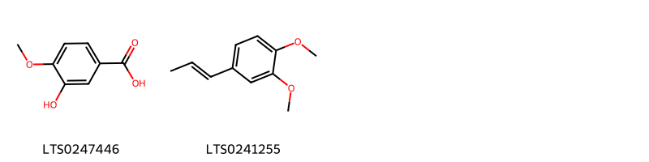

!!! abstract "Tóm tắt"

    Huyền sâm (Rễ) có tên khoa học Scrophularia buergeriana Miq., thuộc họ Hoa mõm chó (Scrophulariaceae). Cây mới di thực vào nước ta, nay phát triển ở nhiều nơi. Kinh nghiệm sử dụng dân gian  là  khổ, hàm, hàn quy vào hai kinh phế, thận, có công dụng chữa sốt cao, sốt nóng về chiều, viêm họng, phát ban, mụn nhọt, mẩn ngứa, táo bón. Thành phần hóa học gồm iridoid (harpagid), phenylpropanoid; ngoài ra còn có scrophularin, asparagin, phytosterol, tinh dầu, acid béo và đường. Trong đó thành phần chính là harpagoside. Tác dụng dược lý trên tim, trên mạch máu, giảm sốt, giảm lượng đường trong máu, tác dụng kháng sinh.

## Thông tin về thực vật

Dược liệu **Huyền Sâm (Rễ)** từ bộ phận **nan** từ loài *Scrophularia buergeriana*.

**Mô tả thực vật:** "Cây bắc huyền sâm là một loại cỏ cao 1,5m đến 2m. Thân vuông, màu xanh có rãnh dọc, 4 góc hơi phỏng lối ra. Lá hình trứng, đầu nhọn, mọc đối chữ thập, cuống ngắn, phiến lá dài 3- 8cm, rộng 1,8-6cm, mép có răng cưa nhỏ và đều. Lá phía dưới to hơn, cuống dài hơn (2-3cm). lá phía trên nhỏ hơn, cuống ngắn (chừng 5mm). Hoa mọc thành chùm với cuống ngắn trông như bóng ở đầu ngọn hoặc đầu cành. Hoa hình ống hơi phình ở giữa, thắt ở phía trên, dài 18mm, rộng 3-4mm, trên mép có 5 cánh 1 cánh cao hơn. Nhị 4. Hoa màu trắng vàng nhạt.
Cây huyền sâm Scrophularia ningpoensis khác cây bắc huyền sâm ở hoa mọc thành tán, màu tím.

*Tài liệu tham khảo:* "Những cây thuốc và vị thuốc Việt Nam" - Đỗ Tất Lợi 
Trong dược điển Việt nam, một số loài có thể dùng thay thế cho nhau làm dược liệu bao gồm *Scrophularia buergeriana, Scrophularia ningpoensis*

!!! info "Phân loại thực vật của *Scrophularia buergeriana*"
    - **Kingdom:** Plantae
    - **Phylum:** Tracheophyta
    - **Order:** Lamiales
    - **Family:** Scrophulariaceae
    - **Genus:** Scrophularia
    - **Species:** *Scrophularia buergeriana*

**Phân bố trên thế giới:** nan, Russian Federation, China, Chinese Taipei, Japan, Korea, Republic of

**Phân bố tại Việt nam:** Không có ghi nhận ở Việt Nam

!!! info "Phân loại thực vật của *Scrophularia ningpoensis*"
    - **Kingdom:** Plantae
    - **Phylum:** Tracheophyta
    - **Order:** Lamiales
    - **Family:** Scrophulariaceae
    - **Genus:** Scrophularia
    - **Species:** *Scrophularia ningpoensis*

**Phân bố trên thế giới:** France, United States of America, China, Chinese Taipei, unknown or invalid, Viet Nam

**Phân bố tại Việt nam:** 老挝, Thanh Hoa

## Thông tin về dược liệu 

### Định danh

!!! info "Thông tin về tên gọi"

    - Dược liệu tiếng Việt: nan
    - Dược liệu tiếng Trung: nan (nan)
    - Dược liệu tiếng Anh: nan
    - Dược liệu latin thông dụng: nan
    - Dược liệu latin kiểu DĐVN: *radix scrophulariae*
    - Dược liệu latin kiểu DĐVN: *nan*
    - Dược liệu latin kiểu thông tư: *nan*
    - Bộ phận dùng: nan (nan)

### Mô tả dược liệu 

- **Theo dược điển Việt nam V:** nan

- **Mô tả dược liệu theo thông tư chế biến dược liệu theo phương pháp cổ truyền:** nan

### Chế biến 

- **Chế biến theo dược điển việt nam V**: nan

- **Chế biến theo thông tư:** nan

--- 

## Thành phần hóa học

- Theo tài liệu của GS. Đỗ Tất Lợi:  (1) Rễ chứa iridoid (harpagid), phenylpropanoid; ngoài ra còn có scrophularin, asparagin, phytosterol, tinh dầu, acid béo và đường
(2) harpagoside
    

**Thành phần hóa học từ loài **Scrophularia ningpoensis**

Theo cơ sở dữ liệu lotus, loài *Scrophularia ningpoensis* đã phân lập và xác định được **87** hoạt chất thuộc về các nhóm Steroids and steroid derivatives, Organooxygen compounds, Flavonoids, Fatty Acyls, Cinnamic acids and derivatives, Indoles and derivatives, Tetrahydrofurans, Benzene and substituted derivatives, Prenol lipids trong bảng dưới đây. Danh sách các hoạt chất như sau 2-({4a,5,7-trihydroxy-7-methyl-1h,5h,6h,7ah-cyclopenta[c]pyran-1-yl}oxy)-6-(hydroxymethyl)oxane-3,4,5-triol [(LTS0155662)](https://lotus.naturalproducts.net/compound/lotus_id/LTS0155662), 2-(hydroxymethyl)-6-{[2-(hydroxymethyl)-5-methoxy-3,9-dioxatricyclo[4.4.0.0²,⁴]dec-7-en-10-yl]oxy}oxane-3,4,5-triol [(LTS0045771)](https://lotus.naturalproducts.net/compound/lotus_id/LTS0045771), ferulic acid [(LTS0077328)](https://lotus.naturalproducts.net/compound/lotus_id/LTS0077328), p-methoxy-cinnamic acid [(LTS0159893)](https://lotus.naturalproducts.net/compound/lotus_id/LTS0159893), 2-[(2-{[4,5-dihydroxy-2-(hydroxymethyl)-6-{[9-(hydroxymethyl)-4,5,9,13,20,20-hexamethyl-24-oxahexacyclo[15.5.2.0¹,¹⁸.0⁴,¹⁷.0⁵,¹⁴.0⁸,¹³]tetracos-15-en-10-yl]oxy}oxan-3-yl]oxy}-5-hydroxy-6-methyl-4-[(3,4,5-trihydroxy-6-methyloxan-2-yl)oxy]oxan-3-yl)oxy]-6-(hydroxymethyl)oxane-2,3,4,5-tetrol [(LTS0192626)](https://lotus.naturalproducts.net/compound/lotus_id/LTS0192626), (1s,4as,5r,7s,7as)-4a,5-dihydroxy-7-methyl-1-{[(2s,3r,4s,5s,6r)-3,4,5-trihydroxy-6-(hydroxymethyl)oxan-2-yl]oxy}-1h,5h,6h,7ah-cyclopenta[c]pyran-7-yl (2e)-3-(4-hydroxyphenyl)prop-2-enoate [(LTS0243997)](https://lotus.naturalproducts.net/compound/lotus_id/LTS0243997), angoroside c [(LTS0068100)](https://lotus.naturalproducts.net/compound/lotus_id/LTS0068100), harpagide [(LTS0083208)](https://lotus.naturalproducts.net/compound/lotus_id/LTS0083208), harpagoside [(LTS0049528)](https://lotus.naturalproducts.net/compound/lotus_id/LTS0049528), 2-({2-[2-(3,4-dihydroxyphenyl)ethoxy]-3,5-dihydroxy-6-(hydroxymethyl)oxan-4-yl}oxy)-6-methyloxane-3,4,5-triol [(LTS0074351)](https://lotus.naturalproducts.net/compound/lotus_id/LTS0074351), [(1s,4ar,5s,7ar)-5-hydroxy-1-{[(2s,3r,4s,5s,6r)-3,4,5-trihydroxy-6-(hydroxymethyl)oxan-2-yl]oxy}-1h,4ah,5h,7ah-cyclopenta[c]pyran-7-yl]methyl (2e)-3-(4-hydroxyphenyl)prop-2-enoate [(LTS0195194)](https://lotus.naturalproducts.net/compound/lotus_id/LTS0195194), [(3ar,4s,6ar)-5-(hydroxymethyl)-2h,3h,3ah,4h,6ah-cyclopenta[b]furan-4-yl]methanol [(LTS0079844)](https://lotus.naturalproducts.net/compound/lotus_id/LTS0079844), (2r,3r,4r,5s,6s)-4-(acetyloxy)-2,5-dihydroxy-6-methyloxan-3-yl (2e)-3-(4-methoxyphenyl)prop-2-enoate [(LTS0012634)](https://lotus.naturalproducts.net/compound/lotus_id/LTS0012634), 4a,5-dihydroxy-7-methyl-1-{[3,4,5-trihydroxy-6-(hydroxymethyl)oxan-2-yl]oxy}-1h,5h,6h,7ah-cyclopenta[c]pyran-7-yl 3-phenylprop-2-enoate [(LTS0135934)](https://lotus.naturalproducts.net/compound/lotus_id/LTS0135934), aucubin [(LTS0010822)](https://lotus.naturalproducts.net/compound/lotus_id/LTS0010822), 10-hydroxy-1,2,6a,6b,9,9,12a-heptamethyl-2,3,4,5,6,7,8,8a,10,11,12,12b,13,14b-tetradecahydro-1h-picene-4a-carboxylic acid [(LTS0166564)](https://lotus.naturalproducts.net/compound/lotus_id/LTS0166564), 4a-hydroxy-7-methyl-1,5-bis({[3,4,5-trihydroxy-6-(hydroxymethyl)oxan-2-yl]oxy})-1h,5h,6h,7ah-cyclopenta[c]pyran-7-yl 3-phenylprop-2-enoate [(LTS0251414)](https://lotus.naturalproducts.net/compound/lotus_id/LTS0251414), verbascoside [(LTS0168159)](https://lotus.naturalproducts.net/compound/lotus_id/LTS0168159), phenylacrylic acid [(LTS0097258)](https://lotus.naturalproducts.net/compound/lotus_id/LTS0097258), 4a-hydroxy-7-methyl-1-{[3,4,5-trihydroxy-6-(hydroxymethyl)oxan-2-yl]oxy}-1h,7ah-cyclopenta[c]pyran-5-one [(LTS0248406)](https://lotus.naturalproducts.net/compound/lotus_id/LTS0248406), [(2r,3s,4s,5r,6r)-6-{[(2s,3s,4s,5r)-3,4-dihydroxy-2,5-bis(hydroxymethyl)oxolan-2-yl]oxy}-3,4,5-trihydroxyoxan-2-yl]methyl (2e)-3-phenylprop-2-enoate [(LTS0205719)](https://lotus.naturalproducts.net/compound/lotus_id/LTS0205719), 4-(acetyloxy)-2,5-dihydroxy-6-methyloxan-3-yl 3-(4-methoxyphenyl)prop-2-enoate [(LTS0070477)](https://lotus.naturalproducts.net/compound/lotus_id/LTS0070477), (3r,4r,6r)-6-[2-(3,4-dihydroxyphenyl)ethoxy]-5-hydroxy-2-(hydroxymethyl)-4-{[(2s,3s,5r)-3,4,5-trihydroxy-6-methyloxan-2-yl]oxy}oxan-3-yl (2e)-3-(3,4-dihydroxyphenyl)prop-2-enoate [(LTS0063526)](https://lotus.naturalproducts.net/compound/lotus_id/LTS0063526), (1s,2r,4as,6as,6br,8ar,12ar,12br,14bs)-1,2,6a,6b,9,9,12a-heptamethyl-10-oxo-1,2,3,4,5,6,7,8,8a,11,12,12b,13,14b-tetradecahydropicene-4a-carboxylic acid [(LTS0272772)](https://lotus.naturalproducts.net/compound/lotus_id/LTS0272772), nepitrin [(LTS0032877)](https://lotus.naturalproducts.net/compound/lotus_id/LTS0032877), 4-(acetyloxy)-2,5-dihydroxy-6-methyloxan-3-yl 3-(4-hydroxyphenyl)prop-2-enoate [(LTS0091230)](https://lotus.naturalproducts.net/compound/lotus_id/LTS0091230), (1r,4as,5r,7r,7as)-4a,5-dihydroxy-7-methyl-1-{[(2r,3s,4r,5r,6s)-3,4,5-trihydroxy-6-(hydroxymethyl)oxan-2-yl]oxy}-1h,5h,6h,7ah-cyclopenta[c]pyran-7-yl (2e)-3-(4-hydroxy-3-methoxyphenyl)prop-2-enoate [(LTS0134746)](https://lotus.naturalproducts.net/compound/lotus_id/LTS0134746), 2-(hydroxymethyl)-6-{[5-(hydroxymethyl)-2h,3h,3ah,4h,6ah-cyclopenta[b]furan-4-yl]methoxy}oxane-3,4,5-triol [(LTS0164378)](https://lotus.naturalproducts.net/compound/lotus_id/LTS0164378), 2-(3,4-dihydroxyphenyl)-5-hydroxy-6-methoxy-7-{[3,4,5-trihydroxy-6-(hydroxymethyl)oxan-2-yl]oxy}chromen-4-one [(LTS0082445)](https://lotus.naturalproducts.net/compound/lotus_id/LTS0082445), (4as,6as,6br,8ar,12ar,12br,14bs)-2,2,6a,6b,9,9,12a-heptamethyl-10-oxo-3,4,5,6,7,8,8a,11,12,12b,13,14b-dodecahydro-1h-picene-4a-carboxylic acid [(LTS0002247)](https://lotus.naturalproducts.net/compound/lotus_id/LTS0002247), isoeugenyl methyl ether [(LTS0241255)](https://lotus.naturalproducts.net/compound/lotus_id/LTS0241255), (2r,3r,4s,5s,6r)-2-{[(2s,3r,4s,5s,6r)-2-{[(2r,3s,4r,5r,6r)-4,5-dihydroxy-2-(hydroxymethyl)-6-{[(1s,4s,5r,8r,9r,10s,13s,14r,17s,18r)-9-(hydroxymethyl)-4,5,9,13,20,20-hexamethyl-24-oxahexacyclo[15.5.2.0¹,¹⁸.0⁴,¹⁷.0⁵,¹⁴.0⁸,¹³]tetracos-15-en-10-yl]oxy}oxan-3-yl]oxy}-5-hydroxy-6-methyl-4-{[(2s,3r,4r,5r,6s)-3,4,5-trihydroxy-6-methyloxan-2-yl]oxy}oxan-3-yl]oxy}-6-(hydroxymethyl)oxane-2,3,4,5-tetrol [(LTS0240265)](https://lotus.naturalproducts.net/compound/lotus_id/LTS0240265), (2r,3r,4s,5s,6r)-5-(acetyloxy)-6-{[(1r,2r,4r,5r,6s,10r)-2-(hydroxymethyl)-10-{[(2r,3s,4s,5r,6s)-3,4,5-trihydroxy-6-(hydroxymethyl)oxan-2-yl]oxy}-3,9-dioxatricyclo[4.4.0.0²,⁴]dec-7-en-5-yl]oxy}-2-methyl-4-{[(2e)-3-phenylprop-2-enoyl]oxy}oxan-3-yl (2e)-3-(4-methoxyphenyl)prop-2-enoate [(LTS0271528)](https://lotus.naturalproducts.net/compound/lotus_id/LTS0271528), 5-hydroxy-6-[2-(3-hydroxy-4-methoxyphenyl)ethoxy]-4-[(3,4,5-trihydroxy-6-methyloxan-2-yl)oxy]-2-{[(3,4,5-trihydroxyoxan-2-yl)oxy]methyl}oxan-3-yl 3-(4-hydroxy-3-methoxyphenyl)prop-2-enoate [(LTS0179414)](https://lotus.naturalproducts.net/compound/lotus_id/LTS0179414), 4a,5-dihydroxy-7-methyl-1-{[3,4,5-trihydroxy-6-(hydroxymethyl)oxan-2-yl]oxy}-1h,5h,6h,7ah-cyclopenta[c]pyran-7-yl 3-(2-hydroxyphenyl)prop-2-enoate [(LTS0076395)](https://lotus.naturalproducts.net/compound/lotus_id/LTS0076395), (1r,4as,5r,7r,7as)-4a-hydroxy-7-methyl-1,5-bis({[(2r,3s,4r,5r,6s)-3,4,5-trihydroxy-6-(hydroxymethyl)oxan-2-yl]oxy})-1h,5h,6h,7ah-cyclopenta[c]pyran-7-yl (2e)-3-phenylprop-2-enoate [(LTS0052978)](https://lotus.naturalproducts.net/compound/lotus_id/LTS0052978), 5-(acetyloxy)-2,4-dihydroxy-6-methyloxan-3-yl 3-(4-hydroxyphenyl)prop-2-enoate [(LTS0140283)](https://lotus.naturalproducts.net/compound/lotus_id/LTS0140283), 1,2,6a,6b,9,9,12a-heptamethyl-10-oxo-1,2,3,4,5,6,7,8,8a,11,12,12b,13,14b-tetradecahydropicene-4a-carboxylic acid [(LTS0257386)](https://lotus.naturalproducts.net/compound/lotus_id/LTS0257386), (2s,3r,4r,5r,6s)-2-{[(2r,3r,4s,5r,6r)-2-ethoxy-3,5-dihydroxy-3-(3-hydroxy-4-methoxyphenyl)-6-(hydroxymethyl)oxan-4-yl]oxy}-6-methyloxane-3,4,5-triol [(LTS0054158)](https://lotus.naturalproducts.net/compound/lotus_id/LTS0054158), (2r,3s,4s,5r,6s)-2-(hydroxymethyl)-6-{[(1s,2s,4s,5s,6r,10s)-2-(hydroxymethyl)-5-methoxy-3,9-dioxatricyclo[4.4.0.0²,⁴]dec-7-en-10-yl]oxy}oxane-3,4,5-triol [(LTS0037919)](https://lotus.naturalproducts.net/compound/lotus_id/LTS0037919), 2-(hydroxymethyl)-6-{[4-(hydroxymethyl)-2h,3h,3ah,4h,6ah-cyclopenta[b]furan-5-yl]methoxy}oxane-3,4,5-triol [(LTS0212052)](https://lotus.naturalproducts.net/compound/lotus_id/LTS0212052), (1s,4as,5r,7s,7as)-4a,5-dihydroxy-7-methyl-1-{[(2s,3r,4s,5s,6r)-3,4,5-trihydroxy-6-(hydroxymethyl)oxan-2-yl]oxy}-1h,5h,6h,7ah-cyclopenta[c]pyran-7-yl (2e)-3-(2-hydroxyphenyl)prop-2-enoate [(LTS0070071)](https://lotus.naturalproducts.net/compound/lotus_id/LTS0070071), stigmast-5-en-3-ol, (3β)- [(LTS0204616)](https://lotus.naturalproducts.net/compound/lotus_id/LTS0204616), (2r,3r,4r,5r,6r)-6-[2-(3,4-dihydroxyphenyl)ethoxy]-5-hydroxy-2-(hydroxymethyl)-4-{[(2s,3r,4s,5r,6s)-3,4,5-trihydroxy-6-methyloxan-2-yl]oxy}oxan-3-yl (2e)-3-(3,4-dihydroxyphenyl)prop-2-enoate [(LTS0178188)](https://lotus.naturalproducts.net/compound/lotus_id/LTS0178188), isovanillic acid [(LTS0247446)](https://lotus.naturalproducts.net/compound/lotus_id/LTS0247446), [(2r,3s,4s,5r,6s)-6-{[(1s,4as,5r,7s,7ar)-4a,5,7-trihydroxy-7-methyl-1h,5h,6h,7ah-cyclopenta[c]pyran-1-yl]oxy}-3,4,5-trihydroxyoxan-2-yl]methyl (2e)-3-phenylprop-2-enoate [(LTS0167831)](https://lotus.naturalproducts.net/compound/lotus_id/LTS0167831), (2r,3r,4r,5r,6s)-5-(acetyloxy)-2,4-dihydroxy-6-methyloxan-3-yl (2e)-3-(4-hydroxyphenyl)prop-2-enoate [(LTS0183667)](https://lotus.naturalproducts.net/compound/lotus_id/LTS0183667), 4a,5-dihydroxy-7-methyl-1-{[3,4,5-trihydroxy-6-(hydroxymethyl)oxan-2-yl]oxy}-1h,5h,6h,7ah-cyclopenta[c]pyran-7-yl 3-(4-hydroxy-3-methoxyphenyl)prop-2-enoate [(LTS0145241)](https://lotus.naturalproducts.net/compound/lotus_id/LTS0145241), angoroside c [(LTS0090367)](https://lotus.naturalproducts.net/compound/lotus_id/LTS0090367), (2r,3r,4r,5s,6s)-4-(acetyloxy)-2,5-dihydroxy-6-methyloxan-3-yl (2e)-3-(4-hydroxy-3-methoxyphenyl)prop-2-enoate [(LTS0083108)](https://lotus.naturalproducts.net/compound/lotus_id/LTS0083108), (2r,3r,4r,5r,6r)-5-hydroxy-6-[2-(3-hydroxy-4-methoxyphenyl)ethoxy]-4-{[(2s,3r,4r,5r,6s)-3,4,5-trihydroxy-6-methyloxan-2-yl]oxy}-2-({[(2r,3s,4s,5s)-3,4,5-trihydroxyoxan-2-yl]oxy}methyl)oxan-3-yl (2e)-3-(4-hydroxy-3-methoxyphenyl)prop-2-enoate [(LTS0095981)](https://lotus.naturalproducts.net/compound/lotus_id/LTS0095981), sitogluside [(LTS0201798)](https://lotus.naturalproducts.net/compound/lotus_id/LTS0201798), stigmast-5-en-3-ol [(LTS0071224)](https://lotus.naturalproducts.net/compound/lotus_id/LTS0071224), (2r,3r,4r,5r,6r)-5-hydroxy-6-[2-(4-hydroxy-3-methoxyphenyl)ethoxy]-2-(hydroxymethyl)-4-{[(2s,3r,4r,5r,6s)-3,4,5-trihydroxy-6-methyloxan-2-yl]oxy}oxan-3-yl (2e)-3-(4-hydroxy-3-methoxyphenyl)prop-2-enoate [(LTS0234283)](https://lotus.naturalproducts.net/compound/lotus_id/LTS0234283), n-[2-(5-methoxy-1h-indol-3-yl)ethyl]ethanimidic acid [(LTS0219322)](https://lotus.naturalproducts.net/compound/lotus_id/LTS0219322), cinnamic acid [(LTS0128130)](https://lotus.naturalproducts.net/compound/lotus_id/LTS0128130), (2s,3s,4r,5r,6s)-5-(acetyloxy)-6-{[(1s,2s,4s,5s,6r,10s)-2-(hydroxymethyl)-10-{[(2s,3r,4s,5s,6r)-3,4,5-trihydroxy-6-(hydroxymethyl)oxan-2-yl]oxy}-3,9-dioxatricyclo[4.4.0.0²,⁴]dec-7-en-5-yl]oxy}-2-methyl-4-{[(2e)-3-phenylprop-2-enoyl]oxy}oxan-3-yl (2e)-3-(4-methoxyphenyl)prop-2-enoate [(LTS0033856)](https://lotus.naturalproducts.net/compound/lotus_id/LTS0033856), (1s,4as,5r,7s,7as)-4a,5-dihydroxy-7-methyl-1-{[(2s,3r,4s,5s,6r)-3,4,5-trihydroxy-6-(hydroxymethyl)oxan-2-yl]oxy}-1h,5h,6h,7ah-cyclopenta[c]pyran-7-yl (2e)-3-(4-hydroxy-3-methoxyphenyl)prop-2-enoate [(LTS0258023)](https://lotus.naturalproducts.net/compound/lotus_id/LTS0258023), (2r,3r,4s,5r)-1,2,5-trihydroxy-6-oxo-4-{[(2s,3r,4r,5r,6s)-3,4,5-trihydroxy-6-methyloxan-2-yl]oxy}hexan-3-yl (2e)-3-(3,4-dihydroxyphenyl)prop-2-enoate [(LTS0097965)](https://lotus.naturalproducts.net/compound/lotus_id/LTS0097965), [(2r,3s,4s,5r,6s)-3,4,5,6-tetrahydroxyoxan-2-yl]methyl (2e)-3-phenylprop-2-enoate [(LTS0141193)](https://lotus.naturalproducts.net/compound/lotus_id/LTS0141193), [(2r,3r,4s,5r,6s)-6-(4-acetylphenoxy)-3,4,5-trihydroxyoxan-2-yl]methyl (2e)-3-(4-hydroxy-3-methoxyphenyl)prop-2-enoate [(LTS0038841)](https://lotus.naturalproducts.net/compound/lotus_id/LTS0038841), (3,4,5,6-tetrahydroxyoxan-2-yl)methyl 3-phenylprop-2-enoate [(LTS0196224)](https://lotus.naturalproducts.net/compound/lotus_id/LTS0196224), (2r,3r,4r,5r,6s)-5-(acetyloxy)-2,4-dihydroxy-6-methyloxan-3-yl (2e)-3-(4-hydroxy-3-methoxyphenyl)prop-2-enoate [(LTS0255008)](https://lotus.naturalproducts.net/compound/lotus_id/LTS0255008), 2-{[1-(5-ethyl-6-methylheptan-2-yl)-9a,11a-dimethyl-1h,2h,3h,3ah,3bh,4h,6h,7h,8h,9h,9bh,10h,11h-cyclopenta[a]phenanthren-7-yl]oxy}-6-(hydroxymethyl)oxane-3,4,5-triol [(LTS0158828)](https://lotus.naturalproducts.net/compound/lotus_id/LTS0158828), 4-methoxycinnamic acid [(LTS0173807)](https://lotus.naturalproducts.net/compound/lotus_id/LTS0173807), 2,2,6a,6b,9,9,12a-heptamethyl-10-oxo-3,4,5,6,7,8,8a,11,12,12b,13,14b-dodecahydro-1h-picene-4a-carboxylic acid [(LTS0079324)](https://lotus.naturalproducts.net/compound/lotus_id/LTS0079324), 5-(acetyloxy)-6-{[2-(hydroxymethyl)-10-{[3,4,5-trihydroxy-6-(hydroxymethyl)oxan-2-yl]oxy}-3,9-dioxatricyclo[4.4.0.0²,⁴]dec-7-en-5-yl]oxy}-2-methyl-4-[(3-phenylprop-2-enoyl)oxy]oxan-3-yl 3-(4-methoxyphenyl)prop-2-enoate [(LTS0219716)](https://lotus.naturalproducts.net/compound/lotus_id/LTS0219716), (2r,3s,4s,5r,6s)-2-(hydroxymethyl)-6-{[(1s,2s,4s,5s,6r,10r)-2-(hydroxymethyl)-5-methoxy-3,9-dioxatricyclo[4.4.0.0²,⁴]dec-7-en-10-yl]oxy}oxane-3,4,5-triol [(LTS0103492)](https://lotus.naturalproducts.net/compound/lotus_id/LTS0103492), [6-({4a,5,7-trihydroxy-7-methyl-1h,5h,6h,7ah-cyclopenta[c]pyran-1-yl}oxy)-3,4,5-trihydroxyoxan-2-yl]methyl 3-phenylprop-2-enoate [(LTS0101837)](https://lotus.naturalproducts.net/compound/lotus_id/LTS0101837), (2r,3r,4s,5s,6r)-2-{[(3ar,4s,6ar)-4-(hydroxymethyl)-2h,3h,3ah,4h,6ah-cyclopenta[b]furan-5-yl]methoxy}-6-(hydroxymethyl)oxane-3,4,5-triol [(LTS0021263)](https://lotus.naturalproducts.net/compound/lotus_id/LTS0021263), aucubin [(LTS0183892)](https://lotus.naturalproducts.net/compound/lotus_id/LTS0183892), hydroxymethylfurfural [(LTS0233269)](https://lotus.naturalproducts.net/compound/lotus_id/LTS0233269), (1s,4as,7ar)-4a-hydroxy-7-methyl-1-{[(2s,3r,4s,5s,6r)-3,4,5-trihydroxy-6-(hydroxymethyl)oxan-2-yl]oxy}-1h,7ah-cyclopenta[c]pyran-5-one [(LTS0032420)](https://lotus.naturalproducts.net/compound/lotus_id/LTS0032420), (5-hydroxy-1-{[3,4,5-trihydroxy-6-(hydroxymethyl)oxan-2-yl]oxy}-1h,4ah,5h,7ah-cyclopenta[c]pyran-7-yl)methyl 3-(4-hydroxyphenyl)prop-2-enoate [(LTS0149828)](https://lotus.naturalproducts.net/compound/lotus_id/LTS0149828), sitosterol [(LTS0168132)](https://lotus.naturalproducts.net/compound/lotus_id/LTS0168132), 2-{[(4as,7s)-4a,5,7-trihydroxy-7-methyl-1h,5h,6h,7ah-cyclopenta[c]pyran-1-yl]oxy}-6-(hydroxymethyl)oxane-3,4,5-triol [(LTS0069819)](https://lotus.naturalproducts.net/compound/lotus_id/LTS0069819), (2r,3r,4s,5s,6r)-2-{[(2s,3r,4s,5s,6r)-2-{[(2r,3s,4r,5r,6r)-6-{[(3s,4r,4ar,6ar,6bs,8as,14ar,14bs)-4,8a-bis(hydroxymethyl)-4,6a,6b,11,11,14b-hexamethyl-1,2,3,4a,5,6,7,8,9,10,12,14a-dodecahydropicen-3-yl]oxy}-4,5-dihydroxy-2-(hydroxymethyl)oxan-3-yl]oxy}-5-hydroxy-6-methyl-4-{[(2s,3r,4r,5r,6s)-3,4,5-trihydroxy-6-methyloxan-2-yl]oxy}oxan-3-yl]oxy}-6-(hydroxymethyl)oxane-2,3,4,5-tetrol [(LTS0081464)](https://lotus.naturalproducts.net/compound/lotus_id/LTS0081464), 5-hydroxy-2-(4-hydroxyphenyl)-6-methoxy-7-{[3,4,5-trihydroxy-6-(hydroxymethyl)oxan-2-yl]oxy}chromen-4-one [(LTS0247221)](https://lotus.naturalproducts.net/compound/lotus_id/LTS0247221), (2r,3r,4r,5s,6s)-4-(acetyloxy)-2,5-dihydroxy-6-methyloxan-3-yl (2e)-3-(4-hydroxyphenyl)prop-2-enoate [(LTS0084236)](https://lotus.naturalproducts.net/compound/lotus_id/LTS0084236), 4a,5-dihydroxy-7-methyl-1-{[3,4,5-trihydroxy-6-(hydroxymethyl)oxan-2-yl]oxy}-1h,5h,6h,7ah-cyclopenta[c]pyran-7-yl 3-(4-hydroxyphenyl)prop-2-enoate [(LTS0118174)](https://lotus.naturalproducts.net/compound/lotus_id/LTS0118174), 4-(acetyloxy)-2,5-dihydroxy-6-methyloxan-3-yl 3-(4-hydroxy-3-methoxyphenyl)prop-2-enoate [(LTS0081052)](https://lotus.naturalproducts.net/compound/lotus_id/LTS0081052), homoplantaginin [(LTS0142016)](https://lotus.naturalproducts.net/compound/lotus_id/LTS0142016), 2-({2-[(6-{[4,8a-bis(hydroxymethyl)-4,6a,6b,11,11,14b-hexamethyl-1,2,3,4a,5,6,7,8,9,10,12,14a-dodecahydropicen-3-yl]oxy}-4,5-dihydroxy-2-(hydroxymethyl)oxan-3-yl)oxy]-5-hydroxy-6-methyl-4-[(3,4,5-trihydroxy-6-methyloxan-2-yl)oxy]oxan-3-yl}oxy)-6-(hydroxymethyl)oxane-2,3,4,5-tetrol [(LTS0246745)](https://lotus.naturalproducts.net/compound/lotus_id/LTS0246745), (2r,3r,4r,5r)-1,2,5-trihydroxy-6-oxo-4-{[(2s,3r,4r,5r,6s)-3,4,5-trihydroxy-6-methyloxan-2-yl]oxy}hexan-3-yl (2e)-3-(3,4-dihydroxyphenyl)prop-2-enoate [(LTS0248847)](https://lotus.naturalproducts.net/compound/lotus_id/LTS0248847), 5-(acetyloxy)-2,4-dihydroxy-6-methyloxan-3-yl 3-(4-hydroxy-3-methoxyphenyl)prop-2-enoate [(LTS0211909)](https://lotus.naturalproducts.net/compound/lotus_id/LTS0211909), (2r,3r,4s,5s,6r)-2-{[(3ar,4s,6ar)-5-(hydroxymethyl)-2h,3h,3ah,4h,6ah-cyclopenta[b]furan-4-yl]methoxy}-6-(hydroxymethyl)oxane-3,4,5-triol [(LTS0079446)](https://lotus.naturalproducts.net/compound/lotus_id/LTS0079446), [5-(hydroxymethyl)-2h,3h,3ah,4h,6ah-cyclopenta[b]furan-4-yl]methanol [(LTS0162387)](https://lotus.naturalproducts.net/compound/lotus_id/LTS0162387). 
        
| chemicalTaxonomyClassyfireClass     |   smiles_count |
|:------------------------------------|---------------:|
| Benzene and substituted derivatives |             39 |
| Cinnamic acids and derivatives      |           1684 |
| Fatty Acyls                         |            205 |
| Flavonoids                          |            278 |
| Indoles and derivatives             |             29 |
| Organooxygen compounds              |           1371 |
| Prenol lipids                       |           2974 |
| Steroids and steroid derivatives    |            414 |
| Tetrahydrofurans                    |             49 |

            
### Nhóm Benzene and substituted derivatives
<figure markdown="span">
    { width=100% }
<figcaption>Hình ảnh cấu trúc hóa học của hoạt chất thuộc nhóm *Benzene and substituted derivatives*. Tên thường gọi của các hoạt chất tương ứng là isovanillic acid [(LTS0247446)](https://lotus.naturalproducts.net/compound/lotus_id/LTS0247446), isoeugenyl methyl ether [(LTS0241255)](https://lotus.naturalproducts.net/compound/lotus_id/LTS0241255).</figcaption>
</figure>

            
            
### Nhóm Benzene and substituted derivatives
<figure markdown="span">
    { width=100% }
<figcaption>Hình ảnh cấu trúc hóa học của hoạt chất thuộc nhóm *Benzene and substituted derivatives*. Tên thường gọi của các hoạt chất tương ứng là isovanillic acid [(LTS0247446)](https://lotus.naturalproducts.net/compound/lotus_id/LTS0247446), isoeugenyl methyl ether [(LTS0241255)](https://lotus.naturalproducts.net/compound/lotus_id/LTS0241255).</figcaption>
</figure>

### Nhóm Cinnamic acids and derivatives
<figure markdown="span">
    { width=100% }
<figcaption>Hình ảnh cấu trúc hóa học của hoạt chất thuộc nhóm *Cinnamic acids and derivatives*. Tên thường gọi của các hoạt chất tương ứng là (2r,3r,4r,5r,6s)-5-(acetyloxy)-2,4-dihydroxy-6-methyloxan-3-yl (2e)-3-(4-hydroxyphenyl)prop-2-enoate [(LTS0183667)](https://lotus.naturalproducts.net/compound/lotus_id/LTS0183667), [(2r,3s,4s,5r,6r)-6-{[(2s,3s,4s,5r)-3,4-dihydroxy-2,5-bis(hydroxymethyl)oxolan-2-yl]oxy}-3,4,5-trihydroxyoxan-2-yl]methyl (2e)-3-phenylprop-2-enoate [(LTS0205719)](https://lotus.naturalproducts.net/compound/lotus_id/LTS0205719), ferulic acid [(LTS0077328)](https://lotus.naturalproducts.net/compound/lotus_id/LTS0077328), 4-(acetyloxy)-2,5-dihydroxy-6-methyloxan-3-yl 3-(4-hydroxy-3-methoxyphenyl)prop-2-enoate [(LTS0081052)](https://lotus.naturalproducts.net/compound/lotus_id/LTS0081052), 4-(acetyloxy)-2,5-dihydroxy-6-methyloxan-3-yl 3-(4-hydroxyphenyl)prop-2-enoate [(LTS0091230)](https://lotus.naturalproducts.net/compound/lotus_id/LTS0091230), (2r,3r,4r,5r,6r)-6-[2-(3,4-dihydroxyphenyl)ethoxy]-5-hydroxy-2-(hydroxymethyl)-4-{[(2s,3r,4s,5r,6s)-3,4,5-trihydroxy-6-methyloxan-2-yl]oxy}oxan-3-yl (2e)-3-(3,4-dihydroxyphenyl)prop-2-enoate [(LTS0178188)](https://lotus.naturalproducts.net/compound/lotus_id/LTS0178188), (2s,3s,4r,5r,6s)-5-(acetyloxy)-6-{[(1s,2s,4s,5s,6r,10s)-2-(hydroxymethyl)-10-{[(2s,3r,4s,5s,6r)-3,4,5-trihydroxy-6-(hydroxymethyl)oxan-2-yl]oxy}-3,9-dioxatricyclo[4.4.0.0²,⁴]dec-7-en-5-yl]oxy}-2-methyl-4-{[(2e)-3-phenylprop-2-enoyl]oxy}oxan-3-yl (2e)-3-(4-methoxyphenyl)prop-2-enoate [(LTS0033856)](https://lotus.naturalproducts.net/compound/lotus_id/LTS0033856), (3r,4r,6r)-6-[2-(3,4-dihydroxyphenyl)ethoxy]-5-hydroxy-2-(hydroxymethyl)-4-{[(2s,3s,5r)-3,4,5-trihydroxy-6-methyloxan-2-yl]oxy}oxan-3-yl (2e)-3-(3,4-dihydroxyphenyl)prop-2-enoate [(LTS0063526)](https://lotus.naturalproducts.net/compound/lotus_id/LTS0063526), verbascoside [(LTS0168159)](https://lotus.naturalproducts.net/compound/lotus_id/LTS0168159), cinnamic acid [(LTS0128130)](https://lotus.naturalproducts.net/compound/lotus_id/LTS0128130), (3,4,5,6-tetrahydroxyoxan-2-yl)methyl 3-phenylprop-2-enoate [(LTS0196224)](https://lotus.naturalproducts.net/compound/lotus_id/LTS0196224), [(2r,3s,4s,5r,6s)-3,4,5,6-tetrahydroxyoxan-2-yl]methyl (2e)-3-phenylprop-2-enoate [(LTS0141193)](https://lotus.naturalproducts.net/compound/lotus_id/LTS0141193), (2r,3r,4r,5s,6s)-4-(acetyloxy)-2,5-dihydroxy-6-methyloxan-3-yl (2e)-3-(4-hydroxyphenyl)prop-2-enoate [(LTS0084236)](https://lotus.naturalproducts.net/compound/lotus_id/LTS0084236), 5-(acetyloxy)-2,4-dihydroxy-6-methyloxan-3-yl 3-(4-hydroxyphenyl)prop-2-enoate [(LTS0140283)](https://lotus.naturalproducts.net/compound/lotus_id/LTS0140283), phenylacrylic acid [(LTS0097258)](https://lotus.naturalproducts.net/compound/lotus_id/LTS0097258), p-methoxy-cinnamic acid [(LTS0159893)](https://lotus.naturalproducts.net/compound/lotus_id/LTS0159893), (2r,3r,4r,5r,6s)-5-(acetyloxy)-2,4-dihydroxy-6-methyloxan-3-yl (2e)-3-(4-hydroxy-3-methoxyphenyl)prop-2-enoate [(LTS0255008)](https://lotus.naturalproducts.net/compound/lotus_id/LTS0255008), 4-methoxycinnamic acid [(LTS0173807)](https://lotus.naturalproducts.net/compound/lotus_id/LTS0173807), (2r,3r,4s,5s,6r)-5-(acetyloxy)-6-{[(1r,2r,4r,5r,6s,10r)-2-(hydroxymethyl)-10-{[(2r,3s,4s,5r,6s)-3,4,5-trihydroxy-6-(hydroxymethyl)oxan-2-yl]oxy}-3,9-dioxatricyclo[4.4.0.0²,⁴]dec-7-en-5-yl]oxy}-2-methyl-4-{[(2e)-3-phenylprop-2-enoyl]oxy}oxan-3-yl (2e)-3-(4-methoxyphenyl)prop-2-enoate [(LTS0271528)](https://lotus.naturalproducts.net/compound/lotus_id/LTS0271528), (2r,3r,4r,5s,6s)-4-(acetyloxy)-2,5-dihydroxy-6-methyloxan-3-yl (2e)-3-(4-hydroxy-3-methoxyphenyl)prop-2-enoate [(LTS0083108)](https://lotus.naturalproducts.net/compound/lotus_id/LTS0083108), 5-(acetyloxy)-2,4-dihydroxy-6-methyloxan-3-yl 3-(4-hydroxy-3-methoxyphenyl)prop-2-enoate [(LTS0211909)](https://lotus.naturalproducts.net/compound/lotus_id/LTS0211909), 5-(acetyloxy)-6-{[2-(hydroxymethyl)-10-{[3,4,5-trihydroxy-6-(hydroxymethyl)oxan-2-yl]oxy}-3,9-dioxatricyclo[4.4.0.0²,⁴]dec-7-en-5-yl]oxy}-2-methyl-4-[(3-phenylprop-2-enoyl)oxy]oxan-3-yl 3-(4-methoxyphenyl)prop-2-enoate [(LTS0219716)](https://lotus.naturalproducts.net/compound/lotus_id/LTS0219716), (2r,3r,4r,5r,6r)-5-hydroxy-6-[2-(4-hydroxy-3-methoxyphenyl)ethoxy]-2-(hydroxymethyl)-4-{[(2s,3r,4r,5r,6s)-3,4,5-trihydroxy-6-methyloxan-2-yl]oxy}oxan-3-yl (2e)-3-(4-hydroxy-3-methoxyphenyl)prop-2-enoate [(LTS0234283)](https://lotus.naturalproducts.net/compound/lotus_id/LTS0234283).</figcaption>
</figure>

            
            
### Nhóm Benzene and substituted derivatives
<figure markdown="span">
    { width=100% }
<figcaption>Hình ảnh cấu trúc hóa học của hoạt chất thuộc nhóm *Benzene and substituted derivatives*. Tên thường gọi của các hoạt chất tương ứng là isovanillic acid [(LTS0247446)](https://lotus.naturalproducts.net/compound/lotus_id/LTS0247446), isoeugenyl methyl ether [(LTS0241255)](https://lotus.naturalproducts.net/compound/lotus_id/LTS0241255).</figcaption>
</figure>

### Nhóm Cinnamic acids and derivatives
<figure markdown="span">
    { width=100% }
<figcaption>Hình ảnh cấu trúc hóa học của hoạt chất thuộc nhóm *Cinnamic acids and derivatives*. Tên thường gọi của các hoạt chất tương ứng là (2r,3r,4r,5r,6s)-5-(acetyloxy)-2,4-dihydroxy-6-methyloxan-3-yl (2e)-3-(4-hydroxyphenyl)prop-2-enoate [(LTS0183667)](https://lotus.naturalproducts.net/compound/lotus_id/LTS0183667), [(2r,3s,4s,5r,6r)-6-{[(2s,3s,4s,5r)-3,4-dihydroxy-2,5-bis(hydroxymethyl)oxolan-2-yl]oxy}-3,4,5-trihydroxyoxan-2-yl]methyl (2e)-3-phenylprop-2-enoate [(LTS0205719)](https://lotus.naturalproducts.net/compound/lotus_id/LTS0205719), ferulic acid [(LTS0077328)](https://lotus.naturalproducts.net/compound/lotus_id/LTS0077328), 4-(acetyloxy)-2,5-dihydroxy-6-methyloxan-3-yl 3-(4-hydroxy-3-methoxyphenyl)prop-2-enoate [(LTS0081052)](https://lotus.naturalproducts.net/compound/lotus_id/LTS0081052), 4-(acetyloxy)-2,5-dihydroxy-6-methyloxan-3-yl 3-(4-hydroxyphenyl)prop-2-enoate [(LTS0091230)](https://lotus.naturalproducts.net/compound/lotus_id/LTS0091230), (2r,3r,4r,5r,6r)-6-[2-(3,4-dihydroxyphenyl)ethoxy]-5-hydroxy-2-(hydroxymethyl)-4-{[(2s,3r,4s,5r,6s)-3,4,5-trihydroxy-6-methyloxan-2-yl]oxy}oxan-3-yl (2e)-3-(3,4-dihydroxyphenyl)prop-2-enoate [(LTS0178188)](https://lotus.naturalproducts.net/compound/lotus_id/LTS0178188), (2s,3s,4r,5r,6s)-5-(acetyloxy)-6-{[(1s,2s,4s,5s,6r,10s)-2-(hydroxymethyl)-10-{[(2s,3r,4s,5s,6r)-3,4,5-trihydroxy-6-(hydroxymethyl)oxan-2-yl]oxy}-3,9-dioxatricyclo[4.4.0.0²,⁴]dec-7-en-5-yl]oxy}-2-methyl-4-{[(2e)-3-phenylprop-2-enoyl]oxy}oxan-3-yl (2e)-3-(4-methoxyphenyl)prop-2-enoate [(LTS0033856)](https://lotus.naturalproducts.net/compound/lotus_id/LTS0033856), (3r,4r,6r)-6-[2-(3,4-dihydroxyphenyl)ethoxy]-5-hydroxy-2-(hydroxymethyl)-4-{[(2s,3s,5r)-3,4,5-trihydroxy-6-methyloxan-2-yl]oxy}oxan-3-yl (2e)-3-(3,4-dihydroxyphenyl)prop-2-enoate [(LTS0063526)](https://lotus.naturalproducts.net/compound/lotus_id/LTS0063526), verbascoside [(LTS0168159)](https://lotus.naturalproducts.net/compound/lotus_id/LTS0168159), cinnamic acid [(LTS0128130)](https://lotus.naturalproducts.net/compound/lotus_id/LTS0128130), (3,4,5,6-tetrahydroxyoxan-2-yl)methyl 3-phenylprop-2-enoate [(LTS0196224)](https://lotus.naturalproducts.net/compound/lotus_id/LTS0196224), [(2r,3s,4s,5r,6s)-3,4,5,6-tetrahydroxyoxan-2-yl]methyl (2e)-3-phenylprop-2-enoate [(LTS0141193)](https://lotus.naturalproducts.net/compound/lotus_id/LTS0141193), (2r,3r,4r,5s,6s)-4-(acetyloxy)-2,5-dihydroxy-6-methyloxan-3-yl (2e)-3-(4-hydroxyphenyl)prop-2-enoate [(LTS0084236)](https://lotus.naturalproducts.net/compound/lotus_id/LTS0084236), 5-(acetyloxy)-2,4-dihydroxy-6-methyloxan-3-yl 3-(4-hydroxyphenyl)prop-2-enoate [(LTS0140283)](https://lotus.naturalproducts.net/compound/lotus_id/LTS0140283), phenylacrylic acid [(LTS0097258)](https://lotus.naturalproducts.net/compound/lotus_id/LTS0097258), p-methoxy-cinnamic acid [(LTS0159893)](https://lotus.naturalproducts.net/compound/lotus_id/LTS0159893), (2r,3r,4r,5r,6s)-5-(acetyloxy)-2,4-dihydroxy-6-methyloxan-3-yl (2e)-3-(4-hydroxy-3-methoxyphenyl)prop-2-enoate [(LTS0255008)](https://lotus.naturalproducts.net/compound/lotus_id/LTS0255008), 4-methoxycinnamic acid [(LTS0173807)](https://lotus.naturalproducts.net/compound/lotus_id/LTS0173807), (2r,3r,4s,5s,6r)-5-(acetyloxy)-6-{[(1r,2r,4r,5r,6s,10r)-2-(hydroxymethyl)-10-{[(2r,3s,4s,5r,6s)-3,4,5-trihydroxy-6-(hydroxymethyl)oxan-2-yl]oxy}-3,9-dioxatricyclo[4.4.0.0²,⁴]dec-7-en-5-yl]oxy}-2-methyl-4-{[(2e)-3-phenylprop-2-enoyl]oxy}oxan-3-yl (2e)-3-(4-methoxyphenyl)prop-2-enoate [(LTS0271528)](https://lotus.naturalproducts.net/compound/lotus_id/LTS0271528), (2r,3r,4r,5s,6s)-4-(acetyloxy)-2,5-dihydroxy-6-methyloxan-3-yl (2e)-3-(4-hydroxy-3-methoxyphenyl)prop-2-enoate [(LTS0083108)](https://lotus.naturalproducts.net/compound/lotus_id/LTS0083108), 5-(acetyloxy)-2,4-dihydroxy-6-methyloxan-3-yl 3-(4-hydroxy-3-methoxyphenyl)prop-2-enoate [(LTS0211909)](https://lotus.naturalproducts.net/compound/lotus_id/LTS0211909), 5-(acetyloxy)-6-{[2-(hydroxymethyl)-10-{[3,4,5-trihydroxy-6-(hydroxymethyl)oxan-2-yl]oxy}-3,9-dioxatricyclo[4.4.0.0²,⁴]dec-7-en-5-yl]oxy}-2-methyl-4-[(3-phenylprop-2-enoyl)oxy]oxan-3-yl 3-(4-methoxyphenyl)prop-2-enoate [(LTS0219716)](https://lotus.naturalproducts.net/compound/lotus_id/LTS0219716), (2r,3r,4r,5r,6r)-5-hydroxy-6-[2-(4-hydroxy-3-methoxyphenyl)ethoxy]-2-(hydroxymethyl)-4-{[(2s,3r,4r,5r,6s)-3,4,5-trihydroxy-6-methyloxan-2-yl]oxy}oxan-3-yl (2e)-3-(4-hydroxy-3-methoxyphenyl)prop-2-enoate [(LTS0234283)](https://lotus.naturalproducts.net/compound/lotus_id/LTS0234283).</figcaption>
</figure>

### Nhóm Fatty Acyls
<figure markdown="span">
    { width=100% }
<figcaption>Hình ảnh cấu trúc hóa học của hoạt chất thuộc nhóm *Fatty Acyls*. Tên thường gọi của các hoạt chất tương ứng là (2r,3r,4s,5r)-1,2,5-trihydroxy-6-oxo-4-{[(2s,3r,4r,5r,6s)-3,4,5-trihydroxy-6-methyloxan-2-yl]oxy}hexan-3-yl (2e)-3-(3,4-dihydroxyphenyl)prop-2-enoate [(LTS0097965)](https://lotus.naturalproducts.net/compound/lotus_id/LTS0097965), (2r,3r,4r,5r)-1,2,5-trihydroxy-6-oxo-4-{[(2s,3r,4r,5r,6s)-3,4,5-trihydroxy-6-methyloxan-2-yl]oxy}hexan-3-yl (2e)-3-(3,4-dihydroxyphenyl)prop-2-enoate [(LTS0248847)](https://lotus.naturalproducts.net/compound/lotus_id/LTS0248847).</figcaption>
</figure>

            
            
### Nhóm Benzene and substituted derivatives
<figure markdown="span">
    { width=100% }
<figcaption>Hình ảnh cấu trúc hóa học của hoạt chất thuộc nhóm *Benzene and substituted derivatives*. Tên thường gọi của các hoạt chất tương ứng là isovanillic acid [(LTS0247446)](https://lotus.naturalproducts.net/compound/lotus_id/LTS0247446), isoeugenyl methyl ether [(LTS0241255)](https://lotus.naturalproducts.net/compound/lotus_id/LTS0241255).</figcaption>
</figure>

### Nhóm Cinnamic acids and derivatives
<figure markdown="span">
    { width=100% }
<figcaption>Hình ảnh cấu trúc hóa học của hoạt chất thuộc nhóm *Cinnamic acids and derivatives*. Tên thường gọi của các hoạt chất tương ứng là (2r,3r,4r,5r,6s)-5-(acetyloxy)-2,4-dihydroxy-6-methyloxan-3-yl (2e)-3-(4-hydroxyphenyl)prop-2-enoate [(LTS0183667)](https://lotus.naturalproducts.net/compound/lotus_id/LTS0183667), [(2r,3s,4s,5r,6r)-6-{[(2s,3s,4s,5r)-3,4-dihydroxy-2,5-bis(hydroxymethyl)oxolan-2-yl]oxy}-3,4,5-trihydroxyoxan-2-yl]methyl (2e)-3-phenylprop-2-enoate [(LTS0205719)](https://lotus.naturalproducts.net/compound/lotus_id/LTS0205719), ferulic acid [(LTS0077328)](https://lotus.naturalproducts.net/compound/lotus_id/LTS0077328), 4-(acetyloxy)-2,5-dihydroxy-6-methyloxan-3-yl 3-(4-hydroxy-3-methoxyphenyl)prop-2-enoate [(LTS0081052)](https://lotus.naturalproducts.net/compound/lotus_id/LTS0081052), 4-(acetyloxy)-2,5-dihydroxy-6-methyloxan-3-yl 3-(4-hydroxyphenyl)prop-2-enoate [(LTS0091230)](https://lotus.naturalproducts.net/compound/lotus_id/LTS0091230), (2r,3r,4r,5r,6r)-6-[2-(3,4-dihydroxyphenyl)ethoxy]-5-hydroxy-2-(hydroxymethyl)-4-{[(2s,3r,4s,5r,6s)-3,4,5-trihydroxy-6-methyloxan-2-yl]oxy}oxan-3-yl (2e)-3-(3,4-dihydroxyphenyl)prop-2-enoate [(LTS0178188)](https://lotus.naturalproducts.net/compound/lotus_id/LTS0178188), (2s,3s,4r,5r,6s)-5-(acetyloxy)-6-{[(1s,2s,4s,5s,6r,10s)-2-(hydroxymethyl)-10-{[(2s,3r,4s,5s,6r)-3,4,5-trihydroxy-6-(hydroxymethyl)oxan-2-yl]oxy}-3,9-dioxatricyclo[4.4.0.0²,⁴]dec-7-en-5-yl]oxy}-2-methyl-4-{[(2e)-3-phenylprop-2-enoyl]oxy}oxan-3-yl (2e)-3-(4-methoxyphenyl)prop-2-enoate [(LTS0033856)](https://lotus.naturalproducts.net/compound/lotus_id/LTS0033856), (3r,4r,6r)-6-[2-(3,4-dihydroxyphenyl)ethoxy]-5-hydroxy-2-(hydroxymethyl)-4-{[(2s,3s,5r)-3,4,5-trihydroxy-6-methyloxan-2-yl]oxy}oxan-3-yl (2e)-3-(3,4-dihydroxyphenyl)prop-2-enoate [(LTS0063526)](https://lotus.naturalproducts.net/compound/lotus_id/LTS0063526), verbascoside [(LTS0168159)](https://lotus.naturalproducts.net/compound/lotus_id/LTS0168159), cinnamic acid [(LTS0128130)](https://lotus.naturalproducts.net/compound/lotus_id/LTS0128130), (3,4,5,6-tetrahydroxyoxan-2-yl)methyl 3-phenylprop-2-enoate [(LTS0196224)](https://lotus.naturalproducts.net/compound/lotus_id/LTS0196224), [(2r,3s,4s,5r,6s)-3,4,5,6-tetrahydroxyoxan-2-yl]methyl (2e)-3-phenylprop-2-enoate [(LTS0141193)](https://lotus.naturalproducts.net/compound/lotus_id/LTS0141193), (2r,3r,4r,5s,6s)-4-(acetyloxy)-2,5-dihydroxy-6-methyloxan-3-yl (2e)-3-(4-hydroxyphenyl)prop-2-enoate [(LTS0084236)](https://lotus.naturalproducts.net/compound/lotus_id/LTS0084236), 5-(acetyloxy)-2,4-dihydroxy-6-methyloxan-3-yl 3-(4-hydroxyphenyl)prop-2-enoate [(LTS0140283)](https://lotus.naturalproducts.net/compound/lotus_id/LTS0140283), phenylacrylic acid [(LTS0097258)](https://lotus.naturalproducts.net/compound/lotus_id/LTS0097258), p-methoxy-cinnamic acid [(LTS0159893)](https://lotus.naturalproducts.net/compound/lotus_id/LTS0159893), (2r,3r,4r,5r,6s)-5-(acetyloxy)-2,4-dihydroxy-6-methyloxan-3-yl (2e)-3-(4-hydroxy-3-methoxyphenyl)prop-2-enoate [(LTS0255008)](https://lotus.naturalproducts.net/compound/lotus_id/LTS0255008), 4-methoxycinnamic acid [(LTS0173807)](https://lotus.naturalproducts.net/compound/lotus_id/LTS0173807), (2r,3r,4s,5s,6r)-5-(acetyloxy)-6-{[(1r,2r,4r,5r,6s,10r)-2-(hydroxymethyl)-10-{[(2r,3s,4s,5r,6s)-3,4,5-trihydroxy-6-(hydroxymethyl)oxan-2-yl]oxy}-3,9-dioxatricyclo[4.4.0.0²,⁴]dec-7-en-5-yl]oxy}-2-methyl-4-{[(2e)-3-phenylprop-2-enoyl]oxy}oxan-3-yl (2e)-3-(4-methoxyphenyl)prop-2-enoate [(LTS0271528)](https://lotus.naturalproducts.net/compound/lotus_id/LTS0271528), (2r,3r,4r,5s,6s)-4-(acetyloxy)-2,5-dihydroxy-6-methyloxan-3-yl (2e)-3-(4-hydroxy-3-methoxyphenyl)prop-2-enoate [(LTS0083108)](https://lotus.naturalproducts.net/compound/lotus_id/LTS0083108), 5-(acetyloxy)-2,4-dihydroxy-6-methyloxan-3-yl 3-(4-hydroxy-3-methoxyphenyl)prop-2-enoate [(LTS0211909)](https://lotus.naturalproducts.net/compound/lotus_id/LTS0211909), 5-(acetyloxy)-6-{[2-(hydroxymethyl)-10-{[3,4,5-trihydroxy-6-(hydroxymethyl)oxan-2-yl]oxy}-3,9-dioxatricyclo[4.4.0.0²,⁴]dec-7-en-5-yl]oxy}-2-methyl-4-[(3-phenylprop-2-enoyl)oxy]oxan-3-yl 3-(4-methoxyphenyl)prop-2-enoate [(LTS0219716)](https://lotus.naturalproducts.net/compound/lotus_id/LTS0219716), (2r,3r,4r,5r,6r)-5-hydroxy-6-[2-(4-hydroxy-3-methoxyphenyl)ethoxy]-2-(hydroxymethyl)-4-{[(2s,3r,4r,5r,6s)-3,4,5-trihydroxy-6-methyloxan-2-yl]oxy}oxan-3-yl (2e)-3-(4-hydroxy-3-methoxyphenyl)prop-2-enoate [(LTS0234283)](https://lotus.naturalproducts.net/compound/lotus_id/LTS0234283).</figcaption>
</figure>

### Nhóm Fatty Acyls
<figure markdown="span">
    { width=100% }
<figcaption>Hình ảnh cấu trúc hóa học của hoạt chất thuộc nhóm *Fatty Acyls*. Tên thường gọi của các hoạt chất tương ứng là (2r,3r,4s,5r)-1,2,5-trihydroxy-6-oxo-4-{[(2s,3r,4r,5r,6s)-3,4,5-trihydroxy-6-methyloxan-2-yl]oxy}hexan-3-yl (2e)-3-(3,4-dihydroxyphenyl)prop-2-enoate [(LTS0097965)](https://lotus.naturalproducts.net/compound/lotus_id/LTS0097965), (2r,3r,4r,5r)-1,2,5-trihydroxy-6-oxo-4-{[(2s,3r,4r,5r,6s)-3,4,5-trihydroxy-6-methyloxan-2-yl]oxy}hexan-3-yl (2e)-3-(3,4-dihydroxyphenyl)prop-2-enoate [(LTS0248847)](https://lotus.naturalproducts.net/compound/lotus_id/LTS0248847).</figcaption>
</figure>

### Nhóm Flavonoids
<figure markdown="span">
    { width=100% }
<figcaption>Hình ảnh cấu trúc hóa học của hoạt chất thuộc nhóm *Flavonoids*. Tên thường gọi của các hoạt chất tương ứng là nepitrin [(LTS0032877)](https://lotus.naturalproducts.net/compound/lotus_id/LTS0032877), homoplantaginin [(LTS0142016)](https://lotus.naturalproducts.net/compound/lotus_id/LTS0142016), 2-(3,4-dihydroxyphenyl)-5-hydroxy-6-methoxy-7-{[3,4,5-trihydroxy-6-(hydroxymethyl)oxan-2-yl]oxy}chromen-4-one [(LTS0082445)](https://lotus.naturalproducts.net/compound/lotus_id/LTS0082445), 5-hydroxy-2-(4-hydroxyphenyl)-6-methoxy-7-{[3,4,5-trihydroxy-6-(hydroxymethyl)oxan-2-yl]oxy}chromen-4-one [(LTS0247221)](https://lotus.naturalproducts.net/compound/lotus_id/LTS0247221).</figcaption>
</figure>

            
            
### Nhóm Benzene and substituted derivatives
<figure markdown="span">
    { width=100% }
<figcaption>Hình ảnh cấu trúc hóa học của hoạt chất thuộc nhóm *Benzene and substituted derivatives*. Tên thường gọi của các hoạt chất tương ứng là isovanillic acid [(LTS0247446)](https://lotus.naturalproducts.net/compound/lotus_id/LTS0247446), isoeugenyl methyl ether [(LTS0241255)](https://lotus.naturalproducts.net/compound/lotus_id/LTS0241255).</figcaption>
</figure>

### Nhóm Cinnamic acids and derivatives
<figure markdown="span">
    { width=100% }
<figcaption>Hình ảnh cấu trúc hóa học của hoạt chất thuộc nhóm *Cinnamic acids and derivatives*. Tên thường gọi của các hoạt chất tương ứng là (2r,3r,4r,5r,6s)-5-(acetyloxy)-2,4-dihydroxy-6-methyloxan-3-yl (2e)-3-(4-hydroxyphenyl)prop-2-enoate [(LTS0183667)](https://lotus.naturalproducts.net/compound/lotus_id/LTS0183667), [(2r,3s,4s,5r,6r)-6-{[(2s,3s,4s,5r)-3,4-dihydroxy-2,5-bis(hydroxymethyl)oxolan-2-yl]oxy}-3,4,5-trihydroxyoxan-2-yl]methyl (2e)-3-phenylprop-2-enoate [(LTS0205719)](https://lotus.naturalproducts.net/compound/lotus_id/LTS0205719), ferulic acid [(LTS0077328)](https://lotus.naturalproducts.net/compound/lotus_id/LTS0077328), 4-(acetyloxy)-2,5-dihydroxy-6-methyloxan-3-yl 3-(4-hydroxy-3-methoxyphenyl)prop-2-enoate [(LTS0081052)](https://lotus.naturalproducts.net/compound/lotus_id/LTS0081052), 4-(acetyloxy)-2,5-dihydroxy-6-methyloxan-3-yl 3-(4-hydroxyphenyl)prop-2-enoate [(LTS0091230)](https://lotus.naturalproducts.net/compound/lotus_id/LTS0091230), (2r,3r,4r,5r,6r)-6-[2-(3,4-dihydroxyphenyl)ethoxy]-5-hydroxy-2-(hydroxymethyl)-4-{[(2s,3r,4s,5r,6s)-3,4,5-trihydroxy-6-methyloxan-2-yl]oxy}oxan-3-yl (2e)-3-(3,4-dihydroxyphenyl)prop-2-enoate [(LTS0178188)](https://lotus.naturalproducts.net/compound/lotus_id/LTS0178188), (2s,3s,4r,5r,6s)-5-(acetyloxy)-6-{[(1s,2s,4s,5s,6r,10s)-2-(hydroxymethyl)-10-{[(2s,3r,4s,5s,6r)-3,4,5-trihydroxy-6-(hydroxymethyl)oxan-2-yl]oxy}-3,9-dioxatricyclo[4.4.0.0²,⁴]dec-7-en-5-yl]oxy}-2-methyl-4-{[(2e)-3-phenylprop-2-enoyl]oxy}oxan-3-yl (2e)-3-(4-methoxyphenyl)prop-2-enoate [(LTS0033856)](https://lotus.naturalproducts.net/compound/lotus_id/LTS0033856), (3r,4r,6r)-6-[2-(3,4-dihydroxyphenyl)ethoxy]-5-hydroxy-2-(hydroxymethyl)-4-{[(2s,3s,5r)-3,4,5-trihydroxy-6-methyloxan-2-yl]oxy}oxan-3-yl (2e)-3-(3,4-dihydroxyphenyl)prop-2-enoate [(LTS0063526)](https://lotus.naturalproducts.net/compound/lotus_id/LTS0063526), verbascoside [(LTS0168159)](https://lotus.naturalproducts.net/compound/lotus_id/LTS0168159), cinnamic acid [(LTS0128130)](https://lotus.naturalproducts.net/compound/lotus_id/LTS0128130), (3,4,5,6-tetrahydroxyoxan-2-yl)methyl 3-phenylprop-2-enoate [(LTS0196224)](https://lotus.naturalproducts.net/compound/lotus_id/LTS0196224), [(2r,3s,4s,5r,6s)-3,4,5,6-tetrahydroxyoxan-2-yl]methyl (2e)-3-phenylprop-2-enoate [(LTS0141193)](https://lotus.naturalproducts.net/compound/lotus_id/LTS0141193), (2r,3r,4r,5s,6s)-4-(acetyloxy)-2,5-dihydroxy-6-methyloxan-3-yl (2e)-3-(4-hydroxyphenyl)prop-2-enoate [(LTS0084236)](https://lotus.naturalproducts.net/compound/lotus_id/LTS0084236), 5-(acetyloxy)-2,4-dihydroxy-6-methyloxan-3-yl 3-(4-hydroxyphenyl)prop-2-enoate [(LTS0140283)](https://lotus.naturalproducts.net/compound/lotus_id/LTS0140283), phenylacrylic acid [(LTS0097258)](https://lotus.naturalproducts.net/compound/lotus_id/LTS0097258), p-methoxy-cinnamic acid [(LTS0159893)](https://lotus.naturalproducts.net/compound/lotus_id/LTS0159893), (2r,3r,4r,5r,6s)-5-(acetyloxy)-2,4-dihydroxy-6-methyloxan-3-yl (2e)-3-(4-hydroxy-3-methoxyphenyl)prop-2-enoate [(LTS0255008)](https://lotus.naturalproducts.net/compound/lotus_id/LTS0255008), 4-methoxycinnamic acid [(LTS0173807)](https://lotus.naturalproducts.net/compound/lotus_id/LTS0173807), (2r,3r,4s,5s,6r)-5-(acetyloxy)-6-{[(1r,2r,4r,5r,6s,10r)-2-(hydroxymethyl)-10-{[(2r,3s,4s,5r,6s)-3,4,5-trihydroxy-6-(hydroxymethyl)oxan-2-yl]oxy}-3,9-dioxatricyclo[4.4.0.0²,⁴]dec-7-en-5-yl]oxy}-2-methyl-4-{[(2e)-3-phenylprop-2-enoyl]oxy}oxan-3-yl (2e)-3-(4-methoxyphenyl)prop-2-enoate [(LTS0271528)](https://lotus.naturalproducts.net/compound/lotus_id/LTS0271528), (2r,3r,4r,5s,6s)-4-(acetyloxy)-2,5-dihydroxy-6-methyloxan-3-yl (2e)-3-(4-hydroxy-3-methoxyphenyl)prop-2-enoate [(LTS0083108)](https://lotus.naturalproducts.net/compound/lotus_id/LTS0083108), 5-(acetyloxy)-2,4-dihydroxy-6-methyloxan-3-yl 3-(4-hydroxy-3-methoxyphenyl)prop-2-enoate [(LTS0211909)](https://lotus.naturalproducts.net/compound/lotus_id/LTS0211909), 5-(acetyloxy)-6-{[2-(hydroxymethyl)-10-{[3,4,5-trihydroxy-6-(hydroxymethyl)oxan-2-yl]oxy}-3,9-dioxatricyclo[4.4.0.0²,⁴]dec-7-en-5-yl]oxy}-2-methyl-4-[(3-phenylprop-2-enoyl)oxy]oxan-3-yl 3-(4-methoxyphenyl)prop-2-enoate [(LTS0219716)](https://lotus.naturalproducts.net/compound/lotus_id/LTS0219716), (2r,3r,4r,5r,6r)-5-hydroxy-6-[2-(4-hydroxy-3-methoxyphenyl)ethoxy]-2-(hydroxymethyl)-4-{[(2s,3r,4r,5r,6s)-3,4,5-trihydroxy-6-methyloxan-2-yl]oxy}oxan-3-yl (2e)-3-(4-hydroxy-3-methoxyphenyl)prop-2-enoate [(LTS0234283)](https://lotus.naturalproducts.net/compound/lotus_id/LTS0234283).</figcaption>
</figure>

### Nhóm Fatty Acyls
<figure markdown="span">
    { width=100% }
<figcaption>Hình ảnh cấu trúc hóa học của hoạt chất thuộc nhóm *Fatty Acyls*. Tên thường gọi của các hoạt chất tương ứng là (2r,3r,4s,5r)-1,2,5-trihydroxy-6-oxo-4-{[(2s,3r,4r,5r,6s)-3,4,5-trihydroxy-6-methyloxan-2-yl]oxy}hexan-3-yl (2e)-3-(3,4-dihydroxyphenyl)prop-2-enoate [(LTS0097965)](https://lotus.naturalproducts.net/compound/lotus_id/LTS0097965), (2r,3r,4r,5r)-1,2,5-trihydroxy-6-oxo-4-{[(2s,3r,4r,5r,6s)-3,4,5-trihydroxy-6-methyloxan-2-yl]oxy}hexan-3-yl (2e)-3-(3,4-dihydroxyphenyl)prop-2-enoate [(LTS0248847)](https://lotus.naturalproducts.net/compound/lotus_id/LTS0248847).</figcaption>
</figure>

### Nhóm Flavonoids
<figure markdown="span">
    { width=100% }
<figcaption>Hình ảnh cấu trúc hóa học của hoạt chất thuộc nhóm *Flavonoids*. Tên thường gọi của các hoạt chất tương ứng là nepitrin [(LTS0032877)](https://lotus.naturalproducts.net/compound/lotus_id/LTS0032877), homoplantaginin [(LTS0142016)](https://lotus.naturalproducts.net/compound/lotus_id/LTS0142016), 2-(3,4-dihydroxyphenyl)-5-hydroxy-6-methoxy-7-{[3,4,5-trihydroxy-6-(hydroxymethyl)oxan-2-yl]oxy}chromen-4-one [(LTS0082445)](https://lotus.naturalproducts.net/compound/lotus_id/LTS0082445), 5-hydroxy-2-(4-hydroxyphenyl)-6-methoxy-7-{[3,4,5-trihydroxy-6-(hydroxymethyl)oxan-2-yl]oxy}chromen-4-one [(LTS0247221)](https://lotus.naturalproducts.net/compound/lotus_id/LTS0247221).</figcaption>
</figure>

### Nhóm Indoles and derivatives
<figure markdown="span">
    { width=100% }
<figcaption>Hình ảnh cấu trúc hóa học của hoạt chất thuộc nhóm *Indoles and derivatives*. Tên thường gọi của các hoạt chất tương ứng là n-[2-(5-methoxy-1h-indol-3-yl)ethyl]ethanimidic acid [(LTS0219322)](https://lotus.naturalproducts.net/compound/lotus_id/LTS0219322).</figcaption>
</figure>

            
            
### Nhóm Benzene and substituted derivatives
<figure markdown="span">
    { width=100% }
<figcaption>Hình ảnh cấu trúc hóa học của hoạt chất thuộc nhóm *Benzene and substituted derivatives*. Tên thường gọi của các hoạt chất tương ứng là isovanillic acid [(LTS0247446)](https://lotus.naturalproducts.net/compound/lotus_id/LTS0247446), isoeugenyl methyl ether [(LTS0241255)](https://lotus.naturalproducts.net/compound/lotus_id/LTS0241255).</figcaption>
</figure>

### Nhóm Cinnamic acids and derivatives
<figure markdown="span">
    { width=100% }
<figcaption>Hình ảnh cấu trúc hóa học của hoạt chất thuộc nhóm *Cinnamic acids and derivatives*. Tên thường gọi của các hoạt chất tương ứng là (2r,3r,4r,5r,6s)-5-(acetyloxy)-2,4-dihydroxy-6-methyloxan-3-yl (2e)-3-(4-hydroxyphenyl)prop-2-enoate [(LTS0183667)](https://lotus.naturalproducts.net/compound/lotus_id/LTS0183667), [(2r,3s,4s,5r,6r)-6-{[(2s,3s,4s,5r)-3,4-dihydroxy-2,5-bis(hydroxymethyl)oxolan-2-yl]oxy}-3,4,5-trihydroxyoxan-2-yl]methyl (2e)-3-phenylprop-2-enoate [(LTS0205719)](https://lotus.naturalproducts.net/compound/lotus_id/LTS0205719), ferulic acid [(LTS0077328)](https://lotus.naturalproducts.net/compound/lotus_id/LTS0077328), 4-(acetyloxy)-2,5-dihydroxy-6-methyloxan-3-yl 3-(4-hydroxy-3-methoxyphenyl)prop-2-enoate [(LTS0081052)](https://lotus.naturalproducts.net/compound/lotus_id/LTS0081052), 4-(acetyloxy)-2,5-dihydroxy-6-methyloxan-3-yl 3-(4-hydroxyphenyl)prop-2-enoate [(LTS0091230)](https://lotus.naturalproducts.net/compound/lotus_id/LTS0091230), (2r,3r,4r,5r,6r)-6-[2-(3,4-dihydroxyphenyl)ethoxy]-5-hydroxy-2-(hydroxymethyl)-4-{[(2s,3r,4s,5r,6s)-3,4,5-trihydroxy-6-methyloxan-2-yl]oxy}oxan-3-yl (2e)-3-(3,4-dihydroxyphenyl)prop-2-enoate [(LTS0178188)](https://lotus.naturalproducts.net/compound/lotus_id/LTS0178188), (2s,3s,4r,5r,6s)-5-(acetyloxy)-6-{[(1s,2s,4s,5s,6r,10s)-2-(hydroxymethyl)-10-{[(2s,3r,4s,5s,6r)-3,4,5-trihydroxy-6-(hydroxymethyl)oxan-2-yl]oxy}-3,9-dioxatricyclo[4.4.0.0²,⁴]dec-7-en-5-yl]oxy}-2-methyl-4-{[(2e)-3-phenylprop-2-enoyl]oxy}oxan-3-yl (2e)-3-(4-methoxyphenyl)prop-2-enoate [(LTS0033856)](https://lotus.naturalproducts.net/compound/lotus_id/LTS0033856), (3r,4r,6r)-6-[2-(3,4-dihydroxyphenyl)ethoxy]-5-hydroxy-2-(hydroxymethyl)-4-{[(2s,3s,5r)-3,4,5-trihydroxy-6-methyloxan-2-yl]oxy}oxan-3-yl (2e)-3-(3,4-dihydroxyphenyl)prop-2-enoate [(LTS0063526)](https://lotus.naturalproducts.net/compound/lotus_id/LTS0063526), verbascoside [(LTS0168159)](https://lotus.naturalproducts.net/compound/lotus_id/LTS0168159), cinnamic acid [(LTS0128130)](https://lotus.naturalproducts.net/compound/lotus_id/LTS0128130), (3,4,5,6-tetrahydroxyoxan-2-yl)methyl 3-phenylprop-2-enoate [(LTS0196224)](https://lotus.naturalproducts.net/compound/lotus_id/LTS0196224), [(2r,3s,4s,5r,6s)-3,4,5,6-tetrahydroxyoxan-2-yl]methyl (2e)-3-phenylprop-2-enoate [(LTS0141193)](https://lotus.naturalproducts.net/compound/lotus_id/LTS0141193), (2r,3r,4r,5s,6s)-4-(acetyloxy)-2,5-dihydroxy-6-methyloxan-3-yl (2e)-3-(4-hydroxyphenyl)prop-2-enoate [(LTS0084236)](https://lotus.naturalproducts.net/compound/lotus_id/LTS0084236), 5-(acetyloxy)-2,4-dihydroxy-6-methyloxan-3-yl 3-(4-hydroxyphenyl)prop-2-enoate [(LTS0140283)](https://lotus.naturalproducts.net/compound/lotus_id/LTS0140283), phenylacrylic acid [(LTS0097258)](https://lotus.naturalproducts.net/compound/lotus_id/LTS0097258), p-methoxy-cinnamic acid [(LTS0159893)](https://lotus.naturalproducts.net/compound/lotus_id/LTS0159893), (2r,3r,4r,5r,6s)-5-(acetyloxy)-2,4-dihydroxy-6-methyloxan-3-yl (2e)-3-(4-hydroxy-3-methoxyphenyl)prop-2-enoate [(LTS0255008)](https://lotus.naturalproducts.net/compound/lotus_id/LTS0255008), 4-methoxycinnamic acid [(LTS0173807)](https://lotus.naturalproducts.net/compound/lotus_id/LTS0173807), (2r,3r,4s,5s,6r)-5-(acetyloxy)-6-{[(1r,2r,4r,5r,6s,10r)-2-(hydroxymethyl)-10-{[(2r,3s,4s,5r,6s)-3,4,5-trihydroxy-6-(hydroxymethyl)oxan-2-yl]oxy}-3,9-dioxatricyclo[4.4.0.0²,⁴]dec-7-en-5-yl]oxy}-2-methyl-4-{[(2e)-3-phenylprop-2-enoyl]oxy}oxan-3-yl (2e)-3-(4-methoxyphenyl)prop-2-enoate [(LTS0271528)](https://lotus.naturalproducts.net/compound/lotus_id/LTS0271528), (2r,3r,4r,5s,6s)-4-(acetyloxy)-2,5-dihydroxy-6-methyloxan-3-yl (2e)-3-(4-hydroxy-3-methoxyphenyl)prop-2-enoate [(LTS0083108)](https://lotus.naturalproducts.net/compound/lotus_id/LTS0083108), 5-(acetyloxy)-2,4-dihydroxy-6-methyloxan-3-yl 3-(4-hydroxy-3-methoxyphenyl)prop-2-enoate [(LTS0211909)](https://lotus.naturalproducts.net/compound/lotus_id/LTS0211909), 5-(acetyloxy)-6-{[2-(hydroxymethyl)-10-{[3,4,5-trihydroxy-6-(hydroxymethyl)oxan-2-yl]oxy}-3,9-dioxatricyclo[4.4.0.0²,⁴]dec-7-en-5-yl]oxy}-2-methyl-4-[(3-phenylprop-2-enoyl)oxy]oxan-3-yl 3-(4-methoxyphenyl)prop-2-enoate [(LTS0219716)](https://lotus.naturalproducts.net/compound/lotus_id/LTS0219716), (2r,3r,4r,5r,6r)-5-hydroxy-6-[2-(4-hydroxy-3-methoxyphenyl)ethoxy]-2-(hydroxymethyl)-4-{[(2s,3r,4r,5r,6s)-3,4,5-trihydroxy-6-methyloxan-2-yl]oxy}oxan-3-yl (2e)-3-(4-hydroxy-3-methoxyphenyl)prop-2-enoate [(LTS0234283)](https://lotus.naturalproducts.net/compound/lotus_id/LTS0234283).</figcaption>
</figure>

### Nhóm Fatty Acyls
<figure markdown="span">
    { width=100% }
<figcaption>Hình ảnh cấu trúc hóa học của hoạt chất thuộc nhóm *Fatty Acyls*. Tên thường gọi của các hoạt chất tương ứng là (2r,3r,4s,5r)-1,2,5-trihydroxy-6-oxo-4-{[(2s,3r,4r,5r,6s)-3,4,5-trihydroxy-6-methyloxan-2-yl]oxy}hexan-3-yl (2e)-3-(3,4-dihydroxyphenyl)prop-2-enoate [(LTS0097965)](https://lotus.naturalproducts.net/compound/lotus_id/LTS0097965), (2r,3r,4r,5r)-1,2,5-trihydroxy-6-oxo-4-{[(2s,3r,4r,5r,6s)-3,4,5-trihydroxy-6-methyloxan-2-yl]oxy}hexan-3-yl (2e)-3-(3,4-dihydroxyphenyl)prop-2-enoate [(LTS0248847)](https://lotus.naturalproducts.net/compound/lotus_id/LTS0248847).</figcaption>
</figure>

### Nhóm Flavonoids
<figure markdown="span">
    { width=100% }
<figcaption>Hình ảnh cấu trúc hóa học của hoạt chất thuộc nhóm *Flavonoids*. Tên thường gọi của các hoạt chất tương ứng là nepitrin [(LTS0032877)](https://lotus.naturalproducts.net/compound/lotus_id/LTS0032877), homoplantaginin [(LTS0142016)](https://lotus.naturalproducts.net/compound/lotus_id/LTS0142016), 2-(3,4-dihydroxyphenyl)-5-hydroxy-6-methoxy-7-{[3,4,5-trihydroxy-6-(hydroxymethyl)oxan-2-yl]oxy}chromen-4-one [(LTS0082445)](https://lotus.naturalproducts.net/compound/lotus_id/LTS0082445), 5-hydroxy-2-(4-hydroxyphenyl)-6-methoxy-7-{[3,4,5-trihydroxy-6-(hydroxymethyl)oxan-2-yl]oxy}chromen-4-one [(LTS0247221)](https://lotus.naturalproducts.net/compound/lotus_id/LTS0247221).</figcaption>
</figure>

### Nhóm Indoles and derivatives
<figure markdown="span">
    { width=100% }
<figcaption>Hình ảnh cấu trúc hóa học của hoạt chất thuộc nhóm *Indoles and derivatives*. Tên thường gọi của các hoạt chất tương ứng là n-[2-(5-methoxy-1h-indol-3-yl)ethyl]ethanimidic acid [(LTS0219322)](https://lotus.naturalproducts.net/compound/lotus_id/LTS0219322).</figcaption>
</figure>

### Nhóm Organooxygen compounds
<figure markdown="span">
    { width=100% }
<figcaption>Hình ảnh cấu trúc hóa học của hoạt chất thuộc nhóm *Organooxygen compounds*. Tên thường gọi của các hoạt chất tương ứng là (2r,3s,4s,5r,6s)-2-(hydroxymethyl)-6-{[(1s,2s,4s,5s,6r,10s)-2-(hydroxymethyl)-5-methoxy-3,9-dioxatricyclo[4.4.0.0²,⁴]dec-7-en-10-yl]oxy}oxane-3,4,5-triol [(LTS0037919)](https://lotus.naturalproducts.net/compound/lotus_id/LTS0037919), 2-({2-[2-(3,4-dihydroxyphenyl)ethoxy]-3,5-dihydroxy-6-(hydroxymethyl)oxan-4-yl}oxy)-6-methyloxane-3,4,5-triol [(LTS0074351)](https://lotus.naturalproducts.net/compound/lotus_id/LTS0074351), (2r,3r,4s,5s,6r)-2-{[(3ar,4s,6ar)-5-(hydroxymethyl)-2h,3h,3ah,4h,6ah-cyclopenta[b]furan-4-yl]methoxy}-6-(hydroxymethyl)oxane-3,4,5-triol [(LTS0079446)](https://lotus.naturalproducts.net/compound/lotus_id/LTS0079446), 2-(hydroxymethyl)-6-{[4-(hydroxymethyl)-2h,3h,3ah,4h,6ah-cyclopenta[b]furan-5-yl]methoxy}oxane-3,4,5-triol [(LTS0212052)](https://lotus.naturalproducts.net/compound/lotus_id/LTS0212052), 4-(acetyloxy)-2,5-dihydroxy-6-methyloxan-3-yl 3-(4-methoxyphenyl)prop-2-enoate [(LTS0070477)](https://lotus.naturalproducts.net/compound/lotus_id/LTS0070477), (2r,3r,4s,5s,6r)-2-{[(3ar,4s,6ar)-4-(hydroxymethyl)-2h,3h,3ah,4h,6ah-cyclopenta[b]furan-5-yl]methoxy}-6-(hydroxymethyl)oxane-3,4,5-triol [(LTS0021263)](https://lotus.naturalproducts.net/compound/lotus_id/LTS0021263), (2r,3r,4r,5r,6r)-5-hydroxy-6-[2-(3-hydroxy-4-methoxyphenyl)ethoxy]-4-{[(2s,3r,4r,5r,6s)-3,4,5-trihydroxy-6-methyloxan-2-yl]oxy}-2-({[(2r,3s,4s,5s)-3,4,5-trihydroxyoxan-2-yl]oxy}methyl)oxan-3-yl (2e)-3-(4-hydroxy-3-methoxyphenyl)prop-2-enoate [(LTS0095981)](https://lotus.naturalproducts.net/compound/lotus_id/LTS0095981), hydroxymethylfurfural [(LTS0233269)](https://lotus.naturalproducts.net/compound/lotus_id/LTS0233269), 5-hydroxy-6-[2-(3-hydroxy-4-methoxyphenyl)ethoxy]-4-[(3,4,5-trihydroxy-6-methyloxan-2-yl)oxy]-2-{[(3,4,5-trihydroxyoxan-2-yl)oxy]methyl}oxan-3-yl 3-(4-hydroxy-3-methoxyphenyl)prop-2-enoate [(LTS0179414)](https://lotus.naturalproducts.net/compound/lotus_id/LTS0179414), angoroside c [(LTS0090367)](https://lotus.naturalproducts.net/compound/lotus_id/LTS0090367), 2-(hydroxymethyl)-6-{[5-(hydroxymethyl)-2h,3h,3ah,4h,6ah-cyclopenta[b]furan-4-yl]methoxy}oxane-3,4,5-triol [(LTS0164378)](https://lotus.naturalproducts.net/compound/lotus_id/LTS0164378), angoroside c [(LTS0068100)](https://lotus.naturalproducts.net/compound/lotus_id/LTS0068100), 2-(hydroxymethyl)-6-{[2-(hydroxymethyl)-5-methoxy-3,9-dioxatricyclo[4.4.0.0²,⁴]dec-7-en-10-yl]oxy}oxane-3,4,5-triol [(LTS0045771)](https://lotus.naturalproducts.net/compound/lotus_id/LTS0045771), (2s,3r,4r,5r,6s)-2-{[(2r,3r,4s,5r,6r)-2-ethoxy-3,5-dihydroxy-3-(3-hydroxy-4-methoxyphenyl)-6-(hydroxymethyl)oxan-4-yl]oxy}-6-methyloxane-3,4,5-triol [(LTS0054158)](https://lotus.naturalproducts.net/compound/lotus_id/LTS0054158), [(2r,3r,4s,5r,6s)-6-(4-acetylphenoxy)-3,4,5-trihydroxyoxan-2-yl]methyl (2e)-3-(4-hydroxy-3-methoxyphenyl)prop-2-enoate [(LTS0038841)](https://lotus.naturalproducts.net/compound/lotus_id/LTS0038841), (2r,3r,4r,5s,6s)-4-(acetyloxy)-2,5-dihydroxy-6-methyloxan-3-yl (2e)-3-(4-methoxyphenyl)prop-2-enoate [(LTS0012634)](https://lotus.naturalproducts.net/compound/lotus_id/LTS0012634), (2r,3s,4s,5r,6s)-2-(hydroxymethyl)-6-{[(1s,2s,4s,5s,6r,10r)-2-(hydroxymethyl)-5-methoxy-3,9-dioxatricyclo[4.4.0.0²,⁴]dec-7-en-10-yl]oxy}oxane-3,4,5-triol [(LTS0103492)](https://lotus.naturalproducts.net/compound/lotus_id/LTS0103492).</figcaption>
</figure>

            
            
### Nhóm Benzene and substituted derivatives
<figure markdown="span">
    { width=100% }
<figcaption>Hình ảnh cấu trúc hóa học của hoạt chất thuộc nhóm *Benzene and substituted derivatives*. Tên thường gọi của các hoạt chất tương ứng là isovanillic acid [(LTS0247446)](https://lotus.naturalproducts.net/compound/lotus_id/LTS0247446), isoeugenyl methyl ether [(LTS0241255)](https://lotus.naturalproducts.net/compound/lotus_id/LTS0241255).</figcaption>
</figure>

### Nhóm Cinnamic acids and derivatives
<figure markdown="span">
    { width=100% }
<figcaption>Hình ảnh cấu trúc hóa học của hoạt chất thuộc nhóm *Cinnamic acids and derivatives*. Tên thường gọi của các hoạt chất tương ứng là (2r,3r,4r,5r,6s)-5-(acetyloxy)-2,4-dihydroxy-6-methyloxan-3-yl (2e)-3-(4-hydroxyphenyl)prop-2-enoate [(LTS0183667)](https://lotus.naturalproducts.net/compound/lotus_id/LTS0183667), [(2r,3s,4s,5r,6r)-6-{[(2s,3s,4s,5r)-3,4-dihydroxy-2,5-bis(hydroxymethyl)oxolan-2-yl]oxy}-3,4,5-trihydroxyoxan-2-yl]methyl (2e)-3-phenylprop-2-enoate [(LTS0205719)](https://lotus.naturalproducts.net/compound/lotus_id/LTS0205719), ferulic acid [(LTS0077328)](https://lotus.naturalproducts.net/compound/lotus_id/LTS0077328), 4-(acetyloxy)-2,5-dihydroxy-6-methyloxan-3-yl 3-(4-hydroxy-3-methoxyphenyl)prop-2-enoate [(LTS0081052)](https://lotus.naturalproducts.net/compound/lotus_id/LTS0081052), 4-(acetyloxy)-2,5-dihydroxy-6-methyloxan-3-yl 3-(4-hydroxyphenyl)prop-2-enoate [(LTS0091230)](https://lotus.naturalproducts.net/compound/lotus_id/LTS0091230), (2r,3r,4r,5r,6r)-6-[2-(3,4-dihydroxyphenyl)ethoxy]-5-hydroxy-2-(hydroxymethyl)-4-{[(2s,3r,4s,5r,6s)-3,4,5-trihydroxy-6-methyloxan-2-yl]oxy}oxan-3-yl (2e)-3-(3,4-dihydroxyphenyl)prop-2-enoate [(LTS0178188)](https://lotus.naturalproducts.net/compound/lotus_id/LTS0178188), (2s,3s,4r,5r,6s)-5-(acetyloxy)-6-{[(1s,2s,4s,5s,6r,10s)-2-(hydroxymethyl)-10-{[(2s,3r,4s,5s,6r)-3,4,5-trihydroxy-6-(hydroxymethyl)oxan-2-yl]oxy}-3,9-dioxatricyclo[4.4.0.0²,⁴]dec-7-en-5-yl]oxy}-2-methyl-4-{[(2e)-3-phenylprop-2-enoyl]oxy}oxan-3-yl (2e)-3-(4-methoxyphenyl)prop-2-enoate [(LTS0033856)](https://lotus.naturalproducts.net/compound/lotus_id/LTS0033856), (3r,4r,6r)-6-[2-(3,4-dihydroxyphenyl)ethoxy]-5-hydroxy-2-(hydroxymethyl)-4-{[(2s,3s,5r)-3,4,5-trihydroxy-6-methyloxan-2-yl]oxy}oxan-3-yl (2e)-3-(3,4-dihydroxyphenyl)prop-2-enoate [(LTS0063526)](https://lotus.naturalproducts.net/compound/lotus_id/LTS0063526), verbascoside [(LTS0168159)](https://lotus.naturalproducts.net/compound/lotus_id/LTS0168159), cinnamic acid [(LTS0128130)](https://lotus.naturalproducts.net/compound/lotus_id/LTS0128130), (3,4,5,6-tetrahydroxyoxan-2-yl)methyl 3-phenylprop-2-enoate [(LTS0196224)](https://lotus.naturalproducts.net/compound/lotus_id/LTS0196224), [(2r,3s,4s,5r,6s)-3,4,5,6-tetrahydroxyoxan-2-yl]methyl (2e)-3-phenylprop-2-enoate [(LTS0141193)](https://lotus.naturalproducts.net/compound/lotus_id/LTS0141193), (2r,3r,4r,5s,6s)-4-(acetyloxy)-2,5-dihydroxy-6-methyloxan-3-yl (2e)-3-(4-hydroxyphenyl)prop-2-enoate [(LTS0084236)](https://lotus.naturalproducts.net/compound/lotus_id/LTS0084236), 5-(acetyloxy)-2,4-dihydroxy-6-methyloxan-3-yl 3-(4-hydroxyphenyl)prop-2-enoate [(LTS0140283)](https://lotus.naturalproducts.net/compound/lotus_id/LTS0140283), phenylacrylic acid [(LTS0097258)](https://lotus.naturalproducts.net/compound/lotus_id/LTS0097258), p-methoxy-cinnamic acid [(LTS0159893)](https://lotus.naturalproducts.net/compound/lotus_id/LTS0159893), (2r,3r,4r,5r,6s)-5-(acetyloxy)-2,4-dihydroxy-6-methyloxan-3-yl (2e)-3-(4-hydroxy-3-methoxyphenyl)prop-2-enoate [(LTS0255008)](https://lotus.naturalproducts.net/compound/lotus_id/LTS0255008), 4-methoxycinnamic acid [(LTS0173807)](https://lotus.naturalproducts.net/compound/lotus_id/LTS0173807), (2r,3r,4s,5s,6r)-5-(acetyloxy)-6-{[(1r,2r,4r,5r,6s,10r)-2-(hydroxymethyl)-10-{[(2r,3s,4s,5r,6s)-3,4,5-trihydroxy-6-(hydroxymethyl)oxan-2-yl]oxy}-3,9-dioxatricyclo[4.4.0.0²,⁴]dec-7-en-5-yl]oxy}-2-methyl-4-{[(2e)-3-phenylprop-2-enoyl]oxy}oxan-3-yl (2e)-3-(4-methoxyphenyl)prop-2-enoate [(LTS0271528)](https://lotus.naturalproducts.net/compound/lotus_id/LTS0271528), (2r,3r,4r,5s,6s)-4-(acetyloxy)-2,5-dihydroxy-6-methyloxan-3-yl (2e)-3-(4-hydroxy-3-methoxyphenyl)prop-2-enoate [(LTS0083108)](https://lotus.naturalproducts.net/compound/lotus_id/LTS0083108), 5-(acetyloxy)-2,4-dihydroxy-6-methyloxan-3-yl 3-(4-hydroxy-3-methoxyphenyl)prop-2-enoate [(LTS0211909)](https://lotus.naturalproducts.net/compound/lotus_id/LTS0211909), 5-(acetyloxy)-6-{[2-(hydroxymethyl)-10-{[3,4,5-trihydroxy-6-(hydroxymethyl)oxan-2-yl]oxy}-3,9-dioxatricyclo[4.4.0.0²,⁴]dec-7-en-5-yl]oxy}-2-methyl-4-[(3-phenylprop-2-enoyl)oxy]oxan-3-yl 3-(4-methoxyphenyl)prop-2-enoate [(LTS0219716)](https://lotus.naturalproducts.net/compound/lotus_id/LTS0219716), (2r,3r,4r,5r,6r)-5-hydroxy-6-[2-(4-hydroxy-3-methoxyphenyl)ethoxy]-2-(hydroxymethyl)-4-{[(2s,3r,4r,5r,6s)-3,4,5-trihydroxy-6-methyloxan-2-yl]oxy}oxan-3-yl (2e)-3-(4-hydroxy-3-methoxyphenyl)prop-2-enoate [(LTS0234283)](https://lotus.naturalproducts.net/compound/lotus_id/LTS0234283).</figcaption>
</figure>

### Nhóm Fatty Acyls
<figure markdown="span">
    { width=100% }
<figcaption>Hình ảnh cấu trúc hóa học của hoạt chất thuộc nhóm *Fatty Acyls*. Tên thường gọi của các hoạt chất tương ứng là (2r,3r,4s,5r)-1,2,5-trihydroxy-6-oxo-4-{[(2s,3r,4r,5r,6s)-3,4,5-trihydroxy-6-methyloxan-2-yl]oxy}hexan-3-yl (2e)-3-(3,4-dihydroxyphenyl)prop-2-enoate [(LTS0097965)](https://lotus.naturalproducts.net/compound/lotus_id/LTS0097965), (2r,3r,4r,5r)-1,2,5-trihydroxy-6-oxo-4-{[(2s,3r,4r,5r,6s)-3,4,5-trihydroxy-6-methyloxan-2-yl]oxy}hexan-3-yl (2e)-3-(3,4-dihydroxyphenyl)prop-2-enoate [(LTS0248847)](https://lotus.naturalproducts.net/compound/lotus_id/LTS0248847).</figcaption>
</figure>

### Nhóm Flavonoids
<figure markdown="span">
    { width=100% }
<figcaption>Hình ảnh cấu trúc hóa học của hoạt chất thuộc nhóm *Flavonoids*. Tên thường gọi của các hoạt chất tương ứng là nepitrin [(LTS0032877)](https://lotus.naturalproducts.net/compound/lotus_id/LTS0032877), homoplantaginin [(LTS0142016)](https://lotus.naturalproducts.net/compound/lotus_id/LTS0142016), 2-(3,4-dihydroxyphenyl)-5-hydroxy-6-methoxy-7-{[3,4,5-trihydroxy-6-(hydroxymethyl)oxan-2-yl]oxy}chromen-4-one [(LTS0082445)](https://lotus.naturalproducts.net/compound/lotus_id/LTS0082445), 5-hydroxy-2-(4-hydroxyphenyl)-6-methoxy-7-{[3,4,5-trihydroxy-6-(hydroxymethyl)oxan-2-yl]oxy}chromen-4-one [(LTS0247221)](https://lotus.naturalproducts.net/compound/lotus_id/LTS0247221).</figcaption>
</figure>

### Nhóm Indoles and derivatives
<figure markdown="span">
    { width=100% }
<figcaption>Hình ảnh cấu trúc hóa học của hoạt chất thuộc nhóm *Indoles and derivatives*. Tên thường gọi của các hoạt chất tương ứng là n-[2-(5-methoxy-1h-indol-3-yl)ethyl]ethanimidic acid [(LTS0219322)](https://lotus.naturalproducts.net/compound/lotus_id/LTS0219322).</figcaption>
</figure>

### Nhóm Organooxygen compounds
<figure markdown="span">
    { width=100% }
<figcaption>Hình ảnh cấu trúc hóa học của hoạt chất thuộc nhóm *Organooxygen compounds*. Tên thường gọi của các hoạt chất tương ứng là (2r,3s,4s,5r,6s)-2-(hydroxymethyl)-6-{[(1s,2s,4s,5s,6r,10s)-2-(hydroxymethyl)-5-methoxy-3,9-dioxatricyclo[4.4.0.0²,⁴]dec-7-en-10-yl]oxy}oxane-3,4,5-triol [(LTS0037919)](https://lotus.naturalproducts.net/compound/lotus_id/LTS0037919), 2-({2-[2-(3,4-dihydroxyphenyl)ethoxy]-3,5-dihydroxy-6-(hydroxymethyl)oxan-4-yl}oxy)-6-methyloxane-3,4,5-triol [(LTS0074351)](https://lotus.naturalproducts.net/compound/lotus_id/LTS0074351), (2r,3r,4s,5s,6r)-2-{[(3ar,4s,6ar)-5-(hydroxymethyl)-2h,3h,3ah,4h,6ah-cyclopenta[b]furan-4-yl]methoxy}-6-(hydroxymethyl)oxane-3,4,5-triol [(LTS0079446)](https://lotus.naturalproducts.net/compound/lotus_id/LTS0079446), 2-(hydroxymethyl)-6-{[4-(hydroxymethyl)-2h,3h,3ah,4h,6ah-cyclopenta[b]furan-5-yl]methoxy}oxane-3,4,5-triol [(LTS0212052)](https://lotus.naturalproducts.net/compound/lotus_id/LTS0212052), 4-(acetyloxy)-2,5-dihydroxy-6-methyloxan-3-yl 3-(4-methoxyphenyl)prop-2-enoate [(LTS0070477)](https://lotus.naturalproducts.net/compound/lotus_id/LTS0070477), (2r,3r,4s,5s,6r)-2-{[(3ar,4s,6ar)-4-(hydroxymethyl)-2h,3h,3ah,4h,6ah-cyclopenta[b]furan-5-yl]methoxy}-6-(hydroxymethyl)oxane-3,4,5-triol [(LTS0021263)](https://lotus.naturalproducts.net/compound/lotus_id/LTS0021263), (2r,3r,4r,5r,6r)-5-hydroxy-6-[2-(3-hydroxy-4-methoxyphenyl)ethoxy]-4-{[(2s,3r,4r,5r,6s)-3,4,5-trihydroxy-6-methyloxan-2-yl]oxy}-2-({[(2r,3s,4s,5s)-3,4,5-trihydroxyoxan-2-yl]oxy}methyl)oxan-3-yl (2e)-3-(4-hydroxy-3-methoxyphenyl)prop-2-enoate [(LTS0095981)](https://lotus.naturalproducts.net/compound/lotus_id/LTS0095981), hydroxymethylfurfural [(LTS0233269)](https://lotus.naturalproducts.net/compound/lotus_id/LTS0233269), 5-hydroxy-6-[2-(3-hydroxy-4-methoxyphenyl)ethoxy]-4-[(3,4,5-trihydroxy-6-methyloxan-2-yl)oxy]-2-{[(3,4,5-trihydroxyoxan-2-yl)oxy]methyl}oxan-3-yl 3-(4-hydroxy-3-methoxyphenyl)prop-2-enoate [(LTS0179414)](https://lotus.naturalproducts.net/compound/lotus_id/LTS0179414), angoroside c [(LTS0090367)](https://lotus.naturalproducts.net/compound/lotus_id/LTS0090367), 2-(hydroxymethyl)-6-{[5-(hydroxymethyl)-2h,3h,3ah,4h,6ah-cyclopenta[b]furan-4-yl]methoxy}oxane-3,4,5-triol [(LTS0164378)](https://lotus.naturalproducts.net/compound/lotus_id/LTS0164378), angoroside c [(LTS0068100)](https://lotus.naturalproducts.net/compound/lotus_id/LTS0068100), 2-(hydroxymethyl)-6-{[2-(hydroxymethyl)-5-methoxy-3,9-dioxatricyclo[4.4.0.0²,⁴]dec-7-en-10-yl]oxy}oxane-3,4,5-triol [(LTS0045771)](https://lotus.naturalproducts.net/compound/lotus_id/LTS0045771), (2s,3r,4r,5r,6s)-2-{[(2r,3r,4s,5r,6r)-2-ethoxy-3,5-dihydroxy-3-(3-hydroxy-4-methoxyphenyl)-6-(hydroxymethyl)oxan-4-yl]oxy}-6-methyloxane-3,4,5-triol [(LTS0054158)](https://lotus.naturalproducts.net/compound/lotus_id/LTS0054158), [(2r,3r,4s,5r,6s)-6-(4-acetylphenoxy)-3,4,5-trihydroxyoxan-2-yl]methyl (2e)-3-(4-hydroxy-3-methoxyphenyl)prop-2-enoate [(LTS0038841)](https://lotus.naturalproducts.net/compound/lotus_id/LTS0038841), (2r,3r,4r,5s,6s)-4-(acetyloxy)-2,5-dihydroxy-6-methyloxan-3-yl (2e)-3-(4-methoxyphenyl)prop-2-enoate [(LTS0012634)](https://lotus.naturalproducts.net/compound/lotus_id/LTS0012634), (2r,3s,4s,5r,6s)-2-(hydroxymethyl)-6-{[(1s,2s,4s,5s,6r,10r)-2-(hydroxymethyl)-5-methoxy-3,9-dioxatricyclo[4.4.0.0²,⁴]dec-7-en-10-yl]oxy}oxane-3,4,5-triol [(LTS0103492)](https://lotus.naturalproducts.net/compound/lotus_id/LTS0103492).</figcaption>
</figure>

### Nhóm Prenol lipids
<figure markdown="span">
    { width=100% }
<figcaption>Hình ảnh cấu trúc hóa học của hoạt chất thuộc nhóm *Prenol lipids*. Tên thường gọi của các hoạt chất tương ứng là 4a,5-dihydroxy-7-methyl-1-{[3,4,5-trihydroxy-6-(hydroxymethyl)oxan-2-yl]oxy}-1h,5h,6h,7ah-cyclopenta[c]pyran-7-yl 3-phenylprop-2-enoate [(LTS0135934)](https://lotus.naturalproducts.net/compound/lotus_id/LTS0135934), [6-({4a,5,7-trihydroxy-7-methyl-1h,5h,6h,7ah-cyclopenta[c]pyran-1-yl}oxy)-3,4,5-trihydroxyoxan-2-yl]methyl 3-phenylprop-2-enoate [(LTS0101837)](https://lotus.naturalproducts.net/compound/lotus_id/LTS0101837), (1s,4as,5r,7s,7as)-4a,5-dihydroxy-7-methyl-1-{[(2s,3r,4s,5s,6r)-3,4,5-trihydroxy-6-(hydroxymethyl)oxan-2-yl]oxy}-1h,5h,6h,7ah-cyclopenta[c]pyran-7-yl (2e)-3-(2-hydroxyphenyl)prop-2-enoate [(LTS0070071)](https://lotus.naturalproducts.net/compound/lotus_id/LTS0070071), (1r,4as,5r,7r,7as)-4a,5-dihydroxy-7-methyl-1-{[(2r,3s,4r,5r,6s)-3,4,5-trihydroxy-6-(hydroxymethyl)oxan-2-yl]oxy}-1h,5h,6h,7ah-cyclopenta[c]pyran-7-yl (2e)-3-(4-hydroxy-3-methoxyphenyl)prop-2-enoate [(LTS0134746)](https://lotus.naturalproducts.net/compound/lotus_id/LTS0134746), 2-{[(4as,7s)-4a,5,7-trihydroxy-7-methyl-1h,5h,6h,7ah-cyclopenta[c]pyran-1-yl]oxy}-6-(hydroxymethyl)oxane-3,4,5-triol [(LTS0069819)](https://lotus.naturalproducts.net/compound/lotus_id/LTS0069819), (2r,3r,4s,5s,6r)-2-{[(2s,3r,4s,5s,6r)-2-{[(2r,3s,4r,5r,6r)-6-{[(3s,4r,4ar,6ar,6bs,8as,14ar,14bs)-4,8a-bis(hydroxymethyl)-4,6a,6b,11,11,14b-hexamethyl-1,2,3,4a,5,6,7,8,9,10,12,14a-dodecahydropicen-3-yl]oxy}-4,5-dihydroxy-2-(hydroxymethyl)oxan-3-yl]oxy}-5-hydroxy-6-methyl-4-{[(2s,3r,4r,5r,6s)-3,4,5-trihydroxy-6-methyloxan-2-yl]oxy}oxan-3-yl]oxy}-6-(hydroxymethyl)oxane-2,3,4,5-tetrol [(LTS0081464)](https://lotus.naturalproducts.net/compound/lotus_id/LTS0081464), [(1s,4ar,5s,7ar)-5-hydroxy-1-{[(2s,3r,4s,5s,6r)-3,4,5-trihydroxy-6-(hydroxymethyl)oxan-2-yl]oxy}-1h,4ah,5h,7ah-cyclopenta[c]pyran-7-yl]methyl (2e)-3-(4-hydroxyphenyl)prop-2-enoate [(LTS0195194)](https://lotus.naturalproducts.net/compound/lotus_id/LTS0195194), 2,2,6a,6b,9,9,12a-heptamethyl-10-oxo-3,4,5,6,7,8,8a,11,12,12b,13,14b-dodecahydro-1h-picene-4a-carboxylic acid [(LTS0079324)](https://lotus.naturalproducts.net/compound/lotus_id/LTS0079324), aucubin [(LTS0183892)](https://lotus.naturalproducts.net/compound/lotus_id/LTS0183892), 4a,5-dihydroxy-7-methyl-1-{[3,4,5-trihydroxy-6-(hydroxymethyl)oxan-2-yl]oxy}-1h,5h,6h,7ah-cyclopenta[c]pyran-7-yl 3-(2-hydroxyphenyl)prop-2-enoate [(LTS0076395)](https://lotus.naturalproducts.net/compound/lotus_id/LTS0076395), [(2r,3s,4s,5r,6s)-6-{[(1s,4as,5r,7s,7ar)-4a,5,7-trihydroxy-7-methyl-1h,5h,6h,7ah-cyclopenta[c]pyran-1-yl]oxy}-3,4,5-trihydroxyoxan-2-yl]methyl (2e)-3-phenylprop-2-enoate [(LTS0167831)](https://lotus.naturalproducts.net/compound/lotus_id/LTS0167831), (5-hydroxy-1-{[3,4,5-trihydroxy-6-(hydroxymethyl)oxan-2-yl]oxy}-1h,4ah,5h,7ah-cyclopenta[c]pyran-7-yl)methyl 3-(4-hydroxyphenyl)prop-2-enoate [(LTS0149828)](https://lotus.naturalproducts.net/compound/lotus_id/LTS0149828), 4a,5-dihydroxy-7-methyl-1-{[3,4,5-trihydroxy-6-(hydroxymethyl)oxan-2-yl]oxy}-1h,5h,6h,7ah-cyclopenta[c]pyran-7-yl 3-(4-hydroxy-3-methoxyphenyl)prop-2-enoate [(LTS0145241)](https://lotus.naturalproducts.net/compound/lotus_id/LTS0145241), 10-hydroxy-1,2,6a,6b,9,9,12a-heptamethyl-2,3,4,5,6,7,8,8a,10,11,12,12b,13,14b-tetradecahydro-1h-picene-4a-carboxylic acid [(LTS0166564)](https://lotus.naturalproducts.net/compound/lotus_id/LTS0166564), 1,2,6a,6b,9,9,12a-heptamethyl-10-oxo-1,2,3,4,5,6,7,8,8a,11,12,12b,13,14b-tetradecahydropicene-4a-carboxylic acid [(LTS0257386)](https://lotus.naturalproducts.net/compound/lotus_id/LTS0257386), 4a-hydroxy-7-methyl-1,5-bis({[3,4,5-trihydroxy-6-(hydroxymethyl)oxan-2-yl]oxy})-1h,5h,6h,7ah-cyclopenta[c]pyran-7-yl 3-phenylprop-2-enoate [(LTS0251414)](https://lotus.naturalproducts.net/compound/lotus_id/LTS0251414), (1s,2r,4as,6as,6br,8ar,12ar,12br,14bs)-1,2,6a,6b,9,9,12a-heptamethyl-10-oxo-1,2,3,4,5,6,7,8,8a,11,12,12b,13,14b-tetradecahydropicene-4a-carboxylic acid [(LTS0272772)](https://lotus.naturalproducts.net/compound/lotus_id/LTS0272772), (2r,3r,4s,5s,6r)-2-{[(2s,3r,4s,5s,6r)-2-{[(2r,3s,4r,5r,6r)-4,5-dihydroxy-2-(hydroxymethyl)-6-{[(1s,4s,5r,8r,9r,10s,13s,14r,17s,18r)-9-(hydroxymethyl)-4,5,9,13,20,20-hexamethyl-24-oxahexacyclo[15.5.2.0¹,¹⁸.0⁴,¹⁷.0⁵,¹⁴.0⁸,¹³]tetracos-15-en-10-yl]oxy}oxan-3-yl]oxy}-5-hydroxy-6-methyl-4-{[(2s,3r,4r,5r,6s)-3,4,5-trihydroxy-6-methyloxan-2-yl]oxy}oxan-3-yl]oxy}-6-(hydroxymethyl)oxane-2,3,4,5-tetrol [(LTS0240265)](https://lotus.naturalproducts.net/compound/lotus_id/LTS0240265), harpagide [(LTS0083208)](https://lotus.naturalproducts.net/compound/lotus_id/LTS0083208), 2-[(2-{[4,5-dihydroxy-2-(hydroxymethyl)-6-{[9-(hydroxymethyl)-4,5,9,13,20,20-hexamethyl-24-oxahexacyclo[15.5.2.0¹,¹⁸.0⁴,¹⁷.0⁵,¹⁴.0⁸,¹³]tetracos-15-en-10-yl]oxy}oxan-3-yl]oxy}-5-hydroxy-6-methyl-4-[(3,4,5-trihydroxy-6-methyloxan-2-yl)oxy]oxan-3-yl)oxy]-6-(hydroxymethyl)oxane-2,3,4,5-tetrol [(LTS0192626)](https://lotus.naturalproducts.net/compound/lotus_id/LTS0192626), 2-({4a,5,7-trihydroxy-7-methyl-1h,5h,6h,7ah-cyclopenta[c]pyran-1-yl}oxy)-6-(hydroxymethyl)oxane-3,4,5-triol [(LTS0155662)](https://lotus.naturalproducts.net/compound/lotus_id/LTS0155662), (1s,4as,5r,7s,7as)-4a,5-dihydroxy-7-methyl-1-{[(2s,3r,4s,5s,6r)-3,4,5-trihydroxy-6-(hydroxymethyl)oxan-2-yl]oxy}-1h,5h,6h,7ah-cyclopenta[c]pyran-7-yl (2e)-3-(4-hydroxy-3-methoxyphenyl)prop-2-enoate [(LTS0258023)](https://lotus.naturalproducts.net/compound/lotus_id/LTS0258023), (1s,4as,5r,7s,7as)-4a,5-dihydroxy-7-methyl-1-{[(2s,3r,4s,5s,6r)-3,4,5-trihydroxy-6-(hydroxymethyl)oxan-2-yl]oxy}-1h,5h,6h,7ah-cyclopenta[c]pyran-7-yl (2e)-3-(4-hydroxyphenyl)prop-2-enoate [(LTS0243997)](https://lotus.naturalproducts.net/compound/lotus_id/LTS0243997), 2-({2-[(6-{[4,8a-bis(hydroxymethyl)-4,6a,6b,11,11,14b-hexamethyl-1,2,3,4a,5,6,7,8,9,10,12,14a-dodecahydropicen-3-yl]oxy}-4,5-dihydroxy-2-(hydroxymethyl)oxan-3-yl)oxy]-5-hydroxy-6-methyl-4-[(3,4,5-trihydroxy-6-methyloxan-2-yl)oxy]oxan-3-yl}oxy)-6-(hydroxymethyl)oxane-2,3,4,5-tetrol [(LTS0246745)](https://lotus.naturalproducts.net/compound/lotus_id/LTS0246745), (4as,6as,6br,8ar,12ar,12br,14bs)-2,2,6a,6b,9,9,12a-heptamethyl-10-oxo-3,4,5,6,7,8,8a,11,12,12b,13,14b-dodecahydro-1h-picene-4a-carboxylic acid [(LTS0002247)](https://lotus.naturalproducts.net/compound/lotus_id/LTS0002247), (1s,4as,7ar)-4a-hydroxy-7-methyl-1-{[(2s,3r,4s,5s,6r)-3,4,5-trihydroxy-6-(hydroxymethyl)oxan-2-yl]oxy}-1h,7ah-cyclopenta[c]pyran-5-one [(LTS0032420)](https://lotus.naturalproducts.net/compound/lotus_id/LTS0032420), (1r,4as,5r,7r,7as)-4a-hydroxy-7-methyl-1,5-bis({[(2r,3s,4r,5r,6s)-3,4,5-trihydroxy-6-(hydroxymethyl)oxan-2-yl]oxy})-1h,5h,6h,7ah-cyclopenta[c]pyran-7-yl (2e)-3-phenylprop-2-enoate [(LTS0052978)](https://lotus.naturalproducts.net/compound/lotus_id/LTS0052978), aucubin [(LTS0010822)](https://lotus.naturalproducts.net/compound/lotus_id/LTS0010822), 4a,5-dihydroxy-7-methyl-1-{[3,4,5-trihydroxy-6-(hydroxymethyl)oxan-2-yl]oxy}-1h,5h,6h,7ah-cyclopenta[c]pyran-7-yl 3-(4-hydroxyphenyl)prop-2-enoate [(LTS0118174)](https://lotus.naturalproducts.net/compound/lotus_id/LTS0118174), 4a-hydroxy-7-methyl-1-{[3,4,5-trihydroxy-6-(hydroxymethyl)oxan-2-yl]oxy}-1h,7ah-cyclopenta[c]pyran-5-one [(LTS0248406)](https://lotus.naturalproducts.net/compound/lotus_id/LTS0248406), harpagoside [(LTS0049528)](https://lotus.naturalproducts.net/compound/lotus_id/LTS0049528).</figcaption>
</figure>

            
            
### Nhóm Benzene and substituted derivatives
<figure markdown="span">
    { width=100% }
<figcaption>Hình ảnh cấu trúc hóa học của hoạt chất thuộc nhóm *Benzene and substituted derivatives*. Tên thường gọi của các hoạt chất tương ứng là isovanillic acid [(LTS0247446)](https://lotus.naturalproducts.net/compound/lotus_id/LTS0247446), isoeugenyl methyl ether [(LTS0241255)](https://lotus.naturalproducts.net/compound/lotus_id/LTS0241255).</figcaption>
</figure>

### Nhóm Cinnamic acids and derivatives
<figure markdown="span">
    { width=100% }
<figcaption>Hình ảnh cấu trúc hóa học của hoạt chất thuộc nhóm *Cinnamic acids and derivatives*. Tên thường gọi của các hoạt chất tương ứng là (2r,3r,4r,5r,6s)-5-(acetyloxy)-2,4-dihydroxy-6-methyloxan-3-yl (2e)-3-(4-hydroxyphenyl)prop-2-enoate [(LTS0183667)](https://lotus.naturalproducts.net/compound/lotus_id/LTS0183667), [(2r,3s,4s,5r,6r)-6-{[(2s,3s,4s,5r)-3,4-dihydroxy-2,5-bis(hydroxymethyl)oxolan-2-yl]oxy}-3,4,5-trihydroxyoxan-2-yl]methyl (2e)-3-phenylprop-2-enoate [(LTS0205719)](https://lotus.naturalproducts.net/compound/lotus_id/LTS0205719), ferulic acid [(LTS0077328)](https://lotus.naturalproducts.net/compound/lotus_id/LTS0077328), 4-(acetyloxy)-2,5-dihydroxy-6-methyloxan-3-yl 3-(4-hydroxy-3-methoxyphenyl)prop-2-enoate [(LTS0081052)](https://lotus.naturalproducts.net/compound/lotus_id/LTS0081052), 4-(acetyloxy)-2,5-dihydroxy-6-methyloxan-3-yl 3-(4-hydroxyphenyl)prop-2-enoate [(LTS0091230)](https://lotus.naturalproducts.net/compound/lotus_id/LTS0091230), (2r,3r,4r,5r,6r)-6-[2-(3,4-dihydroxyphenyl)ethoxy]-5-hydroxy-2-(hydroxymethyl)-4-{[(2s,3r,4s,5r,6s)-3,4,5-trihydroxy-6-methyloxan-2-yl]oxy}oxan-3-yl (2e)-3-(3,4-dihydroxyphenyl)prop-2-enoate [(LTS0178188)](https://lotus.naturalproducts.net/compound/lotus_id/LTS0178188), (2s,3s,4r,5r,6s)-5-(acetyloxy)-6-{[(1s,2s,4s,5s,6r,10s)-2-(hydroxymethyl)-10-{[(2s,3r,4s,5s,6r)-3,4,5-trihydroxy-6-(hydroxymethyl)oxan-2-yl]oxy}-3,9-dioxatricyclo[4.4.0.0²,⁴]dec-7-en-5-yl]oxy}-2-methyl-4-{[(2e)-3-phenylprop-2-enoyl]oxy}oxan-3-yl (2e)-3-(4-methoxyphenyl)prop-2-enoate [(LTS0033856)](https://lotus.naturalproducts.net/compound/lotus_id/LTS0033856), (3r,4r,6r)-6-[2-(3,4-dihydroxyphenyl)ethoxy]-5-hydroxy-2-(hydroxymethyl)-4-{[(2s,3s,5r)-3,4,5-trihydroxy-6-methyloxan-2-yl]oxy}oxan-3-yl (2e)-3-(3,4-dihydroxyphenyl)prop-2-enoate [(LTS0063526)](https://lotus.naturalproducts.net/compound/lotus_id/LTS0063526), verbascoside [(LTS0168159)](https://lotus.naturalproducts.net/compound/lotus_id/LTS0168159), cinnamic acid [(LTS0128130)](https://lotus.naturalproducts.net/compound/lotus_id/LTS0128130), (3,4,5,6-tetrahydroxyoxan-2-yl)methyl 3-phenylprop-2-enoate [(LTS0196224)](https://lotus.naturalproducts.net/compound/lotus_id/LTS0196224), [(2r,3s,4s,5r,6s)-3,4,5,6-tetrahydroxyoxan-2-yl]methyl (2e)-3-phenylprop-2-enoate [(LTS0141193)](https://lotus.naturalproducts.net/compound/lotus_id/LTS0141193), (2r,3r,4r,5s,6s)-4-(acetyloxy)-2,5-dihydroxy-6-methyloxan-3-yl (2e)-3-(4-hydroxyphenyl)prop-2-enoate [(LTS0084236)](https://lotus.naturalproducts.net/compound/lotus_id/LTS0084236), 5-(acetyloxy)-2,4-dihydroxy-6-methyloxan-3-yl 3-(4-hydroxyphenyl)prop-2-enoate [(LTS0140283)](https://lotus.naturalproducts.net/compound/lotus_id/LTS0140283), phenylacrylic acid [(LTS0097258)](https://lotus.naturalproducts.net/compound/lotus_id/LTS0097258), p-methoxy-cinnamic acid [(LTS0159893)](https://lotus.naturalproducts.net/compound/lotus_id/LTS0159893), (2r,3r,4r,5r,6s)-5-(acetyloxy)-2,4-dihydroxy-6-methyloxan-3-yl (2e)-3-(4-hydroxy-3-methoxyphenyl)prop-2-enoate [(LTS0255008)](https://lotus.naturalproducts.net/compound/lotus_id/LTS0255008), 4-methoxycinnamic acid [(LTS0173807)](https://lotus.naturalproducts.net/compound/lotus_id/LTS0173807), (2r,3r,4s,5s,6r)-5-(acetyloxy)-6-{[(1r,2r,4r,5r,6s,10r)-2-(hydroxymethyl)-10-{[(2r,3s,4s,5r,6s)-3,4,5-trihydroxy-6-(hydroxymethyl)oxan-2-yl]oxy}-3,9-dioxatricyclo[4.4.0.0²,⁴]dec-7-en-5-yl]oxy}-2-methyl-4-{[(2e)-3-phenylprop-2-enoyl]oxy}oxan-3-yl (2e)-3-(4-methoxyphenyl)prop-2-enoate [(LTS0271528)](https://lotus.naturalproducts.net/compound/lotus_id/LTS0271528), (2r,3r,4r,5s,6s)-4-(acetyloxy)-2,5-dihydroxy-6-methyloxan-3-yl (2e)-3-(4-hydroxy-3-methoxyphenyl)prop-2-enoate [(LTS0083108)](https://lotus.naturalproducts.net/compound/lotus_id/LTS0083108), 5-(acetyloxy)-2,4-dihydroxy-6-methyloxan-3-yl 3-(4-hydroxy-3-methoxyphenyl)prop-2-enoate [(LTS0211909)](https://lotus.naturalproducts.net/compound/lotus_id/LTS0211909), 5-(acetyloxy)-6-{[2-(hydroxymethyl)-10-{[3,4,5-trihydroxy-6-(hydroxymethyl)oxan-2-yl]oxy}-3,9-dioxatricyclo[4.4.0.0²,⁴]dec-7-en-5-yl]oxy}-2-methyl-4-[(3-phenylprop-2-enoyl)oxy]oxan-3-yl 3-(4-methoxyphenyl)prop-2-enoate [(LTS0219716)](https://lotus.naturalproducts.net/compound/lotus_id/LTS0219716), (2r,3r,4r,5r,6r)-5-hydroxy-6-[2-(4-hydroxy-3-methoxyphenyl)ethoxy]-2-(hydroxymethyl)-4-{[(2s,3r,4r,5r,6s)-3,4,5-trihydroxy-6-methyloxan-2-yl]oxy}oxan-3-yl (2e)-3-(4-hydroxy-3-methoxyphenyl)prop-2-enoate [(LTS0234283)](https://lotus.naturalproducts.net/compound/lotus_id/LTS0234283).</figcaption>
</figure>

### Nhóm Fatty Acyls
<figure markdown="span">
    { width=100% }
<figcaption>Hình ảnh cấu trúc hóa học của hoạt chất thuộc nhóm *Fatty Acyls*. Tên thường gọi của các hoạt chất tương ứng là (2r,3r,4s,5r)-1,2,5-trihydroxy-6-oxo-4-{[(2s,3r,4r,5r,6s)-3,4,5-trihydroxy-6-methyloxan-2-yl]oxy}hexan-3-yl (2e)-3-(3,4-dihydroxyphenyl)prop-2-enoate [(LTS0097965)](https://lotus.naturalproducts.net/compound/lotus_id/LTS0097965), (2r,3r,4r,5r)-1,2,5-trihydroxy-6-oxo-4-{[(2s,3r,4r,5r,6s)-3,4,5-trihydroxy-6-methyloxan-2-yl]oxy}hexan-3-yl (2e)-3-(3,4-dihydroxyphenyl)prop-2-enoate [(LTS0248847)](https://lotus.naturalproducts.net/compound/lotus_id/LTS0248847).</figcaption>
</figure>

### Nhóm Flavonoids
<figure markdown="span">
    { width=100% }
<figcaption>Hình ảnh cấu trúc hóa học của hoạt chất thuộc nhóm *Flavonoids*. Tên thường gọi của các hoạt chất tương ứng là nepitrin [(LTS0032877)](https://lotus.naturalproducts.net/compound/lotus_id/LTS0032877), homoplantaginin [(LTS0142016)](https://lotus.naturalproducts.net/compound/lotus_id/LTS0142016), 2-(3,4-dihydroxyphenyl)-5-hydroxy-6-methoxy-7-{[3,4,5-trihydroxy-6-(hydroxymethyl)oxan-2-yl]oxy}chromen-4-one [(LTS0082445)](https://lotus.naturalproducts.net/compound/lotus_id/LTS0082445), 5-hydroxy-2-(4-hydroxyphenyl)-6-methoxy-7-{[3,4,5-trihydroxy-6-(hydroxymethyl)oxan-2-yl]oxy}chromen-4-one [(LTS0247221)](https://lotus.naturalproducts.net/compound/lotus_id/LTS0247221).</figcaption>
</figure>

### Nhóm Indoles and derivatives
<figure markdown="span">
    { width=100% }
<figcaption>Hình ảnh cấu trúc hóa học của hoạt chất thuộc nhóm *Indoles and derivatives*. Tên thường gọi của các hoạt chất tương ứng là n-[2-(5-methoxy-1h-indol-3-yl)ethyl]ethanimidic acid [(LTS0219322)](https://lotus.naturalproducts.net/compound/lotus_id/LTS0219322).</figcaption>
</figure>

### Nhóm Organooxygen compounds
<figure markdown="span">
    { width=100% }
<figcaption>Hình ảnh cấu trúc hóa học của hoạt chất thuộc nhóm *Organooxygen compounds*. Tên thường gọi của các hoạt chất tương ứng là (2r,3s,4s,5r,6s)-2-(hydroxymethyl)-6-{[(1s,2s,4s,5s,6r,10s)-2-(hydroxymethyl)-5-methoxy-3,9-dioxatricyclo[4.4.0.0²,⁴]dec-7-en-10-yl]oxy}oxane-3,4,5-triol [(LTS0037919)](https://lotus.naturalproducts.net/compound/lotus_id/LTS0037919), 2-({2-[2-(3,4-dihydroxyphenyl)ethoxy]-3,5-dihydroxy-6-(hydroxymethyl)oxan-4-yl}oxy)-6-methyloxane-3,4,5-triol [(LTS0074351)](https://lotus.naturalproducts.net/compound/lotus_id/LTS0074351), (2r,3r,4s,5s,6r)-2-{[(3ar,4s,6ar)-5-(hydroxymethyl)-2h,3h,3ah,4h,6ah-cyclopenta[b]furan-4-yl]methoxy}-6-(hydroxymethyl)oxane-3,4,5-triol [(LTS0079446)](https://lotus.naturalproducts.net/compound/lotus_id/LTS0079446), 2-(hydroxymethyl)-6-{[4-(hydroxymethyl)-2h,3h,3ah,4h,6ah-cyclopenta[b]furan-5-yl]methoxy}oxane-3,4,5-triol [(LTS0212052)](https://lotus.naturalproducts.net/compound/lotus_id/LTS0212052), 4-(acetyloxy)-2,5-dihydroxy-6-methyloxan-3-yl 3-(4-methoxyphenyl)prop-2-enoate [(LTS0070477)](https://lotus.naturalproducts.net/compound/lotus_id/LTS0070477), (2r,3r,4s,5s,6r)-2-{[(3ar,4s,6ar)-4-(hydroxymethyl)-2h,3h,3ah,4h,6ah-cyclopenta[b]furan-5-yl]methoxy}-6-(hydroxymethyl)oxane-3,4,5-triol [(LTS0021263)](https://lotus.naturalproducts.net/compound/lotus_id/LTS0021263), (2r,3r,4r,5r,6r)-5-hydroxy-6-[2-(3-hydroxy-4-methoxyphenyl)ethoxy]-4-{[(2s,3r,4r,5r,6s)-3,4,5-trihydroxy-6-methyloxan-2-yl]oxy}-2-({[(2r,3s,4s,5s)-3,4,5-trihydroxyoxan-2-yl]oxy}methyl)oxan-3-yl (2e)-3-(4-hydroxy-3-methoxyphenyl)prop-2-enoate [(LTS0095981)](https://lotus.naturalproducts.net/compound/lotus_id/LTS0095981), hydroxymethylfurfural [(LTS0233269)](https://lotus.naturalproducts.net/compound/lotus_id/LTS0233269), 5-hydroxy-6-[2-(3-hydroxy-4-methoxyphenyl)ethoxy]-4-[(3,4,5-trihydroxy-6-methyloxan-2-yl)oxy]-2-{[(3,4,5-trihydroxyoxan-2-yl)oxy]methyl}oxan-3-yl 3-(4-hydroxy-3-methoxyphenyl)prop-2-enoate [(LTS0179414)](https://lotus.naturalproducts.net/compound/lotus_id/LTS0179414), angoroside c [(LTS0090367)](https://lotus.naturalproducts.net/compound/lotus_id/LTS0090367), 2-(hydroxymethyl)-6-{[5-(hydroxymethyl)-2h,3h,3ah,4h,6ah-cyclopenta[b]furan-4-yl]methoxy}oxane-3,4,5-triol [(LTS0164378)](https://lotus.naturalproducts.net/compound/lotus_id/LTS0164378), angoroside c [(LTS0068100)](https://lotus.naturalproducts.net/compound/lotus_id/LTS0068100), 2-(hydroxymethyl)-6-{[2-(hydroxymethyl)-5-methoxy-3,9-dioxatricyclo[4.4.0.0²,⁴]dec-7-en-10-yl]oxy}oxane-3,4,5-triol [(LTS0045771)](https://lotus.naturalproducts.net/compound/lotus_id/LTS0045771), (2s,3r,4r,5r,6s)-2-{[(2r,3r,4s,5r,6r)-2-ethoxy-3,5-dihydroxy-3-(3-hydroxy-4-methoxyphenyl)-6-(hydroxymethyl)oxan-4-yl]oxy}-6-methyloxane-3,4,5-triol [(LTS0054158)](https://lotus.naturalproducts.net/compound/lotus_id/LTS0054158), [(2r,3r,4s,5r,6s)-6-(4-acetylphenoxy)-3,4,5-trihydroxyoxan-2-yl]methyl (2e)-3-(4-hydroxy-3-methoxyphenyl)prop-2-enoate [(LTS0038841)](https://lotus.naturalproducts.net/compound/lotus_id/LTS0038841), (2r,3r,4r,5s,6s)-4-(acetyloxy)-2,5-dihydroxy-6-methyloxan-3-yl (2e)-3-(4-methoxyphenyl)prop-2-enoate [(LTS0012634)](https://lotus.naturalproducts.net/compound/lotus_id/LTS0012634), (2r,3s,4s,5r,6s)-2-(hydroxymethyl)-6-{[(1s,2s,4s,5s,6r,10r)-2-(hydroxymethyl)-5-methoxy-3,9-dioxatricyclo[4.4.0.0²,⁴]dec-7-en-10-yl]oxy}oxane-3,4,5-triol [(LTS0103492)](https://lotus.naturalproducts.net/compound/lotus_id/LTS0103492).</figcaption>
</figure>

### Nhóm Prenol lipids
<figure markdown="span">
    { width=100% }
<figcaption>Hình ảnh cấu trúc hóa học của hoạt chất thuộc nhóm *Prenol lipids*. Tên thường gọi của các hoạt chất tương ứng là 4a,5-dihydroxy-7-methyl-1-{[3,4,5-trihydroxy-6-(hydroxymethyl)oxan-2-yl]oxy}-1h,5h,6h,7ah-cyclopenta[c]pyran-7-yl 3-phenylprop-2-enoate [(LTS0135934)](https://lotus.naturalproducts.net/compound/lotus_id/LTS0135934), [6-({4a,5,7-trihydroxy-7-methyl-1h,5h,6h,7ah-cyclopenta[c]pyran-1-yl}oxy)-3,4,5-trihydroxyoxan-2-yl]methyl 3-phenylprop-2-enoate [(LTS0101837)](https://lotus.naturalproducts.net/compound/lotus_id/LTS0101837), (1s,4as,5r,7s,7as)-4a,5-dihydroxy-7-methyl-1-{[(2s,3r,4s,5s,6r)-3,4,5-trihydroxy-6-(hydroxymethyl)oxan-2-yl]oxy}-1h,5h,6h,7ah-cyclopenta[c]pyran-7-yl (2e)-3-(2-hydroxyphenyl)prop-2-enoate [(LTS0070071)](https://lotus.naturalproducts.net/compound/lotus_id/LTS0070071), (1r,4as,5r,7r,7as)-4a,5-dihydroxy-7-methyl-1-{[(2r,3s,4r,5r,6s)-3,4,5-trihydroxy-6-(hydroxymethyl)oxan-2-yl]oxy}-1h,5h,6h,7ah-cyclopenta[c]pyran-7-yl (2e)-3-(4-hydroxy-3-methoxyphenyl)prop-2-enoate [(LTS0134746)](https://lotus.naturalproducts.net/compound/lotus_id/LTS0134746), 2-{[(4as,7s)-4a,5,7-trihydroxy-7-methyl-1h,5h,6h,7ah-cyclopenta[c]pyran-1-yl]oxy}-6-(hydroxymethyl)oxane-3,4,5-triol [(LTS0069819)](https://lotus.naturalproducts.net/compound/lotus_id/LTS0069819), (2r,3r,4s,5s,6r)-2-{[(2s,3r,4s,5s,6r)-2-{[(2r,3s,4r,5r,6r)-6-{[(3s,4r,4ar,6ar,6bs,8as,14ar,14bs)-4,8a-bis(hydroxymethyl)-4,6a,6b,11,11,14b-hexamethyl-1,2,3,4a,5,6,7,8,9,10,12,14a-dodecahydropicen-3-yl]oxy}-4,5-dihydroxy-2-(hydroxymethyl)oxan-3-yl]oxy}-5-hydroxy-6-methyl-4-{[(2s,3r,4r,5r,6s)-3,4,5-trihydroxy-6-methyloxan-2-yl]oxy}oxan-3-yl]oxy}-6-(hydroxymethyl)oxane-2,3,4,5-tetrol [(LTS0081464)](https://lotus.naturalproducts.net/compound/lotus_id/LTS0081464), [(1s,4ar,5s,7ar)-5-hydroxy-1-{[(2s,3r,4s,5s,6r)-3,4,5-trihydroxy-6-(hydroxymethyl)oxan-2-yl]oxy}-1h,4ah,5h,7ah-cyclopenta[c]pyran-7-yl]methyl (2e)-3-(4-hydroxyphenyl)prop-2-enoate [(LTS0195194)](https://lotus.naturalproducts.net/compound/lotus_id/LTS0195194), 2,2,6a,6b,9,9,12a-heptamethyl-10-oxo-3,4,5,6,7,8,8a,11,12,12b,13,14b-dodecahydro-1h-picene-4a-carboxylic acid [(LTS0079324)](https://lotus.naturalproducts.net/compound/lotus_id/LTS0079324), aucubin [(LTS0183892)](https://lotus.naturalproducts.net/compound/lotus_id/LTS0183892), 4a,5-dihydroxy-7-methyl-1-{[3,4,5-trihydroxy-6-(hydroxymethyl)oxan-2-yl]oxy}-1h,5h,6h,7ah-cyclopenta[c]pyran-7-yl 3-(2-hydroxyphenyl)prop-2-enoate [(LTS0076395)](https://lotus.naturalproducts.net/compound/lotus_id/LTS0076395), [(2r,3s,4s,5r,6s)-6-{[(1s,4as,5r,7s,7ar)-4a,5,7-trihydroxy-7-methyl-1h,5h,6h,7ah-cyclopenta[c]pyran-1-yl]oxy}-3,4,5-trihydroxyoxan-2-yl]methyl (2e)-3-phenylprop-2-enoate [(LTS0167831)](https://lotus.naturalproducts.net/compound/lotus_id/LTS0167831), (5-hydroxy-1-{[3,4,5-trihydroxy-6-(hydroxymethyl)oxan-2-yl]oxy}-1h,4ah,5h,7ah-cyclopenta[c]pyran-7-yl)methyl 3-(4-hydroxyphenyl)prop-2-enoate [(LTS0149828)](https://lotus.naturalproducts.net/compound/lotus_id/LTS0149828), 4a,5-dihydroxy-7-methyl-1-{[3,4,5-trihydroxy-6-(hydroxymethyl)oxan-2-yl]oxy}-1h,5h,6h,7ah-cyclopenta[c]pyran-7-yl 3-(4-hydroxy-3-methoxyphenyl)prop-2-enoate [(LTS0145241)](https://lotus.naturalproducts.net/compound/lotus_id/LTS0145241), 10-hydroxy-1,2,6a,6b,9,9,12a-heptamethyl-2,3,4,5,6,7,8,8a,10,11,12,12b,13,14b-tetradecahydro-1h-picene-4a-carboxylic acid [(LTS0166564)](https://lotus.naturalproducts.net/compound/lotus_id/LTS0166564), 1,2,6a,6b,9,9,12a-heptamethyl-10-oxo-1,2,3,4,5,6,7,8,8a,11,12,12b,13,14b-tetradecahydropicene-4a-carboxylic acid [(LTS0257386)](https://lotus.naturalproducts.net/compound/lotus_id/LTS0257386), 4a-hydroxy-7-methyl-1,5-bis({[3,4,5-trihydroxy-6-(hydroxymethyl)oxan-2-yl]oxy})-1h,5h,6h,7ah-cyclopenta[c]pyran-7-yl 3-phenylprop-2-enoate [(LTS0251414)](https://lotus.naturalproducts.net/compound/lotus_id/LTS0251414), (1s,2r,4as,6as,6br,8ar,12ar,12br,14bs)-1,2,6a,6b,9,9,12a-heptamethyl-10-oxo-1,2,3,4,5,6,7,8,8a,11,12,12b,13,14b-tetradecahydropicene-4a-carboxylic acid [(LTS0272772)](https://lotus.naturalproducts.net/compound/lotus_id/LTS0272772), (2r,3r,4s,5s,6r)-2-{[(2s,3r,4s,5s,6r)-2-{[(2r,3s,4r,5r,6r)-4,5-dihydroxy-2-(hydroxymethyl)-6-{[(1s,4s,5r,8r,9r,10s,13s,14r,17s,18r)-9-(hydroxymethyl)-4,5,9,13,20,20-hexamethyl-24-oxahexacyclo[15.5.2.0¹,¹⁸.0⁴,¹⁷.0⁵,¹⁴.0⁸,¹³]tetracos-15-en-10-yl]oxy}oxan-3-yl]oxy}-5-hydroxy-6-methyl-4-{[(2s,3r,4r,5r,6s)-3,4,5-trihydroxy-6-methyloxan-2-yl]oxy}oxan-3-yl]oxy}-6-(hydroxymethyl)oxane-2,3,4,5-tetrol [(LTS0240265)](https://lotus.naturalproducts.net/compound/lotus_id/LTS0240265), harpagide [(LTS0083208)](https://lotus.naturalproducts.net/compound/lotus_id/LTS0083208), 2-[(2-{[4,5-dihydroxy-2-(hydroxymethyl)-6-{[9-(hydroxymethyl)-4,5,9,13,20,20-hexamethyl-24-oxahexacyclo[15.5.2.0¹,¹⁸.0⁴,¹⁷.0⁵,¹⁴.0⁸,¹³]tetracos-15-en-10-yl]oxy}oxan-3-yl]oxy}-5-hydroxy-6-methyl-4-[(3,4,5-trihydroxy-6-methyloxan-2-yl)oxy]oxan-3-yl)oxy]-6-(hydroxymethyl)oxane-2,3,4,5-tetrol [(LTS0192626)](https://lotus.naturalproducts.net/compound/lotus_id/LTS0192626), 2-({4a,5,7-trihydroxy-7-methyl-1h,5h,6h,7ah-cyclopenta[c]pyran-1-yl}oxy)-6-(hydroxymethyl)oxane-3,4,5-triol [(LTS0155662)](https://lotus.naturalproducts.net/compound/lotus_id/LTS0155662), (1s,4as,5r,7s,7as)-4a,5-dihydroxy-7-methyl-1-{[(2s,3r,4s,5s,6r)-3,4,5-trihydroxy-6-(hydroxymethyl)oxan-2-yl]oxy}-1h,5h,6h,7ah-cyclopenta[c]pyran-7-yl (2e)-3-(4-hydroxy-3-methoxyphenyl)prop-2-enoate [(LTS0258023)](https://lotus.naturalproducts.net/compound/lotus_id/LTS0258023), (1s,4as,5r,7s,7as)-4a,5-dihydroxy-7-methyl-1-{[(2s,3r,4s,5s,6r)-3,4,5-trihydroxy-6-(hydroxymethyl)oxan-2-yl]oxy}-1h,5h,6h,7ah-cyclopenta[c]pyran-7-yl (2e)-3-(4-hydroxyphenyl)prop-2-enoate [(LTS0243997)](https://lotus.naturalproducts.net/compound/lotus_id/LTS0243997), 2-({2-[(6-{[4,8a-bis(hydroxymethyl)-4,6a,6b,11,11,14b-hexamethyl-1,2,3,4a,5,6,7,8,9,10,12,14a-dodecahydropicen-3-yl]oxy}-4,5-dihydroxy-2-(hydroxymethyl)oxan-3-yl)oxy]-5-hydroxy-6-methyl-4-[(3,4,5-trihydroxy-6-methyloxan-2-yl)oxy]oxan-3-yl}oxy)-6-(hydroxymethyl)oxane-2,3,4,5-tetrol [(LTS0246745)](https://lotus.naturalproducts.net/compound/lotus_id/LTS0246745), (4as,6as,6br,8ar,12ar,12br,14bs)-2,2,6a,6b,9,9,12a-heptamethyl-10-oxo-3,4,5,6,7,8,8a,11,12,12b,13,14b-dodecahydro-1h-picene-4a-carboxylic acid [(LTS0002247)](https://lotus.naturalproducts.net/compound/lotus_id/LTS0002247), (1s,4as,7ar)-4a-hydroxy-7-methyl-1-{[(2s,3r,4s,5s,6r)-3,4,5-trihydroxy-6-(hydroxymethyl)oxan-2-yl]oxy}-1h,7ah-cyclopenta[c]pyran-5-one [(LTS0032420)](https://lotus.naturalproducts.net/compound/lotus_id/LTS0032420), (1r,4as,5r,7r,7as)-4a-hydroxy-7-methyl-1,5-bis({[(2r,3s,4r,5r,6s)-3,4,5-trihydroxy-6-(hydroxymethyl)oxan-2-yl]oxy})-1h,5h,6h,7ah-cyclopenta[c]pyran-7-yl (2e)-3-phenylprop-2-enoate [(LTS0052978)](https://lotus.naturalproducts.net/compound/lotus_id/LTS0052978), aucubin [(LTS0010822)](https://lotus.naturalproducts.net/compound/lotus_id/LTS0010822), 4a,5-dihydroxy-7-methyl-1-{[3,4,5-trihydroxy-6-(hydroxymethyl)oxan-2-yl]oxy}-1h,5h,6h,7ah-cyclopenta[c]pyran-7-yl 3-(4-hydroxyphenyl)prop-2-enoate [(LTS0118174)](https://lotus.naturalproducts.net/compound/lotus_id/LTS0118174), 4a-hydroxy-7-methyl-1-{[3,4,5-trihydroxy-6-(hydroxymethyl)oxan-2-yl]oxy}-1h,7ah-cyclopenta[c]pyran-5-one [(LTS0248406)](https://lotus.naturalproducts.net/compound/lotus_id/LTS0248406), harpagoside [(LTS0049528)](https://lotus.naturalproducts.net/compound/lotus_id/LTS0049528).</figcaption>
</figure>

### Nhóm Steroids and steroid derivatives
<figure markdown="span">
    { width=100% }
<figcaption>Hình ảnh cấu trúc hóa học của hoạt chất thuộc nhóm *Steroids and steroid derivatives*. Tên thường gọi của các hoạt chất tương ứng là stigmast-5-en-3-ol [(LTS0071224)](https://lotus.naturalproducts.net/compound/lotus_id/LTS0071224), sitosterol [(LTS0168132)](https://lotus.naturalproducts.net/compound/lotus_id/LTS0168132), stigmast-5-en-3-ol, (3β)- [(LTS0204616)](https://lotus.naturalproducts.net/compound/lotus_id/LTS0204616), sitogluside [(LTS0201798)](https://lotus.naturalproducts.net/compound/lotus_id/LTS0201798), 2-{[1-(5-ethyl-6-methylheptan-2-yl)-9a,11a-dimethyl-1h,2h,3h,3ah,3bh,4h,6h,7h,8h,9h,9bh,10h,11h-cyclopenta[a]phenanthren-7-yl]oxy}-6-(hydroxymethyl)oxane-3,4,5-triol [(LTS0158828)](https://lotus.naturalproducts.net/compound/lotus_id/LTS0158828).</figcaption>
</figure>

            
            
### Nhóm Benzene and substituted derivatives
<figure markdown="span">
    { width=100% }
<figcaption>Hình ảnh cấu trúc hóa học của hoạt chất thuộc nhóm *Benzene and substituted derivatives*. Tên thường gọi của các hoạt chất tương ứng là isovanillic acid [(LTS0247446)](https://lotus.naturalproducts.net/compound/lotus_id/LTS0247446), isoeugenyl methyl ether [(LTS0241255)](https://lotus.naturalproducts.net/compound/lotus_id/LTS0241255).</figcaption>
</figure>

### Nhóm Cinnamic acids and derivatives
<figure markdown="span">
    { width=100% }
<figcaption>Hình ảnh cấu trúc hóa học của hoạt chất thuộc nhóm *Cinnamic acids and derivatives*. Tên thường gọi của các hoạt chất tương ứng là (2r,3r,4r,5r,6s)-5-(acetyloxy)-2,4-dihydroxy-6-methyloxan-3-yl (2e)-3-(4-hydroxyphenyl)prop-2-enoate [(LTS0183667)](https://lotus.naturalproducts.net/compound/lotus_id/LTS0183667), [(2r,3s,4s,5r,6r)-6-{[(2s,3s,4s,5r)-3,4-dihydroxy-2,5-bis(hydroxymethyl)oxolan-2-yl]oxy}-3,4,5-trihydroxyoxan-2-yl]methyl (2e)-3-phenylprop-2-enoate [(LTS0205719)](https://lotus.naturalproducts.net/compound/lotus_id/LTS0205719), ferulic acid [(LTS0077328)](https://lotus.naturalproducts.net/compound/lotus_id/LTS0077328), 4-(acetyloxy)-2,5-dihydroxy-6-methyloxan-3-yl 3-(4-hydroxy-3-methoxyphenyl)prop-2-enoate [(LTS0081052)](https://lotus.naturalproducts.net/compound/lotus_id/LTS0081052), 4-(acetyloxy)-2,5-dihydroxy-6-methyloxan-3-yl 3-(4-hydroxyphenyl)prop-2-enoate [(LTS0091230)](https://lotus.naturalproducts.net/compound/lotus_id/LTS0091230), (2r,3r,4r,5r,6r)-6-[2-(3,4-dihydroxyphenyl)ethoxy]-5-hydroxy-2-(hydroxymethyl)-4-{[(2s,3r,4s,5r,6s)-3,4,5-trihydroxy-6-methyloxan-2-yl]oxy}oxan-3-yl (2e)-3-(3,4-dihydroxyphenyl)prop-2-enoate [(LTS0178188)](https://lotus.naturalproducts.net/compound/lotus_id/LTS0178188), (2s,3s,4r,5r,6s)-5-(acetyloxy)-6-{[(1s,2s,4s,5s,6r,10s)-2-(hydroxymethyl)-10-{[(2s,3r,4s,5s,6r)-3,4,5-trihydroxy-6-(hydroxymethyl)oxan-2-yl]oxy}-3,9-dioxatricyclo[4.4.0.0²,⁴]dec-7-en-5-yl]oxy}-2-methyl-4-{[(2e)-3-phenylprop-2-enoyl]oxy}oxan-3-yl (2e)-3-(4-methoxyphenyl)prop-2-enoate [(LTS0033856)](https://lotus.naturalproducts.net/compound/lotus_id/LTS0033856), (3r,4r,6r)-6-[2-(3,4-dihydroxyphenyl)ethoxy]-5-hydroxy-2-(hydroxymethyl)-4-{[(2s,3s,5r)-3,4,5-trihydroxy-6-methyloxan-2-yl]oxy}oxan-3-yl (2e)-3-(3,4-dihydroxyphenyl)prop-2-enoate [(LTS0063526)](https://lotus.naturalproducts.net/compound/lotus_id/LTS0063526), verbascoside [(LTS0168159)](https://lotus.naturalproducts.net/compound/lotus_id/LTS0168159), cinnamic acid [(LTS0128130)](https://lotus.naturalproducts.net/compound/lotus_id/LTS0128130), (3,4,5,6-tetrahydroxyoxan-2-yl)methyl 3-phenylprop-2-enoate [(LTS0196224)](https://lotus.naturalproducts.net/compound/lotus_id/LTS0196224), [(2r,3s,4s,5r,6s)-3,4,5,6-tetrahydroxyoxan-2-yl]methyl (2e)-3-phenylprop-2-enoate [(LTS0141193)](https://lotus.naturalproducts.net/compound/lotus_id/LTS0141193), (2r,3r,4r,5s,6s)-4-(acetyloxy)-2,5-dihydroxy-6-methyloxan-3-yl (2e)-3-(4-hydroxyphenyl)prop-2-enoate [(LTS0084236)](https://lotus.naturalproducts.net/compound/lotus_id/LTS0084236), 5-(acetyloxy)-2,4-dihydroxy-6-methyloxan-3-yl 3-(4-hydroxyphenyl)prop-2-enoate [(LTS0140283)](https://lotus.naturalproducts.net/compound/lotus_id/LTS0140283), phenylacrylic acid [(LTS0097258)](https://lotus.naturalproducts.net/compound/lotus_id/LTS0097258), p-methoxy-cinnamic acid [(LTS0159893)](https://lotus.naturalproducts.net/compound/lotus_id/LTS0159893), (2r,3r,4r,5r,6s)-5-(acetyloxy)-2,4-dihydroxy-6-methyloxan-3-yl (2e)-3-(4-hydroxy-3-methoxyphenyl)prop-2-enoate [(LTS0255008)](https://lotus.naturalproducts.net/compound/lotus_id/LTS0255008), 4-methoxycinnamic acid [(LTS0173807)](https://lotus.naturalproducts.net/compound/lotus_id/LTS0173807), (2r,3r,4s,5s,6r)-5-(acetyloxy)-6-{[(1r,2r,4r,5r,6s,10r)-2-(hydroxymethyl)-10-{[(2r,3s,4s,5r,6s)-3,4,5-trihydroxy-6-(hydroxymethyl)oxan-2-yl]oxy}-3,9-dioxatricyclo[4.4.0.0²,⁴]dec-7-en-5-yl]oxy}-2-methyl-4-{[(2e)-3-phenylprop-2-enoyl]oxy}oxan-3-yl (2e)-3-(4-methoxyphenyl)prop-2-enoate [(LTS0271528)](https://lotus.naturalproducts.net/compound/lotus_id/LTS0271528), (2r,3r,4r,5s,6s)-4-(acetyloxy)-2,5-dihydroxy-6-methyloxan-3-yl (2e)-3-(4-hydroxy-3-methoxyphenyl)prop-2-enoate [(LTS0083108)](https://lotus.naturalproducts.net/compound/lotus_id/LTS0083108), 5-(acetyloxy)-2,4-dihydroxy-6-methyloxan-3-yl 3-(4-hydroxy-3-methoxyphenyl)prop-2-enoate [(LTS0211909)](https://lotus.naturalproducts.net/compound/lotus_id/LTS0211909), 5-(acetyloxy)-6-{[2-(hydroxymethyl)-10-{[3,4,5-trihydroxy-6-(hydroxymethyl)oxan-2-yl]oxy}-3,9-dioxatricyclo[4.4.0.0²,⁴]dec-7-en-5-yl]oxy}-2-methyl-4-[(3-phenylprop-2-enoyl)oxy]oxan-3-yl 3-(4-methoxyphenyl)prop-2-enoate [(LTS0219716)](https://lotus.naturalproducts.net/compound/lotus_id/LTS0219716), (2r,3r,4r,5r,6r)-5-hydroxy-6-[2-(4-hydroxy-3-methoxyphenyl)ethoxy]-2-(hydroxymethyl)-4-{[(2s,3r,4r,5r,6s)-3,4,5-trihydroxy-6-methyloxan-2-yl]oxy}oxan-3-yl (2e)-3-(4-hydroxy-3-methoxyphenyl)prop-2-enoate [(LTS0234283)](https://lotus.naturalproducts.net/compound/lotus_id/LTS0234283).</figcaption>
</figure>

### Nhóm Fatty Acyls
<figure markdown="span">
    { width=100% }
<figcaption>Hình ảnh cấu trúc hóa học của hoạt chất thuộc nhóm *Fatty Acyls*. Tên thường gọi của các hoạt chất tương ứng là (2r,3r,4s,5r)-1,2,5-trihydroxy-6-oxo-4-{[(2s,3r,4r,5r,6s)-3,4,5-trihydroxy-6-methyloxan-2-yl]oxy}hexan-3-yl (2e)-3-(3,4-dihydroxyphenyl)prop-2-enoate [(LTS0097965)](https://lotus.naturalproducts.net/compound/lotus_id/LTS0097965), (2r,3r,4r,5r)-1,2,5-trihydroxy-6-oxo-4-{[(2s,3r,4r,5r,6s)-3,4,5-trihydroxy-6-methyloxan-2-yl]oxy}hexan-3-yl (2e)-3-(3,4-dihydroxyphenyl)prop-2-enoate [(LTS0248847)](https://lotus.naturalproducts.net/compound/lotus_id/LTS0248847).</figcaption>
</figure>

### Nhóm Flavonoids
<figure markdown="span">
    { width=100% }
<figcaption>Hình ảnh cấu trúc hóa học của hoạt chất thuộc nhóm *Flavonoids*. Tên thường gọi của các hoạt chất tương ứng là nepitrin [(LTS0032877)](https://lotus.naturalproducts.net/compound/lotus_id/LTS0032877), homoplantaginin [(LTS0142016)](https://lotus.naturalproducts.net/compound/lotus_id/LTS0142016), 2-(3,4-dihydroxyphenyl)-5-hydroxy-6-methoxy-7-{[3,4,5-trihydroxy-6-(hydroxymethyl)oxan-2-yl]oxy}chromen-4-one [(LTS0082445)](https://lotus.naturalproducts.net/compound/lotus_id/LTS0082445), 5-hydroxy-2-(4-hydroxyphenyl)-6-methoxy-7-{[3,4,5-trihydroxy-6-(hydroxymethyl)oxan-2-yl]oxy}chromen-4-one [(LTS0247221)](https://lotus.naturalproducts.net/compound/lotus_id/LTS0247221).</figcaption>
</figure>

### Nhóm Indoles and derivatives
<figure markdown="span">
    { width=100% }
<figcaption>Hình ảnh cấu trúc hóa học của hoạt chất thuộc nhóm *Indoles and derivatives*. Tên thường gọi của các hoạt chất tương ứng là n-[2-(5-methoxy-1h-indol-3-yl)ethyl]ethanimidic acid [(LTS0219322)](https://lotus.naturalproducts.net/compound/lotus_id/LTS0219322).</figcaption>
</figure>

### Nhóm Organooxygen compounds
<figure markdown="span">
    { width=100% }
<figcaption>Hình ảnh cấu trúc hóa học của hoạt chất thuộc nhóm *Organooxygen compounds*. Tên thường gọi của các hoạt chất tương ứng là (2r,3s,4s,5r,6s)-2-(hydroxymethyl)-6-{[(1s,2s,4s,5s,6r,10s)-2-(hydroxymethyl)-5-methoxy-3,9-dioxatricyclo[4.4.0.0²,⁴]dec-7-en-10-yl]oxy}oxane-3,4,5-triol [(LTS0037919)](https://lotus.naturalproducts.net/compound/lotus_id/LTS0037919), 2-({2-[2-(3,4-dihydroxyphenyl)ethoxy]-3,5-dihydroxy-6-(hydroxymethyl)oxan-4-yl}oxy)-6-methyloxane-3,4,5-triol [(LTS0074351)](https://lotus.naturalproducts.net/compound/lotus_id/LTS0074351), (2r,3r,4s,5s,6r)-2-{[(3ar,4s,6ar)-5-(hydroxymethyl)-2h,3h,3ah,4h,6ah-cyclopenta[b]furan-4-yl]methoxy}-6-(hydroxymethyl)oxane-3,4,5-triol [(LTS0079446)](https://lotus.naturalproducts.net/compound/lotus_id/LTS0079446), 2-(hydroxymethyl)-6-{[4-(hydroxymethyl)-2h,3h,3ah,4h,6ah-cyclopenta[b]furan-5-yl]methoxy}oxane-3,4,5-triol [(LTS0212052)](https://lotus.naturalproducts.net/compound/lotus_id/LTS0212052), 4-(acetyloxy)-2,5-dihydroxy-6-methyloxan-3-yl 3-(4-methoxyphenyl)prop-2-enoate [(LTS0070477)](https://lotus.naturalproducts.net/compound/lotus_id/LTS0070477), (2r,3r,4s,5s,6r)-2-{[(3ar,4s,6ar)-4-(hydroxymethyl)-2h,3h,3ah,4h,6ah-cyclopenta[b]furan-5-yl]methoxy}-6-(hydroxymethyl)oxane-3,4,5-triol [(LTS0021263)](https://lotus.naturalproducts.net/compound/lotus_id/LTS0021263), (2r,3r,4r,5r,6r)-5-hydroxy-6-[2-(3-hydroxy-4-methoxyphenyl)ethoxy]-4-{[(2s,3r,4r,5r,6s)-3,4,5-trihydroxy-6-methyloxan-2-yl]oxy}-2-({[(2r,3s,4s,5s)-3,4,5-trihydroxyoxan-2-yl]oxy}methyl)oxan-3-yl (2e)-3-(4-hydroxy-3-methoxyphenyl)prop-2-enoate [(LTS0095981)](https://lotus.naturalproducts.net/compound/lotus_id/LTS0095981), hydroxymethylfurfural [(LTS0233269)](https://lotus.naturalproducts.net/compound/lotus_id/LTS0233269), 5-hydroxy-6-[2-(3-hydroxy-4-methoxyphenyl)ethoxy]-4-[(3,4,5-trihydroxy-6-methyloxan-2-yl)oxy]-2-{[(3,4,5-trihydroxyoxan-2-yl)oxy]methyl}oxan-3-yl 3-(4-hydroxy-3-methoxyphenyl)prop-2-enoate [(LTS0179414)](https://lotus.naturalproducts.net/compound/lotus_id/LTS0179414), angoroside c [(LTS0090367)](https://lotus.naturalproducts.net/compound/lotus_id/LTS0090367), 2-(hydroxymethyl)-6-{[5-(hydroxymethyl)-2h,3h,3ah,4h,6ah-cyclopenta[b]furan-4-yl]methoxy}oxane-3,4,5-triol [(LTS0164378)](https://lotus.naturalproducts.net/compound/lotus_id/LTS0164378), angoroside c [(LTS0068100)](https://lotus.naturalproducts.net/compound/lotus_id/LTS0068100), 2-(hydroxymethyl)-6-{[2-(hydroxymethyl)-5-methoxy-3,9-dioxatricyclo[4.4.0.0²,⁴]dec-7-en-10-yl]oxy}oxane-3,4,5-triol [(LTS0045771)](https://lotus.naturalproducts.net/compound/lotus_id/LTS0045771), (2s,3r,4r,5r,6s)-2-{[(2r,3r,4s,5r,6r)-2-ethoxy-3,5-dihydroxy-3-(3-hydroxy-4-methoxyphenyl)-6-(hydroxymethyl)oxan-4-yl]oxy}-6-methyloxane-3,4,5-triol [(LTS0054158)](https://lotus.naturalproducts.net/compound/lotus_id/LTS0054158), [(2r,3r,4s,5r,6s)-6-(4-acetylphenoxy)-3,4,5-trihydroxyoxan-2-yl]methyl (2e)-3-(4-hydroxy-3-methoxyphenyl)prop-2-enoate [(LTS0038841)](https://lotus.naturalproducts.net/compound/lotus_id/LTS0038841), (2r,3r,4r,5s,6s)-4-(acetyloxy)-2,5-dihydroxy-6-methyloxan-3-yl (2e)-3-(4-methoxyphenyl)prop-2-enoate [(LTS0012634)](https://lotus.naturalproducts.net/compound/lotus_id/LTS0012634), (2r,3s,4s,5r,6s)-2-(hydroxymethyl)-6-{[(1s,2s,4s,5s,6r,10r)-2-(hydroxymethyl)-5-methoxy-3,9-dioxatricyclo[4.4.0.0²,⁴]dec-7-en-10-yl]oxy}oxane-3,4,5-triol [(LTS0103492)](https://lotus.naturalproducts.net/compound/lotus_id/LTS0103492).</figcaption>
</figure>

### Nhóm Prenol lipids
<figure markdown="span">
    { width=100% }
<figcaption>Hình ảnh cấu trúc hóa học của hoạt chất thuộc nhóm *Prenol lipids*. Tên thường gọi của các hoạt chất tương ứng là 4a,5-dihydroxy-7-methyl-1-{[3,4,5-trihydroxy-6-(hydroxymethyl)oxan-2-yl]oxy}-1h,5h,6h,7ah-cyclopenta[c]pyran-7-yl 3-phenylprop-2-enoate [(LTS0135934)](https://lotus.naturalproducts.net/compound/lotus_id/LTS0135934), [6-({4a,5,7-trihydroxy-7-methyl-1h,5h,6h,7ah-cyclopenta[c]pyran-1-yl}oxy)-3,4,5-trihydroxyoxan-2-yl]methyl 3-phenylprop-2-enoate [(LTS0101837)](https://lotus.naturalproducts.net/compound/lotus_id/LTS0101837), (1s,4as,5r,7s,7as)-4a,5-dihydroxy-7-methyl-1-{[(2s,3r,4s,5s,6r)-3,4,5-trihydroxy-6-(hydroxymethyl)oxan-2-yl]oxy}-1h,5h,6h,7ah-cyclopenta[c]pyran-7-yl (2e)-3-(2-hydroxyphenyl)prop-2-enoate [(LTS0070071)](https://lotus.naturalproducts.net/compound/lotus_id/LTS0070071), (1r,4as,5r,7r,7as)-4a,5-dihydroxy-7-methyl-1-{[(2r,3s,4r,5r,6s)-3,4,5-trihydroxy-6-(hydroxymethyl)oxan-2-yl]oxy}-1h,5h,6h,7ah-cyclopenta[c]pyran-7-yl (2e)-3-(4-hydroxy-3-methoxyphenyl)prop-2-enoate [(LTS0134746)](https://lotus.naturalproducts.net/compound/lotus_id/LTS0134746), 2-{[(4as,7s)-4a,5,7-trihydroxy-7-methyl-1h,5h,6h,7ah-cyclopenta[c]pyran-1-yl]oxy}-6-(hydroxymethyl)oxane-3,4,5-triol [(LTS0069819)](https://lotus.naturalproducts.net/compound/lotus_id/LTS0069819), (2r,3r,4s,5s,6r)-2-{[(2s,3r,4s,5s,6r)-2-{[(2r,3s,4r,5r,6r)-6-{[(3s,4r,4ar,6ar,6bs,8as,14ar,14bs)-4,8a-bis(hydroxymethyl)-4,6a,6b,11,11,14b-hexamethyl-1,2,3,4a,5,6,7,8,9,10,12,14a-dodecahydropicen-3-yl]oxy}-4,5-dihydroxy-2-(hydroxymethyl)oxan-3-yl]oxy}-5-hydroxy-6-methyl-4-{[(2s,3r,4r,5r,6s)-3,4,5-trihydroxy-6-methyloxan-2-yl]oxy}oxan-3-yl]oxy}-6-(hydroxymethyl)oxane-2,3,4,5-tetrol [(LTS0081464)](https://lotus.naturalproducts.net/compound/lotus_id/LTS0081464), [(1s,4ar,5s,7ar)-5-hydroxy-1-{[(2s,3r,4s,5s,6r)-3,4,5-trihydroxy-6-(hydroxymethyl)oxan-2-yl]oxy}-1h,4ah,5h,7ah-cyclopenta[c]pyran-7-yl]methyl (2e)-3-(4-hydroxyphenyl)prop-2-enoate [(LTS0195194)](https://lotus.naturalproducts.net/compound/lotus_id/LTS0195194), 2,2,6a,6b,9,9,12a-heptamethyl-10-oxo-3,4,5,6,7,8,8a,11,12,12b,13,14b-dodecahydro-1h-picene-4a-carboxylic acid [(LTS0079324)](https://lotus.naturalproducts.net/compound/lotus_id/LTS0079324), aucubin [(LTS0183892)](https://lotus.naturalproducts.net/compound/lotus_id/LTS0183892), 4a,5-dihydroxy-7-methyl-1-{[3,4,5-trihydroxy-6-(hydroxymethyl)oxan-2-yl]oxy}-1h,5h,6h,7ah-cyclopenta[c]pyran-7-yl 3-(2-hydroxyphenyl)prop-2-enoate [(LTS0076395)](https://lotus.naturalproducts.net/compound/lotus_id/LTS0076395), [(2r,3s,4s,5r,6s)-6-{[(1s,4as,5r,7s,7ar)-4a,5,7-trihydroxy-7-methyl-1h,5h,6h,7ah-cyclopenta[c]pyran-1-yl]oxy}-3,4,5-trihydroxyoxan-2-yl]methyl (2e)-3-phenylprop-2-enoate [(LTS0167831)](https://lotus.naturalproducts.net/compound/lotus_id/LTS0167831), (5-hydroxy-1-{[3,4,5-trihydroxy-6-(hydroxymethyl)oxan-2-yl]oxy}-1h,4ah,5h,7ah-cyclopenta[c]pyran-7-yl)methyl 3-(4-hydroxyphenyl)prop-2-enoate [(LTS0149828)](https://lotus.naturalproducts.net/compound/lotus_id/LTS0149828), 4a,5-dihydroxy-7-methyl-1-{[3,4,5-trihydroxy-6-(hydroxymethyl)oxan-2-yl]oxy}-1h,5h,6h,7ah-cyclopenta[c]pyran-7-yl 3-(4-hydroxy-3-methoxyphenyl)prop-2-enoate [(LTS0145241)](https://lotus.naturalproducts.net/compound/lotus_id/LTS0145241), 10-hydroxy-1,2,6a,6b,9,9,12a-heptamethyl-2,3,4,5,6,7,8,8a,10,11,12,12b,13,14b-tetradecahydro-1h-picene-4a-carboxylic acid [(LTS0166564)](https://lotus.naturalproducts.net/compound/lotus_id/LTS0166564), 1,2,6a,6b,9,9,12a-heptamethyl-10-oxo-1,2,3,4,5,6,7,8,8a,11,12,12b,13,14b-tetradecahydropicene-4a-carboxylic acid [(LTS0257386)](https://lotus.naturalproducts.net/compound/lotus_id/LTS0257386), 4a-hydroxy-7-methyl-1,5-bis({[3,4,5-trihydroxy-6-(hydroxymethyl)oxan-2-yl]oxy})-1h,5h,6h,7ah-cyclopenta[c]pyran-7-yl 3-phenylprop-2-enoate [(LTS0251414)](https://lotus.naturalproducts.net/compound/lotus_id/LTS0251414), (1s,2r,4as,6as,6br,8ar,12ar,12br,14bs)-1,2,6a,6b,9,9,12a-heptamethyl-10-oxo-1,2,3,4,5,6,7,8,8a,11,12,12b,13,14b-tetradecahydropicene-4a-carboxylic acid [(LTS0272772)](https://lotus.naturalproducts.net/compound/lotus_id/LTS0272772), (2r,3r,4s,5s,6r)-2-{[(2s,3r,4s,5s,6r)-2-{[(2r,3s,4r,5r,6r)-4,5-dihydroxy-2-(hydroxymethyl)-6-{[(1s,4s,5r,8r,9r,10s,13s,14r,17s,18r)-9-(hydroxymethyl)-4,5,9,13,20,20-hexamethyl-24-oxahexacyclo[15.5.2.0¹,¹⁸.0⁴,¹⁷.0⁵,¹⁴.0⁸,¹³]tetracos-15-en-10-yl]oxy}oxan-3-yl]oxy}-5-hydroxy-6-methyl-4-{[(2s,3r,4r,5r,6s)-3,4,5-trihydroxy-6-methyloxan-2-yl]oxy}oxan-3-yl]oxy}-6-(hydroxymethyl)oxane-2,3,4,5-tetrol [(LTS0240265)](https://lotus.naturalproducts.net/compound/lotus_id/LTS0240265), harpagide [(LTS0083208)](https://lotus.naturalproducts.net/compound/lotus_id/LTS0083208), 2-[(2-{[4,5-dihydroxy-2-(hydroxymethyl)-6-{[9-(hydroxymethyl)-4,5,9,13,20,20-hexamethyl-24-oxahexacyclo[15.5.2.0¹,¹⁸.0⁴,¹⁷.0⁵,¹⁴.0⁸,¹³]tetracos-15-en-10-yl]oxy}oxan-3-yl]oxy}-5-hydroxy-6-methyl-4-[(3,4,5-trihydroxy-6-methyloxan-2-yl)oxy]oxan-3-yl)oxy]-6-(hydroxymethyl)oxane-2,3,4,5-tetrol [(LTS0192626)](https://lotus.naturalproducts.net/compound/lotus_id/LTS0192626), 2-({4a,5,7-trihydroxy-7-methyl-1h,5h,6h,7ah-cyclopenta[c]pyran-1-yl}oxy)-6-(hydroxymethyl)oxane-3,4,5-triol [(LTS0155662)](https://lotus.naturalproducts.net/compound/lotus_id/LTS0155662), (1s,4as,5r,7s,7as)-4a,5-dihydroxy-7-methyl-1-{[(2s,3r,4s,5s,6r)-3,4,5-trihydroxy-6-(hydroxymethyl)oxan-2-yl]oxy}-1h,5h,6h,7ah-cyclopenta[c]pyran-7-yl (2e)-3-(4-hydroxy-3-methoxyphenyl)prop-2-enoate [(LTS0258023)](https://lotus.naturalproducts.net/compound/lotus_id/LTS0258023), (1s,4as,5r,7s,7as)-4a,5-dihydroxy-7-methyl-1-{[(2s,3r,4s,5s,6r)-3,4,5-trihydroxy-6-(hydroxymethyl)oxan-2-yl]oxy}-1h,5h,6h,7ah-cyclopenta[c]pyran-7-yl (2e)-3-(4-hydroxyphenyl)prop-2-enoate [(LTS0243997)](https://lotus.naturalproducts.net/compound/lotus_id/LTS0243997), 2-({2-[(6-{[4,8a-bis(hydroxymethyl)-4,6a,6b,11,11,14b-hexamethyl-1,2,3,4a,5,6,7,8,9,10,12,14a-dodecahydropicen-3-yl]oxy}-4,5-dihydroxy-2-(hydroxymethyl)oxan-3-yl)oxy]-5-hydroxy-6-methyl-4-[(3,4,5-trihydroxy-6-methyloxan-2-yl)oxy]oxan-3-yl}oxy)-6-(hydroxymethyl)oxane-2,3,4,5-tetrol [(LTS0246745)](https://lotus.naturalproducts.net/compound/lotus_id/LTS0246745), (4as,6as,6br,8ar,12ar,12br,14bs)-2,2,6a,6b,9,9,12a-heptamethyl-10-oxo-3,4,5,6,7,8,8a,11,12,12b,13,14b-dodecahydro-1h-picene-4a-carboxylic acid [(LTS0002247)](https://lotus.naturalproducts.net/compound/lotus_id/LTS0002247), (1s,4as,7ar)-4a-hydroxy-7-methyl-1-{[(2s,3r,4s,5s,6r)-3,4,5-trihydroxy-6-(hydroxymethyl)oxan-2-yl]oxy}-1h,7ah-cyclopenta[c]pyran-5-one [(LTS0032420)](https://lotus.naturalproducts.net/compound/lotus_id/LTS0032420), (1r,4as,5r,7r,7as)-4a-hydroxy-7-methyl-1,5-bis({[(2r,3s,4r,5r,6s)-3,4,5-trihydroxy-6-(hydroxymethyl)oxan-2-yl]oxy})-1h,5h,6h,7ah-cyclopenta[c]pyran-7-yl (2e)-3-phenylprop-2-enoate [(LTS0052978)](https://lotus.naturalproducts.net/compound/lotus_id/LTS0052978), aucubin [(LTS0010822)](https://lotus.naturalproducts.net/compound/lotus_id/LTS0010822), 4a,5-dihydroxy-7-methyl-1-{[3,4,5-trihydroxy-6-(hydroxymethyl)oxan-2-yl]oxy}-1h,5h,6h,7ah-cyclopenta[c]pyran-7-yl 3-(4-hydroxyphenyl)prop-2-enoate [(LTS0118174)](https://lotus.naturalproducts.net/compound/lotus_id/LTS0118174), 4a-hydroxy-7-methyl-1-{[3,4,5-trihydroxy-6-(hydroxymethyl)oxan-2-yl]oxy}-1h,7ah-cyclopenta[c]pyran-5-one [(LTS0248406)](https://lotus.naturalproducts.net/compound/lotus_id/LTS0248406), harpagoside [(LTS0049528)](https://lotus.naturalproducts.net/compound/lotus_id/LTS0049528).</figcaption>
</figure>

### Nhóm Steroids and steroid derivatives
<figure markdown="span">
    { width=100% }
<figcaption>Hình ảnh cấu trúc hóa học của hoạt chất thuộc nhóm *Steroids and steroid derivatives*. Tên thường gọi của các hoạt chất tương ứng là stigmast-5-en-3-ol [(LTS0071224)](https://lotus.naturalproducts.net/compound/lotus_id/LTS0071224), sitosterol [(LTS0168132)](https://lotus.naturalproducts.net/compound/lotus_id/LTS0168132), stigmast-5-en-3-ol, (3β)- [(LTS0204616)](https://lotus.naturalproducts.net/compound/lotus_id/LTS0204616), sitogluside [(LTS0201798)](https://lotus.naturalproducts.net/compound/lotus_id/LTS0201798), 2-{[1-(5-ethyl-6-methylheptan-2-yl)-9a,11a-dimethyl-1h,2h,3h,3ah,3bh,4h,6h,7h,8h,9h,9bh,10h,11h-cyclopenta[a]phenanthren-7-yl]oxy}-6-(hydroxymethyl)oxane-3,4,5-triol [(LTS0158828)](https://lotus.naturalproducts.net/compound/lotus_id/LTS0158828).</figcaption>
</figure>

### Nhóm Tetrahydrofurans
<figure markdown="span">
    { width=100% }
<figcaption>Hình ảnh cấu trúc hóa học của hoạt chất thuộc nhóm *Tetrahydrofurans*. Tên thường gọi của các hoạt chất tương ứng là [(3ar,4s,6ar)-5-(hydroxymethyl)-2h,3h,3ah,4h,6ah-cyclopenta[b]furan-4-yl]methanol [(LTS0079844)](https://lotus.naturalproducts.net/compound/lotus_id/LTS0079844), [5-(hydroxymethyl)-2h,3h,3ah,4h,6ah-cyclopenta[b]furan-4-yl]methanol [(LTS0162387)](https://lotus.naturalproducts.net/compound/lotus_id/LTS0162387).</figcaption>
</figure>

            

---

## Tác dụng dược lý

Theo tài liệu "Những cây thuốc và vị thuốc Việt Nam" - Đỗ Tất Lợi:Tác dụng trên tim, trên mạch máu, giảm sốt, giảm lượng đường tỏng máu, tác dụng kháng sinh

Theo tài liệu quốc tế: nan

---

## Dược điển Việt Nam V

### Soi bột:

nan

<!-- Hình ảnh soi bột sẽ được tự động chèn vào đây sau -->

### Vi phẫu:

nan

<!-- Hình ảnh vi phẫu sẽ được tự động chèn vào đây sau -->

### Định tính

nan

### Định lượng

nan

### Thông tin khác 

- ** Độ ẩm: ** nan
- ** Bảo quản:** nan

## Dược điển Hồng kong

<!-- PDF sẽ được tự động chèn vào đây sau -->

---

## Y dược học cổ truyền

- **Tên vị thuốc:** nan
- **Tính vị quy kinh:** Khổ, hàm, hàn. Vào hai kinh phế, thận.
- **Công năng chủ trị:** Khổ, hàm, hàn. Vào hai kinh phế, thận.
- **Chú ý:** nan
- **Kiêng kỵ:** nan

## Bình luận

