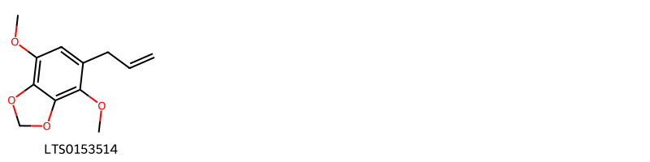
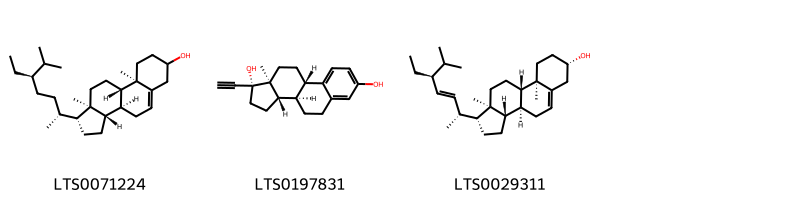

!!! abstract "Tóm tắt"

    Hương nhu trắng (tên khoa học: Ocimum gratissimum, thuộc họ Hoa môi - Lamiaceae) là một loài cây thân thảo thường cao hơn cây hương nhu tía. Lá mọc đối, có cuống, phiến lá dài 5-10cm, hình trứng nhọn, phía cuống thon, mép khía tai bèo hay có răng cưa thô: Trên gân chính của lá có lông. Hoa nhỏ mọc thành xim đơn 6 hoa, xếp thành chùm đôi khi ở dưới có phân nhánh. Hạch nhỏ hình cầu. Hạt không nở và không có chất nhầy bao quanh khi cho vào nước. Cây được trồng rộng rãi ở nhiều nơi trên thế giới, bao gồm cả Việt Nam. Trong y học cổ truyền và dân gian, hương nhu trắng được sử dụng từ lâu để điều trị các bệnh như cảm cúm, ho, sốt, đau đầu, rối loạn tiêu hóa và các bệnh ngoài da. Thành phần hóa học của hương nhu trắng rất phong phú, chủ yếu tập trung ở tinh dầu. Tinh dầu hương nhu trắng chứa nhiều hợp chất có hoạt tính sinh học như eugenol, methyl eugenol, thymol, và các chất khác. Chính các thành phần này mang lại tác dụng dược lý quý giá như: Kháng khuẩn, chống viêm, giảm đau, chống oxy hóa.

## Thông tin về thực vật

Dược liệu **Hương Nhu Trắng (Đoạn Đầu Cành Có Hoặc Không Có Hoa** từ bộ phận **nan** từ loài *Ocimum gratissimum*.

**Mô tả thực vật:** Cây thường cao hơn cây hương nhu tía. Lá mọc đối, có cuống, phiến lá dài 5-10cm, hình trứng nhọn, phía cuống thon, mép khía tai bèo hay có răng cưa thô: Trên gân chính của lá có lông. Hoa nhỏ mọc thành xim đơn 6 hoa, xếp thành chùm đôi khi ở dưới có phân nhánh. Hạch nhỏ hình cầu. Hạt không nở và không có chất nhầy bao quanh khi cho vào nước

*Tài liệu tham khảo:* "Những cây thuốc và vị thuốc Việt Nam" - Đỗ Tất Lợi 
Trong dược điển Việt nam, một loài được sử dụng làm dược liệu là *Ocimum gratissimum*. 
Chưa có thông tin về loài này trên gibf

## Thông tin về dược liệu 

### Định danh

!!! info "Thông tin về tên gọi"

    - Dược liệu tiếng Việt: nan
    - Dược liệu tiếng Trung: nan (nan)
    - Dược liệu tiếng Anh: nan
    - Dược liệu latin thông dụng: nan
    - Dược liệu latin kiểu DĐVN: *herba ocimi gratissimi*
    - Dược liệu latin kiểu DĐVN: *nan*
    - Dược liệu latin kiểu thông tư: *nan*
    - Bộ phận dùng: nan (nan)

### Mô tả dược liệu 

- **Theo dược điển Việt nam V:** nan

- **Mô tả dược liệu theo thông tư chế biến dược liệu theo phương pháp cổ truyền:** nan

### Chế biến 

- **Chế biến theo dược điển việt nam V**: nan

- **Chế biến theo thông tư:** nan

--- 

## Thành phần hóa học

- Theo tài liệu của GS. Đỗ Tất Lợi:  Eugenol, Methyl eugenol, Thymol. Ngoài ra, tinh dầu hương nhu trắng còn chứa các thành phần khác như: citral, ethyl cinnamat, methyl cinnamat, geraniol, linalool, và sesquiterpen, flavonoid, lacton, xanthen, tannin

Biomarker: eugenol
    

**Thành phần hóa học từ loài **Ocimum gratissimum**

Theo cơ sở dữ liệu lotus, loài *Ocimum gratissimum* đã phân lập và xác định được **115** hoạt chất thuộc về các nhóm Steroids and steroid derivatives, Organooxygen compounds, Fatty Acyls, Benzodioxoles, Cinnamic acids and derivatives, Flavonoids, Phenol ethers, Phenols, Benzene and substituted derivatives, Unsaturated hydrocarbons, Prenol lipids trong bảng dưới đây. Danh sách các hoạt chất như sau 4-isopropyl-1,6-dimethyl-2,3,4,4a,7,8-hexahydronaphthalene [(LTS0270743)](https://lotus.naturalproducts.net/compound/lotus_id/LTS0270743), 4-terpineol [(LTS0253733)](https://lotus.naturalproducts.net/compound/lotus_id/LTS0253733), (1z)-2-(3,5-dihydroxyphenyl)ethenyl (2e)-3-(3,4-dihydroxyphenyl)prop-2-enoate [(LTS0005376)](https://lotus.naturalproducts.net/compound/lotus_id/LTS0005376), (7ar)-1,1,7-trimethyl-4-methylidene-octahydrocyclopropa[e]azulen-7-ol [(LTS0091612)](https://lotus.naturalproducts.net/compound/lotus_id/LTS0091612), α pinene [(LTS0132416)](https://lotus.naturalproducts.net/compound/lotus_id/LTS0132416), (4s)-4-methyl-1-[(3e)-6-methylhepta-1,3-dien-2-yl]cyclohex-1-ene [(LTS0118892)](https://lotus.naturalproducts.net/compound/lotus_id/LTS0118892), phellandrene [(LTS0157173)](https://lotus.naturalproducts.net/compound/lotus_id/LTS0157173), eugenol [(LTS0052342)](https://lotus.naturalproducts.net/compound/lotus_id/LTS0052342), (4s)-4-methyl-1-[(2s,3e)-6-methylhept-3-en-2-yl]cyclohex-1-ene [(LTS0073231)](https://lotus.naturalproducts.net/compound/lotus_id/LTS0073231), 2-isopropyl-5-methylanisole [(LTS0054789)](https://lotus.naturalproducts.net/compound/lotus_id/LTS0054789), (1r,5s)-1-isopropyl-4-methylbicyclo[3.1.0]hex-3-en-2-one [(LTS0213292)](https://lotus.naturalproducts.net/compound/lotus_id/LTS0213292), luteolin 7-o-glucoside [(LTS0227450)](https://lotus.naturalproducts.net/compound/lotus_id/LTS0227450), (1ar,3as,7bs)-1,1,3a,7-tetramethyl-1ah,2h,3h,4h,5h,6h,7bh-cyclopropa[a]naphthalene [(LTS0064435)](https://lotus.naturalproducts.net/compound/lotus_id/LTS0064435), thymol [(LTS0168527)](https://lotus.naturalproducts.net/compound/lotus_id/LTS0168527), (r)-β-bisabolene [(LTS0077209)](https://lotus.naturalproducts.net/compound/lotus_id/LTS0077209), menthol natural [(LTS0024927)](https://lotus.naturalproducts.net/compound/lotus_id/LTS0024927), 4a-methyl-1-methylidene-7-(propan-2-ylidene)-hexahydro-2h-naphthalene [(LTS0267398)](https://lotus.naturalproducts.net/compound/lotus_id/LTS0267398), umbellulone [(LTS0242520)](https://lotus.naturalproducts.net/compound/lotus_id/LTS0242520), hyperoside [(LTS0089156)](https://lotus.naturalproducts.net/compound/lotus_id/LTS0089156), 10-hydroxy-1,2,6a,6b,9,9,12a-heptamethyl-2,3,4,5,6,7,8,8a,10,11,12,12b,13,14b-tetradecahydro-1h-picene-4a-carboxylic acid [(LTS0166564)](https://lotus.naturalproducts.net/compound/lotus_id/LTS0166564), luteolin [(LTS0017052)](https://lotus.naturalproducts.net/compound/lotus_id/LTS0017052), octanol [(LTS0250216)](https://lotus.naturalproducts.net/compound/lotus_id/LTS0250216), anisole [(LTS0013639)](https://lotus.naturalproducts.net/compound/lotus_id/LTS0013639), (1as,4as,7s,7ar,7bs)-1,1,7-trimethyl-4-methylidene-octahydrocyclopropa[e]azulen-7-ol [(LTS0073517)](https://lotus.naturalproducts.net/compound/lotus_id/LTS0073517), tricyclene [(LTS0179930)](https://lotus.naturalproducts.net/compound/lotus_id/LTS0179930), methyl eugenol [(LTS0098881)](https://lotus.naturalproducts.net/compound/lotus_id/LTS0098881), camphor [(LTS0091905)](https://lotus.naturalproducts.net/compound/lotus_id/LTS0091905), cymene [(LTS0181568)](https://lotus.naturalproducts.net/compound/lotus_id/LTS0181568), terpineol [(LTS0136148)](https://lotus.naturalproducts.net/compound/lotus_id/LTS0136148), (1z)-2-(3,4-dihydroxyphenyl)ethenyl (2e)-3-(3,4-dihydroxyphenyl)prop-2-enoate [(LTS0043560)](https://lotus.naturalproducts.net/compound/lotus_id/LTS0043560), gamma-muurolene [(LTS0052920)](https://lotus.naturalproducts.net/compound/lotus_id/LTS0052920), humulene [(LTS0263171)](https://lotus.naturalproducts.net/compound/lotus_id/LTS0263171), 3,7-dimethyl-1,3,6-octatriene [(LTS0172986)](https://lotus.naturalproducts.net/compound/lotus_id/LTS0172986), carvacrol [(LTS0012882)](https://lotus.naturalproducts.net/compound/lotus_id/LTS0012882), xanthomicrol [(LTS0082722)](https://lotus.naturalproducts.net/compound/lotus_id/LTS0082722), 3-octanone [(LTS0272728)](https://lotus.naturalproducts.net/compound/lotus_id/LTS0272728), 2-(3,4-dihydroxyphenyl)-5,7-dihydroxy-3-{[(2s,3r,4r,5r,6s)-3,4,5-trihydroxy-6-(hydroxymethyl)oxan-2-yl]oxy}chromen-4-one [(LTS0241372)](https://lotus.naturalproducts.net/compound/lotus_id/LTS0241372), geraniol [(LTS0258838)](https://lotus.naturalproducts.net/compound/lotus_id/LTS0258838), benzaldehyde [(LTS0094193)](https://lotus.naturalproducts.net/compound/lotus_id/LTS0094193), 3-ethenyl-3,7-dimethyloct-6-enoic acid [(LTS0019290)](https://lotus.naturalproducts.net/compound/lotus_id/LTS0019290), elemicin [(LTS0188875)](https://lotus.naturalproducts.net/compound/lotus_id/LTS0188875), 3-{[(2s,3r,4s,5s,6r)-4,5-dihydroxy-6-(hydroxymethyl)-3-{[(2s,3r,4r,5r,6s)-3,4,5-trihydroxy-6-methyloxan-2-yl]oxy}oxan-2-yl]oxy}-5,7-dihydroxy-2-(4-hydroxyphenyl)chromen-4-one [(LTS0171871)](https://lotus.naturalproducts.net/compound/lotus_id/LTS0171871), α-copaene [(LTS0207598)](https://lotus.naturalproducts.net/compound/lotus_id/LTS0207598), trans-β-ocimene [(LTS0049765)](https://lotus.naturalproducts.net/compound/lotus_id/LTS0049765), vicenin 2 [(LTS0181160)](https://lotus.naturalproducts.net/compound/lotus_id/LTS0181160), (1z,6z,8s)-8-isopropyl-1-methyl-5-methylidenecyclodeca-1,6-diene [(LTS0065195)](https://lotus.naturalproducts.net/compound/lotus_id/LTS0065195), 1-octen-3-ol [(LTS0057101)](https://lotus.naturalproducts.net/compound/lotus_id/LTS0057101), 4-isopropyl-6-methyl-1-methylidene-3,4,4a,7,8,8a-hexahydro-2h-naphthalene [(LTS0111070)](https://lotus.naturalproducts.net/compound/lotus_id/LTS0111070), isothymusin [(LTS0125785)](https://lotus.naturalproducts.net/compound/lotus_id/LTS0125785), 4-methyl-1-(6-methylhepta-1,3-dien-2-yl)cyclohex-1-ene [(LTS0012704)](https://lotus.naturalproducts.net/compound/lotus_id/LTS0012704), phytol [(LTS0096073)](https://lotus.naturalproducts.net/compound/lotus_id/LTS0096073), 2-(3,4-dihydroxyphenyl)-7-hydroxy-5-{[3,4,5-trihydroxy-6-(hydroxymethyl)oxan-2-yl]oxy}chromen-4-one [(LTS0181760)](https://lotus.naturalproducts.net/compound/lotus_id/LTS0181760), β-pinene [(LTS0117550)](https://lotus.naturalproducts.net/compound/lotus_id/LTS0117550), 6-methyleugenol [(LTS0267160)](https://lotus.naturalproducts.net/compound/lotus_id/LTS0267160), myrcenol [(LTS0248003)](https://lotus.naturalproducts.net/compound/lotus_id/LTS0248003), (6z)-2,6-dimethyl-10-methylidenedodeca-2,6-diene [(LTS0043373)](https://lotus.naturalproducts.net/compound/lotus_id/LTS0043373), (2s,7s)-3,3,7-trimethyl-8-methylidenetricyclo[5.4.0.0²,⁹]undecane [(LTS0085446)](https://lotus.naturalproducts.net/compound/lotus_id/LTS0085446), cirsimaritin [(LTS0146305)](https://lotus.naturalproducts.net/compound/lotus_id/LTS0146305), apiol [(LTS0153514)](https://lotus.naturalproducts.net/compound/lotus_id/LTS0153514), β-ocimene [(LTS0242381)](https://lotus.naturalproducts.net/compound/lotus_id/LTS0242381), β-elemene [(LTS0225699)](https://lotus.naturalproducts.net/compound/lotus_id/LTS0225699), (4e,8e)-4,8,11,11-tetramethylcycloundeca-1,4,8-triene [(LTS0118116)](https://lotus.naturalproducts.net/compound/lotus_id/LTS0118116), 3-rutinosyl quercetin [(LTS0032845)](https://lotus.naturalproducts.net/compound/lotus_id/LTS0032845), monoterpenes [(LTS0106881)](https://lotus.naturalproducts.net/compound/lotus_id/LTS0106881), isovitexin [(LTS0209186)](https://lotus.naturalproducts.net/compound/lotus_id/LTS0209186), stigmast-5-en-3-ol [(LTS0071224)](https://lotus.naturalproducts.net/compound/lotus_id/LTS0071224), farnesene [(LTS0057150)](https://lotus.naturalproducts.net/compound/lotus_id/LTS0057150), β-bourbonene [(LTS0074484)](https://lotus.naturalproducts.net/compound/lotus_id/LTS0074484), terpinolene [(LTS0104525)](https://lotus.naturalproducts.net/compound/lotus_id/LTS0104525), (+)-gamma-cadinene [(LTS0103949)](https://lotus.naturalproducts.net/compound/lotus_id/LTS0103949), delta-cadinene [(LTS0019321)](https://lotus.naturalproducts.net/compound/lotus_id/LTS0019321), 1,1,3a,7-tetramethyl-1ah,2h,3h,4h,5h,6h,7bh-cyclopropa[a]naphthalene [(LTS0273480)](https://lotus.naturalproducts.net/compound/lotus_id/LTS0273480), α-thujene [(LTS0176954)](https://lotus.naturalproducts.net/compound/lotus_id/LTS0176954), vitexin [(LTS0199581)](https://lotus.naturalproducts.net/compound/lotus_id/LTS0199581), (-)-β-cubebene [(LTS0123697)](https://lotus.naturalproducts.net/compound/lotus_id/LTS0123697), tarragon [(LTS0245226)](https://lotus.naturalproducts.net/compound/lotus_id/LTS0245226), (-)-β-bisabolene [(LTS0009940)](https://lotus.naturalproducts.net/compound/lotus_id/LTS0009940), caryophyllene [(LTS0131870)](https://lotus.naturalproducts.net/compound/lotus_id/LTS0131870), nictoflorin [(LTS0182501)](https://lotus.naturalproducts.net/compound/lotus_id/LTS0182501), 4-methyl-1-[(3e)-6-methylhept-3-en-2-yl]cyclohex-1-ene [(LTS0116482)](https://lotus.naturalproducts.net/compound/lotus_id/LTS0116482), nevadensin [(LTS0200685)](https://lotus.naturalproducts.net/compound/lotus_id/LTS0200685), longifolene [(LTS0202079)](https://lotus.naturalproducts.net/compound/lotus_id/LTS0202079), caryophyllene [(LTS0085212)](https://lotus.naturalproducts.net/compound/lotus_id/LTS0085212), β-selinene [(LTS0096341)](https://lotus.naturalproducts.net/compound/lotus_id/LTS0096341), rosemary acid [(LTS0207820)](https://lotus.naturalproducts.net/compound/lotus_id/LTS0207820), phytosterol [(LTS0029311)](https://lotus.naturalproducts.net/compound/lotus_id/LTS0029311), ethinyl estradiol [(LTS0197831)](https://lotus.naturalproducts.net/compound/lotus_id/LTS0197831), α terpinene [(LTS0232891)](https://lotus.naturalproducts.net/compound/lotus_id/LTS0232891), β-caryophyllen [(LTS0141501)](https://lotus.naturalproducts.net/compound/lotus_id/LTS0141501), (-)-germacrene d [(LTS0059194)](https://lotus.naturalproducts.net/compound/lotus_id/LTS0059194), terpinene [(LTS0136858)](https://lotus.naturalproducts.net/compound/lotus_id/LTS0136858), sabinene [(LTS0224133)](https://lotus.naturalproducts.net/compound/lotus_id/LTS0224133), neral [(LTS0165243)](https://lotus.naturalproducts.net/compound/lotus_id/LTS0165243), α-thujene [(LTS0185078)](https://lotus.naturalproducts.net/compound/lotus_id/LTS0185078), thujene [(LTS0268450)](https://lotus.naturalproducts.net/compound/lotus_id/LTS0268450), oleanolic acid [(LTS0117717)](https://lotus.naturalproducts.net/compound/lotus_id/LTS0117717), (5s)-1-isopropyl-4-methylidenebicyclo[3.1.0]hexane [(LTS0129854)](https://lotus.naturalproducts.net/compound/lotus_id/LTS0129854), 6-{[2-(3,4-dihydroxyphenyl)-5-hydroxy-4-oxochromen-7-yl]oxy}-3,4,5-trihydroxyoxane-2-carboxylic acid [(LTS0175049)](https://lotus.naturalproducts.net/compound/lotus_id/LTS0175049), methyl cinnamate [(LTS0083574)](https://lotus.naturalproducts.net/compound/lotus_id/LTS0083574), ursolic acid [(LTS0250838)](https://lotus.naturalproducts.net/compound/lotus_id/LTS0250838), α-bergamotene [(LTS0226115)](https://lotus.naturalproducts.net/compound/lotus_id/LTS0226115), α-myrcene [(LTS0115731)](https://lotus.naturalproducts.net/compound/lotus_id/LTS0115731), β-farnesene [(LTS0067925)](https://lotus.naturalproducts.net/compound/lotus_id/LTS0067925), limonene,  [(LTS0155981)](https://lotus.naturalproducts.net/compound/lotus_id/LTS0155981), 4-ethenyl-1-isopropyl-4-methyl-3-(prop-1-en-2-yl)cyclohex-1-ene [(LTS0080134)](https://lotus.naturalproducts.net/compound/lotus_id/LTS0080134), 3-octanol [(LTS0055953)](https://lotus.naturalproducts.net/compound/lotus_id/LTS0055953), γ-terpineol [(LTS0175059)](https://lotus.naturalproducts.net/compound/lotus_id/LTS0175059), (1r,2s)-5-isopropyl-2-methylbicyclo[3.1.0]hexan-2-ol [(LTS0265986)](https://lotus.naturalproducts.net/compound/lotus_id/LTS0265986), apigenin 7-o-β-glucoside [(LTS0252743)](https://lotus.naturalproducts.net/compound/lotus_id/LTS0252743), methyl cinnamate [(LTS0222336)](https://lotus.naturalproducts.net/compound/lotus_id/LTS0222336), (1r,2s,7s,8s)-8-isopropyl-1,3-dimethyltricyclo[4.4.0.0²,⁷]dec-3-ene [(LTS0190031)](https://lotus.naturalproducts.net/compound/lotus_id/LTS0190031), α-cadinol [(LTS0206935)](https://lotus.naturalproducts.net/compound/lotus_id/LTS0206935), camphene [(LTS0267242)](https://lotus.naturalproducts.net/compound/lotus_id/LTS0267242), linalool, (+-)- [(LTS0128839)](https://lotus.naturalproducts.net/compound/lotus_id/LTS0128839), (1r,4s,4ar)-4-isopropyl-1,6-dimethyl-3,4,4a,7,8,8a-hexahydro-2h-naphthalen-1-ol [(LTS0164497)](https://lotus.naturalproducts.net/compound/lotus_id/LTS0164497). 
        
| chemicalTaxonomyClassyfireClass     |   smiles_count |
|:------------------------------------|---------------:|
| Benzene and substituted derivatives |             31 |
| Benzodioxoles                       |             25 |
| Cinnamic acids and derivatives      |            179 |
| Fatty Acyls                         |             32 |
| Flavonoids                          |           1274 |
| Organooxygen compounds              |             31 |
| Phenol ethers                       |             50 |
| Phenols                             |             41 |
| Prenol lipids                       |           2269 |
| Steroids and steroid derivatives    |            227 |
| Unsaturated hydrocarbons            |             18 |

            
### Nhóm Benzene and substituted derivatives
<figure markdown="span">
    { width=100% }
<figcaption>Hình ảnh cấu trúc hóa học của hoạt chất thuộc nhóm *Benzene and substituted derivatives*. Tên thường gọi của các hoạt chất tương ứng là methyl eugenol [(LTS0098881)](https://lotus.naturalproducts.net/compound/lotus_id/LTS0098881), benzaldehyde [(LTS0094193)](https://lotus.naturalproducts.net/compound/lotus_id/LTS0094193).</figcaption>
</figure>

            
            
### Nhóm Benzene and substituted derivatives
<figure markdown="span">
    { width=100% }
<figcaption>Hình ảnh cấu trúc hóa học của hoạt chất thuộc nhóm *Benzene and substituted derivatives*. Tên thường gọi của các hoạt chất tương ứng là methyl eugenol [(LTS0098881)](https://lotus.naturalproducts.net/compound/lotus_id/LTS0098881), benzaldehyde [(LTS0094193)](https://lotus.naturalproducts.net/compound/lotus_id/LTS0094193).</figcaption>
</figure>

### Nhóm Benzodioxoles
<figure markdown="span">
    { width=100% }
<figcaption>Hình ảnh cấu trúc hóa học của hoạt chất thuộc nhóm *Benzodioxoles*. Tên thường gọi của các hoạt chất tương ứng là apiol [(LTS0153514)](https://lotus.naturalproducts.net/compound/lotus_id/LTS0153514).</figcaption>
</figure>

            
            
### Nhóm Benzene and substituted derivatives
<figure markdown="span">
    { width=100% }
<figcaption>Hình ảnh cấu trúc hóa học của hoạt chất thuộc nhóm *Benzene and substituted derivatives*. Tên thường gọi của các hoạt chất tương ứng là methyl eugenol [(LTS0098881)](https://lotus.naturalproducts.net/compound/lotus_id/LTS0098881), benzaldehyde [(LTS0094193)](https://lotus.naturalproducts.net/compound/lotus_id/LTS0094193).</figcaption>
</figure>

### Nhóm Benzodioxoles
<figure markdown="span">
    { width=100% }
<figcaption>Hình ảnh cấu trúc hóa học của hoạt chất thuộc nhóm *Benzodioxoles*. Tên thường gọi của các hoạt chất tương ứng là apiol [(LTS0153514)](https://lotus.naturalproducts.net/compound/lotus_id/LTS0153514).</figcaption>
</figure>

### Nhóm Cinnamic acids and derivatives
<figure markdown="span">
    { width=100% }
<figcaption>Hình ảnh cấu trúc hóa học của hoạt chất thuộc nhóm *Cinnamic acids and derivatives*. Tên thường gọi của các hoạt chất tương ứng là methyl cinnamate [(LTS0083574)](https://lotus.naturalproducts.net/compound/lotus_id/LTS0083574), methyl cinnamate [(LTS0222336)](https://lotus.naturalproducts.net/compound/lotus_id/LTS0222336), rosemary acid [(LTS0207820)](https://lotus.naturalproducts.net/compound/lotus_id/LTS0207820), (1z)-2-(3,5-dihydroxyphenyl)ethenyl (2e)-3-(3,4-dihydroxyphenyl)prop-2-enoate [(LTS0005376)](https://lotus.naturalproducts.net/compound/lotus_id/LTS0005376), (1z)-2-(3,4-dihydroxyphenyl)ethenyl (2e)-3-(3,4-dihydroxyphenyl)prop-2-enoate [(LTS0043560)](https://lotus.naturalproducts.net/compound/lotus_id/LTS0043560).</figcaption>
</figure>

            
            
### Nhóm Benzene and substituted derivatives
<figure markdown="span">
    { width=100% }
<figcaption>Hình ảnh cấu trúc hóa học của hoạt chất thuộc nhóm *Benzene and substituted derivatives*. Tên thường gọi của các hoạt chất tương ứng là methyl eugenol [(LTS0098881)](https://lotus.naturalproducts.net/compound/lotus_id/LTS0098881), benzaldehyde [(LTS0094193)](https://lotus.naturalproducts.net/compound/lotus_id/LTS0094193).</figcaption>
</figure>

### Nhóm Benzodioxoles
<figure markdown="span">
    { width=100% }
<figcaption>Hình ảnh cấu trúc hóa học của hoạt chất thuộc nhóm *Benzodioxoles*. Tên thường gọi của các hoạt chất tương ứng là apiol [(LTS0153514)](https://lotus.naturalproducts.net/compound/lotus_id/LTS0153514).</figcaption>
</figure>

### Nhóm Cinnamic acids and derivatives
<figure markdown="span">
    { width=100% }
<figcaption>Hình ảnh cấu trúc hóa học của hoạt chất thuộc nhóm *Cinnamic acids and derivatives*. Tên thường gọi của các hoạt chất tương ứng là methyl cinnamate [(LTS0083574)](https://lotus.naturalproducts.net/compound/lotus_id/LTS0083574), methyl cinnamate [(LTS0222336)](https://lotus.naturalproducts.net/compound/lotus_id/LTS0222336), rosemary acid [(LTS0207820)](https://lotus.naturalproducts.net/compound/lotus_id/LTS0207820), (1z)-2-(3,5-dihydroxyphenyl)ethenyl (2e)-3-(3,4-dihydroxyphenyl)prop-2-enoate [(LTS0005376)](https://lotus.naturalproducts.net/compound/lotus_id/LTS0005376), (1z)-2-(3,4-dihydroxyphenyl)ethenyl (2e)-3-(3,4-dihydroxyphenyl)prop-2-enoate [(LTS0043560)](https://lotus.naturalproducts.net/compound/lotus_id/LTS0043560).</figcaption>
</figure>

### Nhóm Fatty Acyls
<figure markdown="span">
    { width=100% }
<figcaption>Hình ảnh cấu trúc hóa học của hoạt chất thuộc nhóm *Fatty Acyls*. Tên thường gọi của các hoạt chất tương ứng là octanol [(LTS0250216)](https://lotus.naturalproducts.net/compound/lotus_id/LTS0250216), 3-octanol [(LTS0055953)](https://lotus.naturalproducts.net/compound/lotus_id/LTS0055953), 1-octen-3-ol [(LTS0057101)](https://lotus.naturalproducts.net/compound/lotus_id/LTS0057101).</figcaption>
</figure>

            
            
### Nhóm Benzene and substituted derivatives
<figure markdown="span">
    { width=100% }
<figcaption>Hình ảnh cấu trúc hóa học của hoạt chất thuộc nhóm *Benzene and substituted derivatives*. Tên thường gọi của các hoạt chất tương ứng là methyl eugenol [(LTS0098881)](https://lotus.naturalproducts.net/compound/lotus_id/LTS0098881), benzaldehyde [(LTS0094193)](https://lotus.naturalproducts.net/compound/lotus_id/LTS0094193).</figcaption>
</figure>

### Nhóm Benzodioxoles
<figure markdown="span">
    { width=100% }
<figcaption>Hình ảnh cấu trúc hóa học của hoạt chất thuộc nhóm *Benzodioxoles*. Tên thường gọi của các hoạt chất tương ứng là apiol [(LTS0153514)](https://lotus.naturalproducts.net/compound/lotus_id/LTS0153514).</figcaption>
</figure>

### Nhóm Cinnamic acids and derivatives
<figure markdown="span">
    { width=100% }
<figcaption>Hình ảnh cấu trúc hóa học của hoạt chất thuộc nhóm *Cinnamic acids and derivatives*. Tên thường gọi của các hoạt chất tương ứng là methyl cinnamate [(LTS0083574)](https://lotus.naturalproducts.net/compound/lotus_id/LTS0083574), methyl cinnamate [(LTS0222336)](https://lotus.naturalproducts.net/compound/lotus_id/LTS0222336), rosemary acid [(LTS0207820)](https://lotus.naturalproducts.net/compound/lotus_id/LTS0207820), (1z)-2-(3,5-dihydroxyphenyl)ethenyl (2e)-3-(3,4-dihydroxyphenyl)prop-2-enoate [(LTS0005376)](https://lotus.naturalproducts.net/compound/lotus_id/LTS0005376), (1z)-2-(3,4-dihydroxyphenyl)ethenyl (2e)-3-(3,4-dihydroxyphenyl)prop-2-enoate [(LTS0043560)](https://lotus.naturalproducts.net/compound/lotus_id/LTS0043560).</figcaption>
</figure>

### Nhóm Fatty Acyls
<figure markdown="span">
    { width=100% }
<figcaption>Hình ảnh cấu trúc hóa học của hoạt chất thuộc nhóm *Fatty Acyls*. Tên thường gọi của các hoạt chất tương ứng là octanol [(LTS0250216)](https://lotus.naturalproducts.net/compound/lotus_id/LTS0250216), 3-octanol [(LTS0055953)](https://lotus.naturalproducts.net/compound/lotus_id/LTS0055953), 1-octen-3-ol [(LTS0057101)](https://lotus.naturalproducts.net/compound/lotus_id/LTS0057101).</figcaption>
</figure>

### Nhóm Flavonoids
<figure markdown="span">
    { width=100% }
<figcaption>Hình ảnh cấu trúc hóa học của hoạt chất thuộc nhóm *Flavonoids*. Tên thường gọi của các hoạt chất tương ứng là hyperoside [(LTS0089156)](https://lotus.naturalproducts.net/compound/lotus_id/LTS0089156), nevadensin [(LTS0200685)](https://lotus.naturalproducts.net/compound/lotus_id/LTS0200685), cirsimaritin [(LTS0146305)](https://lotus.naturalproducts.net/compound/lotus_id/LTS0146305), apigenin 7-o-β-glucoside [(LTS0252743)](https://lotus.naturalproducts.net/compound/lotus_id/LTS0252743), xanthomicrol [(LTS0082722)](https://lotus.naturalproducts.net/compound/lotus_id/LTS0082722), isovitexin [(LTS0209186)](https://lotus.naturalproducts.net/compound/lotus_id/LTS0209186), 2-(3,4-dihydroxyphenyl)-7-hydroxy-5-{[3,4,5-trihydroxy-6-(hydroxymethyl)oxan-2-yl]oxy}chromen-4-one [(LTS0181760)](https://lotus.naturalproducts.net/compound/lotus_id/LTS0181760), vitexin [(LTS0199581)](https://lotus.naturalproducts.net/compound/lotus_id/LTS0199581), 2-(3,4-dihydroxyphenyl)-5,7-dihydroxy-3-{[(2s,3r,4r,5r,6s)-3,4,5-trihydroxy-6-(hydroxymethyl)oxan-2-yl]oxy}chromen-4-one [(LTS0241372)](https://lotus.naturalproducts.net/compound/lotus_id/LTS0241372), vicenin 2 [(LTS0181160)](https://lotus.naturalproducts.net/compound/lotus_id/LTS0181160), 3-{[(2s,3r,4s,5s,6r)-4,5-dihydroxy-6-(hydroxymethyl)-3-{[(2s,3r,4r,5r,6s)-3,4,5-trihydroxy-6-methyloxan-2-yl]oxy}oxan-2-yl]oxy}-5,7-dihydroxy-2-(4-hydroxyphenyl)chromen-4-one [(LTS0171871)](https://lotus.naturalproducts.net/compound/lotus_id/LTS0171871), 6-{[2-(3,4-dihydroxyphenyl)-5-hydroxy-4-oxochromen-7-yl]oxy}-3,4,5-trihydroxyoxane-2-carboxylic acid [(LTS0175049)](https://lotus.naturalproducts.net/compound/lotus_id/LTS0175049), luteolin 7-o-glucoside [(LTS0227450)](https://lotus.naturalproducts.net/compound/lotus_id/LTS0227450), nictoflorin [(LTS0182501)](https://lotus.naturalproducts.net/compound/lotus_id/LTS0182501), isothymusin [(LTS0125785)](https://lotus.naturalproducts.net/compound/lotus_id/LTS0125785), luteolin [(LTS0017052)](https://lotus.naturalproducts.net/compound/lotus_id/LTS0017052), 3-rutinosyl quercetin [(LTS0032845)](https://lotus.naturalproducts.net/compound/lotus_id/LTS0032845).</figcaption>
</figure>

            
            
### Nhóm Benzene and substituted derivatives
<figure markdown="span">
    { width=100% }
<figcaption>Hình ảnh cấu trúc hóa học của hoạt chất thuộc nhóm *Benzene and substituted derivatives*. Tên thường gọi của các hoạt chất tương ứng là methyl eugenol [(LTS0098881)](https://lotus.naturalproducts.net/compound/lotus_id/LTS0098881), benzaldehyde [(LTS0094193)](https://lotus.naturalproducts.net/compound/lotus_id/LTS0094193).</figcaption>
</figure>

### Nhóm Benzodioxoles
<figure markdown="span">
    { width=100% }
<figcaption>Hình ảnh cấu trúc hóa học của hoạt chất thuộc nhóm *Benzodioxoles*. Tên thường gọi của các hoạt chất tương ứng là apiol [(LTS0153514)](https://lotus.naturalproducts.net/compound/lotus_id/LTS0153514).</figcaption>
</figure>

### Nhóm Cinnamic acids and derivatives
<figure markdown="span">
    { width=100% }
<figcaption>Hình ảnh cấu trúc hóa học của hoạt chất thuộc nhóm *Cinnamic acids and derivatives*. Tên thường gọi của các hoạt chất tương ứng là methyl cinnamate [(LTS0083574)](https://lotus.naturalproducts.net/compound/lotus_id/LTS0083574), methyl cinnamate [(LTS0222336)](https://lotus.naturalproducts.net/compound/lotus_id/LTS0222336), rosemary acid [(LTS0207820)](https://lotus.naturalproducts.net/compound/lotus_id/LTS0207820), (1z)-2-(3,5-dihydroxyphenyl)ethenyl (2e)-3-(3,4-dihydroxyphenyl)prop-2-enoate [(LTS0005376)](https://lotus.naturalproducts.net/compound/lotus_id/LTS0005376), (1z)-2-(3,4-dihydroxyphenyl)ethenyl (2e)-3-(3,4-dihydroxyphenyl)prop-2-enoate [(LTS0043560)](https://lotus.naturalproducts.net/compound/lotus_id/LTS0043560).</figcaption>
</figure>

### Nhóm Fatty Acyls
<figure markdown="span">
    { width=100% }
<figcaption>Hình ảnh cấu trúc hóa học của hoạt chất thuộc nhóm *Fatty Acyls*. Tên thường gọi của các hoạt chất tương ứng là octanol [(LTS0250216)](https://lotus.naturalproducts.net/compound/lotus_id/LTS0250216), 3-octanol [(LTS0055953)](https://lotus.naturalproducts.net/compound/lotus_id/LTS0055953), 1-octen-3-ol [(LTS0057101)](https://lotus.naturalproducts.net/compound/lotus_id/LTS0057101).</figcaption>
</figure>

### Nhóm Flavonoids
<figure markdown="span">
    { width=100% }
<figcaption>Hình ảnh cấu trúc hóa học của hoạt chất thuộc nhóm *Flavonoids*. Tên thường gọi của các hoạt chất tương ứng là hyperoside [(LTS0089156)](https://lotus.naturalproducts.net/compound/lotus_id/LTS0089156), nevadensin [(LTS0200685)](https://lotus.naturalproducts.net/compound/lotus_id/LTS0200685), cirsimaritin [(LTS0146305)](https://lotus.naturalproducts.net/compound/lotus_id/LTS0146305), apigenin 7-o-β-glucoside [(LTS0252743)](https://lotus.naturalproducts.net/compound/lotus_id/LTS0252743), xanthomicrol [(LTS0082722)](https://lotus.naturalproducts.net/compound/lotus_id/LTS0082722), isovitexin [(LTS0209186)](https://lotus.naturalproducts.net/compound/lotus_id/LTS0209186), 2-(3,4-dihydroxyphenyl)-7-hydroxy-5-{[3,4,5-trihydroxy-6-(hydroxymethyl)oxan-2-yl]oxy}chromen-4-one [(LTS0181760)](https://lotus.naturalproducts.net/compound/lotus_id/LTS0181760), vitexin [(LTS0199581)](https://lotus.naturalproducts.net/compound/lotus_id/LTS0199581), 2-(3,4-dihydroxyphenyl)-5,7-dihydroxy-3-{[(2s,3r,4r,5r,6s)-3,4,5-trihydroxy-6-(hydroxymethyl)oxan-2-yl]oxy}chromen-4-one [(LTS0241372)](https://lotus.naturalproducts.net/compound/lotus_id/LTS0241372), vicenin 2 [(LTS0181160)](https://lotus.naturalproducts.net/compound/lotus_id/LTS0181160), 3-{[(2s,3r,4s,5s,6r)-4,5-dihydroxy-6-(hydroxymethyl)-3-{[(2s,3r,4r,5r,6s)-3,4,5-trihydroxy-6-methyloxan-2-yl]oxy}oxan-2-yl]oxy}-5,7-dihydroxy-2-(4-hydroxyphenyl)chromen-4-one [(LTS0171871)](https://lotus.naturalproducts.net/compound/lotus_id/LTS0171871), 6-{[2-(3,4-dihydroxyphenyl)-5-hydroxy-4-oxochromen-7-yl]oxy}-3,4,5-trihydroxyoxane-2-carboxylic acid [(LTS0175049)](https://lotus.naturalproducts.net/compound/lotus_id/LTS0175049), luteolin 7-o-glucoside [(LTS0227450)](https://lotus.naturalproducts.net/compound/lotus_id/LTS0227450), nictoflorin [(LTS0182501)](https://lotus.naturalproducts.net/compound/lotus_id/LTS0182501), isothymusin [(LTS0125785)](https://lotus.naturalproducts.net/compound/lotus_id/LTS0125785), luteolin [(LTS0017052)](https://lotus.naturalproducts.net/compound/lotus_id/LTS0017052), 3-rutinosyl quercetin [(LTS0032845)](https://lotus.naturalproducts.net/compound/lotus_id/LTS0032845).</figcaption>
</figure>

### Nhóm Organooxygen compounds
<figure markdown="span">
    { width=100% }
<figcaption>Hình ảnh cấu trúc hóa học của hoạt chất thuộc nhóm *Organooxygen compounds*. Tên thường gọi của các hoạt chất tương ứng là 3-octanone [(LTS0272728)](https://lotus.naturalproducts.net/compound/lotus_id/LTS0272728), myrcenol [(LTS0248003)](https://lotus.naturalproducts.net/compound/lotus_id/LTS0248003).</figcaption>
</figure>

            
            
### Nhóm Benzene and substituted derivatives
<figure markdown="span">
    { width=100% }
<figcaption>Hình ảnh cấu trúc hóa học của hoạt chất thuộc nhóm *Benzene and substituted derivatives*. Tên thường gọi của các hoạt chất tương ứng là methyl eugenol [(LTS0098881)](https://lotus.naturalproducts.net/compound/lotus_id/LTS0098881), benzaldehyde [(LTS0094193)](https://lotus.naturalproducts.net/compound/lotus_id/LTS0094193).</figcaption>
</figure>

### Nhóm Benzodioxoles
<figure markdown="span">
    { width=100% }
<figcaption>Hình ảnh cấu trúc hóa học của hoạt chất thuộc nhóm *Benzodioxoles*. Tên thường gọi của các hoạt chất tương ứng là apiol [(LTS0153514)](https://lotus.naturalproducts.net/compound/lotus_id/LTS0153514).</figcaption>
</figure>

### Nhóm Cinnamic acids and derivatives
<figure markdown="span">
    { width=100% }
<figcaption>Hình ảnh cấu trúc hóa học của hoạt chất thuộc nhóm *Cinnamic acids and derivatives*. Tên thường gọi của các hoạt chất tương ứng là methyl cinnamate [(LTS0083574)](https://lotus.naturalproducts.net/compound/lotus_id/LTS0083574), methyl cinnamate [(LTS0222336)](https://lotus.naturalproducts.net/compound/lotus_id/LTS0222336), rosemary acid [(LTS0207820)](https://lotus.naturalproducts.net/compound/lotus_id/LTS0207820), (1z)-2-(3,5-dihydroxyphenyl)ethenyl (2e)-3-(3,4-dihydroxyphenyl)prop-2-enoate [(LTS0005376)](https://lotus.naturalproducts.net/compound/lotus_id/LTS0005376), (1z)-2-(3,4-dihydroxyphenyl)ethenyl (2e)-3-(3,4-dihydroxyphenyl)prop-2-enoate [(LTS0043560)](https://lotus.naturalproducts.net/compound/lotus_id/LTS0043560).</figcaption>
</figure>

### Nhóm Fatty Acyls
<figure markdown="span">
    { width=100% }
<figcaption>Hình ảnh cấu trúc hóa học của hoạt chất thuộc nhóm *Fatty Acyls*. Tên thường gọi của các hoạt chất tương ứng là octanol [(LTS0250216)](https://lotus.naturalproducts.net/compound/lotus_id/LTS0250216), 3-octanol [(LTS0055953)](https://lotus.naturalproducts.net/compound/lotus_id/LTS0055953), 1-octen-3-ol [(LTS0057101)](https://lotus.naturalproducts.net/compound/lotus_id/LTS0057101).</figcaption>
</figure>

### Nhóm Flavonoids
<figure markdown="span">
    { width=100% }
<figcaption>Hình ảnh cấu trúc hóa học của hoạt chất thuộc nhóm *Flavonoids*. Tên thường gọi của các hoạt chất tương ứng là hyperoside [(LTS0089156)](https://lotus.naturalproducts.net/compound/lotus_id/LTS0089156), nevadensin [(LTS0200685)](https://lotus.naturalproducts.net/compound/lotus_id/LTS0200685), cirsimaritin [(LTS0146305)](https://lotus.naturalproducts.net/compound/lotus_id/LTS0146305), apigenin 7-o-β-glucoside [(LTS0252743)](https://lotus.naturalproducts.net/compound/lotus_id/LTS0252743), xanthomicrol [(LTS0082722)](https://lotus.naturalproducts.net/compound/lotus_id/LTS0082722), isovitexin [(LTS0209186)](https://lotus.naturalproducts.net/compound/lotus_id/LTS0209186), 2-(3,4-dihydroxyphenyl)-7-hydroxy-5-{[3,4,5-trihydroxy-6-(hydroxymethyl)oxan-2-yl]oxy}chromen-4-one [(LTS0181760)](https://lotus.naturalproducts.net/compound/lotus_id/LTS0181760), vitexin [(LTS0199581)](https://lotus.naturalproducts.net/compound/lotus_id/LTS0199581), 2-(3,4-dihydroxyphenyl)-5,7-dihydroxy-3-{[(2s,3r,4r,5r,6s)-3,4,5-trihydroxy-6-(hydroxymethyl)oxan-2-yl]oxy}chromen-4-one [(LTS0241372)](https://lotus.naturalproducts.net/compound/lotus_id/LTS0241372), vicenin 2 [(LTS0181160)](https://lotus.naturalproducts.net/compound/lotus_id/LTS0181160), 3-{[(2s,3r,4s,5s,6r)-4,5-dihydroxy-6-(hydroxymethyl)-3-{[(2s,3r,4r,5r,6s)-3,4,5-trihydroxy-6-methyloxan-2-yl]oxy}oxan-2-yl]oxy}-5,7-dihydroxy-2-(4-hydroxyphenyl)chromen-4-one [(LTS0171871)](https://lotus.naturalproducts.net/compound/lotus_id/LTS0171871), 6-{[2-(3,4-dihydroxyphenyl)-5-hydroxy-4-oxochromen-7-yl]oxy}-3,4,5-trihydroxyoxane-2-carboxylic acid [(LTS0175049)](https://lotus.naturalproducts.net/compound/lotus_id/LTS0175049), luteolin 7-o-glucoside [(LTS0227450)](https://lotus.naturalproducts.net/compound/lotus_id/LTS0227450), nictoflorin [(LTS0182501)](https://lotus.naturalproducts.net/compound/lotus_id/LTS0182501), isothymusin [(LTS0125785)](https://lotus.naturalproducts.net/compound/lotus_id/LTS0125785), luteolin [(LTS0017052)](https://lotus.naturalproducts.net/compound/lotus_id/LTS0017052), 3-rutinosyl quercetin [(LTS0032845)](https://lotus.naturalproducts.net/compound/lotus_id/LTS0032845).</figcaption>
</figure>

### Nhóm Organooxygen compounds
<figure markdown="span">
    { width=100% }
<figcaption>Hình ảnh cấu trúc hóa học của hoạt chất thuộc nhóm *Organooxygen compounds*. Tên thường gọi của các hoạt chất tương ứng là 3-octanone [(LTS0272728)](https://lotus.naturalproducts.net/compound/lotus_id/LTS0272728), myrcenol [(LTS0248003)](https://lotus.naturalproducts.net/compound/lotus_id/LTS0248003).</figcaption>
</figure>

### Nhóm Phenol ethers
<figure markdown="span">
    { width=100% }
<figcaption>Hình ảnh cấu trúc hóa học của hoạt chất thuộc nhóm *Phenol ethers*. Tên thường gọi của các hoạt chất tương ứng là elemicin [(LTS0188875)](https://lotus.naturalproducts.net/compound/lotus_id/LTS0188875), tarragon [(LTS0245226)](https://lotus.naturalproducts.net/compound/lotus_id/LTS0245226), anisole [(LTS0013639)](https://lotus.naturalproducts.net/compound/lotus_id/LTS0013639).</figcaption>
</figure>

            
            
### Nhóm Benzene and substituted derivatives
<figure markdown="span">
    { width=100% }
<figcaption>Hình ảnh cấu trúc hóa học của hoạt chất thuộc nhóm *Benzene and substituted derivatives*. Tên thường gọi của các hoạt chất tương ứng là methyl eugenol [(LTS0098881)](https://lotus.naturalproducts.net/compound/lotus_id/LTS0098881), benzaldehyde [(LTS0094193)](https://lotus.naturalproducts.net/compound/lotus_id/LTS0094193).</figcaption>
</figure>

### Nhóm Benzodioxoles
<figure markdown="span">
    { width=100% }
<figcaption>Hình ảnh cấu trúc hóa học của hoạt chất thuộc nhóm *Benzodioxoles*. Tên thường gọi của các hoạt chất tương ứng là apiol [(LTS0153514)](https://lotus.naturalproducts.net/compound/lotus_id/LTS0153514).</figcaption>
</figure>

### Nhóm Cinnamic acids and derivatives
<figure markdown="span">
    { width=100% }
<figcaption>Hình ảnh cấu trúc hóa học của hoạt chất thuộc nhóm *Cinnamic acids and derivatives*. Tên thường gọi của các hoạt chất tương ứng là methyl cinnamate [(LTS0083574)](https://lotus.naturalproducts.net/compound/lotus_id/LTS0083574), methyl cinnamate [(LTS0222336)](https://lotus.naturalproducts.net/compound/lotus_id/LTS0222336), rosemary acid [(LTS0207820)](https://lotus.naturalproducts.net/compound/lotus_id/LTS0207820), (1z)-2-(3,5-dihydroxyphenyl)ethenyl (2e)-3-(3,4-dihydroxyphenyl)prop-2-enoate [(LTS0005376)](https://lotus.naturalproducts.net/compound/lotus_id/LTS0005376), (1z)-2-(3,4-dihydroxyphenyl)ethenyl (2e)-3-(3,4-dihydroxyphenyl)prop-2-enoate [(LTS0043560)](https://lotus.naturalproducts.net/compound/lotus_id/LTS0043560).</figcaption>
</figure>

### Nhóm Fatty Acyls
<figure markdown="span">
    { width=100% }
<figcaption>Hình ảnh cấu trúc hóa học của hoạt chất thuộc nhóm *Fatty Acyls*. Tên thường gọi của các hoạt chất tương ứng là octanol [(LTS0250216)](https://lotus.naturalproducts.net/compound/lotus_id/LTS0250216), 3-octanol [(LTS0055953)](https://lotus.naturalproducts.net/compound/lotus_id/LTS0055953), 1-octen-3-ol [(LTS0057101)](https://lotus.naturalproducts.net/compound/lotus_id/LTS0057101).</figcaption>
</figure>

### Nhóm Flavonoids
<figure markdown="span">
    { width=100% }
<figcaption>Hình ảnh cấu trúc hóa học của hoạt chất thuộc nhóm *Flavonoids*. Tên thường gọi của các hoạt chất tương ứng là hyperoside [(LTS0089156)](https://lotus.naturalproducts.net/compound/lotus_id/LTS0089156), nevadensin [(LTS0200685)](https://lotus.naturalproducts.net/compound/lotus_id/LTS0200685), cirsimaritin [(LTS0146305)](https://lotus.naturalproducts.net/compound/lotus_id/LTS0146305), apigenin 7-o-β-glucoside [(LTS0252743)](https://lotus.naturalproducts.net/compound/lotus_id/LTS0252743), xanthomicrol [(LTS0082722)](https://lotus.naturalproducts.net/compound/lotus_id/LTS0082722), isovitexin [(LTS0209186)](https://lotus.naturalproducts.net/compound/lotus_id/LTS0209186), 2-(3,4-dihydroxyphenyl)-7-hydroxy-5-{[3,4,5-trihydroxy-6-(hydroxymethyl)oxan-2-yl]oxy}chromen-4-one [(LTS0181760)](https://lotus.naturalproducts.net/compound/lotus_id/LTS0181760), vitexin [(LTS0199581)](https://lotus.naturalproducts.net/compound/lotus_id/LTS0199581), 2-(3,4-dihydroxyphenyl)-5,7-dihydroxy-3-{[(2s,3r,4r,5r,6s)-3,4,5-trihydroxy-6-(hydroxymethyl)oxan-2-yl]oxy}chromen-4-one [(LTS0241372)](https://lotus.naturalproducts.net/compound/lotus_id/LTS0241372), vicenin 2 [(LTS0181160)](https://lotus.naturalproducts.net/compound/lotus_id/LTS0181160), 3-{[(2s,3r,4s,5s,6r)-4,5-dihydroxy-6-(hydroxymethyl)-3-{[(2s,3r,4r,5r,6s)-3,4,5-trihydroxy-6-methyloxan-2-yl]oxy}oxan-2-yl]oxy}-5,7-dihydroxy-2-(4-hydroxyphenyl)chromen-4-one [(LTS0171871)](https://lotus.naturalproducts.net/compound/lotus_id/LTS0171871), 6-{[2-(3,4-dihydroxyphenyl)-5-hydroxy-4-oxochromen-7-yl]oxy}-3,4,5-trihydroxyoxane-2-carboxylic acid [(LTS0175049)](https://lotus.naturalproducts.net/compound/lotus_id/LTS0175049), luteolin 7-o-glucoside [(LTS0227450)](https://lotus.naturalproducts.net/compound/lotus_id/LTS0227450), nictoflorin [(LTS0182501)](https://lotus.naturalproducts.net/compound/lotus_id/LTS0182501), isothymusin [(LTS0125785)](https://lotus.naturalproducts.net/compound/lotus_id/LTS0125785), luteolin [(LTS0017052)](https://lotus.naturalproducts.net/compound/lotus_id/LTS0017052), 3-rutinosyl quercetin [(LTS0032845)](https://lotus.naturalproducts.net/compound/lotus_id/LTS0032845).</figcaption>
</figure>

### Nhóm Organooxygen compounds
<figure markdown="span">
    { width=100% }
<figcaption>Hình ảnh cấu trúc hóa học của hoạt chất thuộc nhóm *Organooxygen compounds*. Tên thường gọi của các hoạt chất tương ứng là 3-octanone [(LTS0272728)](https://lotus.naturalproducts.net/compound/lotus_id/LTS0272728), myrcenol [(LTS0248003)](https://lotus.naturalproducts.net/compound/lotus_id/LTS0248003).</figcaption>
</figure>

### Nhóm Phenol ethers
<figure markdown="span">
    { width=100% }
<figcaption>Hình ảnh cấu trúc hóa học của hoạt chất thuộc nhóm *Phenol ethers*. Tên thường gọi của các hoạt chất tương ứng là elemicin [(LTS0188875)](https://lotus.naturalproducts.net/compound/lotus_id/LTS0188875), tarragon [(LTS0245226)](https://lotus.naturalproducts.net/compound/lotus_id/LTS0245226), anisole [(LTS0013639)](https://lotus.naturalproducts.net/compound/lotus_id/LTS0013639).</figcaption>
</figure>

### Nhóm Phenols
<figure markdown="span">
    { width=100% }
<figcaption>Hình ảnh cấu trúc hóa học của hoạt chất thuộc nhóm *Phenols*. Tên thường gọi của các hoạt chất tương ứng là eugenol [(LTS0052342)](https://lotus.naturalproducts.net/compound/lotus_id/LTS0052342), 6-methyleugenol [(LTS0267160)](https://lotus.naturalproducts.net/compound/lotus_id/LTS0267160).</figcaption>
</figure>

            
            
### Nhóm Benzene and substituted derivatives
<figure markdown="span">
    { width=100% }
<figcaption>Hình ảnh cấu trúc hóa học của hoạt chất thuộc nhóm *Benzene and substituted derivatives*. Tên thường gọi của các hoạt chất tương ứng là methyl eugenol [(LTS0098881)](https://lotus.naturalproducts.net/compound/lotus_id/LTS0098881), benzaldehyde [(LTS0094193)](https://lotus.naturalproducts.net/compound/lotus_id/LTS0094193).</figcaption>
</figure>

### Nhóm Benzodioxoles
<figure markdown="span">
    { width=100% }
<figcaption>Hình ảnh cấu trúc hóa học của hoạt chất thuộc nhóm *Benzodioxoles*. Tên thường gọi của các hoạt chất tương ứng là apiol [(LTS0153514)](https://lotus.naturalproducts.net/compound/lotus_id/LTS0153514).</figcaption>
</figure>

### Nhóm Cinnamic acids and derivatives
<figure markdown="span">
    { width=100% }
<figcaption>Hình ảnh cấu trúc hóa học của hoạt chất thuộc nhóm *Cinnamic acids and derivatives*. Tên thường gọi của các hoạt chất tương ứng là methyl cinnamate [(LTS0083574)](https://lotus.naturalproducts.net/compound/lotus_id/LTS0083574), methyl cinnamate [(LTS0222336)](https://lotus.naturalproducts.net/compound/lotus_id/LTS0222336), rosemary acid [(LTS0207820)](https://lotus.naturalproducts.net/compound/lotus_id/LTS0207820), (1z)-2-(3,5-dihydroxyphenyl)ethenyl (2e)-3-(3,4-dihydroxyphenyl)prop-2-enoate [(LTS0005376)](https://lotus.naturalproducts.net/compound/lotus_id/LTS0005376), (1z)-2-(3,4-dihydroxyphenyl)ethenyl (2e)-3-(3,4-dihydroxyphenyl)prop-2-enoate [(LTS0043560)](https://lotus.naturalproducts.net/compound/lotus_id/LTS0043560).</figcaption>
</figure>

### Nhóm Fatty Acyls
<figure markdown="span">
    { width=100% }
<figcaption>Hình ảnh cấu trúc hóa học của hoạt chất thuộc nhóm *Fatty Acyls*. Tên thường gọi của các hoạt chất tương ứng là octanol [(LTS0250216)](https://lotus.naturalproducts.net/compound/lotus_id/LTS0250216), 3-octanol [(LTS0055953)](https://lotus.naturalproducts.net/compound/lotus_id/LTS0055953), 1-octen-3-ol [(LTS0057101)](https://lotus.naturalproducts.net/compound/lotus_id/LTS0057101).</figcaption>
</figure>

### Nhóm Flavonoids
<figure markdown="span">
    { width=100% }
<figcaption>Hình ảnh cấu trúc hóa học của hoạt chất thuộc nhóm *Flavonoids*. Tên thường gọi của các hoạt chất tương ứng là hyperoside [(LTS0089156)](https://lotus.naturalproducts.net/compound/lotus_id/LTS0089156), nevadensin [(LTS0200685)](https://lotus.naturalproducts.net/compound/lotus_id/LTS0200685), cirsimaritin [(LTS0146305)](https://lotus.naturalproducts.net/compound/lotus_id/LTS0146305), apigenin 7-o-β-glucoside [(LTS0252743)](https://lotus.naturalproducts.net/compound/lotus_id/LTS0252743), xanthomicrol [(LTS0082722)](https://lotus.naturalproducts.net/compound/lotus_id/LTS0082722), isovitexin [(LTS0209186)](https://lotus.naturalproducts.net/compound/lotus_id/LTS0209186), 2-(3,4-dihydroxyphenyl)-7-hydroxy-5-{[3,4,5-trihydroxy-6-(hydroxymethyl)oxan-2-yl]oxy}chromen-4-one [(LTS0181760)](https://lotus.naturalproducts.net/compound/lotus_id/LTS0181760), vitexin [(LTS0199581)](https://lotus.naturalproducts.net/compound/lotus_id/LTS0199581), 2-(3,4-dihydroxyphenyl)-5,7-dihydroxy-3-{[(2s,3r,4r,5r,6s)-3,4,5-trihydroxy-6-(hydroxymethyl)oxan-2-yl]oxy}chromen-4-one [(LTS0241372)](https://lotus.naturalproducts.net/compound/lotus_id/LTS0241372), vicenin 2 [(LTS0181160)](https://lotus.naturalproducts.net/compound/lotus_id/LTS0181160), 3-{[(2s,3r,4s,5s,6r)-4,5-dihydroxy-6-(hydroxymethyl)-3-{[(2s,3r,4r,5r,6s)-3,4,5-trihydroxy-6-methyloxan-2-yl]oxy}oxan-2-yl]oxy}-5,7-dihydroxy-2-(4-hydroxyphenyl)chromen-4-one [(LTS0171871)](https://lotus.naturalproducts.net/compound/lotus_id/LTS0171871), 6-{[2-(3,4-dihydroxyphenyl)-5-hydroxy-4-oxochromen-7-yl]oxy}-3,4,5-trihydroxyoxane-2-carboxylic acid [(LTS0175049)](https://lotus.naturalproducts.net/compound/lotus_id/LTS0175049), luteolin 7-o-glucoside [(LTS0227450)](https://lotus.naturalproducts.net/compound/lotus_id/LTS0227450), nictoflorin [(LTS0182501)](https://lotus.naturalproducts.net/compound/lotus_id/LTS0182501), isothymusin [(LTS0125785)](https://lotus.naturalproducts.net/compound/lotus_id/LTS0125785), luteolin [(LTS0017052)](https://lotus.naturalproducts.net/compound/lotus_id/LTS0017052), 3-rutinosyl quercetin [(LTS0032845)](https://lotus.naturalproducts.net/compound/lotus_id/LTS0032845).</figcaption>
</figure>

### Nhóm Organooxygen compounds
<figure markdown="span">
    { width=100% }
<figcaption>Hình ảnh cấu trúc hóa học của hoạt chất thuộc nhóm *Organooxygen compounds*. Tên thường gọi của các hoạt chất tương ứng là 3-octanone [(LTS0272728)](https://lotus.naturalproducts.net/compound/lotus_id/LTS0272728), myrcenol [(LTS0248003)](https://lotus.naturalproducts.net/compound/lotus_id/LTS0248003).</figcaption>
</figure>

### Nhóm Phenol ethers
<figure markdown="span">
    { width=100% }
<figcaption>Hình ảnh cấu trúc hóa học của hoạt chất thuộc nhóm *Phenol ethers*. Tên thường gọi của các hoạt chất tương ứng là elemicin [(LTS0188875)](https://lotus.naturalproducts.net/compound/lotus_id/LTS0188875), tarragon [(LTS0245226)](https://lotus.naturalproducts.net/compound/lotus_id/LTS0245226), anisole [(LTS0013639)](https://lotus.naturalproducts.net/compound/lotus_id/LTS0013639).</figcaption>
</figure>

### Nhóm Phenols
<figure markdown="span">
    { width=100% }
<figcaption>Hình ảnh cấu trúc hóa học của hoạt chất thuộc nhóm *Phenols*. Tên thường gọi của các hoạt chất tương ứng là eugenol [(LTS0052342)](https://lotus.naturalproducts.net/compound/lotus_id/LTS0052342), 6-methyleugenol [(LTS0267160)](https://lotus.naturalproducts.net/compound/lotus_id/LTS0267160).</figcaption>
</figure>

### Nhóm Prenol lipids
<figure markdown="span">
    { width=100% }
<figcaption>Hình ảnh cấu trúc hóa học của hoạt chất thuộc nhóm *Prenol lipids*. Tên thường gọi của các hoạt chất tương ứng là terpineol [(LTS0136148)](https://lotus.naturalproducts.net/compound/lotus_id/LTS0136148), (-)-germacrene d [(LTS0059194)](https://lotus.naturalproducts.net/compound/lotus_id/LTS0059194), 2-isopropyl-5-methylanisole [(LTS0054789)](https://lotus.naturalproducts.net/compound/lotus_id/LTS0054789), farnesene [(LTS0057150)](https://lotus.naturalproducts.net/compound/lotus_id/LTS0057150), linalool, (+-)- [(LTS0128839)](https://lotus.naturalproducts.net/compound/lotus_id/LTS0128839), (r)-β-bisabolene [(LTS0077209)](https://lotus.naturalproducts.net/compound/lotus_id/LTS0077209), menthol natural [(LTS0024927)](https://lotus.naturalproducts.net/compound/lotus_id/LTS0024927), α-myrcene [(LTS0115731)](https://lotus.naturalproducts.net/compound/lotus_id/LTS0115731), phytol [(LTS0096073)](https://lotus.naturalproducts.net/compound/lotus_id/LTS0096073), longifolene [(LTS0202079)](https://lotus.naturalproducts.net/compound/lotus_id/LTS0202079), β-selinene [(LTS0096341)](https://lotus.naturalproducts.net/compound/lotus_id/LTS0096341), trans-β-ocimene [(LTS0049765)](https://lotus.naturalproducts.net/compound/lotus_id/LTS0049765), β-pinene [(LTS0117550)](https://lotus.naturalproducts.net/compound/lotus_id/LTS0117550), cymene [(LTS0181568)](https://lotus.naturalproducts.net/compound/lotus_id/LTS0181568), monoterpenes [(LTS0106881)](https://lotus.naturalproducts.net/compound/lotus_id/LTS0106881), α pinene [(LTS0132416)](https://lotus.naturalproducts.net/compound/lotus_id/LTS0132416), α-cadinol [(LTS0206935)](https://lotus.naturalproducts.net/compound/lotus_id/LTS0206935), umbellulone [(LTS0242520)](https://lotus.naturalproducts.net/compound/lotus_id/LTS0242520), humulene [(LTS0263171)](https://lotus.naturalproducts.net/compound/lotus_id/LTS0263171), camphene [(LTS0267242)](https://lotus.naturalproducts.net/compound/lotus_id/LTS0267242), limonene,  [(LTS0155981)](https://lotus.naturalproducts.net/compound/lotus_id/LTS0155981), β-elemene [(LTS0225699)](https://lotus.naturalproducts.net/compound/lotus_id/LTS0225699), (2s,7s)-3,3,7-trimethyl-8-methylidenetricyclo[5.4.0.0²,⁹]undecane [(LTS0085446)](https://lotus.naturalproducts.net/compound/lotus_id/LTS0085446), (1r,4s,4ar)-4-isopropyl-1,6-dimethyl-3,4,4a,7,8,8a-hexahydro-2h-naphthalen-1-ol [(LTS0164497)](https://lotus.naturalproducts.net/compound/lotus_id/LTS0164497), 4-terpineol [(LTS0253733)](https://lotus.naturalproducts.net/compound/lotus_id/LTS0253733), (+)-gamma-cadinene [(LTS0103949)](https://lotus.naturalproducts.net/compound/lotus_id/LTS0103949), α-bergamotene [(LTS0226115)](https://lotus.naturalproducts.net/compound/lotus_id/LTS0226115), α-thujene [(LTS0176954)](https://lotus.naturalproducts.net/compound/lotus_id/LTS0176954), caryophyllene [(LTS0085212)](https://lotus.naturalproducts.net/compound/lotus_id/LTS0085212), (1r,2s)-5-isopropyl-2-methylbicyclo[3.1.0]hexan-2-ol [(LTS0265986)](https://lotus.naturalproducts.net/compound/lotus_id/LTS0265986), (1z,6z,8s)-8-isopropyl-1-methyl-5-methylidenecyclodeca-1,6-diene [(LTS0065195)](https://lotus.naturalproducts.net/compound/lotus_id/LTS0065195), α-copaene [(LTS0207598)](https://lotus.naturalproducts.net/compound/lotus_id/LTS0207598), sabinene [(LTS0224133)](https://lotus.naturalproducts.net/compound/lotus_id/LTS0224133), thymol [(LTS0168527)](https://lotus.naturalproducts.net/compound/lotus_id/LTS0168527), (1r,5s)-1-isopropyl-4-methylbicyclo[3.1.0]hex-3-en-2-one [(LTS0213292)](https://lotus.naturalproducts.net/compound/lotus_id/LTS0213292), α-thujene [(LTS0185078)](https://lotus.naturalproducts.net/compound/lotus_id/LTS0185078), β-ocimene [(LTS0242381)](https://lotus.naturalproducts.net/compound/lotus_id/LTS0242381), (1r,2s,7s,8s)-8-isopropyl-1,3-dimethyltricyclo[4.4.0.0²,⁷]dec-3-ene [(LTS0190031)](https://lotus.naturalproducts.net/compound/lotus_id/LTS0190031), (-)-β-bisabolene [(LTS0009940)](https://lotus.naturalproducts.net/compound/lotus_id/LTS0009940), 3-ethenyl-3,7-dimethyloct-6-enoic acid [(LTS0019290)](https://lotus.naturalproducts.net/compound/lotus_id/LTS0019290), 4-isopropyl-6-methyl-1-methylidene-3,4,4a,7,8,8a-hexahydro-2h-naphthalene [(LTS0111070)](https://lotus.naturalproducts.net/compound/lotus_id/LTS0111070), (-)-β-cubebene [(LTS0123697)](https://lotus.naturalproducts.net/compound/lotus_id/LTS0123697), (1ar,3as,7bs)-1,1,3a,7-tetramethyl-1ah,2h,3h,4h,5h,6h,7bh-cyclopropa[a]naphthalene [(LTS0064435)](https://lotus.naturalproducts.net/compound/lotus_id/LTS0064435), 4-ethenyl-1-isopropyl-4-methyl-3-(prop-1-en-2-yl)cyclohex-1-ene [(LTS0080134)](https://lotus.naturalproducts.net/compound/lotus_id/LTS0080134), (1as,4as,7s,7ar,7bs)-1,1,7-trimethyl-4-methylidene-octahydrocyclopropa[e]azulen-7-ol [(LTS0073517)](https://lotus.naturalproducts.net/compound/lotus_id/LTS0073517), (6z)-2,6-dimethyl-10-methylidenedodeca-2,6-diene [(LTS0043373)](https://lotus.naturalproducts.net/compound/lotus_id/LTS0043373), β-bourbonene [(LTS0074484)](https://lotus.naturalproducts.net/compound/lotus_id/LTS0074484), camphor [(LTS0091905)](https://lotus.naturalproducts.net/compound/lotus_id/LTS0091905), 3,7-dimethyl-1,3,6-octatriene [(LTS0172986)](https://lotus.naturalproducts.net/compound/lotus_id/LTS0172986), terpinolene [(LTS0104525)](https://lotus.naturalproducts.net/compound/lotus_id/LTS0104525), (4s)-4-methyl-1-[(3e)-6-methylhepta-1,3-dien-2-yl]cyclohex-1-ene [(LTS0118892)](https://lotus.naturalproducts.net/compound/lotus_id/LTS0118892), 4-isopropyl-1,6-dimethyl-2,3,4,4a,7,8-hexahydronaphthalene [(LTS0270743)](https://lotus.naturalproducts.net/compound/lotus_id/LTS0270743), (5s)-1-isopropyl-4-methylidenebicyclo[3.1.0]hexane [(LTS0129854)](https://lotus.naturalproducts.net/compound/lotus_id/LTS0129854), β-caryophyllen [(LTS0141501)](https://lotus.naturalproducts.net/compound/lotus_id/LTS0141501), ursolic acid [(LTS0250838)](https://lotus.naturalproducts.net/compound/lotus_id/LTS0250838), phellandrene [(LTS0157173)](https://lotus.naturalproducts.net/compound/lotus_id/LTS0157173), (4s)-4-methyl-1-[(2s,3e)-6-methylhept-3-en-2-yl]cyclohex-1-ene [(LTS0073231)](https://lotus.naturalproducts.net/compound/lotus_id/LTS0073231), 10-hydroxy-1,2,6a,6b,9,9,12a-heptamethyl-2,3,4,5,6,7,8,8a,10,11,12,12b,13,14b-tetradecahydro-1h-picene-4a-carboxylic acid [(LTS0166564)](https://lotus.naturalproducts.net/compound/lotus_id/LTS0166564), tricyclene [(LTS0179930)](https://lotus.naturalproducts.net/compound/lotus_id/LTS0179930), (4e,8e)-4,8,11,11-tetramethylcycloundeca-1,4,8-triene [(LTS0118116)](https://lotus.naturalproducts.net/compound/lotus_id/LTS0118116), 1,1,3a,7-tetramethyl-1ah,2h,3h,4h,5h,6h,7bh-cyclopropa[a]naphthalene [(LTS0273480)](https://lotus.naturalproducts.net/compound/lotus_id/LTS0273480), thujene [(LTS0268450)](https://lotus.naturalproducts.net/compound/lotus_id/LTS0268450), β-farnesene [(LTS0067925)](https://lotus.naturalproducts.net/compound/lotus_id/LTS0067925), neral [(LTS0165243)](https://lotus.naturalproducts.net/compound/lotus_id/LTS0165243), γ-terpineol [(LTS0175059)](https://lotus.naturalproducts.net/compound/lotus_id/LTS0175059), geraniol [(LTS0258838)](https://lotus.naturalproducts.net/compound/lotus_id/LTS0258838), gamma-muurolene [(LTS0052920)](https://lotus.naturalproducts.net/compound/lotus_id/LTS0052920), 4a-methyl-1-methylidene-7-(propan-2-ylidene)-hexahydro-2h-naphthalene [(LTS0267398)](https://lotus.naturalproducts.net/compound/lotus_id/LTS0267398), terpinene [(LTS0136858)](https://lotus.naturalproducts.net/compound/lotus_id/LTS0136858), 4-methyl-1-(6-methylhepta-1,3-dien-2-yl)cyclohex-1-ene [(LTS0012704)](https://lotus.naturalproducts.net/compound/lotus_id/LTS0012704), caryophyllene [(LTS0131870)](https://lotus.naturalproducts.net/compound/lotus_id/LTS0131870), carvacrol [(LTS0012882)](https://lotus.naturalproducts.net/compound/lotus_id/LTS0012882), 4-methyl-1-[(3e)-6-methylhept-3-en-2-yl]cyclohex-1-ene [(LTS0116482)](https://lotus.naturalproducts.net/compound/lotus_id/LTS0116482), delta-cadinene [(LTS0019321)](https://lotus.naturalproducts.net/compound/lotus_id/LTS0019321), (7ar)-1,1,7-trimethyl-4-methylidene-octahydrocyclopropa[e]azulen-7-ol [(LTS0091612)](https://lotus.naturalproducts.net/compound/lotus_id/LTS0091612), oleanolic acid [(LTS0117717)](https://lotus.naturalproducts.net/compound/lotus_id/LTS0117717).</figcaption>
</figure>

            
            
### Nhóm Benzene and substituted derivatives
<figure markdown="span">
    { width=100% }
<figcaption>Hình ảnh cấu trúc hóa học của hoạt chất thuộc nhóm *Benzene and substituted derivatives*. Tên thường gọi của các hoạt chất tương ứng là methyl eugenol [(LTS0098881)](https://lotus.naturalproducts.net/compound/lotus_id/LTS0098881), benzaldehyde [(LTS0094193)](https://lotus.naturalproducts.net/compound/lotus_id/LTS0094193).</figcaption>
</figure>

### Nhóm Benzodioxoles
<figure markdown="span">
    { width=100% }
<figcaption>Hình ảnh cấu trúc hóa học của hoạt chất thuộc nhóm *Benzodioxoles*. Tên thường gọi của các hoạt chất tương ứng là apiol [(LTS0153514)](https://lotus.naturalproducts.net/compound/lotus_id/LTS0153514).</figcaption>
</figure>

### Nhóm Cinnamic acids and derivatives
<figure markdown="span">
    { width=100% }
<figcaption>Hình ảnh cấu trúc hóa học của hoạt chất thuộc nhóm *Cinnamic acids and derivatives*. Tên thường gọi của các hoạt chất tương ứng là methyl cinnamate [(LTS0083574)](https://lotus.naturalproducts.net/compound/lotus_id/LTS0083574), methyl cinnamate [(LTS0222336)](https://lotus.naturalproducts.net/compound/lotus_id/LTS0222336), rosemary acid [(LTS0207820)](https://lotus.naturalproducts.net/compound/lotus_id/LTS0207820), (1z)-2-(3,5-dihydroxyphenyl)ethenyl (2e)-3-(3,4-dihydroxyphenyl)prop-2-enoate [(LTS0005376)](https://lotus.naturalproducts.net/compound/lotus_id/LTS0005376), (1z)-2-(3,4-dihydroxyphenyl)ethenyl (2e)-3-(3,4-dihydroxyphenyl)prop-2-enoate [(LTS0043560)](https://lotus.naturalproducts.net/compound/lotus_id/LTS0043560).</figcaption>
</figure>

### Nhóm Fatty Acyls
<figure markdown="span">
    { width=100% }
<figcaption>Hình ảnh cấu trúc hóa học của hoạt chất thuộc nhóm *Fatty Acyls*. Tên thường gọi của các hoạt chất tương ứng là octanol [(LTS0250216)](https://lotus.naturalproducts.net/compound/lotus_id/LTS0250216), 3-octanol [(LTS0055953)](https://lotus.naturalproducts.net/compound/lotus_id/LTS0055953), 1-octen-3-ol [(LTS0057101)](https://lotus.naturalproducts.net/compound/lotus_id/LTS0057101).</figcaption>
</figure>

### Nhóm Flavonoids
<figure markdown="span">
    { width=100% }
<figcaption>Hình ảnh cấu trúc hóa học của hoạt chất thuộc nhóm *Flavonoids*. Tên thường gọi của các hoạt chất tương ứng là hyperoside [(LTS0089156)](https://lotus.naturalproducts.net/compound/lotus_id/LTS0089156), nevadensin [(LTS0200685)](https://lotus.naturalproducts.net/compound/lotus_id/LTS0200685), cirsimaritin [(LTS0146305)](https://lotus.naturalproducts.net/compound/lotus_id/LTS0146305), apigenin 7-o-β-glucoside [(LTS0252743)](https://lotus.naturalproducts.net/compound/lotus_id/LTS0252743), xanthomicrol [(LTS0082722)](https://lotus.naturalproducts.net/compound/lotus_id/LTS0082722), isovitexin [(LTS0209186)](https://lotus.naturalproducts.net/compound/lotus_id/LTS0209186), 2-(3,4-dihydroxyphenyl)-7-hydroxy-5-{[3,4,5-trihydroxy-6-(hydroxymethyl)oxan-2-yl]oxy}chromen-4-one [(LTS0181760)](https://lotus.naturalproducts.net/compound/lotus_id/LTS0181760), vitexin [(LTS0199581)](https://lotus.naturalproducts.net/compound/lotus_id/LTS0199581), 2-(3,4-dihydroxyphenyl)-5,7-dihydroxy-3-{[(2s,3r,4r,5r,6s)-3,4,5-trihydroxy-6-(hydroxymethyl)oxan-2-yl]oxy}chromen-4-one [(LTS0241372)](https://lotus.naturalproducts.net/compound/lotus_id/LTS0241372), vicenin 2 [(LTS0181160)](https://lotus.naturalproducts.net/compound/lotus_id/LTS0181160), 3-{[(2s,3r,4s,5s,6r)-4,5-dihydroxy-6-(hydroxymethyl)-3-{[(2s,3r,4r,5r,6s)-3,4,5-trihydroxy-6-methyloxan-2-yl]oxy}oxan-2-yl]oxy}-5,7-dihydroxy-2-(4-hydroxyphenyl)chromen-4-one [(LTS0171871)](https://lotus.naturalproducts.net/compound/lotus_id/LTS0171871), 6-{[2-(3,4-dihydroxyphenyl)-5-hydroxy-4-oxochromen-7-yl]oxy}-3,4,5-trihydroxyoxane-2-carboxylic acid [(LTS0175049)](https://lotus.naturalproducts.net/compound/lotus_id/LTS0175049), luteolin 7-o-glucoside [(LTS0227450)](https://lotus.naturalproducts.net/compound/lotus_id/LTS0227450), nictoflorin [(LTS0182501)](https://lotus.naturalproducts.net/compound/lotus_id/LTS0182501), isothymusin [(LTS0125785)](https://lotus.naturalproducts.net/compound/lotus_id/LTS0125785), luteolin [(LTS0017052)](https://lotus.naturalproducts.net/compound/lotus_id/LTS0017052), 3-rutinosyl quercetin [(LTS0032845)](https://lotus.naturalproducts.net/compound/lotus_id/LTS0032845).</figcaption>
</figure>

### Nhóm Organooxygen compounds
<figure markdown="span">
    { width=100% }
<figcaption>Hình ảnh cấu trúc hóa học của hoạt chất thuộc nhóm *Organooxygen compounds*. Tên thường gọi của các hoạt chất tương ứng là 3-octanone [(LTS0272728)](https://lotus.naturalproducts.net/compound/lotus_id/LTS0272728), myrcenol [(LTS0248003)](https://lotus.naturalproducts.net/compound/lotus_id/LTS0248003).</figcaption>
</figure>

### Nhóm Phenol ethers
<figure markdown="span">
    { width=100% }
<figcaption>Hình ảnh cấu trúc hóa học của hoạt chất thuộc nhóm *Phenol ethers*. Tên thường gọi của các hoạt chất tương ứng là elemicin [(LTS0188875)](https://lotus.naturalproducts.net/compound/lotus_id/LTS0188875), tarragon [(LTS0245226)](https://lotus.naturalproducts.net/compound/lotus_id/LTS0245226), anisole [(LTS0013639)](https://lotus.naturalproducts.net/compound/lotus_id/LTS0013639).</figcaption>
</figure>

### Nhóm Phenols
<figure markdown="span">
    { width=100% }
<figcaption>Hình ảnh cấu trúc hóa học của hoạt chất thuộc nhóm *Phenols*. Tên thường gọi của các hoạt chất tương ứng là eugenol [(LTS0052342)](https://lotus.naturalproducts.net/compound/lotus_id/LTS0052342), 6-methyleugenol [(LTS0267160)](https://lotus.naturalproducts.net/compound/lotus_id/LTS0267160).</figcaption>
</figure>

### Nhóm Prenol lipids
<figure markdown="span">
    { width=100% }
<figcaption>Hình ảnh cấu trúc hóa học của hoạt chất thuộc nhóm *Prenol lipids*. Tên thường gọi của các hoạt chất tương ứng là terpineol [(LTS0136148)](https://lotus.naturalproducts.net/compound/lotus_id/LTS0136148), (-)-germacrene d [(LTS0059194)](https://lotus.naturalproducts.net/compound/lotus_id/LTS0059194), 2-isopropyl-5-methylanisole [(LTS0054789)](https://lotus.naturalproducts.net/compound/lotus_id/LTS0054789), farnesene [(LTS0057150)](https://lotus.naturalproducts.net/compound/lotus_id/LTS0057150), linalool, (+-)- [(LTS0128839)](https://lotus.naturalproducts.net/compound/lotus_id/LTS0128839), (r)-β-bisabolene [(LTS0077209)](https://lotus.naturalproducts.net/compound/lotus_id/LTS0077209), menthol natural [(LTS0024927)](https://lotus.naturalproducts.net/compound/lotus_id/LTS0024927), α-myrcene [(LTS0115731)](https://lotus.naturalproducts.net/compound/lotus_id/LTS0115731), phytol [(LTS0096073)](https://lotus.naturalproducts.net/compound/lotus_id/LTS0096073), longifolene [(LTS0202079)](https://lotus.naturalproducts.net/compound/lotus_id/LTS0202079), β-selinene [(LTS0096341)](https://lotus.naturalproducts.net/compound/lotus_id/LTS0096341), trans-β-ocimene [(LTS0049765)](https://lotus.naturalproducts.net/compound/lotus_id/LTS0049765), β-pinene [(LTS0117550)](https://lotus.naturalproducts.net/compound/lotus_id/LTS0117550), cymene [(LTS0181568)](https://lotus.naturalproducts.net/compound/lotus_id/LTS0181568), monoterpenes [(LTS0106881)](https://lotus.naturalproducts.net/compound/lotus_id/LTS0106881), α pinene [(LTS0132416)](https://lotus.naturalproducts.net/compound/lotus_id/LTS0132416), α-cadinol [(LTS0206935)](https://lotus.naturalproducts.net/compound/lotus_id/LTS0206935), umbellulone [(LTS0242520)](https://lotus.naturalproducts.net/compound/lotus_id/LTS0242520), humulene [(LTS0263171)](https://lotus.naturalproducts.net/compound/lotus_id/LTS0263171), camphene [(LTS0267242)](https://lotus.naturalproducts.net/compound/lotus_id/LTS0267242), limonene,  [(LTS0155981)](https://lotus.naturalproducts.net/compound/lotus_id/LTS0155981), β-elemene [(LTS0225699)](https://lotus.naturalproducts.net/compound/lotus_id/LTS0225699), (2s,7s)-3,3,7-trimethyl-8-methylidenetricyclo[5.4.0.0²,⁹]undecane [(LTS0085446)](https://lotus.naturalproducts.net/compound/lotus_id/LTS0085446), (1r,4s,4ar)-4-isopropyl-1,6-dimethyl-3,4,4a,7,8,8a-hexahydro-2h-naphthalen-1-ol [(LTS0164497)](https://lotus.naturalproducts.net/compound/lotus_id/LTS0164497), 4-terpineol [(LTS0253733)](https://lotus.naturalproducts.net/compound/lotus_id/LTS0253733), (+)-gamma-cadinene [(LTS0103949)](https://lotus.naturalproducts.net/compound/lotus_id/LTS0103949), α-bergamotene [(LTS0226115)](https://lotus.naturalproducts.net/compound/lotus_id/LTS0226115), α-thujene [(LTS0176954)](https://lotus.naturalproducts.net/compound/lotus_id/LTS0176954), caryophyllene [(LTS0085212)](https://lotus.naturalproducts.net/compound/lotus_id/LTS0085212), (1r,2s)-5-isopropyl-2-methylbicyclo[3.1.0]hexan-2-ol [(LTS0265986)](https://lotus.naturalproducts.net/compound/lotus_id/LTS0265986), (1z,6z,8s)-8-isopropyl-1-methyl-5-methylidenecyclodeca-1,6-diene [(LTS0065195)](https://lotus.naturalproducts.net/compound/lotus_id/LTS0065195), α-copaene [(LTS0207598)](https://lotus.naturalproducts.net/compound/lotus_id/LTS0207598), sabinene [(LTS0224133)](https://lotus.naturalproducts.net/compound/lotus_id/LTS0224133), thymol [(LTS0168527)](https://lotus.naturalproducts.net/compound/lotus_id/LTS0168527), (1r,5s)-1-isopropyl-4-methylbicyclo[3.1.0]hex-3-en-2-one [(LTS0213292)](https://lotus.naturalproducts.net/compound/lotus_id/LTS0213292), α-thujene [(LTS0185078)](https://lotus.naturalproducts.net/compound/lotus_id/LTS0185078), β-ocimene [(LTS0242381)](https://lotus.naturalproducts.net/compound/lotus_id/LTS0242381), (1r,2s,7s,8s)-8-isopropyl-1,3-dimethyltricyclo[4.4.0.0²,⁷]dec-3-ene [(LTS0190031)](https://lotus.naturalproducts.net/compound/lotus_id/LTS0190031), (-)-β-bisabolene [(LTS0009940)](https://lotus.naturalproducts.net/compound/lotus_id/LTS0009940), 3-ethenyl-3,7-dimethyloct-6-enoic acid [(LTS0019290)](https://lotus.naturalproducts.net/compound/lotus_id/LTS0019290), 4-isopropyl-6-methyl-1-methylidene-3,4,4a,7,8,8a-hexahydro-2h-naphthalene [(LTS0111070)](https://lotus.naturalproducts.net/compound/lotus_id/LTS0111070), (-)-β-cubebene [(LTS0123697)](https://lotus.naturalproducts.net/compound/lotus_id/LTS0123697), (1ar,3as,7bs)-1,1,3a,7-tetramethyl-1ah,2h,3h,4h,5h,6h,7bh-cyclopropa[a]naphthalene [(LTS0064435)](https://lotus.naturalproducts.net/compound/lotus_id/LTS0064435), 4-ethenyl-1-isopropyl-4-methyl-3-(prop-1-en-2-yl)cyclohex-1-ene [(LTS0080134)](https://lotus.naturalproducts.net/compound/lotus_id/LTS0080134), (1as,4as,7s,7ar,7bs)-1,1,7-trimethyl-4-methylidene-octahydrocyclopropa[e]azulen-7-ol [(LTS0073517)](https://lotus.naturalproducts.net/compound/lotus_id/LTS0073517), (6z)-2,6-dimethyl-10-methylidenedodeca-2,6-diene [(LTS0043373)](https://lotus.naturalproducts.net/compound/lotus_id/LTS0043373), β-bourbonene [(LTS0074484)](https://lotus.naturalproducts.net/compound/lotus_id/LTS0074484), camphor [(LTS0091905)](https://lotus.naturalproducts.net/compound/lotus_id/LTS0091905), 3,7-dimethyl-1,3,6-octatriene [(LTS0172986)](https://lotus.naturalproducts.net/compound/lotus_id/LTS0172986), terpinolene [(LTS0104525)](https://lotus.naturalproducts.net/compound/lotus_id/LTS0104525), (4s)-4-methyl-1-[(3e)-6-methylhepta-1,3-dien-2-yl]cyclohex-1-ene [(LTS0118892)](https://lotus.naturalproducts.net/compound/lotus_id/LTS0118892), 4-isopropyl-1,6-dimethyl-2,3,4,4a,7,8-hexahydronaphthalene [(LTS0270743)](https://lotus.naturalproducts.net/compound/lotus_id/LTS0270743), (5s)-1-isopropyl-4-methylidenebicyclo[3.1.0]hexane [(LTS0129854)](https://lotus.naturalproducts.net/compound/lotus_id/LTS0129854), β-caryophyllen [(LTS0141501)](https://lotus.naturalproducts.net/compound/lotus_id/LTS0141501), ursolic acid [(LTS0250838)](https://lotus.naturalproducts.net/compound/lotus_id/LTS0250838), phellandrene [(LTS0157173)](https://lotus.naturalproducts.net/compound/lotus_id/LTS0157173), (4s)-4-methyl-1-[(2s,3e)-6-methylhept-3-en-2-yl]cyclohex-1-ene [(LTS0073231)](https://lotus.naturalproducts.net/compound/lotus_id/LTS0073231), 10-hydroxy-1,2,6a,6b,9,9,12a-heptamethyl-2,3,4,5,6,7,8,8a,10,11,12,12b,13,14b-tetradecahydro-1h-picene-4a-carboxylic acid [(LTS0166564)](https://lotus.naturalproducts.net/compound/lotus_id/LTS0166564), tricyclene [(LTS0179930)](https://lotus.naturalproducts.net/compound/lotus_id/LTS0179930), (4e,8e)-4,8,11,11-tetramethylcycloundeca-1,4,8-triene [(LTS0118116)](https://lotus.naturalproducts.net/compound/lotus_id/LTS0118116), 1,1,3a,7-tetramethyl-1ah,2h,3h,4h,5h,6h,7bh-cyclopropa[a]naphthalene [(LTS0273480)](https://lotus.naturalproducts.net/compound/lotus_id/LTS0273480), thujene [(LTS0268450)](https://lotus.naturalproducts.net/compound/lotus_id/LTS0268450), β-farnesene [(LTS0067925)](https://lotus.naturalproducts.net/compound/lotus_id/LTS0067925), neral [(LTS0165243)](https://lotus.naturalproducts.net/compound/lotus_id/LTS0165243), γ-terpineol [(LTS0175059)](https://lotus.naturalproducts.net/compound/lotus_id/LTS0175059), geraniol [(LTS0258838)](https://lotus.naturalproducts.net/compound/lotus_id/LTS0258838), gamma-muurolene [(LTS0052920)](https://lotus.naturalproducts.net/compound/lotus_id/LTS0052920), 4a-methyl-1-methylidene-7-(propan-2-ylidene)-hexahydro-2h-naphthalene [(LTS0267398)](https://lotus.naturalproducts.net/compound/lotus_id/LTS0267398), terpinene [(LTS0136858)](https://lotus.naturalproducts.net/compound/lotus_id/LTS0136858), 4-methyl-1-(6-methylhepta-1,3-dien-2-yl)cyclohex-1-ene [(LTS0012704)](https://lotus.naturalproducts.net/compound/lotus_id/LTS0012704), caryophyllene [(LTS0131870)](https://lotus.naturalproducts.net/compound/lotus_id/LTS0131870), carvacrol [(LTS0012882)](https://lotus.naturalproducts.net/compound/lotus_id/LTS0012882), 4-methyl-1-[(3e)-6-methylhept-3-en-2-yl]cyclohex-1-ene [(LTS0116482)](https://lotus.naturalproducts.net/compound/lotus_id/LTS0116482), delta-cadinene [(LTS0019321)](https://lotus.naturalproducts.net/compound/lotus_id/LTS0019321), (7ar)-1,1,7-trimethyl-4-methylidene-octahydrocyclopropa[e]azulen-7-ol [(LTS0091612)](https://lotus.naturalproducts.net/compound/lotus_id/LTS0091612), oleanolic acid [(LTS0117717)](https://lotus.naturalproducts.net/compound/lotus_id/LTS0117717).</figcaption>
</figure>

### Nhóm Steroids and steroid derivatives
<figure markdown="span">
    { width=100% }
<figcaption>Hình ảnh cấu trúc hóa học của hoạt chất thuộc nhóm *Steroids and steroid derivatives*. Tên thường gọi của các hoạt chất tương ứng là stigmast-5-en-3-ol [(LTS0071224)](https://lotus.naturalproducts.net/compound/lotus_id/LTS0071224), ethinyl estradiol [(LTS0197831)](https://lotus.naturalproducts.net/compound/lotus_id/LTS0197831), phytosterol [(LTS0029311)](https://lotus.naturalproducts.net/compound/lotus_id/LTS0029311).</figcaption>
</figure>

            
            
### Nhóm Benzene and substituted derivatives
<figure markdown="span">
    { width=100% }
<figcaption>Hình ảnh cấu trúc hóa học của hoạt chất thuộc nhóm *Benzene and substituted derivatives*. Tên thường gọi của các hoạt chất tương ứng là methyl eugenol [(LTS0098881)](https://lotus.naturalproducts.net/compound/lotus_id/LTS0098881), benzaldehyde [(LTS0094193)](https://lotus.naturalproducts.net/compound/lotus_id/LTS0094193).</figcaption>
</figure>

### Nhóm Benzodioxoles
<figure markdown="span">
    { width=100% }
<figcaption>Hình ảnh cấu trúc hóa học của hoạt chất thuộc nhóm *Benzodioxoles*. Tên thường gọi của các hoạt chất tương ứng là apiol [(LTS0153514)](https://lotus.naturalproducts.net/compound/lotus_id/LTS0153514).</figcaption>
</figure>

### Nhóm Cinnamic acids and derivatives
<figure markdown="span">
    { width=100% }
<figcaption>Hình ảnh cấu trúc hóa học của hoạt chất thuộc nhóm *Cinnamic acids and derivatives*. Tên thường gọi của các hoạt chất tương ứng là methyl cinnamate [(LTS0083574)](https://lotus.naturalproducts.net/compound/lotus_id/LTS0083574), methyl cinnamate [(LTS0222336)](https://lotus.naturalproducts.net/compound/lotus_id/LTS0222336), rosemary acid [(LTS0207820)](https://lotus.naturalproducts.net/compound/lotus_id/LTS0207820), (1z)-2-(3,5-dihydroxyphenyl)ethenyl (2e)-3-(3,4-dihydroxyphenyl)prop-2-enoate [(LTS0005376)](https://lotus.naturalproducts.net/compound/lotus_id/LTS0005376), (1z)-2-(3,4-dihydroxyphenyl)ethenyl (2e)-3-(3,4-dihydroxyphenyl)prop-2-enoate [(LTS0043560)](https://lotus.naturalproducts.net/compound/lotus_id/LTS0043560).</figcaption>
</figure>

### Nhóm Fatty Acyls
<figure markdown="span">
    { width=100% }
<figcaption>Hình ảnh cấu trúc hóa học của hoạt chất thuộc nhóm *Fatty Acyls*. Tên thường gọi của các hoạt chất tương ứng là octanol [(LTS0250216)](https://lotus.naturalproducts.net/compound/lotus_id/LTS0250216), 3-octanol [(LTS0055953)](https://lotus.naturalproducts.net/compound/lotus_id/LTS0055953), 1-octen-3-ol [(LTS0057101)](https://lotus.naturalproducts.net/compound/lotus_id/LTS0057101).</figcaption>
</figure>

### Nhóm Flavonoids
<figure markdown="span">
    { width=100% }
<figcaption>Hình ảnh cấu trúc hóa học của hoạt chất thuộc nhóm *Flavonoids*. Tên thường gọi của các hoạt chất tương ứng là hyperoside [(LTS0089156)](https://lotus.naturalproducts.net/compound/lotus_id/LTS0089156), nevadensin [(LTS0200685)](https://lotus.naturalproducts.net/compound/lotus_id/LTS0200685), cirsimaritin [(LTS0146305)](https://lotus.naturalproducts.net/compound/lotus_id/LTS0146305), apigenin 7-o-β-glucoside [(LTS0252743)](https://lotus.naturalproducts.net/compound/lotus_id/LTS0252743), xanthomicrol [(LTS0082722)](https://lotus.naturalproducts.net/compound/lotus_id/LTS0082722), isovitexin [(LTS0209186)](https://lotus.naturalproducts.net/compound/lotus_id/LTS0209186), 2-(3,4-dihydroxyphenyl)-7-hydroxy-5-{[3,4,5-trihydroxy-6-(hydroxymethyl)oxan-2-yl]oxy}chromen-4-one [(LTS0181760)](https://lotus.naturalproducts.net/compound/lotus_id/LTS0181760), vitexin [(LTS0199581)](https://lotus.naturalproducts.net/compound/lotus_id/LTS0199581), 2-(3,4-dihydroxyphenyl)-5,7-dihydroxy-3-{[(2s,3r,4r,5r,6s)-3,4,5-trihydroxy-6-(hydroxymethyl)oxan-2-yl]oxy}chromen-4-one [(LTS0241372)](https://lotus.naturalproducts.net/compound/lotus_id/LTS0241372), vicenin 2 [(LTS0181160)](https://lotus.naturalproducts.net/compound/lotus_id/LTS0181160), 3-{[(2s,3r,4s,5s,6r)-4,5-dihydroxy-6-(hydroxymethyl)-3-{[(2s,3r,4r,5r,6s)-3,4,5-trihydroxy-6-methyloxan-2-yl]oxy}oxan-2-yl]oxy}-5,7-dihydroxy-2-(4-hydroxyphenyl)chromen-4-one [(LTS0171871)](https://lotus.naturalproducts.net/compound/lotus_id/LTS0171871), 6-{[2-(3,4-dihydroxyphenyl)-5-hydroxy-4-oxochromen-7-yl]oxy}-3,4,5-trihydroxyoxane-2-carboxylic acid [(LTS0175049)](https://lotus.naturalproducts.net/compound/lotus_id/LTS0175049), luteolin 7-o-glucoside [(LTS0227450)](https://lotus.naturalproducts.net/compound/lotus_id/LTS0227450), nictoflorin [(LTS0182501)](https://lotus.naturalproducts.net/compound/lotus_id/LTS0182501), isothymusin [(LTS0125785)](https://lotus.naturalproducts.net/compound/lotus_id/LTS0125785), luteolin [(LTS0017052)](https://lotus.naturalproducts.net/compound/lotus_id/LTS0017052), 3-rutinosyl quercetin [(LTS0032845)](https://lotus.naturalproducts.net/compound/lotus_id/LTS0032845).</figcaption>
</figure>

### Nhóm Organooxygen compounds
<figure markdown="span">
    { width=100% }
<figcaption>Hình ảnh cấu trúc hóa học của hoạt chất thuộc nhóm *Organooxygen compounds*. Tên thường gọi của các hoạt chất tương ứng là 3-octanone [(LTS0272728)](https://lotus.naturalproducts.net/compound/lotus_id/LTS0272728), myrcenol [(LTS0248003)](https://lotus.naturalproducts.net/compound/lotus_id/LTS0248003).</figcaption>
</figure>

### Nhóm Phenol ethers
<figure markdown="span">
    { width=100% }
<figcaption>Hình ảnh cấu trúc hóa học của hoạt chất thuộc nhóm *Phenol ethers*. Tên thường gọi của các hoạt chất tương ứng là elemicin [(LTS0188875)](https://lotus.naturalproducts.net/compound/lotus_id/LTS0188875), tarragon [(LTS0245226)](https://lotus.naturalproducts.net/compound/lotus_id/LTS0245226), anisole [(LTS0013639)](https://lotus.naturalproducts.net/compound/lotus_id/LTS0013639).</figcaption>
</figure>

### Nhóm Phenols
<figure markdown="span">
    { width=100% }
<figcaption>Hình ảnh cấu trúc hóa học của hoạt chất thuộc nhóm *Phenols*. Tên thường gọi của các hoạt chất tương ứng là eugenol [(LTS0052342)](https://lotus.naturalproducts.net/compound/lotus_id/LTS0052342), 6-methyleugenol [(LTS0267160)](https://lotus.naturalproducts.net/compound/lotus_id/LTS0267160).</figcaption>
</figure>

### Nhóm Prenol lipids
<figure markdown="span">
    { width=100% }
<figcaption>Hình ảnh cấu trúc hóa học của hoạt chất thuộc nhóm *Prenol lipids*. Tên thường gọi của các hoạt chất tương ứng là terpineol [(LTS0136148)](https://lotus.naturalproducts.net/compound/lotus_id/LTS0136148), (-)-germacrene d [(LTS0059194)](https://lotus.naturalproducts.net/compound/lotus_id/LTS0059194), 2-isopropyl-5-methylanisole [(LTS0054789)](https://lotus.naturalproducts.net/compound/lotus_id/LTS0054789), farnesene [(LTS0057150)](https://lotus.naturalproducts.net/compound/lotus_id/LTS0057150), linalool, (+-)- [(LTS0128839)](https://lotus.naturalproducts.net/compound/lotus_id/LTS0128839), (r)-β-bisabolene [(LTS0077209)](https://lotus.naturalproducts.net/compound/lotus_id/LTS0077209), menthol natural [(LTS0024927)](https://lotus.naturalproducts.net/compound/lotus_id/LTS0024927), α-myrcene [(LTS0115731)](https://lotus.naturalproducts.net/compound/lotus_id/LTS0115731), phytol [(LTS0096073)](https://lotus.naturalproducts.net/compound/lotus_id/LTS0096073), longifolene [(LTS0202079)](https://lotus.naturalproducts.net/compound/lotus_id/LTS0202079), β-selinene [(LTS0096341)](https://lotus.naturalproducts.net/compound/lotus_id/LTS0096341), trans-β-ocimene [(LTS0049765)](https://lotus.naturalproducts.net/compound/lotus_id/LTS0049765), β-pinene [(LTS0117550)](https://lotus.naturalproducts.net/compound/lotus_id/LTS0117550), cymene [(LTS0181568)](https://lotus.naturalproducts.net/compound/lotus_id/LTS0181568), monoterpenes [(LTS0106881)](https://lotus.naturalproducts.net/compound/lotus_id/LTS0106881), α pinene [(LTS0132416)](https://lotus.naturalproducts.net/compound/lotus_id/LTS0132416), α-cadinol [(LTS0206935)](https://lotus.naturalproducts.net/compound/lotus_id/LTS0206935), umbellulone [(LTS0242520)](https://lotus.naturalproducts.net/compound/lotus_id/LTS0242520), humulene [(LTS0263171)](https://lotus.naturalproducts.net/compound/lotus_id/LTS0263171), camphene [(LTS0267242)](https://lotus.naturalproducts.net/compound/lotus_id/LTS0267242), limonene,  [(LTS0155981)](https://lotus.naturalproducts.net/compound/lotus_id/LTS0155981), β-elemene [(LTS0225699)](https://lotus.naturalproducts.net/compound/lotus_id/LTS0225699), (2s,7s)-3,3,7-trimethyl-8-methylidenetricyclo[5.4.0.0²,⁹]undecane [(LTS0085446)](https://lotus.naturalproducts.net/compound/lotus_id/LTS0085446), (1r,4s,4ar)-4-isopropyl-1,6-dimethyl-3,4,4a,7,8,8a-hexahydro-2h-naphthalen-1-ol [(LTS0164497)](https://lotus.naturalproducts.net/compound/lotus_id/LTS0164497), 4-terpineol [(LTS0253733)](https://lotus.naturalproducts.net/compound/lotus_id/LTS0253733), (+)-gamma-cadinene [(LTS0103949)](https://lotus.naturalproducts.net/compound/lotus_id/LTS0103949), α-bergamotene [(LTS0226115)](https://lotus.naturalproducts.net/compound/lotus_id/LTS0226115), α-thujene [(LTS0176954)](https://lotus.naturalproducts.net/compound/lotus_id/LTS0176954), caryophyllene [(LTS0085212)](https://lotus.naturalproducts.net/compound/lotus_id/LTS0085212), (1r,2s)-5-isopropyl-2-methylbicyclo[3.1.0]hexan-2-ol [(LTS0265986)](https://lotus.naturalproducts.net/compound/lotus_id/LTS0265986), (1z,6z,8s)-8-isopropyl-1-methyl-5-methylidenecyclodeca-1,6-diene [(LTS0065195)](https://lotus.naturalproducts.net/compound/lotus_id/LTS0065195), α-copaene [(LTS0207598)](https://lotus.naturalproducts.net/compound/lotus_id/LTS0207598), sabinene [(LTS0224133)](https://lotus.naturalproducts.net/compound/lotus_id/LTS0224133), thymol [(LTS0168527)](https://lotus.naturalproducts.net/compound/lotus_id/LTS0168527), (1r,5s)-1-isopropyl-4-methylbicyclo[3.1.0]hex-3-en-2-one [(LTS0213292)](https://lotus.naturalproducts.net/compound/lotus_id/LTS0213292), α-thujene [(LTS0185078)](https://lotus.naturalproducts.net/compound/lotus_id/LTS0185078), β-ocimene [(LTS0242381)](https://lotus.naturalproducts.net/compound/lotus_id/LTS0242381), (1r,2s,7s,8s)-8-isopropyl-1,3-dimethyltricyclo[4.4.0.0²,⁷]dec-3-ene [(LTS0190031)](https://lotus.naturalproducts.net/compound/lotus_id/LTS0190031), (-)-β-bisabolene [(LTS0009940)](https://lotus.naturalproducts.net/compound/lotus_id/LTS0009940), 3-ethenyl-3,7-dimethyloct-6-enoic acid [(LTS0019290)](https://lotus.naturalproducts.net/compound/lotus_id/LTS0019290), 4-isopropyl-6-methyl-1-methylidene-3,4,4a,7,8,8a-hexahydro-2h-naphthalene [(LTS0111070)](https://lotus.naturalproducts.net/compound/lotus_id/LTS0111070), (-)-β-cubebene [(LTS0123697)](https://lotus.naturalproducts.net/compound/lotus_id/LTS0123697), (1ar,3as,7bs)-1,1,3a,7-tetramethyl-1ah,2h,3h,4h,5h,6h,7bh-cyclopropa[a]naphthalene [(LTS0064435)](https://lotus.naturalproducts.net/compound/lotus_id/LTS0064435), 4-ethenyl-1-isopropyl-4-methyl-3-(prop-1-en-2-yl)cyclohex-1-ene [(LTS0080134)](https://lotus.naturalproducts.net/compound/lotus_id/LTS0080134), (1as,4as,7s,7ar,7bs)-1,1,7-trimethyl-4-methylidene-octahydrocyclopropa[e]azulen-7-ol [(LTS0073517)](https://lotus.naturalproducts.net/compound/lotus_id/LTS0073517), (6z)-2,6-dimethyl-10-methylidenedodeca-2,6-diene [(LTS0043373)](https://lotus.naturalproducts.net/compound/lotus_id/LTS0043373), β-bourbonene [(LTS0074484)](https://lotus.naturalproducts.net/compound/lotus_id/LTS0074484), camphor [(LTS0091905)](https://lotus.naturalproducts.net/compound/lotus_id/LTS0091905), 3,7-dimethyl-1,3,6-octatriene [(LTS0172986)](https://lotus.naturalproducts.net/compound/lotus_id/LTS0172986), terpinolene [(LTS0104525)](https://lotus.naturalproducts.net/compound/lotus_id/LTS0104525), (4s)-4-methyl-1-[(3e)-6-methylhepta-1,3-dien-2-yl]cyclohex-1-ene [(LTS0118892)](https://lotus.naturalproducts.net/compound/lotus_id/LTS0118892), 4-isopropyl-1,6-dimethyl-2,3,4,4a,7,8-hexahydronaphthalene [(LTS0270743)](https://lotus.naturalproducts.net/compound/lotus_id/LTS0270743), (5s)-1-isopropyl-4-methylidenebicyclo[3.1.0]hexane [(LTS0129854)](https://lotus.naturalproducts.net/compound/lotus_id/LTS0129854), β-caryophyllen [(LTS0141501)](https://lotus.naturalproducts.net/compound/lotus_id/LTS0141501), ursolic acid [(LTS0250838)](https://lotus.naturalproducts.net/compound/lotus_id/LTS0250838), phellandrene [(LTS0157173)](https://lotus.naturalproducts.net/compound/lotus_id/LTS0157173), (4s)-4-methyl-1-[(2s,3e)-6-methylhept-3-en-2-yl]cyclohex-1-ene [(LTS0073231)](https://lotus.naturalproducts.net/compound/lotus_id/LTS0073231), 10-hydroxy-1,2,6a,6b,9,9,12a-heptamethyl-2,3,4,5,6,7,8,8a,10,11,12,12b,13,14b-tetradecahydro-1h-picene-4a-carboxylic acid [(LTS0166564)](https://lotus.naturalproducts.net/compound/lotus_id/LTS0166564), tricyclene [(LTS0179930)](https://lotus.naturalproducts.net/compound/lotus_id/LTS0179930), (4e,8e)-4,8,11,11-tetramethylcycloundeca-1,4,8-triene [(LTS0118116)](https://lotus.naturalproducts.net/compound/lotus_id/LTS0118116), 1,1,3a,7-tetramethyl-1ah,2h,3h,4h,5h,6h,7bh-cyclopropa[a]naphthalene [(LTS0273480)](https://lotus.naturalproducts.net/compound/lotus_id/LTS0273480), thujene [(LTS0268450)](https://lotus.naturalproducts.net/compound/lotus_id/LTS0268450), β-farnesene [(LTS0067925)](https://lotus.naturalproducts.net/compound/lotus_id/LTS0067925), neral [(LTS0165243)](https://lotus.naturalproducts.net/compound/lotus_id/LTS0165243), γ-terpineol [(LTS0175059)](https://lotus.naturalproducts.net/compound/lotus_id/LTS0175059), geraniol [(LTS0258838)](https://lotus.naturalproducts.net/compound/lotus_id/LTS0258838), gamma-muurolene [(LTS0052920)](https://lotus.naturalproducts.net/compound/lotus_id/LTS0052920), 4a-methyl-1-methylidene-7-(propan-2-ylidene)-hexahydro-2h-naphthalene [(LTS0267398)](https://lotus.naturalproducts.net/compound/lotus_id/LTS0267398), terpinene [(LTS0136858)](https://lotus.naturalproducts.net/compound/lotus_id/LTS0136858), 4-methyl-1-(6-methylhepta-1,3-dien-2-yl)cyclohex-1-ene [(LTS0012704)](https://lotus.naturalproducts.net/compound/lotus_id/LTS0012704), caryophyllene [(LTS0131870)](https://lotus.naturalproducts.net/compound/lotus_id/LTS0131870), carvacrol [(LTS0012882)](https://lotus.naturalproducts.net/compound/lotus_id/LTS0012882), 4-methyl-1-[(3e)-6-methylhept-3-en-2-yl]cyclohex-1-ene [(LTS0116482)](https://lotus.naturalproducts.net/compound/lotus_id/LTS0116482), delta-cadinene [(LTS0019321)](https://lotus.naturalproducts.net/compound/lotus_id/LTS0019321), (7ar)-1,1,7-trimethyl-4-methylidene-octahydrocyclopropa[e]azulen-7-ol [(LTS0091612)](https://lotus.naturalproducts.net/compound/lotus_id/LTS0091612), oleanolic acid [(LTS0117717)](https://lotus.naturalproducts.net/compound/lotus_id/LTS0117717).</figcaption>
</figure>

### Nhóm Steroids and steroid derivatives
<figure markdown="span">
    { width=100% }
<figcaption>Hình ảnh cấu trúc hóa học của hoạt chất thuộc nhóm *Steroids and steroid derivatives*. Tên thường gọi của các hoạt chất tương ứng là stigmast-5-en-3-ol [(LTS0071224)](https://lotus.naturalproducts.net/compound/lotus_id/LTS0071224), ethinyl estradiol [(LTS0197831)](https://lotus.naturalproducts.net/compound/lotus_id/LTS0197831), phytosterol [(LTS0029311)](https://lotus.naturalproducts.net/compound/lotus_id/LTS0029311).</figcaption>
</figure>

### Nhóm Unsaturated hydrocarbons
<figure markdown="span">
    { width=100% }
<figcaption>Hình ảnh cấu trúc hóa học của hoạt chất thuộc nhóm *Unsaturated hydrocarbons*. Tên thường gọi của các hoạt chất tương ứng là α terpinene [(LTS0232891)](https://lotus.naturalproducts.net/compound/lotus_id/LTS0232891).</figcaption>
</figure>

            

---

## Tác dụng dược lý

Theo tài liệu "Những cây thuốc và vị thuốc Việt Nam" - Đỗ Tất Lợi:Chữa cảm mạo, giảm sốt, lợi thấp hành thủy, đầu nhức, bụng đau, miệng nôn thủy thũng, đi ỉa lỏng, chảy máu cam

Theo tài liệu quốc tế: nan

---

## Dược điển Việt Nam V

### Soi bột:

nan

<!-- Hình ảnh soi bột sẽ được tự động chèn vào đây sau -->

### Vi phẫu:

nan

<!-- Hình ảnh vi phẫu sẽ được tự động chèn vào đây sau -->

### Định tính

nan

### Định lượng

nan

### Thông tin khác 

- ** Độ ẩm: ** nan
- ** Bảo quản:** nan

## Dược điển Hồng kong

<!-- PDF sẽ được tự động chèn vào đây sau -->

---

## Y dược học cổ truyền

- **Tên vị thuốc:** nan
- **Tính vị quy kinh:** Tân, ôn. Vào hai kinh phế, vị.
- **Công năng chủ trị:** Phát hãn, thanh thử, tán thấp hành thủy, hành khí chỉ thống, kiện tỳ ngừng nôn.

Chủ trị: Cảm nắng, sốt nóng sợ rét, nhức đầu, đau bụng đi ngoài, tức ngực, nôn mửa, chuột rút, cước khí thủy thũng, tỳ hư ỉa chảy, thấp chẩn, viêm da, rắn độc cắn.
Tinh dầu Hương nhu trắng: Tinh dầu lỏng, màu vàng nhạt, mùi thơm, vị cay, tê, để ngoài không khí biến màu nâu đen. Có tác dụng giảm đau tại chỗ, sát trùng, dùng làm thuốc phòng chữa thối rữa, thuốc chữa đau răng.
- **Chú ý:** nan
- **Kiêng kỵ:** nan

## Bình luận

