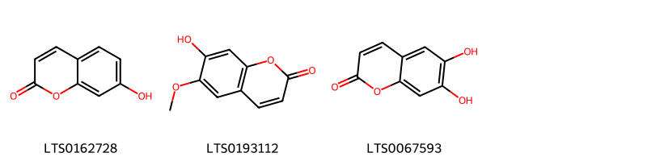

!!! abstract "Tóm tắt"

    Hạ Khô Thảo (Prunella vulgaris L.) thuộc họ Hoa môi (Lamiaceae)Trên thế giới, cây mọc ở những nước Âu, Á có những vùng núi cao ôn đới như Ấn Độ, Nhật Bản, Trung Quốc. Ở nước ta, cây mọc chủ yếu ở Hà Giang, Sapa và Tam Đảo.
Theo đông y: cây có vị đắng, cay, tính hàn, không độc, vào hai kinh can và đởm. Có tác dụng thanh can hỏa, tán uất kết, tiêu ứ sáng mắt, làm thuốc chữa loa lịch, giải trừ nhiệt độc ở tử cung và âm hộ. Tác dụng dược lý: giảm huyết áp, chống viêm, ức chế vi khuẩm, lợi tiểu, tăng hô hấp. Hạ khô thảo có chứa tinh dầu, muối vô cơ, alkaloid, cyanidin glucoside, chất béo, tannin,. Trong đó tinh dầu có chứa khoảng 50% d-camphor, alcol fenchylic, a- và D- fenchon, acid ursolic, delphinidin,…

## Thông tin về thực vật

Dược liệu **Hạ Khô Thảo (Cụm Quả)** từ bộ phận **Cụm hoa** từ loài *Prunella vulgaris*.

**Mô tả thực vật:** Hạ khô thảo là một cây sống dai có thân vuông màu hơi tím đỏ, lá mọc đối, hình trứng hay hình mác dài, mép nguyên hoặc hơi có răng cưa, có ít lông ở thân và lá. 
Cụm hoa mọc ở đầu cành giống như bông do nhiều hoa có cuống ngắn mọc vòng, mỗi vòng có 5 - 6 hoa. Đài hoa có 2 môi, môi trên có 3 răng, môi dưới có 2 răng, hình 3 cạnh. Cánh hoa màu tím nhạt hình môi, môi trên như cái mũ, môi dưới xẻ ba, thùy giữa rộng hơn. Nhị 2 dài, 2 ngắn, đều thò ra khỏi tràng. Bầu có bốn ngăn. Vòi nhỏ dài. Quả nhỏ cứng

*Tài liệu tham khảo:* "Những cây thuốc và vị thuốc Việt Nam" - Đỗ Tất Lợi 
Trong dược điển Việt nam, một loài được sử dụng làm dược liệu là *Prunella vulgaris*.

!!! info "Phân loại thực vật của *Prunella vulgaris*"
    - **Kingdom:** Plantae
    - **Phylum:** Tracheophyta
    - **Order:** Lamiales
    - **Family:** Lamiaceae
    - **Genus:** Prunella
    - **Species:** *Prunella vulgaris*

**Phân bố trên thế giới:** France, Chile, Spain, South Africa, Australia, Russian Federation, Portugal, United Kingdom of Great Britain and Northern Ireland, Costa Rica, Argentina, Ukraine, Georgia, United States of America, Dominican Republic, Canada, New Zealand, Ecuador, Austria, Ireland

**Phân bố tại Việt nam:** Không có ghi nhận ở Việt Nam

## Thông tin về dược liệu 

### Định danh

!!! info "Thông tin về tên gọi"

    - Dược liệu tiếng Việt: hạ khô thảo
    - Dược liệu tiếng Trung: 夏枯草 (Xia Ku Cao)
    - Dược liệu tiếng Anh: Prunella Vulgaris
    - Dược liệu latin thông dụng: Spica PrunellaenSpica Prunellae
    - Dược liệu latin kiểu DĐVN: *spica prunellae*
    - Dược liệu latin kiểu DĐVN: *Spica Prunellae*
    - Dược liệu latin kiểu thông tư: **
    - Bộ phận dùng: Cụm hoa (Spica)

### Mô tả dược liệu 

- **Theo dược điển Việt nam V:** Dược liệu hình chùy do bị ép nên hơi dẹt, dài 1,5 cm đến 8 cm, đường kính 0,8 cm đến 1,5 cm; màu từ nâu nhạt đến nâu đỏ. Toàn cụm quả có hơn 10 vòng đài còn lại và lá bắc, mỗi vòng lại có hai lá bắc mọc đối trên cuống hoa hay quả như hình quạt, đỉnh nhọn, có gân gợn rõ, mặt ngoài phủ lông trắng. Mỗi lá bắc có 3 hoa nhỏ. tràng hoa thường bị rụng, dài có 2 môi, 4 quả hạch nhỏ hình trứng, màu nâu với vết lồi trắng ở đầu nhọn. Thể nhẹ, chất giòn, mùi thơm nhẹ, vị nhạt.

- **Mô tả dược liệu theo thông tư chế biến dược liệu theo phương pháp cổ truyền:** 

### Chế biến 

- **Chế biến theo dược điển việt nam V**: Vào mùa hạ, thu hái khi cụm quả có màu đỏ nâu, phơi hoặc sấy khô. nn

- **Chế biến theo thông tư:** 

--- 

## Thành phần hóa học

- Theo tài liệu của GS. Đỗ Tất Lợi:  (1) Nhóm hóa học:
- Flavonoid: Đây là nhóm hợp chất phenolic phổ biến trong thực vật, có tác dụng chống oxy hóa, kháng viêm, bảo vệ gan và tim mạch. Một số flavonoid quan trọng trong hạ khô thảo bao gồm luteolin, apigenin, quercetin, rutin, hyperoside.
- Acid phenolic: Các acid phenolic như acid caffeic, acid rosmarinic, acid chlorogenic cũng góp phần vào hoạt tính chống oxy hóa và kháng viêm của hạ khô thảo.
- Triterpenoid: Nhóm hợp chất này bao gồm ursolic acid, oleanolic acid, có tác dụng kháng viêm, chống ung thư và bảo vệ gan.
- Polysaccharide: Hạ khô thảo chứa các polysaccharide có tác dụng tăng cường miễn dịch. 
- Tinh dầu: Tinh dầu hạ khô thảo chứa các hợp chất như α-pinene, β-pinene, limonene, góp phần tạo nên hương thơm và tác dụng kháng khuẩn của dược liệu.
    

**Thành phần hóa học từ loài **Prunella vulgaris**

Theo cơ sở dữ liệu lotus, loài *Prunella vulgaris* đã phân lập và xác định được **90** hoạt chất thuộc về các nhóm Steroids and steroid derivatives, Flavonoids, Fatty Acyls, Cinnamic acids and derivatives, Phenylpropanoic acids, Indoles and derivatives, Coumarins and derivatives, Prenol lipids trong bảng dưới đây. Danh sách các hoạt chất như sau methyl (1r,2r,5r,6s,7s,8r,10s,11r,14s,15s,20s)-7,8-dihydroxy-6-(hydroxymethyl)-2,6,10,17,17-pentamethylhexacyclo[12.8.1.0¹,¹⁴.0²,¹¹.0⁵,¹⁰.0¹⁵,²⁰]tricos-12-ene-20-carboxylate [(LTS0158906)](https://lotus.naturalproducts.net/compound/lotus_id/LTS0158906), methyl 9-hydroxy-5a,5b,8,8,11a-pentamethyl-1-(prop-1-en-2-yl)-hexadecahydrocyclopenta[a]chrysene-3a-carboxylate [(LTS0015878)](https://lotus.naturalproducts.net/compound/lotus_id/LTS0015878), umbelliferone [(LTS0162728)](https://lotus.naturalproducts.net/compound/lotus_id/LTS0162728), hexadecanal [(LTS0087461)](https://lotus.naturalproducts.net/compound/lotus_id/LTS0087461), methyl 10,11-dihydroxy-9-(hydroxymethyl)-1,6a,6b,9,12a-pentamethyl-2-methylidene-1,3,4,5,6,7,8,8a,10,11,12,12b,13,14b-tetradecahydropicene-4a-carboxylate [(LTS0149231)](https://lotus.naturalproducts.net/compound/lotus_id/LTS0149231), 5-hydroxy-9-(hydroxymethyl)-2,2,6a,6b,9,12a-hexamethyl-10-{[3,4,5-trihydroxy-6-(methoxycarbonyl)oxan-2-yl]oxy}-1,3,4,5,6,7,8,8a,10,11,12,12b,13,14b-tetradecahydropicene-4a-carboxylic acid [(LTS0130422)](https://lotus.naturalproducts.net/compound/lotus_id/LTS0130422), (3ar,5as,9as,9bs,11ar)-1-(5-ethyl-6-methylhept-3-en-2-yl)-9a,11a-dimethyl-1h,2h,3h,3ah,5h,5ah,6h,7h,8h,9h,9bh,10h,11h-cyclopenta[a]phenanthren-7-ol [(LTS0197417)](https://lotus.naturalproducts.net/compound/lotus_id/LTS0197417), methyl (4as,6as,6br,8ar,9s,10s,11r,12as,12br)-10,11-dihydroxy-9-(hydroxymethyl)-2,2,6a,6b,9,12a-hexamethyl-1,3,4,5,6,7,8,8a,10,11,12,12b-dodecahydropicene-4a-carboxylate [(LTS0193753)](https://lotus.naturalproducts.net/compound/lotus_id/LTS0193753), para-coumaric acid [(LTS0266252)](https://lotus.naturalproducts.net/compound/lotus_id/LTS0266252), (2s,3s,4r,5r,6r)-6-{[(3s,4s,4ar,6ar,6bs,8as,12ar,14ar,14br)-4-(hydroxymethyl)-4,6a,6b,11,11,14b-hexamethyl-8-oxo-1,2,3,4a,5,6,7,8a,9,10,12,12a,14,14a-tetradecahydropicen-3-yl]oxy}-4,5-dihydroxy-3-{[(2s,3r,4s,5r)-3,4,5-trihydroxyoxan-2-yl]oxy}oxane-2-carboxylic acid [(LTS0095062)](https://lotus.naturalproducts.net/compound/lotus_id/LTS0095062), methyl 10,11-bis(acetyloxy)-9-[(acetyloxy)methyl]-2,2,6a,6b,9,12a-hexamethyl-1,3,4,5,6,7,8,8a,10,11,12,12b,13,14b-tetradecahydropicene-4a-carboxylate [(LTS0210007)](https://lotus.naturalproducts.net/compound/lotus_id/LTS0210007), luteolin 7-o-glucoside [(LTS0227450)](https://lotus.naturalproducts.net/compound/lotus_id/LTS0227450), 5,10-dihydroxy-9-(hydroxymethyl)-2,2,6a,6b,9,12a-hexamethyl-1,3,4,5,6,7,8,8a,10,11,12,12b,13,14b-tetradecahydropicene-4a-carboxylic acid [(LTS0123572)](https://lotus.naturalproducts.net/compound/lotus_id/LTS0123572), (1s,2r,4as,6as,6br,8ar,10s,12ar,12br,14bs)-10-(acetyloxy)-1,2,6a,6b,9,9,12a-heptamethyl-2,3,4,5,6,7,8,8a,10,11,12,12b,13,14b-tetradecahydro-1h-picene-4a-carboxylic acid [(LTS0176916)](https://lotus.naturalproducts.net/compound/lotus_id/LTS0176916), (1s,2r,4as,6as,6br,8ar,9s,10s,11r,12ar,12br,14bs)-10,11-dihydroxy-9-(hydroxymethyl)-1,2,6a,6b,9,12a-hexamethyl-2,3,4,5,6,7,8,8a,10,11,12,12b,13,14b-tetradecahydro-1h-picene-4a-carboxylic acid [(LTS0257716)](https://lotus.naturalproducts.net/compound/lotus_id/LTS0257716), methyl (1r,2r,5r,6s,7s,8r,10s,11r,14s,15s,20s)-7,8-bis(acetyloxy)-6-[(acetyloxy)methyl]-2,6,10,17,17-pentamethylhexacyclo[12.8.1.0¹,¹⁴.0²,¹¹.0⁵,¹⁰.0¹⁵,²⁰]tricos-12-ene-20-carboxylate [(LTS0196962)](https://lotus.naturalproducts.net/compound/lotus_id/LTS0196962), hyperoside [(LTS0089156)](https://lotus.naturalproducts.net/compound/lotus_id/LTS0089156), 10-hydroxy-1,2,6a,6b,9,9,12a-heptamethyl-2,3,4,5,6,7,8,8a,10,11,12,12b,13,14b-tetradecahydro-1h-picene-4a-carboxylic acid [(LTS0166564)](https://lotus.naturalproducts.net/compound/lotus_id/LTS0166564), 3,4-dihydroxyphenyllactic acid [(LTS0042295)](https://lotus.naturalproducts.net/compound/lotus_id/LTS0042295), luteolin [(LTS0017052)](https://lotus.naturalproducts.net/compound/lotus_id/LTS0017052), 9-hydroxy-5a,5b,8,8,11a-pentamethyl-1-(prop-1-en-2-yl)-1h,2h,3h,4h,5h,6h,7h,7ah,9h,10h,11h,11bh,12h,13bh-cyclopenta[a]chrysene-3a-carboxylic acid [(LTS0253987)](https://lotus.naturalproducts.net/compound/lotus_id/LTS0253987), esculetin [(LTS0067593)](https://lotus.naturalproducts.net/compound/lotus_id/LTS0067593), 10,11-dihydroxy-9-(hydroxymethyl)-2,2,6a,6b,9,12a-hexamethyl-1,3,4,5,6,7,8,8a,10,11,12,12b,13,14b-tetradecahydropicene-4a-carboxylic acid [(LTS0258848)](https://lotus.naturalproducts.net/compound/lotus_id/LTS0258848), scopoletin [(LTS0193112)](https://lotus.naturalproducts.net/compound/lotus_id/LTS0193112), (1s,2r,4as,6as,6br,8ar,10s,11r,12ar,12br,14bs)-10,11-dihydroxy-1,2,6a,6b,9,9,12a-heptamethyl-2,3,4,5,6,7,8,8a,10,11,12,12b,13,14b-tetradecahydro-1h-picene-4a-carboxylic acid [(LTS0234764)](https://lotus.naturalproducts.net/compound/lotus_id/LTS0234764), (1r,3as,5as,5br,7ar,9s,11ar,11br,13br)-9-hydroxy-5a,5b,8,8,11a-pentamethyl-1-(prop-1-en-2-yl)-1h,2h,3h,4h,5h,6h,7h,7ah,9h,10h,11h,11bh,12h,13bh-cyclopenta[a]chrysene-3a-carboxylic acid [(LTS0028545)](https://lotus.naturalproducts.net/compound/lotus_id/LTS0028545), betulinic acid [(LTS0210795)](https://lotus.naturalproducts.net/compound/lotus_id/LTS0210795), (2r,3r,4s,5s,6r)-2-{[(1r,3as,3bs,7s,9ar,9bs,11ar)-1-[(2r,3e,5s)-5-ethyl-6-methylhept-3-en-2-yl]-9a,11a-dimethyl-1h,2h,3h,3ah,3bh,4h,6h,7h,8h,9h,9bh,10h,11h-cyclopenta[a]phenanthren-7-yl]oxy}-6-(hydroxymethyl)oxane-3,4,5-triol [(LTS0088971)](https://lotus.naturalproducts.net/compound/lotus_id/LTS0088971), 2-{[1-(5-ethyl-6-methylheptan-2-yl)-9a,11a-dimethyl-1h,2h,3h,3ah,5h,5ah,6h,7h,8h,9h,9bh,10h,11h-cyclopenta[a]phenanthren-7-yl]oxy}-6-(hydroxymethyl)oxane-3,4,5-triol [(LTS0164500)](https://lotus.naturalproducts.net/compound/lotus_id/LTS0164500), (2r)-3-(3,4-dihydroxyphenyl)-1-methoxy-1-oxopropan-2-yl 3-(3,4-dihydroxyphenyl)prop-2-enoate [(LTS0244535)](https://lotus.naturalproducts.net/compound/lotus_id/LTS0244535), 6-{[8a-carboxy-8-hydroxy-4-(hydroxymethyl)-4,6a,6b,11,11,14b-hexamethyl-1,2,3,4a,5,6,7,8,9,10,12,12a,14,14a-tetradecahydropicen-3-yl]oxy}-4,5-dihydroxy-3-[(3,4,5-trihydroxyoxan-2-yl)oxy]oxane-2-carboxylic acid [(LTS0166359)](https://lotus.naturalproducts.net/compound/lotus_id/LTS0166359), methyl (1s,2r,4as,6as,6br,8ar,9s,10s,11r,12ar,12br,14bs)-10,11-dihydroxy-9-(hydroxymethyl)-1,2,6a,6b,9,12a-hexamethyl-2,3,4,5,6,7,8,8a,10,11,12,12b,13,14b-tetradecahydro-1h-picene-4a-carboxylate [(LTS0026390)](https://lotus.naturalproducts.net/compound/lotus_id/LTS0026390), (2r,3r,4s,5s,6r)-2-{[(1r,3ar,5as,7s,9as,9br,11ar)-1-[(2r,5r)-5-ethyl-6-methylheptan-2-yl]-9a,11a-dimethyl-1h,2h,3h,3ah,5h,5ah,6h,7h,8h,9h,9bh,10h,11h-cyclopenta[a]phenanthren-7-yl]oxy}-6-(hydroxymethyl)oxane-3,4,5-triol [(LTS0147059)](https://lotus.naturalproducts.net/compound/lotus_id/LTS0147059), methyl (1r,4as,6as,6br,8ar,9s,10s,11r,12ar,12br,14bs)-10,11-dihydroxy-9-(hydroxymethyl)-1,6a,6b,9,12a-pentamethyl-2-methylidene-1,3,4,5,6,7,8,8a,10,11,12,12b,13,14b-tetradecahydropicene-4a-carboxylate [(LTS0267564)](https://lotus.naturalproducts.net/compound/lotus_id/LTS0267564), 3,4-dihydroxycinnamic acid [(LTS0128050)](https://lotus.naturalproducts.net/compound/lotus_id/LTS0128050), phytol [(LTS0096073)](https://lotus.naturalproducts.net/compound/lotus_id/LTS0096073), (4ar,5r,6as,6br,8ar,9s,10s,12ar,12br,14bs)-5-hydroxy-9-(hydroxymethyl)-2,2,6a,6b,9,12a-hexamethyl-10-{[(2r,3r,4s,5s,6s)-3,4,5-trihydroxy-6-(methoxycarbonyl)oxan-2-yl]oxy}-1,3,4,5,6,7,8,8a,10,11,12,12b,13,14b-tetradecahydropicene-4a-carboxylic acid [(LTS0223189)](https://lotus.naturalproducts.net/compound/lotus_id/LTS0223189), (1s,2r,4s,4as,6as,6br,8ar,10s,12ar,12br,14bs)-4,10-dihydroxy-1,2,6a,6b,9,9,12a-heptamethyl-2,3,4,5,6,7,8,8a,10,11,12,12b,13,14b-tetradecahydro-1h-picene-4a-carboxylic acid [(LTS0226966)](https://lotus.naturalproducts.net/compound/lotus_id/LTS0226966), methyl 10,11-dihydroxy-1,6a,6b,9,9,12a-hexamethyl-2-methylidene-1,3,4,5,6,7,8,8a,10,11,12,12b,13,14b-tetradecahydropicene-4a-carboxylate [(LTS0049190)](https://lotus.naturalproducts.net/compound/lotus_id/LTS0049190), maslinic acid [(LTS0109701)](https://lotus.naturalproducts.net/compound/lotus_id/LTS0109701), epi-maslinic acid [(LTS0044982)](https://lotus.naturalproducts.net/compound/lotus_id/LTS0044982), methyl 10,11-dihydroxy-9-(hydroxymethyl)-2,2,6a,6b,9,12a-hexamethyl-1,3,4,5,6,7,8,8a,10,11,12,12b-dodecahydropicene-4a-carboxylate [(LTS0184693)](https://lotus.naturalproducts.net/compound/lotus_id/LTS0184693), methyl 7,8-dihydroxy-6-(hydroxymethyl)-2,6,10,17,17-pentamethylhexacyclo[12.8.1.0¹,¹⁴.0²,¹¹.0⁵,¹⁰.0¹⁵,²⁰]tricos-12-ene-20-carboxylate [(LTS0267558)](https://lotus.naturalproducts.net/compound/lotus_id/LTS0267558), stigmast-5-en-3-ol, (3β)- [(LTS0204616)](https://lotus.naturalproducts.net/compound/lotus_id/LTS0204616), methyl (4as,6as,6br,8ar,9s,10s,11r,12ar,12br,14bs)-10,11-bis(acetyloxy)-9-[(acetyloxy)methyl]-2,2,6a,6b,9,12a-hexamethyl-1,3,4,5,6,7,8,8a,10,11,12,12b,13,14b-tetradecahydropicene-4a-carboxylate [(LTS0009305)](https://lotus.naturalproducts.net/compound/lotus_id/LTS0009305), methyl 7,8-bis(acetyloxy)-6-[(acetyloxy)methyl]-2,6,10,17,17-pentamethylhexacyclo[12.8.1.0¹,¹⁴.0²,¹¹.0⁵,¹⁰.0¹⁵,²⁰]tricos-12-ene-20-carboxylate [(LTS0205736)](https://lotus.naturalproducts.net/compound/lotus_id/LTS0205736), (2r,3r,4s,5s,6r)-2-{[(1r,3ar,5as,7s,9as,9br,11ar)-1-[(2r,3e,5s)-5-ethyl-6-methylhept-3-en-2-yl]-9a,11a-dimethyl-1h,2h,3h,3ah,5h,5ah,6h,7h,8h,9h,9bh,10h,11h-cyclopenta[a]phenanthren-7-yl]oxy}-6-(hydroxymethyl)oxane-3,4,5-triol [(LTS0179842)](https://lotus.naturalproducts.net/compound/lotus_id/LTS0179842), arjunolic acid [(LTS0055520)](https://lotus.naturalproducts.net/compound/lotus_id/LTS0055520), methyl (4as,4bs,5ar,6ar,6br,8r,9s,10s,10ar,12ar,14as)-8,9-bis(acetyloxy)-10-[(acetyloxy)methyl]-3,3,6b,10,12a-pentamethyl-1h,2h,4h,4ah,5h,5ah,6h,6ah,7h,8h,9h,10ah,11h,12h,14h-cyclopropa[r]picene-14a-carboxylate [(LTS0118957)](https://lotus.naturalproducts.net/compound/lotus_id/LTS0118957), methyl (1r,4as,6as,6br,8ar,10s,11r,12ar,12br,14bs)-10,11-dihydroxy-1,6a,6b,9,9,12a-hexamethyl-2-methylidene-1,3,4,5,6,7,8,8a,10,11,12,12b,13,14b-tetradecahydropicene-4a-carboxylate [(LTS0116046)](https://lotus.naturalproducts.net/compound/lotus_id/LTS0116046), methyl 8,9-dihydroxy-10-(hydroxymethyl)-3,3,6b,10,12a-pentamethyl-1h,2h,4h,4ah,5h,5ah,6h,6ah,7h,8h,9h,10ah,11h,12h,14h-cyclopropa[r]picene-14a-carboxylate [(LTS0071184)](https://lotus.naturalproducts.net/compound/lotus_id/LTS0071184), sitogluside [(LTS0201798)](https://lotus.naturalproducts.net/compound/lotus_id/LTS0201798), tanshinone i [(LTS0244263)](https://lotus.naturalproducts.net/compound/lotus_id/LTS0244263), quercetin [(LTS0004651)](https://lotus.naturalproducts.net/compound/lotus_id/LTS0004651), stigmast-5-en-3-ol [(LTS0071224)](https://lotus.naturalproducts.net/compound/lotus_id/LTS0071224), isoorientin [(LTS0061958)](https://lotus.naturalproducts.net/compound/lotus_id/LTS0061958), ethyl caffeate [(LTS0147324)](https://lotus.naturalproducts.net/compound/lotus_id/LTS0147324), [(1r,2r,5s,6s,7s,8s,9s,10r,13s,14s)-2,8-dihydroxy-5-isopropyl-9,13-dimethyl-7-[(2-methylpropanoyl)oxy]tetracyclo[7.5.0.0²,⁶.0¹⁰,¹⁴]tetradecan-6-yl]methyl benzoate [(LTS0229750)](https://lotus.naturalproducts.net/compound/lotus_id/LTS0229750), chondrillasterol [(LTS0142259)](https://lotus.naturalproducts.net/compound/lotus_id/LTS0142259), n-[2-(5-methoxy-1h-indol-3-yl)ethyl]ethanimidic acid [(LTS0219322)](https://lotus.naturalproducts.net/compound/lotus_id/LTS0219322), methyl 8,9-bis(acetyloxy)-10-[(acetyloxy)methyl]-3,3,6b,10,12a-pentamethyl-1h,2h,4h,4ah,5h,5ah,6h,6ah,7h,8h,9h,10ah,11h,12h,14h-cyclopropa[r]picene-14a-carboxylate [(LTS0123404)](https://lotus.naturalproducts.net/compound/lotus_id/LTS0123404), asiatic acid [(LTS0249826)](https://lotus.naturalproducts.net/compound/lotus_id/LTS0249826), (2s,3s,4r,5r,6r)-6-{[(3s,4s,4ar,6ar,6bs,8r,8ar,12as,14ar,14br)-8a-carboxy-8-hydroxy-4-(hydroxymethyl)-4,6a,6b,11,11,14b-hexamethyl-1,2,3,4a,5,6,7,8,9,10,12,12a,14,14a-tetradecahydropicen-3-yl]oxy}-4,5-dihydroxy-3-{[(2s,3r,4s,5r)-3,4,5-trihydroxyoxan-2-yl]oxy}oxane-2-carboxylic acid [(LTS0239424)](https://lotus.naturalproducts.net/compound/lotus_id/LTS0239424), [(1r,2r,5s,6s,7s,8s,9s,10r,13s,14s)-2,7-dihydroxy-5-isopropyl-9,13-dimethyl-8-[(2-methylpropanoyl)oxy]tetracyclo[7.5.0.0²,⁶.0¹⁰,¹⁴]tetradecan-6-yl]methyl benzoate [(LTS0157361)](https://lotus.naturalproducts.net/compound/lotus_id/LTS0157361), 2-{[1-(5-ethyl-6-methylhept-3-en-2-yl)-9a,11a-dimethyl-1h,2h,3h,3ah,3bh,4h,6h,7h,8h,9h,9bh,10h,11h-cyclopenta[a]phenanthren-7-yl]oxy}-6-(hydroxymethyl)oxane-3,4,5-triol [(LTS0057912)](https://lotus.naturalproducts.net/compound/lotus_id/LTS0057912), corosolic acid [(LTS0231285)](https://lotus.naturalproducts.net/compound/lotus_id/LTS0231285), phytol [(LTS0031808)](https://lotus.naturalproducts.net/compound/lotus_id/LTS0031808), methyl 10,11-dihydroxy-9-(hydroxymethyl)-1,2,6a,6b,9,12a-hexamethyl-2,3,4,5,6,7,8,8a,10,11,12,12b,13,14b-tetradecahydro-1h-picene-4a-carboxylate [(LTS0030389)](https://lotus.naturalproducts.net/compound/lotus_id/LTS0030389), methyl 10,11-bis(acetyloxy)-9-[(acetyloxy)methyl]-1,2,6a,6b,9,12a-hexamethyl-2,3,4,5,6,7,8,8a,10,11,12,12b,13,14b-tetradecahydro-1h-picene-4a-carboxylate [(LTS0113893)](https://lotus.naturalproducts.net/compound/lotus_id/LTS0113893), 10-hydroxy-9-(hydroxymethyl)-1,2,6a,6b,9,12a-hexamethyl-2,3,4,5,6,7,8,8a,10,11,12,12b,13,14b-tetradecahydro-1h-picene-4a-carboxylic acid [(LTS0009002)](https://lotus.naturalproducts.net/compound/lotus_id/LTS0009002), (4as,6as,6br,8ar,9s,10s,11r,12ar,12br,14bs)-10,11-dihydroxy-9-(hydroxymethyl)-2,2,6a,6b,9,12a-hexamethyl-1,3,4,5,6,7,8,8a,10,11,12,12b,13,14b-tetradecahydropicene-4a-carboxylic acid [(LTS0016980)](https://lotus.naturalproducts.net/compound/lotus_id/LTS0016980), rosemary acid [(LTS0207820)](https://lotus.naturalproducts.net/compound/lotus_id/LTS0207820), 2-{[1-(5-ethyl-6-methylheptan-2-yl)-9a,11a-dimethyl-1h,2h,3h,3ah,3bh,4h,6h,7h,8h,9h,9bh,10h,11h-cyclopenta[a]phenanthren-7-yl]oxy}-6-(hydroxymethyl)oxane-3,4,5-triol [(LTS0158828)](https://lotus.naturalproducts.net/compound/lotus_id/LTS0158828), methyl 10,11-dihydroxy-9-(hydroxymethyl)-2,2,6a,6b,9,12a-hexamethyl-1,3,4,5,6,7,8,8a,10,11,12,12b,13,14b-tetradecahydropicene-4a-carboxylate [(LTS0206902)](https://lotus.naturalproducts.net/compound/lotus_id/LTS0206902), (4ar,5r,6as,6br,8ar,9s,10s,12ar,12br,14bs)-5,10-dihydroxy-9-(hydroxymethyl)-2,2,6a,6b,9,12a-hexamethyl-1,3,4,5,6,7,8,8a,10,11,12,12b,13,14b-tetradecahydropicene-4a-carboxylic acid [(LTS0222320)](https://lotus.naturalproducts.net/compound/lotus_id/LTS0222320), methyl (4as,6as,6br,8ar,9s,10s,11r,12ar,12br,14bs)-10,11-dihydroxy-9-(hydroxymethyl)-2,2,6a,6b,9,12a-hexamethyl-1,3,4,5,6,7,8,8a,10,11,12,12b,13,14b-tetradecahydropicene-4a-carboxylate [(LTS0156470)](https://lotus.naturalproducts.net/compound/lotus_id/LTS0156470), 4,5-dihydroxy-6-{[4-(hydroxymethyl)-4,6a,6b,11,11,14b-hexamethyl-8-oxo-1,2,3,4a,5,6,7,8a,9,10,12,12a,14,14a-tetradecahydropicen-3-yl]oxy}-3-[(3,4,5-trihydroxyoxan-2-yl)oxy]oxane-2-carboxylic acid [(LTS0026634)](https://lotus.naturalproducts.net/compound/lotus_id/LTS0026634), β-amyrin [(LTS0251864)](https://lotus.naturalproducts.net/compound/lotus_id/LTS0251864), methyl (1r,3as,5ar,5br,7ar,9s,11ar,11br,13ar,13br)-9-hydroxy-5a,5b,8,8,11a-pentamethyl-1-(prop-1-en-2-yl)-hexadecahydrocyclopenta[a]chrysene-3a-carboxylate [(LTS0257735)](https://lotus.naturalproducts.net/compound/lotus_id/LTS0257735), oleanolic acid [(LTS0117717)](https://lotus.naturalproducts.net/compound/lotus_id/LTS0117717), 2-(3,4-dihydroxyphenyl)-5-hydroxy-7-{[3,4,5-trihydroxy-6-(hydroxymethyl)oxan-2-yl]oxy}chromen-4-one [(LTS0158292)](https://lotus.naturalproducts.net/compound/lotus_id/LTS0158292), 10,11-dihydroxy-1,2,6a,6b,9,9,12a-heptamethyl-2,3,4,5,6,7,8,8a,10,11,12,12b,13,14b-tetradecahydro-1h-picene-4a-carboxylic acid [(LTS0122037)](https://lotus.naturalproducts.net/compound/lotus_id/LTS0122037), 2-{[1-(5-ethyl-6-methylhept-3-en-2-yl)-9a,11a-dimethyl-1h,2h,3h,3ah,5h,5ah,6h,7h,8h,9h,9bh,10h,11h-cyclopenta[a]phenanthren-7-yl]oxy}-6-(hydroxymethyl)oxane-3,4,5-triol [(LTS0274888)](https://lotus.naturalproducts.net/compound/lotus_id/LTS0274888), asiatic acid [(LTS0198395)](https://lotus.naturalproducts.net/compound/lotus_id/LTS0198395), ursolic acid [(LTS0250838)](https://lotus.naturalproducts.net/compound/lotus_id/LTS0250838), methyl (1s,2r,4as,6as,6br,8ar,9s,10s,11r,12ar,12br,14bs)-10,11-bis(acetyloxy)-9-[(acetyloxy)methyl]-1,2,6a,6b,9,12a-hexamethyl-2,3,4,5,6,7,8,8a,10,11,12,12b,13,14b-tetradecahydro-1h-picene-4a-carboxylate [(LTS0202305)](https://lotus.naturalproducts.net/compound/lotus_id/LTS0202305), 4,10-dihydroxy-1,2,6a,6b,9,9,12a-heptamethyl-2,3,4,5,6,7,8,8a,10,11,12,12b,13,14b-tetradecahydro-1h-picene-4a-carboxylic acid [(LTS0148331)](https://lotus.naturalproducts.net/compound/lotus_id/LTS0148331), methyl (4as,4bs,5ar,6ar,6br,8r,9s,10s,10ar,12ar,14as)-8,9-dihydroxy-10-(hydroxymethyl)-3,3,6b,10,12a-pentamethyl-1h,2h,4h,4ah,5h,5ah,6h,6ah,7h,8h,9h,10ah,11h,12h,14h-cyclopropa[r]picene-14a-carboxylate [(LTS0178920)](https://lotus.naturalproducts.net/compound/lotus_id/LTS0178920), 23-hydroxyursolic acid [(LTS0154653)](https://lotus.naturalproducts.net/compound/lotus_id/LTS0154653), isoorientin [(LTS0043542)](https://lotus.naturalproducts.net/compound/lotus_id/LTS0043542). 
        
| chemicalTaxonomyClassyfireClass   |   smiles_count |
|:----------------------------------|---------------:|
| Cinnamic acids and derivatives    |            180 |
| Coumarins and derivatives         |             62 |
| Fatty Acyls                       |             18 |
| Flavonoids                        |            443 |
| Indoles and derivatives           |             29 |
| Phenylpropanoic acids             |             25 |
| Prenol lipids                     |           5356 |
| Steroids and steroid derivatives  |           1475 |

            
### Nhóm Cinnamic acids and derivatives
<figure markdown="span">
    { width=100% }
<figcaption>Hình ảnh cấu trúc hóa học của hoạt chất thuộc nhóm *Cinnamic acids and derivatives*. Tên thường gọi của các hoạt chất tương ứng là (2r)-3-(3,4-dihydroxyphenyl)-1-methoxy-1-oxopropan-2-yl 3-(3,4-dihydroxyphenyl)prop-2-enoate [(LTS0244535)](https://lotus.naturalproducts.net/compound/lotus_id/LTS0244535), ethyl caffeate [(LTS0147324)](https://lotus.naturalproducts.net/compound/lotus_id/LTS0147324), 3,4-dihydroxycinnamic acid [(LTS0128050)](https://lotus.naturalproducts.net/compound/lotus_id/LTS0128050), para-coumaric acid [(LTS0266252)](https://lotus.naturalproducts.net/compound/lotus_id/LTS0266252), rosemary acid [(LTS0207820)](https://lotus.naturalproducts.net/compound/lotus_id/LTS0207820).</figcaption>
</figure>

            
            
### Nhóm Cinnamic acids and derivatives
<figure markdown="span">
    { width=100% }
<figcaption>Hình ảnh cấu trúc hóa học của hoạt chất thuộc nhóm *Cinnamic acids and derivatives*. Tên thường gọi của các hoạt chất tương ứng là (2r)-3-(3,4-dihydroxyphenyl)-1-methoxy-1-oxopropan-2-yl 3-(3,4-dihydroxyphenyl)prop-2-enoate [(LTS0244535)](https://lotus.naturalproducts.net/compound/lotus_id/LTS0244535), ethyl caffeate [(LTS0147324)](https://lotus.naturalproducts.net/compound/lotus_id/LTS0147324), 3,4-dihydroxycinnamic acid [(LTS0128050)](https://lotus.naturalproducts.net/compound/lotus_id/LTS0128050), para-coumaric acid [(LTS0266252)](https://lotus.naturalproducts.net/compound/lotus_id/LTS0266252), rosemary acid [(LTS0207820)](https://lotus.naturalproducts.net/compound/lotus_id/LTS0207820).</figcaption>
</figure>

### Nhóm Coumarins and derivatives
<figure markdown="span">
    { width=100% }
<figcaption>Hình ảnh cấu trúc hóa học của hoạt chất thuộc nhóm *Coumarins and derivatives*. Tên thường gọi của các hoạt chất tương ứng là umbelliferone [(LTS0162728)](https://lotus.naturalproducts.net/compound/lotus_id/LTS0162728), scopoletin [(LTS0193112)](https://lotus.naturalproducts.net/compound/lotus_id/LTS0193112), esculetin [(LTS0067593)](https://lotus.naturalproducts.net/compound/lotus_id/LTS0067593).</figcaption>
</figure>

            
            
### Nhóm Cinnamic acids and derivatives
<figure markdown="span">
    { width=100% }
<figcaption>Hình ảnh cấu trúc hóa học của hoạt chất thuộc nhóm *Cinnamic acids and derivatives*. Tên thường gọi của các hoạt chất tương ứng là (2r)-3-(3,4-dihydroxyphenyl)-1-methoxy-1-oxopropan-2-yl 3-(3,4-dihydroxyphenyl)prop-2-enoate [(LTS0244535)](https://lotus.naturalproducts.net/compound/lotus_id/LTS0244535), ethyl caffeate [(LTS0147324)](https://lotus.naturalproducts.net/compound/lotus_id/LTS0147324), 3,4-dihydroxycinnamic acid [(LTS0128050)](https://lotus.naturalproducts.net/compound/lotus_id/LTS0128050), para-coumaric acid [(LTS0266252)](https://lotus.naturalproducts.net/compound/lotus_id/LTS0266252), rosemary acid [(LTS0207820)](https://lotus.naturalproducts.net/compound/lotus_id/LTS0207820).</figcaption>
</figure>

### Nhóm Coumarins and derivatives
<figure markdown="span">
    { width=100% }
<figcaption>Hình ảnh cấu trúc hóa học của hoạt chất thuộc nhóm *Coumarins and derivatives*. Tên thường gọi của các hoạt chất tương ứng là umbelliferone [(LTS0162728)](https://lotus.naturalproducts.net/compound/lotus_id/LTS0162728), scopoletin [(LTS0193112)](https://lotus.naturalproducts.net/compound/lotus_id/LTS0193112), esculetin [(LTS0067593)](https://lotus.naturalproducts.net/compound/lotus_id/LTS0067593).</figcaption>
</figure>

### Nhóm Fatty Acyls
<figure markdown="span">
    { width=100% }
<figcaption>Hình ảnh cấu trúc hóa học của hoạt chất thuộc nhóm *Fatty Acyls*. Tên thường gọi của các hoạt chất tương ứng là hexadecanal [(LTS0087461)](https://lotus.naturalproducts.net/compound/lotus_id/LTS0087461).</figcaption>
</figure>

            
            
### Nhóm Cinnamic acids and derivatives
<figure markdown="span">
    { width=100% }
<figcaption>Hình ảnh cấu trúc hóa học của hoạt chất thuộc nhóm *Cinnamic acids and derivatives*. Tên thường gọi của các hoạt chất tương ứng là (2r)-3-(3,4-dihydroxyphenyl)-1-methoxy-1-oxopropan-2-yl 3-(3,4-dihydroxyphenyl)prop-2-enoate [(LTS0244535)](https://lotus.naturalproducts.net/compound/lotus_id/LTS0244535), ethyl caffeate [(LTS0147324)](https://lotus.naturalproducts.net/compound/lotus_id/LTS0147324), 3,4-dihydroxycinnamic acid [(LTS0128050)](https://lotus.naturalproducts.net/compound/lotus_id/LTS0128050), para-coumaric acid [(LTS0266252)](https://lotus.naturalproducts.net/compound/lotus_id/LTS0266252), rosemary acid [(LTS0207820)](https://lotus.naturalproducts.net/compound/lotus_id/LTS0207820).</figcaption>
</figure>

### Nhóm Coumarins and derivatives
<figure markdown="span">
    { width=100% }
<figcaption>Hình ảnh cấu trúc hóa học của hoạt chất thuộc nhóm *Coumarins and derivatives*. Tên thường gọi của các hoạt chất tương ứng là umbelliferone [(LTS0162728)](https://lotus.naturalproducts.net/compound/lotus_id/LTS0162728), scopoletin [(LTS0193112)](https://lotus.naturalproducts.net/compound/lotus_id/LTS0193112), esculetin [(LTS0067593)](https://lotus.naturalproducts.net/compound/lotus_id/LTS0067593).</figcaption>
</figure>

### Nhóm Fatty Acyls
<figure markdown="span">
    { width=100% }
<figcaption>Hình ảnh cấu trúc hóa học của hoạt chất thuộc nhóm *Fatty Acyls*. Tên thường gọi của các hoạt chất tương ứng là hexadecanal [(LTS0087461)](https://lotus.naturalproducts.net/compound/lotus_id/LTS0087461).</figcaption>
</figure>

### Nhóm Flavonoids
<figure markdown="span">
    { width=100% }
<figcaption>Hình ảnh cấu trúc hóa học của hoạt chất thuộc nhóm *Flavonoids*. Tên thường gọi của các hoạt chất tương ứng là hyperoside [(LTS0089156)](https://lotus.naturalproducts.net/compound/lotus_id/LTS0089156), 2-(3,4-dihydroxyphenyl)-5-hydroxy-7-{[3,4,5-trihydroxy-6-(hydroxymethyl)oxan-2-yl]oxy}chromen-4-one [(LTS0158292)](https://lotus.naturalproducts.net/compound/lotus_id/LTS0158292), isoorientin [(LTS0043542)](https://lotus.naturalproducts.net/compound/lotus_id/LTS0043542), luteolin 7-o-glucoside [(LTS0227450)](https://lotus.naturalproducts.net/compound/lotus_id/LTS0227450), quercetin [(LTS0004651)](https://lotus.naturalproducts.net/compound/lotus_id/LTS0004651), isoorientin [(LTS0061958)](https://lotus.naturalproducts.net/compound/lotus_id/LTS0061958), luteolin [(LTS0017052)](https://lotus.naturalproducts.net/compound/lotus_id/LTS0017052).</figcaption>
</figure>

            
            
### Nhóm Cinnamic acids and derivatives
<figure markdown="span">
    { width=100% }
<figcaption>Hình ảnh cấu trúc hóa học của hoạt chất thuộc nhóm *Cinnamic acids and derivatives*. Tên thường gọi của các hoạt chất tương ứng là (2r)-3-(3,4-dihydroxyphenyl)-1-methoxy-1-oxopropan-2-yl 3-(3,4-dihydroxyphenyl)prop-2-enoate [(LTS0244535)](https://lotus.naturalproducts.net/compound/lotus_id/LTS0244535), ethyl caffeate [(LTS0147324)](https://lotus.naturalproducts.net/compound/lotus_id/LTS0147324), 3,4-dihydroxycinnamic acid [(LTS0128050)](https://lotus.naturalproducts.net/compound/lotus_id/LTS0128050), para-coumaric acid [(LTS0266252)](https://lotus.naturalproducts.net/compound/lotus_id/LTS0266252), rosemary acid [(LTS0207820)](https://lotus.naturalproducts.net/compound/lotus_id/LTS0207820).</figcaption>
</figure>

### Nhóm Coumarins and derivatives
<figure markdown="span">
    { width=100% }
<figcaption>Hình ảnh cấu trúc hóa học của hoạt chất thuộc nhóm *Coumarins and derivatives*. Tên thường gọi của các hoạt chất tương ứng là umbelliferone [(LTS0162728)](https://lotus.naturalproducts.net/compound/lotus_id/LTS0162728), scopoletin [(LTS0193112)](https://lotus.naturalproducts.net/compound/lotus_id/LTS0193112), esculetin [(LTS0067593)](https://lotus.naturalproducts.net/compound/lotus_id/LTS0067593).</figcaption>
</figure>

### Nhóm Fatty Acyls
<figure markdown="span">
    { width=100% }
<figcaption>Hình ảnh cấu trúc hóa học của hoạt chất thuộc nhóm *Fatty Acyls*. Tên thường gọi của các hoạt chất tương ứng là hexadecanal [(LTS0087461)](https://lotus.naturalproducts.net/compound/lotus_id/LTS0087461).</figcaption>
</figure>

### Nhóm Flavonoids
<figure markdown="span">
    { width=100% }
<figcaption>Hình ảnh cấu trúc hóa học của hoạt chất thuộc nhóm *Flavonoids*. Tên thường gọi của các hoạt chất tương ứng là hyperoside [(LTS0089156)](https://lotus.naturalproducts.net/compound/lotus_id/LTS0089156), 2-(3,4-dihydroxyphenyl)-5-hydroxy-7-{[3,4,5-trihydroxy-6-(hydroxymethyl)oxan-2-yl]oxy}chromen-4-one [(LTS0158292)](https://lotus.naturalproducts.net/compound/lotus_id/LTS0158292), isoorientin [(LTS0043542)](https://lotus.naturalproducts.net/compound/lotus_id/LTS0043542), luteolin 7-o-glucoside [(LTS0227450)](https://lotus.naturalproducts.net/compound/lotus_id/LTS0227450), quercetin [(LTS0004651)](https://lotus.naturalproducts.net/compound/lotus_id/LTS0004651), isoorientin [(LTS0061958)](https://lotus.naturalproducts.net/compound/lotus_id/LTS0061958), luteolin [(LTS0017052)](https://lotus.naturalproducts.net/compound/lotus_id/LTS0017052).</figcaption>
</figure>

### Nhóm Indoles and derivatives
<figure markdown="span">
    { width=100% }
<figcaption>Hình ảnh cấu trúc hóa học của hoạt chất thuộc nhóm *Indoles and derivatives*. Tên thường gọi của các hoạt chất tương ứng là n-[2-(5-methoxy-1h-indol-3-yl)ethyl]ethanimidic acid [(LTS0219322)](https://lotus.naturalproducts.net/compound/lotus_id/LTS0219322).</figcaption>
</figure>

            
            
### Nhóm Cinnamic acids and derivatives
<figure markdown="span">
    { width=100% }
<figcaption>Hình ảnh cấu trúc hóa học của hoạt chất thuộc nhóm *Cinnamic acids and derivatives*. Tên thường gọi của các hoạt chất tương ứng là (2r)-3-(3,4-dihydroxyphenyl)-1-methoxy-1-oxopropan-2-yl 3-(3,4-dihydroxyphenyl)prop-2-enoate [(LTS0244535)](https://lotus.naturalproducts.net/compound/lotus_id/LTS0244535), ethyl caffeate [(LTS0147324)](https://lotus.naturalproducts.net/compound/lotus_id/LTS0147324), 3,4-dihydroxycinnamic acid [(LTS0128050)](https://lotus.naturalproducts.net/compound/lotus_id/LTS0128050), para-coumaric acid [(LTS0266252)](https://lotus.naturalproducts.net/compound/lotus_id/LTS0266252), rosemary acid [(LTS0207820)](https://lotus.naturalproducts.net/compound/lotus_id/LTS0207820).</figcaption>
</figure>

### Nhóm Coumarins and derivatives
<figure markdown="span">
    { width=100% }
<figcaption>Hình ảnh cấu trúc hóa học của hoạt chất thuộc nhóm *Coumarins and derivatives*. Tên thường gọi của các hoạt chất tương ứng là umbelliferone [(LTS0162728)](https://lotus.naturalproducts.net/compound/lotus_id/LTS0162728), scopoletin [(LTS0193112)](https://lotus.naturalproducts.net/compound/lotus_id/LTS0193112), esculetin [(LTS0067593)](https://lotus.naturalproducts.net/compound/lotus_id/LTS0067593).</figcaption>
</figure>

### Nhóm Fatty Acyls
<figure markdown="span">
    { width=100% }
<figcaption>Hình ảnh cấu trúc hóa học của hoạt chất thuộc nhóm *Fatty Acyls*. Tên thường gọi của các hoạt chất tương ứng là hexadecanal [(LTS0087461)](https://lotus.naturalproducts.net/compound/lotus_id/LTS0087461).</figcaption>
</figure>

### Nhóm Flavonoids
<figure markdown="span">
    { width=100% }
<figcaption>Hình ảnh cấu trúc hóa học của hoạt chất thuộc nhóm *Flavonoids*. Tên thường gọi của các hoạt chất tương ứng là hyperoside [(LTS0089156)](https://lotus.naturalproducts.net/compound/lotus_id/LTS0089156), 2-(3,4-dihydroxyphenyl)-5-hydroxy-7-{[3,4,5-trihydroxy-6-(hydroxymethyl)oxan-2-yl]oxy}chromen-4-one [(LTS0158292)](https://lotus.naturalproducts.net/compound/lotus_id/LTS0158292), isoorientin [(LTS0043542)](https://lotus.naturalproducts.net/compound/lotus_id/LTS0043542), luteolin 7-o-glucoside [(LTS0227450)](https://lotus.naturalproducts.net/compound/lotus_id/LTS0227450), quercetin [(LTS0004651)](https://lotus.naturalproducts.net/compound/lotus_id/LTS0004651), isoorientin [(LTS0061958)](https://lotus.naturalproducts.net/compound/lotus_id/LTS0061958), luteolin [(LTS0017052)](https://lotus.naturalproducts.net/compound/lotus_id/LTS0017052).</figcaption>
</figure>

### Nhóm Indoles and derivatives
<figure markdown="span">
    { width=100% }
<figcaption>Hình ảnh cấu trúc hóa học của hoạt chất thuộc nhóm *Indoles and derivatives*. Tên thường gọi của các hoạt chất tương ứng là n-[2-(5-methoxy-1h-indol-3-yl)ethyl]ethanimidic acid [(LTS0219322)](https://lotus.naturalproducts.net/compound/lotus_id/LTS0219322).</figcaption>
</figure>

### Nhóm Phenylpropanoic acids
<figure markdown="span">
    { width=100% }
<figcaption>Hình ảnh cấu trúc hóa học của hoạt chất thuộc nhóm *Phenylpropanoic acids*. Tên thường gọi của các hoạt chất tương ứng là 3,4-dihydroxyphenyllactic acid [(LTS0042295)](https://lotus.naturalproducts.net/compound/lotus_id/LTS0042295).</figcaption>
</figure>

            
            
### Nhóm Cinnamic acids and derivatives
<figure markdown="span">
    { width=100% }
<figcaption>Hình ảnh cấu trúc hóa học của hoạt chất thuộc nhóm *Cinnamic acids and derivatives*. Tên thường gọi của các hoạt chất tương ứng là (2r)-3-(3,4-dihydroxyphenyl)-1-methoxy-1-oxopropan-2-yl 3-(3,4-dihydroxyphenyl)prop-2-enoate [(LTS0244535)](https://lotus.naturalproducts.net/compound/lotus_id/LTS0244535), ethyl caffeate [(LTS0147324)](https://lotus.naturalproducts.net/compound/lotus_id/LTS0147324), 3,4-dihydroxycinnamic acid [(LTS0128050)](https://lotus.naturalproducts.net/compound/lotus_id/LTS0128050), para-coumaric acid [(LTS0266252)](https://lotus.naturalproducts.net/compound/lotus_id/LTS0266252), rosemary acid [(LTS0207820)](https://lotus.naturalproducts.net/compound/lotus_id/LTS0207820).</figcaption>
</figure>

### Nhóm Coumarins and derivatives
<figure markdown="span">
    { width=100% }
<figcaption>Hình ảnh cấu trúc hóa học của hoạt chất thuộc nhóm *Coumarins and derivatives*. Tên thường gọi của các hoạt chất tương ứng là umbelliferone [(LTS0162728)](https://lotus.naturalproducts.net/compound/lotus_id/LTS0162728), scopoletin [(LTS0193112)](https://lotus.naturalproducts.net/compound/lotus_id/LTS0193112), esculetin [(LTS0067593)](https://lotus.naturalproducts.net/compound/lotus_id/LTS0067593).</figcaption>
</figure>

### Nhóm Fatty Acyls
<figure markdown="span">
    { width=100% }
<figcaption>Hình ảnh cấu trúc hóa học của hoạt chất thuộc nhóm *Fatty Acyls*. Tên thường gọi của các hoạt chất tương ứng là hexadecanal [(LTS0087461)](https://lotus.naturalproducts.net/compound/lotus_id/LTS0087461).</figcaption>
</figure>

### Nhóm Flavonoids
<figure markdown="span">
    { width=100% }
<figcaption>Hình ảnh cấu trúc hóa học của hoạt chất thuộc nhóm *Flavonoids*. Tên thường gọi của các hoạt chất tương ứng là hyperoside [(LTS0089156)](https://lotus.naturalproducts.net/compound/lotus_id/LTS0089156), 2-(3,4-dihydroxyphenyl)-5-hydroxy-7-{[3,4,5-trihydroxy-6-(hydroxymethyl)oxan-2-yl]oxy}chromen-4-one [(LTS0158292)](https://lotus.naturalproducts.net/compound/lotus_id/LTS0158292), isoorientin [(LTS0043542)](https://lotus.naturalproducts.net/compound/lotus_id/LTS0043542), luteolin 7-o-glucoside [(LTS0227450)](https://lotus.naturalproducts.net/compound/lotus_id/LTS0227450), quercetin [(LTS0004651)](https://lotus.naturalproducts.net/compound/lotus_id/LTS0004651), isoorientin [(LTS0061958)](https://lotus.naturalproducts.net/compound/lotus_id/LTS0061958), luteolin [(LTS0017052)](https://lotus.naturalproducts.net/compound/lotus_id/LTS0017052).</figcaption>
</figure>

### Nhóm Indoles and derivatives
<figure markdown="span">
    { width=100% }
<figcaption>Hình ảnh cấu trúc hóa học của hoạt chất thuộc nhóm *Indoles and derivatives*. Tên thường gọi của các hoạt chất tương ứng là n-[2-(5-methoxy-1h-indol-3-yl)ethyl]ethanimidic acid [(LTS0219322)](https://lotus.naturalproducts.net/compound/lotus_id/LTS0219322).</figcaption>
</figure>

### Nhóm Phenylpropanoic acids
<figure markdown="span">
    { width=100% }
<figcaption>Hình ảnh cấu trúc hóa học của hoạt chất thuộc nhóm *Phenylpropanoic acids*. Tên thường gọi của các hoạt chất tương ứng là 3,4-dihydroxyphenyllactic acid [(LTS0042295)](https://lotus.naturalproducts.net/compound/lotus_id/LTS0042295).</figcaption>
</figure>

### Nhóm Prenol lipids
<figure markdown="span">
    { width=100% }
<figcaption>Hình ảnh cấu trúc hóa học của hoạt chất thuộc nhóm *Prenol lipids*. Tên thường gọi của các hoạt chất tương ứng là 5-hydroxy-9-(hydroxymethyl)-2,2,6a,6b,9,12a-hexamethyl-10-{[3,4,5-trihydroxy-6-(methoxycarbonyl)oxan-2-yl]oxy}-1,3,4,5,6,7,8,8a,10,11,12,12b,13,14b-tetradecahydropicene-4a-carboxylic acid [(LTS0130422)](https://lotus.naturalproducts.net/compound/lotus_id/LTS0130422), methyl (1s,2r,4as,6as,6br,8ar,9s,10s,11r,12ar,12br,14bs)-10,11-bis(acetyloxy)-9-[(acetyloxy)methyl]-1,2,6a,6b,9,12a-hexamethyl-2,3,4,5,6,7,8,8a,10,11,12,12b,13,14b-tetradecahydro-1h-picene-4a-carboxylate [(LTS0202305)](https://lotus.naturalproducts.net/compound/lotus_id/LTS0202305), (1s,2r,4s,4as,6as,6br,8ar,10s,12ar,12br,14bs)-4,10-dihydroxy-1,2,6a,6b,9,9,12a-heptamethyl-2,3,4,5,6,7,8,8a,10,11,12,12b,13,14b-tetradecahydro-1h-picene-4a-carboxylic acid [(LTS0226966)](https://lotus.naturalproducts.net/compound/lotus_id/LTS0226966), methyl (4as,6as,6br,8ar,9s,10s,11r,12ar,12br,14bs)-10,11-dihydroxy-9-(hydroxymethyl)-2,2,6a,6b,9,12a-hexamethyl-1,3,4,5,6,7,8,8a,10,11,12,12b,13,14b-tetradecahydropicene-4a-carboxylate [(LTS0156470)](https://lotus.naturalproducts.net/compound/lotus_id/LTS0156470), phytol [(LTS0031808)](https://lotus.naturalproducts.net/compound/lotus_id/LTS0031808), methyl 10,11-dihydroxy-1,6a,6b,9,9,12a-hexamethyl-2-methylidene-1,3,4,5,6,7,8,8a,10,11,12,12b,13,14b-tetradecahydropicene-4a-carboxylate [(LTS0049190)](https://lotus.naturalproducts.net/compound/lotus_id/LTS0049190), methyl 10,11-dihydroxy-9-(hydroxymethyl)-2,2,6a,6b,9,12a-hexamethyl-1,3,4,5,6,7,8,8a,10,11,12,12b,13,14b-tetradecahydropicene-4a-carboxylate [(LTS0206902)](https://lotus.naturalproducts.net/compound/lotus_id/LTS0206902), methyl 7,8-bis(acetyloxy)-6-[(acetyloxy)methyl]-2,6,10,17,17-pentamethylhexacyclo[12.8.1.0¹,¹⁴.0²,¹¹.0⁵,¹⁰.0¹⁵,²⁰]tricos-12-ene-20-carboxylate [(LTS0205736)](https://lotus.naturalproducts.net/compound/lotus_id/LTS0205736), phytol [(LTS0096073)](https://lotus.naturalproducts.net/compound/lotus_id/LTS0096073), (1r,3as,5as,5br,7ar,9s,11ar,11br,13br)-9-hydroxy-5a,5b,8,8,11a-pentamethyl-1-(prop-1-en-2-yl)-1h,2h,3h,4h,5h,6h,7h,7ah,9h,10h,11h,11bh,12h,13bh-cyclopenta[a]chrysene-3a-carboxylic acid [(LTS0028545)](https://lotus.naturalproducts.net/compound/lotus_id/LTS0028545), methyl 10,11-bis(acetyloxy)-9-[(acetyloxy)methyl]-1,2,6a,6b,9,12a-hexamethyl-2,3,4,5,6,7,8,8a,10,11,12,12b,13,14b-tetradecahydro-1h-picene-4a-carboxylate [(LTS0113893)](https://lotus.naturalproducts.net/compound/lotus_id/LTS0113893), methyl (4as,6as,6br,8ar,9s,10s,11r,12as,12br)-10,11-dihydroxy-9-(hydroxymethyl)-2,2,6a,6b,9,12a-hexamethyl-1,3,4,5,6,7,8,8a,10,11,12,12b-dodecahydropicene-4a-carboxylate [(LTS0193753)](https://lotus.naturalproducts.net/compound/lotus_id/LTS0193753), asiatic acid [(LTS0198395)](https://lotus.naturalproducts.net/compound/lotus_id/LTS0198395), 4,10-dihydroxy-1,2,6a,6b,9,9,12a-heptamethyl-2,3,4,5,6,7,8,8a,10,11,12,12b,13,14b-tetradecahydro-1h-picene-4a-carboxylic acid [(LTS0148331)](https://lotus.naturalproducts.net/compound/lotus_id/LTS0148331), methyl (1r,2r,5r,6s,7s,8r,10s,11r,14s,15s,20s)-7,8-dihydroxy-6-(hydroxymethyl)-2,6,10,17,17-pentamethylhexacyclo[12.8.1.0¹,¹⁴.0²,¹¹.0⁵,¹⁰.0¹⁵,²⁰]tricos-12-ene-20-carboxylate [(LTS0158906)](https://lotus.naturalproducts.net/compound/lotus_id/LTS0158906), 10,11-dihydroxy-1,2,6a,6b,9,9,12a-heptamethyl-2,3,4,5,6,7,8,8a,10,11,12,12b,13,14b-tetradecahydro-1h-picene-4a-carboxylic acid [(LTS0122037)](https://lotus.naturalproducts.net/compound/lotus_id/LTS0122037), 23-hydroxyursolic acid [(LTS0154653)](https://lotus.naturalproducts.net/compound/lotus_id/LTS0154653), methyl 10,11-dihydroxy-9-(hydroxymethyl)-1,6a,6b,9,12a-pentamethyl-2-methylidene-1,3,4,5,6,7,8,8a,10,11,12,12b,13,14b-tetradecahydropicene-4a-carboxylate [(LTS0149231)](https://lotus.naturalproducts.net/compound/lotus_id/LTS0149231), β-amyrin [(LTS0251864)](https://lotus.naturalproducts.net/compound/lotus_id/LTS0251864), ursolic acid [(LTS0250838)](https://lotus.naturalproducts.net/compound/lotus_id/LTS0250838), [(1r,2r,5s,6s,7s,8s,9s,10r,13s,14s)-2,7-dihydroxy-5-isopropyl-9,13-dimethyl-8-[(2-methylpropanoyl)oxy]tetracyclo[7.5.0.0²,⁶.0¹⁰,¹⁴]tetradecan-6-yl]methyl benzoate [(LTS0157361)](https://lotus.naturalproducts.net/compound/lotus_id/LTS0157361), 6-{[8a-carboxy-8-hydroxy-4-(hydroxymethyl)-4,6a,6b,11,11,14b-hexamethyl-1,2,3,4a,5,6,7,8,9,10,12,12a,14,14a-tetradecahydropicen-3-yl]oxy}-4,5-dihydroxy-3-[(3,4,5-trihydroxyoxan-2-yl)oxy]oxane-2-carboxylic acid [(LTS0166359)](https://lotus.naturalproducts.net/compound/lotus_id/LTS0166359), 10-hydroxy-1,2,6a,6b,9,9,12a-heptamethyl-2,3,4,5,6,7,8,8a,10,11,12,12b,13,14b-tetradecahydro-1h-picene-4a-carboxylic acid [(LTS0166564)](https://lotus.naturalproducts.net/compound/lotus_id/LTS0166564), [(1r,2r,5s,6s,7s,8s,9s,10r,13s,14s)-2,8-dihydroxy-5-isopropyl-9,13-dimethyl-7-[(2-methylpropanoyl)oxy]tetracyclo[7.5.0.0²,⁶.0¹⁰,¹⁴]tetradecan-6-yl]methyl benzoate [(LTS0229750)](https://lotus.naturalproducts.net/compound/lotus_id/LTS0229750), methyl (1r,3as,5ar,5br,7ar,9s,11ar,11br,13ar,13br)-9-hydroxy-5a,5b,8,8,11a-pentamethyl-1-(prop-1-en-2-yl)-hexadecahydrocyclopenta[a]chrysene-3a-carboxylate [(LTS0257735)](https://lotus.naturalproducts.net/compound/lotus_id/LTS0257735), methyl 7,8-dihydroxy-6-(hydroxymethyl)-2,6,10,17,17-pentamethylhexacyclo[12.8.1.0¹,¹⁴.0²,¹¹.0⁵,¹⁰.0¹⁵,²⁰]tricos-12-ene-20-carboxylate [(LTS0267558)](https://lotus.naturalproducts.net/compound/lotus_id/LTS0267558), 9-hydroxy-5a,5b,8,8,11a-pentamethyl-1-(prop-1-en-2-yl)-1h,2h,3h,4h,5h,6h,7h,7ah,9h,10h,11h,11bh,12h,13bh-cyclopenta[a]chrysene-3a-carboxylic acid [(LTS0253987)](https://lotus.naturalproducts.net/compound/lotus_id/LTS0253987), arjunolic acid [(LTS0055520)](https://lotus.naturalproducts.net/compound/lotus_id/LTS0055520), methyl (1r,2r,5r,6s,7s,8r,10s,11r,14s,15s,20s)-7,8-bis(acetyloxy)-6-[(acetyloxy)methyl]-2,6,10,17,17-pentamethylhexacyclo[12.8.1.0¹,¹⁴.0²,¹¹.0⁵,¹⁰.0¹⁵,²⁰]tricos-12-ene-20-carboxylate [(LTS0196962)](https://lotus.naturalproducts.net/compound/lotus_id/LTS0196962), betulinic acid [(LTS0210795)](https://lotus.naturalproducts.net/compound/lotus_id/LTS0210795), (1s,2r,4as,6as,6br,8ar,10s,12ar,12br,14bs)-10-(acetyloxy)-1,2,6a,6b,9,9,12a-heptamethyl-2,3,4,5,6,7,8,8a,10,11,12,12b,13,14b-tetradecahydro-1h-picene-4a-carboxylic acid [(LTS0176916)](https://lotus.naturalproducts.net/compound/lotus_id/LTS0176916), (4ar,5r,6as,6br,8ar,9s,10s,12ar,12br,14bs)-5-hydroxy-9-(hydroxymethyl)-2,2,6a,6b,9,12a-hexamethyl-10-{[(2r,3r,4s,5s,6s)-3,4,5-trihydroxy-6-(methoxycarbonyl)oxan-2-yl]oxy}-1,3,4,5,6,7,8,8a,10,11,12,12b,13,14b-tetradecahydropicene-4a-carboxylic acid [(LTS0223189)](https://lotus.naturalproducts.net/compound/lotus_id/LTS0223189), (2s,3s,4r,5r,6r)-6-{[(3s,4s,4ar,6ar,6bs,8as,12ar,14ar,14br)-4-(hydroxymethyl)-4,6a,6b,11,11,14b-hexamethyl-8-oxo-1,2,3,4a,5,6,7,8a,9,10,12,12a,14,14a-tetradecahydropicen-3-yl]oxy}-4,5-dihydroxy-3-{[(2s,3r,4s,5r)-3,4,5-trihydroxyoxan-2-yl]oxy}oxane-2-carboxylic acid [(LTS0095062)](https://lotus.naturalproducts.net/compound/lotus_id/LTS0095062), (4ar,5r,6as,6br,8ar,9s,10s,12ar,12br,14bs)-5,10-dihydroxy-9-(hydroxymethyl)-2,2,6a,6b,9,12a-hexamethyl-1,3,4,5,6,7,8,8a,10,11,12,12b,13,14b-tetradecahydropicene-4a-carboxylic acid [(LTS0222320)](https://lotus.naturalproducts.net/compound/lotus_id/LTS0222320), (2s,3s,4r,5r,6r)-6-{[(3s,4s,4ar,6ar,6bs,8r,8ar,12as,14ar,14br)-8a-carboxy-8-hydroxy-4-(hydroxymethyl)-4,6a,6b,11,11,14b-hexamethyl-1,2,3,4a,5,6,7,8,9,10,12,12a,14,14a-tetradecahydropicen-3-yl]oxy}-4,5-dihydroxy-3-{[(2s,3r,4s,5r)-3,4,5-trihydroxyoxan-2-yl]oxy}oxane-2-carboxylic acid [(LTS0239424)](https://lotus.naturalproducts.net/compound/lotus_id/LTS0239424), epi-maslinic acid [(LTS0044982)](https://lotus.naturalproducts.net/compound/lotus_id/LTS0044982), (1s,2r,4as,6as,6br,8ar,10s,11r,12ar,12br,14bs)-10,11-dihydroxy-1,2,6a,6b,9,9,12a-heptamethyl-2,3,4,5,6,7,8,8a,10,11,12,12b,13,14b-tetradecahydro-1h-picene-4a-carboxylic acid [(LTS0234764)](https://lotus.naturalproducts.net/compound/lotus_id/LTS0234764), corosolic acid [(LTS0231285)](https://lotus.naturalproducts.net/compound/lotus_id/LTS0231285), methyl 10,11-bis(acetyloxy)-9-[(acetyloxy)methyl]-2,2,6a,6b,9,12a-hexamethyl-1,3,4,5,6,7,8,8a,10,11,12,12b,13,14b-tetradecahydropicene-4a-carboxylate [(LTS0210007)](https://lotus.naturalproducts.net/compound/lotus_id/LTS0210007), tanshinone i [(LTS0244263)](https://lotus.naturalproducts.net/compound/lotus_id/LTS0244263), 10,11-dihydroxy-9-(hydroxymethyl)-2,2,6a,6b,9,12a-hexamethyl-1,3,4,5,6,7,8,8a,10,11,12,12b,13,14b-tetradecahydropicene-4a-carboxylic acid [(LTS0258848)](https://lotus.naturalproducts.net/compound/lotus_id/LTS0258848), asiatic acid [(LTS0249826)](https://lotus.naturalproducts.net/compound/lotus_id/LTS0249826), methyl 10,11-dihydroxy-9-(hydroxymethyl)-2,2,6a,6b,9,12a-hexamethyl-1,3,4,5,6,7,8,8a,10,11,12,12b-dodecahydropicene-4a-carboxylate [(LTS0184693)](https://lotus.naturalproducts.net/compound/lotus_id/LTS0184693), methyl (1r,4as,6as,6br,8ar,9s,10s,11r,12ar,12br,14bs)-10,11-dihydroxy-9-(hydroxymethyl)-1,6a,6b,9,12a-pentamethyl-2-methylidene-1,3,4,5,6,7,8,8a,10,11,12,12b,13,14b-tetradecahydropicene-4a-carboxylate [(LTS0267564)](https://lotus.naturalproducts.net/compound/lotus_id/LTS0267564), (4as,6as,6br,8ar,9s,10s,11r,12ar,12br,14bs)-10,11-dihydroxy-9-(hydroxymethyl)-2,2,6a,6b,9,12a-hexamethyl-1,3,4,5,6,7,8,8a,10,11,12,12b,13,14b-tetradecahydropicene-4a-carboxylic acid [(LTS0016980)](https://lotus.naturalproducts.net/compound/lotus_id/LTS0016980), 10-hydroxy-9-(hydroxymethyl)-1,2,6a,6b,9,12a-hexamethyl-2,3,4,5,6,7,8,8a,10,11,12,12b,13,14b-tetradecahydro-1h-picene-4a-carboxylic acid [(LTS0009002)](https://lotus.naturalproducts.net/compound/lotus_id/LTS0009002), maslinic acid [(LTS0109701)](https://lotus.naturalproducts.net/compound/lotus_id/LTS0109701), methyl (1s,2r,4as,6as,6br,8ar,9s,10s,11r,12ar,12br,14bs)-10,11-dihydroxy-9-(hydroxymethyl)-1,2,6a,6b,9,12a-hexamethyl-2,3,4,5,6,7,8,8a,10,11,12,12b,13,14b-tetradecahydro-1h-picene-4a-carboxylate [(LTS0026390)](https://lotus.naturalproducts.net/compound/lotus_id/LTS0026390), methyl 10,11-dihydroxy-9-(hydroxymethyl)-1,2,6a,6b,9,12a-hexamethyl-2,3,4,5,6,7,8,8a,10,11,12,12b,13,14b-tetradecahydro-1h-picene-4a-carboxylate [(LTS0030389)](https://lotus.naturalproducts.net/compound/lotus_id/LTS0030389), 5,10-dihydroxy-9-(hydroxymethyl)-2,2,6a,6b,9,12a-hexamethyl-1,3,4,5,6,7,8,8a,10,11,12,12b,13,14b-tetradecahydropicene-4a-carboxylic acid [(LTS0123572)](https://lotus.naturalproducts.net/compound/lotus_id/LTS0123572), methyl 9-hydroxy-5a,5b,8,8,11a-pentamethyl-1-(prop-1-en-2-yl)-hexadecahydrocyclopenta[a]chrysene-3a-carboxylate [(LTS0015878)](https://lotus.naturalproducts.net/compound/lotus_id/LTS0015878), methyl (4as,6as,6br,8ar,9s,10s,11r,12ar,12br,14bs)-10,11-bis(acetyloxy)-9-[(acetyloxy)methyl]-2,2,6a,6b,9,12a-hexamethyl-1,3,4,5,6,7,8,8a,10,11,12,12b,13,14b-tetradecahydropicene-4a-carboxylate [(LTS0009305)](https://lotus.naturalproducts.net/compound/lotus_id/LTS0009305), 4,5-dihydroxy-6-{[4-(hydroxymethyl)-4,6a,6b,11,11,14b-hexamethyl-8-oxo-1,2,3,4a,5,6,7,8a,9,10,12,12a,14,14a-tetradecahydropicen-3-yl]oxy}-3-[(3,4,5-trihydroxyoxan-2-yl)oxy]oxane-2-carboxylic acid [(LTS0026634)](https://lotus.naturalproducts.net/compound/lotus_id/LTS0026634), methyl (1r,4as,6as,6br,8ar,10s,11r,12ar,12br,14bs)-10,11-dihydroxy-1,6a,6b,9,9,12a-hexamethyl-2-methylidene-1,3,4,5,6,7,8,8a,10,11,12,12b,13,14b-tetradecahydropicene-4a-carboxylate [(LTS0116046)](https://lotus.naturalproducts.net/compound/lotus_id/LTS0116046), (1s,2r,4as,6as,6br,8ar,9s,10s,11r,12ar,12br,14bs)-10,11-dihydroxy-9-(hydroxymethyl)-1,2,6a,6b,9,12a-hexamethyl-2,3,4,5,6,7,8,8a,10,11,12,12b,13,14b-tetradecahydro-1h-picene-4a-carboxylic acid [(LTS0257716)](https://lotus.naturalproducts.net/compound/lotus_id/LTS0257716), oleanolic acid [(LTS0117717)](https://lotus.naturalproducts.net/compound/lotus_id/LTS0117717).</figcaption>
</figure>

            
            
### Nhóm Cinnamic acids and derivatives
<figure markdown="span">
    { width=100% }
<figcaption>Hình ảnh cấu trúc hóa học của hoạt chất thuộc nhóm *Cinnamic acids and derivatives*. Tên thường gọi của các hoạt chất tương ứng là (2r)-3-(3,4-dihydroxyphenyl)-1-methoxy-1-oxopropan-2-yl 3-(3,4-dihydroxyphenyl)prop-2-enoate [(LTS0244535)](https://lotus.naturalproducts.net/compound/lotus_id/LTS0244535), ethyl caffeate [(LTS0147324)](https://lotus.naturalproducts.net/compound/lotus_id/LTS0147324), 3,4-dihydroxycinnamic acid [(LTS0128050)](https://lotus.naturalproducts.net/compound/lotus_id/LTS0128050), para-coumaric acid [(LTS0266252)](https://lotus.naturalproducts.net/compound/lotus_id/LTS0266252), rosemary acid [(LTS0207820)](https://lotus.naturalproducts.net/compound/lotus_id/LTS0207820).</figcaption>
</figure>

### Nhóm Coumarins and derivatives
<figure markdown="span">
    { width=100% }
<figcaption>Hình ảnh cấu trúc hóa học của hoạt chất thuộc nhóm *Coumarins and derivatives*. Tên thường gọi của các hoạt chất tương ứng là umbelliferone [(LTS0162728)](https://lotus.naturalproducts.net/compound/lotus_id/LTS0162728), scopoletin [(LTS0193112)](https://lotus.naturalproducts.net/compound/lotus_id/LTS0193112), esculetin [(LTS0067593)](https://lotus.naturalproducts.net/compound/lotus_id/LTS0067593).</figcaption>
</figure>

### Nhóm Fatty Acyls
<figure markdown="span">
    { width=100% }
<figcaption>Hình ảnh cấu trúc hóa học của hoạt chất thuộc nhóm *Fatty Acyls*. Tên thường gọi của các hoạt chất tương ứng là hexadecanal [(LTS0087461)](https://lotus.naturalproducts.net/compound/lotus_id/LTS0087461).</figcaption>
</figure>

### Nhóm Flavonoids
<figure markdown="span">
    { width=100% }
<figcaption>Hình ảnh cấu trúc hóa học của hoạt chất thuộc nhóm *Flavonoids*. Tên thường gọi của các hoạt chất tương ứng là hyperoside [(LTS0089156)](https://lotus.naturalproducts.net/compound/lotus_id/LTS0089156), 2-(3,4-dihydroxyphenyl)-5-hydroxy-7-{[3,4,5-trihydroxy-6-(hydroxymethyl)oxan-2-yl]oxy}chromen-4-one [(LTS0158292)](https://lotus.naturalproducts.net/compound/lotus_id/LTS0158292), isoorientin [(LTS0043542)](https://lotus.naturalproducts.net/compound/lotus_id/LTS0043542), luteolin 7-o-glucoside [(LTS0227450)](https://lotus.naturalproducts.net/compound/lotus_id/LTS0227450), quercetin [(LTS0004651)](https://lotus.naturalproducts.net/compound/lotus_id/LTS0004651), isoorientin [(LTS0061958)](https://lotus.naturalproducts.net/compound/lotus_id/LTS0061958), luteolin [(LTS0017052)](https://lotus.naturalproducts.net/compound/lotus_id/LTS0017052).</figcaption>
</figure>

### Nhóm Indoles and derivatives
<figure markdown="span">
    { width=100% }
<figcaption>Hình ảnh cấu trúc hóa học của hoạt chất thuộc nhóm *Indoles and derivatives*. Tên thường gọi của các hoạt chất tương ứng là n-[2-(5-methoxy-1h-indol-3-yl)ethyl]ethanimidic acid [(LTS0219322)](https://lotus.naturalproducts.net/compound/lotus_id/LTS0219322).</figcaption>
</figure>

### Nhóm Phenylpropanoic acids
<figure markdown="span">
    { width=100% }
<figcaption>Hình ảnh cấu trúc hóa học của hoạt chất thuộc nhóm *Phenylpropanoic acids*. Tên thường gọi của các hoạt chất tương ứng là 3,4-dihydroxyphenyllactic acid [(LTS0042295)](https://lotus.naturalproducts.net/compound/lotus_id/LTS0042295).</figcaption>
</figure>

### Nhóm Prenol lipids
<figure markdown="span">
    { width=100% }
<figcaption>Hình ảnh cấu trúc hóa học của hoạt chất thuộc nhóm *Prenol lipids*. Tên thường gọi của các hoạt chất tương ứng là 5-hydroxy-9-(hydroxymethyl)-2,2,6a,6b,9,12a-hexamethyl-10-{[3,4,5-trihydroxy-6-(methoxycarbonyl)oxan-2-yl]oxy}-1,3,4,5,6,7,8,8a,10,11,12,12b,13,14b-tetradecahydropicene-4a-carboxylic acid [(LTS0130422)](https://lotus.naturalproducts.net/compound/lotus_id/LTS0130422), methyl (1s,2r,4as,6as,6br,8ar,9s,10s,11r,12ar,12br,14bs)-10,11-bis(acetyloxy)-9-[(acetyloxy)methyl]-1,2,6a,6b,9,12a-hexamethyl-2,3,4,5,6,7,8,8a,10,11,12,12b,13,14b-tetradecahydro-1h-picene-4a-carboxylate [(LTS0202305)](https://lotus.naturalproducts.net/compound/lotus_id/LTS0202305), (1s,2r,4s,4as,6as,6br,8ar,10s,12ar,12br,14bs)-4,10-dihydroxy-1,2,6a,6b,9,9,12a-heptamethyl-2,3,4,5,6,7,8,8a,10,11,12,12b,13,14b-tetradecahydro-1h-picene-4a-carboxylic acid [(LTS0226966)](https://lotus.naturalproducts.net/compound/lotus_id/LTS0226966), methyl (4as,6as,6br,8ar,9s,10s,11r,12ar,12br,14bs)-10,11-dihydroxy-9-(hydroxymethyl)-2,2,6a,6b,9,12a-hexamethyl-1,3,4,5,6,7,8,8a,10,11,12,12b,13,14b-tetradecahydropicene-4a-carboxylate [(LTS0156470)](https://lotus.naturalproducts.net/compound/lotus_id/LTS0156470), phytol [(LTS0031808)](https://lotus.naturalproducts.net/compound/lotus_id/LTS0031808), methyl 10,11-dihydroxy-1,6a,6b,9,9,12a-hexamethyl-2-methylidene-1,3,4,5,6,7,8,8a,10,11,12,12b,13,14b-tetradecahydropicene-4a-carboxylate [(LTS0049190)](https://lotus.naturalproducts.net/compound/lotus_id/LTS0049190), methyl 10,11-dihydroxy-9-(hydroxymethyl)-2,2,6a,6b,9,12a-hexamethyl-1,3,4,5,6,7,8,8a,10,11,12,12b,13,14b-tetradecahydropicene-4a-carboxylate [(LTS0206902)](https://lotus.naturalproducts.net/compound/lotus_id/LTS0206902), methyl 7,8-bis(acetyloxy)-6-[(acetyloxy)methyl]-2,6,10,17,17-pentamethylhexacyclo[12.8.1.0¹,¹⁴.0²,¹¹.0⁵,¹⁰.0¹⁵,²⁰]tricos-12-ene-20-carboxylate [(LTS0205736)](https://lotus.naturalproducts.net/compound/lotus_id/LTS0205736), phytol [(LTS0096073)](https://lotus.naturalproducts.net/compound/lotus_id/LTS0096073), (1r,3as,5as,5br,7ar,9s,11ar,11br,13br)-9-hydroxy-5a,5b,8,8,11a-pentamethyl-1-(prop-1-en-2-yl)-1h,2h,3h,4h,5h,6h,7h,7ah,9h,10h,11h,11bh,12h,13bh-cyclopenta[a]chrysene-3a-carboxylic acid [(LTS0028545)](https://lotus.naturalproducts.net/compound/lotus_id/LTS0028545), methyl 10,11-bis(acetyloxy)-9-[(acetyloxy)methyl]-1,2,6a,6b,9,12a-hexamethyl-2,3,4,5,6,7,8,8a,10,11,12,12b,13,14b-tetradecahydro-1h-picene-4a-carboxylate [(LTS0113893)](https://lotus.naturalproducts.net/compound/lotus_id/LTS0113893), methyl (4as,6as,6br,8ar,9s,10s,11r,12as,12br)-10,11-dihydroxy-9-(hydroxymethyl)-2,2,6a,6b,9,12a-hexamethyl-1,3,4,5,6,7,8,8a,10,11,12,12b-dodecahydropicene-4a-carboxylate [(LTS0193753)](https://lotus.naturalproducts.net/compound/lotus_id/LTS0193753), asiatic acid [(LTS0198395)](https://lotus.naturalproducts.net/compound/lotus_id/LTS0198395), 4,10-dihydroxy-1,2,6a,6b,9,9,12a-heptamethyl-2,3,4,5,6,7,8,8a,10,11,12,12b,13,14b-tetradecahydro-1h-picene-4a-carboxylic acid [(LTS0148331)](https://lotus.naturalproducts.net/compound/lotus_id/LTS0148331), methyl (1r,2r,5r,6s,7s,8r,10s,11r,14s,15s,20s)-7,8-dihydroxy-6-(hydroxymethyl)-2,6,10,17,17-pentamethylhexacyclo[12.8.1.0¹,¹⁴.0²,¹¹.0⁵,¹⁰.0¹⁵,²⁰]tricos-12-ene-20-carboxylate [(LTS0158906)](https://lotus.naturalproducts.net/compound/lotus_id/LTS0158906), 10,11-dihydroxy-1,2,6a,6b,9,9,12a-heptamethyl-2,3,4,5,6,7,8,8a,10,11,12,12b,13,14b-tetradecahydro-1h-picene-4a-carboxylic acid [(LTS0122037)](https://lotus.naturalproducts.net/compound/lotus_id/LTS0122037), 23-hydroxyursolic acid [(LTS0154653)](https://lotus.naturalproducts.net/compound/lotus_id/LTS0154653), methyl 10,11-dihydroxy-9-(hydroxymethyl)-1,6a,6b,9,12a-pentamethyl-2-methylidene-1,3,4,5,6,7,8,8a,10,11,12,12b,13,14b-tetradecahydropicene-4a-carboxylate [(LTS0149231)](https://lotus.naturalproducts.net/compound/lotus_id/LTS0149231), β-amyrin [(LTS0251864)](https://lotus.naturalproducts.net/compound/lotus_id/LTS0251864), ursolic acid [(LTS0250838)](https://lotus.naturalproducts.net/compound/lotus_id/LTS0250838), [(1r,2r,5s,6s,7s,8s,9s,10r,13s,14s)-2,7-dihydroxy-5-isopropyl-9,13-dimethyl-8-[(2-methylpropanoyl)oxy]tetracyclo[7.5.0.0²,⁶.0¹⁰,¹⁴]tetradecan-6-yl]methyl benzoate [(LTS0157361)](https://lotus.naturalproducts.net/compound/lotus_id/LTS0157361), 6-{[8a-carboxy-8-hydroxy-4-(hydroxymethyl)-4,6a,6b,11,11,14b-hexamethyl-1,2,3,4a,5,6,7,8,9,10,12,12a,14,14a-tetradecahydropicen-3-yl]oxy}-4,5-dihydroxy-3-[(3,4,5-trihydroxyoxan-2-yl)oxy]oxane-2-carboxylic acid [(LTS0166359)](https://lotus.naturalproducts.net/compound/lotus_id/LTS0166359), 10-hydroxy-1,2,6a,6b,9,9,12a-heptamethyl-2,3,4,5,6,7,8,8a,10,11,12,12b,13,14b-tetradecahydro-1h-picene-4a-carboxylic acid [(LTS0166564)](https://lotus.naturalproducts.net/compound/lotus_id/LTS0166564), [(1r,2r,5s,6s,7s,8s,9s,10r,13s,14s)-2,8-dihydroxy-5-isopropyl-9,13-dimethyl-7-[(2-methylpropanoyl)oxy]tetracyclo[7.5.0.0²,⁶.0¹⁰,¹⁴]tetradecan-6-yl]methyl benzoate [(LTS0229750)](https://lotus.naturalproducts.net/compound/lotus_id/LTS0229750), methyl (1r,3as,5ar,5br,7ar,9s,11ar,11br,13ar,13br)-9-hydroxy-5a,5b,8,8,11a-pentamethyl-1-(prop-1-en-2-yl)-hexadecahydrocyclopenta[a]chrysene-3a-carboxylate [(LTS0257735)](https://lotus.naturalproducts.net/compound/lotus_id/LTS0257735), methyl 7,8-dihydroxy-6-(hydroxymethyl)-2,6,10,17,17-pentamethylhexacyclo[12.8.1.0¹,¹⁴.0²,¹¹.0⁵,¹⁰.0¹⁵,²⁰]tricos-12-ene-20-carboxylate [(LTS0267558)](https://lotus.naturalproducts.net/compound/lotus_id/LTS0267558), 9-hydroxy-5a,5b,8,8,11a-pentamethyl-1-(prop-1-en-2-yl)-1h,2h,3h,4h,5h,6h,7h,7ah,9h,10h,11h,11bh,12h,13bh-cyclopenta[a]chrysene-3a-carboxylic acid [(LTS0253987)](https://lotus.naturalproducts.net/compound/lotus_id/LTS0253987), arjunolic acid [(LTS0055520)](https://lotus.naturalproducts.net/compound/lotus_id/LTS0055520), methyl (1r,2r,5r,6s,7s,8r,10s,11r,14s,15s,20s)-7,8-bis(acetyloxy)-6-[(acetyloxy)methyl]-2,6,10,17,17-pentamethylhexacyclo[12.8.1.0¹,¹⁴.0²,¹¹.0⁵,¹⁰.0¹⁵,²⁰]tricos-12-ene-20-carboxylate [(LTS0196962)](https://lotus.naturalproducts.net/compound/lotus_id/LTS0196962), betulinic acid [(LTS0210795)](https://lotus.naturalproducts.net/compound/lotus_id/LTS0210795), (1s,2r,4as,6as,6br,8ar,10s,12ar,12br,14bs)-10-(acetyloxy)-1,2,6a,6b,9,9,12a-heptamethyl-2,3,4,5,6,7,8,8a,10,11,12,12b,13,14b-tetradecahydro-1h-picene-4a-carboxylic acid [(LTS0176916)](https://lotus.naturalproducts.net/compound/lotus_id/LTS0176916), (4ar,5r,6as,6br,8ar,9s,10s,12ar,12br,14bs)-5-hydroxy-9-(hydroxymethyl)-2,2,6a,6b,9,12a-hexamethyl-10-{[(2r,3r,4s,5s,6s)-3,4,5-trihydroxy-6-(methoxycarbonyl)oxan-2-yl]oxy}-1,3,4,5,6,7,8,8a,10,11,12,12b,13,14b-tetradecahydropicene-4a-carboxylic acid [(LTS0223189)](https://lotus.naturalproducts.net/compound/lotus_id/LTS0223189), (2s,3s,4r,5r,6r)-6-{[(3s,4s,4ar,6ar,6bs,8as,12ar,14ar,14br)-4-(hydroxymethyl)-4,6a,6b,11,11,14b-hexamethyl-8-oxo-1,2,3,4a,5,6,7,8a,9,10,12,12a,14,14a-tetradecahydropicen-3-yl]oxy}-4,5-dihydroxy-3-{[(2s,3r,4s,5r)-3,4,5-trihydroxyoxan-2-yl]oxy}oxane-2-carboxylic acid [(LTS0095062)](https://lotus.naturalproducts.net/compound/lotus_id/LTS0095062), (4ar,5r,6as,6br,8ar,9s,10s,12ar,12br,14bs)-5,10-dihydroxy-9-(hydroxymethyl)-2,2,6a,6b,9,12a-hexamethyl-1,3,4,5,6,7,8,8a,10,11,12,12b,13,14b-tetradecahydropicene-4a-carboxylic acid [(LTS0222320)](https://lotus.naturalproducts.net/compound/lotus_id/LTS0222320), (2s,3s,4r,5r,6r)-6-{[(3s,4s,4ar,6ar,6bs,8r,8ar,12as,14ar,14br)-8a-carboxy-8-hydroxy-4-(hydroxymethyl)-4,6a,6b,11,11,14b-hexamethyl-1,2,3,4a,5,6,7,8,9,10,12,12a,14,14a-tetradecahydropicen-3-yl]oxy}-4,5-dihydroxy-3-{[(2s,3r,4s,5r)-3,4,5-trihydroxyoxan-2-yl]oxy}oxane-2-carboxylic acid [(LTS0239424)](https://lotus.naturalproducts.net/compound/lotus_id/LTS0239424), epi-maslinic acid [(LTS0044982)](https://lotus.naturalproducts.net/compound/lotus_id/LTS0044982), (1s,2r,4as,6as,6br,8ar,10s,11r,12ar,12br,14bs)-10,11-dihydroxy-1,2,6a,6b,9,9,12a-heptamethyl-2,3,4,5,6,7,8,8a,10,11,12,12b,13,14b-tetradecahydro-1h-picene-4a-carboxylic acid [(LTS0234764)](https://lotus.naturalproducts.net/compound/lotus_id/LTS0234764), corosolic acid [(LTS0231285)](https://lotus.naturalproducts.net/compound/lotus_id/LTS0231285), methyl 10,11-bis(acetyloxy)-9-[(acetyloxy)methyl]-2,2,6a,6b,9,12a-hexamethyl-1,3,4,5,6,7,8,8a,10,11,12,12b,13,14b-tetradecahydropicene-4a-carboxylate [(LTS0210007)](https://lotus.naturalproducts.net/compound/lotus_id/LTS0210007), tanshinone i [(LTS0244263)](https://lotus.naturalproducts.net/compound/lotus_id/LTS0244263), 10,11-dihydroxy-9-(hydroxymethyl)-2,2,6a,6b,9,12a-hexamethyl-1,3,4,5,6,7,8,8a,10,11,12,12b,13,14b-tetradecahydropicene-4a-carboxylic acid [(LTS0258848)](https://lotus.naturalproducts.net/compound/lotus_id/LTS0258848), asiatic acid [(LTS0249826)](https://lotus.naturalproducts.net/compound/lotus_id/LTS0249826), methyl 10,11-dihydroxy-9-(hydroxymethyl)-2,2,6a,6b,9,12a-hexamethyl-1,3,4,5,6,7,8,8a,10,11,12,12b-dodecahydropicene-4a-carboxylate [(LTS0184693)](https://lotus.naturalproducts.net/compound/lotus_id/LTS0184693), methyl (1r,4as,6as,6br,8ar,9s,10s,11r,12ar,12br,14bs)-10,11-dihydroxy-9-(hydroxymethyl)-1,6a,6b,9,12a-pentamethyl-2-methylidene-1,3,4,5,6,7,8,8a,10,11,12,12b,13,14b-tetradecahydropicene-4a-carboxylate [(LTS0267564)](https://lotus.naturalproducts.net/compound/lotus_id/LTS0267564), (4as,6as,6br,8ar,9s,10s,11r,12ar,12br,14bs)-10,11-dihydroxy-9-(hydroxymethyl)-2,2,6a,6b,9,12a-hexamethyl-1,3,4,5,6,7,8,8a,10,11,12,12b,13,14b-tetradecahydropicene-4a-carboxylic acid [(LTS0016980)](https://lotus.naturalproducts.net/compound/lotus_id/LTS0016980), 10-hydroxy-9-(hydroxymethyl)-1,2,6a,6b,9,12a-hexamethyl-2,3,4,5,6,7,8,8a,10,11,12,12b,13,14b-tetradecahydro-1h-picene-4a-carboxylic acid [(LTS0009002)](https://lotus.naturalproducts.net/compound/lotus_id/LTS0009002), maslinic acid [(LTS0109701)](https://lotus.naturalproducts.net/compound/lotus_id/LTS0109701), methyl (1s,2r,4as,6as,6br,8ar,9s,10s,11r,12ar,12br,14bs)-10,11-dihydroxy-9-(hydroxymethyl)-1,2,6a,6b,9,12a-hexamethyl-2,3,4,5,6,7,8,8a,10,11,12,12b,13,14b-tetradecahydro-1h-picene-4a-carboxylate [(LTS0026390)](https://lotus.naturalproducts.net/compound/lotus_id/LTS0026390), methyl 10,11-dihydroxy-9-(hydroxymethyl)-1,2,6a,6b,9,12a-hexamethyl-2,3,4,5,6,7,8,8a,10,11,12,12b,13,14b-tetradecahydro-1h-picene-4a-carboxylate [(LTS0030389)](https://lotus.naturalproducts.net/compound/lotus_id/LTS0030389), 5,10-dihydroxy-9-(hydroxymethyl)-2,2,6a,6b,9,12a-hexamethyl-1,3,4,5,6,7,8,8a,10,11,12,12b,13,14b-tetradecahydropicene-4a-carboxylic acid [(LTS0123572)](https://lotus.naturalproducts.net/compound/lotus_id/LTS0123572), methyl 9-hydroxy-5a,5b,8,8,11a-pentamethyl-1-(prop-1-en-2-yl)-hexadecahydrocyclopenta[a]chrysene-3a-carboxylate [(LTS0015878)](https://lotus.naturalproducts.net/compound/lotus_id/LTS0015878), methyl (4as,6as,6br,8ar,9s,10s,11r,12ar,12br,14bs)-10,11-bis(acetyloxy)-9-[(acetyloxy)methyl]-2,2,6a,6b,9,12a-hexamethyl-1,3,4,5,6,7,8,8a,10,11,12,12b,13,14b-tetradecahydropicene-4a-carboxylate [(LTS0009305)](https://lotus.naturalproducts.net/compound/lotus_id/LTS0009305), 4,5-dihydroxy-6-{[4-(hydroxymethyl)-4,6a,6b,11,11,14b-hexamethyl-8-oxo-1,2,3,4a,5,6,7,8a,9,10,12,12a,14,14a-tetradecahydropicen-3-yl]oxy}-3-[(3,4,5-trihydroxyoxan-2-yl)oxy]oxane-2-carboxylic acid [(LTS0026634)](https://lotus.naturalproducts.net/compound/lotus_id/LTS0026634), methyl (1r,4as,6as,6br,8ar,10s,11r,12ar,12br,14bs)-10,11-dihydroxy-1,6a,6b,9,9,12a-hexamethyl-2-methylidene-1,3,4,5,6,7,8,8a,10,11,12,12b,13,14b-tetradecahydropicene-4a-carboxylate [(LTS0116046)](https://lotus.naturalproducts.net/compound/lotus_id/LTS0116046), (1s,2r,4as,6as,6br,8ar,9s,10s,11r,12ar,12br,14bs)-10,11-dihydroxy-9-(hydroxymethyl)-1,2,6a,6b,9,12a-hexamethyl-2,3,4,5,6,7,8,8a,10,11,12,12b,13,14b-tetradecahydro-1h-picene-4a-carboxylic acid [(LTS0257716)](https://lotus.naturalproducts.net/compound/lotus_id/LTS0257716), oleanolic acid [(LTS0117717)](https://lotus.naturalproducts.net/compound/lotus_id/LTS0117717).</figcaption>
</figure>

### Nhóm Steroids and steroid derivatives
<figure markdown="span">
    { width=100% }
<figcaption>Hình ảnh cấu trúc hóa học của hoạt chất thuộc nhóm *Steroids and steroid derivatives*. Tên thường gọi của các hoạt chất tương ứng là methyl (4as,4bs,5ar,6ar,6br,8r,9s,10s,10ar,12ar,14as)-8,9-bis(acetyloxy)-10-[(acetyloxy)methyl]-3,3,6b,10,12a-pentamethyl-1h,2h,4h,4ah,5h,5ah,6h,6ah,7h,8h,9h,10ah,11h,12h,14h-cyclopropa[r]picene-14a-carboxylate [(LTS0118957)](https://lotus.naturalproducts.net/compound/lotus_id/LTS0118957), methyl 8,9-bis(acetyloxy)-10-[(acetyloxy)methyl]-3,3,6b,10,12a-pentamethyl-1h,2h,4h,4ah,5h,5ah,6h,6ah,7h,8h,9h,10ah,11h,12h,14h-cyclopropa[r]picene-14a-carboxylate [(LTS0123404)](https://lotus.naturalproducts.net/compound/lotus_id/LTS0123404), (2r,3r,4s,5s,6r)-2-{[(1r,3ar,5as,7s,9as,9br,11ar)-1-[(2r,3e,5s)-5-ethyl-6-methylhept-3-en-2-yl]-9a,11a-dimethyl-1h,2h,3h,3ah,5h,5ah,6h,7h,8h,9h,9bh,10h,11h-cyclopenta[a]phenanthren-7-yl]oxy}-6-(hydroxymethyl)oxane-3,4,5-triol [(LTS0179842)](https://lotus.naturalproducts.net/compound/lotus_id/LTS0179842), stigmast-5-en-3-ol [(LTS0071224)](https://lotus.naturalproducts.net/compound/lotus_id/LTS0071224), methyl 8,9-dihydroxy-10-(hydroxymethyl)-3,3,6b,10,12a-pentamethyl-1h,2h,4h,4ah,5h,5ah,6h,6ah,7h,8h,9h,10ah,11h,12h,14h-cyclopropa[r]picene-14a-carboxylate [(LTS0071184)](https://lotus.naturalproducts.net/compound/lotus_id/LTS0071184), 2-{[1-(5-ethyl-6-methylheptan-2-yl)-9a,11a-dimethyl-1h,2h,3h,3ah,5h,5ah,6h,7h,8h,9h,9bh,10h,11h-cyclopenta[a]phenanthren-7-yl]oxy}-6-(hydroxymethyl)oxane-3,4,5-triol [(LTS0164500)](https://lotus.naturalproducts.net/compound/lotus_id/LTS0164500), (2r,3r,4s,5s,6r)-2-{[(1r,3as,3bs,7s,9ar,9bs,11ar)-1-[(2r,3e,5s)-5-ethyl-6-methylhept-3-en-2-yl]-9a,11a-dimethyl-1h,2h,3h,3ah,3bh,4h,6h,7h,8h,9h,9bh,10h,11h-cyclopenta[a]phenanthren-7-yl]oxy}-6-(hydroxymethyl)oxane-3,4,5-triol [(LTS0088971)](https://lotus.naturalproducts.net/compound/lotus_id/LTS0088971), (3ar,5as,9as,9bs,11ar)-1-(5-ethyl-6-methylhept-3-en-2-yl)-9a,11a-dimethyl-1h,2h,3h,3ah,5h,5ah,6h,7h,8h,9h,9bh,10h,11h-cyclopenta[a]phenanthren-7-ol [(LTS0197417)](https://lotus.naturalproducts.net/compound/lotus_id/LTS0197417), stigmast-5-en-3-ol, (3β)- [(LTS0204616)](https://lotus.naturalproducts.net/compound/lotus_id/LTS0204616), methyl (4as,4bs,5ar,6ar,6br,8r,9s,10s,10ar,12ar,14as)-8,9-dihydroxy-10-(hydroxymethyl)-3,3,6b,10,12a-pentamethyl-1h,2h,4h,4ah,5h,5ah,6h,6ah,7h,8h,9h,10ah,11h,12h,14h-cyclopropa[r]picene-14a-carboxylate [(LTS0178920)](https://lotus.naturalproducts.net/compound/lotus_id/LTS0178920), sitogluside [(LTS0201798)](https://lotus.naturalproducts.net/compound/lotus_id/LTS0201798), chondrillasterol [(LTS0142259)](https://lotus.naturalproducts.net/compound/lotus_id/LTS0142259), (2r,3r,4s,5s,6r)-2-{[(1r,3ar,5as,7s,9as,9br,11ar)-1-[(2r,5r)-5-ethyl-6-methylheptan-2-yl]-9a,11a-dimethyl-1h,2h,3h,3ah,5h,5ah,6h,7h,8h,9h,9bh,10h,11h-cyclopenta[a]phenanthren-7-yl]oxy}-6-(hydroxymethyl)oxane-3,4,5-triol [(LTS0147059)](https://lotus.naturalproducts.net/compound/lotus_id/LTS0147059), 2-{[1-(5-ethyl-6-methylheptan-2-yl)-9a,11a-dimethyl-1h,2h,3h,3ah,3bh,4h,6h,7h,8h,9h,9bh,10h,11h-cyclopenta[a]phenanthren-7-yl]oxy}-6-(hydroxymethyl)oxane-3,4,5-triol [(LTS0158828)](https://lotus.naturalproducts.net/compound/lotus_id/LTS0158828), 2-{[1-(5-ethyl-6-methylhept-3-en-2-yl)-9a,11a-dimethyl-1h,2h,3h,3ah,5h,5ah,6h,7h,8h,9h,9bh,10h,11h-cyclopenta[a]phenanthren-7-yl]oxy}-6-(hydroxymethyl)oxane-3,4,5-triol [(LTS0274888)](https://lotus.naturalproducts.net/compound/lotus_id/LTS0274888), 2-{[1-(5-ethyl-6-methylhept-3-en-2-yl)-9a,11a-dimethyl-1h,2h,3h,3ah,3bh,4h,6h,7h,8h,9h,9bh,10h,11h-cyclopenta[a]phenanthren-7-yl]oxy}-6-(hydroxymethyl)oxane-3,4,5-triol [(LTS0057912)](https://lotus.naturalproducts.net/compound/lotus_id/LTS0057912).</figcaption>
</figure>

            

---

## Tác dụng dược lý

Theo tài liệu "Những cây thuốc và vị thuốc Việt Nam" - Đỗ Tất Lợi:- Tác dụng giảm huyết áp: Sử dụng thuốc sắc có chứa hạ khô thảo trên động vật nhận thấy huyết áp giảm rõ rệt. Toàn cây hạ khô thảo đều có tác dụng này, tuy nhiên hoa là bộ phận có tác dụng rõ nhất (theo Trung Dược Học).
- Tác dụng chống viêm: Tiêm dịch từ hạ khô hảo vào xoang bụng chuột con nhận thấy tác dụng chống viêm rõ rệt (theo Trung Dược Học).
- Tác dụng ức chế vi khuẩn: Dùng thuốc sắc từ cây hạ khô thảo có thể ức chế một số vi khuẩn như trực khuẩn thương hàn, trực khuẩn đại trường, khuẩn cầu chùm, trực khuẩn lỵ, vi khuẩn phẩy hoắc loạn, trực khuẩn biến dạng, trực khuẩn lao.
- Tác dụng lợi tiểu, tăng hô hấp: Thí nghiệm thực hiện lấy các muối vô cơ trong nước sắc từ cây hạ khô thảo, đem tiêm vào tĩnh mạch thỏ nhận thấy huyết áp giảm rõ rệt, lợi tiểu, hô hấp tăng lên (theo Hòa hán dược dụng thực vật).

Theo tài liệu quốc tế: To quench fire of the liver and counteract inflammation of the eye, and to reduce modulation and induce subsidence of swelling.

---

## Dược điển Việt Nam V

### Soi bột:

Bột màu nâu đen, mùi nhẹ, vị nhạt. Soi kính hiển vi thấy: Lông che chở đa bào một dãy, từ 5 đến 7 tế bào, đôi khi rất dài, bề mặt lấm tấm. Mảnh biểu bì dưới của lá có lỗ khí. Tế bào biểu bì đài hoa có vách ngoằn ngoèo. Mảnh mô mềm của cành gồm tế bào hình chữ nhật, xếp xen kẽ nhau. Tinh thể calci oxalat hình cầu gai, gai có đầu tù. Mảnh mạch vạch, mạch xoắn, mạch mạng. Đầu nhụy có tế bào dài và tỏa ra như nan quạt.

<!-- Hình ảnh soi bột sẽ được tự động chèn vào đây sau -->

### Vi phẫu:

<!-- Hình ảnh vi phẫu sẽ được tự động chèn vào đây sau -->

### Định tính

Lấy 1 g bột dược liệu, thêm 15 ml ethanol (TT), đun hồi lưu trong cách thủy 1 h, lọc. Lấy dịch lọc để thử các phản ứng sau: Lấy 1 ml dịch lọc cho vào một bát sứ nhỏ, bốc hơi trên cách thủy đến khô. Hòa tan cắn bằng 1 giọt acid sulfuric (TT), xuất hiện màu đỏ tía chuyển dần sang màu lục tối. Nhỏ một vài giọt dịch lọc lên một tờ giấy lọc rồi phun hỗn hợp gồm dung dịch sắt (III) clorid 0,9% (TT) và dung dịch kali fericyanid 0,6 % (TT) theo tỷ lệ (1 : 1), sẽ xuất hiện màu xanh lơ. Phương pháp sắc ký lớp mỏng (Phụ lục 5.4). Bản mỏng: Silica gel G. Dung môi khai triển: Cyclohexan – cloroform – ethyl acetat – acid acetic băng (20 : 5 : 8 : 0,5). Dung dịch thử Lấy 1 g bột dược liệu, thêm 20 ml ethanol (TT), đun hồi lưu trên cách thủy 1 h, lọc. Bốc hơi dịch lọc đến khô, hòa cắn 2 lần, mỗi lần với 15 ml ether dầu hỏa (30 °c đến 60 °C) (TT) trong khoảng 2 min, gạn bỏ dung dịch ether dầu hỏa. Hòa tan cắn trong 1 ml ethanol (TT) làm dung dịch thử. Dung dịch đối chiếu: Lấy 1 g Hạ khô thảo (mẫu chuẩn), tiến hành chiết như mô tả ở phần Dung dịch thử. Cách tiến hành: Chấm riêng biệt lên bản mỏng 10 pl mỗi dung dịch trên. Sau khi triển khai sắc ký, lấy bản mỏng ra và để khô trong không khí. Quan sát dưới ánh sáng tử ngoại ở bước sóng 366 nm. Trên sắc ký đồ của dung dịch thử phải có các vết phát quang cùng màu sắc và giá trị Rf với các vết trên sắc ký đồ của dung dịch đối chiếu. Tiếp tục phun dung dịch acid sulfuric 10 % trong ethanol (TT), sấy bản mỏng ở 100 °c tới khi hiện rõ các vết. Quan sát dưới ánh sáng thường. Trên sắc ký đồ của dung dịch thử phải có các vết cùng màu sắc và giá trị Rf với các vết trên sắc ký đồ của dung dịch đối chiếu.

### Định lượng

Chất chiết được trong được liệu Không dưới 7,0 % tính theo dược liệu khô kiệt. Tiến hành theo phương pháp chiết nóng (Phụ lục 12.10). Dùng ethanol 96 % (TT) làm dung môi.

### Thông tin khác 

- ** Độ ẩm: ** Không quá 12,0 % (Phụ lục 9.6, 1 g, 105 °c, 4 h).
- ** Bảo quản:** 

## Dược điển Hồng kong

<!-- PDF sẽ được tự động chèn vào đây sau -->

---

## Y dược học cổ truyền

- **Tên vị thuốc:** 
- **Tính vị quy kinh:** Tân, khổ, hàn. Vào các kinh can, đởm.
- **Công năng chủ trị:** Thanh nhiệt giáng hỏa, minh mục, tán kết, tiêu sưng.

Chủ trị: Tăng huyết áp, mắt đỏ sưng đau, đau con ngươi, chảy nước mắt do viêm tuyến lệ, nhức đầu, chóng mặt, bướu cổ; tràng nhạc, viêm tuyến vú, nhọt vú sưng đau.
- **Chú ý:** 
- **Kiêng kỵ:** 

## Bình luận

