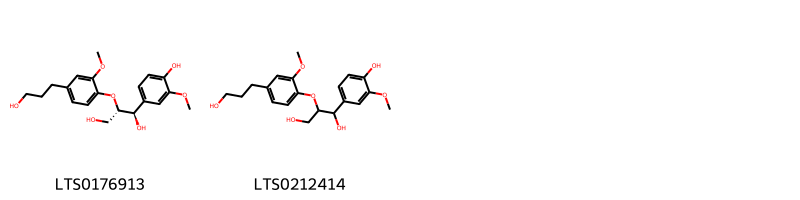
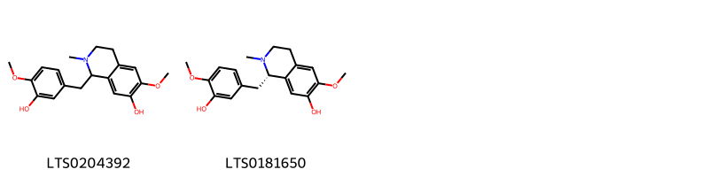
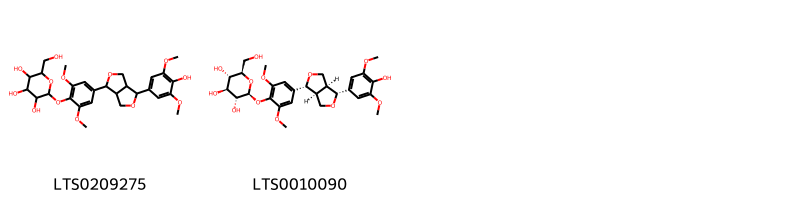
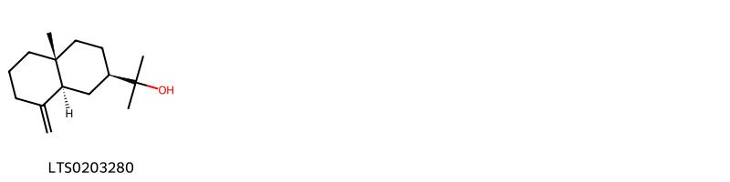

!!! abstract "Tóm tắt"

    Cây Hậu phác (Magnolia officinalis Rehd. et Wils.) hoặc cây Ao diệp hậu phác {Magnolia officinalis Rehd. et Wils var. biloba Rehd. et Wils.) thuộc họ Ngọc lan (Magnoliaceae). Cây có nguồn gốc Trung Quốc Bắc-Trung, Trung Quốc Nam-Trung, Trung Quốc Đông Nam, Tây Tạng và ở Việt Nam đến hiện tại vẫn chưa phát hiện được. Từ xa xưa, vỏ Hậu Phác đã được sử dụng nhiều trong dân gian. Người ta thu hoạch từ tháng 4 đến tháng 6, bóc lấy vỏ rễ, vỏ thân, vỏ cành. Vỏ rễ và vỏ cành phơi âm can. Vỏ thân chần qua nước sôi, vớt ra, chất đống để nơi ẩm cho đến khi bề mặt lõi có màu nâu tía hay nâu thẫm, đồ mềm, cuộn thành ống phơi khô. Từ đó bào chế thành 2 dạng là : Hậu phác phiến và khương Hậu phác. Hậu phác phiến: Cạo sạch vỏ, rửa sạch, ủ mềm, thái lát, phơi khô. Khương Hậu phác (chê gừng): Gừng tươi nghiền nát, ép, vắt lấy nước cốt gừng; thêm một lượng nhỏ nước vào bã gừng, ép lấy nước gừng lần nữa; trộn đều nước gừng; tẩm nước gừng với Hậu phác phiến cho thấm hết nước gừng, sao nhỏ lửa đến khô, phiến cong, vết nứt có sợi và màu nâu tía (dùng 10 kg Gừng tươi hoặc 3 kg Gừng khô cho 100 kg Hậu phác).Trong vỏ Hậu phác có 2 thành phần chính là Magnolol, Honokiol có tác dụng dược lý Kháng khuẩn, chống viêm, chống ung thư, chống sâu răng, chống bệnh bạch cầu, diệt nấm, giãn cơ, chất chống oxy hóa, an thần...

## Thông tin về thực vật

Dược liệu **Hậu Phác (Vỏ)** từ bộ phận **nan** từ loài *Magnolia officinalis*.

**Mô tả thực vật:** Cây hậu phác chính thức (Magnolia offcinalis Rehd. ct Wils.) là một cây to, cao từ 7-15m, vỏ thân tím nâu. Lá mọc so le, cuống to, mập dài từ 2,4- 4,cm, không lông, phiến lá hình trứng thuôn, đài 22-40cm, rộng từ 10-20cm, đầu hơi nhọn, phía cuống hẹp lại. Hoa màu trắng, thơm, đường kính có thể tới 12cm, cuống hoa to thô. Quả kép (gồm nhiều đại rời), hình trứng đài từ 9-12cm, đường kính từ 5-6,5cm.
Thứ hậu phác Magnolia officinalis vat. biloba Rehd. et Wils, rất giống loài trên, chỉ khác ở đầu lá hõm xuống chia làm hai thùy.

*Tài liệu tham khảo:* "Những cây thuốc và vị thuốc Việt Nam" - Đỗ Tất Lợi 
Trong dược điển Việt nam, một số loài có thể dùng thay thế cho nhau làm dược liệu bao gồm *Magnolia officinalis, Magnolia officinalis*

!!! info "Phân loại thực vật của *Magnolia officinalis*"
    - **Kingdom:** Plantae
    - **Phylum:** Tracheophyta
    - **Order:** Magnoliales
    - **Family:** Magnoliaceae
    - **Genus:** Magnolia
    - **Species:** *Magnolia officinalis*

**Phân bố trên thế giới:** nan, India, Poland, Belgium, China, New Zealand, Hong Kong, Korea, Republic of, United States of America, Canada

**Phân bố tại Việt nam:** Không có ghi nhận ở Việt Nam

!!! info "Phân loại thực vật của *Magnolia officinalis*"
    - **Kingdom:** Plantae
    - **Phylum:** Tracheophyta
    - **Order:** Magnoliales
    - **Family:** Magnoliaceae
    - **Genus:** Magnolia
    - **Species:** *Magnolia officinalis*

**Phân bố trên thế giới:** nan, India, Poland, Belgium, China, New Zealand, Hong Kong, Korea, Republic of, United States of America, Canada

**Phân bố tại Việt nam:** Không có ghi nhận ở Việt Nam

## Thông tin về dược liệu 

### Định danh

!!! info "Thông tin về tên gọi"

    - Dược liệu tiếng Việt: nan
    - Dược liệu tiếng Trung: nan (nan)
    - Dược liệu tiếng Anh: nan
    - Dược liệu latin thông dụng: nan
    - Dược liệu latin kiểu DĐVN: *cortex magnoliae officinalis*
    - Dược liệu latin kiểu DĐVN: *nan*
    - Dược liệu latin kiểu thông tư: *nan*
    - Bộ phận dùng: nan (nan)

### Mô tả dược liệu 

- **Theo dược điển Việt nam V:** nan

- **Mô tả dược liệu theo thông tư chế biến dược liệu theo phương pháp cổ truyền:** nan

### Chế biến 

- **Chế biến theo dược điển việt nam V**: nan

- **Chế biến theo thông tư:** nan

--- 

## Thành phần hóa học

- Theo tài liệu của GS. Đỗ Tất Lợi:  (1) Nhóm hóa học
- Magnolol (C18H18O2) và Honokiol là một đồng phân của magnolol: hợp chất hữu cơ thuộc về lignan.
- Tinh dầu: trong đó thành phần chủ yếu là machilola C15H26O
- Tinh thể Magnocurarin C19H25O4.I/4H2O
(2) Dược điển Đài Loan: Magnolol
    

**Thành phần hóa học từ loài **Magnolia officinalis**

Theo cơ sở dữ liệu lotus, loài *Magnolia officinalis* đã phân lập và xác định được **95** hoạt chất thuộc về các nhóm Coumarans, Organooxygen compounds, Lignan glycosides, Cinnamic acids and derivatives, Furanoid lignans, Aporphines, Phenols, Isoquinolines and derivatives, 2-arylbenzofuran flavonoids, Benzene and substituted derivatives, Linear 1,3-diarylpropanoids, Prenol lipids trong bảng dưới đây. Danh sách các hoạt chất như sau (2e)-3-[5'-(2,3-dihydroxypropyl)-2',6-dihydroxy-[1,1'-biphenyl]-3-yl]prop-2-enal [(LTS0233096)](https://lotus.naturalproducts.net/compound/lotus_id/LTS0233096), 5-[7-hydroxy-2-(hydroxymethyl)-4-(prop-2-en-1-yl)-6-[4-(prop-2-en-1-yl)phenoxy]-2,3-dihydro-1-benzofuran-3-yl]-5'-(prop-2-en-1-yl)-[1,1'-biphenyl]-2,2'-diol [(LTS0032892)](https://lotus.naturalproducts.net/compound/lotus_id/LTS0032892), β-eudesmol [(LTS0203280)](https://lotus.naturalproducts.net/compound/lotus_id/LTS0203280), (2s,3r,4s,5s,6r)-2-{4-[(1r,3as,4r,6as)-4-(4-hydroxy-3,5-dimethoxyphenyl)-hexahydrofuro[3,4-c]furan-1-yl]-2,6-dimethoxyphenoxy}-6-(hydroxymethyl)oxane-3,4,5-triol [(LTS0010090)](https://lotus.naturalproducts.net/compound/lotus_id/LTS0010090), 3'-(prop-2-en-1-yl)-[1,1'-biphenyl]-2,4',5-triol [(LTS0050799)](https://lotus.naturalproducts.net/compound/lotus_id/LTS0050799), (-)-syringaresinol [(LTS0076227)](https://lotus.naturalproducts.net/compound/lotus_id/LTS0076227), 5,5'-bis(prop-2-en-1-yl)-2'-{[(1s,2r,4s)-1,7,7-trimethylbicyclo[2.2.1]heptan-2-yl]oxy}-[1,1'-biphenyl]-2-ol [(LTS0180165)](https://lotus.naturalproducts.net/compound/lotus_id/LTS0180165), 4-(3-{3,4-dihydroxy-5-[4-(prop-2-en-1-yl)phenoxy]phenyl}-2,3-dihydroxypropyl)-5-(prop-2-en-1-yl)-3-[4-(prop-2-en-1-yl)phenoxy]benzene-1,2-diol [(LTS0200894)](https://lotus.naturalproducts.net/compound/lotus_id/LTS0200894), syringaldehyde [(LTS0201406)](https://lotus.naturalproducts.net/compound/lotus_id/LTS0201406), 4',5-dihydroxy-3'-(prop-2-en-1-yl)-[1,1'-biphenyl]-2-carbaldehyde [(LTS0007079)](https://lotus.naturalproducts.net/compound/lotus_id/LTS0007079), 5-[(2r)-2,3-dihydroxypropyl]-5'-(prop-2-en-1-yl)-[1,1'-biphenyl]-2,2'-diol [(LTS0177491)](https://lotus.naturalproducts.net/compound/lotus_id/LTS0177491), 5,5'-bis(prop-2-en-1-yl)-2'-{[(2r)-1,7,7-trimethylbicyclo[2.2.1]heptan-2-yl]oxy}-[1,1'-biphenyl]-2-ol [(LTS0186784)](https://lotus.naturalproducts.net/compound/lotus_id/LTS0186784), (1r,2s)-1-[2',6-dihydroxy-5'-(prop-2-en-1-yl)-[1,1'-biphenyl]-3-yl]propane-1,2,3-triol [(LTS0027722)](https://lotus.naturalproducts.net/compound/lotus_id/LTS0027722), coniferyl alcohol [(LTS0152881)](https://lotus.naturalproducts.net/compound/lotus_id/LTS0152881), 3-[4',6-dihydroxy-3'-(prop-2-en-1-yl)-[1,1'-biphenyl]-3-yl]prop-2-enal [(LTS0183367)](https://lotus.naturalproducts.net/compound/lotus_id/LTS0183367), 3-[2',6-dihydroxy-5'-(prop-2-en-1-yl)-[1,1'-biphenyl]-3-yl]prop-2-enal [(LTS0140269)](https://lotus.naturalproducts.net/compound/lotus_id/LTS0140269), 6-[2-(3,4-dihydroxyphenyl)ethoxy]-5-hydroxy-2-(hydroxymethyl)-4-[(3,4,5-trihydroxy-6-methyloxan-2-yl)oxy]oxan-3-yl 3-(3,4-dihydroxyphenyl)prop-2-enoate [(LTS0050472)](https://lotus.naturalproducts.net/compound/lotus_id/LTS0050472), 5-(prop-2-en-1-yl)-3-[3-(prop-2-en-1-yl)phenoxy]benzene-1,2-diol [(LTS0199494)](https://lotus.naturalproducts.net/compound/lotus_id/LTS0199494), 4-o-methylhonokiol [(LTS0014450)](https://lotus.naturalproducts.net/compound/lotus_id/LTS0014450), 6-hydroxy-4'-methoxy-3'-(prop-2-en-1-yl)-[1,1'-biphenyl]-3-carbaldehyde [(LTS0263271)](https://lotus.naturalproducts.net/compound/lotus_id/LTS0263271), anonaine [(LTS0160152)](https://lotus.naturalproducts.net/compound/lotus_id/LTS0160152), 4-[(2r,3r)-3-{3,4-dihydroxy-5-[4-(prop-2-en-1-yl)phenoxy]phenyl}-2,3-dihydroxypropyl]-5-(prop-2-en-1-yl)-3-[4-(prop-2-en-1-yl)phenoxy]benzene-1,2-diol [(LTS0247528)](https://lotus.naturalproducts.net/compound/lotus_id/LTS0247528), 1-[2',6-dihydroxy-5'-(prop-2-en-1-yl)-[1,1'-biphenyl]-3-yl]propane-1,2,3-triol [(LTS0194665)](https://lotus.naturalproducts.net/compound/lotus_id/LTS0194665), honokiol [(LTS0033178)](https://lotus.naturalproducts.net/compound/lotus_id/LTS0033178), verbascoside [(LTS0168159)](https://lotus.naturalproducts.net/compound/lotus_id/LTS0168159), sinapaldehyde [(LTS0069561)](https://lotus.naturalproducts.net/compound/lotus_id/LTS0069561), 4-(3-{3,4-dihydroxy-5-[3-(prop-2-en-1-yl)phenoxy]phenyl}-2,3-dihydroxypropyl)-5-(prop-2-en-1-yl)-3-[4-(prop-2-en-1-yl)phenoxy]benzene-1,2-diol [(LTS0262177)](https://lotus.naturalproducts.net/compound/lotus_id/LTS0262177), 5-(1,2-dihydroxy-3-{[2'-hydroxy-5,5'-bis(prop-2-en-1-yl)-[1,1'-biphenyl]-2-yl]oxy}propyl)-5'-(prop-2-en-1-yl)-[1,1'-biphenyl]-2,2'-diol [(LTS0090319)](https://lotus.naturalproducts.net/compound/lotus_id/LTS0090319), coniferyl aldehyde [(LTS0140691)](https://lotus.naturalproducts.net/compound/lotus_id/LTS0140691), 16-methoxy-10-azatetracyclo[7.7.1.0²,⁷.0¹³,¹⁷]heptadeca-1(17),2,4,6,13,15-hexaen-15-ol [(LTS0093098)](https://lotus.naturalproducts.net/compound/lotus_id/LTS0093098), methyl eugenol [(LTS0098881)](https://lotus.naturalproducts.net/compound/lotus_id/LTS0098881), 3-[(6r)-6-isopropyl-3-methylcyclohex-2-en-1-yl]-5,5'-bis(prop-2-en-1-yl)-[1,1'-biphenyl]-2,2'-diol [(LTS0139193)](https://lotus.naturalproducts.net/compound/lotus_id/LTS0139193), sinapyl aldehyde [(LTS0221627)](https://lotus.naturalproducts.net/compound/lotus_id/LTS0221627), (2e)-3-[4',6-dihydroxy-3'-(prop-2-en-1-yl)-[1,1'-biphenyl]-3-yl]prop-2-enal [(LTS0251633)](https://lotus.naturalproducts.net/compound/lotus_id/LTS0251633), 5'-[(1e)-prop-1-en-1-yl]-[1,1'-biphenyl]-2,2',5-triol [(LTS0219384)](https://lotus.naturalproducts.net/compound/lotus_id/LTS0219384), 3,3'-bis[(1r,6s)-6-isopropyl-3-methylcyclohex-2-en-1-yl]-5,5'-bis(prop-2-en-1-yl)-[1,1'-biphenyl]-2,2'-diol [(LTS0183800)](https://lotus.naturalproducts.net/compound/lotus_id/LTS0183800), 5,5'-bis(prop-2-en-1-yl)-2'-({1,7,7-trimethylbicyclo[2.2.1]heptan-2-yl}oxy)-[1,1'-biphenyl]-2-ol [(LTS0087719)](https://lotus.naturalproducts.net/compound/lotus_id/LTS0087719), (+,-)-reticuline [(LTS0181650)](https://lotus.naturalproducts.net/compound/lotus_id/LTS0181650), syringin [(LTS0046227)](https://lotus.naturalproducts.net/compound/lotus_id/LTS0046227), (2e)-3-{5'-[(2r)-2,3-dihydroxypropyl]-2',6-dihydroxy-[1,1'-biphenyl]-3-yl}prop-2-enal [(LTS0133762)](https://lotus.naturalproducts.net/compound/lotus_id/LTS0133762), 3-(6-isopropyl-3-methylcyclohex-2-en-1-yl)-5,5'-bis(prop-2-en-1-yl)-[1,1'-biphenyl]-2,2'-diol [(LTS0131393)](https://lotus.naturalproducts.net/compound/lotus_id/LTS0131393), 5-[(1s,2r)-2,3-dihydroxy-1-methoxypropyl]-3'-(prop-2-en-1-yl)-[1,1'-biphenyl]-2,4'-diol [(LTS0026321)](https://lotus.naturalproducts.net/compound/lotus_id/LTS0026321), (1r,2s)-1-[4',6-dihydroxy-3'-(prop-2-en-1-yl)-[1,1'-biphenyl]-3-yl]propane-1,2,3-triol [(LTS0020655)](https://lotus.naturalproducts.net/compound/lotus_id/LTS0020655), coniferaldehyde [(LTS0009773)](https://lotus.naturalproducts.net/compound/lotus_id/LTS0009773), 3,5-dioxa-11-azapentacyclo[10.7.1.0²,⁶.0⁸,²⁰.0¹⁴,¹⁹]icosa-1(20),2(6),7,14,16,18-hexaene [(LTS0117403)](https://lotus.naturalproducts.net/compound/lotus_id/LTS0117403), (2e)-3-(3,5-dimethoxy-4-{[(2s,3r,4s,5s,6r)-3,4,5-trihydroxy-6-(hydroxymethyl)oxan-2-yl]oxy}phenyl)prop-2-enal [(LTS0269793)](https://lotus.naturalproducts.net/compound/lotus_id/LTS0269793), (2s)-5-[2-hydroxy-5-(prop-2-en-1-yl)phenyl]-2-(hydroxymethyl)-2,3-dihydro-1-benzofuran-3-ol [(LTS0144854)](https://lotus.naturalproducts.net/compound/lotus_id/LTS0144854), 3,5-dioxa-11-azapentacyclo[10.7.1.0²,⁶.0⁸,²⁰.0¹⁴,¹⁹]icosa-1(20),2(6),7,14,16,18-hexaen-16-ol [(LTS0144642)](https://lotus.naturalproducts.net/compound/lotus_id/LTS0144642), magnolol [(LTS0194504)](https://lotus.naturalproducts.net/compound/lotus_id/LTS0194504), 1-(4-hydroxy-3-methoxyphenyl)-2-[4-(3-hydroxypropyl)-2-methoxyphenoxy]propane-1,3-diol [(LTS0212414)](https://lotus.naturalproducts.net/compound/lotus_id/LTS0212414), 3-[(1s,6s)-6-isopropyl-3-methylcyclohex-2-en-1-yl]-3',5-bis(prop-2-en-1-yl)-[1,1'-biphenyl]-2,4'-diol [(LTS0105688)](https://lotus.naturalproducts.net/compound/lotus_id/LTS0105688), p-hydroxybenzaldehyde [(LTS0259836)](https://lotus.naturalproducts.net/compound/lotus_id/LTS0259836), 5-[2-hydroxy-5-(prop-2-en-1-yl)phenyl]-2-(hydroxymethyl)-2,3-dihydro-1-benzofuran-3-ol [(LTS0114755)](https://lotus.naturalproducts.net/compound/lotus_id/LTS0114755), (9r)-14-({[2-(4-hydroxyphenyl)ethyl]amino}methyl)-16-methoxy-10-azatetracyclo[7.7.1.0²,⁷.0¹³,¹⁷]heptadeca-1(17),2,4,6,13,15-hexaen-15-ol [(LTS0002704)](https://lotus.naturalproducts.net/compound/lotus_id/LTS0002704), (2r,3r,4r,5r,6r)-6-[2-(3,4-dihydroxyphenyl)ethoxy]-5-hydroxy-2-(hydroxymethyl)-4-{[(2s,3r,4s,5r,6s)-3,4,5-trihydroxy-6-methyloxan-2-yl]oxy}oxan-3-yl (2e)-3-(3,4-dihydroxyphenyl)prop-2-enoate [(LTS0178188)](https://lotus.naturalproducts.net/compound/lotus_id/LTS0178188), 3,3'-bis[(1s,6s)-6-isopropyl-3-methylcyclohex-2-en-1-yl]-5,5'-bis(prop-2-en-1-yl)-[1,1'-biphenyl]-2,2'-diol [(LTS0098330)](https://lotus.naturalproducts.net/compound/lotus_id/LTS0098330), 4',6-dihydroxy-3'-(prop-2-en-1-yl)-[1,1'-biphenyl]-3-carbaldehyde [(LTS0067441)](https://lotus.naturalproducts.net/compound/lotus_id/LTS0067441), 5-(2,3-dihydroxypropyl)-3'-(prop-2-en-1-yl)-[1,1'-biphenyl]-2,4'-diol [(LTS0027434)](https://lotus.naturalproducts.net/compound/lotus_id/LTS0027434), (2s,3r)-5-[2-hydroxy-5-(prop-2-en-1-yl)phenyl]-2-(hydroxymethyl)-2,3-dihydro-1-benzofuran-3-ol [(LTS0088706)](https://lotus.naturalproducts.net/compound/lotus_id/LTS0088706), (2s,3r,4s,5r,6s)-2-(hydroxymethyl)-6-{4-[(1e)-3-hydroxyprop-1-en-1-yl]-2,6-dimethoxyphenoxy}oxane-3,4,5-triol [(LTS0208391)](https://lotus.naturalproducts.net/compound/lotus_id/LTS0208391), (1s,2s)-1-[2',6-dihydroxy-5'-(prop-2-en-1-yl)-[1,1'-biphenyl]-3-yl]propane-1,2,3-triol [(LTS0108760)](https://lotus.naturalproducts.net/compound/lotus_id/LTS0108760), 3-(6-isopropyl-3-methylcyclohex-2-en-1-yl)-3',5-bis(prop-2-en-1-yl)-[1,1'-biphenyl]-2,4'-diol [(LTS0249370)](https://lotus.naturalproducts.net/compound/lotus_id/LTS0249370), (8r,9s)-16-methoxy-10-azatetracyclo[7.7.1.0²,⁷.0¹³,¹⁷]heptadeca-1(17),2,4,6,13,15-hexaene-8,15-diol [(LTS0071058)](https://lotus.naturalproducts.net/compound/lotus_id/LTS0071058), 2-(hydroxymethyl)-6-[4-(3-hydroxyprop-1-en-1-yl)-2,6-dimethoxyphenoxy]oxane-3,4,5-triol [(LTS0188912)](https://lotus.naturalproducts.net/compound/lotus_id/LTS0188912), syringaresinol [(LTS0116280)](https://lotus.naturalproducts.net/compound/lotus_id/LTS0116280), obovatol [(LTS0026743)](https://lotus.naturalproducts.net/compound/lotus_id/LTS0026743), 5-[(1r,2r)-1,2-dihydroxy-3-{[2'-hydroxy-5,5'-bis(prop-2-en-1-yl)-[1,1'-biphenyl]-2-yl]oxy}propyl]-5'-(prop-2-en-1-yl)-[1,1'-biphenyl]-2,2'-diol [(LTS0155369)](https://lotus.naturalproducts.net/compound/lotus_id/LTS0155369), anolobine [(LTS0265842)](https://lotus.naturalproducts.net/compound/lotus_id/LTS0265842), 3-[(1s,6s)-6-isopropyl-3-methylcyclohex-2-en-1-yl]-5,5'-bis(prop-2-en-1-yl)-[1,1'-biphenyl]-2,2'-diol [(LTS0031620)](https://lotus.naturalproducts.net/compound/lotus_id/LTS0031620), 3-[5'-(2,3-dihydroxypropyl)-2',6-dihydroxy-[1,1'-biphenyl]-3-yl]prop-2-enal [(LTS0270325)](https://lotus.naturalproducts.net/compound/lotus_id/LTS0270325), (+)-syringaresinol [(LTS0158868)](https://lotus.naturalproducts.net/compound/lotus_id/LTS0158868), 4-(3-hydroxyprop-1-en-1-yl)-2-methoxyphenol [(LTS0256062)](https://lotus.naturalproducts.net/compound/lotus_id/LTS0256062), r-(-)-asimilobine [(LTS0061350)](https://lotus.naturalproducts.net/compound/lotus_id/LTS0061350), 5-[(2s,3r)-5-hydroxy-7-[2-hydroxy-5-(prop-2-en-1-yl)phenyl]-3-(hydroxymethyl)-2,3-dihydro-1-benzofuran-2-yl]-5'-(prop-2-en-1-yl)-[1,1'-biphenyl]-2,2'-diol [(LTS0234273)](https://lotus.naturalproducts.net/compound/lotus_id/LTS0234273), (1r,2s)-1-(4-hydroxy-3-methoxyphenyl)-2-[4-(3-hydroxypropyl)-2-methoxyphenoxy]propane-1,3-diol [(LTS0176913)](https://lotus.naturalproducts.net/compound/lotus_id/LTS0176913), 2-{4-[4-(4-hydroxy-3,5-dimethoxyphenyl)-hexahydrofuro[3,4-c]furan-1-yl]-2,6-dimethoxyphenoxy}-6-(hydroxymethyl)oxane-3,4,5-triol [(LTS0209275)](https://lotus.naturalproducts.net/compound/lotus_id/LTS0209275), liriodenine [(LTS0132761)](https://lotus.naturalproducts.net/compound/lotus_id/LTS0132761), (2e)-3-{2'-hydroxy-4-methoxy-5'-[(1e)-3-oxoprop-1-en-1-yl]-[1,1'-biphenyl]-3-yl}prop-2-enal [(LTS0122014)](https://lotus.naturalproducts.net/compound/lotus_id/LTS0122014), 5-(2,3-dihydroxypropyl)-5'-(prop-2-en-1-yl)-[1,1'-biphenyl]-2,2'-diol [(LTS0196014)](https://lotus.naturalproducts.net/compound/lotus_id/LTS0196014), reticuline [(LTS0204392)](https://lotus.naturalproducts.net/compound/lotus_id/LTS0204392), 5-{5-hydroxy-7-[2-hydroxy-5-(prop-2-en-1-yl)phenyl]-3-(hydroxymethyl)-2,3-dihydro-1-benzofuran-2-yl}-5'-(prop-2-en-1-yl)-[1,1'-biphenyl]-2,2'-diol [(LTS0161974)](https://lotus.naturalproducts.net/compound/lotus_id/LTS0161974), 5'-(prop-2-en-1-yl)-[1,1'-biphenyl]-2,2',5-triol [(LTS0105722)](https://lotus.naturalproducts.net/compound/lotus_id/LTS0105722), (2e)-3-[2',6-dihydroxy-5'-(prop-2-en-1-yl)-[1,1'-biphenyl]-3-yl]prop-2-enal [(LTS0250345)](https://lotus.naturalproducts.net/compound/lotus_id/LTS0250345), 2',5-dihydroxy-5'-(prop-2-en-1-yl)-[1,1'-biphenyl]-2-carbaldehyde [(LTS0009614)](https://lotus.naturalproducts.net/compound/lotus_id/LTS0009614), 5-[(2r,3s)-7-hydroxy-2-(hydroxymethyl)-4-(prop-2-en-1-yl)-6-[4-(prop-2-en-1-yl)phenoxy]-2,3-dihydro-1-benzofuran-3-yl]-5'-(prop-2-en-1-yl)-[1,1'-biphenyl]-2,2'-diol [(LTS0046577)](https://lotus.naturalproducts.net/compound/lotus_id/LTS0046577), 15-hydroxy-16-methoxy-10-azatetracyclo[7.7.1.0²,⁷.0¹³,¹⁷]heptadeca-1(16),2,4,6,9(17),10,12,14-octaen-8-one [(LTS0066091)](https://lotus.naturalproducts.net/compound/lotus_id/LTS0066091), 16-methoxy-10-azatetracyclo[7.7.1.0²,⁷.0¹³,¹⁷]heptadeca-1(17),2,4,6,13,15-hexaene-8,15-diol [(LTS0199279)](https://lotus.naturalproducts.net/compound/lotus_id/LTS0199279), 4-[3-(4-hydroxy-3-methoxyphenyl)prop-2-en-1-yl]-3,4,5-trimethoxycyclohexa-2,5-dien-1-one [(LTS0241085)](https://lotus.naturalproducts.net/compound/lotus_id/LTS0241085), 5-(2,3-dihydroxy-1-methoxypropyl)-3'-(prop-2-en-1-yl)-[1,1'-biphenyl]-2,4'-diol [(LTS0014470)](https://lotus.naturalproducts.net/compound/lotus_id/LTS0014470), 3,3'-bis(6-isopropyl-3-methylcyclohex-2-en-1-yl)-5,5'-bis(prop-2-en-1-yl)-[1,1'-biphenyl]-2,2'-diol [(LTS0256983)](https://lotus.naturalproducts.net/compound/lotus_id/LTS0256983), 5-[(2r)-2,3-dihydroxypropyl]-3'-(prop-2-en-1-yl)-[1,1'-biphenyl]-2,4'-diol [(LTS0051302)](https://lotus.naturalproducts.net/compound/lotus_id/LTS0051302), 4-[(2e)-3-(4-hydroxy-3-methoxyphenyl)prop-2-en-1-yl]-3,4,5-trimethoxycyclohexa-2,5-dien-1-one [(LTS0007099)](https://lotus.naturalproducts.net/compound/lotus_id/LTS0007099), 2',6-dihydroxy-5'-(prop-2-en-1-yl)-[1,1'-biphenyl]-3-carbaldehyde [(LTS0079394)](https://lotus.naturalproducts.net/compound/lotus_id/LTS0079394), 1-[4',6-dihydroxy-3'-(prop-2-en-1-yl)-[1,1'-biphenyl]-3-yl]propane-1,2,3-triol [(LTS0063545)](https://lotus.naturalproducts.net/compound/lotus_id/LTS0063545), (2e)-3-[6-hydroxy-4'-methoxy-3'-(prop-2-en-1-yl)-[1,1'-biphenyl]-3-yl]prop-2-enal [(LTS0269598)](https://lotus.naturalproducts.net/compound/lotus_id/LTS0269598). 
        
| chemicalTaxonomyClassyfireClass     |   smiles_count |
|:------------------------------------|---------------:|
|                                     |             87 |
| 2-arylbenzofuran flavonoids         |            139 |
| Aporphines                          |            413 |
| Benzene and substituted derivatives |           2049 |
| Cinnamic acids and derivatives      |            321 |
| Coumarans                           |            282 |
| Furanoid lignans                    |            184 |
| Isoquinolines and derivatives       |             76 |
| Lignan glycosides                   |            176 |
| Linear 1,3-diarylpropanoids         |            230 |
| Organooxygen compounds              |            251 |
| Phenols                             |            234 |
| Prenol lipids                       |             42 |

            
### Nhóm 
<figure markdown="span">
    { width=100% }
<figcaption>Hình ảnh cấu trúc hóa học của hoạt chất thuộc nhóm **. Tên thường gọi của các hoạt chất tương ứng là (1r,2s)-1-(4-hydroxy-3-methoxyphenyl)-2-[4-(3-hydroxypropyl)-2-methoxyphenoxy]propane-1,3-diol [(LTS0176913)](https://lotus.naturalproducts.net/compound/lotus_id/LTS0176913), 1-(4-hydroxy-3-methoxyphenyl)-2-[4-(3-hydroxypropyl)-2-methoxyphenoxy]propane-1,3-diol [(LTS0212414)](https://lotus.naturalproducts.net/compound/lotus_id/LTS0212414).</figcaption>
</figure>

            
            
### Nhóm 
<figure markdown="span">
    { width=100% }
<figcaption>Hình ảnh cấu trúc hóa học của hoạt chất thuộc nhóm **. Tên thường gọi của các hoạt chất tương ứng là (1r,2s)-1-(4-hydroxy-3-methoxyphenyl)-2-[4-(3-hydroxypropyl)-2-methoxyphenoxy]propane-1,3-diol [(LTS0176913)](https://lotus.naturalproducts.net/compound/lotus_id/LTS0176913), 1-(4-hydroxy-3-methoxyphenyl)-2-[4-(3-hydroxypropyl)-2-methoxyphenoxy]propane-1,3-diol [(LTS0212414)](https://lotus.naturalproducts.net/compound/lotus_id/LTS0212414).</figcaption>
</figure>

### Nhóm 2-arylbenzofuran flavonoids
<figure markdown="span">
    { width=100% }
<figcaption>Hình ảnh cấu trúc hóa học của hoạt chất thuộc nhóm *2-arylbenzofuran flavonoids*. Tên thường gọi của các hoạt chất tương ứng là 5-{5-hydroxy-7-[2-hydroxy-5-(prop-2-en-1-yl)phenyl]-3-(hydroxymethyl)-2,3-dihydro-1-benzofuran-2-yl}-5'-(prop-2-en-1-yl)-[1,1'-biphenyl]-2,2'-diol [(LTS0161974)](https://lotus.naturalproducts.net/compound/lotus_id/LTS0161974), 5-[(2s,3r)-5-hydroxy-7-[2-hydroxy-5-(prop-2-en-1-yl)phenyl]-3-(hydroxymethyl)-2,3-dihydro-1-benzofuran-2-yl]-5'-(prop-2-en-1-yl)-[1,1'-biphenyl]-2,2'-diol [(LTS0234273)](https://lotus.naturalproducts.net/compound/lotus_id/LTS0234273).</figcaption>
</figure>

            
            
### Nhóm 
<figure markdown="span">
    { width=100% }
<figcaption>Hình ảnh cấu trúc hóa học của hoạt chất thuộc nhóm **. Tên thường gọi của các hoạt chất tương ứng là (1r,2s)-1-(4-hydroxy-3-methoxyphenyl)-2-[4-(3-hydroxypropyl)-2-methoxyphenoxy]propane-1,3-diol [(LTS0176913)](https://lotus.naturalproducts.net/compound/lotus_id/LTS0176913), 1-(4-hydroxy-3-methoxyphenyl)-2-[4-(3-hydroxypropyl)-2-methoxyphenoxy]propane-1,3-diol [(LTS0212414)](https://lotus.naturalproducts.net/compound/lotus_id/LTS0212414).</figcaption>
</figure>

### Nhóm 2-arylbenzofuran flavonoids
<figure markdown="span">
    { width=100% }
<figcaption>Hình ảnh cấu trúc hóa học của hoạt chất thuộc nhóm *2-arylbenzofuran flavonoids*. Tên thường gọi của các hoạt chất tương ứng là 5-{5-hydroxy-7-[2-hydroxy-5-(prop-2-en-1-yl)phenyl]-3-(hydroxymethyl)-2,3-dihydro-1-benzofuran-2-yl}-5'-(prop-2-en-1-yl)-[1,1'-biphenyl]-2,2'-diol [(LTS0161974)](https://lotus.naturalproducts.net/compound/lotus_id/LTS0161974), 5-[(2s,3r)-5-hydroxy-7-[2-hydroxy-5-(prop-2-en-1-yl)phenyl]-3-(hydroxymethyl)-2,3-dihydro-1-benzofuran-2-yl]-5'-(prop-2-en-1-yl)-[1,1'-biphenyl]-2,2'-diol [(LTS0234273)](https://lotus.naturalproducts.net/compound/lotus_id/LTS0234273).</figcaption>
</figure>

### Nhóm Aporphines
<figure markdown="span">
    { width=100% }
<figcaption>Hình ảnh cấu trúc hóa học của hoạt chất thuộc nhóm *Aporphines*. Tên thường gọi của các hoạt chất tương ứng là liriodenine [(LTS0132761)](https://lotus.naturalproducts.net/compound/lotus_id/LTS0132761), r-(-)-asimilobine [(LTS0061350)](https://lotus.naturalproducts.net/compound/lotus_id/LTS0061350), anonaine [(LTS0160152)](https://lotus.naturalproducts.net/compound/lotus_id/LTS0160152), 3,5-dioxa-11-azapentacyclo[10.7.1.0²,⁶.0⁸,²⁰.0¹⁴,¹⁹]icosa-1(20),2(6),7,14,16,18-hexaene [(LTS0117403)](https://lotus.naturalproducts.net/compound/lotus_id/LTS0117403), 16-methoxy-10-azatetracyclo[7.7.1.0²,⁷.0¹³,¹⁷]heptadeca-1(17),2,4,6,13,15-hexaen-15-ol [(LTS0093098)](https://lotus.naturalproducts.net/compound/lotus_id/LTS0093098), anolobine [(LTS0265842)](https://lotus.naturalproducts.net/compound/lotus_id/LTS0265842), 3,5-dioxa-11-azapentacyclo[10.7.1.0²,⁶.0⁸,²⁰.0¹⁴,¹⁹]icosa-1(20),2(6),7,14,16,18-hexaen-16-ol [(LTS0144642)](https://lotus.naturalproducts.net/compound/lotus_id/LTS0144642), 15-hydroxy-16-methoxy-10-azatetracyclo[7.7.1.0²,⁷.0¹³,¹⁷]heptadeca-1(16),2,4,6,9(17),10,12,14-octaen-8-one [(LTS0066091)](https://lotus.naturalproducts.net/compound/lotus_id/LTS0066091), (8r,9s)-16-methoxy-10-azatetracyclo[7.7.1.0²,⁷.0¹³,¹⁷]heptadeca-1(17),2,4,6,13,15-hexaene-8,15-diol [(LTS0071058)](https://lotus.naturalproducts.net/compound/lotus_id/LTS0071058), 16-methoxy-10-azatetracyclo[7.7.1.0²,⁷.0¹³,¹⁷]heptadeca-1(17),2,4,6,13,15-hexaene-8,15-diol [(LTS0199279)](https://lotus.naturalproducts.net/compound/lotus_id/LTS0199279), (9r)-14-({[2-(4-hydroxyphenyl)ethyl]amino}methyl)-16-methoxy-10-azatetracyclo[7.7.1.0²,⁷.0¹³,¹⁷]heptadeca-1(17),2,4,6,13,15-hexaen-15-ol [(LTS0002704)](https://lotus.naturalproducts.net/compound/lotus_id/LTS0002704).</figcaption>
</figure>

            
            
### Nhóm 
<figure markdown="span">
    { width=100% }
<figcaption>Hình ảnh cấu trúc hóa học của hoạt chất thuộc nhóm **. Tên thường gọi của các hoạt chất tương ứng là (1r,2s)-1-(4-hydroxy-3-methoxyphenyl)-2-[4-(3-hydroxypropyl)-2-methoxyphenoxy]propane-1,3-diol [(LTS0176913)](https://lotus.naturalproducts.net/compound/lotus_id/LTS0176913), 1-(4-hydroxy-3-methoxyphenyl)-2-[4-(3-hydroxypropyl)-2-methoxyphenoxy]propane-1,3-diol [(LTS0212414)](https://lotus.naturalproducts.net/compound/lotus_id/LTS0212414).</figcaption>
</figure>

### Nhóm 2-arylbenzofuran flavonoids
<figure markdown="span">
    { width=100% }
<figcaption>Hình ảnh cấu trúc hóa học của hoạt chất thuộc nhóm *2-arylbenzofuran flavonoids*. Tên thường gọi của các hoạt chất tương ứng là 5-{5-hydroxy-7-[2-hydroxy-5-(prop-2-en-1-yl)phenyl]-3-(hydroxymethyl)-2,3-dihydro-1-benzofuran-2-yl}-5'-(prop-2-en-1-yl)-[1,1'-biphenyl]-2,2'-diol [(LTS0161974)](https://lotus.naturalproducts.net/compound/lotus_id/LTS0161974), 5-[(2s,3r)-5-hydroxy-7-[2-hydroxy-5-(prop-2-en-1-yl)phenyl]-3-(hydroxymethyl)-2,3-dihydro-1-benzofuran-2-yl]-5'-(prop-2-en-1-yl)-[1,1'-biphenyl]-2,2'-diol [(LTS0234273)](https://lotus.naturalproducts.net/compound/lotus_id/LTS0234273).</figcaption>
</figure>

### Nhóm Aporphines
<figure markdown="span">
    { width=100% }
<figcaption>Hình ảnh cấu trúc hóa học của hoạt chất thuộc nhóm *Aporphines*. Tên thường gọi của các hoạt chất tương ứng là liriodenine [(LTS0132761)](https://lotus.naturalproducts.net/compound/lotus_id/LTS0132761), r-(-)-asimilobine [(LTS0061350)](https://lotus.naturalproducts.net/compound/lotus_id/LTS0061350), anonaine [(LTS0160152)](https://lotus.naturalproducts.net/compound/lotus_id/LTS0160152), 3,5-dioxa-11-azapentacyclo[10.7.1.0²,⁶.0⁸,²⁰.0¹⁴,¹⁹]icosa-1(20),2(6),7,14,16,18-hexaene [(LTS0117403)](https://lotus.naturalproducts.net/compound/lotus_id/LTS0117403), 16-methoxy-10-azatetracyclo[7.7.1.0²,⁷.0¹³,¹⁷]heptadeca-1(17),2,4,6,13,15-hexaen-15-ol [(LTS0093098)](https://lotus.naturalproducts.net/compound/lotus_id/LTS0093098), anolobine [(LTS0265842)](https://lotus.naturalproducts.net/compound/lotus_id/LTS0265842), 3,5-dioxa-11-azapentacyclo[10.7.1.0²,⁶.0⁸,²⁰.0¹⁴,¹⁹]icosa-1(20),2(6),7,14,16,18-hexaen-16-ol [(LTS0144642)](https://lotus.naturalproducts.net/compound/lotus_id/LTS0144642), 15-hydroxy-16-methoxy-10-azatetracyclo[7.7.1.0²,⁷.0¹³,¹⁷]heptadeca-1(16),2,4,6,9(17),10,12,14-octaen-8-one [(LTS0066091)](https://lotus.naturalproducts.net/compound/lotus_id/LTS0066091), (8r,9s)-16-methoxy-10-azatetracyclo[7.7.1.0²,⁷.0¹³,¹⁷]heptadeca-1(17),2,4,6,13,15-hexaene-8,15-diol [(LTS0071058)](https://lotus.naturalproducts.net/compound/lotus_id/LTS0071058), 16-methoxy-10-azatetracyclo[7.7.1.0²,⁷.0¹³,¹⁷]heptadeca-1(17),2,4,6,13,15-hexaene-8,15-diol [(LTS0199279)](https://lotus.naturalproducts.net/compound/lotus_id/LTS0199279), (9r)-14-({[2-(4-hydroxyphenyl)ethyl]amino}methyl)-16-methoxy-10-azatetracyclo[7.7.1.0²,⁷.0¹³,¹⁷]heptadeca-1(17),2,4,6,13,15-hexaen-15-ol [(LTS0002704)](https://lotus.naturalproducts.net/compound/lotus_id/LTS0002704).</figcaption>
</figure>

### Nhóm Benzene and substituted derivatives
<figure markdown="span">
    { width=100% }
<figcaption>Hình ảnh cấu trúc hóa học của hoạt chất thuộc nhóm *Benzene and substituted derivatives*. Tên thường gọi của các hoạt chất tương ứng là magnolol [(LTS0194504)](https://lotus.naturalproducts.net/compound/lotus_id/LTS0194504), obovatol [(LTS0026743)](https://lotus.naturalproducts.net/compound/lotus_id/LTS0026743), honokiol [(LTS0033178)](https://lotus.naturalproducts.net/compound/lotus_id/LTS0033178), 4-o-methylhonokiol [(LTS0014450)](https://lotus.naturalproducts.net/compound/lotus_id/LTS0014450), methyl eugenol [(LTS0098881)](https://lotus.naturalproducts.net/compound/lotus_id/LTS0098881), (2e)-3-[4',6-dihydroxy-3'-(prop-2-en-1-yl)-[1,1'-biphenyl]-3-yl]prop-2-enal [(LTS0251633)](https://lotus.naturalproducts.net/compound/lotus_id/LTS0251633), 4',6-dihydroxy-3'-(prop-2-en-1-yl)-[1,1'-biphenyl]-3-carbaldehyde [(LTS0067441)](https://lotus.naturalproducts.net/compound/lotus_id/LTS0067441), 5-[(2r)-2,3-dihydroxypropyl]-3'-(prop-2-en-1-yl)-[1,1'-biphenyl]-2,4'-diol [(LTS0051302)](https://lotus.naturalproducts.net/compound/lotus_id/LTS0051302), 3-(6-isopropyl-3-methylcyclohex-2-en-1-yl)-5,5'-bis(prop-2-en-1-yl)-[1,1'-biphenyl]-2,2'-diol [(LTS0131393)](https://lotus.naturalproducts.net/compound/lotus_id/LTS0131393), 5-(prop-2-en-1-yl)-3-[3-(prop-2-en-1-yl)phenoxy]benzene-1,2-diol [(LTS0199494)](https://lotus.naturalproducts.net/compound/lotus_id/LTS0199494), 2',6-dihydroxy-5'-(prop-2-en-1-yl)-[1,1'-biphenyl]-3-carbaldehyde [(LTS0079394)](https://lotus.naturalproducts.net/compound/lotus_id/LTS0079394), 1-[2',6-dihydroxy-5'-(prop-2-en-1-yl)-[1,1'-biphenyl]-3-yl]propane-1,2,3-triol [(LTS0194665)](https://lotus.naturalproducts.net/compound/lotus_id/LTS0194665), 5-(2,3-dihydroxypropyl)-5'-(prop-2-en-1-yl)-[1,1'-biphenyl]-2,2'-diol [(LTS0196014)](https://lotus.naturalproducts.net/compound/lotus_id/LTS0196014), 3'-(prop-2-en-1-yl)-[1,1'-biphenyl]-2,4',5-triol [(LTS0050799)](https://lotus.naturalproducts.net/compound/lotus_id/LTS0050799), 4',5-dihydroxy-3'-(prop-2-en-1-yl)-[1,1'-biphenyl]-2-carbaldehyde [(LTS0007079)](https://lotus.naturalproducts.net/compound/lotus_id/LTS0007079), (1r,2s)-1-[2',6-dihydroxy-5'-(prop-2-en-1-yl)-[1,1'-biphenyl]-3-yl]propane-1,2,3-triol [(LTS0027722)](https://lotus.naturalproducts.net/compound/lotus_id/LTS0027722), 5-[(2r)-2,3-dihydroxypropyl]-5'-(prop-2-en-1-yl)-[1,1'-biphenyl]-2,2'-diol [(LTS0177491)](https://lotus.naturalproducts.net/compound/lotus_id/LTS0177491), (1s,2s)-1-[2',6-dihydroxy-5'-(prop-2-en-1-yl)-[1,1'-biphenyl]-3-yl]propane-1,2,3-triol [(LTS0108760)](https://lotus.naturalproducts.net/compound/lotus_id/LTS0108760), 3-[5'-(2,3-dihydroxypropyl)-2',6-dihydroxy-[1,1'-biphenyl]-3-yl]prop-2-enal [(LTS0270325)](https://lotus.naturalproducts.net/compound/lotus_id/LTS0270325), 3-[2',6-dihydroxy-5'-(prop-2-en-1-yl)-[1,1'-biphenyl]-3-yl]prop-2-enal [(LTS0140269)](https://lotus.naturalproducts.net/compound/lotus_id/LTS0140269), 3-[(6r)-6-isopropyl-3-methylcyclohex-2-en-1-yl]-5,5'-bis(prop-2-en-1-yl)-[1,1'-biphenyl]-2,2'-diol [(LTS0139193)](https://lotus.naturalproducts.net/compound/lotus_id/LTS0139193), 5-[(1r,2r)-1,2-dihydroxy-3-{[2'-hydroxy-5,5'-bis(prop-2-en-1-yl)-[1,1'-biphenyl]-2-yl]oxy}propyl]-5'-(prop-2-en-1-yl)-[1,1'-biphenyl]-2,2'-diol [(LTS0155369)](https://lotus.naturalproducts.net/compound/lotus_id/LTS0155369), 3,3'-bis[(1r,6s)-6-isopropyl-3-methylcyclohex-2-en-1-yl]-5,5'-bis(prop-2-en-1-yl)-[1,1'-biphenyl]-2,2'-diol [(LTS0183800)](https://lotus.naturalproducts.net/compound/lotus_id/LTS0183800), (2e)-3-{5'-[(2r)-2,3-dihydroxypropyl]-2',6-dihydroxy-[1,1'-biphenyl]-3-yl}prop-2-enal [(LTS0133762)](https://lotus.naturalproducts.net/compound/lotus_id/LTS0133762), (2e)-3-[6-hydroxy-4'-methoxy-3'-(prop-2-en-1-yl)-[1,1'-biphenyl]-3-yl]prop-2-enal [(LTS0269598)](https://lotus.naturalproducts.net/compound/lotus_id/LTS0269598), 5,5'-bis(prop-2-en-1-yl)-2'-{[(1s,2r,4s)-1,7,7-trimethylbicyclo[2.2.1]heptan-2-yl]oxy}-[1,1'-biphenyl]-2-ol [(LTS0180165)](https://lotus.naturalproducts.net/compound/lotus_id/LTS0180165), 6-hydroxy-4'-methoxy-3'-(prop-2-en-1-yl)-[1,1'-biphenyl]-3-carbaldehyde [(LTS0263271)](https://lotus.naturalproducts.net/compound/lotus_id/LTS0263271), 3,3'-bis[(1s,6s)-6-isopropyl-3-methylcyclohex-2-en-1-yl]-5,5'-bis(prop-2-en-1-yl)-[1,1'-biphenyl]-2,2'-diol [(LTS0098330)](https://lotus.naturalproducts.net/compound/lotus_id/LTS0098330), 5-(2,3-dihydroxypropyl)-3'-(prop-2-en-1-yl)-[1,1'-biphenyl]-2,4'-diol [(LTS0027434)](https://lotus.naturalproducts.net/compound/lotus_id/LTS0027434), 3-[4',6-dihydroxy-3'-(prop-2-en-1-yl)-[1,1'-biphenyl]-3-yl]prop-2-enal [(LTS0183367)](https://lotus.naturalproducts.net/compound/lotus_id/LTS0183367), (2e)-3-[5'-(2,3-dihydroxypropyl)-2',6-dihydroxy-[1,1'-biphenyl]-3-yl]prop-2-enal [(LTS0233096)](https://lotus.naturalproducts.net/compound/lotus_id/LTS0233096), 3-(6-isopropyl-3-methylcyclohex-2-en-1-yl)-3',5-bis(prop-2-en-1-yl)-[1,1'-biphenyl]-2,4'-diol [(LTS0249370)](https://lotus.naturalproducts.net/compound/lotus_id/LTS0249370), 5,5'-bis(prop-2-en-1-yl)-2'-{[(2r)-1,7,7-trimethylbicyclo[2.2.1]heptan-2-yl]oxy}-[1,1'-biphenyl]-2-ol [(LTS0186784)](https://lotus.naturalproducts.net/compound/lotus_id/LTS0186784), (2e)-3-[2',6-dihydroxy-5'-(prop-2-en-1-yl)-[1,1'-biphenyl]-3-yl]prop-2-enal [(LTS0250345)](https://lotus.naturalproducts.net/compound/lotus_id/LTS0250345), 5-(2,3-dihydroxy-1-methoxypropyl)-3'-(prop-2-en-1-yl)-[1,1'-biphenyl]-2,4'-diol [(LTS0014470)](https://lotus.naturalproducts.net/compound/lotus_id/LTS0014470), 1-[4',6-dihydroxy-3'-(prop-2-en-1-yl)-[1,1'-biphenyl]-3-yl]propane-1,2,3-triol [(LTS0063545)](https://lotus.naturalproducts.net/compound/lotus_id/LTS0063545), 2',5-dihydroxy-5'-(prop-2-en-1-yl)-[1,1'-biphenyl]-2-carbaldehyde [(LTS0009614)](https://lotus.naturalproducts.net/compound/lotus_id/LTS0009614), (2e)-3-{2'-hydroxy-4-methoxy-5'-[(1e)-3-oxoprop-1-en-1-yl]-[1,1'-biphenyl]-3-yl}prop-2-enal [(LTS0122014)](https://lotus.naturalproducts.net/compound/lotus_id/LTS0122014), 5-[(1s,2r)-2,3-dihydroxy-1-methoxypropyl]-3'-(prop-2-en-1-yl)-[1,1'-biphenyl]-2,4'-diol [(LTS0026321)](https://lotus.naturalproducts.net/compound/lotus_id/LTS0026321), 5-(1,2-dihydroxy-3-{[2'-hydroxy-5,5'-bis(prop-2-en-1-yl)-[1,1'-biphenyl]-2-yl]oxy}propyl)-5'-(prop-2-en-1-yl)-[1,1'-biphenyl]-2,2'-diol [(LTS0090319)](https://lotus.naturalproducts.net/compound/lotus_id/LTS0090319), (1r,2s)-1-[4',6-dihydroxy-3'-(prop-2-en-1-yl)-[1,1'-biphenyl]-3-yl]propane-1,2,3-triol [(LTS0020655)](https://lotus.naturalproducts.net/compound/lotus_id/LTS0020655), 5'-(prop-2-en-1-yl)-[1,1'-biphenyl]-2,2',5-triol [(LTS0105722)](https://lotus.naturalproducts.net/compound/lotus_id/LTS0105722), 3-[(1s,6s)-6-isopropyl-3-methylcyclohex-2-en-1-yl]-5,5'-bis(prop-2-en-1-yl)-[1,1'-biphenyl]-2,2'-diol [(LTS0031620)](https://lotus.naturalproducts.net/compound/lotus_id/LTS0031620), 3-[(1s,6s)-6-isopropyl-3-methylcyclohex-2-en-1-yl]-3',5-bis(prop-2-en-1-yl)-[1,1'-biphenyl]-2,4'-diol [(LTS0105688)](https://lotus.naturalproducts.net/compound/lotus_id/LTS0105688), 3,3'-bis(6-isopropyl-3-methylcyclohex-2-en-1-yl)-5,5'-bis(prop-2-en-1-yl)-[1,1'-biphenyl]-2,2'-diol [(LTS0256983)](https://lotus.naturalproducts.net/compound/lotus_id/LTS0256983), 5,5'-bis(prop-2-en-1-yl)-2'-({1,7,7-trimethylbicyclo[2.2.1]heptan-2-yl}oxy)-[1,1'-biphenyl]-2-ol [(LTS0087719)](https://lotus.naturalproducts.net/compound/lotus_id/LTS0087719).</figcaption>
</figure>

            
            
### Nhóm 
<figure markdown="span">
    { width=100% }
<figcaption>Hình ảnh cấu trúc hóa học của hoạt chất thuộc nhóm **. Tên thường gọi của các hoạt chất tương ứng là (1r,2s)-1-(4-hydroxy-3-methoxyphenyl)-2-[4-(3-hydroxypropyl)-2-methoxyphenoxy]propane-1,3-diol [(LTS0176913)](https://lotus.naturalproducts.net/compound/lotus_id/LTS0176913), 1-(4-hydroxy-3-methoxyphenyl)-2-[4-(3-hydroxypropyl)-2-methoxyphenoxy]propane-1,3-diol [(LTS0212414)](https://lotus.naturalproducts.net/compound/lotus_id/LTS0212414).</figcaption>
</figure>

### Nhóm 2-arylbenzofuran flavonoids
<figure markdown="span">
    { width=100% }
<figcaption>Hình ảnh cấu trúc hóa học của hoạt chất thuộc nhóm *2-arylbenzofuran flavonoids*. Tên thường gọi của các hoạt chất tương ứng là 5-{5-hydroxy-7-[2-hydroxy-5-(prop-2-en-1-yl)phenyl]-3-(hydroxymethyl)-2,3-dihydro-1-benzofuran-2-yl}-5'-(prop-2-en-1-yl)-[1,1'-biphenyl]-2,2'-diol [(LTS0161974)](https://lotus.naturalproducts.net/compound/lotus_id/LTS0161974), 5-[(2s,3r)-5-hydroxy-7-[2-hydroxy-5-(prop-2-en-1-yl)phenyl]-3-(hydroxymethyl)-2,3-dihydro-1-benzofuran-2-yl]-5'-(prop-2-en-1-yl)-[1,1'-biphenyl]-2,2'-diol [(LTS0234273)](https://lotus.naturalproducts.net/compound/lotus_id/LTS0234273).</figcaption>
</figure>

### Nhóm Aporphines
<figure markdown="span">
    { width=100% }
<figcaption>Hình ảnh cấu trúc hóa học của hoạt chất thuộc nhóm *Aporphines*. Tên thường gọi của các hoạt chất tương ứng là liriodenine [(LTS0132761)](https://lotus.naturalproducts.net/compound/lotus_id/LTS0132761), r-(-)-asimilobine [(LTS0061350)](https://lotus.naturalproducts.net/compound/lotus_id/LTS0061350), anonaine [(LTS0160152)](https://lotus.naturalproducts.net/compound/lotus_id/LTS0160152), 3,5-dioxa-11-azapentacyclo[10.7.1.0²,⁶.0⁸,²⁰.0¹⁴,¹⁹]icosa-1(20),2(6),7,14,16,18-hexaene [(LTS0117403)](https://lotus.naturalproducts.net/compound/lotus_id/LTS0117403), 16-methoxy-10-azatetracyclo[7.7.1.0²,⁷.0¹³,¹⁷]heptadeca-1(17),2,4,6,13,15-hexaen-15-ol [(LTS0093098)](https://lotus.naturalproducts.net/compound/lotus_id/LTS0093098), anolobine [(LTS0265842)](https://lotus.naturalproducts.net/compound/lotus_id/LTS0265842), 3,5-dioxa-11-azapentacyclo[10.7.1.0²,⁶.0⁸,²⁰.0¹⁴,¹⁹]icosa-1(20),2(6),7,14,16,18-hexaen-16-ol [(LTS0144642)](https://lotus.naturalproducts.net/compound/lotus_id/LTS0144642), 15-hydroxy-16-methoxy-10-azatetracyclo[7.7.1.0²,⁷.0¹³,¹⁷]heptadeca-1(16),2,4,6,9(17),10,12,14-octaen-8-one [(LTS0066091)](https://lotus.naturalproducts.net/compound/lotus_id/LTS0066091), (8r,9s)-16-methoxy-10-azatetracyclo[7.7.1.0²,⁷.0¹³,¹⁷]heptadeca-1(17),2,4,6,13,15-hexaene-8,15-diol [(LTS0071058)](https://lotus.naturalproducts.net/compound/lotus_id/LTS0071058), 16-methoxy-10-azatetracyclo[7.7.1.0²,⁷.0¹³,¹⁷]heptadeca-1(17),2,4,6,13,15-hexaene-8,15-diol [(LTS0199279)](https://lotus.naturalproducts.net/compound/lotus_id/LTS0199279), (9r)-14-({[2-(4-hydroxyphenyl)ethyl]amino}methyl)-16-methoxy-10-azatetracyclo[7.7.1.0²,⁷.0¹³,¹⁷]heptadeca-1(17),2,4,6,13,15-hexaen-15-ol [(LTS0002704)](https://lotus.naturalproducts.net/compound/lotus_id/LTS0002704).</figcaption>
</figure>

### Nhóm Benzene and substituted derivatives
<figure markdown="span">
    { width=100% }
<figcaption>Hình ảnh cấu trúc hóa học của hoạt chất thuộc nhóm *Benzene and substituted derivatives*. Tên thường gọi của các hoạt chất tương ứng là magnolol [(LTS0194504)](https://lotus.naturalproducts.net/compound/lotus_id/LTS0194504), obovatol [(LTS0026743)](https://lotus.naturalproducts.net/compound/lotus_id/LTS0026743), honokiol [(LTS0033178)](https://lotus.naturalproducts.net/compound/lotus_id/LTS0033178), 4-o-methylhonokiol [(LTS0014450)](https://lotus.naturalproducts.net/compound/lotus_id/LTS0014450), methyl eugenol [(LTS0098881)](https://lotus.naturalproducts.net/compound/lotus_id/LTS0098881), (2e)-3-[4',6-dihydroxy-3'-(prop-2-en-1-yl)-[1,1'-biphenyl]-3-yl]prop-2-enal [(LTS0251633)](https://lotus.naturalproducts.net/compound/lotus_id/LTS0251633), 4',6-dihydroxy-3'-(prop-2-en-1-yl)-[1,1'-biphenyl]-3-carbaldehyde [(LTS0067441)](https://lotus.naturalproducts.net/compound/lotus_id/LTS0067441), 5-[(2r)-2,3-dihydroxypropyl]-3'-(prop-2-en-1-yl)-[1,1'-biphenyl]-2,4'-diol [(LTS0051302)](https://lotus.naturalproducts.net/compound/lotus_id/LTS0051302), 3-(6-isopropyl-3-methylcyclohex-2-en-1-yl)-5,5'-bis(prop-2-en-1-yl)-[1,1'-biphenyl]-2,2'-diol [(LTS0131393)](https://lotus.naturalproducts.net/compound/lotus_id/LTS0131393), 5-(prop-2-en-1-yl)-3-[3-(prop-2-en-1-yl)phenoxy]benzene-1,2-diol [(LTS0199494)](https://lotus.naturalproducts.net/compound/lotus_id/LTS0199494), 2',6-dihydroxy-5'-(prop-2-en-1-yl)-[1,1'-biphenyl]-3-carbaldehyde [(LTS0079394)](https://lotus.naturalproducts.net/compound/lotus_id/LTS0079394), 1-[2',6-dihydroxy-5'-(prop-2-en-1-yl)-[1,1'-biphenyl]-3-yl]propane-1,2,3-triol [(LTS0194665)](https://lotus.naturalproducts.net/compound/lotus_id/LTS0194665), 5-(2,3-dihydroxypropyl)-5'-(prop-2-en-1-yl)-[1,1'-biphenyl]-2,2'-diol [(LTS0196014)](https://lotus.naturalproducts.net/compound/lotus_id/LTS0196014), 3'-(prop-2-en-1-yl)-[1,1'-biphenyl]-2,4',5-triol [(LTS0050799)](https://lotus.naturalproducts.net/compound/lotus_id/LTS0050799), 4',5-dihydroxy-3'-(prop-2-en-1-yl)-[1,1'-biphenyl]-2-carbaldehyde [(LTS0007079)](https://lotus.naturalproducts.net/compound/lotus_id/LTS0007079), (1r,2s)-1-[2',6-dihydroxy-5'-(prop-2-en-1-yl)-[1,1'-biphenyl]-3-yl]propane-1,2,3-triol [(LTS0027722)](https://lotus.naturalproducts.net/compound/lotus_id/LTS0027722), 5-[(2r)-2,3-dihydroxypropyl]-5'-(prop-2-en-1-yl)-[1,1'-biphenyl]-2,2'-diol [(LTS0177491)](https://lotus.naturalproducts.net/compound/lotus_id/LTS0177491), (1s,2s)-1-[2',6-dihydroxy-5'-(prop-2-en-1-yl)-[1,1'-biphenyl]-3-yl]propane-1,2,3-triol [(LTS0108760)](https://lotus.naturalproducts.net/compound/lotus_id/LTS0108760), 3-[5'-(2,3-dihydroxypropyl)-2',6-dihydroxy-[1,1'-biphenyl]-3-yl]prop-2-enal [(LTS0270325)](https://lotus.naturalproducts.net/compound/lotus_id/LTS0270325), 3-[2',6-dihydroxy-5'-(prop-2-en-1-yl)-[1,1'-biphenyl]-3-yl]prop-2-enal [(LTS0140269)](https://lotus.naturalproducts.net/compound/lotus_id/LTS0140269), 3-[(6r)-6-isopropyl-3-methylcyclohex-2-en-1-yl]-5,5'-bis(prop-2-en-1-yl)-[1,1'-biphenyl]-2,2'-diol [(LTS0139193)](https://lotus.naturalproducts.net/compound/lotus_id/LTS0139193), 5-[(1r,2r)-1,2-dihydroxy-3-{[2'-hydroxy-5,5'-bis(prop-2-en-1-yl)-[1,1'-biphenyl]-2-yl]oxy}propyl]-5'-(prop-2-en-1-yl)-[1,1'-biphenyl]-2,2'-diol [(LTS0155369)](https://lotus.naturalproducts.net/compound/lotus_id/LTS0155369), 3,3'-bis[(1r,6s)-6-isopropyl-3-methylcyclohex-2-en-1-yl]-5,5'-bis(prop-2-en-1-yl)-[1,1'-biphenyl]-2,2'-diol [(LTS0183800)](https://lotus.naturalproducts.net/compound/lotus_id/LTS0183800), (2e)-3-{5'-[(2r)-2,3-dihydroxypropyl]-2',6-dihydroxy-[1,1'-biphenyl]-3-yl}prop-2-enal [(LTS0133762)](https://lotus.naturalproducts.net/compound/lotus_id/LTS0133762), (2e)-3-[6-hydroxy-4'-methoxy-3'-(prop-2-en-1-yl)-[1,1'-biphenyl]-3-yl]prop-2-enal [(LTS0269598)](https://lotus.naturalproducts.net/compound/lotus_id/LTS0269598), 5,5'-bis(prop-2-en-1-yl)-2'-{[(1s,2r,4s)-1,7,7-trimethylbicyclo[2.2.1]heptan-2-yl]oxy}-[1,1'-biphenyl]-2-ol [(LTS0180165)](https://lotus.naturalproducts.net/compound/lotus_id/LTS0180165), 6-hydroxy-4'-methoxy-3'-(prop-2-en-1-yl)-[1,1'-biphenyl]-3-carbaldehyde [(LTS0263271)](https://lotus.naturalproducts.net/compound/lotus_id/LTS0263271), 3,3'-bis[(1s,6s)-6-isopropyl-3-methylcyclohex-2-en-1-yl]-5,5'-bis(prop-2-en-1-yl)-[1,1'-biphenyl]-2,2'-diol [(LTS0098330)](https://lotus.naturalproducts.net/compound/lotus_id/LTS0098330), 5-(2,3-dihydroxypropyl)-3'-(prop-2-en-1-yl)-[1,1'-biphenyl]-2,4'-diol [(LTS0027434)](https://lotus.naturalproducts.net/compound/lotus_id/LTS0027434), 3-[4',6-dihydroxy-3'-(prop-2-en-1-yl)-[1,1'-biphenyl]-3-yl]prop-2-enal [(LTS0183367)](https://lotus.naturalproducts.net/compound/lotus_id/LTS0183367), (2e)-3-[5'-(2,3-dihydroxypropyl)-2',6-dihydroxy-[1,1'-biphenyl]-3-yl]prop-2-enal [(LTS0233096)](https://lotus.naturalproducts.net/compound/lotus_id/LTS0233096), 3-(6-isopropyl-3-methylcyclohex-2-en-1-yl)-3',5-bis(prop-2-en-1-yl)-[1,1'-biphenyl]-2,4'-diol [(LTS0249370)](https://lotus.naturalproducts.net/compound/lotus_id/LTS0249370), 5,5'-bis(prop-2-en-1-yl)-2'-{[(2r)-1,7,7-trimethylbicyclo[2.2.1]heptan-2-yl]oxy}-[1,1'-biphenyl]-2-ol [(LTS0186784)](https://lotus.naturalproducts.net/compound/lotus_id/LTS0186784), (2e)-3-[2',6-dihydroxy-5'-(prop-2-en-1-yl)-[1,1'-biphenyl]-3-yl]prop-2-enal [(LTS0250345)](https://lotus.naturalproducts.net/compound/lotus_id/LTS0250345), 5-(2,3-dihydroxy-1-methoxypropyl)-3'-(prop-2-en-1-yl)-[1,1'-biphenyl]-2,4'-diol [(LTS0014470)](https://lotus.naturalproducts.net/compound/lotus_id/LTS0014470), 1-[4',6-dihydroxy-3'-(prop-2-en-1-yl)-[1,1'-biphenyl]-3-yl]propane-1,2,3-triol [(LTS0063545)](https://lotus.naturalproducts.net/compound/lotus_id/LTS0063545), 2',5-dihydroxy-5'-(prop-2-en-1-yl)-[1,1'-biphenyl]-2-carbaldehyde [(LTS0009614)](https://lotus.naturalproducts.net/compound/lotus_id/LTS0009614), (2e)-3-{2'-hydroxy-4-methoxy-5'-[(1e)-3-oxoprop-1-en-1-yl]-[1,1'-biphenyl]-3-yl}prop-2-enal [(LTS0122014)](https://lotus.naturalproducts.net/compound/lotus_id/LTS0122014), 5-[(1s,2r)-2,3-dihydroxy-1-methoxypropyl]-3'-(prop-2-en-1-yl)-[1,1'-biphenyl]-2,4'-diol [(LTS0026321)](https://lotus.naturalproducts.net/compound/lotus_id/LTS0026321), 5-(1,2-dihydroxy-3-{[2'-hydroxy-5,5'-bis(prop-2-en-1-yl)-[1,1'-biphenyl]-2-yl]oxy}propyl)-5'-(prop-2-en-1-yl)-[1,1'-biphenyl]-2,2'-diol [(LTS0090319)](https://lotus.naturalproducts.net/compound/lotus_id/LTS0090319), (1r,2s)-1-[4',6-dihydroxy-3'-(prop-2-en-1-yl)-[1,1'-biphenyl]-3-yl]propane-1,2,3-triol [(LTS0020655)](https://lotus.naturalproducts.net/compound/lotus_id/LTS0020655), 5'-(prop-2-en-1-yl)-[1,1'-biphenyl]-2,2',5-triol [(LTS0105722)](https://lotus.naturalproducts.net/compound/lotus_id/LTS0105722), 3-[(1s,6s)-6-isopropyl-3-methylcyclohex-2-en-1-yl]-5,5'-bis(prop-2-en-1-yl)-[1,1'-biphenyl]-2,2'-diol [(LTS0031620)](https://lotus.naturalproducts.net/compound/lotus_id/LTS0031620), 3-[(1s,6s)-6-isopropyl-3-methylcyclohex-2-en-1-yl]-3',5-bis(prop-2-en-1-yl)-[1,1'-biphenyl]-2,4'-diol [(LTS0105688)](https://lotus.naturalproducts.net/compound/lotus_id/LTS0105688), 3,3'-bis(6-isopropyl-3-methylcyclohex-2-en-1-yl)-5,5'-bis(prop-2-en-1-yl)-[1,1'-biphenyl]-2,2'-diol [(LTS0256983)](https://lotus.naturalproducts.net/compound/lotus_id/LTS0256983), 5,5'-bis(prop-2-en-1-yl)-2'-({1,7,7-trimethylbicyclo[2.2.1]heptan-2-yl}oxy)-[1,1'-biphenyl]-2-ol [(LTS0087719)](https://lotus.naturalproducts.net/compound/lotus_id/LTS0087719).</figcaption>
</figure>

### Nhóm Cinnamic acids and derivatives
<figure markdown="span">
    { width=100% }
<figcaption>Hình ảnh cấu trúc hóa học của hoạt chất thuộc nhóm *Cinnamic acids and derivatives*. Tên thường gọi của các hoạt chất tương ứng là verbascoside [(LTS0168159)](https://lotus.naturalproducts.net/compound/lotus_id/LTS0168159), 6-[2-(3,4-dihydroxyphenyl)ethoxy]-5-hydroxy-2-(hydroxymethyl)-4-[(3,4,5-trihydroxy-6-methyloxan-2-yl)oxy]oxan-3-yl 3-(3,4-dihydroxyphenyl)prop-2-enoate [(LTS0050472)](https://lotus.naturalproducts.net/compound/lotus_id/LTS0050472), (2r,3r,4r,5r,6r)-6-[2-(3,4-dihydroxyphenyl)ethoxy]-5-hydroxy-2-(hydroxymethyl)-4-{[(2s,3r,4s,5r,6s)-3,4,5-trihydroxy-6-methyloxan-2-yl]oxy}oxan-3-yl (2e)-3-(3,4-dihydroxyphenyl)prop-2-enoate [(LTS0178188)](https://lotus.naturalproducts.net/compound/lotus_id/LTS0178188).</figcaption>
</figure>

            
            
### Nhóm 
<figure markdown="span">
    { width=100% }
<figcaption>Hình ảnh cấu trúc hóa học của hoạt chất thuộc nhóm **. Tên thường gọi của các hoạt chất tương ứng là (1r,2s)-1-(4-hydroxy-3-methoxyphenyl)-2-[4-(3-hydroxypropyl)-2-methoxyphenoxy]propane-1,3-diol [(LTS0176913)](https://lotus.naturalproducts.net/compound/lotus_id/LTS0176913), 1-(4-hydroxy-3-methoxyphenyl)-2-[4-(3-hydroxypropyl)-2-methoxyphenoxy]propane-1,3-diol [(LTS0212414)](https://lotus.naturalproducts.net/compound/lotus_id/LTS0212414).</figcaption>
</figure>

### Nhóm 2-arylbenzofuran flavonoids
<figure markdown="span">
    { width=100% }
<figcaption>Hình ảnh cấu trúc hóa học của hoạt chất thuộc nhóm *2-arylbenzofuran flavonoids*. Tên thường gọi của các hoạt chất tương ứng là 5-{5-hydroxy-7-[2-hydroxy-5-(prop-2-en-1-yl)phenyl]-3-(hydroxymethyl)-2,3-dihydro-1-benzofuran-2-yl}-5'-(prop-2-en-1-yl)-[1,1'-biphenyl]-2,2'-diol [(LTS0161974)](https://lotus.naturalproducts.net/compound/lotus_id/LTS0161974), 5-[(2s,3r)-5-hydroxy-7-[2-hydroxy-5-(prop-2-en-1-yl)phenyl]-3-(hydroxymethyl)-2,3-dihydro-1-benzofuran-2-yl]-5'-(prop-2-en-1-yl)-[1,1'-biphenyl]-2,2'-diol [(LTS0234273)](https://lotus.naturalproducts.net/compound/lotus_id/LTS0234273).</figcaption>
</figure>

### Nhóm Aporphines
<figure markdown="span">
    { width=100% }
<figcaption>Hình ảnh cấu trúc hóa học của hoạt chất thuộc nhóm *Aporphines*. Tên thường gọi của các hoạt chất tương ứng là liriodenine [(LTS0132761)](https://lotus.naturalproducts.net/compound/lotus_id/LTS0132761), r-(-)-asimilobine [(LTS0061350)](https://lotus.naturalproducts.net/compound/lotus_id/LTS0061350), anonaine [(LTS0160152)](https://lotus.naturalproducts.net/compound/lotus_id/LTS0160152), 3,5-dioxa-11-azapentacyclo[10.7.1.0²,⁶.0⁸,²⁰.0¹⁴,¹⁹]icosa-1(20),2(6),7,14,16,18-hexaene [(LTS0117403)](https://lotus.naturalproducts.net/compound/lotus_id/LTS0117403), 16-methoxy-10-azatetracyclo[7.7.1.0²,⁷.0¹³,¹⁷]heptadeca-1(17),2,4,6,13,15-hexaen-15-ol [(LTS0093098)](https://lotus.naturalproducts.net/compound/lotus_id/LTS0093098), anolobine [(LTS0265842)](https://lotus.naturalproducts.net/compound/lotus_id/LTS0265842), 3,5-dioxa-11-azapentacyclo[10.7.1.0²,⁶.0⁸,²⁰.0¹⁴,¹⁹]icosa-1(20),2(6),7,14,16,18-hexaen-16-ol [(LTS0144642)](https://lotus.naturalproducts.net/compound/lotus_id/LTS0144642), 15-hydroxy-16-methoxy-10-azatetracyclo[7.7.1.0²,⁷.0¹³,¹⁷]heptadeca-1(16),2,4,6,9(17),10,12,14-octaen-8-one [(LTS0066091)](https://lotus.naturalproducts.net/compound/lotus_id/LTS0066091), (8r,9s)-16-methoxy-10-azatetracyclo[7.7.1.0²,⁷.0¹³,¹⁷]heptadeca-1(17),2,4,6,13,15-hexaene-8,15-diol [(LTS0071058)](https://lotus.naturalproducts.net/compound/lotus_id/LTS0071058), 16-methoxy-10-azatetracyclo[7.7.1.0²,⁷.0¹³,¹⁷]heptadeca-1(17),2,4,6,13,15-hexaene-8,15-diol [(LTS0199279)](https://lotus.naturalproducts.net/compound/lotus_id/LTS0199279), (9r)-14-({[2-(4-hydroxyphenyl)ethyl]amino}methyl)-16-methoxy-10-azatetracyclo[7.7.1.0²,⁷.0¹³,¹⁷]heptadeca-1(17),2,4,6,13,15-hexaen-15-ol [(LTS0002704)](https://lotus.naturalproducts.net/compound/lotus_id/LTS0002704).</figcaption>
</figure>

### Nhóm Benzene and substituted derivatives
<figure markdown="span">
    { width=100% }
<figcaption>Hình ảnh cấu trúc hóa học của hoạt chất thuộc nhóm *Benzene and substituted derivatives*. Tên thường gọi của các hoạt chất tương ứng là magnolol [(LTS0194504)](https://lotus.naturalproducts.net/compound/lotus_id/LTS0194504), obovatol [(LTS0026743)](https://lotus.naturalproducts.net/compound/lotus_id/LTS0026743), honokiol [(LTS0033178)](https://lotus.naturalproducts.net/compound/lotus_id/LTS0033178), 4-o-methylhonokiol [(LTS0014450)](https://lotus.naturalproducts.net/compound/lotus_id/LTS0014450), methyl eugenol [(LTS0098881)](https://lotus.naturalproducts.net/compound/lotus_id/LTS0098881), (2e)-3-[4',6-dihydroxy-3'-(prop-2-en-1-yl)-[1,1'-biphenyl]-3-yl]prop-2-enal [(LTS0251633)](https://lotus.naturalproducts.net/compound/lotus_id/LTS0251633), 4',6-dihydroxy-3'-(prop-2-en-1-yl)-[1,1'-biphenyl]-3-carbaldehyde [(LTS0067441)](https://lotus.naturalproducts.net/compound/lotus_id/LTS0067441), 5-[(2r)-2,3-dihydroxypropyl]-3'-(prop-2-en-1-yl)-[1,1'-biphenyl]-2,4'-diol [(LTS0051302)](https://lotus.naturalproducts.net/compound/lotus_id/LTS0051302), 3-(6-isopropyl-3-methylcyclohex-2-en-1-yl)-5,5'-bis(prop-2-en-1-yl)-[1,1'-biphenyl]-2,2'-diol [(LTS0131393)](https://lotus.naturalproducts.net/compound/lotus_id/LTS0131393), 5-(prop-2-en-1-yl)-3-[3-(prop-2-en-1-yl)phenoxy]benzene-1,2-diol [(LTS0199494)](https://lotus.naturalproducts.net/compound/lotus_id/LTS0199494), 2',6-dihydroxy-5'-(prop-2-en-1-yl)-[1,1'-biphenyl]-3-carbaldehyde [(LTS0079394)](https://lotus.naturalproducts.net/compound/lotus_id/LTS0079394), 1-[2',6-dihydroxy-5'-(prop-2-en-1-yl)-[1,1'-biphenyl]-3-yl]propane-1,2,3-triol [(LTS0194665)](https://lotus.naturalproducts.net/compound/lotus_id/LTS0194665), 5-(2,3-dihydroxypropyl)-5'-(prop-2-en-1-yl)-[1,1'-biphenyl]-2,2'-diol [(LTS0196014)](https://lotus.naturalproducts.net/compound/lotus_id/LTS0196014), 3'-(prop-2-en-1-yl)-[1,1'-biphenyl]-2,4',5-triol [(LTS0050799)](https://lotus.naturalproducts.net/compound/lotus_id/LTS0050799), 4',5-dihydroxy-3'-(prop-2-en-1-yl)-[1,1'-biphenyl]-2-carbaldehyde [(LTS0007079)](https://lotus.naturalproducts.net/compound/lotus_id/LTS0007079), (1r,2s)-1-[2',6-dihydroxy-5'-(prop-2-en-1-yl)-[1,1'-biphenyl]-3-yl]propane-1,2,3-triol [(LTS0027722)](https://lotus.naturalproducts.net/compound/lotus_id/LTS0027722), 5-[(2r)-2,3-dihydroxypropyl]-5'-(prop-2-en-1-yl)-[1,1'-biphenyl]-2,2'-diol [(LTS0177491)](https://lotus.naturalproducts.net/compound/lotus_id/LTS0177491), (1s,2s)-1-[2',6-dihydroxy-5'-(prop-2-en-1-yl)-[1,1'-biphenyl]-3-yl]propane-1,2,3-triol [(LTS0108760)](https://lotus.naturalproducts.net/compound/lotus_id/LTS0108760), 3-[5'-(2,3-dihydroxypropyl)-2',6-dihydroxy-[1,1'-biphenyl]-3-yl]prop-2-enal [(LTS0270325)](https://lotus.naturalproducts.net/compound/lotus_id/LTS0270325), 3-[2',6-dihydroxy-5'-(prop-2-en-1-yl)-[1,1'-biphenyl]-3-yl]prop-2-enal [(LTS0140269)](https://lotus.naturalproducts.net/compound/lotus_id/LTS0140269), 3-[(6r)-6-isopropyl-3-methylcyclohex-2-en-1-yl]-5,5'-bis(prop-2-en-1-yl)-[1,1'-biphenyl]-2,2'-diol [(LTS0139193)](https://lotus.naturalproducts.net/compound/lotus_id/LTS0139193), 5-[(1r,2r)-1,2-dihydroxy-3-{[2'-hydroxy-5,5'-bis(prop-2-en-1-yl)-[1,1'-biphenyl]-2-yl]oxy}propyl]-5'-(prop-2-en-1-yl)-[1,1'-biphenyl]-2,2'-diol [(LTS0155369)](https://lotus.naturalproducts.net/compound/lotus_id/LTS0155369), 3,3'-bis[(1r,6s)-6-isopropyl-3-methylcyclohex-2-en-1-yl]-5,5'-bis(prop-2-en-1-yl)-[1,1'-biphenyl]-2,2'-diol [(LTS0183800)](https://lotus.naturalproducts.net/compound/lotus_id/LTS0183800), (2e)-3-{5'-[(2r)-2,3-dihydroxypropyl]-2',6-dihydroxy-[1,1'-biphenyl]-3-yl}prop-2-enal [(LTS0133762)](https://lotus.naturalproducts.net/compound/lotus_id/LTS0133762), (2e)-3-[6-hydroxy-4'-methoxy-3'-(prop-2-en-1-yl)-[1,1'-biphenyl]-3-yl]prop-2-enal [(LTS0269598)](https://lotus.naturalproducts.net/compound/lotus_id/LTS0269598), 5,5'-bis(prop-2-en-1-yl)-2'-{[(1s,2r,4s)-1,7,7-trimethylbicyclo[2.2.1]heptan-2-yl]oxy}-[1,1'-biphenyl]-2-ol [(LTS0180165)](https://lotus.naturalproducts.net/compound/lotus_id/LTS0180165), 6-hydroxy-4'-methoxy-3'-(prop-2-en-1-yl)-[1,1'-biphenyl]-3-carbaldehyde [(LTS0263271)](https://lotus.naturalproducts.net/compound/lotus_id/LTS0263271), 3,3'-bis[(1s,6s)-6-isopropyl-3-methylcyclohex-2-en-1-yl]-5,5'-bis(prop-2-en-1-yl)-[1,1'-biphenyl]-2,2'-diol [(LTS0098330)](https://lotus.naturalproducts.net/compound/lotus_id/LTS0098330), 5-(2,3-dihydroxypropyl)-3'-(prop-2-en-1-yl)-[1,1'-biphenyl]-2,4'-diol [(LTS0027434)](https://lotus.naturalproducts.net/compound/lotus_id/LTS0027434), 3-[4',6-dihydroxy-3'-(prop-2-en-1-yl)-[1,1'-biphenyl]-3-yl]prop-2-enal [(LTS0183367)](https://lotus.naturalproducts.net/compound/lotus_id/LTS0183367), (2e)-3-[5'-(2,3-dihydroxypropyl)-2',6-dihydroxy-[1,1'-biphenyl]-3-yl]prop-2-enal [(LTS0233096)](https://lotus.naturalproducts.net/compound/lotus_id/LTS0233096), 3-(6-isopropyl-3-methylcyclohex-2-en-1-yl)-3',5-bis(prop-2-en-1-yl)-[1,1'-biphenyl]-2,4'-diol [(LTS0249370)](https://lotus.naturalproducts.net/compound/lotus_id/LTS0249370), 5,5'-bis(prop-2-en-1-yl)-2'-{[(2r)-1,7,7-trimethylbicyclo[2.2.1]heptan-2-yl]oxy}-[1,1'-biphenyl]-2-ol [(LTS0186784)](https://lotus.naturalproducts.net/compound/lotus_id/LTS0186784), (2e)-3-[2',6-dihydroxy-5'-(prop-2-en-1-yl)-[1,1'-biphenyl]-3-yl]prop-2-enal [(LTS0250345)](https://lotus.naturalproducts.net/compound/lotus_id/LTS0250345), 5-(2,3-dihydroxy-1-methoxypropyl)-3'-(prop-2-en-1-yl)-[1,1'-biphenyl]-2,4'-diol [(LTS0014470)](https://lotus.naturalproducts.net/compound/lotus_id/LTS0014470), 1-[4',6-dihydroxy-3'-(prop-2-en-1-yl)-[1,1'-biphenyl]-3-yl]propane-1,2,3-triol [(LTS0063545)](https://lotus.naturalproducts.net/compound/lotus_id/LTS0063545), 2',5-dihydroxy-5'-(prop-2-en-1-yl)-[1,1'-biphenyl]-2-carbaldehyde [(LTS0009614)](https://lotus.naturalproducts.net/compound/lotus_id/LTS0009614), (2e)-3-{2'-hydroxy-4-methoxy-5'-[(1e)-3-oxoprop-1-en-1-yl]-[1,1'-biphenyl]-3-yl}prop-2-enal [(LTS0122014)](https://lotus.naturalproducts.net/compound/lotus_id/LTS0122014), 5-[(1s,2r)-2,3-dihydroxy-1-methoxypropyl]-3'-(prop-2-en-1-yl)-[1,1'-biphenyl]-2,4'-diol [(LTS0026321)](https://lotus.naturalproducts.net/compound/lotus_id/LTS0026321), 5-(1,2-dihydroxy-3-{[2'-hydroxy-5,5'-bis(prop-2-en-1-yl)-[1,1'-biphenyl]-2-yl]oxy}propyl)-5'-(prop-2-en-1-yl)-[1,1'-biphenyl]-2,2'-diol [(LTS0090319)](https://lotus.naturalproducts.net/compound/lotus_id/LTS0090319), (1r,2s)-1-[4',6-dihydroxy-3'-(prop-2-en-1-yl)-[1,1'-biphenyl]-3-yl]propane-1,2,3-triol [(LTS0020655)](https://lotus.naturalproducts.net/compound/lotus_id/LTS0020655), 5'-(prop-2-en-1-yl)-[1,1'-biphenyl]-2,2',5-triol [(LTS0105722)](https://lotus.naturalproducts.net/compound/lotus_id/LTS0105722), 3-[(1s,6s)-6-isopropyl-3-methylcyclohex-2-en-1-yl]-5,5'-bis(prop-2-en-1-yl)-[1,1'-biphenyl]-2,2'-diol [(LTS0031620)](https://lotus.naturalproducts.net/compound/lotus_id/LTS0031620), 3-[(1s,6s)-6-isopropyl-3-methylcyclohex-2-en-1-yl]-3',5-bis(prop-2-en-1-yl)-[1,1'-biphenyl]-2,4'-diol [(LTS0105688)](https://lotus.naturalproducts.net/compound/lotus_id/LTS0105688), 3,3'-bis(6-isopropyl-3-methylcyclohex-2-en-1-yl)-5,5'-bis(prop-2-en-1-yl)-[1,1'-biphenyl]-2,2'-diol [(LTS0256983)](https://lotus.naturalproducts.net/compound/lotus_id/LTS0256983), 5,5'-bis(prop-2-en-1-yl)-2'-({1,7,7-trimethylbicyclo[2.2.1]heptan-2-yl}oxy)-[1,1'-biphenyl]-2-ol [(LTS0087719)](https://lotus.naturalproducts.net/compound/lotus_id/LTS0087719).</figcaption>
</figure>

### Nhóm Cinnamic acids and derivatives
<figure markdown="span">
    { width=100% }
<figcaption>Hình ảnh cấu trúc hóa học của hoạt chất thuộc nhóm *Cinnamic acids and derivatives*. Tên thường gọi của các hoạt chất tương ứng là verbascoside [(LTS0168159)](https://lotus.naturalproducts.net/compound/lotus_id/LTS0168159), 6-[2-(3,4-dihydroxyphenyl)ethoxy]-5-hydroxy-2-(hydroxymethyl)-4-[(3,4,5-trihydroxy-6-methyloxan-2-yl)oxy]oxan-3-yl 3-(3,4-dihydroxyphenyl)prop-2-enoate [(LTS0050472)](https://lotus.naturalproducts.net/compound/lotus_id/LTS0050472), (2r,3r,4r,5r,6r)-6-[2-(3,4-dihydroxyphenyl)ethoxy]-5-hydroxy-2-(hydroxymethyl)-4-{[(2s,3r,4s,5r,6s)-3,4,5-trihydroxy-6-methyloxan-2-yl]oxy}oxan-3-yl (2e)-3-(3,4-dihydroxyphenyl)prop-2-enoate [(LTS0178188)](https://lotus.naturalproducts.net/compound/lotus_id/LTS0178188).</figcaption>
</figure>

### Nhóm Coumarans
<figure markdown="span">
    { width=100% }
<figcaption>Hình ảnh cấu trúc hóa học của hoạt chất thuộc nhóm *Coumarans*. Tên thường gọi của các hoạt chất tương ứng là (2s)-5-[2-hydroxy-5-(prop-2-en-1-yl)phenyl]-2-(hydroxymethyl)-2,3-dihydro-1-benzofuran-3-ol [(LTS0144854)](https://lotus.naturalproducts.net/compound/lotus_id/LTS0144854), 5-[2-hydroxy-5-(prop-2-en-1-yl)phenyl]-2-(hydroxymethyl)-2,3-dihydro-1-benzofuran-3-ol [(LTS0114755)](https://lotus.naturalproducts.net/compound/lotus_id/LTS0114755), 5-[7-hydroxy-2-(hydroxymethyl)-4-(prop-2-en-1-yl)-6-[4-(prop-2-en-1-yl)phenoxy]-2,3-dihydro-1-benzofuran-3-yl]-5'-(prop-2-en-1-yl)-[1,1'-biphenyl]-2,2'-diol [(LTS0032892)](https://lotus.naturalproducts.net/compound/lotus_id/LTS0032892), (2s,3r)-5-[2-hydroxy-5-(prop-2-en-1-yl)phenyl]-2-(hydroxymethyl)-2,3-dihydro-1-benzofuran-3-ol [(LTS0088706)](https://lotus.naturalproducts.net/compound/lotus_id/LTS0088706), 5-[(2r,3s)-7-hydroxy-2-(hydroxymethyl)-4-(prop-2-en-1-yl)-6-[4-(prop-2-en-1-yl)phenoxy]-2,3-dihydro-1-benzofuran-3-yl]-5'-(prop-2-en-1-yl)-[1,1'-biphenyl]-2,2'-diol [(LTS0046577)](https://lotus.naturalproducts.net/compound/lotus_id/LTS0046577).</figcaption>
</figure>

            
            
### Nhóm 
<figure markdown="span">
    { width=100% }
<figcaption>Hình ảnh cấu trúc hóa học của hoạt chất thuộc nhóm **. Tên thường gọi của các hoạt chất tương ứng là (1r,2s)-1-(4-hydroxy-3-methoxyphenyl)-2-[4-(3-hydroxypropyl)-2-methoxyphenoxy]propane-1,3-diol [(LTS0176913)](https://lotus.naturalproducts.net/compound/lotus_id/LTS0176913), 1-(4-hydroxy-3-methoxyphenyl)-2-[4-(3-hydroxypropyl)-2-methoxyphenoxy]propane-1,3-diol [(LTS0212414)](https://lotus.naturalproducts.net/compound/lotus_id/LTS0212414).</figcaption>
</figure>

### Nhóm 2-arylbenzofuran flavonoids
<figure markdown="span">
    { width=100% }
<figcaption>Hình ảnh cấu trúc hóa học của hoạt chất thuộc nhóm *2-arylbenzofuran flavonoids*. Tên thường gọi của các hoạt chất tương ứng là 5-{5-hydroxy-7-[2-hydroxy-5-(prop-2-en-1-yl)phenyl]-3-(hydroxymethyl)-2,3-dihydro-1-benzofuran-2-yl}-5'-(prop-2-en-1-yl)-[1,1'-biphenyl]-2,2'-diol [(LTS0161974)](https://lotus.naturalproducts.net/compound/lotus_id/LTS0161974), 5-[(2s,3r)-5-hydroxy-7-[2-hydroxy-5-(prop-2-en-1-yl)phenyl]-3-(hydroxymethyl)-2,3-dihydro-1-benzofuran-2-yl]-5'-(prop-2-en-1-yl)-[1,1'-biphenyl]-2,2'-diol [(LTS0234273)](https://lotus.naturalproducts.net/compound/lotus_id/LTS0234273).</figcaption>
</figure>

### Nhóm Aporphines
<figure markdown="span">
    { width=100% }
<figcaption>Hình ảnh cấu trúc hóa học của hoạt chất thuộc nhóm *Aporphines*. Tên thường gọi của các hoạt chất tương ứng là liriodenine [(LTS0132761)](https://lotus.naturalproducts.net/compound/lotus_id/LTS0132761), r-(-)-asimilobine [(LTS0061350)](https://lotus.naturalproducts.net/compound/lotus_id/LTS0061350), anonaine [(LTS0160152)](https://lotus.naturalproducts.net/compound/lotus_id/LTS0160152), 3,5-dioxa-11-azapentacyclo[10.7.1.0²,⁶.0⁸,²⁰.0¹⁴,¹⁹]icosa-1(20),2(6),7,14,16,18-hexaene [(LTS0117403)](https://lotus.naturalproducts.net/compound/lotus_id/LTS0117403), 16-methoxy-10-azatetracyclo[7.7.1.0²,⁷.0¹³,¹⁷]heptadeca-1(17),2,4,6,13,15-hexaen-15-ol [(LTS0093098)](https://lotus.naturalproducts.net/compound/lotus_id/LTS0093098), anolobine [(LTS0265842)](https://lotus.naturalproducts.net/compound/lotus_id/LTS0265842), 3,5-dioxa-11-azapentacyclo[10.7.1.0²,⁶.0⁸,²⁰.0¹⁴,¹⁹]icosa-1(20),2(6),7,14,16,18-hexaen-16-ol [(LTS0144642)](https://lotus.naturalproducts.net/compound/lotus_id/LTS0144642), 15-hydroxy-16-methoxy-10-azatetracyclo[7.7.1.0²,⁷.0¹³,¹⁷]heptadeca-1(16),2,4,6,9(17),10,12,14-octaen-8-one [(LTS0066091)](https://lotus.naturalproducts.net/compound/lotus_id/LTS0066091), (8r,9s)-16-methoxy-10-azatetracyclo[7.7.1.0²,⁷.0¹³,¹⁷]heptadeca-1(17),2,4,6,13,15-hexaene-8,15-diol [(LTS0071058)](https://lotus.naturalproducts.net/compound/lotus_id/LTS0071058), 16-methoxy-10-azatetracyclo[7.7.1.0²,⁷.0¹³,¹⁷]heptadeca-1(17),2,4,6,13,15-hexaene-8,15-diol [(LTS0199279)](https://lotus.naturalproducts.net/compound/lotus_id/LTS0199279), (9r)-14-({[2-(4-hydroxyphenyl)ethyl]amino}methyl)-16-methoxy-10-azatetracyclo[7.7.1.0²,⁷.0¹³,¹⁷]heptadeca-1(17),2,4,6,13,15-hexaen-15-ol [(LTS0002704)](https://lotus.naturalproducts.net/compound/lotus_id/LTS0002704).</figcaption>
</figure>

### Nhóm Benzene and substituted derivatives
<figure markdown="span">
    { width=100% }
<figcaption>Hình ảnh cấu trúc hóa học của hoạt chất thuộc nhóm *Benzene and substituted derivatives*. Tên thường gọi của các hoạt chất tương ứng là magnolol [(LTS0194504)](https://lotus.naturalproducts.net/compound/lotus_id/LTS0194504), obovatol [(LTS0026743)](https://lotus.naturalproducts.net/compound/lotus_id/LTS0026743), honokiol [(LTS0033178)](https://lotus.naturalproducts.net/compound/lotus_id/LTS0033178), 4-o-methylhonokiol [(LTS0014450)](https://lotus.naturalproducts.net/compound/lotus_id/LTS0014450), methyl eugenol [(LTS0098881)](https://lotus.naturalproducts.net/compound/lotus_id/LTS0098881), (2e)-3-[4',6-dihydroxy-3'-(prop-2-en-1-yl)-[1,1'-biphenyl]-3-yl]prop-2-enal [(LTS0251633)](https://lotus.naturalproducts.net/compound/lotus_id/LTS0251633), 4',6-dihydroxy-3'-(prop-2-en-1-yl)-[1,1'-biphenyl]-3-carbaldehyde [(LTS0067441)](https://lotus.naturalproducts.net/compound/lotus_id/LTS0067441), 5-[(2r)-2,3-dihydroxypropyl]-3'-(prop-2-en-1-yl)-[1,1'-biphenyl]-2,4'-diol [(LTS0051302)](https://lotus.naturalproducts.net/compound/lotus_id/LTS0051302), 3-(6-isopropyl-3-methylcyclohex-2-en-1-yl)-5,5'-bis(prop-2-en-1-yl)-[1,1'-biphenyl]-2,2'-diol [(LTS0131393)](https://lotus.naturalproducts.net/compound/lotus_id/LTS0131393), 5-(prop-2-en-1-yl)-3-[3-(prop-2-en-1-yl)phenoxy]benzene-1,2-diol [(LTS0199494)](https://lotus.naturalproducts.net/compound/lotus_id/LTS0199494), 2',6-dihydroxy-5'-(prop-2-en-1-yl)-[1,1'-biphenyl]-3-carbaldehyde [(LTS0079394)](https://lotus.naturalproducts.net/compound/lotus_id/LTS0079394), 1-[2',6-dihydroxy-5'-(prop-2-en-1-yl)-[1,1'-biphenyl]-3-yl]propane-1,2,3-triol [(LTS0194665)](https://lotus.naturalproducts.net/compound/lotus_id/LTS0194665), 5-(2,3-dihydroxypropyl)-5'-(prop-2-en-1-yl)-[1,1'-biphenyl]-2,2'-diol [(LTS0196014)](https://lotus.naturalproducts.net/compound/lotus_id/LTS0196014), 3'-(prop-2-en-1-yl)-[1,1'-biphenyl]-2,4',5-triol [(LTS0050799)](https://lotus.naturalproducts.net/compound/lotus_id/LTS0050799), 4',5-dihydroxy-3'-(prop-2-en-1-yl)-[1,1'-biphenyl]-2-carbaldehyde [(LTS0007079)](https://lotus.naturalproducts.net/compound/lotus_id/LTS0007079), (1r,2s)-1-[2',6-dihydroxy-5'-(prop-2-en-1-yl)-[1,1'-biphenyl]-3-yl]propane-1,2,3-triol [(LTS0027722)](https://lotus.naturalproducts.net/compound/lotus_id/LTS0027722), 5-[(2r)-2,3-dihydroxypropyl]-5'-(prop-2-en-1-yl)-[1,1'-biphenyl]-2,2'-diol [(LTS0177491)](https://lotus.naturalproducts.net/compound/lotus_id/LTS0177491), (1s,2s)-1-[2',6-dihydroxy-5'-(prop-2-en-1-yl)-[1,1'-biphenyl]-3-yl]propane-1,2,3-triol [(LTS0108760)](https://lotus.naturalproducts.net/compound/lotus_id/LTS0108760), 3-[5'-(2,3-dihydroxypropyl)-2',6-dihydroxy-[1,1'-biphenyl]-3-yl]prop-2-enal [(LTS0270325)](https://lotus.naturalproducts.net/compound/lotus_id/LTS0270325), 3-[2',6-dihydroxy-5'-(prop-2-en-1-yl)-[1,1'-biphenyl]-3-yl]prop-2-enal [(LTS0140269)](https://lotus.naturalproducts.net/compound/lotus_id/LTS0140269), 3-[(6r)-6-isopropyl-3-methylcyclohex-2-en-1-yl]-5,5'-bis(prop-2-en-1-yl)-[1,1'-biphenyl]-2,2'-diol [(LTS0139193)](https://lotus.naturalproducts.net/compound/lotus_id/LTS0139193), 5-[(1r,2r)-1,2-dihydroxy-3-{[2'-hydroxy-5,5'-bis(prop-2-en-1-yl)-[1,1'-biphenyl]-2-yl]oxy}propyl]-5'-(prop-2-en-1-yl)-[1,1'-biphenyl]-2,2'-diol [(LTS0155369)](https://lotus.naturalproducts.net/compound/lotus_id/LTS0155369), 3,3'-bis[(1r,6s)-6-isopropyl-3-methylcyclohex-2-en-1-yl]-5,5'-bis(prop-2-en-1-yl)-[1,1'-biphenyl]-2,2'-diol [(LTS0183800)](https://lotus.naturalproducts.net/compound/lotus_id/LTS0183800), (2e)-3-{5'-[(2r)-2,3-dihydroxypropyl]-2',6-dihydroxy-[1,1'-biphenyl]-3-yl}prop-2-enal [(LTS0133762)](https://lotus.naturalproducts.net/compound/lotus_id/LTS0133762), (2e)-3-[6-hydroxy-4'-methoxy-3'-(prop-2-en-1-yl)-[1,1'-biphenyl]-3-yl]prop-2-enal [(LTS0269598)](https://lotus.naturalproducts.net/compound/lotus_id/LTS0269598), 5,5'-bis(prop-2-en-1-yl)-2'-{[(1s,2r,4s)-1,7,7-trimethylbicyclo[2.2.1]heptan-2-yl]oxy}-[1,1'-biphenyl]-2-ol [(LTS0180165)](https://lotus.naturalproducts.net/compound/lotus_id/LTS0180165), 6-hydroxy-4'-methoxy-3'-(prop-2-en-1-yl)-[1,1'-biphenyl]-3-carbaldehyde [(LTS0263271)](https://lotus.naturalproducts.net/compound/lotus_id/LTS0263271), 3,3'-bis[(1s,6s)-6-isopropyl-3-methylcyclohex-2-en-1-yl]-5,5'-bis(prop-2-en-1-yl)-[1,1'-biphenyl]-2,2'-diol [(LTS0098330)](https://lotus.naturalproducts.net/compound/lotus_id/LTS0098330), 5-(2,3-dihydroxypropyl)-3'-(prop-2-en-1-yl)-[1,1'-biphenyl]-2,4'-diol [(LTS0027434)](https://lotus.naturalproducts.net/compound/lotus_id/LTS0027434), 3-[4',6-dihydroxy-3'-(prop-2-en-1-yl)-[1,1'-biphenyl]-3-yl]prop-2-enal [(LTS0183367)](https://lotus.naturalproducts.net/compound/lotus_id/LTS0183367), (2e)-3-[5'-(2,3-dihydroxypropyl)-2',6-dihydroxy-[1,1'-biphenyl]-3-yl]prop-2-enal [(LTS0233096)](https://lotus.naturalproducts.net/compound/lotus_id/LTS0233096), 3-(6-isopropyl-3-methylcyclohex-2-en-1-yl)-3',5-bis(prop-2-en-1-yl)-[1,1'-biphenyl]-2,4'-diol [(LTS0249370)](https://lotus.naturalproducts.net/compound/lotus_id/LTS0249370), 5,5'-bis(prop-2-en-1-yl)-2'-{[(2r)-1,7,7-trimethylbicyclo[2.2.1]heptan-2-yl]oxy}-[1,1'-biphenyl]-2-ol [(LTS0186784)](https://lotus.naturalproducts.net/compound/lotus_id/LTS0186784), (2e)-3-[2',6-dihydroxy-5'-(prop-2-en-1-yl)-[1,1'-biphenyl]-3-yl]prop-2-enal [(LTS0250345)](https://lotus.naturalproducts.net/compound/lotus_id/LTS0250345), 5-(2,3-dihydroxy-1-methoxypropyl)-3'-(prop-2-en-1-yl)-[1,1'-biphenyl]-2,4'-diol [(LTS0014470)](https://lotus.naturalproducts.net/compound/lotus_id/LTS0014470), 1-[4',6-dihydroxy-3'-(prop-2-en-1-yl)-[1,1'-biphenyl]-3-yl]propane-1,2,3-triol [(LTS0063545)](https://lotus.naturalproducts.net/compound/lotus_id/LTS0063545), 2',5-dihydroxy-5'-(prop-2-en-1-yl)-[1,1'-biphenyl]-2-carbaldehyde [(LTS0009614)](https://lotus.naturalproducts.net/compound/lotus_id/LTS0009614), (2e)-3-{2'-hydroxy-4-methoxy-5'-[(1e)-3-oxoprop-1-en-1-yl]-[1,1'-biphenyl]-3-yl}prop-2-enal [(LTS0122014)](https://lotus.naturalproducts.net/compound/lotus_id/LTS0122014), 5-[(1s,2r)-2,3-dihydroxy-1-methoxypropyl]-3'-(prop-2-en-1-yl)-[1,1'-biphenyl]-2,4'-diol [(LTS0026321)](https://lotus.naturalproducts.net/compound/lotus_id/LTS0026321), 5-(1,2-dihydroxy-3-{[2'-hydroxy-5,5'-bis(prop-2-en-1-yl)-[1,1'-biphenyl]-2-yl]oxy}propyl)-5'-(prop-2-en-1-yl)-[1,1'-biphenyl]-2,2'-diol [(LTS0090319)](https://lotus.naturalproducts.net/compound/lotus_id/LTS0090319), (1r,2s)-1-[4',6-dihydroxy-3'-(prop-2-en-1-yl)-[1,1'-biphenyl]-3-yl]propane-1,2,3-triol [(LTS0020655)](https://lotus.naturalproducts.net/compound/lotus_id/LTS0020655), 5'-(prop-2-en-1-yl)-[1,1'-biphenyl]-2,2',5-triol [(LTS0105722)](https://lotus.naturalproducts.net/compound/lotus_id/LTS0105722), 3-[(1s,6s)-6-isopropyl-3-methylcyclohex-2-en-1-yl]-5,5'-bis(prop-2-en-1-yl)-[1,1'-biphenyl]-2,2'-diol [(LTS0031620)](https://lotus.naturalproducts.net/compound/lotus_id/LTS0031620), 3-[(1s,6s)-6-isopropyl-3-methylcyclohex-2-en-1-yl]-3',5-bis(prop-2-en-1-yl)-[1,1'-biphenyl]-2,4'-diol [(LTS0105688)](https://lotus.naturalproducts.net/compound/lotus_id/LTS0105688), 3,3'-bis(6-isopropyl-3-methylcyclohex-2-en-1-yl)-5,5'-bis(prop-2-en-1-yl)-[1,1'-biphenyl]-2,2'-diol [(LTS0256983)](https://lotus.naturalproducts.net/compound/lotus_id/LTS0256983), 5,5'-bis(prop-2-en-1-yl)-2'-({1,7,7-trimethylbicyclo[2.2.1]heptan-2-yl}oxy)-[1,1'-biphenyl]-2-ol [(LTS0087719)](https://lotus.naturalproducts.net/compound/lotus_id/LTS0087719).</figcaption>
</figure>

### Nhóm Cinnamic acids and derivatives
<figure markdown="span">
    { width=100% }
<figcaption>Hình ảnh cấu trúc hóa học của hoạt chất thuộc nhóm *Cinnamic acids and derivatives*. Tên thường gọi của các hoạt chất tương ứng là verbascoside [(LTS0168159)](https://lotus.naturalproducts.net/compound/lotus_id/LTS0168159), 6-[2-(3,4-dihydroxyphenyl)ethoxy]-5-hydroxy-2-(hydroxymethyl)-4-[(3,4,5-trihydroxy-6-methyloxan-2-yl)oxy]oxan-3-yl 3-(3,4-dihydroxyphenyl)prop-2-enoate [(LTS0050472)](https://lotus.naturalproducts.net/compound/lotus_id/LTS0050472), (2r,3r,4r,5r,6r)-6-[2-(3,4-dihydroxyphenyl)ethoxy]-5-hydroxy-2-(hydroxymethyl)-4-{[(2s,3r,4s,5r,6s)-3,4,5-trihydroxy-6-methyloxan-2-yl]oxy}oxan-3-yl (2e)-3-(3,4-dihydroxyphenyl)prop-2-enoate [(LTS0178188)](https://lotus.naturalproducts.net/compound/lotus_id/LTS0178188).</figcaption>
</figure>

### Nhóm Coumarans
<figure markdown="span">
    { width=100% }
<figcaption>Hình ảnh cấu trúc hóa học của hoạt chất thuộc nhóm *Coumarans*. Tên thường gọi của các hoạt chất tương ứng là (2s)-5-[2-hydroxy-5-(prop-2-en-1-yl)phenyl]-2-(hydroxymethyl)-2,3-dihydro-1-benzofuran-3-ol [(LTS0144854)](https://lotus.naturalproducts.net/compound/lotus_id/LTS0144854), 5-[2-hydroxy-5-(prop-2-en-1-yl)phenyl]-2-(hydroxymethyl)-2,3-dihydro-1-benzofuran-3-ol [(LTS0114755)](https://lotus.naturalproducts.net/compound/lotus_id/LTS0114755), 5-[7-hydroxy-2-(hydroxymethyl)-4-(prop-2-en-1-yl)-6-[4-(prop-2-en-1-yl)phenoxy]-2,3-dihydro-1-benzofuran-3-yl]-5'-(prop-2-en-1-yl)-[1,1'-biphenyl]-2,2'-diol [(LTS0032892)](https://lotus.naturalproducts.net/compound/lotus_id/LTS0032892), (2s,3r)-5-[2-hydroxy-5-(prop-2-en-1-yl)phenyl]-2-(hydroxymethyl)-2,3-dihydro-1-benzofuran-3-ol [(LTS0088706)](https://lotus.naturalproducts.net/compound/lotus_id/LTS0088706), 5-[(2r,3s)-7-hydroxy-2-(hydroxymethyl)-4-(prop-2-en-1-yl)-6-[4-(prop-2-en-1-yl)phenoxy]-2,3-dihydro-1-benzofuran-3-yl]-5'-(prop-2-en-1-yl)-[1,1'-biphenyl]-2,2'-diol [(LTS0046577)](https://lotus.naturalproducts.net/compound/lotus_id/LTS0046577).</figcaption>
</figure>

### Nhóm Furanoid lignans
<figure markdown="span">
    { width=100% }
<figcaption>Hình ảnh cấu trúc hóa học của hoạt chất thuộc nhóm *Furanoid lignans*. Tên thường gọi của các hoạt chất tương ứng là (+)-syringaresinol [(LTS0158868)](https://lotus.naturalproducts.net/compound/lotus_id/LTS0158868), syringaresinol [(LTS0116280)](https://lotus.naturalproducts.net/compound/lotus_id/LTS0116280), (-)-syringaresinol [(LTS0076227)](https://lotus.naturalproducts.net/compound/lotus_id/LTS0076227).</figcaption>
</figure>

            
            
### Nhóm 
<figure markdown="span">
    { width=100% }
<figcaption>Hình ảnh cấu trúc hóa học của hoạt chất thuộc nhóm **. Tên thường gọi của các hoạt chất tương ứng là (1r,2s)-1-(4-hydroxy-3-methoxyphenyl)-2-[4-(3-hydroxypropyl)-2-methoxyphenoxy]propane-1,3-diol [(LTS0176913)](https://lotus.naturalproducts.net/compound/lotus_id/LTS0176913), 1-(4-hydroxy-3-methoxyphenyl)-2-[4-(3-hydroxypropyl)-2-methoxyphenoxy]propane-1,3-diol [(LTS0212414)](https://lotus.naturalproducts.net/compound/lotus_id/LTS0212414).</figcaption>
</figure>

### Nhóm 2-arylbenzofuran flavonoids
<figure markdown="span">
    { width=100% }
<figcaption>Hình ảnh cấu trúc hóa học của hoạt chất thuộc nhóm *2-arylbenzofuran flavonoids*. Tên thường gọi của các hoạt chất tương ứng là 5-{5-hydroxy-7-[2-hydroxy-5-(prop-2-en-1-yl)phenyl]-3-(hydroxymethyl)-2,3-dihydro-1-benzofuran-2-yl}-5'-(prop-2-en-1-yl)-[1,1'-biphenyl]-2,2'-diol [(LTS0161974)](https://lotus.naturalproducts.net/compound/lotus_id/LTS0161974), 5-[(2s,3r)-5-hydroxy-7-[2-hydroxy-5-(prop-2-en-1-yl)phenyl]-3-(hydroxymethyl)-2,3-dihydro-1-benzofuran-2-yl]-5'-(prop-2-en-1-yl)-[1,1'-biphenyl]-2,2'-diol [(LTS0234273)](https://lotus.naturalproducts.net/compound/lotus_id/LTS0234273).</figcaption>
</figure>

### Nhóm Aporphines
<figure markdown="span">
    { width=100% }
<figcaption>Hình ảnh cấu trúc hóa học của hoạt chất thuộc nhóm *Aporphines*. Tên thường gọi của các hoạt chất tương ứng là liriodenine [(LTS0132761)](https://lotus.naturalproducts.net/compound/lotus_id/LTS0132761), r-(-)-asimilobine [(LTS0061350)](https://lotus.naturalproducts.net/compound/lotus_id/LTS0061350), anonaine [(LTS0160152)](https://lotus.naturalproducts.net/compound/lotus_id/LTS0160152), 3,5-dioxa-11-azapentacyclo[10.7.1.0²,⁶.0⁸,²⁰.0¹⁴,¹⁹]icosa-1(20),2(6),7,14,16,18-hexaene [(LTS0117403)](https://lotus.naturalproducts.net/compound/lotus_id/LTS0117403), 16-methoxy-10-azatetracyclo[7.7.1.0²,⁷.0¹³,¹⁷]heptadeca-1(17),2,4,6,13,15-hexaen-15-ol [(LTS0093098)](https://lotus.naturalproducts.net/compound/lotus_id/LTS0093098), anolobine [(LTS0265842)](https://lotus.naturalproducts.net/compound/lotus_id/LTS0265842), 3,5-dioxa-11-azapentacyclo[10.7.1.0²,⁶.0⁸,²⁰.0¹⁴,¹⁹]icosa-1(20),2(6),7,14,16,18-hexaen-16-ol [(LTS0144642)](https://lotus.naturalproducts.net/compound/lotus_id/LTS0144642), 15-hydroxy-16-methoxy-10-azatetracyclo[7.7.1.0²,⁷.0¹³,¹⁷]heptadeca-1(16),2,4,6,9(17),10,12,14-octaen-8-one [(LTS0066091)](https://lotus.naturalproducts.net/compound/lotus_id/LTS0066091), (8r,9s)-16-methoxy-10-azatetracyclo[7.7.1.0²,⁷.0¹³,¹⁷]heptadeca-1(17),2,4,6,13,15-hexaene-8,15-diol [(LTS0071058)](https://lotus.naturalproducts.net/compound/lotus_id/LTS0071058), 16-methoxy-10-azatetracyclo[7.7.1.0²,⁷.0¹³,¹⁷]heptadeca-1(17),2,4,6,13,15-hexaene-8,15-diol [(LTS0199279)](https://lotus.naturalproducts.net/compound/lotus_id/LTS0199279), (9r)-14-({[2-(4-hydroxyphenyl)ethyl]amino}methyl)-16-methoxy-10-azatetracyclo[7.7.1.0²,⁷.0¹³,¹⁷]heptadeca-1(17),2,4,6,13,15-hexaen-15-ol [(LTS0002704)](https://lotus.naturalproducts.net/compound/lotus_id/LTS0002704).</figcaption>
</figure>

### Nhóm Benzene and substituted derivatives
<figure markdown="span">
    { width=100% }
<figcaption>Hình ảnh cấu trúc hóa học của hoạt chất thuộc nhóm *Benzene and substituted derivatives*. Tên thường gọi của các hoạt chất tương ứng là magnolol [(LTS0194504)](https://lotus.naturalproducts.net/compound/lotus_id/LTS0194504), obovatol [(LTS0026743)](https://lotus.naturalproducts.net/compound/lotus_id/LTS0026743), honokiol [(LTS0033178)](https://lotus.naturalproducts.net/compound/lotus_id/LTS0033178), 4-o-methylhonokiol [(LTS0014450)](https://lotus.naturalproducts.net/compound/lotus_id/LTS0014450), methyl eugenol [(LTS0098881)](https://lotus.naturalproducts.net/compound/lotus_id/LTS0098881), (2e)-3-[4',6-dihydroxy-3'-(prop-2-en-1-yl)-[1,1'-biphenyl]-3-yl]prop-2-enal [(LTS0251633)](https://lotus.naturalproducts.net/compound/lotus_id/LTS0251633), 4',6-dihydroxy-3'-(prop-2-en-1-yl)-[1,1'-biphenyl]-3-carbaldehyde [(LTS0067441)](https://lotus.naturalproducts.net/compound/lotus_id/LTS0067441), 5-[(2r)-2,3-dihydroxypropyl]-3'-(prop-2-en-1-yl)-[1,1'-biphenyl]-2,4'-diol [(LTS0051302)](https://lotus.naturalproducts.net/compound/lotus_id/LTS0051302), 3-(6-isopropyl-3-methylcyclohex-2-en-1-yl)-5,5'-bis(prop-2-en-1-yl)-[1,1'-biphenyl]-2,2'-diol [(LTS0131393)](https://lotus.naturalproducts.net/compound/lotus_id/LTS0131393), 5-(prop-2-en-1-yl)-3-[3-(prop-2-en-1-yl)phenoxy]benzene-1,2-diol [(LTS0199494)](https://lotus.naturalproducts.net/compound/lotus_id/LTS0199494), 2',6-dihydroxy-5'-(prop-2-en-1-yl)-[1,1'-biphenyl]-3-carbaldehyde [(LTS0079394)](https://lotus.naturalproducts.net/compound/lotus_id/LTS0079394), 1-[2',6-dihydroxy-5'-(prop-2-en-1-yl)-[1,1'-biphenyl]-3-yl]propane-1,2,3-triol [(LTS0194665)](https://lotus.naturalproducts.net/compound/lotus_id/LTS0194665), 5-(2,3-dihydroxypropyl)-5'-(prop-2-en-1-yl)-[1,1'-biphenyl]-2,2'-diol [(LTS0196014)](https://lotus.naturalproducts.net/compound/lotus_id/LTS0196014), 3'-(prop-2-en-1-yl)-[1,1'-biphenyl]-2,4',5-triol [(LTS0050799)](https://lotus.naturalproducts.net/compound/lotus_id/LTS0050799), 4',5-dihydroxy-3'-(prop-2-en-1-yl)-[1,1'-biphenyl]-2-carbaldehyde [(LTS0007079)](https://lotus.naturalproducts.net/compound/lotus_id/LTS0007079), (1r,2s)-1-[2',6-dihydroxy-5'-(prop-2-en-1-yl)-[1,1'-biphenyl]-3-yl]propane-1,2,3-triol [(LTS0027722)](https://lotus.naturalproducts.net/compound/lotus_id/LTS0027722), 5-[(2r)-2,3-dihydroxypropyl]-5'-(prop-2-en-1-yl)-[1,1'-biphenyl]-2,2'-diol [(LTS0177491)](https://lotus.naturalproducts.net/compound/lotus_id/LTS0177491), (1s,2s)-1-[2',6-dihydroxy-5'-(prop-2-en-1-yl)-[1,1'-biphenyl]-3-yl]propane-1,2,3-triol [(LTS0108760)](https://lotus.naturalproducts.net/compound/lotus_id/LTS0108760), 3-[5'-(2,3-dihydroxypropyl)-2',6-dihydroxy-[1,1'-biphenyl]-3-yl]prop-2-enal [(LTS0270325)](https://lotus.naturalproducts.net/compound/lotus_id/LTS0270325), 3-[2',6-dihydroxy-5'-(prop-2-en-1-yl)-[1,1'-biphenyl]-3-yl]prop-2-enal [(LTS0140269)](https://lotus.naturalproducts.net/compound/lotus_id/LTS0140269), 3-[(6r)-6-isopropyl-3-methylcyclohex-2-en-1-yl]-5,5'-bis(prop-2-en-1-yl)-[1,1'-biphenyl]-2,2'-diol [(LTS0139193)](https://lotus.naturalproducts.net/compound/lotus_id/LTS0139193), 5-[(1r,2r)-1,2-dihydroxy-3-{[2'-hydroxy-5,5'-bis(prop-2-en-1-yl)-[1,1'-biphenyl]-2-yl]oxy}propyl]-5'-(prop-2-en-1-yl)-[1,1'-biphenyl]-2,2'-diol [(LTS0155369)](https://lotus.naturalproducts.net/compound/lotus_id/LTS0155369), 3,3'-bis[(1r,6s)-6-isopropyl-3-methylcyclohex-2-en-1-yl]-5,5'-bis(prop-2-en-1-yl)-[1,1'-biphenyl]-2,2'-diol [(LTS0183800)](https://lotus.naturalproducts.net/compound/lotus_id/LTS0183800), (2e)-3-{5'-[(2r)-2,3-dihydroxypropyl]-2',6-dihydroxy-[1,1'-biphenyl]-3-yl}prop-2-enal [(LTS0133762)](https://lotus.naturalproducts.net/compound/lotus_id/LTS0133762), (2e)-3-[6-hydroxy-4'-methoxy-3'-(prop-2-en-1-yl)-[1,1'-biphenyl]-3-yl]prop-2-enal [(LTS0269598)](https://lotus.naturalproducts.net/compound/lotus_id/LTS0269598), 5,5'-bis(prop-2-en-1-yl)-2'-{[(1s,2r,4s)-1,7,7-trimethylbicyclo[2.2.1]heptan-2-yl]oxy}-[1,1'-biphenyl]-2-ol [(LTS0180165)](https://lotus.naturalproducts.net/compound/lotus_id/LTS0180165), 6-hydroxy-4'-methoxy-3'-(prop-2-en-1-yl)-[1,1'-biphenyl]-3-carbaldehyde [(LTS0263271)](https://lotus.naturalproducts.net/compound/lotus_id/LTS0263271), 3,3'-bis[(1s,6s)-6-isopropyl-3-methylcyclohex-2-en-1-yl]-5,5'-bis(prop-2-en-1-yl)-[1,1'-biphenyl]-2,2'-diol [(LTS0098330)](https://lotus.naturalproducts.net/compound/lotus_id/LTS0098330), 5-(2,3-dihydroxypropyl)-3'-(prop-2-en-1-yl)-[1,1'-biphenyl]-2,4'-diol [(LTS0027434)](https://lotus.naturalproducts.net/compound/lotus_id/LTS0027434), 3-[4',6-dihydroxy-3'-(prop-2-en-1-yl)-[1,1'-biphenyl]-3-yl]prop-2-enal [(LTS0183367)](https://lotus.naturalproducts.net/compound/lotus_id/LTS0183367), (2e)-3-[5'-(2,3-dihydroxypropyl)-2',6-dihydroxy-[1,1'-biphenyl]-3-yl]prop-2-enal [(LTS0233096)](https://lotus.naturalproducts.net/compound/lotus_id/LTS0233096), 3-(6-isopropyl-3-methylcyclohex-2-en-1-yl)-3',5-bis(prop-2-en-1-yl)-[1,1'-biphenyl]-2,4'-diol [(LTS0249370)](https://lotus.naturalproducts.net/compound/lotus_id/LTS0249370), 5,5'-bis(prop-2-en-1-yl)-2'-{[(2r)-1,7,7-trimethylbicyclo[2.2.1]heptan-2-yl]oxy}-[1,1'-biphenyl]-2-ol [(LTS0186784)](https://lotus.naturalproducts.net/compound/lotus_id/LTS0186784), (2e)-3-[2',6-dihydroxy-5'-(prop-2-en-1-yl)-[1,1'-biphenyl]-3-yl]prop-2-enal [(LTS0250345)](https://lotus.naturalproducts.net/compound/lotus_id/LTS0250345), 5-(2,3-dihydroxy-1-methoxypropyl)-3'-(prop-2-en-1-yl)-[1,1'-biphenyl]-2,4'-diol [(LTS0014470)](https://lotus.naturalproducts.net/compound/lotus_id/LTS0014470), 1-[4',6-dihydroxy-3'-(prop-2-en-1-yl)-[1,1'-biphenyl]-3-yl]propane-1,2,3-triol [(LTS0063545)](https://lotus.naturalproducts.net/compound/lotus_id/LTS0063545), 2',5-dihydroxy-5'-(prop-2-en-1-yl)-[1,1'-biphenyl]-2-carbaldehyde [(LTS0009614)](https://lotus.naturalproducts.net/compound/lotus_id/LTS0009614), (2e)-3-{2'-hydroxy-4-methoxy-5'-[(1e)-3-oxoprop-1-en-1-yl]-[1,1'-biphenyl]-3-yl}prop-2-enal [(LTS0122014)](https://lotus.naturalproducts.net/compound/lotus_id/LTS0122014), 5-[(1s,2r)-2,3-dihydroxy-1-methoxypropyl]-3'-(prop-2-en-1-yl)-[1,1'-biphenyl]-2,4'-diol [(LTS0026321)](https://lotus.naturalproducts.net/compound/lotus_id/LTS0026321), 5-(1,2-dihydroxy-3-{[2'-hydroxy-5,5'-bis(prop-2-en-1-yl)-[1,1'-biphenyl]-2-yl]oxy}propyl)-5'-(prop-2-en-1-yl)-[1,1'-biphenyl]-2,2'-diol [(LTS0090319)](https://lotus.naturalproducts.net/compound/lotus_id/LTS0090319), (1r,2s)-1-[4',6-dihydroxy-3'-(prop-2-en-1-yl)-[1,1'-biphenyl]-3-yl]propane-1,2,3-triol [(LTS0020655)](https://lotus.naturalproducts.net/compound/lotus_id/LTS0020655), 5'-(prop-2-en-1-yl)-[1,1'-biphenyl]-2,2',5-triol [(LTS0105722)](https://lotus.naturalproducts.net/compound/lotus_id/LTS0105722), 3-[(1s,6s)-6-isopropyl-3-methylcyclohex-2-en-1-yl]-5,5'-bis(prop-2-en-1-yl)-[1,1'-biphenyl]-2,2'-diol [(LTS0031620)](https://lotus.naturalproducts.net/compound/lotus_id/LTS0031620), 3-[(1s,6s)-6-isopropyl-3-methylcyclohex-2-en-1-yl]-3',5-bis(prop-2-en-1-yl)-[1,1'-biphenyl]-2,4'-diol [(LTS0105688)](https://lotus.naturalproducts.net/compound/lotus_id/LTS0105688), 3,3'-bis(6-isopropyl-3-methylcyclohex-2-en-1-yl)-5,5'-bis(prop-2-en-1-yl)-[1,1'-biphenyl]-2,2'-diol [(LTS0256983)](https://lotus.naturalproducts.net/compound/lotus_id/LTS0256983), 5,5'-bis(prop-2-en-1-yl)-2'-({1,7,7-trimethylbicyclo[2.2.1]heptan-2-yl}oxy)-[1,1'-biphenyl]-2-ol [(LTS0087719)](https://lotus.naturalproducts.net/compound/lotus_id/LTS0087719).</figcaption>
</figure>

### Nhóm Cinnamic acids and derivatives
<figure markdown="span">
    { width=100% }
<figcaption>Hình ảnh cấu trúc hóa học của hoạt chất thuộc nhóm *Cinnamic acids and derivatives*. Tên thường gọi của các hoạt chất tương ứng là verbascoside [(LTS0168159)](https://lotus.naturalproducts.net/compound/lotus_id/LTS0168159), 6-[2-(3,4-dihydroxyphenyl)ethoxy]-5-hydroxy-2-(hydroxymethyl)-4-[(3,4,5-trihydroxy-6-methyloxan-2-yl)oxy]oxan-3-yl 3-(3,4-dihydroxyphenyl)prop-2-enoate [(LTS0050472)](https://lotus.naturalproducts.net/compound/lotus_id/LTS0050472), (2r,3r,4r,5r,6r)-6-[2-(3,4-dihydroxyphenyl)ethoxy]-5-hydroxy-2-(hydroxymethyl)-4-{[(2s,3r,4s,5r,6s)-3,4,5-trihydroxy-6-methyloxan-2-yl]oxy}oxan-3-yl (2e)-3-(3,4-dihydroxyphenyl)prop-2-enoate [(LTS0178188)](https://lotus.naturalproducts.net/compound/lotus_id/LTS0178188).</figcaption>
</figure>

### Nhóm Coumarans
<figure markdown="span">
    { width=100% }
<figcaption>Hình ảnh cấu trúc hóa học của hoạt chất thuộc nhóm *Coumarans*. Tên thường gọi của các hoạt chất tương ứng là (2s)-5-[2-hydroxy-5-(prop-2-en-1-yl)phenyl]-2-(hydroxymethyl)-2,3-dihydro-1-benzofuran-3-ol [(LTS0144854)](https://lotus.naturalproducts.net/compound/lotus_id/LTS0144854), 5-[2-hydroxy-5-(prop-2-en-1-yl)phenyl]-2-(hydroxymethyl)-2,3-dihydro-1-benzofuran-3-ol [(LTS0114755)](https://lotus.naturalproducts.net/compound/lotus_id/LTS0114755), 5-[7-hydroxy-2-(hydroxymethyl)-4-(prop-2-en-1-yl)-6-[4-(prop-2-en-1-yl)phenoxy]-2,3-dihydro-1-benzofuran-3-yl]-5'-(prop-2-en-1-yl)-[1,1'-biphenyl]-2,2'-diol [(LTS0032892)](https://lotus.naturalproducts.net/compound/lotus_id/LTS0032892), (2s,3r)-5-[2-hydroxy-5-(prop-2-en-1-yl)phenyl]-2-(hydroxymethyl)-2,3-dihydro-1-benzofuran-3-ol [(LTS0088706)](https://lotus.naturalproducts.net/compound/lotus_id/LTS0088706), 5-[(2r,3s)-7-hydroxy-2-(hydroxymethyl)-4-(prop-2-en-1-yl)-6-[4-(prop-2-en-1-yl)phenoxy]-2,3-dihydro-1-benzofuran-3-yl]-5'-(prop-2-en-1-yl)-[1,1'-biphenyl]-2,2'-diol [(LTS0046577)](https://lotus.naturalproducts.net/compound/lotus_id/LTS0046577).</figcaption>
</figure>

### Nhóm Furanoid lignans
<figure markdown="span">
    { width=100% }
<figcaption>Hình ảnh cấu trúc hóa học của hoạt chất thuộc nhóm *Furanoid lignans*. Tên thường gọi của các hoạt chất tương ứng là (+)-syringaresinol [(LTS0158868)](https://lotus.naturalproducts.net/compound/lotus_id/LTS0158868), syringaresinol [(LTS0116280)](https://lotus.naturalproducts.net/compound/lotus_id/LTS0116280), (-)-syringaresinol [(LTS0076227)](https://lotus.naturalproducts.net/compound/lotus_id/LTS0076227).</figcaption>
</figure>

### Nhóm Isoquinolines and derivatives
<figure markdown="span">
    { width=100% }
<figcaption>Hình ảnh cấu trúc hóa học của hoạt chất thuộc nhóm *Isoquinolines and derivatives*. Tên thường gọi của các hoạt chất tương ứng là reticuline [(LTS0204392)](https://lotus.naturalproducts.net/compound/lotus_id/LTS0204392), (+,-)-reticuline [(LTS0181650)](https://lotus.naturalproducts.net/compound/lotus_id/LTS0181650).</figcaption>
</figure>

            
            
### Nhóm 
<figure markdown="span">
    { width=100% }
<figcaption>Hình ảnh cấu trúc hóa học của hoạt chất thuộc nhóm **. Tên thường gọi của các hoạt chất tương ứng là (1r,2s)-1-(4-hydroxy-3-methoxyphenyl)-2-[4-(3-hydroxypropyl)-2-methoxyphenoxy]propane-1,3-diol [(LTS0176913)](https://lotus.naturalproducts.net/compound/lotus_id/LTS0176913), 1-(4-hydroxy-3-methoxyphenyl)-2-[4-(3-hydroxypropyl)-2-methoxyphenoxy]propane-1,3-diol [(LTS0212414)](https://lotus.naturalproducts.net/compound/lotus_id/LTS0212414).</figcaption>
</figure>

### Nhóm 2-arylbenzofuran flavonoids
<figure markdown="span">
    { width=100% }
<figcaption>Hình ảnh cấu trúc hóa học của hoạt chất thuộc nhóm *2-arylbenzofuran flavonoids*. Tên thường gọi của các hoạt chất tương ứng là 5-{5-hydroxy-7-[2-hydroxy-5-(prop-2-en-1-yl)phenyl]-3-(hydroxymethyl)-2,3-dihydro-1-benzofuran-2-yl}-5'-(prop-2-en-1-yl)-[1,1'-biphenyl]-2,2'-diol [(LTS0161974)](https://lotus.naturalproducts.net/compound/lotus_id/LTS0161974), 5-[(2s,3r)-5-hydroxy-7-[2-hydroxy-5-(prop-2-en-1-yl)phenyl]-3-(hydroxymethyl)-2,3-dihydro-1-benzofuran-2-yl]-5'-(prop-2-en-1-yl)-[1,1'-biphenyl]-2,2'-diol [(LTS0234273)](https://lotus.naturalproducts.net/compound/lotus_id/LTS0234273).</figcaption>
</figure>

### Nhóm Aporphines
<figure markdown="span">
    { width=100% }
<figcaption>Hình ảnh cấu trúc hóa học của hoạt chất thuộc nhóm *Aporphines*. Tên thường gọi của các hoạt chất tương ứng là liriodenine [(LTS0132761)](https://lotus.naturalproducts.net/compound/lotus_id/LTS0132761), r-(-)-asimilobine [(LTS0061350)](https://lotus.naturalproducts.net/compound/lotus_id/LTS0061350), anonaine [(LTS0160152)](https://lotus.naturalproducts.net/compound/lotus_id/LTS0160152), 3,5-dioxa-11-azapentacyclo[10.7.1.0²,⁶.0⁸,²⁰.0¹⁴,¹⁹]icosa-1(20),2(6),7,14,16,18-hexaene [(LTS0117403)](https://lotus.naturalproducts.net/compound/lotus_id/LTS0117403), 16-methoxy-10-azatetracyclo[7.7.1.0²,⁷.0¹³,¹⁷]heptadeca-1(17),2,4,6,13,15-hexaen-15-ol [(LTS0093098)](https://lotus.naturalproducts.net/compound/lotus_id/LTS0093098), anolobine [(LTS0265842)](https://lotus.naturalproducts.net/compound/lotus_id/LTS0265842), 3,5-dioxa-11-azapentacyclo[10.7.1.0²,⁶.0⁸,²⁰.0¹⁴,¹⁹]icosa-1(20),2(6),7,14,16,18-hexaen-16-ol [(LTS0144642)](https://lotus.naturalproducts.net/compound/lotus_id/LTS0144642), 15-hydroxy-16-methoxy-10-azatetracyclo[7.7.1.0²,⁷.0¹³,¹⁷]heptadeca-1(16),2,4,6,9(17),10,12,14-octaen-8-one [(LTS0066091)](https://lotus.naturalproducts.net/compound/lotus_id/LTS0066091), (8r,9s)-16-methoxy-10-azatetracyclo[7.7.1.0²,⁷.0¹³,¹⁷]heptadeca-1(17),2,4,6,13,15-hexaene-8,15-diol [(LTS0071058)](https://lotus.naturalproducts.net/compound/lotus_id/LTS0071058), 16-methoxy-10-azatetracyclo[7.7.1.0²,⁷.0¹³,¹⁷]heptadeca-1(17),2,4,6,13,15-hexaene-8,15-diol [(LTS0199279)](https://lotus.naturalproducts.net/compound/lotus_id/LTS0199279), (9r)-14-({[2-(4-hydroxyphenyl)ethyl]amino}methyl)-16-methoxy-10-azatetracyclo[7.7.1.0²,⁷.0¹³,¹⁷]heptadeca-1(17),2,4,6,13,15-hexaen-15-ol [(LTS0002704)](https://lotus.naturalproducts.net/compound/lotus_id/LTS0002704).</figcaption>
</figure>

### Nhóm Benzene and substituted derivatives
<figure markdown="span">
    { width=100% }
<figcaption>Hình ảnh cấu trúc hóa học của hoạt chất thuộc nhóm *Benzene and substituted derivatives*. Tên thường gọi của các hoạt chất tương ứng là magnolol [(LTS0194504)](https://lotus.naturalproducts.net/compound/lotus_id/LTS0194504), obovatol [(LTS0026743)](https://lotus.naturalproducts.net/compound/lotus_id/LTS0026743), honokiol [(LTS0033178)](https://lotus.naturalproducts.net/compound/lotus_id/LTS0033178), 4-o-methylhonokiol [(LTS0014450)](https://lotus.naturalproducts.net/compound/lotus_id/LTS0014450), methyl eugenol [(LTS0098881)](https://lotus.naturalproducts.net/compound/lotus_id/LTS0098881), (2e)-3-[4',6-dihydroxy-3'-(prop-2-en-1-yl)-[1,1'-biphenyl]-3-yl]prop-2-enal [(LTS0251633)](https://lotus.naturalproducts.net/compound/lotus_id/LTS0251633), 4',6-dihydroxy-3'-(prop-2-en-1-yl)-[1,1'-biphenyl]-3-carbaldehyde [(LTS0067441)](https://lotus.naturalproducts.net/compound/lotus_id/LTS0067441), 5-[(2r)-2,3-dihydroxypropyl]-3'-(prop-2-en-1-yl)-[1,1'-biphenyl]-2,4'-diol [(LTS0051302)](https://lotus.naturalproducts.net/compound/lotus_id/LTS0051302), 3-(6-isopropyl-3-methylcyclohex-2-en-1-yl)-5,5'-bis(prop-2-en-1-yl)-[1,1'-biphenyl]-2,2'-diol [(LTS0131393)](https://lotus.naturalproducts.net/compound/lotus_id/LTS0131393), 5-(prop-2-en-1-yl)-3-[3-(prop-2-en-1-yl)phenoxy]benzene-1,2-diol [(LTS0199494)](https://lotus.naturalproducts.net/compound/lotus_id/LTS0199494), 2',6-dihydroxy-5'-(prop-2-en-1-yl)-[1,1'-biphenyl]-3-carbaldehyde [(LTS0079394)](https://lotus.naturalproducts.net/compound/lotus_id/LTS0079394), 1-[2',6-dihydroxy-5'-(prop-2-en-1-yl)-[1,1'-biphenyl]-3-yl]propane-1,2,3-triol [(LTS0194665)](https://lotus.naturalproducts.net/compound/lotus_id/LTS0194665), 5-(2,3-dihydroxypropyl)-5'-(prop-2-en-1-yl)-[1,1'-biphenyl]-2,2'-diol [(LTS0196014)](https://lotus.naturalproducts.net/compound/lotus_id/LTS0196014), 3'-(prop-2-en-1-yl)-[1,1'-biphenyl]-2,4',5-triol [(LTS0050799)](https://lotus.naturalproducts.net/compound/lotus_id/LTS0050799), 4',5-dihydroxy-3'-(prop-2-en-1-yl)-[1,1'-biphenyl]-2-carbaldehyde [(LTS0007079)](https://lotus.naturalproducts.net/compound/lotus_id/LTS0007079), (1r,2s)-1-[2',6-dihydroxy-5'-(prop-2-en-1-yl)-[1,1'-biphenyl]-3-yl]propane-1,2,3-triol [(LTS0027722)](https://lotus.naturalproducts.net/compound/lotus_id/LTS0027722), 5-[(2r)-2,3-dihydroxypropyl]-5'-(prop-2-en-1-yl)-[1,1'-biphenyl]-2,2'-diol [(LTS0177491)](https://lotus.naturalproducts.net/compound/lotus_id/LTS0177491), (1s,2s)-1-[2',6-dihydroxy-5'-(prop-2-en-1-yl)-[1,1'-biphenyl]-3-yl]propane-1,2,3-triol [(LTS0108760)](https://lotus.naturalproducts.net/compound/lotus_id/LTS0108760), 3-[5'-(2,3-dihydroxypropyl)-2',6-dihydroxy-[1,1'-biphenyl]-3-yl]prop-2-enal [(LTS0270325)](https://lotus.naturalproducts.net/compound/lotus_id/LTS0270325), 3-[2',6-dihydroxy-5'-(prop-2-en-1-yl)-[1,1'-biphenyl]-3-yl]prop-2-enal [(LTS0140269)](https://lotus.naturalproducts.net/compound/lotus_id/LTS0140269), 3-[(6r)-6-isopropyl-3-methylcyclohex-2-en-1-yl]-5,5'-bis(prop-2-en-1-yl)-[1,1'-biphenyl]-2,2'-diol [(LTS0139193)](https://lotus.naturalproducts.net/compound/lotus_id/LTS0139193), 5-[(1r,2r)-1,2-dihydroxy-3-{[2'-hydroxy-5,5'-bis(prop-2-en-1-yl)-[1,1'-biphenyl]-2-yl]oxy}propyl]-5'-(prop-2-en-1-yl)-[1,1'-biphenyl]-2,2'-diol [(LTS0155369)](https://lotus.naturalproducts.net/compound/lotus_id/LTS0155369), 3,3'-bis[(1r,6s)-6-isopropyl-3-methylcyclohex-2-en-1-yl]-5,5'-bis(prop-2-en-1-yl)-[1,1'-biphenyl]-2,2'-diol [(LTS0183800)](https://lotus.naturalproducts.net/compound/lotus_id/LTS0183800), (2e)-3-{5'-[(2r)-2,3-dihydroxypropyl]-2',6-dihydroxy-[1,1'-biphenyl]-3-yl}prop-2-enal [(LTS0133762)](https://lotus.naturalproducts.net/compound/lotus_id/LTS0133762), (2e)-3-[6-hydroxy-4'-methoxy-3'-(prop-2-en-1-yl)-[1,1'-biphenyl]-3-yl]prop-2-enal [(LTS0269598)](https://lotus.naturalproducts.net/compound/lotus_id/LTS0269598), 5,5'-bis(prop-2-en-1-yl)-2'-{[(1s,2r,4s)-1,7,7-trimethylbicyclo[2.2.1]heptan-2-yl]oxy}-[1,1'-biphenyl]-2-ol [(LTS0180165)](https://lotus.naturalproducts.net/compound/lotus_id/LTS0180165), 6-hydroxy-4'-methoxy-3'-(prop-2-en-1-yl)-[1,1'-biphenyl]-3-carbaldehyde [(LTS0263271)](https://lotus.naturalproducts.net/compound/lotus_id/LTS0263271), 3,3'-bis[(1s,6s)-6-isopropyl-3-methylcyclohex-2-en-1-yl]-5,5'-bis(prop-2-en-1-yl)-[1,1'-biphenyl]-2,2'-diol [(LTS0098330)](https://lotus.naturalproducts.net/compound/lotus_id/LTS0098330), 5-(2,3-dihydroxypropyl)-3'-(prop-2-en-1-yl)-[1,1'-biphenyl]-2,4'-diol [(LTS0027434)](https://lotus.naturalproducts.net/compound/lotus_id/LTS0027434), 3-[4',6-dihydroxy-3'-(prop-2-en-1-yl)-[1,1'-biphenyl]-3-yl]prop-2-enal [(LTS0183367)](https://lotus.naturalproducts.net/compound/lotus_id/LTS0183367), (2e)-3-[5'-(2,3-dihydroxypropyl)-2',6-dihydroxy-[1,1'-biphenyl]-3-yl]prop-2-enal [(LTS0233096)](https://lotus.naturalproducts.net/compound/lotus_id/LTS0233096), 3-(6-isopropyl-3-methylcyclohex-2-en-1-yl)-3',5-bis(prop-2-en-1-yl)-[1,1'-biphenyl]-2,4'-diol [(LTS0249370)](https://lotus.naturalproducts.net/compound/lotus_id/LTS0249370), 5,5'-bis(prop-2-en-1-yl)-2'-{[(2r)-1,7,7-trimethylbicyclo[2.2.1]heptan-2-yl]oxy}-[1,1'-biphenyl]-2-ol [(LTS0186784)](https://lotus.naturalproducts.net/compound/lotus_id/LTS0186784), (2e)-3-[2',6-dihydroxy-5'-(prop-2-en-1-yl)-[1,1'-biphenyl]-3-yl]prop-2-enal [(LTS0250345)](https://lotus.naturalproducts.net/compound/lotus_id/LTS0250345), 5-(2,3-dihydroxy-1-methoxypropyl)-3'-(prop-2-en-1-yl)-[1,1'-biphenyl]-2,4'-diol [(LTS0014470)](https://lotus.naturalproducts.net/compound/lotus_id/LTS0014470), 1-[4',6-dihydroxy-3'-(prop-2-en-1-yl)-[1,1'-biphenyl]-3-yl]propane-1,2,3-triol [(LTS0063545)](https://lotus.naturalproducts.net/compound/lotus_id/LTS0063545), 2',5-dihydroxy-5'-(prop-2-en-1-yl)-[1,1'-biphenyl]-2-carbaldehyde [(LTS0009614)](https://lotus.naturalproducts.net/compound/lotus_id/LTS0009614), (2e)-3-{2'-hydroxy-4-methoxy-5'-[(1e)-3-oxoprop-1-en-1-yl]-[1,1'-biphenyl]-3-yl}prop-2-enal [(LTS0122014)](https://lotus.naturalproducts.net/compound/lotus_id/LTS0122014), 5-[(1s,2r)-2,3-dihydroxy-1-methoxypropyl]-3'-(prop-2-en-1-yl)-[1,1'-biphenyl]-2,4'-diol [(LTS0026321)](https://lotus.naturalproducts.net/compound/lotus_id/LTS0026321), 5-(1,2-dihydroxy-3-{[2'-hydroxy-5,5'-bis(prop-2-en-1-yl)-[1,1'-biphenyl]-2-yl]oxy}propyl)-5'-(prop-2-en-1-yl)-[1,1'-biphenyl]-2,2'-diol [(LTS0090319)](https://lotus.naturalproducts.net/compound/lotus_id/LTS0090319), (1r,2s)-1-[4',6-dihydroxy-3'-(prop-2-en-1-yl)-[1,1'-biphenyl]-3-yl]propane-1,2,3-triol [(LTS0020655)](https://lotus.naturalproducts.net/compound/lotus_id/LTS0020655), 5'-(prop-2-en-1-yl)-[1,1'-biphenyl]-2,2',5-triol [(LTS0105722)](https://lotus.naturalproducts.net/compound/lotus_id/LTS0105722), 3-[(1s,6s)-6-isopropyl-3-methylcyclohex-2-en-1-yl]-5,5'-bis(prop-2-en-1-yl)-[1,1'-biphenyl]-2,2'-diol [(LTS0031620)](https://lotus.naturalproducts.net/compound/lotus_id/LTS0031620), 3-[(1s,6s)-6-isopropyl-3-methylcyclohex-2-en-1-yl]-3',5-bis(prop-2-en-1-yl)-[1,1'-biphenyl]-2,4'-diol [(LTS0105688)](https://lotus.naturalproducts.net/compound/lotus_id/LTS0105688), 3,3'-bis(6-isopropyl-3-methylcyclohex-2-en-1-yl)-5,5'-bis(prop-2-en-1-yl)-[1,1'-biphenyl]-2,2'-diol [(LTS0256983)](https://lotus.naturalproducts.net/compound/lotus_id/LTS0256983), 5,5'-bis(prop-2-en-1-yl)-2'-({1,7,7-trimethylbicyclo[2.2.1]heptan-2-yl}oxy)-[1,1'-biphenyl]-2-ol [(LTS0087719)](https://lotus.naturalproducts.net/compound/lotus_id/LTS0087719).</figcaption>
</figure>

### Nhóm Cinnamic acids and derivatives
<figure markdown="span">
    { width=100% }
<figcaption>Hình ảnh cấu trúc hóa học của hoạt chất thuộc nhóm *Cinnamic acids and derivatives*. Tên thường gọi của các hoạt chất tương ứng là verbascoside [(LTS0168159)](https://lotus.naturalproducts.net/compound/lotus_id/LTS0168159), 6-[2-(3,4-dihydroxyphenyl)ethoxy]-5-hydroxy-2-(hydroxymethyl)-4-[(3,4,5-trihydroxy-6-methyloxan-2-yl)oxy]oxan-3-yl 3-(3,4-dihydroxyphenyl)prop-2-enoate [(LTS0050472)](https://lotus.naturalproducts.net/compound/lotus_id/LTS0050472), (2r,3r,4r,5r,6r)-6-[2-(3,4-dihydroxyphenyl)ethoxy]-5-hydroxy-2-(hydroxymethyl)-4-{[(2s,3r,4s,5r,6s)-3,4,5-trihydroxy-6-methyloxan-2-yl]oxy}oxan-3-yl (2e)-3-(3,4-dihydroxyphenyl)prop-2-enoate [(LTS0178188)](https://lotus.naturalproducts.net/compound/lotus_id/LTS0178188).</figcaption>
</figure>

### Nhóm Coumarans
<figure markdown="span">
    { width=100% }
<figcaption>Hình ảnh cấu trúc hóa học của hoạt chất thuộc nhóm *Coumarans*. Tên thường gọi của các hoạt chất tương ứng là (2s)-5-[2-hydroxy-5-(prop-2-en-1-yl)phenyl]-2-(hydroxymethyl)-2,3-dihydro-1-benzofuran-3-ol [(LTS0144854)](https://lotus.naturalproducts.net/compound/lotus_id/LTS0144854), 5-[2-hydroxy-5-(prop-2-en-1-yl)phenyl]-2-(hydroxymethyl)-2,3-dihydro-1-benzofuran-3-ol [(LTS0114755)](https://lotus.naturalproducts.net/compound/lotus_id/LTS0114755), 5-[7-hydroxy-2-(hydroxymethyl)-4-(prop-2-en-1-yl)-6-[4-(prop-2-en-1-yl)phenoxy]-2,3-dihydro-1-benzofuran-3-yl]-5'-(prop-2-en-1-yl)-[1,1'-biphenyl]-2,2'-diol [(LTS0032892)](https://lotus.naturalproducts.net/compound/lotus_id/LTS0032892), (2s,3r)-5-[2-hydroxy-5-(prop-2-en-1-yl)phenyl]-2-(hydroxymethyl)-2,3-dihydro-1-benzofuran-3-ol [(LTS0088706)](https://lotus.naturalproducts.net/compound/lotus_id/LTS0088706), 5-[(2r,3s)-7-hydroxy-2-(hydroxymethyl)-4-(prop-2-en-1-yl)-6-[4-(prop-2-en-1-yl)phenoxy]-2,3-dihydro-1-benzofuran-3-yl]-5'-(prop-2-en-1-yl)-[1,1'-biphenyl]-2,2'-diol [(LTS0046577)](https://lotus.naturalproducts.net/compound/lotus_id/LTS0046577).</figcaption>
</figure>

### Nhóm Furanoid lignans
<figure markdown="span">
    { width=100% }
<figcaption>Hình ảnh cấu trúc hóa học của hoạt chất thuộc nhóm *Furanoid lignans*. Tên thường gọi của các hoạt chất tương ứng là (+)-syringaresinol [(LTS0158868)](https://lotus.naturalproducts.net/compound/lotus_id/LTS0158868), syringaresinol [(LTS0116280)](https://lotus.naturalproducts.net/compound/lotus_id/LTS0116280), (-)-syringaresinol [(LTS0076227)](https://lotus.naturalproducts.net/compound/lotus_id/LTS0076227).</figcaption>
</figure>

### Nhóm Isoquinolines and derivatives
<figure markdown="span">
    { width=100% }
<figcaption>Hình ảnh cấu trúc hóa học của hoạt chất thuộc nhóm *Isoquinolines and derivatives*. Tên thường gọi của các hoạt chất tương ứng là reticuline [(LTS0204392)](https://lotus.naturalproducts.net/compound/lotus_id/LTS0204392), (+,-)-reticuline [(LTS0181650)](https://lotus.naturalproducts.net/compound/lotus_id/LTS0181650).</figcaption>
</figure>

### Nhóm Lignan glycosides
<figure markdown="span">
    { width=100% }
<figcaption>Hình ảnh cấu trúc hóa học của hoạt chất thuộc nhóm *Lignan glycosides*. Tên thường gọi của các hoạt chất tương ứng là 2-{4-[4-(4-hydroxy-3,5-dimethoxyphenyl)-hexahydrofuro[3,4-c]furan-1-yl]-2,6-dimethoxyphenoxy}-6-(hydroxymethyl)oxane-3,4,5-triol [(LTS0209275)](https://lotus.naturalproducts.net/compound/lotus_id/LTS0209275), (2s,3r,4s,5s,6r)-2-{4-[(1r,3as,4r,6as)-4-(4-hydroxy-3,5-dimethoxyphenyl)-hexahydrofuro[3,4-c]furan-1-yl]-2,6-dimethoxyphenoxy}-6-(hydroxymethyl)oxane-3,4,5-triol [(LTS0010090)](https://lotus.naturalproducts.net/compound/lotus_id/LTS0010090).</figcaption>
</figure>

            
            
### Nhóm 
<figure markdown="span">
    { width=100% }
<figcaption>Hình ảnh cấu trúc hóa học của hoạt chất thuộc nhóm **. Tên thường gọi của các hoạt chất tương ứng là (1r,2s)-1-(4-hydroxy-3-methoxyphenyl)-2-[4-(3-hydroxypropyl)-2-methoxyphenoxy]propane-1,3-diol [(LTS0176913)](https://lotus.naturalproducts.net/compound/lotus_id/LTS0176913), 1-(4-hydroxy-3-methoxyphenyl)-2-[4-(3-hydroxypropyl)-2-methoxyphenoxy]propane-1,3-diol [(LTS0212414)](https://lotus.naturalproducts.net/compound/lotus_id/LTS0212414).</figcaption>
</figure>

### Nhóm 2-arylbenzofuran flavonoids
<figure markdown="span">
    { width=100% }
<figcaption>Hình ảnh cấu trúc hóa học của hoạt chất thuộc nhóm *2-arylbenzofuran flavonoids*. Tên thường gọi của các hoạt chất tương ứng là 5-{5-hydroxy-7-[2-hydroxy-5-(prop-2-en-1-yl)phenyl]-3-(hydroxymethyl)-2,3-dihydro-1-benzofuran-2-yl}-5'-(prop-2-en-1-yl)-[1,1'-biphenyl]-2,2'-diol [(LTS0161974)](https://lotus.naturalproducts.net/compound/lotus_id/LTS0161974), 5-[(2s,3r)-5-hydroxy-7-[2-hydroxy-5-(prop-2-en-1-yl)phenyl]-3-(hydroxymethyl)-2,3-dihydro-1-benzofuran-2-yl]-5'-(prop-2-en-1-yl)-[1,1'-biphenyl]-2,2'-diol [(LTS0234273)](https://lotus.naturalproducts.net/compound/lotus_id/LTS0234273).</figcaption>
</figure>

### Nhóm Aporphines
<figure markdown="span">
    { width=100% }
<figcaption>Hình ảnh cấu trúc hóa học của hoạt chất thuộc nhóm *Aporphines*. Tên thường gọi của các hoạt chất tương ứng là liriodenine [(LTS0132761)](https://lotus.naturalproducts.net/compound/lotus_id/LTS0132761), r-(-)-asimilobine [(LTS0061350)](https://lotus.naturalproducts.net/compound/lotus_id/LTS0061350), anonaine [(LTS0160152)](https://lotus.naturalproducts.net/compound/lotus_id/LTS0160152), 3,5-dioxa-11-azapentacyclo[10.7.1.0²,⁶.0⁸,²⁰.0¹⁴,¹⁹]icosa-1(20),2(6),7,14,16,18-hexaene [(LTS0117403)](https://lotus.naturalproducts.net/compound/lotus_id/LTS0117403), 16-methoxy-10-azatetracyclo[7.7.1.0²,⁷.0¹³,¹⁷]heptadeca-1(17),2,4,6,13,15-hexaen-15-ol [(LTS0093098)](https://lotus.naturalproducts.net/compound/lotus_id/LTS0093098), anolobine [(LTS0265842)](https://lotus.naturalproducts.net/compound/lotus_id/LTS0265842), 3,5-dioxa-11-azapentacyclo[10.7.1.0²,⁶.0⁸,²⁰.0¹⁴,¹⁹]icosa-1(20),2(6),7,14,16,18-hexaen-16-ol [(LTS0144642)](https://lotus.naturalproducts.net/compound/lotus_id/LTS0144642), 15-hydroxy-16-methoxy-10-azatetracyclo[7.7.1.0²,⁷.0¹³,¹⁷]heptadeca-1(16),2,4,6,9(17),10,12,14-octaen-8-one [(LTS0066091)](https://lotus.naturalproducts.net/compound/lotus_id/LTS0066091), (8r,9s)-16-methoxy-10-azatetracyclo[7.7.1.0²,⁷.0¹³,¹⁷]heptadeca-1(17),2,4,6,13,15-hexaene-8,15-diol [(LTS0071058)](https://lotus.naturalproducts.net/compound/lotus_id/LTS0071058), 16-methoxy-10-azatetracyclo[7.7.1.0²,⁷.0¹³,¹⁷]heptadeca-1(17),2,4,6,13,15-hexaene-8,15-diol [(LTS0199279)](https://lotus.naturalproducts.net/compound/lotus_id/LTS0199279), (9r)-14-({[2-(4-hydroxyphenyl)ethyl]amino}methyl)-16-methoxy-10-azatetracyclo[7.7.1.0²,⁷.0¹³,¹⁷]heptadeca-1(17),2,4,6,13,15-hexaen-15-ol [(LTS0002704)](https://lotus.naturalproducts.net/compound/lotus_id/LTS0002704).</figcaption>
</figure>

### Nhóm Benzene and substituted derivatives
<figure markdown="span">
    { width=100% }
<figcaption>Hình ảnh cấu trúc hóa học của hoạt chất thuộc nhóm *Benzene and substituted derivatives*. Tên thường gọi của các hoạt chất tương ứng là magnolol [(LTS0194504)](https://lotus.naturalproducts.net/compound/lotus_id/LTS0194504), obovatol [(LTS0026743)](https://lotus.naturalproducts.net/compound/lotus_id/LTS0026743), honokiol [(LTS0033178)](https://lotus.naturalproducts.net/compound/lotus_id/LTS0033178), 4-o-methylhonokiol [(LTS0014450)](https://lotus.naturalproducts.net/compound/lotus_id/LTS0014450), methyl eugenol [(LTS0098881)](https://lotus.naturalproducts.net/compound/lotus_id/LTS0098881), (2e)-3-[4',6-dihydroxy-3'-(prop-2-en-1-yl)-[1,1'-biphenyl]-3-yl]prop-2-enal [(LTS0251633)](https://lotus.naturalproducts.net/compound/lotus_id/LTS0251633), 4',6-dihydroxy-3'-(prop-2-en-1-yl)-[1,1'-biphenyl]-3-carbaldehyde [(LTS0067441)](https://lotus.naturalproducts.net/compound/lotus_id/LTS0067441), 5-[(2r)-2,3-dihydroxypropyl]-3'-(prop-2-en-1-yl)-[1,1'-biphenyl]-2,4'-diol [(LTS0051302)](https://lotus.naturalproducts.net/compound/lotus_id/LTS0051302), 3-(6-isopropyl-3-methylcyclohex-2-en-1-yl)-5,5'-bis(prop-2-en-1-yl)-[1,1'-biphenyl]-2,2'-diol [(LTS0131393)](https://lotus.naturalproducts.net/compound/lotus_id/LTS0131393), 5-(prop-2-en-1-yl)-3-[3-(prop-2-en-1-yl)phenoxy]benzene-1,2-diol [(LTS0199494)](https://lotus.naturalproducts.net/compound/lotus_id/LTS0199494), 2',6-dihydroxy-5'-(prop-2-en-1-yl)-[1,1'-biphenyl]-3-carbaldehyde [(LTS0079394)](https://lotus.naturalproducts.net/compound/lotus_id/LTS0079394), 1-[2',6-dihydroxy-5'-(prop-2-en-1-yl)-[1,1'-biphenyl]-3-yl]propane-1,2,3-triol [(LTS0194665)](https://lotus.naturalproducts.net/compound/lotus_id/LTS0194665), 5-(2,3-dihydroxypropyl)-5'-(prop-2-en-1-yl)-[1,1'-biphenyl]-2,2'-diol [(LTS0196014)](https://lotus.naturalproducts.net/compound/lotus_id/LTS0196014), 3'-(prop-2-en-1-yl)-[1,1'-biphenyl]-2,4',5-triol [(LTS0050799)](https://lotus.naturalproducts.net/compound/lotus_id/LTS0050799), 4',5-dihydroxy-3'-(prop-2-en-1-yl)-[1,1'-biphenyl]-2-carbaldehyde [(LTS0007079)](https://lotus.naturalproducts.net/compound/lotus_id/LTS0007079), (1r,2s)-1-[2',6-dihydroxy-5'-(prop-2-en-1-yl)-[1,1'-biphenyl]-3-yl]propane-1,2,3-triol [(LTS0027722)](https://lotus.naturalproducts.net/compound/lotus_id/LTS0027722), 5-[(2r)-2,3-dihydroxypropyl]-5'-(prop-2-en-1-yl)-[1,1'-biphenyl]-2,2'-diol [(LTS0177491)](https://lotus.naturalproducts.net/compound/lotus_id/LTS0177491), (1s,2s)-1-[2',6-dihydroxy-5'-(prop-2-en-1-yl)-[1,1'-biphenyl]-3-yl]propane-1,2,3-triol [(LTS0108760)](https://lotus.naturalproducts.net/compound/lotus_id/LTS0108760), 3-[5'-(2,3-dihydroxypropyl)-2',6-dihydroxy-[1,1'-biphenyl]-3-yl]prop-2-enal [(LTS0270325)](https://lotus.naturalproducts.net/compound/lotus_id/LTS0270325), 3-[2',6-dihydroxy-5'-(prop-2-en-1-yl)-[1,1'-biphenyl]-3-yl]prop-2-enal [(LTS0140269)](https://lotus.naturalproducts.net/compound/lotus_id/LTS0140269), 3-[(6r)-6-isopropyl-3-methylcyclohex-2-en-1-yl]-5,5'-bis(prop-2-en-1-yl)-[1,1'-biphenyl]-2,2'-diol [(LTS0139193)](https://lotus.naturalproducts.net/compound/lotus_id/LTS0139193), 5-[(1r,2r)-1,2-dihydroxy-3-{[2'-hydroxy-5,5'-bis(prop-2-en-1-yl)-[1,1'-biphenyl]-2-yl]oxy}propyl]-5'-(prop-2-en-1-yl)-[1,1'-biphenyl]-2,2'-diol [(LTS0155369)](https://lotus.naturalproducts.net/compound/lotus_id/LTS0155369), 3,3'-bis[(1r,6s)-6-isopropyl-3-methylcyclohex-2-en-1-yl]-5,5'-bis(prop-2-en-1-yl)-[1,1'-biphenyl]-2,2'-diol [(LTS0183800)](https://lotus.naturalproducts.net/compound/lotus_id/LTS0183800), (2e)-3-{5'-[(2r)-2,3-dihydroxypropyl]-2',6-dihydroxy-[1,1'-biphenyl]-3-yl}prop-2-enal [(LTS0133762)](https://lotus.naturalproducts.net/compound/lotus_id/LTS0133762), (2e)-3-[6-hydroxy-4'-methoxy-3'-(prop-2-en-1-yl)-[1,1'-biphenyl]-3-yl]prop-2-enal [(LTS0269598)](https://lotus.naturalproducts.net/compound/lotus_id/LTS0269598), 5,5'-bis(prop-2-en-1-yl)-2'-{[(1s,2r,4s)-1,7,7-trimethylbicyclo[2.2.1]heptan-2-yl]oxy}-[1,1'-biphenyl]-2-ol [(LTS0180165)](https://lotus.naturalproducts.net/compound/lotus_id/LTS0180165), 6-hydroxy-4'-methoxy-3'-(prop-2-en-1-yl)-[1,1'-biphenyl]-3-carbaldehyde [(LTS0263271)](https://lotus.naturalproducts.net/compound/lotus_id/LTS0263271), 3,3'-bis[(1s,6s)-6-isopropyl-3-methylcyclohex-2-en-1-yl]-5,5'-bis(prop-2-en-1-yl)-[1,1'-biphenyl]-2,2'-diol [(LTS0098330)](https://lotus.naturalproducts.net/compound/lotus_id/LTS0098330), 5-(2,3-dihydroxypropyl)-3'-(prop-2-en-1-yl)-[1,1'-biphenyl]-2,4'-diol [(LTS0027434)](https://lotus.naturalproducts.net/compound/lotus_id/LTS0027434), 3-[4',6-dihydroxy-3'-(prop-2-en-1-yl)-[1,1'-biphenyl]-3-yl]prop-2-enal [(LTS0183367)](https://lotus.naturalproducts.net/compound/lotus_id/LTS0183367), (2e)-3-[5'-(2,3-dihydroxypropyl)-2',6-dihydroxy-[1,1'-biphenyl]-3-yl]prop-2-enal [(LTS0233096)](https://lotus.naturalproducts.net/compound/lotus_id/LTS0233096), 3-(6-isopropyl-3-methylcyclohex-2-en-1-yl)-3',5-bis(prop-2-en-1-yl)-[1,1'-biphenyl]-2,4'-diol [(LTS0249370)](https://lotus.naturalproducts.net/compound/lotus_id/LTS0249370), 5,5'-bis(prop-2-en-1-yl)-2'-{[(2r)-1,7,7-trimethylbicyclo[2.2.1]heptan-2-yl]oxy}-[1,1'-biphenyl]-2-ol [(LTS0186784)](https://lotus.naturalproducts.net/compound/lotus_id/LTS0186784), (2e)-3-[2',6-dihydroxy-5'-(prop-2-en-1-yl)-[1,1'-biphenyl]-3-yl]prop-2-enal [(LTS0250345)](https://lotus.naturalproducts.net/compound/lotus_id/LTS0250345), 5-(2,3-dihydroxy-1-methoxypropyl)-3'-(prop-2-en-1-yl)-[1,1'-biphenyl]-2,4'-diol [(LTS0014470)](https://lotus.naturalproducts.net/compound/lotus_id/LTS0014470), 1-[4',6-dihydroxy-3'-(prop-2-en-1-yl)-[1,1'-biphenyl]-3-yl]propane-1,2,3-triol [(LTS0063545)](https://lotus.naturalproducts.net/compound/lotus_id/LTS0063545), 2',5-dihydroxy-5'-(prop-2-en-1-yl)-[1,1'-biphenyl]-2-carbaldehyde [(LTS0009614)](https://lotus.naturalproducts.net/compound/lotus_id/LTS0009614), (2e)-3-{2'-hydroxy-4-methoxy-5'-[(1e)-3-oxoprop-1-en-1-yl]-[1,1'-biphenyl]-3-yl}prop-2-enal [(LTS0122014)](https://lotus.naturalproducts.net/compound/lotus_id/LTS0122014), 5-[(1s,2r)-2,3-dihydroxy-1-methoxypropyl]-3'-(prop-2-en-1-yl)-[1,1'-biphenyl]-2,4'-diol [(LTS0026321)](https://lotus.naturalproducts.net/compound/lotus_id/LTS0026321), 5-(1,2-dihydroxy-3-{[2'-hydroxy-5,5'-bis(prop-2-en-1-yl)-[1,1'-biphenyl]-2-yl]oxy}propyl)-5'-(prop-2-en-1-yl)-[1,1'-biphenyl]-2,2'-diol [(LTS0090319)](https://lotus.naturalproducts.net/compound/lotus_id/LTS0090319), (1r,2s)-1-[4',6-dihydroxy-3'-(prop-2-en-1-yl)-[1,1'-biphenyl]-3-yl]propane-1,2,3-triol [(LTS0020655)](https://lotus.naturalproducts.net/compound/lotus_id/LTS0020655), 5'-(prop-2-en-1-yl)-[1,1'-biphenyl]-2,2',5-triol [(LTS0105722)](https://lotus.naturalproducts.net/compound/lotus_id/LTS0105722), 3-[(1s,6s)-6-isopropyl-3-methylcyclohex-2-en-1-yl]-5,5'-bis(prop-2-en-1-yl)-[1,1'-biphenyl]-2,2'-diol [(LTS0031620)](https://lotus.naturalproducts.net/compound/lotus_id/LTS0031620), 3-[(1s,6s)-6-isopropyl-3-methylcyclohex-2-en-1-yl]-3',5-bis(prop-2-en-1-yl)-[1,1'-biphenyl]-2,4'-diol [(LTS0105688)](https://lotus.naturalproducts.net/compound/lotus_id/LTS0105688), 3,3'-bis(6-isopropyl-3-methylcyclohex-2-en-1-yl)-5,5'-bis(prop-2-en-1-yl)-[1,1'-biphenyl]-2,2'-diol [(LTS0256983)](https://lotus.naturalproducts.net/compound/lotus_id/LTS0256983), 5,5'-bis(prop-2-en-1-yl)-2'-({1,7,7-trimethylbicyclo[2.2.1]heptan-2-yl}oxy)-[1,1'-biphenyl]-2-ol [(LTS0087719)](https://lotus.naturalproducts.net/compound/lotus_id/LTS0087719).</figcaption>
</figure>

### Nhóm Cinnamic acids and derivatives
<figure markdown="span">
    { width=100% }
<figcaption>Hình ảnh cấu trúc hóa học của hoạt chất thuộc nhóm *Cinnamic acids and derivatives*. Tên thường gọi của các hoạt chất tương ứng là verbascoside [(LTS0168159)](https://lotus.naturalproducts.net/compound/lotus_id/LTS0168159), 6-[2-(3,4-dihydroxyphenyl)ethoxy]-5-hydroxy-2-(hydroxymethyl)-4-[(3,4,5-trihydroxy-6-methyloxan-2-yl)oxy]oxan-3-yl 3-(3,4-dihydroxyphenyl)prop-2-enoate [(LTS0050472)](https://lotus.naturalproducts.net/compound/lotus_id/LTS0050472), (2r,3r,4r,5r,6r)-6-[2-(3,4-dihydroxyphenyl)ethoxy]-5-hydroxy-2-(hydroxymethyl)-4-{[(2s,3r,4s,5r,6s)-3,4,5-trihydroxy-6-methyloxan-2-yl]oxy}oxan-3-yl (2e)-3-(3,4-dihydroxyphenyl)prop-2-enoate [(LTS0178188)](https://lotus.naturalproducts.net/compound/lotus_id/LTS0178188).</figcaption>
</figure>

### Nhóm Coumarans
<figure markdown="span">
    { width=100% }
<figcaption>Hình ảnh cấu trúc hóa học của hoạt chất thuộc nhóm *Coumarans*. Tên thường gọi của các hoạt chất tương ứng là (2s)-5-[2-hydroxy-5-(prop-2-en-1-yl)phenyl]-2-(hydroxymethyl)-2,3-dihydro-1-benzofuran-3-ol [(LTS0144854)](https://lotus.naturalproducts.net/compound/lotus_id/LTS0144854), 5-[2-hydroxy-5-(prop-2-en-1-yl)phenyl]-2-(hydroxymethyl)-2,3-dihydro-1-benzofuran-3-ol [(LTS0114755)](https://lotus.naturalproducts.net/compound/lotus_id/LTS0114755), 5-[7-hydroxy-2-(hydroxymethyl)-4-(prop-2-en-1-yl)-6-[4-(prop-2-en-1-yl)phenoxy]-2,3-dihydro-1-benzofuran-3-yl]-5'-(prop-2-en-1-yl)-[1,1'-biphenyl]-2,2'-diol [(LTS0032892)](https://lotus.naturalproducts.net/compound/lotus_id/LTS0032892), (2s,3r)-5-[2-hydroxy-5-(prop-2-en-1-yl)phenyl]-2-(hydroxymethyl)-2,3-dihydro-1-benzofuran-3-ol [(LTS0088706)](https://lotus.naturalproducts.net/compound/lotus_id/LTS0088706), 5-[(2r,3s)-7-hydroxy-2-(hydroxymethyl)-4-(prop-2-en-1-yl)-6-[4-(prop-2-en-1-yl)phenoxy]-2,3-dihydro-1-benzofuran-3-yl]-5'-(prop-2-en-1-yl)-[1,1'-biphenyl]-2,2'-diol [(LTS0046577)](https://lotus.naturalproducts.net/compound/lotus_id/LTS0046577).</figcaption>
</figure>

### Nhóm Furanoid lignans
<figure markdown="span">
    { width=100% }
<figcaption>Hình ảnh cấu trúc hóa học của hoạt chất thuộc nhóm *Furanoid lignans*. Tên thường gọi của các hoạt chất tương ứng là (+)-syringaresinol [(LTS0158868)](https://lotus.naturalproducts.net/compound/lotus_id/LTS0158868), syringaresinol [(LTS0116280)](https://lotus.naturalproducts.net/compound/lotus_id/LTS0116280), (-)-syringaresinol [(LTS0076227)](https://lotus.naturalproducts.net/compound/lotus_id/LTS0076227).</figcaption>
</figure>

### Nhóm Isoquinolines and derivatives
<figure markdown="span">
    { width=100% }
<figcaption>Hình ảnh cấu trúc hóa học của hoạt chất thuộc nhóm *Isoquinolines and derivatives*. Tên thường gọi của các hoạt chất tương ứng là reticuline [(LTS0204392)](https://lotus.naturalproducts.net/compound/lotus_id/LTS0204392), (+,-)-reticuline [(LTS0181650)](https://lotus.naturalproducts.net/compound/lotus_id/LTS0181650).</figcaption>
</figure>

### Nhóm Lignan glycosides
<figure markdown="span">
    { width=100% }
<figcaption>Hình ảnh cấu trúc hóa học của hoạt chất thuộc nhóm *Lignan glycosides*. Tên thường gọi của các hoạt chất tương ứng là 2-{4-[4-(4-hydroxy-3,5-dimethoxyphenyl)-hexahydrofuro[3,4-c]furan-1-yl]-2,6-dimethoxyphenoxy}-6-(hydroxymethyl)oxane-3,4,5-triol [(LTS0209275)](https://lotus.naturalproducts.net/compound/lotus_id/LTS0209275), (2s,3r,4s,5s,6r)-2-{4-[(1r,3as,4r,6as)-4-(4-hydroxy-3,5-dimethoxyphenyl)-hexahydrofuro[3,4-c]furan-1-yl]-2,6-dimethoxyphenoxy}-6-(hydroxymethyl)oxane-3,4,5-triol [(LTS0010090)](https://lotus.naturalproducts.net/compound/lotus_id/LTS0010090).</figcaption>
</figure>

### Nhóm Linear 1,3-diarylpropanoids
<figure markdown="span">
    { width=100% }
<figcaption>Hình ảnh cấu trúc hóa học của hoạt chất thuộc nhóm *Linear 1,3-diarylpropanoids*. Tên thường gọi của các hoạt chất tương ứng là 4-[(2r,3r)-3-{3,4-dihydroxy-5-[4-(prop-2-en-1-yl)phenoxy]phenyl}-2,3-dihydroxypropyl]-5-(prop-2-en-1-yl)-3-[4-(prop-2-en-1-yl)phenoxy]benzene-1,2-diol [(LTS0247528)](https://lotus.naturalproducts.net/compound/lotus_id/LTS0247528), 4-(3-{3,4-dihydroxy-5-[4-(prop-2-en-1-yl)phenoxy]phenyl}-2,3-dihydroxypropyl)-5-(prop-2-en-1-yl)-3-[4-(prop-2-en-1-yl)phenoxy]benzene-1,2-diol [(LTS0200894)](https://lotus.naturalproducts.net/compound/lotus_id/LTS0200894), 4-(3-{3,4-dihydroxy-5-[3-(prop-2-en-1-yl)phenoxy]phenyl}-2,3-dihydroxypropyl)-5-(prop-2-en-1-yl)-3-[4-(prop-2-en-1-yl)phenoxy]benzene-1,2-diol [(LTS0262177)](https://lotus.naturalproducts.net/compound/lotus_id/LTS0262177).</figcaption>
</figure>

            
            
### Nhóm 
<figure markdown="span">
    { width=100% }
<figcaption>Hình ảnh cấu trúc hóa học của hoạt chất thuộc nhóm **. Tên thường gọi của các hoạt chất tương ứng là (1r,2s)-1-(4-hydroxy-3-methoxyphenyl)-2-[4-(3-hydroxypropyl)-2-methoxyphenoxy]propane-1,3-diol [(LTS0176913)](https://lotus.naturalproducts.net/compound/lotus_id/LTS0176913), 1-(4-hydroxy-3-methoxyphenyl)-2-[4-(3-hydroxypropyl)-2-methoxyphenoxy]propane-1,3-diol [(LTS0212414)](https://lotus.naturalproducts.net/compound/lotus_id/LTS0212414).</figcaption>
</figure>

### Nhóm 2-arylbenzofuran flavonoids
<figure markdown="span">
    { width=100% }
<figcaption>Hình ảnh cấu trúc hóa học của hoạt chất thuộc nhóm *2-arylbenzofuran flavonoids*. Tên thường gọi của các hoạt chất tương ứng là 5-{5-hydroxy-7-[2-hydroxy-5-(prop-2-en-1-yl)phenyl]-3-(hydroxymethyl)-2,3-dihydro-1-benzofuran-2-yl}-5'-(prop-2-en-1-yl)-[1,1'-biphenyl]-2,2'-diol [(LTS0161974)](https://lotus.naturalproducts.net/compound/lotus_id/LTS0161974), 5-[(2s,3r)-5-hydroxy-7-[2-hydroxy-5-(prop-2-en-1-yl)phenyl]-3-(hydroxymethyl)-2,3-dihydro-1-benzofuran-2-yl]-5'-(prop-2-en-1-yl)-[1,1'-biphenyl]-2,2'-diol [(LTS0234273)](https://lotus.naturalproducts.net/compound/lotus_id/LTS0234273).</figcaption>
</figure>

### Nhóm Aporphines
<figure markdown="span">
    { width=100% }
<figcaption>Hình ảnh cấu trúc hóa học của hoạt chất thuộc nhóm *Aporphines*. Tên thường gọi của các hoạt chất tương ứng là liriodenine [(LTS0132761)](https://lotus.naturalproducts.net/compound/lotus_id/LTS0132761), r-(-)-asimilobine [(LTS0061350)](https://lotus.naturalproducts.net/compound/lotus_id/LTS0061350), anonaine [(LTS0160152)](https://lotus.naturalproducts.net/compound/lotus_id/LTS0160152), 3,5-dioxa-11-azapentacyclo[10.7.1.0²,⁶.0⁸,²⁰.0¹⁴,¹⁹]icosa-1(20),2(6),7,14,16,18-hexaene [(LTS0117403)](https://lotus.naturalproducts.net/compound/lotus_id/LTS0117403), 16-methoxy-10-azatetracyclo[7.7.1.0²,⁷.0¹³,¹⁷]heptadeca-1(17),2,4,6,13,15-hexaen-15-ol [(LTS0093098)](https://lotus.naturalproducts.net/compound/lotus_id/LTS0093098), anolobine [(LTS0265842)](https://lotus.naturalproducts.net/compound/lotus_id/LTS0265842), 3,5-dioxa-11-azapentacyclo[10.7.1.0²,⁶.0⁸,²⁰.0¹⁴,¹⁹]icosa-1(20),2(6),7,14,16,18-hexaen-16-ol [(LTS0144642)](https://lotus.naturalproducts.net/compound/lotus_id/LTS0144642), 15-hydroxy-16-methoxy-10-azatetracyclo[7.7.1.0²,⁷.0¹³,¹⁷]heptadeca-1(16),2,4,6,9(17),10,12,14-octaen-8-one [(LTS0066091)](https://lotus.naturalproducts.net/compound/lotus_id/LTS0066091), (8r,9s)-16-methoxy-10-azatetracyclo[7.7.1.0²,⁷.0¹³,¹⁷]heptadeca-1(17),2,4,6,13,15-hexaene-8,15-diol [(LTS0071058)](https://lotus.naturalproducts.net/compound/lotus_id/LTS0071058), 16-methoxy-10-azatetracyclo[7.7.1.0²,⁷.0¹³,¹⁷]heptadeca-1(17),2,4,6,13,15-hexaene-8,15-diol [(LTS0199279)](https://lotus.naturalproducts.net/compound/lotus_id/LTS0199279), (9r)-14-({[2-(4-hydroxyphenyl)ethyl]amino}methyl)-16-methoxy-10-azatetracyclo[7.7.1.0²,⁷.0¹³,¹⁷]heptadeca-1(17),2,4,6,13,15-hexaen-15-ol [(LTS0002704)](https://lotus.naturalproducts.net/compound/lotus_id/LTS0002704).</figcaption>
</figure>

### Nhóm Benzene and substituted derivatives
<figure markdown="span">
    { width=100% }
<figcaption>Hình ảnh cấu trúc hóa học của hoạt chất thuộc nhóm *Benzene and substituted derivatives*. Tên thường gọi của các hoạt chất tương ứng là magnolol [(LTS0194504)](https://lotus.naturalproducts.net/compound/lotus_id/LTS0194504), obovatol [(LTS0026743)](https://lotus.naturalproducts.net/compound/lotus_id/LTS0026743), honokiol [(LTS0033178)](https://lotus.naturalproducts.net/compound/lotus_id/LTS0033178), 4-o-methylhonokiol [(LTS0014450)](https://lotus.naturalproducts.net/compound/lotus_id/LTS0014450), methyl eugenol [(LTS0098881)](https://lotus.naturalproducts.net/compound/lotus_id/LTS0098881), (2e)-3-[4',6-dihydroxy-3'-(prop-2-en-1-yl)-[1,1'-biphenyl]-3-yl]prop-2-enal [(LTS0251633)](https://lotus.naturalproducts.net/compound/lotus_id/LTS0251633), 4',6-dihydroxy-3'-(prop-2-en-1-yl)-[1,1'-biphenyl]-3-carbaldehyde [(LTS0067441)](https://lotus.naturalproducts.net/compound/lotus_id/LTS0067441), 5-[(2r)-2,3-dihydroxypropyl]-3'-(prop-2-en-1-yl)-[1,1'-biphenyl]-2,4'-diol [(LTS0051302)](https://lotus.naturalproducts.net/compound/lotus_id/LTS0051302), 3-(6-isopropyl-3-methylcyclohex-2-en-1-yl)-5,5'-bis(prop-2-en-1-yl)-[1,1'-biphenyl]-2,2'-diol [(LTS0131393)](https://lotus.naturalproducts.net/compound/lotus_id/LTS0131393), 5-(prop-2-en-1-yl)-3-[3-(prop-2-en-1-yl)phenoxy]benzene-1,2-diol [(LTS0199494)](https://lotus.naturalproducts.net/compound/lotus_id/LTS0199494), 2',6-dihydroxy-5'-(prop-2-en-1-yl)-[1,1'-biphenyl]-3-carbaldehyde [(LTS0079394)](https://lotus.naturalproducts.net/compound/lotus_id/LTS0079394), 1-[2',6-dihydroxy-5'-(prop-2-en-1-yl)-[1,1'-biphenyl]-3-yl]propane-1,2,3-triol [(LTS0194665)](https://lotus.naturalproducts.net/compound/lotus_id/LTS0194665), 5-(2,3-dihydroxypropyl)-5'-(prop-2-en-1-yl)-[1,1'-biphenyl]-2,2'-diol [(LTS0196014)](https://lotus.naturalproducts.net/compound/lotus_id/LTS0196014), 3'-(prop-2-en-1-yl)-[1,1'-biphenyl]-2,4',5-triol [(LTS0050799)](https://lotus.naturalproducts.net/compound/lotus_id/LTS0050799), 4',5-dihydroxy-3'-(prop-2-en-1-yl)-[1,1'-biphenyl]-2-carbaldehyde [(LTS0007079)](https://lotus.naturalproducts.net/compound/lotus_id/LTS0007079), (1r,2s)-1-[2',6-dihydroxy-5'-(prop-2-en-1-yl)-[1,1'-biphenyl]-3-yl]propane-1,2,3-triol [(LTS0027722)](https://lotus.naturalproducts.net/compound/lotus_id/LTS0027722), 5-[(2r)-2,3-dihydroxypropyl]-5'-(prop-2-en-1-yl)-[1,1'-biphenyl]-2,2'-diol [(LTS0177491)](https://lotus.naturalproducts.net/compound/lotus_id/LTS0177491), (1s,2s)-1-[2',6-dihydroxy-5'-(prop-2-en-1-yl)-[1,1'-biphenyl]-3-yl]propane-1,2,3-triol [(LTS0108760)](https://lotus.naturalproducts.net/compound/lotus_id/LTS0108760), 3-[5'-(2,3-dihydroxypropyl)-2',6-dihydroxy-[1,1'-biphenyl]-3-yl]prop-2-enal [(LTS0270325)](https://lotus.naturalproducts.net/compound/lotus_id/LTS0270325), 3-[2',6-dihydroxy-5'-(prop-2-en-1-yl)-[1,1'-biphenyl]-3-yl]prop-2-enal [(LTS0140269)](https://lotus.naturalproducts.net/compound/lotus_id/LTS0140269), 3-[(6r)-6-isopropyl-3-methylcyclohex-2-en-1-yl]-5,5'-bis(prop-2-en-1-yl)-[1,1'-biphenyl]-2,2'-diol [(LTS0139193)](https://lotus.naturalproducts.net/compound/lotus_id/LTS0139193), 5-[(1r,2r)-1,2-dihydroxy-3-{[2'-hydroxy-5,5'-bis(prop-2-en-1-yl)-[1,1'-biphenyl]-2-yl]oxy}propyl]-5'-(prop-2-en-1-yl)-[1,1'-biphenyl]-2,2'-diol [(LTS0155369)](https://lotus.naturalproducts.net/compound/lotus_id/LTS0155369), 3,3'-bis[(1r,6s)-6-isopropyl-3-methylcyclohex-2-en-1-yl]-5,5'-bis(prop-2-en-1-yl)-[1,1'-biphenyl]-2,2'-diol [(LTS0183800)](https://lotus.naturalproducts.net/compound/lotus_id/LTS0183800), (2e)-3-{5'-[(2r)-2,3-dihydroxypropyl]-2',6-dihydroxy-[1,1'-biphenyl]-3-yl}prop-2-enal [(LTS0133762)](https://lotus.naturalproducts.net/compound/lotus_id/LTS0133762), (2e)-3-[6-hydroxy-4'-methoxy-3'-(prop-2-en-1-yl)-[1,1'-biphenyl]-3-yl]prop-2-enal [(LTS0269598)](https://lotus.naturalproducts.net/compound/lotus_id/LTS0269598), 5,5'-bis(prop-2-en-1-yl)-2'-{[(1s,2r,4s)-1,7,7-trimethylbicyclo[2.2.1]heptan-2-yl]oxy}-[1,1'-biphenyl]-2-ol [(LTS0180165)](https://lotus.naturalproducts.net/compound/lotus_id/LTS0180165), 6-hydroxy-4'-methoxy-3'-(prop-2-en-1-yl)-[1,1'-biphenyl]-3-carbaldehyde [(LTS0263271)](https://lotus.naturalproducts.net/compound/lotus_id/LTS0263271), 3,3'-bis[(1s,6s)-6-isopropyl-3-methylcyclohex-2-en-1-yl]-5,5'-bis(prop-2-en-1-yl)-[1,1'-biphenyl]-2,2'-diol [(LTS0098330)](https://lotus.naturalproducts.net/compound/lotus_id/LTS0098330), 5-(2,3-dihydroxypropyl)-3'-(prop-2-en-1-yl)-[1,1'-biphenyl]-2,4'-diol [(LTS0027434)](https://lotus.naturalproducts.net/compound/lotus_id/LTS0027434), 3-[4',6-dihydroxy-3'-(prop-2-en-1-yl)-[1,1'-biphenyl]-3-yl]prop-2-enal [(LTS0183367)](https://lotus.naturalproducts.net/compound/lotus_id/LTS0183367), (2e)-3-[5'-(2,3-dihydroxypropyl)-2',6-dihydroxy-[1,1'-biphenyl]-3-yl]prop-2-enal [(LTS0233096)](https://lotus.naturalproducts.net/compound/lotus_id/LTS0233096), 3-(6-isopropyl-3-methylcyclohex-2-en-1-yl)-3',5-bis(prop-2-en-1-yl)-[1,1'-biphenyl]-2,4'-diol [(LTS0249370)](https://lotus.naturalproducts.net/compound/lotus_id/LTS0249370), 5,5'-bis(prop-2-en-1-yl)-2'-{[(2r)-1,7,7-trimethylbicyclo[2.2.1]heptan-2-yl]oxy}-[1,1'-biphenyl]-2-ol [(LTS0186784)](https://lotus.naturalproducts.net/compound/lotus_id/LTS0186784), (2e)-3-[2',6-dihydroxy-5'-(prop-2-en-1-yl)-[1,1'-biphenyl]-3-yl]prop-2-enal [(LTS0250345)](https://lotus.naturalproducts.net/compound/lotus_id/LTS0250345), 5-(2,3-dihydroxy-1-methoxypropyl)-3'-(prop-2-en-1-yl)-[1,1'-biphenyl]-2,4'-diol [(LTS0014470)](https://lotus.naturalproducts.net/compound/lotus_id/LTS0014470), 1-[4',6-dihydroxy-3'-(prop-2-en-1-yl)-[1,1'-biphenyl]-3-yl]propane-1,2,3-triol [(LTS0063545)](https://lotus.naturalproducts.net/compound/lotus_id/LTS0063545), 2',5-dihydroxy-5'-(prop-2-en-1-yl)-[1,1'-biphenyl]-2-carbaldehyde [(LTS0009614)](https://lotus.naturalproducts.net/compound/lotus_id/LTS0009614), (2e)-3-{2'-hydroxy-4-methoxy-5'-[(1e)-3-oxoprop-1-en-1-yl]-[1,1'-biphenyl]-3-yl}prop-2-enal [(LTS0122014)](https://lotus.naturalproducts.net/compound/lotus_id/LTS0122014), 5-[(1s,2r)-2,3-dihydroxy-1-methoxypropyl]-3'-(prop-2-en-1-yl)-[1,1'-biphenyl]-2,4'-diol [(LTS0026321)](https://lotus.naturalproducts.net/compound/lotus_id/LTS0026321), 5-(1,2-dihydroxy-3-{[2'-hydroxy-5,5'-bis(prop-2-en-1-yl)-[1,1'-biphenyl]-2-yl]oxy}propyl)-5'-(prop-2-en-1-yl)-[1,1'-biphenyl]-2,2'-diol [(LTS0090319)](https://lotus.naturalproducts.net/compound/lotus_id/LTS0090319), (1r,2s)-1-[4',6-dihydroxy-3'-(prop-2-en-1-yl)-[1,1'-biphenyl]-3-yl]propane-1,2,3-triol [(LTS0020655)](https://lotus.naturalproducts.net/compound/lotus_id/LTS0020655), 5'-(prop-2-en-1-yl)-[1,1'-biphenyl]-2,2',5-triol [(LTS0105722)](https://lotus.naturalproducts.net/compound/lotus_id/LTS0105722), 3-[(1s,6s)-6-isopropyl-3-methylcyclohex-2-en-1-yl]-5,5'-bis(prop-2-en-1-yl)-[1,1'-biphenyl]-2,2'-diol [(LTS0031620)](https://lotus.naturalproducts.net/compound/lotus_id/LTS0031620), 3-[(1s,6s)-6-isopropyl-3-methylcyclohex-2-en-1-yl]-3',5-bis(prop-2-en-1-yl)-[1,1'-biphenyl]-2,4'-diol [(LTS0105688)](https://lotus.naturalproducts.net/compound/lotus_id/LTS0105688), 3,3'-bis(6-isopropyl-3-methylcyclohex-2-en-1-yl)-5,5'-bis(prop-2-en-1-yl)-[1,1'-biphenyl]-2,2'-diol [(LTS0256983)](https://lotus.naturalproducts.net/compound/lotus_id/LTS0256983), 5,5'-bis(prop-2-en-1-yl)-2'-({1,7,7-trimethylbicyclo[2.2.1]heptan-2-yl}oxy)-[1,1'-biphenyl]-2-ol [(LTS0087719)](https://lotus.naturalproducts.net/compound/lotus_id/LTS0087719).</figcaption>
</figure>

### Nhóm Cinnamic acids and derivatives
<figure markdown="span">
    { width=100% }
<figcaption>Hình ảnh cấu trúc hóa học của hoạt chất thuộc nhóm *Cinnamic acids and derivatives*. Tên thường gọi của các hoạt chất tương ứng là verbascoside [(LTS0168159)](https://lotus.naturalproducts.net/compound/lotus_id/LTS0168159), 6-[2-(3,4-dihydroxyphenyl)ethoxy]-5-hydroxy-2-(hydroxymethyl)-4-[(3,4,5-trihydroxy-6-methyloxan-2-yl)oxy]oxan-3-yl 3-(3,4-dihydroxyphenyl)prop-2-enoate [(LTS0050472)](https://lotus.naturalproducts.net/compound/lotus_id/LTS0050472), (2r,3r,4r,5r,6r)-6-[2-(3,4-dihydroxyphenyl)ethoxy]-5-hydroxy-2-(hydroxymethyl)-4-{[(2s,3r,4s,5r,6s)-3,4,5-trihydroxy-6-methyloxan-2-yl]oxy}oxan-3-yl (2e)-3-(3,4-dihydroxyphenyl)prop-2-enoate [(LTS0178188)](https://lotus.naturalproducts.net/compound/lotus_id/LTS0178188).</figcaption>
</figure>

### Nhóm Coumarans
<figure markdown="span">
    { width=100% }
<figcaption>Hình ảnh cấu trúc hóa học của hoạt chất thuộc nhóm *Coumarans*. Tên thường gọi của các hoạt chất tương ứng là (2s)-5-[2-hydroxy-5-(prop-2-en-1-yl)phenyl]-2-(hydroxymethyl)-2,3-dihydro-1-benzofuran-3-ol [(LTS0144854)](https://lotus.naturalproducts.net/compound/lotus_id/LTS0144854), 5-[2-hydroxy-5-(prop-2-en-1-yl)phenyl]-2-(hydroxymethyl)-2,3-dihydro-1-benzofuran-3-ol [(LTS0114755)](https://lotus.naturalproducts.net/compound/lotus_id/LTS0114755), 5-[7-hydroxy-2-(hydroxymethyl)-4-(prop-2-en-1-yl)-6-[4-(prop-2-en-1-yl)phenoxy]-2,3-dihydro-1-benzofuran-3-yl]-5'-(prop-2-en-1-yl)-[1,1'-biphenyl]-2,2'-diol [(LTS0032892)](https://lotus.naturalproducts.net/compound/lotus_id/LTS0032892), (2s,3r)-5-[2-hydroxy-5-(prop-2-en-1-yl)phenyl]-2-(hydroxymethyl)-2,3-dihydro-1-benzofuran-3-ol [(LTS0088706)](https://lotus.naturalproducts.net/compound/lotus_id/LTS0088706), 5-[(2r,3s)-7-hydroxy-2-(hydroxymethyl)-4-(prop-2-en-1-yl)-6-[4-(prop-2-en-1-yl)phenoxy]-2,3-dihydro-1-benzofuran-3-yl]-5'-(prop-2-en-1-yl)-[1,1'-biphenyl]-2,2'-diol [(LTS0046577)](https://lotus.naturalproducts.net/compound/lotus_id/LTS0046577).</figcaption>
</figure>

### Nhóm Furanoid lignans
<figure markdown="span">
    { width=100% }
<figcaption>Hình ảnh cấu trúc hóa học của hoạt chất thuộc nhóm *Furanoid lignans*. Tên thường gọi của các hoạt chất tương ứng là (+)-syringaresinol [(LTS0158868)](https://lotus.naturalproducts.net/compound/lotus_id/LTS0158868), syringaresinol [(LTS0116280)](https://lotus.naturalproducts.net/compound/lotus_id/LTS0116280), (-)-syringaresinol [(LTS0076227)](https://lotus.naturalproducts.net/compound/lotus_id/LTS0076227).</figcaption>
</figure>

### Nhóm Isoquinolines and derivatives
<figure markdown="span">
    { width=100% }
<figcaption>Hình ảnh cấu trúc hóa học của hoạt chất thuộc nhóm *Isoquinolines and derivatives*. Tên thường gọi của các hoạt chất tương ứng là reticuline [(LTS0204392)](https://lotus.naturalproducts.net/compound/lotus_id/LTS0204392), (+,-)-reticuline [(LTS0181650)](https://lotus.naturalproducts.net/compound/lotus_id/LTS0181650).</figcaption>
</figure>

### Nhóm Lignan glycosides
<figure markdown="span">
    { width=100% }
<figcaption>Hình ảnh cấu trúc hóa học của hoạt chất thuộc nhóm *Lignan glycosides*. Tên thường gọi của các hoạt chất tương ứng là 2-{4-[4-(4-hydroxy-3,5-dimethoxyphenyl)-hexahydrofuro[3,4-c]furan-1-yl]-2,6-dimethoxyphenoxy}-6-(hydroxymethyl)oxane-3,4,5-triol [(LTS0209275)](https://lotus.naturalproducts.net/compound/lotus_id/LTS0209275), (2s,3r,4s,5s,6r)-2-{4-[(1r,3as,4r,6as)-4-(4-hydroxy-3,5-dimethoxyphenyl)-hexahydrofuro[3,4-c]furan-1-yl]-2,6-dimethoxyphenoxy}-6-(hydroxymethyl)oxane-3,4,5-triol [(LTS0010090)](https://lotus.naturalproducts.net/compound/lotus_id/LTS0010090).</figcaption>
</figure>

### Nhóm Linear 1,3-diarylpropanoids
<figure markdown="span">
    { width=100% }
<figcaption>Hình ảnh cấu trúc hóa học của hoạt chất thuộc nhóm *Linear 1,3-diarylpropanoids*. Tên thường gọi của các hoạt chất tương ứng là 4-[(2r,3r)-3-{3,4-dihydroxy-5-[4-(prop-2-en-1-yl)phenoxy]phenyl}-2,3-dihydroxypropyl]-5-(prop-2-en-1-yl)-3-[4-(prop-2-en-1-yl)phenoxy]benzene-1,2-diol [(LTS0247528)](https://lotus.naturalproducts.net/compound/lotus_id/LTS0247528), 4-(3-{3,4-dihydroxy-5-[4-(prop-2-en-1-yl)phenoxy]phenyl}-2,3-dihydroxypropyl)-5-(prop-2-en-1-yl)-3-[4-(prop-2-en-1-yl)phenoxy]benzene-1,2-diol [(LTS0200894)](https://lotus.naturalproducts.net/compound/lotus_id/LTS0200894), 4-(3-{3,4-dihydroxy-5-[3-(prop-2-en-1-yl)phenoxy]phenyl}-2,3-dihydroxypropyl)-5-(prop-2-en-1-yl)-3-[4-(prop-2-en-1-yl)phenoxy]benzene-1,2-diol [(LTS0262177)](https://lotus.naturalproducts.net/compound/lotus_id/LTS0262177).</figcaption>
</figure>

### Nhóm Organooxygen compounds
<figure markdown="span">
    { width=100% }
<figcaption>Hình ảnh cấu trúc hóa học của hoạt chất thuộc nhóm *Organooxygen compounds*. Tên thường gọi của các hoạt chất tương ứng là syringin [(LTS0046227)](https://lotus.naturalproducts.net/compound/lotus_id/LTS0046227), 2-(hydroxymethyl)-6-[4-(3-hydroxyprop-1-en-1-yl)-2,6-dimethoxyphenoxy]oxane-3,4,5-triol [(LTS0188912)](https://lotus.naturalproducts.net/compound/lotus_id/LTS0188912), p-hydroxybenzaldehyde [(LTS0259836)](https://lotus.naturalproducts.net/compound/lotus_id/LTS0259836), (2s,3r,4s,5r,6s)-2-(hydroxymethyl)-6-{4-[(1e)-3-hydroxyprop-1-en-1-yl]-2,6-dimethoxyphenoxy}oxane-3,4,5-triol [(LTS0208391)](https://lotus.naturalproducts.net/compound/lotus_id/LTS0208391), (2e)-3-(3,5-dimethoxy-4-{[(2s,3r,4s,5s,6r)-3,4,5-trihydroxy-6-(hydroxymethyl)oxan-2-yl]oxy}phenyl)prop-2-enal [(LTS0269793)](https://lotus.naturalproducts.net/compound/lotus_id/LTS0269793).</figcaption>
</figure>

            
            
### Nhóm 
<figure markdown="span">
    { width=100% }
<figcaption>Hình ảnh cấu trúc hóa học của hoạt chất thuộc nhóm **. Tên thường gọi của các hoạt chất tương ứng là (1r,2s)-1-(4-hydroxy-3-methoxyphenyl)-2-[4-(3-hydroxypropyl)-2-methoxyphenoxy]propane-1,3-diol [(LTS0176913)](https://lotus.naturalproducts.net/compound/lotus_id/LTS0176913), 1-(4-hydroxy-3-methoxyphenyl)-2-[4-(3-hydroxypropyl)-2-methoxyphenoxy]propane-1,3-diol [(LTS0212414)](https://lotus.naturalproducts.net/compound/lotus_id/LTS0212414).</figcaption>
</figure>

### Nhóm 2-arylbenzofuran flavonoids
<figure markdown="span">
    { width=100% }
<figcaption>Hình ảnh cấu trúc hóa học của hoạt chất thuộc nhóm *2-arylbenzofuran flavonoids*. Tên thường gọi của các hoạt chất tương ứng là 5-{5-hydroxy-7-[2-hydroxy-5-(prop-2-en-1-yl)phenyl]-3-(hydroxymethyl)-2,3-dihydro-1-benzofuran-2-yl}-5'-(prop-2-en-1-yl)-[1,1'-biphenyl]-2,2'-diol [(LTS0161974)](https://lotus.naturalproducts.net/compound/lotus_id/LTS0161974), 5-[(2s,3r)-5-hydroxy-7-[2-hydroxy-5-(prop-2-en-1-yl)phenyl]-3-(hydroxymethyl)-2,3-dihydro-1-benzofuran-2-yl]-5'-(prop-2-en-1-yl)-[1,1'-biphenyl]-2,2'-diol [(LTS0234273)](https://lotus.naturalproducts.net/compound/lotus_id/LTS0234273).</figcaption>
</figure>

### Nhóm Aporphines
<figure markdown="span">
    { width=100% }
<figcaption>Hình ảnh cấu trúc hóa học của hoạt chất thuộc nhóm *Aporphines*. Tên thường gọi của các hoạt chất tương ứng là liriodenine [(LTS0132761)](https://lotus.naturalproducts.net/compound/lotus_id/LTS0132761), r-(-)-asimilobine [(LTS0061350)](https://lotus.naturalproducts.net/compound/lotus_id/LTS0061350), anonaine [(LTS0160152)](https://lotus.naturalproducts.net/compound/lotus_id/LTS0160152), 3,5-dioxa-11-azapentacyclo[10.7.1.0²,⁶.0⁸,²⁰.0¹⁴,¹⁹]icosa-1(20),2(6),7,14,16,18-hexaene [(LTS0117403)](https://lotus.naturalproducts.net/compound/lotus_id/LTS0117403), 16-methoxy-10-azatetracyclo[7.7.1.0²,⁷.0¹³,¹⁷]heptadeca-1(17),2,4,6,13,15-hexaen-15-ol [(LTS0093098)](https://lotus.naturalproducts.net/compound/lotus_id/LTS0093098), anolobine [(LTS0265842)](https://lotus.naturalproducts.net/compound/lotus_id/LTS0265842), 3,5-dioxa-11-azapentacyclo[10.7.1.0²,⁶.0⁸,²⁰.0¹⁴,¹⁹]icosa-1(20),2(6),7,14,16,18-hexaen-16-ol [(LTS0144642)](https://lotus.naturalproducts.net/compound/lotus_id/LTS0144642), 15-hydroxy-16-methoxy-10-azatetracyclo[7.7.1.0²,⁷.0¹³,¹⁷]heptadeca-1(16),2,4,6,9(17),10,12,14-octaen-8-one [(LTS0066091)](https://lotus.naturalproducts.net/compound/lotus_id/LTS0066091), (8r,9s)-16-methoxy-10-azatetracyclo[7.7.1.0²,⁷.0¹³,¹⁷]heptadeca-1(17),2,4,6,13,15-hexaene-8,15-diol [(LTS0071058)](https://lotus.naturalproducts.net/compound/lotus_id/LTS0071058), 16-methoxy-10-azatetracyclo[7.7.1.0²,⁷.0¹³,¹⁷]heptadeca-1(17),2,4,6,13,15-hexaene-8,15-diol [(LTS0199279)](https://lotus.naturalproducts.net/compound/lotus_id/LTS0199279), (9r)-14-({[2-(4-hydroxyphenyl)ethyl]amino}methyl)-16-methoxy-10-azatetracyclo[7.7.1.0²,⁷.0¹³,¹⁷]heptadeca-1(17),2,4,6,13,15-hexaen-15-ol [(LTS0002704)](https://lotus.naturalproducts.net/compound/lotus_id/LTS0002704).</figcaption>
</figure>

### Nhóm Benzene and substituted derivatives
<figure markdown="span">
    { width=100% }
<figcaption>Hình ảnh cấu trúc hóa học của hoạt chất thuộc nhóm *Benzene and substituted derivatives*. Tên thường gọi của các hoạt chất tương ứng là magnolol [(LTS0194504)](https://lotus.naturalproducts.net/compound/lotus_id/LTS0194504), obovatol [(LTS0026743)](https://lotus.naturalproducts.net/compound/lotus_id/LTS0026743), honokiol [(LTS0033178)](https://lotus.naturalproducts.net/compound/lotus_id/LTS0033178), 4-o-methylhonokiol [(LTS0014450)](https://lotus.naturalproducts.net/compound/lotus_id/LTS0014450), methyl eugenol [(LTS0098881)](https://lotus.naturalproducts.net/compound/lotus_id/LTS0098881), (2e)-3-[4',6-dihydroxy-3'-(prop-2-en-1-yl)-[1,1'-biphenyl]-3-yl]prop-2-enal [(LTS0251633)](https://lotus.naturalproducts.net/compound/lotus_id/LTS0251633), 4',6-dihydroxy-3'-(prop-2-en-1-yl)-[1,1'-biphenyl]-3-carbaldehyde [(LTS0067441)](https://lotus.naturalproducts.net/compound/lotus_id/LTS0067441), 5-[(2r)-2,3-dihydroxypropyl]-3'-(prop-2-en-1-yl)-[1,1'-biphenyl]-2,4'-diol [(LTS0051302)](https://lotus.naturalproducts.net/compound/lotus_id/LTS0051302), 3-(6-isopropyl-3-methylcyclohex-2-en-1-yl)-5,5'-bis(prop-2-en-1-yl)-[1,1'-biphenyl]-2,2'-diol [(LTS0131393)](https://lotus.naturalproducts.net/compound/lotus_id/LTS0131393), 5-(prop-2-en-1-yl)-3-[3-(prop-2-en-1-yl)phenoxy]benzene-1,2-diol [(LTS0199494)](https://lotus.naturalproducts.net/compound/lotus_id/LTS0199494), 2',6-dihydroxy-5'-(prop-2-en-1-yl)-[1,1'-biphenyl]-3-carbaldehyde [(LTS0079394)](https://lotus.naturalproducts.net/compound/lotus_id/LTS0079394), 1-[2',6-dihydroxy-5'-(prop-2-en-1-yl)-[1,1'-biphenyl]-3-yl]propane-1,2,3-triol [(LTS0194665)](https://lotus.naturalproducts.net/compound/lotus_id/LTS0194665), 5-(2,3-dihydroxypropyl)-5'-(prop-2-en-1-yl)-[1,1'-biphenyl]-2,2'-diol [(LTS0196014)](https://lotus.naturalproducts.net/compound/lotus_id/LTS0196014), 3'-(prop-2-en-1-yl)-[1,1'-biphenyl]-2,4',5-triol [(LTS0050799)](https://lotus.naturalproducts.net/compound/lotus_id/LTS0050799), 4',5-dihydroxy-3'-(prop-2-en-1-yl)-[1,1'-biphenyl]-2-carbaldehyde [(LTS0007079)](https://lotus.naturalproducts.net/compound/lotus_id/LTS0007079), (1r,2s)-1-[2',6-dihydroxy-5'-(prop-2-en-1-yl)-[1,1'-biphenyl]-3-yl]propane-1,2,3-triol [(LTS0027722)](https://lotus.naturalproducts.net/compound/lotus_id/LTS0027722), 5-[(2r)-2,3-dihydroxypropyl]-5'-(prop-2-en-1-yl)-[1,1'-biphenyl]-2,2'-diol [(LTS0177491)](https://lotus.naturalproducts.net/compound/lotus_id/LTS0177491), (1s,2s)-1-[2',6-dihydroxy-5'-(prop-2-en-1-yl)-[1,1'-biphenyl]-3-yl]propane-1,2,3-triol [(LTS0108760)](https://lotus.naturalproducts.net/compound/lotus_id/LTS0108760), 3-[5'-(2,3-dihydroxypropyl)-2',6-dihydroxy-[1,1'-biphenyl]-3-yl]prop-2-enal [(LTS0270325)](https://lotus.naturalproducts.net/compound/lotus_id/LTS0270325), 3-[2',6-dihydroxy-5'-(prop-2-en-1-yl)-[1,1'-biphenyl]-3-yl]prop-2-enal [(LTS0140269)](https://lotus.naturalproducts.net/compound/lotus_id/LTS0140269), 3-[(6r)-6-isopropyl-3-methylcyclohex-2-en-1-yl]-5,5'-bis(prop-2-en-1-yl)-[1,1'-biphenyl]-2,2'-diol [(LTS0139193)](https://lotus.naturalproducts.net/compound/lotus_id/LTS0139193), 5-[(1r,2r)-1,2-dihydroxy-3-{[2'-hydroxy-5,5'-bis(prop-2-en-1-yl)-[1,1'-biphenyl]-2-yl]oxy}propyl]-5'-(prop-2-en-1-yl)-[1,1'-biphenyl]-2,2'-diol [(LTS0155369)](https://lotus.naturalproducts.net/compound/lotus_id/LTS0155369), 3,3'-bis[(1r,6s)-6-isopropyl-3-methylcyclohex-2-en-1-yl]-5,5'-bis(prop-2-en-1-yl)-[1,1'-biphenyl]-2,2'-diol [(LTS0183800)](https://lotus.naturalproducts.net/compound/lotus_id/LTS0183800), (2e)-3-{5'-[(2r)-2,3-dihydroxypropyl]-2',6-dihydroxy-[1,1'-biphenyl]-3-yl}prop-2-enal [(LTS0133762)](https://lotus.naturalproducts.net/compound/lotus_id/LTS0133762), (2e)-3-[6-hydroxy-4'-methoxy-3'-(prop-2-en-1-yl)-[1,1'-biphenyl]-3-yl]prop-2-enal [(LTS0269598)](https://lotus.naturalproducts.net/compound/lotus_id/LTS0269598), 5,5'-bis(prop-2-en-1-yl)-2'-{[(1s,2r,4s)-1,7,7-trimethylbicyclo[2.2.1]heptan-2-yl]oxy}-[1,1'-biphenyl]-2-ol [(LTS0180165)](https://lotus.naturalproducts.net/compound/lotus_id/LTS0180165), 6-hydroxy-4'-methoxy-3'-(prop-2-en-1-yl)-[1,1'-biphenyl]-3-carbaldehyde [(LTS0263271)](https://lotus.naturalproducts.net/compound/lotus_id/LTS0263271), 3,3'-bis[(1s,6s)-6-isopropyl-3-methylcyclohex-2-en-1-yl]-5,5'-bis(prop-2-en-1-yl)-[1,1'-biphenyl]-2,2'-diol [(LTS0098330)](https://lotus.naturalproducts.net/compound/lotus_id/LTS0098330), 5-(2,3-dihydroxypropyl)-3'-(prop-2-en-1-yl)-[1,1'-biphenyl]-2,4'-diol [(LTS0027434)](https://lotus.naturalproducts.net/compound/lotus_id/LTS0027434), 3-[4',6-dihydroxy-3'-(prop-2-en-1-yl)-[1,1'-biphenyl]-3-yl]prop-2-enal [(LTS0183367)](https://lotus.naturalproducts.net/compound/lotus_id/LTS0183367), (2e)-3-[5'-(2,3-dihydroxypropyl)-2',6-dihydroxy-[1,1'-biphenyl]-3-yl]prop-2-enal [(LTS0233096)](https://lotus.naturalproducts.net/compound/lotus_id/LTS0233096), 3-(6-isopropyl-3-methylcyclohex-2-en-1-yl)-3',5-bis(prop-2-en-1-yl)-[1,1'-biphenyl]-2,4'-diol [(LTS0249370)](https://lotus.naturalproducts.net/compound/lotus_id/LTS0249370), 5,5'-bis(prop-2-en-1-yl)-2'-{[(2r)-1,7,7-trimethylbicyclo[2.2.1]heptan-2-yl]oxy}-[1,1'-biphenyl]-2-ol [(LTS0186784)](https://lotus.naturalproducts.net/compound/lotus_id/LTS0186784), (2e)-3-[2',6-dihydroxy-5'-(prop-2-en-1-yl)-[1,1'-biphenyl]-3-yl]prop-2-enal [(LTS0250345)](https://lotus.naturalproducts.net/compound/lotus_id/LTS0250345), 5-(2,3-dihydroxy-1-methoxypropyl)-3'-(prop-2-en-1-yl)-[1,1'-biphenyl]-2,4'-diol [(LTS0014470)](https://lotus.naturalproducts.net/compound/lotus_id/LTS0014470), 1-[4',6-dihydroxy-3'-(prop-2-en-1-yl)-[1,1'-biphenyl]-3-yl]propane-1,2,3-triol [(LTS0063545)](https://lotus.naturalproducts.net/compound/lotus_id/LTS0063545), 2',5-dihydroxy-5'-(prop-2-en-1-yl)-[1,1'-biphenyl]-2-carbaldehyde [(LTS0009614)](https://lotus.naturalproducts.net/compound/lotus_id/LTS0009614), (2e)-3-{2'-hydroxy-4-methoxy-5'-[(1e)-3-oxoprop-1-en-1-yl]-[1,1'-biphenyl]-3-yl}prop-2-enal [(LTS0122014)](https://lotus.naturalproducts.net/compound/lotus_id/LTS0122014), 5-[(1s,2r)-2,3-dihydroxy-1-methoxypropyl]-3'-(prop-2-en-1-yl)-[1,1'-biphenyl]-2,4'-diol [(LTS0026321)](https://lotus.naturalproducts.net/compound/lotus_id/LTS0026321), 5-(1,2-dihydroxy-3-{[2'-hydroxy-5,5'-bis(prop-2-en-1-yl)-[1,1'-biphenyl]-2-yl]oxy}propyl)-5'-(prop-2-en-1-yl)-[1,1'-biphenyl]-2,2'-diol [(LTS0090319)](https://lotus.naturalproducts.net/compound/lotus_id/LTS0090319), (1r,2s)-1-[4',6-dihydroxy-3'-(prop-2-en-1-yl)-[1,1'-biphenyl]-3-yl]propane-1,2,3-triol [(LTS0020655)](https://lotus.naturalproducts.net/compound/lotus_id/LTS0020655), 5'-(prop-2-en-1-yl)-[1,1'-biphenyl]-2,2',5-triol [(LTS0105722)](https://lotus.naturalproducts.net/compound/lotus_id/LTS0105722), 3-[(1s,6s)-6-isopropyl-3-methylcyclohex-2-en-1-yl]-5,5'-bis(prop-2-en-1-yl)-[1,1'-biphenyl]-2,2'-diol [(LTS0031620)](https://lotus.naturalproducts.net/compound/lotus_id/LTS0031620), 3-[(1s,6s)-6-isopropyl-3-methylcyclohex-2-en-1-yl]-3',5-bis(prop-2-en-1-yl)-[1,1'-biphenyl]-2,4'-diol [(LTS0105688)](https://lotus.naturalproducts.net/compound/lotus_id/LTS0105688), 3,3'-bis(6-isopropyl-3-methylcyclohex-2-en-1-yl)-5,5'-bis(prop-2-en-1-yl)-[1,1'-biphenyl]-2,2'-diol [(LTS0256983)](https://lotus.naturalproducts.net/compound/lotus_id/LTS0256983), 5,5'-bis(prop-2-en-1-yl)-2'-({1,7,7-trimethylbicyclo[2.2.1]heptan-2-yl}oxy)-[1,1'-biphenyl]-2-ol [(LTS0087719)](https://lotus.naturalproducts.net/compound/lotus_id/LTS0087719).</figcaption>
</figure>

### Nhóm Cinnamic acids and derivatives
<figure markdown="span">
    { width=100% }
<figcaption>Hình ảnh cấu trúc hóa học của hoạt chất thuộc nhóm *Cinnamic acids and derivatives*. Tên thường gọi của các hoạt chất tương ứng là verbascoside [(LTS0168159)](https://lotus.naturalproducts.net/compound/lotus_id/LTS0168159), 6-[2-(3,4-dihydroxyphenyl)ethoxy]-5-hydroxy-2-(hydroxymethyl)-4-[(3,4,5-trihydroxy-6-methyloxan-2-yl)oxy]oxan-3-yl 3-(3,4-dihydroxyphenyl)prop-2-enoate [(LTS0050472)](https://lotus.naturalproducts.net/compound/lotus_id/LTS0050472), (2r,3r,4r,5r,6r)-6-[2-(3,4-dihydroxyphenyl)ethoxy]-5-hydroxy-2-(hydroxymethyl)-4-{[(2s,3r,4s,5r,6s)-3,4,5-trihydroxy-6-methyloxan-2-yl]oxy}oxan-3-yl (2e)-3-(3,4-dihydroxyphenyl)prop-2-enoate [(LTS0178188)](https://lotus.naturalproducts.net/compound/lotus_id/LTS0178188).</figcaption>
</figure>

### Nhóm Coumarans
<figure markdown="span">
    { width=100% }
<figcaption>Hình ảnh cấu trúc hóa học của hoạt chất thuộc nhóm *Coumarans*. Tên thường gọi của các hoạt chất tương ứng là (2s)-5-[2-hydroxy-5-(prop-2-en-1-yl)phenyl]-2-(hydroxymethyl)-2,3-dihydro-1-benzofuran-3-ol [(LTS0144854)](https://lotus.naturalproducts.net/compound/lotus_id/LTS0144854), 5-[2-hydroxy-5-(prop-2-en-1-yl)phenyl]-2-(hydroxymethyl)-2,3-dihydro-1-benzofuran-3-ol [(LTS0114755)](https://lotus.naturalproducts.net/compound/lotus_id/LTS0114755), 5-[7-hydroxy-2-(hydroxymethyl)-4-(prop-2-en-1-yl)-6-[4-(prop-2-en-1-yl)phenoxy]-2,3-dihydro-1-benzofuran-3-yl]-5'-(prop-2-en-1-yl)-[1,1'-biphenyl]-2,2'-diol [(LTS0032892)](https://lotus.naturalproducts.net/compound/lotus_id/LTS0032892), (2s,3r)-5-[2-hydroxy-5-(prop-2-en-1-yl)phenyl]-2-(hydroxymethyl)-2,3-dihydro-1-benzofuran-3-ol [(LTS0088706)](https://lotus.naturalproducts.net/compound/lotus_id/LTS0088706), 5-[(2r,3s)-7-hydroxy-2-(hydroxymethyl)-4-(prop-2-en-1-yl)-6-[4-(prop-2-en-1-yl)phenoxy]-2,3-dihydro-1-benzofuran-3-yl]-5'-(prop-2-en-1-yl)-[1,1'-biphenyl]-2,2'-diol [(LTS0046577)](https://lotus.naturalproducts.net/compound/lotus_id/LTS0046577).</figcaption>
</figure>

### Nhóm Furanoid lignans
<figure markdown="span">
    { width=100% }
<figcaption>Hình ảnh cấu trúc hóa học của hoạt chất thuộc nhóm *Furanoid lignans*. Tên thường gọi của các hoạt chất tương ứng là (+)-syringaresinol [(LTS0158868)](https://lotus.naturalproducts.net/compound/lotus_id/LTS0158868), syringaresinol [(LTS0116280)](https://lotus.naturalproducts.net/compound/lotus_id/LTS0116280), (-)-syringaresinol [(LTS0076227)](https://lotus.naturalproducts.net/compound/lotus_id/LTS0076227).</figcaption>
</figure>

### Nhóm Isoquinolines and derivatives
<figure markdown="span">
    { width=100% }
<figcaption>Hình ảnh cấu trúc hóa học của hoạt chất thuộc nhóm *Isoquinolines and derivatives*. Tên thường gọi của các hoạt chất tương ứng là reticuline [(LTS0204392)](https://lotus.naturalproducts.net/compound/lotus_id/LTS0204392), (+,-)-reticuline [(LTS0181650)](https://lotus.naturalproducts.net/compound/lotus_id/LTS0181650).</figcaption>
</figure>

### Nhóm Lignan glycosides
<figure markdown="span">
    { width=100% }
<figcaption>Hình ảnh cấu trúc hóa học của hoạt chất thuộc nhóm *Lignan glycosides*. Tên thường gọi của các hoạt chất tương ứng là 2-{4-[4-(4-hydroxy-3,5-dimethoxyphenyl)-hexahydrofuro[3,4-c]furan-1-yl]-2,6-dimethoxyphenoxy}-6-(hydroxymethyl)oxane-3,4,5-triol [(LTS0209275)](https://lotus.naturalproducts.net/compound/lotus_id/LTS0209275), (2s,3r,4s,5s,6r)-2-{4-[(1r,3as,4r,6as)-4-(4-hydroxy-3,5-dimethoxyphenyl)-hexahydrofuro[3,4-c]furan-1-yl]-2,6-dimethoxyphenoxy}-6-(hydroxymethyl)oxane-3,4,5-triol [(LTS0010090)](https://lotus.naturalproducts.net/compound/lotus_id/LTS0010090).</figcaption>
</figure>

### Nhóm Linear 1,3-diarylpropanoids
<figure markdown="span">
    { width=100% }
<figcaption>Hình ảnh cấu trúc hóa học của hoạt chất thuộc nhóm *Linear 1,3-diarylpropanoids*. Tên thường gọi của các hoạt chất tương ứng là 4-[(2r,3r)-3-{3,4-dihydroxy-5-[4-(prop-2-en-1-yl)phenoxy]phenyl}-2,3-dihydroxypropyl]-5-(prop-2-en-1-yl)-3-[4-(prop-2-en-1-yl)phenoxy]benzene-1,2-diol [(LTS0247528)](https://lotus.naturalproducts.net/compound/lotus_id/LTS0247528), 4-(3-{3,4-dihydroxy-5-[4-(prop-2-en-1-yl)phenoxy]phenyl}-2,3-dihydroxypropyl)-5-(prop-2-en-1-yl)-3-[4-(prop-2-en-1-yl)phenoxy]benzene-1,2-diol [(LTS0200894)](https://lotus.naturalproducts.net/compound/lotus_id/LTS0200894), 4-(3-{3,4-dihydroxy-5-[3-(prop-2-en-1-yl)phenoxy]phenyl}-2,3-dihydroxypropyl)-5-(prop-2-en-1-yl)-3-[4-(prop-2-en-1-yl)phenoxy]benzene-1,2-diol [(LTS0262177)](https://lotus.naturalproducts.net/compound/lotus_id/LTS0262177).</figcaption>
</figure>

### Nhóm Organooxygen compounds
<figure markdown="span">
    { width=100% }
<figcaption>Hình ảnh cấu trúc hóa học của hoạt chất thuộc nhóm *Organooxygen compounds*. Tên thường gọi của các hoạt chất tương ứng là syringin [(LTS0046227)](https://lotus.naturalproducts.net/compound/lotus_id/LTS0046227), 2-(hydroxymethyl)-6-[4-(3-hydroxyprop-1-en-1-yl)-2,6-dimethoxyphenoxy]oxane-3,4,5-triol [(LTS0188912)](https://lotus.naturalproducts.net/compound/lotus_id/LTS0188912), p-hydroxybenzaldehyde [(LTS0259836)](https://lotus.naturalproducts.net/compound/lotus_id/LTS0259836), (2s,3r,4s,5r,6s)-2-(hydroxymethyl)-6-{4-[(1e)-3-hydroxyprop-1-en-1-yl]-2,6-dimethoxyphenoxy}oxane-3,4,5-triol [(LTS0208391)](https://lotus.naturalproducts.net/compound/lotus_id/LTS0208391), (2e)-3-(3,5-dimethoxy-4-{[(2s,3r,4s,5s,6r)-3,4,5-trihydroxy-6-(hydroxymethyl)oxan-2-yl]oxy}phenyl)prop-2-enal [(LTS0269793)](https://lotus.naturalproducts.net/compound/lotus_id/LTS0269793).</figcaption>
</figure>

### Nhóm Phenols
<figure markdown="span">
    { width=100% }
<figcaption>Hình ảnh cấu trúc hóa học của hoạt chất thuộc nhóm *Phenols*. Tên thường gọi của các hoạt chất tương ứng là syringaldehyde [(LTS0201406)](https://lotus.naturalproducts.net/compound/lotus_id/LTS0201406), coniferaldehyde [(LTS0009773)](https://lotus.naturalproducts.net/compound/lotus_id/LTS0009773), sinapyl aldehyde [(LTS0221627)](https://lotus.naturalproducts.net/compound/lotus_id/LTS0221627), sinapaldehyde [(LTS0069561)](https://lotus.naturalproducts.net/compound/lotus_id/LTS0069561), coniferyl alcohol [(LTS0152881)](https://lotus.naturalproducts.net/compound/lotus_id/LTS0152881), coniferyl aldehyde [(LTS0140691)](https://lotus.naturalproducts.net/compound/lotus_id/LTS0140691), 4-(3-hydroxyprop-1-en-1-yl)-2-methoxyphenol [(LTS0256062)](https://lotus.naturalproducts.net/compound/lotus_id/LTS0256062), 4-[3-(4-hydroxy-3-methoxyphenyl)prop-2-en-1-yl]-3,4,5-trimethoxycyclohexa-2,5-dien-1-one [(LTS0241085)](https://lotus.naturalproducts.net/compound/lotus_id/LTS0241085), 4-[(2e)-3-(4-hydroxy-3-methoxyphenyl)prop-2-en-1-yl]-3,4,5-trimethoxycyclohexa-2,5-dien-1-one [(LTS0007099)](https://lotus.naturalproducts.net/compound/lotus_id/LTS0007099).</figcaption>
</figure>

            
            
### Nhóm 
<figure markdown="span">
    { width=100% }
<figcaption>Hình ảnh cấu trúc hóa học của hoạt chất thuộc nhóm **. Tên thường gọi của các hoạt chất tương ứng là (1r,2s)-1-(4-hydroxy-3-methoxyphenyl)-2-[4-(3-hydroxypropyl)-2-methoxyphenoxy]propane-1,3-diol [(LTS0176913)](https://lotus.naturalproducts.net/compound/lotus_id/LTS0176913), 1-(4-hydroxy-3-methoxyphenyl)-2-[4-(3-hydroxypropyl)-2-methoxyphenoxy]propane-1,3-diol [(LTS0212414)](https://lotus.naturalproducts.net/compound/lotus_id/LTS0212414).</figcaption>
</figure>

### Nhóm 2-arylbenzofuran flavonoids
<figure markdown="span">
    { width=100% }
<figcaption>Hình ảnh cấu trúc hóa học của hoạt chất thuộc nhóm *2-arylbenzofuran flavonoids*. Tên thường gọi của các hoạt chất tương ứng là 5-{5-hydroxy-7-[2-hydroxy-5-(prop-2-en-1-yl)phenyl]-3-(hydroxymethyl)-2,3-dihydro-1-benzofuran-2-yl}-5'-(prop-2-en-1-yl)-[1,1'-biphenyl]-2,2'-diol [(LTS0161974)](https://lotus.naturalproducts.net/compound/lotus_id/LTS0161974), 5-[(2s,3r)-5-hydroxy-7-[2-hydroxy-5-(prop-2-en-1-yl)phenyl]-3-(hydroxymethyl)-2,3-dihydro-1-benzofuran-2-yl]-5'-(prop-2-en-1-yl)-[1,1'-biphenyl]-2,2'-diol [(LTS0234273)](https://lotus.naturalproducts.net/compound/lotus_id/LTS0234273).</figcaption>
</figure>

### Nhóm Aporphines
<figure markdown="span">
    { width=100% }
<figcaption>Hình ảnh cấu trúc hóa học của hoạt chất thuộc nhóm *Aporphines*. Tên thường gọi của các hoạt chất tương ứng là liriodenine [(LTS0132761)](https://lotus.naturalproducts.net/compound/lotus_id/LTS0132761), r-(-)-asimilobine [(LTS0061350)](https://lotus.naturalproducts.net/compound/lotus_id/LTS0061350), anonaine [(LTS0160152)](https://lotus.naturalproducts.net/compound/lotus_id/LTS0160152), 3,5-dioxa-11-azapentacyclo[10.7.1.0²,⁶.0⁸,²⁰.0¹⁴,¹⁹]icosa-1(20),2(6),7,14,16,18-hexaene [(LTS0117403)](https://lotus.naturalproducts.net/compound/lotus_id/LTS0117403), 16-methoxy-10-azatetracyclo[7.7.1.0²,⁷.0¹³,¹⁷]heptadeca-1(17),2,4,6,13,15-hexaen-15-ol [(LTS0093098)](https://lotus.naturalproducts.net/compound/lotus_id/LTS0093098), anolobine [(LTS0265842)](https://lotus.naturalproducts.net/compound/lotus_id/LTS0265842), 3,5-dioxa-11-azapentacyclo[10.7.1.0²,⁶.0⁸,²⁰.0¹⁴,¹⁹]icosa-1(20),2(6),7,14,16,18-hexaen-16-ol [(LTS0144642)](https://lotus.naturalproducts.net/compound/lotus_id/LTS0144642), 15-hydroxy-16-methoxy-10-azatetracyclo[7.7.1.0²,⁷.0¹³,¹⁷]heptadeca-1(16),2,4,6,9(17),10,12,14-octaen-8-one [(LTS0066091)](https://lotus.naturalproducts.net/compound/lotus_id/LTS0066091), (8r,9s)-16-methoxy-10-azatetracyclo[7.7.1.0²,⁷.0¹³,¹⁷]heptadeca-1(17),2,4,6,13,15-hexaene-8,15-diol [(LTS0071058)](https://lotus.naturalproducts.net/compound/lotus_id/LTS0071058), 16-methoxy-10-azatetracyclo[7.7.1.0²,⁷.0¹³,¹⁷]heptadeca-1(17),2,4,6,13,15-hexaene-8,15-diol [(LTS0199279)](https://lotus.naturalproducts.net/compound/lotus_id/LTS0199279), (9r)-14-({[2-(4-hydroxyphenyl)ethyl]amino}methyl)-16-methoxy-10-azatetracyclo[7.7.1.0²,⁷.0¹³,¹⁷]heptadeca-1(17),2,4,6,13,15-hexaen-15-ol [(LTS0002704)](https://lotus.naturalproducts.net/compound/lotus_id/LTS0002704).</figcaption>
</figure>

### Nhóm Benzene and substituted derivatives
<figure markdown="span">
    { width=100% }
<figcaption>Hình ảnh cấu trúc hóa học của hoạt chất thuộc nhóm *Benzene and substituted derivatives*. Tên thường gọi của các hoạt chất tương ứng là magnolol [(LTS0194504)](https://lotus.naturalproducts.net/compound/lotus_id/LTS0194504), obovatol [(LTS0026743)](https://lotus.naturalproducts.net/compound/lotus_id/LTS0026743), honokiol [(LTS0033178)](https://lotus.naturalproducts.net/compound/lotus_id/LTS0033178), 4-o-methylhonokiol [(LTS0014450)](https://lotus.naturalproducts.net/compound/lotus_id/LTS0014450), methyl eugenol [(LTS0098881)](https://lotus.naturalproducts.net/compound/lotus_id/LTS0098881), (2e)-3-[4',6-dihydroxy-3'-(prop-2-en-1-yl)-[1,1'-biphenyl]-3-yl]prop-2-enal [(LTS0251633)](https://lotus.naturalproducts.net/compound/lotus_id/LTS0251633), 4',6-dihydroxy-3'-(prop-2-en-1-yl)-[1,1'-biphenyl]-3-carbaldehyde [(LTS0067441)](https://lotus.naturalproducts.net/compound/lotus_id/LTS0067441), 5-[(2r)-2,3-dihydroxypropyl]-3'-(prop-2-en-1-yl)-[1,1'-biphenyl]-2,4'-diol [(LTS0051302)](https://lotus.naturalproducts.net/compound/lotus_id/LTS0051302), 3-(6-isopropyl-3-methylcyclohex-2-en-1-yl)-5,5'-bis(prop-2-en-1-yl)-[1,1'-biphenyl]-2,2'-diol [(LTS0131393)](https://lotus.naturalproducts.net/compound/lotus_id/LTS0131393), 5-(prop-2-en-1-yl)-3-[3-(prop-2-en-1-yl)phenoxy]benzene-1,2-diol [(LTS0199494)](https://lotus.naturalproducts.net/compound/lotus_id/LTS0199494), 2',6-dihydroxy-5'-(prop-2-en-1-yl)-[1,1'-biphenyl]-3-carbaldehyde [(LTS0079394)](https://lotus.naturalproducts.net/compound/lotus_id/LTS0079394), 1-[2',6-dihydroxy-5'-(prop-2-en-1-yl)-[1,1'-biphenyl]-3-yl]propane-1,2,3-triol [(LTS0194665)](https://lotus.naturalproducts.net/compound/lotus_id/LTS0194665), 5-(2,3-dihydroxypropyl)-5'-(prop-2-en-1-yl)-[1,1'-biphenyl]-2,2'-diol [(LTS0196014)](https://lotus.naturalproducts.net/compound/lotus_id/LTS0196014), 3'-(prop-2-en-1-yl)-[1,1'-biphenyl]-2,4',5-triol [(LTS0050799)](https://lotus.naturalproducts.net/compound/lotus_id/LTS0050799), 4',5-dihydroxy-3'-(prop-2-en-1-yl)-[1,1'-biphenyl]-2-carbaldehyde [(LTS0007079)](https://lotus.naturalproducts.net/compound/lotus_id/LTS0007079), (1r,2s)-1-[2',6-dihydroxy-5'-(prop-2-en-1-yl)-[1,1'-biphenyl]-3-yl]propane-1,2,3-triol [(LTS0027722)](https://lotus.naturalproducts.net/compound/lotus_id/LTS0027722), 5-[(2r)-2,3-dihydroxypropyl]-5'-(prop-2-en-1-yl)-[1,1'-biphenyl]-2,2'-diol [(LTS0177491)](https://lotus.naturalproducts.net/compound/lotus_id/LTS0177491), (1s,2s)-1-[2',6-dihydroxy-5'-(prop-2-en-1-yl)-[1,1'-biphenyl]-3-yl]propane-1,2,3-triol [(LTS0108760)](https://lotus.naturalproducts.net/compound/lotus_id/LTS0108760), 3-[5'-(2,3-dihydroxypropyl)-2',6-dihydroxy-[1,1'-biphenyl]-3-yl]prop-2-enal [(LTS0270325)](https://lotus.naturalproducts.net/compound/lotus_id/LTS0270325), 3-[2',6-dihydroxy-5'-(prop-2-en-1-yl)-[1,1'-biphenyl]-3-yl]prop-2-enal [(LTS0140269)](https://lotus.naturalproducts.net/compound/lotus_id/LTS0140269), 3-[(6r)-6-isopropyl-3-methylcyclohex-2-en-1-yl]-5,5'-bis(prop-2-en-1-yl)-[1,1'-biphenyl]-2,2'-diol [(LTS0139193)](https://lotus.naturalproducts.net/compound/lotus_id/LTS0139193), 5-[(1r,2r)-1,2-dihydroxy-3-{[2'-hydroxy-5,5'-bis(prop-2-en-1-yl)-[1,1'-biphenyl]-2-yl]oxy}propyl]-5'-(prop-2-en-1-yl)-[1,1'-biphenyl]-2,2'-diol [(LTS0155369)](https://lotus.naturalproducts.net/compound/lotus_id/LTS0155369), 3,3'-bis[(1r,6s)-6-isopropyl-3-methylcyclohex-2-en-1-yl]-5,5'-bis(prop-2-en-1-yl)-[1,1'-biphenyl]-2,2'-diol [(LTS0183800)](https://lotus.naturalproducts.net/compound/lotus_id/LTS0183800), (2e)-3-{5'-[(2r)-2,3-dihydroxypropyl]-2',6-dihydroxy-[1,1'-biphenyl]-3-yl}prop-2-enal [(LTS0133762)](https://lotus.naturalproducts.net/compound/lotus_id/LTS0133762), (2e)-3-[6-hydroxy-4'-methoxy-3'-(prop-2-en-1-yl)-[1,1'-biphenyl]-3-yl]prop-2-enal [(LTS0269598)](https://lotus.naturalproducts.net/compound/lotus_id/LTS0269598), 5,5'-bis(prop-2-en-1-yl)-2'-{[(1s,2r,4s)-1,7,7-trimethylbicyclo[2.2.1]heptan-2-yl]oxy}-[1,1'-biphenyl]-2-ol [(LTS0180165)](https://lotus.naturalproducts.net/compound/lotus_id/LTS0180165), 6-hydroxy-4'-methoxy-3'-(prop-2-en-1-yl)-[1,1'-biphenyl]-3-carbaldehyde [(LTS0263271)](https://lotus.naturalproducts.net/compound/lotus_id/LTS0263271), 3,3'-bis[(1s,6s)-6-isopropyl-3-methylcyclohex-2-en-1-yl]-5,5'-bis(prop-2-en-1-yl)-[1,1'-biphenyl]-2,2'-diol [(LTS0098330)](https://lotus.naturalproducts.net/compound/lotus_id/LTS0098330), 5-(2,3-dihydroxypropyl)-3'-(prop-2-en-1-yl)-[1,1'-biphenyl]-2,4'-diol [(LTS0027434)](https://lotus.naturalproducts.net/compound/lotus_id/LTS0027434), 3-[4',6-dihydroxy-3'-(prop-2-en-1-yl)-[1,1'-biphenyl]-3-yl]prop-2-enal [(LTS0183367)](https://lotus.naturalproducts.net/compound/lotus_id/LTS0183367), (2e)-3-[5'-(2,3-dihydroxypropyl)-2',6-dihydroxy-[1,1'-biphenyl]-3-yl]prop-2-enal [(LTS0233096)](https://lotus.naturalproducts.net/compound/lotus_id/LTS0233096), 3-(6-isopropyl-3-methylcyclohex-2-en-1-yl)-3',5-bis(prop-2-en-1-yl)-[1,1'-biphenyl]-2,4'-diol [(LTS0249370)](https://lotus.naturalproducts.net/compound/lotus_id/LTS0249370), 5,5'-bis(prop-2-en-1-yl)-2'-{[(2r)-1,7,7-trimethylbicyclo[2.2.1]heptan-2-yl]oxy}-[1,1'-biphenyl]-2-ol [(LTS0186784)](https://lotus.naturalproducts.net/compound/lotus_id/LTS0186784), (2e)-3-[2',6-dihydroxy-5'-(prop-2-en-1-yl)-[1,1'-biphenyl]-3-yl]prop-2-enal [(LTS0250345)](https://lotus.naturalproducts.net/compound/lotus_id/LTS0250345), 5-(2,3-dihydroxy-1-methoxypropyl)-3'-(prop-2-en-1-yl)-[1,1'-biphenyl]-2,4'-diol [(LTS0014470)](https://lotus.naturalproducts.net/compound/lotus_id/LTS0014470), 1-[4',6-dihydroxy-3'-(prop-2-en-1-yl)-[1,1'-biphenyl]-3-yl]propane-1,2,3-triol [(LTS0063545)](https://lotus.naturalproducts.net/compound/lotus_id/LTS0063545), 2',5-dihydroxy-5'-(prop-2-en-1-yl)-[1,1'-biphenyl]-2-carbaldehyde [(LTS0009614)](https://lotus.naturalproducts.net/compound/lotus_id/LTS0009614), (2e)-3-{2'-hydroxy-4-methoxy-5'-[(1e)-3-oxoprop-1-en-1-yl]-[1,1'-biphenyl]-3-yl}prop-2-enal [(LTS0122014)](https://lotus.naturalproducts.net/compound/lotus_id/LTS0122014), 5-[(1s,2r)-2,3-dihydroxy-1-methoxypropyl]-3'-(prop-2-en-1-yl)-[1,1'-biphenyl]-2,4'-diol [(LTS0026321)](https://lotus.naturalproducts.net/compound/lotus_id/LTS0026321), 5-(1,2-dihydroxy-3-{[2'-hydroxy-5,5'-bis(prop-2-en-1-yl)-[1,1'-biphenyl]-2-yl]oxy}propyl)-5'-(prop-2-en-1-yl)-[1,1'-biphenyl]-2,2'-diol [(LTS0090319)](https://lotus.naturalproducts.net/compound/lotus_id/LTS0090319), (1r,2s)-1-[4',6-dihydroxy-3'-(prop-2-en-1-yl)-[1,1'-biphenyl]-3-yl]propane-1,2,3-triol [(LTS0020655)](https://lotus.naturalproducts.net/compound/lotus_id/LTS0020655), 5'-(prop-2-en-1-yl)-[1,1'-biphenyl]-2,2',5-triol [(LTS0105722)](https://lotus.naturalproducts.net/compound/lotus_id/LTS0105722), 3-[(1s,6s)-6-isopropyl-3-methylcyclohex-2-en-1-yl]-5,5'-bis(prop-2-en-1-yl)-[1,1'-biphenyl]-2,2'-diol [(LTS0031620)](https://lotus.naturalproducts.net/compound/lotus_id/LTS0031620), 3-[(1s,6s)-6-isopropyl-3-methylcyclohex-2-en-1-yl]-3',5-bis(prop-2-en-1-yl)-[1,1'-biphenyl]-2,4'-diol [(LTS0105688)](https://lotus.naturalproducts.net/compound/lotus_id/LTS0105688), 3,3'-bis(6-isopropyl-3-methylcyclohex-2-en-1-yl)-5,5'-bis(prop-2-en-1-yl)-[1,1'-biphenyl]-2,2'-diol [(LTS0256983)](https://lotus.naturalproducts.net/compound/lotus_id/LTS0256983), 5,5'-bis(prop-2-en-1-yl)-2'-({1,7,7-trimethylbicyclo[2.2.1]heptan-2-yl}oxy)-[1,1'-biphenyl]-2-ol [(LTS0087719)](https://lotus.naturalproducts.net/compound/lotus_id/LTS0087719).</figcaption>
</figure>

### Nhóm Cinnamic acids and derivatives
<figure markdown="span">
    { width=100% }
<figcaption>Hình ảnh cấu trúc hóa học của hoạt chất thuộc nhóm *Cinnamic acids and derivatives*. Tên thường gọi của các hoạt chất tương ứng là verbascoside [(LTS0168159)](https://lotus.naturalproducts.net/compound/lotus_id/LTS0168159), 6-[2-(3,4-dihydroxyphenyl)ethoxy]-5-hydroxy-2-(hydroxymethyl)-4-[(3,4,5-trihydroxy-6-methyloxan-2-yl)oxy]oxan-3-yl 3-(3,4-dihydroxyphenyl)prop-2-enoate [(LTS0050472)](https://lotus.naturalproducts.net/compound/lotus_id/LTS0050472), (2r,3r,4r,5r,6r)-6-[2-(3,4-dihydroxyphenyl)ethoxy]-5-hydroxy-2-(hydroxymethyl)-4-{[(2s,3r,4s,5r,6s)-3,4,5-trihydroxy-6-methyloxan-2-yl]oxy}oxan-3-yl (2e)-3-(3,4-dihydroxyphenyl)prop-2-enoate [(LTS0178188)](https://lotus.naturalproducts.net/compound/lotus_id/LTS0178188).</figcaption>
</figure>

### Nhóm Coumarans
<figure markdown="span">
    { width=100% }
<figcaption>Hình ảnh cấu trúc hóa học của hoạt chất thuộc nhóm *Coumarans*. Tên thường gọi của các hoạt chất tương ứng là (2s)-5-[2-hydroxy-5-(prop-2-en-1-yl)phenyl]-2-(hydroxymethyl)-2,3-dihydro-1-benzofuran-3-ol [(LTS0144854)](https://lotus.naturalproducts.net/compound/lotus_id/LTS0144854), 5-[2-hydroxy-5-(prop-2-en-1-yl)phenyl]-2-(hydroxymethyl)-2,3-dihydro-1-benzofuran-3-ol [(LTS0114755)](https://lotus.naturalproducts.net/compound/lotus_id/LTS0114755), 5-[7-hydroxy-2-(hydroxymethyl)-4-(prop-2-en-1-yl)-6-[4-(prop-2-en-1-yl)phenoxy]-2,3-dihydro-1-benzofuran-3-yl]-5'-(prop-2-en-1-yl)-[1,1'-biphenyl]-2,2'-diol [(LTS0032892)](https://lotus.naturalproducts.net/compound/lotus_id/LTS0032892), (2s,3r)-5-[2-hydroxy-5-(prop-2-en-1-yl)phenyl]-2-(hydroxymethyl)-2,3-dihydro-1-benzofuran-3-ol [(LTS0088706)](https://lotus.naturalproducts.net/compound/lotus_id/LTS0088706), 5-[(2r,3s)-7-hydroxy-2-(hydroxymethyl)-4-(prop-2-en-1-yl)-6-[4-(prop-2-en-1-yl)phenoxy]-2,3-dihydro-1-benzofuran-3-yl]-5'-(prop-2-en-1-yl)-[1,1'-biphenyl]-2,2'-diol [(LTS0046577)](https://lotus.naturalproducts.net/compound/lotus_id/LTS0046577).</figcaption>
</figure>

### Nhóm Furanoid lignans
<figure markdown="span">
    { width=100% }
<figcaption>Hình ảnh cấu trúc hóa học của hoạt chất thuộc nhóm *Furanoid lignans*. Tên thường gọi của các hoạt chất tương ứng là (+)-syringaresinol [(LTS0158868)](https://lotus.naturalproducts.net/compound/lotus_id/LTS0158868), syringaresinol [(LTS0116280)](https://lotus.naturalproducts.net/compound/lotus_id/LTS0116280), (-)-syringaresinol [(LTS0076227)](https://lotus.naturalproducts.net/compound/lotus_id/LTS0076227).</figcaption>
</figure>

### Nhóm Isoquinolines and derivatives
<figure markdown="span">
    { width=100% }
<figcaption>Hình ảnh cấu trúc hóa học của hoạt chất thuộc nhóm *Isoquinolines and derivatives*. Tên thường gọi của các hoạt chất tương ứng là reticuline [(LTS0204392)](https://lotus.naturalproducts.net/compound/lotus_id/LTS0204392), (+,-)-reticuline [(LTS0181650)](https://lotus.naturalproducts.net/compound/lotus_id/LTS0181650).</figcaption>
</figure>

### Nhóm Lignan glycosides
<figure markdown="span">
    { width=100% }
<figcaption>Hình ảnh cấu trúc hóa học của hoạt chất thuộc nhóm *Lignan glycosides*. Tên thường gọi của các hoạt chất tương ứng là 2-{4-[4-(4-hydroxy-3,5-dimethoxyphenyl)-hexahydrofuro[3,4-c]furan-1-yl]-2,6-dimethoxyphenoxy}-6-(hydroxymethyl)oxane-3,4,5-triol [(LTS0209275)](https://lotus.naturalproducts.net/compound/lotus_id/LTS0209275), (2s,3r,4s,5s,6r)-2-{4-[(1r,3as,4r,6as)-4-(4-hydroxy-3,5-dimethoxyphenyl)-hexahydrofuro[3,4-c]furan-1-yl]-2,6-dimethoxyphenoxy}-6-(hydroxymethyl)oxane-3,4,5-triol [(LTS0010090)](https://lotus.naturalproducts.net/compound/lotus_id/LTS0010090).</figcaption>
</figure>

### Nhóm Linear 1,3-diarylpropanoids
<figure markdown="span">
    { width=100% }
<figcaption>Hình ảnh cấu trúc hóa học của hoạt chất thuộc nhóm *Linear 1,3-diarylpropanoids*. Tên thường gọi của các hoạt chất tương ứng là 4-[(2r,3r)-3-{3,4-dihydroxy-5-[4-(prop-2-en-1-yl)phenoxy]phenyl}-2,3-dihydroxypropyl]-5-(prop-2-en-1-yl)-3-[4-(prop-2-en-1-yl)phenoxy]benzene-1,2-diol [(LTS0247528)](https://lotus.naturalproducts.net/compound/lotus_id/LTS0247528), 4-(3-{3,4-dihydroxy-5-[4-(prop-2-en-1-yl)phenoxy]phenyl}-2,3-dihydroxypropyl)-5-(prop-2-en-1-yl)-3-[4-(prop-2-en-1-yl)phenoxy]benzene-1,2-diol [(LTS0200894)](https://lotus.naturalproducts.net/compound/lotus_id/LTS0200894), 4-(3-{3,4-dihydroxy-5-[3-(prop-2-en-1-yl)phenoxy]phenyl}-2,3-dihydroxypropyl)-5-(prop-2-en-1-yl)-3-[4-(prop-2-en-1-yl)phenoxy]benzene-1,2-diol [(LTS0262177)](https://lotus.naturalproducts.net/compound/lotus_id/LTS0262177).</figcaption>
</figure>

### Nhóm Organooxygen compounds
<figure markdown="span">
    { width=100% }
<figcaption>Hình ảnh cấu trúc hóa học của hoạt chất thuộc nhóm *Organooxygen compounds*. Tên thường gọi của các hoạt chất tương ứng là syringin [(LTS0046227)](https://lotus.naturalproducts.net/compound/lotus_id/LTS0046227), 2-(hydroxymethyl)-6-[4-(3-hydroxyprop-1-en-1-yl)-2,6-dimethoxyphenoxy]oxane-3,4,5-triol [(LTS0188912)](https://lotus.naturalproducts.net/compound/lotus_id/LTS0188912), p-hydroxybenzaldehyde [(LTS0259836)](https://lotus.naturalproducts.net/compound/lotus_id/LTS0259836), (2s,3r,4s,5r,6s)-2-(hydroxymethyl)-6-{4-[(1e)-3-hydroxyprop-1-en-1-yl]-2,6-dimethoxyphenoxy}oxane-3,4,5-triol [(LTS0208391)](https://lotus.naturalproducts.net/compound/lotus_id/LTS0208391), (2e)-3-(3,5-dimethoxy-4-{[(2s,3r,4s,5s,6r)-3,4,5-trihydroxy-6-(hydroxymethyl)oxan-2-yl]oxy}phenyl)prop-2-enal [(LTS0269793)](https://lotus.naturalproducts.net/compound/lotus_id/LTS0269793).</figcaption>
</figure>

### Nhóm Phenols
<figure markdown="span">
    { width=100% }
<figcaption>Hình ảnh cấu trúc hóa học của hoạt chất thuộc nhóm *Phenols*. Tên thường gọi của các hoạt chất tương ứng là syringaldehyde [(LTS0201406)](https://lotus.naturalproducts.net/compound/lotus_id/LTS0201406), coniferaldehyde [(LTS0009773)](https://lotus.naturalproducts.net/compound/lotus_id/LTS0009773), sinapyl aldehyde [(LTS0221627)](https://lotus.naturalproducts.net/compound/lotus_id/LTS0221627), sinapaldehyde [(LTS0069561)](https://lotus.naturalproducts.net/compound/lotus_id/LTS0069561), coniferyl alcohol [(LTS0152881)](https://lotus.naturalproducts.net/compound/lotus_id/LTS0152881), coniferyl aldehyde [(LTS0140691)](https://lotus.naturalproducts.net/compound/lotus_id/LTS0140691), 4-(3-hydroxyprop-1-en-1-yl)-2-methoxyphenol [(LTS0256062)](https://lotus.naturalproducts.net/compound/lotus_id/LTS0256062), 4-[3-(4-hydroxy-3-methoxyphenyl)prop-2-en-1-yl]-3,4,5-trimethoxycyclohexa-2,5-dien-1-one [(LTS0241085)](https://lotus.naturalproducts.net/compound/lotus_id/LTS0241085), 4-[(2e)-3-(4-hydroxy-3-methoxyphenyl)prop-2-en-1-yl]-3,4,5-trimethoxycyclohexa-2,5-dien-1-one [(LTS0007099)](https://lotus.naturalproducts.net/compound/lotus_id/LTS0007099).</figcaption>
</figure>

### Nhóm Prenol lipids
<figure markdown="span">
    { width=100% }
<figcaption>Hình ảnh cấu trúc hóa học của hoạt chất thuộc nhóm *Prenol lipids*. Tên thường gọi của các hoạt chất tương ứng là β-eudesmol [(LTS0203280)](https://lotus.naturalproducts.net/compound/lotus_id/LTS0203280).</figcaption>
</figure>

            

---

## Tác dụng dược lý

Theo tài liệu "Những cây thuốc và vị thuốc Việt Nam" - Đỗ Tất Lợi:- Kháng khuẩn 
- Chống ung thư 
- Chống viêm
- Chống sâu răng
- Chống bệnh bạch cầu
- Diệt nấm 
- Giãn cơ
- Chất chống oxy hóa
- Thuốc an thần...

Theo tài liệu quốc tế: nan

---

## Dược điển Việt Nam V

### Soi bột:

nan

<!-- Hình ảnh soi bột sẽ được tự động chèn vào đây sau -->

### Vi phẫu:

nan

<!-- Hình ảnh vi phẫu sẽ được tự động chèn vào đây sau -->

### Định tính

nan

### Định lượng

nan

### Thông tin khác 

- ** Độ ẩm: ** nan
- ** Bảo quản:** nan

## Dược điển Hồng kong

<!-- PDF sẽ được tự động chèn vào đây sau -->

---

## Y dược học cổ truyền

- **Tên vị thuốc:** nan
- **Tính vị quy kinh:** Khổ, tán, ôn. Quy vào kinh tỳ, vị, phế, đại tràng.
- **Công năng chủ trị:** Ôn trung hạ khí, táo thấp tiêu đờm.
Chủ trị: Thượng vị đầy trướng, nôn mửa, tiết tả, thực tích, ho, suyễn.
- **Chú ý:** nan
- **Kiêng kỵ:** nan

## Bình luận

