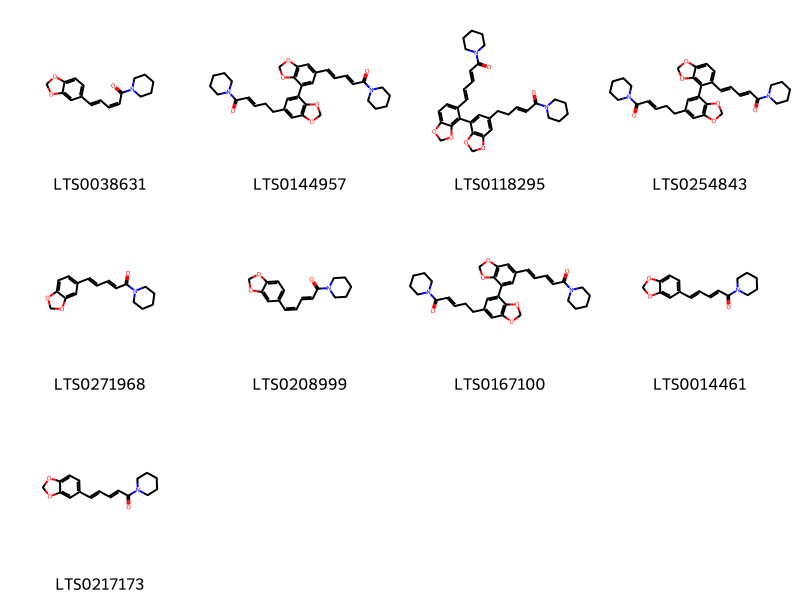
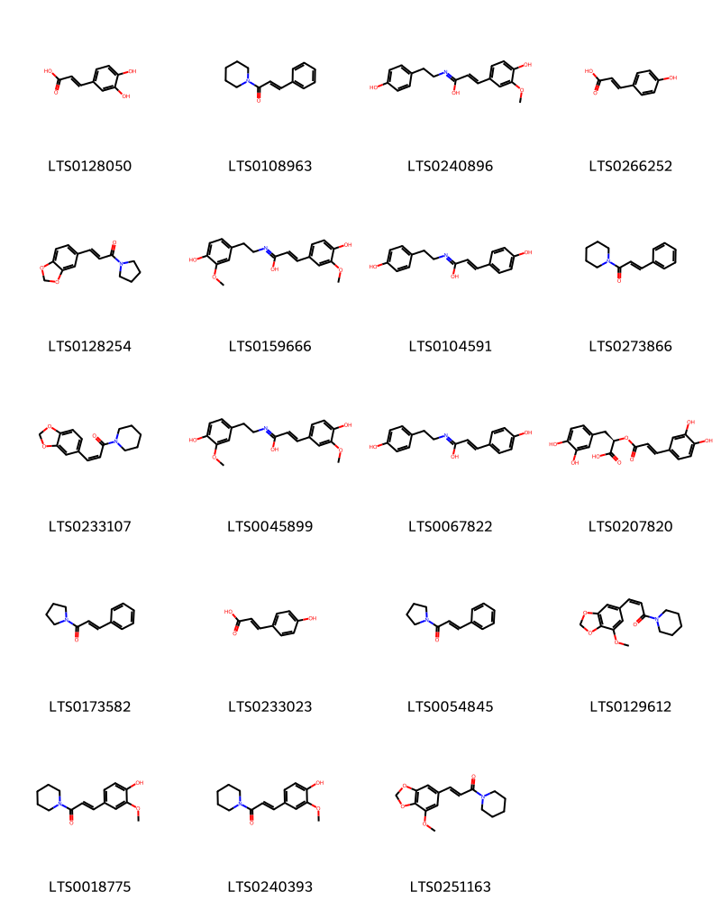
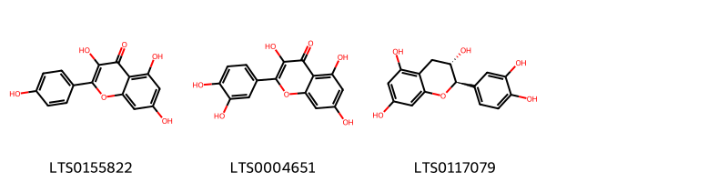
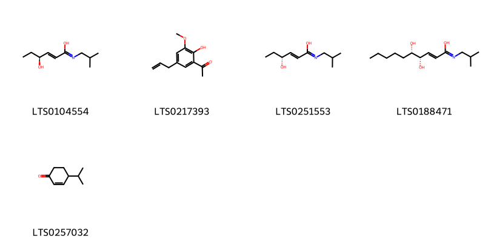
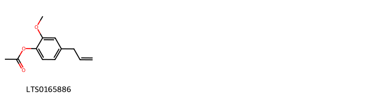
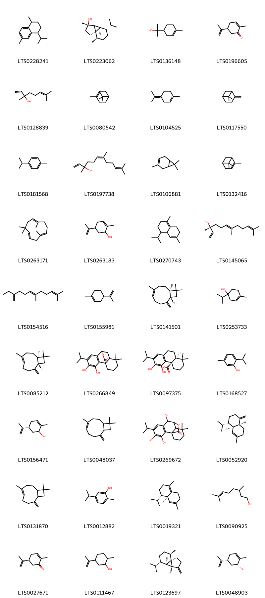
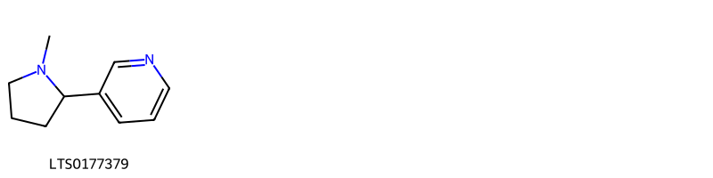
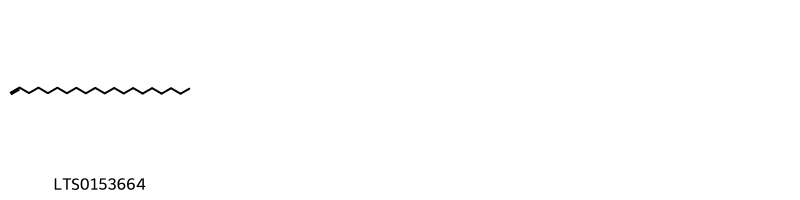

!!! abstract "Tóm tắt"

    Hồ tiêu có tên khoa học Piper nigrum L., là một loại cây dây leo thuộc họ Hồ tiêu (Piperaceae). Cây có nguồn gốc từ các vùng nhiệt đới ẩm ướt ở Ấn Độ và Nam Á. Việt Nam là một trong những nước sản xuất hồ tiêu lớn trên thế giới, với các vùng trồng tập trung ở miền Nam. Hồ tiêu được sử dụng trong y học cổ truyền để điều trị các bệnh như đau bụng, khó tiêu, cảm lạnh. Các nghiên cứu khoa học đã chỉ ra rằng hồ tiêu có nhiều tác dụng tốt cho sức khỏe, bao gồm: kích thích tiêu hóa (Piperine), giảm đau, kháng khuẩn, chống oxy hóa, tăng cường hấp thu các chất dinh dưỡng. Thành phần hóa học của quả hồ tiêu khá phong phú và có giá trị, nổi bật với các hợp chất như piperine, tinh dầu, flavonoid.

## Thông tin về thực vật

Dược liệu **Hồ Tiêu (Quả)** từ bộ phận **Quả** từ loài *Piper nigrum*.

**Mô tả thực vật:** Quả hình cầu nhỏ, chừng 20-30 quả trên một chùm, lúc đầu màu xanh lục, sau có màu đỏ, khi chín có màu vàng.

*Tài liệu tham khảo:* "Những cây thuốc và vị thuốc Việt Nam" - Đỗ Tất Lợi 
Trong dược điển Việt nam, một loài được sử dụng làm dược liệu là *Piper nigrum*.

!!! info "Phân loại thực vật của *Piper nigrum*"
    - **Kingdom:** Plantae
    - **Phylum:** Tracheophyta
    - **Order:** Piperales
    - **Family:** Piperaceae
    - **Genus:** Piper
    - **Species:** *Piper nigrum*

**Phân bố trên thế giới:** Benin, Switzerland, Micronesia (Federated States of), Jamaica, Sri Lanka, Seychelles, Guadeloupe, French Guiana, Mexico, Chinese Taipei, Colombia, Réunion, Cambodia, Cameroon, Martinique, Panama, Madagascar, Indonesia, Sao Tome and Principe, Trinidad and Tobago, Honduras, India, Brazil, Costa Rica, Viet Nam, Thailand, United States of America, Philippines, Dominican Republic, Malaysia, El Salvador, Lao People’s Democratic Republic

**Phân bố tại Việt nam:** Đăk Nông, Đồng Nai

## Thông tin về dược liệu 

### Định danh

!!! info "Thông tin về tên gọi"

    - Dược liệu tiếng Việt: hồ tiêu
    - Dược liệu tiếng Trung:  ()
    - Dược liệu tiếng Anh: 
    - Dược liệu latin thông dụng: Fructus Piperis nigrinPiperis Fructus
    - Dược liệu latin kiểu DĐVN: *fructus piperis nigri*
    - Dược liệu latin kiểu DĐVN: *Piperis Fructus*
    - Dược liệu latin kiểu thông tư: **
    - Bộ phận dùng: Quả (Fructus)

### Mô tả dược liệu 

- **Theo dược điển Việt nam V:** Hồ tiêu đen: Quả hình cầu, đường kính 3,5 mm đến 5 mm. Mặt ngoài màu nâu đen, có nhiều vết nhăn hình mạng lưới nổi lên. Đầu quả có vết của vòi nhụy nhỏ hơi nổi lên, gốc quả có vết sẹo của cuống quả. Chất cứng. Phần thịt quả có thể bóc ra được. Vỏ quả trong màu trắng tro hoặc màu vàng nhạt; mặt cắt ngang màu vàng nhạt. Quả có chất bột, trong có lỗ hổng nhỏ là vị trí của nội nhũ. Mùi thơm, vị cay. Hồ tiêu sọ: Mặt ngoài màu trắng tro hoặc màu trắng vàng nhạt, nhẵn.

- **Mô tả dược liệu theo thông tư chế biến dược liệu theo phương pháp cổ truyền:** 

### Chế biến 

- **Chế biến theo dược điển việt nam V**: Thu hoạch vào cuối mùa thu năm trước đến mùa xuân năm sau, hái lấy quả xanh thẫm khi chùm quả xuất hiện 1 đến 2 quả chín đỏ hay vàng, phơi hay sấy khô ở 40 °c đến 50 °c, quả ngả sang màu đen thơm gọi là Hồ tiêu đen (hắc Hồ tiêu). Còn hái quả lúc thật chín đỏ, ngâm dưới nước chảy 3 đến 4 ngày, sát bỏ thịt quả và vỏ đen, phơi hay sấy khô. Dược liệu có màu trắng ngà, vị cay gọi là Hồ tiêu trắng (Hồ tiêu sọ). Bào chế Loại bỏ tạp chất, vụn nát, khi dùng tán thành bột mịn.

- **Chế biến theo thông tư:** 

--- 

## Thành phần hóa học

- Theo tài liệu của GS. Đỗ Tất Lợi:  (1) Nhóm hóa học: piperine, tinh dầu, flavonoid
(2) Tên hoạt chất: saponin, flavonoid, tinh dầu, chavisin, nhựa, tinh bột, piperine, piperylline, piperoleine, piperanine, dihydrocarveol, karyo fillene oxide, cariptone, tran piocarrol và dầu tiêu.
    

**Thành phần hóa học từ loài **Piper nigrum**

Theo cơ sở dữ liệu lotus, loài *Piper nigrum* đã phân lập và xác định được **316** hoạt chất thuộc về các nhóm Organonitrogen compounds, Piperidines, Fatty Acyls, Phenols, Carboxylic acids and derivatives, Unsaturated hydrocarbons, Cinnamaldehydes, Steroids and steroid derivatives, Flavonoids, Furanoid lignans, Aristolactams, Pyridines and derivatives, Benzodioxoles, Pyrrolidines, Benzene and substituted derivatives, Stilbenes, Prenol lipids, Organooxygen compounds, Cinnamic acids and derivatives, Aporphines, Phenol ethers, Benzofurans, Carboximidic acids and derivatives, Phenol esters trong bảng dưới đây. Danh sách các hoạt chất như sau 4-isopropyl-1,6-dimethyl-2,3,4,4a,7,8-hexahydronaphthalene [(LTS0270743)](https://lotus.naturalproducts.net/compound/lotus_id/LTS0270743), (2e)-3-[(1s,2r,3r,4s)-2-(2h-1,3-benzodioxol-5-yl)-4-[(1e)-2-(2h-1,3-benzodioxol-5-yl)ethenyl]-3-(piperidine-1-carbonyl)cyclobutyl]-1-(piperidin-1-yl)prop-2-en-1-one [(LTS0224005)](https://lotus.naturalproducts.net/compound/lotus_id/LTS0224005), para-coumaric acid [(LTS0266252)](https://lotus.naturalproducts.net/compound/lotus_id/LTS0266252), pipercyclobutanamide a(rel) [(LTS0202321)](https://lotus.naturalproducts.net/compound/lotus_id/LTS0202321), (2e)-1-(pyrrolidin-1-yl)octadec-2-en-1-one [(LTS0076720)](https://lotus.naturalproducts.net/compound/lotus_id/LTS0076720), (2e,4e)-n-(2-methylpropyl)deca-2,4-dienimidic acid [(LTS0152762)](https://lotus.naturalproducts.net/compound/lotus_id/LTS0152762), 1-(2h-1,3-benzodioxole-5-carbonyl)azepane [(LTS0268707)](https://lotus.naturalproducts.net/compound/lotus_id/LTS0268707), (2e)-3-(4-hydroxy-3-methoxyphenyl)-n-[2-(4-hydroxy-3-methoxyphenyl)ethyl]prop-2-enimidic acid [(LTS0045899)](https://lotus.naturalproducts.net/compound/lotus_id/LTS0045899), 5-(4-hydroxy-3-methoxyphenyl)-1-(piperidin-1-yl)penta-2,4-dien-1-one [(LTS0034042)](https://lotus.naturalproducts.net/compound/lotus_id/LTS0034042), (-)-trans-carveol [(LTS0156471)](https://lotus.naturalproducts.net/compound/lotus_id/LTS0156471), 1-[2-(2h-1,3-benzodioxol-5-yl)-6-[2-(2h-1,3-benzodioxol-5-yl)ethenyl]-5-(piperidine-1-carbonyl)cyclohex-3-ene-1-carbonyl]piperidine [(LTS0167560)](https://lotus.naturalproducts.net/compound/lotus_id/LTS0167560), 5-(4-hydroxyphenyl)-1-(piperidin-1-yl)penta-2,4-dien-1-one [(LTS0211320)](https://lotus.naturalproducts.net/compound/lotus_id/LTS0211320), (2z)-3-(2h-1,3-benzodioxol-5-yl)-1-(piperidin-1-yl)prop-2-en-1-one [(LTS0233107)](https://lotus.naturalproducts.net/compound/lotus_id/LTS0233107), n-(2-methylpropyl)-3-(3-pentyloxiran-2-yl)prop-2-enimidic acid [(LTS0023540)](https://lotus.naturalproducts.net/compound/lotus_id/LTS0023540), 1-[(1s,2r,3r,4s)-3-[(1e,3e)-4-(2h-1,3-benzodioxol-5-yl)buta-1,3-dien-1-yl]-2-[(1e)-2-(2h-1,3-benzodioxol-5-yl)ethenyl]-4-(piperidine-1-carbonyl)cyclobutanecarbonyl]piperidine [(LTS0111778)](https://lotus.naturalproducts.net/compound/lotus_id/LTS0111778), nicotine [(LTS0177379)](https://lotus.naturalproducts.net/compound/lotus_id/LTS0177379), (2e)-3-[2,4-bis(2h-1,3-benzodioxol-5-yl)-3-[(1e)-3-oxo-3-(piperidin-1-yl)prop-1-en-1-yl]cyclobutyl]-1-(piperidin-1-yl)prop-2-en-1-one [(LTS0086636)](https://lotus.naturalproducts.net/compound/lotus_id/LTS0086636), 5-hexanoyl-5-hydroxy-1-(2-methylpropyl)pyrrolidin-2-one [(LTS0016700)](https://lotus.naturalproducts.net/compound/lotus_id/LTS0016700), 1-[(1s,2r,3r,4s)-2,3-bis[(1e,3e)-4-(2h-1,3-benzodioxol-5-yl)buta-1,3-dien-1-yl]-4-(piperidine-1-carbonyl)cyclobutanecarbonyl]piperidine [(LTS0090102)](https://lotus.naturalproducts.net/compound/lotus_id/LTS0090102), terpineol [(LTS0136148)](https://lotus.naturalproducts.net/compound/lotus_id/LTS0136148), gamma-muurolene [(LTS0052920)](https://lotus.naturalproducts.net/compound/lotus_id/LTS0052920), (2e,10e)-11-(2h-1,3-benzodioxol-5-yl)-n-(2-methylpropyl)undeca-2,10-dienimidic acid [(LTS0050406)](https://lotus.naturalproducts.net/compound/lotus_id/LTS0050406), (2r,3r,4s,5s,6r)-2-{[(1r,3as,3bs,7s,9ar,9bs,11ar)-1-[(2r,3e,5s)-5-ethyl-6-methylhept-3-en-2-yl]-9a,11a-dimethyl-1h,2h,3h,3ah,3bh,4h,6h,7h,8h,9h,9bh,10h,11h-cyclopenta[a]phenanthren-7-yl]oxy}-6-(hydroxymethyl)oxane-3,4,5-triol [(LTS0088971)](https://lotus.naturalproducts.net/compound/lotus_id/LTS0088971), 7-(2h-1,3-benzodioxol-5-yl)-1-(pyrrolidin-1-yl)hepta-2,4,6-trien-1-one [(LTS0237875)](https://lotus.naturalproducts.net/compound/lotus_id/LTS0237875), (2e)-3-(4-hydroxyphenyl)-n-[2-(4-hydroxyphenyl)ethyl]prop-2-enimidic acid [(LTS0067822)](https://lotus.naturalproducts.net/compound/lotus_id/LTS0067822), (2e,4e,12z)-n-(2-methylpropyl)octadeca-2,4,12-trienimidic acid [(LTS0244774)](https://lotus.naturalproducts.net/compound/lotus_id/LTS0244774), carnosic acid [(LTS0097375)](https://lotus.naturalproducts.net/compound/lotus_id/LTS0097375), (8e)-9-(2h-1,3-benzodioxol-5-yl)-1-(pyrrolidin-1-yl)non-8-en-1-one [(LTS0231835)](https://lotus.naturalproducts.net/compound/lotus_id/LTS0231835), (2z)-3-[(1r,2s,3s,4r)-2-(2h-1,3-benzodioxol-5-yl)-4-[(1e,3e)-4-(2h-1,3-benzodioxol-5-yl)buta-1,3-dien-1-yl]-3-(piperidine-1-carbonyl)cyclobutyl]-1-(piperidin-1-yl)prop-2-en-1-one [(LTS0180220)](https://lotus.naturalproducts.net/compound/lotus_id/LTS0180220), (2e)-1-(piperidin-1-yl)octadec-2-en-1-one [(LTS0120739)](https://lotus.naturalproducts.net/compound/lotus_id/LTS0120739), 1-(pyrrolidin-1-yl)hexadecan-1-one [(LTS0089026)](https://lotus.naturalproducts.net/compound/lotus_id/LTS0089026), (4e)-5-(2h-1,3-benzodioxol-5-yl)-1-(pyrrolidin-1-yl)penta-2,4-dien-1-one [(LTS0216899)](https://lotus.naturalproducts.net/compound/lotus_id/LTS0216899), (2e)-3-[(1s,2r,5s,6s)-2-(2h-1,3-benzodioxol-5-yl)-6-pentyl-5-(piperidine-1-carbonyl)cyclohex-3-en-1-yl]-1-(pyrrolidin-1-yl)prop-2-en-1-one [(LTS0199588)](https://lotus.naturalproducts.net/compound/lotus_id/LTS0199588), alprenolol [(LTS0043169)](https://lotus.naturalproducts.net/compound/lotus_id/LTS0043169), n-(2-methylpropyl)octadeca-2,4,12-trienimidic acid [(LTS0069416)](https://lotus.naturalproducts.net/compound/lotus_id/LTS0069416), 5-hydroxy-1-(4-hydroxy-3-methoxycyclohexyl)decan-3-one [(LTS0255317)](https://lotus.naturalproducts.net/compound/lotus_id/LTS0255317), (2e,12z)-n-(4-methylpentyl)octadeca-2,12-dienimidic acid [(LTS0139795)](https://lotus.naturalproducts.net/compound/lotus_id/LTS0139795), acetylcholine [(LTS0185507)](https://lotus.naturalproducts.net/compound/lotus_id/LTS0185507), 3-[2-(2h-1,3-benzodioxol-5-yl)-4-[2-(2h-1,3-benzodioxol-5-yl)ethenyl]-3-(piperidine-1-carbonyl)cyclobutyl]-1-(piperidin-1-yl)prop-2-en-1-one [(LTS0113145)](https://lotus.naturalproducts.net/compound/lotus_id/LTS0113145), eugenyl acetate [(LTS0165886)](https://lotus.naturalproducts.net/compound/lotus_id/LTS0165886), 1-(pyrrolidin-1-yl)dodeca-2,4-dien-1-one [(LTS0079736)](https://lotus.naturalproducts.net/compound/lotus_id/LTS0079736), 1-[6-(2h-1,3-benzodioxol-5-yl)-4-pentyl-5-(piperidine-1-carbonyl)cyclohex-2-ene-1-carbonyl]piperidine [(LTS0148059)](https://lotus.naturalproducts.net/compound/lotus_id/LTS0148059), (2z)-3-[2-(2h-1,3-benzodioxol-5-yl)-4-[(1e,3e)-4-(2h-1,3-benzodioxol-5-yl)buta-1,3-dien-1-yl]-3-(piperidine-1-carbonyl)cyclobutyl]-1-(piperidin-1-yl)prop-2-en-1-one [(LTS0001060)](https://lotus.naturalproducts.net/compound/lotus_id/LTS0001060), (2e,4e,6e)-7-(2h-1,3-benzodioxol-5-yl)-1-(pyrrolidin-1-yl)hepta-2,4,6-trien-1-one [(LTS0042528)](https://lotus.naturalproducts.net/compound/lotus_id/LTS0042528), 4,5-dihydroxy-n-(2-methylpropyl)dec-2-enimidic acid [(LTS0100055)](https://lotus.naturalproducts.net/compound/lotus_id/LTS0100055), sitogluside [(LTS0201798)](https://lotus.naturalproducts.net/compound/lotus_id/LTS0201798), 3-(2h-1,3-benzodioxol-5-yl)-1-(piperidin-1-yl)prop-2-en-1-one [(LTS0150506)](https://lotus.naturalproducts.net/compound/lotus_id/LTS0150506), monoterpenes [(LTS0106881)](https://lotus.naturalproducts.net/compound/lotus_id/LTS0106881), (2e,4e,8e)-9-(2h-1,3-benzodioxol-5-yl)-1-(piperidin-1-yl)nona-2,4,8-trien-1-one [(LTS0157770)](https://lotus.naturalproducts.net/compound/lotus_id/LTS0157770), 11-methyl-3,5-dioxa-11-azapentacyclo[10.7.1.0²,⁶.0⁸,²⁰.0¹⁴,¹⁹]icosa-1(20),2(6),7,12,14(19),15,17-heptaene-9,10-dione [(LTS0083545)](https://lotus.naturalproducts.net/compound/lotus_id/LTS0083545), (2e,4r,5r)-4,5-dihydroxy-1-(piperidin-1-yl)dec-2-en-1-one [(LTS0003195)](https://lotus.naturalproducts.net/compound/lotus_id/LTS0003195), 3-(4-hydroxy-3-methoxyphenyl)-1-(piperidin-1-yl)prop-2-en-1-one [(LTS0240393)](https://lotus.naturalproducts.net/compound/lotus_id/LTS0240393), 3-(2h-1,3-benzodioxol-5-ylmethyl)-4-[(3,4-dimethoxyphenyl)methyl]oxolan-2-ol [(LTS0044643)](https://lotus.naturalproducts.net/compound/lotus_id/LTS0044643), carvone, (+)- [(LTS0027671)](https://lotus.naturalproducts.net/compound/lotus_id/LTS0027671), (1s,4r,5r,6s)-5-(2h-1,3-benzodioxol-5-yl)-n-(2-methylpropyl)-4-pentyl-6-(piperidine-1-carbonyl)cyclohex-2-ene-1-carboximidic acid [(LTS0240119)](https://lotus.naturalproducts.net/compound/lotus_id/LTS0240119), caryophyllene [(LTS0131870)](https://lotus.naturalproducts.net/compound/lotus_id/LTS0131870), (2e,4e,12z)-n-(3-methylbutyl)octadeca-2,4,12-trienimidic acid [(LTS0248983)](https://lotus.naturalproducts.net/compound/lotus_id/LTS0248983), (2e,4e)-n-(2-methylpropyl)octadeca-2,4-dienimidic acid [(LTS0232761)](https://lotus.naturalproducts.net/compound/lotus_id/LTS0232761), 12-(2h-1,3-benzodioxol-5-yl)-n-(3-methylbutyl)dodeca-2,4,11-trienimidic acid [(LTS0267262)](https://lotus.naturalproducts.net/compound/lotus_id/LTS0267262), 4-hydroxy-n-(2-methylpropyl)hex-2-enimidic acid [(LTS0246359)](https://lotus.naturalproducts.net/compound/lotus_id/LTS0246359), (2e)-3-(2h-1,3-benzodioxol-5-yl)-1-(pyrrolidin-1-yl)prop-2-en-1-one [(LTS0128279)](https://lotus.naturalproducts.net/compound/lotus_id/LTS0128279), (2e,4e)-n-(2-methylpropyl)icosa-2,4-dienimidic acid [(LTS0008634)](https://lotus.naturalproducts.net/compound/lotus_id/LTS0008634), 1-eicosene [(LTS0153664)](https://lotus.naturalproducts.net/compound/lotus_id/LTS0153664), 3,4-bis(2h-1,3-benzodioxol-5-ylmethyl)oxolan-2-one [(LTS0079231)](https://lotus.naturalproducts.net/compound/lotus_id/LTS0079231), 5-(4-{6-[5-oxo-5-(piperidin-1-yl)pent-3-en-1-yl]-2h-1,3-benzodioxol-4-yl}-2h-1,3-benzodioxol-5-yl)-1-(piperidin-1-yl)penta-2,4-dien-1-one [(LTS0254843)](https://lotus.naturalproducts.net/compound/lotus_id/LTS0254843), (2e)-3-(2h-1,3-benzodioxol-5-yl)-n-(2-methylpropyl)prop-2-enimidic acid [(LTS0066857)](https://lotus.naturalproducts.net/compound/lotus_id/LTS0066857), 1-(2h-1,3-benzodioxole-5-carbothioyl)piperidine [(LTS0210283)](https://lotus.naturalproducts.net/compound/lotus_id/LTS0210283), n-(4-methylpentyl)octadeca-2,4,12-trienimidic acid [(LTS0045805)](https://lotus.naturalproducts.net/compound/lotus_id/LTS0045805), (1r,4s,6r,7s,10r)-7-isopropyl-4,10-dimethyltricyclo[4.4.0.0¹,⁵]decan-4-ol [(LTS0223062)](https://lotus.naturalproducts.net/compound/lotus_id/LTS0223062), (4e)-5-(2h-1,3-benzodioxol-5-yl)-1-(piperidin-1-yl)penta-2,4-dien-1-one [(LTS0217173)](https://lotus.naturalproducts.net/compound/lotus_id/LTS0217173), (2e,4e)-1-(piperidin-1-yl)deca-2,4-dien-1-one [(LTS0273026)](https://lotus.naturalproducts.net/compound/lotus_id/LTS0273026), 5-(2h-1,3-benzodioxol-5-yl)-1-(piperidin-1-yl)pent-2-en-1-one [(LTS0172073)](https://lotus.naturalproducts.net/compound/lotus_id/LTS0172073), (2e)-5-(2h-1,3-benzodioxol-5-yl)-1-(piperidin-1-yl)pent-2-ene-1,5-dione [(LTS0167519)](https://lotus.naturalproducts.net/compound/lotus_id/LTS0167519), (6e)-7-(2h-1,3-benzodioxol-5-yl)-1-(pyrrolidin-1-yl)hept-6-en-1-one [(LTS0095588)](https://lotus.naturalproducts.net/compound/lotus_id/LTS0095588), (2e)-3-{2,3-bis[(1e)-2-(2h-1,3-benzodioxol-5-yl)ethenyl]-4-(piperidine-1-carbonyl)cyclobutyl}-1-(piperidin-1-yl)prop-2-en-1-one [(LTS0176814)](https://lotus.naturalproducts.net/compound/lotus_id/LTS0176814), (2e,4s)-4-hydroxy-n-(2-methylpropyl)hex-2-enimidic acid [(LTS0104554)](https://lotus.naturalproducts.net/compound/lotus_id/LTS0104554), (2e,4r)-4-hydroxy-n-(2-methylpropyl)hex-2-enimidic acid [(LTS0251553)](https://lotus.naturalproducts.net/compound/lotus_id/LTS0251553), citronellol, (+-)- [(LTS0090925)](https://lotus.naturalproducts.net/compound/lotus_id/LTS0090925), 9-(2h-1,3-benzodioxol-5-yl)-n-(2-methylpropyl)nona-2,4,8-trienimidic acid [(LTS0122707)](https://lotus.naturalproducts.net/compound/lotus_id/LTS0122707), (2e)-3-(4-hydroxy-3-methoxyphenyl)-n-[2-(4-hydroxyphenyl)ethyl]prop-2-enimidic acid [(LTS0187051)](https://lotus.naturalproducts.net/compound/lotus_id/LTS0187051), 3-[2,4-bis(2h-1,3-benzodioxol-5-yl)-3-(piperidine-1-carbonyl)cyclobutyl]-1-(piperidin-1-yl)prop-2-en-1-one [(LTS0237437)](https://lotus.naturalproducts.net/compound/lotus_id/LTS0237437), n-(2-methylpropyl)tetradeca-2,4-dienimidic acid [(LTS0234972)](https://lotus.naturalproducts.net/compound/lotus_id/LTS0234972), ethyl palmitate [(LTS0111042)](https://lotus.naturalproducts.net/compound/lotus_id/LTS0111042), eugenol [(LTS0052342)](https://lotus.naturalproducts.net/compound/lotus_id/LTS0052342), 9-(2h-1,3-benzodioxol-5-yl)-1-(piperidin-1-yl)nona-2,4,8-trien-1-one [(LTS0113504)](https://lotus.naturalproducts.net/compound/lotus_id/LTS0113504), 4-[(3,4-dimethoxyphenyl)methyl]-3-[(3,4,5-trimethoxyphenyl)methyl]oxolan-2-ol [(LTS0041312)](https://lotus.naturalproducts.net/compound/lotus_id/LTS0041312), 1-{2,3-bis[4-(2h-1,3-benzodioxol-5-yl)buta-1,3-dien-1-yl]-4-(piperidine-1-carbonyl)cyclobutanecarbonyl}piperidine [(LTS0082323)](https://lotus.naturalproducts.net/compound/lotus_id/LTS0082323), 4,5-dihydroxy-1-(piperidin-1-yl)dec-2-en-1-one [(LTS0031490)](https://lotus.naturalproducts.net/compound/lotus_id/LTS0031490), 1-[(1s,4r,5r,6s)-5-(2h-1,3-benzodioxol-5-yl)-4-pentyl-6-(piperidine-1-carbonyl)cyclohex-2-ene-1-carbonyl]piperidine [(LTS0127674)](https://lotus.naturalproducts.net/compound/lotus_id/LTS0127674), 3,4-dihydroxybenzoic acid [(LTS0018765)](https://lotus.naturalproducts.net/compound/lotus_id/LTS0018765), thymol [(LTS0168527)](https://lotus.naturalproducts.net/compound/lotus_id/LTS0168527), carveol [(LTS0263183)](https://lotus.naturalproducts.net/compound/lotus_id/LTS0263183), 1-(piperidin-1-yl)deca-2,4-diene-1,6-dione [(LTS0071906)](https://lotus.naturalproducts.net/compound/lotus_id/LTS0071906), (2e,4e,12z)-n-(4-methylpentyl)octadeca-2,4,12-trienimidic acid [(LTS0218287)](https://lotus.naturalproducts.net/compound/lotus_id/LTS0218287), p-propenylanisole [(LTS0177188)](https://lotus.naturalproducts.net/compound/lotus_id/LTS0177188), 3-(2h-1,3-benzodioxol-5-yl)-1-(piperidin-1-yl)propan-1-one [(LTS0026754)](https://lotus.naturalproducts.net/compound/lotus_id/LTS0026754), 5-(2h-1,3-benzodioxol-5-yl)-n-(2-methylpropyl)-4-pentyl-6-(piperidine-1-carbonyl)cyclohex-2-ene-1-carboximidic acid [(LTS0053846)](https://lotus.naturalproducts.net/compound/lotus_id/LTS0053846), 3-{2,3-bis[2-(2h-1,3-benzodioxol-5-yl)ethenyl]-4-(piperidine-1-carbonyl)cyclobutyl}-1-(piperidin-1-yl)prop-2-en-1-one [(LTS0195413)](https://lotus.naturalproducts.net/compound/lotus_id/LTS0195413), 5-(2h-1,3-benzodioxol-5-yl)-1-(piperidin-1-yl)penta-2,4-dien-1-one [(LTS0271968)](https://lotus.naturalproducts.net/compound/lotus_id/LTS0271968), 7-(2h-1,3-benzodioxol-5-yl)-1-(piperidin-1-yl)hepta-2,4,6-trien-1-one [(LTS0227890)](https://lotus.naturalproducts.net/compound/lotus_id/LTS0227890), 3-(4-hydroxy-3-methoxyphenyl)-n-[2-(4-hydroxyphenyl)ethyl]prop-2-enimidic acid [(LTS0240896)](https://lotus.naturalproducts.net/compound/lotus_id/LTS0240896), (3r,6e)-nerolidol [(LTS0145065)](https://lotus.naturalproducts.net/compound/lotus_id/LTS0145065), piperonal [(LTS0194867)](https://lotus.naturalproducts.net/compound/lotus_id/LTS0194867), α-cubebin [(LTS0249617)](https://lotus.naturalproducts.net/compound/lotus_id/LTS0249617), iyeremide a [(LTS0276326)](https://lotus.naturalproducts.net/compound/lotus_id/LTS0276326), (2e)-3-[(1s,2r,3s,4r)-2-(2h-1,3-benzodioxol-5-yl)-4-[(1e)-2-(2h-1,3-benzodioxol-5-yl)ethenyl]-3-(piperidine-1-carbonyl)cyclobutyl]-1-(piperidin-1-yl)prop-2-en-1-one [(LTS0018678)](https://lotus.naturalproducts.net/compound/lotus_id/LTS0018678), piperine [(LTS0014461)](https://lotus.naturalproducts.net/compound/lotus_id/LTS0014461), n-(2-methylpropyl)icosa-2,4,8-trienimidic acid [(LTS0047433)](https://lotus.naturalproducts.net/compound/lotus_id/LTS0047433), 2-(2h-1,3-benzodioxol-5-yl)-6-(hept-1-en-1-yl)-n-(2-methylpropyl)-5-(piperidine-1-carbonyl)cyclohex-3-ene-1-carboximidic acid [(LTS0042643)](https://lotus.naturalproducts.net/compound/lotus_id/LTS0042643), (2e,4e)-n-(2-methylpropyl)octa-2,4-dienimidic acid [(LTS0245146)](https://lotus.naturalproducts.net/compound/lotus_id/LTS0245146), ilepcimide [(LTS0026844)](https://lotus.naturalproducts.net/compound/lotus_id/LTS0026844), p-cymen-8-ol [(LTS0223641)](https://lotus.naturalproducts.net/compound/lotus_id/LTS0223641), (2e)-5-(2h-1,3-benzodioxol-5-yl)-1-(piperidin-1-yl)pent-2-en-1-one [(LTS0045312)](https://lotus.naturalproducts.net/compound/lotus_id/LTS0045312), 13-(2h-1,3-benzodioxol-5-yl)-1-(pyrrolidin-1-yl)trideca-2,4,12-trien-1-one [(LTS0041655)](https://lotus.naturalproducts.net/compound/lotus_id/LTS0041655), (2e)-3-(4-hydroxy-3-methoxyphenyl)-1-(piperidin-1-yl)prop-2-en-1-one [(LTS0018775)](https://lotus.naturalproducts.net/compound/lotus_id/LTS0018775), stigmast-5-en-3-ol, (3β)- [(LTS0204616)](https://lotus.naturalproducts.net/compound/lotus_id/LTS0204616), (2e)-1-(piperidin-1-yl)-3-[(1r,2r,3r,4r)-2,4-bis(2h-1,3-benzodioxol-5-yl)-3-[(1e)-3-oxo-3-(piperidin-1-yl)prop-1-en-1-yl]cyclobutyl]prop-2-en-1-one [(LTS0231840)](https://lotus.naturalproducts.net/compound/lotus_id/LTS0231840), 3-[2,4-bis(2h-1,3-benzodioxol-5-yl)-3-[3-oxo-3-(piperidin-1-yl)prop-1-en-1-yl]cyclobutyl]-1-(piperidin-1-yl)prop-2-en-1-one [(LTS0088515)](https://lotus.naturalproducts.net/compound/lotus_id/LTS0088515), 9-(2h-1,3-benzodioxol-5-yl)-1-(pyrrolidin-1-yl)non-8-en-1-one [(LTS0172884)](https://lotus.naturalproducts.net/compound/lotus_id/LTS0172884), palmitic acid [(LTS0079439)](https://lotus.naturalproducts.net/compound/lotus_id/LTS0079439), (2e,4e,8e)-9-(2h-1,3-benzodioxol-5-yl)-1-(pyrrolidin-1-yl)nona-2,4,8-trien-1-one [(LTS0175728)](https://lotus.naturalproducts.net/compound/lotus_id/LTS0175728), 3-[3-(2h-1,3-benzodioxol-5-yl)phenyl]prop-2-enal [(LTS0244098)](https://lotus.naturalproducts.net/compound/lotus_id/LTS0244098), 1-(2h-1,3-benzodioxol-5-yl)-3-(piperidin-1-yl)propan-1-one [(LTS0085817)](https://lotus.naturalproducts.net/compound/lotus_id/LTS0085817), quercetin [(LTS0004651)](https://lotus.naturalproducts.net/compound/lotus_id/LTS0004651), 3-[2-(2h-1,3-benzodioxol-5-yl)-6-pentyl-5-(piperidine-1-carbonyl)cyclohex-3-en-1-yl]-1-(piperidin-1-yl)prop-2-en-1-one [(LTS0136211)](https://lotus.naturalproducts.net/compound/lotus_id/LTS0136211), 9-(2h-1,3-benzodioxol-5-yl)-1-(pyrrolidin-1-yl)nona-2,8-dien-1-one [(LTS0271250)](https://lotus.naturalproducts.net/compound/lotus_id/LTS0271250), trichostachine [(LTS0259692)](https://lotus.naturalproducts.net/compound/lotus_id/LTS0259692), delta-cadinene [(LTS0019321)](https://lotus.naturalproducts.net/compound/lotus_id/LTS0019321), (-)-β-cubebene [(LTS0123697)](https://lotus.naturalproducts.net/compound/lotus_id/LTS0123697), 3,4,8-trihydroxy-5-isopropyl-11,11-dimethyl-16-oxatetracyclo[7.5.2.0¹,¹⁰.0²,⁷]hexadeca-2(7),3,5-trien-15-one [(LTS0269672)](https://lotus.naturalproducts.net/compound/lotus_id/LTS0269672), tarragon [(LTS0245226)](https://lotus.naturalproducts.net/compound/lotus_id/LTS0245226), 9-(2h-1,3-benzodioxol-5-yl)-n-(2-methylpropyl)non-8-enimidic acid [(LTS0020388)](https://lotus.naturalproducts.net/compound/lotus_id/LTS0020388), (2e,4e,8z)-n-(2-methylpropyl)icosa-2,4,8-trienimidic acid [(LTS0098642)](https://lotus.naturalproducts.net/compound/lotus_id/LTS0098642), (2e)-1-(piperidin-1-yl)dec-2-en-1-one [(LTS0123112)](https://lotus.naturalproducts.net/compound/lotus_id/LTS0123112), piperyline [(LTS0275265)](https://lotus.naturalproducts.net/compound/lotus_id/LTS0275265), 3,4-dihydroxy-5-isopropyl-11,11-dimethyl-16-oxatetracyclo[6.6.2.0¹,¹⁰.0²,⁷]hexadeca-2(7),3,5-trien-15-one [(LTS0266849)](https://lotus.naturalproducts.net/compound/lotus_id/LTS0266849), ω-phenylacetic acid [(LTS0091846)](https://lotus.naturalproducts.net/compound/lotus_id/LTS0091846), 3-(4-hydroxy-3-methoxyphenyl)-n-[2-(4-hydroxy-3-methoxyphenyl)ethyl]prop-2-enimidic acid [(LTS0159666)](https://lotus.naturalproducts.net/compound/lotus_id/LTS0159666), 1-[5-(2h-1,3-benzodioxol-5-yl)-6-[2-(2h-1,3-benzodioxol-5-yl)ethenyl]-2-(piperidine-1-carbonyl)cyclohex-3-ene-1-carbonyl]piperidine [(LTS0037283)](https://lotus.naturalproducts.net/compound/lotus_id/LTS0037283), (3s,6r)-6-[(1r,3as,3br,9as,9bs,11ar)-9a,11a-dimethyl-tetradecahydro-1h-cyclopenta[a]phenanthren-1-yl]-3-isopropylheptan-1-ol [(LTS0063219)](https://lotus.naturalproducts.net/compound/lotus_id/LTS0063219), (1r)-3,4-dihydroxy-5-isopropyl-11,11-dimethyl-16-oxatetracyclo[6.6.2.0¹,¹⁰.0²,⁷]hexadeca-2(7),3,5-trien-15-one [(LTS0048403)](https://lotus.naturalproducts.net/compound/lotus_id/LTS0048403), (2e,4e,12e)-13-(2h-1,3-benzodioxol-5-yl)-1-(pyrrolidin-1-yl)trideca-2,4,12-trien-1-one [(LTS0228827)](https://lotus.naturalproducts.net/compound/lotus_id/LTS0228827), 1-[2-hydroxy-3-methoxy-5-(prop-2-en-1-yl)phenyl]ethanone [(LTS0217393)](https://lotus.naturalproducts.net/compound/lotus_id/LTS0217393), (2e)-3-[(1s,2r,3s,4s)-2,3-bis[(1e)-2-(2h-1,3-benzodioxol-5-yl)ethenyl]-4-(piperidine-1-carbonyl)cyclobutyl]-1-(piperidin-1-yl)prop-2-en-1-one [(LTS0273625)](https://lotus.naturalproducts.net/compound/lotus_id/LTS0273625), (2e,4e)-5-(4-{6-[(3e)-5-oxo-5-(piperidin-1-yl)pent-3-en-1-yl]-2h-1,3-benzodioxol-4-yl}-2h-1,3-benzodioxol-5-yl)-1-(piperidin-1-yl)penta-2,4-dien-1-one [(LTS0118295)](https://lotus.naturalproducts.net/compound/lotus_id/LTS0118295), 1-{2,3-bis[(1e)-2-(2h-1,3-benzodioxol-5-yl)ethenyl]-4-(pyrrolidine-1-carbonyl)cyclobutanecarbonyl}piperidine [(LTS0266265)](https://lotus.naturalproducts.net/compound/lotus_id/LTS0266265), (2e)-3-(2h-1,3-benzodioxol-5-yl)-1-(4-methylpiperidin-1-yl)prop-2-en-1-one [(LTS0151733)](https://lotus.naturalproducts.net/compound/lotus_id/LTS0151733), (8e)-9-(2h-1,3-benzodioxol-5-yl)-n-(2-methylpropyl)non-8-enimidic acid [(LTS0256845)](https://lotus.naturalproducts.net/compound/lotus_id/LTS0256845), 1-(pyrrolidin-1-yl)octadec-2-en-1-one [(LTS0086752)](https://lotus.naturalproducts.net/compound/lotus_id/LTS0086752), (2e)-5-(4-hydroxy-3-methoxyphenyl)-1-(piperidin-1-yl)pent-2-en-1-one [(LTS0083326)](https://lotus.naturalproducts.net/compound/lotus_id/LTS0083326), (2e)-3-(2h-1,3-benzodioxol-5-yl)-1-(morpholin-4-yl)prop-2-en-1-one [(LTS0067355)](https://lotus.naturalproducts.net/compound/lotus_id/LTS0067355), sitosterol [(LTS0168132)](https://lotus.naturalproducts.net/compound/lotus_id/LTS0168132), (-)-cis-carveol [(LTS0048903)](https://lotus.naturalproducts.net/compound/lotus_id/LTS0048903), 1-[2,6-bis(2h-1,3-benzodioxol-5-yl)-5-(piperidine-1-carbonyl)cyclohex-3-ene-1-carbonyl]piperidine [(LTS0111985)](https://lotus.naturalproducts.net/compound/lotus_id/LTS0111985), n-(2-methylpropyl)deca-2,4-dienimidic acid [(LTS0009070)](https://lotus.naturalproducts.net/compound/lotus_id/LTS0009070), limonene,  [(LTS0155981)](https://lotus.naturalproducts.net/compound/lotus_id/LTS0155981), (2e,4e)-1-(pyrrolidin-1-yl)dodeca-2,4-dien-1-one [(LTS0091682)](https://lotus.naturalproducts.net/compound/lotus_id/LTS0091682), 3,4-bis(2h-1,3-benzodioxol-5-ylmethyl)oxolan-2-ol [(LTS0051516)](https://lotus.naturalproducts.net/compound/lotus_id/LTS0051516), 4,5-dihydroxy-n-(2-methylpropyl)oct-2-enimidic acid [(LTS0264931)](https://lotus.naturalproducts.net/compound/lotus_id/LTS0264931), 1-[(1r,2s,5r,6r)-2,6-bis(2h-1,3-benzodioxol-5-yl)-5-(piperidine-1-carbonyl)cyclohex-3-ene-1-carbonyl]piperidine [(LTS0033803)](https://lotus.naturalproducts.net/compound/lotus_id/LTS0033803), 10-(2h-1,3-benzodioxol-5-yl)-1-(pyrrolidin-1-yl)dec-9-en-1-one [(LTS0073734)](https://lotus.naturalproducts.net/compound/lotus_id/LTS0073734), kaempherol [(LTS0155822)](https://lotus.naturalproducts.net/compound/lotus_id/LTS0155822), (2e)-5-(2h-1,3-benzodioxol-5-yl)-1-(pyrrolidin-1-yl)pent-2-en-1-one [(LTS0127481)](https://lotus.naturalproducts.net/compound/lotus_id/LTS0127481), stearic acid [(LTS0237766)](https://lotus.naturalproducts.net/compound/lotus_id/LTS0237766), (2e,4z)-5-(2h-1,3-benzodioxol-5-yl)-1-(pyrrolidin-1-yl)penta-2,4-dien-1-one [(LTS0148846)](https://lotus.naturalproducts.net/compound/lotus_id/LTS0148846), 1-{3-[4-(2h-1,3-benzodioxol-5-yl)buta-1,3-dien-1-yl]-2-[2-(2h-1,3-benzodioxol-5-yl)ethenyl]-4-(piperidine-1-carbonyl)cyclobutanecarbonyl}piperidine [(LTS0072318)](https://lotus.naturalproducts.net/compound/lotus_id/LTS0072318), (2e,4e)-1-(piperidin-1-yl)deca-2,4-diene-1,6-dione [(LTS0239766)](https://lotus.naturalproducts.net/compound/lotus_id/LTS0239766), galop [(LTS0222857)](https://lotus.naturalproducts.net/compound/lotus_id/LTS0222857), 1-(2h-1,3-benzodioxol-5-yl)-2-(piperidin-1-yl)ethanone [(LTS0032014)](https://lotus.naturalproducts.net/compound/lotus_id/LTS0032014), (2e)-3-[(1r,2r,3s,4r)-2,4-bis(2h-1,3-benzodioxol-5-yl)-3-(piperidine-1-carbonyl)cyclobutyl]-1-(piperidin-1-yl)prop-2-en-1-one [(LTS0265786)](https://lotus.naturalproducts.net/compound/lotus_id/LTS0265786), 3-[2-(2h-1,3-benzodioxol-5-yl)-4-[4-(2h-1,3-benzodioxol-5-yl)buta-1,3-dien-1-yl]-3-(piperidine-1-carbonyl)cyclobutyl]-1-(piperidin-1-yl)prop-2-en-1-one [(LTS0126959)](https://lotus.naturalproducts.net/compound/lotus_id/LTS0126959), (2e,4e)-5-(7-{6-[(3e)-5-oxo-5-(piperidin-1-yl)pent-3-en-1-yl]-2h-1,3-benzodioxol-4-yl}-2h-1,3-benzodioxol-5-yl)-1-(piperidin-1-yl)penta-2,4-dien-1-one [(LTS0167100)](https://lotus.naturalproducts.net/compound/lotus_id/LTS0167100), (2e,4z)-n-(2-methylpropyl)octadeca-2,4-dienimidic acid [(LTS0023771)](https://lotus.naturalproducts.net/compound/lotus_id/LTS0023771), dihydrocarveol [(LTS0111467)](https://lotus.naturalproducts.net/compound/lotus_id/LTS0111467), 11-(2h-1,3-benzodioxol-5-yl)-n-(2-methylpropyl)undeca-2,4,10-trienimidic acid [(LTS0109359)](https://lotus.naturalproducts.net/compound/lotus_id/LTS0109359), (2e,4r,5r)-4,5-dihydroxy-n-(2-methylpropyl)oct-2-enimidic acid [(LTS0264591)](https://lotus.naturalproducts.net/compound/lotus_id/LTS0264591), (2z)-3-[2-(2h-1,3-benzodioxol-5-yl)-4-[(1e)-2-(2h-1,3-benzodioxol-5-yl)ethenyl]-3-(piperidine-1-carbonyl)cyclobutyl]-1-(piperidin-1-yl)prop-2-en-1-one [(LTS0204931)](https://lotus.naturalproducts.net/compound/lotus_id/LTS0204931), (2e,11e)-12-(2h-1,3-benzodioxol-5-yl)-n-(2-methylpropyl)dodeca-2,11-dienimidic acid [(LTS0092445)](https://lotus.naturalproducts.net/compound/lotus_id/LTS0092445), myristicin [(LTS0180101)](https://lotus.naturalproducts.net/compound/lotus_id/LTS0180101), 1-[(1s,2s,5r,6r)-5-(2h-1,3-benzodioxol-5-yl)-6-[(1e)-2-(2h-1,3-benzodioxol-5-yl)ethenyl]-2-(piperidine-1-carbonyl)cyclohex-3-ene-1-carbonyl]piperidine [(LTS0079277)](https://lotus.naturalproducts.net/compound/lotus_id/LTS0079277), (2e)-3-(2h-1,3-benzodioxol-5-yl)-n-cyclopentylprop-2-enimidic acid [(LTS0164208)](https://lotus.naturalproducts.net/compound/lotus_id/LTS0164208), (e)-calamene [(LTS0228241)](https://lotus.naturalproducts.net/compound/lotus_id/LTS0228241), (2e,4s,5r)-4,5-dihydroxy-1-(piperidin-1-yl)dec-2-en-1-one [(LTS0024179)](https://lotus.naturalproducts.net/compound/lotus_id/LTS0024179), cymene [(LTS0181568)](https://lotus.naturalproducts.net/compound/lotus_id/LTS0181568), 9-(2h-1,3-benzodioxol-5-yl)-1-(pyrrolidin-1-yl)nona-2,4,8-trien-1-one [(LTS0027027)](https://lotus.naturalproducts.net/compound/lotus_id/LTS0027027), anethole [(LTS0033696)](https://lotus.naturalproducts.net/compound/lotus_id/LTS0033696), isochavicine [(LTS0208999)](https://lotus.naturalproducts.net/compound/lotus_id/LTS0208999), carvacrol [(LTS0012882)](https://lotus.naturalproducts.net/compound/lotus_id/LTS0012882), 1-[(1s,2s,5r,6r)-5-(2h-1,3-benzodioxol-5-yl)-6-[(1e,3e)-4-(2h-1,3-benzodioxol-5-yl)buta-1,3-dien-1-yl]-2-(piperidine-1-carbonyl)cyclohex-3-ene-1-carbonyl]piperidine [(LTS0235666)](https://lotus.naturalproducts.net/compound/lotus_id/LTS0235666), 2,6,6-trimethylbicyclo[3.1.1]hept-1-ene [(LTS0080542)](https://lotus.naturalproducts.net/compound/lotus_id/LTS0080542), choline [(LTS0170307)](https://lotus.naturalproducts.net/compound/lotus_id/LTS0170307), 1-{6-[2-(2h-1,3-benzodioxol-5-yl)ethenyl]-4-pentyl-5-(piperidine-1-carbonyl)cyclohex-2-ene-1-carbonyl}piperidine [(LTS0108020)](https://lotus.naturalproducts.net/compound/lotus_id/LTS0108020), 1-(piperidin-1-yl)octadec-2-en-1-one [(LTS0090884)](https://lotus.naturalproducts.net/compound/lotus_id/LTS0090884), (2e,8e)-9-(2h-1,3-benzodioxol-5-yl)-1-(pyrrolidin-1-yl)nona-2,8-dien-1-one [(LTS0200151)](https://lotus.naturalproducts.net/compound/lotus_id/LTS0200151), piperidine [(LTS0191209)](https://lotus.naturalproducts.net/compound/lotus_id/LTS0191209), 3,4-dihydroxycinnamic acid [(LTS0128050)](https://lotus.naturalproducts.net/compound/lotus_id/LTS0128050), β-pinene [(LTS0117550)](https://lotus.naturalproducts.net/compound/lotus_id/LTS0117550), (2e,4e)-n-(2-methylpropyl)dodeca-2,4-dienimidic acid [(LTS0201807)](https://lotus.naturalproducts.net/compound/lotus_id/LTS0201807), bioperine [(LTS0038631)](https://lotus.naturalproducts.net/compound/lotus_id/LTS0038631), (3s,4s)-3,4-bis(2h-1,3-benzodioxol-5-ylmethyl)oxolan-2-one [(LTS0115450)](https://lotus.naturalproducts.net/compound/lotus_id/LTS0115450), n-(2-methylpropyl)icosa-2,4-dienimidic acid [(LTS0175563)](https://lotus.naturalproducts.net/compound/lotus_id/LTS0175563), (2e)-3-[2-(2h-1,3-benzodioxol-5-yl)-4-[(1e)-2-(2h-1,3-benzodioxol-5-yl)ethenyl]-3-(piperidine-1-carbonyl)cyclobutyl]-1-(piperidin-1-yl)prop-2-en-1-one [(LTS0052755)](https://lotus.naturalproducts.net/compound/lotus_id/LTS0052755), (2e)-3-(2h-1,3-benzodioxol-5-yl)-n-cyclohexylprop-2-enimidic acid [(LTS0126096)](https://lotus.naturalproducts.net/compound/lotus_id/LTS0126096), 1-{2,3-bis[2-(2h-1,3-benzodioxol-5-yl)ethenyl]-4-(pyrrolidine-1-carbonyl)cyclobutanecarbonyl}piperidine [(LTS0192834)](https://lotus.naturalproducts.net/compound/lotus_id/LTS0192834), stigmast-5-en-3-ol [(LTS0071224)](https://lotus.naturalproducts.net/compound/lotus_id/LTS0071224), terpinolene [(LTS0104525)](https://lotus.naturalproducts.net/compound/lotus_id/LTS0104525), (1r,3as,3bs,5as,7s,9as,9bs,11ar)-1-[(2r,5r)-5-ethyl-6-methylheptan-2-yl]-9a,11a-dimethyl-tetradecahydro-1h-cyclopenta[a]phenanthren-7-ol [(LTS0213187)](https://lotus.naturalproducts.net/compound/lotus_id/LTS0213187), 5-(4-hydroxy-3-methoxyphenyl)-1-(piperidin-1-yl)pent-2-en-1-one [(LTS0011454)](https://lotus.naturalproducts.net/compound/lotus_id/LTS0011454), (2e,4e,10e)-11-(2h-1,3-benzodioxol-4-yl)-n-(2-methylpropyl)undeca-2,4,10-trienimidic acid [(LTS0006185)](https://lotus.naturalproducts.net/compound/lotus_id/LTS0006185), (2e,4e,10e)-11-(2h-1,3-benzodioxol-5-yl)-n-(2-methylpropyl)undeca-2,4,10-trienimidic acid [(LTS0070252)](https://lotus.naturalproducts.net/compound/lotus_id/LTS0070252), n-(2-methylpropyl)octa-2,4-dienimidic acid [(LTS0002796)](https://lotus.naturalproducts.net/compound/lotus_id/LTS0002796), (2e)-3-phenyl-1-(pyrrolidin-1-yl)prop-2-en-1-one [(LTS0054845)](https://lotus.naturalproducts.net/compound/lotus_id/LTS0054845), 1-[5-(2h-1,3-benzodioxol-5-yl)-4-pentyl-6-(piperidine-1-carbonyl)cyclohex-2-ene-1-carbonyl]piperidine [(LTS0127655)](https://lotus.naturalproducts.net/compound/lotus_id/LTS0127655), (2e,4e)-5-(2h-1,3-benzodioxol-5-yl)-n-(2-methylpropyl)penta-2,4-dienimidic acid [(LTS0185980)](https://lotus.naturalproducts.net/compound/lotus_id/LTS0185980), n-(2-methylpropyl)dodeca-2,4-dienimidic acid [(LTS0181699)](https://lotus.naturalproducts.net/compound/lotus_id/LTS0181699), (9e)-10-(2h-1,3-benzodioxol-5-yl)-1-(pyrrolidin-1-yl)dec-9-en-1-one [(LTS0180097)](https://lotus.naturalproducts.net/compound/lotus_id/LTS0180097), (1r,3as,3bs,7s,9ar,9bs,11ar)-1-[(2s,3e,5s)-5-ethyl-6-methylhept-3-en-2-yl]-9a,11a-dimethyl-1h,2h,3h,3ah,3bh,4h,6h,7h,8h,9h,9bh,10h,11h-cyclopenta[a]phenanthren-7-ol [(LTS0169213)](https://lotus.naturalproducts.net/compound/lotus_id/LTS0169213), 5-(tetradec-1-en-1-yl)-2h-1,3-benzodioxole [(LTS0258257)](https://lotus.naturalproducts.net/compound/lotus_id/LTS0258257), rosemary acid [(LTS0207820)](https://lotus.naturalproducts.net/compound/lotus_id/LTS0207820), 2-{[1-(5-ethyl-6-methylheptan-2-yl)-9a,11a-dimethyl-1h,2h,3h,3ah,3bh,4h,6h,7h,8h,9h,9bh,10h,11h-cyclopenta[a]phenanthren-7-yl]oxy}-6-(hydroxymethyl)oxane-3,4,5-triol [(LTS0158828)](https://lotus.naturalproducts.net/compound/lotus_id/LTS0158828), 3-(2h-1,3-benzodioxol-5-yl)-1-(pyrrolidin-1-yl)prop-2-en-1-one [(LTS0128254)](https://lotus.naturalproducts.net/compound/lotus_id/LTS0128254), (2e,4e,11e)-12-(2h-1,3-benzodioxol-5-yl)-n-(3-methylbutyl)dodeca-2,4,11-trienimidic acid [(LTS0140616)](https://lotus.naturalproducts.net/compound/lotus_id/LTS0140616), (2e,6e)-7-(2h-1,3-benzodioxol-5-yl)-1-(piperidin-1-yl)hepta-2,6-dien-1-one [(LTS0263734)](https://lotus.naturalproducts.net/compound/lotus_id/LTS0263734), (1r,5as,7s,9as,9bs,11ar)-1-[(2r)-5-ethyl-6-methylheptan-2-yl]-9a,11a-dimethyl-tetradecahydro-1h-cyclopenta[a]phenanthren-7-ol [(LTS0024392)](https://lotus.naturalproducts.net/compound/lotus_id/LTS0024392), 5-[(1e)-tetradec-1-en-1-yl]-2h-1,3-benzodioxole [(LTS0147425)](https://lotus.naturalproducts.net/compound/lotus_id/LTS0147425), 1-[(1s,2r,3r,4s)-2-(2h-1,3-benzodioxol-5-yl)-3-[(1e)-2-(2h-1,3-benzodioxol-5-yl)ethenyl]-4-(piperidine-1-carbonyl)cyclobutanecarbonyl]piperidine [(LTS0101586)](https://lotus.naturalproducts.net/compound/lotus_id/LTS0101586), (2e,8e)-9-(2h-1,3-benzodioxol-5-yl)-1-(piperidin-1-yl)nona-2,8-dien-1-one [(LTS0103693)](https://lotus.naturalproducts.net/compound/lotus_id/LTS0103693), (2e,4e)-5-(4-hydroxy-3-methoxyphenyl)-1-(piperidin-1-yl)penta-2,4-dien-1-one [(LTS0138045)](https://lotus.naturalproducts.net/compound/lotus_id/LTS0138045), 1-(piperidin-1-yl)deca-2,4-dien-1-one [(LTS0110933)](https://lotus.naturalproducts.net/compound/lotus_id/LTS0110933), 8-(2h-1,3-benzodioxol-5-yl)-1-(piperidin-1-yl)oct-7-en-1-one [(LTS0181477)](https://lotus.naturalproducts.net/compound/lotus_id/LTS0181477), 3-phenyl-1-(piperidin-1-yl)prop-2-en-1-one [(LTS0108963)](https://lotus.naturalproducts.net/compound/lotus_id/LTS0108963), 3-(7-methoxy-2h-1,3-benzodioxol-5-yl)-1-(piperidin-1-yl)prop-2-en-1-one [(LTS0251163)](https://lotus.naturalproducts.net/compound/lotus_id/LTS0251163), (1s,2s,5r,6s)-2-(2h-1,3-benzodioxol-5-yl)-6-[(1e)-hept-1-en-1-yl]-n-(2-methylpropyl)-5-(piperidine-1-carbonyl)cyclohex-3-ene-1-carboximidic acid [(LTS0156706)](https://lotus.naturalproducts.net/compound/lotus_id/LTS0156706), 1-[5-(2h-1,3-benzodioxol-5-yl)-6-[4-(2h-1,3-benzodioxol-5-yl)buta-1,3-dien-1-yl]-2-(piperidine-1-carbonyl)cyclohex-3-ene-1-carbonyl]piperidine [(LTS0081571)](https://lotus.naturalproducts.net/compound/lotus_id/LTS0081571), 1-[(1r,4s,5s,6r)-4-(2h-1,3-benzodioxol-5-yl)-6-[2-(2h-1,3-benzodioxol-5-yl)ethyl]-5-(pyrrolidine-1-carbonyl)cyclohex-2-ene-1-carbonyl]piperidine [(LTS0271603)](https://lotus.naturalproducts.net/compound/lotus_id/LTS0271603), 3-phenyl-1-(pyrrolidin-1-yl)prop-2-en-1-one [(LTS0173582)](https://lotus.naturalproducts.net/compound/lotus_id/LTS0173582), n-(2-methylpropyl)-5-{2-[(2-methylpropyl)-c-hydroxycarbonimidoyl]eth-1-en-1-yl}-4,6-dipentylcyclohex-2-ene-1-carboximidic acid [(LTS0022193)](https://lotus.naturalproducts.net/compound/lotus_id/LTS0022193), 1-{2,3-bis[2-(2h-1,3-benzodioxol-5-yl)ethenyl]-4-(piperidine-1-carbonyl)cyclobutanecarbonyl}piperidine [(LTS0252659)](https://lotus.naturalproducts.net/compound/lotus_id/LTS0252659), (2e,4e,6e)-7-(2h-1,3-benzodioxol-5-yl)-1-(piperidin-1-yl)hepta-2,4,6-trien-1-one [(LTS0101098)](https://lotus.naturalproducts.net/compound/lotus_id/LTS0101098), cubebin [(LTS0234658)](https://lotus.naturalproducts.net/compound/lotus_id/LTS0234658), 1-[2-(2h-1,3-benzodioxol-5-yl)-3-[2-(2h-1,3-benzodioxol-5-yl)ethenyl]-4-(piperidine-1-carbonyl)cyclobutanecarbonyl]piperidine [(LTS0142411)](https://lotus.naturalproducts.net/compound/lotus_id/LTS0142411), n-(2-methylpropyl)octadeca-2,4-dienimidic acid [(LTS0099588)](https://lotus.naturalproducts.net/compound/lotus_id/LTS0099588), 1-[(1s,2r,3r,4s)-2,3-bis[(1e)-2-(2h-1,3-benzodioxol-5-yl)ethenyl]-4-(piperidine-1-carbonyl)cyclobutanecarbonyl]piperidine [(LTS0047770)](https://lotus.naturalproducts.net/compound/lotus_id/LTS0047770), linalool, (+-)- [(LTS0128839)](https://lotus.naturalproducts.net/compound/lotus_id/LTS0128839), 5-(2h-1,3-benzodioxol-5-yl)-1-(pyrrolidin-1-yl)pent-2-en-1-one [(LTS0114512)](https://lotus.naturalproducts.net/compound/lotus_id/LTS0114512), 1-[(1r,4s,5r,6r)-6-(2h-1,3-benzodioxol-5-yl)-4-pentyl-5-(piperidine-1-carbonyl)cyclohex-2-ene-1-carbonyl]piperidine [(LTS0239348)](https://lotus.naturalproducts.net/compound/lotus_id/LTS0239348), 14,15-dimethoxy-10-azatetracyclo[7.6.1.0²,⁷.0¹²,¹⁶]hexadeca-1(16),2(7),3,5,8,10,12,14-octaene-11,13-diol [(LTS0132862)](https://lotus.naturalproducts.net/compound/lotus_id/LTS0132862), 4-terpineol [(LTS0253733)](https://lotus.naturalproducts.net/compound/lotus_id/LTS0253733), (1s,4r,5r,6s)-n-(2-methylpropyl)-5-[(1e)-2-[(2-methylpropyl)-c-hydroxycarbonimidoyl]eth-1-en-1-yl]-4,6-dipentylcyclohex-2-ene-1-carboximidic acid [(LTS0071495)](https://lotus.naturalproducts.net/compound/lotus_id/LTS0071495), 1-[(1s,2r,3r,4s)-2,3-bis[(1e)-2-(2h-1,3-benzodioxol-5-yl)ethenyl]-4-(pyrrolidine-1-carbonyl)cyclobutanecarbonyl]piperidine [(LTS0068892)](https://lotus.naturalproducts.net/compound/lotus_id/LTS0068892), α pinene [(LTS0132416)](https://lotus.naturalproducts.net/compound/lotus_id/LTS0132416), (+)-catechol [(LTS0117079)](https://lotus.naturalproducts.net/compound/lotus_id/LTS0117079), (2e,4s,5s)-4,5-dihydroxy-1-(piperidin-1-yl)dec-2-en-1-one [(LTS0133301)](https://lotus.naturalproducts.net/compound/lotus_id/LTS0133301), 1-[5,6-bis(2h-1,3-benzodioxol-5-yl)-2-(piperidine-1-carbonyl)cyclohex-3-ene-1-carbonyl]piperidine [(LTS0265804)](https://lotus.naturalproducts.net/compound/lotus_id/LTS0265804), 1-[(1r,4s,5r,6r)-6-[(1e)-2-(2h-1,3-benzodioxol-5-yl)ethenyl]-4-pentyl-5-(piperidine-1-carbonyl)cyclohex-2-ene-1-carbonyl]piperidine [(LTS0079763)](https://lotus.naturalproducts.net/compound/lotus_id/LTS0079763), 5-(2h-1,3-benzodioxol-5-yl)-1-(pyrrolidin-1-yl)penta-2,4-dien-1-one [(LTS0118001)](https://lotus.naturalproducts.net/compound/lotus_id/LTS0118001), 1-{5,6-bis[2-(2h-1,3-benzodioxol-5-yl)ethenyl]-2-(piperidine-1-carbonyl)cyclohex-3-ene-1-carbonyl}piperidine [(LTS0021826)](https://lotus.naturalproducts.net/compound/lotus_id/LTS0021826), 7-hydroxy-6-isopropyl-3',3'-dimethyl-2-oxospiro[1-benzofuran-3,1'-cyclohexane]-2',4-dicarbaldehyde [(LTS0255026)](https://lotus.naturalproducts.net/compound/lotus_id/LTS0255026), (2e)-n-(2-methylpropyl)octadeca-2,4-dienimidic acid [(LTS0137318)](https://lotus.naturalproducts.net/compound/lotus_id/LTS0137318), (2e)-3-phenyl-1-(piperidin-1-yl)prop-2-en-1-one [(LTS0273866)](https://lotus.naturalproducts.net/compound/lotus_id/LTS0273866), 3-(4-hydroxyphenyl)-n-[2-(4-hydroxyphenyl)ethyl]prop-2-enimidic acid [(LTS0104591)](https://lotus.naturalproducts.net/compound/lotus_id/LTS0104591), 3-[2-(2h-1,3-benzodioxol-5-yl)-6-pentyl-5-(piperidine-1-carbonyl)cyclohex-3-en-1-yl]-1-(pyrrolidin-1-yl)prop-2-en-1-one [(LTS0146640)](https://lotus.naturalproducts.net/compound/lotus_id/LTS0146640), sassafras [(LTS0136093)](https://lotus.naturalproducts.net/compound/lotus_id/LTS0136093), tamsulosin [(LTS0142195)](https://lotus.naturalproducts.net/compound/lotus_id/LTS0142195), caryophyllene [(LTS0048037)](https://lotus.naturalproducts.net/compound/lotus_id/LTS0048037), 7-(2h-1,3-benzodioxol-5-yl)-1-(pyrrolidin-1-yl)hept-6-en-1-one [(LTS0219104)](https://lotus.naturalproducts.net/compound/lotus_id/LTS0219104), piperettine [(LTS0183242)](https://lotus.naturalproducts.net/compound/lotus_id/LTS0183242), (7e)-8-(2h-1,3-benzodioxol-5-yl)-1-(piperidin-1-yl)oct-7-en-1-one [(LTS0260205)](https://lotus.naturalproducts.net/compound/lotus_id/LTS0260205), coumaperine [(LTS0137079)](https://lotus.naturalproducts.net/compound/lotus_id/LTS0137079), methyl eugenol [(LTS0098881)](https://lotus.naturalproducts.net/compound/lotus_id/LTS0098881), 3-(2h-1,3-benzodioxol-5-yl)-n-(2-methylpropyl)prop-2-enimidic acid [(LTS0042226)](https://lotus.naturalproducts.net/compound/lotus_id/LTS0042226), n-(3-methylbutyl)octadeca-2,4,12-trienimidic acid [(LTS0199290)](https://lotus.naturalproducts.net/compound/lotus_id/LTS0199290), 1-[2-(2h-1,3-benzodioxol-5-yl)-6-[2-(2h-1,3-benzodioxol-5-yl)ethyl]-5-(piperidine-1-carbonyl)cyclohex-3-ene-1-carbonyl]piperidine [(LTS0064571)](https://lotus.naturalproducts.net/compound/lotus_id/LTS0064571), (2e,4e,12e)-13-(2h-1,3-benzodioxol-5-yl)-n-(2-methylpropyl)trideca-2,4,12-trienimidic acid [(LTS0071256)](https://lotus.naturalproducts.net/compound/lotus_id/LTS0071256), humulene [(LTS0263171)](https://lotus.naturalproducts.net/compound/lotus_id/LTS0263171), (2e)-n-(2-methylpropyl)-3-[(2r,3r)-3-pentyloxiran-2-yl]prop-2-enimidic acid [(LTS0176642)](https://lotus.naturalproducts.net/compound/lotus_id/LTS0176642), (2e,4e)-8-(2h-1,3-benzodioxol-5-yl)-n-(3-methylbutyl)octa-2,4-dienimidic acid [(LTS0196301)](https://lotus.naturalproducts.net/compound/lotus_id/LTS0196301), 1-[(1s,2s,5s,6r)-5,6-bis[(1e)-2-(2h-1,3-benzodioxol-5-yl)ethenyl]-2-(piperidine-1-carbonyl)cyclohex-3-ene-1-carbonyl]piperidine [(LTS0110934)](https://lotus.naturalproducts.net/compound/lotus_id/LTS0110934), 9-(2h-1,3-benzodioxol-5-yl)-1-(piperidin-1-yl)non-8-en-1-one [(LTS0071589)](https://lotus.naturalproducts.net/compound/lotus_id/LTS0071589), n-(4-methylpentyl)octadeca-2,12-dienimidic acid [(LTS0041080)](https://lotus.naturalproducts.net/compound/lotus_id/LTS0041080), veraβ [(LTS0029480)](https://lotus.naturalproducts.net/compound/lotus_id/LTS0029480), (5s)-5-hexanoyl-5-hydroxy-1-(2-methylpropyl)pyrrolidin-2-one [(LTS0116120)](https://lotus.naturalproducts.net/compound/lotus_id/LTS0116120), (2e,4s,5s)-4,5-dihydroxy-n-(2-methylpropyl)dec-2-enimidic acid [(LTS0188471)](https://lotus.naturalproducts.net/compound/lotus_id/LTS0188471), nerolidol [(LTS0197738)](https://lotus.naturalproducts.net/compound/lotus_id/LTS0197738), 4-isopropyl-2-cyclohexenone [(LTS0257032)](https://lotus.naturalproducts.net/compound/lotus_id/LTS0257032), 5-(2h-1,3-benzodioxol-5-yl)-n-(2-methylpropyl)penta-2,4-dienamide [(LTS0124593)](https://lotus.naturalproducts.net/compound/lotus_id/LTS0124593), 9-(2h-1,3-benzodioxol-5-yl)-1-(piperidin-1-yl)nona-2,8-dien-1-one [(LTS0254356)](https://lotus.naturalproducts.net/compound/lotus_id/LTS0254356), 12-(2h-1,3-benzodioxol-5-yl)-n-(2-methylpropyl)dodeca-2,11-dienimidic acid [(LTS0267849)](https://lotus.naturalproducts.net/compound/lotus_id/LTS0267849), (2e)-3-[(1s,2s,5r,6s)-2-(2h-1,3-benzodioxol-5-yl)-6-pentyl-5-(piperidine-1-carbonyl)cyclohex-3-en-1-yl]-1-(piperidin-1-yl)prop-2-en-1-one [(LTS0022454)](https://lotus.naturalproducts.net/compound/lotus_id/LTS0022454), (2z)-3-(7-methoxy-2h-1,3-benzodioxol-5-yl)-1-(piperidin-1-yl)prop-2-en-1-one [(LTS0129612)](https://lotus.naturalproducts.net/compound/lotus_id/LTS0129612), carvone [(LTS0196605)](https://lotus.naturalproducts.net/compound/lotus_id/LTS0196605), 5-(7-{6-[5-oxo-5-(piperidin-1-yl)pent-3-en-1-yl]-2h-1,3-benzodioxol-4-yl}-2h-1,3-benzodioxol-5-yl)-1-(piperidin-1-yl)penta-2,4-dien-1-one [(LTS0144957)](https://lotus.naturalproducts.net/compound/lotus_id/LTS0144957), 1-[(1r,4s,5s,6r)-4-(2h-1,3-benzodioxol-5-yl)-6-[(1e)-2-(2h-1,3-benzodioxol-5-yl)ethenyl]-5-(piperidine-1-carbonyl)cyclohex-2-ene-1-carbonyl]piperidine [(LTS0135564)](https://lotus.naturalproducts.net/compound/lotus_id/LTS0135564), 1-[(1s,2s,5r,6r)-2-(2h-1,3-benzodioxol-5-yl)-6-[2-(2h-1,3-benzodioxol-5-yl)ethyl]-5-(piperidine-1-carbonyl)cyclohex-3-ene-1-carbonyl]piperidine [(LTS0257375)](https://lotus.naturalproducts.net/compound/lotus_id/LTS0257375), 7-(2h-1,3-benzodioxol-5-yl)-1-(piperidin-1-yl)hepta-2,6-dien-1-one [(LTS0183088)](https://lotus.naturalproducts.net/compound/lotus_id/LTS0183088), (6e)-2,6-dimethyl-10-methylidenedodeca-2,6-diene [(LTS0154516)](https://lotus.naturalproducts.net/compound/lotus_id/LTS0154516), 1-[(1s,2s,5r,6r)-5,6-bis(2h-1,3-benzodioxol-5-yl)-2-(piperidine-1-carbonyl)cyclohex-3-ene-1-carbonyl]piperidine [(LTS0191462)](https://lotus.naturalproducts.net/compound/lotus_id/LTS0191462), 1-(pyrrolidin-1-yl)deca-2,4-dien-1-one [(LTS0131584)](https://lotus.naturalproducts.net/compound/lotus_id/LTS0131584), 1-[4-(2h-1,3-benzodioxol-5-yl)-6-[2-(2h-1,3-benzodioxol-5-yl)ethyl]-5-(pyrrolidine-1-carbonyl)cyclohex-2-ene-1-carbonyl]piperidine [(LTS0172168)](https://lotus.naturalproducts.net/compound/lotus_id/LTS0172168), caryophyllene [(LTS0085212)](https://lotus.naturalproducts.net/compound/lotus_id/LTS0085212), hinokinin [(LTS0118756)](https://lotus.naturalproducts.net/compound/lotus_id/LTS0118756), phytosterol [(LTS0029311)](https://lotus.naturalproducts.net/compound/lotus_id/LTS0029311), β-caryophyllen [(LTS0141501)](https://lotus.naturalproducts.net/compound/lotus_id/LTS0141501), gingerol [(LTS0171573)](https://lotus.naturalproducts.net/compound/lotus_id/LTS0171573), (2r,3r,4r)-3-(2h-1,3-benzodioxol-5-ylmethyl)-4-[(3,4-dimethoxyphenyl)methyl]oxolan-2-ol [(LTS0204611)](https://lotus.naturalproducts.net/compound/lotus_id/LTS0204611), (2e,4e)-n-[(2r)-butan-2-yl]deca-2,4-dienimidic acid [(LTS0052769)](https://lotus.naturalproducts.net/compound/lotus_id/LTS0052769), 7-(2h-1,3-benzodioxol-5-yl)-1-(piperidin-1-yl)hept-6-en-1-one [(LTS0149354)](https://lotus.naturalproducts.net/compound/lotus_id/LTS0149354), 13-(2h-1,3-benzodioxol-5-yl)-n-(2-methylpropyl)trideca-2,4,12-trienimidic acid [(LTS0085000)](https://lotus.naturalproducts.net/compound/lotus_id/LTS0085000), 8-(2h-1,3-benzodioxol-5-yl)-n-(3-methylbutyl)octa-2,4-dienimidic acid [(LTS0269066)](https://lotus.naturalproducts.net/compound/lotus_id/LTS0269066), (2e,4e,8e)-9-(2h-1,3-benzodioxol-5-yl)-n-(2-methylpropyl)nona-2,4,8-trienimidic acid [(LTS0202310)](https://lotus.naturalproducts.net/compound/lotus_id/LTS0202310), (2r,3r,4s,5s,6s)-2-{[(1r,3as,3bs,7s,9ar,9bs,11ar)-1-[(2r,5r)-5-ethyl-6-methylheptan-2-yl]-9a,11a-dimethyl-1h,2h,3h,3ah,3bh,4h,6h,7h,8h,9h,9bh,10h,11h-cyclopenta[a]phenanthren-7-yl]oxy}-6-(hydroxymethyl)oxane-3,4,5-triol [(LTS0076809)](https://lotus.naturalproducts.net/compound/lotus_id/LTS0076809), hydroxycinnamic acid [(LTS0233023)](https://lotus.naturalproducts.net/compound/lotus_id/LTS0233023), (2r,3s,4s)-4-[(3,4-dimethoxyphenyl)methyl]-3-[(3,4,5-trimethoxyphenyl)methyl]oxolan-2-ol [(LTS0018787)](https://lotus.naturalproducts.net/compound/lotus_id/LTS0018787), 11-(2h-1,3-benzodioxol-5-yl)-n-(2-methylpropyl)undeca-2,10-dienimidic acid [(LTS0230349)](https://lotus.naturalproducts.net/compound/lotus_id/LTS0230349), (2e,4e)-n-(2-methylpropyl)tetradeca-2,4-dienimidic acid [(LTS0252670)](https://lotus.naturalproducts.net/compound/lotus_id/LTS0252670), (8e)-9-(2h-1,3-benzodioxol-5-yl)-1-(piperidin-1-yl)non-8-en-1-one [(LTS0167303)](https://lotus.naturalproducts.net/compound/lotus_id/LTS0167303). 
        
| chemicalTaxonomyClassyfireClass     |   smiles_count |
|:------------------------------------|---------------:|
|                                     |            467 |
| Aporphines                          |             41 |
| Aristolactams                       |             35 |
| Benzene and substituted derivatives |             97 |
| Benzodioxoles                       |           7231 |
| Benzofurans                         |             46 |
| Carboximidic acids and derivatives  |            220 |
| Carboxylic acids and derivatives    |            182 |
| Cinnamaldehydes                     |             32 |
| Cinnamic acids and derivatives      |            592 |
| Fatty Acyls                         |            782 |
| Flavonoids                          |            129 |
| Furanoid lignans                    |            500 |
| Organonitrogen compounds            |             34 |
| Organooxygen compounds              |            139 |
| Phenol esters                       |             25 |
| Phenol ethers                       |             50 |
| Phenols                             |            223 |
| Piperidines                         |            420 |
| Prenol lipids                       |            999 |
| Pyridines and derivatives           |             16 |
| Pyrrolidines                        |            255 |
| Steroids and steroid derivatives    |           1098 |
| Stilbenes                           |            157 |
| Unsaturated hydrocarbons            |             21 |

            
### Nhóm 
<figure markdown="span">
    { width=100% }
<figcaption>Hình ảnh cấu trúc hóa học của hoạt chất thuộc nhóm **. Tên thường gọi của các hoạt chất tương ứng là bioperine [(LTS0038631)](https://lotus.naturalproducts.net/compound/lotus_id/LTS0038631), 5-(7-{6-[5-oxo-5-(piperidin-1-yl)pent-3-en-1-yl]-2h-1,3-benzodioxol-4-yl}-2h-1,3-benzodioxol-5-yl)-1-(piperidin-1-yl)penta-2,4-dien-1-one [(LTS0144957)](https://lotus.naturalproducts.net/compound/lotus_id/LTS0144957), (2e,4e)-5-(4-{6-[(3e)-5-oxo-5-(piperidin-1-yl)pent-3-en-1-yl]-2h-1,3-benzodioxol-4-yl}-2h-1,3-benzodioxol-5-yl)-1-(piperidin-1-yl)penta-2,4-dien-1-one [(LTS0118295)](https://lotus.naturalproducts.net/compound/lotus_id/LTS0118295), 5-(4-{6-[5-oxo-5-(piperidin-1-yl)pent-3-en-1-yl]-2h-1,3-benzodioxol-4-yl}-2h-1,3-benzodioxol-5-yl)-1-(piperidin-1-yl)penta-2,4-dien-1-one [(LTS0254843)](https://lotus.naturalproducts.net/compound/lotus_id/LTS0254843), 5-(2h-1,3-benzodioxol-5-yl)-1-(piperidin-1-yl)penta-2,4-dien-1-one [(LTS0271968)](https://lotus.naturalproducts.net/compound/lotus_id/LTS0271968), isochavicine [(LTS0208999)](https://lotus.naturalproducts.net/compound/lotus_id/LTS0208999), (2e,4e)-5-(7-{6-[(3e)-5-oxo-5-(piperidin-1-yl)pent-3-en-1-yl]-2h-1,3-benzodioxol-4-yl}-2h-1,3-benzodioxol-5-yl)-1-(piperidin-1-yl)penta-2,4-dien-1-one [(LTS0167100)](https://lotus.naturalproducts.net/compound/lotus_id/LTS0167100), piperine [(LTS0014461)](https://lotus.naturalproducts.net/compound/lotus_id/LTS0014461), (4e)-5-(2h-1,3-benzodioxol-5-yl)-1-(piperidin-1-yl)penta-2,4-dien-1-one [(LTS0217173)](https://lotus.naturalproducts.net/compound/lotus_id/LTS0217173).</figcaption>
</figure>

            
            
### Nhóm 
<figure markdown="span">
    { width=100% }
<figcaption>Hình ảnh cấu trúc hóa học của hoạt chất thuộc nhóm **. Tên thường gọi của các hoạt chất tương ứng là bioperine [(LTS0038631)](https://lotus.naturalproducts.net/compound/lotus_id/LTS0038631), 5-(7-{6-[5-oxo-5-(piperidin-1-yl)pent-3-en-1-yl]-2h-1,3-benzodioxol-4-yl}-2h-1,3-benzodioxol-5-yl)-1-(piperidin-1-yl)penta-2,4-dien-1-one [(LTS0144957)](https://lotus.naturalproducts.net/compound/lotus_id/LTS0144957), (2e,4e)-5-(4-{6-[(3e)-5-oxo-5-(piperidin-1-yl)pent-3-en-1-yl]-2h-1,3-benzodioxol-4-yl}-2h-1,3-benzodioxol-5-yl)-1-(piperidin-1-yl)penta-2,4-dien-1-one [(LTS0118295)](https://lotus.naturalproducts.net/compound/lotus_id/LTS0118295), 5-(4-{6-[5-oxo-5-(piperidin-1-yl)pent-3-en-1-yl]-2h-1,3-benzodioxol-4-yl}-2h-1,3-benzodioxol-5-yl)-1-(piperidin-1-yl)penta-2,4-dien-1-one [(LTS0254843)](https://lotus.naturalproducts.net/compound/lotus_id/LTS0254843), 5-(2h-1,3-benzodioxol-5-yl)-1-(piperidin-1-yl)penta-2,4-dien-1-one [(LTS0271968)](https://lotus.naturalproducts.net/compound/lotus_id/LTS0271968), isochavicine [(LTS0208999)](https://lotus.naturalproducts.net/compound/lotus_id/LTS0208999), (2e,4e)-5-(7-{6-[(3e)-5-oxo-5-(piperidin-1-yl)pent-3-en-1-yl]-2h-1,3-benzodioxol-4-yl}-2h-1,3-benzodioxol-5-yl)-1-(piperidin-1-yl)penta-2,4-dien-1-one [(LTS0167100)](https://lotus.naturalproducts.net/compound/lotus_id/LTS0167100), piperine [(LTS0014461)](https://lotus.naturalproducts.net/compound/lotus_id/LTS0014461), (4e)-5-(2h-1,3-benzodioxol-5-yl)-1-(piperidin-1-yl)penta-2,4-dien-1-one [(LTS0217173)](https://lotus.naturalproducts.net/compound/lotus_id/LTS0217173).</figcaption>
</figure>

### Nhóm Aporphines
<figure markdown="span">
    { width=100% }
<figcaption>Hình ảnh cấu trúc hóa học của hoạt chất thuộc nhóm *Aporphines*. Tên thường gọi của các hoạt chất tương ứng là 11-methyl-3,5-dioxa-11-azapentacyclo[10.7.1.0²,⁶.0⁸,²⁰.0¹⁴,¹⁹]icosa-1(20),2(6),7,12,14(19),15,17-heptaene-9,10-dione [(LTS0083545)](https://lotus.naturalproducts.net/compound/lotus_id/LTS0083545).</figcaption>
</figure>

            
            
### Nhóm 
<figure markdown="span">
    { width=100% }
<figcaption>Hình ảnh cấu trúc hóa học của hoạt chất thuộc nhóm **. Tên thường gọi của các hoạt chất tương ứng là bioperine [(LTS0038631)](https://lotus.naturalproducts.net/compound/lotus_id/LTS0038631), 5-(7-{6-[5-oxo-5-(piperidin-1-yl)pent-3-en-1-yl]-2h-1,3-benzodioxol-4-yl}-2h-1,3-benzodioxol-5-yl)-1-(piperidin-1-yl)penta-2,4-dien-1-one [(LTS0144957)](https://lotus.naturalproducts.net/compound/lotus_id/LTS0144957), (2e,4e)-5-(4-{6-[(3e)-5-oxo-5-(piperidin-1-yl)pent-3-en-1-yl]-2h-1,3-benzodioxol-4-yl}-2h-1,3-benzodioxol-5-yl)-1-(piperidin-1-yl)penta-2,4-dien-1-one [(LTS0118295)](https://lotus.naturalproducts.net/compound/lotus_id/LTS0118295), 5-(4-{6-[5-oxo-5-(piperidin-1-yl)pent-3-en-1-yl]-2h-1,3-benzodioxol-4-yl}-2h-1,3-benzodioxol-5-yl)-1-(piperidin-1-yl)penta-2,4-dien-1-one [(LTS0254843)](https://lotus.naturalproducts.net/compound/lotus_id/LTS0254843), 5-(2h-1,3-benzodioxol-5-yl)-1-(piperidin-1-yl)penta-2,4-dien-1-one [(LTS0271968)](https://lotus.naturalproducts.net/compound/lotus_id/LTS0271968), isochavicine [(LTS0208999)](https://lotus.naturalproducts.net/compound/lotus_id/LTS0208999), (2e,4e)-5-(7-{6-[(3e)-5-oxo-5-(piperidin-1-yl)pent-3-en-1-yl]-2h-1,3-benzodioxol-4-yl}-2h-1,3-benzodioxol-5-yl)-1-(piperidin-1-yl)penta-2,4-dien-1-one [(LTS0167100)](https://lotus.naturalproducts.net/compound/lotus_id/LTS0167100), piperine [(LTS0014461)](https://lotus.naturalproducts.net/compound/lotus_id/LTS0014461), (4e)-5-(2h-1,3-benzodioxol-5-yl)-1-(piperidin-1-yl)penta-2,4-dien-1-one [(LTS0217173)](https://lotus.naturalproducts.net/compound/lotus_id/LTS0217173).</figcaption>
</figure>

### Nhóm Aporphines
<figure markdown="span">
    { width=100% }
<figcaption>Hình ảnh cấu trúc hóa học của hoạt chất thuộc nhóm *Aporphines*. Tên thường gọi của các hoạt chất tương ứng là 11-methyl-3,5-dioxa-11-azapentacyclo[10.7.1.0²,⁶.0⁸,²⁰.0¹⁴,¹⁹]icosa-1(20),2(6),7,12,14(19),15,17-heptaene-9,10-dione [(LTS0083545)](https://lotus.naturalproducts.net/compound/lotus_id/LTS0083545).</figcaption>
</figure>

### Nhóm Aristolactams
<figure markdown="span">
    { width=100% }
<figcaption>Hình ảnh cấu trúc hóa học của hoạt chất thuộc nhóm *Aristolactams*. Tên thường gọi của các hoạt chất tương ứng là 14,15-dimethoxy-10-azatetracyclo[7.6.1.0²,⁷.0¹²,¹⁶]hexadeca-1(16),2(7),3,5,8,10,12,14-octaene-11,13-diol [(LTS0132862)](https://lotus.naturalproducts.net/compound/lotus_id/LTS0132862).</figcaption>
</figure>

            
            
### Nhóm 
<figure markdown="span">
    { width=100% }
<figcaption>Hình ảnh cấu trúc hóa học của hoạt chất thuộc nhóm **. Tên thường gọi của các hoạt chất tương ứng là bioperine [(LTS0038631)](https://lotus.naturalproducts.net/compound/lotus_id/LTS0038631), 5-(7-{6-[5-oxo-5-(piperidin-1-yl)pent-3-en-1-yl]-2h-1,3-benzodioxol-4-yl}-2h-1,3-benzodioxol-5-yl)-1-(piperidin-1-yl)penta-2,4-dien-1-one [(LTS0144957)](https://lotus.naturalproducts.net/compound/lotus_id/LTS0144957), (2e,4e)-5-(4-{6-[(3e)-5-oxo-5-(piperidin-1-yl)pent-3-en-1-yl]-2h-1,3-benzodioxol-4-yl}-2h-1,3-benzodioxol-5-yl)-1-(piperidin-1-yl)penta-2,4-dien-1-one [(LTS0118295)](https://lotus.naturalproducts.net/compound/lotus_id/LTS0118295), 5-(4-{6-[5-oxo-5-(piperidin-1-yl)pent-3-en-1-yl]-2h-1,3-benzodioxol-4-yl}-2h-1,3-benzodioxol-5-yl)-1-(piperidin-1-yl)penta-2,4-dien-1-one [(LTS0254843)](https://lotus.naturalproducts.net/compound/lotus_id/LTS0254843), 5-(2h-1,3-benzodioxol-5-yl)-1-(piperidin-1-yl)penta-2,4-dien-1-one [(LTS0271968)](https://lotus.naturalproducts.net/compound/lotus_id/LTS0271968), isochavicine [(LTS0208999)](https://lotus.naturalproducts.net/compound/lotus_id/LTS0208999), (2e,4e)-5-(7-{6-[(3e)-5-oxo-5-(piperidin-1-yl)pent-3-en-1-yl]-2h-1,3-benzodioxol-4-yl}-2h-1,3-benzodioxol-5-yl)-1-(piperidin-1-yl)penta-2,4-dien-1-one [(LTS0167100)](https://lotus.naturalproducts.net/compound/lotus_id/LTS0167100), piperine [(LTS0014461)](https://lotus.naturalproducts.net/compound/lotus_id/LTS0014461), (4e)-5-(2h-1,3-benzodioxol-5-yl)-1-(piperidin-1-yl)penta-2,4-dien-1-one [(LTS0217173)](https://lotus.naturalproducts.net/compound/lotus_id/LTS0217173).</figcaption>
</figure>

### Nhóm Aporphines
<figure markdown="span">
    { width=100% }
<figcaption>Hình ảnh cấu trúc hóa học của hoạt chất thuộc nhóm *Aporphines*. Tên thường gọi của các hoạt chất tương ứng là 11-methyl-3,5-dioxa-11-azapentacyclo[10.7.1.0²,⁶.0⁸,²⁰.0¹⁴,¹⁹]icosa-1(20),2(6),7,12,14(19),15,17-heptaene-9,10-dione [(LTS0083545)](https://lotus.naturalproducts.net/compound/lotus_id/LTS0083545).</figcaption>
</figure>

### Nhóm Aristolactams
<figure markdown="span">
    { width=100% }
<figcaption>Hình ảnh cấu trúc hóa học của hoạt chất thuộc nhóm *Aristolactams*. Tên thường gọi của các hoạt chất tương ứng là 14,15-dimethoxy-10-azatetracyclo[7.6.1.0²,⁷.0¹²,¹⁶]hexadeca-1(16),2(7),3,5,8,10,12,14-octaene-11,13-diol [(LTS0132862)](https://lotus.naturalproducts.net/compound/lotus_id/LTS0132862).</figcaption>
</figure>

### Nhóm Benzene and substituted derivatives
<figure markdown="span">
    { width=100% }
<figcaption>Hình ảnh cấu trúc hóa học của hoạt chất thuộc nhóm *Benzene and substituted derivatives*. Tên thường gọi của các hoạt chất tương ứng là galop [(LTS0222857)](https://lotus.naturalproducts.net/compound/lotus_id/LTS0222857), methyl eugenol [(LTS0098881)](https://lotus.naturalproducts.net/compound/lotus_id/LTS0098881), 3,4-dihydroxybenzoic acid [(LTS0018765)](https://lotus.naturalproducts.net/compound/lotus_id/LTS0018765), ω-phenylacetic acid [(LTS0091846)](https://lotus.naturalproducts.net/compound/lotus_id/LTS0091846), p-cymen-8-ol [(LTS0223641)](https://lotus.naturalproducts.net/compound/lotus_id/LTS0223641).</figcaption>
</figure>

            
            
### Nhóm 
<figure markdown="span">
    { width=100% }
<figcaption>Hình ảnh cấu trúc hóa học của hoạt chất thuộc nhóm **. Tên thường gọi của các hoạt chất tương ứng là bioperine [(LTS0038631)](https://lotus.naturalproducts.net/compound/lotus_id/LTS0038631), 5-(7-{6-[5-oxo-5-(piperidin-1-yl)pent-3-en-1-yl]-2h-1,3-benzodioxol-4-yl}-2h-1,3-benzodioxol-5-yl)-1-(piperidin-1-yl)penta-2,4-dien-1-one [(LTS0144957)](https://lotus.naturalproducts.net/compound/lotus_id/LTS0144957), (2e,4e)-5-(4-{6-[(3e)-5-oxo-5-(piperidin-1-yl)pent-3-en-1-yl]-2h-1,3-benzodioxol-4-yl}-2h-1,3-benzodioxol-5-yl)-1-(piperidin-1-yl)penta-2,4-dien-1-one [(LTS0118295)](https://lotus.naturalproducts.net/compound/lotus_id/LTS0118295), 5-(4-{6-[5-oxo-5-(piperidin-1-yl)pent-3-en-1-yl]-2h-1,3-benzodioxol-4-yl}-2h-1,3-benzodioxol-5-yl)-1-(piperidin-1-yl)penta-2,4-dien-1-one [(LTS0254843)](https://lotus.naturalproducts.net/compound/lotus_id/LTS0254843), 5-(2h-1,3-benzodioxol-5-yl)-1-(piperidin-1-yl)penta-2,4-dien-1-one [(LTS0271968)](https://lotus.naturalproducts.net/compound/lotus_id/LTS0271968), isochavicine [(LTS0208999)](https://lotus.naturalproducts.net/compound/lotus_id/LTS0208999), (2e,4e)-5-(7-{6-[(3e)-5-oxo-5-(piperidin-1-yl)pent-3-en-1-yl]-2h-1,3-benzodioxol-4-yl}-2h-1,3-benzodioxol-5-yl)-1-(piperidin-1-yl)penta-2,4-dien-1-one [(LTS0167100)](https://lotus.naturalproducts.net/compound/lotus_id/LTS0167100), piperine [(LTS0014461)](https://lotus.naturalproducts.net/compound/lotus_id/LTS0014461), (4e)-5-(2h-1,3-benzodioxol-5-yl)-1-(piperidin-1-yl)penta-2,4-dien-1-one [(LTS0217173)](https://lotus.naturalproducts.net/compound/lotus_id/LTS0217173).</figcaption>
</figure>

### Nhóm Aporphines
<figure markdown="span">
    { width=100% }
<figcaption>Hình ảnh cấu trúc hóa học của hoạt chất thuộc nhóm *Aporphines*. Tên thường gọi của các hoạt chất tương ứng là 11-methyl-3,5-dioxa-11-azapentacyclo[10.7.1.0²,⁶.0⁸,²⁰.0¹⁴,¹⁹]icosa-1(20),2(6),7,12,14(19),15,17-heptaene-9,10-dione [(LTS0083545)](https://lotus.naturalproducts.net/compound/lotus_id/LTS0083545).</figcaption>
</figure>

### Nhóm Aristolactams
<figure markdown="span">
    { width=100% }
<figcaption>Hình ảnh cấu trúc hóa học của hoạt chất thuộc nhóm *Aristolactams*. Tên thường gọi của các hoạt chất tương ứng là 14,15-dimethoxy-10-azatetracyclo[7.6.1.0²,⁷.0¹²,¹⁶]hexadeca-1(16),2(7),3,5,8,10,12,14-octaene-11,13-diol [(LTS0132862)](https://lotus.naturalproducts.net/compound/lotus_id/LTS0132862).</figcaption>
</figure>

### Nhóm Benzene and substituted derivatives
<figure markdown="span">
    { width=100% }
<figcaption>Hình ảnh cấu trúc hóa học của hoạt chất thuộc nhóm *Benzene and substituted derivatives*. Tên thường gọi của các hoạt chất tương ứng là galop [(LTS0222857)](https://lotus.naturalproducts.net/compound/lotus_id/LTS0222857), methyl eugenol [(LTS0098881)](https://lotus.naturalproducts.net/compound/lotus_id/LTS0098881), 3,4-dihydroxybenzoic acid [(LTS0018765)](https://lotus.naturalproducts.net/compound/lotus_id/LTS0018765), ω-phenylacetic acid [(LTS0091846)](https://lotus.naturalproducts.net/compound/lotus_id/LTS0091846), p-cymen-8-ol [(LTS0223641)](https://lotus.naturalproducts.net/compound/lotus_id/LTS0223641).</figcaption>
</figure>

### Nhóm Benzodioxoles
<figure markdown="span">
    { width=100% }
<figcaption>Hình ảnh cấu trúc hóa học của hoạt chất thuộc nhóm *Benzodioxoles*. Tên thường gọi của các hoạt chất tương ứng là (2e)-3-(2h-1,3-benzodioxol-5-yl)-1-(pyrrolidin-1-yl)prop-2-en-1-one [(LTS0128279)](https://lotus.naturalproducts.net/compound/lotus_id/LTS0128279), (2e)-5-(2h-1,3-benzodioxol-5-yl)-1-(pyrrolidin-1-yl)pent-2-en-1-one [(LTS0127481)](https://lotus.naturalproducts.net/compound/lotus_id/LTS0127481), 1-[(1s,2r,3r,4s)-3-[(1e,3e)-4-(2h-1,3-benzodioxol-5-yl)buta-1,3-dien-1-yl]-2-[(1e)-2-(2h-1,3-benzodioxol-5-yl)ethenyl]-4-(piperidine-1-carbonyl)cyclobutanecarbonyl]piperidine [(LTS0111778)](https://lotus.naturalproducts.net/compound/lotus_id/LTS0111778), (2e,4e,8e)-9-(2h-1,3-benzodioxol-5-yl)-n-(2-methylpropyl)nona-2,4,8-trienimidic acid [(LTS0202310)](https://lotus.naturalproducts.net/compound/lotus_id/LTS0202310), (2e)-3-(2h-1,3-benzodioxol-5-yl)-n-cyclohexylprop-2-enimidic acid [(LTS0126096)](https://lotus.naturalproducts.net/compound/lotus_id/LTS0126096), 8-(2h-1,3-benzodioxol-5-yl)-1-(piperidin-1-yl)oct-7-en-1-one [(LTS0181477)](https://lotus.naturalproducts.net/compound/lotus_id/LTS0181477), 1-[(1r,4s,5r,6r)-6-[(1e)-2-(2h-1,3-benzodioxol-5-yl)ethenyl]-4-pentyl-5-(piperidine-1-carbonyl)cyclohex-2-ene-1-carbonyl]piperidine [(LTS0079763)](https://lotus.naturalproducts.net/compound/lotus_id/LTS0079763), 5-(2h-1,3-benzodioxol-5-yl)-n-(2-methylpropyl)penta-2,4-dienamide [(LTS0124593)](https://lotus.naturalproducts.net/compound/lotus_id/LTS0124593), 1-{6-[2-(2h-1,3-benzodioxol-5-yl)ethenyl]-4-pentyl-5-(piperidine-1-carbonyl)cyclohex-2-ene-1-carbonyl}piperidine [(LTS0108020)](https://lotus.naturalproducts.net/compound/lotus_id/LTS0108020), (2e,4e,6e)-7-(2h-1,3-benzodioxol-5-yl)-1-(pyrrolidin-1-yl)hepta-2,4,6-trien-1-one [(LTS0042528)](https://lotus.naturalproducts.net/compound/lotus_id/LTS0042528), 1-[(1r,4s,5s,6r)-4-(2h-1,3-benzodioxol-5-yl)-6-[(1e)-2-(2h-1,3-benzodioxol-5-yl)ethenyl]-5-(piperidine-1-carbonyl)cyclohex-2-ene-1-carbonyl]piperidine [(LTS0135564)](https://lotus.naturalproducts.net/compound/lotus_id/LTS0135564), 1-{3-[4-(2h-1,3-benzodioxol-5-yl)buta-1,3-dien-1-yl]-2-[2-(2h-1,3-benzodioxol-5-yl)ethenyl]-4-(piperidine-1-carbonyl)cyclobutanecarbonyl}piperidine [(LTS0072318)](https://lotus.naturalproducts.net/compound/lotus_id/LTS0072318), 3-{2,3-bis[2-(2h-1,3-benzodioxol-5-yl)ethenyl]-4-(piperidine-1-carbonyl)cyclobutyl}-1-(piperidin-1-yl)prop-2-en-1-one [(LTS0195413)](https://lotus.naturalproducts.net/compound/lotus_id/LTS0195413), (6e)-7-(2h-1,3-benzodioxol-5-yl)-1-(pyrrolidin-1-yl)hept-6-en-1-one [(LTS0095588)](https://lotus.naturalproducts.net/compound/lotus_id/LTS0095588), 3-[2-(2h-1,3-benzodioxol-5-yl)-4-[4-(2h-1,3-benzodioxol-5-yl)buta-1,3-dien-1-yl]-3-(piperidine-1-carbonyl)cyclobutyl]-1-(piperidin-1-yl)prop-2-en-1-one [(LTS0126959)](https://lotus.naturalproducts.net/compound/lotus_id/LTS0126959), 13-(2h-1,3-benzodioxol-5-yl)-n-(2-methylpropyl)trideca-2,4,12-trienimidic acid [(LTS0085000)](https://lotus.naturalproducts.net/compound/lotus_id/LTS0085000), 1-[(1s,2s,5r,6r)-5-(2h-1,3-benzodioxol-5-yl)-6-[(1e)-2-(2h-1,3-benzodioxol-5-yl)ethenyl]-2-(piperidine-1-carbonyl)cyclohex-3-ene-1-carbonyl]piperidine [(LTS0079277)](https://lotus.naturalproducts.net/compound/lotus_id/LTS0079277), 1-{2,3-bis[2-(2h-1,3-benzodioxol-5-yl)ethenyl]-4-(pyrrolidine-1-carbonyl)cyclobutanecarbonyl}piperidine [(LTS0192834)](https://lotus.naturalproducts.net/compound/lotus_id/LTS0192834), 1-(2h-1,3-benzodioxol-5-yl)-3-(piperidin-1-yl)propan-1-one [(LTS0085817)](https://lotus.naturalproducts.net/compound/lotus_id/LTS0085817), 3-(2h-1,3-benzodioxol-5-yl)-1-(piperidin-1-yl)propan-1-one [(LTS0026754)](https://lotus.naturalproducts.net/compound/lotus_id/LTS0026754), 1-[(1s,2r,3r,4s)-2-(2h-1,3-benzodioxol-5-yl)-3-[(1e)-2-(2h-1,3-benzodioxol-5-yl)ethenyl]-4-(piperidine-1-carbonyl)cyclobutanecarbonyl]piperidine [(LTS0101586)](https://lotus.naturalproducts.net/compound/lotus_id/LTS0101586), (2e)-3-(2h-1,3-benzodioxol-5-yl)-n-cyclopentylprop-2-enimidic acid [(LTS0164208)](https://lotus.naturalproducts.net/compound/lotus_id/LTS0164208), piperettine [(LTS0183242)](https://lotus.naturalproducts.net/compound/lotus_id/LTS0183242), 1-{5,6-bis[2-(2h-1,3-benzodioxol-5-yl)ethenyl]-2-(piperidine-1-carbonyl)cyclohex-3-ene-1-carbonyl}piperidine [(LTS0021826)](https://lotus.naturalproducts.net/compound/lotus_id/LTS0021826), 1-[(1s,2r,3r,4s)-2,3-bis[(1e,3e)-4-(2h-1,3-benzodioxol-5-yl)buta-1,3-dien-1-yl]-4-(piperidine-1-carbonyl)cyclobutanecarbonyl]piperidine [(LTS0090102)](https://lotus.naturalproducts.net/compound/lotus_id/LTS0090102), 1-[(1r,2s,5r,6r)-2,6-bis(2h-1,3-benzodioxol-5-yl)-5-(piperidine-1-carbonyl)cyclohex-3-ene-1-carbonyl]piperidine [(LTS0033803)](https://lotus.naturalproducts.net/compound/lotus_id/LTS0033803), 10-(2h-1,3-benzodioxol-5-yl)-1-(pyrrolidin-1-yl)dec-9-en-1-one [(LTS0073734)](https://lotus.naturalproducts.net/compound/lotus_id/LTS0073734), (2e,4e,12e)-13-(2h-1,3-benzodioxol-5-yl)-n-(2-methylpropyl)trideca-2,4,12-trienimidic acid [(LTS0071256)](https://lotus.naturalproducts.net/compound/lotus_id/LTS0071256), (9e)-10-(2h-1,3-benzodioxol-5-yl)-1-(pyrrolidin-1-yl)dec-9-en-1-one [(LTS0180097)](https://lotus.naturalproducts.net/compound/lotus_id/LTS0180097), 3-[2-(2h-1,3-benzodioxol-5-yl)-4-[2-(2h-1,3-benzodioxol-5-yl)ethenyl]-3-(piperidine-1-carbonyl)cyclobutyl]-1-(piperidin-1-yl)prop-2-en-1-one [(LTS0113145)](https://lotus.naturalproducts.net/compound/lotus_id/LTS0113145), (2e)-3-[(1s,2s,5r,6s)-2-(2h-1,3-benzodioxol-5-yl)-6-pentyl-5-(piperidine-1-carbonyl)cyclohex-3-en-1-yl]-1-(piperidin-1-yl)prop-2-en-1-one [(LTS0022454)](https://lotus.naturalproducts.net/compound/lotus_id/LTS0022454), (2e)-3-{2,3-bis[(1e)-2-(2h-1,3-benzodioxol-5-yl)ethenyl]-4-(piperidine-1-carbonyl)cyclobutyl}-1-(piperidin-1-yl)prop-2-en-1-one [(LTS0176814)](https://lotus.naturalproducts.net/compound/lotus_id/LTS0176814), (2z)-3-[(1r,2s,3s,4r)-2-(2h-1,3-benzodioxol-5-yl)-4-[(1e,3e)-4-(2h-1,3-benzodioxol-5-yl)buta-1,3-dien-1-yl]-3-(piperidine-1-carbonyl)cyclobutyl]-1-(piperidin-1-yl)prop-2-en-1-one [(LTS0180220)](https://lotus.naturalproducts.net/compound/lotus_id/LTS0180220), 1-[(1s,2r,3r,4s)-2,3-bis[(1e)-2-(2h-1,3-benzodioxol-5-yl)ethenyl]-4-(piperidine-1-carbonyl)cyclobutanecarbonyl]piperidine [(LTS0047770)](https://lotus.naturalproducts.net/compound/lotus_id/LTS0047770), (2e,8e)-9-(2h-1,3-benzodioxol-5-yl)-1-(piperidin-1-yl)nona-2,8-dien-1-one [(LTS0103693)](https://lotus.naturalproducts.net/compound/lotus_id/LTS0103693), (2e)-3-(2h-1,3-benzodioxol-5-yl)-1-(4-methylpiperidin-1-yl)prop-2-en-1-one [(LTS0151733)](https://lotus.naturalproducts.net/compound/lotus_id/LTS0151733), 1-[(1s,4r,5r,6s)-5-(2h-1,3-benzodioxol-5-yl)-4-pentyl-6-(piperidine-1-carbonyl)cyclohex-2-ene-1-carbonyl]piperidine [(LTS0127674)](https://lotus.naturalproducts.net/compound/lotus_id/LTS0127674), (7e)-8-(2h-1,3-benzodioxol-5-yl)-1-(piperidin-1-yl)oct-7-en-1-one [(LTS0260205)](https://lotus.naturalproducts.net/compound/lotus_id/LTS0260205), (2z)-3-[2-(2h-1,3-benzodioxol-5-yl)-4-[(1e)-2-(2h-1,3-benzodioxol-5-yl)ethenyl]-3-(piperidine-1-carbonyl)cyclobutyl]-1-(piperidin-1-yl)prop-2-en-1-one [(LTS0204931)](https://lotus.naturalproducts.net/compound/lotus_id/LTS0204931), 1-[(1r,4s,5s,6r)-4-(2h-1,3-benzodioxol-5-yl)-6-[2-(2h-1,3-benzodioxol-5-yl)ethyl]-5-(pyrrolidine-1-carbonyl)cyclohex-2-ene-1-carbonyl]piperidine [(LTS0271603)](https://lotus.naturalproducts.net/compound/lotus_id/LTS0271603), (2e,4e)-5-(2h-1,3-benzodioxol-5-yl)-n-(2-methylpropyl)penta-2,4-dienimidic acid [(LTS0185980)](https://lotus.naturalproducts.net/compound/lotus_id/LTS0185980), 12-(2h-1,3-benzodioxol-5-yl)-n-(3-methylbutyl)dodeca-2,4,11-trienimidic acid [(LTS0267262)](https://lotus.naturalproducts.net/compound/lotus_id/LTS0267262), 9-(2h-1,3-benzodioxol-5-yl)-n-(2-methylpropyl)nona-2,4,8-trienimidic acid [(LTS0122707)](https://lotus.naturalproducts.net/compound/lotus_id/LTS0122707), 3-[2-(2h-1,3-benzodioxol-5-yl)-6-pentyl-5-(piperidine-1-carbonyl)cyclohex-3-en-1-yl]-1-(piperidin-1-yl)prop-2-en-1-one [(LTS0136211)](https://lotus.naturalproducts.net/compound/lotus_id/LTS0136211), 5-(2h-1,3-benzodioxol-5-yl)-1-(piperidin-1-yl)pent-2-en-1-one [(LTS0172073)](https://lotus.naturalproducts.net/compound/lotus_id/LTS0172073), 1-{2,3-bis[(1e)-2-(2h-1,3-benzodioxol-5-yl)ethenyl]-4-(pyrrolidine-1-carbonyl)cyclobutanecarbonyl}piperidine [(LTS0266265)](https://lotus.naturalproducts.net/compound/lotus_id/LTS0266265), 11-(2h-1,3-benzodioxol-5-yl)-n-(2-methylpropyl)undeca-2,4,10-trienimidic acid [(LTS0109359)](https://lotus.naturalproducts.net/compound/lotus_id/LTS0109359), 1-[6-(2h-1,3-benzodioxol-5-yl)-4-pentyl-5-(piperidine-1-carbonyl)cyclohex-2-ene-1-carbonyl]piperidine [(LTS0148059)](https://lotus.naturalproducts.net/compound/lotus_id/LTS0148059), (2e,4z)-5-(2h-1,3-benzodioxol-5-yl)-1-(pyrrolidin-1-yl)penta-2,4-dien-1-one [(LTS0148846)](https://lotus.naturalproducts.net/compound/lotus_id/LTS0148846), (8e)-9-(2h-1,3-benzodioxol-5-yl)-1-(piperidin-1-yl)non-8-en-1-one [(LTS0167303)](https://lotus.naturalproducts.net/compound/lotus_id/LTS0167303), (2e,4e,11e)-12-(2h-1,3-benzodioxol-5-yl)-n-(3-methylbutyl)dodeca-2,4,11-trienimidic acid [(LTS0140616)](https://lotus.naturalproducts.net/compound/lotus_id/LTS0140616), 3-(2h-1,3-benzodioxol-5-yl)-1-(piperidin-1-yl)prop-2-en-1-one [(LTS0150506)](https://lotus.naturalproducts.net/compound/lotus_id/LTS0150506), 1-[2-(2h-1,3-benzodioxol-5-yl)-6-[2-(2h-1,3-benzodioxol-5-yl)ethenyl]-5-(piperidine-1-carbonyl)cyclohex-3-ene-1-carbonyl]piperidine [(LTS0167560)](https://lotus.naturalproducts.net/compound/lotus_id/LTS0167560), 1-[2-(2h-1,3-benzodioxol-5-yl)-3-[2-(2h-1,3-benzodioxol-5-yl)ethenyl]-4-(piperidine-1-carbonyl)cyclobutanecarbonyl]piperidine [(LTS0142411)](https://lotus.naturalproducts.net/compound/lotus_id/LTS0142411), 7-(2h-1,3-benzodioxol-5-yl)-1-(piperidin-1-yl)hept-6-en-1-one [(LTS0149354)](https://lotus.naturalproducts.net/compound/lotus_id/LTS0149354), 5-[(1e)-tetradec-1-en-1-yl]-2h-1,3-benzodioxole [(LTS0147425)](https://lotus.naturalproducts.net/compound/lotus_id/LTS0147425), 1-[(1r,4s,5r,6r)-6-(2h-1,3-benzodioxol-5-yl)-4-pentyl-5-(piperidine-1-carbonyl)cyclohex-2-ene-1-carbonyl]piperidine [(LTS0239348)](https://lotus.naturalproducts.net/compound/lotus_id/LTS0239348), (2e)-3-[2,4-bis(2h-1,3-benzodioxol-5-yl)-3-[(1e)-3-oxo-3-(piperidin-1-yl)prop-1-en-1-yl]cyclobutyl]-1-(piperidin-1-yl)prop-2-en-1-one [(LTS0086636)](https://lotus.naturalproducts.net/compound/lotus_id/LTS0086636), sassafras [(LTS0136093)](https://lotus.naturalproducts.net/compound/lotus_id/LTS0136093), (2e,4e,12e)-13-(2h-1,3-benzodioxol-5-yl)-1-(pyrrolidin-1-yl)trideca-2,4,12-trien-1-one [(LTS0228827)](https://lotus.naturalproducts.net/compound/lotus_id/LTS0228827), (2e,11e)-12-(2h-1,3-benzodioxol-5-yl)-n-(2-methylpropyl)dodeca-2,11-dienimidic acid [(LTS0092445)](https://lotus.naturalproducts.net/compound/lotus_id/LTS0092445), 1-[(1s,2s,5r,6r)-5-(2h-1,3-benzodioxol-5-yl)-6-[(1e,3e)-4-(2h-1,3-benzodioxol-5-yl)buta-1,3-dien-1-yl]-2-(piperidine-1-carbonyl)cyclohex-3-ene-1-carbonyl]piperidine [(LTS0235666)](https://lotus.naturalproducts.net/compound/lotus_id/LTS0235666), 3-[2,4-bis(2h-1,3-benzodioxol-5-yl)-3-(piperidine-1-carbonyl)cyclobutyl]-1-(piperidin-1-yl)prop-2-en-1-one [(LTS0237437)](https://lotus.naturalproducts.net/compound/lotus_id/LTS0237437), 7-(2h-1,3-benzodioxol-5-yl)-1-(piperidin-1-yl)hepta-2,6-dien-1-one [(LTS0183088)](https://lotus.naturalproducts.net/compound/lotus_id/LTS0183088), (1s,2s,5r,6s)-2-(2h-1,3-benzodioxol-5-yl)-6-[(1e)-hept-1-en-1-yl]-n-(2-methylpropyl)-5-(piperidine-1-carbonyl)cyclohex-3-ene-1-carboximidic acid [(LTS0156706)](https://lotus.naturalproducts.net/compound/lotus_id/LTS0156706), (2e,4e,8e)-9-(2h-1,3-benzodioxol-5-yl)-1-(pyrrolidin-1-yl)nona-2,4,8-trien-1-one [(LTS0175728)](https://lotus.naturalproducts.net/compound/lotus_id/LTS0175728), 5-(2h-1,3-benzodioxol-5-yl)-1-(pyrrolidin-1-yl)penta-2,4-dien-1-one [(LTS0118001)](https://lotus.naturalproducts.net/compound/lotus_id/LTS0118001), 9-(2h-1,3-benzodioxol-5-yl)-1-(piperidin-1-yl)nona-2,8-dien-1-one [(LTS0254356)](https://lotus.naturalproducts.net/compound/lotus_id/LTS0254356), (2e)-3-(2h-1,3-benzodioxol-5-yl)-n-(2-methylpropyl)prop-2-enimidic acid [(LTS0066857)](https://lotus.naturalproducts.net/compound/lotus_id/LTS0066857), piperyline [(LTS0275265)](https://lotus.naturalproducts.net/compound/lotus_id/LTS0275265), 1-[2-(2h-1,3-benzodioxol-5-yl)-6-[2-(2h-1,3-benzodioxol-5-yl)ethyl]-5-(piperidine-1-carbonyl)cyclohex-3-ene-1-carbonyl]piperidine [(LTS0064571)](https://lotus.naturalproducts.net/compound/lotus_id/LTS0064571), (2e)-3-[(1s,2r,5s,6s)-2-(2h-1,3-benzodioxol-5-yl)-6-pentyl-5-(piperidine-1-carbonyl)cyclohex-3-en-1-yl]-1-(pyrrolidin-1-yl)prop-2-en-1-one [(LTS0199588)](https://lotus.naturalproducts.net/compound/lotus_id/LTS0199588), pipercyclobutanamide a(rel) [(LTS0202321)](https://lotus.naturalproducts.net/compound/lotus_id/LTS0202321), (2e)-3-[(1r,2r,3s,4r)-2,4-bis(2h-1,3-benzodioxol-5-yl)-3-(piperidine-1-carbonyl)cyclobutyl]-1-(piperidin-1-yl)prop-2-en-1-one [(LTS0265786)](https://lotus.naturalproducts.net/compound/lotus_id/LTS0265786), 5-(2h-1,3-benzodioxol-5-yl)-n-(2-methylpropyl)-4-pentyl-6-(piperidine-1-carbonyl)cyclohex-2-ene-1-carboximidic acid [(LTS0053846)](https://lotus.naturalproducts.net/compound/lotus_id/LTS0053846), trichostachine [(LTS0259692)](https://lotus.naturalproducts.net/compound/lotus_id/LTS0259692), 12-(2h-1,3-benzodioxol-5-yl)-n-(2-methylpropyl)dodeca-2,11-dienimidic acid [(LTS0267849)](https://lotus.naturalproducts.net/compound/lotus_id/LTS0267849), 1-(2h-1,3-benzodioxole-5-carbonyl)azepane [(LTS0268707)](https://lotus.naturalproducts.net/compound/lotus_id/LTS0268707), (2e,8e)-9-(2h-1,3-benzodioxol-5-yl)-1-(pyrrolidin-1-yl)nona-2,8-dien-1-one [(LTS0200151)](https://lotus.naturalproducts.net/compound/lotus_id/LTS0200151), (2e,4e)-8-(2h-1,3-benzodioxol-5-yl)-n-(3-methylbutyl)octa-2,4-dienimidic acid [(LTS0196301)](https://lotus.naturalproducts.net/compound/lotus_id/LTS0196301), 1-(2h-1,3-benzodioxole-5-carbothioyl)piperidine [(LTS0210283)](https://lotus.naturalproducts.net/compound/lotus_id/LTS0210283), 8-(2h-1,3-benzodioxol-5-yl)-n-(3-methylbutyl)octa-2,4-dienimidic acid [(LTS0269066)](https://lotus.naturalproducts.net/compound/lotus_id/LTS0269066), (8e)-9-(2h-1,3-benzodioxol-5-yl)-1-(pyrrolidin-1-yl)non-8-en-1-one [(LTS0231835)](https://lotus.naturalproducts.net/compound/lotus_id/LTS0231835), (4e)-5-(2h-1,3-benzodioxol-5-yl)-1-(pyrrolidin-1-yl)penta-2,4-dien-1-one [(LTS0216899)](https://lotus.naturalproducts.net/compound/lotus_id/LTS0216899), 7-(2h-1,3-benzodioxol-5-yl)-1-(pyrrolidin-1-yl)hept-6-en-1-one [(LTS0219104)](https://lotus.naturalproducts.net/compound/lotus_id/LTS0219104), piperonal [(LTS0194867)](https://lotus.naturalproducts.net/compound/lotus_id/LTS0194867), (2e)-3-[(1s,2r,3s,4s)-2,3-bis[(1e)-2-(2h-1,3-benzodioxol-5-yl)ethenyl]-4-(piperidine-1-carbonyl)cyclobutyl]-1-(piperidin-1-yl)prop-2-en-1-one [(LTS0273625)](https://lotus.naturalproducts.net/compound/lotus_id/LTS0273625), 1-[5-(2h-1,3-benzodioxol-5-yl)-6-[4-(2h-1,3-benzodioxol-5-yl)buta-1,3-dien-1-yl]-2-(piperidine-1-carbonyl)cyclohex-3-ene-1-carbonyl]piperidine [(LTS0081571)](https://lotus.naturalproducts.net/compound/lotus_id/LTS0081571), (2e)-3-[(1s,2r,3r,4s)-2-(2h-1,3-benzodioxol-5-yl)-4-[(1e)-2-(2h-1,3-benzodioxol-5-yl)ethenyl]-3-(piperidine-1-carbonyl)cyclobutyl]-1-(piperidin-1-yl)prop-2-en-1-one [(LTS0224005)](https://lotus.naturalproducts.net/compound/lotus_id/LTS0224005), (2e)-3-[2-(2h-1,3-benzodioxol-5-yl)-4-[(1e)-2-(2h-1,3-benzodioxol-5-yl)ethenyl]-3-(piperidine-1-carbonyl)cyclobutyl]-1-(piperidin-1-yl)prop-2-en-1-one [(LTS0052755)](https://lotus.naturalproducts.net/compound/lotus_id/LTS0052755), (2e,4e,10e)-11-(2h-1,3-benzodioxol-5-yl)-n-(2-methylpropyl)undeca-2,4,10-trienimidic acid [(LTS0070252)](https://lotus.naturalproducts.net/compound/lotus_id/LTS0070252), 9-(2h-1,3-benzodioxol-5-yl)-1-(piperidin-1-yl)non-8-en-1-one [(LTS0071589)](https://lotus.naturalproducts.net/compound/lotus_id/LTS0071589), 1-{2,3-bis[4-(2h-1,3-benzodioxol-5-yl)buta-1,3-dien-1-yl]-4-(piperidine-1-carbonyl)cyclobutanecarbonyl}piperidine [(LTS0082323)](https://lotus.naturalproducts.net/compound/lotus_id/LTS0082323), 3-[2,4-bis(2h-1,3-benzodioxol-5-yl)-3-[3-oxo-3-(piperidin-1-yl)prop-1-en-1-yl]cyclobutyl]-1-(piperidin-1-yl)prop-2-en-1-one [(LTS0088515)](https://lotus.naturalproducts.net/compound/lotus_id/LTS0088515), 13-(2h-1,3-benzodioxol-5-yl)-1-(pyrrolidin-1-yl)trideca-2,4,12-trien-1-one [(LTS0041655)](https://lotus.naturalproducts.net/compound/lotus_id/LTS0041655), 3-(2h-1,3-benzodioxol-5-yl)-n-(2-methylpropyl)prop-2-enimidic acid [(LTS0042226)](https://lotus.naturalproducts.net/compound/lotus_id/LTS0042226), 11-(2h-1,3-benzodioxol-5-yl)-n-(2-methylpropyl)undeca-2,10-dienimidic acid [(LTS0230349)](https://lotus.naturalproducts.net/compound/lotus_id/LTS0230349), (2e)-3-[(1s,2r,3s,4r)-2-(2h-1,3-benzodioxol-5-yl)-4-[(1e)-2-(2h-1,3-benzodioxol-5-yl)ethenyl]-3-(piperidine-1-carbonyl)cyclobutyl]-1-(piperidin-1-yl)prop-2-en-1-one [(LTS0018678)](https://lotus.naturalproducts.net/compound/lotus_id/LTS0018678), (2e)-5-(2h-1,3-benzodioxol-5-yl)-1-(piperidin-1-yl)pent-2-en-1-one [(LTS0045312)](https://lotus.naturalproducts.net/compound/lotus_id/LTS0045312), ilepcimide [(LTS0026844)](https://lotus.naturalproducts.net/compound/lotus_id/LTS0026844), 7-(2h-1,3-benzodioxol-5-yl)-1-(pyrrolidin-1-yl)hepta-2,4,6-trien-1-one [(LTS0237875)](https://lotus.naturalproducts.net/compound/lotus_id/LTS0237875), 1-[4-(2h-1,3-benzodioxol-5-yl)-6-[2-(2h-1,3-benzodioxol-5-yl)ethyl]-5-(pyrrolidine-1-carbonyl)cyclohex-2-ene-1-carbonyl]piperidine [(LTS0172168)](https://lotus.naturalproducts.net/compound/lotus_id/LTS0172168), (2e)-1-(piperidin-1-yl)-3-[(1r,2r,3r,4r)-2,4-bis(2h-1,3-benzodioxol-5-yl)-3-[(1e)-3-oxo-3-(piperidin-1-yl)prop-1-en-1-yl]cyclobutyl]prop-2-en-1-one [(LTS0231840)](https://lotus.naturalproducts.net/compound/lotus_id/LTS0231840), (2e,4e,8e)-9-(2h-1,3-benzodioxol-5-yl)-1-(piperidin-1-yl)nona-2,4,8-trien-1-one [(LTS0157770)](https://lotus.naturalproducts.net/compound/lotus_id/LTS0157770), 9-(2h-1,3-benzodioxol-5-yl)-n-(2-methylpropyl)non-8-enimidic acid [(LTS0020388)](https://lotus.naturalproducts.net/compound/lotus_id/LTS0020388), 3-[2-(2h-1,3-benzodioxol-5-yl)-6-pentyl-5-(piperidine-1-carbonyl)cyclohex-3-en-1-yl]-1-(pyrrolidin-1-yl)prop-2-en-1-one [(LTS0146640)](https://lotus.naturalproducts.net/compound/lotus_id/LTS0146640), (2e,10e)-11-(2h-1,3-benzodioxol-5-yl)-n-(2-methylpropyl)undeca-2,10-dienimidic acid [(LTS0050406)](https://lotus.naturalproducts.net/compound/lotus_id/LTS0050406), 1-[(1s,2s,5r,6r)-2-(2h-1,3-benzodioxol-5-yl)-6-[2-(2h-1,3-benzodioxol-5-yl)ethyl]-5-(piperidine-1-carbonyl)cyclohex-3-ene-1-carbonyl]piperidine [(LTS0257375)](https://lotus.naturalproducts.net/compound/lotus_id/LTS0257375), 2-(2h-1,3-benzodioxol-5-yl)-6-(hept-1-en-1-yl)-n-(2-methylpropyl)-5-(piperidine-1-carbonyl)cyclohex-3-ene-1-carboximidic acid [(LTS0042643)](https://lotus.naturalproducts.net/compound/lotus_id/LTS0042643), (2e)-5-(2h-1,3-benzodioxol-5-yl)-1-(piperidin-1-yl)pent-2-ene-1,5-dione [(LTS0167519)](https://lotus.naturalproducts.net/compound/lotus_id/LTS0167519), 1-{2,3-bis[2-(2h-1,3-benzodioxol-5-yl)ethenyl]-4-(piperidine-1-carbonyl)cyclobutanecarbonyl}piperidine [(LTS0252659)](https://lotus.naturalproducts.net/compound/lotus_id/LTS0252659), myristicin [(LTS0180101)](https://lotus.naturalproducts.net/compound/lotus_id/LTS0180101), (8e)-9-(2h-1,3-benzodioxol-5-yl)-n-(2-methylpropyl)non-8-enimidic acid [(LTS0256845)](https://lotus.naturalproducts.net/compound/lotus_id/LTS0256845), 7-(2h-1,3-benzodioxol-5-yl)-1-(piperidin-1-yl)hepta-2,4,6-trien-1-one [(LTS0227890)](https://lotus.naturalproducts.net/compound/lotus_id/LTS0227890), 9-(2h-1,3-benzodioxol-5-yl)-1-(pyrrolidin-1-yl)non-8-en-1-one [(LTS0172884)](https://lotus.naturalproducts.net/compound/lotus_id/LTS0172884), (2e)-3-(2h-1,3-benzodioxol-5-yl)-1-(morpholin-4-yl)prop-2-en-1-one [(LTS0067355)](https://lotus.naturalproducts.net/compound/lotus_id/LTS0067355), 5-(tetradec-1-en-1-yl)-2h-1,3-benzodioxole [(LTS0258257)](https://lotus.naturalproducts.net/compound/lotus_id/LTS0258257), 1-[(1s,2r,3r,4s)-2,3-bis[(1e)-2-(2h-1,3-benzodioxol-5-yl)ethenyl]-4-(pyrrolidine-1-carbonyl)cyclobutanecarbonyl]piperidine [(LTS0068892)](https://lotus.naturalproducts.net/compound/lotus_id/LTS0068892), (2z)-3-[2-(2h-1,3-benzodioxol-5-yl)-4-[(1e,3e)-4-(2h-1,3-benzodioxol-5-yl)buta-1,3-dien-1-yl]-3-(piperidine-1-carbonyl)cyclobutyl]-1-(piperidin-1-yl)prop-2-en-1-one [(LTS0001060)](https://lotus.naturalproducts.net/compound/lotus_id/LTS0001060), 1-[5-(2h-1,3-benzodioxol-5-yl)-6-[2-(2h-1,3-benzodioxol-5-yl)ethenyl]-2-(piperidine-1-carbonyl)cyclohex-3-ene-1-carbonyl]piperidine [(LTS0037283)](https://lotus.naturalproducts.net/compound/lotus_id/LTS0037283), 9-(2h-1,3-benzodioxol-5-yl)-1-(pyrrolidin-1-yl)nona-2,8-dien-1-one [(LTS0271250)](https://lotus.naturalproducts.net/compound/lotus_id/LTS0271250), (2e,6e)-7-(2h-1,3-benzodioxol-5-yl)-1-(piperidin-1-yl)hepta-2,6-dien-1-one [(LTS0263734)](https://lotus.naturalproducts.net/compound/lotus_id/LTS0263734), (2e,4e,10e)-11-(2h-1,3-benzodioxol-4-yl)-n-(2-methylpropyl)undeca-2,4,10-trienimidic acid [(LTS0006185)](https://lotus.naturalproducts.net/compound/lotus_id/LTS0006185), (2e,4e,6e)-7-(2h-1,3-benzodioxol-5-yl)-1-(piperidin-1-yl)hepta-2,4,6-trien-1-one [(LTS0101098)](https://lotus.naturalproducts.net/compound/lotus_id/LTS0101098), 9-(2h-1,3-benzodioxol-5-yl)-1-(pyrrolidin-1-yl)nona-2,4,8-trien-1-one [(LTS0027027)](https://lotus.naturalproducts.net/compound/lotus_id/LTS0027027), 9-(2h-1,3-benzodioxol-5-yl)-1-(piperidin-1-yl)nona-2,4,8-trien-1-one [(LTS0113504)](https://lotus.naturalproducts.net/compound/lotus_id/LTS0113504), 1-(2h-1,3-benzodioxol-5-yl)-2-(piperidin-1-yl)ethanone [(LTS0032014)](https://lotus.naturalproducts.net/compound/lotus_id/LTS0032014), (1s,4r,5r,6s)-5-(2h-1,3-benzodioxol-5-yl)-n-(2-methylpropyl)-4-pentyl-6-(piperidine-1-carbonyl)cyclohex-2-ene-1-carboximidic acid [(LTS0240119)](https://lotus.naturalproducts.net/compound/lotus_id/LTS0240119), 1-[(1s,2s,5s,6r)-5,6-bis[(1e)-2-(2h-1,3-benzodioxol-5-yl)ethenyl]-2-(piperidine-1-carbonyl)cyclohex-3-ene-1-carbonyl]piperidine [(LTS0110934)](https://lotus.naturalproducts.net/compound/lotus_id/LTS0110934), 1-[5-(2h-1,3-benzodioxol-5-yl)-4-pentyl-6-(piperidine-1-carbonyl)cyclohex-2-ene-1-carbonyl]piperidine [(LTS0127655)](https://lotus.naturalproducts.net/compound/lotus_id/LTS0127655), 1-[2,6-bis(2h-1,3-benzodioxol-5-yl)-5-(piperidine-1-carbonyl)cyclohex-3-ene-1-carbonyl]piperidine [(LTS0111985)](https://lotus.naturalproducts.net/compound/lotus_id/LTS0111985), 5-(2h-1,3-benzodioxol-5-yl)-1-(pyrrolidin-1-yl)pent-2-en-1-one [(LTS0114512)](https://lotus.naturalproducts.net/compound/lotus_id/LTS0114512).</figcaption>
</figure>

            
            
### Nhóm 
<figure markdown="span">
    { width=100% }
<figcaption>Hình ảnh cấu trúc hóa học của hoạt chất thuộc nhóm **. Tên thường gọi của các hoạt chất tương ứng là bioperine [(LTS0038631)](https://lotus.naturalproducts.net/compound/lotus_id/LTS0038631), 5-(7-{6-[5-oxo-5-(piperidin-1-yl)pent-3-en-1-yl]-2h-1,3-benzodioxol-4-yl}-2h-1,3-benzodioxol-5-yl)-1-(piperidin-1-yl)penta-2,4-dien-1-one [(LTS0144957)](https://lotus.naturalproducts.net/compound/lotus_id/LTS0144957), (2e,4e)-5-(4-{6-[(3e)-5-oxo-5-(piperidin-1-yl)pent-3-en-1-yl]-2h-1,3-benzodioxol-4-yl}-2h-1,3-benzodioxol-5-yl)-1-(piperidin-1-yl)penta-2,4-dien-1-one [(LTS0118295)](https://lotus.naturalproducts.net/compound/lotus_id/LTS0118295), 5-(4-{6-[5-oxo-5-(piperidin-1-yl)pent-3-en-1-yl]-2h-1,3-benzodioxol-4-yl}-2h-1,3-benzodioxol-5-yl)-1-(piperidin-1-yl)penta-2,4-dien-1-one [(LTS0254843)](https://lotus.naturalproducts.net/compound/lotus_id/LTS0254843), 5-(2h-1,3-benzodioxol-5-yl)-1-(piperidin-1-yl)penta-2,4-dien-1-one [(LTS0271968)](https://lotus.naturalproducts.net/compound/lotus_id/LTS0271968), isochavicine [(LTS0208999)](https://lotus.naturalproducts.net/compound/lotus_id/LTS0208999), (2e,4e)-5-(7-{6-[(3e)-5-oxo-5-(piperidin-1-yl)pent-3-en-1-yl]-2h-1,3-benzodioxol-4-yl}-2h-1,3-benzodioxol-5-yl)-1-(piperidin-1-yl)penta-2,4-dien-1-one [(LTS0167100)](https://lotus.naturalproducts.net/compound/lotus_id/LTS0167100), piperine [(LTS0014461)](https://lotus.naturalproducts.net/compound/lotus_id/LTS0014461), (4e)-5-(2h-1,3-benzodioxol-5-yl)-1-(piperidin-1-yl)penta-2,4-dien-1-one [(LTS0217173)](https://lotus.naturalproducts.net/compound/lotus_id/LTS0217173).</figcaption>
</figure>

### Nhóm Aporphines
<figure markdown="span">
    { width=100% }
<figcaption>Hình ảnh cấu trúc hóa học của hoạt chất thuộc nhóm *Aporphines*. Tên thường gọi của các hoạt chất tương ứng là 11-methyl-3,5-dioxa-11-azapentacyclo[10.7.1.0²,⁶.0⁸,²⁰.0¹⁴,¹⁹]icosa-1(20),2(6),7,12,14(19),15,17-heptaene-9,10-dione [(LTS0083545)](https://lotus.naturalproducts.net/compound/lotus_id/LTS0083545).</figcaption>
</figure>

### Nhóm Aristolactams
<figure markdown="span">
    { width=100% }
<figcaption>Hình ảnh cấu trúc hóa học của hoạt chất thuộc nhóm *Aristolactams*. Tên thường gọi của các hoạt chất tương ứng là 14,15-dimethoxy-10-azatetracyclo[7.6.1.0²,⁷.0¹²,¹⁶]hexadeca-1(16),2(7),3,5,8,10,12,14-octaene-11,13-diol [(LTS0132862)](https://lotus.naturalproducts.net/compound/lotus_id/LTS0132862).</figcaption>
</figure>

### Nhóm Benzene and substituted derivatives
<figure markdown="span">
    { width=100% }
<figcaption>Hình ảnh cấu trúc hóa học của hoạt chất thuộc nhóm *Benzene and substituted derivatives*. Tên thường gọi của các hoạt chất tương ứng là galop [(LTS0222857)](https://lotus.naturalproducts.net/compound/lotus_id/LTS0222857), methyl eugenol [(LTS0098881)](https://lotus.naturalproducts.net/compound/lotus_id/LTS0098881), 3,4-dihydroxybenzoic acid [(LTS0018765)](https://lotus.naturalproducts.net/compound/lotus_id/LTS0018765), ω-phenylacetic acid [(LTS0091846)](https://lotus.naturalproducts.net/compound/lotus_id/LTS0091846), p-cymen-8-ol [(LTS0223641)](https://lotus.naturalproducts.net/compound/lotus_id/LTS0223641).</figcaption>
</figure>

### Nhóm Benzodioxoles
<figure markdown="span">
    { width=100% }
<figcaption>Hình ảnh cấu trúc hóa học của hoạt chất thuộc nhóm *Benzodioxoles*. Tên thường gọi của các hoạt chất tương ứng là (2e)-3-(2h-1,3-benzodioxol-5-yl)-1-(pyrrolidin-1-yl)prop-2-en-1-one [(LTS0128279)](https://lotus.naturalproducts.net/compound/lotus_id/LTS0128279), (2e)-5-(2h-1,3-benzodioxol-5-yl)-1-(pyrrolidin-1-yl)pent-2-en-1-one [(LTS0127481)](https://lotus.naturalproducts.net/compound/lotus_id/LTS0127481), 1-[(1s,2r,3r,4s)-3-[(1e,3e)-4-(2h-1,3-benzodioxol-5-yl)buta-1,3-dien-1-yl]-2-[(1e)-2-(2h-1,3-benzodioxol-5-yl)ethenyl]-4-(piperidine-1-carbonyl)cyclobutanecarbonyl]piperidine [(LTS0111778)](https://lotus.naturalproducts.net/compound/lotus_id/LTS0111778), (2e,4e,8e)-9-(2h-1,3-benzodioxol-5-yl)-n-(2-methylpropyl)nona-2,4,8-trienimidic acid [(LTS0202310)](https://lotus.naturalproducts.net/compound/lotus_id/LTS0202310), (2e)-3-(2h-1,3-benzodioxol-5-yl)-n-cyclohexylprop-2-enimidic acid [(LTS0126096)](https://lotus.naturalproducts.net/compound/lotus_id/LTS0126096), 8-(2h-1,3-benzodioxol-5-yl)-1-(piperidin-1-yl)oct-7-en-1-one [(LTS0181477)](https://lotus.naturalproducts.net/compound/lotus_id/LTS0181477), 1-[(1r,4s,5r,6r)-6-[(1e)-2-(2h-1,3-benzodioxol-5-yl)ethenyl]-4-pentyl-5-(piperidine-1-carbonyl)cyclohex-2-ene-1-carbonyl]piperidine [(LTS0079763)](https://lotus.naturalproducts.net/compound/lotus_id/LTS0079763), 5-(2h-1,3-benzodioxol-5-yl)-n-(2-methylpropyl)penta-2,4-dienamide [(LTS0124593)](https://lotus.naturalproducts.net/compound/lotus_id/LTS0124593), 1-{6-[2-(2h-1,3-benzodioxol-5-yl)ethenyl]-4-pentyl-5-(piperidine-1-carbonyl)cyclohex-2-ene-1-carbonyl}piperidine [(LTS0108020)](https://lotus.naturalproducts.net/compound/lotus_id/LTS0108020), (2e,4e,6e)-7-(2h-1,3-benzodioxol-5-yl)-1-(pyrrolidin-1-yl)hepta-2,4,6-trien-1-one [(LTS0042528)](https://lotus.naturalproducts.net/compound/lotus_id/LTS0042528), 1-[(1r,4s,5s,6r)-4-(2h-1,3-benzodioxol-5-yl)-6-[(1e)-2-(2h-1,3-benzodioxol-5-yl)ethenyl]-5-(piperidine-1-carbonyl)cyclohex-2-ene-1-carbonyl]piperidine [(LTS0135564)](https://lotus.naturalproducts.net/compound/lotus_id/LTS0135564), 1-{3-[4-(2h-1,3-benzodioxol-5-yl)buta-1,3-dien-1-yl]-2-[2-(2h-1,3-benzodioxol-5-yl)ethenyl]-4-(piperidine-1-carbonyl)cyclobutanecarbonyl}piperidine [(LTS0072318)](https://lotus.naturalproducts.net/compound/lotus_id/LTS0072318), 3-{2,3-bis[2-(2h-1,3-benzodioxol-5-yl)ethenyl]-4-(piperidine-1-carbonyl)cyclobutyl}-1-(piperidin-1-yl)prop-2-en-1-one [(LTS0195413)](https://lotus.naturalproducts.net/compound/lotus_id/LTS0195413), (6e)-7-(2h-1,3-benzodioxol-5-yl)-1-(pyrrolidin-1-yl)hept-6-en-1-one [(LTS0095588)](https://lotus.naturalproducts.net/compound/lotus_id/LTS0095588), 3-[2-(2h-1,3-benzodioxol-5-yl)-4-[4-(2h-1,3-benzodioxol-5-yl)buta-1,3-dien-1-yl]-3-(piperidine-1-carbonyl)cyclobutyl]-1-(piperidin-1-yl)prop-2-en-1-one [(LTS0126959)](https://lotus.naturalproducts.net/compound/lotus_id/LTS0126959), 13-(2h-1,3-benzodioxol-5-yl)-n-(2-methylpropyl)trideca-2,4,12-trienimidic acid [(LTS0085000)](https://lotus.naturalproducts.net/compound/lotus_id/LTS0085000), 1-[(1s,2s,5r,6r)-5-(2h-1,3-benzodioxol-5-yl)-6-[(1e)-2-(2h-1,3-benzodioxol-5-yl)ethenyl]-2-(piperidine-1-carbonyl)cyclohex-3-ene-1-carbonyl]piperidine [(LTS0079277)](https://lotus.naturalproducts.net/compound/lotus_id/LTS0079277), 1-{2,3-bis[2-(2h-1,3-benzodioxol-5-yl)ethenyl]-4-(pyrrolidine-1-carbonyl)cyclobutanecarbonyl}piperidine [(LTS0192834)](https://lotus.naturalproducts.net/compound/lotus_id/LTS0192834), 1-(2h-1,3-benzodioxol-5-yl)-3-(piperidin-1-yl)propan-1-one [(LTS0085817)](https://lotus.naturalproducts.net/compound/lotus_id/LTS0085817), 3-(2h-1,3-benzodioxol-5-yl)-1-(piperidin-1-yl)propan-1-one [(LTS0026754)](https://lotus.naturalproducts.net/compound/lotus_id/LTS0026754), 1-[(1s,2r,3r,4s)-2-(2h-1,3-benzodioxol-5-yl)-3-[(1e)-2-(2h-1,3-benzodioxol-5-yl)ethenyl]-4-(piperidine-1-carbonyl)cyclobutanecarbonyl]piperidine [(LTS0101586)](https://lotus.naturalproducts.net/compound/lotus_id/LTS0101586), (2e)-3-(2h-1,3-benzodioxol-5-yl)-n-cyclopentylprop-2-enimidic acid [(LTS0164208)](https://lotus.naturalproducts.net/compound/lotus_id/LTS0164208), piperettine [(LTS0183242)](https://lotus.naturalproducts.net/compound/lotus_id/LTS0183242), 1-{5,6-bis[2-(2h-1,3-benzodioxol-5-yl)ethenyl]-2-(piperidine-1-carbonyl)cyclohex-3-ene-1-carbonyl}piperidine [(LTS0021826)](https://lotus.naturalproducts.net/compound/lotus_id/LTS0021826), 1-[(1s,2r,3r,4s)-2,3-bis[(1e,3e)-4-(2h-1,3-benzodioxol-5-yl)buta-1,3-dien-1-yl]-4-(piperidine-1-carbonyl)cyclobutanecarbonyl]piperidine [(LTS0090102)](https://lotus.naturalproducts.net/compound/lotus_id/LTS0090102), 1-[(1r,2s,5r,6r)-2,6-bis(2h-1,3-benzodioxol-5-yl)-5-(piperidine-1-carbonyl)cyclohex-3-ene-1-carbonyl]piperidine [(LTS0033803)](https://lotus.naturalproducts.net/compound/lotus_id/LTS0033803), 10-(2h-1,3-benzodioxol-5-yl)-1-(pyrrolidin-1-yl)dec-9-en-1-one [(LTS0073734)](https://lotus.naturalproducts.net/compound/lotus_id/LTS0073734), (2e,4e,12e)-13-(2h-1,3-benzodioxol-5-yl)-n-(2-methylpropyl)trideca-2,4,12-trienimidic acid [(LTS0071256)](https://lotus.naturalproducts.net/compound/lotus_id/LTS0071256), (9e)-10-(2h-1,3-benzodioxol-5-yl)-1-(pyrrolidin-1-yl)dec-9-en-1-one [(LTS0180097)](https://lotus.naturalproducts.net/compound/lotus_id/LTS0180097), 3-[2-(2h-1,3-benzodioxol-5-yl)-4-[2-(2h-1,3-benzodioxol-5-yl)ethenyl]-3-(piperidine-1-carbonyl)cyclobutyl]-1-(piperidin-1-yl)prop-2-en-1-one [(LTS0113145)](https://lotus.naturalproducts.net/compound/lotus_id/LTS0113145), (2e)-3-[(1s,2s,5r,6s)-2-(2h-1,3-benzodioxol-5-yl)-6-pentyl-5-(piperidine-1-carbonyl)cyclohex-3-en-1-yl]-1-(piperidin-1-yl)prop-2-en-1-one [(LTS0022454)](https://lotus.naturalproducts.net/compound/lotus_id/LTS0022454), (2e)-3-{2,3-bis[(1e)-2-(2h-1,3-benzodioxol-5-yl)ethenyl]-4-(piperidine-1-carbonyl)cyclobutyl}-1-(piperidin-1-yl)prop-2-en-1-one [(LTS0176814)](https://lotus.naturalproducts.net/compound/lotus_id/LTS0176814), (2z)-3-[(1r,2s,3s,4r)-2-(2h-1,3-benzodioxol-5-yl)-4-[(1e,3e)-4-(2h-1,3-benzodioxol-5-yl)buta-1,3-dien-1-yl]-3-(piperidine-1-carbonyl)cyclobutyl]-1-(piperidin-1-yl)prop-2-en-1-one [(LTS0180220)](https://lotus.naturalproducts.net/compound/lotus_id/LTS0180220), 1-[(1s,2r,3r,4s)-2,3-bis[(1e)-2-(2h-1,3-benzodioxol-5-yl)ethenyl]-4-(piperidine-1-carbonyl)cyclobutanecarbonyl]piperidine [(LTS0047770)](https://lotus.naturalproducts.net/compound/lotus_id/LTS0047770), (2e,8e)-9-(2h-1,3-benzodioxol-5-yl)-1-(piperidin-1-yl)nona-2,8-dien-1-one [(LTS0103693)](https://lotus.naturalproducts.net/compound/lotus_id/LTS0103693), (2e)-3-(2h-1,3-benzodioxol-5-yl)-1-(4-methylpiperidin-1-yl)prop-2-en-1-one [(LTS0151733)](https://lotus.naturalproducts.net/compound/lotus_id/LTS0151733), 1-[(1s,4r,5r,6s)-5-(2h-1,3-benzodioxol-5-yl)-4-pentyl-6-(piperidine-1-carbonyl)cyclohex-2-ene-1-carbonyl]piperidine [(LTS0127674)](https://lotus.naturalproducts.net/compound/lotus_id/LTS0127674), (7e)-8-(2h-1,3-benzodioxol-5-yl)-1-(piperidin-1-yl)oct-7-en-1-one [(LTS0260205)](https://lotus.naturalproducts.net/compound/lotus_id/LTS0260205), (2z)-3-[2-(2h-1,3-benzodioxol-5-yl)-4-[(1e)-2-(2h-1,3-benzodioxol-5-yl)ethenyl]-3-(piperidine-1-carbonyl)cyclobutyl]-1-(piperidin-1-yl)prop-2-en-1-one [(LTS0204931)](https://lotus.naturalproducts.net/compound/lotus_id/LTS0204931), 1-[(1r,4s,5s,6r)-4-(2h-1,3-benzodioxol-5-yl)-6-[2-(2h-1,3-benzodioxol-5-yl)ethyl]-5-(pyrrolidine-1-carbonyl)cyclohex-2-ene-1-carbonyl]piperidine [(LTS0271603)](https://lotus.naturalproducts.net/compound/lotus_id/LTS0271603), (2e,4e)-5-(2h-1,3-benzodioxol-5-yl)-n-(2-methylpropyl)penta-2,4-dienimidic acid [(LTS0185980)](https://lotus.naturalproducts.net/compound/lotus_id/LTS0185980), 12-(2h-1,3-benzodioxol-5-yl)-n-(3-methylbutyl)dodeca-2,4,11-trienimidic acid [(LTS0267262)](https://lotus.naturalproducts.net/compound/lotus_id/LTS0267262), 9-(2h-1,3-benzodioxol-5-yl)-n-(2-methylpropyl)nona-2,4,8-trienimidic acid [(LTS0122707)](https://lotus.naturalproducts.net/compound/lotus_id/LTS0122707), 3-[2-(2h-1,3-benzodioxol-5-yl)-6-pentyl-5-(piperidine-1-carbonyl)cyclohex-3-en-1-yl]-1-(piperidin-1-yl)prop-2-en-1-one [(LTS0136211)](https://lotus.naturalproducts.net/compound/lotus_id/LTS0136211), 5-(2h-1,3-benzodioxol-5-yl)-1-(piperidin-1-yl)pent-2-en-1-one [(LTS0172073)](https://lotus.naturalproducts.net/compound/lotus_id/LTS0172073), 1-{2,3-bis[(1e)-2-(2h-1,3-benzodioxol-5-yl)ethenyl]-4-(pyrrolidine-1-carbonyl)cyclobutanecarbonyl}piperidine [(LTS0266265)](https://lotus.naturalproducts.net/compound/lotus_id/LTS0266265), 11-(2h-1,3-benzodioxol-5-yl)-n-(2-methylpropyl)undeca-2,4,10-trienimidic acid [(LTS0109359)](https://lotus.naturalproducts.net/compound/lotus_id/LTS0109359), 1-[6-(2h-1,3-benzodioxol-5-yl)-4-pentyl-5-(piperidine-1-carbonyl)cyclohex-2-ene-1-carbonyl]piperidine [(LTS0148059)](https://lotus.naturalproducts.net/compound/lotus_id/LTS0148059), (2e,4z)-5-(2h-1,3-benzodioxol-5-yl)-1-(pyrrolidin-1-yl)penta-2,4-dien-1-one [(LTS0148846)](https://lotus.naturalproducts.net/compound/lotus_id/LTS0148846), (8e)-9-(2h-1,3-benzodioxol-5-yl)-1-(piperidin-1-yl)non-8-en-1-one [(LTS0167303)](https://lotus.naturalproducts.net/compound/lotus_id/LTS0167303), (2e,4e,11e)-12-(2h-1,3-benzodioxol-5-yl)-n-(3-methylbutyl)dodeca-2,4,11-trienimidic acid [(LTS0140616)](https://lotus.naturalproducts.net/compound/lotus_id/LTS0140616), 3-(2h-1,3-benzodioxol-5-yl)-1-(piperidin-1-yl)prop-2-en-1-one [(LTS0150506)](https://lotus.naturalproducts.net/compound/lotus_id/LTS0150506), 1-[2-(2h-1,3-benzodioxol-5-yl)-6-[2-(2h-1,3-benzodioxol-5-yl)ethenyl]-5-(piperidine-1-carbonyl)cyclohex-3-ene-1-carbonyl]piperidine [(LTS0167560)](https://lotus.naturalproducts.net/compound/lotus_id/LTS0167560), 1-[2-(2h-1,3-benzodioxol-5-yl)-3-[2-(2h-1,3-benzodioxol-5-yl)ethenyl]-4-(piperidine-1-carbonyl)cyclobutanecarbonyl]piperidine [(LTS0142411)](https://lotus.naturalproducts.net/compound/lotus_id/LTS0142411), 7-(2h-1,3-benzodioxol-5-yl)-1-(piperidin-1-yl)hept-6-en-1-one [(LTS0149354)](https://lotus.naturalproducts.net/compound/lotus_id/LTS0149354), 5-[(1e)-tetradec-1-en-1-yl]-2h-1,3-benzodioxole [(LTS0147425)](https://lotus.naturalproducts.net/compound/lotus_id/LTS0147425), 1-[(1r,4s,5r,6r)-6-(2h-1,3-benzodioxol-5-yl)-4-pentyl-5-(piperidine-1-carbonyl)cyclohex-2-ene-1-carbonyl]piperidine [(LTS0239348)](https://lotus.naturalproducts.net/compound/lotus_id/LTS0239348), (2e)-3-[2,4-bis(2h-1,3-benzodioxol-5-yl)-3-[(1e)-3-oxo-3-(piperidin-1-yl)prop-1-en-1-yl]cyclobutyl]-1-(piperidin-1-yl)prop-2-en-1-one [(LTS0086636)](https://lotus.naturalproducts.net/compound/lotus_id/LTS0086636), sassafras [(LTS0136093)](https://lotus.naturalproducts.net/compound/lotus_id/LTS0136093), (2e,4e,12e)-13-(2h-1,3-benzodioxol-5-yl)-1-(pyrrolidin-1-yl)trideca-2,4,12-trien-1-one [(LTS0228827)](https://lotus.naturalproducts.net/compound/lotus_id/LTS0228827), (2e,11e)-12-(2h-1,3-benzodioxol-5-yl)-n-(2-methylpropyl)dodeca-2,11-dienimidic acid [(LTS0092445)](https://lotus.naturalproducts.net/compound/lotus_id/LTS0092445), 1-[(1s,2s,5r,6r)-5-(2h-1,3-benzodioxol-5-yl)-6-[(1e,3e)-4-(2h-1,3-benzodioxol-5-yl)buta-1,3-dien-1-yl]-2-(piperidine-1-carbonyl)cyclohex-3-ene-1-carbonyl]piperidine [(LTS0235666)](https://lotus.naturalproducts.net/compound/lotus_id/LTS0235666), 3-[2,4-bis(2h-1,3-benzodioxol-5-yl)-3-(piperidine-1-carbonyl)cyclobutyl]-1-(piperidin-1-yl)prop-2-en-1-one [(LTS0237437)](https://lotus.naturalproducts.net/compound/lotus_id/LTS0237437), 7-(2h-1,3-benzodioxol-5-yl)-1-(piperidin-1-yl)hepta-2,6-dien-1-one [(LTS0183088)](https://lotus.naturalproducts.net/compound/lotus_id/LTS0183088), (1s,2s,5r,6s)-2-(2h-1,3-benzodioxol-5-yl)-6-[(1e)-hept-1-en-1-yl]-n-(2-methylpropyl)-5-(piperidine-1-carbonyl)cyclohex-3-ene-1-carboximidic acid [(LTS0156706)](https://lotus.naturalproducts.net/compound/lotus_id/LTS0156706), (2e,4e,8e)-9-(2h-1,3-benzodioxol-5-yl)-1-(pyrrolidin-1-yl)nona-2,4,8-trien-1-one [(LTS0175728)](https://lotus.naturalproducts.net/compound/lotus_id/LTS0175728), 5-(2h-1,3-benzodioxol-5-yl)-1-(pyrrolidin-1-yl)penta-2,4-dien-1-one [(LTS0118001)](https://lotus.naturalproducts.net/compound/lotus_id/LTS0118001), 9-(2h-1,3-benzodioxol-5-yl)-1-(piperidin-1-yl)nona-2,8-dien-1-one [(LTS0254356)](https://lotus.naturalproducts.net/compound/lotus_id/LTS0254356), (2e)-3-(2h-1,3-benzodioxol-5-yl)-n-(2-methylpropyl)prop-2-enimidic acid [(LTS0066857)](https://lotus.naturalproducts.net/compound/lotus_id/LTS0066857), piperyline [(LTS0275265)](https://lotus.naturalproducts.net/compound/lotus_id/LTS0275265), 1-[2-(2h-1,3-benzodioxol-5-yl)-6-[2-(2h-1,3-benzodioxol-5-yl)ethyl]-5-(piperidine-1-carbonyl)cyclohex-3-ene-1-carbonyl]piperidine [(LTS0064571)](https://lotus.naturalproducts.net/compound/lotus_id/LTS0064571), (2e)-3-[(1s,2r,5s,6s)-2-(2h-1,3-benzodioxol-5-yl)-6-pentyl-5-(piperidine-1-carbonyl)cyclohex-3-en-1-yl]-1-(pyrrolidin-1-yl)prop-2-en-1-one [(LTS0199588)](https://lotus.naturalproducts.net/compound/lotus_id/LTS0199588), pipercyclobutanamide a(rel) [(LTS0202321)](https://lotus.naturalproducts.net/compound/lotus_id/LTS0202321), (2e)-3-[(1r,2r,3s,4r)-2,4-bis(2h-1,3-benzodioxol-5-yl)-3-(piperidine-1-carbonyl)cyclobutyl]-1-(piperidin-1-yl)prop-2-en-1-one [(LTS0265786)](https://lotus.naturalproducts.net/compound/lotus_id/LTS0265786), 5-(2h-1,3-benzodioxol-5-yl)-n-(2-methylpropyl)-4-pentyl-6-(piperidine-1-carbonyl)cyclohex-2-ene-1-carboximidic acid [(LTS0053846)](https://lotus.naturalproducts.net/compound/lotus_id/LTS0053846), trichostachine [(LTS0259692)](https://lotus.naturalproducts.net/compound/lotus_id/LTS0259692), 12-(2h-1,3-benzodioxol-5-yl)-n-(2-methylpropyl)dodeca-2,11-dienimidic acid [(LTS0267849)](https://lotus.naturalproducts.net/compound/lotus_id/LTS0267849), 1-(2h-1,3-benzodioxole-5-carbonyl)azepane [(LTS0268707)](https://lotus.naturalproducts.net/compound/lotus_id/LTS0268707), (2e,8e)-9-(2h-1,3-benzodioxol-5-yl)-1-(pyrrolidin-1-yl)nona-2,8-dien-1-one [(LTS0200151)](https://lotus.naturalproducts.net/compound/lotus_id/LTS0200151), (2e,4e)-8-(2h-1,3-benzodioxol-5-yl)-n-(3-methylbutyl)octa-2,4-dienimidic acid [(LTS0196301)](https://lotus.naturalproducts.net/compound/lotus_id/LTS0196301), 1-(2h-1,3-benzodioxole-5-carbothioyl)piperidine [(LTS0210283)](https://lotus.naturalproducts.net/compound/lotus_id/LTS0210283), 8-(2h-1,3-benzodioxol-5-yl)-n-(3-methylbutyl)octa-2,4-dienimidic acid [(LTS0269066)](https://lotus.naturalproducts.net/compound/lotus_id/LTS0269066), (8e)-9-(2h-1,3-benzodioxol-5-yl)-1-(pyrrolidin-1-yl)non-8-en-1-one [(LTS0231835)](https://lotus.naturalproducts.net/compound/lotus_id/LTS0231835), (4e)-5-(2h-1,3-benzodioxol-5-yl)-1-(pyrrolidin-1-yl)penta-2,4-dien-1-one [(LTS0216899)](https://lotus.naturalproducts.net/compound/lotus_id/LTS0216899), 7-(2h-1,3-benzodioxol-5-yl)-1-(pyrrolidin-1-yl)hept-6-en-1-one [(LTS0219104)](https://lotus.naturalproducts.net/compound/lotus_id/LTS0219104), piperonal [(LTS0194867)](https://lotus.naturalproducts.net/compound/lotus_id/LTS0194867), (2e)-3-[(1s,2r,3s,4s)-2,3-bis[(1e)-2-(2h-1,3-benzodioxol-5-yl)ethenyl]-4-(piperidine-1-carbonyl)cyclobutyl]-1-(piperidin-1-yl)prop-2-en-1-one [(LTS0273625)](https://lotus.naturalproducts.net/compound/lotus_id/LTS0273625), 1-[5-(2h-1,3-benzodioxol-5-yl)-6-[4-(2h-1,3-benzodioxol-5-yl)buta-1,3-dien-1-yl]-2-(piperidine-1-carbonyl)cyclohex-3-ene-1-carbonyl]piperidine [(LTS0081571)](https://lotus.naturalproducts.net/compound/lotus_id/LTS0081571), (2e)-3-[(1s,2r,3r,4s)-2-(2h-1,3-benzodioxol-5-yl)-4-[(1e)-2-(2h-1,3-benzodioxol-5-yl)ethenyl]-3-(piperidine-1-carbonyl)cyclobutyl]-1-(piperidin-1-yl)prop-2-en-1-one [(LTS0224005)](https://lotus.naturalproducts.net/compound/lotus_id/LTS0224005), (2e)-3-[2-(2h-1,3-benzodioxol-5-yl)-4-[(1e)-2-(2h-1,3-benzodioxol-5-yl)ethenyl]-3-(piperidine-1-carbonyl)cyclobutyl]-1-(piperidin-1-yl)prop-2-en-1-one [(LTS0052755)](https://lotus.naturalproducts.net/compound/lotus_id/LTS0052755), (2e,4e,10e)-11-(2h-1,3-benzodioxol-5-yl)-n-(2-methylpropyl)undeca-2,4,10-trienimidic acid [(LTS0070252)](https://lotus.naturalproducts.net/compound/lotus_id/LTS0070252), 9-(2h-1,3-benzodioxol-5-yl)-1-(piperidin-1-yl)non-8-en-1-one [(LTS0071589)](https://lotus.naturalproducts.net/compound/lotus_id/LTS0071589), 1-{2,3-bis[4-(2h-1,3-benzodioxol-5-yl)buta-1,3-dien-1-yl]-4-(piperidine-1-carbonyl)cyclobutanecarbonyl}piperidine [(LTS0082323)](https://lotus.naturalproducts.net/compound/lotus_id/LTS0082323), 3-[2,4-bis(2h-1,3-benzodioxol-5-yl)-3-[3-oxo-3-(piperidin-1-yl)prop-1-en-1-yl]cyclobutyl]-1-(piperidin-1-yl)prop-2-en-1-one [(LTS0088515)](https://lotus.naturalproducts.net/compound/lotus_id/LTS0088515), 13-(2h-1,3-benzodioxol-5-yl)-1-(pyrrolidin-1-yl)trideca-2,4,12-trien-1-one [(LTS0041655)](https://lotus.naturalproducts.net/compound/lotus_id/LTS0041655), 3-(2h-1,3-benzodioxol-5-yl)-n-(2-methylpropyl)prop-2-enimidic acid [(LTS0042226)](https://lotus.naturalproducts.net/compound/lotus_id/LTS0042226), 11-(2h-1,3-benzodioxol-5-yl)-n-(2-methylpropyl)undeca-2,10-dienimidic acid [(LTS0230349)](https://lotus.naturalproducts.net/compound/lotus_id/LTS0230349), (2e)-3-[(1s,2r,3s,4r)-2-(2h-1,3-benzodioxol-5-yl)-4-[(1e)-2-(2h-1,3-benzodioxol-5-yl)ethenyl]-3-(piperidine-1-carbonyl)cyclobutyl]-1-(piperidin-1-yl)prop-2-en-1-one [(LTS0018678)](https://lotus.naturalproducts.net/compound/lotus_id/LTS0018678), (2e)-5-(2h-1,3-benzodioxol-5-yl)-1-(piperidin-1-yl)pent-2-en-1-one [(LTS0045312)](https://lotus.naturalproducts.net/compound/lotus_id/LTS0045312), ilepcimide [(LTS0026844)](https://lotus.naturalproducts.net/compound/lotus_id/LTS0026844), 7-(2h-1,3-benzodioxol-5-yl)-1-(pyrrolidin-1-yl)hepta-2,4,6-trien-1-one [(LTS0237875)](https://lotus.naturalproducts.net/compound/lotus_id/LTS0237875), 1-[4-(2h-1,3-benzodioxol-5-yl)-6-[2-(2h-1,3-benzodioxol-5-yl)ethyl]-5-(pyrrolidine-1-carbonyl)cyclohex-2-ene-1-carbonyl]piperidine [(LTS0172168)](https://lotus.naturalproducts.net/compound/lotus_id/LTS0172168), (2e)-1-(piperidin-1-yl)-3-[(1r,2r,3r,4r)-2,4-bis(2h-1,3-benzodioxol-5-yl)-3-[(1e)-3-oxo-3-(piperidin-1-yl)prop-1-en-1-yl]cyclobutyl]prop-2-en-1-one [(LTS0231840)](https://lotus.naturalproducts.net/compound/lotus_id/LTS0231840), (2e,4e,8e)-9-(2h-1,3-benzodioxol-5-yl)-1-(piperidin-1-yl)nona-2,4,8-trien-1-one [(LTS0157770)](https://lotus.naturalproducts.net/compound/lotus_id/LTS0157770), 9-(2h-1,3-benzodioxol-5-yl)-n-(2-methylpropyl)non-8-enimidic acid [(LTS0020388)](https://lotus.naturalproducts.net/compound/lotus_id/LTS0020388), 3-[2-(2h-1,3-benzodioxol-5-yl)-6-pentyl-5-(piperidine-1-carbonyl)cyclohex-3-en-1-yl]-1-(pyrrolidin-1-yl)prop-2-en-1-one [(LTS0146640)](https://lotus.naturalproducts.net/compound/lotus_id/LTS0146640), (2e,10e)-11-(2h-1,3-benzodioxol-5-yl)-n-(2-methylpropyl)undeca-2,10-dienimidic acid [(LTS0050406)](https://lotus.naturalproducts.net/compound/lotus_id/LTS0050406), 1-[(1s,2s,5r,6r)-2-(2h-1,3-benzodioxol-5-yl)-6-[2-(2h-1,3-benzodioxol-5-yl)ethyl]-5-(piperidine-1-carbonyl)cyclohex-3-ene-1-carbonyl]piperidine [(LTS0257375)](https://lotus.naturalproducts.net/compound/lotus_id/LTS0257375), 2-(2h-1,3-benzodioxol-5-yl)-6-(hept-1-en-1-yl)-n-(2-methylpropyl)-5-(piperidine-1-carbonyl)cyclohex-3-ene-1-carboximidic acid [(LTS0042643)](https://lotus.naturalproducts.net/compound/lotus_id/LTS0042643), (2e)-5-(2h-1,3-benzodioxol-5-yl)-1-(piperidin-1-yl)pent-2-ene-1,5-dione [(LTS0167519)](https://lotus.naturalproducts.net/compound/lotus_id/LTS0167519), 1-{2,3-bis[2-(2h-1,3-benzodioxol-5-yl)ethenyl]-4-(piperidine-1-carbonyl)cyclobutanecarbonyl}piperidine [(LTS0252659)](https://lotus.naturalproducts.net/compound/lotus_id/LTS0252659), myristicin [(LTS0180101)](https://lotus.naturalproducts.net/compound/lotus_id/LTS0180101), (8e)-9-(2h-1,3-benzodioxol-5-yl)-n-(2-methylpropyl)non-8-enimidic acid [(LTS0256845)](https://lotus.naturalproducts.net/compound/lotus_id/LTS0256845), 7-(2h-1,3-benzodioxol-5-yl)-1-(piperidin-1-yl)hepta-2,4,6-trien-1-one [(LTS0227890)](https://lotus.naturalproducts.net/compound/lotus_id/LTS0227890), 9-(2h-1,3-benzodioxol-5-yl)-1-(pyrrolidin-1-yl)non-8-en-1-one [(LTS0172884)](https://lotus.naturalproducts.net/compound/lotus_id/LTS0172884), (2e)-3-(2h-1,3-benzodioxol-5-yl)-1-(morpholin-4-yl)prop-2-en-1-one [(LTS0067355)](https://lotus.naturalproducts.net/compound/lotus_id/LTS0067355), 5-(tetradec-1-en-1-yl)-2h-1,3-benzodioxole [(LTS0258257)](https://lotus.naturalproducts.net/compound/lotus_id/LTS0258257), 1-[(1s,2r,3r,4s)-2,3-bis[(1e)-2-(2h-1,3-benzodioxol-5-yl)ethenyl]-4-(pyrrolidine-1-carbonyl)cyclobutanecarbonyl]piperidine [(LTS0068892)](https://lotus.naturalproducts.net/compound/lotus_id/LTS0068892), (2z)-3-[2-(2h-1,3-benzodioxol-5-yl)-4-[(1e,3e)-4-(2h-1,3-benzodioxol-5-yl)buta-1,3-dien-1-yl]-3-(piperidine-1-carbonyl)cyclobutyl]-1-(piperidin-1-yl)prop-2-en-1-one [(LTS0001060)](https://lotus.naturalproducts.net/compound/lotus_id/LTS0001060), 1-[5-(2h-1,3-benzodioxol-5-yl)-6-[2-(2h-1,3-benzodioxol-5-yl)ethenyl]-2-(piperidine-1-carbonyl)cyclohex-3-ene-1-carbonyl]piperidine [(LTS0037283)](https://lotus.naturalproducts.net/compound/lotus_id/LTS0037283), 9-(2h-1,3-benzodioxol-5-yl)-1-(pyrrolidin-1-yl)nona-2,8-dien-1-one [(LTS0271250)](https://lotus.naturalproducts.net/compound/lotus_id/LTS0271250), (2e,6e)-7-(2h-1,3-benzodioxol-5-yl)-1-(piperidin-1-yl)hepta-2,6-dien-1-one [(LTS0263734)](https://lotus.naturalproducts.net/compound/lotus_id/LTS0263734), (2e,4e,10e)-11-(2h-1,3-benzodioxol-4-yl)-n-(2-methylpropyl)undeca-2,4,10-trienimidic acid [(LTS0006185)](https://lotus.naturalproducts.net/compound/lotus_id/LTS0006185), (2e,4e,6e)-7-(2h-1,3-benzodioxol-5-yl)-1-(piperidin-1-yl)hepta-2,4,6-trien-1-one [(LTS0101098)](https://lotus.naturalproducts.net/compound/lotus_id/LTS0101098), 9-(2h-1,3-benzodioxol-5-yl)-1-(pyrrolidin-1-yl)nona-2,4,8-trien-1-one [(LTS0027027)](https://lotus.naturalproducts.net/compound/lotus_id/LTS0027027), 9-(2h-1,3-benzodioxol-5-yl)-1-(piperidin-1-yl)nona-2,4,8-trien-1-one [(LTS0113504)](https://lotus.naturalproducts.net/compound/lotus_id/LTS0113504), 1-(2h-1,3-benzodioxol-5-yl)-2-(piperidin-1-yl)ethanone [(LTS0032014)](https://lotus.naturalproducts.net/compound/lotus_id/LTS0032014), (1s,4r,5r,6s)-5-(2h-1,3-benzodioxol-5-yl)-n-(2-methylpropyl)-4-pentyl-6-(piperidine-1-carbonyl)cyclohex-2-ene-1-carboximidic acid [(LTS0240119)](https://lotus.naturalproducts.net/compound/lotus_id/LTS0240119), 1-[(1s,2s,5s,6r)-5,6-bis[(1e)-2-(2h-1,3-benzodioxol-5-yl)ethenyl]-2-(piperidine-1-carbonyl)cyclohex-3-ene-1-carbonyl]piperidine [(LTS0110934)](https://lotus.naturalproducts.net/compound/lotus_id/LTS0110934), 1-[5-(2h-1,3-benzodioxol-5-yl)-4-pentyl-6-(piperidine-1-carbonyl)cyclohex-2-ene-1-carbonyl]piperidine [(LTS0127655)](https://lotus.naturalproducts.net/compound/lotus_id/LTS0127655), 1-[2,6-bis(2h-1,3-benzodioxol-5-yl)-5-(piperidine-1-carbonyl)cyclohex-3-ene-1-carbonyl]piperidine [(LTS0111985)](https://lotus.naturalproducts.net/compound/lotus_id/LTS0111985), 5-(2h-1,3-benzodioxol-5-yl)-1-(pyrrolidin-1-yl)pent-2-en-1-one [(LTS0114512)](https://lotus.naturalproducts.net/compound/lotus_id/LTS0114512).</figcaption>
</figure>

### Nhóm Benzofurans
<figure markdown="span">
    { width=100% }
<figcaption>Hình ảnh cấu trúc hóa học của hoạt chất thuộc nhóm *Benzofurans*. Tên thường gọi của các hoạt chất tương ứng là 7-hydroxy-6-isopropyl-3',3'-dimethyl-2-oxospiro[1-benzofuran-3,1'-cyclohexane]-2',4-dicarbaldehyde [(LTS0255026)](https://lotus.naturalproducts.net/compound/lotus_id/LTS0255026).</figcaption>
</figure>

            
            
### Nhóm 
<figure markdown="span">
    { width=100% }
<figcaption>Hình ảnh cấu trúc hóa học của hoạt chất thuộc nhóm **. Tên thường gọi của các hoạt chất tương ứng là bioperine [(LTS0038631)](https://lotus.naturalproducts.net/compound/lotus_id/LTS0038631), 5-(7-{6-[5-oxo-5-(piperidin-1-yl)pent-3-en-1-yl]-2h-1,3-benzodioxol-4-yl}-2h-1,3-benzodioxol-5-yl)-1-(piperidin-1-yl)penta-2,4-dien-1-one [(LTS0144957)](https://lotus.naturalproducts.net/compound/lotus_id/LTS0144957), (2e,4e)-5-(4-{6-[(3e)-5-oxo-5-(piperidin-1-yl)pent-3-en-1-yl]-2h-1,3-benzodioxol-4-yl}-2h-1,3-benzodioxol-5-yl)-1-(piperidin-1-yl)penta-2,4-dien-1-one [(LTS0118295)](https://lotus.naturalproducts.net/compound/lotus_id/LTS0118295), 5-(4-{6-[5-oxo-5-(piperidin-1-yl)pent-3-en-1-yl]-2h-1,3-benzodioxol-4-yl}-2h-1,3-benzodioxol-5-yl)-1-(piperidin-1-yl)penta-2,4-dien-1-one [(LTS0254843)](https://lotus.naturalproducts.net/compound/lotus_id/LTS0254843), 5-(2h-1,3-benzodioxol-5-yl)-1-(piperidin-1-yl)penta-2,4-dien-1-one [(LTS0271968)](https://lotus.naturalproducts.net/compound/lotus_id/LTS0271968), isochavicine [(LTS0208999)](https://lotus.naturalproducts.net/compound/lotus_id/LTS0208999), (2e,4e)-5-(7-{6-[(3e)-5-oxo-5-(piperidin-1-yl)pent-3-en-1-yl]-2h-1,3-benzodioxol-4-yl}-2h-1,3-benzodioxol-5-yl)-1-(piperidin-1-yl)penta-2,4-dien-1-one [(LTS0167100)](https://lotus.naturalproducts.net/compound/lotus_id/LTS0167100), piperine [(LTS0014461)](https://lotus.naturalproducts.net/compound/lotus_id/LTS0014461), (4e)-5-(2h-1,3-benzodioxol-5-yl)-1-(piperidin-1-yl)penta-2,4-dien-1-one [(LTS0217173)](https://lotus.naturalproducts.net/compound/lotus_id/LTS0217173).</figcaption>
</figure>

### Nhóm Aporphines
<figure markdown="span">
    { width=100% }
<figcaption>Hình ảnh cấu trúc hóa học của hoạt chất thuộc nhóm *Aporphines*. Tên thường gọi của các hoạt chất tương ứng là 11-methyl-3,5-dioxa-11-azapentacyclo[10.7.1.0²,⁶.0⁸,²⁰.0¹⁴,¹⁹]icosa-1(20),2(6),7,12,14(19),15,17-heptaene-9,10-dione [(LTS0083545)](https://lotus.naturalproducts.net/compound/lotus_id/LTS0083545).</figcaption>
</figure>

### Nhóm Aristolactams
<figure markdown="span">
    { width=100% }
<figcaption>Hình ảnh cấu trúc hóa học của hoạt chất thuộc nhóm *Aristolactams*. Tên thường gọi của các hoạt chất tương ứng là 14,15-dimethoxy-10-azatetracyclo[7.6.1.0²,⁷.0¹²,¹⁶]hexadeca-1(16),2(7),3,5,8,10,12,14-octaene-11,13-diol [(LTS0132862)](https://lotus.naturalproducts.net/compound/lotus_id/LTS0132862).</figcaption>
</figure>

### Nhóm Benzene and substituted derivatives
<figure markdown="span">
    { width=100% }
<figcaption>Hình ảnh cấu trúc hóa học của hoạt chất thuộc nhóm *Benzene and substituted derivatives*. Tên thường gọi của các hoạt chất tương ứng là galop [(LTS0222857)](https://lotus.naturalproducts.net/compound/lotus_id/LTS0222857), methyl eugenol [(LTS0098881)](https://lotus.naturalproducts.net/compound/lotus_id/LTS0098881), 3,4-dihydroxybenzoic acid [(LTS0018765)](https://lotus.naturalproducts.net/compound/lotus_id/LTS0018765), ω-phenylacetic acid [(LTS0091846)](https://lotus.naturalproducts.net/compound/lotus_id/LTS0091846), p-cymen-8-ol [(LTS0223641)](https://lotus.naturalproducts.net/compound/lotus_id/LTS0223641).</figcaption>
</figure>

### Nhóm Benzodioxoles
<figure markdown="span">
    { width=100% }
<figcaption>Hình ảnh cấu trúc hóa học của hoạt chất thuộc nhóm *Benzodioxoles*. Tên thường gọi của các hoạt chất tương ứng là (2e)-3-(2h-1,3-benzodioxol-5-yl)-1-(pyrrolidin-1-yl)prop-2-en-1-one [(LTS0128279)](https://lotus.naturalproducts.net/compound/lotus_id/LTS0128279), (2e)-5-(2h-1,3-benzodioxol-5-yl)-1-(pyrrolidin-1-yl)pent-2-en-1-one [(LTS0127481)](https://lotus.naturalproducts.net/compound/lotus_id/LTS0127481), 1-[(1s,2r,3r,4s)-3-[(1e,3e)-4-(2h-1,3-benzodioxol-5-yl)buta-1,3-dien-1-yl]-2-[(1e)-2-(2h-1,3-benzodioxol-5-yl)ethenyl]-4-(piperidine-1-carbonyl)cyclobutanecarbonyl]piperidine [(LTS0111778)](https://lotus.naturalproducts.net/compound/lotus_id/LTS0111778), (2e,4e,8e)-9-(2h-1,3-benzodioxol-5-yl)-n-(2-methylpropyl)nona-2,4,8-trienimidic acid [(LTS0202310)](https://lotus.naturalproducts.net/compound/lotus_id/LTS0202310), (2e)-3-(2h-1,3-benzodioxol-5-yl)-n-cyclohexylprop-2-enimidic acid [(LTS0126096)](https://lotus.naturalproducts.net/compound/lotus_id/LTS0126096), 8-(2h-1,3-benzodioxol-5-yl)-1-(piperidin-1-yl)oct-7-en-1-one [(LTS0181477)](https://lotus.naturalproducts.net/compound/lotus_id/LTS0181477), 1-[(1r,4s,5r,6r)-6-[(1e)-2-(2h-1,3-benzodioxol-5-yl)ethenyl]-4-pentyl-5-(piperidine-1-carbonyl)cyclohex-2-ene-1-carbonyl]piperidine [(LTS0079763)](https://lotus.naturalproducts.net/compound/lotus_id/LTS0079763), 5-(2h-1,3-benzodioxol-5-yl)-n-(2-methylpropyl)penta-2,4-dienamide [(LTS0124593)](https://lotus.naturalproducts.net/compound/lotus_id/LTS0124593), 1-{6-[2-(2h-1,3-benzodioxol-5-yl)ethenyl]-4-pentyl-5-(piperidine-1-carbonyl)cyclohex-2-ene-1-carbonyl}piperidine [(LTS0108020)](https://lotus.naturalproducts.net/compound/lotus_id/LTS0108020), (2e,4e,6e)-7-(2h-1,3-benzodioxol-5-yl)-1-(pyrrolidin-1-yl)hepta-2,4,6-trien-1-one [(LTS0042528)](https://lotus.naturalproducts.net/compound/lotus_id/LTS0042528), 1-[(1r,4s,5s,6r)-4-(2h-1,3-benzodioxol-5-yl)-6-[(1e)-2-(2h-1,3-benzodioxol-5-yl)ethenyl]-5-(piperidine-1-carbonyl)cyclohex-2-ene-1-carbonyl]piperidine [(LTS0135564)](https://lotus.naturalproducts.net/compound/lotus_id/LTS0135564), 1-{3-[4-(2h-1,3-benzodioxol-5-yl)buta-1,3-dien-1-yl]-2-[2-(2h-1,3-benzodioxol-5-yl)ethenyl]-4-(piperidine-1-carbonyl)cyclobutanecarbonyl}piperidine [(LTS0072318)](https://lotus.naturalproducts.net/compound/lotus_id/LTS0072318), 3-{2,3-bis[2-(2h-1,3-benzodioxol-5-yl)ethenyl]-4-(piperidine-1-carbonyl)cyclobutyl}-1-(piperidin-1-yl)prop-2-en-1-one [(LTS0195413)](https://lotus.naturalproducts.net/compound/lotus_id/LTS0195413), (6e)-7-(2h-1,3-benzodioxol-5-yl)-1-(pyrrolidin-1-yl)hept-6-en-1-one [(LTS0095588)](https://lotus.naturalproducts.net/compound/lotus_id/LTS0095588), 3-[2-(2h-1,3-benzodioxol-5-yl)-4-[4-(2h-1,3-benzodioxol-5-yl)buta-1,3-dien-1-yl]-3-(piperidine-1-carbonyl)cyclobutyl]-1-(piperidin-1-yl)prop-2-en-1-one [(LTS0126959)](https://lotus.naturalproducts.net/compound/lotus_id/LTS0126959), 13-(2h-1,3-benzodioxol-5-yl)-n-(2-methylpropyl)trideca-2,4,12-trienimidic acid [(LTS0085000)](https://lotus.naturalproducts.net/compound/lotus_id/LTS0085000), 1-[(1s,2s,5r,6r)-5-(2h-1,3-benzodioxol-5-yl)-6-[(1e)-2-(2h-1,3-benzodioxol-5-yl)ethenyl]-2-(piperidine-1-carbonyl)cyclohex-3-ene-1-carbonyl]piperidine [(LTS0079277)](https://lotus.naturalproducts.net/compound/lotus_id/LTS0079277), 1-{2,3-bis[2-(2h-1,3-benzodioxol-5-yl)ethenyl]-4-(pyrrolidine-1-carbonyl)cyclobutanecarbonyl}piperidine [(LTS0192834)](https://lotus.naturalproducts.net/compound/lotus_id/LTS0192834), 1-(2h-1,3-benzodioxol-5-yl)-3-(piperidin-1-yl)propan-1-one [(LTS0085817)](https://lotus.naturalproducts.net/compound/lotus_id/LTS0085817), 3-(2h-1,3-benzodioxol-5-yl)-1-(piperidin-1-yl)propan-1-one [(LTS0026754)](https://lotus.naturalproducts.net/compound/lotus_id/LTS0026754), 1-[(1s,2r,3r,4s)-2-(2h-1,3-benzodioxol-5-yl)-3-[(1e)-2-(2h-1,3-benzodioxol-5-yl)ethenyl]-4-(piperidine-1-carbonyl)cyclobutanecarbonyl]piperidine [(LTS0101586)](https://lotus.naturalproducts.net/compound/lotus_id/LTS0101586), (2e)-3-(2h-1,3-benzodioxol-5-yl)-n-cyclopentylprop-2-enimidic acid [(LTS0164208)](https://lotus.naturalproducts.net/compound/lotus_id/LTS0164208), piperettine [(LTS0183242)](https://lotus.naturalproducts.net/compound/lotus_id/LTS0183242), 1-{5,6-bis[2-(2h-1,3-benzodioxol-5-yl)ethenyl]-2-(piperidine-1-carbonyl)cyclohex-3-ene-1-carbonyl}piperidine [(LTS0021826)](https://lotus.naturalproducts.net/compound/lotus_id/LTS0021826), 1-[(1s,2r,3r,4s)-2,3-bis[(1e,3e)-4-(2h-1,3-benzodioxol-5-yl)buta-1,3-dien-1-yl]-4-(piperidine-1-carbonyl)cyclobutanecarbonyl]piperidine [(LTS0090102)](https://lotus.naturalproducts.net/compound/lotus_id/LTS0090102), 1-[(1r,2s,5r,6r)-2,6-bis(2h-1,3-benzodioxol-5-yl)-5-(piperidine-1-carbonyl)cyclohex-3-ene-1-carbonyl]piperidine [(LTS0033803)](https://lotus.naturalproducts.net/compound/lotus_id/LTS0033803), 10-(2h-1,3-benzodioxol-5-yl)-1-(pyrrolidin-1-yl)dec-9-en-1-one [(LTS0073734)](https://lotus.naturalproducts.net/compound/lotus_id/LTS0073734), (2e,4e,12e)-13-(2h-1,3-benzodioxol-5-yl)-n-(2-methylpropyl)trideca-2,4,12-trienimidic acid [(LTS0071256)](https://lotus.naturalproducts.net/compound/lotus_id/LTS0071256), (9e)-10-(2h-1,3-benzodioxol-5-yl)-1-(pyrrolidin-1-yl)dec-9-en-1-one [(LTS0180097)](https://lotus.naturalproducts.net/compound/lotus_id/LTS0180097), 3-[2-(2h-1,3-benzodioxol-5-yl)-4-[2-(2h-1,3-benzodioxol-5-yl)ethenyl]-3-(piperidine-1-carbonyl)cyclobutyl]-1-(piperidin-1-yl)prop-2-en-1-one [(LTS0113145)](https://lotus.naturalproducts.net/compound/lotus_id/LTS0113145), (2e)-3-[(1s,2s,5r,6s)-2-(2h-1,3-benzodioxol-5-yl)-6-pentyl-5-(piperidine-1-carbonyl)cyclohex-3-en-1-yl]-1-(piperidin-1-yl)prop-2-en-1-one [(LTS0022454)](https://lotus.naturalproducts.net/compound/lotus_id/LTS0022454), (2e)-3-{2,3-bis[(1e)-2-(2h-1,3-benzodioxol-5-yl)ethenyl]-4-(piperidine-1-carbonyl)cyclobutyl}-1-(piperidin-1-yl)prop-2-en-1-one [(LTS0176814)](https://lotus.naturalproducts.net/compound/lotus_id/LTS0176814), (2z)-3-[(1r,2s,3s,4r)-2-(2h-1,3-benzodioxol-5-yl)-4-[(1e,3e)-4-(2h-1,3-benzodioxol-5-yl)buta-1,3-dien-1-yl]-3-(piperidine-1-carbonyl)cyclobutyl]-1-(piperidin-1-yl)prop-2-en-1-one [(LTS0180220)](https://lotus.naturalproducts.net/compound/lotus_id/LTS0180220), 1-[(1s,2r,3r,4s)-2,3-bis[(1e)-2-(2h-1,3-benzodioxol-5-yl)ethenyl]-4-(piperidine-1-carbonyl)cyclobutanecarbonyl]piperidine [(LTS0047770)](https://lotus.naturalproducts.net/compound/lotus_id/LTS0047770), (2e,8e)-9-(2h-1,3-benzodioxol-5-yl)-1-(piperidin-1-yl)nona-2,8-dien-1-one [(LTS0103693)](https://lotus.naturalproducts.net/compound/lotus_id/LTS0103693), (2e)-3-(2h-1,3-benzodioxol-5-yl)-1-(4-methylpiperidin-1-yl)prop-2-en-1-one [(LTS0151733)](https://lotus.naturalproducts.net/compound/lotus_id/LTS0151733), 1-[(1s,4r,5r,6s)-5-(2h-1,3-benzodioxol-5-yl)-4-pentyl-6-(piperidine-1-carbonyl)cyclohex-2-ene-1-carbonyl]piperidine [(LTS0127674)](https://lotus.naturalproducts.net/compound/lotus_id/LTS0127674), (7e)-8-(2h-1,3-benzodioxol-5-yl)-1-(piperidin-1-yl)oct-7-en-1-one [(LTS0260205)](https://lotus.naturalproducts.net/compound/lotus_id/LTS0260205), (2z)-3-[2-(2h-1,3-benzodioxol-5-yl)-4-[(1e)-2-(2h-1,3-benzodioxol-5-yl)ethenyl]-3-(piperidine-1-carbonyl)cyclobutyl]-1-(piperidin-1-yl)prop-2-en-1-one [(LTS0204931)](https://lotus.naturalproducts.net/compound/lotus_id/LTS0204931), 1-[(1r,4s,5s,6r)-4-(2h-1,3-benzodioxol-5-yl)-6-[2-(2h-1,3-benzodioxol-5-yl)ethyl]-5-(pyrrolidine-1-carbonyl)cyclohex-2-ene-1-carbonyl]piperidine [(LTS0271603)](https://lotus.naturalproducts.net/compound/lotus_id/LTS0271603), (2e,4e)-5-(2h-1,3-benzodioxol-5-yl)-n-(2-methylpropyl)penta-2,4-dienimidic acid [(LTS0185980)](https://lotus.naturalproducts.net/compound/lotus_id/LTS0185980), 12-(2h-1,3-benzodioxol-5-yl)-n-(3-methylbutyl)dodeca-2,4,11-trienimidic acid [(LTS0267262)](https://lotus.naturalproducts.net/compound/lotus_id/LTS0267262), 9-(2h-1,3-benzodioxol-5-yl)-n-(2-methylpropyl)nona-2,4,8-trienimidic acid [(LTS0122707)](https://lotus.naturalproducts.net/compound/lotus_id/LTS0122707), 3-[2-(2h-1,3-benzodioxol-5-yl)-6-pentyl-5-(piperidine-1-carbonyl)cyclohex-3-en-1-yl]-1-(piperidin-1-yl)prop-2-en-1-one [(LTS0136211)](https://lotus.naturalproducts.net/compound/lotus_id/LTS0136211), 5-(2h-1,3-benzodioxol-5-yl)-1-(piperidin-1-yl)pent-2-en-1-one [(LTS0172073)](https://lotus.naturalproducts.net/compound/lotus_id/LTS0172073), 1-{2,3-bis[(1e)-2-(2h-1,3-benzodioxol-5-yl)ethenyl]-4-(pyrrolidine-1-carbonyl)cyclobutanecarbonyl}piperidine [(LTS0266265)](https://lotus.naturalproducts.net/compound/lotus_id/LTS0266265), 11-(2h-1,3-benzodioxol-5-yl)-n-(2-methylpropyl)undeca-2,4,10-trienimidic acid [(LTS0109359)](https://lotus.naturalproducts.net/compound/lotus_id/LTS0109359), 1-[6-(2h-1,3-benzodioxol-5-yl)-4-pentyl-5-(piperidine-1-carbonyl)cyclohex-2-ene-1-carbonyl]piperidine [(LTS0148059)](https://lotus.naturalproducts.net/compound/lotus_id/LTS0148059), (2e,4z)-5-(2h-1,3-benzodioxol-5-yl)-1-(pyrrolidin-1-yl)penta-2,4-dien-1-one [(LTS0148846)](https://lotus.naturalproducts.net/compound/lotus_id/LTS0148846), (8e)-9-(2h-1,3-benzodioxol-5-yl)-1-(piperidin-1-yl)non-8-en-1-one [(LTS0167303)](https://lotus.naturalproducts.net/compound/lotus_id/LTS0167303), (2e,4e,11e)-12-(2h-1,3-benzodioxol-5-yl)-n-(3-methylbutyl)dodeca-2,4,11-trienimidic acid [(LTS0140616)](https://lotus.naturalproducts.net/compound/lotus_id/LTS0140616), 3-(2h-1,3-benzodioxol-5-yl)-1-(piperidin-1-yl)prop-2-en-1-one [(LTS0150506)](https://lotus.naturalproducts.net/compound/lotus_id/LTS0150506), 1-[2-(2h-1,3-benzodioxol-5-yl)-6-[2-(2h-1,3-benzodioxol-5-yl)ethenyl]-5-(piperidine-1-carbonyl)cyclohex-3-ene-1-carbonyl]piperidine [(LTS0167560)](https://lotus.naturalproducts.net/compound/lotus_id/LTS0167560), 1-[2-(2h-1,3-benzodioxol-5-yl)-3-[2-(2h-1,3-benzodioxol-5-yl)ethenyl]-4-(piperidine-1-carbonyl)cyclobutanecarbonyl]piperidine [(LTS0142411)](https://lotus.naturalproducts.net/compound/lotus_id/LTS0142411), 7-(2h-1,3-benzodioxol-5-yl)-1-(piperidin-1-yl)hept-6-en-1-one [(LTS0149354)](https://lotus.naturalproducts.net/compound/lotus_id/LTS0149354), 5-[(1e)-tetradec-1-en-1-yl]-2h-1,3-benzodioxole [(LTS0147425)](https://lotus.naturalproducts.net/compound/lotus_id/LTS0147425), 1-[(1r,4s,5r,6r)-6-(2h-1,3-benzodioxol-5-yl)-4-pentyl-5-(piperidine-1-carbonyl)cyclohex-2-ene-1-carbonyl]piperidine [(LTS0239348)](https://lotus.naturalproducts.net/compound/lotus_id/LTS0239348), (2e)-3-[2,4-bis(2h-1,3-benzodioxol-5-yl)-3-[(1e)-3-oxo-3-(piperidin-1-yl)prop-1-en-1-yl]cyclobutyl]-1-(piperidin-1-yl)prop-2-en-1-one [(LTS0086636)](https://lotus.naturalproducts.net/compound/lotus_id/LTS0086636), sassafras [(LTS0136093)](https://lotus.naturalproducts.net/compound/lotus_id/LTS0136093), (2e,4e,12e)-13-(2h-1,3-benzodioxol-5-yl)-1-(pyrrolidin-1-yl)trideca-2,4,12-trien-1-one [(LTS0228827)](https://lotus.naturalproducts.net/compound/lotus_id/LTS0228827), (2e,11e)-12-(2h-1,3-benzodioxol-5-yl)-n-(2-methylpropyl)dodeca-2,11-dienimidic acid [(LTS0092445)](https://lotus.naturalproducts.net/compound/lotus_id/LTS0092445), 1-[(1s,2s,5r,6r)-5-(2h-1,3-benzodioxol-5-yl)-6-[(1e,3e)-4-(2h-1,3-benzodioxol-5-yl)buta-1,3-dien-1-yl]-2-(piperidine-1-carbonyl)cyclohex-3-ene-1-carbonyl]piperidine [(LTS0235666)](https://lotus.naturalproducts.net/compound/lotus_id/LTS0235666), 3-[2,4-bis(2h-1,3-benzodioxol-5-yl)-3-(piperidine-1-carbonyl)cyclobutyl]-1-(piperidin-1-yl)prop-2-en-1-one [(LTS0237437)](https://lotus.naturalproducts.net/compound/lotus_id/LTS0237437), 7-(2h-1,3-benzodioxol-5-yl)-1-(piperidin-1-yl)hepta-2,6-dien-1-one [(LTS0183088)](https://lotus.naturalproducts.net/compound/lotus_id/LTS0183088), (1s,2s,5r,6s)-2-(2h-1,3-benzodioxol-5-yl)-6-[(1e)-hept-1-en-1-yl]-n-(2-methylpropyl)-5-(piperidine-1-carbonyl)cyclohex-3-ene-1-carboximidic acid [(LTS0156706)](https://lotus.naturalproducts.net/compound/lotus_id/LTS0156706), (2e,4e,8e)-9-(2h-1,3-benzodioxol-5-yl)-1-(pyrrolidin-1-yl)nona-2,4,8-trien-1-one [(LTS0175728)](https://lotus.naturalproducts.net/compound/lotus_id/LTS0175728), 5-(2h-1,3-benzodioxol-5-yl)-1-(pyrrolidin-1-yl)penta-2,4-dien-1-one [(LTS0118001)](https://lotus.naturalproducts.net/compound/lotus_id/LTS0118001), 9-(2h-1,3-benzodioxol-5-yl)-1-(piperidin-1-yl)nona-2,8-dien-1-one [(LTS0254356)](https://lotus.naturalproducts.net/compound/lotus_id/LTS0254356), (2e)-3-(2h-1,3-benzodioxol-5-yl)-n-(2-methylpropyl)prop-2-enimidic acid [(LTS0066857)](https://lotus.naturalproducts.net/compound/lotus_id/LTS0066857), piperyline [(LTS0275265)](https://lotus.naturalproducts.net/compound/lotus_id/LTS0275265), 1-[2-(2h-1,3-benzodioxol-5-yl)-6-[2-(2h-1,3-benzodioxol-5-yl)ethyl]-5-(piperidine-1-carbonyl)cyclohex-3-ene-1-carbonyl]piperidine [(LTS0064571)](https://lotus.naturalproducts.net/compound/lotus_id/LTS0064571), (2e)-3-[(1s,2r,5s,6s)-2-(2h-1,3-benzodioxol-5-yl)-6-pentyl-5-(piperidine-1-carbonyl)cyclohex-3-en-1-yl]-1-(pyrrolidin-1-yl)prop-2-en-1-one [(LTS0199588)](https://lotus.naturalproducts.net/compound/lotus_id/LTS0199588), pipercyclobutanamide a(rel) [(LTS0202321)](https://lotus.naturalproducts.net/compound/lotus_id/LTS0202321), (2e)-3-[(1r,2r,3s,4r)-2,4-bis(2h-1,3-benzodioxol-5-yl)-3-(piperidine-1-carbonyl)cyclobutyl]-1-(piperidin-1-yl)prop-2-en-1-one [(LTS0265786)](https://lotus.naturalproducts.net/compound/lotus_id/LTS0265786), 5-(2h-1,3-benzodioxol-5-yl)-n-(2-methylpropyl)-4-pentyl-6-(piperidine-1-carbonyl)cyclohex-2-ene-1-carboximidic acid [(LTS0053846)](https://lotus.naturalproducts.net/compound/lotus_id/LTS0053846), trichostachine [(LTS0259692)](https://lotus.naturalproducts.net/compound/lotus_id/LTS0259692), 12-(2h-1,3-benzodioxol-5-yl)-n-(2-methylpropyl)dodeca-2,11-dienimidic acid [(LTS0267849)](https://lotus.naturalproducts.net/compound/lotus_id/LTS0267849), 1-(2h-1,3-benzodioxole-5-carbonyl)azepane [(LTS0268707)](https://lotus.naturalproducts.net/compound/lotus_id/LTS0268707), (2e,8e)-9-(2h-1,3-benzodioxol-5-yl)-1-(pyrrolidin-1-yl)nona-2,8-dien-1-one [(LTS0200151)](https://lotus.naturalproducts.net/compound/lotus_id/LTS0200151), (2e,4e)-8-(2h-1,3-benzodioxol-5-yl)-n-(3-methylbutyl)octa-2,4-dienimidic acid [(LTS0196301)](https://lotus.naturalproducts.net/compound/lotus_id/LTS0196301), 1-(2h-1,3-benzodioxole-5-carbothioyl)piperidine [(LTS0210283)](https://lotus.naturalproducts.net/compound/lotus_id/LTS0210283), 8-(2h-1,3-benzodioxol-5-yl)-n-(3-methylbutyl)octa-2,4-dienimidic acid [(LTS0269066)](https://lotus.naturalproducts.net/compound/lotus_id/LTS0269066), (8e)-9-(2h-1,3-benzodioxol-5-yl)-1-(pyrrolidin-1-yl)non-8-en-1-one [(LTS0231835)](https://lotus.naturalproducts.net/compound/lotus_id/LTS0231835), (4e)-5-(2h-1,3-benzodioxol-5-yl)-1-(pyrrolidin-1-yl)penta-2,4-dien-1-one [(LTS0216899)](https://lotus.naturalproducts.net/compound/lotus_id/LTS0216899), 7-(2h-1,3-benzodioxol-5-yl)-1-(pyrrolidin-1-yl)hept-6-en-1-one [(LTS0219104)](https://lotus.naturalproducts.net/compound/lotus_id/LTS0219104), piperonal [(LTS0194867)](https://lotus.naturalproducts.net/compound/lotus_id/LTS0194867), (2e)-3-[(1s,2r,3s,4s)-2,3-bis[(1e)-2-(2h-1,3-benzodioxol-5-yl)ethenyl]-4-(piperidine-1-carbonyl)cyclobutyl]-1-(piperidin-1-yl)prop-2-en-1-one [(LTS0273625)](https://lotus.naturalproducts.net/compound/lotus_id/LTS0273625), 1-[5-(2h-1,3-benzodioxol-5-yl)-6-[4-(2h-1,3-benzodioxol-5-yl)buta-1,3-dien-1-yl]-2-(piperidine-1-carbonyl)cyclohex-3-ene-1-carbonyl]piperidine [(LTS0081571)](https://lotus.naturalproducts.net/compound/lotus_id/LTS0081571), (2e)-3-[(1s,2r,3r,4s)-2-(2h-1,3-benzodioxol-5-yl)-4-[(1e)-2-(2h-1,3-benzodioxol-5-yl)ethenyl]-3-(piperidine-1-carbonyl)cyclobutyl]-1-(piperidin-1-yl)prop-2-en-1-one [(LTS0224005)](https://lotus.naturalproducts.net/compound/lotus_id/LTS0224005), (2e)-3-[2-(2h-1,3-benzodioxol-5-yl)-4-[(1e)-2-(2h-1,3-benzodioxol-5-yl)ethenyl]-3-(piperidine-1-carbonyl)cyclobutyl]-1-(piperidin-1-yl)prop-2-en-1-one [(LTS0052755)](https://lotus.naturalproducts.net/compound/lotus_id/LTS0052755), (2e,4e,10e)-11-(2h-1,3-benzodioxol-5-yl)-n-(2-methylpropyl)undeca-2,4,10-trienimidic acid [(LTS0070252)](https://lotus.naturalproducts.net/compound/lotus_id/LTS0070252), 9-(2h-1,3-benzodioxol-5-yl)-1-(piperidin-1-yl)non-8-en-1-one [(LTS0071589)](https://lotus.naturalproducts.net/compound/lotus_id/LTS0071589), 1-{2,3-bis[4-(2h-1,3-benzodioxol-5-yl)buta-1,3-dien-1-yl]-4-(piperidine-1-carbonyl)cyclobutanecarbonyl}piperidine [(LTS0082323)](https://lotus.naturalproducts.net/compound/lotus_id/LTS0082323), 3-[2,4-bis(2h-1,3-benzodioxol-5-yl)-3-[3-oxo-3-(piperidin-1-yl)prop-1-en-1-yl]cyclobutyl]-1-(piperidin-1-yl)prop-2-en-1-one [(LTS0088515)](https://lotus.naturalproducts.net/compound/lotus_id/LTS0088515), 13-(2h-1,3-benzodioxol-5-yl)-1-(pyrrolidin-1-yl)trideca-2,4,12-trien-1-one [(LTS0041655)](https://lotus.naturalproducts.net/compound/lotus_id/LTS0041655), 3-(2h-1,3-benzodioxol-5-yl)-n-(2-methylpropyl)prop-2-enimidic acid [(LTS0042226)](https://lotus.naturalproducts.net/compound/lotus_id/LTS0042226), 11-(2h-1,3-benzodioxol-5-yl)-n-(2-methylpropyl)undeca-2,10-dienimidic acid [(LTS0230349)](https://lotus.naturalproducts.net/compound/lotus_id/LTS0230349), (2e)-3-[(1s,2r,3s,4r)-2-(2h-1,3-benzodioxol-5-yl)-4-[(1e)-2-(2h-1,3-benzodioxol-5-yl)ethenyl]-3-(piperidine-1-carbonyl)cyclobutyl]-1-(piperidin-1-yl)prop-2-en-1-one [(LTS0018678)](https://lotus.naturalproducts.net/compound/lotus_id/LTS0018678), (2e)-5-(2h-1,3-benzodioxol-5-yl)-1-(piperidin-1-yl)pent-2-en-1-one [(LTS0045312)](https://lotus.naturalproducts.net/compound/lotus_id/LTS0045312), ilepcimide [(LTS0026844)](https://lotus.naturalproducts.net/compound/lotus_id/LTS0026844), 7-(2h-1,3-benzodioxol-5-yl)-1-(pyrrolidin-1-yl)hepta-2,4,6-trien-1-one [(LTS0237875)](https://lotus.naturalproducts.net/compound/lotus_id/LTS0237875), 1-[4-(2h-1,3-benzodioxol-5-yl)-6-[2-(2h-1,3-benzodioxol-5-yl)ethyl]-5-(pyrrolidine-1-carbonyl)cyclohex-2-ene-1-carbonyl]piperidine [(LTS0172168)](https://lotus.naturalproducts.net/compound/lotus_id/LTS0172168), (2e)-1-(piperidin-1-yl)-3-[(1r,2r,3r,4r)-2,4-bis(2h-1,3-benzodioxol-5-yl)-3-[(1e)-3-oxo-3-(piperidin-1-yl)prop-1-en-1-yl]cyclobutyl]prop-2-en-1-one [(LTS0231840)](https://lotus.naturalproducts.net/compound/lotus_id/LTS0231840), (2e,4e,8e)-9-(2h-1,3-benzodioxol-5-yl)-1-(piperidin-1-yl)nona-2,4,8-trien-1-one [(LTS0157770)](https://lotus.naturalproducts.net/compound/lotus_id/LTS0157770), 9-(2h-1,3-benzodioxol-5-yl)-n-(2-methylpropyl)non-8-enimidic acid [(LTS0020388)](https://lotus.naturalproducts.net/compound/lotus_id/LTS0020388), 3-[2-(2h-1,3-benzodioxol-5-yl)-6-pentyl-5-(piperidine-1-carbonyl)cyclohex-3-en-1-yl]-1-(pyrrolidin-1-yl)prop-2-en-1-one [(LTS0146640)](https://lotus.naturalproducts.net/compound/lotus_id/LTS0146640), (2e,10e)-11-(2h-1,3-benzodioxol-5-yl)-n-(2-methylpropyl)undeca-2,10-dienimidic acid [(LTS0050406)](https://lotus.naturalproducts.net/compound/lotus_id/LTS0050406), 1-[(1s,2s,5r,6r)-2-(2h-1,3-benzodioxol-5-yl)-6-[2-(2h-1,3-benzodioxol-5-yl)ethyl]-5-(piperidine-1-carbonyl)cyclohex-3-ene-1-carbonyl]piperidine [(LTS0257375)](https://lotus.naturalproducts.net/compound/lotus_id/LTS0257375), 2-(2h-1,3-benzodioxol-5-yl)-6-(hept-1-en-1-yl)-n-(2-methylpropyl)-5-(piperidine-1-carbonyl)cyclohex-3-ene-1-carboximidic acid [(LTS0042643)](https://lotus.naturalproducts.net/compound/lotus_id/LTS0042643), (2e)-5-(2h-1,3-benzodioxol-5-yl)-1-(piperidin-1-yl)pent-2-ene-1,5-dione [(LTS0167519)](https://lotus.naturalproducts.net/compound/lotus_id/LTS0167519), 1-{2,3-bis[2-(2h-1,3-benzodioxol-5-yl)ethenyl]-4-(piperidine-1-carbonyl)cyclobutanecarbonyl}piperidine [(LTS0252659)](https://lotus.naturalproducts.net/compound/lotus_id/LTS0252659), myristicin [(LTS0180101)](https://lotus.naturalproducts.net/compound/lotus_id/LTS0180101), (8e)-9-(2h-1,3-benzodioxol-5-yl)-n-(2-methylpropyl)non-8-enimidic acid [(LTS0256845)](https://lotus.naturalproducts.net/compound/lotus_id/LTS0256845), 7-(2h-1,3-benzodioxol-5-yl)-1-(piperidin-1-yl)hepta-2,4,6-trien-1-one [(LTS0227890)](https://lotus.naturalproducts.net/compound/lotus_id/LTS0227890), 9-(2h-1,3-benzodioxol-5-yl)-1-(pyrrolidin-1-yl)non-8-en-1-one [(LTS0172884)](https://lotus.naturalproducts.net/compound/lotus_id/LTS0172884), (2e)-3-(2h-1,3-benzodioxol-5-yl)-1-(morpholin-4-yl)prop-2-en-1-one [(LTS0067355)](https://lotus.naturalproducts.net/compound/lotus_id/LTS0067355), 5-(tetradec-1-en-1-yl)-2h-1,3-benzodioxole [(LTS0258257)](https://lotus.naturalproducts.net/compound/lotus_id/LTS0258257), 1-[(1s,2r,3r,4s)-2,3-bis[(1e)-2-(2h-1,3-benzodioxol-5-yl)ethenyl]-4-(pyrrolidine-1-carbonyl)cyclobutanecarbonyl]piperidine [(LTS0068892)](https://lotus.naturalproducts.net/compound/lotus_id/LTS0068892), (2z)-3-[2-(2h-1,3-benzodioxol-5-yl)-4-[(1e,3e)-4-(2h-1,3-benzodioxol-5-yl)buta-1,3-dien-1-yl]-3-(piperidine-1-carbonyl)cyclobutyl]-1-(piperidin-1-yl)prop-2-en-1-one [(LTS0001060)](https://lotus.naturalproducts.net/compound/lotus_id/LTS0001060), 1-[5-(2h-1,3-benzodioxol-5-yl)-6-[2-(2h-1,3-benzodioxol-5-yl)ethenyl]-2-(piperidine-1-carbonyl)cyclohex-3-ene-1-carbonyl]piperidine [(LTS0037283)](https://lotus.naturalproducts.net/compound/lotus_id/LTS0037283), 9-(2h-1,3-benzodioxol-5-yl)-1-(pyrrolidin-1-yl)nona-2,8-dien-1-one [(LTS0271250)](https://lotus.naturalproducts.net/compound/lotus_id/LTS0271250), (2e,6e)-7-(2h-1,3-benzodioxol-5-yl)-1-(piperidin-1-yl)hepta-2,6-dien-1-one [(LTS0263734)](https://lotus.naturalproducts.net/compound/lotus_id/LTS0263734), (2e,4e,10e)-11-(2h-1,3-benzodioxol-4-yl)-n-(2-methylpropyl)undeca-2,4,10-trienimidic acid [(LTS0006185)](https://lotus.naturalproducts.net/compound/lotus_id/LTS0006185), (2e,4e,6e)-7-(2h-1,3-benzodioxol-5-yl)-1-(piperidin-1-yl)hepta-2,4,6-trien-1-one [(LTS0101098)](https://lotus.naturalproducts.net/compound/lotus_id/LTS0101098), 9-(2h-1,3-benzodioxol-5-yl)-1-(pyrrolidin-1-yl)nona-2,4,8-trien-1-one [(LTS0027027)](https://lotus.naturalproducts.net/compound/lotus_id/LTS0027027), 9-(2h-1,3-benzodioxol-5-yl)-1-(piperidin-1-yl)nona-2,4,8-trien-1-one [(LTS0113504)](https://lotus.naturalproducts.net/compound/lotus_id/LTS0113504), 1-(2h-1,3-benzodioxol-5-yl)-2-(piperidin-1-yl)ethanone [(LTS0032014)](https://lotus.naturalproducts.net/compound/lotus_id/LTS0032014), (1s,4r,5r,6s)-5-(2h-1,3-benzodioxol-5-yl)-n-(2-methylpropyl)-4-pentyl-6-(piperidine-1-carbonyl)cyclohex-2-ene-1-carboximidic acid [(LTS0240119)](https://lotus.naturalproducts.net/compound/lotus_id/LTS0240119), 1-[(1s,2s,5s,6r)-5,6-bis[(1e)-2-(2h-1,3-benzodioxol-5-yl)ethenyl]-2-(piperidine-1-carbonyl)cyclohex-3-ene-1-carbonyl]piperidine [(LTS0110934)](https://lotus.naturalproducts.net/compound/lotus_id/LTS0110934), 1-[5-(2h-1,3-benzodioxol-5-yl)-4-pentyl-6-(piperidine-1-carbonyl)cyclohex-2-ene-1-carbonyl]piperidine [(LTS0127655)](https://lotus.naturalproducts.net/compound/lotus_id/LTS0127655), 1-[2,6-bis(2h-1,3-benzodioxol-5-yl)-5-(piperidine-1-carbonyl)cyclohex-3-ene-1-carbonyl]piperidine [(LTS0111985)](https://lotus.naturalproducts.net/compound/lotus_id/LTS0111985), 5-(2h-1,3-benzodioxol-5-yl)-1-(pyrrolidin-1-yl)pent-2-en-1-one [(LTS0114512)](https://lotus.naturalproducts.net/compound/lotus_id/LTS0114512).</figcaption>
</figure>

### Nhóm Benzofurans
<figure markdown="span">
    { width=100% }
<figcaption>Hình ảnh cấu trúc hóa học của hoạt chất thuộc nhóm *Benzofurans*. Tên thường gọi của các hoạt chất tương ứng là 7-hydroxy-6-isopropyl-3',3'-dimethyl-2-oxospiro[1-benzofuran-3,1'-cyclohexane]-2',4-dicarbaldehyde [(LTS0255026)](https://lotus.naturalproducts.net/compound/lotus_id/LTS0255026).</figcaption>
</figure>

### Nhóm Carboximidic acids and derivatives
<figure markdown="span">
    { width=100% }
<figcaption>Hình ảnh cấu trúc hóa học của hoạt chất thuộc nhóm *Carboximidic acids and derivatives*. Tên thường gọi của các hoạt chất tương ứng là (2e)-n-(2-methylpropyl)octadeca-2,4-dienimidic acid [(LTS0137318)](https://lotus.naturalproducts.net/compound/lotus_id/LTS0137318), n-(2-methylpropyl)tetradeca-2,4-dienimidic acid [(LTS0234972)](https://lotus.naturalproducts.net/compound/lotus_id/LTS0234972), n-(2-methylpropyl)octa-2,4-dienimidic acid [(LTS0002796)](https://lotus.naturalproducts.net/compound/lotus_id/LTS0002796), n-(2-methylpropyl)icosa-2,4,8-trienimidic acid [(LTS0047433)](https://lotus.naturalproducts.net/compound/lotus_id/LTS0047433), n-(3-methylbutyl)octadeca-2,4,12-trienimidic acid [(LTS0199290)](https://lotus.naturalproducts.net/compound/lotus_id/LTS0199290), (2e,4e,12z)-n-(3-methylbutyl)octadeca-2,4,12-trienimidic acid [(LTS0248983)](https://lotus.naturalproducts.net/compound/lotus_id/LTS0248983), n-(4-methylpentyl)octadeca-2,4,12-trienimidic acid [(LTS0045805)](https://lotus.naturalproducts.net/compound/lotus_id/LTS0045805).</figcaption>
</figure>

            
            
### Nhóm 
<figure markdown="span">
    { width=100% }
<figcaption>Hình ảnh cấu trúc hóa học của hoạt chất thuộc nhóm **. Tên thường gọi của các hoạt chất tương ứng là bioperine [(LTS0038631)](https://lotus.naturalproducts.net/compound/lotus_id/LTS0038631), 5-(7-{6-[5-oxo-5-(piperidin-1-yl)pent-3-en-1-yl]-2h-1,3-benzodioxol-4-yl}-2h-1,3-benzodioxol-5-yl)-1-(piperidin-1-yl)penta-2,4-dien-1-one [(LTS0144957)](https://lotus.naturalproducts.net/compound/lotus_id/LTS0144957), (2e,4e)-5-(4-{6-[(3e)-5-oxo-5-(piperidin-1-yl)pent-3-en-1-yl]-2h-1,3-benzodioxol-4-yl}-2h-1,3-benzodioxol-5-yl)-1-(piperidin-1-yl)penta-2,4-dien-1-one [(LTS0118295)](https://lotus.naturalproducts.net/compound/lotus_id/LTS0118295), 5-(4-{6-[5-oxo-5-(piperidin-1-yl)pent-3-en-1-yl]-2h-1,3-benzodioxol-4-yl}-2h-1,3-benzodioxol-5-yl)-1-(piperidin-1-yl)penta-2,4-dien-1-one [(LTS0254843)](https://lotus.naturalproducts.net/compound/lotus_id/LTS0254843), 5-(2h-1,3-benzodioxol-5-yl)-1-(piperidin-1-yl)penta-2,4-dien-1-one [(LTS0271968)](https://lotus.naturalproducts.net/compound/lotus_id/LTS0271968), isochavicine [(LTS0208999)](https://lotus.naturalproducts.net/compound/lotus_id/LTS0208999), (2e,4e)-5-(7-{6-[(3e)-5-oxo-5-(piperidin-1-yl)pent-3-en-1-yl]-2h-1,3-benzodioxol-4-yl}-2h-1,3-benzodioxol-5-yl)-1-(piperidin-1-yl)penta-2,4-dien-1-one [(LTS0167100)](https://lotus.naturalproducts.net/compound/lotus_id/LTS0167100), piperine [(LTS0014461)](https://lotus.naturalproducts.net/compound/lotus_id/LTS0014461), (4e)-5-(2h-1,3-benzodioxol-5-yl)-1-(piperidin-1-yl)penta-2,4-dien-1-one [(LTS0217173)](https://lotus.naturalproducts.net/compound/lotus_id/LTS0217173).</figcaption>
</figure>

### Nhóm Aporphines
<figure markdown="span">
    { width=100% }
<figcaption>Hình ảnh cấu trúc hóa học của hoạt chất thuộc nhóm *Aporphines*. Tên thường gọi của các hoạt chất tương ứng là 11-methyl-3,5-dioxa-11-azapentacyclo[10.7.1.0²,⁶.0⁸,²⁰.0¹⁴,¹⁹]icosa-1(20),2(6),7,12,14(19),15,17-heptaene-9,10-dione [(LTS0083545)](https://lotus.naturalproducts.net/compound/lotus_id/LTS0083545).</figcaption>
</figure>

### Nhóm Aristolactams
<figure markdown="span">
    { width=100% }
<figcaption>Hình ảnh cấu trúc hóa học của hoạt chất thuộc nhóm *Aristolactams*. Tên thường gọi của các hoạt chất tương ứng là 14,15-dimethoxy-10-azatetracyclo[7.6.1.0²,⁷.0¹²,¹⁶]hexadeca-1(16),2(7),3,5,8,10,12,14-octaene-11,13-diol [(LTS0132862)](https://lotus.naturalproducts.net/compound/lotus_id/LTS0132862).</figcaption>
</figure>

### Nhóm Benzene and substituted derivatives
<figure markdown="span">
    { width=100% }
<figcaption>Hình ảnh cấu trúc hóa học của hoạt chất thuộc nhóm *Benzene and substituted derivatives*. Tên thường gọi của các hoạt chất tương ứng là galop [(LTS0222857)](https://lotus.naturalproducts.net/compound/lotus_id/LTS0222857), methyl eugenol [(LTS0098881)](https://lotus.naturalproducts.net/compound/lotus_id/LTS0098881), 3,4-dihydroxybenzoic acid [(LTS0018765)](https://lotus.naturalproducts.net/compound/lotus_id/LTS0018765), ω-phenylacetic acid [(LTS0091846)](https://lotus.naturalproducts.net/compound/lotus_id/LTS0091846), p-cymen-8-ol [(LTS0223641)](https://lotus.naturalproducts.net/compound/lotus_id/LTS0223641).</figcaption>
</figure>

### Nhóm Benzodioxoles
<figure markdown="span">
    { width=100% }
<figcaption>Hình ảnh cấu trúc hóa học của hoạt chất thuộc nhóm *Benzodioxoles*. Tên thường gọi của các hoạt chất tương ứng là (2e)-3-(2h-1,3-benzodioxol-5-yl)-1-(pyrrolidin-1-yl)prop-2-en-1-one [(LTS0128279)](https://lotus.naturalproducts.net/compound/lotus_id/LTS0128279), (2e)-5-(2h-1,3-benzodioxol-5-yl)-1-(pyrrolidin-1-yl)pent-2-en-1-one [(LTS0127481)](https://lotus.naturalproducts.net/compound/lotus_id/LTS0127481), 1-[(1s,2r,3r,4s)-3-[(1e,3e)-4-(2h-1,3-benzodioxol-5-yl)buta-1,3-dien-1-yl]-2-[(1e)-2-(2h-1,3-benzodioxol-5-yl)ethenyl]-4-(piperidine-1-carbonyl)cyclobutanecarbonyl]piperidine [(LTS0111778)](https://lotus.naturalproducts.net/compound/lotus_id/LTS0111778), (2e,4e,8e)-9-(2h-1,3-benzodioxol-5-yl)-n-(2-methylpropyl)nona-2,4,8-trienimidic acid [(LTS0202310)](https://lotus.naturalproducts.net/compound/lotus_id/LTS0202310), (2e)-3-(2h-1,3-benzodioxol-5-yl)-n-cyclohexylprop-2-enimidic acid [(LTS0126096)](https://lotus.naturalproducts.net/compound/lotus_id/LTS0126096), 8-(2h-1,3-benzodioxol-5-yl)-1-(piperidin-1-yl)oct-7-en-1-one [(LTS0181477)](https://lotus.naturalproducts.net/compound/lotus_id/LTS0181477), 1-[(1r,4s,5r,6r)-6-[(1e)-2-(2h-1,3-benzodioxol-5-yl)ethenyl]-4-pentyl-5-(piperidine-1-carbonyl)cyclohex-2-ene-1-carbonyl]piperidine [(LTS0079763)](https://lotus.naturalproducts.net/compound/lotus_id/LTS0079763), 5-(2h-1,3-benzodioxol-5-yl)-n-(2-methylpropyl)penta-2,4-dienamide [(LTS0124593)](https://lotus.naturalproducts.net/compound/lotus_id/LTS0124593), 1-{6-[2-(2h-1,3-benzodioxol-5-yl)ethenyl]-4-pentyl-5-(piperidine-1-carbonyl)cyclohex-2-ene-1-carbonyl}piperidine [(LTS0108020)](https://lotus.naturalproducts.net/compound/lotus_id/LTS0108020), (2e,4e,6e)-7-(2h-1,3-benzodioxol-5-yl)-1-(pyrrolidin-1-yl)hepta-2,4,6-trien-1-one [(LTS0042528)](https://lotus.naturalproducts.net/compound/lotus_id/LTS0042528), 1-[(1r,4s,5s,6r)-4-(2h-1,3-benzodioxol-5-yl)-6-[(1e)-2-(2h-1,3-benzodioxol-5-yl)ethenyl]-5-(piperidine-1-carbonyl)cyclohex-2-ene-1-carbonyl]piperidine [(LTS0135564)](https://lotus.naturalproducts.net/compound/lotus_id/LTS0135564), 1-{3-[4-(2h-1,3-benzodioxol-5-yl)buta-1,3-dien-1-yl]-2-[2-(2h-1,3-benzodioxol-5-yl)ethenyl]-4-(piperidine-1-carbonyl)cyclobutanecarbonyl}piperidine [(LTS0072318)](https://lotus.naturalproducts.net/compound/lotus_id/LTS0072318), 3-{2,3-bis[2-(2h-1,3-benzodioxol-5-yl)ethenyl]-4-(piperidine-1-carbonyl)cyclobutyl}-1-(piperidin-1-yl)prop-2-en-1-one [(LTS0195413)](https://lotus.naturalproducts.net/compound/lotus_id/LTS0195413), (6e)-7-(2h-1,3-benzodioxol-5-yl)-1-(pyrrolidin-1-yl)hept-6-en-1-one [(LTS0095588)](https://lotus.naturalproducts.net/compound/lotus_id/LTS0095588), 3-[2-(2h-1,3-benzodioxol-5-yl)-4-[4-(2h-1,3-benzodioxol-5-yl)buta-1,3-dien-1-yl]-3-(piperidine-1-carbonyl)cyclobutyl]-1-(piperidin-1-yl)prop-2-en-1-one [(LTS0126959)](https://lotus.naturalproducts.net/compound/lotus_id/LTS0126959), 13-(2h-1,3-benzodioxol-5-yl)-n-(2-methylpropyl)trideca-2,4,12-trienimidic acid [(LTS0085000)](https://lotus.naturalproducts.net/compound/lotus_id/LTS0085000), 1-[(1s,2s,5r,6r)-5-(2h-1,3-benzodioxol-5-yl)-6-[(1e)-2-(2h-1,3-benzodioxol-5-yl)ethenyl]-2-(piperidine-1-carbonyl)cyclohex-3-ene-1-carbonyl]piperidine [(LTS0079277)](https://lotus.naturalproducts.net/compound/lotus_id/LTS0079277), 1-{2,3-bis[2-(2h-1,3-benzodioxol-5-yl)ethenyl]-4-(pyrrolidine-1-carbonyl)cyclobutanecarbonyl}piperidine [(LTS0192834)](https://lotus.naturalproducts.net/compound/lotus_id/LTS0192834), 1-(2h-1,3-benzodioxol-5-yl)-3-(piperidin-1-yl)propan-1-one [(LTS0085817)](https://lotus.naturalproducts.net/compound/lotus_id/LTS0085817), 3-(2h-1,3-benzodioxol-5-yl)-1-(piperidin-1-yl)propan-1-one [(LTS0026754)](https://lotus.naturalproducts.net/compound/lotus_id/LTS0026754), 1-[(1s,2r,3r,4s)-2-(2h-1,3-benzodioxol-5-yl)-3-[(1e)-2-(2h-1,3-benzodioxol-5-yl)ethenyl]-4-(piperidine-1-carbonyl)cyclobutanecarbonyl]piperidine [(LTS0101586)](https://lotus.naturalproducts.net/compound/lotus_id/LTS0101586), (2e)-3-(2h-1,3-benzodioxol-5-yl)-n-cyclopentylprop-2-enimidic acid [(LTS0164208)](https://lotus.naturalproducts.net/compound/lotus_id/LTS0164208), piperettine [(LTS0183242)](https://lotus.naturalproducts.net/compound/lotus_id/LTS0183242), 1-{5,6-bis[2-(2h-1,3-benzodioxol-5-yl)ethenyl]-2-(piperidine-1-carbonyl)cyclohex-3-ene-1-carbonyl}piperidine [(LTS0021826)](https://lotus.naturalproducts.net/compound/lotus_id/LTS0021826), 1-[(1s,2r,3r,4s)-2,3-bis[(1e,3e)-4-(2h-1,3-benzodioxol-5-yl)buta-1,3-dien-1-yl]-4-(piperidine-1-carbonyl)cyclobutanecarbonyl]piperidine [(LTS0090102)](https://lotus.naturalproducts.net/compound/lotus_id/LTS0090102), 1-[(1r,2s,5r,6r)-2,6-bis(2h-1,3-benzodioxol-5-yl)-5-(piperidine-1-carbonyl)cyclohex-3-ene-1-carbonyl]piperidine [(LTS0033803)](https://lotus.naturalproducts.net/compound/lotus_id/LTS0033803), 10-(2h-1,3-benzodioxol-5-yl)-1-(pyrrolidin-1-yl)dec-9-en-1-one [(LTS0073734)](https://lotus.naturalproducts.net/compound/lotus_id/LTS0073734), (2e,4e,12e)-13-(2h-1,3-benzodioxol-5-yl)-n-(2-methylpropyl)trideca-2,4,12-trienimidic acid [(LTS0071256)](https://lotus.naturalproducts.net/compound/lotus_id/LTS0071256), (9e)-10-(2h-1,3-benzodioxol-5-yl)-1-(pyrrolidin-1-yl)dec-9-en-1-one [(LTS0180097)](https://lotus.naturalproducts.net/compound/lotus_id/LTS0180097), 3-[2-(2h-1,3-benzodioxol-5-yl)-4-[2-(2h-1,3-benzodioxol-5-yl)ethenyl]-3-(piperidine-1-carbonyl)cyclobutyl]-1-(piperidin-1-yl)prop-2-en-1-one [(LTS0113145)](https://lotus.naturalproducts.net/compound/lotus_id/LTS0113145), (2e)-3-[(1s,2s,5r,6s)-2-(2h-1,3-benzodioxol-5-yl)-6-pentyl-5-(piperidine-1-carbonyl)cyclohex-3-en-1-yl]-1-(piperidin-1-yl)prop-2-en-1-one [(LTS0022454)](https://lotus.naturalproducts.net/compound/lotus_id/LTS0022454), (2e)-3-{2,3-bis[(1e)-2-(2h-1,3-benzodioxol-5-yl)ethenyl]-4-(piperidine-1-carbonyl)cyclobutyl}-1-(piperidin-1-yl)prop-2-en-1-one [(LTS0176814)](https://lotus.naturalproducts.net/compound/lotus_id/LTS0176814), (2z)-3-[(1r,2s,3s,4r)-2-(2h-1,3-benzodioxol-5-yl)-4-[(1e,3e)-4-(2h-1,3-benzodioxol-5-yl)buta-1,3-dien-1-yl]-3-(piperidine-1-carbonyl)cyclobutyl]-1-(piperidin-1-yl)prop-2-en-1-one [(LTS0180220)](https://lotus.naturalproducts.net/compound/lotus_id/LTS0180220), 1-[(1s,2r,3r,4s)-2,3-bis[(1e)-2-(2h-1,3-benzodioxol-5-yl)ethenyl]-4-(piperidine-1-carbonyl)cyclobutanecarbonyl]piperidine [(LTS0047770)](https://lotus.naturalproducts.net/compound/lotus_id/LTS0047770), (2e,8e)-9-(2h-1,3-benzodioxol-5-yl)-1-(piperidin-1-yl)nona-2,8-dien-1-one [(LTS0103693)](https://lotus.naturalproducts.net/compound/lotus_id/LTS0103693), (2e)-3-(2h-1,3-benzodioxol-5-yl)-1-(4-methylpiperidin-1-yl)prop-2-en-1-one [(LTS0151733)](https://lotus.naturalproducts.net/compound/lotus_id/LTS0151733), 1-[(1s,4r,5r,6s)-5-(2h-1,3-benzodioxol-5-yl)-4-pentyl-6-(piperidine-1-carbonyl)cyclohex-2-ene-1-carbonyl]piperidine [(LTS0127674)](https://lotus.naturalproducts.net/compound/lotus_id/LTS0127674), (7e)-8-(2h-1,3-benzodioxol-5-yl)-1-(piperidin-1-yl)oct-7-en-1-one [(LTS0260205)](https://lotus.naturalproducts.net/compound/lotus_id/LTS0260205), (2z)-3-[2-(2h-1,3-benzodioxol-5-yl)-4-[(1e)-2-(2h-1,3-benzodioxol-5-yl)ethenyl]-3-(piperidine-1-carbonyl)cyclobutyl]-1-(piperidin-1-yl)prop-2-en-1-one [(LTS0204931)](https://lotus.naturalproducts.net/compound/lotus_id/LTS0204931), 1-[(1r,4s,5s,6r)-4-(2h-1,3-benzodioxol-5-yl)-6-[2-(2h-1,3-benzodioxol-5-yl)ethyl]-5-(pyrrolidine-1-carbonyl)cyclohex-2-ene-1-carbonyl]piperidine [(LTS0271603)](https://lotus.naturalproducts.net/compound/lotus_id/LTS0271603), (2e,4e)-5-(2h-1,3-benzodioxol-5-yl)-n-(2-methylpropyl)penta-2,4-dienimidic acid [(LTS0185980)](https://lotus.naturalproducts.net/compound/lotus_id/LTS0185980), 12-(2h-1,3-benzodioxol-5-yl)-n-(3-methylbutyl)dodeca-2,4,11-trienimidic acid [(LTS0267262)](https://lotus.naturalproducts.net/compound/lotus_id/LTS0267262), 9-(2h-1,3-benzodioxol-5-yl)-n-(2-methylpropyl)nona-2,4,8-trienimidic acid [(LTS0122707)](https://lotus.naturalproducts.net/compound/lotus_id/LTS0122707), 3-[2-(2h-1,3-benzodioxol-5-yl)-6-pentyl-5-(piperidine-1-carbonyl)cyclohex-3-en-1-yl]-1-(piperidin-1-yl)prop-2-en-1-one [(LTS0136211)](https://lotus.naturalproducts.net/compound/lotus_id/LTS0136211), 5-(2h-1,3-benzodioxol-5-yl)-1-(piperidin-1-yl)pent-2-en-1-one [(LTS0172073)](https://lotus.naturalproducts.net/compound/lotus_id/LTS0172073), 1-{2,3-bis[(1e)-2-(2h-1,3-benzodioxol-5-yl)ethenyl]-4-(pyrrolidine-1-carbonyl)cyclobutanecarbonyl}piperidine [(LTS0266265)](https://lotus.naturalproducts.net/compound/lotus_id/LTS0266265), 11-(2h-1,3-benzodioxol-5-yl)-n-(2-methylpropyl)undeca-2,4,10-trienimidic acid [(LTS0109359)](https://lotus.naturalproducts.net/compound/lotus_id/LTS0109359), 1-[6-(2h-1,3-benzodioxol-5-yl)-4-pentyl-5-(piperidine-1-carbonyl)cyclohex-2-ene-1-carbonyl]piperidine [(LTS0148059)](https://lotus.naturalproducts.net/compound/lotus_id/LTS0148059), (2e,4z)-5-(2h-1,3-benzodioxol-5-yl)-1-(pyrrolidin-1-yl)penta-2,4-dien-1-one [(LTS0148846)](https://lotus.naturalproducts.net/compound/lotus_id/LTS0148846), (8e)-9-(2h-1,3-benzodioxol-5-yl)-1-(piperidin-1-yl)non-8-en-1-one [(LTS0167303)](https://lotus.naturalproducts.net/compound/lotus_id/LTS0167303), (2e,4e,11e)-12-(2h-1,3-benzodioxol-5-yl)-n-(3-methylbutyl)dodeca-2,4,11-trienimidic acid [(LTS0140616)](https://lotus.naturalproducts.net/compound/lotus_id/LTS0140616), 3-(2h-1,3-benzodioxol-5-yl)-1-(piperidin-1-yl)prop-2-en-1-one [(LTS0150506)](https://lotus.naturalproducts.net/compound/lotus_id/LTS0150506), 1-[2-(2h-1,3-benzodioxol-5-yl)-6-[2-(2h-1,3-benzodioxol-5-yl)ethenyl]-5-(piperidine-1-carbonyl)cyclohex-3-ene-1-carbonyl]piperidine [(LTS0167560)](https://lotus.naturalproducts.net/compound/lotus_id/LTS0167560), 1-[2-(2h-1,3-benzodioxol-5-yl)-3-[2-(2h-1,3-benzodioxol-5-yl)ethenyl]-4-(piperidine-1-carbonyl)cyclobutanecarbonyl]piperidine [(LTS0142411)](https://lotus.naturalproducts.net/compound/lotus_id/LTS0142411), 7-(2h-1,3-benzodioxol-5-yl)-1-(piperidin-1-yl)hept-6-en-1-one [(LTS0149354)](https://lotus.naturalproducts.net/compound/lotus_id/LTS0149354), 5-[(1e)-tetradec-1-en-1-yl]-2h-1,3-benzodioxole [(LTS0147425)](https://lotus.naturalproducts.net/compound/lotus_id/LTS0147425), 1-[(1r,4s,5r,6r)-6-(2h-1,3-benzodioxol-5-yl)-4-pentyl-5-(piperidine-1-carbonyl)cyclohex-2-ene-1-carbonyl]piperidine [(LTS0239348)](https://lotus.naturalproducts.net/compound/lotus_id/LTS0239348), (2e)-3-[2,4-bis(2h-1,3-benzodioxol-5-yl)-3-[(1e)-3-oxo-3-(piperidin-1-yl)prop-1-en-1-yl]cyclobutyl]-1-(piperidin-1-yl)prop-2-en-1-one [(LTS0086636)](https://lotus.naturalproducts.net/compound/lotus_id/LTS0086636), sassafras [(LTS0136093)](https://lotus.naturalproducts.net/compound/lotus_id/LTS0136093), (2e,4e,12e)-13-(2h-1,3-benzodioxol-5-yl)-1-(pyrrolidin-1-yl)trideca-2,4,12-trien-1-one [(LTS0228827)](https://lotus.naturalproducts.net/compound/lotus_id/LTS0228827), (2e,11e)-12-(2h-1,3-benzodioxol-5-yl)-n-(2-methylpropyl)dodeca-2,11-dienimidic acid [(LTS0092445)](https://lotus.naturalproducts.net/compound/lotus_id/LTS0092445), 1-[(1s,2s,5r,6r)-5-(2h-1,3-benzodioxol-5-yl)-6-[(1e,3e)-4-(2h-1,3-benzodioxol-5-yl)buta-1,3-dien-1-yl]-2-(piperidine-1-carbonyl)cyclohex-3-ene-1-carbonyl]piperidine [(LTS0235666)](https://lotus.naturalproducts.net/compound/lotus_id/LTS0235666), 3-[2,4-bis(2h-1,3-benzodioxol-5-yl)-3-(piperidine-1-carbonyl)cyclobutyl]-1-(piperidin-1-yl)prop-2-en-1-one [(LTS0237437)](https://lotus.naturalproducts.net/compound/lotus_id/LTS0237437), 7-(2h-1,3-benzodioxol-5-yl)-1-(piperidin-1-yl)hepta-2,6-dien-1-one [(LTS0183088)](https://lotus.naturalproducts.net/compound/lotus_id/LTS0183088), (1s,2s,5r,6s)-2-(2h-1,3-benzodioxol-5-yl)-6-[(1e)-hept-1-en-1-yl]-n-(2-methylpropyl)-5-(piperidine-1-carbonyl)cyclohex-3-ene-1-carboximidic acid [(LTS0156706)](https://lotus.naturalproducts.net/compound/lotus_id/LTS0156706), (2e,4e,8e)-9-(2h-1,3-benzodioxol-5-yl)-1-(pyrrolidin-1-yl)nona-2,4,8-trien-1-one [(LTS0175728)](https://lotus.naturalproducts.net/compound/lotus_id/LTS0175728), 5-(2h-1,3-benzodioxol-5-yl)-1-(pyrrolidin-1-yl)penta-2,4-dien-1-one [(LTS0118001)](https://lotus.naturalproducts.net/compound/lotus_id/LTS0118001), 9-(2h-1,3-benzodioxol-5-yl)-1-(piperidin-1-yl)nona-2,8-dien-1-one [(LTS0254356)](https://lotus.naturalproducts.net/compound/lotus_id/LTS0254356), (2e)-3-(2h-1,3-benzodioxol-5-yl)-n-(2-methylpropyl)prop-2-enimidic acid [(LTS0066857)](https://lotus.naturalproducts.net/compound/lotus_id/LTS0066857), piperyline [(LTS0275265)](https://lotus.naturalproducts.net/compound/lotus_id/LTS0275265), 1-[2-(2h-1,3-benzodioxol-5-yl)-6-[2-(2h-1,3-benzodioxol-5-yl)ethyl]-5-(piperidine-1-carbonyl)cyclohex-3-ene-1-carbonyl]piperidine [(LTS0064571)](https://lotus.naturalproducts.net/compound/lotus_id/LTS0064571), (2e)-3-[(1s,2r,5s,6s)-2-(2h-1,3-benzodioxol-5-yl)-6-pentyl-5-(piperidine-1-carbonyl)cyclohex-3-en-1-yl]-1-(pyrrolidin-1-yl)prop-2-en-1-one [(LTS0199588)](https://lotus.naturalproducts.net/compound/lotus_id/LTS0199588), pipercyclobutanamide a(rel) [(LTS0202321)](https://lotus.naturalproducts.net/compound/lotus_id/LTS0202321), (2e)-3-[(1r,2r,3s,4r)-2,4-bis(2h-1,3-benzodioxol-5-yl)-3-(piperidine-1-carbonyl)cyclobutyl]-1-(piperidin-1-yl)prop-2-en-1-one [(LTS0265786)](https://lotus.naturalproducts.net/compound/lotus_id/LTS0265786), 5-(2h-1,3-benzodioxol-5-yl)-n-(2-methylpropyl)-4-pentyl-6-(piperidine-1-carbonyl)cyclohex-2-ene-1-carboximidic acid [(LTS0053846)](https://lotus.naturalproducts.net/compound/lotus_id/LTS0053846), trichostachine [(LTS0259692)](https://lotus.naturalproducts.net/compound/lotus_id/LTS0259692), 12-(2h-1,3-benzodioxol-5-yl)-n-(2-methylpropyl)dodeca-2,11-dienimidic acid [(LTS0267849)](https://lotus.naturalproducts.net/compound/lotus_id/LTS0267849), 1-(2h-1,3-benzodioxole-5-carbonyl)azepane [(LTS0268707)](https://lotus.naturalproducts.net/compound/lotus_id/LTS0268707), (2e,8e)-9-(2h-1,3-benzodioxol-5-yl)-1-(pyrrolidin-1-yl)nona-2,8-dien-1-one [(LTS0200151)](https://lotus.naturalproducts.net/compound/lotus_id/LTS0200151), (2e,4e)-8-(2h-1,3-benzodioxol-5-yl)-n-(3-methylbutyl)octa-2,4-dienimidic acid [(LTS0196301)](https://lotus.naturalproducts.net/compound/lotus_id/LTS0196301), 1-(2h-1,3-benzodioxole-5-carbothioyl)piperidine [(LTS0210283)](https://lotus.naturalproducts.net/compound/lotus_id/LTS0210283), 8-(2h-1,3-benzodioxol-5-yl)-n-(3-methylbutyl)octa-2,4-dienimidic acid [(LTS0269066)](https://lotus.naturalproducts.net/compound/lotus_id/LTS0269066), (8e)-9-(2h-1,3-benzodioxol-5-yl)-1-(pyrrolidin-1-yl)non-8-en-1-one [(LTS0231835)](https://lotus.naturalproducts.net/compound/lotus_id/LTS0231835), (4e)-5-(2h-1,3-benzodioxol-5-yl)-1-(pyrrolidin-1-yl)penta-2,4-dien-1-one [(LTS0216899)](https://lotus.naturalproducts.net/compound/lotus_id/LTS0216899), 7-(2h-1,3-benzodioxol-5-yl)-1-(pyrrolidin-1-yl)hept-6-en-1-one [(LTS0219104)](https://lotus.naturalproducts.net/compound/lotus_id/LTS0219104), piperonal [(LTS0194867)](https://lotus.naturalproducts.net/compound/lotus_id/LTS0194867), (2e)-3-[(1s,2r,3s,4s)-2,3-bis[(1e)-2-(2h-1,3-benzodioxol-5-yl)ethenyl]-4-(piperidine-1-carbonyl)cyclobutyl]-1-(piperidin-1-yl)prop-2-en-1-one [(LTS0273625)](https://lotus.naturalproducts.net/compound/lotus_id/LTS0273625), 1-[5-(2h-1,3-benzodioxol-5-yl)-6-[4-(2h-1,3-benzodioxol-5-yl)buta-1,3-dien-1-yl]-2-(piperidine-1-carbonyl)cyclohex-3-ene-1-carbonyl]piperidine [(LTS0081571)](https://lotus.naturalproducts.net/compound/lotus_id/LTS0081571), (2e)-3-[(1s,2r,3r,4s)-2-(2h-1,3-benzodioxol-5-yl)-4-[(1e)-2-(2h-1,3-benzodioxol-5-yl)ethenyl]-3-(piperidine-1-carbonyl)cyclobutyl]-1-(piperidin-1-yl)prop-2-en-1-one [(LTS0224005)](https://lotus.naturalproducts.net/compound/lotus_id/LTS0224005), (2e)-3-[2-(2h-1,3-benzodioxol-5-yl)-4-[(1e)-2-(2h-1,3-benzodioxol-5-yl)ethenyl]-3-(piperidine-1-carbonyl)cyclobutyl]-1-(piperidin-1-yl)prop-2-en-1-one [(LTS0052755)](https://lotus.naturalproducts.net/compound/lotus_id/LTS0052755), (2e,4e,10e)-11-(2h-1,3-benzodioxol-5-yl)-n-(2-methylpropyl)undeca-2,4,10-trienimidic acid [(LTS0070252)](https://lotus.naturalproducts.net/compound/lotus_id/LTS0070252), 9-(2h-1,3-benzodioxol-5-yl)-1-(piperidin-1-yl)non-8-en-1-one [(LTS0071589)](https://lotus.naturalproducts.net/compound/lotus_id/LTS0071589), 1-{2,3-bis[4-(2h-1,3-benzodioxol-5-yl)buta-1,3-dien-1-yl]-4-(piperidine-1-carbonyl)cyclobutanecarbonyl}piperidine [(LTS0082323)](https://lotus.naturalproducts.net/compound/lotus_id/LTS0082323), 3-[2,4-bis(2h-1,3-benzodioxol-5-yl)-3-[3-oxo-3-(piperidin-1-yl)prop-1-en-1-yl]cyclobutyl]-1-(piperidin-1-yl)prop-2-en-1-one [(LTS0088515)](https://lotus.naturalproducts.net/compound/lotus_id/LTS0088515), 13-(2h-1,3-benzodioxol-5-yl)-1-(pyrrolidin-1-yl)trideca-2,4,12-trien-1-one [(LTS0041655)](https://lotus.naturalproducts.net/compound/lotus_id/LTS0041655), 3-(2h-1,3-benzodioxol-5-yl)-n-(2-methylpropyl)prop-2-enimidic acid [(LTS0042226)](https://lotus.naturalproducts.net/compound/lotus_id/LTS0042226), 11-(2h-1,3-benzodioxol-5-yl)-n-(2-methylpropyl)undeca-2,10-dienimidic acid [(LTS0230349)](https://lotus.naturalproducts.net/compound/lotus_id/LTS0230349), (2e)-3-[(1s,2r,3s,4r)-2-(2h-1,3-benzodioxol-5-yl)-4-[(1e)-2-(2h-1,3-benzodioxol-5-yl)ethenyl]-3-(piperidine-1-carbonyl)cyclobutyl]-1-(piperidin-1-yl)prop-2-en-1-one [(LTS0018678)](https://lotus.naturalproducts.net/compound/lotus_id/LTS0018678), (2e)-5-(2h-1,3-benzodioxol-5-yl)-1-(piperidin-1-yl)pent-2-en-1-one [(LTS0045312)](https://lotus.naturalproducts.net/compound/lotus_id/LTS0045312), ilepcimide [(LTS0026844)](https://lotus.naturalproducts.net/compound/lotus_id/LTS0026844), 7-(2h-1,3-benzodioxol-5-yl)-1-(pyrrolidin-1-yl)hepta-2,4,6-trien-1-one [(LTS0237875)](https://lotus.naturalproducts.net/compound/lotus_id/LTS0237875), 1-[4-(2h-1,3-benzodioxol-5-yl)-6-[2-(2h-1,3-benzodioxol-5-yl)ethyl]-5-(pyrrolidine-1-carbonyl)cyclohex-2-ene-1-carbonyl]piperidine [(LTS0172168)](https://lotus.naturalproducts.net/compound/lotus_id/LTS0172168), (2e)-1-(piperidin-1-yl)-3-[(1r,2r,3r,4r)-2,4-bis(2h-1,3-benzodioxol-5-yl)-3-[(1e)-3-oxo-3-(piperidin-1-yl)prop-1-en-1-yl]cyclobutyl]prop-2-en-1-one [(LTS0231840)](https://lotus.naturalproducts.net/compound/lotus_id/LTS0231840), (2e,4e,8e)-9-(2h-1,3-benzodioxol-5-yl)-1-(piperidin-1-yl)nona-2,4,8-trien-1-one [(LTS0157770)](https://lotus.naturalproducts.net/compound/lotus_id/LTS0157770), 9-(2h-1,3-benzodioxol-5-yl)-n-(2-methylpropyl)non-8-enimidic acid [(LTS0020388)](https://lotus.naturalproducts.net/compound/lotus_id/LTS0020388), 3-[2-(2h-1,3-benzodioxol-5-yl)-6-pentyl-5-(piperidine-1-carbonyl)cyclohex-3-en-1-yl]-1-(pyrrolidin-1-yl)prop-2-en-1-one [(LTS0146640)](https://lotus.naturalproducts.net/compound/lotus_id/LTS0146640), (2e,10e)-11-(2h-1,3-benzodioxol-5-yl)-n-(2-methylpropyl)undeca-2,10-dienimidic acid [(LTS0050406)](https://lotus.naturalproducts.net/compound/lotus_id/LTS0050406), 1-[(1s,2s,5r,6r)-2-(2h-1,3-benzodioxol-5-yl)-6-[2-(2h-1,3-benzodioxol-5-yl)ethyl]-5-(piperidine-1-carbonyl)cyclohex-3-ene-1-carbonyl]piperidine [(LTS0257375)](https://lotus.naturalproducts.net/compound/lotus_id/LTS0257375), 2-(2h-1,3-benzodioxol-5-yl)-6-(hept-1-en-1-yl)-n-(2-methylpropyl)-5-(piperidine-1-carbonyl)cyclohex-3-ene-1-carboximidic acid [(LTS0042643)](https://lotus.naturalproducts.net/compound/lotus_id/LTS0042643), (2e)-5-(2h-1,3-benzodioxol-5-yl)-1-(piperidin-1-yl)pent-2-ene-1,5-dione [(LTS0167519)](https://lotus.naturalproducts.net/compound/lotus_id/LTS0167519), 1-{2,3-bis[2-(2h-1,3-benzodioxol-5-yl)ethenyl]-4-(piperidine-1-carbonyl)cyclobutanecarbonyl}piperidine [(LTS0252659)](https://lotus.naturalproducts.net/compound/lotus_id/LTS0252659), myristicin [(LTS0180101)](https://lotus.naturalproducts.net/compound/lotus_id/LTS0180101), (8e)-9-(2h-1,3-benzodioxol-5-yl)-n-(2-methylpropyl)non-8-enimidic acid [(LTS0256845)](https://lotus.naturalproducts.net/compound/lotus_id/LTS0256845), 7-(2h-1,3-benzodioxol-5-yl)-1-(piperidin-1-yl)hepta-2,4,6-trien-1-one [(LTS0227890)](https://lotus.naturalproducts.net/compound/lotus_id/LTS0227890), 9-(2h-1,3-benzodioxol-5-yl)-1-(pyrrolidin-1-yl)non-8-en-1-one [(LTS0172884)](https://lotus.naturalproducts.net/compound/lotus_id/LTS0172884), (2e)-3-(2h-1,3-benzodioxol-5-yl)-1-(morpholin-4-yl)prop-2-en-1-one [(LTS0067355)](https://lotus.naturalproducts.net/compound/lotus_id/LTS0067355), 5-(tetradec-1-en-1-yl)-2h-1,3-benzodioxole [(LTS0258257)](https://lotus.naturalproducts.net/compound/lotus_id/LTS0258257), 1-[(1s,2r,3r,4s)-2,3-bis[(1e)-2-(2h-1,3-benzodioxol-5-yl)ethenyl]-4-(pyrrolidine-1-carbonyl)cyclobutanecarbonyl]piperidine [(LTS0068892)](https://lotus.naturalproducts.net/compound/lotus_id/LTS0068892), (2z)-3-[2-(2h-1,3-benzodioxol-5-yl)-4-[(1e,3e)-4-(2h-1,3-benzodioxol-5-yl)buta-1,3-dien-1-yl]-3-(piperidine-1-carbonyl)cyclobutyl]-1-(piperidin-1-yl)prop-2-en-1-one [(LTS0001060)](https://lotus.naturalproducts.net/compound/lotus_id/LTS0001060), 1-[5-(2h-1,3-benzodioxol-5-yl)-6-[2-(2h-1,3-benzodioxol-5-yl)ethenyl]-2-(piperidine-1-carbonyl)cyclohex-3-ene-1-carbonyl]piperidine [(LTS0037283)](https://lotus.naturalproducts.net/compound/lotus_id/LTS0037283), 9-(2h-1,3-benzodioxol-5-yl)-1-(pyrrolidin-1-yl)nona-2,8-dien-1-one [(LTS0271250)](https://lotus.naturalproducts.net/compound/lotus_id/LTS0271250), (2e,6e)-7-(2h-1,3-benzodioxol-5-yl)-1-(piperidin-1-yl)hepta-2,6-dien-1-one [(LTS0263734)](https://lotus.naturalproducts.net/compound/lotus_id/LTS0263734), (2e,4e,10e)-11-(2h-1,3-benzodioxol-4-yl)-n-(2-methylpropyl)undeca-2,4,10-trienimidic acid [(LTS0006185)](https://lotus.naturalproducts.net/compound/lotus_id/LTS0006185), (2e,4e,6e)-7-(2h-1,3-benzodioxol-5-yl)-1-(piperidin-1-yl)hepta-2,4,6-trien-1-one [(LTS0101098)](https://lotus.naturalproducts.net/compound/lotus_id/LTS0101098), 9-(2h-1,3-benzodioxol-5-yl)-1-(pyrrolidin-1-yl)nona-2,4,8-trien-1-one [(LTS0027027)](https://lotus.naturalproducts.net/compound/lotus_id/LTS0027027), 9-(2h-1,3-benzodioxol-5-yl)-1-(piperidin-1-yl)nona-2,4,8-trien-1-one [(LTS0113504)](https://lotus.naturalproducts.net/compound/lotus_id/LTS0113504), 1-(2h-1,3-benzodioxol-5-yl)-2-(piperidin-1-yl)ethanone [(LTS0032014)](https://lotus.naturalproducts.net/compound/lotus_id/LTS0032014), (1s,4r,5r,6s)-5-(2h-1,3-benzodioxol-5-yl)-n-(2-methylpropyl)-4-pentyl-6-(piperidine-1-carbonyl)cyclohex-2-ene-1-carboximidic acid [(LTS0240119)](https://lotus.naturalproducts.net/compound/lotus_id/LTS0240119), 1-[(1s,2s,5s,6r)-5,6-bis[(1e)-2-(2h-1,3-benzodioxol-5-yl)ethenyl]-2-(piperidine-1-carbonyl)cyclohex-3-ene-1-carbonyl]piperidine [(LTS0110934)](https://lotus.naturalproducts.net/compound/lotus_id/LTS0110934), 1-[5-(2h-1,3-benzodioxol-5-yl)-4-pentyl-6-(piperidine-1-carbonyl)cyclohex-2-ene-1-carbonyl]piperidine [(LTS0127655)](https://lotus.naturalproducts.net/compound/lotus_id/LTS0127655), 1-[2,6-bis(2h-1,3-benzodioxol-5-yl)-5-(piperidine-1-carbonyl)cyclohex-3-ene-1-carbonyl]piperidine [(LTS0111985)](https://lotus.naturalproducts.net/compound/lotus_id/LTS0111985), 5-(2h-1,3-benzodioxol-5-yl)-1-(pyrrolidin-1-yl)pent-2-en-1-one [(LTS0114512)](https://lotus.naturalproducts.net/compound/lotus_id/LTS0114512).</figcaption>
</figure>

### Nhóm Benzofurans
<figure markdown="span">
    { width=100% }
<figcaption>Hình ảnh cấu trúc hóa học của hoạt chất thuộc nhóm *Benzofurans*. Tên thường gọi của các hoạt chất tương ứng là 7-hydroxy-6-isopropyl-3',3'-dimethyl-2-oxospiro[1-benzofuran-3,1'-cyclohexane]-2',4-dicarbaldehyde [(LTS0255026)](https://lotus.naturalproducts.net/compound/lotus_id/LTS0255026).</figcaption>
</figure>

### Nhóm Carboximidic acids and derivatives
<figure markdown="span">
    { width=100% }
<figcaption>Hình ảnh cấu trúc hóa học của hoạt chất thuộc nhóm *Carboximidic acids and derivatives*. Tên thường gọi của các hoạt chất tương ứng là (2e)-n-(2-methylpropyl)octadeca-2,4-dienimidic acid [(LTS0137318)](https://lotus.naturalproducts.net/compound/lotus_id/LTS0137318), n-(2-methylpropyl)tetradeca-2,4-dienimidic acid [(LTS0234972)](https://lotus.naturalproducts.net/compound/lotus_id/LTS0234972), n-(2-methylpropyl)octa-2,4-dienimidic acid [(LTS0002796)](https://lotus.naturalproducts.net/compound/lotus_id/LTS0002796), n-(2-methylpropyl)icosa-2,4,8-trienimidic acid [(LTS0047433)](https://lotus.naturalproducts.net/compound/lotus_id/LTS0047433), n-(3-methylbutyl)octadeca-2,4,12-trienimidic acid [(LTS0199290)](https://lotus.naturalproducts.net/compound/lotus_id/LTS0199290), (2e,4e,12z)-n-(3-methylbutyl)octadeca-2,4,12-trienimidic acid [(LTS0248983)](https://lotus.naturalproducts.net/compound/lotus_id/LTS0248983), n-(4-methylpentyl)octadeca-2,4,12-trienimidic acid [(LTS0045805)](https://lotus.naturalproducts.net/compound/lotus_id/LTS0045805).</figcaption>
</figure>

### Nhóm Carboxylic acids and derivatives
<figure markdown="span">
    { width=100% }
<figcaption>Hình ảnh cấu trúc hóa học của hoạt chất thuộc nhóm *Carboxylic acids and derivatives*. Tên thường gọi của các hoạt chất tương ứng là (2e)-n-(2-methylpropyl)-3-[(2r,3r)-3-pentyloxiran-2-yl]prop-2-enimidic acid [(LTS0176642)](https://lotus.naturalproducts.net/compound/lotus_id/LTS0176642), (1s,4r,5r,6s)-n-(2-methylpropyl)-5-[(1e)-2-[(2-methylpropyl)-c-hydroxycarbonimidoyl]eth-1-en-1-yl]-4,6-dipentylcyclohex-2-ene-1-carboximidic acid [(LTS0071495)](https://lotus.naturalproducts.net/compound/lotus_id/LTS0071495), n-(2-methylpropyl)-5-{2-[(2-methylpropyl)-c-hydroxycarbonimidoyl]eth-1-en-1-yl}-4,6-dipentylcyclohex-2-ene-1-carboximidic acid [(LTS0022193)](https://lotus.naturalproducts.net/compound/lotus_id/LTS0022193), n-(2-methylpropyl)-3-(3-pentyloxiran-2-yl)prop-2-enimidic acid [(LTS0023540)](https://lotus.naturalproducts.net/compound/lotus_id/LTS0023540).</figcaption>
</figure>

            
            
### Nhóm 
<figure markdown="span">
    { width=100% }
<figcaption>Hình ảnh cấu trúc hóa học của hoạt chất thuộc nhóm **. Tên thường gọi của các hoạt chất tương ứng là bioperine [(LTS0038631)](https://lotus.naturalproducts.net/compound/lotus_id/LTS0038631), 5-(7-{6-[5-oxo-5-(piperidin-1-yl)pent-3-en-1-yl]-2h-1,3-benzodioxol-4-yl}-2h-1,3-benzodioxol-5-yl)-1-(piperidin-1-yl)penta-2,4-dien-1-one [(LTS0144957)](https://lotus.naturalproducts.net/compound/lotus_id/LTS0144957), (2e,4e)-5-(4-{6-[(3e)-5-oxo-5-(piperidin-1-yl)pent-3-en-1-yl]-2h-1,3-benzodioxol-4-yl}-2h-1,3-benzodioxol-5-yl)-1-(piperidin-1-yl)penta-2,4-dien-1-one [(LTS0118295)](https://lotus.naturalproducts.net/compound/lotus_id/LTS0118295), 5-(4-{6-[5-oxo-5-(piperidin-1-yl)pent-3-en-1-yl]-2h-1,3-benzodioxol-4-yl}-2h-1,3-benzodioxol-5-yl)-1-(piperidin-1-yl)penta-2,4-dien-1-one [(LTS0254843)](https://lotus.naturalproducts.net/compound/lotus_id/LTS0254843), 5-(2h-1,3-benzodioxol-5-yl)-1-(piperidin-1-yl)penta-2,4-dien-1-one [(LTS0271968)](https://lotus.naturalproducts.net/compound/lotus_id/LTS0271968), isochavicine [(LTS0208999)](https://lotus.naturalproducts.net/compound/lotus_id/LTS0208999), (2e,4e)-5-(7-{6-[(3e)-5-oxo-5-(piperidin-1-yl)pent-3-en-1-yl]-2h-1,3-benzodioxol-4-yl}-2h-1,3-benzodioxol-5-yl)-1-(piperidin-1-yl)penta-2,4-dien-1-one [(LTS0167100)](https://lotus.naturalproducts.net/compound/lotus_id/LTS0167100), piperine [(LTS0014461)](https://lotus.naturalproducts.net/compound/lotus_id/LTS0014461), (4e)-5-(2h-1,3-benzodioxol-5-yl)-1-(piperidin-1-yl)penta-2,4-dien-1-one [(LTS0217173)](https://lotus.naturalproducts.net/compound/lotus_id/LTS0217173).</figcaption>
</figure>

### Nhóm Aporphines
<figure markdown="span">
    { width=100% }
<figcaption>Hình ảnh cấu trúc hóa học của hoạt chất thuộc nhóm *Aporphines*. Tên thường gọi của các hoạt chất tương ứng là 11-methyl-3,5-dioxa-11-azapentacyclo[10.7.1.0²,⁶.0⁸,²⁰.0¹⁴,¹⁹]icosa-1(20),2(6),7,12,14(19),15,17-heptaene-9,10-dione [(LTS0083545)](https://lotus.naturalproducts.net/compound/lotus_id/LTS0083545).</figcaption>
</figure>

### Nhóm Aristolactams
<figure markdown="span">
    { width=100% }
<figcaption>Hình ảnh cấu trúc hóa học của hoạt chất thuộc nhóm *Aristolactams*. Tên thường gọi của các hoạt chất tương ứng là 14,15-dimethoxy-10-azatetracyclo[7.6.1.0²,⁷.0¹²,¹⁶]hexadeca-1(16),2(7),3,5,8,10,12,14-octaene-11,13-diol [(LTS0132862)](https://lotus.naturalproducts.net/compound/lotus_id/LTS0132862).</figcaption>
</figure>

### Nhóm Benzene and substituted derivatives
<figure markdown="span">
    { width=100% }
<figcaption>Hình ảnh cấu trúc hóa học của hoạt chất thuộc nhóm *Benzene and substituted derivatives*. Tên thường gọi của các hoạt chất tương ứng là galop [(LTS0222857)](https://lotus.naturalproducts.net/compound/lotus_id/LTS0222857), methyl eugenol [(LTS0098881)](https://lotus.naturalproducts.net/compound/lotus_id/LTS0098881), 3,4-dihydroxybenzoic acid [(LTS0018765)](https://lotus.naturalproducts.net/compound/lotus_id/LTS0018765), ω-phenylacetic acid [(LTS0091846)](https://lotus.naturalproducts.net/compound/lotus_id/LTS0091846), p-cymen-8-ol [(LTS0223641)](https://lotus.naturalproducts.net/compound/lotus_id/LTS0223641).</figcaption>
</figure>

### Nhóm Benzodioxoles
<figure markdown="span">
    { width=100% }
<figcaption>Hình ảnh cấu trúc hóa học của hoạt chất thuộc nhóm *Benzodioxoles*. Tên thường gọi của các hoạt chất tương ứng là (2e)-3-(2h-1,3-benzodioxol-5-yl)-1-(pyrrolidin-1-yl)prop-2-en-1-one [(LTS0128279)](https://lotus.naturalproducts.net/compound/lotus_id/LTS0128279), (2e)-5-(2h-1,3-benzodioxol-5-yl)-1-(pyrrolidin-1-yl)pent-2-en-1-one [(LTS0127481)](https://lotus.naturalproducts.net/compound/lotus_id/LTS0127481), 1-[(1s,2r,3r,4s)-3-[(1e,3e)-4-(2h-1,3-benzodioxol-5-yl)buta-1,3-dien-1-yl]-2-[(1e)-2-(2h-1,3-benzodioxol-5-yl)ethenyl]-4-(piperidine-1-carbonyl)cyclobutanecarbonyl]piperidine [(LTS0111778)](https://lotus.naturalproducts.net/compound/lotus_id/LTS0111778), (2e,4e,8e)-9-(2h-1,3-benzodioxol-5-yl)-n-(2-methylpropyl)nona-2,4,8-trienimidic acid [(LTS0202310)](https://lotus.naturalproducts.net/compound/lotus_id/LTS0202310), (2e)-3-(2h-1,3-benzodioxol-5-yl)-n-cyclohexylprop-2-enimidic acid [(LTS0126096)](https://lotus.naturalproducts.net/compound/lotus_id/LTS0126096), 8-(2h-1,3-benzodioxol-5-yl)-1-(piperidin-1-yl)oct-7-en-1-one [(LTS0181477)](https://lotus.naturalproducts.net/compound/lotus_id/LTS0181477), 1-[(1r,4s,5r,6r)-6-[(1e)-2-(2h-1,3-benzodioxol-5-yl)ethenyl]-4-pentyl-5-(piperidine-1-carbonyl)cyclohex-2-ene-1-carbonyl]piperidine [(LTS0079763)](https://lotus.naturalproducts.net/compound/lotus_id/LTS0079763), 5-(2h-1,3-benzodioxol-5-yl)-n-(2-methylpropyl)penta-2,4-dienamide [(LTS0124593)](https://lotus.naturalproducts.net/compound/lotus_id/LTS0124593), 1-{6-[2-(2h-1,3-benzodioxol-5-yl)ethenyl]-4-pentyl-5-(piperidine-1-carbonyl)cyclohex-2-ene-1-carbonyl}piperidine [(LTS0108020)](https://lotus.naturalproducts.net/compound/lotus_id/LTS0108020), (2e,4e,6e)-7-(2h-1,3-benzodioxol-5-yl)-1-(pyrrolidin-1-yl)hepta-2,4,6-trien-1-one [(LTS0042528)](https://lotus.naturalproducts.net/compound/lotus_id/LTS0042528), 1-[(1r,4s,5s,6r)-4-(2h-1,3-benzodioxol-5-yl)-6-[(1e)-2-(2h-1,3-benzodioxol-5-yl)ethenyl]-5-(piperidine-1-carbonyl)cyclohex-2-ene-1-carbonyl]piperidine [(LTS0135564)](https://lotus.naturalproducts.net/compound/lotus_id/LTS0135564), 1-{3-[4-(2h-1,3-benzodioxol-5-yl)buta-1,3-dien-1-yl]-2-[2-(2h-1,3-benzodioxol-5-yl)ethenyl]-4-(piperidine-1-carbonyl)cyclobutanecarbonyl}piperidine [(LTS0072318)](https://lotus.naturalproducts.net/compound/lotus_id/LTS0072318), 3-{2,3-bis[2-(2h-1,3-benzodioxol-5-yl)ethenyl]-4-(piperidine-1-carbonyl)cyclobutyl}-1-(piperidin-1-yl)prop-2-en-1-one [(LTS0195413)](https://lotus.naturalproducts.net/compound/lotus_id/LTS0195413), (6e)-7-(2h-1,3-benzodioxol-5-yl)-1-(pyrrolidin-1-yl)hept-6-en-1-one [(LTS0095588)](https://lotus.naturalproducts.net/compound/lotus_id/LTS0095588), 3-[2-(2h-1,3-benzodioxol-5-yl)-4-[4-(2h-1,3-benzodioxol-5-yl)buta-1,3-dien-1-yl]-3-(piperidine-1-carbonyl)cyclobutyl]-1-(piperidin-1-yl)prop-2-en-1-one [(LTS0126959)](https://lotus.naturalproducts.net/compound/lotus_id/LTS0126959), 13-(2h-1,3-benzodioxol-5-yl)-n-(2-methylpropyl)trideca-2,4,12-trienimidic acid [(LTS0085000)](https://lotus.naturalproducts.net/compound/lotus_id/LTS0085000), 1-[(1s,2s,5r,6r)-5-(2h-1,3-benzodioxol-5-yl)-6-[(1e)-2-(2h-1,3-benzodioxol-5-yl)ethenyl]-2-(piperidine-1-carbonyl)cyclohex-3-ene-1-carbonyl]piperidine [(LTS0079277)](https://lotus.naturalproducts.net/compound/lotus_id/LTS0079277), 1-{2,3-bis[2-(2h-1,3-benzodioxol-5-yl)ethenyl]-4-(pyrrolidine-1-carbonyl)cyclobutanecarbonyl}piperidine [(LTS0192834)](https://lotus.naturalproducts.net/compound/lotus_id/LTS0192834), 1-(2h-1,3-benzodioxol-5-yl)-3-(piperidin-1-yl)propan-1-one [(LTS0085817)](https://lotus.naturalproducts.net/compound/lotus_id/LTS0085817), 3-(2h-1,3-benzodioxol-5-yl)-1-(piperidin-1-yl)propan-1-one [(LTS0026754)](https://lotus.naturalproducts.net/compound/lotus_id/LTS0026754), 1-[(1s,2r,3r,4s)-2-(2h-1,3-benzodioxol-5-yl)-3-[(1e)-2-(2h-1,3-benzodioxol-5-yl)ethenyl]-4-(piperidine-1-carbonyl)cyclobutanecarbonyl]piperidine [(LTS0101586)](https://lotus.naturalproducts.net/compound/lotus_id/LTS0101586), (2e)-3-(2h-1,3-benzodioxol-5-yl)-n-cyclopentylprop-2-enimidic acid [(LTS0164208)](https://lotus.naturalproducts.net/compound/lotus_id/LTS0164208), piperettine [(LTS0183242)](https://lotus.naturalproducts.net/compound/lotus_id/LTS0183242), 1-{5,6-bis[2-(2h-1,3-benzodioxol-5-yl)ethenyl]-2-(piperidine-1-carbonyl)cyclohex-3-ene-1-carbonyl}piperidine [(LTS0021826)](https://lotus.naturalproducts.net/compound/lotus_id/LTS0021826), 1-[(1s,2r,3r,4s)-2,3-bis[(1e,3e)-4-(2h-1,3-benzodioxol-5-yl)buta-1,3-dien-1-yl]-4-(piperidine-1-carbonyl)cyclobutanecarbonyl]piperidine [(LTS0090102)](https://lotus.naturalproducts.net/compound/lotus_id/LTS0090102), 1-[(1r,2s,5r,6r)-2,6-bis(2h-1,3-benzodioxol-5-yl)-5-(piperidine-1-carbonyl)cyclohex-3-ene-1-carbonyl]piperidine [(LTS0033803)](https://lotus.naturalproducts.net/compound/lotus_id/LTS0033803), 10-(2h-1,3-benzodioxol-5-yl)-1-(pyrrolidin-1-yl)dec-9-en-1-one [(LTS0073734)](https://lotus.naturalproducts.net/compound/lotus_id/LTS0073734), (2e,4e,12e)-13-(2h-1,3-benzodioxol-5-yl)-n-(2-methylpropyl)trideca-2,4,12-trienimidic acid [(LTS0071256)](https://lotus.naturalproducts.net/compound/lotus_id/LTS0071256), (9e)-10-(2h-1,3-benzodioxol-5-yl)-1-(pyrrolidin-1-yl)dec-9-en-1-one [(LTS0180097)](https://lotus.naturalproducts.net/compound/lotus_id/LTS0180097), 3-[2-(2h-1,3-benzodioxol-5-yl)-4-[2-(2h-1,3-benzodioxol-5-yl)ethenyl]-3-(piperidine-1-carbonyl)cyclobutyl]-1-(piperidin-1-yl)prop-2-en-1-one [(LTS0113145)](https://lotus.naturalproducts.net/compound/lotus_id/LTS0113145), (2e)-3-[(1s,2s,5r,6s)-2-(2h-1,3-benzodioxol-5-yl)-6-pentyl-5-(piperidine-1-carbonyl)cyclohex-3-en-1-yl]-1-(piperidin-1-yl)prop-2-en-1-one [(LTS0022454)](https://lotus.naturalproducts.net/compound/lotus_id/LTS0022454), (2e)-3-{2,3-bis[(1e)-2-(2h-1,3-benzodioxol-5-yl)ethenyl]-4-(piperidine-1-carbonyl)cyclobutyl}-1-(piperidin-1-yl)prop-2-en-1-one [(LTS0176814)](https://lotus.naturalproducts.net/compound/lotus_id/LTS0176814), (2z)-3-[(1r,2s,3s,4r)-2-(2h-1,3-benzodioxol-5-yl)-4-[(1e,3e)-4-(2h-1,3-benzodioxol-5-yl)buta-1,3-dien-1-yl]-3-(piperidine-1-carbonyl)cyclobutyl]-1-(piperidin-1-yl)prop-2-en-1-one [(LTS0180220)](https://lotus.naturalproducts.net/compound/lotus_id/LTS0180220), 1-[(1s,2r,3r,4s)-2,3-bis[(1e)-2-(2h-1,3-benzodioxol-5-yl)ethenyl]-4-(piperidine-1-carbonyl)cyclobutanecarbonyl]piperidine [(LTS0047770)](https://lotus.naturalproducts.net/compound/lotus_id/LTS0047770), (2e,8e)-9-(2h-1,3-benzodioxol-5-yl)-1-(piperidin-1-yl)nona-2,8-dien-1-one [(LTS0103693)](https://lotus.naturalproducts.net/compound/lotus_id/LTS0103693), (2e)-3-(2h-1,3-benzodioxol-5-yl)-1-(4-methylpiperidin-1-yl)prop-2-en-1-one [(LTS0151733)](https://lotus.naturalproducts.net/compound/lotus_id/LTS0151733), 1-[(1s,4r,5r,6s)-5-(2h-1,3-benzodioxol-5-yl)-4-pentyl-6-(piperidine-1-carbonyl)cyclohex-2-ene-1-carbonyl]piperidine [(LTS0127674)](https://lotus.naturalproducts.net/compound/lotus_id/LTS0127674), (7e)-8-(2h-1,3-benzodioxol-5-yl)-1-(piperidin-1-yl)oct-7-en-1-one [(LTS0260205)](https://lotus.naturalproducts.net/compound/lotus_id/LTS0260205), (2z)-3-[2-(2h-1,3-benzodioxol-5-yl)-4-[(1e)-2-(2h-1,3-benzodioxol-5-yl)ethenyl]-3-(piperidine-1-carbonyl)cyclobutyl]-1-(piperidin-1-yl)prop-2-en-1-one [(LTS0204931)](https://lotus.naturalproducts.net/compound/lotus_id/LTS0204931), 1-[(1r,4s,5s,6r)-4-(2h-1,3-benzodioxol-5-yl)-6-[2-(2h-1,3-benzodioxol-5-yl)ethyl]-5-(pyrrolidine-1-carbonyl)cyclohex-2-ene-1-carbonyl]piperidine [(LTS0271603)](https://lotus.naturalproducts.net/compound/lotus_id/LTS0271603), (2e,4e)-5-(2h-1,3-benzodioxol-5-yl)-n-(2-methylpropyl)penta-2,4-dienimidic acid [(LTS0185980)](https://lotus.naturalproducts.net/compound/lotus_id/LTS0185980), 12-(2h-1,3-benzodioxol-5-yl)-n-(3-methylbutyl)dodeca-2,4,11-trienimidic acid [(LTS0267262)](https://lotus.naturalproducts.net/compound/lotus_id/LTS0267262), 9-(2h-1,3-benzodioxol-5-yl)-n-(2-methylpropyl)nona-2,4,8-trienimidic acid [(LTS0122707)](https://lotus.naturalproducts.net/compound/lotus_id/LTS0122707), 3-[2-(2h-1,3-benzodioxol-5-yl)-6-pentyl-5-(piperidine-1-carbonyl)cyclohex-3-en-1-yl]-1-(piperidin-1-yl)prop-2-en-1-one [(LTS0136211)](https://lotus.naturalproducts.net/compound/lotus_id/LTS0136211), 5-(2h-1,3-benzodioxol-5-yl)-1-(piperidin-1-yl)pent-2-en-1-one [(LTS0172073)](https://lotus.naturalproducts.net/compound/lotus_id/LTS0172073), 1-{2,3-bis[(1e)-2-(2h-1,3-benzodioxol-5-yl)ethenyl]-4-(pyrrolidine-1-carbonyl)cyclobutanecarbonyl}piperidine [(LTS0266265)](https://lotus.naturalproducts.net/compound/lotus_id/LTS0266265), 11-(2h-1,3-benzodioxol-5-yl)-n-(2-methylpropyl)undeca-2,4,10-trienimidic acid [(LTS0109359)](https://lotus.naturalproducts.net/compound/lotus_id/LTS0109359), 1-[6-(2h-1,3-benzodioxol-5-yl)-4-pentyl-5-(piperidine-1-carbonyl)cyclohex-2-ene-1-carbonyl]piperidine [(LTS0148059)](https://lotus.naturalproducts.net/compound/lotus_id/LTS0148059), (2e,4z)-5-(2h-1,3-benzodioxol-5-yl)-1-(pyrrolidin-1-yl)penta-2,4-dien-1-one [(LTS0148846)](https://lotus.naturalproducts.net/compound/lotus_id/LTS0148846), (8e)-9-(2h-1,3-benzodioxol-5-yl)-1-(piperidin-1-yl)non-8-en-1-one [(LTS0167303)](https://lotus.naturalproducts.net/compound/lotus_id/LTS0167303), (2e,4e,11e)-12-(2h-1,3-benzodioxol-5-yl)-n-(3-methylbutyl)dodeca-2,4,11-trienimidic acid [(LTS0140616)](https://lotus.naturalproducts.net/compound/lotus_id/LTS0140616), 3-(2h-1,3-benzodioxol-5-yl)-1-(piperidin-1-yl)prop-2-en-1-one [(LTS0150506)](https://lotus.naturalproducts.net/compound/lotus_id/LTS0150506), 1-[2-(2h-1,3-benzodioxol-5-yl)-6-[2-(2h-1,3-benzodioxol-5-yl)ethenyl]-5-(piperidine-1-carbonyl)cyclohex-3-ene-1-carbonyl]piperidine [(LTS0167560)](https://lotus.naturalproducts.net/compound/lotus_id/LTS0167560), 1-[2-(2h-1,3-benzodioxol-5-yl)-3-[2-(2h-1,3-benzodioxol-5-yl)ethenyl]-4-(piperidine-1-carbonyl)cyclobutanecarbonyl]piperidine [(LTS0142411)](https://lotus.naturalproducts.net/compound/lotus_id/LTS0142411), 7-(2h-1,3-benzodioxol-5-yl)-1-(piperidin-1-yl)hept-6-en-1-one [(LTS0149354)](https://lotus.naturalproducts.net/compound/lotus_id/LTS0149354), 5-[(1e)-tetradec-1-en-1-yl]-2h-1,3-benzodioxole [(LTS0147425)](https://lotus.naturalproducts.net/compound/lotus_id/LTS0147425), 1-[(1r,4s,5r,6r)-6-(2h-1,3-benzodioxol-5-yl)-4-pentyl-5-(piperidine-1-carbonyl)cyclohex-2-ene-1-carbonyl]piperidine [(LTS0239348)](https://lotus.naturalproducts.net/compound/lotus_id/LTS0239348), (2e)-3-[2,4-bis(2h-1,3-benzodioxol-5-yl)-3-[(1e)-3-oxo-3-(piperidin-1-yl)prop-1-en-1-yl]cyclobutyl]-1-(piperidin-1-yl)prop-2-en-1-one [(LTS0086636)](https://lotus.naturalproducts.net/compound/lotus_id/LTS0086636), sassafras [(LTS0136093)](https://lotus.naturalproducts.net/compound/lotus_id/LTS0136093), (2e,4e,12e)-13-(2h-1,3-benzodioxol-5-yl)-1-(pyrrolidin-1-yl)trideca-2,4,12-trien-1-one [(LTS0228827)](https://lotus.naturalproducts.net/compound/lotus_id/LTS0228827), (2e,11e)-12-(2h-1,3-benzodioxol-5-yl)-n-(2-methylpropyl)dodeca-2,11-dienimidic acid [(LTS0092445)](https://lotus.naturalproducts.net/compound/lotus_id/LTS0092445), 1-[(1s,2s,5r,6r)-5-(2h-1,3-benzodioxol-5-yl)-6-[(1e,3e)-4-(2h-1,3-benzodioxol-5-yl)buta-1,3-dien-1-yl]-2-(piperidine-1-carbonyl)cyclohex-3-ene-1-carbonyl]piperidine [(LTS0235666)](https://lotus.naturalproducts.net/compound/lotus_id/LTS0235666), 3-[2,4-bis(2h-1,3-benzodioxol-5-yl)-3-(piperidine-1-carbonyl)cyclobutyl]-1-(piperidin-1-yl)prop-2-en-1-one [(LTS0237437)](https://lotus.naturalproducts.net/compound/lotus_id/LTS0237437), 7-(2h-1,3-benzodioxol-5-yl)-1-(piperidin-1-yl)hepta-2,6-dien-1-one [(LTS0183088)](https://lotus.naturalproducts.net/compound/lotus_id/LTS0183088), (1s,2s,5r,6s)-2-(2h-1,3-benzodioxol-5-yl)-6-[(1e)-hept-1-en-1-yl]-n-(2-methylpropyl)-5-(piperidine-1-carbonyl)cyclohex-3-ene-1-carboximidic acid [(LTS0156706)](https://lotus.naturalproducts.net/compound/lotus_id/LTS0156706), (2e,4e,8e)-9-(2h-1,3-benzodioxol-5-yl)-1-(pyrrolidin-1-yl)nona-2,4,8-trien-1-one [(LTS0175728)](https://lotus.naturalproducts.net/compound/lotus_id/LTS0175728), 5-(2h-1,3-benzodioxol-5-yl)-1-(pyrrolidin-1-yl)penta-2,4-dien-1-one [(LTS0118001)](https://lotus.naturalproducts.net/compound/lotus_id/LTS0118001), 9-(2h-1,3-benzodioxol-5-yl)-1-(piperidin-1-yl)nona-2,8-dien-1-one [(LTS0254356)](https://lotus.naturalproducts.net/compound/lotus_id/LTS0254356), (2e)-3-(2h-1,3-benzodioxol-5-yl)-n-(2-methylpropyl)prop-2-enimidic acid [(LTS0066857)](https://lotus.naturalproducts.net/compound/lotus_id/LTS0066857), piperyline [(LTS0275265)](https://lotus.naturalproducts.net/compound/lotus_id/LTS0275265), 1-[2-(2h-1,3-benzodioxol-5-yl)-6-[2-(2h-1,3-benzodioxol-5-yl)ethyl]-5-(piperidine-1-carbonyl)cyclohex-3-ene-1-carbonyl]piperidine [(LTS0064571)](https://lotus.naturalproducts.net/compound/lotus_id/LTS0064571), (2e)-3-[(1s,2r,5s,6s)-2-(2h-1,3-benzodioxol-5-yl)-6-pentyl-5-(piperidine-1-carbonyl)cyclohex-3-en-1-yl]-1-(pyrrolidin-1-yl)prop-2-en-1-one [(LTS0199588)](https://lotus.naturalproducts.net/compound/lotus_id/LTS0199588), pipercyclobutanamide a(rel) [(LTS0202321)](https://lotus.naturalproducts.net/compound/lotus_id/LTS0202321), (2e)-3-[(1r,2r,3s,4r)-2,4-bis(2h-1,3-benzodioxol-5-yl)-3-(piperidine-1-carbonyl)cyclobutyl]-1-(piperidin-1-yl)prop-2-en-1-one [(LTS0265786)](https://lotus.naturalproducts.net/compound/lotus_id/LTS0265786), 5-(2h-1,3-benzodioxol-5-yl)-n-(2-methylpropyl)-4-pentyl-6-(piperidine-1-carbonyl)cyclohex-2-ene-1-carboximidic acid [(LTS0053846)](https://lotus.naturalproducts.net/compound/lotus_id/LTS0053846), trichostachine [(LTS0259692)](https://lotus.naturalproducts.net/compound/lotus_id/LTS0259692), 12-(2h-1,3-benzodioxol-5-yl)-n-(2-methylpropyl)dodeca-2,11-dienimidic acid [(LTS0267849)](https://lotus.naturalproducts.net/compound/lotus_id/LTS0267849), 1-(2h-1,3-benzodioxole-5-carbonyl)azepane [(LTS0268707)](https://lotus.naturalproducts.net/compound/lotus_id/LTS0268707), (2e,8e)-9-(2h-1,3-benzodioxol-5-yl)-1-(pyrrolidin-1-yl)nona-2,8-dien-1-one [(LTS0200151)](https://lotus.naturalproducts.net/compound/lotus_id/LTS0200151), (2e,4e)-8-(2h-1,3-benzodioxol-5-yl)-n-(3-methylbutyl)octa-2,4-dienimidic acid [(LTS0196301)](https://lotus.naturalproducts.net/compound/lotus_id/LTS0196301), 1-(2h-1,3-benzodioxole-5-carbothioyl)piperidine [(LTS0210283)](https://lotus.naturalproducts.net/compound/lotus_id/LTS0210283), 8-(2h-1,3-benzodioxol-5-yl)-n-(3-methylbutyl)octa-2,4-dienimidic acid [(LTS0269066)](https://lotus.naturalproducts.net/compound/lotus_id/LTS0269066), (8e)-9-(2h-1,3-benzodioxol-5-yl)-1-(pyrrolidin-1-yl)non-8-en-1-one [(LTS0231835)](https://lotus.naturalproducts.net/compound/lotus_id/LTS0231835), (4e)-5-(2h-1,3-benzodioxol-5-yl)-1-(pyrrolidin-1-yl)penta-2,4-dien-1-one [(LTS0216899)](https://lotus.naturalproducts.net/compound/lotus_id/LTS0216899), 7-(2h-1,3-benzodioxol-5-yl)-1-(pyrrolidin-1-yl)hept-6-en-1-one [(LTS0219104)](https://lotus.naturalproducts.net/compound/lotus_id/LTS0219104), piperonal [(LTS0194867)](https://lotus.naturalproducts.net/compound/lotus_id/LTS0194867), (2e)-3-[(1s,2r,3s,4s)-2,3-bis[(1e)-2-(2h-1,3-benzodioxol-5-yl)ethenyl]-4-(piperidine-1-carbonyl)cyclobutyl]-1-(piperidin-1-yl)prop-2-en-1-one [(LTS0273625)](https://lotus.naturalproducts.net/compound/lotus_id/LTS0273625), 1-[5-(2h-1,3-benzodioxol-5-yl)-6-[4-(2h-1,3-benzodioxol-5-yl)buta-1,3-dien-1-yl]-2-(piperidine-1-carbonyl)cyclohex-3-ene-1-carbonyl]piperidine [(LTS0081571)](https://lotus.naturalproducts.net/compound/lotus_id/LTS0081571), (2e)-3-[(1s,2r,3r,4s)-2-(2h-1,3-benzodioxol-5-yl)-4-[(1e)-2-(2h-1,3-benzodioxol-5-yl)ethenyl]-3-(piperidine-1-carbonyl)cyclobutyl]-1-(piperidin-1-yl)prop-2-en-1-one [(LTS0224005)](https://lotus.naturalproducts.net/compound/lotus_id/LTS0224005), (2e)-3-[2-(2h-1,3-benzodioxol-5-yl)-4-[(1e)-2-(2h-1,3-benzodioxol-5-yl)ethenyl]-3-(piperidine-1-carbonyl)cyclobutyl]-1-(piperidin-1-yl)prop-2-en-1-one [(LTS0052755)](https://lotus.naturalproducts.net/compound/lotus_id/LTS0052755), (2e,4e,10e)-11-(2h-1,3-benzodioxol-5-yl)-n-(2-methylpropyl)undeca-2,4,10-trienimidic acid [(LTS0070252)](https://lotus.naturalproducts.net/compound/lotus_id/LTS0070252), 9-(2h-1,3-benzodioxol-5-yl)-1-(piperidin-1-yl)non-8-en-1-one [(LTS0071589)](https://lotus.naturalproducts.net/compound/lotus_id/LTS0071589), 1-{2,3-bis[4-(2h-1,3-benzodioxol-5-yl)buta-1,3-dien-1-yl]-4-(piperidine-1-carbonyl)cyclobutanecarbonyl}piperidine [(LTS0082323)](https://lotus.naturalproducts.net/compound/lotus_id/LTS0082323), 3-[2,4-bis(2h-1,3-benzodioxol-5-yl)-3-[3-oxo-3-(piperidin-1-yl)prop-1-en-1-yl]cyclobutyl]-1-(piperidin-1-yl)prop-2-en-1-one [(LTS0088515)](https://lotus.naturalproducts.net/compound/lotus_id/LTS0088515), 13-(2h-1,3-benzodioxol-5-yl)-1-(pyrrolidin-1-yl)trideca-2,4,12-trien-1-one [(LTS0041655)](https://lotus.naturalproducts.net/compound/lotus_id/LTS0041655), 3-(2h-1,3-benzodioxol-5-yl)-n-(2-methylpropyl)prop-2-enimidic acid [(LTS0042226)](https://lotus.naturalproducts.net/compound/lotus_id/LTS0042226), 11-(2h-1,3-benzodioxol-5-yl)-n-(2-methylpropyl)undeca-2,10-dienimidic acid [(LTS0230349)](https://lotus.naturalproducts.net/compound/lotus_id/LTS0230349), (2e)-3-[(1s,2r,3s,4r)-2-(2h-1,3-benzodioxol-5-yl)-4-[(1e)-2-(2h-1,3-benzodioxol-5-yl)ethenyl]-3-(piperidine-1-carbonyl)cyclobutyl]-1-(piperidin-1-yl)prop-2-en-1-one [(LTS0018678)](https://lotus.naturalproducts.net/compound/lotus_id/LTS0018678), (2e)-5-(2h-1,3-benzodioxol-5-yl)-1-(piperidin-1-yl)pent-2-en-1-one [(LTS0045312)](https://lotus.naturalproducts.net/compound/lotus_id/LTS0045312), ilepcimide [(LTS0026844)](https://lotus.naturalproducts.net/compound/lotus_id/LTS0026844), 7-(2h-1,3-benzodioxol-5-yl)-1-(pyrrolidin-1-yl)hepta-2,4,6-trien-1-one [(LTS0237875)](https://lotus.naturalproducts.net/compound/lotus_id/LTS0237875), 1-[4-(2h-1,3-benzodioxol-5-yl)-6-[2-(2h-1,3-benzodioxol-5-yl)ethyl]-5-(pyrrolidine-1-carbonyl)cyclohex-2-ene-1-carbonyl]piperidine [(LTS0172168)](https://lotus.naturalproducts.net/compound/lotus_id/LTS0172168), (2e)-1-(piperidin-1-yl)-3-[(1r,2r,3r,4r)-2,4-bis(2h-1,3-benzodioxol-5-yl)-3-[(1e)-3-oxo-3-(piperidin-1-yl)prop-1-en-1-yl]cyclobutyl]prop-2-en-1-one [(LTS0231840)](https://lotus.naturalproducts.net/compound/lotus_id/LTS0231840), (2e,4e,8e)-9-(2h-1,3-benzodioxol-5-yl)-1-(piperidin-1-yl)nona-2,4,8-trien-1-one [(LTS0157770)](https://lotus.naturalproducts.net/compound/lotus_id/LTS0157770), 9-(2h-1,3-benzodioxol-5-yl)-n-(2-methylpropyl)non-8-enimidic acid [(LTS0020388)](https://lotus.naturalproducts.net/compound/lotus_id/LTS0020388), 3-[2-(2h-1,3-benzodioxol-5-yl)-6-pentyl-5-(piperidine-1-carbonyl)cyclohex-3-en-1-yl]-1-(pyrrolidin-1-yl)prop-2-en-1-one [(LTS0146640)](https://lotus.naturalproducts.net/compound/lotus_id/LTS0146640), (2e,10e)-11-(2h-1,3-benzodioxol-5-yl)-n-(2-methylpropyl)undeca-2,10-dienimidic acid [(LTS0050406)](https://lotus.naturalproducts.net/compound/lotus_id/LTS0050406), 1-[(1s,2s,5r,6r)-2-(2h-1,3-benzodioxol-5-yl)-6-[2-(2h-1,3-benzodioxol-5-yl)ethyl]-5-(piperidine-1-carbonyl)cyclohex-3-ene-1-carbonyl]piperidine [(LTS0257375)](https://lotus.naturalproducts.net/compound/lotus_id/LTS0257375), 2-(2h-1,3-benzodioxol-5-yl)-6-(hept-1-en-1-yl)-n-(2-methylpropyl)-5-(piperidine-1-carbonyl)cyclohex-3-ene-1-carboximidic acid [(LTS0042643)](https://lotus.naturalproducts.net/compound/lotus_id/LTS0042643), (2e)-5-(2h-1,3-benzodioxol-5-yl)-1-(piperidin-1-yl)pent-2-ene-1,5-dione [(LTS0167519)](https://lotus.naturalproducts.net/compound/lotus_id/LTS0167519), 1-{2,3-bis[2-(2h-1,3-benzodioxol-5-yl)ethenyl]-4-(piperidine-1-carbonyl)cyclobutanecarbonyl}piperidine [(LTS0252659)](https://lotus.naturalproducts.net/compound/lotus_id/LTS0252659), myristicin [(LTS0180101)](https://lotus.naturalproducts.net/compound/lotus_id/LTS0180101), (8e)-9-(2h-1,3-benzodioxol-5-yl)-n-(2-methylpropyl)non-8-enimidic acid [(LTS0256845)](https://lotus.naturalproducts.net/compound/lotus_id/LTS0256845), 7-(2h-1,3-benzodioxol-5-yl)-1-(piperidin-1-yl)hepta-2,4,6-trien-1-one [(LTS0227890)](https://lotus.naturalproducts.net/compound/lotus_id/LTS0227890), 9-(2h-1,3-benzodioxol-5-yl)-1-(pyrrolidin-1-yl)non-8-en-1-one [(LTS0172884)](https://lotus.naturalproducts.net/compound/lotus_id/LTS0172884), (2e)-3-(2h-1,3-benzodioxol-5-yl)-1-(morpholin-4-yl)prop-2-en-1-one [(LTS0067355)](https://lotus.naturalproducts.net/compound/lotus_id/LTS0067355), 5-(tetradec-1-en-1-yl)-2h-1,3-benzodioxole [(LTS0258257)](https://lotus.naturalproducts.net/compound/lotus_id/LTS0258257), 1-[(1s,2r,3r,4s)-2,3-bis[(1e)-2-(2h-1,3-benzodioxol-5-yl)ethenyl]-4-(pyrrolidine-1-carbonyl)cyclobutanecarbonyl]piperidine [(LTS0068892)](https://lotus.naturalproducts.net/compound/lotus_id/LTS0068892), (2z)-3-[2-(2h-1,3-benzodioxol-5-yl)-4-[(1e,3e)-4-(2h-1,3-benzodioxol-5-yl)buta-1,3-dien-1-yl]-3-(piperidine-1-carbonyl)cyclobutyl]-1-(piperidin-1-yl)prop-2-en-1-one [(LTS0001060)](https://lotus.naturalproducts.net/compound/lotus_id/LTS0001060), 1-[5-(2h-1,3-benzodioxol-5-yl)-6-[2-(2h-1,3-benzodioxol-5-yl)ethenyl]-2-(piperidine-1-carbonyl)cyclohex-3-ene-1-carbonyl]piperidine [(LTS0037283)](https://lotus.naturalproducts.net/compound/lotus_id/LTS0037283), 9-(2h-1,3-benzodioxol-5-yl)-1-(pyrrolidin-1-yl)nona-2,8-dien-1-one [(LTS0271250)](https://lotus.naturalproducts.net/compound/lotus_id/LTS0271250), (2e,6e)-7-(2h-1,3-benzodioxol-5-yl)-1-(piperidin-1-yl)hepta-2,6-dien-1-one [(LTS0263734)](https://lotus.naturalproducts.net/compound/lotus_id/LTS0263734), (2e,4e,10e)-11-(2h-1,3-benzodioxol-4-yl)-n-(2-methylpropyl)undeca-2,4,10-trienimidic acid [(LTS0006185)](https://lotus.naturalproducts.net/compound/lotus_id/LTS0006185), (2e,4e,6e)-7-(2h-1,3-benzodioxol-5-yl)-1-(piperidin-1-yl)hepta-2,4,6-trien-1-one [(LTS0101098)](https://lotus.naturalproducts.net/compound/lotus_id/LTS0101098), 9-(2h-1,3-benzodioxol-5-yl)-1-(pyrrolidin-1-yl)nona-2,4,8-trien-1-one [(LTS0027027)](https://lotus.naturalproducts.net/compound/lotus_id/LTS0027027), 9-(2h-1,3-benzodioxol-5-yl)-1-(piperidin-1-yl)nona-2,4,8-trien-1-one [(LTS0113504)](https://lotus.naturalproducts.net/compound/lotus_id/LTS0113504), 1-(2h-1,3-benzodioxol-5-yl)-2-(piperidin-1-yl)ethanone [(LTS0032014)](https://lotus.naturalproducts.net/compound/lotus_id/LTS0032014), (1s,4r,5r,6s)-5-(2h-1,3-benzodioxol-5-yl)-n-(2-methylpropyl)-4-pentyl-6-(piperidine-1-carbonyl)cyclohex-2-ene-1-carboximidic acid [(LTS0240119)](https://lotus.naturalproducts.net/compound/lotus_id/LTS0240119), 1-[(1s,2s,5s,6r)-5,6-bis[(1e)-2-(2h-1,3-benzodioxol-5-yl)ethenyl]-2-(piperidine-1-carbonyl)cyclohex-3-ene-1-carbonyl]piperidine [(LTS0110934)](https://lotus.naturalproducts.net/compound/lotus_id/LTS0110934), 1-[5-(2h-1,3-benzodioxol-5-yl)-4-pentyl-6-(piperidine-1-carbonyl)cyclohex-2-ene-1-carbonyl]piperidine [(LTS0127655)](https://lotus.naturalproducts.net/compound/lotus_id/LTS0127655), 1-[2,6-bis(2h-1,3-benzodioxol-5-yl)-5-(piperidine-1-carbonyl)cyclohex-3-ene-1-carbonyl]piperidine [(LTS0111985)](https://lotus.naturalproducts.net/compound/lotus_id/LTS0111985), 5-(2h-1,3-benzodioxol-5-yl)-1-(pyrrolidin-1-yl)pent-2-en-1-one [(LTS0114512)](https://lotus.naturalproducts.net/compound/lotus_id/LTS0114512).</figcaption>
</figure>

### Nhóm Benzofurans
<figure markdown="span">
    { width=100% }
<figcaption>Hình ảnh cấu trúc hóa học của hoạt chất thuộc nhóm *Benzofurans*. Tên thường gọi của các hoạt chất tương ứng là 7-hydroxy-6-isopropyl-3',3'-dimethyl-2-oxospiro[1-benzofuran-3,1'-cyclohexane]-2',4-dicarbaldehyde [(LTS0255026)](https://lotus.naturalproducts.net/compound/lotus_id/LTS0255026).</figcaption>
</figure>

### Nhóm Carboximidic acids and derivatives
<figure markdown="span">
    { width=100% }
<figcaption>Hình ảnh cấu trúc hóa học của hoạt chất thuộc nhóm *Carboximidic acids and derivatives*. Tên thường gọi của các hoạt chất tương ứng là (2e)-n-(2-methylpropyl)octadeca-2,4-dienimidic acid [(LTS0137318)](https://lotus.naturalproducts.net/compound/lotus_id/LTS0137318), n-(2-methylpropyl)tetradeca-2,4-dienimidic acid [(LTS0234972)](https://lotus.naturalproducts.net/compound/lotus_id/LTS0234972), n-(2-methylpropyl)octa-2,4-dienimidic acid [(LTS0002796)](https://lotus.naturalproducts.net/compound/lotus_id/LTS0002796), n-(2-methylpropyl)icosa-2,4,8-trienimidic acid [(LTS0047433)](https://lotus.naturalproducts.net/compound/lotus_id/LTS0047433), n-(3-methylbutyl)octadeca-2,4,12-trienimidic acid [(LTS0199290)](https://lotus.naturalproducts.net/compound/lotus_id/LTS0199290), (2e,4e,12z)-n-(3-methylbutyl)octadeca-2,4,12-trienimidic acid [(LTS0248983)](https://lotus.naturalproducts.net/compound/lotus_id/LTS0248983), n-(4-methylpentyl)octadeca-2,4,12-trienimidic acid [(LTS0045805)](https://lotus.naturalproducts.net/compound/lotus_id/LTS0045805).</figcaption>
</figure>

### Nhóm Carboxylic acids and derivatives
<figure markdown="span">
    { width=100% }
<figcaption>Hình ảnh cấu trúc hóa học của hoạt chất thuộc nhóm *Carboxylic acids and derivatives*. Tên thường gọi của các hoạt chất tương ứng là (2e)-n-(2-methylpropyl)-3-[(2r,3r)-3-pentyloxiran-2-yl]prop-2-enimidic acid [(LTS0176642)](https://lotus.naturalproducts.net/compound/lotus_id/LTS0176642), (1s,4r,5r,6s)-n-(2-methylpropyl)-5-[(1e)-2-[(2-methylpropyl)-c-hydroxycarbonimidoyl]eth-1-en-1-yl]-4,6-dipentylcyclohex-2-ene-1-carboximidic acid [(LTS0071495)](https://lotus.naturalproducts.net/compound/lotus_id/LTS0071495), n-(2-methylpropyl)-5-{2-[(2-methylpropyl)-c-hydroxycarbonimidoyl]eth-1-en-1-yl}-4,6-dipentylcyclohex-2-ene-1-carboximidic acid [(LTS0022193)](https://lotus.naturalproducts.net/compound/lotus_id/LTS0022193), n-(2-methylpropyl)-3-(3-pentyloxiran-2-yl)prop-2-enimidic acid [(LTS0023540)](https://lotus.naturalproducts.net/compound/lotus_id/LTS0023540).</figcaption>
</figure>

### Nhóm Cinnamaldehydes
<figure markdown="span">
    { width=100% }
<figcaption>Hình ảnh cấu trúc hóa học của hoạt chất thuộc nhóm *Cinnamaldehydes*. Tên thường gọi của các hoạt chất tương ứng là 3-[3-(2h-1,3-benzodioxol-5-yl)phenyl]prop-2-enal [(LTS0244098)](https://lotus.naturalproducts.net/compound/lotus_id/LTS0244098).</figcaption>
</figure>

            
            
### Nhóm 
<figure markdown="span">
    { width=100% }
<figcaption>Hình ảnh cấu trúc hóa học của hoạt chất thuộc nhóm **. Tên thường gọi của các hoạt chất tương ứng là bioperine [(LTS0038631)](https://lotus.naturalproducts.net/compound/lotus_id/LTS0038631), 5-(7-{6-[5-oxo-5-(piperidin-1-yl)pent-3-en-1-yl]-2h-1,3-benzodioxol-4-yl}-2h-1,3-benzodioxol-5-yl)-1-(piperidin-1-yl)penta-2,4-dien-1-one [(LTS0144957)](https://lotus.naturalproducts.net/compound/lotus_id/LTS0144957), (2e,4e)-5-(4-{6-[(3e)-5-oxo-5-(piperidin-1-yl)pent-3-en-1-yl]-2h-1,3-benzodioxol-4-yl}-2h-1,3-benzodioxol-5-yl)-1-(piperidin-1-yl)penta-2,4-dien-1-one [(LTS0118295)](https://lotus.naturalproducts.net/compound/lotus_id/LTS0118295), 5-(4-{6-[5-oxo-5-(piperidin-1-yl)pent-3-en-1-yl]-2h-1,3-benzodioxol-4-yl}-2h-1,3-benzodioxol-5-yl)-1-(piperidin-1-yl)penta-2,4-dien-1-one [(LTS0254843)](https://lotus.naturalproducts.net/compound/lotus_id/LTS0254843), 5-(2h-1,3-benzodioxol-5-yl)-1-(piperidin-1-yl)penta-2,4-dien-1-one [(LTS0271968)](https://lotus.naturalproducts.net/compound/lotus_id/LTS0271968), isochavicine [(LTS0208999)](https://lotus.naturalproducts.net/compound/lotus_id/LTS0208999), (2e,4e)-5-(7-{6-[(3e)-5-oxo-5-(piperidin-1-yl)pent-3-en-1-yl]-2h-1,3-benzodioxol-4-yl}-2h-1,3-benzodioxol-5-yl)-1-(piperidin-1-yl)penta-2,4-dien-1-one [(LTS0167100)](https://lotus.naturalproducts.net/compound/lotus_id/LTS0167100), piperine [(LTS0014461)](https://lotus.naturalproducts.net/compound/lotus_id/LTS0014461), (4e)-5-(2h-1,3-benzodioxol-5-yl)-1-(piperidin-1-yl)penta-2,4-dien-1-one [(LTS0217173)](https://lotus.naturalproducts.net/compound/lotus_id/LTS0217173).</figcaption>
</figure>

### Nhóm Aporphines
<figure markdown="span">
    { width=100% }
<figcaption>Hình ảnh cấu trúc hóa học của hoạt chất thuộc nhóm *Aporphines*. Tên thường gọi của các hoạt chất tương ứng là 11-methyl-3,5-dioxa-11-azapentacyclo[10.7.1.0²,⁶.0⁸,²⁰.0¹⁴,¹⁹]icosa-1(20),2(6),7,12,14(19),15,17-heptaene-9,10-dione [(LTS0083545)](https://lotus.naturalproducts.net/compound/lotus_id/LTS0083545).</figcaption>
</figure>

### Nhóm Aristolactams
<figure markdown="span">
    { width=100% }
<figcaption>Hình ảnh cấu trúc hóa học của hoạt chất thuộc nhóm *Aristolactams*. Tên thường gọi của các hoạt chất tương ứng là 14,15-dimethoxy-10-azatetracyclo[7.6.1.0²,⁷.0¹²,¹⁶]hexadeca-1(16),2(7),3,5,8,10,12,14-octaene-11,13-diol [(LTS0132862)](https://lotus.naturalproducts.net/compound/lotus_id/LTS0132862).</figcaption>
</figure>

### Nhóm Benzene and substituted derivatives
<figure markdown="span">
    { width=100% }
<figcaption>Hình ảnh cấu trúc hóa học của hoạt chất thuộc nhóm *Benzene and substituted derivatives*. Tên thường gọi của các hoạt chất tương ứng là galop [(LTS0222857)](https://lotus.naturalproducts.net/compound/lotus_id/LTS0222857), methyl eugenol [(LTS0098881)](https://lotus.naturalproducts.net/compound/lotus_id/LTS0098881), 3,4-dihydroxybenzoic acid [(LTS0018765)](https://lotus.naturalproducts.net/compound/lotus_id/LTS0018765), ω-phenylacetic acid [(LTS0091846)](https://lotus.naturalproducts.net/compound/lotus_id/LTS0091846), p-cymen-8-ol [(LTS0223641)](https://lotus.naturalproducts.net/compound/lotus_id/LTS0223641).</figcaption>
</figure>

### Nhóm Benzodioxoles
<figure markdown="span">
    { width=100% }
<figcaption>Hình ảnh cấu trúc hóa học của hoạt chất thuộc nhóm *Benzodioxoles*. Tên thường gọi của các hoạt chất tương ứng là (2e)-3-(2h-1,3-benzodioxol-5-yl)-1-(pyrrolidin-1-yl)prop-2-en-1-one [(LTS0128279)](https://lotus.naturalproducts.net/compound/lotus_id/LTS0128279), (2e)-5-(2h-1,3-benzodioxol-5-yl)-1-(pyrrolidin-1-yl)pent-2-en-1-one [(LTS0127481)](https://lotus.naturalproducts.net/compound/lotus_id/LTS0127481), 1-[(1s,2r,3r,4s)-3-[(1e,3e)-4-(2h-1,3-benzodioxol-5-yl)buta-1,3-dien-1-yl]-2-[(1e)-2-(2h-1,3-benzodioxol-5-yl)ethenyl]-4-(piperidine-1-carbonyl)cyclobutanecarbonyl]piperidine [(LTS0111778)](https://lotus.naturalproducts.net/compound/lotus_id/LTS0111778), (2e,4e,8e)-9-(2h-1,3-benzodioxol-5-yl)-n-(2-methylpropyl)nona-2,4,8-trienimidic acid [(LTS0202310)](https://lotus.naturalproducts.net/compound/lotus_id/LTS0202310), (2e)-3-(2h-1,3-benzodioxol-5-yl)-n-cyclohexylprop-2-enimidic acid [(LTS0126096)](https://lotus.naturalproducts.net/compound/lotus_id/LTS0126096), 8-(2h-1,3-benzodioxol-5-yl)-1-(piperidin-1-yl)oct-7-en-1-one [(LTS0181477)](https://lotus.naturalproducts.net/compound/lotus_id/LTS0181477), 1-[(1r,4s,5r,6r)-6-[(1e)-2-(2h-1,3-benzodioxol-5-yl)ethenyl]-4-pentyl-5-(piperidine-1-carbonyl)cyclohex-2-ene-1-carbonyl]piperidine [(LTS0079763)](https://lotus.naturalproducts.net/compound/lotus_id/LTS0079763), 5-(2h-1,3-benzodioxol-5-yl)-n-(2-methylpropyl)penta-2,4-dienamide [(LTS0124593)](https://lotus.naturalproducts.net/compound/lotus_id/LTS0124593), 1-{6-[2-(2h-1,3-benzodioxol-5-yl)ethenyl]-4-pentyl-5-(piperidine-1-carbonyl)cyclohex-2-ene-1-carbonyl}piperidine [(LTS0108020)](https://lotus.naturalproducts.net/compound/lotus_id/LTS0108020), (2e,4e,6e)-7-(2h-1,3-benzodioxol-5-yl)-1-(pyrrolidin-1-yl)hepta-2,4,6-trien-1-one [(LTS0042528)](https://lotus.naturalproducts.net/compound/lotus_id/LTS0042528), 1-[(1r,4s,5s,6r)-4-(2h-1,3-benzodioxol-5-yl)-6-[(1e)-2-(2h-1,3-benzodioxol-5-yl)ethenyl]-5-(piperidine-1-carbonyl)cyclohex-2-ene-1-carbonyl]piperidine [(LTS0135564)](https://lotus.naturalproducts.net/compound/lotus_id/LTS0135564), 1-{3-[4-(2h-1,3-benzodioxol-5-yl)buta-1,3-dien-1-yl]-2-[2-(2h-1,3-benzodioxol-5-yl)ethenyl]-4-(piperidine-1-carbonyl)cyclobutanecarbonyl}piperidine [(LTS0072318)](https://lotus.naturalproducts.net/compound/lotus_id/LTS0072318), 3-{2,3-bis[2-(2h-1,3-benzodioxol-5-yl)ethenyl]-4-(piperidine-1-carbonyl)cyclobutyl}-1-(piperidin-1-yl)prop-2-en-1-one [(LTS0195413)](https://lotus.naturalproducts.net/compound/lotus_id/LTS0195413), (6e)-7-(2h-1,3-benzodioxol-5-yl)-1-(pyrrolidin-1-yl)hept-6-en-1-one [(LTS0095588)](https://lotus.naturalproducts.net/compound/lotus_id/LTS0095588), 3-[2-(2h-1,3-benzodioxol-5-yl)-4-[4-(2h-1,3-benzodioxol-5-yl)buta-1,3-dien-1-yl]-3-(piperidine-1-carbonyl)cyclobutyl]-1-(piperidin-1-yl)prop-2-en-1-one [(LTS0126959)](https://lotus.naturalproducts.net/compound/lotus_id/LTS0126959), 13-(2h-1,3-benzodioxol-5-yl)-n-(2-methylpropyl)trideca-2,4,12-trienimidic acid [(LTS0085000)](https://lotus.naturalproducts.net/compound/lotus_id/LTS0085000), 1-[(1s,2s,5r,6r)-5-(2h-1,3-benzodioxol-5-yl)-6-[(1e)-2-(2h-1,3-benzodioxol-5-yl)ethenyl]-2-(piperidine-1-carbonyl)cyclohex-3-ene-1-carbonyl]piperidine [(LTS0079277)](https://lotus.naturalproducts.net/compound/lotus_id/LTS0079277), 1-{2,3-bis[2-(2h-1,3-benzodioxol-5-yl)ethenyl]-4-(pyrrolidine-1-carbonyl)cyclobutanecarbonyl}piperidine [(LTS0192834)](https://lotus.naturalproducts.net/compound/lotus_id/LTS0192834), 1-(2h-1,3-benzodioxol-5-yl)-3-(piperidin-1-yl)propan-1-one [(LTS0085817)](https://lotus.naturalproducts.net/compound/lotus_id/LTS0085817), 3-(2h-1,3-benzodioxol-5-yl)-1-(piperidin-1-yl)propan-1-one [(LTS0026754)](https://lotus.naturalproducts.net/compound/lotus_id/LTS0026754), 1-[(1s,2r,3r,4s)-2-(2h-1,3-benzodioxol-5-yl)-3-[(1e)-2-(2h-1,3-benzodioxol-5-yl)ethenyl]-4-(piperidine-1-carbonyl)cyclobutanecarbonyl]piperidine [(LTS0101586)](https://lotus.naturalproducts.net/compound/lotus_id/LTS0101586), (2e)-3-(2h-1,3-benzodioxol-5-yl)-n-cyclopentylprop-2-enimidic acid [(LTS0164208)](https://lotus.naturalproducts.net/compound/lotus_id/LTS0164208), piperettine [(LTS0183242)](https://lotus.naturalproducts.net/compound/lotus_id/LTS0183242), 1-{5,6-bis[2-(2h-1,3-benzodioxol-5-yl)ethenyl]-2-(piperidine-1-carbonyl)cyclohex-3-ene-1-carbonyl}piperidine [(LTS0021826)](https://lotus.naturalproducts.net/compound/lotus_id/LTS0021826), 1-[(1s,2r,3r,4s)-2,3-bis[(1e,3e)-4-(2h-1,3-benzodioxol-5-yl)buta-1,3-dien-1-yl]-4-(piperidine-1-carbonyl)cyclobutanecarbonyl]piperidine [(LTS0090102)](https://lotus.naturalproducts.net/compound/lotus_id/LTS0090102), 1-[(1r,2s,5r,6r)-2,6-bis(2h-1,3-benzodioxol-5-yl)-5-(piperidine-1-carbonyl)cyclohex-3-ene-1-carbonyl]piperidine [(LTS0033803)](https://lotus.naturalproducts.net/compound/lotus_id/LTS0033803), 10-(2h-1,3-benzodioxol-5-yl)-1-(pyrrolidin-1-yl)dec-9-en-1-one [(LTS0073734)](https://lotus.naturalproducts.net/compound/lotus_id/LTS0073734), (2e,4e,12e)-13-(2h-1,3-benzodioxol-5-yl)-n-(2-methylpropyl)trideca-2,4,12-trienimidic acid [(LTS0071256)](https://lotus.naturalproducts.net/compound/lotus_id/LTS0071256), (9e)-10-(2h-1,3-benzodioxol-5-yl)-1-(pyrrolidin-1-yl)dec-9-en-1-one [(LTS0180097)](https://lotus.naturalproducts.net/compound/lotus_id/LTS0180097), 3-[2-(2h-1,3-benzodioxol-5-yl)-4-[2-(2h-1,3-benzodioxol-5-yl)ethenyl]-3-(piperidine-1-carbonyl)cyclobutyl]-1-(piperidin-1-yl)prop-2-en-1-one [(LTS0113145)](https://lotus.naturalproducts.net/compound/lotus_id/LTS0113145), (2e)-3-[(1s,2s,5r,6s)-2-(2h-1,3-benzodioxol-5-yl)-6-pentyl-5-(piperidine-1-carbonyl)cyclohex-3-en-1-yl]-1-(piperidin-1-yl)prop-2-en-1-one [(LTS0022454)](https://lotus.naturalproducts.net/compound/lotus_id/LTS0022454), (2e)-3-{2,3-bis[(1e)-2-(2h-1,3-benzodioxol-5-yl)ethenyl]-4-(piperidine-1-carbonyl)cyclobutyl}-1-(piperidin-1-yl)prop-2-en-1-one [(LTS0176814)](https://lotus.naturalproducts.net/compound/lotus_id/LTS0176814), (2z)-3-[(1r,2s,3s,4r)-2-(2h-1,3-benzodioxol-5-yl)-4-[(1e,3e)-4-(2h-1,3-benzodioxol-5-yl)buta-1,3-dien-1-yl]-3-(piperidine-1-carbonyl)cyclobutyl]-1-(piperidin-1-yl)prop-2-en-1-one [(LTS0180220)](https://lotus.naturalproducts.net/compound/lotus_id/LTS0180220), 1-[(1s,2r,3r,4s)-2,3-bis[(1e)-2-(2h-1,3-benzodioxol-5-yl)ethenyl]-4-(piperidine-1-carbonyl)cyclobutanecarbonyl]piperidine [(LTS0047770)](https://lotus.naturalproducts.net/compound/lotus_id/LTS0047770), (2e,8e)-9-(2h-1,3-benzodioxol-5-yl)-1-(piperidin-1-yl)nona-2,8-dien-1-one [(LTS0103693)](https://lotus.naturalproducts.net/compound/lotus_id/LTS0103693), (2e)-3-(2h-1,3-benzodioxol-5-yl)-1-(4-methylpiperidin-1-yl)prop-2-en-1-one [(LTS0151733)](https://lotus.naturalproducts.net/compound/lotus_id/LTS0151733), 1-[(1s,4r,5r,6s)-5-(2h-1,3-benzodioxol-5-yl)-4-pentyl-6-(piperidine-1-carbonyl)cyclohex-2-ene-1-carbonyl]piperidine [(LTS0127674)](https://lotus.naturalproducts.net/compound/lotus_id/LTS0127674), (7e)-8-(2h-1,3-benzodioxol-5-yl)-1-(piperidin-1-yl)oct-7-en-1-one [(LTS0260205)](https://lotus.naturalproducts.net/compound/lotus_id/LTS0260205), (2z)-3-[2-(2h-1,3-benzodioxol-5-yl)-4-[(1e)-2-(2h-1,3-benzodioxol-5-yl)ethenyl]-3-(piperidine-1-carbonyl)cyclobutyl]-1-(piperidin-1-yl)prop-2-en-1-one [(LTS0204931)](https://lotus.naturalproducts.net/compound/lotus_id/LTS0204931), 1-[(1r,4s,5s,6r)-4-(2h-1,3-benzodioxol-5-yl)-6-[2-(2h-1,3-benzodioxol-5-yl)ethyl]-5-(pyrrolidine-1-carbonyl)cyclohex-2-ene-1-carbonyl]piperidine [(LTS0271603)](https://lotus.naturalproducts.net/compound/lotus_id/LTS0271603), (2e,4e)-5-(2h-1,3-benzodioxol-5-yl)-n-(2-methylpropyl)penta-2,4-dienimidic acid [(LTS0185980)](https://lotus.naturalproducts.net/compound/lotus_id/LTS0185980), 12-(2h-1,3-benzodioxol-5-yl)-n-(3-methylbutyl)dodeca-2,4,11-trienimidic acid [(LTS0267262)](https://lotus.naturalproducts.net/compound/lotus_id/LTS0267262), 9-(2h-1,3-benzodioxol-5-yl)-n-(2-methylpropyl)nona-2,4,8-trienimidic acid [(LTS0122707)](https://lotus.naturalproducts.net/compound/lotus_id/LTS0122707), 3-[2-(2h-1,3-benzodioxol-5-yl)-6-pentyl-5-(piperidine-1-carbonyl)cyclohex-3-en-1-yl]-1-(piperidin-1-yl)prop-2-en-1-one [(LTS0136211)](https://lotus.naturalproducts.net/compound/lotus_id/LTS0136211), 5-(2h-1,3-benzodioxol-5-yl)-1-(piperidin-1-yl)pent-2-en-1-one [(LTS0172073)](https://lotus.naturalproducts.net/compound/lotus_id/LTS0172073), 1-{2,3-bis[(1e)-2-(2h-1,3-benzodioxol-5-yl)ethenyl]-4-(pyrrolidine-1-carbonyl)cyclobutanecarbonyl}piperidine [(LTS0266265)](https://lotus.naturalproducts.net/compound/lotus_id/LTS0266265), 11-(2h-1,3-benzodioxol-5-yl)-n-(2-methylpropyl)undeca-2,4,10-trienimidic acid [(LTS0109359)](https://lotus.naturalproducts.net/compound/lotus_id/LTS0109359), 1-[6-(2h-1,3-benzodioxol-5-yl)-4-pentyl-5-(piperidine-1-carbonyl)cyclohex-2-ene-1-carbonyl]piperidine [(LTS0148059)](https://lotus.naturalproducts.net/compound/lotus_id/LTS0148059), (2e,4z)-5-(2h-1,3-benzodioxol-5-yl)-1-(pyrrolidin-1-yl)penta-2,4-dien-1-one [(LTS0148846)](https://lotus.naturalproducts.net/compound/lotus_id/LTS0148846), (8e)-9-(2h-1,3-benzodioxol-5-yl)-1-(piperidin-1-yl)non-8-en-1-one [(LTS0167303)](https://lotus.naturalproducts.net/compound/lotus_id/LTS0167303), (2e,4e,11e)-12-(2h-1,3-benzodioxol-5-yl)-n-(3-methylbutyl)dodeca-2,4,11-trienimidic acid [(LTS0140616)](https://lotus.naturalproducts.net/compound/lotus_id/LTS0140616), 3-(2h-1,3-benzodioxol-5-yl)-1-(piperidin-1-yl)prop-2-en-1-one [(LTS0150506)](https://lotus.naturalproducts.net/compound/lotus_id/LTS0150506), 1-[2-(2h-1,3-benzodioxol-5-yl)-6-[2-(2h-1,3-benzodioxol-5-yl)ethenyl]-5-(piperidine-1-carbonyl)cyclohex-3-ene-1-carbonyl]piperidine [(LTS0167560)](https://lotus.naturalproducts.net/compound/lotus_id/LTS0167560), 1-[2-(2h-1,3-benzodioxol-5-yl)-3-[2-(2h-1,3-benzodioxol-5-yl)ethenyl]-4-(piperidine-1-carbonyl)cyclobutanecarbonyl]piperidine [(LTS0142411)](https://lotus.naturalproducts.net/compound/lotus_id/LTS0142411), 7-(2h-1,3-benzodioxol-5-yl)-1-(piperidin-1-yl)hept-6-en-1-one [(LTS0149354)](https://lotus.naturalproducts.net/compound/lotus_id/LTS0149354), 5-[(1e)-tetradec-1-en-1-yl]-2h-1,3-benzodioxole [(LTS0147425)](https://lotus.naturalproducts.net/compound/lotus_id/LTS0147425), 1-[(1r,4s,5r,6r)-6-(2h-1,3-benzodioxol-5-yl)-4-pentyl-5-(piperidine-1-carbonyl)cyclohex-2-ene-1-carbonyl]piperidine [(LTS0239348)](https://lotus.naturalproducts.net/compound/lotus_id/LTS0239348), (2e)-3-[2,4-bis(2h-1,3-benzodioxol-5-yl)-3-[(1e)-3-oxo-3-(piperidin-1-yl)prop-1-en-1-yl]cyclobutyl]-1-(piperidin-1-yl)prop-2-en-1-one [(LTS0086636)](https://lotus.naturalproducts.net/compound/lotus_id/LTS0086636), sassafras [(LTS0136093)](https://lotus.naturalproducts.net/compound/lotus_id/LTS0136093), (2e,4e,12e)-13-(2h-1,3-benzodioxol-5-yl)-1-(pyrrolidin-1-yl)trideca-2,4,12-trien-1-one [(LTS0228827)](https://lotus.naturalproducts.net/compound/lotus_id/LTS0228827), (2e,11e)-12-(2h-1,3-benzodioxol-5-yl)-n-(2-methylpropyl)dodeca-2,11-dienimidic acid [(LTS0092445)](https://lotus.naturalproducts.net/compound/lotus_id/LTS0092445), 1-[(1s,2s,5r,6r)-5-(2h-1,3-benzodioxol-5-yl)-6-[(1e,3e)-4-(2h-1,3-benzodioxol-5-yl)buta-1,3-dien-1-yl]-2-(piperidine-1-carbonyl)cyclohex-3-ene-1-carbonyl]piperidine [(LTS0235666)](https://lotus.naturalproducts.net/compound/lotus_id/LTS0235666), 3-[2,4-bis(2h-1,3-benzodioxol-5-yl)-3-(piperidine-1-carbonyl)cyclobutyl]-1-(piperidin-1-yl)prop-2-en-1-one [(LTS0237437)](https://lotus.naturalproducts.net/compound/lotus_id/LTS0237437), 7-(2h-1,3-benzodioxol-5-yl)-1-(piperidin-1-yl)hepta-2,6-dien-1-one [(LTS0183088)](https://lotus.naturalproducts.net/compound/lotus_id/LTS0183088), (1s,2s,5r,6s)-2-(2h-1,3-benzodioxol-5-yl)-6-[(1e)-hept-1-en-1-yl]-n-(2-methylpropyl)-5-(piperidine-1-carbonyl)cyclohex-3-ene-1-carboximidic acid [(LTS0156706)](https://lotus.naturalproducts.net/compound/lotus_id/LTS0156706), (2e,4e,8e)-9-(2h-1,3-benzodioxol-5-yl)-1-(pyrrolidin-1-yl)nona-2,4,8-trien-1-one [(LTS0175728)](https://lotus.naturalproducts.net/compound/lotus_id/LTS0175728), 5-(2h-1,3-benzodioxol-5-yl)-1-(pyrrolidin-1-yl)penta-2,4-dien-1-one [(LTS0118001)](https://lotus.naturalproducts.net/compound/lotus_id/LTS0118001), 9-(2h-1,3-benzodioxol-5-yl)-1-(piperidin-1-yl)nona-2,8-dien-1-one [(LTS0254356)](https://lotus.naturalproducts.net/compound/lotus_id/LTS0254356), (2e)-3-(2h-1,3-benzodioxol-5-yl)-n-(2-methylpropyl)prop-2-enimidic acid [(LTS0066857)](https://lotus.naturalproducts.net/compound/lotus_id/LTS0066857), piperyline [(LTS0275265)](https://lotus.naturalproducts.net/compound/lotus_id/LTS0275265), 1-[2-(2h-1,3-benzodioxol-5-yl)-6-[2-(2h-1,3-benzodioxol-5-yl)ethyl]-5-(piperidine-1-carbonyl)cyclohex-3-ene-1-carbonyl]piperidine [(LTS0064571)](https://lotus.naturalproducts.net/compound/lotus_id/LTS0064571), (2e)-3-[(1s,2r,5s,6s)-2-(2h-1,3-benzodioxol-5-yl)-6-pentyl-5-(piperidine-1-carbonyl)cyclohex-3-en-1-yl]-1-(pyrrolidin-1-yl)prop-2-en-1-one [(LTS0199588)](https://lotus.naturalproducts.net/compound/lotus_id/LTS0199588), pipercyclobutanamide a(rel) [(LTS0202321)](https://lotus.naturalproducts.net/compound/lotus_id/LTS0202321), (2e)-3-[(1r,2r,3s,4r)-2,4-bis(2h-1,3-benzodioxol-5-yl)-3-(piperidine-1-carbonyl)cyclobutyl]-1-(piperidin-1-yl)prop-2-en-1-one [(LTS0265786)](https://lotus.naturalproducts.net/compound/lotus_id/LTS0265786), 5-(2h-1,3-benzodioxol-5-yl)-n-(2-methylpropyl)-4-pentyl-6-(piperidine-1-carbonyl)cyclohex-2-ene-1-carboximidic acid [(LTS0053846)](https://lotus.naturalproducts.net/compound/lotus_id/LTS0053846), trichostachine [(LTS0259692)](https://lotus.naturalproducts.net/compound/lotus_id/LTS0259692), 12-(2h-1,3-benzodioxol-5-yl)-n-(2-methylpropyl)dodeca-2,11-dienimidic acid [(LTS0267849)](https://lotus.naturalproducts.net/compound/lotus_id/LTS0267849), 1-(2h-1,3-benzodioxole-5-carbonyl)azepane [(LTS0268707)](https://lotus.naturalproducts.net/compound/lotus_id/LTS0268707), (2e,8e)-9-(2h-1,3-benzodioxol-5-yl)-1-(pyrrolidin-1-yl)nona-2,8-dien-1-one [(LTS0200151)](https://lotus.naturalproducts.net/compound/lotus_id/LTS0200151), (2e,4e)-8-(2h-1,3-benzodioxol-5-yl)-n-(3-methylbutyl)octa-2,4-dienimidic acid [(LTS0196301)](https://lotus.naturalproducts.net/compound/lotus_id/LTS0196301), 1-(2h-1,3-benzodioxole-5-carbothioyl)piperidine [(LTS0210283)](https://lotus.naturalproducts.net/compound/lotus_id/LTS0210283), 8-(2h-1,3-benzodioxol-5-yl)-n-(3-methylbutyl)octa-2,4-dienimidic acid [(LTS0269066)](https://lotus.naturalproducts.net/compound/lotus_id/LTS0269066), (8e)-9-(2h-1,3-benzodioxol-5-yl)-1-(pyrrolidin-1-yl)non-8-en-1-one [(LTS0231835)](https://lotus.naturalproducts.net/compound/lotus_id/LTS0231835), (4e)-5-(2h-1,3-benzodioxol-5-yl)-1-(pyrrolidin-1-yl)penta-2,4-dien-1-one [(LTS0216899)](https://lotus.naturalproducts.net/compound/lotus_id/LTS0216899), 7-(2h-1,3-benzodioxol-5-yl)-1-(pyrrolidin-1-yl)hept-6-en-1-one [(LTS0219104)](https://lotus.naturalproducts.net/compound/lotus_id/LTS0219104), piperonal [(LTS0194867)](https://lotus.naturalproducts.net/compound/lotus_id/LTS0194867), (2e)-3-[(1s,2r,3s,4s)-2,3-bis[(1e)-2-(2h-1,3-benzodioxol-5-yl)ethenyl]-4-(piperidine-1-carbonyl)cyclobutyl]-1-(piperidin-1-yl)prop-2-en-1-one [(LTS0273625)](https://lotus.naturalproducts.net/compound/lotus_id/LTS0273625), 1-[5-(2h-1,3-benzodioxol-5-yl)-6-[4-(2h-1,3-benzodioxol-5-yl)buta-1,3-dien-1-yl]-2-(piperidine-1-carbonyl)cyclohex-3-ene-1-carbonyl]piperidine [(LTS0081571)](https://lotus.naturalproducts.net/compound/lotus_id/LTS0081571), (2e)-3-[(1s,2r,3r,4s)-2-(2h-1,3-benzodioxol-5-yl)-4-[(1e)-2-(2h-1,3-benzodioxol-5-yl)ethenyl]-3-(piperidine-1-carbonyl)cyclobutyl]-1-(piperidin-1-yl)prop-2-en-1-one [(LTS0224005)](https://lotus.naturalproducts.net/compound/lotus_id/LTS0224005), (2e)-3-[2-(2h-1,3-benzodioxol-5-yl)-4-[(1e)-2-(2h-1,3-benzodioxol-5-yl)ethenyl]-3-(piperidine-1-carbonyl)cyclobutyl]-1-(piperidin-1-yl)prop-2-en-1-one [(LTS0052755)](https://lotus.naturalproducts.net/compound/lotus_id/LTS0052755), (2e,4e,10e)-11-(2h-1,3-benzodioxol-5-yl)-n-(2-methylpropyl)undeca-2,4,10-trienimidic acid [(LTS0070252)](https://lotus.naturalproducts.net/compound/lotus_id/LTS0070252), 9-(2h-1,3-benzodioxol-5-yl)-1-(piperidin-1-yl)non-8-en-1-one [(LTS0071589)](https://lotus.naturalproducts.net/compound/lotus_id/LTS0071589), 1-{2,3-bis[4-(2h-1,3-benzodioxol-5-yl)buta-1,3-dien-1-yl]-4-(piperidine-1-carbonyl)cyclobutanecarbonyl}piperidine [(LTS0082323)](https://lotus.naturalproducts.net/compound/lotus_id/LTS0082323), 3-[2,4-bis(2h-1,3-benzodioxol-5-yl)-3-[3-oxo-3-(piperidin-1-yl)prop-1-en-1-yl]cyclobutyl]-1-(piperidin-1-yl)prop-2-en-1-one [(LTS0088515)](https://lotus.naturalproducts.net/compound/lotus_id/LTS0088515), 13-(2h-1,3-benzodioxol-5-yl)-1-(pyrrolidin-1-yl)trideca-2,4,12-trien-1-one [(LTS0041655)](https://lotus.naturalproducts.net/compound/lotus_id/LTS0041655), 3-(2h-1,3-benzodioxol-5-yl)-n-(2-methylpropyl)prop-2-enimidic acid [(LTS0042226)](https://lotus.naturalproducts.net/compound/lotus_id/LTS0042226), 11-(2h-1,3-benzodioxol-5-yl)-n-(2-methylpropyl)undeca-2,10-dienimidic acid [(LTS0230349)](https://lotus.naturalproducts.net/compound/lotus_id/LTS0230349), (2e)-3-[(1s,2r,3s,4r)-2-(2h-1,3-benzodioxol-5-yl)-4-[(1e)-2-(2h-1,3-benzodioxol-5-yl)ethenyl]-3-(piperidine-1-carbonyl)cyclobutyl]-1-(piperidin-1-yl)prop-2-en-1-one [(LTS0018678)](https://lotus.naturalproducts.net/compound/lotus_id/LTS0018678), (2e)-5-(2h-1,3-benzodioxol-5-yl)-1-(piperidin-1-yl)pent-2-en-1-one [(LTS0045312)](https://lotus.naturalproducts.net/compound/lotus_id/LTS0045312), ilepcimide [(LTS0026844)](https://lotus.naturalproducts.net/compound/lotus_id/LTS0026844), 7-(2h-1,3-benzodioxol-5-yl)-1-(pyrrolidin-1-yl)hepta-2,4,6-trien-1-one [(LTS0237875)](https://lotus.naturalproducts.net/compound/lotus_id/LTS0237875), 1-[4-(2h-1,3-benzodioxol-5-yl)-6-[2-(2h-1,3-benzodioxol-5-yl)ethyl]-5-(pyrrolidine-1-carbonyl)cyclohex-2-ene-1-carbonyl]piperidine [(LTS0172168)](https://lotus.naturalproducts.net/compound/lotus_id/LTS0172168), (2e)-1-(piperidin-1-yl)-3-[(1r,2r,3r,4r)-2,4-bis(2h-1,3-benzodioxol-5-yl)-3-[(1e)-3-oxo-3-(piperidin-1-yl)prop-1-en-1-yl]cyclobutyl]prop-2-en-1-one [(LTS0231840)](https://lotus.naturalproducts.net/compound/lotus_id/LTS0231840), (2e,4e,8e)-9-(2h-1,3-benzodioxol-5-yl)-1-(piperidin-1-yl)nona-2,4,8-trien-1-one [(LTS0157770)](https://lotus.naturalproducts.net/compound/lotus_id/LTS0157770), 9-(2h-1,3-benzodioxol-5-yl)-n-(2-methylpropyl)non-8-enimidic acid [(LTS0020388)](https://lotus.naturalproducts.net/compound/lotus_id/LTS0020388), 3-[2-(2h-1,3-benzodioxol-5-yl)-6-pentyl-5-(piperidine-1-carbonyl)cyclohex-3-en-1-yl]-1-(pyrrolidin-1-yl)prop-2-en-1-one [(LTS0146640)](https://lotus.naturalproducts.net/compound/lotus_id/LTS0146640), (2e,10e)-11-(2h-1,3-benzodioxol-5-yl)-n-(2-methylpropyl)undeca-2,10-dienimidic acid [(LTS0050406)](https://lotus.naturalproducts.net/compound/lotus_id/LTS0050406), 1-[(1s,2s,5r,6r)-2-(2h-1,3-benzodioxol-5-yl)-6-[2-(2h-1,3-benzodioxol-5-yl)ethyl]-5-(piperidine-1-carbonyl)cyclohex-3-ene-1-carbonyl]piperidine [(LTS0257375)](https://lotus.naturalproducts.net/compound/lotus_id/LTS0257375), 2-(2h-1,3-benzodioxol-5-yl)-6-(hept-1-en-1-yl)-n-(2-methylpropyl)-5-(piperidine-1-carbonyl)cyclohex-3-ene-1-carboximidic acid [(LTS0042643)](https://lotus.naturalproducts.net/compound/lotus_id/LTS0042643), (2e)-5-(2h-1,3-benzodioxol-5-yl)-1-(piperidin-1-yl)pent-2-ene-1,5-dione [(LTS0167519)](https://lotus.naturalproducts.net/compound/lotus_id/LTS0167519), 1-{2,3-bis[2-(2h-1,3-benzodioxol-5-yl)ethenyl]-4-(piperidine-1-carbonyl)cyclobutanecarbonyl}piperidine [(LTS0252659)](https://lotus.naturalproducts.net/compound/lotus_id/LTS0252659), myristicin [(LTS0180101)](https://lotus.naturalproducts.net/compound/lotus_id/LTS0180101), (8e)-9-(2h-1,3-benzodioxol-5-yl)-n-(2-methylpropyl)non-8-enimidic acid [(LTS0256845)](https://lotus.naturalproducts.net/compound/lotus_id/LTS0256845), 7-(2h-1,3-benzodioxol-5-yl)-1-(piperidin-1-yl)hepta-2,4,6-trien-1-one [(LTS0227890)](https://lotus.naturalproducts.net/compound/lotus_id/LTS0227890), 9-(2h-1,3-benzodioxol-5-yl)-1-(pyrrolidin-1-yl)non-8-en-1-one [(LTS0172884)](https://lotus.naturalproducts.net/compound/lotus_id/LTS0172884), (2e)-3-(2h-1,3-benzodioxol-5-yl)-1-(morpholin-4-yl)prop-2-en-1-one [(LTS0067355)](https://lotus.naturalproducts.net/compound/lotus_id/LTS0067355), 5-(tetradec-1-en-1-yl)-2h-1,3-benzodioxole [(LTS0258257)](https://lotus.naturalproducts.net/compound/lotus_id/LTS0258257), 1-[(1s,2r,3r,4s)-2,3-bis[(1e)-2-(2h-1,3-benzodioxol-5-yl)ethenyl]-4-(pyrrolidine-1-carbonyl)cyclobutanecarbonyl]piperidine [(LTS0068892)](https://lotus.naturalproducts.net/compound/lotus_id/LTS0068892), (2z)-3-[2-(2h-1,3-benzodioxol-5-yl)-4-[(1e,3e)-4-(2h-1,3-benzodioxol-5-yl)buta-1,3-dien-1-yl]-3-(piperidine-1-carbonyl)cyclobutyl]-1-(piperidin-1-yl)prop-2-en-1-one [(LTS0001060)](https://lotus.naturalproducts.net/compound/lotus_id/LTS0001060), 1-[5-(2h-1,3-benzodioxol-5-yl)-6-[2-(2h-1,3-benzodioxol-5-yl)ethenyl]-2-(piperidine-1-carbonyl)cyclohex-3-ene-1-carbonyl]piperidine [(LTS0037283)](https://lotus.naturalproducts.net/compound/lotus_id/LTS0037283), 9-(2h-1,3-benzodioxol-5-yl)-1-(pyrrolidin-1-yl)nona-2,8-dien-1-one [(LTS0271250)](https://lotus.naturalproducts.net/compound/lotus_id/LTS0271250), (2e,6e)-7-(2h-1,3-benzodioxol-5-yl)-1-(piperidin-1-yl)hepta-2,6-dien-1-one [(LTS0263734)](https://lotus.naturalproducts.net/compound/lotus_id/LTS0263734), (2e,4e,10e)-11-(2h-1,3-benzodioxol-4-yl)-n-(2-methylpropyl)undeca-2,4,10-trienimidic acid [(LTS0006185)](https://lotus.naturalproducts.net/compound/lotus_id/LTS0006185), (2e,4e,6e)-7-(2h-1,3-benzodioxol-5-yl)-1-(piperidin-1-yl)hepta-2,4,6-trien-1-one [(LTS0101098)](https://lotus.naturalproducts.net/compound/lotus_id/LTS0101098), 9-(2h-1,3-benzodioxol-5-yl)-1-(pyrrolidin-1-yl)nona-2,4,8-trien-1-one [(LTS0027027)](https://lotus.naturalproducts.net/compound/lotus_id/LTS0027027), 9-(2h-1,3-benzodioxol-5-yl)-1-(piperidin-1-yl)nona-2,4,8-trien-1-one [(LTS0113504)](https://lotus.naturalproducts.net/compound/lotus_id/LTS0113504), 1-(2h-1,3-benzodioxol-5-yl)-2-(piperidin-1-yl)ethanone [(LTS0032014)](https://lotus.naturalproducts.net/compound/lotus_id/LTS0032014), (1s,4r,5r,6s)-5-(2h-1,3-benzodioxol-5-yl)-n-(2-methylpropyl)-4-pentyl-6-(piperidine-1-carbonyl)cyclohex-2-ene-1-carboximidic acid [(LTS0240119)](https://lotus.naturalproducts.net/compound/lotus_id/LTS0240119), 1-[(1s,2s,5s,6r)-5,6-bis[(1e)-2-(2h-1,3-benzodioxol-5-yl)ethenyl]-2-(piperidine-1-carbonyl)cyclohex-3-ene-1-carbonyl]piperidine [(LTS0110934)](https://lotus.naturalproducts.net/compound/lotus_id/LTS0110934), 1-[5-(2h-1,3-benzodioxol-5-yl)-4-pentyl-6-(piperidine-1-carbonyl)cyclohex-2-ene-1-carbonyl]piperidine [(LTS0127655)](https://lotus.naturalproducts.net/compound/lotus_id/LTS0127655), 1-[2,6-bis(2h-1,3-benzodioxol-5-yl)-5-(piperidine-1-carbonyl)cyclohex-3-ene-1-carbonyl]piperidine [(LTS0111985)](https://lotus.naturalproducts.net/compound/lotus_id/LTS0111985), 5-(2h-1,3-benzodioxol-5-yl)-1-(pyrrolidin-1-yl)pent-2-en-1-one [(LTS0114512)](https://lotus.naturalproducts.net/compound/lotus_id/LTS0114512).</figcaption>
</figure>

### Nhóm Benzofurans
<figure markdown="span">
    { width=100% }
<figcaption>Hình ảnh cấu trúc hóa học của hoạt chất thuộc nhóm *Benzofurans*. Tên thường gọi của các hoạt chất tương ứng là 7-hydroxy-6-isopropyl-3',3'-dimethyl-2-oxospiro[1-benzofuran-3,1'-cyclohexane]-2',4-dicarbaldehyde [(LTS0255026)](https://lotus.naturalproducts.net/compound/lotus_id/LTS0255026).</figcaption>
</figure>

### Nhóm Carboximidic acids and derivatives
<figure markdown="span">
    { width=100% }
<figcaption>Hình ảnh cấu trúc hóa học của hoạt chất thuộc nhóm *Carboximidic acids and derivatives*. Tên thường gọi của các hoạt chất tương ứng là (2e)-n-(2-methylpropyl)octadeca-2,4-dienimidic acid [(LTS0137318)](https://lotus.naturalproducts.net/compound/lotus_id/LTS0137318), n-(2-methylpropyl)tetradeca-2,4-dienimidic acid [(LTS0234972)](https://lotus.naturalproducts.net/compound/lotus_id/LTS0234972), n-(2-methylpropyl)octa-2,4-dienimidic acid [(LTS0002796)](https://lotus.naturalproducts.net/compound/lotus_id/LTS0002796), n-(2-methylpropyl)icosa-2,4,8-trienimidic acid [(LTS0047433)](https://lotus.naturalproducts.net/compound/lotus_id/LTS0047433), n-(3-methylbutyl)octadeca-2,4,12-trienimidic acid [(LTS0199290)](https://lotus.naturalproducts.net/compound/lotus_id/LTS0199290), (2e,4e,12z)-n-(3-methylbutyl)octadeca-2,4,12-trienimidic acid [(LTS0248983)](https://lotus.naturalproducts.net/compound/lotus_id/LTS0248983), n-(4-methylpentyl)octadeca-2,4,12-trienimidic acid [(LTS0045805)](https://lotus.naturalproducts.net/compound/lotus_id/LTS0045805).</figcaption>
</figure>

### Nhóm Carboxylic acids and derivatives
<figure markdown="span">
    { width=100% }
<figcaption>Hình ảnh cấu trúc hóa học của hoạt chất thuộc nhóm *Carboxylic acids and derivatives*. Tên thường gọi của các hoạt chất tương ứng là (2e)-n-(2-methylpropyl)-3-[(2r,3r)-3-pentyloxiran-2-yl]prop-2-enimidic acid [(LTS0176642)](https://lotus.naturalproducts.net/compound/lotus_id/LTS0176642), (1s,4r,5r,6s)-n-(2-methylpropyl)-5-[(1e)-2-[(2-methylpropyl)-c-hydroxycarbonimidoyl]eth-1-en-1-yl]-4,6-dipentylcyclohex-2-ene-1-carboximidic acid [(LTS0071495)](https://lotus.naturalproducts.net/compound/lotus_id/LTS0071495), n-(2-methylpropyl)-5-{2-[(2-methylpropyl)-c-hydroxycarbonimidoyl]eth-1-en-1-yl}-4,6-dipentylcyclohex-2-ene-1-carboximidic acid [(LTS0022193)](https://lotus.naturalproducts.net/compound/lotus_id/LTS0022193), n-(2-methylpropyl)-3-(3-pentyloxiran-2-yl)prop-2-enimidic acid [(LTS0023540)](https://lotus.naturalproducts.net/compound/lotus_id/LTS0023540).</figcaption>
</figure>

### Nhóm Cinnamaldehydes
<figure markdown="span">
    { width=100% }
<figcaption>Hình ảnh cấu trúc hóa học của hoạt chất thuộc nhóm *Cinnamaldehydes*. Tên thường gọi của các hoạt chất tương ứng là 3-[3-(2h-1,3-benzodioxol-5-yl)phenyl]prop-2-enal [(LTS0244098)](https://lotus.naturalproducts.net/compound/lotus_id/LTS0244098).</figcaption>
</figure>

### Nhóm Cinnamic acids and derivatives
<figure markdown="span">
    { width=100% }
<figcaption>Hình ảnh cấu trúc hóa học của hoạt chất thuộc nhóm *Cinnamic acids and derivatives*. Tên thường gọi của các hoạt chất tương ứng là 3,4-dihydroxycinnamic acid [(LTS0128050)](https://lotus.naturalproducts.net/compound/lotus_id/LTS0128050), 3-phenyl-1-(piperidin-1-yl)prop-2-en-1-one [(LTS0108963)](https://lotus.naturalproducts.net/compound/lotus_id/LTS0108963), 3-(4-hydroxy-3-methoxyphenyl)-n-[2-(4-hydroxyphenyl)ethyl]prop-2-enimidic acid [(LTS0240896)](https://lotus.naturalproducts.net/compound/lotus_id/LTS0240896), para-coumaric acid [(LTS0266252)](https://lotus.naturalproducts.net/compound/lotus_id/LTS0266252), 3-(2h-1,3-benzodioxol-5-yl)-1-(pyrrolidin-1-yl)prop-2-en-1-one [(LTS0128254)](https://lotus.naturalproducts.net/compound/lotus_id/LTS0128254), 3-(4-hydroxy-3-methoxyphenyl)-n-[2-(4-hydroxy-3-methoxyphenyl)ethyl]prop-2-enimidic acid [(LTS0159666)](https://lotus.naturalproducts.net/compound/lotus_id/LTS0159666), 3-(4-hydroxyphenyl)-n-[2-(4-hydroxyphenyl)ethyl]prop-2-enimidic acid [(LTS0104591)](https://lotus.naturalproducts.net/compound/lotus_id/LTS0104591), (2e)-3-phenyl-1-(piperidin-1-yl)prop-2-en-1-one [(LTS0273866)](https://lotus.naturalproducts.net/compound/lotus_id/LTS0273866), (2z)-3-(2h-1,3-benzodioxol-5-yl)-1-(piperidin-1-yl)prop-2-en-1-one [(LTS0233107)](https://lotus.naturalproducts.net/compound/lotus_id/LTS0233107), (2e)-3-(4-hydroxy-3-methoxyphenyl)-n-[2-(4-hydroxy-3-methoxyphenyl)ethyl]prop-2-enimidic acid [(LTS0045899)](https://lotus.naturalproducts.net/compound/lotus_id/LTS0045899), (2e)-3-(4-hydroxyphenyl)-n-[2-(4-hydroxyphenyl)ethyl]prop-2-enimidic acid [(LTS0067822)](https://lotus.naturalproducts.net/compound/lotus_id/LTS0067822), rosemary acid [(LTS0207820)](https://lotus.naturalproducts.net/compound/lotus_id/LTS0207820), 3-phenyl-1-(pyrrolidin-1-yl)prop-2-en-1-one [(LTS0173582)](https://lotus.naturalproducts.net/compound/lotus_id/LTS0173582), hydroxycinnamic acid [(LTS0233023)](https://lotus.naturalproducts.net/compound/lotus_id/LTS0233023), (2e)-3-phenyl-1-(pyrrolidin-1-yl)prop-2-en-1-one [(LTS0054845)](https://lotus.naturalproducts.net/compound/lotus_id/LTS0054845), (2z)-3-(7-methoxy-2h-1,3-benzodioxol-5-yl)-1-(piperidin-1-yl)prop-2-en-1-one [(LTS0129612)](https://lotus.naturalproducts.net/compound/lotus_id/LTS0129612), (2e)-3-(4-hydroxy-3-methoxyphenyl)-1-(piperidin-1-yl)prop-2-en-1-one [(LTS0018775)](https://lotus.naturalproducts.net/compound/lotus_id/LTS0018775), 3-(4-hydroxy-3-methoxyphenyl)-1-(piperidin-1-yl)prop-2-en-1-one [(LTS0240393)](https://lotus.naturalproducts.net/compound/lotus_id/LTS0240393), 3-(7-methoxy-2h-1,3-benzodioxol-5-yl)-1-(piperidin-1-yl)prop-2-en-1-one [(LTS0251163)](https://lotus.naturalproducts.net/compound/lotus_id/LTS0251163).</figcaption>
</figure>

            
            
### Nhóm 
<figure markdown="span">
    { width=100% }
<figcaption>Hình ảnh cấu trúc hóa học của hoạt chất thuộc nhóm **. Tên thường gọi của các hoạt chất tương ứng là bioperine [(LTS0038631)](https://lotus.naturalproducts.net/compound/lotus_id/LTS0038631), 5-(7-{6-[5-oxo-5-(piperidin-1-yl)pent-3-en-1-yl]-2h-1,3-benzodioxol-4-yl}-2h-1,3-benzodioxol-5-yl)-1-(piperidin-1-yl)penta-2,4-dien-1-one [(LTS0144957)](https://lotus.naturalproducts.net/compound/lotus_id/LTS0144957), (2e,4e)-5-(4-{6-[(3e)-5-oxo-5-(piperidin-1-yl)pent-3-en-1-yl]-2h-1,3-benzodioxol-4-yl}-2h-1,3-benzodioxol-5-yl)-1-(piperidin-1-yl)penta-2,4-dien-1-one [(LTS0118295)](https://lotus.naturalproducts.net/compound/lotus_id/LTS0118295), 5-(4-{6-[5-oxo-5-(piperidin-1-yl)pent-3-en-1-yl]-2h-1,3-benzodioxol-4-yl}-2h-1,3-benzodioxol-5-yl)-1-(piperidin-1-yl)penta-2,4-dien-1-one [(LTS0254843)](https://lotus.naturalproducts.net/compound/lotus_id/LTS0254843), 5-(2h-1,3-benzodioxol-5-yl)-1-(piperidin-1-yl)penta-2,4-dien-1-one [(LTS0271968)](https://lotus.naturalproducts.net/compound/lotus_id/LTS0271968), isochavicine [(LTS0208999)](https://lotus.naturalproducts.net/compound/lotus_id/LTS0208999), (2e,4e)-5-(7-{6-[(3e)-5-oxo-5-(piperidin-1-yl)pent-3-en-1-yl]-2h-1,3-benzodioxol-4-yl}-2h-1,3-benzodioxol-5-yl)-1-(piperidin-1-yl)penta-2,4-dien-1-one [(LTS0167100)](https://lotus.naturalproducts.net/compound/lotus_id/LTS0167100), piperine [(LTS0014461)](https://lotus.naturalproducts.net/compound/lotus_id/LTS0014461), (4e)-5-(2h-1,3-benzodioxol-5-yl)-1-(piperidin-1-yl)penta-2,4-dien-1-one [(LTS0217173)](https://lotus.naturalproducts.net/compound/lotus_id/LTS0217173).</figcaption>
</figure>

### Nhóm Aporphines
<figure markdown="span">
    { width=100% }
<figcaption>Hình ảnh cấu trúc hóa học của hoạt chất thuộc nhóm *Aporphines*. Tên thường gọi của các hoạt chất tương ứng là 11-methyl-3,5-dioxa-11-azapentacyclo[10.7.1.0²,⁶.0⁸,²⁰.0¹⁴,¹⁹]icosa-1(20),2(6),7,12,14(19),15,17-heptaene-9,10-dione [(LTS0083545)](https://lotus.naturalproducts.net/compound/lotus_id/LTS0083545).</figcaption>
</figure>

### Nhóm Aristolactams
<figure markdown="span">
    { width=100% }
<figcaption>Hình ảnh cấu trúc hóa học của hoạt chất thuộc nhóm *Aristolactams*. Tên thường gọi của các hoạt chất tương ứng là 14,15-dimethoxy-10-azatetracyclo[7.6.1.0²,⁷.0¹²,¹⁶]hexadeca-1(16),2(7),3,5,8,10,12,14-octaene-11,13-diol [(LTS0132862)](https://lotus.naturalproducts.net/compound/lotus_id/LTS0132862).</figcaption>
</figure>

### Nhóm Benzene and substituted derivatives
<figure markdown="span">
    { width=100% }
<figcaption>Hình ảnh cấu trúc hóa học của hoạt chất thuộc nhóm *Benzene and substituted derivatives*. Tên thường gọi của các hoạt chất tương ứng là galop [(LTS0222857)](https://lotus.naturalproducts.net/compound/lotus_id/LTS0222857), methyl eugenol [(LTS0098881)](https://lotus.naturalproducts.net/compound/lotus_id/LTS0098881), 3,4-dihydroxybenzoic acid [(LTS0018765)](https://lotus.naturalproducts.net/compound/lotus_id/LTS0018765), ω-phenylacetic acid [(LTS0091846)](https://lotus.naturalproducts.net/compound/lotus_id/LTS0091846), p-cymen-8-ol [(LTS0223641)](https://lotus.naturalproducts.net/compound/lotus_id/LTS0223641).</figcaption>
</figure>

### Nhóm Benzodioxoles
<figure markdown="span">
    { width=100% }
<figcaption>Hình ảnh cấu trúc hóa học của hoạt chất thuộc nhóm *Benzodioxoles*. Tên thường gọi của các hoạt chất tương ứng là (2e)-3-(2h-1,3-benzodioxol-5-yl)-1-(pyrrolidin-1-yl)prop-2-en-1-one [(LTS0128279)](https://lotus.naturalproducts.net/compound/lotus_id/LTS0128279), (2e)-5-(2h-1,3-benzodioxol-5-yl)-1-(pyrrolidin-1-yl)pent-2-en-1-one [(LTS0127481)](https://lotus.naturalproducts.net/compound/lotus_id/LTS0127481), 1-[(1s,2r,3r,4s)-3-[(1e,3e)-4-(2h-1,3-benzodioxol-5-yl)buta-1,3-dien-1-yl]-2-[(1e)-2-(2h-1,3-benzodioxol-5-yl)ethenyl]-4-(piperidine-1-carbonyl)cyclobutanecarbonyl]piperidine [(LTS0111778)](https://lotus.naturalproducts.net/compound/lotus_id/LTS0111778), (2e,4e,8e)-9-(2h-1,3-benzodioxol-5-yl)-n-(2-methylpropyl)nona-2,4,8-trienimidic acid [(LTS0202310)](https://lotus.naturalproducts.net/compound/lotus_id/LTS0202310), (2e)-3-(2h-1,3-benzodioxol-5-yl)-n-cyclohexylprop-2-enimidic acid [(LTS0126096)](https://lotus.naturalproducts.net/compound/lotus_id/LTS0126096), 8-(2h-1,3-benzodioxol-5-yl)-1-(piperidin-1-yl)oct-7-en-1-one [(LTS0181477)](https://lotus.naturalproducts.net/compound/lotus_id/LTS0181477), 1-[(1r,4s,5r,6r)-6-[(1e)-2-(2h-1,3-benzodioxol-5-yl)ethenyl]-4-pentyl-5-(piperidine-1-carbonyl)cyclohex-2-ene-1-carbonyl]piperidine [(LTS0079763)](https://lotus.naturalproducts.net/compound/lotus_id/LTS0079763), 5-(2h-1,3-benzodioxol-5-yl)-n-(2-methylpropyl)penta-2,4-dienamide [(LTS0124593)](https://lotus.naturalproducts.net/compound/lotus_id/LTS0124593), 1-{6-[2-(2h-1,3-benzodioxol-5-yl)ethenyl]-4-pentyl-5-(piperidine-1-carbonyl)cyclohex-2-ene-1-carbonyl}piperidine [(LTS0108020)](https://lotus.naturalproducts.net/compound/lotus_id/LTS0108020), (2e,4e,6e)-7-(2h-1,3-benzodioxol-5-yl)-1-(pyrrolidin-1-yl)hepta-2,4,6-trien-1-one [(LTS0042528)](https://lotus.naturalproducts.net/compound/lotus_id/LTS0042528), 1-[(1r,4s,5s,6r)-4-(2h-1,3-benzodioxol-5-yl)-6-[(1e)-2-(2h-1,3-benzodioxol-5-yl)ethenyl]-5-(piperidine-1-carbonyl)cyclohex-2-ene-1-carbonyl]piperidine [(LTS0135564)](https://lotus.naturalproducts.net/compound/lotus_id/LTS0135564), 1-{3-[4-(2h-1,3-benzodioxol-5-yl)buta-1,3-dien-1-yl]-2-[2-(2h-1,3-benzodioxol-5-yl)ethenyl]-4-(piperidine-1-carbonyl)cyclobutanecarbonyl}piperidine [(LTS0072318)](https://lotus.naturalproducts.net/compound/lotus_id/LTS0072318), 3-{2,3-bis[2-(2h-1,3-benzodioxol-5-yl)ethenyl]-4-(piperidine-1-carbonyl)cyclobutyl}-1-(piperidin-1-yl)prop-2-en-1-one [(LTS0195413)](https://lotus.naturalproducts.net/compound/lotus_id/LTS0195413), (6e)-7-(2h-1,3-benzodioxol-5-yl)-1-(pyrrolidin-1-yl)hept-6-en-1-one [(LTS0095588)](https://lotus.naturalproducts.net/compound/lotus_id/LTS0095588), 3-[2-(2h-1,3-benzodioxol-5-yl)-4-[4-(2h-1,3-benzodioxol-5-yl)buta-1,3-dien-1-yl]-3-(piperidine-1-carbonyl)cyclobutyl]-1-(piperidin-1-yl)prop-2-en-1-one [(LTS0126959)](https://lotus.naturalproducts.net/compound/lotus_id/LTS0126959), 13-(2h-1,3-benzodioxol-5-yl)-n-(2-methylpropyl)trideca-2,4,12-trienimidic acid [(LTS0085000)](https://lotus.naturalproducts.net/compound/lotus_id/LTS0085000), 1-[(1s,2s,5r,6r)-5-(2h-1,3-benzodioxol-5-yl)-6-[(1e)-2-(2h-1,3-benzodioxol-5-yl)ethenyl]-2-(piperidine-1-carbonyl)cyclohex-3-ene-1-carbonyl]piperidine [(LTS0079277)](https://lotus.naturalproducts.net/compound/lotus_id/LTS0079277), 1-{2,3-bis[2-(2h-1,3-benzodioxol-5-yl)ethenyl]-4-(pyrrolidine-1-carbonyl)cyclobutanecarbonyl}piperidine [(LTS0192834)](https://lotus.naturalproducts.net/compound/lotus_id/LTS0192834), 1-(2h-1,3-benzodioxol-5-yl)-3-(piperidin-1-yl)propan-1-one [(LTS0085817)](https://lotus.naturalproducts.net/compound/lotus_id/LTS0085817), 3-(2h-1,3-benzodioxol-5-yl)-1-(piperidin-1-yl)propan-1-one [(LTS0026754)](https://lotus.naturalproducts.net/compound/lotus_id/LTS0026754), 1-[(1s,2r,3r,4s)-2-(2h-1,3-benzodioxol-5-yl)-3-[(1e)-2-(2h-1,3-benzodioxol-5-yl)ethenyl]-4-(piperidine-1-carbonyl)cyclobutanecarbonyl]piperidine [(LTS0101586)](https://lotus.naturalproducts.net/compound/lotus_id/LTS0101586), (2e)-3-(2h-1,3-benzodioxol-5-yl)-n-cyclopentylprop-2-enimidic acid [(LTS0164208)](https://lotus.naturalproducts.net/compound/lotus_id/LTS0164208), piperettine [(LTS0183242)](https://lotus.naturalproducts.net/compound/lotus_id/LTS0183242), 1-{5,6-bis[2-(2h-1,3-benzodioxol-5-yl)ethenyl]-2-(piperidine-1-carbonyl)cyclohex-3-ene-1-carbonyl}piperidine [(LTS0021826)](https://lotus.naturalproducts.net/compound/lotus_id/LTS0021826), 1-[(1s,2r,3r,4s)-2,3-bis[(1e,3e)-4-(2h-1,3-benzodioxol-5-yl)buta-1,3-dien-1-yl]-4-(piperidine-1-carbonyl)cyclobutanecarbonyl]piperidine [(LTS0090102)](https://lotus.naturalproducts.net/compound/lotus_id/LTS0090102), 1-[(1r,2s,5r,6r)-2,6-bis(2h-1,3-benzodioxol-5-yl)-5-(piperidine-1-carbonyl)cyclohex-3-ene-1-carbonyl]piperidine [(LTS0033803)](https://lotus.naturalproducts.net/compound/lotus_id/LTS0033803), 10-(2h-1,3-benzodioxol-5-yl)-1-(pyrrolidin-1-yl)dec-9-en-1-one [(LTS0073734)](https://lotus.naturalproducts.net/compound/lotus_id/LTS0073734), (2e,4e,12e)-13-(2h-1,3-benzodioxol-5-yl)-n-(2-methylpropyl)trideca-2,4,12-trienimidic acid [(LTS0071256)](https://lotus.naturalproducts.net/compound/lotus_id/LTS0071256), (9e)-10-(2h-1,3-benzodioxol-5-yl)-1-(pyrrolidin-1-yl)dec-9-en-1-one [(LTS0180097)](https://lotus.naturalproducts.net/compound/lotus_id/LTS0180097), 3-[2-(2h-1,3-benzodioxol-5-yl)-4-[2-(2h-1,3-benzodioxol-5-yl)ethenyl]-3-(piperidine-1-carbonyl)cyclobutyl]-1-(piperidin-1-yl)prop-2-en-1-one [(LTS0113145)](https://lotus.naturalproducts.net/compound/lotus_id/LTS0113145), (2e)-3-[(1s,2s,5r,6s)-2-(2h-1,3-benzodioxol-5-yl)-6-pentyl-5-(piperidine-1-carbonyl)cyclohex-3-en-1-yl]-1-(piperidin-1-yl)prop-2-en-1-one [(LTS0022454)](https://lotus.naturalproducts.net/compound/lotus_id/LTS0022454), (2e)-3-{2,3-bis[(1e)-2-(2h-1,3-benzodioxol-5-yl)ethenyl]-4-(piperidine-1-carbonyl)cyclobutyl}-1-(piperidin-1-yl)prop-2-en-1-one [(LTS0176814)](https://lotus.naturalproducts.net/compound/lotus_id/LTS0176814), (2z)-3-[(1r,2s,3s,4r)-2-(2h-1,3-benzodioxol-5-yl)-4-[(1e,3e)-4-(2h-1,3-benzodioxol-5-yl)buta-1,3-dien-1-yl]-3-(piperidine-1-carbonyl)cyclobutyl]-1-(piperidin-1-yl)prop-2-en-1-one [(LTS0180220)](https://lotus.naturalproducts.net/compound/lotus_id/LTS0180220), 1-[(1s,2r,3r,4s)-2,3-bis[(1e)-2-(2h-1,3-benzodioxol-5-yl)ethenyl]-4-(piperidine-1-carbonyl)cyclobutanecarbonyl]piperidine [(LTS0047770)](https://lotus.naturalproducts.net/compound/lotus_id/LTS0047770), (2e,8e)-9-(2h-1,3-benzodioxol-5-yl)-1-(piperidin-1-yl)nona-2,8-dien-1-one [(LTS0103693)](https://lotus.naturalproducts.net/compound/lotus_id/LTS0103693), (2e)-3-(2h-1,3-benzodioxol-5-yl)-1-(4-methylpiperidin-1-yl)prop-2-en-1-one [(LTS0151733)](https://lotus.naturalproducts.net/compound/lotus_id/LTS0151733), 1-[(1s,4r,5r,6s)-5-(2h-1,3-benzodioxol-5-yl)-4-pentyl-6-(piperidine-1-carbonyl)cyclohex-2-ene-1-carbonyl]piperidine [(LTS0127674)](https://lotus.naturalproducts.net/compound/lotus_id/LTS0127674), (7e)-8-(2h-1,3-benzodioxol-5-yl)-1-(piperidin-1-yl)oct-7-en-1-one [(LTS0260205)](https://lotus.naturalproducts.net/compound/lotus_id/LTS0260205), (2z)-3-[2-(2h-1,3-benzodioxol-5-yl)-4-[(1e)-2-(2h-1,3-benzodioxol-5-yl)ethenyl]-3-(piperidine-1-carbonyl)cyclobutyl]-1-(piperidin-1-yl)prop-2-en-1-one [(LTS0204931)](https://lotus.naturalproducts.net/compound/lotus_id/LTS0204931), 1-[(1r,4s,5s,6r)-4-(2h-1,3-benzodioxol-5-yl)-6-[2-(2h-1,3-benzodioxol-5-yl)ethyl]-5-(pyrrolidine-1-carbonyl)cyclohex-2-ene-1-carbonyl]piperidine [(LTS0271603)](https://lotus.naturalproducts.net/compound/lotus_id/LTS0271603), (2e,4e)-5-(2h-1,3-benzodioxol-5-yl)-n-(2-methylpropyl)penta-2,4-dienimidic acid [(LTS0185980)](https://lotus.naturalproducts.net/compound/lotus_id/LTS0185980), 12-(2h-1,3-benzodioxol-5-yl)-n-(3-methylbutyl)dodeca-2,4,11-trienimidic acid [(LTS0267262)](https://lotus.naturalproducts.net/compound/lotus_id/LTS0267262), 9-(2h-1,3-benzodioxol-5-yl)-n-(2-methylpropyl)nona-2,4,8-trienimidic acid [(LTS0122707)](https://lotus.naturalproducts.net/compound/lotus_id/LTS0122707), 3-[2-(2h-1,3-benzodioxol-5-yl)-6-pentyl-5-(piperidine-1-carbonyl)cyclohex-3-en-1-yl]-1-(piperidin-1-yl)prop-2-en-1-one [(LTS0136211)](https://lotus.naturalproducts.net/compound/lotus_id/LTS0136211), 5-(2h-1,3-benzodioxol-5-yl)-1-(piperidin-1-yl)pent-2-en-1-one [(LTS0172073)](https://lotus.naturalproducts.net/compound/lotus_id/LTS0172073), 1-{2,3-bis[(1e)-2-(2h-1,3-benzodioxol-5-yl)ethenyl]-4-(pyrrolidine-1-carbonyl)cyclobutanecarbonyl}piperidine [(LTS0266265)](https://lotus.naturalproducts.net/compound/lotus_id/LTS0266265), 11-(2h-1,3-benzodioxol-5-yl)-n-(2-methylpropyl)undeca-2,4,10-trienimidic acid [(LTS0109359)](https://lotus.naturalproducts.net/compound/lotus_id/LTS0109359), 1-[6-(2h-1,3-benzodioxol-5-yl)-4-pentyl-5-(piperidine-1-carbonyl)cyclohex-2-ene-1-carbonyl]piperidine [(LTS0148059)](https://lotus.naturalproducts.net/compound/lotus_id/LTS0148059), (2e,4z)-5-(2h-1,3-benzodioxol-5-yl)-1-(pyrrolidin-1-yl)penta-2,4-dien-1-one [(LTS0148846)](https://lotus.naturalproducts.net/compound/lotus_id/LTS0148846), (8e)-9-(2h-1,3-benzodioxol-5-yl)-1-(piperidin-1-yl)non-8-en-1-one [(LTS0167303)](https://lotus.naturalproducts.net/compound/lotus_id/LTS0167303), (2e,4e,11e)-12-(2h-1,3-benzodioxol-5-yl)-n-(3-methylbutyl)dodeca-2,4,11-trienimidic acid [(LTS0140616)](https://lotus.naturalproducts.net/compound/lotus_id/LTS0140616), 3-(2h-1,3-benzodioxol-5-yl)-1-(piperidin-1-yl)prop-2-en-1-one [(LTS0150506)](https://lotus.naturalproducts.net/compound/lotus_id/LTS0150506), 1-[2-(2h-1,3-benzodioxol-5-yl)-6-[2-(2h-1,3-benzodioxol-5-yl)ethenyl]-5-(piperidine-1-carbonyl)cyclohex-3-ene-1-carbonyl]piperidine [(LTS0167560)](https://lotus.naturalproducts.net/compound/lotus_id/LTS0167560), 1-[2-(2h-1,3-benzodioxol-5-yl)-3-[2-(2h-1,3-benzodioxol-5-yl)ethenyl]-4-(piperidine-1-carbonyl)cyclobutanecarbonyl]piperidine [(LTS0142411)](https://lotus.naturalproducts.net/compound/lotus_id/LTS0142411), 7-(2h-1,3-benzodioxol-5-yl)-1-(piperidin-1-yl)hept-6-en-1-one [(LTS0149354)](https://lotus.naturalproducts.net/compound/lotus_id/LTS0149354), 5-[(1e)-tetradec-1-en-1-yl]-2h-1,3-benzodioxole [(LTS0147425)](https://lotus.naturalproducts.net/compound/lotus_id/LTS0147425), 1-[(1r,4s,5r,6r)-6-(2h-1,3-benzodioxol-5-yl)-4-pentyl-5-(piperidine-1-carbonyl)cyclohex-2-ene-1-carbonyl]piperidine [(LTS0239348)](https://lotus.naturalproducts.net/compound/lotus_id/LTS0239348), (2e)-3-[2,4-bis(2h-1,3-benzodioxol-5-yl)-3-[(1e)-3-oxo-3-(piperidin-1-yl)prop-1-en-1-yl]cyclobutyl]-1-(piperidin-1-yl)prop-2-en-1-one [(LTS0086636)](https://lotus.naturalproducts.net/compound/lotus_id/LTS0086636), sassafras [(LTS0136093)](https://lotus.naturalproducts.net/compound/lotus_id/LTS0136093), (2e,4e,12e)-13-(2h-1,3-benzodioxol-5-yl)-1-(pyrrolidin-1-yl)trideca-2,4,12-trien-1-one [(LTS0228827)](https://lotus.naturalproducts.net/compound/lotus_id/LTS0228827), (2e,11e)-12-(2h-1,3-benzodioxol-5-yl)-n-(2-methylpropyl)dodeca-2,11-dienimidic acid [(LTS0092445)](https://lotus.naturalproducts.net/compound/lotus_id/LTS0092445), 1-[(1s,2s,5r,6r)-5-(2h-1,3-benzodioxol-5-yl)-6-[(1e,3e)-4-(2h-1,3-benzodioxol-5-yl)buta-1,3-dien-1-yl]-2-(piperidine-1-carbonyl)cyclohex-3-ene-1-carbonyl]piperidine [(LTS0235666)](https://lotus.naturalproducts.net/compound/lotus_id/LTS0235666), 3-[2,4-bis(2h-1,3-benzodioxol-5-yl)-3-(piperidine-1-carbonyl)cyclobutyl]-1-(piperidin-1-yl)prop-2-en-1-one [(LTS0237437)](https://lotus.naturalproducts.net/compound/lotus_id/LTS0237437), 7-(2h-1,3-benzodioxol-5-yl)-1-(piperidin-1-yl)hepta-2,6-dien-1-one [(LTS0183088)](https://lotus.naturalproducts.net/compound/lotus_id/LTS0183088), (1s,2s,5r,6s)-2-(2h-1,3-benzodioxol-5-yl)-6-[(1e)-hept-1-en-1-yl]-n-(2-methylpropyl)-5-(piperidine-1-carbonyl)cyclohex-3-ene-1-carboximidic acid [(LTS0156706)](https://lotus.naturalproducts.net/compound/lotus_id/LTS0156706), (2e,4e,8e)-9-(2h-1,3-benzodioxol-5-yl)-1-(pyrrolidin-1-yl)nona-2,4,8-trien-1-one [(LTS0175728)](https://lotus.naturalproducts.net/compound/lotus_id/LTS0175728), 5-(2h-1,3-benzodioxol-5-yl)-1-(pyrrolidin-1-yl)penta-2,4-dien-1-one [(LTS0118001)](https://lotus.naturalproducts.net/compound/lotus_id/LTS0118001), 9-(2h-1,3-benzodioxol-5-yl)-1-(piperidin-1-yl)nona-2,8-dien-1-one [(LTS0254356)](https://lotus.naturalproducts.net/compound/lotus_id/LTS0254356), (2e)-3-(2h-1,3-benzodioxol-5-yl)-n-(2-methylpropyl)prop-2-enimidic acid [(LTS0066857)](https://lotus.naturalproducts.net/compound/lotus_id/LTS0066857), piperyline [(LTS0275265)](https://lotus.naturalproducts.net/compound/lotus_id/LTS0275265), 1-[2-(2h-1,3-benzodioxol-5-yl)-6-[2-(2h-1,3-benzodioxol-5-yl)ethyl]-5-(piperidine-1-carbonyl)cyclohex-3-ene-1-carbonyl]piperidine [(LTS0064571)](https://lotus.naturalproducts.net/compound/lotus_id/LTS0064571), (2e)-3-[(1s,2r,5s,6s)-2-(2h-1,3-benzodioxol-5-yl)-6-pentyl-5-(piperidine-1-carbonyl)cyclohex-3-en-1-yl]-1-(pyrrolidin-1-yl)prop-2-en-1-one [(LTS0199588)](https://lotus.naturalproducts.net/compound/lotus_id/LTS0199588), pipercyclobutanamide a(rel) [(LTS0202321)](https://lotus.naturalproducts.net/compound/lotus_id/LTS0202321), (2e)-3-[(1r,2r,3s,4r)-2,4-bis(2h-1,3-benzodioxol-5-yl)-3-(piperidine-1-carbonyl)cyclobutyl]-1-(piperidin-1-yl)prop-2-en-1-one [(LTS0265786)](https://lotus.naturalproducts.net/compound/lotus_id/LTS0265786), 5-(2h-1,3-benzodioxol-5-yl)-n-(2-methylpropyl)-4-pentyl-6-(piperidine-1-carbonyl)cyclohex-2-ene-1-carboximidic acid [(LTS0053846)](https://lotus.naturalproducts.net/compound/lotus_id/LTS0053846), trichostachine [(LTS0259692)](https://lotus.naturalproducts.net/compound/lotus_id/LTS0259692), 12-(2h-1,3-benzodioxol-5-yl)-n-(2-methylpropyl)dodeca-2,11-dienimidic acid [(LTS0267849)](https://lotus.naturalproducts.net/compound/lotus_id/LTS0267849), 1-(2h-1,3-benzodioxole-5-carbonyl)azepane [(LTS0268707)](https://lotus.naturalproducts.net/compound/lotus_id/LTS0268707), (2e,8e)-9-(2h-1,3-benzodioxol-5-yl)-1-(pyrrolidin-1-yl)nona-2,8-dien-1-one [(LTS0200151)](https://lotus.naturalproducts.net/compound/lotus_id/LTS0200151), (2e,4e)-8-(2h-1,3-benzodioxol-5-yl)-n-(3-methylbutyl)octa-2,4-dienimidic acid [(LTS0196301)](https://lotus.naturalproducts.net/compound/lotus_id/LTS0196301), 1-(2h-1,3-benzodioxole-5-carbothioyl)piperidine [(LTS0210283)](https://lotus.naturalproducts.net/compound/lotus_id/LTS0210283), 8-(2h-1,3-benzodioxol-5-yl)-n-(3-methylbutyl)octa-2,4-dienimidic acid [(LTS0269066)](https://lotus.naturalproducts.net/compound/lotus_id/LTS0269066), (8e)-9-(2h-1,3-benzodioxol-5-yl)-1-(pyrrolidin-1-yl)non-8-en-1-one [(LTS0231835)](https://lotus.naturalproducts.net/compound/lotus_id/LTS0231835), (4e)-5-(2h-1,3-benzodioxol-5-yl)-1-(pyrrolidin-1-yl)penta-2,4-dien-1-one [(LTS0216899)](https://lotus.naturalproducts.net/compound/lotus_id/LTS0216899), 7-(2h-1,3-benzodioxol-5-yl)-1-(pyrrolidin-1-yl)hept-6-en-1-one [(LTS0219104)](https://lotus.naturalproducts.net/compound/lotus_id/LTS0219104), piperonal [(LTS0194867)](https://lotus.naturalproducts.net/compound/lotus_id/LTS0194867), (2e)-3-[(1s,2r,3s,4s)-2,3-bis[(1e)-2-(2h-1,3-benzodioxol-5-yl)ethenyl]-4-(piperidine-1-carbonyl)cyclobutyl]-1-(piperidin-1-yl)prop-2-en-1-one [(LTS0273625)](https://lotus.naturalproducts.net/compound/lotus_id/LTS0273625), 1-[5-(2h-1,3-benzodioxol-5-yl)-6-[4-(2h-1,3-benzodioxol-5-yl)buta-1,3-dien-1-yl]-2-(piperidine-1-carbonyl)cyclohex-3-ene-1-carbonyl]piperidine [(LTS0081571)](https://lotus.naturalproducts.net/compound/lotus_id/LTS0081571), (2e)-3-[(1s,2r,3r,4s)-2-(2h-1,3-benzodioxol-5-yl)-4-[(1e)-2-(2h-1,3-benzodioxol-5-yl)ethenyl]-3-(piperidine-1-carbonyl)cyclobutyl]-1-(piperidin-1-yl)prop-2-en-1-one [(LTS0224005)](https://lotus.naturalproducts.net/compound/lotus_id/LTS0224005), (2e)-3-[2-(2h-1,3-benzodioxol-5-yl)-4-[(1e)-2-(2h-1,3-benzodioxol-5-yl)ethenyl]-3-(piperidine-1-carbonyl)cyclobutyl]-1-(piperidin-1-yl)prop-2-en-1-one [(LTS0052755)](https://lotus.naturalproducts.net/compound/lotus_id/LTS0052755), (2e,4e,10e)-11-(2h-1,3-benzodioxol-5-yl)-n-(2-methylpropyl)undeca-2,4,10-trienimidic acid [(LTS0070252)](https://lotus.naturalproducts.net/compound/lotus_id/LTS0070252), 9-(2h-1,3-benzodioxol-5-yl)-1-(piperidin-1-yl)non-8-en-1-one [(LTS0071589)](https://lotus.naturalproducts.net/compound/lotus_id/LTS0071589), 1-{2,3-bis[4-(2h-1,3-benzodioxol-5-yl)buta-1,3-dien-1-yl]-4-(piperidine-1-carbonyl)cyclobutanecarbonyl}piperidine [(LTS0082323)](https://lotus.naturalproducts.net/compound/lotus_id/LTS0082323), 3-[2,4-bis(2h-1,3-benzodioxol-5-yl)-3-[3-oxo-3-(piperidin-1-yl)prop-1-en-1-yl]cyclobutyl]-1-(piperidin-1-yl)prop-2-en-1-one [(LTS0088515)](https://lotus.naturalproducts.net/compound/lotus_id/LTS0088515), 13-(2h-1,3-benzodioxol-5-yl)-1-(pyrrolidin-1-yl)trideca-2,4,12-trien-1-one [(LTS0041655)](https://lotus.naturalproducts.net/compound/lotus_id/LTS0041655), 3-(2h-1,3-benzodioxol-5-yl)-n-(2-methylpropyl)prop-2-enimidic acid [(LTS0042226)](https://lotus.naturalproducts.net/compound/lotus_id/LTS0042226), 11-(2h-1,3-benzodioxol-5-yl)-n-(2-methylpropyl)undeca-2,10-dienimidic acid [(LTS0230349)](https://lotus.naturalproducts.net/compound/lotus_id/LTS0230349), (2e)-3-[(1s,2r,3s,4r)-2-(2h-1,3-benzodioxol-5-yl)-4-[(1e)-2-(2h-1,3-benzodioxol-5-yl)ethenyl]-3-(piperidine-1-carbonyl)cyclobutyl]-1-(piperidin-1-yl)prop-2-en-1-one [(LTS0018678)](https://lotus.naturalproducts.net/compound/lotus_id/LTS0018678), (2e)-5-(2h-1,3-benzodioxol-5-yl)-1-(piperidin-1-yl)pent-2-en-1-one [(LTS0045312)](https://lotus.naturalproducts.net/compound/lotus_id/LTS0045312), ilepcimide [(LTS0026844)](https://lotus.naturalproducts.net/compound/lotus_id/LTS0026844), 7-(2h-1,3-benzodioxol-5-yl)-1-(pyrrolidin-1-yl)hepta-2,4,6-trien-1-one [(LTS0237875)](https://lotus.naturalproducts.net/compound/lotus_id/LTS0237875), 1-[4-(2h-1,3-benzodioxol-5-yl)-6-[2-(2h-1,3-benzodioxol-5-yl)ethyl]-5-(pyrrolidine-1-carbonyl)cyclohex-2-ene-1-carbonyl]piperidine [(LTS0172168)](https://lotus.naturalproducts.net/compound/lotus_id/LTS0172168), (2e)-1-(piperidin-1-yl)-3-[(1r,2r,3r,4r)-2,4-bis(2h-1,3-benzodioxol-5-yl)-3-[(1e)-3-oxo-3-(piperidin-1-yl)prop-1-en-1-yl]cyclobutyl]prop-2-en-1-one [(LTS0231840)](https://lotus.naturalproducts.net/compound/lotus_id/LTS0231840), (2e,4e,8e)-9-(2h-1,3-benzodioxol-5-yl)-1-(piperidin-1-yl)nona-2,4,8-trien-1-one [(LTS0157770)](https://lotus.naturalproducts.net/compound/lotus_id/LTS0157770), 9-(2h-1,3-benzodioxol-5-yl)-n-(2-methylpropyl)non-8-enimidic acid [(LTS0020388)](https://lotus.naturalproducts.net/compound/lotus_id/LTS0020388), 3-[2-(2h-1,3-benzodioxol-5-yl)-6-pentyl-5-(piperidine-1-carbonyl)cyclohex-3-en-1-yl]-1-(pyrrolidin-1-yl)prop-2-en-1-one [(LTS0146640)](https://lotus.naturalproducts.net/compound/lotus_id/LTS0146640), (2e,10e)-11-(2h-1,3-benzodioxol-5-yl)-n-(2-methylpropyl)undeca-2,10-dienimidic acid [(LTS0050406)](https://lotus.naturalproducts.net/compound/lotus_id/LTS0050406), 1-[(1s,2s,5r,6r)-2-(2h-1,3-benzodioxol-5-yl)-6-[2-(2h-1,3-benzodioxol-5-yl)ethyl]-5-(piperidine-1-carbonyl)cyclohex-3-ene-1-carbonyl]piperidine [(LTS0257375)](https://lotus.naturalproducts.net/compound/lotus_id/LTS0257375), 2-(2h-1,3-benzodioxol-5-yl)-6-(hept-1-en-1-yl)-n-(2-methylpropyl)-5-(piperidine-1-carbonyl)cyclohex-3-ene-1-carboximidic acid [(LTS0042643)](https://lotus.naturalproducts.net/compound/lotus_id/LTS0042643), (2e)-5-(2h-1,3-benzodioxol-5-yl)-1-(piperidin-1-yl)pent-2-ene-1,5-dione [(LTS0167519)](https://lotus.naturalproducts.net/compound/lotus_id/LTS0167519), 1-{2,3-bis[2-(2h-1,3-benzodioxol-5-yl)ethenyl]-4-(piperidine-1-carbonyl)cyclobutanecarbonyl}piperidine [(LTS0252659)](https://lotus.naturalproducts.net/compound/lotus_id/LTS0252659), myristicin [(LTS0180101)](https://lotus.naturalproducts.net/compound/lotus_id/LTS0180101), (8e)-9-(2h-1,3-benzodioxol-5-yl)-n-(2-methylpropyl)non-8-enimidic acid [(LTS0256845)](https://lotus.naturalproducts.net/compound/lotus_id/LTS0256845), 7-(2h-1,3-benzodioxol-5-yl)-1-(piperidin-1-yl)hepta-2,4,6-trien-1-one [(LTS0227890)](https://lotus.naturalproducts.net/compound/lotus_id/LTS0227890), 9-(2h-1,3-benzodioxol-5-yl)-1-(pyrrolidin-1-yl)non-8-en-1-one [(LTS0172884)](https://lotus.naturalproducts.net/compound/lotus_id/LTS0172884), (2e)-3-(2h-1,3-benzodioxol-5-yl)-1-(morpholin-4-yl)prop-2-en-1-one [(LTS0067355)](https://lotus.naturalproducts.net/compound/lotus_id/LTS0067355), 5-(tetradec-1-en-1-yl)-2h-1,3-benzodioxole [(LTS0258257)](https://lotus.naturalproducts.net/compound/lotus_id/LTS0258257), 1-[(1s,2r,3r,4s)-2,3-bis[(1e)-2-(2h-1,3-benzodioxol-5-yl)ethenyl]-4-(pyrrolidine-1-carbonyl)cyclobutanecarbonyl]piperidine [(LTS0068892)](https://lotus.naturalproducts.net/compound/lotus_id/LTS0068892), (2z)-3-[2-(2h-1,3-benzodioxol-5-yl)-4-[(1e,3e)-4-(2h-1,3-benzodioxol-5-yl)buta-1,3-dien-1-yl]-3-(piperidine-1-carbonyl)cyclobutyl]-1-(piperidin-1-yl)prop-2-en-1-one [(LTS0001060)](https://lotus.naturalproducts.net/compound/lotus_id/LTS0001060), 1-[5-(2h-1,3-benzodioxol-5-yl)-6-[2-(2h-1,3-benzodioxol-5-yl)ethenyl]-2-(piperidine-1-carbonyl)cyclohex-3-ene-1-carbonyl]piperidine [(LTS0037283)](https://lotus.naturalproducts.net/compound/lotus_id/LTS0037283), 9-(2h-1,3-benzodioxol-5-yl)-1-(pyrrolidin-1-yl)nona-2,8-dien-1-one [(LTS0271250)](https://lotus.naturalproducts.net/compound/lotus_id/LTS0271250), (2e,6e)-7-(2h-1,3-benzodioxol-5-yl)-1-(piperidin-1-yl)hepta-2,6-dien-1-one [(LTS0263734)](https://lotus.naturalproducts.net/compound/lotus_id/LTS0263734), (2e,4e,10e)-11-(2h-1,3-benzodioxol-4-yl)-n-(2-methylpropyl)undeca-2,4,10-trienimidic acid [(LTS0006185)](https://lotus.naturalproducts.net/compound/lotus_id/LTS0006185), (2e,4e,6e)-7-(2h-1,3-benzodioxol-5-yl)-1-(piperidin-1-yl)hepta-2,4,6-trien-1-one [(LTS0101098)](https://lotus.naturalproducts.net/compound/lotus_id/LTS0101098), 9-(2h-1,3-benzodioxol-5-yl)-1-(pyrrolidin-1-yl)nona-2,4,8-trien-1-one [(LTS0027027)](https://lotus.naturalproducts.net/compound/lotus_id/LTS0027027), 9-(2h-1,3-benzodioxol-5-yl)-1-(piperidin-1-yl)nona-2,4,8-trien-1-one [(LTS0113504)](https://lotus.naturalproducts.net/compound/lotus_id/LTS0113504), 1-(2h-1,3-benzodioxol-5-yl)-2-(piperidin-1-yl)ethanone [(LTS0032014)](https://lotus.naturalproducts.net/compound/lotus_id/LTS0032014), (1s,4r,5r,6s)-5-(2h-1,3-benzodioxol-5-yl)-n-(2-methylpropyl)-4-pentyl-6-(piperidine-1-carbonyl)cyclohex-2-ene-1-carboximidic acid [(LTS0240119)](https://lotus.naturalproducts.net/compound/lotus_id/LTS0240119), 1-[(1s,2s,5s,6r)-5,6-bis[(1e)-2-(2h-1,3-benzodioxol-5-yl)ethenyl]-2-(piperidine-1-carbonyl)cyclohex-3-ene-1-carbonyl]piperidine [(LTS0110934)](https://lotus.naturalproducts.net/compound/lotus_id/LTS0110934), 1-[5-(2h-1,3-benzodioxol-5-yl)-4-pentyl-6-(piperidine-1-carbonyl)cyclohex-2-ene-1-carbonyl]piperidine [(LTS0127655)](https://lotus.naturalproducts.net/compound/lotus_id/LTS0127655), 1-[2,6-bis(2h-1,3-benzodioxol-5-yl)-5-(piperidine-1-carbonyl)cyclohex-3-ene-1-carbonyl]piperidine [(LTS0111985)](https://lotus.naturalproducts.net/compound/lotus_id/LTS0111985), 5-(2h-1,3-benzodioxol-5-yl)-1-(pyrrolidin-1-yl)pent-2-en-1-one [(LTS0114512)](https://lotus.naturalproducts.net/compound/lotus_id/LTS0114512).</figcaption>
</figure>

### Nhóm Benzofurans
<figure markdown="span">
    { width=100% }
<figcaption>Hình ảnh cấu trúc hóa học của hoạt chất thuộc nhóm *Benzofurans*. Tên thường gọi của các hoạt chất tương ứng là 7-hydroxy-6-isopropyl-3',3'-dimethyl-2-oxospiro[1-benzofuran-3,1'-cyclohexane]-2',4-dicarbaldehyde [(LTS0255026)](https://lotus.naturalproducts.net/compound/lotus_id/LTS0255026).</figcaption>
</figure>

### Nhóm Carboximidic acids and derivatives
<figure markdown="span">
    { width=100% }
<figcaption>Hình ảnh cấu trúc hóa học của hoạt chất thuộc nhóm *Carboximidic acids and derivatives*. Tên thường gọi của các hoạt chất tương ứng là (2e)-n-(2-methylpropyl)octadeca-2,4-dienimidic acid [(LTS0137318)](https://lotus.naturalproducts.net/compound/lotus_id/LTS0137318), n-(2-methylpropyl)tetradeca-2,4-dienimidic acid [(LTS0234972)](https://lotus.naturalproducts.net/compound/lotus_id/LTS0234972), n-(2-methylpropyl)octa-2,4-dienimidic acid [(LTS0002796)](https://lotus.naturalproducts.net/compound/lotus_id/LTS0002796), n-(2-methylpropyl)icosa-2,4,8-trienimidic acid [(LTS0047433)](https://lotus.naturalproducts.net/compound/lotus_id/LTS0047433), n-(3-methylbutyl)octadeca-2,4,12-trienimidic acid [(LTS0199290)](https://lotus.naturalproducts.net/compound/lotus_id/LTS0199290), (2e,4e,12z)-n-(3-methylbutyl)octadeca-2,4,12-trienimidic acid [(LTS0248983)](https://lotus.naturalproducts.net/compound/lotus_id/LTS0248983), n-(4-methylpentyl)octadeca-2,4,12-trienimidic acid [(LTS0045805)](https://lotus.naturalproducts.net/compound/lotus_id/LTS0045805).</figcaption>
</figure>

### Nhóm Carboxylic acids and derivatives
<figure markdown="span">
    { width=100% }
<figcaption>Hình ảnh cấu trúc hóa học của hoạt chất thuộc nhóm *Carboxylic acids and derivatives*. Tên thường gọi của các hoạt chất tương ứng là (2e)-n-(2-methylpropyl)-3-[(2r,3r)-3-pentyloxiran-2-yl]prop-2-enimidic acid [(LTS0176642)](https://lotus.naturalproducts.net/compound/lotus_id/LTS0176642), (1s,4r,5r,6s)-n-(2-methylpropyl)-5-[(1e)-2-[(2-methylpropyl)-c-hydroxycarbonimidoyl]eth-1-en-1-yl]-4,6-dipentylcyclohex-2-ene-1-carboximidic acid [(LTS0071495)](https://lotus.naturalproducts.net/compound/lotus_id/LTS0071495), n-(2-methylpropyl)-5-{2-[(2-methylpropyl)-c-hydroxycarbonimidoyl]eth-1-en-1-yl}-4,6-dipentylcyclohex-2-ene-1-carboximidic acid [(LTS0022193)](https://lotus.naturalproducts.net/compound/lotus_id/LTS0022193), n-(2-methylpropyl)-3-(3-pentyloxiran-2-yl)prop-2-enimidic acid [(LTS0023540)](https://lotus.naturalproducts.net/compound/lotus_id/LTS0023540).</figcaption>
</figure>

### Nhóm Cinnamaldehydes
<figure markdown="span">
    { width=100% }
<figcaption>Hình ảnh cấu trúc hóa học của hoạt chất thuộc nhóm *Cinnamaldehydes*. Tên thường gọi của các hoạt chất tương ứng là 3-[3-(2h-1,3-benzodioxol-5-yl)phenyl]prop-2-enal [(LTS0244098)](https://lotus.naturalproducts.net/compound/lotus_id/LTS0244098).</figcaption>
</figure>

### Nhóm Cinnamic acids and derivatives
<figure markdown="span">
    { width=100% }
<figcaption>Hình ảnh cấu trúc hóa học của hoạt chất thuộc nhóm *Cinnamic acids and derivatives*. Tên thường gọi của các hoạt chất tương ứng là 3,4-dihydroxycinnamic acid [(LTS0128050)](https://lotus.naturalproducts.net/compound/lotus_id/LTS0128050), 3-phenyl-1-(piperidin-1-yl)prop-2-en-1-one [(LTS0108963)](https://lotus.naturalproducts.net/compound/lotus_id/LTS0108963), 3-(4-hydroxy-3-methoxyphenyl)-n-[2-(4-hydroxyphenyl)ethyl]prop-2-enimidic acid [(LTS0240896)](https://lotus.naturalproducts.net/compound/lotus_id/LTS0240896), para-coumaric acid [(LTS0266252)](https://lotus.naturalproducts.net/compound/lotus_id/LTS0266252), 3-(2h-1,3-benzodioxol-5-yl)-1-(pyrrolidin-1-yl)prop-2-en-1-one [(LTS0128254)](https://lotus.naturalproducts.net/compound/lotus_id/LTS0128254), 3-(4-hydroxy-3-methoxyphenyl)-n-[2-(4-hydroxy-3-methoxyphenyl)ethyl]prop-2-enimidic acid [(LTS0159666)](https://lotus.naturalproducts.net/compound/lotus_id/LTS0159666), 3-(4-hydroxyphenyl)-n-[2-(4-hydroxyphenyl)ethyl]prop-2-enimidic acid [(LTS0104591)](https://lotus.naturalproducts.net/compound/lotus_id/LTS0104591), (2e)-3-phenyl-1-(piperidin-1-yl)prop-2-en-1-one [(LTS0273866)](https://lotus.naturalproducts.net/compound/lotus_id/LTS0273866), (2z)-3-(2h-1,3-benzodioxol-5-yl)-1-(piperidin-1-yl)prop-2-en-1-one [(LTS0233107)](https://lotus.naturalproducts.net/compound/lotus_id/LTS0233107), (2e)-3-(4-hydroxy-3-methoxyphenyl)-n-[2-(4-hydroxy-3-methoxyphenyl)ethyl]prop-2-enimidic acid [(LTS0045899)](https://lotus.naturalproducts.net/compound/lotus_id/LTS0045899), (2e)-3-(4-hydroxyphenyl)-n-[2-(4-hydroxyphenyl)ethyl]prop-2-enimidic acid [(LTS0067822)](https://lotus.naturalproducts.net/compound/lotus_id/LTS0067822), rosemary acid [(LTS0207820)](https://lotus.naturalproducts.net/compound/lotus_id/LTS0207820), 3-phenyl-1-(pyrrolidin-1-yl)prop-2-en-1-one [(LTS0173582)](https://lotus.naturalproducts.net/compound/lotus_id/LTS0173582), hydroxycinnamic acid [(LTS0233023)](https://lotus.naturalproducts.net/compound/lotus_id/LTS0233023), (2e)-3-phenyl-1-(pyrrolidin-1-yl)prop-2-en-1-one [(LTS0054845)](https://lotus.naturalproducts.net/compound/lotus_id/LTS0054845), (2z)-3-(7-methoxy-2h-1,3-benzodioxol-5-yl)-1-(piperidin-1-yl)prop-2-en-1-one [(LTS0129612)](https://lotus.naturalproducts.net/compound/lotus_id/LTS0129612), (2e)-3-(4-hydroxy-3-methoxyphenyl)-1-(piperidin-1-yl)prop-2-en-1-one [(LTS0018775)](https://lotus.naturalproducts.net/compound/lotus_id/LTS0018775), 3-(4-hydroxy-3-methoxyphenyl)-1-(piperidin-1-yl)prop-2-en-1-one [(LTS0240393)](https://lotus.naturalproducts.net/compound/lotus_id/LTS0240393), 3-(7-methoxy-2h-1,3-benzodioxol-5-yl)-1-(piperidin-1-yl)prop-2-en-1-one [(LTS0251163)](https://lotus.naturalproducts.net/compound/lotus_id/LTS0251163).</figcaption>
</figure>

### Nhóm Fatty Acyls
<figure markdown="span">
    { width=100% }
<figcaption>Hình ảnh cấu trúc hóa học của hoạt chất thuộc nhóm *Fatty Acyls*. Tên thường gọi của các hoạt chất tương ứng là (2e,4e)-n-(2-methylpropyl)deca-2,4-dienimidic acid [(LTS0152762)](https://lotus.naturalproducts.net/compound/lotus_id/LTS0152762), (2e,4e)-n-(2-methylpropyl)tetradeca-2,4-dienimidic acid [(LTS0252670)](https://lotus.naturalproducts.net/compound/lotus_id/LTS0252670), palmitic acid [(LTS0079439)](https://lotus.naturalproducts.net/compound/lotus_id/LTS0079439), (2e,4e)-n-[(2r)-butan-2-yl]deca-2,4-dienimidic acid [(LTS0052769)](https://lotus.naturalproducts.net/compound/lotus_id/LTS0052769), n-(2-methylpropyl)octadeca-2,4,12-trienimidic acid [(LTS0069416)](https://lotus.naturalproducts.net/compound/lotus_id/LTS0069416), 4,5-dihydroxy-n-(2-methylpropyl)dec-2-enimidic acid [(LTS0100055)](https://lotus.naturalproducts.net/compound/lotus_id/LTS0100055), n-(4-methylpentyl)octadeca-2,12-dienimidic acid [(LTS0041080)](https://lotus.naturalproducts.net/compound/lotus_id/LTS0041080), n-(2-methylpropyl)octadeca-2,4-dienimidic acid [(LTS0099588)](https://lotus.naturalproducts.net/compound/lotus_id/LTS0099588), n-(2-methylpropyl)icosa-2,4-dienimidic acid [(LTS0175563)](https://lotus.naturalproducts.net/compound/lotus_id/LTS0175563), (2e,4e,12z)-n-(2-methylpropyl)octadeca-2,4,12-trienimidic acid [(LTS0244774)](https://lotus.naturalproducts.net/compound/lotus_id/LTS0244774), 5-hydroxy-1-(4-hydroxy-3-methoxycyclohexyl)decan-3-one [(LTS0255317)](https://lotus.naturalproducts.net/compound/lotus_id/LTS0255317), (2e,4e)-n-(2-methylpropyl)dodeca-2,4-dienimidic acid [(LTS0201807)](https://lotus.naturalproducts.net/compound/lotus_id/LTS0201807), (2e,4e,12z)-n-(4-methylpentyl)octadeca-2,4,12-trienimidic acid [(LTS0218287)](https://lotus.naturalproducts.net/compound/lotus_id/LTS0218287), ethyl palmitate [(LTS0111042)](https://lotus.naturalproducts.net/compound/lotus_id/LTS0111042), 4-hydroxy-n-(2-methylpropyl)hex-2-enimidic acid [(LTS0246359)](https://lotus.naturalproducts.net/compound/lotus_id/LTS0246359), 4,5-dihydroxy-n-(2-methylpropyl)oct-2-enimidic acid [(LTS0264931)](https://lotus.naturalproducts.net/compound/lotus_id/LTS0264931), n-(2-methylpropyl)deca-2,4-dienimidic acid [(LTS0009070)](https://lotus.naturalproducts.net/compound/lotus_id/LTS0009070), (2e,4e)-n-(2-methylpropyl)octadeca-2,4-dienimidic acid [(LTS0232761)](https://lotus.naturalproducts.net/compound/lotus_id/LTS0232761), (2e,12z)-n-(4-methylpentyl)octadeca-2,12-dienimidic acid [(LTS0139795)](https://lotus.naturalproducts.net/compound/lotus_id/LTS0139795), n-(2-methylpropyl)dodeca-2,4-dienimidic acid [(LTS0181699)](https://lotus.naturalproducts.net/compound/lotus_id/LTS0181699), (2e,4e)-n-(2-methylpropyl)icosa-2,4-dienimidic acid [(LTS0008634)](https://lotus.naturalproducts.net/compound/lotus_id/LTS0008634), (2e,4r,5r)-4,5-dihydroxy-n-(2-methylpropyl)oct-2-enimidic acid [(LTS0264591)](https://lotus.naturalproducts.net/compound/lotus_id/LTS0264591), (2e,4z)-n-(2-methylpropyl)octadeca-2,4-dienimidic acid [(LTS0023771)](https://lotus.naturalproducts.net/compound/lotus_id/LTS0023771), (2e,4e,8z)-n-(2-methylpropyl)icosa-2,4,8-trienimidic acid [(LTS0098642)](https://lotus.naturalproducts.net/compound/lotus_id/LTS0098642), stearic acid [(LTS0237766)](https://lotus.naturalproducts.net/compound/lotus_id/LTS0237766), (2e,4e)-n-(2-methylpropyl)octa-2,4-dienimidic acid [(LTS0245146)](https://lotus.naturalproducts.net/compound/lotus_id/LTS0245146).</figcaption>
</figure>

            
            
### Nhóm 
<figure markdown="span">
    { width=100% }
<figcaption>Hình ảnh cấu trúc hóa học của hoạt chất thuộc nhóm **. Tên thường gọi của các hoạt chất tương ứng là bioperine [(LTS0038631)](https://lotus.naturalproducts.net/compound/lotus_id/LTS0038631), 5-(7-{6-[5-oxo-5-(piperidin-1-yl)pent-3-en-1-yl]-2h-1,3-benzodioxol-4-yl}-2h-1,3-benzodioxol-5-yl)-1-(piperidin-1-yl)penta-2,4-dien-1-one [(LTS0144957)](https://lotus.naturalproducts.net/compound/lotus_id/LTS0144957), (2e,4e)-5-(4-{6-[(3e)-5-oxo-5-(piperidin-1-yl)pent-3-en-1-yl]-2h-1,3-benzodioxol-4-yl}-2h-1,3-benzodioxol-5-yl)-1-(piperidin-1-yl)penta-2,4-dien-1-one [(LTS0118295)](https://lotus.naturalproducts.net/compound/lotus_id/LTS0118295), 5-(4-{6-[5-oxo-5-(piperidin-1-yl)pent-3-en-1-yl]-2h-1,3-benzodioxol-4-yl}-2h-1,3-benzodioxol-5-yl)-1-(piperidin-1-yl)penta-2,4-dien-1-one [(LTS0254843)](https://lotus.naturalproducts.net/compound/lotus_id/LTS0254843), 5-(2h-1,3-benzodioxol-5-yl)-1-(piperidin-1-yl)penta-2,4-dien-1-one [(LTS0271968)](https://lotus.naturalproducts.net/compound/lotus_id/LTS0271968), isochavicine [(LTS0208999)](https://lotus.naturalproducts.net/compound/lotus_id/LTS0208999), (2e,4e)-5-(7-{6-[(3e)-5-oxo-5-(piperidin-1-yl)pent-3-en-1-yl]-2h-1,3-benzodioxol-4-yl}-2h-1,3-benzodioxol-5-yl)-1-(piperidin-1-yl)penta-2,4-dien-1-one [(LTS0167100)](https://lotus.naturalproducts.net/compound/lotus_id/LTS0167100), piperine [(LTS0014461)](https://lotus.naturalproducts.net/compound/lotus_id/LTS0014461), (4e)-5-(2h-1,3-benzodioxol-5-yl)-1-(piperidin-1-yl)penta-2,4-dien-1-one [(LTS0217173)](https://lotus.naturalproducts.net/compound/lotus_id/LTS0217173).</figcaption>
</figure>

### Nhóm Aporphines
<figure markdown="span">
    { width=100% }
<figcaption>Hình ảnh cấu trúc hóa học của hoạt chất thuộc nhóm *Aporphines*. Tên thường gọi của các hoạt chất tương ứng là 11-methyl-3,5-dioxa-11-azapentacyclo[10.7.1.0²,⁶.0⁸,²⁰.0¹⁴,¹⁹]icosa-1(20),2(6),7,12,14(19),15,17-heptaene-9,10-dione [(LTS0083545)](https://lotus.naturalproducts.net/compound/lotus_id/LTS0083545).</figcaption>
</figure>

### Nhóm Aristolactams
<figure markdown="span">
    { width=100% }
<figcaption>Hình ảnh cấu trúc hóa học của hoạt chất thuộc nhóm *Aristolactams*. Tên thường gọi của các hoạt chất tương ứng là 14,15-dimethoxy-10-azatetracyclo[7.6.1.0²,⁷.0¹²,¹⁶]hexadeca-1(16),2(7),3,5,8,10,12,14-octaene-11,13-diol [(LTS0132862)](https://lotus.naturalproducts.net/compound/lotus_id/LTS0132862).</figcaption>
</figure>

### Nhóm Benzene and substituted derivatives
<figure markdown="span">
    { width=100% }
<figcaption>Hình ảnh cấu trúc hóa học của hoạt chất thuộc nhóm *Benzene and substituted derivatives*. Tên thường gọi của các hoạt chất tương ứng là galop [(LTS0222857)](https://lotus.naturalproducts.net/compound/lotus_id/LTS0222857), methyl eugenol [(LTS0098881)](https://lotus.naturalproducts.net/compound/lotus_id/LTS0098881), 3,4-dihydroxybenzoic acid [(LTS0018765)](https://lotus.naturalproducts.net/compound/lotus_id/LTS0018765), ω-phenylacetic acid [(LTS0091846)](https://lotus.naturalproducts.net/compound/lotus_id/LTS0091846), p-cymen-8-ol [(LTS0223641)](https://lotus.naturalproducts.net/compound/lotus_id/LTS0223641).</figcaption>
</figure>

### Nhóm Benzodioxoles
<figure markdown="span">
    { width=100% }
<figcaption>Hình ảnh cấu trúc hóa học của hoạt chất thuộc nhóm *Benzodioxoles*. Tên thường gọi của các hoạt chất tương ứng là (2e)-3-(2h-1,3-benzodioxol-5-yl)-1-(pyrrolidin-1-yl)prop-2-en-1-one [(LTS0128279)](https://lotus.naturalproducts.net/compound/lotus_id/LTS0128279), (2e)-5-(2h-1,3-benzodioxol-5-yl)-1-(pyrrolidin-1-yl)pent-2-en-1-one [(LTS0127481)](https://lotus.naturalproducts.net/compound/lotus_id/LTS0127481), 1-[(1s,2r,3r,4s)-3-[(1e,3e)-4-(2h-1,3-benzodioxol-5-yl)buta-1,3-dien-1-yl]-2-[(1e)-2-(2h-1,3-benzodioxol-5-yl)ethenyl]-4-(piperidine-1-carbonyl)cyclobutanecarbonyl]piperidine [(LTS0111778)](https://lotus.naturalproducts.net/compound/lotus_id/LTS0111778), (2e,4e,8e)-9-(2h-1,3-benzodioxol-5-yl)-n-(2-methylpropyl)nona-2,4,8-trienimidic acid [(LTS0202310)](https://lotus.naturalproducts.net/compound/lotus_id/LTS0202310), (2e)-3-(2h-1,3-benzodioxol-5-yl)-n-cyclohexylprop-2-enimidic acid [(LTS0126096)](https://lotus.naturalproducts.net/compound/lotus_id/LTS0126096), 8-(2h-1,3-benzodioxol-5-yl)-1-(piperidin-1-yl)oct-7-en-1-one [(LTS0181477)](https://lotus.naturalproducts.net/compound/lotus_id/LTS0181477), 1-[(1r,4s,5r,6r)-6-[(1e)-2-(2h-1,3-benzodioxol-5-yl)ethenyl]-4-pentyl-5-(piperidine-1-carbonyl)cyclohex-2-ene-1-carbonyl]piperidine [(LTS0079763)](https://lotus.naturalproducts.net/compound/lotus_id/LTS0079763), 5-(2h-1,3-benzodioxol-5-yl)-n-(2-methylpropyl)penta-2,4-dienamide [(LTS0124593)](https://lotus.naturalproducts.net/compound/lotus_id/LTS0124593), 1-{6-[2-(2h-1,3-benzodioxol-5-yl)ethenyl]-4-pentyl-5-(piperidine-1-carbonyl)cyclohex-2-ene-1-carbonyl}piperidine [(LTS0108020)](https://lotus.naturalproducts.net/compound/lotus_id/LTS0108020), (2e,4e,6e)-7-(2h-1,3-benzodioxol-5-yl)-1-(pyrrolidin-1-yl)hepta-2,4,6-trien-1-one [(LTS0042528)](https://lotus.naturalproducts.net/compound/lotus_id/LTS0042528), 1-[(1r,4s,5s,6r)-4-(2h-1,3-benzodioxol-5-yl)-6-[(1e)-2-(2h-1,3-benzodioxol-5-yl)ethenyl]-5-(piperidine-1-carbonyl)cyclohex-2-ene-1-carbonyl]piperidine [(LTS0135564)](https://lotus.naturalproducts.net/compound/lotus_id/LTS0135564), 1-{3-[4-(2h-1,3-benzodioxol-5-yl)buta-1,3-dien-1-yl]-2-[2-(2h-1,3-benzodioxol-5-yl)ethenyl]-4-(piperidine-1-carbonyl)cyclobutanecarbonyl}piperidine [(LTS0072318)](https://lotus.naturalproducts.net/compound/lotus_id/LTS0072318), 3-{2,3-bis[2-(2h-1,3-benzodioxol-5-yl)ethenyl]-4-(piperidine-1-carbonyl)cyclobutyl}-1-(piperidin-1-yl)prop-2-en-1-one [(LTS0195413)](https://lotus.naturalproducts.net/compound/lotus_id/LTS0195413), (6e)-7-(2h-1,3-benzodioxol-5-yl)-1-(pyrrolidin-1-yl)hept-6-en-1-one [(LTS0095588)](https://lotus.naturalproducts.net/compound/lotus_id/LTS0095588), 3-[2-(2h-1,3-benzodioxol-5-yl)-4-[4-(2h-1,3-benzodioxol-5-yl)buta-1,3-dien-1-yl]-3-(piperidine-1-carbonyl)cyclobutyl]-1-(piperidin-1-yl)prop-2-en-1-one [(LTS0126959)](https://lotus.naturalproducts.net/compound/lotus_id/LTS0126959), 13-(2h-1,3-benzodioxol-5-yl)-n-(2-methylpropyl)trideca-2,4,12-trienimidic acid [(LTS0085000)](https://lotus.naturalproducts.net/compound/lotus_id/LTS0085000), 1-[(1s,2s,5r,6r)-5-(2h-1,3-benzodioxol-5-yl)-6-[(1e)-2-(2h-1,3-benzodioxol-5-yl)ethenyl]-2-(piperidine-1-carbonyl)cyclohex-3-ene-1-carbonyl]piperidine [(LTS0079277)](https://lotus.naturalproducts.net/compound/lotus_id/LTS0079277), 1-{2,3-bis[2-(2h-1,3-benzodioxol-5-yl)ethenyl]-4-(pyrrolidine-1-carbonyl)cyclobutanecarbonyl}piperidine [(LTS0192834)](https://lotus.naturalproducts.net/compound/lotus_id/LTS0192834), 1-(2h-1,3-benzodioxol-5-yl)-3-(piperidin-1-yl)propan-1-one [(LTS0085817)](https://lotus.naturalproducts.net/compound/lotus_id/LTS0085817), 3-(2h-1,3-benzodioxol-5-yl)-1-(piperidin-1-yl)propan-1-one [(LTS0026754)](https://lotus.naturalproducts.net/compound/lotus_id/LTS0026754), 1-[(1s,2r,3r,4s)-2-(2h-1,3-benzodioxol-5-yl)-3-[(1e)-2-(2h-1,3-benzodioxol-5-yl)ethenyl]-4-(piperidine-1-carbonyl)cyclobutanecarbonyl]piperidine [(LTS0101586)](https://lotus.naturalproducts.net/compound/lotus_id/LTS0101586), (2e)-3-(2h-1,3-benzodioxol-5-yl)-n-cyclopentylprop-2-enimidic acid [(LTS0164208)](https://lotus.naturalproducts.net/compound/lotus_id/LTS0164208), piperettine [(LTS0183242)](https://lotus.naturalproducts.net/compound/lotus_id/LTS0183242), 1-{5,6-bis[2-(2h-1,3-benzodioxol-5-yl)ethenyl]-2-(piperidine-1-carbonyl)cyclohex-3-ene-1-carbonyl}piperidine [(LTS0021826)](https://lotus.naturalproducts.net/compound/lotus_id/LTS0021826), 1-[(1s,2r,3r,4s)-2,3-bis[(1e,3e)-4-(2h-1,3-benzodioxol-5-yl)buta-1,3-dien-1-yl]-4-(piperidine-1-carbonyl)cyclobutanecarbonyl]piperidine [(LTS0090102)](https://lotus.naturalproducts.net/compound/lotus_id/LTS0090102), 1-[(1r,2s,5r,6r)-2,6-bis(2h-1,3-benzodioxol-5-yl)-5-(piperidine-1-carbonyl)cyclohex-3-ene-1-carbonyl]piperidine [(LTS0033803)](https://lotus.naturalproducts.net/compound/lotus_id/LTS0033803), 10-(2h-1,3-benzodioxol-5-yl)-1-(pyrrolidin-1-yl)dec-9-en-1-one [(LTS0073734)](https://lotus.naturalproducts.net/compound/lotus_id/LTS0073734), (2e,4e,12e)-13-(2h-1,3-benzodioxol-5-yl)-n-(2-methylpropyl)trideca-2,4,12-trienimidic acid [(LTS0071256)](https://lotus.naturalproducts.net/compound/lotus_id/LTS0071256), (9e)-10-(2h-1,3-benzodioxol-5-yl)-1-(pyrrolidin-1-yl)dec-9-en-1-one [(LTS0180097)](https://lotus.naturalproducts.net/compound/lotus_id/LTS0180097), 3-[2-(2h-1,3-benzodioxol-5-yl)-4-[2-(2h-1,3-benzodioxol-5-yl)ethenyl]-3-(piperidine-1-carbonyl)cyclobutyl]-1-(piperidin-1-yl)prop-2-en-1-one [(LTS0113145)](https://lotus.naturalproducts.net/compound/lotus_id/LTS0113145), (2e)-3-[(1s,2s,5r,6s)-2-(2h-1,3-benzodioxol-5-yl)-6-pentyl-5-(piperidine-1-carbonyl)cyclohex-3-en-1-yl]-1-(piperidin-1-yl)prop-2-en-1-one [(LTS0022454)](https://lotus.naturalproducts.net/compound/lotus_id/LTS0022454), (2e)-3-{2,3-bis[(1e)-2-(2h-1,3-benzodioxol-5-yl)ethenyl]-4-(piperidine-1-carbonyl)cyclobutyl}-1-(piperidin-1-yl)prop-2-en-1-one [(LTS0176814)](https://lotus.naturalproducts.net/compound/lotus_id/LTS0176814), (2z)-3-[(1r,2s,3s,4r)-2-(2h-1,3-benzodioxol-5-yl)-4-[(1e,3e)-4-(2h-1,3-benzodioxol-5-yl)buta-1,3-dien-1-yl]-3-(piperidine-1-carbonyl)cyclobutyl]-1-(piperidin-1-yl)prop-2-en-1-one [(LTS0180220)](https://lotus.naturalproducts.net/compound/lotus_id/LTS0180220), 1-[(1s,2r,3r,4s)-2,3-bis[(1e)-2-(2h-1,3-benzodioxol-5-yl)ethenyl]-4-(piperidine-1-carbonyl)cyclobutanecarbonyl]piperidine [(LTS0047770)](https://lotus.naturalproducts.net/compound/lotus_id/LTS0047770), (2e,8e)-9-(2h-1,3-benzodioxol-5-yl)-1-(piperidin-1-yl)nona-2,8-dien-1-one [(LTS0103693)](https://lotus.naturalproducts.net/compound/lotus_id/LTS0103693), (2e)-3-(2h-1,3-benzodioxol-5-yl)-1-(4-methylpiperidin-1-yl)prop-2-en-1-one [(LTS0151733)](https://lotus.naturalproducts.net/compound/lotus_id/LTS0151733), 1-[(1s,4r,5r,6s)-5-(2h-1,3-benzodioxol-5-yl)-4-pentyl-6-(piperidine-1-carbonyl)cyclohex-2-ene-1-carbonyl]piperidine [(LTS0127674)](https://lotus.naturalproducts.net/compound/lotus_id/LTS0127674), (7e)-8-(2h-1,3-benzodioxol-5-yl)-1-(piperidin-1-yl)oct-7-en-1-one [(LTS0260205)](https://lotus.naturalproducts.net/compound/lotus_id/LTS0260205), (2z)-3-[2-(2h-1,3-benzodioxol-5-yl)-4-[(1e)-2-(2h-1,3-benzodioxol-5-yl)ethenyl]-3-(piperidine-1-carbonyl)cyclobutyl]-1-(piperidin-1-yl)prop-2-en-1-one [(LTS0204931)](https://lotus.naturalproducts.net/compound/lotus_id/LTS0204931), 1-[(1r,4s,5s,6r)-4-(2h-1,3-benzodioxol-5-yl)-6-[2-(2h-1,3-benzodioxol-5-yl)ethyl]-5-(pyrrolidine-1-carbonyl)cyclohex-2-ene-1-carbonyl]piperidine [(LTS0271603)](https://lotus.naturalproducts.net/compound/lotus_id/LTS0271603), (2e,4e)-5-(2h-1,3-benzodioxol-5-yl)-n-(2-methylpropyl)penta-2,4-dienimidic acid [(LTS0185980)](https://lotus.naturalproducts.net/compound/lotus_id/LTS0185980), 12-(2h-1,3-benzodioxol-5-yl)-n-(3-methylbutyl)dodeca-2,4,11-trienimidic acid [(LTS0267262)](https://lotus.naturalproducts.net/compound/lotus_id/LTS0267262), 9-(2h-1,3-benzodioxol-5-yl)-n-(2-methylpropyl)nona-2,4,8-trienimidic acid [(LTS0122707)](https://lotus.naturalproducts.net/compound/lotus_id/LTS0122707), 3-[2-(2h-1,3-benzodioxol-5-yl)-6-pentyl-5-(piperidine-1-carbonyl)cyclohex-3-en-1-yl]-1-(piperidin-1-yl)prop-2-en-1-one [(LTS0136211)](https://lotus.naturalproducts.net/compound/lotus_id/LTS0136211), 5-(2h-1,3-benzodioxol-5-yl)-1-(piperidin-1-yl)pent-2-en-1-one [(LTS0172073)](https://lotus.naturalproducts.net/compound/lotus_id/LTS0172073), 1-{2,3-bis[(1e)-2-(2h-1,3-benzodioxol-5-yl)ethenyl]-4-(pyrrolidine-1-carbonyl)cyclobutanecarbonyl}piperidine [(LTS0266265)](https://lotus.naturalproducts.net/compound/lotus_id/LTS0266265), 11-(2h-1,3-benzodioxol-5-yl)-n-(2-methylpropyl)undeca-2,4,10-trienimidic acid [(LTS0109359)](https://lotus.naturalproducts.net/compound/lotus_id/LTS0109359), 1-[6-(2h-1,3-benzodioxol-5-yl)-4-pentyl-5-(piperidine-1-carbonyl)cyclohex-2-ene-1-carbonyl]piperidine [(LTS0148059)](https://lotus.naturalproducts.net/compound/lotus_id/LTS0148059), (2e,4z)-5-(2h-1,3-benzodioxol-5-yl)-1-(pyrrolidin-1-yl)penta-2,4-dien-1-one [(LTS0148846)](https://lotus.naturalproducts.net/compound/lotus_id/LTS0148846), (8e)-9-(2h-1,3-benzodioxol-5-yl)-1-(piperidin-1-yl)non-8-en-1-one [(LTS0167303)](https://lotus.naturalproducts.net/compound/lotus_id/LTS0167303), (2e,4e,11e)-12-(2h-1,3-benzodioxol-5-yl)-n-(3-methylbutyl)dodeca-2,4,11-trienimidic acid [(LTS0140616)](https://lotus.naturalproducts.net/compound/lotus_id/LTS0140616), 3-(2h-1,3-benzodioxol-5-yl)-1-(piperidin-1-yl)prop-2-en-1-one [(LTS0150506)](https://lotus.naturalproducts.net/compound/lotus_id/LTS0150506), 1-[2-(2h-1,3-benzodioxol-5-yl)-6-[2-(2h-1,3-benzodioxol-5-yl)ethenyl]-5-(piperidine-1-carbonyl)cyclohex-3-ene-1-carbonyl]piperidine [(LTS0167560)](https://lotus.naturalproducts.net/compound/lotus_id/LTS0167560), 1-[2-(2h-1,3-benzodioxol-5-yl)-3-[2-(2h-1,3-benzodioxol-5-yl)ethenyl]-4-(piperidine-1-carbonyl)cyclobutanecarbonyl]piperidine [(LTS0142411)](https://lotus.naturalproducts.net/compound/lotus_id/LTS0142411), 7-(2h-1,3-benzodioxol-5-yl)-1-(piperidin-1-yl)hept-6-en-1-one [(LTS0149354)](https://lotus.naturalproducts.net/compound/lotus_id/LTS0149354), 5-[(1e)-tetradec-1-en-1-yl]-2h-1,3-benzodioxole [(LTS0147425)](https://lotus.naturalproducts.net/compound/lotus_id/LTS0147425), 1-[(1r,4s,5r,6r)-6-(2h-1,3-benzodioxol-5-yl)-4-pentyl-5-(piperidine-1-carbonyl)cyclohex-2-ene-1-carbonyl]piperidine [(LTS0239348)](https://lotus.naturalproducts.net/compound/lotus_id/LTS0239348), (2e)-3-[2,4-bis(2h-1,3-benzodioxol-5-yl)-3-[(1e)-3-oxo-3-(piperidin-1-yl)prop-1-en-1-yl]cyclobutyl]-1-(piperidin-1-yl)prop-2-en-1-one [(LTS0086636)](https://lotus.naturalproducts.net/compound/lotus_id/LTS0086636), sassafras [(LTS0136093)](https://lotus.naturalproducts.net/compound/lotus_id/LTS0136093), (2e,4e,12e)-13-(2h-1,3-benzodioxol-5-yl)-1-(pyrrolidin-1-yl)trideca-2,4,12-trien-1-one [(LTS0228827)](https://lotus.naturalproducts.net/compound/lotus_id/LTS0228827), (2e,11e)-12-(2h-1,3-benzodioxol-5-yl)-n-(2-methylpropyl)dodeca-2,11-dienimidic acid [(LTS0092445)](https://lotus.naturalproducts.net/compound/lotus_id/LTS0092445), 1-[(1s,2s,5r,6r)-5-(2h-1,3-benzodioxol-5-yl)-6-[(1e,3e)-4-(2h-1,3-benzodioxol-5-yl)buta-1,3-dien-1-yl]-2-(piperidine-1-carbonyl)cyclohex-3-ene-1-carbonyl]piperidine [(LTS0235666)](https://lotus.naturalproducts.net/compound/lotus_id/LTS0235666), 3-[2,4-bis(2h-1,3-benzodioxol-5-yl)-3-(piperidine-1-carbonyl)cyclobutyl]-1-(piperidin-1-yl)prop-2-en-1-one [(LTS0237437)](https://lotus.naturalproducts.net/compound/lotus_id/LTS0237437), 7-(2h-1,3-benzodioxol-5-yl)-1-(piperidin-1-yl)hepta-2,6-dien-1-one [(LTS0183088)](https://lotus.naturalproducts.net/compound/lotus_id/LTS0183088), (1s,2s,5r,6s)-2-(2h-1,3-benzodioxol-5-yl)-6-[(1e)-hept-1-en-1-yl]-n-(2-methylpropyl)-5-(piperidine-1-carbonyl)cyclohex-3-ene-1-carboximidic acid [(LTS0156706)](https://lotus.naturalproducts.net/compound/lotus_id/LTS0156706), (2e,4e,8e)-9-(2h-1,3-benzodioxol-5-yl)-1-(pyrrolidin-1-yl)nona-2,4,8-trien-1-one [(LTS0175728)](https://lotus.naturalproducts.net/compound/lotus_id/LTS0175728), 5-(2h-1,3-benzodioxol-5-yl)-1-(pyrrolidin-1-yl)penta-2,4-dien-1-one [(LTS0118001)](https://lotus.naturalproducts.net/compound/lotus_id/LTS0118001), 9-(2h-1,3-benzodioxol-5-yl)-1-(piperidin-1-yl)nona-2,8-dien-1-one [(LTS0254356)](https://lotus.naturalproducts.net/compound/lotus_id/LTS0254356), (2e)-3-(2h-1,3-benzodioxol-5-yl)-n-(2-methylpropyl)prop-2-enimidic acid [(LTS0066857)](https://lotus.naturalproducts.net/compound/lotus_id/LTS0066857), piperyline [(LTS0275265)](https://lotus.naturalproducts.net/compound/lotus_id/LTS0275265), 1-[2-(2h-1,3-benzodioxol-5-yl)-6-[2-(2h-1,3-benzodioxol-5-yl)ethyl]-5-(piperidine-1-carbonyl)cyclohex-3-ene-1-carbonyl]piperidine [(LTS0064571)](https://lotus.naturalproducts.net/compound/lotus_id/LTS0064571), (2e)-3-[(1s,2r,5s,6s)-2-(2h-1,3-benzodioxol-5-yl)-6-pentyl-5-(piperidine-1-carbonyl)cyclohex-3-en-1-yl]-1-(pyrrolidin-1-yl)prop-2-en-1-one [(LTS0199588)](https://lotus.naturalproducts.net/compound/lotus_id/LTS0199588), pipercyclobutanamide a(rel) [(LTS0202321)](https://lotus.naturalproducts.net/compound/lotus_id/LTS0202321), (2e)-3-[(1r,2r,3s,4r)-2,4-bis(2h-1,3-benzodioxol-5-yl)-3-(piperidine-1-carbonyl)cyclobutyl]-1-(piperidin-1-yl)prop-2-en-1-one [(LTS0265786)](https://lotus.naturalproducts.net/compound/lotus_id/LTS0265786), 5-(2h-1,3-benzodioxol-5-yl)-n-(2-methylpropyl)-4-pentyl-6-(piperidine-1-carbonyl)cyclohex-2-ene-1-carboximidic acid [(LTS0053846)](https://lotus.naturalproducts.net/compound/lotus_id/LTS0053846), trichostachine [(LTS0259692)](https://lotus.naturalproducts.net/compound/lotus_id/LTS0259692), 12-(2h-1,3-benzodioxol-5-yl)-n-(2-methylpropyl)dodeca-2,11-dienimidic acid [(LTS0267849)](https://lotus.naturalproducts.net/compound/lotus_id/LTS0267849), 1-(2h-1,3-benzodioxole-5-carbonyl)azepane [(LTS0268707)](https://lotus.naturalproducts.net/compound/lotus_id/LTS0268707), (2e,8e)-9-(2h-1,3-benzodioxol-5-yl)-1-(pyrrolidin-1-yl)nona-2,8-dien-1-one [(LTS0200151)](https://lotus.naturalproducts.net/compound/lotus_id/LTS0200151), (2e,4e)-8-(2h-1,3-benzodioxol-5-yl)-n-(3-methylbutyl)octa-2,4-dienimidic acid [(LTS0196301)](https://lotus.naturalproducts.net/compound/lotus_id/LTS0196301), 1-(2h-1,3-benzodioxole-5-carbothioyl)piperidine [(LTS0210283)](https://lotus.naturalproducts.net/compound/lotus_id/LTS0210283), 8-(2h-1,3-benzodioxol-5-yl)-n-(3-methylbutyl)octa-2,4-dienimidic acid [(LTS0269066)](https://lotus.naturalproducts.net/compound/lotus_id/LTS0269066), (8e)-9-(2h-1,3-benzodioxol-5-yl)-1-(pyrrolidin-1-yl)non-8-en-1-one [(LTS0231835)](https://lotus.naturalproducts.net/compound/lotus_id/LTS0231835), (4e)-5-(2h-1,3-benzodioxol-5-yl)-1-(pyrrolidin-1-yl)penta-2,4-dien-1-one [(LTS0216899)](https://lotus.naturalproducts.net/compound/lotus_id/LTS0216899), 7-(2h-1,3-benzodioxol-5-yl)-1-(pyrrolidin-1-yl)hept-6-en-1-one [(LTS0219104)](https://lotus.naturalproducts.net/compound/lotus_id/LTS0219104), piperonal [(LTS0194867)](https://lotus.naturalproducts.net/compound/lotus_id/LTS0194867), (2e)-3-[(1s,2r,3s,4s)-2,3-bis[(1e)-2-(2h-1,3-benzodioxol-5-yl)ethenyl]-4-(piperidine-1-carbonyl)cyclobutyl]-1-(piperidin-1-yl)prop-2-en-1-one [(LTS0273625)](https://lotus.naturalproducts.net/compound/lotus_id/LTS0273625), 1-[5-(2h-1,3-benzodioxol-5-yl)-6-[4-(2h-1,3-benzodioxol-5-yl)buta-1,3-dien-1-yl]-2-(piperidine-1-carbonyl)cyclohex-3-ene-1-carbonyl]piperidine [(LTS0081571)](https://lotus.naturalproducts.net/compound/lotus_id/LTS0081571), (2e)-3-[(1s,2r,3r,4s)-2-(2h-1,3-benzodioxol-5-yl)-4-[(1e)-2-(2h-1,3-benzodioxol-5-yl)ethenyl]-3-(piperidine-1-carbonyl)cyclobutyl]-1-(piperidin-1-yl)prop-2-en-1-one [(LTS0224005)](https://lotus.naturalproducts.net/compound/lotus_id/LTS0224005), (2e)-3-[2-(2h-1,3-benzodioxol-5-yl)-4-[(1e)-2-(2h-1,3-benzodioxol-5-yl)ethenyl]-3-(piperidine-1-carbonyl)cyclobutyl]-1-(piperidin-1-yl)prop-2-en-1-one [(LTS0052755)](https://lotus.naturalproducts.net/compound/lotus_id/LTS0052755), (2e,4e,10e)-11-(2h-1,3-benzodioxol-5-yl)-n-(2-methylpropyl)undeca-2,4,10-trienimidic acid [(LTS0070252)](https://lotus.naturalproducts.net/compound/lotus_id/LTS0070252), 9-(2h-1,3-benzodioxol-5-yl)-1-(piperidin-1-yl)non-8-en-1-one [(LTS0071589)](https://lotus.naturalproducts.net/compound/lotus_id/LTS0071589), 1-{2,3-bis[4-(2h-1,3-benzodioxol-5-yl)buta-1,3-dien-1-yl]-4-(piperidine-1-carbonyl)cyclobutanecarbonyl}piperidine [(LTS0082323)](https://lotus.naturalproducts.net/compound/lotus_id/LTS0082323), 3-[2,4-bis(2h-1,3-benzodioxol-5-yl)-3-[3-oxo-3-(piperidin-1-yl)prop-1-en-1-yl]cyclobutyl]-1-(piperidin-1-yl)prop-2-en-1-one [(LTS0088515)](https://lotus.naturalproducts.net/compound/lotus_id/LTS0088515), 13-(2h-1,3-benzodioxol-5-yl)-1-(pyrrolidin-1-yl)trideca-2,4,12-trien-1-one [(LTS0041655)](https://lotus.naturalproducts.net/compound/lotus_id/LTS0041655), 3-(2h-1,3-benzodioxol-5-yl)-n-(2-methylpropyl)prop-2-enimidic acid [(LTS0042226)](https://lotus.naturalproducts.net/compound/lotus_id/LTS0042226), 11-(2h-1,3-benzodioxol-5-yl)-n-(2-methylpropyl)undeca-2,10-dienimidic acid [(LTS0230349)](https://lotus.naturalproducts.net/compound/lotus_id/LTS0230349), (2e)-3-[(1s,2r,3s,4r)-2-(2h-1,3-benzodioxol-5-yl)-4-[(1e)-2-(2h-1,3-benzodioxol-5-yl)ethenyl]-3-(piperidine-1-carbonyl)cyclobutyl]-1-(piperidin-1-yl)prop-2-en-1-one [(LTS0018678)](https://lotus.naturalproducts.net/compound/lotus_id/LTS0018678), (2e)-5-(2h-1,3-benzodioxol-5-yl)-1-(piperidin-1-yl)pent-2-en-1-one [(LTS0045312)](https://lotus.naturalproducts.net/compound/lotus_id/LTS0045312), ilepcimide [(LTS0026844)](https://lotus.naturalproducts.net/compound/lotus_id/LTS0026844), 7-(2h-1,3-benzodioxol-5-yl)-1-(pyrrolidin-1-yl)hepta-2,4,6-trien-1-one [(LTS0237875)](https://lotus.naturalproducts.net/compound/lotus_id/LTS0237875), 1-[4-(2h-1,3-benzodioxol-5-yl)-6-[2-(2h-1,3-benzodioxol-5-yl)ethyl]-5-(pyrrolidine-1-carbonyl)cyclohex-2-ene-1-carbonyl]piperidine [(LTS0172168)](https://lotus.naturalproducts.net/compound/lotus_id/LTS0172168), (2e)-1-(piperidin-1-yl)-3-[(1r,2r,3r,4r)-2,4-bis(2h-1,3-benzodioxol-5-yl)-3-[(1e)-3-oxo-3-(piperidin-1-yl)prop-1-en-1-yl]cyclobutyl]prop-2-en-1-one [(LTS0231840)](https://lotus.naturalproducts.net/compound/lotus_id/LTS0231840), (2e,4e,8e)-9-(2h-1,3-benzodioxol-5-yl)-1-(piperidin-1-yl)nona-2,4,8-trien-1-one [(LTS0157770)](https://lotus.naturalproducts.net/compound/lotus_id/LTS0157770), 9-(2h-1,3-benzodioxol-5-yl)-n-(2-methylpropyl)non-8-enimidic acid [(LTS0020388)](https://lotus.naturalproducts.net/compound/lotus_id/LTS0020388), 3-[2-(2h-1,3-benzodioxol-5-yl)-6-pentyl-5-(piperidine-1-carbonyl)cyclohex-3-en-1-yl]-1-(pyrrolidin-1-yl)prop-2-en-1-one [(LTS0146640)](https://lotus.naturalproducts.net/compound/lotus_id/LTS0146640), (2e,10e)-11-(2h-1,3-benzodioxol-5-yl)-n-(2-methylpropyl)undeca-2,10-dienimidic acid [(LTS0050406)](https://lotus.naturalproducts.net/compound/lotus_id/LTS0050406), 1-[(1s,2s,5r,6r)-2-(2h-1,3-benzodioxol-5-yl)-6-[2-(2h-1,3-benzodioxol-5-yl)ethyl]-5-(piperidine-1-carbonyl)cyclohex-3-ene-1-carbonyl]piperidine [(LTS0257375)](https://lotus.naturalproducts.net/compound/lotus_id/LTS0257375), 2-(2h-1,3-benzodioxol-5-yl)-6-(hept-1-en-1-yl)-n-(2-methylpropyl)-5-(piperidine-1-carbonyl)cyclohex-3-ene-1-carboximidic acid [(LTS0042643)](https://lotus.naturalproducts.net/compound/lotus_id/LTS0042643), (2e)-5-(2h-1,3-benzodioxol-5-yl)-1-(piperidin-1-yl)pent-2-ene-1,5-dione [(LTS0167519)](https://lotus.naturalproducts.net/compound/lotus_id/LTS0167519), 1-{2,3-bis[2-(2h-1,3-benzodioxol-5-yl)ethenyl]-4-(piperidine-1-carbonyl)cyclobutanecarbonyl}piperidine [(LTS0252659)](https://lotus.naturalproducts.net/compound/lotus_id/LTS0252659), myristicin [(LTS0180101)](https://lotus.naturalproducts.net/compound/lotus_id/LTS0180101), (8e)-9-(2h-1,3-benzodioxol-5-yl)-n-(2-methylpropyl)non-8-enimidic acid [(LTS0256845)](https://lotus.naturalproducts.net/compound/lotus_id/LTS0256845), 7-(2h-1,3-benzodioxol-5-yl)-1-(piperidin-1-yl)hepta-2,4,6-trien-1-one [(LTS0227890)](https://lotus.naturalproducts.net/compound/lotus_id/LTS0227890), 9-(2h-1,3-benzodioxol-5-yl)-1-(pyrrolidin-1-yl)non-8-en-1-one [(LTS0172884)](https://lotus.naturalproducts.net/compound/lotus_id/LTS0172884), (2e)-3-(2h-1,3-benzodioxol-5-yl)-1-(morpholin-4-yl)prop-2-en-1-one [(LTS0067355)](https://lotus.naturalproducts.net/compound/lotus_id/LTS0067355), 5-(tetradec-1-en-1-yl)-2h-1,3-benzodioxole [(LTS0258257)](https://lotus.naturalproducts.net/compound/lotus_id/LTS0258257), 1-[(1s,2r,3r,4s)-2,3-bis[(1e)-2-(2h-1,3-benzodioxol-5-yl)ethenyl]-4-(pyrrolidine-1-carbonyl)cyclobutanecarbonyl]piperidine [(LTS0068892)](https://lotus.naturalproducts.net/compound/lotus_id/LTS0068892), (2z)-3-[2-(2h-1,3-benzodioxol-5-yl)-4-[(1e,3e)-4-(2h-1,3-benzodioxol-5-yl)buta-1,3-dien-1-yl]-3-(piperidine-1-carbonyl)cyclobutyl]-1-(piperidin-1-yl)prop-2-en-1-one [(LTS0001060)](https://lotus.naturalproducts.net/compound/lotus_id/LTS0001060), 1-[5-(2h-1,3-benzodioxol-5-yl)-6-[2-(2h-1,3-benzodioxol-5-yl)ethenyl]-2-(piperidine-1-carbonyl)cyclohex-3-ene-1-carbonyl]piperidine [(LTS0037283)](https://lotus.naturalproducts.net/compound/lotus_id/LTS0037283), 9-(2h-1,3-benzodioxol-5-yl)-1-(pyrrolidin-1-yl)nona-2,8-dien-1-one [(LTS0271250)](https://lotus.naturalproducts.net/compound/lotus_id/LTS0271250), (2e,6e)-7-(2h-1,3-benzodioxol-5-yl)-1-(piperidin-1-yl)hepta-2,6-dien-1-one [(LTS0263734)](https://lotus.naturalproducts.net/compound/lotus_id/LTS0263734), (2e,4e,10e)-11-(2h-1,3-benzodioxol-4-yl)-n-(2-methylpropyl)undeca-2,4,10-trienimidic acid [(LTS0006185)](https://lotus.naturalproducts.net/compound/lotus_id/LTS0006185), (2e,4e,6e)-7-(2h-1,3-benzodioxol-5-yl)-1-(piperidin-1-yl)hepta-2,4,6-trien-1-one [(LTS0101098)](https://lotus.naturalproducts.net/compound/lotus_id/LTS0101098), 9-(2h-1,3-benzodioxol-5-yl)-1-(pyrrolidin-1-yl)nona-2,4,8-trien-1-one [(LTS0027027)](https://lotus.naturalproducts.net/compound/lotus_id/LTS0027027), 9-(2h-1,3-benzodioxol-5-yl)-1-(piperidin-1-yl)nona-2,4,8-trien-1-one [(LTS0113504)](https://lotus.naturalproducts.net/compound/lotus_id/LTS0113504), 1-(2h-1,3-benzodioxol-5-yl)-2-(piperidin-1-yl)ethanone [(LTS0032014)](https://lotus.naturalproducts.net/compound/lotus_id/LTS0032014), (1s,4r,5r,6s)-5-(2h-1,3-benzodioxol-5-yl)-n-(2-methylpropyl)-4-pentyl-6-(piperidine-1-carbonyl)cyclohex-2-ene-1-carboximidic acid [(LTS0240119)](https://lotus.naturalproducts.net/compound/lotus_id/LTS0240119), 1-[(1s,2s,5s,6r)-5,6-bis[(1e)-2-(2h-1,3-benzodioxol-5-yl)ethenyl]-2-(piperidine-1-carbonyl)cyclohex-3-ene-1-carbonyl]piperidine [(LTS0110934)](https://lotus.naturalproducts.net/compound/lotus_id/LTS0110934), 1-[5-(2h-1,3-benzodioxol-5-yl)-4-pentyl-6-(piperidine-1-carbonyl)cyclohex-2-ene-1-carbonyl]piperidine [(LTS0127655)](https://lotus.naturalproducts.net/compound/lotus_id/LTS0127655), 1-[2,6-bis(2h-1,3-benzodioxol-5-yl)-5-(piperidine-1-carbonyl)cyclohex-3-ene-1-carbonyl]piperidine [(LTS0111985)](https://lotus.naturalproducts.net/compound/lotus_id/LTS0111985), 5-(2h-1,3-benzodioxol-5-yl)-1-(pyrrolidin-1-yl)pent-2-en-1-one [(LTS0114512)](https://lotus.naturalproducts.net/compound/lotus_id/LTS0114512).</figcaption>
</figure>

### Nhóm Benzofurans
<figure markdown="span">
    { width=100% }
<figcaption>Hình ảnh cấu trúc hóa học của hoạt chất thuộc nhóm *Benzofurans*. Tên thường gọi của các hoạt chất tương ứng là 7-hydroxy-6-isopropyl-3',3'-dimethyl-2-oxospiro[1-benzofuran-3,1'-cyclohexane]-2',4-dicarbaldehyde [(LTS0255026)](https://lotus.naturalproducts.net/compound/lotus_id/LTS0255026).</figcaption>
</figure>

### Nhóm Carboximidic acids and derivatives
<figure markdown="span">
    { width=100% }
<figcaption>Hình ảnh cấu trúc hóa học của hoạt chất thuộc nhóm *Carboximidic acids and derivatives*. Tên thường gọi của các hoạt chất tương ứng là (2e)-n-(2-methylpropyl)octadeca-2,4-dienimidic acid [(LTS0137318)](https://lotus.naturalproducts.net/compound/lotus_id/LTS0137318), n-(2-methylpropyl)tetradeca-2,4-dienimidic acid [(LTS0234972)](https://lotus.naturalproducts.net/compound/lotus_id/LTS0234972), n-(2-methylpropyl)octa-2,4-dienimidic acid [(LTS0002796)](https://lotus.naturalproducts.net/compound/lotus_id/LTS0002796), n-(2-methylpropyl)icosa-2,4,8-trienimidic acid [(LTS0047433)](https://lotus.naturalproducts.net/compound/lotus_id/LTS0047433), n-(3-methylbutyl)octadeca-2,4,12-trienimidic acid [(LTS0199290)](https://lotus.naturalproducts.net/compound/lotus_id/LTS0199290), (2e,4e,12z)-n-(3-methylbutyl)octadeca-2,4,12-trienimidic acid [(LTS0248983)](https://lotus.naturalproducts.net/compound/lotus_id/LTS0248983), n-(4-methylpentyl)octadeca-2,4,12-trienimidic acid [(LTS0045805)](https://lotus.naturalproducts.net/compound/lotus_id/LTS0045805).</figcaption>
</figure>

### Nhóm Carboxylic acids and derivatives
<figure markdown="span">
    { width=100% }
<figcaption>Hình ảnh cấu trúc hóa học của hoạt chất thuộc nhóm *Carboxylic acids and derivatives*. Tên thường gọi của các hoạt chất tương ứng là (2e)-n-(2-methylpropyl)-3-[(2r,3r)-3-pentyloxiran-2-yl]prop-2-enimidic acid [(LTS0176642)](https://lotus.naturalproducts.net/compound/lotus_id/LTS0176642), (1s,4r,5r,6s)-n-(2-methylpropyl)-5-[(1e)-2-[(2-methylpropyl)-c-hydroxycarbonimidoyl]eth-1-en-1-yl]-4,6-dipentylcyclohex-2-ene-1-carboximidic acid [(LTS0071495)](https://lotus.naturalproducts.net/compound/lotus_id/LTS0071495), n-(2-methylpropyl)-5-{2-[(2-methylpropyl)-c-hydroxycarbonimidoyl]eth-1-en-1-yl}-4,6-dipentylcyclohex-2-ene-1-carboximidic acid [(LTS0022193)](https://lotus.naturalproducts.net/compound/lotus_id/LTS0022193), n-(2-methylpropyl)-3-(3-pentyloxiran-2-yl)prop-2-enimidic acid [(LTS0023540)](https://lotus.naturalproducts.net/compound/lotus_id/LTS0023540).</figcaption>
</figure>

### Nhóm Cinnamaldehydes
<figure markdown="span">
    { width=100% }
<figcaption>Hình ảnh cấu trúc hóa học của hoạt chất thuộc nhóm *Cinnamaldehydes*. Tên thường gọi của các hoạt chất tương ứng là 3-[3-(2h-1,3-benzodioxol-5-yl)phenyl]prop-2-enal [(LTS0244098)](https://lotus.naturalproducts.net/compound/lotus_id/LTS0244098).</figcaption>
</figure>

### Nhóm Cinnamic acids and derivatives
<figure markdown="span">
    { width=100% }
<figcaption>Hình ảnh cấu trúc hóa học của hoạt chất thuộc nhóm *Cinnamic acids and derivatives*. Tên thường gọi của các hoạt chất tương ứng là 3,4-dihydroxycinnamic acid [(LTS0128050)](https://lotus.naturalproducts.net/compound/lotus_id/LTS0128050), 3-phenyl-1-(piperidin-1-yl)prop-2-en-1-one [(LTS0108963)](https://lotus.naturalproducts.net/compound/lotus_id/LTS0108963), 3-(4-hydroxy-3-methoxyphenyl)-n-[2-(4-hydroxyphenyl)ethyl]prop-2-enimidic acid [(LTS0240896)](https://lotus.naturalproducts.net/compound/lotus_id/LTS0240896), para-coumaric acid [(LTS0266252)](https://lotus.naturalproducts.net/compound/lotus_id/LTS0266252), 3-(2h-1,3-benzodioxol-5-yl)-1-(pyrrolidin-1-yl)prop-2-en-1-one [(LTS0128254)](https://lotus.naturalproducts.net/compound/lotus_id/LTS0128254), 3-(4-hydroxy-3-methoxyphenyl)-n-[2-(4-hydroxy-3-methoxyphenyl)ethyl]prop-2-enimidic acid [(LTS0159666)](https://lotus.naturalproducts.net/compound/lotus_id/LTS0159666), 3-(4-hydroxyphenyl)-n-[2-(4-hydroxyphenyl)ethyl]prop-2-enimidic acid [(LTS0104591)](https://lotus.naturalproducts.net/compound/lotus_id/LTS0104591), (2e)-3-phenyl-1-(piperidin-1-yl)prop-2-en-1-one [(LTS0273866)](https://lotus.naturalproducts.net/compound/lotus_id/LTS0273866), (2z)-3-(2h-1,3-benzodioxol-5-yl)-1-(piperidin-1-yl)prop-2-en-1-one [(LTS0233107)](https://lotus.naturalproducts.net/compound/lotus_id/LTS0233107), (2e)-3-(4-hydroxy-3-methoxyphenyl)-n-[2-(4-hydroxy-3-methoxyphenyl)ethyl]prop-2-enimidic acid [(LTS0045899)](https://lotus.naturalproducts.net/compound/lotus_id/LTS0045899), (2e)-3-(4-hydroxyphenyl)-n-[2-(4-hydroxyphenyl)ethyl]prop-2-enimidic acid [(LTS0067822)](https://lotus.naturalproducts.net/compound/lotus_id/LTS0067822), rosemary acid [(LTS0207820)](https://lotus.naturalproducts.net/compound/lotus_id/LTS0207820), 3-phenyl-1-(pyrrolidin-1-yl)prop-2-en-1-one [(LTS0173582)](https://lotus.naturalproducts.net/compound/lotus_id/LTS0173582), hydroxycinnamic acid [(LTS0233023)](https://lotus.naturalproducts.net/compound/lotus_id/LTS0233023), (2e)-3-phenyl-1-(pyrrolidin-1-yl)prop-2-en-1-one [(LTS0054845)](https://lotus.naturalproducts.net/compound/lotus_id/LTS0054845), (2z)-3-(7-methoxy-2h-1,3-benzodioxol-5-yl)-1-(piperidin-1-yl)prop-2-en-1-one [(LTS0129612)](https://lotus.naturalproducts.net/compound/lotus_id/LTS0129612), (2e)-3-(4-hydroxy-3-methoxyphenyl)-1-(piperidin-1-yl)prop-2-en-1-one [(LTS0018775)](https://lotus.naturalproducts.net/compound/lotus_id/LTS0018775), 3-(4-hydroxy-3-methoxyphenyl)-1-(piperidin-1-yl)prop-2-en-1-one [(LTS0240393)](https://lotus.naturalproducts.net/compound/lotus_id/LTS0240393), 3-(7-methoxy-2h-1,3-benzodioxol-5-yl)-1-(piperidin-1-yl)prop-2-en-1-one [(LTS0251163)](https://lotus.naturalproducts.net/compound/lotus_id/LTS0251163).</figcaption>
</figure>

### Nhóm Fatty Acyls
<figure markdown="span">
    { width=100% }
<figcaption>Hình ảnh cấu trúc hóa học của hoạt chất thuộc nhóm *Fatty Acyls*. Tên thường gọi của các hoạt chất tương ứng là (2e,4e)-n-(2-methylpropyl)deca-2,4-dienimidic acid [(LTS0152762)](https://lotus.naturalproducts.net/compound/lotus_id/LTS0152762), (2e,4e)-n-(2-methylpropyl)tetradeca-2,4-dienimidic acid [(LTS0252670)](https://lotus.naturalproducts.net/compound/lotus_id/LTS0252670), palmitic acid [(LTS0079439)](https://lotus.naturalproducts.net/compound/lotus_id/LTS0079439), (2e,4e)-n-[(2r)-butan-2-yl]deca-2,4-dienimidic acid [(LTS0052769)](https://lotus.naturalproducts.net/compound/lotus_id/LTS0052769), n-(2-methylpropyl)octadeca-2,4,12-trienimidic acid [(LTS0069416)](https://lotus.naturalproducts.net/compound/lotus_id/LTS0069416), 4,5-dihydroxy-n-(2-methylpropyl)dec-2-enimidic acid [(LTS0100055)](https://lotus.naturalproducts.net/compound/lotus_id/LTS0100055), n-(4-methylpentyl)octadeca-2,12-dienimidic acid [(LTS0041080)](https://lotus.naturalproducts.net/compound/lotus_id/LTS0041080), n-(2-methylpropyl)octadeca-2,4-dienimidic acid [(LTS0099588)](https://lotus.naturalproducts.net/compound/lotus_id/LTS0099588), n-(2-methylpropyl)icosa-2,4-dienimidic acid [(LTS0175563)](https://lotus.naturalproducts.net/compound/lotus_id/LTS0175563), (2e,4e,12z)-n-(2-methylpropyl)octadeca-2,4,12-trienimidic acid [(LTS0244774)](https://lotus.naturalproducts.net/compound/lotus_id/LTS0244774), 5-hydroxy-1-(4-hydroxy-3-methoxycyclohexyl)decan-3-one [(LTS0255317)](https://lotus.naturalproducts.net/compound/lotus_id/LTS0255317), (2e,4e)-n-(2-methylpropyl)dodeca-2,4-dienimidic acid [(LTS0201807)](https://lotus.naturalproducts.net/compound/lotus_id/LTS0201807), (2e,4e,12z)-n-(4-methylpentyl)octadeca-2,4,12-trienimidic acid [(LTS0218287)](https://lotus.naturalproducts.net/compound/lotus_id/LTS0218287), ethyl palmitate [(LTS0111042)](https://lotus.naturalproducts.net/compound/lotus_id/LTS0111042), 4-hydroxy-n-(2-methylpropyl)hex-2-enimidic acid [(LTS0246359)](https://lotus.naturalproducts.net/compound/lotus_id/LTS0246359), 4,5-dihydroxy-n-(2-methylpropyl)oct-2-enimidic acid [(LTS0264931)](https://lotus.naturalproducts.net/compound/lotus_id/LTS0264931), n-(2-methylpropyl)deca-2,4-dienimidic acid [(LTS0009070)](https://lotus.naturalproducts.net/compound/lotus_id/LTS0009070), (2e,4e)-n-(2-methylpropyl)octadeca-2,4-dienimidic acid [(LTS0232761)](https://lotus.naturalproducts.net/compound/lotus_id/LTS0232761), (2e,12z)-n-(4-methylpentyl)octadeca-2,12-dienimidic acid [(LTS0139795)](https://lotus.naturalproducts.net/compound/lotus_id/LTS0139795), n-(2-methylpropyl)dodeca-2,4-dienimidic acid [(LTS0181699)](https://lotus.naturalproducts.net/compound/lotus_id/LTS0181699), (2e,4e)-n-(2-methylpropyl)icosa-2,4-dienimidic acid [(LTS0008634)](https://lotus.naturalproducts.net/compound/lotus_id/LTS0008634), (2e,4r,5r)-4,5-dihydroxy-n-(2-methylpropyl)oct-2-enimidic acid [(LTS0264591)](https://lotus.naturalproducts.net/compound/lotus_id/LTS0264591), (2e,4z)-n-(2-methylpropyl)octadeca-2,4-dienimidic acid [(LTS0023771)](https://lotus.naturalproducts.net/compound/lotus_id/LTS0023771), (2e,4e,8z)-n-(2-methylpropyl)icosa-2,4,8-trienimidic acid [(LTS0098642)](https://lotus.naturalproducts.net/compound/lotus_id/LTS0098642), stearic acid [(LTS0237766)](https://lotus.naturalproducts.net/compound/lotus_id/LTS0237766), (2e,4e)-n-(2-methylpropyl)octa-2,4-dienimidic acid [(LTS0245146)](https://lotus.naturalproducts.net/compound/lotus_id/LTS0245146).</figcaption>
</figure>

### Nhóm Flavonoids
<figure markdown="span">
    { width=100% }
<figcaption>Hình ảnh cấu trúc hóa học của hoạt chất thuộc nhóm *Flavonoids*. Tên thường gọi của các hoạt chất tương ứng là kaempherol [(LTS0155822)](https://lotus.naturalproducts.net/compound/lotus_id/LTS0155822), quercetin [(LTS0004651)](https://lotus.naturalproducts.net/compound/lotus_id/LTS0004651), (+)-catechol [(LTS0117079)](https://lotus.naturalproducts.net/compound/lotus_id/LTS0117079).</figcaption>
</figure>

            
            
### Nhóm 
<figure markdown="span">
    { width=100% }
<figcaption>Hình ảnh cấu trúc hóa học của hoạt chất thuộc nhóm **. Tên thường gọi của các hoạt chất tương ứng là bioperine [(LTS0038631)](https://lotus.naturalproducts.net/compound/lotus_id/LTS0038631), 5-(7-{6-[5-oxo-5-(piperidin-1-yl)pent-3-en-1-yl]-2h-1,3-benzodioxol-4-yl}-2h-1,3-benzodioxol-5-yl)-1-(piperidin-1-yl)penta-2,4-dien-1-one [(LTS0144957)](https://lotus.naturalproducts.net/compound/lotus_id/LTS0144957), (2e,4e)-5-(4-{6-[(3e)-5-oxo-5-(piperidin-1-yl)pent-3-en-1-yl]-2h-1,3-benzodioxol-4-yl}-2h-1,3-benzodioxol-5-yl)-1-(piperidin-1-yl)penta-2,4-dien-1-one [(LTS0118295)](https://lotus.naturalproducts.net/compound/lotus_id/LTS0118295), 5-(4-{6-[5-oxo-5-(piperidin-1-yl)pent-3-en-1-yl]-2h-1,3-benzodioxol-4-yl}-2h-1,3-benzodioxol-5-yl)-1-(piperidin-1-yl)penta-2,4-dien-1-one [(LTS0254843)](https://lotus.naturalproducts.net/compound/lotus_id/LTS0254843), 5-(2h-1,3-benzodioxol-5-yl)-1-(piperidin-1-yl)penta-2,4-dien-1-one [(LTS0271968)](https://lotus.naturalproducts.net/compound/lotus_id/LTS0271968), isochavicine [(LTS0208999)](https://lotus.naturalproducts.net/compound/lotus_id/LTS0208999), (2e,4e)-5-(7-{6-[(3e)-5-oxo-5-(piperidin-1-yl)pent-3-en-1-yl]-2h-1,3-benzodioxol-4-yl}-2h-1,3-benzodioxol-5-yl)-1-(piperidin-1-yl)penta-2,4-dien-1-one [(LTS0167100)](https://lotus.naturalproducts.net/compound/lotus_id/LTS0167100), piperine [(LTS0014461)](https://lotus.naturalproducts.net/compound/lotus_id/LTS0014461), (4e)-5-(2h-1,3-benzodioxol-5-yl)-1-(piperidin-1-yl)penta-2,4-dien-1-one [(LTS0217173)](https://lotus.naturalproducts.net/compound/lotus_id/LTS0217173).</figcaption>
</figure>

### Nhóm Aporphines
<figure markdown="span">
    { width=100% }
<figcaption>Hình ảnh cấu trúc hóa học của hoạt chất thuộc nhóm *Aporphines*. Tên thường gọi của các hoạt chất tương ứng là 11-methyl-3,5-dioxa-11-azapentacyclo[10.7.1.0²,⁶.0⁸,²⁰.0¹⁴,¹⁹]icosa-1(20),2(6),7,12,14(19),15,17-heptaene-9,10-dione [(LTS0083545)](https://lotus.naturalproducts.net/compound/lotus_id/LTS0083545).</figcaption>
</figure>

### Nhóm Aristolactams
<figure markdown="span">
    { width=100% }
<figcaption>Hình ảnh cấu trúc hóa học của hoạt chất thuộc nhóm *Aristolactams*. Tên thường gọi của các hoạt chất tương ứng là 14,15-dimethoxy-10-azatetracyclo[7.6.1.0²,⁷.0¹²,¹⁶]hexadeca-1(16),2(7),3,5,8,10,12,14-octaene-11,13-diol [(LTS0132862)](https://lotus.naturalproducts.net/compound/lotus_id/LTS0132862).</figcaption>
</figure>

### Nhóm Benzene and substituted derivatives
<figure markdown="span">
    { width=100% }
<figcaption>Hình ảnh cấu trúc hóa học của hoạt chất thuộc nhóm *Benzene and substituted derivatives*. Tên thường gọi của các hoạt chất tương ứng là galop [(LTS0222857)](https://lotus.naturalproducts.net/compound/lotus_id/LTS0222857), methyl eugenol [(LTS0098881)](https://lotus.naturalproducts.net/compound/lotus_id/LTS0098881), 3,4-dihydroxybenzoic acid [(LTS0018765)](https://lotus.naturalproducts.net/compound/lotus_id/LTS0018765), ω-phenylacetic acid [(LTS0091846)](https://lotus.naturalproducts.net/compound/lotus_id/LTS0091846), p-cymen-8-ol [(LTS0223641)](https://lotus.naturalproducts.net/compound/lotus_id/LTS0223641).</figcaption>
</figure>

### Nhóm Benzodioxoles
<figure markdown="span">
    { width=100% }
<figcaption>Hình ảnh cấu trúc hóa học của hoạt chất thuộc nhóm *Benzodioxoles*. Tên thường gọi của các hoạt chất tương ứng là (2e)-3-(2h-1,3-benzodioxol-5-yl)-1-(pyrrolidin-1-yl)prop-2-en-1-one [(LTS0128279)](https://lotus.naturalproducts.net/compound/lotus_id/LTS0128279), (2e)-5-(2h-1,3-benzodioxol-5-yl)-1-(pyrrolidin-1-yl)pent-2-en-1-one [(LTS0127481)](https://lotus.naturalproducts.net/compound/lotus_id/LTS0127481), 1-[(1s,2r,3r,4s)-3-[(1e,3e)-4-(2h-1,3-benzodioxol-5-yl)buta-1,3-dien-1-yl]-2-[(1e)-2-(2h-1,3-benzodioxol-5-yl)ethenyl]-4-(piperidine-1-carbonyl)cyclobutanecarbonyl]piperidine [(LTS0111778)](https://lotus.naturalproducts.net/compound/lotus_id/LTS0111778), (2e,4e,8e)-9-(2h-1,3-benzodioxol-5-yl)-n-(2-methylpropyl)nona-2,4,8-trienimidic acid [(LTS0202310)](https://lotus.naturalproducts.net/compound/lotus_id/LTS0202310), (2e)-3-(2h-1,3-benzodioxol-5-yl)-n-cyclohexylprop-2-enimidic acid [(LTS0126096)](https://lotus.naturalproducts.net/compound/lotus_id/LTS0126096), 8-(2h-1,3-benzodioxol-5-yl)-1-(piperidin-1-yl)oct-7-en-1-one [(LTS0181477)](https://lotus.naturalproducts.net/compound/lotus_id/LTS0181477), 1-[(1r,4s,5r,6r)-6-[(1e)-2-(2h-1,3-benzodioxol-5-yl)ethenyl]-4-pentyl-5-(piperidine-1-carbonyl)cyclohex-2-ene-1-carbonyl]piperidine [(LTS0079763)](https://lotus.naturalproducts.net/compound/lotus_id/LTS0079763), 5-(2h-1,3-benzodioxol-5-yl)-n-(2-methylpropyl)penta-2,4-dienamide [(LTS0124593)](https://lotus.naturalproducts.net/compound/lotus_id/LTS0124593), 1-{6-[2-(2h-1,3-benzodioxol-5-yl)ethenyl]-4-pentyl-5-(piperidine-1-carbonyl)cyclohex-2-ene-1-carbonyl}piperidine [(LTS0108020)](https://lotus.naturalproducts.net/compound/lotus_id/LTS0108020), (2e,4e,6e)-7-(2h-1,3-benzodioxol-5-yl)-1-(pyrrolidin-1-yl)hepta-2,4,6-trien-1-one [(LTS0042528)](https://lotus.naturalproducts.net/compound/lotus_id/LTS0042528), 1-[(1r,4s,5s,6r)-4-(2h-1,3-benzodioxol-5-yl)-6-[(1e)-2-(2h-1,3-benzodioxol-5-yl)ethenyl]-5-(piperidine-1-carbonyl)cyclohex-2-ene-1-carbonyl]piperidine [(LTS0135564)](https://lotus.naturalproducts.net/compound/lotus_id/LTS0135564), 1-{3-[4-(2h-1,3-benzodioxol-5-yl)buta-1,3-dien-1-yl]-2-[2-(2h-1,3-benzodioxol-5-yl)ethenyl]-4-(piperidine-1-carbonyl)cyclobutanecarbonyl}piperidine [(LTS0072318)](https://lotus.naturalproducts.net/compound/lotus_id/LTS0072318), 3-{2,3-bis[2-(2h-1,3-benzodioxol-5-yl)ethenyl]-4-(piperidine-1-carbonyl)cyclobutyl}-1-(piperidin-1-yl)prop-2-en-1-one [(LTS0195413)](https://lotus.naturalproducts.net/compound/lotus_id/LTS0195413), (6e)-7-(2h-1,3-benzodioxol-5-yl)-1-(pyrrolidin-1-yl)hept-6-en-1-one [(LTS0095588)](https://lotus.naturalproducts.net/compound/lotus_id/LTS0095588), 3-[2-(2h-1,3-benzodioxol-5-yl)-4-[4-(2h-1,3-benzodioxol-5-yl)buta-1,3-dien-1-yl]-3-(piperidine-1-carbonyl)cyclobutyl]-1-(piperidin-1-yl)prop-2-en-1-one [(LTS0126959)](https://lotus.naturalproducts.net/compound/lotus_id/LTS0126959), 13-(2h-1,3-benzodioxol-5-yl)-n-(2-methylpropyl)trideca-2,4,12-trienimidic acid [(LTS0085000)](https://lotus.naturalproducts.net/compound/lotus_id/LTS0085000), 1-[(1s,2s,5r,6r)-5-(2h-1,3-benzodioxol-5-yl)-6-[(1e)-2-(2h-1,3-benzodioxol-5-yl)ethenyl]-2-(piperidine-1-carbonyl)cyclohex-3-ene-1-carbonyl]piperidine [(LTS0079277)](https://lotus.naturalproducts.net/compound/lotus_id/LTS0079277), 1-{2,3-bis[2-(2h-1,3-benzodioxol-5-yl)ethenyl]-4-(pyrrolidine-1-carbonyl)cyclobutanecarbonyl}piperidine [(LTS0192834)](https://lotus.naturalproducts.net/compound/lotus_id/LTS0192834), 1-(2h-1,3-benzodioxol-5-yl)-3-(piperidin-1-yl)propan-1-one [(LTS0085817)](https://lotus.naturalproducts.net/compound/lotus_id/LTS0085817), 3-(2h-1,3-benzodioxol-5-yl)-1-(piperidin-1-yl)propan-1-one [(LTS0026754)](https://lotus.naturalproducts.net/compound/lotus_id/LTS0026754), 1-[(1s,2r,3r,4s)-2-(2h-1,3-benzodioxol-5-yl)-3-[(1e)-2-(2h-1,3-benzodioxol-5-yl)ethenyl]-4-(piperidine-1-carbonyl)cyclobutanecarbonyl]piperidine [(LTS0101586)](https://lotus.naturalproducts.net/compound/lotus_id/LTS0101586), (2e)-3-(2h-1,3-benzodioxol-5-yl)-n-cyclopentylprop-2-enimidic acid [(LTS0164208)](https://lotus.naturalproducts.net/compound/lotus_id/LTS0164208), piperettine [(LTS0183242)](https://lotus.naturalproducts.net/compound/lotus_id/LTS0183242), 1-{5,6-bis[2-(2h-1,3-benzodioxol-5-yl)ethenyl]-2-(piperidine-1-carbonyl)cyclohex-3-ene-1-carbonyl}piperidine [(LTS0021826)](https://lotus.naturalproducts.net/compound/lotus_id/LTS0021826), 1-[(1s,2r,3r,4s)-2,3-bis[(1e,3e)-4-(2h-1,3-benzodioxol-5-yl)buta-1,3-dien-1-yl]-4-(piperidine-1-carbonyl)cyclobutanecarbonyl]piperidine [(LTS0090102)](https://lotus.naturalproducts.net/compound/lotus_id/LTS0090102), 1-[(1r,2s,5r,6r)-2,6-bis(2h-1,3-benzodioxol-5-yl)-5-(piperidine-1-carbonyl)cyclohex-3-ene-1-carbonyl]piperidine [(LTS0033803)](https://lotus.naturalproducts.net/compound/lotus_id/LTS0033803), 10-(2h-1,3-benzodioxol-5-yl)-1-(pyrrolidin-1-yl)dec-9-en-1-one [(LTS0073734)](https://lotus.naturalproducts.net/compound/lotus_id/LTS0073734), (2e,4e,12e)-13-(2h-1,3-benzodioxol-5-yl)-n-(2-methylpropyl)trideca-2,4,12-trienimidic acid [(LTS0071256)](https://lotus.naturalproducts.net/compound/lotus_id/LTS0071256), (9e)-10-(2h-1,3-benzodioxol-5-yl)-1-(pyrrolidin-1-yl)dec-9-en-1-one [(LTS0180097)](https://lotus.naturalproducts.net/compound/lotus_id/LTS0180097), 3-[2-(2h-1,3-benzodioxol-5-yl)-4-[2-(2h-1,3-benzodioxol-5-yl)ethenyl]-3-(piperidine-1-carbonyl)cyclobutyl]-1-(piperidin-1-yl)prop-2-en-1-one [(LTS0113145)](https://lotus.naturalproducts.net/compound/lotus_id/LTS0113145), (2e)-3-[(1s,2s,5r,6s)-2-(2h-1,3-benzodioxol-5-yl)-6-pentyl-5-(piperidine-1-carbonyl)cyclohex-3-en-1-yl]-1-(piperidin-1-yl)prop-2-en-1-one [(LTS0022454)](https://lotus.naturalproducts.net/compound/lotus_id/LTS0022454), (2e)-3-{2,3-bis[(1e)-2-(2h-1,3-benzodioxol-5-yl)ethenyl]-4-(piperidine-1-carbonyl)cyclobutyl}-1-(piperidin-1-yl)prop-2-en-1-one [(LTS0176814)](https://lotus.naturalproducts.net/compound/lotus_id/LTS0176814), (2z)-3-[(1r,2s,3s,4r)-2-(2h-1,3-benzodioxol-5-yl)-4-[(1e,3e)-4-(2h-1,3-benzodioxol-5-yl)buta-1,3-dien-1-yl]-3-(piperidine-1-carbonyl)cyclobutyl]-1-(piperidin-1-yl)prop-2-en-1-one [(LTS0180220)](https://lotus.naturalproducts.net/compound/lotus_id/LTS0180220), 1-[(1s,2r,3r,4s)-2,3-bis[(1e)-2-(2h-1,3-benzodioxol-5-yl)ethenyl]-4-(piperidine-1-carbonyl)cyclobutanecarbonyl]piperidine [(LTS0047770)](https://lotus.naturalproducts.net/compound/lotus_id/LTS0047770), (2e,8e)-9-(2h-1,3-benzodioxol-5-yl)-1-(piperidin-1-yl)nona-2,8-dien-1-one [(LTS0103693)](https://lotus.naturalproducts.net/compound/lotus_id/LTS0103693), (2e)-3-(2h-1,3-benzodioxol-5-yl)-1-(4-methylpiperidin-1-yl)prop-2-en-1-one [(LTS0151733)](https://lotus.naturalproducts.net/compound/lotus_id/LTS0151733), 1-[(1s,4r,5r,6s)-5-(2h-1,3-benzodioxol-5-yl)-4-pentyl-6-(piperidine-1-carbonyl)cyclohex-2-ene-1-carbonyl]piperidine [(LTS0127674)](https://lotus.naturalproducts.net/compound/lotus_id/LTS0127674), (7e)-8-(2h-1,3-benzodioxol-5-yl)-1-(piperidin-1-yl)oct-7-en-1-one [(LTS0260205)](https://lotus.naturalproducts.net/compound/lotus_id/LTS0260205), (2z)-3-[2-(2h-1,3-benzodioxol-5-yl)-4-[(1e)-2-(2h-1,3-benzodioxol-5-yl)ethenyl]-3-(piperidine-1-carbonyl)cyclobutyl]-1-(piperidin-1-yl)prop-2-en-1-one [(LTS0204931)](https://lotus.naturalproducts.net/compound/lotus_id/LTS0204931), 1-[(1r,4s,5s,6r)-4-(2h-1,3-benzodioxol-5-yl)-6-[2-(2h-1,3-benzodioxol-5-yl)ethyl]-5-(pyrrolidine-1-carbonyl)cyclohex-2-ene-1-carbonyl]piperidine [(LTS0271603)](https://lotus.naturalproducts.net/compound/lotus_id/LTS0271603), (2e,4e)-5-(2h-1,3-benzodioxol-5-yl)-n-(2-methylpropyl)penta-2,4-dienimidic acid [(LTS0185980)](https://lotus.naturalproducts.net/compound/lotus_id/LTS0185980), 12-(2h-1,3-benzodioxol-5-yl)-n-(3-methylbutyl)dodeca-2,4,11-trienimidic acid [(LTS0267262)](https://lotus.naturalproducts.net/compound/lotus_id/LTS0267262), 9-(2h-1,3-benzodioxol-5-yl)-n-(2-methylpropyl)nona-2,4,8-trienimidic acid [(LTS0122707)](https://lotus.naturalproducts.net/compound/lotus_id/LTS0122707), 3-[2-(2h-1,3-benzodioxol-5-yl)-6-pentyl-5-(piperidine-1-carbonyl)cyclohex-3-en-1-yl]-1-(piperidin-1-yl)prop-2-en-1-one [(LTS0136211)](https://lotus.naturalproducts.net/compound/lotus_id/LTS0136211), 5-(2h-1,3-benzodioxol-5-yl)-1-(piperidin-1-yl)pent-2-en-1-one [(LTS0172073)](https://lotus.naturalproducts.net/compound/lotus_id/LTS0172073), 1-{2,3-bis[(1e)-2-(2h-1,3-benzodioxol-5-yl)ethenyl]-4-(pyrrolidine-1-carbonyl)cyclobutanecarbonyl}piperidine [(LTS0266265)](https://lotus.naturalproducts.net/compound/lotus_id/LTS0266265), 11-(2h-1,3-benzodioxol-5-yl)-n-(2-methylpropyl)undeca-2,4,10-trienimidic acid [(LTS0109359)](https://lotus.naturalproducts.net/compound/lotus_id/LTS0109359), 1-[6-(2h-1,3-benzodioxol-5-yl)-4-pentyl-5-(piperidine-1-carbonyl)cyclohex-2-ene-1-carbonyl]piperidine [(LTS0148059)](https://lotus.naturalproducts.net/compound/lotus_id/LTS0148059), (2e,4z)-5-(2h-1,3-benzodioxol-5-yl)-1-(pyrrolidin-1-yl)penta-2,4-dien-1-one [(LTS0148846)](https://lotus.naturalproducts.net/compound/lotus_id/LTS0148846), (8e)-9-(2h-1,3-benzodioxol-5-yl)-1-(piperidin-1-yl)non-8-en-1-one [(LTS0167303)](https://lotus.naturalproducts.net/compound/lotus_id/LTS0167303), (2e,4e,11e)-12-(2h-1,3-benzodioxol-5-yl)-n-(3-methylbutyl)dodeca-2,4,11-trienimidic acid [(LTS0140616)](https://lotus.naturalproducts.net/compound/lotus_id/LTS0140616), 3-(2h-1,3-benzodioxol-5-yl)-1-(piperidin-1-yl)prop-2-en-1-one [(LTS0150506)](https://lotus.naturalproducts.net/compound/lotus_id/LTS0150506), 1-[2-(2h-1,3-benzodioxol-5-yl)-6-[2-(2h-1,3-benzodioxol-5-yl)ethenyl]-5-(piperidine-1-carbonyl)cyclohex-3-ene-1-carbonyl]piperidine [(LTS0167560)](https://lotus.naturalproducts.net/compound/lotus_id/LTS0167560), 1-[2-(2h-1,3-benzodioxol-5-yl)-3-[2-(2h-1,3-benzodioxol-5-yl)ethenyl]-4-(piperidine-1-carbonyl)cyclobutanecarbonyl]piperidine [(LTS0142411)](https://lotus.naturalproducts.net/compound/lotus_id/LTS0142411), 7-(2h-1,3-benzodioxol-5-yl)-1-(piperidin-1-yl)hept-6-en-1-one [(LTS0149354)](https://lotus.naturalproducts.net/compound/lotus_id/LTS0149354), 5-[(1e)-tetradec-1-en-1-yl]-2h-1,3-benzodioxole [(LTS0147425)](https://lotus.naturalproducts.net/compound/lotus_id/LTS0147425), 1-[(1r,4s,5r,6r)-6-(2h-1,3-benzodioxol-5-yl)-4-pentyl-5-(piperidine-1-carbonyl)cyclohex-2-ene-1-carbonyl]piperidine [(LTS0239348)](https://lotus.naturalproducts.net/compound/lotus_id/LTS0239348), (2e)-3-[2,4-bis(2h-1,3-benzodioxol-5-yl)-3-[(1e)-3-oxo-3-(piperidin-1-yl)prop-1-en-1-yl]cyclobutyl]-1-(piperidin-1-yl)prop-2-en-1-one [(LTS0086636)](https://lotus.naturalproducts.net/compound/lotus_id/LTS0086636), sassafras [(LTS0136093)](https://lotus.naturalproducts.net/compound/lotus_id/LTS0136093), (2e,4e,12e)-13-(2h-1,3-benzodioxol-5-yl)-1-(pyrrolidin-1-yl)trideca-2,4,12-trien-1-one [(LTS0228827)](https://lotus.naturalproducts.net/compound/lotus_id/LTS0228827), (2e,11e)-12-(2h-1,3-benzodioxol-5-yl)-n-(2-methylpropyl)dodeca-2,11-dienimidic acid [(LTS0092445)](https://lotus.naturalproducts.net/compound/lotus_id/LTS0092445), 1-[(1s,2s,5r,6r)-5-(2h-1,3-benzodioxol-5-yl)-6-[(1e,3e)-4-(2h-1,3-benzodioxol-5-yl)buta-1,3-dien-1-yl]-2-(piperidine-1-carbonyl)cyclohex-3-ene-1-carbonyl]piperidine [(LTS0235666)](https://lotus.naturalproducts.net/compound/lotus_id/LTS0235666), 3-[2,4-bis(2h-1,3-benzodioxol-5-yl)-3-(piperidine-1-carbonyl)cyclobutyl]-1-(piperidin-1-yl)prop-2-en-1-one [(LTS0237437)](https://lotus.naturalproducts.net/compound/lotus_id/LTS0237437), 7-(2h-1,3-benzodioxol-5-yl)-1-(piperidin-1-yl)hepta-2,6-dien-1-one [(LTS0183088)](https://lotus.naturalproducts.net/compound/lotus_id/LTS0183088), (1s,2s,5r,6s)-2-(2h-1,3-benzodioxol-5-yl)-6-[(1e)-hept-1-en-1-yl]-n-(2-methylpropyl)-5-(piperidine-1-carbonyl)cyclohex-3-ene-1-carboximidic acid [(LTS0156706)](https://lotus.naturalproducts.net/compound/lotus_id/LTS0156706), (2e,4e,8e)-9-(2h-1,3-benzodioxol-5-yl)-1-(pyrrolidin-1-yl)nona-2,4,8-trien-1-one [(LTS0175728)](https://lotus.naturalproducts.net/compound/lotus_id/LTS0175728), 5-(2h-1,3-benzodioxol-5-yl)-1-(pyrrolidin-1-yl)penta-2,4-dien-1-one [(LTS0118001)](https://lotus.naturalproducts.net/compound/lotus_id/LTS0118001), 9-(2h-1,3-benzodioxol-5-yl)-1-(piperidin-1-yl)nona-2,8-dien-1-one [(LTS0254356)](https://lotus.naturalproducts.net/compound/lotus_id/LTS0254356), (2e)-3-(2h-1,3-benzodioxol-5-yl)-n-(2-methylpropyl)prop-2-enimidic acid [(LTS0066857)](https://lotus.naturalproducts.net/compound/lotus_id/LTS0066857), piperyline [(LTS0275265)](https://lotus.naturalproducts.net/compound/lotus_id/LTS0275265), 1-[2-(2h-1,3-benzodioxol-5-yl)-6-[2-(2h-1,3-benzodioxol-5-yl)ethyl]-5-(piperidine-1-carbonyl)cyclohex-3-ene-1-carbonyl]piperidine [(LTS0064571)](https://lotus.naturalproducts.net/compound/lotus_id/LTS0064571), (2e)-3-[(1s,2r,5s,6s)-2-(2h-1,3-benzodioxol-5-yl)-6-pentyl-5-(piperidine-1-carbonyl)cyclohex-3-en-1-yl]-1-(pyrrolidin-1-yl)prop-2-en-1-one [(LTS0199588)](https://lotus.naturalproducts.net/compound/lotus_id/LTS0199588), pipercyclobutanamide a(rel) [(LTS0202321)](https://lotus.naturalproducts.net/compound/lotus_id/LTS0202321), (2e)-3-[(1r,2r,3s,4r)-2,4-bis(2h-1,3-benzodioxol-5-yl)-3-(piperidine-1-carbonyl)cyclobutyl]-1-(piperidin-1-yl)prop-2-en-1-one [(LTS0265786)](https://lotus.naturalproducts.net/compound/lotus_id/LTS0265786), 5-(2h-1,3-benzodioxol-5-yl)-n-(2-methylpropyl)-4-pentyl-6-(piperidine-1-carbonyl)cyclohex-2-ene-1-carboximidic acid [(LTS0053846)](https://lotus.naturalproducts.net/compound/lotus_id/LTS0053846), trichostachine [(LTS0259692)](https://lotus.naturalproducts.net/compound/lotus_id/LTS0259692), 12-(2h-1,3-benzodioxol-5-yl)-n-(2-methylpropyl)dodeca-2,11-dienimidic acid [(LTS0267849)](https://lotus.naturalproducts.net/compound/lotus_id/LTS0267849), 1-(2h-1,3-benzodioxole-5-carbonyl)azepane [(LTS0268707)](https://lotus.naturalproducts.net/compound/lotus_id/LTS0268707), (2e,8e)-9-(2h-1,3-benzodioxol-5-yl)-1-(pyrrolidin-1-yl)nona-2,8-dien-1-one [(LTS0200151)](https://lotus.naturalproducts.net/compound/lotus_id/LTS0200151), (2e,4e)-8-(2h-1,3-benzodioxol-5-yl)-n-(3-methylbutyl)octa-2,4-dienimidic acid [(LTS0196301)](https://lotus.naturalproducts.net/compound/lotus_id/LTS0196301), 1-(2h-1,3-benzodioxole-5-carbothioyl)piperidine [(LTS0210283)](https://lotus.naturalproducts.net/compound/lotus_id/LTS0210283), 8-(2h-1,3-benzodioxol-5-yl)-n-(3-methylbutyl)octa-2,4-dienimidic acid [(LTS0269066)](https://lotus.naturalproducts.net/compound/lotus_id/LTS0269066), (8e)-9-(2h-1,3-benzodioxol-5-yl)-1-(pyrrolidin-1-yl)non-8-en-1-one [(LTS0231835)](https://lotus.naturalproducts.net/compound/lotus_id/LTS0231835), (4e)-5-(2h-1,3-benzodioxol-5-yl)-1-(pyrrolidin-1-yl)penta-2,4-dien-1-one [(LTS0216899)](https://lotus.naturalproducts.net/compound/lotus_id/LTS0216899), 7-(2h-1,3-benzodioxol-5-yl)-1-(pyrrolidin-1-yl)hept-6-en-1-one [(LTS0219104)](https://lotus.naturalproducts.net/compound/lotus_id/LTS0219104), piperonal [(LTS0194867)](https://lotus.naturalproducts.net/compound/lotus_id/LTS0194867), (2e)-3-[(1s,2r,3s,4s)-2,3-bis[(1e)-2-(2h-1,3-benzodioxol-5-yl)ethenyl]-4-(piperidine-1-carbonyl)cyclobutyl]-1-(piperidin-1-yl)prop-2-en-1-one [(LTS0273625)](https://lotus.naturalproducts.net/compound/lotus_id/LTS0273625), 1-[5-(2h-1,3-benzodioxol-5-yl)-6-[4-(2h-1,3-benzodioxol-5-yl)buta-1,3-dien-1-yl]-2-(piperidine-1-carbonyl)cyclohex-3-ene-1-carbonyl]piperidine [(LTS0081571)](https://lotus.naturalproducts.net/compound/lotus_id/LTS0081571), (2e)-3-[(1s,2r,3r,4s)-2-(2h-1,3-benzodioxol-5-yl)-4-[(1e)-2-(2h-1,3-benzodioxol-5-yl)ethenyl]-3-(piperidine-1-carbonyl)cyclobutyl]-1-(piperidin-1-yl)prop-2-en-1-one [(LTS0224005)](https://lotus.naturalproducts.net/compound/lotus_id/LTS0224005), (2e)-3-[2-(2h-1,3-benzodioxol-5-yl)-4-[(1e)-2-(2h-1,3-benzodioxol-5-yl)ethenyl]-3-(piperidine-1-carbonyl)cyclobutyl]-1-(piperidin-1-yl)prop-2-en-1-one [(LTS0052755)](https://lotus.naturalproducts.net/compound/lotus_id/LTS0052755), (2e,4e,10e)-11-(2h-1,3-benzodioxol-5-yl)-n-(2-methylpropyl)undeca-2,4,10-trienimidic acid [(LTS0070252)](https://lotus.naturalproducts.net/compound/lotus_id/LTS0070252), 9-(2h-1,3-benzodioxol-5-yl)-1-(piperidin-1-yl)non-8-en-1-one [(LTS0071589)](https://lotus.naturalproducts.net/compound/lotus_id/LTS0071589), 1-{2,3-bis[4-(2h-1,3-benzodioxol-5-yl)buta-1,3-dien-1-yl]-4-(piperidine-1-carbonyl)cyclobutanecarbonyl}piperidine [(LTS0082323)](https://lotus.naturalproducts.net/compound/lotus_id/LTS0082323), 3-[2,4-bis(2h-1,3-benzodioxol-5-yl)-3-[3-oxo-3-(piperidin-1-yl)prop-1-en-1-yl]cyclobutyl]-1-(piperidin-1-yl)prop-2-en-1-one [(LTS0088515)](https://lotus.naturalproducts.net/compound/lotus_id/LTS0088515), 13-(2h-1,3-benzodioxol-5-yl)-1-(pyrrolidin-1-yl)trideca-2,4,12-trien-1-one [(LTS0041655)](https://lotus.naturalproducts.net/compound/lotus_id/LTS0041655), 3-(2h-1,3-benzodioxol-5-yl)-n-(2-methylpropyl)prop-2-enimidic acid [(LTS0042226)](https://lotus.naturalproducts.net/compound/lotus_id/LTS0042226), 11-(2h-1,3-benzodioxol-5-yl)-n-(2-methylpropyl)undeca-2,10-dienimidic acid [(LTS0230349)](https://lotus.naturalproducts.net/compound/lotus_id/LTS0230349), (2e)-3-[(1s,2r,3s,4r)-2-(2h-1,3-benzodioxol-5-yl)-4-[(1e)-2-(2h-1,3-benzodioxol-5-yl)ethenyl]-3-(piperidine-1-carbonyl)cyclobutyl]-1-(piperidin-1-yl)prop-2-en-1-one [(LTS0018678)](https://lotus.naturalproducts.net/compound/lotus_id/LTS0018678), (2e)-5-(2h-1,3-benzodioxol-5-yl)-1-(piperidin-1-yl)pent-2-en-1-one [(LTS0045312)](https://lotus.naturalproducts.net/compound/lotus_id/LTS0045312), ilepcimide [(LTS0026844)](https://lotus.naturalproducts.net/compound/lotus_id/LTS0026844), 7-(2h-1,3-benzodioxol-5-yl)-1-(pyrrolidin-1-yl)hepta-2,4,6-trien-1-one [(LTS0237875)](https://lotus.naturalproducts.net/compound/lotus_id/LTS0237875), 1-[4-(2h-1,3-benzodioxol-5-yl)-6-[2-(2h-1,3-benzodioxol-5-yl)ethyl]-5-(pyrrolidine-1-carbonyl)cyclohex-2-ene-1-carbonyl]piperidine [(LTS0172168)](https://lotus.naturalproducts.net/compound/lotus_id/LTS0172168), (2e)-1-(piperidin-1-yl)-3-[(1r,2r,3r,4r)-2,4-bis(2h-1,3-benzodioxol-5-yl)-3-[(1e)-3-oxo-3-(piperidin-1-yl)prop-1-en-1-yl]cyclobutyl]prop-2-en-1-one [(LTS0231840)](https://lotus.naturalproducts.net/compound/lotus_id/LTS0231840), (2e,4e,8e)-9-(2h-1,3-benzodioxol-5-yl)-1-(piperidin-1-yl)nona-2,4,8-trien-1-one [(LTS0157770)](https://lotus.naturalproducts.net/compound/lotus_id/LTS0157770), 9-(2h-1,3-benzodioxol-5-yl)-n-(2-methylpropyl)non-8-enimidic acid [(LTS0020388)](https://lotus.naturalproducts.net/compound/lotus_id/LTS0020388), 3-[2-(2h-1,3-benzodioxol-5-yl)-6-pentyl-5-(piperidine-1-carbonyl)cyclohex-3-en-1-yl]-1-(pyrrolidin-1-yl)prop-2-en-1-one [(LTS0146640)](https://lotus.naturalproducts.net/compound/lotus_id/LTS0146640), (2e,10e)-11-(2h-1,3-benzodioxol-5-yl)-n-(2-methylpropyl)undeca-2,10-dienimidic acid [(LTS0050406)](https://lotus.naturalproducts.net/compound/lotus_id/LTS0050406), 1-[(1s,2s,5r,6r)-2-(2h-1,3-benzodioxol-5-yl)-6-[2-(2h-1,3-benzodioxol-5-yl)ethyl]-5-(piperidine-1-carbonyl)cyclohex-3-ene-1-carbonyl]piperidine [(LTS0257375)](https://lotus.naturalproducts.net/compound/lotus_id/LTS0257375), 2-(2h-1,3-benzodioxol-5-yl)-6-(hept-1-en-1-yl)-n-(2-methylpropyl)-5-(piperidine-1-carbonyl)cyclohex-3-ene-1-carboximidic acid [(LTS0042643)](https://lotus.naturalproducts.net/compound/lotus_id/LTS0042643), (2e)-5-(2h-1,3-benzodioxol-5-yl)-1-(piperidin-1-yl)pent-2-ene-1,5-dione [(LTS0167519)](https://lotus.naturalproducts.net/compound/lotus_id/LTS0167519), 1-{2,3-bis[2-(2h-1,3-benzodioxol-5-yl)ethenyl]-4-(piperidine-1-carbonyl)cyclobutanecarbonyl}piperidine [(LTS0252659)](https://lotus.naturalproducts.net/compound/lotus_id/LTS0252659), myristicin [(LTS0180101)](https://lotus.naturalproducts.net/compound/lotus_id/LTS0180101), (8e)-9-(2h-1,3-benzodioxol-5-yl)-n-(2-methylpropyl)non-8-enimidic acid [(LTS0256845)](https://lotus.naturalproducts.net/compound/lotus_id/LTS0256845), 7-(2h-1,3-benzodioxol-5-yl)-1-(piperidin-1-yl)hepta-2,4,6-trien-1-one [(LTS0227890)](https://lotus.naturalproducts.net/compound/lotus_id/LTS0227890), 9-(2h-1,3-benzodioxol-5-yl)-1-(pyrrolidin-1-yl)non-8-en-1-one [(LTS0172884)](https://lotus.naturalproducts.net/compound/lotus_id/LTS0172884), (2e)-3-(2h-1,3-benzodioxol-5-yl)-1-(morpholin-4-yl)prop-2-en-1-one [(LTS0067355)](https://lotus.naturalproducts.net/compound/lotus_id/LTS0067355), 5-(tetradec-1-en-1-yl)-2h-1,3-benzodioxole [(LTS0258257)](https://lotus.naturalproducts.net/compound/lotus_id/LTS0258257), 1-[(1s,2r,3r,4s)-2,3-bis[(1e)-2-(2h-1,3-benzodioxol-5-yl)ethenyl]-4-(pyrrolidine-1-carbonyl)cyclobutanecarbonyl]piperidine [(LTS0068892)](https://lotus.naturalproducts.net/compound/lotus_id/LTS0068892), (2z)-3-[2-(2h-1,3-benzodioxol-5-yl)-4-[(1e,3e)-4-(2h-1,3-benzodioxol-5-yl)buta-1,3-dien-1-yl]-3-(piperidine-1-carbonyl)cyclobutyl]-1-(piperidin-1-yl)prop-2-en-1-one [(LTS0001060)](https://lotus.naturalproducts.net/compound/lotus_id/LTS0001060), 1-[5-(2h-1,3-benzodioxol-5-yl)-6-[2-(2h-1,3-benzodioxol-5-yl)ethenyl]-2-(piperidine-1-carbonyl)cyclohex-3-ene-1-carbonyl]piperidine [(LTS0037283)](https://lotus.naturalproducts.net/compound/lotus_id/LTS0037283), 9-(2h-1,3-benzodioxol-5-yl)-1-(pyrrolidin-1-yl)nona-2,8-dien-1-one [(LTS0271250)](https://lotus.naturalproducts.net/compound/lotus_id/LTS0271250), (2e,6e)-7-(2h-1,3-benzodioxol-5-yl)-1-(piperidin-1-yl)hepta-2,6-dien-1-one [(LTS0263734)](https://lotus.naturalproducts.net/compound/lotus_id/LTS0263734), (2e,4e,10e)-11-(2h-1,3-benzodioxol-4-yl)-n-(2-methylpropyl)undeca-2,4,10-trienimidic acid [(LTS0006185)](https://lotus.naturalproducts.net/compound/lotus_id/LTS0006185), (2e,4e,6e)-7-(2h-1,3-benzodioxol-5-yl)-1-(piperidin-1-yl)hepta-2,4,6-trien-1-one [(LTS0101098)](https://lotus.naturalproducts.net/compound/lotus_id/LTS0101098), 9-(2h-1,3-benzodioxol-5-yl)-1-(pyrrolidin-1-yl)nona-2,4,8-trien-1-one [(LTS0027027)](https://lotus.naturalproducts.net/compound/lotus_id/LTS0027027), 9-(2h-1,3-benzodioxol-5-yl)-1-(piperidin-1-yl)nona-2,4,8-trien-1-one [(LTS0113504)](https://lotus.naturalproducts.net/compound/lotus_id/LTS0113504), 1-(2h-1,3-benzodioxol-5-yl)-2-(piperidin-1-yl)ethanone [(LTS0032014)](https://lotus.naturalproducts.net/compound/lotus_id/LTS0032014), (1s,4r,5r,6s)-5-(2h-1,3-benzodioxol-5-yl)-n-(2-methylpropyl)-4-pentyl-6-(piperidine-1-carbonyl)cyclohex-2-ene-1-carboximidic acid [(LTS0240119)](https://lotus.naturalproducts.net/compound/lotus_id/LTS0240119), 1-[(1s,2s,5s,6r)-5,6-bis[(1e)-2-(2h-1,3-benzodioxol-5-yl)ethenyl]-2-(piperidine-1-carbonyl)cyclohex-3-ene-1-carbonyl]piperidine [(LTS0110934)](https://lotus.naturalproducts.net/compound/lotus_id/LTS0110934), 1-[5-(2h-1,3-benzodioxol-5-yl)-4-pentyl-6-(piperidine-1-carbonyl)cyclohex-2-ene-1-carbonyl]piperidine [(LTS0127655)](https://lotus.naturalproducts.net/compound/lotus_id/LTS0127655), 1-[2,6-bis(2h-1,3-benzodioxol-5-yl)-5-(piperidine-1-carbonyl)cyclohex-3-ene-1-carbonyl]piperidine [(LTS0111985)](https://lotus.naturalproducts.net/compound/lotus_id/LTS0111985), 5-(2h-1,3-benzodioxol-5-yl)-1-(pyrrolidin-1-yl)pent-2-en-1-one [(LTS0114512)](https://lotus.naturalproducts.net/compound/lotus_id/LTS0114512).</figcaption>
</figure>

### Nhóm Benzofurans
<figure markdown="span">
    { width=100% }
<figcaption>Hình ảnh cấu trúc hóa học của hoạt chất thuộc nhóm *Benzofurans*. Tên thường gọi của các hoạt chất tương ứng là 7-hydroxy-6-isopropyl-3',3'-dimethyl-2-oxospiro[1-benzofuran-3,1'-cyclohexane]-2',4-dicarbaldehyde [(LTS0255026)](https://lotus.naturalproducts.net/compound/lotus_id/LTS0255026).</figcaption>
</figure>

### Nhóm Carboximidic acids and derivatives
<figure markdown="span">
    { width=100% }
<figcaption>Hình ảnh cấu trúc hóa học của hoạt chất thuộc nhóm *Carboximidic acids and derivatives*. Tên thường gọi của các hoạt chất tương ứng là (2e)-n-(2-methylpropyl)octadeca-2,4-dienimidic acid [(LTS0137318)](https://lotus.naturalproducts.net/compound/lotus_id/LTS0137318), n-(2-methylpropyl)tetradeca-2,4-dienimidic acid [(LTS0234972)](https://lotus.naturalproducts.net/compound/lotus_id/LTS0234972), n-(2-methylpropyl)octa-2,4-dienimidic acid [(LTS0002796)](https://lotus.naturalproducts.net/compound/lotus_id/LTS0002796), n-(2-methylpropyl)icosa-2,4,8-trienimidic acid [(LTS0047433)](https://lotus.naturalproducts.net/compound/lotus_id/LTS0047433), n-(3-methylbutyl)octadeca-2,4,12-trienimidic acid [(LTS0199290)](https://lotus.naturalproducts.net/compound/lotus_id/LTS0199290), (2e,4e,12z)-n-(3-methylbutyl)octadeca-2,4,12-trienimidic acid [(LTS0248983)](https://lotus.naturalproducts.net/compound/lotus_id/LTS0248983), n-(4-methylpentyl)octadeca-2,4,12-trienimidic acid [(LTS0045805)](https://lotus.naturalproducts.net/compound/lotus_id/LTS0045805).</figcaption>
</figure>

### Nhóm Carboxylic acids and derivatives
<figure markdown="span">
    { width=100% }
<figcaption>Hình ảnh cấu trúc hóa học của hoạt chất thuộc nhóm *Carboxylic acids and derivatives*. Tên thường gọi của các hoạt chất tương ứng là (2e)-n-(2-methylpropyl)-3-[(2r,3r)-3-pentyloxiran-2-yl]prop-2-enimidic acid [(LTS0176642)](https://lotus.naturalproducts.net/compound/lotus_id/LTS0176642), (1s,4r,5r,6s)-n-(2-methylpropyl)-5-[(1e)-2-[(2-methylpropyl)-c-hydroxycarbonimidoyl]eth-1-en-1-yl]-4,6-dipentylcyclohex-2-ene-1-carboximidic acid [(LTS0071495)](https://lotus.naturalproducts.net/compound/lotus_id/LTS0071495), n-(2-methylpropyl)-5-{2-[(2-methylpropyl)-c-hydroxycarbonimidoyl]eth-1-en-1-yl}-4,6-dipentylcyclohex-2-ene-1-carboximidic acid [(LTS0022193)](https://lotus.naturalproducts.net/compound/lotus_id/LTS0022193), n-(2-methylpropyl)-3-(3-pentyloxiran-2-yl)prop-2-enimidic acid [(LTS0023540)](https://lotus.naturalproducts.net/compound/lotus_id/LTS0023540).</figcaption>
</figure>

### Nhóm Cinnamaldehydes
<figure markdown="span">
    { width=100% }
<figcaption>Hình ảnh cấu trúc hóa học của hoạt chất thuộc nhóm *Cinnamaldehydes*. Tên thường gọi của các hoạt chất tương ứng là 3-[3-(2h-1,3-benzodioxol-5-yl)phenyl]prop-2-enal [(LTS0244098)](https://lotus.naturalproducts.net/compound/lotus_id/LTS0244098).</figcaption>
</figure>

### Nhóm Cinnamic acids and derivatives
<figure markdown="span">
    { width=100% }
<figcaption>Hình ảnh cấu trúc hóa học của hoạt chất thuộc nhóm *Cinnamic acids and derivatives*. Tên thường gọi của các hoạt chất tương ứng là 3,4-dihydroxycinnamic acid [(LTS0128050)](https://lotus.naturalproducts.net/compound/lotus_id/LTS0128050), 3-phenyl-1-(piperidin-1-yl)prop-2-en-1-one [(LTS0108963)](https://lotus.naturalproducts.net/compound/lotus_id/LTS0108963), 3-(4-hydroxy-3-methoxyphenyl)-n-[2-(4-hydroxyphenyl)ethyl]prop-2-enimidic acid [(LTS0240896)](https://lotus.naturalproducts.net/compound/lotus_id/LTS0240896), para-coumaric acid [(LTS0266252)](https://lotus.naturalproducts.net/compound/lotus_id/LTS0266252), 3-(2h-1,3-benzodioxol-5-yl)-1-(pyrrolidin-1-yl)prop-2-en-1-one [(LTS0128254)](https://lotus.naturalproducts.net/compound/lotus_id/LTS0128254), 3-(4-hydroxy-3-methoxyphenyl)-n-[2-(4-hydroxy-3-methoxyphenyl)ethyl]prop-2-enimidic acid [(LTS0159666)](https://lotus.naturalproducts.net/compound/lotus_id/LTS0159666), 3-(4-hydroxyphenyl)-n-[2-(4-hydroxyphenyl)ethyl]prop-2-enimidic acid [(LTS0104591)](https://lotus.naturalproducts.net/compound/lotus_id/LTS0104591), (2e)-3-phenyl-1-(piperidin-1-yl)prop-2-en-1-one [(LTS0273866)](https://lotus.naturalproducts.net/compound/lotus_id/LTS0273866), (2z)-3-(2h-1,3-benzodioxol-5-yl)-1-(piperidin-1-yl)prop-2-en-1-one [(LTS0233107)](https://lotus.naturalproducts.net/compound/lotus_id/LTS0233107), (2e)-3-(4-hydroxy-3-methoxyphenyl)-n-[2-(4-hydroxy-3-methoxyphenyl)ethyl]prop-2-enimidic acid [(LTS0045899)](https://lotus.naturalproducts.net/compound/lotus_id/LTS0045899), (2e)-3-(4-hydroxyphenyl)-n-[2-(4-hydroxyphenyl)ethyl]prop-2-enimidic acid [(LTS0067822)](https://lotus.naturalproducts.net/compound/lotus_id/LTS0067822), rosemary acid [(LTS0207820)](https://lotus.naturalproducts.net/compound/lotus_id/LTS0207820), 3-phenyl-1-(pyrrolidin-1-yl)prop-2-en-1-one [(LTS0173582)](https://lotus.naturalproducts.net/compound/lotus_id/LTS0173582), hydroxycinnamic acid [(LTS0233023)](https://lotus.naturalproducts.net/compound/lotus_id/LTS0233023), (2e)-3-phenyl-1-(pyrrolidin-1-yl)prop-2-en-1-one [(LTS0054845)](https://lotus.naturalproducts.net/compound/lotus_id/LTS0054845), (2z)-3-(7-methoxy-2h-1,3-benzodioxol-5-yl)-1-(piperidin-1-yl)prop-2-en-1-one [(LTS0129612)](https://lotus.naturalproducts.net/compound/lotus_id/LTS0129612), (2e)-3-(4-hydroxy-3-methoxyphenyl)-1-(piperidin-1-yl)prop-2-en-1-one [(LTS0018775)](https://lotus.naturalproducts.net/compound/lotus_id/LTS0018775), 3-(4-hydroxy-3-methoxyphenyl)-1-(piperidin-1-yl)prop-2-en-1-one [(LTS0240393)](https://lotus.naturalproducts.net/compound/lotus_id/LTS0240393), 3-(7-methoxy-2h-1,3-benzodioxol-5-yl)-1-(piperidin-1-yl)prop-2-en-1-one [(LTS0251163)](https://lotus.naturalproducts.net/compound/lotus_id/LTS0251163).</figcaption>
</figure>

### Nhóm Fatty Acyls
<figure markdown="span">
    { width=100% }
<figcaption>Hình ảnh cấu trúc hóa học của hoạt chất thuộc nhóm *Fatty Acyls*. Tên thường gọi của các hoạt chất tương ứng là (2e,4e)-n-(2-methylpropyl)deca-2,4-dienimidic acid [(LTS0152762)](https://lotus.naturalproducts.net/compound/lotus_id/LTS0152762), (2e,4e)-n-(2-methylpropyl)tetradeca-2,4-dienimidic acid [(LTS0252670)](https://lotus.naturalproducts.net/compound/lotus_id/LTS0252670), palmitic acid [(LTS0079439)](https://lotus.naturalproducts.net/compound/lotus_id/LTS0079439), (2e,4e)-n-[(2r)-butan-2-yl]deca-2,4-dienimidic acid [(LTS0052769)](https://lotus.naturalproducts.net/compound/lotus_id/LTS0052769), n-(2-methylpropyl)octadeca-2,4,12-trienimidic acid [(LTS0069416)](https://lotus.naturalproducts.net/compound/lotus_id/LTS0069416), 4,5-dihydroxy-n-(2-methylpropyl)dec-2-enimidic acid [(LTS0100055)](https://lotus.naturalproducts.net/compound/lotus_id/LTS0100055), n-(4-methylpentyl)octadeca-2,12-dienimidic acid [(LTS0041080)](https://lotus.naturalproducts.net/compound/lotus_id/LTS0041080), n-(2-methylpropyl)octadeca-2,4-dienimidic acid [(LTS0099588)](https://lotus.naturalproducts.net/compound/lotus_id/LTS0099588), n-(2-methylpropyl)icosa-2,4-dienimidic acid [(LTS0175563)](https://lotus.naturalproducts.net/compound/lotus_id/LTS0175563), (2e,4e,12z)-n-(2-methylpropyl)octadeca-2,4,12-trienimidic acid [(LTS0244774)](https://lotus.naturalproducts.net/compound/lotus_id/LTS0244774), 5-hydroxy-1-(4-hydroxy-3-methoxycyclohexyl)decan-3-one [(LTS0255317)](https://lotus.naturalproducts.net/compound/lotus_id/LTS0255317), (2e,4e)-n-(2-methylpropyl)dodeca-2,4-dienimidic acid [(LTS0201807)](https://lotus.naturalproducts.net/compound/lotus_id/LTS0201807), (2e,4e,12z)-n-(4-methylpentyl)octadeca-2,4,12-trienimidic acid [(LTS0218287)](https://lotus.naturalproducts.net/compound/lotus_id/LTS0218287), ethyl palmitate [(LTS0111042)](https://lotus.naturalproducts.net/compound/lotus_id/LTS0111042), 4-hydroxy-n-(2-methylpropyl)hex-2-enimidic acid [(LTS0246359)](https://lotus.naturalproducts.net/compound/lotus_id/LTS0246359), 4,5-dihydroxy-n-(2-methylpropyl)oct-2-enimidic acid [(LTS0264931)](https://lotus.naturalproducts.net/compound/lotus_id/LTS0264931), n-(2-methylpropyl)deca-2,4-dienimidic acid [(LTS0009070)](https://lotus.naturalproducts.net/compound/lotus_id/LTS0009070), (2e,4e)-n-(2-methylpropyl)octadeca-2,4-dienimidic acid [(LTS0232761)](https://lotus.naturalproducts.net/compound/lotus_id/LTS0232761), (2e,12z)-n-(4-methylpentyl)octadeca-2,12-dienimidic acid [(LTS0139795)](https://lotus.naturalproducts.net/compound/lotus_id/LTS0139795), n-(2-methylpropyl)dodeca-2,4-dienimidic acid [(LTS0181699)](https://lotus.naturalproducts.net/compound/lotus_id/LTS0181699), (2e,4e)-n-(2-methylpropyl)icosa-2,4-dienimidic acid [(LTS0008634)](https://lotus.naturalproducts.net/compound/lotus_id/LTS0008634), (2e,4r,5r)-4,5-dihydroxy-n-(2-methylpropyl)oct-2-enimidic acid [(LTS0264591)](https://lotus.naturalproducts.net/compound/lotus_id/LTS0264591), (2e,4z)-n-(2-methylpropyl)octadeca-2,4-dienimidic acid [(LTS0023771)](https://lotus.naturalproducts.net/compound/lotus_id/LTS0023771), (2e,4e,8z)-n-(2-methylpropyl)icosa-2,4,8-trienimidic acid [(LTS0098642)](https://lotus.naturalproducts.net/compound/lotus_id/LTS0098642), stearic acid [(LTS0237766)](https://lotus.naturalproducts.net/compound/lotus_id/LTS0237766), (2e,4e)-n-(2-methylpropyl)octa-2,4-dienimidic acid [(LTS0245146)](https://lotus.naturalproducts.net/compound/lotus_id/LTS0245146).</figcaption>
</figure>

### Nhóm Flavonoids
<figure markdown="span">
    { width=100% }
<figcaption>Hình ảnh cấu trúc hóa học của hoạt chất thuộc nhóm *Flavonoids*. Tên thường gọi của các hoạt chất tương ứng là kaempherol [(LTS0155822)](https://lotus.naturalproducts.net/compound/lotus_id/LTS0155822), quercetin [(LTS0004651)](https://lotus.naturalproducts.net/compound/lotus_id/LTS0004651), (+)-catechol [(LTS0117079)](https://lotus.naturalproducts.net/compound/lotus_id/LTS0117079).</figcaption>
</figure>

### Nhóm Furanoid lignans
<figure markdown="span">
    { width=100% }
<figcaption>Hình ảnh cấu trúc hóa học của hoạt chất thuộc nhóm *Furanoid lignans*. Tên thường gọi của các hoạt chất tương ứng là (2r,3r,4r)-3-(2h-1,3-benzodioxol-5-ylmethyl)-4-[(3,4-dimethoxyphenyl)methyl]oxolan-2-ol [(LTS0204611)](https://lotus.naturalproducts.net/compound/lotus_id/LTS0204611), 3,4-bis(2h-1,3-benzodioxol-5-ylmethyl)oxolan-2-ol [(LTS0051516)](https://lotus.naturalproducts.net/compound/lotus_id/LTS0051516), 4-[(3,4-dimethoxyphenyl)methyl]-3-[(3,4,5-trimethoxyphenyl)methyl]oxolan-2-ol [(LTS0041312)](https://lotus.naturalproducts.net/compound/lotus_id/LTS0041312), (3s,4s)-3,4-bis(2h-1,3-benzodioxol-5-ylmethyl)oxolan-2-one [(LTS0115450)](https://lotus.naturalproducts.net/compound/lotus_id/LTS0115450), 3,4-bis(2h-1,3-benzodioxol-5-ylmethyl)oxolan-2-one [(LTS0079231)](https://lotus.naturalproducts.net/compound/lotus_id/LTS0079231), cubebin [(LTS0234658)](https://lotus.naturalproducts.net/compound/lotus_id/LTS0234658), (2r,3s,4s)-4-[(3,4-dimethoxyphenyl)methyl]-3-[(3,4,5-trimethoxyphenyl)methyl]oxolan-2-ol [(LTS0018787)](https://lotus.naturalproducts.net/compound/lotus_id/LTS0018787), hinokinin [(LTS0118756)](https://lotus.naturalproducts.net/compound/lotus_id/LTS0118756), α-cubebin [(LTS0249617)](https://lotus.naturalproducts.net/compound/lotus_id/LTS0249617), 3-(2h-1,3-benzodioxol-5-ylmethyl)-4-[(3,4-dimethoxyphenyl)methyl]oxolan-2-ol [(LTS0044643)](https://lotus.naturalproducts.net/compound/lotus_id/LTS0044643).</figcaption>
</figure>

            
            
### Nhóm 
<figure markdown="span">
    { width=100% }
<figcaption>Hình ảnh cấu trúc hóa học của hoạt chất thuộc nhóm **. Tên thường gọi của các hoạt chất tương ứng là bioperine [(LTS0038631)](https://lotus.naturalproducts.net/compound/lotus_id/LTS0038631), 5-(7-{6-[5-oxo-5-(piperidin-1-yl)pent-3-en-1-yl]-2h-1,3-benzodioxol-4-yl}-2h-1,3-benzodioxol-5-yl)-1-(piperidin-1-yl)penta-2,4-dien-1-one [(LTS0144957)](https://lotus.naturalproducts.net/compound/lotus_id/LTS0144957), (2e,4e)-5-(4-{6-[(3e)-5-oxo-5-(piperidin-1-yl)pent-3-en-1-yl]-2h-1,3-benzodioxol-4-yl}-2h-1,3-benzodioxol-5-yl)-1-(piperidin-1-yl)penta-2,4-dien-1-one [(LTS0118295)](https://lotus.naturalproducts.net/compound/lotus_id/LTS0118295), 5-(4-{6-[5-oxo-5-(piperidin-1-yl)pent-3-en-1-yl]-2h-1,3-benzodioxol-4-yl}-2h-1,3-benzodioxol-5-yl)-1-(piperidin-1-yl)penta-2,4-dien-1-one [(LTS0254843)](https://lotus.naturalproducts.net/compound/lotus_id/LTS0254843), 5-(2h-1,3-benzodioxol-5-yl)-1-(piperidin-1-yl)penta-2,4-dien-1-one [(LTS0271968)](https://lotus.naturalproducts.net/compound/lotus_id/LTS0271968), isochavicine [(LTS0208999)](https://lotus.naturalproducts.net/compound/lotus_id/LTS0208999), (2e,4e)-5-(7-{6-[(3e)-5-oxo-5-(piperidin-1-yl)pent-3-en-1-yl]-2h-1,3-benzodioxol-4-yl}-2h-1,3-benzodioxol-5-yl)-1-(piperidin-1-yl)penta-2,4-dien-1-one [(LTS0167100)](https://lotus.naturalproducts.net/compound/lotus_id/LTS0167100), piperine [(LTS0014461)](https://lotus.naturalproducts.net/compound/lotus_id/LTS0014461), (4e)-5-(2h-1,3-benzodioxol-5-yl)-1-(piperidin-1-yl)penta-2,4-dien-1-one [(LTS0217173)](https://lotus.naturalproducts.net/compound/lotus_id/LTS0217173).</figcaption>
</figure>

### Nhóm Aporphines
<figure markdown="span">
    { width=100% }
<figcaption>Hình ảnh cấu trúc hóa học của hoạt chất thuộc nhóm *Aporphines*. Tên thường gọi của các hoạt chất tương ứng là 11-methyl-3,5-dioxa-11-azapentacyclo[10.7.1.0²,⁶.0⁸,²⁰.0¹⁴,¹⁹]icosa-1(20),2(6),7,12,14(19),15,17-heptaene-9,10-dione [(LTS0083545)](https://lotus.naturalproducts.net/compound/lotus_id/LTS0083545).</figcaption>
</figure>

### Nhóm Aristolactams
<figure markdown="span">
    { width=100% }
<figcaption>Hình ảnh cấu trúc hóa học của hoạt chất thuộc nhóm *Aristolactams*. Tên thường gọi của các hoạt chất tương ứng là 14,15-dimethoxy-10-azatetracyclo[7.6.1.0²,⁷.0¹²,¹⁶]hexadeca-1(16),2(7),3,5,8,10,12,14-octaene-11,13-diol [(LTS0132862)](https://lotus.naturalproducts.net/compound/lotus_id/LTS0132862).</figcaption>
</figure>

### Nhóm Benzene and substituted derivatives
<figure markdown="span">
    { width=100% }
<figcaption>Hình ảnh cấu trúc hóa học của hoạt chất thuộc nhóm *Benzene and substituted derivatives*. Tên thường gọi của các hoạt chất tương ứng là galop [(LTS0222857)](https://lotus.naturalproducts.net/compound/lotus_id/LTS0222857), methyl eugenol [(LTS0098881)](https://lotus.naturalproducts.net/compound/lotus_id/LTS0098881), 3,4-dihydroxybenzoic acid [(LTS0018765)](https://lotus.naturalproducts.net/compound/lotus_id/LTS0018765), ω-phenylacetic acid [(LTS0091846)](https://lotus.naturalproducts.net/compound/lotus_id/LTS0091846), p-cymen-8-ol [(LTS0223641)](https://lotus.naturalproducts.net/compound/lotus_id/LTS0223641).</figcaption>
</figure>

### Nhóm Benzodioxoles
<figure markdown="span">
    { width=100% }
<figcaption>Hình ảnh cấu trúc hóa học của hoạt chất thuộc nhóm *Benzodioxoles*. Tên thường gọi của các hoạt chất tương ứng là (2e)-3-(2h-1,3-benzodioxol-5-yl)-1-(pyrrolidin-1-yl)prop-2-en-1-one [(LTS0128279)](https://lotus.naturalproducts.net/compound/lotus_id/LTS0128279), (2e)-5-(2h-1,3-benzodioxol-5-yl)-1-(pyrrolidin-1-yl)pent-2-en-1-one [(LTS0127481)](https://lotus.naturalproducts.net/compound/lotus_id/LTS0127481), 1-[(1s,2r,3r,4s)-3-[(1e,3e)-4-(2h-1,3-benzodioxol-5-yl)buta-1,3-dien-1-yl]-2-[(1e)-2-(2h-1,3-benzodioxol-5-yl)ethenyl]-4-(piperidine-1-carbonyl)cyclobutanecarbonyl]piperidine [(LTS0111778)](https://lotus.naturalproducts.net/compound/lotus_id/LTS0111778), (2e,4e,8e)-9-(2h-1,3-benzodioxol-5-yl)-n-(2-methylpropyl)nona-2,4,8-trienimidic acid [(LTS0202310)](https://lotus.naturalproducts.net/compound/lotus_id/LTS0202310), (2e)-3-(2h-1,3-benzodioxol-5-yl)-n-cyclohexylprop-2-enimidic acid [(LTS0126096)](https://lotus.naturalproducts.net/compound/lotus_id/LTS0126096), 8-(2h-1,3-benzodioxol-5-yl)-1-(piperidin-1-yl)oct-7-en-1-one [(LTS0181477)](https://lotus.naturalproducts.net/compound/lotus_id/LTS0181477), 1-[(1r,4s,5r,6r)-6-[(1e)-2-(2h-1,3-benzodioxol-5-yl)ethenyl]-4-pentyl-5-(piperidine-1-carbonyl)cyclohex-2-ene-1-carbonyl]piperidine [(LTS0079763)](https://lotus.naturalproducts.net/compound/lotus_id/LTS0079763), 5-(2h-1,3-benzodioxol-5-yl)-n-(2-methylpropyl)penta-2,4-dienamide [(LTS0124593)](https://lotus.naturalproducts.net/compound/lotus_id/LTS0124593), 1-{6-[2-(2h-1,3-benzodioxol-5-yl)ethenyl]-4-pentyl-5-(piperidine-1-carbonyl)cyclohex-2-ene-1-carbonyl}piperidine [(LTS0108020)](https://lotus.naturalproducts.net/compound/lotus_id/LTS0108020), (2e,4e,6e)-7-(2h-1,3-benzodioxol-5-yl)-1-(pyrrolidin-1-yl)hepta-2,4,6-trien-1-one [(LTS0042528)](https://lotus.naturalproducts.net/compound/lotus_id/LTS0042528), 1-[(1r,4s,5s,6r)-4-(2h-1,3-benzodioxol-5-yl)-6-[(1e)-2-(2h-1,3-benzodioxol-5-yl)ethenyl]-5-(piperidine-1-carbonyl)cyclohex-2-ene-1-carbonyl]piperidine [(LTS0135564)](https://lotus.naturalproducts.net/compound/lotus_id/LTS0135564), 1-{3-[4-(2h-1,3-benzodioxol-5-yl)buta-1,3-dien-1-yl]-2-[2-(2h-1,3-benzodioxol-5-yl)ethenyl]-4-(piperidine-1-carbonyl)cyclobutanecarbonyl}piperidine [(LTS0072318)](https://lotus.naturalproducts.net/compound/lotus_id/LTS0072318), 3-{2,3-bis[2-(2h-1,3-benzodioxol-5-yl)ethenyl]-4-(piperidine-1-carbonyl)cyclobutyl}-1-(piperidin-1-yl)prop-2-en-1-one [(LTS0195413)](https://lotus.naturalproducts.net/compound/lotus_id/LTS0195413), (6e)-7-(2h-1,3-benzodioxol-5-yl)-1-(pyrrolidin-1-yl)hept-6-en-1-one [(LTS0095588)](https://lotus.naturalproducts.net/compound/lotus_id/LTS0095588), 3-[2-(2h-1,3-benzodioxol-5-yl)-4-[4-(2h-1,3-benzodioxol-5-yl)buta-1,3-dien-1-yl]-3-(piperidine-1-carbonyl)cyclobutyl]-1-(piperidin-1-yl)prop-2-en-1-one [(LTS0126959)](https://lotus.naturalproducts.net/compound/lotus_id/LTS0126959), 13-(2h-1,3-benzodioxol-5-yl)-n-(2-methylpropyl)trideca-2,4,12-trienimidic acid [(LTS0085000)](https://lotus.naturalproducts.net/compound/lotus_id/LTS0085000), 1-[(1s,2s,5r,6r)-5-(2h-1,3-benzodioxol-5-yl)-6-[(1e)-2-(2h-1,3-benzodioxol-5-yl)ethenyl]-2-(piperidine-1-carbonyl)cyclohex-3-ene-1-carbonyl]piperidine [(LTS0079277)](https://lotus.naturalproducts.net/compound/lotus_id/LTS0079277), 1-{2,3-bis[2-(2h-1,3-benzodioxol-5-yl)ethenyl]-4-(pyrrolidine-1-carbonyl)cyclobutanecarbonyl}piperidine [(LTS0192834)](https://lotus.naturalproducts.net/compound/lotus_id/LTS0192834), 1-(2h-1,3-benzodioxol-5-yl)-3-(piperidin-1-yl)propan-1-one [(LTS0085817)](https://lotus.naturalproducts.net/compound/lotus_id/LTS0085817), 3-(2h-1,3-benzodioxol-5-yl)-1-(piperidin-1-yl)propan-1-one [(LTS0026754)](https://lotus.naturalproducts.net/compound/lotus_id/LTS0026754), 1-[(1s,2r,3r,4s)-2-(2h-1,3-benzodioxol-5-yl)-3-[(1e)-2-(2h-1,3-benzodioxol-5-yl)ethenyl]-4-(piperidine-1-carbonyl)cyclobutanecarbonyl]piperidine [(LTS0101586)](https://lotus.naturalproducts.net/compound/lotus_id/LTS0101586), (2e)-3-(2h-1,3-benzodioxol-5-yl)-n-cyclopentylprop-2-enimidic acid [(LTS0164208)](https://lotus.naturalproducts.net/compound/lotus_id/LTS0164208), piperettine [(LTS0183242)](https://lotus.naturalproducts.net/compound/lotus_id/LTS0183242), 1-{5,6-bis[2-(2h-1,3-benzodioxol-5-yl)ethenyl]-2-(piperidine-1-carbonyl)cyclohex-3-ene-1-carbonyl}piperidine [(LTS0021826)](https://lotus.naturalproducts.net/compound/lotus_id/LTS0021826), 1-[(1s,2r,3r,4s)-2,3-bis[(1e,3e)-4-(2h-1,3-benzodioxol-5-yl)buta-1,3-dien-1-yl]-4-(piperidine-1-carbonyl)cyclobutanecarbonyl]piperidine [(LTS0090102)](https://lotus.naturalproducts.net/compound/lotus_id/LTS0090102), 1-[(1r,2s,5r,6r)-2,6-bis(2h-1,3-benzodioxol-5-yl)-5-(piperidine-1-carbonyl)cyclohex-3-ene-1-carbonyl]piperidine [(LTS0033803)](https://lotus.naturalproducts.net/compound/lotus_id/LTS0033803), 10-(2h-1,3-benzodioxol-5-yl)-1-(pyrrolidin-1-yl)dec-9-en-1-one [(LTS0073734)](https://lotus.naturalproducts.net/compound/lotus_id/LTS0073734), (2e,4e,12e)-13-(2h-1,3-benzodioxol-5-yl)-n-(2-methylpropyl)trideca-2,4,12-trienimidic acid [(LTS0071256)](https://lotus.naturalproducts.net/compound/lotus_id/LTS0071256), (9e)-10-(2h-1,3-benzodioxol-5-yl)-1-(pyrrolidin-1-yl)dec-9-en-1-one [(LTS0180097)](https://lotus.naturalproducts.net/compound/lotus_id/LTS0180097), 3-[2-(2h-1,3-benzodioxol-5-yl)-4-[2-(2h-1,3-benzodioxol-5-yl)ethenyl]-3-(piperidine-1-carbonyl)cyclobutyl]-1-(piperidin-1-yl)prop-2-en-1-one [(LTS0113145)](https://lotus.naturalproducts.net/compound/lotus_id/LTS0113145), (2e)-3-[(1s,2s,5r,6s)-2-(2h-1,3-benzodioxol-5-yl)-6-pentyl-5-(piperidine-1-carbonyl)cyclohex-3-en-1-yl]-1-(piperidin-1-yl)prop-2-en-1-one [(LTS0022454)](https://lotus.naturalproducts.net/compound/lotus_id/LTS0022454), (2e)-3-{2,3-bis[(1e)-2-(2h-1,3-benzodioxol-5-yl)ethenyl]-4-(piperidine-1-carbonyl)cyclobutyl}-1-(piperidin-1-yl)prop-2-en-1-one [(LTS0176814)](https://lotus.naturalproducts.net/compound/lotus_id/LTS0176814), (2z)-3-[(1r,2s,3s,4r)-2-(2h-1,3-benzodioxol-5-yl)-4-[(1e,3e)-4-(2h-1,3-benzodioxol-5-yl)buta-1,3-dien-1-yl]-3-(piperidine-1-carbonyl)cyclobutyl]-1-(piperidin-1-yl)prop-2-en-1-one [(LTS0180220)](https://lotus.naturalproducts.net/compound/lotus_id/LTS0180220), 1-[(1s,2r,3r,4s)-2,3-bis[(1e)-2-(2h-1,3-benzodioxol-5-yl)ethenyl]-4-(piperidine-1-carbonyl)cyclobutanecarbonyl]piperidine [(LTS0047770)](https://lotus.naturalproducts.net/compound/lotus_id/LTS0047770), (2e,8e)-9-(2h-1,3-benzodioxol-5-yl)-1-(piperidin-1-yl)nona-2,8-dien-1-one [(LTS0103693)](https://lotus.naturalproducts.net/compound/lotus_id/LTS0103693), (2e)-3-(2h-1,3-benzodioxol-5-yl)-1-(4-methylpiperidin-1-yl)prop-2-en-1-one [(LTS0151733)](https://lotus.naturalproducts.net/compound/lotus_id/LTS0151733), 1-[(1s,4r,5r,6s)-5-(2h-1,3-benzodioxol-5-yl)-4-pentyl-6-(piperidine-1-carbonyl)cyclohex-2-ene-1-carbonyl]piperidine [(LTS0127674)](https://lotus.naturalproducts.net/compound/lotus_id/LTS0127674), (7e)-8-(2h-1,3-benzodioxol-5-yl)-1-(piperidin-1-yl)oct-7-en-1-one [(LTS0260205)](https://lotus.naturalproducts.net/compound/lotus_id/LTS0260205), (2z)-3-[2-(2h-1,3-benzodioxol-5-yl)-4-[(1e)-2-(2h-1,3-benzodioxol-5-yl)ethenyl]-3-(piperidine-1-carbonyl)cyclobutyl]-1-(piperidin-1-yl)prop-2-en-1-one [(LTS0204931)](https://lotus.naturalproducts.net/compound/lotus_id/LTS0204931), 1-[(1r,4s,5s,6r)-4-(2h-1,3-benzodioxol-5-yl)-6-[2-(2h-1,3-benzodioxol-5-yl)ethyl]-5-(pyrrolidine-1-carbonyl)cyclohex-2-ene-1-carbonyl]piperidine [(LTS0271603)](https://lotus.naturalproducts.net/compound/lotus_id/LTS0271603), (2e,4e)-5-(2h-1,3-benzodioxol-5-yl)-n-(2-methylpropyl)penta-2,4-dienimidic acid [(LTS0185980)](https://lotus.naturalproducts.net/compound/lotus_id/LTS0185980), 12-(2h-1,3-benzodioxol-5-yl)-n-(3-methylbutyl)dodeca-2,4,11-trienimidic acid [(LTS0267262)](https://lotus.naturalproducts.net/compound/lotus_id/LTS0267262), 9-(2h-1,3-benzodioxol-5-yl)-n-(2-methylpropyl)nona-2,4,8-trienimidic acid [(LTS0122707)](https://lotus.naturalproducts.net/compound/lotus_id/LTS0122707), 3-[2-(2h-1,3-benzodioxol-5-yl)-6-pentyl-5-(piperidine-1-carbonyl)cyclohex-3-en-1-yl]-1-(piperidin-1-yl)prop-2-en-1-one [(LTS0136211)](https://lotus.naturalproducts.net/compound/lotus_id/LTS0136211), 5-(2h-1,3-benzodioxol-5-yl)-1-(piperidin-1-yl)pent-2-en-1-one [(LTS0172073)](https://lotus.naturalproducts.net/compound/lotus_id/LTS0172073), 1-{2,3-bis[(1e)-2-(2h-1,3-benzodioxol-5-yl)ethenyl]-4-(pyrrolidine-1-carbonyl)cyclobutanecarbonyl}piperidine [(LTS0266265)](https://lotus.naturalproducts.net/compound/lotus_id/LTS0266265), 11-(2h-1,3-benzodioxol-5-yl)-n-(2-methylpropyl)undeca-2,4,10-trienimidic acid [(LTS0109359)](https://lotus.naturalproducts.net/compound/lotus_id/LTS0109359), 1-[6-(2h-1,3-benzodioxol-5-yl)-4-pentyl-5-(piperidine-1-carbonyl)cyclohex-2-ene-1-carbonyl]piperidine [(LTS0148059)](https://lotus.naturalproducts.net/compound/lotus_id/LTS0148059), (2e,4z)-5-(2h-1,3-benzodioxol-5-yl)-1-(pyrrolidin-1-yl)penta-2,4-dien-1-one [(LTS0148846)](https://lotus.naturalproducts.net/compound/lotus_id/LTS0148846), (8e)-9-(2h-1,3-benzodioxol-5-yl)-1-(piperidin-1-yl)non-8-en-1-one [(LTS0167303)](https://lotus.naturalproducts.net/compound/lotus_id/LTS0167303), (2e,4e,11e)-12-(2h-1,3-benzodioxol-5-yl)-n-(3-methylbutyl)dodeca-2,4,11-trienimidic acid [(LTS0140616)](https://lotus.naturalproducts.net/compound/lotus_id/LTS0140616), 3-(2h-1,3-benzodioxol-5-yl)-1-(piperidin-1-yl)prop-2-en-1-one [(LTS0150506)](https://lotus.naturalproducts.net/compound/lotus_id/LTS0150506), 1-[2-(2h-1,3-benzodioxol-5-yl)-6-[2-(2h-1,3-benzodioxol-5-yl)ethenyl]-5-(piperidine-1-carbonyl)cyclohex-3-ene-1-carbonyl]piperidine [(LTS0167560)](https://lotus.naturalproducts.net/compound/lotus_id/LTS0167560), 1-[2-(2h-1,3-benzodioxol-5-yl)-3-[2-(2h-1,3-benzodioxol-5-yl)ethenyl]-4-(piperidine-1-carbonyl)cyclobutanecarbonyl]piperidine [(LTS0142411)](https://lotus.naturalproducts.net/compound/lotus_id/LTS0142411), 7-(2h-1,3-benzodioxol-5-yl)-1-(piperidin-1-yl)hept-6-en-1-one [(LTS0149354)](https://lotus.naturalproducts.net/compound/lotus_id/LTS0149354), 5-[(1e)-tetradec-1-en-1-yl]-2h-1,3-benzodioxole [(LTS0147425)](https://lotus.naturalproducts.net/compound/lotus_id/LTS0147425), 1-[(1r,4s,5r,6r)-6-(2h-1,3-benzodioxol-5-yl)-4-pentyl-5-(piperidine-1-carbonyl)cyclohex-2-ene-1-carbonyl]piperidine [(LTS0239348)](https://lotus.naturalproducts.net/compound/lotus_id/LTS0239348), (2e)-3-[2,4-bis(2h-1,3-benzodioxol-5-yl)-3-[(1e)-3-oxo-3-(piperidin-1-yl)prop-1-en-1-yl]cyclobutyl]-1-(piperidin-1-yl)prop-2-en-1-one [(LTS0086636)](https://lotus.naturalproducts.net/compound/lotus_id/LTS0086636), sassafras [(LTS0136093)](https://lotus.naturalproducts.net/compound/lotus_id/LTS0136093), (2e,4e,12e)-13-(2h-1,3-benzodioxol-5-yl)-1-(pyrrolidin-1-yl)trideca-2,4,12-trien-1-one [(LTS0228827)](https://lotus.naturalproducts.net/compound/lotus_id/LTS0228827), (2e,11e)-12-(2h-1,3-benzodioxol-5-yl)-n-(2-methylpropyl)dodeca-2,11-dienimidic acid [(LTS0092445)](https://lotus.naturalproducts.net/compound/lotus_id/LTS0092445), 1-[(1s,2s,5r,6r)-5-(2h-1,3-benzodioxol-5-yl)-6-[(1e,3e)-4-(2h-1,3-benzodioxol-5-yl)buta-1,3-dien-1-yl]-2-(piperidine-1-carbonyl)cyclohex-3-ene-1-carbonyl]piperidine [(LTS0235666)](https://lotus.naturalproducts.net/compound/lotus_id/LTS0235666), 3-[2,4-bis(2h-1,3-benzodioxol-5-yl)-3-(piperidine-1-carbonyl)cyclobutyl]-1-(piperidin-1-yl)prop-2-en-1-one [(LTS0237437)](https://lotus.naturalproducts.net/compound/lotus_id/LTS0237437), 7-(2h-1,3-benzodioxol-5-yl)-1-(piperidin-1-yl)hepta-2,6-dien-1-one [(LTS0183088)](https://lotus.naturalproducts.net/compound/lotus_id/LTS0183088), (1s,2s,5r,6s)-2-(2h-1,3-benzodioxol-5-yl)-6-[(1e)-hept-1-en-1-yl]-n-(2-methylpropyl)-5-(piperidine-1-carbonyl)cyclohex-3-ene-1-carboximidic acid [(LTS0156706)](https://lotus.naturalproducts.net/compound/lotus_id/LTS0156706), (2e,4e,8e)-9-(2h-1,3-benzodioxol-5-yl)-1-(pyrrolidin-1-yl)nona-2,4,8-trien-1-one [(LTS0175728)](https://lotus.naturalproducts.net/compound/lotus_id/LTS0175728), 5-(2h-1,3-benzodioxol-5-yl)-1-(pyrrolidin-1-yl)penta-2,4-dien-1-one [(LTS0118001)](https://lotus.naturalproducts.net/compound/lotus_id/LTS0118001), 9-(2h-1,3-benzodioxol-5-yl)-1-(piperidin-1-yl)nona-2,8-dien-1-one [(LTS0254356)](https://lotus.naturalproducts.net/compound/lotus_id/LTS0254356), (2e)-3-(2h-1,3-benzodioxol-5-yl)-n-(2-methylpropyl)prop-2-enimidic acid [(LTS0066857)](https://lotus.naturalproducts.net/compound/lotus_id/LTS0066857), piperyline [(LTS0275265)](https://lotus.naturalproducts.net/compound/lotus_id/LTS0275265), 1-[2-(2h-1,3-benzodioxol-5-yl)-6-[2-(2h-1,3-benzodioxol-5-yl)ethyl]-5-(piperidine-1-carbonyl)cyclohex-3-ene-1-carbonyl]piperidine [(LTS0064571)](https://lotus.naturalproducts.net/compound/lotus_id/LTS0064571), (2e)-3-[(1s,2r,5s,6s)-2-(2h-1,3-benzodioxol-5-yl)-6-pentyl-5-(piperidine-1-carbonyl)cyclohex-3-en-1-yl]-1-(pyrrolidin-1-yl)prop-2-en-1-one [(LTS0199588)](https://lotus.naturalproducts.net/compound/lotus_id/LTS0199588), pipercyclobutanamide a(rel) [(LTS0202321)](https://lotus.naturalproducts.net/compound/lotus_id/LTS0202321), (2e)-3-[(1r,2r,3s,4r)-2,4-bis(2h-1,3-benzodioxol-5-yl)-3-(piperidine-1-carbonyl)cyclobutyl]-1-(piperidin-1-yl)prop-2-en-1-one [(LTS0265786)](https://lotus.naturalproducts.net/compound/lotus_id/LTS0265786), 5-(2h-1,3-benzodioxol-5-yl)-n-(2-methylpropyl)-4-pentyl-6-(piperidine-1-carbonyl)cyclohex-2-ene-1-carboximidic acid [(LTS0053846)](https://lotus.naturalproducts.net/compound/lotus_id/LTS0053846), trichostachine [(LTS0259692)](https://lotus.naturalproducts.net/compound/lotus_id/LTS0259692), 12-(2h-1,3-benzodioxol-5-yl)-n-(2-methylpropyl)dodeca-2,11-dienimidic acid [(LTS0267849)](https://lotus.naturalproducts.net/compound/lotus_id/LTS0267849), 1-(2h-1,3-benzodioxole-5-carbonyl)azepane [(LTS0268707)](https://lotus.naturalproducts.net/compound/lotus_id/LTS0268707), (2e,8e)-9-(2h-1,3-benzodioxol-5-yl)-1-(pyrrolidin-1-yl)nona-2,8-dien-1-one [(LTS0200151)](https://lotus.naturalproducts.net/compound/lotus_id/LTS0200151), (2e,4e)-8-(2h-1,3-benzodioxol-5-yl)-n-(3-methylbutyl)octa-2,4-dienimidic acid [(LTS0196301)](https://lotus.naturalproducts.net/compound/lotus_id/LTS0196301), 1-(2h-1,3-benzodioxole-5-carbothioyl)piperidine [(LTS0210283)](https://lotus.naturalproducts.net/compound/lotus_id/LTS0210283), 8-(2h-1,3-benzodioxol-5-yl)-n-(3-methylbutyl)octa-2,4-dienimidic acid [(LTS0269066)](https://lotus.naturalproducts.net/compound/lotus_id/LTS0269066), (8e)-9-(2h-1,3-benzodioxol-5-yl)-1-(pyrrolidin-1-yl)non-8-en-1-one [(LTS0231835)](https://lotus.naturalproducts.net/compound/lotus_id/LTS0231835), (4e)-5-(2h-1,3-benzodioxol-5-yl)-1-(pyrrolidin-1-yl)penta-2,4-dien-1-one [(LTS0216899)](https://lotus.naturalproducts.net/compound/lotus_id/LTS0216899), 7-(2h-1,3-benzodioxol-5-yl)-1-(pyrrolidin-1-yl)hept-6-en-1-one [(LTS0219104)](https://lotus.naturalproducts.net/compound/lotus_id/LTS0219104), piperonal [(LTS0194867)](https://lotus.naturalproducts.net/compound/lotus_id/LTS0194867), (2e)-3-[(1s,2r,3s,4s)-2,3-bis[(1e)-2-(2h-1,3-benzodioxol-5-yl)ethenyl]-4-(piperidine-1-carbonyl)cyclobutyl]-1-(piperidin-1-yl)prop-2-en-1-one [(LTS0273625)](https://lotus.naturalproducts.net/compound/lotus_id/LTS0273625), 1-[5-(2h-1,3-benzodioxol-5-yl)-6-[4-(2h-1,3-benzodioxol-5-yl)buta-1,3-dien-1-yl]-2-(piperidine-1-carbonyl)cyclohex-3-ene-1-carbonyl]piperidine [(LTS0081571)](https://lotus.naturalproducts.net/compound/lotus_id/LTS0081571), (2e)-3-[(1s,2r,3r,4s)-2-(2h-1,3-benzodioxol-5-yl)-4-[(1e)-2-(2h-1,3-benzodioxol-5-yl)ethenyl]-3-(piperidine-1-carbonyl)cyclobutyl]-1-(piperidin-1-yl)prop-2-en-1-one [(LTS0224005)](https://lotus.naturalproducts.net/compound/lotus_id/LTS0224005), (2e)-3-[2-(2h-1,3-benzodioxol-5-yl)-4-[(1e)-2-(2h-1,3-benzodioxol-5-yl)ethenyl]-3-(piperidine-1-carbonyl)cyclobutyl]-1-(piperidin-1-yl)prop-2-en-1-one [(LTS0052755)](https://lotus.naturalproducts.net/compound/lotus_id/LTS0052755), (2e,4e,10e)-11-(2h-1,3-benzodioxol-5-yl)-n-(2-methylpropyl)undeca-2,4,10-trienimidic acid [(LTS0070252)](https://lotus.naturalproducts.net/compound/lotus_id/LTS0070252), 9-(2h-1,3-benzodioxol-5-yl)-1-(piperidin-1-yl)non-8-en-1-one [(LTS0071589)](https://lotus.naturalproducts.net/compound/lotus_id/LTS0071589), 1-{2,3-bis[4-(2h-1,3-benzodioxol-5-yl)buta-1,3-dien-1-yl]-4-(piperidine-1-carbonyl)cyclobutanecarbonyl}piperidine [(LTS0082323)](https://lotus.naturalproducts.net/compound/lotus_id/LTS0082323), 3-[2,4-bis(2h-1,3-benzodioxol-5-yl)-3-[3-oxo-3-(piperidin-1-yl)prop-1-en-1-yl]cyclobutyl]-1-(piperidin-1-yl)prop-2-en-1-one [(LTS0088515)](https://lotus.naturalproducts.net/compound/lotus_id/LTS0088515), 13-(2h-1,3-benzodioxol-5-yl)-1-(pyrrolidin-1-yl)trideca-2,4,12-trien-1-one [(LTS0041655)](https://lotus.naturalproducts.net/compound/lotus_id/LTS0041655), 3-(2h-1,3-benzodioxol-5-yl)-n-(2-methylpropyl)prop-2-enimidic acid [(LTS0042226)](https://lotus.naturalproducts.net/compound/lotus_id/LTS0042226), 11-(2h-1,3-benzodioxol-5-yl)-n-(2-methylpropyl)undeca-2,10-dienimidic acid [(LTS0230349)](https://lotus.naturalproducts.net/compound/lotus_id/LTS0230349), (2e)-3-[(1s,2r,3s,4r)-2-(2h-1,3-benzodioxol-5-yl)-4-[(1e)-2-(2h-1,3-benzodioxol-5-yl)ethenyl]-3-(piperidine-1-carbonyl)cyclobutyl]-1-(piperidin-1-yl)prop-2-en-1-one [(LTS0018678)](https://lotus.naturalproducts.net/compound/lotus_id/LTS0018678), (2e)-5-(2h-1,3-benzodioxol-5-yl)-1-(piperidin-1-yl)pent-2-en-1-one [(LTS0045312)](https://lotus.naturalproducts.net/compound/lotus_id/LTS0045312), ilepcimide [(LTS0026844)](https://lotus.naturalproducts.net/compound/lotus_id/LTS0026844), 7-(2h-1,3-benzodioxol-5-yl)-1-(pyrrolidin-1-yl)hepta-2,4,6-trien-1-one [(LTS0237875)](https://lotus.naturalproducts.net/compound/lotus_id/LTS0237875), 1-[4-(2h-1,3-benzodioxol-5-yl)-6-[2-(2h-1,3-benzodioxol-5-yl)ethyl]-5-(pyrrolidine-1-carbonyl)cyclohex-2-ene-1-carbonyl]piperidine [(LTS0172168)](https://lotus.naturalproducts.net/compound/lotus_id/LTS0172168), (2e)-1-(piperidin-1-yl)-3-[(1r,2r,3r,4r)-2,4-bis(2h-1,3-benzodioxol-5-yl)-3-[(1e)-3-oxo-3-(piperidin-1-yl)prop-1-en-1-yl]cyclobutyl]prop-2-en-1-one [(LTS0231840)](https://lotus.naturalproducts.net/compound/lotus_id/LTS0231840), (2e,4e,8e)-9-(2h-1,3-benzodioxol-5-yl)-1-(piperidin-1-yl)nona-2,4,8-trien-1-one [(LTS0157770)](https://lotus.naturalproducts.net/compound/lotus_id/LTS0157770), 9-(2h-1,3-benzodioxol-5-yl)-n-(2-methylpropyl)non-8-enimidic acid [(LTS0020388)](https://lotus.naturalproducts.net/compound/lotus_id/LTS0020388), 3-[2-(2h-1,3-benzodioxol-5-yl)-6-pentyl-5-(piperidine-1-carbonyl)cyclohex-3-en-1-yl]-1-(pyrrolidin-1-yl)prop-2-en-1-one [(LTS0146640)](https://lotus.naturalproducts.net/compound/lotus_id/LTS0146640), (2e,10e)-11-(2h-1,3-benzodioxol-5-yl)-n-(2-methylpropyl)undeca-2,10-dienimidic acid [(LTS0050406)](https://lotus.naturalproducts.net/compound/lotus_id/LTS0050406), 1-[(1s,2s,5r,6r)-2-(2h-1,3-benzodioxol-5-yl)-6-[2-(2h-1,3-benzodioxol-5-yl)ethyl]-5-(piperidine-1-carbonyl)cyclohex-3-ene-1-carbonyl]piperidine [(LTS0257375)](https://lotus.naturalproducts.net/compound/lotus_id/LTS0257375), 2-(2h-1,3-benzodioxol-5-yl)-6-(hept-1-en-1-yl)-n-(2-methylpropyl)-5-(piperidine-1-carbonyl)cyclohex-3-ene-1-carboximidic acid [(LTS0042643)](https://lotus.naturalproducts.net/compound/lotus_id/LTS0042643), (2e)-5-(2h-1,3-benzodioxol-5-yl)-1-(piperidin-1-yl)pent-2-ene-1,5-dione [(LTS0167519)](https://lotus.naturalproducts.net/compound/lotus_id/LTS0167519), 1-{2,3-bis[2-(2h-1,3-benzodioxol-5-yl)ethenyl]-4-(piperidine-1-carbonyl)cyclobutanecarbonyl}piperidine [(LTS0252659)](https://lotus.naturalproducts.net/compound/lotus_id/LTS0252659), myristicin [(LTS0180101)](https://lotus.naturalproducts.net/compound/lotus_id/LTS0180101), (8e)-9-(2h-1,3-benzodioxol-5-yl)-n-(2-methylpropyl)non-8-enimidic acid [(LTS0256845)](https://lotus.naturalproducts.net/compound/lotus_id/LTS0256845), 7-(2h-1,3-benzodioxol-5-yl)-1-(piperidin-1-yl)hepta-2,4,6-trien-1-one [(LTS0227890)](https://lotus.naturalproducts.net/compound/lotus_id/LTS0227890), 9-(2h-1,3-benzodioxol-5-yl)-1-(pyrrolidin-1-yl)non-8-en-1-one [(LTS0172884)](https://lotus.naturalproducts.net/compound/lotus_id/LTS0172884), (2e)-3-(2h-1,3-benzodioxol-5-yl)-1-(morpholin-4-yl)prop-2-en-1-one [(LTS0067355)](https://lotus.naturalproducts.net/compound/lotus_id/LTS0067355), 5-(tetradec-1-en-1-yl)-2h-1,3-benzodioxole [(LTS0258257)](https://lotus.naturalproducts.net/compound/lotus_id/LTS0258257), 1-[(1s,2r,3r,4s)-2,3-bis[(1e)-2-(2h-1,3-benzodioxol-5-yl)ethenyl]-4-(pyrrolidine-1-carbonyl)cyclobutanecarbonyl]piperidine [(LTS0068892)](https://lotus.naturalproducts.net/compound/lotus_id/LTS0068892), (2z)-3-[2-(2h-1,3-benzodioxol-5-yl)-4-[(1e,3e)-4-(2h-1,3-benzodioxol-5-yl)buta-1,3-dien-1-yl]-3-(piperidine-1-carbonyl)cyclobutyl]-1-(piperidin-1-yl)prop-2-en-1-one [(LTS0001060)](https://lotus.naturalproducts.net/compound/lotus_id/LTS0001060), 1-[5-(2h-1,3-benzodioxol-5-yl)-6-[2-(2h-1,3-benzodioxol-5-yl)ethenyl]-2-(piperidine-1-carbonyl)cyclohex-3-ene-1-carbonyl]piperidine [(LTS0037283)](https://lotus.naturalproducts.net/compound/lotus_id/LTS0037283), 9-(2h-1,3-benzodioxol-5-yl)-1-(pyrrolidin-1-yl)nona-2,8-dien-1-one [(LTS0271250)](https://lotus.naturalproducts.net/compound/lotus_id/LTS0271250), (2e,6e)-7-(2h-1,3-benzodioxol-5-yl)-1-(piperidin-1-yl)hepta-2,6-dien-1-one [(LTS0263734)](https://lotus.naturalproducts.net/compound/lotus_id/LTS0263734), (2e,4e,10e)-11-(2h-1,3-benzodioxol-4-yl)-n-(2-methylpropyl)undeca-2,4,10-trienimidic acid [(LTS0006185)](https://lotus.naturalproducts.net/compound/lotus_id/LTS0006185), (2e,4e,6e)-7-(2h-1,3-benzodioxol-5-yl)-1-(piperidin-1-yl)hepta-2,4,6-trien-1-one [(LTS0101098)](https://lotus.naturalproducts.net/compound/lotus_id/LTS0101098), 9-(2h-1,3-benzodioxol-5-yl)-1-(pyrrolidin-1-yl)nona-2,4,8-trien-1-one [(LTS0027027)](https://lotus.naturalproducts.net/compound/lotus_id/LTS0027027), 9-(2h-1,3-benzodioxol-5-yl)-1-(piperidin-1-yl)nona-2,4,8-trien-1-one [(LTS0113504)](https://lotus.naturalproducts.net/compound/lotus_id/LTS0113504), 1-(2h-1,3-benzodioxol-5-yl)-2-(piperidin-1-yl)ethanone [(LTS0032014)](https://lotus.naturalproducts.net/compound/lotus_id/LTS0032014), (1s,4r,5r,6s)-5-(2h-1,3-benzodioxol-5-yl)-n-(2-methylpropyl)-4-pentyl-6-(piperidine-1-carbonyl)cyclohex-2-ene-1-carboximidic acid [(LTS0240119)](https://lotus.naturalproducts.net/compound/lotus_id/LTS0240119), 1-[(1s,2s,5s,6r)-5,6-bis[(1e)-2-(2h-1,3-benzodioxol-5-yl)ethenyl]-2-(piperidine-1-carbonyl)cyclohex-3-ene-1-carbonyl]piperidine [(LTS0110934)](https://lotus.naturalproducts.net/compound/lotus_id/LTS0110934), 1-[5-(2h-1,3-benzodioxol-5-yl)-4-pentyl-6-(piperidine-1-carbonyl)cyclohex-2-ene-1-carbonyl]piperidine [(LTS0127655)](https://lotus.naturalproducts.net/compound/lotus_id/LTS0127655), 1-[2,6-bis(2h-1,3-benzodioxol-5-yl)-5-(piperidine-1-carbonyl)cyclohex-3-ene-1-carbonyl]piperidine [(LTS0111985)](https://lotus.naturalproducts.net/compound/lotus_id/LTS0111985), 5-(2h-1,3-benzodioxol-5-yl)-1-(pyrrolidin-1-yl)pent-2-en-1-one [(LTS0114512)](https://lotus.naturalproducts.net/compound/lotus_id/LTS0114512).</figcaption>
</figure>

### Nhóm Benzofurans
<figure markdown="span">
    { width=100% }
<figcaption>Hình ảnh cấu trúc hóa học của hoạt chất thuộc nhóm *Benzofurans*. Tên thường gọi của các hoạt chất tương ứng là 7-hydroxy-6-isopropyl-3',3'-dimethyl-2-oxospiro[1-benzofuran-3,1'-cyclohexane]-2',4-dicarbaldehyde [(LTS0255026)](https://lotus.naturalproducts.net/compound/lotus_id/LTS0255026).</figcaption>
</figure>

### Nhóm Carboximidic acids and derivatives
<figure markdown="span">
    { width=100% }
<figcaption>Hình ảnh cấu trúc hóa học của hoạt chất thuộc nhóm *Carboximidic acids and derivatives*. Tên thường gọi của các hoạt chất tương ứng là (2e)-n-(2-methylpropyl)octadeca-2,4-dienimidic acid [(LTS0137318)](https://lotus.naturalproducts.net/compound/lotus_id/LTS0137318), n-(2-methylpropyl)tetradeca-2,4-dienimidic acid [(LTS0234972)](https://lotus.naturalproducts.net/compound/lotus_id/LTS0234972), n-(2-methylpropyl)octa-2,4-dienimidic acid [(LTS0002796)](https://lotus.naturalproducts.net/compound/lotus_id/LTS0002796), n-(2-methylpropyl)icosa-2,4,8-trienimidic acid [(LTS0047433)](https://lotus.naturalproducts.net/compound/lotus_id/LTS0047433), n-(3-methylbutyl)octadeca-2,4,12-trienimidic acid [(LTS0199290)](https://lotus.naturalproducts.net/compound/lotus_id/LTS0199290), (2e,4e,12z)-n-(3-methylbutyl)octadeca-2,4,12-trienimidic acid [(LTS0248983)](https://lotus.naturalproducts.net/compound/lotus_id/LTS0248983), n-(4-methylpentyl)octadeca-2,4,12-trienimidic acid [(LTS0045805)](https://lotus.naturalproducts.net/compound/lotus_id/LTS0045805).</figcaption>
</figure>

### Nhóm Carboxylic acids and derivatives
<figure markdown="span">
    { width=100% }
<figcaption>Hình ảnh cấu trúc hóa học của hoạt chất thuộc nhóm *Carboxylic acids and derivatives*. Tên thường gọi của các hoạt chất tương ứng là (2e)-n-(2-methylpropyl)-3-[(2r,3r)-3-pentyloxiran-2-yl]prop-2-enimidic acid [(LTS0176642)](https://lotus.naturalproducts.net/compound/lotus_id/LTS0176642), (1s,4r,5r,6s)-n-(2-methylpropyl)-5-[(1e)-2-[(2-methylpropyl)-c-hydroxycarbonimidoyl]eth-1-en-1-yl]-4,6-dipentylcyclohex-2-ene-1-carboximidic acid [(LTS0071495)](https://lotus.naturalproducts.net/compound/lotus_id/LTS0071495), n-(2-methylpropyl)-5-{2-[(2-methylpropyl)-c-hydroxycarbonimidoyl]eth-1-en-1-yl}-4,6-dipentylcyclohex-2-ene-1-carboximidic acid [(LTS0022193)](https://lotus.naturalproducts.net/compound/lotus_id/LTS0022193), n-(2-methylpropyl)-3-(3-pentyloxiran-2-yl)prop-2-enimidic acid [(LTS0023540)](https://lotus.naturalproducts.net/compound/lotus_id/LTS0023540).</figcaption>
</figure>

### Nhóm Cinnamaldehydes
<figure markdown="span">
    { width=100% }
<figcaption>Hình ảnh cấu trúc hóa học của hoạt chất thuộc nhóm *Cinnamaldehydes*. Tên thường gọi của các hoạt chất tương ứng là 3-[3-(2h-1,3-benzodioxol-5-yl)phenyl]prop-2-enal [(LTS0244098)](https://lotus.naturalproducts.net/compound/lotus_id/LTS0244098).</figcaption>
</figure>

### Nhóm Cinnamic acids and derivatives
<figure markdown="span">
    { width=100% }
<figcaption>Hình ảnh cấu trúc hóa học của hoạt chất thuộc nhóm *Cinnamic acids and derivatives*. Tên thường gọi của các hoạt chất tương ứng là 3,4-dihydroxycinnamic acid [(LTS0128050)](https://lotus.naturalproducts.net/compound/lotus_id/LTS0128050), 3-phenyl-1-(piperidin-1-yl)prop-2-en-1-one [(LTS0108963)](https://lotus.naturalproducts.net/compound/lotus_id/LTS0108963), 3-(4-hydroxy-3-methoxyphenyl)-n-[2-(4-hydroxyphenyl)ethyl]prop-2-enimidic acid [(LTS0240896)](https://lotus.naturalproducts.net/compound/lotus_id/LTS0240896), para-coumaric acid [(LTS0266252)](https://lotus.naturalproducts.net/compound/lotus_id/LTS0266252), 3-(2h-1,3-benzodioxol-5-yl)-1-(pyrrolidin-1-yl)prop-2-en-1-one [(LTS0128254)](https://lotus.naturalproducts.net/compound/lotus_id/LTS0128254), 3-(4-hydroxy-3-methoxyphenyl)-n-[2-(4-hydroxy-3-methoxyphenyl)ethyl]prop-2-enimidic acid [(LTS0159666)](https://lotus.naturalproducts.net/compound/lotus_id/LTS0159666), 3-(4-hydroxyphenyl)-n-[2-(4-hydroxyphenyl)ethyl]prop-2-enimidic acid [(LTS0104591)](https://lotus.naturalproducts.net/compound/lotus_id/LTS0104591), (2e)-3-phenyl-1-(piperidin-1-yl)prop-2-en-1-one [(LTS0273866)](https://lotus.naturalproducts.net/compound/lotus_id/LTS0273866), (2z)-3-(2h-1,3-benzodioxol-5-yl)-1-(piperidin-1-yl)prop-2-en-1-one [(LTS0233107)](https://lotus.naturalproducts.net/compound/lotus_id/LTS0233107), (2e)-3-(4-hydroxy-3-methoxyphenyl)-n-[2-(4-hydroxy-3-methoxyphenyl)ethyl]prop-2-enimidic acid [(LTS0045899)](https://lotus.naturalproducts.net/compound/lotus_id/LTS0045899), (2e)-3-(4-hydroxyphenyl)-n-[2-(4-hydroxyphenyl)ethyl]prop-2-enimidic acid [(LTS0067822)](https://lotus.naturalproducts.net/compound/lotus_id/LTS0067822), rosemary acid [(LTS0207820)](https://lotus.naturalproducts.net/compound/lotus_id/LTS0207820), 3-phenyl-1-(pyrrolidin-1-yl)prop-2-en-1-one [(LTS0173582)](https://lotus.naturalproducts.net/compound/lotus_id/LTS0173582), hydroxycinnamic acid [(LTS0233023)](https://lotus.naturalproducts.net/compound/lotus_id/LTS0233023), (2e)-3-phenyl-1-(pyrrolidin-1-yl)prop-2-en-1-one [(LTS0054845)](https://lotus.naturalproducts.net/compound/lotus_id/LTS0054845), (2z)-3-(7-methoxy-2h-1,3-benzodioxol-5-yl)-1-(piperidin-1-yl)prop-2-en-1-one [(LTS0129612)](https://lotus.naturalproducts.net/compound/lotus_id/LTS0129612), (2e)-3-(4-hydroxy-3-methoxyphenyl)-1-(piperidin-1-yl)prop-2-en-1-one [(LTS0018775)](https://lotus.naturalproducts.net/compound/lotus_id/LTS0018775), 3-(4-hydroxy-3-methoxyphenyl)-1-(piperidin-1-yl)prop-2-en-1-one [(LTS0240393)](https://lotus.naturalproducts.net/compound/lotus_id/LTS0240393), 3-(7-methoxy-2h-1,3-benzodioxol-5-yl)-1-(piperidin-1-yl)prop-2-en-1-one [(LTS0251163)](https://lotus.naturalproducts.net/compound/lotus_id/LTS0251163).</figcaption>
</figure>

### Nhóm Fatty Acyls
<figure markdown="span">
    { width=100% }
<figcaption>Hình ảnh cấu trúc hóa học của hoạt chất thuộc nhóm *Fatty Acyls*. Tên thường gọi của các hoạt chất tương ứng là (2e,4e)-n-(2-methylpropyl)deca-2,4-dienimidic acid [(LTS0152762)](https://lotus.naturalproducts.net/compound/lotus_id/LTS0152762), (2e,4e)-n-(2-methylpropyl)tetradeca-2,4-dienimidic acid [(LTS0252670)](https://lotus.naturalproducts.net/compound/lotus_id/LTS0252670), palmitic acid [(LTS0079439)](https://lotus.naturalproducts.net/compound/lotus_id/LTS0079439), (2e,4e)-n-[(2r)-butan-2-yl]deca-2,4-dienimidic acid [(LTS0052769)](https://lotus.naturalproducts.net/compound/lotus_id/LTS0052769), n-(2-methylpropyl)octadeca-2,4,12-trienimidic acid [(LTS0069416)](https://lotus.naturalproducts.net/compound/lotus_id/LTS0069416), 4,5-dihydroxy-n-(2-methylpropyl)dec-2-enimidic acid [(LTS0100055)](https://lotus.naturalproducts.net/compound/lotus_id/LTS0100055), n-(4-methylpentyl)octadeca-2,12-dienimidic acid [(LTS0041080)](https://lotus.naturalproducts.net/compound/lotus_id/LTS0041080), n-(2-methylpropyl)octadeca-2,4-dienimidic acid [(LTS0099588)](https://lotus.naturalproducts.net/compound/lotus_id/LTS0099588), n-(2-methylpropyl)icosa-2,4-dienimidic acid [(LTS0175563)](https://lotus.naturalproducts.net/compound/lotus_id/LTS0175563), (2e,4e,12z)-n-(2-methylpropyl)octadeca-2,4,12-trienimidic acid [(LTS0244774)](https://lotus.naturalproducts.net/compound/lotus_id/LTS0244774), 5-hydroxy-1-(4-hydroxy-3-methoxycyclohexyl)decan-3-one [(LTS0255317)](https://lotus.naturalproducts.net/compound/lotus_id/LTS0255317), (2e,4e)-n-(2-methylpropyl)dodeca-2,4-dienimidic acid [(LTS0201807)](https://lotus.naturalproducts.net/compound/lotus_id/LTS0201807), (2e,4e,12z)-n-(4-methylpentyl)octadeca-2,4,12-trienimidic acid [(LTS0218287)](https://lotus.naturalproducts.net/compound/lotus_id/LTS0218287), ethyl palmitate [(LTS0111042)](https://lotus.naturalproducts.net/compound/lotus_id/LTS0111042), 4-hydroxy-n-(2-methylpropyl)hex-2-enimidic acid [(LTS0246359)](https://lotus.naturalproducts.net/compound/lotus_id/LTS0246359), 4,5-dihydroxy-n-(2-methylpropyl)oct-2-enimidic acid [(LTS0264931)](https://lotus.naturalproducts.net/compound/lotus_id/LTS0264931), n-(2-methylpropyl)deca-2,4-dienimidic acid [(LTS0009070)](https://lotus.naturalproducts.net/compound/lotus_id/LTS0009070), (2e,4e)-n-(2-methylpropyl)octadeca-2,4-dienimidic acid [(LTS0232761)](https://lotus.naturalproducts.net/compound/lotus_id/LTS0232761), (2e,12z)-n-(4-methylpentyl)octadeca-2,12-dienimidic acid [(LTS0139795)](https://lotus.naturalproducts.net/compound/lotus_id/LTS0139795), n-(2-methylpropyl)dodeca-2,4-dienimidic acid [(LTS0181699)](https://lotus.naturalproducts.net/compound/lotus_id/LTS0181699), (2e,4e)-n-(2-methylpropyl)icosa-2,4-dienimidic acid [(LTS0008634)](https://lotus.naturalproducts.net/compound/lotus_id/LTS0008634), (2e,4r,5r)-4,5-dihydroxy-n-(2-methylpropyl)oct-2-enimidic acid [(LTS0264591)](https://lotus.naturalproducts.net/compound/lotus_id/LTS0264591), (2e,4z)-n-(2-methylpropyl)octadeca-2,4-dienimidic acid [(LTS0023771)](https://lotus.naturalproducts.net/compound/lotus_id/LTS0023771), (2e,4e,8z)-n-(2-methylpropyl)icosa-2,4,8-trienimidic acid [(LTS0098642)](https://lotus.naturalproducts.net/compound/lotus_id/LTS0098642), stearic acid [(LTS0237766)](https://lotus.naturalproducts.net/compound/lotus_id/LTS0237766), (2e,4e)-n-(2-methylpropyl)octa-2,4-dienimidic acid [(LTS0245146)](https://lotus.naturalproducts.net/compound/lotus_id/LTS0245146).</figcaption>
</figure>

### Nhóm Flavonoids
<figure markdown="span">
    { width=100% }
<figcaption>Hình ảnh cấu trúc hóa học của hoạt chất thuộc nhóm *Flavonoids*. Tên thường gọi của các hoạt chất tương ứng là kaempherol [(LTS0155822)](https://lotus.naturalproducts.net/compound/lotus_id/LTS0155822), quercetin [(LTS0004651)](https://lotus.naturalproducts.net/compound/lotus_id/LTS0004651), (+)-catechol [(LTS0117079)](https://lotus.naturalproducts.net/compound/lotus_id/LTS0117079).</figcaption>
</figure>

### Nhóm Furanoid lignans
<figure markdown="span">
    { width=100% }
<figcaption>Hình ảnh cấu trúc hóa học của hoạt chất thuộc nhóm *Furanoid lignans*. Tên thường gọi của các hoạt chất tương ứng là (2r,3r,4r)-3-(2h-1,3-benzodioxol-5-ylmethyl)-4-[(3,4-dimethoxyphenyl)methyl]oxolan-2-ol [(LTS0204611)](https://lotus.naturalproducts.net/compound/lotus_id/LTS0204611), 3,4-bis(2h-1,3-benzodioxol-5-ylmethyl)oxolan-2-ol [(LTS0051516)](https://lotus.naturalproducts.net/compound/lotus_id/LTS0051516), 4-[(3,4-dimethoxyphenyl)methyl]-3-[(3,4,5-trimethoxyphenyl)methyl]oxolan-2-ol [(LTS0041312)](https://lotus.naturalproducts.net/compound/lotus_id/LTS0041312), (3s,4s)-3,4-bis(2h-1,3-benzodioxol-5-ylmethyl)oxolan-2-one [(LTS0115450)](https://lotus.naturalproducts.net/compound/lotus_id/LTS0115450), 3,4-bis(2h-1,3-benzodioxol-5-ylmethyl)oxolan-2-one [(LTS0079231)](https://lotus.naturalproducts.net/compound/lotus_id/LTS0079231), cubebin [(LTS0234658)](https://lotus.naturalproducts.net/compound/lotus_id/LTS0234658), (2r,3s,4s)-4-[(3,4-dimethoxyphenyl)methyl]-3-[(3,4,5-trimethoxyphenyl)methyl]oxolan-2-ol [(LTS0018787)](https://lotus.naturalproducts.net/compound/lotus_id/LTS0018787), hinokinin [(LTS0118756)](https://lotus.naturalproducts.net/compound/lotus_id/LTS0118756), α-cubebin [(LTS0249617)](https://lotus.naturalproducts.net/compound/lotus_id/LTS0249617), 3-(2h-1,3-benzodioxol-5-ylmethyl)-4-[(3,4-dimethoxyphenyl)methyl]oxolan-2-ol [(LTS0044643)](https://lotus.naturalproducts.net/compound/lotus_id/LTS0044643).</figcaption>
</figure>

### Nhóm Organonitrogen compounds
<figure markdown="span">
    { width=100% }
<figcaption>Hình ảnh cấu trúc hóa học của hoạt chất thuộc nhóm *Organonitrogen compounds*. Tên thường gọi của các hoạt chất tương ứng là choline [(LTS0170307)](https://lotus.naturalproducts.net/compound/lotus_id/LTS0170307), acetylcholine [(LTS0185507)](https://lotus.naturalproducts.net/compound/lotus_id/LTS0185507).</figcaption>
</figure>

            
            
### Nhóm 
<figure markdown="span">
    { width=100% }
<figcaption>Hình ảnh cấu trúc hóa học của hoạt chất thuộc nhóm **. Tên thường gọi của các hoạt chất tương ứng là bioperine [(LTS0038631)](https://lotus.naturalproducts.net/compound/lotus_id/LTS0038631), 5-(7-{6-[5-oxo-5-(piperidin-1-yl)pent-3-en-1-yl]-2h-1,3-benzodioxol-4-yl}-2h-1,3-benzodioxol-5-yl)-1-(piperidin-1-yl)penta-2,4-dien-1-one [(LTS0144957)](https://lotus.naturalproducts.net/compound/lotus_id/LTS0144957), (2e,4e)-5-(4-{6-[(3e)-5-oxo-5-(piperidin-1-yl)pent-3-en-1-yl]-2h-1,3-benzodioxol-4-yl}-2h-1,3-benzodioxol-5-yl)-1-(piperidin-1-yl)penta-2,4-dien-1-one [(LTS0118295)](https://lotus.naturalproducts.net/compound/lotus_id/LTS0118295), 5-(4-{6-[5-oxo-5-(piperidin-1-yl)pent-3-en-1-yl]-2h-1,3-benzodioxol-4-yl}-2h-1,3-benzodioxol-5-yl)-1-(piperidin-1-yl)penta-2,4-dien-1-one [(LTS0254843)](https://lotus.naturalproducts.net/compound/lotus_id/LTS0254843), 5-(2h-1,3-benzodioxol-5-yl)-1-(piperidin-1-yl)penta-2,4-dien-1-one [(LTS0271968)](https://lotus.naturalproducts.net/compound/lotus_id/LTS0271968), isochavicine [(LTS0208999)](https://lotus.naturalproducts.net/compound/lotus_id/LTS0208999), (2e,4e)-5-(7-{6-[(3e)-5-oxo-5-(piperidin-1-yl)pent-3-en-1-yl]-2h-1,3-benzodioxol-4-yl}-2h-1,3-benzodioxol-5-yl)-1-(piperidin-1-yl)penta-2,4-dien-1-one [(LTS0167100)](https://lotus.naturalproducts.net/compound/lotus_id/LTS0167100), piperine [(LTS0014461)](https://lotus.naturalproducts.net/compound/lotus_id/LTS0014461), (4e)-5-(2h-1,3-benzodioxol-5-yl)-1-(piperidin-1-yl)penta-2,4-dien-1-one [(LTS0217173)](https://lotus.naturalproducts.net/compound/lotus_id/LTS0217173).</figcaption>
</figure>

### Nhóm Aporphines
<figure markdown="span">
    { width=100% }
<figcaption>Hình ảnh cấu trúc hóa học của hoạt chất thuộc nhóm *Aporphines*. Tên thường gọi của các hoạt chất tương ứng là 11-methyl-3,5-dioxa-11-azapentacyclo[10.7.1.0²,⁶.0⁸,²⁰.0¹⁴,¹⁹]icosa-1(20),2(6),7,12,14(19),15,17-heptaene-9,10-dione [(LTS0083545)](https://lotus.naturalproducts.net/compound/lotus_id/LTS0083545).</figcaption>
</figure>

### Nhóm Aristolactams
<figure markdown="span">
    { width=100% }
<figcaption>Hình ảnh cấu trúc hóa học của hoạt chất thuộc nhóm *Aristolactams*. Tên thường gọi của các hoạt chất tương ứng là 14,15-dimethoxy-10-azatetracyclo[7.6.1.0²,⁷.0¹²,¹⁶]hexadeca-1(16),2(7),3,5,8,10,12,14-octaene-11,13-diol [(LTS0132862)](https://lotus.naturalproducts.net/compound/lotus_id/LTS0132862).</figcaption>
</figure>

### Nhóm Benzene and substituted derivatives
<figure markdown="span">
    { width=100% }
<figcaption>Hình ảnh cấu trúc hóa học của hoạt chất thuộc nhóm *Benzene and substituted derivatives*. Tên thường gọi của các hoạt chất tương ứng là galop [(LTS0222857)](https://lotus.naturalproducts.net/compound/lotus_id/LTS0222857), methyl eugenol [(LTS0098881)](https://lotus.naturalproducts.net/compound/lotus_id/LTS0098881), 3,4-dihydroxybenzoic acid [(LTS0018765)](https://lotus.naturalproducts.net/compound/lotus_id/LTS0018765), ω-phenylacetic acid [(LTS0091846)](https://lotus.naturalproducts.net/compound/lotus_id/LTS0091846), p-cymen-8-ol [(LTS0223641)](https://lotus.naturalproducts.net/compound/lotus_id/LTS0223641).</figcaption>
</figure>

### Nhóm Benzodioxoles
<figure markdown="span">
    { width=100% }
<figcaption>Hình ảnh cấu trúc hóa học của hoạt chất thuộc nhóm *Benzodioxoles*. Tên thường gọi của các hoạt chất tương ứng là (2e)-3-(2h-1,3-benzodioxol-5-yl)-1-(pyrrolidin-1-yl)prop-2-en-1-one [(LTS0128279)](https://lotus.naturalproducts.net/compound/lotus_id/LTS0128279), (2e)-5-(2h-1,3-benzodioxol-5-yl)-1-(pyrrolidin-1-yl)pent-2-en-1-one [(LTS0127481)](https://lotus.naturalproducts.net/compound/lotus_id/LTS0127481), 1-[(1s,2r,3r,4s)-3-[(1e,3e)-4-(2h-1,3-benzodioxol-5-yl)buta-1,3-dien-1-yl]-2-[(1e)-2-(2h-1,3-benzodioxol-5-yl)ethenyl]-4-(piperidine-1-carbonyl)cyclobutanecarbonyl]piperidine [(LTS0111778)](https://lotus.naturalproducts.net/compound/lotus_id/LTS0111778), (2e,4e,8e)-9-(2h-1,3-benzodioxol-5-yl)-n-(2-methylpropyl)nona-2,4,8-trienimidic acid [(LTS0202310)](https://lotus.naturalproducts.net/compound/lotus_id/LTS0202310), (2e)-3-(2h-1,3-benzodioxol-5-yl)-n-cyclohexylprop-2-enimidic acid [(LTS0126096)](https://lotus.naturalproducts.net/compound/lotus_id/LTS0126096), 8-(2h-1,3-benzodioxol-5-yl)-1-(piperidin-1-yl)oct-7-en-1-one [(LTS0181477)](https://lotus.naturalproducts.net/compound/lotus_id/LTS0181477), 1-[(1r,4s,5r,6r)-6-[(1e)-2-(2h-1,3-benzodioxol-5-yl)ethenyl]-4-pentyl-5-(piperidine-1-carbonyl)cyclohex-2-ene-1-carbonyl]piperidine [(LTS0079763)](https://lotus.naturalproducts.net/compound/lotus_id/LTS0079763), 5-(2h-1,3-benzodioxol-5-yl)-n-(2-methylpropyl)penta-2,4-dienamide [(LTS0124593)](https://lotus.naturalproducts.net/compound/lotus_id/LTS0124593), 1-{6-[2-(2h-1,3-benzodioxol-5-yl)ethenyl]-4-pentyl-5-(piperidine-1-carbonyl)cyclohex-2-ene-1-carbonyl}piperidine [(LTS0108020)](https://lotus.naturalproducts.net/compound/lotus_id/LTS0108020), (2e,4e,6e)-7-(2h-1,3-benzodioxol-5-yl)-1-(pyrrolidin-1-yl)hepta-2,4,6-trien-1-one [(LTS0042528)](https://lotus.naturalproducts.net/compound/lotus_id/LTS0042528), 1-[(1r,4s,5s,6r)-4-(2h-1,3-benzodioxol-5-yl)-6-[(1e)-2-(2h-1,3-benzodioxol-5-yl)ethenyl]-5-(piperidine-1-carbonyl)cyclohex-2-ene-1-carbonyl]piperidine [(LTS0135564)](https://lotus.naturalproducts.net/compound/lotus_id/LTS0135564), 1-{3-[4-(2h-1,3-benzodioxol-5-yl)buta-1,3-dien-1-yl]-2-[2-(2h-1,3-benzodioxol-5-yl)ethenyl]-4-(piperidine-1-carbonyl)cyclobutanecarbonyl}piperidine [(LTS0072318)](https://lotus.naturalproducts.net/compound/lotus_id/LTS0072318), 3-{2,3-bis[2-(2h-1,3-benzodioxol-5-yl)ethenyl]-4-(piperidine-1-carbonyl)cyclobutyl}-1-(piperidin-1-yl)prop-2-en-1-one [(LTS0195413)](https://lotus.naturalproducts.net/compound/lotus_id/LTS0195413), (6e)-7-(2h-1,3-benzodioxol-5-yl)-1-(pyrrolidin-1-yl)hept-6-en-1-one [(LTS0095588)](https://lotus.naturalproducts.net/compound/lotus_id/LTS0095588), 3-[2-(2h-1,3-benzodioxol-5-yl)-4-[4-(2h-1,3-benzodioxol-5-yl)buta-1,3-dien-1-yl]-3-(piperidine-1-carbonyl)cyclobutyl]-1-(piperidin-1-yl)prop-2-en-1-one [(LTS0126959)](https://lotus.naturalproducts.net/compound/lotus_id/LTS0126959), 13-(2h-1,3-benzodioxol-5-yl)-n-(2-methylpropyl)trideca-2,4,12-trienimidic acid [(LTS0085000)](https://lotus.naturalproducts.net/compound/lotus_id/LTS0085000), 1-[(1s,2s,5r,6r)-5-(2h-1,3-benzodioxol-5-yl)-6-[(1e)-2-(2h-1,3-benzodioxol-5-yl)ethenyl]-2-(piperidine-1-carbonyl)cyclohex-3-ene-1-carbonyl]piperidine [(LTS0079277)](https://lotus.naturalproducts.net/compound/lotus_id/LTS0079277), 1-{2,3-bis[2-(2h-1,3-benzodioxol-5-yl)ethenyl]-4-(pyrrolidine-1-carbonyl)cyclobutanecarbonyl}piperidine [(LTS0192834)](https://lotus.naturalproducts.net/compound/lotus_id/LTS0192834), 1-(2h-1,3-benzodioxol-5-yl)-3-(piperidin-1-yl)propan-1-one [(LTS0085817)](https://lotus.naturalproducts.net/compound/lotus_id/LTS0085817), 3-(2h-1,3-benzodioxol-5-yl)-1-(piperidin-1-yl)propan-1-one [(LTS0026754)](https://lotus.naturalproducts.net/compound/lotus_id/LTS0026754), 1-[(1s,2r,3r,4s)-2-(2h-1,3-benzodioxol-5-yl)-3-[(1e)-2-(2h-1,3-benzodioxol-5-yl)ethenyl]-4-(piperidine-1-carbonyl)cyclobutanecarbonyl]piperidine [(LTS0101586)](https://lotus.naturalproducts.net/compound/lotus_id/LTS0101586), (2e)-3-(2h-1,3-benzodioxol-5-yl)-n-cyclopentylprop-2-enimidic acid [(LTS0164208)](https://lotus.naturalproducts.net/compound/lotus_id/LTS0164208), piperettine [(LTS0183242)](https://lotus.naturalproducts.net/compound/lotus_id/LTS0183242), 1-{5,6-bis[2-(2h-1,3-benzodioxol-5-yl)ethenyl]-2-(piperidine-1-carbonyl)cyclohex-3-ene-1-carbonyl}piperidine [(LTS0021826)](https://lotus.naturalproducts.net/compound/lotus_id/LTS0021826), 1-[(1s,2r,3r,4s)-2,3-bis[(1e,3e)-4-(2h-1,3-benzodioxol-5-yl)buta-1,3-dien-1-yl]-4-(piperidine-1-carbonyl)cyclobutanecarbonyl]piperidine [(LTS0090102)](https://lotus.naturalproducts.net/compound/lotus_id/LTS0090102), 1-[(1r,2s,5r,6r)-2,6-bis(2h-1,3-benzodioxol-5-yl)-5-(piperidine-1-carbonyl)cyclohex-3-ene-1-carbonyl]piperidine [(LTS0033803)](https://lotus.naturalproducts.net/compound/lotus_id/LTS0033803), 10-(2h-1,3-benzodioxol-5-yl)-1-(pyrrolidin-1-yl)dec-9-en-1-one [(LTS0073734)](https://lotus.naturalproducts.net/compound/lotus_id/LTS0073734), (2e,4e,12e)-13-(2h-1,3-benzodioxol-5-yl)-n-(2-methylpropyl)trideca-2,4,12-trienimidic acid [(LTS0071256)](https://lotus.naturalproducts.net/compound/lotus_id/LTS0071256), (9e)-10-(2h-1,3-benzodioxol-5-yl)-1-(pyrrolidin-1-yl)dec-9-en-1-one [(LTS0180097)](https://lotus.naturalproducts.net/compound/lotus_id/LTS0180097), 3-[2-(2h-1,3-benzodioxol-5-yl)-4-[2-(2h-1,3-benzodioxol-5-yl)ethenyl]-3-(piperidine-1-carbonyl)cyclobutyl]-1-(piperidin-1-yl)prop-2-en-1-one [(LTS0113145)](https://lotus.naturalproducts.net/compound/lotus_id/LTS0113145), (2e)-3-[(1s,2s,5r,6s)-2-(2h-1,3-benzodioxol-5-yl)-6-pentyl-5-(piperidine-1-carbonyl)cyclohex-3-en-1-yl]-1-(piperidin-1-yl)prop-2-en-1-one [(LTS0022454)](https://lotus.naturalproducts.net/compound/lotus_id/LTS0022454), (2e)-3-{2,3-bis[(1e)-2-(2h-1,3-benzodioxol-5-yl)ethenyl]-4-(piperidine-1-carbonyl)cyclobutyl}-1-(piperidin-1-yl)prop-2-en-1-one [(LTS0176814)](https://lotus.naturalproducts.net/compound/lotus_id/LTS0176814), (2z)-3-[(1r,2s,3s,4r)-2-(2h-1,3-benzodioxol-5-yl)-4-[(1e,3e)-4-(2h-1,3-benzodioxol-5-yl)buta-1,3-dien-1-yl]-3-(piperidine-1-carbonyl)cyclobutyl]-1-(piperidin-1-yl)prop-2-en-1-one [(LTS0180220)](https://lotus.naturalproducts.net/compound/lotus_id/LTS0180220), 1-[(1s,2r,3r,4s)-2,3-bis[(1e)-2-(2h-1,3-benzodioxol-5-yl)ethenyl]-4-(piperidine-1-carbonyl)cyclobutanecarbonyl]piperidine [(LTS0047770)](https://lotus.naturalproducts.net/compound/lotus_id/LTS0047770), (2e,8e)-9-(2h-1,3-benzodioxol-5-yl)-1-(piperidin-1-yl)nona-2,8-dien-1-one [(LTS0103693)](https://lotus.naturalproducts.net/compound/lotus_id/LTS0103693), (2e)-3-(2h-1,3-benzodioxol-5-yl)-1-(4-methylpiperidin-1-yl)prop-2-en-1-one [(LTS0151733)](https://lotus.naturalproducts.net/compound/lotus_id/LTS0151733), 1-[(1s,4r,5r,6s)-5-(2h-1,3-benzodioxol-5-yl)-4-pentyl-6-(piperidine-1-carbonyl)cyclohex-2-ene-1-carbonyl]piperidine [(LTS0127674)](https://lotus.naturalproducts.net/compound/lotus_id/LTS0127674), (7e)-8-(2h-1,3-benzodioxol-5-yl)-1-(piperidin-1-yl)oct-7-en-1-one [(LTS0260205)](https://lotus.naturalproducts.net/compound/lotus_id/LTS0260205), (2z)-3-[2-(2h-1,3-benzodioxol-5-yl)-4-[(1e)-2-(2h-1,3-benzodioxol-5-yl)ethenyl]-3-(piperidine-1-carbonyl)cyclobutyl]-1-(piperidin-1-yl)prop-2-en-1-one [(LTS0204931)](https://lotus.naturalproducts.net/compound/lotus_id/LTS0204931), 1-[(1r,4s,5s,6r)-4-(2h-1,3-benzodioxol-5-yl)-6-[2-(2h-1,3-benzodioxol-5-yl)ethyl]-5-(pyrrolidine-1-carbonyl)cyclohex-2-ene-1-carbonyl]piperidine [(LTS0271603)](https://lotus.naturalproducts.net/compound/lotus_id/LTS0271603), (2e,4e)-5-(2h-1,3-benzodioxol-5-yl)-n-(2-methylpropyl)penta-2,4-dienimidic acid [(LTS0185980)](https://lotus.naturalproducts.net/compound/lotus_id/LTS0185980), 12-(2h-1,3-benzodioxol-5-yl)-n-(3-methylbutyl)dodeca-2,4,11-trienimidic acid [(LTS0267262)](https://lotus.naturalproducts.net/compound/lotus_id/LTS0267262), 9-(2h-1,3-benzodioxol-5-yl)-n-(2-methylpropyl)nona-2,4,8-trienimidic acid [(LTS0122707)](https://lotus.naturalproducts.net/compound/lotus_id/LTS0122707), 3-[2-(2h-1,3-benzodioxol-5-yl)-6-pentyl-5-(piperidine-1-carbonyl)cyclohex-3-en-1-yl]-1-(piperidin-1-yl)prop-2-en-1-one [(LTS0136211)](https://lotus.naturalproducts.net/compound/lotus_id/LTS0136211), 5-(2h-1,3-benzodioxol-5-yl)-1-(piperidin-1-yl)pent-2-en-1-one [(LTS0172073)](https://lotus.naturalproducts.net/compound/lotus_id/LTS0172073), 1-{2,3-bis[(1e)-2-(2h-1,3-benzodioxol-5-yl)ethenyl]-4-(pyrrolidine-1-carbonyl)cyclobutanecarbonyl}piperidine [(LTS0266265)](https://lotus.naturalproducts.net/compound/lotus_id/LTS0266265), 11-(2h-1,3-benzodioxol-5-yl)-n-(2-methylpropyl)undeca-2,4,10-trienimidic acid [(LTS0109359)](https://lotus.naturalproducts.net/compound/lotus_id/LTS0109359), 1-[6-(2h-1,3-benzodioxol-5-yl)-4-pentyl-5-(piperidine-1-carbonyl)cyclohex-2-ene-1-carbonyl]piperidine [(LTS0148059)](https://lotus.naturalproducts.net/compound/lotus_id/LTS0148059), (2e,4z)-5-(2h-1,3-benzodioxol-5-yl)-1-(pyrrolidin-1-yl)penta-2,4-dien-1-one [(LTS0148846)](https://lotus.naturalproducts.net/compound/lotus_id/LTS0148846), (8e)-9-(2h-1,3-benzodioxol-5-yl)-1-(piperidin-1-yl)non-8-en-1-one [(LTS0167303)](https://lotus.naturalproducts.net/compound/lotus_id/LTS0167303), (2e,4e,11e)-12-(2h-1,3-benzodioxol-5-yl)-n-(3-methylbutyl)dodeca-2,4,11-trienimidic acid [(LTS0140616)](https://lotus.naturalproducts.net/compound/lotus_id/LTS0140616), 3-(2h-1,3-benzodioxol-5-yl)-1-(piperidin-1-yl)prop-2-en-1-one [(LTS0150506)](https://lotus.naturalproducts.net/compound/lotus_id/LTS0150506), 1-[2-(2h-1,3-benzodioxol-5-yl)-6-[2-(2h-1,3-benzodioxol-5-yl)ethenyl]-5-(piperidine-1-carbonyl)cyclohex-3-ene-1-carbonyl]piperidine [(LTS0167560)](https://lotus.naturalproducts.net/compound/lotus_id/LTS0167560), 1-[2-(2h-1,3-benzodioxol-5-yl)-3-[2-(2h-1,3-benzodioxol-5-yl)ethenyl]-4-(piperidine-1-carbonyl)cyclobutanecarbonyl]piperidine [(LTS0142411)](https://lotus.naturalproducts.net/compound/lotus_id/LTS0142411), 7-(2h-1,3-benzodioxol-5-yl)-1-(piperidin-1-yl)hept-6-en-1-one [(LTS0149354)](https://lotus.naturalproducts.net/compound/lotus_id/LTS0149354), 5-[(1e)-tetradec-1-en-1-yl]-2h-1,3-benzodioxole [(LTS0147425)](https://lotus.naturalproducts.net/compound/lotus_id/LTS0147425), 1-[(1r,4s,5r,6r)-6-(2h-1,3-benzodioxol-5-yl)-4-pentyl-5-(piperidine-1-carbonyl)cyclohex-2-ene-1-carbonyl]piperidine [(LTS0239348)](https://lotus.naturalproducts.net/compound/lotus_id/LTS0239348), (2e)-3-[2,4-bis(2h-1,3-benzodioxol-5-yl)-3-[(1e)-3-oxo-3-(piperidin-1-yl)prop-1-en-1-yl]cyclobutyl]-1-(piperidin-1-yl)prop-2-en-1-one [(LTS0086636)](https://lotus.naturalproducts.net/compound/lotus_id/LTS0086636), sassafras [(LTS0136093)](https://lotus.naturalproducts.net/compound/lotus_id/LTS0136093), (2e,4e,12e)-13-(2h-1,3-benzodioxol-5-yl)-1-(pyrrolidin-1-yl)trideca-2,4,12-trien-1-one [(LTS0228827)](https://lotus.naturalproducts.net/compound/lotus_id/LTS0228827), (2e,11e)-12-(2h-1,3-benzodioxol-5-yl)-n-(2-methylpropyl)dodeca-2,11-dienimidic acid [(LTS0092445)](https://lotus.naturalproducts.net/compound/lotus_id/LTS0092445), 1-[(1s,2s,5r,6r)-5-(2h-1,3-benzodioxol-5-yl)-6-[(1e,3e)-4-(2h-1,3-benzodioxol-5-yl)buta-1,3-dien-1-yl]-2-(piperidine-1-carbonyl)cyclohex-3-ene-1-carbonyl]piperidine [(LTS0235666)](https://lotus.naturalproducts.net/compound/lotus_id/LTS0235666), 3-[2,4-bis(2h-1,3-benzodioxol-5-yl)-3-(piperidine-1-carbonyl)cyclobutyl]-1-(piperidin-1-yl)prop-2-en-1-one [(LTS0237437)](https://lotus.naturalproducts.net/compound/lotus_id/LTS0237437), 7-(2h-1,3-benzodioxol-5-yl)-1-(piperidin-1-yl)hepta-2,6-dien-1-one [(LTS0183088)](https://lotus.naturalproducts.net/compound/lotus_id/LTS0183088), (1s,2s,5r,6s)-2-(2h-1,3-benzodioxol-5-yl)-6-[(1e)-hept-1-en-1-yl]-n-(2-methylpropyl)-5-(piperidine-1-carbonyl)cyclohex-3-ene-1-carboximidic acid [(LTS0156706)](https://lotus.naturalproducts.net/compound/lotus_id/LTS0156706), (2e,4e,8e)-9-(2h-1,3-benzodioxol-5-yl)-1-(pyrrolidin-1-yl)nona-2,4,8-trien-1-one [(LTS0175728)](https://lotus.naturalproducts.net/compound/lotus_id/LTS0175728), 5-(2h-1,3-benzodioxol-5-yl)-1-(pyrrolidin-1-yl)penta-2,4-dien-1-one [(LTS0118001)](https://lotus.naturalproducts.net/compound/lotus_id/LTS0118001), 9-(2h-1,3-benzodioxol-5-yl)-1-(piperidin-1-yl)nona-2,8-dien-1-one [(LTS0254356)](https://lotus.naturalproducts.net/compound/lotus_id/LTS0254356), (2e)-3-(2h-1,3-benzodioxol-5-yl)-n-(2-methylpropyl)prop-2-enimidic acid [(LTS0066857)](https://lotus.naturalproducts.net/compound/lotus_id/LTS0066857), piperyline [(LTS0275265)](https://lotus.naturalproducts.net/compound/lotus_id/LTS0275265), 1-[2-(2h-1,3-benzodioxol-5-yl)-6-[2-(2h-1,3-benzodioxol-5-yl)ethyl]-5-(piperidine-1-carbonyl)cyclohex-3-ene-1-carbonyl]piperidine [(LTS0064571)](https://lotus.naturalproducts.net/compound/lotus_id/LTS0064571), (2e)-3-[(1s,2r,5s,6s)-2-(2h-1,3-benzodioxol-5-yl)-6-pentyl-5-(piperidine-1-carbonyl)cyclohex-3-en-1-yl]-1-(pyrrolidin-1-yl)prop-2-en-1-one [(LTS0199588)](https://lotus.naturalproducts.net/compound/lotus_id/LTS0199588), pipercyclobutanamide a(rel) [(LTS0202321)](https://lotus.naturalproducts.net/compound/lotus_id/LTS0202321), (2e)-3-[(1r,2r,3s,4r)-2,4-bis(2h-1,3-benzodioxol-5-yl)-3-(piperidine-1-carbonyl)cyclobutyl]-1-(piperidin-1-yl)prop-2-en-1-one [(LTS0265786)](https://lotus.naturalproducts.net/compound/lotus_id/LTS0265786), 5-(2h-1,3-benzodioxol-5-yl)-n-(2-methylpropyl)-4-pentyl-6-(piperidine-1-carbonyl)cyclohex-2-ene-1-carboximidic acid [(LTS0053846)](https://lotus.naturalproducts.net/compound/lotus_id/LTS0053846), trichostachine [(LTS0259692)](https://lotus.naturalproducts.net/compound/lotus_id/LTS0259692), 12-(2h-1,3-benzodioxol-5-yl)-n-(2-methylpropyl)dodeca-2,11-dienimidic acid [(LTS0267849)](https://lotus.naturalproducts.net/compound/lotus_id/LTS0267849), 1-(2h-1,3-benzodioxole-5-carbonyl)azepane [(LTS0268707)](https://lotus.naturalproducts.net/compound/lotus_id/LTS0268707), (2e,8e)-9-(2h-1,3-benzodioxol-5-yl)-1-(pyrrolidin-1-yl)nona-2,8-dien-1-one [(LTS0200151)](https://lotus.naturalproducts.net/compound/lotus_id/LTS0200151), (2e,4e)-8-(2h-1,3-benzodioxol-5-yl)-n-(3-methylbutyl)octa-2,4-dienimidic acid [(LTS0196301)](https://lotus.naturalproducts.net/compound/lotus_id/LTS0196301), 1-(2h-1,3-benzodioxole-5-carbothioyl)piperidine [(LTS0210283)](https://lotus.naturalproducts.net/compound/lotus_id/LTS0210283), 8-(2h-1,3-benzodioxol-5-yl)-n-(3-methylbutyl)octa-2,4-dienimidic acid [(LTS0269066)](https://lotus.naturalproducts.net/compound/lotus_id/LTS0269066), (8e)-9-(2h-1,3-benzodioxol-5-yl)-1-(pyrrolidin-1-yl)non-8-en-1-one [(LTS0231835)](https://lotus.naturalproducts.net/compound/lotus_id/LTS0231835), (4e)-5-(2h-1,3-benzodioxol-5-yl)-1-(pyrrolidin-1-yl)penta-2,4-dien-1-one [(LTS0216899)](https://lotus.naturalproducts.net/compound/lotus_id/LTS0216899), 7-(2h-1,3-benzodioxol-5-yl)-1-(pyrrolidin-1-yl)hept-6-en-1-one [(LTS0219104)](https://lotus.naturalproducts.net/compound/lotus_id/LTS0219104), piperonal [(LTS0194867)](https://lotus.naturalproducts.net/compound/lotus_id/LTS0194867), (2e)-3-[(1s,2r,3s,4s)-2,3-bis[(1e)-2-(2h-1,3-benzodioxol-5-yl)ethenyl]-4-(piperidine-1-carbonyl)cyclobutyl]-1-(piperidin-1-yl)prop-2-en-1-one [(LTS0273625)](https://lotus.naturalproducts.net/compound/lotus_id/LTS0273625), 1-[5-(2h-1,3-benzodioxol-5-yl)-6-[4-(2h-1,3-benzodioxol-5-yl)buta-1,3-dien-1-yl]-2-(piperidine-1-carbonyl)cyclohex-3-ene-1-carbonyl]piperidine [(LTS0081571)](https://lotus.naturalproducts.net/compound/lotus_id/LTS0081571), (2e)-3-[(1s,2r,3r,4s)-2-(2h-1,3-benzodioxol-5-yl)-4-[(1e)-2-(2h-1,3-benzodioxol-5-yl)ethenyl]-3-(piperidine-1-carbonyl)cyclobutyl]-1-(piperidin-1-yl)prop-2-en-1-one [(LTS0224005)](https://lotus.naturalproducts.net/compound/lotus_id/LTS0224005), (2e)-3-[2-(2h-1,3-benzodioxol-5-yl)-4-[(1e)-2-(2h-1,3-benzodioxol-5-yl)ethenyl]-3-(piperidine-1-carbonyl)cyclobutyl]-1-(piperidin-1-yl)prop-2-en-1-one [(LTS0052755)](https://lotus.naturalproducts.net/compound/lotus_id/LTS0052755), (2e,4e,10e)-11-(2h-1,3-benzodioxol-5-yl)-n-(2-methylpropyl)undeca-2,4,10-trienimidic acid [(LTS0070252)](https://lotus.naturalproducts.net/compound/lotus_id/LTS0070252), 9-(2h-1,3-benzodioxol-5-yl)-1-(piperidin-1-yl)non-8-en-1-one [(LTS0071589)](https://lotus.naturalproducts.net/compound/lotus_id/LTS0071589), 1-{2,3-bis[4-(2h-1,3-benzodioxol-5-yl)buta-1,3-dien-1-yl]-4-(piperidine-1-carbonyl)cyclobutanecarbonyl}piperidine [(LTS0082323)](https://lotus.naturalproducts.net/compound/lotus_id/LTS0082323), 3-[2,4-bis(2h-1,3-benzodioxol-5-yl)-3-[3-oxo-3-(piperidin-1-yl)prop-1-en-1-yl]cyclobutyl]-1-(piperidin-1-yl)prop-2-en-1-one [(LTS0088515)](https://lotus.naturalproducts.net/compound/lotus_id/LTS0088515), 13-(2h-1,3-benzodioxol-5-yl)-1-(pyrrolidin-1-yl)trideca-2,4,12-trien-1-one [(LTS0041655)](https://lotus.naturalproducts.net/compound/lotus_id/LTS0041655), 3-(2h-1,3-benzodioxol-5-yl)-n-(2-methylpropyl)prop-2-enimidic acid [(LTS0042226)](https://lotus.naturalproducts.net/compound/lotus_id/LTS0042226), 11-(2h-1,3-benzodioxol-5-yl)-n-(2-methylpropyl)undeca-2,10-dienimidic acid [(LTS0230349)](https://lotus.naturalproducts.net/compound/lotus_id/LTS0230349), (2e)-3-[(1s,2r,3s,4r)-2-(2h-1,3-benzodioxol-5-yl)-4-[(1e)-2-(2h-1,3-benzodioxol-5-yl)ethenyl]-3-(piperidine-1-carbonyl)cyclobutyl]-1-(piperidin-1-yl)prop-2-en-1-one [(LTS0018678)](https://lotus.naturalproducts.net/compound/lotus_id/LTS0018678), (2e)-5-(2h-1,3-benzodioxol-5-yl)-1-(piperidin-1-yl)pent-2-en-1-one [(LTS0045312)](https://lotus.naturalproducts.net/compound/lotus_id/LTS0045312), ilepcimide [(LTS0026844)](https://lotus.naturalproducts.net/compound/lotus_id/LTS0026844), 7-(2h-1,3-benzodioxol-5-yl)-1-(pyrrolidin-1-yl)hepta-2,4,6-trien-1-one [(LTS0237875)](https://lotus.naturalproducts.net/compound/lotus_id/LTS0237875), 1-[4-(2h-1,3-benzodioxol-5-yl)-6-[2-(2h-1,3-benzodioxol-5-yl)ethyl]-5-(pyrrolidine-1-carbonyl)cyclohex-2-ene-1-carbonyl]piperidine [(LTS0172168)](https://lotus.naturalproducts.net/compound/lotus_id/LTS0172168), (2e)-1-(piperidin-1-yl)-3-[(1r,2r,3r,4r)-2,4-bis(2h-1,3-benzodioxol-5-yl)-3-[(1e)-3-oxo-3-(piperidin-1-yl)prop-1-en-1-yl]cyclobutyl]prop-2-en-1-one [(LTS0231840)](https://lotus.naturalproducts.net/compound/lotus_id/LTS0231840), (2e,4e,8e)-9-(2h-1,3-benzodioxol-5-yl)-1-(piperidin-1-yl)nona-2,4,8-trien-1-one [(LTS0157770)](https://lotus.naturalproducts.net/compound/lotus_id/LTS0157770), 9-(2h-1,3-benzodioxol-5-yl)-n-(2-methylpropyl)non-8-enimidic acid [(LTS0020388)](https://lotus.naturalproducts.net/compound/lotus_id/LTS0020388), 3-[2-(2h-1,3-benzodioxol-5-yl)-6-pentyl-5-(piperidine-1-carbonyl)cyclohex-3-en-1-yl]-1-(pyrrolidin-1-yl)prop-2-en-1-one [(LTS0146640)](https://lotus.naturalproducts.net/compound/lotus_id/LTS0146640), (2e,10e)-11-(2h-1,3-benzodioxol-5-yl)-n-(2-methylpropyl)undeca-2,10-dienimidic acid [(LTS0050406)](https://lotus.naturalproducts.net/compound/lotus_id/LTS0050406), 1-[(1s,2s,5r,6r)-2-(2h-1,3-benzodioxol-5-yl)-6-[2-(2h-1,3-benzodioxol-5-yl)ethyl]-5-(piperidine-1-carbonyl)cyclohex-3-ene-1-carbonyl]piperidine [(LTS0257375)](https://lotus.naturalproducts.net/compound/lotus_id/LTS0257375), 2-(2h-1,3-benzodioxol-5-yl)-6-(hept-1-en-1-yl)-n-(2-methylpropyl)-5-(piperidine-1-carbonyl)cyclohex-3-ene-1-carboximidic acid [(LTS0042643)](https://lotus.naturalproducts.net/compound/lotus_id/LTS0042643), (2e)-5-(2h-1,3-benzodioxol-5-yl)-1-(piperidin-1-yl)pent-2-ene-1,5-dione [(LTS0167519)](https://lotus.naturalproducts.net/compound/lotus_id/LTS0167519), 1-{2,3-bis[2-(2h-1,3-benzodioxol-5-yl)ethenyl]-4-(piperidine-1-carbonyl)cyclobutanecarbonyl}piperidine [(LTS0252659)](https://lotus.naturalproducts.net/compound/lotus_id/LTS0252659), myristicin [(LTS0180101)](https://lotus.naturalproducts.net/compound/lotus_id/LTS0180101), (8e)-9-(2h-1,3-benzodioxol-5-yl)-n-(2-methylpropyl)non-8-enimidic acid [(LTS0256845)](https://lotus.naturalproducts.net/compound/lotus_id/LTS0256845), 7-(2h-1,3-benzodioxol-5-yl)-1-(piperidin-1-yl)hepta-2,4,6-trien-1-one [(LTS0227890)](https://lotus.naturalproducts.net/compound/lotus_id/LTS0227890), 9-(2h-1,3-benzodioxol-5-yl)-1-(pyrrolidin-1-yl)non-8-en-1-one [(LTS0172884)](https://lotus.naturalproducts.net/compound/lotus_id/LTS0172884), (2e)-3-(2h-1,3-benzodioxol-5-yl)-1-(morpholin-4-yl)prop-2-en-1-one [(LTS0067355)](https://lotus.naturalproducts.net/compound/lotus_id/LTS0067355), 5-(tetradec-1-en-1-yl)-2h-1,3-benzodioxole [(LTS0258257)](https://lotus.naturalproducts.net/compound/lotus_id/LTS0258257), 1-[(1s,2r,3r,4s)-2,3-bis[(1e)-2-(2h-1,3-benzodioxol-5-yl)ethenyl]-4-(pyrrolidine-1-carbonyl)cyclobutanecarbonyl]piperidine [(LTS0068892)](https://lotus.naturalproducts.net/compound/lotus_id/LTS0068892), (2z)-3-[2-(2h-1,3-benzodioxol-5-yl)-4-[(1e,3e)-4-(2h-1,3-benzodioxol-5-yl)buta-1,3-dien-1-yl]-3-(piperidine-1-carbonyl)cyclobutyl]-1-(piperidin-1-yl)prop-2-en-1-one [(LTS0001060)](https://lotus.naturalproducts.net/compound/lotus_id/LTS0001060), 1-[5-(2h-1,3-benzodioxol-5-yl)-6-[2-(2h-1,3-benzodioxol-5-yl)ethenyl]-2-(piperidine-1-carbonyl)cyclohex-3-ene-1-carbonyl]piperidine [(LTS0037283)](https://lotus.naturalproducts.net/compound/lotus_id/LTS0037283), 9-(2h-1,3-benzodioxol-5-yl)-1-(pyrrolidin-1-yl)nona-2,8-dien-1-one [(LTS0271250)](https://lotus.naturalproducts.net/compound/lotus_id/LTS0271250), (2e,6e)-7-(2h-1,3-benzodioxol-5-yl)-1-(piperidin-1-yl)hepta-2,6-dien-1-one [(LTS0263734)](https://lotus.naturalproducts.net/compound/lotus_id/LTS0263734), (2e,4e,10e)-11-(2h-1,3-benzodioxol-4-yl)-n-(2-methylpropyl)undeca-2,4,10-trienimidic acid [(LTS0006185)](https://lotus.naturalproducts.net/compound/lotus_id/LTS0006185), (2e,4e,6e)-7-(2h-1,3-benzodioxol-5-yl)-1-(piperidin-1-yl)hepta-2,4,6-trien-1-one [(LTS0101098)](https://lotus.naturalproducts.net/compound/lotus_id/LTS0101098), 9-(2h-1,3-benzodioxol-5-yl)-1-(pyrrolidin-1-yl)nona-2,4,8-trien-1-one [(LTS0027027)](https://lotus.naturalproducts.net/compound/lotus_id/LTS0027027), 9-(2h-1,3-benzodioxol-5-yl)-1-(piperidin-1-yl)nona-2,4,8-trien-1-one [(LTS0113504)](https://lotus.naturalproducts.net/compound/lotus_id/LTS0113504), 1-(2h-1,3-benzodioxol-5-yl)-2-(piperidin-1-yl)ethanone [(LTS0032014)](https://lotus.naturalproducts.net/compound/lotus_id/LTS0032014), (1s,4r,5r,6s)-5-(2h-1,3-benzodioxol-5-yl)-n-(2-methylpropyl)-4-pentyl-6-(piperidine-1-carbonyl)cyclohex-2-ene-1-carboximidic acid [(LTS0240119)](https://lotus.naturalproducts.net/compound/lotus_id/LTS0240119), 1-[(1s,2s,5s,6r)-5,6-bis[(1e)-2-(2h-1,3-benzodioxol-5-yl)ethenyl]-2-(piperidine-1-carbonyl)cyclohex-3-ene-1-carbonyl]piperidine [(LTS0110934)](https://lotus.naturalproducts.net/compound/lotus_id/LTS0110934), 1-[5-(2h-1,3-benzodioxol-5-yl)-4-pentyl-6-(piperidine-1-carbonyl)cyclohex-2-ene-1-carbonyl]piperidine [(LTS0127655)](https://lotus.naturalproducts.net/compound/lotus_id/LTS0127655), 1-[2,6-bis(2h-1,3-benzodioxol-5-yl)-5-(piperidine-1-carbonyl)cyclohex-3-ene-1-carbonyl]piperidine [(LTS0111985)](https://lotus.naturalproducts.net/compound/lotus_id/LTS0111985), 5-(2h-1,3-benzodioxol-5-yl)-1-(pyrrolidin-1-yl)pent-2-en-1-one [(LTS0114512)](https://lotus.naturalproducts.net/compound/lotus_id/LTS0114512).</figcaption>
</figure>

### Nhóm Benzofurans
<figure markdown="span">
    { width=100% }
<figcaption>Hình ảnh cấu trúc hóa học của hoạt chất thuộc nhóm *Benzofurans*. Tên thường gọi của các hoạt chất tương ứng là 7-hydroxy-6-isopropyl-3',3'-dimethyl-2-oxospiro[1-benzofuran-3,1'-cyclohexane]-2',4-dicarbaldehyde [(LTS0255026)](https://lotus.naturalproducts.net/compound/lotus_id/LTS0255026).</figcaption>
</figure>

### Nhóm Carboximidic acids and derivatives
<figure markdown="span">
    { width=100% }
<figcaption>Hình ảnh cấu trúc hóa học của hoạt chất thuộc nhóm *Carboximidic acids and derivatives*. Tên thường gọi của các hoạt chất tương ứng là (2e)-n-(2-methylpropyl)octadeca-2,4-dienimidic acid [(LTS0137318)](https://lotus.naturalproducts.net/compound/lotus_id/LTS0137318), n-(2-methylpropyl)tetradeca-2,4-dienimidic acid [(LTS0234972)](https://lotus.naturalproducts.net/compound/lotus_id/LTS0234972), n-(2-methylpropyl)octa-2,4-dienimidic acid [(LTS0002796)](https://lotus.naturalproducts.net/compound/lotus_id/LTS0002796), n-(2-methylpropyl)icosa-2,4,8-trienimidic acid [(LTS0047433)](https://lotus.naturalproducts.net/compound/lotus_id/LTS0047433), n-(3-methylbutyl)octadeca-2,4,12-trienimidic acid [(LTS0199290)](https://lotus.naturalproducts.net/compound/lotus_id/LTS0199290), (2e,4e,12z)-n-(3-methylbutyl)octadeca-2,4,12-trienimidic acid [(LTS0248983)](https://lotus.naturalproducts.net/compound/lotus_id/LTS0248983), n-(4-methylpentyl)octadeca-2,4,12-trienimidic acid [(LTS0045805)](https://lotus.naturalproducts.net/compound/lotus_id/LTS0045805).</figcaption>
</figure>

### Nhóm Carboxylic acids and derivatives
<figure markdown="span">
    { width=100% }
<figcaption>Hình ảnh cấu trúc hóa học của hoạt chất thuộc nhóm *Carboxylic acids and derivatives*. Tên thường gọi của các hoạt chất tương ứng là (2e)-n-(2-methylpropyl)-3-[(2r,3r)-3-pentyloxiran-2-yl]prop-2-enimidic acid [(LTS0176642)](https://lotus.naturalproducts.net/compound/lotus_id/LTS0176642), (1s,4r,5r,6s)-n-(2-methylpropyl)-5-[(1e)-2-[(2-methylpropyl)-c-hydroxycarbonimidoyl]eth-1-en-1-yl]-4,6-dipentylcyclohex-2-ene-1-carboximidic acid [(LTS0071495)](https://lotus.naturalproducts.net/compound/lotus_id/LTS0071495), n-(2-methylpropyl)-5-{2-[(2-methylpropyl)-c-hydroxycarbonimidoyl]eth-1-en-1-yl}-4,6-dipentylcyclohex-2-ene-1-carboximidic acid [(LTS0022193)](https://lotus.naturalproducts.net/compound/lotus_id/LTS0022193), n-(2-methylpropyl)-3-(3-pentyloxiran-2-yl)prop-2-enimidic acid [(LTS0023540)](https://lotus.naturalproducts.net/compound/lotus_id/LTS0023540).</figcaption>
</figure>

### Nhóm Cinnamaldehydes
<figure markdown="span">
    { width=100% }
<figcaption>Hình ảnh cấu trúc hóa học của hoạt chất thuộc nhóm *Cinnamaldehydes*. Tên thường gọi của các hoạt chất tương ứng là 3-[3-(2h-1,3-benzodioxol-5-yl)phenyl]prop-2-enal [(LTS0244098)](https://lotus.naturalproducts.net/compound/lotus_id/LTS0244098).</figcaption>
</figure>

### Nhóm Cinnamic acids and derivatives
<figure markdown="span">
    { width=100% }
<figcaption>Hình ảnh cấu trúc hóa học của hoạt chất thuộc nhóm *Cinnamic acids and derivatives*. Tên thường gọi của các hoạt chất tương ứng là 3,4-dihydroxycinnamic acid [(LTS0128050)](https://lotus.naturalproducts.net/compound/lotus_id/LTS0128050), 3-phenyl-1-(piperidin-1-yl)prop-2-en-1-one [(LTS0108963)](https://lotus.naturalproducts.net/compound/lotus_id/LTS0108963), 3-(4-hydroxy-3-methoxyphenyl)-n-[2-(4-hydroxyphenyl)ethyl]prop-2-enimidic acid [(LTS0240896)](https://lotus.naturalproducts.net/compound/lotus_id/LTS0240896), para-coumaric acid [(LTS0266252)](https://lotus.naturalproducts.net/compound/lotus_id/LTS0266252), 3-(2h-1,3-benzodioxol-5-yl)-1-(pyrrolidin-1-yl)prop-2-en-1-one [(LTS0128254)](https://lotus.naturalproducts.net/compound/lotus_id/LTS0128254), 3-(4-hydroxy-3-methoxyphenyl)-n-[2-(4-hydroxy-3-methoxyphenyl)ethyl]prop-2-enimidic acid [(LTS0159666)](https://lotus.naturalproducts.net/compound/lotus_id/LTS0159666), 3-(4-hydroxyphenyl)-n-[2-(4-hydroxyphenyl)ethyl]prop-2-enimidic acid [(LTS0104591)](https://lotus.naturalproducts.net/compound/lotus_id/LTS0104591), (2e)-3-phenyl-1-(piperidin-1-yl)prop-2-en-1-one [(LTS0273866)](https://lotus.naturalproducts.net/compound/lotus_id/LTS0273866), (2z)-3-(2h-1,3-benzodioxol-5-yl)-1-(piperidin-1-yl)prop-2-en-1-one [(LTS0233107)](https://lotus.naturalproducts.net/compound/lotus_id/LTS0233107), (2e)-3-(4-hydroxy-3-methoxyphenyl)-n-[2-(4-hydroxy-3-methoxyphenyl)ethyl]prop-2-enimidic acid [(LTS0045899)](https://lotus.naturalproducts.net/compound/lotus_id/LTS0045899), (2e)-3-(4-hydroxyphenyl)-n-[2-(4-hydroxyphenyl)ethyl]prop-2-enimidic acid [(LTS0067822)](https://lotus.naturalproducts.net/compound/lotus_id/LTS0067822), rosemary acid [(LTS0207820)](https://lotus.naturalproducts.net/compound/lotus_id/LTS0207820), 3-phenyl-1-(pyrrolidin-1-yl)prop-2-en-1-one [(LTS0173582)](https://lotus.naturalproducts.net/compound/lotus_id/LTS0173582), hydroxycinnamic acid [(LTS0233023)](https://lotus.naturalproducts.net/compound/lotus_id/LTS0233023), (2e)-3-phenyl-1-(pyrrolidin-1-yl)prop-2-en-1-one [(LTS0054845)](https://lotus.naturalproducts.net/compound/lotus_id/LTS0054845), (2z)-3-(7-methoxy-2h-1,3-benzodioxol-5-yl)-1-(piperidin-1-yl)prop-2-en-1-one [(LTS0129612)](https://lotus.naturalproducts.net/compound/lotus_id/LTS0129612), (2e)-3-(4-hydroxy-3-methoxyphenyl)-1-(piperidin-1-yl)prop-2-en-1-one [(LTS0018775)](https://lotus.naturalproducts.net/compound/lotus_id/LTS0018775), 3-(4-hydroxy-3-methoxyphenyl)-1-(piperidin-1-yl)prop-2-en-1-one [(LTS0240393)](https://lotus.naturalproducts.net/compound/lotus_id/LTS0240393), 3-(7-methoxy-2h-1,3-benzodioxol-5-yl)-1-(piperidin-1-yl)prop-2-en-1-one [(LTS0251163)](https://lotus.naturalproducts.net/compound/lotus_id/LTS0251163).</figcaption>
</figure>

### Nhóm Fatty Acyls
<figure markdown="span">
    { width=100% }
<figcaption>Hình ảnh cấu trúc hóa học của hoạt chất thuộc nhóm *Fatty Acyls*. Tên thường gọi của các hoạt chất tương ứng là (2e,4e)-n-(2-methylpropyl)deca-2,4-dienimidic acid [(LTS0152762)](https://lotus.naturalproducts.net/compound/lotus_id/LTS0152762), (2e,4e)-n-(2-methylpropyl)tetradeca-2,4-dienimidic acid [(LTS0252670)](https://lotus.naturalproducts.net/compound/lotus_id/LTS0252670), palmitic acid [(LTS0079439)](https://lotus.naturalproducts.net/compound/lotus_id/LTS0079439), (2e,4e)-n-[(2r)-butan-2-yl]deca-2,4-dienimidic acid [(LTS0052769)](https://lotus.naturalproducts.net/compound/lotus_id/LTS0052769), n-(2-methylpropyl)octadeca-2,4,12-trienimidic acid [(LTS0069416)](https://lotus.naturalproducts.net/compound/lotus_id/LTS0069416), 4,5-dihydroxy-n-(2-methylpropyl)dec-2-enimidic acid [(LTS0100055)](https://lotus.naturalproducts.net/compound/lotus_id/LTS0100055), n-(4-methylpentyl)octadeca-2,12-dienimidic acid [(LTS0041080)](https://lotus.naturalproducts.net/compound/lotus_id/LTS0041080), n-(2-methylpropyl)octadeca-2,4-dienimidic acid [(LTS0099588)](https://lotus.naturalproducts.net/compound/lotus_id/LTS0099588), n-(2-methylpropyl)icosa-2,4-dienimidic acid [(LTS0175563)](https://lotus.naturalproducts.net/compound/lotus_id/LTS0175563), (2e,4e,12z)-n-(2-methylpropyl)octadeca-2,4,12-trienimidic acid [(LTS0244774)](https://lotus.naturalproducts.net/compound/lotus_id/LTS0244774), 5-hydroxy-1-(4-hydroxy-3-methoxycyclohexyl)decan-3-one [(LTS0255317)](https://lotus.naturalproducts.net/compound/lotus_id/LTS0255317), (2e,4e)-n-(2-methylpropyl)dodeca-2,4-dienimidic acid [(LTS0201807)](https://lotus.naturalproducts.net/compound/lotus_id/LTS0201807), (2e,4e,12z)-n-(4-methylpentyl)octadeca-2,4,12-trienimidic acid [(LTS0218287)](https://lotus.naturalproducts.net/compound/lotus_id/LTS0218287), ethyl palmitate [(LTS0111042)](https://lotus.naturalproducts.net/compound/lotus_id/LTS0111042), 4-hydroxy-n-(2-methylpropyl)hex-2-enimidic acid [(LTS0246359)](https://lotus.naturalproducts.net/compound/lotus_id/LTS0246359), 4,5-dihydroxy-n-(2-methylpropyl)oct-2-enimidic acid [(LTS0264931)](https://lotus.naturalproducts.net/compound/lotus_id/LTS0264931), n-(2-methylpropyl)deca-2,4-dienimidic acid [(LTS0009070)](https://lotus.naturalproducts.net/compound/lotus_id/LTS0009070), (2e,4e)-n-(2-methylpropyl)octadeca-2,4-dienimidic acid [(LTS0232761)](https://lotus.naturalproducts.net/compound/lotus_id/LTS0232761), (2e,12z)-n-(4-methylpentyl)octadeca-2,12-dienimidic acid [(LTS0139795)](https://lotus.naturalproducts.net/compound/lotus_id/LTS0139795), n-(2-methylpropyl)dodeca-2,4-dienimidic acid [(LTS0181699)](https://lotus.naturalproducts.net/compound/lotus_id/LTS0181699), (2e,4e)-n-(2-methylpropyl)icosa-2,4-dienimidic acid [(LTS0008634)](https://lotus.naturalproducts.net/compound/lotus_id/LTS0008634), (2e,4r,5r)-4,5-dihydroxy-n-(2-methylpropyl)oct-2-enimidic acid [(LTS0264591)](https://lotus.naturalproducts.net/compound/lotus_id/LTS0264591), (2e,4z)-n-(2-methylpropyl)octadeca-2,4-dienimidic acid [(LTS0023771)](https://lotus.naturalproducts.net/compound/lotus_id/LTS0023771), (2e,4e,8z)-n-(2-methylpropyl)icosa-2,4,8-trienimidic acid [(LTS0098642)](https://lotus.naturalproducts.net/compound/lotus_id/LTS0098642), stearic acid [(LTS0237766)](https://lotus.naturalproducts.net/compound/lotus_id/LTS0237766), (2e,4e)-n-(2-methylpropyl)octa-2,4-dienimidic acid [(LTS0245146)](https://lotus.naturalproducts.net/compound/lotus_id/LTS0245146).</figcaption>
</figure>

### Nhóm Flavonoids
<figure markdown="span">
    { width=100% }
<figcaption>Hình ảnh cấu trúc hóa học của hoạt chất thuộc nhóm *Flavonoids*. Tên thường gọi của các hoạt chất tương ứng là kaempherol [(LTS0155822)](https://lotus.naturalproducts.net/compound/lotus_id/LTS0155822), quercetin [(LTS0004651)](https://lotus.naturalproducts.net/compound/lotus_id/LTS0004651), (+)-catechol [(LTS0117079)](https://lotus.naturalproducts.net/compound/lotus_id/LTS0117079).</figcaption>
</figure>

### Nhóm Furanoid lignans
<figure markdown="span">
    { width=100% }
<figcaption>Hình ảnh cấu trúc hóa học của hoạt chất thuộc nhóm *Furanoid lignans*. Tên thường gọi của các hoạt chất tương ứng là (2r,3r,4r)-3-(2h-1,3-benzodioxol-5-ylmethyl)-4-[(3,4-dimethoxyphenyl)methyl]oxolan-2-ol [(LTS0204611)](https://lotus.naturalproducts.net/compound/lotus_id/LTS0204611), 3,4-bis(2h-1,3-benzodioxol-5-ylmethyl)oxolan-2-ol [(LTS0051516)](https://lotus.naturalproducts.net/compound/lotus_id/LTS0051516), 4-[(3,4-dimethoxyphenyl)methyl]-3-[(3,4,5-trimethoxyphenyl)methyl]oxolan-2-ol [(LTS0041312)](https://lotus.naturalproducts.net/compound/lotus_id/LTS0041312), (3s,4s)-3,4-bis(2h-1,3-benzodioxol-5-ylmethyl)oxolan-2-one [(LTS0115450)](https://lotus.naturalproducts.net/compound/lotus_id/LTS0115450), 3,4-bis(2h-1,3-benzodioxol-5-ylmethyl)oxolan-2-one [(LTS0079231)](https://lotus.naturalproducts.net/compound/lotus_id/LTS0079231), cubebin [(LTS0234658)](https://lotus.naturalproducts.net/compound/lotus_id/LTS0234658), (2r,3s,4s)-4-[(3,4-dimethoxyphenyl)methyl]-3-[(3,4,5-trimethoxyphenyl)methyl]oxolan-2-ol [(LTS0018787)](https://lotus.naturalproducts.net/compound/lotus_id/LTS0018787), hinokinin [(LTS0118756)](https://lotus.naturalproducts.net/compound/lotus_id/LTS0118756), α-cubebin [(LTS0249617)](https://lotus.naturalproducts.net/compound/lotus_id/LTS0249617), 3-(2h-1,3-benzodioxol-5-ylmethyl)-4-[(3,4-dimethoxyphenyl)methyl]oxolan-2-ol [(LTS0044643)](https://lotus.naturalproducts.net/compound/lotus_id/LTS0044643).</figcaption>
</figure>

### Nhóm Organonitrogen compounds
<figure markdown="span">
    { width=100% }
<figcaption>Hình ảnh cấu trúc hóa học của hoạt chất thuộc nhóm *Organonitrogen compounds*. Tên thường gọi của các hoạt chất tương ứng là choline [(LTS0170307)](https://lotus.naturalproducts.net/compound/lotus_id/LTS0170307), acetylcholine [(LTS0185507)](https://lotus.naturalproducts.net/compound/lotus_id/LTS0185507).</figcaption>
</figure>

### Nhóm Organooxygen compounds
<figure markdown="span">
    { width=100% }
<figcaption>Hình ảnh cấu trúc hóa học của hoạt chất thuộc nhóm *Organooxygen compounds*. Tên thường gọi của các hoạt chất tương ứng là (2e,4s)-4-hydroxy-n-(2-methylpropyl)hex-2-enimidic acid [(LTS0104554)](https://lotus.naturalproducts.net/compound/lotus_id/LTS0104554), 1-[2-hydroxy-3-methoxy-5-(prop-2-en-1-yl)phenyl]ethanone [(LTS0217393)](https://lotus.naturalproducts.net/compound/lotus_id/LTS0217393), (2e,4r)-4-hydroxy-n-(2-methylpropyl)hex-2-enimidic acid [(LTS0251553)](https://lotus.naturalproducts.net/compound/lotus_id/LTS0251553), (2e,4s,5s)-4,5-dihydroxy-n-(2-methylpropyl)dec-2-enimidic acid [(LTS0188471)](https://lotus.naturalproducts.net/compound/lotus_id/LTS0188471), 4-isopropyl-2-cyclohexenone [(LTS0257032)](https://lotus.naturalproducts.net/compound/lotus_id/LTS0257032).</figcaption>
</figure>

            
            
### Nhóm 
<figure markdown="span">
    { width=100% }
<figcaption>Hình ảnh cấu trúc hóa học của hoạt chất thuộc nhóm **. Tên thường gọi của các hoạt chất tương ứng là bioperine [(LTS0038631)](https://lotus.naturalproducts.net/compound/lotus_id/LTS0038631), 5-(7-{6-[5-oxo-5-(piperidin-1-yl)pent-3-en-1-yl]-2h-1,3-benzodioxol-4-yl}-2h-1,3-benzodioxol-5-yl)-1-(piperidin-1-yl)penta-2,4-dien-1-one [(LTS0144957)](https://lotus.naturalproducts.net/compound/lotus_id/LTS0144957), (2e,4e)-5-(4-{6-[(3e)-5-oxo-5-(piperidin-1-yl)pent-3-en-1-yl]-2h-1,3-benzodioxol-4-yl}-2h-1,3-benzodioxol-5-yl)-1-(piperidin-1-yl)penta-2,4-dien-1-one [(LTS0118295)](https://lotus.naturalproducts.net/compound/lotus_id/LTS0118295), 5-(4-{6-[5-oxo-5-(piperidin-1-yl)pent-3-en-1-yl]-2h-1,3-benzodioxol-4-yl}-2h-1,3-benzodioxol-5-yl)-1-(piperidin-1-yl)penta-2,4-dien-1-one [(LTS0254843)](https://lotus.naturalproducts.net/compound/lotus_id/LTS0254843), 5-(2h-1,3-benzodioxol-5-yl)-1-(piperidin-1-yl)penta-2,4-dien-1-one [(LTS0271968)](https://lotus.naturalproducts.net/compound/lotus_id/LTS0271968), isochavicine [(LTS0208999)](https://lotus.naturalproducts.net/compound/lotus_id/LTS0208999), (2e,4e)-5-(7-{6-[(3e)-5-oxo-5-(piperidin-1-yl)pent-3-en-1-yl]-2h-1,3-benzodioxol-4-yl}-2h-1,3-benzodioxol-5-yl)-1-(piperidin-1-yl)penta-2,4-dien-1-one [(LTS0167100)](https://lotus.naturalproducts.net/compound/lotus_id/LTS0167100), piperine [(LTS0014461)](https://lotus.naturalproducts.net/compound/lotus_id/LTS0014461), (4e)-5-(2h-1,3-benzodioxol-5-yl)-1-(piperidin-1-yl)penta-2,4-dien-1-one [(LTS0217173)](https://lotus.naturalproducts.net/compound/lotus_id/LTS0217173).</figcaption>
</figure>

### Nhóm Aporphines
<figure markdown="span">
    { width=100% }
<figcaption>Hình ảnh cấu trúc hóa học của hoạt chất thuộc nhóm *Aporphines*. Tên thường gọi của các hoạt chất tương ứng là 11-methyl-3,5-dioxa-11-azapentacyclo[10.7.1.0²,⁶.0⁸,²⁰.0¹⁴,¹⁹]icosa-1(20),2(6),7,12,14(19),15,17-heptaene-9,10-dione [(LTS0083545)](https://lotus.naturalproducts.net/compound/lotus_id/LTS0083545).</figcaption>
</figure>

### Nhóm Aristolactams
<figure markdown="span">
    { width=100% }
<figcaption>Hình ảnh cấu trúc hóa học của hoạt chất thuộc nhóm *Aristolactams*. Tên thường gọi của các hoạt chất tương ứng là 14,15-dimethoxy-10-azatetracyclo[7.6.1.0²,⁷.0¹²,¹⁶]hexadeca-1(16),2(7),3,5,8,10,12,14-octaene-11,13-diol [(LTS0132862)](https://lotus.naturalproducts.net/compound/lotus_id/LTS0132862).</figcaption>
</figure>

### Nhóm Benzene and substituted derivatives
<figure markdown="span">
    { width=100% }
<figcaption>Hình ảnh cấu trúc hóa học của hoạt chất thuộc nhóm *Benzene and substituted derivatives*. Tên thường gọi của các hoạt chất tương ứng là galop [(LTS0222857)](https://lotus.naturalproducts.net/compound/lotus_id/LTS0222857), methyl eugenol [(LTS0098881)](https://lotus.naturalproducts.net/compound/lotus_id/LTS0098881), 3,4-dihydroxybenzoic acid [(LTS0018765)](https://lotus.naturalproducts.net/compound/lotus_id/LTS0018765), ω-phenylacetic acid [(LTS0091846)](https://lotus.naturalproducts.net/compound/lotus_id/LTS0091846), p-cymen-8-ol [(LTS0223641)](https://lotus.naturalproducts.net/compound/lotus_id/LTS0223641).</figcaption>
</figure>

### Nhóm Benzodioxoles
<figure markdown="span">
    { width=100% }
<figcaption>Hình ảnh cấu trúc hóa học của hoạt chất thuộc nhóm *Benzodioxoles*. Tên thường gọi của các hoạt chất tương ứng là (2e)-3-(2h-1,3-benzodioxol-5-yl)-1-(pyrrolidin-1-yl)prop-2-en-1-one [(LTS0128279)](https://lotus.naturalproducts.net/compound/lotus_id/LTS0128279), (2e)-5-(2h-1,3-benzodioxol-5-yl)-1-(pyrrolidin-1-yl)pent-2-en-1-one [(LTS0127481)](https://lotus.naturalproducts.net/compound/lotus_id/LTS0127481), 1-[(1s,2r,3r,4s)-3-[(1e,3e)-4-(2h-1,3-benzodioxol-5-yl)buta-1,3-dien-1-yl]-2-[(1e)-2-(2h-1,3-benzodioxol-5-yl)ethenyl]-4-(piperidine-1-carbonyl)cyclobutanecarbonyl]piperidine [(LTS0111778)](https://lotus.naturalproducts.net/compound/lotus_id/LTS0111778), (2e,4e,8e)-9-(2h-1,3-benzodioxol-5-yl)-n-(2-methylpropyl)nona-2,4,8-trienimidic acid [(LTS0202310)](https://lotus.naturalproducts.net/compound/lotus_id/LTS0202310), (2e)-3-(2h-1,3-benzodioxol-5-yl)-n-cyclohexylprop-2-enimidic acid [(LTS0126096)](https://lotus.naturalproducts.net/compound/lotus_id/LTS0126096), 8-(2h-1,3-benzodioxol-5-yl)-1-(piperidin-1-yl)oct-7-en-1-one [(LTS0181477)](https://lotus.naturalproducts.net/compound/lotus_id/LTS0181477), 1-[(1r,4s,5r,6r)-6-[(1e)-2-(2h-1,3-benzodioxol-5-yl)ethenyl]-4-pentyl-5-(piperidine-1-carbonyl)cyclohex-2-ene-1-carbonyl]piperidine [(LTS0079763)](https://lotus.naturalproducts.net/compound/lotus_id/LTS0079763), 5-(2h-1,3-benzodioxol-5-yl)-n-(2-methylpropyl)penta-2,4-dienamide [(LTS0124593)](https://lotus.naturalproducts.net/compound/lotus_id/LTS0124593), 1-{6-[2-(2h-1,3-benzodioxol-5-yl)ethenyl]-4-pentyl-5-(piperidine-1-carbonyl)cyclohex-2-ene-1-carbonyl}piperidine [(LTS0108020)](https://lotus.naturalproducts.net/compound/lotus_id/LTS0108020), (2e,4e,6e)-7-(2h-1,3-benzodioxol-5-yl)-1-(pyrrolidin-1-yl)hepta-2,4,6-trien-1-one [(LTS0042528)](https://lotus.naturalproducts.net/compound/lotus_id/LTS0042528), 1-[(1r,4s,5s,6r)-4-(2h-1,3-benzodioxol-5-yl)-6-[(1e)-2-(2h-1,3-benzodioxol-5-yl)ethenyl]-5-(piperidine-1-carbonyl)cyclohex-2-ene-1-carbonyl]piperidine [(LTS0135564)](https://lotus.naturalproducts.net/compound/lotus_id/LTS0135564), 1-{3-[4-(2h-1,3-benzodioxol-5-yl)buta-1,3-dien-1-yl]-2-[2-(2h-1,3-benzodioxol-5-yl)ethenyl]-4-(piperidine-1-carbonyl)cyclobutanecarbonyl}piperidine [(LTS0072318)](https://lotus.naturalproducts.net/compound/lotus_id/LTS0072318), 3-{2,3-bis[2-(2h-1,3-benzodioxol-5-yl)ethenyl]-4-(piperidine-1-carbonyl)cyclobutyl}-1-(piperidin-1-yl)prop-2-en-1-one [(LTS0195413)](https://lotus.naturalproducts.net/compound/lotus_id/LTS0195413), (6e)-7-(2h-1,3-benzodioxol-5-yl)-1-(pyrrolidin-1-yl)hept-6-en-1-one [(LTS0095588)](https://lotus.naturalproducts.net/compound/lotus_id/LTS0095588), 3-[2-(2h-1,3-benzodioxol-5-yl)-4-[4-(2h-1,3-benzodioxol-5-yl)buta-1,3-dien-1-yl]-3-(piperidine-1-carbonyl)cyclobutyl]-1-(piperidin-1-yl)prop-2-en-1-one [(LTS0126959)](https://lotus.naturalproducts.net/compound/lotus_id/LTS0126959), 13-(2h-1,3-benzodioxol-5-yl)-n-(2-methylpropyl)trideca-2,4,12-trienimidic acid [(LTS0085000)](https://lotus.naturalproducts.net/compound/lotus_id/LTS0085000), 1-[(1s,2s,5r,6r)-5-(2h-1,3-benzodioxol-5-yl)-6-[(1e)-2-(2h-1,3-benzodioxol-5-yl)ethenyl]-2-(piperidine-1-carbonyl)cyclohex-3-ene-1-carbonyl]piperidine [(LTS0079277)](https://lotus.naturalproducts.net/compound/lotus_id/LTS0079277), 1-{2,3-bis[2-(2h-1,3-benzodioxol-5-yl)ethenyl]-4-(pyrrolidine-1-carbonyl)cyclobutanecarbonyl}piperidine [(LTS0192834)](https://lotus.naturalproducts.net/compound/lotus_id/LTS0192834), 1-(2h-1,3-benzodioxol-5-yl)-3-(piperidin-1-yl)propan-1-one [(LTS0085817)](https://lotus.naturalproducts.net/compound/lotus_id/LTS0085817), 3-(2h-1,3-benzodioxol-5-yl)-1-(piperidin-1-yl)propan-1-one [(LTS0026754)](https://lotus.naturalproducts.net/compound/lotus_id/LTS0026754), 1-[(1s,2r,3r,4s)-2-(2h-1,3-benzodioxol-5-yl)-3-[(1e)-2-(2h-1,3-benzodioxol-5-yl)ethenyl]-4-(piperidine-1-carbonyl)cyclobutanecarbonyl]piperidine [(LTS0101586)](https://lotus.naturalproducts.net/compound/lotus_id/LTS0101586), (2e)-3-(2h-1,3-benzodioxol-5-yl)-n-cyclopentylprop-2-enimidic acid [(LTS0164208)](https://lotus.naturalproducts.net/compound/lotus_id/LTS0164208), piperettine [(LTS0183242)](https://lotus.naturalproducts.net/compound/lotus_id/LTS0183242), 1-{5,6-bis[2-(2h-1,3-benzodioxol-5-yl)ethenyl]-2-(piperidine-1-carbonyl)cyclohex-3-ene-1-carbonyl}piperidine [(LTS0021826)](https://lotus.naturalproducts.net/compound/lotus_id/LTS0021826), 1-[(1s,2r,3r,4s)-2,3-bis[(1e,3e)-4-(2h-1,3-benzodioxol-5-yl)buta-1,3-dien-1-yl]-4-(piperidine-1-carbonyl)cyclobutanecarbonyl]piperidine [(LTS0090102)](https://lotus.naturalproducts.net/compound/lotus_id/LTS0090102), 1-[(1r,2s,5r,6r)-2,6-bis(2h-1,3-benzodioxol-5-yl)-5-(piperidine-1-carbonyl)cyclohex-3-ene-1-carbonyl]piperidine [(LTS0033803)](https://lotus.naturalproducts.net/compound/lotus_id/LTS0033803), 10-(2h-1,3-benzodioxol-5-yl)-1-(pyrrolidin-1-yl)dec-9-en-1-one [(LTS0073734)](https://lotus.naturalproducts.net/compound/lotus_id/LTS0073734), (2e,4e,12e)-13-(2h-1,3-benzodioxol-5-yl)-n-(2-methylpropyl)trideca-2,4,12-trienimidic acid [(LTS0071256)](https://lotus.naturalproducts.net/compound/lotus_id/LTS0071256), (9e)-10-(2h-1,3-benzodioxol-5-yl)-1-(pyrrolidin-1-yl)dec-9-en-1-one [(LTS0180097)](https://lotus.naturalproducts.net/compound/lotus_id/LTS0180097), 3-[2-(2h-1,3-benzodioxol-5-yl)-4-[2-(2h-1,3-benzodioxol-5-yl)ethenyl]-3-(piperidine-1-carbonyl)cyclobutyl]-1-(piperidin-1-yl)prop-2-en-1-one [(LTS0113145)](https://lotus.naturalproducts.net/compound/lotus_id/LTS0113145), (2e)-3-[(1s,2s,5r,6s)-2-(2h-1,3-benzodioxol-5-yl)-6-pentyl-5-(piperidine-1-carbonyl)cyclohex-3-en-1-yl]-1-(piperidin-1-yl)prop-2-en-1-one [(LTS0022454)](https://lotus.naturalproducts.net/compound/lotus_id/LTS0022454), (2e)-3-{2,3-bis[(1e)-2-(2h-1,3-benzodioxol-5-yl)ethenyl]-4-(piperidine-1-carbonyl)cyclobutyl}-1-(piperidin-1-yl)prop-2-en-1-one [(LTS0176814)](https://lotus.naturalproducts.net/compound/lotus_id/LTS0176814), (2z)-3-[(1r,2s,3s,4r)-2-(2h-1,3-benzodioxol-5-yl)-4-[(1e,3e)-4-(2h-1,3-benzodioxol-5-yl)buta-1,3-dien-1-yl]-3-(piperidine-1-carbonyl)cyclobutyl]-1-(piperidin-1-yl)prop-2-en-1-one [(LTS0180220)](https://lotus.naturalproducts.net/compound/lotus_id/LTS0180220), 1-[(1s,2r,3r,4s)-2,3-bis[(1e)-2-(2h-1,3-benzodioxol-5-yl)ethenyl]-4-(piperidine-1-carbonyl)cyclobutanecarbonyl]piperidine [(LTS0047770)](https://lotus.naturalproducts.net/compound/lotus_id/LTS0047770), (2e,8e)-9-(2h-1,3-benzodioxol-5-yl)-1-(piperidin-1-yl)nona-2,8-dien-1-one [(LTS0103693)](https://lotus.naturalproducts.net/compound/lotus_id/LTS0103693), (2e)-3-(2h-1,3-benzodioxol-5-yl)-1-(4-methylpiperidin-1-yl)prop-2-en-1-one [(LTS0151733)](https://lotus.naturalproducts.net/compound/lotus_id/LTS0151733), 1-[(1s,4r,5r,6s)-5-(2h-1,3-benzodioxol-5-yl)-4-pentyl-6-(piperidine-1-carbonyl)cyclohex-2-ene-1-carbonyl]piperidine [(LTS0127674)](https://lotus.naturalproducts.net/compound/lotus_id/LTS0127674), (7e)-8-(2h-1,3-benzodioxol-5-yl)-1-(piperidin-1-yl)oct-7-en-1-one [(LTS0260205)](https://lotus.naturalproducts.net/compound/lotus_id/LTS0260205), (2z)-3-[2-(2h-1,3-benzodioxol-5-yl)-4-[(1e)-2-(2h-1,3-benzodioxol-5-yl)ethenyl]-3-(piperidine-1-carbonyl)cyclobutyl]-1-(piperidin-1-yl)prop-2-en-1-one [(LTS0204931)](https://lotus.naturalproducts.net/compound/lotus_id/LTS0204931), 1-[(1r,4s,5s,6r)-4-(2h-1,3-benzodioxol-5-yl)-6-[2-(2h-1,3-benzodioxol-5-yl)ethyl]-5-(pyrrolidine-1-carbonyl)cyclohex-2-ene-1-carbonyl]piperidine [(LTS0271603)](https://lotus.naturalproducts.net/compound/lotus_id/LTS0271603), (2e,4e)-5-(2h-1,3-benzodioxol-5-yl)-n-(2-methylpropyl)penta-2,4-dienimidic acid [(LTS0185980)](https://lotus.naturalproducts.net/compound/lotus_id/LTS0185980), 12-(2h-1,3-benzodioxol-5-yl)-n-(3-methylbutyl)dodeca-2,4,11-trienimidic acid [(LTS0267262)](https://lotus.naturalproducts.net/compound/lotus_id/LTS0267262), 9-(2h-1,3-benzodioxol-5-yl)-n-(2-methylpropyl)nona-2,4,8-trienimidic acid [(LTS0122707)](https://lotus.naturalproducts.net/compound/lotus_id/LTS0122707), 3-[2-(2h-1,3-benzodioxol-5-yl)-6-pentyl-5-(piperidine-1-carbonyl)cyclohex-3-en-1-yl]-1-(piperidin-1-yl)prop-2-en-1-one [(LTS0136211)](https://lotus.naturalproducts.net/compound/lotus_id/LTS0136211), 5-(2h-1,3-benzodioxol-5-yl)-1-(piperidin-1-yl)pent-2-en-1-one [(LTS0172073)](https://lotus.naturalproducts.net/compound/lotus_id/LTS0172073), 1-{2,3-bis[(1e)-2-(2h-1,3-benzodioxol-5-yl)ethenyl]-4-(pyrrolidine-1-carbonyl)cyclobutanecarbonyl}piperidine [(LTS0266265)](https://lotus.naturalproducts.net/compound/lotus_id/LTS0266265), 11-(2h-1,3-benzodioxol-5-yl)-n-(2-methylpropyl)undeca-2,4,10-trienimidic acid [(LTS0109359)](https://lotus.naturalproducts.net/compound/lotus_id/LTS0109359), 1-[6-(2h-1,3-benzodioxol-5-yl)-4-pentyl-5-(piperidine-1-carbonyl)cyclohex-2-ene-1-carbonyl]piperidine [(LTS0148059)](https://lotus.naturalproducts.net/compound/lotus_id/LTS0148059), (2e,4z)-5-(2h-1,3-benzodioxol-5-yl)-1-(pyrrolidin-1-yl)penta-2,4-dien-1-one [(LTS0148846)](https://lotus.naturalproducts.net/compound/lotus_id/LTS0148846), (8e)-9-(2h-1,3-benzodioxol-5-yl)-1-(piperidin-1-yl)non-8-en-1-one [(LTS0167303)](https://lotus.naturalproducts.net/compound/lotus_id/LTS0167303), (2e,4e,11e)-12-(2h-1,3-benzodioxol-5-yl)-n-(3-methylbutyl)dodeca-2,4,11-trienimidic acid [(LTS0140616)](https://lotus.naturalproducts.net/compound/lotus_id/LTS0140616), 3-(2h-1,3-benzodioxol-5-yl)-1-(piperidin-1-yl)prop-2-en-1-one [(LTS0150506)](https://lotus.naturalproducts.net/compound/lotus_id/LTS0150506), 1-[2-(2h-1,3-benzodioxol-5-yl)-6-[2-(2h-1,3-benzodioxol-5-yl)ethenyl]-5-(piperidine-1-carbonyl)cyclohex-3-ene-1-carbonyl]piperidine [(LTS0167560)](https://lotus.naturalproducts.net/compound/lotus_id/LTS0167560), 1-[2-(2h-1,3-benzodioxol-5-yl)-3-[2-(2h-1,3-benzodioxol-5-yl)ethenyl]-4-(piperidine-1-carbonyl)cyclobutanecarbonyl]piperidine [(LTS0142411)](https://lotus.naturalproducts.net/compound/lotus_id/LTS0142411), 7-(2h-1,3-benzodioxol-5-yl)-1-(piperidin-1-yl)hept-6-en-1-one [(LTS0149354)](https://lotus.naturalproducts.net/compound/lotus_id/LTS0149354), 5-[(1e)-tetradec-1-en-1-yl]-2h-1,3-benzodioxole [(LTS0147425)](https://lotus.naturalproducts.net/compound/lotus_id/LTS0147425), 1-[(1r,4s,5r,6r)-6-(2h-1,3-benzodioxol-5-yl)-4-pentyl-5-(piperidine-1-carbonyl)cyclohex-2-ene-1-carbonyl]piperidine [(LTS0239348)](https://lotus.naturalproducts.net/compound/lotus_id/LTS0239348), (2e)-3-[2,4-bis(2h-1,3-benzodioxol-5-yl)-3-[(1e)-3-oxo-3-(piperidin-1-yl)prop-1-en-1-yl]cyclobutyl]-1-(piperidin-1-yl)prop-2-en-1-one [(LTS0086636)](https://lotus.naturalproducts.net/compound/lotus_id/LTS0086636), sassafras [(LTS0136093)](https://lotus.naturalproducts.net/compound/lotus_id/LTS0136093), (2e,4e,12e)-13-(2h-1,3-benzodioxol-5-yl)-1-(pyrrolidin-1-yl)trideca-2,4,12-trien-1-one [(LTS0228827)](https://lotus.naturalproducts.net/compound/lotus_id/LTS0228827), (2e,11e)-12-(2h-1,3-benzodioxol-5-yl)-n-(2-methylpropyl)dodeca-2,11-dienimidic acid [(LTS0092445)](https://lotus.naturalproducts.net/compound/lotus_id/LTS0092445), 1-[(1s,2s,5r,6r)-5-(2h-1,3-benzodioxol-5-yl)-6-[(1e,3e)-4-(2h-1,3-benzodioxol-5-yl)buta-1,3-dien-1-yl]-2-(piperidine-1-carbonyl)cyclohex-3-ene-1-carbonyl]piperidine [(LTS0235666)](https://lotus.naturalproducts.net/compound/lotus_id/LTS0235666), 3-[2,4-bis(2h-1,3-benzodioxol-5-yl)-3-(piperidine-1-carbonyl)cyclobutyl]-1-(piperidin-1-yl)prop-2-en-1-one [(LTS0237437)](https://lotus.naturalproducts.net/compound/lotus_id/LTS0237437), 7-(2h-1,3-benzodioxol-5-yl)-1-(piperidin-1-yl)hepta-2,6-dien-1-one [(LTS0183088)](https://lotus.naturalproducts.net/compound/lotus_id/LTS0183088), (1s,2s,5r,6s)-2-(2h-1,3-benzodioxol-5-yl)-6-[(1e)-hept-1-en-1-yl]-n-(2-methylpropyl)-5-(piperidine-1-carbonyl)cyclohex-3-ene-1-carboximidic acid [(LTS0156706)](https://lotus.naturalproducts.net/compound/lotus_id/LTS0156706), (2e,4e,8e)-9-(2h-1,3-benzodioxol-5-yl)-1-(pyrrolidin-1-yl)nona-2,4,8-trien-1-one [(LTS0175728)](https://lotus.naturalproducts.net/compound/lotus_id/LTS0175728), 5-(2h-1,3-benzodioxol-5-yl)-1-(pyrrolidin-1-yl)penta-2,4-dien-1-one [(LTS0118001)](https://lotus.naturalproducts.net/compound/lotus_id/LTS0118001), 9-(2h-1,3-benzodioxol-5-yl)-1-(piperidin-1-yl)nona-2,8-dien-1-one [(LTS0254356)](https://lotus.naturalproducts.net/compound/lotus_id/LTS0254356), (2e)-3-(2h-1,3-benzodioxol-5-yl)-n-(2-methylpropyl)prop-2-enimidic acid [(LTS0066857)](https://lotus.naturalproducts.net/compound/lotus_id/LTS0066857), piperyline [(LTS0275265)](https://lotus.naturalproducts.net/compound/lotus_id/LTS0275265), 1-[2-(2h-1,3-benzodioxol-5-yl)-6-[2-(2h-1,3-benzodioxol-5-yl)ethyl]-5-(piperidine-1-carbonyl)cyclohex-3-ene-1-carbonyl]piperidine [(LTS0064571)](https://lotus.naturalproducts.net/compound/lotus_id/LTS0064571), (2e)-3-[(1s,2r,5s,6s)-2-(2h-1,3-benzodioxol-5-yl)-6-pentyl-5-(piperidine-1-carbonyl)cyclohex-3-en-1-yl]-1-(pyrrolidin-1-yl)prop-2-en-1-one [(LTS0199588)](https://lotus.naturalproducts.net/compound/lotus_id/LTS0199588), pipercyclobutanamide a(rel) [(LTS0202321)](https://lotus.naturalproducts.net/compound/lotus_id/LTS0202321), (2e)-3-[(1r,2r,3s,4r)-2,4-bis(2h-1,3-benzodioxol-5-yl)-3-(piperidine-1-carbonyl)cyclobutyl]-1-(piperidin-1-yl)prop-2-en-1-one [(LTS0265786)](https://lotus.naturalproducts.net/compound/lotus_id/LTS0265786), 5-(2h-1,3-benzodioxol-5-yl)-n-(2-methylpropyl)-4-pentyl-6-(piperidine-1-carbonyl)cyclohex-2-ene-1-carboximidic acid [(LTS0053846)](https://lotus.naturalproducts.net/compound/lotus_id/LTS0053846), trichostachine [(LTS0259692)](https://lotus.naturalproducts.net/compound/lotus_id/LTS0259692), 12-(2h-1,3-benzodioxol-5-yl)-n-(2-methylpropyl)dodeca-2,11-dienimidic acid [(LTS0267849)](https://lotus.naturalproducts.net/compound/lotus_id/LTS0267849), 1-(2h-1,3-benzodioxole-5-carbonyl)azepane [(LTS0268707)](https://lotus.naturalproducts.net/compound/lotus_id/LTS0268707), (2e,8e)-9-(2h-1,3-benzodioxol-5-yl)-1-(pyrrolidin-1-yl)nona-2,8-dien-1-one [(LTS0200151)](https://lotus.naturalproducts.net/compound/lotus_id/LTS0200151), (2e,4e)-8-(2h-1,3-benzodioxol-5-yl)-n-(3-methylbutyl)octa-2,4-dienimidic acid [(LTS0196301)](https://lotus.naturalproducts.net/compound/lotus_id/LTS0196301), 1-(2h-1,3-benzodioxole-5-carbothioyl)piperidine [(LTS0210283)](https://lotus.naturalproducts.net/compound/lotus_id/LTS0210283), 8-(2h-1,3-benzodioxol-5-yl)-n-(3-methylbutyl)octa-2,4-dienimidic acid [(LTS0269066)](https://lotus.naturalproducts.net/compound/lotus_id/LTS0269066), (8e)-9-(2h-1,3-benzodioxol-5-yl)-1-(pyrrolidin-1-yl)non-8-en-1-one [(LTS0231835)](https://lotus.naturalproducts.net/compound/lotus_id/LTS0231835), (4e)-5-(2h-1,3-benzodioxol-5-yl)-1-(pyrrolidin-1-yl)penta-2,4-dien-1-one [(LTS0216899)](https://lotus.naturalproducts.net/compound/lotus_id/LTS0216899), 7-(2h-1,3-benzodioxol-5-yl)-1-(pyrrolidin-1-yl)hept-6-en-1-one [(LTS0219104)](https://lotus.naturalproducts.net/compound/lotus_id/LTS0219104), piperonal [(LTS0194867)](https://lotus.naturalproducts.net/compound/lotus_id/LTS0194867), (2e)-3-[(1s,2r,3s,4s)-2,3-bis[(1e)-2-(2h-1,3-benzodioxol-5-yl)ethenyl]-4-(piperidine-1-carbonyl)cyclobutyl]-1-(piperidin-1-yl)prop-2-en-1-one [(LTS0273625)](https://lotus.naturalproducts.net/compound/lotus_id/LTS0273625), 1-[5-(2h-1,3-benzodioxol-5-yl)-6-[4-(2h-1,3-benzodioxol-5-yl)buta-1,3-dien-1-yl]-2-(piperidine-1-carbonyl)cyclohex-3-ene-1-carbonyl]piperidine [(LTS0081571)](https://lotus.naturalproducts.net/compound/lotus_id/LTS0081571), (2e)-3-[(1s,2r,3r,4s)-2-(2h-1,3-benzodioxol-5-yl)-4-[(1e)-2-(2h-1,3-benzodioxol-5-yl)ethenyl]-3-(piperidine-1-carbonyl)cyclobutyl]-1-(piperidin-1-yl)prop-2-en-1-one [(LTS0224005)](https://lotus.naturalproducts.net/compound/lotus_id/LTS0224005), (2e)-3-[2-(2h-1,3-benzodioxol-5-yl)-4-[(1e)-2-(2h-1,3-benzodioxol-5-yl)ethenyl]-3-(piperidine-1-carbonyl)cyclobutyl]-1-(piperidin-1-yl)prop-2-en-1-one [(LTS0052755)](https://lotus.naturalproducts.net/compound/lotus_id/LTS0052755), (2e,4e,10e)-11-(2h-1,3-benzodioxol-5-yl)-n-(2-methylpropyl)undeca-2,4,10-trienimidic acid [(LTS0070252)](https://lotus.naturalproducts.net/compound/lotus_id/LTS0070252), 9-(2h-1,3-benzodioxol-5-yl)-1-(piperidin-1-yl)non-8-en-1-one [(LTS0071589)](https://lotus.naturalproducts.net/compound/lotus_id/LTS0071589), 1-{2,3-bis[4-(2h-1,3-benzodioxol-5-yl)buta-1,3-dien-1-yl]-4-(piperidine-1-carbonyl)cyclobutanecarbonyl}piperidine [(LTS0082323)](https://lotus.naturalproducts.net/compound/lotus_id/LTS0082323), 3-[2,4-bis(2h-1,3-benzodioxol-5-yl)-3-[3-oxo-3-(piperidin-1-yl)prop-1-en-1-yl]cyclobutyl]-1-(piperidin-1-yl)prop-2-en-1-one [(LTS0088515)](https://lotus.naturalproducts.net/compound/lotus_id/LTS0088515), 13-(2h-1,3-benzodioxol-5-yl)-1-(pyrrolidin-1-yl)trideca-2,4,12-trien-1-one [(LTS0041655)](https://lotus.naturalproducts.net/compound/lotus_id/LTS0041655), 3-(2h-1,3-benzodioxol-5-yl)-n-(2-methylpropyl)prop-2-enimidic acid [(LTS0042226)](https://lotus.naturalproducts.net/compound/lotus_id/LTS0042226), 11-(2h-1,3-benzodioxol-5-yl)-n-(2-methylpropyl)undeca-2,10-dienimidic acid [(LTS0230349)](https://lotus.naturalproducts.net/compound/lotus_id/LTS0230349), (2e)-3-[(1s,2r,3s,4r)-2-(2h-1,3-benzodioxol-5-yl)-4-[(1e)-2-(2h-1,3-benzodioxol-5-yl)ethenyl]-3-(piperidine-1-carbonyl)cyclobutyl]-1-(piperidin-1-yl)prop-2-en-1-one [(LTS0018678)](https://lotus.naturalproducts.net/compound/lotus_id/LTS0018678), (2e)-5-(2h-1,3-benzodioxol-5-yl)-1-(piperidin-1-yl)pent-2-en-1-one [(LTS0045312)](https://lotus.naturalproducts.net/compound/lotus_id/LTS0045312), ilepcimide [(LTS0026844)](https://lotus.naturalproducts.net/compound/lotus_id/LTS0026844), 7-(2h-1,3-benzodioxol-5-yl)-1-(pyrrolidin-1-yl)hepta-2,4,6-trien-1-one [(LTS0237875)](https://lotus.naturalproducts.net/compound/lotus_id/LTS0237875), 1-[4-(2h-1,3-benzodioxol-5-yl)-6-[2-(2h-1,3-benzodioxol-5-yl)ethyl]-5-(pyrrolidine-1-carbonyl)cyclohex-2-ene-1-carbonyl]piperidine [(LTS0172168)](https://lotus.naturalproducts.net/compound/lotus_id/LTS0172168), (2e)-1-(piperidin-1-yl)-3-[(1r,2r,3r,4r)-2,4-bis(2h-1,3-benzodioxol-5-yl)-3-[(1e)-3-oxo-3-(piperidin-1-yl)prop-1-en-1-yl]cyclobutyl]prop-2-en-1-one [(LTS0231840)](https://lotus.naturalproducts.net/compound/lotus_id/LTS0231840), (2e,4e,8e)-9-(2h-1,3-benzodioxol-5-yl)-1-(piperidin-1-yl)nona-2,4,8-trien-1-one [(LTS0157770)](https://lotus.naturalproducts.net/compound/lotus_id/LTS0157770), 9-(2h-1,3-benzodioxol-5-yl)-n-(2-methylpropyl)non-8-enimidic acid [(LTS0020388)](https://lotus.naturalproducts.net/compound/lotus_id/LTS0020388), 3-[2-(2h-1,3-benzodioxol-5-yl)-6-pentyl-5-(piperidine-1-carbonyl)cyclohex-3-en-1-yl]-1-(pyrrolidin-1-yl)prop-2-en-1-one [(LTS0146640)](https://lotus.naturalproducts.net/compound/lotus_id/LTS0146640), (2e,10e)-11-(2h-1,3-benzodioxol-5-yl)-n-(2-methylpropyl)undeca-2,10-dienimidic acid [(LTS0050406)](https://lotus.naturalproducts.net/compound/lotus_id/LTS0050406), 1-[(1s,2s,5r,6r)-2-(2h-1,3-benzodioxol-5-yl)-6-[2-(2h-1,3-benzodioxol-5-yl)ethyl]-5-(piperidine-1-carbonyl)cyclohex-3-ene-1-carbonyl]piperidine [(LTS0257375)](https://lotus.naturalproducts.net/compound/lotus_id/LTS0257375), 2-(2h-1,3-benzodioxol-5-yl)-6-(hept-1-en-1-yl)-n-(2-methylpropyl)-5-(piperidine-1-carbonyl)cyclohex-3-ene-1-carboximidic acid [(LTS0042643)](https://lotus.naturalproducts.net/compound/lotus_id/LTS0042643), (2e)-5-(2h-1,3-benzodioxol-5-yl)-1-(piperidin-1-yl)pent-2-ene-1,5-dione [(LTS0167519)](https://lotus.naturalproducts.net/compound/lotus_id/LTS0167519), 1-{2,3-bis[2-(2h-1,3-benzodioxol-5-yl)ethenyl]-4-(piperidine-1-carbonyl)cyclobutanecarbonyl}piperidine [(LTS0252659)](https://lotus.naturalproducts.net/compound/lotus_id/LTS0252659), myristicin [(LTS0180101)](https://lotus.naturalproducts.net/compound/lotus_id/LTS0180101), (8e)-9-(2h-1,3-benzodioxol-5-yl)-n-(2-methylpropyl)non-8-enimidic acid [(LTS0256845)](https://lotus.naturalproducts.net/compound/lotus_id/LTS0256845), 7-(2h-1,3-benzodioxol-5-yl)-1-(piperidin-1-yl)hepta-2,4,6-trien-1-one [(LTS0227890)](https://lotus.naturalproducts.net/compound/lotus_id/LTS0227890), 9-(2h-1,3-benzodioxol-5-yl)-1-(pyrrolidin-1-yl)non-8-en-1-one [(LTS0172884)](https://lotus.naturalproducts.net/compound/lotus_id/LTS0172884), (2e)-3-(2h-1,3-benzodioxol-5-yl)-1-(morpholin-4-yl)prop-2-en-1-one [(LTS0067355)](https://lotus.naturalproducts.net/compound/lotus_id/LTS0067355), 5-(tetradec-1-en-1-yl)-2h-1,3-benzodioxole [(LTS0258257)](https://lotus.naturalproducts.net/compound/lotus_id/LTS0258257), 1-[(1s,2r,3r,4s)-2,3-bis[(1e)-2-(2h-1,3-benzodioxol-5-yl)ethenyl]-4-(pyrrolidine-1-carbonyl)cyclobutanecarbonyl]piperidine [(LTS0068892)](https://lotus.naturalproducts.net/compound/lotus_id/LTS0068892), (2z)-3-[2-(2h-1,3-benzodioxol-5-yl)-4-[(1e,3e)-4-(2h-1,3-benzodioxol-5-yl)buta-1,3-dien-1-yl]-3-(piperidine-1-carbonyl)cyclobutyl]-1-(piperidin-1-yl)prop-2-en-1-one [(LTS0001060)](https://lotus.naturalproducts.net/compound/lotus_id/LTS0001060), 1-[5-(2h-1,3-benzodioxol-5-yl)-6-[2-(2h-1,3-benzodioxol-5-yl)ethenyl]-2-(piperidine-1-carbonyl)cyclohex-3-ene-1-carbonyl]piperidine [(LTS0037283)](https://lotus.naturalproducts.net/compound/lotus_id/LTS0037283), 9-(2h-1,3-benzodioxol-5-yl)-1-(pyrrolidin-1-yl)nona-2,8-dien-1-one [(LTS0271250)](https://lotus.naturalproducts.net/compound/lotus_id/LTS0271250), (2e,6e)-7-(2h-1,3-benzodioxol-5-yl)-1-(piperidin-1-yl)hepta-2,6-dien-1-one [(LTS0263734)](https://lotus.naturalproducts.net/compound/lotus_id/LTS0263734), (2e,4e,10e)-11-(2h-1,3-benzodioxol-4-yl)-n-(2-methylpropyl)undeca-2,4,10-trienimidic acid [(LTS0006185)](https://lotus.naturalproducts.net/compound/lotus_id/LTS0006185), (2e,4e,6e)-7-(2h-1,3-benzodioxol-5-yl)-1-(piperidin-1-yl)hepta-2,4,6-trien-1-one [(LTS0101098)](https://lotus.naturalproducts.net/compound/lotus_id/LTS0101098), 9-(2h-1,3-benzodioxol-5-yl)-1-(pyrrolidin-1-yl)nona-2,4,8-trien-1-one [(LTS0027027)](https://lotus.naturalproducts.net/compound/lotus_id/LTS0027027), 9-(2h-1,3-benzodioxol-5-yl)-1-(piperidin-1-yl)nona-2,4,8-trien-1-one [(LTS0113504)](https://lotus.naturalproducts.net/compound/lotus_id/LTS0113504), 1-(2h-1,3-benzodioxol-5-yl)-2-(piperidin-1-yl)ethanone [(LTS0032014)](https://lotus.naturalproducts.net/compound/lotus_id/LTS0032014), (1s,4r,5r,6s)-5-(2h-1,3-benzodioxol-5-yl)-n-(2-methylpropyl)-4-pentyl-6-(piperidine-1-carbonyl)cyclohex-2-ene-1-carboximidic acid [(LTS0240119)](https://lotus.naturalproducts.net/compound/lotus_id/LTS0240119), 1-[(1s,2s,5s,6r)-5,6-bis[(1e)-2-(2h-1,3-benzodioxol-5-yl)ethenyl]-2-(piperidine-1-carbonyl)cyclohex-3-ene-1-carbonyl]piperidine [(LTS0110934)](https://lotus.naturalproducts.net/compound/lotus_id/LTS0110934), 1-[5-(2h-1,3-benzodioxol-5-yl)-4-pentyl-6-(piperidine-1-carbonyl)cyclohex-2-ene-1-carbonyl]piperidine [(LTS0127655)](https://lotus.naturalproducts.net/compound/lotus_id/LTS0127655), 1-[2,6-bis(2h-1,3-benzodioxol-5-yl)-5-(piperidine-1-carbonyl)cyclohex-3-ene-1-carbonyl]piperidine [(LTS0111985)](https://lotus.naturalproducts.net/compound/lotus_id/LTS0111985), 5-(2h-1,3-benzodioxol-5-yl)-1-(pyrrolidin-1-yl)pent-2-en-1-one [(LTS0114512)](https://lotus.naturalproducts.net/compound/lotus_id/LTS0114512).</figcaption>
</figure>

### Nhóm Benzofurans
<figure markdown="span">
    { width=100% }
<figcaption>Hình ảnh cấu trúc hóa học của hoạt chất thuộc nhóm *Benzofurans*. Tên thường gọi của các hoạt chất tương ứng là 7-hydroxy-6-isopropyl-3',3'-dimethyl-2-oxospiro[1-benzofuran-3,1'-cyclohexane]-2',4-dicarbaldehyde [(LTS0255026)](https://lotus.naturalproducts.net/compound/lotus_id/LTS0255026).</figcaption>
</figure>

### Nhóm Carboximidic acids and derivatives
<figure markdown="span">
    { width=100% }
<figcaption>Hình ảnh cấu trúc hóa học của hoạt chất thuộc nhóm *Carboximidic acids and derivatives*. Tên thường gọi của các hoạt chất tương ứng là (2e)-n-(2-methylpropyl)octadeca-2,4-dienimidic acid [(LTS0137318)](https://lotus.naturalproducts.net/compound/lotus_id/LTS0137318), n-(2-methylpropyl)tetradeca-2,4-dienimidic acid [(LTS0234972)](https://lotus.naturalproducts.net/compound/lotus_id/LTS0234972), n-(2-methylpropyl)octa-2,4-dienimidic acid [(LTS0002796)](https://lotus.naturalproducts.net/compound/lotus_id/LTS0002796), n-(2-methylpropyl)icosa-2,4,8-trienimidic acid [(LTS0047433)](https://lotus.naturalproducts.net/compound/lotus_id/LTS0047433), n-(3-methylbutyl)octadeca-2,4,12-trienimidic acid [(LTS0199290)](https://lotus.naturalproducts.net/compound/lotus_id/LTS0199290), (2e,4e,12z)-n-(3-methylbutyl)octadeca-2,4,12-trienimidic acid [(LTS0248983)](https://lotus.naturalproducts.net/compound/lotus_id/LTS0248983), n-(4-methylpentyl)octadeca-2,4,12-trienimidic acid [(LTS0045805)](https://lotus.naturalproducts.net/compound/lotus_id/LTS0045805).</figcaption>
</figure>

### Nhóm Carboxylic acids and derivatives
<figure markdown="span">
    { width=100% }
<figcaption>Hình ảnh cấu trúc hóa học của hoạt chất thuộc nhóm *Carboxylic acids and derivatives*. Tên thường gọi của các hoạt chất tương ứng là (2e)-n-(2-methylpropyl)-3-[(2r,3r)-3-pentyloxiran-2-yl]prop-2-enimidic acid [(LTS0176642)](https://lotus.naturalproducts.net/compound/lotus_id/LTS0176642), (1s,4r,5r,6s)-n-(2-methylpropyl)-5-[(1e)-2-[(2-methylpropyl)-c-hydroxycarbonimidoyl]eth-1-en-1-yl]-4,6-dipentylcyclohex-2-ene-1-carboximidic acid [(LTS0071495)](https://lotus.naturalproducts.net/compound/lotus_id/LTS0071495), n-(2-methylpropyl)-5-{2-[(2-methylpropyl)-c-hydroxycarbonimidoyl]eth-1-en-1-yl}-4,6-dipentylcyclohex-2-ene-1-carboximidic acid [(LTS0022193)](https://lotus.naturalproducts.net/compound/lotus_id/LTS0022193), n-(2-methylpropyl)-3-(3-pentyloxiran-2-yl)prop-2-enimidic acid [(LTS0023540)](https://lotus.naturalproducts.net/compound/lotus_id/LTS0023540).</figcaption>
</figure>

### Nhóm Cinnamaldehydes
<figure markdown="span">
    { width=100% }
<figcaption>Hình ảnh cấu trúc hóa học của hoạt chất thuộc nhóm *Cinnamaldehydes*. Tên thường gọi của các hoạt chất tương ứng là 3-[3-(2h-1,3-benzodioxol-5-yl)phenyl]prop-2-enal [(LTS0244098)](https://lotus.naturalproducts.net/compound/lotus_id/LTS0244098).</figcaption>
</figure>

### Nhóm Cinnamic acids and derivatives
<figure markdown="span">
    { width=100% }
<figcaption>Hình ảnh cấu trúc hóa học của hoạt chất thuộc nhóm *Cinnamic acids and derivatives*. Tên thường gọi của các hoạt chất tương ứng là 3,4-dihydroxycinnamic acid [(LTS0128050)](https://lotus.naturalproducts.net/compound/lotus_id/LTS0128050), 3-phenyl-1-(piperidin-1-yl)prop-2-en-1-one [(LTS0108963)](https://lotus.naturalproducts.net/compound/lotus_id/LTS0108963), 3-(4-hydroxy-3-methoxyphenyl)-n-[2-(4-hydroxyphenyl)ethyl]prop-2-enimidic acid [(LTS0240896)](https://lotus.naturalproducts.net/compound/lotus_id/LTS0240896), para-coumaric acid [(LTS0266252)](https://lotus.naturalproducts.net/compound/lotus_id/LTS0266252), 3-(2h-1,3-benzodioxol-5-yl)-1-(pyrrolidin-1-yl)prop-2-en-1-one [(LTS0128254)](https://lotus.naturalproducts.net/compound/lotus_id/LTS0128254), 3-(4-hydroxy-3-methoxyphenyl)-n-[2-(4-hydroxy-3-methoxyphenyl)ethyl]prop-2-enimidic acid [(LTS0159666)](https://lotus.naturalproducts.net/compound/lotus_id/LTS0159666), 3-(4-hydroxyphenyl)-n-[2-(4-hydroxyphenyl)ethyl]prop-2-enimidic acid [(LTS0104591)](https://lotus.naturalproducts.net/compound/lotus_id/LTS0104591), (2e)-3-phenyl-1-(piperidin-1-yl)prop-2-en-1-one [(LTS0273866)](https://lotus.naturalproducts.net/compound/lotus_id/LTS0273866), (2z)-3-(2h-1,3-benzodioxol-5-yl)-1-(piperidin-1-yl)prop-2-en-1-one [(LTS0233107)](https://lotus.naturalproducts.net/compound/lotus_id/LTS0233107), (2e)-3-(4-hydroxy-3-methoxyphenyl)-n-[2-(4-hydroxy-3-methoxyphenyl)ethyl]prop-2-enimidic acid [(LTS0045899)](https://lotus.naturalproducts.net/compound/lotus_id/LTS0045899), (2e)-3-(4-hydroxyphenyl)-n-[2-(4-hydroxyphenyl)ethyl]prop-2-enimidic acid [(LTS0067822)](https://lotus.naturalproducts.net/compound/lotus_id/LTS0067822), rosemary acid [(LTS0207820)](https://lotus.naturalproducts.net/compound/lotus_id/LTS0207820), 3-phenyl-1-(pyrrolidin-1-yl)prop-2-en-1-one [(LTS0173582)](https://lotus.naturalproducts.net/compound/lotus_id/LTS0173582), hydroxycinnamic acid [(LTS0233023)](https://lotus.naturalproducts.net/compound/lotus_id/LTS0233023), (2e)-3-phenyl-1-(pyrrolidin-1-yl)prop-2-en-1-one [(LTS0054845)](https://lotus.naturalproducts.net/compound/lotus_id/LTS0054845), (2z)-3-(7-methoxy-2h-1,3-benzodioxol-5-yl)-1-(piperidin-1-yl)prop-2-en-1-one [(LTS0129612)](https://lotus.naturalproducts.net/compound/lotus_id/LTS0129612), (2e)-3-(4-hydroxy-3-methoxyphenyl)-1-(piperidin-1-yl)prop-2-en-1-one [(LTS0018775)](https://lotus.naturalproducts.net/compound/lotus_id/LTS0018775), 3-(4-hydroxy-3-methoxyphenyl)-1-(piperidin-1-yl)prop-2-en-1-one [(LTS0240393)](https://lotus.naturalproducts.net/compound/lotus_id/LTS0240393), 3-(7-methoxy-2h-1,3-benzodioxol-5-yl)-1-(piperidin-1-yl)prop-2-en-1-one [(LTS0251163)](https://lotus.naturalproducts.net/compound/lotus_id/LTS0251163).</figcaption>
</figure>

### Nhóm Fatty Acyls
<figure markdown="span">
    { width=100% }
<figcaption>Hình ảnh cấu trúc hóa học của hoạt chất thuộc nhóm *Fatty Acyls*. Tên thường gọi của các hoạt chất tương ứng là (2e,4e)-n-(2-methylpropyl)deca-2,4-dienimidic acid [(LTS0152762)](https://lotus.naturalproducts.net/compound/lotus_id/LTS0152762), (2e,4e)-n-(2-methylpropyl)tetradeca-2,4-dienimidic acid [(LTS0252670)](https://lotus.naturalproducts.net/compound/lotus_id/LTS0252670), palmitic acid [(LTS0079439)](https://lotus.naturalproducts.net/compound/lotus_id/LTS0079439), (2e,4e)-n-[(2r)-butan-2-yl]deca-2,4-dienimidic acid [(LTS0052769)](https://lotus.naturalproducts.net/compound/lotus_id/LTS0052769), n-(2-methylpropyl)octadeca-2,4,12-trienimidic acid [(LTS0069416)](https://lotus.naturalproducts.net/compound/lotus_id/LTS0069416), 4,5-dihydroxy-n-(2-methylpropyl)dec-2-enimidic acid [(LTS0100055)](https://lotus.naturalproducts.net/compound/lotus_id/LTS0100055), n-(4-methylpentyl)octadeca-2,12-dienimidic acid [(LTS0041080)](https://lotus.naturalproducts.net/compound/lotus_id/LTS0041080), n-(2-methylpropyl)octadeca-2,4-dienimidic acid [(LTS0099588)](https://lotus.naturalproducts.net/compound/lotus_id/LTS0099588), n-(2-methylpropyl)icosa-2,4-dienimidic acid [(LTS0175563)](https://lotus.naturalproducts.net/compound/lotus_id/LTS0175563), (2e,4e,12z)-n-(2-methylpropyl)octadeca-2,4,12-trienimidic acid [(LTS0244774)](https://lotus.naturalproducts.net/compound/lotus_id/LTS0244774), 5-hydroxy-1-(4-hydroxy-3-methoxycyclohexyl)decan-3-one [(LTS0255317)](https://lotus.naturalproducts.net/compound/lotus_id/LTS0255317), (2e,4e)-n-(2-methylpropyl)dodeca-2,4-dienimidic acid [(LTS0201807)](https://lotus.naturalproducts.net/compound/lotus_id/LTS0201807), (2e,4e,12z)-n-(4-methylpentyl)octadeca-2,4,12-trienimidic acid [(LTS0218287)](https://lotus.naturalproducts.net/compound/lotus_id/LTS0218287), ethyl palmitate [(LTS0111042)](https://lotus.naturalproducts.net/compound/lotus_id/LTS0111042), 4-hydroxy-n-(2-methylpropyl)hex-2-enimidic acid [(LTS0246359)](https://lotus.naturalproducts.net/compound/lotus_id/LTS0246359), 4,5-dihydroxy-n-(2-methylpropyl)oct-2-enimidic acid [(LTS0264931)](https://lotus.naturalproducts.net/compound/lotus_id/LTS0264931), n-(2-methylpropyl)deca-2,4-dienimidic acid [(LTS0009070)](https://lotus.naturalproducts.net/compound/lotus_id/LTS0009070), (2e,4e)-n-(2-methylpropyl)octadeca-2,4-dienimidic acid [(LTS0232761)](https://lotus.naturalproducts.net/compound/lotus_id/LTS0232761), (2e,12z)-n-(4-methylpentyl)octadeca-2,12-dienimidic acid [(LTS0139795)](https://lotus.naturalproducts.net/compound/lotus_id/LTS0139795), n-(2-methylpropyl)dodeca-2,4-dienimidic acid [(LTS0181699)](https://lotus.naturalproducts.net/compound/lotus_id/LTS0181699), (2e,4e)-n-(2-methylpropyl)icosa-2,4-dienimidic acid [(LTS0008634)](https://lotus.naturalproducts.net/compound/lotus_id/LTS0008634), (2e,4r,5r)-4,5-dihydroxy-n-(2-methylpropyl)oct-2-enimidic acid [(LTS0264591)](https://lotus.naturalproducts.net/compound/lotus_id/LTS0264591), (2e,4z)-n-(2-methylpropyl)octadeca-2,4-dienimidic acid [(LTS0023771)](https://lotus.naturalproducts.net/compound/lotus_id/LTS0023771), (2e,4e,8z)-n-(2-methylpropyl)icosa-2,4,8-trienimidic acid [(LTS0098642)](https://lotus.naturalproducts.net/compound/lotus_id/LTS0098642), stearic acid [(LTS0237766)](https://lotus.naturalproducts.net/compound/lotus_id/LTS0237766), (2e,4e)-n-(2-methylpropyl)octa-2,4-dienimidic acid [(LTS0245146)](https://lotus.naturalproducts.net/compound/lotus_id/LTS0245146).</figcaption>
</figure>

### Nhóm Flavonoids
<figure markdown="span">
    { width=100% }
<figcaption>Hình ảnh cấu trúc hóa học của hoạt chất thuộc nhóm *Flavonoids*. Tên thường gọi của các hoạt chất tương ứng là kaempherol [(LTS0155822)](https://lotus.naturalproducts.net/compound/lotus_id/LTS0155822), quercetin [(LTS0004651)](https://lotus.naturalproducts.net/compound/lotus_id/LTS0004651), (+)-catechol [(LTS0117079)](https://lotus.naturalproducts.net/compound/lotus_id/LTS0117079).</figcaption>
</figure>

### Nhóm Furanoid lignans
<figure markdown="span">
    { width=100% }
<figcaption>Hình ảnh cấu trúc hóa học của hoạt chất thuộc nhóm *Furanoid lignans*. Tên thường gọi của các hoạt chất tương ứng là (2r,3r,4r)-3-(2h-1,3-benzodioxol-5-ylmethyl)-4-[(3,4-dimethoxyphenyl)methyl]oxolan-2-ol [(LTS0204611)](https://lotus.naturalproducts.net/compound/lotus_id/LTS0204611), 3,4-bis(2h-1,3-benzodioxol-5-ylmethyl)oxolan-2-ol [(LTS0051516)](https://lotus.naturalproducts.net/compound/lotus_id/LTS0051516), 4-[(3,4-dimethoxyphenyl)methyl]-3-[(3,4,5-trimethoxyphenyl)methyl]oxolan-2-ol [(LTS0041312)](https://lotus.naturalproducts.net/compound/lotus_id/LTS0041312), (3s,4s)-3,4-bis(2h-1,3-benzodioxol-5-ylmethyl)oxolan-2-one [(LTS0115450)](https://lotus.naturalproducts.net/compound/lotus_id/LTS0115450), 3,4-bis(2h-1,3-benzodioxol-5-ylmethyl)oxolan-2-one [(LTS0079231)](https://lotus.naturalproducts.net/compound/lotus_id/LTS0079231), cubebin [(LTS0234658)](https://lotus.naturalproducts.net/compound/lotus_id/LTS0234658), (2r,3s,4s)-4-[(3,4-dimethoxyphenyl)methyl]-3-[(3,4,5-trimethoxyphenyl)methyl]oxolan-2-ol [(LTS0018787)](https://lotus.naturalproducts.net/compound/lotus_id/LTS0018787), hinokinin [(LTS0118756)](https://lotus.naturalproducts.net/compound/lotus_id/LTS0118756), α-cubebin [(LTS0249617)](https://lotus.naturalproducts.net/compound/lotus_id/LTS0249617), 3-(2h-1,3-benzodioxol-5-ylmethyl)-4-[(3,4-dimethoxyphenyl)methyl]oxolan-2-ol [(LTS0044643)](https://lotus.naturalproducts.net/compound/lotus_id/LTS0044643).</figcaption>
</figure>

### Nhóm Organonitrogen compounds
<figure markdown="span">
    { width=100% }
<figcaption>Hình ảnh cấu trúc hóa học của hoạt chất thuộc nhóm *Organonitrogen compounds*. Tên thường gọi của các hoạt chất tương ứng là choline [(LTS0170307)](https://lotus.naturalproducts.net/compound/lotus_id/LTS0170307), acetylcholine [(LTS0185507)](https://lotus.naturalproducts.net/compound/lotus_id/LTS0185507).</figcaption>
</figure>

### Nhóm Organooxygen compounds
<figure markdown="span">
    { width=100% }
<figcaption>Hình ảnh cấu trúc hóa học của hoạt chất thuộc nhóm *Organooxygen compounds*. Tên thường gọi của các hoạt chất tương ứng là (2e,4s)-4-hydroxy-n-(2-methylpropyl)hex-2-enimidic acid [(LTS0104554)](https://lotus.naturalproducts.net/compound/lotus_id/LTS0104554), 1-[2-hydroxy-3-methoxy-5-(prop-2-en-1-yl)phenyl]ethanone [(LTS0217393)](https://lotus.naturalproducts.net/compound/lotus_id/LTS0217393), (2e,4r)-4-hydroxy-n-(2-methylpropyl)hex-2-enimidic acid [(LTS0251553)](https://lotus.naturalproducts.net/compound/lotus_id/LTS0251553), (2e,4s,5s)-4,5-dihydroxy-n-(2-methylpropyl)dec-2-enimidic acid [(LTS0188471)](https://lotus.naturalproducts.net/compound/lotus_id/LTS0188471), 4-isopropyl-2-cyclohexenone [(LTS0257032)](https://lotus.naturalproducts.net/compound/lotus_id/LTS0257032).</figcaption>
</figure>

### Nhóm Phenol esters
<figure markdown="span">
    { width=100% }
<figcaption>Hình ảnh cấu trúc hóa học của hoạt chất thuộc nhóm *Phenol esters*. Tên thường gọi của các hoạt chất tương ứng là eugenyl acetate [(LTS0165886)](https://lotus.naturalproducts.net/compound/lotus_id/LTS0165886).</figcaption>
</figure>

            
            
### Nhóm 
<figure markdown="span">
    { width=100% }
<figcaption>Hình ảnh cấu trúc hóa học của hoạt chất thuộc nhóm **. Tên thường gọi của các hoạt chất tương ứng là bioperine [(LTS0038631)](https://lotus.naturalproducts.net/compound/lotus_id/LTS0038631), 5-(7-{6-[5-oxo-5-(piperidin-1-yl)pent-3-en-1-yl]-2h-1,3-benzodioxol-4-yl}-2h-1,3-benzodioxol-5-yl)-1-(piperidin-1-yl)penta-2,4-dien-1-one [(LTS0144957)](https://lotus.naturalproducts.net/compound/lotus_id/LTS0144957), (2e,4e)-5-(4-{6-[(3e)-5-oxo-5-(piperidin-1-yl)pent-3-en-1-yl]-2h-1,3-benzodioxol-4-yl}-2h-1,3-benzodioxol-5-yl)-1-(piperidin-1-yl)penta-2,4-dien-1-one [(LTS0118295)](https://lotus.naturalproducts.net/compound/lotus_id/LTS0118295), 5-(4-{6-[5-oxo-5-(piperidin-1-yl)pent-3-en-1-yl]-2h-1,3-benzodioxol-4-yl}-2h-1,3-benzodioxol-5-yl)-1-(piperidin-1-yl)penta-2,4-dien-1-one [(LTS0254843)](https://lotus.naturalproducts.net/compound/lotus_id/LTS0254843), 5-(2h-1,3-benzodioxol-5-yl)-1-(piperidin-1-yl)penta-2,4-dien-1-one [(LTS0271968)](https://lotus.naturalproducts.net/compound/lotus_id/LTS0271968), isochavicine [(LTS0208999)](https://lotus.naturalproducts.net/compound/lotus_id/LTS0208999), (2e,4e)-5-(7-{6-[(3e)-5-oxo-5-(piperidin-1-yl)pent-3-en-1-yl]-2h-1,3-benzodioxol-4-yl}-2h-1,3-benzodioxol-5-yl)-1-(piperidin-1-yl)penta-2,4-dien-1-one [(LTS0167100)](https://lotus.naturalproducts.net/compound/lotus_id/LTS0167100), piperine [(LTS0014461)](https://lotus.naturalproducts.net/compound/lotus_id/LTS0014461), (4e)-5-(2h-1,3-benzodioxol-5-yl)-1-(piperidin-1-yl)penta-2,4-dien-1-one [(LTS0217173)](https://lotus.naturalproducts.net/compound/lotus_id/LTS0217173).</figcaption>
</figure>

### Nhóm Aporphines
<figure markdown="span">
    { width=100% }
<figcaption>Hình ảnh cấu trúc hóa học của hoạt chất thuộc nhóm *Aporphines*. Tên thường gọi của các hoạt chất tương ứng là 11-methyl-3,5-dioxa-11-azapentacyclo[10.7.1.0²,⁶.0⁸,²⁰.0¹⁴,¹⁹]icosa-1(20),2(6),7,12,14(19),15,17-heptaene-9,10-dione [(LTS0083545)](https://lotus.naturalproducts.net/compound/lotus_id/LTS0083545).</figcaption>
</figure>

### Nhóm Aristolactams
<figure markdown="span">
    { width=100% }
<figcaption>Hình ảnh cấu trúc hóa học của hoạt chất thuộc nhóm *Aristolactams*. Tên thường gọi của các hoạt chất tương ứng là 14,15-dimethoxy-10-azatetracyclo[7.6.1.0²,⁷.0¹²,¹⁶]hexadeca-1(16),2(7),3,5,8,10,12,14-octaene-11,13-diol [(LTS0132862)](https://lotus.naturalproducts.net/compound/lotus_id/LTS0132862).</figcaption>
</figure>

### Nhóm Benzene and substituted derivatives
<figure markdown="span">
    { width=100% }
<figcaption>Hình ảnh cấu trúc hóa học của hoạt chất thuộc nhóm *Benzene and substituted derivatives*. Tên thường gọi của các hoạt chất tương ứng là galop [(LTS0222857)](https://lotus.naturalproducts.net/compound/lotus_id/LTS0222857), methyl eugenol [(LTS0098881)](https://lotus.naturalproducts.net/compound/lotus_id/LTS0098881), 3,4-dihydroxybenzoic acid [(LTS0018765)](https://lotus.naturalproducts.net/compound/lotus_id/LTS0018765), ω-phenylacetic acid [(LTS0091846)](https://lotus.naturalproducts.net/compound/lotus_id/LTS0091846), p-cymen-8-ol [(LTS0223641)](https://lotus.naturalproducts.net/compound/lotus_id/LTS0223641).</figcaption>
</figure>

### Nhóm Benzodioxoles
<figure markdown="span">
    { width=100% }
<figcaption>Hình ảnh cấu trúc hóa học của hoạt chất thuộc nhóm *Benzodioxoles*. Tên thường gọi của các hoạt chất tương ứng là (2e)-3-(2h-1,3-benzodioxol-5-yl)-1-(pyrrolidin-1-yl)prop-2-en-1-one [(LTS0128279)](https://lotus.naturalproducts.net/compound/lotus_id/LTS0128279), (2e)-5-(2h-1,3-benzodioxol-5-yl)-1-(pyrrolidin-1-yl)pent-2-en-1-one [(LTS0127481)](https://lotus.naturalproducts.net/compound/lotus_id/LTS0127481), 1-[(1s,2r,3r,4s)-3-[(1e,3e)-4-(2h-1,3-benzodioxol-5-yl)buta-1,3-dien-1-yl]-2-[(1e)-2-(2h-1,3-benzodioxol-5-yl)ethenyl]-4-(piperidine-1-carbonyl)cyclobutanecarbonyl]piperidine [(LTS0111778)](https://lotus.naturalproducts.net/compound/lotus_id/LTS0111778), (2e,4e,8e)-9-(2h-1,3-benzodioxol-5-yl)-n-(2-methylpropyl)nona-2,4,8-trienimidic acid [(LTS0202310)](https://lotus.naturalproducts.net/compound/lotus_id/LTS0202310), (2e)-3-(2h-1,3-benzodioxol-5-yl)-n-cyclohexylprop-2-enimidic acid [(LTS0126096)](https://lotus.naturalproducts.net/compound/lotus_id/LTS0126096), 8-(2h-1,3-benzodioxol-5-yl)-1-(piperidin-1-yl)oct-7-en-1-one [(LTS0181477)](https://lotus.naturalproducts.net/compound/lotus_id/LTS0181477), 1-[(1r,4s,5r,6r)-6-[(1e)-2-(2h-1,3-benzodioxol-5-yl)ethenyl]-4-pentyl-5-(piperidine-1-carbonyl)cyclohex-2-ene-1-carbonyl]piperidine [(LTS0079763)](https://lotus.naturalproducts.net/compound/lotus_id/LTS0079763), 5-(2h-1,3-benzodioxol-5-yl)-n-(2-methylpropyl)penta-2,4-dienamide [(LTS0124593)](https://lotus.naturalproducts.net/compound/lotus_id/LTS0124593), 1-{6-[2-(2h-1,3-benzodioxol-5-yl)ethenyl]-4-pentyl-5-(piperidine-1-carbonyl)cyclohex-2-ene-1-carbonyl}piperidine [(LTS0108020)](https://lotus.naturalproducts.net/compound/lotus_id/LTS0108020), (2e,4e,6e)-7-(2h-1,3-benzodioxol-5-yl)-1-(pyrrolidin-1-yl)hepta-2,4,6-trien-1-one [(LTS0042528)](https://lotus.naturalproducts.net/compound/lotus_id/LTS0042528), 1-[(1r,4s,5s,6r)-4-(2h-1,3-benzodioxol-5-yl)-6-[(1e)-2-(2h-1,3-benzodioxol-5-yl)ethenyl]-5-(piperidine-1-carbonyl)cyclohex-2-ene-1-carbonyl]piperidine [(LTS0135564)](https://lotus.naturalproducts.net/compound/lotus_id/LTS0135564), 1-{3-[4-(2h-1,3-benzodioxol-5-yl)buta-1,3-dien-1-yl]-2-[2-(2h-1,3-benzodioxol-5-yl)ethenyl]-4-(piperidine-1-carbonyl)cyclobutanecarbonyl}piperidine [(LTS0072318)](https://lotus.naturalproducts.net/compound/lotus_id/LTS0072318), 3-{2,3-bis[2-(2h-1,3-benzodioxol-5-yl)ethenyl]-4-(piperidine-1-carbonyl)cyclobutyl}-1-(piperidin-1-yl)prop-2-en-1-one [(LTS0195413)](https://lotus.naturalproducts.net/compound/lotus_id/LTS0195413), (6e)-7-(2h-1,3-benzodioxol-5-yl)-1-(pyrrolidin-1-yl)hept-6-en-1-one [(LTS0095588)](https://lotus.naturalproducts.net/compound/lotus_id/LTS0095588), 3-[2-(2h-1,3-benzodioxol-5-yl)-4-[4-(2h-1,3-benzodioxol-5-yl)buta-1,3-dien-1-yl]-3-(piperidine-1-carbonyl)cyclobutyl]-1-(piperidin-1-yl)prop-2-en-1-one [(LTS0126959)](https://lotus.naturalproducts.net/compound/lotus_id/LTS0126959), 13-(2h-1,3-benzodioxol-5-yl)-n-(2-methylpropyl)trideca-2,4,12-trienimidic acid [(LTS0085000)](https://lotus.naturalproducts.net/compound/lotus_id/LTS0085000), 1-[(1s,2s,5r,6r)-5-(2h-1,3-benzodioxol-5-yl)-6-[(1e)-2-(2h-1,3-benzodioxol-5-yl)ethenyl]-2-(piperidine-1-carbonyl)cyclohex-3-ene-1-carbonyl]piperidine [(LTS0079277)](https://lotus.naturalproducts.net/compound/lotus_id/LTS0079277), 1-{2,3-bis[2-(2h-1,3-benzodioxol-5-yl)ethenyl]-4-(pyrrolidine-1-carbonyl)cyclobutanecarbonyl}piperidine [(LTS0192834)](https://lotus.naturalproducts.net/compound/lotus_id/LTS0192834), 1-(2h-1,3-benzodioxol-5-yl)-3-(piperidin-1-yl)propan-1-one [(LTS0085817)](https://lotus.naturalproducts.net/compound/lotus_id/LTS0085817), 3-(2h-1,3-benzodioxol-5-yl)-1-(piperidin-1-yl)propan-1-one [(LTS0026754)](https://lotus.naturalproducts.net/compound/lotus_id/LTS0026754), 1-[(1s,2r,3r,4s)-2-(2h-1,3-benzodioxol-5-yl)-3-[(1e)-2-(2h-1,3-benzodioxol-5-yl)ethenyl]-4-(piperidine-1-carbonyl)cyclobutanecarbonyl]piperidine [(LTS0101586)](https://lotus.naturalproducts.net/compound/lotus_id/LTS0101586), (2e)-3-(2h-1,3-benzodioxol-5-yl)-n-cyclopentylprop-2-enimidic acid [(LTS0164208)](https://lotus.naturalproducts.net/compound/lotus_id/LTS0164208), piperettine [(LTS0183242)](https://lotus.naturalproducts.net/compound/lotus_id/LTS0183242), 1-{5,6-bis[2-(2h-1,3-benzodioxol-5-yl)ethenyl]-2-(piperidine-1-carbonyl)cyclohex-3-ene-1-carbonyl}piperidine [(LTS0021826)](https://lotus.naturalproducts.net/compound/lotus_id/LTS0021826), 1-[(1s,2r,3r,4s)-2,3-bis[(1e,3e)-4-(2h-1,3-benzodioxol-5-yl)buta-1,3-dien-1-yl]-4-(piperidine-1-carbonyl)cyclobutanecarbonyl]piperidine [(LTS0090102)](https://lotus.naturalproducts.net/compound/lotus_id/LTS0090102), 1-[(1r,2s,5r,6r)-2,6-bis(2h-1,3-benzodioxol-5-yl)-5-(piperidine-1-carbonyl)cyclohex-3-ene-1-carbonyl]piperidine [(LTS0033803)](https://lotus.naturalproducts.net/compound/lotus_id/LTS0033803), 10-(2h-1,3-benzodioxol-5-yl)-1-(pyrrolidin-1-yl)dec-9-en-1-one [(LTS0073734)](https://lotus.naturalproducts.net/compound/lotus_id/LTS0073734), (2e,4e,12e)-13-(2h-1,3-benzodioxol-5-yl)-n-(2-methylpropyl)trideca-2,4,12-trienimidic acid [(LTS0071256)](https://lotus.naturalproducts.net/compound/lotus_id/LTS0071256), (9e)-10-(2h-1,3-benzodioxol-5-yl)-1-(pyrrolidin-1-yl)dec-9-en-1-one [(LTS0180097)](https://lotus.naturalproducts.net/compound/lotus_id/LTS0180097), 3-[2-(2h-1,3-benzodioxol-5-yl)-4-[2-(2h-1,3-benzodioxol-5-yl)ethenyl]-3-(piperidine-1-carbonyl)cyclobutyl]-1-(piperidin-1-yl)prop-2-en-1-one [(LTS0113145)](https://lotus.naturalproducts.net/compound/lotus_id/LTS0113145), (2e)-3-[(1s,2s,5r,6s)-2-(2h-1,3-benzodioxol-5-yl)-6-pentyl-5-(piperidine-1-carbonyl)cyclohex-3-en-1-yl]-1-(piperidin-1-yl)prop-2-en-1-one [(LTS0022454)](https://lotus.naturalproducts.net/compound/lotus_id/LTS0022454), (2e)-3-{2,3-bis[(1e)-2-(2h-1,3-benzodioxol-5-yl)ethenyl]-4-(piperidine-1-carbonyl)cyclobutyl}-1-(piperidin-1-yl)prop-2-en-1-one [(LTS0176814)](https://lotus.naturalproducts.net/compound/lotus_id/LTS0176814), (2z)-3-[(1r,2s,3s,4r)-2-(2h-1,3-benzodioxol-5-yl)-4-[(1e,3e)-4-(2h-1,3-benzodioxol-5-yl)buta-1,3-dien-1-yl]-3-(piperidine-1-carbonyl)cyclobutyl]-1-(piperidin-1-yl)prop-2-en-1-one [(LTS0180220)](https://lotus.naturalproducts.net/compound/lotus_id/LTS0180220), 1-[(1s,2r,3r,4s)-2,3-bis[(1e)-2-(2h-1,3-benzodioxol-5-yl)ethenyl]-4-(piperidine-1-carbonyl)cyclobutanecarbonyl]piperidine [(LTS0047770)](https://lotus.naturalproducts.net/compound/lotus_id/LTS0047770), (2e,8e)-9-(2h-1,3-benzodioxol-5-yl)-1-(piperidin-1-yl)nona-2,8-dien-1-one [(LTS0103693)](https://lotus.naturalproducts.net/compound/lotus_id/LTS0103693), (2e)-3-(2h-1,3-benzodioxol-5-yl)-1-(4-methylpiperidin-1-yl)prop-2-en-1-one [(LTS0151733)](https://lotus.naturalproducts.net/compound/lotus_id/LTS0151733), 1-[(1s,4r,5r,6s)-5-(2h-1,3-benzodioxol-5-yl)-4-pentyl-6-(piperidine-1-carbonyl)cyclohex-2-ene-1-carbonyl]piperidine [(LTS0127674)](https://lotus.naturalproducts.net/compound/lotus_id/LTS0127674), (7e)-8-(2h-1,3-benzodioxol-5-yl)-1-(piperidin-1-yl)oct-7-en-1-one [(LTS0260205)](https://lotus.naturalproducts.net/compound/lotus_id/LTS0260205), (2z)-3-[2-(2h-1,3-benzodioxol-5-yl)-4-[(1e)-2-(2h-1,3-benzodioxol-5-yl)ethenyl]-3-(piperidine-1-carbonyl)cyclobutyl]-1-(piperidin-1-yl)prop-2-en-1-one [(LTS0204931)](https://lotus.naturalproducts.net/compound/lotus_id/LTS0204931), 1-[(1r,4s,5s,6r)-4-(2h-1,3-benzodioxol-5-yl)-6-[2-(2h-1,3-benzodioxol-5-yl)ethyl]-5-(pyrrolidine-1-carbonyl)cyclohex-2-ene-1-carbonyl]piperidine [(LTS0271603)](https://lotus.naturalproducts.net/compound/lotus_id/LTS0271603), (2e,4e)-5-(2h-1,3-benzodioxol-5-yl)-n-(2-methylpropyl)penta-2,4-dienimidic acid [(LTS0185980)](https://lotus.naturalproducts.net/compound/lotus_id/LTS0185980), 12-(2h-1,3-benzodioxol-5-yl)-n-(3-methylbutyl)dodeca-2,4,11-trienimidic acid [(LTS0267262)](https://lotus.naturalproducts.net/compound/lotus_id/LTS0267262), 9-(2h-1,3-benzodioxol-5-yl)-n-(2-methylpropyl)nona-2,4,8-trienimidic acid [(LTS0122707)](https://lotus.naturalproducts.net/compound/lotus_id/LTS0122707), 3-[2-(2h-1,3-benzodioxol-5-yl)-6-pentyl-5-(piperidine-1-carbonyl)cyclohex-3-en-1-yl]-1-(piperidin-1-yl)prop-2-en-1-one [(LTS0136211)](https://lotus.naturalproducts.net/compound/lotus_id/LTS0136211), 5-(2h-1,3-benzodioxol-5-yl)-1-(piperidin-1-yl)pent-2-en-1-one [(LTS0172073)](https://lotus.naturalproducts.net/compound/lotus_id/LTS0172073), 1-{2,3-bis[(1e)-2-(2h-1,3-benzodioxol-5-yl)ethenyl]-4-(pyrrolidine-1-carbonyl)cyclobutanecarbonyl}piperidine [(LTS0266265)](https://lotus.naturalproducts.net/compound/lotus_id/LTS0266265), 11-(2h-1,3-benzodioxol-5-yl)-n-(2-methylpropyl)undeca-2,4,10-trienimidic acid [(LTS0109359)](https://lotus.naturalproducts.net/compound/lotus_id/LTS0109359), 1-[6-(2h-1,3-benzodioxol-5-yl)-4-pentyl-5-(piperidine-1-carbonyl)cyclohex-2-ene-1-carbonyl]piperidine [(LTS0148059)](https://lotus.naturalproducts.net/compound/lotus_id/LTS0148059), (2e,4z)-5-(2h-1,3-benzodioxol-5-yl)-1-(pyrrolidin-1-yl)penta-2,4-dien-1-one [(LTS0148846)](https://lotus.naturalproducts.net/compound/lotus_id/LTS0148846), (8e)-9-(2h-1,3-benzodioxol-5-yl)-1-(piperidin-1-yl)non-8-en-1-one [(LTS0167303)](https://lotus.naturalproducts.net/compound/lotus_id/LTS0167303), (2e,4e,11e)-12-(2h-1,3-benzodioxol-5-yl)-n-(3-methylbutyl)dodeca-2,4,11-trienimidic acid [(LTS0140616)](https://lotus.naturalproducts.net/compound/lotus_id/LTS0140616), 3-(2h-1,3-benzodioxol-5-yl)-1-(piperidin-1-yl)prop-2-en-1-one [(LTS0150506)](https://lotus.naturalproducts.net/compound/lotus_id/LTS0150506), 1-[2-(2h-1,3-benzodioxol-5-yl)-6-[2-(2h-1,3-benzodioxol-5-yl)ethenyl]-5-(piperidine-1-carbonyl)cyclohex-3-ene-1-carbonyl]piperidine [(LTS0167560)](https://lotus.naturalproducts.net/compound/lotus_id/LTS0167560), 1-[2-(2h-1,3-benzodioxol-5-yl)-3-[2-(2h-1,3-benzodioxol-5-yl)ethenyl]-4-(piperidine-1-carbonyl)cyclobutanecarbonyl]piperidine [(LTS0142411)](https://lotus.naturalproducts.net/compound/lotus_id/LTS0142411), 7-(2h-1,3-benzodioxol-5-yl)-1-(piperidin-1-yl)hept-6-en-1-one [(LTS0149354)](https://lotus.naturalproducts.net/compound/lotus_id/LTS0149354), 5-[(1e)-tetradec-1-en-1-yl]-2h-1,3-benzodioxole [(LTS0147425)](https://lotus.naturalproducts.net/compound/lotus_id/LTS0147425), 1-[(1r,4s,5r,6r)-6-(2h-1,3-benzodioxol-5-yl)-4-pentyl-5-(piperidine-1-carbonyl)cyclohex-2-ene-1-carbonyl]piperidine [(LTS0239348)](https://lotus.naturalproducts.net/compound/lotus_id/LTS0239348), (2e)-3-[2,4-bis(2h-1,3-benzodioxol-5-yl)-3-[(1e)-3-oxo-3-(piperidin-1-yl)prop-1-en-1-yl]cyclobutyl]-1-(piperidin-1-yl)prop-2-en-1-one [(LTS0086636)](https://lotus.naturalproducts.net/compound/lotus_id/LTS0086636), sassafras [(LTS0136093)](https://lotus.naturalproducts.net/compound/lotus_id/LTS0136093), (2e,4e,12e)-13-(2h-1,3-benzodioxol-5-yl)-1-(pyrrolidin-1-yl)trideca-2,4,12-trien-1-one [(LTS0228827)](https://lotus.naturalproducts.net/compound/lotus_id/LTS0228827), (2e,11e)-12-(2h-1,3-benzodioxol-5-yl)-n-(2-methylpropyl)dodeca-2,11-dienimidic acid [(LTS0092445)](https://lotus.naturalproducts.net/compound/lotus_id/LTS0092445), 1-[(1s,2s,5r,6r)-5-(2h-1,3-benzodioxol-5-yl)-6-[(1e,3e)-4-(2h-1,3-benzodioxol-5-yl)buta-1,3-dien-1-yl]-2-(piperidine-1-carbonyl)cyclohex-3-ene-1-carbonyl]piperidine [(LTS0235666)](https://lotus.naturalproducts.net/compound/lotus_id/LTS0235666), 3-[2,4-bis(2h-1,3-benzodioxol-5-yl)-3-(piperidine-1-carbonyl)cyclobutyl]-1-(piperidin-1-yl)prop-2-en-1-one [(LTS0237437)](https://lotus.naturalproducts.net/compound/lotus_id/LTS0237437), 7-(2h-1,3-benzodioxol-5-yl)-1-(piperidin-1-yl)hepta-2,6-dien-1-one [(LTS0183088)](https://lotus.naturalproducts.net/compound/lotus_id/LTS0183088), (1s,2s,5r,6s)-2-(2h-1,3-benzodioxol-5-yl)-6-[(1e)-hept-1-en-1-yl]-n-(2-methylpropyl)-5-(piperidine-1-carbonyl)cyclohex-3-ene-1-carboximidic acid [(LTS0156706)](https://lotus.naturalproducts.net/compound/lotus_id/LTS0156706), (2e,4e,8e)-9-(2h-1,3-benzodioxol-5-yl)-1-(pyrrolidin-1-yl)nona-2,4,8-trien-1-one [(LTS0175728)](https://lotus.naturalproducts.net/compound/lotus_id/LTS0175728), 5-(2h-1,3-benzodioxol-5-yl)-1-(pyrrolidin-1-yl)penta-2,4-dien-1-one [(LTS0118001)](https://lotus.naturalproducts.net/compound/lotus_id/LTS0118001), 9-(2h-1,3-benzodioxol-5-yl)-1-(piperidin-1-yl)nona-2,8-dien-1-one [(LTS0254356)](https://lotus.naturalproducts.net/compound/lotus_id/LTS0254356), (2e)-3-(2h-1,3-benzodioxol-5-yl)-n-(2-methylpropyl)prop-2-enimidic acid [(LTS0066857)](https://lotus.naturalproducts.net/compound/lotus_id/LTS0066857), piperyline [(LTS0275265)](https://lotus.naturalproducts.net/compound/lotus_id/LTS0275265), 1-[2-(2h-1,3-benzodioxol-5-yl)-6-[2-(2h-1,3-benzodioxol-5-yl)ethyl]-5-(piperidine-1-carbonyl)cyclohex-3-ene-1-carbonyl]piperidine [(LTS0064571)](https://lotus.naturalproducts.net/compound/lotus_id/LTS0064571), (2e)-3-[(1s,2r,5s,6s)-2-(2h-1,3-benzodioxol-5-yl)-6-pentyl-5-(piperidine-1-carbonyl)cyclohex-3-en-1-yl]-1-(pyrrolidin-1-yl)prop-2-en-1-one [(LTS0199588)](https://lotus.naturalproducts.net/compound/lotus_id/LTS0199588), pipercyclobutanamide a(rel) [(LTS0202321)](https://lotus.naturalproducts.net/compound/lotus_id/LTS0202321), (2e)-3-[(1r,2r,3s,4r)-2,4-bis(2h-1,3-benzodioxol-5-yl)-3-(piperidine-1-carbonyl)cyclobutyl]-1-(piperidin-1-yl)prop-2-en-1-one [(LTS0265786)](https://lotus.naturalproducts.net/compound/lotus_id/LTS0265786), 5-(2h-1,3-benzodioxol-5-yl)-n-(2-methylpropyl)-4-pentyl-6-(piperidine-1-carbonyl)cyclohex-2-ene-1-carboximidic acid [(LTS0053846)](https://lotus.naturalproducts.net/compound/lotus_id/LTS0053846), trichostachine [(LTS0259692)](https://lotus.naturalproducts.net/compound/lotus_id/LTS0259692), 12-(2h-1,3-benzodioxol-5-yl)-n-(2-methylpropyl)dodeca-2,11-dienimidic acid [(LTS0267849)](https://lotus.naturalproducts.net/compound/lotus_id/LTS0267849), 1-(2h-1,3-benzodioxole-5-carbonyl)azepane [(LTS0268707)](https://lotus.naturalproducts.net/compound/lotus_id/LTS0268707), (2e,8e)-9-(2h-1,3-benzodioxol-5-yl)-1-(pyrrolidin-1-yl)nona-2,8-dien-1-one [(LTS0200151)](https://lotus.naturalproducts.net/compound/lotus_id/LTS0200151), (2e,4e)-8-(2h-1,3-benzodioxol-5-yl)-n-(3-methylbutyl)octa-2,4-dienimidic acid [(LTS0196301)](https://lotus.naturalproducts.net/compound/lotus_id/LTS0196301), 1-(2h-1,3-benzodioxole-5-carbothioyl)piperidine [(LTS0210283)](https://lotus.naturalproducts.net/compound/lotus_id/LTS0210283), 8-(2h-1,3-benzodioxol-5-yl)-n-(3-methylbutyl)octa-2,4-dienimidic acid [(LTS0269066)](https://lotus.naturalproducts.net/compound/lotus_id/LTS0269066), (8e)-9-(2h-1,3-benzodioxol-5-yl)-1-(pyrrolidin-1-yl)non-8-en-1-one [(LTS0231835)](https://lotus.naturalproducts.net/compound/lotus_id/LTS0231835), (4e)-5-(2h-1,3-benzodioxol-5-yl)-1-(pyrrolidin-1-yl)penta-2,4-dien-1-one [(LTS0216899)](https://lotus.naturalproducts.net/compound/lotus_id/LTS0216899), 7-(2h-1,3-benzodioxol-5-yl)-1-(pyrrolidin-1-yl)hept-6-en-1-one [(LTS0219104)](https://lotus.naturalproducts.net/compound/lotus_id/LTS0219104), piperonal [(LTS0194867)](https://lotus.naturalproducts.net/compound/lotus_id/LTS0194867), (2e)-3-[(1s,2r,3s,4s)-2,3-bis[(1e)-2-(2h-1,3-benzodioxol-5-yl)ethenyl]-4-(piperidine-1-carbonyl)cyclobutyl]-1-(piperidin-1-yl)prop-2-en-1-one [(LTS0273625)](https://lotus.naturalproducts.net/compound/lotus_id/LTS0273625), 1-[5-(2h-1,3-benzodioxol-5-yl)-6-[4-(2h-1,3-benzodioxol-5-yl)buta-1,3-dien-1-yl]-2-(piperidine-1-carbonyl)cyclohex-3-ene-1-carbonyl]piperidine [(LTS0081571)](https://lotus.naturalproducts.net/compound/lotus_id/LTS0081571), (2e)-3-[(1s,2r,3r,4s)-2-(2h-1,3-benzodioxol-5-yl)-4-[(1e)-2-(2h-1,3-benzodioxol-5-yl)ethenyl]-3-(piperidine-1-carbonyl)cyclobutyl]-1-(piperidin-1-yl)prop-2-en-1-one [(LTS0224005)](https://lotus.naturalproducts.net/compound/lotus_id/LTS0224005), (2e)-3-[2-(2h-1,3-benzodioxol-5-yl)-4-[(1e)-2-(2h-1,3-benzodioxol-5-yl)ethenyl]-3-(piperidine-1-carbonyl)cyclobutyl]-1-(piperidin-1-yl)prop-2-en-1-one [(LTS0052755)](https://lotus.naturalproducts.net/compound/lotus_id/LTS0052755), (2e,4e,10e)-11-(2h-1,3-benzodioxol-5-yl)-n-(2-methylpropyl)undeca-2,4,10-trienimidic acid [(LTS0070252)](https://lotus.naturalproducts.net/compound/lotus_id/LTS0070252), 9-(2h-1,3-benzodioxol-5-yl)-1-(piperidin-1-yl)non-8-en-1-one [(LTS0071589)](https://lotus.naturalproducts.net/compound/lotus_id/LTS0071589), 1-{2,3-bis[4-(2h-1,3-benzodioxol-5-yl)buta-1,3-dien-1-yl]-4-(piperidine-1-carbonyl)cyclobutanecarbonyl}piperidine [(LTS0082323)](https://lotus.naturalproducts.net/compound/lotus_id/LTS0082323), 3-[2,4-bis(2h-1,3-benzodioxol-5-yl)-3-[3-oxo-3-(piperidin-1-yl)prop-1-en-1-yl]cyclobutyl]-1-(piperidin-1-yl)prop-2-en-1-one [(LTS0088515)](https://lotus.naturalproducts.net/compound/lotus_id/LTS0088515), 13-(2h-1,3-benzodioxol-5-yl)-1-(pyrrolidin-1-yl)trideca-2,4,12-trien-1-one [(LTS0041655)](https://lotus.naturalproducts.net/compound/lotus_id/LTS0041655), 3-(2h-1,3-benzodioxol-5-yl)-n-(2-methylpropyl)prop-2-enimidic acid [(LTS0042226)](https://lotus.naturalproducts.net/compound/lotus_id/LTS0042226), 11-(2h-1,3-benzodioxol-5-yl)-n-(2-methylpropyl)undeca-2,10-dienimidic acid [(LTS0230349)](https://lotus.naturalproducts.net/compound/lotus_id/LTS0230349), (2e)-3-[(1s,2r,3s,4r)-2-(2h-1,3-benzodioxol-5-yl)-4-[(1e)-2-(2h-1,3-benzodioxol-5-yl)ethenyl]-3-(piperidine-1-carbonyl)cyclobutyl]-1-(piperidin-1-yl)prop-2-en-1-one [(LTS0018678)](https://lotus.naturalproducts.net/compound/lotus_id/LTS0018678), (2e)-5-(2h-1,3-benzodioxol-5-yl)-1-(piperidin-1-yl)pent-2-en-1-one [(LTS0045312)](https://lotus.naturalproducts.net/compound/lotus_id/LTS0045312), ilepcimide [(LTS0026844)](https://lotus.naturalproducts.net/compound/lotus_id/LTS0026844), 7-(2h-1,3-benzodioxol-5-yl)-1-(pyrrolidin-1-yl)hepta-2,4,6-trien-1-one [(LTS0237875)](https://lotus.naturalproducts.net/compound/lotus_id/LTS0237875), 1-[4-(2h-1,3-benzodioxol-5-yl)-6-[2-(2h-1,3-benzodioxol-5-yl)ethyl]-5-(pyrrolidine-1-carbonyl)cyclohex-2-ene-1-carbonyl]piperidine [(LTS0172168)](https://lotus.naturalproducts.net/compound/lotus_id/LTS0172168), (2e)-1-(piperidin-1-yl)-3-[(1r,2r,3r,4r)-2,4-bis(2h-1,3-benzodioxol-5-yl)-3-[(1e)-3-oxo-3-(piperidin-1-yl)prop-1-en-1-yl]cyclobutyl]prop-2-en-1-one [(LTS0231840)](https://lotus.naturalproducts.net/compound/lotus_id/LTS0231840), (2e,4e,8e)-9-(2h-1,3-benzodioxol-5-yl)-1-(piperidin-1-yl)nona-2,4,8-trien-1-one [(LTS0157770)](https://lotus.naturalproducts.net/compound/lotus_id/LTS0157770), 9-(2h-1,3-benzodioxol-5-yl)-n-(2-methylpropyl)non-8-enimidic acid [(LTS0020388)](https://lotus.naturalproducts.net/compound/lotus_id/LTS0020388), 3-[2-(2h-1,3-benzodioxol-5-yl)-6-pentyl-5-(piperidine-1-carbonyl)cyclohex-3-en-1-yl]-1-(pyrrolidin-1-yl)prop-2-en-1-one [(LTS0146640)](https://lotus.naturalproducts.net/compound/lotus_id/LTS0146640), (2e,10e)-11-(2h-1,3-benzodioxol-5-yl)-n-(2-methylpropyl)undeca-2,10-dienimidic acid [(LTS0050406)](https://lotus.naturalproducts.net/compound/lotus_id/LTS0050406), 1-[(1s,2s,5r,6r)-2-(2h-1,3-benzodioxol-5-yl)-6-[2-(2h-1,3-benzodioxol-5-yl)ethyl]-5-(piperidine-1-carbonyl)cyclohex-3-ene-1-carbonyl]piperidine [(LTS0257375)](https://lotus.naturalproducts.net/compound/lotus_id/LTS0257375), 2-(2h-1,3-benzodioxol-5-yl)-6-(hept-1-en-1-yl)-n-(2-methylpropyl)-5-(piperidine-1-carbonyl)cyclohex-3-ene-1-carboximidic acid [(LTS0042643)](https://lotus.naturalproducts.net/compound/lotus_id/LTS0042643), (2e)-5-(2h-1,3-benzodioxol-5-yl)-1-(piperidin-1-yl)pent-2-ene-1,5-dione [(LTS0167519)](https://lotus.naturalproducts.net/compound/lotus_id/LTS0167519), 1-{2,3-bis[2-(2h-1,3-benzodioxol-5-yl)ethenyl]-4-(piperidine-1-carbonyl)cyclobutanecarbonyl}piperidine [(LTS0252659)](https://lotus.naturalproducts.net/compound/lotus_id/LTS0252659), myristicin [(LTS0180101)](https://lotus.naturalproducts.net/compound/lotus_id/LTS0180101), (8e)-9-(2h-1,3-benzodioxol-5-yl)-n-(2-methylpropyl)non-8-enimidic acid [(LTS0256845)](https://lotus.naturalproducts.net/compound/lotus_id/LTS0256845), 7-(2h-1,3-benzodioxol-5-yl)-1-(piperidin-1-yl)hepta-2,4,6-trien-1-one [(LTS0227890)](https://lotus.naturalproducts.net/compound/lotus_id/LTS0227890), 9-(2h-1,3-benzodioxol-5-yl)-1-(pyrrolidin-1-yl)non-8-en-1-one [(LTS0172884)](https://lotus.naturalproducts.net/compound/lotus_id/LTS0172884), (2e)-3-(2h-1,3-benzodioxol-5-yl)-1-(morpholin-4-yl)prop-2-en-1-one [(LTS0067355)](https://lotus.naturalproducts.net/compound/lotus_id/LTS0067355), 5-(tetradec-1-en-1-yl)-2h-1,3-benzodioxole [(LTS0258257)](https://lotus.naturalproducts.net/compound/lotus_id/LTS0258257), 1-[(1s,2r,3r,4s)-2,3-bis[(1e)-2-(2h-1,3-benzodioxol-5-yl)ethenyl]-4-(pyrrolidine-1-carbonyl)cyclobutanecarbonyl]piperidine [(LTS0068892)](https://lotus.naturalproducts.net/compound/lotus_id/LTS0068892), (2z)-3-[2-(2h-1,3-benzodioxol-5-yl)-4-[(1e,3e)-4-(2h-1,3-benzodioxol-5-yl)buta-1,3-dien-1-yl]-3-(piperidine-1-carbonyl)cyclobutyl]-1-(piperidin-1-yl)prop-2-en-1-one [(LTS0001060)](https://lotus.naturalproducts.net/compound/lotus_id/LTS0001060), 1-[5-(2h-1,3-benzodioxol-5-yl)-6-[2-(2h-1,3-benzodioxol-5-yl)ethenyl]-2-(piperidine-1-carbonyl)cyclohex-3-ene-1-carbonyl]piperidine [(LTS0037283)](https://lotus.naturalproducts.net/compound/lotus_id/LTS0037283), 9-(2h-1,3-benzodioxol-5-yl)-1-(pyrrolidin-1-yl)nona-2,8-dien-1-one [(LTS0271250)](https://lotus.naturalproducts.net/compound/lotus_id/LTS0271250), (2e,6e)-7-(2h-1,3-benzodioxol-5-yl)-1-(piperidin-1-yl)hepta-2,6-dien-1-one [(LTS0263734)](https://lotus.naturalproducts.net/compound/lotus_id/LTS0263734), (2e,4e,10e)-11-(2h-1,3-benzodioxol-4-yl)-n-(2-methylpropyl)undeca-2,4,10-trienimidic acid [(LTS0006185)](https://lotus.naturalproducts.net/compound/lotus_id/LTS0006185), (2e,4e,6e)-7-(2h-1,3-benzodioxol-5-yl)-1-(piperidin-1-yl)hepta-2,4,6-trien-1-one [(LTS0101098)](https://lotus.naturalproducts.net/compound/lotus_id/LTS0101098), 9-(2h-1,3-benzodioxol-5-yl)-1-(pyrrolidin-1-yl)nona-2,4,8-trien-1-one [(LTS0027027)](https://lotus.naturalproducts.net/compound/lotus_id/LTS0027027), 9-(2h-1,3-benzodioxol-5-yl)-1-(piperidin-1-yl)nona-2,4,8-trien-1-one [(LTS0113504)](https://lotus.naturalproducts.net/compound/lotus_id/LTS0113504), 1-(2h-1,3-benzodioxol-5-yl)-2-(piperidin-1-yl)ethanone [(LTS0032014)](https://lotus.naturalproducts.net/compound/lotus_id/LTS0032014), (1s,4r,5r,6s)-5-(2h-1,3-benzodioxol-5-yl)-n-(2-methylpropyl)-4-pentyl-6-(piperidine-1-carbonyl)cyclohex-2-ene-1-carboximidic acid [(LTS0240119)](https://lotus.naturalproducts.net/compound/lotus_id/LTS0240119), 1-[(1s,2s,5s,6r)-5,6-bis[(1e)-2-(2h-1,3-benzodioxol-5-yl)ethenyl]-2-(piperidine-1-carbonyl)cyclohex-3-ene-1-carbonyl]piperidine [(LTS0110934)](https://lotus.naturalproducts.net/compound/lotus_id/LTS0110934), 1-[5-(2h-1,3-benzodioxol-5-yl)-4-pentyl-6-(piperidine-1-carbonyl)cyclohex-2-ene-1-carbonyl]piperidine [(LTS0127655)](https://lotus.naturalproducts.net/compound/lotus_id/LTS0127655), 1-[2,6-bis(2h-1,3-benzodioxol-5-yl)-5-(piperidine-1-carbonyl)cyclohex-3-ene-1-carbonyl]piperidine [(LTS0111985)](https://lotus.naturalproducts.net/compound/lotus_id/LTS0111985), 5-(2h-1,3-benzodioxol-5-yl)-1-(pyrrolidin-1-yl)pent-2-en-1-one [(LTS0114512)](https://lotus.naturalproducts.net/compound/lotus_id/LTS0114512).</figcaption>
</figure>

### Nhóm Benzofurans
<figure markdown="span">
    { width=100% }
<figcaption>Hình ảnh cấu trúc hóa học của hoạt chất thuộc nhóm *Benzofurans*. Tên thường gọi của các hoạt chất tương ứng là 7-hydroxy-6-isopropyl-3',3'-dimethyl-2-oxospiro[1-benzofuran-3,1'-cyclohexane]-2',4-dicarbaldehyde [(LTS0255026)](https://lotus.naturalproducts.net/compound/lotus_id/LTS0255026).</figcaption>
</figure>

### Nhóm Carboximidic acids and derivatives
<figure markdown="span">
    { width=100% }
<figcaption>Hình ảnh cấu trúc hóa học của hoạt chất thuộc nhóm *Carboximidic acids and derivatives*. Tên thường gọi của các hoạt chất tương ứng là (2e)-n-(2-methylpropyl)octadeca-2,4-dienimidic acid [(LTS0137318)](https://lotus.naturalproducts.net/compound/lotus_id/LTS0137318), n-(2-methylpropyl)tetradeca-2,4-dienimidic acid [(LTS0234972)](https://lotus.naturalproducts.net/compound/lotus_id/LTS0234972), n-(2-methylpropyl)octa-2,4-dienimidic acid [(LTS0002796)](https://lotus.naturalproducts.net/compound/lotus_id/LTS0002796), n-(2-methylpropyl)icosa-2,4,8-trienimidic acid [(LTS0047433)](https://lotus.naturalproducts.net/compound/lotus_id/LTS0047433), n-(3-methylbutyl)octadeca-2,4,12-trienimidic acid [(LTS0199290)](https://lotus.naturalproducts.net/compound/lotus_id/LTS0199290), (2e,4e,12z)-n-(3-methylbutyl)octadeca-2,4,12-trienimidic acid [(LTS0248983)](https://lotus.naturalproducts.net/compound/lotus_id/LTS0248983), n-(4-methylpentyl)octadeca-2,4,12-trienimidic acid [(LTS0045805)](https://lotus.naturalproducts.net/compound/lotus_id/LTS0045805).</figcaption>
</figure>

### Nhóm Carboxylic acids and derivatives
<figure markdown="span">
    { width=100% }
<figcaption>Hình ảnh cấu trúc hóa học của hoạt chất thuộc nhóm *Carboxylic acids and derivatives*. Tên thường gọi của các hoạt chất tương ứng là (2e)-n-(2-methylpropyl)-3-[(2r,3r)-3-pentyloxiran-2-yl]prop-2-enimidic acid [(LTS0176642)](https://lotus.naturalproducts.net/compound/lotus_id/LTS0176642), (1s,4r,5r,6s)-n-(2-methylpropyl)-5-[(1e)-2-[(2-methylpropyl)-c-hydroxycarbonimidoyl]eth-1-en-1-yl]-4,6-dipentylcyclohex-2-ene-1-carboximidic acid [(LTS0071495)](https://lotus.naturalproducts.net/compound/lotus_id/LTS0071495), n-(2-methylpropyl)-5-{2-[(2-methylpropyl)-c-hydroxycarbonimidoyl]eth-1-en-1-yl}-4,6-dipentylcyclohex-2-ene-1-carboximidic acid [(LTS0022193)](https://lotus.naturalproducts.net/compound/lotus_id/LTS0022193), n-(2-methylpropyl)-3-(3-pentyloxiran-2-yl)prop-2-enimidic acid [(LTS0023540)](https://lotus.naturalproducts.net/compound/lotus_id/LTS0023540).</figcaption>
</figure>

### Nhóm Cinnamaldehydes
<figure markdown="span">
    { width=100% }
<figcaption>Hình ảnh cấu trúc hóa học của hoạt chất thuộc nhóm *Cinnamaldehydes*. Tên thường gọi của các hoạt chất tương ứng là 3-[3-(2h-1,3-benzodioxol-5-yl)phenyl]prop-2-enal [(LTS0244098)](https://lotus.naturalproducts.net/compound/lotus_id/LTS0244098).</figcaption>
</figure>

### Nhóm Cinnamic acids and derivatives
<figure markdown="span">
    { width=100% }
<figcaption>Hình ảnh cấu trúc hóa học của hoạt chất thuộc nhóm *Cinnamic acids and derivatives*. Tên thường gọi của các hoạt chất tương ứng là 3,4-dihydroxycinnamic acid [(LTS0128050)](https://lotus.naturalproducts.net/compound/lotus_id/LTS0128050), 3-phenyl-1-(piperidin-1-yl)prop-2-en-1-one [(LTS0108963)](https://lotus.naturalproducts.net/compound/lotus_id/LTS0108963), 3-(4-hydroxy-3-methoxyphenyl)-n-[2-(4-hydroxyphenyl)ethyl]prop-2-enimidic acid [(LTS0240896)](https://lotus.naturalproducts.net/compound/lotus_id/LTS0240896), para-coumaric acid [(LTS0266252)](https://lotus.naturalproducts.net/compound/lotus_id/LTS0266252), 3-(2h-1,3-benzodioxol-5-yl)-1-(pyrrolidin-1-yl)prop-2-en-1-one [(LTS0128254)](https://lotus.naturalproducts.net/compound/lotus_id/LTS0128254), 3-(4-hydroxy-3-methoxyphenyl)-n-[2-(4-hydroxy-3-methoxyphenyl)ethyl]prop-2-enimidic acid [(LTS0159666)](https://lotus.naturalproducts.net/compound/lotus_id/LTS0159666), 3-(4-hydroxyphenyl)-n-[2-(4-hydroxyphenyl)ethyl]prop-2-enimidic acid [(LTS0104591)](https://lotus.naturalproducts.net/compound/lotus_id/LTS0104591), (2e)-3-phenyl-1-(piperidin-1-yl)prop-2-en-1-one [(LTS0273866)](https://lotus.naturalproducts.net/compound/lotus_id/LTS0273866), (2z)-3-(2h-1,3-benzodioxol-5-yl)-1-(piperidin-1-yl)prop-2-en-1-one [(LTS0233107)](https://lotus.naturalproducts.net/compound/lotus_id/LTS0233107), (2e)-3-(4-hydroxy-3-methoxyphenyl)-n-[2-(4-hydroxy-3-methoxyphenyl)ethyl]prop-2-enimidic acid [(LTS0045899)](https://lotus.naturalproducts.net/compound/lotus_id/LTS0045899), (2e)-3-(4-hydroxyphenyl)-n-[2-(4-hydroxyphenyl)ethyl]prop-2-enimidic acid [(LTS0067822)](https://lotus.naturalproducts.net/compound/lotus_id/LTS0067822), rosemary acid [(LTS0207820)](https://lotus.naturalproducts.net/compound/lotus_id/LTS0207820), 3-phenyl-1-(pyrrolidin-1-yl)prop-2-en-1-one [(LTS0173582)](https://lotus.naturalproducts.net/compound/lotus_id/LTS0173582), hydroxycinnamic acid [(LTS0233023)](https://lotus.naturalproducts.net/compound/lotus_id/LTS0233023), (2e)-3-phenyl-1-(pyrrolidin-1-yl)prop-2-en-1-one [(LTS0054845)](https://lotus.naturalproducts.net/compound/lotus_id/LTS0054845), (2z)-3-(7-methoxy-2h-1,3-benzodioxol-5-yl)-1-(piperidin-1-yl)prop-2-en-1-one [(LTS0129612)](https://lotus.naturalproducts.net/compound/lotus_id/LTS0129612), (2e)-3-(4-hydroxy-3-methoxyphenyl)-1-(piperidin-1-yl)prop-2-en-1-one [(LTS0018775)](https://lotus.naturalproducts.net/compound/lotus_id/LTS0018775), 3-(4-hydroxy-3-methoxyphenyl)-1-(piperidin-1-yl)prop-2-en-1-one [(LTS0240393)](https://lotus.naturalproducts.net/compound/lotus_id/LTS0240393), 3-(7-methoxy-2h-1,3-benzodioxol-5-yl)-1-(piperidin-1-yl)prop-2-en-1-one [(LTS0251163)](https://lotus.naturalproducts.net/compound/lotus_id/LTS0251163).</figcaption>
</figure>

### Nhóm Fatty Acyls
<figure markdown="span">
    { width=100% }
<figcaption>Hình ảnh cấu trúc hóa học của hoạt chất thuộc nhóm *Fatty Acyls*. Tên thường gọi của các hoạt chất tương ứng là (2e,4e)-n-(2-methylpropyl)deca-2,4-dienimidic acid [(LTS0152762)](https://lotus.naturalproducts.net/compound/lotus_id/LTS0152762), (2e,4e)-n-(2-methylpropyl)tetradeca-2,4-dienimidic acid [(LTS0252670)](https://lotus.naturalproducts.net/compound/lotus_id/LTS0252670), palmitic acid [(LTS0079439)](https://lotus.naturalproducts.net/compound/lotus_id/LTS0079439), (2e,4e)-n-[(2r)-butan-2-yl]deca-2,4-dienimidic acid [(LTS0052769)](https://lotus.naturalproducts.net/compound/lotus_id/LTS0052769), n-(2-methylpropyl)octadeca-2,4,12-trienimidic acid [(LTS0069416)](https://lotus.naturalproducts.net/compound/lotus_id/LTS0069416), 4,5-dihydroxy-n-(2-methylpropyl)dec-2-enimidic acid [(LTS0100055)](https://lotus.naturalproducts.net/compound/lotus_id/LTS0100055), n-(4-methylpentyl)octadeca-2,12-dienimidic acid [(LTS0041080)](https://lotus.naturalproducts.net/compound/lotus_id/LTS0041080), n-(2-methylpropyl)octadeca-2,4-dienimidic acid [(LTS0099588)](https://lotus.naturalproducts.net/compound/lotus_id/LTS0099588), n-(2-methylpropyl)icosa-2,4-dienimidic acid [(LTS0175563)](https://lotus.naturalproducts.net/compound/lotus_id/LTS0175563), (2e,4e,12z)-n-(2-methylpropyl)octadeca-2,4,12-trienimidic acid [(LTS0244774)](https://lotus.naturalproducts.net/compound/lotus_id/LTS0244774), 5-hydroxy-1-(4-hydroxy-3-methoxycyclohexyl)decan-3-one [(LTS0255317)](https://lotus.naturalproducts.net/compound/lotus_id/LTS0255317), (2e,4e)-n-(2-methylpropyl)dodeca-2,4-dienimidic acid [(LTS0201807)](https://lotus.naturalproducts.net/compound/lotus_id/LTS0201807), (2e,4e,12z)-n-(4-methylpentyl)octadeca-2,4,12-trienimidic acid [(LTS0218287)](https://lotus.naturalproducts.net/compound/lotus_id/LTS0218287), ethyl palmitate [(LTS0111042)](https://lotus.naturalproducts.net/compound/lotus_id/LTS0111042), 4-hydroxy-n-(2-methylpropyl)hex-2-enimidic acid [(LTS0246359)](https://lotus.naturalproducts.net/compound/lotus_id/LTS0246359), 4,5-dihydroxy-n-(2-methylpropyl)oct-2-enimidic acid [(LTS0264931)](https://lotus.naturalproducts.net/compound/lotus_id/LTS0264931), n-(2-methylpropyl)deca-2,4-dienimidic acid [(LTS0009070)](https://lotus.naturalproducts.net/compound/lotus_id/LTS0009070), (2e,4e)-n-(2-methylpropyl)octadeca-2,4-dienimidic acid [(LTS0232761)](https://lotus.naturalproducts.net/compound/lotus_id/LTS0232761), (2e,12z)-n-(4-methylpentyl)octadeca-2,12-dienimidic acid [(LTS0139795)](https://lotus.naturalproducts.net/compound/lotus_id/LTS0139795), n-(2-methylpropyl)dodeca-2,4-dienimidic acid [(LTS0181699)](https://lotus.naturalproducts.net/compound/lotus_id/LTS0181699), (2e,4e)-n-(2-methylpropyl)icosa-2,4-dienimidic acid [(LTS0008634)](https://lotus.naturalproducts.net/compound/lotus_id/LTS0008634), (2e,4r,5r)-4,5-dihydroxy-n-(2-methylpropyl)oct-2-enimidic acid [(LTS0264591)](https://lotus.naturalproducts.net/compound/lotus_id/LTS0264591), (2e,4z)-n-(2-methylpropyl)octadeca-2,4-dienimidic acid [(LTS0023771)](https://lotus.naturalproducts.net/compound/lotus_id/LTS0023771), (2e,4e,8z)-n-(2-methylpropyl)icosa-2,4,8-trienimidic acid [(LTS0098642)](https://lotus.naturalproducts.net/compound/lotus_id/LTS0098642), stearic acid [(LTS0237766)](https://lotus.naturalproducts.net/compound/lotus_id/LTS0237766), (2e,4e)-n-(2-methylpropyl)octa-2,4-dienimidic acid [(LTS0245146)](https://lotus.naturalproducts.net/compound/lotus_id/LTS0245146).</figcaption>
</figure>

### Nhóm Flavonoids
<figure markdown="span">
    { width=100% }
<figcaption>Hình ảnh cấu trúc hóa học của hoạt chất thuộc nhóm *Flavonoids*. Tên thường gọi của các hoạt chất tương ứng là kaempherol [(LTS0155822)](https://lotus.naturalproducts.net/compound/lotus_id/LTS0155822), quercetin [(LTS0004651)](https://lotus.naturalproducts.net/compound/lotus_id/LTS0004651), (+)-catechol [(LTS0117079)](https://lotus.naturalproducts.net/compound/lotus_id/LTS0117079).</figcaption>
</figure>

### Nhóm Furanoid lignans
<figure markdown="span">
    { width=100% }
<figcaption>Hình ảnh cấu trúc hóa học của hoạt chất thuộc nhóm *Furanoid lignans*. Tên thường gọi của các hoạt chất tương ứng là (2r,3r,4r)-3-(2h-1,3-benzodioxol-5-ylmethyl)-4-[(3,4-dimethoxyphenyl)methyl]oxolan-2-ol [(LTS0204611)](https://lotus.naturalproducts.net/compound/lotus_id/LTS0204611), 3,4-bis(2h-1,3-benzodioxol-5-ylmethyl)oxolan-2-ol [(LTS0051516)](https://lotus.naturalproducts.net/compound/lotus_id/LTS0051516), 4-[(3,4-dimethoxyphenyl)methyl]-3-[(3,4,5-trimethoxyphenyl)methyl]oxolan-2-ol [(LTS0041312)](https://lotus.naturalproducts.net/compound/lotus_id/LTS0041312), (3s,4s)-3,4-bis(2h-1,3-benzodioxol-5-ylmethyl)oxolan-2-one [(LTS0115450)](https://lotus.naturalproducts.net/compound/lotus_id/LTS0115450), 3,4-bis(2h-1,3-benzodioxol-5-ylmethyl)oxolan-2-one [(LTS0079231)](https://lotus.naturalproducts.net/compound/lotus_id/LTS0079231), cubebin [(LTS0234658)](https://lotus.naturalproducts.net/compound/lotus_id/LTS0234658), (2r,3s,4s)-4-[(3,4-dimethoxyphenyl)methyl]-3-[(3,4,5-trimethoxyphenyl)methyl]oxolan-2-ol [(LTS0018787)](https://lotus.naturalproducts.net/compound/lotus_id/LTS0018787), hinokinin [(LTS0118756)](https://lotus.naturalproducts.net/compound/lotus_id/LTS0118756), α-cubebin [(LTS0249617)](https://lotus.naturalproducts.net/compound/lotus_id/LTS0249617), 3-(2h-1,3-benzodioxol-5-ylmethyl)-4-[(3,4-dimethoxyphenyl)methyl]oxolan-2-ol [(LTS0044643)](https://lotus.naturalproducts.net/compound/lotus_id/LTS0044643).</figcaption>
</figure>

### Nhóm Organonitrogen compounds
<figure markdown="span">
    { width=100% }
<figcaption>Hình ảnh cấu trúc hóa học của hoạt chất thuộc nhóm *Organonitrogen compounds*. Tên thường gọi của các hoạt chất tương ứng là choline [(LTS0170307)](https://lotus.naturalproducts.net/compound/lotus_id/LTS0170307), acetylcholine [(LTS0185507)](https://lotus.naturalproducts.net/compound/lotus_id/LTS0185507).</figcaption>
</figure>

### Nhóm Organooxygen compounds
<figure markdown="span">
    { width=100% }
<figcaption>Hình ảnh cấu trúc hóa học của hoạt chất thuộc nhóm *Organooxygen compounds*. Tên thường gọi của các hoạt chất tương ứng là (2e,4s)-4-hydroxy-n-(2-methylpropyl)hex-2-enimidic acid [(LTS0104554)](https://lotus.naturalproducts.net/compound/lotus_id/LTS0104554), 1-[2-hydroxy-3-methoxy-5-(prop-2-en-1-yl)phenyl]ethanone [(LTS0217393)](https://lotus.naturalproducts.net/compound/lotus_id/LTS0217393), (2e,4r)-4-hydroxy-n-(2-methylpropyl)hex-2-enimidic acid [(LTS0251553)](https://lotus.naturalproducts.net/compound/lotus_id/LTS0251553), (2e,4s,5s)-4,5-dihydroxy-n-(2-methylpropyl)dec-2-enimidic acid [(LTS0188471)](https://lotus.naturalproducts.net/compound/lotus_id/LTS0188471), 4-isopropyl-2-cyclohexenone [(LTS0257032)](https://lotus.naturalproducts.net/compound/lotus_id/LTS0257032).</figcaption>
</figure>

### Nhóm Phenol esters
<figure markdown="span">
    { width=100% }
<figcaption>Hình ảnh cấu trúc hóa học của hoạt chất thuộc nhóm *Phenol esters*. Tên thường gọi của các hoạt chất tương ứng là eugenyl acetate [(LTS0165886)](https://lotus.naturalproducts.net/compound/lotus_id/LTS0165886).</figcaption>
</figure>

### Nhóm Phenol ethers
<figure markdown="span">
    { width=100% }
<figcaption>Hình ảnh cấu trúc hóa học của hoạt chất thuộc nhóm *Phenol ethers*. Tên thường gọi của các hoạt chất tương ứng là p-propenylanisole [(LTS0177188)](https://lotus.naturalproducts.net/compound/lotus_id/LTS0177188), tarragon [(LTS0245226)](https://lotus.naturalproducts.net/compound/lotus_id/LTS0245226), anethole [(LTS0033696)](https://lotus.naturalproducts.net/compound/lotus_id/LTS0033696).</figcaption>
</figure>

            
            
### Nhóm 
<figure markdown="span">
    { width=100% }
<figcaption>Hình ảnh cấu trúc hóa học của hoạt chất thuộc nhóm **. Tên thường gọi của các hoạt chất tương ứng là bioperine [(LTS0038631)](https://lotus.naturalproducts.net/compound/lotus_id/LTS0038631), 5-(7-{6-[5-oxo-5-(piperidin-1-yl)pent-3-en-1-yl]-2h-1,3-benzodioxol-4-yl}-2h-1,3-benzodioxol-5-yl)-1-(piperidin-1-yl)penta-2,4-dien-1-one [(LTS0144957)](https://lotus.naturalproducts.net/compound/lotus_id/LTS0144957), (2e,4e)-5-(4-{6-[(3e)-5-oxo-5-(piperidin-1-yl)pent-3-en-1-yl]-2h-1,3-benzodioxol-4-yl}-2h-1,3-benzodioxol-5-yl)-1-(piperidin-1-yl)penta-2,4-dien-1-one [(LTS0118295)](https://lotus.naturalproducts.net/compound/lotus_id/LTS0118295), 5-(4-{6-[5-oxo-5-(piperidin-1-yl)pent-3-en-1-yl]-2h-1,3-benzodioxol-4-yl}-2h-1,3-benzodioxol-5-yl)-1-(piperidin-1-yl)penta-2,4-dien-1-one [(LTS0254843)](https://lotus.naturalproducts.net/compound/lotus_id/LTS0254843), 5-(2h-1,3-benzodioxol-5-yl)-1-(piperidin-1-yl)penta-2,4-dien-1-one [(LTS0271968)](https://lotus.naturalproducts.net/compound/lotus_id/LTS0271968), isochavicine [(LTS0208999)](https://lotus.naturalproducts.net/compound/lotus_id/LTS0208999), (2e,4e)-5-(7-{6-[(3e)-5-oxo-5-(piperidin-1-yl)pent-3-en-1-yl]-2h-1,3-benzodioxol-4-yl}-2h-1,3-benzodioxol-5-yl)-1-(piperidin-1-yl)penta-2,4-dien-1-one [(LTS0167100)](https://lotus.naturalproducts.net/compound/lotus_id/LTS0167100), piperine [(LTS0014461)](https://lotus.naturalproducts.net/compound/lotus_id/LTS0014461), (4e)-5-(2h-1,3-benzodioxol-5-yl)-1-(piperidin-1-yl)penta-2,4-dien-1-one [(LTS0217173)](https://lotus.naturalproducts.net/compound/lotus_id/LTS0217173).</figcaption>
</figure>

### Nhóm Aporphines
<figure markdown="span">
    { width=100% }
<figcaption>Hình ảnh cấu trúc hóa học của hoạt chất thuộc nhóm *Aporphines*. Tên thường gọi của các hoạt chất tương ứng là 11-methyl-3,5-dioxa-11-azapentacyclo[10.7.1.0²,⁶.0⁸,²⁰.0¹⁴,¹⁹]icosa-1(20),2(6),7,12,14(19),15,17-heptaene-9,10-dione [(LTS0083545)](https://lotus.naturalproducts.net/compound/lotus_id/LTS0083545).</figcaption>
</figure>

### Nhóm Aristolactams
<figure markdown="span">
    { width=100% }
<figcaption>Hình ảnh cấu trúc hóa học của hoạt chất thuộc nhóm *Aristolactams*. Tên thường gọi của các hoạt chất tương ứng là 14,15-dimethoxy-10-azatetracyclo[7.6.1.0²,⁷.0¹²,¹⁶]hexadeca-1(16),2(7),3,5,8,10,12,14-octaene-11,13-diol [(LTS0132862)](https://lotus.naturalproducts.net/compound/lotus_id/LTS0132862).</figcaption>
</figure>

### Nhóm Benzene and substituted derivatives
<figure markdown="span">
    { width=100% }
<figcaption>Hình ảnh cấu trúc hóa học của hoạt chất thuộc nhóm *Benzene and substituted derivatives*. Tên thường gọi của các hoạt chất tương ứng là galop [(LTS0222857)](https://lotus.naturalproducts.net/compound/lotus_id/LTS0222857), methyl eugenol [(LTS0098881)](https://lotus.naturalproducts.net/compound/lotus_id/LTS0098881), 3,4-dihydroxybenzoic acid [(LTS0018765)](https://lotus.naturalproducts.net/compound/lotus_id/LTS0018765), ω-phenylacetic acid [(LTS0091846)](https://lotus.naturalproducts.net/compound/lotus_id/LTS0091846), p-cymen-8-ol [(LTS0223641)](https://lotus.naturalproducts.net/compound/lotus_id/LTS0223641).</figcaption>
</figure>

### Nhóm Benzodioxoles
<figure markdown="span">
    { width=100% }
<figcaption>Hình ảnh cấu trúc hóa học của hoạt chất thuộc nhóm *Benzodioxoles*. Tên thường gọi của các hoạt chất tương ứng là (2e)-3-(2h-1,3-benzodioxol-5-yl)-1-(pyrrolidin-1-yl)prop-2-en-1-one [(LTS0128279)](https://lotus.naturalproducts.net/compound/lotus_id/LTS0128279), (2e)-5-(2h-1,3-benzodioxol-5-yl)-1-(pyrrolidin-1-yl)pent-2-en-1-one [(LTS0127481)](https://lotus.naturalproducts.net/compound/lotus_id/LTS0127481), 1-[(1s,2r,3r,4s)-3-[(1e,3e)-4-(2h-1,3-benzodioxol-5-yl)buta-1,3-dien-1-yl]-2-[(1e)-2-(2h-1,3-benzodioxol-5-yl)ethenyl]-4-(piperidine-1-carbonyl)cyclobutanecarbonyl]piperidine [(LTS0111778)](https://lotus.naturalproducts.net/compound/lotus_id/LTS0111778), (2e,4e,8e)-9-(2h-1,3-benzodioxol-5-yl)-n-(2-methylpropyl)nona-2,4,8-trienimidic acid [(LTS0202310)](https://lotus.naturalproducts.net/compound/lotus_id/LTS0202310), (2e)-3-(2h-1,3-benzodioxol-5-yl)-n-cyclohexylprop-2-enimidic acid [(LTS0126096)](https://lotus.naturalproducts.net/compound/lotus_id/LTS0126096), 8-(2h-1,3-benzodioxol-5-yl)-1-(piperidin-1-yl)oct-7-en-1-one [(LTS0181477)](https://lotus.naturalproducts.net/compound/lotus_id/LTS0181477), 1-[(1r,4s,5r,6r)-6-[(1e)-2-(2h-1,3-benzodioxol-5-yl)ethenyl]-4-pentyl-5-(piperidine-1-carbonyl)cyclohex-2-ene-1-carbonyl]piperidine [(LTS0079763)](https://lotus.naturalproducts.net/compound/lotus_id/LTS0079763), 5-(2h-1,3-benzodioxol-5-yl)-n-(2-methylpropyl)penta-2,4-dienamide [(LTS0124593)](https://lotus.naturalproducts.net/compound/lotus_id/LTS0124593), 1-{6-[2-(2h-1,3-benzodioxol-5-yl)ethenyl]-4-pentyl-5-(piperidine-1-carbonyl)cyclohex-2-ene-1-carbonyl}piperidine [(LTS0108020)](https://lotus.naturalproducts.net/compound/lotus_id/LTS0108020), (2e,4e,6e)-7-(2h-1,3-benzodioxol-5-yl)-1-(pyrrolidin-1-yl)hepta-2,4,6-trien-1-one [(LTS0042528)](https://lotus.naturalproducts.net/compound/lotus_id/LTS0042528), 1-[(1r,4s,5s,6r)-4-(2h-1,3-benzodioxol-5-yl)-6-[(1e)-2-(2h-1,3-benzodioxol-5-yl)ethenyl]-5-(piperidine-1-carbonyl)cyclohex-2-ene-1-carbonyl]piperidine [(LTS0135564)](https://lotus.naturalproducts.net/compound/lotus_id/LTS0135564), 1-{3-[4-(2h-1,3-benzodioxol-5-yl)buta-1,3-dien-1-yl]-2-[2-(2h-1,3-benzodioxol-5-yl)ethenyl]-4-(piperidine-1-carbonyl)cyclobutanecarbonyl}piperidine [(LTS0072318)](https://lotus.naturalproducts.net/compound/lotus_id/LTS0072318), 3-{2,3-bis[2-(2h-1,3-benzodioxol-5-yl)ethenyl]-4-(piperidine-1-carbonyl)cyclobutyl}-1-(piperidin-1-yl)prop-2-en-1-one [(LTS0195413)](https://lotus.naturalproducts.net/compound/lotus_id/LTS0195413), (6e)-7-(2h-1,3-benzodioxol-5-yl)-1-(pyrrolidin-1-yl)hept-6-en-1-one [(LTS0095588)](https://lotus.naturalproducts.net/compound/lotus_id/LTS0095588), 3-[2-(2h-1,3-benzodioxol-5-yl)-4-[4-(2h-1,3-benzodioxol-5-yl)buta-1,3-dien-1-yl]-3-(piperidine-1-carbonyl)cyclobutyl]-1-(piperidin-1-yl)prop-2-en-1-one [(LTS0126959)](https://lotus.naturalproducts.net/compound/lotus_id/LTS0126959), 13-(2h-1,3-benzodioxol-5-yl)-n-(2-methylpropyl)trideca-2,4,12-trienimidic acid [(LTS0085000)](https://lotus.naturalproducts.net/compound/lotus_id/LTS0085000), 1-[(1s,2s,5r,6r)-5-(2h-1,3-benzodioxol-5-yl)-6-[(1e)-2-(2h-1,3-benzodioxol-5-yl)ethenyl]-2-(piperidine-1-carbonyl)cyclohex-3-ene-1-carbonyl]piperidine [(LTS0079277)](https://lotus.naturalproducts.net/compound/lotus_id/LTS0079277), 1-{2,3-bis[2-(2h-1,3-benzodioxol-5-yl)ethenyl]-4-(pyrrolidine-1-carbonyl)cyclobutanecarbonyl}piperidine [(LTS0192834)](https://lotus.naturalproducts.net/compound/lotus_id/LTS0192834), 1-(2h-1,3-benzodioxol-5-yl)-3-(piperidin-1-yl)propan-1-one [(LTS0085817)](https://lotus.naturalproducts.net/compound/lotus_id/LTS0085817), 3-(2h-1,3-benzodioxol-5-yl)-1-(piperidin-1-yl)propan-1-one [(LTS0026754)](https://lotus.naturalproducts.net/compound/lotus_id/LTS0026754), 1-[(1s,2r,3r,4s)-2-(2h-1,3-benzodioxol-5-yl)-3-[(1e)-2-(2h-1,3-benzodioxol-5-yl)ethenyl]-4-(piperidine-1-carbonyl)cyclobutanecarbonyl]piperidine [(LTS0101586)](https://lotus.naturalproducts.net/compound/lotus_id/LTS0101586), (2e)-3-(2h-1,3-benzodioxol-5-yl)-n-cyclopentylprop-2-enimidic acid [(LTS0164208)](https://lotus.naturalproducts.net/compound/lotus_id/LTS0164208), piperettine [(LTS0183242)](https://lotus.naturalproducts.net/compound/lotus_id/LTS0183242), 1-{5,6-bis[2-(2h-1,3-benzodioxol-5-yl)ethenyl]-2-(piperidine-1-carbonyl)cyclohex-3-ene-1-carbonyl}piperidine [(LTS0021826)](https://lotus.naturalproducts.net/compound/lotus_id/LTS0021826), 1-[(1s,2r,3r,4s)-2,3-bis[(1e,3e)-4-(2h-1,3-benzodioxol-5-yl)buta-1,3-dien-1-yl]-4-(piperidine-1-carbonyl)cyclobutanecarbonyl]piperidine [(LTS0090102)](https://lotus.naturalproducts.net/compound/lotus_id/LTS0090102), 1-[(1r,2s,5r,6r)-2,6-bis(2h-1,3-benzodioxol-5-yl)-5-(piperidine-1-carbonyl)cyclohex-3-ene-1-carbonyl]piperidine [(LTS0033803)](https://lotus.naturalproducts.net/compound/lotus_id/LTS0033803), 10-(2h-1,3-benzodioxol-5-yl)-1-(pyrrolidin-1-yl)dec-9-en-1-one [(LTS0073734)](https://lotus.naturalproducts.net/compound/lotus_id/LTS0073734), (2e,4e,12e)-13-(2h-1,3-benzodioxol-5-yl)-n-(2-methylpropyl)trideca-2,4,12-trienimidic acid [(LTS0071256)](https://lotus.naturalproducts.net/compound/lotus_id/LTS0071256), (9e)-10-(2h-1,3-benzodioxol-5-yl)-1-(pyrrolidin-1-yl)dec-9-en-1-one [(LTS0180097)](https://lotus.naturalproducts.net/compound/lotus_id/LTS0180097), 3-[2-(2h-1,3-benzodioxol-5-yl)-4-[2-(2h-1,3-benzodioxol-5-yl)ethenyl]-3-(piperidine-1-carbonyl)cyclobutyl]-1-(piperidin-1-yl)prop-2-en-1-one [(LTS0113145)](https://lotus.naturalproducts.net/compound/lotus_id/LTS0113145), (2e)-3-[(1s,2s,5r,6s)-2-(2h-1,3-benzodioxol-5-yl)-6-pentyl-5-(piperidine-1-carbonyl)cyclohex-3-en-1-yl]-1-(piperidin-1-yl)prop-2-en-1-one [(LTS0022454)](https://lotus.naturalproducts.net/compound/lotus_id/LTS0022454), (2e)-3-{2,3-bis[(1e)-2-(2h-1,3-benzodioxol-5-yl)ethenyl]-4-(piperidine-1-carbonyl)cyclobutyl}-1-(piperidin-1-yl)prop-2-en-1-one [(LTS0176814)](https://lotus.naturalproducts.net/compound/lotus_id/LTS0176814), (2z)-3-[(1r,2s,3s,4r)-2-(2h-1,3-benzodioxol-5-yl)-4-[(1e,3e)-4-(2h-1,3-benzodioxol-5-yl)buta-1,3-dien-1-yl]-3-(piperidine-1-carbonyl)cyclobutyl]-1-(piperidin-1-yl)prop-2-en-1-one [(LTS0180220)](https://lotus.naturalproducts.net/compound/lotus_id/LTS0180220), 1-[(1s,2r,3r,4s)-2,3-bis[(1e)-2-(2h-1,3-benzodioxol-5-yl)ethenyl]-4-(piperidine-1-carbonyl)cyclobutanecarbonyl]piperidine [(LTS0047770)](https://lotus.naturalproducts.net/compound/lotus_id/LTS0047770), (2e,8e)-9-(2h-1,3-benzodioxol-5-yl)-1-(piperidin-1-yl)nona-2,8-dien-1-one [(LTS0103693)](https://lotus.naturalproducts.net/compound/lotus_id/LTS0103693), (2e)-3-(2h-1,3-benzodioxol-5-yl)-1-(4-methylpiperidin-1-yl)prop-2-en-1-one [(LTS0151733)](https://lotus.naturalproducts.net/compound/lotus_id/LTS0151733), 1-[(1s,4r,5r,6s)-5-(2h-1,3-benzodioxol-5-yl)-4-pentyl-6-(piperidine-1-carbonyl)cyclohex-2-ene-1-carbonyl]piperidine [(LTS0127674)](https://lotus.naturalproducts.net/compound/lotus_id/LTS0127674), (7e)-8-(2h-1,3-benzodioxol-5-yl)-1-(piperidin-1-yl)oct-7-en-1-one [(LTS0260205)](https://lotus.naturalproducts.net/compound/lotus_id/LTS0260205), (2z)-3-[2-(2h-1,3-benzodioxol-5-yl)-4-[(1e)-2-(2h-1,3-benzodioxol-5-yl)ethenyl]-3-(piperidine-1-carbonyl)cyclobutyl]-1-(piperidin-1-yl)prop-2-en-1-one [(LTS0204931)](https://lotus.naturalproducts.net/compound/lotus_id/LTS0204931), 1-[(1r,4s,5s,6r)-4-(2h-1,3-benzodioxol-5-yl)-6-[2-(2h-1,3-benzodioxol-5-yl)ethyl]-5-(pyrrolidine-1-carbonyl)cyclohex-2-ene-1-carbonyl]piperidine [(LTS0271603)](https://lotus.naturalproducts.net/compound/lotus_id/LTS0271603), (2e,4e)-5-(2h-1,3-benzodioxol-5-yl)-n-(2-methylpropyl)penta-2,4-dienimidic acid [(LTS0185980)](https://lotus.naturalproducts.net/compound/lotus_id/LTS0185980), 12-(2h-1,3-benzodioxol-5-yl)-n-(3-methylbutyl)dodeca-2,4,11-trienimidic acid [(LTS0267262)](https://lotus.naturalproducts.net/compound/lotus_id/LTS0267262), 9-(2h-1,3-benzodioxol-5-yl)-n-(2-methylpropyl)nona-2,4,8-trienimidic acid [(LTS0122707)](https://lotus.naturalproducts.net/compound/lotus_id/LTS0122707), 3-[2-(2h-1,3-benzodioxol-5-yl)-6-pentyl-5-(piperidine-1-carbonyl)cyclohex-3-en-1-yl]-1-(piperidin-1-yl)prop-2-en-1-one [(LTS0136211)](https://lotus.naturalproducts.net/compound/lotus_id/LTS0136211), 5-(2h-1,3-benzodioxol-5-yl)-1-(piperidin-1-yl)pent-2-en-1-one [(LTS0172073)](https://lotus.naturalproducts.net/compound/lotus_id/LTS0172073), 1-{2,3-bis[(1e)-2-(2h-1,3-benzodioxol-5-yl)ethenyl]-4-(pyrrolidine-1-carbonyl)cyclobutanecarbonyl}piperidine [(LTS0266265)](https://lotus.naturalproducts.net/compound/lotus_id/LTS0266265), 11-(2h-1,3-benzodioxol-5-yl)-n-(2-methylpropyl)undeca-2,4,10-trienimidic acid [(LTS0109359)](https://lotus.naturalproducts.net/compound/lotus_id/LTS0109359), 1-[6-(2h-1,3-benzodioxol-5-yl)-4-pentyl-5-(piperidine-1-carbonyl)cyclohex-2-ene-1-carbonyl]piperidine [(LTS0148059)](https://lotus.naturalproducts.net/compound/lotus_id/LTS0148059), (2e,4z)-5-(2h-1,3-benzodioxol-5-yl)-1-(pyrrolidin-1-yl)penta-2,4-dien-1-one [(LTS0148846)](https://lotus.naturalproducts.net/compound/lotus_id/LTS0148846), (8e)-9-(2h-1,3-benzodioxol-5-yl)-1-(piperidin-1-yl)non-8-en-1-one [(LTS0167303)](https://lotus.naturalproducts.net/compound/lotus_id/LTS0167303), (2e,4e,11e)-12-(2h-1,3-benzodioxol-5-yl)-n-(3-methylbutyl)dodeca-2,4,11-trienimidic acid [(LTS0140616)](https://lotus.naturalproducts.net/compound/lotus_id/LTS0140616), 3-(2h-1,3-benzodioxol-5-yl)-1-(piperidin-1-yl)prop-2-en-1-one [(LTS0150506)](https://lotus.naturalproducts.net/compound/lotus_id/LTS0150506), 1-[2-(2h-1,3-benzodioxol-5-yl)-6-[2-(2h-1,3-benzodioxol-5-yl)ethenyl]-5-(piperidine-1-carbonyl)cyclohex-3-ene-1-carbonyl]piperidine [(LTS0167560)](https://lotus.naturalproducts.net/compound/lotus_id/LTS0167560), 1-[2-(2h-1,3-benzodioxol-5-yl)-3-[2-(2h-1,3-benzodioxol-5-yl)ethenyl]-4-(piperidine-1-carbonyl)cyclobutanecarbonyl]piperidine [(LTS0142411)](https://lotus.naturalproducts.net/compound/lotus_id/LTS0142411), 7-(2h-1,3-benzodioxol-5-yl)-1-(piperidin-1-yl)hept-6-en-1-one [(LTS0149354)](https://lotus.naturalproducts.net/compound/lotus_id/LTS0149354), 5-[(1e)-tetradec-1-en-1-yl]-2h-1,3-benzodioxole [(LTS0147425)](https://lotus.naturalproducts.net/compound/lotus_id/LTS0147425), 1-[(1r,4s,5r,6r)-6-(2h-1,3-benzodioxol-5-yl)-4-pentyl-5-(piperidine-1-carbonyl)cyclohex-2-ene-1-carbonyl]piperidine [(LTS0239348)](https://lotus.naturalproducts.net/compound/lotus_id/LTS0239348), (2e)-3-[2,4-bis(2h-1,3-benzodioxol-5-yl)-3-[(1e)-3-oxo-3-(piperidin-1-yl)prop-1-en-1-yl]cyclobutyl]-1-(piperidin-1-yl)prop-2-en-1-one [(LTS0086636)](https://lotus.naturalproducts.net/compound/lotus_id/LTS0086636), sassafras [(LTS0136093)](https://lotus.naturalproducts.net/compound/lotus_id/LTS0136093), (2e,4e,12e)-13-(2h-1,3-benzodioxol-5-yl)-1-(pyrrolidin-1-yl)trideca-2,4,12-trien-1-one [(LTS0228827)](https://lotus.naturalproducts.net/compound/lotus_id/LTS0228827), (2e,11e)-12-(2h-1,3-benzodioxol-5-yl)-n-(2-methylpropyl)dodeca-2,11-dienimidic acid [(LTS0092445)](https://lotus.naturalproducts.net/compound/lotus_id/LTS0092445), 1-[(1s,2s,5r,6r)-5-(2h-1,3-benzodioxol-5-yl)-6-[(1e,3e)-4-(2h-1,3-benzodioxol-5-yl)buta-1,3-dien-1-yl]-2-(piperidine-1-carbonyl)cyclohex-3-ene-1-carbonyl]piperidine [(LTS0235666)](https://lotus.naturalproducts.net/compound/lotus_id/LTS0235666), 3-[2,4-bis(2h-1,3-benzodioxol-5-yl)-3-(piperidine-1-carbonyl)cyclobutyl]-1-(piperidin-1-yl)prop-2-en-1-one [(LTS0237437)](https://lotus.naturalproducts.net/compound/lotus_id/LTS0237437), 7-(2h-1,3-benzodioxol-5-yl)-1-(piperidin-1-yl)hepta-2,6-dien-1-one [(LTS0183088)](https://lotus.naturalproducts.net/compound/lotus_id/LTS0183088), (1s,2s,5r,6s)-2-(2h-1,3-benzodioxol-5-yl)-6-[(1e)-hept-1-en-1-yl]-n-(2-methylpropyl)-5-(piperidine-1-carbonyl)cyclohex-3-ene-1-carboximidic acid [(LTS0156706)](https://lotus.naturalproducts.net/compound/lotus_id/LTS0156706), (2e,4e,8e)-9-(2h-1,3-benzodioxol-5-yl)-1-(pyrrolidin-1-yl)nona-2,4,8-trien-1-one [(LTS0175728)](https://lotus.naturalproducts.net/compound/lotus_id/LTS0175728), 5-(2h-1,3-benzodioxol-5-yl)-1-(pyrrolidin-1-yl)penta-2,4-dien-1-one [(LTS0118001)](https://lotus.naturalproducts.net/compound/lotus_id/LTS0118001), 9-(2h-1,3-benzodioxol-5-yl)-1-(piperidin-1-yl)nona-2,8-dien-1-one [(LTS0254356)](https://lotus.naturalproducts.net/compound/lotus_id/LTS0254356), (2e)-3-(2h-1,3-benzodioxol-5-yl)-n-(2-methylpropyl)prop-2-enimidic acid [(LTS0066857)](https://lotus.naturalproducts.net/compound/lotus_id/LTS0066857), piperyline [(LTS0275265)](https://lotus.naturalproducts.net/compound/lotus_id/LTS0275265), 1-[2-(2h-1,3-benzodioxol-5-yl)-6-[2-(2h-1,3-benzodioxol-5-yl)ethyl]-5-(piperidine-1-carbonyl)cyclohex-3-ene-1-carbonyl]piperidine [(LTS0064571)](https://lotus.naturalproducts.net/compound/lotus_id/LTS0064571), (2e)-3-[(1s,2r,5s,6s)-2-(2h-1,3-benzodioxol-5-yl)-6-pentyl-5-(piperidine-1-carbonyl)cyclohex-3-en-1-yl]-1-(pyrrolidin-1-yl)prop-2-en-1-one [(LTS0199588)](https://lotus.naturalproducts.net/compound/lotus_id/LTS0199588), pipercyclobutanamide a(rel) [(LTS0202321)](https://lotus.naturalproducts.net/compound/lotus_id/LTS0202321), (2e)-3-[(1r,2r,3s,4r)-2,4-bis(2h-1,3-benzodioxol-5-yl)-3-(piperidine-1-carbonyl)cyclobutyl]-1-(piperidin-1-yl)prop-2-en-1-one [(LTS0265786)](https://lotus.naturalproducts.net/compound/lotus_id/LTS0265786), 5-(2h-1,3-benzodioxol-5-yl)-n-(2-methylpropyl)-4-pentyl-6-(piperidine-1-carbonyl)cyclohex-2-ene-1-carboximidic acid [(LTS0053846)](https://lotus.naturalproducts.net/compound/lotus_id/LTS0053846), trichostachine [(LTS0259692)](https://lotus.naturalproducts.net/compound/lotus_id/LTS0259692), 12-(2h-1,3-benzodioxol-5-yl)-n-(2-methylpropyl)dodeca-2,11-dienimidic acid [(LTS0267849)](https://lotus.naturalproducts.net/compound/lotus_id/LTS0267849), 1-(2h-1,3-benzodioxole-5-carbonyl)azepane [(LTS0268707)](https://lotus.naturalproducts.net/compound/lotus_id/LTS0268707), (2e,8e)-9-(2h-1,3-benzodioxol-5-yl)-1-(pyrrolidin-1-yl)nona-2,8-dien-1-one [(LTS0200151)](https://lotus.naturalproducts.net/compound/lotus_id/LTS0200151), (2e,4e)-8-(2h-1,3-benzodioxol-5-yl)-n-(3-methylbutyl)octa-2,4-dienimidic acid [(LTS0196301)](https://lotus.naturalproducts.net/compound/lotus_id/LTS0196301), 1-(2h-1,3-benzodioxole-5-carbothioyl)piperidine [(LTS0210283)](https://lotus.naturalproducts.net/compound/lotus_id/LTS0210283), 8-(2h-1,3-benzodioxol-5-yl)-n-(3-methylbutyl)octa-2,4-dienimidic acid [(LTS0269066)](https://lotus.naturalproducts.net/compound/lotus_id/LTS0269066), (8e)-9-(2h-1,3-benzodioxol-5-yl)-1-(pyrrolidin-1-yl)non-8-en-1-one [(LTS0231835)](https://lotus.naturalproducts.net/compound/lotus_id/LTS0231835), (4e)-5-(2h-1,3-benzodioxol-5-yl)-1-(pyrrolidin-1-yl)penta-2,4-dien-1-one [(LTS0216899)](https://lotus.naturalproducts.net/compound/lotus_id/LTS0216899), 7-(2h-1,3-benzodioxol-5-yl)-1-(pyrrolidin-1-yl)hept-6-en-1-one [(LTS0219104)](https://lotus.naturalproducts.net/compound/lotus_id/LTS0219104), piperonal [(LTS0194867)](https://lotus.naturalproducts.net/compound/lotus_id/LTS0194867), (2e)-3-[(1s,2r,3s,4s)-2,3-bis[(1e)-2-(2h-1,3-benzodioxol-5-yl)ethenyl]-4-(piperidine-1-carbonyl)cyclobutyl]-1-(piperidin-1-yl)prop-2-en-1-one [(LTS0273625)](https://lotus.naturalproducts.net/compound/lotus_id/LTS0273625), 1-[5-(2h-1,3-benzodioxol-5-yl)-6-[4-(2h-1,3-benzodioxol-5-yl)buta-1,3-dien-1-yl]-2-(piperidine-1-carbonyl)cyclohex-3-ene-1-carbonyl]piperidine [(LTS0081571)](https://lotus.naturalproducts.net/compound/lotus_id/LTS0081571), (2e)-3-[(1s,2r,3r,4s)-2-(2h-1,3-benzodioxol-5-yl)-4-[(1e)-2-(2h-1,3-benzodioxol-5-yl)ethenyl]-3-(piperidine-1-carbonyl)cyclobutyl]-1-(piperidin-1-yl)prop-2-en-1-one [(LTS0224005)](https://lotus.naturalproducts.net/compound/lotus_id/LTS0224005), (2e)-3-[2-(2h-1,3-benzodioxol-5-yl)-4-[(1e)-2-(2h-1,3-benzodioxol-5-yl)ethenyl]-3-(piperidine-1-carbonyl)cyclobutyl]-1-(piperidin-1-yl)prop-2-en-1-one [(LTS0052755)](https://lotus.naturalproducts.net/compound/lotus_id/LTS0052755), (2e,4e,10e)-11-(2h-1,3-benzodioxol-5-yl)-n-(2-methylpropyl)undeca-2,4,10-trienimidic acid [(LTS0070252)](https://lotus.naturalproducts.net/compound/lotus_id/LTS0070252), 9-(2h-1,3-benzodioxol-5-yl)-1-(piperidin-1-yl)non-8-en-1-one [(LTS0071589)](https://lotus.naturalproducts.net/compound/lotus_id/LTS0071589), 1-{2,3-bis[4-(2h-1,3-benzodioxol-5-yl)buta-1,3-dien-1-yl]-4-(piperidine-1-carbonyl)cyclobutanecarbonyl}piperidine [(LTS0082323)](https://lotus.naturalproducts.net/compound/lotus_id/LTS0082323), 3-[2,4-bis(2h-1,3-benzodioxol-5-yl)-3-[3-oxo-3-(piperidin-1-yl)prop-1-en-1-yl]cyclobutyl]-1-(piperidin-1-yl)prop-2-en-1-one [(LTS0088515)](https://lotus.naturalproducts.net/compound/lotus_id/LTS0088515), 13-(2h-1,3-benzodioxol-5-yl)-1-(pyrrolidin-1-yl)trideca-2,4,12-trien-1-one [(LTS0041655)](https://lotus.naturalproducts.net/compound/lotus_id/LTS0041655), 3-(2h-1,3-benzodioxol-5-yl)-n-(2-methylpropyl)prop-2-enimidic acid [(LTS0042226)](https://lotus.naturalproducts.net/compound/lotus_id/LTS0042226), 11-(2h-1,3-benzodioxol-5-yl)-n-(2-methylpropyl)undeca-2,10-dienimidic acid [(LTS0230349)](https://lotus.naturalproducts.net/compound/lotus_id/LTS0230349), (2e)-3-[(1s,2r,3s,4r)-2-(2h-1,3-benzodioxol-5-yl)-4-[(1e)-2-(2h-1,3-benzodioxol-5-yl)ethenyl]-3-(piperidine-1-carbonyl)cyclobutyl]-1-(piperidin-1-yl)prop-2-en-1-one [(LTS0018678)](https://lotus.naturalproducts.net/compound/lotus_id/LTS0018678), (2e)-5-(2h-1,3-benzodioxol-5-yl)-1-(piperidin-1-yl)pent-2-en-1-one [(LTS0045312)](https://lotus.naturalproducts.net/compound/lotus_id/LTS0045312), ilepcimide [(LTS0026844)](https://lotus.naturalproducts.net/compound/lotus_id/LTS0026844), 7-(2h-1,3-benzodioxol-5-yl)-1-(pyrrolidin-1-yl)hepta-2,4,6-trien-1-one [(LTS0237875)](https://lotus.naturalproducts.net/compound/lotus_id/LTS0237875), 1-[4-(2h-1,3-benzodioxol-5-yl)-6-[2-(2h-1,3-benzodioxol-5-yl)ethyl]-5-(pyrrolidine-1-carbonyl)cyclohex-2-ene-1-carbonyl]piperidine [(LTS0172168)](https://lotus.naturalproducts.net/compound/lotus_id/LTS0172168), (2e)-1-(piperidin-1-yl)-3-[(1r,2r,3r,4r)-2,4-bis(2h-1,3-benzodioxol-5-yl)-3-[(1e)-3-oxo-3-(piperidin-1-yl)prop-1-en-1-yl]cyclobutyl]prop-2-en-1-one [(LTS0231840)](https://lotus.naturalproducts.net/compound/lotus_id/LTS0231840), (2e,4e,8e)-9-(2h-1,3-benzodioxol-5-yl)-1-(piperidin-1-yl)nona-2,4,8-trien-1-one [(LTS0157770)](https://lotus.naturalproducts.net/compound/lotus_id/LTS0157770), 9-(2h-1,3-benzodioxol-5-yl)-n-(2-methylpropyl)non-8-enimidic acid [(LTS0020388)](https://lotus.naturalproducts.net/compound/lotus_id/LTS0020388), 3-[2-(2h-1,3-benzodioxol-5-yl)-6-pentyl-5-(piperidine-1-carbonyl)cyclohex-3-en-1-yl]-1-(pyrrolidin-1-yl)prop-2-en-1-one [(LTS0146640)](https://lotus.naturalproducts.net/compound/lotus_id/LTS0146640), (2e,10e)-11-(2h-1,3-benzodioxol-5-yl)-n-(2-methylpropyl)undeca-2,10-dienimidic acid [(LTS0050406)](https://lotus.naturalproducts.net/compound/lotus_id/LTS0050406), 1-[(1s,2s,5r,6r)-2-(2h-1,3-benzodioxol-5-yl)-6-[2-(2h-1,3-benzodioxol-5-yl)ethyl]-5-(piperidine-1-carbonyl)cyclohex-3-ene-1-carbonyl]piperidine [(LTS0257375)](https://lotus.naturalproducts.net/compound/lotus_id/LTS0257375), 2-(2h-1,3-benzodioxol-5-yl)-6-(hept-1-en-1-yl)-n-(2-methylpropyl)-5-(piperidine-1-carbonyl)cyclohex-3-ene-1-carboximidic acid [(LTS0042643)](https://lotus.naturalproducts.net/compound/lotus_id/LTS0042643), (2e)-5-(2h-1,3-benzodioxol-5-yl)-1-(piperidin-1-yl)pent-2-ene-1,5-dione [(LTS0167519)](https://lotus.naturalproducts.net/compound/lotus_id/LTS0167519), 1-{2,3-bis[2-(2h-1,3-benzodioxol-5-yl)ethenyl]-4-(piperidine-1-carbonyl)cyclobutanecarbonyl}piperidine [(LTS0252659)](https://lotus.naturalproducts.net/compound/lotus_id/LTS0252659), myristicin [(LTS0180101)](https://lotus.naturalproducts.net/compound/lotus_id/LTS0180101), (8e)-9-(2h-1,3-benzodioxol-5-yl)-n-(2-methylpropyl)non-8-enimidic acid [(LTS0256845)](https://lotus.naturalproducts.net/compound/lotus_id/LTS0256845), 7-(2h-1,3-benzodioxol-5-yl)-1-(piperidin-1-yl)hepta-2,4,6-trien-1-one [(LTS0227890)](https://lotus.naturalproducts.net/compound/lotus_id/LTS0227890), 9-(2h-1,3-benzodioxol-5-yl)-1-(pyrrolidin-1-yl)non-8-en-1-one [(LTS0172884)](https://lotus.naturalproducts.net/compound/lotus_id/LTS0172884), (2e)-3-(2h-1,3-benzodioxol-5-yl)-1-(morpholin-4-yl)prop-2-en-1-one [(LTS0067355)](https://lotus.naturalproducts.net/compound/lotus_id/LTS0067355), 5-(tetradec-1-en-1-yl)-2h-1,3-benzodioxole [(LTS0258257)](https://lotus.naturalproducts.net/compound/lotus_id/LTS0258257), 1-[(1s,2r,3r,4s)-2,3-bis[(1e)-2-(2h-1,3-benzodioxol-5-yl)ethenyl]-4-(pyrrolidine-1-carbonyl)cyclobutanecarbonyl]piperidine [(LTS0068892)](https://lotus.naturalproducts.net/compound/lotus_id/LTS0068892), (2z)-3-[2-(2h-1,3-benzodioxol-5-yl)-4-[(1e,3e)-4-(2h-1,3-benzodioxol-5-yl)buta-1,3-dien-1-yl]-3-(piperidine-1-carbonyl)cyclobutyl]-1-(piperidin-1-yl)prop-2-en-1-one [(LTS0001060)](https://lotus.naturalproducts.net/compound/lotus_id/LTS0001060), 1-[5-(2h-1,3-benzodioxol-5-yl)-6-[2-(2h-1,3-benzodioxol-5-yl)ethenyl]-2-(piperidine-1-carbonyl)cyclohex-3-ene-1-carbonyl]piperidine [(LTS0037283)](https://lotus.naturalproducts.net/compound/lotus_id/LTS0037283), 9-(2h-1,3-benzodioxol-5-yl)-1-(pyrrolidin-1-yl)nona-2,8-dien-1-one [(LTS0271250)](https://lotus.naturalproducts.net/compound/lotus_id/LTS0271250), (2e,6e)-7-(2h-1,3-benzodioxol-5-yl)-1-(piperidin-1-yl)hepta-2,6-dien-1-one [(LTS0263734)](https://lotus.naturalproducts.net/compound/lotus_id/LTS0263734), (2e,4e,10e)-11-(2h-1,3-benzodioxol-4-yl)-n-(2-methylpropyl)undeca-2,4,10-trienimidic acid [(LTS0006185)](https://lotus.naturalproducts.net/compound/lotus_id/LTS0006185), (2e,4e,6e)-7-(2h-1,3-benzodioxol-5-yl)-1-(piperidin-1-yl)hepta-2,4,6-trien-1-one [(LTS0101098)](https://lotus.naturalproducts.net/compound/lotus_id/LTS0101098), 9-(2h-1,3-benzodioxol-5-yl)-1-(pyrrolidin-1-yl)nona-2,4,8-trien-1-one [(LTS0027027)](https://lotus.naturalproducts.net/compound/lotus_id/LTS0027027), 9-(2h-1,3-benzodioxol-5-yl)-1-(piperidin-1-yl)nona-2,4,8-trien-1-one [(LTS0113504)](https://lotus.naturalproducts.net/compound/lotus_id/LTS0113504), 1-(2h-1,3-benzodioxol-5-yl)-2-(piperidin-1-yl)ethanone [(LTS0032014)](https://lotus.naturalproducts.net/compound/lotus_id/LTS0032014), (1s,4r,5r,6s)-5-(2h-1,3-benzodioxol-5-yl)-n-(2-methylpropyl)-4-pentyl-6-(piperidine-1-carbonyl)cyclohex-2-ene-1-carboximidic acid [(LTS0240119)](https://lotus.naturalproducts.net/compound/lotus_id/LTS0240119), 1-[(1s,2s,5s,6r)-5,6-bis[(1e)-2-(2h-1,3-benzodioxol-5-yl)ethenyl]-2-(piperidine-1-carbonyl)cyclohex-3-ene-1-carbonyl]piperidine [(LTS0110934)](https://lotus.naturalproducts.net/compound/lotus_id/LTS0110934), 1-[5-(2h-1,3-benzodioxol-5-yl)-4-pentyl-6-(piperidine-1-carbonyl)cyclohex-2-ene-1-carbonyl]piperidine [(LTS0127655)](https://lotus.naturalproducts.net/compound/lotus_id/LTS0127655), 1-[2,6-bis(2h-1,3-benzodioxol-5-yl)-5-(piperidine-1-carbonyl)cyclohex-3-ene-1-carbonyl]piperidine [(LTS0111985)](https://lotus.naturalproducts.net/compound/lotus_id/LTS0111985), 5-(2h-1,3-benzodioxol-5-yl)-1-(pyrrolidin-1-yl)pent-2-en-1-one [(LTS0114512)](https://lotus.naturalproducts.net/compound/lotus_id/LTS0114512).</figcaption>
</figure>

### Nhóm Benzofurans
<figure markdown="span">
    { width=100% }
<figcaption>Hình ảnh cấu trúc hóa học của hoạt chất thuộc nhóm *Benzofurans*. Tên thường gọi của các hoạt chất tương ứng là 7-hydroxy-6-isopropyl-3',3'-dimethyl-2-oxospiro[1-benzofuran-3,1'-cyclohexane]-2',4-dicarbaldehyde [(LTS0255026)](https://lotus.naturalproducts.net/compound/lotus_id/LTS0255026).</figcaption>
</figure>

### Nhóm Carboximidic acids and derivatives
<figure markdown="span">
    { width=100% }
<figcaption>Hình ảnh cấu trúc hóa học của hoạt chất thuộc nhóm *Carboximidic acids and derivatives*. Tên thường gọi của các hoạt chất tương ứng là (2e)-n-(2-methylpropyl)octadeca-2,4-dienimidic acid [(LTS0137318)](https://lotus.naturalproducts.net/compound/lotus_id/LTS0137318), n-(2-methylpropyl)tetradeca-2,4-dienimidic acid [(LTS0234972)](https://lotus.naturalproducts.net/compound/lotus_id/LTS0234972), n-(2-methylpropyl)octa-2,4-dienimidic acid [(LTS0002796)](https://lotus.naturalproducts.net/compound/lotus_id/LTS0002796), n-(2-methylpropyl)icosa-2,4,8-trienimidic acid [(LTS0047433)](https://lotus.naturalproducts.net/compound/lotus_id/LTS0047433), n-(3-methylbutyl)octadeca-2,4,12-trienimidic acid [(LTS0199290)](https://lotus.naturalproducts.net/compound/lotus_id/LTS0199290), (2e,4e,12z)-n-(3-methylbutyl)octadeca-2,4,12-trienimidic acid [(LTS0248983)](https://lotus.naturalproducts.net/compound/lotus_id/LTS0248983), n-(4-methylpentyl)octadeca-2,4,12-trienimidic acid [(LTS0045805)](https://lotus.naturalproducts.net/compound/lotus_id/LTS0045805).</figcaption>
</figure>

### Nhóm Carboxylic acids and derivatives
<figure markdown="span">
    { width=100% }
<figcaption>Hình ảnh cấu trúc hóa học của hoạt chất thuộc nhóm *Carboxylic acids and derivatives*. Tên thường gọi của các hoạt chất tương ứng là (2e)-n-(2-methylpropyl)-3-[(2r,3r)-3-pentyloxiran-2-yl]prop-2-enimidic acid [(LTS0176642)](https://lotus.naturalproducts.net/compound/lotus_id/LTS0176642), (1s,4r,5r,6s)-n-(2-methylpropyl)-5-[(1e)-2-[(2-methylpropyl)-c-hydroxycarbonimidoyl]eth-1-en-1-yl]-4,6-dipentylcyclohex-2-ene-1-carboximidic acid [(LTS0071495)](https://lotus.naturalproducts.net/compound/lotus_id/LTS0071495), n-(2-methylpropyl)-5-{2-[(2-methylpropyl)-c-hydroxycarbonimidoyl]eth-1-en-1-yl}-4,6-dipentylcyclohex-2-ene-1-carboximidic acid [(LTS0022193)](https://lotus.naturalproducts.net/compound/lotus_id/LTS0022193), n-(2-methylpropyl)-3-(3-pentyloxiran-2-yl)prop-2-enimidic acid [(LTS0023540)](https://lotus.naturalproducts.net/compound/lotus_id/LTS0023540).</figcaption>
</figure>

### Nhóm Cinnamaldehydes
<figure markdown="span">
    { width=100% }
<figcaption>Hình ảnh cấu trúc hóa học của hoạt chất thuộc nhóm *Cinnamaldehydes*. Tên thường gọi của các hoạt chất tương ứng là 3-[3-(2h-1,3-benzodioxol-5-yl)phenyl]prop-2-enal [(LTS0244098)](https://lotus.naturalproducts.net/compound/lotus_id/LTS0244098).</figcaption>
</figure>

### Nhóm Cinnamic acids and derivatives
<figure markdown="span">
    { width=100% }
<figcaption>Hình ảnh cấu trúc hóa học của hoạt chất thuộc nhóm *Cinnamic acids and derivatives*. Tên thường gọi của các hoạt chất tương ứng là 3,4-dihydroxycinnamic acid [(LTS0128050)](https://lotus.naturalproducts.net/compound/lotus_id/LTS0128050), 3-phenyl-1-(piperidin-1-yl)prop-2-en-1-one [(LTS0108963)](https://lotus.naturalproducts.net/compound/lotus_id/LTS0108963), 3-(4-hydroxy-3-methoxyphenyl)-n-[2-(4-hydroxyphenyl)ethyl]prop-2-enimidic acid [(LTS0240896)](https://lotus.naturalproducts.net/compound/lotus_id/LTS0240896), para-coumaric acid [(LTS0266252)](https://lotus.naturalproducts.net/compound/lotus_id/LTS0266252), 3-(2h-1,3-benzodioxol-5-yl)-1-(pyrrolidin-1-yl)prop-2-en-1-one [(LTS0128254)](https://lotus.naturalproducts.net/compound/lotus_id/LTS0128254), 3-(4-hydroxy-3-methoxyphenyl)-n-[2-(4-hydroxy-3-methoxyphenyl)ethyl]prop-2-enimidic acid [(LTS0159666)](https://lotus.naturalproducts.net/compound/lotus_id/LTS0159666), 3-(4-hydroxyphenyl)-n-[2-(4-hydroxyphenyl)ethyl]prop-2-enimidic acid [(LTS0104591)](https://lotus.naturalproducts.net/compound/lotus_id/LTS0104591), (2e)-3-phenyl-1-(piperidin-1-yl)prop-2-en-1-one [(LTS0273866)](https://lotus.naturalproducts.net/compound/lotus_id/LTS0273866), (2z)-3-(2h-1,3-benzodioxol-5-yl)-1-(piperidin-1-yl)prop-2-en-1-one [(LTS0233107)](https://lotus.naturalproducts.net/compound/lotus_id/LTS0233107), (2e)-3-(4-hydroxy-3-methoxyphenyl)-n-[2-(4-hydroxy-3-methoxyphenyl)ethyl]prop-2-enimidic acid [(LTS0045899)](https://lotus.naturalproducts.net/compound/lotus_id/LTS0045899), (2e)-3-(4-hydroxyphenyl)-n-[2-(4-hydroxyphenyl)ethyl]prop-2-enimidic acid [(LTS0067822)](https://lotus.naturalproducts.net/compound/lotus_id/LTS0067822), rosemary acid [(LTS0207820)](https://lotus.naturalproducts.net/compound/lotus_id/LTS0207820), 3-phenyl-1-(pyrrolidin-1-yl)prop-2-en-1-one [(LTS0173582)](https://lotus.naturalproducts.net/compound/lotus_id/LTS0173582), hydroxycinnamic acid [(LTS0233023)](https://lotus.naturalproducts.net/compound/lotus_id/LTS0233023), (2e)-3-phenyl-1-(pyrrolidin-1-yl)prop-2-en-1-one [(LTS0054845)](https://lotus.naturalproducts.net/compound/lotus_id/LTS0054845), (2z)-3-(7-methoxy-2h-1,3-benzodioxol-5-yl)-1-(piperidin-1-yl)prop-2-en-1-one [(LTS0129612)](https://lotus.naturalproducts.net/compound/lotus_id/LTS0129612), (2e)-3-(4-hydroxy-3-methoxyphenyl)-1-(piperidin-1-yl)prop-2-en-1-one [(LTS0018775)](https://lotus.naturalproducts.net/compound/lotus_id/LTS0018775), 3-(4-hydroxy-3-methoxyphenyl)-1-(piperidin-1-yl)prop-2-en-1-one [(LTS0240393)](https://lotus.naturalproducts.net/compound/lotus_id/LTS0240393), 3-(7-methoxy-2h-1,3-benzodioxol-5-yl)-1-(piperidin-1-yl)prop-2-en-1-one [(LTS0251163)](https://lotus.naturalproducts.net/compound/lotus_id/LTS0251163).</figcaption>
</figure>

### Nhóm Fatty Acyls
<figure markdown="span">
    { width=100% }
<figcaption>Hình ảnh cấu trúc hóa học của hoạt chất thuộc nhóm *Fatty Acyls*. Tên thường gọi của các hoạt chất tương ứng là (2e,4e)-n-(2-methylpropyl)deca-2,4-dienimidic acid [(LTS0152762)](https://lotus.naturalproducts.net/compound/lotus_id/LTS0152762), (2e,4e)-n-(2-methylpropyl)tetradeca-2,4-dienimidic acid [(LTS0252670)](https://lotus.naturalproducts.net/compound/lotus_id/LTS0252670), palmitic acid [(LTS0079439)](https://lotus.naturalproducts.net/compound/lotus_id/LTS0079439), (2e,4e)-n-[(2r)-butan-2-yl]deca-2,4-dienimidic acid [(LTS0052769)](https://lotus.naturalproducts.net/compound/lotus_id/LTS0052769), n-(2-methylpropyl)octadeca-2,4,12-trienimidic acid [(LTS0069416)](https://lotus.naturalproducts.net/compound/lotus_id/LTS0069416), 4,5-dihydroxy-n-(2-methylpropyl)dec-2-enimidic acid [(LTS0100055)](https://lotus.naturalproducts.net/compound/lotus_id/LTS0100055), n-(4-methylpentyl)octadeca-2,12-dienimidic acid [(LTS0041080)](https://lotus.naturalproducts.net/compound/lotus_id/LTS0041080), n-(2-methylpropyl)octadeca-2,4-dienimidic acid [(LTS0099588)](https://lotus.naturalproducts.net/compound/lotus_id/LTS0099588), n-(2-methylpropyl)icosa-2,4-dienimidic acid [(LTS0175563)](https://lotus.naturalproducts.net/compound/lotus_id/LTS0175563), (2e,4e,12z)-n-(2-methylpropyl)octadeca-2,4,12-trienimidic acid [(LTS0244774)](https://lotus.naturalproducts.net/compound/lotus_id/LTS0244774), 5-hydroxy-1-(4-hydroxy-3-methoxycyclohexyl)decan-3-one [(LTS0255317)](https://lotus.naturalproducts.net/compound/lotus_id/LTS0255317), (2e,4e)-n-(2-methylpropyl)dodeca-2,4-dienimidic acid [(LTS0201807)](https://lotus.naturalproducts.net/compound/lotus_id/LTS0201807), (2e,4e,12z)-n-(4-methylpentyl)octadeca-2,4,12-trienimidic acid [(LTS0218287)](https://lotus.naturalproducts.net/compound/lotus_id/LTS0218287), ethyl palmitate [(LTS0111042)](https://lotus.naturalproducts.net/compound/lotus_id/LTS0111042), 4-hydroxy-n-(2-methylpropyl)hex-2-enimidic acid [(LTS0246359)](https://lotus.naturalproducts.net/compound/lotus_id/LTS0246359), 4,5-dihydroxy-n-(2-methylpropyl)oct-2-enimidic acid [(LTS0264931)](https://lotus.naturalproducts.net/compound/lotus_id/LTS0264931), n-(2-methylpropyl)deca-2,4-dienimidic acid [(LTS0009070)](https://lotus.naturalproducts.net/compound/lotus_id/LTS0009070), (2e,4e)-n-(2-methylpropyl)octadeca-2,4-dienimidic acid [(LTS0232761)](https://lotus.naturalproducts.net/compound/lotus_id/LTS0232761), (2e,12z)-n-(4-methylpentyl)octadeca-2,12-dienimidic acid [(LTS0139795)](https://lotus.naturalproducts.net/compound/lotus_id/LTS0139795), n-(2-methylpropyl)dodeca-2,4-dienimidic acid [(LTS0181699)](https://lotus.naturalproducts.net/compound/lotus_id/LTS0181699), (2e,4e)-n-(2-methylpropyl)icosa-2,4-dienimidic acid [(LTS0008634)](https://lotus.naturalproducts.net/compound/lotus_id/LTS0008634), (2e,4r,5r)-4,5-dihydroxy-n-(2-methylpropyl)oct-2-enimidic acid [(LTS0264591)](https://lotus.naturalproducts.net/compound/lotus_id/LTS0264591), (2e,4z)-n-(2-methylpropyl)octadeca-2,4-dienimidic acid [(LTS0023771)](https://lotus.naturalproducts.net/compound/lotus_id/LTS0023771), (2e,4e,8z)-n-(2-methylpropyl)icosa-2,4,8-trienimidic acid [(LTS0098642)](https://lotus.naturalproducts.net/compound/lotus_id/LTS0098642), stearic acid [(LTS0237766)](https://lotus.naturalproducts.net/compound/lotus_id/LTS0237766), (2e,4e)-n-(2-methylpropyl)octa-2,4-dienimidic acid [(LTS0245146)](https://lotus.naturalproducts.net/compound/lotus_id/LTS0245146).</figcaption>
</figure>

### Nhóm Flavonoids
<figure markdown="span">
    { width=100% }
<figcaption>Hình ảnh cấu trúc hóa học của hoạt chất thuộc nhóm *Flavonoids*. Tên thường gọi của các hoạt chất tương ứng là kaempherol [(LTS0155822)](https://lotus.naturalproducts.net/compound/lotus_id/LTS0155822), quercetin [(LTS0004651)](https://lotus.naturalproducts.net/compound/lotus_id/LTS0004651), (+)-catechol [(LTS0117079)](https://lotus.naturalproducts.net/compound/lotus_id/LTS0117079).</figcaption>
</figure>

### Nhóm Furanoid lignans
<figure markdown="span">
    { width=100% }
<figcaption>Hình ảnh cấu trúc hóa học của hoạt chất thuộc nhóm *Furanoid lignans*. Tên thường gọi của các hoạt chất tương ứng là (2r,3r,4r)-3-(2h-1,3-benzodioxol-5-ylmethyl)-4-[(3,4-dimethoxyphenyl)methyl]oxolan-2-ol [(LTS0204611)](https://lotus.naturalproducts.net/compound/lotus_id/LTS0204611), 3,4-bis(2h-1,3-benzodioxol-5-ylmethyl)oxolan-2-ol [(LTS0051516)](https://lotus.naturalproducts.net/compound/lotus_id/LTS0051516), 4-[(3,4-dimethoxyphenyl)methyl]-3-[(3,4,5-trimethoxyphenyl)methyl]oxolan-2-ol [(LTS0041312)](https://lotus.naturalproducts.net/compound/lotus_id/LTS0041312), (3s,4s)-3,4-bis(2h-1,3-benzodioxol-5-ylmethyl)oxolan-2-one [(LTS0115450)](https://lotus.naturalproducts.net/compound/lotus_id/LTS0115450), 3,4-bis(2h-1,3-benzodioxol-5-ylmethyl)oxolan-2-one [(LTS0079231)](https://lotus.naturalproducts.net/compound/lotus_id/LTS0079231), cubebin [(LTS0234658)](https://lotus.naturalproducts.net/compound/lotus_id/LTS0234658), (2r,3s,4s)-4-[(3,4-dimethoxyphenyl)methyl]-3-[(3,4,5-trimethoxyphenyl)methyl]oxolan-2-ol [(LTS0018787)](https://lotus.naturalproducts.net/compound/lotus_id/LTS0018787), hinokinin [(LTS0118756)](https://lotus.naturalproducts.net/compound/lotus_id/LTS0118756), α-cubebin [(LTS0249617)](https://lotus.naturalproducts.net/compound/lotus_id/LTS0249617), 3-(2h-1,3-benzodioxol-5-ylmethyl)-4-[(3,4-dimethoxyphenyl)methyl]oxolan-2-ol [(LTS0044643)](https://lotus.naturalproducts.net/compound/lotus_id/LTS0044643).</figcaption>
</figure>

### Nhóm Organonitrogen compounds
<figure markdown="span">
    { width=100% }
<figcaption>Hình ảnh cấu trúc hóa học của hoạt chất thuộc nhóm *Organonitrogen compounds*. Tên thường gọi của các hoạt chất tương ứng là choline [(LTS0170307)](https://lotus.naturalproducts.net/compound/lotus_id/LTS0170307), acetylcholine [(LTS0185507)](https://lotus.naturalproducts.net/compound/lotus_id/LTS0185507).</figcaption>
</figure>

### Nhóm Organooxygen compounds
<figure markdown="span">
    { width=100% }
<figcaption>Hình ảnh cấu trúc hóa học của hoạt chất thuộc nhóm *Organooxygen compounds*. Tên thường gọi của các hoạt chất tương ứng là (2e,4s)-4-hydroxy-n-(2-methylpropyl)hex-2-enimidic acid [(LTS0104554)](https://lotus.naturalproducts.net/compound/lotus_id/LTS0104554), 1-[2-hydroxy-3-methoxy-5-(prop-2-en-1-yl)phenyl]ethanone [(LTS0217393)](https://lotus.naturalproducts.net/compound/lotus_id/LTS0217393), (2e,4r)-4-hydroxy-n-(2-methylpropyl)hex-2-enimidic acid [(LTS0251553)](https://lotus.naturalproducts.net/compound/lotus_id/LTS0251553), (2e,4s,5s)-4,5-dihydroxy-n-(2-methylpropyl)dec-2-enimidic acid [(LTS0188471)](https://lotus.naturalproducts.net/compound/lotus_id/LTS0188471), 4-isopropyl-2-cyclohexenone [(LTS0257032)](https://lotus.naturalproducts.net/compound/lotus_id/LTS0257032).</figcaption>
</figure>

### Nhóm Phenol esters
<figure markdown="span">
    { width=100% }
<figcaption>Hình ảnh cấu trúc hóa học của hoạt chất thuộc nhóm *Phenol esters*. Tên thường gọi của các hoạt chất tương ứng là eugenyl acetate [(LTS0165886)](https://lotus.naturalproducts.net/compound/lotus_id/LTS0165886).</figcaption>
</figure>

### Nhóm Phenol ethers
<figure markdown="span">
    { width=100% }
<figcaption>Hình ảnh cấu trúc hóa học của hoạt chất thuộc nhóm *Phenol ethers*. Tên thường gọi của các hoạt chất tương ứng là p-propenylanisole [(LTS0177188)](https://lotus.naturalproducts.net/compound/lotus_id/LTS0177188), tarragon [(LTS0245226)](https://lotus.naturalproducts.net/compound/lotus_id/LTS0245226), anethole [(LTS0033696)](https://lotus.naturalproducts.net/compound/lotus_id/LTS0033696).</figcaption>
</figure>

### Nhóm Phenols
<figure markdown="span">
    { width=100% }
<figcaption>Hình ảnh cấu trúc hóa học của hoạt chất thuộc nhóm *Phenols*. Tên thường gọi của các hoạt chất tương ứng là (2e)-3-(4-hydroxy-3-methoxyphenyl)-n-[2-(4-hydroxyphenyl)ethyl]prop-2-enimidic acid [(LTS0187051)](https://lotus.naturalproducts.net/compound/lotus_id/LTS0187051), (2e,4e)-5-(4-hydroxy-3-methoxyphenyl)-1-(piperidin-1-yl)penta-2,4-dien-1-one [(LTS0138045)](https://lotus.naturalproducts.net/compound/lotus_id/LTS0138045), (2e)-5-(4-hydroxy-3-methoxyphenyl)-1-(piperidin-1-yl)pent-2-en-1-one [(LTS0083326)](https://lotus.naturalproducts.net/compound/lotus_id/LTS0083326), eugenol [(LTS0052342)](https://lotus.naturalproducts.net/compound/lotus_id/LTS0052342), gingerol [(LTS0171573)](https://lotus.naturalproducts.net/compound/lotus_id/LTS0171573), 5-(4-hydroxy-3-methoxyphenyl)-1-(piperidin-1-yl)pent-2-en-1-one [(LTS0011454)](https://lotus.naturalproducts.net/compound/lotus_id/LTS0011454), 5-(4-hydroxy-3-methoxyphenyl)-1-(piperidin-1-yl)penta-2,4-dien-1-one [(LTS0034042)](https://lotus.naturalproducts.net/compound/lotus_id/LTS0034042).</figcaption>
</figure>

            
            
### Nhóm 
<figure markdown="span">
    { width=100% }
<figcaption>Hình ảnh cấu trúc hóa học của hoạt chất thuộc nhóm **. Tên thường gọi của các hoạt chất tương ứng là bioperine [(LTS0038631)](https://lotus.naturalproducts.net/compound/lotus_id/LTS0038631), 5-(7-{6-[5-oxo-5-(piperidin-1-yl)pent-3-en-1-yl]-2h-1,3-benzodioxol-4-yl}-2h-1,3-benzodioxol-5-yl)-1-(piperidin-1-yl)penta-2,4-dien-1-one [(LTS0144957)](https://lotus.naturalproducts.net/compound/lotus_id/LTS0144957), (2e,4e)-5-(4-{6-[(3e)-5-oxo-5-(piperidin-1-yl)pent-3-en-1-yl]-2h-1,3-benzodioxol-4-yl}-2h-1,3-benzodioxol-5-yl)-1-(piperidin-1-yl)penta-2,4-dien-1-one [(LTS0118295)](https://lotus.naturalproducts.net/compound/lotus_id/LTS0118295), 5-(4-{6-[5-oxo-5-(piperidin-1-yl)pent-3-en-1-yl]-2h-1,3-benzodioxol-4-yl}-2h-1,3-benzodioxol-5-yl)-1-(piperidin-1-yl)penta-2,4-dien-1-one [(LTS0254843)](https://lotus.naturalproducts.net/compound/lotus_id/LTS0254843), 5-(2h-1,3-benzodioxol-5-yl)-1-(piperidin-1-yl)penta-2,4-dien-1-one [(LTS0271968)](https://lotus.naturalproducts.net/compound/lotus_id/LTS0271968), isochavicine [(LTS0208999)](https://lotus.naturalproducts.net/compound/lotus_id/LTS0208999), (2e,4e)-5-(7-{6-[(3e)-5-oxo-5-(piperidin-1-yl)pent-3-en-1-yl]-2h-1,3-benzodioxol-4-yl}-2h-1,3-benzodioxol-5-yl)-1-(piperidin-1-yl)penta-2,4-dien-1-one [(LTS0167100)](https://lotus.naturalproducts.net/compound/lotus_id/LTS0167100), piperine [(LTS0014461)](https://lotus.naturalproducts.net/compound/lotus_id/LTS0014461), (4e)-5-(2h-1,3-benzodioxol-5-yl)-1-(piperidin-1-yl)penta-2,4-dien-1-one [(LTS0217173)](https://lotus.naturalproducts.net/compound/lotus_id/LTS0217173).</figcaption>
</figure>

### Nhóm Aporphines
<figure markdown="span">
    { width=100% }
<figcaption>Hình ảnh cấu trúc hóa học của hoạt chất thuộc nhóm *Aporphines*. Tên thường gọi của các hoạt chất tương ứng là 11-methyl-3,5-dioxa-11-azapentacyclo[10.7.1.0²,⁶.0⁸,²⁰.0¹⁴,¹⁹]icosa-1(20),2(6),7,12,14(19),15,17-heptaene-9,10-dione [(LTS0083545)](https://lotus.naturalproducts.net/compound/lotus_id/LTS0083545).</figcaption>
</figure>

### Nhóm Aristolactams
<figure markdown="span">
    { width=100% }
<figcaption>Hình ảnh cấu trúc hóa học của hoạt chất thuộc nhóm *Aristolactams*. Tên thường gọi của các hoạt chất tương ứng là 14,15-dimethoxy-10-azatetracyclo[7.6.1.0²,⁷.0¹²,¹⁶]hexadeca-1(16),2(7),3,5,8,10,12,14-octaene-11,13-diol [(LTS0132862)](https://lotus.naturalproducts.net/compound/lotus_id/LTS0132862).</figcaption>
</figure>

### Nhóm Benzene and substituted derivatives
<figure markdown="span">
    { width=100% }
<figcaption>Hình ảnh cấu trúc hóa học của hoạt chất thuộc nhóm *Benzene and substituted derivatives*. Tên thường gọi của các hoạt chất tương ứng là galop [(LTS0222857)](https://lotus.naturalproducts.net/compound/lotus_id/LTS0222857), methyl eugenol [(LTS0098881)](https://lotus.naturalproducts.net/compound/lotus_id/LTS0098881), 3,4-dihydroxybenzoic acid [(LTS0018765)](https://lotus.naturalproducts.net/compound/lotus_id/LTS0018765), ω-phenylacetic acid [(LTS0091846)](https://lotus.naturalproducts.net/compound/lotus_id/LTS0091846), p-cymen-8-ol [(LTS0223641)](https://lotus.naturalproducts.net/compound/lotus_id/LTS0223641).</figcaption>
</figure>

### Nhóm Benzodioxoles
<figure markdown="span">
    { width=100% }
<figcaption>Hình ảnh cấu trúc hóa học của hoạt chất thuộc nhóm *Benzodioxoles*. Tên thường gọi của các hoạt chất tương ứng là (2e)-3-(2h-1,3-benzodioxol-5-yl)-1-(pyrrolidin-1-yl)prop-2-en-1-one [(LTS0128279)](https://lotus.naturalproducts.net/compound/lotus_id/LTS0128279), (2e)-5-(2h-1,3-benzodioxol-5-yl)-1-(pyrrolidin-1-yl)pent-2-en-1-one [(LTS0127481)](https://lotus.naturalproducts.net/compound/lotus_id/LTS0127481), 1-[(1s,2r,3r,4s)-3-[(1e,3e)-4-(2h-1,3-benzodioxol-5-yl)buta-1,3-dien-1-yl]-2-[(1e)-2-(2h-1,3-benzodioxol-5-yl)ethenyl]-4-(piperidine-1-carbonyl)cyclobutanecarbonyl]piperidine [(LTS0111778)](https://lotus.naturalproducts.net/compound/lotus_id/LTS0111778), (2e,4e,8e)-9-(2h-1,3-benzodioxol-5-yl)-n-(2-methylpropyl)nona-2,4,8-trienimidic acid [(LTS0202310)](https://lotus.naturalproducts.net/compound/lotus_id/LTS0202310), (2e)-3-(2h-1,3-benzodioxol-5-yl)-n-cyclohexylprop-2-enimidic acid [(LTS0126096)](https://lotus.naturalproducts.net/compound/lotus_id/LTS0126096), 8-(2h-1,3-benzodioxol-5-yl)-1-(piperidin-1-yl)oct-7-en-1-one [(LTS0181477)](https://lotus.naturalproducts.net/compound/lotus_id/LTS0181477), 1-[(1r,4s,5r,6r)-6-[(1e)-2-(2h-1,3-benzodioxol-5-yl)ethenyl]-4-pentyl-5-(piperidine-1-carbonyl)cyclohex-2-ene-1-carbonyl]piperidine [(LTS0079763)](https://lotus.naturalproducts.net/compound/lotus_id/LTS0079763), 5-(2h-1,3-benzodioxol-5-yl)-n-(2-methylpropyl)penta-2,4-dienamide [(LTS0124593)](https://lotus.naturalproducts.net/compound/lotus_id/LTS0124593), 1-{6-[2-(2h-1,3-benzodioxol-5-yl)ethenyl]-4-pentyl-5-(piperidine-1-carbonyl)cyclohex-2-ene-1-carbonyl}piperidine [(LTS0108020)](https://lotus.naturalproducts.net/compound/lotus_id/LTS0108020), (2e,4e,6e)-7-(2h-1,3-benzodioxol-5-yl)-1-(pyrrolidin-1-yl)hepta-2,4,6-trien-1-one [(LTS0042528)](https://lotus.naturalproducts.net/compound/lotus_id/LTS0042528), 1-[(1r,4s,5s,6r)-4-(2h-1,3-benzodioxol-5-yl)-6-[(1e)-2-(2h-1,3-benzodioxol-5-yl)ethenyl]-5-(piperidine-1-carbonyl)cyclohex-2-ene-1-carbonyl]piperidine [(LTS0135564)](https://lotus.naturalproducts.net/compound/lotus_id/LTS0135564), 1-{3-[4-(2h-1,3-benzodioxol-5-yl)buta-1,3-dien-1-yl]-2-[2-(2h-1,3-benzodioxol-5-yl)ethenyl]-4-(piperidine-1-carbonyl)cyclobutanecarbonyl}piperidine [(LTS0072318)](https://lotus.naturalproducts.net/compound/lotus_id/LTS0072318), 3-{2,3-bis[2-(2h-1,3-benzodioxol-5-yl)ethenyl]-4-(piperidine-1-carbonyl)cyclobutyl}-1-(piperidin-1-yl)prop-2-en-1-one [(LTS0195413)](https://lotus.naturalproducts.net/compound/lotus_id/LTS0195413), (6e)-7-(2h-1,3-benzodioxol-5-yl)-1-(pyrrolidin-1-yl)hept-6-en-1-one [(LTS0095588)](https://lotus.naturalproducts.net/compound/lotus_id/LTS0095588), 3-[2-(2h-1,3-benzodioxol-5-yl)-4-[4-(2h-1,3-benzodioxol-5-yl)buta-1,3-dien-1-yl]-3-(piperidine-1-carbonyl)cyclobutyl]-1-(piperidin-1-yl)prop-2-en-1-one [(LTS0126959)](https://lotus.naturalproducts.net/compound/lotus_id/LTS0126959), 13-(2h-1,3-benzodioxol-5-yl)-n-(2-methylpropyl)trideca-2,4,12-trienimidic acid [(LTS0085000)](https://lotus.naturalproducts.net/compound/lotus_id/LTS0085000), 1-[(1s,2s,5r,6r)-5-(2h-1,3-benzodioxol-5-yl)-6-[(1e)-2-(2h-1,3-benzodioxol-5-yl)ethenyl]-2-(piperidine-1-carbonyl)cyclohex-3-ene-1-carbonyl]piperidine [(LTS0079277)](https://lotus.naturalproducts.net/compound/lotus_id/LTS0079277), 1-{2,3-bis[2-(2h-1,3-benzodioxol-5-yl)ethenyl]-4-(pyrrolidine-1-carbonyl)cyclobutanecarbonyl}piperidine [(LTS0192834)](https://lotus.naturalproducts.net/compound/lotus_id/LTS0192834), 1-(2h-1,3-benzodioxol-5-yl)-3-(piperidin-1-yl)propan-1-one [(LTS0085817)](https://lotus.naturalproducts.net/compound/lotus_id/LTS0085817), 3-(2h-1,3-benzodioxol-5-yl)-1-(piperidin-1-yl)propan-1-one [(LTS0026754)](https://lotus.naturalproducts.net/compound/lotus_id/LTS0026754), 1-[(1s,2r,3r,4s)-2-(2h-1,3-benzodioxol-5-yl)-3-[(1e)-2-(2h-1,3-benzodioxol-5-yl)ethenyl]-4-(piperidine-1-carbonyl)cyclobutanecarbonyl]piperidine [(LTS0101586)](https://lotus.naturalproducts.net/compound/lotus_id/LTS0101586), (2e)-3-(2h-1,3-benzodioxol-5-yl)-n-cyclopentylprop-2-enimidic acid [(LTS0164208)](https://lotus.naturalproducts.net/compound/lotus_id/LTS0164208), piperettine [(LTS0183242)](https://lotus.naturalproducts.net/compound/lotus_id/LTS0183242), 1-{5,6-bis[2-(2h-1,3-benzodioxol-5-yl)ethenyl]-2-(piperidine-1-carbonyl)cyclohex-3-ene-1-carbonyl}piperidine [(LTS0021826)](https://lotus.naturalproducts.net/compound/lotus_id/LTS0021826), 1-[(1s,2r,3r,4s)-2,3-bis[(1e,3e)-4-(2h-1,3-benzodioxol-5-yl)buta-1,3-dien-1-yl]-4-(piperidine-1-carbonyl)cyclobutanecarbonyl]piperidine [(LTS0090102)](https://lotus.naturalproducts.net/compound/lotus_id/LTS0090102), 1-[(1r,2s,5r,6r)-2,6-bis(2h-1,3-benzodioxol-5-yl)-5-(piperidine-1-carbonyl)cyclohex-3-ene-1-carbonyl]piperidine [(LTS0033803)](https://lotus.naturalproducts.net/compound/lotus_id/LTS0033803), 10-(2h-1,3-benzodioxol-5-yl)-1-(pyrrolidin-1-yl)dec-9-en-1-one [(LTS0073734)](https://lotus.naturalproducts.net/compound/lotus_id/LTS0073734), (2e,4e,12e)-13-(2h-1,3-benzodioxol-5-yl)-n-(2-methylpropyl)trideca-2,4,12-trienimidic acid [(LTS0071256)](https://lotus.naturalproducts.net/compound/lotus_id/LTS0071256), (9e)-10-(2h-1,3-benzodioxol-5-yl)-1-(pyrrolidin-1-yl)dec-9-en-1-one [(LTS0180097)](https://lotus.naturalproducts.net/compound/lotus_id/LTS0180097), 3-[2-(2h-1,3-benzodioxol-5-yl)-4-[2-(2h-1,3-benzodioxol-5-yl)ethenyl]-3-(piperidine-1-carbonyl)cyclobutyl]-1-(piperidin-1-yl)prop-2-en-1-one [(LTS0113145)](https://lotus.naturalproducts.net/compound/lotus_id/LTS0113145), (2e)-3-[(1s,2s,5r,6s)-2-(2h-1,3-benzodioxol-5-yl)-6-pentyl-5-(piperidine-1-carbonyl)cyclohex-3-en-1-yl]-1-(piperidin-1-yl)prop-2-en-1-one [(LTS0022454)](https://lotus.naturalproducts.net/compound/lotus_id/LTS0022454), (2e)-3-{2,3-bis[(1e)-2-(2h-1,3-benzodioxol-5-yl)ethenyl]-4-(piperidine-1-carbonyl)cyclobutyl}-1-(piperidin-1-yl)prop-2-en-1-one [(LTS0176814)](https://lotus.naturalproducts.net/compound/lotus_id/LTS0176814), (2z)-3-[(1r,2s,3s,4r)-2-(2h-1,3-benzodioxol-5-yl)-4-[(1e,3e)-4-(2h-1,3-benzodioxol-5-yl)buta-1,3-dien-1-yl]-3-(piperidine-1-carbonyl)cyclobutyl]-1-(piperidin-1-yl)prop-2-en-1-one [(LTS0180220)](https://lotus.naturalproducts.net/compound/lotus_id/LTS0180220), 1-[(1s,2r,3r,4s)-2,3-bis[(1e)-2-(2h-1,3-benzodioxol-5-yl)ethenyl]-4-(piperidine-1-carbonyl)cyclobutanecarbonyl]piperidine [(LTS0047770)](https://lotus.naturalproducts.net/compound/lotus_id/LTS0047770), (2e,8e)-9-(2h-1,3-benzodioxol-5-yl)-1-(piperidin-1-yl)nona-2,8-dien-1-one [(LTS0103693)](https://lotus.naturalproducts.net/compound/lotus_id/LTS0103693), (2e)-3-(2h-1,3-benzodioxol-5-yl)-1-(4-methylpiperidin-1-yl)prop-2-en-1-one [(LTS0151733)](https://lotus.naturalproducts.net/compound/lotus_id/LTS0151733), 1-[(1s,4r,5r,6s)-5-(2h-1,3-benzodioxol-5-yl)-4-pentyl-6-(piperidine-1-carbonyl)cyclohex-2-ene-1-carbonyl]piperidine [(LTS0127674)](https://lotus.naturalproducts.net/compound/lotus_id/LTS0127674), (7e)-8-(2h-1,3-benzodioxol-5-yl)-1-(piperidin-1-yl)oct-7-en-1-one [(LTS0260205)](https://lotus.naturalproducts.net/compound/lotus_id/LTS0260205), (2z)-3-[2-(2h-1,3-benzodioxol-5-yl)-4-[(1e)-2-(2h-1,3-benzodioxol-5-yl)ethenyl]-3-(piperidine-1-carbonyl)cyclobutyl]-1-(piperidin-1-yl)prop-2-en-1-one [(LTS0204931)](https://lotus.naturalproducts.net/compound/lotus_id/LTS0204931), 1-[(1r,4s,5s,6r)-4-(2h-1,3-benzodioxol-5-yl)-6-[2-(2h-1,3-benzodioxol-5-yl)ethyl]-5-(pyrrolidine-1-carbonyl)cyclohex-2-ene-1-carbonyl]piperidine [(LTS0271603)](https://lotus.naturalproducts.net/compound/lotus_id/LTS0271603), (2e,4e)-5-(2h-1,3-benzodioxol-5-yl)-n-(2-methylpropyl)penta-2,4-dienimidic acid [(LTS0185980)](https://lotus.naturalproducts.net/compound/lotus_id/LTS0185980), 12-(2h-1,3-benzodioxol-5-yl)-n-(3-methylbutyl)dodeca-2,4,11-trienimidic acid [(LTS0267262)](https://lotus.naturalproducts.net/compound/lotus_id/LTS0267262), 9-(2h-1,3-benzodioxol-5-yl)-n-(2-methylpropyl)nona-2,4,8-trienimidic acid [(LTS0122707)](https://lotus.naturalproducts.net/compound/lotus_id/LTS0122707), 3-[2-(2h-1,3-benzodioxol-5-yl)-6-pentyl-5-(piperidine-1-carbonyl)cyclohex-3-en-1-yl]-1-(piperidin-1-yl)prop-2-en-1-one [(LTS0136211)](https://lotus.naturalproducts.net/compound/lotus_id/LTS0136211), 5-(2h-1,3-benzodioxol-5-yl)-1-(piperidin-1-yl)pent-2-en-1-one [(LTS0172073)](https://lotus.naturalproducts.net/compound/lotus_id/LTS0172073), 1-{2,3-bis[(1e)-2-(2h-1,3-benzodioxol-5-yl)ethenyl]-4-(pyrrolidine-1-carbonyl)cyclobutanecarbonyl}piperidine [(LTS0266265)](https://lotus.naturalproducts.net/compound/lotus_id/LTS0266265), 11-(2h-1,3-benzodioxol-5-yl)-n-(2-methylpropyl)undeca-2,4,10-trienimidic acid [(LTS0109359)](https://lotus.naturalproducts.net/compound/lotus_id/LTS0109359), 1-[6-(2h-1,3-benzodioxol-5-yl)-4-pentyl-5-(piperidine-1-carbonyl)cyclohex-2-ene-1-carbonyl]piperidine [(LTS0148059)](https://lotus.naturalproducts.net/compound/lotus_id/LTS0148059), (2e,4z)-5-(2h-1,3-benzodioxol-5-yl)-1-(pyrrolidin-1-yl)penta-2,4-dien-1-one [(LTS0148846)](https://lotus.naturalproducts.net/compound/lotus_id/LTS0148846), (8e)-9-(2h-1,3-benzodioxol-5-yl)-1-(piperidin-1-yl)non-8-en-1-one [(LTS0167303)](https://lotus.naturalproducts.net/compound/lotus_id/LTS0167303), (2e,4e,11e)-12-(2h-1,3-benzodioxol-5-yl)-n-(3-methylbutyl)dodeca-2,4,11-trienimidic acid [(LTS0140616)](https://lotus.naturalproducts.net/compound/lotus_id/LTS0140616), 3-(2h-1,3-benzodioxol-5-yl)-1-(piperidin-1-yl)prop-2-en-1-one [(LTS0150506)](https://lotus.naturalproducts.net/compound/lotus_id/LTS0150506), 1-[2-(2h-1,3-benzodioxol-5-yl)-6-[2-(2h-1,3-benzodioxol-5-yl)ethenyl]-5-(piperidine-1-carbonyl)cyclohex-3-ene-1-carbonyl]piperidine [(LTS0167560)](https://lotus.naturalproducts.net/compound/lotus_id/LTS0167560), 1-[2-(2h-1,3-benzodioxol-5-yl)-3-[2-(2h-1,3-benzodioxol-5-yl)ethenyl]-4-(piperidine-1-carbonyl)cyclobutanecarbonyl]piperidine [(LTS0142411)](https://lotus.naturalproducts.net/compound/lotus_id/LTS0142411), 7-(2h-1,3-benzodioxol-5-yl)-1-(piperidin-1-yl)hept-6-en-1-one [(LTS0149354)](https://lotus.naturalproducts.net/compound/lotus_id/LTS0149354), 5-[(1e)-tetradec-1-en-1-yl]-2h-1,3-benzodioxole [(LTS0147425)](https://lotus.naturalproducts.net/compound/lotus_id/LTS0147425), 1-[(1r,4s,5r,6r)-6-(2h-1,3-benzodioxol-5-yl)-4-pentyl-5-(piperidine-1-carbonyl)cyclohex-2-ene-1-carbonyl]piperidine [(LTS0239348)](https://lotus.naturalproducts.net/compound/lotus_id/LTS0239348), (2e)-3-[2,4-bis(2h-1,3-benzodioxol-5-yl)-3-[(1e)-3-oxo-3-(piperidin-1-yl)prop-1-en-1-yl]cyclobutyl]-1-(piperidin-1-yl)prop-2-en-1-one [(LTS0086636)](https://lotus.naturalproducts.net/compound/lotus_id/LTS0086636), sassafras [(LTS0136093)](https://lotus.naturalproducts.net/compound/lotus_id/LTS0136093), (2e,4e,12e)-13-(2h-1,3-benzodioxol-5-yl)-1-(pyrrolidin-1-yl)trideca-2,4,12-trien-1-one [(LTS0228827)](https://lotus.naturalproducts.net/compound/lotus_id/LTS0228827), (2e,11e)-12-(2h-1,3-benzodioxol-5-yl)-n-(2-methylpropyl)dodeca-2,11-dienimidic acid [(LTS0092445)](https://lotus.naturalproducts.net/compound/lotus_id/LTS0092445), 1-[(1s,2s,5r,6r)-5-(2h-1,3-benzodioxol-5-yl)-6-[(1e,3e)-4-(2h-1,3-benzodioxol-5-yl)buta-1,3-dien-1-yl]-2-(piperidine-1-carbonyl)cyclohex-3-ene-1-carbonyl]piperidine [(LTS0235666)](https://lotus.naturalproducts.net/compound/lotus_id/LTS0235666), 3-[2,4-bis(2h-1,3-benzodioxol-5-yl)-3-(piperidine-1-carbonyl)cyclobutyl]-1-(piperidin-1-yl)prop-2-en-1-one [(LTS0237437)](https://lotus.naturalproducts.net/compound/lotus_id/LTS0237437), 7-(2h-1,3-benzodioxol-5-yl)-1-(piperidin-1-yl)hepta-2,6-dien-1-one [(LTS0183088)](https://lotus.naturalproducts.net/compound/lotus_id/LTS0183088), (1s,2s,5r,6s)-2-(2h-1,3-benzodioxol-5-yl)-6-[(1e)-hept-1-en-1-yl]-n-(2-methylpropyl)-5-(piperidine-1-carbonyl)cyclohex-3-ene-1-carboximidic acid [(LTS0156706)](https://lotus.naturalproducts.net/compound/lotus_id/LTS0156706), (2e,4e,8e)-9-(2h-1,3-benzodioxol-5-yl)-1-(pyrrolidin-1-yl)nona-2,4,8-trien-1-one [(LTS0175728)](https://lotus.naturalproducts.net/compound/lotus_id/LTS0175728), 5-(2h-1,3-benzodioxol-5-yl)-1-(pyrrolidin-1-yl)penta-2,4-dien-1-one [(LTS0118001)](https://lotus.naturalproducts.net/compound/lotus_id/LTS0118001), 9-(2h-1,3-benzodioxol-5-yl)-1-(piperidin-1-yl)nona-2,8-dien-1-one [(LTS0254356)](https://lotus.naturalproducts.net/compound/lotus_id/LTS0254356), (2e)-3-(2h-1,3-benzodioxol-5-yl)-n-(2-methylpropyl)prop-2-enimidic acid [(LTS0066857)](https://lotus.naturalproducts.net/compound/lotus_id/LTS0066857), piperyline [(LTS0275265)](https://lotus.naturalproducts.net/compound/lotus_id/LTS0275265), 1-[2-(2h-1,3-benzodioxol-5-yl)-6-[2-(2h-1,3-benzodioxol-5-yl)ethyl]-5-(piperidine-1-carbonyl)cyclohex-3-ene-1-carbonyl]piperidine [(LTS0064571)](https://lotus.naturalproducts.net/compound/lotus_id/LTS0064571), (2e)-3-[(1s,2r,5s,6s)-2-(2h-1,3-benzodioxol-5-yl)-6-pentyl-5-(piperidine-1-carbonyl)cyclohex-3-en-1-yl]-1-(pyrrolidin-1-yl)prop-2-en-1-one [(LTS0199588)](https://lotus.naturalproducts.net/compound/lotus_id/LTS0199588), pipercyclobutanamide a(rel) [(LTS0202321)](https://lotus.naturalproducts.net/compound/lotus_id/LTS0202321), (2e)-3-[(1r,2r,3s,4r)-2,4-bis(2h-1,3-benzodioxol-5-yl)-3-(piperidine-1-carbonyl)cyclobutyl]-1-(piperidin-1-yl)prop-2-en-1-one [(LTS0265786)](https://lotus.naturalproducts.net/compound/lotus_id/LTS0265786), 5-(2h-1,3-benzodioxol-5-yl)-n-(2-methylpropyl)-4-pentyl-6-(piperidine-1-carbonyl)cyclohex-2-ene-1-carboximidic acid [(LTS0053846)](https://lotus.naturalproducts.net/compound/lotus_id/LTS0053846), trichostachine [(LTS0259692)](https://lotus.naturalproducts.net/compound/lotus_id/LTS0259692), 12-(2h-1,3-benzodioxol-5-yl)-n-(2-methylpropyl)dodeca-2,11-dienimidic acid [(LTS0267849)](https://lotus.naturalproducts.net/compound/lotus_id/LTS0267849), 1-(2h-1,3-benzodioxole-5-carbonyl)azepane [(LTS0268707)](https://lotus.naturalproducts.net/compound/lotus_id/LTS0268707), (2e,8e)-9-(2h-1,3-benzodioxol-5-yl)-1-(pyrrolidin-1-yl)nona-2,8-dien-1-one [(LTS0200151)](https://lotus.naturalproducts.net/compound/lotus_id/LTS0200151), (2e,4e)-8-(2h-1,3-benzodioxol-5-yl)-n-(3-methylbutyl)octa-2,4-dienimidic acid [(LTS0196301)](https://lotus.naturalproducts.net/compound/lotus_id/LTS0196301), 1-(2h-1,3-benzodioxole-5-carbothioyl)piperidine [(LTS0210283)](https://lotus.naturalproducts.net/compound/lotus_id/LTS0210283), 8-(2h-1,3-benzodioxol-5-yl)-n-(3-methylbutyl)octa-2,4-dienimidic acid [(LTS0269066)](https://lotus.naturalproducts.net/compound/lotus_id/LTS0269066), (8e)-9-(2h-1,3-benzodioxol-5-yl)-1-(pyrrolidin-1-yl)non-8-en-1-one [(LTS0231835)](https://lotus.naturalproducts.net/compound/lotus_id/LTS0231835), (4e)-5-(2h-1,3-benzodioxol-5-yl)-1-(pyrrolidin-1-yl)penta-2,4-dien-1-one [(LTS0216899)](https://lotus.naturalproducts.net/compound/lotus_id/LTS0216899), 7-(2h-1,3-benzodioxol-5-yl)-1-(pyrrolidin-1-yl)hept-6-en-1-one [(LTS0219104)](https://lotus.naturalproducts.net/compound/lotus_id/LTS0219104), piperonal [(LTS0194867)](https://lotus.naturalproducts.net/compound/lotus_id/LTS0194867), (2e)-3-[(1s,2r,3s,4s)-2,3-bis[(1e)-2-(2h-1,3-benzodioxol-5-yl)ethenyl]-4-(piperidine-1-carbonyl)cyclobutyl]-1-(piperidin-1-yl)prop-2-en-1-one [(LTS0273625)](https://lotus.naturalproducts.net/compound/lotus_id/LTS0273625), 1-[5-(2h-1,3-benzodioxol-5-yl)-6-[4-(2h-1,3-benzodioxol-5-yl)buta-1,3-dien-1-yl]-2-(piperidine-1-carbonyl)cyclohex-3-ene-1-carbonyl]piperidine [(LTS0081571)](https://lotus.naturalproducts.net/compound/lotus_id/LTS0081571), (2e)-3-[(1s,2r,3r,4s)-2-(2h-1,3-benzodioxol-5-yl)-4-[(1e)-2-(2h-1,3-benzodioxol-5-yl)ethenyl]-3-(piperidine-1-carbonyl)cyclobutyl]-1-(piperidin-1-yl)prop-2-en-1-one [(LTS0224005)](https://lotus.naturalproducts.net/compound/lotus_id/LTS0224005), (2e)-3-[2-(2h-1,3-benzodioxol-5-yl)-4-[(1e)-2-(2h-1,3-benzodioxol-5-yl)ethenyl]-3-(piperidine-1-carbonyl)cyclobutyl]-1-(piperidin-1-yl)prop-2-en-1-one [(LTS0052755)](https://lotus.naturalproducts.net/compound/lotus_id/LTS0052755), (2e,4e,10e)-11-(2h-1,3-benzodioxol-5-yl)-n-(2-methylpropyl)undeca-2,4,10-trienimidic acid [(LTS0070252)](https://lotus.naturalproducts.net/compound/lotus_id/LTS0070252), 9-(2h-1,3-benzodioxol-5-yl)-1-(piperidin-1-yl)non-8-en-1-one [(LTS0071589)](https://lotus.naturalproducts.net/compound/lotus_id/LTS0071589), 1-{2,3-bis[4-(2h-1,3-benzodioxol-5-yl)buta-1,3-dien-1-yl]-4-(piperidine-1-carbonyl)cyclobutanecarbonyl}piperidine [(LTS0082323)](https://lotus.naturalproducts.net/compound/lotus_id/LTS0082323), 3-[2,4-bis(2h-1,3-benzodioxol-5-yl)-3-[3-oxo-3-(piperidin-1-yl)prop-1-en-1-yl]cyclobutyl]-1-(piperidin-1-yl)prop-2-en-1-one [(LTS0088515)](https://lotus.naturalproducts.net/compound/lotus_id/LTS0088515), 13-(2h-1,3-benzodioxol-5-yl)-1-(pyrrolidin-1-yl)trideca-2,4,12-trien-1-one [(LTS0041655)](https://lotus.naturalproducts.net/compound/lotus_id/LTS0041655), 3-(2h-1,3-benzodioxol-5-yl)-n-(2-methylpropyl)prop-2-enimidic acid [(LTS0042226)](https://lotus.naturalproducts.net/compound/lotus_id/LTS0042226), 11-(2h-1,3-benzodioxol-5-yl)-n-(2-methylpropyl)undeca-2,10-dienimidic acid [(LTS0230349)](https://lotus.naturalproducts.net/compound/lotus_id/LTS0230349), (2e)-3-[(1s,2r,3s,4r)-2-(2h-1,3-benzodioxol-5-yl)-4-[(1e)-2-(2h-1,3-benzodioxol-5-yl)ethenyl]-3-(piperidine-1-carbonyl)cyclobutyl]-1-(piperidin-1-yl)prop-2-en-1-one [(LTS0018678)](https://lotus.naturalproducts.net/compound/lotus_id/LTS0018678), (2e)-5-(2h-1,3-benzodioxol-5-yl)-1-(piperidin-1-yl)pent-2-en-1-one [(LTS0045312)](https://lotus.naturalproducts.net/compound/lotus_id/LTS0045312), ilepcimide [(LTS0026844)](https://lotus.naturalproducts.net/compound/lotus_id/LTS0026844), 7-(2h-1,3-benzodioxol-5-yl)-1-(pyrrolidin-1-yl)hepta-2,4,6-trien-1-one [(LTS0237875)](https://lotus.naturalproducts.net/compound/lotus_id/LTS0237875), 1-[4-(2h-1,3-benzodioxol-5-yl)-6-[2-(2h-1,3-benzodioxol-5-yl)ethyl]-5-(pyrrolidine-1-carbonyl)cyclohex-2-ene-1-carbonyl]piperidine [(LTS0172168)](https://lotus.naturalproducts.net/compound/lotus_id/LTS0172168), (2e)-1-(piperidin-1-yl)-3-[(1r,2r,3r,4r)-2,4-bis(2h-1,3-benzodioxol-5-yl)-3-[(1e)-3-oxo-3-(piperidin-1-yl)prop-1-en-1-yl]cyclobutyl]prop-2-en-1-one [(LTS0231840)](https://lotus.naturalproducts.net/compound/lotus_id/LTS0231840), (2e,4e,8e)-9-(2h-1,3-benzodioxol-5-yl)-1-(piperidin-1-yl)nona-2,4,8-trien-1-one [(LTS0157770)](https://lotus.naturalproducts.net/compound/lotus_id/LTS0157770), 9-(2h-1,3-benzodioxol-5-yl)-n-(2-methylpropyl)non-8-enimidic acid [(LTS0020388)](https://lotus.naturalproducts.net/compound/lotus_id/LTS0020388), 3-[2-(2h-1,3-benzodioxol-5-yl)-6-pentyl-5-(piperidine-1-carbonyl)cyclohex-3-en-1-yl]-1-(pyrrolidin-1-yl)prop-2-en-1-one [(LTS0146640)](https://lotus.naturalproducts.net/compound/lotus_id/LTS0146640), (2e,10e)-11-(2h-1,3-benzodioxol-5-yl)-n-(2-methylpropyl)undeca-2,10-dienimidic acid [(LTS0050406)](https://lotus.naturalproducts.net/compound/lotus_id/LTS0050406), 1-[(1s,2s,5r,6r)-2-(2h-1,3-benzodioxol-5-yl)-6-[2-(2h-1,3-benzodioxol-5-yl)ethyl]-5-(piperidine-1-carbonyl)cyclohex-3-ene-1-carbonyl]piperidine [(LTS0257375)](https://lotus.naturalproducts.net/compound/lotus_id/LTS0257375), 2-(2h-1,3-benzodioxol-5-yl)-6-(hept-1-en-1-yl)-n-(2-methylpropyl)-5-(piperidine-1-carbonyl)cyclohex-3-ene-1-carboximidic acid [(LTS0042643)](https://lotus.naturalproducts.net/compound/lotus_id/LTS0042643), (2e)-5-(2h-1,3-benzodioxol-5-yl)-1-(piperidin-1-yl)pent-2-ene-1,5-dione [(LTS0167519)](https://lotus.naturalproducts.net/compound/lotus_id/LTS0167519), 1-{2,3-bis[2-(2h-1,3-benzodioxol-5-yl)ethenyl]-4-(piperidine-1-carbonyl)cyclobutanecarbonyl}piperidine [(LTS0252659)](https://lotus.naturalproducts.net/compound/lotus_id/LTS0252659), myristicin [(LTS0180101)](https://lotus.naturalproducts.net/compound/lotus_id/LTS0180101), (8e)-9-(2h-1,3-benzodioxol-5-yl)-n-(2-methylpropyl)non-8-enimidic acid [(LTS0256845)](https://lotus.naturalproducts.net/compound/lotus_id/LTS0256845), 7-(2h-1,3-benzodioxol-5-yl)-1-(piperidin-1-yl)hepta-2,4,6-trien-1-one [(LTS0227890)](https://lotus.naturalproducts.net/compound/lotus_id/LTS0227890), 9-(2h-1,3-benzodioxol-5-yl)-1-(pyrrolidin-1-yl)non-8-en-1-one [(LTS0172884)](https://lotus.naturalproducts.net/compound/lotus_id/LTS0172884), (2e)-3-(2h-1,3-benzodioxol-5-yl)-1-(morpholin-4-yl)prop-2-en-1-one [(LTS0067355)](https://lotus.naturalproducts.net/compound/lotus_id/LTS0067355), 5-(tetradec-1-en-1-yl)-2h-1,3-benzodioxole [(LTS0258257)](https://lotus.naturalproducts.net/compound/lotus_id/LTS0258257), 1-[(1s,2r,3r,4s)-2,3-bis[(1e)-2-(2h-1,3-benzodioxol-5-yl)ethenyl]-4-(pyrrolidine-1-carbonyl)cyclobutanecarbonyl]piperidine [(LTS0068892)](https://lotus.naturalproducts.net/compound/lotus_id/LTS0068892), (2z)-3-[2-(2h-1,3-benzodioxol-5-yl)-4-[(1e,3e)-4-(2h-1,3-benzodioxol-5-yl)buta-1,3-dien-1-yl]-3-(piperidine-1-carbonyl)cyclobutyl]-1-(piperidin-1-yl)prop-2-en-1-one [(LTS0001060)](https://lotus.naturalproducts.net/compound/lotus_id/LTS0001060), 1-[5-(2h-1,3-benzodioxol-5-yl)-6-[2-(2h-1,3-benzodioxol-5-yl)ethenyl]-2-(piperidine-1-carbonyl)cyclohex-3-ene-1-carbonyl]piperidine [(LTS0037283)](https://lotus.naturalproducts.net/compound/lotus_id/LTS0037283), 9-(2h-1,3-benzodioxol-5-yl)-1-(pyrrolidin-1-yl)nona-2,8-dien-1-one [(LTS0271250)](https://lotus.naturalproducts.net/compound/lotus_id/LTS0271250), (2e,6e)-7-(2h-1,3-benzodioxol-5-yl)-1-(piperidin-1-yl)hepta-2,6-dien-1-one [(LTS0263734)](https://lotus.naturalproducts.net/compound/lotus_id/LTS0263734), (2e,4e,10e)-11-(2h-1,3-benzodioxol-4-yl)-n-(2-methylpropyl)undeca-2,4,10-trienimidic acid [(LTS0006185)](https://lotus.naturalproducts.net/compound/lotus_id/LTS0006185), (2e,4e,6e)-7-(2h-1,3-benzodioxol-5-yl)-1-(piperidin-1-yl)hepta-2,4,6-trien-1-one [(LTS0101098)](https://lotus.naturalproducts.net/compound/lotus_id/LTS0101098), 9-(2h-1,3-benzodioxol-5-yl)-1-(pyrrolidin-1-yl)nona-2,4,8-trien-1-one [(LTS0027027)](https://lotus.naturalproducts.net/compound/lotus_id/LTS0027027), 9-(2h-1,3-benzodioxol-5-yl)-1-(piperidin-1-yl)nona-2,4,8-trien-1-one [(LTS0113504)](https://lotus.naturalproducts.net/compound/lotus_id/LTS0113504), 1-(2h-1,3-benzodioxol-5-yl)-2-(piperidin-1-yl)ethanone [(LTS0032014)](https://lotus.naturalproducts.net/compound/lotus_id/LTS0032014), (1s,4r,5r,6s)-5-(2h-1,3-benzodioxol-5-yl)-n-(2-methylpropyl)-4-pentyl-6-(piperidine-1-carbonyl)cyclohex-2-ene-1-carboximidic acid [(LTS0240119)](https://lotus.naturalproducts.net/compound/lotus_id/LTS0240119), 1-[(1s,2s,5s,6r)-5,6-bis[(1e)-2-(2h-1,3-benzodioxol-5-yl)ethenyl]-2-(piperidine-1-carbonyl)cyclohex-3-ene-1-carbonyl]piperidine [(LTS0110934)](https://lotus.naturalproducts.net/compound/lotus_id/LTS0110934), 1-[5-(2h-1,3-benzodioxol-5-yl)-4-pentyl-6-(piperidine-1-carbonyl)cyclohex-2-ene-1-carbonyl]piperidine [(LTS0127655)](https://lotus.naturalproducts.net/compound/lotus_id/LTS0127655), 1-[2,6-bis(2h-1,3-benzodioxol-5-yl)-5-(piperidine-1-carbonyl)cyclohex-3-ene-1-carbonyl]piperidine [(LTS0111985)](https://lotus.naturalproducts.net/compound/lotus_id/LTS0111985), 5-(2h-1,3-benzodioxol-5-yl)-1-(pyrrolidin-1-yl)pent-2-en-1-one [(LTS0114512)](https://lotus.naturalproducts.net/compound/lotus_id/LTS0114512).</figcaption>
</figure>

### Nhóm Benzofurans
<figure markdown="span">
    { width=100% }
<figcaption>Hình ảnh cấu trúc hóa học của hoạt chất thuộc nhóm *Benzofurans*. Tên thường gọi của các hoạt chất tương ứng là 7-hydroxy-6-isopropyl-3',3'-dimethyl-2-oxospiro[1-benzofuran-3,1'-cyclohexane]-2',4-dicarbaldehyde [(LTS0255026)](https://lotus.naturalproducts.net/compound/lotus_id/LTS0255026).</figcaption>
</figure>

### Nhóm Carboximidic acids and derivatives
<figure markdown="span">
    { width=100% }
<figcaption>Hình ảnh cấu trúc hóa học của hoạt chất thuộc nhóm *Carboximidic acids and derivatives*. Tên thường gọi của các hoạt chất tương ứng là (2e)-n-(2-methylpropyl)octadeca-2,4-dienimidic acid [(LTS0137318)](https://lotus.naturalproducts.net/compound/lotus_id/LTS0137318), n-(2-methylpropyl)tetradeca-2,4-dienimidic acid [(LTS0234972)](https://lotus.naturalproducts.net/compound/lotus_id/LTS0234972), n-(2-methylpropyl)octa-2,4-dienimidic acid [(LTS0002796)](https://lotus.naturalproducts.net/compound/lotus_id/LTS0002796), n-(2-methylpropyl)icosa-2,4,8-trienimidic acid [(LTS0047433)](https://lotus.naturalproducts.net/compound/lotus_id/LTS0047433), n-(3-methylbutyl)octadeca-2,4,12-trienimidic acid [(LTS0199290)](https://lotus.naturalproducts.net/compound/lotus_id/LTS0199290), (2e,4e,12z)-n-(3-methylbutyl)octadeca-2,4,12-trienimidic acid [(LTS0248983)](https://lotus.naturalproducts.net/compound/lotus_id/LTS0248983), n-(4-methylpentyl)octadeca-2,4,12-trienimidic acid [(LTS0045805)](https://lotus.naturalproducts.net/compound/lotus_id/LTS0045805).</figcaption>
</figure>

### Nhóm Carboxylic acids and derivatives
<figure markdown="span">
    { width=100% }
<figcaption>Hình ảnh cấu trúc hóa học của hoạt chất thuộc nhóm *Carboxylic acids and derivatives*. Tên thường gọi của các hoạt chất tương ứng là (2e)-n-(2-methylpropyl)-3-[(2r,3r)-3-pentyloxiran-2-yl]prop-2-enimidic acid [(LTS0176642)](https://lotus.naturalproducts.net/compound/lotus_id/LTS0176642), (1s,4r,5r,6s)-n-(2-methylpropyl)-5-[(1e)-2-[(2-methylpropyl)-c-hydroxycarbonimidoyl]eth-1-en-1-yl]-4,6-dipentylcyclohex-2-ene-1-carboximidic acid [(LTS0071495)](https://lotus.naturalproducts.net/compound/lotus_id/LTS0071495), n-(2-methylpropyl)-5-{2-[(2-methylpropyl)-c-hydroxycarbonimidoyl]eth-1-en-1-yl}-4,6-dipentylcyclohex-2-ene-1-carboximidic acid [(LTS0022193)](https://lotus.naturalproducts.net/compound/lotus_id/LTS0022193), n-(2-methylpropyl)-3-(3-pentyloxiran-2-yl)prop-2-enimidic acid [(LTS0023540)](https://lotus.naturalproducts.net/compound/lotus_id/LTS0023540).</figcaption>
</figure>

### Nhóm Cinnamaldehydes
<figure markdown="span">
    { width=100% }
<figcaption>Hình ảnh cấu trúc hóa học của hoạt chất thuộc nhóm *Cinnamaldehydes*. Tên thường gọi của các hoạt chất tương ứng là 3-[3-(2h-1,3-benzodioxol-5-yl)phenyl]prop-2-enal [(LTS0244098)](https://lotus.naturalproducts.net/compound/lotus_id/LTS0244098).</figcaption>
</figure>

### Nhóm Cinnamic acids and derivatives
<figure markdown="span">
    { width=100% }
<figcaption>Hình ảnh cấu trúc hóa học của hoạt chất thuộc nhóm *Cinnamic acids and derivatives*. Tên thường gọi của các hoạt chất tương ứng là 3,4-dihydroxycinnamic acid [(LTS0128050)](https://lotus.naturalproducts.net/compound/lotus_id/LTS0128050), 3-phenyl-1-(piperidin-1-yl)prop-2-en-1-one [(LTS0108963)](https://lotus.naturalproducts.net/compound/lotus_id/LTS0108963), 3-(4-hydroxy-3-methoxyphenyl)-n-[2-(4-hydroxyphenyl)ethyl]prop-2-enimidic acid [(LTS0240896)](https://lotus.naturalproducts.net/compound/lotus_id/LTS0240896), para-coumaric acid [(LTS0266252)](https://lotus.naturalproducts.net/compound/lotus_id/LTS0266252), 3-(2h-1,3-benzodioxol-5-yl)-1-(pyrrolidin-1-yl)prop-2-en-1-one [(LTS0128254)](https://lotus.naturalproducts.net/compound/lotus_id/LTS0128254), 3-(4-hydroxy-3-methoxyphenyl)-n-[2-(4-hydroxy-3-methoxyphenyl)ethyl]prop-2-enimidic acid [(LTS0159666)](https://lotus.naturalproducts.net/compound/lotus_id/LTS0159666), 3-(4-hydroxyphenyl)-n-[2-(4-hydroxyphenyl)ethyl]prop-2-enimidic acid [(LTS0104591)](https://lotus.naturalproducts.net/compound/lotus_id/LTS0104591), (2e)-3-phenyl-1-(piperidin-1-yl)prop-2-en-1-one [(LTS0273866)](https://lotus.naturalproducts.net/compound/lotus_id/LTS0273866), (2z)-3-(2h-1,3-benzodioxol-5-yl)-1-(piperidin-1-yl)prop-2-en-1-one [(LTS0233107)](https://lotus.naturalproducts.net/compound/lotus_id/LTS0233107), (2e)-3-(4-hydroxy-3-methoxyphenyl)-n-[2-(4-hydroxy-3-methoxyphenyl)ethyl]prop-2-enimidic acid [(LTS0045899)](https://lotus.naturalproducts.net/compound/lotus_id/LTS0045899), (2e)-3-(4-hydroxyphenyl)-n-[2-(4-hydroxyphenyl)ethyl]prop-2-enimidic acid [(LTS0067822)](https://lotus.naturalproducts.net/compound/lotus_id/LTS0067822), rosemary acid [(LTS0207820)](https://lotus.naturalproducts.net/compound/lotus_id/LTS0207820), 3-phenyl-1-(pyrrolidin-1-yl)prop-2-en-1-one [(LTS0173582)](https://lotus.naturalproducts.net/compound/lotus_id/LTS0173582), hydroxycinnamic acid [(LTS0233023)](https://lotus.naturalproducts.net/compound/lotus_id/LTS0233023), (2e)-3-phenyl-1-(pyrrolidin-1-yl)prop-2-en-1-one [(LTS0054845)](https://lotus.naturalproducts.net/compound/lotus_id/LTS0054845), (2z)-3-(7-methoxy-2h-1,3-benzodioxol-5-yl)-1-(piperidin-1-yl)prop-2-en-1-one [(LTS0129612)](https://lotus.naturalproducts.net/compound/lotus_id/LTS0129612), (2e)-3-(4-hydroxy-3-methoxyphenyl)-1-(piperidin-1-yl)prop-2-en-1-one [(LTS0018775)](https://lotus.naturalproducts.net/compound/lotus_id/LTS0018775), 3-(4-hydroxy-3-methoxyphenyl)-1-(piperidin-1-yl)prop-2-en-1-one [(LTS0240393)](https://lotus.naturalproducts.net/compound/lotus_id/LTS0240393), 3-(7-methoxy-2h-1,3-benzodioxol-5-yl)-1-(piperidin-1-yl)prop-2-en-1-one [(LTS0251163)](https://lotus.naturalproducts.net/compound/lotus_id/LTS0251163).</figcaption>
</figure>

### Nhóm Fatty Acyls
<figure markdown="span">
    { width=100% }
<figcaption>Hình ảnh cấu trúc hóa học của hoạt chất thuộc nhóm *Fatty Acyls*. Tên thường gọi của các hoạt chất tương ứng là (2e,4e)-n-(2-methylpropyl)deca-2,4-dienimidic acid [(LTS0152762)](https://lotus.naturalproducts.net/compound/lotus_id/LTS0152762), (2e,4e)-n-(2-methylpropyl)tetradeca-2,4-dienimidic acid [(LTS0252670)](https://lotus.naturalproducts.net/compound/lotus_id/LTS0252670), palmitic acid [(LTS0079439)](https://lotus.naturalproducts.net/compound/lotus_id/LTS0079439), (2e,4e)-n-[(2r)-butan-2-yl]deca-2,4-dienimidic acid [(LTS0052769)](https://lotus.naturalproducts.net/compound/lotus_id/LTS0052769), n-(2-methylpropyl)octadeca-2,4,12-trienimidic acid [(LTS0069416)](https://lotus.naturalproducts.net/compound/lotus_id/LTS0069416), 4,5-dihydroxy-n-(2-methylpropyl)dec-2-enimidic acid [(LTS0100055)](https://lotus.naturalproducts.net/compound/lotus_id/LTS0100055), n-(4-methylpentyl)octadeca-2,12-dienimidic acid [(LTS0041080)](https://lotus.naturalproducts.net/compound/lotus_id/LTS0041080), n-(2-methylpropyl)octadeca-2,4-dienimidic acid [(LTS0099588)](https://lotus.naturalproducts.net/compound/lotus_id/LTS0099588), n-(2-methylpropyl)icosa-2,4-dienimidic acid [(LTS0175563)](https://lotus.naturalproducts.net/compound/lotus_id/LTS0175563), (2e,4e,12z)-n-(2-methylpropyl)octadeca-2,4,12-trienimidic acid [(LTS0244774)](https://lotus.naturalproducts.net/compound/lotus_id/LTS0244774), 5-hydroxy-1-(4-hydroxy-3-methoxycyclohexyl)decan-3-one [(LTS0255317)](https://lotus.naturalproducts.net/compound/lotus_id/LTS0255317), (2e,4e)-n-(2-methylpropyl)dodeca-2,4-dienimidic acid [(LTS0201807)](https://lotus.naturalproducts.net/compound/lotus_id/LTS0201807), (2e,4e,12z)-n-(4-methylpentyl)octadeca-2,4,12-trienimidic acid [(LTS0218287)](https://lotus.naturalproducts.net/compound/lotus_id/LTS0218287), ethyl palmitate [(LTS0111042)](https://lotus.naturalproducts.net/compound/lotus_id/LTS0111042), 4-hydroxy-n-(2-methylpropyl)hex-2-enimidic acid [(LTS0246359)](https://lotus.naturalproducts.net/compound/lotus_id/LTS0246359), 4,5-dihydroxy-n-(2-methylpropyl)oct-2-enimidic acid [(LTS0264931)](https://lotus.naturalproducts.net/compound/lotus_id/LTS0264931), n-(2-methylpropyl)deca-2,4-dienimidic acid [(LTS0009070)](https://lotus.naturalproducts.net/compound/lotus_id/LTS0009070), (2e,4e)-n-(2-methylpropyl)octadeca-2,4-dienimidic acid [(LTS0232761)](https://lotus.naturalproducts.net/compound/lotus_id/LTS0232761), (2e,12z)-n-(4-methylpentyl)octadeca-2,12-dienimidic acid [(LTS0139795)](https://lotus.naturalproducts.net/compound/lotus_id/LTS0139795), n-(2-methylpropyl)dodeca-2,4-dienimidic acid [(LTS0181699)](https://lotus.naturalproducts.net/compound/lotus_id/LTS0181699), (2e,4e)-n-(2-methylpropyl)icosa-2,4-dienimidic acid [(LTS0008634)](https://lotus.naturalproducts.net/compound/lotus_id/LTS0008634), (2e,4r,5r)-4,5-dihydroxy-n-(2-methylpropyl)oct-2-enimidic acid [(LTS0264591)](https://lotus.naturalproducts.net/compound/lotus_id/LTS0264591), (2e,4z)-n-(2-methylpropyl)octadeca-2,4-dienimidic acid [(LTS0023771)](https://lotus.naturalproducts.net/compound/lotus_id/LTS0023771), (2e,4e,8z)-n-(2-methylpropyl)icosa-2,4,8-trienimidic acid [(LTS0098642)](https://lotus.naturalproducts.net/compound/lotus_id/LTS0098642), stearic acid [(LTS0237766)](https://lotus.naturalproducts.net/compound/lotus_id/LTS0237766), (2e,4e)-n-(2-methylpropyl)octa-2,4-dienimidic acid [(LTS0245146)](https://lotus.naturalproducts.net/compound/lotus_id/LTS0245146).</figcaption>
</figure>

### Nhóm Flavonoids
<figure markdown="span">
    { width=100% }
<figcaption>Hình ảnh cấu trúc hóa học của hoạt chất thuộc nhóm *Flavonoids*. Tên thường gọi của các hoạt chất tương ứng là kaempherol [(LTS0155822)](https://lotus.naturalproducts.net/compound/lotus_id/LTS0155822), quercetin [(LTS0004651)](https://lotus.naturalproducts.net/compound/lotus_id/LTS0004651), (+)-catechol [(LTS0117079)](https://lotus.naturalproducts.net/compound/lotus_id/LTS0117079).</figcaption>
</figure>

### Nhóm Furanoid lignans
<figure markdown="span">
    { width=100% }
<figcaption>Hình ảnh cấu trúc hóa học của hoạt chất thuộc nhóm *Furanoid lignans*. Tên thường gọi của các hoạt chất tương ứng là (2r,3r,4r)-3-(2h-1,3-benzodioxol-5-ylmethyl)-4-[(3,4-dimethoxyphenyl)methyl]oxolan-2-ol [(LTS0204611)](https://lotus.naturalproducts.net/compound/lotus_id/LTS0204611), 3,4-bis(2h-1,3-benzodioxol-5-ylmethyl)oxolan-2-ol [(LTS0051516)](https://lotus.naturalproducts.net/compound/lotus_id/LTS0051516), 4-[(3,4-dimethoxyphenyl)methyl]-3-[(3,4,5-trimethoxyphenyl)methyl]oxolan-2-ol [(LTS0041312)](https://lotus.naturalproducts.net/compound/lotus_id/LTS0041312), (3s,4s)-3,4-bis(2h-1,3-benzodioxol-5-ylmethyl)oxolan-2-one [(LTS0115450)](https://lotus.naturalproducts.net/compound/lotus_id/LTS0115450), 3,4-bis(2h-1,3-benzodioxol-5-ylmethyl)oxolan-2-one [(LTS0079231)](https://lotus.naturalproducts.net/compound/lotus_id/LTS0079231), cubebin [(LTS0234658)](https://lotus.naturalproducts.net/compound/lotus_id/LTS0234658), (2r,3s,4s)-4-[(3,4-dimethoxyphenyl)methyl]-3-[(3,4,5-trimethoxyphenyl)methyl]oxolan-2-ol [(LTS0018787)](https://lotus.naturalproducts.net/compound/lotus_id/LTS0018787), hinokinin [(LTS0118756)](https://lotus.naturalproducts.net/compound/lotus_id/LTS0118756), α-cubebin [(LTS0249617)](https://lotus.naturalproducts.net/compound/lotus_id/LTS0249617), 3-(2h-1,3-benzodioxol-5-ylmethyl)-4-[(3,4-dimethoxyphenyl)methyl]oxolan-2-ol [(LTS0044643)](https://lotus.naturalproducts.net/compound/lotus_id/LTS0044643).</figcaption>
</figure>

### Nhóm Organonitrogen compounds
<figure markdown="span">
    { width=100% }
<figcaption>Hình ảnh cấu trúc hóa học của hoạt chất thuộc nhóm *Organonitrogen compounds*. Tên thường gọi của các hoạt chất tương ứng là choline [(LTS0170307)](https://lotus.naturalproducts.net/compound/lotus_id/LTS0170307), acetylcholine [(LTS0185507)](https://lotus.naturalproducts.net/compound/lotus_id/LTS0185507).</figcaption>
</figure>

### Nhóm Organooxygen compounds
<figure markdown="span">
    { width=100% }
<figcaption>Hình ảnh cấu trúc hóa học của hoạt chất thuộc nhóm *Organooxygen compounds*. Tên thường gọi của các hoạt chất tương ứng là (2e,4s)-4-hydroxy-n-(2-methylpropyl)hex-2-enimidic acid [(LTS0104554)](https://lotus.naturalproducts.net/compound/lotus_id/LTS0104554), 1-[2-hydroxy-3-methoxy-5-(prop-2-en-1-yl)phenyl]ethanone [(LTS0217393)](https://lotus.naturalproducts.net/compound/lotus_id/LTS0217393), (2e,4r)-4-hydroxy-n-(2-methylpropyl)hex-2-enimidic acid [(LTS0251553)](https://lotus.naturalproducts.net/compound/lotus_id/LTS0251553), (2e,4s,5s)-4,5-dihydroxy-n-(2-methylpropyl)dec-2-enimidic acid [(LTS0188471)](https://lotus.naturalproducts.net/compound/lotus_id/LTS0188471), 4-isopropyl-2-cyclohexenone [(LTS0257032)](https://lotus.naturalproducts.net/compound/lotus_id/LTS0257032).</figcaption>
</figure>

### Nhóm Phenol esters
<figure markdown="span">
    { width=100% }
<figcaption>Hình ảnh cấu trúc hóa học của hoạt chất thuộc nhóm *Phenol esters*. Tên thường gọi của các hoạt chất tương ứng là eugenyl acetate [(LTS0165886)](https://lotus.naturalproducts.net/compound/lotus_id/LTS0165886).</figcaption>
</figure>

### Nhóm Phenol ethers
<figure markdown="span">
    { width=100% }
<figcaption>Hình ảnh cấu trúc hóa học của hoạt chất thuộc nhóm *Phenol ethers*. Tên thường gọi của các hoạt chất tương ứng là p-propenylanisole [(LTS0177188)](https://lotus.naturalproducts.net/compound/lotus_id/LTS0177188), tarragon [(LTS0245226)](https://lotus.naturalproducts.net/compound/lotus_id/LTS0245226), anethole [(LTS0033696)](https://lotus.naturalproducts.net/compound/lotus_id/LTS0033696).</figcaption>
</figure>

### Nhóm Phenols
<figure markdown="span">
    { width=100% }
<figcaption>Hình ảnh cấu trúc hóa học của hoạt chất thuộc nhóm *Phenols*. Tên thường gọi của các hoạt chất tương ứng là (2e)-3-(4-hydroxy-3-methoxyphenyl)-n-[2-(4-hydroxyphenyl)ethyl]prop-2-enimidic acid [(LTS0187051)](https://lotus.naturalproducts.net/compound/lotus_id/LTS0187051), (2e,4e)-5-(4-hydroxy-3-methoxyphenyl)-1-(piperidin-1-yl)penta-2,4-dien-1-one [(LTS0138045)](https://lotus.naturalproducts.net/compound/lotus_id/LTS0138045), (2e)-5-(4-hydroxy-3-methoxyphenyl)-1-(piperidin-1-yl)pent-2-en-1-one [(LTS0083326)](https://lotus.naturalproducts.net/compound/lotus_id/LTS0083326), eugenol [(LTS0052342)](https://lotus.naturalproducts.net/compound/lotus_id/LTS0052342), gingerol [(LTS0171573)](https://lotus.naturalproducts.net/compound/lotus_id/LTS0171573), 5-(4-hydroxy-3-methoxyphenyl)-1-(piperidin-1-yl)pent-2-en-1-one [(LTS0011454)](https://lotus.naturalproducts.net/compound/lotus_id/LTS0011454), 5-(4-hydroxy-3-methoxyphenyl)-1-(piperidin-1-yl)penta-2,4-dien-1-one [(LTS0034042)](https://lotus.naturalproducts.net/compound/lotus_id/LTS0034042).</figcaption>
</figure>

### Nhóm Piperidines
<figure markdown="span">
    { width=100% }
<figcaption>Hình ảnh cấu trúc hóa học của hoạt chất thuộc nhóm *Piperidines*. Tên thường gọi của các hoạt chất tương ứng là coumaperine [(LTS0137079)](https://lotus.naturalproducts.net/compound/lotus_id/LTS0137079), 1-(piperidin-1-yl)deca-2,4-diene-1,6-dione [(LTS0071906)](https://lotus.naturalproducts.net/compound/lotus_id/LTS0071906), (2e,4s,5s)-4,5-dihydroxy-1-(piperidin-1-yl)dec-2-en-1-one [(LTS0133301)](https://lotus.naturalproducts.net/compound/lotus_id/LTS0133301), 1-(piperidin-1-yl)octadec-2-en-1-one [(LTS0090884)](https://lotus.naturalproducts.net/compound/lotus_id/LTS0090884), 4,5-dihydroxy-1-(piperidin-1-yl)dec-2-en-1-one [(LTS0031490)](https://lotus.naturalproducts.net/compound/lotus_id/LTS0031490), (2e)-1-(piperidin-1-yl)octadec-2-en-1-one [(LTS0120739)](https://lotus.naturalproducts.net/compound/lotus_id/LTS0120739), 1-(piperidin-1-yl)deca-2,4-dien-1-one [(LTS0110933)](https://lotus.naturalproducts.net/compound/lotus_id/LTS0110933), piperidine [(LTS0191209)](https://lotus.naturalproducts.net/compound/lotus_id/LTS0191209), 5-(4-hydroxyphenyl)-1-(piperidin-1-yl)penta-2,4-dien-1-one [(LTS0211320)](https://lotus.naturalproducts.net/compound/lotus_id/LTS0211320), (2e,4e)-1-(piperidin-1-yl)deca-2,4-dien-1-one [(LTS0273026)](https://lotus.naturalproducts.net/compound/lotus_id/LTS0273026), (2e,4s,5r)-4,5-dihydroxy-1-(piperidin-1-yl)dec-2-en-1-one [(LTS0024179)](https://lotus.naturalproducts.net/compound/lotus_id/LTS0024179), (2e,4r,5r)-4,5-dihydroxy-1-(piperidin-1-yl)dec-2-en-1-one [(LTS0003195)](https://lotus.naturalproducts.net/compound/lotus_id/LTS0003195), (2e,4e)-1-(piperidin-1-yl)deca-2,4-diene-1,6-dione [(LTS0239766)](https://lotus.naturalproducts.net/compound/lotus_id/LTS0239766), (2e)-1-(piperidin-1-yl)dec-2-en-1-one [(LTS0123112)](https://lotus.naturalproducts.net/compound/lotus_id/LTS0123112).</figcaption>
</figure>

            
            
### Nhóm 
<figure markdown="span">
    { width=100% }
<figcaption>Hình ảnh cấu trúc hóa học của hoạt chất thuộc nhóm **. Tên thường gọi của các hoạt chất tương ứng là bioperine [(LTS0038631)](https://lotus.naturalproducts.net/compound/lotus_id/LTS0038631), 5-(7-{6-[5-oxo-5-(piperidin-1-yl)pent-3-en-1-yl]-2h-1,3-benzodioxol-4-yl}-2h-1,3-benzodioxol-5-yl)-1-(piperidin-1-yl)penta-2,4-dien-1-one [(LTS0144957)](https://lotus.naturalproducts.net/compound/lotus_id/LTS0144957), (2e,4e)-5-(4-{6-[(3e)-5-oxo-5-(piperidin-1-yl)pent-3-en-1-yl]-2h-1,3-benzodioxol-4-yl}-2h-1,3-benzodioxol-5-yl)-1-(piperidin-1-yl)penta-2,4-dien-1-one [(LTS0118295)](https://lotus.naturalproducts.net/compound/lotus_id/LTS0118295), 5-(4-{6-[5-oxo-5-(piperidin-1-yl)pent-3-en-1-yl]-2h-1,3-benzodioxol-4-yl}-2h-1,3-benzodioxol-5-yl)-1-(piperidin-1-yl)penta-2,4-dien-1-one [(LTS0254843)](https://lotus.naturalproducts.net/compound/lotus_id/LTS0254843), 5-(2h-1,3-benzodioxol-5-yl)-1-(piperidin-1-yl)penta-2,4-dien-1-one [(LTS0271968)](https://lotus.naturalproducts.net/compound/lotus_id/LTS0271968), isochavicine [(LTS0208999)](https://lotus.naturalproducts.net/compound/lotus_id/LTS0208999), (2e,4e)-5-(7-{6-[(3e)-5-oxo-5-(piperidin-1-yl)pent-3-en-1-yl]-2h-1,3-benzodioxol-4-yl}-2h-1,3-benzodioxol-5-yl)-1-(piperidin-1-yl)penta-2,4-dien-1-one [(LTS0167100)](https://lotus.naturalproducts.net/compound/lotus_id/LTS0167100), piperine [(LTS0014461)](https://lotus.naturalproducts.net/compound/lotus_id/LTS0014461), (4e)-5-(2h-1,3-benzodioxol-5-yl)-1-(piperidin-1-yl)penta-2,4-dien-1-one [(LTS0217173)](https://lotus.naturalproducts.net/compound/lotus_id/LTS0217173).</figcaption>
</figure>

### Nhóm Aporphines
<figure markdown="span">
    { width=100% }
<figcaption>Hình ảnh cấu trúc hóa học của hoạt chất thuộc nhóm *Aporphines*. Tên thường gọi của các hoạt chất tương ứng là 11-methyl-3,5-dioxa-11-azapentacyclo[10.7.1.0²,⁶.0⁸,²⁰.0¹⁴,¹⁹]icosa-1(20),2(6),7,12,14(19),15,17-heptaene-9,10-dione [(LTS0083545)](https://lotus.naturalproducts.net/compound/lotus_id/LTS0083545).</figcaption>
</figure>

### Nhóm Aristolactams
<figure markdown="span">
    { width=100% }
<figcaption>Hình ảnh cấu trúc hóa học của hoạt chất thuộc nhóm *Aristolactams*. Tên thường gọi của các hoạt chất tương ứng là 14,15-dimethoxy-10-azatetracyclo[7.6.1.0²,⁷.0¹²,¹⁶]hexadeca-1(16),2(7),3,5,8,10,12,14-octaene-11,13-diol [(LTS0132862)](https://lotus.naturalproducts.net/compound/lotus_id/LTS0132862).</figcaption>
</figure>

### Nhóm Benzene and substituted derivatives
<figure markdown="span">
    { width=100% }
<figcaption>Hình ảnh cấu trúc hóa học của hoạt chất thuộc nhóm *Benzene and substituted derivatives*. Tên thường gọi của các hoạt chất tương ứng là galop [(LTS0222857)](https://lotus.naturalproducts.net/compound/lotus_id/LTS0222857), methyl eugenol [(LTS0098881)](https://lotus.naturalproducts.net/compound/lotus_id/LTS0098881), 3,4-dihydroxybenzoic acid [(LTS0018765)](https://lotus.naturalproducts.net/compound/lotus_id/LTS0018765), ω-phenylacetic acid [(LTS0091846)](https://lotus.naturalproducts.net/compound/lotus_id/LTS0091846), p-cymen-8-ol [(LTS0223641)](https://lotus.naturalproducts.net/compound/lotus_id/LTS0223641).</figcaption>
</figure>

### Nhóm Benzodioxoles
<figure markdown="span">
    { width=100% }
<figcaption>Hình ảnh cấu trúc hóa học của hoạt chất thuộc nhóm *Benzodioxoles*. Tên thường gọi của các hoạt chất tương ứng là (2e)-3-(2h-1,3-benzodioxol-5-yl)-1-(pyrrolidin-1-yl)prop-2-en-1-one [(LTS0128279)](https://lotus.naturalproducts.net/compound/lotus_id/LTS0128279), (2e)-5-(2h-1,3-benzodioxol-5-yl)-1-(pyrrolidin-1-yl)pent-2-en-1-one [(LTS0127481)](https://lotus.naturalproducts.net/compound/lotus_id/LTS0127481), 1-[(1s,2r,3r,4s)-3-[(1e,3e)-4-(2h-1,3-benzodioxol-5-yl)buta-1,3-dien-1-yl]-2-[(1e)-2-(2h-1,3-benzodioxol-5-yl)ethenyl]-4-(piperidine-1-carbonyl)cyclobutanecarbonyl]piperidine [(LTS0111778)](https://lotus.naturalproducts.net/compound/lotus_id/LTS0111778), (2e,4e,8e)-9-(2h-1,3-benzodioxol-5-yl)-n-(2-methylpropyl)nona-2,4,8-trienimidic acid [(LTS0202310)](https://lotus.naturalproducts.net/compound/lotus_id/LTS0202310), (2e)-3-(2h-1,3-benzodioxol-5-yl)-n-cyclohexylprop-2-enimidic acid [(LTS0126096)](https://lotus.naturalproducts.net/compound/lotus_id/LTS0126096), 8-(2h-1,3-benzodioxol-5-yl)-1-(piperidin-1-yl)oct-7-en-1-one [(LTS0181477)](https://lotus.naturalproducts.net/compound/lotus_id/LTS0181477), 1-[(1r,4s,5r,6r)-6-[(1e)-2-(2h-1,3-benzodioxol-5-yl)ethenyl]-4-pentyl-5-(piperidine-1-carbonyl)cyclohex-2-ene-1-carbonyl]piperidine [(LTS0079763)](https://lotus.naturalproducts.net/compound/lotus_id/LTS0079763), 5-(2h-1,3-benzodioxol-5-yl)-n-(2-methylpropyl)penta-2,4-dienamide [(LTS0124593)](https://lotus.naturalproducts.net/compound/lotus_id/LTS0124593), 1-{6-[2-(2h-1,3-benzodioxol-5-yl)ethenyl]-4-pentyl-5-(piperidine-1-carbonyl)cyclohex-2-ene-1-carbonyl}piperidine [(LTS0108020)](https://lotus.naturalproducts.net/compound/lotus_id/LTS0108020), (2e,4e,6e)-7-(2h-1,3-benzodioxol-5-yl)-1-(pyrrolidin-1-yl)hepta-2,4,6-trien-1-one [(LTS0042528)](https://lotus.naturalproducts.net/compound/lotus_id/LTS0042528), 1-[(1r,4s,5s,6r)-4-(2h-1,3-benzodioxol-5-yl)-6-[(1e)-2-(2h-1,3-benzodioxol-5-yl)ethenyl]-5-(piperidine-1-carbonyl)cyclohex-2-ene-1-carbonyl]piperidine [(LTS0135564)](https://lotus.naturalproducts.net/compound/lotus_id/LTS0135564), 1-{3-[4-(2h-1,3-benzodioxol-5-yl)buta-1,3-dien-1-yl]-2-[2-(2h-1,3-benzodioxol-5-yl)ethenyl]-4-(piperidine-1-carbonyl)cyclobutanecarbonyl}piperidine [(LTS0072318)](https://lotus.naturalproducts.net/compound/lotus_id/LTS0072318), 3-{2,3-bis[2-(2h-1,3-benzodioxol-5-yl)ethenyl]-4-(piperidine-1-carbonyl)cyclobutyl}-1-(piperidin-1-yl)prop-2-en-1-one [(LTS0195413)](https://lotus.naturalproducts.net/compound/lotus_id/LTS0195413), (6e)-7-(2h-1,3-benzodioxol-5-yl)-1-(pyrrolidin-1-yl)hept-6-en-1-one [(LTS0095588)](https://lotus.naturalproducts.net/compound/lotus_id/LTS0095588), 3-[2-(2h-1,3-benzodioxol-5-yl)-4-[4-(2h-1,3-benzodioxol-5-yl)buta-1,3-dien-1-yl]-3-(piperidine-1-carbonyl)cyclobutyl]-1-(piperidin-1-yl)prop-2-en-1-one [(LTS0126959)](https://lotus.naturalproducts.net/compound/lotus_id/LTS0126959), 13-(2h-1,3-benzodioxol-5-yl)-n-(2-methylpropyl)trideca-2,4,12-trienimidic acid [(LTS0085000)](https://lotus.naturalproducts.net/compound/lotus_id/LTS0085000), 1-[(1s,2s,5r,6r)-5-(2h-1,3-benzodioxol-5-yl)-6-[(1e)-2-(2h-1,3-benzodioxol-5-yl)ethenyl]-2-(piperidine-1-carbonyl)cyclohex-3-ene-1-carbonyl]piperidine [(LTS0079277)](https://lotus.naturalproducts.net/compound/lotus_id/LTS0079277), 1-{2,3-bis[2-(2h-1,3-benzodioxol-5-yl)ethenyl]-4-(pyrrolidine-1-carbonyl)cyclobutanecarbonyl}piperidine [(LTS0192834)](https://lotus.naturalproducts.net/compound/lotus_id/LTS0192834), 1-(2h-1,3-benzodioxol-5-yl)-3-(piperidin-1-yl)propan-1-one [(LTS0085817)](https://lotus.naturalproducts.net/compound/lotus_id/LTS0085817), 3-(2h-1,3-benzodioxol-5-yl)-1-(piperidin-1-yl)propan-1-one [(LTS0026754)](https://lotus.naturalproducts.net/compound/lotus_id/LTS0026754), 1-[(1s,2r,3r,4s)-2-(2h-1,3-benzodioxol-5-yl)-3-[(1e)-2-(2h-1,3-benzodioxol-5-yl)ethenyl]-4-(piperidine-1-carbonyl)cyclobutanecarbonyl]piperidine [(LTS0101586)](https://lotus.naturalproducts.net/compound/lotus_id/LTS0101586), (2e)-3-(2h-1,3-benzodioxol-5-yl)-n-cyclopentylprop-2-enimidic acid [(LTS0164208)](https://lotus.naturalproducts.net/compound/lotus_id/LTS0164208), piperettine [(LTS0183242)](https://lotus.naturalproducts.net/compound/lotus_id/LTS0183242), 1-{5,6-bis[2-(2h-1,3-benzodioxol-5-yl)ethenyl]-2-(piperidine-1-carbonyl)cyclohex-3-ene-1-carbonyl}piperidine [(LTS0021826)](https://lotus.naturalproducts.net/compound/lotus_id/LTS0021826), 1-[(1s,2r,3r,4s)-2,3-bis[(1e,3e)-4-(2h-1,3-benzodioxol-5-yl)buta-1,3-dien-1-yl]-4-(piperidine-1-carbonyl)cyclobutanecarbonyl]piperidine [(LTS0090102)](https://lotus.naturalproducts.net/compound/lotus_id/LTS0090102), 1-[(1r,2s,5r,6r)-2,6-bis(2h-1,3-benzodioxol-5-yl)-5-(piperidine-1-carbonyl)cyclohex-3-ene-1-carbonyl]piperidine [(LTS0033803)](https://lotus.naturalproducts.net/compound/lotus_id/LTS0033803), 10-(2h-1,3-benzodioxol-5-yl)-1-(pyrrolidin-1-yl)dec-9-en-1-one [(LTS0073734)](https://lotus.naturalproducts.net/compound/lotus_id/LTS0073734), (2e,4e,12e)-13-(2h-1,3-benzodioxol-5-yl)-n-(2-methylpropyl)trideca-2,4,12-trienimidic acid [(LTS0071256)](https://lotus.naturalproducts.net/compound/lotus_id/LTS0071256), (9e)-10-(2h-1,3-benzodioxol-5-yl)-1-(pyrrolidin-1-yl)dec-9-en-1-one [(LTS0180097)](https://lotus.naturalproducts.net/compound/lotus_id/LTS0180097), 3-[2-(2h-1,3-benzodioxol-5-yl)-4-[2-(2h-1,3-benzodioxol-5-yl)ethenyl]-3-(piperidine-1-carbonyl)cyclobutyl]-1-(piperidin-1-yl)prop-2-en-1-one [(LTS0113145)](https://lotus.naturalproducts.net/compound/lotus_id/LTS0113145), (2e)-3-[(1s,2s,5r,6s)-2-(2h-1,3-benzodioxol-5-yl)-6-pentyl-5-(piperidine-1-carbonyl)cyclohex-3-en-1-yl]-1-(piperidin-1-yl)prop-2-en-1-one [(LTS0022454)](https://lotus.naturalproducts.net/compound/lotus_id/LTS0022454), (2e)-3-{2,3-bis[(1e)-2-(2h-1,3-benzodioxol-5-yl)ethenyl]-4-(piperidine-1-carbonyl)cyclobutyl}-1-(piperidin-1-yl)prop-2-en-1-one [(LTS0176814)](https://lotus.naturalproducts.net/compound/lotus_id/LTS0176814), (2z)-3-[(1r,2s,3s,4r)-2-(2h-1,3-benzodioxol-5-yl)-4-[(1e,3e)-4-(2h-1,3-benzodioxol-5-yl)buta-1,3-dien-1-yl]-3-(piperidine-1-carbonyl)cyclobutyl]-1-(piperidin-1-yl)prop-2-en-1-one [(LTS0180220)](https://lotus.naturalproducts.net/compound/lotus_id/LTS0180220), 1-[(1s,2r,3r,4s)-2,3-bis[(1e)-2-(2h-1,3-benzodioxol-5-yl)ethenyl]-4-(piperidine-1-carbonyl)cyclobutanecarbonyl]piperidine [(LTS0047770)](https://lotus.naturalproducts.net/compound/lotus_id/LTS0047770), (2e,8e)-9-(2h-1,3-benzodioxol-5-yl)-1-(piperidin-1-yl)nona-2,8-dien-1-one [(LTS0103693)](https://lotus.naturalproducts.net/compound/lotus_id/LTS0103693), (2e)-3-(2h-1,3-benzodioxol-5-yl)-1-(4-methylpiperidin-1-yl)prop-2-en-1-one [(LTS0151733)](https://lotus.naturalproducts.net/compound/lotus_id/LTS0151733), 1-[(1s,4r,5r,6s)-5-(2h-1,3-benzodioxol-5-yl)-4-pentyl-6-(piperidine-1-carbonyl)cyclohex-2-ene-1-carbonyl]piperidine [(LTS0127674)](https://lotus.naturalproducts.net/compound/lotus_id/LTS0127674), (7e)-8-(2h-1,3-benzodioxol-5-yl)-1-(piperidin-1-yl)oct-7-en-1-one [(LTS0260205)](https://lotus.naturalproducts.net/compound/lotus_id/LTS0260205), (2z)-3-[2-(2h-1,3-benzodioxol-5-yl)-4-[(1e)-2-(2h-1,3-benzodioxol-5-yl)ethenyl]-3-(piperidine-1-carbonyl)cyclobutyl]-1-(piperidin-1-yl)prop-2-en-1-one [(LTS0204931)](https://lotus.naturalproducts.net/compound/lotus_id/LTS0204931), 1-[(1r,4s,5s,6r)-4-(2h-1,3-benzodioxol-5-yl)-6-[2-(2h-1,3-benzodioxol-5-yl)ethyl]-5-(pyrrolidine-1-carbonyl)cyclohex-2-ene-1-carbonyl]piperidine [(LTS0271603)](https://lotus.naturalproducts.net/compound/lotus_id/LTS0271603), (2e,4e)-5-(2h-1,3-benzodioxol-5-yl)-n-(2-methylpropyl)penta-2,4-dienimidic acid [(LTS0185980)](https://lotus.naturalproducts.net/compound/lotus_id/LTS0185980), 12-(2h-1,3-benzodioxol-5-yl)-n-(3-methylbutyl)dodeca-2,4,11-trienimidic acid [(LTS0267262)](https://lotus.naturalproducts.net/compound/lotus_id/LTS0267262), 9-(2h-1,3-benzodioxol-5-yl)-n-(2-methylpropyl)nona-2,4,8-trienimidic acid [(LTS0122707)](https://lotus.naturalproducts.net/compound/lotus_id/LTS0122707), 3-[2-(2h-1,3-benzodioxol-5-yl)-6-pentyl-5-(piperidine-1-carbonyl)cyclohex-3-en-1-yl]-1-(piperidin-1-yl)prop-2-en-1-one [(LTS0136211)](https://lotus.naturalproducts.net/compound/lotus_id/LTS0136211), 5-(2h-1,3-benzodioxol-5-yl)-1-(piperidin-1-yl)pent-2-en-1-one [(LTS0172073)](https://lotus.naturalproducts.net/compound/lotus_id/LTS0172073), 1-{2,3-bis[(1e)-2-(2h-1,3-benzodioxol-5-yl)ethenyl]-4-(pyrrolidine-1-carbonyl)cyclobutanecarbonyl}piperidine [(LTS0266265)](https://lotus.naturalproducts.net/compound/lotus_id/LTS0266265), 11-(2h-1,3-benzodioxol-5-yl)-n-(2-methylpropyl)undeca-2,4,10-trienimidic acid [(LTS0109359)](https://lotus.naturalproducts.net/compound/lotus_id/LTS0109359), 1-[6-(2h-1,3-benzodioxol-5-yl)-4-pentyl-5-(piperidine-1-carbonyl)cyclohex-2-ene-1-carbonyl]piperidine [(LTS0148059)](https://lotus.naturalproducts.net/compound/lotus_id/LTS0148059), (2e,4z)-5-(2h-1,3-benzodioxol-5-yl)-1-(pyrrolidin-1-yl)penta-2,4-dien-1-one [(LTS0148846)](https://lotus.naturalproducts.net/compound/lotus_id/LTS0148846), (8e)-9-(2h-1,3-benzodioxol-5-yl)-1-(piperidin-1-yl)non-8-en-1-one [(LTS0167303)](https://lotus.naturalproducts.net/compound/lotus_id/LTS0167303), (2e,4e,11e)-12-(2h-1,3-benzodioxol-5-yl)-n-(3-methylbutyl)dodeca-2,4,11-trienimidic acid [(LTS0140616)](https://lotus.naturalproducts.net/compound/lotus_id/LTS0140616), 3-(2h-1,3-benzodioxol-5-yl)-1-(piperidin-1-yl)prop-2-en-1-one [(LTS0150506)](https://lotus.naturalproducts.net/compound/lotus_id/LTS0150506), 1-[2-(2h-1,3-benzodioxol-5-yl)-6-[2-(2h-1,3-benzodioxol-5-yl)ethenyl]-5-(piperidine-1-carbonyl)cyclohex-3-ene-1-carbonyl]piperidine [(LTS0167560)](https://lotus.naturalproducts.net/compound/lotus_id/LTS0167560), 1-[2-(2h-1,3-benzodioxol-5-yl)-3-[2-(2h-1,3-benzodioxol-5-yl)ethenyl]-4-(piperidine-1-carbonyl)cyclobutanecarbonyl]piperidine [(LTS0142411)](https://lotus.naturalproducts.net/compound/lotus_id/LTS0142411), 7-(2h-1,3-benzodioxol-5-yl)-1-(piperidin-1-yl)hept-6-en-1-one [(LTS0149354)](https://lotus.naturalproducts.net/compound/lotus_id/LTS0149354), 5-[(1e)-tetradec-1-en-1-yl]-2h-1,3-benzodioxole [(LTS0147425)](https://lotus.naturalproducts.net/compound/lotus_id/LTS0147425), 1-[(1r,4s,5r,6r)-6-(2h-1,3-benzodioxol-5-yl)-4-pentyl-5-(piperidine-1-carbonyl)cyclohex-2-ene-1-carbonyl]piperidine [(LTS0239348)](https://lotus.naturalproducts.net/compound/lotus_id/LTS0239348), (2e)-3-[2,4-bis(2h-1,3-benzodioxol-5-yl)-3-[(1e)-3-oxo-3-(piperidin-1-yl)prop-1-en-1-yl]cyclobutyl]-1-(piperidin-1-yl)prop-2-en-1-one [(LTS0086636)](https://lotus.naturalproducts.net/compound/lotus_id/LTS0086636), sassafras [(LTS0136093)](https://lotus.naturalproducts.net/compound/lotus_id/LTS0136093), (2e,4e,12e)-13-(2h-1,3-benzodioxol-5-yl)-1-(pyrrolidin-1-yl)trideca-2,4,12-trien-1-one [(LTS0228827)](https://lotus.naturalproducts.net/compound/lotus_id/LTS0228827), (2e,11e)-12-(2h-1,3-benzodioxol-5-yl)-n-(2-methylpropyl)dodeca-2,11-dienimidic acid [(LTS0092445)](https://lotus.naturalproducts.net/compound/lotus_id/LTS0092445), 1-[(1s,2s,5r,6r)-5-(2h-1,3-benzodioxol-5-yl)-6-[(1e,3e)-4-(2h-1,3-benzodioxol-5-yl)buta-1,3-dien-1-yl]-2-(piperidine-1-carbonyl)cyclohex-3-ene-1-carbonyl]piperidine [(LTS0235666)](https://lotus.naturalproducts.net/compound/lotus_id/LTS0235666), 3-[2,4-bis(2h-1,3-benzodioxol-5-yl)-3-(piperidine-1-carbonyl)cyclobutyl]-1-(piperidin-1-yl)prop-2-en-1-one [(LTS0237437)](https://lotus.naturalproducts.net/compound/lotus_id/LTS0237437), 7-(2h-1,3-benzodioxol-5-yl)-1-(piperidin-1-yl)hepta-2,6-dien-1-one [(LTS0183088)](https://lotus.naturalproducts.net/compound/lotus_id/LTS0183088), (1s,2s,5r,6s)-2-(2h-1,3-benzodioxol-5-yl)-6-[(1e)-hept-1-en-1-yl]-n-(2-methylpropyl)-5-(piperidine-1-carbonyl)cyclohex-3-ene-1-carboximidic acid [(LTS0156706)](https://lotus.naturalproducts.net/compound/lotus_id/LTS0156706), (2e,4e,8e)-9-(2h-1,3-benzodioxol-5-yl)-1-(pyrrolidin-1-yl)nona-2,4,8-trien-1-one [(LTS0175728)](https://lotus.naturalproducts.net/compound/lotus_id/LTS0175728), 5-(2h-1,3-benzodioxol-5-yl)-1-(pyrrolidin-1-yl)penta-2,4-dien-1-one [(LTS0118001)](https://lotus.naturalproducts.net/compound/lotus_id/LTS0118001), 9-(2h-1,3-benzodioxol-5-yl)-1-(piperidin-1-yl)nona-2,8-dien-1-one [(LTS0254356)](https://lotus.naturalproducts.net/compound/lotus_id/LTS0254356), (2e)-3-(2h-1,3-benzodioxol-5-yl)-n-(2-methylpropyl)prop-2-enimidic acid [(LTS0066857)](https://lotus.naturalproducts.net/compound/lotus_id/LTS0066857), piperyline [(LTS0275265)](https://lotus.naturalproducts.net/compound/lotus_id/LTS0275265), 1-[2-(2h-1,3-benzodioxol-5-yl)-6-[2-(2h-1,3-benzodioxol-5-yl)ethyl]-5-(piperidine-1-carbonyl)cyclohex-3-ene-1-carbonyl]piperidine [(LTS0064571)](https://lotus.naturalproducts.net/compound/lotus_id/LTS0064571), (2e)-3-[(1s,2r,5s,6s)-2-(2h-1,3-benzodioxol-5-yl)-6-pentyl-5-(piperidine-1-carbonyl)cyclohex-3-en-1-yl]-1-(pyrrolidin-1-yl)prop-2-en-1-one [(LTS0199588)](https://lotus.naturalproducts.net/compound/lotus_id/LTS0199588), pipercyclobutanamide a(rel) [(LTS0202321)](https://lotus.naturalproducts.net/compound/lotus_id/LTS0202321), (2e)-3-[(1r,2r,3s,4r)-2,4-bis(2h-1,3-benzodioxol-5-yl)-3-(piperidine-1-carbonyl)cyclobutyl]-1-(piperidin-1-yl)prop-2-en-1-one [(LTS0265786)](https://lotus.naturalproducts.net/compound/lotus_id/LTS0265786), 5-(2h-1,3-benzodioxol-5-yl)-n-(2-methylpropyl)-4-pentyl-6-(piperidine-1-carbonyl)cyclohex-2-ene-1-carboximidic acid [(LTS0053846)](https://lotus.naturalproducts.net/compound/lotus_id/LTS0053846), trichostachine [(LTS0259692)](https://lotus.naturalproducts.net/compound/lotus_id/LTS0259692), 12-(2h-1,3-benzodioxol-5-yl)-n-(2-methylpropyl)dodeca-2,11-dienimidic acid [(LTS0267849)](https://lotus.naturalproducts.net/compound/lotus_id/LTS0267849), 1-(2h-1,3-benzodioxole-5-carbonyl)azepane [(LTS0268707)](https://lotus.naturalproducts.net/compound/lotus_id/LTS0268707), (2e,8e)-9-(2h-1,3-benzodioxol-5-yl)-1-(pyrrolidin-1-yl)nona-2,8-dien-1-one [(LTS0200151)](https://lotus.naturalproducts.net/compound/lotus_id/LTS0200151), (2e,4e)-8-(2h-1,3-benzodioxol-5-yl)-n-(3-methylbutyl)octa-2,4-dienimidic acid [(LTS0196301)](https://lotus.naturalproducts.net/compound/lotus_id/LTS0196301), 1-(2h-1,3-benzodioxole-5-carbothioyl)piperidine [(LTS0210283)](https://lotus.naturalproducts.net/compound/lotus_id/LTS0210283), 8-(2h-1,3-benzodioxol-5-yl)-n-(3-methylbutyl)octa-2,4-dienimidic acid [(LTS0269066)](https://lotus.naturalproducts.net/compound/lotus_id/LTS0269066), (8e)-9-(2h-1,3-benzodioxol-5-yl)-1-(pyrrolidin-1-yl)non-8-en-1-one [(LTS0231835)](https://lotus.naturalproducts.net/compound/lotus_id/LTS0231835), (4e)-5-(2h-1,3-benzodioxol-5-yl)-1-(pyrrolidin-1-yl)penta-2,4-dien-1-one [(LTS0216899)](https://lotus.naturalproducts.net/compound/lotus_id/LTS0216899), 7-(2h-1,3-benzodioxol-5-yl)-1-(pyrrolidin-1-yl)hept-6-en-1-one [(LTS0219104)](https://lotus.naturalproducts.net/compound/lotus_id/LTS0219104), piperonal [(LTS0194867)](https://lotus.naturalproducts.net/compound/lotus_id/LTS0194867), (2e)-3-[(1s,2r,3s,4s)-2,3-bis[(1e)-2-(2h-1,3-benzodioxol-5-yl)ethenyl]-4-(piperidine-1-carbonyl)cyclobutyl]-1-(piperidin-1-yl)prop-2-en-1-one [(LTS0273625)](https://lotus.naturalproducts.net/compound/lotus_id/LTS0273625), 1-[5-(2h-1,3-benzodioxol-5-yl)-6-[4-(2h-1,3-benzodioxol-5-yl)buta-1,3-dien-1-yl]-2-(piperidine-1-carbonyl)cyclohex-3-ene-1-carbonyl]piperidine [(LTS0081571)](https://lotus.naturalproducts.net/compound/lotus_id/LTS0081571), (2e)-3-[(1s,2r,3r,4s)-2-(2h-1,3-benzodioxol-5-yl)-4-[(1e)-2-(2h-1,3-benzodioxol-5-yl)ethenyl]-3-(piperidine-1-carbonyl)cyclobutyl]-1-(piperidin-1-yl)prop-2-en-1-one [(LTS0224005)](https://lotus.naturalproducts.net/compound/lotus_id/LTS0224005), (2e)-3-[2-(2h-1,3-benzodioxol-5-yl)-4-[(1e)-2-(2h-1,3-benzodioxol-5-yl)ethenyl]-3-(piperidine-1-carbonyl)cyclobutyl]-1-(piperidin-1-yl)prop-2-en-1-one [(LTS0052755)](https://lotus.naturalproducts.net/compound/lotus_id/LTS0052755), (2e,4e,10e)-11-(2h-1,3-benzodioxol-5-yl)-n-(2-methylpropyl)undeca-2,4,10-trienimidic acid [(LTS0070252)](https://lotus.naturalproducts.net/compound/lotus_id/LTS0070252), 9-(2h-1,3-benzodioxol-5-yl)-1-(piperidin-1-yl)non-8-en-1-one [(LTS0071589)](https://lotus.naturalproducts.net/compound/lotus_id/LTS0071589), 1-{2,3-bis[4-(2h-1,3-benzodioxol-5-yl)buta-1,3-dien-1-yl]-4-(piperidine-1-carbonyl)cyclobutanecarbonyl}piperidine [(LTS0082323)](https://lotus.naturalproducts.net/compound/lotus_id/LTS0082323), 3-[2,4-bis(2h-1,3-benzodioxol-5-yl)-3-[3-oxo-3-(piperidin-1-yl)prop-1-en-1-yl]cyclobutyl]-1-(piperidin-1-yl)prop-2-en-1-one [(LTS0088515)](https://lotus.naturalproducts.net/compound/lotus_id/LTS0088515), 13-(2h-1,3-benzodioxol-5-yl)-1-(pyrrolidin-1-yl)trideca-2,4,12-trien-1-one [(LTS0041655)](https://lotus.naturalproducts.net/compound/lotus_id/LTS0041655), 3-(2h-1,3-benzodioxol-5-yl)-n-(2-methylpropyl)prop-2-enimidic acid [(LTS0042226)](https://lotus.naturalproducts.net/compound/lotus_id/LTS0042226), 11-(2h-1,3-benzodioxol-5-yl)-n-(2-methylpropyl)undeca-2,10-dienimidic acid [(LTS0230349)](https://lotus.naturalproducts.net/compound/lotus_id/LTS0230349), (2e)-3-[(1s,2r,3s,4r)-2-(2h-1,3-benzodioxol-5-yl)-4-[(1e)-2-(2h-1,3-benzodioxol-5-yl)ethenyl]-3-(piperidine-1-carbonyl)cyclobutyl]-1-(piperidin-1-yl)prop-2-en-1-one [(LTS0018678)](https://lotus.naturalproducts.net/compound/lotus_id/LTS0018678), (2e)-5-(2h-1,3-benzodioxol-5-yl)-1-(piperidin-1-yl)pent-2-en-1-one [(LTS0045312)](https://lotus.naturalproducts.net/compound/lotus_id/LTS0045312), ilepcimide [(LTS0026844)](https://lotus.naturalproducts.net/compound/lotus_id/LTS0026844), 7-(2h-1,3-benzodioxol-5-yl)-1-(pyrrolidin-1-yl)hepta-2,4,6-trien-1-one [(LTS0237875)](https://lotus.naturalproducts.net/compound/lotus_id/LTS0237875), 1-[4-(2h-1,3-benzodioxol-5-yl)-6-[2-(2h-1,3-benzodioxol-5-yl)ethyl]-5-(pyrrolidine-1-carbonyl)cyclohex-2-ene-1-carbonyl]piperidine [(LTS0172168)](https://lotus.naturalproducts.net/compound/lotus_id/LTS0172168), (2e)-1-(piperidin-1-yl)-3-[(1r,2r,3r,4r)-2,4-bis(2h-1,3-benzodioxol-5-yl)-3-[(1e)-3-oxo-3-(piperidin-1-yl)prop-1-en-1-yl]cyclobutyl]prop-2-en-1-one [(LTS0231840)](https://lotus.naturalproducts.net/compound/lotus_id/LTS0231840), (2e,4e,8e)-9-(2h-1,3-benzodioxol-5-yl)-1-(piperidin-1-yl)nona-2,4,8-trien-1-one [(LTS0157770)](https://lotus.naturalproducts.net/compound/lotus_id/LTS0157770), 9-(2h-1,3-benzodioxol-5-yl)-n-(2-methylpropyl)non-8-enimidic acid [(LTS0020388)](https://lotus.naturalproducts.net/compound/lotus_id/LTS0020388), 3-[2-(2h-1,3-benzodioxol-5-yl)-6-pentyl-5-(piperidine-1-carbonyl)cyclohex-3-en-1-yl]-1-(pyrrolidin-1-yl)prop-2-en-1-one [(LTS0146640)](https://lotus.naturalproducts.net/compound/lotus_id/LTS0146640), (2e,10e)-11-(2h-1,3-benzodioxol-5-yl)-n-(2-methylpropyl)undeca-2,10-dienimidic acid [(LTS0050406)](https://lotus.naturalproducts.net/compound/lotus_id/LTS0050406), 1-[(1s,2s,5r,6r)-2-(2h-1,3-benzodioxol-5-yl)-6-[2-(2h-1,3-benzodioxol-5-yl)ethyl]-5-(piperidine-1-carbonyl)cyclohex-3-ene-1-carbonyl]piperidine [(LTS0257375)](https://lotus.naturalproducts.net/compound/lotus_id/LTS0257375), 2-(2h-1,3-benzodioxol-5-yl)-6-(hept-1-en-1-yl)-n-(2-methylpropyl)-5-(piperidine-1-carbonyl)cyclohex-3-ene-1-carboximidic acid [(LTS0042643)](https://lotus.naturalproducts.net/compound/lotus_id/LTS0042643), (2e)-5-(2h-1,3-benzodioxol-5-yl)-1-(piperidin-1-yl)pent-2-ene-1,5-dione [(LTS0167519)](https://lotus.naturalproducts.net/compound/lotus_id/LTS0167519), 1-{2,3-bis[2-(2h-1,3-benzodioxol-5-yl)ethenyl]-4-(piperidine-1-carbonyl)cyclobutanecarbonyl}piperidine [(LTS0252659)](https://lotus.naturalproducts.net/compound/lotus_id/LTS0252659), myristicin [(LTS0180101)](https://lotus.naturalproducts.net/compound/lotus_id/LTS0180101), (8e)-9-(2h-1,3-benzodioxol-5-yl)-n-(2-methylpropyl)non-8-enimidic acid [(LTS0256845)](https://lotus.naturalproducts.net/compound/lotus_id/LTS0256845), 7-(2h-1,3-benzodioxol-5-yl)-1-(piperidin-1-yl)hepta-2,4,6-trien-1-one [(LTS0227890)](https://lotus.naturalproducts.net/compound/lotus_id/LTS0227890), 9-(2h-1,3-benzodioxol-5-yl)-1-(pyrrolidin-1-yl)non-8-en-1-one [(LTS0172884)](https://lotus.naturalproducts.net/compound/lotus_id/LTS0172884), (2e)-3-(2h-1,3-benzodioxol-5-yl)-1-(morpholin-4-yl)prop-2-en-1-one [(LTS0067355)](https://lotus.naturalproducts.net/compound/lotus_id/LTS0067355), 5-(tetradec-1-en-1-yl)-2h-1,3-benzodioxole [(LTS0258257)](https://lotus.naturalproducts.net/compound/lotus_id/LTS0258257), 1-[(1s,2r,3r,4s)-2,3-bis[(1e)-2-(2h-1,3-benzodioxol-5-yl)ethenyl]-4-(pyrrolidine-1-carbonyl)cyclobutanecarbonyl]piperidine [(LTS0068892)](https://lotus.naturalproducts.net/compound/lotus_id/LTS0068892), (2z)-3-[2-(2h-1,3-benzodioxol-5-yl)-4-[(1e,3e)-4-(2h-1,3-benzodioxol-5-yl)buta-1,3-dien-1-yl]-3-(piperidine-1-carbonyl)cyclobutyl]-1-(piperidin-1-yl)prop-2-en-1-one [(LTS0001060)](https://lotus.naturalproducts.net/compound/lotus_id/LTS0001060), 1-[5-(2h-1,3-benzodioxol-5-yl)-6-[2-(2h-1,3-benzodioxol-5-yl)ethenyl]-2-(piperidine-1-carbonyl)cyclohex-3-ene-1-carbonyl]piperidine [(LTS0037283)](https://lotus.naturalproducts.net/compound/lotus_id/LTS0037283), 9-(2h-1,3-benzodioxol-5-yl)-1-(pyrrolidin-1-yl)nona-2,8-dien-1-one [(LTS0271250)](https://lotus.naturalproducts.net/compound/lotus_id/LTS0271250), (2e,6e)-7-(2h-1,3-benzodioxol-5-yl)-1-(piperidin-1-yl)hepta-2,6-dien-1-one [(LTS0263734)](https://lotus.naturalproducts.net/compound/lotus_id/LTS0263734), (2e,4e,10e)-11-(2h-1,3-benzodioxol-4-yl)-n-(2-methylpropyl)undeca-2,4,10-trienimidic acid [(LTS0006185)](https://lotus.naturalproducts.net/compound/lotus_id/LTS0006185), (2e,4e,6e)-7-(2h-1,3-benzodioxol-5-yl)-1-(piperidin-1-yl)hepta-2,4,6-trien-1-one [(LTS0101098)](https://lotus.naturalproducts.net/compound/lotus_id/LTS0101098), 9-(2h-1,3-benzodioxol-5-yl)-1-(pyrrolidin-1-yl)nona-2,4,8-trien-1-one [(LTS0027027)](https://lotus.naturalproducts.net/compound/lotus_id/LTS0027027), 9-(2h-1,3-benzodioxol-5-yl)-1-(piperidin-1-yl)nona-2,4,8-trien-1-one [(LTS0113504)](https://lotus.naturalproducts.net/compound/lotus_id/LTS0113504), 1-(2h-1,3-benzodioxol-5-yl)-2-(piperidin-1-yl)ethanone [(LTS0032014)](https://lotus.naturalproducts.net/compound/lotus_id/LTS0032014), (1s,4r,5r,6s)-5-(2h-1,3-benzodioxol-5-yl)-n-(2-methylpropyl)-4-pentyl-6-(piperidine-1-carbonyl)cyclohex-2-ene-1-carboximidic acid [(LTS0240119)](https://lotus.naturalproducts.net/compound/lotus_id/LTS0240119), 1-[(1s,2s,5s,6r)-5,6-bis[(1e)-2-(2h-1,3-benzodioxol-5-yl)ethenyl]-2-(piperidine-1-carbonyl)cyclohex-3-ene-1-carbonyl]piperidine [(LTS0110934)](https://lotus.naturalproducts.net/compound/lotus_id/LTS0110934), 1-[5-(2h-1,3-benzodioxol-5-yl)-4-pentyl-6-(piperidine-1-carbonyl)cyclohex-2-ene-1-carbonyl]piperidine [(LTS0127655)](https://lotus.naturalproducts.net/compound/lotus_id/LTS0127655), 1-[2,6-bis(2h-1,3-benzodioxol-5-yl)-5-(piperidine-1-carbonyl)cyclohex-3-ene-1-carbonyl]piperidine [(LTS0111985)](https://lotus.naturalproducts.net/compound/lotus_id/LTS0111985), 5-(2h-1,3-benzodioxol-5-yl)-1-(pyrrolidin-1-yl)pent-2-en-1-one [(LTS0114512)](https://lotus.naturalproducts.net/compound/lotus_id/LTS0114512).</figcaption>
</figure>

### Nhóm Benzofurans
<figure markdown="span">
    { width=100% }
<figcaption>Hình ảnh cấu trúc hóa học của hoạt chất thuộc nhóm *Benzofurans*. Tên thường gọi của các hoạt chất tương ứng là 7-hydroxy-6-isopropyl-3',3'-dimethyl-2-oxospiro[1-benzofuran-3,1'-cyclohexane]-2',4-dicarbaldehyde [(LTS0255026)](https://lotus.naturalproducts.net/compound/lotus_id/LTS0255026).</figcaption>
</figure>

### Nhóm Carboximidic acids and derivatives
<figure markdown="span">
    { width=100% }
<figcaption>Hình ảnh cấu trúc hóa học của hoạt chất thuộc nhóm *Carboximidic acids and derivatives*. Tên thường gọi của các hoạt chất tương ứng là (2e)-n-(2-methylpropyl)octadeca-2,4-dienimidic acid [(LTS0137318)](https://lotus.naturalproducts.net/compound/lotus_id/LTS0137318), n-(2-methylpropyl)tetradeca-2,4-dienimidic acid [(LTS0234972)](https://lotus.naturalproducts.net/compound/lotus_id/LTS0234972), n-(2-methylpropyl)octa-2,4-dienimidic acid [(LTS0002796)](https://lotus.naturalproducts.net/compound/lotus_id/LTS0002796), n-(2-methylpropyl)icosa-2,4,8-trienimidic acid [(LTS0047433)](https://lotus.naturalproducts.net/compound/lotus_id/LTS0047433), n-(3-methylbutyl)octadeca-2,4,12-trienimidic acid [(LTS0199290)](https://lotus.naturalproducts.net/compound/lotus_id/LTS0199290), (2e,4e,12z)-n-(3-methylbutyl)octadeca-2,4,12-trienimidic acid [(LTS0248983)](https://lotus.naturalproducts.net/compound/lotus_id/LTS0248983), n-(4-methylpentyl)octadeca-2,4,12-trienimidic acid [(LTS0045805)](https://lotus.naturalproducts.net/compound/lotus_id/LTS0045805).</figcaption>
</figure>

### Nhóm Carboxylic acids and derivatives
<figure markdown="span">
    { width=100% }
<figcaption>Hình ảnh cấu trúc hóa học của hoạt chất thuộc nhóm *Carboxylic acids and derivatives*. Tên thường gọi của các hoạt chất tương ứng là (2e)-n-(2-methylpropyl)-3-[(2r,3r)-3-pentyloxiran-2-yl]prop-2-enimidic acid [(LTS0176642)](https://lotus.naturalproducts.net/compound/lotus_id/LTS0176642), (1s,4r,5r,6s)-n-(2-methylpropyl)-5-[(1e)-2-[(2-methylpropyl)-c-hydroxycarbonimidoyl]eth-1-en-1-yl]-4,6-dipentylcyclohex-2-ene-1-carboximidic acid [(LTS0071495)](https://lotus.naturalproducts.net/compound/lotus_id/LTS0071495), n-(2-methylpropyl)-5-{2-[(2-methylpropyl)-c-hydroxycarbonimidoyl]eth-1-en-1-yl}-4,6-dipentylcyclohex-2-ene-1-carboximidic acid [(LTS0022193)](https://lotus.naturalproducts.net/compound/lotus_id/LTS0022193), n-(2-methylpropyl)-3-(3-pentyloxiran-2-yl)prop-2-enimidic acid [(LTS0023540)](https://lotus.naturalproducts.net/compound/lotus_id/LTS0023540).</figcaption>
</figure>

### Nhóm Cinnamaldehydes
<figure markdown="span">
    { width=100% }
<figcaption>Hình ảnh cấu trúc hóa học của hoạt chất thuộc nhóm *Cinnamaldehydes*. Tên thường gọi của các hoạt chất tương ứng là 3-[3-(2h-1,3-benzodioxol-5-yl)phenyl]prop-2-enal [(LTS0244098)](https://lotus.naturalproducts.net/compound/lotus_id/LTS0244098).</figcaption>
</figure>

### Nhóm Cinnamic acids and derivatives
<figure markdown="span">
    { width=100% }
<figcaption>Hình ảnh cấu trúc hóa học của hoạt chất thuộc nhóm *Cinnamic acids and derivatives*. Tên thường gọi của các hoạt chất tương ứng là 3,4-dihydroxycinnamic acid [(LTS0128050)](https://lotus.naturalproducts.net/compound/lotus_id/LTS0128050), 3-phenyl-1-(piperidin-1-yl)prop-2-en-1-one [(LTS0108963)](https://lotus.naturalproducts.net/compound/lotus_id/LTS0108963), 3-(4-hydroxy-3-methoxyphenyl)-n-[2-(4-hydroxyphenyl)ethyl]prop-2-enimidic acid [(LTS0240896)](https://lotus.naturalproducts.net/compound/lotus_id/LTS0240896), para-coumaric acid [(LTS0266252)](https://lotus.naturalproducts.net/compound/lotus_id/LTS0266252), 3-(2h-1,3-benzodioxol-5-yl)-1-(pyrrolidin-1-yl)prop-2-en-1-one [(LTS0128254)](https://lotus.naturalproducts.net/compound/lotus_id/LTS0128254), 3-(4-hydroxy-3-methoxyphenyl)-n-[2-(4-hydroxy-3-methoxyphenyl)ethyl]prop-2-enimidic acid [(LTS0159666)](https://lotus.naturalproducts.net/compound/lotus_id/LTS0159666), 3-(4-hydroxyphenyl)-n-[2-(4-hydroxyphenyl)ethyl]prop-2-enimidic acid [(LTS0104591)](https://lotus.naturalproducts.net/compound/lotus_id/LTS0104591), (2e)-3-phenyl-1-(piperidin-1-yl)prop-2-en-1-one [(LTS0273866)](https://lotus.naturalproducts.net/compound/lotus_id/LTS0273866), (2z)-3-(2h-1,3-benzodioxol-5-yl)-1-(piperidin-1-yl)prop-2-en-1-one [(LTS0233107)](https://lotus.naturalproducts.net/compound/lotus_id/LTS0233107), (2e)-3-(4-hydroxy-3-methoxyphenyl)-n-[2-(4-hydroxy-3-methoxyphenyl)ethyl]prop-2-enimidic acid [(LTS0045899)](https://lotus.naturalproducts.net/compound/lotus_id/LTS0045899), (2e)-3-(4-hydroxyphenyl)-n-[2-(4-hydroxyphenyl)ethyl]prop-2-enimidic acid [(LTS0067822)](https://lotus.naturalproducts.net/compound/lotus_id/LTS0067822), rosemary acid [(LTS0207820)](https://lotus.naturalproducts.net/compound/lotus_id/LTS0207820), 3-phenyl-1-(pyrrolidin-1-yl)prop-2-en-1-one [(LTS0173582)](https://lotus.naturalproducts.net/compound/lotus_id/LTS0173582), hydroxycinnamic acid [(LTS0233023)](https://lotus.naturalproducts.net/compound/lotus_id/LTS0233023), (2e)-3-phenyl-1-(pyrrolidin-1-yl)prop-2-en-1-one [(LTS0054845)](https://lotus.naturalproducts.net/compound/lotus_id/LTS0054845), (2z)-3-(7-methoxy-2h-1,3-benzodioxol-5-yl)-1-(piperidin-1-yl)prop-2-en-1-one [(LTS0129612)](https://lotus.naturalproducts.net/compound/lotus_id/LTS0129612), (2e)-3-(4-hydroxy-3-methoxyphenyl)-1-(piperidin-1-yl)prop-2-en-1-one [(LTS0018775)](https://lotus.naturalproducts.net/compound/lotus_id/LTS0018775), 3-(4-hydroxy-3-methoxyphenyl)-1-(piperidin-1-yl)prop-2-en-1-one [(LTS0240393)](https://lotus.naturalproducts.net/compound/lotus_id/LTS0240393), 3-(7-methoxy-2h-1,3-benzodioxol-5-yl)-1-(piperidin-1-yl)prop-2-en-1-one [(LTS0251163)](https://lotus.naturalproducts.net/compound/lotus_id/LTS0251163).</figcaption>
</figure>

### Nhóm Fatty Acyls
<figure markdown="span">
    { width=100% }
<figcaption>Hình ảnh cấu trúc hóa học của hoạt chất thuộc nhóm *Fatty Acyls*. Tên thường gọi của các hoạt chất tương ứng là (2e,4e)-n-(2-methylpropyl)deca-2,4-dienimidic acid [(LTS0152762)](https://lotus.naturalproducts.net/compound/lotus_id/LTS0152762), (2e,4e)-n-(2-methylpropyl)tetradeca-2,4-dienimidic acid [(LTS0252670)](https://lotus.naturalproducts.net/compound/lotus_id/LTS0252670), palmitic acid [(LTS0079439)](https://lotus.naturalproducts.net/compound/lotus_id/LTS0079439), (2e,4e)-n-[(2r)-butan-2-yl]deca-2,4-dienimidic acid [(LTS0052769)](https://lotus.naturalproducts.net/compound/lotus_id/LTS0052769), n-(2-methylpropyl)octadeca-2,4,12-trienimidic acid [(LTS0069416)](https://lotus.naturalproducts.net/compound/lotus_id/LTS0069416), 4,5-dihydroxy-n-(2-methylpropyl)dec-2-enimidic acid [(LTS0100055)](https://lotus.naturalproducts.net/compound/lotus_id/LTS0100055), n-(4-methylpentyl)octadeca-2,12-dienimidic acid [(LTS0041080)](https://lotus.naturalproducts.net/compound/lotus_id/LTS0041080), n-(2-methylpropyl)octadeca-2,4-dienimidic acid [(LTS0099588)](https://lotus.naturalproducts.net/compound/lotus_id/LTS0099588), n-(2-methylpropyl)icosa-2,4-dienimidic acid [(LTS0175563)](https://lotus.naturalproducts.net/compound/lotus_id/LTS0175563), (2e,4e,12z)-n-(2-methylpropyl)octadeca-2,4,12-trienimidic acid [(LTS0244774)](https://lotus.naturalproducts.net/compound/lotus_id/LTS0244774), 5-hydroxy-1-(4-hydroxy-3-methoxycyclohexyl)decan-3-one [(LTS0255317)](https://lotus.naturalproducts.net/compound/lotus_id/LTS0255317), (2e,4e)-n-(2-methylpropyl)dodeca-2,4-dienimidic acid [(LTS0201807)](https://lotus.naturalproducts.net/compound/lotus_id/LTS0201807), (2e,4e,12z)-n-(4-methylpentyl)octadeca-2,4,12-trienimidic acid [(LTS0218287)](https://lotus.naturalproducts.net/compound/lotus_id/LTS0218287), ethyl palmitate [(LTS0111042)](https://lotus.naturalproducts.net/compound/lotus_id/LTS0111042), 4-hydroxy-n-(2-methylpropyl)hex-2-enimidic acid [(LTS0246359)](https://lotus.naturalproducts.net/compound/lotus_id/LTS0246359), 4,5-dihydroxy-n-(2-methylpropyl)oct-2-enimidic acid [(LTS0264931)](https://lotus.naturalproducts.net/compound/lotus_id/LTS0264931), n-(2-methylpropyl)deca-2,4-dienimidic acid [(LTS0009070)](https://lotus.naturalproducts.net/compound/lotus_id/LTS0009070), (2e,4e)-n-(2-methylpropyl)octadeca-2,4-dienimidic acid [(LTS0232761)](https://lotus.naturalproducts.net/compound/lotus_id/LTS0232761), (2e,12z)-n-(4-methylpentyl)octadeca-2,12-dienimidic acid [(LTS0139795)](https://lotus.naturalproducts.net/compound/lotus_id/LTS0139795), n-(2-methylpropyl)dodeca-2,4-dienimidic acid [(LTS0181699)](https://lotus.naturalproducts.net/compound/lotus_id/LTS0181699), (2e,4e)-n-(2-methylpropyl)icosa-2,4-dienimidic acid [(LTS0008634)](https://lotus.naturalproducts.net/compound/lotus_id/LTS0008634), (2e,4r,5r)-4,5-dihydroxy-n-(2-methylpropyl)oct-2-enimidic acid [(LTS0264591)](https://lotus.naturalproducts.net/compound/lotus_id/LTS0264591), (2e,4z)-n-(2-methylpropyl)octadeca-2,4-dienimidic acid [(LTS0023771)](https://lotus.naturalproducts.net/compound/lotus_id/LTS0023771), (2e,4e,8z)-n-(2-methylpropyl)icosa-2,4,8-trienimidic acid [(LTS0098642)](https://lotus.naturalproducts.net/compound/lotus_id/LTS0098642), stearic acid [(LTS0237766)](https://lotus.naturalproducts.net/compound/lotus_id/LTS0237766), (2e,4e)-n-(2-methylpropyl)octa-2,4-dienimidic acid [(LTS0245146)](https://lotus.naturalproducts.net/compound/lotus_id/LTS0245146).</figcaption>
</figure>

### Nhóm Flavonoids
<figure markdown="span">
    { width=100% }
<figcaption>Hình ảnh cấu trúc hóa học của hoạt chất thuộc nhóm *Flavonoids*. Tên thường gọi của các hoạt chất tương ứng là kaempherol [(LTS0155822)](https://lotus.naturalproducts.net/compound/lotus_id/LTS0155822), quercetin [(LTS0004651)](https://lotus.naturalproducts.net/compound/lotus_id/LTS0004651), (+)-catechol [(LTS0117079)](https://lotus.naturalproducts.net/compound/lotus_id/LTS0117079).</figcaption>
</figure>

### Nhóm Furanoid lignans
<figure markdown="span">
    { width=100% }
<figcaption>Hình ảnh cấu trúc hóa học của hoạt chất thuộc nhóm *Furanoid lignans*. Tên thường gọi của các hoạt chất tương ứng là (2r,3r,4r)-3-(2h-1,3-benzodioxol-5-ylmethyl)-4-[(3,4-dimethoxyphenyl)methyl]oxolan-2-ol [(LTS0204611)](https://lotus.naturalproducts.net/compound/lotus_id/LTS0204611), 3,4-bis(2h-1,3-benzodioxol-5-ylmethyl)oxolan-2-ol [(LTS0051516)](https://lotus.naturalproducts.net/compound/lotus_id/LTS0051516), 4-[(3,4-dimethoxyphenyl)methyl]-3-[(3,4,5-trimethoxyphenyl)methyl]oxolan-2-ol [(LTS0041312)](https://lotus.naturalproducts.net/compound/lotus_id/LTS0041312), (3s,4s)-3,4-bis(2h-1,3-benzodioxol-5-ylmethyl)oxolan-2-one [(LTS0115450)](https://lotus.naturalproducts.net/compound/lotus_id/LTS0115450), 3,4-bis(2h-1,3-benzodioxol-5-ylmethyl)oxolan-2-one [(LTS0079231)](https://lotus.naturalproducts.net/compound/lotus_id/LTS0079231), cubebin [(LTS0234658)](https://lotus.naturalproducts.net/compound/lotus_id/LTS0234658), (2r,3s,4s)-4-[(3,4-dimethoxyphenyl)methyl]-3-[(3,4,5-trimethoxyphenyl)methyl]oxolan-2-ol [(LTS0018787)](https://lotus.naturalproducts.net/compound/lotus_id/LTS0018787), hinokinin [(LTS0118756)](https://lotus.naturalproducts.net/compound/lotus_id/LTS0118756), α-cubebin [(LTS0249617)](https://lotus.naturalproducts.net/compound/lotus_id/LTS0249617), 3-(2h-1,3-benzodioxol-5-ylmethyl)-4-[(3,4-dimethoxyphenyl)methyl]oxolan-2-ol [(LTS0044643)](https://lotus.naturalproducts.net/compound/lotus_id/LTS0044643).</figcaption>
</figure>

### Nhóm Organonitrogen compounds
<figure markdown="span">
    { width=100% }
<figcaption>Hình ảnh cấu trúc hóa học của hoạt chất thuộc nhóm *Organonitrogen compounds*. Tên thường gọi của các hoạt chất tương ứng là choline [(LTS0170307)](https://lotus.naturalproducts.net/compound/lotus_id/LTS0170307), acetylcholine [(LTS0185507)](https://lotus.naturalproducts.net/compound/lotus_id/LTS0185507).</figcaption>
</figure>

### Nhóm Organooxygen compounds
<figure markdown="span">
    { width=100% }
<figcaption>Hình ảnh cấu trúc hóa học của hoạt chất thuộc nhóm *Organooxygen compounds*. Tên thường gọi của các hoạt chất tương ứng là (2e,4s)-4-hydroxy-n-(2-methylpropyl)hex-2-enimidic acid [(LTS0104554)](https://lotus.naturalproducts.net/compound/lotus_id/LTS0104554), 1-[2-hydroxy-3-methoxy-5-(prop-2-en-1-yl)phenyl]ethanone [(LTS0217393)](https://lotus.naturalproducts.net/compound/lotus_id/LTS0217393), (2e,4r)-4-hydroxy-n-(2-methylpropyl)hex-2-enimidic acid [(LTS0251553)](https://lotus.naturalproducts.net/compound/lotus_id/LTS0251553), (2e,4s,5s)-4,5-dihydroxy-n-(2-methylpropyl)dec-2-enimidic acid [(LTS0188471)](https://lotus.naturalproducts.net/compound/lotus_id/LTS0188471), 4-isopropyl-2-cyclohexenone [(LTS0257032)](https://lotus.naturalproducts.net/compound/lotus_id/LTS0257032).</figcaption>
</figure>

### Nhóm Phenol esters
<figure markdown="span">
    { width=100% }
<figcaption>Hình ảnh cấu trúc hóa học của hoạt chất thuộc nhóm *Phenol esters*. Tên thường gọi của các hoạt chất tương ứng là eugenyl acetate [(LTS0165886)](https://lotus.naturalproducts.net/compound/lotus_id/LTS0165886).</figcaption>
</figure>

### Nhóm Phenol ethers
<figure markdown="span">
    { width=100% }
<figcaption>Hình ảnh cấu trúc hóa học của hoạt chất thuộc nhóm *Phenol ethers*. Tên thường gọi của các hoạt chất tương ứng là p-propenylanisole [(LTS0177188)](https://lotus.naturalproducts.net/compound/lotus_id/LTS0177188), tarragon [(LTS0245226)](https://lotus.naturalproducts.net/compound/lotus_id/LTS0245226), anethole [(LTS0033696)](https://lotus.naturalproducts.net/compound/lotus_id/LTS0033696).</figcaption>
</figure>

### Nhóm Phenols
<figure markdown="span">
    { width=100% }
<figcaption>Hình ảnh cấu trúc hóa học của hoạt chất thuộc nhóm *Phenols*. Tên thường gọi của các hoạt chất tương ứng là (2e)-3-(4-hydroxy-3-methoxyphenyl)-n-[2-(4-hydroxyphenyl)ethyl]prop-2-enimidic acid [(LTS0187051)](https://lotus.naturalproducts.net/compound/lotus_id/LTS0187051), (2e,4e)-5-(4-hydroxy-3-methoxyphenyl)-1-(piperidin-1-yl)penta-2,4-dien-1-one [(LTS0138045)](https://lotus.naturalproducts.net/compound/lotus_id/LTS0138045), (2e)-5-(4-hydroxy-3-methoxyphenyl)-1-(piperidin-1-yl)pent-2-en-1-one [(LTS0083326)](https://lotus.naturalproducts.net/compound/lotus_id/LTS0083326), eugenol [(LTS0052342)](https://lotus.naturalproducts.net/compound/lotus_id/LTS0052342), gingerol [(LTS0171573)](https://lotus.naturalproducts.net/compound/lotus_id/LTS0171573), 5-(4-hydroxy-3-methoxyphenyl)-1-(piperidin-1-yl)pent-2-en-1-one [(LTS0011454)](https://lotus.naturalproducts.net/compound/lotus_id/LTS0011454), 5-(4-hydroxy-3-methoxyphenyl)-1-(piperidin-1-yl)penta-2,4-dien-1-one [(LTS0034042)](https://lotus.naturalproducts.net/compound/lotus_id/LTS0034042).</figcaption>
</figure>

### Nhóm Piperidines
<figure markdown="span">
    { width=100% }
<figcaption>Hình ảnh cấu trúc hóa học của hoạt chất thuộc nhóm *Piperidines*. Tên thường gọi của các hoạt chất tương ứng là coumaperine [(LTS0137079)](https://lotus.naturalproducts.net/compound/lotus_id/LTS0137079), 1-(piperidin-1-yl)deca-2,4-diene-1,6-dione [(LTS0071906)](https://lotus.naturalproducts.net/compound/lotus_id/LTS0071906), (2e,4s,5s)-4,5-dihydroxy-1-(piperidin-1-yl)dec-2-en-1-one [(LTS0133301)](https://lotus.naturalproducts.net/compound/lotus_id/LTS0133301), 1-(piperidin-1-yl)octadec-2-en-1-one [(LTS0090884)](https://lotus.naturalproducts.net/compound/lotus_id/LTS0090884), 4,5-dihydroxy-1-(piperidin-1-yl)dec-2-en-1-one [(LTS0031490)](https://lotus.naturalproducts.net/compound/lotus_id/LTS0031490), (2e)-1-(piperidin-1-yl)octadec-2-en-1-one [(LTS0120739)](https://lotus.naturalproducts.net/compound/lotus_id/LTS0120739), 1-(piperidin-1-yl)deca-2,4-dien-1-one [(LTS0110933)](https://lotus.naturalproducts.net/compound/lotus_id/LTS0110933), piperidine [(LTS0191209)](https://lotus.naturalproducts.net/compound/lotus_id/LTS0191209), 5-(4-hydroxyphenyl)-1-(piperidin-1-yl)penta-2,4-dien-1-one [(LTS0211320)](https://lotus.naturalproducts.net/compound/lotus_id/LTS0211320), (2e,4e)-1-(piperidin-1-yl)deca-2,4-dien-1-one [(LTS0273026)](https://lotus.naturalproducts.net/compound/lotus_id/LTS0273026), (2e,4s,5r)-4,5-dihydroxy-1-(piperidin-1-yl)dec-2-en-1-one [(LTS0024179)](https://lotus.naturalproducts.net/compound/lotus_id/LTS0024179), (2e,4r,5r)-4,5-dihydroxy-1-(piperidin-1-yl)dec-2-en-1-one [(LTS0003195)](https://lotus.naturalproducts.net/compound/lotus_id/LTS0003195), (2e,4e)-1-(piperidin-1-yl)deca-2,4-diene-1,6-dione [(LTS0239766)](https://lotus.naturalproducts.net/compound/lotus_id/LTS0239766), (2e)-1-(piperidin-1-yl)dec-2-en-1-one [(LTS0123112)](https://lotus.naturalproducts.net/compound/lotus_id/LTS0123112).</figcaption>
</figure>

### Nhóm Prenol lipids
<figure markdown="span">
    { width=100% }
<figcaption>Hình ảnh cấu trúc hóa học của hoạt chất thuộc nhóm *Prenol lipids*. Tên thường gọi của các hoạt chất tương ứng là (e)-calamene [(LTS0228241)](https://lotus.naturalproducts.net/compound/lotus_id/LTS0228241), (1r,4s,6r,7s,10r)-7-isopropyl-4,10-dimethyltricyclo[4.4.0.0¹,⁵]decan-4-ol [(LTS0223062)](https://lotus.naturalproducts.net/compound/lotus_id/LTS0223062), terpineol [(LTS0136148)](https://lotus.naturalproducts.net/compound/lotus_id/LTS0136148), carvone [(LTS0196605)](https://lotus.naturalproducts.net/compound/lotus_id/LTS0196605), linalool, (+-)- [(LTS0128839)](https://lotus.naturalproducts.net/compound/lotus_id/LTS0128839), 2,6,6-trimethylbicyclo[3.1.1]hept-1-ene [(LTS0080542)](https://lotus.naturalproducts.net/compound/lotus_id/LTS0080542), terpinolene [(LTS0104525)](https://lotus.naturalproducts.net/compound/lotus_id/LTS0104525), β-pinene [(LTS0117550)](https://lotus.naturalproducts.net/compound/lotus_id/LTS0117550), cymene [(LTS0181568)](https://lotus.naturalproducts.net/compound/lotus_id/LTS0181568), nerolidol [(LTS0197738)](https://lotus.naturalproducts.net/compound/lotus_id/LTS0197738), monoterpenes [(LTS0106881)](https://lotus.naturalproducts.net/compound/lotus_id/LTS0106881), α pinene [(LTS0132416)](https://lotus.naturalproducts.net/compound/lotus_id/LTS0132416), humulene [(LTS0263171)](https://lotus.naturalproducts.net/compound/lotus_id/LTS0263171), carveol [(LTS0263183)](https://lotus.naturalproducts.net/compound/lotus_id/LTS0263183), 4-isopropyl-1,6-dimethyl-2,3,4,4a,7,8-hexahydronaphthalene [(LTS0270743)](https://lotus.naturalproducts.net/compound/lotus_id/LTS0270743), (3r,6e)-nerolidol [(LTS0145065)](https://lotus.naturalproducts.net/compound/lotus_id/LTS0145065), (6e)-2,6-dimethyl-10-methylidenedodeca-2,6-diene [(LTS0154516)](https://lotus.naturalproducts.net/compound/lotus_id/LTS0154516), limonene,  [(LTS0155981)](https://lotus.naturalproducts.net/compound/lotus_id/LTS0155981), β-caryophyllen [(LTS0141501)](https://lotus.naturalproducts.net/compound/lotus_id/LTS0141501), 4-terpineol [(LTS0253733)](https://lotus.naturalproducts.net/compound/lotus_id/LTS0253733), caryophyllene [(LTS0085212)](https://lotus.naturalproducts.net/compound/lotus_id/LTS0085212), 3,4-dihydroxy-5-isopropyl-11,11-dimethyl-16-oxatetracyclo[6.6.2.0¹,¹⁰.0²,⁷]hexadeca-2(7),3,5-trien-15-one [(LTS0266849)](https://lotus.naturalproducts.net/compound/lotus_id/LTS0266849), carnosic acid [(LTS0097375)](https://lotus.naturalproducts.net/compound/lotus_id/LTS0097375), thymol [(LTS0168527)](https://lotus.naturalproducts.net/compound/lotus_id/LTS0168527), (-)-trans-carveol [(LTS0156471)](https://lotus.naturalproducts.net/compound/lotus_id/LTS0156471), caryophyllene [(LTS0048037)](https://lotus.naturalproducts.net/compound/lotus_id/LTS0048037), 3,4,8-trihydroxy-5-isopropyl-11,11-dimethyl-16-oxatetracyclo[7.5.2.0¹,¹⁰.0²,⁷]hexadeca-2(7),3,5-trien-15-one [(LTS0269672)](https://lotus.naturalproducts.net/compound/lotus_id/LTS0269672), gamma-muurolene [(LTS0052920)](https://lotus.naturalproducts.net/compound/lotus_id/LTS0052920), caryophyllene [(LTS0131870)](https://lotus.naturalproducts.net/compound/lotus_id/LTS0131870), carvacrol [(LTS0012882)](https://lotus.naturalproducts.net/compound/lotus_id/LTS0012882), delta-cadinene [(LTS0019321)](https://lotus.naturalproducts.net/compound/lotus_id/LTS0019321), citronellol, (+-)- [(LTS0090925)](https://lotus.naturalproducts.net/compound/lotus_id/LTS0090925), carvone, (+)- [(LTS0027671)](https://lotus.naturalproducts.net/compound/lotus_id/LTS0027671), dihydrocarveol [(LTS0111467)](https://lotus.naturalproducts.net/compound/lotus_id/LTS0111467), (-)-β-cubebene [(LTS0123697)](https://lotus.naturalproducts.net/compound/lotus_id/LTS0123697), (-)-cis-carveol [(LTS0048903)](https://lotus.naturalproducts.net/compound/lotus_id/LTS0048903).</figcaption>
</figure>

            
            
### Nhóm 
<figure markdown="span">
    { width=100% }
<figcaption>Hình ảnh cấu trúc hóa học của hoạt chất thuộc nhóm **. Tên thường gọi của các hoạt chất tương ứng là bioperine [(LTS0038631)](https://lotus.naturalproducts.net/compound/lotus_id/LTS0038631), 5-(7-{6-[5-oxo-5-(piperidin-1-yl)pent-3-en-1-yl]-2h-1,3-benzodioxol-4-yl}-2h-1,3-benzodioxol-5-yl)-1-(piperidin-1-yl)penta-2,4-dien-1-one [(LTS0144957)](https://lotus.naturalproducts.net/compound/lotus_id/LTS0144957), (2e,4e)-5-(4-{6-[(3e)-5-oxo-5-(piperidin-1-yl)pent-3-en-1-yl]-2h-1,3-benzodioxol-4-yl}-2h-1,3-benzodioxol-5-yl)-1-(piperidin-1-yl)penta-2,4-dien-1-one [(LTS0118295)](https://lotus.naturalproducts.net/compound/lotus_id/LTS0118295), 5-(4-{6-[5-oxo-5-(piperidin-1-yl)pent-3-en-1-yl]-2h-1,3-benzodioxol-4-yl}-2h-1,3-benzodioxol-5-yl)-1-(piperidin-1-yl)penta-2,4-dien-1-one [(LTS0254843)](https://lotus.naturalproducts.net/compound/lotus_id/LTS0254843), 5-(2h-1,3-benzodioxol-5-yl)-1-(piperidin-1-yl)penta-2,4-dien-1-one [(LTS0271968)](https://lotus.naturalproducts.net/compound/lotus_id/LTS0271968), isochavicine [(LTS0208999)](https://lotus.naturalproducts.net/compound/lotus_id/LTS0208999), (2e,4e)-5-(7-{6-[(3e)-5-oxo-5-(piperidin-1-yl)pent-3-en-1-yl]-2h-1,3-benzodioxol-4-yl}-2h-1,3-benzodioxol-5-yl)-1-(piperidin-1-yl)penta-2,4-dien-1-one [(LTS0167100)](https://lotus.naturalproducts.net/compound/lotus_id/LTS0167100), piperine [(LTS0014461)](https://lotus.naturalproducts.net/compound/lotus_id/LTS0014461), (4e)-5-(2h-1,3-benzodioxol-5-yl)-1-(piperidin-1-yl)penta-2,4-dien-1-one [(LTS0217173)](https://lotus.naturalproducts.net/compound/lotus_id/LTS0217173).</figcaption>
</figure>

### Nhóm Aporphines
<figure markdown="span">
    { width=100% }
<figcaption>Hình ảnh cấu trúc hóa học của hoạt chất thuộc nhóm *Aporphines*. Tên thường gọi của các hoạt chất tương ứng là 11-methyl-3,5-dioxa-11-azapentacyclo[10.7.1.0²,⁶.0⁸,²⁰.0¹⁴,¹⁹]icosa-1(20),2(6),7,12,14(19),15,17-heptaene-9,10-dione [(LTS0083545)](https://lotus.naturalproducts.net/compound/lotus_id/LTS0083545).</figcaption>
</figure>

### Nhóm Aristolactams
<figure markdown="span">
    { width=100% }
<figcaption>Hình ảnh cấu trúc hóa học của hoạt chất thuộc nhóm *Aristolactams*. Tên thường gọi của các hoạt chất tương ứng là 14,15-dimethoxy-10-azatetracyclo[7.6.1.0²,⁷.0¹²,¹⁶]hexadeca-1(16),2(7),3,5,8,10,12,14-octaene-11,13-diol [(LTS0132862)](https://lotus.naturalproducts.net/compound/lotus_id/LTS0132862).</figcaption>
</figure>

### Nhóm Benzene and substituted derivatives
<figure markdown="span">
    { width=100% }
<figcaption>Hình ảnh cấu trúc hóa học của hoạt chất thuộc nhóm *Benzene and substituted derivatives*. Tên thường gọi của các hoạt chất tương ứng là galop [(LTS0222857)](https://lotus.naturalproducts.net/compound/lotus_id/LTS0222857), methyl eugenol [(LTS0098881)](https://lotus.naturalproducts.net/compound/lotus_id/LTS0098881), 3,4-dihydroxybenzoic acid [(LTS0018765)](https://lotus.naturalproducts.net/compound/lotus_id/LTS0018765), ω-phenylacetic acid [(LTS0091846)](https://lotus.naturalproducts.net/compound/lotus_id/LTS0091846), p-cymen-8-ol [(LTS0223641)](https://lotus.naturalproducts.net/compound/lotus_id/LTS0223641).</figcaption>
</figure>

### Nhóm Benzodioxoles
<figure markdown="span">
    { width=100% }
<figcaption>Hình ảnh cấu trúc hóa học của hoạt chất thuộc nhóm *Benzodioxoles*. Tên thường gọi của các hoạt chất tương ứng là (2e)-3-(2h-1,3-benzodioxol-5-yl)-1-(pyrrolidin-1-yl)prop-2-en-1-one [(LTS0128279)](https://lotus.naturalproducts.net/compound/lotus_id/LTS0128279), (2e)-5-(2h-1,3-benzodioxol-5-yl)-1-(pyrrolidin-1-yl)pent-2-en-1-one [(LTS0127481)](https://lotus.naturalproducts.net/compound/lotus_id/LTS0127481), 1-[(1s,2r,3r,4s)-3-[(1e,3e)-4-(2h-1,3-benzodioxol-5-yl)buta-1,3-dien-1-yl]-2-[(1e)-2-(2h-1,3-benzodioxol-5-yl)ethenyl]-4-(piperidine-1-carbonyl)cyclobutanecarbonyl]piperidine [(LTS0111778)](https://lotus.naturalproducts.net/compound/lotus_id/LTS0111778), (2e,4e,8e)-9-(2h-1,3-benzodioxol-5-yl)-n-(2-methylpropyl)nona-2,4,8-trienimidic acid [(LTS0202310)](https://lotus.naturalproducts.net/compound/lotus_id/LTS0202310), (2e)-3-(2h-1,3-benzodioxol-5-yl)-n-cyclohexylprop-2-enimidic acid [(LTS0126096)](https://lotus.naturalproducts.net/compound/lotus_id/LTS0126096), 8-(2h-1,3-benzodioxol-5-yl)-1-(piperidin-1-yl)oct-7-en-1-one [(LTS0181477)](https://lotus.naturalproducts.net/compound/lotus_id/LTS0181477), 1-[(1r,4s,5r,6r)-6-[(1e)-2-(2h-1,3-benzodioxol-5-yl)ethenyl]-4-pentyl-5-(piperidine-1-carbonyl)cyclohex-2-ene-1-carbonyl]piperidine [(LTS0079763)](https://lotus.naturalproducts.net/compound/lotus_id/LTS0079763), 5-(2h-1,3-benzodioxol-5-yl)-n-(2-methylpropyl)penta-2,4-dienamide [(LTS0124593)](https://lotus.naturalproducts.net/compound/lotus_id/LTS0124593), 1-{6-[2-(2h-1,3-benzodioxol-5-yl)ethenyl]-4-pentyl-5-(piperidine-1-carbonyl)cyclohex-2-ene-1-carbonyl}piperidine [(LTS0108020)](https://lotus.naturalproducts.net/compound/lotus_id/LTS0108020), (2e,4e,6e)-7-(2h-1,3-benzodioxol-5-yl)-1-(pyrrolidin-1-yl)hepta-2,4,6-trien-1-one [(LTS0042528)](https://lotus.naturalproducts.net/compound/lotus_id/LTS0042528), 1-[(1r,4s,5s,6r)-4-(2h-1,3-benzodioxol-5-yl)-6-[(1e)-2-(2h-1,3-benzodioxol-5-yl)ethenyl]-5-(piperidine-1-carbonyl)cyclohex-2-ene-1-carbonyl]piperidine [(LTS0135564)](https://lotus.naturalproducts.net/compound/lotus_id/LTS0135564), 1-{3-[4-(2h-1,3-benzodioxol-5-yl)buta-1,3-dien-1-yl]-2-[2-(2h-1,3-benzodioxol-5-yl)ethenyl]-4-(piperidine-1-carbonyl)cyclobutanecarbonyl}piperidine [(LTS0072318)](https://lotus.naturalproducts.net/compound/lotus_id/LTS0072318), 3-{2,3-bis[2-(2h-1,3-benzodioxol-5-yl)ethenyl]-4-(piperidine-1-carbonyl)cyclobutyl}-1-(piperidin-1-yl)prop-2-en-1-one [(LTS0195413)](https://lotus.naturalproducts.net/compound/lotus_id/LTS0195413), (6e)-7-(2h-1,3-benzodioxol-5-yl)-1-(pyrrolidin-1-yl)hept-6-en-1-one [(LTS0095588)](https://lotus.naturalproducts.net/compound/lotus_id/LTS0095588), 3-[2-(2h-1,3-benzodioxol-5-yl)-4-[4-(2h-1,3-benzodioxol-5-yl)buta-1,3-dien-1-yl]-3-(piperidine-1-carbonyl)cyclobutyl]-1-(piperidin-1-yl)prop-2-en-1-one [(LTS0126959)](https://lotus.naturalproducts.net/compound/lotus_id/LTS0126959), 13-(2h-1,3-benzodioxol-5-yl)-n-(2-methylpropyl)trideca-2,4,12-trienimidic acid [(LTS0085000)](https://lotus.naturalproducts.net/compound/lotus_id/LTS0085000), 1-[(1s,2s,5r,6r)-5-(2h-1,3-benzodioxol-5-yl)-6-[(1e)-2-(2h-1,3-benzodioxol-5-yl)ethenyl]-2-(piperidine-1-carbonyl)cyclohex-3-ene-1-carbonyl]piperidine [(LTS0079277)](https://lotus.naturalproducts.net/compound/lotus_id/LTS0079277), 1-{2,3-bis[2-(2h-1,3-benzodioxol-5-yl)ethenyl]-4-(pyrrolidine-1-carbonyl)cyclobutanecarbonyl}piperidine [(LTS0192834)](https://lotus.naturalproducts.net/compound/lotus_id/LTS0192834), 1-(2h-1,3-benzodioxol-5-yl)-3-(piperidin-1-yl)propan-1-one [(LTS0085817)](https://lotus.naturalproducts.net/compound/lotus_id/LTS0085817), 3-(2h-1,3-benzodioxol-5-yl)-1-(piperidin-1-yl)propan-1-one [(LTS0026754)](https://lotus.naturalproducts.net/compound/lotus_id/LTS0026754), 1-[(1s,2r,3r,4s)-2-(2h-1,3-benzodioxol-5-yl)-3-[(1e)-2-(2h-1,3-benzodioxol-5-yl)ethenyl]-4-(piperidine-1-carbonyl)cyclobutanecarbonyl]piperidine [(LTS0101586)](https://lotus.naturalproducts.net/compound/lotus_id/LTS0101586), (2e)-3-(2h-1,3-benzodioxol-5-yl)-n-cyclopentylprop-2-enimidic acid [(LTS0164208)](https://lotus.naturalproducts.net/compound/lotus_id/LTS0164208), piperettine [(LTS0183242)](https://lotus.naturalproducts.net/compound/lotus_id/LTS0183242), 1-{5,6-bis[2-(2h-1,3-benzodioxol-5-yl)ethenyl]-2-(piperidine-1-carbonyl)cyclohex-3-ene-1-carbonyl}piperidine [(LTS0021826)](https://lotus.naturalproducts.net/compound/lotus_id/LTS0021826), 1-[(1s,2r,3r,4s)-2,3-bis[(1e,3e)-4-(2h-1,3-benzodioxol-5-yl)buta-1,3-dien-1-yl]-4-(piperidine-1-carbonyl)cyclobutanecarbonyl]piperidine [(LTS0090102)](https://lotus.naturalproducts.net/compound/lotus_id/LTS0090102), 1-[(1r,2s,5r,6r)-2,6-bis(2h-1,3-benzodioxol-5-yl)-5-(piperidine-1-carbonyl)cyclohex-3-ene-1-carbonyl]piperidine [(LTS0033803)](https://lotus.naturalproducts.net/compound/lotus_id/LTS0033803), 10-(2h-1,3-benzodioxol-5-yl)-1-(pyrrolidin-1-yl)dec-9-en-1-one [(LTS0073734)](https://lotus.naturalproducts.net/compound/lotus_id/LTS0073734), (2e,4e,12e)-13-(2h-1,3-benzodioxol-5-yl)-n-(2-methylpropyl)trideca-2,4,12-trienimidic acid [(LTS0071256)](https://lotus.naturalproducts.net/compound/lotus_id/LTS0071256), (9e)-10-(2h-1,3-benzodioxol-5-yl)-1-(pyrrolidin-1-yl)dec-9-en-1-one [(LTS0180097)](https://lotus.naturalproducts.net/compound/lotus_id/LTS0180097), 3-[2-(2h-1,3-benzodioxol-5-yl)-4-[2-(2h-1,3-benzodioxol-5-yl)ethenyl]-3-(piperidine-1-carbonyl)cyclobutyl]-1-(piperidin-1-yl)prop-2-en-1-one [(LTS0113145)](https://lotus.naturalproducts.net/compound/lotus_id/LTS0113145), (2e)-3-[(1s,2s,5r,6s)-2-(2h-1,3-benzodioxol-5-yl)-6-pentyl-5-(piperidine-1-carbonyl)cyclohex-3-en-1-yl]-1-(piperidin-1-yl)prop-2-en-1-one [(LTS0022454)](https://lotus.naturalproducts.net/compound/lotus_id/LTS0022454), (2e)-3-{2,3-bis[(1e)-2-(2h-1,3-benzodioxol-5-yl)ethenyl]-4-(piperidine-1-carbonyl)cyclobutyl}-1-(piperidin-1-yl)prop-2-en-1-one [(LTS0176814)](https://lotus.naturalproducts.net/compound/lotus_id/LTS0176814), (2z)-3-[(1r,2s,3s,4r)-2-(2h-1,3-benzodioxol-5-yl)-4-[(1e,3e)-4-(2h-1,3-benzodioxol-5-yl)buta-1,3-dien-1-yl]-3-(piperidine-1-carbonyl)cyclobutyl]-1-(piperidin-1-yl)prop-2-en-1-one [(LTS0180220)](https://lotus.naturalproducts.net/compound/lotus_id/LTS0180220), 1-[(1s,2r,3r,4s)-2,3-bis[(1e)-2-(2h-1,3-benzodioxol-5-yl)ethenyl]-4-(piperidine-1-carbonyl)cyclobutanecarbonyl]piperidine [(LTS0047770)](https://lotus.naturalproducts.net/compound/lotus_id/LTS0047770), (2e,8e)-9-(2h-1,3-benzodioxol-5-yl)-1-(piperidin-1-yl)nona-2,8-dien-1-one [(LTS0103693)](https://lotus.naturalproducts.net/compound/lotus_id/LTS0103693), (2e)-3-(2h-1,3-benzodioxol-5-yl)-1-(4-methylpiperidin-1-yl)prop-2-en-1-one [(LTS0151733)](https://lotus.naturalproducts.net/compound/lotus_id/LTS0151733), 1-[(1s,4r,5r,6s)-5-(2h-1,3-benzodioxol-5-yl)-4-pentyl-6-(piperidine-1-carbonyl)cyclohex-2-ene-1-carbonyl]piperidine [(LTS0127674)](https://lotus.naturalproducts.net/compound/lotus_id/LTS0127674), (7e)-8-(2h-1,3-benzodioxol-5-yl)-1-(piperidin-1-yl)oct-7-en-1-one [(LTS0260205)](https://lotus.naturalproducts.net/compound/lotus_id/LTS0260205), (2z)-3-[2-(2h-1,3-benzodioxol-5-yl)-4-[(1e)-2-(2h-1,3-benzodioxol-5-yl)ethenyl]-3-(piperidine-1-carbonyl)cyclobutyl]-1-(piperidin-1-yl)prop-2-en-1-one [(LTS0204931)](https://lotus.naturalproducts.net/compound/lotus_id/LTS0204931), 1-[(1r,4s,5s,6r)-4-(2h-1,3-benzodioxol-5-yl)-6-[2-(2h-1,3-benzodioxol-5-yl)ethyl]-5-(pyrrolidine-1-carbonyl)cyclohex-2-ene-1-carbonyl]piperidine [(LTS0271603)](https://lotus.naturalproducts.net/compound/lotus_id/LTS0271603), (2e,4e)-5-(2h-1,3-benzodioxol-5-yl)-n-(2-methylpropyl)penta-2,4-dienimidic acid [(LTS0185980)](https://lotus.naturalproducts.net/compound/lotus_id/LTS0185980), 12-(2h-1,3-benzodioxol-5-yl)-n-(3-methylbutyl)dodeca-2,4,11-trienimidic acid [(LTS0267262)](https://lotus.naturalproducts.net/compound/lotus_id/LTS0267262), 9-(2h-1,3-benzodioxol-5-yl)-n-(2-methylpropyl)nona-2,4,8-trienimidic acid [(LTS0122707)](https://lotus.naturalproducts.net/compound/lotus_id/LTS0122707), 3-[2-(2h-1,3-benzodioxol-5-yl)-6-pentyl-5-(piperidine-1-carbonyl)cyclohex-3-en-1-yl]-1-(piperidin-1-yl)prop-2-en-1-one [(LTS0136211)](https://lotus.naturalproducts.net/compound/lotus_id/LTS0136211), 5-(2h-1,3-benzodioxol-5-yl)-1-(piperidin-1-yl)pent-2-en-1-one [(LTS0172073)](https://lotus.naturalproducts.net/compound/lotus_id/LTS0172073), 1-{2,3-bis[(1e)-2-(2h-1,3-benzodioxol-5-yl)ethenyl]-4-(pyrrolidine-1-carbonyl)cyclobutanecarbonyl}piperidine [(LTS0266265)](https://lotus.naturalproducts.net/compound/lotus_id/LTS0266265), 11-(2h-1,3-benzodioxol-5-yl)-n-(2-methylpropyl)undeca-2,4,10-trienimidic acid [(LTS0109359)](https://lotus.naturalproducts.net/compound/lotus_id/LTS0109359), 1-[6-(2h-1,3-benzodioxol-5-yl)-4-pentyl-5-(piperidine-1-carbonyl)cyclohex-2-ene-1-carbonyl]piperidine [(LTS0148059)](https://lotus.naturalproducts.net/compound/lotus_id/LTS0148059), (2e,4z)-5-(2h-1,3-benzodioxol-5-yl)-1-(pyrrolidin-1-yl)penta-2,4-dien-1-one [(LTS0148846)](https://lotus.naturalproducts.net/compound/lotus_id/LTS0148846), (8e)-9-(2h-1,3-benzodioxol-5-yl)-1-(piperidin-1-yl)non-8-en-1-one [(LTS0167303)](https://lotus.naturalproducts.net/compound/lotus_id/LTS0167303), (2e,4e,11e)-12-(2h-1,3-benzodioxol-5-yl)-n-(3-methylbutyl)dodeca-2,4,11-trienimidic acid [(LTS0140616)](https://lotus.naturalproducts.net/compound/lotus_id/LTS0140616), 3-(2h-1,3-benzodioxol-5-yl)-1-(piperidin-1-yl)prop-2-en-1-one [(LTS0150506)](https://lotus.naturalproducts.net/compound/lotus_id/LTS0150506), 1-[2-(2h-1,3-benzodioxol-5-yl)-6-[2-(2h-1,3-benzodioxol-5-yl)ethenyl]-5-(piperidine-1-carbonyl)cyclohex-3-ene-1-carbonyl]piperidine [(LTS0167560)](https://lotus.naturalproducts.net/compound/lotus_id/LTS0167560), 1-[2-(2h-1,3-benzodioxol-5-yl)-3-[2-(2h-1,3-benzodioxol-5-yl)ethenyl]-4-(piperidine-1-carbonyl)cyclobutanecarbonyl]piperidine [(LTS0142411)](https://lotus.naturalproducts.net/compound/lotus_id/LTS0142411), 7-(2h-1,3-benzodioxol-5-yl)-1-(piperidin-1-yl)hept-6-en-1-one [(LTS0149354)](https://lotus.naturalproducts.net/compound/lotus_id/LTS0149354), 5-[(1e)-tetradec-1-en-1-yl]-2h-1,3-benzodioxole [(LTS0147425)](https://lotus.naturalproducts.net/compound/lotus_id/LTS0147425), 1-[(1r,4s,5r,6r)-6-(2h-1,3-benzodioxol-5-yl)-4-pentyl-5-(piperidine-1-carbonyl)cyclohex-2-ene-1-carbonyl]piperidine [(LTS0239348)](https://lotus.naturalproducts.net/compound/lotus_id/LTS0239348), (2e)-3-[2,4-bis(2h-1,3-benzodioxol-5-yl)-3-[(1e)-3-oxo-3-(piperidin-1-yl)prop-1-en-1-yl]cyclobutyl]-1-(piperidin-1-yl)prop-2-en-1-one [(LTS0086636)](https://lotus.naturalproducts.net/compound/lotus_id/LTS0086636), sassafras [(LTS0136093)](https://lotus.naturalproducts.net/compound/lotus_id/LTS0136093), (2e,4e,12e)-13-(2h-1,3-benzodioxol-5-yl)-1-(pyrrolidin-1-yl)trideca-2,4,12-trien-1-one [(LTS0228827)](https://lotus.naturalproducts.net/compound/lotus_id/LTS0228827), (2e,11e)-12-(2h-1,3-benzodioxol-5-yl)-n-(2-methylpropyl)dodeca-2,11-dienimidic acid [(LTS0092445)](https://lotus.naturalproducts.net/compound/lotus_id/LTS0092445), 1-[(1s,2s,5r,6r)-5-(2h-1,3-benzodioxol-5-yl)-6-[(1e,3e)-4-(2h-1,3-benzodioxol-5-yl)buta-1,3-dien-1-yl]-2-(piperidine-1-carbonyl)cyclohex-3-ene-1-carbonyl]piperidine [(LTS0235666)](https://lotus.naturalproducts.net/compound/lotus_id/LTS0235666), 3-[2,4-bis(2h-1,3-benzodioxol-5-yl)-3-(piperidine-1-carbonyl)cyclobutyl]-1-(piperidin-1-yl)prop-2-en-1-one [(LTS0237437)](https://lotus.naturalproducts.net/compound/lotus_id/LTS0237437), 7-(2h-1,3-benzodioxol-5-yl)-1-(piperidin-1-yl)hepta-2,6-dien-1-one [(LTS0183088)](https://lotus.naturalproducts.net/compound/lotus_id/LTS0183088), (1s,2s,5r,6s)-2-(2h-1,3-benzodioxol-5-yl)-6-[(1e)-hept-1-en-1-yl]-n-(2-methylpropyl)-5-(piperidine-1-carbonyl)cyclohex-3-ene-1-carboximidic acid [(LTS0156706)](https://lotus.naturalproducts.net/compound/lotus_id/LTS0156706), (2e,4e,8e)-9-(2h-1,3-benzodioxol-5-yl)-1-(pyrrolidin-1-yl)nona-2,4,8-trien-1-one [(LTS0175728)](https://lotus.naturalproducts.net/compound/lotus_id/LTS0175728), 5-(2h-1,3-benzodioxol-5-yl)-1-(pyrrolidin-1-yl)penta-2,4-dien-1-one [(LTS0118001)](https://lotus.naturalproducts.net/compound/lotus_id/LTS0118001), 9-(2h-1,3-benzodioxol-5-yl)-1-(piperidin-1-yl)nona-2,8-dien-1-one [(LTS0254356)](https://lotus.naturalproducts.net/compound/lotus_id/LTS0254356), (2e)-3-(2h-1,3-benzodioxol-5-yl)-n-(2-methylpropyl)prop-2-enimidic acid [(LTS0066857)](https://lotus.naturalproducts.net/compound/lotus_id/LTS0066857), piperyline [(LTS0275265)](https://lotus.naturalproducts.net/compound/lotus_id/LTS0275265), 1-[2-(2h-1,3-benzodioxol-5-yl)-6-[2-(2h-1,3-benzodioxol-5-yl)ethyl]-5-(piperidine-1-carbonyl)cyclohex-3-ene-1-carbonyl]piperidine [(LTS0064571)](https://lotus.naturalproducts.net/compound/lotus_id/LTS0064571), (2e)-3-[(1s,2r,5s,6s)-2-(2h-1,3-benzodioxol-5-yl)-6-pentyl-5-(piperidine-1-carbonyl)cyclohex-3-en-1-yl]-1-(pyrrolidin-1-yl)prop-2-en-1-one [(LTS0199588)](https://lotus.naturalproducts.net/compound/lotus_id/LTS0199588), pipercyclobutanamide a(rel) [(LTS0202321)](https://lotus.naturalproducts.net/compound/lotus_id/LTS0202321), (2e)-3-[(1r,2r,3s,4r)-2,4-bis(2h-1,3-benzodioxol-5-yl)-3-(piperidine-1-carbonyl)cyclobutyl]-1-(piperidin-1-yl)prop-2-en-1-one [(LTS0265786)](https://lotus.naturalproducts.net/compound/lotus_id/LTS0265786), 5-(2h-1,3-benzodioxol-5-yl)-n-(2-methylpropyl)-4-pentyl-6-(piperidine-1-carbonyl)cyclohex-2-ene-1-carboximidic acid [(LTS0053846)](https://lotus.naturalproducts.net/compound/lotus_id/LTS0053846), trichostachine [(LTS0259692)](https://lotus.naturalproducts.net/compound/lotus_id/LTS0259692), 12-(2h-1,3-benzodioxol-5-yl)-n-(2-methylpropyl)dodeca-2,11-dienimidic acid [(LTS0267849)](https://lotus.naturalproducts.net/compound/lotus_id/LTS0267849), 1-(2h-1,3-benzodioxole-5-carbonyl)azepane [(LTS0268707)](https://lotus.naturalproducts.net/compound/lotus_id/LTS0268707), (2e,8e)-9-(2h-1,3-benzodioxol-5-yl)-1-(pyrrolidin-1-yl)nona-2,8-dien-1-one [(LTS0200151)](https://lotus.naturalproducts.net/compound/lotus_id/LTS0200151), (2e,4e)-8-(2h-1,3-benzodioxol-5-yl)-n-(3-methylbutyl)octa-2,4-dienimidic acid [(LTS0196301)](https://lotus.naturalproducts.net/compound/lotus_id/LTS0196301), 1-(2h-1,3-benzodioxole-5-carbothioyl)piperidine [(LTS0210283)](https://lotus.naturalproducts.net/compound/lotus_id/LTS0210283), 8-(2h-1,3-benzodioxol-5-yl)-n-(3-methylbutyl)octa-2,4-dienimidic acid [(LTS0269066)](https://lotus.naturalproducts.net/compound/lotus_id/LTS0269066), (8e)-9-(2h-1,3-benzodioxol-5-yl)-1-(pyrrolidin-1-yl)non-8-en-1-one [(LTS0231835)](https://lotus.naturalproducts.net/compound/lotus_id/LTS0231835), (4e)-5-(2h-1,3-benzodioxol-5-yl)-1-(pyrrolidin-1-yl)penta-2,4-dien-1-one [(LTS0216899)](https://lotus.naturalproducts.net/compound/lotus_id/LTS0216899), 7-(2h-1,3-benzodioxol-5-yl)-1-(pyrrolidin-1-yl)hept-6-en-1-one [(LTS0219104)](https://lotus.naturalproducts.net/compound/lotus_id/LTS0219104), piperonal [(LTS0194867)](https://lotus.naturalproducts.net/compound/lotus_id/LTS0194867), (2e)-3-[(1s,2r,3s,4s)-2,3-bis[(1e)-2-(2h-1,3-benzodioxol-5-yl)ethenyl]-4-(piperidine-1-carbonyl)cyclobutyl]-1-(piperidin-1-yl)prop-2-en-1-one [(LTS0273625)](https://lotus.naturalproducts.net/compound/lotus_id/LTS0273625), 1-[5-(2h-1,3-benzodioxol-5-yl)-6-[4-(2h-1,3-benzodioxol-5-yl)buta-1,3-dien-1-yl]-2-(piperidine-1-carbonyl)cyclohex-3-ene-1-carbonyl]piperidine [(LTS0081571)](https://lotus.naturalproducts.net/compound/lotus_id/LTS0081571), (2e)-3-[(1s,2r,3r,4s)-2-(2h-1,3-benzodioxol-5-yl)-4-[(1e)-2-(2h-1,3-benzodioxol-5-yl)ethenyl]-3-(piperidine-1-carbonyl)cyclobutyl]-1-(piperidin-1-yl)prop-2-en-1-one [(LTS0224005)](https://lotus.naturalproducts.net/compound/lotus_id/LTS0224005), (2e)-3-[2-(2h-1,3-benzodioxol-5-yl)-4-[(1e)-2-(2h-1,3-benzodioxol-5-yl)ethenyl]-3-(piperidine-1-carbonyl)cyclobutyl]-1-(piperidin-1-yl)prop-2-en-1-one [(LTS0052755)](https://lotus.naturalproducts.net/compound/lotus_id/LTS0052755), (2e,4e,10e)-11-(2h-1,3-benzodioxol-5-yl)-n-(2-methylpropyl)undeca-2,4,10-trienimidic acid [(LTS0070252)](https://lotus.naturalproducts.net/compound/lotus_id/LTS0070252), 9-(2h-1,3-benzodioxol-5-yl)-1-(piperidin-1-yl)non-8-en-1-one [(LTS0071589)](https://lotus.naturalproducts.net/compound/lotus_id/LTS0071589), 1-{2,3-bis[4-(2h-1,3-benzodioxol-5-yl)buta-1,3-dien-1-yl]-4-(piperidine-1-carbonyl)cyclobutanecarbonyl}piperidine [(LTS0082323)](https://lotus.naturalproducts.net/compound/lotus_id/LTS0082323), 3-[2,4-bis(2h-1,3-benzodioxol-5-yl)-3-[3-oxo-3-(piperidin-1-yl)prop-1-en-1-yl]cyclobutyl]-1-(piperidin-1-yl)prop-2-en-1-one [(LTS0088515)](https://lotus.naturalproducts.net/compound/lotus_id/LTS0088515), 13-(2h-1,3-benzodioxol-5-yl)-1-(pyrrolidin-1-yl)trideca-2,4,12-trien-1-one [(LTS0041655)](https://lotus.naturalproducts.net/compound/lotus_id/LTS0041655), 3-(2h-1,3-benzodioxol-5-yl)-n-(2-methylpropyl)prop-2-enimidic acid [(LTS0042226)](https://lotus.naturalproducts.net/compound/lotus_id/LTS0042226), 11-(2h-1,3-benzodioxol-5-yl)-n-(2-methylpropyl)undeca-2,10-dienimidic acid [(LTS0230349)](https://lotus.naturalproducts.net/compound/lotus_id/LTS0230349), (2e)-3-[(1s,2r,3s,4r)-2-(2h-1,3-benzodioxol-5-yl)-4-[(1e)-2-(2h-1,3-benzodioxol-5-yl)ethenyl]-3-(piperidine-1-carbonyl)cyclobutyl]-1-(piperidin-1-yl)prop-2-en-1-one [(LTS0018678)](https://lotus.naturalproducts.net/compound/lotus_id/LTS0018678), (2e)-5-(2h-1,3-benzodioxol-5-yl)-1-(piperidin-1-yl)pent-2-en-1-one [(LTS0045312)](https://lotus.naturalproducts.net/compound/lotus_id/LTS0045312), ilepcimide [(LTS0026844)](https://lotus.naturalproducts.net/compound/lotus_id/LTS0026844), 7-(2h-1,3-benzodioxol-5-yl)-1-(pyrrolidin-1-yl)hepta-2,4,6-trien-1-one [(LTS0237875)](https://lotus.naturalproducts.net/compound/lotus_id/LTS0237875), 1-[4-(2h-1,3-benzodioxol-5-yl)-6-[2-(2h-1,3-benzodioxol-5-yl)ethyl]-5-(pyrrolidine-1-carbonyl)cyclohex-2-ene-1-carbonyl]piperidine [(LTS0172168)](https://lotus.naturalproducts.net/compound/lotus_id/LTS0172168), (2e)-1-(piperidin-1-yl)-3-[(1r,2r,3r,4r)-2,4-bis(2h-1,3-benzodioxol-5-yl)-3-[(1e)-3-oxo-3-(piperidin-1-yl)prop-1-en-1-yl]cyclobutyl]prop-2-en-1-one [(LTS0231840)](https://lotus.naturalproducts.net/compound/lotus_id/LTS0231840), (2e,4e,8e)-9-(2h-1,3-benzodioxol-5-yl)-1-(piperidin-1-yl)nona-2,4,8-trien-1-one [(LTS0157770)](https://lotus.naturalproducts.net/compound/lotus_id/LTS0157770), 9-(2h-1,3-benzodioxol-5-yl)-n-(2-methylpropyl)non-8-enimidic acid [(LTS0020388)](https://lotus.naturalproducts.net/compound/lotus_id/LTS0020388), 3-[2-(2h-1,3-benzodioxol-5-yl)-6-pentyl-5-(piperidine-1-carbonyl)cyclohex-3-en-1-yl]-1-(pyrrolidin-1-yl)prop-2-en-1-one [(LTS0146640)](https://lotus.naturalproducts.net/compound/lotus_id/LTS0146640), (2e,10e)-11-(2h-1,3-benzodioxol-5-yl)-n-(2-methylpropyl)undeca-2,10-dienimidic acid [(LTS0050406)](https://lotus.naturalproducts.net/compound/lotus_id/LTS0050406), 1-[(1s,2s,5r,6r)-2-(2h-1,3-benzodioxol-5-yl)-6-[2-(2h-1,3-benzodioxol-5-yl)ethyl]-5-(piperidine-1-carbonyl)cyclohex-3-ene-1-carbonyl]piperidine [(LTS0257375)](https://lotus.naturalproducts.net/compound/lotus_id/LTS0257375), 2-(2h-1,3-benzodioxol-5-yl)-6-(hept-1-en-1-yl)-n-(2-methylpropyl)-5-(piperidine-1-carbonyl)cyclohex-3-ene-1-carboximidic acid [(LTS0042643)](https://lotus.naturalproducts.net/compound/lotus_id/LTS0042643), (2e)-5-(2h-1,3-benzodioxol-5-yl)-1-(piperidin-1-yl)pent-2-ene-1,5-dione [(LTS0167519)](https://lotus.naturalproducts.net/compound/lotus_id/LTS0167519), 1-{2,3-bis[2-(2h-1,3-benzodioxol-5-yl)ethenyl]-4-(piperidine-1-carbonyl)cyclobutanecarbonyl}piperidine [(LTS0252659)](https://lotus.naturalproducts.net/compound/lotus_id/LTS0252659), myristicin [(LTS0180101)](https://lotus.naturalproducts.net/compound/lotus_id/LTS0180101), (8e)-9-(2h-1,3-benzodioxol-5-yl)-n-(2-methylpropyl)non-8-enimidic acid [(LTS0256845)](https://lotus.naturalproducts.net/compound/lotus_id/LTS0256845), 7-(2h-1,3-benzodioxol-5-yl)-1-(piperidin-1-yl)hepta-2,4,6-trien-1-one [(LTS0227890)](https://lotus.naturalproducts.net/compound/lotus_id/LTS0227890), 9-(2h-1,3-benzodioxol-5-yl)-1-(pyrrolidin-1-yl)non-8-en-1-one [(LTS0172884)](https://lotus.naturalproducts.net/compound/lotus_id/LTS0172884), (2e)-3-(2h-1,3-benzodioxol-5-yl)-1-(morpholin-4-yl)prop-2-en-1-one [(LTS0067355)](https://lotus.naturalproducts.net/compound/lotus_id/LTS0067355), 5-(tetradec-1-en-1-yl)-2h-1,3-benzodioxole [(LTS0258257)](https://lotus.naturalproducts.net/compound/lotus_id/LTS0258257), 1-[(1s,2r,3r,4s)-2,3-bis[(1e)-2-(2h-1,3-benzodioxol-5-yl)ethenyl]-4-(pyrrolidine-1-carbonyl)cyclobutanecarbonyl]piperidine [(LTS0068892)](https://lotus.naturalproducts.net/compound/lotus_id/LTS0068892), (2z)-3-[2-(2h-1,3-benzodioxol-5-yl)-4-[(1e,3e)-4-(2h-1,3-benzodioxol-5-yl)buta-1,3-dien-1-yl]-3-(piperidine-1-carbonyl)cyclobutyl]-1-(piperidin-1-yl)prop-2-en-1-one [(LTS0001060)](https://lotus.naturalproducts.net/compound/lotus_id/LTS0001060), 1-[5-(2h-1,3-benzodioxol-5-yl)-6-[2-(2h-1,3-benzodioxol-5-yl)ethenyl]-2-(piperidine-1-carbonyl)cyclohex-3-ene-1-carbonyl]piperidine [(LTS0037283)](https://lotus.naturalproducts.net/compound/lotus_id/LTS0037283), 9-(2h-1,3-benzodioxol-5-yl)-1-(pyrrolidin-1-yl)nona-2,8-dien-1-one [(LTS0271250)](https://lotus.naturalproducts.net/compound/lotus_id/LTS0271250), (2e,6e)-7-(2h-1,3-benzodioxol-5-yl)-1-(piperidin-1-yl)hepta-2,6-dien-1-one [(LTS0263734)](https://lotus.naturalproducts.net/compound/lotus_id/LTS0263734), (2e,4e,10e)-11-(2h-1,3-benzodioxol-4-yl)-n-(2-methylpropyl)undeca-2,4,10-trienimidic acid [(LTS0006185)](https://lotus.naturalproducts.net/compound/lotus_id/LTS0006185), (2e,4e,6e)-7-(2h-1,3-benzodioxol-5-yl)-1-(piperidin-1-yl)hepta-2,4,6-trien-1-one [(LTS0101098)](https://lotus.naturalproducts.net/compound/lotus_id/LTS0101098), 9-(2h-1,3-benzodioxol-5-yl)-1-(pyrrolidin-1-yl)nona-2,4,8-trien-1-one [(LTS0027027)](https://lotus.naturalproducts.net/compound/lotus_id/LTS0027027), 9-(2h-1,3-benzodioxol-5-yl)-1-(piperidin-1-yl)nona-2,4,8-trien-1-one [(LTS0113504)](https://lotus.naturalproducts.net/compound/lotus_id/LTS0113504), 1-(2h-1,3-benzodioxol-5-yl)-2-(piperidin-1-yl)ethanone [(LTS0032014)](https://lotus.naturalproducts.net/compound/lotus_id/LTS0032014), (1s,4r,5r,6s)-5-(2h-1,3-benzodioxol-5-yl)-n-(2-methylpropyl)-4-pentyl-6-(piperidine-1-carbonyl)cyclohex-2-ene-1-carboximidic acid [(LTS0240119)](https://lotus.naturalproducts.net/compound/lotus_id/LTS0240119), 1-[(1s,2s,5s,6r)-5,6-bis[(1e)-2-(2h-1,3-benzodioxol-5-yl)ethenyl]-2-(piperidine-1-carbonyl)cyclohex-3-ene-1-carbonyl]piperidine [(LTS0110934)](https://lotus.naturalproducts.net/compound/lotus_id/LTS0110934), 1-[5-(2h-1,3-benzodioxol-5-yl)-4-pentyl-6-(piperidine-1-carbonyl)cyclohex-2-ene-1-carbonyl]piperidine [(LTS0127655)](https://lotus.naturalproducts.net/compound/lotus_id/LTS0127655), 1-[2,6-bis(2h-1,3-benzodioxol-5-yl)-5-(piperidine-1-carbonyl)cyclohex-3-ene-1-carbonyl]piperidine [(LTS0111985)](https://lotus.naturalproducts.net/compound/lotus_id/LTS0111985), 5-(2h-1,3-benzodioxol-5-yl)-1-(pyrrolidin-1-yl)pent-2-en-1-one [(LTS0114512)](https://lotus.naturalproducts.net/compound/lotus_id/LTS0114512).</figcaption>
</figure>

### Nhóm Benzofurans
<figure markdown="span">
    { width=100% }
<figcaption>Hình ảnh cấu trúc hóa học của hoạt chất thuộc nhóm *Benzofurans*. Tên thường gọi của các hoạt chất tương ứng là 7-hydroxy-6-isopropyl-3',3'-dimethyl-2-oxospiro[1-benzofuran-3,1'-cyclohexane]-2',4-dicarbaldehyde [(LTS0255026)](https://lotus.naturalproducts.net/compound/lotus_id/LTS0255026).</figcaption>
</figure>

### Nhóm Carboximidic acids and derivatives
<figure markdown="span">
    { width=100% }
<figcaption>Hình ảnh cấu trúc hóa học của hoạt chất thuộc nhóm *Carboximidic acids and derivatives*. Tên thường gọi của các hoạt chất tương ứng là (2e)-n-(2-methylpropyl)octadeca-2,4-dienimidic acid [(LTS0137318)](https://lotus.naturalproducts.net/compound/lotus_id/LTS0137318), n-(2-methylpropyl)tetradeca-2,4-dienimidic acid [(LTS0234972)](https://lotus.naturalproducts.net/compound/lotus_id/LTS0234972), n-(2-methylpropyl)octa-2,4-dienimidic acid [(LTS0002796)](https://lotus.naturalproducts.net/compound/lotus_id/LTS0002796), n-(2-methylpropyl)icosa-2,4,8-trienimidic acid [(LTS0047433)](https://lotus.naturalproducts.net/compound/lotus_id/LTS0047433), n-(3-methylbutyl)octadeca-2,4,12-trienimidic acid [(LTS0199290)](https://lotus.naturalproducts.net/compound/lotus_id/LTS0199290), (2e,4e,12z)-n-(3-methylbutyl)octadeca-2,4,12-trienimidic acid [(LTS0248983)](https://lotus.naturalproducts.net/compound/lotus_id/LTS0248983), n-(4-methylpentyl)octadeca-2,4,12-trienimidic acid [(LTS0045805)](https://lotus.naturalproducts.net/compound/lotus_id/LTS0045805).</figcaption>
</figure>

### Nhóm Carboxylic acids and derivatives
<figure markdown="span">
    { width=100% }
<figcaption>Hình ảnh cấu trúc hóa học của hoạt chất thuộc nhóm *Carboxylic acids and derivatives*. Tên thường gọi của các hoạt chất tương ứng là (2e)-n-(2-methylpropyl)-3-[(2r,3r)-3-pentyloxiran-2-yl]prop-2-enimidic acid [(LTS0176642)](https://lotus.naturalproducts.net/compound/lotus_id/LTS0176642), (1s,4r,5r,6s)-n-(2-methylpropyl)-5-[(1e)-2-[(2-methylpropyl)-c-hydroxycarbonimidoyl]eth-1-en-1-yl]-4,6-dipentylcyclohex-2-ene-1-carboximidic acid [(LTS0071495)](https://lotus.naturalproducts.net/compound/lotus_id/LTS0071495), n-(2-methylpropyl)-5-{2-[(2-methylpropyl)-c-hydroxycarbonimidoyl]eth-1-en-1-yl}-4,6-dipentylcyclohex-2-ene-1-carboximidic acid [(LTS0022193)](https://lotus.naturalproducts.net/compound/lotus_id/LTS0022193), n-(2-methylpropyl)-3-(3-pentyloxiran-2-yl)prop-2-enimidic acid [(LTS0023540)](https://lotus.naturalproducts.net/compound/lotus_id/LTS0023540).</figcaption>
</figure>

### Nhóm Cinnamaldehydes
<figure markdown="span">
    { width=100% }
<figcaption>Hình ảnh cấu trúc hóa học của hoạt chất thuộc nhóm *Cinnamaldehydes*. Tên thường gọi của các hoạt chất tương ứng là 3-[3-(2h-1,3-benzodioxol-5-yl)phenyl]prop-2-enal [(LTS0244098)](https://lotus.naturalproducts.net/compound/lotus_id/LTS0244098).</figcaption>
</figure>

### Nhóm Cinnamic acids and derivatives
<figure markdown="span">
    { width=100% }
<figcaption>Hình ảnh cấu trúc hóa học của hoạt chất thuộc nhóm *Cinnamic acids and derivatives*. Tên thường gọi của các hoạt chất tương ứng là 3,4-dihydroxycinnamic acid [(LTS0128050)](https://lotus.naturalproducts.net/compound/lotus_id/LTS0128050), 3-phenyl-1-(piperidin-1-yl)prop-2-en-1-one [(LTS0108963)](https://lotus.naturalproducts.net/compound/lotus_id/LTS0108963), 3-(4-hydroxy-3-methoxyphenyl)-n-[2-(4-hydroxyphenyl)ethyl]prop-2-enimidic acid [(LTS0240896)](https://lotus.naturalproducts.net/compound/lotus_id/LTS0240896), para-coumaric acid [(LTS0266252)](https://lotus.naturalproducts.net/compound/lotus_id/LTS0266252), 3-(2h-1,3-benzodioxol-5-yl)-1-(pyrrolidin-1-yl)prop-2-en-1-one [(LTS0128254)](https://lotus.naturalproducts.net/compound/lotus_id/LTS0128254), 3-(4-hydroxy-3-methoxyphenyl)-n-[2-(4-hydroxy-3-methoxyphenyl)ethyl]prop-2-enimidic acid [(LTS0159666)](https://lotus.naturalproducts.net/compound/lotus_id/LTS0159666), 3-(4-hydroxyphenyl)-n-[2-(4-hydroxyphenyl)ethyl]prop-2-enimidic acid [(LTS0104591)](https://lotus.naturalproducts.net/compound/lotus_id/LTS0104591), (2e)-3-phenyl-1-(piperidin-1-yl)prop-2-en-1-one [(LTS0273866)](https://lotus.naturalproducts.net/compound/lotus_id/LTS0273866), (2z)-3-(2h-1,3-benzodioxol-5-yl)-1-(piperidin-1-yl)prop-2-en-1-one [(LTS0233107)](https://lotus.naturalproducts.net/compound/lotus_id/LTS0233107), (2e)-3-(4-hydroxy-3-methoxyphenyl)-n-[2-(4-hydroxy-3-methoxyphenyl)ethyl]prop-2-enimidic acid [(LTS0045899)](https://lotus.naturalproducts.net/compound/lotus_id/LTS0045899), (2e)-3-(4-hydroxyphenyl)-n-[2-(4-hydroxyphenyl)ethyl]prop-2-enimidic acid [(LTS0067822)](https://lotus.naturalproducts.net/compound/lotus_id/LTS0067822), rosemary acid [(LTS0207820)](https://lotus.naturalproducts.net/compound/lotus_id/LTS0207820), 3-phenyl-1-(pyrrolidin-1-yl)prop-2-en-1-one [(LTS0173582)](https://lotus.naturalproducts.net/compound/lotus_id/LTS0173582), hydroxycinnamic acid [(LTS0233023)](https://lotus.naturalproducts.net/compound/lotus_id/LTS0233023), (2e)-3-phenyl-1-(pyrrolidin-1-yl)prop-2-en-1-one [(LTS0054845)](https://lotus.naturalproducts.net/compound/lotus_id/LTS0054845), (2z)-3-(7-methoxy-2h-1,3-benzodioxol-5-yl)-1-(piperidin-1-yl)prop-2-en-1-one [(LTS0129612)](https://lotus.naturalproducts.net/compound/lotus_id/LTS0129612), (2e)-3-(4-hydroxy-3-methoxyphenyl)-1-(piperidin-1-yl)prop-2-en-1-one [(LTS0018775)](https://lotus.naturalproducts.net/compound/lotus_id/LTS0018775), 3-(4-hydroxy-3-methoxyphenyl)-1-(piperidin-1-yl)prop-2-en-1-one [(LTS0240393)](https://lotus.naturalproducts.net/compound/lotus_id/LTS0240393), 3-(7-methoxy-2h-1,3-benzodioxol-5-yl)-1-(piperidin-1-yl)prop-2-en-1-one [(LTS0251163)](https://lotus.naturalproducts.net/compound/lotus_id/LTS0251163).</figcaption>
</figure>

### Nhóm Fatty Acyls
<figure markdown="span">
    { width=100% }
<figcaption>Hình ảnh cấu trúc hóa học của hoạt chất thuộc nhóm *Fatty Acyls*. Tên thường gọi của các hoạt chất tương ứng là (2e,4e)-n-(2-methylpropyl)deca-2,4-dienimidic acid [(LTS0152762)](https://lotus.naturalproducts.net/compound/lotus_id/LTS0152762), (2e,4e)-n-(2-methylpropyl)tetradeca-2,4-dienimidic acid [(LTS0252670)](https://lotus.naturalproducts.net/compound/lotus_id/LTS0252670), palmitic acid [(LTS0079439)](https://lotus.naturalproducts.net/compound/lotus_id/LTS0079439), (2e,4e)-n-[(2r)-butan-2-yl]deca-2,4-dienimidic acid [(LTS0052769)](https://lotus.naturalproducts.net/compound/lotus_id/LTS0052769), n-(2-methylpropyl)octadeca-2,4,12-trienimidic acid [(LTS0069416)](https://lotus.naturalproducts.net/compound/lotus_id/LTS0069416), 4,5-dihydroxy-n-(2-methylpropyl)dec-2-enimidic acid [(LTS0100055)](https://lotus.naturalproducts.net/compound/lotus_id/LTS0100055), n-(4-methylpentyl)octadeca-2,12-dienimidic acid [(LTS0041080)](https://lotus.naturalproducts.net/compound/lotus_id/LTS0041080), n-(2-methylpropyl)octadeca-2,4-dienimidic acid [(LTS0099588)](https://lotus.naturalproducts.net/compound/lotus_id/LTS0099588), n-(2-methylpropyl)icosa-2,4-dienimidic acid [(LTS0175563)](https://lotus.naturalproducts.net/compound/lotus_id/LTS0175563), (2e,4e,12z)-n-(2-methylpropyl)octadeca-2,4,12-trienimidic acid [(LTS0244774)](https://lotus.naturalproducts.net/compound/lotus_id/LTS0244774), 5-hydroxy-1-(4-hydroxy-3-methoxycyclohexyl)decan-3-one [(LTS0255317)](https://lotus.naturalproducts.net/compound/lotus_id/LTS0255317), (2e,4e)-n-(2-methylpropyl)dodeca-2,4-dienimidic acid [(LTS0201807)](https://lotus.naturalproducts.net/compound/lotus_id/LTS0201807), (2e,4e,12z)-n-(4-methylpentyl)octadeca-2,4,12-trienimidic acid [(LTS0218287)](https://lotus.naturalproducts.net/compound/lotus_id/LTS0218287), ethyl palmitate [(LTS0111042)](https://lotus.naturalproducts.net/compound/lotus_id/LTS0111042), 4-hydroxy-n-(2-methylpropyl)hex-2-enimidic acid [(LTS0246359)](https://lotus.naturalproducts.net/compound/lotus_id/LTS0246359), 4,5-dihydroxy-n-(2-methylpropyl)oct-2-enimidic acid [(LTS0264931)](https://lotus.naturalproducts.net/compound/lotus_id/LTS0264931), n-(2-methylpropyl)deca-2,4-dienimidic acid [(LTS0009070)](https://lotus.naturalproducts.net/compound/lotus_id/LTS0009070), (2e,4e)-n-(2-methylpropyl)octadeca-2,4-dienimidic acid [(LTS0232761)](https://lotus.naturalproducts.net/compound/lotus_id/LTS0232761), (2e,12z)-n-(4-methylpentyl)octadeca-2,12-dienimidic acid [(LTS0139795)](https://lotus.naturalproducts.net/compound/lotus_id/LTS0139795), n-(2-methylpropyl)dodeca-2,4-dienimidic acid [(LTS0181699)](https://lotus.naturalproducts.net/compound/lotus_id/LTS0181699), (2e,4e)-n-(2-methylpropyl)icosa-2,4-dienimidic acid [(LTS0008634)](https://lotus.naturalproducts.net/compound/lotus_id/LTS0008634), (2e,4r,5r)-4,5-dihydroxy-n-(2-methylpropyl)oct-2-enimidic acid [(LTS0264591)](https://lotus.naturalproducts.net/compound/lotus_id/LTS0264591), (2e,4z)-n-(2-methylpropyl)octadeca-2,4-dienimidic acid [(LTS0023771)](https://lotus.naturalproducts.net/compound/lotus_id/LTS0023771), (2e,4e,8z)-n-(2-methylpropyl)icosa-2,4,8-trienimidic acid [(LTS0098642)](https://lotus.naturalproducts.net/compound/lotus_id/LTS0098642), stearic acid [(LTS0237766)](https://lotus.naturalproducts.net/compound/lotus_id/LTS0237766), (2e,4e)-n-(2-methylpropyl)octa-2,4-dienimidic acid [(LTS0245146)](https://lotus.naturalproducts.net/compound/lotus_id/LTS0245146).</figcaption>
</figure>

### Nhóm Flavonoids
<figure markdown="span">
    { width=100% }
<figcaption>Hình ảnh cấu trúc hóa học của hoạt chất thuộc nhóm *Flavonoids*. Tên thường gọi của các hoạt chất tương ứng là kaempherol [(LTS0155822)](https://lotus.naturalproducts.net/compound/lotus_id/LTS0155822), quercetin [(LTS0004651)](https://lotus.naturalproducts.net/compound/lotus_id/LTS0004651), (+)-catechol [(LTS0117079)](https://lotus.naturalproducts.net/compound/lotus_id/LTS0117079).</figcaption>
</figure>

### Nhóm Furanoid lignans
<figure markdown="span">
    { width=100% }
<figcaption>Hình ảnh cấu trúc hóa học của hoạt chất thuộc nhóm *Furanoid lignans*. Tên thường gọi của các hoạt chất tương ứng là (2r,3r,4r)-3-(2h-1,3-benzodioxol-5-ylmethyl)-4-[(3,4-dimethoxyphenyl)methyl]oxolan-2-ol [(LTS0204611)](https://lotus.naturalproducts.net/compound/lotus_id/LTS0204611), 3,4-bis(2h-1,3-benzodioxol-5-ylmethyl)oxolan-2-ol [(LTS0051516)](https://lotus.naturalproducts.net/compound/lotus_id/LTS0051516), 4-[(3,4-dimethoxyphenyl)methyl]-3-[(3,4,5-trimethoxyphenyl)methyl]oxolan-2-ol [(LTS0041312)](https://lotus.naturalproducts.net/compound/lotus_id/LTS0041312), (3s,4s)-3,4-bis(2h-1,3-benzodioxol-5-ylmethyl)oxolan-2-one [(LTS0115450)](https://lotus.naturalproducts.net/compound/lotus_id/LTS0115450), 3,4-bis(2h-1,3-benzodioxol-5-ylmethyl)oxolan-2-one [(LTS0079231)](https://lotus.naturalproducts.net/compound/lotus_id/LTS0079231), cubebin [(LTS0234658)](https://lotus.naturalproducts.net/compound/lotus_id/LTS0234658), (2r,3s,4s)-4-[(3,4-dimethoxyphenyl)methyl]-3-[(3,4,5-trimethoxyphenyl)methyl]oxolan-2-ol [(LTS0018787)](https://lotus.naturalproducts.net/compound/lotus_id/LTS0018787), hinokinin [(LTS0118756)](https://lotus.naturalproducts.net/compound/lotus_id/LTS0118756), α-cubebin [(LTS0249617)](https://lotus.naturalproducts.net/compound/lotus_id/LTS0249617), 3-(2h-1,3-benzodioxol-5-ylmethyl)-4-[(3,4-dimethoxyphenyl)methyl]oxolan-2-ol [(LTS0044643)](https://lotus.naturalproducts.net/compound/lotus_id/LTS0044643).</figcaption>
</figure>

### Nhóm Organonitrogen compounds
<figure markdown="span">
    { width=100% }
<figcaption>Hình ảnh cấu trúc hóa học của hoạt chất thuộc nhóm *Organonitrogen compounds*. Tên thường gọi của các hoạt chất tương ứng là choline [(LTS0170307)](https://lotus.naturalproducts.net/compound/lotus_id/LTS0170307), acetylcholine [(LTS0185507)](https://lotus.naturalproducts.net/compound/lotus_id/LTS0185507).</figcaption>
</figure>

### Nhóm Organooxygen compounds
<figure markdown="span">
    { width=100% }
<figcaption>Hình ảnh cấu trúc hóa học của hoạt chất thuộc nhóm *Organooxygen compounds*. Tên thường gọi của các hoạt chất tương ứng là (2e,4s)-4-hydroxy-n-(2-methylpropyl)hex-2-enimidic acid [(LTS0104554)](https://lotus.naturalproducts.net/compound/lotus_id/LTS0104554), 1-[2-hydroxy-3-methoxy-5-(prop-2-en-1-yl)phenyl]ethanone [(LTS0217393)](https://lotus.naturalproducts.net/compound/lotus_id/LTS0217393), (2e,4r)-4-hydroxy-n-(2-methylpropyl)hex-2-enimidic acid [(LTS0251553)](https://lotus.naturalproducts.net/compound/lotus_id/LTS0251553), (2e,4s,5s)-4,5-dihydroxy-n-(2-methylpropyl)dec-2-enimidic acid [(LTS0188471)](https://lotus.naturalproducts.net/compound/lotus_id/LTS0188471), 4-isopropyl-2-cyclohexenone [(LTS0257032)](https://lotus.naturalproducts.net/compound/lotus_id/LTS0257032).</figcaption>
</figure>

### Nhóm Phenol esters
<figure markdown="span">
    { width=100% }
<figcaption>Hình ảnh cấu trúc hóa học của hoạt chất thuộc nhóm *Phenol esters*. Tên thường gọi của các hoạt chất tương ứng là eugenyl acetate [(LTS0165886)](https://lotus.naturalproducts.net/compound/lotus_id/LTS0165886).</figcaption>
</figure>

### Nhóm Phenol ethers
<figure markdown="span">
    { width=100% }
<figcaption>Hình ảnh cấu trúc hóa học của hoạt chất thuộc nhóm *Phenol ethers*. Tên thường gọi của các hoạt chất tương ứng là p-propenylanisole [(LTS0177188)](https://lotus.naturalproducts.net/compound/lotus_id/LTS0177188), tarragon [(LTS0245226)](https://lotus.naturalproducts.net/compound/lotus_id/LTS0245226), anethole [(LTS0033696)](https://lotus.naturalproducts.net/compound/lotus_id/LTS0033696).</figcaption>
</figure>

### Nhóm Phenols
<figure markdown="span">
    { width=100% }
<figcaption>Hình ảnh cấu trúc hóa học của hoạt chất thuộc nhóm *Phenols*. Tên thường gọi của các hoạt chất tương ứng là (2e)-3-(4-hydroxy-3-methoxyphenyl)-n-[2-(4-hydroxyphenyl)ethyl]prop-2-enimidic acid [(LTS0187051)](https://lotus.naturalproducts.net/compound/lotus_id/LTS0187051), (2e,4e)-5-(4-hydroxy-3-methoxyphenyl)-1-(piperidin-1-yl)penta-2,4-dien-1-one [(LTS0138045)](https://lotus.naturalproducts.net/compound/lotus_id/LTS0138045), (2e)-5-(4-hydroxy-3-methoxyphenyl)-1-(piperidin-1-yl)pent-2-en-1-one [(LTS0083326)](https://lotus.naturalproducts.net/compound/lotus_id/LTS0083326), eugenol [(LTS0052342)](https://lotus.naturalproducts.net/compound/lotus_id/LTS0052342), gingerol [(LTS0171573)](https://lotus.naturalproducts.net/compound/lotus_id/LTS0171573), 5-(4-hydroxy-3-methoxyphenyl)-1-(piperidin-1-yl)pent-2-en-1-one [(LTS0011454)](https://lotus.naturalproducts.net/compound/lotus_id/LTS0011454), 5-(4-hydroxy-3-methoxyphenyl)-1-(piperidin-1-yl)penta-2,4-dien-1-one [(LTS0034042)](https://lotus.naturalproducts.net/compound/lotus_id/LTS0034042).</figcaption>
</figure>

### Nhóm Piperidines
<figure markdown="span">
    { width=100% }
<figcaption>Hình ảnh cấu trúc hóa học của hoạt chất thuộc nhóm *Piperidines*. Tên thường gọi của các hoạt chất tương ứng là coumaperine [(LTS0137079)](https://lotus.naturalproducts.net/compound/lotus_id/LTS0137079), 1-(piperidin-1-yl)deca-2,4-diene-1,6-dione [(LTS0071906)](https://lotus.naturalproducts.net/compound/lotus_id/LTS0071906), (2e,4s,5s)-4,5-dihydroxy-1-(piperidin-1-yl)dec-2-en-1-one [(LTS0133301)](https://lotus.naturalproducts.net/compound/lotus_id/LTS0133301), 1-(piperidin-1-yl)octadec-2-en-1-one [(LTS0090884)](https://lotus.naturalproducts.net/compound/lotus_id/LTS0090884), 4,5-dihydroxy-1-(piperidin-1-yl)dec-2-en-1-one [(LTS0031490)](https://lotus.naturalproducts.net/compound/lotus_id/LTS0031490), (2e)-1-(piperidin-1-yl)octadec-2-en-1-one [(LTS0120739)](https://lotus.naturalproducts.net/compound/lotus_id/LTS0120739), 1-(piperidin-1-yl)deca-2,4-dien-1-one [(LTS0110933)](https://lotus.naturalproducts.net/compound/lotus_id/LTS0110933), piperidine [(LTS0191209)](https://lotus.naturalproducts.net/compound/lotus_id/LTS0191209), 5-(4-hydroxyphenyl)-1-(piperidin-1-yl)penta-2,4-dien-1-one [(LTS0211320)](https://lotus.naturalproducts.net/compound/lotus_id/LTS0211320), (2e,4e)-1-(piperidin-1-yl)deca-2,4-dien-1-one [(LTS0273026)](https://lotus.naturalproducts.net/compound/lotus_id/LTS0273026), (2e,4s,5r)-4,5-dihydroxy-1-(piperidin-1-yl)dec-2-en-1-one [(LTS0024179)](https://lotus.naturalproducts.net/compound/lotus_id/LTS0024179), (2e,4r,5r)-4,5-dihydroxy-1-(piperidin-1-yl)dec-2-en-1-one [(LTS0003195)](https://lotus.naturalproducts.net/compound/lotus_id/LTS0003195), (2e,4e)-1-(piperidin-1-yl)deca-2,4-diene-1,6-dione [(LTS0239766)](https://lotus.naturalproducts.net/compound/lotus_id/LTS0239766), (2e)-1-(piperidin-1-yl)dec-2-en-1-one [(LTS0123112)](https://lotus.naturalproducts.net/compound/lotus_id/LTS0123112).</figcaption>
</figure>

### Nhóm Prenol lipids
<figure markdown="span">
    { width=100% }
<figcaption>Hình ảnh cấu trúc hóa học của hoạt chất thuộc nhóm *Prenol lipids*. Tên thường gọi của các hoạt chất tương ứng là (e)-calamene [(LTS0228241)](https://lotus.naturalproducts.net/compound/lotus_id/LTS0228241), (1r,4s,6r,7s,10r)-7-isopropyl-4,10-dimethyltricyclo[4.4.0.0¹,⁵]decan-4-ol [(LTS0223062)](https://lotus.naturalproducts.net/compound/lotus_id/LTS0223062), terpineol [(LTS0136148)](https://lotus.naturalproducts.net/compound/lotus_id/LTS0136148), carvone [(LTS0196605)](https://lotus.naturalproducts.net/compound/lotus_id/LTS0196605), linalool, (+-)- [(LTS0128839)](https://lotus.naturalproducts.net/compound/lotus_id/LTS0128839), 2,6,6-trimethylbicyclo[3.1.1]hept-1-ene [(LTS0080542)](https://lotus.naturalproducts.net/compound/lotus_id/LTS0080542), terpinolene [(LTS0104525)](https://lotus.naturalproducts.net/compound/lotus_id/LTS0104525), β-pinene [(LTS0117550)](https://lotus.naturalproducts.net/compound/lotus_id/LTS0117550), cymene [(LTS0181568)](https://lotus.naturalproducts.net/compound/lotus_id/LTS0181568), nerolidol [(LTS0197738)](https://lotus.naturalproducts.net/compound/lotus_id/LTS0197738), monoterpenes [(LTS0106881)](https://lotus.naturalproducts.net/compound/lotus_id/LTS0106881), α pinene [(LTS0132416)](https://lotus.naturalproducts.net/compound/lotus_id/LTS0132416), humulene [(LTS0263171)](https://lotus.naturalproducts.net/compound/lotus_id/LTS0263171), carveol [(LTS0263183)](https://lotus.naturalproducts.net/compound/lotus_id/LTS0263183), 4-isopropyl-1,6-dimethyl-2,3,4,4a,7,8-hexahydronaphthalene [(LTS0270743)](https://lotus.naturalproducts.net/compound/lotus_id/LTS0270743), (3r,6e)-nerolidol [(LTS0145065)](https://lotus.naturalproducts.net/compound/lotus_id/LTS0145065), (6e)-2,6-dimethyl-10-methylidenedodeca-2,6-diene [(LTS0154516)](https://lotus.naturalproducts.net/compound/lotus_id/LTS0154516), limonene,  [(LTS0155981)](https://lotus.naturalproducts.net/compound/lotus_id/LTS0155981), β-caryophyllen [(LTS0141501)](https://lotus.naturalproducts.net/compound/lotus_id/LTS0141501), 4-terpineol [(LTS0253733)](https://lotus.naturalproducts.net/compound/lotus_id/LTS0253733), caryophyllene [(LTS0085212)](https://lotus.naturalproducts.net/compound/lotus_id/LTS0085212), 3,4-dihydroxy-5-isopropyl-11,11-dimethyl-16-oxatetracyclo[6.6.2.0¹,¹⁰.0²,⁷]hexadeca-2(7),3,5-trien-15-one [(LTS0266849)](https://lotus.naturalproducts.net/compound/lotus_id/LTS0266849), carnosic acid [(LTS0097375)](https://lotus.naturalproducts.net/compound/lotus_id/LTS0097375), thymol [(LTS0168527)](https://lotus.naturalproducts.net/compound/lotus_id/LTS0168527), (-)-trans-carveol [(LTS0156471)](https://lotus.naturalproducts.net/compound/lotus_id/LTS0156471), caryophyllene [(LTS0048037)](https://lotus.naturalproducts.net/compound/lotus_id/LTS0048037), 3,4,8-trihydroxy-5-isopropyl-11,11-dimethyl-16-oxatetracyclo[7.5.2.0¹,¹⁰.0²,⁷]hexadeca-2(7),3,5-trien-15-one [(LTS0269672)](https://lotus.naturalproducts.net/compound/lotus_id/LTS0269672), gamma-muurolene [(LTS0052920)](https://lotus.naturalproducts.net/compound/lotus_id/LTS0052920), caryophyllene [(LTS0131870)](https://lotus.naturalproducts.net/compound/lotus_id/LTS0131870), carvacrol [(LTS0012882)](https://lotus.naturalproducts.net/compound/lotus_id/LTS0012882), delta-cadinene [(LTS0019321)](https://lotus.naturalproducts.net/compound/lotus_id/LTS0019321), citronellol, (+-)- [(LTS0090925)](https://lotus.naturalproducts.net/compound/lotus_id/LTS0090925), carvone, (+)- [(LTS0027671)](https://lotus.naturalproducts.net/compound/lotus_id/LTS0027671), dihydrocarveol [(LTS0111467)](https://lotus.naturalproducts.net/compound/lotus_id/LTS0111467), (-)-β-cubebene [(LTS0123697)](https://lotus.naturalproducts.net/compound/lotus_id/LTS0123697), (-)-cis-carveol [(LTS0048903)](https://lotus.naturalproducts.net/compound/lotus_id/LTS0048903).</figcaption>
</figure>

### Nhóm Pyridines and derivatives
<figure markdown="span">
    { width=100% }
<figcaption>Hình ảnh cấu trúc hóa học của hoạt chất thuộc nhóm *Pyridines and derivatives*. Tên thường gọi của các hoạt chất tương ứng là nicotine [(LTS0177379)](https://lotus.naturalproducts.net/compound/lotus_id/LTS0177379).</figcaption>
</figure>

            
            
### Nhóm 
<figure markdown="span">
    { width=100% }
<figcaption>Hình ảnh cấu trúc hóa học của hoạt chất thuộc nhóm **. Tên thường gọi của các hoạt chất tương ứng là bioperine [(LTS0038631)](https://lotus.naturalproducts.net/compound/lotus_id/LTS0038631), 5-(7-{6-[5-oxo-5-(piperidin-1-yl)pent-3-en-1-yl]-2h-1,3-benzodioxol-4-yl}-2h-1,3-benzodioxol-5-yl)-1-(piperidin-1-yl)penta-2,4-dien-1-one [(LTS0144957)](https://lotus.naturalproducts.net/compound/lotus_id/LTS0144957), (2e,4e)-5-(4-{6-[(3e)-5-oxo-5-(piperidin-1-yl)pent-3-en-1-yl]-2h-1,3-benzodioxol-4-yl}-2h-1,3-benzodioxol-5-yl)-1-(piperidin-1-yl)penta-2,4-dien-1-one [(LTS0118295)](https://lotus.naturalproducts.net/compound/lotus_id/LTS0118295), 5-(4-{6-[5-oxo-5-(piperidin-1-yl)pent-3-en-1-yl]-2h-1,3-benzodioxol-4-yl}-2h-1,3-benzodioxol-5-yl)-1-(piperidin-1-yl)penta-2,4-dien-1-one [(LTS0254843)](https://lotus.naturalproducts.net/compound/lotus_id/LTS0254843), 5-(2h-1,3-benzodioxol-5-yl)-1-(piperidin-1-yl)penta-2,4-dien-1-one [(LTS0271968)](https://lotus.naturalproducts.net/compound/lotus_id/LTS0271968), isochavicine [(LTS0208999)](https://lotus.naturalproducts.net/compound/lotus_id/LTS0208999), (2e,4e)-5-(7-{6-[(3e)-5-oxo-5-(piperidin-1-yl)pent-3-en-1-yl]-2h-1,3-benzodioxol-4-yl}-2h-1,3-benzodioxol-5-yl)-1-(piperidin-1-yl)penta-2,4-dien-1-one [(LTS0167100)](https://lotus.naturalproducts.net/compound/lotus_id/LTS0167100), piperine [(LTS0014461)](https://lotus.naturalproducts.net/compound/lotus_id/LTS0014461), (4e)-5-(2h-1,3-benzodioxol-5-yl)-1-(piperidin-1-yl)penta-2,4-dien-1-one [(LTS0217173)](https://lotus.naturalproducts.net/compound/lotus_id/LTS0217173).</figcaption>
</figure>

### Nhóm Aporphines
<figure markdown="span">
    { width=100% }
<figcaption>Hình ảnh cấu trúc hóa học của hoạt chất thuộc nhóm *Aporphines*. Tên thường gọi của các hoạt chất tương ứng là 11-methyl-3,5-dioxa-11-azapentacyclo[10.7.1.0²,⁶.0⁸,²⁰.0¹⁴,¹⁹]icosa-1(20),2(6),7,12,14(19),15,17-heptaene-9,10-dione [(LTS0083545)](https://lotus.naturalproducts.net/compound/lotus_id/LTS0083545).</figcaption>
</figure>

### Nhóm Aristolactams
<figure markdown="span">
    { width=100% }
<figcaption>Hình ảnh cấu trúc hóa học của hoạt chất thuộc nhóm *Aristolactams*. Tên thường gọi của các hoạt chất tương ứng là 14,15-dimethoxy-10-azatetracyclo[7.6.1.0²,⁷.0¹²,¹⁶]hexadeca-1(16),2(7),3,5,8,10,12,14-octaene-11,13-diol [(LTS0132862)](https://lotus.naturalproducts.net/compound/lotus_id/LTS0132862).</figcaption>
</figure>

### Nhóm Benzene and substituted derivatives
<figure markdown="span">
    { width=100% }
<figcaption>Hình ảnh cấu trúc hóa học của hoạt chất thuộc nhóm *Benzene and substituted derivatives*. Tên thường gọi của các hoạt chất tương ứng là galop [(LTS0222857)](https://lotus.naturalproducts.net/compound/lotus_id/LTS0222857), methyl eugenol [(LTS0098881)](https://lotus.naturalproducts.net/compound/lotus_id/LTS0098881), 3,4-dihydroxybenzoic acid [(LTS0018765)](https://lotus.naturalproducts.net/compound/lotus_id/LTS0018765), ω-phenylacetic acid [(LTS0091846)](https://lotus.naturalproducts.net/compound/lotus_id/LTS0091846), p-cymen-8-ol [(LTS0223641)](https://lotus.naturalproducts.net/compound/lotus_id/LTS0223641).</figcaption>
</figure>

### Nhóm Benzodioxoles
<figure markdown="span">
    { width=100% }
<figcaption>Hình ảnh cấu trúc hóa học của hoạt chất thuộc nhóm *Benzodioxoles*. Tên thường gọi của các hoạt chất tương ứng là (2e)-3-(2h-1,3-benzodioxol-5-yl)-1-(pyrrolidin-1-yl)prop-2-en-1-one [(LTS0128279)](https://lotus.naturalproducts.net/compound/lotus_id/LTS0128279), (2e)-5-(2h-1,3-benzodioxol-5-yl)-1-(pyrrolidin-1-yl)pent-2-en-1-one [(LTS0127481)](https://lotus.naturalproducts.net/compound/lotus_id/LTS0127481), 1-[(1s,2r,3r,4s)-3-[(1e,3e)-4-(2h-1,3-benzodioxol-5-yl)buta-1,3-dien-1-yl]-2-[(1e)-2-(2h-1,3-benzodioxol-5-yl)ethenyl]-4-(piperidine-1-carbonyl)cyclobutanecarbonyl]piperidine [(LTS0111778)](https://lotus.naturalproducts.net/compound/lotus_id/LTS0111778), (2e,4e,8e)-9-(2h-1,3-benzodioxol-5-yl)-n-(2-methylpropyl)nona-2,4,8-trienimidic acid [(LTS0202310)](https://lotus.naturalproducts.net/compound/lotus_id/LTS0202310), (2e)-3-(2h-1,3-benzodioxol-5-yl)-n-cyclohexylprop-2-enimidic acid [(LTS0126096)](https://lotus.naturalproducts.net/compound/lotus_id/LTS0126096), 8-(2h-1,3-benzodioxol-5-yl)-1-(piperidin-1-yl)oct-7-en-1-one [(LTS0181477)](https://lotus.naturalproducts.net/compound/lotus_id/LTS0181477), 1-[(1r,4s,5r,6r)-6-[(1e)-2-(2h-1,3-benzodioxol-5-yl)ethenyl]-4-pentyl-5-(piperidine-1-carbonyl)cyclohex-2-ene-1-carbonyl]piperidine [(LTS0079763)](https://lotus.naturalproducts.net/compound/lotus_id/LTS0079763), 5-(2h-1,3-benzodioxol-5-yl)-n-(2-methylpropyl)penta-2,4-dienamide [(LTS0124593)](https://lotus.naturalproducts.net/compound/lotus_id/LTS0124593), 1-{6-[2-(2h-1,3-benzodioxol-5-yl)ethenyl]-4-pentyl-5-(piperidine-1-carbonyl)cyclohex-2-ene-1-carbonyl}piperidine [(LTS0108020)](https://lotus.naturalproducts.net/compound/lotus_id/LTS0108020), (2e,4e,6e)-7-(2h-1,3-benzodioxol-5-yl)-1-(pyrrolidin-1-yl)hepta-2,4,6-trien-1-one [(LTS0042528)](https://lotus.naturalproducts.net/compound/lotus_id/LTS0042528), 1-[(1r,4s,5s,6r)-4-(2h-1,3-benzodioxol-5-yl)-6-[(1e)-2-(2h-1,3-benzodioxol-5-yl)ethenyl]-5-(piperidine-1-carbonyl)cyclohex-2-ene-1-carbonyl]piperidine [(LTS0135564)](https://lotus.naturalproducts.net/compound/lotus_id/LTS0135564), 1-{3-[4-(2h-1,3-benzodioxol-5-yl)buta-1,3-dien-1-yl]-2-[2-(2h-1,3-benzodioxol-5-yl)ethenyl]-4-(piperidine-1-carbonyl)cyclobutanecarbonyl}piperidine [(LTS0072318)](https://lotus.naturalproducts.net/compound/lotus_id/LTS0072318), 3-{2,3-bis[2-(2h-1,3-benzodioxol-5-yl)ethenyl]-4-(piperidine-1-carbonyl)cyclobutyl}-1-(piperidin-1-yl)prop-2-en-1-one [(LTS0195413)](https://lotus.naturalproducts.net/compound/lotus_id/LTS0195413), (6e)-7-(2h-1,3-benzodioxol-5-yl)-1-(pyrrolidin-1-yl)hept-6-en-1-one [(LTS0095588)](https://lotus.naturalproducts.net/compound/lotus_id/LTS0095588), 3-[2-(2h-1,3-benzodioxol-5-yl)-4-[4-(2h-1,3-benzodioxol-5-yl)buta-1,3-dien-1-yl]-3-(piperidine-1-carbonyl)cyclobutyl]-1-(piperidin-1-yl)prop-2-en-1-one [(LTS0126959)](https://lotus.naturalproducts.net/compound/lotus_id/LTS0126959), 13-(2h-1,3-benzodioxol-5-yl)-n-(2-methylpropyl)trideca-2,4,12-trienimidic acid [(LTS0085000)](https://lotus.naturalproducts.net/compound/lotus_id/LTS0085000), 1-[(1s,2s,5r,6r)-5-(2h-1,3-benzodioxol-5-yl)-6-[(1e)-2-(2h-1,3-benzodioxol-5-yl)ethenyl]-2-(piperidine-1-carbonyl)cyclohex-3-ene-1-carbonyl]piperidine [(LTS0079277)](https://lotus.naturalproducts.net/compound/lotus_id/LTS0079277), 1-{2,3-bis[2-(2h-1,3-benzodioxol-5-yl)ethenyl]-4-(pyrrolidine-1-carbonyl)cyclobutanecarbonyl}piperidine [(LTS0192834)](https://lotus.naturalproducts.net/compound/lotus_id/LTS0192834), 1-(2h-1,3-benzodioxol-5-yl)-3-(piperidin-1-yl)propan-1-one [(LTS0085817)](https://lotus.naturalproducts.net/compound/lotus_id/LTS0085817), 3-(2h-1,3-benzodioxol-5-yl)-1-(piperidin-1-yl)propan-1-one [(LTS0026754)](https://lotus.naturalproducts.net/compound/lotus_id/LTS0026754), 1-[(1s,2r,3r,4s)-2-(2h-1,3-benzodioxol-5-yl)-3-[(1e)-2-(2h-1,3-benzodioxol-5-yl)ethenyl]-4-(piperidine-1-carbonyl)cyclobutanecarbonyl]piperidine [(LTS0101586)](https://lotus.naturalproducts.net/compound/lotus_id/LTS0101586), (2e)-3-(2h-1,3-benzodioxol-5-yl)-n-cyclopentylprop-2-enimidic acid [(LTS0164208)](https://lotus.naturalproducts.net/compound/lotus_id/LTS0164208), piperettine [(LTS0183242)](https://lotus.naturalproducts.net/compound/lotus_id/LTS0183242), 1-{5,6-bis[2-(2h-1,3-benzodioxol-5-yl)ethenyl]-2-(piperidine-1-carbonyl)cyclohex-3-ene-1-carbonyl}piperidine [(LTS0021826)](https://lotus.naturalproducts.net/compound/lotus_id/LTS0021826), 1-[(1s,2r,3r,4s)-2,3-bis[(1e,3e)-4-(2h-1,3-benzodioxol-5-yl)buta-1,3-dien-1-yl]-4-(piperidine-1-carbonyl)cyclobutanecarbonyl]piperidine [(LTS0090102)](https://lotus.naturalproducts.net/compound/lotus_id/LTS0090102), 1-[(1r,2s,5r,6r)-2,6-bis(2h-1,3-benzodioxol-5-yl)-5-(piperidine-1-carbonyl)cyclohex-3-ene-1-carbonyl]piperidine [(LTS0033803)](https://lotus.naturalproducts.net/compound/lotus_id/LTS0033803), 10-(2h-1,3-benzodioxol-5-yl)-1-(pyrrolidin-1-yl)dec-9-en-1-one [(LTS0073734)](https://lotus.naturalproducts.net/compound/lotus_id/LTS0073734), (2e,4e,12e)-13-(2h-1,3-benzodioxol-5-yl)-n-(2-methylpropyl)trideca-2,4,12-trienimidic acid [(LTS0071256)](https://lotus.naturalproducts.net/compound/lotus_id/LTS0071256), (9e)-10-(2h-1,3-benzodioxol-5-yl)-1-(pyrrolidin-1-yl)dec-9-en-1-one [(LTS0180097)](https://lotus.naturalproducts.net/compound/lotus_id/LTS0180097), 3-[2-(2h-1,3-benzodioxol-5-yl)-4-[2-(2h-1,3-benzodioxol-5-yl)ethenyl]-3-(piperidine-1-carbonyl)cyclobutyl]-1-(piperidin-1-yl)prop-2-en-1-one [(LTS0113145)](https://lotus.naturalproducts.net/compound/lotus_id/LTS0113145), (2e)-3-[(1s,2s,5r,6s)-2-(2h-1,3-benzodioxol-5-yl)-6-pentyl-5-(piperidine-1-carbonyl)cyclohex-3-en-1-yl]-1-(piperidin-1-yl)prop-2-en-1-one [(LTS0022454)](https://lotus.naturalproducts.net/compound/lotus_id/LTS0022454), (2e)-3-{2,3-bis[(1e)-2-(2h-1,3-benzodioxol-5-yl)ethenyl]-4-(piperidine-1-carbonyl)cyclobutyl}-1-(piperidin-1-yl)prop-2-en-1-one [(LTS0176814)](https://lotus.naturalproducts.net/compound/lotus_id/LTS0176814), (2z)-3-[(1r,2s,3s,4r)-2-(2h-1,3-benzodioxol-5-yl)-4-[(1e,3e)-4-(2h-1,3-benzodioxol-5-yl)buta-1,3-dien-1-yl]-3-(piperidine-1-carbonyl)cyclobutyl]-1-(piperidin-1-yl)prop-2-en-1-one [(LTS0180220)](https://lotus.naturalproducts.net/compound/lotus_id/LTS0180220), 1-[(1s,2r,3r,4s)-2,3-bis[(1e)-2-(2h-1,3-benzodioxol-5-yl)ethenyl]-4-(piperidine-1-carbonyl)cyclobutanecarbonyl]piperidine [(LTS0047770)](https://lotus.naturalproducts.net/compound/lotus_id/LTS0047770), (2e,8e)-9-(2h-1,3-benzodioxol-5-yl)-1-(piperidin-1-yl)nona-2,8-dien-1-one [(LTS0103693)](https://lotus.naturalproducts.net/compound/lotus_id/LTS0103693), (2e)-3-(2h-1,3-benzodioxol-5-yl)-1-(4-methylpiperidin-1-yl)prop-2-en-1-one [(LTS0151733)](https://lotus.naturalproducts.net/compound/lotus_id/LTS0151733), 1-[(1s,4r,5r,6s)-5-(2h-1,3-benzodioxol-5-yl)-4-pentyl-6-(piperidine-1-carbonyl)cyclohex-2-ene-1-carbonyl]piperidine [(LTS0127674)](https://lotus.naturalproducts.net/compound/lotus_id/LTS0127674), (7e)-8-(2h-1,3-benzodioxol-5-yl)-1-(piperidin-1-yl)oct-7-en-1-one [(LTS0260205)](https://lotus.naturalproducts.net/compound/lotus_id/LTS0260205), (2z)-3-[2-(2h-1,3-benzodioxol-5-yl)-4-[(1e)-2-(2h-1,3-benzodioxol-5-yl)ethenyl]-3-(piperidine-1-carbonyl)cyclobutyl]-1-(piperidin-1-yl)prop-2-en-1-one [(LTS0204931)](https://lotus.naturalproducts.net/compound/lotus_id/LTS0204931), 1-[(1r,4s,5s,6r)-4-(2h-1,3-benzodioxol-5-yl)-6-[2-(2h-1,3-benzodioxol-5-yl)ethyl]-5-(pyrrolidine-1-carbonyl)cyclohex-2-ene-1-carbonyl]piperidine [(LTS0271603)](https://lotus.naturalproducts.net/compound/lotus_id/LTS0271603), (2e,4e)-5-(2h-1,3-benzodioxol-5-yl)-n-(2-methylpropyl)penta-2,4-dienimidic acid [(LTS0185980)](https://lotus.naturalproducts.net/compound/lotus_id/LTS0185980), 12-(2h-1,3-benzodioxol-5-yl)-n-(3-methylbutyl)dodeca-2,4,11-trienimidic acid [(LTS0267262)](https://lotus.naturalproducts.net/compound/lotus_id/LTS0267262), 9-(2h-1,3-benzodioxol-5-yl)-n-(2-methylpropyl)nona-2,4,8-trienimidic acid [(LTS0122707)](https://lotus.naturalproducts.net/compound/lotus_id/LTS0122707), 3-[2-(2h-1,3-benzodioxol-5-yl)-6-pentyl-5-(piperidine-1-carbonyl)cyclohex-3-en-1-yl]-1-(piperidin-1-yl)prop-2-en-1-one [(LTS0136211)](https://lotus.naturalproducts.net/compound/lotus_id/LTS0136211), 5-(2h-1,3-benzodioxol-5-yl)-1-(piperidin-1-yl)pent-2-en-1-one [(LTS0172073)](https://lotus.naturalproducts.net/compound/lotus_id/LTS0172073), 1-{2,3-bis[(1e)-2-(2h-1,3-benzodioxol-5-yl)ethenyl]-4-(pyrrolidine-1-carbonyl)cyclobutanecarbonyl}piperidine [(LTS0266265)](https://lotus.naturalproducts.net/compound/lotus_id/LTS0266265), 11-(2h-1,3-benzodioxol-5-yl)-n-(2-methylpropyl)undeca-2,4,10-trienimidic acid [(LTS0109359)](https://lotus.naturalproducts.net/compound/lotus_id/LTS0109359), 1-[6-(2h-1,3-benzodioxol-5-yl)-4-pentyl-5-(piperidine-1-carbonyl)cyclohex-2-ene-1-carbonyl]piperidine [(LTS0148059)](https://lotus.naturalproducts.net/compound/lotus_id/LTS0148059), (2e,4z)-5-(2h-1,3-benzodioxol-5-yl)-1-(pyrrolidin-1-yl)penta-2,4-dien-1-one [(LTS0148846)](https://lotus.naturalproducts.net/compound/lotus_id/LTS0148846), (8e)-9-(2h-1,3-benzodioxol-5-yl)-1-(piperidin-1-yl)non-8-en-1-one [(LTS0167303)](https://lotus.naturalproducts.net/compound/lotus_id/LTS0167303), (2e,4e,11e)-12-(2h-1,3-benzodioxol-5-yl)-n-(3-methylbutyl)dodeca-2,4,11-trienimidic acid [(LTS0140616)](https://lotus.naturalproducts.net/compound/lotus_id/LTS0140616), 3-(2h-1,3-benzodioxol-5-yl)-1-(piperidin-1-yl)prop-2-en-1-one [(LTS0150506)](https://lotus.naturalproducts.net/compound/lotus_id/LTS0150506), 1-[2-(2h-1,3-benzodioxol-5-yl)-6-[2-(2h-1,3-benzodioxol-5-yl)ethenyl]-5-(piperidine-1-carbonyl)cyclohex-3-ene-1-carbonyl]piperidine [(LTS0167560)](https://lotus.naturalproducts.net/compound/lotus_id/LTS0167560), 1-[2-(2h-1,3-benzodioxol-5-yl)-3-[2-(2h-1,3-benzodioxol-5-yl)ethenyl]-4-(piperidine-1-carbonyl)cyclobutanecarbonyl]piperidine [(LTS0142411)](https://lotus.naturalproducts.net/compound/lotus_id/LTS0142411), 7-(2h-1,3-benzodioxol-5-yl)-1-(piperidin-1-yl)hept-6-en-1-one [(LTS0149354)](https://lotus.naturalproducts.net/compound/lotus_id/LTS0149354), 5-[(1e)-tetradec-1-en-1-yl]-2h-1,3-benzodioxole [(LTS0147425)](https://lotus.naturalproducts.net/compound/lotus_id/LTS0147425), 1-[(1r,4s,5r,6r)-6-(2h-1,3-benzodioxol-5-yl)-4-pentyl-5-(piperidine-1-carbonyl)cyclohex-2-ene-1-carbonyl]piperidine [(LTS0239348)](https://lotus.naturalproducts.net/compound/lotus_id/LTS0239348), (2e)-3-[2,4-bis(2h-1,3-benzodioxol-5-yl)-3-[(1e)-3-oxo-3-(piperidin-1-yl)prop-1-en-1-yl]cyclobutyl]-1-(piperidin-1-yl)prop-2-en-1-one [(LTS0086636)](https://lotus.naturalproducts.net/compound/lotus_id/LTS0086636), sassafras [(LTS0136093)](https://lotus.naturalproducts.net/compound/lotus_id/LTS0136093), (2e,4e,12e)-13-(2h-1,3-benzodioxol-5-yl)-1-(pyrrolidin-1-yl)trideca-2,4,12-trien-1-one [(LTS0228827)](https://lotus.naturalproducts.net/compound/lotus_id/LTS0228827), (2e,11e)-12-(2h-1,3-benzodioxol-5-yl)-n-(2-methylpropyl)dodeca-2,11-dienimidic acid [(LTS0092445)](https://lotus.naturalproducts.net/compound/lotus_id/LTS0092445), 1-[(1s,2s,5r,6r)-5-(2h-1,3-benzodioxol-5-yl)-6-[(1e,3e)-4-(2h-1,3-benzodioxol-5-yl)buta-1,3-dien-1-yl]-2-(piperidine-1-carbonyl)cyclohex-3-ene-1-carbonyl]piperidine [(LTS0235666)](https://lotus.naturalproducts.net/compound/lotus_id/LTS0235666), 3-[2,4-bis(2h-1,3-benzodioxol-5-yl)-3-(piperidine-1-carbonyl)cyclobutyl]-1-(piperidin-1-yl)prop-2-en-1-one [(LTS0237437)](https://lotus.naturalproducts.net/compound/lotus_id/LTS0237437), 7-(2h-1,3-benzodioxol-5-yl)-1-(piperidin-1-yl)hepta-2,6-dien-1-one [(LTS0183088)](https://lotus.naturalproducts.net/compound/lotus_id/LTS0183088), (1s,2s,5r,6s)-2-(2h-1,3-benzodioxol-5-yl)-6-[(1e)-hept-1-en-1-yl]-n-(2-methylpropyl)-5-(piperidine-1-carbonyl)cyclohex-3-ene-1-carboximidic acid [(LTS0156706)](https://lotus.naturalproducts.net/compound/lotus_id/LTS0156706), (2e,4e,8e)-9-(2h-1,3-benzodioxol-5-yl)-1-(pyrrolidin-1-yl)nona-2,4,8-trien-1-one [(LTS0175728)](https://lotus.naturalproducts.net/compound/lotus_id/LTS0175728), 5-(2h-1,3-benzodioxol-5-yl)-1-(pyrrolidin-1-yl)penta-2,4-dien-1-one [(LTS0118001)](https://lotus.naturalproducts.net/compound/lotus_id/LTS0118001), 9-(2h-1,3-benzodioxol-5-yl)-1-(piperidin-1-yl)nona-2,8-dien-1-one [(LTS0254356)](https://lotus.naturalproducts.net/compound/lotus_id/LTS0254356), (2e)-3-(2h-1,3-benzodioxol-5-yl)-n-(2-methylpropyl)prop-2-enimidic acid [(LTS0066857)](https://lotus.naturalproducts.net/compound/lotus_id/LTS0066857), piperyline [(LTS0275265)](https://lotus.naturalproducts.net/compound/lotus_id/LTS0275265), 1-[2-(2h-1,3-benzodioxol-5-yl)-6-[2-(2h-1,3-benzodioxol-5-yl)ethyl]-5-(piperidine-1-carbonyl)cyclohex-3-ene-1-carbonyl]piperidine [(LTS0064571)](https://lotus.naturalproducts.net/compound/lotus_id/LTS0064571), (2e)-3-[(1s,2r,5s,6s)-2-(2h-1,3-benzodioxol-5-yl)-6-pentyl-5-(piperidine-1-carbonyl)cyclohex-3-en-1-yl]-1-(pyrrolidin-1-yl)prop-2-en-1-one [(LTS0199588)](https://lotus.naturalproducts.net/compound/lotus_id/LTS0199588), pipercyclobutanamide a(rel) [(LTS0202321)](https://lotus.naturalproducts.net/compound/lotus_id/LTS0202321), (2e)-3-[(1r,2r,3s,4r)-2,4-bis(2h-1,3-benzodioxol-5-yl)-3-(piperidine-1-carbonyl)cyclobutyl]-1-(piperidin-1-yl)prop-2-en-1-one [(LTS0265786)](https://lotus.naturalproducts.net/compound/lotus_id/LTS0265786), 5-(2h-1,3-benzodioxol-5-yl)-n-(2-methylpropyl)-4-pentyl-6-(piperidine-1-carbonyl)cyclohex-2-ene-1-carboximidic acid [(LTS0053846)](https://lotus.naturalproducts.net/compound/lotus_id/LTS0053846), trichostachine [(LTS0259692)](https://lotus.naturalproducts.net/compound/lotus_id/LTS0259692), 12-(2h-1,3-benzodioxol-5-yl)-n-(2-methylpropyl)dodeca-2,11-dienimidic acid [(LTS0267849)](https://lotus.naturalproducts.net/compound/lotus_id/LTS0267849), 1-(2h-1,3-benzodioxole-5-carbonyl)azepane [(LTS0268707)](https://lotus.naturalproducts.net/compound/lotus_id/LTS0268707), (2e,8e)-9-(2h-1,3-benzodioxol-5-yl)-1-(pyrrolidin-1-yl)nona-2,8-dien-1-one [(LTS0200151)](https://lotus.naturalproducts.net/compound/lotus_id/LTS0200151), (2e,4e)-8-(2h-1,3-benzodioxol-5-yl)-n-(3-methylbutyl)octa-2,4-dienimidic acid [(LTS0196301)](https://lotus.naturalproducts.net/compound/lotus_id/LTS0196301), 1-(2h-1,3-benzodioxole-5-carbothioyl)piperidine [(LTS0210283)](https://lotus.naturalproducts.net/compound/lotus_id/LTS0210283), 8-(2h-1,3-benzodioxol-5-yl)-n-(3-methylbutyl)octa-2,4-dienimidic acid [(LTS0269066)](https://lotus.naturalproducts.net/compound/lotus_id/LTS0269066), (8e)-9-(2h-1,3-benzodioxol-5-yl)-1-(pyrrolidin-1-yl)non-8-en-1-one [(LTS0231835)](https://lotus.naturalproducts.net/compound/lotus_id/LTS0231835), (4e)-5-(2h-1,3-benzodioxol-5-yl)-1-(pyrrolidin-1-yl)penta-2,4-dien-1-one [(LTS0216899)](https://lotus.naturalproducts.net/compound/lotus_id/LTS0216899), 7-(2h-1,3-benzodioxol-5-yl)-1-(pyrrolidin-1-yl)hept-6-en-1-one [(LTS0219104)](https://lotus.naturalproducts.net/compound/lotus_id/LTS0219104), piperonal [(LTS0194867)](https://lotus.naturalproducts.net/compound/lotus_id/LTS0194867), (2e)-3-[(1s,2r,3s,4s)-2,3-bis[(1e)-2-(2h-1,3-benzodioxol-5-yl)ethenyl]-4-(piperidine-1-carbonyl)cyclobutyl]-1-(piperidin-1-yl)prop-2-en-1-one [(LTS0273625)](https://lotus.naturalproducts.net/compound/lotus_id/LTS0273625), 1-[5-(2h-1,3-benzodioxol-5-yl)-6-[4-(2h-1,3-benzodioxol-5-yl)buta-1,3-dien-1-yl]-2-(piperidine-1-carbonyl)cyclohex-3-ene-1-carbonyl]piperidine [(LTS0081571)](https://lotus.naturalproducts.net/compound/lotus_id/LTS0081571), (2e)-3-[(1s,2r,3r,4s)-2-(2h-1,3-benzodioxol-5-yl)-4-[(1e)-2-(2h-1,3-benzodioxol-5-yl)ethenyl]-3-(piperidine-1-carbonyl)cyclobutyl]-1-(piperidin-1-yl)prop-2-en-1-one [(LTS0224005)](https://lotus.naturalproducts.net/compound/lotus_id/LTS0224005), (2e)-3-[2-(2h-1,3-benzodioxol-5-yl)-4-[(1e)-2-(2h-1,3-benzodioxol-5-yl)ethenyl]-3-(piperidine-1-carbonyl)cyclobutyl]-1-(piperidin-1-yl)prop-2-en-1-one [(LTS0052755)](https://lotus.naturalproducts.net/compound/lotus_id/LTS0052755), (2e,4e,10e)-11-(2h-1,3-benzodioxol-5-yl)-n-(2-methylpropyl)undeca-2,4,10-trienimidic acid [(LTS0070252)](https://lotus.naturalproducts.net/compound/lotus_id/LTS0070252), 9-(2h-1,3-benzodioxol-5-yl)-1-(piperidin-1-yl)non-8-en-1-one [(LTS0071589)](https://lotus.naturalproducts.net/compound/lotus_id/LTS0071589), 1-{2,3-bis[4-(2h-1,3-benzodioxol-5-yl)buta-1,3-dien-1-yl]-4-(piperidine-1-carbonyl)cyclobutanecarbonyl}piperidine [(LTS0082323)](https://lotus.naturalproducts.net/compound/lotus_id/LTS0082323), 3-[2,4-bis(2h-1,3-benzodioxol-5-yl)-3-[3-oxo-3-(piperidin-1-yl)prop-1-en-1-yl]cyclobutyl]-1-(piperidin-1-yl)prop-2-en-1-one [(LTS0088515)](https://lotus.naturalproducts.net/compound/lotus_id/LTS0088515), 13-(2h-1,3-benzodioxol-5-yl)-1-(pyrrolidin-1-yl)trideca-2,4,12-trien-1-one [(LTS0041655)](https://lotus.naturalproducts.net/compound/lotus_id/LTS0041655), 3-(2h-1,3-benzodioxol-5-yl)-n-(2-methylpropyl)prop-2-enimidic acid [(LTS0042226)](https://lotus.naturalproducts.net/compound/lotus_id/LTS0042226), 11-(2h-1,3-benzodioxol-5-yl)-n-(2-methylpropyl)undeca-2,10-dienimidic acid [(LTS0230349)](https://lotus.naturalproducts.net/compound/lotus_id/LTS0230349), (2e)-3-[(1s,2r,3s,4r)-2-(2h-1,3-benzodioxol-5-yl)-4-[(1e)-2-(2h-1,3-benzodioxol-5-yl)ethenyl]-3-(piperidine-1-carbonyl)cyclobutyl]-1-(piperidin-1-yl)prop-2-en-1-one [(LTS0018678)](https://lotus.naturalproducts.net/compound/lotus_id/LTS0018678), (2e)-5-(2h-1,3-benzodioxol-5-yl)-1-(piperidin-1-yl)pent-2-en-1-one [(LTS0045312)](https://lotus.naturalproducts.net/compound/lotus_id/LTS0045312), ilepcimide [(LTS0026844)](https://lotus.naturalproducts.net/compound/lotus_id/LTS0026844), 7-(2h-1,3-benzodioxol-5-yl)-1-(pyrrolidin-1-yl)hepta-2,4,6-trien-1-one [(LTS0237875)](https://lotus.naturalproducts.net/compound/lotus_id/LTS0237875), 1-[4-(2h-1,3-benzodioxol-5-yl)-6-[2-(2h-1,3-benzodioxol-5-yl)ethyl]-5-(pyrrolidine-1-carbonyl)cyclohex-2-ene-1-carbonyl]piperidine [(LTS0172168)](https://lotus.naturalproducts.net/compound/lotus_id/LTS0172168), (2e)-1-(piperidin-1-yl)-3-[(1r,2r,3r,4r)-2,4-bis(2h-1,3-benzodioxol-5-yl)-3-[(1e)-3-oxo-3-(piperidin-1-yl)prop-1-en-1-yl]cyclobutyl]prop-2-en-1-one [(LTS0231840)](https://lotus.naturalproducts.net/compound/lotus_id/LTS0231840), (2e,4e,8e)-9-(2h-1,3-benzodioxol-5-yl)-1-(piperidin-1-yl)nona-2,4,8-trien-1-one [(LTS0157770)](https://lotus.naturalproducts.net/compound/lotus_id/LTS0157770), 9-(2h-1,3-benzodioxol-5-yl)-n-(2-methylpropyl)non-8-enimidic acid [(LTS0020388)](https://lotus.naturalproducts.net/compound/lotus_id/LTS0020388), 3-[2-(2h-1,3-benzodioxol-5-yl)-6-pentyl-5-(piperidine-1-carbonyl)cyclohex-3-en-1-yl]-1-(pyrrolidin-1-yl)prop-2-en-1-one [(LTS0146640)](https://lotus.naturalproducts.net/compound/lotus_id/LTS0146640), (2e,10e)-11-(2h-1,3-benzodioxol-5-yl)-n-(2-methylpropyl)undeca-2,10-dienimidic acid [(LTS0050406)](https://lotus.naturalproducts.net/compound/lotus_id/LTS0050406), 1-[(1s,2s,5r,6r)-2-(2h-1,3-benzodioxol-5-yl)-6-[2-(2h-1,3-benzodioxol-5-yl)ethyl]-5-(piperidine-1-carbonyl)cyclohex-3-ene-1-carbonyl]piperidine [(LTS0257375)](https://lotus.naturalproducts.net/compound/lotus_id/LTS0257375), 2-(2h-1,3-benzodioxol-5-yl)-6-(hept-1-en-1-yl)-n-(2-methylpropyl)-5-(piperidine-1-carbonyl)cyclohex-3-ene-1-carboximidic acid [(LTS0042643)](https://lotus.naturalproducts.net/compound/lotus_id/LTS0042643), (2e)-5-(2h-1,3-benzodioxol-5-yl)-1-(piperidin-1-yl)pent-2-ene-1,5-dione [(LTS0167519)](https://lotus.naturalproducts.net/compound/lotus_id/LTS0167519), 1-{2,3-bis[2-(2h-1,3-benzodioxol-5-yl)ethenyl]-4-(piperidine-1-carbonyl)cyclobutanecarbonyl}piperidine [(LTS0252659)](https://lotus.naturalproducts.net/compound/lotus_id/LTS0252659), myristicin [(LTS0180101)](https://lotus.naturalproducts.net/compound/lotus_id/LTS0180101), (8e)-9-(2h-1,3-benzodioxol-5-yl)-n-(2-methylpropyl)non-8-enimidic acid [(LTS0256845)](https://lotus.naturalproducts.net/compound/lotus_id/LTS0256845), 7-(2h-1,3-benzodioxol-5-yl)-1-(piperidin-1-yl)hepta-2,4,6-trien-1-one [(LTS0227890)](https://lotus.naturalproducts.net/compound/lotus_id/LTS0227890), 9-(2h-1,3-benzodioxol-5-yl)-1-(pyrrolidin-1-yl)non-8-en-1-one [(LTS0172884)](https://lotus.naturalproducts.net/compound/lotus_id/LTS0172884), (2e)-3-(2h-1,3-benzodioxol-5-yl)-1-(morpholin-4-yl)prop-2-en-1-one [(LTS0067355)](https://lotus.naturalproducts.net/compound/lotus_id/LTS0067355), 5-(tetradec-1-en-1-yl)-2h-1,3-benzodioxole [(LTS0258257)](https://lotus.naturalproducts.net/compound/lotus_id/LTS0258257), 1-[(1s,2r,3r,4s)-2,3-bis[(1e)-2-(2h-1,3-benzodioxol-5-yl)ethenyl]-4-(pyrrolidine-1-carbonyl)cyclobutanecarbonyl]piperidine [(LTS0068892)](https://lotus.naturalproducts.net/compound/lotus_id/LTS0068892), (2z)-3-[2-(2h-1,3-benzodioxol-5-yl)-4-[(1e,3e)-4-(2h-1,3-benzodioxol-5-yl)buta-1,3-dien-1-yl]-3-(piperidine-1-carbonyl)cyclobutyl]-1-(piperidin-1-yl)prop-2-en-1-one [(LTS0001060)](https://lotus.naturalproducts.net/compound/lotus_id/LTS0001060), 1-[5-(2h-1,3-benzodioxol-5-yl)-6-[2-(2h-1,3-benzodioxol-5-yl)ethenyl]-2-(piperidine-1-carbonyl)cyclohex-3-ene-1-carbonyl]piperidine [(LTS0037283)](https://lotus.naturalproducts.net/compound/lotus_id/LTS0037283), 9-(2h-1,3-benzodioxol-5-yl)-1-(pyrrolidin-1-yl)nona-2,8-dien-1-one [(LTS0271250)](https://lotus.naturalproducts.net/compound/lotus_id/LTS0271250), (2e,6e)-7-(2h-1,3-benzodioxol-5-yl)-1-(piperidin-1-yl)hepta-2,6-dien-1-one [(LTS0263734)](https://lotus.naturalproducts.net/compound/lotus_id/LTS0263734), (2e,4e,10e)-11-(2h-1,3-benzodioxol-4-yl)-n-(2-methylpropyl)undeca-2,4,10-trienimidic acid [(LTS0006185)](https://lotus.naturalproducts.net/compound/lotus_id/LTS0006185), (2e,4e,6e)-7-(2h-1,3-benzodioxol-5-yl)-1-(piperidin-1-yl)hepta-2,4,6-trien-1-one [(LTS0101098)](https://lotus.naturalproducts.net/compound/lotus_id/LTS0101098), 9-(2h-1,3-benzodioxol-5-yl)-1-(pyrrolidin-1-yl)nona-2,4,8-trien-1-one [(LTS0027027)](https://lotus.naturalproducts.net/compound/lotus_id/LTS0027027), 9-(2h-1,3-benzodioxol-5-yl)-1-(piperidin-1-yl)nona-2,4,8-trien-1-one [(LTS0113504)](https://lotus.naturalproducts.net/compound/lotus_id/LTS0113504), 1-(2h-1,3-benzodioxol-5-yl)-2-(piperidin-1-yl)ethanone [(LTS0032014)](https://lotus.naturalproducts.net/compound/lotus_id/LTS0032014), (1s,4r,5r,6s)-5-(2h-1,3-benzodioxol-5-yl)-n-(2-methylpropyl)-4-pentyl-6-(piperidine-1-carbonyl)cyclohex-2-ene-1-carboximidic acid [(LTS0240119)](https://lotus.naturalproducts.net/compound/lotus_id/LTS0240119), 1-[(1s,2s,5s,6r)-5,6-bis[(1e)-2-(2h-1,3-benzodioxol-5-yl)ethenyl]-2-(piperidine-1-carbonyl)cyclohex-3-ene-1-carbonyl]piperidine [(LTS0110934)](https://lotus.naturalproducts.net/compound/lotus_id/LTS0110934), 1-[5-(2h-1,3-benzodioxol-5-yl)-4-pentyl-6-(piperidine-1-carbonyl)cyclohex-2-ene-1-carbonyl]piperidine [(LTS0127655)](https://lotus.naturalproducts.net/compound/lotus_id/LTS0127655), 1-[2,6-bis(2h-1,3-benzodioxol-5-yl)-5-(piperidine-1-carbonyl)cyclohex-3-ene-1-carbonyl]piperidine [(LTS0111985)](https://lotus.naturalproducts.net/compound/lotus_id/LTS0111985), 5-(2h-1,3-benzodioxol-5-yl)-1-(pyrrolidin-1-yl)pent-2-en-1-one [(LTS0114512)](https://lotus.naturalproducts.net/compound/lotus_id/LTS0114512).</figcaption>
</figure>

### Nhóm Benzofurans
<figure markdown="span">
    { width=100% }
<figcaption>Hình ảnh cấu trúc hóa học của hoạt chất thuộc nhóm *Benzofurans*. Tên thường gọi của các hoạt chất tương ứng là 7-hydroxy-6-isopropyl-3',3'-dimethyl-2-oxospiro[1-benzofuran-3,1'-cyclohexane]-2',4-dicarbaldehyde [(LTS0255026)](https://lotus.naturalproducts.net/compound/lotus_id/LTS0255026).</figcaption>
</figure>

### Nhóm Carboximidic acids and derivatives
<figure markdown="span">
    { width=100% }
<figcaption>Hình ảnh cấu trúc hóa học của hoạt chất thuộc nhóm *Carboximidic acids and derivatives*. Tên thường gọi của các hoạt chất tương ứng là (2e)-n-(2-methylpropyl)octadeca-2,4-dienimidic acid [(LTS0137318)](https://lotus.naturalproducts.net/compound/lotus_id/LTS0137318), n-(2-methylpropyl)tetradeca-2,4-dienimidic acid [(LTS0234972)](https://lotus.naturalproducts.net/compound/lotus_id/LTS0234972), n-(2-methylpropyl)octa-2,4-dienimidic acid [(LTS0002796)](https://lotus.naturalproducts.net/compound/lotus_id/LTS0002796), n-(2-methylpropyl)icosa-2,4,8-trienimidic acid [(LTS0047433)](https://lotus.naturalproducts.net/compound/lotus_id/LTS0047433), n-(3-methylbutyl)octadeca-2,4,12-trienimidic acid [(LTS0199290)](https://lotus.naturalproducts.net/compound/lotus_id/LTS0199290), (2e,4e,12z)-n-(3-methylbutyl)octadeca-2,4,12-trienimidic acid [(LTS0248983)](https://lotus.naturalproducts.net/compound/lotus_id/LTS0248983), n-(4-methylpentyl)octadeca-2,4,12-trienimidic acid [(LTS0045805)](https://lotus.naturalproducts.net/compound/lotus_id/LTS0045805).</figcaption>
</figure>

### Nhóm Carboxylic acids and derivatives
<figure markdown="span">
    { width=100% }
<figcaption>Hình ảnh cấu trúc hóa học của hoạt chất thuộc nhóm *Carboxylic acids and derivatives*. Tên thường gọi của các hoạt chất tương ứng là (2e)-n-(2-methylpropyl)-3-[(2r,3r)-3-pentyloxiran-2-yl]prop-2-enimidic acid [(LTS0176642)](https://lotus.naturalproducts.net/compound/lotus_id/LTS0176642), (1s,4r,5r,6s)-n-(2-methylpropyl)-5-[(1e)-2-[(2-methylpropyl)-c-hydroxycarbonimidoyl]eth-1-en-1-yl]-4,6-dipentylcyclohex-2-ene-1-carboximidic acid [(LTS0071495)](https://lotus.naturalproducts.net/compound/lotus_id/LTS0071495), n-(2-methylpropyl)-5-{2-[(2-methylpropyl)-c-hydroxycarbonimidoyl]eth-1-en-1-yl}-4,6-dipentylcyclohex-2-ene-1-carboximidic acid [(LTS0022193)](https://lotus.naturalproducts.net/compound/lotus_id/LTS0022193), n-(2-methylpropyl)-3-(3-pentyloxiran-2-yl)prop-2-enimidic acid [(LTS0023540)](https://lotus.naturalproducts.net/compound/lotus_id/LTS0023540).</figcaption>
</figure>

### Nhóm Cinnamaldehydes
<figure markdown="span">
    { width=100% }
<figcaption>Hình ảnh cấu trúc hóa học của hoạt chất thuộc nhóm *Cinnamaldehydes*. Tên thường gọi của các hoạt chất tương ứng là 3-[3-(2h-1,3-benzodioxol-5-yl)phenyl]prop-2-enal [(LTS0244098)](https://lotus.naturalproducts.net/compound/lotus_id/LTS0244098).</figcaption>
</figure>

### Nhóm Cinnamic acids and derivatives
<figure markdown="span">
    { width=100% }
<figcaption>Hình ảnh cấu trúc hóa học của hoạt chất thuộc nhóm *Cinnamic acids and derivatives*. Tên thường gọi của các hoạt chất tương ứng là 3,4-dihydroxycinnamic acid [(LTS0128050)](https://lotus.naturalproducts.net/compound/lotus_id/LTS0128050), 3-phenyl-1-(piperidin-1-yl)prop-2-en-1-one [(LTS0108963)](https://lotus.naturalproducts.net/compound/lotus_id/LTS0108963), 3-(4-hydroxy-3-methoxyphenyl)-n-[2-(4-hydroxyphenyl)ethyl]prop-2-enimidic acid [(LTS0240896)](https://lotus.naturalproducts.net/compound/lotus_id/LTS0240896), para-coumaric acid [(LTS0266252)](https://lotus.naturalproducts.net/compound/lotus_id/LTS0266252), 3-(2h-1,3-benzodioxol-5-yl)-1-(pyrrolidin-1-yl)prop-2-en-1-one [(LTS0128254)](https://lotus.naturalproducts.net/compound/lotus_id/LTS0128254), 3-(4-hydroxy-3-methoxyphenyl)-n-[2-(4-hydroxy-3-methoxyphenyl)ethyl]prop-2-enimidic acid [(LTS0159666)](https://lotus.naturalproducts.net/compound/lotus_id/LTS0159666), 3-(4-hydroxyphenyl)-n-[2-(4-hydroxyphenyl)ethyl]prop-2-enimidic acid [(LTS0104591)](https://lotus.naturalproducts.net/compound/lotus_id/LTS0104591), (2e)-3-phenyl-1-(piperidin-1-yl)prop-2-en-1-one [(LTS0273866)](https://lotus.naturalproducts.net/compound/lotus_id/LTS0273866), (2z)-3-(2h-1,3-benzodioxol-5-yl)-1-(piperidin-1-yl)prop-2-en-1-one [(LTS0233107)](https://lotus.naturalproducts.net/compound/lotus_id/LTS0233107), (2e)-3-(4-hydroxy-3-methoxyphenyl)-n-[2-(4-hydroxy-3-methoxyphenyl)ethyl]prop-2-enimidic acid [(LTS0045899)](https://lotus.naturalproducts.net/compound/lotus_id/LTS0045899), (2e)-3-(4-hydroxyphenyl)-n-[2-(4-hydroxyphenyl)ethyl]prop-2-enimidic acid [(LTS0067822)](https://lotus.naturalproducts.net/compound/lotus_id/LTS0067822), rosemary acid [(LTS0207820)](https://lotus.naturalproducts.net/compound/lotus_id/LTS0207820), 3-phenyl-1-(pyrrolidin-1-yl)prop-2-en-1-one [(LTS0173582)](https://lotus.naturalproducts.net/compound/lotus_id/LTS0173582), hydroxycinnamic acid [(LTS0233023)](https://lotus.naturalproducts.net/compound/lotus_id/LTS0233023), (2e)-3-phenyl-1-(pyrrolidin-1-yl)prop-2-en-1-one [(LTS0054845)](https://lotus.naturalproducts.net/compound/lotus_id/LTS0054845), (2z)-3-(7-methoxy-2h-1,3-benzodioxol-5-yl)-1-(piperidin-1-yl)prop-2-en-1-one [(LTS0129612)](https://lotus.naturalproducts.net/compound/lotus_id/LTS0129612), (2e)-3-(4-hydroxy-3-methoxyphenyl)-1-(piperidin-1-yl)prop-2-en-1-one [(LTS0018775)](https://lotus.naturalproducts.net/compound/lotus_id/LTS0018775), 3-(4-hydroxy-3-methoxyphenyl)-1-(piperidin-1-yl)prop-2-en-1-one [(LTS0240393)](https://lotus.naturalproducts.net/compound/lotus_id/LTS0240393), 3-(7-methoxy-2h-1,3-benzodioxol-5-yl)-1-(piperidin-1-yl)prop-2-en-1-one [(LTS0251163)](https://lotus.naturalproducts.net/compound/lotus_id/LTS0251163).</figcaption>
</figure>

### Nhóm Fatty Acyls
<figure markdown="span">
    { width=100% }
<figcaption>Hình ảnh cấu trúc hóa học của hoạt chất thuộc nhóm *Fatty Acyls*. Tên thường gọi của các hoạt chất tương ứng là (2e,4e)-n-(2-methylpropyl)deca-2,4-dienimidic acid [(LTS0152762)](https://lotus.naturalproducts.net/compound/lotus_id/LTS0152762), (2e,4e)-n-(2-methylpropyl)tetradeca-2,4-dienimidic acid [(LTS0252670)](https://lotus.naturalproducts.net/compound/lotus_id/LTS0252670), palmitic acid [(LTS0079439)](https://lotus.naturalproducts.net/compound/lotus_id/LTS0079439), (2e,4e)-n-[(2r)-butan-2-yl]deca-2,4-dienimidic acid [(LTS0052769)](https://lotus.naturalproducts.net/compound/lotus_id/LTS0052769), n-(2-methylpropyl)octadeca-2,4,12-trienimidic acid [(LTS0069416)](https://lotus.naturalproducts.net/compound/lotus_id/LTS0069416), 4,5-dihydroxy-n-(2-methylpropyl)dec-2-enimidic acid [(LTS0100055)](https://lotus.naturalproducts.net/compound/lotus_id/LTS0100055), n-(4-methylpentyl)octadeca-2,12-dienimidic acid [(LTS0041080)](https://lotus.naturalproducts.net/compound/lotus_id/LTS0041080), n-(2-methylpropyl)octadeca-2,4-dienimidic acid [(LTS0099588)](https://lotus.naturalproducts.net/compound/lotus_id/LTS0099588), n-(2-methylpropyl)icosa-2,4-dienimidic acid [(LTS0175563)](https://lotus.naturalproducts.net/compound/lotus_id/LTS0175563), (2e,4e,12z)-n-(2-methylpropyl)octadeca-2,4,12-trienimidic acid [(LTS0244774)](https://lotus.naturalproducts.net/compound/lotus_id/LTS0244774), 5-hydroxy-1-(4-hydroxy-3-methoxycyclohexyl)decan-3-one [(LTS0255317)](https://lotus.naturalproducts.net/compound/lotus_id/LTS0255317), (2e,4e)-n-(2-methylpropyl)dodeca-2,4-dienimidic acid [(LTS0201807)](https://lotus.naturalproducts.net/compound/lotus_id/LTS0201807), (2e,4e,12z)-n-(4-methylpentyl)octadeca-2,4,12-trienimidic acid [(LTS0218287)](https://lotus.naturalproducts.net/compound/lotus_id/LTS0218287), ethyl palmitate [(LTS0111042)](https://lotus.naturalproducts.net/compound/lotus_id/LTS0111042), 4-hydroxy-n-(2-methylpropyl)hex-2-enimidic acid [(LTS0246359)](https://lotus.naturalproducts.net/compound/lotus_id/LTS0246359), 4,5-dihydroxy-n-(2-methylpropyl)oct-2-enimidic acid [(LTS0264931)](https://lotus.naturalproducts.net/compound/lotus_id/LTS0264931), n-(2-methylpropyl)deca-2,4-dienimidic acid [(LTS0009070)](https://lotus.naturalproducts.net/compound/lotus_id/LTS0009070), (2e,4e)-n-(2-methylpropyl)octadeca-2,4-dienimidic acid [(LTS0232761)](https://lotus.naturalproducts.net/compound/lotus_id/LTS0232761), (2e,12z)-n-(4-methylpentyl)octadeca-2,12-dienimidic acid [(LTS0139795)](https://lotus.naturalproducts.net/compound/lotus_id/LTS0139795), n-(2-methylpropyl)dodeca-2,4-dienimidic acid [(LTS0181699)](https://lotus.naturalproducts.net/compound/lotus_id/LTS0181699), (2e,4e)-n-(2-methylpropyl)icosa-2,4-dienimidic acid [(LTS0008634)](https://lotus.naturalproducts.net/compound/lotus_id/LTS0008634), (2e,4r,5r)-4,5-dihydroxy-n-(2-methylpropyl)oct-2-enimidic acid [(LTS0264591)](https://lotus.naturalproducts.net/compound/lotus_id/LTS0264591), (2e,4z)-n-(2-methylpropyl)octadeca-2,4-dienimidic acid [(LTS0023771)](https://lotus.naturalproducts.net/compound/lotus_id/LTS0023771), (2e,4e,8z)-n-(2-methylpropyl)icosa-2,4,8-trienimidic acid [(LTS0098642)](https://lotus.naturalproducts.net/compound/lotus_id/LTS0098642), stearic acid [(LTS0237766)](https://lotus.naturalproducts.net/compound/lotus_id/LTS0237766), (2e,4e)-n-(2-methylpropyl)octa-2,4-dienimidic acid [(LTS0245146)](https://lotus.naturalproducts.net/compound/lotus_id/LTS0245146).</figcaption>
</figure>

### Nhóm Flavonoids
<figure markdown="span">
    { width=100% }
<figcaption>Hình ảnh cấu trúc hóa học của hoạt chất thuộc nhóm *Flavonoids*. Tên thường gọi của các hoạt chất tương ứng là kaempherol [(LTS0155822)](https://lotus.naturalproducts.net/compound/lotus_id/LTS0155822), quercetin [(LTS0004651)](https://lotus.naturalproducts.net/compound/lotus_id/LTS0004651), (+)-catechol [(LTS0117079)](https://lotus.naturalproducts.net/compound/lotus_id/LTS0117079).</figcaption>
</figure>

### Nhóm Furanoid lignans
<figure markdown="span">
    { width=100% }
<figcaption>Hình ảnh cấu trúc hóa học của hoạt chất thuộc nhóm *Furanoid lignans*. Tên thường gọi của các hoạt chất tương ứng là (2r,3r,4r)-3-(2h-1,3-benzodioxol-5-ylmethyl)-4-[(3,4-dimethoxyphenyl)methyl]oxolan-2-ol [(LTS0204611)](https://lotus.naturalproducts.net/compound/lotus_id/LTS0204611), 3,4-bis(2h-1,3-benzodioxol-5-ylmethyl)oxolan-2-ol [(LTS0051516)](https://lotus.naturalproducts.net/compound/lotus_id/LTS0051516), 4-[(3,4-dimethoxyphenyl)methyl]-3-[(3,4,5-trimethoxyphenyl)methyl]oxolan-2-ol [(LTS0041312)](https://lotus.naturalproducts.net/compound/lotus_id/LTS0041312), (3s,4s)-3,4-bis(2h-1,3-benzodioxol-5-ylmethyl)oxolan-2-one [(LTS0115450)](https://lotus.naturalproducts.net/compound/lotus_id/LTS0115450), 3,4-bis(2h-1,3-benzodioxol-5-ylmethyl)oxolan-2-one [(LTS0079231)](https://lotus.naturalproducts.net/compound/lotus_id/LTS0079231), cubebin [(LTS0234658)](https://lotus.naturalproducts.net/compound/lotus_id/LTS0234658), (2r,3s,4s)-4-[(3,4-dimethoxyphenyl)methyl]-3-[(3,4,5-trimethoxyphenyl)methyl]oxolan-2-ol [(LTS0018787)](https://lotus.naturalproducts.net/compound/lotus_id/LTS0018787), hinokinin [(LTS0118756)](https://lotus.naturalproducts.net/compound/lotus_id/LTS0118756), α-cubebin [(LTS0249617)](https://lotus.naturalproducts.net/compound/lotus_id/LTS0249617), 3-(2h-1,3-benzodioxol-5-ylmethyl)-4-[(3,4-dimethoxyphenyl)methyl]oxolan-2-ol [(LTS0044643)](https://lotus.naturalproducts.net/compound/lotus_id/LTS0044643).</figcaption>
</figure>

### Nhóm Organonitrogen compounds
<figure markdown="span">
    { width=100% }
<figcaption>Hình ảnh cấu trúc hóa học của hoạt chất thuộc nhóm *Organonitrogen compounds*. Tên thường gọi của các hoạt chất tương ứng là choline [(LTS0170307)](https://lotus.naturalproducts.net/compound/lotus_id/LTS0170307), acetylcholine [(LTS0185507)](https://lotus.naturalproducts.net/compound/lotus_id/LTS0185507).</figcaption>
</figure>

### Nhóm Organooxygen compounds
<figure markdown="span">
    { width=100% }
<figcaption>Hình ảnh cấu trúc hóa học của hoạt chất thuộc nhóm *Organooxygen compounds*. Tên thường gọi của các hoạt chất tương ứng là (2e,4s)-4-hydroxy-n-(2-methylpropyl)hex-2-enimidic acid [(LTS0104554)](https://lotus.naturalproducts.net/compound/lotus_id/LTS0104554), 1-[2-hydroxy-3-methoxy-5-(prop-2-en-1-yl)phenyl]ethanone [(LTS0217393)](https://lotus.naturalproducts.net/compound/lotus_id/LTS0217393), (2e,4r)-4-hydroxy-n-(2-methylpropyl)hex-2-enimidic acid [(LTS0251553)](https://lotus.naturalproducts.net/compound/lotus_id/LTS0251553), (2e,4s,5s)-4,5-dihydroxy-n-(2-methylpropyl)dec-2-enimidic acid [(LTS0188471)](https://lotus.naturalproducts.net/compound/lotus_id/LTS0188471), 4-isopropyl-2-cyclohexenone [(LTS0257032)](https://lotus.naturalproducts.net/compound/lotus_id/LTS0257032).</figcaption>
</figure>

### Nhóm Phenol esters
<figure markdown="span">
    { width=100% }
<figcaption>Hình ảnh cấu trúc hóa học của hoạt chất thuộc nhóm *Phenol esters*. Tên thường gọi của các hoạt chất tương ứng là eugenyl acetate [(LTS0165886)](https://lotus.naturalproducts.net/compound/lotus_id/LTS0165886).</figcaption>
</figure>

### Nhóm Phenol ethers
<figure markdown="span">
    { width=100% }
<figcaption>Hình ảnh cấu trúc hóa học của hoạt chất thuộc nhóm *Phenol ethers*. Tên thường gọi của các hoạt chất tương ứng là p-propenylanisole [(LTS0177188)](https://lotus.naturalproducts.net/compound/lotus_id/LTS0177188), tarragon [(LTS0245226)](https://lotus.naturalproducts.net/compound/lotus_id/LTS0245226), anethole [(LTS0033696)](https://lotus.naturalproducts.net/compound/lotus_id/LTS0033696).</figcaption>
</figure>

### Nhóm Phenols
<figure markdown="span">
    { width=100% }
<figcaption>Hình ảnh cấu trúc hóa học của hoạt chất thuộc nhóm *Phenols*. Tên thường gọi của các hoạt chất tương ứng là (2e)-3-(4-hydroxy-3-methoxyphenyl)-n-[2-(4-hydroxyphenyl)ethyl]prop-2-enimidic acid [(LTS0187051)](https://lotus.naturalproducts.net/compound/lotus_id/LTS0187051), (2e,4e)-5-(4-hydroxy-3-methoxyphenyl)-1-(piperidin-1-yl)penta-2,4-dien-1-one [(LTS0138045)](https://lotus.naturalproducts.net/compound/lotus_id/LTS0138045), (2e)-5-(4-hydroxy-3-methoxyphenyl)-1-(piperidin-1-yl)pent-2-en-1-one [(LTS0083326)](https://lotus.naturalproducts.net/compound/lotus_id/LTS0083326), eugenol [(LTS0052342)](https://lotus.naturalproducts.net/compound/lotus_id/LTS0052342), gingerol [(LTS0171573)](https://lotus.naturalproducts.net/compound/lotus_id/LTS0171573), 5-(4-hydroxy-3-methoxyphenyl)-1-(piperidin-1-yl)pent-2-en-1-one [(LTS0011454)](https://lotus.naturalproducts.net/compound/lotus_id/LTS0011454), 5-(4-hydroxy-3-methoxyphenyl)-1-(piperidin-1-yl)penta-2,4-dien-1-one [(LTS0034042)](https://lotus.naturalproducts.net/compound/lotus_id/LTS0034042).</figcaption>
</figure>

### Nhóm Piperidines
<figure markdown="span">
    { width=100% }
<figcaption>Hình ảnh cấu trúc hóa học của hoạt chất thuộc nhóm *Piperidines*. Tên thường gọi của các hoạt chất tương ứng là coumaperine [(LTS0137079)](https://lotus.naturalproducts.net/compound/lotus_id/LTS0137079), 1-(piperidin-1-yl)deca-2,4-diene-1,6-dione [(LTS0071906)](https://lotus.naturalproducts.net/compound/lotus_id/LTS0071906), (2e,4s,5s)-4,5-dihydroxy-1-(piperidin-1-yl)dec-2-en-1-one [(LTS0133301)](https://lotus.naturalproducts.net/compound/lotus_id/LTS0133301), 1-(piperidin-1-yl)octadec-2-en-1-one [(LTS0090884)](https://lotus.naturalproducts.net/compound/lotus_id/LTS0090884), 4,5-dihydroxy-1-(piperidin-1-yl)dec-2-en-1-one [(LTS0031490)](https://lotus.naturalproducts.net/compound/lotus_id/LTS0031490), (2e)-1-(piperidin-1-yl)octadec-2-en-1-one [(LTS0120739)](https://lotus.naturalproducts.net/compound/lotus_id/LTS0120739), 1-(piperidin-1-yl)deca-2,4-dien-1-one [(LTS0110933)](https://lotus.naturalproducts.net/compound/lotus_id/LTS0110933), piperidine [(LTS0191209)](https://lotus.naturalproducts.net/compound/lotus_id/LTS0191209), 5-(4-hydroxyphenyl)-1-(piperidin-1-yl)penta-2,4-dien-1-one [(LTS0211320)](https://lotus.naturalproducts.net/compound/lotus_id/LTS0211320), (2e,4e)-1-(piperidin-1-yl)deca-2,4-dien-1-one [(LTS0273026)](https://lotus.naturalproducts.net/compound/lotus_id/LTS0273026), (2e,4s,5r)-4,5-dihydroxy-1-(piperidin-1-yl)dec-2-en-1-one [(LTS0024179)](https://lotus.naturalproducts.net/compound/lotus_id/LTS0024179), (2e,4r,5r)-4,5-dihydroxy-1-(piperidin-1-yl)dec-2-en-1-one [(LTS0003195)](https://lotus.naturalproducts.net/compound/lotus_id/LTS0003195), (2e,4e)-1-(piperidin-1-yl)deca-2,4-diene-1,6-dione [(LTS0239766)](https://lotus.naturalproducts.net/compound/lotus_id/LTS0239766), (2e)-1-(piperidin-1-yl)dec-2-en-1-one [(LTS0123112)](https://lotus.naturalproducts.net/compound/lotus_id/LTS0123112).</figcaption>
</figure>

### Nhóm Prenol lipids
<figure markdown="span">
    { width=100% }
<figcaption>Hình ảnh cấu trúc hóa học của hoạt chất thuộc nhóm *Prenol lipids*. Tên thường gọi của các hoạt chất tương ứng là (e)-calamene [(LTS0228241)](https://lotus.naturalproducts.net/compound/lotus_id/LTS0228241), (1r,4s,6r,7s,10r)-7-isopropyl-4,10-dimethyltricyclo[4.4.0.0¹,⁵]decan-4-ol [(LTS0223062)](https://lotus.naturalproducts.net/compound/lotus_id/LTS0223062), terpineol [(LTS0136148)](https://lotus.naturalproducts.net/compound/lotus_id/LTS0136148), carvone [(LTS0196605)](https://lotus.naturalproducts.net/compound/lotus_id/LTS0196605), linalool, (+-)- [(LTS0128839)](https://lotus.naturalproducts.net/compound/lotus_id/LTS0128839), 2,6,6-trimethylbicyclo[3.1.1]hept-1-ene [(LTS0080542)](https://lotus.naturalproducts.net/compound/lotus_id/LTS0080542), terpinolene [(LTS0104525)](https://lotus.naturalproducts.net/compound/lotus_id/LTS0104525), β-pinene [(LTS0117550)](https://lotus.naturalproducts.net/compound/lotus_id/LTS0117550), cymene [(LTS0181568)](https://lotus.naturalproducts.net/compound/lotus_id/LTS0181568), nerolidol [(LTS0197738)](https://lotus.naturalproducts.net/compound/lotus_id/LTS0197738), monoterpenes [(LTS0106881)](https://lotus.naturalproducts.net/compound/lotus_id/LTS0106881), α pinene [(LTS0132416)](https://lotus.naturalproducts.net/compound/lotus_id/LTS0132416), humulene [(LTS0263171)](https://lotus.naturalproducts.net/compound/lotus_id/LTS0263171), carveol [(LTS0263183)](https://lotus.naturalproducts.net/compound/lotus_id/LTS0263183), 4-isopropyl-1,6-dimethyl-2,3,4,4a,7,8-hexahydronaphthalene [(LTS0270743)](https://lotus.naturalproducts.net/compound/lotus_id/LTS0270743), (3r,6e)-nerolidol [(LTS0145065)](https://lotus.naturalproducts.net/compound/lotus_id/LTS0145065), (6e)-2,6-dimethyl-10-methylidenedodeca-2,6-diene [(LTS0154516)](https://lotus.naturalproducts.net/compound/lotus_id/LTS0154516), limonene,  [(LTS0155981)](https://lotus.naturalproducts.net/compound/lotus_id/LTS0155981), β-caryophyllen [(LTS0141501)](https://lotus.naturalproducts.net/compound/lotus_id/LTS0141501), 4-terpineol [(LTS0253733)](https://lotus.naturalproducts.net/compound/lotus_id/LTS0253733), caryophyllene [(LTS0085212)](https://lotus.naturalproducts.net/compound/lotus_id/LTS0085212), 3,4-dihydroxy-5-isopropyl-11,11-dimethyl-16-oxatetracyclo[6.6.2.0¹,¹⁰.0²,⁷]hexadeca-2(7),3,5-trien-15-one [(LTS0266849)](https://lotus.naturalproducts.net/compound/lotus_id/LTS0266849), carnosic acid [(LTS0097375)](https://lotus.naturalproducts.net/compound/lotus_id/LTS0097375), thymol [(LTS0168527)](https://lotus.naturalproducts.net/compound/lotus_id/LTS0168527), (-)-trans-carveol [(LTS0156471)](https://lotus.naturalproducts.net/compound/lotus_id/LTS0156471), caryophyllene [(LTS0048037)](https://lotus.naturalproducts.net/compound/lotus_id/LTS0048037), 3,4,8-trihydroxy-5-isopropyl-11,11-dimethyl-16-oxatetracyclo[7.5.2.0¹,¹⁰.0²,⁷]hexadeca-2(7),3,5-trien-15-one [(LTS0269672)](https://lotus.naturalproducts.net/compound/lotus_id/LTS0269672), gamma-muurolene [(LTS0052920)](https://lotus.naturalproducts.net/compound/lotus_id/LTS0052920), caryophyllene [(LTS0131870)](https://lotus.naturalproducts.net/compound/lotus_id/LTS0131870), carvacrol [(LTS0012882)](https://lotus.naturalproducts.net/compound/lotus_id/LTS0012882), delta-cadinene [(LTS0019321)](https://lotus.naturalproducts.net/compound/lotus_id/LTS0019321), citronellol, (+-)- [(LTS0090925)](https://lotus.naturalproducts.net/compound/lotus_id/LTS0090925), carvone, (+)- [(LTS0027671)](https://lotus.naturalproducts.net/compound/lotus_id/LTS0027671), dihydrocarveol [(LTS0111467)](https://lotus.naturalproducts.net/compound/lotus_id/LTS0111467), (-)-β-cubebene [(LTS0123697)](https://lotus.naturalproducts.net/compound/lotus_id/LTS0123697), (-)-cis-carveol [(LTS0048903)](https://lotus.naturalproducts.net/compound/lotus_id/LTS0048903).</figcaption>
</figure>

### Nhóm Pyridines and derivatives
<figure markdown="span">
    { width=100% }
<figcaption>Hình ảnh cấu trúc hóa học của hoạt chất thuộc nhóm *Pyridines and derivatives*. Tên thường gọi của các hoạt chất tương ứng là nicotine [(LTS0177379)](https://lotus.naturalproducts.net/compound/lotus_id/LTS0177379).</figcaption>
</figure>

### Nhóm Pyrrolidines
<figure markdown="span">
    { width=100% }
<figcaption>Hình ảnh cấu trúc hóa học của hoạt chất thuộc nhóm *Pyrrolidines*. Tên thường gọi của các hoạt chất tương ứng là 1-(pyrrolidin-1-yl)dodeca-2,4-dien-1-one [(LTS0079736)](https://lotus.naturalproducts.net/compound/lotus_id/LTS0079736), (2e,4e)-1-(pyrrolidin-1-yl)dodeca-2,4-dien-1-one [(LTS0091682)](https://lotus.naturalproducts.net/compound/lotus_id/LTS0091682), 1-(pyrrolidin-1-yl)hexadecan-1-one [(LTS0089026)](https://lotus.naturalproducts.net/compound/lotus_id/LTS0089026), (2e)-1-(pyrrolidin-1-yl)octadec-2-en-1-one [(LTS0076720)](https://lotus.naturalproducts.net/compound/lotus_id/LTS0076720), iyeremide a [(LTS0276326)](https://lotus.naturalproducts.net/compound/lotus_id/LTS0276326), 5-hexanoyl-5-hydroxy-1-(2-methylpropyl)pyrrolidin-2-one [(LTS0016700)](https://lotus.naturalproducts.net/compound/lotus_id/LTS0016700), 1-(pyrrolidin-1-yl)octadec-2-en-1-one [(LTS0086752)](https://lotus.naturalproducts.net/compound/lotus_id/LTS0086752), 1-(pyrrolidin-1-yl)deca-2,4-dien-1-one [(LTS0131584)](https://lotus.naturalproducts.net/compound/lotus_id/LTS0131584), (5s)-5-hexanoyl-5-hydroxy-1-(2-methylpropyl)pyrrolidin-2-one [(LTS0116120)](https://lotus.naturalproducts.net/compound/lotus_id/LTS0116120).</figcaption>
</figure>

            
            
### Nhóm 
<figure markdown="span">
    { width=100% }
<figcaption>Hình ảnh cấu trúc hóa học của hoạt chất thuộc nhóm **. Tên thường gọi của các hoạt chất tương ứng là bioperine [(LTS0038631)](https://lotus.naturalproducts.net/compound/lotus_id/LTS0038631), 5-(7-{6-[5-oxo-5-(piperidin-1-yl)pent-3-en-1-yl]-2h-1,3-benzodioxol-4-yl}-2h-1,3-benzodioxol-5-yl)-1-(piperidin-1-yl)penta-2,4-dien-1-one [(LTS0144957)](https://lotus.naturalproducts.net/compound/lotus_id/LTS0144957), (2e,4e)-5-(4-{6-[(3e)-5-oxo-5-(piperidin-1-yl)pent-3-en-1-yl]-2h-1,3-benzodioxol-4-yl}-2h-1,3-benzodioxol-5-yl)-1-(piperidin-1-yl)penta-2,4-dien-1-one [(LTS0118295)](https://lotus.naturalproducts.net/compound/lotus_id/LTS0118295), 5-(4-{6-[5-oxo-5-(piperidin-1-yl)pent-3-en-1-yl]-2h-1,3-benzodioxol-4-yl}-2h-1,3-benzodioxol-5-yl)-1-(piperidin-1-yl)penta-2,4-dien-1-one [(LTS0254843)](https://lotus.naturalproducts.net/compound/lotus_id/LTS0254843), 5-(2h-1,3-benzodioxol-5-yl)-1-(piperidin-1-yl)penta-2,4-dien-1-one [(LTS0271968)](https://lotus.naturalproducts.net/compound/lotus_id/LTS0271968), isochavicine [(LTS0208999)](https://lotus.naturalproducts.net/compound/lotus_id/LTS0208999), (2e,4e)-5-(7-{6-[(3e)-5-oxo-5-(piperidin-1-yl)pent-3-en-1-yl]-2h-1,3-benzodioxol-4-yl}-2h-1,3-benzodioxol-5-yl)-1-(piperidin-1-yl)penta-2,4-dien-1-one [(LTS0167100)](https://lotus.naturalproducts.net/compound/lotus_id/LTS0167100), piperine [(LTS0014461)](https://lotus.naturalproducts.net/compound/lotus_id/LTS0014461), (4e)-5-(2h-1,3-benzodioxol-5-yl)-1-(piperidin-1-yl)penta-2,4-dien-1-one [(LTS0217173)](https://lotus.naturalproducts.net/compound/lotus_id/LTS0217173).</figcaption>
</figure>

### Nhóm Aporphines
<figure markdown="span">
    { width=100% }
<figcaption>Hình ảnh cấu trúc hóa học của hoạt chất thuộc nhóm *Aporphines*. Tên thường gọi của các hoạt chất tương ứng là 11-methyl-3,5-dioxa-11-azapentacyclo[10.7.1.0²,⁶.0⁸,²⁰.0¹⁴,¹⁹]icosa-1(20),2(6),7,12,14(19),15,17-heptaene-9,10-dione [(LTS0083545)](https://lotus.naturalproducts.net/compound/lotus_id/LTS0083545).</figcaption>
</figure>

### Nhóm Aristolactams
<figure markdown="span">
    { width=100% }
<figcaption>Hình ảnh cấu trúc hóa học của hoạt chất thuộc nhóm *Aristolactams*. Tên thường gọi của các hoạt chất tương ứng là 14,15-dimethoxy-10-azatetracyclo[7.6.1.0²,⁷.0¹²,¹⁶]hexadeca-1(16),2(7),3,5,8,10,12,14-octaene-11,13-diol [(LTS0132862)](https://lotus.naturalproducts.net/compound/lotus_id/LTS0132862).</figcaption>
</figure>

### Nhóm Benzene and substituted derivatives
<figure markdown="span">
    { width=100% }
<figcaption>Hình ảnh cấu trúc hóa học của hoạt chất thuộc nhóm *Benzene and substituted derivatives*. Tên thường gọi của các hoạt chất tương ứng là galop [(LTS0222857)](https://lotus.naturalproducts.net/compound/lotus_id/LTS0222857), methyl eugenol [(LTS0098881)](https://lotus.naturalproducts.net/compound/lotus_id/LTS0098881), 3,4-dihydroxybenzoic acid [(LTS0018765)](https://lotus.naturalproducts.net/compound/lotus_id/LTS0018765), ω-phenylacetic acid [(LTS0091846)](https://lotus.naturalproducts.net/compound/lotus_id/LTS0091846), p-cymen-8-ol [(LTS0223641)](https://lotus.naturalproducts.net/compound/lotus_id/LTS0223641).</figcaption>
</figure>

### Nhóm Benzodioxoles
<figure markdown="span">
    { width=100% }
<figcaption>Hình ảnh cấu trúc hóa học của hoạt chất thuộc nhóm *Benzodioxoles*. Tên thường gọi của các hoạt chất tương ứng là (2e)-3-(2h-1,3-benzodioxol-5-yl)-1-(pyrrolidin-1-yl)prop-2-en-1-one [(LTS0128279)](https://lotus.naturalproducts.net/compound/lotus_id/LTS0128279), (2e)-5-(2h-1,3-benzodioxol-5-yl)-1-(pyrrolidin-1-yl)pent-2-en-1-one [(LTS0127481)](https://lotus.naturalproducts.net/compound/lotus_id/LTS0127481), 1-[(1s,2r,3r,4s)-3-[(1e,3e)-4-(2h-1,3-benzodioxol-5-yl)buta-1,3-dien-1-yl]-2-[(1e)-2-(2h-1,3-benzodioxol-5-yl)ethenyl]-4-(piperidine-1-carbonyl)cyclobutanecarbonyl]piperidine [(LTS0111778)](https://lotus.naturalproducts.net/compound/lotus_id/LTS0111778), (2e,4e,8e)-9-(2h-1,3-benzodioxol-5-yl)-n-(2-methylpropyl)nona-2,4,8-trienimidic acid [(LTS0202310)](https://lotus.naturalproducts.net/compound/lotus_id/LTS0202310), (2e)-3-(2h-1,3-benzodioxol-5-yl)-n-cyclohexylprop-2-enimidic acid [(LTS0126096)](https://lotus.naturalproducts.net/compound/lotus_id/LTS0126096), 8-(2h-1,3-benzodioxol-5-yl)-1-(piperidin-1-yl)oct-7-en-1-one [(LTS0181477)](https://lotus.naturalproducts.net/compound/lotus_id/LTS0181477), 1-[(1r,4s,5r,6r)-6-[(1e)-2-(2h-1,3-benzodioxol-5-yl)ethenyl]-4-pentyl-5-(piperidine-1-carbonyl)cyclohex-2-ene-1-carbonyl]piperidine [(LTS0079763)](https://lotus.naturalproducts.net/compound/lotus_id/LTS0079763), 5-(2h-1,3-benzodioxol-5-yl)-n-(2-methylpropyl)penta-2,4-dienamide [(LTS0124593)](https://lotus.naturalproducts.net/compound/lotus_id/LTS0124593), 1-{6-[2-(2h-1,3-benzodioxol-5-yl)ethenyl]-4-pentyl-5-(piperidine-1-carbonyl)cyclohex-2-ene-1-carbonyl}piperidine [(LTS0108020)](https://lotus.naturalproducts.net/compound/lotus_id/LTS0108020), (2e,4e,6e)-7-(2h-1,3-benzodioxol-5-yl)-1-(pyrrolidin-1-yl)hepta-2,4,6-trien-1-one [(LTS0042528)](https://lotus.naturalproducts.net/compound/lotus_id/LTS0042528), 1-[(1r,4s,5s,6r)-4-(2h-1,3-benzodioxol-5-yl)-6-[(1e)-2-(2h-1,3-benzodioxol-5-yl)ethenyl]-5-(piperidine-1-carbonyl)cyclohex-2-ene-1-carbonyl]piperidine [(LTS0135564)](https://lotus.naturalproducts.net/compound/lotus_id/LTS0135564), 1-{3-[4-(2h-1,3-benzodioxol-5-yl)buta-1,3-dien-1-yl]-2-[2-(2h-1,3-benzodioxol-5-yl)ethenyl]-4-(piperidine-1-carbonyl)cyclobutanecarbonyl}piperidine [(LTS0072318)](https://lotus.naturalproducts.net/compound/lotus_id/LTS0072318), 3-{2,3-bis[2-(2h-1,3-benzodioxol-5-yl)ethenyl]-4-(piperidine-1-carbonyl)cyclobutyl}-1-(piperidin-1-yl)prop-2-en-1-one [(LTS0195413)](https://lotus.naturalproducts.net/compound/lotus_id/LTS0195413), (6e)-7-(2h-1,3-benzodioxol-5-yl)-1-(pyrrolidin-1-yl)hept-6-en-1-one [(LTS0095588)](https://lotus.naturalproducts.net/compound/lotus_id/LTS0095588), 3-[2-(2h-1,3-benzodioxol-5-yl)-4-[4-(2h-1,3-benzodioxol-5-yl)buta-1,3-dien-1-yl]-3-(piperidine-1-carbonyl)cyclobutyl]-1-(piperidin-1-yl)prop-2-en-1-one [(LTS0126959)](https://lotus.naturalproducts.net/compound/lotus_id/LTS0126959), 13-(2h-1,3-benzodioxol-5-yl)-n-(2-methylpropyl)trideca-2,4,12-trienimidic acid [(LTS0085000)](https://lotus.naturalproducts.net/compound/lotus_id/LTS0085000), 1-[(1s,2s,5r,6r)-5-(2h-1,3-benzodioxol-5-yl)-6-[(1e)-2-(2h-1,3-benzodioxol-5-yl)ethenyl]-2-(piperidine-1-carbonyl)cyclohex-3-ene-1-carbonyl]piperidine [(LTS0079277)](https://lotus.naturalproducts.net/compound/lotus_id/LTS0079277), 1-{2,3-bis[2-(2h-1,3-benzodioxol-5-yl)ethenyl]-4-(pyrrolidine-1-carbonyl)cyclobutanecarbonyl}piperidine [(LTS0192834)](https://lotus.naturalproducts.net/compound/lotus_id/LTS0192834), 1-(2h-1,3-benzodioxol-5-yl)-3-(piperidin-1-yl)propan-1-one [(LTS0085817)](https://lotus.naturalproducts.net/compound/lotus_id/LTS0085817), 3-(2h-1,3-benzodioxol-5-yl)-1-(piperidin-1-yl)propan-1-one [(LTS0026754)](https://lotus.naturalproducts.net/compound/lotus_id/LTS0026754), 1-[(1s,2r,3r,4s)-2-(2h-1,3-benzodioxol-5-yl)-3-[(1e)-2-(2h-1,3-benzodioxol-5-yl)ethenyl]-4-(piperidine-1-carbonyl)cyclobutanecarbonyl]piperidine [(LTS0101586)](https://lotus.naturalproducts.net/compound/lotus_id/LTS0101586), (2e)-3-(2h-1,3-benzodioxol-5-yl)-n-cyclopentylprop-2-enimidic acid [(LTS0164208)](https://lotus.naturalproducts.net/compound/lotus_id/LTS0164208), piperettine [(LTS0183242)](https://lotus.naturalproducts.net/compound/lotus_id/LTS0183242), 1-{5,6-bis[2-(2h-1,3-benzodioxol-5-yl)ethenyl]-2-(piperidine-1-carbonyl)cyclohex-3-ene-1-carbonyl}piperidine [(LTS0021826)](https://lotus.naturalproducts.net/compound/lotus_id/LTS0021826), 1-[(1s,2r,3r,4s)-2,3-bis[(1e,3e)-4-(2h-1,3-benzodioxol-5-yl)buta-1,3-dien-1-yl]-4-(piperidine-1-carbonyl)cyclobutanecarbonyl]piperidine [(LTS0090102)](https://lotus.naturalproducts.net/compound/lotus_id/LTS0090102), 1-[(1r,2s,5r,6r)-2,6-bis(2h-1,3-benzodioxol-5-yl)-5-(piperidine-1-carbonyl)cyclohex-3-ene-1-carbonyl]piperidine [(LTS0033803)](https://lotus.naturalproducts.net/compound/lotus_id/LTS0033803), 10-(2h-1,3-benzodioxol-5-yl)-1-(pyrrolidin-1-yl)dec-9-en-1-one [(LTS0073734)](https://lotus.naturalproducts.net/compound/lotus_id/LTS0073734), (2e,4e,12e)-13-(2h-1,3-benzodioxol-5-yl)-n-(2-methylpropyl)trideca-2,4,12-trienimidic acid [(LTS0071256)](https://lotus.naturalproducts.net/compound/lotus_id/LTS0071256), (9e)-10-(2h-1,3-benzodioxol-5-yl)-1-(pyrrolidin-1-yl)dec-9-en-1-one [(LTS0180097)](https://lotus.naturalproducts.net/compound/lotus_id/LTS0180097), 3-[2-(2h-1,3-benzodioxol-5-yl)-4-[2-(2h-1,3-benzodioxol-5-yl)ethenyl]-3-(piperidine-1-carbonyl)cyclobutyl]-1-(piperidin-1-yl)prop-2-en-1-one [(LTS0113145)](https://lotus.naturalproducts.net/compound/lotus_id/LTS0113145), (2e)-3-[(1s,2s,5r,6s)-2-(2h-1,3-benzodioxol-5-yl)-6-pentyl-5-(piperidine-1-carbonyl)cyclohex-3-en-1-yl]-1-(piperidin-1-yl)prop-2-en-1-one [(LTS0022454)](https://lotus.naturalproducts.net/compound/lotus_id/LTS0022454), (2e)-3-{2,3-bis[(1e)-2-(2h-1,3-benzodioxol-5-yl)ethenyl]-4-(piperidine-1-carbonyl)cyclobutyl}-1-(piperidin-1-yl)prop-2-en-1-one [(LTS0176814)](https://lotus.naturalproducts.net/compound/lotus_id/LTS0176814), (2z)-3-[(1r,2s,3s,4r)-2-(2h-1,3-benzodioxol-5-yl)-4-[(1e,3e)-4-(2h-1,3-benzodioxol-5-yl)buta-1,3-dien-1-yl]-3-(piperidine-1-carbonyl)cyclobutyl]-1-(piperidin-1-yl)prop-2-en-1-one [(LTS0180220)](https://lotus.naturalproducts.net/compound/lotus_id/LTS0180220), 1-[(1s,2r,3r,4s)-2,3-bis[(1e)-2-(2h-1,3-benzodioxol-5-yl)ethenyl]-4-(piperidine-1-carbonyl)cyclobutanecarbonyl]piperidine [(LTS0047770)](https://lotus.naturalproducts.net/compound/lotus_id/LTS0047770), (2e,8e)-9-(2h-1,3-benzodioxol-5-yl)-1-(piperidin-1-yl)nona-2,8-dien-1-one [(LTS0103693)](https://lotus.naturalproducts.net/compound/lotus_id/LTS0103693), (2e)-3-(2h-1,3-benzodioxol-5-yl)-1-(4-methylpiperidin-1-yl)prop-2-en-1-one [(LTS0151733)](https://lotus.naturalproducts.net/compound/lotus_id/LTS0151733), 1-[(1s,4r,5r,6s)-5-(2h-1,3-benzodioxol-5-yl)-4-pentyl-6-(piperidine-1-carbonyl)cyclohex-2-ene-1-carbonyl]piperidine [(LTS0127674)](https://lotus.naturalproducts.net/compound/lotus_id/LTS0127674), (7e)-8-(2h-1,3-benzodioxol-5-yl)-1-(piperidin-1-yl)oct-7-en-1-one [(LTS0260205)](https://lotus.naturalproducts.net/compound/lotus_id/LTS0260205), (2z)-3-[2-(2h-1,3-benzodioxol-5-yl)-4-[(1e)-2-(2h-1,3-benzodioxol-5-yl)ethenyl]-3-(piperidine-1-carbonyl)cyclobutyl]-1-(piperidin-1-yl)prop-2-en-1-one [(LTS0204931)](https://lotus.naturalproducts.net/compound/lotus_id/LTS0204931), 1-[(1r,4s,5s,6r)-4-(2h-1,3-benzodioxol-5-yl)-6-[2-(2h-1,3-benzodioxol-5-yl)ethyl]-5-(pyrrolidine-1-carbonyl)cyclohex-2-ene-1-carbonyl]piperidine [(LTS0271603)](https://lotus.naturalproducts.net/compound/lotus_id/LTS0271603), (2e,4e)-5-(2h-1,3-benzodioxol-5-yl)-n-(2-methylpropyl)penta-2,4-dienimidic acid [(LTS0185980)](https://lotus.naturalproducts.net/compound/lotus_id/LTS0185980), 12-(2h-1,3-benzodioxol-5-yl)-n-(3-methylbutyl)dodeca-2,4,11-trienimidic acid [(LTS0267262)](https://lotus.naturalproducts.net/compound/lotus_id/LTS0267262), 9-(2h-1,3-benzodioxol-5-yl)-n-(2-methylpropyl)nona-2,4,8-trienimidic acid [(LTS0122707)](https://lotus.naturalproducts.net/compound/lotus_id/LTS0122707), 3-[2-(2h-1,3-benzodioxol-5-yl)-6-pentyl-5-(piperidine-1-carbonyl)cyclohex-3-en-1-yl]-1-(piperidin-1-yl)prop-2-en-1-one [(LTS0136211)](https://lotus.naturalproducts.net/compound/lotus_id/LTS0136211), 5-(2h-1,3-benzodioxol-5-yl)-1-(piperidin-1-yl)pent-2-en-1-one [(LTS0172073)](https://lotus.naturalproducts.net/compound/lotus_id/LTS0172073), 1-{2,3-bis[(1e)-2-(2h-1,3-benzodioxol-5-yl)ethenyl]-4-(pyrrolidine-1-carbonyl)cyclobutanecarbonyl}piperidine [(LTS0266265)](https://lotus.naturalproducts.net/compound/lotus_id/LTS0266265), 11-(2h-1,3-benzodioxol-5-yl)-n-(2-methylpropyl)undeca-2,4,10-trienimidic acid [(LTS0109359)](https://lotus.naturalproducts.net/compound/lotus_id/LTS0109359), 1-[6-(2h-1,3-benzodioxol-5-yl)-4-pentyl-5-(piperidine-1-carbonyl)cyclohex-2-ene-1-carbonyl]piperidine [(LTS0148059)](https://lotus.naturalproducts.net/compound/lotus_id/LTS0148059), (2e,4z)-5-(2h-1,3-benzodioxol-5-yl)-1-(pyrrolidin-1-yl)penta-2,4-dien-1-one [(LTS0148846)](https://lotus.naturalproducts.net/compound/lotus_id/LTS0148846), (8e)-9-(2h-1,3-benzodioxol-5-yl)-1-(piperidin-1-yl)non-8-en-1-one [(LTS0167303)](https://lotus.naturalproducts.net/compound/lotus_id/LTS0167303), (2e,4e,11e)-12-(2h-1,3-benzodioxol-5-yl)-n-(3-methylbutyl)dodeca-2,4,11-trienimidic acid [(LTS0140616)](https://lotus.naturalproducts.net/compound/lotus_id/LTS0140616), 3-(2h-1,3-benzodioxol-5-yl)-1-(piperidin-1-yl)prop-2-en-1-one [(LTS0150506)](https://lotus.naturalproducts.net/compound/lotus_id/LTS0150506), 1-[2-(2h-1,3-benzodioxol-5-yl)-6-[2-(2h-1,3-benzodioxol-5-yl)ethenyl]-5-(piperidine-1-carbonyl)cyclohex-3-ene-1-carbonyl]piperidine [(LTS0167560)](https://lotus.naturalproducts.net/compound/lotus_id/LTS0167560), 1-[2-(2h-1,3-benzodioxol-5-yl)-3-[2-(2h-1,3-benzodioxol-5-yl)ethenyl]-4-(piperidine-1-carbonyl)cyclobutanecarbonyl]piperidine [(LTS0142411)](https://lotus.naturalproducts.net/compound/lotus_id/LTS0142411), 7-(2h-1,3-benzodioxol-5-yl)-1-(piperidin-1-yl)hept-6-en-1-one [(LTS0149354)](https://lotus.naturalproducts.net/compound/lotus_id/LTS0149354), 5-[(1e)-tetradec-1-en-1-yl]-2h-1,3-benzodioxole [(LTS0147425)](https://lotus.naturalproducts.net/compound/lotus_id/LTS0147425), 1-[(1r,4s,5r,6r)-6-(2h-1,3-benzodioxol-5-yl)-4-pentyl-5-(piperidine-1-carbonyl)cyclohex-2-ene-1-carbonyl]piperidine [(LTS0239348)](https://lotus.naturalproducts.net/compound/lotus_id/LTS0239348), (2e)-3-[2,4-bis(2h-1,3-benzodioxol-5-yl)-3-[(1e)-3-oxo-3-(piperidin-1-yl)prop-1-en-1-yl]cyclobutyl]-1-(piperidin-1-yl)prop-2-en-1-one [(LTS0086636)](https://lotus.naturalproducts.net/compound/lotus_id/LTS0086636), sassafras [(LTS0136093)](https://lotus.naturalproducts.net/compound/lotus_id/LTS0136093), (2e,4e,12e)-13-(2h-1,3-benzodioxol-5-yl)-1-(pyrrolidin-1-yl)trideca-2,4,12-trien-1-one [(LTS0228827)](https://lotus.naturalproducts.net/compound/lotus_id/LTS0228827), (2e,11e)-12-(2h-1,3-benzodioxol-5-yl)-n-(2-methylpropyl)dodeca-2,11-dienimidic acid [(LTS0092445)](https://lotus.naturalproducts.net/compound/lotus_id/LTS0092445), 1-[(1s,2s,5r,6r)-5-(2h-1,3-benzodioxol-5-yl)-6-[(1e,3e)-4-(2h-1,3-benzodioxol-5-yl)buta-1,3-dien-1-yl]-2-(piperidine-1-carbonyl)cyclohex-3-ene-1-carbonyl]piperidine [(LTS0235666)](https://lotus.naturalproducts.net/compound/lotus_id/LTS0235666), 3-[2,4-bis(2h-1,3-benzodioxol-5-yl)-3-(piperidine-1-carbonyl)cyclobutyl]-1-(piperidin-1-yl)prop-2-en-1-one [(LTS0237437)](https://lotus.naturalproducts.net/compound/lotus_id/LTS0237437), 7-(2h-1,3-benzodioxol-5-yl)-1-(piperidin-1-yl)hepta-2,6-dien-1-one [(LTS0183088)](https://lotus.naturalproducts.net/compound/lotus_id/LTS0183088), (1s,2s,5r,6s)-2-(2h-1,3-benzodioxol-5-yl)-6-[(1e)-hept-1-en-1-yl]-n-(2-methylpropyl)-5-(piperidine-1-carbonyl)cyclohex-3-ene-1-carboximidic acid [(LTS0156706)](https://lotus.naturalproducts.net/compound/lotus_id/LTS0156706), (2e,4e,8e)-9-(2h-1,3-benzodioxol-5-yl)-1-(pyrrolidin-1-yl)nona-2,4,8-trien-1-one [(LTS0175728)](https://lotus.naturalproducts.net/compound/lotus_id/LTS0175728), 5-(2h-1,3-benzodioxol-5-yl)-1-(pyrrolidin-1-yl)penta-2,4-dien-1-one [(LTS0118001)](https://lotus.naturalproducts.net/compound/lotus_id/LTS0118001), 9-(2h-1,3-benzodioxol-5-yl)-1-(piperidin-1-yl)nona-2,8-dien-1-one [(LTS0254356)](https://lotus.naturalproducts.net/compound/lotus_id/LTS0254356), (2e)-3-(2h-1,3-benzodioxol-5-yl)-n-(2-methylpropyl)prop-2-enimidic acid [(LTS0066857)](https://lotus.naturalproducts.net/compound/lotus_id/LTS0066857), piperyline [(LTS0275265)](https://lotus.naturalproducts.net/compound/lotus_id/LTS0275265), 1-[2-(2h-1,3-benzodioxol-5-yl)-6-[2-(2h-1,3-benzodioxol-5-yl)ethyl]-5-(piperidine-1-carbonyl)cyclohex-3-ene-1-carbonyl]piperidine [(LTS0064571)](https://lotus.naturalproducts.net/compound/lotus_id/LTS0064571), (2e)-3-[(1s,2r,5s,6s)-2-(2h-1,3-benzodioxol-5-yl)-6-pentyl-5-(piperidine-1-carbonyl)cyclohex-3-en-1-yl]-1-(pyrrolidin-1-yl)prop-2-en-1-one [(LTS0199588)](https://lotus.naturalproducts.net/compound/lotus_id/LTS0199588), pipercyclobutanamide a(rel) [(LTS0202321)](https://lotus.naturalproducts.net/compound/lotus_id/LTS0202321), (2e)-3-[(1r,2r,3s,4r)-2,4-bis(2h-1,3-benzodioxol-5-yl)-3-(piperidine-1-carbonyl)cyclobutyl]-1-(piperidin-1-yl)prop-2-en-1-one [(LTS0265786)](https://lotus.naturalproducts.net/compound/lotus_id/LTS0265786), 5-(2h-1,3-benzodioxol-5-yl)-n-(2-methylpropyl)-4-pentyl-6-(piperidine-1-carbonyl)cyclohex-2-ene-1-carboximidic acid [(LTS0053846)](https://lotus.naturalproducts.net/compound/lotus_id/LTS0053846), trichostachine [(LTS0259692)](https://lotus.naturalproducts.net/compound/lotus_id/LTS0259692), 12-(2h-1,3-benzodioxol-5-yl)-n-(2-methylpropyl)dodeca-2,11-dienimidic acid [(LTS0267849)](https://lotus.naturalproducts.net/compound/lotus_id/LTS0267849), 1-(2h-1,3-benzodioxole-5-carbonyl)azepane [(LTS0268707)](https://lotus.naturalproducts.net/compound/lotus_id/LTS0268707), (2e,8e)-9-(2h-1,3-benzodioxol-5-yl)-1-(pyrrolidin-1-yl)nona-2,8-dien-1-one [(LTS0200151)](https://lotus.naturalproducts.net/compound/lotus_id/LTS0200151), (2e,4e)-8-(2h-1,3-benzodioxol-5-yl)-n-(3-methylbutyl)octa-2,4-dienimidic acid [(LTS0196301)](https://lotus.naturalproducts.net/compound/lotus_id/LTS0196301), 1-(2h-1,3-benzodioxole-5-carbothioyl)piperidine [(LTS0210283)](https://lotus.naturalproducts.net/compound/lotus_id/LTS0210283), 8-(2h-1,3-benzodioxol-5-yl)-n-(3-methylbutyl)octa-2,4-dienimidic acid [(LTS0269066)](https://lotus.naturalproducts.net/compound/lotus_id/LTS0269066), (8e)-9-(2h-1,3-benzodioxol-5-yl)-1-(pyrrolidin-1-yl)non-8-en-1-one [(LTS0231835)](https://lotus.naturalproducts.net/compound/lotus_id/LTS0231835), (4e)-5-(2h-1,3-benzodioxol-5-yl)-1-(pyrrolidin-1-yl)penta-2,4-dien-1-one [(LTS0216899)](https://lotus.naturalproducts.net/compound/lotus_id/LTS0216899), 7-(2h-1,3-benzodioxol-5-yl)-1-(pyrrolidin-1-yl)hept-6-en-1-one [(LTS0219104)](https://lotus.naturalproducts.net/compound/lotus_id/LTS0219104), piperonal [(LTS0194867)](https://lotus.naturalproducts.net/compound/lotus_id/LTS0194867), (2e)-3-[(1s,2r,3s,4s)-2,3-bis[(1e)-2-(2h-1,3-benzodioxol-5-yl)ethenyl]-4-(piperidine-1-carbonyl)cyclobutyl]-1-(piperidin-1-yl)prop-2-en-1-one [(LTS0273625)](https://lotus.naturalproducts.net/compound/lotus_id/LTS0273625), 1-[5-(2h-1,3-benzodioxol-5-yl)-6-[4-(2h-1,3-benzodioxol-5-yl)buta-1,3-dien-1-yl]-2-(piperidine-1-carbonyl)cyclohex-3-ene-1-carbonyl]piperidine [(LTS0081571)](https://lotus.naturalproducts.net/compound/lotus_id/LTS0081571), (2e)-3-[(1s,2r,3r,4s)-2-(2h-1,3-benzodioxol-5-yl)-4-[(1e)-2-(2h-1,3-benzodioxol-5-yl)ethenyl]-3-(piperidine-1-carbonyl)cyclobutyl]-1-(piperidin-1-yl)prop-2-en-1-one [(LTS0224005)](https://lotus.naturalproducts.net/compound/lotus_id/LTS0224005), (2e)-3-[2-(2h-1,3-benzodioxol-5-yl)-4-[(1e)-2-(2h-1,3-benzodioxol-5-yl)ethenyl]-3-(piperidine-1-carbonyl)cyclobutyl]-1-(piperidin-1-yl)prop-2-en-1-one [(LTS0052755)](https://lotus.naturalproducts.net/compound/lotus_id/LTS0052755), (2e,4e,10e)-11-(2h-1,3-benzodioxol-5-yl)-n-(2-methylpropyl)undeca-2,4,10-trienimidic acid [(LTS0070252)](https://lotus.naturalproducts.net/compound/lotus_id/LTS0070252), 9-(2h-1,3-benzodioxol-5-yl)-1-(piperidin-1-yl)non-8-en-1-one [(LTS0071589)](https://lotus.naturalproducts.net/compound/lotus_id/LTS0071589), 1-{2,3-bis[4-(2h-1,3-benzodioxol-5-yl)buta-1,3-dien-1-yl]-4-(piperidine-1-carbonyl)cyclobutanecarbonyl}piperidine [(LTS0082323)](https://lotus.naturalproducts.net/compound/lotus_id/LTS0082323), 3-[2,4-bis(2h-1,3-benzodioxol-5-yl)-3-[3-oxo-3-(piperidin-1-yl)prop-1-en-1-yl]cyclobutyl]-1-(piperidin-1-yl)prop-2-en-1-one [(LTS0088515)](https://lotus.naturalproducts.net/compound/lotus_id/LTS0088515), 13-(2h-1,3-benzodioxol-5-yl)-1-(pyrrolidin-1-yl)trideca-2,4,12-trien-1-one [(LTS0041655)](https://lotus.naturalproducts.net/compound/lotus_id/LTS0041655), 3-(2h-1,3-benzodioxol-5-yl)-n-(2-methylpropyl)prop-2-enimidic acid [(LTS0042226)](https://lotus.naturalproducts.net/compound/lotus_id/LTS0042226), 11-(2h-1,3-benzodioxol-5-yl)-n-(2-methylpropyl)undeca-2,10-dienimidic acid [(LTS0230349)](https://lotus.naturalproducts.net/compound/lotus_id/LTS0230349), (2e)-3-[(1s,2r,3s,4r)-2-(2h-1,3-benzodioxol-5-yl)-4-[(1e)-2-(2h-1,3-benzodioxol-5-yl)ethenyl]-3-(piperidine-1-carbonyl)cyclobutyl]-1-(piperidin-1-yl)prop-2-en-1-one [(LTS0018678)](https://lotus.naturalproducts.net/compound/lotus_id/LTS0018678), (2e)-5-(2h-1,3-benzodioxol-5-yl)-1-(piperidin-1-yl)pent-2-en-1-one [(LTS0045312)](https://lotus.naturalproducts.net/compound/lotus_id/LTS0045312), ilepcimide [(LTS0026844)](https://lotus.naturalproducts.net/compound/lotus_id/LTS0026844), 7-(2h-1,3-benzodioxol-5-yl)-1-(pyrrolidin-1-yl)hepta-2,4,6-trien-1-one [(LTS0237875)](https://lotus.naturalproducts.net/compound/lotus_id/LTS0237875), 1-[4-(2h-1,3-benzodioxol-5-yl)-6-[2-(2h-1,3-benzodioxol-5-yl)ethyl]-5-(pyrrolidine-1-carbonyl)cyclohex-2-ene-1-carbonyl]piperidine [(LTS0172168)](https://lotus.naturalproducts.net/compound/lotus_id/LTS0172168), (2e)-1-(piperidin-1-yl)-3-[(1r,2r,3r,4r)-2,4-bis(2h-1,3-benzodioxol-5-yl)-3-[(1e)-3-oxo-3-(piperidin-1-yl)prop-1-en-1-yl]cyclobutyl]prop-2-en-1-one [(LTS0231840)](https://lotus.naturalproducts.net/compound/lotus_id/LTS0231840), (2e,4e,8e)-9-(2h-1,3-benzodioxol-5-yl)-1-(piperidin-1-yl)nona-2,4,8-trien-1-one [(LTS0157770)](https://lotus.naturalproducts.net/compound/lotus_id/LTS0157770), 9-(2h-1,3-benzodioxol-5-yl)-n-(2-methylpropyl)non-8-enimidic acid [(LTS0020388)](https://lotus.naturalproducts.net/compound/lotus_id/LTS0020388), 3-[2-(2h-1,3-benzodioxol-5-yl)-6-pentyl-5-(piperidine-1-carbonyl)cyclohex-3-en-1-yl]-1-(pyrrolidin-1-yl)prop-2-en-1-one [(LTS0146640)](https://lotus.naturalproducts.net/compound/lotus_id/LTS0146640), (2e,10e)-11-(2h-1,3-benzodioxol-5-yl)-n-(2-methylpropyl)undeca-2,10-dienimidic acid [(LTS0050406)](https://lotus.naturalproducts.net/compound/lotus_id/LTS0050406), 1-[(1s,2s,5r,6r)-2-(2h-1,3-benzodioxol-5-yl)-6-[2-(2h-1,3-benzodioxol-5-yl)ethyl]-5-(piperidine-1-carbonyl)cyclohex-3-ene-1-carbonyl]piperidine [(LTS0257375)](https://lotus.naturalproducts.net/compound/lotus_id/LTS0257375), 2-(2h-1,3-benzodioxol-5-yl)-6-(hept-1-en-1-yl)-n-(2-methylpropyl)-5-(piperidine-1-carbonyl)cyclohex-3-ene-1-carboximidic acid [(LTS0042643)](https://lotus.naturalproducts.net/compound/lotus_id/LTS0042643), (2e)-5-(2h-1,3-benzodioxol-5-yl)-1-(piperidin-1-yl)pent-2-ene-1,5-dione [(LTS0167519)](https://lotus.naturalproducts.net/compound/lotus_id/LTS0167519), 1-{2,3-bis[2-(2h-1,3-benzodioxol-5-yl)ethenyl]-4-(piperidine-1-carbonyl)cyclobutanecarbonyl}piperidine [(LTS0252659)](https://lotus.naturalproducts.net/compound/lotus_id/LTS0252659), myristicin [(LTS0180101)](https://lotus.naturalproducts.net/compound/lotus_id/LTS0180101), (8e)-9-(2h-1,3-benzodioxol-5-yl)-n-(2-methylpropyl)non-8-enimidic acid [(LTS0256845)](https://lotus.naturalproducts.net/compound/lotus_id/LTS0256845), 7-(2h-1,3-benzodioxol-5-yl)-1-(piperidin-1-yl)hepta-2,4,6-trien-1-one [(LTS0227890)](https://lotus.naturalproducts.net/compound/lotus_id/LTS0227890), 9-(2h-1,3-benzodioxol-5-yl)-1-(pyrrolidin-1-yl)non-8-en-1-one [(LTS0172884)](https://lotus.naturalproducts.net/compound/lotus_id/LTS0172884), (2e)-3-(2h-1,3-benzodioxol-5-yl)-1-(morpholin-4-yl)prop-2-en-1-one [(LTS0067355)](https://lotus.naturalproducts.net/compound/lotus_id/LTS0067355), 5-(tetradec-1-en-1-yl)-2h-1,3-benzodioxole [(LTS0258257)](https://lotus.naturalproducts.net/compound/lotus_id/LTS0258257), 1-[(1s,2r,3r,4s)-2,3-bis[(1e)-2-(2h-1,3-benzodioxol-5-yl)ethenyl]-4-(pyrrolidine-1-carbonyl)cyclobutanecarbonyl]piperidine [(LTS0068892)](https://lotus.naturalproducts.net/compound/lotus_id/LTS0068892), (2z)-3-[2-(2h-1,3-benzodioxol-5-yl)-4-[(1e,3e)-4-(2h-1,3-benzodioxol-5-yl)buta-1,3-dien-1-yl]-3-(piperidine-1-carbonyl)cyclobutyl]-1-(piperidin-1-yl)prop-2-en-1-one [(LTS0001060)](https://lotus.naturalproducts.net/compound/lotus_id/LTS0001060), 1-[5-(2h-1,3-benzodioxol-5-yl)-6-[2-(2h-1,3-benzodioxol-5-yl)ethenyl]-2-(piperidine-1-carbonyl)cyclohex-3-ene-1-carbonyl]piperidine [(LTS0037283)](https://lotus.naturalproducts.net/compound/lotus_id/LTS0037283), 9-(2h-1,3-benzodioxol-5-yl)-1-(pyrrolidin-1-yl)nona-2,8-dien-1-one [(LTS0271250)](https://lotus.naturalproducts.net/compound/lotus_id/LTS0271250), (2e,6e)-7-(2h-1,3-benzodioxol-5-yl)-1-(piperidin-1-yl)hepta-2,6-dien-1-one [(LTS0263734)](https://lotus.naturalproducts.net/compound/lotus_id/LTS0263734), (2e,4e,10e)-11-(2h-1,3-benzodioxol-4-yl)-n-(2-methylpropyl)undeca-2,4,10-trienimidic acid [(LTS0006185)](https://lotus.naturalproducts.net/compound/lotus_id/LTS0006185), (2e,4e,6e)-7-(2h-1,3-benzodioxol-5-yl)-1-(piperidin-1-yl)hepta-2,4,6-trien-1-one [(LTS0101098)](https://lotus.naturalproducts.net/compound/lotus_id/LTS0101098), 9-(2h-1,3-benzodioxol-5-yl)-1-(pyrrolidin-1-yl)nona-2,4,8-trien-1-one [(LTS0027027)](https://lotus.naturalproducts.net/compound/lotus_id/LTS0027027), 9-(2h-1,3-benzodioxol-5-yl)-1-(piperidin-1-yl)nona-2,4,8-trien-1-one [(LTS0113504)](https://lotus.naturalproducts.net/compound/lotus_id/LTS0113504), 1-(2h-1,3-benzodioxol-5-yl)-2-(piperidin-1-yl)ethanone [(LTS0032014)](https://lotus.naturalproducts.net/compound/lotus_id/LTS0032014), (1s,4r,5r,6s)-5-(2h-1,3-benzodioxol-5-yl)-n-(2-methylpropyl)-4-pentyl-6-(piperidine-1-carbonyl)cyclohex-2-ene-1-carboximidic acid [(LTS0240119)](https://lotus.naturalproducts.net/compound/lotus_id/LTS0240119), 1-[(1s,2s,5s,6r)-5,6-bis[(1e)-2-(2h-1,3-benzodioxol-5-yl)ethenyl]-2-(piperidine-1-carbonyl)cyclohex-3-ene-1-carbonyl]piperidine [(LTS0110934)](https://lotus.naturalproducts.net/compound/lotus_id/LTS0110934), 1-[5-(2h-1,3-benzodioxol-5-yl)-4-pentyl-6-(piperidine-1-carbonyl)cyclohex-2-ene-1-carbonyl]piperidine [(LTS0127655)](https://lotus.naturalproducts.net/compound/lotus_id/LTS0127655), 1-[2,6-bis(2h-1,3-benzodioxol-5-yl)-5-(piperidine-1-carbonyl)cyclohex-3-ene-1-carbonyl]piperidine [(LTS0111985)](https://lotus.naturalproducts.net/compound/lotus_id/LTS0111985), 5-(2h-1,3-benzodioxol-5-yl)-1-(pyrrolidin-1-yl)pent-2-en-1-one [(LTS0114512)](https://lotus.naturalproducts.net/compound/lotus_id/LTS0114512).</figcaption>
</figure>

### Nhóm Benzofurans
<figure markdown="span">
    { width=100% }
<figcaption>Hình ảnh cấu trúc hóa học của hoạt chất thuộc nhóm *Benzofurans*. Tên thường gọi của các hoạt chất tương ứng là 7-hydroxy-6-isopropyl-3',3'-dimethyl-2-oxospiro[1-benzofuran-3,1'-cyclohexane]-2',4-dicarbaldehyde [(LTS0255026)](https://lotus.naturalproducts.net/compound/lotus_id/LTS0255026).</figcaption>
</figure>

### Nhóm Carboximidic acids and derivatives
<figure markdown="span">
    { width=100% }
<figcaption>Hình ảnh cấu trúc hóa học của hoạt chất thuộc nhóm *Carboximidic acids and derivatives*. Tên thường gọi của các hoạt chất tương ứng là (2e)-n-(2-methylpropyl)octadeca-2,4-dienimidic acid [(LTS0137318)](https://lotus.naturalproducts.net/compound/lotus_id/LTS0137318), n-(2-methylpropyl)tetradeca-2,4-dienimidic acid [(LTS0234972)](https://lotus.naturalproducts.net/compound/lotus_id/LTS0234972), n-(2-methylpropyl)octa-2,4-dienimidic acid [(LTS0002796)](https://lotus.naturalproducts.net/compound/lotus_id/LTS0002796), n-(2-methylpropyl)icosa-2,4,8-trienimidic acid [(LTS0047433)](https://lotus.naturalproducts.net/compound/lotus_id/LTS0047433), n-(3-methylbutyl)octadeca-2,4,12-trienimidic acid [(LTS0199290)](https://lotus.naturalproducts.net/compound/lotus_id/LTS0199290), (2e,4e,12z)-n-(3-methylbutyl)octadeca-2,4,12-trienimidic acid [(LTS0248983)](https://lotus.naturalproducts.net/compound/lotus_id/LTS0248983), n-(4-methylpentyl)octadeca-2,4,12-trienimidic acid [(LTS0045805)](https://lotus.naturalproducts.net/compound/lotus_id/LTS0045805).</figcaption>
</figure>

### Nhóm Carboxylic acids and derivatives
<figure markdown="span">
    { width=100% }
<figcaption>Hình ảnh cấu trúc hóa học của hoạt chất thuộc nhóm *Carboxylic acids and derivatives*. Tên thường gọi của các hoạt chất tương ứng là (2e)-n-(2-methylpropyl)-3-[(2r,3r)-3-pentyloxiran-2-yl]prop-2-enimidic acid [(LTS0176642)](https://lotus.naturalproducts.net/compound/lotus_id/LTS0176642), (1s,4r,5r,6s)-n-(2-methylpropyl)-5-[(1e)-2-[(2-methylpropyl)-c-hydroxycarbonimidoyl]eth-1-en-1-yl]-4,6-dipentylcyclohex-2-ene-1-carboximidic acid [(LTS0071495)](https://lotus.naturalproducts.net/compound/lotus_id/LTS0071495), n-(2-methylpropyl)-5-{2-[(2-methylpropyl)-c-hydroxycarbonimidoyl]eth-1-en-1-yl}-4,6-dipentylcyclohex-2-ene-1-carboximidic acid [(LTS0022193)](https://lotus.naturalproducts.net/compound/lotus_id/LTS0022193), n-(2-methylpropyl)-3-(3-pentyloxiran-2-yl)prop-2-enimidic acid [(LTS0023540)](https://lotus.naturalproducts.net/compound/lotus_id/LTS0023540).</figcaption>
</figure>

### Nhóm Cinnamaldehydes
<figure markdown="span">
    { width=100% }
<figcaption>Hình ảnh cấu trúc hóa học của hoạt chất thuộc nhóm *Cinnamaldehydes*. Tên thường gọi của các hoạt chất tương ứng là 3-[3-(2h-1,3-benzodioxol-5-yl)phenyl]prop-2-enal [(LTS0244098)](https://lotus.naturalproducts.net/compound/lotus_id/LTS0244098).</figcaption>
</figure>

### Nhóm Cinnamic acids and derivatives
<figure markdown="span">
    { width=100% }
<figcaption>Hình ảnh cấu trúc hóa học của hoạt chất thuộc nhóm *Cinnamic acids and derivatives*. Tên thường gọi của các hoạt chất tương ứng là 3,4-dihydroxycinnamic acid [(LTS0128050)](https://lotus.naturalproducts.net/compound/lotus_id/LTS0128050), 3-phenyl-1-(piperidin-1-yl)prop-2-en-1-one [(LTS0108963)](https://lotus.naturalproducts.net/compound/lotus_id/LTS0108963), 3-(4-hydroxy-3-methoxyphenyl)-n-[2-(4-hydroxyphenyl)ethyl]prop-2-enimidic acid [(LTS0240896)](https://lotus.naturalproducts.net/compound/lotus_id/LTS0240896), para-coumaric acid [(LTS0266252)](https://lotus.naturalproducts.net/compound/lotus_id/LTS0266252), 3-(2h-1,3-benzodioxol-5-yl)-1-(pyrrolidin-1-yl)prop-2-en-1-one [(LTS0128254)](https://lotus.naturalproducts.net/compound/lotus_id/LTS0128254), 3-(4-hydroxy-3-methoxyphenyl)-n-[2-(4-hydroxy-3-methoxyphenyl)ethyl]prop-2-enimidic acid [(LTS0159666)](https://lotus.naturalproducts.net/compound/lotus_id/LTS0159666), 3-(4-hydroxyphenyl)-n-[2-(4-hydroxyphenyl)ethyl]prop-2-enimidic acid [(LTS0104591)](https://lotus.naturalproducts.net/compound/lotus_id/LTS0104591), (2e)-3-phenyl-1-(piperidin-1-yl)prop-2-en-1-one [(LTS0273866)](https://lotus.naturalproducts.net/compound/lotus_id/LTS0273866), (2z)-3-(2h-1,3-benzodioxol-5-yl)-1-(piperidin-1-yl)prop-2-en-1-one [(LTS0233107)](https://lotus.naturalproducts.net/compound/lotus_id/LTS0233107), (2e)-3-(4-hydroxy-3-methoxyphenyl)-n-[2-(4-hydroxy-3-methoxyphenyl)ethyl]prop-2-enimidic acid [(LTS0045899)](https://lotus.naturalproducts.net/compound/lotus_id/LTS0045899), (2e)-3-(4-hydroxyphenyl)-n-[2-(4-hydroxyphenyl)ethyl]prop-2-enimidic acid [(LTS0067822)](https://lotus.naturalproducts.net/compound/lotus_id/LTS0067822), rosemary acid [(LTS0207820)](https://lotus.naturalproducts.net/compound/lotus_id/LTS0207820), 3-phenyl-1-(pyrrolidin-1-yl)prop-2-en-1-one [(LTS0173582)](https://lotus.naturalproducts.net/compound/lotus_id/LTS0173582), hydroxycinnamic acid [(LTS0233023)](https://lotus.naturalproducts.net/compound/lotus_id/LTS0233023), (2e)-3-phenyl-1-(pyrrolidin-1-yl)prop-2-en-1-one [(LTS0054845)](https://lotus.naturalproducts.net/compound/lotus_id/LTS0054845), (2z)-3-(7-methoxy-2h-1,3-benzodioxol-5-yl)-1-(piperidin-1-yl)prop-2-en-1-one [(LTS0129612)](https://lotus.naturalproducts.net/compound/lotus_id/LTS0129612), (2e)-3-(4-hydroxy-3-methoxyphenyl)-1-(piperidin-1-yl)prop-2-en-1-one [(LTS0018775)](https://lotus.naturalproducts.net/compound/lotus_id/LTS0018775), 3-(4-hydroxy-3-methoxyphenyl)-1-(piperidin-1-yl)prop-2-en-1-one [(LTS0240393)](https://lotus.naturalproducts.net/compound/lotus_id/LTS0240393), 3-(7-methoxy-2h-1,3-benzodioxol-5-yl)-1-(piperidin-1-yl)prop-2-en-1-one [(LTS0251163)](https://lotus.naturalproducts.net/compound/lotus_id/LTS0251163).</figcaption>
</figure>

### Nhóm Fatty Acyls
<figure markdown="span">
    { width=100% }
<figcaption>Hình ảnh cấu trúc hóa học của hoạt chất thuộc nhóm *Fatty Acyls*. Tên thường gọi của các hoạt chất tương ứng là (2e,4e)-n-(2-methylpropyl)deca-2,4-dienimidic acid [(LTS0152762)](https://lotus.naturalproducts.net/compound/lotus_id/LTS0152762), (2e,4e)-n-(2-methylpropyl)tetradeca-2,4-dienimidic acid [(LTS0252670)](https://lotus.naturalproducts.net/compound/lotus_id/LTS0252670), palmitic acid [(LTS0079439)](https://lotus.naturalproducts.net/compound/lotus_id/LTS0079439), (2e,4e)-n-[(2r)-butan-2-yl]deca-2,4-dienimidic acid [(LTS0052769)](https://lotus.naturalproducts.net/compound/lotus_id/LTS0052769), n-(2-methylpropyl)octadeca-2,4,12-trienimidic acid [(LTS0069416)](https://lotus.naturalproducts.net/compound/lotus_id/LTS0069416), 4,5-dihydroxy-n-(2-methylpropyl)dec-2-enimidic acid [(LTS0100055)](https://lotus.naturalproducts.net/compound/lotus_id/LTS0100055), n-(4-methylpentyl)octadeca-2,12-dienimidic acid [(LTS0041080)](https://lotus.naturalproducts.net/compound/lotus_id/LTS0041080), n-(2-methylpropyl)octadeca-2,4-dienimidic acid [(LTS0099588)](https://lotus.naturalproducts.net/compound/lotus_id/LTS0099588), n-(2-methylpropyl)icosa-2,4-dienimidic acid [(LTS0175563)](https://lotus.naturalproducts.net/compound/lotus_id/LTS0175563), (2e,4e,12z)-n-(2-methylpropyl)octadeca-2,4,12-trienimidic acid [(LTS0244774)](https://lotus.naturalproducts.net/compound/lotus_id/LTS0244774), 5-hydroxy-1-(4-hydroxy-3-methoxycyclohexyl)decan-3-one [(LTS0255317)](https://lotus.naturalproducts.net/compound/lotus_id/LTS0255317), (2e,4e)-n-(2-methylpropyl)dodeca-2,4-dienimidic acid [(LTS0201807)](https://lotus.naturalproducts.net/compound/lotus_id/LTS0201807), (2e,4e,12z)-n-(4-methylpentyl)octadeca-2,4,12-trienimidic acid [(LTS0218287)](https://lotus.naturalproducts.net/compound/lotus_id/LTS0218287), ethyl palmitate [(LTS0111042)](https://lotus.naturalproducts.net/compound/lotus_id/LTS0111042), 4-hydroxy-n-(2-methylpropyl)hex-2-enimidic acid [(LTS0246359)](https://lotus.naturalproducts.net/compound/lotus_id/LTS0246359), 4,5-dihydroxy-n-(2-methylpropyl)oct-2-enimidic acid [(LTS0264931)](https://lotus.naturalproducts.net/compound/lotus_id/LTS0264931), n-(2-methylpropyl)deca-2,4-dienimidic acid [(LTS0009070)](https://lotus.naturalproducts.net/compound/lotus_id/LTS0009070), (2e,4e)-n-(2-methylpropyl)octadeca-2,4-dienimidic acid [(LTS0232761)](https://lotus.naturalproducts.net/compound/lotus_id/LTS0232761), (2e,12z)-n-(4-methylpentyl)octadeca-2,12-dienimidic acid [(LTS0139795)](https://lotus.naturalproducts.net/compound/lotus_id/LTS0139795), n-(2-methylpropyl)dodeca-2,4-dienimidic acid [(LTS0181699)](https://lotus.naturalproducts.net/compound/lotus_id/LTS0181699), (2e,4e)-n-(2-methylpropyl)icosa-2,4-dienimidic acid [(LTS0008634)](https://lotus.naturalproducts.net/compound/lotus_id/LTS0008634), (2e,4r,5r)-4,5-dihydroxy-n-(2-methylpropyl)oct-2-enimidic acid [(LTS0264591)](https://lotus.naturalproducts.net/compound/lotus_id/LTS0264591), (2e,4z)-n-(2-methylpropyl)octadeca-2,4-dienimidic acid [(LTS0023771)](https://lotus.naturalproducts.net/compound/lotus_id/LTS0023771), (2e,4e,8z)-n-(2-methylpropyl)icosa-2,4,8-trienimidic acid [(LTS0098642)](https://lotus.naturalproducts.net/compound/lotus_id/LTS0098642), stearic acid [(LTS0237766)](https://lotus.naturalproducts.net/compound/lotus_id/LTS0237766), (2e,4e)-n-(2-methylpropyl)octa-2,4-dienimidic acid [(LTS0245146)](https://lotus.naturalproducts.net/compound/lotus_id/LTS0245146).</figcaption>
</figure>

### Nhóm Flavonoids
<figure markdown="span">
    { width=100% }
<figcaption>Hình ảnh cấu trúc hóa học của hoạt chất thuộc nhóm *Flavonoids*. Tên thường gọi của các hoạt chất tương ứng là kaempherol [(LTS0155822)](https://lotus.naturalproducts.net/compound/lotus_id/LTS0155822), quercetin [(LTS0004651)](https://lotus.naturalproducts.net/compound/lotus_id/LTS0004651), (+)-catechol [(LTS0117079)](https://lotus.naturalproducts.net/compound/lotus_id/LTS0117079).</figcaption>
</figure>

### Nhóm Furanoid lignans
<figure markdown="span">
    { width=100% }
<figcaption>Hình ảnh cấu trúc hóa học của hoạt chất thuộc nhóm *Furanoid lignans*. Tên thường gọi của các hoạt chất tương ứng là (2r,3r,4r)-3-(2h-1,3-benzodioxol-5-ylmethyl)-4-[(3,4-dimethoxyphenyl)methyl]oxolan-2-ol [(LTS0204611)](https://lotus.naturalproducts.net/compound/lotus_id/LTS0204611), 3,4-bis(2h-1,3-benzodioxol-5-ylmethyl)oxolan-2-ol [(LTS0051516)](https://lotus.naturalproducts.net/compound/lotus_id/LTS0051516), 4-[(3,4-dimethoxyphenyl)methyl]-3-[(3,4,5-trimethoxyphenyl)methyl]oxolan-2-ol [(LTS0041312)](https://lotus.naturalproducts.net/compound/lotus_id/LTS0041312), (3s,4s)-3,4-bis(2h-1,3-benzodioxol-5-ylmethyl)oxolan-2-one [(LTS0115450)](https://lotus.naturalproducts.net/compound/lotus_id/LTS0115450), 3,4-bis(2h-1,3-benzodioxol-5-ylmethyl)oxolan-2-one [(LTS0079231)](https://lotus.naturalproducts.net/compound/lotus_id/LTS0079231), cubebin [(LTS0234658)](https://lotus.naturalproducts.net/compound/lotus_id/LTS0234658), (2r,3s,4s)-4-[(3,4-dimethoxyphenyl)methyl]-3-[(3,4,5-trimethoxyphenyl)methyl]oxolan-2-ol [(LTS0018787)](https://lotus.naturalproducts.net/compound/lotus_id/LTS0018787), hinokinin [(LTS0118756)](https://lotus.naturalproducts.net/compound/lotus_id/LTS0118756), α-cubebin [(LTS0249617)](https://lotus.naturalproducts.net/compound/lotus_id/LTS0249617), 3-(2h-1,3-benzodioxol-5-ylmethyl)-4-[(3,4-dimethoxyphenyl)methyl]oxolan-2-ol [(LTS0044643)](https://lotus.naturalproducts.net/compound/lotus_id/LTS0044643).</figcaption>
</figure>

### Nhóm Organonitrogen compounds
<figure markdown="span">
    { width=100% }
<figcaption>Hình ảnh cấu trúc hóa học của hoạt chất thuộc nhóm *Organonitrogen compounds*. Tên thường gọi của các hoạt chất tương ứng là choline [(LTS0170307)](https://lotus.naturalproducts.net/compound/lotus_id/LTS0170307), acetylcholine [(LTS0185507)](https://lotus.naturalproducts.net/compound/lotus_id/LTS0185507).</figcaption>
</figure>

### Nhóm Organooxygen compounds
<figure markdown="span">
    { width=100% }
<figcaption>Hình ảnh cấu trúc hóa học của hoạt chất thuộc nhóm *Organooxygen compounds*. Tên thường gọi của các hoạt chất tương ứng là (2e,4s)-4-hydroxy-n-(2-methylpropyl)hex-2-enimidic acid [(LTS0104554)](https://lotus.naturalproducts.net/compound/lotus_id/LTS0104554), 1-[2-hydroxy-3-methoxy-5-(prop-2-en-1-yl)phenyl]ethanone [(LTS0217393)](https://lotus.naturalproducts.net/compound/lotus_id/LTS0217393), (2e,4r)-4-hydroxy-n-(2-methylpropyl)hex-2-enimidic acid [(LTS0251553)](https://lotus.naturalproducts.net/compound/lotus_id/LTS0251553), (2e,4s,5s)-4,5-dihydroxy-n-(2-methylpropyl)dec-2-enimidic acid [(LTS0188471)](https://lotus.naturalproducts.net/compound/lotus_id/LTS0188471), 4-isopropyl-2-cyclohexenone [(LTS0257032)](https://lotus.naturalproducts.net/compound/lotus_id/LTS0257032).</figcaption>
</figure>

### Nhóm Phenol esters
<figure markdown="span">
    { width=100% }
<figcaption>Hình ảnh cấu trúc hóa học của hoạt chất thuộc nhóm *Phenol esters*. Tên thường gọi của các hoạt chất tương ứng là eugenyl acetate [(LTS0165886)](https://lotus.naturalproducts.net/compound/lotus_id/LTS0165886).</figcaption>
</figure>

### Nhóm Phenol ethers
<figure markdown="span">
    { width=100% }
<figcaption>Hình ảnh cấu trúc hóa học của hoạt chất thuộc nhóm *Phenol ethers*. Tên thường gọi của các hoạt chất tương ứng là p-propenylanisole [(LTS0177188)](https://lotus.naturalproducts.net/compound/lotus_id/LTS0177188), tarragon [(LTS0245226)](https://lotus.naturalproducts.net/compound/lotus_id/LTS0245226), anethole [(LTS0033696)](https://lotus.naturalproducts.net/compound/lotus_id/LTS0033696).</figcaption>
</figure>

### Nhóm Phenols
<figure markdown="span">
    { width=100% }
<figcaption>Hình ảnh cấu trúc hóa học của hoạt chất thuộc nhóm *Phenols*. Tên thường gọi của các hoạt chất tương ứng là (2e)-3-(4-hydroxy-3-methoxyphenyl)-n-[2-(4-hydroxyphenyl)ethyl]prop-2-enimidic acid [(LTS0187051)](https://lotus.naturalproducts.net/compound/lotus_id/LTS0187051), (2e,4e)-5-(4-hydroxy-3-methoxyphenyl)-1-(piperidin-1-yl)penta-2,4-dien-1-one [(LTS0138045)](https://lotus.naturalproducts.net/compound/lotus_id/LTS0138045), (2e)-5-(4-hydroxy-3-methoxyphenyl)-1-(piperidin-1-yl)pent-2-en-1-one [(LTS0083326)](https://lotus.naturalproducts.net/compound/lotus_id/LTS0083326), eugenol [(LTS0052342)](https://lotus.naturalproducts.net/compound/lotus_id/LTS0052342), gingerol [(LTS0171573)](https://lotus.naturalproducts.net/compound/lotus_id/LTS0171573), 5-(4-hydroxy-3-methoxyphenyl)-1-(piperidin-1-yl)pent-2-en-1-one [(LTS0011454)](https://lotus.naturalproducts.net/compound/lotus_id/LTS0011454), 5-(4-hydroxy-3-methoxyphenyl)-1-(piperidin-1-yl)penta-2,4-dien-1-one [(LTS0034042)](https://lotus.naturalproducts.net/compound/lotus_id/LTS0034042).</figcaption>
</figure>

### Nhóm Piperidines
<figure markdown="span">
    { width=100% }
<figcaption>Hình ảnh cấu trúc hóa học của hoạt chất thuộc nhóm *Piperidines*. Tên thường gọi của các hoạt chất tương ứng là coumaperine [(LTS0137079)](https://lotus.naturalproducts.net/compound/lotus_id/LTS0137079), 1-(piperidin-1-yl)deca-2,4-diene-1,6-dione [(LTS0071906)](https://lotus.naturalproducts.net/compound/lotus_id/LTS0071906), (2e,4s,5s)-4,5-dihydroxy-1-(piperidin-1-yl)dec-2-en-1-one [(LTS0133301)](https://lotus.naturalproducts.net/compound/lotus_id/LTS0133301), 1-(piperidin-1-yl)octadec-2-en-1-one [(LTS0090884)](https://lotus.naturalproducts.net/compound/lotus_id/LTS0090884), 4,5-dihydroxy-1-(piperidin-1-yl)dec-2-en-1-one [(LTS0031490)](https://lotus.naturalproducts.net/compound/lotus_id/LTS0031490), (2e)-1-(piperidin-1-yl)octadec-2-en-1-one [(LTS0120739)](https://lotus.naturalproducts.net/compound/lotus_id/LTS0120739), 1-(piperidin-1-yl)deca-2,4-dien-1-one [(LTS0110933)](https://lotus.naturalproducts.net/compound/lotus_id/LTS0110933), piperidine [(LTS0191209)](https://lotus.naturalproducts.net/compound/lotus_id/LTS0191209), 5-(4-hydroxyphenyl)-1-(piperidin-1-yl)penta-2,4-dien-1-one [(LTS0211320)](https://lotus.naturalproducts.net/compound/lotus_id/LTS0211320), (2e,4e)-1-(piperidin-1-yl)deca-2,4-dien-1-one [(LTS0273026)](https://lotus.naturalproducts.net/compound/lotus_id/LTS0273026), (2e,4s,5r)-4,5-dihydroxy-1-(piperidin-1-yl)dec-2-en-1-one [(LTS0024179)](https://lotus.naturalproducts.net/compound/lotus_id/LTS0024179), (2e,4r,5r)-4,5-dihydroxy-1-(piperidin-1-yl)dec-2-en-1-one [(LTS0003195)](https://lotus.naturalproducts.net/compound/lotus_id/LTS0003195), (2e,4e)-1-(piperidin-1-yl)deca-2,4-diene-1,6-dione [(LTS0239766)](https://lotus.naturalproducts.net/compound/lotus_id/LTS0239766), (2e)-1-(piperidin-1-yl)dec-2-en-1-one [(LTS0123112)](https://lotus.naturalproducts.net/compound/lotus_id/LTS0123112).</figcaption>
</figure>

### Nhóm Prenol lipids
<figure markdown="span">
    { width=100% }
<figcaption>Hình ảnh cấu trúc hóa học của hoạt chất thuộc nhóm *Prenol lipids*. Tên thường gọi của các hoạt chất tương ứng là (e)-calamene [(LTS0228241)](https://lotus.naturalproducts.net/compound/lotus_id/LTS0228241), (1r,4s,6r,7s,10r)-7-isopropyl-4,10-dimethyltricyclo[4.4.0.0¹,⁵]decan-4-ol [(LTS0223062)](https://lotus.naturalproducts.net/compound/lotus_id/LTS0223062), terpineol [(LTS0136148)](https://lotus.naturalproducts.net/compound/lotus_id/LTS0136148), carvone [(LTS0196605)](https://lotus.naturalproducts.net/compound/lotus_id/LTS0196605), linalool, (+-)- [(LTS0128839)](https://lotus.naturalproducts.net/compound/lotus_id/LTS0128839), 2,6,6-trimethylbicyclo[3.1.1]hept-1-ene [(LTS0080542)](https://lotus.naturalproducts.net/compound/lotus_id/LTS0080542), terpinolene [(LTS0104525)](https://lotus.naturalproducts.net/compound/lotus_id/LTS0104525), β-pinene [(LTS0117550)](https://lotus.naturalproducts.net/compound/lotus_id/LTS0117550), cymene [(LTS0181568)](https://lotus.naturalproducts.net/compound/lotus_id/LTS0181568), nerolidol [(LTS0197738)](https://lotus.naturalproducts.net/compound/lotus_id/LTS0197738), monoterpenes [(LTS0106881)](https://lotus.naturalproducts.net/compound/lotus_id/LTS0106881), α pinene [(LTS0132416)](https://lotus.naturalproducts.net/compound/lotus_id/LTS0132416), humulene [(LTS0263171)](https://lotus.naturalproducts.net/compound/lotus_id/LTS0263171), carveol [(LTS0263183)](https://lotus.naturalproducts.net/compound/lotus_id/LTS0263183), 4-isopropyl-1,6-dimethyl-2,3,4,4a,7,8-hexahydronaphthalene [(LTS0270743)](https://lotus.naturalproducts.net/compound/lotus_id/LTS0270743), (3r,6e)-nerolidol [(LTS0145065)](https://lotus.naturalproducts.net/compound/lotus_id/LTS0145065), (6e)-2,6-dimethyl-10-methylidenedodeca-2,6-diene [(LTS0154516)](https://lotus.naturalproducts.net/compound/lotus_id/LTS0154516), limonene,  [(LTS0155981)](https://lotus.naturalproducts.net/compound/lotus_id/LTS0155981), β-caryophyllen [(LTS0141501)](https://lotus.naturalproducts.net/compound/lotus_id/LTS0141501), 4-terpineol [(LTS0253733)](https://lotus.naturalproducts.net/compound/lotus_id/LTS0253733), caryophyllene [(LTS0085212)](https://lotus.naturalproducts.net/compound/lotus_id/LTS0085212), 3,4-dihydroxy-5-isopropyl-11,11-dimethyl-16-oxatetracyclo[6.6.2.0¹,¹⁰.0²,⁷]hexadeca-2(7),3,5-trien-15-one [(LTS0266849)](https://lotus.naturalproducts.net/compound/lotus_id/LTS0266849), carnosic acid [(LTS0097375)](https://lotus.naturalproducts.net/compound/lotus_id/LTS0097375), thymol [(LTS0168527)](https://lotus.naturalproducts.net/compound/lotus_id/LTS0168527), (-)-trans-carveol [(LTS0156471)](https://lotus.naturalproducts.net/compound/lotus_id/LTS0156471), caryophyllene [(LTS0048037)](https://lotus.naturalproducts.net/compound/lotus_id/LTS0048037), 3,4,8-trihydroxy-5-isopropyl-11,11-dimethyl-16-oxatetracyclo[7.5.2.0¹,¹⁰.0²,⁷]hexadeca-2(7),3,5-trien-15-one [(LTS0269672)](https://lotus.naturalproducts.net/compound/lotus_id/LTS0269672), gamma-muurolene [(LTS0052920)](https://lotus.naturalproducts.net/compound/lotus_id/LTS0052920), caryophyllene [(LTS0131870)](https://lotus.naturalproducts.net/compound/lotus_id/LTS0131870), carvacrol [(LTS0012882)](https://lotus.naturalproducts.net/compound/lotus_id/LTS0012882), delta-cadinene [(LTS0019321)](https://lotus.naturalproducts.net/compound/lotus_id/LTS0019321), citronellol, (+-)- [(LTS0090925)](https://lotus.naturalproducts.net/compound/lotus_id/LTS0090925), carvone, (+)- [(LTS0027671)](https://lotus.naturalproducts.net/compound/lotus_id/LTS0027671), dihydrocarveol [(LTS0111467)](https://lotus.naturalproducts.net/compound/lotus_id/LTS0111467), (-)-β-cubebene [(LTS0123697)](https://lotus.naturalproducts.net/compound/lotus_id/LTS0123697), (-)-cis-carveol [(LTS0048903)](https://lotus.naturalproducts.net/compound/lotus_id/LTS0048903).</figcaption>
</figure>

### Nhóm Pyridines and derivatives
<figure markdown="span">
    { width=100% }
<figcaption>Hình ảnh cấu trúc hóa học của hoạt chất thuộc nhóm *Pyridines and derivatives*. Tên thường gọi của các hoạt chất tương ứng là nicotine [(LTS0177379)](https://lotus.naturalproducts.net/compound/lotus_id/LTS0177379).</figcaption>
</figure>

### Nhóm Pyrrolidines
<figure markdown="span">
    { width=100% }
<figcaption>Hình ảnh cấu trúc hóa học của hoạt chất thuộc nhóm *Pyrrolidines*. Tên thường gọi của các hoạt chất tương ứng là 1-(pyrrolidin-1-yl)dodeca-2,4-dien-1-one [(LTS0079736)](https://lotus.naturalproducts.net/compound/lotus_id/LTS0079736), (2e,4e)-1-(pyrrolidin-1-yl)dodeca-2,4-dien-1-one [(LTS0091682)](https://lotus.naturalproducts.net/compound/lotus_id/LTS0091682), 1-(pyrrolidin-1-yl)hexadecan-1-one [(LTS0089026)](https://lotus.naturalproducts.net/compound/lotus_id/LTS0089026), (2e)-1-(pyrrolidin-1-yl)octadec-2-en-1-one [(LTS0076720)](https://lotus.naturalproducts.net/compound/lotus_id/LTS0076720), iyeremide a [(LTS0276326)](https://lotus.naturalproducts.net/compound/lotus_id/LTS0276326), 5-hexanoyl-5-hydroxy-1-(2-methylpropyl)pyrrolidin-2-one [(LTS0016700)](https://lotus.naturalproducts.net/compound/lotus_id/LTS0016700), 1-(pyrrolidin-1-yl)octadec-2-en-1-one [(LTS0086752)](https://lotus.naturalproducts.net/compound/lotus_id/LTS0086752), 1-(pyrrolidin-1-yl)deca-2,4-dien-1-one [(LTS0131584)](https://lotus.naturalproducts.net/compound/lotus_id/LTS0131584), (5s)-5-hexanoyl-5-hydroxy-1-(2-methylpropyl)pyrrolidin-2-one [(LTS0116120)](https://lotus.naturalproducts.net/compound/lotus_id/LTS0116120).</figcaption>
</figure>

### Nhóm Steroids and steroid derivatives
<figure markdown="span">
    { width=100% }
<figcaption>Hình ảnh cấu trúc hóa học của hoạt chất thuộc nhóm *Steroids and steroid derivatives*. Tên thường gọi của các hoạt chất tương ứng là stigmast-5-en-3-ol [(LTS0071224)](https://lotus.naturalproducts.net/compound/lotus_id/LTS0071224), sitosterol [(LTS0168132)](https://lotus.naturalproducts.net/compound/lotus_id/LTS0168132), stigmast-5-en-3-ol, (3β)- [(LTS0204616)](https://lotus.naturalproducts.net/compound/lotus_id/LTS0204616), phytosterol [(LTS0029311)](https://lotus.naturalproducts.net/compound/lotus_id/LTS0029311), (2r,3r,4s,5s,6r)-2-{[(1r,3as,3bs,7s,9ar,9bs,11ar)-1-[(2r,3e,5s)-5-ethyl-6-methylhept-3-en-2-yl]-9a,11a-dimethyl-1h,2h,3h,3ah,3bh,4h,6h,7h,8h,9h,9bh,10h,11h-cyclopenta[a]phenanthren-7-yl]oxy}-6-(hydroxymethyl)oxane-3,4,5-triol [(LTS0088971)](https://lotus.naturalproducts.net/compound/lotus_id/LTS0088971), sitogluside [(LTS0201798)](https://lotus.naturalproducts.net/compound/lotus_id/LTS0201798), 2-{[1-(5-ethyl-6-methylheptan-2-yl)-9a,11a-dimethyl-1h,2h,3h,3ah,3bh,4h,6h,7h,8h,9h,9bh,10h,11h-cyclopenta[a]phenanthren-7-yl]oxy}-6-(hydroxymethyl)oxane-3,4,5-triol [(LTS0158828)](https://lotus.naturalproducts.net/compound/lotus_id/LTS0158828), (2r,3r,4s,5s,6s)-2-{[(1r,3as,3bs,7s,9ar,9bs,11ar)-1-[(2r,5r)-5-ethyl-6-methylheptan-2-yl]-9a,11a-dimethyl-1h,2h,3h,3ah,3bh,4h,6h,7h,8h,9h,9bh,10h,11h-cyclopenta[a]phenanthren-7-yl]oxy}-6-(hydroxymethyl)oxane-3,4,5-triol [(LTS0076809)](https://lotus.naturalproducts.net/compound/lotus_id/LTS0076809), (3s,6r)-6-[(1r,3as,3br,9as,9bs,11ar)-9a,11a-dimethyl-tetradecahydro-1h-cyclopenta[a]phenanthren-1-yl]-3-isopropylheptan-1-ol [(LTS0063219)](https://lotus.naturalproducts.net/compound/lotus_id/LTS0063219), (1r,3as,3bs,5as,7s,9as,9bs,11ar)-1-[(2r,5r)-5-ethyl-6-methylheptan-2-yl]-9a,11a-dimethyl-tetradecahydro-1h-cyclopenta[a]phenanthren-7-ol [(LTS0213187)](https://lotus.naturalproducts.net/compound/lotus_id/LTS0213187), (1r,3as,3bs,7s,9ar,9bs,11ar)-1-[(2s,3e,5s)-5-ethyl-6-methylhept-3-en-2-yl]-9a,11a-dimethyl-1h,2h,3h,3ah,3bh,4h,6h,7h,8h,9h,9bh,10h,11h-cyclopenta[a]phenanthren-7-ol [(LTS0169213)](https://lotus.naturalproducts.net/compound/lotus_id/LTS0169213), (1r,5as,7s,9as,9bs,11ar)-1-[(2r)-5-ethyl-6-methylheptan-2-yl]-9a,11a-dimethyl-tetradecahydro-1h-cyclopenta[a]phenanthren-7-ol [(LTS0024392)](https://lotus.naturalproducts.net/compound/lotus_id/LTS0024392).</figcaption>
</figure>

            
            
### Nhóm 
<figure markdown="span">
    { width=100% }
<figcaption>Hình ảnh cấu trúc hóa học của hoạt chất thuộc nhóm **. Tên thường gọi của các hoạt chất tương ứng là bioperine [(LTS0038631)](https://lotus.naturalproducts.net/compound/lotus_id/LTS0038631), 5-(7-{6-[5-oxo-5-(piperidin-1-yl)pent-3-en-1-yl]-2h-1,3-benzodioxol-4-yl}-2h-1,3-benzodioxol-5-yl)-1-(piperidin-1-yl)penta-2,4-dien-1-one [(LTS0144957)](https://lotus.naturalproducts.net/compound/lotus_id/LTS0144957), (2e,4e)-5-(4-{6-[(3e)-5-oxo-5-(piperidin-1-yl)pent-3-en-1-yl]-2h-1,3-benzodioxol-4-yl}-2h-1,3-benzodioxol-5-yl)-1-(piperidin-1-yl)penta-2,4-dien-1-one [(LTS0118295)](https://lotus.naturalproducts.net/compound/lotus_id/LTS0118295), 5-(4-{6-[5-oxo-5-(piperidin-1-yl)pent-3-en-1-yl]-2h-1,3-benzodioxol-4-yl}-2h-1,3-benzodioxol-5-yl)-1-(piperidin-1-yl)penta-2,4-dien-1-one [(LTS0254843)](https://lotus.naturalproducts.net/compound/lotus_id/LTS0254843), 5-(2h-1,3-benzodioxol-5-yl)-1-(piperidin-1-yl)penta-2,4-dien-1-one [(LTS0271968)](https://lotus.naturalproducts.net/compound/lotus_id/LTS0271968), isochavicine [(LTS0208999)](https://lotus.naturalproducts.net/compound/lotus_id/LTS0208999), (2e,4e)-5-(7-{6-[(3e)-5-oxo-5-(piperidin-1-yl)pent-3-en-1-yl]-2h-1,3-benzodioxol-4-yl}-2h-1,3-benzodioxol-5-yl)-1-(piperidin-1-yl)penta-2,4-dien-1-one [(LTS0167100)](https://lotus.naturalproducts.net/compound/lotus_id/LTS0167100), piperine [(LTS0014461)](https://lotus.naturalproducts.net/compound/lotus_id/LTS0014461), (4e)-5-(2h-1,3-benzodioxol-5-yl)-1-(piperidin-1-yl)penta-2,4-dien-1-one [(LTS0217173)](https://lotus.naturalproducts.net/compound/lotus_id/LTS0217173).</figcaption>
</figure>

### Nhóm Aporphines
<figure markdown="span">
    { width=100% }
<figcaption>Hình ảnh cấu trúc hóa học của hoạt chất thuộc nhóm *Aporphines*. Tên thường gọi của các hoạt chất tương ứng là 11-methyl-3,5-dioxa-11-azapentacyclo[10.7.1.0²,⁶.0⁸,²⁰.0¹⁴,¹⁹]icosa-1(20),2(6),7,12,14(19),15,17-heptaene-9,10-dione [(LTS0083545)](https://lotus.naturalproducts.net/compound/lotus_id/LTS0083545).</figcaption>
</figure>

### Nhóm Aristolactams
<figure markdown="span">
    { width=100% }
<figcaption>Hình ảnh cấu trúc hóa học của hoạt chất thuộc nhóm *Aristolactams*. Tên thường gọi của các hoạt chất tương ứng là 14,15-dimethoxy-10-azatetracyclo[7.6.1.0²,⁷.0¹²,¹⁶]hexadeca-1(16),2(7),3,5,8,10,12,14-octaene-11,13-diol [(LTS0132862)](https://lotus.naturalproducts.net/compound/lotus_id/LTS0132862).</figcaption>
</figure>

### Nhóm Benzene and substituted derivatives
<figure markdown="span">
    { width=100% }
<figcaption>Hình ảnh cấu trúc hóa học của hoạt chất thuộc nhóm *Benzene and substituted derivatives*. Tên thường gọi của các hoạt chất tương ứng là galop [(LTS0222857)](https://lotus.naturalproducts.net/compound/lotus_id/LTS0222857), methyl eugenol [(LTS0098881)](https://lotus.naturalproducts.net/compound/lotus_id/LTS0098881), 3,4-dihydroxybenzoic acid [(LTS0018765)](https://lotus.naturalproducts.net/compound/lotus_id/LTS0018765), ω-phenylacetic acid [(LTS0091846)](https://lotus.naturalproducts.net/compound/lotus_id/LTS0091846), p-cymen-8-ol [(LTS0223641)](https://lotus.naturalproducts.net/compound/lotus_id/LTS0223641).</figcaption>
</figure>

### Nhóm Benzodioxoles
<figure markdown="span">
    { width=100% }
<figcaption>Hình ảnh cấu trúc hóa học của hoạt chất thuộc nhóm *Benzodioxoles*. Tên thường gọi của các hoạt chất tương ứng là (2e)-3-(2h-1,3-benzodioxol-5-yl)-1-(pyrrolidin-1-yl)prop-2-en-1-one [(LTS0128279)](https://lotus.naturalproducts.net/compound/lotus_id/LTS0128279), (2e)-5-(2h-1,3-benzodioxol-5-yl)-1-(pyrrolidin-1-yl)pent-2-en-1-one [(LTS0127481)](https://lotus.naturalproducts.net/compound/lotus_id/LTS0127481), 1-[(1s,2r,3r,4s)-3-[(1e,3e)-4-(2h-1,3-benzodioxol-5-yl)buta-1,3-dien-1-yl]-2-[(1e)-2-(2h-1,3-benzodioxol-5-yl)ethenyl]-4-(piperidine-1-carbonyl)cyclobutanecarbonyl]piperidine [(LTS0111778)](https://lotus.naturalproducts.net/compound/lotus_id/LTS0111778), (2e,4e,8e)-9-(2h-1,3-benzodioxol-5-yl)-n-(2-methylpropyl)nona-2,4,8-trienimidic acid [(LTS0202310)](https://lotus.naturalproducts.net/compound/lotus_id/LTS0202310), (2e)-3-(2h-1,3-benzodioxol-5-yl)-n-cyclohexylprop-2-enimidic acid [(LTS0126096)](https://lotus.naturalproducts.net/compound/lotus_id/LTS0126096), 8-(2h-1,3-benzodioxol-5-yl)-1-(piperidin-1-yl)oct-7-en-1-one [(LTS0181477)](https://lotus.naturalproducts.net/compound/lotus_id/LTS0181477), 1-[(1r,4s,5r,6r)-6-[(1e)-2-(2h-1,3-benzodioxol-5-yl)ethenyl]-4-pentyl-5-(piperidine-1-carbonyl)cyclohex-2-ene-1-carbonyl]piperidine [(LTS0079763)](https://lotus.naturalproducts.net/compound/lotus_id/LTS0079763), 5-(2h-1,3-benzodioxol-5-yl)-n-(2-methylpropyl)penta-2,4-dienamide [(LTS0124593)](https://lotus.naturalproducts.net/compound/lotus_id/LTS0124593), 1-{6-[2-(2h-1,3-benzodioxol-5-yl)ethenyl]-4-pentyl-5-(piperidine-1-carbonyl)cyclohex-2-ene-1-carbonyl}piperidine [(LTS0108020)](https://lotus.naturalproducts.net/compound/lotus_id/LTS0108020), (2e,4e,6e)-7-(2h-1,3-benzodioxol-5-yl)-1-(pyrrolidin-1-yl)hepta-2,4,6-trien-1-one [(LTS0042528)](https://lotus.naturalproducts.net/compound/lotus_id/LTS0042528), 1-[(1r,4s,5s,6r)-4-(2h-1,3-benzodioxol-5-yl)-6-[(1e)-2-(2h-1,3-benzodioxol-5-yl)ethenyl]-5-(piperidine-1-carbonyl)cyclohex-2-ene-1-carbonyl]piperidine [(LTS0135564)](https://lotus.naturalproducts.net/compound/lotus_id/LTS0135564), 1-{3-[4-(2h-1,3-benzodioxol-5-yl)buta-1,3-dien-1-yl]-2-[2-(2h-1,3-benzodioxol-5-yl)ethenyl]-4-(piperidine-1-carbonyl)cyclobutanecarbonyl}piperidine [(LTS0072318)](https://lotus.naturalproducts.net/compound/lotus_id/LTS0072318), 3-{2,3-bis[2-(2h-1,3-benzodioxol-5-yl)ethenyl]-4-(piperidine-1-carbonyl)cyclobutyl}-1-(piperidin-1-yl)prop-2-en-1-one [(LTS0195413)](https://lotus.naturalproducts.net/compound/lotus_id/LTS0195413), (6e)-7-(2h-1,3-benzodioxol-5-yl)-1-(pyrrolidin-1-yl)hept-6-en-1-one [(LTS0095588)](https://lotus.naturalproducts.net/compound/lotus_id/LTS0095588), 3-[2-(2h-1,3-benzodioxol-5-yl)-4-[4-(2h-1,3-benzodioxol-5-yl)buta-1,3-dien-1-yl]-3-(piperidine-1-carbonyl)cyclobutyl]-1-(piperidin-1-yl)prop-2-en-1-one [(LTS0126959)](https://lotus.naturalproducts.net/compound/lotus_id/LTS0126959), 13-(2h-1,3-benzodioxol-5-yl)-n-(2-methylpropyl)trideca-2,4,12-trienimidic acid [(LTS0085000)](https://lotus.naturalproducts.net/compound/lotus_id/LTS0085000), 1-[(1s,2s,5r,6r)-5-(2h-1,3-benzodioxol-5-yl)-6-[(1e)-2-(2h-1,3-benzodioxol-5-yl)ethenyl]-2-(piperidine-1-carbonyl)cyclohex-3-ene-1-carbonyl]piperidine [(LTS0079277)](https://lotus.naturalproducts.net/compound/lotus_id/LTS0079277), 1-{2,3-bis[2-(2h-1,3-benzodioxol-5-yl)ethenyl]-4-(pyrrolidine-1-carbonyl)cyclobutanecarbonyl}piperidine [(LTS0192834)](https://lotus.naturalproducts.net/compound/lotus_id/LTS0192834), 1-(2h-1,3-benzodioxol-5-yl)-3-(piperidin-1-yl)propan-1-one [(LTS0085817)](https://lotus.naturalproducts.net/compound/lotus_id/LTS0085817), 3-(2h-1,3-benzodioxol-5-yl)-1-(piperidin-1-yl)propan-1-one [(LTS0026754)](https://lotus.naturalproducts.net/compound/lotus_id/LTS0026754), 1-[(1s,2r,3r,4s)-2-(2h-1,3-benzodioxol-5-yl)-3-[(1e)-2-(2h-1,3-benzodioxol-5-yl)ethenyl]-4-(piperidine-1-carbonyl)cyclobutanecarbonyl]piperidine [(LTS0101586)](https://lotus.naturalproducts.net/compound/lotus_id/LTS0101586), (2e)-3-(2h-1,3-benzodioxol-5-yl)-n-cyclopentylprop-2-enimidic acid [(LTS0164208)](https://lotus.naturalproducts.net/compound/lotus_id/LTS0164208), piperettine [(LTS0183242)](https://lotus.naturalproducts.net/compound/lotus_id/LTS0183242), 1-{5,6-bis[2-(2h-1,3-benzodioxol-5-yl)ethenyl]-2-(piperidine-1-carbonyl)cyclohex-3-ene-1-carbonyl}piperidine [(LTS0021826)](https://lotus.naturalproducts.net/compound/lotus_id/LTS0021826), 1-[(1s,2r,3r,4s)-2,3-bis[(1e,3e)-4-(2h-1,3-benzodioxol-5-yl)buta-1,3-dien-1-yl]-4-(piperidine-1-carbonyl)cyclobutanecarbonyl]piperidine [(LTS0090102)](https://lotus.naturalproducts.net/compound/lotus_id/LTS0090102), 1-[(1r,2s,5r,6r)-2,6-bis(2h-1,3-benzodioxol-5-yl)-5-(piperidine-1-carbonyl)cyclohex-3-ene-1-carbonyl]piperidine [(LTS0033803)](https://lotus.naturalproducts.net/compound/lotus_id/LTS0033803), 10-(2h-1,3-benzodioxol-5-yl)-1-(pyrrolidin-1-yl)dec-9-en-1-one [(LTS0073734)](https://lotus.naturalproducts.net/compound/lotus_id/LTS0073734), (2e,4e,12e)-13-(2h-1,3-benzodioxol-5-yl)-n-(2-methylpropyl)trideca-2,4,12-trienimidic acid [(LTS0071256)](https://lotus.naturalproducts.net/compound/lotus_id/LTS0071256), (9e)-10-(2h-1,3-benzodioxol-5-yl)-1-(pyrrolidin-1-yl)dec-9-en-1-one [(LTS0180097)](https://lotus.naturalproducts.net/compound/lotus_id/LTS0180097), 3-[2-(2h-1,3-benzodioxol-5-yl)-4-[2-(2h-1,3-benzodioxol-5-yl)ethenyl]-3-(piperidine-1-carbonyl)cyclobutyl]-1-(piperidin-1-yl)prop-2-en-1-one [(LTS0113145)](https://lotus.naturalproducts.net/compound/lotus_id/LTS0113145), (2e)-3-[(1s,2s,5r,6s)-2-(2h-1,3-benzodioxol-5-yl)-6-pentyl-5-(piperidine-1-carbonyl)cyclohex-3-en-1-yl]-1-(piperidin-1-yl)prop-2-en-1-one [(LTS0022454)](https://lotus.naturalproducts.net/compound/lotus_id/LTS0022454), (2e)-3-{2,3-bis[(1e)-2-(2h-1,3-benzodioxol-5-yl)ethenyl]-4-(piperidine-1-carbonyl)cyclobutyl}-1-(piperidin-1-yl)prop-2-en-1-one [(LTS0176814)](https://lotus.naturalproducts.net/compound/lotus_id/LTS0176814), (2z)-3-[(1r,2s,3s,4r)-2-(2h-1,3-benzodioxol-5-yl)-4-[(1e,3e)-4-(2h-1,3-benzodioxol-5-yl)buta-1,3-dien-1-yl]-3-(piperidine-1-carbonyl)cyclobutyl]-1-(piperidin-1-yl)prop-2-en-1-one [(LTS0180220)](https://lotus.naturalproducts.net/compound/lotus_id/LTS0180220), 1-[(1s,2r,3r,4s)-2,3-bis[(1e)-2-(2h-1,3-benzodioxol-5-yl)ethenyl]-4-(piperidine-1-carbonyl)cyclobutanecarbonyl]piperidine [(LTS0047770)](https://lotus.naturalproducts.net/compound/lotus_id/LTS0047770), (2e,8e)-9-(2h-1,3-benzodioxol-5-yl)-1-(piperidin-1-yl)nona-2,8-dien-1-one [(LTS0103693)](https://lotus.naturalproducts.net/compound/lotus_id/LTS0103693), (2e)-3-(2h-1,3-benzodioxol-5-yl)-1-(4-methylpiperidin-1-yl)prop-2-en-1-one [(LTS0151733)](https://lotus.naturalproducts.net/compound/lotus_id/LTS0151733), 1-[(1s,4r,5r,6s)-5-(2h-1,3-benzodioxol-5-yl)-4-pentyl-6-(piperidine-1-carbonyl)cyclohex-2-ene-1-carbonyl]piperidine [(LTS0127674)](https://lotus.naturalproducts.net/compound/lotus_id/LTS0127674), (7e)-8-(2h-1,3-benzodioxol-5-yl)-1-(piperidin-1-yl)oct-7-en-1-one [(LTS0260205)](https://lotus.naturalproducts.net/compound/lotus_id/LTS0260205), (2z)-3-[2-(2h-1,3-benzodioxol-5-yl)-4-[(1e)-2-(2h-1,3-benzodioxol-5-yl)ethenyl]-3-(piperidine-1-carbonyl)cyclobutyl]-1-(piperidin-1-yl)prop-2-en-1-one [(LTS0204931)](https://lotus.naturalproducts.net/compound/lotus_id/LTS0204931), 1-[(1r,4s,5s,6r)-4-(2h-1,3-benzodioxol-5-yl)-6-[2-(2h-1,3-benzodioxol-5-yl)ethyl]-5-(pyrrolidine-1-carbonyl)cyclohex-2-ene-1-carbonyl]piperidine [(LTS0271603)](https://lotus.naturalproducts.net/compound/lotus_id/LTS0271603), (2e,4e)-5-(2h-1,3-benzodioxol-5-yl)-n-(2-methylpropyl)penta-2,4-dienimidic acid [(LTS0185980)](https://lotus.naturalproducts.net/compound/lotus_id/LTS0185980), 12-(2h-1,3-benzodioxol-5-yl)-n-(3-methylbutyl)dodeca-2,4,11-trienimidic acid [(LTS0267262)](https://lotus.naturalproducts.net/compound/lotus_id/LTS0267262), 9-(2h-1,3-benzodioxol-5-yl)-n-(2-methylpropyl)nona-2,4,8-trienimidic acid [(LTS0122707)](https://lotus.naturalproducts.net/compound/lotus_id/LTS0122707), 3-[2-(2h-1,3-benzodioxol-5-yl)-6-pentyl-5-(piperidine-1-carbonyl)cyclohex-3-en-1-yl]-1-(piperidin-1-yl)prop-2-en-1-one [(LTS0136211)](https://lotus.naturalproducts.net/compound/lotus_id/LTS0136211), 5-(2h-1,3-benzodioxol-5-yl)-1-(piperidin-1-yl)pent-2-en-1-one [(LTS0172073)](https://lotus.naturalproducts.net/compound/lotus_id/LTS0172073), 1-{2,3-bis[(1e)-2-(2h-1,3-benzodioxol-5-yl)ethenyl]-4-(pyrrolidine-1-carbonyl)cyclobutanecarbonyl}piperidine [(LTS0266265)](https://lotus.naturalproducts.net/compound/lotus_id/LTS0266265), 11-(2h-1,3-benzodioxol-5-yl)-n-(2-methylpropyl)undeca-2,4,10-trienimidic acid [(LTS0109359)](https://lotus.naturalproducts.net/compound/lotus_id/LTS0109359), 1-[6-(2h-1,3-benzodioxol-5-yl)-4-pentyl-5-(piperidine-1-carbonyl)cyclohex-2-ene-1-carbonyl]piperidine [(LTS0148059)](https://lotus.naturalproducts.net/compound/lotus_id/LTS0148059), (2e,4z)-5-(2h-1,3-benzodioxol-5-yl)-1-(pyrrolidin-1-yl)penta-2,4-dien-1-one [(LTS0148846)](https://lotus.naturalproducts.net/compound/lotus_id/LTS0148846), (8e)-9-(2h-1,3-benzodioxol-5-yl)-1-(piperidin-1-yl)non-8-en-1-one [(LTS0167303)](https://lotus.naturalproducts.net/compound/lotus_id/LTS0167303), (2e,4e,11e)-12-(2h-1,3-benzodioxol-5-yl)-n-(3-methylbutyl)dodeca-2,4,11-trienimidic acid [(LTS0140616)](https://lotus.naturalproducts.net/compound/lotus_id/LTS0140616), 3-(2h-1,3-benzodioxol-5-yl)-1-(piperidin-1-yl)prop-2-en-1-one [(LTS0150506)](https://lotus.naturalproducts.net/compound/lotus_id/LTS0150506), 1-[2-(2h-1,3-benzodioxol-5-yl)-6-[2-(2h-1,3-benzodioxol-5-yl)ethenyl]-5-(piperidine-1-carbonyl)cyclohex-3-ene-1-carbonyl]piperidine [(LTS0167560)](https://lotus.naturalproducts.net/compound/lotus_id/LTS0167560), 1-[2-(2h-1,3-benzodioxol-5-yl)-3-[2-(2h-1,3-benzodioxol-5-yl)ethenyl]-4-(piperidine-1-carbonyl)cyclobutanecarbonyl]piperidine [(LTS0142411)](https://lotus.naturalproducts.net/compound/lotus_id/LTS0142411), 7-(2h-1,3-benzodioxol-5-yl)-1-(piperidin-1-yl)hept-6-en-1-one [(LTS0149354)](https://lotus.naturalproducts.net/compound/lotus_id/LTS0149354), 5-[(1e)-tetradec-1-en-1-yl]-2h-1,3-benzodioxole [(LTS0147425)](https://lotus.naturalproducts.net/compound/lotus_id/LTS0147425), 1-[(1r,4s,5r,6r)-6-(2h-1,3-benzodioxol-5-yl)-4-pentyl-5-(piperidine-1-carbonyl)cyclohex-2-ene-1-carbonyl]piperidine [(LTS0239348)](https://lotus.naturalproducts.net/compound/lotus_id/LTS0239348), (2e)-3-[2,4-bis(2h-1,3-benzodioxol-5-yl)-3-[(1e)-3-oxo-3-(piperidin-1-yl)prop-1-en-1-yl]cyclobutyl]-1-(piperidin-1-yl)prop-2-en-1-one [(LTS0086636)](https://lotus.naturalproducts.net/compound/lotus_id/LTS0086636), sassafras [(LTS0136093)](https://lotus.naturalproducts.net/compound/lotus_id/LTS0136093), (2e,4e,12e)-13-(2h-1,3-benzodioxol-5-yl)-1-(pyrrolidin-1-yl)trideca-2,4,12-trien-1-one [(LTS0228827)](https://lotus.naturalproducts.net/compound/lotus_id/LTS0228827), (2e,11e)-12-(2h-1,3-benzodioxol-5-yl)-n-(2-methylpropyl)dodeca-2,11-dienimidic acid [(LTS0092445)](https://lotus.naturalproducts.net/compound/lotus_id/LTS0092445), 1-[(1s,2s,5r,6r)-5-(2h-1,3-benzodioxol-5-yl)-6-[(1e,3e)-4-(2h-1,3-benzodioxol-5-yl)buta-1,3-dien-1-yl]-2-(piperidine-1-carbonyl)cyclohex-3-ene-1-carbonyl]piperidine [(LTS0235666)](https://lotus.naturalproducts.net/compound/lotus_id/LTS0235666), 3-[2,4-bis(2h-1,3-benzodioxol-5-yl)-3-(piperidine-1-carbonyl)cyclobutyl]-1-(piperidin-1-yl)prop-2-en-1-one [(LTS0237437)](https://lotus.naturalproducts.net/compound/lotus_id/LTS0237437), 7-(2h-1,3-benzodioxol-5-yl)-1-(piperidin-1-yl)hepta-2,6-dien-1-one [(LTS0183088)](https://lotus.naturalproducts.net/compound/lotus_id/LTS0183088), (1s,2s,5r,6s)-2-(2h-1,3-benzodioxol-5-yl)-6-[(1e)-hept-1-en-1-yl]-n-(2-methylpropyl)-5-(piperidine-1-carbonyl)cyclohex-3-ene-1-carboximidic acid [(LTS0156706)](https://lotus.naturalproducts.net/compound/lotus_id/LTS0156706), (2e,4e,8e)-9-(2h-1,3-benzodioxol-5-yl)-1-(pyrrolidin-1-yl)nona-2,4,8-trien-1-one [(LTS0175728)](https://lotus.naturalproducts.net/compound/lotus_id/LTS0175728), 5-(2h-1,3-benzodioxol-5-yl)-1-(pyrrolidin-1-yl)penta-2,4-dien-1-one [(LTS0118001)](https://lotus.naturalproducts.net/compound/lotus_id/LTS0118001), 9-(2h-1,3-benzodioxol-5-yl)-1-(piperidin-1-yl)nona-2,8-dien-1-one [(LTS0254356)](https://lotus.naturalproducts.net/compound/lotus_id/LTS0254356), (2e)-3-(2h-1,3-benzodioxol-5-yl)-n-(2-methylpropyl)prop-2-enimidic acid [(LTS0066857)](https://lotus.naturalproducts.net/compound/lotus_id/LTS0066857), piperyline [(LTS0275265)](https://lotus.naturalproducts.net/compound/lotus_id/LTS0275265), 1-[2-(2h-1,3-benzodioxol-5-yl)-6-[2-(2h-1,3-benzodioxol-5-yl)ethyl]-5-(piperidine-1-carbonyl)cyclohex-3-ene-1-carbonyl]piperidine [(LTS0064571)](https://lotus.naturalproducts.net/compound/lotus_id/LTS0064571), (2e)-3-[(1s,2r,5s,6s)-2-(2h-1,3-benzodioxol-5-yl)-6-pentyl-5-(piperidine-1-carbonyl)cyclohex-3-en-1-yl]-1-(pyrrolidin-1-yl)prop-2-en-1-one [(LTS0199588)](https://lotus.naturalproducts.net/compound/lotus_id/LTS0199588), pipercyclobutanamide a(rel) [(LTS0202321)](https://lotus.naturalproducts.net/compound/lotus_id/LTS0202321), (2e)-3-[(1r,2r,3s,4r)-2,4-bis(2h-1,3-benzodioxol-5-yl)-3-(piperidine-1-carbonyl)cyclobutyl]-1-(piperidin-1-yl)prop-2-en-1-one [(LTS0265786)](https://lotus.naturalproducts.net/compound/lotus_id/LTS0265786), 5-(2h-1,3-benzodioxol-5-yl)-n-(2-methylpropyl)-4-pentyl-6-(piperidine-1-carbonyl)cyclohex-2-ene-1-carboximidic acid [(LTS0053846)](https://lotus.naturalproducts.net/compound/lotus_id/LTS0053846), trichostachine [(LTS0259692)](https://lotus.naturalproducts.net/compound/lotus_id/LTS0259692), 12-(2h-1,3-benzodioxol-5-yl)-n-(2-methylpropyl)dodeca-2,11-dienimidic acid [(LTS0267849)](https://lotus.naturalproducts.net/compound/lotus_id/LTS0267849), 1-(2h-1,3-benzodioxole-5-carbonyl)azepane [(LTS0268707)](https://lotus.naturalproducts.net/compound/lotus_id/LTS0268707), (2e,8e)-9-(2h-1,3-benzodioxol-5-yl)-1-(pyrrolidin-1-yl)nona-2,8-dien-1-one [(LTS0200151)](https://lotus.naturalproducts.net/compound/lotus_id/LTS0200151), (2e,4e)-8-(2h-1,3-benzodioxol-5-yl)-n-(3-methylbutyl)octa-2,4-dienimidic acid [(LTS0196301)](https://lotus.naturalproducts.net/compound/lotus_id/LTS0196301), 1-(2h-1,3-benzodioxole-5-carbothioyl)piperidine [(LTS0210283)](https://lotus.naturalproducts.net/compound/lotus_id/LTS0210283), 8-(2h-1,3-benzodioxol-5-yl)-n-(3-methylbutyl)octa-2,4-dienimidic acid [(LTS0269066)](https://lotus.naturalproducts.net/compound/lotus_id/LTS0269066), (8e)-9-(2h-1,3-benzodioxol-5-yl)-1-(pyrrolidin-1-yl)non-8-en-1-one [(LTS0231835)](https://lotus.naturalproducts.net/compound/lotus_id/LTS0231835), (4e)-5-(2h-1,3-benzodioxol-5-yl)-1-(pyrrolidin-1-yl)penta-2,4-dien-1-one [(LTS0216899)](https://lotus.naturalproducts.net/compound/lotus_id/LTS0216899), 7-(2h-1,3-benzodioxol-5-yl)-1-(pyrrolidin-1-yl)hept-6-en-1-one [(LTS0219104)](https://lotus.naturalproducts.net/compound/lotus_id/LTS0219104), piperonal [(LTS0194867)](https://lotus.naturalproducts.net/compound/lotus_id/LTS0194867), (2e)-3-[(1s,2r,3s,4s)-2,3-bis[(1e)-2-(2h-1,3-benzodioxol-5-yl)ethenyl]-4-(piperidine-1-carbonyl)cyclobutyl]-1-(piperidin-1-yl)prop-2-en-1-one [(LTS0273625)](https://lotus.naturalproducts.net/compound/lotus_id/LTS0273625), 1-[5-(2h-1,3-benzodioxol-5-yl)-6-[4-(2h-1,3-benzodioxol-5-yl)buta-1,3-dien-1-yl]-2-(piperidine-1-carbonyl)cyclohex-3-ene-1-carbonyl]piperidine [(LTS0081571)](https://lotus.naturalproducts.net/compound/lotus_id/LTS0081571), (2e)-3-[(1s,2r,3r,4s)-2-(2h-1,3-benzodioxol-5-yl)-4-[(1e)-2-(2h-1,3-benzodioxol-5-yl)ethenyl]-3-(piperidine-1-carbonyl)cyclobutyl]-1-(piperidin-1-yl)prop-2-en-1-one [(LTS0224005)](https://lotus.naturalproducts.net/compound/lotus_id/LTS0224005), (2e)-3-[2-(2h-1,3-benzodioxol-5-yl)-4-[(1e)-2-(2h-1,3-benzodioxol-5-yl)ethenyl]-3-(piperidine-1-carbonyl)cyclobutyl]-1-(piperidin-1-yl)prop-2-en-1-one [(LTS0052755)](https://lotus.naturalproducts.net/compound/lotus_id/LTS0052755), (2e,4e,10e)-11-(2h-1,3-benzodioxol-5-yl)-n-(2-methylpropyl)undeca-2,4,10-trienimidic acid [(LTS0070252)](https://lotus.naturalproducts.net/compound/lotus_id/LTS0070252), 9-(2h-1,3-benzodioxol-5-yl)-1-(piperidin-1-yl)non-8-en-1-one [(LTS0071589)](https://lotus.naturalproducts.net/compound/lotus_id/LTS0071589), 1-{2,3-bis[4-(2h-1,3-benzodioxol-5-yl)buta-1,3-dien-1-yl]-4-(piperidine-1-carbonyl)cyclobutanecarbonyl}piperidine [(LTS0082323)](https://lotus.naturalproducts.net/compound/lotus_id/LTS0082323), 3-[2,4-bis(2h-1,3-benzodioxol-5-yl)-3-[3-oxo-3-(piperidin-1-yl)prop-1-en-1-yl]cyclobutyl]-1-(piperidin-1-yl)prop-2-en-1-one [(LTS0088515)](https://lotus.naturalproducts.net/compound/lotus_id/LTS0088515), 13-(2h-1,3-benzodioxol-5-yl)-1-(pyrrolidin-1-yl)trideca-2,4,12-trien-1-one [(LTS0041655)](https://lotus.naturalproducts.net/compound/lotus_id/LTS0041655), 3-(2h-1,3-benzodioxol-5-yl)-n-(2-methylpropyl)prop-2-enimidic acid [(LTS0042226)](https://lotus.naturalproducts.net/compound/lotus_id/LTS0042226), 11-(2h-1,3-benzodioxol-5-yl)-n-(2-methylpropyl)undeca-2,10-dienimidic acid [(LTS0230349)](https://lotus.naturalproducts.net/compound/lotus_id/LTS0230349), (2e)-3-[(1s,2r,3s,4r)-2-(2h-1,3-benzodioxol-5-yl)-4-[(1e)-2-(2h-1,3-benzodioxol-5-yl)ethenyl]-3-(piperidine-1-carbonyl)cyclobutyl]-1-(piperidin-1-yl)prop-2-en-1-one [(LTS0018678)](https://lotus.naturalproducts.net/compound/lotus_id/LTS0018678), (2e)-5-(2h-1,3-benzodioxol-5-yl)-1-(piperidin-1-yl)pent-2-en-1-one [(LTS0045312)](https://lotus.naturalproducts.net/compound/lotus_id/LTS0045312), ilepcimide [(LTS0026844)](https://lotus.naturalproducts.net/compound/lotus_id/LTS0026844), 7-(2h-1,3-benzodioxol-5-yl)-1-(pyrrolidin-1-yl)hepta-2,4,6-trien-1-one [(LTS0237875)](https://lotus.naturalproducts.net/compound/lotus_id/LTS0237875), 1-[4-(2h-1,3-benzodioxol-5-yl)-6-[2-(2h-1,3-benzodioxol-5-yl)ethyl]-5-(pyrrolidine-1-carbonyl)cyclohex-2-ene-1-carbonyl]piperidine [(LTS0172168)](https://lotus.naturalproducts.net/compound/lotus_id/LTS0172168), (2e)-1-(piperidin-1-yl)-3-[(1r,2r,3r,4r)-2,4-bis(2h-1,3-benzodioxol-5-yl)-3-[(1e)-3-oxo-3-(piperidin-1-yl)prop-1-en-1-yl]cyclobutyl]prop-2-en-1-one [(LTS0231840)](https://lotus.naturalproducts.net/compound/lotus_id/LTS0231840), (2e,4e,8e)-9-(2h-1,3-benzodioxol-5-yl)-1-(piperidin-1-yl)nona-2,4,8-trien-1-one [(LTS0157770)](https://lotus.naturalproducts.net/compound/lotus_id/LTS0157770), 9-(2h-1,3-benzodioxol-5-yl)-n-(2-methylpropyl)non-8-enimidic acid [(LTS0020388)](https://lotus.naturalproducts.net/compound/lotus_id/LTS0020388), 3-[2-(2h-1,3-benzodioxol-5-yl)-6-pentyl-5-(piperidine-1-carbonyl)cyclohex-3-en-1-yl]-1-(pyrrolidin-1-yl)prop-2-en-1-one [(LTS0146640)](https://lotus.naturalproducts.net/compound/lotus_id/LTS0146640), (2e,10e)-11-(2h-1,3-benzodioxol-5-yl)-n-(2-methylpropyl)undeca-2,10-dienimidic acid [(LTS0050406)](https://lotus.naturalproducts.net/compound/lotus_id/LTS0050406), 1-[(1s,2s,5r,6r)-2-(2h-1,3-benzodioxol-5-yl)-6-[2-(2h-1,3-benzodioxol-5-yl)ethyl]-5-(piperidine-1-carbonyl)cyclohex-3-ene-1-carbonyl]piperidine [(LTS0257375)](https://lotus.naturalproducts.net/compound/lotus_id/LTS0257375), 2-(2h-1,3-benzodioxol-5-yl)-6-(hept-1-en-1-yl)-n-(2-methylpropyl)-5-(piperidine-1-carbonyl)cyclohex-3-ene-1-carboximidic acid [(LTS0042643)](https://lotus.naturalproducts.net/compound/lotus_id/LTS0042643), (2e)-5-(2h-1,3-benzodioxol-5-yl)-1-(piperidin-1-yl)pent-2-ene-1,5-dione [(LTS0167519)](https://lotus.naturalproducts.net/compound/lotus_id/LTS0167519), 1-{2,3-bis[2-(2h-1,3-benzodioxol-5-yl)ethenyl]-4-(piperidine-1-carbonyl)cyclobutanecarbonyl}piperidine [(LTS0252659)](https://lotus.naturalproducts.net/compound/lotus_id/LTS0252659), myristicin [(LTS0180101)](https://lotus.naturalproducts.net/compound/lotus_id/LTS0180101), (8e)-9-(2h-1,3-benzodioxol-5-yl)-n-(2-methylpropyl)non-8-enimidic acid [(LTS0256845)](https://lotus.naturalproducts.net/compound/lotus_id/LTS0256845), 7-(2h-1,3-benzodioxol-5-yl)-1-(piperidin-1-yl)hepta-2,4,6-trien-1-one [(LTS0227890)](https://lotus.naturalproducts.net/compound/lotus_id/LTS0227890), 9-(2h-1,3-benzodioxol-5-yl)-1-(pyrrolidin-1-yl)non-8-en-1-one [(LTS0172884)](https://lotus.naturalproducts.net/compound/lotus_id/LTS0172884), (2e)-3-(2h-1,3-benzodioxol-5-yl)-1-(morpholin-4-yl)prop-2-en-1-one [(LTS0067355)](https://lotus.naturalproducts.net/compound/lotus_id/LTS0067355), 5-(tetradec-1-en-1-yl)-2h-1,3-benzodioxole [(LTS0258257)](https://lotus.naturalproducts.net/compound/lotus_id/LTS0258257), 1-[(1s,2r,3r,4s)-2,3-bis[(1e)-2-(2h-1,3-benzodioxol-5-yl)ethenyl]-4-(pyrrolidine-1-carbonyl)cyclobutanecarbonyl]piperidine [(LTS0068892)](https://lotus.naturalproducts.net/compound/lotus_id/LTS0068892), (2z)-3-[2-(2h-1,3-benzodioxol-5-yl)-4-[(1e,3e)-4-(2h-1,3-benzodioxol-5-yl)buta-1,3-dien-1-yl]-3-(piperidine-1-carbonyl)cyclobutyl]-1-(piperidin-1-yl)prop-2-en-1-one [(LTS0001060)](https://lotus.naturalproducts.net/compound/lotus_id/LTS0001060), 1-[5-(2h-1,3-benzodioxol-5-yl)-6-[2-(2h-1,3-benzodioxol-5-yl)ethenyl]-2-(piperidine-1-carbonyl)cyclohex-3-ene-1-carbonyl]piperidine [(LTS0037283)](https://lotus.naturalproducts.net/compound/lotus_id/LTS0037283), 9-(2h-1,3-benzodioxol-5-yl)-1-(pyrrolidin-1-yl)nona-2,8-dien-1-one [(LTS0271250)](https://lotus.naturalproducts.net/compound/lotus_id/LTS0271250), (2e,6e)-7-(2h-1,3-benzodioxol-5-yl)-1-(piperidin-1-yl)hepta-2,6-dien-1-one [(LTS0263734)](https://lotus.naturalproducts.net/compound/lotus_id/LTS0263734), (2e,4e,10e)-11-(2h-1,3-benzodioxol-4-yl)-n-(2-methylpropyl)undeca-2,4,10-trienimidic acid [(LTS0006185)](https://lotus.naturalproducts.net/compound/lotus_id/LTS0006185), (2e,4e,6e)-7-(2h-1,3-benzodioxol-5-yl)-1-(piperidin-1-yl)hepta-2,4,6-trien-1-one [(LTS0101098)](https://lotus.naturalproducts.net/compound/lotus_id/LTS0101098), 9-(2h-1,3-benzodioxol-5-yl)-1-(pyrrolidin-1-yl)nona-2,4,8-trien-1-one [(LTS0027027)](https://lotus.naturalproducts.net/compound/lotus_id/LTS0027027), 9-(2h-1,3-benzodioxol-5-yl)-1-(piperidin-1-yl)nona-2,4,8-trien-1-one [(LTS0113504)](https://lotus.naturalproducts.net/compound/lotus_id/LTS0113504), 1-(2h-1,3-benzodioxol-5-yl)-2-(piperidin-1-yl)ethanone [(LTS0032014)](https://lotus.naturalproducts.net/compound/lotus_id/LTS0032014), (1s,4r,5r,6s)-5-(2h-1,3-benzodioxol-5-yl)-n-(2-methylpropyl)-4-pentyl-6-(piperidine-1-carbonyl)cyclohex-2-ene-1-carboximidic acid [(LTS0240119)](https://lotus.naturalproducts.net/compound/lotus_id/LTS0240119), 1-[(1s,2s,5s,6r)-5,6-bis[(1e)-2-(2h-1,3-benzodioxol-5-yl)ethenyl]-2-(piperidine-1-carbonyl)cyclohex-3-ene-1-carbonyl]piperidine [(LTS0110934)](https://lotus.naturalproducts.net/compound/lotus_id/LTS0110934), 1-[5-(2h-1,3-benzodioxol-5-yl)-4-pentyl-6-(piperidine-1-carbonyl)cyclohex-2-ene-1-carbonyl]piperidine [(LTS0127655)](https://lotus.naturalproducts.net/compound/lotus_id/LTS0127655), 1-[2,6-bis(2h-1,3-benzodioxol-5-yl)-5-(piperidine-1-carbonyl)cyclohex-3-ene-1-carbonyl]piperidine [(LTS0111985)](https://lotus.naturalproducts.net/compound/lotus_id/LTS0111985), 5-(2h-1,3-benzodioxol-5-yl)-1-(pyrrolidin-1-yl)pent-2-en-1-one [(LTS0114512)](https://lotus.naturalproducts.net/compound/lotus_id/LTS0114512).</figcaption>
</figure>

### Nhóm Benzofurans
<figure markdown="span">
    { width=100% }
<figcaption>Hình ảnh cấu trúc hóa học của hoạt chất thuộc nhóm *Benzofurans*. Tên thường gọi của các hoạt chất tương ứng là 7-hydroxy-6-isopropyl-3',3'-dimethyl-2-oxospiro[1-benzofuran-3,1'-cyclohexane]-2',4-dicarbaldehyde [(LTS0255026)](https://lotus.naturalproducts.net/compound/lotus_id/LTS0255026).</figcaption>
</figure>

### Nhóm Carboximidic acids and derivatives
<figure markdown="span">
    { width=100% }
<figcaption>Hình ảnh cấu trúc hóa học của hoạt chất thuộc nhóm *Carboximidic acids and derivatives*. Tên thường gọi của các hoạt chất tương ứng là (2e)-n-(2-methylpropyl)octadeca-2,4-dienimidic acid [(LTS0137318)](https://lotus.naturalproducts.net/compound/lotus_id/LTS0137318), n-(2-methylpropyl)tetradeca-2,4-dienimidic acid [(LTS0234972)](https://lotus.naturalproducts.net/compound/lotus_id/LTS0234972), n-(2-methylpropyl)octa-2,4-dienimidic acid [(LTS0002796)](https://lotus.naturalproducts.net/compound/lotus_id/LTS0002796), n-(2-methylpropyl)icosa-2,4,8-trienimidic acid [(LTS0047433)](https://lotus.naturalproducts.net/compound/lotus_id/LTS0047433), n-(3-methylbutyl)octadeca-2,4,12-trienimidic acid [(LTS0199290)](https://lotus.naturalproducts.net/compound/lotus_id/LTS0199290), (2e,4e,12z)-n-(3-methylbutyl)octadeca-2,4,12-trienimidic acid [(LTS0248983)](https://lotus.naturalproducts.net/compound/lotus_id/LTS0248983), n-(4-methylpentyl)octadeca-2,4,12-trienimidic acid [(LTS0045805)](https://lotus.naturalproducts.net/compound/lotus_id/LTS0045805).</figcaption>
</figure>

### Nhóm Carboxylic acids and derivatives
<figure markdown="span">
    { width=100% }
<figcaption>Hình ảnh cấu trúc hóa học của hoạt chất thuộc nhóm *Carboxylic acids and derivatives*. Tên thường gọi của các hoạt chất tương ứng là (2e)-n-(2-methylpropyl)-3-[(2r,3r)-3-pentyloxiran-2-yl]prop-2-enimidic acid [(LTS0176642)](https://lotus.naturalproducts.net/compound/lotus_id/LTS0176642), (1s,4r,5r,6s)-n-(2-methylpropyl)-5-[(1e)-2-[(2-methylpropyl)-c-hydroxycarbonimidoyl]eth-1-en-1-yl]-4,6-dipentylcyclohex-2-ene-1-carboximidic acid [(LTS0071495)](https://lotus.naturalproducts.net/compound/lotus_id/LTS0071495), n-(2-methylpropyl)-5-{2-[(2-methylpropyl)-c-hydroxycarbonimidoyl]eth-1-en-1-yl}-4,6-dipentylcyclohex-2-ene-1-carboximidic acid [(LTS0022193)](https://lotus.naturalproducts.net/compound/lotus_id/LTS0022193), n-(2-methylpropyl)-3-(3-pentyloxiran-2-yl)prop-2-enimidic acid [(LTS0023540)](https://lotus.naturalproducts.net/compound/lotus_id/LTS0023540).</figcaption>
</figure>

### Nhóm Cinnamaldehydes
<figure markdown="span">
    { width=100% }
<figcaption>Hình ảnh cấu trúc hóa học của hoạt chất thuộc nhóm *Cinnamaldehydes*. Tên thường gọi của các hoạt chất tương ứng là 3-[3-(2h-1,3-benzodioxol-5-yl)phenyl]prop-2-enal [(LTS0244098)](https://lotus.naturalproducts.net/compound/lotus_id/LTS0244098).</figcaption>
</figure>

### Nhóm Cinnamic acids and derivatives
<figure markdown="span">
    { width=100% }
<figcaption>Hình ảnh cấu trúc hóa học của hoạt chất thuộc nhóm *Cinnamic acids and derivatives*. Tên thường gọi của các hoạt chất tương ứng là 3,4-dihydroxycinnamic acid [(LTS0128050)](https://lotus.naturalproducts.net/compound/lotus_id/LTS0128050), 3-phenyl-1-(piperidin-1-yl)prop-2-en-1-one [(LTS0108963)](https://lotus.naturalproducts.net/compound/lotus_id/LTS0108963), 3-(4-hydroxy-3-methoxyphenyl)-n-[2-(4-hydroxyphenyl)ethyl]prop-2-enimidic acid [(LTS0240896)](https://lotus.naturalproducts.net/compound/lotus_id/LTS0240896), para-coumaric acid [(LTS0266252)](https://lotus.naturalproducts.net/compound/lotus_id/LTS0266252), 3-(2h-1,3-benzodioxol-5-yl)-1-(pyrrolidin-1-yl)prop-2-en-1-one [(LTS0128254)](https://lotus.naturalproducts.net/compound/lotus_id/LTS0128254), 3-(4-hydroxy-3-methoxyphenyl)-n-[2-(4-hydroxy-3-methoxyphenyl)ethyl]prop-2-enimidic acid [(LTS0159666)](https://lotus.naturalproducts.net/compound/lotus_id/LTS0159666), 3-(4-hydroxyphenyl)-n-[2-(4-hydroxyphenyl)ethyl]prop-2-enimidic acid [(LTS0104591)](https://lotus.naturalproducts.net/compound/lotus_id/LTS0104591), (2e)-3-phenyl-1-(piperidin-1-yl)prop-2-en-1-one [(LTS0273866)](https://lotus.naturalproducts.net/compound/lotus_id/LTS0273866), (2z)-3-(2h-1,3-benzodioxol-5-yl)-1-(piperidin-1-yl)prop-2-en-1-one [(LTS0233107)](https://lotus.naturalproducts.net/compound/lotus_id/LTS0233107), (2e)-3-(4-hydroxy-3-methoxyphenyl)-n-[2-(4-hydroxy-3-methoxyphenyl)ethyl]prop-2-enimidic acid [(LTS0045899)](https://lotus.naturalproducts.net/compound/lotus_id/LTS0045899), (2e)-3-(4-hydroxyphenyl)-n-[2-(4-hydroxyphenyl)ethyl]prop-2-enimidic acid [(LTS0067822)](https://lotus.naturalproducts.net/compound/lotus_id/LTS0067822), rosemary acid [(LTS0207820)](https://lotus.naturalproducts.net/compound/lotus_id/LTS0207820), 3-phenyl-1-(pyrrolidin-1-yl)prop-2-en-1-one [(LTS0173582)](https://lotus.naturalproducts.net/compound/lotus_id/LTS0173582), hydroxycinnamic acid [(LTS0233023)](https://lotus.naturalproducts.net/compound/lotus_id/LTS0233023), (2e)-3-phenyl-1-(pyrrolidin-1-yl)prop-2-en-1-one [(LTS0054845)](https://lotus.naturalproducts.net/compound/lotus_id/LTS0054845), (2z)-3-(7-methoxy-2h-1,3-benzodioxol-5-yl)-1-(piperidin-1-yl)prop-2-en-1-one [(LTS0129612)](https://lotus.naturalproducts.net/compound/lotus_id/LTS0129612), (2e)-3-(4-hydroxy-3-methoxyphenyl)-1-(piperidin-1-yl)prop-2-en-1-one [(LTS0018775)](https://lotus.naturalproducts.net/compound/lotus_id/LTS0018775), 3-(4-hydroxy-3-methoxyphenyl)-1-(piperidin-1-yl)prop-2-en-1-one [(LTS0240393)](https://lotus.naturalproducts.net/compound/lotus_id/LTS0240393), 3-(7-methoxy-2h-1,3-benzodioxol-5-yl)-1-(piperidin-1-yl)prop-2-en-1-one [(LTS0251163)](https://lotus.naturalproducts.net/compound/lotus_id/LTS0251163).</figcaption>
</figure>

### Nhóm Fatty Acyls
<figure markdown="span">
    { width=100% }
<figcaption>Hình ảnh cấu trúc hóa học của hoạt chất thuộc nhóm *Fatty Acyls*. Tên thường gọi của các hoạt chất tương ứng là (2e,4e)-n-(2-methylpropyl)deca-2,4-dienimidic acid [(LTS0152762)](https://lotus.naturalproducts.net/compound/lotus_id/LTS0152762), (2e,4e)-n-(2-methylpropyl)tetradeca-2,4-dienimidic acid [(LTS0252670)](https://lotus.naturalproducts.net/compound/lotus_id/LTS0252670), palmitic acid [(LTS0079439)](https://lotus.naturalproducts.net/compound/lotus_id/LTS0079439), (2e,4e)-n-[(2r)-butan-2-yl]deca-2,4-dienimidic acid [(LTS0052769)](https://lotus.naturalproducts.net/compound/lotus_id/LTS0052769), n-(2-methylpropyl)octadeca-2,4,12-trienimidic acid [(LTS0069416)](https://lotus.naturalproducts.net/compound/lotus_id/LTS0069416), 4,5-dihydroxy-n-(2-methylpropyl)dec-2-enimidic acid [(LTS0100055)](https://lotus.naturalproducts.net/compound/lotus_id/LTS0100055), n-(4-methylpentyl)octadeca-2,12-dienimidic acid [(LTS0041080)](https://lotus.naturalproducts.net/compound/lotus_id/LTS0041080), n-(2-methylpropyl)octadeca-2,4-dienimidic acid [(LTS0099588)](https://lotus.naturalproducts.net/compound/lotus_id/LTS0099588), n-(2-methylpropyl)icosa-2,4-dienimidic acid [(LTS0175563)](https://lotus.naturalproducts.net/compound/lotus_id/LTS0175563), (2e,4e,12z)-n-(2-methylpropyl)octadeca-2,4,12-trienimidic acid [(LTS0244774)](https://lotus.naturalproducts.net/compound/lotus_id/LTS0244774), 5-hydroxy-1-(4-hydroxy-3-methoxycyclohexyl)decan-3-one [(LTS0255317)](https://lotus.naturalproducts.net/compound/lotus_id/LTS0255317), (2e,4e)-n-(2-methylpropyl)dodeca-2,4-dienimidic acid [(LTS0201807)](https://lotus.naturalproducts.net/compound/lotus_id/LTS0201807), (2e,4e,12z)-n-(4-methylpentyl)octadeca-2,4,12-trienimidic acid [(LTS0218287)](https://lotus.naturalproducts.net/compound/lotus_id/LTS0218287), ethyl palmitate [(LTS0111042)](https://lotus.naturalproducts.net/compound/lotus_id/LTS0111042), 4-hydroxy-n-(2-methylpropyl)hex-2-enimidic acid [(LTS0246359)](https://lotus.naturalproducts.net/compound/lotus_id/LTS0246359), 4,5-dihydroxy-n-(2-methylpropyl)oct-2-enimidic acid [(LTS0264931)](https://lotus.naturalproducts.net/compound/lotus_id/LTS0264931), n-(2-methylpropyl)deca-2,4-dienimidic acid [(LTS0009070)](https://lotus.naturalproducts.net/compound/lotus_id/LTS0009070), (2e,4e)-n-(2-methylpropyl)octadeca-2,4-dienimidic acid [(LTS0232761)](https://lotus.naturalproducts.net/compound/lotus_id/LTS0232761), (2e,12z)-n-(4-methylpentyl)octadeca-2,12-dienimidic acid [(LTS0139795)](https://lotus.naturalproducts.net/compound/lotus_id/LTS0139795), n-(2-methylpropyl)dodeca-2,4-dienimidic acid [(LTS0181699)](https://lotus.naturalproducts.net/compound/lotus_id/LTS0181699), (2e,4e)-n-(2-methylpropyl)icosa-2,4-dienimidic acid [(LTS0008634)](https://lotus.naturalproducts.net/compound/lotus_id/LTS0008634), (2e,4r,5r)-4,5-dihydroxy-n-(2-methylpropyl)oct-2-enimidic acid [(LTS0264591)](https://lotus.naturalproducts.net/compound/lotus_id/LTS0264591), (2e,4z)-n-(2-methylpropyl)octadeca-2,4-dienimidic acid [(LTS0023771)](https://lotus.naturalproducts.net/compound/lotus_id/LTS0023771), (2e,4e,8z)-n-(2-methylpropyl)icosa-2,4,8-trienimidic acid [(LTS0098642)](https://lotus.naturalproducts.net/compound/lotus_id/LTS0098642), stearic acid [(LTS0237766)](https://lotus.naturalproducts.net/compound/lotus_id/LTS0237766), (2e,4e)-n-(2-methylpropyl)octa-2,4-dienimidic acid [(LTS0245146)](https://lotus.naturalproducts.net/compound/lotus_id/LTS0245146).</figcaption>
</figure>

### Nhóm Flavonoids
<figure markdown="span">
    { width=100% }
<figcaption>Hình ảnh cấu trúc hóa học của hoạt chất thuộc nhóm *Flavonoids*. Tên thường gọi của các hoạt chất tương ứng là kaempherol [(LTS0155822)](https://lotus.naturalproducts.net/compound/lotus_id/LTS0155822), quercetin [(LTS0004651)](https://lotus.naturalproducts.net/compound/lotus_id/LTS0004651), (+)-catechol [(LTS0117079)](https://lotus.naturalproducts.net/compound/lotus_id/LTS0117079).</figcaption>
</figure>

### Nhóm Furanoid lignans
<figure markdown="span">
    { width=100% }
<figcaption>Hình ảnh cấu trúc hóa học của hoạt chất thuộc nhóm *Furanoid lignans*. Tên thường gọi của các hoạt chất tương ứng là (2r,3r,4r)-3-(2h-1,3-benzodioxol-5-ylmethyl)-4-[(3,4-dimethoxyphenyl)methyl]oxolan-2-ol [(LTS0204611)](https://lotus.naturalproducts.net/compound/lotus_id/LTS0204611), 3,4-bis(2h-1,3-benzodioxol-5-ylmethyl)oxolan-2-ol [(LTS0051516)](https://lotus.naturalproducts.net/compound/lotus_id/LTS0051516), 4-[(3,4-dimethoxyphenyl)methyl]-3-[(3,4,5-trimethoxyphenyl)methyl]oxolan-2-ol [(LTS0041312)](https://lotus.naturalproducts.net/compound/lotus_id/LTS0041312), (3s,4s)-3,4-bis(2h-1,3-benzodioxol-5-ylmethyl)oxolan-2-one [(LTS0115450)](https://lotus.naturalproducts.net/compound/lotus_id/LTS0115450), 3,4-bis(2h-1,3-benzodioxol-5-ylmethyl)oxolan-2-one [(LTS0079231)](https://lotus.naturalproducts.net/compound/lotus_id/LTS0079231), cubebin [(LTS0234658)](https://lotus.naturalproducts.net/compound/lotus_id/LTS0234658), (2r,3s,4s)-4-[(3,4-dimethoxyphenyl)methyl]-3-[(3,4,5-trimethoxyphenyl)methyl]oxolan-2-ol [(LTS0018787)](https://lotus.naturalproducts.net/compound/lotus_id/LTS0018787), hinokinin [(LTS0118756)](https://lotus.naturalproducts.net/compound/lotus_id/LTS0118756), α-cubebin [(LTS0249617)](https://lotus.naturalproducts.net/compound/lotus_id/LTS0249617), 3-(2h-1,3-benzodioxol-5-ylmethyl)-4-[(3,4-dimethoxyphenyl)methyl]oxolan-2-ol [(LTS0044643)](https://lotus.naturalproducts.net/compound/lotus_id/LTS0044643).</figcaption>
</figure>

### Nhóm Organonitrogen compounds
<figure markdown="span">
    { width=100% }
<figcaption>Hình ảnh cấu trúc hóa học của hoạt chất thuộc nhóm *Organonitrogen compounds*. Tên thường gọi của các hoạt chất tương ứng là choline [(LTS0170307)](https://lotus.naturalproducts.net/compound/lotus_id/LTS0170307), acetylcholine [(LTS0185507)](https://lotus.naturalproducts.net/compound/lotus_id/LTS0185507).</figcaption>
</figure>

### Nhóm Organooxygen compounds
<figure markdown="span">
    { width=100% }
<figcaption>Hình ảnh cấu trúc hóa học của hoạt chất thuộc nhóm *Organooxygen compounds*. Tên thường gọi của các hoạt chất tương ứng là (2e,4s)-4-hydroxy-n-(2-methylpropyl)hex-2-enimidic acid [(LTS0104554)](https://lotus.naturalproducts.net/compound/lotus_id/LTS0104554), 1-[2-hydroxy-3-methoxy-5-(prop-2-en-1-yl)phenyl]ethanone [(LTS0217393)](https://lotus.naturalproducts.net/compound/lotus_id/LTS0217393), (2e,4r)-4-hydroxy-n-(2-methylpropyl)hex-2-enimidic acid [(LTS0251553)](https://lotus.naturalproducts.net/compound/lotus_id/LTS0251553), (2e,4s,5s)-4,5-dihydroxy-n-(2-methylpropyl)dec-2-enimidic acid [(LTS0188471)](https://lotus.naturalproducts.net/compound/lotus_id/LTS0188471), 4-isopropyl-2-cyclohexenone [(LTS0257032)](https://lotus.naturalproducts.net/compound/lotus_id/LTS0257032).</figcaption>
</figure>

### Nhóm Phenol esters
<figure markdown="span">
    { width=100% }
<figcaption>Hình ảnh cấu trúc hóa học của hoạt chất thuộc nhóm *Phenol esters*. Tên thường gọi của các hoạt chất tương ứng là eugenyl acetate [(LTS0165886)](https://lotus.naturalproducts.net/compound/lotus_id/LTS0165886).</figcaption>
</figure>

### Nhóm Phenol ethers
<figure markdown="span">
    { width=100% }
<figcaption>Hình ảnh cấu trúc hóa học của hoạt chất thuộc nhóm *Phenol ethers*. Tên thường gọi của các hoạt chất tương ứng là p-propenylanisole [(LTS0177188)](https://lotus.naturalproducts.net/compound/lotus_id/LTS0177188), tarragon [(LTS0245226)](https://lotus.naturalproducts.net/compound/lotus_id/LTS0245226), anethole [(LTS0033696)](https://lotus.naturalproducts.net/compound/lotus_id/LTS0033696).</figcaption>
</figure>

### Nhóm Phenols
<figure markdown="span">
    { width=100% }
<figcaption>Hình ảnh cấu trúc hóa học của hoạt chất thuộc nhóm *Phenols*. Tên thường gọi của các hoạt chất tương ứng là (2e)-3-(4-hydroxy-3-methoxyphenyl)-n-[2-(4-hydroxyphenyl)ethyl]prop-2-enimidic acid [(LTS0187051)](https://lotus.naturalproducts.net/compound/lotus_id/LTS0187051), (2e,4e)-5-(4-hydroxy-3-methoxyphenyl)-1-(piperidin-1-yl)penta-2,4-dien-1-one [(LTS0138045)](https://lotus.naturalproducts.net/compound/lotus_id/LTS0138045), (2e)-5-(4-hydroxy-3-methoxyphenyl)-1-(piperidin-1-yl)pent-2-en-1-one [(LTS0083326)](https://lotus.naturalproducts.net/compound/lotus_id/LTS0083326), eugenol [(LTS0052342)](https://lotus.naturalproducts.net/compound/lotus_id/LTS0052342), gingerol [(LTS0171573)](https://lotus.naturalproducts.net/compound/lotus_id/LTS0171573), 5-(4-hydroxy-3-methoxyphenyl)-1-(piperidin-1-yl)pent-2-en-1-one [(LTS0011454)](https://lotus.naturalproducts.net/compound/lotus_id/LTS0011454), 5-(4-hydroxy-3-methoxyphenyl)-1-(piperidin-1-yl)penta-2,4-dien-1-one [(LTS0034042)](https://lotus.naturalproducts.net/compound/lotus_id/LTS0034042).</figcaption>
</figure>

### Nhóm Piperidines
<figure markdown="span">
    { width=100% }
<figcaption>Hình ảnh cấu trúc hóa học của hoạt chất thuộc nhóm *Piperidines*. Tên thường gọi của các hoạt chất tương ứng là coumaperine [(LTS0137079)](https://lotus.naturalproducts.net/compound/lotus_id/LTS0137079), 1-(piperidin-1-yl)deca-2,4-diene-1,6-dione [(LTS0071906)](https://lotus.naturalproducts.net/compound/lotus_id/LTS0071906), (2e,4s,5s)-4,5-dihydroxy-1-(piperidin-1-yl)dec-2-en-1-one [(LTS0133301)](https://lotus.naturalproducts.net/compound/lotus_id/LTS0133301), 1-(piperidin-1-yl)octadec-2-en-1-one [(LTS0090884)](https://lotus.naturalproducts.net/compound/lotus_id/LTS0090884), 4,5-dihydroxy-1-(piperidin-1-yl)dec-2-en-1-one [(LTS0031490)](https://lotus.naturalproducts.net/compound/lotus_id/LTS0031490), (2e)-1-(piperidin-1-yl)octadec-2-en-1-one [(LTS0120739)](https://lotus.naturalproducts.net/compound/lotus_id/LTS0120739), 1-(piperidin-1-yl)deca-2,4-dien-1-one [(LTS0110933)](https://lotus.naturalproducts.net/compound/lotus_id/LTS0110933), piperidine [(LTS0191209)](https://lotus.naturalproducts.net/compound/lotus_id/LTS0191209), 5-(4-hydroxyphenyl)-1-(piperidin-1-yl)penta-2,4-dien-1-one [(LTS0211320)](https://lotus.naturalproducts.net/compound/lotus_id/LTS0211320), (2e,4e)-1-(piperidin-1-yl)deca-2,4-dien-1-one [(LTS0273026)](https://lotus.naturalproducts.net/compound/lotus_id/LTS0273026), (2e,4s,5r)-4,5-dihydroxy-1-(piperidin-1-yl)dec-2-en-1-one [(LTS0024179)](https://lotus.naturalproducts.net/compound/lotus_id/LTS0024179), (2e,4r,5r)-4,5-dihydroxy-1-(piperidin-1-yl)dec-2-en-1-one [(LTS0003195)](https://lotus.naturalproducts.net/compound/lotus_id/LTS0003195), (2e,4e)-1-(piperidin-1-yl)deca-2,4-diene-1,6-dione [(LTS0239766)](https://lotus.naturalproducts.net/compound/lotus_id/LTS0239766), (2e)-1-(piperidin-1-yl)dec-2-en-1-one [(LTS0123112)](https://lotus.naturalproducts.net/compound/lotus_id/LTS0123112).</figcaption>
</figure>

### Nhóm Prenol lipids
<figure markdown="span">
    { width=100% }
<figcaption>Hình ảnh cấu trúc hóa học của hoạt chất thuộc nhóm *Prenol lipids*. Tên thường gọi của các hoạt chất tương ứng là (e)-calamene [(LTS0228241)](https://lotus.naturalproducts.net/compound/lotus_id/LTS0228241), (1r,4s,6r,7s,10r)-7-isopropyl-4,10-dimethyltricyclo[4.4.0.0¹,⁵]decan-4-ol [(LTS0223062)](https://lotus.naturalproducts.net/compound/lotus_id/LTS0223062), terpineol [(LTS0136148)](https://lotus.naturalproducts.net/compound/lotus_id/LTS0136148), carvone [(LTS0196605)](https://lotus.naturalproducts.net/compound/lotus_id/LTS0196605), linalool, (+-)- [(LTS0128839)](https://lotus.naturalproducts.net/compound/lotus_id/LTS0128839), 2,6,6-trimethylbicyclo[3.1.1]hept-1-ene [(LTS0080542)](https://lotus.naturalproducts.net/compound/lotus_id/LTS0080542), terpinolene [(LTS0104525)](https://lotus.naturalproducts.net/compound/lotus_id/LTS0104525), β-pinene [(LTS0117550)](https://lotus.naturalproducts.net/compound/lotus_id/LTS0117550), cymene [(LTS0181568)](https://lotus.naturalproducts.net/compound/lotus_id/LTS0181568), nerolidol [(LTS0197738)](https://lotus.naturalproducts.net/compound/lotus_id/LTS0197738), monoterpenes [(LTS0106881)](https://lotus.naturalproducts.net/compound/lotus_id/LTS0106881), α pinene [(LTS0132416)](https://lotus.naturalproducts.net/compound/lotus_id/LTS0132416), humulene [(LTS0263171)](https://lotus.naturalproducts.net/compound/lotus_id/LTS0263171), carveol [(LTS0263183)](https://lotus.naturalproducts.net/compound/lotus_id/LTS0263183), 4-isopropyl-1,6-dimethyl-2,3,4,4a,7,8-hexahydronaphthalene [(LTS0270743)](https://lotus.naturalproducts.net/compound/lotus_id/LTS0270743), (3r,6e)-nerolidol [(LTS0145065)](https://lotus.naturalproducts.net/compound/lotus_id/LTS0145065), (6e)-2,6-dimethyl-10-methylidenedodeca-2,6-diene [(LTS0154516)](https://lotus.naturalproducts.net/compound/lotus_id/LTS0154516), limonene,  [(LTS0155981)](https://lotus.naturalproducts.net/compound/lotus_id/LTS0155981), β-caryophyllen [(LTS0141501)](https://lotus.naturalproducts.net/compound/lotus_id/LTS0141501), 4-terpineol [(LTS0253733)](https://lotus.naturalproducts.net/compound/lotus_id/LTS0253733), caryophyllene [(LTS0085212)](https://lotus.naturalproducts.net/compound/lotus_id/LTS0085212), 3,4-dihydroxy-5-isopropyl-11,11-dimethyl-16-oxatetracyclo[6.6.2.0¹,¹⁰.0²,⁷]hexadeca-2(7),3,5-trien-15-one [(LTS0266849)](https://lotus.naturalproducts.net/compound/lotus_id/LTS0266849), carnosic acid [(LTS0097375)](https://lotus.naturalproducts.net/compound/lotus_id/LTS0097375), thymol [(LTS0168527)](https://lotus.naturalproducts.net/compound/lotus_id/LTS0168527), (-)-trans-carveol [(LTS0156471)](https://lotus.naturalproducts.net/compound/lotus_id/LTS0156471), caryophyllene [(LTS0048037)](https://lotus.naturalproducts.net/compound/lotus_id/LTS0048037), 3,4,8-trihydroxy-5-isopropyl-11,11-dimethyl-16-oxatetracyclo[7.5.2.0¹,¹⁰.0²,⁷]hexadeca-2(7),3,5-trien-15-one [(LTS0269672)](https://lotus.naturalproducts.net/compound/lotus_id/LTS0269672), gamma-muurolene [(LTS0052920)](https://lotus.naturalproducts.net/compound/lotus_id/LTS0052920), caryophyllene [(LTS0131870)](https://lotus.naturalproducts.net/compound/lotus_id/LTS0131870), carvacrol [(LTS0012882)](https://lotus.naturalproducts.net/compound/lotus_id/LTS0012882), delta-cadinene [(LTS0019321)](https://lotus.naturalproducts.net/compound/lotus_id/LTS0019321), citronellol, (+-)- [(LTS0090925)](https://lotus.naturalproducts.net/compound/lotus_id/LTS0090925), carvone, (+)- [(LTS0027671)](https://lotus.naturalproducts.net/compound/lotus_id/LTS0027671), dihydrocarveol [(LTS0111467)](https://lotus.naturalproducts.net/compound/lotus_id/LTS0111467), (-)-β-cubebene [(LTS0123697)](https://lotus.naturalproducts.net/compound/lotus_id/LTS0123697), (-)-cis-carveol [(LTS0048903)](https://lotus.naturalproducts.net/compound/lotus_id/LTS0048903).</figcaption>
</figure>

### Nhóm Pyridines and derivatives
<figure markdown="span">
    { width=100% }
<figcaption>Hình ảnh cấu trúc hóa học của hoạt chất thuộc nhóm *Pyridines and derivatives*. Tên thường gọi của các hoạt chất tương ứng là nicotine [(LTS0177379)](https://lotus.naturalproducts.net/compound/lotus_id/LTS0177379).</figcaption>
</figure>

### Nhóm Pyrrolidines
<figure markdown="span">
    { width=100% }
<figcaption>Hình ảnh cấu trúc hóa học của hoạt chất thuộc nhóm *Pyrrolidines*. Tên thường gọi của các hoạt chất tương ứng là 1-(pyrrolidin-1-yl)dodeca-2,4-dien-1-one [(LTS0079736)](https://lotus.naturalproducts.net/compound/lotus_id/LTS0079736), (2e,4e)-1-(pyrrolidin-1-yl)dodeca-2,4-dien-1-one [(LTS0091682)](https://lotus.naturalproducts.net/compound/lotus_id/LTS0091682), 1-(pyrrolidin-1-yl)hexadecan-1-one [(LTS0089026)](https://lotus.naturalproducts.net/compound/lotus_id/LTS0089026), (2e)-1-(pyrrolidin-1-yl)octadec-2-en-1-one [(LTS0076720)](https://lotus.naturalproducts.net/compound/lotus_id/LTS0076720), iyeremide a [(LTS0276326)](https://lotus.naturalproducts.net/compound/lotus_id/LTS0276326), 5-hexanoyl-5-hydroxy-1-(2-methylpropyl)pyrrolidin-2-one [(LTS0016700)](https://lotus.naturalproducts.net/compound/lotus_id/LTS0016700), 1-(pyrrolidin-1-yl)octadec-2-en-1-one [(LTS0086752)](https://lotus.naturalproducts.net/compound/lotus_id/LTS0086752), 1-(pyrrolidin-1-yl)deca-2,4-dien-1-one [(LTS0131584)](https://lotus.naturalproducts.net/compound/lotus_id/LTS0131584), (5s)-5-hexanoyl-5-hydroxy-1-(2-methylpropyl)pyrrolidin-2-one [(LTS0116120)](https://lotus.naturalproducts.net/compound/lotus_id/LTS0116120).</figcaption>
</figure>

### Nhóm Steroids and steroid derivatives
<figure markdown="span">
    { width=100% }
<figcaption>Hình ảnh cấu trúc hóa học của hoạt chất thuộc nhóm *Steroids and steroid derivatives*. Tên thường gọi của các hoạt chất tương ứng là stigmast-5-en-3-ol [(LTS0071224)](https://lotus.naturalproducts.net/compound/lotus_id/LTS0071224), sitosterol [(LTS0168132)](https://lotus.naturalproducts.net/compound/lotus_id/LTS0168132), stigmast-5-en-3-ol, (3β)- [(LTS0204616)](https://lotus.naturalproducts.net/compound/lotus_id/LTS0204616), phytosterol [(LTS0029311)](https://lotus.naturalproducts.net/compound/lotus_id/LTS0029311), (2r,3r,4s,5s,6r)-2-{[(1r,3as,3bs,7s,9ar,9bs,11ar)-1-[(2r,3e,5s)-5-ethyl-6-methylhept-3-en-2-yl]-9a,11a-dimethyl-1h,2h,3h,3ah,3bh,4h,6h,7h,8h,9h,9bh,10h,11h-cyclopenta[a]phenanthren-7-yl]oxy}-6-(hydroxymethyl)oxane-3,4,5-triol [(LTS0088971)](https://lotus.naturalproducts.net/compound/lotus_id/LTS0088971), sitogluside [(LTS0201798)](https://lotus.naturalproducts.net/compound/lotus_id/LTS0201798), 2-{[1-(5-ethyl-6-methylheptan-2-yl)-9a,11a-dimethyl-1h,2h,3h,3ah,3bh,4h,6h,7h,8h,9h,9bh,10h,11h-cyclopenta[a]phenanthren-7-yl]oxy}-6-(hydroxymethyl)oxane-3,4,5-triol [(LTS0158828)](https://lotus.naturalproducts.net/compound/lotus_id/LTS0158828), (2r,3r,4s,5s,6s)-2-{[(1r,3as,3bs,7s,9ar,9bs,11ar)-1-[(2r,5r)-5-ethyl-6-methylheptan-2-yl]-9a,11a-dimethyl-1h,2h,3h,3ah,3bh,4h,6h,7h,8h,9h,9bh,10h,11h-cyclopenta[a]phenanthren-7-yl]oxy}-6-(hydroxymethyl)oxane-3,4,5-triol [(LTS0076809)](https://lotus.naturalproducts.net/compound/lotus_id/LTS0076809), (3s,6r)-6-[(1r,3as,3br,9as,9bs,11ar)-9a,11a-dimethyl-tetradecahydro-1h-cyclopenta[a]phenanthren-1-yl]-3-isopropylheptan-1-ol [(LTS0063219)](https://lotus.naturalproducts.net/compound/lotus_id/LTS0063219), (1r,3as,3bs,5as,7s,9as,9bs,11ar)-1-[(2r,5r)-5-ethyl-6-methylheptan-2-yl]-9a,11a-dimethyl-tetradecahydro-1h-cyclopenta[a]phenanthren-7-ol [(LTS0213187)](https://lotus.naturalproducts.net/compound/lotus_id/LTS0213187), (1r,3as,3bs,7s,9ar,9bs,11ar)-1-[(2s,3e,5s)-5-ethyl-6-methylhept-3-en-2-yl]-9a,11a-dimethyl-1h,2h,3h,3ah,3bh,4h,6h,7h,8h,9h,9bh,10h,11h-cyclopenta[a]phenanthren-7-ol [(LTS0169213)](https://lotus.naturalproducts.net/compound/lotus_id/LTS0169213), (1r,5as,7s,9as,9bs,11ar)-1-[(2r)-5-ethyl-6-methylheptan-2-yl]-9a,11a-dimethyl-tetradecahydro-1h-cyclopenta[a]phenanthren-7-ol [(LTS0024392)](https://lotus.naturalproducts.net/compound/lotus_id/LTS0024392).</figcaption>
</figure>

### Nhóm Stilbenes
<figure markdown="span">
    { width=100% }
<figcaption>Hình ảnh cấu trúc hóa học của hoạt chất thuộc nhóm *Stilbenes*. Tên thường gọi của các hoạt chất tương ứng là 1-[5,6-bis(2h-1,3-benzodioxol-5-yl)-2-(piperidine-1-carbonyl)cyclohex-3-ene-1-carbonyl]piperidine [(LTS0265804)](https://lotus.naturalproducts.net/compound/lotus_id/LTS0265804), 1-[(1s,2s,5r,6r)-5,6-bis(2h-1,3-benzodioxol-5-yl)-2-(piperidine-1-carbonyl)cyclohex-3-ene-1-carbonyl]piperidine [(LTS0191462)](https://lotus.naturalproducts.net/compound/lotus_id/LTS0191462).</figcaption>
</figure>

            
            
### Nhóm 
<figure markdown="span">
    { width=100% }
<figcaption>Hình ảnh cấu trúc hóa học của hoạt chất thuộc nhóm **. Tên thường gọi của các hoạt chất tương ứng là bioperine [(LTS0038631)](https://lotus.naturalproducts.net/compound/lotus_id/LTS0038631), 5-(7-{6-[5-oxo-5-(piperidin-1-yl)pent-3-en-1-yl]-2h-1,3-benzodioxol-4-yl}-2h-1,3-benzodioxol-5-yl)-1-(piperidin-1-yl)penta-2,4-dien-1-one [(LTS0144957)](https://lotus.naturalproducts.net/compound/lotus_id/LTS0144957), (2e,4e)-5-(4-{6-[(3e)-5-oxo-5-(piperidin-1-yl)pent-3-en-1-yl]-2h-1,3-benzodioxol-4-yl}-2h-1,3-benzodioxol-5-yl)-1-(piperidin-1-yl)penta-2,4-dien-1-one [(LTS0118295)](https://lotus.naturalproducts.net/compound/lotus_id/LTS0118295), 5-(4-{6-[5-oxo-5-(piperidin-1-yl)pent-3-en-1-yl]-2h-1,3-benzodioxol-4-yl}-2h-1,3-benzodioxol-5-yl)-1-(piperidin-1-yl)penta-2,4-dien-1-one [(LTS0254843)](https://lotus.naturalproducts.net/compound/lotus_id/LTS0254843), 5-(2h-1,3-benzodioxol-5-yl)-1-(piperidin-1-yl)penta-2,4-dien-1-one [(LTS0271968)](https://lotus.naturalproducts.net/compound/lotus_id/LTS0271968), isochavicine [(LTS0208999)](https://lotus.naturalproducts.net/compound/lotus_id/LTS0208999), (2e,4e)-5-(7-{6-[(3e)-5-oxo-5-(piperidin-1-yl)pent-3-en-1-yl]-2h-1,3-benzodioxol-4-yl}-2h-1,3-benzodioxol-5-yl)-1-(piperidin-1-yl)penta-2,4-dien-1-one [(LTS0167100)](https://lotus.naturalproducts.net/compound/lotus_id/LTS0167100), piperine [(LTS0014461)](https://lotus.naturalproducts.net/compound/lotus_id/LTS0014461), (4e)-5-(2h-1,3-benzodioxol-5-yl)-1-(piperidin-1-yl)penta-2,4-dien-1-one [(LTS0217173)](https://lotus.naturalproducts.net/compound/lotus_id/LTS0217173).</figcaption>
</figure>

### Nhóm Aporphines
<figure markdown="span">
    { width=100% }
<figcaption>Hình ảnh cấu trúc hóa học của hoạt chất thuộc nhóm *Aporphines*. Tên thường gọi của các hoạt chất tương ứng là 11-methyl-3,5-dioxa-11-azapentacyclo[10.7.1.0²,⁶.0⁸,²⁰.0¹⁴,¹⁹]icosa-1(20),2(6),7,12,14(19),15,17-heptaene-9,10-dione [(LTS0083545)](https://lotus.naturalproducts.net/compound/lotus_id/LTS0083545).</figcaption>
</figure>

### Nhóm Aristolactams
<figure markdown="span">
    { width=100% }
<figcaption>Hình ảnh cấu trúc hóa học của hoạt chất thuộc nhóm *Aristolactams*. Tên thường gọi của các hoạt chất tương ứng là 14,15-dimethoxy-10-azatetracyclo[7.6.1.0²,⁷.0¹²,¹⁶]hexadeca-1(16),2(7),3,5,8,10,12,14-octaene-11,13-diol [(LTS0132862)](https://lotus.naturalproducts.net/compound/lotus_id/LTS0132862).</figcaption>
</figure>

### Nhóm Benzene and substituted derivatives
<figure markdown="span">
    { width=100% }
<figcaption>Hình ảnh cấu trúc hóa học của hoạt chất thuộc nhóm *Benzene and substituted derivatives*. Tên thường gọi của các hoạt chất tương ứng là galop [(LTS0222857)](https://lotus.naturalproducts.net/compound/lotus_id/LTS0222857), methyl eugenol [(LTS0098881)](https://lotus.naturalproducts.net/compound/lotus_id/LTS0098881), 3,4-dihydroxybenzoic acid [(LTS0018765)](https://lotus.naturalproducts.net/compound/lotus_id/LTS0018765), ω-phenylacetic acid [(LTS0091846)](https://lotus.naturalproducts.net/compound/lotus_id/LTS0091846), p-cymen-8-ol [(LTS0223641)](https://lotus.naturalproducts.net/compound/lotus_id/LTS0223641).</figcaption>
</figure>

### Nhóm Benzodioxoles
<figure markdown="span">
    { width=100% }
<figcaption>Hình ảnh cấu trúc hóa học của hoạt chất thuộc nhóm *Benzodioxoles*. Tên thường gọi của các hoạt chất tương ứng là (2e)-3-(2h-1,3-benzodioxol-5-yl)-1-(pyrrolidin-1-yl)prop-2-en-1-one [(LTS0128279)](https://lotus.naturalproducts.net/compound/lotus_id/LTS0128279), (2e)-5-(2h-1,3-benzodioxol-5-yl)-1-(pyrrolidin-1-yl)pent-2-en-1-one [(LTS0127481)](https://lotus.naturalproducts.net/compound/lotus_id/LTS0127481), 1-[(1s,2r,3r,4s)-3-[(1e,3e)-4-(2h-1,3-benzodioxol-5-yl)buta-1,3-dien-1-yl]-2-[(1e)-2-(2h-1,3-benzodioxol-5-yl)ethenyl]-4-(piperidine-1-carbonyl)cyclobutanecarbonyl]piperidine [(LTS0111778)](https://lotus.naturalproducts.net/compound/lotus_id/LTS0111778), (2e,4e,8e)-9-(2h-1,3-benzodioxol-5-yl)-n-(2-methylpropyl)nona-2,4,8-trienimidic acid [(LTS0202310)](https://lotus.naturalproducts.net/compound/lotus_id/LTS0202310), (2e)-3-(2h-1,3-benzodioxol-5-yl)-n-cyclohexylprop-2-enimidic acid [(LTS0126096)](https://lotus.naturalproducts.net/compound/lotus_id/LTS0126096), 8-(2h-1,3-benzodioxol-5-yl)-1-(piperidin-1-yl)oct-7-en-1-one [(LTS0181477)](https://lotus.naturalproducts.net/compound/lotus_id/LTS0181477), 1-[(1r,4s,5r,6r)-6-[(1e)-2-(2h-1,3-benzodioxol-5-yl)ethenyl]-4-pentyl-5-(piperidine-1-carbonyl)cyclohex-2-ene-1-carbonyl]piperidine [(LTS0079763)](https://lotus.naturalproducts.net/compound/lotus_id/LTS0079763), 5-(2h-1,3-benzodioxol-5-yl)-n-(2-methylpropyl)penta-2,4-dienamide [(LTS0124593)](https://lotus.naturalproducts.net/compound/lotus_id/LTS0124593), 1-{6-[2-(2h-1,3-benzodioxol-5-yl)ethenyl]-4-pentyl-5-(piperidine-1-carbonyl)cyclohex-2-ene-1-carbonyl}piperidine [(LTS0108020)](https://lotus.naturalproducts.net/compound/lotus_id/LTS0108020), (2e,4e,6e)-7-(2h-1,3-benzodioxol-5-yl)-1-(pyrrolidin-1-yl)hepta-2,4,6-trien-1-one [(LTS0042528)](https://lotus.naturalproducts.net/compound/lotus_id/LTS0042528), 1-[(1r,4s,5s,6r)-4-(2h-1,3-benzodioxol-5-yl)-6-[(1e)-2-(2h-1,3-benzodioxol-5-yl)ethenyl]-5-(piperidine-1-carbonyl)cyclohex-2-ene-1-carbonyl]piperidine [(LTS0135564)](https://lotus.naturalproducts.net/compound/lotus_id/LTS0135564), 1-{3-[4-(2h-1,3-benzodioxol-5-yl)buta-1,3-dien-1-yl]-2-[2-(2h-1,3-benzodioxol-5-yl)ethenyl]-4-(piperidine-1-carbonyl)cyclobutanecarbonyl}piperidine [(LTS0072318)](https://lotus.naturalproducts.net/compound/lotus_id/LTS0072318), 3-{2,3-bis[2-(2h-1,3-benzodioxol-5-yl)ethenyl]-4-(piperidine-1-carbonyl)cyclobutyl}-1-(piperidin-1-yl)prop-2-en-1-one [(LTS0195413)](https://lotus.naturalproducts.net/compound/lotus_id/LTS0195413), (6e)-7-(2h-1,3-benzodioxol-5-yl)-1-(pyrrolidin-1-yl)hept-6-en-1-one [(LTS0095588)](https://lotus.naturalproducts.net/compound/lotus_id/LTS0095588), 3-[2-(2h-1,3-benzodioxol-5-yl)-4-[4-(2h-1,3-benzodioxol-5-yl)buta-1,3-dien-1-yl]-3-(piperidine-1-carbonyl)cyclobutyl]-1-(piperidin-1-yl)prop-2-en-1-one [(LTS0126959)](https://lotus.naturalproducts.net/compound/lotus_id/LTS0126959), 13-(2h-1,3-benzodioxol-5-yl)-n-(2-methylpropyl)trideca-2,4,12-trienimidic acid [(LTS0085000)](https://lotus.naturalproducts.net/compound/lotus_id/LTS0085000), 1-[(1s,2s,5r,6r)-5-(2h-1,3-benzodioxol-5-yl)-6-[(1e)-2-(2h-1,3-benzodioxol-5-yl)ethenyl]-2-(piperidine-1-carbonyl)cyclohex-3-ene-1-carbonyl]piperidine [(LTS0079277)](https://lotus.naturalproducts.net/compound/lotus_id/LTS0079277), 1-{2,3-bis[2-(2h-1,3-benzodioxol-5-yl)ethenyl]-4-(pyrrolidine-1-carbonyl)cyclobutanecarbonyl}piperidine [(LTS0192834)](https://lotus.naturalproducts.net/compound/lotus_id/LTS0192834), 1-(2h-1,3-benzodioxol-5-yl)-3-(piperidin-1-yl)propan-1-one [(LTS0085817)](https://lotus.naturalproducts.net/compound/lotus_id/LTS0085817), 3-(2h-1,3-benzodioxol-5-yl)-1-(piperidin-1-yl)propan-1-one [(LTS0026754)](https://lotus.naturalproducts.net/compound/lotus_id/LTS0026754), 1-[(1s,2r,3r,4s)-2-(2h-1,3-benzodioxol-5-yl)-3-[(1e)-2-(2h-1,3-benzodioxol-5-yl)ethenyl]-4-(piperidine-1-carbonyl)cyclobutanecarbonyl]piperidine [(LTS0101586)](https://lotus.naturalproducts.net/compound/lotus_id/LTS0101586), (2e)-3-(2h-1,3-benzodioxol-5-yl)-n-cyclopentylprop-2-enimidic acid [(LTS0164208)](https://lotus.naturalproducts.net/compound/lotus_id/LTS0164208), piperettine [(LTS0183242)](https://lotus.naturalproducts.net/compound/lotus_id/LTS0183242), 1-{5,6-bis[2-(2h-1,3-benzodioxol-5-yl)ethenyl]-2-(piperidine-1-carbonyl)cyclohex-3-ene-1-carbonyl}piperidine [(LTS0021826)](https://lotus.naturalproducts.net/compound/lotus_id/LTS0021826), 1-[(1s,2r,3r,4s)-2,3-bis[(1e,3e)-4-(2h-1,3-benzodioxol-5-yl)buta-1,3-dien-1-yl]-4-(piperidine-1-carbonyl)cyclobutanecarbonyl]piperidine [(LTS0090102)](https://lotus.naturalproducts.net/compound/lotus_id/LTS0090102), 1-[(1r,2s,5r,6r)-2,6-bis(2h-1,3-benzodioxol-5-yl)-5-(piperidine-1-carbonyl)cyclohex-3-ene-1-carbonyl]piperidine [(LTS0033803)](https://lotus.naturalproducts.net/compound/lotus_id/LTS0033803), 10-(2h-1,3-benzodioxol-5-yl)-1-(pyrrolidin-1-yl)dec-9-en-1-one [(LTS0073734)](https://lotus.naturalproducts.net/compound/lotus_id/LTS0073734), (2e,4e,12e)-13-(2h-1,3-benzodioxol-5-yl)-n-(2-methylpropyl)trideca-2,4,12-trienimidic acid [(LTS0071256)](https://lotus.naturalproducts.net/compound/lotus_id/LTS0071256), (9e)-10-(2h-1,3-benzodioxol-5-yl)-1-(pyrrolidin-1-yl)dec-9-en-1-one [(LTS0180097)](https://lotus.naturalproducts.net/compound/lotus_id/LTS0180097), 3-[2-(2h-1,3-benzodioxol-5-yl)-4-[2-(2h-1,3-benzodioxol-5-yl)ethenyl]-3-(piperidine-1-carbonyl)cyclobutyl]-1-(piperidin-1-yl)prop-2-en-1-one [(LTS0113145)](https://lotus.naturalproducts.net/compound/lotus_id/LTS0113145), (2e)-3-[(1s,2s,5r,6s)-2-(2h-1,3-benzodioxol-5-yl)-6-pentyl-5-(piperidine-1-carbonyl)cyclohex-3-en-1-yl]-1-(piperidin-1-yl)prop-2-en-1-one [(LTS0022454)](https://lotus.naturalproducts.net/compound/lotus_id/LTS0022454), (2e)-3-{2,3-bis[(1e)-2-(2h-1,3-benzodioxol-5-yl)ethenyl]-4-(piperidine-1-carbonyl)cyclobutyl}-1-(piperidin-1-yl)prop-2-en-1-one [(LTS0176814)](https://lotus.naturalproducts.net/compound/lotus_id/LTS0176814), (2z)-3-[(1r,2s,3s,4r)-2-(2h-1,3-benzodioxol-5-yl)-4-[(1e,3e)-4-(2h-1,3-benzodioxol-5-yl)buta-1,3-dien-1-yl]-3-(piperidine-1-carbonyl)cyclobutyl]-1-(piperidin-1-yl)prop-2-en-1-one [(LTS0180220)](https://lotus.naturalproducts.net/compound/lotus_id/LTS0180220), 1-[(1s,2r,3r,4s)-2,3-bis[(1e)-2-(2h-1,3-benzodioxol-5-yl)ethenyl]-4-(piperidine-1-carbonyl)cyclobutanecarbonyl]piperidine [(LTS0047770)](https://lotus.naturalproducts.net/compound/lotus_id/LTS0047770), (2e,8e)-9-(2h-1,3-benzodioxol-5-yl)-1-(piperidin-1-yl)nona-2,8-dien-1-one [(LTS0103693)](https://lotus.naturalproducts.net/compound/lotus_id/LTS0103693), (2e)-3-(2h-1,3-benzodioxol-5-yl)-1-(4-methylpiperidin-1-yl)prop-2-en-1-one [(LTS0151733)](https://lotus.naturalproducts.net/compound/lotus_id/LTS0151733), 1-[(1s,4r,5r,6s)-5-(2h-1,3-benzodioxol-5-yl)-4-pentyl-6-(piperidine-1-carbonyl)cyclohex-2-ene-1-carbonyl]piperidine [(LTS0127674)](https://lotus.naturalproducts.net/compound/lotus_id/LTS0127674), (7e)-8-(2h-1,3-benzodioxol-5-yl)-1-(piperidin-1-yl)oct-7-en-1-one [(LTS0260205)](https://lotus.naturalproducts.net/compound/lotus_id/LTS0260205), (2z)-3-[2-(2h-1,3-benzodioxol-5-yl)-4-[(1e)-2-(2h-1,3-benzodioxol-5-yl)ethenyl]-3-(piperidine-1-carbonyl)cyclobutyl]-1-(piperidin-1-yl)prop-2-en-1-one [(LTS0204931)](https://lotus.naturalproducts.net/compound/lotus_id/LTS0204931), 1-[(1r,4s,5s,6r)-4-(2h-1,3-benzodioxol-5-yl)-6-[2-(2h-1,3-benzodioxol-5-yl)ethyl]-5-(pyrrolidine-1-carbonyl)cyclohex-2-ene-1-carbonyl]piperidine [(LTS0271603)](https://lotus.naturalproducts.net/compound/lotus_id/LTS0271603), (2e,4e)-5-(2h-1,3-benzodioxol-5-yl)-n-(2-methylpropyl)penta-2,4-dienimidic acid [(LTS0185980)](https://lotus.naturalproducts.net/compound/lotus_id/LTS0185980), 12-(2h-1,3-benzodioxol-5-yl)-n-(3-methylbutyl)dodeca-2,4,11-trienimidic acid [(LTS0267262)](https://lotus.naturalproducts.net/compound/lotus_id/LTS0267262), 9-(2h-1,3-benzodioxol-5-yl)-n-(2-methylpropyl)nona-2,4,8-trienimidic acid [(LTS0122707)](https://lotus.naturalproducts.net/compound/lotus_id/LTS0122707), 3-[2-(2h-1,3-benzodioxol-5-yl)-6-pentyl-5-(piperidine-1-carbonyl)cyclohex-3-en-1-yl]-1-(piperidin-1-yl)prop-2-en-1-one [(LTS0136211)](https://lotus.naturalproducts.net/compound/lotus_id/LTS0136211), 5-(2h-1,3-benzodioxol-5-yl)-1-(piperidin-1-yl)pent-2-en-1-one [(LTS0172073)](https://lotus.naturalproducts.net/compound/lotus_id/LTS0172073), 1-{2,3-bis[(1e)-2-(2h-1,3-benzodioxol-5-yl)ethenyl]-4-(pyrrolidine-1-carbonyl)cyclobutanecarbonyl}piperidine [(LTS0266265)](https://lotus.naturalproducts.net/compound/lotus_id/LTS0266265), 11-(2h-1,3-benzodioxol-5-yl)-n-(2-methylpropyl)undeca-2,4,10-trienimidic acid [(LTS0109359)](https://lotus.naturalproducts.net/compound/lotus_id/LTS0109359), 1-[6-(2h-1,3-benzodioxol-5-yl)-4-pentyl-5-(piperidine-1-carbonyl)cyclohex-2-ene-1-carbonyl]piperidine [(LTS0148059)](https://lotus.naturalproducts.net/compound/lotus_id/LTS0148059), (2e,4z)-5-(2h-1,3-benzodioxol-5-yl)-1-(pyrrolidin-1-yl)penta-2,4-dien-1-one [(LTS0148846)](https://lotus.naturalproducts.net/compound/lotus_id/LTS0148846), (8e)-9-(2h-1,3-benzodioxol-5-yl)-1-(piperidin-1-yl)non-8-en-1-one [(LTS0167303)](https://lotus.naturalproducts.net/compound/lotus_id/LTS0167303), (2e,4e,11e)-12-(2h-1,3-benzodioxol-5-yl)-n-(3-methylbutyl)dodeca-2,4,11-trienimidic acid [(LTS0140616)](https://lotus.naturalproducts.net/compound/lotus_id/LTS0140616), 3-(2h-1,3-benzodioxol-5-yl)-1-(piperidin-1-yl)prop-2-en-1-one [(LTS0150506)](https://lotus.naturalproducts.net/compound/lotus_id/LTS0150506), 1-[2-(2h-1,3-benzodioxol-5-yl)-6-[2-(2h-1,3-benzodioxol-5-yl)ethenyl]-5-(piperidine-1-carbonyl)cyclohex-3-ene-1-carbonyl]piperidine [(LTS0167560)](https://lotus.naturalproducts.net/compound/lotus_id/LTS0167560), 1-[2-(2h-1,3-benzodioxol-5-yl)-3-[2-(2h-1,3-benzodioxol-5-yl)ethenyl]-4-(piperidine-1-carbonyl)cyclobutanecarbonyl]piperidine [(LTS0142411)](https://lotus.naturalproducts.net/compound/lotus_id/LTS0142411), 7-(2h-1,3-benzodioxol-5-yl)-1-(piperidin-1-yl)hept-6-en-1-one [(LTS0149354)](https://lotus.naturalproducts.net/compound/lotus_id/LTS0149354), 5-[(1e)-tetradec-1-en-1-yl]-2h-1,3-benzodioxole [(LTS0147425)](https://lotus.naturalproducts.net/compound/lotus_id/LTS0147425), 1-[(1r,4s,5r,6r)-6-(2h-1,3-benzodioxol-5-yl)-4-pentyl-5-(piperidine-1-carbonyl)cyclohex-2-ene-1-carbonyl]piperidine [(LTS0239348)](https://lotus.naturalproducts.net/compound/lotus_id/LTS0239348), (2e)-3-[2,4-bis(2h-1,3-benzodioxol-5-yl)-3-[(1e)-3-oxo-3-(piperidin-1-yl)prop-1-en-1-yl]cyclobutyl]-1-(piperidin-1-yl)prop-2-en-1-one [(LTS0086636)](https://lotus.naturalproducts.net/compound/lotus_id/LTS0086636), sassafras [(LTS0136093)](https://lotus.naturalproducts.net/compound/lotus_id/LTS0136093), (2e,4e,12e)-13-(2h-1,3-benzodioxol-5-yl)-1-(pyrrolidin-1-yl)trideca-2,4,12-trien-1-one [(LTS0228827)](https://lotus.naturalproducts.net/compound/lotus_id/LTS0228827), (2e,11e)-12-(2h-1,3-benzodioxol-5-yl)-n-(2-methylpropyl)dodeca-2,11-dienimidic acid [(LTS0092445)](https://lotus.naturalproducts.net/compound/lotus_id/LTS0092445), 1-[(1s,2s,5r,6r)-5-(2h-1,3-benzodioxol-5-yl)-6-[(1e,3e)-4-(2h-1,3-benzodioxol-5-yl)buta-1,3-dien-1-yl]-2-(piperidine-1-carbonyl)cyclohex-3-ene-1-carbonyl]piperidine [(LTS0235666)](https://lotus.naturalproducts.net/compound/lotus_id/LTS0235666), 3-[2,4-bis(2h-1,3-benzodioxol-5-yl)-3-(piperidine-1-carbonyl)cyclobutyl]-1-(piperidin-1-yl)prop-2-en-1-one [(LTS0237437)](https://lotus.naturalproducts.net/compound/lotus_id/LTS0237437), 7-(2h-1,3-benzodioxol-5-yl)-1-(piperidin-1-yl)hepta-2,6-dien-1-one [(LTS0183088)](https://lotus.naturalproducts.net/compound/lotus_id/LTS0183088), (1s,2s,5r,6s)-2-(2h-1,3-benzodioxol-5-yl)-6-[(1e)-hept-1-en-1-yl]-n-(2-methylpropyl)-5-(piperidine-1-carbonyl)cyclohex-3-ene-1-carboximidic acid [(LTS0156706)](https://lotus.naturalproducts.net/compound/lotus_id/LTS0156706), (2e,4e,8e)-9-(2h-1,3-benzodioxol-5-yl)-1-(pyrrolidin-1-yl)nona-2,4,8-trien-1-one [(LTS0175728)](https://lotus.naturalproducts.net/compound/lotus_id/LTS0175728), 5-(2h-1,3-benzodioxol-5-yl)-1-(pyrrolidin-1-yl)penta-2,4-dien-1-one [(LTS0118001)](https://lotus.naturalproducts.net/compound/lotus_id/LTS0118001), 9-(2h-1,3-benzodioxol-5-yl)-1-(piperidin-1-yl)nona-2,8-dien-1-one [(LTS0254356)](https://lotus.naturalproducts.net/compound/lotus_id/LTS0254356), (2e)-3-(2h-1,3-benzodioxol-5-yl)-n-(2-methylpropyl)prop-2-enimidic acid [(LTS0066857)](https://lotus.naturalproducts.net/compound/lotus_id/LTS0066857), piperyline [(LTS0275265)](https://lotus.naturalproducts.net/compound/lotus_id/LTS0275265), 1-[2-(2h-1,3-benzodioxol-5-yl)-6-[2-(2h-1,3-benzodioxol-5-yl)ethyl]-5-(piperidine-1-carbonyl)cyclohex-3-ene-1-carbonyl]piperidine [(LTS0064571)](https://lotus.naturalproducts.net/compound/lotus_id/LTS0064571), (2e)-3-[(1s,2r,5s,6s)-2-(2h-1,3-benzodioxol-5-yl)-6-pentyl-5-(piperidine-1-carbonyl)cyclohex-3-en-1-yl]-1-(pyrrolidin-1-yl)prop-2-en-1-one [(LTS0199588)](https://lotus.naturalproducts.net/compound/lotus_id/LTS0199588), pipercyclobutanamide a(rel) [(LTS0202321)](https://lotus.naturalproducts.net/compound/lotus_id/LTS0202321), (2e)-3-[(1r,2r,3s,4r)-2,4-bis(2h-1,3-benzodioxol-5-yl)-3-(piperidine-1-carbonyl)cyclobutyl]-1-(piperidin-1-yl)prop-2-en-1-one [(LTS0265786)](https://lotus.naturalproducts.net/compound/lotus_id/LTS0265786), 5-(2h-1,3-benzodioxol-5-yl)-n-(2-methylpropyl)-4-pentyl-6-(piperidine-1-carbonyl)cyclohex-2-ene-1-carboximidic acid [(LTS0053846)](https://lotus.naturalproducts.net/compound/lotus_id/LTS0053846), trichostachine [(LTS0259692)](https://lotus.naturalproducts.net/compound/lotus_id/LTS0259692), 12-(2h-1,3-benzodioxol-5-yl)-n-(2-methylpropyl)dodeca-2,11-dienimidic acid [(LTS0267849)](https://lotus.naturalproducts.net/compound/lotus_id/LTS0267849), 1-(2h-1,3-benzodioxole-5-carbonyl)azepane [(LTS0268707)](https://lotus.naturalproducts.net/compound/lotus_id/LTS0268707), (2e,8e)-9-(2h-1,3-benzodioxol-5-yl)-1-(pyrrolidin-1-yl)nona-2,8-dien-1-one [(LTS0200151)](https://lotus.naturalproducts.net/compound/lotus_id/LTS0200151), (2e,4e)-8-(2h-1,3-benzodioxol-5-yl)-n-(3-methylbutyl)octa-2,4-dienimidic acid [(LTS0196301)](https://lotus.naturalproducts.net/compound/lotus_id/LTS0196301), 1-(2h-1,3-benzodioxole-5-carbothioyl)piperidine [(LTS0210283)](https://lotus.naturalproducts.net/compound/lotus_id/LTS0210283), 8-(2h-1,3-benzodioxol-5-yl)-n-(3-methylbutyl)octa-2,4-dienimidic acid [(LTS0269066)](https://lotus.naturalproducts.net/compound/lotus_id/LTS0269066), (8e)-9-(2h-1,3-benzodioxol-5-yl)-1-(pyrrolidin-1-yl)non-8-en-1-one [(LTS0231835)](https://lotus.naturalproducts.net/compound/lotus_id/LTS0231835), (4e)-5-(2h-1,3-benzodioxol-5-yl)-1-(pyrrolidin-1-yl)penta-2,4-dien-1-one [(LTS0216899)](https://lotus.naturalproducts.net/compound/lotus_id/LTS0216899), 7-(2h-1,3-benzodioxol-5-yl)-1-(pyrrolidin-1-yl)hept-6-en-1-one [(LTS0219104)](https://lotus.naturalproducts.net/compound/lotus_id/LTS0219104), piperonal [(LTS0194867)](https://lotus.naturalproducts.net/compound/lotus_id/LTS0194867), (2e)-3-[(1s,2r,3s,4s)-2,3-bis[(1e)-2-(2h-1,3-benzodioxol-5-yl)ethenyl]-4-(piperidine-1-carbonyl)cyclobutyl]-1-(piperidin-1-yl)prop-2-en-1-one [(LTS0273625)](https://lotus.naturalproducts.net/compound/lotus_id/LTS0273625), 1-[5-(2h-1,3-benzodioxol-5-yl)-6-[4-(2h-1,3-benzodioxol-5-yl)buta-1,3-dien-1-yl]-2-(piperidine-1-carbonyl)cyclohex-3-ene-1-carbonyl]piperidine [(LTS0081571)](https://lotus.naturalproducts.net/compound/lotus_id/LTS0081571), (2e)-3-[(1s,2r,3r,4s)-2-(2h-1,3-benzodioxol-5-yl)-4-[(1e)-2-(2h-1,3-benzodioxol-5-yl)ethenyl]-3-(piperidine-1-carbonyl)cyclobutyl]-1-(piperidin-1-yl)prop-2-en-1-one [(LTS0224005)](https://lotus.naturalproducts.net/compound/lotus_id/LTS0224005), (2e)-3-[2-(2h-1,3-benzodioxol-5-yl)-4-[(1e)-2-(2h-1,3-benzodioxol-5-yl)ethenyl]-3-(piperidine-1-carbonyl)cyclobutyl]-1-(piperidin-1-yl)prop-2-en-1-one [(LTS0052755)](https://lotus.naturalproducts.net/compound/lotus_id/LTS0052755), (2e,4e,10e)-11-(2h-1,3-benzodioxol-5-yl)-n-(2-methylpropyl)undeca-2,4,10-trienimidic acid [(LTS0070252)](https://lotus.naturalproducts.net/compound/lotus_id/LTS0070252), 9-(2h-1,3-benzodioxol-5-yl)-1-(piperidin-1-yl)non-8-en-1-one [(LTS0071589)](https://lotus.naturalproducts.net/compound/lotus_id/LTS0071589), 1-{2,3-bis[4-(2h-1,3-benzodioxol-5-yl)buta-1,3-dien-1-yl]-4-(piperidine-1-carbonyl)cyclobutanecarbonyl}piperidine [(LTS0082323)](https://lotus.naturalproducts.net/compound/lotus_id/LTS0082323), 3-[2,4-bis(2h-1,3-benzodioxol-5-yl)-3-[3-oxo-3-(piperidin-1-yl)prop-1-en-1-yl]cyclobutyl]-1-(piperidin-1-yl)prop-2-en-1-one [(LTS0088515)](https://lotus.naturalproducts.net/compound/lotus_id/LTS0088515), 13-(2h-1,3-benzodioxol-5-yl)-1-(pyrrolidin-1-yl)trideca-2,4,12-trien-1-one [(LTS0041655)](https://lotus.naturalproducts.net/compound/lotus_id/LTS0041655), 3-(2h-1,3-benzodioxol-5-yl)-n-(2-methylpropyl)prop-2-enimidic acid [(LTS0042226)](https://lotus.naturalproducts.net/compound/lotus_id/LTS0042226), 11-(2h-1,3-benzodioxol-5-yl)-n-(2-methylpropyl)undeca-2,10-dienimidic acid [(LTS0230349)](https://lotus.naturalproducts.net/compound/lotus_id/LTS0230349), (2e)-3-[(1s,2r,3s,4r)-2-(2h-1,3-benzodioxol-5-yl)-4-[(1e)-2-(2h-1,3-benzodioxol-5-yl)ethenyl]-3-(piperidine-1-carbonyl)cyclobutyl]-1-(piperidin-1-yl)prop-2-en-1-one [(LTS0018678)](https://lotus.naturalproducts.net/compound/lotus_id/LTS0018678), (2e)-5-(2h-1,3-benzodioxol-5-yl)-1-(piperidin-1-yl)pent-2-en-1-one [(LTS0045312)](https://lotus.naturalproducts.net/compound/lotus_id/LTS0045312), ilepcimide [(LTS0026844)](https://lotus.naturalproducts.net/compound/lotus_id/LTS0026844), 7-(2h-1,3-benzodioxol-5-yl)-1-(pyrrolidin-1-yl)hepta-2,4,6-trien-1-one [(LTS0237875)](https://lotus.naturalproducts.net/compound/lotus_id/LTS0237875), 1-[4-(2h-1,3-benzodioxol-5-yl)-6-[2-(2h-1,3-benzodioxol-5-yl)ethyl]-5-(pyrrolidine-1-carbonyl)cyclohex-2-ene-1-carbonyl]piperidine [(LTS0172168)](https://lotus.naturalproducts.net/compound/lotus_id/LTS0172168), (2e)-1-(piperidin-1-yl)-3-[(1r,2r,3r,4r)-2,4-bis(2h-1,3-benzodioxol-5-yl)-3-[(1e)-3-oxo-3-(piperidin-1-yl)prop-1-en-1-yl]cyclobutyl]prop-2-en-1-one [(LTS0231840)](https://lotus.naturalproducts.net/compound/lotus_id/LTS0231840), (2e,4e,8e)-9-(2h-1,3-benzodioxol-5-yl)-1-(piperidin-1-yl)nona-2,4,8-trien-1-one [(LTS0157770)](https://lotus.naturalproducts.net/compound/lotus_id/LTS0157770), 9-(2h-1,3-benzodioxol-5-yl)-n-(2-methylpropyl)non-8-enimidic acid [(LTS0020388)](https://lotus.naturalproducts.net/compound/lotus_id/LTS0020388), 3-[2-(2h-1,3-benzodioxol-5-yl)-6-pentyl-5-(piperidine-1-carbonyl)cyclohex-3-en-1-yl]-1-(pyrrolidin-1-yl)prop-2-en-1-one [(LTS0146640)](https://lotus.naturalproducts.net/compound/lotus_id/LTS0146640), (2e,10e)-11-(2h-1,3-benzodioxol-5-yl)-n-(2-methylpropyl)undeca-2,10-dienimidic acid [(LTS0050406)](https://lotus.naturalproducts.net/compound/lotus_id/LTS0050406), 1-[(1s,2s,5r,6r)-2-(2h-1,3-benzodioxol-5-yl)-6-[2-(2h-1,3-benzodioxol-5-yl)ethyl]-5-(piperidine-1-carbonyl)cyclohex-3-ene-1-carbonyl]piperidine [(LTS0257375)](https://lotus.naturalproducts.net/compound/lotus_id/LTS0257375), 2-(2h-1,3-benzodioxol-5-yl)-6-(hept-1-en-1-yl)-n-(2-methylpropyl)-5-(piperidine-1-carbonyl)cyclohex-3-ene-1-carboximidic acid [(LTS0042643)](https://lotus.naturalproducts.net/compound/lotus_id/LTS0042643), (2e)-5-(2h-1,3-benzodioxol-5-yl)-1-(piperidin-1-yl)pent-2-ene-1,5-dione [(LTS0167519)](https://lotus.naturalproducts.net/compound/lotus_id/LTS0167519), 1-{2,3-bis[2-(2h-1,3-benzodioxol-5-yl)ethenyl]-4-(piperidine-1-carbonyl)cyclobutanecarbonyl}piperidine [(LTS0252659)](https://lotus.naturalproducts.net/compound/lotus_id/LTS0252659), myristicin [(LTS0180101)](https://lotus.naturalproducts.net/compound/lotus_id/LTS0180101), (8e)-9-(2h-1,3-benzodioxol-5-yl)-n-(2-methylpropyl)non-8-enimidic acid [(LTS0256845)](https://lotus.naturalproducts.net/compound/lotus_id/LTS0256845), 7-(2h-1,3-benzodioxol-5-yl)-1-(piperidin-1-yl)hepta-2,4,6-trien-1-one [(LTS0227890)](https://lotus.naturalproducts.net/compound/lotus_id/LTS0227890), 9-(2h-1,3-benzodioxol-5-yl)-1-(pyrrolidin-1-yl)non-8-en-1-one [(LTS0172884)](https://lotus.naturalproducts.net/compound/lotus_id/LTS0172884), (2e)-3-(2h-1,3-benzodioxol-5-yl)-1-(morpholin-4-yl)prop-2-en-1-one [(LTS0067355)](https://lotus.naturalproducts.net/compound/lotus_id/LTS0067355), 5-(tetradec-1-en-1-yl)-2h-1,3-benzodioxole [(LTS0258257)](https://lotus.naturalproducts.net/compound/lotus_id/LTS0258257), 1-[(1s,2r,3r,4s)-2,3-bis[(1e)-2-(2h-1,3-benzodioxol-5-yl)ethenyl]-4-(pyrrolidine-1-carbonyl)cyclobutanecarbonyl]piperidine [(LTS0068892)](https://lotus.naturalproducts.net/compound/lotus_id/LTS0068892), (2z)-3-[2-(2h-1,3-benzodioxol-5-yl)-4-[(1e,3e)-4-(2h-1,3-benzodioxol-5-yl)buta-1,3-dien-1-yl]-3-(piperidine-1-carbonyl)cyclobutyl]-1-(piperidin-1-yl)prop-2-en-1-one [(LTS0001060)](https://lotus.naturalproducts.net/compound/lotus_id/LTS0001060), 1-[5-(2h-1,3-benzodioxol-5-yl)-6-[2-(2h-1,3-benzodioxol-5-yl)ethenyl]-2-(piperidine-1-carbonyl)cyclohex-3-ene-1-carbonyl]piperidine [(LTS0037283)](https://lotus.naturalproducts.net/compound/lotus_id/LTS0037283), 9-(2h-1,3-benzodioxol-5-yl)-1-(pyrrolidin-1-yl)nona-2,8-dien-1-one [(LTS0271250)](https://lotus.naturalproducts.net/compound/lotus_id/LTS0271250), (2e,6e)-7-(2h-1,3-benzodioxol-5-yl)-1-(piperidin-1-yl)hepta-2,6-dien-1-one [(LTS0263734)](https://lotus.naturalproducts.net/compound/lotus_id/LTS0263734), (2e,4e,10e)-11-(2h-1,3-benzodioxol-4-yl)-n-(2-methylpropyl)undeca-2,4,10-trienimidic acid [(LTS0006185)](https://lotus.naturalproducts.net/compound/lotus_id/LTS0006185), (2e,4e,6e)-7-(2h-1,3-benzodioxol-5-yl)-1-(piperidin-1-yl)hepta-2,4,6-trien-1-one [(LTS0101098)](https://lotus.naturalproducts.net/compound/lotus_id/LTS0101098), 9-(2h-1,3-benzodioxol-5-yl)-1-(pyrrolidin-1-yl)nona-2,4,8-trien-1-one [(LTS0027027)](https://lotus.naturalproducts.net/compound/lotus_id/LTS0027027), 9-(2h-1,3-benzodioxol-5-yl)-1-(piperidin-1-yl)nona-2,4,8-trien-1-one [(LTS0113504)](https://lotus.naturalproducts.net/compound/lotus_id/LTS0113504), 1-(2h-1,3-benzodioxol-5-yl)-2-(piperidin-1-yl)ethanone [(LTS0032014)](https://lotus.naturalproducts.net/compound/lotus_id/LTS0032014), (1s,4r,5r,6s)-5-(2h-1,3-benzodioxol-5-yl)-n-(2-methylpropyl)-4-pentyl-6-(piperidine-1-carbonyl)cyclohex-2-ene-1-carboximidic acid [(LTS0240119)](https://lotus.naturalproducts.net/compound/lotus_id/LTS0240119), 1-[(1s,2s,5s,6r)-5,6-bis[(1e)-2-(2h-1,3-benzodioxol-5-yl)ethenyl]-2-(piperidine-1-carbonyl)cyclohex-3-ene-1-carbonyl]piperidine [(LTS0110934)](https://lotus.naturalproducts.net/compound/lotus_id/LTS0110934), 1-[5-(2h-1,3-benzodioxol-5-yl)-4-pentyl-6-(piperidine-1-carbonyl)cyclohex-2-ene-1-carbonyl]piperidine [(LTS0127655)](https://lotus.naturalproducts.net/compound/lotus_id/LTS0127655), 1-[2,6-bis(2h-1,3-benzodioxol-5-yl)-5-(piperidine-1-carbonyl)cyclohex-3-ene-1-carbonyl]piperidine [(LTS0111985)](https://lotus.naturalproducts.net/compound/lotus_id/LTS0111985), 5-(2h-1,3-benzodioxol-5-yl)-1-(pyrrolidin-1-yl)pent-2-en-1-one [(LTS0114512)](https://lotus.naturalproducts.net/compound/lotus_id/LTS0114512).</figcaption>
</figure>

### Nhóm Benzofurans
<figure markdown="span">
    { width=100% }
<figcaption>Hình ảnh cấu trúc hóa học của hoạt chất thuộc nhóm *Benzofurans*. Tên thường gọi của các hoạt chất tương ứng là 7-hydroxy-6-isopropyl-3',3'-dimethyl-2-oxospiro[1-benzofuran-3,1'-cyclohexane]-2',4-dicarbaldehyde [(LTS0255026)](https://lotus.naturalproducts.net/compound/lotus_id/LTS0255026).</figcaption>
</figure>

### Nhóm Carboximidic acids and derivatives
<figure markdown="span">
    { width=100% }
<figcaption>Hình ảnh cấu trúc hóa học của hoạt chất thuộc nhóm *Carboximidic acids and derivatives*. Tên thường gọi của các hoạt chất tương ứng là (2e)-n-(2-methylpropyl)octadeca-2,4-dienimidic acid [(LTS0137318)](https://lotus.naturalproducts.net/compound/lotus_id/LTS0137318), n-(2-methylpropyl)tetradeca-2,4-dienimidic acid [(LTS0234972)](https://lotus.naturalproducts.net/compound/lotus_id/LTS0234972), n-(2-methylpropyl)octa-2,4-dienimidic acid [(LTS0002796)](https://lotus.naturalproducts.net/compound/lotus_id/LTS0002796), n-(2-methylpropyl)icosa-2,4,8-trienimidic acid [(LTS0047433)](https://lotus.naturalproducts.net/compound/lotus_id/LTS0047433), n-(3-methylbutyl)octadeca-2,4,12-trienimidic acid [(LTS0199290)](https://lotus.naturalproducts.net/compound/lotus_id/LTS0199290), (2e,4e,12z)-n-(3-methylbutyl)octadeca-2,4,12-trienimidic acid [(LTS0248983)](https://lotus.naturalproducts.net/compound/lotus_id/LTS0248983), n-(4-methylpentyl)octadeca-2,4,12-trienimidic acid [(LTS0045805)](https://lotus.naturalproducts.net/compound/lotus_id/LTS0045805).</figcaption>
</figure>

### Nhóm Carboxylic acids and derivatives
<figure markdown="span">
    { width=100% }
<figcaption>Hình ảnh cấu trúc hóa học của hoạt chất thuộc nhóm *Carboxylic acids and derivatives*. Tên thường gọi của các hoạt chất tương ứng là (2e)-n-(2-methylpropyl)-3-[(2r,3r)-3-pentyloxiran-2-yl]prop-2-enimidic acid [(LTS0176642)](https://lotus.naturalproducts.net/compound/lotus_id/LTS0176642), (1s,4r,5r,6s)-n-(2-methylpropyl)-5-[(1e)-2-[(2-methylpropyl)-c-hydroxycarbonimidoyl]eth-1-en-1-yl]-4,6-dipentylcyclohex-2-ene-1-carboximidic acid [(LTS0071495)](https://lotus.naturalproducts.net/compound/lotus_id/LTS0071495), n-(2-methylpropyl)-5-{2-[(2-methylpropyl)-c-hydroxycarbonimidoyl]eth-1-en-1-yl}-4,6-dipentylcyclohex-2-ene-1-carboximidic acid [(LTS0022193)](https://lotus.naturalproducts.net/compound/lotus_id/LTS0022193), n-(2-methylpropyl)-3-(3-pentyloxiran-2-yl)prop-2-enimidic acid [(LTS0023540)](https://lotus.naturalproducts.net/compound/lotus_id/LTS0023540).</figcaption>
</figure>

### Nhóm Cinnamaldehydes
<figure markdown="span">
    { width=100% }
<figcaption>Hình ảnh cấu trúc hóa học của hoạt chất thuộc nhóm *Cinnamaldehydes*. Tên thường gọi của các hoạt chất tương ứng là 3-[3-(2h-1,3-benzodioxol-5-yl)phenyl]prop-2-enal [(LTS0244098)](https://lotus.naturalproducts.net/compound/lotus_id/LTS0244098).</figcaption>
</figure>

### Nhóm Cinnamic acids and derivatives
<figure markdown="span">
    { width=100% }
<figcaption>Hình ảnh cấu trúc hóa học của hoạt chất thuộc nhóm *Cinnamic acids and derivatives*. Tên thường gọi của các hoạt chất tương ứng là 3,4-dihydroxycinnamic acid [(LTS0128050)](https://lotus.naturalproducts.net/compound/lotus_id/LTS0128050), 3-phenyl-1-(piperidin-1-yl)prop-2-en-1-one [(LTS0108963)](https://lotus.naturalproducts.net/compound/lotus_id/LTS0108963), 3-(4-hydroxy-3-methoxyphenyl)-n-[2-(4-hydroxyphenyl)ethyl]prop-2-enimidic acid [(LTS0240896)](https://lotus.naturalproducts.net/compound/lotus_id/LTS0240896), para-coumaric acid [(LTS0266252)](https://lotus.naturalproducts.net/compound/lotus_id/LTS0266252), 3-(2h-1,3-benzodioxol-5-yl)-1-(pyrrolidin-1-yl)prop-2-en-1-one [(LTS0128254)](https://lotus.naturalproducts.net/compound/lotus_id/LTS0128254), 3-(4-hydroxy-3-methoxyphenyl)-n-[2-(4-hydroxy-3-methoxyphenyl)ethyl]prop-2-enimidic acid [(LTS0159666)](https://lotus.naturalproducts.net/compound/lotus_id/LTS0159666), 3-(4-hydroxyphenyl)-n-[2-(4-hydroxyphenyl)ethyl]prop-2-enimidic acid [(LTS0104591)](https://lotus.naturalproducts.net/compound/lotus_id/LTS0104591), (2e)-3-phenyl-1-(piperidin-1-yl)prop-2-en-1-one [(LTS0273866)](https://lotus.naturalproducts.net/compound/lotus_id/LTS0273866), (2z)-3-(2h-1,3-benzodioxol-5-yl)-1-(piperidin-1-yl)prop-2-en-1-one [(LTS0233107)](https://lotus.naturalproducts.net/compound/lotus_id/LTS0233107), (2e)-3-(4-hydroxy-3-methoxyphenyl)-n-[2-(4-hydroxy-3-methoxyphenyl)ethyl]prop-2-enimidic acid [(LTS0045899)](https://lotus.naturalproducts.net/compound/lotus_id/LTS0045899), (2e)-3-(4-hydroxyphenyl)-n-[2-(4-hydroxyphenyl)ethyl]prop-2-enimidic acid [(LTS0067822)](https://lotus.naturalproducts.net/compound/lotus_id/LTS0067822), rosemary acid [(LTS0207820)](https://lotus.naturalproducts.net/compound/lotus_id/LTS0207820), 3-phenyl-1-(pyrrolidin-1-yl)prop-2-en-1-one [(LTS0173582)](https://lotus.naturalproducts.net/compound/lotus_id/LTS0173582), hydroxycinnamic acid [(LTS0233023)](https://lotus.naturalproducts.net/compound/lotus_id/LTS0233023), (2e)-3-phenyl-1-(pyrrolidin-1-yl)prop-2-en-1-one [(LTS0054845)](https://lotus.naturalproducts.net/compound/lotus_id/LTS0054845), (2z)-3-(7-methoxy-2h-1,3-benzodioxol-5-yl)-1-(piperidin-1-yl)prop-2-en-1-one [(LTS0129612)](https://lotus.naturalproducts.net/compound/lotus_id/LTS0129612), (2e)-3-(4-hydroxy-3-methoxyphenyl)-1-(piperidin-1-yl)prop-2-en-1-one [(LTS0018775)](https://lotus.naturalproducts.net/compound/lotus_id/LTS0018775), 3-(4-hydroxy-3-methoxyphenyl)-1-(piperidin-1-yl)prop-2-en-1-one [(LTS0240393)](https://lotus.naturalproducts.net/compound/lotus_id/LTS0240393), 3-(7-methoxy-2h-1,3-benzodioxol-5-yl)-1-(piperidin-1-yl)prop-2-en-1-one [(LTS0251163)](https://lotus.naturalproducts.net/compound/lotus_id/LTS0251163).</figcaption>
</figure>

### Nhóm Fatty Acyls
<figure markdown="span">
    { width=100% }
<figcaption>Hình ảnh cấu trúc hóa học của hoạt chất thuộc nhóm *Fatty Acyls*. Tên thường gọi của các hoạt chất tương ứng là (2e,4e)-n-(2-methylpropyl)deca-2,4-dienimidic acid [(LTS0152762)](https://lotus.naturalproducts.net/compound/lotus_id/LTS0152762), (2e,4e)-n-(2-methylpropyl)tetradeca-2,4-dienimidic acid [(LTS0252670)](https://lotus.naturalproducts.net/compound/lotus_id/LTS0252670), palmitic acid [(LTS0079439)](https://lotus.naturalproducts.net/compound/lotus_id/LTS0079439), (2e,4e)-n-[(2r)-butan-2-yl]deca-2,4-dienimidic acid [(LTS0052769)](https://lotus.naturalproducts.net/compound/lotus_id/LTS0052769), n-(2-methylpropyl)octadeca-2,4,12-trienimidic acid [(LTS0069416)](https://lotus.naturalproducts.net/compound/lotus_id/LTS0069416), 4,5-dihydroxy-n-(2-methylpropyl)dec-2-enimidic acid [(LTS0100055)](https://lotus.naturalproducts.net/compound/lotus_id/LTS0100055), n-(4-methylpentyl)octadeca-2,12-dienimidic acid [(LTS0041080)](https://lotus.naturalproducts.net/compound/lotus_id/LTS0041080), n-(2-methylpropyl)octadeca-2,4-dienimidic acid [(LTS0099588)](https://lotus.naturalproducts.net/compound/lotus_id/LTS0099588), n-(2-methylpropyl)icosa-2,4-dienimidic acid [(LTS0175563)](https://lotus.naturalproducts.net/compound/lotus_id/LTS0175563), (2e,4e,12z)-n-(2-methylpropyl)octadeca-2,4,12-trienimidic acid [(LTS0244774)](https://lotus.naturalproducts.net/compound/lotus_id/LTS0244774), 5-hydroxy-1-(4-hydroxy-3-methoxycyclohexyl)decan-3-one [(LTS0255317)](https://lotus.naturalproducts.net/compound/lotus_id/LTS0255317), (2e,4e)-n-(2-methylpropyl)dodeca-2,4-dienimidic acid [(LTS0201807)](https://lotus.naturalproducts.net/compound/lotus_id/LTS0201807), (2e,4e,12z)-n-(4-methylpentyl)octadeca-2,4,12-trienimidic acid [(LTS0218287)](https://lotus.naturalproducts.net/compound/lotus_id/LTS0218287), ethyl palmitate [(LTS0111042)](https://lotus.naturalproducts.net/compound/lotus_id/LTS0111042), 4-hydroxy-n-(2-methylpropyl)hex-2-enimidic acid [(LTS0246359)](https://lotus.naturalproducts.net/compound/lotus_id/LTS0246359), 4,5-dihydroxy-n-(2-methylpropyl)oct-2-enimidic acid [(LTS0264931)](https://lotus.naturalproducts.net/compound/lotus_id/LTS0264931), n-(2-methylpropyl)deca-2,4-dienimidic acid [(LTS0009070)](https://lotus.naturalproducts.net/compound/lotus_id/LTS0009070), (2e,4e)-n-(2-methylpropyl)octadeca-2,4-dienimidic acid [(LTS0232761)](https://lotus.naturalproducts.net/compound/lotus_id/LTS0232761), (2e,12z)-n-(4-methylpentyl)octadeca-2,12-dienimidic acid [(LTS0139795)](https://lotus.naturalproducts.net/compound/lotus_id/LTS0139795), n-(2-methylpropyl)dodeca-2,4-dienimidic acid [(LTS0181699)](https://lotus.naturalproducts.net/compound/lotus_id/LTS0181699), (2e,4e)-n-(2-methylpropyl)icosa-2,4-dienimidic acid [(LTS0008634)](https://lotus.naturalproducts.net/compound/lotus_id/LTS0008634), (2e,4r,5r)-4,5-dihydroxy-n-(2-methylpropyl)oct-2-enimidic acid [(LTS0264591)](https://lotus.naturalproducts.net/compound/lotus_id/LTS0264591), (2e,4z)-n-(2-methylpropyl)octadeca-2,4-dienimidic acid [(LTS0023771)](https://lotus.naturalproducts.net/compound/lotus_id/LTS0023771), (2e,4e,8z)-n-(2-methylpropyl)icosa-2,4,8-trienimidic acid [(LTS0098642)](https://lotus.naturalproducts.net/compound/lotus_id/LTS0098642), stearic acid [(LTS0237766)](https://lotus.naturalproducts.net/compound/lotus_id/LTS0237766), (2e,4e)-n-(2-methylpropyl)octa-2,4-dienimidic acid [(LTS0245146)](https://lotus.naturalproducts.net/compound/lotus_id/LTS0245146).</figcaption>
</figure>

### Nhóm Flavonoids
<figure markdown="span">
    { width=100% }
<figcaption>Hình ảnh cấu trúc hóa học của hoạt chất thuộc nhóm *Flavonoids*. Tên thường gọi của các hoạt chất tương ứng là kaempherol [(LTS0155822)](https://lotus.naturalproducts.net/compound/lotus_id/LTS0155822), quercetin [(LTS0004651)](https://lotus.naturalproducts.net/compound/lotus_id/LTS0004651), (+)-catechol [(LTS0117079)](https://lotus.naturalproducts.net/compound/lotus_id/LTS0117079).</figcaption>
</figure>

### Nhóm Furanoid lignans
<figure markdown="span">
    { width=100% }
<figcaption>Hình ảnh cấu trúc hóa học của hoạt chất thuộc nhóm *Furanoid lignans*. Tên thường gọi của các hoạt chất tương ứng là (2r,3r,4r)-3-(2h-1,3-benzodioxol-5-ylmethyl)-4-[(3,4-dimethoxyphenyl)methyl]oxolan-2-ol [(LTS0204611)](https://lotus.naturalproducts.net/compound/lotus_id/LTS0204611), 3,4-bis(2h-1,3-benzodioxol-5-ylmethyl)oxolan-2-ol [(LTS0051516)](https://lotus.naturalproducts.net/compound/lotus_id/LTS0051516), 4-[(3,4-dimethoxyphenyl)methyl]-3-[(3,4,5-trimethoxyphenyl)methyl]oxolan-2-ol [(LTS0041312)](https://lotus.naturalproducts.net/compound/lotus_id/LTS0041312), (3s,4s)-3,4-bis(2h-1,3-benzodioxol-5-ylmethyl)oxolan-2-one [(LTS0115450)](https://lotus.naturalproducts.net/compound/lotus_id/LTS0115450), 3,4-bis(2h-1,3-benzodioxol-5-ylmethyl)oxolan-2-one [(LTS0079231)](https://lotus.naturalproducts.net/compound/lotus_id/LTS0079231), cubebin [(LTS0234658)](https://lotus.naturalproducts.net/compound/lotus_id/LTS0234658), (2r,3s,4s)-4-[(3,4-dimethoxyphenyl)methyl]-3-[(3,4,5-trimethoxyphenyl)methyl]oxolan-2-ol [(LTS0018787)](https://lotus.naturalproducts.net/compound/lotus_id/LTS0018787), hinokinin [(LTS0118756)](https://lotus.naturalproducts.net/compound/lotus_id/LTS0118756), α-cubebin [(LTS0249617)](https://lotus.naturalproducts.net/compound/lotus_id/LTS0249617), 3-(2h-1,3-benzodioxol-5-ylmethyl)-4-[(3,4-dimethoxyphenyl)methyl]oxolan-2-ol [(LTS0044643)](https://lotus.naturalproducts.net/compound/lotus_id/LTS0044643).</figcaption>
</figure>

### Nhóm Organonitrogen compounds
<figure markdown="span">
    { width=100% }
<figcaption>Hình ảnh cấu trúc hóa học của hoạt chất thuộc nhóm *Organonitrogen compounds*. Tên thường gọi của các hoạt chất tương ứng là choline [(LTS0170307)](https://lotus.naturalproducts.net/compound/lotus_id/LTS0170307), acetylcholine [(LTS0185507)](https://lotus.naturalproducts.net/compound/lotus_id/LTS0185507).</figcaption>
</figure>

### Nhóm Organooxygen compounds
<figure markdown="span">
    { width=100% }
<figcaption>Hình ảnh cấu trúc hóa học của hoạt chất thuộc nhóm *Organooxygen compounds*. Tên thường gọi của các hoạt chất tương ứng là (2e,4s)-4-hydroxy-n-(2-methylpropyl)hex-2-enimidic acid [(LTS0104554)](https://lotus.naturalproducts.net/compound/lotus_id/LTS0104554), 1-[2-hydroxy-3-methoxy-5-(prop-2-en-1-yl)phenyl]ethanone [(LTS0217393)](https://lotus.naturalproducts.net/compound/lotus_id/LTS0217393), (2e,4r)-4-hydroxy-n-(2-methylpropyl)hex-2-enimidic acid [(LTS0251553)](https://lotus.naturalproducts.net/compound/lotus_id/LTS0251553), (2e,4s,5s)-4,5-dihydroxy-n-(2-methylpropyl)dec-2-enimidic acid [(LTS0188471)](https://lotus.naturalproducts.net/compound/lotus_id/LTS0188471), 4-isopropyl-2-cyclohexenone [(LTS0257032)](https://lotus.naturalproducts.net/compound/lotus_id/LTS0257032).</figcaption>
</figure>

### Nhóm Phenol esters
<figure markdown="span">
    { width=100% }
<figcaption>Hình ảnh cấu trúc hóa học của hoạt chất thuộc nhóm *Phenol esters*. Tên thường gọi của các hoạt chất tương ứng là eugenyl acetate [(LTS0165886)](https://lotus.naturalproducts.net/compound/lotus_id/LTS0165886).</figcaption>
</figure>

### Nhóm Phenol ethers
<figure markdown="span">
    { width=100% }
<figcaption>Hình ảnh cấu trúc hóa học của hoạt chất thuộc nhóm *Phenol ethers*. Tên thường gọi của các hoạt chất tương ứng là p-propenylanisole [(LTS0177188)](https://lotus.naturalproducts.net/compound/lotus_id/LTS0177188), tarragon [(LTS0245226)](https://lotus.naturalproducts.net/compound/lotus_id/LTS0245226), anethole [(LTS0033696)](https://lotus.naturalproducts.net/compound/lotus_id/LTS0033696).</figcaption>
</figure>

### Nhóm Phenols
<figure markdown="span">
    { width=100% }
<figcaption>Hình ảnh cấu trúc hóa học của hoạt chất thuộc nhóm *Phenols*. Tên thường gọi của các hoạt chất tương ứng là (2e)-3-(4-hydroxy-3-methoxyphenyl)-n-[2-(4-hydroxyphenyl)ethyl]prop-2-enimidic acid [(LTS0187051)](https://lotus.naturalproducts.net/compound/lotus_id/LTS0187051), (2e,4e)-5-(4-hydroxy-3-methoxyphenyl)-1-(piperidin-1-yl)penta-2,4-dien-1-one [(LTS0138045)](https://lotus.naturalproducts.net/compound/lotus_id/LTS0138045), (2e)-5-(4-hydroxy-3-methoxyphenyl)-1-(piperidin-1-yl)pent-2-en-1-one [(LTS0083326)](https://lotus.naturalproducts.net/compound/lotus_id/LTS0083326), eugenol [(LTS0052342)](https://lotus.naturalproducts.net/compound/lotus_id/LTS0052342), gingerol [(LTS0171573)](https://lotus.naturalproducts.net/compound/lotus_id/LTS0171573), 5-(4-hydroxy-3-methoxyphenyl)-1-(piperidin-1-yl)pent-2-en-1-one [(LTS0011454)](https://lotus.naturalproducts.net/compound/lotus_id/LTS0011454), 5-(4-hydroxy-3-methoxyphenyl)-1-(piperidin-1-yl)penta-2,4-dien-1-one [(LTS0034042)](https://lotus.naturalproducts.net/compound/lotus_id/LTS0034042).</figcaption>
</figure>

### Nhóm Piperidines
<figure markdown="span">
    { width=100% }
<figcaption>Hình ảnh cấu trúc hóa học của hoạt chất thuộc nhóm *Piperidines*. Tên thường gọi của các hoạt chất tương ứng là coumaperine [(LTS0137079)](https://lotus.naturalproducts.net/compound/lotus_id/LTS0137079), 1-(piperidin-1-yl)deca-2,4-diene-1,6-dione [(LTS0071906)](https://lotus.naturalproducts.net/compound/lotus_id/LTS0071906), (2e,4s,5s)-4,5-dihydroxy-1-(piperidin-1-yl)dec-2-en-1-one [(LTS0133301)](https://lotus.naturalproducts.net/compound/lotus_id/LTS0133301), 1-(piperidin-1-yl)octadec-2-en-1-one [(LTS0090884)](https://lotus.naturalproducts.net/compound/lotus_id/LTS0090884), 4,5-dihydroxy-1-(piperidin-1-yl)dec-2-en-1-one [(LTS0031490)](https://lotus.naturalproducts.net/compound/lotus_id/LTS0031490), (2e)-1-(piperidin-1-yl)octadec-2-en-1-one [(LTS0120739)](https://lotus.naturalproducts.net/compound/lotus_id/LTS0120739), 1-(piperidin-1-yl)deca-2,4-dien-1-one [(LTS0110933)](https://lotus.naturalproducts.net/compound/lotus_id/LTS0110933), piperidine [(LTS0191209)](https://lotus.naturalproducts.net/compound/lotus_id/LTS0191209), 5-(4-hydroxyphenyl)-1-(piperidin-1-yl)penta-2,4-dien-1-one [(LTS0211320)](https://lotus.naturalproducts.net/compound/lotus_id/LTS0211320), (2e,4e)-1-(piperidin-1-yl)deca-2,4-dien-1-one [(LTS0273026)](https://lotus.naturalproducts.net/compound/lotus_id/LTS0273026), (2e,4s,5r)-4,5-dihydroxy-1-(piperidin-1-yl)dec-2-en-1-one [(LTS0024179)](https://lotus.naturalproducts.net/compound/lotus_id/LTS0024179), (2e,4r,5r)-4,5-dihydroxy-1-(piperidin-1-yl)dec-2-en-1-one [(LTS0003195)](https://lotus.naturalproducts.net/compound/lotus_id/LTS0003195), (2e,4e)-1-(piperidin-1-yl)deca-2,4-diene-1,6-dione [(LTS0239766)](https://lotus.naturalproducts.net/compound/lotus_id/LTS0239766), (2e)-1-(piperidin-1-yl)dec-2-en-1-one [(LTS0123112)](https://lotus.naturalproducts.net/compound/lotus_id/LTS0123112).</figcaption>
</figure>

### Nhóm Prenol lipids
<figure markdown="span">
    { width=100% }
<figcaption>Hình ảnh cấu trúc hóa học của hoạt chất thuộc nhóm *Prenol lipids*. Tên thường gọi của các hoạt chất tương ứng là (e)-calamene [(LTS0228241)](https://lotus.naturalproducts.net/compound/lotus_id/LTS0228241), (1r,4s,6r,7s,10r)-7-isopropyl-4,10-dimethyltricyclo[4.4.0.0¹,⁵]decan-4-ol [(LTS0223062)](https://lotus.naturalproducts.net/compound/lotus_id/LTS0223062), terpineol [(LTS0136148)](https://lotus.naturalproducts.net/compound/lotus_id/LTS0136148), carvone [(LTS0196605)](https://lotus.naturalproducts.net/compound/lotus_id/LTS0196605), linalool, (+-)- [(LTS0128839)](https://lotus.naturalproducts.net/compound/lotus_id/LTS0128839), 2,6,6-trimethylbicyclo[3.1.1]hept-1-ene [(LTS0080542)](https://lotus.naturalproducts.net/compound/lotus_id/LTS0080542), terpinolene [(LTS0104525)](https://lotus.naturalproducts.net/compound/lotus_id/LTS0104525), β-pinene [(LTS0117550)](https://lotus.naturalproducts.net/compound/lotus_id/LTS0117550), cymene [(LTS0181568)](https://lotus.naturalproducts.net/compound/lotus_id/LTS0181568), nerolidol [(LTS0197738)](https://lotus.naturalproducts.net/compound/lotus_id/LTS0197738), monoterpenes [(LTS0106881)](https://lotus.naturalproducts.net/compound/lotus_id/LTS0106881), α pinene [(LTS0132416)](https://lotus.naturalproducts.net/compound/lotus_id/LTS0132416), humulene [(LTS0263171)](https://lotus.naturalproducts.net/compound/lotus_id/LTS0263171), carveol [(LTS0263183)](https://lotus.naturalproducts.net/compound/lotus_id/LTS0263183), 4-isopropyl-1,6-dimethyl-2,3,4,4a,7,8-hexahydronaphthalene [(LTS0270743)](https://lotus.naturalproducts.net/compound/lotus_id/LTS0270743), (3r,6e)-nerolidol [(LTS0145065)](https://lotus.naturalproducts.net/compound/lotus_id/LTS0145065), (6e)-2,6-dimethyl-10-methylidenedodeca-2,6-diene [(LTS0154516)](https://lotus.naturalproducts.net/compound/lotus_id/LTS0154516), limonene,  [(LTS0155981)](https://lotus.naturalproducts.net/compound/lotus_id/LTS0155981), β-caryophyllen [(LTS0141501)](https://lotus.naturalproducts.net/compound/lotus_id/LTS0141501), 4-terpineol [(LTS0253733)](https://lotus.naturalproducts.net/compound/lotus_id/LTS0253733), caryophyllene [(LTS0085212)](https://lotus.naturalproducts.net/compound/lotus_id/LTS0085212), 3,4-dihydroxy-5-isopropyl-11,11-dimethyl-16-oxatetracyclo[6.6.2.0¹,¹⁰.0²,⁷]hexadeca-2(7),3,5-trien-15-one [(LTS0266849)](https://lotus.naturalproducts.net/compound/lotus_id/LTS0266849), carnosic acid [(LTS0097375)](https://lotus.naturalproducts.net/compound/lotus_id/LTS0097375), thymol [(LTS0168527)](https://lotus.naturalproducts.net/compound/lotus_id/LTS0168527), (-)-trans-carveol [(LTS0156471)](https://lotus.naturalproducts.net/compound/lotus_id/LTS0156471), caryophyllene [(LTS0048037)](https://lotus.naturalproducts.net/compound/lotus_id/LTS0048037), 3,4,8-trihydroxy-5-isopropyl-11,11-dimethyl-16-oxatetracyclo[7.5.2.0¹,¹⁰.0²,⁷]hexadeca-2(7),3,5-trien-15-one [(LTS0269672)](https://lotus.naturalproducts.net/compound/lotus_id/LTS0269672), gamma-muurolene [(LTS0052920)](https://lotus.naturalproducts.net/compound/lotus_id/LTS0052920), caryophyllene [(LTS0131870)](https://lotus.naturalproducts.net/compound/lotus_id/LTS0131870), carvacrol [(LTS0012882)](https://lotus.naturalproducts.net/compound/lotus_id/LTS0012882), delta-cadinene [(LTS0019321)](https://lotus.naturalproducts.net/compound/lotus_id/LTS0019321), citronellol, (+-)- [(LTS0090925)](https://lotus.naturalproducts.net/compound/lotus_id/LTS0090925), carvone, (+)- [(LTS0027671)](https://lotus.naturalproducts.net/compound/lotus_id/LTS0027671), dihydrocarveol [(LTS0111467)](https://lotus.naturalproducts.net/compound/lotus_id/LTS0111467), (-)-β-cubebene [(LTS0123697)](https://lotus.naturalproducts.net/compound/lotus_id/LTS0123697), (-)-cis-carveol [(LTS0048903)](https://lotus.naturalproducts.net/compound/lotus_id/LTS0048903).</figcaption>
</figure>

### Nhóm Pyridines and derivatives
<figure markdown="span">
    { width=100% }
<figcaption>Hình ảnh cấu trúc hóa học của hoạt chất thuộc nhóm *Pyridines and derivatives*. Tên thường gọi của các hoạt chất tương ứng là nicotine [(LTS0177379)](https://lotus.naturalproducts.net/compound/lotus_id/LTS0177379).</figcaption>
</figure>

### Nhóm Pyrrolidines
<figure markdown="span">
    { width=100% }
<figcaption>Hình ảnh cấu trúc hóa học của hoạt chất thuộc nhóm *Pyrrolidines*. Tên thường gọi của các hoạt chất tương ứng là 1-(pyrrolidin-1-yl)dodeca-2,4-dien-1-one [(LTS0079736)](https://lotus.naturalproducts.net/compound/lotus_id/LTS0079736), (2e,4e)-1-(pyrrolidin-1-yl)dodeca-2,4-dien-1-one [(LTS0091682)](https://lotus.naturalproducts.net/compound/lotus_id/LTS0091682), 1-(pyrrolidin-1-yl)hexadecan-1-one [(LTS0089026)](https://lotus.naturalproducts.net/compound/lotus_id/LTS0089026), (2e)-1-(pyrrolidin-1-yl)octadec-2-en-1-one [(LTS0076720)](https://lotus.naturalproducts.net/compound/lotus_id/LTS0076720), iyeremide a [(LTS0276326)](https://lotus.naturalproducts.net/compound/lotus_id/LTS0276326), 5-hexanoyl-5-hydroxy-1-(2-methylpropyl)pyrrolidin-2-one [(LTS0016700)](https://lotus.naturalproducts.net/compound/lotus_id/LTS0016700), 1-(pyrrolidin-1-yl)octadec-2-en-1-one [(LTS0086752)](https://lotus.naturalproducts.net/compound/lotus_id/LTS0086752), 1-(pyrrolidin-1-yl)deca-2,4-dien-1-one [(LTS0131584)](https://lotus.naturalproducts.net/compound/lotus_id/LTS0131584), (5s)-5-hexanoyl-5-hydroxy-1-(2-methylpropyl)pyrrolidin-2-one [(LTS0116120)](https://lotus.naturalproducts.net/compound/lotus_id/LTS0116120).</figcaption>
</figure>

### Nhóm Steroids and steroid derivatives
<figure markdown="span">
    { width=100% }
<figcaption>Hình ảnh cấu trúc hóa học của hoạt chất thuộc nhóm *Steroids and steroid derivatives*. Tên thường gọi của các hoạt chất tương ứng là stigmast-5-en-3-ol [(LTS0071224)](https://lotus.naturalproducts.net/compound/lotus_id/LTS0071224), sitosterol [(LTS0168132)](https://lotus.naturalproducts.net/compound/lotus_id/LTS0168132), stigmast-5-en-3-ol, (3β)- [(LTS0204616)](https://lotus.naturalproducts.net/compound/lotus_id/LTS0204616), phytosterol [(LTS0029311)](https://lotus.naturalproducts.net/compound/lotus_id/LTS0029311), (2r,3r,4s,5s,6r)-2-{[(1r,3as,3bs,7s,9ar,9bs,11ar)-1-[(2r,3e,5s)-5-ethyl-6-methylhept-3-en-2-yl]-9a,11a-dimethyl-1h,2h,3h,3ah,3bh,4h,6h,7h,8h,9h,9bh,10h,11h-cyclopenta[a]phenanthren-7-yl]oxy}-6-(hydroxymethyl)oxane-3,4,5-triol [(LTS0088971)](https://lotus.naturalproducts.net/compound/lotus_id/LTS0088971), sitogluside [(LTS0201798)](https://lotus.naturalproducts.net/compound/lotus_id/LTS0201798), 2-{[1-(5-ethyl-6-methylheptan-2-yl)-9a,11a-dimethyl-1h,2h,3h,3ah,3bh,4h,6h,7h,8h,9h,9bh,10h,11h-cyclopenta[a]phenanthren-7-yl]oxy}-6-(hydroxymethyl)oxane-3,4,5-triol [(LTS0158828)](https://lotus.naturalproducts.net/compound/lotus_id/LTS0158828), (2r,3r,4s,5s,6s)-2-{[(1r,3as,3bs,7s,9ar,9bs,11ar)-1-[(2r,5r)-5-ethyl-6-methylheptan-2-yl]-9a,11a-dimethyl-1h,2h,3h,3ah,3bh,4h,6h,7h,8h,9h,9bh,10h,11h-cyclopenta[a]phenanthren-7-yl]oxy}-6-(hydroxymethyl)oxane-3,4,5-triol [(LTS0076809)](https://lotus.naturalproducts.net/compound/lotus_id/LTS0076809), (3s,6r)-6-[(1r,3as,3br,9as,9bs,11ar)-9a,11a-dimethyl-tetradecahydro-1h-cyclopenta[a]phenanthren-1-yl]-3-isopropylheptan-1-ol [(LTS0063219)](https://lotus.naturalproducts.net/compound/lotus_id/LTS0063219), (1r,3as,3bs,5as,7s,9as,9bs,11ar)-1-[(2r,5r)-5-ethyl-6-methylheptan-2-yl]-9a,11a-dimethyl-tetradecahydro-1h-cyclopenta[a]phenanthren-7-ol [(LTS0213187)](https://lotus.naturalproducts.net/compound/lotus_id/LTS0213187), (1r,3as,3bs,7s,9ar,9bs,11ar)-1-[(2s,3e,5s)-5-ethyl-6-methylhept-3-en-2-yl]-9a,11a-dimethyl-1h,2h,3h,3ah,3bh,4h,6h,7h,8h,9h,9bh,10h,11h-cyclopenta[a]phenanthren-7-ol [(LTS0169213)](https://lotus.naturalproducts.net/compound/lotus_id/LTS0169213), (1r,5as,7s,9as,9bs,11ar)-1-[(2r)-5-ethyl-6-methylheptan-2-yl]-9a,11a-dimethyl-tetradecahydro-1h-cyclopenta[a]phenanthren-7-ol [(LTS0024392)](https://lotus.naturalproducts.net/compound/lotus_id/LTS0024392).</figcaption>
</figure>

### Nhóm Stilbenes
<figure markdown="span">
    { width=100% }
<figcaption>Hình ảnh cấu trúc hóa học của hoạt chất thuộc nhóm *Stilbenes*. Tên thường gọi của các hoạt chất tương ứng là 1-[5,6-bis(2h-1,3-benzodioxol-5-yl)-2-(piperidine-1-carbonyl)cyclohex-3-ene-1-carbonyl]piperidine [(LTS0265804)](https://lotus.naturalproducts.net/compound/lotus_id/LTS0265804), 1-[(1s,2s,5r,6r)-5,6-bis(2h-1,3-benzodioxol-5-yl)-2-(piperidine-1-carbonyl)cyclohex-3-ene-1-carbonyl]piperidine [(LTS0191462)](https://lotus.naturalproducts.net/compound/lotus_id/LTS0191462).</figcaption>
</figure>

### Nhóm Unsaturated hydrocarbons
<figure markdown="span">
    { width=100% }
<figcaption>Hình ảnh cấu trúc hóa học của hoạt chất thuộc nhóm *Unsaturated hydrocarbons*. Tên thường gọi của các hoạt chất tương ứng là 1-eicosene [(LTS0153664)](https://lotus.naturalproducts.net/compound/lotus_id/LTS0153664).</figcaption>
</figure>

            

---

## Tác dụng dược lý

Theo tài liệu "Những cây thuốc và vị thuốc Việt Nam" - Đỗ Tất Lợi:- Dùng liều nhỏ tăng dịch vị, dịch tụy, hồ tiêu kích thích tiêu hóa, làm ăn ngon cơm, nhưng liều lớn, kích thích niêm mạc dạ dày, gây sung huyết và viêm cục bộ, gây sốt, viêm đường tiểu tiện, đi đái ra máu.
- Piperin và piperidin độc ở liều cao, piperidin tăng huyết áp, làm tê liệt hô hấp và một số đầu dây thần kinh (50mg/kg thể trọng)
- Hồ tiêu còn có tác dụng sát trùng, diệt ký sinh trùng, gây hắt hơi. Mùi hồ tiêu đuổi các sâu bọ, do đó hồ tiêu được dùng bảo vệ quần áo len khỏi bị nhạy cắn.

Theo tài liệu quốc tế: 

---

## Dược điển Việt Nam V

### Soi bột:

Hồ tiêu đen: Bột màu tro thẫm, tế bào đá ở vỏ ngoài hình gần vuông. chữ nhật hoặc không đều, đường kính 19 pm đến 66 gm, thành tương đối dày. Tế bào đá vỏ quả trong hình đa giác, đường kính 20 pm đến 30 pm, nhìn mặt bên có hình vuông, thành tế bào có một mặt mỏng. Tế bào vỏ hạt hình đa giác, màu nâu, thành dày mỏng không đều và có hình chuỗi hạt. Giọt dầu tương đối ít, hình tròn, đường kính 51 pm đến 75 pm. Hạt tinh bột rất nhỏ, thường tụ tập lại thành khối.

<!-- Hình ảnh soi bột sẽ được tự động chèn vào đây sau -->

### Vi phẫu:

Vỏ quả ngoài cấu tạo bởi một lớp tế bào xếp không đều và hơi uốn lượn. Vòng mô cứng xếp sát vỏ quả ngoài. Tế bào mô cứng hình nhiều cạnh, thành dày, khoang hẹp, có ống trao đổi rõ, xếp thành đám sát nhau thành nhiều vòng liên tục. Vỏ quả giữa: Vùng ngoài cấu tạo bởi tế bào nhỏ, thành mỏng, nhăn nheo, bị bẹp, kéo dài theo hướng tiếp tuyến, có nhiều tế bào chứa tinh dầu. Vỏ quả trong gồm tế bào mô cứng thành dày phía trong và hai bên thành hình chữ U. Một lớp tế bào vỏ hạt xếp đều đặn, thành mỏng. Vùng ngoại nhũ rất rộng, phía ngoài gồm 2 đến 3 lớp tế bào nhỏ thành mỏng, ở sát vỏ hạt; phía trong gồm tế bào lớn hơn, thành mỏng chứa nhiều tinh bột và tế bào tiết tinh dầu. Đối diện với cuống quả có một vùng nội nhũ rất nhỏ, cây mầm nằm trong nội nhũ.

<!-- Hình ảnh vi phẫu sẽ được tự động chèn vào đây sau -->

### Định tính

Lấy 5 g bột dược liệu, thêm 3 ml amoniac đậm đặc (TT), trộn cho thấm đều, thêm 15 ml cloroform (TT), lắc, đun hồi lưu trên cách thủy trong 15 min, lọc. Cho dịch lọc vào bình gạn, thêm 10 ml dung dịch acid sulfuric 2 % (TT), lắc mạnh trong 1 min, để yên cho dung dịch tách thành 2 lớp, gạn lấy phaàn acid, lọc, lấy dịch lọc làm các phản ứng sau: Lấy 1 ml dịch lọc, thêm 2 giọt thuốc thử Bouchardat (TT), để yên 5 min dung dịch sẽ đục. Lấy 1 ml dịch chiết acid, thêm 6 giọt thuốc thử Mayer (TT) để yên 5 min dung dịch sẽ đục. Phương pháp sắc ký lớp mỏng (Phụ lục 5.4). Bản mỏng-‘ Silicagel G. Dung môi khai triển: Cyclohexan – ethyl acetat – aceton (7:3:1). Dung dịch thử: Lấy khoảng 0,5 g bột dược liệu thô, them 20 ml ethanol (TT). đun trên cách thủy 15 min, lọc, lấy dịch lọc làm dung dịch thử. Dung dịch đối chiếu: Dung dịch piperin trong ethanol (TT) có nồng độ 4 mg/ml. Nếu không có piperin, lấy khoảng 0,5 g bột Hồ tiêu (mẫu chuẩn), chiết như mô tả ở phần Dung dịch thử. Cách tiến hành: Chấm riêng biệt lên bản mỏng 5 pl mỗi dung dịch trên. Sau khi triển khai xong, lấy bản mỏng ra để khô ở nhiệt độ phòng. Phun dung dịch acid sulfuric 10 % trong ethanol (TT). sấy bản mỏng ở 100 °c cho tới khi xuất hiện rõ các vết. Quan sát dưới ánh sáng thường, sắc ký đồ của dung dịch thử phải có các vết có cùng màu sắc và giá trị Rf với các vết trên sắc ký đồ của dung dịch đối chiếu. Hoặc Phương pháp sắc ký lớp mỏng (Phụ lục 5.4). Bản mỏng: Silicagel G. Dung môi khai triển: Toluen – ether dầu hỏa (30 °c đến 60 aC) (8 : 2). Dung dịch thử: Pha loãng 0,2 ml tinh dầu thu được ở phần Định lượng với 0,5 ml cloroform (TT) được dung dịch thử. Dung dịch đối chiếu: Lấy 0,2 ml tinh dầu cất được từ Hồ tiêu (mẫu chuẩn) pha trong 0,5 ml cloroform (TT). Cách tiến hành: Chấm riêng biệt lên bản mỏng 5 pl mỗi dung dịch trên. Sau khi triển khai sắc ký, lấy bản mỏng ra để khô bản mỏng trong không khí, phun dung dịch vanilin 1 % trong acid sulfuric (TT). sấy bản mỏng ở 100 C trong 10 min. Quan sát dưới ánh sáng thường. Trên sắc ký đồ của dung dịch thử phải có các vết có cùng giá trị Rf và cùng màu sắc với các vết trên sắc ký đồ của dung dịch đối chiếu.

### Định lượng

Chất chiết được trong dược liệu Không ít hơn 8,0 %, tính theo dược liệu khô kiệt. Tiến hành theo phương pháp chiết nóng (Phụ lục 12.10), dùng ethanol 96 % (TT) làm dung môi. Định lượng Tiên hành theo phương pháp “Định lượng tinh dầu trong dược liệu” (Phụ lục 12.7). Cân chính xác khoảng 50 g dược liệu, cho vào bình cầu của bộ dụng cụ cất tinh dầu, cất trong 5 h. Hàm lượng tinh dầu trong dược liệu không ít hơn 2,5% tính theo dược liệu khô kiệt.

### Thông tin khác 

- ** Độ ẩm: ** Không quá 11,0 % ( Phụ lục 12.13).
- ** Bảo quản:** Nơi khô, mát, trong bao bì kín.nn

## Dược điển Hồng kong

<!-- PDF sẽ được tự động chèn vào đây sau -->

---

## Y dược học cổ truyền

- **Tên vị thuốc:** 
- **Tính vị quy kinh:** Tán, nhiệt. Quy vào kinh vị, đại tràng.
- **Công năng chủ trị:** Ôn trung tán hàn, kiện vị chi đau.
Chủ trị: Vị hàn gây nôn mửa, tiêu chảy đau bụng và khó tiêu, chán ăn.
- **Chú ý:** 
- **Kiêng kỵ:** Âm hư, hỏa vượng, trĩ, táo bón không nên dùng.nn

## Bình luận

