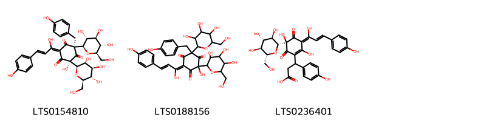
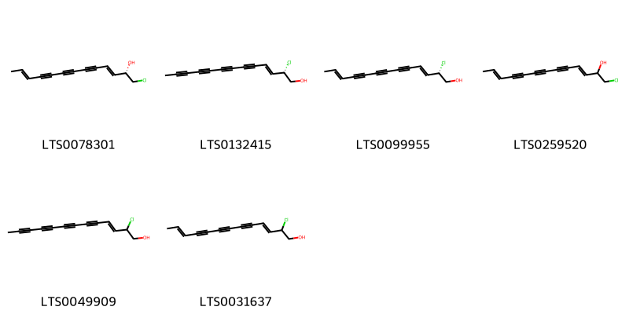
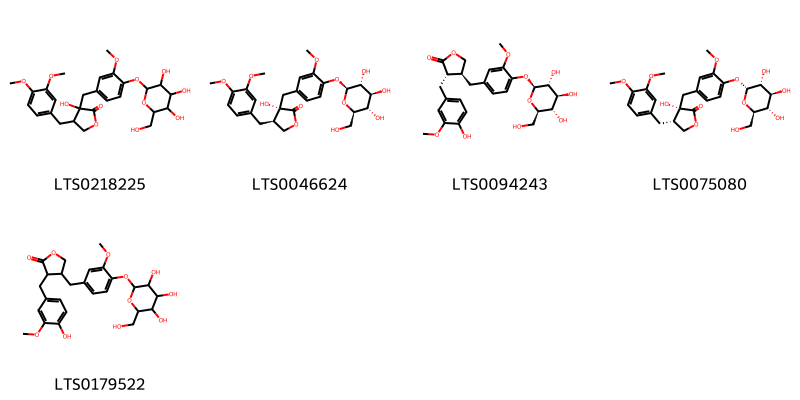
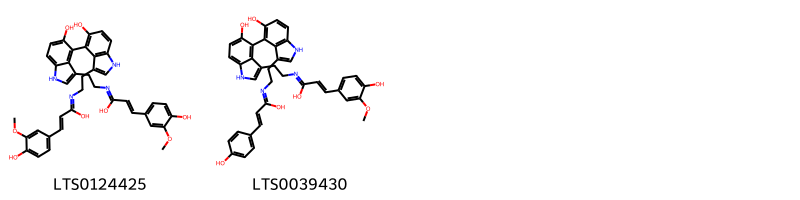
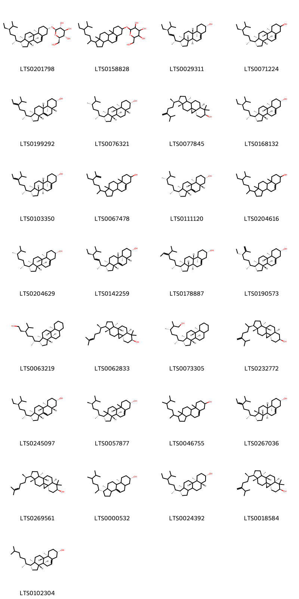

!!! abstract "Tóm tắt"

    Hồng hoa có tên khoa học là Carthamus tinctorius L., là một loại cây thuộc họ Cúc (Asteraceae). Cây Hồng Hoa có nguồn gốc từ các vùng ôn đới và cận nhiệt đới, phân bố rộng khắp thế giới, bao gồm cả Việt Nam. Ở nước ta, Hồng Hoa mọc nhiều ở các tỉnh miền núi phía Bắc như Hà Giang và một số vùng khác. Trong y học cổ truyền, Hồng Hoa thường được sử dụng để điều trị các chứng bệnh như: Bế kinh, kinh nguyệt không đều, đau bụng kinh, rong kinh, tụ huyết, sưng đau, bong gân, đau đầu, đau nhức xương khớp. Các nghiên cứu khoa học đã chỉ ra rằng hoa của Hồng hoa có nhiều tác dụng tốt cho sức khỏe, bao gồm: chống viêm và giảm đau, chống đông máu, chống oxy hóa, ảnh hưởng đến bệnh loãng xương, hoạt động bảo vệ gan, tác dụng trị đái tháo đường. Hoa của cây Hồng Hoa chứa một lượng lớn các hợp chất hoạt tính sinh học, trong đó đáng chú ý là các flavonoid, axit béo, steroid và nhiều các hợp chất khác.

## Thông tin về thực vật

Dược liệu **Hồng Hoa (Hoa)** từ bộ phận **Hoa** từ loài *Carthamus tinctorius*.

**Mô tả thực vật:** Cây thuộc thảo, cao 0,60-1m hay hơn, không có lông, thân trắng có vạch dọc. Lá mọc so le không có cuống, mép có răng cưa nhọn. Cụm hoa gồm những đầu họp lại thành ngù. Hoa màu đỏ cam đẹp, lá bắc có gai. Quả bế có bốn cạnh lỗi nhỏ dài 6-7mm, rộng 4-5mm.

*Tài liệu tham khảo:* "Những cây thuốc và vị thuốc Việt Nam" - Đỗ Tất Lợi 
Trong dược điển Việt nam, một loài được sử dụng làm dược liệu là *Carthamus tinctorius*.

!!! info "Phân loại thực vật của *Carthamus tinctorius*"
    - **Kingdom:** Plantae
    - **Phylum:** Tracheophyta
    - **Order:** Asterales
    - **Family:** Asteraceae
    - **Genus:** Carthamus
    - **Species:** *Carthamus tinctorius*

**Phân bố trên thế giới:** France, Germany, Israel, Switzerland, Czechia, Netherlands, Oman, Spain, Poland, Mexico, Chinese Taipei, Sweden, United Arab Emirates, Australia, Tunisia, Russian Federation, Portugal, United Kingdom of Great Britain and Northern Ireland, Uzbekistan, Iraq, Guatemala, India, Argentina, Türkiye, United States of America, Ethiopia, Pakistan, Algeria, Croatia, Kazakhstan, Italy, Norway, Canada, Morocco, Denmark, Austria, Belgium

**Phân bố tại Việt nam:** Không có ghi nhận ở Việt Nam

## Thông tin về dược liệu 

### Định danh

!!! info "Thông tin về tên gọi"

    - Dược liệu tiếng Việt: hồng hoa
    - Dược liệu tiếng Trung: 红花 (Hong Hua)
    - Dược liệu tiếng Anh: Carthamus Tinctorius
    - Dược liệu latin thông dụng: Flos Carthami tinctoriinCarthami Flos
    - Dược liệu latin kiểu DĐVN: *flos carthami tinctorii*
    - Dược liệu latin kiểu DĐVN: *Carthami Flos*
    - Dược liệu latin kiểu thông tư: *Flos Carthami tinctorii*
    - Bộ phận dùng: Hoa (Flos)

### Mô tả dược liệu 

- **Theo dược điển Việt nam V:** 
Hoa dài 1 cm đến 2 cm, mặt ngoài màu vàng đỏ hay đỏ. Tràng hoa hình ống thon, phía trên xẻ làm 5 cánh hẹp, dài 0,5 cm đến 0,8 cm, hoa có 5 nhị. Bao phấn dính liền thành ống, màu vàng, núm nhụy dài hình trụ, hơi phân đôi, nhô ra khỏi cánh hoa. Chất mềm, mùi thơm nhẹ, vị hơi đắng.

- **Mô tả dược liệu theo thông tư chế biến dược liệu theo phương pháp cổ truyền:** 

### Chế biến 

- **Chế biến theo dược điển việt nam V**: 
Thu hoạch vào mùa hạ, hái lấy hoa đang nở và cánh hoa chuyển từ vàng sang đỏ, để nơi râm mát, thoáng gió hoặc phơi nắng nhẹ cho khô dần.nn

- **Chế biến theo thông tư:** 

--- 

## Thành phần hóa học

- Theo tài liệu của GS. Đỗ Tất Lợi:  (1) Nhóm hóa học: flavonoid, phenylethanoid glycoside, coumarin, axit béo, steroid và polysacarit.
(2) Tên hoạt chất: 
- Flavonoid:
    + Nhóm quinochalcon: Carthamin, carthamon, iso-carthamin
    + Các flavonoid khác: Luteolin, dẫn chất của quercetin, kaempferol, 6-hydroxykaempferol và glycoside của nó, chalcon (hydroxysafflor yellow A, safflor yellow A, safflamin C và safflamin A), safflomin-A, nicotiflorin, luteolin 7-O-beta-D-glucopyranoside và luteolin-7-O-(6''-O-acetyl)-beta-D-glucopyranoside.
- Axit béo: Axit lauric, axit myristic, axit palmitic, axit linoleic, axit arachidic và axit oleic.
- Steroid: Heliaol, α-amyrin, β-amyrin, lupeol, cycloartenol, 24-methylenecycloartanol, tirucalla-7,24-dienol và dammaradienol.
- Tinh dầu: Caryophyllen, p-allyltoluen, 1-acetoxytetralin và heneicosan.
    

**Thành phần hóa học từ loài **Carthamus tinctorius**

Theo cơ sở dữ liệu lotus, loài *Carthamus tinctorius* đã phân lập và xác định được **248** hoạt chất thuộc về các nhóm Diarylheptanoids, Pyrans, Steroids and steroid derivatives, Organooxygen compounds, Lignan glycosides, Fatty Acyls, Flavonoids, Cinnamic acids and derivatives, Furanoid lignans, Indoles and derivatives, Halohydrins, Phenols, Purine nucleosides, 2-arylbenzofuran flavonoids, Carboxylic acids and derivatives, Coumarins and derivatives, Unsaturated hydrocarbons, Prenol lipids trong bảng dưới đây. Danh sách các hoạt chất như sau (2s,3's,4'r,5e,5'r,7s)-3',4',5',7-tetrahydroxy-5-[(2e)-1-hydroxy-3-(4-hydroxyphenyl)prop-2-en-1-ylidene]-7-[(2r,3r,4s,5s,6r)-3,4,5-trihydroxy-6-(hydroxymethyl)oxan-2-yl]-3h-spiro[1-benzofuran-2,2'-oxane]-4,6-dione [(LTS0052867)](https://lotus.naturalproducts.net/compound/lotus_id/LTS0052867), (4s)-5-{[(2z,3r,4r,5r)-3,4-dihydroxy-5-(hydroxymethyl)pyrrolidin-2-ylidene](hydroxy)methyl}-3,4-dihydroxy-2-[(2e)-3-(4-hydroxyphenyl)prop-2-enoyl]-4-[(2r,3r,4r,5s,6s)-3,5,6-trihydroxy-4-(hydroxymethyl)oxan-2-yl]cyclohexa-2,5-dien-1-one [(LTS0139559)](https://lotus.naturalproducts.net/compound/lotus_id/LTS0139559), henicosane-6,8-diol [(LTS0022325)](https://lotus.naturalproducts.net/compound/lotus_id/LTS0022325), (4r)-3,4,5-trihydroxy-2-[(2e)-3-(4-hydroxyphenyl)prop-2-enoyl]-4-[(2r,3r,4r,5s,6s)-3,5,6-trihydroxy-4-(hydroxymethyl)oxan-2-yl]-6-[(2s,3r,4r,5s,6r)-3,4,5-trihydroxy-6-(hydroxymethyl)oxan-2-yl]cyclohexa-2,5-dien-1-one [(LTS0190198)](https://lotus.naturalproducts.net/compound/lotus_id/LTS0190198), 5,7-dihydroxy-2-(4-hydroxyphenyl)-3-{[(2r,3s,4r,5r,6s)-3,4,5-trihydroxy-6-({[(2s,3s,4s,5s,6r)-3,4,5-trihydroxy-6-methyloxan-2-yl]oxy}methyl)oxan-2-yl]oxy}chromen-4-one [(LTS0195108)](https://lotus.naturalproducts.net/compound/lotus_id/LTS0195108), 3,4,5-trihydroxy-2-[3-(4-hydroxyphenyl)prop-2-enoyl]-4,6-bis[3,4,5-trihydroxy-6-(hydroxymethyl)oxan-2-yl]cyclohexa-2,5-dien-1-one [(LTS0061783)](https://lotus.naturalproducts.net/compound/lotus_id/LTS0061783), kaempherol [(LTS0155822)](https://lotus.naturalproducts.net/compound/lotus_id/LTS0155822), umbelliferone [(LTS0162728)](https://lotus.naturalproducts.net/compound/lotus_id/LTS0162728), bis[(3r)-2,3,4-trihydroxy-5-[(2e)-3-(4-hydroxyphenyl)prop-2-enoyl]-6-oxo-3-[(2r,3r,4s,5s,6r)-3,4,5-trihydroxy-6-(hydroxymethyl)oxan-2-yl]cyclohexa-1,4-dien-1-yl]acetic acid [(LTS0179867)](https://lotus.naturalproducts.net/compound/lotus_id/LTS0179867), 2-chlorotridec-3-en-5,7,9,11-tetrayn-1-ol [(LTS0049909)](https://lotus.naturalproducts.net/compound/lotus_id/LTS0049909), campesterol [(LTS0046755)](https://lotus.naturalproducts.net/compound/lotus_id/LTS0046755), (6r,8s)-heptacosane-6,8-diol [(LTS0041838)](https://lotus.naturalproducts.net/compound/lotus_id/LTS0041838), (2r,3r,4s,5s,6r)-2-{[(2e,10r)-10,14-dihydroxytetradec-2-en-4,6-diyn-1-yl]oxy}-6-(hydroxymethyl)oxane-3,4,5-triol [(LTS0161747)](https://lotus.naturalproducts.net/compound/lotus_id/LTS0161747), 3-[(4-hydroxy-3-methoxyphenyl)methyl]-4-[(3-methoxy-4-{[3,4,5-trihydroxy-6-(hydroxymethyl)oxan-2-yl]oxy}phenyl)methyl]oxolan-2-one [(LTS0179522)](https://lotus.naturalproducts.net/compound/lotus_id/LTS0179522), 5,6,7-trihydroxy-2-(4-hydroxyphenyl)-3-{[3,4,5-trihydroxy-6-(hydroxymethyl)oxan-2-yl]oxy}chromen-4-one [(LTS0114671)](https://lotus.naturalproducts.net/compound/lotus_id/LTS0114671), (2s,3e,11e)-1-chlorotrideca-3,11-dien-5,7,9-triyn-2-ol [(LTS0078301)](https://lotus.naturalproducts.net/compound/lotus_id/LTS0078301), (3e,5e)-trideca-1,3,5-trien-7,9,11-triyne [(LTS0189296)](https://lotus.naturalproducts.net/compound/lotus_id/LTS0189296), linoleic [(LTS0013198)](https://lotus.naturalproducts.net/compound/lotus_id/LTS0013198), para-coumaric acid [(LTS0266252)](https://lotus.naturalproducts.net/compound/lotus_id/LTS0266252), (4r)-3,4,5-trihydroxy-2-[(2e)-3-(4-hydroxyphenyl)prop-2-enoyl]-4-[(2r,3r,4s,5s,6r)-3,4,5-trihydroxy-6-(hydroxymethyl)oxan-2-yl]-6-[(2s,3r,4r,5s,6r)-3,4,5-trihydroxy-6-(hydroxymethyl)oxan-2-yl]cyclohexa-2,5-dien-1-one [(LTS0105282)](https://lotus.naturalproducts.net/compound/lotus_id/LTS0105282), 7-{[(2s,3r,4s,5s,6r)-6-({[(2r,3r,4r)-3,4-dihydroxy-4-(hydroxymethyl)oxolan-2-yl]oxy}methyl)-3,4,5-trihydroxyoxan-2-yl]oxy}-5-hydroxy-2-(4-methoxyphenyl)chromen-4-one [(LTS0253462)](https://lotus.naturalproducts.net/compound/lotus_id/LTS0253462), pentatriacontane-6,8-diol [(LTS0170962)](https://lotus.naturalproducts.net/compound/lotus_id/LTS0170962), 2-(3,4-dihydroxyphenyl)-5-hydroxy-4-oxo-3-{[(2r,3r,4r,5r,6s)-3,4,5-trihydroxy-6-methyloxan-2-yl]oxy}chromen-7-yl (2s,3s,4s,5r,6r)-3,4,5,6-tetrahydroxyoxane-2-carboxylate [(LTS0274299)](https://lotus.naturalproducts.net/compound/lotus_id/LTS0274299), (3s,4s)-3-(4-hydroxy-3-methoxyphenyl)-2-oxa-6,11-diazatetracyclo[7.5.2.0⁴,¹⁵.0¹²,¹⁶]hexadeca-1(14),5,9,12,15-pentaen-5-ol [(LTS0245781)](https://lotus.naturalproducts.net/compound/lotus_id/LTS0245781), 5,7-dihydroxy-2-(4-hydroxyphenyl)-3-{[(2s,3r,4s,5s,6r)-3,4,5-trihydroxy-6-({[(2s,3r,4r,5r,6s)-3,4,5-trihydroxy-6-methyloxan-2-yl]oxy}methyl)oxan-2-yl]oxy}chromen-4-one [(LTS0055744)](https://lotus.naturalproducts.net/compound/lotus_id/LTS0055744), fungisterol [(LTS0111120)](https://lotus.naturalproducts.net/compound/lotus_id/LTS0111120), kaempferol 3-o-sophoroside [(LTS0084606)](https://lotus.naturalproducts.net/compound/lotus_id/LTS0084606), isorhamnetin [(LTS0107505)](https://lotus.naturalproducts.net/compound/lotus_id/LTS0107505), (3β,5α)-stigmast-7-en-3-ol [(LTS0245097)](https://lotus.naturalproducts.net/compound/lotus_id/LTS0245097), trideca-1,3,11-trien-5,7,9-triyne [(LTS0157797)](https://lotus.naturalproducts.net/compound/lotus_id/LTS0157797), safynol [(LTS0212123)](https://lotus.naturalproducts.net/compound/lotus_id/LTS0212123), 22,23-dihydrobrassicasterol [(LTS0204629)](https://lotus.naturalproducts.net/compound/lotus_id/LTS0204629), (2r,3r,4s,5s,6r)-2-{[(12r)-12,13-dihydroxytrideca-2,8,10-trien-4,6-diyn-1-yl]oxy}-6-(hydroxymethyl)oxane-3,4,5-triol [(LTS0266226)](https://lotus.naturalproducts.net/compound/lotus_id/LTS0266226), (3s,6r)-6-[(1r,3as,3br,9as,9bs,11ar)-9a,11a-dimethyl-tetradecahydro-1h-cyclopenta[a]phenanthren-1-yl]-2,3-dimethylheptan-1-ol [(LTS0073305)](https://lotus.naturalproducts.net/compound/lotus_id/LTS0073305), alnulin [(LTS0076238)](https://lotus.naturalproducts.net/compound/lotus_id/LTS0076238), (-)-arctigenin [(LTS0194121)](https://lotus.naturalproducts.net/compound/lotus_id/LTS0194121), luteolin 7-o-glucoside [(LTS0227450)](https://lotus.naturalproducts.net/compound/lotus_id/LTS0227450), (6ar,6br,8ar,14br)-4,4,6a,6b,8a,12,14b-heptamethyl-11-methylidene-hexadecahydropicen-3-ol [(LTS0274865)](https://lotus.naturalproducts.net/compound/lotus_id/LTS0274865), 3-{2,5-dihydroxy-3-[(2e)-1-hydroxy-3-(4-hydroxyphenyl)prop-2-en-1-ylidene]-4,6-dioxo-5-[(2r,3r,4s,5s,6r)-3,4,5-trihydroxy-6-(hydroxymethyl)oxan-2-yl]cyclohex-1-en-1-yl}-3-(4-hydroxyphenyl)propanoic acid [(LTS0236401)](https://lotus.naturalproducts.net/compound/lotus_id/LTS0236401), (1r,3as,3bs,7s,9ar,9bs,11ar)-1-[(2r,5s)-5-ethyl-6-methylhept-6-en-2-yl]-9a,11a-dimethyl-1h,2h,3h,3ah,3bh,4h,6h,7h,8h,9h,9bh,10h,11h-cyclopenta[a]phenanthren-7-ol [(LTS0190573)](https://lotus.naturalproducts.net/compound/lotus_id/LTS0190573), dehydrosafynol [(LTS0046866)](https://lotus.naturalproducts.net/compound/lotus_id/LTS0046866), astragalin [(LTS0249588)](https://lotus.naturalproducts.net/compound/lotus_id/LTS0249588), (3e,5e,11e)-trideca-1,3,5,11-tetraen-7,9-diyne [(LTS0193080)](https://lotus.naturalproducts.net/compound/lotus_id/LTS0193080), (6r,8s)-tricosane-6,8-diol [(LTS0132691)](https://lotus.naturalproducts.net/compound/lotus_id/LTS0132691), 4-[(2e)-4-(3,5-dimethoxy-4-oxocyclohexa-2,5-dien-1-ylidene)but-2-en-1-ylidene]-2,6-dimethoxycyclohexa-2,5-dien-1-one [(LTS0229274)](https://lotus.naturalproducts.net/compound/lotus_id/LTS0229274), (6e)-4-[(2s,3r)-4,7-dihydroxy-5-[(2e)-3-(4-hydroxyphenyl)prop-2-enoyl]-6-oxo-2-[(1s,2r,3r)-1,2,3,4-tetrahydroxybutyl]-7-[(2r,3r,4s,5s,6r)-3,4,5-trihydroxy-6-(hydroxymethyl)oxan-2-yl]-2,3-dihydro-1-benzofuran-3-yl]-2,5-dihydroxy-6-[(2e)-1-hydroxy-3-(4-hydroxyphenyl)prop-2-en-1-ylidene]-2-[(2r,3r,4s,5s,6r)-3,4,5-trihydroxy-6-(hydroxymethyl)oxan-2-yl]cyclohex-4-ene-1,3-dione [(LTS0126857)](https://lotus.naturalproducts.net/compound/lotus_id/LTS0126857), (2z,6s)-5,6-dihydroxy-4-[(2e)-3-(4-hydroxyphenyl)prop-2-enoyl]-2-{[(3r)-2,3,4-trihydroxy-5-[(2e)-3-(4-hydroxyphenyl)prop-2-enoyl]-6-oxo-3-[(2r,3r,4s,5s,6r)-3,4,5-trihydroxy-6-(hydroxymethyl)oxan-2-yl]cyclohexa-1,4-dien-1-yl]methylidene}-6-[(2r,3r,4s,5s,6r)-3,4,5-trihydroxy-6-(hydroxymethyl)oxan-2-yl]cyclohex-4-ene-1,3-dione [(LTS0021672)](https://lotus.naturalproducts.net/compound/lotus_id/LTS0021672), delta7-avenasterol [(LTS0199292)](https://lotus.naturalproducts.net/compound/lotus_id/LTS0199292), [(2r,3s,4s,5r,6s)-6-{[2-(3,4-dihydroxyphenyl)-3,5-dihydroxy-4-oxochromen-7-yl]oxy}-3,4,5-trihydroxyoxan-2-yl]methyl acetate [(LTS0000724)](https://lotus.naturalproducts.net/compound/lotus_id/LTS0000724), luteolin [(LTS0017052)](https://lotus.naturalproducts.net/compound/lotus_id/LTS0017052), (6r,8s)-henicosane-6,8-diol [(LTS0142393)](https://lotus.naturalproducts.net/compound/lotus_id/LTS0142393), 5,7-dihydroxy-2-(4-hydroxyphenyl)-3,6-bis({[(2s,3r,4s,5s,6r)-3,4,5-trihydroxy-6-(hydroxymethyl)oxan-2-yl]oxy})chromen-4-one [(LTS0270597)](https://lotus.naturalproducts.net/compound/lotus_id/LTS0270597), aplotaxene [(LTS0215252)](https://lotus.naturalproducts.net/compound/lotus_id/LTS0215252), trideca-1,3,5-trien-7,9,11-triyne [(LTS0246027)](https://lotus.naturalproducts.net/compound/lotus_id/LTS0246027), 3-(4-hydroxy-3-methoxyphenyl)-2-oxa-6,11-diazatetracyclo[7.5.2.0⁴,¹⁵.0¹²,¹⁶]hexadeca-1(14),5,9,12,15-pentaen-5-ol [(LTS0258232)](https://lotus.naturalproducts.net/compound/lotus_id/LTS0258232), cycloartenol [(LTS0269561)](https://lotus.naturalproducts.net/compound/lotus_id/LTS0269561), 2,5-dihydroxy-6-[1-hydroxy-3-(4-hydroxyphenyl)prop-2-en-1-ylidene]-2-[(2s)-3,4,5-trihydroxy-6-(hydroxymethyl)oxan-2-yl]-4-[3,4,5-trihydroxy-6-(hydroxymethyl)oxan-2-yl]cyclohex-4-ene-1,3-dione [(LTS0246943)](https://lotus.naturalproducts.net/compound/lotus_id/LTS0246943), (6r,8s)-hentriacontane-6,8-diol [(LTS0109963)](https://lotus.naturalproducts.net/compound/lotus_id/LTS0109963), (2r,3r,4s,5s,6r)-2-{[(2e,8z,12r)-12,14-dihydroxytetradeca-2,8-dien-4,6-diyn-1-yl]oxy}-6-(hydroxymethyl)oxane-3,4,5-triol [(LTS0268029)](https://lotus.naturalproducts.net/compound/lotus_id/LTS0268029), (3s,4s)-4-[(3,4-dimethoxyphenyl)methyl]-3-hydroxy-3-[(3-methoxy-4-{[(2r,3r,4s,5s,6r)-3,4,5-trihydroxy-6-(hydroxymethyl)oxan-2-yl]oxy}phenyl)methyl]oxolan-2-one [(LTS0075080)](https://lotus.naturalproducts.net/compound/lotus_id/LTS0075080), 1-(acetyloxy)tetradeca-4,6,12-trien-8,10-diyn-3-yl acetate [(LTS0273113)](https://lotus.naturalproducts.net/compound/lotus_id/LTS0273113), dotriacontane-6,8-diol [(LTS0186247)](https://lotus.naturalproducts.net/compound/lotus_id/LTS0186247), pentacosane-6,8-diol [(LTS0029280)](https://lotus.naturalproducts.net/compound/lotus_id/LTS0029280), n-[2-(5-hydroxy-1h-indol-3-yl)ethyl]-3-(4-hydroxyphenyl)prop-2-enimidic acid [(LTS0258118)](https://lotus.naturalproducts.net/compound/lotus_id/LTS0258118), tritriacontane-6,8-diol [(LTS0022494)](https://lotus.naturalproducts.net/compound/lotus_id/LTS0022494), 3',4',5',7-tetrahydroxy-5-[(2e)-1-hydroxy-3-(4-hydroxyphenyl)prop-2-en-1-ylidene]-7-[3,4,5-trihydroxy-6-(hydroxymethyl)oxan-2-yl]-3h-spiro[1-benzofuran-2,2'-oxane]-4,6-dione [(LTS0244361)](https://lotus.naturalproducts.net/compound/lotus_id/LTS0244361), 2-(3,4-dihydroxyphenyl)-5,7-dihydroxy-3-{[(2s,3r,4r,5r,6s)-3,4,5-trihydroxy-6-(hydroxymethyl)oxan-2-yl]oxy}chromen-4-one [(LTS0241372)](https://lotus.naturalproducts.net/compound/lotus_id/LTS0241372), (2s,3e)-2-chlorotridec-3-en-5,7,9,11-tetrayn-1-ol [(LTS0132415)](https://lotus.naturalproducts.net/compound/lotus_id/LTS0132415), (6r,8s)-nonacosane-6,8-diol [(LTS0130306)](https://lotus.naturalproducts.net/compound/lotus_id/LTS0130306), 7-{[6-({[3,4-dihydroxy-4-(hydroxymethyl)oxolan-2-yl]oxy}methyl)-3,4,5-trihydroxyoxan-2-yl]oxy}-5-hydroxy-2-(4-methoxyphenyl)chromen-4-one [(LTS0107622)](https://lotus.naturalproducts.net/compound/lotus_id/LTS0107622), {2,3,4-trihydroxy-5-[(2e)-3-(4-hydroxyphenyl)prop-2-enoyl]-6-oxo-3-[3,4,5-trihydroxy-6-(hydroxymethyl)oxan-2-yl]cyclohexa-1,4-dien-1-yl}({2,3,4-trihydroxy-5-[(2z)-3-(4-hydroxyphenyl)prop-2-enoyl]-6-oxo-3-[3,4,5-trihydroxy-6-(hydroxymethyl)oxan-2-yl]cyclohexa-1,4-dien-1-yl})acetic acid [(LTS0127860)](https://lotus.naturalproducts.net/compound/lotus_id/LTS0127860), (6z)-4-{1-[(3z)-2,5-dihydroxy-3-[(2e)-1-hydroxy-3-(4-hydroxyphenyl)prop-2-en-1-ylidene]-4,6-dioxo-5-[3,4,5-trihydroxy-6-(hydroxymethyl)oxan-2-yl]cyclohex-1-en-1-yl]-2,3,4,5,6-pentahydroxyhexyl}-2,5-dihydroxy-6-[(2z)-1-hydroxy-3-(4-hydroxyphenyl)prop-2-en-1-ylidene]-2-[3,4,5-trihydroxy-6-(hydroxymethyl)oxan-2-yl]cyclohex-4-ene-1,3-dione [(LTS0053162)](https://lotus.naturalproducts.net/compound/lotus_id/LTS0053162), (3ar,3br,5ar,7s,9ar,9br)-3a,3b,6,6,9a-pentamethyl-1-(6-methylhepta-1,5-dien-2-yl)-dodecahydro-1h-cyclopenta[a]phenanthren-7-ol [(LTS0215354)](https://lotus.naturalproducts.net/compound/lotus_id/LTS0215354), 2-(3,4-dihydroxyoxolan-2-yl)-4,7-dihydroxy-5-[(2e)-3-(4-hydroxyphenyl)prop-2-enoyl]-7-[3,4,5-trihydroxy-6-(hydroxymethyl)oxan-2-yl]-1h-indol-6-one [(LTS0099307)](https://lotus.naturalproducts.net/compound/lotus_id/LTS0099307), syringin [(LTS0046227)](https://lotus.naturalproducts.net/compound/lotus_id/LTS0046227), (3z,11z)-trideca-1,3,11-trien-5,7,9-triyne [(LTS0138143)](https://lotus.naturalproducts.net/compound/lotus_id/LTS0138143), 2-chlorotrideca-3,11-dien-5,7,9-triyn-1-ol [(LTS0031637)](https://lotus.naturalproducts.net/compound/lotus_id/LTS0031637), (6r,8s)-dotriacontane-6,8-diol [(LTS0121457)](https://lotus.naturalproducts.net/compound/lotus_id/LTS0121457), 5-hydroxy-2-(4-hydroxyphenyl)-4-oxo-3,6-bis({[3,4,5-trihydroxy-6-(hydroxymethyl)oxan-2-yl]oxy})chromen-7-yl 3,4,5,6-tetrahydroxyoxane-2-carboxylate [(LTS0254820)](https://lotus.naturalproducts.net/compound/lotus_id/LTS0254820), (2s,3s,7r)-6,7-dihydroxy-5-[(2e)-3-(4-hydroxyphenyl)prop-2-enoyl]-2-[(1r,2r,3r)-1,2,3,4-tetrahydroxybutyl]-3-[(3s)-2,3,4-trihydroxy-5-[(2e)-3-(4-hydroxyphenyl)prop-2-enoyl]-6-oxo-3-[(2r,3s,4r,5r,6r)-3,4,5-trihydroxy-6-(hydroxymethyl)oxan-2-yl]cyclohexa-1,4-dien-1-yl]-7-[(2r,3s,4s,5r,6s)-3,4,5-trihydroxy-6-(hydroxymethyl)oxan-2-yl]-2,3-dihydro-1-benzofuran-4-one [(LTS0238406)](https://lotus.naturalproducts.net/compound/lotus_id/LTS0238406), (2e)-3-(4-hydroxyphenyl)-n-[2-(1h-indol-3-yl)ethyl]prop-2-enimidic acid [(LTS0176591)](https://lotus.naturalproducts.net/compound/lotus_id/LTS0176591), (4ar,6ar,6br,8as,12ar,12br,14ar,14br)-4,4,6a,6b,8a,11,12,14b-octamethyl-2,3,4a,5,6,7,8,9,12,12a,12b,13,14,14a-tetradecahydro-1h-picen-3-ol [(LTS0269929)](https://lotus.naturalproducts.net/compound/lotus_id/LTS0269929), 5-hydroxy-2-(4-hydroxyphenyl)-4-oxo-3,6-bis({[(2s,3r,4s,5s,6r)-3,4,5-trihydroxy-6-(hydroxymethyl)oxan-2-yl]oxy})chromen-7-yl (2s,3s,4s,5r,6r)-3,4,5,6-tetrahydroxyoxane-2-carboxylate [(LTS0189297)](https://lotus.naturalproducts.net/compound/lotus_id/LTS0189297), 1-undecene [(LTS0104325)](https://lotus.naturalproducts.net/compound/lotus_id/LTS0104325), (6r,8s)-triacontane-6,8-diol [(LTS0160805)](https://lotus.naturalproducts.net/compound/lotus_id/LTS0160805), n-{2-[5,5'-dihydroxy-3'-(2-{[1-hydroxy-3-(4-hydroxyphenyl)prop-2-en-1-ylidene]amino}ethyl)-1h,1'h-[4,4'-biindol]-3-yl]ethyl}-3-(4-hydroxyphenyl)prop-2-enimidic acid [(LTS0038585)](https://lotus.naturalproducts.net/compound/lotus_id/LTS0038585), (3s,4e,6e,12e)-1-(acetyloxy)tetradeca-4,6,12-trien-8,10-diyn-3-yl acetate [(LTS0052541)](https://lotus.naturalproducts.net/compound/lotus_id/LTS0052541), tricosane-6,8-diol [(LTS0146514)](https://lotus.naturalproducts.net/compound/lotus_id/LTS0146514), cholesterol [(LTS0102304)](https://lotus.naturalproducts.net/compound/lotus_id/LTS0102304), (8z)-dec-8-en-4,6-diyn-1-yl 3-methylbutanoate [(LTS0047082)](https://lotus.naturalproducts.net/compound/lotus_id/LTS0047082), (3e,11e)-trideca-1,3,11-trien-5,7,9-triyne [(LTS0153478)](https://lotus.naturalproducts.net/compound/lotus_id/LTS0153478), amyrin [(LTS0222826)](https://lotus.naturalproducts.net/compound/lotus_id/LTS0222826), trideca-1,11-dien-3,5,7,9-tetrayne [(LTS0196083)](https://lotus.naturalproducts.net/compound/lotus_id/LTS0196083), tridec-1-en-3,5,7,9,11-pentayne [(LTS0085389)](https://lotus.naturalproducts.net/compound/lotus_id/LTS0085389), matairesinol [(LTS0193475)](https://lotus.naturalproducts.net/compound/lotus_id/LTS0193475), trideca-3,11-dien-5,7,9-triyne-1,2-diol [(LTS0193651)](https://lotus.naturalproducts.net/compound/lotus_id/LTS0193651), 3,4,5-trihydroxy-2-[3-(4-hydroxyphenyl)prop-2-enoyl]-4-[3,5,6-trihydroxy-4-(hydroxymethyl)oxan-2-yl]-6-[3,4,5-trihydroxy-6-(hydroxymethyl)oxan-2-yl]cyclohexa-2,5-dien-1-one [(LTS0199301)](https://lotus.naturalproducts.net/compound/lotus_id/LTS0199301), 3,4-dihydroxycinnamic acid [(LTS0128050)](https://lotus.naturalproducts.net/compound/lotus_id/LTS0128050), 3,5-dihydroxy-2-(4-hydroxyphenyl)-7-{[3,4,5-trihydroxy-6-(hydroxymethyl)oxan-2-yl]oxy}chromen-4-one [(LTS0262914)](https://lotus.naturalproducts.net/compound/lotus_id/LTS0262914), (2s,3e,11e)-2-chlorotrideca-3,11-dien-5,7,9-triyn-1-ol [(LTS0099955)](https://lotus.naturalproducts.net/compound/lotus_id/LTS0099955), 1-[5-(hydroxymethyl)furan-2-yl]ethanone [(LTS0098495)](https://lotus.naturalproducts.net/compound/lotus_id/LTS0098495), (2s,4r,6e)-2-hydroxy-6-[(2e)-1-hydroxy-3-(4-hydroxyphenyl)prop-2-en-1-ylidene]-4-[(4-hydroxyphenyl)methyl]-2-[(2r,3r,4s,5s,6r)-3,4,5-trihydroxy-6-(hydroxymethyl)oxan-2-yl]-4-[(2s,3r,4r,5s,6r)-3,4,5-trihydroxy-6-(hydroxymethyl)oxan-2-yl]cyclohexane-1,3,5-trione [(LTS0154810)](https://lotus.naturalproducts.net/compound/lotus_id/LTS0154810), (2r,3r,4s,5s,6r)-2-{[(2e,8e,10e,12r)-12,13-dihydroxytrideca-2,8,10-trien-4,6-diyn-1-yl]oxy}-6-(hydroxymethyl)oxane-3,4,5-triol [(LTS0182178)](https://lotus.naturalproducts.net/compound/lotus_id/LTS0182178), quercimeritrin [(LTS0208490)](https://lotus.naturalproducts.net/compound/lotus_id/LTS0208490), (1r,5r,6r,7s)-1-(hydroxymethyl)-7-(4-hydroxyphenyl)-4-oxo-8-oxabicyclo[3.2.1]oct-2-ene-6-carboxylic acid [(LTS0163714)](https://lotus.naturalproducts.net/compound/lotus_id/LTS0163714), 2-chlorotrideca-3,11-dien-5,7,9-triyn-1-yl acetate [(LTS0164955)](https://lotus.naturalproducts.net/compound/lotus_id/LTS0164955), (4s)-3,4,5-trihydroxy-2-[(2e)-3-(4-hydroxyphenyl)prop-2-enoyl]-6-[(2s,3r,4r,5r)-2,3,4,5,6-pentahydroxy-1-[(3s)-2,3,4-trihydroxy-5-[(2e)-3-(4-hydroxyphenyl)prop-2-enoyl]-6-oxo-3-[(2r,3r,4s,5s,6r)-3,4,5-trihydroxy-6-(hydroxymethyl)oxan-2-yl]cyclohexa-1,4-dien-1-yl]hexyl]-4-[(2r,3r,4s,5s,6r)-3,4,5-trihydroxy-6-(hydroxymethyl)oxan-2-yl]cyclohexa-2,5-dien-1-one [(LTS0121060)](https://lotus.naturalproducts.net/compound/lotus_id/LTS0121060), (3s,4r)-4-[(3,4-dimethoxyphenyl)methyl]-3-hydroxy-3-[(3-methoxy-4-{[(2s,3r,4s,5s,6r)-3,4,5-trihydroxy-6-(hydroxymethyl)oxan-2-yl]oxy}phenyl)methyl]oxolan-2-one [(LTS0046624)](https://lotus.naturalproducts.net/compound/lotus_id/LTS0046624), (3e,5z,11e)-trideca-1,3,5,11-tetraen-7,9-diyne [(LTS0189549)](https://lotus.naturalproducts.net/compound/lotus_id/LTS0189549), nonacosane-6,8-diol [(LTS0220690)](https://lotus.naturalproducts.net/compound/lotus_id/LTS0220690), (2e)-n-{2-[5,5'-dihydroxy-3'-(2-{[(2e)-1-hydroxy-3-(4-hydroxy-3-methoxyphenyl)prop-2-en-1-ylidene]amino}ethyl)-1h,1'h-[4,4'-biindol]-3-yl]ethyl}-3-(4-hydroxy-3-methoxyphenyl)prop-2-enimidic acid [(LTS0220267)](https://lotus.naturalproducts.net/compound/lotus_id/LTS0220267), 4-{6,7-dihydroxy-5-[3-(4-hydroxyphenyl)prop-2-enoyl]-4-oxo-2-(1,2,3,4-tetrahydroxybutyl)-7-[3,4,5-trihydroxy-6-(hydroxymethyl)oxan-2-yl]-2,3-dihydro-1-benzofuran-3-yl}-5,6-dihydroxy-2-[1-hydroxy-3-(4-hydroxyphenyl)prop-2-en-1-ylidene]-6-[3,4,5-trihydroxy-6-(hydroxymethyl)oxan-2-yl]cyclohex-4-ene-1,3-dione [(LTS0082050)](https://lotus.naturalproducts.net/compound/lotus_id/LTS0082050), (3e)-trideca-1,3-dien-5,7,9,11-tetrayne [(LTS0052375)](https://lotus.naturalproducts.net/compound/lotus_id/LTS0052375), (6r,8s)-pentacosane-6,8-diol [(LTS0226756)](https://lotus.naturalproducts.net/compound/lotus_id/LTS0226756), (1s,3r,6s,8s,11s,12s,15r,16r)-12,16-dimethyl-15-(6-methyl-5-methylideneheptan-2-yl)pentacyclo[9.7.0.0¹,³.0³,⁸.0¹²,¹⁶]octadecan-6-ol [(LTS0232772)](https://lotus.naturalproducts.net/compound/lotus_id/LTS0232772), 5-hydroxy-2-(4-hydroxyphenyl)-3,6,7-tris({[3,4,5-trihydroxy-6-(hydroxymethyl)oxan-2-yl]oxy})chromen-4-one [(LTS0275300)](https://lotus.naturalproducts.net/compound/lotus_id/LTS0275300), heptacosane-6,8-diol [(LTS0086799)](https://lotus.naturalproducts.net/compound/lotus_id/LTS0086799), dammaradienol [(LTS0080913)](https://lotus.naturalproducts.net/compound/lotus_id/LTS0080913), (2z,6s)-5,6-dihydroxy-4-[(2e)-3-(4-hydroxyphenyl)prop-2-enoyl]-2-({2,3,4-trihydroxy-5-[(2e)-3-(4-hydroxyphenyl)prop-2-enoyl]-6-oxo-3-[(2r,3r,4s,5s,6r)-3,4,5-trihydroxy-6-(hydroxymethyl)oxan-2-yl]cyclohexa-1,4-dien-1-yl}methylidene)-6-[(2r,3r,4s,5s,6r)-3,4,5-trihydroxy-6-(hydroxymethyl)oxan-2-yl]cyclohex-4-ene-1,3-dione [(LTS0004753)](https://lotus.naturalproducts.net/compound/lotus_id/LTS0004753), 5-hydroxy-2-(4-methoxyphenyl)-7-{[(2s,3r,4r,5r,6s)-3,4,5-trihydroxy-6-methyloxan-2-yl]oxy}chromen-4-one [(LTS0114999)](https://lotus.naturalproducts.net/compound/lotus_id/LTS0114999), 5,6,7-trihydroxy-2-(4-hydroxyphenyl)-3-{[(2s,3r,4s,5s,6r)-3,4,5-trihydroxy-6-(hydroxymethyl)oxan-2-yl]oxy}chromen-4-one [(LTS0083203)](https://lotus.naturalproducts.net/compound/lotus_id/LTS0083203), 6-methoxykaempferol [(LTS0267543)](https://lotus.naturalproducts.net/compound/lotus_id/LTS0267543), (2r,3r,4s,5s,6r)-2-(deca-2,8-dien-4,6-diyn-1-yloxy)-6-(hydroxymethyl)oxane-3,4,5-triol [(LTS0216189)](https://lotus.naturalproducts.net/compound/lotus_id/LTS0216189), (2r,3r,4s,5s,6r)-2-{[(2z,8e,12r)-12,14-dihydroxytetradeca-2,8-dien-4,6-diyn-1-yl]oxy}-6-(hydroxymethyl)oxane-3,4,5-triol [(LTS0173154)](https://lotus.naturalproducts.net/compound/lotus_id/LTS0173154), (4ar,6r,7r,8s,8as)-6-[(8z)-dec-8-en-4,6-diyn-1-yloxy]-2,2-dimethyl-hexahydropyrano[3,2-d][1,3]dioxine-7,8-diol [(LTS0170133)](https://lotus.naturalproducts.net/compound/lotus_id/LTS0170133), (3e)-trideca-1,3,5,11-tetraen-7,9-diyne [(LTS0097596)](https://lotus.naturalproducts.net/compound/lotus_id/LTS0097596), rutin [(LTS0042292)](https://lotus.naturalproducts.net/compound/lotus_id/LTS0042292), stigmast-5-en-3-ol, (3β)- [(LTS0204616)](https://lotus.naturalproducts.net/compound/lotus_id/LTS0204616), 3-{[4,5-dihydroxy-6-(hydroxymethyl)-3-{[3,4,5-trihydroxy-6-(hydroxymethyl)oxan-2-yl]oxy}oxan-2-yl]oxy}-5,7-dihydroxy-2-(4-hydroxyphenyl)chromen-4-one [(LTS0225418)](https://lotus.naturalproducts.net/compound/lotus_id/LTS0225418), tetradeca-6,12-dien-8,10-diyne-1,3,14-triol [(LTS0268971)](https://lotus.naturalproducts.net/compound/lotus_id/LTS0268971), (1r,7s,9as,11ar)-1-(5,6-dimethylheptan-2-yl)-9a,11a-dimethyl-1h,2h,3h,3ah,5h,5ah,6h,7h,8h,9h,9bh,10h,11h-cyclopenta[a]phenanthren-7-ol [(LTS0000532)](https://lotus.naturalproducts.net/compound/lotus_id/LTS0000532), 5,7-dihydroxy-2-(4-hydroxyphenyl)-6-{[3,4,5-trihydroxy-6-(hydroxymethyl)oxan-2-yl]oxy}-3-[(3,4,5-trihydroxy-6-{[(3,4,5-trihydroxy-6-methyloxan-2-yl)oxy]methyl}oxan-2-yl)oxy]-6,7-dihydrochromen-4-one [(LTS0052304)](https://lotus.naturalproducts.net/compound/lotus_id/LTS0052304), avenasterol [(LTS0103350)](https://lotus.naturalproducts.net/compound/lotus_id/LTS0103350), taraxasterol [(LTS0006950)](https://lotus.naturalproducts.net/compound/lotus_id/LTS0006950), palmitic acid [(LTS0079439)](https://lotus.naturalproducts.net/compound/lotus_id/LTS0079439), 1-(hydroxymethyl)-7-(4-hydroxyphenyl)-4-oxo-8-oxabicyclo[3.2.1]oct-2-ene-6-carboxylic acid [(LTS0067792)](https://lotus.naturalproducts.net/compound/lotus_id/LTS0067792), 24-methylene-cycloartanol [(LTS0077845)](https://lotus.naturalproducts.net/compound/lotus_id/LTS0077845), (2e)-n-[2-(5-hydroxy-1h-indol-3-yl)ethyl]-3-(4-hydroxyphenyl)prop-2-enimidic acid [(LTS0267871)](https://lotus.naturalproducts.net/compound/lotus_id/LTS0267871), quercimeritrin [(LTS0188893)](https://lotus.naturalproducts.net/compound/lotus_id/LTS0188893), 5-hydroxy-2-(4-hydroxyphenyl)-4-oxo-3-{[(2s,3r,4s,5s,6r)-3,4,5-trihydroxy-6-(hydroxymethyl)oxan-2-yl]oxy}chromen-7-yl (2s,3s,4s,5r,6r)-3,4,5,6-tetrahydroxyoxane-2-carboxylate [(LTS0243091)](https://lotus.naturalproducts.net/compound/lotus_id/LTS0243091), trideca-1,3-dien-5,7,9,11-tetrayne [(LTS0254168)](https://lotus.naturalproducts.net/compound/lotus_id/LTS0254168), scutellarein [(LTS0136843)](https://lotus.naturalproducts.net/compound/lotus_id/LTS0136843), (2e)-3-(4-hydroxy-3-methoxyphenyl)-n-[2-(1h-indol-3-yl)ethyl]prop-2-enimidic acid [(LTS0119446)](https://lotus.naturalproducts.net/compound/lotus_id/LTS0119446), n-{2-[5,5'-dihydroxy-3'-(2-{[1-hydroxy-3-(4-hydroxy-3-methoxyphenyl)prop-2-en-1-ylidene]amino}ethyl)-1h,1'h-[4,4'-biindol]-3-yl]ethyl}-3-(4-hydroxy-3-methoxyphenyl)prop-2-enimidic acid [(LTS0124425)](https://lotus.naturalproducts.net/compound/lotus_id/LTS0124425), 5-{[3,4-dihydroxy-5-(hydroxymethyl)pyrrolidin-2-ylidene](hydroxy)methyl}-3,4-dihydroxy-2-[3-(4-hydroxyphenyl)prop-2-enoyl]-4-[3,5,6-trihydroxy-4-(hydroxymethyl)oxan-2-yl]cyclohexa-2,5-dien-1-one [(LTS0113328)](https://lotus.naturalproducts.net/compound/lotus_id/LTS0113328), sitogluside [(LTS0201798)](https://lotus.naturalproducts.net/compound/lotus_id/LTS0201798), (2e)-5-{[(2z)-3,4-dihydroxy-5-(hydroxymethyl)pyrrolidin-2-ylidene](hydroxy)methyl}-6-hydroxy-2-[(2e)-1-hydroxy-3-(4-hydroxyphenyl)prop-2-en-1-ylidene]-6-[(2r,4s,5s)-3,4,5-trihydroxy-6-(hydroxymethyl)oxan-2-yl]cyclohex-4-ene-1,3-dione [(LTS0241213)](https://lotus.naturalproducts.net/compound/lotus_id/LTS0241213), n-{2-[5,5'-dihydroxy-3'-(2-{[1-hydroxy-3-(4-hydroxyphenyl)prop-2-en-1-ylidene]amino}ethyl)-1h,1'h-[4,4'-biindol]-3-yl]ethyl}-3-(4-hydroxy-3-methoxyphenyl)prop-2-enimidic acid [(LTS0039430)](https://lotus.naturalproducts.net/compound/lotus_id/LTS0039430), 3-rutinosyl quercetin [(LTS0032845)](https://lotus.naturalproducts.net/compound/lotus_id/LTS0032845), fucosterol [(LTS0178887)](https://lotus.naturalproducts.net/compound/lotus_id/LTS0178887), quercetin [(LTS0004651)](https://lotus.naturalproducts.net/compound/lotus_id/LTS0004651), 4-hydroxy-2-[3-(4-hydroxyphenyl)prop-2-enoyl]-4,6-bis[3,4,5-trihydroxy-6-(hydroxymethyl)oxan-2-yl]cyclohexa-2,5-dien-1-one [(LTS0105322)](https://lotus.naturalproducts.net/compound/lotus_id/LTS0105322), stigmast-5-en-3-ol [(LTS0071224)](https://lotus.naturalproducts.net/compound/lotus_id/LTS0071224), 5-hydroxy-2-(4-hydroxyphenyl)-4-oxo-3-{[3,4,5-trihydroxy-6-(hydroxymethyl)oxan-2-yl]oxy}chromen-7-yl 3,4,5,6-tetrahydroxyoxane-2-carboxylate [(LTS0102200)](https://lotus.naturalproducts.net/compound/lotus_id/LTS0102200), (4r)-5-{[(2z,3r,4r,5r)-3,4-dihydroxy-5-(hydroxymethyl)pyrrolidin-2-ylidene](hydroxy)methyl}-3,4-dihydroxy-2-[(2e)-3-(4-hydroxyphenyl)prop-2-enoyl]-4-[(2r,3r,4s,5s,6r)-3,4,5-trihydroxy-6-(hydroxymethyl)oxan-2-yl]cyclohexa-2,5-dien-1-one [(LTS0138480)](https://lotus.naturalproducts.net/compound/lotus_id/LTS0138480), 5,7-dihydroxy-2-(4-hydroxyphenyl)-6-{[3,4,5-trihydroxy-6-(hydroxymethyl)oxan-2-yl]oxy}-3-[(3,4,5-trihydroxy-6-{[(3,4,5-trihydroxy-6-methyloxan-2-yl)oxy]methyl}oxan-2-yl)oxy]chromen-4-one [(LTS0112998)](https://lotus.naturalproducts.net/compound/lotus_id/LTS0112998), (2r,3r,4s,5s,6r)-2-[(8z)-dec-8-en-4,6-diyn-1-yloxy]-6-(hydroxymethyl)oxane-3,4,5-triol [(LTS0045179)](https://lotus.naturalproducts.net/compound/lotus_id/LTS0045179), 4-[(3,4-dimethoxyphenyl)methyl]-3-hydroxy-3-[(3-methoxy-4-{[3,4,5-trihydroxy-6-(hydroxymethyl)oxan-2-yl]oxy}phenyl)methyl]oxolan-2-one [(LTS0218225)](https://lotus.naturalproducts.net/compound/lotus_id/LTS0218225), (4s)-3,4,5-trihydroxy-2-[(2e)-3-(4-hydroxyphenyl)prop-2-enoyl]-4-[(2r,3s,4s,5s,6r)-3,4,5-trihydroxy-6-(hydroxymethyl)oxan-2-yl]-6-[(2s,3s,4r,5s,6r)-3,4,5-trihydroxy-6-(hydroxymethyl)oxan-2-yl]cyclohexa-2,5-dien-1-one [(LTS0121279)](https://lotus.naturalproducts.net/compound/lotus_id/LTS0121279), (2e)-n-{2-[5,5'-dihydroxy-3'-(2-{[(2e)-1-hydroxy-3-(4-hydroxyphenyl)prop-2-en-1-ylidene]amino}ethyl)-1h,1'h-[4,4'-biindol]-3-yl]ethyl}-3-(4-hydroxy-3-methoxyphenyl)prop-2-enimidic acid [(LTS0000435)](https://lotus.naturalproducts.net/compound/lotus_id/LTS0000435), 2-(dec-8-en-4,6-diyn-1-yloxy)-6-(hydroxymethyl)oxane-3,4,5-triol [(LTS0166779)](https://lotus.naturalproducts.net/compound/lotus_id/LTS0166779), caffeic acid [(LTS0027481)](https://lotus.naturalproducts.net/compound/lotus_id/LTS0027481), (2s,3e,11e)-2-chlorotrideca-3,11-dien-5,7,9-triyn-1-yl acetate [(LTS0101345)](https://lotus.naturalproducts.net/compound/lotus_id/LTS0101345), (2e,7s,11s)-3,7,11,15-tetramethylhexadec-2-en-1-ol [(LTS0207261)](https://lotus.naturalproducts.net/compound/lotus_id/LTS0207261), chondrillasterol [(LTS0142259)](https://lotus.naturalproducts.net/compound/lotus_id/LTS0142259), bis({2,3,4-trihydroxy-5-[3-(4-hydroxyphenyl)prop-2-enoyl]-6-oxo-3-[3,4,5-trihydroxy-6-(hydroxymethyl)oxan-2-yl]cyclohexa-1,4-dien-1-yl})acetic acid [(LTS0236161)](https://lotus.naturalproducts.net/compound/lotus_id/LTS0236161), triacontane-6,8-diol [(LTS0034465)](https://lotus.naturalproducts.net/compound/lotus_id/LTS0034465), (3z,11e)-trideca-1,3,11-trien-5,7,9-triyne [(LTS0269835)](https://lotus.naturalproducts.net/compound/lotus_id/LTS0269835), 3-(4-hydroxyphenyl)-n-[2-(1h-indol-3-yl)ethyl]prop-2-enimidic acid [(LTS0106364)](https://lotus.naturalproducts.net/compound/lotus_id/LTS0106364), 5-hydroxy-2-(4-methoxyphenyl)-7-[(3,4,5-trihydroxy-6-methyloxan-2-yl)oxy]chromen-4-one [(LTS0110177)](https://lotus.naturalproducts.net/compound/lotus_id/LTS0110177), (2r,3r,4s,5s,6r)-2-{[(10r)-10,14-dihydroxytetradec-2-en-4,6-diyn-1-yl]oxy}-6-(hydroxymethyl)oxane-3,4,5-triol [(LTS0148220)](https://lotus.naturalproducts.net/compound/lotus_id/LTS0148220), adenosine [(LTS0014061)](https://lotus.naturalproducts.net/compound/lotus_id/LTS0014061), (2e)-3-(4-hydroxyphenyl)-n-[2-(5-{[(2s,3r,4s,5s,6r)-3,4,5-trihydroxy-6-(hydroxymethyl)oxan-2-yl]oxy}-1h-indol-3-yl)ethyl]prop-2-enimidic acid [(LTS0196449)](https://lotus.naturalproducts.net/compound/lotus_id/LTS0196449), nictoflorin [(LTS0182501)](https://lotus.naturalproducts.net/compound/lotus_id/LTS0182501), ergostanol [(LTS0076321)](https://lotus.naturalproducts.net/compound/lotus_id/LTS0076321), (2r,3r,4s,5s,6r)-2-[(2e,8z)-deca-2,8-dien-4,6-diyn-1-yloxy]-6-(hydroxymethyl)oxane-3,4,5-triol [(LTS0044951)](https://lotus.naturalproducts.net/compound/lotus_id/LTS0044951), octacosane-6,8-diol [(LTS0001021)](https://lotus.naturalproducts.net/compound/lotus_id/LTS0001021), hentriacontane-6,8-diol [(LTS0080367)](https://lotus.naturalproducts.net/compound/lotus_id/LTS0080367), 3,4,5-trihydroxy-6-{[5-hydroxy-2-(4-methoxyphenyl)-4-oxochromen-7-yl]oxy}oxane-2-carboxylic acid [(LTS0094290)](https://lotus.naturalproducts.net/compound/lotus_id/LTS0094290), (3r,6e,12e)-tetradeca-6,12-dien-8,10-diyne-1,3,14-triol [(LTS0270379)](https://lotus.naturalproducts.net/compound/lotus_id/LTS0270379), chamomile [(LTS0104946)](https://lotus.naturalproducts.net/compound/lotus_id/LTS0104946), daphnoretin [(LTS0157584)](https://lotus.naturalproducts.net/compound/lotus_id/LTS0157584), (6r,8s)-tetratriacontane-6,8-diol [(LTS0144648)](https://lotus.naturalproducts.net/compound/lotus_id/LTS0144648), (4s)-5-{[(2z,3r,4r,5r)-3,4-dihydroxy-5-(hydroxymethyl)pyrrolidin-2-ylidene](hydroxy)methyl}-3,4-dihydroxy-2-[(2e)-3-(4-hydroxyphenyl)prop-2-enoyl]-4-[(2r,3r,4s,5r,6r)-3,4,5-trihydroxy-6-(hydroxymethyl)oxan-2-yl]cyclohexa-2,5-dien-1-one [(LTS0187169)](https://lotus.naturalproducts.net/compound/lotus_id/LTS0187169), 1-chlorotrideca-3,11-dien-5,7,9-triyn-2-ol [(LTS0259520)](https://lotus.naturalproducts.net/compound/lotus_id/LTS0259520), (6e)-2,5-dihydroxy-6-[(2e)-1-hydroxy-3-(4-hydroxyphenyl)prop-2-en-1-ylidene]-2-[(2r,3r,4s,5s,6r)-3,4,5-trihydroxy-6-(hydroxymethyl)oxan-2-yl]-4-[(2s,3r,4r,5s,6r)-3,4,5-trihydroxy-6-(hydroxymethyl)oxan-2-yl]cyclohex-4-ene-1,3-dione [(LTS0029511)](https://lotus.naturalproducts.net/compound/lotus_id/LTS0029511), 6-hydroxykaempferol [(LTS0180835)](https://lotus.naturalproducts.net/compound/lotus_id/LTS0180835), 2-{[1-(5-ethyl-6-methylheptan-2-yl)-9a,11a-dimethyl-1h,2h,3h,3ah,3bh,4h,6h,7h,8h,9h,9bh,10h,11h-cyclopenta[a]phenanthren-7-yl]oxy}-6-(hydroxymethyl)oxane-3,4,5-triol [(LTS0158828)](https://lotus.naturalproducts.net/compound/lotus_id/LTS0158828), dec-8-en-4,6-diyn-1-yl 3-methylbutanoate [(LTS0113130)](https://lotus.naturalproducts.net/compound/lotus_id/LTS0113130), phytosterol [(LTS0029311)](https://lotus.naturalproducts.net/compound/lotus_id/LTS0029311), 5,7-dihydroxy-2-(4-hydroxyphenyl)-3-[(3,4,5-trihydroxy-6-{[(3,4,5-trihydroxy-6-methyloxan-2-yl)oxy]methyl}oxan-2-yl)oxy]chromen-4-one [(LTS0122456)](https://lotus.naturalproducts.net/compound/lotus_id/LTS0122456), 5,6-dihydroxy-4-[3-(4-hydroxyphenyl)prop-2-enoyl]-2-({2,3,4-trihydroxy-5-[3-(4-hydroxyphenyl)prop-2-enoyl]-6-oxo-3-[3,4,5-trihydroxy-6-(hydroxymethyl)oxan-2-yl]cyclohexa-1,4-dien-1-yl}methylidene)-6-[3,4,5-trihydroxy-6-(hydroxymethyl)oxan-2-yl]cyclohex-4-ene-1,3-dione [(LTS0142832)](https://lotus.naturalproducts.net/compound/lotus_id/LTS0142832), (3s,4s)-3-[(4-hydroxy-3-methoxyphenyl)methyl]-4-[(3-methoxy-4-{[(2s,3r,4s,5s,6r)-3,4,5-trihydroxy-6-(hydroxymethyl)oxan-2-yl]oxy}phenyl)methyl]oxolan-2-one [(LTS0094243)](https://lotus.naturalproducts.net/compound/lotus_id/LTS0094243), (2e,6s)-4-[(2s,3s,7s)-7-[(2s,3s,4r,5r,6s)-3,5-dihydroxy-4,6-bis(hydroxymethyl)oxan-2-yl]-4,7-dihydroxy-5-[(2e)-3-(4-hydroxyphenyl)prop-2-enoyl]-6-oxo-2-[(1s,2r,3r)-1,2,3,4-tetrahydroxybutyl]-2,3-dihydro-1-benzofuran-3-yl]-5,6-dihydroxy-2-[(2e)-1-hydroxy-3-(4-hydroxyphenyl)prop-2-en-1-ylidene]-6-[(2r,3r,4s,5s,6r)-3,4,5-trihydroxy-6-(hydroxymethyl)oxan-2-yl]cyclohex-4-ene-1,3-dione [(LTS0177338)](https://lotus.naturalproducts.net/compound/lotus_id/LTS0177338), (2e)-3-(4-hydroxy-3-methoxyphenyl)-n-[2-(5-{[(2s,3r,4s,5s,6r)-3,4,5-trihydroxy-6-(hydroxymethyl)oxan-2-yl]oxy}-1h-indol-3-yl)ethyl]prop-2-enimidic acid [(LTS0142504)](https://lotus.naturalproducts.net/compound/lotus_id/LTS0142504), (3s,6r)-6-[(1r,3as,3br,9as,9bs,11ar)-9a,11a-dimethyl-tetradecahydro-1h-cyclopenta[a]phenanthren-1-yl]-3-isopropylheptan-1-ol [(LTS0063219)](https://lotus.naturalproducts.net/compound/lotus_id/LTS0063219), acacetin [(LTS0020151)](https://lotus.naturalproducts.net/compound/lotus_id/LTS0020151), (1r,5as,7s,9as,9bs,11ar)-1-[(2r)-5-ethyl-6-methylheptan-2-yl]-9a,11a-dimethyl-tetradecahydro-1h-cyclopenta[a]phenanthren-7-ol [(LTS0024392)](https://lotus.naturalproducts.net/compound/lotus_id/LTS0024392), (3r,6s,8r,11s,12s,15r,16r)-7,7,12,16-tetramethyl-15-[(2r)-6-methylhept-5-en-2-yl]pentacyclo[9.7.0.0¹,³.0³,⁸.0¹²,¹⁶]octadecan-6-ol [(LTS0062833)](https://lotus.naturalproducts.net/compound/lotus_id/LTS0062833), (3e,11z)-trideca-3,11-dien-5,7,9-triyne-1,2-diol [(LTS0197904)](https://lotus.naturalproducts.net/compound/lotus_id/LTS0197904), 5,7-dihydroxy-2-(4-hydroxyphenyl)-3,6-bis({[3,4,5-trihydroxy-6-(hydroxymethyl)oxan-2-yl]oxy})chromen-4-one [(LTS0155086)](https://lotus.naturalproducts.net/compound/lotus_id/LTS0155086), trideca-1,3,5,11-tetraen-7,9-diyne [(LTS0238121)](https://lotus.naturalproducts.net/compound/lotus_id/LTS0238121), (6r,8s)-octacosane-6,8-diol [(LTS0014157)](https://lotus.naturalproducts.net/compound/lotus_id/LTS0014157), (2r,3r,4s,5s,6r)-2-[(8e)-dec-8-en-4,6-diyn-1-yloxy]-6-(hydroxymethyl)oxane-3,4,5-triol [(LTS0008873)](https://lotus.naturalproducts.net/compound/lotus_id/LTS0008873), 3,7,11,15-tetramethylhexadec-2-en-1-ol [(LTS0056933)](https://lotus.naturalproducts.net/compound/lotus_id/LTS0056933), tetratriacontane-6,8-diol [(LTS0053056)](https://lotus.naturalproducts.net/compound/lotus_id/LTS0053056), 3-(4-hydroxy-3-methoxyphenyl)-n-[2-(1h-indol-3-yl)ethyl]prop-2-enimidic acid [(LTS0000934)](https://lotus.naturalproducts.net/compound/lotus_id/LTS0000934), 1-(5-ethyl-6-methylhept-6-en-2-yl)-9a,11a-dimethyl-1h,2h,3h,3ah,3bh,4h,6h,7h,8h,9h,9bh,10h,11h-cyclopenta[a]phenanthren-7-ol [(LTS0067478)](https://lotus.naturalproducts.net/compound/lotus_id/LTS0067478), eriodictyol [(LTS0220769)](https://lotus.naturalproducts.net/compound/lotus_id/LTS0220769), heptadeca-1,8,11,14-tetraene [(LTS0222542)](https://lotus.naturalproducts.net/compound/lotus_id/LTS0222542), (1r,3as,3bs,7s,9ar,9bs,11as)-1-[(2r,5z)-5-isopropylhept-5-en-2-yl]-9a,11a-dimethyl-1h,2h,3h,3ah,3bh,4h,6h,7h,8h,9h,9bh,10h,11h-cyclopenta[a]phenanthren-7-ol [(LTS0267036)](https://lotus.naturalproducts.net/compound/lotus_id/LTS0267036), trifolin [(LTS0267055)](https://lotus.naturalproducts.net/compound/lotus_id/LTS0267055), 2-(3,4-dihydroxyphenyl)-5,7-dihydroxy-3-{[(2s,3r,4s,5s,6r)-3,4,5-trihydroxy-6-({[(2s,3r,4r,5r,6s)-3,4,5-trihydroxy-6-methyloxan-2-yl]oxy}methyl)oxan-2-yl]oxy}chromen-4-one [(LTS0070279)](https://lotus.naturalproducts.net/compound/lotus_id/LTS0070279), β-amyrin [(LTS0251864)](https://lotus.naturalproducts.net/compound/lotus_id/LTS0251864), (3s)-4-[(3,4-dimethoxyphenyl)methyl]-3-hydroxy-3-[(3-methoxy-4-{[(2s,3r,4s,5s,6r)-3,4,5-trihydroxy-6-(hydroxymethyl)oxan-2-yl]oxy}phenyl)methyl]oxolan-2-one [(LTS0265044)](https://lotus.naturalproducts.net/compound/lotus_id/LTS0265044), (2e)-n-[2-(5-hydroxy-1h-indol-3-yl)ethyl]-3-(4-hydroxy-3-methoxyphenyl)prop-2-enimidic acid [(LTS0064948)](https://lotus.naturalproducts.net/compound/lotus_id/LTS0064948), n-[2-(5-hydroxy-1h-indol-3-yl)ethyl]-3-(4-hydroxy-3-methoxyphenyl)prop-2-enimidic acid [(LTS0081491)](https://lotus.naturalproducts.net/compound/lotus_id/LTS0081491), 5,7-dihydroxy-2-(4-hydroxyphenyl)-6-{[(2s,3r,4s,5s,6r)-3,4,5-trihydroxy-6-(hydroxymethyl)oxan-2-yl]oxy}-3-{[(2s,3r,4s,5s,6r)-3,4,5-trihydroxy-6-({[(2r,3r,4r,5r,6s)-3,4,5-trihydroxy-6-methyloxan-2-yl]oxy}methyl)oxan-2-yl]oxy}chromen-4-one [(LTS0200315)](https://lotus.naturalproducts.net/compound/lotus_id/LTS0200315), (2r,3r,4s,5s,6r)-2-{[(12r)-12,14-dihydroxytetradeca-2,8-dien-4,6-diyn-1-yl]oxy}-6-(hydroxymethyl)oxane-3,4,5-triol [(LTS0139249)](https://lotus.naturalproducts.net/compound/lotus_id/LTS0139249), (4r)-4-hydroxy-2-[(2e)-3-(4-hydroxyphenyl)prop-2-enoyl]-4-[(2r,3r,4s,5s,6r)-3,4,5-trihydroxy-6-(hydroxymethyl)oxan-2-yl]-6-[(2s,3r,4r,5s,6r)-3,4,5-trihydroxy-6-(hydroxymethyl)oxan-2-yl]cyclohexa-2,5-dien-1-one [(LTS0135265)](https://lotus.naturalproducts.net/compound/lotus_id/LTS0135265), (2r,3r,4s,5s,6r)-2-{[(2z,8z,12r)-12,14-dihydroxytetradeca-2,8-dien-4,6-diyn-1-yl]oxy}-6-(hydroxymethyl)oxane-3,4,5-triol [(LTS0067935)](https://lotus.naturalproducts.net/compound/lotus_id/LTS0067935), (6s)-3,5,6-trihydroxy-2-[(2e)-3-(4-hydroxyphenyl)prop-2-enoyl]-6-[(2r,3r,4s,5s,6r)-3,4,5-trihydroxy-6-(hydroxymethyl)oxan-2-yl]-4-[(2s,3r,4r,5s,6r)-3,4,5-trihydroxy-6-(hydroxymethyl)oxan-2-yl]cyclohexa-2,4-dien-1-one [(LTS0250697)](https://lotus.naturalproducts.net/compound/lotus_id/LTS0250697), (1r,3as,3bs,7s,9bs)-1-[(2r,5r)-5,6-dimethylheptan-2-yl]-9a,11a-dimethyl-1h,2h,3h,3ah,3bh,4h,6h,7h,8h,9h,9bh,10h,11h-cyclopenta[a]phenanthren-7-ol [(LTS0057877)](https://lotus.naturalproducts.net/compound/lotus_id/LTS0057877), lupeol [(LTS0256952)](https://lotus.naturalproducts.net/compound/lotus_id/LTS0256952), (2r,3r,4s,5s,6r)-2-{[(2e,8e,12r)-12,14-dihydroxytetradeca-2,8-dien-4,6-diyn-1-yl]oxy}-6-(hydroxymethyl)oxane-3,4,5-triol [(LTS0270866)](https://lotus.naturalproducts.net/compound/lotus_id/LTS0270866), (11e)-trideca-1,11-dien-3,5,7,9-tetrayne [(LTS0023235)](https://lotus.naturalproducts.net/compound/lotus_id/LTS0023235), (6r,8s)-tritriacontane-6,8-diol [(LTS0047083)](https://lotus.naturalproducts.net/compound/lotus_id/LTS0047083), 2-(3,4-dihydroxyphenyl)-5-hydroxy-4-oxo-3-[(3,4,5-trihydroxy-6-methyloxan-2-yl)oxy]chromen-7-yl 3,4,5,6-tetrahydroxyoxane-2-carboxylate [(LTS0219658)](https://lotus.naturalproducts.net/compound/lotus_id/LTS0219658), 3-(4-hydroxy-3-methoxyphenyl)-n-[2-(5-{[3,4,5-trihydroxy-6-(hydroxymethyl)oxan-2-yl]oxy}-1h-indol-3-yl)ethyl]prop-2-enimidic acid [(LTS0267299)](https://lotus.naturalproducts.net/compound/lotus_id/LTS0267299), sitosterol [(LTS0168132)](https://lotus.naturalproducts.net/compound/lotus_id/LTS0168132), (11z)-trideca-1,11-dien-3,5,7,9-tetrayne [(LTS0205597)](https://lotus.naturalproducts.net/compound/lotus_id/LTS0205597), 3-[(3s,3as,5as,6s,9as,9br)-3a,5a,9b-trimethyl-3-[(2s)-6-methylhept-5-en-2-yl]-7-(propan-2-ylidene)-octahydro-1h-cyclopenta[a]naphthalen-6-yl]propan-1-ol [(LTS0105130)](https://lotus.naturalproducts.net/compound/lotus_id/LTS0105130), 3,4,5-trihydroxy-2-[3-(4-hydroxyphenyl)prop-2-enoyl]-6-(2,3,4,5,6-pentahydroxy-1-{2,3,4-trihydroxy-5-[3-(4-hydroxyphenyl)prop-2-enoyl]-6-oxo-3-[3,4,5-trihydroxy-6-(hydroxymethyl)oxan-2-yl]cyclohexa-1,4-dien-1-yl}hexyl)-4-[3,4,5-trihydroxy-6-(hydroxymethyl)oxan-2-yl]cyclohexa-2,5-dien-1-one [(LTS0190141)](https://lotus.naturalproducts.net/compound/lotus_id/LTS0190141), kaempferol 7-o-glucoside [(LTS0025882)](https://lotus.naturalproducts.net/compound/lotus_id/LTS0025882), oleic acid [(LTS0256910)](https://lotus.naturalproducts.net/compound/lotus_id/LTS0256910), (6r,7s)-5,7-dihydroxy-2-(4-hydroxyphenyl)-6-{[(2s,3r,4s,5s,6r)-3,4,5-trihydroxy-6-(hydroxymethyl)oxan-2-yl]oxy}-3-{[(2s,3r,4s,5s,6r)-3,4,5-trihydroxy-6-({[(2s,3r,4r,5r,6s)-3,4,5-trihydroxy-6-methyloxan-2-yl]oxy}methyl)oxan-2-yl]oxy}-6,7-dihydrochromen-4-one [(LTS0048351)](https://lotus.naturalproducts.net/compound/lotus_id/LTS0048351), 24-methylenecycloartanol [(LTS0018584)](https://lotus.naturalproducts.net/compound/lotus_id/LTS0018584), (6r,8s)-pentatriacontane-6,8-diol [(LTS0250526)](https://lotus.naturalproducts.net/compound/lotus_id/LTS0250526), (3z,5e,11e)-trideca-1,3,5,11-tetraen-7,9-diyne [(LTS0029669)](https://lotus.naturalproducts.net/compound/lotus_id/LTS0029669), (2e)-n-{2-[5,5'-dihydroxy-3'-(2-{[(2e)-1-hydroxy-3-(4-hydroxyphenyl)prop-2-en-1-ylidene]amino}ethyl)-1h,1'h-[4,4'-biindol]-3-yl]ethyl}-3-(4-hydroxyphenyl)prop-2-enimidic acid [(LTS0237066)](https://lotus.naturalproducts.net/compound/lotus_id/LTS0237066), hydroxycinnamic acid [(LTS0233023)](https://lotus.naturalproducts.net/compound/lotus_id/LTS0233023), 5-hydroxy-2-(4-hydroxyphenyl)-3,6,7-tris({[(2s,3r,4s,5s,6r)-3,4,5-trihydroxy-6-(hydroxymethyl)oxan-2-yl]oxy})chromen-4-one [(LTS0054977)](https://lotus.naturalproducts.net/compound/lotus_id/LTS0054977), 4-{7-[3,5-dihydroxy-4,6-bis(hydroxymethyl)oxan-2-yl]-4,7-dihydroxy-5-[3-(4-hydroxyphenyl)prop-2-enoyl]-6-oxo-2-(1,2,3,4-tetrahydroxybutyl)-2,3-dihydro-1-benzofuran-3-yl}-5,6-dihydroxy-2-[(2e)-1-hydroxy-3-(4-hydroxyphenyl)prop-2-en-1-ylidene]-6-[3,4,5-trihydroxy-6-(hydroxymethyl)oxan-2-yl]cyclohex-4-ene-1,3-dione [(LTS0223223)](https://lotus.naturalproducts.net/compound/lotus_id/LTS0223223), 3,5,6-trihydroxy-2-[3-(4-hydroxyphenyl)prop-2-enoyl]-4,6-bis[3,4,5-trihydroxy-6-(hydroxymethyl)oxan-2-yl]cyclohexa-2,4-dien-1-one [(LTS0094739)](https://lotus.naturalproducts.net/compound/lotus_id/LTS0094739), 3-(4-hydroxyphenyl)-n-[2-(5-{[3,4,5-trihydroxy-6-(hydroxymethyl)oxan-2-yl]oxy}-1h-indol-3-yl)ethyl]prop-2-enimidic acid [(LTS0068114)](https://lotus.naturalproducts.net/compound/lotus_id/LTS0068114), 5-{[3,4-dihydroxy-5-(hydroxymethyl)pyrrolidin-2-ylidene](hydroxy)methyl}-3,4-dihydroxy-2-[3-(4-hydroxyphenyl)prop-2-enoyl]-4-[3,4,5-trihydroxy-6-(hydroxymethyl)oxan-2-yl]cyclohexa-2,5-dien-1-one [(LTS0062412)](https://lotus.naturalproducts.net/compound/lotus_id/LTS0062412), (2z,6r)-4-[(2s,3r,7r)-6,7-dihydroxy-5-[(2e)-3-(4-hydroxyphenyl)prop-2-enoyl]-4-oxo-2-[(1s,2r,3r)-1,2,3,4-tetrahydroxybutyl]-7-[(2r,3r,4s,5s,6r)-3,4,5-trihydroxy-6-(hydroxymethyl)oxan-2-yl]-2,3-dihydro-1-benzofuran-3-yl]-5,6-dihydroxy-2-[(2e)-1-hydroxy-3-(4-hydroxyphenyl)prop-2-en-1-ylidene]-6-[(2r,3r,4s,5s,6r)-3,4,5-trihydroxy-6-(hydroxymethyl)oxan-2-yl]cyclohex-4-ene-1,3-dione [(LTS0107910)](https://lotus.naturalproducts.net/compound/lotus_id/LTS0107910), 2-hydroxy-6-[(2e)-1-hydroxy-3-(4-hydroxyphenyl)prop-2-en-1-ylidene]-4-[(4-hydroxyphenyl)methyl]-2,4-bis[3,4,5-trihydroxy-6-(hydroxymethyl)oxan-2-yl]cyclohexane-1,3,5-trione [(LTS0188156)](https://lotus.naturalproducts.net/compound/lotus_id/LTS0188156). 
        
| chemicalTaxonomyClassyfireClass   |   smiles_count |
|:----------------------------------|---------------:|
| 2-arylbenzofuran flavonoids       |             97 |
| Carboxylic acids and derivatives  |             66 |
| Cinnamic acids and derivatives    |           3509 |
| Coumarins and derivatives         |             61 |
| Diarylheptanoids                  |            357 |
| Fatty Acyls                       |           2266 |
| Flavonoids                        |           3933 |
| Furanoid lignans                  |            101 |
| Halohydrins                       |            160 |
| Indoles and derivatives           |            540 |
| Lignan glycosides                 |            401 |
| Organooxygen compounds            |           1209 |
| Phenols                           |            182 |
| Prenol lipids                     |           1854 |
| Purine nucleosides                |             47 |
| Pyrans                            |             93 |
| Steroids and steroid derivatives  |           2377 |
| Unsaturated hydrocarbons          |            421 |

            
### Nhóm 2-arylbenzofuran flavonoids
<figure markdown="span">
    { width=100% }
<figcaption>Hình ảnh cấu trúc hóa học của hoạt chất thuộc nhóm *2-arylbenzofuran flavonoids*. Tên thường gọi của các hoạt chất tương ứng là 3-(4-hydroxy-3-methoxyphenyl)-2-oxa-6,11-diazatetracyclo[7.5.2.0⁴,¹⁵.0¹²,¹⁶]hexadeca-1(14),5,9,12,15-pentaen-5-ol [(LTS0258232)](https://lotus.naturalproducts.net/compound/lotus_id/LTS0258232), (3s,4s)-3-(4-hydroxy-3-methoxyphenyl)-2-oxa-6,11-diazatetracyclo[7.5.2.0⁴,¹⁵.0¹²,¹⁶]hexadeca-1(14),5,9,12,15-pentaen-5-ol [(LTS0245781)](https://lotus.naturalproducts.net/compound/lotus_id/LTS0245781).</figcaption>
</figure>

            
            
### Nhóm 2-arylbenzofuran flavonoids
<figure markdown="span">
    { width=100% }
<figcaption>Hình ảnh cấu trúc hóa học của hoạt chất thuộc nhóm *2-arylbenzofuran flavonoids*. Tên thường gọi của các hoạt chất tương ứng là 3-(4-hydroxy-3-methoxyphenyl)-2-oxa-6,11-diazatetracyclo[7.5.2.0⁴,¹⁵.0¹²,¹⁶]hexadeca-1(14),5,9,12,15-pentaen-5-ol [(LTS0258232)](https://lotus.naturalproducts.net/compound/lotus_id/LTS0258232), (3s,4s)-3-(4-hydroxy-3-methoxyphenyl)-2-oxa-6,11-diazatetracyclo[7.5.2.0⁴,¹⁵.0¹²,¹⁶]hexadeca-1(14),5,9,12,15-pentaen-5-ol [(LTS0245781)](https://lotus.naturalproducts.net/compound/lotus_id/LTS0245781).</figcaption>
</figure>

### Nhóm Carboxylic acids and derivatives
<figure markdown="span">
    { width=100% }
<figcaption>Hình ảnh cấu trúc hóa học của hoạt chất thuộc nhóm *Carboxylic acids and derivatives*. Tên thường gọi của các hoạt chất tương ứng là 2-chlorotrideca-3,11-dien-5,7,9-triyn-1-yl acetate [(LTS0164955)](https://lotus.naturalproducts.net/compound/lotus_id/LTS0164955), (2s,3e,11e)-2-chlorotrideca-3,11-dien-5,7,9-triyn-1-yl acetate [(LTS0101345)](https://lotus.naturalproducts.net/compound/lotus_id/LTS0101345).</figcaption>
</figure>

            
            
### Nhóm 2-arylbenzofuran flavonoids
<figure markdown="span">
    { width=100% }
<figcaption>Hình ảnh cấu trúc hóa học của hoạt chất thuộc nhóm *2-arylbenzofuran flavonoids*. Tên thường gọi của các hoạt chất tương ứng là 3-(4-hydroxy-3-methoxyphenyl)-2-oxa-6,11-diazatetracyclo[7.5.2.0⁴,¹⁵.0¹²,¹⁶]hexadeca-1(14),5,9,12,15-pentaen-5-ol [(LTS0258232)](https://lotus.naturalproducts.net/compound/lotus_id/LTS0258232), (3s,4s)-3-(4-hydroxy-3-methoxyphenyl)-2-oxa-6,11-diazatetracyclo[7.5.2.0⁴,¹⁵.0¹²,¹⁶]hexadeca-1(14),5,9,12,15-pentaen-5-ol [(LTS0245781)](https://lotus.naturalproducts.net/compound/lotus_id/LTS0245781).</figcaption>
</figure>

### Nhóm Carboxylic acids and derivatives
<figure markdown="span">
    { width=100% }
<figcaption>Hình ảnh cấu trúc hóa học của hoạt chất thuộc nhóm *Carboxylic acids and derivatives*. Tên thường gọi của các hoạt chất tương ứng là 2-chlorotrideca-3,11-dien-5,7,9-triyn-1-yl acetate [(LTS0164955)](https://lotus.naturalproducts.net/compound/lotus_id/LTS0164955), (2s,3e,11e)-2-chlorotrideca-3,11-dien-5,7,9-triyn-1-yl acetate [(LTS0101345)](https://lotus.naturalproducts.net/compound/lotus_id/LTS0101345).</figcaption>
</figure>

### Nhóm Cinnamic acids and derivatives
<figure markdown="span">
    { width=100% }
<figcaption>Hình ảnh cấu trúc hóa học của hoạt chất thuộc nhóm *Cinnamic acids and derivatives*. Tên thường gọi của các hoạt chất tương ứng là 5-{[3,4-dihydroxy-5-(hydroxymethyl)pyrrolidin-2-ylidene](hydroxy)methyl}-3,4-dihydroxy-2-[3-(4-hydroxyphenyl)prop-2-enoyl]-4-[3,4,5-trihydroxy-6-(hydroxymethyl)oxan-2-yl]cyclohexa-2,5-dien-1-one [(LTS0062412)](https://lotus.naturalproducts.net/compound/lotus_id/LTS0062412), 3,4,5-trihydroxy-2-[3-(4-hydroxyphenyl)prop-2-enoyl]-4,6-bis[3,4,5-trihydroxy-6-(hydroxymethyl)oxan-2-yl]cyclohexa-2,5-dien-1-one [(LTS0061783)](https://lotus.naturalproducts.net/compound/lotus_id/LTS0061783), (6e)-4-[(2s,3r)-4,7-dihydroxy-5-[(2e)-3-(4-hydroxyphenyl)prop-2-enoyl]-6-oxo-2-[(1s,2r,3r)-1,2,3,4-tetrahydroxybutyl]-7-[(2r,3r,4s,5s,6r)-3,4,5-trihydroxy-6-(hydroxymethyl)oxan-2-yl]-2,3-dihydro-1-benzofuran-3-yl]-2,5-dihydroxy-6-[(2e)-1-hydroxy-3-(4-hydroxyphenyl)prop-2-en-1-ylidene]-2-[(2r,3r,4s,5s,6r)-3,4,5-trihydroxy-6-(hydroxymethyl)oxan-2-yl]cyclohex-4-ene-1,3-dione [(LTS0126857)](https://lotus.naturalproducts.net/compound/lotus_id/LTS0126857), (2e,6s)-4-[(2s,3s,7s)-7-[(2s,3s,4r,5r,6s)-3,5-dihydroxy-4,6-bis(hydroxymethyl)oxan-2-yl]-4,7-dihydroxy-5-[(2e)-3-(4-hydroxyphenyl)prop-2-enoyl]-6-oxo-2-[(1s,2r,3r)-1,2,3,4-tetrahydroxybutyl]-2,3-dihydro-1-benzofuran-3-yl]-5,6-dihydroxy-2-[(2e)-1-hydroxy-3-(4-hydroxyphenyl)prop-2-en-1-ylidene]-6-[(2r,3r,4s,5s,6r)-3,4,5-trihydroxy-6-(hydroxymethyl)oxan-2-yl]cyclohex-4-ene-1,3-dione [(LTS0177338)](https://lotus.naturalproducts.net/compound/lotus_id/LTS0177338), (2s,3s,7r)-6,7-dihydroxy-5-[(2e)-3-(4-hydroxyphenyl)prop-2-enoyl]-2-[(1r,2r,3r)-1,2,3,4-tetrahydroxybutyl]-3-[(3s)-2,3,4-trihydroxy-5-[(2e)-3-(4-hydroxyphenyl)prop-2-enoyl]-6-oxo-3-[(2r,3s,4r,5r,6r)-3,4,5-trihydroxy-6-(hydroxymethyl)oxan-2-yl]cyclohexa-1,4-dien-1-yl]-7-[(2r,3s,4s,5r,6s)-3,4,5-trihydroxy-6-(hydroxymethyl)oxan-2-yl]-2,3-dihydro-1-benzofuran-4-one [(LTS0238406)](https://lotus.naturalproducts.net/compound/lotus_id/LTS0238406), 4-{6,7-dihydroxy-5-[3-(4-hydroxyphenyl)prop-2-enoyl]-4-oxo-2-(1,2,3,4-tetrahydroxybutyl)-7-[3,4,5-trihydroxy-6-(hydroxymethyl)oxan-2-yl]-2,3-dihydro-1-benzofuran-3-yl}-5,6-dihydroxy-2-[1-hydroxy-3-(4-hydroxyphenyl)prop-2-en-1-ylidene]-6-[3,4,5-trihydroxy-6-(hydroxymethyl)oxan-2-yl]cyclohex-4-ene-1,3-dione [(LTS0082050)](https://lotus.naturalproducts.net/compound/lotus_id/LTS0082050), (2e)-3-(4-hydroxyphenyl)-n-[2-(1h-indol-3-yl)ethyl]prop-2-enimidic acid [(LTS0176591)](https://lotus.naturalproducts.net/compound/lotus_id/LTS0176591), 3-(4-hydroxyphenyl)-n-[2-(1h-indol-3-yl)ethyl]prop-2-enimidic acid [(LTS0106364)](https://lotus.naturalproducts.net/compound/lotus_id/LTS0106364), (4r)-3,4,5-trihydroxy-2-[(2e)-3-(4-hydroxyphenyl)prop-2-enoyl]-4-[(2r,3r,4r,5s,6s)-3,5,6-trihydroxy-4-(hydroxymethyl)oxan-2-yl]-6-[(2s,3r,4r,5s,6r)-3,4,5-trihydroxy-6-(hydroxymethyl)oxan-2-yl]cyclohexa-2,5-dien-1-one [(LTS0190198)](https://lotus.naturalproducts.net/compound/lotus_id/LTS0190198), (4r)-3,4,5-trihydroxy-2-[(2e)-3-(4-hydroxyphenyl)prop-2-enoyl]-4-[(2r,3r,4s,5s,6r)-3,4,5-trihydroxy-6-(hydroxymethyl)oxan-2-yl]-6-[(2s,3r,4r,5s,6r)-3,4,5-trihydroxy-6-(hydroxymethyl)oxan-2-yl]cyclohexa-2,5-dien-1-one [(LTS0105282)](https://lotus.naturalproducts.net/compound/lotus_id/LTS0105282), (4s)-5-{[(2z,3r,4r,5r)-3,4-dihydroxy-5-(hydroxymethyl)pyrrolidin-2-ylidene](hydroxy)methyl}-3,4-dihydroxy-2-[(2e)-3-(4-hydroxyphenyl)prop-2-enoyl]-4-[(2r,3r,4s,5r,6r)-3,4,5-trihydroxy-6-(hydroxymethyl)oxan-2-yl]cyclohexa-2,5-dien-1-one [(LTS0187169)](https://lotus.naturalproducts.net/compound/lotus_id/LTS0187169), 5-{[3,4-dihydroxy-5-(hydroxymethyl)pyrrolidin-2-ylidene](hydroxy)methyl}-3,4-dihydroxy-2-[3-(4-hydroxyphenyl)prop-2-enoyl]-4-[3,5,6-trihydroxy-4-(hydroxymethyl)oxan-2-yl]cyclohexa-2,5-dien-1-one [(LTS0113328)](https://lotus.naturalproducts.net/compound/lotus_id/LTS0113328), (4r)-5-{[(2z,3r,4r,5r)-3,4-dihydroxy-5-(hydroxymethyl)pyrrolidin-2-ylidene](hydroxy)methyl}-3,4-dihydroxy-2-[(2e)-3-(4-hydroxyphenyl)prop-2-enoyl]-4-[(2r,3r,4s,5s,6r)-3,4,5-trihydroxy-6-(hydroxymethyl)oxan-2-yl]cyclohexa-2,5-dien-1-one [(LTS0138480)](https://lotus.naturalproducts.net/compound/lotus_id/LTS0138480), 3,4,5-trihydroxy-2-[3-(4-hydroxyphenyl)prop-2-enoyl]-4-[3,5,6-trihydroxy-4-(hydroxymethyl)oxan-2-yl]-6-[3,4,5-trihydroxy-6-(hydroxymethyl)oxan-2-yl]cyclohexa-2,5-dien-1-one [(LTS0199301)](https://lotus.naturalproducts.net/compound/lotus_id/LTS0199301), 5,6-dihydroxy-4-[3-(4-hydroxyphenyl)prop-2-enoyl]-2-({2,3,4-trihydroxy-5-[3-(4-hydroxyphenyl)prop-2-enoyl]-6-oxo-3-[3,4,5-trihydroxy-6-(hydroxymethyl)oxan-2-yl]cyclohexa-1,4-dien-1-yl}methylidene)-6-[3,4,5-trihydroxy-6-(hydroxymethyl)oxan-2-yl]cyclohex-4-ene-1,3-dione [(LTS0142832)](https://lotus.naturalproducts.net/compound/lotus_id/LTS0142832), (4s)-5-{[(2z,3r,4r,5r)-3,4-dihydroxy-5-(hydroxymethyl)pyrrolidin-2-ylidene](hydroxy)methyl}-3,4-dihydroxy-2-[(2e)-3-(4-hydroxyphenyl)prop-2-enoyl]-4-[(2r,3r,4r,5s,6s)-3,5,6-trihydroxy-4-(hydroxymethyl)oxan-2-yl]cyclohexa-2,5-dien-1-one [(LTS0139559)](https://lotus.naturalproducts.net/compound/lotus_id/LTS0139559), 3,4-dihydroxycinnamic acid [(LTS0128050)](https://lotus.naturalproducts.net/compound/lotus_id/LTS0128050), (6s)-3,5,6-trihydroxy-2-[(2e)-3-(4-hydroxyphenyl)prop-2-enoyl]-6-[(2r,3r,4s,5s,6r)-3,4,5-trihydroxy-6-(hydroxymethyl)oxan-2-yl]-4-[(2s,3r,4r,5s,6r)-3,4,5-trihydroxy-6-(hydroxymethyl)oxan-2-yl]cyclohexa-2,4-dien-1-one [(LTS0250697)](https://lotus.naturalproducts.net/compound/lotus_id/LTS0250697), 2-(3,4-dihydroxyoxolan-2-yl)-4,7-dihydroxy-5-[(2e)-3-(4-hydroxyphenyl)prop-2-enoyl]-7-[3,4,5-trihydroxy-6-(hydroxymethyl)oxan-2-yl]-1h-indol-6-one [(LTS0099307)](https://lotus.naturalproducts.net/compound/lotus_id/LTS0099307), (4r)-4-hydroxy-2-[(2e)-3-(4-hydroxyphenyl)prop-2-enoyl]-4-[(2r,3r,4s,5s,6r)-3,4,5-trihydroxy-6-(hydroxymethyl)oxan-2-yl]-6-[(2s,3r,4r,5s,6r)-3,4,5-trihydroxy-6-(hydroxymethyl)oxan-2-yl]cyclohexa-2,5-dien-1-one [(LTS0135265)](https://lotus.naturalproducts.net/compound/lotus_id/LTS0135265), (2z,6r)-4-[(2s,3r,7r)-6,7-dihydroxy-5-[(2e)-3-(4-hydroxyphenyl)prop-2-enoyl]-4-oxo-2-[(1s,2r,3r)-1,2,3,4-tetrahydroxybutyl]-7-[(2r,3r,4s,5s,6r)-3,4,5-trihydroxy-6-(hydroxymethyl)oxan-2-yl]-2,3-dihydro-1-benzofuran-3-yl]-5,6-dihydroxy-2-[(2e)-1-hydroxy-3-(4-hydroxyphenyl)prop-2-en-1-ylidene]-6-[(2r,3r,4s,5s,6r)-3,4,5-trihydroxy-6-(hydroxymethyl)oxan-2-yl]cyclohex-4-ene-1,3-dione [(LTS0107910)](https://lotus.naturalproducts.net/compound/lotus_id/LTS0107910), (2e)-3-(4-hydroxy-3-methoxyphenyl)-n-[2-(1h-indol-3-yl)ethyl]prop-2-enimidic acid [(LTS0119446)](https://lotus.naturalproducts.net/compound/lotus_id/LTS0119446), 3,5,6-trihydroxy-2-[3-(4-hydroxyphenyl)prop-2-enoyl]-4,6-bis[3,4,5-trihydroxy-6-(hydroxymethyl)oxan-2-yl]cyclohexa-2,4-dien-1-one [(LTS0094739)](https://lotus.naturalproducts.net/compound/lotus_id/LTS0094739), 4-{7-[3,5-dihydroxy-4,6-bis(hydroxymethyl)oxan-2-yl]-4,7-dihydroxy-5-[3-(4-hydroxyphenyl)prop-2-enoyl]-6-oxo-2-(1,2,3,4-tetrahydroxybutyl)-2,3-dihydro-1-benzofuran-3-yl}-5,6-dihydroxy-2-[(2e)-1-hydroxy-3-(4-hydroxyphenyl)prop-2-en-1-ylidene]-6-[3,4,5-trihydroxy-6-(hydroxymethyl)oxan-2-yl]cyclohex-4-ene-1,3-dione [(LTS0223223)](https://lotus.naturalproducts.net/compound/lotus_id/LTS0223223), para-coumaric acid [(LTS0266252)](https://lotus.naturalproducts.net/compound/lotus_id/LTS0266252), caffeic acid [(LTS0027481)](https://lotus.naturalproducts.net/compound/lotus_id/LTS0027481), (2z,6s)-5,6-dihydroxy-4-[(2e)-3-(4-hydroxyphenyl)prop-2-enoyl]-2-{[(3r)-2,3,4-trihydroxy-5-[(2e)-3-(4-hydroxyphenyl)prop-2-enoyl]-6-oxo-3-[(2r,3r,4s,5s,6r)-3,4,5-trihydroxy-6-(hydroxymethyl)oxan-2-yl]cyclohexa-1,4-dien-1-yl]methylidene}-6-[(2r,3r,4s,5s,6r)-3,4,5-trihydroxy-6-(hydroxymethyl)oxan-2-yl]cyclohex-4-ene-1,3-dione [(LTS0021672)](https://lotus.naturalproducts.net/compound/lotus_id/LTS0021672), hydroxycinnamic acid [(LTS0233023)](https://lotus.naturalproducts.net/compound/lotus_id/LTS0233023), 4-hydroxy-2-[3-(4-hydroxyphenyl)prop-2-enoyl]-4,6-bis[3,4,5-trihydroxy-6-(hydroxymethyl)oxan-2-yl]cyclohexa-2,5-dien-1-one [(LTS0105322)](https://lotus.naturalproducts.net/compound/lotus_id/LTS0105322), 3-(4-hydroxy-3-methoxyphenyl)-n-[2-(1h-indol-3-yl)ethyl]prop-2-enimidic acid [(LTS0000934)](https://lotus.naturalproducts.net/compound/lotus_id/LTS0000934), (2z,6s)-5,6-dihydroxy-4-[(2e)-3-(4-hydroxyphenyl)prop-2-enoyl]-2-({2,3,4-trihydroxy-5-[(2e)-3-(4-hydroxyphenyl)prop-2-enoyl]-6-oxo-3-[(2r,3r,4s,5s,6r)-3,4,5-trihydroxy-6-(hydroxymethyl)oxan-2-yl]cyclohexa-1,4-dien-1-yl}methylidene)-6-[(2r,3r,4s,5s,6r)-3,4,5-trihydroxy-6-(hydroxymethyl)oxan-2-yl]cyclohex-4-ene-1,3-dione [(LTS0004753)](https://lotus.naturalproducts.net/compound/lotus_id/LTS0004753), (4s)-3,4,5-trihydroxy-2-[(2e)-3-(4-hydroxyphenyl)prop-2-enoyl]-4-[(2r,3s,4s,5s,6r)-3,4,5-trihydroxy-6-(hydroxymethyl)oxan-2-yl]-6-[(2s,3s,4r,5s,6r)-3,4,5-trihydroxy-6-(hydroxymethyl)oxan-2-yl]cyclohexa-2,5-dien-1-one [(LTS0121279)](https://lotus.naturalproducts.net/compound/lotus_id/LTS0121279).</figcaption>
</figure>

            
            
### Nhóm 2-arylbenzofuran flavonoids
<figure markdown="span">
    { width=100% }
<figcaption>Hình ảnh cấu trúc hóa học của hoạt chất thuộc nhóm *2-arylbenzofuran flavonoids*. Tên thường gọi của các hoạt chất tương ứng là 3-(4-hydroxy-3-methoxyphenyl)-2-oxa-6,11-diazatetracyclo[7.5.2.0⁴,¹⁵.0¹²,¹⁶]hexadeca-1(14),5,9,12,15-pentaen-5-ol [(LTS0258232)](https://lotus.naturalproducts.net/compound/lotus_id/LTS0258232), (3s,4s)-3-(4-hydroxy-3-methoxyphenyl)-2-oxa-6,11-diazatetracyclo[7.5.2.0⁴,¹⁵.0¹²,¹⁶]hexadeca-1(14),5,9,12,15-pentaen-5-ol [(LTS0245781)](https://lotus.naturalproducts.net/compound/lotus_id/LTS0245781).</figcaption>
</figure>

### Nhóm Carboxylic acids and derivatives
<figure markdown="span">
    { width=100% }
<figcaption>Hình ảnh cấu trúc hóa học của hoạt chất thuộc nhóm *Carboxylic acids and derivatives*. Tên thường gọi của các hoạt chất tương ứng là 2-chlorotrideca-3,11-dien-5,7,9-triyn-1-yl acetate [(LTS0164955)](https://lotus.naturalproducts.net/compound/lotus_id/LTS0164955), (2s,3e,11e)-2-chlorotrideca-3,11-dien-5,7,9-triyn-1-yl acetate [(LTS0101345)](https://lotus.naturalproducts.net/compound/lotus_id/LTS0101345).</figcaption>
</figure>

### Nhóm Cinnamic acids and derivatives
<figure markdown="span">
    { width=100% }
<figcaption>Hình ảnh cấu trúc hóa học của hoạt chất thuộc nhóm *Cinnamic acids and derivatives*. Tên thường gọi của các hoạt chất tương ứng là 5-{[3,4-dihydroxy-5-(hydroxymethyl)pyrrolidin-2-ylidene](hydroxy)methyl}-3,4-dihydroxy-2-[3-(4-hydroxyphenyl)prop-2-enoyl]-4-[3,4,5-trihydroxy-6-(hydroxymethyl)oxan-2-yl]cyclohexa-2,5-dien-1-one [(LTS0062412)](https://lotus.naturalproducts.net/compound/lotus_id/LTS0062412), 3,4,5-trihydroxy-2-[3-(4-hydroxyphenyl)prop-2-enoyl]-4,6-bis[3,4,5-trihydroxy-6-(hydroxymethyl)oxan-2-yl]cyclohexa-2,5-dien-1-one [(LTS0061783)](https://lotus.naturalproducts.net/compound/lotus_id/LTS0061783), (6e)-4-[(2s,3r)-4,7-dihydroxy-5-[(2e)-3-(4-hydroxyphenyl)prop-2-enoyl]-6-oxo-2-[(1s,2r,3r)-1,2,3,4-tetrahydroxybutyl]-7-[(2r,3r,4s,5s,6r)-3,4,5-trihydroxy-6-(hydroxymethyl)oxan-2-yl]-2,3-dihydro-1-benzofuran-3-yl]-2,5-dihydroxy-6-[(2e)-1-hydroxy-3-(4-hydroxyphenyl)prop-2-en-1-ylidene]-2-[(2r,3r,4s,5s,6r)-3,4,5-trihydroxy-6-(hydroxymethyl)oxan-2-yl]cyclohex-4-ene-1,3-dione [(LTS0126857)](https://lotus.naturalproducts.net/compound/lotus_id/LTS0126857), (2e,6s)-4-[(2s,3s,7s)-7-[(2s,3s,4r,5r,6s)-3,5-dihydroxy-4,6-bis(hydroxymethyl)oxan-2-yl]-4,7-dihydroxy-5-[(2e)-3-(4-hydroxyphenyl)prop-2-enoyl]-6-oxo-2-[(1s,2r,3r)-1,2,3,4-tetrahydroxybutyl]-2,3-dihydro-1-benzofuran-3-yl]-5,6-dihydroxy-2-[(2e)-1-hydroxy-3-(4-hydroxyphenyl)prop-2-en-1-ylidene]-6-[(2r,3r,4s,5s,6r)-3,4,5-trihydroxy-6-(hydroxymethyl)oxan-2-yl]cyclohex-4-ene-1,3-dione [(LTS0177338)](https://lotus.naturalproducts.net/compound/lotus_id/LTS0177338), (2s,3s,7r)-6,7-dihydroxy-5-[(2e)-3-(4-hydroxyphenyl)prop-2-enoyl]-2-[(1r,2r,3r)-1,2,3,4-tetrahydroxybutyl]-3-[(3s)-2,3,4-trihydroxy-5-[(2e)-3-(4-hydroxyphenyl)prop-2-enoyl]-6-oxo-3-[(2r,3s,4r,5r,6r)-3,4,5-trihydroxy-6-(hydroxymethyl)oxan-2-yl]cyclohexa-1,4-dien-1-yl]-7-[(2r,3s,4s,5r,6s)-3,4,5-trihydroxy-6-(hydroxymethyl)oxan-2-yl]-2,3-dihydro-1-benzofuran-4-one [(LTS0238406)](https://lotus.naturalproducts.net/compound/lotus_id/LTS0238406), 4-{6,7-dihydroxy-5-[3-(4-hydroxyphenyl)prop-2-enoyl]-4-oxo-2-(1,2,3,4-tetrahydroxybutyl)-7-[3,4,5-trihydroxy-6-(hydroxymethyl)oxan-2-yl]-2,3-dihydro-1-benzofuran-3-yl}-5,6-dihydroxy-2-[1-hydroxy-3-(4-hydroxyphenyl)prop-2-en-1-ylidene]-6-[3,4,5-trihydroxy-6-(hydroxymethyl)oxan-2-yl]cyclohex-4-ene-1,3-dione [(LTS0082050)](https://lotus.naturalproducts.net/compound/lotus_id/LTS0082050), (2e)-3-(4-hydroxyphenyl)-n-[2-(1h-indol-3-yl)ethyl]prop-2-enimidic acid [(LTS0176591)](https://lotus.naturalproducts.net/compound/lotus_id/LTS0176591), 3-(4-hydroxyphenyl)-n-[2-(1h-indol-3-yl)ethyl]prop-2-enimidic acid [(LTS0106364)](https://lotus.naturalproducts.net/compound/lotus_id/LTS0106364), (4r)-3,4,5-trihydroxy-2-[(2e)-3-(4-hydroxyphenyl)prop-2-enoyl]-4-[(2r,3r,4r,5s,6s)-3,5,6-trihydroxy-4-(hydroxymethyl)oxan-2-yl]-6-[(2s,3r,4r,5s,6r)-3,4,5-trihydroxy-6-(hydroxymethyl)oxan-2-yl]cyclohexa-2,5-dien-1-one [(LTS0190198)](https://lotus.naturalproducts.net/compound/lotus_id/LTS0190198), (4r)-3,4,5-trihydroxy-2-[(2e)-3-(4-hydroxyphenyl)prop-2-enoyl]-4-[(2r,3r,4s,5s,6r)-3,4,5-trihydroxy-6-(hydroxymethyl)oxan-2-yl]-6-[(2s,3r,4r,5s,6r)-3,4,5-trihydroxy-6-(hydroxymethyl)oxan-2-yl]cyclohexa-2,5-dien-1-one [(LTS0105282)](https://lotus.naturalproducts.net/compound/lotus_id/LTS0105282), (4s)-5-{[(2z,3r,4r,5r)-3,4-dihydroxy-5-(hydroxymethyl)pyrrolidin-2-ylidene](hydroxy)methyl}-3,4-dihydroxy-2-[(2e)-3-(4-hydroxyphenyl)prop-2-enoyl]-4-[(2r,3r,4s,5r,6r)-3,4,5-trihydroxy-6-(hydroxymethyl)oxan-2-yl]cyclohexa-2,5-dien-1-one [(LTS0187169)](https://lotus.naturalproducts.net/compound/lotus_id/LTS0187169), 5-{[3,4-dihydroxy-5-(hydroxymethyl)pyrrolidin-2-ylidene](hydroxy)methyl}-3,4-dihydroxy-2-[3-(4-hydroxyphenyl)prop-2-enoyl]-4-[3,5,6-trihydroxy-4-(hydroxymethyl)oxan-2-yl]cyclohexa-2,5-dien-1-one [(LTS0113328)](https://lotus.naturalproducts.net/compound/lotus_id/LTS0113328), (4r)-5-{[(2z,3r,4r,5r)-3,4-dihydroxy-5-(hydroxymethyl)pyrrolidin-2-ylidene](hydroxy)methyl}-3,4-dihydroxy-2-[(2e)-3-(4-hydroxyphenyl)prop-2-enoyl]-4-[(2r,3r,4s,5s,6r)-3,4,5-trihydroxy-6-(hydroxymethyl)oxan-2-yl]cyclohexa-2,5-dien-1-one [(LTS0138480)](https://lotus.naturalproducts.net/compound/lotus_id/LTS0138480), 3,4,5-trihydroxy-2-[3-(4-hydroxyphenyl)prop-2-enoyl]-4-[3,5,6-trihydroxy-4-(hydroxymethyl)oxan-2-yl]-6-[3,4,5-trihydroxy-6-(hydroxymethyl)oxan-2-yl]cyclohexa-2,5-dien-1-one [(LTS0199301)](https://lotus.naturalproducts.net/compound/lotus_id/LTS0199301), 5,6-dihydroxy-4-[3-(4-hydroxyphenyl)prop-2-enoyl]-2-({2,3,4-trihydroxy-5-[3-(4-hydroxyphenyl)prop-2-enoyl]-6-oxo-3-[3,4,5-trihydroxy-6-(hydroxymethyl)oxan-2-yl]cyclohexa-1,4-dien-1-yl}methylidene)-6-[3,4,5-trihydroxy-6-(hydroxymethyl)oxan-2-yl]cyclohex-4-ene-1,3-dione [(LTS0142832)](https://lotus.naturalproducts.net/compound/lotus_id/LTS0142832), (4s)-5-{[(2z,3r,4r,5r)-3,4-dihydroxy-5-(hydroxymethyl)pyrrolidin-2-ylidene](hydroxy)methyl}-3,4-dihydroxy-2-[(2e)-3-(4-hydroxyphenyl)prop-2-enoyl]-4-[(2r,3r,4r,5s,6s)-3,5,6-trihydroxy-4-(hydroxymethyl)oxan-2-yl]cyclohexa-2,5-dien-1-one [(LTS0139559)](https://lotus.naturalproducts.net/compound/lotus_id/LTS0139559), 3,4-dihydroxycinnamic acid [(LTS0128050)](https://lotus.naturalproducts.net/compound/lotus_id/LTS0128050), (6s)-3,5,6-trihydroxy-2-[(2e)-3-(4-hydroxyphenyl)prop-2-enoyl]-6-[(2r,3r,4s,5s,6r)-3,4,5-trihydroxy-6-(hydroxymethyl)oxan-2-yl]-4-[(2s,3r,4r,5s,6r)-3,4,5-trihydroxy-6-(hydroxymethyl)oxan-2-yl]cyclohexa-2,4-dien-1-one [(LTS0250697)](https://lotus.naturalproducts.net/compound/lotus_id/LTS0250697), 2-(3,4-dihydroxyoxolan-2-yl)-4,7-dihydroxy-5-[(2e)-3-(4-hydroxyphenyl)prop-2-enoyl]-7-[3,4,5-trihydroxy-6-(hydroxymethyl)oxan-2-yl]-1h-indol-6-one [(LTS0099307)](https://lotus.naturalproducts.net/compound/lotus_id/LTS0099307), (4r)-4-hydroxy-2-[(2e)-3-(4-hydroxyphenyl)prop-2-enoyl]-4-[(2r,3r,4s,5s,6r)-3,4,5-trihydroxy-6-(hydroxymethyl)oxan-2-yl]-6-[(2s,3r,4r,5s,6r)-3,4,5-trihydroxy-6-(hydroxymethyl)oxan-2-yl]cyclohexa-2,5-dien-1-one [(LTS0135265)](https://lotus.naturalproducts.net/compound/lotus_id/LTS0135265), (2z,6r)-4-[(2s,3r,7r)-6,7-dihydroxy-5-[(2e)-3-(4-hydroxyphenyl)prop-2-enoyl]-4-oxo-2-[(1s,2r,3r)-1,2,3,4-tetrahydroxybutyl]-7-[(2r,3r,4s,5s,6r)-3,4,5-trihydroxy-6-(hydroxymethyl)oxan-2-yl]-2,3-dihydro-1-benzofuran-3-yl]-5,6-dihydroxy-2-[(2e)-1-hydroxy-3-(4-hydroxyphenyl)prop-2-en-1-ylidene]-6-[(2r,3r,4s,5s,6r)-3,4,5-trihydroxy-6-(hydroxymethyl)oxan-2-yl]cyclohex-4-ene-1,3-dione [(LTS0107910)](https://lotus.naturalproducts.net/compound/lotus_id/LTS0107910), (2e)-3-(4-hydroxy-3-methoxyphenyl)-n-[2-(1h-indol-3-yl)ethyl]prop-2-enimidic acid [(LTS0119446)](https://lotus.naturalproducts.net/compound/lotus_id/LTS0119446), 3,5,6-trihydroxy-2-[3-(4-hydroxyphenyl)prop-2-enoyl]-4,6-bis[3,4,5-trihydroxy-6-(hydroxymethyl)oxan-2-yl]cyclohexa-2,4-dien-1-one [(LTS0094739)](https://lotus.naturalproducts.net/compound/lotus_id/LTS0094739), 4-{7-[3,5-dihydroxy-4,6-bis(hydroxymethyl)oxan-2-yl]-4,7-dihydroxy-5-[3-(4-hydroxyphenyl)prop-2-enoyl]-6-oxo-2-(1,2,3,4-tetrahydroxybutyl)-2,3-dihydro-1-benzofuran-3-yl}-5,6-dihydroxy-2-[(2e)-1-hydroxy-3-(4-hydroxyphenyl)prop-2-en-1-ylidene]-6-[3,4,5-trihydroxy-6-(hydroxymethyl)oxan-2-yl]cyclohex-4-ene-1,3-dione [(LTS0223223)](https://lotus.naturalproducts.net/compound/lotus_id/LTS0223223), para-coumaric acid [(LTS0266252)](https://lotus.naturalproducts.net/compound/lotus_id/LTS0266252), caffeic acid [(LTS0027481)](https://lotus.naturalproducts.net/compound/lotus_id/LTS0027481), (2z,6s)-5,6-dihydroxy-4-[(2e)-3-(4-hydroxyphenyl)prop-2-enoyl]-2-{[(3r)-2,3,4-trihydroxy-5-[(2e)-3-(4-hydroxyphenyl)prop-2-enoyl]-6-oxo-3-[(2r,3r,4s,5s,6r)-3,4,5-trihydroxy-6-(hydroxymethyl)oxan-2-yl]cyclohexa-1,4-dien-1-yl]methylidene}-6-[(2r,3r,4s,5s,6r)-3,4,5-trihydroxy-6-(hydroxymethyl)oxan-2-yl]cyclohex-4-ene-1,3-dione [(LTS0021672)](https://lotus.naturalproducts.net/compound/lotus_id/LTS0021672), hydroxycinnamic acid [(LTS0233023)](https://lotus.naturalproducts.net/compound/lotus_id/LTS0233023), 4-hydroxy-2-[3-(4-hydroxyphenyl)prop-2-enoyl]-4,6-bis[3,4,5-trihydroxy-6-(hydroxymethyl)oxan-2-yl]cyclohexa-2,5-dien-1-one [(LTS0105322)](https://lotus.naturalproducts.net/compound/lotus_id/LTS0105322), 3-(4-hydroxy-3-methoxyphenyl)-n-[2-(1h-indol-3-yl)ethyl]prop-2-enimidic acid [(LTS0000934)](https://lotus.naturalproducts.net/compound/lotus_id/LTS0000934), (2z,6s)-5,6-dihydroxy-4-[(2e)-3-(4-hydroxyphenyl)prop-2-enoyl]-2-({2,3,4-trihydroxy-5-[(2e)-3-(4-hydroxyphenyl)prop-2-enoyl]-6-oxo-3-[(2r,3r,4s,5s,6r)-3,4,5-trihydroxy-6-(hydroxymethyl)oxan-2-yl]cyclohexa-1,4-dien-1-yl}methylidene)-6-[(2r,3r,4s,5s,6r)-3,4,5-trihydroxy-6-(hydroxymethyl)oxan-2-yl]cyclohex-4-ene-1,3-dione [(LTS0004753)](https://lotus.naturalproducts.net/compound/lotus_id/LTS0004753), (4s)-3,4,5-trihydroxy-2-[(2e)-3-(4-hydroxyphenyl)prop-2-enoyl]-4-[(2r,3s,4s,5s,6r)-3,4,5-trihydroxy-6-(hydroxymethyl)oxan-2-yl]-6-[(2s,3s,4r,5s,6r)-3,4,5-trihydroxy-6-(hydroxymethyl)oxan-2-yl]cyclohexa-2,5-dien-1-one [(LTS0121279)](https://lotus.naturalproducts.net/compound/lotus_id/LTS0121279).</figcaption>
</figure>

### Nhóm Coumarins and derivatives
<figure markdown="span">
    { width=100% }
<figcaption>Hình ảnh cấu trúc hóa học của hoạt chất thuộc nhóm *Coumarins and derivatives*. Tên thường gọi của các hoạt chất tương ứng là daphnoretin [(LTS0157584)](https://lotus.naturalproducts.net/compound/lotus_id/LTS0157584), umbelliferone [(LTS0162728)](https://lotus.naturalproducts.net/compound/lotus_id/LTS0162728).</figcaption>
</figure>

            
            
### Nhóm 2-arylbenzofuran flavonoids
<figure markdown="span">
    { width=100% }
<figcaption>Hình ảnh cấu trúc hóa học của hoạt chất thuộc nhóm *2-arylbenzofuran flavonoids*. Tên thường gọi của các hoạt chất tương ứng là 3-(4-hydroxy-3-methoxyphenyl)-2-oxa-6,11-diazatetracyclo[7.5.2.0⁴,¹⁵.0¹²,¹⁶]hexadeca-1(14),5,9,12,15-pentaen-5-ol [(LTS0258232)](https://lotus.naturalproducts.net/compound/lotus_id/LTS0258232), (3s,4s)-3-(4-hydroxy-3-methoxyphenyl)-2-oxa-6,11-diazatetracyclo[7.5.2.0⁴,¹⁵.0¹²,¹⁶]hexadeca-1(14),5,9,12,15-pentaen-5-ol [(LTS0245781)](https://lotus.naturalproducts.net/compound/lotus_id/LTS0245781).</figcaption>
</figure>

### Nhóm Carboxylic acids and derivatives
<figure markdown="span">
    { width=100% }
<figcaption>Hình ảnh cấu trúc hóa học của hoạt chất thuộc nhóm *Carboxylic acids and derivatives*. Tên thường gọi của các hoạt chất tương ứng là 2-chlorotrideca-3,11-dien-5,7,9-triyn-1-yl acetate [(LTS0164955)](https://lotus.naturalproducts.net/compound/lotus_id/LTS0164955), (2s,3e,11e)-2-chlorotrideca-3,11-dien-5,7,9-triyn-1-yl acetate [(LTS0101345)](https://lotus.naturalproducts.net/compound/lotus_id/LTS0101345).</figcaption>
</figure>

### Nhóm Cinnamic acids and derivatives
<figure markdown="span">
    { width=100% }
<figcaption>Hình ảnh cấu trúc hóa học của hoạt chất thuộc nhóm *Cinnamic acids and derivatives*. Tên thường gọi của các hoạt chất tương ứng là 5-{[3,4-dihydroxy-5-(hydroxymethyl)pyrrolidin-2-ylidene](hydroxy)methyl}-3,4-dihydroxy-2-[3-(4-hydroxyphenyl)prop-2-enoyl]-4-[3,4,5-trihydroxy-6-(hydroxymethyl)oxan-2-yl]cyclohexa-2,5-dien-1-one [(LTS0062412)](https://lotus.naturalproducts.net/compound/lotus_id/LTS0062412), 3,4,5-trihydroxy-2-[3-(4-hydroxyphenyl)prop-2-enoyl]-4,6-bis[3,4,5-trihydroxy-6-(hydroxymethyl)oxan-2-yl]cyclohexa-2,5-dien-1-one [(LTS0061783)](https://lotus.naturalproducts.net/compound/lotus_id/LTS0061783), (6e)-4-[(2s,3r)-4,7-dihydroxy-5-[(2e)-3-(4-hydroxyphenyl)prop-2-enoyl]-6-oxo-2-[(1s,2r,3r)-1,2,3,4-tetrahydroxybutyl]-7-[(2r,3r,4s,5s,6r)-3,4,5-trihydroxy-6-(hydroxymethyl)oxan-2-yl]-2,3-dihydro-1-benzofuran-3-yl]-2,5-dihydroxy-6-[(2e)-1-hydroxy-3-(4-hydroxyphenyl)prop-2-en-1-ylidene]-2-[(2r,3r,4s,5s,6r)-3,4,5-trihydroxy-6-(hydroxymethyl)oxan-2-yl]cyclohex-4-ene-1,3-dione [(LTS0126857)](https://lotus.naturalproducts.net/compound/lotus_id/LTS0126857), (2e,6s)-4-[(2s,3s,7s)-7-[(2s,3s,4r,5r,6s)-3,5-dihydroxy-4,6-bis(hydroxymethyl)oxan-2-yl]-4,7-dihydroxy-5-[(2e)-3-(4-hydroxyphenyl)prop-2-enoyl]-6-oxo-2-[(1s,2r,3r)-1,2,3,4-tetrahydroxybutyl]-2,3-dihydro-1-benzofuran-3-yl]-5,6-dihydroxy-2-[(2e)-1-hydroxy-3-(4-hydroxyphenyl)prop-2-en-1-ylidene]-6-[(2r,3r,4s,5s,6r)-3,4,5-trihydroxy-6-(hydroxymethyl)oxan-2-yl]cyclohex-4-ene-1,3-dione [(LTS0177338)](https://lotus.naturalproducts.net/compound/lotus_id/LTS0177338), (2s,3s,7r)-6,7-dihydroxy-5-[(2e)-3-(4-hydroxyphenyl)prop-2-enoyl]-2-[(1r,2r,3r)-1,2,3,4-tetrahydroxybutyl]-3-[(3s)-2,3,4-trihydroxy-5-[(2e)-3-(4-hydroxyphenyl)prop-2-enoyl]-6-oxo-3-[(2r,3s,4r,5r,6r)-3,4,5-trihydroxy-6-(hydroxymethyl)oxan-2-yl]cyclohexa-1,4-dien-1-yl]-7-[(2r,3s,4s,5r,6s)-3,4,5-trihydroxy-6-(hydroxymethyl)oxan-2-yl]-2,3-dihydro-1-benzofuran-4-one [(LTS0238406)](https://lotus.naturalproducts.net/compound/lotus_id/LTS0238406), 4-{6,7-dihydroxy-5-[3-(4-hydroxyphenyl)prop-2-enoyl]-4-oxo-2-(1,2,3,4-tetrahydroxybutyl)-7-[3,4,5-trihydroxy-6-(hydroxymethyl)oxan-2-yl]-2,3-dihydro-1-benzofuran-3-yl}-5,6-dihydroxy-2-[1-hydroxy-3-(4-hydroxyphenyl)prop-2-en-1-ylidene]-6-[3,4,5-trihydroxy-6-(hydroxymethyl)oxan-2-yl]cyclohex-4-ene-1,3-dione [(LTS0082050)](https://lotus.naturalproducts.net/compound/lotus_id/LTS0082050), (2e)-3-(4-hydroxyphenyl)-n-[2-(1h-indol-3-yl)ethyl]prop-2-enimidic acid [(LTS0176591)](https://lotus.naturalproducts.net/compound/lotus_id/LTS0176591), 3-(4-hydroxyphenyl)-n-[2-(1h-indol-3-yl)ethyl]prop-2-enimidic acid [(LTS0106364)](https://lotus.naturalproducts.net/compound/lotus_id/LTS0106364), (4r)-3,4,5-trihydroxy-2-[(2e)-3-(4-hydroxyphenyl)prop-2-enoyl]-4-[(2r,3r,4r,5s,6s)-3,5,6-trihydroxy-4-(hydroxymethyl)oxan-2-yl]-6-[(2s,3r,4r,5s,6r)-3,4,5-trihydroxy-6-(hydroxymethyl)oxan-2-yl]cyclohexa-2,5-dien-1-one [(LTS0190198)](https://lotus.naturalproducts.net/compound/lotus_id/LTS0190198), (4r)-3,4,5-trihydroxy-2-[(2e)-3-(4-hydroxyphenyl)prop-2-enoyl]-4-[(2r,3r,4s,5s,6r)-3,4,5-trihydroxy-6-(hydroxymethyl)oxan-2-yl]-6-[(2s,3r,4r,5s,6r)-3,4,5-trihydroxy-6-(hydroxymethyl)oxan-2-yl]cyclohexa-2,5-dien-1-one [(LTS0105282)](https://lotus.naturalproducts.net/compound/lotus_id/LTS0105282), (4s)-5-{[(2z,3r,4r,5r)-3,4-dihydroxy-5-(hydroxymethyl)pyrrolidin-2-ylidene](hydroxy)methyl}-3,4-dihydroxy-2-[(2e)-3-(4-hydroxyphenyl)prop-2-enoyl]-4-[(2r,3r,4s,5r,6r)-3,4,5-trihydroxy-6-(hydroxymethyl)oxan-2-yl]cyclohexa-2,5-dien-1-one [(LTS0187169)](https://lotus.naturalproducts.net/compound/lotus_id/LTS0187169), 5-{[3,4-dihydroxy-5-(hydroxymethyl)pyrrolidin-2-ylidene](hydroxy)methyl}-3,4-dihydroxy-2-[3-(4-hydroxyphenyl)prop-2-enoyl]-4-[3,5,6-trihydroxy-4-(hydroxymethyl)oxan-2-yl]cyclohexa-2,5-dien-1-one [(LTS0113328)](https://lotus.naturalproducts.net/compound/lotus_id/LTS0113328), (4r)-5-{[(2z,3r,4r,5r)-3,4-dihydroxy-5-(hydroxymethyl)pyrrolidin-2-ylidene](hydroxy)methyl}-3,4-dihydroxy-2-[(2e)-3-(4-hydroxyphenyl)prop-2-enoyl]-4-[(2r,3r,4s,5s,6r)-3,4,5-trihydroxy-6-(hydroxymethyl)oxan-2-yl]cyclohexa-2,5-dien-1-one [(LTS0138480)](https://lotus.naturalproducts.net/compound/lotus_id/LTS0138480), 3,4,5-trihydroxy-2-[3-(4-hydroxyphenyl)prop-2-enoyl]-4-[3,5,6-trihydroxy-4-(hydroxymethyl)oxan-2-yl]-6-[3,4,5-trihydroxy-6-(hydroxymethyl)oxan-2-yl]cyclohexa-2,5-dien-1-one [(LTS0199301)](https://lotus.naturalproducts.net/compound/lotus_id/LTS0199301), 5,6-dihydroxy-4-[3-(4-hydroxyphenyl)prop-2-enoyl]-2-({2,3,4-trihydroxy-5-[3-(4-hydroxyphenyl)prop-2-enoyl]-6-oxo-3-[3,4,5-trihydroxy-6-(hydroxymethyl)oxan-2-yl]cyclohexa-1,4-dien-1-yl}methylidene)-6-[3,4,5-trihydroxy-6-(hydroxymethyl)oxan-2-yl]cyclohex-4-ene-1,3-dione [(LTS0142832)](https://lotus.naturalproducts.net/compound/lotus_id/LTS0142832), (4s)-5-{[(2z,3r,4r,5r)-3,4-dihydroxy-5-(hydroxymethyl)pyrrolidin-2-ylidene](hydroxy)methyl}-3,4-dihydroxy-2-[(2e)-3-(4-hydroxyphenyl)prop-2-enoyl]-4-[(2r,3r,4r,5s,6s)-3,5,6-trihydroxy-4-(hydroxymethyl)oxan-2-yl]cyclohexa-2,5-dien-1-one [(LTS0139559)](https://lotus.naturalproducts.net/compound/lotus_id/LTS0139559), 3,4-dihydroxycinnamic acid [(LTS0128050)](https://lotus.naturalproducts.net/compound/lotus_id/LTS0128050), (6s)-3,5,6-trihydroxy-2-[(2e)-3-(4-hydroxyphenyl)prop-2-enoyl]-6-[(2r,3r,4s,5s,6r)-3,4,5-trihydroxy-6-(hydroxymethyl)oxan-2-yl]-4-[(2s,3r,4r,5s,6r)-3,4,5-trihydroxy-6-(hydroxymethyl)oxan-2-yl]cyclohexa-2,4-dien-1-one [(LTS0250697)](https://lotus.naturalproducts.net/compound/lotus_id/LTS0250697), 2-(3,4-dihydroxyoxolan-2-yl)-4,7-dihydroxy-5-[(2e)-3-(4-hydroxyphenyl)prop-2-enoyl]-7-[3,4,5-trihydroxy-6-(hydroxymethyl)oxan-2-yl]-1h-indol-6-one [(LTS0099307)](https://lotus.naturalproducts.net/compound/lotus_id/LTS0099307), (4r)-4-hydroxy-2-[(2e)-3-(4-hydroxyphenyl)prop-2-enoyl]-4-[(2r,3r,4s,5s,6r)-3,4,5-trihydroxy-6-(hydroxymethyl)oxan-2-yl]-6-[(2s,3r,4r,5s,6r)-3,4,5-trihydroxy-6-(hydroxymethyl)oxan-2-yl]cyclohexa-2,5-dien-1-one [(LTS0135265)](https://lotus.naturalproducts.net/compound/lotus_id/LTS0135265), (2z,6r)-4-[(2s,3r,7r)-6,7-dihydroxy-5-[(2e)-3-(4-hydroxyphenyl)prop-2-enoyl]-4-oxo-2-[(1s,2r,3r)-1,2,3,4-tetrahydroxybutyl]-7-[(2r,3r,4s,5s,6r)-3,4,5-trihydroxy-6-(hydroxymethyl)oxan-2-yl]-2,3-dihydro-1-benzofuran-3-yl]-5,6-dihydroxy-2-[(2e)-1-hydroxy-3-(4-hydroxyphenyl)prop-2-en-1-ylidene]-6-[(2r,3r,4s,5s,6r)-3,4,5-trihydroxy-6-(hydroxymethyl)oxan-2-yl]cyclohex-4-ene-1,3-dione [(LTS0107910)](https://lotus.naturalproducts.net/compound/lotus_id/LTS0107910), (2e)-3-(4-hydroxy-3-methoxyphenyl)-n-[2-(1h-indol-3-yl)ethyl]prop-2-enimidic acid [(LTS0119446)](https://lotus.naturalproducts.net/compound/lotus_id/LTS0119446), 3,5,6-trihydroxy-2-[3-(4-hydroxyphenyl)prop-2-enoyl]-4,6-bis[3,4,5-trihydroxy-6-(hydroxymethyl)oxan-2-yl]cyclohexa-2,4-dien-1-one [(LTS0094739)](https://lotus.naturalproducts.net/compound/lotus_id/LTS0094739), 4-{7-[3,5-dihydroxy-4,6-bis(hydroxymethyl)oxan-2-yl]-4,7-dihydroxy-5-[3-(4-hydroxyphenyl)prop-2-enoyl]-6-oxo-2-(1,2,3,4-tetrahydroxybutyl)-2,3-dihydro-1-benzofuran-3-yl}-5,6-dihydroxy-2-[(2e)-1-hydroxy-3-(4-hydroxyphenyl)prop-2-en-1-ylidene]-6-[3,4,5-trihydroxy-6-(hydroxymethyl)oxan-2-yl]cyclohex-4-ene-1,3-dione [(LTS0223223)](https://lotus.naturalproducts.net/compound/lotus_id/LTS0223223), para-coumaric acid [(LTS0266252)](https://lotus.naturalproducts.net/compound/lotus_id/LTS0266252), caffeic acid [(LTS0027481)](https://lotus.naturalproducts.net/compound/lotus_id/LTS0027481), (2z,6s)-5,6-dihydroxy-4-[(2e)-3-(4-hydroxyphenyl)prop-2-enoyl]-2-{[(3r)-2,3,4-trihydroxy-5-[(2e)-3-(4-hydroxyphenyl)prop-2-enoyl]-6-oxo-3-[(2r,3r,4s,5s,6r)-3,4,5-trihydroxy-6-(hydroxymethyl)oxan-2-yl]cyclohexa-1,4-dien-1-yl]methylidene}-6-[(2r,3r,4s,5s,6r)-3,4,5-trihydroxy-6-(hydroxymethyl)oxan-2-yl]cyclohex-4-ene-1,3-dione [(LTS0021672)](https://lotus.naturalproducts.net/compound/lotus_id/LTS0021672), hydroxycinnamic acid [(LTS0233023)](https://lotus.naturalproducts.net/compound/lotus_id/LTS0233023), 4-hydroxy-2-[3-(4-hydroxyphenyl)prop-2-enoyl]-4,6-bis[3,4,5-trihydroxy-6-(hydroxymethyl)oxan-2-yl]cyclohexa-2,5-dien-1-one [(LTS0105322)](https://lotus.naturalproducts.net/compound/lotus_id/LTS0105322), 3-(4-hydroxy-3-methoxyphenyl)-n-[2-(1h-indol-3-yl)ethyl]prop-2-enimidic acid [(LTS0000934)](https://lotus.naturalproducts.net/compound/lotus_id/LTS0000934), (2z,6s)-5,6-dihydroxy-4-[(2e)-3-(4-hydroxyphenyl)prop-2-enoyl]-2-({2,3,4-trihydroxy-5-[(2e)-3-(4-hydroxyphenyl)prop-2-enoyl]-6-oxo-3-[(2r,3r,4s,5s,6r)-3,4,5-trihydroxy-6-(hydroxymethyl)oxan-2-yl]cyclohexa-1,4-dien-1-yl}methylidene)-6-[(2r,3r,4s,5s,6r)-3,4,5-trihydroxy-6-(hydroxymethyl)oxan-2-yl]cyclohex-4-ene-1,3-dione [(LTS0004753)](https://lotus.naturalproducts.net/compound/lotus_id/LTS0004753), (4s)-3,4,5-trihydroxy-2-[(2e)-3-(4-hydroxyphenyl)prop-2-enoyl]-4-[(2r,3s,4s,5s,6r)-3,4,5-trihydroxy-6-(hydroxymethyl)oxan-2-yl]-6-[(2s,3s,4r,5s,6r)-3,4,5-trihydroxy-6-(hydroxymethyl)oxan-2-yl]cyclohexa-2,5-dien-1-one [(LTS0121279)](https://lotus.naturalproducts.net/compound/lotus_id/LTS0121279).</figcaption>
</figure>

### Nhóm Coumarins and derivatives
<figure markdown="span">
    { width=100% }
<figcaption>Hình ảnh cấu trúc hóa học của hoạt chất thuộc nhóm *Coumarins and derivatives*. Tên thường gọi của các hoạt chất tương ứng là daphnoretin [(LTS0157584)](https://lotus.naturalproducts.net/compound/lotus_id/LTS0157584), umbelliferone [(LTS0162728)](https://lotus.naturalproducts.net/compound/lotus_id/LTS0162728).</figcaption>
</figure>

### Nhóm Diarylheptanoids
<figure markdown="span">
    { width=100% }
<figcaption>Hình ảnh cấu trúc hóa học của hoạt chất thuộc nhóm *Diarylheptanoids*. Tên thường gọi của các hoạt chất tương ứng là (2s,4r,6e)-2-hydroxy-6-[(2e)-1-hydroxy-3-(4-hydroxyphenyl)prop-2-en-1-ylidene]-4-[(4-hydroxyphenyl)methyl]-2-[(2r,3r,4s,5s,6r)-3,4,5-trihydroxy-6-(hydroxymethyl)oxan-2-yl]-4-[(2s,3r,4r,5s,6r)-3,4,5-trihydroxy-6-(hydroxymethyl)oxan-2-yl]cyclohexane-1,3,5-trione [(LTS0154810)](https://lotus.naturalproducts.net/compound/lotus_id/LTS0154810), 2-hydroxy-6-[(2e)-1-hydroxy-3-(4-hydroxyphenyl)prop-2-en-1-ylidene]-4-[(4-hydroxyphenyl)methyl]-2,4-bis[3,4,5-trihydroxy-6-(hydroxymethyl)oxan-2-yl]cyclohexane-1,3,5-trione [(LTS0188156)](https://lotus.naturalproducts.net/compound/lotus_id/LTS0188156), 3-{2,5-dihydroxy-3-[(2e)-1-hydroxy-3-(4-hydroxyphenyl)prop-2-en-1-ylidene]-4,6-dioxo-5-[(2r,3r,4s,5s,6r)-3,4,5-trihydroxy-6-(hydroxymethyl)oxan-2-yl]cyclohex-1-en-1-yl}-3-(4-hydroxyphenyl)propanoic acid [(LTS0236401)](https://lotus.naturalproducts.net/compound/lotus_id/LTS0236401).</figcaption>
</figure>

            
            
### Nhóm 2-arylbenzofuran flavonoids
<figure markdown="span">
    { width=100% }
<figcaption>Hình ảnh cấu trúc hóa học của hoạt chất thuộc nhóm *2-arylbenzofuran flavonoids*. Tên thường gọi của các hoạt chất tương ứng là 3-(4-hydroxy-3-methoxyphenyl)-2-oxa-6,11-diazatetracyclo[7.5.2.0⁴,¹⁵.0¹²,¹⁶]hexadeca-1(14),5,9,12,15-pentaen-5-ol [(LTS0258232)](https://lotus.naturalproducts.net/compound/lotus_id/LTS0258232), (3s,4s)-3-(4-hydroxy-3-methoxyphenyl)-2-oxa-6,11-diazatetracyclo[7.5.2.0⁴,¹⁵.0¹²,¹⁶]hexadeca-1(14),5,9,12,15-pentaen-5-ol [(LTS0245781)](https://lotus.naturalproducts.net/compound/lotus_id/LTS0245781).</figcaption>
</figure>

### Nhóm Carboxylic acids and derivatives
<figure markdown="span">
    { width=100% }
<figcaption>Hình ảnh cấu trúc hóa học của hoạt chất thuộc nhóm *Carboxylic acids and derivatives*. Tên thường gọi của các hoạt chất tương ứng là 2-chlorotrideca-3,11-dien-5,7,9-triyn-1-yl acetate [(LTS0164955)](https://lotus.naturalproducts.net/compound/lotus_id/LTS0164955), (2s,3e,11e)-2-chlorotrideca-3,11-dien-5,7,9-triyn-1-yl acetate [(LTS0101345)](https://lotus.naturalproducts.net/compound/lotus_id/LTS0101345).</figcaption>
</figure>

### Nhóm Cinnamic acids and derivatives
<figure markdown="span">
    { width=100% }
<figcaption>Hình ảnh cấu trúc hóa học của hoạt chất thuộc nhóm *Cinnamic acids and derivatives*. Tên thường gọi của các hoạt chất tương ứng là 5-{[3,4-dihydroxy-5-(hydroxymethyl)pyrrolidin-2-ylidene](hydroxy)methyl}-3,4-dihydroxy-2-[3-(4-hydroxyphenyl)prop-2-enoyl]-4-[3,4,5-trihydroxy-6-(hydroxymethyl)oxan-2-yl]cyclohexa-2,5-dien-1-one [(LTS0062412)](https://lotus.naturalproducts.net/compound/lotus_id/LTS0062412), 3,4,5-trihydroxy-2-[3-(4-hydroxyphenyl)prop-2-enoyl]-4,6-bis[3,4,5-trihydroxy-6-(hydroxymethyl)oxan-2-yl]cyclohexa-2,5-dien-1-one [(LTS0061783)](https://lotus.naturalproducts.net/compound/lotus_id/LTS0061783), (6e)-4-[(2s,3r)-4,7-dihydroxy-5-[(2e)-3-(4-hydroxyphenyl)prop-2-enoyl]-6-oxo-2-[(1s,2r,3r)-1,2,3,4-tetrahydroxybutyl]-7-[(2r,3r,4s,5s,6r)-3,4,5-trihydroxy-6-(hydroxymethyl)oxan-2-yl]-2,3-dihydro-1-benzofuran-3-yl]-2,5-dihydroxy-6-[(2e)-1-hydroxy-3-(4-hydroxyphenyl)prop-2-en-1-ylidene]-2-[(2r,3r,4s,5s,6r)-3,4,5-trihydroxy-6-(hydroxymethyl)oxan-2-yl]cyclohex-4-ene-1,3-dione [(LTS0126857)](https://lotus.naturalproducts.net/compound/lotus_id/LTS0126857), (2e,6s)-4-[(2s,3s,7s)-7-[(2s,3s,4r,5r,6s)-3,5-dihydroxy-4,6-bis(hydroxymethyl)oxan-2-yl]-4,7-dihydroxy-5-[(2e)-3-(4-hydroxyphenyl)prop-2-enoyl]-6-oxo-2-[(1s,2r,3r)-1,2,3,4-tetrahydroxybutyl]-2,3-dihydro-1-benzofuran-3-yl]-5,6-dihydroxy-2-[(2e)-1-hydroxy-3-(4-hydroxyphenyl)prop-2-en-1-ylidene]-6-[(2r,3r,4s,5s,6r)-3,4,5-trihydroxy-6-(hydroxymethyl)oxan-2-yl]cyclohex-4-ene-1,3-dione [(LTS0177338)](https://lotus.naturalproducts.net/compound/lotus_id/LTS0177338), (2s,3s,7r)-6,7-dihydroxy-5-[(2e)-3-(4-hydroxyphenyl)prop-2-enoyl]-2-[(1r,2r,3r)-1,2,3,4-tetrahydroxybutyl]-3-[(3s)-2,3,4-trihydroxy-5-[(2e)-3-(4-hydroxyphenyl)prop-2-enoyl]-6-oxo-3-[(2r,3s,4r,5r,6r)-3,4,5-trihydroxy-6-(hydroxymethyl)oxan-2-yl]cyclohexa-1,4-dien-1-yl]-7-[(2r,3s,4s,5r,6s)-3,4,5-trihydroxy-6-(hydroxymethyl)oxan-2-yl]-2,3-dihydro-1-benzofuran-4-one [(LTS0238406)](https://lotus.naturalproducts.net/compound/lotus_id/LTS0238406), 4-{6,7-dihydroxy-5-[3-(4-hydroxyphenyl)prop-2-enoyl]-4-oxo-2-(1,2,3,4-tetrahydroxybutyl)-7-[3,4,5-trihydroxy-6-(hydroxymethyl)oxan-2-yl]-2,3-dihydro-1-benzofuran-3-yl}-5,6-dihydroxy-2-[1-hydroxy-3-(4-hydroxyphenyl)prop-2-en-1-ylidene]-6-[3,4,5-trihydroxy-6-(hydroxymethyl)oxan-2-yl]cyclohex-4-ene-1,3-dione [(LTS0082050)](https://lotus.naturalproducts.net/compound/lotus_id/LTS0082050), (2e)-3-(4-hydroxyphenyl)-n-[2-(1h-indol-3-yl)ethyl]prop-2-enimidic acid [(LTS0176591)](https://lotus.naturalproducts.net/compound/lotus_id/LTS0176591), 3-(4-hydroxyphenyl)-n-[2-(1h-indol-3-yl)ethyl]prop-2-enimidic acid [(LTS0106364)](https://lotus.naturalproducts.net/compound/lotus_id/LTS0106364), (4r)-3,4,5-trihydroxy-2-[(2e)-3-(4-hydroxyphenyl)prop-2-enoyl]-4-[(2r,3r,4r,5s,6s)-3,5,6-trihydroxy-4-(hydroxymethyl)oxan-2-yl]-6-[(2s,3r,4r,5s,6r)-3,4,5-trihydroxy-6-(hydroxymethyl)oxan-2-yl]cyclohexa-2,5-dien-1-one [(LTS0190198)](https://lotus.naturalproducts.net/compound/lotus_id/LTS0190198), (4r)-3,4,5-trihydroxy-2-[(2e)-3-(4-hydroxyphenyl)prop-2-enoyl]-4-[(2r,3r,4s,5s,6r)-3,4,5-trihydroxy-6-(hydroxymethyl)oxan-2-yl]-6-[(2s,3r,4r,5s,6r)-3,4,5-trihydroxy-6-(hydroxymethyl)oxan-2-yl]cyclohexa-2,5-dien-1-one [(LTS0105282)](https://lotus.naturalproducts.net/compound/lotus_id/LTS0105282), (4s)-5-{[(2z,3r,4r,5r)-3,4-dihydroxy-5-(hydroxymethyl)pyrrolidin-2-ylidene](hydroxy)methyl}-3,4-dihydroxy-2-[(2e)-3-(4-hydroxyphenyl)prop-2-enoyl]-4-[(2r,3r,4s,5r,6r)-3,4,5-trihydroxy-6-(hydroxymethyl)oxan-2-yl]cyclohexa-2,5-dien-1-one [(LTS0187169)](https://lotus.naturalproducts.net/compound/lotus_id/LTS0187169), 5-{[3,4-dihydroxy-5-(hydroxymethyl)pyrrolidin-2-ylidene](hydroxy)methyl}-3,4-dihydroxy-2-[3-(4-hydroxyphenyl)prop-2-enoyl]-4-[3,5,6-trihydroxy-4-(hydroxymethyl)oxan-2-yl]cyclohexa-2,5-dien-1-one [(LTS0113328)](https://lotus.naturalproducts.net/compound/lotus_id/LTS0113328), (4r)-5-{[(2z,3r,4r,5r)-3,4-dihydroxy-5-(hydroxymethyl)pyrrolidin-2-ylidene](hydroxy)methyl}-3,4-dihydroxy-2-[(2e)-3-(4-hydroxyphenyl)prop-2-enoyl]-4-[(2r,3r,4s,5s,6r)-3,4,5-trihydroxy-6-(hydroxymethyl)oxan-2-yl]cyclohexa-2,5-dien-1-one [(LTS0138480)](https://lotus.naturalproducts.net/compound/lotus_id/LTS0138480), 3,4,5-trihydroxy-2-[3-(4-hydroxyphenyl)prop-2-enoyl]-4-[3,5,6-trihydroxy-4-(hydroxymethyl)oxan-2-yl]-6-[3,4,5-trihydroxy-6-(hydroxymethyl)oxan-2-yl]cyclohexa-2,5-dien-1-one [(LTS0199301)](https://lotus.naturalproducts.net/compound/lotus_id/LTS0199301), 5,6-dihydroxy-4-[3-(4-hydroxyphenyl)prop-2-enoyl]-2-({2,3,4-trihydroxy-5-[3-(4-hydroxyphenyl)prop-2-enoyl]-6-oxo-3-[3,4,5-trihydroxy-6-(hydroxymethyl)oxan-2-yl]cyclohexa-1,4-dien-1-yl}methylidene)-6-[3,4,5-trihydroxy-6-(hydroxymethyl)oxan-2-yl]cyclohex-4-ene-1,3-dione [(LTS0142832)](https://lotus.naturalproducts.net/compound/lotus_id/LTS0142832), (4s)-5-{[(2z,3r,4r,5r)-3,4-dihydroxy-5-(hydroxymethyl)pyrrolidin-2-ylidene](hydroxy)methyl}-3,4-dihydroxy-2-[(2e)-3-(4-hydroxyphenyl)prop-2-enoyl]-4-[(2r,3r,4r,5s,6s)-3,5,6-trihydroxy-4-(hydroxymethyl)oxan-2-yl]cyclohexa-2,5-dien-1-one [(LTS0139559)](https://lotus.naturalproducts.net/compound/lotus_id/LTS0139559), 3,4-dihydroxycinnamic acid [(LTS0128050)](https://lotus.naturalproducts.net/compound/lotus_id/LTS0128050), (6s)-3,5,6-trihydroxy-2-[(2e)-3-(4-hydroxyphenyl)prop-2-enoyl]-6-[(2r,3r,4s,5s,6r)-3,4,5-trihydroxy-6-(hydroxymethyl)oxan-2-yl]-4-[(2s,3r,4r,5s,6r)-3,4,5-trihydroxy-6-(hydroxymethyl)oxan-2-yl]cyclohexa-2,4-dien-1-one [(LTS0250697)](https://lotus.naturalproducts.net/compound/lotus_id/LTS0250697), 2-(3,4-dihydroxyoxolan-2-yl)-4,7-dihydroxy-5-[(2e)-3-(4-hydroxyphenyl)prop-2-enoyl]-7-[3,4,5-trihydroxy-6-(hydroxymethyl)oxan-2-yl]-1h-indol-6-one [(LTS0099307)](https://lotus.naturalproducts.net/compound/lotus_id/LTS0099307), (4r)-4-hydroxy-2-[(2e)-3-(4-hydroxyphenyl)prop-2-enoyl]-4-[(2r,3r,4s,5s,6r)-3,4,5-trihydroxy-6-(hydroxymethyl)oxan-2-yl]-6-[(2s,3r,4r,5s,6r)-3,4,5-trihydroxy-6-(hydroxymethyl)oxan-2-yl]cyclohexa-2,5-dien-1-one [(LTS0135265)](https://lotus.naturalproducts.net/compound/lotus_id/LTS0135265), (2z,6r)-4-[(2s,3r,7r)-6,7-dihydroxy-5-[(2e)-3-(4-hydroxyphenyl)prop-2-enoyl]-4-oxo-2-[(1s,2r,3r)-1,2,3,4-tetrahydroxybutyl]-7-[(2r,3r,4s,5s,6r)-3,4,5-trihydroxy-6-(hydroxymethyl)oxan-2-yl]-2,3-dihydro-1-benzofuran-3-yl]-5,6-dihydroxy-2-[(2e)-1-hydroxy-3-(4-hydroxyphenyl)prop-2-en-1-ylidene]-6-[(2r,3r,4s,5s,6r)-3,4,5-trihydroxy-6-(hydroxymethyl)oxan-2-yl]cyclohex-4-ene-1,3-dione [(LTS0107910)](https://lotus.naturalproducts.net/compound/lotus_id/LTS0107910), (2e)-3-(4-hydroxy-3-methoxyphenyl)-n-[2-(1h-indol-3-yl)ethyl]prop-2-enimidic acid [(LTS0119446)](https://lotus.naturalproducts.net/compound/lotus_id/LTS0119446), 3,5,6-trihydroxy-2-[3-(4-hydroxyphenyl)prop-2-enoyl]-4,6-bis[3,4,5-trihydroxy-6-(hydroxymethyl)oxan-2-yl]cyclohexa-2,4-dien-1-one [(LTS0094739)](https://lotus.naturalproducts.net/compound/lotus_id/LTS0094739), 4-{7-[3,5-dihydroxy-4,6-bis(hydroxymethyl)oxan-2-yl]-4,7-dihydroxy-5-[3-(4-hydroxyphenyl)prop-2-enoyl]-6-oxo-2-(1,2,3,4-tetrahydroxybutyl)-2,3-dihydro-1-benzofuran-3-yl}-5,6-dihydroxy-2-[(2e)-1-hydroxy-3-(4-hydroxyphenyl)prop-2-en-1-ylidene]-6-[3,4,5-trihydroxy-6-(hydroxymethyl)oxan-2-yl]cyclohex-4-ene-1,3-dione [(LTS0223223)](https://lotus.naturalproducts.net/compound/lotus_id/LTS0223223), para-coumaric acid [(LTS0266252)](https://lotus.naturalproducts.net/compound/lotus_id/LTS0266252), caffeic acid [(LTS0027481)](https://lotus.naturalproducts.net/compound/lotus_id/LTS0027481), (2z,6s)-5,6-dihydroxy-4-[(2e)-3-(4-hydroxyphenyl)prop-2-enoyl]-2-{[(3r)-2,3,4-trihydroxy-5-[(2e)-3-(4-hydroxyphenyl)prop-2-enoyl]-6-oxo-3-[(2r,3r,4s,5s,6r)-3,4,5-trihydroxy-6-(hydroxymethyl)oxan-2-yl]cyclohexa-1,4-dien-1-yl]methylidene}-6-[(2r,3r,4s,5s,6r)-3,4,5-trihydroxy-6-(hydroxymethyl)oxan-2-yl]cyclohex-4-ene-1,3-dione [(LTS0021672)](https://lotus.naturalproducts.net/compound/lotus_id/LTS0021672), hydroxycinnamic acid [(LTS0233023)](https://lotus.naturalproducts.net/compound/lotus_id/LTS0233023), 4-hydroxy-2-[3-(4-hydroxyphenyl)prop-2-enoyl]-4,6-bis[3,4,5-trihydroxy-6-(hydroxymethyl)oxan-2-yl]cyclohexa-2,5-dien-1-one [(LTS0105322)](https://lotus.naturalproducts.net/compound/lotus_id/LTS0105322), 3-(4-hydroxy-3-methoxyphenyl)-n-[2-(1h-indol-3-yl)ethyl]prop-2-enimidic acid [(LTS0000934)](https://lotus.naturalproducts.net/compound/lotus_id/LTS0000934), (2z,6s)-5,6-dihydroxy-4-[(2e)-3-(4-hydroxyphenyl)prop-2-enoyl]-2-({2,3,4-trihydroxy-5-[(2e)-3-(4-hydroxyphenyl)prop-2-enoyl]-6-oxo-3-[(2r,3r,4s,5s,6r)-3,4,5-trihydroxy-6-(hydroxymethyl)oxan-2-yl]cyclohexa-1,4-dien-1-yl}methylidene)-6-[(2r,3r,4s,5s,6r)-3,4,5-trihydroxy-6-(hydroxymethyl)oxan-2-yl]cyclohex-4-ene-1,3-dione [(LTS0004753)](https://lotus.naturalproducts.net/compound/lotus_id/LTS0004753), (4s)-3,4,5-trihydroxy-2-[(2e)-3-(4-hydroxyphenyl)prop-2-enoyl]-4-[(2r,3s,4s,5s,6r)-3,4,5-trihydroxy-6-(hydroxymethyl)oxan-2-yl]-6-[(2s,3s,4r,5s,6r)-3,4,5-trihydroxy-6-(hydroxymethyl)oxan-2-yl]cyclohexa-2,5-dien-1-one [(LTS0121279)](https://lotus.naturalproducts.net/compound/lotus_id/LTS0121279).</figcaption>
</figure>

### Nhóm Coumarins and derivatives
<figure markdown="span">
    { width=100% }
<figcaption>Hình ảnh cấu trúc hóa học của hoạt chất thuộc nhóm *Coumarins and derivatives*. Tên thường gọi của các hoạt chất tương ứng là daphnoretin [(LTS0157584)](https://lotus.naturalproducts.net/compound/lotus_id/LTS0157584), umbelliferone [(LTS0162728)](https://lotus.naturalproducts.net/compound/lotus_id/LTS0162728).</figcaption>
</figure>

### Nhóm Diarylheptanoids
<figure markdown="span">
    { width=100% }
<figcaption>Hình ảnh cấu trúc hóa học của hoạt chất thuộc nhóm *Diarylheptanoids*. Tên thường gọi của các hoạt chất tương ứng là (2s,4r,6e)-2-hydroxy-6-[(2e)-1-hydroxy-3-(4-hydroxyphenyl)prop-2-en-1-ylidene]-4-[(4-hydroxyphenyl)methyl]-2-[(2r,3r,4s,5s,6r)-3,4,5-trihydroxy-6-(hydroxymethyl)oxan-2-yl]-4-[(2s,3r,4r,5s,6r)-3,4,5-trihydroxy-6-(hydroxymethyl)oxan-2-yl]cyclohexane-1,3,5-trione [(LTS0154810)](https://lotus.naturalproducts.net/compound/lotus_id/LTS0154810), 2-hydroxy-6-[(2e)-1-hydroxy-3-(4-hydroxyphenyl)prop-2-en-1-ylidene]-4-[(4-hydroxyphenyl)methyl]-2,4-bis[3,4,5-trihydroxy-6-(hydroxymethyl)oxan-2-yl]cyclohexane-1,3,5-trione [(LTS0188156)](https://lotus.naturalproducts.net/compound/lotus_id/LTS0188156), 3-{2,5-dihydroxy-3-[(2e)-1-hydroxy-3-(4-hydroxyphenyl)prop-2-en-1-ylidene]-4,6-dioxo-5-[(2r,3r,4s,5s,6r)-3,4,5-trihydroxy-6-(hydroxymethyl)oxan-2-yl]cyclohex-1-en-1-yl}-3-(4-hydroxyphenyl)propanoic acid [(LTS0236401)](https://lotus.naturalproducts.net/compound/lotus_id/LTS0236401).</figcaption>
</figure>

### Nhóm Fatty Acyls
<figure markdown="span">
    { width=100% }
<figcaption>Hình ảnh cấu trúc hóa học của hoạt chất thuộc nhóm *Fatty Acyls*. Tên thường gọi của các hoạt chất tương ứng là trideca-3,11-dien-5,7,9-triyne-1,2-diol [(LTS0193651)](https://lotus.naturalproducts.net/compound/lotus_id/LTS0193651), safynol [(LTS0212123)](https://lotus.naturalproducts.net/compound/lotus_id/LTS0212123), linoleic [(LTS0013198)](https://lotus.naturalproducts.net/compound/lotus_id/LTS0013198), (6r,8s)-tricosane-6,8-diol [(LTS0132691)](https://lotus.naturalproducts.net/compound/lotus_id/LTS0132691), dotriacontane-6,8-diol [(LTS0186247)](https://lotus.naturalproducts.net/compound/lotus_id/LTS0186247), (6r,8s)-dotriacontane-6,8-diol [(LTS0121457)](https://lotus.naturalproducts.net/compound/lotus_id/LTS0121457), (6r,8s)-hentriacontane-6,8-diol [(LTS0109963)](https://lotus.naturalproducts.net/compound/lotus_id/LTS0109963), palmitic acid [(LTS0079439)](https://lotus.naturalproducts.net/compound/lotus_id/LTS0079439), (3e,11z)-trideca-3,11-dien-5,7,9-triyne-1,2-diol [(LTS0197904)](https://lotus.naturalproducts.net/compound/lotus_id/LTS0197904), 2-(dec-8-en-4,6-diyn-1-yloxy)-6-(hydroxymethyl)oxane-3,4,5-triol [(LTS0166779)](https://lotus.naturalproducts.net/compound/lotus_id/LTS0166779), dec-8-en-4,6-diyn-1-yl 3-methylbutanoate [(LTS0113130)](https://lotus.naturalproducts.net/compound/lotus_id/LTS0113130), henicosane-6,8-diol [(LTS0022325)](https://lotus.naturalproducts.net/compound/lotus_id/LTS0022325), (2r,3r,4s,5s,6r)-2-{[(12r)-12,14-dihydroxytetradeca-2,8-dien-4,6-diyn-1-yl]oxy}-6-(hydroxymethyl)oxane-3,4,5-triol [(LTS0139249)](https://lotus.naturalproducts.net/compound/lotus_id/LTS0139249), pentatriacontane-6,8-diol [(LTS0170962)](https://lotus.naturalproducts.net/compound/lotus_id/LTS0170962), (6r,8s)-nonacosane-6,8-diol [(LTS0130306)](https://lotus.naturalproducts.net/compound/lotus_id/LTS0130306), tricosane-6,8-diol [(LTS0146514)](https://lotus.naturalproducts.net/compound/lotus_id/LTS0146514), tetradeca-6,12-dien-8,10-diyne-1,3,14-triol [(LTS0268971)](https://lotus.naturalproducts.net/compound/lotus_id/LTS0268971), (4ar,6r,7r,8s,8as)-6-[(8z)-dec-8-en-4,6-diyn-1-yloxy]-2,2-dimethyl-hexahydropyrano[3,2-d][1,3]dioxine-7,8-diol [(LTS0170133)](https://lotus.naturalproducts.net/compound/lotus_id/LTS0170133), (6r,8s)-henicosane-6,8-diol [(LTS0142393)](https://lotus.naturalproducts.net/compound/lotus_id/LTS0142393), (6r,8s)-triacontane-6,8-diol [(LTS0160805)](https://lotus.naturalproducts.net/compound/lotus_id/LTS0160805), (2r,3r,4s,5s,6r)-2-{[(10r)-10,14-dihydroxytetradec-2-en-4,6-diyn-1-yl]oxy}-6-(hydroxymethyl)oxane-3,4,5-triol [(LTS0148220)](https://lotus.naturalproducts.net/compound/lotus_id/LTS0148220), (2r,3r,4s,5s,6r)-2-{[(2e,10r)-10,14-dihydroxytetradec-2-en-4,6-diyn-1-yl]oxy}-6-(hydroxymethyl)oxane-3,4,5-triol [(LTS0161747)](https://lotus.naturalproducts.net/compound/lotus_id/LTS0161747), hentriacontane-6,8-diol [(LTS0080367)](https://lotus.naturalproducts.net/compound/lotus_id/LTS0080367), (6r,8s)-tetratriacontane-6,8-diol [(LTS0144648)](https://lotus.naturalproducts.net/compound/lotus_id/LTS0144648), heptacosane-6,8-diol [(LTS0086799)](https://lotus.naturalproducts.net/compound/lotus_id/LTS0086799), (2r,3r,4s,5s,6r)-2-{[(2z,8e,12r)-12,14-dihydroxytetradeca-2,8-dien-4,6-diyn-1-yl]oxy}-6-(hydroxymethyl)oxane-3,4,5-triol [(LTS0173154)](https://lotus.naturalproducts.net/compound/lotus_id/LTS0173154), (2r,3r,4s,5s,6r)-2-{[(2e,8e,10e,12r)-12,13-dihydroxytrideca-2,8,10-trien-4,6-diyn-1-yl]oxy}-6-(hydroxymethyl)oxane-3,4,5-triol [(LTS0182178)](https://lotus.naturalproducts.net/compound/lotus_id/LTS0182178), (2r,3r,4s,5s,6r)-2-{[(12r)-12,13-dihydroxytrideca-2,8,10-trien-4,6-diyn-1-yl]oxy}-6-(hydroxymethyl)oxane-3,4,5-triol [(LTS0266226)](https://lotus.naturalproducts.net/compound/lotus_id/LTS0266226), oleic acid [(LTS0256910)](https://lotus.naturalproducts.net/compound/lotus_id/LTS0256910), (2r,3r,4s,5s,6r)-2-{[(2e,8e,12r)-12,14-dihydroxytetradeca-2,8-dien-4,6-diyn-1-yl]oxy}-6-(hydroxymethyl)oxane-3,4,5-triol [(LTS0270866)](https://lotus.naturalproducts.net/compound/lotus_id/LTS0270866), (6r,8s)-pentatriacontane-6,8-diol [(LTS0250526)](https://lotus.naturalproducts.net/compound/lotus_id/LTS0250526), (2r,3r,4s,5s,6r)-2-(deca-2,8-dien-4,6-diyn-1-yloxy)-6-(hydroxymethyl)oxane-3,4,5-triol [(LTS0216189)](https://lotus.naturalproducts.net/compound/lotus_id/LTS0216189), nonacosane-6,8-diol [(LTS0220690)](https://lotus.naturalproducts.net/compound/lotus_id/LTS0220690), (2r,3r,4s,5s,6r)-2-[(2e,8z)-deca-2,8-dien-4,6-diyn-1-yloxy]-6-(hydroxymethyl)oxane-3,4,5-triol [(LTS0044951)](https://lotus.naturalproducts.net/compound/lotus_id/LTS0044951), (6r,8s)-pentacosane-6,8-diol [(LTS0226756)](https://lotus.naturalproducts.net/compound/lotus_id/LTS0226756), pentacosane-6,8-diol [(LTS0029280)](https://lotus.naturalproducts.net/compound/lotus_id/LTS0029280), (2r,3r,4s,5s,6r)-2-{[(2z,8z,12r)-12,14-dihydroxytetradeca-2,8-dien-4,6-diyn-1-yl]oxy}-6-(hydroxymethyl)oxane-3,4,5-triol [(LTS0067935)](https://lotus.naturalproducts.net/compound/lotus_id/LTS0067935), (6r,8s)-tritriacontane-6,8-diol [(LTS0047083)](https://lotus.naturalproducts.net/compound/lotus_id/LTS0047083), (2r,3r,4s,5s,6r)-2-[(8z)-dec-8-en-4,6-diyn-1-yloxy]-6-(hydroxymethyl)oxane-3,4,5-triol [(LTS0045179)](https://lotus.naturalproducts.net/compound/lotus_id/LTS0045179), 1-(acetyloxy)tetradeca-4,6,12-trien-8,10-diyn-3-yl acetate [(LTS0273113)](https://lotus.naturalproducts.net/compound/lotus_id/LTS0273113), (6r,8s)-octacosane-6,8-diol [(LTS0014157)](https://lotus.naturalproducts.net/compound/lotus_id/LTS0014157), (3r,6e,12e)-tetradeca-6,12-dien-8,10-diyne-1,3,14-triol [(LTS0270379)](https://lotus.naturalproducts.net/compound/lotus_id/LTS0270379), tetratriacontane-6,8-diol [(LTS0053056)](https://lotus.naturalproducts.net/compound/lotus_id/LTS0053056), dehydrosafynol [(LTS0046866)](https://lotus.naturalproducts.net/compound/lotus_id/LTS0046866), (2r,3r,4s,5s,6r)-2-[(8e)-dec-8-en-4,6-diyn-1-yloxy]-6-(hydroxymethyl)oxane-3,4,5-triol [(LTS0008873)](https://lotus.naturalproducts.net/compound/lotus_id/LTS0008873), (3s,4e,6e,12e)-1-(acetyloxy)tetradeca-4,6,12-trien-8,10-diyn-3-yl acetate [(LTS0052541)](https://lotus.naturalproducts.net/compound/lotus_id/LTS0052541), octacosane-6,8-diol [(LTS0001021)](https://lotus.naturalproducts.net/compound/lotus_id/LTS0001021), (8z)-dec-8-en-4,6-diyn-1-yl 3-methylbutanoate [(LTS0047082)](https://lotus.naturalproducts.net/compound/lotus_id/LTS0047082), (2r,3r,4s,5s,6r)-2-{[(2e,8z,12r)-12,14-dihydroxytetradeca-2,8-dien-4,6-diyn-1-yl]oxy}-6-(hydroxymethyl)oxane-3,4,5-triol [(LTS0268029)](https://lotus.naturalproducts.net/compound/lotus_id/LTS0268029), (6r,8s)-heptacosane-6,8-diol [(LTS0041838)](https://lotus.naturalproducts.net/compound/lotus_id/LTS0041838), triacontane-6,8-diol [(LTS0034465)](https://lotus.naturalproducts.net/compound/lotus_id/LTS0034465), tritriacontane-6,8-diol [(LTS0022494)](https://lotus.naturalproducts.net/compound/lotus_id/LTS0022494).</figcaption>
</figure>

            
            
### Nhóm 2-arylbenzofuran flavonoids
<figure markdown="span">
    { width=100% }
<figcaption>Hình ảnh cấu trúc hóa học của hoạt chất thuộc nhóm *2-arylbenzofuran flavonoids*. Tên thường gọi của các hoạt chất tương ứng là 3-(4-hydroxy-3-methoxyphenyl)-2-oxa-6,11-diazatetracyclo[7.5.2.0⁴,¹⁵.0¹²,¹⁶]hexadeca-1(14),5,9,12,15-pentaen-5-ol [(LTS0258232)](https://lotus.naturalproducts.net/compound/lotus_id/LTS0258232), (3s,4s)-3-(4-hydroxy-3-methoxyphenyl)-2-oxa-6,11-diazatetracyclo[7.5.2.0⁴,¹⁵.0¹²,¹⁶]hexadeca-1(14),5,9,12,15-pentaen-5-ol [(LTS0245781)](https://lotus.naturalproducts.net/compound/lotus_id/LTS0245781).</figcaption>
</figure>

### Nhóm Carboxylic acids and derivatives
<figure markdown="span">
    { width=100% }
<figcaption>Hình ảnh cấu trúc hóa học của hoạt chất thuộc nhóm *Carboxylic acids and derivatives*. Tên thường gọi của các hoạt chất tương ứng là 2-chlorotrideca-3,11-dien-5,7,9-triyn-1-yl acetate [(LTS0164955)](https://lotus.naturalproducts.net/compound/lotus_id/LTS0164955), (2s,3e,11e)-2-chlorotrideca-3,11-dien-5,7,9-triyn-1-yl acetate [(LTS0101345)](https://lotus.naturalproducts.net/compound/lotus_id/LTS0101345).</figcaption>
</figure>

### Nhóm Cinnamic acids and derivatives
<figure markdown="span">
    { width=100% }
<figcaption>Hình ảnh cấu trúc hóa học của hoạt chất thuộc nhóm *Cinnamic acids and derivatives*. Tên thường gọi của các hoạt chất tương ứng là 5-{[3,4-dihydroxy-5-(hydroxymethyl)pyrrolidin-2-ylidene](hydroxy)methyl}-3,4-dihydroxy-2-[3-(4-hydroxyphenyl)prop-2-enoyl]-4-[3,4,5-trihydroxy-6-(hydroxymethyl)oxan-2-yl]cyclohexa-2,5-dien-1-one [(LTS0062412)](https://lotus.naturalproducts.net/compound/lotus_id/LTS0062412), 3,4,5-trihydroxy-2-[3-(4-hydroxyphenyl)prop-2-enoyl]-4,6-bis[3,4,5-trihydroxy-6-(hydroxymethyl)oxan-2-yl]cyclohexa-2,5-dien-1-one [(LTS0061783)](https://lotus.naturalproducts.net/compound/lotus_id/LTS0061783), (6e)-4-[(2s,3r)-4,7-dihydroxy-5-[(2e)-3-(4-hydroxyphenyl)prop-2-enoyl]-6-oxo-2-[(1s,2r,3r)-1,2,3,4-tetrahydroxybutyl]-7-[(2r,3r,4s,5s,6r)-3,4,5-trihydroxy-6-(hydroxymethyl)oxan-2-yl]-2,3-dihydro-1-benzofuran-3-yl]-2,5-dihydroxy-6-[(2e)-1-hydroxy-3-(4-hydroxyphenyl)prop-2-en-1-ylidene]-2-[(2r,3r,4s,5s,6r)-3,4,5-trihydroxy-6-(hydroxymethyl)oxan-2-yl]cyclohex-4-ene-1,3-dione [(LTS0126857)](https://lotus.naturalproducts.net/compound/lotus_id/LTS0126857), (2e,6s)-4-[(2s,3s,7s)-7-[(2s,3s,4r,5r,6s)-3,5-dihydroxy-4,6-bis(hydroxymethyl)oxan-2-yl]-4,7-dihydroxy-5-[(2e)-3-(4-hydroxyphenyl)prop-2-enoyl]-6-oxo-2-[(1s,2r,3r)-1,2,3,4-tetrahydroxybutyl]-2,3-dihydro-1-benzofuran-3-yl]-5,6-dihydroxy-2-[(2e)-1-hydroxy-3-(4-hydroxyphenyl)prop-2-en-1-ylidene]-6-[(2r,3r,4s,5s,6r)-3,4,5-trihydroxy-6-(hydroxymethyl)oxan-2-yl]cyclohex-4-ene-1,3-dione [(LTS0177338)](https://lotus.naturalproducts.net/compound/lotus_id/LTS0177338), (2s,3s,7r)-6,7-dihydroxy-5-[(2e)-3-(4-hydroxyphenyl)prop-2-enoyl]-2-[(1r,2r,3r)-1,2,3,4-tetrahydroxybutyl]-3-[(3s)-2,3,4-trihydroxy-5-[(2e)-3-(4-hydroxyphenyl)prop-2-enoyl]-6-oxo-3-[(2r,3s,4r,5r,6r)-3,4,5-trihydroxy-6-(hydroxymethyl)oxan-2-yl]cyclohexa-1,4-dien-1-yl]-7-[(2r,3s,4s,5r,6s)-3,4,5-trihydroxy-6-(hydroxymethyl)oxan-2-yl]-2,3-dihydro-1-benzofuran-4-one [(LTS0238406)](https://lotus.naturalproducts.net/compound/lotus_id/LTS0238406), 4-{6,7-dihydroxy-5-[3-(4-hydroxyphenyl)prop-2-enoyl]-4-oxo-2-(1,2,3,4-tetrahydroxybutyl)-7-[3,4,5-trihydroxy-6-(hydroxymethyl)oxan-2-yl]-2,3-dihydro-1-benzofuran-3-yl}-5,6-dihydroxy-2-[1-hydroxy-3-(4-hydroxyphenyl)prop-2-en-1-ylidene]-6-[3,4,5-trihydroxy-6-(hydroxymethyl)oxan-2-yl]cyclohex-4-ene-1,3-dione [(LTS0082050)](https://lotus.naturalproducts.net/compound/lotus_id/LTS0082050), (2e)-3-(4-hydroxyphenyl)-n-[2-(1h-indol-3-yl)ethyl]prop-2-enimidic acid [(LTS0176591)](https://lotus.naturalproducts.net/compound/lotus_id/LTS0176591), 3-(4-hydroxyphenyl)-n-[2-(1h-indol-3-yl)ethyl]prop-2-enimidic acid [(LTS0106364)](https://lotus.naturalproducts.net/compound/lotus_id/LTS0106364), (4r)-3,4,5-trihydroxy-2-[(2e)-3-(4-hydroxyphenyl)prop-2-enoyl]-4-[(2r,3r,4r,5s,6s)-3,5,6-trihydroxy-4-(hydroxymethyl)oxan-2-yl]-6-[(2s,3r,4r,5s,6r)-3,4,5-trihydroxy-6-(hydroxymethyl)oxan-2-yl]cyclohexa-2,5-dien-1-one [(LTS0190198)](https://lotus.naturalproducts.net/compound/lotus_id/LTS0190198), (4r)-3,4,5-trihydroxy-2-[(2e)-3-(4-hydroxyphenyl)prop-2-enoyl]-4-[(2r,3r,4s,5s,6r)-3,4,5-trihydroxy-6-(hydroxymethyl)oxan-2-yl]-6-[(2s,3r,4r,5s,6r)-3,4,5-trihydroxy-6-(hydroxymethyl)oxan-2-yl]cyclohexa-2,5-dien-1-one [(LTS0105282)](https://lotus.naturalproducts.net/compound/lotus_id/LTS0105282), (4s)-5-{[(2z,3r,4r,5r)-3,4-dihydroxy-5-(hydroxymethyl)pyrrolidin-2-ylidene](hydroxy)methyl}-3,4-dihydroxy-2-[(2e)-3-(4-hydroxyphenyl)prop-2-enoyl]-4-[(2r,3r,4s,5r,6r)-3,4,5-trihydroxy-6-(hydroxymethyl)oxan-2-yl]cyclohexa-2,5-dien-1-one [(LTS0187169)](https://lotus.naturalproducts.net/compound/lotus_id/LTS0187169), 5-{[3,4-dihydroxy-5-(hydroxymethyl)pyrrolidin-2-ylidene](hydroxy)methyl}-3,4-dihydroxy-2-[3-(4-hydroxyphenyl)prop-2-enoyl]-4-[3,5,6-trihydroxy-4-(hydroxymethyl)oxan-2-yl]cyclohexa-2,5-dien-1-one [(LTS0113328)](https://lotus.naturalproducts.net/compound/lotus_id/LTS0113328), (4r)-5-{[(2z,3r,4r,5r)-3,4-dihydroxy-5-(hydroxymethyl)pyrrolidin-2-ylidene](hydroxy)methyl}-3,4-dihydroxy-2-[(2e)-3-(4-hydroxyphenyl)prop-2-enoyl]-4-[(2r,3r,4s,5s,6r)-3,4,5-trihydroxy-6-(hydroxymethyl)oxan-2-yl]cyclohexa-2,5-dien-1-one [(LTS0138480)](https://lotus.naturalproducts.net/compound/lotus_id/LTS0138480), 3,4,5-trihydroxy-2-[3-(4-hydroxyphenyl)prop-2-enoyl]-4-[3,5,6-trihydroxy-4-(hydroxymethyl)oxan-2-yl]-6-[3,4,5-trihydroxy-6-(hydroxymethyl)oxan-2-yl]cyclohexa-2,5-dien-1-one [(LTS0199301)](https://lotus.naturalproducts.net/compound/lotus_id/LTS0199301), 5,6-dihydroxy-4-[3-(4-hydroxyphenyl)prop-2-enoyl]-2-({2,3,4-trihydroxy-5-[3-(4-hydroxyphenyl)prop-2-enoyl]-6-oxo-3-[3,4,5-trihydroxy-6-(hydroxymethyl)oxan-2-yl]cyclohexa-1,4-dien-1-yl}methylidene)-6-[3,4,5-trihydroxy-6-(hydroxymethyl)oxan-2-yl]cyclohex-4-ene-1,3-dione [(LTS0142832)](https://lotus.naturalproducts.net/compound/lotus_id/LTS0142832), (4s)-5-{[(2z,3r,4r,5r)-3,4-dihydroxy-5-(hydroxymethyl)pyrrolidin-2-ylidene](hydroxy)methyl}-3,4-dihydroxy-2-[(2e)-3-(4-hydroxyphenyl)prop-2-enoyl]-4-[(2r,3r,4r,5s,6s)-3,5,6-trihydroxy-4-(hydroxymethyl)oxan-2-yl]cyclohexa-2,5-dien-1-one [(LTS0139559)](https://lotus.naturalproducts.net/compound/lotus_id/LTS0139559), 3,4-dihydroxycinnamic acid [(LTS0128050)](https://lotus.naturalproducts.net/compound/lotus_id/LTS0128050), (6s)-3,5,6-trihydroxy-2-[(2e)-3-(4-hydroxyphenyl)prop-2-enoyl]-6-[(2r,3r,4s,5s,6r)-3,4,5-trihydroxy-6-(hydroxymethyl)oxan-2-yl]-4-[(2s,3r,4r,5s,6r)-3,4,5-trihydroxy-6-(hydroxymethyl)oxan-2-yl]cyclohexa-2,4-dien-1-one [(LTS0250697)](https://lotus.naturalproducts.net/compound/lotus_id/LTS0250697), 2-(3,4-dihydroxyoxolan-2-yl)-4,7-dihydroxy-5-[(2e)-3-(4-hydroxyphenyl)prop-2-enoyl]-7-[3,4,5-trihydroxy-6-(hydroxymethyl)oxan-2-yl]-1h-indol-6-one [(LTS0099307)](https://lotus.naturalproducts.net/compound/lotus_id/LTS0099307), (4r)-4-hydroxy-2-[(2e)-3-(4-hydroxyphenyl)prop-2-enoyl]-4-[(2r,3r,4s,5s,6r)-3,4,5-trihydroxy-6-(hydroxymethyl)oxan-2-yl]-6-[(2s,3r,4r,5s,6r)-3,4,5-trihydroxy-6-(hydroxymethyl)oxan-2-yl]cyclohexa-2,5-dien-1-one [(LTS0135265)](https://lotus.naturalproducts.net/compound/lotus_id/LTS0135265), (2z,6r)-4-[(2s,3r,7r)-6,7-dihydroxy-5-[(2e)-3-(4-hydroxyphenyl)prop-2-enoyl]-4-oxo-2-[(1s,2r,3r)-1,2,3,4-tetrahydroxybutyl]-7-[(2r,3r,4s,5s,6r)-3,4,5-trihydroxy-6-(hydroxymethyl)oxan-2-yl]-2,3-dihydro-1-benzofuran-3-yl]-5,6-dihydroxy-2-[(2e)-1-hydroxy-3-(4-hydroxyphenyl)prop-2-en-1-ylidene]-6-[(2r,3r,4s,5s,6r)-3,4,5-trihydroxy-6-(hydroxymethyl)oxan-2-yl]cyclohex-4-ene-1,3-dione [(LTS0107910)](https://lotus.naturalproducts.net/compound/lotus_id/LTS0107910), (2e)-3-(4-hydroxy-3-methoxyphenyl)-n-[2-(1h-indol-3-yl)ethyl]prop-2-enimidic acid [(LTS0119446)](https://lotus.naturalproducts.net/compound/lotus_id/LTS0119446), 3,5,6-trihydroxy-2-[3-(4-hydroxyphenyl)prop-2-enoyl]-4,6-bis[3,4,5-trihydroxy-6-(hydroxymethyl)oxan-2-yl]cyclohexa-2,4-dien-1-one [(LTS0094739)](https://lotus.naturalproducts.net/compound/lotus_id/LTS0094739), 4-{7-[3,5-dihydroxy-4,6-bis(hydroxymethyl)oxan-2-yl]-4,7-dihydroxy-5-[3-(4-hydroxyphenyl)prop-2-enoyl]-6-oxo-2-(1,2,3,4-tetrahydroxybutyl)-2,3-dihydro-1-benzofuran-3-yl}-5,6-dihydroxy-2-[(2e)-1-hydroxy-3-(4-hydroxyphenyl)prop-2-en-1-ylidene]-6-[3,4,5-trihydroxy-6-(hydroxymethyl)oxan-2-yl]cyclohex-4-ene-1,3-dione [(LTS0223223)](https://lotus.naturalproducts.net/compound/lotus_id/LTS0223223), para-coumaric acid [(LTS0266252)](https://lotus.naturalproducts.net/compound/lotus_id/LTS0266252), caffeic acid [(LTS0027481)](https://lotus.naturalproducts.net/compound/lotus_id/LTS0027481), (2z,6s)-5,6-dihydroxy-4-[(2e)-3-(4-hydroxyphenyl)prop-2-enoyl]-2-{[(3r)-2,3,4-trihydroxy-5-[(2e)-3-(4-hydroxyphenyl)prop-2-enoyl]-6-oxo-3-[(2r,3r,4s,5s,6r)-3,4,5-trihydroxy-6-(hydroxymethyl)oxan-2-yl]cyclohexa-1,4-dien-1-yl]methylidene}-6-[(2r,3r,4s,5s,6r)-3,4,5-trihydroxy-6-(hydroxymethyl)oxan-2-yl]cyclohex-4-ene-1,3-dione [(LTS0021672)](https://lotus.naturalproducts.net/compound/lotus_id/LTS0021672), hydroxycinnamic acid [(LTS0233023)](https://lotus.naturalproducts.net/compound/lotus_id/LTS0233023), 4-hydroxy-2-[3-(4-hydroxyphenyl)prop-2-enoyl]-4,6-bis[3,4,5-trihydroxy-6-(hydroxymethyl)oxan-2-yl]cyclohexa-2,5-dien-1-one [(LTS0105322)](https://lotus.naturalproducts.net/compound/lotus_id/LTS0105322), 3-(4-hydroxy-3-methoxyphenyl)-n-[2-(1h-indol-3-yl)ethyl]prop-2-enimidic acid [(LTS0000934)](https://lotus.naturalproducts.net/compound/lotus_id/LTS0000934), (2z,6s)-5,6-dihydroxy-4-[(2e)-3-(4-hydroxyphenyl)prop-2-enoyl]-2-({2,3,4-trihydroxy-5-[(2e)-3-(4-hydroxyphenyl)prop-2-enoyl]-6-oxo-3-[(2r,3r,4s,5s,6r)-3,4,5-trihydroxy-6-(hydroxymethyl)oxan-2-yl]cyclohexa-1,4-dien-1-yl}methylidene)-6-[(2r,3r,4s,5s,6r)-3,4,5-trihydroxy-6-(hydroxymethyl)oxan-2-yl]cyclohex-4-ene-1,3-dione [(LTS0004753)](https://lotus.naturalproducts.net/compound/lotus_id/LTS0004753), (4s)-3,4,5-trihydroxy-2-[(2e)-3-(4-hydroxyphenyl)prop-2-enoyl]-4-[(2r,3s,4s,5s,6r)-3,4,5-trihydroxy-6-(hydroxymethyl)oxan-2-yl]-6-[(2s,3s,4r,5s,6r)-3,4,5-trihydroxy-6-(hydroxymethyl)oxan-2-yl]cyclohexa-2,5-dien-1-one [(LTS0121279)](https://lotus.naturalproducts.net/compound/lotus_id/LTS0121279).</figcaption>
</figure>

### Nhóm Coumarins and derivatives
<figure markdown="span">
    { width=100% }
<figcaption>Hình ảnh cấu trúc hóa học của hoạt chất thuộc nhóm *Coumarins and derivatives*. Tên thường gọi của các hoạt chất tương ứng là daphnoretin [(LTS0157584)](https://lotus.naturalproducts.net/compound/lotus_id/LTS0157584), umbelliferone [(LTS0162728)](https://lotus.naturalproducts.net/compound/lotus_id/LTS0162728).</figcaption>
</figure>

### Nhóm Diarylheptanoids
<figure markdown="span">
    { width=100% }
<figcaption>Hình ảnh cấu trúc hóa học của hoạt chất thuộc nhóm *Diarylheptanoids*. Tên thường gọi của các hoạt chất tương ứng là (2s,4r,6e)-2-hydroxy-6-[(2e)-1-hydroxy-3-(4-hydroxyphenyl)prop-2-en-1-ylidene]-4-[(4-hydroxyphenyl)methyl]-2-[(2r,3r,4s,5s,6r)-3,4,5-trihydroxy-6-(hydroxymethyl)oxan-2-yl]-4-[(2s,3r,4r,5s,6r)-3,4,5-trihydroxy-6-(hydroxymethyl)oxan-2-yl]cyclohexane-1,3,5-trione [(LTS0154810)](https://lotus.naturalproducts.net/compound/lotus_id/LTS0154810), 2-hydroxy-6-[(2e)-1-hydroxy-3-(4-hydroxyphenyl)prop-2-en-1-ylidene]-4-[(4-hydroxyphenyl)methyl]-2,4-bis[3,4,5-trihydroxy-6-(hydroxymethyl)oxan-2-yl]cyclohexane-1,3,5-trione [(LTS0188156)](https://lotus.naturalproducts.net/compound/lotus_id/LTS0188156), 3-{2,5-dihydroxy-3-[(2e)-1-hydroxy-3-(4-hydroxyphenyl)prop-2-en-1-ylidene]-4,6-dioxo-5-[(2r,3r,4s,5s,6r)-3,4,5-trihydroxy-6-(hydroxymethyl)oxan-2-yl]cyclohex-1-en-1-yl}-3-(4-hydroxyphenyl)propanoic acid [(LTS0236401)](https://lotus.naturalproducts.net/compound/lotus_id/LTS0236401).</figcaption>
</figure>

### Nhóm Fatty Acyls
<figure markdown="span">
    { width=100% }
<figcaption>Hình ảnh cấu trúc hóa học của hoạt chất thuộc nhóm *Fatty Acyls*. Tên thường gọi của các hoạt chất tương ứng là trideca-3,11-dien-5,7,9-triyne-1,2-diol [(LTS0193651)](https://lotus.naturalproducts.net/compound/lotus_id/LTS0193651), safynol [(LTS0212123)](https://lotus.naturalproducts.net/compound/lotus_id/LTS0212123), linoleic [(LTS0013198)](https://lotus.naturalproducts.net/compound/lotus_id/LTS0013198), (6r,8s)-tricosane-6,8-diol [(LTS0132691)](https://lotus.naturalproducts.net/compound/lotus_id/LTS0132691), dotriacontane-6,8-diol [(LTS0186247)](https://lotus.naturalproducts.net/compound/lotus_id/LTS0186247), (6r,8s)-dotriacontane-6,8-diol [(LTS0121457)](https://lotus.naturalproducts.net/compound/lotus_id/LTS0121457), (6r,8s)-hentriacontane-6,8-diol [(LTS0109963)](https://lotus.naturalproducts.net/compound/lotus_id/LTS0109963), palmitic acid [(LTS0079439)](https://lotus.naturalproducts.net/compound/lotus_id/LTS0079439), (3e,11z)-trideca-3,11-dien-5,7,9-triyne-1,2-diol [(LTS0197904)](https://lotus.naturalproducts.net/compound/lotus_id/LTS0197904), 2-(dec-8-en-4,6-diyn-1-yloxy)-6-(hydroxymethyl)oxane-3,4,5-triol [(LTS0166779)](https://lotus.naturalproducts.net/compound/lotus_id/LTS0166779), dec-8-en-4,6-diyn-1-yl 3-methylbutanoate [(LTS0113130)](https://lotus.naturalproducts.net/compound/lotus_id/LTS0113130), henicosane-6,8-diol [(LTS0022325)](https://lotus.naturalproducts.net/compound/lotus_id/LTS0022325), (2r,3r,4s,5s,6r)-2-{[(12r)-12,14-dihydroxytetradeca-2,8-dien-4,6-diyn-1-yl]oxy}-6-(hydroxymethyl)oxane-3,4,5-triol [(LTS0139249)](https://lotus.naturalproducts.net/compound/lotus_id/LTS0139249), pentatriacontane-6,8-diol [(LTS0170962)](https://lotus.naturalproducts.net/compound/lotus_id/LTS0170962), (6r,8s)-nonacosane-6,8-diol [(LTS0130306)](https://lotus.naturalproducts.net/compound/lotus_id/LTS0130306), tricosane-6,8-diol [(LTS0146514)](https://lotus.naturalproducts.net/compound/lotus_id/LTS0146514), tetradeca-6,12-dien-8,10-diyne-1,3,14-triol [(LTS0268971)](https://lotus.naturalproducts.net/compound/lotus_id/LTS0268971), (4ar,6r,7r,8s,8as)-6-[(8z)-dec-8-en-4,6-diyn-1-yloxy]-2,2-dimethyl-hexahydropyrano[3,2-d][1,3]dioxine-7,8-diol [(LTS0170133)](https://lotus.naturalproducts.net/compound/lotus_id/LTS0170133), (6r,8s)-henicosane-6,8-diol [(LTS0142393)](https://lotus.naturalproducts.net/compound/lotus_id/LTS0142393), (6r,8s)-triacontane-6,8-diol [(LTS0160805)](https://lotus.naturalproducts.net/compound/lotus_id/LTS0160805), (2r,3r,4s,5s,6r)-2-{[(10r)-10,14-dihydroxytetradec-2-en-4,6-diyn-1-yl]oxy}-6-(hydroxymethyl)oxane-3,4,5-triol [(LTS0148220)](https://lotus.naturalproducts.net/compound/lotus_id/LTS0148220), (2r,3r,4s,5s,6r)-2-{[(2e,10r)-10,14-dihydroxytetradec-2-en-4,6-diyn-1-yl]oxy}-6-(hydroxymethyl)oxane-3,4,5-triol [(LTS0161747)](https://lotus.naturalproducts.net/compound/lotus_id/LTS0161747), hentriacontane-6,8-diol [(LTS0080367)](https://lotus.naturalproducts.net/compound/lotus_id/LTS0080367), (6r,8s)-tetratriacontane-6,8-diol [(LTS0144648)](https://lotus.naturalproducts.net/compound/lotus_id/LTS0144648), heptacosane-6,8-diol [(LTS0086799)](https://lotus.naturalproducts.net/compound/lotus_id/LTS0086799), (2r,3r,4s,5s,6r)-2-{[(2z,8e,12r)-12,14-dihydroxytetradeca-2,8-dien-4,6-diyn-1-yl]oxy}-6-(hydroxymethyl)oxane-3,4,5-triol [(LTS0173154)](https://lotus.naturalproducts.net/compound/lotus_id/LTS0173154), (2r,3r,4s,5s,6r)-2-{[(2e,8e,10e,12r)-12,13-dihydroxytrideca-2,8,10-trien-4,6-diyn-1-yl]oxy}-6-(hydroxymethyl)oxane-3,4,5-triol [(LTS0182178)](https://lotus.naturalproducts.net/compound/lotus_id/LTS0182178), (2r,3r,4s,5s,6r)-2-{[(12r)-12,13-dihydroxytrideca-2,8,10-trien-4,6-diyn-1-yl]oxy}-6-(hydroxymethyl)oxane-3,4,5-triol [(LTS0266226)](https://lotus.naturalproducts.net/compound/lotus_id/LTS0266226), oleic acid [(LTS0256910)](https://lotus.naturalproducts.net/compound/lotus_id/LTS0256910), (2r,3r,4s,5s,6r)-2-{[(2e,8e,12r)-12,14-dihydroxytetradeca-2,8-dien-4,6-diyn-1-yl]oxy}-6-(hydroxymethyl)oxane-3,4,5-triol [(LTS0270866)](https://lotus.naturalproducts.net/compound/lotus_id/LTS0270866), (6r,8s)-pentatriacontane-6,8-diol [(LTS0250526)](https://lotus.naturalproducts.net/compound/lotus_id/LTS0250526), (2r,3r,4s,5s,6r)-2-(deca-2,8-dien-4,6-diyn-1-yloxy)-6-(hydroxymethyl)oxane-3,4,5-triol [(LTS0216189)](https://lotus.naturalproducts.net/compound/lotus_id/LTS0216189), nonacosane-6,8-diol [(LTS0220690)](https://lotus.naturalproducts.net/compound/lotus_id/LTS0220690), (2r,3r,4s,5s,6r)-2-[(2e,8z)-deca-2,8-dien-4,6-diyn-1-yloxy]-6-(hydroxymethyl)oxane-3,4,5-triol [(LTS0044951)](https://lotus.naturalproducts.net/compound/lotus_id/LTS0044951), (6r,8s)-pentacosane-6,8-diol [(LTS0226756)](https://lotus.naturalproducts.net/compound/lotus_id/LTS0226756), pentacosane-6,8-diol [(LTS0029280)](https://lotus.naturalproducts.net/compound/lotus_id/LTS0029280), (2r,3r,4s,5s,6r)-2-{[(2z,8z,12r)-12,14-dihydroxytetradeca-2,8-dien-4,6-diyn-1-yl]oxy}-6-(hydroxymethyl)oxane-3,4,5-triol [(LTS0067935)](https://lotus.naturalproducts.net/compound/lotus_id/LTS0067935), (6r,8s)-tritriacontane-6,8-diol [(LTS0047083)](https://lotus.naturalproducts.net/compound/lotus_id/LTS0047083), (2r,3r,4s,5s,6r)-2-[(8z)-dec-8-en-4,6-diyn-1-yloxy]-6-(hydroxymethyl)oxane-3,4,5-triol [(LTS0045179)](https://lotus.naturalproducts.net/compound/lotus_id/LTS0045179), 1-(acetyloxy)tetradeca-4,6,12-trien-8,10-diyn-3-yl acetate [(LTS0273113)](https://lotus.naturalproducts.net/compound/lotus_id/LTS0273113), (6r,8s)-octacosane-6,8-diol [(LTS0014157)](https://lotus.naturalproducts.net/compound/lotus_id/LTS0014157), (3r,6e,12e)-tetradeca-6,12-dien-8,10-diyne-1,3,14-triol [(LTS0270379)](https://lotus.naturalproducts.net/compound/lotus_id/LTS0270379), tetratriacontane-6,8-diol [(LTS0053056)](https://lotus.naturalproducts.net/compound/lotus_id/LTS0053056), dehydrosafynol [(LTS0046866)](https://lotus.naturalproducts.net/compound/lotus_id/LTS0046866), (2r,3r,4s,5s,6r)-2-[(8e)-dec-8-en-4,6-diyn-1-yloxy]-6-(hydroxymethyl)oxane-3,4,5-triol [(LTS0008873)](https://lotus.naturalproducts.net/compound/lotus_id/LTS0008873), (3s,4e,6e,12e)-1-(acetyloxy)tetradeca-4,6,12-trien-8,10-diyn-3-yl acetate [(LTS0052541)](https://lotus.naturalproducts.net/compound/lotus_id/LTS0052541), octacosane-6,8-diol [(LTS0001021)](https://lotus.naturalproducts.net/compound/lotus_id/LTS0001021), (8z)-dec-8-en-4,6-diyn-1-yl 3-methylbutanoate [(LTS0047082)](https://lotus.naturalproducts.net/compound/lotus_id/LTS0047082), (2r,3r,4s,5s,6r)-2-{[(2e,8z,12r)-12,14-dihydroxytetradeca-2,8-dien-4,6-diyn-1-yl]oxy}-6-(hydroxymethyl)oxane-3,4,5-triol [(LTS0268029)](https://lotus.naturalproducts.net/compound/lotus_id/LTS0268029), (6r,8s)-heptacosane-6,8-diol [(LTS0041838)](https://lotus.naturalproducts.net/compound/lotus_id/LTS0041838), triacontane-6,8-diol [(LTS0034465)](https://lotus.naturalproducts.net/compound/lotus_id/LTS0034465), tritriacontane-6,8-diol [(LTS0022494)](https://lotus.naturalproducts.net/compound/lotus_id/LTS0022494).</figcaption>
</figure>

### Nhóm Flavonoids
<figure markdown="span">
    { width=100% }
<figcaption>Hình ảnh cấu trúc hóa học của hoạt chất thuộc nhóm *Flavonoids*. Tên thường gọi của các hoạt chất tương ứng là 2-(3,4-dihydroxyphenyl)-5,7-dihydroxy-3-{[(2s,3r,4r,5r,6s)-3,4,5-trihydroxy-6-(hydroxymethyl)oxan-2-yl]oxy}chromen-4-one [(LTS0241372)](https://lotus.naturalproducts.net/compound/lotus_id/LTS0241372), luteolin 7-o-glucoside [(LTS0227450)](https://lotus.naturalproducts.net/compound/lotus_id/LTS0227450), astragalin [(LTS0249588)](https://lotus.naturalproducts.net/compound/lotus_id/LTS0249588), quercimeritrin [(LTS0188893)](https://lotus.naturalproducts.net/compound/lotus_id/LTS0188893), trifolin [(LTS0267055)](https://lotus.naturalproducts.net/compound/lotus_id/LTS0267055), 3-{[4,5-dihydroxy-6-(hydroxymethyl)-3-{[3,4,5-trihydroxy-6-(hydroxymethyl)oxan-2-yl]oxy}oxan-2-yl]oxy}-5,7-dihydroxy-2-(4-hydroxyphenyl)chromen-4-one [(LTS0225418)](https://lotus.naturalproducts.net/compound/lotus_id/LTS0225418), quercetin [(LTS0004651)](https://lotus.naturalproducts.net/compound/lotus_id/LTS0004651), luteolin [(LTS0017052)](https://lotus.naturalproducts.net/compound/lotus_id/LTS0017052), 3-rutinosyl quercetin [(LTS0032845)](https://lotus.naturalproducts.net/compound/lotus_id/LTS0032845), quercimeritrin [(LTS0208490)](https://lotus.naturalproducts.net/compound/lotus_id/LTS0208490), 5,7-dihydroxy-2-(4-hydroxyphenyl)-3-{[(2r,3s,4r,5r,6s)-3,4,5-trihydroxy-6-({[(2s,3s,4s,5s,6r)-3,4,5-trihydroxy-6-methyloxan-2-yl]oxy}methyl)oxan-2-yl]oxy}chromen-4-one [(LTS0195108)](https://lotus.naturalproducts.net/compound/lotus_id/LTS0195108), 5,7-dihydroxy-2-(4-hydroxyphenyl)-6-{[3,4,5-trihydroxy-6-(hydroxymethyl)oxan-2-yl]oxy}-3-[(3,4,5-trihydroxy-6-{[(3,4,5-trihydroxy-6-methyloxan-2-yl)oxy]methyl}oxan-2-yl)oxy]chromen-4-one [(LTS0112998)](https://lotus.naturalproducts.net/compound/lotus_id/LTS0112998), 5,7-dihydroxy-2-(4-hydroxyphenyl)-3-{[(2s,3r,4s,5s,6r)-3,4,5-trihydroxy-6-({[(2s,3r,4r,5r,6s)-3,4,5-trihydroxy-6-methyloxan-2-yl]oxy}methyl)oxan-2-yl]oxy}chromen-4-one [(LTS0055744)](https://lotus.naturalproducts.net/compound/lotus_id/LTS0055744), 5,7-dihydroxy-2-(4-hydroxyphenyl)-3-[(3,4,5-trihydroxy-6-{[(3,4,5-trihydroxy-6-methyloxan-2-yl)oxy]methyl}oxan-2-yl)oxy]chromen-4-one [(LTS0122456)](https://lotus.naturalproducts.net/compound/lotus_id/LTS0122456), 5,6,7-trihydroxy-2-(4-hydroxyphenyl)-3-{[(2s,3r,4s,5s,6r)-3,4,5-trihydroxy-6-(hydroxymethyl)oxan-2-yl]oxy}chromen-4-one [(LTS0083203)](https://lotus.naturalproducts.net/compound/lotus_id/LTS0083203), kaempferol 3-o-sophoroside [(LTS0084606)](https://lotus.naturalproducts.net/compound/lotus_id/LTS0084606), 2-(3,4-dihydroxyphenyl)-5-hydroxy-4-oxo-3-[(3,4,5-trihydroxy-6-methyloxan-2-yl)oxy]chromen-7-yl 3,4,5,6-tetrahydroxyoxane-2-carboxylate [(LTS0219658)](https://lotus.naturalproducts.net/compound/lotus_id/LTS0219658), 5-hydroxy-2-(4-hydroxyphenyl)-4-oxo-3-{[3,4,5-trihydroxy-6-(hydroxymethyl)oxan-2-yl]oxy}chromen-7-yl 3,4,5,6-tetrahydroxyoxane-2-carboxylate [(LTS0102200)](https://lotus.naturalproducts.net/compound/lotus_id/LTS0102200), rutin [(LTS0042292)](https://lotus.naturalproducts.net/compound/lotus_id/LTS0042292), 5-hydroxy-2-(4-methoxyphenyl)-7-[(3,4,5-trihydroxy-6-methyloxan-2-yl)oxy]chromen-4-one [(LTS0110177)](https://lotus.naturalproducts.net/compound/lotus_id/LTS0110177), chamomile [(LTS0104946)](https://lotus.naturalproducts.net/compound/lotus_id/LTS0104946), 7-{[6-({[3,4-dihydroxy-4-(hydroxymethyl)oxolan-2-yl]oxy}methyl)-3,4,5-trihydroxyoxan-2-yl]oxy}-5-hydroxy-2-(4-methoxyphenyl)chromen-4-one [(LTS0107622)](https://lotus.naturalproducts.net/compound/lotus_id/LTS0107622), 5-hydroxy-2-(4-methoxyphenyl)-7-{[(2s,3r,4r,5r,6s)-3,4,5-trihydroxy-6-methyloxan-2-yl]oxy}chromen-4-one [(LTS0114999)](https://lotus.naturalproducts.net/compound/lotus_id/LTS0114999), 5,7-dihydroxy-2-(4-hydroxyphenyl)-6-{[(2s,3r,4s,5s,6r)-3,4,5-trihydroxy-6-(hydroxymethyl)oxan-2-yl]oxy}-3-{[(2s,3r,4s,5s,6r)-3,4,5-trihydroxy-6-({[(2r,3r,4r,5r,6s)-3,4,5-trihydroxy-6-methyloxan-2-yl]oxy}methyl)oxan-2-yl]oxy}chromen-4-one [(LTS0200315)](https://lotus.naturalproducts.net/compound/lotus_id/LTS0200315), 6-hydroxykaempferol [(LTS0180835)](https://lotus.naturalproducts.net/compound/lotus_id/LTS0180835), 5,7-dihydroxy-2-(4-hydroxyphenyl)-3,6-bis({[3,4,5-trihydroxy-6-(hydroxymethyl)oxan-2-yl]oxy})chromen-4-one [(LTS0155086)](https://lotus.naturalproducts.net/compound/lotus_id/LTS0155086), isorhamnetin [(LTS0107505)](https://lotus.naturalproducts.net/compound/lotus_id/LTS0107505), kaempherol [(LTS0155822)](https://lotus.naturalproducts.net/compound/lotus_id/LTS0155822), 5,6,7-trihydroxy-2-(4-hydroxyphenyl)-3-{[3,4,5-trihydroxy-6-(hydroxymethyl)oxan-2-yl]oxy}chromen-4-one [(LTS0114671)](https://lotus.naturalproducts.net/compound/lotus_id/LTS0114671), 5-hydroxy-2-(4-hydroxyphenyl)-4-oxo-3,6-bis({[3,4,5-trihydroxy-6-(hydroxymethyl)oxan-2-yl]oxy})chromen-7-yl 3,4,5,6-tetrahydroxyoxane-2-carboxylate [(LTS0254820)](https://lotus.naturalproducts.net/compound/lotus_id/LTS0254820), 3,5-dihydroxy-2-(4-hydroxyphenyl)-7-{[3,4,5-trihydroxy-6-(hydroxymethyl)oxan-2-yl]oxy}chromen-4-one [(LTS0262914)](https://lotus.naturalproducts.net/compound/lotus_id/LTS0262914), 6-methoxykaempferol [(LTS0267543)](https://lotus.naturalproducts.net/compound/lotus_id/LTS0267543), 2-(3,4-dihydroxyphenyl)-5,7-dihydroxy-3-{[(2s,3r,4s,5s,6r)-3,4,5-trihydroxy-6-({[(2s,3r,4r,5r,6s)-3,4,5-trihydroxy-6-methyloxan-2-yl]oxy}methyl)oxan-2-yl]oxy}chromen-4-one [(LTS0070279)](https://lotus.naturalproducts.net/compound/lotus_id/LTS0070279), eriodictyol [(LTS0220769)](https://lotus.naturalproducts.net/compound/lotus_id/LTS0220769), 5-hydroxy-2-(4-hydroxyphenyl)-4-oxo-3,6-bis({[(2s,3r,4s,5s,6r)-3,4,5-trihydroxy-6-(hydroxymethyl)oxan-2-yl]oxy})chromen-7-yl (2s,3s,4s,5r,6r)-3,4,5,6-tetrahydroxyoxane-2-carboxylate [(LTS0189297)](https://lotus.naturalproducts.net/compound/lotus_id/LTS0189297), acacetin [(LTS0020151)](https://lotus.naturalproducts.net/compound/lotus_id/LTS0020151), nictoflorin [(LTS0182501)](https://lotus.naturalproducts.net/compound/lotus_id/LTS0182501), 2-(3,4-dihydroxyphenyl)-5-hydroxy-4-oxo-3-{[(2r,3r,4r,5r,6s)-3,4,5-trihydroxy-6-methyloxan-2-yl]oxy}chromen-7-yl (2s,3s,4s,5r,6r)-3,4,5,6-tetrahydroxyoxane-2-carboxylate [(LTS0274299)](https://lotus.naturalproducts.net/compound/lotus_id/LTS0274299), 5-hydroxy-2-(4-hydroxyphenyl)-3,6,7-tris({[3,4,5-trihydroxy-6-(hydroxymethyl)oxan-2-yl]oxy})chromen-4-one [(LTS0275300)](https://lotus.naturalproducts.net/compound/lotus_id/LTS0275300), 5-hydroxy-2-(4-hydroxyphenyl)-4-oxo-3-{[(2s,3r,4s,5s,6r)-3,4,5-trihydroxy-6-(hydroxymethyl)oxan-2-yl]oxy}chromen-7-yl (2s,3s,4s,5r,6r)-3,4,5,6-tetrahydroxyoxane-2-carboxylate [(LTS0243091)](https://lotus.naturalproducts.net/compound/lotus_id/LTS0243091), 5-hydroxy-2-(4-hydroxyphenyl)-3,6,7-tris({[(2s,3r,4s,5s,6r)-3,4,5-trihydroxy-6-(hydroxymethyl)oxan-2-yl]oxy})chromen-4-one [(LTS0054977)](https://lotus.naturalproducts.net/compound/lotus_id/LTS0054977), 5,7-dihydroxy-2-(4-hydroxyphenyl)-3,6-bis({[(2s,3r,4s,5s,6r)-3,4,5-trihydroxy-6-(hydroxymethyl)oxan-2-yl]oxy})chromen-4-one [(LTS0270597)](https://lotus.naturalproducts.net/compound/lotus_id/LTS0270597), [(2r,3s,4s,5r,6s)-6-{[2-(3,4-dihydroxyphenyl)-3,5-dihydroxy-4-oxochromen-7-yl]oxy}-3,4,5-trihydroxyoxan-2-yl]methyl acetate [(LTS0000724)](https://lotus.naturalproducts.net/compound/lotus_id/LTS0000724), kaempferol 7-o-glucoside [(LTS0025882)](https://lotus.naturalproducts.net/compound/lotus_id/LTS0025882), 3,4,5-trihydroxy-6-{[5-hydroxy-2-(4-methoxyphenyl)-4-oxochromen-7-yl]oxy}oxane-2-carboxylic acid [(LTS0094290)](https://lotus.naturalproducts.net/compound/lotus_id/LTS0094290), scutellarein [(LTS0136843)](https://lotus.naturalproducts.net/compound/lotus_id/LTS0136843), 7-{[(2s,3r,4s,5s,6r)-6-({[(2r,3r,4r)-3,4-dihydroxy-4-(hydroxymethyl)oxolan-2-yl]oxy}methyl)-3,4,5-trihydroxyoxan-2-yl]oxy}-5-hydroxy-2-(4-methoxyphenyl)chromen-4-one [(LTS0253462)](https://lotus.naturalproducts.net/compound/lotus_id/LTS0253462).</figcaption>
</figure>

            
            
### Nhóm 2-arylbenzofuran flavonoids
<figure markdown="span">
    { width=100% }
<figcaption>Hình ảnh cấu trúc hóa học của hoạt chất thuộc nhóm *2-arylbenzofuran flavonoids*. Tên thường gọi của các hoạt chất tương ứng là 3-(4-hydroxy-3-methoxyphenyl)-2-oxa-6,11-diazatetracyclo[7.5.2.0⁴,¹⁵.0¹²,¹⁶]hexadeca-1(14),5,9,12,15-pentaen-5-ol [(LTS0258232)](https://lotus.naturalproducts.net/compound/lotus_id/LTS0258232), (3s,4s)-3-(4-hydroxy-3-methoxyphenyl)-2-oxa-6,11-diazatetracyclo[7.5.2.0⁴,¹⁵.0¹²,¹⁶]hexadeca-1(14),5,9,12,15-pentaen-5-ol [(LTS0245781)](https://lotus.naturalproducts.net/compound/lotus_id/LTS0245781).</figcaption>
</figure>

### Nhóm Carboxylic acids and derivatives
<figure markdown="span">
    { width=100% }
<figcaption>Hình ảnh cấu trúc hóa học của hoạt chất thuộc nhóm *Carboxylic acids and derivatives*. Tên thường gọi của các hoạt chất tương ứng là 2-chlorotrideca-3,11-dien-5,7,9-triyn-1-yl acetate [(LTS0164955)](https://lotus.naturalproducts.net/compound/lotus_id/LTS0164955), (2s,3e,11e)-2-chlorotrideca-3,11-dien-5,7,9-triyn-1-yl acetate [(LTS0101345)](https://lotus.naturalproducts.net/compound/lotus_id/LTS0101345).</figcaption>
</figure>

### Nhóm Cinnamic acids and derivatives
<figure markdown="span">
    { width=100% }
<figcaption>Hình ảnh cấu trúc hóa học của hoạt chất thuộc nhóm *Cinnamic acids and derivatives*. Tên thường gọi của các hoạt chất tương ứng là 5-{[3,4-dihydroxy-5-(hydroxymethyl)pyrrolidin-2-ylidene](hydroxy)methyl}-3,4-dihydroxy-2-[3-(4-hydroxyphenyl)prop-2-enoyl]-4-[3,4,5-trihydroxy-6-(hydroxymethyl)oxan-2-yl]cyclohexa-2,5-dien-1-one [(LTS0062412)](https://lotus.naturalproducts.net/compound/lotus_id/LTS0062412), 3,4,5-trihydroxy-2-[3-(4-hydroxyphenyl)prop-2-enoyl]-4,6-bis[3,4,5-trihydroxy-6-(hydroxymethyl)oxan-2-yl]cyclohexa-2,5-dien-1-one [(LTS0061783)](https://lotus.naturalproducts.net/compound/lotus_id/LTS0061783), (6e)-4-[(2s,3r)-4,7-dihydroxy-5-[(2e)-3-(4-hydroxyphenyl)prop-2-enoyl]-6-oxo-2-[(1s,2r,3r)-1,2,3,4-tetrahydroxybutyl]-7-[(2r,3r,4s,5s,6r)-3,4,5-trihydroxy-6-(hydroxymethyl)oxan-2-yl]-2,3-dihydro-1-benzofuran-3-yl]-2,5-dihydroxy-6-[(2e)-1-hydroxy-3-(4-hydroxyphenyl)prop-2-en-1-ylidene]-2-[(2r,3r,4s,5s,6r)-3,4,5-trihydroxy-6-(hydroxymethyl)oxan-2-yl]cyclohex-4-ene-1,3-dione [(LTS0126857)](https://lotus.naturalproducts.net/compound/lotus_id/LTS0126857), (2e,6s)-4-[(2s,3s,7s)-7-[(2s,3s,4r,5r,6s)-3,5-dihydroxy-4,6-bis(hydroxymethyl)oxan-2-yl]-4,7-dihydroxy-5-[(2e)-3-(4-hydroxyphenyl)prop-2-enoyl]-6-oxo-2-[(1s,2r,3r)-1,2,3,4-tetrahydroxybutyl]-2,3-dihydro-1-benzofuran-3-yl]-5,6-dihydroxy-2-[(2e)-1-hydroxy-3-(4-hydroxyphenyl)prop-2-en-1-ylidene]-6-[(2r,3r,4s,5s,6r)-3,4,5-trihydroxy-6-(hydroxymethyl)oxan-2-yl]cyclohex-4-ene-1,3-dione [(LTS0177338)](https://lotus.naturalproducts.net/compound/lotus_id/LTS0177338), (2s,3s,7r)-6,7-dihydroxy-5-[(2e)-3-(4-hydroxyphenyl)prop-2-enoyl]-2-[(1r,2r,3r)-1,2,3,4-tetrahydroxybutyl]-3-[(3s)-2,3,4-trihydroxy-5-[(2e)-3-(4-hydroxyphenyl)prop-2-enoyl]-6-oxo-3-[(2r,3s,4r,5r,6r)-3,4,5-trihydroxy-6-(hydroxymethyl)oxan-2-yl]cyclohexa-1,4-dien-1-yl]-7-[(2r,3s,4s,5r,6s)-3,4,5-trihydroxy-6-(hydroxymethyl)oxan-2-yl]-2,3-dihydro-1-benzofuran-4-one [(LTS0238406)](https://lotus.naturalproducts.net/compound/lotus_id/LTS0238406), 4-{6,7-dihydroxy-5-[3-(4-hydroxyphenyl)prop-2-enoyl]-4-oxo-2-(1,2,3,4-tetrahydroxybutyl)-7-[3,4,5-trihydroxy-6-(hydroxymethyl)oxan-2-yl]-2,3-dihydro-1-benzofuran-3-yl}-5,6-dihydroxy-2-[1-hydroxy-3-(4-hydroxyphenyl)prop-2-en-1-ylidene]-6-[3,4,5-trihydroxy-6-(hydroxymethyl)oxan-2-yl]cyclohex-4-ene-1,3-dione [(LTS0082050)](https://lotus.naturalproducts.net/compound/lotus_id/LTS0082050), (2e)-3-(4-hydroxyphenyl)-n-[2-(1h-indol-3-yl)ethyl]prop-2-enimidic acid [(LTS0176591)](https://lotus.naturalproducts.net/compound/lotus_id/LTS0176591), 3-(4-hydroxyphenyl)-n-[2-(1h-indol-3-yl)ethyl]prop-2-enimidic acid [(LTS0106364)](https://lotus.naturalproducts.net/compound/lotus_id/LTS0106364), (4r)-3,4,5-trihydroxy-2-[(2e)-3-(4-hydroxyphenyl)prop-2-enoyl]-4-[(2r,3r,4r,5s,6s)-3,5,6-trihydroxy-4-(hydroxymethyl)oxan-2-yl]-6-[(2s,3r,4r,5s,6r)-3,4,5-trihydroxy-6-(hydroxymethyl)oxan-2-yl]cyclohexa-2,5-dien-1-one [(LTS0190198)](https://lotus.naturalproducts.net/compound/lotus_id/LTS0190198), (4r)-3,4,5-trihydroxy-2-[(2e)-3-(4-hydroxyphenyl)prop-2-enoyl]-4-[(2r,3r,4s,5s,6r)-3,4,5-trihydroxy-6-(hydroxymethyl)oxan-2-yl]-6-[(2s,3r,4r,5s,6r)-3,4,5-trihydroxy-6-(hydroxymethyl)oxan-2-yl]cyclohexa-2,5-dien-1-one [(LTS0105282)](https://lotus.naturalproducts.net/compound/lotus_id/LTS0105282), (4s)-5-{[(2z,3r,4r,5r)-3,4-dihydroxy-5-(hydroxymethyl)pyrrolidin-2-ylidene](hydroxy)methyl}-3,4-dihydroxy-2-[(2e)-3-(4-hydroxyphenyl)prop-2-enoyl]-4-[(2r,3r,4s,5r,6r)-3,4,5-trihydroxy-6-(hydroxymethyl)oxan-2-yl]cyclohexa-2,5-dien-1-one [(LTS0187169)](https://lotus.naturalproducts.net/compound/lotus_id/LTS0187169), 5-{[3,4-dihydroxy-5-(hydroxymethyl)pyrrolidin-2-ylidene](hydroxy)methyl}-3,4-dihydroxy-2-[3-(4-hydroxyphenyl)prop-2-enoyl]-4-[3,5,6-trihydroxy-4-(hydroxymethyl)oxan-2-yl]cyclohexa-2,5-dien-1-one [(LTS0113328)](https://lotus.naturalproducts.net/compound/lotus_id/LTS0113328), (4r)-5-{[(2z,3r,4r,5r)-3,4-dihydroxy-5-(hydroxymethyl)pyrrolidin-2-ylidene](hydroxy)methyl}-3,4-dihydroxy-2-[(2e)-3-(4-hydroxyphenyl)prop-2-enoyl]-4-[(2r,3r,4s,5s,6r)-3,4,5-trihydroxy-6-(hydroxymethyl)oxan-2-yl]cyclohexa-2,5-dien-1-one [(LTS0138480)](https://lotus.naturalproducts.net/compound/lotus_id/LTS0138480), 3,4,5-trihydroxy-2-[3-(4-hydroxyphenyl)prop-2-enoyl]-4-[3,5,6-trihydroxy-4-(hydroxymethyl)oxan-2-yl]-6-[3,4,5-trihydroxy-6-(hydroxymethyl)oxan-2-yl]cyclohexa-2,5-dien-1-one [(LTS0199301)](https://lotus.naturalproducts.net/compound/lotus_id/LTS0199301), 5,6-dihydroxy-4-[3-(4-hydroxyphenyl)prop-2-enoyl]-2-({2,3,4-trihydroxy-5-[3-(4-hydroxyphenyl)prop-2-enoyl]-6-oxo-3-[3,4,5-trihydroxy-6-(hydroxymethyl)oxan-2-yl]cyclohexa-1,4-dien-1-yl}methylidene)-6-[3,4,5-trihydroxy-6-(hydroxymethyl)oxan-2-yl]cyclohex-4-ene-1,3-dione [(LTS0142832)](https://lotus.naturalproducts.net/compound/lotus_id/LTS0142832), (4s)-5-{[(2z,3r,4r,5r)-3,4-dihydroxy-5-(hydroxymethyl)pyrrolidin-2-ylidene](hydroxy)methyl}-3,4-dihydroxy-2-[(2e)-3-(4-hydroxyphenyl)prop-2-enoyl]-4-[(2r,3r,4r,5s,6s)-3,5,6-trihydroxy-4-(hydroxymethyl)oxan-2-yl]cyclohexa-2,5-dien-1-one [(LTS0139559)](https://lotus.naturalproducts.net/compound/lotus_id/LTS0139559), 3,4-dihydroxycinnamic acid [(LTS0128050)](https://lotus.naturalproducts.net/compound/lotus_id/LTS0128050), (6s)-3,5,6-trihydroxy-2-[(2e)-3-(4-hydroxyphenyl)prop-2-enoyl]-6-[(2r,3r,4s,5s,6r)-3,4,5-trihydroxy-6-(hydroxymethyl)oxan-2-yl]-4-[(2s,3r,4r,5s,6r)-3,4,5-trihydroxy-6-(hydroxymethyl)oxan-2-yl]cyclohexa-2,4-dien-1-one [(LTS0250697)](https://lotus.naturalproducts.net/compound/lotus_id/LTS0250697), 2-(3,4-dihydroxyoxolan-2-yl)-4,7-dihydroxy-5-[(2e)-3-(4-hydroxyphenyl)prop-2-enoyl]-7-[3,4,5-trihydroxy-6-(hydroxymethyl)oxan-2-yl]-1h-indol-6-one [(LTS0099307)](https://lotus.naturalproducts.net/compound/lotus_id/LTS0099307), (4r)-4-hydroxy-2-[(2e)-3-(4-hydroxyphenyl)prop-2-enoyl]-4-[(2r,3r,4s,5s,6r)-3,4,5-trihydroxy-6-(hydroxymethyl)oxan-2-yl]-6-[(2s,3r,4r,5s,6r)-3,4,5-trihydroxy-6-(hydroxymethyl)oxan-2-yl]cyclohexa-2,5-dien-1-one [(LTS0135265)](https://lotus.naturalproducts.net/compound/lotus_id/LTS0135265), (2z,6r)-4-[(2s,3r,7r)-6,7-dihydroxy-5-[(2e)-3-(4-hydroxyphenyl)prop-2-enoyl]-4-oxo-2-[(1s,2r,3r)-1,2,3,4-tetrahydroxybutyl]-7-[(2r,3r,4s,5s,6r)-3,4,5-trihydroxy-6-(hydroxymethyl)oxan-2-yl]-2,3-dihydro-1-benzofuran-3-yl]-5,6-dihydroxy-2-[(2e)-1-hydroxy-3-(4-hydroxyphenyl)prop-2-en-1-ylidene]-6-[(2r,3r,4s,5s,6r)-3,4,5-trihydroxy-6-(hydroxymethyl)oxan-2-yl]cyclohex-4-ene-1,3-dione [(LTS0107910)](https://lotus.naturalproducts.net/compound/lotus_id/LTS0107910), (2e)-3-(4-hydroxy-3-methoxyphenyl)-n-[2-(1h-indol-3-yl)ethyl]prop-2-enimidic acid [(LTS0119446)](https://lotus.naturalproducts.net/compound/lotus_id/LTS0119446), 3,5,6-trihydroxy-2-[3-(4-hydroxyphenyl)prop-2-enoyl]-4,6-bis[3,4,5-trihydroxy-6-(hydroxymethyl)oxan-2-yl]cyclohexa-2,4-dien-1-one [(LTS0094739)](https://lotus.naturalproducts.net/compound/lotus_id/LTS0094739), 4-{7-[3,5-dihydroxy-4,6-bis(hydroxymethyl)oxan-2-yl]-4,7-dihydroxy-5-[3-(4-hydroxyphenyl)prop-2-enoyl]-6-oxo-2-(1,2,3,4-tetrahydroxybutyl)-2,3-dihydro-1-benzofuran-3-yl}-5,6-dihydroxy-2-[(2e)-1-hydroxy-3-(4-hydroxyphenyl)prop-2-en-1-ylidene]-6-[3,4,5-trihydroxy-6-(hydroxymethyl)oxan-2-yl]cyclohex-4-ene-1,3-dione [(LTS0223223)](https://lotus.naturalproducts.net/compound/lotus_id/LTS0223223), para-coumaric acid [(LTS0266252)](https://lotus.naturalproducts.net/compound/lotus_id/LTS0266252), caffeic acid [(LTS0027481)](https://lotus.naturalproducts.net/compound/lotus_id/LTS0027481), (2z,6s)-5,6-dihydroxy-4-[(2e)-3-(4-hydroxyphenyl)prop-2-enoyl]-2-{[(3r)-2,3,4-trihydroxy-5-[(2e)-3-(4-hydroxyphenyl)prop-2-enoyl]-6-oxo-3-[(2r,3r,4s,5s,6r)-3,4,5-trihydroxy-6-(hydroxymethyl)oxan-2-yl]cyclohexa-1,4-dien-1-yl]methylidene}-6-[(2r,3r,4s,5s,6r)-3,4,5-trihydroxy-6-(hydroxymethyl)oxan-2-yl]cyclohex-4-ene-1,3-dione [(LTS0021672)](https://lotus.naturalproducts.net/compound/lotus_id/LTS0021672), hydroxycinnamic acid [(LTS0233023)](https://lotus.naturalproducts.net/compound/lotus_id/LTS0233023), 4-hydroxy-2-[3-(4-hydroxyphenyl)prop-2-enoyl]-4,6-bis[3,4,5-trihydroxy-6-(hydroxymethyl)oxan-2-yl]cyclohexa-2,5-dien-1-one [(LTS0105322)](https://lotus.naturalproducts.net/compound/lotus_id/LTS0105322), 3-(4-hydroxy-3-methoxyphenyl)-n-[2-(1h-indol-3-yl)ethyl]prop-2-enimidic acid [(LTS0000934)](https://lotus.naturalproducts.net/compound/lotus_id/LTS0000934), (2z,6s)-5,6-dihydroxy-4-[(2e)-3-(4-hydroxyphenyl)prop-2-enoyl]-2-({2,3,4-trihydroxy-5-[(2e)-3-(4-hydroxyphenyl)prop-2-enoyl]-6-oxo-3-[(2r,3r,4s,5s,6r)-3,4,5-trihydroxy-6-(hydroxymethyl)oxan-2-yl]cyclohexa-1,4-dien-1-yl}methylidene)-6-[(2r,3r,4s,5s,6r)-3,4,5-trihydroxy-6-(hydroxymethyl)oxan-2-yl]cyclohex-4-ene-1,3-dione [(LTS0004753)](https://lotus.naturalproducts.net/compound/lotus_id/LTS0004753), (4s)-3,4,5-trihydroxy-2-[(2e)-3-(4-hydroxyphenyl)prop-2-enoyl]-4-[(2r,3s,4s,5s,6r)-3,4,5-trihydroxy-6-(hydroxymethyl)oxan-2-yl]-6-[(2s,3s,4r,5s,6r)-3,4,5-trihydroxy-6-(hydroxymethyl)oxan-2-yl]cyclohexa-2,5-dien-1-one [(LTS0121279)](https://lotus.naturalproducts.net/compound/lotus_id/LTS0121279).</figcaption>
</figure>

### Nhóm Coumarins and derivatives
<figure markdown="span">
    { width=100% }
<figcaption>Hình ảnh cấu trúc hóa học của hoạt chất thuộc nhóm *Coumarins and derivatives*. Tên thường gọi của các hoạt chất tương ứng là daphnoretin [(LTS0157584)](https://lotus.naturalproducts.net/compound/lotus_id/LTS0157584), umbelliferone [(LTS0162728)](https://lotus.naturalproducts.net/compound/lotus_id/LTS0162728).</figcaption>
</figure>

### Nhóm Diarylheptanoids
<figure markdown="span">
    { width=100% }
<figcaption>Hình ảnh cấu trúc hóa học của hoạt chất thuộc nhóm *Diarylheptanoids*. Tên thường gọi của các hoạt chất tương ứng là (2s,4r,6e)-2-hydroxy-6-[(2e)-1-hydroxy-3-(4-hydroxyphenyl)prop-2-en-1-ylidene]-4-[(4-hydroxyphenyl)methyl]-2-[(2r,3r,4s,5s,6r)-3,4,5-trihydroxy-6-(hydroxymethyl)oxan-2-yl]-4-[(2s,3r,4r,5s,6r)-3,4,5-trihydroxy-6-(hydroxymethyl)oxan-2-yl]cyclohexane-1,3,5-trione [(LTS0154810)](https://lotus.naturalproducts.net/compound/lotus_id/LTS0154810), 2-hydroxy-6-[(2e)-1-hydroxy-3-(4-hydroxyphenyl)prop-2-en-1-ylidene]-4-[(4-hydroxyphenyl)methyl]-2,4-bis[3,4,5-trihydroxy-6-(hydroxymethyl)oxan-2-yl]cyclohexane-1,3,5-trione [(LTS0188156)](https://lotus.naturalproducts.net/compound/lotus_id/LTS0188156), 3-{2,5-dihydroxy-3-[(2e)-1-hydroxy-3-(4-hydroxyphenyl)prop-2-en-1-ylidene]-4,6-dioxo-5-[(2r,3r,4s,5s,6r)-3,4,5-trihydroxy-6-(hydroxymethyl)oxan-2-yl]cyclohex-1-en-1-yl}-3-(4-hydroxyphenyl)propanoic acid [(LTS0236401)](https://lotus.naturalproducts.net/compound/lotus_id/LTS0236401).</figcaption>
</figure>

### Nhóm Fatty Acyls
<figure markdown="span">
    { width=100% }
<figcaption>Hình ảnh cấu trúc hóa học của hoạt chất thuộc nhóm *Fatty Acyls*. Tên thường gọi của các hoạt chất tương ứng là trideca-3,11-dien-5,7,9-triyne-1,2-diol [(LTS0193651)](https://lotus.naturalproducts.net/compound/lotus_id/LTS0193651), safynol [(LTS0212123)](https://lotus.naturalproducts.net/compound/lotus_id/LTS0212123), linoleic [(LTS0013198)](https://lotus.naturalproducts.net/compound/lotus_id/LTS0013198), (6r,8s)-tricosane-6,8-diol [(LTS0132691)](https://lotus.naturalproducts.net/compound/lotus_id/LTS0132691), dotriacontane-6,8-diol [(LTS0186247)](https://lotus.naturalproducts.net/compound/lotus_id/LTS0186247), (6r,8s)-dotriacontane-6,8-diol [(LTS0121457)](https://lotus.naturalproducts.net/compound/lotus_id/LTS0121457), (6r,8s)-hentriacontane-6,8-diol [(LTS0109963)](https://lotus.naturalproducts.net/compound/lotus_id/LTS0109963), palmitic acid [(LTS0079439)](https://lotus.naturalproducts.net/compound/lotus_id/LTS0079439), (3e,11z)-trideca-3,11-dien-5,7,9-triyne-1,2-diol [(LTS0197904)](https://lotus.naturalproducts.net/compound/lotus_id/LTS0197904), 2-(dec-8-en-4,6-diyn-1-yloxy)-6-(hydroxymethyl)oxane-3,4,5-triol [(LTS0166779)](https://lotus.naturalproducts.net/compound/lotus_id/LTS0166779), dec-8-en-4,6-diyn-1-yl 3-methylbutanoate [(LTS0113130)](https://lotus.naturalproducts.net/compound/lotus_id/LTS0113130), henicosane-6,8-diol [(LTS0022325)](https://lotus.naturalproducts.net/compound/lotus_id/LTS0022325), (2r,3r,4s,5s,6r)-2-{[(12r)-12,14-dihydroxytetradeca-2,8-dien-4,6-diyn-1-yl]oxy}-6-(hydroxymethyl)oxane-3,4,5-triol [(LTS0139249)](https://lotus.naturalproducts.net/compound/lotus_id/LTS0139249), pentatriacontane-6,8-diol [(LTS0170962)](https://lotus.naturalproducts.net/compound/lotus_id/LTS0170962), (6r,8s)-nonacosane-6,8-diol [(LTS0130306)](https://lotus.naturalproducts.net/compound/lotus_id/LTS0130306), tricosane-6,8-diol [(LTS0146514)](https://lotus.naturalproducts.net/compound/lotus_id/LTS0146514), tetradeca-6,12-dien-8,10-diyne-1,3,14-triol [(LTS0268971)](https://lotus.naturalproducts.net/compound/lotus_id/LTS0268971), (4ar,6r,7r,8s,8as)-6-[(8z)-dec-8-en-4,6-diyn-1-yloxy]-2,2-dimethyl-hexahydropyrano[3,2-d][1,3]dioxine-7,8-diol [(LTS0170133)](https://lotus.naturalproducts.net/compound/lotus_id/LTS0170133), (6r,8s)-henicosane-6,8-diol [(LTS0142393)](https://lotus.naturalproducts.net/compound/lotus_id/LTS0142393), (6r,8s)-triacontane-6,8-diol [(LTS0160805)](https://lotus.naturalproducts.net/compound/lotus_id/LTS0160805), (2r,3r,4s,5s,6r)-2-{[(10r)-10,14-dihydroxytetradec-2-en-4,6-diyn-1-yl]oxy}-6-(hydroxymethyl)oxane-3,4,5-triol [(LTS0148220)](https://lotus.naturalproducts.net/compound/lotus_id/LTS0148220), (2r,3r,4s,5s,6r)-2-{[(2e,10r)-10,14-dihydroxytetradec-2-en-4,6-diyn-1-yl]oxy}-6-(hydroxymethyl)oxane-3,4,5-triol [(LTS0161747)](https://lotus.naturalproducts.net/compound/lotus_id/LTS0161747), hentriacontane-6,8-diol [(LTS0080367)](https://lotus.naturalproducts.net/compound/lotus_id/LTS0080367), (6r,8s)-tetratriacontane-6,8-diol [(LTS0144648)](https://lotus.naturalproducts.net/compound/lotus_id/LTS0144648), heptacosane-6,8-diol [(LTS0086799)](https://lotus.naturalproducts.net/compound/lotus_id/LTS0086799), (2r,3r,4s,5s,6r)-2-{[(2z,8e,12r)-12,14-dihydroxytetradeca-2,8-dien-4,6-diyn-1-yl]oxy}-6-(hydroxymethyl)oxane-3,4,5-triol [(LTS0173154)](https://lotus.naturalproducts.net/compound/lotus_id/LTS0173154), (2r,3r,4s,5s,6r)-2-{[(2e,8e,10e,12r)-12,13-dihydroxytrideca-2,8,10-trien-4,6-diyn-1-yl]oxy}-6-(hydroxymethyl)oxane-3,4,5-triol [(LTS0182178)](https://lotus.naturalproducts.net/compound/lotus_id/LTS0182178), (2r,3r,4s,5s,6r)-2-{[(12r)-12,13-dihydroxytrideca-2,8,10-trien-4,6-diyn-1-yl]oxy}-6-(hydroxymethyl)oxane-3,4,5-triol [(LTS0266226)](https://lotus.naturalproducts.net/compound/lotus_id/LTS0266226), oleic acid [(LTS0256910)](https://lotus.naturalproducts.net/compound/lotus_id/LTS0256910), (2r,3r,4s,5s,6r)-2-{[(2e,8e,12r)-12,14-dihydroxytetradeca-2,8-dien-4,6-diyn-1-yl]oxy}-6-(hydroxymethyl)oxane-3,4,5-triol [(LTS0270866)](https://lotus.naturalproducts.net/compound/lotus_id/LTS0270866), (6r,8s)-pentatriacontane-6,8-diol [(LTS0250526)](https://lotus.naturalproducts.net/compound/lotus_id/LTS0250526), (2r,3r,4s,5s,6r)-2-(deca-2,8-dien-4,6-diyn-1-yloxy)-6-(hydroxymethyl)oxane-3,4,5-triol [(LTS0216189)](https://lotus.naturalproducts.net/compound/lotus_id/LTS0216189), nonacosane-6,8-diol [(LTS0220690)](https://lotus.naturalproducts.net/compound/lotus_id/LTS0220690), (2r,3r,4s,5s,6r)-2-[(2e,8z)-deca-2,8-dien-4,6-diyn-1-yloxy]-6-(hydroxymethyl)oxane-3,4,5-triol [(LTS0044951)](https://lotus.naturalproducts.net/compound/lotus_id/LTS0044951), (6r,8s)-pentacosane-6,8-diol [(LTS0226756)](https://lotus.naturalproducts.net/compound/lotus_id/LTS0226756), pentacosane-6,8-diol [(LTS0029280)](https://lotus.naturalproducts.net/compound/lotus_id/LTS0029280), (2r,3r,4s,5s,6r)-2-{[(2z,8z,12r)-12,14-dihydroxytetradeca-2,8-dien-4,6-diyn-1-yl]oxy}-6-(hydroxymethyl)oxane-3,4,5-triol [(LTS0067935)](https://lotus.naturalproducts.net/compound/lotus_id/LTS0067935), (6r,8s)-tritriacontane-6,8-diol [(LTS0047083)](https://lotus.naturalproducts.net/compound/lotus_id/LTS0047083), (2r,3r,4s,5s,6r)-2-[(8z)-dec-8-en-4,6-diyn-1-yloxy]-6-(hydroxymethyl)oxane-3,4,5-triol [(LTS0045179)](https://lotus.naturalproducts.net/compound/lotus_id/LTS0045179), 1-(acetyloxy)tetradeca-4,6,12-trien-8,10-diyn-3-yl acetate [(LTS0273113)](https://lotus.naturalproducts.net/compound/lotus_id/LTS0273113), (6r,8s)-octacosane-6,8-diol [(LTS0014157)](https://lotus.naturalproducts.net/compound/lotus_id/LTS0014157), (3r,6e,12e)-tetradeca-6,12-dien-8,10-diyne-1,3,14-triol [(LTS0270379)](https://lotus.naturalproducts.net/compound/lotus_id/LTS0270379), tetratriacontane-6,8-diol [(LTS0053056)](https://lotus.naturalproducts.net/compound/lotus_id/LTS0053056), dehydrosafynol [(LTS0046866)](https://lotus.naturalproducts.net/compound/lotus_id/LTS0046866), (2r,3r,4s,5s,6r)-2-[(8e)-dec-8-en-4,6-diyn-1-yloxy]-6-(hydroxymethyl)oxane-3,4,5-triol [(LTS0008873)](https://lotus.naturalproducts.net/compound/lotus_id/LTS0008873), (3s,4e,6e,12e)-1-(acetyloxy)tetradeca-4,6,12-trien-8,10-diyn-3-yl acetate [(LTS0052541)](https://lotus.naturalproducts.net/compound/lotus_id/LTS0052541), octacosane-6,8-diol [(LTS0001021)](https://lotus.naturalproducts.net/compound/lotus_id/LTS0001021), (8z)-dec-8-en-4,6-diyn-1-yl 3-methylbutanoate [(LTS0047082)](https://lotus.naturalproducts.net/compound/lotus_id/LTS0047082), (2r,3r,4s,5s,6r)-2-{[(2e,8z,12r)-12,14-dihydroxytetradeca-2,8-dien-4,6-diyn-1-yl]oxy}-6-(hydroxymethyl)oxane-3,4,5-triol [(LTS0268029)](https://lotus.naturalproducts.net/compound/lotus_id/LTS0268029), (6r,8s)-heptacosane-6,8-diol [(LTS0041838)](https://lotus.naturalproducts.net/compound/lotus_id/LTS0041838), triacontane-6,8-diol [(LTS0034465)](https://lotus.naturalproducts.net/compound/lotus_id/LTS0034465), tritriacontane-6,8-diol [(LTS0022494)](https://lotus.naturalproducts.net/compound/lotus_id/LTS0022494).</figcaption>
</figure>

### Nhóm Flavonoids
<figure markdown="span">
    { width=100% }
<figcaption>Hình ảnh cấu trúc hóa học của hoạt chất thuộc nhóm *Flavonoids*. Tên thường gọi của các hoạt chất tương ứng là 2-(3,4-dihydroxyphenyl)-5,7-dihydroxy-3-{[(2s,3r,4r,5r,6s)-3,4,5-trihydroxy-6-(hydroxymethyl)oxan-2-yl]oxy}chromen-4-one [(LTS0241372)](https://lotus.naturalproducts.net/compound/lotus_id/LTS0241372), luteolin 7-o-glucoside [(LTS0227450)](https://lotus.naturalproducts.net/compound/lotus_id/LTS0227450), astragalin [(LTS0249588)](https://lotus.naturalproducts.net/compound/lotus_id/LTS0249588), quercimeritrin [(LTS0188893)](https://lotus.naturalproducts.net/compound/lotus_id/LTS0188893), trifolin [(LTS0267055)](https://lotus.naturalproducts.net/compound/lotus_id/LTS0267055), 3-{[4,5-dihydroxy-6-(hydroxymethyl)-3-{[3,4,5-trihydroxy-6-(hydroxymethyl)oxan-2-yl]oxy}oxan-2-yl]oxy}-5,7-dihydroxy-2-(4-hydroxyphenyl)chromen-4-one [(LTS0225418)](https://lotus.naturalproducts.net/compound/lotus_id/LTS0225418), quercetin [(LTS0004651)](https://lotus.naturalproducts.net/compound/lotus_id/LTS0004651), luteolin [(LTS0017052)](https://lotus.naturalproducts.net/compound/lotus_id/LTS0017052), 3-rutinosyl quercetin [(LTS0032845)](https://lotus.naturalproducts.net/compound/lotus_id/LTS0032845), quercimeritrin [(LTS0208490)](https://lotus.naturalproducts.net/compound/lotus_id/LTS0208490), 5,7-dihydroxy-2-(4-hydroxyphenyl)-3-{[(2r,3s,4r,5r,6s)-3,4,5-trihydroxy-6-({[(2s,3s,4s,5s,6r)-3,4,5-trihydroxy-6-methyloxan-2-yl]oxy}methyl)oxan-2-yl]oxy}chromen-4-one [(LTS0195108)](https://lotus.naturalproducts.net/compound/lotus_id/LTS0195108), 5,7-dihydroxy-2-(4-hydroxyphenyl)-6-{[3,4,5-trihydroxy-6-(hydroxymethyl)oxan-2-yl]oxy}-3-[(3,4,5-trihydroxy-6-{[(3,4,5-trihydroxy-6-methyloxan-2-yl)oxy]methyl}oxan-2-yl)oxy]chromen-4-one [(LTS0112998)](https://lotus.naturalproducts.net/compound/lotus_id/LTS0112998), 5,7-dihydroxy-2-(4-hydroxyphenyl)-3-{[(2s,3r,4s,5s,6r)-3,4,5-trihydroxy-6-({[(2s,3r,4r,5r,6s)-3,4,5-trihydroxy-6-methyloxan-2-yl]oxy}methyl)oxan-2-yl]oxy}chromen-4-one [(LTS0055744)](https://lotus.naturalproducts.net/compound/lotus_id/LTS0055744), 5,7-dihydroxy-2-(4-hydroxyphenyl)-3-[(3,4,5-trihydroxy-6-{[(3,4,5-trihydroxy-6-methyloxan-2-yl)oxy]methyl}oxan-2-yl)oxy]chromen-4-one [(LTS0122456)](https://lotus.naturalproducts.net/compound/lotus_id/LTS0122456), 5,6,7-trihydroxy-2-(4-hydroxyphenyl)-3-{[(2s,3r,4s,5s,6r)-3,4,5-trihydroxy-6-(hydroxymethyl)oxan-2-yl]oxy}chromen-4-one [(LTS0083203)](https://lotus.naturalproducts.net/compound/lotus_id/LTS0083203), kaempferol 3-o-sophoroside [(LTS0084606)](https://lotus.naturalproducts.net/compound/lotus_id/LTS0084606), 2-(3,4-dihydroxyphenyl)-5-hydroxy-4-oxo-3-[(3,4,5-trihydroxy-6-methyloxan-2-yl)oxy]chromen-7-yl 3,4,5,6-tetrahydroxyoxane-2-carboxylate [(LTS0219658)](https://lotus.naturalproducts.net/compound/lotus_id/LTS0219658), 5-hydroxy-2-(4-hydroxyphenyl)-4-oxo-3-{[3,4,5-trihydroxy-6-(hydroxymethyl)oxan-2-yl]oxy}chromen-7-yl 3,4,5,6-tetrahydroxyoxane-2-carboxylate [(LTS0102200)](https://lotus.naturalproducts.net/compound/lotus_id/LTS0102200), rutin [(LTS0042292)](https://lotus.naturalproducts.net/compound/lotus_id/LTS0042292), 5-hydroxy-2-(4-methoxyphenyl)-7-[(3,4,5-trihydroxy-6-methyloxan-2-yl)oxy]chromen-4-one [(LTS0110177)](https://lotus.naturalproducts.net/compound/lotus_id/LTS0110177), chamomile [(LTS0104946)](https://lotus.naturalproducts.net/compound/lotus_id/LTS0104946), 7-{[6-({[3,4-dihydroxy-4-(hydroxymethyl)oxolan-2-yl]oxy}methyl)-3,4,5-trihydroxyoxan-2-yl]oxy}-5-hydroxy-2-(4-methoxyphenyl)chromen-4-one [(LTS0107622)](https://lotus.naturalproducts.net/compound/lotus_id/LTS0107622), 5-hydroxy-2-(4-methoxyphenyl)-7-{[(2s,3r,4r,5r,6s)-3,4,5-trihydroxy-6-methyloxan-2-yl]oxy}chromen-4-one [(LTS0114999)](https://lotus.naturalproducts.net/compound/lotus_id/LTS0114999), 5,7-dihydroxy-2-(4-hydroxyphenyl)-6-{[(2s,3r,4s,5s,6r)-3,4,5-trihydroxy-6-(hydroxymethyl)oxan-2-yl]oxy}-3-{[(2s,3r,4s,5s,6r)-3,4,5-trihydroxy-6-({[(2r,3r,4r,5r,6s)-3,4,5-trihydroxy-6-methyloxan-2-yl]oxy}methyl)oxan-2-yl]oxy}chromen-4-one [(LTS0200315)](https://lotus.naturalproducts.net/compound/lotus_id/LTS0200315), 6-hydroxykaempferol [(LTS0180835)](https://lotus.naturalproducts.net/compound/lotus_id/LTS0180835), 5,7-dihydroxy-2-(4-hydroxyphenyl)-3,6-bis({[3,4,5-trihydroxy-6-(hydroxymethyl)oxan-2-yl]oxy})chromen-4-one [(LTS0155086)](https://lotus.naturalproducts.net/compound/lotus_id/LTS0155086), isorhamnetin [(LTS0107505)](https://lotus.naturalproducts.net/compound/lotus_id/LTS0107505), kaempherol [(LTS0155822)](https://lotus.naturalproducts.net/compound/lotus_id/LTS0155822), 5,6,7-trihydroxy-2-(4-hydroxyphenyl)-3-{[3,4,5-trihydroxy-6-(hydroxymethyl)oxan-2-yl]oxy}chromen-4-one [(LTS0114671)](https://lotus.naturalproducts.net/compound/lotus_id/LTS0114671), 5-hydroxy-2-(4-hydroxyphenyl)-4-oxo-3,6-bis({[3,4,5-trihydroxy-6-(hydroxymethyl)oxan-2-yl]oxy})chromen-7-yl 3,4,5,6-tetrahydroxyoxane-2-carboxylate [(LTS0254820)](https://lotus.naturalproducts.net/compound/lotus_id/LTS0254820), 3,5-dihydroxy-2-(4-hydroxyphenyl)-7-{[3,4,5-trihydroxy-6-(hydroxymethyl)oxan-2-yl]oxy}chromen-4-one [(LTS0262914)](https://lotus.naturalproducts.net/compound/lotus_id/LTS0262914), 6-methoxykaempferol [(LTS0267543)](https://lotus.naturalproducts.net/compound/lotus_id/LTS0267543), 2-(3,4-dihydroxyphenyl)-5,7-dihydroxy-3-{[(2s,3r,4s,5s,6r)-3,4,5-trihydroxy-6-({[(2s,3r,4r,5r,6s)-3,4,5-trihydroxy-6-methyloxan-2-yl]oxy}methyl)oxan-2-yl]oxy}chromen-4-one [(LTS0070279)](https://lotus.naturalproducts.net/compound/lotus_id/LTS0070279), eriodictyol [(LTS0220769)](https://lotus.naturalproducts.net/compound/lotus_id/LTS0220769), 5-hydroxy-2-(4-hydroxyphenyl)-4-oxo-3,6-bis({[(2s,3r,4s,5s,6r)-3,4,5-trihydroxy-6-(hydroxymethyl)oxan-2-yl]oxy})chromen-7-yl (2s,3s,4s,5r,6r)-3,4,5,6-tetrahydroxyoxane-2-carboxylate [(LTS0189297)](https://lotus.naturalproducts.net/compound/lotus_id/LTS0189297), acacetin [(LTS0020151)](https://lotus.naturalproducts.net/compound/lotus_id/LTS0020151), nictoflorin [(LTS0182501)](https://lotus.naturalproducts.net/compound/lotus_id/LTS0182501), 2-(3,4-dihydroxyphenyl)-5-hydroxy-4-oxo-3-{[(2r,3r,4r,5r,6s)-3,4,5-trihydroxy-6-methyloxan-2-yl]oxy}chromen-7-yl (2s,3s,4s,5r,6r)-3,4,5,6-tetrahydroxyoxane-2-carboxylate [(LTS0274299)](https://lotus.naturalproducts.net/compound/lotus_id/LTS0274299), 5-hydroxy-2-(4-hydroxyphenyl)-3,6,7-tris({[3,4,5-trihydroxy-6-(hydroxymethyl)oxan-2-yl]oxy})chromen-4-one [(LTS0275300)](https://lotus.naturalproducts.net/compound/lotus_id/LTS0275300), 5-hydroxy-2-(4-hydroxyphenyl)-4-oxo-3-{[(2s,3r,4s,5s,6r)-3,4,5-trihydroxy-6-(hydroxymethyl)oxan-2-yl]oxy}chromen-7-yl (2s,3s,4s,5r,6r)-3,4,5,6-tetrahydroxyoxane-2-carboxylate [(LTS0243091)](https://lotus.naturalproducts.net/compound/lotus_id/LTS0243091), 5-hydroxy-2-(4-hydroxyphenyl)-3,6,7-tris({[(2s,3r,4s,5s,6r)-3,4,5-trihydroxy-6-(hydroxymethyl)oxan-2-yl]oxy})chromen-4-one [(LTS0054977)](https://lotus.naturalproducts.net/compound/lotus_id/LTS0054977), 5,7-dihydroxy-2-(4-hydroxyphenyl)-3,6-bis({[(2s,3r,4s,5s,6r)-3,4,5-trihydroxy-6-(hydroxymethyl)oxan-2-yl]oxy})chromen-4-one [(LTS0270597)](https://lotus.naturalproducts.net/compound/lotus_id/LTS0270597), [(2r,3s,4s,5r,6s)-6-{[2-(3,4-dihydroxyphenyl)-3,5-dihydroxy-4-oxochromen-7-yl]oxy}-3,4,5-trihydroxyoxan-2-yl]methyl acetate [(LTS0000724)](https://lotus.naturalproducts.net/compound/lotus_id/LTS0000724), kaempferol 7-o-glucoside [(LTS0025882)](https://lotus.naturalproducts.net/compound/lotus_id/LTS0025882), 3,4,5-trihydroxy-6-{[5-hydroxy-2-(4-methoxyphenyl)-4-oxochromen-7-yl]oxy}oxane-2-carboxylic acid [(LTS0094290)](https://lotus.naturalproducts.net/compound/lotus_id/LTS0094290), scutellarein [(LTS0136843)](https://lotus.naturalproducts.net/compound/lotus_id/LTS0136843), 7-{[(2s,3r,4s,5s,6r)-6-({[(2r,3r,4r)-3,4-dihydroxy-4-(hydroxymethyl)oxolan-2-yl]oxy}methyl)-3,4,5-trihydroxyoxan-2-yl]oxy}-5-hydroxy-2-(4-methoxyphenyl)chromen-4-one [(LTS0253462)](https://lotus.naturalproducts.net/compound/lotus_id/LTS0253462).</figcaption>
</figure>

### Nhóm Furanoid lignans
<figure markdown="span">
    { width=100% }
<figcaption>Hình ảnh cấu trúc hóa học của hoạt chất thuộc nhóm *Furanoid lignans*. Tên thường gọi của các hoạt chất tương ứng là matairesinol [(LTS0193475)](https://lotus.naturalproducts.net/compound/lotus_id/LTS0193475), (-)-arctigenin [(LTS0194121)](https://lotus.naturalproducts.net/compound/lotus_id/LTS0194121).</figcaption>
</figure>

            
            
### Nhóm 2-arylbenzofuran flavonoids
<figure markdown="span">
    { width=100% }
<figcaption>Hình ảnh cấu trúc hóa học của hoạt chất thuộc nhóm *2-arylbenzofuran flavonoids*. Tên thường gọi của các hoạt chất tương ứng là 3-(4-hydroxy-3-methoxyphenyl)-2-oxa-6,11-diazatetracyclo[7.5.2.0⁴,¹⁵.0¹²,¹⁶]hexadeca-1(14),5,9,12,15-pentaen-5-ol [(LTS0258232)](https://lotus.naturalproducts.net/compound/lotus_id/LTS0258232), (3s,4s)-3-(4-hydroxy-3-methoxyphenyl)-2-oxa-6,11-diazatetracyclo[7.5.2.0⁴,¹⁵.0¹²,¹⁶]hexadeca-1(14),5,9,12,15-pentaen-5-ol [(LTS0245781)](https://lotus.naturalproducts.net/compound/lotus_id/LTS0245781).</figcaption>
</figure>

### Nhóm Carboxylic acids and derivatives
<figure markdown="span">
    { width=100% }
<figcaption>Hình ảnh cấu trúc hóa học của hoạt chất thuộc nhóm *Carboxylic acids and derivatives*. Tên thường gọi của các hoạt chất tương ứng là 2-chlorotrideca-3,11-dien-5,7,9-triyn-1-yl acetate [(LTS0164955)](https://lotus.naturalproducts.net/compound/lotus_id/LTS0164955), (2s,3e,11e)-2-chlorotrideca-3,11-dien-5,7,9-triyn-1-yl acetate [(LTS0101345)](https://lotus.naturalproducts.net/compound/lotus_id/LTS0101345).</figcaption>
</figure>

### Nhóm Cinnamic acids and derivatives
<figure markdown="span">
    { width=100% }
<figcaption>Hình ảnh cấu trúc hóa học của hoạt chất thuộc nhóm *Cinnamic acids and derivatives*. Tên thường gọi của các hoạt chất tương ứng là 5-{[3,4-dihydroxy-5-(hydroxymethyl)pyrrolidin-2-ylidene](hydroxy)methyl}-3,4-dihydroxy-2-[3-(4-hydroxyphenyl)prop-2-enoyl]-4-[3,4,5-trihydroxy-6-(hydroxymethyl)oxan-2-yl]cyclohexa-2,5-dien-1-one [(LTS0062412)](https://lotus.naturalproducts.net/compound/lotus_id/LTS0062412), 3,4,5-trihydroxy-2-[3-(4-hydroxyphenyl)prop-2-enoyl]-4,6-bis[3,4,5-trihydroxy-6-(hydroxymethyl)oxan-2-yl]cyclohexa-2,5-dien-1-one [(LTS0061783)](https://lotus.naturalproducts.net/compound/lotus_id/LTS0061783), (6e)-4-[(2s,3r)-4,7-dihydroxy-5-[(2e)-3-(4-hydroxyphenyl)prop-2-enoyl]-6-oxo-2-[(1s,2r,3r)-1,2,3,4-tetrahydroxybutyl]-7-[(2r,3r,4s,5s,6r)-3,4,5-trihydroxy-6-(hydroxymethyl)oxan-2-yl]-2,3-dihydro-1-benzofuran-3-yl]-2,5-dihydroxy-6-[(2e)-1-hydroxy-3-(4-hydroxyphenyl)prop-2-en-1-ylidene]-2-[(2r,3r,4s,5s,6r)-3,4,5-trihydroxy-6-(hydroxymethyl)oxan-2-yl]cyclohex-4-ene-1,3-dione [(LTS0126857)](https://lotus.naturalproducts.net/compound/lotus_id/LTS0126857), (2e,6s)-4-[(2s,3s,7s)-7-[(2s,3s,4r,5r,6s)-3,5-dihydroxy-4,6-bis(hydroxymethyl)oxan-2-yl]-4,7-dihydroxy-5-[(2e)-3-(4-hydroxyphenyl)prop-2-enoyl]-6-oxo-2-[(1s,2r,3r)-1,2,3,4-tetrahydroxybutyl]-2,3-dihydro-1-benzofuran-3-yl]-5,6-dihydroxy-2-[(2e)-1-hydroxy-3-(4-hydroxyphenyl)prop-2-en-1-ylidene]-6-[(2r,3r,4s,5s,6r)-3,4,5-trihydroxy-6-(hydroxymethyl)oxan-2-yl]cyclohex-4-ene-1,3-dione [(LTS0177338)](https://lotus.naturalproducts.net/compound/lotus_id/LTS0177338), (2s,3s,7r)-6,7-dihydroxy-5-[(2e)-3-(4-hydroxyphenyl)prop-2-enoyl]-2-[(1r,2r,3r)-1,2,3,4-tetrahydroxybutyl]-3-[(3s)-2,3,4-trihydroxy-5-[(2e)-3-(4-hydroxyphenyl)prop-2-enoyl]-6-oxo-3-[(2r,3s,4r,5r,6r)-3,4,5-trihydroxy-6-(hydroxymethyl)oxan-2-yl]cyclohexa-1,4-dien-1-yl]-7-[(2r,3s,4s,5r,6s)-3,4,5-trihydroxy-6-(hydroxymethyl)oxan-2-yl]-2,3-dihydro-1-benzofuran-4-one [(LTS0238406)](https://lotus.naturalproducts.net/compound/lotus_id/LTS0238406), 4-{6,7-dihydroxy-5-[3-(4-hydroxyphenyl)prop-2-enoyl]-4-oxo-2-(1,2,3,4-tetrahydroxybutyl)-7-[3,4,5-trihydroxy-6-(hydroxymethyl)oxan-2-yl]-2,3-dihydro-1-benzofuran-3-yl}-5,6-dihydroxy-2-[1-hydroxy-3-(4-hydroxyphenyl)prop-2-en-1-ylidene]-6-[3,4,5-trihydroxy-6-(hydroxymethyl)oxan-2-yl]cyclohex-4-ene-1,3-dione [(LTS0082050)](https://lotus.naturalproducts.net/compound/lotus_id/LTS0082050), (2e)-3-(4-hydroxyphenyl)-n-[2-(1h-indol-3-yl)ethyl]prop-2-enimidic acid [(LTS0176591)](https://lotus.naturalproducts.net/compound/lotus_id/LTS0176591), 3-(4-hydroxyphenyl)-n-[2-(1h-indol-3-yl)ethyl]prop-2-enimidic acid [(LTS0106364)](https://lotus.naturalproducts.net/compound/lotus_id/LTS0106364), (4r)-3,4,5-trihydroxy-2-[(2e)-3-(4-hydroxyphenyl)prop-2-enoyl]-4-[(2r,3r,4r,5s,6s)-3,5,6-trihydroxy-4-(hydroxymethyl)oxan-2-yl]-6-[(2s,3r,4r,5s,6r)-3,4,5-trihydroxy-6-(hydroxymethyl)oxan-2-yl]cyclohexa-2,5-dien-1-one [(LTS0190198)](https://lotus.naturalproducts.net/compound/lotus_id/LTS0190198), (4r)-3,4,5-trihydroxy-2-[(2e)-3-(4-hydroxyphenyl)prop-2-enoyl]-4-[(2r,3r,4s,5s,6r)-3,4,5-trihydroxy-6-(hydroxymethyl)oxan-2-yl]-6-[(2s,3r,4r,5s,6r)-3,4,5-trihydroxy-6-(hydroxymethyl)oxan-2-yl]cyclohexa-2,5-dien-1-one [(LTS0105282)](https://lotus.naturalproducts.net/compound/lotus_id/LTS0105282), (4s)-5-{[(2z,3r,4r,5r)-3,4-dihydroxy-5-(hydroxymethyl)pyrrolidin-2-ylidene](hydroxy)methyl}-3,4-dihydroxy-2-[(2e)-3-(4-hydroxyphenyl)prop-2-enoyl]-4-[(2r,3r,4s,5r,6r)-3,4,5-trihydroxy-6-(hydroxymethyl)oxan-2-yl]cyclohexa-2,5-dien-1-one [(LTS0187169)](https://lotus.naturalproducts.net/compound/lotus_id/LTS0187169), 5-{[3,4-dihydroxy-5-(hydroxymethyl)pyrrolidin-2-ylidene](hydroxy)methyl}-3,4-dihydroxy-2-[3-(4-hydroxyphenyl)prop-2-enoyl]-4-[3,5,6-trihydroxy-4-(hydroxymethyl)oxan-2-yl]cyclohexa-2,5-dien-1-one [(LTS0113328)](https://lotus.naturalproducts.net/compound/lotus_id/LTS0113328), (4r)-5-{[(2z,3r,4r,5r)-3,4-dihydroxy-5-(hydroxymethyl)pyrrolidin-2-ylidene](hydroxy)methyl}-3,4-dihydroxy-2-[(2e)-3-(4-hydroxyphenyl)prop-2-enoyl]-4-[(2r,3r,4s,5s,6r)-3,4,5-trihydroxy-6-(hydroxymethyl)oxan-2-yl]cyclohexa-2,5-dien-1-one [(LTS0138480)](https://lotus.naturalproducts.net/compound/lotus_id/LTS0138480), 3,4,5-trihydroxy-2-[3-(4-hydroxyphenyl)prop-2-enoyl]-4-[3,5,6-trihydroxy-4-(hydroxymethyl)oxan-2-yl]-6-[3,4,5-trihydroxy-6-(hydroxymethyl)oxan-2-yl]cyclohexa-2,5-dien-1-one [(LTS0199301)](https://lotus.naturalproducts.net/compound/lotus_id/LTS0199301), 5,6-dihydroxy-4-[3-(4-hydroxyphenyl)prop-2-enoyl]-2-({2,3,4-trihydroxy-5-[3-(4-hydroxyphenyl)prop-2-enoyl]-6-oxo-3-[3,4,5-trihydroxy-6-(hydroxymethyl)oxan-2-yl]cyclohexa-1,4-dien-1-yl}methylidene)-6-[3,4,5-trihydroxy-6-(hydroxymethyl)oxan-2-yl]cyclohex-4-ene-1,3-dione [(LTS0142832)](https://lotus.naturalproducts.net/compound/lotus_id/LTS0142832), (4s)-5-{[(2z,3r,4r,5r)-3,4-dihydroxy-5-(hydroxymethyl)pyrrolidin-2-ylidene](hydroxy)methyl}-3,4-dihydroxy-2-[(2e)-3-(4-hydroxyphenyl)prop-2-enoyl]-4-[(2r,3r,4r,5s,6s)-3,5,6-trihydroxy-4-(hydroxymethyl)oxan-2-yl]cyclohexa-2,5-dien-1-one [(LTS0139559)](https://lotus.naturalproducts.net/compound/lotus_id/LTS0139559), 3,4-dihydroxycinnamic acid [(LTS0128050)](https://lotus.naturalproducts.net/compound/lotus_id/LTS0128050), (6s)-3,5,6-trihydroxy-2-[(2e)-3-(4-hydroxyphenyl)prop-2-enoyl]-6-[(2r,3r,4s,5s,6r)-3,4,5-trihydroxy-6-(hydroxymethyl)oxan-2-yl]-4-[(2s,3r,4r,5s,6r)-3,4,5-trihydroxy-6-(hydroxymethyl)oxan-2-yl]cyclohexa-2,4-dien-1-one [(LTS0250697)](https://lotus.naturalproducts.net/compound/lotus_id/LTS0250697), 2-(3,4-dihydroxyoxolan-2-yl)-4,7-dihydroxy-5-[(2e)-3-(4-hydroxyphenyl)prop-2-enoyl]-7-[3,4,5-trihydroxy-6-(hydroxymethyl)oxan-2-yl]-1h-indol-6-one [(LTS0099307)](https://lotus.naturalproducts.net/compound/lotus_id/LTS0099307), (4r)-4-hydroxy-2-[(2e)-3-(4-hydroxyphenyl)prop-2-enoyl]-4-[(2r,3r,4s,5s,6r)-3,4,5-trihydroxy-6-(hydroxymethyl)oxan-2-yl]-6-[(2s,3r,4r,5s,6r)-3,4,5-trihydroxy-6-(hydroxymethyl)oxan-2-yl]cyclohexa-2,5-dien-1-one [(LTS0135265)](https://lotus.naturalproducts.net/compound/lotus_id/LTS0135265), (2z,6r)-4-[(2s,3r,7r)-6,7-dihydroxy-5-[(2e)-3-(4-hydroxyphenyl)prop-2-enoyl]-4-oxo-2-[(1s,2r,3r)-1,2,3,4-tetrahydroxybutyl]-7-[(2r,3r,4s,5s,6r)-3,4,5-trihydroxy-6-(hydroxymethyl)oxan-2-yl]-2,3-dihydro-1-benzofuran-3-yl]-5,6-dihydroxy-2-[(2e)-1-hydroxy-3-(4-hydroxyphenyl)prop-2-en-1-ylidene]-6-[(2r,3r,4s,5s,6r)-3,4,5-trihydroxy-6-(hydroxymethyl)oxan-2-yl]cyclohex-4-ene-1,3-dione [(LTS0107910)](https://lotus.naturalproducts.net/compound/lotus_id/LTS0107910), (2e)-3-(4-hydroxy-3-methoxyphenyl)-n-[2-(1h-indol-3-yl)ethyl]prop-2-enimidic acid [(LTS0119446)](https://lotus.naturalproducts.net/compound/lotus_id/LTS0119446), 3,5,6-trihydroxy-2-[3-(4-hydroxyphenyl)prop-2-enoyl]-4,6-bis[3,4,5-trihydroxy-6-(hydroxymethyl)oxan-2-yl]cyclohexa-2,4-dien-1-one [(LTS0094739)](https://lotus.naturalproducts.net/compound/lotus_id/LTS0094739), 4-{7-[3,5-dihydroxy-4,6-bis(hydroxymethyl)oxan-2-yl]-4,7-dihydroxy-5-[3-(4-hydroxyphenyl)prop-2-enoyl]-6-oxo-2-(1,2,3,4-tetrahydroxybutyl)-2,3-dihydro-1-benzofuran-3-yl}-5,6-dihydroxy-2-[(2e)-1-hydroxy-3-(4-hydroxyphenyl)prop-2-en-1-ylidene]-6-[3,4,5-trihydroxy-6-(hydroxymethyl)oxan-2-yl]cyclohex-4-ene-1,3-dione [(LTS0223223)](https://lotus.naturalproducts.net/compound/lotus_id/LTS0223223), para-coumaric acid [(LTS0266252)](https://lotus.naturalproducts.net/compound/lotus_id/LTS0266252), caffeic acid [(LTS0027481)](https://lotus.naturalproducts.net/compound/lotus_id/LTS0027481), (2z,6s)-5,6-dihydroxy-4-[(2e)-3-(4-hydroxyphenyl)prop-2-enoyl]-2-{[(3r)-2,3,4-trihydroxy-5-[(2e)-3-(4-hydroxyphenyl)prop-2-enoyl]-6-oxo-3-[(2r,3r,4s,5s,6r)-3,4,5-trihydroxy-6-(hydroxymethyl)oxan-2-yl]cyclohexa-1,4-dien-1-yl]methylidene}-6-[(2r,3r,4s,5s,6r)-3,4,5-trihydroxy-6-(hydroxymethyl)oxan-2-yl]cyclohex-4-ene-1,3-dione [(LTS0021672)](https://lotus.naturalproducts.net/compound/lotus_id/LTS0021672), hydroxycinnamic acid [(LTS0233023)](https://lotus.naturalproducts.net/compound/lotus_id/LTS0233023), 4-hydroxy-2-[3-(4-hydroxyphenyl)prop-2-enoyl]-4,6-bis[3,4,5-trihydroxy-6-(hydroxymethyl)oxan-2-yl]cyclohexa-2,5-dien-1-one [(LTS0105322)](https://lotus.naturalproducts.net/compound/lotus_id/LTS0105322), 3-(4-hydroxy-3-methoxyphenyl)-n-[2-(1h-indol-3-yl)ethyl]prop-2-enimidic acid [(LTS0000934)](https://lotus.naturalproducts.net/compound/lotus_id/LTS0000934), (2z,6s)-5,6-dihydroxy-4-[(2e)-3-(4-hydroxyphenyl)prop-2-enoyl]-2-({2,3,4-trihydroxy-5-[(2e)-3-(4-hydroxyphenyl)prop-2-enoyl]-6-oxo-3-[(2r,3r,4s,5s,6r)-3,4,5-trihydroxy-6-(hydroxymethyl)oxan-2-yl]cyclohexa-1,4-dien-1-yl}methylidene)-6-[(2r,3r,4s,5s,6r)-3,4,5-trihydroxy-6-(hydroxymethyl)oxan-2-yl]cyclohex-4-ene-1,3-dione [(LTS0004753)](https://lotus.naturalproducts.net/compound/lotus_id/LTS0004753), (4s)-3,4,5-trihydroxy-2-[(2e)-3-(4-hydroxyphenyl)prop-2-enoyl]-4-[(2r,3s,4s,5s,6r)-3,4,5-trihydroxy-6-(hydroxymethyl)oxan-2-yl]-6-[(2s,3s,4r,5s,6r)-3,4,5-trihydroxy-6-(hydroxymethyl)oxan-2-yl]cyclohexa-2,5-dien-1-one [(LTS0121279)](https://lotus.naturalproducts.net/compound/lotus_id/LTS0121279).</figcaption>
</figure>

### Nhóm Coumarins and derivatives
<figure markdown="span">
    { width=100% }
<figcaption>Hình ảnh cấu trúc hóa học của hoạt chất thuộc nhóm *Coumarins and derivatives*. Tên thường gọi của các hoạt chất tương ứng là daphnoretin [(LTS0157584)](https://lotus.naturalproducts.net/compound/lotus_id/LTS0157584), umbelliferone [(LTS0162728)](https://lotus.naturalproducts.net/compound/lotus_id/LTS0162728).</figcaption>
</figure>

### Nhóm Diarylheptanoids
<figure markdown="span">
    { width=100% }
<figcaption>Hình ảnh cấu trúc hóa học của hoạt chất thuộc nhóm *Diarylheptanoids*. Tên thường gọi của các hoạt chất tương ứng là (2s,4r,6e)-2-hydroxy-6-[(2e)-1-hydroxy-3-(4-hydroxyphenyl)prop-2-en-1-ylidene]-4-[(4-hydroxyphenyl)methyl]-2-[(2r,3r,4s,5s,6r)-3,4,5-trihydroxy-6-(hydroxymethyl)oxan-2-yl]-4-[(2s,3r,4r,5s,6r)-3,4,5-trihydroxy-6-(hydroxymethyl)oxan-2-yl]cyclohexane-1,3,5-trione [(LTS0154810)](https://lotus.naturalproducts.net/compound/lotus_id/LTS0154810), 2-hydroxy-6-[(2e)-1-hydroxy-3-(4-hydroxyphenyl)prop-2-en-1-ylidene]-4-[(4-hydroxyphenyl)methyl]-2,4-bis[3,4,5-trihydroxy-6-(hydroxymethyl)oxan-2-yl]cyclohexane-1,3,5-trione [(LTS0188156)](https://lotus.naturalproducts.net/compound/lotus_id/LTS0188156), 3-{2,5-dihydroxy-3-[(2e)-1-hydroxy-3-(4-hydroxyphenyl)prop-2-en-1-ylidene]-4,6-dioxo-5-[(2r,3r,4s,5s,6r)-3,4,5-trihydroxy-6-(hydroxymethyl)oxan-2-yl]cyclohex-1-en-1-yl}-3-(4-hydroxyphenyl)propanoic acid [(LTS0236401)](https://lotus.naturalproducts.net/compound/lotus_id/LTS0236401).</figcaption>
</figure>

### Nhóm Fatty Acyls
<figure markdown="span">
    { width=100% }
<figcaption>Hình ảnh cấu trúc hóa học của hoạt chất thuộc nhóm *Fatty Acyls*. Tên thường gọi của các hoạt chất tương ứng là trideca-3,11-dien-5,7,9-triyne-1,2-diol [(LTS0193651)](https://lotus.naturalproducts.net/compound/lotus_id/LTS0193651), safynol [(LTS0212123)](https://lotus.naturalproducts.net/compound/lotus_id/LTS0212123), linoleic [(LTS0013198)](https://lotus.naturalproducts.net/compound/lotus_id/LTS0013198), (6r,8s)-tricosane-6,8-diol [(LTS0132691)](https://lotus.naturalproducts.net/compound/lotus_id/LTS0132691), dotriacontane-6,8-diol [(LTS0186247)](https://lotus.naturalproducts.net/compound/lotus_id/LTS0186247), (6r,8s)-dotriacontane-6,8-diol [(LTS0121457)](https://lotus.naturalproducts.net/compound/lotus_id/LTS0121457), (6r,8s)-hentriacontane-6,8-diol [(LTS0109963)](https://lotus.naturalproducts.net/compound/lotus_id/LTS0109963), palmitic acid [(LTS0079439)](https://lotus.naturalproducts.net/compound/lotus_id/LTS0079439), (3e,11z)-trideca-3,11-dien-5,7,9-triyne-1,2-diol [(LTS0197904)](https://lotus.naturalproducts.net/compound/lotus_id/LTS0197904), 2-(dec-8-en-4,6-diyn-1-yloxy)-6-(hydroxymethyl)oxane-3,4,5-triol [(LTS0166779)](https://lotus.naturalproducts.net/compound/lotus_id/LTS0166779), dec-8-en-4,6-diyn-1-yl 3-methylbutanoate [(LTS0113130)](https://lotus.naturalproducts.net/compound/lotus_id/LTS0113130), henicosane-6,8-diol [(LTS0022325)](https://lotus.naturalproducts.net/compound/lotus_id/LTS0022325), (2r,3r,4s,5s,6r)-2-{[(12r)-12,14-dihydroxytetradeca-2,8-dien-4,6-diyn-1-yl]oxy}-6-(hydroxymethyl)oxane-3,4,5-triol [(LTS0139249)](https://lotus.naturalproducts.net/compound/lotus_id/LTS0139249), pentatriacontane-6,8-diol [(LTS0170962)](https://lotus.naturalproducts.net/compound/lotus_id/LTS0170962), (6r,8s)-nonacosane-6,8-diol [(LTS0130306)](https://lotus.naturalproducts.net/compound/lotus_id/LTS0130306), tricosane-6,8-diol [(LTS0146514)](https://lotus.naturalproducts.net/compound/lotus_id/LTS0146514), tetradeca-6,12-dien-8,10-diyne-1,3,14-triol [(LTS0268971)](https://lotus.naturalproducts.net/compound/lotus_id/LTS0268971), (4ar,6r,7r,8s,8as)-6-[(8z)-dec-8-en-4,6-diyn-1-yloxy]-2,2-dimethyl-hexahydropyrano[3,2-d][1,3]dioxine-7,8-diol [(LTS0170133)](https://lotus.naturalproducts.net/compound/lotus_id/LTS0170133), (6r,8s)-henicosane-6,8-diol [(LTS0142393)](https://lotus.naturalproducts.net/compound/lotus_id/LTS0142393), (6r,8s)-triacontane-6,8-diol [(LTS0160805)](https://lotus.naturalproducts.net/compound/lotus_id/LTS0160805), (2r,3r,4s,5s,6r)-2-{[(10r)-10,14-dihydroxytetradec-2-en-4,6-diyn-1-yl]oxy}-6-(hydroxymethyl)oxane-3,4,5-triol [(LTS0148220)](https://lotus.naturalproducts.net/compound/lotus_id/LTS0148220), (2r,3r,4s,5s,6r)-2-{[(2e,10r)-10,14-dihydroxytetradec-2-en-4,6-diyn-1-yl]oxy}-6-(hydroxymethyl)oxane-3,4,5-triol [(LTS0161747)](https://lotus.naturalproducts.net/compound/lotus_id/LTS0161747), hentriacontane-6,8-diol [(LTS0080367)](https://lotus.naturalproducts.net/compound/lotus_id/LTS0080367), (6r,8s)-tetratriacontane-6,8-diol [(LTS0144648)](https://lotus.naturalproducts.net/compound/lotus_id/LTS0144648), heptacosane-6,8-diol [(LTS0086799)](https://lotus.naturalproducts.net/compound/lotus_id/LTS0086799), (2r,3r,4s,5s,6r)-2-{[(2z,8e,12r)-12,14-dihydroxytetradeca-2,8-dien-4,6-diyn-1-yl]oxy}-6-(hydroxymethyl)oxane-3,4,5-triol [(LTS0173154)](https://lotus.naturalproducts.net/compound/lotus_id/LTS0173154), (2r,3r,4s,5s,6r)-2-{[(2e,8e,10e,12r)-12,13-dihydroxytrideca-2,8,10-trien-4,6-diyn-1-yl]oxy}-6-(hydroxymethyl)oxane-3,4,5-triol [(LTS0182178)](https://lotus.naturalproducts.net/compound/lotus_id/LTS0182178), (2r,3r,4s,5s,6r)-2-{[(12r)-12,13-dihydroxytrideca-2,8,10-trien-4,6-diyn-1-yl]oxy}-6-(hydroxymethyl)oxane-3,4,5-triol [(LTS0266226)](https://lotus.naturalproducts.net/compound/lotus_id/LTS0266226), oleic acid [(LTS0256910)](https://lotus.naturalproducts.net/compound/lotus_id/LTS0256910), (2r,3r,4s,5s,6r)-2-{[(2e,8e,12r)-12,14-dihydroxytetradeca-2,8-dien-4,6-diyn-1-yl]oxy}-6-(hydroxymethyl)oxane-3,4,5-triol [(LTS0270866)](https://lotus.naturalproducts.net/compound/lotus_id/LTS0270866), (6r,8s)-pentatriacontane-6,8-diol [(LTS0250526)](https://lotus.naturalproducts.net/compound/lotus_id/LTS0250526), (2r,3r,4s,5s,6r)-2-(deca-2,8-dien-4,6-diyn-1-yloxy)-6-(hydroxymethyl)oxane-3,4,5-triol [(LTS0216189)](https://lotus.naturalproducts.net/compound/lotus_id/LTS0216189), nonacosane-6,8-diol [(LTS0220690)](https://lotus.naturalproducts.net/compound/lotus_id/LTS0220690), (2r,3r,4s,5s,6r)-2-[(2e,8z)-deca-2,8-dien-4,6-diyn-1-yloxy]-6-(hydroxymethyl)oxane-3,4,5-triol [(LTS0044951)](https://lotus.naturalproducts.net/compound/lotus_id/LTS0044951), (6r,8s)-pentacosane-6,8-diol [(LTS0226756)](https://lotus.naturalproducts.net/compound/lotus_id/LTS0226756), pentacosane-6,8-diol [(LTS0029280)](https://lotus.naturalproducts.net/compound/lotus_id/LTS0029280), (2r,3r,4s,5s,6r)-2-{[(2z,8z,12r)-12,14-dihydroxytetradeca-2,8-dien-4,6-diyn-1-yl]oxy}-6-(hydroxymethyl)oxane-3,4,5-triol [(LTS0067935)](https://lotus.naturalproducts.net/compound/lotus_id/LTS0067935), (6r,8s)-tritriacontane-6,8-diol [(LTS0047083)](https://lotus.naturalproducts.net/compound/lotus_id/LTS0047083), (2r,3r,4s,5s,6r)-2-[(8z)-dec-8-en-4,6-diyn-1-yloxy]-6-(hydroxymethyl)oxane-3,4,5-triol [(LTS0045179)](https://lotus.naturalproducts.net/compound/lotus_id/LTS0045179), 1-(acetyloxy)tetradeca-4,6,12-trien-8,10-diyn-3-yl acetate [(LTS0273113)](https://lotus.naturalproducts.net/compound/lotus_id/LTS0273113), (6r,8s)-octacosane-6,8-diol [(LTS0014157)](https://lotus.naturalproducts.net/compound/lotus_id/LTS0014157), (3r,6e,12e)-tetradeca-6,12-dien-8,10-diyne-1,3,14-triol [(LTS0270379)](https://lotus.naturalproducts.net/compound/lotus_id/LTS0270379), tetratriacontane-6,8-diol [(LTS0053056)](https://lotus.naturalproducts.net/compound/lotus_id/LTS0053056), dehydrosafynol [(LTS0046866)](https://lotus.naturalproducts.net/compound/lotus_id/LTS0046866), (2r,3r,4s,5s,6r)-2-[(8e)-dec-8-en-4,6-diyn-1-yloxy]-6-(hydroxymethyl)oxane-3,4,5-triol [(LTS0008873)](https://lotus.naturalproducts.net/compound/lotus_id/LTS0008873), (3s,4e,6e,12e)-1-(acetyloxy)tetradeca-4,6,12-trien-8,10-diyn-3-yl acetate [(LTS0052541)](https://lotus.naturalproducts.net/compound/lotus_id/LTS0052541), octacosane-6,8-diol [(LTS0001021)](https://lotus.naturalproducts.net/compound/lotus_id/LTS0001021), (8z)-dec-8-en-4,6-diyn-1-yl 3-methylbutanoate [(LTS0047082)](https://lotus.naturalproducts.net/compound/lotus_id/LTS0047082), (2r,3r,4s,5s,6r)-2-{[(2e,8z,12r)-12,14-dihydroxytetradeca-2,8-dien-4,6-diyn-1-yl]oxy}-6-(hydroxymethyl)oxane-3,4,5-triol [(LTS0268029)](https://lotus.naturalproducts.net/compound/lotus_id/LTS0268029), (6r,8s)-heptacosane-6,8-diol [(LTS0041838)](https://lotus.naturalproducts.net/compound/lotus_id/LTS0041838), triacontane-6,8-diol [(LTS0034465)](https://lotus.naturalproducts.net/compound/lotus_id/LTS0034465), tritriacontane-6,8-diol [(LTS0022494)](https://lotus.naturalproducts.net/compound/lotus_id/LTS0022494).</figcaption>
</figure>

### Nhóm Flavonoids
<figure markdown="span">
    { width=100% }
<figcaption>Hình ảnh cấu trúc hóa học của hoạt chất thuộc nhóm *Flavonoids*. Tên thường gọi của các hoạt chất tương ứng là 2-(3,4-dihydroxyphenyl)-5,7-dihydroxy-3-{[(2s,3r,4r,5r,6s)-3,4,5-trihydroxy-6-(hydroxymethyl)oxan-2-yl]oxy}chromen-4-one [(LTS0241372)](https://lotus.naturalproducts.net/compound/lotus_id/LTS0241372), luteolin 7-o-glucoside [(LTS0227450)](https://lotus.naturalproducts.net/compound/lotus_id/LTS0227450), astragalin [(LTS0249588)](https://lotus.naturalproducts.net/compound/lotus_id/LTS0249588), quercimeritrin [(LTS0188893)](https://lotus.naturalproducts.net/compound/lotus_id/LTS0188893), trifolin [(LTS0267055)](https://lotus.naturalproducts.net/compound/lotus_id/LTS0267055), 3-{[4,5-dihydroxy-6-(hydroxymethyl)-3-{[3,4,5-trihydroxy-6-(hydroxymethyl)oxan-2-yl]oxy}oxan-2-yl]oxy}-5,7-dihydroxy-2-(4-hydroxyphenyl)chromen-4-one [(LTS0225418)](https://lotus.naturalproducts.net/compound/lotus_id/LTS0225418), quercetin [(LTS0004651)](https://lotus.naturalproducts.net/compound/lotus_id/LTS0004651), luteolin [(LTS0017052)](https://lotus.naturalproducts.net/compound/lotus_id/LTS0017052), 3-rutinosyl quercetin [(LTS0032845)](https://lotus.naturalproducts.net/compound/lotus_id/LTS0032845), quercimeritrin [(LTS0208490)](https://lotus.naturalproducts.net/compound/lotus_id/LTS0208490), 5,7-dihydroxy-2-(4-hydroxyphenyl)-3-{[(2r,3s,4r,5r,6s)-3,4,5-trihydroxy-6-({[(2s,3s,4s,5s,6r)-3,4,5-trihydroxy-6-methyloxan-2-yl]oxy}methyl)oxan-2-yl]oxy}chromen-4-one [(LTS0195108)](https://lotus.naturalproducts.net/compound/lotus_id/LTS0195108), 5,7-dihydroxy-2-(4-hydroxyphenyl)-6-{[3,4,5-trihydroxy-6-(hydroxymethyl)oxan-2-yl]oxy}-3-[(3,4,5-trihydroxy-6-{[(3,4,5-trihydroxy-6-methyloxan-2-yl)oxy]methyl}oxan-2-yl)oxy]chromen-4-one [(LTS0112998)](https://lotus.naturalproducts.net/compound/lotus_id/LTS0112998), 5,7-dihydroxy-2-(4-hydroxyphenyl)-3-{[(2s,3r,4s,5s,6r)-3,4,5-trihydroxy-6-({[(2s,3r,4r,5r,6s)-3,4,5-trihydroxy-6-methyloxan-2-yl]oxy}methyl)oxan-2-yl]oxy}chromen-4-one [(LTS0055744)](https://lotus.naturalproducts.net/compound/lotus_id/LTS0055744), 5,7-dihydroxy-2-(4-hydroxyphenyl)-3-[(3,4,5-trihydroxy-6-{[(3,4,5-trihydroxy-6-methyloxan-2-yl)oxy]methyl}oxan-2-yl)oxy]chromen-4-one [(LTS0122456)](https://lotus.naturalproducts.net/compound/lotus_id/LTS0122456), 5,6,7-trihydroxy-2-(4-hydroxyphenyl)-3-{[(2s,3r,4s,5s,6r)-3,4,5-trihydroxy-6-(hydroxymethyl)oxan-2-yl]oxy}chromen-4-one [(LTS0083203)](https://lotus.naturalproducts.net/compound/lotus_id/LTS0083203), kaempferol 3-o-sophoroside [(LTS0084606)](https://lotus.naturalproducts.net/compound/lotus_id/LTS0084606), 2-(3,4-dihydroxyphenyl)-5-hydroxy-4-oxo-3-[(3,4,5-trihydroxy-6-methyloxan-2-yl)oxy]chromen-7-yl 3,4,5,6-tetrahydroxyoxane-2-carboxylate [(LTS0219658)](https://lotus.naturalproducts.net/compound/lotus_id/LTS0219658), 5-hydroxy-2-(4-hydroxyphenyl)-4-oxo-3-{[3,4,5-trihydroxy-6-(hydroxymethyl)oxan-2-yl]oxy}chromen-7-yl 3,4,5,6-tetrahydroxyoxane-2-carboxylate [(LTS0102200)](https://lotus.naturalproducts.net/compound/lotus_id/LTS0102200), rutin [(LTS0042292)](https://lotus.naturalproducts.net/compound/lotus_id/LTS0042292), 5-hydroxy-2-(4-methoxyphenyl)-7-[(3,4,5-trihydroxy-6-methyloxan-2-yl)oxy]chromen-4-one [(LTS0110177)](https://lotus.naturalproducts.net/compound/lotus_id/LTS0110177), chamomile [(LTS0104946)](https://lotus.naturalproducts.net/compound/lotus_id/LTS0104946), 7-{[6-({[3,4-dihydroxy-4-(hydroxymethyl)oxolan-2-yl]oxy}methyl)-3,4,5-trihydroxyoxan-2-yl]oxy}-5-hydroxy-2-(4-methoxyphenyl)chromen-4-one [(LTS0107622)](https://lotus.naturalproducts.net/compound/lotus_id/LTS0107622), 5-hydroxy-2-(4-methoxyphenyl)-7-{[(2s,3r,4r,5r,6s)-3,4,5-trihydroxy-6-methyloxan-2-yl]oxy}chromen-4-one [(LTS0114999)](https://lotus.naturalproducts.net/compound/lotus_id/LTS0114999), 5,7-dihydroxy-2-(4-hydroxyphenyl)-6-{[(2s,3r,4s,5s,6r)-3,4,5-trihydroxy-6-(hydroxymethyl)oxan-2-yl]oxy}-3-{[(2s,3r,4s,5s,6r)-3,4,5-trihydroxy-6-({[(2r,3r,4r,5r,6s)-3,4,5-trihydroxy-6-methyloxan-2-yl]oxy}methyl)oxan-2-yl]oxy}chromen-4-one [(LTS0200315)](https://lotus.naturalproducts.net/compound/lotus_id/LTS0200315), 6-hydroxykaempferol [(LTS0180835)](https://lotus.naturalproducts.net/compound/lotus_id/LTS0180835), 5,7-dihydroxy-2-(4-hydroxyphenyl)-3,6-bis({[3,4,5-trihydroxy-6-(hydroxymethyl)oxan-2-yl]oxy})chromen-4-one [(LTS0155086)](https://lotus.naturalproducts.net/compound/lotus_id/LTS0155086), isorhamnetin [(LTS0107505)](https://lotus.naturalproducts.net/compound/lotus_id/LTS0107505), kaempherol [(LTS0155822)](https://lotus.naturalproducts.net/compound/lotus_id/LTS0155822), 5,6,7-trihydroxy-2-(4-hydroxyphenyl)-3-{[3,4,5-trihydroxy-6-(hydroxymethyl)oxan-2-yl]oxy}chromen-4-one [(LTS0114671)](https://lotus.naturalproducts.net/compound/lotus_id/LTS0114671), 5-hydroxy-2-(4-hydroxyphenyl)-4-oxo-3,6-bis({[3,4,5-trihydroxy-6-(hydroxymethyl)oxan-2-yl]oxy})chromen-7-yl 3,4,5,6-tetrahydroxyoxane-2-carboxylate [(LTS0254820)](https://lotus.naturalproducts.net/compound/lotus_id/LTS0254820), 3,5-dihydroxy-2-(4-hydroxyphenyl)-7-{[3,4,5-trihydroxy-6-(hydroxymethyl)oxan-2-yl]oxy}chromen-4-one [(LTS0262914)](https://lotus.naturalproducts.net/compound/lotus_id/LTS0262914), 6-methoxykaempferol [(LTS0267543)](https://lotus.naturalproducts.net/compound/lotus_id/LTS0267543), 2-(3,4-dihydroxyphenyl)-5,7-dihydroxy-3-{[(2s,3r,4s,5s,6r)-3,4,5-trihydroxy-6-({[(2s,3r,4r,5r,6s)-3,4,5-trihydroxy-6-methyloxan-2-yl]oxy}methyl)oxan-2-yl]oxy}chromen-4-one [(LTS0070279)](https://lotus.naturalproducts.net/compound/lotus_id/LTS0070279), eriodictyol [(LTS0220769)](https://lotus.naturalproducts.net/compound/lotus_id/LTS0220769), 5-hydroxy-2-(4-hydroxyphenyl)-4-oxo-3,6-bis({[(2s,3r,4s,5s,6r)-3,4,5-trihydroxy-6-(hydroxymethyl)oxan-2-yl]oxy})chromen-7-yl (2s,3s,4s,5r,6r)-3,4,5,6-tetrahydroxyoxane-2-carboxylate [(LTS0189297)](https://lotus.naturalproducts.net/compound/lotus_id/LTS0189297), acacetin [(LTS0020151)](https://lotus.naturalproducts.net/compound/lotus_id/LTS0020151), nictoflorin [(LTS0182501)](https://lotus.naturalproducts.net/compound/lotus_id/LTS0182501), 2-(3,4-dihydroxyphenyl)-5-hydroxy-4-oxo-3-{[(2r,3r,4r,5r,6s)-3,4,5-trihydroxy-6-methyloxan-2-yl]oxy}chromen-7-yl (2s,3s,4s,5r,6r)-3,4,5,6-tetrahydroxyoxane-2-carboxylate [(LTS0274299)](https://lotus.naturalproducts.net/compound/lotus_id/LTS0274299), 5-hydroxy-2-(4-hydroxyphenyl)-3,6,7-tris({[3,4,5-trihydroxy-6-(hydroxymethyl)oxan-2-yl]oxy})chromen-4-one [(LTS0275300)](https://lotus.naturalproducts.net/compound/lotus_id/LTS0275300), 5-hydroxy-2-(4-hydroxyphenyl)-4-oxo-3-{[(2s,3r,4s,5s,6r)-3,4,5-trihydroxy-6-(hydroxymethyl)oxan-2-yl]oxy}chromen-7-yl (2s,3s,4s,5r,6r)-3,4,5,6-tetrahydroxyoxane-2-carboxylate [(LTS0243091)](https://lotus.naturalproducts.net/compound/lotus_id/LTS0243091), 5-hydroxy-2-(4-hydroxyphenyl)-3,6,7-tris({[(2s,3r,4s,5s,6r)-3,4,5-trihydroxy-6-(hydroxymethyl)oxan-2-yl]oxy})chromen-4-one [(LTS0054977)](https://lotus.naturalproducts.net/compound/lotus_id/LTS0054977), 5,7-dihydroxy-2-(4-hydroxyphenyl)-3,6-bis({[(2s,3r,4s,5s,6r)-3,4,5-trihydroxy-6-(hydroxymethyl)oxan-2-yl]oxy})chromen-4-one [(LTS0270597)](https://lotus.naturalproducts.net/compound/lotus_id/LTS0270597), [(2r,3s,4s,5r,6s)-6-{[2-(3,4-dihydroxyphenyl)-3,5-dihydroxy-4-oxochromen-7-yl]oxy}-3,4,5-trihydroxyoxan-2-yl]methyl acetate [(LTS0000724)](https://lotus.naturalproducts.net/compound/lotus_id/LTS0000724), kaempferol 7-o-glucoside [(LTS0025882)](https://lotus.naturalproducts.net/compound/lotus_id/LTS0025882), 3,4,5-trihydroxy-6-{[5-hydroxy-2-(4-methoxyphenyl)-4-oxochromen-7-yl]oxy}oxane-2-carboxylic acid [(LTS0094290)](https://lotus.naturalproducts.net/compound/lotus_id/LTS0094290), scutellarein [(LTS0136843)](https://lotus.naturalproducts.net/compound/lotus_id/LTS0136843), 7-{[(2s,3r,4s,5s,6r)-6-({[(2r,3r,4r)-3,4-dihydroxy-4-(hydroxymethyl)oxolan-2-yl]oxy}methyl)-3,4,5-trihydroxyoxan-2-yl]oxy}-5-hydroxy-2-(4-methoxyphenyl)chromen-4-one [(LTS0253462)](https://lotus.naturalproducts.net/compound/lotus_id/LTS0253462).</figcaption>
</figure>

### Nhóm Furanoid lignans
<figure markdown="span">
    { width=100% }
<figcaption>Hình ảnh cấu trúc hóa học của hoạt chất thuộc nhóm *Furanoid lignans*. Tên thường gọi của các hoạt chất tương ứng là matairesinol [(LTS0193475)](https://lotus.naturalproducts.net/compound/lotus_id/LTS0193475), (-)-arctigenin [(LTS0194121)](https://lotus.naturalproducts.net/compound/lotus_id/LTS0194121).</figcaption>
</figure>

### Nhóm Halohydrins
<figure markdown="span">
    { width=100% }
<figcaption>Hình ảnh cấu trúc hóa học của hoạt chất thuộc nhóm *Halohydrins*. Tên thường gọi của các hoạt chất tương ứng là (2s,3e,11e)-1-chlorotrideca-3,11-dien-5,7,9-triyn-2-ol [(LTS0078301)](https://lotus.naturalproducts.net/compound/lotus_id/LTS0078301), (2s,3e)-2-chlorotridec-3-en-5,7,9,11-tetrayn-1-ol [(LTS0132415)](https://lotus.naturalproducts.net/compound/lotus_id/LTS0132415), (2s,3e,11e)-2-chlorotrideca-3,11-dien-5,7,9-triyn-1-ol [(LTS0099955)](https://lotus.naturalproducts.net/compound/lotus_id/LTS0099955), 1-chlorotrideca-3,11-dien-5,7,9-triyn-2-ol [(LTS0259520)](https://lotus.naturalproducts.net/compound/lotus_id/LTS0259520), 2-chlorotridec-3-en-5,7,9,11-tetrayn-1-ol [(LTS0049909)](https://lotus.naturalproducts.net/compound/lotus_id/LTS0049909), 2-chlorotrideca-3,11-dien-5,7,9-triyn-1-ol [(LTS0031637)](https://lotus.naturalproducts.net/compound/lotus_id/LTS0031637).</figcaption>
</figure>

            
            
### Nhóm 2-arylbenzofuran flavonoids
<figure markdown="span">
    { width=100% }
<figcaption>Hình ảnh cấu trúc hóa học của hoạt chất thuộc nhóm *2-arylbenzofuran flavonoids*. Tên thường gọi của các hoạt chất tương ứng là 3-(4-hydroxy-3-methoxyphenyl)-2-oxa-6,11-diazatetracyclo[7.5.2.0⁴,¹⁵.0¹²,¹⁶]hexadeca-1(14),5,9,12,15-pentaen-5-ol [(LTS0258232)](https://lotus.naturalproducts.net/compound/lotus_id/LTS0258232), (3s,4s)-3-(4-hydroxy-3-methoxyphenyl)-2-oxa-6,11-diazatetracyclo[7.5.2.0⁴,¹⁵.0¹²,¹⁶]hexadeca-1(14),5,9,12,15-pentaen-5-ol [(LTS0245781)](https://lotus.naturalproducts.net/compound/lotus_id/LTS0245781).</figcaption>
</figure>

### Nhóm Carboxylic acids and derivatives
<figure markdown="span">
    { width=100% }
<figcaption>Hình ảnh cấu trúc hóa học của hoạt chất thuộc nhóm *Carboxylic acids and derivatives*. Tên thường gọi của các hoạt chất tương ứng là 2-chlorotrideca-3,11-dien-5,7,9-triyn-1-yl acetate [(LTS0164955)](https://lotus.naturalproducts.net/compound/lotus_id/LTS0164955), (2s,3e,11e)-2-chlorotrideca-3,11-dien-5,7,9-triyn-1-yl acetate [(LTS0101345)](https://lotus.naturalproducts.net/compound/lotus_id/LTS0101345).</figcaption>
</figure>

### Nhóm Cinnamic acids and derivatives
<figure markdown="span">
    { width=100% }
<figcaption>Hình ảnh cấu trúc hóa học của hoạt chất thuộc nhóm *Cinnamic acids and derivatives*. Tên thường gọi của các hoạt chất tương ứng là 5-{[3,4-dihydroxy-5-(hydroxymethyl)pyrrolidin-2-ylidene](hydroxy)methyl}-3,4-dihydroxy-2-[3-(4-hydroxyphenyl)prop-2-enoyl]-4-[3,4,5-trihydroxy-6-(hydroxymethyl)oxan-2-yl]cyclohexa-2,5-dien-1-one [(LTS0062412)](https://lotus.naturalproducts.net/compound/lotus_id/LTS0062412), 3,4,5-trihydroxy-2-[3-(4-hydroxyphenyl)prop-2-enoyl]-4,6-bis[3,4,5-trihydroxy-6-(hydroxymethyl)oxan-2-yl]cyclohexa-2,5-dien-1-one [(LTS0061783)](https://lotus.naturalproducts.net/compound/lotus_id/LTS0061783), (6e)-4-[(2s,3r)-4,7-dihydroxy-5-[(2e)-3-(4-hydroxyphenyl)prop-2-enoyl]-6-oxo-2-[(1s,2r,3r)-1,2,3,4-tetrahydroxybutyl]-7-[(2r,3r,4s,5s,6r)-3,4,5-trihydroxy-6-(hydroxymethyl)oxan-2-yl]-2,3-dihydro-1-benzofuran-3-yl]-2,5-dihydroxy-6-[(2e)-1-hydroxy-3-(4-hydroxyphenyl)prop-2-en-1-ylidene]-2-[(2r,3r,4s,5s,6r)-3,4,5-trihydroxy-6-(hydroxymethyl)oxan-2-yl]cyclohex-4-ene-1,3-dione [(LTS0126857)](https://lotus.naturalproducts.net/compound/lotus_id/LTS0126857), (2e,6s)-4-[(2s,3s,7s)-7-[(2s,3s,4r,5r,6s)-3,5-dihydroxy-4,6-bis(hydroxymethyl)oxan-2-yl]-4,7-dihydroxy-5-[(2e)-3-(4-hydroxyphenyl)prop-2-enoyl]-6-oxo-2-[(1s,2r,3r)-1,2,3,4-tetrahydroxybutyl]-2,3-dihydro-1-benzofuran-3-yl]-5,6-dihydroxy-2-[(2e)-1-hydroxy-3-(4-hydroxyphenyl)prop-2-en-1-ylidene]-6-[(2r,3r,4s,5s,6r)-3,4,5-trihydroxy-6-(hydroxymethyl)oxan-2-yl]cyclohex-4-ene-1,3-dione [(LTS0177338)](https://lotus.naturalproducts.net/compound/lotus_id/LTS0177338), (2s,3s,7r)-6,7-dihydroxy-5-[(2e)-3-(4-hydroxyphenyl)prop-2-enoyl]-2-[(1r,2r,3r)-1,2,3,4-tetrahydroxybutyl]-3-[(3s)-2,3,4-trihydroxy-5-[(2e)-3-(4-hydroxyphenyl)prop-2-enoyl]-6-oxo-3-[(2r,3s,4r,5r,6r)-3,4,5-trihydroxy-6-(hydroxymethyl)oxan-2-yl]cyclohexa-1,4-dien-1-yl]-7-[(2r,3s,4s,5r,6s)-3,4,5-trihydroxy-6-(hydroxymethyl)oxan-2-yl]-2,3-dihydro-1-benzofuran-4-one [(LTS0238406)](https://lotus.naturalproducts.net/compound/lotus_id/LTS0238406), 4-{6,7-dihydroxy-5-[3-(4-hydroxyphenyl)prop-2-enoyl]-4-oxo-2-(1,2,3,4-tetrahydroxybutyl)-7-[3,4,5-trihydroxy-6-(hydroxymethyl)oxan-2-yl]-2,3-dihydro-1-benzofuran-3-yl}-5,6-dihydroxy-2-[1-hydroxy-3-(4-hydroxyphenyl)prop-2-en-1-ylidene]-6-[3,4,5-trihydroxy-6-(hydroxymethyl)oxan-2-yl]cyclohex-4-ene-1,3-dione [(LTS0082050)](https://lotus.naturalproducts.net/compound/lotus_id/LTS0082050), (2e)-3-(4-hydroxyphenyl)-n-[2-(1h-indol-3-yl)ethyl]prop-2-enimidic acid [(LTS0176591)](https://lotus.naturalproducts.net/compound/lotus_id/LTS0176591), 3-(4-hydroxyphenyl)-n-[2-(1h-indol-3-yl)ethyl]prop-2-enimidic acid [(LTS0106364)](https://lotus.naturalproducts.net/compound/lotus_id/LTS0106364), (4r)-3,4,5-trihydroxy-2-[(2e)-3-(4-hydroxyphenyl)prop-2-enoyl]-4-[(2r,3r,4r,5s,6s)-3,5,6-trihydroxy-4-(hydroxymethyl)oxan-2-yl]-6-[(2s,3r,4r,5s,6r)-3,4,5-trihydroxy-6-(hydroxymethyl)oxan-2-yl]cyclohexa-2,5-dien-1-one [(LTS0190198)](https://lotus.naturalproducts.net/compound/lotus_id/LTS0190198), (4r)-3,4,5-trihydroxy-2-[(2e)-3-(4-hydroxyphenyl)prop-2-enoyl]-4-[(2r,3r,4s,5s,6r)-3,4,5-trihydroxy-6-(hydroxymethyl)oxan-2-yl]-6-[(2s,3r,4r,5s,6r)-3,4,5-trihydroxy-6-(hydroxymethyl)oxan-2-yl]cyclohexa-2,5-dien-1-one [(LTS0105282)](https://lotus.naturalproducts.net/compound/lotus_id/LTS0105282), (4s)-5-{[(2z,3r,4r,5r)-3,4-dihydroxy-5-(hydroxymethyl)pyrrolidin-2-ylidene](hydroxy)methyl}-3,4-dihydroxy-2-[(2e)-3-(4-hydroxyphenyl)prop-2-enoyl]-4-[(2r,3r,4s,5r,6r)-3,4,5-trihydroxy-6-(hydroxymethyl)oxan-2-yl]cyclohexa-2,5-dien-1-one [(LTS0187169)](https://lotus.naturalproducts.net/compound/lotus_id/LTS0187169), 5-{[3,4-dihydroxy-5-(hydroxymethyl)pyrrolidin-2-ylidene](hydroxy)methyl}-3,4-dihydroxy-2-[3-(4-hydroxyphenyl)prop-2-enoyl]-4-[3,5,6-trihydroxy-4-(hydroxymethyl)oxan-2-yl]cyclohexa-2,5-dien-1-one [(LTS0113328)](https://lotus.naturalproducts.net/compound/lotus_id/LTS0113328), (4r)-5-{[(2z,3r,4r,5r)-3,4-dihydroxy-5-(hydroxymethyl)pyrrolidin-2-ylidene](hydroxy)methyl}-3,4-dihydroxy-2-[(2e)-3-(4-hydroxyphenyl)prop-2-enoyl]-4-[(2r,3r,4s,5s,6r)-3,4,5-trihydroxy-6-(hydroxymethyl)oxan-2-yl]cyclohexa-2,5-dien-1-one [(LTS0138480)](https://lotus.naturalproducts.net/compound/lotus_id/LTS0138480), 3,4,5-trihydroxy-2-[3-(4-hydroxyphenyl)prop-2-enoyl]-4-[3,5,6-trihydroxy-4-(hydroxymethyl)oxan-2-yl]-6-[3,4,5-trihydroxy-6-(hydroxymethyl)oxan-2-yl]cyclohexa-2,5-dien-1-one [(LTS0199301)](https://lotus.naturalproducts.net/compound/lotus_id/LTS0199301), 5,6-dihydroxy-4-[3-(4-hydroxyphenyl)prop-2-enoyl]-2-({2,3,4-trihydroxy-5-[3-(4-hydroxyphenyl)prop-2-enoyl]-6-oxo-3-[3,4,5-trihydroxy-6-(hydroxymethyl)oxan-2-yl]cyclohexa-1,4-dien-1-yl}methylidene)-6-[3,4,5-trihydroxy-6-(hydroxymethyl)oxan-2-yl]cyclohex-4-ene-1,3-dione [(LTS0142832)](https://lotus.naturalproducts.net/compound/lotus_id/LTS0142832), (4s)-5-{[(2z,3r,4r,5r)-3,4-dihydroxy-5-(hydroxymethyl)pyrrolidin-2-ylidene](hydroxy)methyl}-3,4-dihydroxy-2-[(2e)-3-(4-hydroxyphenyl)prop-2-enoyl]-4-[(2r,3r,4r,5s,6s)-3,5,6-trihydroxy-4-(hydroxymethyl)oxan-2-yl]cyclohexa-2,5-dien-1-one [(LTS0139559)](https://lotus.naturalproducts.net/compound/lotus_id/LTS0139559), 3,4-dihydroxycinnamic acid [(LTS0128050)](https://lotus.naturalproducts.net/compound/lotus_id/LTS0128050), (6s)-3,5,6-trihydroxy-2-[(2e)-3-(4-hydroxyphenyl)prop-2-enoyl]-6-[(2r,3r,4s,5s,6r)-3,4,5-trihydroxy-6-(hydroxymethyl)oxan-2-yl]-4-[(2s,3r,4r,5s,6r)-3,4,5-trihydroxy-6-(hydroxymethyl)oxan-2-yl]cyclohexa-2,4-dien-1-one [(LTS0250697)](https://lotus.naturalproducts.net/compound/lotus_id/LTS0250697), 2-(3,4-dihydroxyoxolan-2-yl)-4,7-dihydroxy-5-[(2e)-3-(4-hydroxyphenyl)prop-2-enoyl]-7-[3,4,5-trihydroxy-6-(hydroxymethyl)oxan-2-yl]-1h-indol-6-one [(LTS0099307)](https://lotus.naturalproducts.net/compound/lotus_id/LTS0099307), (4r)-4-hydroxy-2-[(2e)-3-(4-hydroxyphenyl)prop-2-enoyl]-4-[(2r,3r,4s,5s,6r)-3,4,5-trihydroxy-6-(hydroxymethyl)oxan-2-yl]-6-[(2s,3r,4r,5s,6r)-3,4,5-trihydroxy-6-(hydroxymethyl)oxan-2-yl]cyclohexa-2,5-dien-1-one [(LTS0135265)](https://lotus.naturalproducts.net/compound/lotus_id/LTS0135265), (2z,6r)-4-[(2s,3r,7r)-6,7-dihydroxy-5-[(2e)-3-(4-hydroxyphenyl)prop-2-enoyl]-4-oxo-2-[(1s,2r,3r)-1,2,3,4-tetrahydroxybutyl]-7-[(2r,3r,4s,5s,6r)-3,4,5-trihydroxy-6-(hydroxymethyl)oxan-2-yl]-2,3-dihydro-1-benzofuran-3-yl]-5,6-dihydroxy-2-[(2e)-1-hydroxy-3-(4-hydroxyphenyl)prop-2-en-1-ylidene]-6-[(2r,3r,4s,5s,6r)-3,4,5-trihydroxy-6-(hydroxymethyl)oxan-2-yl]cyclohex-4-ene-1,3-dione [(LTS0107910)](https://lotus.naturalproducts.net/compound/lotus_id/LTS0107910), (2e)-3-(4-hydroxy-3-methoxyphenyl)-n-[2-(1h-indol-3-yl)ethyl]prop-2-enimidic acid [(LTS0119446)](https://lotus.naturalproducts.net/compound/lotus_id/LTS0119446), 3,5,6-trihydroxy-2-[3-(4-hydroxyphenyl)prop-2-enoyl]-4,6-bis[3,4,5-trihydroxy-6-(hydroxymethyl)oxan-2-yl]cyclohexa-2,4-dien-1-one [(LTS0094739)](https://lotus.naturalproducts.net/compound/lotus_id/LTS0094739), 4-{7-[3,5-dihydroxy-4,6-bis(hydroxymethyl)oxan-2-yl]-4,7-dihydroxy-5-[3-(4-hydroxyphenyl)prop-2-enoyl]-6-oxo-2-(1,2,3,4-tetrahydroxybutyl)-2,3-dihydro-1-benzofuran-3-yl}-5,6-dihydroxy-2-[(2e)-1-hydroxy-3-(4-hydroxyphenyl)prop-2-en-1-ylidene]-6-[3,4,5-trihydroxy-6-(hydroxymethyl)oxan-2-yl]cyclohex-4-ene-1,3-dione [(LTS0223223)](https://lotus.naturalproducts.net/compound/lotus_id/LTS0223223), para-coumaric acid [(LTS0266252)](https://lotus.naturalproducts.net/compound/lotus_id/LTS0266252), caffeic acid [(LTS0027481)](https://lotus.naturalproducts.net/compound/lotus_id/LTS0027481), (2z,6s)-5,6-dihydroxy-4-[(2e)-3-(4-hydroxyphenyl)prop-2-enoyl]-2-{[(3r)-2,3,4-trihydroxy-5-[(2e)-3-(4-hydroxyphenyl)prop-2-enoyl]-6-oxo-3-[(2r,3r,4s,5s,6r)-3,4,5-trihydroxy-6-(hydroxymethyl)oxan-2-yl]cyclohexa-1,4-dien-1-yl]methylidene}-6-[(2r,3r,4s,5s,6r)-3,4,5-trihydroxy-6-(hydroxymethyl)oxan-2-yl]cyclohex-4-ene-1,3-dione [(LTS0021672)](https://lotus.naturalproducts.net/compound/lotus_id/LTS0021672), hydroxycinnamic acid [(LTS0233023)](https://lotus.naturalproducts.net/compound/lotus_id/LTS0233023), 4-hydroxy-2-[3-(4-hydroxyphenyl)prop-2-enoyl]-4,6-bis[3,4,5-trihydroxy-6-(hydroxymethyl)oxan-2-yl]cyclohexa-2,5-dien-1-one [(LTS0105322)](https://lotus.naturalproducts.net/compound/lotus_id/LTS0105322), 3-(4-hydroxy-3-methoxyphenyl)-n-[2-(1h-indol-3-yl)ethyl]prop-2-enimidic acid [(LTS0000934)](https://lotus.naturalproducts.net/compound/lotus_id/LTS0000934), (2z,6s)-5,6-dihydroxy-4-[(2e)-3-(4-hydroxyphenyl)prop-2-enoyl]-2-({2,3,4-trihydroxy-5-[(2e)-3-(4-hydroxyphenyl)prop-2-enoyl]-6-oxo-3-[(2r,3r,4s,5s,6r)-3,4,5-trihydroxy-6-(hydroxymethyl)oxan-2-yl]cyclohexa-1,4-dien-1-yl}methylidene)-6-[(2r,3r,4s,5s,6r)-3,4,5-trihydroxy-6-(hydroxymethyl)oxan-2-yl]cyclohex-4-ene-1,3-dione [(LTS0004753)](https://lotus.naturalproducts.net/compound/lotus_id/LTS0004753), (4s)-3,4,5-trihydroxy-2-[(2e)-3-(4-hydroxyphenyl)prop-2-enoyl]-4-[(2r,3s,4s,5s,6r)-3,4,5-trihydroxy-6-(hydroxymethyl)oxan-2-yl]-6-[(2s,3s,4r,5s,6r)-3,4,5-trihydroxy-6-(hydroxymethyl)oxan-2-yl]cyclohexa-2,5-dien-1-one [(LTS0121279)](https://lotus.naturalproducts.net/compound/lotus_id/LTS0121279).</figcaption>
</figure>

### Nhóm Coumarins and derivatives
<figure markdown="span">
    { width=100% }
<figcaption>Hình ảnh cấu trúc hóa học của hoạt chất thuộc nhóm *Coumarins and derivatives*. Tên thường gọi của các hoạt chất tương ứng là daphnoretin [(LTS0157584)](https://lotus.naturalproducts.net/compound/lotus_id/LTS0157584), umbelliferone [(LTS0162728)](https://lotus.naturalproducts.net/compound/lotus_id/LTS0162728).</figcaption>
</figure>

### Nhóm Diarylheptanoids
<figure markdown="span">
    { width=100% }
<figcaption>Hình ảnh cấu trúc hóa học của hoạt chất thuộc nhóm *Diarylheptanoids*. Tên thường gọi của các hoạt chất tương ứng là (2s,4r,6e)-2-hydroxy-6-[(2e)-1-hydroxy-3-(4-hydroxyphenyl)prop-2-en-1-ylidene]-4-[(4-hydroxyphenyl)methyl]-2-[(2r,3r,4s,5s,6r)-3,4,5-trihydroxy-6-(hydroxymethyl)oxan-2-yl]-4-[(2s,3r,4r,5s,6r)-3,4,5-trihydroxy-6-(hydroxymethyl)oxan-2-yl]cyclohexane-1,3,5-trione [(LTS0154810)](https://lotus.naturalproducts.net/compound/lotus_id/LTS0154810), 2-hydroxy-6-[(2e)-1-hydroxy-3-(4-hydroxyphenyl)prop-2-en-1-ylidene]-4-[(4-hydroxyphenyl)methyl]-2,4-bis[3,4,5-trihydroxy-6-(hydroxymethyl)oxan-2-yl]cyclohexane-1,3,5-trione [(LTS0188156)](https://lotus.naturalproducts.net/compound/lotus_id/LTS0188156), 3-{2,5-dihydroxy-3-[(2e)-1-hydroxy-3-(4-hydroxyphenyl)prop-2-en-1-ylidene]-4,6-dioxo-5-[(2r,3r,4s,5s,6r)-3,4,5-trihydroxy-6-(hydroxymethyl)oxan-2-yl]cyclohex-1-en-1-yl}-3-(4-hydroxyphenyl)propanoic acid [(LTS0236401)](https://lotus.naturalproducts.net/compound/lotus_id/LTS0236401).</figcaption>
</figure>

### Nhóm Fatty Acyls
<figure markdown="span">
    { width=100% }
<figcaption>Hình ảnh cấu trúc hóa học của hoạt chất thuộc nhóm *Fatty Acyls*. Tên thường gọi của các hoạt chất tương ứng là trideca-3,11-dien-5,7,9-triyne-1,2-diol [(LTS0193651)](https://lotus.naturalproducts.net/compound/lotus_id/LTS0193651), safynol [(LTS0212123)](https://lotus.naturalproducts.net/compound/lotus_id/LTS0212123), linoleic [(LTS0013198)](https://lotus.naturalproducts.net/compound/lotus_id/LTS0013198), (6r,8s)-tricosane-6,8-diol [(LTS0132691)](https://lotus.naturalproducts.net/compound/lotus_id/LTS0132691), dotriacontane-6,8-diol [(LTS0186247)](https://lotus.naturalproducts.net/compound/lotus_id/LTS0186247), (6r,8s)-dotriacontane-6,8-diol [(LTS0121457)](https://lotus.naturalproducts.net/compound/lotus_id/LTS0121457), (6r,8s)-hentriacontane-6,8-diol [(LTS0109963)](https://lotus.naturalproducts.net/compound/lotus_id/LTS0109963), palmitic acid [(LTS0079439)](https://lotus.naturalproducts.net/compound/lotus_id/LTS0079439), (3e,11z)-trideca-3,11-dien-5,7,9-triyne-1,2-diol [(LTS0197904)](https://lotus.naturalproducts.net/compound/lotus_id/LTS0197904), 2-(dec-8-en-4,6-diyn-1-yloxy)-6-(hydroxymethyl)oxane-3,4,5-triol [(LTS0166779)](https://lotus.naturalproducts.net/compound/lotus_id/LTS0166779), dec-8-en-4,6-diyn-1-yl 3-methylbutanoate [(LTS0113130)](https://lotus.naturalproducts.net/compound/lotus_id/LTS0113130), henicosane-6,8-diol [(LTS0022325)](https://lotus.naturalproducts.net/compound/lotus_id/LTS0022325), (2r,3r,4s,5s,6r)-2-{[(12r)-12,14-dihydroxytetradeca-2,8-dien-4,6-diyn-1-yl]oxy}-6-(hydroxymethyl)oxane-3,4,5-triol [(LTS0139249)](https://lotus.naturalproducts.net/compound/lotus_id/LTS0139249), pentatriacontane-6,8-diol [(LTS0170962)](https://lotus.naturalproducts.net/compound/lotus_id/LTS0170962), (6r,8s)-nonacosane-6,8-diol [(LTS0130306)](https://lotus.naturalproducts.net/compound/lotus_id/LTS0130306), tricosane-6,8-diol [(LTS0146514)](https://lotus.naturalproducts.net/compound/lotus_id/LTS0146514), tetradeca-6,12-dien-8,10-diyne-1,3,14-triol [(LTS0268971)](https://lotus.naturalproducts.net/compound/lotus_id/LTS0268971), (4ar,6r,7r,8s,8as)-6-[(8z)-dec-8-en-4,6-diyn-1-yloxy]-2,2-dimethyl-hexahydropyrano[3,2-d][1,3]dioxine-7,8-diol [(LTS0170133)](https://lotus.naturalproducts.net/compound/lotus_id/LTS0170133), (6r,8s)-henicosane-6,8-diol [(LTS0142393)](https://lotus.naturalproducts.net/compound/lotus_id/LTS0142393), (6r,8s)-triacontane-6,8-diol [(LTS0160805)](https://lotus.naturalproducts.net/compound/lotus_id/LTS0160805), (2r,3r,4s,5s,6r)-2-{[(10r)-10,14-dihydroxytetradec-2-en-4,6-diyn-1-yl]oxy}-6-(hydroxymethyl)oxane-3,4,5-triol [(LTS0148220)](https://lotus.naturalproducts.net/compound/lotus_id/LTS0148220), (2r,3r,4s,5s,6r)-2-{[(2e,10r)-10,14-dihydroxytetradec-2-en-4,6-diyn-1-yl]oxy}-6-(hydroxymethyl)oxane-3,4,5-triol [(LTS0161747)](https://lotus.naturalproducts.net/compound/lotus_id/LTS0161747), hentriacontane-6,8-diol [(LTS0080367)](https://lotus.naturalproducts.net/compound/lotus_id/LTS0080367), (6r,8s)-tetratriacontane-6,8-diol [(LTS0144648)](https://lotus.naturalproducts.net/compound/lotus_id/LTS0144648), heptacosane-6,8-diol [(LTS0086799)](https://lotus.naturalproducts.net/compound/lotus_id/LTS0086799), (2r,3r,4s,5s,6r)-2-{[(2z,8e,12r)-12,14-dihydroxytetradeca-2,8-dien-4,6-diyn-1-yl]oxy}-6-(hydroxymethyl)oxane-3,4,5-triol [(LTS0173154)](https://lotus.naturalproducts.net/compound/lotus_id/LTS0173154), (2r,3r,4s,5s,6r)-2-{[(2e,8e,10e,12r)-12,13-dihydroxytrideca-2,8,10-trien-4,6-diyn-1-yl]oxy}-6-(hydroxymethyl)oxane-3,4,5-triol [(LTS0182178)](https://lotus.naturalproducts.net/compound/lotus_id/LTS0182178), (2r,3r,4s,5s,6r)-2-{[(12r)-12,13-dihydroxytrideca-2,8,10-trien-4,6-diyn-1-yl]oxy}-6-(hydroxymethyl)oxane-3,4,5-triol [(LTS0266226)](https://lotus.naturalproducts.net/compound/lotus_id/LTS0266226), oleic acid [(LTS0256910)](https://lotus.naturalproducts.net/compound/lotus_id/LTS0256910), (2r,3r,4s,5s,6r)-2-{[(2e,8e,12r)-12,14-dihydroxytetradeca-2,8-dien-4,6-diyn-1-yl]oxy}-6-(hydroxymethyl)oxane-3,4,5-triol [(LTS0270866)](https://lotus.naturalproducts.net/compound/lotus_id/LTS0270866), (6r,8s)-pentatriacontane-6,8-diol [(LTS0250526)](https://lotus.naturalproducts.net/compound/lotus_id/LTS0250526), (2r,3r,4s,5s,6r)-2-(deca-2,8-dien-4,6-diyn-1-yloxy)-6-(hydroxymethyl)oxane-3,4,5-triol [(LTS0216189)](https://lotus.naturalproducts.net/compound/lotus_id/LTS0216189), nonacosane-6,8-diol [(LTS0220690)](https://lotus.naturalproducts.net/compound/lotus_id/LTS0220690), (2r,3r,4s,5s,6r)-2-[(2e,8z)-deca-2,8-dien-4,6-diyn-1-yloxy]-6-(hydroxymethyl)oxane-3,4,5-triol [(LTS0044951)](https://lotus.naturalproducts.net/compound/lotus_id/LTS0044951), (6r,8s)-pentacosane-6,8-diol [(LTS0226756)](https://lotus.naturalproducts.net/compound/lotus_id/LTS0226756), pentacosane-6,8-diol [(LTS0029280)](https://lotus.naturalproducts.net/compound/lotus_id/LTS0029280), (2r,3r,4s,5s,6r)-2-{[(2z,8z,12r)-12,14-dihydroxytetradeca-2,8-dien-4,6-diyn-1-yl]oxy}-6-(hydroxymethyl)oxane-3,4,5-triol [(LTS0067935)](https://lotus.naturalproducts.net/compound/lotus_id/LTS0067935), (6r,8s)-tritriacontane-6,8-diol [(LTS0047083)](https://lotus.naturalproducts.net/compound/lotus_id/LTS0047083), (2r,3r,4s,5s,6r)-2-[(8z)-dec-8-en-4,6-diyn-1-yloxy]-6-(hydroxymethyl)oxane-3,4,5-triol [(LTS0045179)](https://lotus.naturalproducts.net/compound/lotus_id/LTS0045179), 1-(acetyloxy)tetradeca-4,6,12-trien-8,10-diyn-3-yl acetate [(LTS0273113)](https://lotus.naturalproducts.net/compound/lotus_id/LTS0273113), (6r,8s)-octacosane-6,8-diol [(LTS0014157)](https://lotus.naturalproducts.net/compound/lotus_id/LTS0014157), (3r,6e,12e)-tetradeca-6,12-dien-8,10-diyne-1,3,14-triol [(LTS0270379)](https://lotus.naturalproducts.net/compound/lotus_id/LTS0270379), tetratriacontane-6,8-diol [(LTS0053056)](https://lotus.naturalproducts.net/compound/lotus_id/LTS0053056), dehydrosafynol [(LTS0046866)](https://lotus.naturalproducts.net/compound/lotus_id/LTS0046866), (2r,3r,4s,5s,6r)-2-[(8e)-dec-8-en-4,6-diyn-1-yloxy]-6-(hydroxymethyl)oxane-3,4,5-triol [(LTS0008873)](https://lotus.naturalproducts.net/compound/lotus_id/LTS0008873), (3s,4e,6e,12e)-1-(acetyloxy)tetradeca-4,6,12-trien-8,10-diyn-3-yl acetate [(LTS0052541)](https://lotus.naturalproducts.net/compound/lotus_id/LTS0052541), octacosane-6,8-diol [(LTS0001021)](https://lotus.naturalproducts.net/compound/lotus_id/LTS0001021), (8z)-dec-8-en-4,6-diyn-1-yl 3-methylbutanoate [(LTS0047082)](https://lotus.naturalproducts.net/compound/lotus_id/LTS0047082), (2r,3r,4s,5s,6r)-2-{[(2e,8z,12r)-12,14-dihydroxytetradeca-2,8-dien-4,6-diyn-1-yl]oxy}-6-(hydroxymethyl)oxane-3,4,5-triol [(LTS0268029)](https://lotus.naturalproducts.net/compound/lotus_id/LTS0268029), (6r,8s)-heptacosane-6,8-diol [(LTS0041838)](https://lotus.naturalproducts.net/compound/lotus_id/LTS0041838), triacontane-6,8-diol [(LTS0034465)](https://lotus.naturalproducts.net/compound/lotus_id/LTS0034465), tritriacontane-6,8-diol [(LTS0022494)](https://lotus.naturalproducts.net/compound/lotus_id/LTS0022494).</figcaption>
</figure>

### Nhóm Flavonoids
<figure markdown="span">
    { width=100% }
<figcaption>Hình ảnh cấu trúc hóa học của hoạt chất thuộc nhóm *Flavonoids*. Tên thường gọi của các hoạt chất tương ứng là 2-(3,4-dihydroxyphenyl)-5,7-dihydroxy-3-{[(2s,3r,4r,5r,6s)-3,4,5-trihydroxy-6-(hydroxymethyl)oxan-2-yl]oxy}chromen-4-one [(LTS0241372)](https://lotus.naturalproducts.net/compound/lotus_id/LTS0241372), luteolin 7-o-glucoside [(LTS0227450)](https://lotus.naturalproducts.net/compound/lotus_id/LTS0227450), astragalin [(LTS0249588)](https://lotus.naturalproducts.net/compound/lotus_id/LTS0249588), quercimeritrin [(LTS0188893)](https://lotus.naturalproducts.net/compound/lotus_id/LTS0188893), trifolin [(LTS0267055)](https://lotus.naturalproducts.net/compound/lotus_id/LTS0267055), 3-{[4,5-dihydroxy-6-(hydroxymethyl)-3-{[3,4,5-trihydroxy-6-(hydroxymethyl)oxan-2-yl]oxy}oxan-2-yl]oxy}-5,7-dihydroxy-2-(4-hydroxyphenyl)chromen-4-one [(LTS0225418)](https://lotus.naturalproducts.net/compound/lotus_id/LTS0225418), quercetin [(LTS0004651)](https://lotus.naturalproducts.net/compound/lotus_id/LTS0004651), luteolin [(LTS0017052)](https://lotus.naturalproducts.net/compound/lotus_id/LTS0017052), 3-rutinosyl quercetin [(LTS0032845)](https://lotus.naturalproducts.net/compound/lotus_id/LTS0032845), quercimeritrin [(LTS0208490)](https://lotus.naturalproducts.net/compound/lotus_id/LTS0208490), 5,7-dihydroxy-2-(4-hydroxyphenyl)-3-{[(2r,3s,4r,5r,6s)-3,4,5-trihydroxy-6-({[(2s,3s,4s,5s,6r)-3,4,5-trihydroxy-6-methyloxan-2-yl]oxy}methyl)oxan-2-yl]oxy}chromen-4-one [(LTS0195108)](https://lotus.naturalproducts.net/compound/lotus_id/LTS0195108), 5,7-dihydroxy-2-(4-hydroxyphenyl)-6-{[3,4,5-trihydroxy-6-(hydroxymethyl)oxan-2-yl]oxy}-3-[(3,4,5-trihydroxy-6-{[(3,4,5-trihydroxy-6-methyloxan-2-yl)oxy]methyl}oxan-2-yl)oxy]chromen-4-one [(LTS0112998)](https://lotus.naturalproducts.net/compound/lotus_id/LTS0112998), 5,7-dihydroxy-2-(4-hydroxyphenyl)-3-{[(2s,3r,4s,5s,6r)-3,4,5-trihydroxy-6-({[(2s,3r,4r,5r,6s)-3,4,5-trihydroxy-6-methyloxan-2-yl]oxy}methyl)oxan-2-yl]oxy}chromen-4-one [(LTS0055744)](https://lotus.naturalproducts.net/compound/lotus_id/LTS0055744), 5,7-dihydroxy-2-(4-hydroxyphenyl)-3-[(3,4,5-trihydroxy-6-{[(3,4,5-trihydroxy-6-methyloxan-2-yl)oxy]methyl}oxan-2-yl)oxy]chromen-4-one [(LTS0122456)](https://lotus.naturalproducts.net/compound/lotus_id/LTS0122456), 5,6,7-trihydroxy-2-(4-hydroxyphenyl)-3-{[(2s,3r,4s,5s,6r)-3,4,5-trihydroxy-6-(hydroxymethyl)oxan-2-yl]oxy}chromen-4-one [(LTS0083203)](https://lotus.naturalproducts.net/compound/lotus_id/LTS0083203), kaempferol 3-o-sophoroside [(LTS0084606)](https://lotus.naturalproducts.net/compound/lotus_id/LTS0084606), 2-(3,4-dihydroxyphenyl)-5-hydroxy-4-oxo-3-[(3,4,5-trihydroxy-6-methyloxan-2-yl)oxy]chromen-7-yl 3,4,5,6-tetrahydroxyoxane-2-carboxylate [(LTS0219658)](https://lotus.naturalproducts.net/compound/lotus_id/LTS0219658), 5-hydroxy-2-(4-hydroxyphenyl)-4-oxo-3-{[3,4,5-trihydroxy-6-(hydroxymethyl)oxan-2-yl]oxy}chromen-7-yl 3,4,5,6-tetrahydroxyoxane-2-carboxylate [(LTS0102200)](https://lotus.naturalproducts.net/compound/lotus_id/LTS0102200), rutin [(LTS0042292)](https://lotus.naturalproducts.net/compound/lotus_id/LTS0042292), 5-hydroxy-2-(4-methoxyphenyl)-7-[(3,4,5-trihydroxy-6-methyloxan-2-yl)oxy]chromen-4-one [(LTS0110177)](https://lotus.naturalproducts.net/compound/lotus_id/LTS0110177), chamomile [(LTS0104946)](https://lotus.naturalproducts.net/compound/lotus_id/LTS0104946), 7-{[6-({[3,4-dihydroxy-4-(hydroxymethyl)oxolan-2-yl]oxy}methyl)-3,4,5-trihydroxyoxan-2-yl]oxy}-5-hydroxy-2-(4-methoxyphenyl)chromen-4-one [(LTS0107622)](https://lotus.naturalproducts.net/compound/lotus_id/LTS0107622), 5-hydroxy-2-(4-methoxyphenyl)-7-{[(2s,3r,4r,5r,6s)-3,4,5-trihydroxy-6-methyloxan-2-yl]oxy}chromen-4-one [(LTS0114999)](https://lotus.naturalproducts.net/compound/lotus_id/LTS0114999), 5,7-dihydroxy-2-(4-hydroxyphenyl)-6-{[(2s,3r,4s,5s,6r)-3,4,5-trihydroxy-6-(hydroxymethyl)oxan-2-yl]oxy}-3-{[(2s,3r,4s,5s,6r)-3,4,5-trihydroxy-6-({[(2r,3r,4r,5r,6s)-3,4,5-trihydroxy-6-methyloxan-2-yl]oxy}methyl)oxan-2-yl]oxy}chromen-4-one [(LTS0200315)](https://lotus.naturalproducts.net/compound/lotus_id/LTS0200315), 6-hydroxykaempferol [(LTS0180835)](https://lotus.naturalproducts.net/compound/lotus_id/LTS0180835), 5,7-dihydroxy-2-(4-hydroxyphenyl)-3,6-bis({[3,4,5-trihydroxy-6-(hydroxymethyl)oxan-2-yl]oxy})chromen-4-one [(LTS0155086)](https://lotus.naturalproducts.net/compound/lotus_id/LTS0155086), isorhamnetin [(LTS0107505)](https://lotus.naturalproducts.net/compound/lotus_id/LTS0107505), kaempherol [(LTS0155822)](https://lotus.naturalproducts.net/compound/lotus_id/LTS0155822), 5,6,7-trihydroxy-2-(4-hydroxyphenyl)-3-{[3,4,5-trihydroxy-6-(hydroxymethyl)oxan-2-yl]oxy}chromen-4-one [(LTS0114671)](https://lotus.naturalproducts.net/compound/lotus_id/LTS0114671), 5-hydroxy-2-(4-hydroxyphenyl)-4-oxo-3,6-bis({[3,4,5-trihydroxy-6-(hydroxymethyl)oxan-2-yl]oxy})chromen-7-yl 3,4,5,6-tetrahydroxyoxane-2-carboxylate [(LTS0254820)](https://lotus.naturalproducts.net/compound/lotus_id/LTS0254820), 3,5-dihydroxy-2-(4-hydroxyphenyl)-7-{[3,4,5-trihydroxy-6-(hydroxymethyl)oxan-2-yl]oxy}chromen-4-one [(LTS0262914)](https://lotus.naturalproducts.net/compound/lotus_id/LTS0262914), 6-methoxykaempferol [(LTS0267543)](https://lotus.naturalproducts.net/compound/lotus_id/LTS0267543), 2-(3,4-dihydroxyphenyl)-5,7-dihydroxy-3-{[(2s,3r,4s,5s,6r)-3,4,5-trihydroxy-6-({[(2s,3r,4r,5r,6s)-3,4,5-trihydroxy-6-methyloxan-2-yl]oxy}methyl)oxan-2-yl]oxy}chromen-4-one [(LTS0070279)](https://lotus.naturalproducts.net/compound/lotus_id/LTS0070279), eriodictyol [(LTS0220769)](https://lotus.naturalproducts.net/compound/lotus_id/LTS0220769), 5-hydroxy-2-(4-hydroxyphenyl)-4-oxo-3,6-bis({[(2s,3r,4s,5s,6r)-3,4,5-trihydroxy-6-(hydroxymethyl)oxan-2-yl]oxy})chromen-7-yl (2s,3s,4s,5r,6r)-3,4,5,6-tetrahydroxyoxane-2-carboxylate [(LTS0189297)](https://lotus.naturalproducts.net/compound/lotus_id/LTS0189297), acacetin [(LTS0020151)](https://lotus.naturalproducts.net/compound/lotus_id/LTS0020151), nictoflorin [(LTS0182501)](https://lotus.naturalproducts.net/compound/lotus_id/LTS0182501), 2-(3,4-dihydroxyphenyl)-5-hydroxy-4-oxo-3-{[(2r,3r,4r,5r,6s)-3,4,5-trihydroxy-6-methyloxan-2-yl]oxy}chromen-7-yl (2s,3s,4s,5r,6r)-3,4,5,6-tetrahydroxyoxane-2-carboxylate [(LTS0274299)](https://lotus.naturalproducts.net/compound/lotus_id/LTS0274299), 5-hydroxy-2-(4-hydroxyphenyl)-3,6,7-tris({[3,4,5-trihydroxy-6-(hydroxymethyl)oxan-2-yl]oxy})chromen-4-one [(LTS0275300)](https://lotus.naturalproducts.net/compound/lotus_id/LTS0275300), 5-hydroxy-2-(4-hydroxyphenyl)-4-oxo-3-{[(2s,3r,4s,5s,6r)-3,4,5-trihydroxy-6-(hydroxymethyl)oxan-2-yl]oxy}chromen-7-yl (2s,3s,4s,5r,6r)-3,4,5,6-tetrahydroxyoxane-2-carboxylate [(LTS0243091)](https://lotus.naturalproducts.net/compound/lotus_id/LTS0243091), 5-hydroxy-2-(4-hydroxyphenyl)-3,6,7-tris({[(2s,3r,4s,5s,6r)-3,4,5-trihydroxy-6-(hydroxymethyl)oxan-2-yl]oxy})chromen-4-one [(LTS0054977)](https://lotus.naturalproducts.net/compound/lotus_id/LTS0054977), 5,7-dihydroxy-2-(4-hydroxyphenyl)-3,6-bis({[(2s,3r,4s,5s,6r)-3,4,5-trihydroxy-6-(hydroxymethyl)oxan-2-yl]oxy})chromen-4-one [(LTS0270597)](https://lotus.naturalproducts.net/compound/lotus_id/LTS0270597), [(2r,3s,4s,5r,6s)-6-{[2-(3,4-dihydroxyphenyl)-3,5-dihydroxy-4-oxochromen-7-yl]oxy}-3,4,5-trihydroxyoxan-2-yl]methyl acetate [(LTS0000724)](https://lotus.naturalproducts.net/compound/lotus_id/LTS0000724), kaempferol 7-o-glucoside [(LTS0025882)](https://lotus.naturalproducts.net/compound/lotus_id/LTS0025882), 3,4,5-trihydroxy-6-{[5-hydroxy-2-(4-methoxyphenyl)-4-oxochromen-7-yl]oxy}oxane-2-carboxylic acid [(LTS0094290)](https://lotus.naturalproducts.net/compound/lotus_id/LTS0094290), scutellarein [(LTS0136843)](https://lotus.naturalproducts.net/compound/lotus_id/LTS0136843), 7-{[(2s,3r,4s,5s,6r)-6-({[(2r,3r,4r)-3,4-dihydroxy-4-(hydroxymethyl)oxolan-2-yl]oxy}methyl)-3,4,5-trihydroxyoxan-2-yl]oxy}-5-hydroxy-2-(4-methoxyphenyl)chromen-4-one [(LTS0253462)](https://lotus.naturalproducts.net/compound/lotus_id/LTS0253462).</figcaption>
</figure>

### Nhóm Furanoid lignans
<figure markdown="span">
    { width=100% }
<figcaption>Hình ảnh cấu trúc hóa học của hoạt chất thuộc nhóm *Furanoid lignans*. Tên thường gọi của các hoạt chất tương ứng là matairesinol [(LTS0193475)](https://lotus.naturalproducts.net/compound/lotus_id/LTS0193475), (-)-arctigenin [(LTS0194121)](https://lotus.naturalproducts.net/compound/lotus_id/LTS0194121).</figcaption>
</figure>

### Nhóm Halohydrins
<figure markdown="span">
    { width=100% }
<figcaption>Hình ảnh cấu trúc hóa học của hoạt chất thuộc nhóm *Halohydrins*. Tên thường gọi của các hoạt chất tương ứng là (2s,3e,11e)-1-chlorotrideca-3,11-dien-5,7,9-triyn-2-ol [(LTS0078301)](https://lotus.naturalproducts.net/compound/lotus_id/LTS0078301), (2s,3e)-2-chlorotridec-3-en-5,7,9,11-tetrayn-1-ol [(LTS0132415)](https://lotus.naturalproducts.net/compound/lotus_id/LTS0132415), (2s,3e,11e)-2-chlorotrideca-3,11-dien-5,7,9-triyn-1-ol [(LTS0099955)](https://lotus.naturalproducts.net/compound/lotus_id/LTS0099955), 1-chlorotrideca-3,11-dien-5,7,9-triyn-2-ol [(LTS0259520)](https://lotus.naturalproducts.net/compound/lotus_id/LTS0259520), 2-chlorotridec-3-en-5,7,9,11-tetrayn-1-ol [(LTS0049909)](https://lotus.naturalproducts.net/compound/lotus_id/LTS0049909), 2-chlorotrideca-3,11-dien-5,7,9-triyn-1-ol [(LTS0031637)](https://lotus.naturalproducts.net/compound/lotus_id/LTS0031637).</figcaption>
</figure>

### Nhóm Indoles and derivatives
<figure markdown="span">
    { width=100% }
<figcaption>Hình ảnh cấu trúc hóa học của hoạt chất thuộc nhóm *Indoles and derivatives*. Tên thường gọi của các hoạt chất tương ứng là n-[2-(5-hydroxy-1h-indol-3-yl)ethyl]-3-(4-hydroxy-3-methoxyphenyl)prop-2-enimidic acid [(LTS0081491)](https://lotus.naturalproducts.net/compound/lotus_id/LTS0081491), n-[2-(5-hydroxy-1h-indol-3-yl)ethyl]-3-(4-hydroxyphenyl)prop-2-enimidic acid [(LTS0258118)](https://lotus.naturalproducts.net/compound/lotus_id/LTS0258118), (2e)-n-{2-[5,5'-dihydroxy-3'-(2-{[(2e)-1-hydroxy-3-(4-hydroxy-3-methoxyphenyl)prop-2-en-1-ylidene]amino}ethyl)-1h,1'h-[4,4'-biindol]-3-yl]ethyl}-3-(4-hydroxy-3-methoxyphenyl)prop-2-enimidic acid [(LTS0220267)](https://lotus.naturalproducts.net/compound/lotus_id/LTS0220267), (2e)-n-[2-(5-hydroxy-1h-indol-3-yl)ethyl]-3-(4-hydroxy-3-methoxyphenyl)prop-2-enimidic acid [(LTS0064948)](https://lotus.naturalproducts.net/compound/lotus_id/LTS0064948), (2e)-n-{2-[5,5'-dihydroxy-3'-(2-{[(2e)-1-hydroxy-3-(4-hydroxyphenyl)prop-2-en-1-ylidene]amino}ethyl)-1h,1'h-[4,4'-biindol]-3-yl]ethyl}-3-(4-hydroxy-3-methoxyphenyl)prop-2-enimidic acid [(LTS0000435)](https://lotus.naturalproducts.net/compound/lotus_id/LTS0000435), (2e)-n-[2-(5-hydroxy-1h-indol-3-yl)ethyl]-3-(4-hydroxyphenyl)prop-2-enimidic acid [(LTS0267871)](https://lotus.naturalproducts.net/compound/lotus_id/LTS0267871), (2e)-n-{2-[5,5'-dihydroxy-3'-(2-{[(2e)-1-hydroxy-3-(4-hydroxyphenyl)prop-2-en-1-ylidene]amino}ethyl)-1h,1'h-[4,4'-biindol]-3-yl]ethyl}-3-(4-hydroxyphenyl)prop-2-enimidic acid [(LTS0237066)](https://lotus.naturalproducts.net/compound/lotus_id/LTS0237066), n-{2-[5,5'-dihydroxy-3'-(2-{[1-hydroxy-3-(4-hydroxyphenyl)prop-2-en-1-ylidene]amino}ethyl)-1h,1'h-[4,4'-biindol]-3-yl]ethyl}-3-(4-hydroxyphenyl)prop-2-enimidic acid [(LTS0038585)](https://lotus.naturalproducts.net/compound/lotus_id/LTS0038585).</figcaption>
</figure>

            
            
### Nhóm 2-arylbenzofuran flavonoids
<figure markdown="span">
    { width=100% }
<figcaption>Hình ảnh cấu trúc hóa học của hoạt chất thuộc nhóm *2-arylbenzofuran flavonoids*. Tên thường gọi của các hoạt chất tương ứng là 3-(4-hydroxy-3-methoxyphenyl)-2-oxa-6,11-diazatetracyclo[7.5.2.0⁴,¹⁵.0¹²,¹⁶]hexadeca-1(14),5,9,12,15-pentaen-5-ol [(LTS0258232)](https://lotus.naturalproducts.net/compound/lotus_id/LTS0258232), (3s,4s)-3-(4-hydroxy-3-methoxyphenyl)-2-oxa-6,11-diazatetracyclo[7.5.2.0⁴,¹⁵.0¹²,¹⁶]hexadeca-1(14),5,9,12,15-pentaen-5-ol [(LTS0245781)](https://lotus.naturalproducts.net/compound/lotus_id/LTS0245781).</figcaption>
</figure>

### Nhóm Carboxylic acids and derivatives
<figure markdown="span">
    { width=100% }
<figcaption>Hình ảnh cấu trúc hóa học của hoạt chất thuộc nhóm *Carboxylic acids and derivatives*. Tên thường gọi của các hoạt chất tương ứng là 2-chlorotrideca-3,11-dien-5,7,9-triyn-1-yl acetate [(LTS0164955)](https://lotus.naturalproducts.net/compound/lotus_id/LTS0164955), (2s,3e,11e)-2-chlorotrideca-3,11-dien-5,7,9-triyn-1-yl acetate [(LTS0101345)](https://lotus.naturalproducts.net/compound/lotus_id/LTS0101345).</figcaption>
</figure>

### Nhóm Cinnamic acids and derivatives
<figure markdown="span">
    { width=100% }
<figcaption>Hình ảnh cấu trúc hóa học của hoạt chất thuộc nhóm *Cinnamic acids and derivatives*. Tên thường gọi của các hoạt chất tương ứng là 5-{[3,4-dihydroxy-5-(hydroxymethyl)pyrrolidin-2-ylidene](hydroxy)methyl}-3,4-dihydroxy-2-[3-(4-hydroxyphenyl)prop-2-enoyl]-4-[3,4,5-trihydroxy-6-(hydroxymethyl)oxan-2-yl]cyclohexa-2,5-dien-1-one [(LTS0062412)](https://lotus.naturalproducts.net/compound/lotus_id/LTS0062412), 3,4,5-trihydroxy-2-[3-(4-hydroxyphenyl)prop-2-enoyl]-4,6-bis[3,4,5-trihydroxy-6-(hydroxymethyl)oxan-2-yl]cyclohexa-2,5-dien-1-one [(LTS0061783)](https://lotus.naturalproducts.net/compound/lotus_id/LTS0061783), (6e)-4-[(2s,3r)-4,7-dihydroxy-5-[(2e)-3-(4-hydroxyphenyl)prop-2-enoyl]-6-oxo-2-[(1s,2r,3r)-1,2,3,4-tetrahydroxybutyl]-7-[(2r,3r,4s,5s,6r)-3,4,5-trihydroxy-6-(hydroxymethyl)oxan-2-yl]-2,3-dihydro-1-benzofuran-3-yl]-2,5-dihydroxy-6-[(2e)-1-hydroxy-3-(4-hydroxyphenyl)prop-2-en-1-ylidene]-2-[(2r,3r,4s,5s,6r)-3,4,5-trihydroxy-6-(hydroxymethyl)oxan-2-yl]cyclohex-4-ene-1,3-dione [(LTS0126857)](https://lotus.naturalproducts.net/compound/lotus_id/LTS0126857), (2e,6s)-4-[(2s,3s,7s)-7-[(2s,3s,4r,5r,6s)-3,5-dihydroxy-4,6-bis(hydroxymethyl)oxan-2-yl]-4,7-dihydroxy-5-[(2e)-3-(4-hydroxyphenyl)prop-2-enoyl]-6-oxo-2-[(1s,2r,3r)-1,2,3,4-tetrahydroxybutyl]-2,3-dihydro-1-benzofuran-3-yl]-5,6-dihydroxy-2-[(2e)-1-hydroxy-3-(4-hydroxyphenyl)prop-2-en-1-ylidene]-6-[(2r,3r,4s,5s,6r)-3,4,5-trihydroxy-6-(hydroxymethyl)oxan-2-yl]cyclohex-4-ene-1,3-dione [(LTS0177338)](https://lotus.naturalproducts.net/compound/lotus_id/LTS0177338), (2s,3s,7r)-6,7-dihydroxy-5-[(2e)-3-(4-hydroxyphenyl)prop-2-enoyl]-2-[(1r,2r,3r)-1,2,3,4-tetrahydroxybutyl]-3-[(3s)-2,3,4-trihydroxy-5-[(2e)-3-(4-hydroxyphenyl)prop-2-enoyl]-6-oxo-3-[(2r,3s,4r,5r,6r)-3,4,5-trihydroxy-6-(hydroxymethyl)oxan-2-yl]cyclohexa-1,4-dien-1-yl]-7-[(2r,3s,4s,5r,6s)-3,4,5-trihydroxy-6-(hydroxymethyl)oxan-2-yl]-2,3-dihydro-1-benzofuran-4-one [(LTS0238406)](https://lotus.naturalproducts.net/compound/lotus_id/LTS0238406), 4-{6,7-dihydroxy-5-[3-(4-hydroxyphenyl)prop-2-enoyl]-4-oxo-2-(1,2,3,4-tetrahydroxybutyl)-7-[3,4,5-trihydroxy-6-(hydroxymethyl)oxan-2-yl]-2,3-dihydro-1-benzofuran-3-yl}-5,6-dihydroxy-2-[1-hydroxy-3-(4-hydroxyphenyl)prop-2-en-1-ylidene]-6-[3,4,5-trihydroxy-6-(hydroxymethyl)oxan-2-yl]cyclohex-4-ene-1,3-dione [(LTS0082050)](https://lotus.naturalproducts.net/compound/lotus_id/LTS0082050), (2e)-3-(4-hydroxyphenyl)-n-[2-(1h-indol-3-yl)ethyl]prop-2-enimidic acid [(LTS0176591)](https://lotus.naturalproducts.net/compound/lotus_id/LTS0176591), 3-(4-hydroxyphenyl)-n-[2-(1h-indol-3-yl)ethyl]prop-2-enimidic acid [(LTS0106364)](https://lotus.naturalproducts.net/compound/lotus_id/LTS0106364), (4r)-3,4,5-trihydroxy-2-[(2e)-3-(4-hydroxyphenyl)prop-2-enoyl]-4-[(2r,3r,4r,5s,6s)-3,5,6-trihydroxy-4-(hydroxymethyl)oxan-2-yl]-6-[(2s,3r,4r,5s,6r)-3,4,5-trihydroxy-6-(hydroxymethyl)oxan-2-yl]cyclohexa-2,5-dien-1-one [(LTS0190198)](https://lotus.naturalproducts.net/compound/lotus_id/LTS0190198), (4r)-3,4,5-trihydroxy-2-[(2e)-3-(4-hydroxyphenyl)prop-2-enoyl]-4-[(2r,3r,4s,5s,6r)-3,4,5-trihydroxy-6-(hydroxymethyl)oxan-2-yl]-6-[(2s,3r,4r,5s,6r)-3,4,5-trihydroxy-6-(hydroxymethyl)oxan-2-yl]cyclohexa-2,5-dien-1-one [(LTS0105282)](https://lotus.naturalproducts.net/compound/lotus_id/LTS0105282), (4s)-5-{[(2z,3r,4r,5r)-3,4-dihydroxy-5-(hydroxymethyl)pyrrolidin-2-ylidene](hydroxy)methyl}-3,4-dihydroxy-2-[(2e)-3-(4-hydroxyphenyl)prop-2-enoyl]-4-[(2r,3r,4s,5r,6r)-3,4,5-trihydroxy-6-(hydroxymethyl)oxan-2-yl]cyclohexa-2,5-dien-1-one [(LTS0187169)](https://lotus.naturalproducts.net/compound/lotus_id/LTS0187169), 5-{[3,4-dihydroxy-5-(hydroxymethyl)pyrrolidin-2-ylidene](hydroxy)methyl}-3,4-dihydroxy-2-[3-(4-hydroxyphenyl)prop-2-enoyl]-4-[3,5,6-trihydroxy-4-(hydroxymethyl)oxan-2-yl]cyclohexa-2,5-dien-1-one [(LTS0113328)](https://lotus.naturalproducts.net/compound/lotus_id/LTS0113328), (4r)-5-{[(2z,3r,4r,5r)-3,4-dihydroxy-5-(hydroxymethyl)pyrrolidin-2-ylidene](hydroxy)methyl}-3,4-dihydroxy-2-[(2e)-3-(4-hydroxyphenyl)prop-2-enoyl]-4-[(2r,3r,4s,5s,6r)-3,4,5-trihydroxy-6-(hydroxymethyl)oxan-2-yl]cyclohexa-2,5-dien-1-one [(LTS0138480)](https://lotus.naturalproducts.net/compound/lotus_id/LTS0138480), 3,4,5-trihydroxy-2-[3-(4-hydroxyphenyl)prop-2-enoyl]-4-[3,5,6-trihydroxy-4-(hydroxymethyl)oxan-2-yl]-6-[3,4,5-trihydroxy-6-(hydroxymethyl)oxan-2-yl]cyclohexa-2,5-dien-1-one [(LTS0199301)](https://lotus.naturalproducts.net/compound/lotus_id/LTS0199301), 5,6-dihydroxy-4-[3-(4-hydroxyphenyl)prop-2-enoyl]-2-({2,3,4-trihydroxy-5-[3-(4-hydroxyphenyl)prop-2-enoyl]-6-oxo-3-[3,4,5-trihydroxy-6-(hydroxymethyl)oxan-2-yl]cyclohexa-1,4-dien-1-yl}methylidene)-6-[3,4,5-trihydroxy-6-(hydroxymethyl)oxan-2-yl]cyclohex-4-ene-1,3-dione [(LTS0142832)](https://lotus.naturalproducts.net/compound/lotus_id/LTS0142832), (4s)-5-{[(2z,3r,4r,5r)-3,4-dihydroxy-5-(hydroxymethyl)pyrrolidin-2-ylidene](hydroxy)methyl}-3,4-dihydroxy-2-[(2e)-3-(4-hydroxyphenyl)prop-2-enoyl]-4-[(2r,3r,4r,5s,6s)-3,5,6-trihydroxy-4-(hydroxymethyl)oxan-2-yl]cyclohexa-2,5-dien-1-one [(LTS0139559)](https://lotus.naturalproducts.net/compound/lotus_id/LTS0139559), 3,4-dihydroxycinnamic acid [(LTS0128050)](https://lotus.naturalproducts.net/compound/lotus_id/LTS0128050), (6s)-3,5,6-trihydroxy-2-[(2e)-3-(4-hydroxyphenyl)prop-2-enoyl]-6-[(2r,3r,4s,5s,6r)-3,4,5-trihydroxy-6-(hydroxymethyl)oxan-2-yl]-4-[(2s,3r,4r,5s,6r)-3,4,5-trihydroxy-6-(hydroxymethyl)oxan-2-yl]cyclohexa-2,4-dien-1-one [(LTS0250697)](https://lotus.naturalproducts.net/compound/lotus_id/LTS0250697), 2-(3,4-dihydroxyoxolan-2-yl)-4,7-dihydroxy-5-[(2e)-3-(4-hydroxyphenyl)prop-2-enoyl]-7-[3,4,5-trihydroxy-6-(hydroxymethyl)oxan-2-yl]-1h-indol-6-one [(LTS0099307)](https://lotus.naturalproducts.net/compound/lotus_id/LTS0099307), (4r)-4-hydroxy-2-[(2e)-3-(4-hydroxyphenyl)prop-2-enoyl]-4-[(2r,3r,4s,5s,6r)-3,4,5-trihydroxy-6-(hydroxymethyl)oxan-2-yl]-6-[(2s,3r,4r,5s,6r)-3,4,5-trihydroxy-6-(hydroxymethyl)oxan-2-yl]cyclohexa-2,5-dien-1-one [(LTS0135265)](https://lotus.naturalproducts.net/compound/lotus_id/LTS0135265), (2z,6r)-4-[(2s,3r,7r)-6,7-dihydroxy-5-[(2e)-3-(4-hydroxyphenyl)prop-2-enoyl]-4-oxo-2-[(1s,2r,3r)-1,2,3,4-tetrahydroxybutyl]-7-[(2r,3r,4s,5s,6r)-3,4,5-trihydroxy-6-(hydroxymethyl)oxan-2-yl]-2,3-dihydro-1-benzofuran-3-yl]-5,6-dihydroxy-2-[(2e)-1-hydroxy-3-(4-hydroxyphenyl)prop-2-en-1-ylidene]-6-[(2r,3r,4s,5s,6r)-3,4,5-trihydroxy-6-(hydroxymethyl)oxan-2-yl]cyclohex-4-ene-1,3-dione [(LTS0107910)](https://lotus.naturalproducts.net/compound/lotus_id/LTS0107910), (2e)-3-(4-hydroxy-3-methoxyphenyl)-n-[2-(1h-indol-3-yl)ethyl]prop-2-enimidic acid [(LTS0119446)](https://lotus.naturalproducts.net/compound/lotus_id/LTS0119446), 3,5,6-trihydroxy-2-[3-(4-hydroxyphenyl)prop-2-enoyl]-4,6-bis[3,4,5-trihydroxy-6-(hydroxymethyl)oxan-2-yl]cyclohexa-2,4-dien-1-one [(LTS0094739)](https://lotus.naturalproducts.net/compound/lotus_id/LTS0094739), 4-{7-[3,5-dihydroxy-4,6-bis(hydroxymethyl)oxan-2-yl]-4,7-dihydroxy-5-[3-(4-hydroxyphenyl)prop-2-enoyl]-6-oxo-2-(1,2,3,4-tetrahydroxybutyl)-2,3-dihydro-1-benzofuran-3-yl}-5,6-dihydroxy-2-[(2e)-1-hydroxy-3-(4-hydroxyphenyl)prop-2-en-1-ylidene]-6-[3,4,5-trihydroxy-6-(hydroxymethyl)oxan-2-yl]cyclohex-4-ene-1,3-dione [(LTS0223223)](https://lotus.naturalproducts.net/compound/lotus_id/LTS0223223), para-coumaric acid [(LTS0266252)](https://lotus.naturalproducts.net/compound/lotus_id/LTS0266252), caffeic acid [(LTS0027481)](https://lotus.naturalproducts.net/compound/lotus_id/LTS0027481), (2z,6s)-5,6-dihydroxy-4-[(2e)-3-(4-hydroxyphenyl)prop-2-enoyl]-2-{[(3r)-2,3,4-trihydroxy-5-[(2e)-3-(4-hydroxyphenyl)prop-2-enoyl]-6-oxo-3-[(2r,3r,4s,5s,6r)-3,4,5-trihydroxy-6-(hydroxymethyl)oxan-2-yl]cyclohexa-1,4-dien-1-yl]methylidene}-6-[(2r,3r,4s,5s,6r)-3,4,5-trihydroxy-6-(hydroxymethyl)oxan-2-yl]cyclohex-4-ene-1,3-dione [(LTS0021672)](https://lotus.naturalproducts.net/compound/lotus_id/LTS0021672), hydroxycinnamic acid [(LTS0233023)](https://lotus.naturalproducts.net/compound/lotus_id/LTS0233023), 4-hydroxy-2-[3-(4-hydroxyphenyl)prop-2-enoyl]-4,6-bis[3,4,5-trihydroxy-6-(hydroxymethyl)oxan-2-yl]cyclohexa-2,5-dien-1-one [(LTS0105322)](https://lotus.naturalproducts.net/compound/lotus_id/LTS0105322), 3-(4-hydroxy-3-methoxyphenyl)-n-[2-(1h-indol-3-yl)ethyl]prop-2-enimidic acid [(LTS0000934)](https://lotus.naturalproducts.net/compound/lotus_id/LTS0000934), (2z,6s)-5,6-dihydroxy-4-[(2e)-3-(4-hydroxyphenyl)prop-2-enoyl]-2-({2,3,4-trihydroxy-5-[(2e)-3-(4-hydroxyphenyl)prop-2-enoyl]-6-oxo-3-[(2r,3r,4s,5s,6r)-3,4,5-trihydroxy-6-(hydroxymethyl)oxan-2-yl]cyclohexa-1,4-dien-1-yl}methylidene)-6-[(2r,3r,4s,5s,6r)-3,4,5-trihydroxy-6-(hydroxymethyl)oxan-2-yl]cyclohex-4-ene-1,3-dione [(LTS0004753)](https://lotus.naturalproducts.net/compound/lotus_id/LTS0004753), (4s)-3,4,5-trihydroxy-2-[(2e)-3-(4-hydroxyphenyl)prop-2-enoyl]-4-[(2r,3s,4s,5s,6r)-3,4,5-trihydroxy-6-(hydroxymethyl)oxan-2-yl]-6-[(2s,3s,4r,5s,6r)-3,4,5-trihydroxy-6-(hydroxymethyl)oxan-2-yl]cyclohexa-2,5-dien-1-one [(LTS0121279)](https://lotus.naturalproducts.net/compound/lotus_id/LTS0121279).</figcaption>
</figure>

### Nhóm Coumarins and derivatives
<figure markdown="span">
    { width=100% }
<figcaption>Hình ảnh cấu trúc hóa học của hoạt chất thuộc nhóm *Coumarins and derivatives*. Tên thường gọi của các hoạt chất tương ứng là daphnoretin [(LTS0157584)](https://lotus.naturalproducts.net/compound/lotus_id/LTS0157584), umbelliferone [(LTS0162728)](https://lotus.naturalproducts.net/compound/lotus_id/LTS0162728).</figcaption>
</figure>

### Nhóm Diarylheptanoids
<figure markdown="span">
    { width=100% }
<figcaption>Hình ảnh cấu trúc hóa học của hoạt chất thuộc nhóm *Diarylheptanoids*. Tên thường gọi của các hoạt chất tương ứng là (2s,4r,6e)-2-hydroxy-6-[(2e)-1-hydroxy-3-(4-hydroxyphenyl)prop-2-en-1-ylidene]-4-[(4-hydroxyphenyl)methyl]-2-[(2r,3r,4s,5s,6r)-3,4,5-trihydroxy-6-(hydroxymethyl)oxan-2-yl]-4-[(2s,3r,4r,5s,6r)-3,4,5-trihydroxy-6-(hydroxymethyl)oxan-2-yl]cyclohexane-1,3,5-trione [(LTS0154810)](https://lotus.naturalproducts.net/compound/lotus_id/LTS0154810), 2-hydroxy-6-[(2e)-1-hydroxy-3-(4-hydroxyphenyl)prop-2-en-1-ylidene]-4-[(4-hydroxyphenyl)methyl]-2,4-bis[3,4,5-trihydroxy-6-(hydroxymethyl)oxan-2-yl]cyclohexane-1,3,5-trione [(LTS0188156)](https://lotus.naturalproducts.net/compound/lotus_id/LTS0188156), 3-{2,5-dihydroxy-3-[(2e)-1-hydroxy-3-(4-hydroxyphenyl)prop-2-en-1-ylidene]-4,6-dioxo-5-[(2r,3r,4s,5s,6r)-3,4,5-trihydroxy-6-(hydroxymethyl)oxan-2-yl]cyclohex-1-en-1-yl}-3-(4-hydroxyphenyl)propanoic acid [(LTS0236401)](https://lotus.naturalproducts.net/compound/lotus_id/LTS0236401).</figcaption>
</figure>

### Nhóm Fatty Acyls
<figure markdown="span">
    { width=100% }
<figcaption>Hình ảnh cấu trúc hóa học của hoạt chất thuộc nhóm *Fatty Acyls*. Tên thường gọi của các hoạt chất tương ứng là trideca-3,11-dien-5,7,9-triyne-1,2-diol [(LTS0193651)](https://lotus.naturalproducts.net/compound/lotus_id/LTS0193651), safynol [(LTS0212123)](https://lotus.naturalproducts.net/compound/lotus_id/LTS0212123), linoleic [(LTS0013198)](https://lotus.naturalproducts.net/compound/lotus_id/LTS0013198), (6r,8s)-tricosane-6,8-diol [(LTS0132691)](https://lotus.naturalproducts.net/compound/lotus_id/LTS0132691), dotriacontane-6,8-diol [(LTS0186247)](https://lotus.naturalproducts.net/compound/lotus_id/LTS0186247), (6r,8s)-dotriacontane-6,8-diol [(LTS0121457)](https://lotus.naturalproducts.net/compound/lotus_id/LTS0121457), (6r,8s)-hentriacontane-6,8-diol [(LTS0109963)](https://lotus.naturalproducts.net/compound/lotus_id/LTS0109963), palmitic acid [(LTS0079439)](https://lotus.naturalproducts.net/compound/lotus_id/LTS0079439), (3e,11z)-trideca-3,11-dien-5,7,9-triyne-1,2-diol [(LTS0197904)](https://lotus.naturalproducts.net/compound/lotus_id/LTS0197904), 2-(dec-8-en-4,6-diyn-1-yloxy)-6-(hydroxymethyl)oxane-3,4,5-triol [(LTS0166779)](https://lotus.naturalproducts.net/compound/lotus_id/LTS0166779), dec-8-en-4,6-diyn-1-yl 3-methylbutanoate [(LTS0113130)](https://lotus.naturalproducts.net/compound/lotus_id/LTS0113130), henicosane-6,8-diol [(LTS0022325)](https://lotus.naturalproducts.net/compound/lotus_id/LTS0022325), (2r,3r,4s,5s,6r)-2-{[(12r)-12,14-dihydroxytetradeca-2,8-dien-4,6-diyn-1-yl]oxy}-6-(hydroxymethyl)oxane-3,4,5-triol [(LTS0139249)](https://lotus.naturalproducts.net/compound/lotus_id/LTS0139249), pentatriacontane-6,8-diol [(LTS0170962)](https://lotus.naturalproducts.net/compound/lotus_id/LTS0170962), (6r,8s)-nonacosane-6,8-diol [(LTS0130306)](https://lotus.naturalproducts.net/compound/lotus_id/LTS0130306), tricosane-6,8-diol [(LTS0146514)](https://lotus.naturalproducts.net/compound/lotus_id/LTS0146514), tetradeca-6,12-dien-8,10-diyne-1,3,14-triol [(LTS0268971)](https://lotus.naturalproducts.net/compound/lotus_id/LTS0268971), (4ar,6r,7r,8s,8as)-6-[(8z)-dec-8-en-4,6-diyn-1-yloxy]-2,2-dimethyl-hexahydropyrano[3,2-d][1,3]dioxine-7,8-diol [(LTS0170133)](https://lotus.naturalproducts.net/compound/lotus_id/LTS0170133), (6r,8s)-henicosane-6,8-diol [(LTS0142393)](https://lotus.naturalproducts.net/compound/lotus_id/LTS0142393), (6r,8s)-triacontane-6,8-diol [(LTS0160805)](https://lotus.naturalproducts.net/compound/lotus_id/LTS0160805), (2r,3r,4s,5s,6r)-2-{[(10r)-10,14-dihydroxytetradec-2-en-4,6-diyn-1-yl]oxy}-6-(hydroxymethyl)oxane-3,4,5-triol [(LTS0148220)](https://lotus.naturalproducts.net/compound/lotus_id/LTS0148220), (2r,3r,4s,5s,6r)-2-{[(2e,10r)-10,14-dihydroxytetradec-2-en-4,6-diyn-1-yl]oxy}-6-(hydroxymethyl)oxane-3,4,5-triol [(LTS0161747)](https://lotus.naturalproducts.net/compound/lotus_id/LTS0161747), hentriacontane-6,8-diol [(LTS0080367)](https://lotus.naturalproducts.net/compound/lotus_id/LTS0080367), (6r,8s)-tetratriacontane-6,8-diol [(LTS0144648)](https://lotus.naturalproducts.net/compound/lotus_id/LTS0144648), heptacosane-6,8-diol [(LTS0086799)](https://lotus.naturalproducts.net/compound/lotus_id/LTS0086799), (2r,3r,4s,5s,6r)-2-{[(2z,8e,12r)-12,14-dihydroxytetradeca-2,8-dien-4,6-diyn-1-yl]oxy}-6-(hydroxymethyl)oxane-3,4,5-triol [(LTS0173154)](https://lotus.naturalproducts.net/compound/lotus_id/LTS0173154), (2r,3r,4s,5s,6r)-2-{[(2e,8e,10e,12r)-12,13-dihydroxytrideca-2,8,10-trien-4,6-diyn-1-yl]oxy}-6-(hydroxymethyl)oxane-3,4,5-triol [(LTS0182178)](https://lotus.naturalproducts.net/compound/lotus_id/LTS0182178), (2r,3r,4s,5s,6r)-2-{[(12r)-12,13-dihydroxytrideca-2,8,10-trien-4,6-diyn-1-yl]oxy}-6-(hydroxymethyl)oxane-3,4,5-triol [(LTS0266226)](https://lotus.naturalproducts.net/compound/lotus_id/LTS0266226), oleic acid [(LTS0256910)](https://lotus.naturalproducts.net/compound/lotus_id/LTS0256910), (2r,3r,4s,5s,6r)-2-{[(2e,8e,12r)-12,14-dihydroxytetradeca-2,8-dien-4,6-diyn-1-yl]oxy}-6-(hydroxymethyl)oxane-3,4,5-triol [(LTS0270866)](https://lotus.naturalproducts.net/compound/lotus_id/LTS0270866), (6r,8s)-pentatriacontane-6,8-diol [(LTS0250526)](https://lotus.naturalproducts.net/compound/lotus_id/LTS0250526), (2r,3r,4s,5s,6r)-2-(deca-2,8-dien-4,6-diyn-1-yloxy)-6-(hydroxymethyl)oxane-3,4,5-triol [(LTS0216189)](https://lotus.naturalproducts.net/compound/lotus_id/LTS0216189), nonacosane-6,8-diol [(LTS0220690)](https://lotus.naturalproducts.net/compound/lotus_id/LTS0220690), (2r,3r,4s,5s,6r)-2-[(2e,8z)-deca-2,8-dien-4,6-diyn-1-yloxy]-6-(hydroxymethyl)oxane-3,4,5-triol [(LTS0044951)](https://lotus.naturalproducts.net/compound/lotus_id/LTS0044951), (6r,8s)-pentacosane-6,8-diol [(LTS0226756)](https://lotus.naturalproducts.net/compound/lotus_id/LTS0226756), pentacosane-6,8-diol [(LTS0029280)](https://lotus.naturalproducts.net/compound/lotus_id/LTS0029280), (2r,3r,4s,5s,6r)-2-{[(2z,8z,12r)-12,14-dihydroxytetradeca-2,8-dien-4,6-diyn-1-yl]oxy}-6-(hydroxymethyl)oxane-3,4,5-triol [(LTS0067935)](https://lotus.naturalproducts.net/compound/lotus_id/LTS0067935), (6r,8s)-tritriacontane-6,8-diol [(LTS0047083)](https://lotus.naturalproducts.net/compound/lotus_id/LTS0047083), (2r,3r,4s,5s,6r)-2-[(8z)-dec-8-en-4,6-diyn-1-yloxy]-6-(hydroxymethyl)oxane-3,4,5-triol [(LTS0045179)](https://lotus.naturalproducts.net/compound/lotus_id/LTS0045179), 1-(acetyloxy)tetradeca-4,6,12-trien-8,10-diyn-3-yl acetate [(LTS0273113)](https://lotus.naturalproducts.net/compound/lotus_id/LTS0273113), (6r,8s)-octacosane-6,8-diol [(LTS0014157)](https://lotus.naturalproducts.net/compound/lotus_id/LTS0014157), (3r,6e,12e)-tetradeca-6,12-dien-8,10-diyne-1,3,14-triol [(LTS0270379)](https://lotus.naturalproducts.net/compound/lotus_id/LTS0270379), tetratriacontane-6,8-diol [(LTS0053056)](https://lotus.naturalproducts.net/compound/lotus_id/LTS0053056), dehydrosafynol [(LTS0046866)](https://lotus.naturalproducts.net/compound/lotus_id/LTS0046866), (2r,3r,4s,5s,6r)-2-[(8e)-dec-8-en-4,6-diyn-1-yloxy]-6-(hydroxymethyl)oxane-3,4,5-triol [(LTS0008873)](https://lotus.naturalproducts.net/compound/lotus_id/LTS0008873), (3s,4e,6e,12e)-1-(acetyloxy)tetradeca-4,6,12-trien-8,10-diyn-3-yl acetate [(LTS0052541)](https://lotus.naturalproducts.net/compound/lotus_id/LTS0052541), octacosane-6,8-diol [(LTS0001021)](https://lotus.naturalproducts.net/compound/lotus_id/LTS0001021), (8z)-dec-8-en-4,6-diyn-1-yl 3-methylbutanoate [(LTS0047082)](https://lotus.naturalproducts.net/compound/lotus_id/LTS0047082), (2r,3r,4s,5s,6r)-2-{[(2e,8z,12r)-12,14-dihydroxytetradeca-2,8-dien-4,6-diyn-1-yl]oxy}-6-(hydroxymethyl)oxane-3,4,5-triol [(LTS0268029)](https://lotus.naturalproducts.net/compound/lotus_id/LTS0268029), (6r,8s)-heptacosane-6,8-diol [(LTS0041838)](https://lotus.naturalproducts.net/compound/lotus_id/LTS0041838), triacontane-6,8-diol [(LTS0034465)](https://lotus.naturalproducts.net/compound/lotus_id/LTS0034465), tritriacontane-6,8-diol [(LTS0022494)](https://lotus.naturalproducts.net/compound/lotus_id/LTS0022494).</figcaption>
</figure>

### Nhóm Flavonoids
<figure markdown="span">
    { width=100% }
<figcaption>Hình ảnh cấu trúc hóa học của hoạt chất thuộc nhóm *Flavonoids*. Tên thường gọi của các hoạt chất tương ứng là 2-(3,4-dihydroxyphenyl)-5,7-dihydroxy-3-{[(2s,3r,4r,5r,6s)-3,4,5-trihydroxy-6-(hydroxymethyl)oxan-2-yl]oxy}chromen-4-one [(LTS0241372)](https://lotus.naturalproducts.net/compound/lotus_id/LTS0241372), luteolin 7-o-glucoside [(LTS0227450)](https://lotus.naturalproducts.net/compound/lotus_id/LTS0227450), astragalin [(LTS0249588)](https://lotus.naturalproducts.net/compound/lotus_id/LTS0249588), quercimeritrin [(LTS0188893)](https://lotus.naturalproducts.net/compound/lotus_id/LTS0188893), trifolin [(LTS0267055)](https://lotus.naturalproducts.net/compound/lotus_id/LTS0267055), 3-{[4,5-dihydroxy-6-(hydroxymethyl)-3-{[3,4,5-trihydroxy-6-(hydroxymethyl)oxan-2-yl]oxy}oxan-2-yl]oxy}-5,7-dihydroxy-2-(4-hydroxyphenyl)chromen-4-one [(LTS0225418)](https://lotus.naturalproducts.net/compound/lotus_id/LTS0225418), quercetin [(LTS0004651)](https://lotus.naturalproducts.net/compound/lotus_id/LTS0004651), luteolin [(LTS0017052)](https://lotus.naturalproducts.net/compound/lotus_id/LTS0017052), 3-rutinosyl quercetin [(LTS0032845)](https://lotus.naturalproducts.net/compound/lotus_id/LTS0032845), quercimeritrin [(LTS0208490)](https://lotus.naturalproducts.net/compound/lotus_id/LTS0208490), 5,7-dihydroxy-2-(4-hydroxyphenyl)-3-{[(2r,3s,4r,5r,6s)-3,4,5-trihydroxy-6-({[(2s,3s,4s,5s,6r)-3,4,5-trihydroxy-6-methyloxan-2-yl]oxy}methyl)oxan-2-yl]oxy}chromen-4-one [(LTS0195108)](https://lotus.naturalproducts.net/compound/lotus_id/LTS0195108), 5,7-dihydroxy-2-(4-hydroxyphenyl)-6-{[3,4,5-trihydroxy-6-(hydroxymethyl)oxan-2-yl]oxy}-3-[(3,4,5-trihydroxy-6-{[(3,4,5-trihydroxy-6-methyloxan-2-yl)oxy]methyl}oxan-2-yl)oxy]chromen-4-one [(LTS0112998)](https://lotus.naturalproducts.net/compound/lotus_id/LTS0112998), 5,7-dihydroxy-2-(4-hydroxyphenyl)-3-{[(2s,3r,4s,5s,6r)-3,4,5-trihydroxy-6-({[(2s,3r,4r,5r,6s)-3,4,5-trihydroxy-6-methyloxan-2-yl]oxy}methyl)oxan-2-yl]oxy}chromen-4-one [(LTS0055744)](https://lotus.naturalproducts.net/compound/lotus_id/LTS0055744), 5,7-dihydroxy-2-(4-hydroxyphenyl)-3-[(3,4,5-trihydroxy-6-{[(3,4,5-trihydroxy-6-methyloxan-2-yl)oxy]methyl}oxan-2-yl)oxy]chromen-4-one [(LTS0122456)](https://lotus.naturalproducts.net/compound/lotus_id/LTS0122456), 5,6,7-trihydroxy-2-(4-hydroxyphenyl)-3-{[(2s,3r,4s,5s,6r)-3,4,5-trihydroxy-6-(hydroxymethyl)oxan-2-yl]oxy}chromen-4-one [(LTS0083203)](https://lotus.naturalproducts.net/compound/lotus_id/LTS0083203), kaempferol 3-o-sophoroside [(LTS0084606)](https://lotus.naturalproducts.net/compound/lotus_id/LTS0084606), 2-(3,4-dihydroxyphenyl)-5-hydroxy-4-oxo-3-[(3,4,5-trihydroxy-6-methyloxan-2-yl)oxy]chromen-7-yl 3,4,5,6-tetrahydroxyoxane-2-carboxylate [(LTS0219658)](https://lotus.naturalproducts.net/compound/lotus_id/LTS0219658), 5-hydroxy-2-(4-hydroxyphenyl)-4-oxo-3-{[3,4,5-trihydroxy-6-(hydroxymethyl)oxan-2-yl]oxy}chromen-7-yl 3,4,5,6-tetrahydroxyoxane-2-carboxylate [(LTS0102200)](https://lotus.naturalproducts.net/compound/lotus_id/LTS0102200), rutin [(LTS0042292)](https://lotus.naturalproducts.net/compound/lotus_id/LTS0042292), 5-hydroxy-2-(4-methoxyphenyl)-7-[(3,4,5-trihydroxy-6-methyloxan-2-yl)oxy]chromen-4-one [(LTS0110177)](https://lotus.naturalproducts.net/compound/lotus_id/LTS0110177), chamomile [(LTS0104946)](https://lotus.naturalproducts.net/compound/lotus_id/LTS0104946), 7-{[6-({[3,4-dihydroxy-4-(hydroxymethyl)oxolan-2-yl]oxy}methyl)-3,4,5-trihydroxyoxan-2-yl]oxy}-5-hydroxy-2-(4-methoxyphenyl)chromen-4-one [(LTS0107622)](https://lotus.naturalproducts.net/compound/lotus_id/LTS0107622), 5-hydroxy-2-(4-methoxyphenyl)-7-{[(2s,3r,4r,5r,6s)-3,4,5-trihydroxy-6-methyloxan-2-yl]oxy}chromen-4-one [(LTS0114999)](https://lotus.naturalproducts.net/compound/lotus_id/LTS0114999), 5,7-dihydroxy-2-(4-hydroxyphenyl)-6-{[(2s,3r,4s,5s,6r)-3,4,5-trihydroxy-6-(hydroxymethyl)oxan-2-yl]oxy}-3-{[(2s,3r,4s,5s,6r)-3,4,5-trihydroxy-6-({[(2r,3r,4r,5r,6s)-3,4,5-trihydroxy-6-methyloxan-2-yl]oxy}methyl)oxan-2-yl]oxy}chromen-4-one [(LTS0200315)](https://lotus.naturalproducts.net/compound/lotus_id/LTS0200315), 6-hydroxykaempferol [(LTS0180835)](https://lotus.naturalproducts.net/compound/lotus_id/LTS0180835), 5,7-dihydroxy-2-(4-hydroxyphenyl)-3,6-bis({[3,4,5-trihydroxy-6-(hydroxymethyl)oxan-2-yl]oxy})chromen-4-one [(LTS0155086)](https://lotus.naturalproducts.net/compound/lotus_id/LTS0155086), isorhamnetin [(LTS0107505)](https://lotus.naturalproducts.net/compound/lotus_id/LTS0107505), kaempherol [(LTS0155822)](https://lotus.naturalproducts.net/compound/lotus_id/LTS0155822), 5,6,7-trihydroxy-2-(4-hydroxyphenyl)-3-{[3,4,5-trihydroxy-6-(hydroxymethyl)oxan-2-yl]oxy}chromen-4-one [(LTS0114671)](https://lotus.naturalproducts.net/compound/lotus_id/LTS0114671), 5-hydroxy-2-(4-hydroxyphenyl)-4-oxo-3,6-bis({[3,4,5-trihydroxy-6-(hydroxymethyl)oxan-2-yl]oxy})chromen-7-yl 3,4,5,6-tetrahydroxyoxane-2-carboxylate [(LTS0254820)](https://lotus.naturalproducts.net/compound/lotus_id/LTS0254820), 3,5-dihydroxy-2-(4-hydroxyphenyl)-7-{[3,4,5-trihydroxy-6-(hydroxymethyl)oxan-2-yl]oxy}chromen-4-one [(LTS0262914)](https://lotus.naturalproducts.net/compound/lotus_id/LTS0262914), 6-methoxykaempferol [(LTS0267543)](https://lotus.naturalproducts.net/compound/lotus_id/LTS0267543), 2-(3,4-dihydroxyphenyl)-5,7-dihydroxy-3-{[(2s,3r,4s,5s,6r)-3,4,5-trihydroxy-6-({[(2s,3r,4r,5r,6s)-3,4,5-trihydroxy-6-methyloxan-2-yl]oxy}methyl)oxan-2-yl]oxy}chromen-4-one [(LTS0070279)](https://lotus.naturalproducts.net/compound/lotus_id/LTS0070279), eriodictyol [(LTS0220769)](https://lotus.naturalproducts.net/compound/lotus_id/LTS0220769), 5-hydroxy-2-(4-hydroxyphenyl)-4-oxo-3,6-bis({[(2s,3r,4s,5s,6r)-3,4,5-trihydroxy-6-(hydroxymethyl)oxan-2-yl]oxy})chromen-7-yl (2s,3s,4s,5r,6r)-3,4,5,6-tetrahydroxyoxane-2-carboxylate [(LTS0189297)](https://lotus.naturalproducts.net/compound/lotus_id/LTS0189297), acacetin [(LTS0020151)](https://lotus.naturalproducts.net/compound/lotus_id/LTS0020151), nictoflorin [(LTS0182501)](https://lotus.naturalproducts.net/compound/lotus_id/LTS0182501), 2-(3,4-dihydroxyphenyl)-5-hydroxy-4-oxo-3-{[(2r,3r,4r,5r,6s)-3,4,5-trihydroxy-6-methyloxan-2-yl]oxy}chromen-7-yl (2s,3s,4s,5r,6r)-3,4,5,6-tetrahydroxyoxane-2-carboxylate [(LTS0274299)](https://lotus.naturalproducts.net/compound/lotus_id/LTS0274299), 5-hydroxy-2-(4-hydroxyphenyl)-3,6,7-tris({[3,4,5-trihydroxy-6-(hydroxymethyl)oxan-2-yl]oxy})chromen-4-one [(LTS0275300)](https://lotus.naturalproducts.net/compound/lotus_id/LTS0275300), 5-hydroxy-2-(4-hydroxyphenyl)-4-oxo-3-{[(2s,3r,4s,5s,6r)-3,4,5-trihydroxy-6-(hydroxymethyl)oxan-2-yl]oxy}chromen-7-yl (2s,3s,4s,5r,6r)-3,4,5,6-tetrahydroxyoxane-2-carboxylate [(LTS0243091)](https://lotus.naturalproducts.net/compound/lotus_id/LTS0243091), 5-hydroxy-2-(4-hydroxyphenyl)-3,6,7-tris({[(2s,3r,4s,5s,6r)-3,4,5-trihydroxy-6-(hydroxymethyl)oxan-2-yl]oxy})chromen-4-one [(LTS0054977)](https://lotus.naturalproducts.net/compound/lotus_id/LTS0054977), 5,7-dihydroxy-2-(4-hydroxyphenyl)-3,6-bis({[(2s,3r,4s,5s,6r)-3,4,5-trihydroxy-6-(hydroxymethyl)oxan-2-yl]oxy})chromen-4-one [(LTS0270597)](https://lotus.naturalproducts.net/compound/lotus_id/LTS0270597), [(2r,3s,4s,5r,6s)-6-{[2-(3,4-dihydroxyphenyl)-3,5-dihydroxy-4-oxochromen-7-yl]oxy}-3,4,5-trihydroxyoxan-2-yl]methyl acetate [(LTS0000724)](https://lotus.naturalproducts.net/compound/lotus_id/LTS0000724), kaempferol 7-o-glucoside [(LTS0025882)](https://lotus.naturalproducts.net/compound/lotus_id/LTS0025882), 3,4,5-trihydroxy-6-{[5-hydroxy-2-(4-methoxyphenyl)-4-oxochromen-7-yl]oxy}oxane-2-carboxylic acid [(LTS0094290)](https://lotus.naturalproducts.net/compound/lotus_id/LTS0094290), scutellarein [(LTS0136843)](https://lotus.naturalproducts.net/compound/lotus_id/LTS0136843), 7-{[(2s,3r,4s,5s,6r)-6-({[(2r,3r,4r)-3,4-dihydroxy-4-(hydroxymethyl)oxolan-2-yl]oxy}methyl)-3,4,5-trihydroxyoxan-2-yl]oxy}-5-hydroxy-2-(4-methoxyphenyl)chromen-4-one [(LTS0253462)](https://lotus.naturalproducts.net/compound/lotus_id/LTS0253462).</figcaption>
</figure>

### Nhóm Furanoid lignans
<figure markdown="span">
    { width=100% }
<figcaption>Hình ảnh cấu trúc hóa học của hoạt chất thuộc nhóm *Furanoid lignans*. Tên thường gọi của các hoạt chất tương ứng là matairesinol [(LTS0193475)](https://lotus.naturalproducts.net/compound/lotus_id/LTS0193475), (-)-arctigenin [(LTS0194121)](https://lotus.naturalproducts.net/compound/lotus_id/LTS0194121).</figcaption>
</figure>

### Nhóm Halohydrins
<figure markdown="span">
    { width=100% }
<figcaption>Hình ảnh cấu trúc hóa học của hoạt chất thuộc nhóm *Halohydrins*. Tên thường gọi của các hoạt chất tương ứng là (2s,3e,11e)-1-chlorotrideca-3,11-dien-5,7,9-triyn-2-ol [(LTS0078301)](https://lotus.naturalproducts.net/compound/lotus_id/LTS0078301), (2s,3e)-2-chlorotridec-3-en-5,7,9,11-tetrayn-1-ol [(LTS0132415)](https://lotus.naturalproducts.net/compound/lotus_id/LTS0132415), (2s,3e,11e)-2-chlorotrideca-3,11-dien-5,7,9-triyn-1-ol [(LTS0099955)](https://lotus.naturalproducts.net/compound/lotus_id/LTS0099955), 1-chlorotrideca-3,11-dien-5,7,9-triyn-2-ol [(LTS0259520)](https://lotus.naturalproducts.net/compound/lotus_id/LTS0259520), 2-chlorotridec-3-en-5,7,9,11-tetrayn-1-ol [(LTS0049909)](https://lotus.naturalproducts.net/compound/lotus_id/LTS0049909), 2-chlorotrideca-3,11-dien-5,7,9-triyn-1-ol [(LTS0031637)](https://lotus.naturalproducts.net/compound/lotus_id/LTS0031637).</figcaption>
</figure>

### Nhóm Indoles and derivatives
<figure markdown="span">
    { width=100% }
<figcaption>Hình ảnh cấu trúc hóa học của hoạt chất thuộc nhóm *Indoles and derivatives*. Tên thường gọi của các hoạt chất tương ứng là n-[2-(5-hydroxy-1h-indol-3-yl)ethyl]-3-(4-hydroxy-3-methoxyphenyl)prop-2-enimidic acid [(LTS0081491)](https://lotus.naturalproducts.net/compound/lotus_id/LTS0081491), n-[2-(5-hydroxy-1h-indol-3-yl)ethyl]-3-(4-hydroxyphenyl)prop-2-enimidic acid [(LTS0258118)](https://lotus.naturalproducts.net/compound/lotus_id/LTS0258118), (2e)-n-{2-[5,5'-dihydroxy-3'-(2-{[(2e)-1-hydroxy-3-(4-hydroxy-3-methoxyphenyl)prop-2-en-1-ylidene]amino}ethyl)-1h,1'h-[4,4'-biindol]-3-yl]ethyl}-3-(4-hydroxy-3-methoxyphenyl)prop-2-enimidic acid [(LTS0220267)](https://lotus.naturalproducts.net/compound/lotus_id/LTS0220267), (2e)-n-[2-(5-hydroxy-1h-indol-3-yl)ethyl]-3-(4-hydroxy-3-methoxyphenyl)prop-2-enimidic acid [(LTS0064948)](https://lotus.naturalproducts.net/compound/lotus_id/LTS0064948), (2e)-n-{2-[5,5'-dihydroxy-3'-(2-{[(2e)-1-hydroxy-3-(4-hydroxyphenyl)prop-2-en-1-ylidene]amino}ethyl)-1h,1'h-[4,4'-biindol]-3-yl]ethyl}-3-(4-hydroxy-3-methoxyphenyl)prop-2-enimidic acid [(LTS0000435)](https://lotus.naturalproducts.net/compound/lotus_id/LTS0000435), (2e)-n-[2-(5-hydroxy-1h-indol-3-yl)ethyl]-3-(4-hydroxyphenyl)prop-2-enimidic acid [(LTS0267871)](https://lotus.naturalproducts.net/compound/lotus_id/LTS0267871), (2e)-n-{2-[5,5'-dihydroxy-3'-(2-{[(2e)-1-hydroxy-3-(4-hydroxyphenyl)prop-2-en-1-ylidene]amino}ethyl)-1h,1'h-[4,4'-biindol]-3-yl]ethyl}-3-(4-hydroxyphenyl)prop-2-enimidic acid [(LTS0237066)](https://lotus.naturalproducts.net/compound/lotus_id/LTS0237066), n-{2-[5,5'-dihydroxy-3'-(2-{[1-hydroxy-3-(4-hydroxyphenyl)prop-2-en-1-ylidene]amino}ethyl)-1h,1'h-[4,4'-biindol]-3-yl]ethyl}-3-(4-hydroxyphenyl)prop-2-enimidic acid [(LTS0038585)](https://lotus.naturalproducts.net/compound/lotus_id/LTS0038585).</figcaption>
</figure>

### Nhóm Lignan glycosides
<figure markdown="span">
    { width=100% }
<figcaption>Hình ảnh cấu trúc hóa học của hoạt chất thuộc nhóm *Lignan glycosides*. Tên thường gọi của các hoạt chất tương ứng là 4-[(3,4-dimethoxyphenyl)methyl]-3-hydroxy-3-[(3-methoxy-4-{[3,4,5-trihydroxy-6-(hydroxymethyl)oxan-2-yl]oxy}phenyl)methyl]oxolan-2-one [(LTS0218225)](https://lotus.naturalproducts.net/compound/lotus_id/LTS0218225), (3s,4r)-4-[(3,4-dimethoxyphenyl)methyl]-3-hydroxy-3-[(3-methoxy-4-{[(2s,3r,4s,5s,6r)-3,4,5-trihydroxy-6-(hydroxymethyl)oxan-2-yl]oxy}phenyl)methyl]oxolan-2-one [(LTS0046624)](https://lotus.naturalproducts.net/compound/lotus_id/LTS0046624), (3s,4s)-3-[(4-hydroxy-3-methoxyphenyl)methyl]-4-[(3-methoxy-4-{[(2s,3r,4s,5s,6r)-3,4,5-trihydroxy-6-(hydroxymethyl)oxan-2-yl]oxy}phenyl)methyl]oxolan-2-one [(LTS0094243)](https://lotus.naturalproducts.net/compound/lotus_id/LTS0094243), (3s,4s)-4-[(3,4-dimethoxyphenyl)methyl]-3-hydroxy-3-[(3-methoxy-4-{[(2r,3r,4s,5s,6r)-3,4,5-trihydroxy-6-(hydroxymethyl)oxan-2-yl]oxy}phenyl)methyl]oxolan-2-one [(LTS0075080)](https://lotus.naturalproducts.net/compound/lotus_id/LTS0075080), 3-[(4-hydroxy-3-methoxyphenyl)methyl]-4-[(3-methoxy-4-{[3,4,5-trihydroxy-6-(hydroxymethyl)oxan-2-yl]oxy}phenyl)methyl]oxolan-2-one [(LTS0179522)](https://lotus.naturalproducts.net/compound/lotus_id/LTS0179522).</figcaption>
</figure>

            
            
### Nhóm 2-arylbenzofuran flavonoids
<figure markdown="span">
    { width=100% }
<figcaption>Hình ảnh cấu trúc hóa học của hoạt chất thuộc nhóm *2-arylbenzofuran flavonoids*. Tên thường gọi của các hoạt chất tương ứng là 3-(4-hydroxy-3-methoxyphenyl)-2-oxa-6,11-diazatetracyclo[7.5.2.0⁴,¹⁵.0¹²,¹⁶]hexadeca-1(14),5,9,12,15-pentaen-5-ol [(LTS0258232)](https://lotus.naturalproducts.net/compound/lotus_id/LTS0258232), (3s,4s)-3-(4-hydroxy-3-methoxyphenyl)-2-oxa-6,11-diazatetracyclo[7.5.2.0⁴,¹⁵.0¹²,¹⁶]hexadeca-1(14),5,9,12,15-pentaen-5-ol [(LTS0245781)](https://lotus.naturalproducts.net/compound/lotus_id/LTS0245781).</figcaption>
</figure>

### Nhóm Carboxylic acids and derivatives
<figure markdown="span">
    { width=100% }
<figcaption>Hình ảnh cấu trúc hóa học của hoạt chất thuộc nhóm *Carboxylic acids and derivatives*. Tên thường gọi của các hoạt chất tương ứng là 2-chlorotrideca-3,11-dien-5,7,9-triyn-1-yl acetate [(LTS0164955)](https://lotus.naturalproducts.net/compound/lotus_id/LTS0164955), (2s,3e,11e)-2-chlorotrideca-3,11-dien-5,7,9-triyn-1-yl acetate [(LTS0101345)](https://lotus.naturalproducts.net/compound/lotus_id/LTS0101345).</figcaption>
</figure>

### Nhóm Cinnamic acids and derivatives
<figure markdown="span">
    { width=100% }
<figcaption>Hình ảnh cấu trúc hóa học của hoạt chất thuộc nhóm *Cinnamic acids and derivatives*. Tên thường gọi của các hoạt chất tương ứng là 5-{[3,4-dihydroxy-5-(hydroxymethyl)pyrrolidin-2-ylidene](hydroxy)methyl}-3,4-dihydroxy-2-[3-(4-hydroxyphenyl)prop-2-enoyl]-4-[3,4,5-trihydroxy-6-(hydroxymethyl)oxan-2-yl]cyclohexa-2,5-dien-1-one [(LTS0062412)](https://lotus.naturalproducts.net/compound/lotus_id/LTS0062412), 3,4,5-trihydroxy-2-[3-(4-hydroxyphenyl)prop-2-enoyl]-4,6-bis[3,4,5-trihydroxy-6-(hydroxymethyl)oxan-2-yl]cyclohexa-2,5-dien-1-one [(LTS0061783)](https://lotus.naturalproducts.net/compound/lotus_id/LTS0061783), (6e)-4-[(2s,3r)-4,7-dihydroxy-5-[(2e)-3-(4-hydroxyphenyl)prop-2-enoyl]-6-oxo-2-[(1s,2r,3r)-1,2,3,4-tetrahydroxybutyl]-7-[(2r,3r,4s,5s,6r)-3,4,5-trihydroxy-6-(hydroxymethyl)oxan-2-yl]-2,3-dihydro-1-benzofuran-3-yl]-2,5-dihydroxy-6-[(2e)-1-hydroxy-3-(4-hydroxyphenyl)prop-2-en-1-ylidene]-2-[(2r,3r,4s,5s,6r)-3,4,5-trihydroxy-6-(hydroxymethyl)oxan-2-yl]cyclohex-4-ene-1,3-dione [(LTS0126857)](https://lotus.naturalproducts.net/compound/lotus_id/LTS0126857), (2e,6s)-4-[(2s,3s,7s)-7-[(2s,3s,4r,5r,6s)-3,5-dihydroxy-4,6-bis(hydroxymethyl)oxan-2-yl]-4,7-dihydroxy-5-[(2e)-3-(4-hydroxyphenyl)prop-2-enoyl]-6-oxo-2-[(1s,2r,3r)-1,2,3,4-tetrahydroxybutyl]-2,3-dihydro-1-benzofuran-3-yl]-5,6-dihydroxy-2-[(2e)-1-hydroxy-3-(4-hydroxyphenyl)prop-2-en-1-ylidene]-6-[(2r,3r,4s,5s,6r)-3,4,5-trihydroxy-6-(hydroxymethyl)oxan-2-yl]cyclohex-4-ene-1,3-dione [(LTS0177338)](https://lotus.naturalproducts.net/compound/lotus_id/LTS0177338), (2s,3s,7r)-6,7-dihydroxy-5-[(2e)-3-(4-hydroxyphenyl)prop-2-enoyl]-2-[(1r,2r,3r)-1,2,3,4-tetrahydroxybutyl]-3-[(3s)-2,3,4-trihydroxy-5-[(2e)-3-(4-hydroxyphenyl)prop-2-enoyl]-6-oxo-3-[(2r,3s,4r,5r,6r)-3,4,5-trihydroxy-6-(hydroxymethyl)oxan-2-yl]cyclohexa-1,4-dien-1-yl]-7-[(2r,3s,4s,5r,6s)-3,4,5-trihydroxy-6-(hydroxymethyl)oxan-2-yl]-2,3-dihydro-1-benzofuran-4-one [(LTS0238406)](https://lotus.naturalproducts.net/compound/lotus_id/LTS0238406), 4-{6,7-dihydroxy-5-[3-(4-hydroxyphenyl)prop-2-enoyl]-4-oxo-2-(1,2,3,4-tetrahydroxybutyl)-7-[3,4,5-trihydroxy-6-(hydroxymethyl)oxan-2-yl]-2,3-dihydro-1-benzofuran-3-yl}-5,6-dihydroxy-2-[1-hydroxy-3-(4-hydroxyphenyl)prop-2-en-1-ylidene]-6-[3,4,5-trihydroxy-6-(hydroxymethyl)oxan-2-yl]cyclohex-4-ene-1,3-dione [(LTS0082050)](https://lotus.naturalproducts.net/compound/lotus_id/LTS0082050), (2e)-3-(4-hydroxyphenyl)-n-[2-(1h-indol-3-yl)ethyl]prop-2-enimidic acid [(LTS0176591)](https://lotus.naturalproducts.net/compound/lotus_id/LTS0176591), 3-(4-hydroxyphenyl)-n-[2-(1h-indol-3-yl)ethyl]prop-2-enimidic acid [(LTS0106364)](https://lotus.naturalproducts.net/compound/lotus_id/LTS0106364), (4r)-3,4,5-trihydroxy-2-[(2e)-3-(4-hydroxyphenyl)prop-2-enoyl]-4-[(2r,3r,4r,5s,6s)-3,5,6-trihydroxy-4-(hydroxymethyl)oxan-2-yl]-6-[(2s,3r,4r,5s,6r)-3,4,5-trihydroxy-6-(hydroxymethyl)oxan-2-yl]cyclohexa-2,5-dien-1-one [(LTS0190198)](https://lotus.naturalproducts.net/compound/lotus_id/LTS0190198), (4r)-3,4,5-trihydroxy-2-[(2e)-3-(4-hydroxyphenyl)prop-2-enoyl]-4-[(2r,3r,4s,5s,6r)-3,4,5-trihydroxy-6-(hydroxymethyl)oxan-2-yl]-6-[(2s,3r,4r,5s,6r)-3,4,5-trihydroxy-6-(hydroxymethyl)oxan-2-yl]cyclohexa-2,5-dien-1-one [(LTS0105282)](https://lotus.naturalproducts.net/compound/lotus_id/LTS0105282), (4s)-5-{[(2z,3r,4r,5r)-3,4-dihydroxy-5-(hydroxymethyl)pyrrolidin-2-ylidene](hydroxy)methyl}-3,4-dihydroxy-2-[(2e)-3-(4-hydroxyphenyl)prop-2-enoyl]-4-[(2r,3r,4s,5r,6r)-3,4,5-trihydroxy-6-(hydroxymethyl)oxan-2-yl]cyclohexa-2,5-dien-1-one [(LTS0187169)](https://lotus.naturalproducts.net/compound/lotus_id/LTS0187169), 5-{[3,4-dihydroxy-5-(hydroxymethyl)pyrrolidin-2-ylidene](hydroxy)methyl}-3,4-dihydroxy-2-[3-(4-hydroxyphenyl)prop-2-enoyl]-4-[3,5,6-trihydroxy-4-(hydroxymethyl)oxan-2-yl]cyclohexa-2,5-dien-1-one [(LTS0113328)](https://lotus.naturalproducts.net/compound/lotus_id/LTS0113328), (4r)-5-{[(2z,3r,4r,5r)-3,4-dihydroxy-5-(hydroxymethyl)pyrrolidin-2-ylidene](hydroxy)methyl}-3,4-dihydroxy-2-[(2e)-3-(4-hydroxyphenyl)prop-2-enoyl]-4-[(2r,3r,4s,5s,6r)-3,4,5-trihydroxy-6-(hydroxymethyl)oxan-2-yl]cyclohexa-2,5-dien-1-one [(LTS0138480)](https://lotus.naturalproducts.net/compound/lotus_id/LTS0138480), 3,4,5-trihydroxy-2-[3-(4-hydroxyphenyl)prop-2-enoyl]-4-[3,5,6-trihydroxy-4-(hydroxymethyl)oxan-2-yl]-6-[3,4,5-trihydroxy-6-(hydroxymethyl)oxan-2-yl]cyclohexa-2,5-dien-1-one [(LTS0199301)](https://lotus.naturalproducts.net/compound/lotus_id/LTS0199301), 5,6-dihydroxy-4-[3-(4-hydroxyphenyl)prop-2-enoyl]-2-({2,3,4-trihydroxy-5-[3-(4-hydroxyphenyl)prop-2-enoyl]-6-oxo-3-[3,4,5-trihydroxy-6-(hydroxymethyl)oxan-2-yl]cyclohexa-1,4-dien-1-yl}methylidene)-6-[3,4,5-trihydroxy-6-(hydroxymethyl)oxan-2-yl]cyclohex-4-ene-1,3-dione [(LTS0142832)](https://lotus.naturalproducts.net/compound/lotus_id/LTS0142832), (4s)-5-{[(2z,3r,4r,5r)-3,4-dihydroxy-5-(hydroxymethyl)pyrrolidin-2-ylidene](hydroxy)methyl}-3,4-dihydroxy-2-[(2e)-3-(4-hydroxyphenyl)prop-2-enoyl]-4-[(2r,3r,4r,5s,6s)-3,5,6-trihydroxy-4-(hydroxymethyl)oxan-2-yl]cyclohexa-2,5-dien-1-one [(LTS0139559)](https://lotus.naturalproducts.net/compound/lotus_id/LTS0139559), 3,4-dihydroxycinnamic acid [(LTS0128050)](https://lotus.naturalproducts.net/compound/lotus_id/LTS0128050), (6s)-3,5,6-trihydroxy-2-[(2e)-3-(4-hydroxyphenyl)prop-2-enoyl]-6-[(2r,3r,4s,5s,6r)-3,4,5-trihydroxy-6-(hydroxymethyl)oxan-2-yl]-4-[(2s,3r,4r,5s,6r)-3,4,5-trihydroxy-6-(hydroxymethyl)oxan-2-yl]cyclohexa-2,4-dien-1-one [(LTS0250697)](https://lotus.naturalproducts.net/compound/lotus_id/LTS0250697), 2-(3,4-dihydroxyoxolan-2-yl)-4,7-dihydroxy-5-[(2e)-3-(4-hydroxyphenyl)prop-2-enoyl]-7-[3,4,5-trihydroxy-6-(hydroxymethyl)oxan-2-yl]-1h-indol-6-one [(LTS0099307)](https://lotus.naturalproducts.net/compound/lotus_id/LTS0099307), (4r)-4-hydroxy-2-[(2e)-3-(4-hydroxyphenyl)prop-2-enoyl]-4-[(2r,3r,4s,5s,6r)-3,4,5-trihydroxy-6-(hydroxymethyl)oxan-2-yl]-6-[(2s,3r,4r,5s,6r)-3,4,5-trihydroxy-6-(hydroxymethyl)oxan-2-yl]cyclohexa-2,5-dien-1-one [(LTS0135265)](https://lotus.naturalproducts.net/compound/lotus_id/LTS0135265), (2z,6r)-4-[(2s,3r,7r)-6,7-dihydroxy-5-[(2e)-3-(4-hydroxyphenyl)prop-2-enoyl]-4-oxo-2-[(1s,2r,3r)-1,2,3,4-tetrahydroxybutyl]-7-[(2r,3r,4s,5s,6r)-3,4,5-trihydroxy-6-(hydroxymethyl)oxan-2-yl]-2,3-dihydro-1-benzofuran-3-yl]-5,6-dihydroxy-2-[(2e)-1-hydroxy-3-(4-hydroxyphenyl)prop-2-en-1-ylidene]-6-[(2r,3r,4s,5s,6r)-3,4,5-trihydroxy-6-(hydroxymethyl)oxan-2-yl]cyclohex-4-ene-1,3-dione [(LTS0107910)](https://lotus.naturalproducts.net/compound/lotus_id/LTS0107910), (2e)-3-(4-hydroxy-3-methoxyphenyl)-n-[2-(1h-indol-3-yl)ethyl]prop-2-enimidic acid [(LTS0119446)](https://lotus.naturalproducts.net/compound/lotus_id/LTS0119446), 3,5,6-trihydroxy-2-[3-(4-hydroxyphenyl)prop-2-enoyl]-4,6-bis[3,4,5-trihydroxy-6-(hydroxymethyl)oxan-2-yl]cyclohexa-2,4-dien-1-one [(LTS0094739)](https://lotus.naturalproducts.net/compound/lotus_id/LTS0094739), 4-{7-[3,5-dihydroxy-4,6-bis(hydroxymethyl)oxan-2-yl]-4,7-dihydroxy-5-[3-(4-hydroxyphenyl)prop-2-enoyl]-6-oxo-2-(1,2,3,4-tetrahydroxybutyl)-2,3-dihydro-1-benzofuran-3-yl}-5,6-dihydroxy-2-[(2e)-1-hydroxy-3-(4-hydroxyphenyl)prop-2-en-1-ylidene]-6-[3,4,5-trihydroxy-6-(hydroxymethyl)oxan-2-yl]cyclohex-4-ene-1,3-dione [(LTS0223223)](https://lotus.naturalproducts.net/compound/lotus_id/LTS0223223), para-coumaric acid [(LTS0266252)](https://lotus.naturalproducts.net/compound/lotus_id/LTS0266252), caffeic acid [(LTS0027481)](https://lotus.naturalproducts.net/compound/lotus_id/LTS0027481), (2z,6s)-5,6-dihydroxy-4-[(2e)-3-(4-hydroxyphenyl)prop-2-enoyl]-2-{[(3r)-2,3,4-trihydroxy-5-[(2e)-3-(4-hydroxyphenyl)prop-2-enoyl]-6-oxo-3-[(2r,3r,4s,5s,6r)-3,4,5-trihydroxy-6-(hydroxymethyl)oxan-2-yl]cyclohexa-1,4-dien-1-yl]methylidene}-6-[(2r,3r,4s,5s,6r)-3,4,5-trihydroxy-6-(hydroxymethyl)oxan-2-yl]cyclohex-4-ene-1,3-dione [(LTS0021672)](https://lotus.naturalproducts.net/compound/lotus_id/LTS0021672), hydroxycinnamic acid [(LTS0233023)](https://lotus.naturalproducts.net/compound/lotus_id/LTS0233023), 4-hydroxy-2-[3-(4-hydroxyphenyl)prop-2-enoyl]-4,6-bis[3,4,5-trihydroxy-6-(hydroxymethyl)oxan-2-yl]cyclohexa-2,5-dien-1-one [(LTS0105322)](https://lotus.naturalproducts.net/compound/lotus_id/LTS0105322), 3-(4-hydroxy-3-methoxyphenyl)-n-[2-(1h-indol-3-yl)ethyl]prop-2-enimidic acid [(LTS0000934)](https://lotus.naturalproducts.net/compound/lotus_id/LTS0000934), (2z,6s)-5,6-dihydroxy-4-[(2e)-3-(4-hydroxyphenyl)prop-2-enoyl]-2-({2,3,4-trihydroxy-5-[(2e)-3-(4-hydroxyphenyl)prop-2-enoyl]-6-oxo-3-[(2r,3r,4s,5s,6r)-3,4,5-trihydroxy-6-(hydroxymethyl)oxan-2-yl]cyclohexa-1,4-dien-1-yl}methylidene)-6-[(2r,3r,4s,5s,6r)-3,4,5-trihydroxy-6-(hydroxymethyl)oxan-2-yl]cyclohex-4-ene-1,3-dione [(LTS0004753)](https://lotus.naturalproducts.net/compound/lotus_id/LTS0004753), (4s)-3,4,5-trihydroxy-2-[(2e)-3-(4-hydroxyphenyl)prop-2-enoyl]-4-[(2r,3s,4s,5s,6r)-3,4,5-trihydroxy-6-(hydroxymethyl)oxan-2-yl]-6-[(2s,3s,4r,5s,6r)-3,4,5-trihydroxy-6-(hydroxymethyl)oxan-2-yl]cyclohexa-2,5-dien-1-one [(LTS0121279)](https://lotus.naturalproducts.net/compound/lotus_id/LTS0121279).</figcaption>
</figure>

### Nhóm Coumarins and derivatives
<figure markdown="span">
    { width=100% }
<figcaption>Hình ảnh cấu trúc hóa học của hoạt chất thuộc nhóm *Coumarins and derivatives*. Tên thường gọi của các hoạt chất tương ứng là daphnoretin [(LTS0157584)](https://lotus.naturalproducts.net/compound/lotus_id/LTS0157584), umbelliferone [(LTS0162728)](https://lotus.naturalproducts.net/compound/lotus_id/LTS0162728).</figcaption>
</figure>

### Nhóm Diarylheptanoids
<figure markdown="span">
    { width=100% }
<figcaption>Hình ảnh cấu trúc hóa học của hoạt chất thuộc nhóm *Diarylheptanoids*. Tên thường gọi của các hoạt chất tương ứng là (2s,4r,6e)-2-hydroxy-6-[(2e)-1-hydroxy-3-(4-hydroxyphenyl)prop-2-en-1-ylidene]-4-[(4-hydroxyphenyl)methyl]-2-[(2r,3r,4s,5s,6r)-3,4,5-trihydroxy-6-(hydroxymethyl)oxan-2-yl]-4-[(2s,3r,4r,5s,6r)-3,4,5-trihydroxy-6-(hydroxymethyl)oxan-2-yl]cyclohexane-1,3,5-trione [(LTS0154810)](https://lotus.naturalproducts.net/compound/lotus_id/LTS0154810), 2-hydroxy-6-[(2e)-1-hydroxy-3-(4-hydroxyphenyl)prop-2-en-1-ylidene]-4-[(4-hydroxyphenyl)methyl]-2,4-bis[3,4,5-trihydroxy-6-(hydroxymethyl)oxan-2-yl]cyclohexane-1,3,5-trione [(LTS0188156)](https://lotus.naturalproducts.net/compound/lotus_id/LTS0188156), 3-{2,5-dihydroxy-3-[(2e)-1-hydroxy-3-(4-hydroxyphenyl)prop-2-en-1-ylidene]-4,6-dioxo-5-[(2r,3r,4s,5s,6r)-3,4,5-trihydroxy-6-(hydroxymethyl)oxan-2-yl]cyclohex-1-en-1-yl}-3-(4-hydroxyphenyl)propanoic acid [(LTS0236401)](https://lotus.naturalproducts.net/compound/lotus_id/LTS0236401).</figcaption>
</figure>

### Nhóm Fatty Acyls
<figure markdown="span">
    { width=100% }
<figcaption>Hình ảnh cấu trúc hóa học của hoạt chất thuộc nhóm *Fatty Acyls*. Tên thường gọi của các hoạt chất tương ứng là trideca-3,11-dien-5,7,9-triyne-1,2-diol [(LTS0193651)](https://lotus.naturalproducts.net/compound/lotus_id/LTS0193651), safynol [(LTS0212123)](https://lotus.naturalproducts.net/compound/lotus_id/LTS0212123), linoleic [(LTS0013198)](https://lotus.naturalproducts.net/compound/lotus_id/LTS0013198), (6r,8s)-tricosane-6,8-diol [(LTS0132691)](https://lotus.naturalproducts.net/compound/lotus_id/LTS0132691), dotriacontane-6,8-diol [(LTS0186247)](https://lotus.naturalproducts.net/compound/lotus_id/LTS0186247), (6r,8s)-dotriacontane-6,8-diol [(LTS0121457)](https://lotus.naturalproducts.net/compound/lotus_id/LTS0121457), (6r,8s)-hentriacontane-6,8-diol [(LTS0109963)](https://lotus.naturalproducts.net/compound/lotus_id/LTS0109963), palmitic acid [(LTS0079439)](https://lotus.naturalproducts.net/compound/lotus_id/LTS0079439), (3e,11z)-trideca-3,11-dien-5,7,9-triyne-1,2-diol [(LTS0197904)](https://lotus.naturalproducts.net/compound/lotus_id/LTS0197904), 2-(dec-8-en-4,6-diyn-1-yloxy)-6-(hydroxymethyl)oxane-3,4,5-triol [(LTS0166779)](https://lotus.naturalproducts.net/compound/lotus_id/LTS0166779), dec-8-en-4,6-diyn-1-yl 3-methylbutanoate [(LTS0113130)](https://lotus.naturalproducts.net/compound/lotus_id/LTS0113130), henicosane-6,8-diol [(LTS0022325)](https://lotus.naturalproducts.net/compound/lotus_id/LTS0022325), (2r,3r,4s,5s,6r)-2-{[(12r)-12,14-dihydroxytetradeca-2,8-dien-4,6-diyn-1-yl]oxy}-6-(hydroxymethyl)oxane-3,4,5-triol [(LTS0139249)](https://lotus.naturalproducts.net/compound/lotus_id/LTS0139249), pentatriacontane-6,8-diol [(LTS0170962)](https://lotus.naturalproducts.net/compound/lotus_id/LTS0170962), (6r,8s)-nonacosane-6,8-diol [(LTS0130306)](https://lotus.naturalproducts.net/compound/lotus_id/LTS0130306), tricosane-6,8-diol [(LTS0146514)](https://lotus.naturalproducts.net/compound/lotus_id/LTS0146514), tetradeca-6,12-dien-8,10-diyne-1,3,14-triol [(LTS0268971)](https://lotus.naturalproducts.net/compound/lotus_id/LTS0268971), (4ar,6r,7r,8s,8as)-6-[(8z)-dec-8-en-4,6-diyn-1-yloxy]-2,2-dimethyl-hexahydropyrano[3,2-d][1,3]dioxine-7,8-diol [(LTS0170133)](https://lotus.naturalproducts.net/compound/lotus_id/LTS0170133), (6r,8s)-henicosane-6,8-diol [(LTS0142393)](https://lotus.naturalproducts.net/compound/lotus_id/LTS0142393), (6r,8s)-triacontane-6,8-diol [(LTS0160805)](https://lotus.naturalproducts.net/compound/lotus_id/LTS0160805), (2r,3r,4s,5s,6r)-2-{[(10r)-10,14-dihydroxytetradec-2-en-4,6-diyn-1-yl]oxy}-6-(hydroxymethyl)oxane-3,4,5-triol [(LTS0148220)](https://lotus.naturalproducts.net/compound/lotus_id/LTS0148220), (2r,3r,4s,5s,6r)-2-{[(2e,10r)-10,14-dihydroxytetradec-2-en-4,6-diyn-1-yl]oxy}-6-(hydroxymethyl)oxane-3,4,5-triol [(LTS0161747)](https://lotus.naturalproducts.net/compound/lotus_id/LTS0161747), hentriacontane-6,8-diol [(LTS0080367)](https://lotus.naturalproducts.net/compound/lotus_id/LTS0080367), (6r,8s)-tetratriacontane-6,8-diol [(LTS0144648)](https://lotus.naturalproducts.net/compound/lotus_id/LTS0144648), heptacosane-6,8-diol [(LTS0086799)](https://lotus.naturalproducts.net/compound/lotus_id/LTS0086799), (2r,3r,4s,5s,6r)-2-{[(2z,8e,12r)-12,14-dihydroxytetradeca-2,8-dien-4,6-diyn-1-yl]oxy}-6-(hydroxymethyl)oxane-3,4,5-triol [(LTS0173154)](https://lotus.naturalproducts.net/compound/lotus_id/LTS0173154), (2r,3r,4s,5s,6r)-2-{[(2e,8e,10e,12r)-12,13-dihydroxytrideca-2,8,10-trien-4,6-diyn-1-yl]oxy}-6-(hydroxymethyl)oxane-3,4,5-triol [(LTS0182178)](https://lotus.naturalproducts.net/compound/lotus_id/LTS0182178), (2r,3r,4s,5s,6r)-2-{[(12r)-12,13-dihydroxytrideca-2,8,10-trien-4,6-diyn-1-yl]oxy}-6-(hydroxymethyl)oxane-3,4,5-triol [(LTS0266226)](https://lotus.naturalproducts.net/compound/lotus_id/LTS0266226), oleic acid [(LTS0256910)](https://lotus.naturalproducts.net/compound/lotus_id/LTS0256910), (2r,3r,4s,5s,6r)-2-{[(2e,8e,12r)-12,14-dihydroxytetradeca-2,8-dien-4,6-diyn-1-yl]oxy}-6-(hydroxymethyl)oxane-3,4,5-triol [(LTS0270866)](https://lotus.naturalproducts.net/compound/lotus_id/LTS0270866), (6r,8s)-pentatriacontane-6,8-diol [(LTS0250526)](https://lotus.naturalproducts.net/compound/lotus_id/LTS0250526), (2r,3r,4s,5s,6r)-2-(deca-2,8-dien-4,6-diyn-1-yloxy)-6-(hydroxymethyl)oxane-3,4,5-triol [(LTS0216189)](https://lotus.naturalproducts.net/compound/lotus_id/LTS0216189), nonacosane-6,8-diol [(LTS0220690)](https://lotus.naturalproducts.net/compound/lotus_id/LTS0220690), (2r,3r,4s,5s,6r)-2-[(2e,8z)-deca-2,8-dien-4,6-diyn-1-yloxy]-6-(hydroxymethyl)oxane-3,4,5-triol [(LTS0044951)](https://lotus.naturalproducts.net/compound/lotus_id/LTS0044951), (6r,8s)-pentacosane-6,8-diol [(LTS0226756)](https://lotus.naturalproducts.net/compound/lotus_id/LTS0226756), pentacosane-6,8-diol [(LTS0029280)](https://lotus.naturalproducts.net/compound/lotus_id/LTS0029280), (2r,3r,4s,5s,6r)-2-{[(2z,8z,12r)-12,14-dihydroxytetradeca-2,8-dien-4,6-diyn-1-yl]oxy}-6-(hydroxymethyl)oxane-3,4,5-triol [(LTS0067935)](https://lotus.naturalproducts.net/compound/lotus_id/LTS0067935), (6r,8s)-tritriacontane-6,8-diol [(LTS0047083)](https://lotus.naturalproducts.net/compound/lotus_id/LTS0047083), (2r,3r,4s,5s,6r)-2-[(8z)-dec-8-en-4,6-diyn-1-yloxy]-6-(hydroxymethyl)oxane-3,4,5-triol [(LTS0045179)](https://lotus.naturalproducts.net/compound/lotus_id/LTS0045179), 1-(acetyloxy)tetradeca-4,6,12-trien-8,10-diyn-3-yl acetate [(LTS0273113)](https://lotus.naturalproducts.net/compound/lotus_id/LTS0273113), (6r,8s)-octacosane-6,8-diol [(LTS0014157)](https://lotus.naturalproducts.net/compound/lotus_id/LTS0014157), (3r,6e,12e)-tetradeca-6,12-dien-8,10-diyne-1,3,14-triol [(LTS0270379)](https://lotus.naturalproducts.net/compound/lotus_id/LTS0270379), tetratriacontane-6,8-diol [(LTS0053056)](https://lotus.naturalproducts.net/compound/lotus_id/LTS0053056), dehydrosafynol [(LTS0046866)](https://lotus.naturalproducts.net/compound/lotus_id/LTS0046866), (2r,3r,4s,5s,6r)-2-[(8e)-dec-8-en-4,6-diyn-1-yloxy]-6-(hydroxymethyl)oxane-3,4,5-triol [(LTS0008873)](https://lotus.naturalproducts.net/compound/lotus_id/LTS0008873), (3s,4e,6e,12e)-1-(acetyloxy)tetradeca-4,6,12-trien-8,10-diyn-3-yl acetate [(LTS0052541)](https://lotus.naturalproducts.net/compound/lotus_id/LTS0052541), octacosane-6,8-diol [(LTS0001021)](https://lotus.naturalproducts.net/compound/lotus_id/LTS0001021), (8z)-dec-8-en-4,6-diyn-1-yl 3-methylbutanoate [(LTS0047082)](https://lotus.naturalproducts.net/compound/lotus_id/LTS0047082), (2r,3r,4s,5s,6r)-2-{[(2e,8z,12r)-12,14-dihydroxytetradeca-2,8-dien-4,6-diyn-1-yl]oxy}-6-(hydroxymethyl)oxane-3,4,5-triol [(LTS0268029)](https://lotus.naturalproducts.net/compound/lotus_id/LTS0268029), (6r,8s)-heptacosane-6,8-diol [(LTS0041838)](https://lotus.naturalproducts.net/compound/lotus_id/LTS0041838), triacontane-6,8-diol [(LTS0034465)](https://lotus.naturalproducts.net/compound/lotus_id/LTS0034465), tritriacontane-6,8-diol [(LTS0022494)](https://lotus.naturalproducts.net/compound/lotus_id/LTS0022494).</figcaption>
</figure>

### Nhóm Flavonoids
<figure markdown="span">
    { width=100% }
<figcaption>Hình ảnh cấu trúc hóa học của hoạt chất thuộc nhóm *Flavonoids*. Tên thường gọi của các hoạt chất tương ứng là 2-(3,4-dihydroxyphenyl)-5,7-dihydroxy-3-{[(2s,3r,4r,5r,6s)-3,4,5-trihydroxy-6-(hydroxymethyl)oxan-2-yl]oxy}chromen-4-one [(LTS0241372)](https://lotus.naturalproducts.net/compound/lotus_id/LTS0241372), luteolin 7-o-glucoside [(LTS0227450)](https://lotus.naturalproducts.net/compound/lotus_id/LTS0227450), astragalin [(LTS0249588)](https://lotus.naturalproducts.net/compound/lotus_id/LTS0249588), quercimeritrin [(LTS0188893)](https://lotus.naturalproducts.net/compound/lotus_id/LTS0188893), trifolin [(LTS0267055)](https://lotus.naturalproducts.net/compound/lotus_id/LTS0267055), 3-{[4,5-dihydroxy-6-(hydroxymethyl)-3-{[3,4,5-trihydroxy-6-(hydroxymethyl)oxan-2-yl]oxy}oxan-2-yl]oxy}-5,7-dihydroxy-2-(4-hydroxyphenyl)chromen-4-one [(LTS0225418)](https://lotus.naturalproducts.net/compound/lotus_id/LTS0225418), quercetin [(LTS0004651)](https://lotus.naturalproducts.net/compound/lotus_id/LTS0004651), luteolin [(LTS0017052)](https://lotus.naturalproducts.net/compound/lotus_id/LTS0017052), 3-rutinosyl quercetin [(LTS0032845)](https://lotus.naturalproducts.net/compound/lotus_id/LTS0032845), quercimeritrin [(LTS0208490)](https://lotus.naturalproducts.net/compound/lotus_id/LTS0208490), 5,7-dihydroxy-2-(4-hydroxyphenyl)-3-{[(2r,3s,4r,5r,6s)-3,4,5-trihydroxy-6-({[(2s,3s,4s,5s,6r)-3,4,5-trihydroxy-6-methyloxan-2-yl]oxy}methyl)oxan-2-yl]oxy}chromen-4-one [(LTS0195108)](https://lotus.naturalproducts.net/compound/lotus_id/LTS0195108), 5,7-dihydroxy-2-(4-hydroxyphenyl)-6-{[3,4,5-trihydroxy-6-(hydroxymethyl)oxan-2-yl]oxy}-3-[(3,4,5-trihydroxy-6-{[(3,4,5-trihydroxy-6-methyloxan-2-yl)oxy]methyl}oxan-2-yl)oxy]chromen-4-one [(LTS0112998)](https://lotus.naturalproducts.net/compound/lotus_id/LTS0112998), 5,7-dihydroxy-2-(4-hydroxyphenyl)-3-{[(2s,3r,4s,5s,6r)-3,4,5-trihydroxy-6-({[(2s,3r,4r,5r,6s)-3,4,5-trihydroxy-6-methyloxan-2-yl]oxy}methyl)oxan-2-yl]oxy}chromen-4-one [(LTS0055744)](https://lotus.naturalproducts.net/compound/lotus_id/LTS0055744), 5,7-dihydroxy-2-(4-hydroxyphenyl)-3-[(3,4,5-trihydroxy-6-{[(3,4,5-trihydroxy-6-methyloxan-2-yl)oxy]methyl}oxan-2-yl)oxy]chromen-4-one [(LTS0122456)](https://lotus.naturalproducts.net/compound/lotus_id/LTS0122456), 5,6,7-trihydroxy-2-(4-hydroxyphenyl)-3-{[(2s,3r,4s,5s,6r)-3,4,5-trihydroxy-6-(hydroxymethyl)oxan-2-yl]oxy}chromen-4-one [(LTS0083203)](https://lotus.naturalproducts.net/compound/lotus_id/LTS0083203), kaempferol 3-o-sophoroside [(LTS0084606)](https://lotus.naturalproducts.net/compound/lotus_id/LTS0084606), 2-(3,4-dihydroxyphenyl)-5-hydroxy-4-oxo-3-[(3,4,5-trihydroxy-6-methyloxan-2-yl)oxy]chromen-7-yl 3,4,5,6-tetrahydroxyoxane-2-carboxylate [(LTS0219658)](https://lotus.naturalproducts.net/compound/lotus_id/LTS0219658), 5-hydroxy-2-(4-hydroxyphenyl)-4-oxo-3-{[3,4,5-trihydroxy-6-(hydroxymethyl)oxan-2-yl]oxy}chromen-7-yl 3,4,5,6-tetrahydroxyoxane-2-carboxylate [(LTS0102200)](https://lotus.naturalproducts.net/compound/lotus_id/LTS0102200), rutin [(LTS0042292)](https://lotus.naturalproducts.net/compound/lotus_id/LTS0042292), 5-hydroxy-2-(4-methoxyphenyl)-7-[(3,4,5-trihydroxy-6-methyloxan-2-yl)oxy]chromen-4-one [(LTS0110177)](https://lotus.naturalproducts.net/compound/lotus_id/LTS0110177), chamomile [(LTS0104946)](https://lotus.naturalproducts.net/compound/lotus_id/LTS0104946), 7-{[6-({[3,4-dihydroxy-4-(hydroxymethyl)oxolan-2-yl]oxy}methyl)-3,4,5-trihydroxyoxan-2-yl]oxy}-5-hydroxy-2-(4-methoxyphenyl)chromen-4-one [(LTS0107622)](https://lotus.naturalproducts.net/compound/lotus_id/LTS0107622), 5-hydroxy-2-(4-methoxyphenyl)-7-{[(2s,3r,4r,5r,6s)-3,4,5-trihydroxy-6-methyloxan-2-yl]oxy}chromen-4-one [(LTS0114999)](https://lotus.naturalproducts.net/compound/lotus_id/LTS0114999), 5,7-dihydroxy-2-(4-hydroxyphenyl)-6-{[(2s,3r,4s,5s,6r)-3,4,5-trihydroxy-6-(hydroxymethyl)oxan-2-yl]oxy}-3-{[(2s,3r,4s,5s,6r)-3,4,5-trihydroxy-6-({[(2r,3r,4r,5r,6s)-3,4,5-trihydroxy-6-methyloxan-2-yl]oxy}methyl)oxan-2-yl]oxy}chromen-4-one [(LTS0200315)](https://lotus.naturalproducts.net/compound/lotus_id/LTS0200315), 6-hydroxykaempferol [(LTS0180835)](https://lotus.naturalproducts.net/compound/lotus_id/LTS0180835), 5,7-dihydroxy-2-(4-hydroxyphenyl)-3,6-bis({[3,4,5-trihydroxy-6-(hydroxymethyl)oxan-2-yl]oxy})chromen-4-one [(LTS0155086)](https://lotus.naturalproducts.net/compound/lotus_id/LTS0155086), isorhamnetin [(LTS0107505)](https://lotus.naturalproducts.net/compound/lotus_id/LTS0107505), kaempherol [(LTS0155822)](https://lotus.naturalproducts.net/compound/lotus_id/LTS0155822), 5,6,7-trihydroxy-2-(4-hydroxyphenyl)-3-{[3,4,5-trihydroxy-6-(hydroxymethyl)oxan-2-yl]oxy}chromen-4-one [(LTS0114671)](https://lotus.naturalproducts.net/compound/lotus_id/LTS0114671), 5-hydroxy-2-(4-hydroxyphenyl)-4-oxo-3,6-bis({[3,4,5-trihydroxy-6-(hydroxymethyl)oxan-2-yl]oxy})chromen-7-yl 3,4,5,6-tetrahydroxyoxane-2-carboxylate [(LTS0254820)](https://lotus.naturalproducts.net/compound/lotus_id/LTS0254820), 3,5-dihydroxy-2-(4-hydroxyphenyl)-7-{[3,4,5-trihydroxy-6-(hydroxymethyl)oxan-2-yl]oxy}chromen-4-one [(LTS0262914)](https://lotus.naturalproducts.net/compound/lotus_id/LTS0262914), 6-methoxykaempferol [(LTS0267543)](https://lotus.naturalproducts.net/compound/lotus_id/LTS0267543), 2-(3,4-dihydroxyphenyl)-5,7-dihydroxy-3-{[(2s,3r,4s,5s,6r)-3,4,5-trihydroxy-6-({[(2s,3r,4r,5r,6s)-3,4,5-trihydroxy-6-methyloxan-2-yl]oxy}methyl)oxan-2-yl]oxy}chromen-4-one [(LTS0070279)](https://lotus.naturalproducts.net/compound/lotus_id/LTS0070279), eriodictyol [(LTS0220769)](https://lotus.naturalproducts.net/compound/lotus_id/LTS0220769), 5-hydroxy-2-(4-hydroxyphenyl)-4-oxo-3,6-bis({[(2s,3r,4s,5s,6r)-3,4,5-trihydroxy-6-(hydroxymethyl)oxan-2-yl]oxy})chromen-7-yl (2s,3s,4s,5r,6r)-3,4,5,6-tetrahydroxyoxane-2-carboxylate [(LTS0189297)](https://lotus.naturalproducts.net/compound/lotus_id/LTS0189297), acacetin [(LTS0020151)](https://lotus.naturalproducts.net/compound/lotus_id/LTS0020151), nictoflorin [(LTS0182501)](https://lotus.naturalproducts.net/compound/lotus_id/LTS0182501), 2-(3,4-dihydroxyphenyl)-5-hydroxy-4-oxo-3-{[(2r,3r,4r,5r,6s)-3,4,5-trihydroxy-6-methyloxan-2-yl]oxy}chromen-7-yl (2s,3s,4s,5r,6r)-3,4,5,6-tetrahydroxyoxane-2-carboxylate [(LTS0274299)](https://lotus.naturalproducts.net/compound/lotus_id/LTS0274299), 5-hydroxy-2-(4-hydroxyphenyl)-3,6,7-tris({[3,4,5-trihydroxy-6-(hydroxymethyl)oxan-2-yl]oxy})chromen-4-one [(LTS0275300)](https://lotus.naturalproducts.net/compound/lotus_id/LTS0275300), 5-hydroxy-2-(4-hydroxyphenyl)-4-oxo-3-{[(2s,3r,4s,5s,6r)-3,4,5-trihydroxy-6-(hydroxymethyl)oxan-2-yl]oxy}chromen-7-yl (2s,3s,4s,5r,6r)-3,4,5,6-tetrahydroxyoxane-2-carboxylate [(LTS0243091)](https://lotus.naturalproducts.net/compound/lotus_id/LTS0243091), 5-hydroxy-2-(4-hydroxyphenyl)-3,6,7-tris({[(2s,3r,4s,5s,6r)-3,4,5-trihydroxy-6-(hydroxymethyl)oxan-2-yl]oxy})chromen-4-one [(LTS0054977)](https://lotus.naturalproducts.net/compound/lotus_id/LTS0054977), 5,7-dihydroxy-2-(4-hydroxyphenyl)-3,6-bis({[(2s,3r,4s,5s,6r)-3,4,5-trihydroxy-6-(hydroxymethyl)oxan-2-yl]oxy})chromen-4-one [(LTS0270597)](https://lotus.naturalproducts.net/compound/lotus_id/LTS0270597), [(2r,3s,4s,5r,6s)-6-{[2-(3,4-dihydroxyphenyl)-3,5-dihydroxy-4-oxochromen-7-yl]oxy}-3,4,5-trihydroxyoxan-2-yl]methyl acetate [(LTS0000724)](https://lotus.naturalproducts.net/compound/lotus_id/LTS0000724), kaempferol 7-o-glucoside [(LTS0025882)](https://lotus.naturalproducts.net/compound/lotus_id/LTS0025882), 3,4,5-trihydroxy-6-{[5-hydroxy-2-(4-methoxyphenyl)-4-oxochromen-7-yl]oxy}oxane-2-carboxylic acid [(LTS0094290)](https://lotus.naturalproducts.net/compound/lotus_id/LTS0094290), scutellarein [(LTS0136843)](https://lotus.naturalproducts.net/compound/lotus_id/LTS0136843), 7-{[(2s,3r,4s,5s,6r)-6-({[(2r,3r,4r)-3,4-dihydroxy-4-(hydroxymethyl)oxolan-2-yl]oxy}methyl)-3,4,5-trihydroxyoxan-2-yl]oxy}-5-hydroxy-2-(4-methoxyphenyl)chromen-4-one [(LTS0253462)](https://lotus.naturalproducts.net/compound/lotus_id/LTS0253462).</figcaption>
</figure>

### Nhóm Furanoid lignans
<figure markdown="span">
    { width=100% }
<figcaption>Hình ảnh cấu trúc hóa học của hoạt chất thuộc nhóm *Furanoid lignans*. Tên thường gọi của các hoạt chất tương ứng là matairesinol [(LTS0193475)](https://lotus.naturalproducts.net/compound/lotus_id/LTS0193475), (-)-arctigenin [(LTS0194121)](https://lotus.naturalproducts.net/compound/lotus_id/LTS0194121).</figcaption>
</figure>

### Nhóm Halohydrins
<figure markdown="span">
    { width=100% }
<figcaption>Hình ảnh cấu trúc hóa học của hoạt chất thuộc nhóm *Halohydrins*. Tên thường gọi của các hoạt chất tương ứng là (2s,3e,11e)-1-chlorotrideca-3,11-dien-5,7,9-triyn-2-ol [(LTS0078301)](https://lotus.naturalproducts.net/compound/lotus_id/LTS0078301), (2s,3e)-2-chlorotridec-3-en-5,7,9,11-tetrayn-1-ol [(LTS0132415)](https://lotus.naturalproducts.net/compound/lotus_id/LTS0132415), (2s,3e,11e)-2-chlorotrideca-3,11-dien-5,7,9-triyn-1-ol [(LTS0099955)](https://lotus.naturalproducts.net/compound/lotus_id/LTS0099955), 1-chlorotrideca-3,11-dien-5,7,9-triyn-2-ol [(LTS0259520)](https://lotus.naturalproducts.net/compound/lotus_id/LTS0259520), 2-chlorotridec-3-en-5,7,9,11-tetrayn-1-ol [(LTS0049909)](https://lotus.naturalproducts.net/compound/lotus_id/LTS0049909), 2-chlorotrideca-3,11-dien-5,7,9-triyn-1-ol [(LTS0031637)](https://lotus.naturalproducts.net/compound/lotus_id/LTS0031637).</figcaption>
</figure>

### Nhóm Indoles and derivatives
<figure markdown="span">
    { width=100% }
<figcaption>Hình ảnh cấu trúc hóa học của hoạt chất thuộc nhóm *Indoles and derivatives*. Tên thường gọi của các hoạt chất tương ứng là n-[2-(5-hydroxy-1h-indol-3-yl)ethyl]-3-(4-hydroxy-3-methoxyphenyl)prop-2-enimidic acid [(LTS0081491)](https://lotus.naturalproducts.net/compound/lotus_id/LTS0081491), n-[2-(5-hydroxy-1h-indol-3-yl)ethyl]-3-(4-hydroxyphenyl)prop-2-enimidic acid [(LTS0258118)](https://lotus.naturalproducts.net/compound/lotus_id/LTS0258118), (2e)-n-{2-[5,5'-dihydroxy-3'-(2-{[(2e)-1-hydroxy-3-(4-hydroxy-3-methoxyphenyl)prop-2-en-1-ylidene]amino}ethyl)-1h,1'h-[4,4'-biindol]-3-yl]ethyl}-3-(4-hydroxy-3-methoxyphenyl)prop-2-enimidic acid [(LTS0220267)](https://lotus.naturalproducts.net/compound/lotus_id/LTS0220267), (2e)-n-[2-(5-hydroxy-1h-indol-3-yl)ethyl]-3-(4-hydroxy-3-methoxyphenyl)prop-2-enimidic acid [(LTS0064948)](https://lotus.naturalproducts.net/compound/lotus_id/LTS0064948), (2e)-n-{2-[5,5'-dihydroxy-3'-(2-{[(2e)-1-hydroxy-3-(4-hydroxyphenyl)prop-2-en-1-ylidene]amino}ethyl)-1h,1'h-[4,4'-biindol]-3-yl]ethyl}-3-(4-hydroxy-3-methoxyphenyl)prop-2-enimidic acid [(LTS0000435)](https://lotus.naturalproducts.net/compound/lotus_id/LTS0000435), (2e)-n-[2-(5-hydroxy-1h-indol-3-yl)ethyl]-3-(4-hydroxyphenyl)prop-2-enimidic acid [(LTS0267871)](https://lotus.naturalproducts.net/compound/lotus_id/LTS0267871), (2e)-n-{2-[5,5'-dihydroxy-3'-(2-{[(2e)-1-hydroxy-3-(4-hydroxyphenyl)prop-2-en-1-ylidene]amino}ethyl)-1h,1'h-[4,4'-biindol]-3-yl]ethyl}-3-(4-hydroxyphenyl)prop-2-enimidic acid [(LTS0237066)](https://lotus.naturalproducts.net/compound/lotus_id/LTS0237066), n-{2-[5,5'-dihydroxy-3'-(2-{[1-hydroxy-3-(4-hydroxyphenyl)prop-2-en-1-ylidene]amino}ethyl)-1h,1'h-[4,4'-biindol]-3-yl]ethyl}-3-(4-hydroxyphenyl)prop-2-enimidic acid [(LTS0038585)](https://lotus.naturalproducts.net/compound/lotus_id/LTS0038585).</figcaption>
</figure>

### Nhóm Lignan glycosides
<figure markdown="span">
    { width=100% }
<figcaption>Hình ảnh cấu trúc hóa học của hoạt chất thuộc nhóm *Lignan glycosides*. Tên thường gọi của các hoạt chất tương ứng là 4-[(3,4-dimethoxyphenyl)methyl]-3-hydroxy-3-[(3-methoxy-4-{[3,4,5-trihydroxy-6-(hydroxymethyl)oxan-2-yl]oxy}phenyl)methyl]oxolan-2-one [(LTS0218225)](https://lotus.naturalproducts.net/compound/lotus_id/LTS0218225), (3s,4r)-4-[(3,4-dimethoxyphenyl)methyl]-3-hydroxy-3-[(3-methoxy-4-{[(2s,3r,4s,5s,6r)-3,4,5-trihydroxy-6-(hydroxymethyl)oxan-2-yl]oxy}phenyl)methyl]oxolan-2-one [(LTS0046624)](https://lotus.naturalproducts.net/compound/lotus_id/LTS0046624), (3s,4s)-3-[(4-hydroxy-3-methoxyphenyl)methyl]-4-[(3-methoxy-4-{[(2s,3r,4s,5s,6r)-3,4,5-trihydroxy-6-(hydroxymethyl)oxan-2-yl]oxy}phenyl)methyl]oxolan-2-one [(LTS0094243)](https://lotus.naturalproducts.net/compound/lotus_id/LTS0094243), (3s,4s)-4-[(3,4-dimethoxyphenyl)methyl]-3-hydroxy-3-[(3-methoxy-4-{[(2r,3r,4s,5s,6r)-3,4,5-trihydroxy-6-(hydroxymethyl)oxan-2-yl]oxy}phenyl)methyl]oxolan-2-one [(LTS0075080)](https://lotus.naturalproducts.net/compound/lotus_id/LTS0075080), 3-[(4-hydroxy-3-methoxyphenyl)methyl]-4-[(3-methoxy-4-{[3,4,5-trihydroxy-6-(hydroxymethyl)oxan-2-yl]oxy}phenyl)methyl]oxolan-2-one [(LTS0179522)](https://lotus.naturalproducts.net/compound/lotus_id/LTS0179522).</figcaption>
</figure>

### Nhóm Organooxygen compounds
<figure markdown="span">
    { width=100% }
<figcaption>Hình ảnh cấu trúc hóa học của hoạt chất thuộc nhóm *Organooxygen compounds*. Tên thường gọi của các hoạt chất tương ứng là syringin [(LTS0046227)](https://lotus.naturalproducts.net/compound/lotus_id/LTS0046227), (6e)-2,5-dihydroxy-6-[(2e)-1-hydroxy-3-(4-hydroxyphenyl)prop-2-en-1-ylidene]-2-[(2r,3r,4s,5s,6r)-3,4,5-trihydroxy-6-(hydroxymethyl)oxan-2-yl]-4-[(2s,3r,4r,5s,6r)-3,4,5-trihydroxy-6-(hydroxymethyl)oxan-2-yl]cyclohex-4-ene-1,3-dione [(LTS0029511)](https://lotus.naturalproducts.net/compound/lotus_id/LTS0029511), (6r,7s)-5,7-dihydroxy-2-(4-hydroxyphenyl)-6-{[(2s,3r,4s,5s,6r)-3,4,5-trihydroxy-6-(hydroxymethyl)oxan-2-yl]oxy}-3-{[(2s,3r,4s,5s,6r)-3,4,5-trihydroxy-6-({[(2s,3r,4r,5r,6s)-3,4,5-trihydroxy-6-methyloxan-2-yl]oxy}methyl)oxan-2-yl]oxy}-6,7-dihydrochromen-4-one [(LTS0048351)](https://lotus.naturalproducts.net/compound/lotus_id/LTS0048351), (2e)-3-(4-hydroxy-3-methoxyphenyl)-n-[2-(5-{[(2s,3r,4s,5s,6r)-3,4,5-trihydroxy-6-(hydroxymethyl)oxan-2-yl]oxy}-1h-indol-3-yl)ethyl]prop-2-enimidic acid [(LTS0142504)](https://lotus.naturalproducts.net/compound/lotus_id/LTS0142504), (2e)-3-(4-hydroxyphenyl)-n-[2-(5-{[(2s,3r,4s,5s,6r)-3,4,5-trihydroxy-6-(hydroxymethyl)oxan-2-yl]oxy}-1h-indol-3-yl)ethyl]prop-2-enimidic acid [(LTS0196449)](https://lotus.naturalproducts.net/compound/lotus_id/LTS0196449), (2e)-5-{[(2z)-3,4-dihydroxy-5-(hydroxymethyl)pyrrolidin-2-ylidene](hydroxy)methyl}-6-hydroxy-2-[(2e)-1-hydroxy-3-(4-hydroxyphenyl)prop-2-en-1-ylidene]-6-[(2r,4s,5s)-3,4,5-trihydroxy-6-(hydroxymethyl)oxan-2-yl]cyclohex-4-ene-1,3-dione [(LTS0241213)](https://lotus.naturalproducts.net/compound/lotus_id/LTS0241213), 3',4',5',7-tetrahydroxy-5-[(2e)-1-hydroxy-3-(4-hydroxyphenyl)prop-2-en-1-ylidene]-7-[3,4,5-trihydroxy-6-(hydroxymethyl)oxan-2-yl]-3h-spiro[1-benzofuran-2,2'-oxane]-4,6-dione [(LTS0244361)](https://lotus.naturalproducts.net/compound/lotus_id/LTS0244361), (2s,3's,4'r,5e,5'r,7s)-3',4',5',7-tetrahydroxy-5-[(2e)-1-hydroxy-3-(4-hydroxyphenyl)prop-2-en-1-ylidene]-7-[(2r,3r,4s,5s,6r)-3,4,5-trihydroxy-6-(hydroxymethyl)oxan-2-yl]-3h-spiro[1-benzofuran-2,2'-oxane]-4,6-dione [(LTS0052867)](https://lotus.naturalproducts.net/compound/lotus_id/LTS0052867), 3-(4-hydroxy-3-methoxyphenyl)-n-[2-(5-{[3,4,5-trihydroxy-6-(hydroxymethyl)oxan-2-yl]oxy}-1h-indol-3-yl)ethyl]prop-2-enimidic acid [(LTS0267299)](https://lotus.naturalproducts.net/compound/lotus_id/LTS0267299), 4-[(2e)-4-(3,5-dimethoxy-4-oxocyclohexa-2,5-dien-1-ylidene)but-2-en-1-ylidene]-2,6-dimethoxycyclohexa-2,5-dien-1-one [(LTS0229274)](https://lotus.naturalproducts.net/compound/lotus_id/LTS0229274), 3-(4-hydroxyphenyl)-n-[2-(5-{[3,4,5-trihydroxy-6-(hydroxymethyl)oxan-2-yl]oxy}-1h-indol-3-yl)ethyl]prop-2-enimidic acid [(LTS0068114)](https://lotus.naturalproducts.net/compound/lotus_id/LTS0068114), 5,7-dihydroxy-2-(4-hydroxyphenyl)-6-{[3,4,5-trihydroxy-6-(hydroxymethyl)oxan-2-yl]oxy}-3-[(3,4,5-trihydroxy-6-{[(3,4,5-trihydroxy-6-methyloxan-2-yl)oxy]methyl}oxan-2-yl)oxy]-6,7-dihydrochromen-4-one [(LTS0052304)](https://lotus.naturalproducts.net/compound/lotus_id/LTS0052304), 2,5-dihydroxy-6-[1-hydroxy-3-(4-hydroxyphenyl)prop-2-en-1-ylidene]-2-[(2s)-3,4,5-trihydroxy-6-(hydroxymethyl)oxan-2-yl]-4-[3,4,5-trihydroxy-6-(hydroxymethyl)oxan-2-yl]cyclohex-4-ene-1,3-dione [(LTS0246943)](https://lotus.naturalproducts.net/compound/lotus_id/LTS0246943).</figcaption>
</figure>

            
            
### Nhóm 2-arylbenzofuran flavonoids
<figure markdown="span">
    { width=100% }
<figcaption>Hình ảnh cấu trúc hóa học của hoạt chất thuộc nhóm *2-arylbenzofuran flavonoids*. Tên thường gọi của các hoạt chất tương ứng là 3-(4-hydroxy-3-methoxyphenyl)-2-oxa-6,11-diazatetracyclo[7.5.2.0⁴,¹⁵.0¹²,¹⁶]hexadeca-1(14),5,9,12,15-pentaen-5-ol [(LTS0258232)](https://lotus.naturalproducts.net/compound/lotus_id/LTS0258232), (3s,4s)-3-(4-hydroxy-3-methoxyphenyl)-2-oxa-6,11-diazatetracyclo[7.5.2.0⁴,¹⁵.0¹²,¹⁶]hexadeca-1(14),5,9,12,15-pentaen-5-ol [(LTS0245781)](https://lotus.naturalproducts.net/compound/lotus_id/LTS0245781).</figcaption>
</figure>

### Nhóm Carboxylic acids and derivatives
<figure markdown="span">
    { width=100% }
<figcaption>Hình ảnh cấu trúc hóa học của hoạt chất thuộc nhóm *Carboxylic acids and derivatives*. Tên thường gọi của các hoạt chất tương ứng là 2-chlorotrideca-3,11-dien-5,7,9-triyn-1-yl acetate [(LTS0164955)](https://lotus.naturalproducts.net/compound/lotus_id/LTS0164955), (2s,3e,11e)-2-chlorotrideca-3,11-dien-5,7,9-triyn-1-yl acetate [(LTS0101345)](https://lotus.naturalproducts.net/compound/lotus_id/LTS0101345).</figcaption>
</figure>

### Nhóm Cinnamic acids and derivatives
<figure markdown="span">
    { width=100% }
<figcaption>Hình ảnh cấu trúc hóa học của hoạt chất thuộc nhóm *Cinnamic acids and derivatives*. Tên thường gọi của các hoạt chất tương ứng là 5-{[3,4-dihydroxy-5-(hydroxymethyl)pyrrolidin-2-ylidene](hydroxy)methyl}-3,4-dihydroxy-2-[3-(4-hydroxyphenyl)prop-2-enoyl]-4-[3,4,5-trihydroxy-6-(hydroxymethyl)oxan-2-yl]cyclohexa-2,5-dien-1-one [(LTS0062412)](https://lotus.naturalproducts.net/compound/lotus_id/LTS0062412), 3,4,5-trihydroxy-2-[3-(4-hydroxyphenyl)prop-2-enoyl]-4,6-bis[3,4,5-trihydroxy-6-(hydroxymethyl)oxan-2-yl]cyclohexa-2,5-dien-1-one [(LTS0061783)](https://lotus.naturalproducts.net/compound/lotus_id/LTS0061783), (6e)-4-[(2s,3r)-4,7-dihydroxy-5-[(2e)-3-(4-hydroxyphenyl)prop-2-enoyl]-6-oxo-2-[(1s,2r,3r)-1,2,3,4-tetrahydroxybutyl]-7-[(2r,3r,4s,5s,6r)-3,4,5-trihydroxy-6-(hydroxymethyl)oxan-2-yl]-2,3-dihydro-1-benzofuran-3-yl]-2,5-dihydroxy-6-[(2e)-1-hydroxy-3-(4-hydroxyphenyl)prop-2-en-1-ylidene]-2-[(2r,3r,4s,5s,6r)-3,4,5-trihydroxy-6-(hydroxymethyl)oxan-2-yl]cyclohex-4-ene-1,3-dione [(LTS0126857)](https://lotus.naturalproducts.net/compound/lotus_id/LTS0126857), (2e,6s)-4-[(2s,3s,7s)-7-[(2s,3s,4r,5r,6s)-3,5-dihydroxy-4,6-bis(hydroxymethyl)oxan-2-yl]-4,7-dihydroxy-5-[(2e)-3-(4-hydroxyphenyl)prop-2-enoyl]-6-oxo-2-[(1s,2r,3r)-1,2,3,4-tetrahydroxybutyl]-2,3-dihydro-1-benzofuran-3-yl]-5,6-dihydroxy-2-[(2e)-1-hydroxy-3-(4-hydroxyphenyl)prop-2-en-1-ylidene]-6-[(2r,3r,4s,5s,6r)-3,4,5-trihydroxy-6-(hydroxymethyl)oxan-2-yl]cyclohex-4-ene-1,3-dione [(LTS0177338)](https://lotus.naturalproducts.net/compound/lotus_id/LTS0177338), (2s,3s,7r)-6,7-dihydroxy-5-[(2e)-3-(4-hydroxyphenyl)prop-2-enoyl]-2-[(1r,2r,3r)-1,2,3,4-tetrahydroxybutyl]-3-[(3s)-2,3,4-trihydroxy-5-[(2e)-3-(4-hydroxyphenyl)prop-2-enoyl]-6-oxo-3-[(2r,3s,4r,5r,6r)-3,4,5-trihydroxy-6-(hydroxymethyl)oxan-2-yl]cyclohexa-1,4-dien-1-yl]-7-[(2r,3s,4s,5r,6s)-3,4,5-trihydroxy-6-(hydroxymethyl)oxan-2-yl]-2,3-dihydro-1-benzofuran-4-one [(LTS0238406)](https://lotus.naturalproducts.net/compound/lotus_id/LTS0238406), 4-{6,7-dihydroxy-5-[3-(4-hydroxyphenyl)prop-2-enoyl]-4-oxo-2-(1,2,3,4-tetrahydroxybutyl)-7-[3,4,5-trihydroxy-6-(hydroxymethyl)oxan-2-yl]-2,3-dihydro-1-benzofuran-3-yl}-5,6-dihydroxy-2-[1-hydroxy-3-(4-hydroxyphenyl)prop-2-en-1-ylidene]-6-[3,4,5-trihydroxy-6-(hydroxymethyl)oxan-2-yl]cyclohex-4-ene-1,3-dione [(LTS0082050)](https://lotus.naturalproducts.net/compound/lotus_id/LTS0082050), (2e)-3-(4-hydroxyphenyl)-n-[2-(1h-indol-3-yl)ethyl]prop-2-enimidic acid [(LTS0176591)](https://lotus.naturalproducts.net/compound/lotus_id/LTS0176591), 3-(4-hydroxyphenyl)-n-[2-(1h-indol-3-yl)ethyl]prop-2-enimidic acid [(LTS0106364)](https://lotus.naturalproducts.net/compound/lotus_id/LTS0106364), (4r)-3,4,5-trihydroxy-2-[(2e)-3-(4-hydroxyphenyl)prop-2-enoyl]-4-[(2r,3r,4r,5s,6s)-3,5,6-trihydroxy-4-(hydroxymethyl)oxan-2-yl]-6-[(2s,3r,4r,5s,6r)-3,4,5-trihydroxy-6-(hydroxymethyl)oxan-2-yl]cyclohexa-2,5-dien-1-one [(LTS0190198)](https://lotus.naturalproducts.net/compound/lotus_id/LTS0190198), (4r)-3,4,5-trihydroxy-2-[(2e)-3-(4-hydroxyphenyl)prop-2-enoyl]-4-[(2r,3r,4s,5s,6r)-3,4,5-trihydroxy-6-(hydroxymethyl)oxan-2-yl]-6-[(2s,3r,4r,5s,6r)-3,4,5-trihydroxy-6-(hydroxymethyl)oxan-2-yl]cyclohexa-2,5-dien-1-one [(LTS0105282)](https://lotus.naturalproducts.net/compound/lotus_id/LTS0105282), (4s)-5-{[(2z,3r,4r,5r)-3,4-dihydroxy-5-(hydroxymethyl)pyrrolidin-2-ylidene](hydroxy)methyl}-3,4-dihydroxy-2-[(2e)-3-(4-hydroxyphenyl)prop-2-enoyl]-4-[(2r,3r,4s,5r,6r)-3,4,5-trihydroxy-6-(hydroxymethyl)oxan-2-yl]cyclohexa-2,5-dien-1-one [(LTS0187169)](https://lotus.naturalproducts.net/compound/lotus_id/LTS0187169), 5-{[3,4-dihydroxy-5-(hydroxymethyl)pyrrolidin-2-ylidene](hydroxy)methyl}-3,4-dihydroxy-2-[3-(4-hydroxyphenyl)prop-2-enoyl]-4-[3,5,6-trihydroxy-4-(hydroxymethyl)oxan-2-yl]cyclohexa-2,5-dien-1-one [(LTS0113328)](https://lotus.naturalproducts.net/compound/lotus_id/LTS0113328), (4r)-5-{[(2z,3r,4r,5r)-3,4-dihydroxy-5-(hydroxymethyl)pyrrolidin-2-ylidene](hydroxy)methyl}-3,4-dihydroxy-2-[(2e)-3-(4-hydroxyphenyl)prop-2-enoyl]-4-[(2r,3r,4s,5s,6r)-3,4,5-trihydroxy-6-(hydroxymethyl)oxan-2-yl]cyclohexa-2,5-dien-1-one [(LTS0138480)](https://lotus.naturalproducts.net/compound/lotus_id/LTS0138480), 3,4,5-trihydroxy-2-[3-(4-hydroxyphenyl)prop-2-enoyl]-4-[3,5,6-trihydroxy-4-(hydroxymethyl)oxan-2-yl]-6-[3,4,5-trihydroxy-6-(hydroxymethyl)oxan-2-yl]cyclohexa-2,5-dien-1-one [(LTS0199301)](https://lotus.naturalproducts.net/compound/lotus_id/LTS0199301), 5,6-dihydroxy-4-[3-(4-hydroxyphenyl)prop-2-enoyl]-2-({2,3,4-trihydroxy-5-[3-(4-hydroxyphenyl)prop-2-enoyl]-6-oxo-3-[3,4,5-trihydroxy-6-(hydroxymethyl)oxan-2-yl]cyclohexa-1,4-dien-1-yl}methylidene)-6-[3,4,5-trihydroxy-6-(hydroxymethyl)oxan-2-yl]cyclohex-4-ene-1,3-dione [(LTS0142832)](https://lotus.naturalproducts.net/compound/lotus_id/LTS0142832), (4s)-5-{[(2z,3r,4r,5r)-3,4-dihydroxy-5-(hydroxymethyl)pyrrolidin-2-ylidene](hydroxy)methyl}-3,4-dihydroxy-2-[(2e)-3-(4-hydroxyphenyl)prop-2-enoyl]-4-[(2r,3r,4r,5s,6s)-3,5,6-trihydroxy-4-(hydroxymethyl)oxan-2-yl]cyclohexa-2,5-dien-1-one [(LTS0139559)](https://lotus.naturalproducts.net/compound/lotus_id/LTS0139559), 3,4-dihydroxycinnamic acid [(LTS0128050)](https://lotus.naturalproducts.net/compound/lotus_id/LTS0128050), (6s)-3,5,6-trihydroxy-2-[(2e)-3-(4-hydroxyphenyl)prop-2-enoyl]-6-[(2r,3r,4s,5s,6r)-3,4,5-trihydroxy-6-(hydroxymethyl)oxan-2-yl]-4-[(2s,3r,4r,5s,6r)-3,4,5-trihydroxy-6-(hydroxymethyl)oxan-2-yl]cyclohexa-2,4-dien-1-one [(LTS0250697)](https://lotus.naturalproducts.net/compound/lotus_id/LTS0250697), 2-(3,4-dihydroxyoxolan-2-yl)-4,7-dihydroxy-5-[(2e)-3-(4-hydroxyphenyl)prop-2-enoyl]-7-[3,4,5-trihydroxy-6-(hydroxymethyl)oxan-2-yl]-1h-indol-6-one [(LTS0099307)](https://lotus.naturalproducts.net/compound/lotus_id/LTS0099307), (4r)-4-hydroxy-2-[(2e)-3-(4-hydroxyphenyl)prop-2-enoyl]-4-[(2r,3r,4s,5s,6r)-3,4,5-trihydroxy-6-(hydroxymethyl)oxan-2-yl]-6-[(2s,3r,4r,5s,6r)-3,4,5-trihydroxy-6-(hydroxymethyl)oxan-2-yl]cyclohexa-2,5-dien-1-one [(LTS0135265)](https://lotus.naturalproducts.net/compound/lotus_id/LTS0135265), (2z,6r)-4-[(2s,3r,7r)-6,7-dihydroxy-5-[(2e)-3-(4-hydroxyphenyl)prop-2-enoyl]-4-oxo-2-[(1s,2r,3r)-1,2,3,4-tetrahydroxybutyl]-7-[(2r,3r,4s,5s,6r)-3,4,5-trihydroxy-6-(hydroxymethyl)oxan-2-yl]-2,3-dihydro-1-benzofuran-3-yl]-5,6-dihydroxy-2-[(2e)-1-hydroxy-3-(4-hydroxyphenyl)prop-2-en-1-ylidene]-6-[(2r,3r,4s,5s,6r)-3,4,5-trihydroxy-6-(hydroxymethyl)oxan-2-yl]cyclohex-4-ene-1,3-dione [(LTS0107910)](https://lotus.naturalproducts.net/compound/lotus_id/LTS0107910), (2e)-3-(4-hydroxy-3-methoxyphenyl)-n-[2-(1h-indol-3-yl)ethyl]prop-2-enimidic acid [(LTS0119446)](https://lotus.naturalproducts.net/compound/lotus_id/LTS0119446), 3,5,6-trihydroxy-2-[3-(4-hydroxyphenyl)prop-2-enoyl]-4,6-bis[3,4,5-trihydroxy-6-(hydroxymethyl)oxan-2-yl]cyclohexa-2,4-dien-1-one [(LTS0094739)](https://lotus.naturalproducts.net/compound/lotus_id/LTS0094739), 4-{7-[3,5-dihydroxy-4,6-bis(hydroxymethyl)oxan-2-yl]-4,7-dihydroxy-5-[3-(4-hydroxyphenyl)prop-2-enoyl]-6-oxo-2-(1,2,3,4-tetrahydroxybutyl)-2,3-dihydro-1-benzofuran-3-yl}-5,6-dihydroxy-2-[(2e)-1-hydroxy-3-(4-hydroxyphenyl)prop-2-en-1-ylidene]-6-[3,4,5-trihydroxy-6-(hydroxymethyl)oxan-2-yl]cyclohex-4-ene-1,3-dione [(LTS0223223)](https://lotus.naturalproducts.net/compound/lotus_id/LTS0223223), para-coumaric acid [(LTS0266252)](https://lotus.naturalproducts.net/compound/lotus_id/LTS0266252), caffeic acid [(LTS0027481)](https://lotus.naturalproducts.net/compound/lotus_id/LTS0027481), (2z,6s)-5,6-dihydroxy-4-[(2e)-3-(4-hydroxyphenyl)prop-2-enoyl]-2-{[(3r)-2,3,4-trihydroxy-5-[(2e)-3-(4-hydroxyphenyl)prop-2-enoyl]-6-oxo-3-[(2r,3r,4s,5s,6r)-3,4,5-trihydroxy-6-(hydroxymethyl)oxan-2-yl]cyclohexa-1,4-dien-1-yl]methylidene}-6-[(2r,3r,4s,5s,6r)-3,4,5-trihydroxy-6-(hydroxymethyl)oxan-2-yl]cyclohex-4-ene-1,3-dione [(LTS0021672)](https://lotus.naturalproducts.net/compound/lotus_id/LTS0021672), hydroxycinnamic acid [(LTS0233023)](https://lotus.naturalproducts.net/compound/lotus_id/LTS0233023), 4-hydroxy-2-[3-(4-hydroxyphenyl)prop-2-enoyl]-4,6-bis[3,4,5-trihydroxy-6-(hydroxymethyl)oxan-2-yl]cyclohexa-2,5-dien-1-one [(LTS0105322)](https://lotus.naturalproducts.net/compound/lotus_id/LTS0105322), 3-(4-hydroxy-3-methoxyphenyl)-n-[2-(1h-indol-3-yl)ethyl]prop-2-enimidic acid [(LTS0000934)](https://lotus.naturalproducts.net/compound/lotus_id/LTS0000934), (2z,6s)-5,6-dihydroxy-4-[(2e)-3-(4-hydroxyphenyl)prop-2-enoyl]-2-({2,3,4-trihydroxy-5-[(2e)-3-(4-hydroxyphenyl)prop-2-enoyl]-6-oxo-3-[(2r,3r,4s,5s,6r)-3,4,5-trihydroxy-6-(hydroxymethyl)oxan-2-yl]cyclohexa-1,4-dien-1-yl}methylidene)-6-[(2r,3r,4s,5s,6r)-3,4,5-trihydroxy-6-(hydroxymethyl)oxan-2-yl]cyclohex-4-ene-1,3-dione [(LTS0004753)](https://lotus.naturalproducts.net/compound/lotus_id/LTS0004753), (4s)-3,4,5-trihydroxy-2-[(2e)-3-(4-hydroxyphenyl)prop-2-enoyl]-4-[(2r,3s,4s,5s,6r)-3,4,5-trihydroxy-6-(hydroxymethyl)oxan-2-yl]-6-[(2s,3s,4r,5s,6r)-3,4,5-trihydroxy-6-(hydroxymethyl)oxan-2-yl]cyclohexa-2,5-dien-1-one [(LTS0121279)](https://lotus.naturalproducts.net/compound/lotus_id/LTS0121279).</figcaption>
</figure>

### Nhóm Coumarins and derivatives
<figure markdown="span">
    { width=100% }
<figcaption>Hình ảnh cấu trúc hóa học của hoạt chất thuộc nhóm *Coumarins and derivatives*. Tên thường gọi của các hoạt chất tương ứng là daphnoretin [(LTS0157584)](https://lotus.naturalproducts.net/compound/lotus_id/LTS0157584), umbelliferone [(LTS0162728)](https://lotus.naturalproducts.net/compound/lotus_id/LTS0162728).</figcaption>
</figure>

### Nhóm Diarylheptanoids
<figure markdown="span">
    { width=100% }
<figcaption>Hình ảnh cấu trúc hóa học của hoạt chất thuộc nhóm *Diarylheptanoids*. Tên thường gọi của các hoạt chất tương ứng là (2s,4r,6e)-2-hydroxy-6-[(2e)-1-hydroxy-3-(4-hydroxyphenyl)prop-2-en-1-ylidene]-4-[(4-hydroxyphenyl)methyl]-2-[(2r,3r,4s,5s,6r)-3,4,5-trihydroxy-6-(hydroxymethyl)oxan-2-yl]-4-[(2s,3r,4r,5s,6r)-3,4,5-trihydroxy-6-(hydroxymethyl)oxan-2-yl]cyclohexane-1,3,5-trione [(LTS0154810)](https://lotus.naturalproducts.net/compound/lotus_id/LTS0154810), 2-hydroxy-6-[(2e)-1-hydroxy-3-(4-hydroxyphenyl)prop-2-en-1-ylidene]-4-[(4-hydroxyphenyl)methyl]-2,4-bis[3,4,5-trihydroxy-6-(hydroxymethyl)oxan-2-yl]cyclohexane-1,3,5-trione [(LTS0188156)](https://lotus.naturalproducts.net/compound/lotus_id/LTS0188156), 3-{2,5-dihydroxy-3-[(2e)-1-hydroxy-3-(4-hydroxyphenyl)prop-2-en-1-ylidene]-4,6-dioxo-5-[(2r,3r,4s,5s,6r)-3,4,5-trihydroxy-6-(hydroxymethyl)oxan-2-yl]cyclohex-1-en-1-yl}-3-(4-hydroxyphenyl)propanoic acid [(LTS0236401)](https://lotus.naturalproducts.net/compound/lotus_id/LTS0236401).</figcaption>
</figure>

### Nhóm Fatty Acyls
<figure markdown="span">
    { width=100% }
<figcaption>Hình ảnh cấu trúc hóa học của hoạt chất thuộc nhóm *Fatty Acyls*. Tên thường gọi của các hoạt chất tương ứng là trideca-3,11-dien-5,7,9-triyne-1,2-diol [(LTS0193651)](https://lotus.naturalproducts.net/compound/lotus_id/LTS0193651), safynol [(LTS0212123)](https://lotus.naturalproducts.net/compound/lotus_id/LTS0212123), linoleic [(LTS0013198)](https://lotus.naturalproducts.net/compound/lotus_id/LTS0013198), (6r,8s)-tricosane-6,8-diol [(LTS0132691)](https://lotus.naturalproducts.net/compound/lotus_id/LTS0132691), dotriacontane-6,8-diol [(LTS0186247)](https://lotus.naturalproducts.net/compound/lotus_id/LTS0186247), (6r,8s)-dotriacontane-6,8-diol [(LTS0121457)](https://lotus.naturalproducts.net/compound/lotus_id/LTS0121457), (6r,8s)-hentriacontane-6,8-diol [(LTS0109963)](https://lotus.naturalproducts.net/compound/lotus_id/LTS0109963), palmitic acid [(LTS0079439)](https://lotus.naturalproducts.net/compound/lotus_id/LTS0079439), (3e,11z)-trideca-3,11-dien-5,7,9-triyne-1,2-diol [(LTS0197904)](https://lotus.naturalproducts.net/compound/lotus_id/LTS0197904), 2-(dec-8-en-4,6-diyn-1-yloxy)-6-(hydroxymethyl)oxane-3,4,5-triol [(LTS0166779)](https://lotus.naturalproducts.net/compound/lotus_id/LTS0166779), dec-8-en-4,6-diyn-1-yl 3-methylbutanoate [(LTS0113130)](https://lotus.naturalproducts.net/compound/lotus_id/LTS0113130), henicosane-6,8-diol [(LTS0022325)](https://lotus.naturalproducts.net/compound/lotus_id/LTS0022325), (2r,3r,4s,5s,6r)-2-{[(12r)-12,14-dihydroxytetradeca-2,8-dien-4,6-diyn-1-yl]oxy}-6-(hydroxymethyl)oxane-3,4,5-triol [(LTS0139249)](https://lotus.naturalproducts.net/compound/lotus_id/LTS0139249), pentatriacontane-6,8-diol [(LTS0170962)](https://lotus.naturalproducts.net/compound/lotus_id/LTS0170962), (6r,8s)-nonacosane-6,8-diol [(LTS0130306)](https://lotus.naturalproducts.net/compound/lotus_id/LTS0130306), tricosane-6,8-diol [(LTS0146514)](https://lotus.naturalproducts.net/compound/lotus_id/LTS0146514), tetradeca-6,12-dien-8,10-diyne-1,3,14-triol [(LTS0268971)](https://lotus.naturalproducts.net/compound/lotus_id/LTS0268971), (4ar,6r,7r,8s,8as)-6-[(8z)-dec-8-en-4,6-diyn-1-yloxy]-2,2-dimethyl-hexahydropyrano[3,2-d][1,3]dioxine-7,8-diol [(LTS0170133)](https://lotus.naturalproducts.net/compound/lotus_id/LTS0170133), (6r,8s)-henicosane-6,8-diol [(LTS0142393)](https://lotus.naturalproducts.net/compound/lotus_id/LTS0142393), (6r,8s)-triacontane-6,8-diol [(LTS0160805)](https://lotus.naturalproducts.net/compound/lotus_id/LTS0160805), (2r,3r,4s,5s,6r)-2-{[(10r)-10,14-dihydroxytetradec-2-en-4,6-diyn-1-yl]oxy}-6-(hydroxymethyl)oxane-3,4,5-triol [(LTS0148220)](https://lotus.naturalproducts.net/compound/lotus_id/LTS0148220), (2r,3r,4s,5s,6r)-2-{[(2e,10r)-10,14-dihydroxytetradec-2-en-4,6-diyn-1-yl]oxy}-6-(hydroxymethyl)oxane-3,4,5-triol [(LTS0161747)](https://lotus.naturalproducts.net/compound/lotus_id/LTS0161747), hentriacontane-6,8-diol [(LTS0080367)](https://lotus.naturalproducts.net/compound/lotus_id/LTS0080367), (6r,8s)-tetratriacontane-6,8-diol [(LTS0144648)](https://lotus.naturalproducts.net/compound/lotus_id/LTS0144648), heptacosane-6,8-diol [(LTS0086799)](https://lotus.naturalproducts.net/compound/lotus_id/LTS0086799), (2r,3r,4s,5s,6r)-2-{[(2z,8e,12r)-12,14-dihydroxytetradeca-2,8-dien-4,6-diyn-1-yl]oxy}-6-(hydroxymethyl)oxane-3,4,5-triol [(LTS0173154)](https://lotus.naturalproducts.net/compound/lotus_id/LTS0173154), (2r,3r,4s,5s,6r)-2-{[(2e,8e,10e,12r)-12,13-dihydroxytrideca-2,8,10-trien-4,6-diyn-1-yl]oxy}-6-(hydroxymethyl)oxane-3,4,5-triol [(LTS0182178)](https://lotus.naturalproducts.net/compound/lotus_id/LTS0182178), (2r,3r,4s,5s,6r)-2-{[(12r)-12,13-dihydroxytrideca-2,8,10-trien-4,6-diyn-1-yl]oxy}-6-(hydroxymethyl)oxane-3,4,5-triol [(LTS0266226)](https://lotus.naturalproducts.net/compound/lotus_id/LTS0266226), oleic acid [(LTS0256910)](https://lotus.naturalproducts.net/compound/lotus_id/LTS0256910), (2r,3r,4s,5s,6r)-2-{[(2e,8e,12r)-12,14-dihydroxytetradeca-2,8-dien-4,6-diyn-1-yl]oxy}-6-(hydroxymethyl)oxane-3,4,5-triol [(LTS0270866)](https://lotus.naturalproducts.net/compound/lotus_id/LTS0270866), (6r,8s)-pentatriacontane-6,8-diol [(LTS0250526)](https://lotus.naturalproducts.net/compound/lotus_id/LTS0250526), (2r,3r,4s,5s,6r)-2-(deca-2,8-dien-4,6-diyn-1-yloxy)-6-(hydroxymethyl)oxane-3,4,5-triol [(LTS0216189)](https://lotus.naturalproducts.net/compound/lotus_id/LTS0216189), nonacosane-6,8-diol [(LTS0220690)](https://lotus.naturalproducts.net/compound/lotus_id/LTS0220690), (2r,3r,4s,5s,6r)-2-[(2e,8z)-deca-2,8-dien-4,6-diyn-1-yloxy]-6-(hydroxymethyl)oxane-3,4,5-triol [(LTS0044951)](https://lotus.naturalproducts.net/compound/lotus_id/LTS0044951), (6r,8s)-pentacosane-6,8-diol [(LTS0226756)](https://lotus.naturalproducts.net/compound/lotus_id/LTS0226756), pentacosane-6,8-diol [(LTS0029280)](https://lotus.naturalproducts.net/compound/lotus_id/LTS0029280), (2r,3r,4s,5s,6r)-2-{[(2z,8z,12r)-12,14-dihydroxytetradeca-2,8-dien-4,6-diyn-1-yl]oxy}-6-(hydroxymethyl)oxane-3,4,5-triol [(LTS0067935)](https://lotus.naturalproducts.net/compound/lotus_id/LTS0067935), (6r,8s)-tritriacontane-6,8-diol [(LTS0047083)](https://lotus.naturalproducts.net/compound/lotus_id/LTS0047083), (2r,3r,4s,5s,6r)-2-[(8z)-dec-8-en-4,6-diyn-1-yloxy]-6-(hydroxymethyl)oxane-3,4,5-triol [(LTS0045179)](https://lotus.naturalproducts.net/compound/lotus_id/LTS0045179), 1-(acetyloxy)tetradeca-4,6,12-trien-8,10-diyn-3-yl acetate [(LTS0273113)](https://lotus.naturalproducts.net/compound/lotus_id/LTS0273113), (6r,8s)-octacosane-6,8-diol [(LTS0014157)](https://lotus.naturalproducts.net/compound/lotus_id/LTS0014157), (3r,6e,12e)-tetradeca-6,12-dien-8,10-diyne-1,3,14-triol [(LTS0270379)](https://lotus.naturalproducts.net/compound/lotus_id/LTS0270379), tetratriacontane-6,8-diol [(LTS0053056)](https://lotus.naturalproducts.net/compound/lotus_id/LTS0053056), dehydrosafynol [(LTS0046866)](https://lotus.naturalproducts.net/compound/lotus_id/LTS0046866), (2r,3r,4s,5s,6r)-2-[(8e)-dec-8-en-4,6-diyn-1-yloxy]-6-(hydroxymethyl)oxane-3,4,5-triol [(LTS0008873)](https://lotus.naturalproducts.net/compound/lotus_id/LTS0008873), (3s,4e,6e,12e)-1-(acetyloxy)tetradeca-4,6,12-trien-8,10-diyn-3-yl acetate [(LTS0052541)](https://lotus.naturalproducts.net/compound/lotus_id/LTS0052541), octacosane-6,8-diol [(LTS0001021)](https://lotus.naturalproducts.net/compound/lotus_id/LTS0001021), (8z)-dec-8-en-4,6-diyn-1-yl 3-methylbutanoate [(LTS0047082)](https://lotus.naturalproducts.net/compound/lotus_id/LTS0047082), (2r,3r,4s,5s,6r)-2-{[(2e,8z,12r)-12,14-dihydroxytetradeca-2,8-dien-4,6-diyn-1-yl]oxy}-6-(hydroxymethyl)oxane-3,4,5-triol [(LTS0268029)](https://lotus.naturalproducts.net/compound/lotus_id/LTS0268029), (6r,8s)-heptacosane-6,8-diol [(LTS0041838)](https://lotus.naturalproducts.net/compound/lotus_id/LTS0041838), triacontane-6,8-diol [(LTS0034465)](https://lotus.naturalproducts.net/compound/lotus_id/LTS0034465), tritriacontane-6,8-diol [(LTS0022494)](https://lotus.naturalproducts.net/compound/lotus_id/LTS0022494).</figcaption>
</figure>

### Nhóm Flavonoids
<figure markdown="span">
    { width=100% }
<figcaption>Hình ảnh cấu trúc hóa học của hoạt chất thuộc nhóm *Flavonoids*. Tên thường gọi của các hoạt chất tương ứng là 2-(3,4-dihydroxyphenyl)-5,7-dihydroxy-3-{[(2s,3r,4r,5r,6s)-3,4,5-trihydroxy-6-(hydroxymethyl)oxan-2-yl]oxy}chromen-4-one [(LTS0241372)](https://lotus.naturalproducts.net/compound/lotus_id/LTS0241372), luteolin 7-o-glucoside [(LTS0227450)](https://lotus.naturalproducts.net/compound/lotus_id/LTS0227450), astragalin [(LTS0249588)](https://lotus.naturalproducts.net/compound/lotus_id/LTS0249588), quercimeritrin [(LTS0188893)](https://lotus.naturalproducts.net/compound/lotus_id/LTS0188893), trifolin [(LTS0267055)](https://lotus.naturalproducts.net/compound/lotus_id/LTS0267055), 3-{[4,5-dihydroxy-6-(hydroxymethyl)-3-{[3,4,5-trihydroxy-6-(hydroxymethyl)oxan-2-yl]oxy}oxan-2-yl]oxy}-5,7-dihydroxy-2-(4-hydroxyphenyl)chromen-4-one [(LTS0225418)](https://lotus.naturalproducts.net/compound/lotus_id/LTS0225418), quercetin [(LTS0004651)](https://lotus.naturalproducts.net/compound/lotus_id/LTS0004651), luteolin [(LTS0017052)](https://lotus.naturalproducts.net/compound/lotus_id/LTS0017052), 3-rutinosyl quercetin [(LTS0032845)](https://lotus.naturalproducts.net/compound/lotus_id/LTS0032845), quercimeritrin [(LTS0208490)](https://lotus.naturalproducts.net/compound/lotus_id/LTS0208490), 5,7-dihydroxy-2-(4-hydroxyphenyl)-3-{[(2r,3s,4r,5r,6s)-3,4,5-trihydroxy-6-({[(2s,3s,4s,5s,6r)-3,4,5-trihydroxy-6-methyloxan-2-yl]oxy}methyl)oxan-2-yl]oxy}chromen-4-one [(LTS0195108)](https://lotus.naturalproducts.net/compound/lotus_id/LTS0195108), 5,7-dihydroxy-2-(4-hydroxyphenyl)-6-{[3,4,5-trihydroxy-6-(hydroxymethyl)oxan-2-yl]oxy}-3-[(3,4,5-trihydroxy-6-{[(3,4,5-trihydroxy-6-methyloxan-2-yl)oxy]methyl}oxan-2-yl)oxy]chromen-4-one [(LTS0112998)](https://lotus.naturalproducts.net/compound/lotus_id/LTS0112998), 5,7-dihydroxy-2-(4-hydroxyphenyl)-3-{[(2s,3r,4s,5s,6r)-3,4,5-trihydroxy-6-({[(2s,3r,4r,5r,6s)-3,4,5-trihydroxy-6-methyloxan-2-yl]oxy}methyl)oxan-2-yl]oxy}chromen-4-one [(LTS0055744)](https://lotus.naturalproducts.net/compound/lotus_id/LTS0055744), 5,7-dihydroxy-2-(4-hydroxyphenyl)-3-[(3,4,5-trihydroxy-6-{[(3,4,5-trihydroxy-6-methyloxan-2-yl)oxy]methyl}oxan-2-yl)oxy]chromen-4-one [(LTS0122456)](https://lotus.naturalproducts.net/compound/lotus_id/LTS0122456), 5,6,7-trihydroxy-2-(4-hydroxyphenyl)-3-{[(2s,3r,4s,5s,6r)-3,4,5-trihydroxy-6-(hydroxymethyl)oxan-2-yl]oxy}chromen-4-one [(LTS0083203)](https://lotus.naturalproducts.net/compound/lotus_id/LTS0083203), kaempferol 3-o-sophoroside [(LTS0084606)](https://lotus.naturalproducts.net/compound/lotus_id/LTS0084606), 2-(3,4-dihydroxyphenyl)-5-hydroxy-4-oxo-3-[(3,4,5-trihydroxy-6-methyloxan-2-yl)oxy]chromen-7-yl 3,4,5,6-tetrahydroxyoxane-2-carboxylate [(LTS0219658)](https://lotus.naturalproducts.net/compound/lotus_id/LTS0219658), 5-hydroxy-2-(4-hydroxyphenyl)-4-oxo-3-{[3,4,5-trihydroxy-6-(hydroxymethyl)oxan-2-yl]oxy}chromen-7-yl 3,4,5,6-tetrahydroxyoxane-2-carboxylate [(LTS0102200)](https://lotus.naturalproducts.net/compound/lotus_id/LTS0102200), rutin [(LTS0042292)](https://lotus.naturalproducts.net/compound/lotus_id/LTS0042292), 5-hydroxy-2-(4-methoxyphenyl)-7-[(3,4,5-trihydroxy-6-methyloxan-2-yl)oxy]chromen-4-one [(LTS0110177)](https://lotus.naturalproducts.net/compound/lotus_id/LTS0110177), chamomile [(LTS0104946)](https://lotus.naturalproducts.net/compound/lotus_id/LTS0104946), 7-{[6-({[3,4-dihydroxy-4-(hydroxymethyl)oxolan-2-yl]oxy}methyl)-3,4,5-trihydroxyoxan-2-yl]oxy}-5-hydroxy-2-(4-methoxyphenyl)chromen-4-one [(LTS0107622)](https://lotus.naturalproducts.net/compound/lotus_id/LTS0107622), 5-hydroxy-2-(4-methoxyphenyl)-7-{[(2s,3r,4r,5r,6s)-3,4,5-trihydroxy-6-methyloxan-2-yl]oxy}chromen-4-one [(LTS0114999)](https://lotus.naturalproducts.net/compound/lotus_id/LTS0114999), 5,7-dihydroxy-2-(4-hydroxyphenyl)-6-{[(2s,3r,4s,5s,6r)-3,4,5-trihydroxy-6-(hydroxymethyl)oxan-2-yl]oxy}-3-{[(2s,3r,4s,5s,6r)-3,4,5-trihydroxy-6-({[(2r,3r,4r,5r,6s)-3,4,5-trihydroxy-6-methyloxan-2-yl]oxy}methyl)oxan-2-yl]oxy}chromen-4-one [(LTS0200315)](https://lotus.naturalproducts.net/compound/lotus_id/LTS0200315), 6-hydroxykaempferol [(LTS0180835)](https://lotus.naturalproducts.net/compound/lotus_id/LTS0180835), 5,7-dihydroxy-2-(4-hydroxyphenyl)-3,6-bis({[3,4,5-trihydroxy-6-(hydroxymethyl)oxan-2-yl]oxy})chromen-4-one [(LTS0155086)](https://lotus.naturalproducts.net/compound/lotus_id/LTS0155086), isorhamnetin [(LTS0107505)](https://lotus.naturalproducts.net/compound/lotus_id/LTS0107505), kaempherol [(LTS0155822)](https://lotus.naturalproducts.net/compound/lotus_id/LTS0155822), 5,6,7-trihydroxy-2-(4-hydroxyphenyl)-3-{[3,4,5-trihydroxy-6-(hydroxymethyl)oxan-2-yl]oxy}chromen-4-one [(LTS0114671)](https://lotus.naturalproducts.net/compound/lotus_id/LTS0114671), 5-hydroxy-2-(4-hydroxyphenyl)-4-oxo-3,6-bis({[3,4,5-trihydroxy-6-(hydroxymethyl)oxan-2-yl]oxy})chromen-7-yl 3,4,5,6-tetrahydroxyoxane-2-carboxylate [(LTS0254820)](https://lotus.naturalproducts.net/compound/lotus_id/LTS0254820), 3,5-dihydroxy-2-(4-hydroxyphenyl)-7-{[3,4,5-trihydroxy-6-(hydroxymethyl)oxan-2-yl]oxy}chromen-4-one [(LTS0262914)](https://lotus.naturalproducts.net/compound/lotus_id/LTS0262914), 6-methoxykaempferol [(LTS0267543)](https://lotus.naturalproducts.net/compound/lotus_id/LTS0267543), 2-(3,4-dihydroxyphenyl)-5,7-dihydroxy-3-{[(2s,3r,4s,5s,6r)-3,4,5-trihydroxy-6-({[(2s,3r,4r,5r,6s)-3,4,5-trihydroxy-6-methyloxan-2-yl]oxy}methyl)oxan-2-yl]oxy}chromen-4-one [(LTS0070279)](https://lotus.naturalproducts.net/compound/lotus_id/LTS0070279), eriodictyol [(LTS0220769)](https://lotus.naturalproducts.net/compound/lotus_id/LTS0220769), 5-hydroxy-2-(4-hydroxyphenyl)-4-oxo-3,6-bis({[(2s,3r,4s,5s,6r)-3,4,5-trihydroxy-6-(hydroxymethyl)oxan-2-yl]oxy})chromen-7-yl (2s,3s,4s,5r,6r)-3,4,5,6-tetrahydroxyoxane-2-carboxylate [(LTS0189297)](https://lotus.naturalproducts.net/compound/lotus_id/LTS0189297), acacetin [(LTS0020151)](https://lotus.naturalproducts.net/compound/lotus_id/LTS0020151), nictoflorin [(LTS0182501)](https://lotus.naturalproducts.net/compound/lotus_id/LTS0182501), 2-(3,4-dihydroxyphenyl)-5-hydroxy-4-oxo-3-{[(2r,3r,4r,5r,6s)-3,4,5-trihydroxy-6-methyloxan-2-yl]oxy}chromen-7-yl (2s,3s,4s,5r,6r)-3,4,5,6-tetrahydroxyoxane-2-carboxylate [(LTS0274299)](https://lotus.naturalproducts.net/compound/lotus_id/LTS0274299), 5-hydroxy-2-(4-hydroxyphenyl)-3,6,7-tris({[3,4,5-trihydroxy-6-(hydroxymethyl)oxan-2-yl]oxy})chromen-4-one [(LTS0275300)](https://lotus.naturalproducts.net/compound/lotus_id/LTS0275300), 5-hydroxy-2-(4-hydroxyphenyl)-4-oxo-3-{[(2s,3r,4s,5s,6r)-3,4,5-trihydroxy-6-(hydroxymethyl)oxan-2-yl]oxy}chromen-7-yl (2s,3s,4s,5r,6r)-3,4,5,6-tetrahydroxyoxane-2-carboxylate [(LTS0243091)](https://lotus.naturalproducts.net/compound/lotus_id/LTS0243091), 5-hydroxy-2-(4-hydroxyphenyl)-3,6,7-tris({[(2s,3r,4s,5s,6r)-3,4,5-trihydroxy-6-(hydroxymethyl)oxan-2-yl]oxy})chromen-4-one [(LTS0054977)](https://lotus.naturalproducts.net/compound/lotus_id/LTS0054977), 5,7-dihydroxy-2-(4-hydroxyphenyl)-3,6-bis({[(2s,3r,4s,5s,6r)-3,4,5-trihydroxy-6-(hydroxymethyl)oxan-2-yl]oxy})chromen-4-one [(LTS0270597)](https://lotus.naturalproducts.net/compound/lotus_id/LTS0270597), [(2r,3s,4s,5r,6s)-6-{[2-(3,4-dihydroxyphenyl)-3,5-dihydroxy-4-oxochromen-7-yl]oxy}-3,4,5-trihydroxyoxan-2-yl]methyl acetate [(LTS0000724)](https://lotus.naturalproducts.net/compound/lotus_id/LTS0000724), kaempferol 7-o-glucoside [(LTS0025882)](https://lotus.naturalproducts.net/compound/lotus_id/LTS0025882), 3,4,5-trihydroxy-6-{[5-hydroxy-2-(4-methoxyphenyl)-4-oxochromen-7-yl]oxy}oxane-2-carboxylic acid [(LTS0094290)](https://lotus.naturalproducts.net/compound/lotus_id/LTS0094290), scutellarein [(LTS0136843)](https://lotus.naturalproducts.net/compound/lotus_id/LTS0136843), 7-{[(2s,3r,4s,5s,6r)-6-({[(2r,3r,4r)-3,4-dihydroxy-4-(hydroxymethyl)oxolan-2-yl]oxy}methyl)-3,4,5-trihydroxyoxan-2-yl]oxy}-5-hydroxy-2-(4-methoxyphenyl)chromen-4-one [(LTS0253462)](https://lotus.naturalproducts.net/compound/lotus_id/LTS0253462).</figcaption>
</figure>

### Nhóm Furanoid lignans
<figure markdown="span">
    { width=100% }
<figcaption>Hình ảnh cấu trúc hóa học của hoạt chất thuộc nhóm *Furanoid lignans*. Tên thường gọi của các hoạt chất tương ứng là matairesinol [(LTS0193475)](https://lotus.naturalproducts.net/compound/lotus_id/LTS0193475), (-)-arctigenin [(LTS0194121)](https://lotus.naturalproducts.net/compound/lotus_id/LTS0194121).</figcaption>
</figure>

### Nhóm Halohydrins
<figure markdown="span">
    { width=100% }
<figcaption>Hình ảnh cấu trúc hóa học của hoạt chất thuộc nhóm *Halohydrins*. Tên thường gọi của các hoạt chất tương ứng là (2s,3e,11e)-1-chlorotrideca-3,11-dien-5,7,9-triyn-2-ol [(LTS0078301)](https://lotus.naturalproducts.net/compound/lotus_id/LTS0078301), (2s,3e)-2-chlorotridec-3-en-5,7,9,11-tetrayn-1-ol [(LTS0132415)](https://lotus.naturalproducts.net/compound/lotus_id/LTS0132415), (2s,3e,11e)-2-chlorotrideca-3,11-dien-5,7,9-triyn-1-ol [(LTS0099955)](https://lotus.naturalproducts.net/compound/lotus_id/LTS0099955), 1-chlorotrideca-3,11-dien-5,7,9-triyn-2-ol [(LTS0259520)](https://lotus.naturalproducts.net/compound/lotus_id/LTS0259520), 2-chlorotridec-3-en-5,7,9,11-tetrayn-1-ol [(LTS0049909)](https://lotus.naturalproducts.net/compound/lotus_id/LTS0049909), 2-chlorotrideca-3,11-dien-5,7,9-triyn-1-ol [(LTS0031637)](https://lotus.naturalproducts.net/compound/lotus_id/LTS0031637).</figcaption>
</figure>

### Nhóm Indoles and derivatives
<figure markdown="span">
    { width=100% }
<figcaption>Hình ảnh cấu trúc hóa học của hoạt chất thuộc nhóm *Indoles and derivatives*. Tên thường gọi của các hoạt chất tương ứng là n-[2-(5-hydroxy-1h-indol-3-yl)ethyl]-3-(4-hydroxy-3-methoxyphenyl)prop-2-enimidic acid [(LTS0081491)](https://lotus.naturalproducts.net/compound/lotus_id/LTS0081491), n-[2-(5-hydroxy-1h-indol-3-yl)ethyl]-3-(4-hydroxyphenyl)prop-2-enimidic acid [(LTS0258118)](https://lotus.naturalproducts.net/compound/lotus_id/LTS0258118), (2e)-n-{2-[5,5'-dihydroxy-3'-(2-{[(2e)-1-hydroxy-3-(4-hydroxy-3-methoxyphenyl)prop-2-en-1-ylidene]amino}ethyl)-1h,1'h-[4,4'-biindol]-3-yl]ethyl}-3-(4-hydroxy-3-methoxyphenyl)prop-2-enimidic acid [(LTS0220267)](https://lotus.naturalproducts.net/compound/lotus_id/LTS0220267), (2e)-n-[2-(5-hydroxy-1h-indol-3-yl)ethyl]-3-(4-hydroxy-3-methoxyphenyl)prop-2-enimidic acid [(LTS0064948)](https://lotus.naturalproducts.net/compound/lotus_id/LTS0064948), (2e)-n-{2-[5,5'-dihydroxy-3'-(2-{[(2e)-1-hydroxy-3-(4-hydroxyphenyl)prop-2-en-1-ylidene]amino}ethyl)-1h,1'h-[4,4'-biindol]-3-yl]ethyl}-3-(4-hydroxy-3-methoxyphenyl)prop-2-enimidic acid [(LTS0000435)](https://lotus.naturalproducts.net/compound/lotus_id/LTS0000435), (2e)-n-[2-(5-hydroxy-1h-indol-3-yl)ethyl]-3-(4-hydroxyphenyl)prop-2-enimidic acid [(LTS0267871)](https://lotus.naturalproducts.net/compound/lotus_id/LTS0267871), (2e)-n-{2-[5,5'-dihydroxy-3'-(2-{[(2e)-1-hydroxy-3-(4-hydroxyphenyl)prop-2-en-1-ylidene]amino}ethyl)-1h,1'h-[4,4'-biindol]-3-yl]ethyl}-3-(4-hydroxyphenyl)prop-2-enimidic acid [(LTS0237066)](https://lotus.naturalproducts.net/compound/lotus_id/LTS0237066), n-{2-[5,5'-dihydroxy-3'-(2-{[1-hydroxy-3-(4-hydroxyphenyl)prop-2-en-1-ylidene]amino}ethyl)-1h,1'h-[4,4'-biindol]-3-yl]ethyl}-3-(4-hydroxyphenyl)prop-2-enimidic acid [(LTS0038585)](https://lotus.naturalproducts.net/compound/lotus_id/LTS0038585).</figcaption>
</figure>

### Nhóm Lignan glycosides
<figure markdown="span">
    { width=100% }
<figcaption>Hình ảnh cấu trúc hóa học của hoạt chất thuộc nhóm *Lignan glycosides*. Tên thường gọi của các hoạt chất tương ứng là 4-[(3,4-dimethoxyphenyl)methyl]-3-hydroxy-3-[(3-methoxy-4-{[3,4,5-trihydroxy-6-(hydroxymethyl)oxan-2-yl]oxy}phenyl)methyl]oxolan-2-one [(LTS0218225)](https://lotus.naturalproducts.net/compound/lotus_id/LTS0218225), (3s,4r)-4-[(3,4-dimethoxyphenyl)methyl]-3-hydroxy-3-[(3-methoxy-4-{[(2s,3r,4s,5s,6r)-3,4,5-trihydroxy-6-(hydroxymethyl)oxan-2-yl]oxy}phenyl)methyl]oxolan-2-one [(LTS0046624)](https://lotus.naturalproducts.net/compound/lotus_id/LTS0046624), (3s,4s)-3-[(4-hydroxy-3-methoxyphenyl)methyl]-4-[(3-methoxy-4-{[(2s,3r,4s,5s,6r)-3,4,5-trihydroxy-6-(hydroxymethyl)oxan-2-yl]oxy}phenyl)methyl]oxolan-2-one [(LTS0094243)](https://lotus.naturalproducts.net/compound/lotus_id/LTS0094243), (3s,4s)-4-[(3,4-dimethoxyphenyl)methyl]-3-hydroxy-3-[(3-methoxy-4-{[(2r,3r,4s,5s,6r)-3,4,5-trihydroxy-6-(hydroxymethyl)oxan-2-yl]oxy}phenyl)methyl]oxolan-2-one [(LTS0075080)](https://lotus.naturalproducts.net/compound/lotus_id/LTS0075080), 3-[(4-hydroxy-3-methoxyphenyl)methyl]-4-[(3-methoxy-4-{[3,4,5-trihydroxy-6-(hydroxymethyl)oxan-2-yl]oxy}phenyl)methyl]oxolan-2-one [(LTS0179522)](https://lotus.naturalproducts.net/compound/lotus_id/LTS0179522).</figcaption>
</figure>

### Nhóm Organooxygen compounds
<figure markdown="span">
    { width=100% }
<figcaption>Hình ảnh cấu trúc hóa học của hoạt chất thuộc nhóm *Organooxygen compounds*. Tên thường gọi của các hoạt chất tương ứng là syringin [(LTS0046227)](https://lotus.naturalproducts.net/compound/lotus_id/LTS0046227), (6e)-2,5-dihydroxy-6-[(2e)-1-hydroxy-3-(4-hydroxyphenyl)prop-2-en-1-ylidene]-2-[(2r,3r,4s,5s,6r)-3,4,5-trihydroxy-6-(hydroxymethyl)oxan-2-yl]-4-[(2s,3r,4r,5s,6r)-3,4,5-trihydroxy-6-(hydroxymethyl)oxan-2-yl]cyclohex-4-ene-1,3-dione [(LTS0029511)](https://lotus.naturalproducts.net/compound/lotus_id/LTS0029511), (6r,7s)-5,7-dihydroxy-2-(4-hydroxyphenyl)-6-{[(2s,3r,4s,5s,6r)-3,4,5-trihydroxy-6-(hydroxymethyl)oxan-2-yl]oxy}-3-{[(2s,3r,4s,5s,6r)-3,4,5-trihydroxy-6-({[(2s,3r,4r,5r,6s)-3,4,5-trihydroxy-6-methyloxan-2-yl]oxy}methyl)oxan-2-yl]oxy}-6,7-dihydrochromen-4-one [(LTS0048351)](https://lotus.naturalproducts.net/compound/lotus_id/LTS0048351), (2e)-3-(4-hydroxy-3-methoxyphenyl)-n-[2-(5-{[(2s,3r,4s,5s,6r)-3,4,5-trihydroxy-6-(hydroxymethyl)oxan-2-yl]oxy}-1h-indol-3-yl)ethyl]prop-2-enimidic acid [(LTS0142504)](https://lotus.naturalproducts.net/compound/lotus_id/LTS0142504), (2e)-3-(4-hydroxyphenyl)-n-[2-(5-{[(2s,3r,4s,5s,6r)-3,4,5-trihydroxy-6-(hydroxymethyl)oxan-2-yl]oxy}-1h-indol-3-yl)ethyl]prop-2-enimidic acid [(LTS0196449)](https://lotus.naturalproducts.net/compound/lotus_id/LTS0196449), (2e)-5-{[(2z)-3,4-dihydroxy-5-(hydroxymethyl)pyrrolidin-2-ylidene](hydroxy)methyl}-6-hydroxy-2-[(2e)-1-hydroxy-3-(4-hydroxyphenyl)prop-2-en-1-ylidene]-6-[(2r,4s,5s)-3,4,5-trihydroxy-6-(hydroxymethyl)oxan-2-yl]cyclohex-4-ene-1,3-dione [(LTS0241213)](https://lotus.naturalproducts.net/compound/lotus_id/LTS0241213), 3',4',5',7-tetrahydroxy-5-[(2e)-1-hydroxy-3-(4-hydroxyphenyl)prop-2-en-1-ylidene]-7-[3,4,5-trihydroxy-6-(hydroxymethyl)oxan-2-yl]-3h-spiro[1-benzofuran-2,2'-oxane]-4,6-dione [(LTS0244361)](https://lotus.naturalproducts.net/compound/lotus_id/LTS0244361), (2s,3's,4'r,5e,5'r,7s)-3',4',5',7-tetrahydroxy-5-[(2e)-1-hydroxy-3-(4-hydroxyphenyl)prop-2-en-1-ylidene]-7-[(2r,3r,4s,5s,6r)-3,4,5-trihydroxy-6-(hydroxymethyl)oxan-2-yl]-3h-spiro[1-benzofuran-2,2'-oxane]-4,6-dione [(LTS0052867)](https://lotus.naturalproducts.net/compound/lotus_id/LTS0052867), 3-(4-hydroxy-3-methoxyphenyl)-n-[2-(5-{[3,4,5-trihydroxy-6-(hydroxymethyl)oxan-2-yl]oxy}-1h-indol-3-yl)ethyl]prop-2-enimidic acid [(LTS0267299)](https://lotus.naturalproducts.net/compound/lotus_id/LTS0267299), 4-[(2e)-4-(3,5-dimethoxy-4-oxocyclohexa-2,5-dien-1-ylidene)but-2-en-1-ylidene]-2,6-dimethoxycyclohexa-2,5-dien-1-one [(LTS0229274)](https://lotus.naturalproducts.net/compound/lotus_id/LTS0229274), 3-(4-hydroxyphenyl)-n-[2-(5-{[3,4,5-trihydroxy-6-(hydroxymethyl)oxan-2-yl]oxy}-1h-indol-3-yl)ethyl]prop-2-enimidic acid [(LTS0068114)](https://lotus.naturalproducts.net/compound/lotus_id/LTS0068114), 5,7-dihydroxy-2-(4-hydroxyphenyl)-6-{[3,4,5-trihydroxy-6-(hydroxymethyl)oxan-2-yl]oxy}-3-[(3,4,5-trihydroxy-6-{[(3,4,5-trihydroxy-6-methyloxan-2-yl)oxy]methyl}oxan-2-yl)oxy]-6,7-dihydrochromen-4-one [(LTS0052304)](https://lotus.naturalproducts.net/compound/lotus_id/LTS0052304), 2,5-dihydroxy-6-[1-hydroxy-3-(4-hydroxyphenyl)prop-2-en-1-ylidene]-2-[(2s)-3,4,5-trihydroxy-6-(hydroxymethyl)oxan-2-yl]-4-[3,4,5-trihydroxy-6-(hydroxymethyl)oxan-2-yl]cyclohex-4-ene-1,3-dione [(LTS0246943)](https://lotus.naturalproducts.net/compound/lotus_id/LTS0246943).</figcaption>
</figure>

### Nhóm Phenols
<figure markdown="span">
    { width=100% }
<figcaption>Hình ảnh cấu trúc hóa học của hoạt chất thuộc nhóm *Phenols*. Tên thường gọi của các hoạt chất tương ứng là n-{2-[5,5'-dihydroxy-3'-(2-{[1-hydroxy-3-(4-hydroxy-3-methoxyphenyl)prop-2-en-1-ylidene]amino}ethyl)-1h,1'h-[4,4'-biindol]-3-yl]ethyl}-3-(4-hydroxy-3-methoxyphenyl)prop-2-enimidic acid [(LTS0124425)](https://lotus.naturalproducts.net/compound/lotus_id/LTS0124425), n-{2-[5,5'-dihydroxy-3'-(2-{[1-hydroxy-3-(4-hydroxyphenyl)prop-2-en-1-ylidene]amino}ethyl)-1h,1'h-[4,4'-biindol]-3-yl]ethyl}-3-(4-hydroxy-3-methoxyphenyl)prop-2-enimidic acid [(LTS0039430)](https://lotus.naturalproducts.net/compound/lotus_id/LTS0039430).</figcaption>
</figure>

            
            
### Nhóm 2-arylbenzofuran flavonoids
<figure markdown="span">
    { width=100% }
<figcaption>Hình ảnh cấu trúc hóa học của hoạt chất thuộc nhóm *2-arylbenzofuran flavonoids*. Tên thường gọi của các hoạt chất tương ứng là 3-(4-hydroxy-3-methoxyphenyl)-2-oxa-6,11-diazatetracyclo[7.5.2.0⁴,¹⁵.0¹²,¹⁶]hexadeca-1(14),5,9,12,15-pentaen-5-ol [(LTS0258232)](https://lotus.naturalproducts.net/compound/lotus_id/LTS0258232), (3s,4s)-3-(4-hydroxy-3-methoxyphenyl)-2-oxa-6,11-diazatetracyclo[7.5.2.0⁴,¹⁵.0¹²,¹⁶]hexadeca-1(14),5,9,12,15-pentaen-5-ol [(LTS0245781)](https://lotus.naturalproducts.net/compound/lotus_id/LTS0245781).</figcaption>
</figure>

### Nhóm Carboxylic acids and derivatives
<figure markdown="span">
    { width=100% }
<figcaption>Hình ảnh cấu trúc hóa học của hoạt chất thuộc nhóm *Carboxylic acids and derivatives*. Tên thường gọi của các hoạt chất tương ứng là 2-chlorotrideca-3,11-dien-5,7,9-triyn-1-yl acetate [(LTS0164955)](https://lotus.naturalproducts.net/compound/lotus_id/LTS0164955), (2s,3e,11e)-2-chlorotrideca-3,11-dien-5,7,9-triyn-1-yl acetate [(LTS0101345)](https://lotus.naturalproducts.net/compound/lotus_id/LTS0101345).</figcaption>
</figure>

### Nhóm Cinnamic acids and derivatives
<figure markdown="span">
    { width=100% }
<figcaption>Hình ảnh cấu trúc hóa học của hoạt chất thuộc nhóm *Cinnamic acids and derivatives*. Tên thường gọi của các hoạt chất tương ứng là 5-{[3,4-dihydroxy-5-(hydroxymethyl)pyrrolidin-2-ylidene](hydroxy)methyl}-3,4-dihydroxy-2-[3-(4-hydroxyphenyl)prop-2-enoyl]-4-[3,4,5-trihydroxy-6-(hydroxymethyl)oxan-2-yl]cyclohexa-2,5-dien-1-one [(LTS0062412)](https://lotus.naturalproducts.net/compound/lotus_id/LTS0062412), 3,4,5-trihydroxy-2-[3-(4-hydroxyphenyl)prop-2-enoyl]-4,6-bis[3,4,5-trihydroxy-6-(hydroxymethyl)oxan-2-yl]cyclohexa-2,5-dien-1-one [(LTS0061783)](https://lotus.naturalproducts.net/compound/lotus_id/LTS0061783), (6e)-4-[(2s,3r)-4,7-dihydroxy-5-[(2e)-3-(4-hydroxyphenyl)prop-2-enoyl]-6-oxo-2-[(1s,2r,3r)-1,2,3,4-tetrahydroxybutyl]-7-[(2r,3r,4s,5s,6r)-3,4,5-trihydroxy-6-(hydroxymethyl)oxan-2-yl]-2,3-dihydro-1-benzofuran-3-yl]-2,5-dihydroxy-6-[(2e)-1-hydroxy-3-(4-hydroxyphenyl)prop-2-en-1-ylidene]-2-[(2r,3r,4s,5s,6r)-3,4,5-trihydroxy-6-(hydroxymethyl)oxan-2-yl]cyclohex-4-ene-1,3-dione [(LTS0126857)](https://lotus.naturalproducts.net/compound/lotus_id/LTS0126857), (2e,6s)-4-[(2s,3s,7s)-7-[(2s,3s,4r,5r,6s)-3,5-dihydroxy-4,6-bis(hydroxymethyl)oxan-2-yl]-4,7-dihydroxy-5-[(2e)-3-(4-hydroxyphenyl)prop-2-enoyl]-6-oxo-2-[(1s,2r,3r)-1,2,3,4-tetrahydroxybutyl]-2,3-dihydro-1-benzofuran-3-yl]-5,6-dihydroxy-2-[(2e)-1-hydroxy-3-(4-hydroxyphenyl)prop-2-en-1-ylidene]-6-[(2r,3r,4s,5s,6r)-3,4,5-trihydroxy-6-(hydroxymethyl)oxan-2-yl]cyclohex-4-ene-1,3-dione [(LTS0177338)](https://lotus.naturalproducts.net/compound/lotus_id/LTS0177338), (2s,3s,7r)-6,7-dihydroxy-5-[(2e)-3-(4-hydroxyphenyl)prop-2-enoyl]-2-[(1r,2r,3r)-1,2,3,4-tetrahydroxybutyl]-3-[(3s)-2,3,4-trihydroxy-5-[(2e)-3-(4-hydroxyphenyl)prop-2-enoyl]-6-oxo-3-[(2r,3s,4r,5r,6r)-3,4,5-trihydroxy-6-(hydroxymethyl)oxan-2-yl]cyclohexa-1,4-dien-1-yl]-7-[(2r,3s,4s,5r,6s)-3,4,5-trihydroxy-6-(hydroxymethyl)oxan-2-yl]-2,3-dihydro-1-benzofuran-4-one [(LTS0238406)](https://lotus.naturalproducts.net/compound/lotus_id/LTS0238406), 4-{6,7-dihydroxy-5-[3-(4-hydroxyphenyl)prop-2-enoyl]-4-oxo-2-(1,2,3,4-tetrahydroxybutyl)-7-[3,4,5-trihydroxy-6-(hydroxymethyl)oxan-2-yl]-2,3-dihydro-1-benzofuran-3-yl}-5,6-dihydroxy-2-[1-hydroxy-3-(4-hydroxyphenyl)prop-2-en-1-ylidene]-6-[3,4,5-trihydroxy-6-(hydroxymethyl)oxan-2-yl]cyclohex-4-ene-1,3-dione [(LTS0082050)](https://lotus.naturalproducts.net/compound/lotus_id/LTS0082050), (2e)-3-(4-hydroxyphenyl)-n-[2-(1h-indol-3-yl)ethyl]prop-2-enimidic acid [(LTS0176591)](https://lotus.naturalproducts.net/compound/lotus_id/LTS0176591), 3-(4-hydroxyphenyl)-n-[2-(1h-indol-3-yl)ethyl]prop-2-enimidic acid [(LTS0106364)](https://lotus.naturalproducts.net/compound/lotus_id/LTS0106364), (4r)-3,4,5-trihydroxy-2-[(2e)-3-(4-hydroxyphenyl)prop-2-enoyl]-4-[(2r,3r,4r,5s,6s)-3,5,6-trihydroxy-4-(hydroxymethyl)oxan-2-yl]-6-[(2s,3r,4r,5s,6r)-3,4,5-trihydroxy-6-(hydroxymethyl)oxan-2-yl]cyclohexa-2,5-dien-1-one [(LTS0190198)](https://lotus.naturalproducts.net/compound/lotus_id/LTS0190198), (4r)-3,4,5-trihydroxy-2-[(2e)-3-(4-hydroxyphenyl)prop-2-enoyl]-4-[(2r,3r,4s,5s,6r)-3,4,5-trihydroxy-6-(hydroxymethyl)oxan-2-yl]-6-[(2s,3r,4r,5s,6r)-3,4,5-trihydroxy-6-(hydroxymethyl)oxan-2-yl]cyclohexa-2,5-dien-1-one [(LTS0105282)](https://lotus.naturalproducts.net/compound/lotus_id/LTS0105282), (4s)-5-{[(2z,3r,4r,5r)-3,4-dihydroxy-5-(hydroxymethyl)pyrrolidin-2-ylidene](hydroxy)methyl}-3,4-dihydroxy-2-[(2e)-3-(4-hydroxyphenyl)prop-2-enoyl]-4-[(2r,3r,4s,5r,6r)-3,4,5-trihydroxy-6-(hydroxymethyl)oxan-2-yl]cyclohexa-2,5-dien-1-one [(LTS0187169)](https://lotus.naturalproducts.net/compound/lotus_id/LTS0187169), 5-{[3,4-dihydroxy-5-(hydroxymethyl)pyrrolidin-2-ylidene](hydroxy)methyl}-3,4-dihydroxy-2-[3-(4-hydroxyphenyl)prop-2-enoyl]-4-[3,5,6-trihydroxy-4-(hydroxymethyl)oxan-2-yl]cyclohexa-2,5-dien-1-one [(LTS0113328)](https://lotus.naturalproducts.net/compound/lotus_id/LTS0113328), (4r)-5-{[(2z,3r,4r,5r)-3,4-dihydroxy-5-(hydroxymethyl)pyrrolidin-2-ylidene](hydroxy)methyl}-3,4-dihydroxy-2-[(2e)-3-(4-hydroxyphenyl)prop-2-enoyl]-4-[(2r,3r,4s,5s,6r)-3,4,5-trihydroxy-6-(hydroxymethyl)oxan-2-yl]cyclohexa-2,5-dien-1-one [(LTS0138480)](https://lotus.naturalproducts.net/compound/lotus_id/LTS0138480), 3,4,5-trihydroxy-2-[3-(4-hydroxyphenyl)prop-2-enoyl]-4-[3,5,6-trihydroxy-4-(hydroxymethyl)oxan-2-yl]-6-[3,4,5-trihydroxy-6-(hydroxymethyl)oxan-2-yl]cyclohexa-2,5-dien-1-one [(LTS0199301)](https://lotus.naturalproducts.net/compound/lotus_id/LTS0199301), 5,6-dihydroxy-4-[3-(4-hydroxyphenyl)prop-2-enoyl]-2-({2,3,4-trihydroxy-5-[3-(4-hydroxyphenyl)prop-2-enoyl]-6-oxo-3-[3,4,5-trihydroxy-6-(hydroxymethyl)oxan-2-yl]cyclohexa-1,4-dien-1-yl}methylidene)-6-[3,4,5-trihydroxy-6-(hydroxymethyl)oxan-2-yl]cyclohex-4-ene-1,3-dione [(LTS0142832)](https://lotus.naturalproducts.net/compound/lotus_id/LTS0142832), (4s)-5-{[(2z,3r,4r,5r)-3,4-dihydroxy-5-(hydroxymethyl)pyrrolidin-2-ylidene](hydroxy)methyl}-3,4-dihydroxy-2-[(2e)-3-(4-hydroxyphenyl)prop-2-enoyl]-4-[(2r,3r,4r,5s,6s)-3,5,6-trihydroxy-4-(hydroxymethyl)oxan-2-yl]cyclohexa-2,5-dien-1-one [(LTS0139559)](https://lotus.naturalproducts.net/compound/lotus_id/LTS0139559), 3,4-dihydroxycinnamic acid [(LTS0128050)](https://lotus.naturalproducts.net/compound/lotus_id/LTS0128050), (6s)-3,5,6-trihydroxy-2-[(2e)-3-(4-hydroxyphenyl)prop-2-enoyl]-6-[(2r,3r,4s,5s,6r)-3,4,5-trihydroxy-6-(hydroxymethyl)oxan-2-yl]-4-[(2s,3r,4r,5s,6r)-3,4,5-trihydroxy-6-(hydroxymethyl)oxan-2-yl]cyclohexa-2,4-dien-1-one [(LTS0250697)](https://lotus.naturalproducts.net/compound/lotus_id/LTS0250697), 2-(3,4-dihydroxyoxolan-2-yl)-4,7-dihydroxy-5-[(2e)-3-(4-hydroxyphenyl)prop-2-enoyl]-7-[3,4,5-trihydroxy-6-(hydroxymethyl)oxan-2-yl]-1h-indol-6-one [(LTS0099307)](https://lotus.naturalproducts.net/compound/lotus_id/LTS0099307), (4r)-4-hydroxy-2-[(2e)-3-(4-hydroxyphenyl)prop-2-enoyl]-4-[(2r,3r,4s,5s,6r)-3,4,5-trihydroxy-6-(hydroxymethyl)oxan-2-yl]-6-[(2s,3r,4r,5s,6r)-3,4,5-trihydroxy-6-(hydroxymethyl)oxan-2-yl]cyclohexa-2,5-dien-1-one [(LTS0135265)](https://lotus.naturalproducts.net/compound/lotus_id/LTS0135265), (2z,6r)-4-[(2s,3r,7r)-6,7-dihydroxy-5-[(2e)-3-(4-hydroxyphenyl)prop-2-enoyl]-4-oxo-2-[(1s,2r,3r)-1,2,3,4-tetrahydroxybutyl]-7-[(2r,3r,4s,5s,6r)-3,4,5-trihydroxy-6-(hydroxymethyl)oxan-2-yl]-2,3-dihydro-1-benzofuran-3-yl]-5,6-dihydroxy-2-[(2e)-1-hydroxy-3-(4-hydroxyphenyl)prop-2-en-1-ylidene]-6-[(2r,3r,4s,5s,6r)-3,4,5-trihydroxy-6-(hydroxymethyl)oxan-2-yl]cyclohex-4-ene-1,3-dione [(LTS0107910)](https://lotus.naturalproducts.net/compound/lotus_id/LTS0107910), (2e)-3-(4-hydroxy-3-methoxyphenyl)-n-[2-(1h-indol-3-yl)ethyl]prop-2-enimidic acid [(LTS0119446)](https://lotus.naturalproducts.net/compound/lotus_id/LTS0119446), 3,5,6-trihydroxy-2-[3-(4-hydroxyphenyl)prop-2-enoyl]-4,6-bis[3,4,5-trihydroxy-6-(hydroxymethyl)oxan-2-yl]cyclohexa-2,4-dien-1-one [(LTS0094739)](https://lotus.naturalproducts.net/compound/lotus_id/LTS0094739), 4-{7-[3,5-dihydroxy-4,6-bis(hydroxymethyl)oxan-2-yl]-4,7-dihydroxy-5-[3-(4-hydroxyphenyl)prop-2-enoyl]-6-oxo-2-(1,2,3,4-tetrahydroxybutyl)-2,3-dihydro-1-benzofuran-3-yl}-5,6-dihydroxy-2-[(2e)-1-hydroxy-3-(4-hydroxyphenyl)prop-2-en-1-ylidene]-6-[3,4,5-trihydroxy-6-(hydroxymethyl)oxan-2-yl]cyclohex-4-ene-1,3-dione [(LTS0223223)](https://lotus.naturalproducts.net/compound/lotus_id/LTS0223223), para-coumaric acid [(LTS0266252)](https://lotus.naturalproducts.net/compound/lotus_id/LTS0266252), caffeic acid [(LTS0027481)](https://lotus.naturalproducts.net/compound/lotus_id/LTS0027481), (2z,6s)-5,6-dihydroxy-4-[(2e)-3-(4-hydroxyphenyl)prop-2-enoyl]-2-{[(3r)-2,3,4-trihydroxy-5-[(2e)-3-(4-hydroxyphenyl)prop-2-enoyl]-6-oxo-3-[(2r,3r,4s,5s,6r)-3,4,5-trihydroxy-6-(hydroxymethyl)oxan-2-yl]cyclohexa-1,4-dien-1-yl]methylidene}-6-[(2r,3r,4s,5s,6r)-3,4,5-trihydroxy-6-(hydroxymethyl)oxan-2-yl]cyclohex-4-ene-1,3-dione [(LTS0021672)](https://lotus.naturalproducts.net/compound/lotus_id/LTS0021672), hydroxycinnamic acid [(LTS0233023)](https://lotus.naturalproducts.net/compound/lotus_id/LTS0233023), 4-hydroxy-2-[3-(4-hydroxyphenyl)prop-2-enoyl]-4,6-bis[3,4,5-trihydroxy-6-(hydroxymethyl)oxan-2-yl]cyclohexa-2,5-dien-1-one [(LTS0105322)](https://lotus.naturalproducts.net/compound/lotus_id/LTS0105322), 3-(4-hydroxy-3-methoxyphenyl)-n-[2-(1h-indol-3-yl)ethyl]prop-2-enimidic acid [(LTS0000934)](https://lotus.naturalproducts.net/compound/lotus_id/LTS0000934), (2z,6s)-5,6-dihydroxy-4-[(2e)-3-(4-hydroxyphenyl)prop-2-enoyl]-2-({2,3,4-trihydroxy-5-[(2e)-3-(4-hydroxyphenyl)prop-2-enoyl]-6-oxo-3-[(2r,3r,4s,5s,6r)-3,4,5-trihydroxy-6-(hydroxymethyl)oxan-2-yl]cyclohexa-1,4-dien-1-yl}methylidene)-6-[(2r,3r,4s,5s,6r)-3,4,5-trihydroxy-6-(hydroxymethyl)oxan-2-yl]cyclohex-4-ene-1,3-dione [(LTS0004753)](https://lotus.naturalproducts.net/compound/lotus_id/LTS0004753), (4s)-3,4,5-trihydroxy-2-[(2e)-3-(4-hydroxyphenyl)prop-2-enoyl]-4-[(2r,3s,4s,5s,6r)-3,4,5-trihydroxy-6-(hydroxymethyl)oxan-2-yl]-6-[(2s,3s,4r,5s,6r)-3,4,5-trihydroxy-6-(hydroxymethyl)oxan-2-yl]cyclohexa-2,5-dien-1-one [(LTS0121279)](https://lotus.naturalproducts.net/compound/lotus_id/LTS0121279).</figcaption>
</figure>

### Nhóm Coumarins and derivatives
<figure markdown="span">
    { width=100% }
<figcaption>Hình ảnh cấu trúc hóa học của hoạt chất thuộc nhóm *Coumarins and derivatives*. Tên thường gọi của các hoạt chất tương ứng là daphnoretin [(LTS0157584)](https://lotus.naturalproducts.net/compound/lotus_id/LTS0157584), umbelliferone [(LTS0162728)](https://lotus.naturalproducts.net/compound/lotus_id/LTS0162728).</figcaption>
</figure>

### Nhóm Diarylheptanoids
<figure markdown="span">
    { width=100% }
<figcaption>Hình ảnh cấu trúc hóa học của hoạt chất thuộc nhóm *Diarylheptanoids*. Tên thường gọi của các hoạt chất tương ứng là (2s,4r,6e)-2-hydroxy-6-[(2e)-1-hydroxy-3-(4-hydroxyphenyl)prop-2-en-1-ylidene]-4-[(4-hydroxyphenyl)methyl]-2-[(2r,3r,4s,5s,6r)-3,4,5-trihydroxy-6-(hydroxymethyl)oxan-2-yl]-4-[(2s,3r,4r,5s,6r)-3,4,5-trihydroxy-6-(hydroxymethyl)oxan-2-yl]cyclohexane-1,3,5-trione [(LTS0154810)](https://lotus.naturalproducts.net/compound/lotus_id/LTS0154810), 2-hydroxy-6-[(2e)-1-hydroxy-3-(4-hydroxyphenyl)prop-2-en-1-ylidene]-4-[(4-hydroxyphenyl)methyl]-2,4-bis[3,4,5-trihydroxy-6-(hydroxymethyl)oxan-2-yl]cyclohexane-1,3,5-trione [(LTS0188156)](https://lotus.naturalproducts.net/compound/lotus_id/LTS0188156), 3-{2,5-dihydroxy-3-[(2e)-1-hydroxy-3-(4-hydroxyphenyl)prop-2-en-1-ylidene]-4,6-dioxo-5-[(2r,3r,4s,5s,6r)-3,4,5-trihydroxy-6-(hydroxymethyl)oxan-2-yl]cyclohex-1-en-1-yl}-3-(4-hydroxyphenyl)propanoic acid [(LTS0236401)](https://lotus.naturalproducts.net/compound/lotus_id/LTS0236401).</figcaption>
</figure>

### Nhóm Fatty Acyls
<figure markdown="span">
    { width=100% }
<figcaption>Hình ảnh cấu trúc hóa học của hoạt chất thuộc nhóm *Fatty Acyls*. Tên thường gọi của các hoạt chất tương ứng là trideca-3,11-dien-5,7,9-triyne-1,2-diol [(LTS0193651)](https://lotus.naturalproducts.net/compound/lotus_id/LTS0193651), safynol [(LTS0212123)](https://lotus.naturalproducts.net/compound/lotus_id/LTS0212123), linoleic [(LTS0013198)](https://lotus.naturalproducts.net/compound/lotus_id/LTS0013198), (6r,8s)-tricosane-6,8-diol [(LTS0132691)](https://lotus.naturalproducts.net/compound/lotus_id/LTS0132691), dotriacontane-6,8-diol [(LTS0186247)](https://lotus.naturalproducts.net/compound/lotus_id/LTS0186247), (6r,8s)-dotriacontane-6,8-diol [(LTS0121457)](https://lotus.naturalproducts.net/compound/lotus_id/LTS0121457), (6r,8s)-hentriacontane-6,8-diol [(LTS0109963)](https://lotus.naturalproducts.net/compound/lotus_id/LTS0109963), palmitic acid [(LTS0079439)](https://lotus.naturalproducts.net/compound/lotus_id/LTS0079439), (3e,11z)-trideca-3,11-dien-5,7,9-triyne-1,2-diol [(LTS0197904)](https://lotus.naturalproducts.net/compound/lotus_id/LTS0197904), 2-(dec-8-en-4,6-diyn-1-yloxy)-6-(hydroxymethyl)oxane-3,4,5-triol [(LTS0166779)](https://lotus.naturalproducts.net/compound/lotus_id/LTS0166779), dec-8-en-4,6-diyn-1-yl 3-methylbutanoate [(LTS0113130)](https://lotus.naturalproducts.net/compound/lotus_id/LTS0113130), henicosane-6,8-diol [(LTS0022325)](https://lotus.naturalproducts.net/compound/lotus_id/LTS0022325), (2r,3r,4s,5s,6r)-2-{[(12r)-12,14-dihydroxytetradeca-2,8-dien-4,6-diyn-1-yl]oxy}-6-(hydroxymethyl)oxane-3,4,5-triol [(LTS0139249)](https://lotus.naturalproducts.net/compound/lotus_id/LTS0139249), pentatriacontane-6,8-diol [(LTS0170962)](https://lotus.naturalproducts.net/compound/lotus_id/LTS0170962), (6r,8s)-nonacosane-6,8-diol [(LTS0130306)](https://lotus.naturalproducts.net/compound/lotus_id/LTS0130306), tricosane-6,8-diol [(LTS0146514)](https://lotus.naturalproducts.net/compound/lotus_id/LTS0146514), tetradeca-6,12-dien-8,10-diyne-1,3,14-triol [(LTS0268971)](https://lotus.naturalproducts.net/compound/lotus_id/LTS0268971), (4ar,6r,7r,8s,8as)-6-[(8z)-dec-8-en-4,6-diyn-1-yloxy]-2,2-dimethyl-hexahydropyrano[3,2-d][1,3]dioxine-7,8-diol [(LTS0170133)](https://lotus.naturalproducts.net/compound/lotus_id/LTS0170133), (6r,8s)-henicosane-6,8-diol [(LTS0142393)](https://lotus.naturalproducts.net/compound/lotus_id/LTS0142393), (6r,8s)-triacontane-6,8-diol [(LTS0160805)](https://lotus.naturalproducts.net/compound/lotus_id/LTS0160805), (2r,3r,4s,5s,6r)-2-{[(10r)-10,14-dihydroxytetradec-2-en-4,6-diyn-1-yl]oxy}-6-(hydroxymethyl)oxane-3,4,5-triol [(LTS0148220)](https://lotus.naturalproducts.net/compound/lotus_id/LTS0148220), (2r,3r,4s,5s,6r)-2-{[(2e,10r)-10,14-dihydroxytetradec-2-en-4,6-diyn-1-yl]oxy}-6-(hydroxymethyl)oxane-3,4,5-triol [(LTS0161747)](https://lotus.naturalproducts.net/compound/lotus_id/LTS0161747), hentriacontane-6,8-diol [(LTS0080367)](https://lotus.naturalproducts.net/compound/lotus_id/LTS0080367), (6r,8s)-tetratriacontane-6,8-diol [(LTS0144648)](https://lotus.naturalproducts.net/compound/lotus_id/LTS0144648), heptacosane-6,8-diol [(LTS0086799)](https://lotus.naturalproducts.net/compound/lotus_id/LTS0086799), (2r,3r,4s,5s,6r)-2-{[(2z,8e,12r)-12,14-dihydroxytetradeca-2,8-dien-4,6-diyn-1-yl]oxy}-6-(hydroxymethyl)oxane-3,4,5-triol [(LTS0173154)](https://lotus.naturalproducts.net/compound/lotus_id/LTS0173154), (2r,3r,4s,5s,6r)-2-{[(2e,8e,10e,12r)-12,13-dihydroxytrideca-2,8,10-trien-4,6-diyn-1-yl]oxy}-6-(hydroxymethyl)oxane-3,4,5-triol [(LTS0182178)](https://lotus.naturalproducts.net/compound/lotus_id/LTS0182178), (2r,3r,4s,5s,6r)-2-{[(12r)-12,13-dihydroxytrideca-2,8,10-trien-4,6-diyn-1-yl]oxy}-6-(hydroxymethyl)oxane-3,4,5-triol [(LTS0266226)](https://lotus.naturalproducts.net/compound/lotus_id/LTS0266226), oleic acid [(LTS0256910)](https://lotus.naturalproducts.net/compound/lotus_id/LTS0256910), (2r,3r,4s,5s,6r)-2-{[(2e,8e,12r)-12,14-dihydroxytetradeca-2,8-dien-4,6-diyn-1-yl]oxy}-6-(hydroxymethyl)oxane-3,4,5-triol [(LTS0270866)](https://lotus.naturalproducts.net/compound/lotus_id/LTS0270866), (6r,8s)-pentatriacontane-6,8-diol [(LTS0250526)](https://lotus.naturalproducts.net/compound/lotus_id/LTS0250526), (2r,3r,4s,5s,6r)-2-(deca-2,8-dien-4,6-diyn-1-yloxy)-6-(hydroxymethyl)oxane-3,4,5-triol [(LTS0216189)](https://lotus.naturalproducts.net/compound/lotus_id/LTS0216189), nonacosane-6,8-diol [(LTS0220690)](https://lotus.naturalproducts.net/compound/lotus_id/LTS0220690), (2r,3r,4s,5s,6r)-2-[(2e,8z)-deca-2,8-dien-4,6-diyn-1-yloxy]-6-(hydroxymethyl)oxane-3,4,5-triol [(LTS0044951)](https://lotus.naturalproducts.net/compound/lotus_id/LTS0044951), (6r,8s)-pentacosane-6,8-diol [(LTS0226756)](https://lotus.naturalproducts.net/compound/lotus_id/LTS0226756), pentacosane-6,8-diol [(LTS0029280)](https://lotus.naturalproducts.net/compound/lotus_id/LTS0029280), (2r,3r,4s,5s,6r)-2-{[(2z,8z,12r)-12,14-dihydroxytetradeca-2,8-dien-4,6-diyn-1-yl]oxy}-6-(hydroxymethyl)oxane-3,4,5-triol [(LTS0067935)](https://lotus.naturalproducts.net/compound/lotus_id/LTS0067935), (6r,8s)-tritriacontane-6,8-diol [(LTS0047083)](https://lotus.naturalproducts.net/compound/lotus_id/LTS0047083), (2r,3r,4s,5s,6r)-2-[(8z)-dec-8-en-4,6-diyn-1-yloxy]-6-(hydroxymethyl)oxane-3,4,5-triol [(LTS0045179)](https://lotus.naturalproducts.net/compound/lotus_id/LTS0045179), 1-(acetyloxy)tetradeca-4,6,12-trien-8,10-diyn-3-yl acetate [(LTS0273113)](https://lotus.naturalproducts.net/compound/lotus_id/LTS0273113), (6r,8s)-octacosane-6,8-diol [(LTS0014157)](https://lotus.naturalproducts.net/compound/lotus_id/LTS0014157), (3r,6e,12e)-tetradeca-6,12-dien-8,10-diyne-1,3,14-triol [(LTS0270379)](https://lotus.naturalproducts.net/compound/lotus_id/LTS0270379), tetratriacontane-6,8-diol [(LTS0053056)](https://lotus.naturalproducts.net/compound/lotus_id/LTS0053056), dehydrosafynol [(LTS0046866)](https://lotus.naturalproducts.net/compound/lotus_id/LTS0046866), (2r,3r,4s,5s,6r)-2-[(8e)-dec-8-en-4,6-diyn-1-yloxy]-6-(hydroxymethyl)oxane-3,4,5-triol [(LTS0008873)](https://lotus.naturalproducts.net/compound/lotus_id/LTS0008873), (3s,4e,6e,12e)-1-(acetyloxy)tetradeca-4,6,12-trien-8,10-diyn-3-yl acetate [(LTS0052541)](https://lotus.naturalproducts.net/compound/lotus_id/LTS0052541), octacosane-6,8-diol [(LTS0001021)](https://lotus.naturalproducts.net/compound/lotus_id/LTS0001021), (8z)-dec-8-en-4,6-diyn-1-yl 3-methylbutanoate [(LTS0047082)](https://lotus.naturalproducts.net/compound/lotus_id/LTS0047082), (2r,3r,4s,5s,6r)-2-{[(2e,8z,12r)-12,14-dihydroxytetradeca-2,8-dien-4,6-diyn-1-yl]oxy}-6-(hydroxymethyl)oxane-3,4,5-triol [(LTS0268029)](https://lotus.naturalproducts.net/compound/lotus_id/LTS0268029), (6r,8s)-heptacosane-6,8-diol [(LTS0041838)](https://lotus.naturalproducts.net/compound/lotus_id/LTS0041838), triacontane-6,8-diol [(LTS0034465)](https://lotus.naturalproducts.net/compound/lotus_id/LTS0034465), tritriacontane-6,8-diol [(LTS0022494)](https://lotus.naturalproducts.net/compound/lotus_id/LTS0022494).</figcaption>
</figure>

### Nhóm Flavonoids
<figure markdown="span">
    { width=100% }
<figcaption>Hình ảnh cấu trúc hóa học của hoạt chất thuộc nhóm *Flavonoids*. Tên thường gọi của các hoạt chất tương ứng là 2-(3,4-dihydroxyphenyl)-5,7-dihydroxy-3-{[(2s,3r,4r,5r,6s)-3,4,5-trihydroxy-6-(hydroxymethyl)oxan-2-yl]oxy}chromen-4-one [(LTS0241372)](https://lotus.naturalproducts.net/compound/lotus_id/LTS0241372), luteolin 7-o-glucoside [(LTS0227450)](https://lotus.naturalproducts.net/compound/lotus_id/LTS0227450), astragalin [(LTS0249588)](https://lotus.naturalproducts.net/compound/lotus_id/LTS0249588), quercimeritrin [(LTS0188893)](https://lotus.naturalproducts.net/compound/lotus_id/LTS0188893), trifolin [(LTS0267055)](https://lotus.naturalproducts.net/compound/lotus_id/LTS0267055), 3-{[4,5-dihydroxy-6-(hydroxymethyl)-3-{[3,4,5-trihydroxy-6-(hydroxymethyl)oxan-2-yl]oxy}oxan-2-yl]oxy}-5,7-dihydroxy-2-(4-hydroxyphenyl)chromen-4-one [(LTS0225418)](https://lotus.naturalproducts.net/compound/lotus_id/LTS0225418), quercetin [(LTS0004651)](https://lotus.naturalproducts.net/compound/lotus_id/LTS0004651), luteolin [(LTS0017052)](https://lotus.naturalproducts.net/compound/lotus_id/LTS0017052), 3-rutinosyl quercetin [(LTS0032845)](https://lotus.naturalproducts.net/compound/lotus_id/LTS0032845), quercimeritrin [(LTS0208490)](https://lotus.naturalproducts.net/compound/lotus_id/LTS0208490), 5,7-dihydroxy-2-(4-hydroxyphenyl)-3-{[(2r,3s,4r,5r,6s)-3,4,5-trihydroxy-6-({[(2s,3s,4s,5s,6r)-3,4,5-trihydroxy-6-methyloxan-2-yl]oxy}methyl)oxan-2-yl]oxy}chromen-4-one [(LTS0195108)](https://lotus.naturalproducts.net/compound/lotus_id/LTS0195108), 5,7-dihydroxy-2-(4-hydroxyphenyl)-6-{[3,4,5-trihydroxy-6-(hydroxymethyl)oxan-2-yl]oxy}-3-[(3,4,5-trihydroxy-6-{[(3,4,5-trihydroxy-6-methyloxan-2-yl)oxy]methyl}oxan-2-yl)oxy]chromen-4-one [(LTS0112998)](https://lotus.naturalproducts.net/compound/lotus_id/LTS0112998), 5,7-dihydroxy-2-(4-hydroxyphenyl)-3-{[(2s,3r,4s,5s,6r)-3,4,5-trihydroxy-6-({[(2s,3r,4r,5r,6s)-3,4,5-trihydroxy-6-methyloxan-2-yl]oxy}methyl)oxan-2-yl]oxy}chromen-4-one [(LTS0055744)](https://lotus.naturalproducts.net/compound/lotus_id/LTS0055744), 5,7-dihydroxy-2-(4-hydroxyphenyl)-3-[(3,4,5-trihydroxy-6-{[(3,4,5-trihydroxy-6-methyloxan-2-yl)oxy]methyl}oxan-2-yl)oxy]chromen-4-one [(LTS0122456)](https://lotus.naturalproducts.net/compound/lotus_id/LTS0122456), 5,6,7-trihydroxy-2-(4-hydroxyphenyl)-3-{[(2s,3r,4s,5s,6r)-3,4,5-trihydroxy-6-(hydroxymethyl)oxan-2-yl]oxy}chromen-4-one [(LTS0083203)](https://lotus.naturalproducts.net/compound/lotus_id/LTS0083203), kaempferol 3-o-sophoroside [(LTS0084606)](https://lotus.naturalproducts.net/compound/lotus_id/LTS0084606), 2-(3,4-dihydroxyphenyl)-5-hydroxy-4-oxo-3-[(3,4,5-trihydroxy-6-methyloxan-2-yl)oxy]chromen-7-yl 3,4,5,6-tetrahydroxyoxane-2-carboxylate [(LTS0219658)](https://lotus.naturalproducts.net/compound/lotus_id/LTS0219658), 5-hydroxy-2-(4-hydroxyphenyl)-4-oxo-3-{[3,4,5-trihydroxy-6-(hydroxymethyl)oxan-2-yl]oxy}chromen-7-yl 3,4,5,6-tetrahydroxyoxane-2-carboxylate [(LTS0102200)](https://lotus.naturalproducts.net/compound/lotus_id/LTS0102200), rutin [(LTS0042292)](https://lotus.naturalproducts.net/compound/lotus_id/LTS0042292), 5-hydroxy-2-(4-methoxyphenyl)-7-[(3,4,5-trihydroxy-6-methyloxan-2-yl)oxy]chromen-4-one [(LTS0110177)](https://lotus.naturalproducts.net/compound/lotus_id/LTS0110177), chamomile [(LTS0104946)](https://lotus.naturalproducts.net/compound/lotus_id/LTS0104946), 7-{[6-({[3,4-dihydroxy-4-(hydroxymethyl)oxolan-2-yl]oxy}methyl)-3,4,5-trihydroxyoxan-2-yl]oxy}-5-hydroxy-2-(4-methoxyphenyl)chromen-4-one [(LTS0107622)](https://lotus.naturalproducts.net/compound/lotus_id/LTS0107622), 5-hydroxy-2-(4-methoxyphenyl)-7-{[(2s,3r,4r,5r,6s)-3,4,5-trihydroxy-6-methyloxan-2-yl]oxy}chromen-4-one [(LTS0114999)](https://lotus.naturalproducts.net/compound/lotus_id/LTS0114999), 5,7-dihydroxy-2-(4-hydroxyphenyl)-6-{[(2s,3r,4s,5s,6r)-3,4,5-trihydroxy-6-(hydroxymethyl)oxan-2-yl]oxy}-3-{[(2s,3r,4s,5s,6r)-3,4,5-trihydroxy-6-({[(2r,3r,4r,5r,6s)-3,4,5-trihydroxy-6-methyloxan-2-yl]oxy}methyl)oxan-2-yl]oxy}chromen-4-one [(LTS0200315)](https://lotus.naturalproducts.net/compound/lotus_id/LTS0200315), 6-hydroxykaempferol [(LTS0180835)](https://lotus.naturalproducts.net/compound/lotus_id/LTS0180835), 5,7-dihydroxy-2-(4-hydroxyphenyl)-3,6-bis({[3,4,5-trihydroxy-6-(hydroxymethyl)oxan-2-yl]oxy})chromen-4-one [(LTS0155086)](https://lotus.naturalproducts.net/compound/lotus_id/LTS0155086), isorhamnetin [(LTS0107505)](https://lotus.naturalproducts.net/compound/lotus_id/LTS0107505), kaempherol [(LTS0155822)](https://lotus.naturalproducts.net/compound/lotus_id/LTS0155822), 5,6,7-trihydroxy-2-(4-hydroxyphenyl)-3-{[3,4,5-trihydroxy-6-(hydroxymethyl)oxan-2-yl]oxy}chromen-4-one [(LTS0114671)](https://lotus.naturalproducts.net/compound/lotus_id/LTS0114671), 5-hydroxy-2-(4-hydroxyphenyl)-4-oxo-3,6-bis({[3,4,5-trihydroxy-6-(hydroxymethyl)oxan-2-yl]oxy})chromen-7-yl 3,4,5,6-tetrahydroxyoxane-2-carboxylate [(LTS0254820)](https://lotus.naturalproducts.net/compound/lotus_id/LTS0254820), 3,5-dihydroxy-2-(4-hydroxyphenyl)-7-{[3,4,5-trihydroxy-6-(hydroxymethyl)oxan-2-yl]oxy}chromen-4-one [(LTS0262914)](https://lotus.naturalproducts.net/compound/lotus_id/LTS0262914), 6-methoxykaempferol [(LTS0267543)](https://lotus.naturalproducts.net/compound/lotus_id/LTS0267543), 2-(3,4-dihydroxyphenyl)-5,7-dihydroxy-3-{[(2s,3r,4s,5s,6r)-3,4,5-trihydroxy-6-({[(2s,3r,4r,5r,6s)-3,4,5-trihydroxy-6-methyloxan-2-yl]oxy}methyl)oxan-2-yl]oxy}chromen-4-one [(LTS0070279)](https://lotus.naturalproducts.net/compound/lotus_id/LTS0070279), eriodictyol [(LTS0220769)](https://lotus.naturalproducts.net/compound/lotus_id/LTS0220769), 5-hydroxy-2-(4-hydroxyphenyl)-4-oxo-3,6-bis({[(2s,3r,4s,5s,6r)-3,4,5-trihydroxy-6-(hydroxymethyl)oxan-2-yl]oxy})chromen-7-yl (2s,3s,4s,5r,6r)-3,4,5,6-tetrahydroxyoxane-2-carboxylate [(LTS0189297)](https://lotus.naturalproducts.net/compound/lotus_id/LTS0189297), acacetin [(LTS0020151)](https://lotus.naturalproducts.net/compound/lotus_id/LTS0020151), nictoflorin [(LTS0182501)](https://lotus.naturalproducts.net/compound/lotus_id/LTS0182501), 2-(3,4-dihydroxyphenyl)-5-hydroxy-4-oxo-3-{[(2r,3r,4r,5r,6s)-3,4,5-trihydroxy-6-methyloxan-2-yl]oxy}chromen-7-yl (2s,3s,4s,5r,6r)-3,4,5,6-tetrahydroxyoxane-2-carboxylate [(LTS0274299)](https://lotus.naturalproducts.net/compound/lotus_id/LTS0274299), 5-hydroxy-2-(4-hydroxyphenyl)-3,6,7-tris({[3,4,5-trihydroxy-6-(hydroxymethyl)oxan-2-yl]oxy})chromen-4-one [(LTS0275300)](https://lotus.naturalproducts.net/compound/lotus_id/LTS0275300), 5-hydroxy-2-(4-hydroxyphenyl)-4-oxo-3-{[(2s,3r,4s,5s,6r)-3,4,5-trihydroxy-6-(hydroxymethyl)oxan-2-yl]oxy}chromen-7-yl (2s,3s,4s,5r,6r)-3,4,5,6-tetrahydroxyoxane-2-carboxylate [(LTS0243091)](https://lotus.naturalproducts.net/compound/lotus_id/LTS0243091), 5-hydroxy-2-(4-hydroxyphenyl)-3,6,7-tris({[(2s,3r,4s,5s,6r)-3,4,5-trihydroxy-6-(hydroxymethyl)oxan-2-yl]oxy})chromen-4-one [(LTS0054977)](https://lotus.naturalproducts.net/compound/lotus_id/LTS0054977), 5,7-dihydroxy-2-(4-hydroxyphenyl)-3,6-bis({[(2s,3r,4s,5s,6r)-3,4,5-trihydroxy-6-(hydroxymethyl)oxan-2-yl]oxy})chromen-4-one [(LTS0270597)](https://lotus.naturalproducts.net/compound/lotus_id/LTS0270597), [(2r,3s,4s,5r,6s)-6-{[2-(3,4-dihydroxyphenyl)-3,5-dihydroxy-4-oxochromen-7-yl]oxy}-3,4,5-trihydroxyoxan-2-yl]methyl acetate [(LTS0000724)](https://lotus.naturalproducts.net/compound/lotus_id/LTS0000724), kaempferol 7-o-glucoside [(LTS0025882)](https://lotus.naturalproducts.net/compound/lotus_id/LTS0025882), 3,4,5-trihydroxy-6-{[5-hydroxy-2-(4-methoxyphenyl)-4-oxochromen-7-yl]oxy}oxane-2-carboxylic acid [(LTS0094290)](https://lotus.naturalproducts.net/compound/lotus_id/LTS0094290), scutellarein [(LTS0136843)](https://lotus.naturalproducts.net/compound/lotus_id/LTS0136843), 7-{[(2s,3r,4s,5s,6r)-6-({[(2r,3r,4r)-3,4-dihydroxy-4-(hydroxymethyl)oxolan-2-yl]oxy}methyl)-3,4,5-trihydroxyoxan-2-yl]oxy}-5-hydroxy-2-(4-methoxyphenyl)chromen-4-one [(LTS0253462)](https://lotus.naturalproducts.net/compound/lotus_id/LTS0253462).</figcaption>
</figure>

### Nhóm Furanoid lignans
<figure markdown="span">
    { width=100% }
<figcaption>Hình ảnh cấu trúc hóa học của hoạt chất thuộc nhóm *Furanoid lignans*. Tên thường gọi của các hoạt chất tương ứng là matairesinol [(LTS0193475)](https://lotus.naturalproducts.net/compound/lotus_id/LTS0193475), (-)-arctigenin [(LTS0194121)](https://lotus.naturalproducts.net/compound/lotus_id/LTS0194121).</figcaption>
</figure>

### Nhóm Halohydrins
<figure markdown="span">
    { width=100% }
<figcaption>Hình ảnh cấu trúc hóa học của hoạt chất thuộc nhóm *Halohydrins*. Tên thường gọi của các hoạt chất tương ứng là (2s,3e,11e)-1-chlorotrideca-3,11-dien-5,7,9-triyn-2-ol [(LTS0078301)](https://lotus.naturalproducts.net/compound/lotus_id/LTS0078301), (2s,3e)-2-chlorotridec-3-en-5,7,9,11-tetrayn-1-ol [(LTS0132415)](https://lotus.naturalproducts.net/compound/lotus_id/LTS0132415), (2s,3e,11e)-2-chlorotrideca-3,11-dien-5,7,9-triyn-1-ol [(LTS0099955)](https://lotus.naturalproducts.net/compound/lotus_id/LTS0099955), 1-chlorotrideca-3,11-dien-5,7,9-triyn-2-ol [(LTS0259520)](https://lotus.naturalproducts.net/compound/lotus_id/LTS0259520), 2-chlorotridec-3-en-5,7,9,11-tetrayn-1-ol [(LTS0049909)](https://lotus.naturalproducts.net/compound/lotus_id/LTS0049909), 2-chlorotrideca-3,11-dien-5,7,9-triyn-1-ol [(LTS0031637)](https://lotus.naturalproducts.net/compound/lotus_id/LTS0031637).</figcaption>
</figure>

### Nhóm Indoles and derivatives
<figure markdown="span">
    { width=100% }
<figcaption>Hình ảnh cấu trúc hóa học của hoạt chất thuộc nhóm *Indoles and derivatives*. Tên thường gọi của các hoạt chất tương ứng là n-[2-(5-hydroxy-1h-indol-3-yl)ethyl]-3-(4-hydroxy-3-methoxyphenyl)prop-2-enimidic acid [(LTS0081491)](https://lotus.naturalproducts.net/compound/lotus_id/LTS0081491), n-[2-(5-hydroxy-1h-indol-3-yl)ethyl]-3-(4-hydroxyphenyl)prop-2-enimidic acid [(LTS0258118)](https://lotus.naturalproducts.net/compound/lotus_id/LTS0258118), (2e)-n-{2-[5,5'-dihydroxy-3'-(2-{[(2e)-1-hydroxy-3-(4-hydroxy-3-methoxyphenyl)prop-2-en-1-ylidene]amino}ethyl)-1h,1'h-[4,4'-biindol]-3-yl]ethyl}-3-(4-hydroxy-3-methoxyphenyl)prop-2-enimidic acid [(LTS0220267)](https://lotus.naturalproducts.net/compound/lotus_id/LTS0220267), (2e)-n-[2-(5-hydroxy-1h-indol-3-yl)ethyl]-3-(4-hydroxy-3-methoxyphenyl)prop-2-enimidic acid [(LTS0064948)](https://lotus.naturalproducts.net/compound/lotus_id/LTS0064948), (2e)-n-{2-[5,5'-dihydroxy-3'-(2-{[(2e)-1-hydroxy-3-(4-hydroxyphenyl)prop-2-en-1-ylidene]amino}ethyl)-1h,1'h-[4,4'-biindol]-3-yl]ethyl}-3-(4-hydroxy-3-methoxyphenyl)prop-2-enimidic acid [(LTS0000435)](https://lotus.naturalproducts.net/compound/lotus_id/LTS0000435), (2e)-n-[2-(5-hydroxy-1h-indol-3-yl)ethyl]-3-(4-hydroxyphenyl)prop-2-enimidic acid [(LTS0267871)](https://lotus.naturalproducts.net/compound/lotus_id/LTS0267871), (2e)-n-{2-[5,5'-dihydroxy-3'-(2-{[(2e)-1-hydroxy-3-(4-hydroxyphenyl)prop-2-en-1-ylidene]amino}ethyl)-1h,1'h-[4,4'-biindol]-3-yl]ethyl}-3-(4-hydroxyphenyl)prop-2-enimidic acid [(LTS0237066)](https://lotus.naturalproducts.net/compound/lotus_id/LTS0237066), n-{2-[5,5'-dihydroxy-3'-(2-{[1-hydroxy-3-(4-hydroxyphenyl)prop-2-en-1-ylidene]amino}ethyl)-1h,1'h-[4,4'-biindol]-3-yl]ethyl}-3-(4-hydroxyphenyl)prop-2-enimidic acid [(LTS0038585)](https://lotus.naturalproducts.net/compound/lotus_id/LTS0038585).</figcaption>
</figure>

### Nhóm Lignan glycosides
<figure markdown="span">
    { width=100% }
<figcaption>Hình ảnh cấu trúc hóa học của hoạt chất thuộc nhóm *Lignan glycosides*. Tên thường gọi của các hoạt chất tương ứng là 4-[(3,4-dimethoxyphenyl)methyl]-3-hydroxy-3-[(3-methoxy-4-{[3,4,5-trihydroxy-6-(hydroxymethyl)oxan-2-yl]oxy}phenyl)methyl]oxolan-2-one [(LTS0218225)](https://lotus.naturalproducts.net/compound/lotus_id/LTS0218225), (3s,4r)-4-[(3,4-dimethoxyphenyl)methyl]-3-hydroxy-3-[(3-methoxy-4-{[(2s,3r,4s,5s,6r)-3,4,5-trihydroxy-6-(hydroxymethyl)oxan-2-yl]oxy}phenyl)methyl]oxolan-2-one [(LTS0046624)](https://lotus.naturalproducts.net/compound/lotus_id/LTS0046624), (3s,4s)-3-[(4-hydroxy-3-methoxyphenyl)methyl]-4-[(3-methoxy-4-{[(2s,3r,4s,5s,6r)-3,4,5-trihydroxy-6-(hydroxymethyl)oxan-2-yl]oxy}phenyl)methyl]oxolan-2-one [(LTS0094243)](https://lotus.naturalproducts.net/compound/lotus_id/LTS0094243), (3s,4s)-4-[(3,4-dimethoxyphenyl)methyl]-3-hydroxy-3-[(3-methoxy-4-{[(2r,3r,4s,5s,6r)-3,4,5-trihydroxy-6-(hydroxymethyl)oxan-2-yl]oxy}phenyl)methyl]oxolan-2-one [(LTS0075080)](https://lotus.naturalproducts.net/compound/lotus_id/LTS0075080), 3-[(4-hydroxy-3-methoxyphenyl)methyl]-4-[(3-methoxy-4-{[3,4,5-trihydroxy-6-(hydroxymethyl)oxan-2-yl]oxy}phenyl)methyl]oxolan-2-one [(LTS0179522)](https://lotus.naturalproducts.net/compound/lotus_id/LTS0179522).</figcaption>
</figure>

### Nhóm Organooxygen compounds
<figure markdown="span">
    { width=100% }
<figcaption>Hình ảnh cấu trúc hóa học của hoạt chất thuộc nhóm *Organooxygen compounds*. Tên thường gọi của các hoạt chất tương ứng là syringin [(LTS0046227)](https://lotus.naturalproducts.net/compound/lotus_id/LTS0046227), (6e)-2,5-dihydroxy-6-[(2e)-1-hydroxy-3-(4-hydroxyphenyl)prop-2-en-1-ylidene]-2-[(2r,3r,4s,5s,6r)-3,4,5-trihydroxy-6-(hydroxymethyl)oxan-2-yl]-4-[(2s,3r,4r,5s,6r)-3,4,5-trihydroxy-6-(hydroxymethyl)oxan-2-yl]cyclohex-4-ene-1,3-dione [(LTS0029511)](https://lotus.naturalproducts.net/compound/lotus_id/LTS0029511), (6r,7s)-5,7-dihydroxy-2-(4-hydroxyphenyl)-6-{[(2s,3r,4s,5s,6r)-3,4,5-trihydroxy-6-(hydroxymethyl)oxan-2-yl]oxy}-3-{[(2s,3r,4s,5s,6r)-3,4,5-trihydroxy-6-({[(2s,3r,4r,5r,6s)-3,4,5-trihydroxy-6-methyloxan-2-yl]oxy}methyl)oxan-2-yl]oxy}-6,7-dihydrochromen-4-one [(LTS0048351)](https://lotus.naturalproducts.net/compound/lotus_id/LTS0048351), (2e)-3-(4-hydroxy-3-methoxyphenyl)-n-[2-(5-{[(2s,3r,4s,5s,6r)-3,4,5-trihydroxy-6-(hydroxymethyl)oxan-2-yl]oxy}-1h-indol-3-yl)ethyl]prop-2-enimidic acid [(LTS0142504)](https://lotus.naturalproducts.net/compound/lotus_id/LTS0142504), (2e)-3-(4-hydroxyphenyl)-n-[2-(5-{[(2s,3r,4s,5s,6r)-3,4,5-trihydroxy-6-(hydroxymethyl)oxan-2-yl]oxy}-1h-indol-3-yl)ethyl]prop-2-enimidic acid [(LTS0196449)](https://lotus.naturalproducts.net/compound/lotus_id/LTS0196449), (2e)-5-{[(2z)-3,4-dihydroxy-5-(hydroxymethyl)pyrrolidin-2-ylidene](hydroxy)methyl}-6-hydroxy-2-[(2e)-1-hydroxy-3-(4-hydroxyphenyl)prop-2-en-1-ylidene]-6-[(2r,4s,5s)-3,4,5-trihydroxy-6-(hydroxymethyl)oxan-2-yl]cyclohex-4-ene-1,3-dione [(LTS0241213)](https://lotus.naturalproducts.net/compound/lotus_id/LTS0241213), 3',4',5',7-tetrahydroxy-5-[(2e)-1-hydroxy-3-(4-hydroxyphenyl)prop-2-en-1-ylidene]-7-[3,4,5-trihydroxy-6-(hydroxymethyl)oxan-2-yl]-3h-spiro[1-benzofuran-2,2'-oxane]-4,6-dione [(LTS0244361)](https://lotus.naturalproducts.net/compound/lotus_id/LTS0244361), (2s,3's,4'r,5e,5'r,7s)-3',4',5',7-tetrahydroxy-5-[(2e)-1-hydroxy-3-(4-hydroxyphenyl)prop-2-en-1-ylidene]-7-[(2r,3r,4s,5s,6r)-3,4,5-trihydroxy-6-(hydroxymethyl)oxan-2-yl]-3h-spiro[1-benzofuran-2,2'-oxane]-4,6-dione [(LTS0052867)](https://lotus.naturalproducts.net/compound/lotus_id/LTS0052867), 3-(4-hydroxy-3-methoxyphenyl)-n-[2-(5-{[3,4,5-trihydroxy-6-(hydroxymethyl)oxan-2-yl]oxy}-1h-indol-3-yl)ethyl]prop-2-enimidic acid [(LTS0267299)](https://lotus.naturalproducts.net/compound/lotus_id/LTS0267299), 4-[(2e)-4-(3,5-dimethoxy-4-oxocyclohexa-2,5-dien-1-ylidene)but-2-en-1-ylidene]-2,6-dimethoxycyclohexa-2,5-dien-1-one [(LTS0229274)](https://lotus.naturalproducts.net/compound/lotus_id/LTS0229274), 3-(4-hydroxyphenyl)-n-[2-(5-{[3,4,5-trihydroxy-6-(hydroxymethyl)oxan-2-yl]oxy}-1h-indol-3-yl)ethyl]prop-2-enimidic acid [(LTS0068114)](https://lotus.naturalproducts.net/compound/lotus_id/LTS0068114), 5,7-dihydroxy-2-(4-hydroxyphenyl)-6-{[3,4,5-trihydroxy-6-(hydroxymethyl)oxan-2-yl]oxy}-3-[(3,4,5-trihydroxy-6-{[(3,4,5-trihydroxy-6-methyloxan-2-yl)oxy]methyl}oxan-2-yl)oxy]-6,7-dihydrochromen-4-one [(LTS0052304)](https://lotus.naturalproducts.net/compound/lotus_id/LTS0052304), 2,5-dihydroxy-6-[1-hydroxy-3-(4-hydroxyphenyl)prop-2-en-1-ylidene]-2-[(2s)-3,4,5-trihydroxy-6-(hydroxymethyl)oxan-2-yl]-4-[3,4,5-trihydroxy-6-(hydroxymethyl)oxan-2-yl]cyclohex-4-ene-1,3-dione [(LTS0246943)](https://lotus.naturalproducts.net/compound/lotus_id/LTS0246943).</figcaption>
</figure>

### Nhóm Phenols
<figure markdown="span">
    { width=100% }
<figcaption>Hình ảnh cấu trúc hóa học của hoạt chất thuộc nhóm *Phenols*. Tên thường gọi của các hoạt chất tương ứng là n-{2-[5,5'-dihydroxy-3'-(2-{[1-hydroxy-3-(4-hydroxy-3-methoxyphenyl)prop-2-en-1-ylidene]amino}ethyl)-1h,1'h-[4,4'-biindol]-3-yl]ethyl}-3-(4-hydroxy-3-methoxyphenyl)prop-2-enimidic acid [(LTS0124425)](https://lotus.naturalproducts.net/compound/lotus_id/LTS0124425), n-{2-[5,5'-dihydroxy-3'-(2-{[1-hydroxy-3-(4-hydroxyphenyl)prop-2-en-1-ylidene]amino}ethyl)-1h,1'h-[4,4'-biindol]-3-yl]ethyl}-3-(4-hydroxy-3-methoxyphenyl)prop-2-enimidic acid [(LTS0039430)](https://lotus.naturalproducts.net/compound/lotus_id/LTS0039430).</figcaption>
</figure>

### Nhóm Prenol lipids
<figure markdown="span">
    { width=100% }
<figcaption>Hình ảnh cấu trúc hóa học của hoạt chất thuộc nhóm *Prenol lipids*. Tên thường gọi của các hoạt chất tương ứng là {2,3,4-trihydroxy-5-[(2e)-3-(4-hydroxyphenyl)prop-2-enoyl]-6-oxo-3-[3,4,5-trihydroxy-6-(hydroxymethyl)oxan-2-yl]cyclohexa-1,4-dien-1-yl}({2,3,4-trihydroxy-5-[(2z)-3-(4-hydroxyphenyl)prop-2-enoyl]-6-oxo-3-[3,4,5-trihydroxy-6-(hydroxymethyl)oxan-2-yl]cyclohexa-1,4-dien-1-yl})acetic acid [(LTS0127860)](https://lotus.naturalproducts.net/compound/lotus_id/LTS0127860), (4s)-3,4,5-trihydroxy-2-[(2e)-3-(4-hydroxyphenyl)prop-2-enoyl]-6-[(2s,3r,4r,5r)-2,3,4,5,6-pentahydroxy-1-[(3s)-2,3,4-trihydroxy-5-[(2e)-3-(4-hydroxyphenyl)prop-2-enoyl]-6-oxo-3-[(2r,3r,4s,5s,6r)-3,4,5-trihydroxy-6-(hydroxymethyl)oxan-2-yl]cyclohexa-1,4-dien-1-yl]hexyl]-4-[(2r,3r,4s,5s,6r)-3,4,5-trihydroxy-6-(hydroxymethyl)oxan-2-yl]cyclohexa-2,5-dien-1-one [(LTS0121060)](https://lotus.naturalproducts.net/compound/lotus_id/LTS0121060), dammaradienol [(LTS0080913)](https://lotus.naturalproducts.net/compound/lotus_id/LTS0080913), amyrin [(LTS0222826)](https://lotus.naturalproducts.net/compound/lotus_id/LTS0222826), alnulin [(LTS0076238)](https://lotus.naturalproducts.net/compound/lotus_id/LTS0076238), (6z)-4-{1-[(3z)-2,5-dihydroxy-3-[(2e)-1-hydroxy-3-(4-hydroxyphenyl)prop-2-en-1-ylidene]-4,6-dioxo-5-[3,4,5-trihydroxy-6-(hydroxymethyl)oxan-2-yl]cyclohex-1-en-1-yl]-2,3,4,5,6-pentahydroxyhexyl}-2,5-dihydroxy-6-[(2z)-1-hydroxy-3-(4-hydroxyphenyl)prop-2-en-1-ylidene]-2-[3,4,5-trihydroxy-6-(hydroxymethyl)oxan-2-yl]cyclohex-4-ene-1,3-dione [(LTS0053162)](https://lotus.naturalproducts.net/compound/lotus_id/LTS0053162), (2e,7s,11s)-3,7,11,15-tetramethylhexadec-2-en-1-ol [(LTS0207261)](https://lotus.naturalproducts.net/compound/lotus_id/LTS0207261), (4ar,6ar,6br,8as,12ar,12br,14ar,14br)-4,4,6a,6b,8a,11,12,14b-octamethyl-2,3,4a,5,6,7,8,9,12,12a,12b,13,14,14a-tetradecahydro-1h-picen-3-ol [(LTS0269929)](https://lotus.naturalproducts.net/compound/lotus_id/LTS0269929), β-amyrin [(LTS0251864)](https://lotus.naturalproducts.net/compound/lotus_id/LTS0251864), bis({2,3,4-trihydroxy-5-[3-(4-hydroxyphenyl)prop-2-enoyl]-6-oxo-3-[3,4,5-trihydroxy-6-(hydroxymethyl)oxan-2-yl]cyclohexa-1,4-dien-1-yl})acetic acid [(LTS0236161)](https://lotus.naturalproducts.net/compound/lotus_id/LTS0236161), bis[(3r)-2,3,4-trihydroxy-5-[(2e)-3-(4-hydroxyphenyl)prop-2-enoyl]-6-oxo-3-[(2r,3r,4s,5s,6r)-3,4,5-trihydroxy-6-(hydroxymethyl)oxan-2-yl]cyclohexa-1,4-dien-1-yl]acetic acid [(LTS0179867)](https://lotus.naturalproducts.net/compound/lotus_id/LTS0179867), 3-[(3s,3as,5as,6s,9as,9br)-3a,5a,9b-trimethyl-3-[(2s)-6-methylhept-5-en-2-yl]-7-(propan-2-ylidene)-octahydro-1h-cyclopenta[a]naphthalen-6-yl]propan-1-ol [(LTS0105130)](https://lotus.naturalproducts.net/compound/lotus_id/LTS0105130), lupeol [(LTS0256952)](https://lotus.naturalproducts.net/compound/lotus_id/LTS0256952), (6ar,6br,8ar,14br)-4,4,6a,6b,8a,12,14b-heptamethyl-11-methylidene-hexadecahydropicen-3-ol [(LTS0274865)](https://lotus.naturalproducts.net/compound/lotus_id/LTS0274865), 3,4,5-trihydroxy-2-[3-(4-hydroxyphenyl)prop-2-enoyl]-6-(2,3,4,5,6-pentahydroxy-1-{2,3,4-trihydroxy-5-[3-(4-hydroxyphenyl)prop-2-enoyl]-6-oxo-3-[3,4,5-trihydroxy-6-(hydroxymethyl)oxan-2-yl]cyclohexa-1,4-dien-1-yl}hexyl)-4-[3,4,5-trihydroxy-6-(hydroxymethyl)oxan-2-yl]cyclohexa-2,5-dien-1-one [(LTS0190141)](https://lotus.naturalproducts.net/compound/lotus_id/LTS0190141), taraxasterol [(LTS0006950)](https://lotus.naturalproducts.net/compound/lotus_id/LTS0006950), 3,7,11,15-tetramethylhexadec-2-en-1-ol [(LTS0056933)](https://lotus.naturalproducts.net/compound/lotus_id/LTS0056933).</figcaption>
</figure>

            
            
### Nhóm 2-arylbenzofuran flavonoids
<figure markdown="span">
    { width=100% }
<figcaption>Hình ảnh cấu trúc hóa học của hoạt chất thuộc nhóm *2-arylbenzofuran flavonoids*. Tên thường gọi của các hoạt chất tương ứng là 3-(4-hydroxy-3-methoxyphenyl)-2-oxa-6,11-diazatetracyclo[7.5.2.0⁴,¹⁵.0¹²,¹⁶]hexadeca-1(14),5,9,12,15-pentaen-5-ol [(LTS0258232)](https://lotus.naturalproducts.net/compound/lotus_id/LTS0258232), (3s,4s)-3-(4-hydroxy-3-methoxyphenyl)-2-oxa-6,11-diazatetracyclo[7.5.2.0⁴,¹⁵.0¹²,¹⁶]hexadeca-1(14),5,9,12,15-pentaen-5-ol [(LTS0245781)](https://lotus.naturalproducts.net/compound/lotus_id/LTS0245781).</figcaption>
</figure>

### Nhóm Carboxylic acids and derivatives
<figure markdown="span">
    { width=100% }
<figcaption>Hình ảnh cấu trúc hóa học của hoạt chất thuộc nhóm *Carboxylic acids and derivatives*. Tên thường gọi của các hoạt chất tương ứng là 2-chlorotrideca-3,11-dien-5,7,9-triyn-1-yl acetate [(LTS0164955)](https://lotus.naturalproducts.net/compound/lotus_id/LTS0164955), (2s,3e,11e)-2-chlorotrideca-3,11-dien-5,7,9-triyn-1-yl acetate [(LTS0101345)](https://lotus.naturalproducts.net/compound/lotus_id/LTS0101345).</figcaption>
</figure>

### Nhóm Cinnamic acids and derivatives
<figure markdown="span">
    { width=100% }
<figcaption>Hình ảnh cấu trúc hóa học của hoạt chất thuộc nhóm *Cinnamic acids and derivatives*. Tên thường gọi của các hoạt chất tương ứng là 5-{[3,4-dihydroxy-5-(hydroxymethyl)pyrrolidin-2-ylidene](hydroxy)methyl}-3,4-dihydroxy-2-[3-(4-hydroxyphenyl)prop-2-enoyl]-4-[3,4,5-trihydroxy-6-(hydroxymethyl)oxan-2-yl]cyclohexa-2,5-dien-1-one [(LTS0062412)](https://lotus.naturalproducts.net/compound/lotus_id/LTS0062412), 3,4,5-trihydroxy-2-[3-(4-hydroxyphenyl)prop-2-enoyl]-4,6-bis[3,4,5-trihydroxy-6-(hydroxymethyl)oxan-2-yl]cyclohexa-2,5-dien-1-one [(LTS0061783)](https://lotus.naturalproducts.net/compound/lotus_id/LTS0061783), (6e)-4-[(2s,3r)-4,7-dihydroxy-5-[(2e)-3-(4-hydroxyphenyl)prop-2-enoyl]-6-oxo-2-[(1s,2r,3r)-1,2,3,4-tetrahydroxybutyl]-7-[(2r,3r,4s,5s,6r)-3,4,5-trihydroxy-6-(hydroxymethyl)oxan-2-yl]-2,3-dihydro-1-benzofuran-3-yl]-2,5-dihydroxy-6-[(2e)-1-hydroxy-3-(4-hydroxyphenyl)prop-2-en-1-ylidene]-2-[(2r,3r,4s,5s,6r)-3,4,5-trihydroxy-6-(hydroxymethyl)oxan-2-yl]cyclohex-4-ene-1,3-dione [(LTS0126857)](https://lotus.naturalproducts.net/compound/lotus_id/LTS0126857), (2e,6s)-4-[(2s,3s,7s)-7-[(2s,3s,4r,5r,6s)-3,5-dihydroxy-4,6-bis(hydroxymethyl)oxan-2-yl]-4,7-dihydroxy-5-[(2e)-3-(4-hydroxyphenyl)prop-2-enoyl]-6-oxo-2-[(1s,2r,3r)-1,2,3,4-tetrahydroxybutyl]-2,3-dihydro-1-benzofuran-3-yl]-5,6-dihydroxy-2-[(2e)-1-hydroxy-3-(4-hydroxyphenyl)prop-2-en-1-ylidene]-6-[(2r,3r,4s,5s,6r)-3,4,5-trihydroxy-6-(hydroxymethyl)oxan-2-yl]cyclohex-4-ene-1,3-dione [(LTS0177338)](https://lotus.naturalproducts.net/compound/lotus_id/LTS0177338), (2s,3s,7r)-6,7-dihydroxy-5-[(2e)-3-(4-hydroxyphenyl)prop-2-enoyl]-2-[(1r,2r,3r)-1,2,3,4-tetrahydroxybutyl]-3-[(3s)-2,3,4-trihydroxy-5-[(2e)-3-(4-hydroxyphenyl)prop-2-enoyl]-6-oxo-3-[(2r,3s,4r,5r,6r)-3,4,5-trihydroxy-6-(hydroxymethyl)oxan-2-yl]cyclohexa-1,4-dien-1-yl]-7-[(2r,3s,4s,5r,6s)-3,4,5-trihydroxy-6-(hydroxymethyl)oxan-2-yl]-2,3-dihydro-1-benzofuran-4-one [(LTS0238406)](https://lotus.naturalproducts.net/compound/lotus_id/LTS0238406), 4-{6,7-dihydroxy-5-[3-(4-hydroxyphenyl)prop-2-enoyl]-4-oxo-2-(1,2,3,4-tetrahydroxybutyl)-7-[3,4,5-trihydroxy-6-(hydroxymethyl)oxan-2-yl]-2,3-dihydro-1-benzofuran-3-yl}-5,6-dihydroxy-2-[1-hydroxy-3-(4-hydroxyphenyl)prop-2-en-1-ylidene]-6-[3,4,5-trihydroxy-6-(hydroxymethyl)oxan-2-yl]cyclohex-4-ene-1,3-dione [(LTS0082050)](https://lotus.naturalproducts.net/compound/lotus_id/LTS0082050), (2e)-3-(4-hydroxyphenyl)-n-[2-(1h-indol-3-yl)ethyl]prop-2-enimidic acid [(LTS0176591)](https://lotus.naturalproducts.net/compound/lotus_id/LTS0176591), 3-(4-hydroxyphenyl)-n-[2-(1h-indol-3-yl)ethyl]prop-2-enimidic acid [(LTS0106364)](https://lotus.naturalproducts.net/compound/lotus_id/LTS0106364), (4r)-3,4,5-trihydroxy-2-[(2e)-3-(4-hydroxyphenyl)prop-2-enoyl]-4-[(2r,3r,4r,5s,6s)-3,5,6-trihydroxy-4-(hydroxymethyl)oxan-2-yl]-6-[(2s,3r,4r,5s,6r)-3,4,5-trihydroxy-6-(hydroxymethyl)oxan-2-yl]cyclohexa-2,5-dien-1-one [(LTS0190198)](https://lotus.naturalproducts.net/compound/lotus_id/LTS0190198), (4r)-3,4,5-trihydroxy-2-[(2e)-3-(4-hydroxyphenyl)prop-2-enoyl]-4-[(2r,3r,4s,5s,6r)-3,4,5-trihydroxy-6-(hydroxymethyl)oxan-2-yl]-6-[(2s,3r,4r,5s,6r)-3,4,5-trihydroxy-6-(hydroxymethyl)oxan-2-yl]cyclohexa-2,5-dien-1-one [(LTS0105282)](https://lotus.naturalproducts.net/compound/lotus_id/LTS0105282), (4s)-5-{[(2z,3r,4r,5r)-3,4-dihydroxy-5-(hydroxymethyl)pyrrolidin-2-ylidene](hydroxy)methyl}-3,4-dihydroxy-2-[(2e)-3-(4-hydroxyphenyl)prop-2-enoyl]-4-[(2r,3r,4s,5r,6r)-3,4,5-trihydroxy-6-(hydroxymethyl)oxan-2-yl]cyclohexa-2,5-dien-1-one [(LTS0187169)](https://lotus.naturalproducts.net/compound/lotus_id/LTS0187169), 5-{[3,4-dihydroxy-5-(hydroxymethyl)pyrrolidin-2-ylidene](hydroxy)methyl}-3,4-dihydroxy-2-[3-(4-hydroxyphenyl)prop-2-enoyl]-4-[3,5,6-trihydroxy-4-(hydroxymethyl)oxan-2-yl]cyclohexa-2,5-dien-1-one [(LTS0113328)](https://lotus.naturalproducts.net/compound/lotus_id/LTS0113328), (4r)-5-{[(2z,3r,4r,5r)-3,4-dihydroxy-5-(hydroxymethyl)pyrrolidin-2-ylidene](hydroxy)methyl}-3,4-dihydroxy-2-[(2e)-3-(4-hydroxyphenyl)prop-2-enoyl]-4-[(2r,3r,4s,5s,6r)-3,4,5-trihydroxy-6-(hydroxymethyl)oxan-2-yl]cyclohexa-2,5-dien-1-one [(LTS0138480)](https://lotus.naturalproducts.net/compound/lotus_id/LTS0138480), 3,4,5-trihydroxy-2-[3-(4-hydroxyphenyl)prop-2-enoyl]-4-[3,5,6-trihydroxy-4-(hydroxymethyl)oxan-2-yl]-6-[3,4,5-trihydroxy-6-(hydroxymethyl)oxan-2-yl]cyclohexa-2,5-dien-1-one [(LTS0199301)](https://lotus.naturalproducts.net/compound/lotus_id/LTS0199301), 5,6-dihydroxy-4-[3-(4-hydroxyphenyl)prop-2-enoyl]-2-({2,3,4-trihydroxy-5-[3-(4-hydroxyphenyl)prop-2-enoyl]-6-oxo-3-[3,4,5-trihydroxy-6-(hydroxymethyl)oxan-2-yl]cyclohexa-1,4-dien-1-yl}methylidene)-6-[3,4,5-trihydroxy-6-(hydroxymethyl)oxan-2-yl]cyclohex-4-ene-1,3-dione [(LTS0142832)](https://lotus.naturalproducts.net/compound/lotus_id/LTS0142832), (4s)-5-{[(2z,3r,4r,5r)-3,4-dihydroxy-5-(hydroxymethyl)pyrrolidin-2-ylidene](hydroxy)methyl}-3,4-dihydroxy-2-[(2e)-3-(4-hydroxyphenyl)prop-2-enoyl]-4-[(2r,3r,4r,5s,6s)-3,5,6-trihydroxy-4-(hydroxymethyl)oxan-2-yl]cyclohexa-2,5-dien-1-one [(LTS0139559)](https://lotus.naturalproducts.net/compound/lotus_id/LTS0139559), 3,4-dihydroxycinnamic acid [(LTS0128050)](https://lotus.naturalproducts.net/compound/lotus_id/LTS0128050), (6s)-3,5,6-trihydroxy-2-[(2e)-3-(4-hydroxyphenyl)prop-2-enoyl]-6-[(2r,3r,4s,5s,6r)-3,4,5-trihydroxy-6-(hydroxymethyl)oxan-2-yl]-4-[(2s,3r,4r,5s,6r)-3,4,5-trihydroxy-6-(hydroxymethyl)oxan-2-yl]cyclohexa-2,4-dien-1-one [(LTS0250697)](https://lotus.naturalproducts.net/compound/lotus_id/LTS0250697), 2-(3,4-dihydroxyoxolan-2-yl)-4,7-dihydroxy-5-[(2e)-3-(4-hydroxyphenyl)prop-2-enoyl]-7-[3,4,5-trihydroxy-6-(hydroxymethyl)oxan-2-yl]-1h-indol-6-one [(LTS0099307)](https://lotus.naturalproducts.net/compound/lotus_id/LTS0099307), (4r)-4-hydroxy-2-[(2e)-3-(4-hydroxyphenyl)prop-2-enoyl]-4-[(2r,3r,4s,5s,6r)-3,4,5-trihydroxy-6-(hydroxymethyl)oxan-2-yl]-6-[(2s,3r,4r,5s,6r)-3,4,5-trihydroxy-6-(hydroxymethyl)oxan-2-yl]cyclohexa-2,5-dien-1-one [(LTS0135265)](https://lotus.naturalproducts.net/compound/lotus_id/LTS0135265), (2z,6r)-4-[(2s,3r,7r)-6,7-dihydroxy-5-[(2e)-3-(4-hydroxyphenyl)prop-2-enoyl]-4-oxo-2-[(1s,2r,3r)-1,2,3,4-tetrahydroxybutyl]-7-[(2r,3r,4s,5s,6r)-3,4,5-trihydroxy-6-(hydroxymethyl)oxan-2-yl]-2,3-dihydro-1-benzofuran-3-yl]-5,6-dihydroxy-2-[(2e)-1-hydroxy-3-(4-hydroxyphenyl)prop-2-en-1-ylidene]-6-[(2r,3r,4s,5s,6r)-3,4,5-trihydroxy-6-(hydroxymethyl)oxan-2-yl]cyclohex-4-ene-1,3-dione [(LTS0107910)](https://lotus.naturalproducts.net/compound/lotus_id/LTS0107910), (2e)-3-(4-hydroxy-3-methoxyphenyl)-n-[2-(1h-indol-3-yl)ethyl]prop-2-enimidic acid [(LTS0119446)](https://lotus.naturalproducts.net/compound/lotus_id/LTS0119446), 3,5,6-trihydroxy-2-[3-(4-hydroxyphenyl)prop-2-enoyl]-4,6-bis[3,4,5-trihydroxy-6-(hydroxymethyl)oxan-2-yl]cyclohexa-2,4-dien-1-one [(LTS0094739)](https://lotus.naturalproducts.net/compound/lotus_id/LTS0094739), 4-{7-[3,5-dihydroxy-4,6-bis(hydroxymethyl)oxan-2-yl]-4,7-dihydroxy-5-[3-(4-hydroxyphenyl)prop-2-enoyl]-6-oxo-2-(1,2,3,4-tetrahydroxybutyl)-2,3-dihydro-1-benzofuran-3-yl}-5,6-dihydroxy-2-[(2e)-1-hydroxy-3-(4-hydroxyphenyl)prop-2-en-1-ylidene]-6-[3,4,5-trihydroxy-6-(hydroxymethyl)oxan-2-yl]cyclohex-4-ene-1,3-dione [(LTS0223223)](https://lotus.naturalproducts.net/compound/lotus_id/LTS0223223), para-coumaric acid [(LTS0266252)](https://lotus.naturalproducts.net/compound/lotus_id/LTS0266252), caffeic acid [(LTS0027481)](https://lotus.naturalproducts.net/compound/lotus_id/LTS0027481), (2z,6s)-5,6-dihydroxy-4-[(2e)-3-(4-hydroxyphenyl)prop-2-enoyl]-2-{[(3r)-2,3,4-trihydroxy-5-[(2e)-3-(4-hydroxyphenyl)prop-2-enoyl]-6-oxo-3-[(2r,3r,4s,5s,6r)-3,4,5-trihydroxy-6-(hydroxymethyl)oxan-2-yl]cyclohexa-1,4-dien-1-yl]methylidene}-6-[(2r,3r,4s,5s,6r)-3,4,5-trihydroxy-6-(hydroxymethyl)oxan-2-yl]cyclohex-4-ene-1,3-dione [(LTS0021672)](https://lotus.naturalproducts.net/compound/lotus_id/LTS0021672), hydroxycinnamic acid [(LTS0233023)](https://lotus.naturalproducts.net/compound/lotus_id/LTS0233023), 4-hydroxy-2-[3-(4-hydroxyphenyl)prop-2-enoyl]-4,6-bis[3,4,5-trihydroxy-6-(hydroxymethyl)oxan-2-yl]cyclohexa-2,5-dien-1-one [(LTS0105322)](https://lotus.naturalproducts.net/compound/lotus_id/LTS0105322), 3-(4-hydroxy-3-methoxyphenyl)-n-[2-(1h-indol-3-yl)ethyl]prop-2-enimidic acid [(LTS0000934)](https://lotus.naturalproducts.net/compound/lotus_id/LTS0000934), (2z,6s)-5,6-dihydroxy-4-[(2e)-3-(4-hydroxyphenyl)prop-2-enoyl]-2-({2,3,4-trihydroxy-5-[(2e)-3-(4-hydroxyphenyl)prop-2-enoyl]-6-oxo-3-[(2r,3r,4s,5s,6r)-3,4,5-trihydroxy-6-(hydroxymethyl)oxan-2-yl]cyclohexa-1,4-dien-1-yl}methylidene)-6-[(2r,3r,4s,5s,6r)-3,4,5-trihydroxy-6-(hydroxymethyl)oxan-2-yl]cyclohex-4-ene-1,3-dione [(LTS0004753)](https://lotus.naturalproducts.net/compound/lotus_id/LTS0004753), (4s)-3,4,5-trihydroxy-2-[(2e)-3-(4-hydroxyphenyl)prop-2-enoyl]-4-[(2r,3s,4s,5s,6r)-3,4,5-trihydroxy-6-(hydroxymethyl)oxan-2-yl]-6-[(2s,3s,4r,5s,6r)-3,4,5-trihydroxy-6-(hydroxymethyl)oxan-2-yl]cyclohexa-2,5-dien-1-one [(LTS0121279)](https://lotus.naturalproducts.net/compound/lotus_id/LTS0121279).</figcaption>
</figure>

### Nhóm Coumarins and derivatives
<figure markdown="span">
    { width=100% }
<figcaption>Hình ảnh cấu trúc hóa học của hoạt chất thuộc nhóm *Coumarins and derivatives*. Tên thường gọi của các hoạt chất tương ứng là daphnoretin [(LTS0157584)](https://lotus.naturalproducts.net/compound/lotus_id/LTS0157584), umbelliferone [(LTS0162728)](https://lotus.naturalproducts.net/compound/lotus_id/LTS0162728).</figcaption>
</figure>

### Nhóm Diarylheptanoids
<figure markdown="span">
    { width=100% }
<figcaption>Hình ảnh cấu trúc hóa học của hoạt chất thuộc nhóm *Diarylheptanoids*. Tên thường gọi của các hoạt chất tương ứng là (2s,4r,6e)-2-hydroxy-6-[(2e)-1-hydroxy-3-(4-hydroxyphenyl)prop-2-en-1-ylidene]-4-[(4-hydroxyphenyl)methyl]-2-[(2r,3r,4s,5s,6r)-3,4,5-trihydroxy-6-(hydroxymethyl)oxan-2-yl]-4-[(2s,3r,4r,5s,6r)-3,4,5-trihydroxy-6-(hydroxymethyl)oxan-2-yl]cyclohexane-1,3,5-trione [(LTS0154810)](https://lotus.naturalproducts.net/compound/lotus_id/LTS0154810), 2-hydroxy-6-[(2e)-1-hydroxy-3-(4-hydroxyphenyl)prop-2-en-1-ylidene]-4-[(4-hydroxyphenyl)methyl]-2,4-bis[3,4,5-trihydroxy-6-(hydroxymethyl)oxan-2-yl]cyclohexane-1,3,5-trione [(LTS0188156)](https://lotus.naturalproducts.net/compound/lotus_id/LTS0188156), 3-{2,5-dihydroxy-3-[(2e)-1-hydroxy-3-(4-hydroxyphenyl)prop-2-en-1-ylidene]-4,6-dioxo-5-[(2r,3r,4s,5s,6r)-3,4,5-trihydroxy-6-(hydroxymethyl)oxan-2-yl]cyclohex-1-en-1-yl}-3-(4-hydroxyphenyl)propanoic acid [(LTS0236401)](https://lotus.naturalproducts.net/compound/lotus_id/LTS0236401).</figcaption>
</figure>

### Nhóm Fatty Acyls
<figure markdown="span">
    { width=100% }
<figcaption>Hình ảnh cấu trúc hóa học của hoạt chất thuộc nhóm *Fatty Acyls*. Tên thường gọi của các hoạt chất tương ứng là trideca-3,11-dien-5,7,9-triyne-1,2-diol [(LTS0193651)](https://lotus.naturalproducts.net/compound/lotus_id/LTS0193651), safynol [(LTS0212123)](https://lotus.naturalproducts.net/compound/lotus_id/LTS0212123), linoleic [(LTS0013198)](https://lotus.naturalproducts.net/compound/lotus_id/LTS0013198), (6r,8s)-tricosane-6,8-diol [(LTS0132691)](https://lotus.naturalproducts.net/compound/lotus_id/LTS0132691), dotriacontane-6,8-diol [(LTS0186247)](https://lotus.naturalproducts.net/compound/lotus_id/LTS0186247), (6r,8s)-dotriacontane-6,8-diol [(LTS0121457)](https://lotus.naturalproducts.net/compound/lotus_id/LTS0121457), (6r,8s)-hentriacontane-6,8-diol [(LTS0109963)](https://lotus.naturalproducts.net/compound/lotus_id/LTS0109963), palmitic acid [(LTS0079439)](https://lotus.naturalproducts.net/compound/lotus_id/LTS0079439), (3e,11z)-trideca-3,11-dien-5,7,9-triyne-1,2-diol [(LTS0197904)](https://lotus.naturalproducts.net/compound/lotus_id/LTS0197904), 2-(dec-8-en-4,6-diyn-1-yloxy)-6-(hydroxymethyl)oxane-3,4,5-triol [(LTS0166779)](https://lotus.naturalproducts.net/compound/lotus_id/LTS0166779), dec-8-en-4,6-diyn-1-yl 3-methylbutanoate [(LTS0113130)](https://lotus.naturalproducts.net/compound/lotus_id/LTS0113130), henicosane-6,8-diol [(LTS0022325)](https://lotus.naturalproducts.net/compound/lotus_id/LTS0022325), (2r,3r,4s,5s,6r)-2-{[(12r)-12,14-dihydroxytetradeca-2,8-dien-4,6-diyn-1-yl]oxy}-6-(hydroxymethyl)oxane-3,4,5-triol [(LTS0139249)](https://lotus.naturalproducts.net/compound/lotus_id/LTS0139249), pentatriacontane-6,8-diol [(LTS0170962)](https://lotus.naturalproducts.net/compound/lotus_id/LTS0170962), (6r,8s)-nonacosane-6,8-diol [(LTS0130306)](https://lotus.naturalproducts.net/compound/lotus_id/LTS0130306), tricosane-6,8-diol [(LTS0146514)](https://lotus.naturalproducts.net/compound/lotus_id/LTS0146514), tetradeca-6,12-dien-8,10-diyne-1,3,14-triol [(LTS0268971)](https://lotus.naturalproducts.net/compound/lotus_id/LTS0268971), (4ar,6r,7r,8s,8as)-6-[(8z)-dec-8-en-4,6-diyn-1-yloxy]-2,2-dimethyl-hexahydropyrano[3,2-d][1,3]dioxine-7,8-diol [(LTS0170133)](https://lotus.naturalproducts.net/compound/lotus_id/LTS0170133), (6r,8s)-henicosane-6,8-diol [(LTS0142393)](https://lotus.naturalproducts.net/compound/lotus_id/LTS0142393), (6r,8s)-triacontane-6,8-diol [(LTS0160805)](https://lotus.naturalproducts.net/compound/lotus_id/LTS0160805), (2r,3r,4s,5s,6r)-2-{[(10r)-10,14-dihydroxytetradec-2-en-4,6-diyn-1-yl]oxy}-6-(hydroxymethyl)oxane-3,4,5-triol [(LTS0148220)](https://lotus.naturalproducts.net/compound/lotus_id/LTS0148220), (2r,3r,4s,5s,6r)-2-{[(2e,10r)-10,14-dihydroxytetradec-2-en-4,6-diyn-1-yl]oxy}-6-(hydroxymethyl)oxane-3,4,5-triol [(LTS0161747)](https://lotus.naturalproducts.net/compound/lotus_id/LTS0161747), hentriacontane-6,8-diol [(LTS0080367)](https://lotus.naturalproducts.net/compound/lotus_id/LTS0080367), (6r,8s)-tetratriacontane-6,8-diol [(LTS0144648)](https://lotus.naturalproducts.net/compound/lotus_id/LTS0144648), heptacosane-6,8-diol [(LTS0086799)](https://lotus.naturalproducts.net/compound/lotus_id/LTS0086799), (2r,3r,4s,5s,6r)-2-{[(2z,8e,12r)-12,14-dihydroxytetradeca-2,8-dien-4,6-diyn-1-yl]oxy}-6-(hydroxymethyl)oxane-3,4,5-triol [(LTS0173154)](https://lotus.naturalproducts.net/compound/lotus_id/LTS0173154), (2r,3r,4s,5s,6r)-2-{[(2e,8e,10e,12r)-12,13-dihydroxytrideca-2,8,10-trien-4,6-diyn-1-yl]oxy}-6-(hydroxymethyl)oxane-3,4,5-triol [(LTS0182178)](https://lotus.naturalproducts.net/compound/lotus_id/LTS0182178), (2r,3r,4s,5s,6r)-2-{[(12r)-12,13-dihydroxytrideca-2,8,10-trien-4,6-diyn-1-yl]oxy}-6-(hydroxymethyl)oxane-3,4,5-triol [(LTS0266226)](https://lotus.naturalproducts.net/compound/lotus_id/LTS0266226), oleic acid [(LTS0256910)](https://lotus.naturalproducts.net/compound/lotus_id/LTS0256910), (2r,3r,4s,5s,6r)-2-{[(2e,8e,12r)-12,14-dihydroxytetradeca-2,8-dien-4,6-diyn-1-yl]oxy}-6-(hydroxymethyl)oxane-3,4,5-triol [(LTS0270866)](https://lotus.naturalproducts.net/compound/lotus_id/LTS0270866), (6r,8s)-pentatriacontane-6,8-diol [(LTS0250526)](https://lotus.naturalproducts.net/compound/lotus_id/LTS0250526), (2r,3r,4s,5s,6r)-2-(deca-2,8-dien-4,6-diyn-1-yloxy)-6-(hydroxymethyl)oxane-3,4,5-triol [(LTS0216189)](https://lotus.naturalproducts.net/compound/lotus_id/LTS0216189), nonacosane-6,8-diol [(LTS0220690)](https://lotus.naturalproducts.net/compound/lotus_id/LTS0220690), (2r,3r,4s,5s,6r)-2-[(2e,8z)-deca-2,8-dien-4,6-diyn-1-yloxy]-6-(hydroxymethyl)oxane-3,4,5-triol [(LTS0044951)](https://lotus.naturalproducts.net/compound/lotus_id/LTS0044951), (6r,8s)-pentacosane-6,8-diol [(LTS0226756)](https://lotus.naturalproducts.net/compound/lotus_id/LTS0226756), pentacosane-6,8-diol [(LTS0029280)](https://lotus.naturalproducts.net/compound/lotus_id/LTS0029280), (2r,3r,4s,5s,6r)-2-{[(2z,8z,12r)-12,14-dihydroxytetradeca-2,8-dien-4,6-diyn-1-yl]oxy}-6-(hydroxymethyl)oxane-3,4,5-triol [(LTS0067935)](https://lotus.naturalproducts.net/compound/lotus_id/LTS0067935), (6r,8s)-tritriacontane-6,8-diol [(LTS0047083)](https://lotus.naturalproducts.net/compound/lotus_id/LTS0047083), (2r,3r,4s,5s,6r)-2-[(8z)-dec-8-en-4,6-diyn-1-yloxy]-6-(hydroxymethyl)oxane-3,4,5-triol [(LTS0045179)](https://lotus.naturalproducts.net/compound/lotus_id/LTS0045179), 1-(acetyloxy)tetradeca-4,6,12-trien-8,10-diyn-3-yl acetate [(LTS0273113)](https://lotus.naturalproducts.net/compound/lotus_id/LTS0273113), (6r,8s)-octacosane-6,8-diol [(LTS0014157)](https://lotus.naturalproducts.net/compound/lotus_id/LTS0014157), (3r,6e,12e)-tetradeca-6,12-dien-8,10-diyne-1,3,14-triol [(LTS0270379)](https://lotus.naturalproducts.net/compound/lotus_id/LTS0270379), tetratriacontane-6,8-diol [(LTS0053056)](https://lotus.naturalproducts.net/compound/lotus_id/LTS0053056), dehydrosafynol [(LTS0046866)](https://lotus.naturalproducts.net/compound/lotus_id/LTS0046866), (2r,3r,4s,5s,6r)-2-[(8e)-dec-8-en-4,6-diyn-1-yloxy]-6-(hydroxymethyl)oxane-3,4,5-triol [(LTS0008873)](https://lotus.naturalproducts.net/compound/lotus_id/LTS0008873), (3s,4e,6e,12e)-1-(acetyloxy)tetradeca-4,6,12-trien-8,10-diyn-3-yl acetate [(LTS0052541)](https://lotus.naturalproducts.net/compound/lotus_id/LTS0052541), octacosane-6,8-diol [(LTS0001021)](https://lotus.naturalproducts.net/compound/lotus_id/LTS0001021), (8z)-dec-8-en-4,6-diyn-1-yl 3-methylbutanoate [(LTS0047082)](https://lotus.naturalproducts.net/compound/lotus_id/LTS0047082), (2r,3r,4s,5s,6r)-2-{[(2e,8z,12r)-12,14-dihydroxytetradeca-2,8-dien-4,6-diyn-1-yl]oxy}-6-(hydroxymethyl)oxane-3,4,5-triol [(LTS0268029)](https://lotus.naturalproducts.net/compound/lotus_id/LTS0268029), (6r,8s)-heptacosane-6,8-diol [(LTS0041838)](https://lotus.naturalproducts.net/compound/lotus_id/LTS0041838), triacontane-6,8-diol [(LTS0034465)](https://lotus.naturalproducts.net/compound/lotus_id/LTS0034465), tritriacontane-6,8-diol [(LTS0022494)](https://lotus.naturalproducts.net/compound/lotus_id/LTS0022494).</figcaption>
</figure>

### Nhóm Flavonoids
<figure markdown="span">
    { width=100% }
<figcaption>Hình ảnh cấu trúc hóa học của hoạt chất thuộc nhóm *Flavonoids*. Tên thường gọi của các hoạt chất tương ứng là 2-(3,4-dihydroxyphenyl)-5,7-dihydroxy-3-{[(2s,3r,4r,5r,6s)-3,4,5-trihydroxy-6-(hydroxymethyl)oxan-2-yl]oxy}chromen-4-one [(LTS0241372)](https://lotus.naturalproducts.net/compound/lotus_id/LTS0241372), luteolin 7-o-glucoside [(LTS0227450)](https://lotus.naturalproducts.net/compound/lotus_id/LTS0227450), astragalin [(LTS0249588)](https://lotus.naturalproducts.net/compound/lotus_id/LTS0249588), quercimeritrin [(LTS0188893)](https://lotus.naturalproducts.net/compound/lotus_id/LTS0188893), trifolin [(LTS0267055)](https://lotus.naturalproducts.net/compound/lotus_id/LTS0267055), 3-{[4,5-dihydroxy-6-(hydroxymethyl)-3-{[3,4,5-trihydroxy-6-(hydroxymethyl)oxan-2-yl]oxy}oxan-2-yl]oxy}-5,7-dihydroxy-2-(4-hydroxyphenyl)chromen-4-one [(LTS0225418)](https://lotus.naturalproducts.net/compound/lotus_id/LTS0225418), quercetin [(LTS0004651)](https://lotus.naturalproducts.net/compound/lotus_id/LTS0004651), luteolin [(LTS0017052)](https://lotus.naturalproducts.net/compound/lotus_id/LTS0017052), 3-rutinosyl quercetin [(LTS0032845)](https://lotus.naturalproducts.net/compound/lotus_id/LTS0032845), quercimeritrin [(LTS0208490)](https://lotus.naturalproducts.net/compound/lotus_id/LTS0208490), 5,7-dihydroxy-2-(4-hydroxyphenyl)-3-{[(2r,3s,4r,5r,6s)-3,4,5-trihydroxy-6-({[(2s,3s,4s,5s,6r)-3,4,5-trihydroxy-6-methyloxan-2-yl]oxy}methyl)oxan-2-yl]oxy}chromen-4-one [(LTS0195108)](https://lotus.naturalproducts.net/compound/lotus_id/LTS0195108), 5,7-dihydroxy-2-(4-hydroxyphenyl)-6-{[3,4,5-trihydroxy-6-(hydroxymethyl)oxan-2-yl]oxy}-3-[(3,4,5-trihydroxy-6-{[(3,4,5-trihydroxy-6-methyloxan-2-yl)oxy]methyl}oxan-2-yl)oxy]chromen-4-one [(LTS0112998)](https://lotus.naturalproducts.net/compound/lotus_id/LTS0112998), 5,7-dihydroxy-2-(4-hydroxyphenyl)-3-{[(2s,3r,4s,5s,6r)-3,4,5-trihydroxy-6-({[(2s,3r,4r,5r,6s)-3,4,5-trihydroxy-6-methyloxan-2-yl]oxy}methyl)oxan-2-yl]oxy}chromen-4-one [(LTS0055744)](https://lotus.naturalproducts.net/compound/lotus_id/LTS0055744), 5,7-dihydroxy-2-(4-hydroxyphenyl)-3-[(3,4,5-trihydroxy-6-{[(3,4,5-trihydroxy-6-methyloxan-2-yl)oxy]methyl}oxan-2-yl)oxy]chromen-4-one [(LTS0122456)](https://lotus.naturalproducts.net/compound/lotus_id/LTS0122456), 5,6,7-trihydroxy-2-(4-hydroxyphenyl)-3-{[(2s,3r,4s,5s,6r)-3,4,5-trihydroxy-6-(hydroxymethyl)oxan-2-yl]oxy}chromen-4-one [(LTS0083203)](https://lotus.naturalproducts.net/compound/lotus_id/LTS0083203), kaempferol 3-o-sophoroside [(LTS0084606)](https://lotus.naturalproducts.net/compound/lotus_id/LTS0084606), 2-(3,4-dihydroxyphenyl)-5-hydroxy-4-oxo-3-[(3,4,5-trihydroxy-6-methyloxan-2-yl)oxy]chromen-7-yl 3,4,5,6-tetrahydroxyoxane-2-carboxylate [(LTS0219658)](https://lotus.naturalproducts.net/compound/lotus_id/LTS0219658), 5-hydroxy-2-(4-hydroxyphenyl)-4-oxo-3-{[3,4,5-trihydroxy-6-(hydroxymethyl)oxan-2-yl]oxy}chromen-7-yl 3,4,5,6-tetrahydroxyoxane-2-carboxylate [(LTS0102200)](https://lotus.naturalproducts.net/compound/lotus_id/LTS0102200), rutin [(LTS0042292)](https://lotus.naturalproducts.net/compound/lotus_id/LTS0042292), 5-hydroxy-2-(4-methoxyphenyl)-7-[(3,4,5-trihydroxy-6-methyloxan-2-yl)oxy]chromen-4-one [(LTS0110177)](https://lotus.naturalproducts.net/compound/lotus_id/LTS0110177), chamomile [(LTS0104946)](https://lotus.naturalproducts.net/compound/lotus_id/LTS0104946), 7-{[6-({[3,4-dihydroxy-4-(hydroxymethyl)oxolan-2-yl]oxy}methyl)-3,4,5-trihydroxyoxan-2-yl]oxy}-5-hydroxy-2-(4-methoxyphenyl)chromen-4-one [(LTS0107622)](https://lotus.naturalproducts.net/compound/lotus_id/LTS0107622), 5-hydroxy-2-(4-methoxyphenyl)-7-{[(2s,3r,4r,5r,6s)-3,4,5-trihydroxy-6-methyloxan-2-yl]oxy}chromen-4-one [(LTS0114999)](https://lotus.naturalproducts.net/compound/lotus_id/LTS0114999), 5,7-dihydroxy-2-(4-hydroxyphenyl)-6-{[(2s,3r,4s,5s,6r)-3,4,5-trihydroxy-6-(hydroxymethyl)oxan-2-yl]oxy}-3-{[(2s,3r,4s,5s,6r)-3,4,5-trihydroxy-6-({[(2r,3r,4r,5r,6s)-3,4,5-trihydroxy-6-methyloxan-2-yl]oxy}methyl)oxan-2-yl]oxy}chromen-4-one [(LTS0200315)](https://lotus.naturalproducts.net/compound/lotus_id/LTS0200315), 6-hydroxykaempferol [(LTS0180835)](https://lotus.naturalproducts.net/compound/lotus_id/LTS0180835), 5,7-dihydroxy-2-(4-hydroxyphenyl)-3,6-bis({[3,4,5-trihydroxy-6-(hydroxymethyl)oxan-2-yl]oxy})chromen-4-one [(LTS0155086)](https://lotus.naturalproducts.net/compound/lotus_id/LTS0155086), isorhamnetin [(LTS0107505)](https://lotus.naturalproducts.net/compound/lotus_id/LTS0107505), kaempherol [(LTS0155822)](https://lotus.naturalproducts.net/compound/lotus_id/LTS0155822), 5,6,7-trihydroxy-2-(4-hydroxyphenyl)-3-{[3,4,5-trihydroxy-6-(hydroxymethyl)oxan-2-yl]oxy}chromen-4-one [(LTS0114671)](https://lotus.naturalproducts.net/compound/lotus_id/LTS0114671), 5-hydroxy-2-(4-hydroxyphenyl)-4-oxo-3,6-bis({[3,4,5-trihydroxy-6-(hydroxymethyl)oxan-2-yl]oxy})chromen-7-yl 3,4,5,6-tetrahydroxyoxane-2-carboxylate [(LTS0254820)](https://lotus.naturalproducts.net/compound/lotus_id/LTS0254820), 3,5-dihydroxy-2-(4-hydroxyphenyl)-7-{[3,4,5-trihydroxy-6-(hydroxymethyl)oxan-2-yl]oxy}chromen-4-one [(LTS0262914)](https://lotus.naturalproducts.net/compound/lotus_id/LTS0262914), 6-methoxykaempferol [(LTS0267543)](https://lotus.naturalproducts.net/compound/lotus_id/LTS0267543), 2-(3,4-dihydroxyphenyl)-5,7-dihydroxy-3-{[(2s,3r,4s,5s,6r)-3,4,5-trihydroxy-6-({[(2s,3r,4r,5r,6s)-3,4,5-trihydroxy-6-methyloxan-2-yl]oxy}methyl)oxan-2-yl]oxy}chromen-4-one [(LTS0070279)](https://lotus.naturalproducts.net/compound/lotus_id/LTS0070279), eriodictyol [(LTS0220769)](https://lotus.naturalproducts.net/compound/lotus_id/LTS0220769), 5-hydroxy-2-(4-hydroxyphenyl)-4-oxo-3,6-bis({[(2s,3r,4s,5s,6r)-3,4,5-trihydroxy-6-(hydroxymethyl)oxan-2-yl]oxy})chromen-7-yl (2s,3s,4s,5r,6r)-3,4,5,6-tetrahydroxyoxane-2-carboxylate [(LTS0189297)](https://lotus.naturalproducts.net/compound/lotus_id/LTS0189297), acacetin [(LTS0020151)](https://lotus.naturalproducts.net/compound/lotus_id/LTS0020151), nictoflorin [(LTS0182501)](https://lotus.naturalproducts.net/compound/lotus_id/LTS0182501), 2-(3,4-dihydroxyphenyl)-5-hydroxy-4-oxo-3-{[(2r,3r,4r,5r,6s)-3,4,5-trihydroxy-6-methyloxan-2-yl]oxy}chromen-7-yl (2s,3s,4s,5r,6r)-3,4,5,6-tetrahydroxyoxane-2-carboxylate [(LTS0274299)](https://lotus.naturalproducts.net/compound/lotus_id/LTS0274299), 5-hydroxy-2-(4-hydroxyphenyl)-3,6,7-tris({[3,4,5-trihydroxy-6-(hydroxymethyl)oxan-2-yl]oxy})chromen-4-one [(LTS0275300)](https://lotus.naturalproducts.net/compound/lotus_id/LTS0275300), 5-hydroxy-2-(4-hydroxyphenyl)-4-oxo-3-{[(2s,3r,4s,5s,6r)-3,4,5-trihydroxy-6-(hydroxymethyl)oxan-2-yl]oxy}chromen-7-yl (2s,3s,4s,5r,6r)-3,4,5,6-tetrahydroxyoxane-2-carboxylate [(LTS0243091)](https://lotus.naturalproducts.net/compound/lotus_id/LTS0243091), 5-hydroxy-2-(4-hydroxyphenyl)-3,6,7-tris({[(2s,3r,4s,5s,6r)-3,4,5-trihydroxy-6-(hydroxymethyl)oxan-2-yl]oxy})chromen-4-one [(LTS0054977)](https://lotus.naturalproducts.net/compound/lotus_id/LTS0054977), 5,7-dihydroxy-2-(4-hydroxyphenyl)-3,6-bis({[(2s,3r,4s,5s,6r)-3,4,5-trihydroxy-6-(hydroxymethyl)oxan-2-yl]oxy})chromen-4-one [(LTS0270597)](https://lotus.naturalproducts.net/compound/lotus_id/LTS0270597), [(2r,3s,4s,5r,6s)-6-{[2-(3,4-dihydroxyphenyl)-3,5-dihydroxy-4-oxochromen-7-yl]oxy}-3,4,5-trihydroxyoxan-2-yl]methyl acetate [(LTS0000724)](https://lotus.naturalproducts.net/compound/lotus_id/LTS0000724), kaempferol 7-o-glucoside [(LTS0025882)](https://lotus.naturalproducts.net/compound/lotus_id/LTS0025882), 3,4,5-trihydroxy-6-{[5-hydroxy-2-(4-methoxyphenyl)-4-oxochromen-7-yl]oxy}oxane-2-carboxylic acid [(LTS0094290)](https://lotus.naturalproducts.net/compound/lotus_id/LTS0094290), scutellarein [(LTS0136843)](https://lotus.naturalproducts.net/compound/lotus_id/LTS0136843), 7-{[(2s,3r,4s,5s,6r)-6-({[(2r,3r,4r)-3,4-dihydroxy-4-(hydroxymethyl)oxolan-2-yl]oxy}methyl)-3,4,5-trihydroxyoxan-2-yl]oxy}-5-hydroxy-2-(4-methoxyphenyl)chromen-4-one [(LTS0253462)](https://lotus.naturalproducts.net/compound/lotus_id/LTS0253462).</figcaption>
</figure>

### Nhóm Furanoid lignans
<figure markdown="span">
    { width=100% }
<figcaption>Hình ảnh cấu trúc hóa học của hoạt chất thuộc nhóm *Furanoid lignans*. Tên thường gọi của các hoạt chất tương ứng là matairesinol [(LTS0193475)](https://lotus.naturalproducts.net/compound/lotus_id/LTS0193475), (-)-arctigenin [(LTS0194121)](https://lotus.naturalproducts.net/compound/lotus_id/LTS0194121).</figcaption>
</figure>

### Nhóm Halohydrins
<figure markdown="span">
    { width=100% }
<figcaption>Hình ảnh cấu trúc hóa học của hoạt chất thuộc nhóm *Halohydrins*. Tên thường gọi của các hoạt chất tương ứng là (2s,3e,11e)-1-chlorotrideca-3,11-dien-5,7,9-triyn-2-ol [(LTS0078301)](https://lotus.naturalproducts.net/compound/lotus_id/LTS0078301), (2s,3e)-2-chlorotridec-3-en-5,7,9,11-tetrayn-1-ol [(LTS0132415)](https://lotus.naturalproducts.net/compound/lotus_id/LTS0132415), (2s,3e,11e)-2-chlorotrideca-3,11-dien-5,7,9-triyn-1-ol [(LTS0099955)](https://lotus.naturalproducts.net/compound/lotus_id/LTS0099955), 1-chlorotrideca-3,11-dien-5,7,9-triyn-2-ol [(LTS0259520)](https://lotus.naturalproducts.net/compound/lotus_id/LTS0259520), 2-chlorotridec-3-en-5,7,9,11-tetrayn-1-ol [(LTS0049909)](https://lotus.naturalproducts.net/compound/lotus_id/LTS0049909), 2-chlorotrideca-3,11-dien-5,7,9-triyn-1-ol [(LTS0031637)](https://lotus.naturalproducts.net/compound/lotus_id/LTS0031637).</figcaption>
</figure>

### Nhóm Indoles and derivatives
<figure markdown="span">
    { width=100% }
<figcaption>Hình ảnh cấu trúc hóa học của hoạt chất thuộc nhóm *Indoles and derivatives*. Tên thường gọi của các hoạt chất tương ứng là n-[2-(5-hydroxy-1h-indol-3-yl)ethyl]-3-(4-hydroxy-3-methoxyphenyl)prop-2-enimidic acid [(LTS0081491)](https://lotus.naturalproducts.net/compound/lotus_id/LTS0081491), n-[2-(5-hydroxy-1h-indol-3-yl)ethyl]-3-(4-hydroxyphenyl)prop-2-enimidic acid [(LTS0258118)](https://lotus.naturalproducts.net/compound/lotus_id/LTS0258118), (2e)-n-{2-[5,5'-dihydroxy-3'-(2-{[(2e)-1-hydroxy-3-(4-hydroxy-3-methoxyphenyl)prop-2-en-1-ylidene]amino}ethyl)-1h,1'h-[4,4'-biindol]-3-yl]ethyl}-3-(4-hydroxy-3-methoxyphenyl)prop-2-enimidic acid [(LTS0220267)](https://lotus.naturalproducts.net/compound/lotus_id/LTS0220267), (2e)-n-[2-(5-hydroxy-1h-indol-3-yl)ethyl]-3-(4-hydroxy-3-methoxyphenyl)prop-2-enimidic acid [(LTS0064948)](https://lotus.naturalproducts.net/compound/lotus_id/LTS0064948), (2e)-n-{2-[5,5'-dihydroxy-3'-(2-{[(2e)-1-hydroxy-3-(4-hydroxyphenyl)prop-2-en-1-ylidene]amino}ethyl)-1h,1'h-[4,4'-biindol]-3-yl]ethyl}-3-(4-hydroxy-3-methoxyphenyl)prop-2-enimidic acid [(LTS0000435)](https://lotus.naturalproducts.net/compound/lotus_id/LTS0000435), (2e)-n-[2-(5-hydroxy-1h-indol-3-yl)ethyl]-3-(4-hydroxyphenyl)prop-2-enimidic acid [(LTS0267871)](https://lotus.naturalproducts.net/compound/lotus_id/LTS0267871), (2e)-n-{2-[5,5'-dihydroxy-3'-(2-{[(2e)-1-hydroxy-3-(4-hydroxyphenyl)prop-2-en-1-ylidene]amino}ethyl)-1h,1'h-[4,4'-biindol]-3-yl]ethyl}-3-(4-hydroxyphenyl)prop-2-enimidic acid [(LTS0237066)](https://lotus.naturalproducts.net/compound/lotus_id/LTS0237066), n-{2-[5,5'-dihydroxy-3'-(2-{[1-hydroxy-3-(4-hydroxyphenyl)prop-2-en-1-ylidene]amino}ethyl)-1h,1'h-[4,4'-biindol]-3-yl]ethyl}-3-(4-hydroxyphenyl)prop-2-enimidic acid [(LTS0038585)](https://lotus.naturalproducts.net/compound/lotus_id/LTS0038585).</figcaption>
</figure>

### Nhóm Lignan glycosides
<figure markdown="span">
    { width=100% }
<figcaption>Hình ảnh cấu trúc hóa học của hoạt chất thuộc nhóm *Lignan glycosides*. Tên thường gọi của các hoạt chất tương ứng là 4-[(3,4-dimethoxyphenyl)methyl]-3-hydroxy-3-[(3-methoxy-4-{[3,4,5-trihydroxy-6-(hydroxymethyl)oxan-2-yl]oxy}phenyl)methyl]oxolan-2-one [(LTS0218225)](https://lotus.naturalproducts.net/compound/lotus_id/LTS0218225), (3s,4r)-4-[(3,4-dimethoxyphenyl)methyl]-3-hydroxy-3-[(3-methoxy-4-{[(2s,3r,4s,5s,6r)-3,4,5-trihydroxy-6-(hydroxymethyl)oxan-2-yl]oxy}phenyl)methyl]oxolan-2-one [(LTS0046624)](https://lotus.naturalproducts.net/compound/lotus_id/LTS0046624), (3s,4s)-3-[(4-hydroxy-3-methoxyphenyl)methyl]-4-[(3-methoxy-4-{[(2s,3r,4s,5s,6r)-3,4,5-trihydroxy-6-(hydroxymethyl)oxan-2-yl]oxy}phenyl)methyl]oxolan-2-one [(LTS0094243)](https://lotus.naturalproducts.net/compound/lotus_id/LTS0094243), (3s,4s)-4-[(3,4-dimethoxyphenyl)methyl]-3-hydroxy-3-[(3-methoxy-4-{[(2r,3r,4s,5s,6r)-3,4,5-trihydroxy-6-(hydroxymethyl)oxan-2-yl]oxy}phenyl)methyl]oxolan-2-one [(LTS0075080)](https://lotus.naturalproducts.net/compound/lotus_id/LTS0075080), 3-[(4-hydroxy-3-methoxyphenyl)methyl]-4-[(3-methoxy-4-{[3,4,5-trihydroxy-6-(hydroxymethyl)oxan-2-yl]oxy}phenyl)methyl]oxolan-2-one [(LTS0179522)](https://lotus.naturalproducts.net/compound/lotus_id/LTS0179522).</figcaption>
</figure>

### Nhóm Organooxygen compounds
<figure markdown="span">
    { width=100% }
<figcaption>Hình ảnh cấu trúc hóa học của hoạt chất thuộc nhóm *Organooxygen compounds*. Tên thường gọi của các hoạt chất tương ứng là syringin [(LTS0046227)](https://lotus.naturalproducts.net/compound/lotus_id/LTS0046227), (6e)-2,5-dihydroxy-6-[(2e)-1-hydroxy-3-(4-hydroxyphenyl)prop-2-en-1-ylidene]-2-[(2r,3r,4s,5s,6r)-3,4,5-trihydroxy-6-(hydroxymethyl)oxan-2-yl]-4-[(2s,3r,4r,5s,6r)-3,4,5-trihydroxy-6-(hydroxymethyl)oxan-2-yl]cyclohex-4-ene-1,3-dione [(LTS0029511)](https://lotus.naturalproducts.net/compound/lotus_id/LTS0029511), (6r,7s)-5,7-dihydroxy-2-(4-hydroxyphenyl)-6-{[(2s,3r,4s,5s,6r)-3,4,5-trihydroxy-6-(hydroxymethyl)oxan-2-yl]oxy}-3-{[(2s,3r,4s,5s,6r)-3,4,5-trihydroxy-6-({[(2s,3r,4r,5r,6s)-3,4,5-trihydroxy-6-methyloxan-2-yl]oxy}methyl)oxan-2-yl]oxy}-6,7-dihydrochromen-4-one [(LTS0048351)](https://lotus.naturalproducts.net/compound/lotus_id/LTS0048351), (2e)-3-(4-hydroxy-3-methoxyphenyl)-n-[2-(5-{[(2s,3r,4s,5s,6r)-3,4,5-trihydroxy-6-(hydroxymethyl)oxan-2-yl]oxy}-1h-indol-3-yl)ethyl]prop-2-enimidic acid [(LTS0142504)](https://lotus.naturalproducts.net/compound/lotus_id/LTS0142504), (2e)-3-(4-hydroxyphenyl)-n-[2-(5-{[(2s,3r,4s,5s,6r)-3,4,5-trihydroxy-6-(hydroxymethyl)oxan-2-yl]oxy}-1h-indol-3-yl)ethyl]prop-2-enimidic acid [(LTS0196449)](https://lotus.naturalproducts.net/compound/lotus_id/LTS0196449), (2e)-5-{[(2z)-3,4-dihydroxy-5-(hydroxymethyl)pyrrolidin-2-ylidene](hydroxy)methyl}-6-hydroxy-2-[(2e)-1-hydroxy-3-(4-hydroxyphenyl)prop-2-en-1-ylidene]-6-[(2r,4s,5s)-3,4,5-trihydroxy-6-(hydroxymethyl)oxan-2-yl]cyclohex-4-ene-1,3-dione [(LTS0241213)](https://lotus.naturalproducts.net/compound/lotus_id/LTS0241213), 3',4',5',7-tetrahydroxy-5-[(2e)-1-hydroxy-3-(4-hydroxyphenyl)prop-2-en-1-ylidene]-7-[3,4,5-trihydroxy-6-(hydroxymethyl)oxan-2-yl]-3h-spiro[1-benzofuran-2,2'-oxane]-4,6-dione [(LTS0244361)](https://lotus.naturalproducts.net/compound/lotus_id/LTS0244361), (2s,3's,4'r,5e,5'r,7s)-3',4',5',7-tetrahydroxy-5-[(2e)-1-hydroxy-3-(4-hydroxyphenyl)prop-2-en-1-ylidene]-7-[(2r,3r,4s,5s,6r)-3,4,5-trihydroxy-6-(hydroxymethyl)oxan-2-yl]-3h-spiro[1-benzofuran-2,2'-oxane]-4,6-dione [(LTS0052867)](https://lotus.naturalproducts.net/compound/lotus_id/LTS0052867), 3-(4-hydroxy-3-methoxyphenyl)-n-[2-(5-{[3,4,5-trihydroxy-6-(hydroxymethyl)oxan-2-yl]oxy}-1h-indol-3-yl)ethyl]prop-2-enimidic acid [(LTS0267299)](https://lotus.naturalproducts.net/compound/lotus_id/LTS0267299), 4-[(2e)-4-(3,5-dimethoxy-4-oxocyclohexa-2,5-dien-1-ylidene)but-2-en-1-ylidene]-2,6-dimethoxycyclohexa-2,5-dien-1-one [(LTS0229274)](https://lotus.naturalproducts.net/compound/lotus_id/LTS0229274), 3-(4-hydroxyphenyl)-n-[2-(5-{[3,4,5-trihydroxy-6-(hydroxymethyl)oxan-2-yl]oxy}-1h-indol-3-yl)ethyl]prop-2-enimidic acid [(LTS0068114)](https://lotus.naturalproducts.net/compound/lotus_id/LTS0068114), 5,7-dihydroxy-2-(4-hydroxyphenyl)-6-{[3,4,5-trihydroxy-6-(hydroxymethyl)oxan-2-yl]oxy}-3-[(3,4,5-trihydroxy-6-{[(3,4,5-trihydroxy-6-methyloxan-2-yl)oxy]methyl}oxan-2-yl)oxy]-6,7-dihydrochromen-4-one [(LTS0052304)](https://lotus.naturalproducts.net/compound/lotus_id/LTS0052304), 2,5-dihydroxy-6-[1-hydroxy-3-(4-hydroxyphenyl)prop-2-en-1-ylidene]-2-[(2s)-3,4,5-trihydroxy-6-(hydroxymethyl)oxan-2-yl]-4-[3,4,5-trihydroxy-6-(hydroxymethyl)oxan-2-yl]cyclohex-4-ene-1,3-dione [(LTS0246943)](https://lotus.naturalproducts.net/compound/lotus_id/LTS0246943).</figcaption>
</figure>

### Nhóm Phenols
<figure markdown="span">
    { width=100% }
<figcaption>Hình ảnh cấu trúc hóa học của hoạt chất thuộc nhóm *Phenols*. Tên thường gọi của các hoạt chất tương ứng là n-{2-[5,5'-dihydroxy-3'-(2-{[1-hydroxy-3-(4-hydroxy-3-methoxyphenyl)prop-2-en-1-ylidene]amino}ethyl)-1h,1'h-[4,4'-biindol]-3-yl]ethyl}-3-(4-hydroxy-3-methoxyphenyl)prop-2-enimidic acid [(LTS0124425)](https://lotus.naturalproducts.net/compound/lotus_id/LTS0124425), n-{2-[5,5'-dihydroxy-3'-(2-{[1-hydroxy-3-(4-hydroxyphenyl)prop-2-en-1-ylidene]amino}ethyl)-1h,1'h-[4,4'-biindol]-3-yl]ethyl}-3-(4-hydroxy-3-methoxyphenyl)prop-2-enimidic acid [(LTS0039430)](https://lotus.naturalproducts.net/compound/lotus_id/LTS0039430).</figcaption>
</figure>

### Nhóm Prenol lipids
<figure markdown="span">
    { width=100% }
<figcaption>Hình ảnh cấu trúc hóa học của hoạt chất thuộc nhóm *Prenol lipids*. Tên thường gọi của các hoạt chất tương ứng là {2,3,4-trihydroxy-5-[(2e)-3-(4-hydroxyphenyl)prop-2-enoyl]-6-oxo-3-[3,4,5-trihydroxy-6-(hydroxymethyl)oxan-2-yl]cyclohexa-1,4-dien-1-yl}({2,3,4-trihydroxy-5-[(2z)-3-(4-hydroxyphenyl)prop-2-enoyl]-6-oxo-3-[3,4,5-trihydroxy-6-(hydroxymethyl)oxan-2-yl]cyclohexa-1,4-dien-1-yl})acetic acid [(LTS0127860)](https://lotus.naturalproducts.net/compound/lotus_id/LTS0127860), (4s)-3,4,5-trihydroxy-2-[(2e)-3-(4-hydroxyphenyl)prop-2-enoyl]-6-[(2s,3r,4r,5r)-2,3,4,5,6-pentahydroxy-1-[(3s)-2,3,4-trihydroxy-5-[(2e)-3-(4-hydroxyphenyl)prop-2-enoyl]-6-oxo-3-[(2r,3r,4s,5s,6r)-3,4,5-trihydroxy-6-(hydroxymethyl)oxan-2-yl]cyclohexa-1,4-dien-1-yl]hexyl]-4-[(2r,3r,4s,5s,6r)-3,4,5-trihydroxy-6-(hydroxymethyl)oxan-2-yl]cyclohexa-2,5-dien-1-one [(LTS0121060)](https://lotus.naturalproducts.net/compound/lotus_id/LTS0121060), dammaradienol [(LTS0080913)](https://lotus.naturalproducts.net/compound/lotus_id/LTS0080913), amyrin [(LTS0222826)](https://lotus.naturalproducts.net/compound/lotus_id/LTS0222826), alnulin [(LTS0076238)](https://lotus.naturalproducts.net/compound/lotus_id/LTS0076238), (6z)-4-{1-[(3z)-2,5-dihydroxy-3-[(2e)-1-hydroxy-3-(4-hydroxyphenyl)prop-2-en-1-ylidene]-4,6-dioxo-5-[3,4,5-trihydroxy-6-(hydroxymethyl)oxan-2-yl]cyclohex-1-en-1-yl]-2,3,4,5,6-pentahydroxyhexyl}-2,5-dihydroxy-6-[(2z)-1-hydroxy-3-(4-hydroxyphenyl)prop-2-en-1-ylidene]-2-[3,4,5-trihydroxy-6-(hydroxymethyl)oxan-2-yl]cyclohex-4-ene-1,3-dione [(LTS0053162)](https://lotus.naturalproducts.net/compound/lotus_id/LTS0053162), (2e,7s,11s)-3,7,11,15-tetramethylhexadec-2-en-1-ol [(LTS0207261)](https://lotus.naturalproducts.net/compound/lotus_id/LTS0207261), (4ar,6ar,6br,8as,12ar,12br,14ar,14br)-4,4,6a,6b,8a,11,12,14b-octamethyl-2,3,4a,5,6,7,8,9,12,12a,12b,13,14,14a-tetradecahydro-1h-picen-3-ol [(LTS0269929)](https://lotus.naturalproducts.net/compound/lotus_id/LTS0269929), β-amyrin [(LTS0251864)](https://lotus.naturalproducts.net/compound/lotus_id/LTS0251864), bis({2,3,4-trihydroxy-5-[3-(4-hydroxyphenyl)prop-2-enoyl]-6-oxo-3-[3,4,5-trihydroxy-6-(hydroxymethyl)oxan-2-yl]cyclohexa-1,4-dien-1-yl})acetic acid [(LTS0236161)](https://lotus.naturalproducts.net/compound/lotus_id/LTS0236161), bis[(3r)-2,3,4-trihydroxy-5-[(2e)-3-(4-hydroxyphenyl)prop-2-enoyl]-6-oxo-3-[(2r,3r,4s,5s,6r)-3,4,5-trihydroxy-6-(hydroxymethyl)oxan-2-yl]cyclohexa-1,4-dien-1-yl]acetic acid [(LTS0179867)](https://lotus.naturalproducts.net/compound/lotus_id/LTS0179867), 3-[(3s,3as,5as,6s,9as,9br)-3a,5a,9b-trimethyl-3-[(2s)-6-methylhept-5-en-2-yl]-7-(propan-2-ylidene)-octahydro-1h-cyclopenta[a]naphthalen-6-yl]propan-1-ol [(LTS0105130)](https://lotus.naturalproducts.net/compound/lotus_id/LTS0105130), lupeol [(LTS0256952)](https://lotus.naturalproducts.net/compound/lotus_id/LTS0256952), (6ar,6br,8ar,14br)-4,4,6a,6b,8a,12,14b-heptamethyl-11-methylidene-hexadecahydropicen-3-ol [(LTS0274865)](https://lotus.naturalproducts.net/compound/lotus_id/LTS0274865), 3,4,5-trihydroxy-2-[3-(4-hydroxyphenyl)prop-2-enoyl]-6-(2,3,4,5,6-pentahydroxy-1-{2,3,4-trihydroxy-5-[3-(4-hydroxyphenyl)prop-2-enoyl]-6-oxo-3-[3,4,5-trihydroxy-6-(hydroxymethyl)oxan-2-yl]cyclohexa-1,4-dien-1-yl}hexyl)-4-[3,4,5-trihydroxy-6-(hydroxymethyl)oxan-2-yl]cyclohexa-2,5-dien-1-one [(LTS0190141)](https://lotus.naturalproducts.net/compound/lotus_id/LTS0190141), taraxasterol [(LTS0006950)](https://lotus.naturalproducts.net/compound/lotus_id/LTS0006950), 3,7,11,15-tetramethylhexadec-2-en-1-ol [(LTS0056933)](https://lotus.naturalproducts.net/compound/lotus_id/LTS0056933).</figcaption>
</figure>

### Nhóm Purine nucleosides
<figure markdown="span">
    { width=100% }
<figcaption>Hình ảnh cấu trúc hóa học của hoạt chất thuộc nhóm *Purine nucleosides*. Tên thường gọi của các hoạt chất tương ứng là adenosine [(LTS0014061)](https://lotus.naturalproducts.net/compound/lotus_id/LTS0014061).</figcaption>
</figure>

            
            
### Nhóm 2-arylbenzofuran flavonoids
<figure markdown="span">
    { width=100% }
<figcaption>Hình ảnh cấu trúc hóa học của hoạt chất thuộc nhóm *2-arylbenzofuran flavonoids*. Tên thường gọi của các hoạt chất tương ứng là 3-(4-hydroxy-3-methoxyphenyl)-2-oxa-6,11-diazatetracyclo[7.5.2.0⁴,¹⁵.0¹²,¹⁶]hexadeca-1(14),5,9,12,15-pentaen-5-ol [(LTS0258232)](https://lotus.naturalproducts.net/compound/lotus_id/LTS0258232), (3s,4s)-3-(4-hydroxy-3-methoxyphenyl)-2-oxa-6,11-diazatetracyclo[7.5.2.0⁴,¹⁵.0¹²,¹⁶]hexadeca-1(14),5,9,12,15-pentaen-5-ol [(LTS0245781)](https://lotus.naturalproducts.net/compound/lotus_id/LTS0245781).</figcaption>
</figure>

### Nhóm Carboxylic acids and derivatives
<figure markdown="span">
    { width=100% }
<figcaption>Hình ảnh cấu trúc hóa học của hoạt chất thuộc nhóm *Carboxylic acids and derivatives*. Tên thường gọi của các hoạt chất tương ứng là 2-chlorotrideca-3,11-dien-5,7,9-triyn-1-yl acetate [(LTS0164955)](https://lotus.naturalproducts.net/compound/lotus_id/LTS0164955), (2s,3e,11e)-2-chlorotrideca-3,11-dien-5,7,9-triyn-1-yl acetate [(LTS0101345)](https://lotus.naturalproducts.net/compound/lotus_id/LTS0101345).</figcaption>
</figure>

### Nhóm Cinnamic acids and derivatives
<figure markdown="span">
    { width=100% }
<figcaption>Hình ảnh cấu trúc hóa học của hoạt chất thuộc nhóm *Cinnamic acids and derivatives*. Tên thường gọi của các hoạt chất tương ứng là 5-{[3,4-dihydroxy-5-(hydroxymethyl)pyrrolidin-2-ylidene](hydroxy)methyl}-3,4-dihydroxy-2-[3-(4-hydroxyphenyl)prop-2-enoyl]-4-[3,4,5-trihydroxy-6-(hydroxymethyl)oxan-2-yl]cyclohexa-2,5-dien-1-one [(LTS0062412)](https://lotus.naturalproducts.net/compound/lotus_id/LTS0062412), 3,4,5-trihydroxy-2-[3-(4-hydroxyphenyl)prop-2-enoyl]-4,6-bis[3,4,5-trihydroxy-6-(hydroxymethyl)oxan-2-yl]cyclohexa-2,5-dien-1-one [(LTS0061783)](https://lotus.naturalproducts.net/compound/lotus_id/LTS0061783), (6e)-4-[(2s,3r)-4,7-dihydroxy-5-[(2e)-3-(4-hydroxyphenyl)prop-2-enoyl]-6-oxo-2-[(1s,2r,3r)-1,2,3,4-tetrahydroxybutyl]-7-[(2r,3r,4s,5s,6r)-3,4,5-trihydroxy-6-(hydroxymethyl)oxan-2-yl]-2,3-dihydro-1-benzofuran-3-yl]-2,5-dihydroxy-6-[(2e)-1-hydroxy-3-(4-hydroxyphenyl)prop-2-en-1-ylidene]-2-[(2r,3r,4s,5s,6r)-3,4,5-trihydroxy-6-(hydroxymethyl)oxan-2-yl]cyclohex-4-ene-1,3-dione [(LTS0126857)](https://lotus.naturalproducts.net/compound/lotus_id/LTS0126857), (2e,6s)-4-[(2s,3s,7s)-7-[(2s,3s,4r,5r,6s)-3,5-dihydroxy-4,6-bis(hydroxymethyl)oxan-2-yl]-4,7-dihydroxy-5-[(2e)-3-(4-hydroxyphenyl)prop-2-enoyl]-6-oxo-2-[(1s,2r,3r)-1,2,3,4-tetrahydroxybutyl]-2,3-dihydro-1-benzofuran-3-yl]-5,6-dihydroxy-2-[(2e)-1-hydroxy-3-(4-hydroxyphenyl)prop-2-en-1-ylidene]-6-[(2r,3r,4s,5s,6r)-3,4,5-trihydroxy-6-(hydroxymethyl)oxan-2-yl]cyclohex-4-ene-1,3-dione [(LTS0177338)](https://lotus.naturalproducts.net/compound/lotus_id/LTS0177338), (2s,3s,7r)-6,7-dihydroxy-5-[(2e)-3-(4-hydroxyphenyl)prop-2-enoyl]-2-[(1r,2r,3r)-1,2,3,4-tetrahydroxybutyl]-3-[(3s)-2,3,4-trihydroxy-5-[(2e)-3-(4-hydroxyphenyl)prop-2-enoyl]-6-oxo-3-[(2r,3s,4r,5r,6r)-3,4,5-trihydroxy-6-(hydroxymethyl)oxan-2-yl]cyclohexa-1,4-dien-1-yl]-7-[(2r,3s,4s,5r,6s)-3,4,5-trihydroxy-6-(hydroxymethyl)oxan-2-yl]-2,3-dihydro-1-benzofuran-4-one [(LTS0238406)](https://lotus.naturalproducts.net/compound/lotus_id/LTS0238406), 4-{6,7-dihydroxy-5-[3-(4-hydroxyphenyl)prop-2-enoyl]-4-oxo-2-(1,2,3,4-tetrahydroxybutyl)-7-[3,4,5-trihydroxy-6-(hydroxymethyl)oxan-2-yl]-2,3-dihydro-1-benzofuran-3-yl}-5,6-dihydroxy-2-[1-hydroxy-3-(4-hydroxyphenyl)prop-2-en-1-ylidene]-6-[3,4,5-trihydroxy-6-(hydroxymethyl)oxan-2-yl]cyclohex-4-ene-1,3-dione [(LTS0082050)](https://lotus.naturalproducts.net/compound/lotus_id/LTS0082050), (2e)-3-(4-hydroxyphenyl)-n-[2-(1h-indol-3-yl)ethyl]prop-2-enimidic acid [(LTS0176591)](https://lotus.naturalproducts.net/compound/lotus_id/LTS0176591), 3-(4-hydroxyphenyl)-n-[2-(1h-indol-3-yl)ethyl]prop-2-enimidic acid [(LTS0106364)](https://lotus.naturalproducts.net/compound/lotus_id/LTS0106364), (4r)-3,4,5-trihydroxy-2-[(2e)-3-(4-hydroxyphenyl)prop-2-enoyl]-4-[(2r,3r,4r,5s,6s)-3,5,6-trihydroxy-4-(hydroxymethyl)oxan-2-yl]-6-[(2s,3r,4r,5s,6r)-3,4,5-trihydroxy-6-(hydroxymethyl)oxan-2-yl]cyclohexa-2,5-dien-1-one [(LTS0190198)](https://lotus.naturalproducts.net/compound/lotus_id/LTS0190198), (4r)-3,4,5-trihydroxy-2-[(2e)-3-(4-hydroxyphenyl)prop-2-enoyl]-4-[(2r,3r,4s,5s,6r)-3,4,5-trihydroxy-6-(hydroxymethyl)oxan-2-yl]-6-[(2s,3r,4r,5s,6r)-3,4,5-trihydroxy-6-(hydroxymethyl)oxan-2-yl]cyclohexa-2,5-dien-1-one [(LTS0105282)](https://lotus.naturalproducts.net/compound/lotus_id/LTS0105282), (4s)-5-{[(2z,3r,4r,5r)-3,4-dihydroxy-5-(hydroxymethyl)pyrrolidin-2-ylidene](hydroxy)methyl}-3,4-dihydroxy-2-[(2e)-3-(4-hydroxyphenyl)prop-2-enoyl]-4-[(2r,3r,4s,5r,6r)-3,4,5-trihydroxy-6-(hydroxymethyl)oxan-2-yl]cyclohexa-2,5-dien-1-one [(LTS0187169)](https://lotus.naturalproducts.net/compound/lotus_id/LTS0187169), 5-{[3,4-dihydroxy-5-(hydroxymethyl)pyrrolidin-2-ylidene](hydroxy)methyl}-3,4-dihydroxy-2-[3-(4-hydroxyphenyl)prop-2-enoyl]-4-[3,5,6-trihydroxy-4-(hydroxymethyl)oxan-2-yl]cyclohexa-2,5-dien-1-one [(LTS0113328)](https://lotus.naturalproducts.net/compound/lotus_id/LTS0113328), (4r)-5-{[(2z,3r,4r,5r)-3,4-dihydroxy-5-(hydroxymethyl)pyrrolidin-2-ylidene](hydroxy)methyl}-3,4-dihydroxy-2-[(2e)-3-(4-hydroxyphenyl)prop-2-enoyl]-4-[(2r,3r,4s,5s,6r)-3,4,5-trihydroxy-6-(hydroxymethyl)oxan-2-yl]cyclohexa-2,5-dien-1-one [(LTS0138480)](https://lotus.naturalproducts.net/compound/lotus_id/LTS0138480), 3,4,5-trihydroxy-2-[3-(4-hydroxyphenyl)prop-2-enoyl]-4-[3,5,6-trihydroxy-4-(hydroxymethyl)oxan-2-yl]-6-[3,4,5-trihydroxy-6-(hydroxymethyl)oxan-2-yl]cyclohexa-2,5-dien-1-one [(LTS0199301)](https://lotus.naturalproducts.net/compound/lotus_id/LTS0199301), 5,6-dihydroxy-4-[3-(4-hydroxyphenyl)prop-2-enoyl]-2-({2,3,4-trihydroxy-5-[3-(4-hydroxyphenyl)prop-2-enoyl]-6-oxo-3-[3,4,5-trihydroxy-6-(hydroxymethyl)oxan-2-yl]cyclohexa-1,4-dien-1-yl}methylidene)-6-[3,4,5-trihydroxy-6-(hydroxymethyl)oxan-2-yl]cyclohex-4-ene-1,3-dione [(LTS0142832)](https://lotus.naturalproducts.net/compound/lotus_id/LTS0142832), (4s)-5-{[(2z,3r,4r,5r)-3,4-dihydroxy-5-(hydroxymethyl)pyrrolidin-2-ylidene](hydroxy)methyl}-3,4-dihydroxy-2-[(2e)-3-(4-hydroxyphenyl)prop-2-enoyl]-4-[(2r,3r,4r,5s,6s)-3,5,6-trihydroxy-4-(hydroxymethyl)oxan-2-yl]cyclohexa-2,5-dien-1-one [(LTS0139559)](https://lotus.naturalproducts.net/compound/lotus_id/LTS0139559), 3,4-dihydroxycinnamic acid [(LTS0128050)](https://lotus.naturalproducts.net/compound/lotus_id/LTS0128050), (6s)-3,5,6-trihydroxy-2-[(2e)-3-(4-hydroxyphenyl)prop-2-enoyl]-6-[(2r,3r,4s,5s,6r)-3,4,5-trihydroxy-6-(hydroxymethyl)oxan-2-yl]-4-[(2s,3r,4r,5s,6r)-3,4,5-trihydroxy-6-(hydroxymethyl)oxan-2-yl]cyclohexa-2,4-dien-1-one [(LTS0250697)](https://lotus.naturalproducts.net/compound/lotus_id/LTS0250697), 2-(3,4-dihydroxyoxolan-2-yl)-4,7-dihydroxy-5-[(2e)-3-(4-hydroxyphenyl)prop-2-enoyl]-7-[3,4,5-trihydroxy-6-(hydroxymethyl)oxan-2-yl]-1h-indol-6-one [(LTS0099307)](https://lotus.naturalproducts.net/compound/lotus_id/LTS0099307), (4r)-4-hydroxy-2-[(2e)-3-(4-hydroxyphenyl)prop-2-enoyl]-4-[(2r,3r,4s,5s,6r)-3,4,5-trihydroxy-6-(hydroxymethyl)oxan-2-yl]-6-[(2s,3r,4r,5s,6r)-3,4,5-trihydroxy-6-(hydroxymethyl)oxan-2-yl]cyclohexa-2,5-dien-1-one [(LTS0135265)](https://lotus.naturalproducts.net/compound/lotus_id/LTS0135265), (2z,6r)-4-[(2s,3r,7r)-6,7-dihydroxy-5-[(2e)-3-(4-hydroxyphenyl)prop-2-enoyl]-4-oxo-2-[(1s,2r,3r)-1,2,3,4-tetrahydroxybutyl]-7-[(2r,3r,4s,5s,6r)-3,4,5-trihydroxy-6-(hydroxymethyl)oxan-2-yl]-2,3-dihydro-1-benzofuran-3-yl]-5,6-dihydroxy-2-[(2e)-1-hydroxy-3-(4-hydroxyphenyl)prop-2-en-1-ylidene]-6-[(2r,3r,4s,5s,6r)-3,4,5-trihydroxy-6-(hydroxymethyl)oxan-2-yl]cyclohex-4-ene-1,3-dione [(LTS0107910)](https://lotus.naturalproducts.net/compound/lotus_id/LTS0107910), (2e)-3-(4-hydroxy-3-methoxyphenyl)-n-[2-(1h-indol-3-yl)ethyl]prop-2-enimidic acid [(LTS0119446)](https://lotus.naturalproducts.net/compound/lotus_id/LTS0119446), 3,5,6-trihydroxy-2-[3-(4-hydroxyphenyl)prop-2-enoyl]-4,6-bis[3,4,5-trihydroxy-6-(hydroxymethyl)oxan-2-yl]cyclohexa-2,4-dien-1-one [(LTS0094739)](https://lotus.naturalproducts.net/compound/lotus_id/LTS0094739), 4-{7-[3,5-dihydroxy-4,6-bis(hydroxymethyl)oxan-2-yl]-4,7-dihydroxy-5-[3-(4-hydroxyphenyl)prop-2-enoyl]-6-oxo-2-(1,2,3,4-tetrahydroxybutyl)-2,3-dihydro-1-benzofuran-3-yl}-5,6-dihydroxy-2-[(2e)-1-hydroxy-3-(4-hydroxyphenyl)prop-2-en-1-ylidene]-6-[3,4,5-trihydroxy-6-(hydroxymethyl)oxan-2-yl]cyclohex-4-ene-1,3-dione [(LTS0223223)](https://lotus.naturalproducts.net/compound/lotus_id/LTS0223223), para-coumaric acid [(LTS0266252)](https://lotus.naturalproducts.net/compound/lotus_id/LTS0266252), caffeic acid [(LTS0027481)](https://lotus.naturalproducts.net/compound/lotus_id/LTS0027481), (2z,6s)-5,6-dihydroxy-4-[(2e)-3-(4-hydroxyphenyl)prop-2-enoyl]-2-{[(3r)-2,3,4-trihydroxy-5-[(2e)-3-(4-hydroxyphenyl)prop-2-enoyl]-6-oxo-3-[(2r,3r,4s,5s,6r)-3,4,5-trihydroxy-6-(hydroxymethyl)oxan-2-yl]cyclohexa-1,4-dien-1-yl]methylidene}-6-[(2r,3r,4s,5s,6r)-3,4,5-trihydroxy-6-(hydroxymethyl)oxan-2-yl]cyclohex-4-ene-1,3-dione [(LTS0021672)](https://lotus.naturalproducts.net/compound/lotus_id/LTS0021672), hydroxycinnamic acid [(LTS0233023)](https://lotus.naturalproducts.net/compound/lotus_id/LTS0233023), 4-hydroxy-2-[3-(4-hydroxyphenyl)prop-2-enoyl]-4,6-bis[3,4,5-trihydroxy-6-(hydroxymethyl)oxan-2-yl]cyclohexa-2,5-dien-1-one [(LTS0105322)](https://lotus.naturalproducts.net/compound/lotus_id/LTS0105322), 3-(4-hydroxy-3-methoxyphenyl)-n-[2-(1h-indol-3-yl)ethyl]prop-2-enimidic acid [(LTS0000934)](https://lotus.naturalproducts.net/compound/lotus_id/LTS0000934), (2z,6s)-5,6-dihydroxy-4-[(2e)-3-(4-hydroxyphenyl)prop-2-enoyl]-2-({2,3,4-trihydroxy-5-[(2e)-3-(4-hydroxyphenyl)prop-2-enoyl]-6-oxo-3-[(2r,3r,4s,5s,6r)-3,4,5-trihydroxy-6-(hydroxymethyl)oxan-2-yl]cyclohexa-1,4-dien-1-yl}methylidene)-6-[(2r,3r,4s,5s,6r)-3,4,5-trihydroxy-6-(hydroxymethyl)oxan-2-yl]cyclohex-4-ene-1,3-dione [(LTS0004753)](https://lotus.naturalproducts.net/compound/lotus_id/LTS0004753), (4s)-3,4,5-trihydroxy-2-[(2e)-3-(4-hydroxyphenyl)prop-2-enoyl]-4-[(2r,3s,4s,5s,6r)-3,4,5-trihydroxy-6-(hydroxymethyl)oxan-2-yl]-6-[(2s,3s,4r,5s,6r)-3,4,5-trihydroxy-6-(hydroxymethyl)oxan-2-yl]cyclohexa-2,5-dien-1-one [(LTS0121279)](https://lotus.naturalproducts.net/compound/lotus_id/LTS0121279).</figcaption>
</figure>

### Nhóm Coumarins and derivatives
<figure markdown="span">
    { width=100% }
<figcaption>Hình ảnh cấu trúc hóa học của hoạt chất thuộc nhóm *Coumarins and derivatives*. Tên thường gọi của các hoạt chất tương ứng là daphnoretin [(LTS0157584)](https://lotus.naturalproducts.net/compound/lotus_id/LTS0157584), umbelliferone [(LTS0162728)](https://lotus.naturalproducts.net/compound/lotus_id/LTS0162728).</figcaption>
</figure>

### Nhóm Diarylheptanoids
<figure markdown="span">
    { width=100% }
<figcaption>Hình ảnh cấu trúc hóa học của hoạt chất thuộc nhóm *Diarylheptanoids*. Tên thường gọi của các hoạt chất tương ứng là (2s,4r,6e)-2-hydroxy-6-[(2e)-1-hydroxy-3-(4-hydroxyphenyl)prop-2-en-1-ylidene]-4-[(4-hydroxyphenyl)methyl]-2-[(2r,3r,4s,5s,6r)-3,4,5-trihydroxy-6-(hydroxymethyl)oxan-2-yl]-4-[(2s,3r,4r,5s,6r)-3,4,5-trihydroxy-6-(hydroxymethyl)oxan-2-yl]cyclohexane-1,3,5-trione [(LTS0154810)](https://lotus.naturalproducts.net/compound/lotus_id/LTS0154810), 2-hydroxy-6-[(2e)-1-hydroxy-3-(4-hydroxyphenyl)prop-2-en-1-ylidene]-4-[(4-hydroxyphenyl)methyl]-2,4-bis[3,4,5-trihydroxy-6-(hydroxymethyl)oxan-2-yl]cyclohexane-1,3,5-trione [(LTS0188156)](https://lotus.naturalproducts.net/compound/lotus_id/LTS0188156), 3-{2,5-dihydroxy-3-[(2e)-1-hydroxy-3-(4-hydroxyphenyl)prop-2-en-1-ylidene]-4,6-dioxo-5-[(2r,3r,4s,5s,6r)-3,4,5-trihydroxy-6-(hydroxymethyl)oxan-2-yl]cyclohex-1-en-1-yl}-3-(4-hydroxyphenyl)propanoic acid [(LTS0236401)](https://lotus.naturalproducts.net/compound/lotus_id/LTS0236401).</figcaption>
</figure>

### Nhóm Fatty Acyls
<figure markdown="span">
    { width=100% }
<figcaption>Hình ảnh cấu trúc hóa học của hoạt chất thuộc nhóm *Fatty Acyls*. Tên thường gọi của các hoạt chất tương ứng là trideca-3,11-dien-5,7,9-triyne-1,2-diol [(LTS0193651)](https://lotus.naturalproducts.net/compound/lotus_id/LTS0193651), safynol [(LTS0212123)](https://lotus.naturalproducts.net/compound/lotus_id/LTS0212123), linoleic [(LTS0013198)](https://lotus.naturalproducts.net/compound/lotus_id/LTS0013198), (6r,8s)-tricosane-6,8-diol [(LTS0132691)](https://lotus.naturalproducts.net/compound/lotus_id/LTS0132691), dotriacontane-6,8-diol [(LTS0186247)](https://lotus.naturalproducts.net/compound/lotus_id/LTS0186247), (6r,8s)-dotriacontane-6,8-diol [(LTS0121457)](https://lotus.naturalproducts.net/compound/lotus_id/LTS0121457), (6r,8s)-hentriacontane-6,8-diol [(LTS0109963)](https://lotus.naturalproducts.net/compound/lotus_id/LTS0109963), palmitic acid [(LTS0079439)](https://lotus.naturalproducts.net/compound/lotus_id/LTS0079439), (3e,11z)-trideca-3,11-dien-5,7,9-triyne-1,2-diol [(LTS0197904)](https://lotus.naturalproducts.net/compound/lotus_id/LTS0197904), 2-(dec-8-en-4,6-diyn-1-yloxy)-6-(hydroxymethyl)oxane-3,4,5-triol [(LTS0166779)](https://lotus.naturalproducts.net/compound/lotus_id/LTS0166779), dec-8-en-4,6-diyn-1-yl 3-methylbutanoate [(LTS0113130)](https://lotus.naturalproducts.net/compound/lotus_id/LTS0113130), henicosane-6,8-diol [(LTS0022325)](https://lotus.naturalproducts.net/compound/lotus_id/LTS0022325), (2r,3r,4s,5s,6r)-2-{[(12r)-12,14-dihydroxytetradeca-2,8-dien-4,6-diyn-1-yl]oxy}-6-(hydroxymethyl)oxane-3,4,5-triol [(LTS0139249)](https://lotus.naturalproducts.net/compound/lotus_id/LTS0139249), pentatriacontane-6,8-diol [(LTS0170962)](https://lotus.naturalproducts.net/compound/lotus_id/LTS0170962), (6r,8s)-nonacosane-6,8-diol [(LTS0130306)](https://lotus.naturalproducts.net/compound/lotus_id/LTS0130306), tricosane-6,8-diol [(LTS0146514)](https://lotus.naturalproducts.net/compound/lotus_id/LTS0146514), tetradeca-6,12-dien-8,10-diyne-1,3,14-triol [(LTS0268971)](https://lotus.naturalproducts.net/compound/lotus_id/LTS0268971), (4ar,6r,7r,8s,8as)-6-[(8z)-dec-8-en-4,6-diyn-1-yloxy]-2,2-dimethyl-hexahydropyrano[3,2-d][1,3]dioxine-7,8-diol [(LTS0170133)](https://lotus.naturalproducts.net/compound/lotus_id/LTS0170133), (6r,8s)-henicosane-6,8-diol [(LTS0142393)](https://lotus.naturalproducts.net/compound/lotus_id/LTS0142393), (6r,8s)-triacontane-6,8-diol [(LTS0160805)](https://lotus.naturalproducts.net/compound/lotus_id/LTS0160805), (2r,3r,4s,5s,6r)-2-{[(10r)-10,14-dihydroxytetradec-2-en-4,6-diyn-1-yl]oxy}-6-(hydroxymethyl)oxane-3,4,5-triol [(LTS0148220)](https://lotus.naturalproducts.net/compound/lotus_id/LTS0148220), (2r,3r,4s,5s,6r)-2-{[(2e,10r)-10,14-dihydroxytetradec-2-en-4,6-diyn-1-yl]oxy}-6-(hydroxymethyl)oxane-3,4,5-triol [(LTS0161747)](https://lotus.naturalproducts.net/compound/lotus_id/LTS0161747), hentriacontane-6,8-diol [(LTS0080367)](https://lotus.naturalproducts.net/compound/lotus_id/LTS0080367), (6r,8s)-tetratriacontane-6,8-diol [(LTS0144648)](https://lotus.naturalproducts.net/compound/lotus_id/LTS0144648), heptacosane-6,8-diol [(LTS0086799)](https://lotus.naturalproducts.net/compound/lotus_id/LTS0086799), (2r,3r,4s,5s,6r)-2-{[(2z,8e,12r)-12,14-dihydroxytetradeca-2,8-dien-4,6-diyn-1-yl]oxy}-6-(hydroxymethyl)oxane-3,4,5-triol [(LTS0173154)](https://lotus.naturalproducts.net/compound/lotus_id/LTS0173154), (2r,3r,4s,5s,6r)-2-{[(2e,8e,10e,12r)-12,13-dihydroxytrideca-2,8,10-trien-4,6-diyn-1-yl]oxy}-6-(hydroxymethyl)oxane-3,4,5-triol [(LTS0182178)](https://lotus.naturalproducts.net/compound/lotus_id/LTS0182178), (2r,3r,4s,5s,6r)-2-{[(12r)-12,13-dihydroxytrideca-2,8,10-trien-4,6-diyn-1-yl]oxy}-6-(hydroxymethyl)oxane-3,4,5-triol [(LTS0266226)](https://lotus.naturalproducts.net/compound/lotus_id/LTS0266226), oleic acid [(LTS0256910)](https://lotus.naturalproducts.net/compound/lotus_id/LTS0256910), (2r,3r,4s,5s,6r)-2-{[(2e,8e,12r)-12,14-dihydroxytetradeca-2,8-dien-4,6-diyn-1-yl]oxy}-6-(hydroxymethyl)oxane-3,4,5-triol [(LTS0270866)](https://lotus.naturalproducts.net/compound/lotus_id/LTS0270866), (6r,8s)-pentatriacontane-6,8-diol [(LTS0250526)](https://lotus.naturalproducts.net/compound/lotus_id/LTS0250526), (2r,3r,4s,5s,6r)-2-(deca-2,8-dien-4,6-diyn-1-yloxy)-6-(hydroxymethyl)oxane-3,4,5-triol [(LTS0216189)](https://lotus.naturalproducts.net/compound/lotus_id/LTS0216189), nonacosane-6,8-diol [(LTS0220690)](https://lotus.naturalproducts.net/compound/lotus_id/LTS0220690), (2r,3r,4s,5s,6r)-2-[(2e,8z)-deca-2,8-dien-4,6-diyn-1-yloxy]-6-(hydroxymethyl)oxane-3,4,5-triol [(LTS0044951)](https://lotus.naturalproducts.net/compound/lotus_id/LTS0044951), (6r,8s)-pentacosane-6,8-diol [(LTS0226756)](https://lotus.naturalproducts.net/compound/lotus_id/LTS0226756), pentacosane-6,8-diol [(LTS0029280)](https://lotus.naturalproducts.net/compound/lotus_id/LTS0029280), (2r,3r,4s,5s,6r)-2-{[(2z,8z,12r)-12,14-dihydroxytetradeca-2,8-dien-4,6-diyn-1-yl]oxy}-6-(hydroxymethyl)oxane-3,4,5-triol [(LTS0067935)](https://lotus.naturalproducts.net/compound/lotus_id/LTS0067935), (6r,8s)-tritriacontane-6,8-diol [(LTS0047083)](https://lotus.naturalproducts.net/compound/lotus_id/LTS0047083), (2r,3r,4s,5s,6r)-2-[(8z)-dec-8-en-4,6-diyn-1-yloxy]-6-(hydroxymethyl)oxane-3,4,5-triol [(LTS0045179)](https://lotus.naturalproducts.net/compound/lotus_id/LTS0045179), 1-(acetyloxy)tetradeca-4,6,12-trien-8,10-diyn-3-yl acetate [(LTS0273113)](https://lotus.naturalproducts.net/compound/lotus_id/LTS0273113), (6r,8s)-octacosane-6,8-diol [(LTS0014157)](https://lotus.naturalproducts.net/compound/lotus_id/LTS0014157), (3r,6e,12e)-tetradeca-6,12-dien-8,10-diyne-1,3,14-triol [(LTS0270379)](https://lotus.naturalproducts.net/compound/lotus_id/LTS0270379), tetratriacontane-6,8-diol [(LTS0053056)](https://lotus.naturalproducts.net/compound/lotus_id/LTS0053056), dehydrosafynol [(LTS0046866)](https://lotus.naturalproducts.net/compound/lotus_id/LTS0046866), (2r,3r,4s,5s,6r)-2-[(8e)-dec-8-en-4,6-diyn-1-yloxy]-6-(hydroxymethyl)oxane-3,4,5-triol [(LTS0008873)](https://lotus.naturalproducts.net/compound/lotus_id/LTS0008873), (3s,4e,6e,12e)-1-(acetyloxy)tetradeca-4,6,12-trien-8,10-diyn-3-yl acetate [(LTS0052541)](https://lotus.naturalproducts.net/compound/lotus_id/LTS0052541), octacosane-6,8-diol [(LTS0001021)](https://lotus.naturalproducts.net/compound/lotus_id/LTS0001021), (8z)-dec-8-en-4,6-diyn-1-yl 3-methylbutanoate [(LTS0047082)](https://lotus.naturalproducts.net/compound/lotus_id/LTS0047082), (2r,3r,4s,5s,6r)-2-{[(2e,8z,12r)-12,14-dihydroxytetradeca-2,8-dien-4,6-diyn-1-yl]oxy}-6-(hydroxymethyl)oxane-3,4,5-triol [(LTS0268029)](https://lotus.naturalproducts.net/compound/lotus_id/LTS0268029), (6r,8s)-heptacosane-6,8-diol [(LTS0041838)](https://lotus.naturalproducts.net/compound/lotus_id/LTS0041838), triacontane-6,8-diol [(LTS0034465)](https://lotus.naturalproducts.net/compound/lotus_id/LTS0034465), tritriacontane-6,8-diol [(LTS0022494)](https://lotus.naturalproducts.net/compound/lotus_id/LTS0022494).</figcaption>
</figure>

### Nhóm Flavonoids
<figure markdown="span">
    { width=100% }
<figcaption>Hình ảnh cấu trúc hóa học của hoạt chất thuộc nhóm *Flavonoids*. Tên thường gọi của các hoạt chất tương ứng là 2-(3,4-dihydroxyphenyl)-5,7-dihydroxy-3-{[(2s,3r,4r,5r,6s)-3,4,5-trihydroxy-6-(hydroxymethyl)oxan-2-yl]oxy}chromen-4-one [(LTS0241372)](https://lotus.naturalproducts.net/compound/lotus_id/LTS0241372), luteolin 7-o-glucoside [(LTS0227450)](https://lotus.naturalproducts.net/compound/lotus_id/LTS0227450), astragalin [(LTS0249588)](https://lotus.naturalproducts.net/compound/lotus_id/LTS0249588), quercimeritrin [(LTS0188893)](https://lotus.naturalproducts.net/compound/lotus_id/LTS0188893), trifolin [(LTS0267055)](https://lotus.naturalproducts.net/compound/lotus_id/LTS0267055), 3-{[4,5-dihydroxy-6-(hydroxymethyl)-3-{[3,4,5-trihydroxy-6-(hydroxymethyl)oxan-2-yl]oxy}oxan-2-yl]oxy}-5,7-dihydroxy-2-(4-hydroxyphenyl)chromen-4-one [(LTS0225418)](https://lotus.naturalproducts.net/compound/lotus_id/LTS0225418), quercetin [(LTS0004651)](https://lotus.naturalproducts.net/compound/lotus_id/LTS0004651), luteolin [(LTS0017052)](https://lotus.naturalproducts.net/compound/lotus_id/LTS0017052), 3-rutinosyl quercetin [(LTS0032845)](https://lotus.naturalproducts.net/compound/lotus_id/LTS0032845), quercimeritrin [(LTS0208490)](https://lotus.naturalproducts.net/compound/lotus_id/LTS0208490), 5,7-dihydroxy-2-(4-hydroxyphenyl)-3-{[(2r,3s,4r,5r,6s)-3,4,5-trihydroxy-6-({[(2s,3s,4s,5s,6r)-3,4,5-trihydroxy-6-methyloxan-2-yl]oxy}methyl)oxan-2-yl]oxy}chromen-4-one [(LTS0195108)](https://lotus.naturalproducts.net/compound/lotus_id/LTS0195108), 5,7-dihydroxy-2-(4-hydroxyphenyl)-6-{[3,4,5-trihydroxy-6-(hydroxymethyl)oxan-2-yl]oxy}-3-[(3,4,5-trihydroxy-6-{[(3,4,5-trihydroxy-6-methyloxan-2-yl)oxy]methyl}oxan-2-yl)oxy]chromen-4-one [(LTS0112998)](https://lotus.naturalproducts.net/compound/lotus_id/LTS0112998), 5,7-dihydroxy-2-(4-hydroxyphenyl)-3-{[(2s,3r,4s,5s,6r)-3,4,5-trihydroxy-6-({[(2s,3r,4r,5r,6s)-3,4,5-trihydroxy-6-methyloxan-2-yl]oxy}methyl)oxan-2-yl]oxy}chromen-4-one [(LTS0055744)](https://lotus.naturalproducts.net/compound/lotus_id/LTS0055744), 5,7-dihydroxy-2-(4-hydroxyphenyl)-3-[(3,4,5-trihydroxy-6-{[(3,4,5-trihydroxy-6-methyloxan-2-yl)oxy]methyl}oxan-2-yl)oxy]chromen-4-one [(LTS0122456)](https://lotus.naturalproducts.net/compound/lotus_id/LTS0122456), 5,6,7-trihydroxy-2-(4-hydroxyphenyl)-3-{[(2s,3r,4s,5s,6r)-3,4,5-trihydroxy-6-(hydroxymethyl)oxan-2-yl]oxy}chromen-4-one [(LTS0083203)](https://lotus.naturalproducts.net/compound/lotus_id/LTS0083203), kaempferol 3-o-sophoroside [(LTS0084606)](https://lotus.naturalproducts.net/compound/lotus_id/LTS0084606), 2-(3,4-dihydroxyphenyl)-5-hydroxy-4-oxo-3-[(3,4,5-trihydroxy-6-methyloxan-2-yl)oxy]chromen-7-yl 3,4,5,6-tetrahydroxyoxane-2-carboxylate [(LTS0219658)](https://lotus.naturalproducts.net/compound/lotus_id/LTS0219658), 5-hydroxy-2-(4-hydroxyphenyl)-4-oxo-3-{[3,4,5-trihydroxy-6-(hydroxymethyl)oxan-2-yl]oxy}chromen-7-yl 3,4,5,6-tetrahydroxyoxane-2-carboxylate [(LTS0102200)](https://lotus.naturalproducts.net/compound/lotus_id/LTS0102200), rutin [(LTS0042292)](https://lotus.naturalproducts.net/compound/lotus_id/LTS0042292), 5-hydroxy-2-(4-methoxyphenyl)-7-[(3,4,5-trihydroxy-6-methyloxan-2-yl)oxy]chromen-4-one [(LTS0110177)](https://lotus.naturalproducts.net/compound/lotus_id/LTS0110177), chamomile [(LTS0104946)](https://lotus.naturalproducts.net/compound/lotus_id/LTS0104946), 7-{[6-({[3,4-dihydroxy-4-(hydroxymethyl)oxolan-2-yl]oxy}methyl)-3,4,5-trihydroxyoxan-2-yl]oxy}-5-hydroxy-2-(4-methoxyphenyl)chromen-4-one [(LTS0107622)](https://lotus.naturalproducts.net/compound/lotus_id/LTS0107622), 5-hydroxy-2-(4-methoxyphenyl)-7-{[(2s,3r,4r,5r,6s)-3,4,5-trihydroxy-6-methyloxan-2-yl]oxy}chromen-4-one [(LTS0114999)](https://lotus.naturalproducts.net/compound/lotus_id/LTS0114999), 5,7-dihydroxy-2-(4-hydroxyphenyl)-6-{[(2s,3r,4s,5s,6r)-3,4,5-trihydroxy-6-(hydroxymethyl)oxan-2-yl]oxy}-3-{[(2s,3r,4s,5s,6r)-3,4,5-trihydroxy-6-({[(2r,3r,4r,5r,6s)-3,4,5-trihydroxy-6-methyloxan-2-yl]oxy}methyl)oxan-2-yl]oxy}chromen-4-one [(LTS0200315)](https://lotus.naturalproducts.net/compound/lotus_id/LTS0200315), 6-hydroxykaempferol [(LTS0180835)](https://lotus.naturalproducts.net/compound/lotus_id/LTS0180835), 5,7-dihydroxy-2-(4-hydroxyphenyl)-3,6-bis({[3,4,5-trihydroxy-6-(hydroxymethyl)oxan-2-yl]oxy})chromen-4-one [(LTS0155086)](https://lotus.naturalproducts.net/compound/lotus_id/LTS0155086), isorhamnetin [(LTS0107505)](https://lotus.naturalproducts.net/compound/lotus_id/LTS0107505), kaempherol [(LTS0155822)](https://lotus.naturalproducts.net/compound/lotus_id/LTS0155822), 5,6,7-trihydroxy-2-(4-hydroxyphenyl)-3-{[3,4,5-trihydroxy-6-(hydroxymethyl)oxan-2-yl]oxy}chromen-4-one [(LTS0114671)](https://lotus.naturalproducts.net/compound/lotus_id/LTS0114671), 5-hydroxy-2-(4-hydroxyphenyl)-4-oxo-3,6-bis({[3,4,5-trihydroxy-6-(hydroxymethyl)oxan-2-yl]oxy})chromen-7-yl 3,4,5,6-tetrahydroxyoxane-2-carboxylate [(LTS0254820)](https://lotus.naturalproducts.net/compound/lotus_id/LTS0254820), 3,5-dihydroxy-2-(4-hydroxyphenyl)-7-{[3,4,5-trihydroxy-6-(hydroxymethyl)oxan-2-yl]oxy}chromen-4-one [(LTS0262914)](https://lotus.naturalproducts.net/compound/lotus_id/LTS0262914), 6-methoxykaempferol [(LTS0267543)](https://lotus.naturalproducts.net/compound/lotus_id/LTS0267543), 2-(3,4-dihydroxyphenyl)-5,7-dihydroxy-3-{[(2s,3r,4s,5s,6r)-3,4,5-trihydroxy-6-({[(2s,3r,4r,5r,6s)-3,4,5-trihydroxy-6-methyloxan-2-yl]oxy}methyl)oxan-2-yl]oxy}chromen-4-one [(LTS0070279)](https://lotus.naturalproducts.net/compound/lotus_id/LTS0070279), eriodictyol [(LTS0220769)](https://lotus.naturalproducts.net/compound/lotus_id/LTS0220769), 5-hydroxy-2-(4-hydroxyphenyl)-4-oxo-3,6-bis({[(2s,3r,4s,5s,6r)-3,4,5-trihydroxy-6-(hydroxymethyl)oxan-2-yl]oxy})chromen-7-yl (2s,3s,4s,5r,6r)-3,4,5,6-tetrahydroxyoxane-2-carboxylate [(LTS0189297)](https://lotus.naturalproducts.net/compound/lotus_id/LTS0189297), acacetin [(LTS0020151)](https://lotus.naturalproducts.net/compound/lotus_id/LTS0020151), nictoflorin [(LTS0182501)](https://lotus.naturalproducts.net/compound/lotus_id/LTS0182501), 2-(3,4-dihydroxyphenyl)-5-hydroxy-4-oxo-3-{[(2r,3r,4r,5r,6s)-3,4,5-trihydroxy-6-methyloxan-2-yl]oxy}chromen-7-yl (2s,3s,4s,5r,6r)-3,4,5,6-tetrahydroxyoxane-2-carboxylate [(LTS0274299)](https://lotus.naturalproducts.net/compound/lotus_id/LTS0274299), 5-hydroxy-2-(4-hydroxyphenyl)-3,6,7-tris({[3,4,5-trihydroxy-6-(hydroxymethyl)oxan-2-yl]oxy})chromen-4-one [(LTS0275300)](https://lotus.naturalproducts.net/compound/lotus_id/LTS0275300), 5-hydroxy-2-(4-hydroxyphenyl)-4-oxo-3-{[(2s,3r,4s,5s,6r)-3,4,5-trihydroxy-6-(hydroxymethyl)oxan-2-yl]oxy}chromen-7-yl (2s,3s,4s,5r,6r)-3,4,5,6-tetrahydroxyoxane-2-carboxylate [(LTS0243091)](https://lotus.naturalproducts.net/compound/lotus_id/LTS0243091), 5-hydroxy-2-(4-hydroxyphenyl)-3,6,7-tris({[(2s,3r,4s,5s,6r)-3,4,5-trihydroxy-6-(hydroxymethyl)oxan-2-yl]oxy})chromen-4-one [(LTS0054977)](https://lotus.naturalproducts.net/compound/lotus_id/LTS0054977), 5,7-dihydroxy-2-(4-hydroxyphenyl)-3,6-bis({[(2s,3r,4s,5s,6r)-3,4,5-trihydroxy-6-(hydroxymethyl)oxan-2-yl]oxy})chromen-4-one [(LTS0270597)](https://lotus.naturalproducts.net/compound/lotus_id/LTS0270597), [(2r,3s,4s,5r,6s)-6-{[2-(3,4-dihydroxyphenyl)-3,5-dihydroxy-4-oxochromen-7-yl]oxy}-3,4,5-trihydroxyoxan-2-yl]methyl acetate [(LTS0000724)](https://lotus.naturalproducts.net/compound/lotus_id/LTS0000724), kaempferol 7-o-glucoside [(LTS0025882)](https://lotus.naturalproducts.net/compound/lotus_id/LTS0025882), 3,4,5-trihydroxy-6-{[5-hydroxy-2-(4-methoxyphenyl)-4-oxochromen-7-yl]oxy}oxane-2-carboxylic acid [(LTS0094290)](https://lotus.naturalproducts.net/compound/lotus_id/LTS0094290), scutellarein [(LTS0136843)](https://lotus.naturalproducts.net/compound/lotus_id/LTS0136843), 7-{[(2s,3r,4s,5s,6r)-6-({[(2r,3r,4r)-3,4-dihydroxy-4-(hydroxymethyl)oxolan-2-yl]oxy}methyl)-3,4,5-trihydroxyoxan-2-yl]oxy}-5-hydroxy-2-(4-methoxyphenyl)chromen-4-one [(LTS0253462)](https://lotus.naturalproducts.net/compound/lotus_id/LTS0253462).</figcaption>
</figure>

### Nhóm Furanoid lignans
<figure markdown="span">
    { width=100% }
<figcaption>Hình ảnh cấu trúc hóa học của hoạt chất thuộc nhóm *Furanoid lignans*. Tên thường gọi của các hoạt chất tương ứng là matairesinol [(LTS0193475)](https://lotus.naturalproducts.net/compound/lotus_id/LTS0193475), (-)-arctigenin [(LTS0194121)](https://lotus.naturalproducts.net/compound/lotus_id/LTS0194121).</figcaption>
</figure>

### Nhóm Halohydrins
<figure markdown="span">
    { width=100% }
<figcaption>Hình ảnh cấu trúc hóa học của hoạt chất thuộc nhóm *Halohydrins*. Tên thường gọi của các hoạt chất tương ứng là (2s,3e,11e)-1-chlorotrideca-3,11-dien-5,7,9-triyn-2-ol [(LTS0078301)](https://lotus.naturalproducts.net/compound/lotus_id/LTS0078301), (2s,3e)-2-chlorotridec-3-en-5,7,9,11-tetrayn-1-ol [(LTS0132415)](https://lotus.naturalproducts.net/compound/lotus_id/LTS0132415), (2s,3e,11e)-2-chlorotrideca-3,11-dien-5,7,9-triyn-1-ol [(LTS0099955)](https://lotus.naturalproducts.net/compound/lotus_id/LTS0099955), 1-chlorotrideca-3,11-dien-5,7,9-triyn-2-ol [(LTS0259520)](https://lotus.naturalproducts.net/compound/lotus_id/LTS0259520), 2-chlorotridec-3-en-5,7,9,11-tetrayn-1-ol [(LTS0049909)](https://lotus.naturalproducts.net/compound/lotus_id/LTS0049909), 2-chlorotrideca-3,11-dien-5,7,9-triyn-1-ol [(LTS0031637)](https://lotus.naturalproducts.net/compound/lotus_id/LTS0031637).</figcaption>
</figure>

### Nhóm Indoles and derivatives
<figure markdown="span">
    { width=100% }
<figcaption>Hình ảnh cấu trúc hóa học của hoạt chất thuộc nhóm *Indoles and derivatives*. Tên thường gọi của các hoạt chất tương ứng là n-[2-(5-hydroxy-1h-indol-3-yl)ethyl]-3-(4-hydroxy-3-methoxyphenyl)prop-2-enimidic acid [(LTS0081491)](https://lotus.naturalproducts.net/compound/lotus_id/LTS0081491), n-[2-(5-hydroxy-1h-indol-3-yl)ethyl]-3-(4-hydroxyphenyl)prop-2-enimidic acid [(LTS0258118)](https://lotus.naturalproducts.net/compound/lotus_id/LTS0258118), (2e)-n-{2-[5,5'-dihydroxy-3'-(2-{[(2e)-1-hydroxy-3-(4-hydroxy-3-methoxyphenyl)prop-2-en-1-ylidene]amino}ethyl)-1h,1'h-[4,4'-biindol]-3-yl]ethyl}-3-(4-hydroxy-3-methoxyphenyl)prop-2-enimidic acid [(LTS0220267)](https://lotus.naturalproducts.net/compound/lotus_id/LTS0220267), (2e)-n-[2-(5-hydroxy-1h-indol-3-yl)ethyl]-3-(4-hydroxy-3-methoxyphenyl)prop-2-enimidic acid [(LTS0064948)](https://lotus.naturalproducts.net/compound/lotus_id/LTS0064948), (2e)-n-{2-[5,5'-dihydroxy-3'-(2-{[(2e)-1-hydroxy-3-(4-hydroxyphenyl)prop-2-en-1-ylidene]amino}ethyl)-1h,1'h-[4,4'-biindol]-3-yl]ethyl}-3-(4-hydroxy-3-methoxyphenyl)prop-2-enimidic acid [(LTS0000435)](https://lotus.naturalproducts.net/compound/lotus_id/LTS0000435), (2e)-n-[2-(5-hydroxy-1h-indol-3-yl)ethyl]-3-(4-hydroxyphenyl)prop-2-enimidic acid [(LTS0267871)](https://lotus.naturalproducts.net/compound/lotus_id/LTS0267871), (2e)-n-{2-[5,5'-dihydroxy-3'-(2-{[(2e)-1-hydroxy-3-(4-hydroxyphenyl)prop-2-en-1-ylidene]amino}ethyl)-1h,1'h-[4,4'-biindol]-3-yl]ethyl}-3-(4-hydroxyphenyl)prop-2-enimidic acid [(LTS0237066)](https://lotus.naturalproducts.net/compound/lotus_id/LTS0237066), n-{2-[5,5'-dihydroxy-3'-(2-{[1-hydroxy-3-(4-hydroxyphenyl)prop-2-en-1-ylidene]amino}ethyl)-1h,1'h-[4,4'-biindol]-3-yl]ethyl}-3-(4-hydroxyphenyl)prop-2-enimidic acid [(LTS0038585)](https://lotus.naturalproducts.net/compound/lotus_id/LTS0038585).</figcaption>
</figure>

### Nhóm Lignan glycosides
<figure markdown="span">
    { width=100% }
<figcaption>Hình ảnh cấu trúc hóa học của hoạt chất thuộc nhóm *Lignan glycosides*. Tên thường gọi của các hoạt chất tương ứng là 4-[(3,4-dimethoxyphenyl)methyl]-3-hydroxy-3-[(3-methoxy-4-{[3,4,5-trihydroxy-6-(hydroxymethyl)oxan-2-yl]oxy}phenyl)methyl]oxolan-2-one [(LTS0218225)](https://lotus.naturalproducts.net/compound/lotus_id/LTS0218225), (3s,4r)-4-[(3,4-dimethoxyphenyl)methyl]-3-hydroxy-3-[(3-methoxy-4-{[(2s,3r,4s,5s,6r)-3,4,5-trihydroxy-6-(hydroxymethyl)oxan-2-yl]oxy}phenyl)methyl]oxolan-2-one [(LTS0046624)](https://lotus.naturalproducts.net/compound/lotus_id/LTS0046624), (3s,4s)-3-[(4-hydroxy-3-methoxyphenyl)methyl]-4-[(3-methoxy-4-{[(2s,3r,4s,5s,6r)-3,4,5-trihydroxy-6-(hydroxymethyl)oxan-2-yl]oxy}phenyl)methyl]oxolan-2-one [(LTS0094243)](https://lotus.naturalproducts.net/compound/lotus_id/LTS0094243), (3s,4s)-4-[(3,4-dimethoxyphenyl)methyl]-3-hydroxy-3-[(3-methoxy-4-{[(2r,3r,4s,5s,6r)-3,4,5-trihydroxy-6-(hydroxymethyl)oxan-2-yl]oxy}phenyl)methyl]oxolan-2-one [(LTS0075080)](https://lotus.naturalproducts.net/compound/lotus_id/LTS0075080), 3-[(4-hydroxy-3-methoxyphenyl)methyl]-4-[(3-methoxy-4-{[3,4,5-trihydroxy-6-(hydroxymethyl)oxan-2-yl]oxy}phenyl)methyl]oxolan-2-one [(LTS0179522)](https://lotus.naturalproducts.net/compound/lotus_id/LTS0179522).</figcaption>
</figure>

### Nhóm Organooxygen compounds
<figure markdown="span">
    { width=100% }
<figcaption>Hình ảnh cấu trúc hóa học của hoạt chất thuộc nhóm *Organooxygen compounds*. Tên thường gọi của các hoạt chất tương ứng là syringin [(LTS0046227)](https://lotus.naturalproducts.net/compound/lotus_id/LTS0046227), (6e)-2,5-dihydroxy-6-[(2e)-1-hydroxy-3-(4-hydroxyphenyl)prop-2-en-1-ylidene]-2-[(2r,3r,4s,5s,6r)-3,4,5-trihydroxy-6-(hydroxymethyl)oxan-2-yl]-4-[(2s,3r,4r,5s,6r)-3,4,5-trihydroxy-6-(hydroxymethyl)oxan-2-yl]cyclohex-4-ene-1,3-dione [(LTS0029511)](https://lotus.naturalproducts.net/compound/lotus_id/LTS0029511), (6r,7s)-5,7-dihydroxy-2-(4-hydroxyphenyl)-6-{[(2s,3r,4s,5s,6r)-3,4,5-trihydroxy-6-(hydroxymethyl)oxan-2-yl]oxy}-3-{[(2s,3r,4s,5s,6r)-3,4,5-trihydroxy-6-({[(2s,3r,4r,5r,6s)-3,4,5-trihydroxy-6-methyloxan-2-yl]oxy}methyl)oxan-2-yl]oxy}-6,7-dihydrochromen-4-one [(LTS0048351)](https://lotus.naturalproducts.net/compound/lotus_id/LTS0048351), (2e)-3-(4-hydroxy-3-methoxyphenyl)-n-[2-(5-{[(2s,3r,4s,5s,6r)-3,4,5-trihydroxy-6-(hydroxymethyl)oxan-2-yl]oxy}-1h-indol-3-yl)ethyl]prop-2-enimidic acid [(LTS0142504)](https://lotus.naturalproducts.net/compound/lotus_id/LTS0142504), (2e)-3-(4-hydroxyphenyl)-n-[2-(5-{[(2s,3r,4s,5s,6r)-3,4,5-trihydroxy-6-(hydroxymethyl)oxan-2-yl]oxy}-1h-indol-3-yl)ethyl]prop-2-enimidic acid [(LTS0196449)](https://lotus.naturalproducts.net/compound/lotus_id/LTS0196449), (2e)-5-{[(2z)-3,4-dihydroxy-5-(hydroxymethyl)pyrrolidin-2-ylidene](hydroxy)methyl}-6-hydroxy-2-[(2e)-1-hydroxy-3-(4-hydroxyphenyl)prop-2-en-1-ylidene]-6-[(2r,4s,5s)-3,4,5-trihydroxy-6-(hydroxymethyl)oxan-2-yl]cyclohex-4-ene-1,3-dione [(LTS0241213)](https://lotus.naturalproducts.net/compound/lotus_id/LTS0241213), 3',4',5',7-tetrahydroxy-5-[(2e)-1-hydroxy-3-(4-hydroxyphenyl)prop-2-en-1-ylidene]-7-[3,4,5-trihydroxy-6-(hydroxymethyl)oxan-2-yl]-3h-spiro[1-benzofuran-2,2'-oxane]-4,6-dione [(LTS0244361)](https://lotus.naturalproducts.net/compound/lotus_id/LTS0244361), (2s,3's,4'r,5e,5'r,7s)-3',4',5',7-tetrahydroxy-5-[(2e)-1-hydroxy-3-(4-hydroxyphenyl)prop-2-en-1-ylidene]-7-[(2r,3r,4s,5s,6r)-3,4,5-trihydroxy-6-(hydroxymethyl)oxan-2-yl]-3h-spiro[1-benzofuran-2,2'-oxane]-4,6-dione [(LTS0052867)](https://lotus.naturalproducts.net/compound/lotus_id/LTS0052867), 3-(4-hydroxy-3-methoxyphenyl)-n-[2-(5-{[3,4,5-trihydroxy-6-(hydroxymethyl)oxan-2-yl]oxy}-1h-indol-3-yl)ethyl]prop-2-enimidic acid [(LTS0267299)](https://lotus.naturalproducts.net/compound/lotus_id/LTS0267299), 4-[(2e)-4-(3,5-dimethoxy-4-oxocyclohexa-2,5-dien-1-ylidene)but-2-en-1-ylidene]-2,6-dimethoxycyclohexa-2,5-dien-1-one [(LTS0229274)](https://lotus.naturalproducts.net/compound/lotus_id/LTS0229274), 3-(4-hydroxyphenyl)-n-[2-(5-{[3,4,5-trihydroxy-6-(hydroxymethyl)oxan-2-yl]oxy}-1h-indol-3-yl)ethyl]prop-2-enimidic acid [(LTS0068114)](https://lotus.naturalproducts.net/compound/lotus_id/LTS0068114), 5,7-dihydroxy-2-(4-hydroxyphenyl)-6-{[3,4,5-trihydroxy-6-(hydroxymethyl)oxan-2-yl]oxy}-3-[(3,4,5-trihydroxy-6-{[(3,4,5-trihydroxy-6-methyloxan-2-yl)oxy]methyl}oxan-2-yl)oxy]-6,7-dihydrochromen-4-one [(LTS0052304)](https://lotus.naturalproducts.net/compound/lotus_id/LTS0052304), 2,5-dihydroxy-6-[1-hydroxy-3-(4-hydroxyphenyl)prop-2-en-1-ylidene]-2-[(2s)-3,4,5-trihydroxy-6-(hydroxymethyl)oxan-2-yl]-4-[3,4,5-trihydroxy-6-(hydroxymethyl)oxan-2-yl]cyclohex-4-ene-1,3-dione [(LTS0246943)](https://lotus.naturalproducts.net/compound/lotus_id/LTS0246943).</figcaption>
</figure>

### Nhóm Phenols
<figure markdown="span">
    { width=100% }
<figcaption>Hình ảnh cấu trúc hóa học của hoạt chất thuộc nhóm *Phenols*. Tên thường gọi của các hoạt chất tương ứng là n-{2-[5,5'-dihydroxy-3'-(2-{[1-hydroxy-3-(4-hydroxy-3-methoxyphenyl)prop-2-en-1-ylidene]amino}ethyl)-1h,1'h-[4,4'-biindol]-3-yl]ethyl}-3-(4-hydroxy-3-methoxyphenyl)prop-2-enimidic acid [(LTS0124425)](https://lotus.naturalproducts.net/compound/lotus_id/LTS0124425), n-{2-[5,5'-dihydroxy-3'-(2-{[1-hydroxy-3-(4-hydroxyphenyl)prop-2-en-1-ylidene]amino}ethyl)-1h,1'h-[4,4'-biindol]-3-yl]ethyl}-3-(4-hydroxy-3-methoxyphenyl)prop-2-enimidic acid [(LTS0039430)](https://lotus.naturalproducts.net/compound/lotus_id/LTS0039430).</figcaption>
</figure>

### Nhóm Prenol lipids
<figure markdown="span">
    { width=100% }
<figcaption>Hình ảnh cấu trúc hóa học của hoạt chất thuộc nhóm *Prenol lipids*. Tên thường gọi của các hoạt chất tương ứng là {2,3,4-trihydroxy-5-[(2e)-3-(4-hydroxyphenyl)prop-2-enoyl]-6-oxo-3-[3,4,5-trihydroxy-6-(hydroxymethyl)oxan-2-yl]cyclohexa-1,4-dien-1-yl}({2,3,4-trihydroxy-5-[(2z)-3-(4-hydroxyphenyl)prop-2-enoyl]-6-oxo-3-[3,4,5-trihydroxy-6-(hydroxymethyl)oxan-2-yl]cyclohexa-1,4-dien-1-yl})acetic acid [(LTS0127860)](https://lotus.naturalproducts.net/compound/lotus_id/LTS0127860), (4s)-3,4,5-trihydroxy-2-[(2e)-3-(4-hydroxyphenyl)prop-2-enoyl]-6-[(2s,3r,4r,5r)-2,3,4,5,6-pentahydroxy-1-[(3s)-2,3,4-trihydroxy-5-[(2e)-3-(4-hydroxyphenyl)prop-2-enoyl]-6-oxo-3-[(2r,3r,4s,5s,6r)-3,4,5-trihydroxy-6-(hydroxymethyl)oxan-2-yl]cyclohexa-1,4-dien-1-yl]hexyl]-4-[(2r,3r,4s,5s,6r)-3,4,5-trihydroxy-6-(hydroxymethyl)oxan-2-yl]cyclohexa-2,5-dien-1-one [(LTS0121060)](https://lotus.naturalproducts.net/compound/lotus_id/LTS0121060), dammaradienol [(LTS0080913)](https://lotus.naturalproducts.net/compound/lotus_id/LTS0080913), amyrin [(LTS0222826)](https://lotus.naturalproducts.net/compound/lotus_id/LTS0222826), alnulin [(LTS0076238)](https://lotus.naturalproducts.net/compound/lotus_id/LTS0076238), (6z)-4-{1-[(3z)-2,5-dihydroxy-3-[(2e)-1-hydroxy-3-(4-hydroxyphenyl)prop-2-en-1-ylidene]-4,6-dioxo-5-[3,4,5-trihydroxy-6-(hydroxymethyl)oxan-2-yl]cyclohex-1-en-1-yl]-2,3,4,5,6-pentahydroxyhexyl}-2,5-dihydroxy-6-[(2z)-1-hydroxy-3-(4-hydroxyphenyl)prop-2-en-1-ylidene]-2-[3,4,5-trihydroxy-6-(hydroxymethyl)oxan-2-yl]cyclohex-4-ene-1,3-dione [(LTS0053162)](https://lotus.naturalproducts.net/compound/lotus_id/LTS0053162), (2e,7s,11s)-3,7,11,15-tetramethylhexadec-2-en-1-ol [(LTS0207261)](https://lotus.naturalproducts.net/compound/lotus_id/LTS0207261), (4ar,6ar,6br,8as,12ar,12br,14ar,14br)-4,4,6a,6b,8a,11,12,14b-octamethyl-2,3,4a,5,6,7,8,9,12,12a,12b,13,14,14a-tetradecahydro-1h-picen-3-ol [(LTS0269929)](https://lotus.naturalproducts.net/compound/lotus_id/LTS0269929), β-amyrin [(LTS0251864)](https://lotus.naturalproducts.net/compound/lotus_id/LTS0251864), bis({2,3,4-trihydroxy-5-[3-(4-hydroxyphenyl)prop-2-enoyl]-6-oxo-3-[3,4,5-trihydroxy-6-(hydroxymethyl)oxan-2-yl]cyclohexa-1,4-dien-1-yl})acetic acid [(LTS0236161)](https://lotus.naturalproducts.net/compound/lotus_id/LTS0236161), bis[(3r)-2,3,4-trihydroxy-5-[(2e)-3-(4-hydroxyphenyl)prop-2-enoyl]-6-oxo-3-[(2r,3r,4s,5s,6r)-3,4,5-trihydroxy-6-(hydroxymethyl)oxan-2-yl]cyclohexa-1,4-dien-1-yl]acetic acid [(LTS0179867)](https://lotus.naturalproducts.net/compound/lotus_id/LTS0179867), 3-[(3s,3as,5as,6s,9as,9br)-3a,5a,9b-trimethyl-3-[(2s)-6-methylhept-5-en-2-yl]-7-(propan-2-ylidene)-octahydro-1h-cyclopenta[a]naphthalen-6-yl]propan-1-ol [(LTS0105130)](https://lotus.naturalproducts.net/compound/lotus_id/LTS0105130), lupeol [(LTS0256952)](https://lotus.naturalproducts.net/compound/lotus_id/LTS0256952), (6ar,6br,8ar,14br)-4,4,6a,6b,8a,12,14b-heptamethyl-11-methylidene-hexadecahydropicen-3-ol [(LTS0274865)](https://lotus.naturalproducts.net/compound/lotus_id/LTS0274865), 3,4,5-trihydroxy-2-[3-(4-hydroxyphenyl)prop-2-enoyl]-6-(2,3,4,5,6-pentahydroxy-1-{2,3,4-trihydroxy-5-[3-(4-hydroxyphenyl)prop-2-enoyl]-6-oxo-3-[3,4,5-trihydroxy-6-(hydroxymethyl)oxan-2-yl]cyclohexa-1,4-dien-1-yl}hexyl)-4-[3,4,5-trihydroxy-6-(hydroxymethyl)oxan-2-yl]cyclohexa-2,5-dien-1-one [(LTS0190141)](https://lotus.naturalproducts.net/compound/lotus_id/LTS0190141), taraxasterol [(LTS0006950)](https://lotus.naturalproducts.net/compound/lotus_id/LTS0006950), 3,7,11,15-tetramethylhexadec-2-en-1-ol [(LTS0056933)](https://lotus.naturalproducts.net/compound/lotus_id/LTS0056933).</figcaption>
</figure>

### Nhóm Purine nucleosides
<figure markdown="span">
    { width=100% }
<figcaption>Hình ảnh cấu trúc hóa học của hoạt chất thuộc nhóm *Purine nucleosides*. Tên thường gọi của các hoạt chất tương ứng là adenosine [(LTS0014061)](https://lotus.naturalproducts.net/compound/lotus_id/LTS0014061).</figcaption>
</figure>

### Nhóm Pyrans
<figure markdown="span">
    { width=100% }
<figcaption>Hình ảnh cấu trúc hóa học của hoạt chất thuộc nhóm *Pyrans*. Tên thường gọi của các hoạt chất tương ứng là (1r,5r,6r,7s)-1-(hydroxymethyl)-7-(4-hydroxyphenyl)-4-oxo-8-oxabicyclo[3.2.1]oct-2-ene-6-carboxylic acid [(LTS0163714)](https://lotus.naturalproducts.net/compound/lotus_id/LTS0163714), 1-(hydroxymethyl)-7-(4-hydroxyphenyl)-4-oxo-8-oxabicyclo[3.2.1]oct-2-ene-6-carboxylic acid [(LTS0067792)](https://lotus.naturalproducts.net/compound/lotus_id/LTS0067792).</figcaption>
</figure>

            
            
### Nhóm 2-arylbenzofuran flavonoids
<figure markdown="span">
    { width=100% }
<figcaption>Hình ảnh cấu trúc hóa học của hoạt chất thuộc nhóm *2-arylbenzofuran flavonoids*. Tên thường gọi của các hoạt chất tương ứng là 3-(4-hydroxy-3-methoxyphenyl)-2-oxa-6,11-diazatetracyclo[7.5.2.0⁴,¹⁵.0¹²,¹⁶]hexadeca-1(14),5,9,12,15-pentaen-5-ol [(LTS0258232)](https://lotus.naturalproducts.net/compound/lotus_id/LTS0258232), (3s,4s)-3-(4-hydroxy-3-methoxyphenyl)-2-oxa-6,11-diazatetracyclo[7.5.2.0⁴,¹⁵.0¹²,¹⁶]hexadeca-1(14),5,9,12,15-pentaen-5-ol [(LTS0245781)](https://lotus.naturalproducts.net/compound/lotus_id/LTS0245781).</figcaption>
</figure>

### Nhóm Carboxylic acids and derivatives
<figure markdown="span">
    { width=100% }
<figcaption>Hình ảnh cấu trúc hóa học của hoạt chất thuộc nhóm *Carboxylic acids and derivatives*. Tên thường gọi của các hoạt chất tương ứng là 2-chlorotrideca-3,11-dien-5,7,9-triyn-1-yl acetate [(LTS0164955)](https://lotus.naturalproducts.net/compound/lotus_id/LTS0164955), (2s,3e,11e)-2-chlorotrideca-3,11-dien-5,7,9-triyn-1-yl acetate [(LTS0101345)](https://lotus.naturalproducts.net/compound/lotus_id/LTS0101345).</figcaption>
</figure>

### Nhóm Cinnamic acids and derivatives
<figure markdown="span">
    { width=100% }
<figcaption>Hình ảnh cấu trúc hóa học của hoạt chất thuộc nhóm *Cinnamic acids and derivatives*. Tên thường gọi của các hoạt chất tương ứng là 5-{[3,4-dihydroxy-5-(hydroxymethyl)pyrrolidin-2-ylidene](hydroxy)methyl}-3,4-dihydroxy-2-[3-(4-hydroxyphenyl)prop-2-enoyl]-4-[3,4,5-trihydroxy-6-(hydroxymethyl)oxan-2-yl]cyclohexa-2,5-dien-1-one [(LTS0062412)](https://lotus.naturalproducts.net/compound/lotus_id/LTS0062412), 3,4,5-trihydroxy-2-[3-(4-hydroxyphenyl)prop-2-enoyl]-4,6-bis[3,4,5-trihydroxy-6-(hydroxymethyl)oxan-2-yl]cyclohexa-2,5-dien-1-one [(LTS0061783)](https://lotus.naturalproducts.net/compound/lotus_id/LTS0061783), (6e)-4-[(2s,3r)-4,7-dihydroxy-5-[(2e)-3-(4-hydroxyphenyl)prop-2-enoyl]-6-oxo-2-[(1s,2r,3r)-1,2,3,4-tetrahydroxybutyl]-7-[(2r,3r,4s,5s,6r)-3,4,5-trihydroxy-6-(hydroxymethyl)oxan-2-yl]-2,3-dihydro-1-benzofuran-3-yl]-2,5-dihydroxy-6-[(2e)-1-hydroxy-3-(4-hydroxyphenyl)prop-2-en-1-ylidene]-2-[(2r,3r,4s,5s,6r)-3,4,5-trihydroxy-6-(hydroxymethyl)oxan-2-yl]cyclohex-4-ene-1,3-dione [(LTS0126857)](https://lotus.naturalproducts.net/compound/lotus_id/LTS0126857), (2e,6s)-4-[(2s,3s,7s)-7-[(2s,3s,4r,5r,6s)-3,5-dihydroxy-4,6-bis(hydroxymethyl)oxan-2-yl]-4,7-dihydroxy-5-[(2e)-3-(4-hydroxyphenyl)prop-2-enoyl]-6-oxo-2-[(1s,2r,3r)-1,2,3,4-tetrahydroxybutyl]-2,3-dihydro-1-benzofuran-3-yl]-5,6-dihydroxy-2-[(2e)-1-hydroxy-3-(4-hydroxyphenyl)prop-2-en-1-ylidene]-6-[(2r,3r,4s,5s,6r)-3,4,5-trihydroxy-6-(hydroxymethyl)oxan-2-yl]cyclohex-4-ene-1,3-dione [(LTS0177338)](https://lotus.naturalproducts.net/compound/lotus_id/LTS0177338), (2s,3s,7r)-6,7-dihydroxy-5-[(2e)-3-(4-hydroxyphenyl)prop-2-enoyl]-2-[(1r,2r,3r)-1,2,3,4-tetrahydroxybutyl]-3-[(3s)-2,3,4-trihydroxy-5-[(2e)-3-(4-hydroxyphenyl)prop-2-enoyl]-6-oxo-3-[(2r,3s,4r,5r,6r)-3,4,5-trihydroxy-6-(hydroxymethyl)oxan-2-yl]cyclohexa-1,4-dien-1-yl]-7-[(2r,3s,4s,5r,6s)-3,4,5-trihydroxy-6-(hydroxymethyl)oxan-2-yl]-2,3-dihydro-1-benzofuran-4-one [(LTS0238406)](https://lotus.naturalproducts.net/compound/lotus_id/LTS0238406), 4-{6,7-dihydroxy-5-[3-(4-hydroxyphenyl)prop-2-enoyl]-4-oxo-2-(1,2,3,4-tetrahydroxybutyl)-7-[3,4,5-trihydroxy-6-(hydroxymethyl)oxan-2-yl]-2,3-dihydro-1-benzofuran-3-yl}-5,6-dihydroxy-2-[1-hydroxy-3-(4-hydroxyphenyl)prop-2-en-1-ylidene]-6-[3,4,5-trihydroxy-6-(hydroxymethyl)oxan-2-yl]cyclohex-4-ene-1,3-dione [(LTS0082050)](https://lotus.naturalproducts.net/compound/lotus_id/LTS0082050), (2e)-3-(4-hydroxyphenyl)-n-[2-(1h-indol-3-yl)ethyl]prop-2-enimidic acid [(LTS0176591)](https://lotus.naturalproducts.net/compound/lotus_id/LTS0176591), 3-(4-hydroxyphenyl)-n-[2-(1h-indol-3-yl)ethyl]prop-2-enimidic acid [(LTS0106364)](https://lotus.naturalproducts.net/compound/lotus_id/LTS0106364), (4r)-3,4,5-trihydroxy-2-[(2e)-3-(4-hydroxyphenyl)prop-2-enoyl]-4-[(2r,3r,4r,5s,6s)-3,5,6-trihydroxy-4-(hydroxymethyl)oxan-2-yl]-6-[(2s,3r,4r,5s,6r)-3,4,5-trihydroxy-6-(hydroxymethyl)oxan-2-yl]cyclohexa-2,5-dien-1-one [(LTS0190198)](https://lotus.naturalproducts.net/compound/lotus_id/LTS0190198), (4r)-3,4,5-trihydroxy-2-[(2e)-3-(4-hydroxyphenyl)prop-2-enoyl]-4-[(2r,3r,4s,5s,6r)-3,4,5-trihydroxy-6-(hydroxymethyl)oxan-2-yl]-6-[(2s,3r,4r,5s,6r)-3,4,5-trihydroxy-6-(hydroxymethyl)oxan-2-yl]cyclohexa-2,5-dien-1-one [(LTS0105282)](https://lotus.naturalproducts.net/compound/lotus_id/LTS0105282), (4s)-5-{[(2z,3r,4r,5r)-3,4-dihydroxy-5-(hydroxymethyl)pyrrolidin-2-ylidene](hydroxy)methyl}-3,4-dihydroxy-2-[(2e)-3-(4-hydroxyphenyl)prop-2-enoyl]-4-[(2r,3r,4s,5r,6r)-3,4,5-trihydroxy-6-(hydroxymethyl)oxan-2-yl]cyclohexa-2,5-dien-1-one [(LTS0187169)](https://lotus.naturalproducts.net/compound/lotus_id/LTS0187169), 5-{[3,4-dihydroxy-5-(hydroxymethyl)pyrrolidin-2-ylidene](hydroxy)methyl}-3,4-dihydroxy-2-[3-(4-hydroxyphenyl)prop-2-enoyl]-4-[3,5,6-trihydroxy-4-(hydroxymethyl)oxan-2-yl]cyclohexa-2,5-dien-1-one [(LTS0113328)](https://lotus.naturalproducts.net/compound/lotus_id/LTS0113328), (4r)-5-{[(2z,3r,4r,5r)-3,4-dihydroxy-5-(hydroxymethyl)pyrrolidin-2-ylidene](hydroxy)methyl}-3,4-dihydroxy-2-[(2e)-3-(4-hydroxyphenyl)prop-2-enoyl]-4-[(2r,3r,4s,5s,6r)-3,4,5-trihydroxy-6-(hydroxymethyl)oxan-2-yl]cyclohexa-2,5-dien-1-one [(LTS0138480)](https://lotus.naturalproducts.net/compound/lotus_id/LTS0138480), 3,4,5-trihydroxy-2-[3-(4-hydroxyphenyl)prop-2-enoyl]-4-[3,5,6-trihydroxy-4-(hydroxymethyl)oxan-2-yl]-6-[3,4,5-trihydroxy-6-(hydroxymethyl)oxan-2-yl]cyclohexa-2,5-dien-1-one [(LTS0199301)](https://lotus.naturalproducts.net/compound/lotus_id/LTS0199301), 5,6-dihydroxy-4-[3-(4-hydroxyphenyl)prop-2-enoyl]-2-({2,3,4-trihydroxy-5-[3-(4-hydroxyphenyl)prop-2-enoyl]-6-oxo-3-[3,4,5-trihydroxy-6-(hydroxymethyl)oxan-2-yl]cyclohexa-1,4-dien-1-yl}methylidene)-6-[3,4,5-trihydroxy-6-(hydroxymethyl)oxan-2-yl]cyclohex-4-ene-1,3-dione [(LTS0142832)](https://lotus.naturalproducts.net/compound/lotus_id/LTS0142832), (4s)-5-{[(2z,3r,4r,5r)-3,4-dihydroxy-5-(hydroxymethyl)pyrrolidin-2-ylidene](hydroxy)methyl}-3,4-dihydroxy-2-[(2e)-3-(4-hydroxyphenyl)prop-2-enoyl]-4-[(2r,3r,4r,5s,6s)-3,5,6-trihydroxy-4-(hydroxymethyl)oxan-2-yl]cyclohexa-2,5-dien-1-one [(LTS0139559)](https://lotus.naturalproducts.net/compound/lotus_id/LTS0139559), 3,4-dihydroxycinnamic acid [(LTS0128050)](https://lotus.naturalproducts.net/compound/lotus_id/LTS0128050), (6s)-3,5,6-trihydroxy-2-[(2e)-3-(4-hydroxyphenyl)prop-2-enoyl]-6-[(2r,3r,4s,5s,6r)-3,4,5-trihydroxy-6-(hydroxymethyl)oxan-2-yl]-4-[(2s,3r,4r,5s,6r)-3,4,5-trihydroxy-6-(hydroxymethyl)oxan-2-yl]cyclohexa-2,4-dien-1-one [(LTS0250697)](https://lotus.naturalproducts.net/compound/lotus_id/LTS0250697), 2-(3,4-dihydroxyoxolan-2-yl)-4,7-dihydroxy-5-[(2e)-3-(4-hydroxyphenyl)prop-2-enoyl]-7-[3,4,5-trihydroxy-6-(hydroxymethyl)oxan-2-yl]-1h-indol-6-one [(LTS0099307)](https://lotus.naturalproducts.net/compound/lotus_id/LTS0099307), (4r)-4-hydroxy-2-[(2e)-3-(4-hydroxyphenyl)prop-2-enoyl]-4-[(2r,3r,4s,5s,6r)-3,4,5-trihydroxy-6-(hydroxymethyl)oxan-2-yl]-6-[(2s,3r,4r,5s,6r)-3,4,5-trihydroxy-6-(hydroxymethyl)oxan-2-yl]cyclohexa-2,5-dien-1-one [(LTS0135265)](https://lotus.naturalproducts.net/compound/lotus_id/LTS0135265), (2z,6r)-4-[(2s,3r,7r)-6,7-dihydroxy-5-[(2e)-3-(4-hydroxyphenyl)prop-2-enoyl]-4-oxo-2-[(1s,2r,3r)-1,2,3,4-tetrahydroxybutyl]-7-[(2r,3r,4s,5s,6r)-3,4,5-trihydroxy-6-(hydroxymethyl)oxan-2-yl]-2,3-dihydro-1-benzofuran-3-yl]-5,6-dihydroxy-2-[(2e)-1-hydroxy-3-(4-hydroxyphenyl)prop-2-en-1-ylidene]-6-[(2r,3r,4s,5s,6r)-3,4,5-trihydroxy-6-(hydroxymethyl)oxan-2-yl]cyclohex-4-ene-1,3-dione [(LTS0107910)](https://lotus.naturalproducts.net/compound/lotus_id/LTS0107910), (2e)-3-(4-hydroxy-3-methoxyphenyl)-n-[2-(1h-indol-3-yl)ethyl]prop-2-enimidic acid [(LTS0119446)](https://lotus.naturalproducts.net/compound/lotus_id/LTS0119446), 3,5,6-trihydroxy-2-[3-(4-hydroxyphenyl)prop-2-enoyl]-4,6-bis[3,4,5-trihydroxy-6-(hydroxymethyl)oxan-2-yl]cyclohexa-2,4-dien-1-one [(LTS0094739)](https://lotus.naturalproducts.net/compound/lotus_id/LTS0094739), 4-{7-[3,5-dihydroxy-4,6-bis(hydroxymethyl)oxan-2-yl]-4,7-dihydroxy-5-[3-(4-hydroxyphenyl)prop-2-enoyl]-6-oxo-2-(1,2,3,4-tetrahydroxybutyl)-2,3-dihydro-1-benzofuran-3-yl}-5,6-dihydroxy-2-[(2e)-1-hydroxy-3-(4-hydroxyphenyl)prop-2-en-1-ylidene]-6-[3,4,5-trihydroxy-6-(hydroxymethyl)oxan-2-yl]cyclohex-4-ene-1,3-dione [(LTS0223223)](https://lotus.naturalproducts.net/compound/lotus_id/LTS0223223), para-coumaric acid [(LTS0266252)](https://lotus.naturalproducts.net/compound/lotus_id/LTS0266252), caffeic acid [(LTS0027481)](https://lotus.naturalproducts.net/compound/lotus_id/LTS0027481), (2z,6s)-5,6-dihydroxy-4-[(2e)-3-(4-hydroxyphenyl)prop-2-enoyl]-2-{[(3r)-2,3,4-trihydroxy-5-[(2e)-3-(4-hydroxyphenyl)prop-2-enoyl]-6-oxo-3-[(2r,3r,4s,5s,6r)-3,4,5-trihydroxy-6-(hydroxymethyl)oxan-2-yl]cyclohexa-1,4-dien-1-yl]methylidene}-6-[(2r,3r,4s,5s,6r)-3,4,5-trihydroxy-6-(hydroxymethyl)oxan-2-yl]cyclohex-4-ene-1,3-dione [(LTS0021672)](https://lotus.naturalproducts.net/compound/lotus_id/LTS0021672), hydroxycinnamic acid [(LTS0233023)](https://lotus.naturalproducts.net/compound/lotus_id/LTS0233023), 4-hydroxy-2-[3-(4-hydroxyphenyl)prop-2-enoyl]-4,6-bis[3,4,5-trihydroxy-6-(hydroxymethyl)oxan-2-yl]cyclohexa-2,5-dien-1-one [(LTS0105322)](https://lotus.naturalproducts.net/compound/lotus_id/LTS0105322), 3-(4-hydroxy-3-methoxyphenyl)-n-[2-(1h-indol-3-yl)ethyl]prop-2-enimidic acid [(LTS0000934)](https://lotus.naturalproducts.net/compound/lotus_id/LTS0000934), (2z,6s)-5,6-dihydroxy-4-[(2e)-3-(4-hydroxyphenyl)prop-2-enoyl]-2-({2,3,4-trihydroxy-5-[(2e)-3-(4-hydroxyphenyl)prop-2-enoyl]-6-oxo-3-[(2r,3r,4s,5s,6r)-3,4,5-trihydroxy-6-(hydroxymethyl)oxan-2-yl]cyclohexa-1,4-dien-1-yl}methylidene)-6-[(2r,3r,4s,5s,6r)-3,4,5-trihydroxy-6-(hydroxymethyl)oxan-2-yl]cyclohex-4-ene-1,3-dione [(LTS0004753)](https://lotus.naturalproducts.net/compound/lotus_id/LTS0004753), (4s)-3,4,5-trihydroxy-2-[(2e)-3-(4-hydroxyphenyl)prop-2-enoyl]-4-[(2r,3s,4s,5s,6r)-3,4,5-trihydroxy-6-(hydroxymethyl)oxan-2-yl]-6-[(2s,3s,4r,5s,6r)-3,4,5-trihydroxy-6-(hydroxymethyl)oxan-2-yl]cyclohexa-2,5-dien-1-one [(LTS0121279)](https://lotus.naturalproducts.net/compound/lotus_id/LTS0121279).</figcaption>
</figure>

### Nhóm Coumarins and derivatives
<figure markdown="span">
    { width=100% }
<figcaption>Hình ảnh cấu trúc hóa học của hoạt chất thuộc nhóm *Coumarins and derivatives*. Tên thường gọi của các hoạt chất tương ứng là daphnoretin [(LTS0157584)](https://lotus.naturalproducts.net/compound/lotus_id/LTS0157584), umbelliferone [(LTS0162728)](https://lotus.naturalproducts.net/compound/lotus_id/LTS0162728).</figcaption>
</figure>

### Nhóm Diarylheptanoids
<figure markdown="span">
    { width=100% }
<figcaption>Hình ảnh cấu trúc hóa học của hoạt chất thuộc nhóm *Diarylheptanoids*. Tên thường gọi của các hoạt chất tương ứng là (2s,4r,6e)-2-hydroxy-6-[(2e)-1-hydroxy-3-(4-hydroxyphenyl)prop-2-en-1-ylidene]-4-[(4-hydroxyphenyl)methyl]-2-[(2r,3r,4s,5s,6r)-3,4,5-trihydroxy-6-(hydroxymethyl)oxan-2-yl]-4-[(2s,3r,4r,5s,6r)-3,4,5-trihydroxy-6-(hydroxymethyl)oxan-2-yl]cyclohexane-1,3,5-trione [(LTS0154810)](https://lotus.naturalproducts.net/compound/lotus_id/LTS0154810), 2-hydroxy-6-[(2e)-1-hydroxy-3-(4-hydroxyphenyl)prop-2-en-1-ylidene]-4-[(4-hydroxyphenyl)methyl]-2,4-bis[3,4,5-trihydroxy-6-(hydroxymethyl)oxan-2-yl]cyclohexane-1,3,5-trione [(LTS0188156)](https://lotus.naturalproducts.net/compound/lotus_id/LTS0188156), 3-{2,5-dihydroxy-3-[(2e)-1-hydroxy-3-(4-hydroxyphenyl)prop-2-en-1-ylidene]-4,6-dioxo-5-[(2r,3r,4s,5s,6r)-3,4,5-trihydroxy-6-(hydroxymethyl)oxan-2-yl]cyclohex-1-en-1-yl}-3-(4-hydroxyphenyl)propanoic acid [(LTS0236401)](https://lotus.naturalproducts.net/compound/lotus_id/LTS0236401).</figcaption>
</figure>

### Nhóm Fatty Acyls
<figure markdown="span">
    { width=100% }
<figcaption>Hình ảnh cấu trúc hóa học của hoạt chất thuộc nhóm *Fatty Acyls*. Tên thường gọi của các hoạt chất tương ứng là trideca-3,11-dien-5,7,9-triyne-1,2-diol [(LTS0193651)](https://lotus.naturalproducts.net/compound/lotus_id/LTS0193651), safynol [(LTS0212123)](https://lotus.naturalproducts.net/compound/lotus_id/LTS0212123), linoleic [(LTS0013198)](https://lotus.naturalproducts.net/compound/lotus_id/LTS0013198), (6r,8s)-tricosane-6,8-diol [(LTS0132691)](https://lotus.naturalproducts.net/compound/lotus_id/LTS0132691), dotriacontane-6,8-diol [(LTS0186247)](https://lotus.naturalproducts.net/compound/lotus_id/LTS0186247), (6r,8s)-dotriacontane-6,8-diol [(LTS0121457)](https://lotus.naturalproducts.net/compound/lotus_id/LTS0121457), (6r,8s)-hentriacontane-6,8-diol [(LTS0109963)](https://lotus.naturalproducts.net/compound/lotus_id/LTS0109963), palmitic acid [(LTS0079439)](https://lotus.naturalproducts.net/compound/lotus_id/LTS0079439), (3e,11z)-trideca-3,11-dien-5,7,9-triyne-1,2-diol [(LTS0197904)](https://lotus.naturalproducts.net/compound/lotus_id/LTS0197904), 2-(dec-8-en-4,6-diyn-1-yloxy)-6-(hydroxymethyl)oxane-3,4,5-triol [(LTS0166779)](https://lotus.naturalproducts.net/compound/lotus_id/LTS0166779), dec-8-en-4,6-diyn-1-yl 3-methylbutanoate [(LTS0113130)](https://lotus.naturalproducts.net/compound/lotus_id/LTS0113130), henicosane-6,8-diol [(LTS0022325)](https://lotus.naturalproducts.net/compound/lotus_id/LTS0022325), (2r,3r,4s,5s,6r)-2-{[(12r)-12,14-dihydroxytetradeca-2,8-dien-4,6-diyn-1-yl]oxy}-6-(hydroxymethyl)oxane-3,4,5-triol [(LTS0139249)](https://lotus.naturalproducts.net/compound/lotus_id/LTS0139249), pentatriacontane-6,8-diol [(LTS0170962)](https://lotus.naturalproducts.net/compound/lotus_id/LTS0170962), (6r,8s)-nonacosane-6,8-diol [(LTS0130306)](https://lotus.naturalproducts.net/compound/lotus_id/LTS0130306), tricosane-6,8-diol [(LTS0146514)](https://lotus.naturalproducts.net/compound/lotus_id/LTS0146514), tetradeca-6,12-dien-8,10-diyne-1,3,14-triol [(LTS0268971)](https://lotus.naturalproducts.net/compound/lotus_id/LTS0268971), (4ar,6r,7r,8s,8as)-6-[(8z)-dec-8-en-4,6-diyn-1-yloxy]-2,2-dimethyl-hexahydropyrano[3,2-d][1,3]dioxine-7,8-diol [(LTS0170133)](https://lotus.naturalproducts.net/compound/lotus_id/LTS0170133), (6r,8s)-henicosane-6,8-diol [(LTS0142393)](https://lotus.naturalproducts.net/compound/lotus_id/LTS0142393), (6r,8s)-triacontane-6,8-diol [(LTS0160805)](https://lotus.naturalproducts.net/compound/lotus_id/LTS0160805), (2r,3r,4s,5s,6r)-2-{[(10r)-10,14-dihydroxytetradec-2-en-4,6-diyn-1-yl]oxy}-6-(hydroxymethyl)oxane-3,4,5-triol [(LTS0148220)](https://lotus.naturalproducts.net/compound/lotus_id/LTS0148220), (2r,3r,4s,5s,6r)-2-{[(2e,10r)-10,14-dihydroxytetradec-2-en-4,6-diyn-1-yl]oxy}-6-(hydroxymethyl)oxane-3,4,5-triol [(LTS0161747)](https://lotus.naturalproducts.net/compound/lotus_id/LTS0161747), hentriacontane-6,8-diol [(LTS0080367)](https://lotus.naturalproducts.net/compound/lotus_id/LTS0080367), (6r,8s)-tetratriacontane-6,8-diol [(LTS0144648)](https://lotus.naturalproducts.net/compound/lotus_id/LTS0144648), heptacosane-6,8-diol [(LTS0086799)](https://lotus.naturalproducts.net/compound/lotus_id/LTS0086799), (2r,3r,4s,5s,6r)-2-{[(2z,8e,12r)-12,14-dihydroxytetradeca-2,8-dien-4,6-diyn-1-yl]oxy}-6-(hydroxymethyl)oxane-3,4,5-triol [(LTS0173154)](https://lotus.naturalproducts.net/compound/lotus_id/LTS0173154), (2r,3r,4s,5s,6r)-2-{[(2e,8e,10e,12r)-12,13-dihydroxytrideca-2,8,10-trien-4,6-diyn-1-yl]oxy}-6-(hydroxymethyl)oxane-3,4,5-triol [(LTS0182178)](https://lotus.naturalproducts.net/compound/lotus_id/LTS0182178), (2r,3r,4s,5s,6r)-2-{[(12r)-12,13-dihydroxytrideca-2,8,10-trien-4,6-diyn-1-yl]oxy}-6-(hydroxymethyl)oxane-3,4,5-triol [(LTS0266226)](https://lotus.naturalproducts.net/compound/lotus_id/LTS0266226), oleic acid [(LTS0256910)](https://lotus.naturalproducts.net/compound/lotus_id/LTS0256910), (2r,3r,4s,5s,6r)-2-{[(2e,8e,12r)-12,14-dihydroxytetradeca-2,8-dien-4,6-diyn-1-yl]oxy}-6-(hydroxymethyl)oxane-3,4,5-triol [(LTS0270866)](https://lotus.naturalproducts.net/compound/lotus_id/LTS0270866), (6r,8s)-pentatriacontane-6,8-diol [(LTS0250526)](https://lotus.naturalproducts.net/compound/lotus_id/LTS0250526), (2r,3r,4s,5s,6r)-2-(deca-2,8-dien-4,6-diyn-1-yloxy)-6-(hydroxymethyl)oxane-3,4,5-triol [(LTS0216189)](https://lotus.naturalproducts.net/compound/lotus_id/LTS0216189), nonacosane-6,8-diol [(LTS0220690)](https://lotus.naturalproducts.net/compound/lotus_id/LTS0220690), (2r,3r,4s,5s,6r)-2-[(2e,8z)-deca-2,8-dien-4,6-diyn-1-yloxy]-6-(hydroxymethyl)oxane-3,4,5-triol [(LTS0044951)](https://lotus.naturalproducts.net/compound/lotus_id/LTS0044951), (6r,8s)-pentacosane-6,8-diol [(LTS0226756)](https://lotus.naturalproducts.net/compound/lotus_id/LTS0226756), pentacosane-6,8-diol [(LTS0029280)](https://lotus.naturalproducts.net/compound/lotus_id/LTS0029280), (2r,3r,4s,5s,6r)-2-{[(2z,8z,12r)-12,14-dihydroxytetradeca-2,8-dien-4,6-diyn-1-yl]oxy}-6-(hydroxymethyl)oxane-3,4,5-triol [(LTS0067935)](https://lotus.naturalproducts.net/compound/lotus_id/LTS0067935), (6r,8s)-tritriacontane-6,8-diol [(LTS0047083)](https://lotus.naturalproducts.net/compound/lotus_id/LTS0047083), (2r,3r,4s,5s,6r)-2-[(8z)-dec-8-en-4,6-diyn-1-yloxy]-6-(hydroxymethyl)oxane-3,4,5-triol [(LTS0045179)](https://lotus.naturalproducts.net/compound/lotus_id/LTS0045179), 1-(acetyloxy)tetradeca-4,6,12-trien-8,10-diyn-3-yl acetate [(LTS0273113)](https://lotus.naturalproducts.net/compound/lotus_id/LTS0273113), (6r,8s)-octacosane-6,8-diol [(LTS0014157)](https://lotus.naturalproducts.net/compound/lotus_id/LTS0014157), (3r,6e,12e)-tetradeca-6,12-dien-8,10-diyne-1,3,14-triol [(LTS0270379)](https://lotus.naturalproducts.net/compound/lotus_id/LTS0270379), tetratriacontane-6,8-diol [(LTS0053056)](https://lotus.naturalproducts.net/compound/lotus_id/LTS0053056), dehydrosafynol [(LTS0046866)](https://lotus.naturalproducts.net/compound/lotus_id/LTS0046866), (2r,3r,4s,5s,6r)-2-[(8e)-dec-8-en-4,6-diyn-1-yloxy]-6-(hydroxymethyl)oxane-3,4,5-triol [(LTS0008873)](https://lotus.naturalproducts.net/compound/lotus_id/LTS0008873), (3s,4e,6e,12e)-1-(acetyloxy)tetradeca-4,6,12-trien-8,10-diyn-3-yl acetate [(LTS0052541)](https://lotus.naturalproducts.net/compound/lotus_id/LTS0052541), octacosane-6,8-diol [(LTS0001021)](https://lotus.naturalproducts.net/compound/lotus_id/LTS0001021), (8z)-dec-8-en-4,6-diyn-1-yl 3-methylbutanoate [(LTS0047082)](https://lotus.naturalproducts.net/compound/lotus_id/LTS0047082), (2r,3r,4s,5s,6r)-2-{[(2e,8z,12r)-12,14-dihydroxytetradeca-2,8-dien-4,6-diyn-1-yl]oxy}-6-(hydroxymethyl)oxane-3,4,5-triol [(LTS0268029)](https://lotus.naturalproducts.net/compound/lotus_id/LTS0268029), (6r,8s)-heptacosane-6,8-diol [(LTS0041838)](https://lotus.naturalproducts.net/compound/lotus_id/LTS0041838), triacontane-6,8-diol [(LTS0034465)](https://lotus.naturalproducts.net/compound/lotus_id/LTS0034465), tritriacontane-6,8-diol [(LTS0022494)](https://lotus.naturalproducts.net/compound/lotus_id/LTS0022494).</figcaption>
</figure>

### Nhóm Flavonoids
<figure markdown="span">
    { width=100% }
<figcaption>Hình ảnh cấu trúc hóa học của hoạt chất thuộc nhóm *Flavonoids*. Tên thường gọi của các hoạt chất tương ứng là 2-(3,4-dihydroxyphenyl)-5,7-dihydroxy-3-{[(2s,3r,4r,5r,6s)-3,4,5-trihydroxy-6-(hydroxymethyl)oxan-2-yl]oxy}chromen-4-one [(LTS0241372)](https://lotus.naturalproducts.net/compound/lotus_id/LTS0241372), luteolin 7-o-glucoside [(LTS0227450)](https://lotus.naturalproducts.net/compound/lotus_id/LTS0227450), astragalin [(LTS0249588)](https://lotus.naturalproducts.net/compound/lotus_id/LTS0249588), quercimeritrin [(LTS0188893)](https://lotus.naturalproducts.net/compound/lotus_id/LTS0188893), trifolin [(LTS0267055)](https://lotus.naturalproducts.net/compound/lotus_id/LTS0267055), 3-{[4,5-dihydroxy-6-(hydroxymethyl)-3-{[3,4,5-trihydroxy-6-(hydroxymethyl)oxan-2-yl]oxy}oxan-2-yl]oxy}-5,7-dihydroxy-2-(4-hydroxyphenyl)chromen-4-one [(LTS0225418)](https://lotus.naturalproducts.net/compound/lotus_id/LTS0225418), quercetin [(LTS0004651)](https://lotus.naturalproducts.net/compound/lotus_id/LTS0004651), luteolin [(LTS0017052)](https://lotus.naturalproducts.net/compound/lotus_id/LTS0017052), 3-rutinosyl quercetin [(LTS0032845)](https://lotus.naturalproducts.net/compound/lotus_id/LTS0032845), quercimeritrin [(LTS0208490)](https://lotus.naturalproducts.net/compound/lotus_id/LTS0208490), 5,7-dihydroxy-2-(4-hydroxyphenyl)-3-{[(2r,3s,4r,5r,6s)-3,4,5-trihydroxy-6-({[(2s,3s,4s,5s,6r)-3,4,5-trihydroxy-6-methyloxan-2-yl]oxy}methyl)oxan-2-yl]oxy}chromen-4-one [(LTS0195108)](https://lotus.naturalproducts.net/compound/lotus_id/LTS0195108), 5,7-dihydroxy-2-(4-hydroxyphenyl)-6-{[3,4,5-trihydroxy-6-(hydroxymethyl)oxan-2-yl]oxy}-3-[(3,4,5-trihydroxy-6-{[(3,4,5-trihydroxy-6-methyloxan-2-yl)oxy]methyl}oxan-2-yl)oxy]chromen-4-one [(LTS0112998)](https://lotus.naturalproducts.net/compound/lotus_id/LTS0112998), 5,7-dihydroxy-2-(4-hydroxyphenyl)-3-{[(2s,3r,4s,5s,6r)-3,4,5-trihydroxy-6-({[(2s,3r,4r,5r,6s)-3,4,5-trihydroxy-6-methyloxan-2-yl]oxy}methyl)oxan-2-yl]oxy}chromen-4-one [(LTS0055744)](https://lotus.naturalproducts.net/compound/lotus_id/LTS0055744), 5,7-dihydroxy-2-(4-hydroxyphenyl)-3-[(3,4,5-trihydroxy-6-{[(3,4,5-trihydroxy-6-methyloxan-2-yl)oxy]methyl}oxan-2-yl)oxy]chromen-4-one [(LTS0122456)](https://lotus.naturalproducts.net/compound/lotus_id/LTS0122456), 5,6,7-trihydroxy-2-(4-hydroxyphenyl)-3-{[(2s,3r,4s,5s,6r)-3,4,5-trihydroxy-6-(hydroxymethyl)oxan-2-yl]oxy}chromen-4-one [(LTS0083203)](https://lotus.naturalproducts.net/compound/lotus_id/LTS0083203), kaempferol 3-o-sophoroside [(LTS0084606)](https://lotus.naturalproducts.net/compound/lotus_id/LTS0084606), 2-(3,4-dihydroxyphenyl)-5-hydroxy-4-oxo-3-[(3,4,5-trihydroxy-6-methyloxan-2-yl)oxy]chromen-7-yl 3,4,5,6-tetrahydroxyoxane-2-carboxylate [(LTS0219658)](https://lotus.naturalproducts.net/compound/lotus_id/LTS0219658), 5-hydroxy-2-(4-hydroxyphenyl)-4-oxo-3-{[3,4,5-trihydroxy-6-(hydroxymethyl)oxan-2-yl]oxy}chromen-7-yl 3,4,5,6-tetrahydroxyoxane-2-carboxylate [(LTS0102200)](https://lotus.naturalproducts.net/compound/lotus_id/LTS0102200), rutin [(LTS0042292)](https://lotus.naturalproducts.net/compound/lotus_id/LTS0042292), 5-hydroxy-2-(4-methoxyphenyl)-7-[(3,4,5-trihydroxy-6-methyloxan-2-yl)oxy]chromen-4-one [(LTS0110177)](https://lotus.naturalproducts.net/compound/lotus_id/LTS0110177), chamomile [(LTS0104946)](https://lotus.naturalproducts.net/compound/lotus_id/LTS0104946), 7-{[6-({[3,4-dihydroxy-4-(hydroxymethyl)oxolan-2-yl]oxy}methyl)-3,4,5-trihydroxyoxan-2-yl]oxy}-5-hydroxy-2-(4-methoxyphenyl)chromen-4-one [(LTS0107622)](https://lotus.naturalproducts.net/compound/lotus_id/LTS0107622), 5-hydroxy-2-(4-methoxyphenyl)-7-{[(2s,3r,4r,5r,6s)-3,4,5-trihydroxy-6-methyloxan-2-yl]oxy}chromen-4-one [(LTS0114999)](https://lotus.naturalproducts.net/compound/lotus_id/LTS0114999), 5,7-dihydroxy-2-(4-hydroxyphenyl)-6-{[(2s,3r,4s,5s,6r)-3,4,5-trihydroxy-6-(hydroxymethyl)oxan-2-yl]oxy}-3-{[(2s,3r,4s,5s,6r)-3,4,5-trihydroxy-6-({[(2r,3r,4r,5r,6s)-3,4,5-trihydroxy-6-methyloxan-2-yl]oxy}methyl)oxan-2-yl]oxy}chromen-4-one [(LTS0200315)](https://lotus.naturalproducts.net/compound/lotus_id/LTS0200315), 6-hydroxykaempferol [(LTS0180835)](https://lotus.naturalproducts.net/compound/lotus_id/LTS0180835), 5,7-dihydroxy-2-(4-hydroxyphenyl)-3,6-bis({[3,4,5-trihydroxy-6-(hydroxymethyl)oxan-2-yl]oxy})chromen-4-one [(LTS0155086)](https://lotus.naturalproducts.net/compound/lotus_id/LTS0155086), isorhamnetin [(LTS0107505)](https://lotus.naturalproducts.net/compound/lotus_id/LTS0107505), kaempherol [(LTS0155822)](https://lotus.naturalproducts.net/compound/lotus_id/LTS0155822), 5,6,7-trihydroxy-2-(4-hydroxyphenyl)-3-{[3,4,5-trihydroxy-6-(hydroxymethyl)oxan-2-yl]oxy}chromen-4-one [(LTS0114671)](https://lotus.naturalproducts.net/compound/lotus_id/LTS0114671), 5-hydroxy-2-(4-hydroxyphenyl)-4-oxo-3,6-bis({[3,4,5-trihydroxy-6-(hydroxymethyl)oxan-2-yl]oxy})chromen-7-yl 3,4,5,6-tetrahydroxyoxane-2-carboxylate [(LTS0254820)](https://lotus.naturalproducts.net/compound/lotus_id/LTS0254820), 3,5-dihydroxy-2-(4-hydroxyphenyl)-7-{[3,4,5-trihydroxy-6-(hydroxymethyl)oxan-2-yl]oxy}chromen-4-one [(LTS0262914)](https://lotus.naturalproducts.net/compound/lotus_id/LTS0262914), 6-methoxykaempferol [(LTS0267543)](https://lotus.naturalproducts.net/compound/lotus_id/LTS0267543), 2-(3,4-dihydroxyphenyl)-5,7-dihydroxy-3-{[(2s,3r,4s,5s,6r)-3,4,5-trihydroxy-6-({[(2s,3r,4r,5r,6s)-3,4,5-trihydroxy-6-methyloxan-2-yl]oxy}methyl)oxan-2-yl]oxy}chromen-4-one [(LTS0070279)](https://lotus.naturalproducts.net/compound/lotus_id/LTS0070279), eriodictyol [(LTS0220769)](https://lotus.naturalproducts.net/compound/lotus_id/LTS0220769), 5-hydroxy-2-(4-hydroxyphenyl)-4-oxo-3,6-bis({[(2s,3r,4s,5s,6r)-3,4,5-trihydroxy-6-(hydroxymethyl)oxan-2-yl]oxy})chromen-7-yl (2s,3s,4s,5r,6r)-3,4,5,6-tetrahydroxyoxane-2-carboxylate [(LTS0189297)](https://lotus.naturalproducts.net/compound/lotus_id/LTS0189297), acacetin [(LTS0020151)](https://lotus.naturalproducts.net/compound/lotus_id/LTS0020151), nictoflorin [(LTS0182501)](https://lotus.naturalproducts.net/compound/lotus_id/LTS0182501), 2-(3,4-dihydroxyphenyl)-5-hydroxy-4-oxo-3-{[(2r,3r,4r,5r,6s)-3,4,5-trihydroxy-6-methyloxan-2-yl]oxy}chromen-7-yl (2s,3s,4s,5r,6r)-3,4,5,6-tetrahydroxyoxane-2-carboxylate [(LTS0274299)](https://lotus.naturalproducts.net/compound/lotus_id/LTS0274299), 5-hydroxy-2-(4-hydroxyphenyl)-3,6,7-tris({[3,4,5-trihydroxy-6-(hydroxymethyl)oxan-2-yl]oxy})chromen-4-one [(LTS0275300)](https://lotus.naturalproducts.net/compound/lotus_id/LTS0275300), 5-hydroxy-2-(4-hydroxyphenyl)-4-oxo-3-{[(2s,3r,4s,5s,6r)-3,4,5-trihydroxy-6-(hydroxymethyl)oxan-2-yl]oxy}chromen-7-yl (2s,3s,4s,5r,6r)-3,4,5,6-tetrahydroxyoxane-2-carboxylate [(LTS0243091)](https://lotus.naturalproducts.net/compound/lotus_id/LTS0243091), 5-hydroxy-2-(4-hydroxyphenyl)-3,6,7-tris({[(2s,3r,4s,5s,6r)-3,4,5-trihydroxy-6-(hydroxymethyl)oxan-2-yl]oxy})chromen-4-one [(LTS0054977)](https://lotus.naturalproducts.net/compound/lotus_id/LTS0054977), 5,7-dihydroxy-2-(4-hydroxyphenyl)-3,6-bis({[(2s,3r,4s,5s,6r)-3,4,5-trihydroxy-6-(hydroxymethyl)oxan-2-yl]oxy})chromen-4-one [(LTS0270597)](https://lotus.naturalproducts.net/compound/lotus_id/LTS0270597), [(2r,3s,4s,5r,6s)-6-{[2-(3,4-dihydroxyphenyl)-3,5-dihydroxy-4-oxochromen-7-yl]oxy}-3,4,5-trihydroxyoxan-2-yl]methyl acetate [(LTS0000724)](https://lotus.naturalproducts.net/compound/lotus_id/LTS0000724), kaempferol 7-o-glucoside [(LTS0025882)](https://lotus.naturalproducts.net/compound/lotus_id/LTS0025882), 3,4,5-trihydroxy-6-{[5-hydroxy-2-(4-methoxyphenyl)-4-oxochromen-7-yl]oxy}oxane-2-carboxylic acid [(LTS0094290)](https://lotus.naturalproducts.net/compound/lotus_id/LTS0094290), scutellarein [(LTS0136843)](https://lotus.naturalproducts.net/compound/lotus_id/LTS0136843), 7-{[(2s,3r,4s,5s,6r)-6-({[(2r,3r,4r)-3,4-dihydroxy-4-(hydroxymethyl)oxolan-2-yl]oxy}methyl)-3,4,5-trihydroxyoxan-2-yl]oxy}-5-hydroxy-2-(4-methoxyphenyl)chromen-4-one [(LTS0253462)](https://lotus.naturalproducts.net/compound/lotus_id/LTS0253462).</figcaption>
</figure>

### Nhóm Furanoid lignans
<figure markdown="span">
    { width=100% }
<figcaption>Hình ảnh cấu trúc hóa học của hoạt chất thuộc nhóm *Furanoid lignans*. Tên thường gọi của các hoạt chất tương ứng là matairesinol [(LTS0193475)](https://lotus.naturalproducts.net/compound/lotus_id/LTS0193475), (-)-arctigenin [(LTS0194121)](https://lotus.naturalproducts.net/compound/lotus_id/LTS0194121).</figcaption>
</figure>

### Nhóm Halohydrins
<figure markdown="span">
    { width=100% }
<figcaption>Hình ảnh cấu trúc hóa học của hoạt chất thuộc nhóm *Halohydrins*. Tên thường gọi của các hoạt chất tương ứng là (2s,3e,11e)-1-chlorotrideca-3,11-dien-5,7,9-triyn-2-ol [(LTS0078301)](https://lotus.naturalproducts.net/compound/lotus_id/LTS0078301), (2s,3e)-2-chlorotridec-3-en-5,7,9,11-tetrayn-1-ol [(LTS0132415)](https://lotus.naturalproducts.net/compound/lotus_id/LTS0132415), (2s,3e,11e)-2-chlorotrideca-3,11-dien-5,7,9-triyn-1-ol [(LTS0099955)](https://lotus.naturalproducts.net/compound/lotus_id/LTS0099955), 1-chlorotrideca-3,11-dien-5,7,9-triyn-2-ol [(LTS0259520)](https://lotus.naturalproducts.net/compound/lotus_id/LTS0259520), 2-chlorotridec-3-en-5,7,9,11-tetrayn-1-ol [(LTS0049909)](https://lotus.naturalproducts.net/compound/lotus_id/LTS0049909), 2-chlorotrideca-3,11-dien-5,7,9-triyn-1-ol [(LTS0031637)](https://lotus.naturalproducts.net/compound/lotus_id/LTS0031637).</figcaption>
</figure>

### Nhóm Indoles and derivatives
<figure markdown="span">
    { width=100% }
<figcaption>Hình ảnh cấu trúc hóa học của hoạt chất thuộc nhóm *Indoles and derivatives*. Tên thường gọi của các hoạt chất tương ứng là n-[2-(5-hydroxy-1h-indol-3-yl)ethyl]-3-(4-hydroxy-3-methoxyphenyl)prop-2-enimidic acid [(LTS0081491)](https://lotus.naturalproducts.net/compound/lotus_id/LTS0081491), n-[2-(5-hydroxy-1h-indol-3-yl)ethyl]-3-(4-hydroxyphenyl)prop-2-enimidic acid [(LTS0258118)](https://lotus.naturalproducts.net/compound/lotus_id/LTS0258118), (2e)-n-{2-[5,5'-dihydroxy-3'-(2-{[(2e)-1-hydroxy-3-(4-hydroxy-3-methoxyphenyl)prop-2-en-1-ylidene]amino}ethyl)-1h,1'h-[4,4'-biindol]-3-yl]ethyl}-3-(4-hydroxy-3-methoxyphenyl)prop-2-enimidic acid [(LTS0220267)](https://lotus.naturalproducts.net/compound/lotus_id/LTS0220267), (2e)-n-[2-(5-hydroxy-1h-indol-3-yl)ethyl]-3-(4-hydroxy-3-methoxyphenyl)prop-2-enimidic acid [(LTS0064948)](https://lotus.naturalproducts.net/compound/lotus_id/LTS0064948), (2e)-n-{2-[5,5'-dihydroxy-3'-(2-{[(2e)-1-hydroxy-3-(4-hydroxyphenyl)prop-2-en-1-ylidene]amino}ethyl)-1h,1'h-[4,4'-biindol]-3-yl]ethyl}-3-(4-hydroxy-3-methoxyphenyl)prop-2-enimidic acid [(LTS0000435)](https://lotus.naturalproducts.net/compound/lotus_id/LTS0000435), (2e)-n-[2-(5-hydroxy-1h-indol-3-yl)ethyl]-3-(4-hydroxyphenyl)prop-2-enimidic acid [(LTS0267871)](https://lotus.naturalproducts.net/compound/lotus_id/LTS0267871), (2e)-n-{2-[5,5'-dihydroxy-3'-(2-{[(2e)-1-hydroxy-3-(4-hydroxyphenyl)prop-2-en-1-ylidene]amino}ethyl)-1h,1'h-[4,4'-biindol]-3-yl]ethyl}-3-(4-hydroxyphenyl)prop-2-enimidic acid [(LTS0237066)](https://lotus.naturalproducts.net/compound/lotus_id/LTS0237066), n-{2-[5,5'-dihydroxy-3'-(2-{[1-hydroxy-3-(4-hydroxyphenyl)prop-2-en-1-ylidene]amino}ethyl)-1h,1'h-[4,4'-biindol]-3-yl]ethyl}-3-(4-hydroxyphenyl)prop-2-enimidic acid [(LTS0038585)](https://lotus.naturalproducts.net/compound/lotus_id/LTS0038585).</figcaption>
</figure>

### Nhóm Lignan glycosides
<figure markdown="span">
    { width=100% }
<figcaption>Hình ảnh cấu trúc hóa học của hoạt chất thuộc nhóm *Lignan glycosides*. Tên thường gọi của các hoạt chất tương ứng là 4-[(3,4-dimethoxyphenyl)methyl]-3-hydroxy-3-[(3-methoxy-4-{[3,4,5-trihydroxy-6-(hydroxymethyl)oxan-2-yl]oxy}phenyl)methyl]oxolan-2-one [(LTS0218225)](https://lotus.naturalproducts.net/compound/lotus_id/LTS0218225), (3s,4r)-4-[(3,4-dimethoxyphenyl)methyl]-3-hydroxy-3-[(3-methoxy-4-{[(2s,3r,4s,5s,6r)-3,4,5-trihydroxy-6-(hydroxymethyl)oxan-2-yl]oxy}phenyl)methyl]oxolan-2-one [(LTS0046624)](https://lotus.naturalproducts.net/compound/lotus_id/LTS0046624), (3s,4s)-3-[(4-hydroxy-3-methoxyphenyl)methyl]-4-[(3-methoxy-4-{[(2s,3r,4s,5s,6r)-3,4,5-trihydroxy-6-(hydroxymethyl)oxan-2-yl]oxy}phenyl)methyl]oxolan-2-one [(LTS0094243)](https://lotus.naturalproducts.net/compound/lotus_id/LTS0094243), (3s,4s)-4-[(3,4-dimethoxyphenyl)methyl]-3-hydroxy-3-[(3-methoxy-4-{[(2r,3r,4s,5s,6r)-3,4,5-trihydroxy-6-(hydroxymethyl)oxan-2-yl]oxy}phenyl)methyl]oxolan-2-one [(LTS0075080)](https://lotus.naturalproducts.net/compound/lotus_id/LTS0075080), 3-[(4-hydroxy-3-methoxyphenyl)methyl]-4-[(3-methoxy-4-{[3,4,5-trihydroxy-6-(hydroxymethyl)oxan-2-yl]oxy}phenyl)methyl]oxolan-2-one [(LTS0179522)](https://lotus.naturalproducts.net/compound/lotus_id/LTS0179522).</figcaption>
</figure>

### Nhóm Organooxygen compounds
<figure markdown="span">
    { width=100% }
<figcaption>Hình ảnh cấu trúc hóa học của hoạt chất thuộc nhóm *Organooxygen compounds*. Tên thường gọi của các hoạt chất tương ứng là syringin [(LTS0046227)](https://lotus.naturalproducts.net/compound/lotus_id/LTS0046227), (6e)-2,5-dihydroxy-6-[(2e)-1-hydroxy-3-(4-hydroxyphenyl)prop-2-en-1-ylidene]-2-[(2r,3r,4s,5s,6r)-3,4,5-trihydroxy-6-(hydroxymethyl)oxan-2-yl]-4-[(2s,3r,4r,5s,6r)-3,4,5-trihydroxy-6-(hydroxymethyl)oxan-2-yl]cyclohex-4-ene-1,3-dione [(LTS0029511)](https://lotus.naturalproducts.net/compound/lotus_id/LTS0029511), (6r,7s)-5,7-dihydroxy-2-(4-hydroxyphenyl)-6-{[(2s,3r,4s,5s,6r)-3,4,5-trihydroxy-6-(hydroxymethyl)oxan-2-yl]oxy}-3-{[(2s,3r,4s,5s,6r)-3,4,5-trihydroxy-6-({[(2s,3r,4r,5r,6s)-3,4,5-trihydroxy-6-methyloxan-2-yl]oxy}methyl)oxan-2-yl]oxy}-6,7-dihydrochromen-4-one [(LTS0048351)](https://lotus.naturalproducts.net/compound/lotus_id/LTS0048351), (2e)-3-(4-hydroxy-3-methoxyphenyl)-n-[2-(5-{[(2s,3r,4s,5s,6r)-3,4,5-trihydroxy-6-(hydroxymethyl)oxan-2-yl]oxy}-1h-indol-3-yl)ethyl]prop-2-enimidic acid [(LTS0142504)](https://lotus.naturalproducts.net/compound/lotus_id/LTS0142504), (2e)-3-(4-hydroxyphenyl)-n-[2-(5-{[(2s,3r,4s,5s,6r)-3,4,5-trihydroxy-6-(hydroxymethyl)oxan-2-yl]oxy}-1h-indol-3-yl)ethyl]prop-2-enimidic acid [(LTS0196449)](https://lotus.naturalproducts.net/compound/lotus_id/LTS0196449), (2e)-5-{[(2z)-3,4-dihydroxy-5-(hydroxymethyl)pyrrolidin-2-ylidene](hydroxy)methyl}-6-hydroxy-2-[(2e)-1-hydroxy-3-(4-hydroxyphenyl)prop-2-en-1-ylidene]-6-[(2r,4s,5s)-3,4,5-trihydroxy-6-(hydroxymethyl)oxan-2-yl]cyclohex-4-ene-1,3-dione [(LTS0241213)](https://lotus.naturalproducts.net/compound/lotus_id/LTS0241213), 3',4',5',7-tetrahydroxy-5-[(2e)-1-hydroxy-3-(4-hydroxyphenyl)prop-2-en-1-ylidene]-7-[3,4,5-trihydroxy-6-(hydroxymethyl)oxan-2-yl]-3h-spiro[1-benzofuran-2,2'-oxane]-4,6-dione [(LTS0244361)](https://lotus.naturalproducts.net/compound/lotus_id/LTS0244361), (2s,3's,4'r,5e,5'r,7s)-3',4',5',7-tetrahydroxy-5-[(2e)-1-hydroxy-3-(4-hydroxyphenyl)prop-2-en-1-ylidene]-7-[(2r,3r,4s,5s,6r)-3,4,5-trihydroxy-6-(hydroxymethyl)oxan-2-yl]-3h-spiro[1-benzofuran-2,2'-oxane]-4,6-dione [(LTS0052867)](https://lotus.naturalproducts.net/compound/lotus_id/LTS0052867), 3-(4-hydroxy-3-methoxyphenyl)-n-[2-(5-{[3,4,5-trihydroxy-6-(hydroxymethyl)oxan-2-yl]oxy}-1h-indol-3-yl)ethyl]prop-2-enimidic acid [(LTS0267299)](https://lotus.naturalproducts.net/compound/lotus_id/LTS0267299), 4-[(2e)-4-(3,5-dimethoxy-4-oxocyclohexa-2,5-dien-1-ylidene)but-2-en-1-ylidene]-2,6-dimethoxycyclohexa-2,5-dien-1-one [(LTS0229274)](https://lotus.naturalproducts.net/compound/lotus_id/LTS0229274), 3-(4-hydroxyphenyl)-n-[2-(5-{[3,4,5-trihydroxy-6-(hydroxymethyl)oxan-2-yl]oxy}-1h-indol-3-yl)ethyl]prop-2-enimidic acid [(LTS0068114)](https://lotus.naturalproducts.net/compound/lotus_id/LTS0068114), 5,7-dihydroxy-2-(4-hydroxyphenyl)-6-{[3,4,5-trihydroxy-6-(hydroxymethyl)oxan-2-yl]oxy}-3-[(3,4,5-trihydroxy-6-{[(3,4,5-trihydroxy-6-methyloxan-2-yl)oxy]methyl}oxan-2-yl)oxy]-6,7-dihydrochromen-4-one [(LTS0052304)](https://lotus.naturalproducts.net/compound/lotus_id/LTS0052304), 2,5-dihydroxy-6-[1-hydroxy-3-(4-hydroxyphenyl)prop-2-en-1-ylidene]-2-[(2s)-3,4,5-trihydroxy-6-(hydroxymethyl)oxan-2-yl]-4-[3,4,5-trihydroxy-6-(hydroxymethyl)oxan-2-yl]cyclohex-4-ene-1,3-dione [(LTS0246943)](https://lotus.naturalproducts.net/compound/lotus_id/LTS0246943).</figcaption>
</figure>

### Nhóm Phenols
<figure markdown="span">
    { width=100% }
<figcaption>Hình ảnh cấu trúc hóa học của hoạt chất thuộc nhóm *Phenols*. Tên thường gọi của các hoạt chất tương ứng là n-{2-[5,5'-dihydroxy-3'-(2-{[1-hydroxy-3-(4-hydroxy-3-methoxyphenyl)prop-2-en-1-ylidene]amino}ethyl)-1h,1'h-[4,4'-biindol]-3-yl]ethyl}-3-(4-hydroxy-3-methoxyphenyl)prop-2-enimidic acid [(LTS0124425)](https://lotus.naturalproducts.net/compound/lotus_id/LTS0124425), n-{2-[5,5'-dihydroxy-3'-(2-{[1-hydroxy-3-(4-hydroxyphenyl)prop-2-en-1-ylidene]amino}ethyl)-1h,1'h-[4,4'-biindol]-3-yl]ethyl}-3-(4-hydroxy-3-methoxyphenyl)prop-2-enimidic acid [(LTS0039430)](https://lotus.naturalproducts.net/compound/lotus_id/LTS0039430).</figcaption>
</figure>

### Nhóm Prenol lipids
<figure markdown="span">
    { width=100% }
<figcaption>Hình ảnh cấu trúc hóa học của hoạt chất thuộc nhóm *Prenol lipids*. Tên thường gọi của các hoạt chất tương ứng là {2,3,4-trihydroxy-5-[(2e)-3-(4-hydroxyphenyl)prop-2-enoyl]-6-oxo-3-[3,4,5-trihydroxy-6-(hydroxymethyl)oxan-2-yl]cyclohexa-1,4-dien-1-yl}({2,3,4-trihydroxy-5-[(2z)-3-(4-hydroxyphenyl)prop-2-enoyl]-6-oxo-3-[3,4,5-trihydroxy-6-(hydroxymethyl)oxan-2-yl]cyclohexa-1,4-dien-1-yl})acetic acid [(LTS0127860)](https://lotus.naturalproducts.net/compound/lotus_id/LTS0127860), (4s)-3,4,5-trihydroxy-2-[(2e)-3-(4-hydroxyphenyl)prop-2-enoyl]-6-[(2s,3r,4r,5r)-2,3,4,5,6-pentahydroxy-1-[(3s)-2,3,4-trihydroxy-5-[(2e)-3-(4-hydroxyphenyl)prop-2-enoyl]-6-oxo-3-[(2r,3r,4s,5s,6r)-3,4,5-trihydroxy-6-(hydroxymethyl)oxan-2-yl]cyclohexa-1,4-dien-1-yl]hexyl]-4-[(2r,3r,4s,5s,6r)-3,4,5-trihydroxy-6-(hydroxymethyl)oxan-2-yl]cyclohexa-2,5-dien-1-one [(LTS0121060)](https://lotus.naturalproducts.net/compound/lotus_id/LTS0121060), dammaradienol [(LTS0080913)](https://lotus.naturalproducts.net/compound/lotus_id/LTS0080913), amyrin [(LTS0222826)](https://lotus.naturalproducts.net/compound/lotus_id/LTS0222826), alnulin [(LTS0076238)](https://lotus.naturalproducts.net/compound/lotus_id/LTS0076238), (6z)-4-{1-[(3z)-2,5-dihydroxy-3-[(2e)-1-hydroxy-3-(4-hydroxyphenyl)prop-2-en-1-ylidene]-4,6-dioxo-5-[3,4,5-trihydroxy-6-(hydroxymethyl)oxan-2-yl]cyclohex-1-en-1-yl]-2,3,4,5,6-pentahydroxyhexyl}-2,5-dihydroxy-6-[(2z)-1-hydroxy-3-(4-hydroxyphenyl)prop-2-en-1-ylidene]-2-[3,4,5-trihydroxy-6-(hydroxymethyl)oxan-2-yl]cyclohex-4-ene-1,3-dione [(LTS0053162)](https://lotus.naturalproducts.net/compound/lotus_id/LTS0053162), (2e,7s,11s)-3,7,11,15-tetramethylhexadec-2-en-1-ol [(LTS0207261)](https://lotus.naturalproducts.net/compound/lotus_id/LTS0207261), (4ar,6ar,6br,8as,12ar,12br,14ar,14br)-4,4,6a,6b,8a,11,12,14b-octamethyl-2,3,4a,5,6,7,8,9,12,12a,12b,13,14,14a-tetradecahydro-1h-picen-3-ol [(LTS0269929)](https://lotus.naturalproducts.net/compound/lotus_id/LTS0269929), β-amyrin [(LTS0251864)](https://lotus.naturalproducts.net/compound/lotus_id/LTS0251864), bis({2,3,4-trihydroxy-5-[3-(4-hydroxyphenyl)prop-2-enoyl]-6-oxo-3-[3,4,5-trihydroxy-6-(hydroxymethyl)oxan-2-yl]cyclohexa-1,4-dien-1-yl})acetic acid [(LTS0236161)](https://lotus.naturalproducts.net/compound/lotus_id/LTS0236161), bis[(3r)-2,3,4-trihydroxy-5-[(2e)-3-(4-hydroxyphenyl)prop-2-enoyl]-6-oxo-3-[(2r,3r,4s,5s,6r)-3,4,5-trihydroxy-6-(hydroxymethyl)oxan-2-yl]cyclohexa-1,4-dien-1-yl]acetic acid [(LTS0179867)](https://lotus.naturalproducts.net/compound/lotus_id/LTS0179867), 3-[(3s,3as,5as,6s,9as,9br)-3a,5a,9b-trimethyl-3-[(2s)-6-methylhept-5-en-2-yl]-7-(propan-2-ylidene)-octahydro-1h-cyclopenta[a]naphthalen-6-yl]propan-1-ol [(LTS0105130)](https://lotus.naturalproducts.net/compound/lotus_id/LTS0105130), lupeol [(LTS0256952)](https://lotus.naturalproducts.net/compound/lotus_id/LTS0256952), (6ar,6br,8ar,14br)-4,4,6a,6b,8a,12,14b-heptamethyl-11-methylidene-hexadecahydropicen-3-ol [(LTS0274865)](https://lotus.naturalproducts.net/compound/lotus_id/LTS0274865), 3,4,5-trihydroxy-2-[3-(4-hydroxyphenyl)prop-2-enoyl]-6-(2,3,4,5,6-pentahydroxy-1-{2,3,4-trihydroxy-5-[3-(4-hydroxyphenyl)prop-2-enoyl]-6-oxo-3-[3,4,5-trihydroxy-6-(hydroxymethyl)oxan-2-yl]cyclohexa-1,4-dien-1-yl}hexyl)-4-[3,4,5-trihydroxy-6-(hydroxymethyl)oxan-2-yl]cyclohexa-2,5-dien-1-one [(LTS0190141)](https://lotus.naturalproducts.net/compound/lotus_id/LTS0190141), taraxasterol [(LTS0006950)](https://lotus.naturalproducts.net/compound/lotus_id/LTS0006950), 3,7,11,15-tetramethylhexadec-2-en-1-ol [(LTS0056933)](https://lotus.naturalproducts.net/compound/lotus_id/LTS0056933).</figcaption>
</figure>

### Nhóm Purine nucleosides
<figure markdown="span">
    { width=100% }
<figcaption>Hình ảnh cấu trúc hóa học của hoạt chất thuộc nhóm *Purine nucleosides*. Tên thường gọi của các hoạt chất tương ứng là adenosine [(LTS0014061)](https://lotus.naturalproducts.net/compound/lotus_id/LTS0014061).</figcaption>
</figure>

### Nhóm Pyrans
<figure markdown="span">
    { width=100% }
<figcaption>Hình ảnh cấu trúc hóa học của hoạt chất thuộc nhóm *Pyrans*. Tên thường gọi của các hoạt chất tương ứng là (1r,5r,6r,7s)-1-(hydroxymethyl)-7-(4-hydroxyphenyl)-4-oxo-8-oxabicyclo[3.2.1]oct-2-ene-6-carboxylic acid [(LTS0163714)](https://lotus.naturalproducts.net/compound/lotus_id/LTS0163714), 1-(hydroxymethyl)-7-(4-hydroxyphenyl)-4-oxo-8-oxabicyclo[3.2.1]oct-2-ene-6-carboxylic acid [(LTS0067792)](https://lotus.naturalproducts.net/compound/lotus_id/LTS0067792).</figcaption>
</figure>

### Nhóm Steroids and steroid derivatives
<figure markdown="span">
    { width=100% }
<figcaption>Hình ảnh cấu trúc hóa học của hoạt chất thuộc nhóm *Steroids and steroid derivatives*. Tên thường gọi của các hoạt chất tương ứng là sitogluside [(LTS0201798)](https://lotus.naturalproducts.net/compound/lotus_id/LTS0201798), 2-{[1-(5-ethyl-6-methylheptan-2-yl)-9a,11a-dimethyl-1h,2h,3h,3ah,3bh,4h,6h,7h,8h,9h,9bh,10h,11h-cyclopenta[a]phenanthren-7-yl]oxy}-6-(hydroxymethyl)oxane-3,4,5-triol [(LTS0158828)](https://lotus.naturalproducts.net/compound/lotus_id/LTS0158828), phytosterol [(LTS0029311)](https://lotus.naturalproducts.net/compound/lotus_id/LTS0029311), stigmast-5-en-3-ol [(LTS0071224)](https://lotus.naturalproducts.net/compound/lotus_id/LTS0071224), delta7-avenasterol [(LTS0199292)](https://lotus.naturalproducts.net/compound/lotus_id/LTS0199292), ergostanol [(LTS0076321)](https://lotus.naturalproducts.net/compound/lotus_id/LTS0076321), 24-methylene-cycloartanol [(LTS0077845)](https://lotus.naturalproducts.net/compound/lotus_id/LTS0077845), sitosterol [(LTS0168132)](https://lotus.naturalproducts.net/compound/lotus_id/LTS0168132), avenasterol [(LTS0103350)](https://lotus.naturalproducts.net/compound/lotus_id/LTS0103350), 1-(5-ethyl-6-methylhept-6-en-2-yl)-9a,11a-dimethyl-1h,2h,3h,3ah,3bh,4h,6h,7h,8h,9h,9bh,10h,11h-cyclopenta[a]phenanthren-7-ol [(LTS0067478)](https://lotus.naturalproducts.net/compound/lotus_id/LTS0067478), fungisterol [(LTS0111120)](https://lotus.naturalproducts.net/compound/lotus_id/LTS0111120), stigmast-5-en-3-ol, (3β)- [(LTS0204616)](https://lotus.naturalproducts.net/compound/lotus_id/LTS0204616), 22,23-dihydrobrassicasterol [(LTS0204629)](https://lotus.naturalproducts.net/compound/lotus_id/LTS0204629), chondrillasterol [(LTS0142259)](https://lotus.naturalproducts.net/compound/lotus_id/LTS0142259), fucosterol [(LTS0178887)](https://lotus.naturalproducts.net/compound/lotus_id/LTS0178887), (1r,3as,3bs,7s,9ar,9bs,11ar)-1-[(2r,5s)-5-ethyl-6-methylhept-6-en-2-yl]-9a,11a-dimethyl-1h,2h,3h,3ah,3bh,4h,6h,7h,8h,9h,9bh,10h,11h-cyclopenta[a]phenanthren-7-ol [(LTS0190573)](https://lotus.naturalproducts.net/compound/lotus_id/LTS0190573), (3s,6r)-6-[(1r,3as,3br,9as,9bs,11ar)-9a,11a-dimethyl-tetradecahydro-1h-cyclopenta[a]phenanthren-1-yl]-3-isopropylheptan-1-ol [(LTS0063219)](https://lotus.naturalproducts.net/compound/lotus_id/LTS0063219), (3r,6s,8r,11s,12s,15r,16r)-7,7,12,16-tetramethyl-15-[(2r)-6-methylhept-5-en-2-yl]pentacyclo[9.7.0.0¹,³.0³,⁸.0¹²,¹⁶]octadecan-6-ol [(LTS0062833)](https://lotus.naturalproducts.net/compound/lotus_id/LTS0062833), (3s,6r)-6-[(1r,3as,3br,9as,9bs,11ar)-9a,11a-dimethyl-tetradecahydro-1h-cyclopenta[a]phenanthren-1-yl]-2,3-dimethylheptan-1-ol [(LTS0073305)](https://lotus.naturalproducts.net/compound/lotus_id/LTS0073305), (1s,3r,6s,8s,11s,12s,15r,16r)-12,16-dimethyl-15-(6-methyl-5-methylideneheptan-2-yl)pentacyclo[9.7.0.0¹,³.0³,⁸.0¹²,¹⁶]octadecan-6-ol [(LTS0232772)](https://lotus.naturalproducts.net/compound/lotus_id/LTS0232772), (3β,5α)-stigmast-7-en-3-ol [(LTS0245097)](https://lotus.naturalproducts.net/compound/lotus_id/LTS0245097), (1r,3as,3bs,7s,9bs)-1-[(2r,5r)-5,6-dimethylheptan-2-yl]-9a,11a-dimethyl-1h,2h,3h,3ah,3bh,4h,6h,7h,8h,9h,9bh,10h,11h-cyclopenta[a]phenanthren-7-ol [(LTS0057877)](https://lotus.naturalproducts.net/compound/lotus_id/LTS0057877), campesterol [(LTS0046755)](https://lotus.naturalproducts.net/compound/lotus_id/LTS0046755), (1r,3as,3bs,7s,9ar,9bs,11as)-1-[(2r,5z)-5-isopropylhept-5-en-2-yl]-9a,11a-dimethyl-1h,2h,3h,3ah,3bh,4h,6h,7h,8h,9h,9bh,10h,11h-cyclopenta[a]phenanthren-7-ol [(LTS0267036)](https://lotus.naturalproducts.net/compound/lotus_id/LTS0267036), cycloartenol [(LTS0269561)](https://lotus.naturalproducts.net/compound/lotus_id/LTS0269561), (1r,7s,9as,11ar)-1-(5,6-dimethylheptan-2-yl)-9a,11a-dimethyl-1h,2h,3h,3ah,5h,5ah,6h,7h,8h,9h,9bh,10h,11h-cyclopenta[a]phenanthren-7-ol [(LTS0000532)](https://lotus.naturalproducts.net/compound/lotus_id/LTS0000532), (1r,5as,7s,9as,9bs,11ar)-1-[(2r)-5-ethyl-6-methylheptan-2-yl]-9a,11a-dimethyl-tetradecahydro-1h-cyclopenta[a]phenanthren-7-ol [(LTS0024392)](https://lotus.naturalproducts.net/compound/lotus_id/LTS0024392), 24-methylenecycloartanol [(LTS0018584)](https://lotus.naturalproducts.net/compound/lotus_id/LTS0018584), cholesterol [(LTS0102304)](https://lotus.naturalproducts.net/compound/lotus_id/LTS0102304).</figcaption>
</figure>

            
            
### Nhóm 2-arylbenzofuran flavonoids
<figure markdown="span">
    { width=100% }
<figcaption>Hình ảnh cấu trúc hóa học của hoạt chất thuộc nhóm *2-arylbenzofuran flavonoids*. Tên thường gọi của các hoạt chất tương ứng là 3-(4-hydroxy-3-methoxyphenyl)-2-oxa-6,11-diazatetracyclo[7.5.2.0⁴,¹⁵.0¹²,¹⁶]hexadeca-1(14),5,9,12,15-pentaen-5-ol [(LTS0258232)](https://lotus.naturalproducts.net/compound/lotus_id/LTS0258232), (3s,4s)-3-(4-hydroxy-3-methoxyphenyl)-2-oxa-6,11-diazatetracyclo[7.5.2.0⁴,¹⁵.0¹²,¹⁶]hexadeca-1(14),5,9,12,15-pentaen-5-ol [(LTS0245781)](https://lotus.naturalproducts.net/compound/lotus_id/LTS0245781).</figcaption>
</figure>

### Nhóm Carboxylic acids and derivatives
<figure markdown="span">
    { width=100% }
<figcaption>Hình ảnh cấu trúc hóa học của hoạt chất thuộc nhóm *Carboxylic acids and derivatives*. Tên thường gọi của các hoạt chất tương ứng là 2-chlorotrideca-3,11-dien-5,7,9-triyn-1-yl acetate [(LTS0164955)](https://lotus.naturalproducts.net/compound/lotus_id/LTS0164955), (2s,3e,11e)-2-chlorotrideca-3,11-dien-5,7,9-triyn-1-yl acetate [(LTS0101345)](https://lotus.naturalproducts.net/compound/lotus_id/LTS0101345).</figcaption>
</figure>

### Nhóm Cinnamic acids and derivatives
<figure markdown="span">
    { width=100% }
<figcaption>Hình ảnh cấu trúc hóa học của hoạt chất thuộc nhóm *Cinnamic acids and derivatives*. Tên thường gọi của các hoạt chất tương ứng là 5-{[3,4-dihydroxy-5-(hydroxymethyl)pyrrolidin-2-ylidene](hydroxy)methyl}-3,4-dihydroxy-2-[3-(4-hydroxyphenyl)prop-2-enoyl]-4-[3,4,5-trihydroxy-6-(hydroxymethyl)oxan-2-yl]cyclohexa-2,5-dien-1-one [(LTS0062412)](https://lotus.naturalproducts.net/compound/lotus_id/LTS0062412), 3,4,5-trihydroxy-2-[3-(4-hydroxyphenyl)prop-2-enoyl]-4,6-bis[3,4,5-trihydroxy-6-(hydroxymethyl)oxan-2-yl]cyclohexa-2,5-dien-1-one [(LTS0061783)](https://lotus.naturalproducts.net/compound/lotus_id/LTS0061783), (6e)-4-[(2s,3r)-4,7-dihydroxy-5-[(2e)-3-(4-hydroxyphenyl)prop-2-enoyl]-6-oxo-2-[(1s,2r,3r)-1,2,3,4-tetrahydroxybutyl]-7-[(2r,3r,4s,5s,6r)-3,4,5-trihydroxy-6-(hydroxymethyl)oxan-2-yl]-2,3-dihydro-1-benzofuran-3-yl]-2,5-dihydroxy-6-[(2e)-1-hydroxy-3-(4-hydroxyphenyl)prop-2-en-1-ylidene]-2-[(2r,3r,4s,5s,6r)-3,4,5-trihydroxy-6-(hydroxymethyl)oxan-2-yl]cyclohex-4-ene-1,3-dione [(LTS0126857)](https://lotus.naturalproducts.net/compound/lotus_id/LTS0126857), (2e,6s)-4-[(2s,3s,7s)-7-[(2s,3s,4r,5r,6s)-3,5-dihydroxy-4,6-bis(hydroxymethyl)oxan-2-yl]-4,7-dihydroxy-5-[(2e)-3-(4-hydroxyphenyl)prop-2-enoyl]-6-oxo-2-[(1s,2r,3r)-1,2,3,4-tetrahydroxybutyl]-2,3-dihydro-1-benzofuran-3-yl]-5,6-dihydroxy-2-[(2e)-1-hydroxy-3-(4-hydroxyphenyl)prop-2-en-1-ylidene]-6-[(2r,3r,4s,5s,6r)-3,4,5-trihydroxy-6-(hydroxymethyl)oxan-2-yl]cyclohex-4-ene-1,3-dione [(LTS0177338)](https://lotus.naturalproducts.net/compound/lotus_id/LTS0177338), (2s,3s,7r)-6,7-dihydroxy-5-[(2e)-3-(4-hydroxyphenyl)prop-2-enoyl]-2-[(1r,2r,3r)-1,2,3,4-tetrahydroxybutyl]-3-[(3s)-2,3,4-trihydroxy-5-[(2e)-3-(4-hydroxyphenyl)prop-2-enoyl]-6-oxo-3-[(2r,3s,4r,5r,6r)-3,4,5-trihydroxy-6-(hydroxymethyl)oxan-2-yl]cyclohexa-1,4-dien-1-yl]-7-[(2r,3s,4s,5r,6s)-3,4,5-trihydroxy-6-(hydroxymethyl)oxan-2-yl]-2,3-dihydro-1-benzofuran-4-one [(LTS0238406)](https://lotus.naturalproducts.net/compound/lotus_id/LTS0238406), 4-{6,7-dihydroxy-5-[3-(4-hydroxyphenyl)prop-2-enoyl]-4-oxo-2-(1,2,3,4-tetrahydroxybutyl)-7-[3,4,5-trihydroxy-6-(hydroxymethyl)oxan-2-yl]-2,3-dihydro-1-benzofuran-3-yl}-5,6-dihydroxy-2-[1-hydroxy-3-(4-hydroxyphenyl)prop-2-en-1-ylidene]-6-[3,4,5-trihydroxy-6-(hydroxymethyl)oxan-2-yl]cyclohex-4-ene-1,3-dione [(LTS0082050)](https://lotus.naturalproducts.net/compound/lotus_id/LTS0082050), (2e)-3-(4-hydroxyphenyl)-n-[2-(1h-indol-3-yl)ethyl]prop-2-enimidic acid [(LTS0176591)](https://lotus.naturalproducts.net/compound/lotus_id/LTS0176591), 3-(4-hydroxyphenyl)-n-[2-(1h-indol-3-yl)ethyl]prop-2-enimidic acid [(LTS0106364)](https://lotus.naturalproducts.net/compound/lotus_id/LTS0106364), (4r)-3,4,5-trihydroxy-2-[(2e)-3-(4-hydroxyphenyl)prop-2-enoyl]-4-[(2r,3r,4r,5s,6s)-3,5,6-trihydroxy-4-(hydroxymethyl)oxan-2-yl]-6-[(2s,3r,4r,5s,6r)-3,4,5-trihydroxy-6-(hydroxymethyl)oxan-2-yl]cyclohexa-2,5-dien-1-one [(LTS0190198)](https://lotus.naturalproducts.net/compound/lotus_id/LTS0190198), (4r)-3,4,5-trihydroxy-2-[(2e)-3-(4-hydroxyphenyl)prop-2-enoyl]-4-[(2r,3r,4s,5s,6r)-3,4,5-trihydroxy-6-(hydroxymethyl)oxan-2-yl]-6-[(2s,3r,4r,5s,6r)-3,4,5-trihydroxy-6-(hydroxymethyl)oxan-2-yl]cyclohexa-2,5-dien-1-one [(LTS0105282)](https://lotus.naturalproducts.net/compound/lotus_id/LTS0105282), (4s)-5-{[(2z,3r,4r,5r)-3,4-dihydroxy-5-(hydroxymethyl)pyrrolidin-2-ylidene](hydroxy)methyl}-3,4-dihydroxy-2-[(2e)-3-(4-hydroxyphenyl)prop-2-enoyl]-4-[(2r,3r,4s,5r,6r)-3,4,5-trihydroxy-6-(hydroxymethyl)oxan-2-yl]cyclohexa-2,5-dien-1-one [(LTS0187169)](https://lotus.naturalproducts.net/compound/lotus_id/LTS0187169), 5-{[3,4-dihydroxy-5-(hydroxymethyl)pyrrolidin-2-ylidene](hydroxy)methyl}-3,4-dihydroxy-2-[3-(4-hydroxyphenyl)prop-2-enoyl]-4-[3,5,6-trihydroxy-4-(hydroxymethyl)oxan-2-yl]cyclohexa-2,5-dien-1-one [(LTS0113328)](https://lotus.naturalproducts.net/compound/lotus_id/LTS0113328), (4r)-5-{[(2z,3r,4r,5r)-3,4-dihydroxy-5-(hydroxymethyl)pyrrolidin-2-ylidene](hydroxy)methyl}-3,4-dihydroxy-2-[(2e)-3-(4-hydroxyphenyl)prop-2-enoyl]-4-[(2r,3r,4s,5s,6r)-3,4,5-trihydroxy-6-(hydroxymethyl)oxan-2-yl]cyclohexa-2,5-dien-1-one [(LTS0138480)](https://lotus.naturalproducts.net/compound/lotus_id/LTS0138480), 3,4,5-trihydroxy-2-[3-(4-hydroxyphenyl)prop-2-enoyl]-4-[3,5,6-trihydroxy-4-(hydroxymethyl)oxan-2-yl]-6-[3,4,5-trihydroxy-6-(hydroxymethyl)oxan-2-yl]cyclohexa-2,5-dien-1-one [(LTS0199301)](https://lotus.naturalproducts.net/compound/lotus_id/LTS0199301), 5,6-dihydroxy-4-[3-(4-hydroxyphenyl)prop-2-enoyl]-2-({2,3,4-trihydroxy-5-[3-(4-hydroxyphenyl)prop-2-enoyl]-6-oxo-3-[3,4,5-trihydroxy-6-(hydroxymethyl)oxan-2-yl]cyclohexa-1,4-dien-1-yl}methylidene)-6-[3,4,5-trihydroxy-6-(hydroxymethyl)oxan-2-yl]cyclohex-4-ene-1,3-dione [(LTS0142832)](https://lotus.naturalproducts.net/compound/lotus_id/LTS0142832), (4s)-5-{[(2z,3r,4r,5r)-3,4-dihydroxy-5-(hydroxymethyl)pyrrolidin-2-ylidene](hydroxy)methyl}-3,4-dihydroxy-2-[(2e)-3-(4-hydroxyphenyl)prop-2-enoyl]-4-[(2r,3r,4r,5s,6s)-3,5,6-trihydroxy-4-(hydroxymethyl)oxan-2-yl]cyclohexa-2,5-dien-1-one [(LTS0139559)](https://lotus.naturalproducts.net/compound/lotus_id/LTS0139559), 3,4-dihydroxycinnamic acid [(LTS0128050)](https://lotus.naturalproducts.net/compound/lotus_id/LTS0128050), (6s)-3,5,6-trihydroxy-2-[(2e)-3-(4-hydroxyphenyl)prop-2-enoyl]-6-[(2r,3r,4s,5s,6r)-3,4,5-trihydroxy-6-(hydroxymethyl)oxan-2-yl]-4-[(2s,3r,4r,5s,6r)-3,4,5-trihydroxy-6-(hydroxymethyl)oxan-2-yl]cyclohexa-2,4-dien-1-one [(LTS0250697)](https://lotus.naturalproducts.net/compound/lotus_id/LTS0250697), 2-(3,4-dihydroxyoxolan-2-yl)-4,7-dihydroxy-5-[(2e)-3-(4-hydroxyphenyl)prop-2-enoyl]-7-[3,4,5-trihydroxy-6-(hydroxymethyl)oxan-2-yl]-1h-indol-6-one [(LTS0099307)](https://lotus.naturalproducts.net/compound/lotus_id/LTS0099307), (4r)-4-hydroxy-2-[(2e)-3-(4-hydroxyphenyl)prop-2-enoyl]-4-[(2r,3r,4s,5s,6r)-3,4,5-trihydroxy-6-(hydroxymethyl)oxan-2-yl]-6-[(2s,3r,4r,5s,6r)-3,4,5-trihydroxy-6-(hydroxymethyl)oxan-2-yl]cyclohexa-2,5-dien-1-one [(LTS0135265)](https://lotus.naturalproducts.net/compound/lotus_id/LTS0135265), (2z,6r)-4-[(2s,3r,7r)-6,7-dihydroxy-5-[(2e)-3-(4-hydroxyphenyl)prop-2-enoyl]-4-oxo-2-[(1s,2r,3r)-1,2,3,4-tetrahydroxybutyl]-7-[(2r,3r,4s,5s,6r)-3,4,5-trihydroxy-6-(hydroxymethyl)oxan-2-yl]-2,3-dihydro-1-benzofuran-3-yl]-5,6-dihydroxy-2-[(2e)-1-hydroxy-3-(4-hydroxyphenyl)prop-2-en-1-ylidene]-6-[(2r,3r,4s,5s,6r)-3,4,5-trihydroxy-6-(hydroxymethyl)oxan-2-yl]cyclohex-4-ene-1,3-dione [(LTS0107910)](https://lotus.naturalproducts.net/compound/lotus_id/LTS0107910), (2e)-3-(4-hydroxy-3-methoxyphenyl)-n-[2-(1h-indol-3-yl)ethyl]prop-2-enimidic acid [(LTS0119446)](https://lotus.naturalproducts.net/compound/lotus_id/LTS0119446), 3,5,6-trihydroxy-2-[3-(4-hydroxyphenyl)prop-2-enoyl]-4,6-bis[3,4,5-trihydroxy-6-(hydroxymethyl)oxan-2-yl]cyclohexa-2,4-dien-1-one [(LTS0094739)](https://lotus.naturalproducts.net/compound/lotus_id/LTS0094739), 4-{7-[3,5-dihydroxy-4,6-bis(hydroxymethyl)oxan-2-yl]-4,7-dihydroxy-5-[3-(4-hydroxyphenyl)prop-2-enoyl]-6-oxo-2-(1,2,3,4-tetrahydroxybutyl)-2,3-dihydro-1-benzofuran-3-yl}-5,6-dihydroxy-2-[(2e)-1-hydroxy-3-(4-hydroxyphenyl)prop-2-en-1-ylidene]-6-[3,4,5-trihydroxy-6-(hydroxymethyl)oxan-2-yl]cyclohex-4-ene-1,3-dione [(LTS0223223)](https://lotus.naturalproducts.net/compound/lotus_id/LTS0223223), para-coumaric acid [(LTS0266252)](https://lotus.naturalproducts.net/compound/lotus_id/LTS0266252), caffeic acid [(LTS0027481)](https://lotus.naturalproducts.net/compound/lotus_id/LTS0027481), (2z,6s)-5,6-dihydroxy-4-[(2e)-3-(4-hydroxyphenyl)prop-2-enoyl]-2-{[(3r)-2,3,4-trihydroxy-5-[(2e)-3-(4-hydroxyphenyl)prop-2-enoyl]-6-oxo-3-[(2r,3r,4s,5s,6r)-3,4,5-trihydroxy-6-(hydroxymethyl)oxan-2-yl]cyclohexa-1,4-dien-1-yl]methylidene}-6-[(2r,3r,4s,5s,6r)-3,4,5-trihydroxy-6-(hydroxymethyl)oxan-2-yl]cyclohex-4-ene-1,3-dione [(LTS0021672)](https://lotus.naturalproducts.net/compound/lotus_id/LTS0021672), hydroxycinnamic acid [(LTS0233023)](https://lotus.naturalproducts.net/compound/lotus_id/LTS0233023), 4-hydroxy-2-[3-(4-hydroxyphenyl)prop-2-enoyl]-4,6-bis[3,4,5-trihydroxy-6-(hydroxymethyl)oxan-2-yl]cyclohexa-2,5-dien-1-one [(LTS0105322)](https://lotus.naturalproducts.net/compound/lotus_id/LTS0105322), 3-(4-hydroxy-3-methoxyphenyl)-n-[2-(1h-indol-3-yl)ethyl]prop-2-enimidic acid [(LTS0000934)](https://lotus.naturalproducts.net/compound/lotus_id/LTS0000934), (2z,6s)-5,6-dihydroxy-4-[(2e)-3-(4-hydroxyphenyl)prop-2-enoyl]-2-({2,3,4-trihydroxy-5-[(2e)-3-(4-hydroxyphenyl)prop-2-enoyl]-6-oxo-3-[(2r,3r,4s,5s,6r)-3,4,5-trihydroxy-6-(hydroxymethyl)oxan-2-yl]cyclohexa-1,4-dien-1-yl}methylidene)-6-[(2r,3r,4s,5s,6r)-3,4,5-trihydroxy-6-(hydroxymethyl)oxan-2-yl]cyclohex-4-ene-1,3-dione [(LTS0004753)](https://lotus.naturalproducts.net/compound/lotus_id/LTS0004753), (4s)-3,4,5-trihydroxy-2-[(2e)-3-(4-hydroxyphenyl)prop-2-enoyl]-4-[(2r,3s,4s,5s,6r)-3,4,5-trihydroxy-6-(hydroxymethyl)oxan-2-yl]-6-[(2s,3s,4r,5s,6r)-3,4,5-trihydroxy-6-(hydroxymethyl)oxan-2-yl]cyclohexa-2,5-dien-1-one [(LTS0121279)](https://lotus.naturalproducts.net/compound/lotus_id/LTS0121279).</figcaption>
</figure>

### Nhóm Coumarins and derivatives
<figure markdown="span">
    { width=100% }
<figcaption>Hình ảnh cấu trúc hóa học của hoạt chất thuộc nhóm *Coumarins and derivatives*. Tên thường gọi của các hoạt chất tương ứng là daphnoretin [(LTS0157584)](https://lotus.naturalproducts.net/compound/lotus_id/LTS0157584), umbelliferone [(LTS0162728)](https://lotus.naturalproducts.net/compound/lotus_id/LTS0162728).</figcaption>
</figure>

### Nhóm Diarylheptanoids
<figure markdown="span">
    { width=100% }
<figcaption>Hình ảnh cấu trúc hóa học của hoạt chất thuộc nhóm *Diarylheptanoids*. Tên thường gọi của các hoạt chất tương ứng là (2s,4r,6e)-2-hydroxy-6-[(2e)-1-hydroxy-3-(4-hydroxyphenyl)prop-2-en-1-ylidene]-4-[(4-hydroxyphenyl)methyl]-2-[(2r,3r,4s,5s,6r)-3,4,5-trihydroxy-6-(hydroxymethyl)oxan-2-yl]-4-[(2s,3r,4r,5s,6r)-3,4,5-trihydroxy-6-(hydroxymethyl)oxan-2-yl]cyclohexane-1,3,5-trione [(LTS0154810)](https://lotus.naturalproducts.net/compound/lotus_id/LTS0154810), 2-hydroxy-6-[(2e)-1-hydroxy-3-(4-hydroxyphenyl)prop-2-en-1-ylidene]-4-[(4-hydroxyphenyl)methyl]-2,4-bis[3,4,5-trihydroxy-6-(hydroxymethyl)oxan-2-yl]cyclohexane-1,3,5-trione [(LTS0188156)](https://lotus.naturalproducts.net/compound/lotus_id/LTS0188156), 3-{2,5-dihydroxy-3-[(2e)-1-hydroxy-3-(4-hydroxyphenyl)prop-2-en-1-ylidene]-4,6-dioxo-5-[(2r,3r,4s,5s,6r)-3,4,5-trihydroxy-6-(hydroxymethyl)oxan-2-yl]cyclohex-1-en-1-yl}-3-(4-hydroxyphenyl)propanoic acid [(LTS0236401)](https://lotus.naturalproducts.net/compound/lotus_id/LTS0236401).</figcaption>
</figure>

### Nhóm Fatty Acyls
<figure markdown="span">
    { width=100% }
<figcaption>Hình ảnh cấu trúc hóa học của hoạt chất thuộc nhóm *Fatty Acyls*. Tên thường gọi của các hoạt chất tương ứng là trideca-3,11-dien-5,7,9-triyne-1,2-diol [(LTS0193651)](https://lotus.naturalproducts.net/compound/lotus_id/LTS0193651), safynol [(LTS0212123)](https://lotus.naturalproducts.net/compound/lotus_id/LTS0212123), linoleic [(LTS0013198)](https://lotus.naturalproducts.net/compound/lotus_id/LTS0013198), (6r,8s)-tricosane-6,8-diol [(LTS0132691)](https://lotus.naturalproducts.net/compound/lotus_id/LTS0132691), dotriacontane-6,8-diol [(LTS0186247)](https://lotus.naturalproducts.net/compound/lotus_id/LTS0186247), (6r,8s)-dotriacontane-6,8-diol [(LTS0121457)](https://lotus.naturalproducts.net/compound/lotus_id/LTS0121457), (6r,8s)-hentriacontane-6,8-diol [(LTS0109963)](https://lotus.naturalproducts.net/compound/lotus_id/LTS0109963), palmitic acid [(LTS0079439)](https://lotus.naturalproducts.net/compound/lotus_id/LTS0079439), (3e,11z)-trideca-3,11-dien-5,7,9-triyne-1,2-diol [(LTS0197904)](https://lotus.naturalproducts.net/compound/lotus_id/LTS0197904), 2-(dec-8-en-4,6-diyn-1-yloxy)-6-(hydroxymethyl)oxane-3,4,5-triol [(LTS0166779)](https://lotus.naturalproducts.net/compound/lotus_id/LTS0166779), dec-8-en-4,6-diyn-1-yl 3-methylbutanoate [(LTS0113130)](https://lotus.naturalproducts.net/compound/lotus_id/LTS0113130), henicosane-6,8-diol [(LTS0022325)](https://lotus.naturalproducts.net/compound/lotus_id/LTS0022325), (2r,3r,4s,5s,6r)-2-{[(12r)-12,14-dihydroxytetradeca-2,8-dien-4,6-diyn-1-yl]oxy}-6-(hydroxymethyl)oxane-3,4,5-triol [(LTS0139249)](https://lotus.naturalproducts.net/compound/lotus_id/LTS0139249), pentatriacontane-6,8-diol [(LTS0170962)](https://lotus.naturalproducts.net/compound/lotus_id/LTS0170962), (6r,8s)-nonacosane-6,8-diol [(LTS0130306)](https://lotus.naturalproducts.net/compound/lotus_id/LTS0130306), tricosane-6,8-diol [(LTS0146514)](https://lotus.naturalproducts.net/compound/lotus_id/LTS0146514), tetradeca-6,12-dien-8,10-diyne-1,3,14-triol [(LTS0268971)](https://lotus.naturalproducts.net/compound/lotus_id/LTS0268971), (4ar,6r,7r,8s,8as)-6-[(8z)-dec-8-en-4,6-diyn-1-yloxy]-2,2-dimethyl-hexahydropyrano[3,2-d][1,3]dioxine-7,8-diol [(LTS0170133)](https://lotus.naturalproducts.net/compound/lotus_id/LTS0170133), (6r,8s)-henicosane-6,8-diol [(LTS0142393)](https://lotus.naturalproducts.net/compound/lotus_id/LTS0142393), (6r,8s)-triacontane-6,8-diol [(LTS0160805)](https://lotus.naturalproducts.net/compound/lotus_id/LTS0160805), (2r,3r,4s,5s,6r)-2-{[(10r)-10,14-dihydroxytetradec-2-en-4,6-diyn-1-yl]oxy}-6-(hydroxymethyl)oxane-3,4,5-triol [(LTS0148220)](https://lotus.naturalproducts.net/compound/lotus_id/LTS0148220), (2r,3r,4s,5s,6r)-2-{[(2e,10r)-10,14-dihydroxytetradec-2-en-4,6-diyn-1-yl]oxy}-6-(hydroxymethyl)oxane-3,4,5-triol [(LTS0161747)](https://lotus.naturalproducts.net/compound/lotus_id/LTS0161747), hentriacontane-6,8-diol [(LTS0080367)](https://lotus.naturalproducts.net/compound/lotus_id/LTS0080367), (6r,8s)-tetratriacontane-6,8-diol [(LTS0144648)](https://lotus.naturalproducts.net/compound/lotus_id/LTS0144648), heptacosane-6,8-diol [(LTS0086799)](https://lotus.naturalproducts.net/compound/lotus_id/LTS0086799), (2r,3r,4s,5s,6r)-2-{[(2z,8e,12r)-12,14-dihydroxytetradeca-2,8-dien-4,6-diyn-1-yl]oxy}-6-(hydroxymethyl)oxane-3,4,5-triol [(LTS0173154)](https://lotus.naturalproducts.net/compound/lotus_id/LTS0173154), (2r,3r,4s,5s,6r)-2-{[(2e,8e,10e,12r)-12,13-dihydroxytrideca-2,8,10-trien-4,6-diyn-1-yl]oxy}-6-(hydroxymethyl)oxane-3,4,5-triol [(LTS0182178)](https://lotus.naturalproducts.net/compound/lotus_id/LTS0182178), (2r,3r,4s,5s,6r)-2-{[(12r)-12,13-dihydroxytrideca-2,8,10-trien-4,6-diyn-1-yl]oxy}-6-(hydroxymethyl)oxane-3,4,5-triol [(LTS0266226)](https://lotus.naturalproducts.net/compound/lotus_id/LTS0266226), oleic acid [(LTS0256910)](https://lotus.naturalproducts.net/compound/lotus_id/LTS0256910), (2r,3r,4s,5s,6r)-2-{[(2e,8e,12r)-12,14-dihydroxytetradeca-2,8-dien-4,6-diyn-1-yl]oxy}-6-(hydroxymethyl)oxane-3,4,5-triol [(LTS0270866)](https://lotus.naturalproducts.net/compound/lotus_id/LTS0270866), (6r,8s)-pentatriacontane-6,8-diol [(LTS0250526)](https://lotus.naturalproducts.net/compound/lotus_id/LTS0250526), (2r,3r,4s,5s,6r)-2-(deca-2,8-dien-4,6-diyn-1-yloxy)-6-(hydroxymethyl)oxane-3,4,5-triol [(LTS0216189)](https://lotus.naturalproducts.net/compound/lotus_id/LTS0216189), nonacosane-6,8-diol [(LTS0220690)](https://lotus.naturalproducts.net/compound/lotus_id/LTS0220690), (2r,3r,4s,5s,6r)-2-[(2e,8z)-deca-2,8-dien-4,6-diyn-1-yloxy]-6-(hydroxymethyl)oxane-3,4,5-triol [(LTS0044951)](https://lotus.naturalproducts.net/compound/lotus_id/LTS0044951), (6r,8s)-pentacosane-6,8-diol [(LTS0226756)](https://lotus.naturalproducts.net/compound/lotus_id/LTS0226756), pentacosane-6,8-diol [(LTS0029280)](https://lotus.naturalproducts.net/compound/lotus_id/LTS0029280), (2r,3r,4s,5s,6r)-2-{[(2z,8z,12r)-12,14-dihydroxytetradeca-2,8-dien-4,6-diyn-1-yl]oxy}-6-(hydroxymethyl)oxane-3,4,5-triol [(LTS0067935)](https://lotus.naturalproducts.net/compound/lotus_id/LTS0067935), (6r,8s)-tritriacontane-6,8-diol [(LTS0047083)](https://lotus.naturalproducts.net/compound/lotus_id/LTS0047083), (2r,3r,4s,5s,6r)-2-[(8z)-dec-8-en-4,6-diyn-1-yloxy]-6-(hydroxymethyl)oxane-3,4,5-triol [(LTS0045179)](https://lotus.naturalproducts.net/compound/lotus_id/LTS0045179), 1-(acetyloxy)tetradeca-4,6,12-trien-8,10-diyn-3-yl acetate [(LTS0273113)](https://lotus.naturalproducts.net/compound/lotus_id/LTS0273113), (6r,8s)-octacosane-6,8-diol [(LTS0014157)](https://lotus.naturalproducts.net/compound/lotus_id/LTS0014157), (3r,6e,12e)-tetradeca-6,12-dien-8,10-diyne-1,3,14-triol [(LTS0270379)](https://lotus.naturalproducts.net/compound/lotus_id/LTS0270379), tetratriacontane-6,8-diol [(LTS0053056)](https://lotus.naturalproducts.net/compound/lotus_id/LTS0053056), dehydrosafynol [(LTS0046866)](https://lotus.naturalproducts.net/compound/lotus_id/LTS0046866), (2r,3r,4s,5s,6r)-2-[(8e)-dec-8-en-4,6-diyn-1-yloxy]-6-(hydroxymethyl)oxane-3,4,5-triol [(LTS0008873)](https://lotus.naturalproducts.net/compound/lotus_id/LTS0008873), (3s,4e,6e,12e)-1-(acetyloxy)tetradeca-4,6,12-trien-8,10-diyn-3-yl acetate [(LTS0052541)](https://lotus.naturalproducts.net/compound/lotus_id/LTS0052541), octacosane-6,8-diol [(LTS0001021)](https://lotus.naturalproducts.net/compound/lotus_id/LTS0001021), (8z)-dec-8-en-4,6-diyn-1-yl 3-methylbutanoate [(LTS0047082)](https://lotus.naturalproducts.net/compound/lotus_id/LTS0047082), (2r,3r,4s,5s,6r)-2-{[(2e,8z,12r)-12,14-dihydroxytetradeca-2,8-dien-4,6-diyn-1-yl]oxy}-6-(hydroxymethyl)oxane-3,4,5-triol [(LTS0268029)](https://lotus.naturalproducts.net/compound/lotus_id/LTS0268029), (6r,8s)-heptacosane-6,8-diol [(LTS0041838)](https://lotus.naturalproducts.net/compound/lotus_id/LTS0041838), triacontane-6,8-diol [(LTS0034465)](https://lotus.naturalproducts.net/compound/lotus_id/LTS0034465), tritriacontane-6,8-diol [(LTS0022494)](https://lotus.naturalproducts.net/compound/lotus_id/LTS0022494).</figcaption>
</figure>

### Nhóm Flavonoids
<figure markdown="span">
    { width=100% }
<figcaption>Hình ảnh cấu trúc hóa học của hoạt chất thuộc nhóm *Flavonoids*. Tên thường gọi của các hoạt chất tương ứng là 2-(3,4-dihydroxyphenyl)-5,7-dihydroxy-3-{[(2s,3r,4r,5r,6s)-3,4,5-trihydroxy-6-(hydroxymethyl)oxan-2-yl]oxy}chromen-4-one [(LTS0241372)](https://lotus.naturalproducts.net/compound/lotus_id/LTS0241372), luteolin 7-o-glucoside [(LTS0227450)](https://lotus.naturalproducts.net/compound/lotus_id/LTS0227450), astragalin [(LTS0249588)](https://lotus.naturalproducts.net/compound/lotus_id/LTS0249588), quercimeritrin [(LTS0188893)](https://lotus.naturalproducts.net/compound/lotus_id/LTS0188893), trifolin [(LTS0267055)](https://lotus.naturalproducts.net/compound/lotus_id/LTS0267055), 3-{[4,5-dihydroxy-6-(hydroxymethyl)-3-{[3,4,5-trihydroxy-6-(hydroxymethyl)oxan-2-yl]oxy}oxan-2-yl]oxy}-5,7-dihydroxy-2-(4-hydroxyphenyl)chromen-4-one [(LTS0225418)](https://lotus.naturalproducts.net/compound/lotus_id/LTS0225418), quercetin [(LTS0004651)](https://lotus.naturalproducts.net/compound/lotus_id/LTS0004651), luteolin [(LTS0017052)](https://lotus.naturalproducts.net/compound/lotus_id/LTS0017052), 3-rutinosyl quercetin [(LTS0032845)](https://lotus.naturalproducts.net/compound/lotus_id/LTS0032845), quercimeritrin [(LTS0208490)](https://lotus.naturalproducts.net/compound/lotus_id/LTS0208490), 5,7-dihydroxy-2-(4-hydroxyphenyl)-3-{[(2r,3s,4r,5r,6s)-3,4,5-trihydroxy-6-({[(2s,3s,4s,5s,6r)-3,4,5-trihydroxy-6-methyloxan-2-yl]oxy}methyl)oxan-2-yl]oxy}chromen-4-one [(LTS0195108)](https://lotus.naturalproducts.net/compound/lotus_id/LTS0195108), 5,7-dihydroxy-2-(4-hydroxyphenyl)-6-{[3,4,5-trihydroxy-6-(hydroxymethyl)oxan-2-yl]oxy}-3-[(3,4,5-trihydroxy-6-{[(3,4,5-trihydroxy-6-methyloxan-2-yl)oxy]methyl}oxan-2-yl)oxy]chromen-4-one [(LTS0112998)](https://lotus.naturalproducts.net/compound/lotus_id/LTS0112998), 5,7-dihydroxy-2-(4-hydroxyphenyl)-3-{[(2s,3r,4s,5s,6r)-3,4,5-trihydroxy-6-({[(2s,3r,4r,5r,6s)-3,4,5-trihydroxy-6-methyloxan-2-yl]oxy}methyl)oxan-2-yl]oxy}chromen-4-one [(LTS0055744)](https://lotus.naturalproducts.net/compound/lotus_id/LTS0055744), 5,7-dihydroxy-2-(4-hydroxyphenyl)-3-[(3,4,5-trihydroxy-6-{[(3,4,5-trihydroxy-6-methyloxan-2-yl)oxy]methyl}oxan-2-yl)oxy]chromen-4-one [(LTS0122456)](https://lotus.naturalproducts.net/compound/lotus_id/LTS0122456), 5,6,7-trihydroxy-2-(4-hydroxyphenyl)-3-{[(2s,3r,4s,5s,6r)-3,4,5-trihydroxy-6-(hydroxymethyl)oxan-2-yl]oxy}chromen-4-one [(LTS0083203)](https://lotus.naturalproducts.net/compound/lotus_id/LTS0083203), kaempferol 3-o-sophoroside [(LTS0084606)](https://lotus.naturalproducts.net/compound/lotus_id/LTS0084606), 2-(3,4-dihydroxyphenyl)-5-hydroxy-4-oxo-3-[(3,4,5-trihydroxy-6-methyloxan-2-yl)oxy]chromen-7-yl 3,4,5,6-tetrahydroxyoxane-2-carboxylate [(LTS0219658)](https://lotus.naturalproducts.net/compound/lotus_id/LTS0219658), 5-hydroxy-2-(4-hydroxyphenyl)-4-oxo-3-{[3,4,5-trihydroxy-6-(hydroxymethyl)oxan-2-yl]oxy}chromen-7-yl 3,4,5,6-tetrahydroxyoxane-2-carboxylate [(LTS0102200)](https://lotus.naturalproducts.net/compound/lotus_id/LTS0102200), rutin [(LTS0042292)](https://lotus.naturalproducts.net/compound/lotus_id/LTS0042292), 5-hydroxy-2-(4-methoxyphenyl)-7-[(3,4,5-trihydroxy-6-methyloxan-2-yl)oxy]chromen-4-one [(LTS0110177)](https://lotus.naturalproducts.net/compound/lotus_id/LTS0110177), chamomile [(LTS0104946)](https://lotus.naturalproducts.net/compound/lotus_id/LTS0104946), 7-{[6-({[3,4-dihydroxy-4-(hydroxymethyl)oxolan-2-yl]oxy}methyl)-3,4,5-trihydroxyoxan-2-yl]oxy}-5-hydroxy-2-(4-methoxyphenyl)chromen-4-one [(LTS0107622)](https://lotus.naturalproducts.net/compound/lotus_id/LTS0107622), 5-hydroxy-2-(4-methoxyphenyl)-7-{[(2s,3r,4r,5r,6s)-3,4,5-trihydroxy-6-methyloxan-2-yl]oxy}chromen-4-one [(LTS0114999)](https://lotus.naturalproducts.net/compound/lotus_id/LTS0114999), 5,7-dihydroxy-2-(4-hydroxyphenyl)-6-{[(2s,3r,4s,5s,6r)-3,4,5-trihydroxy-6-(hydroxymethyl)oxan-2-yl]oxy}-3-{[(2s,3r,4s,5s,6r)-3,4,5-trihydroxy-6-({[(2r,3r,4r,5r,6s)-3,4,5-trihydroxy-6-methyloxan-2-yl]oxy}methyl)oxan-2-yl]oxy}chromen-4-one [(LTS0200315)](https://lotus.naturalproducts.net/compound/lotus_id/LTS0200315), 6-hydroxykaempferol [(LTS0180835)](https://lotus.naturalproducts.net/compound/lotus_id/LTS0180835), 5,7-dihydroxy-2-(4-hydroxyphenyl)-3,6-bis({[3,4,5-trihydroxy-6-(hydroxymethyl)oxan-2-yl]oxy})chromen-4-one [(LTS0155086)](https://lotus.naturalproducts.net/compound/lotus_id/LTS0155086), isorhamnetin [(LTS0107505)](https://lotus.naturalproducts.net/compound/lotus_id/LTS0107505), kaempherol [(LTS0155822)](https://lotus.naturalproducts.net/compound/lotus_id/LTS0155822), 5,6,7-trihydroxy-2-(4-hydroxyphenyl)-3-{[3,4,5-trihydroxy-6-(hydroxymethyl)oxan-2-yl]oxy}chromen-4-one [(LTS0114671)](https://lotus.naturalproducts.net/compound/lotus_id/LTS0114671), 5-hydroxy-2-(4-hydroxyphenyl)-4-oxo-3,6-bis({[3,4,5-trihydroxy-6-(hydroxymethyl)oxan-2-yl]oxy})chromen-7-yl 3,4,5,6-tetrahydroxyoxane-2-carboxylate [(LTS0254820)](https://lotus.naturalproducts.net/compound/lotus_id/LTS0254820), 3,5-dihydroxy-2-(4-hydroxyphenyl)-7-{[3,4,5-trihydroxy-6-(hydroxymethyl)oxan-2-yl]oxy}chromen-4-one [(LTS0262914)](https://lotus.naturalproducts.net/compound/lotus_id/LTS0262914), 6-methoxykaempferol [(LTS0267543)](https://lotus.naturalproducts.net/compound/lotus_id/LTS0267543), 2-(3,4-dihydroxyphenyl)-5,7-dihydroxy-3-{[(2s,3r,4s,5s,6r)-3,4,5-trihydroxy-6-({[(2s,3r,4r,5r,6s)-3,4,5-trihydroxy-6-methyloxan-2-yl]oxy}methyl)oxan-2-yl]oxy}chromen-4-one [(LTS0070279)](https://lotus.naturalproducts.net/compound/lotus_id/LTS0070279), eriodictyol [(LTS0220769)](https://lotus.naturalproducts.net/compound/lotus_id/LTS0220769), 5-hydroxy-2-(4-hydroxyphenyl)-4-oxo-3,6-bis({[(2s,3r,4s,5s,6r)-3,4,5-trihydroxy-6-(hydroxymethyl)oxan-2-yl]oxy})chromen-7-yl (2s,3s,4s,5r,6r)-3,4,5,6-tetrahydroxyoxane-2-carboxylate [(LTS0189297)](https://lotus.naturalproducts.net/compound/lotus_id/LTS0189297), acacetin [(LTS0020151)](https://lotus.naturalproducts.net/compound/lotus_id/LTS0020151), nictoflorin [(LTS0182501)](https://lotus.naturalproducts.net/compound/lotus_id/LTS0182501), 2-(3,4-dihydroxyphenyl)-5-hydroxy-4-oxo-3-{[(2r,3r,4r,5r,6s)-3,4,5-trihydroxy-6-methyloxan-2-yl]oxy}chromen-7-yl (2s,3s,4s,5r,6r)-3,4,5,6-tetrahydroxyoxane-2-carboxylate [(LTS0274299)](https://lotus.naturalproducts.net/compound/lotus_id/LTS0274299), 5-hydroxy-2-(4-hydroxyphenyl)-3,6,7-tris({[3,4,5-trihydroxy-6-(hydroxymethyl)oxan-2-yl]oxy})chromen-4-one [(LTS0275300)](https://lotus.naturalproducts.net/compound/lotus_id/LTS0275300), 5-hydroxy-2-(4-hydroxyphenyl)-4-oxo-3-{[(2s,3r,4s,5s,6r)-3,4,5-trihydroxy-6-(hydroxymethyl)oxan-2-yl]oxy}chromen-7-yl (2s,3s,4s,5r,6r)-3,4,5,6-tetrahydroxyoxane-2-carboxylate [(LTS0243091)](https://lotus.naturalproducts.net/compound/lotus_id/LTS0243091), 5-hydroxy-2-(4-hydroxyphenyl)-3,6,7-tris({[(2s,3r,4s,5s,6r)-3,4,5-trihydroxy-6-(hydroxymethyl)oxan-2-yl]oxy})chromen-4-one [(LTS0054977)](https://lotus.naturalproducts.net/compound/lotus_id/LTS0054977), 5,7-dihydroxy-2-(4-hydroxyphenyl)-3,6-bis({[(2s,3r,4s,5s,6r)-3,4,5-trihydroxy-6-(hydroxymethyl)oxan-2-yl]oxy})chromen-4-one [(LTS0270597)](https://lotus.naturalproducts.net/compound/lotus_id/LTS0270597), [(2r,3s,4s,5r,6s)-6-{[2-(3,4-dihydroxyphenyl)-3,5-dihydroxy-4-oxochromen-7-yl]oxy}-3,4,5-trihydroxyoxan-2-yl]methyl acetate [(LTS0000724)](https://lotus.naturalproducts.net/compound/lotus_id/LTS0000724), kaempferol 7-o-glucoside [(LTS0025882)](https://lotus.naturalproducts.net/compound/lotus_id/LTS0025882), 3,4,5-trihydroxy-6-{[5-hydroxy-2-(4-methoxyphenyl)-4-oxochromen-7-yl]oxy}oxane-2-carboxylic acid [(LTS0094290)](https://lotus.naturalproducts.net/compound/lotus_id/LTS0094290), scutellarein [(LTS0136843)](https://lotus.naturalproducts.net/compound/lotus_id/LTS0136843), 7-{[(2s,3r,4s,5s,6r)-6-({[(2r,3r,4r)-3,4-dihydroxy-4-(hydroxymethyl)oxolan-2-yl]oxy}methyl)-3,4,5-trihydroxyoxan-2-yl]oxy}-5-hydroxy-2-(4-methoxyphenyl)chromen-4-one [(LTS0253462)](https://lotus.naturalproducts.net/compound/lotus_id/LTS0253462).</figcaption>
</figure>

### Nhóm Furanoid lignans
<figure markdown="span">
    { width=100% }
<figcaption>Hình ảnh cấu trúc hóa học của hoạt chất thuộc nhóm *Furanoid lignans*. Tên thường gọi của các hoạt chất tương ứng là matairesinol [(LTS0193475)](https://lotus.naturalproducts.net/compound/lotus_id/LTS0193475), (-)-arctigenin [(LTS0194121)](https://lotus.naturalproducts.net/compound/lotus_id/LTS0194121).</figcaption>
</figure>

### Nhóm Halohydrins
<figure markdown="span">
    { width=100% }
<figcaption>Hình ảnh cấu trúc hóa học của hoạt chất thuộc nhóm *Halohydrins*. Tên thường gọi của các hoạt chất tương ứng là (2s,3e,11e)-1-chlorotrideca-3,11-dien-5,7,9-triyn-2-ol [(LTS0078301)](https://lotus.naturalproducts.net/compound/lotus_id/LTS0078301), (2s,3e)-2-chlorotridec-3-en-5,7,9,11-tetrayn-1-ol [(LTS0132415)](https://lotus.naturalproducts.net/compound/lotus_id/LTS0132415), (2s,3e,11e)-2-chlorotrideca-3,11-dien-5,7,9-triyn-1-ol [(LTS0099955)](https://lotus.naturalproducts.net/compound/lotus_id/LTS0099955), 1-chlorotrideca-3,11-dien-5,7,9-triyn-2-ol [(LTS0259520)](https://lotus.naturalproducts.net/compound/lotus_id/LTS0259520), 2-chlorotridec-3-en-5,7,9,11-tetrayn-1-ol [(LTS0049909)](https://lotus.naturalproducts.net/compound/lotus_id/LTS0049909), 2-chlorotrideca-3,11-dien-5,7,9-triyn-1-ol [(LTS0031637)](https://lotus.naturalproducts.net/compound/lotus_id/LTS0031637).</figcaption>
</figure>

### Nhóm Indoles and derivatives
<figure markdown="span">
    { width=100% }
<figcaption>Hình ảnh cấu trúc hóa học của hoạt chất thuộc nhóm *Indoles and derivatives*. Tên thường gọi của các hoạt chất tương ứng là n-[2-(5-hydroxy-1h-indol-3-yl)ethyl]-3-(4-hydroxy-3-methoxyphenyl)prop-2-enimidic acid [(LTS0081491)](https://lotus.naturalproducts.net/compound/lotus_id/LTS0081491), n-[2-(5-hydroxy-1h-indol-3-yl)ethyl]-3-(4-hydroxyphenyl)prop-2-enimidic acid [(LTS0258118)](https://lotus.naturalproducts.net/compound/lotus_id/LTS0258118), (2e)-n-{2-[5,5'-dihydroxy-3'-(2-{[(2e)-1-hydroxy-3-(4-hydroxy-3-methoxyphenyl)prop-2-en-1-ylidene]amino}ethyl)-1h,1'h-[4,4'-biindol]-3-yl]ethyl}-3-(4-hydroxy-3-methoxyphenyl)prop-2-enimidic acid [(LTS0220267)](https://lotus.naturalproducts.net/compound/lotus_id/LTS0220267), (2e)-n-[2-(5-hydroxy-1h-indol-3-yl)ethyl]-3-(4-hydroxy-3-methoxyphenyl)prop-2-enimidic acid [(LTS0064948)](https://lotus.naturalproducts.net/compound/lotus_id/LTS0064948), (2e)-n-{2-[5,5'-dihydroxy-3'-(2-{[(2e)-1-hydroxy-3-(4-hydroxyphenyl)prop-2-en-1-ylidene]amino}ethyl)-1h,1'h-[4,4'-biindol]-3-yl]ethyl}-3-(4-hydroxy-3-methoxyphenyl)prop-2-enimidic acid [(LTS0000435)](https://lotus.naturalproducts.net/compound/lotus_id/LTS0000435), (2e)-n-[2-(5-hydroxy-1h-indol-3-yl)ethyl]-3-(4-hydroxyphenyl)prop-2-enimidic acid [(LTS0267871)](https://lotus.naturalproducts.net/compound/lotus_id/LTS0267871), (2e)-n-{2-[5,5'-dihydroxy-3'-(2-{[(2e)-1-hydroxy-3-(4-hydroxyphenyl)prop-2-en-1-ylidene]amino}ethyl)-1h,1'h-[4,4'-biindol]-3-yl]ethyl}-3-(4-hydroxyphenyl)prop-2-enimidic acid [(LTS0237066)](https://lotus.naturalproducts.net/compound/lotus_id/LTS0237066), n-{2-[5,5'-dihydroxy-3'-(2-{[1-hydroxy-3-(4-hydroxyphenyl)prop-2-en-1-ylidene]amino}ethyl)-1h,1'h-[4,4'-biindol]-3-yl]ethyl}-3-(4-hydroxyphenyl)prop-2-enimidic acid [(LTS0038585)](https://lotus.naturalproducts.net/compound/lotus_id/LTS0038585).</figcaption>
</figure>

### Nhóm Lignan glycosides
<figure markdown="span">
    { width=100% }
<figcaption>Hình ảnh cấu trúc hóa học của hoạt chất thuộc nhóm *Lignan glycosides*. Tên thường gọi của các hoạt chất tương ứng là 4-[(3,4-dimethoxyphenyl)methyl]-3-hydroxy-3-[(3-methoxy-4-{[3,4,5-trihydroxy-6-(hydroxymethyl)oxan-2-yl]oxy}phenyl)methyl]oxolan-2-one [(LTS0218225)](https://lotus.naturalproducts.net/compound/lotus_id/LTS0218225), (3s,4r)-4-[(3,4-dimethoxyphenyl)methyl]-3-hydroxy-3-[(3-methoxy-4-{[(2s,3r,4s,5s,6r)-3,4,5-trihydroxy-6-(hydroxymethyl)oxan-2-yl]oxy}phenyl)methyl]oxolan-2-one [(LTS0046624)](https://lotus.naturalproducts.net/compound/lotus_id/LTS0046624), (3s,4s)-3-[(4-hydroxy-3-methoxyphenyl)methyl]-4-[(3-methoxy-4-{[(2s,3r,4s,5s,6r)-3,4,5-trihydroxy-6-(hydroxymethyl)oxan-2-yl]oxy}phenyl)methyl]oxolan-2-one [(LTS0094243)](https://lotus.naturalproducts.net/compound/lotus_id/LTS0094243), (3s,4s)-4-[(3,4-dimethoxyphenyl)methyl]-3-hydroxy-3-[(3-methoxy-4-{[(2r,3r,4s,5s,6r)-3,4,5-trihydroxy-6-(hydroxymethyl)oxan-2-yl]oxy}phenyl)methyl]oxolan-2-one [(LTS0075080)](https://lotus.naturalproducts.net/compound/lotus_id/LTS0075080), 3-[(4-hydroxy-3-methoxyphenyl)methyl]-4-[(3-methoxy-4-{[3,4,5-trihydroxy-6-(hydroxymethyl)oxan-2-yl]oxy}phenyl)methyl]oxolan-2-one [(LTS0179522)](https://lotus.naturalproducts.net/compound/lotus_id/LTS0179522).</figcaption>
</figure>

### Nhóm Organooxygen compounds
<figure markdown="span">
    { width=100% }
<figcaption>Hình ảnh cấu trúc hóa học của hoạt chất thuộc nhóm *Organooxygen compounds*. Tên thường gọi của các hoạt chất tương ứng là syringin [(LTS0046227)](https://lotus.naturalproducts.net/compound/lotus_id/LTS0046227), (6e)-2,5-dihydroxy-6-[(2e)-1-hydroxy-3-(4-hydroxyphenyl)prop-2-en-1-ylidene]-2-[(2r,3r,4s,5s,6r)-3,4,5-trihydroxy-6-(hydroxymethyl)oxan-2-yl]-4-[(2s,3r,4r,5s,6r)-3,4,5-trihydroxy-6-(hydroxymethyl)oxan-2-yl]cyclohex-4-ene-1,3-dione [(LTS0029511)](https://lotus.naturalproducts.net/compound/lotus_id/LTS0029511), (6r,7s)-5,7-dihydroxy-2-(4-hydroxyphenyl)-6-{[(2s,3r,4s,5s,6r)-3,4,5-trihydroxy-6-(hydroxymethyl)oxan-2-yl]oxy}-3-{[(2s,3r,4s,5s,6r)-3,4,5-trihydroxy-6-({[(2s,3r,4r,5r,6s)-3,4,5-trihydroxy-6-methyloxan-2-yl]oxy}methyl)oxan-2-yl]oxy}-6,7-dihydrochromen-4-one [(LTS0048351)](https://lotus.naturalproducts.net/compound/lotus_id/LTS0048351), (2e)-3-(4-hydroxy-3-methoxyphenyl)-n-[2-(5-{[(2s,3r,4s,5s,6r)-3,4,5-trihydroxy-6-(hydroxymethyl)oxan-2-yl]oxy}-1h-indol-3-yl)ethyl]prop-2-enimidic acid [(LTS0142504)](https://lotus.naturalproducts.net/compound/lotus_id/LTS0142504), (2e)-3-(4-hydroxyphenyl)-n-[2-(5-{[(2s,3r,4s,5s,6r)-3,4,5-trihydroxy-6-(hydroxymethyl)oxan-2-yl]oxy}-1h-indol-3-yl)ethyl]prop-2-enimidic acid [(LTS0196449)](https://lotus.naturalproducts.net/compound/lotus_id/LTS0196449), (2e)-5-{[(2z)-3,4-dihydroxy-5-(hydroxymethyl)pyrrolidin-2-ylidene](hydroxy)methyl}-6-hydroxy-2-[(2e)-1-hydroxy-3-(4-hydroxyphenyl)prop-2-en-1-ylidene]-6-[(2r,4s,5s)-3,4,5-trihydroxy-6-(hydroxymethyl)oxan-2-yl]cyclohex-4-ene-1,3-dione [(LTS0241213)](https://lotus.naturalproducts.net/compound/lotus_id/LTS0241213), 3',4',5',7-tetrahydroxy-5-[(2e)-1-hydroxy-3-(4-hydroxyphenyl)prop-2-en-1-ylidene]-7-[3,4,5-trihydroxy-6-(hydroxymethyl)oxan-2-yl]-3h-spiro[1-benzofuran-2,2'-oxane]-4,6-dione [(LTS0244361)](https://lotus.naturalproducts.net/compound/lotus_id/LTS0244361), (2s,3's,4'r,5e,5'r,7s)-3',4',5',7-tetrahydroxy-5-[(2e)-1-hydroxy-3-(4-hydroxyphenyl)prop-2-en-1-ylidene]-7-[(2r,3r,4s,5s,6r)-3,4,5-trihydroxy-6-(hydroxymethyl)oxan-2-yl]-3h-spiro[1-benzofuran-2,2'-oxane]-4,6-dione [(LTS0052867)](https://lotus.naturalproducts.net/compound/lotus_id/LTS0052867), 3-(4-hydroxy-3-methoxyphenyl)-n-[2-(5-{[3,4,5-trihydroxy-6-(hydroxymethyl)oxan-2-yl]oxy}-1h-indol-3-yl)ethyl]prop-2-enimidic acid [(LTS0267299)](https://lotus.naturalproducts.net/compound/lotus_id/LTS0267299), 4-[(2e)-4-(3,5-dimethoxy-4-oxocyclohexa-2,5-dien-1-ylidene)but-2-en-1-ylidene]-2,6-dimethoxycyclohexa-2,5-dien-1-one [(LTS0229274)](https://lotus.naturalproducts.net/compound/lotus_id/LTS0229274), 3-(4-hydroxyphenyl)-n-[2-(5-{[3,4,5-trihydroxy-6-(hydroxymethyl)oxan-2-yl]oxy}-1h-indol-3-yl)ethyl]prop-2-enimidic acid [(LTS0068114)](https://lotus.naturalproducts.net/compound/lotus_id/LTS0068114), 5,7-dihydroxy-2-(4-hydroxyphenyl)-6-{[3,4,5-trihydroxy-6-(hydroxymethyl)oxan-2-yl]oxy}-3-[(3,4,5-trihydroxy-6-{[(3,4,5-trihydroxy-6-methyloxan-2-yl)oxy]methyl}oxan-2-yl)oxy]-6,7-dihydrochromen-4-one [(LTS0052304)](https://lotus.naturalproducts.net/compound/lotus_id/LTS0052304), 2,5-dihydroxy-6-[1-hydroxy-3-(4-hydroxyphenyl)prop-2-en-1-ylidene]-2-[(2s)-3,4,5-trihydroxy-6-(hydroxymethyl)oxan-2-yl]-4-[3,4,5-trihydroxy-6-(hydroxymethyl)oxan-2-yl]cyclohex-4-ene-1,3-dione [(LTS0246943)](https://lotus.naturalproducts.net/compound/lotus_id/LTS0246943).</figcaption>
</figure>

### Nhóm Phenols
<figure markdown="span">
    { width=100% }
<figcaption>Hình ảnh cấu trúc hóa học của hoạt chất thuộc nhóm *Phenols*. Tên thường gọi của các hoạt chất tương ứng là n-{2-[5,5'-dihydroxy-3'-(2-{[1-hydroxy-3-(4-hydroxy-3-methoxyphenyl)prop-2-en-1-ylidene]amino}ethyl)-1h,1'h-[4,4'-biindol]-3-yl]ethyl}-3-(4-hydroxy-3-methoxyphenyl)prop-2-enimidic acid [(LTS0124425)](https://lotus.naturalproducts.net/compound/lotus_id/LTS0124425), n-{2-[5,5'-dihydroxy-3'-(2-{[1-hydroxy-3-(4-hydroxyphenyl)prop-2-en-1-ylidene]amino}ethyl)-1h,1'h-[4,4'-biindol]-3-yl]ethyl}-3-(4-hydroxy-3-methoxyphenyl)prop-2-enimidic acid [(LTS0039430)](https://lotus.naturalproducts.net/compound/lotus_id/LTS0039430).</figcaption>
</figure>

### Nhóm Prenol lipids
<figure markdown="span">
    { width=100% }
<figcaption>Hình ảnh cấu trúc hóa học của hoạt chất thuộc nhóm *Prenol lipids*. Tên thường gọi của các hoạt chất tương ứng là {2,3,4-trihydroxy-5-[(2e)-3-(4-hydroxyphenyl)prop-2-enoyl]-6-oxo-3-[3,4,5-trihydroxy-6-(hydroxymethyl)oxan-2-yl]cyclohexa-1,4-dien-1-yl}({2,3,4-trihydroxy-5-[(2z)-3-(4-hydroxyphenyl)prop-2-enoyl]-6-oxo-3-[3,4,5-trihydroxy-6-(hydroxymethyl)oxan-2-yl]cyclohexa-1,4-dien-1-yl})acetic acid [(LTS0127860)](https://lotus.naturalproducts.net/compound/lotus_id/LTS0127860), (4s)-3,4,5-trihydroxy-2-[(2e)-3-(4-hydroxyphenyl)prop-2-enoyl]-6-[(2s,3r,4r,5r)-2,3,4,5,6-pentahydroxy-1-[(3s)-2,3,4-trihydroxy-5-[(2e)-3-(4-hydroxyphenyl)prop-2-enoyl]-6-oxo-3-[(2r,3r,4s,5s,6r)-3,4,5-trihydroxy-6-(hydroxymethyl)oxan-2-yl]cyclohexa-1,4-dien-1-yl]hexyl]-4-[(2r,3r,4s,5s,6r)-3,4,5-trihydroxy-6-(hydroxymethyl)oxan-2-yl]cyclohexa-2,5-dien-1-one [(LTS0121060)](https://lotus.naturalproducts.net/compound/lotus_id/LTS0121060), dammaradienol [(LTS0080913)](https://lotus.naturalproducts.net/compound/lotus_id/LTS0080913), amyrin [(LTS0222826)](https://lotus.naturalproducts.net/compound/lotus_id/LTS0222826), alnulin [(LTS0076238)](https://lotus.naturalproducts.net/compound/lotus_id/LTS0076238), (6z)-4-{1-[(3z)-2,5-dihydroxy-3-[(2e)-1-hydroxy-3-(4-hydroxyphenyl)prop-2-en-1-ylidene]-4,6-dioxo-5-[3,4,5-trihydroxy-6-(hydroxymethyl)oxan-2-yl]cyclohex-1-en-1-yl]-2,3,4,5,6-pentahydroxyhexyl}-2,5-dihydroxy-6-[(2z)-1-hydroxy-3-(4-hydroxyphenyl)prop-2-en-1-ylidene]-2-[3,4,5-trihydroxy-6-(hydroxymethyl)oxan-2-yl]cyclohex-4-ene-1,3-dione [(LTS0053162)](https://lotus.naturalproducts.net/compound/lotus_id/LTS0053162), (2e,7s,11s)-3,7,11,15-tetramethylhexadec-2-en-1-ol [(LTS0207261)](https://lotus.naturalproducts.net/compound/lotus_id/LTS0207261), (4ar,6ar,6br,8as,12ar,12br,14ar,14br)-4,4,6a,6b,8a,11,12,14b-octamethyl-2,3,4a,5,6,7,8,9,12,12a,12b,13,14,14a-tetradecahydro-1h-picen-3-ol [(LTS0269929)](https://lotus.naturalproducts.net/compound/lotus_id/LTS0269929), β-amyrin [(LTS0251864)](https://lotus.naturalproducts.net/compound/lotus_id/LTS0251864), bis({2,3,4-trihydroxy-5-[3-(4-hydroxyphenyl)prop-2-enoyl]-6-oxo-3-[3,4,5-trihydroxy-6-(hydroxymethyl)oxan-2-yl]cyclohexa-1,4-dien-1-yl})acetic acid [(LTS0236161)](https://lotus.naturalproducts.net/compound/lotus_id/LTS0236161), bis[(3r)-2,3,4-trihydroxy-5-[(2e)-3-(4-hydroxyphenyl)prop-2-enoyl]-6-oxo-3-[(2r,3r,4s,5s,6r)-3,4,5-trihydroxy-6-(hydroxymethyl)oxan-2-yl]cyclohexa-1,4-dien-1-yl]acetic acid [(LTS0179867)](https://lotus.naturalproducts.net/compound/lotus_id/LTS0179867), 3-[(3s,3as,5as,6s,9as,9br)-3a,5a,9b-trimethyl-3-[(2s)-6-methylhept-5-en-2-yl]-7-(propan-2-ylidene)-octahydro-1h-cyclopenta[a]naphthalen-6-yl]propan-1-ol [(LTS0105130)](https://lotus.naturalproducts.net/compound/lotus_id/LTS0105130), lupeol [(LTS0256952)](https://lotus.naturalproducts.net/compound/lotus_id/LTS0256952), (6ar,6br,8ar,14br)-4,4,6a,6b,8a,12,14b-heptamethyl-11-methylidene-hexadecahydropicen-3-ol [(LTS0274865)](https://lotus.naturalproducts.net/compound/lotus_id/LTS0274865), 3,4,5-trihydroxy-2-[3-(4-hydroxyphenyl)prop-2-enoyl]-6-(2,3,4,5,6-pentahydroxy-1-{2,3,4-trihydroxy-5-[3-(4-hydroxyphenyl)prop-2-enoyl]-6-oxo-3-[3,4,5-trihydroxy-6-(hydroxymethyl)oxan-2-yl]cyclohexa-1,4-dien-1-yl}hexyl)-4-[3,4,5-trihydroxy-6-(hydroxymethyl)oxan-2-yl]cyclohexa-2,5-dien-1-one [(LTS0190141)](https://lotus.naturalproducts.net/compound/lotus_id/LTS0190141), taraxasterol [(LTS0006950)](https://lotus.naturalproducts.net/compound/lotus_id/LTS0006950), 3,7,11,15-tetramethylhexadec-2-en-1-ol [(LTS0056933)](https://lotus.naturalproducts.net/compound/lotus_id/LTS0056933).</figcaption>
</figure>

### Nhóm Purine nucleosides
<figure markdown="span">
    { width=100% }
<figcaption>Hình ảnh cấu trúc hóa học của hoạt chất thuộc nhóm *Purine nucleosides*. Tên thường gọi của các hoạt chất tương ứng là adenosine [(LTS0014061)](https://lotus.naturalproducts.net/compound/lotus_id/LTS0014061).</figcaption>
</figure>

### Nhóm Pyrans
<figure markdown="span">
    { width=100% }
<figcaption>Hình ảnh cấu trúc hóa học của hoạt chất thuộc nhóm *Pyrans*. Tên thường gọi của các hoạt chất tương ứng là (1r,5r,6r,7s)-1-(hydroxymethyl)-7-(4-hydroxyphenyl)-4-oxo-8-oxabicyclo[3.2.1]oct-2-ene-6-carboxylic acid [(LTS0163714)](https://lotus.naturalproducts.net/compound/lotus_id/LTS0163714), 1-(hydroxymethyl)-7-(4-hydroxyphenyl)-4-oxo-8-oxabicyclo[3.2.1]oct-2-ene-6-carboxylic acid [(LTS0067792)](https://lotus.naturalproducts.net/compound/lotus_id/LTS0067792).</figcaption>
</figure>

### Nhóm Steroids and steroid derivatives
<figure markdown="span">
    { width=100% }
<figcaption>Hình ảnh cấu trúc hóa học của hoạt chất thuộc nhóm *Steroids and steroid derivatives*. Tên thường gọi của các hoạt chất tương ứng là sitogluside [(LTS0201798)](https://lotus.naturalproducts.net/compound/lotus_id/LTS0201798), 2-{[1-(5-ethyl-6-methylheptan-2-yl)-9a,11a-dimethyl-1h,2h,3h,3ah,3bh,4h,6h,7h,8h,9h,9bh,10h,11h-cyclopenta[a]phenanthren-7-yl]oxy}-6-(hydroxymethyl)oxane-3,4,5-triol [(LTS0158828)](https://lotus.naturalproducts.net/compound/lotus_id/LTS0158828), phytosterol [(LTS0029311)](https://lotus.naturalproducts.net/compound/lotus_id/LTS0029311), stigmast-5-en-3-ol [(LTS0071224)](https://lotus.naturalproducts.net/compound/lotus_id/LTS0071224), delta7-avenasterol [(LTS0199292)](https://lotus.naturalproducts.net/compound/lotus_id/LTS0199292), ergostanol [(LTS0076321)](https://lotus.naturalproducts.net/compound/lotus_id/LTS0076321), 24-methylene-cycloartanol [(LTS0077845)](https://lotus.naturalproducts.net/compound/lotus_id/LTS0077845), sitosterol [(LTS0168132)](https://lotus.naturalproducts.net/compound/lotus_id/LTS0168132), avenasterol [(LTS0103350)](https://lotus.naturalproducts.net/compound/lotus_id/LTS0103350), 1-(5-ethyl-6-methylhept-6-en-2-yl)-9a,11a-dimethyl-1h,2h,3h,3ah,3bh,4h,6h,7h,8h,9h,9bh,10h,11h-cyclopenta[a]phenanthren-7-ol [(LTS0067478)](https://lotus.naturalproducts.net/compound/lotus_id/LTS0067478), fungisterol [(LTS0111120)](https://lotus.naturalproducts.net/compound/lotus_id/LTS0111120), stigmast-5-en-3-ol, (3β)- [(LTS0204616)](https://lotus.naturalproducts.net/compound/lotus_id/LTS0204616), 22,23-dihydrobrassicasterol [(LTS0204629)](https://lotus.naturalproducts.net/compound/lotus_id/LTS0204629), chondrillasterol [(LTS0142259)](https://lotus.naturalproducts.net/compound/lotus_id/LTS0142259), fucosterol [(LTS0178887)](https://lotus.naturalproducts.net/compound/lotus_id/LTS0178887), (1r,3as,3bs,7s,9ar,9bs,11ar)-1-[(2r,5s)-5-ethyl-6-methylhept-6-en-2-yl]-9a,11a-dimethyl-1h,2h,3h,3ah,3bh,4h,6h,7h,8h,9h,9bh,10h,11h-cyclopenta[a]phenanthren-7-ol [(LTS0190573)](https://lotus.naturalproducts.net/compound/lotus_id/LTS0190573), (3s,6r)-6-[(1r,3as,3br,9as,9bs,11ar)-9a,11a-dimethyl-tetradecahydro-1h-cyclopenta[a]phenanthren-1-yl]-3-isopropylheptan-1-ol [(LTS0063219)](https://lotus.naturalproducts.net/compound/lotus_id/LTS0063219), (3r,6s,8r,11s,12s,15r,16r)-7,7,12,16-tetramethyl-15-[(2r)-6-methylhept-5-en-2-yl]pentacyclo[9.7.0.0¹,³.0³,⁸.0¹²,¹⁶]octadecan-6-ol [(LTS0062833)](https://lotus.naturalproducts.net/compound/lotus_id/LTS0062833), (3s,6r)-6-[(1r,3as,3br,9as,9bs,11ar)-9a,11a-dimethyl-tetradecahydro-1h-cyclopenta[a]phenanthren-1-yl]-2,3-dimethylheptan-1-ol [(LTS0073305)](https://lotus.naturalproducts.net/compound/lotus_id/LTS0073305), (1s,3r,6s,8s,11s,12s,15r,16r)-12,16-dimethyl-15-(6-methyl-5-methylideneheptan-2-yl)pentacyclo[9.7.0.0¹,³.0³,⁸.0¹²,¹⁶]octadecan-6-ol [(LTS0232772)](https://lotus.naturalproducts.net/compound/lotus_id/LTS0232772), (3β,5α)-stigmast-7-en-3-ol [(LTS0245097)](https://lotus.naturalproducts.net/compound/lotus_id/LTS0245097), (1r,3as,3bs,7s,9bs)-1-[(2r,5r)-5,6-dimethylheptan-2-yl]-9a,11a-dimethyl-1h,2h,3h,3ah,3bh,4h,6h,7h,8h,9h,9bh,10h,11h-cyclopenta[a]phenanthren-7-ol [(LTS0057877)](https://lotus.naturalproducts.net/compound/lotus_id/LTS0057877), campesterol [(LTS0046755)](https://lotus.naturalproducts.net/compound/lotus_id/LTS0046755), (1r,3as,3bs,7s,9ar,9bs,11as)-1-[(2r,5z)-5-isopropylhept-5-en-2-yl]-9a,11a-dimethyl-1h,2h,3h,3ah,3bh,4h,6h,7h,8h,9h,9bh,10h,11h-cyclopenta[a]phenanthren-7-ol [(LTS0267036)](https://lotus.naturalproducts.net/compound/lotus_id/LTS0267036), cycloartenol [(LTS0269561)](https://lotus.naturalproducts.net/compound/lotus_id/LTS0269561), (1r,7s,9as,11ar)-1-(5,6-dimethylheptan-2-yl)-9a,11a-dimethyl-1h,2h,3h,3ah,5h,5ah,6h,7h,8h,9h,9bh,10h,11h-cyclopenta[a]phenanthren-7-ol [(LTS0000532)](https://lotus.naturalproducts.net/compound/lotus_id/LTS0000532), (1r,5as,7s,9as,9bs,11ar)-1-[(2r)-5-ethyl-6-methylheptan-2-yl]-9a,11a-dimethyl-tetradecahydro-1h-cyclopenta[a]phenanthren-7-ol [(LTS0024392)](https://lotus.naturalproducts.net/compound/lotus_id/LTS0024392), 24-methylenecycloartanol [(LTS0018584)](https://lotus.naturalproducts.net/compound/lotus_id/LTS0018584), cholesterol [(LTS0102304)](https://lotus.naturalproducts.net/compound/lotus_id/LTS0102304).</figcaption>
</figure>

### Nhóm Unsaturated hydrocarbons
<figure markdown="span">
    { width=100% }
<figcaption>Hình ảnh cấu trúc hóa học của hoạt chất thuộc nhóm *Unsaturated hydrocarbons*. Tên thường gọi của các hoạt chất tương ứng là trideca-1,3,11-trien-5,7,9-triyne [(LTS0157797)](https://lotus.naturalproducts.net/compound/lotus_id/LTS0157797), (3e,11e)-trideca-1,3,11-trien-5,7,9-triyne [(LTS0153478)](https://lotus.naturalproducts.net/compound/lotus_id/LTS0153478), trideca-1,11-dien-3,5,7,9-tetrayne [(LTS0196083)](https://lotus.naturalproducts.net/compound/lotus_id/LTS0196083), (11e)-trideca-1,11-dien-3,5,7,9-tetrayne [(LTS0023235)](https://lotus.naturalproducts.net/compound/lotus_id/LTS0023235), (3e,5e,11e)-trideca-1,3,5,11-tetraen-7,9-diyne [(LTS0193080)](https://lotus.naturalproducts.net/compound/lotus_id/LTS0193080), tridec-1-en-3,5,7,9,11-pentayne [(LTS0085389)](https://lotus.naturalproducts.net/compound/lotus_id/LTS0085389), (3e)-trideca-1,3-dien-5,7,9,11-tetrayne [(LTS0052375)](https://lotus.naturalproducts.net/compound/lotus_id/LTS0052375), (3e,5e)-trideca-1,3,5-trien-7,9,11-triyne [(LTS0189296)](https://lotus.naturalproducts.net/compound/lotus_id/LTS0189296), (3z,11z)-trideca-1,3,11-trien-5,7,9-triyne [(LTS0138143)](https://lotus.naturalproducts.net/compound/lotus_id/LTS0138143), 1-undecene [(LTS0104325)](https://lotus.naturalproducts.net/compound/lotus_id/LTS0104325), (3e,5z,11e)-trideca-1,3,5,11-tetraen-7,9-diyne [(LTS0189549)](https://lotus.naturalproducts.net/compound/lotus_id/LTS0189549), heptadeca-1,8,11,14-tetraene [(LTS0222542)](https://lotus.naturalproducts.net/compound/lotus_id/LTS0222542), (11z)-trideca-1,11-dien-3,5,7,9-tetrayne [(LTS0205597)](https://lotus.naturalproducts.net/compound/lotus_id/LTS0205597), trideca-1,3,5,11-tetraen-7,9-diyne [(LTS0238121)](https://lotus.naturalproducts.net/compound/lotus_id/LTS0238121), aplotaxene [(LTS0215252)](https://lotus.naturalproducts.net/compound/lotus_id/LTS0215252), trideca-1,3-dien-5,7,9,11-tetrayne [(LTS0254168)](https://lotus.naturalproducts.net/compound/lotus_id/LTS0254168), trideca-1,3,5-trien-7,9,11-triyne [(LTS0246027)](https://lotus.naturalproducts.net/compound/lotus_id/LTS0246027), (3e)-trideca-1,3,5,11-tetraen-7,9-diyne [(LTS0097596)](https://lotus.naturalproducts.net/compound/lotus_id/LTS0097596), (3z,5e,11e)-trideca-1,3,5,11-tetraen-7,9-diyne [(LTS0029669)](https://lotus.naturalproducts.net/compound/lotus_id/LTS0029669), (3z,11e)-trideca-1,3,11-trien-5,7,9-triyne [(LTS0269835)](https://lotus.naturalproducts.net/compound/lotus_id/LTS0269835).</figcaption>
</figure>

            

---

## Tác dụng dược lý

Theo tài liệu "Những cây thuốc và vị thuốc Việt Nam" - Đỗ Tất Lợi:+ Thuộc tính chống viêm và giảm đau
+ Tác dụng chống đông máu
+ Hoạt động chống oxy hóa
+ Ảnh hưởng đến bệnh loãng xương
+ Hoạt động bảo vệ gan
+ Tác dụng trị đái tháo đường

Theo tài liệu quốc tế: To activate blood circulation and stimulate menstrual discharge, and to remove blood stasis and relieve pain.

---

## Dược điển Việt Nam V

### Soi bột:

<!-- Hình ảnh soi bột sẽ được tự động chèn vào đây sau -->

### Vi phẫu:

Màu vàng cam, thường thấy mảnh cánh hoa, chỉ nhị, núm nhụy, những tế bào tiết hình ống dài, kèm theo các mạch, đường kính tới 66 pm, chứa chất tiết, màu từ vàng nâu đến đỏ nâu. Thành ngoài tế bào biểu bì của đầu cánh hoa nhô lên như những lông tơ. Tế bào biểu bì trên của núm nhụy và vòi nhụy biệt hóa thành những lông đơn bào hình nón nhỏ hay hơi tù ở đỉnh. Hạt phấn hình cầu, đường kính 60 pm đến 70 pm, có 3 lỗ nảy mầm, vỏ ngoài hạt phấn có gai. Tinh thể calci oxalat hình lăng trụ. Mảnh mô mềm gồm những tế bào hình chữ nhật, Mảnh đầu cánh hoa gồm nhiều tế bào kết hợp lên nhau như lợp ngói. Tế bào chỉ nhị thành mỏng, hình chữ nhật. Mảnh mạch vạch, mạch mạng.

<!-- Hình ảnh vi phẫu sẽ được tự động chèn vào đây sau -->

### Định tính

Ngâm 1 g dược liệu trong 10 ml ethanol 50 % (TT) khoảng 10 min. Gạn dịch ngâm (phần trên) vào một cốc có mỏ, treo một băng giấy lọc và ngâm một phần vào dịch này. Sau 5 min, lấy băng giấy lọc ra, ngâm vào nước rồi nhấc ra ngay. Phần trên băng giấy lọc có màu vàng nhạt, phần dưới băng giấy lọc có màu đỏ nhạt. Phương pháp sắc ký lớp mỏng (Phụ lục 5.4). Bản mỏng: Silicagel H. Dung môi khai triển: Ethyl acetat – acid formic – nước – methanol (7:2:3: 0,4). Dung dịch: Lấy 0,5 g bột dược liệu cho vào bình nón nút mài, thêm 5 ml dung dịch aceton 80 % (TT), đậy kín, lắc đều trong 15 min, lọc. Dịch lọc được dùng làm dung dịch thử. Dung dịch đối chiếu: Lấy 0,5 g bột Hồng hoa (mẫu chuẩn), tiến hành chiết như mô tả ở phần Dung dịch thử. Cách tiến hành: Chấm riêng biệt lên bản mỏng 5 pl mỗi dung dịch thử và dung dịch đối chiếu. Sau khi triển khai sắc ký, lấy bản mỏng ra, để khô ở nhiệt độ phòng. Quan sát dưới ánh sáng thường. Trên sắc ký đồ của dung dịch thử phải có các vết cùng màu sắc và cùng giá trị Rf với các vết trên sắc ký đồ của dung dịch đối chiếu, c. Độ hấp thụ Sắc tố màu vàng: Làm khô dược liệu trong 24 h với silica gel trong bình hút ẩm, sau đó nghiền thành bột mịn. Cân chính xác 0,1 g bột dược liệu, ngâm và lắc trong 150 ml nước khoảng 1 h, lọc dung dịch vào bình định mức dung tích 500 ml bằng phễu lọc xốp thủy tinh số 3. Rửa phễu lọc và cắn bằng nước tới khi nước rửa không còn màu, thêm nước tới vạch và lắc kỹ. Đo độ hấp thụ (Phụ lục 4.1) của dung dịch ở bước sóng 401 nm. Độ hấp thụ không được dưới 0,40. Sắc tố màu hồng: Cân chính xác khoảng 0,25 g bột mịn dược liệu (thu được ở mục Sắc tố màu vàng), thêm 50 ml dung dịch aceton 80 % (TT), ngâm ở 50 °c trên cách thủy trong 90 min, để nguội, lọc qua phễu lọc xốp thủy tinh số 3 vào bình định mức dung tích 100 ml. Rửa cặn với 25 ml dung dịch aceton 80 % (TT) bằng cách chia thành nhiều lần và gộp nước rửa vào bình. định mức, thêm dung dịch aceton 80 % (TT) tới vạch, lắc kỹ. Đo độ hấp thụ (Phụ lục 4.1) của dung dịch ở bước sóng 518 nm. Độ hấp thụ không dưới 0,20.

### Định lượng

Chất chiết được trong dược liệu Không được ít hơn 30,0 % tính theo dược liệu khô kiệt. Tiến hành theo phương pháp chiết lạnh (Phụ lục 12.10). Dùng nước làm dung môi. Định lượng Hydroxysafflor yellow A Phương pháp sắc ký lỏng (Phụ lục 5.3). Pha động: Methanol – acetonitril – dung dịch acid phosphoric 0,7 % (26 : 2 : 72). Dung dịch thử: Cân chính xác khoảng 0,4 g bột dược liệu (qua rây số 355) vào một bình nón nút mài, thêm chính xác 50 ml methanol 25 % (TT), cân và lắc siêu âm trong 40 min. để nguội, cân lại. Bổ sung khối lượng mất đi bằng methanol 25 % (TT), lắc đều, lọc. Dùng dịch lọc làm dung dịch thử. Dung dịch chuẩn: Cân chính xác hydroxysafflor yellow A chuẩn và hòa tan trong methanol 25 % (TT) để được dung dịch chuẩn có nồng độ khoảng 0,13 mg/ml. Điều kiện sắc ký: Cột kích thước (25 cm X 4,6 mm) được nhồi pha tĩnh c (5 pm). Detector quang phổ tử ngoại đặt ở bước sóng 403 nm. Tốc độ dòng: 1 rnl/min. Thể tích tiêm: 10 pl. Cách tiến hành: Tiêm dung dịch chuẩn. Tiến hành sắc ký và tính số đĩa lý thuyết của cột. số đĩa lý thuyết của cột tính trên pic hydroxysafflor yellow A phải không dưới 3000. Tiêm lần lượt dung dịch chuẩn và dung dịch thử. Tiến hành sắc ký. Tính hàm lượng của hydroxySafflor yellow A trong dược liệu dựa vào diện tích pic thu được trên Sắc ký đồ của dung dịch thử, dung dịch chuẩn, hàm lượng C27H32O16 trong hydroxysafflor yellow A chuẩn. Dược liệu phải chứa không ít hơn 1,0 % hydroxysafflor yellow A (C27H32016) tính theo dược liệu khô kiệt. Kaempferol Phương pháp sắc ký lỏng (Phụ lục 5.3). Pha động: Methanol – dung dịch acid phosphoric 0,4 % (52 :48). Dung dịch thử: Cân chính xác khoảng 0,5 g bột dược liệu (qua rây số 355) vào một bình nón nút mài, thêm chính xác 25 ml methanol (TT), cân. Đun hồi lưu trong 40 min, để nguội, cân lại. Bổ sung khối lượng mất đi bằng methanol (TT), lắc đều, lọc. Hút chính xác 15 ml dịch lọc vào một bình cầu đáy bằng, thêm 5 ml acid hydrocloric 17 % (TT), lắc đều rồi đun trên cách thủy trong 30 min đã thủy phân, làm nguội ngay. Chuyển dịch đã thủy phân vào bình định mức 25 ml, thêm methanol (TT) vừa đủ đến vạch, lắc đều. Dung dịch chuẩn: Cân chính xác kaempferol chuẩn và hòa tan trong methanol (TT) để được dung dịch chuẩn có nồng độ khoáng 9 pg/ml. Điều kiện sắc ký: Cột kích thước (25 cm X 4,6 mm) được nhồi pha tĩnh c (5 gm). Detector quang phổ tử ngoại đặt ở bước sóng 367 nm. Tốc độ dòng: 1 ml/min. Thể tích tiêm: 10 pl. Cách tiến hành: Tiêm dung dịch chuẩn. Tiến hành sắc ký và tính số đĩa lý thuyết của cột. số đĩa lý thuyết của cột tính trên pic kaempferol phải không dưới 3000. Tiêm lần lượt dung dịch chuẩn và dung dịch thử. Tiến hành sắc ký. Tính hàm lượng của kaempferol trong dược liệu dựa vào diện tích pic thu được trên sắc ký đồ của dung dịch thử, dung dịch chuẩn, hàm lượng CI5H10O6 trong kaempferol chuẩn. Dược liệu phải chứa không ít hơn 0,05 % kaempferol (C15H10O6). Tính theo dược liệu khô kiệt.

### Thông tin khác 

- ** Độ ẩm: ** 
Không quá 13,0 % (Phụ lục 12.13).

- ** Bảo quản:** 

## Dược điển Hồng kong

<!-- PDF sẽ được tự động chèn vào đây sau -->

---

## Y dược học cổ truyền

- **Tên vị thuốc:** Hồng hoa
- **Tính vị quy kinh:** Tân, ôn. Vào các kinh tâm, can
- **Công năng chủ trị:** Hoạt huyết thông kinh, tán ứ huyết, giảm đau.
Chủ trị: Phụ nữ vô kinh, bế kinh, đau bụng khi hành kinh, hành kinh ra huyết cục, chấn thương gây tụ huyết, sưng đau, mụn nhọt.
- **Chú ý:** 
- **Kiêng kỵ:** 
Phụ nữ có thai không nên dùng.nn

## Bình luận

