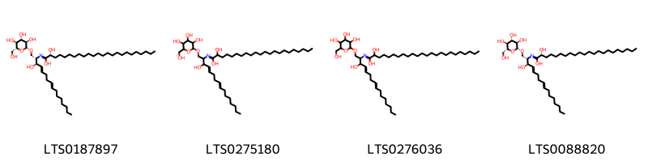
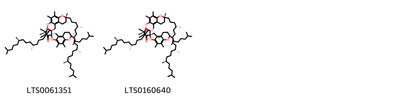

!!! abstract "Tóm tắt"

    Khiếm Thực (Semen Euryales) là hạt của quả chín đã phơi hay sấy khô của cây Khiếm thực (Einyales ferox Salisb.), thuộc họ Súng (Nymphaeaceae). Loài cây này phân bố chủ yếu ở Châu Á, các khu vực nhiệt đới, cận nhiệt đới trên thế giới và chưa được trồng tại Việt Nam. Theo y học cổ truyền, khiếm thực thường được sử dụng để điều trị các bệnh như đau nhức dây thần kinh, tê thấp, đau lưng, đau đầu gối. Thành phần hóa học phong phú của khiếm thực bao gồm các hợp chất như saponin steroid, alcaloid, flavonoid, tanin, cùng với chất béo (lipids), tinh dầu (essential oils), vitamin, khoáng chất, và acid amin (amino acids) với chất tiềm năng là isoflavonoids.

## Thông tin về thực vật

Dược liệu **Khiếm Thực (Hạt)** từ bộ phận **nan** từ loài *Euryale ferox*.

**Mô tả thực vật:** Khiếm thực chính thức là một loại cây mọc ở đầm ao, sống hàng năm, lá hình tròn rộng, nổi trên mặt nước, mặt trên màu xanh, mặt dưới màu tím. Mùa hạ, cành mang hoa trồi lên trên mặt nước, đầu cành có một hoa sáng nở chiều héo. Quả hình cầu chất xốp màu tím hồng bẩn, mặt ngoài có gai, đỉnh còn đài sót lại, hạt chắc, hình cầu, màu đen.

Hạt hình cầu, thường bị vỡ; hạt nguyên có đường kính 5 mm đến 10 mm, mặt ngoài có vỏ lụa, một đầu màu nâu đỏ hoặc đỏ nâu, đầu còn lại màu trắng vàng chiếm khoảng 1/3 hạt và có vết lõm là rốn hạt dạng điểm. Khi bỏ vỏ lụa hạt sẽ có màu trắng. Chất tương đối cứng. Mặt gãy màu trắng, chất bột. Không mùi, vị nhạt.

*Tài liệu tham khảo:* "Những cây thuốc và vị thuốc Việt Nam" - Đỗ Tất Lợi 
Trong dược điển Việt nam, một loài được sử dụng làm dược liệu là *Euryale ferox*.

!!! info "Phân loại thực vật của *Euryale ferox*"
    - **Kingdom:** Plantae
    - **Phylum:** Tracheophyta
    - **Order:** Nymphaeales
    - **Family:** Nymphaeaceae
    - **Genus:** Euryale
    - **Species:** *Euryale ferox*

**Phân bố trên thế giới:** nan, United States of America, Russian Federation, China, Chinese Taipei, Hong Kong, Norway, Japan, India, Korea, Republic of, Australia

**Phân bố tại Việt nam:** Không có ghi nhận ở Việt Nam

## Thông tin về dược liệu 

### Định danh

!!! info "Thông tin về tên gọi"

    - Dược liệu tiếng Việt: nan
    - Dược liệu tiếng Trung: nan (nan)
    - Dược liệu tiếng Anh: nan
    - Dược liệu latin thông dụng: nan
    - Dược liệu latin kiểu DĐVN: *euryale ferox salisb*
    - Dược liệu latin kiểu DĐVN: *nan*
    - Dược liệu latin kiểu thông tư: *nan*
    - Bộ phận dùng: nan (nan)

### Mô tả dược liệu 

- **Theo dược điển Việt nam V:** nan

- **Mô tả dược liệu theo thông tư chế biến dược liệu theo phương pháp cổ truyền:** nan

### Chế biến 

- **Chế biến theo dược điển việt nam V**: nan

- **Chế biến theo thông tư:** nan

--- 

## Thành phần hóa học

- Theo tài liệu của GS. Đỗ Tất Lợi:  1) Thành phần hóa học: Saponin steroid, Alcaloid, Flavonoid, Tanin, Chất béo (Lipids), Tinh dầu (Essential oils), Vitamin và khoáng chất, Acid amin (Amino acids)
2) Tên hoạt chất là biomaker : Isoflavonoids
    

**Thành phần hóa học từ loài **Euryale ferox**

Theo cơ sở dữ liệu lotus, loài *Euryale ferox* đã phân lập và xác định được **6** hoạt chất thuộc về các nhóm Fatty Acyls, Prenol lipids trong bảng dưới đây. Danh sách các hoạt chất như sau (1s,7r,11'r,14r,18r,21r)-7,7',8',10,11,11',15,16,21-nonamethyl-7,11',21-tris[(4r,8r)-4,8,12-trimethyltridecyl]-5',8,10',13,22-pentaoxaspiro[pentacyclo[12.4.4.0¹,¹⁴.0³,¹².0⁴,⁹]docosane-18,4'-tricyclo[7.4.0.0²,⁶]tridecane]-1',3,6',8',9,11,15-heptaen-17-one [(LTS0061351)](https://lotus.naturalproducts.net/compound/lotus_id/LTS0061351), (2r)-2-hydroxy-n-[(2s,3r,4e,8e)-3-hydroxy-1-{[(2r,3r,4s,5s,6r)-3,4,5-trihydroxy-6-(hydroxymethyl)oxan-2-yl]oxy}hexadeca-4,8-dien-2-yl]docosanimidic acid [(LTS0088820)](https://lotus.naturalproducts.net/compound/lotus_id/LTS0088820), 2-hydroxy-n-(3-hydroxy-1-{[3,4,5-trihydroxy-6-(hydroxymethyl)oxan-2-yl]oxy}hexadeca-4,8-dien-2-yl)tetracosanimidic acid [(LTS0276036)](https://lotus.naturalproducts.net/compound/lotus_id/LTS0276036), (1r,7r,11'r,14s,18s,21r)-7,7',8',10,11,11',15,16,21-nonamethyl-7,11',21-tris[(4r,8r)-4,8,12-trimethyltridecyl]-5',8,10',13,22-pentaoxaspiro[pentacyclo[12.4.4.0¹,¹⁴.0³,¹².0⁴,⁹]docosane-18,4'-tricyclo[7.4.0.0²,⁶]tridecane]-1',3,6',8',9,11,15-heptaen-17-one [(LTS0160640)](https://lotus.naturalproducts.net/compound/lotus_id/LTS0160640), 2-hydroxy-n-(3-hydroxy-1-{[3,4,5-trihydroxy-6-(hydroxymethyl)oxan-2-yl]oxy}hexadeca-4,8-dien-2-yl)docosanimidic acid [(LTS0275180)](https://lotus.naturalproducts.net/compound/lotus_id/LTS0275180), (2r)-2-hydroxy-n-[(2s,3r,4e,8e)-3-hydroxy-1-{[(2r,3r,4s,5s,6r)-3,4,5-trihydroxy-6-(hydroxymethyl)oxan-2-yl]oxy}hexadeca-4,8-dien-2-yl]tetracosanimidic acid [(LTS0187897)](https://lotus.naturalproducts.net/compound/lotus_id/LTS0187897). 
        
| chemicalTaxonomyClassyfireClass   |   smiles_count |
|:----------------------------------|---------------:|
| Fatty Acyls                       |            374 |
| Prenol lipids                     |            407 |

            
### Nhóm Fatty Acyls
<figure markdown="span">
    { width=100% }
<figcaption>Hình ảnh cấu trúc hóa học của hoạt chất thuộc nhóm *Fatty Acyls*. Tên thường gọi của các hoạt chất tương ứng là (2r)-2-hydroxy-n-[(2s,3r,4e,8e)-3-hydroxy-1-{[(2r,3r,4s,5s,6r)-3,4,5-trihydroxy-6-(hydroxymethyl)oxan-2-yl]oxy}hexadeca-4,8-dien-2-yl]tetracosanimidic acid [(LTS0187897)](https://lotus.naturalproducts.net/compound/lotus_id/LTS0187897), 2-hydroxy-n-(3-hydroxy-1-{[3,4,5-trihydroxy-6-(hydroxymethyl)oxan-2-yl]oxy}hexadeca-4,8-dien-2-yl)docosanimidic acid [(LTS0275180)](https://lotus.naturalproducts.net/compound/lotus_id/LTS0275180), 2-hydroxy-n-(3-hydroxy-1-{[3,4,5-trihydroxy-6-(hydroxymethyl)oxan-2-yl]oxy}hexadeca-4,8-dien-2-yl)tetracosanimidic acid [(LTS0276036)](https://lotus.naturalproducts.net/compound/lotus_id/LTS0276036), (2r)-2-hydroxy-n-[(2s,3r,4e,8e)-3-hydroxy-1-{[(2r,3r,4s,5s,6r)-3,4,5-trihydroxy-6-(hydroxymethyl)oxan-2-yl]oxy}hexadeca-4,8-dien-2-yl]docosanimidic acid [(LTS0088820)](https://lotus.naturalproducts.net/compound/lotus_id/LTS0088820).</figcaption>
</figure>

            
            
### Nhóm Fatty Acyls
<figure markdown="span">
    { width=100% }
<figcaption>Hình ảnh cấu trúc hóa học của hoạt chất thuộc nhóm *Fatty Acyls*. Tên thường gọi của các hoạt chất tương ứng là (2r)-2-hydroxy-n-[(2s,3r,4e,8e)-3-hydroxy-1-{[(2r,3r,4s,5s,6r)-3,4,5-trihydroxy-6-(hydroxymethyl)oxan-2-yl]oxy}hexadeca-4,8-dien-2-yl]tetracosanimidic acid [(LTS0187897)](https://lotus.naturalproducts.net/compound/lotus_id/LTS0187897), 2-hydroxy-n-(3-hydroxy-1-{[3,4,5-trihydroxy-6-(hydroxymethyl)oxan-2-yl]oxy}hexadeca-4,8-dien-2-yl)docosanimidic acid [(LTS0275180)](https://lotus.naturalproducts.net/compound/lotus_id/LTS0275180), 2-hydroxy-n-(3-hydroxy-1-{[3,4,5-trihydroxy-6-(hydroxymethyl)oxan-2-yl]oxy}hexadeca-4,8-dien-2-yl)tetracosanimidic acid [(LTS0276036)](https://lotus.naturalproducts.net/compound/lotus_id/LTS0276036), (2r)-2-hydroxy-n-[(2s,3r,4e,8e)-3-hydroxy-1-{[(2r,3r,4s,5s,6r)-3,4,5-trihydroxy-6-(hydroxymethyl)oxan-2-yl]oxy}hexadeca-4,8-dien-2-yl]docosanimidic acid [(LTS0088820)](https://lotus.naturalproducts.net/compound/lotus_id/LTS0088820).</figcaption>
</figure>

### Nhóm Prenol lipids
<figure markdown="span">
    { width=100% }
<figcaption>Hình ảnh cấu trúc hóa học của hoạt chất thuộc nhóm *Prenol lipids*. Tên thường gọi của các hoạt chất tương ứng là (1s,7r,11'r,14r,18r,21r)-7,7',8',10,11,11',15,16,21-nonamethyl-7,11',21-tris[(4r,8r)-4,8,12-trimethyltridecyl]-5',8,10',13,22-pentaoxaspiro[pentacyclo[12.4.4.0¹,¹⁴.0³,¹².0⁴,⁹]docosane-18,4'-tricyclo[7.4.0.0²,⁶]tridecane]-1',3,6',8',9,11,15-heptaen-17-one [(LTS0061351)](https://lotus.naturalproducts.net/compound/lotus_id/LTS0061351), (1r,7r,11'r,14s,18s,21r)-7,7',8',10,11,11',15,16,21-nonamethyl-7,11',21-tris[(4r,8r)-4,8,12-trimethyltridecyl]-5',8,10',13,22-pentaoxaspiro[pentacyclo[12.4.4.0¹,¹⁴.0³,¹².0⁴,⁹]docosane-18,4'-tricyclo[7.4.0.0²,⁶]tridecane]-1',3,6',8',9,11,15-heptaen-17-one [(LTS0160640)](https://lotus.naturalproducts.net/compound/lotus_id/LTS0160640).</figcaption>
</figure>

            

---

## Tác dụng dược lý

Theo tài liệu "Những cây thuốc và vị thuốc Việt Nam" - Đỗ Tất Lợi:- Tác dụng chống oxi hóa
- Tác dụng tăng cường sinh lý
- Hỗ trợ sức khỏe tim mạch
- Giảm căng thẳng lo âu

Theo tài liệu quốc tế: nan

---

## Dược điển Việt Nam V

### Soi bột:

nan

<!-- Hình ảnh soi bột sẽ được tự động chèn vào đây sau -->

### Vi phẫu:

nan

<!-- Hình ảnh vi phẫu sẽ được tự động chèn vào đây sau -->

### Định tính

nan

### Định lượng

nan

### Thông tin khác 

- ** Độ ẩm: ** nan
- ** Bảo quản:** nan

## Dược điển Hồng kong

<!-- PDF sẽ được tự động chèn vào đây sau -->

---

## Y dược học cổ truyền

- **Tên vị thuốc:** nan
- **Tính vị quy kinh:** Vị ngọt, hơi chát, tính bình. Vào các kinh tỳ, thận
- **Công năng chủ trị:** Ích thận cố tinh, kiện tỳ chi tả, khứ thấp chỉ đới. Chủ trị: Mộng tinh, di tinh, hoạt tinh, đái són, đái rắt. Tiêu chảy lâu ngày, bạch trọc, đới hạ
- **Chú ý:** nan
- **Kiêng kỵ:** nan

## Bình luận

