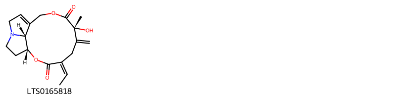
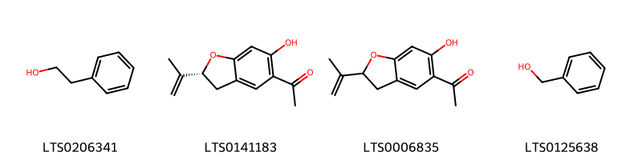

!!! abstract "Tóm tắt"

    Khoản Đông Hoa (Flos Tussilaginis farfarae) là cụm hoa chưa nở đã phơi hay sấy khô của cây Khoản đông (Tussilago farfara L.), thuộc họ Cúc (Asteraceae). Loài cây này phân bố tại Trung Quốc, nhiều nước châu Âu và chỉ mới thấy có một số người trồng từ giống nhập của nước ngoài ở Việt Nam. Theo y học cổ truyền, hoa và lá khoản đông được sử dụng như một vị thuốc lâu đời, có vị cay, ngọt, tính ôn, không độc, với tác dụng ôn phế, hạ khí, hóa đờm, chỉ ho. Thành phần hóa học bao gồm alkaloid và terpenoid, các este, alcohol, và hydrocarbon với chất tiềm năng là Tussilagine.

## Thông tin về thực vật

Dược liệu **Khoản Đông Hoa (Cụm Hoa Chưa Nở Đã Phơi Sấy Khô)** từ bộ phận **nan** từ loài *Tussilago farfara*.

**Mô tả thực vật:** Cụm hoa là một đầu hình chùy dài, thường là 2 đến 3 cụm hoa cùng mọc trên 1 cành hoặc mọc đơn độc, dài 2 cm đến 2,5 cm, phần trên rộng hơn và phần dưới thon dần. Đỉnh cuống cụm hoa có nhiều lá bắc dạng vẩy. Mặt ngoài của lá bắc đỏ tía hoặc đỏ nhạt, mặt trong được phủ kín bởi những đám lông trắng như bông. Mùi thơm, vị hơi đắng và cay.

*Tài liệu tham khảo:* "Những cây thuốc và vị thuốc Việt Nam" - Đỗ Tất Lợi 
Trong dược điển Việt nam, một loài được sử dụng làm dược liệu là *Tussilago farfara*.

!!! info "Phân loại thực vật của *Tussilago farfara*"
    - **Kingdom:** Plantae
    - **Phylum:** Tracheophyta
    - **Order:** Asterales
    - **Family:** Asteraceae
    - **Genus:** Tussilago
    - **Species:** *Tussilago farfara*

**Phân bố trên thế giới:** France, Germany, Switzerland, Czechia, Netherlands, Austria, Hungary, Spain, Poland, Russian Federation, Montenegro, United Kingdom of Great Britain and Northern Ireland, Türkiye, Serbia, United States of America, Moldova, Republic of, Croatia, Italy, Slovenia, Norway, Canada, Armenia, Denmark, Slovakia, Ireland

**Phân bố tại Việt nam:** Không có ghi nhận ở Việt Nam

## Thông tin về dược liệu 

### Định danh

!!! info "Thông tin về tên gọi"

    - Dược liệu tiếng Việt: nan
    - Dược liệu tiếng Trung: nan (nan)
    - Dược liệu tiếng Anh: nan
    - Dược liệu latin thông dụng: nan
    - Dược liệu latin kiểu DĐVN: *flos tussilaginis l.*
    - Dược liệu latin kiểu DĐVN: *nan*
    - Dược liệu latin kiểu thông tư: *nan*
    - Bộ phận dùng: nan (nan)

### Mô tả dược liệu 

- **Theo dược điển Việt nam V:** nan

- **Mô tả dược liệu theo thông tư chế biến dược liệu theo phương pháp cổ truyền:** nan

### Chế biến 

- **Chế biến theo dược điển việt nam V**: nan

- **Chế biến theo thông tư:** nan

--- 

## Thành phần hóa học

- Theo tài liệu của GS. Đỗ Tất Lợi:  1) Nhóm hóa học: (+)-homoproline, (r)-β-bisabolene, Amyrin, Decene, Methyl linoleate, 2-phenyl-ethanol, Senkirkine, 1-nonen-3-ol, (-)-spathulenol, Isobauerenol, Β-amyrin, Seneciphylline, Senecionine, Methyl palmitate, Benzyl alcohol, 1-pentadecene, Carvacrol, Isotussilagine, Nonene,...
2) Tên hoạt chất là biomaker trong dược điển Việt Nam: Tussilagine
    

**Thành phần hóa học từ loài **Tussilago farfara**

Theo cơ sở dữ liệu lotus, loài *Tussilago farfara* đã phân lập và xác định được **102** hoạt chất thuộc về các nhóm Steroids and steroid derivatives, Organooxygen compounds, Fatty Acyls, Macrolides and analogues, Pyrrolidines, Benzene and substituted derivatives, Pyrrolizidines, Unsaturated hydrocarbons, Prenol lipids trong bảng dưới đây. Danh sách các hoạt chất như sau 3,4,5-trihydroxy-6-[(2,4,5,6,7-pentahydroxy-1-oxooctan-3-yl)oxy]oxane-2-carboxylic acid [(LTS0112792)](https://lotus.naturalproducts.net/compound/lotus_id/LTS0112792), campesterol [(LTS0046755)](https://lotus.naturalproducts.net/compound/lotus_id/LTS0046755), (4z)-4-ethylidene-5-isopropyl-8-methylidene-3-oxo-1,4a,7,8a-tetrahydro-2-benzopyran-7-yl (2e)-3-methylpent-2-enoate [(LTS0100040)](https://lotus.naturalproducts.net/compound/lotus_id/LTS0100040), (+)-homoproline [(LTS0207662)](https://lotus.naturalproducts.net/compound/lotus_id/LTS0207662), senecionine [(LTS0172395)](https://lotus.naturalproducts.net/compound/lotus_id/LTS0172395), 1-[6-hydroxy-2-(prop-1-en-2-yl)-2,3-dihydro-1-benzofuran-5-yl]ethanone [(LTS0006835)](https://lotus.naturalproducts.net/compound/lotus_id/LTS0006835), 1-nonen-3-ol [(LTS0206065)](https://lotus.naturalproducts.net/compound/lotus_id/LTS0206065), 2-phenyl-ethanol [(LTS0206341)](https://lotus.naturalproducts.net/compound/lotus_id/LTS0206341), 6-[(1,3,4,5,6,7-hexahydroxy-8-oxooctan-2-yl)oxy]-3,4,5-trihydroxyoxane-2-carboxylic acid [(LTS0182617)](https://lotus.naturalproducts.net/compound/lotus_id/LTS0182617), senkirkine [(LTS0193348)](https://lotus.naturalproducts.net/compound/lotus_id/LTS0193348), (4e)-4-ethylidene-7-hydroxy-6,7-dimethyl-2,9-dioxa-14-azatricyclo[9.5.1.0¹⁴,¹⁷]heptadec-11-ene-3,8-dione [(LTS0004881)](https://lotus.naturalproducts.net/compound/lotus_id/LTS0004881), 2-methyl-5-(6-methylhepta-1,5-dien-2-yl)cyclohex-2-en-1-one [(LTS0152527)](https://lotus.naturalproducts.net/compound/lotus_id/LTS0152527), methyl palmitate [(LTS0139222)](https://lotus.naturalproducts.net/compound/lotus_id/LTS0139222), (6ar,6br,8ar,14br)-4,4,6a,6b,8a,12,14b-heptamethyl-11-methylidene-hexadecahydropicen-3-ol [(LTS0274865)](https://lotus.naturalproducts.net/compound/lotus_id/LTS0274865), benzyl alcohol [(LTS0125638)](https://lotus.naturalproducts.net/compound/lotus_id/LTS0125638), 1-(1-hydroxyethyl)-7-isopropyl-3-[(2-methylbutanoyl)oxy]-4-methylidene-2-oxo-hexahydro-1h-inden-5-yl 3-methylpent-2-enoate [(LTS0168911)](https://lotus.naturalproducts.net/compound/lotus_id/LTS0168911), (1r,3ar,5r,7s,7as)-1-[1-(acetyloxy)ethyl]-7-isopropyl-4-methylidene-2-oxo-hexahydro-1h-inden-5-yl (2e)-3-methylpent-2-enoate [(LTS0135176)](https://lotus.naturalproducts.net/compound/lotus_id/LTS0135176), undec-1-en-3-ol [(LTS0088606)](https://lotus.naturalproducts.net/compound/lotus_id/LTS0088606), (2s,3r,4s,5r,6s)-6-{[(2s,3r,4r,5r,6s)-2-carboxy-4,5,6-trihydroxyoxan-3-yl]oxy}-3,4,5-trihydroxyoxane-2-carboxylic acid [(LTS0061720)](https://lotus.naturalproducts.net/compound/lotus_id/LTS0061720), (r)-β-bisabolene [(LTS0077209)](https://lotus.naturalproducts.net/compound/lotus_id/LTS0077209), (2s,3r,4s,5r,6s)-3,4,5-trihydroxy-6-{[(2s,3s,4s,5s,6r,7r)-2,4,5,6,7-pentahydroxy-1-oxooctan-3-yl]oxy}oxane-2-carboxylic acid [(LTS0032350)](https://lotus.naturalproducts.net/compound/lotus_id/LTS0032350), (1r,4s,4as,5s,7r,8ar)-4-[(1r)-1-(acetyloxy)ethyl]-5-isopropyl-1-{[(2r)-2-methylbutanoyl]oxy}-8-methylidene-3-oxo-hexahydro-1h-2-benzopyran-7-yl (2e)-3-methylpent-2-enoate [(LTS0178943)](https://lotus.naturalproducts.net/compound/lotus_id/LTS0178943), 3,4,5-trihydroxy-6-[(4,5,6-trihydroxy-2-methyloxan-3-yl)oxy]oxane-2-carboxylic acid [(LTS0111492)](https://lotus.naturalproducts.net/compound/lotus_id/LTS0111492), (1s,3ar,5r,7s,7as)-1-[(1r)-1-(acetyloxy)ethyl]-7-isopropyl-4-methylidene-2-oxo-hexahydro-1h-inden-5-yl (2z)-2-methylbut-2-enoate [(LTS0213326)](https://lotus.naturalproducts.net/compound/lotus_id/LTS0213326), 6-hydroxytremetone [(LTS0141183)](https://lotus.naturalproducts.net/compound/lotus_id/LTS0141183), tussilagine [(LTS0216274)](https://lotus.naturalproducts.net/compound/lotus_id/LTS0216274), 1-ethylidene-7-isopropyl-4-methylidene-2-oxo-hexahydroinden-5-yl 2-methylbut-2-enoate [(LTS0190153)](https://lotus.naturalproducts.net/compound/lotus_id/LTS0190153), (1z,3ar,5r,7s,7as)-1-ethylidene-7-isopropyl-4-methylidene-2-oxo-hexahydroinden-5-yl 3-methylbut-2-enoate [(LTS0176604)](https://lotus.naturalproducts.net/compound/lotus_id/LTS0176604), (1r,4s,4as,5s,7r,8ar)-4-[(1r)-1-(acetyloxy)ethyl]-5-isopropyl-1-[(2-methylbutanoyl)oxy]-8-methylidene-3-oxo-hexahydro-1h-2-benzopyran-7-yl (2e)-3-methylpent-2-enoate [(LTS0209107)](https://lotus.naturalproducts.net/compound/lotus_id/LTS0209107), (1r,2r,7as)-2-hydroxy-2-methyl-hexahydropyrrolizine-1-carboxylic acid [(LTS0209287)](https://lotus.naturalproducts.net/compound/lotus_id/LTS0209287), (1s,4z,7s,17s)-4-ethylidene-7-hydroxy-6,7-dimethyl-2,9-dioxa-14-azatricyclo[9.5.1.0¹⁴,¹⁷]heptadec-11-ene-3,8-dione [(LTS0050415)](https://lotus.naturalproducts.net/compound/lotus_id/LTS0050415), (2s,3r,4s,5r,6s)-6-{[(2s,3s,4s,5s,6s,7r)-1,3,4,5,6,7-hexahydroxy-8-oxooctan-2-yl]oxy}-3,4,5-trihydroxyoxane-2-carboxylic acid [(LTS0235394)](https://lotus.naturalproducts.net/compound/lotus_id/LTS0235394), (1s,3s,3ar,5r,7s,7as)-1-[(1r)-1-hydroxyethyl]-7-isopropyl-3-{[(2r)-2-methylbutanoyl]oxy}-4-methylidene-2-oxo-hexahydro-1h-inden-5-yl (2e)-3-methylpent-2-enoate [(LTS0161989)](https://lotus.naturalproducts.net/compound/lotus_id/LTS0161989), 6-[(2-carboxy-4,5,6-trihydroxyoxan-3-yl)oxy]-3,4,5-trihydroxyoxane-2-carboxylic acid [(LTS0242238)](https://lotus.naturalproducts.net/compound/lotus_id/LTS0242238), (1s,2r,7as)-2-hydroxy-2-methyl-hexahydropyrrolizine-1-carboxylic acid [(LTS0088823)](https://lotus.naturalproducts.net/compound/lotus_id/LTS0088823), carvacrol [(LTS0012882)](https://lotus.naturalproducts.net/compound/lotus_id/LTS0012882), 3-ethylidene-4-isopropyl-7-methylidene-6-[(3-methylpent-2-enoyl)oxy]-2-oxo-hexahydroinden-1-yl 3-methylpent-2-enoate [(LTS0260080)](https://lotus.naturalproducts.net/compound/lotus_id/LTS0260080), isotussilagine [(LTS0013915)](https://lotus.naturalproducts.net/compound/lotus_id/LTS0013915), methyl 2-hydroxy-2-methyl-hexahydropyrrolizine-1-carboxylate [(LTS0047218)](https://lotus.naturalproducts.net/compound/lotus_id/LTS0047218), (1r,3ar,5r,7s,7as)-1-[(1r)-1-(acetyloxy)ethyl]-7-isopropyl-4-methylidene-2-oxo-hexahydro-1h-inden-5-yl (2e)-3-methylpent-2-enoate [(LTS0048755)](https://lotus.naturalproducts.net/compound/lotus_id/LTS0048755), 1-ethylidene-7-isopropyl-4-methylidene-2-oxo-hexahydroinden-5-yl 3-methylbut-2-enoate [(LTS0125073)](https://lotus.naturalproducts.net/compound/lotus_id/LTS0125073), 2-[(1s,2r,4s,6s)-2,4-bis(acetyloxy)-6-methyl-5-oxo-7-oxabicyclo[4.1.0]heptan-3-yl]-6-methylhepta-1,5-dien-3-yl (2z)-2-methylbut-2-enoate [(LTS0017182)](https://lotus.naturalproducts.net/compound/lotus_id/LTS0017182), (4ar,6ar,6br,8as,12ar,12br,14ar,14br)-4,4,6a,6b,8a,11,12,14b-octamethyl-2,3,4a,5,6,7,8,9,12,12a,12b,13,14,14a-tetradecahydro-1h-picen-3-ol [(LTS0269929)](https://lotus.naturalproducts.net/compound/lotus_id/LTS0269929), (1r,2s,7as)-2-hydroxy-2-methyl-hexahydropyrrolizine-1-carboxylic acid [(LTS0018628)](https://lotus.naturalproducts.net/compound/lotus_id/LTS0018628), 1-undecene [(LTS0104325)](https://lotus.naturalproducts.net/compound/lotus_id/LTS0104325), 1-ethylidene-7-isopropyl-3-[(2-methylbut-2-enoyl)oxy]-4-methylidene-2-oxo-hexahydroinden-5-yl 3-methylpent-2-enoate [(LTS0046252)](https://lotus.naturalproducts.net/compound/lotus_id/LTS0046252), (2s,3r,4s,5r,6s)-3,4,5-trihydroxy-6-{[(2s,3r,4s,5r,6s)-1,2,3,5,6-pentahydroxy-7-oxoheptan-4-yl]oxy}oxane-2-carboxylic acid [(LTS0121748)](https://lotus.naturalproducts.net/compound/lotus_id/LTS0121748), amyrin [(LTS0222826)](https://lotus.naturalproducts.net/compound/lotus_id/LTS0222826), (1r,4e,6s,7r,11z)-4-ethylidene-7-hydroxy-6,7,14-trimethyl-2,9-dioxa-14-azabicyclo[9.5.1]heptadec-11-ene-3,8,17-trione [(LTS0013301)](https://lotus.naturalproducts.net/compound/lotus_id/LTS0013301), (1s,2s,7as)-2-hydroxy-2-methyl-hexahydropyrrolizine-1-carboxylic acid [(LTS0206744)](https://lotus.naturalproducts.net/compound/lotus_id/LTS0206744), 1-[1-(acetyloxy)ethyl]-7-isopropyl-4-methylidene-2-oxo-hexahydro-1h-inden-5-yl 3-methylbut-2-enoate [(LTS0122017)](https://lotus.naturalproducts.net/compound/lotus_id/LTS0122017), angelic acid [(LTS0220842)](https://lotus.naturalproducts.net/compound/lotus_id/LTS0220842), (-)-spathulenol [(LTS0273095)](https://lotus.naturalproducts.net/compound/lotus_id/LTS0273095), 2-hydroxy-2-methyl-hexahydropyrrolizine-1-carboxylic acid [(LTS0075470)](https://lotus.naturalproducts.net/compound/lotus_id/LTS0075470), 2-methylbutanoic acid [(LTS0213858)](https://lotus.naturalproducts.net/compound/lotus_id/LTS0213858), 1-ethylidene-7-isopropyl-3-[(2-methylbutanoyl)oxy]-4-methylidene-2-oxo-hexahydroinden-5-yl 3-methylpent-2-enoate [(LTS0184327)](https://lotus.naturalproducts.net/compound/lotus_id/LTS0184327), methyl linoleate [(LTS0116588)](https://lotus.naturalproducts.net/compound/lotus_id/LTS0116588), 1-(1-hydroxyethyl)-7-isopropyl-4-methylidene-2-oxo-hexahydro-1h-inden-5-yl 3-methylbutanoate [(LTS0263832)](https://lotus.naturalproducts.net/compound/lotus_id/LTS0263832), (1z,3s,3ar,5r,7s,7as)-1-ethylidene-7-isopropyl-3-{[(2r)-2-methylbutanoyl]oxy}-4-methylidene-2-oxo-hexahydroinden-5-yl (2e)-3-methylpent-2-enoate [(LTS0248496)](https://lotus.naturalproducts.net/compound/lotus_id/LTS0248496), stigmast-5-en-3-ol, (3β)- [(LTS0204616)](https://lotus.naturalproducts.net/compound/lotus_id/LTS0204616), (1z,3ar,5r,7s,7as)-1-ethylidene-7-isopropyl-4-methylidene-2-oxo-hexahydroinden-5-yl (2z)-2-methylbut-2-enoate [(LTS0020028)](https://lotus.naturalproducts.net/compound/lotus_id/LTS0020028), taraxasterol [(LTS0006950)](https://lotus.naturalproducts.net/compound/lotus_id/LTS0006950), decene [(LTS0069806)](https://lotus.naturalproducts.net/compound/lotus_id/LTS0069806), (5r)-2-methyl-5-(6-methylhepta-1,5-dien-2-yl)cyclohex-2-en-1-one [(LTS0133022)](https://lotus.naturalproducts.net/compound/lotus_id/LTS0133022), seneciphylline [(LTS0165818)](https://lotus.naturalproducts.net/compound/lotus_id/LTS0165818), (1z,3ar,5r,7s,7as)-1-ethylidene-7-isopropyl-4-methylidene-2-oxo-hexahydroinden-5-yl (2e)-3-methylpent-2-enoate [(LTS0015649)](https://lotus.naturalproducts.net/compound/lotus_id/LTS0015649), 1-(1-hydroxyethyl)-7-isopropyl-4-methylidene-2-oxo-hexahydro-1h-inden-5-yl 3-methylpent-2-enoate [(LTS0108686)](https://lotus.naturalproducts.net/compound/lotus_id/LTS0108686), isobauerenol [(LTS0172541)](https://lotus.naturalproducts.net/compound/lotus_id/LTS0172541), 1-pentadecene [(LTS0248601)](https://lotus.naturalproducts.net/compound/lotus_id/LTS0248601), methyl 2-(pyrrolidin-2-yl)acetate [(LTS0188189)](https://lotus.naturalproducts.net/compound/lotus_id/LTS0188189), nonene [(LTS0022235)](https://lotus.naturalproducts.net/compound/lotus_id/LTS0022235), 4-[1-(acetyloxy)ethyl]-5-isopropyl-1-[(2-methylbutanoyl)oxy]-8-methylidene-3-oxo-hexahydro-1h-2-benzopyran-7-yl 3-methylpent-2-enoate [(LTS0234638)](https://lotus.naturalproducts.net/compound/lotus_id/LTS0234638), stigmast-5-en-3-ol [(LTS0071224)](https://lotus.naturalproducts.net/compound/lotus_id/LTS0071224), (1e,3ar,5r,7s,7as)-1-ethylidene-7-isopropyl-4-methylidene-2-oxo-hexahydroinden-5-yl (2e)-3-methylpent-2-enoate [(LTS0198708)](https://lotus.naturalproducts.net/compound/lotus_id/LTS0198708), spathulenol [(LTS0235578)](https://lotus.naturalproducts.net/compound/lotus_id/LTS0235578), (1r,4z,6s,7r,11z)-4-ethylidene-7-hydroxy-6,7,14-trimethyl-2,9-dioxa-14-azabicyclo[9.5.1]heptadec-11-ene-3,8,17-trione [(LTS0065486)](https://lotus.naturalproducts.net/compound/lotus_id/LTS0065486), (-)-β-bisabolene [(LTS0009940)](https://lotus.naturalproducts.net/compound/lotus_id/LTS0009940), 1-[1-(acetyloxy)ethyl]-7-isopropyl-4-methylidene-2-oxo-hexahydro-1h-inden-5-yl (2e)-3-methylpent-2-enoate [(LTS0265469)](https://lotus.naturalproducts.net/compound/lotus_id/LTS0265469), (1s,3z,3as,4s,6r,7ar)-3-ethylidene-4-isopropyl-7-methylidene-6-{[(2e)-3-methylpent-2-enoyl]oxy}-2-oxo-hexahydroinden-1-yl (2e)-3-methylpent-2-enoate [(LTS0259816)](https://lotus.naturalproducts.net/compound/lotus_id/LTS0259816), (1e)-1-ethylidene-7-isopropyl-4-methylidene-2-oxo-hexahydroinden-5-yl 3-methylpent-2-enoate [(LTS0076677)](https://lotus.naturalproducts.net/compound/lotus_id/LTS0076677), phytosterol [(LTS0029311)](https://lotus.naturalproducts.net/compound/lotus_id/LTS0029311), (1s,3ar,5r,7s,7as)-1-[(1r)-1-(acetyloxy)ethyl]-7-isopropyl-4-methylidene-2-oxo-hexahydro-1h-inden-5-yl 3-methylbut-2-enoate [(LTS0083506)](https://lotus.naturalproducts.net/compound/lotus_id/LTS0083506), (3s)-2-[(1r,2s,3s,4r,6r)-4-(acetyloxy)-2-hydroxy-6-methyl-5-oxo-7-oxabicyclo[4.1.0]heptan-3-yl]-6-methylhepta-1,5-dien-3-yl (2z)-2-methylbut-2-enoate [(LTS0248752)](https://lotus.naturalproducts.net/compound/lotus_id/LTS0248752), 2-[2,4-bis(acetyloxy)-6-methyl-5-oxo-7-oxabicyclo[4.1.0]heptan-3-yl]-6-methylhepta-1,5-dien-3-yl 2-methylbut-2-enoate [(LTS0126079)](https://lotus.naturalproducts.net/compound/lotus_id/LTS0126079), β-amyrin [(LTS0251864)](https://lotus.naturalproducts.net/compound/lotus_id/LTS0251864), (1s,3ar,5r,7s,7as)-1-[(1r)-1-hydroxyethyl]-7-isopropyl-4-methylidene-2-oxo-hexahydro-1h-inden-5-yl (2e)-3-methylpent-2-enoate [(LTS0088064)](https://lotus.naturalproducts.net/compound/lotus_id/LTS0088064), (1r,3as,3bs,7s,9bs)-1-[(2r,5r)-5,6-dimethylheptan-2-yl]-9a,11a-dimethyl-1h,2h,3h,3ah,3bh,4h,6h,7h,8h,9h,9bh,10h,11h-cyclopenta[a]phenanthren-7-ol [(LTS0057877)](https://lotus.naturalproducts.net/compound/lotus_id/LTS0057877), 1-dodecene [(LTS0071043)](https://lotus.naturalproducts.net/compound/lotus_id/LTS0071043), (1r,4s,6r)-1-methyl-4-(6-methylhepta-1,5-dien-2-yl)-7-oxabicyclo[4.1.0]heptan-2-one [(LTS0213370)](https://lotus.naturalproducts.net/compound/lotus_id/LTS0213370), hexanoic acid [(LTS0031054)](https://lotus.naturalproducts.net/compound/lotus_id/LTS0031054), lupeol [(LTS0256952)](https://lotus.naturalproducts.net/compound/lotus_id/LTS0256952), (1z,3s,3ar,5r,7s,7as)-1-ethylidene-7-isopropyl-3-{[(2z)-2-methylbut-2-enoyl]oxy}-4-methylidene-2-oxo-hexahydroinden-5-yl (2e)-3-methylpent-2-enoate [(LTS0142720)](https://lotus.naturalproducts.net/compound/lotus_id/LTS0142720), (1s,3ar,5r,7s,7as)-1-[(1r)-1-hydroxyethyl]-7-isopropyl-4-methylidene-2-oxo-hexahydro-1h-inden-5-yl 3-methylbutanoate [(LTS0204821)](https://lotus.naturalproducts.net/compound/lotus_id/LTS0204821), (+/-)-homoproline [(LTS0245282)](https://lotus.naturalproducts.net/compound/lotus_id/LTS0245282), 3,4,5-trihydroxy-6-[(1,2,3,5,6-pentahydroxy-7-oxoheptan-4-yl)oxy]oxane-2-carboxylic acid [(LTS0113695)](https://lotus.naturalproducts.net/compound/lotus_id/LTS0113695), 1-[1-(acetyloxy)ethyl]-7-isopropyl-4-methylidene-2-oxo-hexahydro-1h-inden-5-yl 2-methylbut-2-enoate [(LTS0247643)](https://lotus.naturalproducts.net/compound/lotus_id/LTS0247643), (3s)-2-[(1s,2r,3r,4s,6s)-2,4-bis(acetyloxy)-6-methyl-5-oxo-7-oxabicyclo[4.1.0]heptan-3-yl]-6-methylhepta-1,5-dien-3-yl (2z)-2-methylbut-2-enoate [(LTS0203603)](https://lotus.naturalproducts.net/compound/lotus_id/LTS0203603), 1-methyl-4-(6-methylhepta-1,5-dien-2-yl)-7-oxabicyclo[4.1.0]heptan-2-one [(LTS0220663)](https://lotus.naturalproducts.net/compound/lotus_id/LTS0220663), (2s,3r,4s,5r,6s)-3,4,5-trihydroxy-6-{[(2r,3r,4r,5r,6s)-4,5,6-trihydroxy-2-methyloxan-3-yl]oxy}oxane-2-carboxylic acid [(LTS0088910)](https://lotus.naturalproducts.net/compound/lotus_id/LTS0088910), 2-[4-(acetyloxy)-2-hydroxy-6-methyl-5-oxo-7-oxabicyclo[4.1.0]heptan-3-yl]-6-methylhepta-1,5-dien-3-yl 2-methylbut-2-enoate [(LTS0093205)](https://lotus.naturalproducts.net/compound/lotus_id/LTS0093205), 1-tridecene [(LTS0122180)](https://lotus.naturalproducts.net/compound/lotus_id/LTS0122180), (3s,4ar,6bs,8ar,11r,12s,12ar,12bs,14ar,14br)-4,4,6b,8a,11,12,12b,14b-octamethyl-2,3,4a,5,7,8,9,10,11,12,12a,13,14,14a-tetradecahydro-1h-picen-3-ol [(LTS0066104)](https://lotus.naturalproducts.net/compound/lotus_id/LTS0066104). 
        
| chemicalTaxonomyClassyfireClass     |   smiles_count |
|:------------------------------------|---------------:|
|                                     |             59 |
| Benzene and substituted derivatives |             85 |
| Fatty Acyls                         |            556 |
| Macrolides and analogues            |            315 |
| Organooxygen compounds              |            356 |
| Prenol lipids                       |           3430 |
| Pyrrolidines                        |             48 |
| Pyrrolizidines                      |            252 |
| Steroids and steroid derivatives    |            348 |
| Unsaturated hydrocarbons            |             76 |

            
### Nhóm 
<figure markdown="span">
    { width=100% }
<figcaption>Hình ảnh cấu trúc hóa học của hoạt chất thuộc nhóm **. Tên thường gọi của các hoạt chất tương ứng là seneciphylline [(LTS0165818)](https://lotus.naturalproducts.net/compound/lotus_id/LTS0165818).</figcaption>
</figure>

            
            
### Nhóm 
<figure markdown="span">
    { width=100% }
<figcaption>Hình ảnh cấu trúc hóa học của hoạt chất thuộc nhóm **. Tên thường gọi của các hoạt chất tương ứng là seneciphylline [(LTS0165818)](https://lotus.naturalproducts.net/compound/lotus_id/LTS0165818).</figcaption>
</figure>

### Nhóm Benzene and substituted derivatives
<figure markdown="span">
    { width=100% }
<figcaption>Hình ảnh cấu trúc hóa học của hoạt chất thuộc nhóm *Benzene and substituted derivatives*. Tên thường gọi của các hoạt chất tương ứng là 2-phenyl-ethanol [(LTS0206341)](https://lotus.naturalproducts.net/compound/lotus_id/LTS0206341), 6-hydroxytremetone [(LTS0141183)](https://lotus.naturalproducts.net/compound/lotus_id/LTS0141183), 1-[6-hydroxy-2-(prop-1-en-2-yl)-2,3-dihydro-1-benzofuran-5-yl]ethanone [(LTS0006835)](https://lotus.naturalproducts.net/compound/lotus_id/LTS0006835), benzyl alcohol [(LTS0125638)](https://lotus.naturalproducts.net/compound/lotus_id/LTS0125638).</figcaption>
</figure>

            
            
### Nhóm 
<figure markdown="span">
    { width=100% }
<figcaption>Hình ảnh cấu trúc hóa học của hoạt chất thuộc nhóm **. Tên thường gọi của các hoạt chất tương ứng là seneciphylline [(LTS0165818)](https://lotus.naturalproducts.net/compound/lotus_id/LTS0165818).</figcaption>
</figure>

### Nhóm Benzene and substituted derivatives
<figure markdown="span">
    { width=100% }
<figcaption>Hình ảnh cấu trúc hóa học của hoạt chất thuộc nhóm *Benzene and substituted derivatives*. Tên thường gọi của các hoạt chất tương ứng là 2-phenyl-ethanol [(LTS0206341)](https://lotus.naturalproducts.net/compound/lotus_id/LTS0206341), 6-hydroxytremetone [(LTS0141183)](https://lotus.naturalproducts.net/compound/lotus_id/LTS0141183), 1-[6-hydroxy-2-(prop-1-en-2-yl)-2,3-dihydro-1-benzofuran-5-yl]ethanone [(LTS0006835)](https://lotus.naturalproducts.net/compound/lotus_id/LTS0006835), benzyl alcohol [(LTS0125638)](https://lotus.naturalproducts.net/compound/lotus_id/LTS0125638).</figcaption>
</figure>

### Nhóm Fatty Acyls
<figure markdown="span">
    { width=100% }
<figcaption>Hình ảnh cấu trúc hóa học của hoạt chất thuộc nhóm *Fatty Acyls*. Tên thường gọi của các hoạt chất tương ứng là 3,4,5-trihydroxy-6-[(1,2,3,5,6-pentahydroxy-7-oxoheptan-4-yl)oxy]oxane-2-carboxylic acid [(LTS0113695)](https://lotus.naturalproducts.net/compound/lotus_id/LTS0113695), methyl linoleate [(LTS0116588)](https://lotus.naturalproducts.net/compound/lotus_id/LTS0116588), (2s,3r,4s,5r,6s)-3,4,5-trihydroxy-6-{[(2s,3r,4s,5r,6s)-1,2,3,5,6-pentahydroxy-7-oxoheptan-4-yl]oxy}oxane-2-carboxylic acid [(LTS0121748)](https://lotus.naturalproducts.net/compound/lotus_id/LTS0121748), 1-nonen-3-ol [(LTS0206065)](https://lotus.naturalproducts.net/compound/lotus_id/LTS0206065), 3,4,5-trihydroxy-6-[(2,4,5,6,7-pentahydroxy-1-oxooctan-3-yl)oxy]oxane-2-carboxylic acid [(LTS0112792)](https://lotus.naturalproducts.net/compound/lotus_id/LTS0112792), methyl palmitate [(LTS0139222)](https://lotus.naturalproducts.net/compound/lotus_id/LTS0139222), undec-1-en-3-ol [(LTS0088606)](https://lotus.naturalproducts.net/compound/lotus_id/LTS0088606), 6-[(1,3,4,5,6,7-hexahydroxy-8-oxooctan-2-yl)oxy]-3,4,5-trihydroxyoxane-2-carboxylic acid [(LTS0182617)](https://lotus.naturalproducts.net/compound/lotus_id/LTS0182617), angelic acid [(LTS0220842)](https://lotus.naturalproducts.net/compound/lotus_id/LTS0220842), 2-methylbutanoic acid [(LTS0213858)](https://lotus.naturalproducts.net/compound/lotus_id/LTS0213858), (2s,3r,4s,5r,6s)-3,4,5-trihydroxy-6-{[(2s,3s,4s,5s,6r,7r)-2,4,5,6,7-pentahydroxy-1-oxooctan-3-yl]oxy}oxane-2-carboxylic acid [(LTS0032350)](https://lotus.naturalproducts.net/compound/lotus_id/LTS0032350), hexanoic acid [(LTS0031054)](https://lotus.naturalproducts.net/compound/lotus_id/LTS0031054), (2s,3r,4s,5r,6s)-6-{[(2s,3s,4s,5s,6s,7r)-1,3,4,5,6,7-hexahydroxy-8-oxooctan-2-yl]oxy}-3,4,5-trihydroxyoxane-2-carboxylic acid [(LTS0235394)](https://lotus.naturalproducts.net/compound/lotus_id/LTS0235394).</figcaption>
</figure>

            
            
### Nhóm 
<figure markdown="span">
    { width=100% }
<figcaption>Hình ảnh cấu trúc hóa học của hoạt chất thuộc nhóm **. Tên thường gọi của các hoạt chất tương ứng là seneciphylline [(LTS0165818)](https://lotus.naturalproducts.net/compound/lotus_id/LTS0165818).</figcaption>
</figure>

### Nhóm Benzene and substituted derivatives
<figure markdown="span">
    { width=100% }
<figcaption>Hình ảnh cấu trúc hóa học của hoạt chất thuộc nhóm *Benzene and substituted derivatives*. Tên thường gọi của các hoạt chất tương ứng là 2-phenyl-ethanol [(LTS0206341)](https://lotus.naturalproducts.net/compound/lotus_id/LTS0206341), 6-hydroxytremetone [(LTS0141183)](https://lotus.naturalproducts.net/compound/lotus_id/LTS0141183), 1-[6-hydroxy-2-(prop-1-en-2-yl)-2,3-dihydro-1-benzofuran-5-yl]ethanone [(LTS0006835)](https://lotus.naturalproducts.net/compound/lotus_id/LTS0006835), benzyl alcohol [(LTS0125638)](https://lotus.naturalproducts.net/compound/lotus_id/LTS0125638).</figcaption>
</figure>

### Nhóm Fatty Acyls
<figure markdown="span">
    { width=100% }
<figcaption>Hình ảnh cấu trúc hóa học của hoạt chất thuộc nhóm *Fatty Acyls*. Tên thường gọi của các hoạt chất tương ứng là 3,4,5-trihydroxy-6-[(1,2,3,5,6-pentahydroxy-7-oxoheptan-4-yl)oxy]oxane-2-carboxylic acid [(LTS0113695)](https://lotus.naturalproducts.net/compound/lotus_id/LTS0113695), methyl linoleate [(LTS0116588)](https://lotus.naturalproducts.net/compound/lotus_id/LTS0116588), (2s,3r,4s,5r,6s)-3,4,5-trihydroxy-6-{[(2s,3r,4s,5r,6s)-1,2,3,5,6-pentahydroxy-7-oxoheptan-4-yl]oxy}oxane-2-carboxylic acid [(LTS0121748)](https://lotus.naturalproducts.net/compound/lotus_id/LTS0121748), 1-nonen-3-ol [(LTS0206065)](https://lotus.naturalproducts.net/compound/lotus_id/LTS0206065), 3,4,5-trihydroxy-6-[(2,4,5,6,7-pentahydroxy-1-oxooctan-3-yl)oxy]oxane-2-carboxylic acid [(LTS0112792)](https://lotus.naturalproducts.net/compound/lotus_id/LTS0112792), methyl palmitate [(LTS0139222)](https://lotus.naturalproducts.net/compound/lotus_id/LTS0139222), undec-1-en-3-ol [(LTS0088606)](https://lotus.naturalproducts.net/compound/lotus_id/LTS0088606), 6-[(1,3,4,5,6,7-hexahydroxy-8-oxooctan-2-yl)oxy]-3,4,5-trihydroxyoxane-2-carboxylic acid [(LTS0182617)](https://lotus.naturalproducts.net/compound/lotus_id/LTS0182617), angelic acid [(LTS0220842)](https://lotus.naturalproducts.net/compound/lotus_id/LTS0220842), 2-methylbutanoic acid [(LTS0213858)](https://lotus.naturalproducts.net/compound/lotus_id/LTS0213858), (2s,3r,4s,5r,6s)-3,4,5-trihydroxy-6-{[(2s,3s,4s,5s,6r,7r)-2,4,5,6,7-pentahydroxy-1-oxooctan-3-yl]oxy}oxane-2-carboxylic acid [(LTS0032350)](https://lotus.naturalproducts.net/compound/lotus_id/LTS0032350), hexanoic acid [(LTS0031054)](https://lotus.naturalproducts.net/compound/lotus_id/LTS0031054), (2s,3r,4s,5r,6s)-6-{[(2s,3s,4s,5s,6s,7r)-1,3,4,5,6,7-hexahydroxy-8-oxooctan-2-yl]oxy}-3,4,5-trihydroxyoxane-2-carboxylic acid [(LTS0235394)](https://lotus.naturalproducts.net/compound/lotus_id/LTS0235394).</figcaption>
</figure>

### Nhóm Macrolides and analogues
<figure markdown="span">
    { width=100% }
<figcaption>Hình ảnh cấu trúc hóa học của hoạt chất thuộc nhóm *Macrolides and analogues*. Tên thường gọi của các hoạt chất tương ứng là senkirkine [(LTS0193348)](https://lotus.naturalproducts.net/compound/lotus_id/LTS0193348), senecionine [(LTS0172395)](https://lotus.naturalproducts.net/compound/lotus_id/LTS0172395), (1s,4z,7s,17s)-4-ethylidene-7-hydroxy-6,7-dimethyl-2,9-dioxa-14-azatricyclo[9.5.1.0¹⁴,¹⁷]heptadec-11-ene-3,8-dione [(LTS0050415)](https://lotus.naturalproducts.net/compound/lotus_id/LTS0050415), (1r,4z,6s,7r,11z)-4-ethylidene-7-hydroxy-6,7,14-trimethyl-2,9-dioxa-14-azabicyclo[9.5.1]heptadec-11-ene-3,8,17-trione [(LTS0065486)](https://lotus.naturalproducts.net/compound/lotus_id/LTS0065486), (1r,4e,6s,7r,11z)-4-ethylidene-7-hydroxy-6,7,14-trimethyl-2,9-dioxa-14-azabicyclo[9.5.1]heptadec-11-ene-3,8,17-trione [(LTS0013301)](https://lotus.naturalproducts.net/compound/lotus_id/LTS0013301).</figcaption>
</figure>

            
            
### Nhóm 
<figure markdown="span">
    { width=100% }
<figcaption>Hình ảnh cấu trúc hóa học của hoạt chất thuộc nhóm **. Tên thường gọi của các hoạt chất tương ứng là seneciphylline [(LTS0165818)](https://lotus.naturalproducts.net/compound/lotus_id/LTS0165818).</figcaption>
</figure>

### Nhóm Benzene and substituted derivatives
<figure markdown="span">
    { width=100% }
<figcaption>Hình ảnh cấu trúc hóa học của hoạt chất thuộc nhóm *Benzene and substituted derivatives*. Tên thường gọi của các hoạt chất tương ứng là 2-phenyl-ethanol [(LTS0206341)](https://lotus.naturalproducts.net/compound/lotus_id/LTS0206341), 6-hydroxytremetone [(LTS0141183)](https://lotus.naturalproducts.net/compound/lotus_id/LTS0141183), 1-[6-hydroxy-2-(prop-1-en-2-yl)-2,3-dihydro-1-benzofuran-5-yl]ethanone [(LTS0006835)](https://lotus.naturalproducts.net/compound/lotus_id/LTS0006835), benzyl alcohol [(LTS0125638)](https://lotus.naturalproducts.net/compound/lotus_id/LTS0125638).</figcaption>
</figure>

### Nhóm Fatty Acyls
<figure markdown="span">
    { width=100% }
<figcaption>Hình ảnh cấu trúc hóa học của hoạt chất thuộc nhóm *Fatty Acyls*. Tên thường gọi của các hoạt chất tương ứng là 3,4,5-trihydroxy-6-[(1,2,3,5,6-pentahydroxy-7-oxoheptan-4-yl)oxy]oxane-2-carboxylic acid [(LTS0113695)](https://lotus.naturalproducts.net/compound/lotus_id/LTS0113695), methyl linoleate [(LTS0116588)](https://lotus.naturalproducts.net/compound/lotus_id/LTS0116588), (2s,3r,4s,5r,6s)-3,4,5-trihydroxy-6-{[(2s,3r,4s,5r,6s)-1,2,3,5,6-pentahydroxy-7-oxoheptan-4-yl]oxy}oxane-2-carboxylic acid [(LTS0121748)](https://lotus.naturalproducts.net/compound/lotus_id/LTS0121748), 1-nonen-3-ol [(LTS0206065)](https://lotus.naturalproducts.net/compound/lotus_id/LTS0206065), 3,4,5-trihydroxy-6-[(2,4,5,6,7-pentahydroxy-1-oxooctan-3-yl)oxy]oxane-2-carboxylic acid [(LTS0112792)](https://lotus.naturalproducts.net/compound/lotus_id/LTS0112792), methyl palmitate [(LTS0139222)](https://lotus.naturalproducts.net/compound/lotus_id/LTS0139222), undec-1-en-3-ol [(LTS0088606)](https://lotus.naturalproducts.net/compound/lotus_id/LTS0088606), 6-[(1,3,4,5,6,7-hexahydroxy-8-oxooctan-2-yl)oxy]-3,4,5-trihydroxyoxane-2-carboxylic acid [(LTS0182617)](https://lotus.naturalproducts.net/compound/lotus_id/LTS0182617), angelic acid [(LTS0220842)](https://lotus.naturalproducts.net/compound/lotus_id/LTS0220842), 2-methylbutanoic acid [(LTS0213858)](https://lotus.naturalproducts.net/compound/lotus_id/LTS0213858), (2s,3r,4s,5r,6s)-3,4,5-trihydroxy-6-{[(2s,3s,4s,5s,6r,7r)-2,4,5,6,7-pentahydroxy-1-oxooctan-3-yl]oxy}oxane-2-carboxylic acid [(LTS0032350)](https://lotus.naturalproducts.net/compound/lotus_id/LTS0032350), hexanoic acid [(LTS0031054)](https://lotus.naturalproducts.net/compound/lotus_id/LTS0031054), (2s,3r,4s,5r,6s)-6-{[(2s,3s,4s,5s,6s,7r)-1,3,4,5,6,7-hexahydroxy-8-oxooctan-2-yl]oxy}-3,4,5-trihydroxyoxane-2-carboxylic acid [(LTS0235394)](https://lotus.naturalproducts.net/compound/lotus_id/LTS0235394).</figcaption>
</figure>

### Nhóm Macrolides and analogues
<figure markdown="span">
    { width=100% }
<figcaption>Hình ảnh cấu trúc hóa học của hoạt chất thuộc nhóm *Macrolides and analogues*. Tên thường gọi của các hoạt chất tương ứng là senkirkine [(LTS0193348)](https://lotus.naturalproducts.net/compound/lotus_id/LTS0193348), senecionine [(LTS0172395)](https://lotus.naturalproducts.net/compound/lotus_id/LTS0172395), (1s,4z,7s,17s)-4-ethylidene-7-hydroxy-6,7-dimethyl-2,9-dioxa-14-azatricyclo[9.5.1.0¹⁴,¹⁷]heptadec-11-ene-3,8-dione [(LTS0050415)](https://lotus.naturalproducts.net/compound/lotus_id/LTS0050415), (1r,4z,6s,7r,11z)-4-ethylidene-7-hydroxy-6,7,14-trimethyl-2,9-dioxa-14-azabicyclo[9.5.1]heptadec-11-ene-3,8,17-trione [(LTS0065486)](https://lotus.naturalproducts.net/compound/lotus_id/LTS0065486), (1r,4e,6s,7r,11z)-4-ethylidene-7-hydroxy-6,7,14-trimethyl-2,9-dioxa-14-azabicyclo[9.5.1]heptadec-11-ene-3,8,17-trione [(LTS0013301)](https://lotus.naturalproducts.net/compound/lotus_id/LTS0013301).</figcaption>
</figure>

### Nhóm Organooxygen compounds
<figure markdown="span">
    { width=100% }
<figcaption>Hình ảnh cấu trúc hóa học của hoạt chất thuộc nhóm *Organooxygen compounds*. Tên thường gọi của các hoạt chất tương ứng là (2s,3r,4s,5r,6s)-6-{[(2s,3r,4r,5r,6s)-2-carboxy-4,5,6-trihydroxyoxan-3-yl]oxy}-3,4,5-trihydroxyoxane-2-carboxylic acid [(LTS0061720)](https://lotus.naturalproducts.net/compound/lotus_id/LTS0061720), (2s,3r,4s,5r,6s)-3,4,5-trihydroxy-6-{[(2r,3r,4r,5r,6s)-4,5,6-trihydroxy-2-methyloxan-3-yl]oxy}oxane-2-carboxylic acid [(LTS0088910)](https://lotus.naturalproducts.net/compound/lotus_id/LTS0088910), 3,4,5-trihydroxy-6-[(4,5,6-trihydroxy-2-methyloxan-3-yl)oxy]oxane-2-carboxylic acid [(LTS0111492)](https://lotus.naturalproducts.net/compound/lotus_id/LTS0111492), isobauerenol [(LTS0172541)](https://lotus.naturalproducts.net/compound/lotus_id/LTS0172541), 6-[(2-carboxy-4,5,6-trihydroxyoxan-3-yl)oxy]-3,4,5-trihydroxyoxane-2-carboxylic acid [(LTS0242238)](https://lotus.naturalproducts.net/compound/lotus_id/LTS0242238).</figcaption>
</figure>

            
            
### Nhóm 
<figure markdown="span">
    { width=100% }
<figcaption>Hình ảnh cấu trúc hóa học của hoạt chất thuộc nhóm **. Tên thường gọi của các hoạt chất tương ứng là seneciphylline [(LTS0165818)](https://lotus.naturalproducts.net/compound/lotus_id/LTS0165818).</figcaption>
</figure>

### Nhóm Benzene and substituted derivatives
<figure markdown="span">
    { width=100% }
<figcaption>Hình ảnh cấu trúc hóa học của hoạt chất thuộc nhóm *Benzene and substituted derivatives*. Tên thường gọi của các hoạt chất tương ứng là 2-phenyl-ethanol [(LTS0206341)](https://lotus.naturalproducts.net/compound/lotus_id/LTS0206341), 6-hydroxytremetone [(LTS0141183)](https://lotus.naturalproducts.net/compound/lotus_id/LTS0141183), 1-[6-hydroxy-2-(prop-1-en-2-yl)-2,3-dihydro-1-benzofuran-5-yl]ethanone [(LTS0006835)](https://lotus.naturalproducts.net/compound/lotus_id/LTS0006835), benzyl alcohol [(LTS0125638)](https://lotus.naturalproducts.net/compound/lotus_id/LTS0125638).</figcaption>
</figure>

### Nhóm Fatty Acyls
<figure markdown="span">
    { width=100% }
<figcaption>Hình ảnh cấu trúc hóa học của hoạt chất thuộc nhóm *Fatty Acyls*. Tên thường gọi của các hoạt chất tương ứng là 3,4,5-trihydroxy-6-[(1,2,3,5,6-pentahydroxy-7-oxoheptan-4-yl)oxy]oxane-2-carboxylic acid [(LTS0113695)](https://lotus.naturalproducts.net/compound/lotus_id/LTS0113695), methyl linoleate [(LTS0116588)](https://lotus.naturalproducts.net/compound/lotus_id/LTS0116588), (2s,3r,4s,5r,6s)-3,4,5-trihydroxy-6-{[(2s,3r,4s,5r,6s)-1,2,3,5,6-pentahydroxy-7-oxoheptan-4-yl]oxy}oxane-2-carboxylic acid [(LTS0121748)](https://lotus.naturalproducts.net/compound/lotus_id/LTS0121748), 1-nonen-3-ol [(LTS0206065)](https://lotus.naturalproducts.net/compound/lotus_id/LTS0206065), 3,4,5-trihydroxy-6-[(2,4,5,6,7-pentahydroxy-1-oxooctan-3-yl)oxy]oxane-2-carboxylic acid [(LTS0112792)](https://lotus.naturalproducts.net/compound/lotus_id/LTS0112792), methyl palmitate [(LTS0139222)](https://lotus.naturalproducts.net/compound/lotus_id/LTS0139222), undec-1-en-3-ol [(LTS0088606)](https://lotus.naturalproducts.net/compound/lotus_id/LTS0088606), 6-[(1,3,4,5,6,7-hexahydroxy-8-oxooctan-2-yl)oxy]-3,4,5-trihydroxyoxane-2-carboxylic acid [(LTS0182617)](https://lotus.naturalproducts.net/compound/lotus_id/LTS0182617), angelic acid [(LTS0220842)](https://lotus.naturalproducts.net/compound/lotus_id/LTS0220842), 2-methylbutanoic acid [(LTS0213858)](https://lotus.naturalproducts.net/compound/lotus_id/LTS0213858), (2s,3r,4s,5r,6s)-3,4,5-trihydroxy-6-{[(2s,3s,4s,5s,6r,7r)-2,4,5,6,7-pentahydroxy-1-oxooctan-3-yl]oxy}oxane-2-carboxylic acid [(LTS0032350)](https://lotus.naturalproducts.net/compound/lotus_id/LTS0032350), hexanoic acid [(LTS0031054)](https://lotus.naturalproducts.net/compound/lotus_id/LTS0031054), (2s,3r,4s,5r,6s)-6-{[(2s,3s,4s,5s,6s,7r)-1,3,4,5,6,7-hexahydroxy-8-oxooctan-2-yl]oxy}-3,4,5-trihydroxyoxane-2-carboxylic acid [(LTS0235394)](https://lotus.naturalproducts.net/compound/lotus_id/LTS0235394).</figcaption>
</figure>

### Nhóm Macrolides and analogues
<figure markdown="span">
    { width=100% }
<figcaption>Hình ảnh cấu trúc hóa học của hoạt chất thuộc nhóm *Macrolides and analogues*. Tên thường gọi của các hoạt chất tương ứng là senkirkine [(LTS0193348)](https://lotus.naturalproducts.net/compound/lotus_id/LTS0193348), senecionine [(LTS0172395)](https://lotus.naturalproducts.net/compound/lotus_id/LTS0172395), (1s,4z,7s,17s)-4-ethylidene-7-hydroxy-6,7-dimethyl-2,9-dioxa-14-azatricyclo[9.5.1.0¹⁴,¹⁷]heptadec-11-ene-3,8-dione [(LTS0050415)](https://lotus.naturalproducts.net/compound/lotus_id/LTS0050415), (1r,4z,6s,7r,11z)-4-ethylidene-7-hydroxy-6,7,14-trimethyl-2,9-dioxa-14-azabicyclo[9.5.1]heptadec-11-ene-3,8,17-trione [(LTS0065486)](https://lotus.naturalproducts.net/compound/lotus_id/LTS0065486), (1r,4e,6s,7r,11z)-4-ethylidene-7-hydroxy-6,7,14-trimethyl-2,9-dioxa-14-azabicyclo[9.5.1]heptadec-11-ene-3,8,17-trione [(LTS0013301)](https://lotus.naturalproducts.net/compound/lotus_id/LTS0013301).</figcaption>
</figure>

### Nhóm Organooxygen compounds
<figure markdown="span">
    { width=100% }
<figcaption>Hình ảnh cấu trúc hóa học của hoạt chất thuộc nhóm *Organooxygen compounds*. Tên thường gọi của các hoạt chất tương ứng là (2s,3r,4s,5r,6s)-6-{[(2s,3r,4r,5r,6s)-2-carboxy-4,5,6-trihydroxyoxan-3-yl]oxy}-3,4,5-trihydroxyoxane-2-carboxylic acid [(LTS0061720)](https://lotus.naturalproducts.net/compound/lotus_id/LTS0061720), (2s,3r,4s,5r,6s)-3,4,5-trihydroxy-6-{[(2r,3r,4r,5r,6s)-4,5,6-trihydroxy-2-methyloxan-3-yl]oxy}oxane-2-carboxylic acid [(LTS0088910)](https://lotus.naturalproducts.net/compound/lotus_id/LTS0088910), 3,4,5-trihydroxy-6-[(4,5,6-trihydroxy-2-methyloxan-3-yl)oxy]oxane-2-carboxylic acid [(LTS0111492)](https://lotus.naturalproducts.net/compound/lotus_id/LTS0111492), isobauerenol [(LTS0172541)](https://lotus.naturalproducts.net/compound/lotus_id/LTS0172541), 6-[(2-carboxy-4,5,6-trihydroxyoxan-3-yl)oxy]-3,4,5-trihydroxyoxane-2-carboxylic acid [(LTS0242238)](https://lotus.naturalproducts.net/compound/lotus_id/LTS0242238).</figcaption>
</figure>

### Nhóm Prenol lipids
<figure markdown="span">
    { width=100% }
<figcaption>Hình ảnh cấu trúc hóa học của hoạt chất thuộc nhóm *Prenol lipids*. Tên thường gọi của các hoạt chất tương ứng là (5r)-2-methyl-5-(6-methylhepta-1,5-dien-2-yl)cyclohex-2-en-1-one [(LTS0133022)](https://lotus.naturalproducts.net/compound/lotus_id/LTS0133022), (1r,3ar,5r,7s,7as)-1-[1-(acetyloxy)ethyl]-7-isopropyl-4-methylidene-2-oxo-hexahydro-1h-inden-5-yl (2e)-3-methylpent-2-enoate [(LTS0135176)](https://lotus.naturalproducts.net/compound/lotus_id/LTS0135176), (r)-β-bisabolene [(LTS0077209)](https://lotus.naturalproducts.net/compound/lotus_id/LTS0077209), amyrin [(LTS0222826)](https://lotus.naturalproducts.net/compound/lotus_id/LTS0222826), (1s,3ar,5r,7s,7as)-1-[(1r)-1-(acetyloxy)ethyl]-7-isopropyl-4-methylidene-2-oxo-hexahydro-1h-inden-5-yl 3-methylbut-2-enoate [(LTS0083506)](https://lotus.naturalproducts.net/compound/lotus_id/LTS0083506), (1s,3ar,5r,7s,7as)-1-[(1r)-1-hydroxyethyl]-7-isopropyl-4-methylidene-2-oxo-hexahydro-1h-inden-5-yl (2e)-3-methylpent-2-enoate [(LTS0088064)](https://lotus.naturalproducts.net/compound/lotus_id/LTS0088064), (4z)-4-ethylidene-5-isopropyl-8-methylidene-3-oxo-1,4a,7,8a-tetrahydro-2-benzopyran-7-yl (2e)-3-methylpent-2-enoate [(LTS0100040)](https://lotus.naturalproducts.net/compound/lotus_id/LTS0100040), 2-[(1s,2r,4s,6s)-2,4-bis(acetyloxy)-6-methyl-5-oxo-7-oxabicyclo[4.1.0]heptan-3-yl]-6-methylhepta-1,5-dien-3-yl (2z)-2-methylbut-2-enoate [(LTS0017182)](https://lotus.naturalproducts.net/compound/lotus_id/LTS0017182), 2-[4-(acetyloxy)-2-hydroxy-6-methyl-5-oxo-7-oxabicyclo[4.1.0]heptan-3-yl]-6-methylhepta-1,5-dien-3-yl 2-methylbut-2-enoate [(LTS0093205)](https://lotus.naturalproducts.net/compound/lotus_id/LTS0093205), (1z,3ar,5r,7s,7as)-1-ethylidene-7-isopropyl-4-methylidene-2-oxo-hexahydroinden-5-yl 3-methylbut-2-enoate [(LTS0176604)](https://lotus.naturalproducts.net/compound/lotus_id/LTS0176604), 1-ethylidene-7-isopropyl-4-methylidene-2-oxo-hexahydroinden-5-yl 2-methylbut-2-enoate [(LTS0190153)](https://lotus.naturalproducts.net/compound/lotus_id/LTS0190153), (4ar,6ar,6br,8as,12ar,12br,14ar,14br)-4,4,6a,6b,8a,11,12,14b-octamethyl-2,3,4a,5,6,7,8,9,12,12a,12b,13,14,14a-tetradecahydro-1h-picen-3-ol [(LTS0269929)](https://lotus.naturalproducts.net/compound/lotus_id/LTS0269929), (-)-spathulenol [(LTS0273095)](https://lotus.naturalproducts.net/compound/lotus_id/LTS0273095), 1-ethylidene-7-isopropyl-4-methylidene-2-oxo-hexahydroinden-5-yl 3-methylbut-2-enoate [(LTS0125073)](https://lotus.naturalproducts.net/compound/lotus_id/LTS0125073), (1e,3ar,5r,7s,7as)-1-ethylidene-7-isopropyl-4-methylidene-2-oxo-hexahydroinden-5-yl (2e)-3-methylpent-2-enoate [(LTS0198708)](https://lotus.naturalproducts.net/compound/lotus_id/LTS0198708), 2-methyl-5-(6-methylhepta-1,5-dien-2-yl)cyclohex-2-en-1-one [(LTS0152527)](https://lotus.naturalproducts.net/compound/lotus_id/LTS0152527), 1-[1-(acetyloxy)ethyl]-7-isopropyl-4-methylidene-2-oxo-hexahydro-1h-inden-5-yl 3-methylbut-2-enoate [(LTS0122017)](https://lotus.naturalproducts.net/compound/lotus_id/LTS0122017), β-amyrin [(LTS0251864)](https://lotus.naturalproducts.net/compound/lotus_id/LTS0251864), 1-[1-(acetyloxy)ethyl]-7-isopropyl-4-methylidene-2-oxo-hexahydro-1h-inden-5-yl 2-methylbut-2-enoate [(LTS0247643)](https://lotus.naturalproducts.net/compound/lotus_id/LTS0247643), (1s,3s,3ar,5r,7s,7as)-1-[(1r)-1-hydroxyethyl]-7-isopropyl-3-{[(2r)-2-methylbutanoyl]oxy}-4-methylidene-2-oxo-hexahydro-1h-inden-5-yl (2e)-3-methylpent-2-enoate [(LTS0161989)](https://lotus.naturalproducts.net/compound/lotus_id/LTS0161989), (1z,3s,3ar,5r,7s,7as)-1-ethylidene-7-isopropyl-3-{[(2r)-2-methylbutanoyl]oxy}-4-methylidene-2-oxo-hexahydroinden-5-yl (2e)-3-methylpent-2-enoate [(LTS0248496)](https://lotus.naturalproducts.net/compound/lotus_id/LTS0248496), 1-[1-(acetyloxy)ethyl]-7-isopropyl-4-methylidene-2-oxo-hexahydro-1h-inden-5-yl (2e)-3-methylpent-2-enoate [(LTS0265469)](https://lotus.naturalproducts.net/compound/lotus_id/LTS0265469), (1r,4s,4as,5s,7r,8ar)-4-[(1r)-1-(acetyloxy)ethyl]-5-isopropyl-1-{[(2r)-2-methylbutanoyl]oxy}-8-methylidene-3-oxo-hexahydro-1h-2-benzopyran-7-yl (2e)-3-methylpent-2-enoate [(LTS0178943)](https://lotus.naturalproducts.net/compound/lotus_id/LTS0178943), lupeol [(LTS0256952)](https://lotus.naturalproducts.net/compound/lotus_id/LTS0256952), 1-ethylidene-7-isopropyl-3-[(2-methylbutanoyl)oxy]-4-methylidene-2-oxo-hexahydroinden-5-yl 3-methylpent-2-enoate [(LTS0184327)](https://lotus.naturalproducts.net/compound/lotus_id/LTS0184327), (3s,4ar,6bs,8ar,11r,12s,12ar,12bs,14ar,14br)-4,4,6b,8a,11,12,12b,14b-octamethyl-2,3,4a,5,7,8,9,10,11,12,12a,13,14,14a-tetradecahydro-1h-picen-3-ol [(LTS0066104)](https://lotus.naturalproducts.net/compound/lotus_id/LTS0066104), (1e)-1-ethylidene-7-isopropyl-4-methylidene-2-oxo-hexahydroinden-5-yl 3-methylpent-2-enoate [(LTS0076677)](https://lotus.naturalproducts.net/compound/lotus_id/LTS0076677), (6ar,6br,8ar,14br)-4,4,6a,6b,8a,12,14b-heptamethyl-11-methylidene-hexadecahydropicen-3-ol [(LTS0274865)](https://lotus.naturalproducts.net/compound/lotus_id/LTS0274865), (1s,3ar,5r,7s,7as)-1-[(1r)-1-(acetyloxy)ethyl]-7-isopropyl-4-methylidene-2-oxo-hexahydro-1h-inden-5-yl (2z)-2-methylbut-2-enoate [(LTS0213326)](https://lotus.naturalproducts.net/compound/lotus_id/LTS0213326), 1-(1-hydroxyethyl)-7-isopropyl-4-methylidene-2-oxo-hexahydro-1h-inden-5-yl 3-methylbutanoate [(LTS0263832)](https://lotus.naturalproducts.net/compound/lotus_id/LTS0263832), (1s,3ar,5r,7s,7as)-1-[(1r)-1-hydroxyethyl]-7-isopropyl-4-methylidene-2-oxo-hexahydro-1h-inden-5-yl 3-methylbutanoate [(LTS0204821)](https://lotus.naturalproducts.net/compound/lotus_id/LTS0204821), 1-methyl-4-(6-methylhepta-1,5-dien-2-yl)-7-oxabicyclo[4.1.0]heptan-2-one [(LTS0220663)](https://lotus.naturalproducts.net/compound/lotus_id/LTS0220663), 4-[1-(acetyloxy)ethyl]-5-isopropyl-1-[(2-methylbutanoyl)oxy]-8-methylidene-3-oxo-hexahydro-1h-2-benzopyran-7-yl 3-methylpent-2-enoate [(LTS0234638)](https://lotus.naturalproducts.net/compound/lotus_id/LTS0234638), 1-(1-hydroxyethyl)-7-isopropyl-3-[(2-methylbutanoyl)oxy]-4-methylidene-2-oxo-hexahydro-1h-inden-5-yl 3-methylpent-2-enoate [(LTS0168911)](https://lotus.naturalproducts.net/compound/lotus_id/LTS0168911), (1z,3ar,5r,7s,7as)-1-ethylidene-7-isopropyl-4-methylidene-2-oxo-hexahydroinden-5-yl (2z)-2-methylbut-2-enoate [(LTS0020028)](https://lotus.naturalproducts.net/compound/lotus_id/LTS0020028), spathulenol [(LTS0235578)](https://lotus.naturalproducts.net/compound/lotus_id/LTS0235578), taraxasterol [(LTS0006950)](https://lotus.naturalproducts.net/compound/lotus_id/LTS0006950), (1r,4s,4as,5s,7r,8ar)-4-[(1r)-1-(acetyloxy)ethyl]-5-isopropyl-1-[(2-methylbutanoyl)oxy]-8-methylidene-3-oxo-hexahydro-1h-2-benzopyran-7-yl (2e)-3-methylpent-2-enoate [(LTS0209107)](https://lotus.naturalproducts.net/compound/lotus_id/LTS0209107), (1z,3s,3ar,5r,7s,7as)-1-ethylidene-7-isopropyl-3-{[(2z)-2-methylbut-2-enoyl]oxy}-4-methylidene-2-oxo-hexahydroinden-5-yl (2e)-3-methylpent-2-enoate [(LTS0142720)](https://lotus.naturalproducts.net/compound/lotus_id/LTS0142720), (1r,4s,6r)-1-methyl-4-(6-methylhepta-1,5-dien-2-yl)-7-oxabicyclo[4.1.0]heptan-2-one [(LTS0213370)](https://lotus.naturalproducts.net/compound/lotus_id/LTS0213370), (3s)-2-[(1s,2r,3r,4s,6s)-2,4-bis(acetyloxy)-6-methyl-5-oxo-7-oxabicyclo[4.1.0]heptan-3-yl]-6-methylhepta-1,5-dien-3-yl (2z)-2-methylbut-2-enoate [(LTS0203603)](https://lotus.naturalproducts.net/compound/lotus_id/LTS0203603), (1r,3ar,5r,7s,7as)-1-[(1r)-1-(acetyloxy)ethyl]-7-isopropyl-4-methylidene-2-oxo-hexahydro-1h-inden-5-yl (2e)-3-methylpent-2-enoate [(LTS0048755)](https://lotus.naturalproducts.net/compound/lotus_id/LTS0048755), 2-[2,4-bis(acetyloxy)-6-methyl-5-oxo-7-oxabicyclo[4.1.0]heptan-3-yl]-6-methylhepta-1,5-dien-3-yl 2-methylbut-2-enoate [(LTS0126079)](https://lotus.naturalproducts.net/compound/lotus_id/LTS0126079), 3-ethylidene-4-isopropyl-7-methylidene-6-[(3-methylpent-2-enoyl)oxy]-2-oxo-hexahydroinden-1-yl 3-methylpent-2-enoate [(LTS0260080)](https://lotus.naturalproducts.net/compound/lotus_id/LTS0260080), (-)-β-bisabolene [(LTS0009940)](https://lotus.naturalproducts.net/compound/lotus_id/LTS0009940), (1z,3ar,5r,7s,7as)-1-ethylidene-7-isopropyl-4-methylidene-2-oxo-hexahydroinden-5-yl (2e)-3-methylpent-2-enoate [(LTS0015649)](https://lotus.naturalproducts.net/compound/lotus_id/LTS0015649), (1s,3z,3as,4s,6r,7ar)-3-ethylidene-4-isopropyl-7-methylidene-6-{[(2e)-3-methylpent-2-enoyl]oxy}-2-oxo-hexahydroinden-1-yl (2e)-3-methylpent-2-enoate [(LTS0259816)](https://lotus.naturalproducts.net/compound/lotus_id/LTS0259816), carvacrol [(LTS0012882)](https://lotus.naturalproducts.net/compound/lotus_id/LTS0012882), (3s)-2-[(1r,2s,3s,4r,6r)-4-(acetyloxy)-2-hydroxy-6-methyl-5-oxo-7-oxabicyclo[4.1.0]heptan-3-yl]-6-methylhepta-1,5-dien-3-yl (2z)-2-methylbut-2-enoate [(LTS0248752)](https://lotus.naturalproducts.net/compound/lotus_id/LTS0248752), 1-ethylidene-7-isopropyl-3-[(2-methylbut-2-enoyl)oxy]-4-methylidene-2-oxo-hexahydroinden-5-yl 3-methylpent-2-enoate [(LTS0046252)](https://lotus.naturalproducts.net/compound/lotus_id/LTS0046252), 1-(1-hydroxyethyl)-7-isopropyl-4-methylidene-2-oxo-hexahydro-1h-inden-5-yl 3-methylpent-2-enoate [(LTS0108686)](https://lotus.naturalproducts.net/compound/lotus_id/LTS0108686).</figcaption>
</figure>

            
            
### Nhóm 
<figure markdown="span">
    { width=100% }
<figcaption>Hình ảnh cấu trúc hóa học của hoạt chất thuộc nhóm **. Tên thường gọi của các hoạt chất tương ứng là seneciphylline [(LTS0165818)](https://lotus.naturalproducts.net/compound/lotus_id/LTS0165818).</figcaption>
</figure>

### Nhóm Benzene and substituted derivatives
<figure markdown="span">
    { width=100% }
<figcaption>Hình ảnh cấu trúc hóa học của hoạt chất thuộc nhóm *Benzene and substituted derivatives*. Tên thường gọi của các hoạt chất tương ứng là 2-phenyl-ethanol [(LTS0206341)](https://lotus.naturalproducts.net/compound/lotus_id/LTS0206341), 6-hydroxytremetone [(LTS0141183)](https://lotus.naturalproducts.net/compound/lotus_id/LTS0141183), 1-[6-hydroxy-2-(prop-1-en-2-yl)-2,3-dihydro-1-benzofuran-5-yl]ethanone [(LTS0006835)](https://lotus.naturalproducts.net/compound/lotus_id/LTS0006835), benzyl alcohol [(LTS0125638)](https://lotus.naturalproducts.net/compound/lotus_id/LTS0125638).</figcaption>
</figure>

### Nhóm Fatty Acyls
<figure markdown="span">
    { width=100% }
<figcaption>Hình ảnh cấu trúc hóa học của hoạt chất thuộc nhóm *Fatty Acyls*. Tên thường gọi của các hoạt chất tương ứng là 3,4,5-trihydroxy-6-[(1,2,3,5,6-pentahydroxy-7-oxoheptan-4-yl)oxy]oxane-2-carboxylic acid [(LTS0113695)](https://lotus.naturalproducts.net/compound/lotus_id/LTS0113695), methyl linoleate [(LTS0116588)](https://lotus.naturalproducts.net/compound/lotus_id/LTS0116588), (2s,3r,4s,5r,6s)-3,4,5-trihydroxy-6-{[(2s,3r,4s,5r,6s)-1,2,3,5,6-pentahydroxy-7-oxoheptan-4-yl]oxy}oxane-2-carboxylic acid [(LTS0121748)](https://lotus.naturalproducts.net/compound/lotus_id/LTS0121748), 1-nonen-3-ol [(LTS0206065)](https://lotus.naturalproducts.net/compound/lotus_id/LTS0206065), 3,4,5-trihydroxy-6-[(2,4,5,6,7-pentahydroxy-1-oxooctan-3-yl)oxy]oxane-2-carboxylic acid [(LTS0112792)](https://lotus.naturalproducts.net/compound/lotus_id/LTS0112792), methyl palmitate [(LTS0139222)](https://lotus.naturalproducts.net/compound/lotus_id/LTS0139222), undec-1-en-3-ol [(LTS0088606)](https://lotus.naturalproducts.net/compound/lotus_id/LTS0088606), 6-[(1,3,4,5,6,7-hexahydroxy-8-oxooctan-2-yl)oxy]-3,4,5-trihydroxyoxane-2-carboxylic acid [(LTS0182617)](https://lotus.naturalproducts.net/compound/lotus_id/LTS0182617), angelic acid [(LTS0220842)](https://lotus.naturalproducts.net/compound/lotus_id/LTS0220842), 2-methylbutanoic acid [(LTS0213858)](https://lotus.naturalproducts.net/compound/lotus_id/LTS0213858), (2s,3r,4s,5r,6s)-3,4,5-trihydroxy-6-{[(2s,3s,4s,5s,6r,7r)-2,4,5,6,7-pentahydroxy-1-oxooctan-3-yl]oxy}oxane-2-carboxylic acid [(LTS0032350)](https://lotus.naturalproducts.net/compound/lotus_id/LTS0032350), hexanoic acid [(LTS0031054)](https://lotus.naturalproducts.net/compound/lotus_id/LTS0031054), (2s,3r,4s,5r,6s)-6-{[(2s,3s,4s,5s,6s,7r)-1,3,4,5,6,7-hexahydroxy-8-oxooctan-2-yl]oxy}-3,4,5-trihydroxyoxane-2-carboxylic acid [(LTS0235394)](https://lotus.naturalproducts.net/compound/lotus_id/LTS0235394).</figcaption>
</figure>

### Nhóm Macrolides and analogues
<figure markdown="span">
    { width=100% }
<figcaption>Hình ảnh cấu trúc hóa học của hoạt chất thuộc nhóm *Macrolides and analogues*. Tên thường gọi của các hoạt chất tương ứng là senkirkine [(LTS0193348)](https://lotus.naturalproducts.net/compound/lotus_id/LTS0193348), senecionine [(LTS0172395)](https://lotus.naturalproducts.net/compound/lotus_id/LTS0172395), (1s,4z,7s,17s)-4-ethylidene-7-hydroxy-6,7-dimethyl-2,9-dioxa-14-azatricyclo[9.5.1.0¹⁴,¹⁷]heptadec-11-ene-3,8-dione [(LTS0050415)](https://lotus.naturalproducts.net/compound/lotus_id/LTS0050415), (1r,4z,6s,7r,11z)-4-ethylidene-7-hydroxy-6,7,14-trimethyl-2,9-dioxa-14-azabicyclo[9.5.1]heptadec-11-ene-3,8,17-trione [(LTS0065486)](https://lotus.naturalproducts.net/compound/lotus_id/LTS0065486), (1r,4e,6s,7r,11z)-4-ethylidene-7-hydroxy-6,7,14-trimethyl-2,9-dioxa-14-azabicyclo[9.5.1]heptadec-11-ene-3,8,17-trione [(LTS0013301)](https://lotus.naturalproducts.net/compound/lotus_id/LTS0013301).</figcaption>
</figure>

### Nhóm Organooxygen compounds
<figure markdown="span">
    { width=100% }
<figcaption>Hình ảnh cấu trúc hóa học của hoạt chất thuộc nhóm *Organooxygen compounds*. Tên thường gọi của các hoạt chất tương ứng là (2s,3r,4s,5r,6s)-6-{[(2s,3r,4r,5r,6s)-2-carboxy-4,5,6-trihydroxyoxan-3-yl]oxy}-3,4,5-trihydroxyoxane-2-carboxylic acid [(LTS0061720)](https://lotus.naturalproducts.net/compound/lotus_id/LTS0061720), (2s,3r,4s,5r,6s)-3,4,5-trihydroxy-6-{[(2r,3r,4r,5r,6s)-4,5,6-trihydroxy-2-methyloxan-3-yl]oxy}oxane-2-carboxylic acid [(LTS0088910)](https://lotus.naturalproducts.net/compound/lotus_id/LTS0088910), 3,4,5-trihydroxy-6-[(4,5,6-trihydroxy-2-methyloxan-3-yl)oxy]oxane-2-carboxylic acid [(LTS0111492)](https://lotus.naturalproducts.net/compound/lotus_id/LTS0111492), isobauerenol [(LTS0172541)](https://lotus.naturalproducts.net/compound/lotus_id/LTS0172541), 6-[(2-carboxy-4,5,6-trihydroxyoxan-3-yl)oxy]-3,4,5-trihydroxyoxane-2-carboxylic acid [(LTS0242238)](https://lotus.naturalproducts.net/compound/lotus_id/LTS0242238).</figcaption>
</figure>

### Nhóm Prenol lipids
<figure markdown="span">
    { width=100% }
<figcaption>Hình ảnh cấu trúc hóa học của hoạt chất thuộc nhóm *Prenol lipids*. Tên thường gọi của các hoạt chất tương ứng là (5r)-2-methyl-5-(6-methylhepta-1,5-dien-2-yl)cyclohex-2-en-1-one [(LTS0133022)](https://lotus.naturalproducts.net/compound/lotus_id/LTS0133022), (1r,3ar,5r,7s,7as)-1-[1-(acetyloxy)ethyl]-7-isopropyl-4-methylidene-2-oxo-hexahydro-1h-inden-5-yl (2e)-3-methylpent-2-enoate [(LTS0135176)](https://lotus.naturalproducts.net/compound/lotus_id/LTS0135176), (r)-β-bisabolene [(LTS0077209)](https://lotus.naturalproducts.net/compound/lotus_id/LTS0077209), amyrin [(LTS0222826)](https://lotus.naturalproducts.net/compound/lotus_id/LTS0222826), (1s,3ar,5r,7s,7as)-1-[(1r)-1-(acetyloxy)ethyl]-7-isopropyl-4-methylidene-2-oxo-hexahydro-1h-inden-5-yl 3-methylbut-2-enoate [(LTS0083506)](https://lotus.naturalproducts.net/compound/lotus_id/LTS0083506), (1s,3ar,5r,7s,7as)-1-[(1r)-1-hydroxyethyl]-7-isopropyl-4-methylidene-2-oxo-hexahydro-1h-inden-5-yl (2e)-3-methylpent-2-enoate [(LTS0088064)](https://lotus.naturalproducts.net/compound/lotus_id/LTS0088064), (4z)-4-ethylidene-5-isopropyl-8-methylidene-3-oxo-1,4a,7,8a-tetrahydro-2-benzopyran-7-yl (2e)-3-methylpent-2-enoate [(LTS0100040)](https://lotus.naturalproducts.net/compound/lotus_id/LTS0100040), 2-[(1s,2r,4s,6s)-2,4-bis(acetyloxy)-6-methyl-5-oxo-7-oxabicyclo[4.1.0]heptan-3-yl]-6-methylhepta-1,5-dien-3-yl (2z)-2-methylbut-2-enoate [(LTS0017182)](https://lotus.naturalproducts.net/compound/lotus_id/LTS0017182), 2-[4-(acetyloxy)-2-hydroxy-6-methyl-5-oxo-7-oxabicyclo[4.1.0]heptan-3-yl]-6-methylhepta-1,5-dien-3-yl 2-methylbut-2-enoate [(LTS0093205)](https://lotus.naturalproducts.net/compound/lotus_id/LTS0093205), (1z,3ar,5r,7s,7as)-1-ethylidene-7-isopropyl-4-methylidene-2-oxo-hexahydroinden-5-yl 3-methylbut-2-enoate [(LTS0176604)](https://lotus.naturalproducts.net/compound/lotus_id/LTS0176604), 1-ethylidene-7-isopropyl-4-methylidene-2-oxo-hexahydroinden-5-yl 2-methylbut-2-enoate [(LTS0190153)](https://lotus.naturalproducts.net/compound/lotus_id/LTS0190153), (4ar,6ar,6br,8as,12ar,12br,14ar,14br)-4,4,6a,6b,8a,11,12,14b-octamethyl-2,3,4a,5,6,7,8,9,12,12a,12b,13,14,14a-tetradecahydro-1h-picen-3-ol [(LTS0269929)](https://lotus.naturalproducts.net/compound/lotus_id/LTS0269929), (-)-spathulenol [(LTS0273095)](https://lotus.naturalproducts.net/compound/lotus_id/LTS0273095), 1-ethylidene-7-isopropyl-4-methylidene-2-oxo-hexahydroinden-5-yl 3-methylbut-2-enoate [(LTS0125073)](https://lotus.naturalproducts.net/compound/lotus_id/LTS0125073), (1e,3ar,5r,7s,7as)-1-ethylidene-7-isopropyl-4-methylidene-2-oxo-hexahydroinden-5-yl (2e)-3-methylpent-2-enoate [(LTS0198708)](https://lotus.naturalproducts.net/compound/lotus_id/LTS0198708), 2-methyl-5-(6-methylhepta-1,5-dien-2-yl)cyclohex-2-en-1-one [(LTS0152527)](https://lotus.naturalproducts.net/compound/lotus_id/LTS0152527), 1-[1-(acetyloxy)ethyl]-7-isopropyl-4-methylidene-2-oxo-hexahydro-1h-inden-5-yl 3-methylbut-2-enoate [(LTS0122017)](https://lotus.naturalproducts.net/compound/lotus_id/LTS0122017), β-amyrin [(LTS0251864)](https://lotus.naturalproducts.net/compound/lotus_id/LTS0251864), 1-[1-(acetyloxy)ethyl]-7-isopropyl-4-methylidene-2-oxo-hexahydro-1h-inden-5-yl 2-methylbut-2-enoate [(LTS0247643)](https://lotus.naturalproducts.net/compound/lotus_id/LTS0247643), (1s,3s,3ar,5r,7s,7as)-1-[(1r)-1-hydroxyethyl]-7-isopropyl-3-{[(2r)-2-methylbutanoyl]oxy}-4-methylidene-2-oxo-hexahydro-1h-inden-5-yl (2e)-3-methylpent-2-enoate [(LTS0161989)](https://lotus.naturalproducts.net/compound/lotus_id/LTS0161989), (1z,3s,3ar,5r,7s,7as)-1-ethylidene-7-isopropyl-3-{[(2r)-2-methylbutanoyl]oxy}-4-methylidene-2-oxo-hexahydroinden-5-yl (2e)-3-methylpent-2-enoate [(LTS0248496)](https://lotus.naturalproducts.net/compound/lotus_id/LTS0248496), 1-[1-(acetyloxy)ethyl]-7-isopropyl-4-methylidene-2-oxo-hexahydro-1h-inden-5-yl (2e)-3-methylpent-2-enoate [(LTS0265469)](https://lotus.naturalproducts.net/compound/lotus_id/LTS0265469), (1r,4s,4as,5s,7r,8ar)-4-[(1r)-1-(acetyloxy)ethyl]-5-isopropyl-1-{[(2r)-2-methylbutanoyl]oxy}-8-methylidene-3-oxo-hexahydro-1h-2-benzopyran-7-yl (2e)-3-methylpent-2-enoate [(LTS0178943)](https://lotus.naturalproducts.net/compound/lotus_id/LTS0178943), lupeol [(LTS0256952)](https://lotus.naturalproducts.net/compound/lotus_id/LTS0256952), 1-ethylidene-7-isopropyl-3-[(2-methylbutanoyl)oxy]-4-methylidene-2-oxo-hexahydroinden-5-yl 3-methylpent-2-enoate [(LTS0184327)](https://lotus.naturalproducts.net/compound/lotus_id/LTS0184327), (3s,4ar,6bs,8ar,11r,12s,12ar,12bs,14ar,14br)-4,4,6b,8a,11,12,12b,14b-octamethyl-2,3,4a,5,7,8,9,10,11,12,12a,13,14,14a-tetradecahydro-1h-picen-3-ol [(LTS0066104)](https://lotus.naturalproducts.net/compound/lotus_id/LTS0066104), (1e)-1-ethylidene-7-isopropyl-4-methylidene-2-oxo-hexahydroinden-5-yl 3-methylpent-2-enoate [(LTS0076677)](https://lotus.naturalproducts.net/compound/lotus_id/LTS0076677), (6ar,6br,8ar,14br)-4,4,6a,6b,8a,12,14b-heptamethyl-11-methylidene-hexadecahydropicen-3-ol [(LTS0274865)](https://lotus.naturalproducts.net/compound/lotus_id/LTS0274865), (1s,3ar,5r,7s,7as)-1-[(1r)-1-(acetyloxy)ethyl]-7-isopropyl-4-methylidene-2-oxo-hexahydro-1h-inden-5-yl (2z)-2-methylbut-2-enoate [(LTS0213326)](https://lotus.naturalproducts.net/compound/lotus_id/LTS0213326), 1-(1-hydroxyethyl)-7-isopropyl-4-methylidene-2-oxo-hexahydro-1h-inden-5-yl 3-methylbutanoate [(LTS0263832)](https://lotus.naturalproducts.net/compound/lotus_id/LTS0263832), (1s,3ar,5r,7s,7as)-1-[(1r)-1-hydroxyethyl]-7-isopropyl-4-methylidene-2-oxo-hexahydro-1h-inden-5-yl 3-methylbutanoate [(LTS0204821)](https://lotus.naturalproducts.net/compound/lotus_id/LTS0204821), 1-methyl-4-(6-methylhepta-1,5-dien-2-yl)-7-oxabicyclo[4.1.0]heptan-2-one [(LTS0220663)](https://lotus.naturalproducts.net/compound/lotus_id/LTS0220663), 4-[1-(acetyloxy)ethyl]-5-isopropyl-1-[(2-methylbutanoyl)oxy]-8-methylidene-3-oxo-hexahydro-1h-2-benzopyran-7-yl 3-methylpent-2-enoate [(LTS0234638)](https://lotus.naturalproducts.net/compound/lotus_id/LTS0234638), 1-(1-hydroxyethyl)-7-isopropyl-3-[(2-methylbutanoyl)oxy]-4-methylidene-2-oxo-hexahydro-1h-inden-5-yl 3-methylpent-2-enoate [(LTS0168911)](https://lotus.naturalproducts.net/compound/lotus_id/LTS0168911), (1z,3ar,5r,7s,7as)-1-ethylidene-7-isopropyl-4-methylidene-2-oxo-hexahydroinden-5-yl (2z)-2-methylbut-2-enoate [(LTS0020028)](https://lotus.naturalproducts.net/compound/lotus_id/LTS0020028), spathulenol [(LTS0235578)](https://lotus.naturalproducts.net/compound/lotus_id/LTS0235578), taraxasterol [(LTS0006950)](https://lotus.naturalproducts.net/compound/lotus_id/LTS0006950), (1r,4s,4as,5s,7r,8ar)-4-[(1r)-1-(acetyloxy)ethyl]-5-isopropyl-1-[(2-methylbutanoyl)oxy]-8-methylidene-3-oxo-hexahydro-1h-2-benzopyran-7-yl (2e)-3-methylpent-2-enoate [(LTS0209107)](https://lotus.naturalproducts.net/compound/lotus_id/LTS0209107), (1z,3s,3ar,5r,7s,7as)-1-ethylidene-7-isopropyl-3-{[(2z)-2-methylbut-2-enoyl]oxy}-4-methylidene-2-oxo-hexahydroinden-5-yl (2e)-3-methylpent-2-enoate [(LTS0142720)](https://lotus.naturalproducts.net/compound/lotus_id/LTS0142720), (1r,4s,6r)-1-methyl-4-(6-methylhepta-1,5-dien-2-yl)-7-oxabicyclo[4.1.0]heptan-2-one [(LTS0213370)](https://lotus.naturalproducts.net/compound/lotus_id/LTS0213370), (3s)-2-[(1s,2r,3r,4s,6s)-2,4-bis(acetyloxy)-6-methyl-5-oxo-7-oxabicyclo[4.1.0]heptan-3-yl]-6-methylhepta-1,5-dien-3-yl (2z)-2-methylbut-2-enoate [(LTS0203603)](https://lotus.naturalproducts.net/compound/lotus_id/LTS0203603), (1r,3ar,5r,7s,7as)-1-[(1r)-1-(acetyloxy)ethyl]-7-isopropyl-4-methylidene-2-oxo-hexahydro-1h-inden-5-yl (2e)-3-methylpent-2-enoate [(LTS0048755)](https://lotus.naturalproducts.net/compound/lotus_id/LTS0048755), 2-[2,4-bis(acetyloxy)-6-methyl-5-oxo-7-oxabicyclo[4.1.0]heptan-3-yl]-6-methylhepta-1,5-dien-3-yl 2-methylbut-2-enoate [(LTS0126079)](https://lotus.naturalproducts.net/compound/lotus_id/LTS0126079), 3-ethylidene-4-isopropyl-7-methylidene-6-[(3-methylpent-2-enoyl)oxy]-2-oxo-hexahydroinden-1-yl 3-methylpent-2-enoate [(LTS0260080)](https://lotus.naturalproducts.net/compound/lotus_id/LTS0260080), (-)-β-bisabolene [(LTS0009940)](https://lotus.naturalproducts.net/compound/lotus_id/LTS0009940), (1z,3ar,5r,7s,7as)-1-ethylidene-7-isopropyl-4-methylidene-2-oxo-hexahydroinden-5-yl (2e)-3-methylpent-2-enoate [(LTS0015649)](https://lotus.naturalproducts.net/compound/lotus_id/LTS0015649), (1s,3z,3as,4s,6r,7ar)-3-ethylidene-4-isopropyl-7-methylidene-6-{[(2e)-3-methylpent-2-enoyl]oxy}-2-oxo-hexahydroinden-1-yl (2e)-3-methylpent-2-enoate [(LTS0259816)](https://lotus.naturalproducts.net/compound/lotus_id/LTS0259816), carvacrol [(LTS0012882)](https://lotus.naturalproducts.net/compound/lotus_id/LTS0012882), (3s)-2-[(1r,2s,3s,4r,6r)-4-(acetyloxy)-2-hydroxy-6-methyl-5-oxo-7-oxabicyclo[4.1.0]heptan-3-yl]-6-methylhepta-1,5-dien-3-yl (2z)-2-methylbut-2-enoate [(LTS0248752)](https://lotus.naturalproducts.net/compound/lotus_id/LTS0248752), 1-ethylidene-7-isopropyl-3-[(2-methylbut-2-enoyl)oxy]-4-methylidene-2-oxo-hexahydroinden-5-yl 3-methylpent-2-enoate [(LTS0046252)](https://lotus.naturalproducts.net/compound/lotus_id/LTS0046252), 1-(1-hydroxyethyl)-7-isopropyl-4-methylidene-2-oxo-hexahydro-1h-inden-5-yl 3-methylpent-2-enoate [(LTS0108686)](https://lotus.naturalproducts.net/compound/lotus_id/LTS0108686).</figcaption>
</figure>

### Nhóm Pyrrolidines
<figure markdown="span">
    { width=100% }
<figcaption>Hình ảnh cấu trúc hóa học của hoạt chất thuộc nhóm *Pyrrolidines*. Tên thường gọi của các hoạt chất tương ứng là (+)-homoproline [(LTS0207662)](https://lotus.naturalproducts.net/compound/lotus_id/LTS0207662), methyl 2-(pyrrolidin-2-yl)acetate [(LTS0188189)](https://lotus.naturalproducts.net/compound/lotus_id/LTS0188189), (+/-)-homoproline [(LTS0245282)](https://lotus.naturalproducts.net/compound/lotus_id/LTS0245282).</figcaption>
</figure>

            
            
### Nhóm 
<figure markdown="span">
    { width=100% }
<figcaption>Hình ảnh cấu trúc hóa học của hoạt chất thuộc nhóm **. Tên thường gọi của các hoạt chất tương ứng là seneciphylline [(LTS0165818)](https://lotus.naturalproducts.net/compound/lotus_id/LTS0165818).</figcaption>
</figure>

### Nhóm Benzene and substituted derivatives
<figure markdown="span">
    { width=100% }
<figcaption>Hình ảnh cấu trúc hóa học của hoạt chất thuộc nhóm *Benzene and substituted derivatives*. Tên thường gọi của các hoạt chất tương ứng là 2-phenyl-ethanol [(LTS0206341)](https://lotus.naturalproducts.net/compound/lotus_id/LTS0206341), 6-hydroxytremetone [(LTS0141183)](https://lotus.naturalproducts.net/compound/lotus_id/LTS0141183), 1-[6-hydroxy-2-(prop-1-en-2-yl)-2,3-dihydro-1-benzofuran-5-yl]ethanone [(LTS0006835)](https://lotus.naturalproducts.net/compound/lotus_id/LTS0006835), benzyl alcohol [(LTS0125638)](https://lotus.naturalproducts.net/compound/lotus_id/LTS0125638).</figcaption>
</figure>

### Nhóm Fatty Acyls
<figure markdown="span">
    { width=100% }
<figcaption>Hình ảnh cấu trúc hóa học của hoạt chất thuộc nhóm *Fatty Acyls*. Tên thường gọi của các hoạt chất tương ứng là 3,4,5-trihydroxy-6-[(1,2,3,5,6-pentahydroxy-7-oxoheptan-4-yl)oxy]oxane-2-carboxylic acid [(LTS0113695)](https://lotus.naturalproducts.net/compound/lotus_id/LTS0113695), methyl linoleate [(LTS0116588)](https://lotus.naturalproducts.net/compound/lotus_id/LTS0116588), (2s,3r,4s,5r,6s)-3,4,5-trihydroxy-6-{[(2s,3r,4s,5r,6s)-1,2,3,5,6-pentahydroxy-7-oxoheptan-4-yl]oxy}oxane-2-carboxylic acid [(LTS0121748)](https://lotus.naturalproducts.net/compound/lotus_id/LTS0121748), 1-nonen-3-ol [(LTS0206065)](https://lotus.naturalproducts.net/compound/lotus_id/LTS0206065), 3,4,5-trihydroxy-6-[(2,4,5,6,7-pentahydroxy-1-oxooctan-3-yl)oxy]oxane-2-carboxylic acid [(LTS0112792)](https://lotus.naturalproducts.net/compound/lotus_id/LTS0112792), methyl palmitate [(LTS0139222)](https://lotus.naturalproducts.net/compound/lotus_id/LTS0139222), undec-1-en-3-ol [(LTS0088606)](https://lotus.naturalproducts.net/compound/lotus_id/LTS0088606), 6-[(1,3,4,5,6,7-hexahydroxy-8-oxooctan-2-yl)oxy]-3,4,5-trihydroxyoxane-2-carboxylic acid [(LTS0182617)](https://lotus.naturalproducts.net/compound/lotus_id/LTS0182617), angelic acid [(LTS0220842)](https://lotus.naturalproducts.net/compound/lotus_id/LTS0220842), 2-methylbutanoic acid [(LTS0213858)](https://lotus.naturalproducts.net/compound/lotus_id/LTS0213858), (2s,3r,4s,5r,6s)-3,4,5-trihydroxy-6-{[(2s,3s,4s,5s,6r,7r)-2,4,5,6,7-pentahydroxy-1-oxooctan-3-yl]oxy}oxane-2-carboxylic acid [(LTS0032350)](https://lotus.naturalproducts.net/compound/lotus_id/LTS0032350), hexanoic acid [(LTS0031054)](https://lotus.naturalproducts.net/compound/lotus_id/LTS0031054), (2s,3r,4s,5r,6s)-6-{[(2s,3s,4s,5s,6s,7r)-1,3,4,5,6,7-hexahydroxy-8-oxooctan-2-yl]oxy}-3,4,5-trihydroxyoxane-2-carboxylic acid [(LTS0235394)](https://lotus.naturalproducts.net/compound/lotus_id/LTS0235394).</figcaption>
</figure>

### Nhóm Macrolides and analogues
<figure markdown="span">
    { width=100% }
<figcaption>Hình ảnh cấu trúc hóa học của hoạt chất thuộc nhóm *Macrolides and analogues*. Tên thường gọi của các hoạt chất tương ứng là senkirkine [(LTS0193348)](https://lotus.naturalproducts.net/compound/lotus_id/LTS0193348), senecionine [(LTS0172395)](https://lotus.naturalproducts.net/compound/lotus_id/LTS0172395), (1s,4z,7s,17s)-4-ethylidene-7-hydroxy-6,7-dimethyl-2,9-dioxa-14-azatricyclo[9.5.1.0¹⁴,¹⁷]heptadec-11-ene-3,8-dione [(LTS0050415)](https://lotus.naturalproducts.net/compound/lotus_id/LTS0050415), (1r,4z,6s,7r,11z)-4-ethylidene-7-hydroxy-6,7,14-trimethyl-2,9-dioxa-14-azabicyclo[9.5.1]heptadec-11-ene-3,8,17-trione [(LTS0065486)](https://lotus.naturalproducts.net/compound/lotus_id/LTS0065486), (1r,4e,6s,7r,11z)-4-ethylidene-7-hydroxy-6,7,14-trimethyl-2,9-dioxa-14-azabicyclo[9.5.1]heptadec-11-ene-3,8,17-trione [(LTS0013301)](https://lotus.naturalproducts.net/compound/lotus_id/LTS0013301).</figcaption>
</figure>

### Nhóm Organooxygen compounds
<figure markdown="span">
    { width=100% }
<figcaption>Hình ảnh cấu trúc hóa học của hoạt chất thuộc nhóm *Organooxygen compounds*. Tên thường gọi của các hoạt chất tương ứng là (2s,3r,4s,5r,6s)-6-{[(2s,3r,4r,5r,6s)-2-carboxy-4,5,6-trihydroxyoxan-3-yl]oxy}-3,4,5-trihydroxyoxane-2-carboxylic acid [(LTS0061720)](https://lotus.naturalproducts.net/compound/lotus_id/LTS0061720), (2s,3r,4s,5r,6s)-3,4,5-trihydroxy-6-{[(2r,3r,4r,5r,6s)-4,5,6-trihydroxy-2-methyloxan-3-yl]oxy}oxane-2-carboxylic acid [(LTS0088910)](https://lotus.naturalproducts.net/compound/lotus_id/LTS0088910), 3,4,5-trihydroxy-6-[(4,5,6-trihydroxy-2-methyloxan-3-yl)oxy]oxane-2-carboxylic acid [(LTS0111492)](https://lotus.naturalproducts.net/compound/lotus_id/LTS0111492), isobauerenol [(LTS0172541)](https://lotus.naturalproducts.net/compound/lotus_id/LTS0172541), 6-[(2-carboxy-4,5,6-trihydroxyoxan-3-yl)oxy]-3,4,5-trihydroxyoxane-2-carboxylic acid [(LTS0242238)](https://lotus.naturalproducts.net/compound/lotus_id/LTS0242238).</figcaption>
</figure>

### Nhóm Prenol lipids
<figure markdown="span">
    { width=100% }
<figcaption>Hình ảnh cấu trúc hóa học của hoạt chất thuộc nhóm *Prenol lipids*. Tên thường gọi của các hoạt chất tương ứng là (5r)-2-methyl-5-(6-methylhepta-1,5-dien-2-yl)cyclohex-2-en-1-one [(LTS0133022)](https://lotus.naturalproducts.net/compound/lotus_id/LTS0133022), (1r,3ar,5r,7s,7as)-1-[1-(acetyloxy)ethyl]-7-isopropyl-4-methylidene-2-oxo-hexahydro-1h-inden-5-yl (2e)-3-methylpent-2-enoate [(LTS0135176)](https://lotus.naturalproducts.net/compound/lotus_id/LTS0135176), (r)-β-bisabolene [(LTS0077209)](https://lotus.naturalproducts.net/compound/lotus_id/LTS0077209), amyrin [(LTS0222826)](https://lotus.naturalproducts.net/compound/lotus_id/LTS0222826), (1s,3ar,5r,7s,7as)-1-[(1r)-1-(acetyloxy)ethyl]-7-isopropyl-4-methylidene-2-oxo-hexahydro-1h-inden-5-yl 3-methylbut-2-enoate [(LTS0083506)](https://lotus.naturalproducts.net/compound/lotus_id/LTS0083506), (1s,3ar,5r,7s,7as)-1-[(1r)-1-hydroxyethyl]-7-isopropyl-4-methylidene-2-oxo-hexahydro-1h-inden-5-yl (2e)-3-methylpent-2-enoate [(LTS0088064)](https://lotus.naturalproducts.net/compound/lotus_id/LTS0088064), (4z)-4-ethylidene-5-isopropyl-8-methylidene-3-oxo-1,4a,7,8a-tetrahydro-2-benzopyran-7-yl (2e)-3-methylpent-2-enoate [(LTS0100040)](https://lotus.naturalproducts.net/compound/lotus_id/LTS0100040), 2-[(1s,2r,4s,6s)-2,4-bis(acetyloxy)-6-methyl-5-oxo-7-oxabicyclo[4.1.0]heptan-3-yl]-6-methylhepta-1,5-dien-3-yl (2z)-2-methylbut-2-enoate [(LTS0017182)](https://lotus.naturalproducts.net/compound/lotus_id/LTS0017182), 2-[4-(acetyloxy)-2-hydroxy-6-methyl-5-oxo-7-oxabicyclo[4.1.0]heptan-3-yl]-6-methylhepta-1,5-dien-3-yl 2-methylbut-2-enoate [(LTS0093205)](https://lotus.naturalproducts.net/compound/lotus_id/LTS0093205), (1z,3ar,5r,7s,7as)-1-ethylidene-7-isopropyl-4-methylidene-2-oxo-hexahydroinden-5-yl 3-methylbut-2-enoate [(LTS0176604)](https://lotus.naturalproducts.net/compound/lotus_id/LTS0176604), 1-ethylidene-7-isopropyl-4-methylidene-2-oxo-hexahydroinden-5-yl 2-methylbut-2-enoate [(LTS0190153)](https://lotus.naturalproducts.net/compound/lotus_id/LTS0190153), (4ar,6ar,6br,8as,12ar,12br,14ar,14br)-4,4,6a,6b,8a,11,12,14b-octamethyl-2,3,4a,5,6,7,8,9,12,12a,12b,13,14,14a-tetradecahydro-1h-picen-3-ol [(LTS0269929)](https://lotus.naturalproducts.net/compound/lotus_id/LTS0269929), (-)-spathulenol [(LTS0273095)](https://lotus.naturalproducts.net/compound/lotus_id/LTS0273095), 1-ethylidene-7-isopropyl-4-methylidene-2-oxo-hexahydroinden-5-yl 3-methylbut-2-enoate [(LTS0125073)](https://lotus.naturalproducts.net/compound/lotus_id/LTS0125073), (1e,3ar,5r,7s,7as)-1-ethylidene-7-isopropyl-4-methylidene-2-oxo-hexahydroinden-5-yl (2e)-3-methylpent-2-enoate [(LTS0198708)](https://lotus.naturalproducts.net/compound/lotus_id/LTS0198708), 2-methyl-5-(6-methylhepta-1,5-dien-2-yl)cyclohex-2-en-1-one [(LTS0152527)](https://lotus.naturalproducts.net/compound/lotus_id/LTS0152527), 1-[1-(acetyloxy)ethyl]-7-isopropyl-4-methylidene-2-oxo-hexahydro-1h-inden-5-yl 3-methylbut-2-enoate [(LTS0122017)](https://lotus.naturalproducts.net/compound/lotus_id/LTS0122017), β-amyrin [(LTS0251864)](https://lotus.naturalproducts.net/compound/lotus_id/LTS0251864), 1-[1-(acetyloxy)ethyl]-7-isopropyl-4-methylidene-2-oxo-hexahydro-1h-inden-5-yl 2-methylbut-2-enoate [(LTS0247643)](https://lotus.naturalproducts.net/compound/lotus_id/LTS0247643), (1s,3s,3ar,5r,7s,7as)-1-[(1r)-1-hydroxyethyl]-7-isopropyl-3-{[(2r)-2-methylbutanoyl]oxy}-4-methylidene-2-oxo-hexahydro-1h-inden-5-yl (2e)-3-methylpent-2-enoate [(LTS0161989)](https://lotus.naturalproducts.net/compound/lotus_id/LTS0161989), (1z,3s,3ar,5r,7s,7as)-1-ethylidene-7-isopropyl-3-{[(2r)-2-methylbutanoyl]oxy}-4-methylidene-2-oxo-hexahydroinden-5-yl (2e)-3-methylpent-2-enoate [(LTS0248496)](https://lotus.naturalproducts.net/compound/lotus_id/LTS0248496), 1-[1-(acetyloxy)ethyl]-7-isopropyl-4-methylidene-2-oxo-hexahydro-1h-inden-5-yl (2e)-3-methylpent-2-enoate [(LTS0265469)](https://lotus.naturalproducts.net/compound/lotus_id/LTS0265469), (1r,4s,4as,5s,7r,8ar)-4-[(1r)-1-(acetyloxy)ethyl]-5-isopropyl-1-{[(2r)-2-methylbutanoyl]oxy}-8-methylidene-3-oxo-hexahydro-1h-2-benzopyran-7-yl (2e)-3-methylpent-2-enoate [(LTS0178943)](https://lotus.naturalproducts.net/compound/lotus_id/LTS0178943), lupeol [(LTS0256952)](https://lotus.naturalproducts.net/compound/lotus_id/LTS0256952), 1-ethylidene-7-isopropyl-3-[(2-methylbutanoyl)oxy]-4-methylidene-2-oxo-hexahydroinden-5-yl 3-methylpent-2-enoate [(LTS0184327)](https://lotus.naturalproducts.net/compound/lotus_id/LTS0184327), (3s,4ar,6bs,8ar,11r,12s,12ar,12bs,14ar,14br)-4,4,6b,8a,11,12,12b,14b-octamethyl-2,3,4a,5,7,8,9,10,11,12,12a,13,14,14a-tetradecahydro-1h-picen-3-ol [(LTS0066104)](https://lotus.naturalproducts.net/compound/lotus_id/LTS0066104), (1e)-1-ethylidene-7-isopropyl-4-methylidene-2-oxo-hexahydroinden-5-yl 3-methylpent-2-enoate [(LTS0076677)](https://lotus.naturalproducts.net/compound/lotus_id/LTS0076677), (6ar,6br,8ar,14br)-4,4,6a,6b,8a,12,14b-heptamethyl-11-methylidene-hexadecahydropicen-3-ol [(LTS0274865)](https://lotus.naturalproducts.net/compound/lotus_id/LTS0274865), (1s,3ar,5r,7s,7as)-1-[(1r)-1-(acetyloxy)ethyl]-7-isopropyl-4-methylidene-2-oxo-hexahydro-1h-inden-5-yl (2z)-2-methylbut-2-enoate [(LTS0213326)](https://lotus.naturalproducts.net/compound/lotus_id/LTS0213326), 1-(1-hydroxyethyl)-7-isopropyl-4-methylidene-2-oxo-hexahydro-1h-inden-5-yl 3-methylbutanoate [(LTS0263832)](https://lotus.naturalproducts.net/compound/lotus_id/LTS0263832), (1s,3ar,5r,7s,7as)-1-[(1r)-1-hydroxyethyl]-7-isopropyl-4-methylidene-2-oxo-hexahydro-1h-inden-5-yl 3-methylbutanoate [(LTS0204821)](https://lotus.naturalproducts.net/compound/lotus_id/LTS0204821), 1-methyl-4-(6-methylhepta-1,5-dien-2-yl)-7-oxabicyclo[4.1.0]heptan-2-one [(LTS0220663)](https://lotus.naturalproducts.net/compound/lotus_id/LTS0220663), 4-[1-(acetyloxy)ethyl]-5-isopropyl-1-[(2-methylbutanoyl)oxy]-8-methylidene-3-oxo-hexahydro-1h-2-benzopyran-7-yl 3-methylpent-2-enoate [(LTS0234638)](https://lotus.naturalproducts.net/compound/lotus_id/LTS0234638), 1-(1-hydroxyethyl)-7-isopropyl-3-[(2-methylbutanoyl)oxy]-4-methylidene-2-oxo-hexahydro-1h-inden-5-yl 3-methylpent-2-enoate [(LTS0168911)](https://lotus.naturalproducts.net/compound/lotus_id/LTS0168911), (1z,3ar,5r,7s,7as)-1-ethylidene-7-isopropyl-4-methylidene-2-oxo-hexahydroinden-5-yl (2z)-2-methylbut-2-enoate [(LTS0020028)](https://lotus.naturalproducts.net/compound/lotus_id/LTS0020028), spathulenol [(LTS0235578)](https://lotus.naturalproducts.net/compound/lotus_id/LTS0235578), taraxasterol [(LTS0006950)](https://lotus.naturalproducts.net/compound/lotus_id/LTS0006950), (1r,4s,4as,5s,7r,8ar)-4-[(1r)-1-(acetyloxy)ethyl]-5-isopropyl-1-[(2-methylbutanoyl)oxy]-8-methylidene-3-oxo-hexahydro-1h-2-benzopyran-7-yl (2e)-3-methylpent-2-enoate [(LTS0209107)](https://lotus.naturalproducts.net/compound/lotus_id/LTS0209107), (1z,3s,3ar,5r,7s,7as)-1-ethylidene-7-isopropyl-3-{[(2z)-2-methylbut-2-enoyl]oxy}-4-methylidene-2-oxo-hexahydroinden-5-yl (2e)-3-methylpent-2-enoate [(LTS0142720)](https://lotus.naturalproducts.net/compound/lotus_id/LTS0142720), (1r,4s,6r)-1-methyl-4-(6-methylhepta-1,5-dien-2-yl)-7-oxabicyclo[4.1.0]heptan-2-one [(LTS0213370)](https://lotus.naturalproducts.net/compound/lotus_id/LTS0213370), (3s)-2-[(1s,2r,3r,4s,6s)-2,4-bis(acetyloxy)-6-methyl-5-oxo-7-oxabicyclo[4.1.0]heptan-3-yl]-6-methylhepta-1,5-dien-3-yl (2z)-2-methylbut-2-enoate [(LTS0203603)](https://lotus.naturalproducts.net/compound/lotus_id/LTS0203603), (1r,3ar,5r,7s,7as)-1-[(1r)-1-(acetyloxy)ethyl]-7-isopropyl-4-methylidene-2-oxo-hexahydro-1h-inden-5-yl (2e)-3-methylpent-2-enoate [(LTS0048755)](https://lotus.naturalproducts.net/compound/lotus_id/LTS0048755), 2-[2,4-bis(acetyloxy)-6-methyl-5-oxo-7-oxabicyclo[4.1.0]heptan-3-yl]-6-methylhepta-1,5-dien-3-yl 2-methylbut-2-enoate [(LTS0126079)](https://lotus.naturalproducts.net/compound/lotus_id/LTS0126079), 3-ethylidene-4-isopropyl-7-methylidene-6-[(3-methylpent-2-enoyl)oxy]-2-oxo-hexahydroinden-1-yl 3-methylpent-2-enoate [(LTS0260080)](https://lotus.naturalproducts.net/compound/lotus_id/LTS0260080), (-)-β-bisabolene [(LTS0009940)](https://lotus.naturalproducts.net/compound/lotus_id/LTS0009940), (1z,3ar,5r,7s,7as)-1-ethylidene-7-isopropyl-4-methylidene-2-oxo-hexahydroinden-5-yl (2e)-3-methylpent-2-enoate [(LTS0015649)](https://lotus.naturalproducts.net/compound/lotus_id/LTS0015649), (1s,3z,3as,4s,6r,7ar)-3-ethylidene-4-isopropyl-7-methylidene-6-{[(2e)-3-methylpent-2-enoyl]oxy}-2-oxo-hexahydroinden-1-yl (2e)-3-methylpent-2-enoate [(LTS0259816)](https://lotus.naturalproducts.net/compound/lotus_id/LTS0259816), carvacrol [(LTS0012882)](https://lotus.naturalproducts.net/compound/lotus_id/LTS0012882), (3s)-2-[(1r,2s,3s,4r,6r)-4-(acetyloxy)-2-hydroxy-6-methyl-5-oxo-7-oxabicyclo[4.1.0]heptan-3-yl]-6-methylhepta-1,5-dien-3-yl (2z)-2-methylbut-2-enoate [(LTS0248752)](https://lotus.naturalproducts.net/compound/lotus_id/LTS0248752), 1-ethylidene-7-isopropyl-3-[(2-methylbut-2-enoyl)oxy]-4-methylidene-2-oxo-hexahydroinden-5-yl 3-methylpent-2-enoate [(LTS0046252)](https://lotus.naturalproducts.net/compound/lotus_id/LTS0046252), 1-(1-hydroxyethyl)-7-isopropyl-4-methylidene-2-oxo-hexahydro-1h-inden-5-yl 3-methylpent-2-enoate [(LTS0108686)](https://lotus.naturalproducts.net/compound/lotus_id/LTS0108686).</figcaption>
</figure>

### Nhóm Pyrrolidines
<figure markdown="span">
    { width=100% }
<figcaption>Hình ảnh cấu trúc hóa học của hoạt chất thuộc nhóm *Pyrrolidines*. Tên thường gọi của các hoạt chất tương ứng là (+)-homoproline [(LTS0207662)](https://lotus.naturalproducts.net/compound/lotus_id/LTS0207662), methyl 2-(pyrrolidin-2-yl)acetate [(LTS0188189)](https://lotus.naturalproducts.net/compound/lotus_id/LTS0188189), (+/-)-homoproline [(LTS0245282)](https://lotus.naturalproducts.net/compound/lotus_id/LTS0245282).</figcaption>
</figure>

### Nhóm Pyrrolizidines
<figure markdown="span">
    { width=100% }
<figcaption>Hình ảnh cấu trúc hóa học của hoạt chất thuộc nhóm *Pyrrolizidines*. Tên thường gọi của các hoạt chất tương ứng là 2-hydroxy-2-methyl-hexahydropyrrolizine-1-carboxylic acid [(LTS0075470)](https://lotus.naturalproducts.net/compound/lotus_id/LTS0075470), (1s,2r,7as)-2-hydroxy-2-methyl-hexahydropyrrolizine-1-carboxylic acid [(LTS0088823)](https://lotus.naturalproducts.net/compound/lotus_id/LTS0088823), (1s,2s,7as)-2-hydroxy-2-methyl-hexahydropyrrolizine-1-carboxylic acid [(LTS0206744)](https://lotus.naturalproducts.net/compound/lotus_id/LTS0206744), (1r,2r,7as)-2-hydroxy-2-methyl-hexahydropyrrolizine-1-carboxylic acid [(LTS0209287)](https://lotus.naturalproducts.net/compound/lotus_id/LTS0209287), tussilagine [(LTS0216274)](https://lotus.naturalproducts.net/compound/lotus_id/LTS0216274), (1r,2s,7as)-2-hydroxy-2-methyl-hexahydropyrrolizine-1-carboxylic acid [(LTS0018628)](https://lotus.naturalproducts.net/compound/lotus_id/LTS0018628), methyl 2-hydroxy-2-methyl-hexahydropyrrolizine-1-carboxylate [(LTS0047218)](https://lotus.naturalproducts.net/compound/lotus_id/LTS0047218), isotussilagine [(LTS0013915)](https://lotus.naturalproducts.net/compound/lotus_id/LTS0013915).</figcaption>
</figure>

            
            
### Nhóm 
<figure markdown="span">
    { width=100% }
<figcaption>Hình ảnh cấu trúc hóa học của hoạt chất thuộc nhóm **. Tên thường gọi của các hoạt chất tương ứng là seneciphylline [(LTS0165818)](https://lotus.naturalproducts.net/compound/lotus_id/LTS0165818).</figcaption>
</figure>

### Nhóm Benzene and substituted derivatives
<figure markdown="span">
    { width=100% }
<figcaption>Hình ảnh cấu trúc hóa học của hoạt chất thuộc nhóm *Benzene and substituted derivatives*. Tên thường gọi của các hoạt chất tương ứng là 2-phenyl-ethanol [(LTS0206341)](https://lotus.naturalproducts.net/compound/lotus_id/LTS0206341), 6-hydroxytremetone [(LTS0141183)](https://lotus.naturalproducts.net/compound/lotus_id/LTS0141183), 1-[6-hydroxy-2-(prop-1-en-2-yl)-2,3-dihydro-1-benzofuran-5-yl]ethanone [(LTS0006835)](https://lotus.naturalproducts.net/compound/lotus_id/LTS0006835), benzyl alcohol [(LTS0125638)](https://lotus.naturalproducts.net/compound/lotus_id/LTS0125638).</figcaption>
</figure>

### Nhóm Fatty Acyls
<figure markdown="span">
    { width=100% }
<figcaption>Hình ảnh cấu trúc hóa học của hoạt chất thuộc nhóm *Fatty Acyls*. Tên thường gọi của các hoạt chất tương ứng là 3,4,5-trihydroxy-6-[(1,2,3,5,6-pentahydroxy-7-oxoheptan-4-yl)oxy]oxane-2-carboxylic acid [(LTS0113695)](https://lotus.naturalproducts.net/compound/lotus_id/LTS0113695), methyl linoleate [(LTS0116588)](https://lotus.naturalproducts.net/compound/lotus_id/LTS0116588), (2s,3r,4s,5r,6s)-3,4,5-trihydroxy-6-{[(2s,3r,4s,5r,6s)-1,2,3,5,6-pentahydroxy-7-oxoheptan-4-yl]oxy}oxane-2-carboxylic acid [(LTS0121748)](https://lotus.naturalproducts.net/compound/lotus_id/LTS0121748), 1-nonen-3-ol [(LTS0206065)](https://lotus.naturalproducts.net/compound/lotus_id/LTS0206065), 3,4,5-trihydroxy-6-[(2,4,5,6,7-pentahydroxy-1-oxooctan-3-yl)oxy]oxane-2-carboxylic acid [(LTS0112792)](https://lotus.naturalproducts.net/compound/lotus_id/LTS0112792), methyl palmitate [(LTS0139222)](https://lotus.naturalproducts.net/compound/lotus_id/LTS0139222), undec-1-en-3-ol [(LTS0088606)](https://lotus.naturalproducts.net/compound/lotus_id/LTS0088606), 6-[(1,3,4,5,6,7-hexahydroxy-8-oxooctan-2-yl)oxy]-3,4,5-trihydroxyoxane-2-carboxylic acid [(LTS0182617)](https://lotus.naturalproducts.net/compound/lotus_id/LTS0182617), angelic acid [(LTS0220842)](https://lotus.naturalproducts.net/compound/lotus_id/LTS0220842), 2-methylbutanoic acid [(LTS0213858)](https://lotus.naturalproducts.net/compound/lotus_id/LTS0213858), (2s,3r,4s,5r,6s)-3,4,5-trihydroxy-6-{[(2s,3s,4s,5s,6r,7r)-2,4,5,6,7-pentahydroxy-1-oxooctan-3-yl]oxy}oxane-2-carboxylic acid [(LTS0032350)](https://lotus.naturalproducts.net/compound/lotus_id/LTS0032350), hexanoic acid [(LTS0031054)](https://lotus.naturalproducts.net/compound/lotus_id/LTS0031054), (2s,3r,4s,5r,6s)-6-{[(2s,3s,4s,5s,6s,7r)-1,3,4,5,6,7-hexahydroxy-8-oxooctan-2-yl]oxy}-3,4,5-trihydroxyoxane-2-carboxylic acid [(LTS0235394)](https://lotus.naturalproducts.net/compound/lotus_id/LTS0235394).</figcaption>
</figure>

### Nhóm Macrolides and analogues
<figure markdown="span">
    { width=100% }
<figcaption>Hình ảnh cấu trúc hóa học của hoạt chất thuộc nhóm *Macrolides and analogues*. Tên thường gọi của các hoạt chất tương ứng là senkirkine [(LTS0193348)](https://lotus.naturalproducts.net/compound/lotus_id/LTS0193348), senecionine [(LTS0172395)](https://lotus.naturalproducts.net/compound/lotus_id/LTS0172395), (1s,4z,7s,17s)-4-ethylidene-7-hydroxy-6,7-dimethyl-2,9-dioxa-14-azatricyclo[9.5.1.0¹⁴,¹⁷]heptadec-11-ene-3,8-dione [(LTS0050415)](https://lotus.naturalproducts.net/compound/lotus_id/LTS0050415), (1r,4z,6s,7r,11z)-4-ethylidene-7-hydroxy-6,7,14-trimethyl-2,9-dioxa-14-azabicyclo[9.5.1]heptadec-11-ene-3,8,17-trione [(LTS0065486)](https://lotus.naturalproducts.net/compound/lotus_id/LTS0065486), (1r,4e,6s,7r,11z)-4-ethylidene-7-hydroxy-6,7,14-trimethyl-2,9-dioxa-14-azabicyclo[9.5.1]heptadec-11-ene-3,8,17-trione [(LTS0013301)](https://lotus.naturalproducts.net/compound/lotus_id/LTS0013301).</figcaption>
</figure>

### Nhóm Organooxygen compounds
<figure markdown="span">
    { width=100% }
<figcaption>Hình ảnh cấu trúc hóa học của hoạt chất thuộc nhóm *Organooxygen compounds*. Tên thường gọi của các hoạt chất tương ứng là (2s,3r,4s,5r,6s)-6-{[(2s,3r,4r,5r,6s)-2-carboxy-4,5,6-trihydroxyoxan-3-yl]oxy}-3,4,5-trihydroxyoxane-2-carboxylic acid [(LTS0061720)](https://lotus.naturalproducts.net/compound/lotus_id/LTS0061720), (2s,3r,4s,5r,6s)-3,4,5-trihydroxy-6-{[(2r,3r,4r,5r,6s)-4,5,6-trihydroxy-2-methyloxan-3-yl]oxy}oxane-2-carboxylic acid [(LTS0088910)](https://lotus.naturalproducts.net/compound/lotus_id/LTS0088910), 3,4,5-trihydroxy-6-[(4,5,6-trihydroxy-2-methyloxan-3-yl)oxy]oxane-2-carboxylic acid [(LTS0111492)](https://lotus.naturalproducts.net/compound/lotus_id/LTS0111492), isobauerenol [(LTS0172541)](https://lotus.naturalproducts.net/compound/lotus_id/LTS0172541), 6-[(2-carboxy-4,5,6-trihydroxyoxan-3-yl)oxy]-3,4,5-trihydroxyoxane-2-carboxylic acid [(LTS0242238)](https://lotus.naturalproducts.net/compound/lotus_id/LTS0242238).</figcaption>
</figure>

### Nhóm Prenol lipids
<figure markdown="span">
    { width=100% }
<figcaption>Hình ảnh cấu trúc hóa học của hoạt chất thuộc nhóm *Prenol lipids*. Tên thường gọi của các hoạt chất tương ứng là (5r)-2-methyl-5-(6-methylhepta-1,5-dien-2-yl)cyclohex-2-en-1-one [(LTS0133022)](https://lotus.naturalproducts.net/compound/lotus_id/LTS0133022), (1r,3ar,5r,7s,7as)-1-[1-(acetyloxy)ethyl]-7-isopropyl-4-methylidene-2-oxo-hexahydro-1h-inden-5-yl (2e)-3-methylpent-2-enoate [(LTS0135176)](https://lotus.naturalproducts.net/compound/lotus_id/LTS0135176), (r)-β-bisabolene [(LTS0077209)](https://lotus.naturalproducts.net/compound/lotus_id/LTS0077209), amyrin [(LTS0222826)](https://lotus.naturalproducts.net/compound/lotus_id/LTS0222826), (1s,3ar,5r,7s,7as)-1-[(1r)-1-(acetyloxy)ethyl]-7-isopropyl-4-methylidene-2-oxo-hexahydro-1h-inden-5-yl 3-methylbut-2-enoate [(LTS0083506)](https://lotus.naturalproducts.net/compound/lotus_id/LTS0083506), (1s,3ar,5r,7s,7as)-1-[(1r)-1-hydroxyethyl]-7-isopropyl-4-methylidene-2-oxo-hexahydro-1h-inden-5-yl (2e)-3-methylpent-2-enoate [(LTS0088064)](https://lotus.naturalproducts.net/compound/lotus_id/LTS0088064), (4z)-4-ethylidene-5-isopropyl-8-methylidene-3-oxo-1,4a,7,8a-tetrahydro-2-benzopyran-7-yl (2e)-3-methylpent-2-enoate [(LTS0100040)](https://lotus.naturalproducts.net/compound/lotus_id/LTS0100040), 2-[(1s,2r,4s,6s)-2,4-bis(acetyloxy)-6-methyl-5-oxo-7-oxabicyclo[4.1.0]heptan-3-yl]-6-methylhepta-1,5-dien-3-yl (2z)-2-methylbut-2-enoate [(LTS0017182)](https://lotus.naturalproducts.net/compound/lotus_id/LTS0017182), 2-[4-(acetyloxy)-2-hydroxy-6-methyl-5-oxo-7-oxabicyclo[4.1.0]heptan-3-yl]-6-methylhepta-1,5-dien-3-yl 2-methylbut-2-enoate [(LTS0093205)](https://lotus.naturalproducts.net/compound/lotus_id/LTS0093205), (1z,3ar,5r,7s,7as)-1-ethylidene-7-isopropyl-4-methylidene-2-oxo-hexahydroinden-5-yl 3-methylbut-2-enoate [(LTS0176604)](https://lotus.naturalproducts.net/compound/lotus_id/LTS0176604), 1-ethylidene-7-isopropyl-4-methylidene-2-oxo-hexahydroinden-5-yl 2-methylbut-2-enoate [(LTS0190153)](https://lotus.naturalproducts.net/compound/lotus_id/LTS0190153), (4ar,6ar,6br,8as,12ar,12br,14ar,14br)-4,4,6a,6b,8a,11,12,14b-octamethyl-2,3,4a,5,6,7,8,9,12,12a,12b,13,14,14a-tetradecahydro-1h-picen-3-ol [(LTS0269929)](https://lotus.naturalproducts.net/compound/lotus_id/LTS0269929), (-)-spathulenol [(LTS0273095)](https://lotus.naturalproducts.net/compound/lotus_id/LTS0273095), 1-ethylidene-7-isopropyl-4-methylidene-2-oxo-hexahydroinden-5-yl 3-methylbut-2-enoate [(LTS0125073)](https://lotus.naturalproducts.net/compound/lotus_id/LTS0125073), (1e,3ar,5r,7s,7as)-1-ethylidene-7-isopropyl-4-methylidene-2-oxo-hexahydroinden-5-yl (2e)-3-methylpent-2-enoate [(LTS0198708)](https://lotus.naturalproducts.net/compound/lotus_id/LTS0198708), 2-methyl-5-(6-methylhepta-1,5-dien-2-yl)cyclohex-2-en-1-one [(LTS0152527)](https://lotus.naturalproducts.net/compound/lotus_id/LTS0152527), 1-[1-(acetyloxy)ethyl]-7-isopropyl-4-methylidene-2-oxo-hexahydro-1h-inden-5-yl 3-methylbut-2-enoate [(LTS0122017)](https://lotus.naturalproducts.net/compound/lotus_id/LTS0122017), β-amyrin [(LTS0251864)](https://lotus.naturalproducts.net/compound/lotus_id/LTS0251864), 1-[1-(acetyloxy)ethyl]-7-isopropyl-4-methylidene-2-oxo-hexahydro-1h-inden-5-yl 2-methylbut-2-enoate [(LTS0247643)](https://lotus.naturalproducts.net/compound/lotus_id/LTS0247643), (1s,3s,3ar,5r,7s,7as)-1-[(1r)-1-hydroxyethyl]-7-isopropyl-3-{[(2r)-2-methylbutanoyl]oxy}-4-methylidene-2-oxo-hexahydro-1h-inden-5-yl (2e)-3-methylpent-2-enoate [(LTS0161989)](https://lotus.naturalproducts.net/compound/lotus_id/LTS0161989), (1z,3s,3ar,5r,7s,7as)-1-ethylidene-7-isopropyl-3-{[(2r)-2-methylbutanoyl]oxy}-4-methylidene-2-oxo-hexahydroinden-5-yl (2e)-3-methylpent-2-enoate [(LTS0248496)](https://lotus.naturalproducts.net/compound/lotus_id/LTS0248496), 1-[1-(acetyloxy)ethyl]-7-isopropyl-4-methylidene-2-oxo-hexahydro-1h-inden-5-yl (2e)-3-methylpent-2-enoate [(LTS0265469)](https://lotus.naturalproducts.net/compound/lotus_id/LTS0265469), (1r,4s,4as,5s,7r,8ar)-4-[(1r)-1-(acetyloxy)ethyl]-5-isopropyl-1-{[(2r)-2-methylbutanoyl]oxy}-8-methylidene-3-oxo-hexahydro-1h-2-benzopyran-7-yl (2e)-3-methylpent-2-enoate [(LTS0178943)](https://lotus.naturalproducts.net/compound/lotus_id/LTS0178943), lupeol [(LTS0256952)](https://lotus.naturalproducts.net/compound/lotus_id/LTS0256952), 1-ethylidene-7-isopropyl-3-[(2-methylbutanoyl)oxy]-4-methylidene-2-oxo-hexahydroinden-5-yl 3-methylpent-2-enoate [(LTS0184327)](https://lotus.naturalproducts.net/compound/lotus_id/LTS0184327), (3s,4ar,6bs,8ar,11r,12s,12ar,12bs,14ar,14br)-4,4,6b,8a,11,12,12b,14b-octamethyl-2,3,4a,5,7,8,9,10,11,12,12a,13,14,14a-tetradecahydro-1h-picen-3-ol [(LTS0066104)](https://lotus.naturalproducts.net/compound/lotus_id/LTS0066104), (1e)-1-ethylidene-7-isopropyl-4-methylidene-2-oxo-hexahydroinden-5-yl 3-methylpent-2-enoate [(LTS0076677)](https://lotus.naturalproducts.net/compound/lotus_id/LTS0076677), (6ar,6br,8ar,14br)-4,4,6a,6b,8a,12,14b-heptamethyl-11-methylidene-hexadecahydropicen-3-ol [(LTS0274865)](https://lotus.naturalproducts.net/compound/lotus_id/LTS0274865), (1s,3ar,5r,7s,7as)-1-[(1r)-1-(acetyloxy)ethyl]-7-isopropyl-4-methylidene-2-oxo-hexahydro-1h-inden-5-yl (2z)-2-methylbut-2-enoate [(LTS0213326)](https://lotus.naturalproducts.net/compound/lotus_id/LTS0213326), 1-(1-hydroxyethyl)-7-isopropyl-4-methylidene-2-oxo-hexahydro-1h-inden-5-yl 3-methylbutanoate [(LTS0263832)](https://lotus.naturalproducts.net/compound/lotus_id/LTS0263832), (1s,3ar,5r,7s,7as)-1-[(1r)-1-hydroxyethyl]-7-isopropyl-4-methylidene-2-oxo-hexahydro-1h-inden-5-yl 3-methylbutanoate [(LTS0204821)](https://lotus.naturalproducts.net/compound/lotus_id/LTS0204821), 1-methyl-4-(6-methylhepta-1,5-dien-2-yl)-7-oxabicyclo[4.1.0]heptan-2-one [(LTS0220663)](https://lotus.naturalproducts.net/compound/lotus_id/LTS0220663), 4-[1-(acetyloxy)ethyl]-5-isopropyl-1-[(2-methylbutanoyl)oxy]-8-methylidene-3-oxo-hexahydro-1h-2-benzopyran-7-yl 3-methylpent-2-enoate [(LTS0234638)](https://lotus.naturalproducts.net/compound/lotus_id/LTS0234638), 1-(1-hydroxyethyl)-7-isopropyl-3-[(2-methylbutanoyl)oxy]-4-methylidene-2-oxo-hexahydro-1h-inden-5-yl 3-methylpent-2-enoate [(LTS0168911)](https://lotus.naturalproducts.net/compound/lotus_id/LTS0168911), (1z,3ar,5r,7s,7as)-1-ethylidene-7-isopropyl-4-methylidene-2-oxo-hexahydroinden-5-yl (2z)-2-methylbut-2-enoate [(LTS0020028)](https://lotus.naturalproducts.net/compound/lotus_id/LTS0020028), spathulenol [(LTS0235578)](https://lotus.naturalproducts.net/compound/lotus_id/LTS0235578), taraxasterol [(LTS0006950)](https://lotus.naturalproducts.net/compound/lotus_id/LTS0006950), (1r,4s,4as,5s,7r,8ar)-4-[(1r)-1-(acetyloxy)ethyl]-5-isopropyl-1-[(2-methylbutanoyl)oxy]-8-methylidene-3-oxo-hexahydro-1h-2-benzopyran-7-yl (2e)-3-methylpent-2-enoate [(LTS0209107)](https://lotus.naturalproducts.net/compound/lotus_id/LTS0209107), (1z,3s,3ar,5r,7s,7as)-1-ethylidene-7-isopropyl-3-{[(2z)-2-methylbut-2-enoyl]oxy}-4-methylidene-2-oxo-hexahydroinden-5-yl (2e)-3-methylpent-2-enoate [(LTS0142720)](https://lotus.naturalproducts.net/compound/lotus_id/LTS0142720), (1r,4s,6r)-1-methyl-4-(6-methylhepta-1,5-dien-2-yl)-7-oxabicyclo[4.1.0]heptan-2-one [(LTS0213370)](https://lotus.naturalproducts.net/compound/lotus_id/LTS0213370), (3s)-2-[(1s,2r,3r,4s,6s)-2,4-bis(acetyloxy)-6-methyl-5-oxo-7-oxabicyclo[4.1.0]heptan-3-yl]-6-methylhepta-1,5-dien-3-yl (2z)-2-methylbut-2-enoate [(LTS0203603)](https://lotus.naturalproducts.net/compound/lotus_id/LTS0203603), (1r,3ar,5r,7s,7as)-1-[(1r)-1-(acetyloxy)ethyl]-7-isopropyl-4-methylidene-2-oxo-hexahydro-1h-inden-5-yl (2e)-3-methylpent-2-enoate [(LTS0048755)](https://lotus.naturalproducts.net/compound/lotus_id/LTS0048755), 2-[2,4-bis(acetyloxy)-6-methyl-5-oxo-7-oxabicyclo[4.1.0]heptan-3-yl]-6-methylhepta-1,5-dien-3-yl 2-methylbut-2-enoate [(LTS0126079)](https://lotus.naturalproducts.net/compound/lotus_id/LTS0126079), 3-ethylidene-4-isopropyl-7-methylidene-6-[(3-methylpent-2-enoyl)oxy]-2-oxo-hexahydroinden-1-yl 3-methylpent-2-enoate [(LTS0260080)](https://lotus.naturalproducts.net/compound/lotus_id/LTS0260080), (-)-β-bisabolene [(LTS0009940)](https://lotus.naturalproducts.net/compound/lotus_id/LTS0009940), (1z,3ar,5r,7s,7as)-1-ethylidene-7-isopropyl-4-methylidene-2-oxo-hexahydroinden-5-yl (2e)-3-methylpent-2-enoate [(LTS0015649)](https://lotus.naturalproducts.net/compound/lotus_id/LTS0015649), (1s,3z,3as,4s,6r,7ar)-3-ethylidene-4-isopropyl-7-methylidene-6-{[(2e)-3-methylpent-2-enoyl]oxy}-2-oxo-hexahydroinden-1-yl (2e)-3-methylpent-2-enoate [(LTS0259816)](https://lotus.naturalproducts.net/compound/lotus_id/LTS0259816), carvacrol [(LTS0012882)](https://lotus.naturalproducts.net/compound/lotus_id/LTS0012882), (3s)-2-[(1r,2s,3s,4r,6r)-4-(acetyloxy)-2-hydroxy-6-methyl-5-oxo-7-oxabicyclo[4.1.0]heptan-3-yl]-6-methylhepta-1,5-dien-3-yl (2z)-2-methylbut-2-enoate [(LTS0248752)](https://lotus.naturalproducts.net/compound/lotus_id/LTS0248752), 1-ethylidene-7-isopropyl-3-[(2-methylbut-2-enoyl)oxy]-4-methylidene-2-oxo-hexahydroinden-5-yl 3-methylpent-2-enoate [(LTS0046252)](https://lotus.naturalproducts.net/compound/lotus_id/LTS0046252), 1-(1-hydroxyethyl)-7-isopropyl-4-methylidene-2-oxo-hexahydro-1h-inden-5-yl 3-methylpent-2-enoate [(LTS0108686)](https://lotus.naturalproducts.net/compound/lotus_id/LTS0108686).</figcaption>
</figure>

### Nhóm Pyrrolidines
<figure markdown="span">
    { width=100% }
<figcaption>Hình ảnh cấu trúc hóa học của hoạt chất thuộc nhóm *Pyrrolidines*. Tên thường gọi của các hoạt chất tương ứng là (+)-homoproline [(LTS0207662)](https://lotus.naturalproducts.net/compound/lotus_id/LTS0207662), methyl 2-(pyrrolidin-2-yl)acetate [(LTS0188189)](https://lotus.naturalproducts.net/compound/lotus_id/LTS0188189), (+/-)-homoproline [(LTS0245282)](https://lotus.naturalproducts.net/compound/lotus_id/LTS0245282).</figcaption>
</figure>

### Nhóm Pyrrolizidines
<figure markdown="span">
    { width=100% }
<figcaption>Hình ảnh cấu trúc hóa học của hoạt chất thuộc nhóm *Pyrrolizidines*. Tên thường gọi của các hoạt chất tương ứng là 2-hydroxy-2-methyl-hexahydropyrrolizine-1-carboxylic acid [(LTS0075470)](https://lotus.naturalproducts.net/compound/lotus_id/LTS0075470), (1s,2r,7as)-2-hydroxy-2-methyl-hexahydropyrrolizine-1-carboxylic acid [(LTS0088823)](https://lotus.naturalproducts.net/compound/lotus_id/LTS0088823), (1s,2s,7as)-2-hydroxy-2-methyl-hexahydropyrrolizine-1-carboxylic acid [(LTS0206744)](https://lotus.naturalproducts.net/compound/lotus_id/LTS0206744), (1r,2r,7as)-2-hydroxy-2-methyl-hexahydropyrrolizine-1-carboxylic acid [(LTS0209287)](https://lotus.naturalproducts.net/compound/lotus_id/LTS0209287), tussilagine [(LTS0216274)](https://lotus.naturalproducts.net/compound/lotus_id/LTS0216274), (1r,2s,7as)-2-hydroxy-2-methyl-hexahydropyrrolizine-1-carboxylic acid [(LTS0018628)](https://lotus.naturalproducts.net/compound/lotus_id/LTS0018628), methyl 2-hydroxy-2-methyl-hexahydropyrrolizine-1-carboxylate [(LTS0047218)](https://lotus.naturalproducts.net/compound/lotus_id/LTS0047218), isotussilagine [(LTS0013915)](https://lotus.naturalproducts.net/compound/lotus_id/LTS0013915).</figcaption>
</figure>

### Nhóm Steroids and steroid derivatives
<figure markdown="span">
    { width=100% }
<figcaption>Hình ảnh cấu trúc hóa học của hoạt chất thuộc nhóm *Steroids and steroid derivatives*. Tên thường gọi của các hoạt chất tương ứng là stigmast-5-en-3-ol [(LTS0071224)](https://lotus.naturalproducts.net/compound/lotus_id/LTS0071224), stigmast-5-en-3-ol, (3β)- [(LTS0204616)](https://lotus.naturalproducts.net/compound/lotus_id/LTS0204616), phytosterol [(LTS0029311)](https://lotus.naturalproducts.net/compound/lotus_id/LTS0029311), (1r,3as,3bs,7s,9bs)-1-[(2r,5r)-5,6-dimethylheptan-2-yl]-9a,11a-dimethyl-1h,2h,3h,3ah,3bh,4h,6h,7h,8h,9h,9bh,10h,11h-cyclopenta[a]phenanthren-7-ol [(LTS0057877)](https://lotus.naturalproducts.net/compound/lotus_id/LTS0057877), campesterol [(LTS0046755)](https://lotus.naturalproducts.net/compound/lotus_id/LTS0046755).</figcaption>
</figure>

            
            
### Nhóm 
<figure markdown="span">
    { width=100% }
<figcaption>Hình ảnh cấu trúc hóa học của hoạt chất thuộc nhóm **. Tên thường gọi của các hoạt chất tương ứng là seneciphylline [(LTS0165818)](https://lotus.naturalproducts.net/compound/lotus_id/LTS0165818).</figcaption>
</figure>

### Nhóm Benzene and substituted derivatives
<figure markdown="span">
    { width=100% }
<figcaption>Hình ảnh cấu trúc hóa học của hoạt chất thuộc nhóm *Benzene and substituted derivatives*. Tên thường gọi của các hoạt chất tương ứng là 2-phenyl-ethanol [(LTS0206341)](https://lotus.naturalproducts.net/compound/lotus_id/LTS0206341), 6-hydroxytremetone [(LTS0141183)](https://lotus.naturalproducts.net/compound/lotus_id/LTS0141183), 1-[6-hydroxy-2-(prop-1-en-2-yl)-2,3-dihydro-1-benzofuran-5-yl]ethanone [(LTS0006835)](https://lotus.naturalproducts.net/compound/lotus_id/LTS0006835), benzyl alcohol [(LTS0125638)](https://lotus.naturalproducts.net/compound/lotus_id/LTS0125638).</figcaption>
</figure>

### Nhóm Fatty Acyls
<figure markdown="span">
    { width=100% }
<figcaption>Hình ảnh cấu trúc hóa học của hoạt chất thuộc nhóm *Fatty Acyls*. Tên thường gọi của các hoạt chất tương ứng là 3,4,5-trihydroxy-6-[(1,2,3,5,6-pentahydroxy-7-oxoheptan-4-yl)oxy]oxane-2-carboxylic acid [(LTS0113695)](https://lotus.naturalproducts.net/compound/lotus_id/LTS0113695), methyl linoleate [(LTS0116588)](https://lotus.naturalproducts.net/compound/lotus_id/LTS0116588), (2s,3r,4s,5r,6s)-3,4,5-trihydroxy-6-{[(2s,3r,4s,5r,6s)-1,2,3,5,6-pentahydroxy-7-oxoheptan-4-yl]oxy}oxane-2-carboxylic acid [(LTS0121748)](https://lotus.naturalproducts.net/compound/lotus_id/LTS0121748), 1-nonen-3-ol [(LTS0206065)](https://lotus.naturalproducts.net/compound/lotus_id/LTS0206065), 3,4,5-trihydroxy-6-[(2,4,5,6,7-pentahydroxy-1-oxooctan-3-yl)oxy]oxane-2-carboxylic acid [(LTS0112792)](https://lotus.naturalproducts.net/compound/lotus_id/LTS0112792), methyl palmitate [(LTS0139222)](https://lotus.naturalproducts.net/compound/lotus_id/LTS0139222), undec-1-en-3-ol [(LTS0088606)](https://lotus.naturalproducts.net/compound/lotus_id/LTS0088606), 6-[(1,3,4,5,6,7-hexahydroxy-8-oxooctan-2-yl)oxy]-3,4,5-trihydroxyoxane-2-carboxylic acid [(LTS0182617)](https://lotus.naturalproducts.net/compound/lotus_id/LTS0182617), angelic acid [(LTS0220842)](https://lotus.naturalproducts.net/compound/lotus_id/LTS0220842), 2-methylbutanoic acid [(LTS0213858)](https://lotus.naturalproducts.net/compound/lotus_id/LTS0213858), (2s,3r,4s,5r,6s)-3,4,5-trihydroxy-6-{[(2s,3s,4s,5s,6r,7r)-2,4,5,6,7-pentahydroxy-1-oxooctan-3-yl]oxy}oxane-2-carboxylic acid [(LTS0032350)](https://lotus.naturalproducts.net/compound/lotus_id/LTS0032350), hexanoic acid [(LTS0031054)](https://lotus.naturalproducts.net/compound/lotus_id/LTS0031054), (2s,3r,4s,5r,6s)-6-{[(2s,3s,4s,5s,6s,7r)-1,3,4,5,6,7-hexahydroxy-8-oxooctan-2-yl]oxy}-3,4,5-trihydroxyoxane-2-carboxylic acid [(LTS0235394)](https://lotus.naturalproducts.net/compound/lotus_id/LTS0235394).</figcaption>
</figure>

### Nhóm Macrolides and analogues
<figure markdown="span">
    { width=100% }
<figcaption>Hình ảnh cấu trúc hóa học của hoạt chất thuộc nhóm *Macrolides and analogues*. Tên thường gọi của các hoạt chất tương ứng là senkirkine [(LTS0193348)](https://lotus.naturalproducts.net/compound/lotus_id/LTS0193348), senecionine [(LTS0172395)](https://lotus.naturalproducts.net/compound/lotus_id/LTS0172395), (1s,4z,7s,17s)-4-ethylidene-7-hydroxy-6,7-dimethyl-2,9-dioxa-14-azatricyclo[9.5.1.0¹⁴,¹⁷]heptadec-11-ene-3,8-dione [(LTS0050415)](https://lotus.naturalproducts.net/compound/lotus_id/LTS0050415), (1r,4z,6s,7r,11z)-4-ethylidene-7-hydroxy-6,7,14-trimethyl-2,9-dioxa-14-azabicyclo[9.5.1]heptadec-11-ene-3,8,17-trione [(LTS0065486)](https://lotus.naturalproducts.net/compound/lotus_id/LTS0065486), (1r,4e,6s,7r,11z)-4-ethylidene-7-hydroxy-6,7,14-trimethyl-2,9-dioxa-14-azabicyclo[9.5.1]heptadec-11-ene-3,8,17-trione [(LTS0013301)](https://lotus.naturalproducts.net/compound/lotus_id/LTS0013301).</figcaption>
</figure>

### Nhóm Organooxygen compounds
<figure markdown="span">
    { width=100% }
<figcaption>Hình ảnh cấu trúc hóa học của hoạt chất thuộc nhóm *Organooxygen compounds*. Tên thường gọi của các hoạt chất tương ứng là (2s,3r,4s,5r,6s)-6-{[(2s,3r,4r,5r,6s)-2-carboxy-4,5,6-trihydroxyoxan-3-yl]oxy}-3,4,5-trihydroxyoxane-2-carboxylic acid [(LTS0061720)](https://lotus.naturalproducts.net/compound/lotus_id/LTS0061720), (2s,3r,4s,5r,6s)-3,4,5-trihydroxy-6-{[(2r,3r,4r,5r,6s)-4,5,6-trihydroxy-2-methyloxan-3-yl]oxy}oxane-2-carboxylic acid [(LTS0088910)](https://lotus.naturalproducts.net/compound/lotus_id/LTS0088910), 3,4,5-trihydroxy-6-[(4,5,6-trihydroxy-2-methyloxan-3-yl)oxy]oxane-2-carboxylic acid [(LTS0111492)](https://lotus.naturalproducts.net/compound/lotus_id/LTS0111492), isobauerenol [(LTS0172541)](https://lotus.naturalproducts.net/compound/lotus_id/LTS0172541), 6-[(2-carboxy-4,5,6-trihydroxyoxan-3-yl)oxy]-3,4,5-trihydroxyoxane-2-carboxylic acid [(LTS0242238)](https://lotus.naturalproducts.net/compound/lotus_id/LTS0242238).</figcaption>
</figure>

### Nhóm Prenol lipids
<figure markdown="span">
    { width=100% }
<figcaption>Hình ảnh cấu trúc hóa học của hoạt chất thuộc nhóm *Prenol lipids*. Tên thường gọi của các hoạt chất tương ứng là (5r)-2-methyl-5-(6-methylhepta-1,5-dien-2-yl)cyclohex-2-en-1-one [(LTS0133022)](https://lotus.naturalproducts.net/compound/lotus_id/LTS0133022), (1r,3ar,5r,7s,7as)-1-[1-(acetyloxy)ethyl]-7-isopropyl-4-methylidene-2-oxo-hexahydro-1h-inden-5-yl (2e)-3-methylpent-2-enoate [(LTS0135176)](https://lotus.naturalproducts.net/compound/lotus_id/LTS0135176), (r)-β-bisabolene [(LTS0077209)](https://lotus.naturalproducts.net/compound/lotus_id/LTS0077209), amyrin [(LTS0222826)](https://lotus.naturalproducts.net/compound/lotus_id/LTS0222826), (1s,3ar,5r,7s,7as)-1-[(1r)-1-(acetyloxy)ethyl]-7-isopropyl-4-methylidene-2-oxo-hexahydro-1h-inden-5-yl 3-methylbut-2-enoate [(LTS0083506)](https://lotus.naturalproducts.net/compound/lotus_id/LTS0083506), (1s,3ar,5r,7s,7as)-1-[(1r)-1-hydroxyethyl]-7-isopropyl-4-methylidene-2-oxo-hexahydro-1h-inden-5-yl (2e)-3-methylpent-2-enoate [(LTS0088064)](https://lotus.naturalproducts.net/compound/lotus_id/LTS0088064), (4z)-4-ethylidene-5-isopropyl-8-methylidene-3-oxo-1,4a,7,8a-tetrahydro-2-benzopyran-7-yl (2e)-3-methylpent-2-enoate [(LTS0100040)](https://lotus.naturalproducts.net/compound/lotus_id/LTS0100040), 2-[(1s,2r,4s,6s)-2,4-bis(acetyloxy)-6-methyl-5-oxo-7-oxabicyclo[4.1.0]heptan-3-yl]-6-methylhepta-1,5-dien-3-yl (2z)-2-methylbut-2-enoate [(LTS0017182)](https://lotus.naturalproducts.net/compound/lotus_id/LTS0017182), 2-[4-(acetyloxy)-2-hydroxy-6-methyl-5-oxo-7-oxabicyclo[4.1.0]heptan-3-yl]-6-methylhepta-1,5-dien-3-yl 2-methylbut-2-enoate [(LTS0093205)](https://lotus.naturalproducts.net/compound/lotus_id/LTS0093205), (1z,3ar,5r,7s,7as)-1-ethylidene-7-isopropyl-4-methylidene-2-oxo-hexahydroinden-5-yl 3-methylbut-2-enoate [(LTS0176604)](https://lotus.naturalproducts.net/compound/lotus_id/LTS0176604), 1-ethylidene-7-isopropyl-4-methylidene-2-oxo-hexahydroinden-5-yl 2-methylbut-2-enoate [(LTS0190153)](https://lotus.naturalproducts.net/compound/lotus_id/LTS0190153), (4ar,6ar,6br,8as,12ar,12br,14ar,14br)-4,4,6a,6b,8a,11,12,14b-octamethyl-2,3,4a,5,6,7,8,9,12,12a,12b,13,14,14a-tetradecahydro-1h-picen-3-ol [(LTS0269929)](https://lotus.naturalproducts.net/compound/lotus_id/LTS0269929), (-)-spathulenol [(LTS0273095)](https://lotus.naturalproducts.net/compound/lotus_id/LTS0273095), 1-ethylidene-7-isopropyl-4-methylidene-2-oxo-hexahydroinden-5-yl 3-methylbut-2-enoate [(LTS0125073)](https://lotus.naturalproducts.net/compound/lotus_id/LTS0125073), (1e,3ar,5r,7s,7as)-1-ethylidene-7-isopropyl-4-methylidene-2-oxo-hexahydroinden-5-yl (2e)-3-methylpent-2-enoate [(LTS0198708)](https://lotus.naturalproducts.net/compound/lotus_id/LTS0198708), 2-methyl-5-(6-methylhepta-1,5-dien-2-yl)cyclohex-2-en-1-one [(LTS0152527)](https://lotus.naturalproducts.net/compound/lotus_id/LTS0152527), 1-[1-(acetyloxy)ethyl]-7-isopropyl-4-methylidene-2-oxo-hexahydro-1h-inden-5-yl 3-methylbut-2-enoate [(LTS0122017)](https://lotus.naturalproducts.net/compound/lotus_id/LTS0122017), β-amyrin [(LTS0251864)](https://lotus.naturalproducts.net/compound/lotus_id/LTS0251864), 1-[1-(acetyloxy)ethyl]-7-isopropyl-4-methylidene-2-oxo-hexahydro-1h-inden-5-yl 2-methylbut-2-enoate [(LTS0247643)](https://lotus.naturalproducts.net/compound/lotus_id/LTS0247643), (1s,3s,3ar,5r,7s,7as)-1-[(1r)-1-hydroxyethyl]-7-isopropyl-3-{[(2r)-2-methylbutanoyl]oxy}-4-methylidene-2-oxo-hexahydro-1h-inden-5-yl (2e)-3-methylpent-2-enoate [(LTS0161989)](https://lotus.naturalproducts.net/compound/lotus_id/LTS0161989), (1z,3s,3ar,5r,7s,7as)-1-ethylidene-7-isopropyl-3-{[(2r)-2-methylbutanoyl]oxy}-4-methylidene-2-oxo-hexahydroinden-5-yl (2e)-3-methylpent-2-enoate [(LTS0248496)](https://lotus.naturalproducts.net/compound/lotus_id/LTS0248496), 1-[1-(acetyloxy)ethyl]-7-isopropyl-4-methylidene-2-oxo-hexahydro-1h-inden-5-yl (2e)-3-methylpent-2-enoate [(LTS0265469)](https://lotus.naturalproducts.net/compound/lotus_id/LTS0265469), (1r,4s,4as,5s,7r,8ar)-4-[(1r)-1-(acetyloxy)ethyl]-5-isopropyl-1-{[(2r)-2-methylbutanoyl]oxy}-8-methylidene-3-oxo-hexahydro-1h-2-benzopyran-7-yl (2e)-3-methylpent-2-enoate [(LTS0178943)](https://lotus.naturalproducts.net/compound/lotus_id/LTS0178943), lupeol [(LTS0256952)](https://lotus.naturalproducts.net/compound/lotus_id/LTS0256952), 1-ethylidene-7-isopropyl-3-[(2-methylbutanoyl)oxy]-4-methylidene-2-oxo-hexahydroinden-5-yl 3-methylpent-2-enoate [(LTS0184327)](https://lotus.naturalproducts.net/compound/lotus_id/LTS0184327), (3s,4ar,6bs,8ar,11r,12s,12ar,12bs,14ar,14br)-4,4,6b,8a,11,12,12b,14b-octamethyl-2,3,4a,5,7,8,9,10,11,12,12a,13,14,14a-tetradecahydro-1h-picen-3-ol [(LTS0066104)](https://lotus.naturalproducts.net/compound/lotus_id/LTS0066104), (1e)-1-ethylidene-7-isopropyl-4-methylidene-2-oxo-hexahydroinden-5-yl 3-methylpent-2-enoate [(LTS0076677)](https://lotus.naturalproducts.net/compound/lotus_id/LTS0076677), (6ar,6br,8ar,14br)-4,4,6a,6b,8a,12,14b-heptamethyl-11-methylidene-hexadecahydropicen-3-ol [(LTS0274865)](https://lotus.naturalproducts.net/compound/lotus_id/LTS0274865), (1s,3ar,5r,7s,7as)-1-[(1r)-1-(acetyloxy)ethyl]-7-isopropyl-4-methylidene-2-oxo-hexahydro-1h-inden-5-yl (2z)-2-methylbut-2-enoate [(LTS0213326)](https://lotus.naturalproducts.net/compound/lotus_id/LTS0213326), 1-(1-hydroxyethyl)-7-isopropyl-4-methylidene-2-oxo-hexahydro-1h-inden-5-yl 3-methylbutanoate [(LTS0263832)](https://lotus.naturalproducts.net/compound/lotus_id/LTS0263832), (1s,3ar,5r,7s,7as)-1-[(1r)-1-hydroxyethyl]-7-isopropyl-4-methylidene-2-oxo-hexahydro-1h-inden-5-yl 3-methylbutanoate [(LTS0204821)](https://lotus.naturalproducts.net/compound/lotus_id/LTS0204821), 1-methyl-4-(6-methylhepta-1,5-dien-2-yl)-7-oxabicyclo[4.1.0]heptan-2-one [(LTS0220663)](https://lotus.naturalproducts.net/compound/lotus_id/LTS0220663), 4-[1-(acetyloxy)ethyl]-5-isopropyl-1-[(2-methylbutanoyl)oxy]-8-methylidene-3-oxo-hexahydro-1h-2-benzopyran-7-yl 3-methylpent-2-enoate [(LTS0234638)](https://lotus.naturalproducts.net/compound/lotus_id/LTS0234638), 1-(1-hydroxyethyl)-7-isopropyl-3-[(2-methylbutanoyl)oxy]-4-methylidene-2-oxo-hexahydro-1h-inden-5-yl 3-methylpent-2-enoate [(LTS0168911)](https://lotus.naturalproducts.net/compound/lotus_id/LTS0168911), (1z,3ar,5r,7s,7as)-1-ethylidene-7-isopropyl-4-methylidene-2-oxo-hexahydroinden-5-yl (2z)-2-methylbut-2-enoate [(LTS0020028)](https://lotus.naturalproducts.net/compound/lotus_id/LTS0020028), spathulenol [(LTS0235578)](https://lotus.naturalproducts.net/compound/lotus_id/LTS0235578), taraxasterol [(LTS0006950)](https://lotus.naturalproducts.net/compound/lotus_id/LTS0006950), (1r,4s,4as,5s,7r,8ar)-4-[(1r)-1-(acetyloxy)ethyl]-5-isopropyl-1-[(2-methylbutanoyl)oxy]-8-methylidene-3-oxo-hexahydro-1h-2-benzopyran-7-yl (2e)-3-methylpent-2-enoate [(LTS0209107)](https://lotus.naturalproducts.net/compound/lotus_id/LTS0209107), (1z,3s,3ar,5r,7s,7as)-1-ethylidene-7-isopropyl-3-{[(2z)-2-methylbut-2-enoyl]oxy}-4-methylidene-2-oxo-hexahydroinden-5-yl (2e)-3-methylpent-2-enoate [(LTS0142720)](https://lotus.naturalproducts.net/compound/lotus_id/LTS0142720), (1r,4s,6r)-1-methyl-4-(6-methylhepta-1,5-dien-2-yl)-7-oxabicyclo[4.1.0]heptan-2-one [(LTS0213370)](https://lotus.naturalproducts.net/compound/lotus_id/LTS0213370), (3s)-2-[(1s,2r,3r,4s,6s)-2,4-bis(acetyloxy)-6-methyl-5-oxo-7-oxabicyclo[4.1.0]heptan-3-yl]-6-methylhepta-1,5-dien-3-yl (2z)-2-methylbut-2-enoate [(LTS0203603)](https://lotus.naturalproducts.net/compound/lotus_id/LTS0203603), (1r,3ar,5r,7s,7as)-1-[(1r)-1-(acetyloxy)ethyl]-7-isopropyl-4-methylidene-2-oxo-hexahydro-1h-inden-5-yl (2e)-3-methylpent-2-enoate [(LTS0048755)](https://lotus.naturalproducts.net/compound/lotus_id/LTS0048755), 2-[2,4-bis(acetyloxy)-6-methyl-5-oxo-7-oxabicyclo[4.1.0]heptan-3-yl]-6-methylhepta-1,5-dien-3-yl 2-methylbut-2-enoate [(LTS0126079)](https://lotus.naturalproducts.net/compound/lotus_id/LTS0126079), 3-ethylidene-4-isopropyl-7-methylidene-6-[(3-methylpent-2-enoyl)oxy]-2-oxo-hexahydroinden-1-yl 3-methylpent-2-enoate [(LTS0260080)](https://lotus.naturalproducts.net/compound/lotus_id/LTS0260080), (-)-β-bisabolene [(LTS0009940)](https://lotus.naturalproducts.net/compound/lotus_id/LTS0009940), (1z,3ar,5r,7s,7as)-1-ethylidene-7-isopropyl-4-methylidene-2-oxo-hexahydroinden-5-yl (2e)-3-methylpent-2-enoate [(LTS0015649)](https://lotus.naturalproducts.net/compound/lotus_id/LTS0015649), (1s,3z,3as,4s,6r,7ar)-3-ethylidene-4-isopropyl-7-methylidene-6-{[(2e)-3-methylpent-2-enoyl]oxy}-2-oxo-hexahydroinden-1-yl (2e)-3-methylpent-2-enoate [(LTS0259816)](https://lotus.naturalproducts.net/compound/lotus_id/LTS0259816), carvacrol [(LTS0012882)](https://lotus.naturalproducts.net/compound/lotus_id/LTS0012882), (3s)-2-[(1r,2s,3s,4r,6r)-4-(acetyloxy)-2-hydroxy-6-methyl-5-oxo-7-oxabicyclo[4.1.0]heptan-3-yl]-6-methylhepta-1,5-dien-3-yl (2z)-2-methylbut-2-enoate [(LTS0248752)](https://lotus.naturalproducts.net/compound/lotus_id/LTS0248752), 1-ethylidene-7-isopropyl-3-[(2-methylbut-2-enoyl)oxy]-4-methylidene-2-oxo-hexahydroinden-5-yl 3-methylpent-2-enoate [(LTS0046252)](https://lotus.naturalproducts.net/compound/lotus_id/LTS0046252), 1-(1-hydroxyethyl)-7-isopropyl-4-methylidene-2-oxo-hexahydro-1h-inden-5-yl 3-methylpent-2-enoate [(LTS0108686)](https://lotus.naturalproducts.net/compound/lotus_id/LTS0108686).</figcaption>
</figure>

### Nhóm Pyrrolidines
<figure markdown="span">
    { width=100% }
<figcaption>Hình ảnh cấu trúc hóa học của hoạt chất thuộc nhóm *Pyrrolidines*. Tên thường gọi của các hoạt chất tương ứng là (+)-homoproline [(LTS0207662)](https://lotus.naturalproducts.net/compound/lotus_id/LTS0207662), methyl 2-(pyrrolidin-2-yl)acetate [(LTS0188189)](https://lotus.naturalproducts.net/compound/lotus_id/LTS0188189), (+/-)-homoproline [(LTS0245282)](https://lotus.naturalproducts.net/compound/lotus_id/LTS0245282).</figcaption>
</figure>

### Nhóm Pyrrolizidines
<figure markdown="span">
    { width=100% }
<figcaption>Hình ảnh cấu trúc hóa học của hoạt chất thuộc nhóm *Pyrrolizidines*. Tên thường gọi của các hoạt chất tương ứng là 2-hydroxy-2-methyl-hexahydropyrrolizine-1-carboxylic acid [(LTS0075470)](https://lotus.naturalproducts.net/compound/lotus_id/LTS0075470), (1s,2r,7as)-2-hydroxy-2-methyl-hexahydropyrrolizine-1-carboxylic acid [(LTS0088823)](https://lotus.naturalproducts.net/compound/lotus_id/LTS0088823), (1s,2s,7as)-2-hydroxy-2-methyl-hexahydropyrrolizine-1-carboxylic acid [(LTS0206744)](https://lotus.naturalproducts.net/compound/lotus_id/LTS0206744), (1r,2r,7as)-2-hydroxy-2-methyl-hexahydropyrrolizine-1-carboxylic acid [(LTS0209287)](https://lotus.naturalproducts.net/compound/lotus_id/LTS0209287), tussilagine [(LTS0216274)](https://lotus.naturalproducts.net/compound/lotus_id/LTS0216274), (1r,2s,7as)-2-hydroxy-2-methyl-hexahydropyrrolizine-1-carboxylic acid [(LTS0018628)](https://lotus.naturalproducts.net/compound/lotus_id/LTS0018628), methyl 2-hydroxy-2-methyl-hexahydropyrrolizine-1-carboxylate [(LTS0047218)](https://lotus.naturalproducts.net/compound/lotus_id/LTS0047218), isotussilagine [(LTS0013915)](https://lotus.naturalproducts.net/compound/lotus_id/LTS0013915).</figcaption>
</figure>

### Nhóm Steroids and steroid derivatives
<figure markdown="span">
    { width=100% }
<figcaption>Hình ảnh cấu trúc hóa học của hoạt chất thuộc nhóm *Steroids and steroid derivatives*. Tên thường gọi của các hoạt chất tương ứng là stigmast-5-en-3-ol [(LTS0071224)](https://lotus.naturalproducts.net/compound/lotus_id/LTS0071224), stigmast-5-en-3-ol, (3β)- [(LTS0204616)](https://lotus.naturalproducts.net/compound/lotus_id/LTS0204616), phytosterol [(LTS0029311)](https://lotus.naturalproducts.net/compound/lotus_id/LTS0029311), (1r,3as,3bs,7s,9bs)-1-[(2r,5r)-5,6-dimethylheptan-2-yl]-9a,11a-dimethyl-1h,2h,3h,3ah,3bh,4h,6h,7h,8h,9h,9bh,10h,11h-cyclopenta[a]phenanthren-7-ol [(LTS0057877)](https://lotus.naturalproducts.net/compound/lotus_id/LTS0057877), campesterol [(LTS0046755)](https://lotus.naturalproducts.net/compound/lotus_id/LTS0046755).</figcaption>
</figure>

### Nhóm Unsaturated hydrocarbons
<figure markdown="span">
    { width=100% }
<figcaption>Hình ảnh cấu trúc hóa học của hoạt chất thuộc nhóm *Unsaturated hydrocarbons*. Tên thường gọi của các hoạt chất tương ứng là decene [(LTS0069806)](https://lotus.naturalproducts.net/compound/lotus_id/LTS0069806), 1-undecene [(LTS0104325)](https://lotus.naturalproducts.net/compound/lotus_id/LTS0104325), 1-dodecene [(LTS0071043)](https://lotus.naturalproducts.net/compound/lotus_id/LTS0071043), 1-tridecene [(LTS0122180)](https://lotus.naturalproducts.net/compound/lotus_id/LTS0122180), nonene [(LTS0022235)](https://lotus.naturalproducts.net/compound/lotus_id/LTS0022235), 1-pentadecene [(LTS0248601)](https://lotus.naturalproducts.net/compound/lotus_id/LTS0248601).</figcaption>
</figure>

            

---

## Tác dụng dược lý

Theo tài liệu "Những cây thuốc và vị thuốc Việt Nam" - Đỗ Tất Lợi:Tác dụng kháng viêm, chống oxi hóa, trị ho

Theo tài liệu quốc tế: nan

---

## Dược điển Việt Nam V

### Soi bột:

nan

<!-- Hình ảnh soi bột sẽ được tự động chèn vào đây sau -->

### Vi phẫu:

nan

<!-- Hình ảnh vi phẫu sẽ được tự động chèn vào đây sau -->

### Định tính

nan

### Định lượng

nan

### Thông tin khác 

- ** Độ ẩm: ** nan
- ** Bảo quản:** nan

## Dược điển Hồng kong

<!-- PDF sẽ được tự động chèn vào đây sau -->

---

## Y dược học cổ truyền

- **Tên vị thuốc:** nan
- **Tính vị quy kinh:** Tân, cam, ôn. Quy vào kinh phế.
- **Công năng chủ trị:** Nhuận phế hóa đờm, chỉ khái, giáng nghịch.

Chủ trị: Ho và suyễn mới và lâu ngày, hư lao.
- **Chú ý:** nan
- **Kiêng kỵ:** nan

## Bình luận

