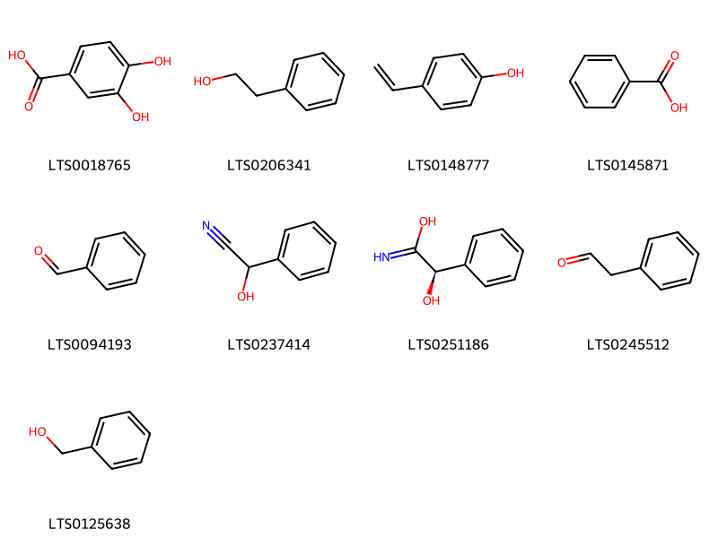
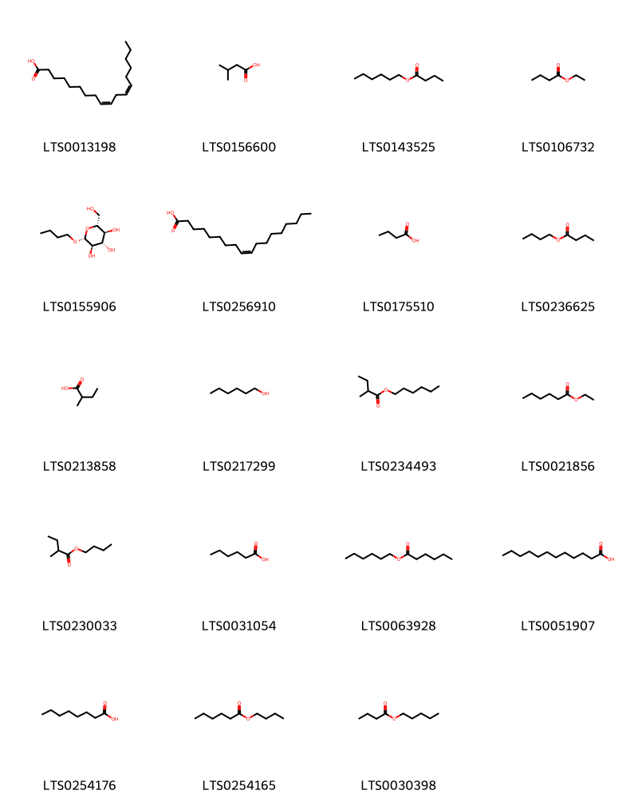
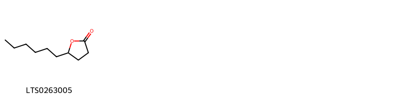
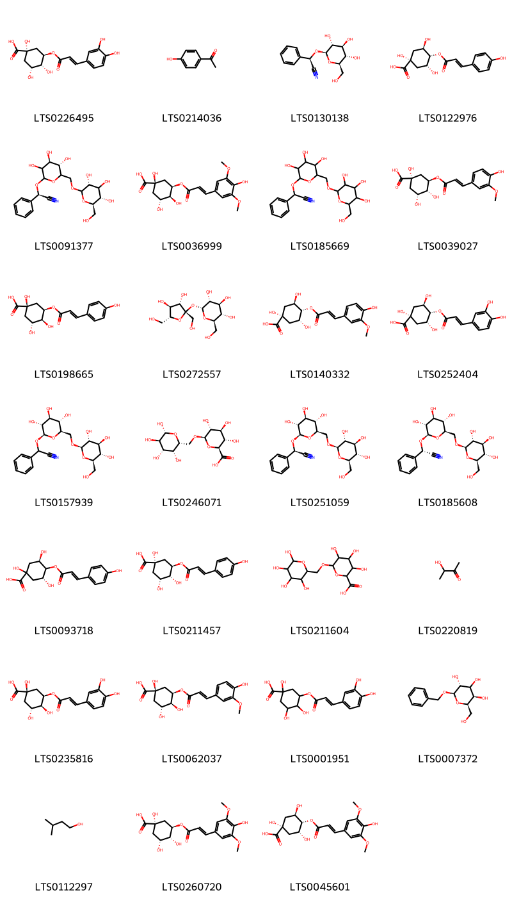
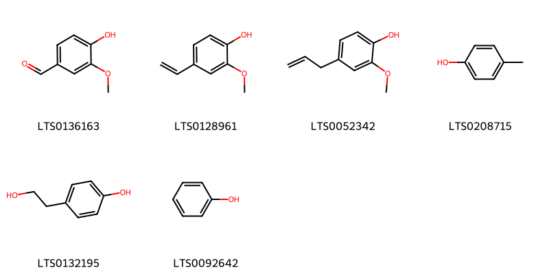

!!! abstract "Tóm tắt"

    Khổ Hạnh Nhân (Semen Armeniacae amarum) là hạt lấy ở quả chín được bỏ hạch cứng đã phơi hay sấy khô của cây Mơ (Primus armeniaca L.), thuộc họ Hoa hồng (Rosaceae). Cây mọc hoang khắp nơi. Hiện nay ở Việt Nam, cây được trồng nhiều ở vùng Bắc Trung Bộ. Theo tài liệu cổ, khổ hạnh nhân tính khổ, tân, ôn, ít độc, vào 2 kinh phế, đại tràng. Khổ hạnh nhân dùng bổ phế, nhuận tràng, giảm ho suyễn do môi trường hoặc đờm ẩm, táo bón do huyết hư, thiếu tân dịch, và làm mềm da. Khổ Hạnh Nhân chứa amygdalin, có thể phân giải tạo cyanide, được sử dụng với liều thấp để giảm đau, nhưng cần thận trọng vì độc tính.

## Thông tin về thực vật

Dược liệu **Khổ Hạnh Nhân** từ bộ phận **nan** từ loài *Prunus armeniaca*.

**Mô tả thực vật:** Cây mơ là một loại cây nhỏ, cao chùng 4-5m. Lá mọc so le, có cuống phiến lá hình bầu dục, nhọn ở đầu, mép lá có răng cưa nhỏ. Cuối mùa đông ra hoa có 5 sắc trắng hoặc màu hồng, mùi thơm. Quả chín vào tháng 34. Đây là một quả hạch, hình cầu, màu vàng xanh: Có nhiều thịt trong có một hạt. Ngoài cây mơ nói ở đây, tại một số tỉnh miền Bắc có loài song mai, mỗi đốt mọc 2 quả được coi là quí hơn.

*Tài liệu tham khảo:* "Những cây thuốc và vị thuốc Việt Nam" - Đỗ Tất Lợi 
Trong dược điển Việt nam, một loài được sử dụng làm dược liệu là *Prunus armeniaca*.

!!! info "Phân loại thực vật của *Prunus armeniaca*"
    - **Kingdom:** Plantae
    - **Phylum:** Tracheophyta
    - **Order:** Rosales
    - **Family:** Rosaceae
    - **Genus:** Prunus
    - **Species:** *Prunus armeniaca*

**Phân bố trên thế giới:** Germany, France, nan, Switzerland, Hungary, Spain, Mexico, South Africa, Australia, Mongolia, Kyrgyzstan, Russian Federation, Romania, India, Türkiye, Ukraine, Argentina, United States of America, China, Kazakhstan, New Zealand, Greece, Canada, Morocco, Iran (Islamic Republic of), Austria, Belgium

**Phân bố tại Việt nam:** Không có ghi nhận ở Việt Nam

## Thông tin về dược liệu 

### Định danh

!!! info "Thông tin về tên gọi"

    - Dược liệu tiếng Việt: nan
    - Dược liệu tiếng Trung: nan (nan)
    - Dược liệu tiếng Anh: nan
    - Dược liệu latin thông dụng: nan
    - Dược liệu latin kiểu DĐVN: *semen armeniacae amarum*
    - Dược liệu latin kiểu DĐVN: *nan*
    - Dược liệu latin kiểu thông tư: *nan*
    - Bộ phận dùng: nan (nan)

### Mô tả dược liệu 

- **Theo dược điển Việt nam V:** nan

- **Mô tả dược liệu theo thông tư chế biến dược liệu theo phương pháp cổ truyền:** nan

### Chế biến 

- **Chế biến theo dược điển việt nam V**: nan

- **Chế biến theo thông tư:** nan

--- 

## Thành phần hóa học

- Theo tài liệu của GS. Đỗ Tất Lợi:  (1) Nhóm hóa học:  cyanogenic glycosides 
(2)  Tên hoạt chất biomarker trong dược điển Việt Nam là: Amygdalin
    

**Thành phần hóa học từ loài **Prunus armeniaca**

Theo cơ sở dữ liệu lotus, loài *Prunus armeniaca* đã phân lập và xác định được **153** hoạt chất thuộc về các nhóm Steroids and steroid derivatives, Organooxygen compounds, Flavonoids, Fatty Acyls, Cinnamic acids and derivatives, Lactones, Furanoid lignans, Phenols, Carboxylic acids and derivatives, Benzene and substituted derivatives, Prenol lipids, Dibenzylbutane lignans trong bảng dưới đây. Danh sách các hoạt chất như sau hexanol [(LTS0217299)](https://lotus.naturalproducts.net/compound/lotus_id/LTS0217299), laetrile [(LTS0251059)](https://lotus.naturalproducts.net/compound/lotus_id/LTS0251059), kaempherol [(LTS0155822)](https://lotus.naturalproducts.net/compound/lotus_id/LTS0155822), 4-vinylphenol [(LTS0148777)](https://lotus.naturalproducts.net/compound/lotus_id/LTS0148777), ferulic acid [(LTS0077328)](https://lotus.naturalproducts.net/compound/lotus_id/LTS0077328), (+)-catechol [(LTS0117079)](https://lotus.naturalproducts.net/compound/lotus_id/LTS0117079), hesperetin [(LTS0087195)](https://lotus.naturalproducts.net/compound/lotus_id/LTS0087195), eugenol [(LTS0052342)](https://lotus.naturalproducts.net/compound/lotus_id/LTS0052342), linoleic [(LTS0013198)](https://lotus.naturalproducts.net/compound/lotus_id/LTS0013198), para-coumaric acid [(LTS0266252)](https://lotus.naturalproducts.net/compound/lotus_id/LTS0266252), 2-phenyl-ethanol [(LTS0206341)](https://lotus.naturalproducts.net/compound/lotus_id/LTS0206341), isovaleric acid [(LTS0156600)](https://lotus.naturalproducts.net/compound/lotus_id/LTS0156600), phytoene [(LTS0186029)](https://lotus.naturalproducts.net/compound/lotus_id/LTS0186029), γ-decalactone [(LTS0263005)](https://lotus.naturalproducts.net/compound/lotus_id/LTS0263005), chlorogenic acid [(LTS0226495)](https://lotus.naturalproducts.net/compound/lotus_id/LTS0226495), gibberellin a5 [(LTS0176017)](https://lotus.naturalproducts.net/compound/lotus_id/LTS0176017), (3ar,3bs,9bs,11as)-7-hydroxy-11a-methyl-2h,3h,3ah,3bh,4h,5h,9bh,10h,11h-cyclopenta[a]phenanthren-1-one [(LTS0031044)](https://lotus.naturalproducts.net/compound/lotus_id/LTS0031044), butyl hexanoate [(LTS0254165)](https://lotus.naturalproducts.net/compound/lotus_id/LTS0254165), sinapoyl alcohol [(LTS0275766)](https://lotus.naturalproducts.net/compound/lotus_id/LTS0275766), β-carotene [(LTS0275716)](https://lotus.naturalproducts.net/compound/lotus_id/LTS0275716), (2r,3r,5r,6r)-2-(benzyloxy)-6-(hydroxymethyl)oxane-3,4,5-triol [(LTS0007372)](https://lotus.naturalproducts.net/compound/lotus_id/LTS0007372), benzyl alcohol [(LTS0125638)](https://lotus.naturalproducts.net/compound/lotus_id/LTS0125638), 3,4-dihydroxybenzoic acid [(LTS0018765)](https://lotus.naturalproducts.net/compound/lotus_id/LTS0018765), (3r)-2-(3,4-dihydroxyphenyl)-3,4-dihydro-2h-1-benzopyran-3,5,7-triol [(LTS0267103)](https://lotus.naturalproducts.net/compound/lotus_id/LTS0267103), lariciresinol [(LTS0010950)](https://lotus.naturalproducts.net/compound/lotus_id/LTS0010950), lauric acid [(LTS0051907)](https://lotus.naturalproducts.net/compound/lotus_id/LTS0051907), lycopene [(LTS0116567)](https://lotus.naturalproducts.net/compound/lotus_id/LTS0116567), hexyl 2-methylbutyrate [(LTS0234493)](https://lotus.naturalproducts.net/compound/lotus_id/LTS0234493), butyl 2-methylbutyrate [(LTS0230033)](https://lotus.naturalproducts.net/compound/lotus_id/LTS0230033), (3r,5r)-1,3,5-trihydroxy-4-{[(2e)-3-(4-hydroxyphenyl)prop-2-enoyl]oxy}cyclohexane-1-carboxylic acid [(LTS0093718)](https://lotus.naturalproducts.net/compound/lotus_id/LTS0093718), acetoin [(LTS0220819)](https://lotus.naturalproducts.net/compound/lotus_id/LTS0220819), amygdalin [(LTS0157939)](https://lotus.naturalproducts.net/compound/lotus_id/LTS0157939), luteolin [(LTS0017052)](https://lotus.naturalproducts.net/compound/lotus_id/LTS0017052), epicatechin gallate [(LTS0071606)](https://lotus.naturalproducts.net/compound/lotus_id/LTS0071606), isoamyl alcohol [(LTS0112297)](https://lotus.naturalproducts.net/compound/lotus_id/LTS0112297), sinapinate [(LTS0173482)](https://lotus.naturalproducts.net/compound/lotus_id/LTS0173482), carotenoid [(LTS0205297)](https://lotus.naturalproducts.net/compound/lotus_id/LTS0205297), 2-(3,4-dihydroxyphenyl)-5,7-dihydroxy-3-{[3,4,5-trihydroxy-6-(hydroxymethyl)oxan-2-yl]oxy}chromen-4-one [(LTS0195312)](https://lotus.naturalproducts.net/compound/lotus_id/LTS0195312), α-carotene [(LTS0224243)](https://lotus.naturalproducts.net/compound/lotus_id/LTS0224243), β-ionone [(LTS0155301)](https://lotus.naturalproducts.net/compound/lotus_id/LTS0155301), p-cresol [(LTS0208715)](https://lotus.naturalproducts.net/compound/lotus_id/LTS0208715), butyl β-d-glucopyranoside [(LTS0155906)](https://lotus.naturalproducts.net/compound/lotus_id/LTS0155906), (1r,2r,5s,8s,9s,10r,12s)-5,12-dihydroxy-11-methyl-6-methylidene-16-oxo-15-oxapentacyclo[9.3.2.1⁵,⁸.0¹,¹⁰.0²,⁸]heptadecane-9-carboxylic acid [(LTS0091006)](https://lotus.naturalproducts.net/compound/lotus_id/LTS0091006), terpineol [(LTS0136148)](https://lotus.naturalproducts.net/compound/lotus_id/LTS0136148), (2r,3r,4r)-2-(3,4-dihydroxyphenyl)-4-[(2r,3r)-2-(3,4-dihydroxyphenyl)-3,5,7-trihydroxy-3,4-dihydro-2h-1-benzopyran-8-yl]-3,4-dihydro-2h-1-benzopyran-3,5,7-triol [(LTS0135510)](https://lotus.naturalproducts.net/compound/lotus_id/LTS0135510), (1s,3r,4r,5r)-1,3,4-trihydroxy-5-{[(2e)-3-(4-hydroxyphenyl)prop-2-enoyl]oxy}cyclohexane-1-carboxylic acid [(LTS0211457)](https://lotus.naturalproducts.net/compound/lotus_id/LTS0211457), myricetin [(LTS0139858)](https://lotus.naturalproducts.net/compound/lotus_id/LTS0139858), (1s,5r,6r,13r,21s)-5,13-bis(4-hydroxyphenyl)-4,12,14-trioxapentacyclo[11.7.1.0²,¹¹.0³,⁸.0¹⁵,²⁰]henicosa-2(11),3(8),9,15,17,19-hexaene-6,9,17,19,21-pentol [(LTS0198052)](https://lotus.naturalproducts.net/compound/lotus_id/LTS0198052), geraniol [(LTS0258838)](https://lotus.naturalproducts.net/compound/lotus_id/LTS0258838), (2r,3s,4r)-2-(3,4-dihydroxyphenyl)-4-[(2r,3r)-2-(3,4-dihydroxyphenyl)-3,5,7-trihydroxy-3,4-dihydro-2h-1-benzopyran-6-yl]-3,4-dihydro-2h-1-benzopyran-3,5,7-triol [(LTS0076760)](https://lotus.naturalproducts.net/compound/lotus_id/LTS0076760), 3,4,5-trihydroxy-6-[(3,4,5,6-tetrahydroxyoxan-2-yl)methoxy]oxane-2-carboxylic acid [(LTS0211604)](https://lotus.naturalproducts.net/compound/lotus_id/LTS0211604), benzaldehyde [(LTS0094193)](https://lotus.naturalproducts.net/compound/lotus_id/LTS0094193), nerol [(LTS0244289)](https://lotus.naturalproducts.net/compound/lotus_id/LTS0244289), cryptochlorogenic acid [(LTS0252404)](https://lotus.naturalproducts.net/compound/lotus_id/LTS0252404), 4-[(1e)-3-hydroxybut-1-en-1-yl]-3,5,5-trimethylcyclohex-3-en-1-ol [(LTS0247025)](https://lotus.naturalproducts.net/compound/lotus_id/LTS0247025), 3-o-sinapoylquinic acid [(LTS0036999)](https://lotus.naturalproducts.net/compound/lotus_id/LTS0036999), matairesinol [(LTS0193475)](https://lotus.naturalproducts.net/compound/lotus_id/LTS0193475), ethyl hexanoate [(LTS0021856)](https://lotus.naturalproducts.net/compound/lotus_id/LTS0021856), 3,4-dihydroxycinnamic acid [(LTS0128050)](https://lotus.naturalproducts.net/compound/lotus_id/LTS0128050), isoquercetin [(LTS0254337)](https://lotus.naturalproducts.net/compound/lotus_id/LTS0254337), butyl butyrate [(LTS0236625)](https://lotus.naturalproducts.net/compound/lotus_id/LTS0236625), 2-(3,4-dihydroxyphenyl)-5,7-dihydroxy-3-{[(2r,3s,4r,5r,6s)-3,4,5-trihydroxy-6-({[(2s,3s,4s,5s,6r)-3,4,5-trihydroxy-6-methyloxan-2-yl]oxy}methyl)oxan-2-yl]oxy}chromen-4-one [(LTS0052429)](https://lotus.naturalproducts.net/compound/lotus_id/LTS0052429), β,β-carotene [(LTS0168447)](https://lotus.naturalproducts.net/compound/lotus_id/LTS0168447), neochlorogenic acid [(LTS0235816)](https://lotus.naturalproducts.net/compound/lotus_id/LTS0235816), 2-methylbutanoic acid [(LTS0213858)](https://lotus.naturalproducts.net/compound/lotus_id/LTS0213858), 4-[3,5,7-trihydroxy-2-(3,4,5-trihydroxyphenyl)-3,4-dihydro-2h-1-benzopyran-8-yl]-2-(3,4,5-trihydroxyphenyl)-3,4-dihydro-2h-1-benzopyran-3,5,7-triol [(LTS0144797)](https://lotus.naturalproducts.net/compound/lotus_id/LTS0144797), phenylacetaldehyde [(LTS0245512)](https://lotus.naturalproducts.net/compound/lotus_id/LTS0245512), (3e)-4-(4-hydroxy-2,6,6-trimethylcyclohex-1-en-1-yl)but-3-en-2-one [(LTS0059292)](https://lotus.naturalproducts.net/compound/lotus_id/LTS0059292), hydroxyacetophenone [(LTS0214036)](https://lotus.naturalproducts.net/compound/lotus_id/LTS0214036), (+)-α-carotene [(LTS0200789)](https://lotus.naturalproducts.net/compound/lotus_id/LTS0200789), 4-o-sinapoylquinic acid [(LTS0045601)](https://lotus.naturalproducts.net/compound/lotus_id/LTS0045601), 4-o-feruloyl-d-quinic acid [(LTS0140332)](https://lotus.naturalproducts.net/compound/lotus_id/LTS0140332), stigmast-5-en-3-ol, (3β)- [(LTS0204616)](https://lotus.naturalproducts.net/compound/lotus_id/LTS0204616), sucrose [(LTS0272557)](https://lotus.naturalproducts.net/compound/lotus_id/LTS0272557), procyanidin c1 [(LTS0260445)](https://lotus.naturalproducts.net/compound/lotus_id/LTS0260445), 3-feruloylquinic acid [(LTS0062037)](https://lotus.naturalproducts.net/compound/lotus_id/LTS0062037), (2s,3r)-2,3-bis[(4-hydroxy-3-methoxyphenyl)(¹³c)methyl](1-¹³c)butane-1,4-diol [(LTS0268699)](https://lotus.naturalproducts.net/compound/lotus_id/LTS0268699), ent-epicatechin [(LTS0265245)](https://lotus.naturalproducts.net/compound/lotus_id/LTS0265245), (1s,5s,6s,13r,21s)-5,13-bis(4-hydroxyphenyl)-4,12,14-trioxapentacyclo[11.7.1.0²,¹¹.0³,⁸.0¹⁵,²⁰]henicosa-2(11),3(8),9,15,17,19-hexaene-6,9,17,19,21-pentol [(LTS0020877)](https://lotus.naturalproducts.net/compound/lotus_id/LTS0020877), (9z)-β-carotene [(LTS0252839)](https://lotus.naturalproducts.net/compound/lotus_id/LTS0252839), phenol [(LTS0092642)](https://lotus.naturalproducts.net/compound/lotus_id/LTS0092642), kaempferol 3-o-rutinoside [(LTS0097007)](https://lotus.naturalproducts.net/compound/lotus_id/LTS0097007), geranin a [(LTS0153482)](https://lotus.naturalproducts.net/compound/lotus_id/LTS0153482), pinoresinol [(LTS0057431)](https://lotus.naturalproducts.net/compound/lotus_id/LTS0057431), (+)-dihydrokaempferol [(LTS0134832)](https://lotus.naturalproducts.net/compound/lotus_id/LTS0134832), (1s,3r,4s,5r)-1,3,5-trihydroxy-4-{[(2e)-3-(4-hydroxyphenyl)prop-2-enoyl]oxy}cyclohexane-1-carboxylic acid [(LTS0122976)](https://lotus.naturalproducts.net/compound/lotus_id/LTS0122976), sitogluside [(LTS0201798)](https://lotus.naturalproducts.net/compound/lotus_id/LTS0201798), hexyl butyrate [(LTS0143525)](https://lotus.naturalproducts.net/compound/lotus_id/LTS0143525), butyl propionate [(LTS0210550)](https://lotus.naturalproducts.net/compound/lotus_id/LTS0210550), cis-phytoene [(LTS0239283)](https://lotus.naturalproducts.net/compound/lotus_id/LTS0239283), vanillin [(LTS0136163)](https://lotus.naturalproducts.net/compound/lotus_id/LTS0136163), 3-rutinosyl quercetin [(LTS0032845)](https://lotus.naturalproducts.net/compound/lotus_id/LTS0032845), quercetin [(LTS0004651)](https://lotus.naturalproducts.net/compound/lotus_id/LTS0004651), stigmast-5-en-3-ol [(LTS0071224)](https://lotus.naturalproducts.net/compound/lotus_id/LTS0071224), phytofluene [(LTS0181914)](https://lotus.naturalproducts.net/compound/lotus_id/LTS0181914), (2r,3s,4s)-2-(3,4-dihydroxyphenyl)-4-[(2r,3s)-2-(3,4-dihydroxyphenyl)-3,5,7-trihydroxy-3,4-dihydro-2h-1-benzopyran-8-yl]-3,4-dihydro-2h-1-benzopyran-3,5,7-triol [(LTS0151498)](https://lotus.naturalproducts.net/compound/lotus_id/LTS0151498), asahina [(LTS0068303)](https://lotus.naturalproducts.net/compound/lotus_id/LTS0068303), (1s,5s,6r,13r,21s)-5,13-bis(4-hydroxyphenyl)-4,12,14-trioxapentacyclo[11.7.1.0²,¹¹.0³,⁸.0¹⁵,²⁰]henicosa-2(11),3(8),9,15,17,19-hexaene-6,9,17,19,21-pentol [(LTS0081798)](https://lotus.naturalproducts.net/compound/lotus_id/LTS0081798), dehydrovomifoliol [(LTS0209706)](https://lotus.naturalproducts.net/compound/lotus_id/LTS0209706), unden [(LTS0051393)](https://lotus.naturalproducts.net/compound/lotus_id/LTS0051393), ferulic acid [(LTS0273002)](https://lotus.naturalproducts.net/compound/lotus_id/LTS0273002), gamma-carotene [(LTS0108535)](https://lotus.naturalproducts.net/compound/lotus_id/LTS0108535), amygdalin [(LTS0185669)](https://lotus.naturalproducts.net/compound/lotus_id/LTS0185669), nictoflorin [(LTS0182501)](https://lotus.naturalproducts.net/compound/lotus_id/LTS0182501), 4-[(1e)-3-hydroxybut-1-en-1-yl]-3,5,5-trimethylcyclohex-2-en-1-one [(LTS0120878)](https://lotus.naturalproducts.net/compound/lotus_id/LTS0120878), naringenin [(LTS0031098)](https://lotus.naturalproducts.net/compound/lotus_id/LTS0031098), chamomile [(LTS0104946)](https://lotus.naturalproducts.net/compound/lotus_id/LTS0104946), (2s,3s,4s,5r,6r)-3,4,5-trihydroxy-6-{[(2r,3r,4s,5r,6r)-3,4,5,6-tetrahydroxyoxan-2-yl]methoxy}oxane-2-carboxylic acid [(LTS0246071)](https://lotus.naturalproducts.net/compound/lotus_id/LTS0246071), cryptoxanthin [(LTS0132646)](https://lotus.naturalproducts.net/compound/lotus_id/LTS0132646), (2r)-2-phenyl-2-{[(4s,5s)-3,4,5-trihydroxy-6-({[(3r,5s,6r)-3,4,5-trihydroxy-6-(hydroxymethyl)oxan-2-yl]oxy}methyl)oxan-2-yl]oxy}acetonitrile [(LTS0091377)](https://lotus.naturalproducts.net/compound/lotus_id/LTS0091377), gibberellin a29 [(LTS0250023)](https://lotus.naturalproducts.net/compound/lotus_id/LTS0250023), butanoic acid [(LTS0175510)](https://lotus.naturalproducts.net/compound/lotus_id/LTS0175510), (3r)-2-(3,4,5-trihydroxyphenyl)-3,4-dihydro-2h-1-benzopyran-3,5,7-triol [(LTS0203787)](https://lotus.naturalproducts.net/compound/lotus_id/LTS0203787), 2-{[1-(5-ethyl-6-methylheptan-2-yl)-9a,11a-dimethyl-1h,2h,3h,3ah,3bh,4h,6h,7h,8h,9h,9bh,10h,11h-cyclopenta[a]phenanthren-7-yl]oxy}-6-(hydroxymethyl)oxane-3,4,5-triol [(LTS0158828)](https://lotus.naturalproducts.net/compound/lotus_id/LTS0158828), (2r,3s,4s)-2-(3,4-dihydroxyphenyl)-4-[(2r,3r)-2-(3,4-dihydroxyphenyl)-3,5,7-trihydroxy-3,4-dihydro-2h-1-benzopyran-6-yl]-3,4-dihydro-2h-1-benzopyran-3,5,7-triol [(LTS0196496)](https://lotus.naturalproducts.net/compound/lotus_id/LTS0196496), mandelonitrile [(LTS0237414)](https://lotus.naturalproducts.net/compound/lotus_id/LTS0237414), caprylic acid [(LTS0254176)](https://lotus.naturalproducts.net/compound/lotus_id/LTS0254176), 5-o-sinapoylquinic acid [(LTS0260720)](https://lotus.naturalproducts.net/compound/lotus_id/LTS0260720), (1r,3r,4s,5r)-1,3,4-trihydroxy-5-{[(2e)-3-(4-hydroxyphenyl)prop-2-enoyl]oxy}cyclohexane-1-carboxylic acid [(LTS0198665)](https://lotus.naturalproducts.net/compound/lotus_id/LTS0198665), 1,3,3-trimethyl-2-[(1e,3z,5z,7e,9e,11e,13z,15z,17e)-3,7,12,16-tetramethyl-18-(2,6,6-trimethylcyclohex-1-en-1-yl)octadeca-1,3,5,7,9,11,13,15,17-nonaen-1-yl]cyclohex-1-ene [(LTS0078967)](https://lotus.naturalproducts.net/compound/lotus_id/LTS0078967), (2r,3s,4s)-2-(3,4-dihydroxyphenyl)-4-[(2r,3r)-2-(3,4-dihydroxyphenyl)-3,5,7-trihydroxy-3,4-dihydro-2h-1-benzopyran-8-yl]-3,4-dihydro-2h-1-benzopyran-3,5,7-triol [(LTS0116257)](https://lotus.naturalproducts.net/compound/lotus_id/LTS0116257), (1s,13r,21s)-6,9,17,19,21-pentahydroxy-5,13-bis(4-hydroxyphenyl)-4,12,14-trioxapentacyclo[11.7.1.0²,¹¹.0³,⁸.0¹⁵,²⁰]henicosa-2,5,8,10,15,17,19-heptaen-7-one [(LTS0116416)](https://lotus.naturalproducts.net/compound/lotus_id/LTS0116416), hexyl hexanoate [(LTS0063928)](https://lotus.naturalproducts.net/compound/lotus_id/LTS0063928), (1s,5r,6s,13r,21s)-5,13-bis(4-hydroxyphenyl)-4,12,14-trioxapentacyclo[11.7.1.0²,¹¹.0³,⁸.0¹⁵,²⁰]henicosa-2(11),3(8),9,15,17,19-hexaene-6,9,17,19,21-pentol [(LTS0275410)](https://lotus.naturalproducts.net/compound/lotus_id/LTS0275410), amyl butyrate [(LTS0030398)](https://lotus.naturalproducts.net/compound/lotus_id/LTS0030398), chlorogenic acid [(LTS0001951)](https://lotus.naturalproducts.net/compound/lotus_id/LTS0001951), (1s,3ar,3br,9br,11as)-11a-methyl-1h,2h,3h,3ah,3bh,4h,5h,9bh,10h,11h-cyclopenta[a]phenanthrene-1,7-diol [(LTS0069192)](https://lotus.naturalproducts.net/compound/lotus_id/LTS0069192), (2s)-2-phenyl-2-{[(2r,3r,4s,5s,6r)-3,4,5-trihydroxy-6-({[(2r,3r,4s,5s,6r)-3,4,5-trihydroxy-6-(hydroxymethyl)oxan-2-yl]oxy}methyl)oxan-2-yl]oxy}acetonitrile [(LTS0185608)](https://lotus.naturalproducts.net/compound/lotus_id/LTS0185608), 3-o-feruloyl-d-quinic acid [(LTS0039027)](https://lotus.naturalproducts.net/compound/lotus_id/LTS0039027), hexanoic acid [(LTS0031054)](https://lotus.naturalproducts.net/compound/lotus_id/LTS0031054), zeaxanthin [(LTS0192928)](https://lotus.naturalproducts.net/compound/lotus_id/LTS0192928), zeta-carotene [(LTS0007334)](https://lotus.naturalproducts.net/compound/lotus_id/LTS0007334), (-)-epigallocatechin gallate [(LTS0173211)](https://lotus.naturalproducts.net/compound/lotus_id/LTS0173211), secoisolariciresinol [(LTS0086727)](https://lotus.naturalproducts.net/compound/lotus_id/LTS0086727), prunasin [(LTS0130138)](https://lotus.naturalproducts.net/compound/lotus_id/LTS0130138), (2r,3r)-2-(3,4-dihydroxyphenyl)-8-[(2r,3r)-2-(3,4-dihydroxyphenyl)-3,5,7-trihydroxy-3,4-dihydro-2h-1-benzopyran-4-yl]-4-[(2r,3s)-2-(3,4-dihydroxyphenyl)-3,5,7-trihydroxy-3,4-dihydro-2h-1-benzopyran-8-yl]-3,4-dihydro-2h-1-benzopyran-3,5,7-triol [(LTS0059648)](https://lotus.naturalproducts.net/compound/lotus_id/LTS0059648), oleic acid [(LTS0256910)](https://lotus.naturalproducts.net/compound/lotus_id/LTS0256910), benzoic acid [(LTS0145871)](https://lotus.naturalproducts.net/compound/lotus_id/LTS0145871), (4s)-4-hydroxy-4-(3-hydroxybut-1-en-1-yl)-3,5,5-trimethylcyclohex-2-en-1-one [(LTS0225700)](https://lotus.naturalproducts.net/compound/lotus_id/LTS0225700), estradiol [(LTS0134723)](https://lotus.naturalproducts.net/compound/lotus_id/LTS0134723), ethyl butyrate [(LTS0106732)](https://lotus.naturalproducts.net/compound/lotus_id/LTS0106732), hydroxycinnamic acid [(LTS0233023)](https://lotus.naturalproducts.net/compound/lotus_id/LTS0233023), (2r,3r,4r)-2-(3,4-dihydroxyphenyl)-4-[(2r,3s)-2-(3,4-dihydroxyphenyl)-3,5,7-trihydroxy-3,4-dihydro-2h-1-benzopyran-8-yl]-3,4-dihydro-2h-1-benzopyran-3,5,7-triol [(LTS0066122)](https://lotus.naturalproducts.net/compound/lotus_id/LTS0066122), all-trans-phytofluene [(LTS0269894)](https://lotus.naturalproducts.net/compound/lotus_id/LTS0269894), 2-methoxy-4-vinyl-phenol [(LTS0128961)](https://lotus.naturalproducts.net/compound/lotus_id/LTS0128961), (r)-mandelamide [(LTS0251186)](https://lotus.naturalproducts.net/compound/lotus_id/LTS0251186), tyrosol [(LTS0132195)](https://lotus.naturalproducts.net/compound/lotus_id/LTS0132195), gibberellin a1 [(LTS0013777)](https://lotus.naturalproducts.net/compound/lotus_id/LTS0013777), epigallocatechin [(LTS0052496)](https://lotus.naturalproducts.net/compound/lotus_id/LTS0052496), aromadendrin [(LTS0153299)](https://lotus.naturalproducts.net/compound/lotus_id/LTS0153299), linalool, (+-)- [(LTS0128839)](https://lotus.naturalproducts.net/compound/lotus_id/LTS0128839), gallocatechol [(LTS0267305)](https://lotus.naturalproducts.net/compound/lotus_id/LTS0267305), rutin [(LTS0042292)](https://lotus.naturalproducts.net/compound/lotus_id/LTS0042292). 
        
| chemicalTaxonomyClassyfireClass     |   smiles_count |
|:------------------------------------|---------------:|
| Benzene and substituted derivatives |            129 |
| Carboxylic acids and derivatives    |             12 |
| Cinnamic acids and derivatives      |            167 |
| Dibenzylbutane lignans              |            116 |
| Fatty Acyls                         |            314 |
| Flavonoids                          |           2977 |
| Furanoid lignans                    |            162 |
| Lactones                            |             17 |
| Organooxygen compounds              |           1661 |
| Phenols                             |             88 |
| Prenol lipids                       |           1924 |
| Steroids and steroid derivatives    |            486 |

            
### Nhóm Benzene and substituted derivatives
<figure markdown="span">
    { width=100% }
<figcaption>Hình ảnh cấu trúc hóa học của hoạt chất thuộc nhóm *Benzene and substituted derivatives*. Tên thường gọi của các hoạt chất tương ứng là 3,4-dihydroxybenzoic acid [(LTS0018765)](https://lotus.naturalproducts.net/compound/lotus_id/LTS0018765), 2-phenyl-ethanol [(LTS0206341)](https://lotus.naturalproducts.net/compound/lotus_id/LTS0206341), 4-vinylphenol [(LTS0148777)](https://lotus.naturalproducts.net/compound/lotus_id/LTS0148777), benzoic acid [(LTS0145871)](https://lotus.naturalproducts.net/compound/lotus_id/LTS0145871), benzaldehyde [(LTS0094193)](https://lotus.naturalproducts.net/compound/lotus_id/LTS0094193), mandelonitrile [(LTS0237414)](https://lotus.naturalproducts.net/compound/lotus_id/LTS0237414), (r)-mandelamide [(LTS0251186)](https://lotus.naturalproducts.net/compound/lotus_id/LTS0251186), phenylacetaldehyde [(LTS0245512)](https://lotus.naturalproducts.net/compound/lotus_id/LTS0245512), benzyl alcohol [(LTS0125638)](https://lotus.naturalproducts.net/compound/lotus_id/LTS0125638).</figcaption>
</figure>

            
            
### Nhóm Benzene and substituted derivatives
<figure markdown="span">
    { width=100% }
<figcaption>Hình ảnh cấu trúc hóa học của hoạt chất thuộc nhóm *Benzene and substituted derivatives*. Tên thường gọi của các hoạt chất tương ứng là 3,4-dihydroxybenzoic acid [(LTS0018765)](https://lotus.naturalproducts.net/compound/lotus_id/LTS0018765), 2-phenyl-ethanol [(LTS0206341)](https://lotus.naturalproducts.net/compound/lotus_id/LTS0206341), 4-vinylphenol [(LTS0148777)](https://lotus.naturalproducts.net/compound/lotus_id/LTS0148777), benzoic acid [(LTS0145871)](https://lotus.naturalproducts.net/compound/lotus_id/LTS0145871), benzaldehyde [(LTS0094193)](https://lotus.naturalproducts.net/compound/lotus_id/LTS0094193), mandelonitrile [(LTS0237414)](https://lotus.naturalproducts.net/compound/lotus_id/LTS0237414), (r)-mandelamide [(LTS0251186)](https://lotus.naturalproducts.net/compound/lotus_id/LTS0251186), phenylacetaldehyde [(LTS0245512)](https://lotus.naturalproducts.net/compound/lotus_id/LTS0245512), benzyl alcohol [(LTS0125638)](https://lotus.naturalproducts.net/compound/lotus_id/LTS0125638).</figcaption>
</figure>

### Nhóm Carboxylic acids and derivatives
<figure markdown="span">
    { width=100% }
<figcaption>Hình ảnh cấu trúc hóa học của hoạt chất thuộc nhóm *Carboxylic acids and derivatives*. Tên thường gọi của các hoạt chất tương ứng là butyl propionate [(LTS0210550)](https://lotus.naturalproducts.net/compound/lotus_id/LTS0210550).</figcaption>
</figure>

            
            
### Nhóm Benzene and substituted derivatives
<figure markdown="span">
    { width=100% }
<figcaption>Hình ảnh cấu trúc hóa học của hoạt chất thuộc nhóm *Benzene and substituted derivatives*. Tên thường gọi của các hoạt chất tương ứng là 3,4-dihydroxybenzoic acid [(LTS0018765)](https://lotus.naturalproducts.net/compound/lotus_id/LTS0018765), 2-phenyl-ethanol [(LTS0206341)](https://lotus.naturalproducts.net/compound/lotus_id/LTS0206341), 4-vinylphenol [(LTS0148777)](https://lotus.naturalproducts.net/compound/lotus_id/LTS0148777), benzoic acid [(LTS0145871)](https://lotus.naturalproducts.net/compound/lotus_id/LTS0145871), benzaldehyde [(LTS0094193)](https://lotus.naturalproducts.net/compound/lotus_id/LTS0094193), mandelonitrile [(LTS0237414)](https://lotus.naturalproducts.net/compound/lotus_id/LTS0237414), (r)-mandelamide [(LTS0251186)](https://lotus.naturalproducts.net/compound/lotus_id/LTS0251186), phenylacetaldehyde [(LTS0245512)](https://lotus.naturalproducts.net/compound/lotus_id/LTS0245512), benzyl alcohol [(LTS0125638)](https://lotus.naturalproducts.net/compound/lotus_id/LTS0125638).</figcaption>
</figure>

### Nhóm Carboxylic acids and derivatives
<figure markdown="span">
    { width=100% }
<figcaption>Hình ảnh cấu trúc hóa học của hoạt chất thuộc nhóm *Carboxylic acids and derivatives*. Tên thường gọi của các hoạt chất tương ứng là butyl propionate [(LTS0210550)](https://lotus.naturalproducts.net/compound/lotus_id/LTS0210550).</figcaption>
</figure>

### Nhóm Cinnamic acids and derivatives
<figure markdown="span">
    { width=100% }
<figcaption>Hình ảnh cấu trúc hóa học của hoạt chất thuộc nhóm *Cinnamic acids and derivatives*. Tên thường gọi của các hoạt chất tương ứng là ferulic acid [(LTS0077328)](https://lotus.naturalproducts.net/compound/lotus_id/LTS0077328), sinapinate [(LTS0173482)](https://lotus.naturalproducts.net/compound/lotus_id/LTS0173482), 3,4-dihydroxycinnamic acid [(LTS0128050)](https://lotus.naturalproducts.net/compound/lotus_id/LTS0128050), para-coumaric acid [(LTS0266252)](https://lotus.naturalproducts.net/compound/lotus_id/LTS0266252), sinapoyl alcohol [(LTS0275766)](https://lotus.naturalproducts.net/compound/lotus_id/LTS0275766), hydroxycinnamic acid [(LTS0233023)](https://lotus.naturalproducts.net/compound/lotus_id/LTS0233023), ferulic acid [(LTS0273002)](https://lotus.naturalproducts.net/compound/lotus_id/LTS0273002).</figcaption>
</figure>

            
            
### Nhóm Benzene and substituted derivatives
<figure markdown="span">
    { width=100% }
<figcaption>Hình ảnh cấu trúc hóa học của hoạt chất thuộc nhóm *Benzene and substituted derivatives*. Tên thường gọi của các hoạt chất tương ứng là 3,4-dihydroxybenzoic acid [(LTS0018765)](https://lotus.naturalproducts.net/compound/lotus_id/LTS0018765), 2-phenyl-ethanol [(LTS0206341)](https://lotus.naturalproducts.net/compound/lotus_id/LTS0206341), 4-vinylphenol [(LTS0148777)](https://lotus.naturalproducts.net/compound/lotus_id/LTS0148777), benzoic acid [(LTS0145871)](https://lotus.naturalproducts.net/compound/lotus_id/LTS0145871), benzaldehyde [(LTS0094193)](https://lotus.naturalproducts.net/compound/lotus_id/LTS0094193), mandelonitrile [(LTS0237414)](https://lotus.naturalproducts.net/compound/lotus_id/LTS0237414), (r)-mandelamide [(LTS0251186)](https://lotus.naturalproducts.net/compound/lotus_id/LTS0251186), phenylacetaldehyde [(LTS0245512)](https://lotus.naturalproducts.net/compound/lotus_id/LTS0245512), benzyl alcohol [(LTS0125638)](https://lotus.naturalproducts.net/compound/lotus_id/LTS0125638).</figcaption>
</figure>

### Nhóm Carboxylic acids and derivatives
<figure markdown="span">
    { width=100% }
<figcaption>Hình ảnh cấu trúc hóa học của hoạt chất thuộc nhóm *Carboxylic acids and derivatives*. Tên thường gọi của các hoạt chất tương ứng là butyl propionate [(LTS0210550)](https://lotus.naturalproducts.net/compound/lotus_id/LTS0210550).</figcaption>
</figure>

### Nhóm Cinnamic acids and derivatives
<figure markdown="span">
    { width=100% }
<figcaption>Hình ảnh cấu trúc hóa học của hoạt chất thuộc nhóm *Cinnamic acids and derivatives*. Tên thường gọi của các hoạt chất tương ứng là ferulic acid [(LTS0077328)](https://lotus.naturalproducts.net/compound/lotus_id/LTS0077328), sinapinate [(LTS0173482)](https://lotus.naturalproducts.net/compound/lotus_id/LTS0173482), 3,4-dihydroxycinnamic acid [(LTS0128050)](https://lotus.naturalproducts.net/compound/lotus_id/LTS0128050), para-coumaric acid [(LTS0266252)](https://lotus.naturalproducts.net/compound/lotus_id/LTS0266252), sinapoyl alcohol [(LTS0275766)](https://lotus.naturalproducts.net/compound/lotus_id/LTS0275766), hydroxycinnamic acid [(LTS0233023)](https://lotus.naturalproducts.net/compound/lotus_id/LTS0233023), ferulic acid [(LTS0273002)](https://lotus.naturalproducts.net/compound/lotus_id/LTS0273002).</figcaption>
</figure>

### Nhóm Dibenzylbutane lignans
<figure markdown="span">
    { width=100% }
<figcaption>Hình ảnh cấu trúc hóa học của hoạt chất thuộc nhóm *Dibenzylbutane lignans*. Tên thường gọi của các hoạt chất tương ứng là (2s,3r)-2,3-bis[(4-hydroxy-3-methoxyphenyl)(¹³c)methyl](1-¹³c)butane-1,4-diol [(LTS0268699)](https://lotus.naturalproducts.net/compound/lotus_id/LTS0268699), secoisolariciresinol [(LTS0086727)](https://lotus.naturalproducts.net/compound/lotus_id/LTS0086727).</figcaption>
</figure>

            
            
### Nhóm Benzene and substituted derivatives
<figure markdown="span">
    { width=100% }
<figcaption>Hình ảnh cấu trúc hóa học của hoạt chất thuộc nhóm *Benzene and substituted derivatives*. Tên thường gọi của các hoạt chất tương ứng là 3,4-dihydroxybenzoic acid [(LTS0018765)](https://lotus.naturalproducts.net/compound/lotus_id/LTS0018765), 2-phenyl-ethanol [(LTS0206341)](https://lotus.naturalproducts.net/compound/lotus_id/LTS0206341), 4-vinylphenol [(LTS0148777)](https://lotus.naturalproducts.net/compound/lotus_id/LTS0148777), benzoic acid [(LTS0145871)](https://lotus.naturalproducts.net/compound/lotus_id/LTS0145871), benzaldehyde [(LTS0094193)](https://lotus.naturalproducts.net/compound/lotus_id/LTS0094193), mandelonitrile [(LTS0237414)](https://lotus.naturalproducts.net/compound/lotus_id/LTS0237414), (r)-mandelamide [(LTS0251186)](https://lotus.naturalproducts.net/compound/lotus_id/LTS0251186), phenylacetaldehyde [(LTS0245512)](https://lotus.naturalproducts.net/compound/lotus_id/LTS0245512), benzyl alcohol [(LTS0125638)](https://lotus.naturalproducts.net/compound/lotus_id/LTS0125638).</figcaption>
</figure>

### Nhóm Carboxylic acids and derivatives
<figure markdown="span">
    { width=100% }
<figcaption>Hình ảnh cấu trúc hóa học của hoạt chất thuộc nhóm *Carboxylic acids and derivatives*. Tên thường gọi của các hoạt chất tương ứng là butyl propionate [(LTS0210550)](https://lotus.naturalproducts.net/compound/lotus_id/LTS0210550).</figcaption>
</figure>

### Nhóm Cinnamic acids and derivatives
<figure markdown="span">
    { width=100% }
<figcaption>Hình ảnh cấu trúc hóa học của hoạt chất thuộc nhóm *Cinnamic acids and derivatives*. Tên thường gọi của các hoạt chất tương ứng là ferulic acid [(LTS0077328)](https://lotus.naturalproducts.net/compound/lotus_id/LTS0077328), sinapinate [(LTS0173482)](https://lotus.naturalproducts.net/compound/lotus_id/LTS0173482), 3,4-dihydroxycinnamic acid [(LTS0128050)](https://lotus.naturalproducts.net/compound/lotus_id/LTS0128050), para-coumaric acid [(LTS0266252)](https://lotus.naturalproducts.net/compound/lotus_id/LTS0266252), sinapoyl alcohol [(LTS0275766)](https://lotus.naturalproducts.net/compound/lotus_id/LTS0275766), hydroxycinnamic acid [(LTS0233023)](https://lotus.naturalproducts.net/compound/lotus_id/LTS0233023), ferulic acid [(LTS0273002)](https://lotus.naturalproducts.net/compound/lotus_id/LTS0273002).</figcaption>
</figure>

### Nhóm Dibenzylbutane lignans
<figure markdown="span">
    { width=100% }
<figcaption>Hình ảnh cấu trúc hóa học của hoạt chất thuộc nhóm *Dibenzylbutane lignans*. Tên thường gọi của các hoạt chất tương ứng là (2s,3r)-2,3-bis[(4-hydroxy-3-methoxyphenyl)(¹³c)methyl](1-¹³c)butane-1,4-diol [(LTS0268699)](https://lotus.naturalproducts.net/compound/lotus_id/LTS0268699), secoisolariciresinol [(LTS0086727)](https://lotus.naturalproducts.net/compound/lotus_id/LTS0086727).</figcaption>
</figure>

### Nhóm Fatty Acyls
<figure markdown="span">
    { width=100% }
<figcaption>Hình ảnh cấu trúc hóa học của hoạt chất thuộc nhóm *Fatty Acyls*. Tên thường gọi của các hoạt chất tương ứng là linoleic [(LTS0013198)](https://lotus.naturalproducts.net/compound/lotus_id/LTS0013198), isovaleric acid [(LTS0156600)](https://lotus.naturalproducts.net/compound/lotus_id/LTS0156600), hexyl butyrate [(LTS0143525)](https://lotus.naturalproducts.net/compound/lotus_id/LTS0143525), ethyl butyrate [(LTS0106732)](https://lotus.naturalproducts.net/compound/lotus_id/LTS0106732), butyl β-d-glucopyranoside [(LTS0155906)](https://lotus.naturalproducts.net/compound/lotus_id/LTS0155906), oleic acid [(LTS0256910)](https://lotus.naturalproducts.net/compound/lotus_id/LTS0256910), butanoic acid [(LTS0175510)](https://lotus.naturalproducts.net/compound/lotus_id/LTS0175510), butyl butyrate [(LTS0236625)](https://lotus.naturalproducts.net/compound/lotus_id/LTS0236625), 2-methylbutanoic acid [(LTS0213858)](https://lotus.naturalproducts.net/compound/lotus_id/LTS0213858), hexanol [(LTS0217299)](https://lotus.naturalproducts.net/compound/lotus_id/LTS0217299), hexyl 2-methylbutyrate [(LTS0234493)](https://lotus.naturalproducts.net/compound/lotus_id/LTS0234493), ethyl hexanoate [(LTS0021856)](https://lotus.naturalproducts.net/compound/lotus_id/LTS0021856), butyl 2-methylbutyrate [(LTS0230033)](https://lotus.naturalproducts.net/compound/lotus_id/LTS0230033), hexanoic acid [(LTS0031054)](https://lotus.naturalproducts.net/compound/lotus_id/LTS0031054), hexyl hexanoate [(LTS0063928)](https://lotus.naturalproducts.net/compound/lotus_id/LTS0063928), lauric acid [(LTS0051907)](https://lotus.naturalproducts.net/compound/lotus_id/LTS0051907), caprylic acid [(LTS0254176)](https://lotus.naturalproducts.net/compound/lotus_id/LTS0254176), butyl hexanoate [(LTS0254165)](https://lotus.naturalproducts.net/compound/lotus_id/LTS0254165), amyl butyrate [(LTS0030398)](https://lotus.naturalproducts.net/compound/lotus_id/LTS0030398).</figcaption>
</figure>

            
            
### Nhóm Benzene and substituted derivatives
<figure markdown="span">
    { width=100% }
<figcaption>Hình ảnh cấu trúc hóa học của hoạt chất thuộc nhóm *Benzene and substituted derivatives*. Tên thường gọi của các hoạt chất tương ứng là 3,4-dihydroxybenzoic acid [(LTS0018765)](https://lotus.naturalproducts.net/compound/lotus_id/LTS0018765), 2-phenyl-ethanol [(LTS0206341)](https://lotus.naturalproducts.net/compound/lotus_id/LTS0206341), 4-vinylphenol [(LTS0148777)](https://lotus.naturalproducts.net/compound/lotus_id/LTS0148777), benzoic acid [(LTS0145871)](https://lotus.naturalproducts.net/compound/lotus_id/LTS0145871), benzaldehyde [(LTS0094193)](https://lotus.naturalproducts.net/compound/lotus_id/LTS0094193), mandelonitrile [(LTS0237414)](https://lotus.naturalproducts.net/compound/lotus_id/LTS0237414), (r)-mandelamide [(LTS0251186)](https://lotus.naturalproducts.net/compound/lotus_id/LTS0251186), phenylacetaldehyde [(LTS0245512)](https://lotus.naturalproducts.net/compound/lotus_id/LTS0245512), benzyl alcohol [(LTS0125638)](https://lotus.naturalproducts.net/compound/lotus_id/LTS0125638).</figcaption>
</figure>

### Nhóm Carboxylic acids and derivatives
<figure markdown="span">
    { width=100% }
<figcaption>Hình ảnh cấu trúc hóa học của hoạt chất thuộc nhóm *Carboxylic acids and derivatives*. Tên thường gọi của các hoạt chất tương ứng là butyl propionate [(LTS0210550)](https://lotus.naturalproducts.net/compound/lotus_id/LTS0210550).</figcaption>
</figure>

### Nhóm Cinnamic acids and derivatives
<figure markdown="span">
    { width=100% }
<figcaption>Hình ảnh cấu trúc hóa học của hoạt chất thuộc nhóm *Cinnamic acids and derivatives*. Tên thường gọi của các hoạt chất tương ứng là ferulic acid [(LTS0077328)](https://lotus.naturalproducts.net/compound/lotus_id/LTS0077328), sinapinate [(LTS0173482)](https://lotus.naturalproducts.net/compound/lotus_id/LTS0173482), 3,4-dihydroxycinnamic acid [(LTS0128050)](https://lotus.naturalproducts.net/compound/lotus_id/LTS0128050), para-coumaric acid [(LTS0266252)](https://lotus.naturalproducts.net/compound/lotus_id/LTS0266252), sinapoyl alcohol [(LTS0275766)](https://lotus.naturalproducts.net/compound/lotus_id/LTS0275766), hydroxycinnamic acid [(LTS0233023)](https://lotus.naturalproducts.net/compound/lotus_id/LTS0233023), ferulic acid [(LTS0273002)](https://lotus.naturalproducts.net/compound/lotus_id/LTS0273002).</figcaption>
</figure>

### Nhóm Dibenzylbutane lignans
<figure markdown="span">
    { width=100% }
<figcaption>Hình ảnh cấu trúc hóa học của hoạt chất thuộc nhóm *Dibenzylbutane lignans*. Tên thường gọi của các hoạt chất tương ứng là (2s,3r)-2,3-bis[(4-hydroxy-3-methoxyphenyl)(¹³c)methyl](1-¹³c)butane-1,4-diol [(LTS0268699)](https://lotus.naturalproducts.net/compound/lotus_id/LTS0268699), secoisolariciresinol [(LTS0086727)](https://lotus.naturalproducts.net/compound/lotus_id/LTS0086727).</figcaption>
</figure>

### Nhóm Fatty Acyls
<figure markdown="span">
    { width=100% }
<figcaption>Hình ảnh cấu trúc hóa học của hoạt chất thuộc nhóm *Fatty Acyls*. Tên thường gọi của các hoạt chất tương ứng là linoleic [(LTS0013198)](https://lotus.naturalproducts.net/compound/lotus_id/LTS0013198), isovaleric acid [(LTS0156600)](https://lotus.naturalproducts.net/compound/lotus_id/LTS0156600), hexyl butyrate [(LTS0143525)](https://lotus.naturalproducts.net/compound/lotus_id/LTS0143525), ethyl butyrate [(LTS0106732)](https://lotus.naturalproducts.net/compound/lotus_id/LTS0106732), butyl β-d-glucopyranoside [(LTS0155906)](https://lotus.naturalproducts.net/compound/lotus_id/LTS0155906), oleic acid [(LTS0256910)](https://lotus.naturalproducts.net/compound/lotus_id/LTS0256910), butanoic acid [(LTS0175510)](https://lotus.naturalproducts.net/compound/lotus_id/LTS0175510), butyl butyrate [(LTS0236625)](https://lotus.naturalproducts.net/compound/lotus_id/LTS0236625), 2-methylbutanoic acid [(LTS0213858)](https://lotus.naturalproducts.net/compound/lotus_id/LTS0213858), hexanol [(LTS0217299)](https://lotus.naturalproducts.net/compound/lotus_id/LTS0217299), hexyl 2-methylbutyrate [(LTS0234493)](https://lotus.naturalproducts.net/compound/lotus_id/LTS0234493), ethyl hexanoate [(LTS0021856)](https://lotus.naturalproducts.net/compound/lotus_id/LTS0021856), butyl 2-methylbutyrate [(LTS0230033)](https://lotus.naturalproducts.net/compound/lotus_id/LTS0230033), hexanoic acid [(LTS0031054)](https://lotus.naturalproducts.net/compound/lotus_id/LTS0031054), hexyl hexanoate [(LTS0063928)](https://lotus.naturalproducts.net/compound/lotus_id/LTS0063928), lauric acid [(LTS0051907)](https://lotus.naturalproducts.net/compound/lotus_id/LTS0051907), caprylic acid [(LTS0254176)](https://lotus.naturalproducts.net/compound/lotus_id/LTS0254176), butyl hexanoate [(LTS0254165)](https://lotus.naturalproducts.net/compound/lotus_id/LTS0254165), amyl butyrate [(LTS0030398)](https://lotus.naturalproducts.net/compound/lotus_id/LTS0030398).</figcaption>
</figure>

### Nhóm Flavonoids
<figure markdown="span">
    { width=100% }
<figcaption>Hình ảnh cấu trúc hóa học của hoạt chất thuộc nhóm *Flavonoids*. Tên thường gọi của các hoạt chất tương ứng là rutin [(LTS0042292)](https://lotus.naturalproducts.net/compound/lotus_id/LTS0042292), 2-(3,4-dihydroxyphenyl)-5,7-dihydroxy-3-{[3,4,5-trihydroxy-6-(hydroxymethyl)oxan-2-yl]oxy}chromen-4-one [(LTS0195312)](https://lotus.naturalproducts.net/compound/lotus_id/LTS0195312), isoquercetin [(LTS0254337)](https://lotus.naturalproducts.net/compound/lotus_id/LTS0254337), 3-rutinosyl quercetin [(LTS0032845)](https://lotus.naturalproducts.net/compound/lotus_id/LTS0032845), (+)-catechol [(LTS0117079)](https://lotus.naturalproducts.net/compound/lotus_id/LTS0117079), (-)-epigallocatechin gallate [(LTS0173211)](https://lotus.naturalproducts.net/compound/lotus_id/LTS0173211), (+)-dihydrokaempferol [(LTS0134832)](https://lotus.naturalproducts.net/compound/lotus_id/LTS0134832), (1s,5s,6r,13r,21s)-5,13-bis(4-hydroxyphenyl)-4,12,14-trioxapentacyclo[11.7.1.0²,¹¹.0³,⁸.0¹⁵,²⁰]henicosa-2(11),3(8),9,15,17,19-hexaene-6,9,17,19,21-pentol [(LTS0081798)](https://lotus.naturalproducts.net/compound/lotus_id/LTS0081798), (1s,13r,21s)-6,9,17,19,21-pentahydroxy-5,13-bis(4-hydroxyphenyl)-4,12,14-trioxapentacyclo[11.7.1.0²,¹¹.0³,⁸.0¹⁵,²⁰]henicosa-2,5,8,10,15,17,19-heptaen-7-one [(LTS0116416)](https://lotus.naturalproducts.net/compound/lotus_id/LTS0116416), chamomile [(LTS0104946)](https://lotus.naturalproducts.net/compound/lotus_id/LTS0104946), (2r,3s,4s)-2-(3,4-dihydroxyphenyl)-4-[(2r,3r)-2-(3,4-dihydroxyphenyl)-3,5,7-trihydroxy-3,4-dihydro-2h-1-benzopyran-8-yl]-3,4-dihydro-2h-1-benzopyran-3,5,7-triol [(LTS0116257)](https://lotus.naturalproducts.net/compound/lotus_id/LTS0116257), (2r,3s,4s)-2-(3,4-dihydroxyphenyl)-4-[(2r,3r)-2-(3,4-dihydroxyphenyl)-3,5,7-trihydroxy-3,4-dihydro-2h-1-benzopyran-6-yl]-3,4-dihydro-2h-1-benzopyran-3,5,7-triol [(LTS0196496)](https://lotus.naturalproducts.net/compound/lotus_id/LTS0196496), (2r,3r,4r)-2-(3,4-dihydroxyphenyl)-4-[(2r,3r)-2-(3,4-dihydroxyphenyl)-3,5,7-trihydroxy-3,4-dihydro-2h-1-benzopyran-8-yl]-3,4-dihydro-2h-1-benzopyran-3,5,7-triol [(LTS0135510)](https://lotus.naturalproducts.net/compound/lotus_id/LTS0135510), gallocatechol [(LTS0267305)](https://lotus.naturalproducts.net/compound/lotus_id/LTS0267305), 4-[3,5,7-trihydroxy-2-(3,4,5-trihydroxyphenyl)-3,4-dihydro-2h-1-benzopyran-8-yl]-2-(3,4,5-trihydroxyphenyl)-3,4-dihydro-2h-1-benzopyran-3,5,7-triol [(LTS0144797)](https://lotus.naturalproducts.net/compound/lotus_id/LTS0144797), aromadendrin [(LTS0153299)](https://lotus.naturalproducts.net/compound/lotus_id/LTS0153299), (2r,3s,4s)-2-(3,4-dihydroxyphenyl)-4-[(2r,3s)-2-(3,4-dihydroxyphenyl)-3,5,7-trihydroxy-3,4-dihydro-2h-1-benzopyran-8-yl]-3,4-dihydro-2h-1-benzopyran-3,5,7-triol [(LTS0151498)](https://lotus.naturalproducts.net/compound/lotus_id/LTS0151498), geranin a [(LTS0153482)](https://lotus.naturalproducts.net/compound/lotus_id/LTS0153482), kaempherol [(LTS0155822)](https://lotus.naturalproducts.net/compound/lotus_id/LTS0155822), (3r)-2-(3,4-dihydroxyphenyl)-3,4-dihydro-2h-1-benzopyran-3,5,7-triol [(LTS0267103)](https://lotus.naturalproducts.net/compound/lotus_id/LTS0267103), (1s,5r,6s,13r,21s)-5,13-bis(4-hydroxyphenyl)-4,12,14-trioxapentacyclo[11.7.1.0²,¹¹.0³,⁸.0¹⁵,²⁰]henicosa-2(11),3(8),9,15,17,19-hexaene-6,9,17,19,21-pentol [(LTS0275410)](https://lotus.naturalproducts.net/compound/lotus_id/LTS0275410), epicatechin gallate [(LTS0071606)](https://lotus.naturalproducts.net/compound/lotus_id/LTS0071606), (2r,3r)-2-(3,4-dihydroxyphenyl)-8-[(2r,3r)-2-(3,4-dihydroxyphenyl)-3,5,7-trihydroxy-3,4-dihydro-2h-1-benzopyran-4-yl]-4-[(2r,3s)-2-(3,4-dihydroxyphenyl)-3,5,7-trihydroxy-3,4-dihydro-2h-1-benzopyran-8-yl]-3,4-dihydro-2h-1-benzopyran-3,5,7-triol [(LTS0059648)](https://lotus.naturalproducts.net/compound/lotus_id/LTS0059648), procyanidin c1 [(LTS0260445)](https://lotus.naturalproducts.net/compound/lotus_id/LTS0260445), myricetin [(LTS0139858)](https://lotus.naturalproducts.net/compound/lotus_id/LTS0139858), nictoflorin [(LTS0182501)](https://lotus.naturalproducts.net/compound/lotus_id/LTS0182501), (1s,5r,6r,13r,21s)-5,13-bis(4-hydroxyphenyl)-4,12,14-trioxapentacyclo[11.7.1.0²,¹¹.0³,⁸.0¹⁵,²⁰]henicosa-2(11),3(8),9,15,17,19-hexaene-6,9,17,19,21-pentol [(LTS0198052)](https://lotus.naturalproducts.net/compound/lotus_id/LTS0198052), 2-(3,4-dihydroxyphenyl)-5,7-dihydroxy-3-{[(2r,3s,4r,5r,6s)-3,4,5-trihydroxy-6-({[(2s,3s,4s,5s,6r)-3,4,5-trihydroxy-6-methyloxan-2-yl]oxy}methyl)oxan-2-yl]oxy}chromen-4-one [(LTS0052429)](https://lotus.naturalproducts.net/compound/lotus_id/LTS0052429), epigallocatechin [(LTS0052496)](https://lotus.naturalproducts.net/compound/lotus_id/LTS0052496), asahina [(LTS0068303)](https://lotus.naturalproducts.net/compound/lotus_id/LTS0068303), (2r,3r,4r)-2-(3,4-dihydroxyphenyl)-4-[(2r,3s)-2-(3,4-dihydroxyphenyl)-3,5,7-trihydroxy-3,4-dihydro-2h-1-benzopyran-8-yl]-3,4-dihydro-2h-1-benzopyran-3,5,7-triol [(LTS0066122)](https://lotus.naturalproducts.net/compound/lotus_id/LTS0066122), quercetin [(LTS0004651)](https://lotus.naturalproducts.net/compound/lotus_id/LTS0004651), naringenin [(LTS0031098)](https://lotus.naturalproducts.net/compound/lotus_id/LTS0031098), luteolin [(LTS0017052)](https://lotus.naturalproducts.net/compound/lotus_id/LTS0017052), (1s,5s,6s,13r,21s)-5,13-bis(4-hydroxyphenyl)-4,12,14-trioxapentacyclo[11.7.1.0²,¹¹.0³,⁸.0¹⁵,²⁰]henicosa-2(11),3(8),9,15,17,19-hexaene-6,9,17,19,21-pentol [(LTS0020877)](https://lotus.naturalproducts.net/compound/lotus_id/LTS0020877), hesperetin [(LTS0087195)](https://lotus.naturalproducts.net/compound/lotus_id/LTS0087195), (2r,3s,4r)-2-(3,4-dihydroxyphenyl)-4-[(2r,3r)-2-(3,4-dihydroxyphenyl)-3,5,7-trihydroxy-3,4-dihydro-2h-1-benzopyran-6-yl]-3,4-dihydro-2h-1-benzopyran-3,5,7-triol [(LTS0076760)](https://lotus.naturalproducts.net/compound/lotus_id/LTS0076760), kaempferol 3-o-rutinoside [(LTS0097007)](https://lotus.naturalproducts.net/compound/lotus_id/LTS0097007), ent-epicatechin [(LTS0265245)](https://lotus.naturalproducts.net/compound/lotus_id/LTS0265245).</figcaption>
</figure>

            
            
### Nhóm Benzene and substituted derivatives
<figure markdown="span">
    { width=100% }
<figcaption>Hình ảnh cấu trúc hóa học của hoạt chất thuộc nhóm *Benzene and substituted derivatives*. Tên thường gọi của các hoạt chất tương ứng là 3,4-dihydroxybenzoic acid [(LTS0018765)](https://lotus.naturalproducts.net/compound/lotus_id/LTS0018765), 2-phenyl-ethanol [(LTS0206341)](https://lotus.naturalproducts.net/compound/lotus_id/LTS0206341), 4-vinylphenol [(LTS0148777)](https://lotus.naturalproducts.net/compound/lotus_id/LTS0148777), benzoic acid [(LTS0145871)](https://lotus.naturalproducts.net/compound/lotus_id/LTS0145871), benzaldehyde [(LTS0094193)](https://lotus.naturalproducts.net/compound/lotus_id/LTS0094193), mandelonitrile [(LTS0237414)](https://lotus.naturalproducts.net/compound/lotus_id/LTS0237414), (r)-mandelamide [(LTS0251186)](https://lotus.naturalproducts.net/compound/lotus_id/LTS0251186), phenylacetaldehyde [(LTS0245512)](https://lotus.naturalproducts.net/compound/lotus_id/LTS0245512), benzyl alcohol [(LTS0125638)](https://lotus.naturalproducts.net/compound/lotus_id/LTS0125638).</figcaption>
</figure>

### Nhóm Carboxylic acids and derivatives
<figure markdown="span">
    { width=100% }
<figcaption>Hình ảnh cấu trúc hóa học của hoạt chất thuộc nhóm *Carboxylic acids and derivatives*. Tên thường gọi của các hoạt chất tương ứng là butyl propionate [(LTS0210550)](https://lotus.naturalproducts.net/compound/lotus_id/LTS0210550).</figcaption>
</figure>

### Nhóm Cinnamic acids and derivatives
<figure markdown="span">
    { width=100% }
<figcaption>Hình ảnh cấu trúc hóa học của hoạt chất thuộc nhóm *Cinnamic acids and derivatives*. Tên thường gọi của các hoạt chất tương ứng là ferulic acid [(LTS0077328)](https://lotus.naturalproducts.net/compound/lotus_id/LTS0077328), sinapinate [(LTS0173482)](https://lotus.naturalproducts.net/compound/lotus_id/LTS0173482), 3,4-dihydroxycinnamic acid [(LTS0128050)](https://lotus.naturalproducts.net/compound/lotus_id/LTS0128050), para-coumaric acid [(LTS0266252)](https://lotus.naturalproducts.net/compound/lotus_id/LTS0266252), sinapoyl alcohol [(LTS0275766)](https://lotus.naturalproducts.net/compound/lotus_id/LTS0275766), hydroxycinnamic acid [(LTS0233023)](https://lotus.naturalproducts.net/compound/lotus_id/LTS0233023), ferulic acid [(LTS0273002)](https://lotus.naturalproducts.net/compound/lotus_id/LTS0273002).</figcaption>
</figure>

### Nhóm Dibenzylbutane lignans
<figure markdown="span">
    { width=100% }
<figcaption>Hình ảnh cấu trúc hóa học của hoạt chất thuộc nhóm *Dibenzylbutane lignans*. Tên thường gọi của các hoạt chất tương ứng là (2s,3r)-2,3-bis[(4-hydroxy-3-methoxyphenyl)(¹³c)methyl](1-¹³c)butane-1,4-diol [(LTS0268699)](https://lotus.naturalproducts.net/compound/lotus_id/LTS0268699), secoisolariciresinol [(LTS0086727)](https://lotus.naturalproducts.net/compound/lotus_id/LTS0086727).</figcaption>
</figure>

### Nhóm Fatty Acyls
<figure markdown="span">
    { width=100% }
<figcaption>Hình ảnh cấu trúc hóa học của hoạt chất thuộc nhóm *Fatty Acyls*. Tên thường gọi của các hoạt chất tương ứng là linoleic [(LTS0013198)](https://lotus.naturalproducts.net/compound/lotus_id/LTS0013198), isovaleric acid [(LTS0156600)](https://lotus.naturalproducts.net/compound/lotus_id/LTS0156600), hexyl butyrate [(LTS0143525)](https://lotus.naturalproducts.net/compound/lotus_id/LTS0143525), ethyl butyrate [(LTS0106732)](https://lotus.naturalproducts.net/compound/lotus_id/LTS0106732), butyl β-d-glucopyranoside [(LTS0155906)](https://lotus.naturalproducts.net/compound/lotus_id/LTS0155906), oleic acid [(LTS0256910)](https://lotus.naturalproducts.net/compound/lotus_id/LTS0256910), butanoic acid [(LTS0175510)](https://lotus.naturalproducts.net/compound/lotus_id/LTS0175510), butyl butyrate [(LTS0236625)](https://lotus.naturalproducts.net/compound/lotus_id/LTS0236625), 2-methylbutanoic acid [(LTS0213858)](https://lotus.naturalproducts.net/compound/lotus_id/LTS0213858), hexanol [(LTS0217299)](https://lotus.naturalproducts.net/compound/lotus_id/LTS0217299), hexyl 2-methylbutyrate [(LTS0234493)](https://lotus.naturalproducts.net/compound/lotus_id/LTS0234493), ethyl hexanoate [(LTS0021856)](https://lotus.naturalproducts.net/compound/lotus_id/LTS0021856), butyl 2-methylbutyrate [(LTS0230033)](https://lotus.naturalproducts.net/compound/lotus_id/LTS0230033), hexanoic acid [(LTS0031054)](https://lotus.naturalproducts.net/compound/lotus_id/LTS0031054), hexyl hexanoate [(LTS0063928)](https://lotus.naturalproducts.net/compound/lotus_id/LTS0063928), lauric acid [(LTS0051907)](https://lotus.naturalproducts.net/compound/lotus_id/LTS0051907), caprylic acid [(LTS0254176)](https://lotus.naturalproducts.net/compound/lotus_id/LTS0254176), butyl hexanoate [(LTS0254165)](https://lotus.naturalproducts.net/compound/lotus_id/LTS0254165), amyl butyrate [(LTS0030398)](https://lotus.naturalproducts.net/compound/lotus_id/LTS0030398).</figcaption>
</figure>

### Nhóm Flavonoids
<figure markdown="span">
    { width=100% }
<figcaption>Hình ảnh cấu trúc hóa học của hoạt chất thuộc nhóm *Flavonoids*. Tên thường gọi của các hoạt chất tương ứng là rutin [(LTS0042292)](https://lotus.naturalproducts.net/compound/lotus_id/LTS0042292), 2-(3,4-dihydroxyphenyl)-5,7-dihydroxy-3-{[3,4,5-trihydroxy-6-(hydroxymethyl)oxan-2-yl]oxy}chromen-4-one [(LTS0195312)](https://lotus.naturalproducts.net/compound/lotus_id/LTS0195312), isoquercetin [(LTS0254337)](https://lotus.naturalproducts.net/compound/lotus_id/LTS0254337), 3-rutinosyl quercetin [(LTS0032845)](https://lotus.naturalproducts.net/compound/lotus_id/LTS0032845), (+)-catechol [(LTS0117079)](https://lotus.naturalproducts.net/compound/lotus_id/LTS0117079), (-)-epigallocatechin gallate [(LTS0173211)](https://lotus.naturalproducts.net/compound/lotus_id/LTS0173211), (+)-dihydrokaempferol [(LTS0134832)](https://lotus.naturalproducts.net/compound/lotus_id/LTS0134832), (1s,5s,6r,13r,21s)-5,13-bis(4-hydroxyphenyl)-4,12,14-trioxapentacyclo[11.7.1.0²,¹¹.0³,⁸.0¹⁵,²⁰]henicosa-2(11),3(8),9,15,17,19-hexaene-6,9,17,19,21-pentol [(LTS0081798)](https://lotus.naturalproducts.net/compound/lotus_id/LTS0081798), (1s,13r,21s)-6,9,17,19,21-pentahydroxy-5,13-bis(4-hydroxyphenyl)-4,12,14-trioxapentacyclo[11.7.1.0²,¹¹.0³,⁸.0¹⁵,²⁰]henicosa-2,5,8,10,15,17,19-heptaen-7-one [(LTS0116416)](https://lotus.naturalproducts.net/compound/lotus_id/LTS0116416), chamomile [(LTS0104946)](https://lotus.naturalproducts.net/compound/lotus_id/LTS0104946), (2r,3s,4s)-2-(3,4-dihydroxyphenyl)-4-[(2r,3r)-2-(3,4-dihydroxyphenyl)-3,5,7-trihydroxy-3,4-dihydro-2h-1-benzopyran-8-yl]-3,4-dihydro-2h-1-benzopyran-3,5,7-triol [(LTS0116257)](https://lotus.naturalproducts.net/compound/lotus_id/LTS0116257), (2r,3s,4s)-2-(3,4-dihydroxyphenyl)-4-[(2r,3r)-2-(3,4-dihydroxyphenyl)-3,5,7-trihydroxy-3,4-dihydro-2h-1-benzopyran-6-yl]-3,4-dihydro-2h-1-benzopyran-3,5,7-triol [(LTS0196496)](https://lotus.naturalproducts.net/compound/lotus_id/LTS0196496), (2r,3r,4r)-2-(3,4-dihydroxyphenyl)-4-[(2r,3r)-2-(3,4-dihydroxyphenyl)-3,5,7-trihydroxy-3,4-dihydro-2h-1-benzopyran-8-yl]-3,4-dihydro-2h-1-benzopyran-3,5,7-triol [(LTS0135510)](https://lotus.naturalproducts.net/compound/lotus_id/LTS0135510), gallocatechol [(LTS0267305)](https://lotus.naturalproducts.net/compound/lotus_id/LTS0267305), 4-[3,5,7-trihydroxy-2-(3,4,5-trihydroxyphenyl)-3,4-dihydro-2h-1-benzopyran-8-yl]-2-(3,4,5-trihydroxyphenyl)-3,4-dihydro-2h-1-benzopyran-3,5,7-triol [(LTS0144797)](https://lotus.naturalproducts.net/compound/lotus_id/LTS0144797), aromadendrin [(LTS0153299)](https://lotus.naturalproducts.net/compound/lotus_id/LTS0153299), (2r,3s,4s)-2-(3,4-dihydroxyphenyl)-4-[(2r,3s)-2-(3,4-dihydroxyphenyl)-3,5,7-trihydroxy-3,4-dihydro-2h-1-benzopyran-8-yl]-3,4-dihydro-2h-1-benzopyran-3,5,7-triol [(LTS0151498)](https://lotus.naturalproducts.net/compound/lotus_id/LTS0151498), geranin a [(LTS0153482)](https://lotus.naturalproducts.net/compound/lotus_id/LTS0153482), kaempherol [(LTS0155822)](https://lotus.naturalproducts.net/compound/lotus_id/LTS0155822), (3r)-2-(3,4-dihydroxyphenyl)-3,4-dihydro-2h-1-benzopyran-3,5,7-triol [(LTS0267103)](https://lotus.naturalproducts.net/compound/lotus_id/LTS0267103), (1s,5r,6s,13r,21s)-5,13-bis(4-hydroxyphenyl)-4,12,14-trioxapentacyclo[11.7.1.0²,¹¹.0³,⁸.0¹⁵,²⁰]henicosa-2(11),3(8),9,15,17,19-hexaene-6,9,17,19,21-pentol [(LTS0275410)](https://lotus.naturalproducts.net/compound/lotus_id/LTS0275410), epicatechin gallate [(LTS0071606)](https://lotus.naturalproducts.net/compound/lotus_id/LTS0071606), (2r,3r)-2-(3,4-dihydroxyphenyl)-8-[(2r,3r)-2-(3,4-dihydroxyphenyl)-3,5,7-trihydroxy-3,4-dihydro-2h-1-benzopyran-4-yl]-4-[(2r,3s)-2-(3,4-dihydroxyphenyl)-3,5,7-trihydroxy-3,4-dihydro-2h-1-benzopyran-8-yl]-3,4-dihydro-2h-1-benzopyran-3,5,7-triol [(LTS0059648)](https://lotus.naturalproducts.net/compound/lotus_id/LTS0059648), procyanidin c1 [(LTS0260445)](https://lotus.naturalproducts.net/compound/lotus_id/LTS0260445), myricetin [(LTS0139858)](https://lotus.naturalproducts.net/compound/lotus_id/LTS0139858), nictoflorin [(LTS0182501)](https://lotus.naturalproducts.net/compound/lotus_id/LTS0182501), (1s,5r,6r,13r,21s)-5,13-bis(4-hydroxyphenyl)-4,12,14-trioxapentacyclo[11.7.1.0²,¹¹.0³,⁸.0¹⁵,²⁰]henicosa-2(11),3(8),9,15,17,19-hexaene-6,9,17,19,21-pentol [(LTS0198052)](https://lotus.naturalproducts.net/compound/lotus_id/LTS0198052), 2-(3,4-dihydroxyphenyl)-5,7-dihydroxy-3-{[(2r,3s,4r,5r,6s)-3,4,5-trihydroxy-6-({[(2s,3s,4s,5s,6r)-3,4,5-trihydroxy-6-methyloxan-2-yl]oxy}methyl)oxan-2-yl]oxy}chromen-4-one [(LTS0052429)](https://lotus.naturalproducts.net/compound/lotus_id/LTS0052429), epigallocatechin [(LTS0052496)](https://lotus.naturalproducts.net/compound/lotus_id/LTS0052496), asahina [(LTS0068303)](https://lotus.naturalproducts.net/compound/lotus_id/LTS0068303), (2r,3r,4r)-2-(3,4-dihydroxyphenyl)-4-[(2r,3s)-2-(3,4-dihydroxyphenyl)-3,5,7-trihydroxy-3,4-dihydro-2h-1-benzopyran-8-yl]-3,4-dihydro-2h-1-benzopyran-3,5,7-triol [(LTS0066122)](https://lotus.naturalproducts.net/compound/lotus_id/LTS0066122), quercetin [(LTS0004651)](https://lotus.naturalproducts.net/compound/lotus_id/LTS0004651), naringenin [(LTS0031098)](https://lotus.naturalproducts.net/compound/lotus_id/LTS0031098), luteolin [(LTS0017052)](https://lotus.naturalproducts.net/compound/lotus_id/LTS0017052), (1s,5s,6s,13r,21s)-5,13-bis(4-hydroxyphenyl)-4,12,14-trioxapentacyclo[11.7.1.0²,¹¹.0³,⁸.0¹⁵,²⁰]henicosa-2(11),3(8),9,15,17,19-hexaene-6,9,17,19,21-pentol [(LTS0020877)](https://lotus.naturalproducts.net/compound/lotus_id/LTS0020877), hesperetin [(LTS0087195)](https://lotus.naturalproducts.net/compound/lotus_id/LTS0087195), (2r,3s,4r)-2-(3,4-dihydroxyphenyl)-4-[(2r,3r)-2-(3,4-dihydroxyphenyl)-3,5,7-trihydroxy-3,4-dihydro-2h-1-benzopyran-6-yl]-3,4-dihydro-2h-1-benzopyran-3,5,7-triol [(LTS0076760)](https://lotus.naturalproducts.net/compound/lotus_id/LTS0076760), kaempferol 3-o-rutinoside [(LTS0097007)](https://lotus.naturalproducts.net/compound/lotus_id/LTS0097007), ent-epicatechin [(LTS0265245)](https://lotus.naturalproducts.net/compound/lotus_id/LTS0265245).</figcaption>
</figure>

### Nhóm Furanoid lignans
<figure markdown="span">
    { width=100% }
<figcaption>Hình ảnh cấu trúc hóa học của hoạt chất thuộc nhóm *Furanoid lignans*. Tên thường gọi của các hoạt chất tương ứng là pinoresinol [(LTS0057431)](https://lotus.naturalproducts.net/compound/lotus_id/LTS0057431), matairesinol [(LTS0193475)](https://lotus.naturalproducts.net/compound/lotus_id/LTS0193475), lariciresinol [(LTS0010950)](https://lotus.naturalproducts.net/compound/lotus_id/LTS0010950).</figcaption>
</figure>

            
            
### Nhóm Benzene and substituted derivatives
<figure markdown="span">
    { width=100% }
<figcaption>Hình ảnh cấu trúc hóa học của hoạt chất thuộc nhóm *Benzene and substituted derivatives*. Tên thường gọi của các hoạt chất tương ứng là 3,4-dihydroxybenzoic acid [(LTS0018765)](https://lotus.naturalproducts.net/compound/lotus_id/LTS0018765), 2-phenyl-ethanol [(LTS0206341)](https://lotus.naturalproducts.net/compound/lotus_id/LTS0206341), 4-vinylphenol [(LTS0148777)](https://lotus.naturalproducts.net/compound/lotus_id/LTS0148777), benzoic acid [(LTS0145871)](https://lotus.naturalproducts.net/compound/lotus_id/LTS0145871), benzaldehyde [(LTS0094193)](https://lotus.naturalproducts.net/compound/lotus_id/LTS0094193), mandelonitrile [(LTS0237414)](https://lotus.naturalproducts.net/compound/lotus_id/LTS0237414), (r)-mandelamide [(LTS0251186)](https://lotus.naturalproducts.net/compound/lotus_id/LTS0251186), phenylacetaldehyde [(LTS0245512)](https://lotus.naturalproducts.net/compound/lotus_id/LTS0245512), benzyl alcohol [(LTS0125638)](https://lotus.naturalproducts.net/compound/lotus_id/LTS0125638).</figcaption>
</figure>

### Nhóm Carboxylic acids and derivatives
<figure markdown="span">
    { width=100% }
<figcaption>Hình ảnh cấu trúc hóa học của hoạt chất thuộc nhóm *Carboxylic acids and derivatives*. Tên thường gọi của các hoạt chất tương ứng là butyl propionate [(LTS0210550)](https://lotus.naturalproducts.net/compound/lotus_id/LTS0210550).</figcaption>
</figure>

### Nhóm Cinnamic acids and derivatives
<figure markdown="span">
    { width=100% }
<figcaption>Hình ảnh cấu trúc hóa học của hoạt chất thuộc nhóm *Cinnamic acids and derivatives*. Tên thường gọi của các hoạt chất tương ứng là ferulic acid [(LTS0077328)](https://lotus.naturalproducts.net/compound/lotus_id/LTS0077328), sinapinate [(LTS0173482)](https://lotus.naturalproducts.net/compound/lotus_id/LTS0173482), 3,4-dihydroxycinnamic acid [(LTS0128050)](https://lotus.naturalproducts.net/compound/lotus_id/LTS0128050), para-coumaric acid [(LTS0266252)](https://lotus.naturalproducts.net/compound/lotus_id/LTS0266252), sinapoyl alcohol [(LTS0275766)](https://lotus.naturalproducts.net/compound/lotus_id/LTS0275766), hydroxycinnamic acid [(LTS0233023)](https://lotus.naturalproducts.net/compound/lotus_id/LTS0233023), ferulic acid [(LTS0273002)](https://lotus.naturalproducts.net/compound/lotus_id/LTS0273002).</figcaption>
</figure>

### Nhóm Dibenzylbutane lignans
<figure markdown="span">
    { width=100% }
<figcaption>Hình ảnh cấu trúc hóa học của hoạt chất thuộc nhóm *Dibenzylbutane lignans*. Tên thường gọi của các hoạt chất tương ứng là (2s,3r)-2,3-bis[(4-hydroxy-3-methoxyphenyl)(¹³c)methyl](1-¹³c)butane-1,4-diol [(LTS0268699)](https://lotus.naturalproducts.net/compound/lotus_id/LTS0268699), secoisolariciresinol [(LTS0086727)](https://lotus.naturalproducts.net/compound/lotus_id/LTS0086727).</figcaption>
</figure>

### Nhóm Fatty Acyls
<figure markdown="span">
    { width=100% }
<figcaption>Hình ảnh cấu trúc hóa học của hoạt chất thuộc nhóm *Fatty Acyls*. Tên thường gọi của các hoạt chất tương ứng là linoleic [(LTS0013198)](https://lotus.naturalproducts.net/compound/lotus_id/LTS0013198), isovaleric acid [(LTS0156600)](https://lotus.naturalproducts.net/compound/lotus_id/LTS0156600), hexyl butyrate [(LTS0143525)](https://lotus.naturalproducts.net/compound/lotus_id/LTS0143525), ethyl butyrate [(LTS0106732)](https://lotus.naturalproducts.net/compound/lotus_id/LTS0106732), butyl β-d-glucopyranoside [(LTS0155906)](https://lotus.naturalproducts.net/compound/lotus_id/LTS0155906), oleic acid [(LTS0256910)](https://lotus.naturalproducts.net/compound/lotus_id/LTS0256910), butanoic acid [(LTS0175510)](https://lotus.naturalproducts.net/compound/lotus_id/LTS0175510), butyl butyrate [(LTS0236625)](https://lotus.naturalproducts.net/compound/lotus_id/LTS0236625), 2-methylbutanoic acid [(LTS0213858)](https://lotus.naturalproducts.net/compound/lotus_id/LTS0213858), hexanol [(LTS0217299)](https://lotus.naturalproducts.net/compound/lotus_id/LTS0217299), hexyl 2-methylbutyrate [(LTS0234493)](https://lotus.naturalproducts.net/compound/lotus_id/LTS0234493), ethyl hexanoate [(LTS0021856)](https://lotus.naturalproducts.net/compound/lotus_id/LTS0021856), butyl 2-methylbutyrate [(LTS0230033)](https://lotus.naturalproducts.net/compound/lotus_id/LTS0230033), hexanoic acid [(LTS0031054)](https://lotus.naturalproducts.net/compound/lotus_id/LTS0031054), hexyl hexanoate [(LTS0063928)](https://lotus.naturalproducts.net/compound/lotus_id/LTS0063928), lauric acid [(LTS0051907)](https://lotus.naturalproducts.net/compound/lotus_id/LTS0051907), caprylic acid [(LTS0254176)](https://lotus.naturalproducts.net/compound/lotus_id/LTS0254176), butyl hexanoate [(LTS0254165)](https://lotus.naturalproducts.net/compound/lotus_id/LTS0254165), amyl butyrate [(LTS0030398)](https://lotus.naturalproducts.net/compound/lotus_id/LTS0030398).</figcaption>
</figure>

### Nhóm Flavonoids
<figure markdown="span">
    { width=100% }
<figcaption>Hình ảnh cấu trúc hóa học của hoạt chất thuộc nhóm *Flavonoids*. Tên thường gọi của các hoạt chất tương ứng là rutin [(LTS0042292)](https://lotus.naturalproducts.net/compound/lotus_id/LTS0042292), 2-(3,4-dihydroxyphenyl)-5,7-dihydroxy-3-{[3,4,5-trihydroxy-6-(hydroxymethyl)oxan-2-yl]oxy}chromen-4-one [(LTS0195312)](https://lotus.naturalproducts.net/compound/lotus_id/LTS0195312), isoquercetin [(LTS0254337)](https://lotus.naturalproducts.net/compound/lotus_id/LTS0254337), 3-rutinosyl quercetin [(LTS0032845)](https://lotus.naturalproducts.net/compound/lotus_id/LTS0032845), (+)-catechol [(LTS0117079)](https://lotus.naturalproducts.net/compound/lotus_id/LTS0117079), (-)-epigallocatechin gallate [(LTS0173211)](https://lotus.naturalproducts.net/compound/lotus_id/LTS0173211), (+)-dihydrokaempferol [(LTS0134832)](https://lotus.naturalproducts.net/compound/lotus_id/LTS0134832), (1s,5s,6r,13r,21s)-5,13-bis(4-hydroxyphenyl)-4,12,14-trioxapentacyclo[11.7.1.0²,¹¹.0³,⁸.0¹⁵,²⁰]henicosa-2(11),3(8),9,15,17,19-hexaene-6,9,17,19,21-pentol [(LTS0081798)](https://lotus.naturalproducts.net/compound/lotus_id/LTS0081798), (1s,13r,21s)-6,9,17,19,21-pentahydroxy-5,13-bis(4-hydroxyphenyl)-4,12,14-trioxapentacyclo[11.7.1.0²,¹¹.0³,⁸.0¹⁵,²⁰]henicosa-2,5,8,10,15,17,19-heptaen-7-one [(LTS0116416)](https://lotus.naturalproducts.net/compound/lotus_id/LTS0116416), chamomile [(LTS0104946)](https://lotus.naturalproducts.net/compound/lotus_id/LTS0104946), (2r,3s,4s)-2-(3,4-dihydroxyphenyl)-4-[(2r,3r)-2-(3,4-dihydroxyphenyl)-3,5,7-trihydroxy-3,4-dihydro-2h-1-benzopyran-8-yl]-3,4-dihydro-2h-1-benzopyran-3,5,7-triol [(LTS0116257)](https://lotus.naturalproducts.net/compound/lotus_id/LTS0116257), (2r,3s,4s)-2-(3,4-dihydroxyphenyl)-4-[(2r,3r)-2-(3,4-dihydroxyphenyl)-3,5,7-trihydroxy-3,4-dihydro-2h-1-benzopyran-6-yl]-3,4-dihydro-2h-1-benzopyran-3,5,7-triol [(LTS0196496)](https://lotus.naturalproducts.net/compound/lotus_id/LTS0196496), (2r,3r,4r)-2-(3,4-dihydroxyphenyl)-4-[(2r,3r)-2-(3,4-dihydroxyphenyl)-3,5,7-trihydroxy-3,4-dihydro-2h-1-benzopyran-8-yl]-3,4-dihydro-2h-1-benzopyran-3,5,7-triol [(LTS0135510)](https://lotus.naturalproducts.net/compound/lotus_id/LTS0135510), gallocatechol [(LTS0267305)](https://lotus.naturalproducts.net/compound/lotus_id/LTS0267305), 4-[3,5,7-trihydroxy-2-(3,4,5-trihydroxyphenyl)-3,4-dihydro-2h-1-benzopyran-8-yl]-2-(3,4,5-trihydroxyphenyl)-3,4-dihydro-2h-1-benzopyran-3,5,7-triol [(LTS0144797)](https://lotus.naturalproducts.net/compound/lotus_id/LTS0144797), aromadendrin [(LTS0153299)](https://lotus.naturalproducts.net/compound/lotus_id/LTS0153299), (2r,3s,4s)-2-(3,4-dihydroxyphenyl)-4-[(2r,3s)-2-(3,4-dihydroxyphenyl)-3,5,7-trihydroxy-3,4-dihydro-2h-1-benzopyran-8-yl]-3,4-dihydro-2h-1-benzopyran-3,5,7-triol [(LTS0151498)](https://lotus.naturalproducts.net/compound/lotus_id/LTS0151498), geranin a [(LTS0153482)](https://lotus.naturalproducts.net/compound/lotus_id/LTS0153482), kaempherol [(LTS0155822)](https://lotus.naturalproducts.net/compound/lotus_id/LTS0155822), (3r)-2-(3,4-dihydroxyphenyl)-3,4-dihydro-2h-1-benzopyran-3,5,7-triol [(LTS0267103)](https://lotus.naturalproducts.net/compound/lotus_id/LTS0267103), (1s,5r,6s,13r,21s)-5,13-bis(4-hydroxyphenyl)-4,12,14-trioxapentacyclo[11.7.1.0²,¹¹.0³,⁸.0¹⁵,²⁰]henicosa-2(11),3(8),9,15,17,19-hexaene-6,9,17,19,21-pentol [(LTS0275410)](https://lotus.naturalproducts.net/compound/lotus_id/LTS0275410), epicatechin gallate [(LTS0071606)](https://lotus.naturalproducts.net/compound/lotus_id/LTS0071606), (2r,3r)-2-(3,4-dihydroxyphenyl)-8-[(2r,3r)-2-(3,4-dihydroxyphenyl)-3,5,7-trihydroxy-3,4-dihydro-2h-1-benzopyran-4-yl]-4-[(2r,3s)-2-(3,4-dihydroxyphenyl)-3,5,7-trihydroxy-3,4-dihydro-2h-1-benzopyran-8-yl]-3,4-dihydro-2h-1-benzopyran-3,5,7-triol [(LTS0059648)](https://lotus.naturalproducts.net/compound/lotus_id/LTS0059648), procyanidin c1 [(LTS0260445)](https://lotus.naturalproducts.net/compound/lotus_id/LTS0260445), myricetin [(LTS0139858)](https://lotus.naturalproducts.net/compound/lotus_id/LTS0139858), nictoflorin [(LTS0182501)](https://lotus.naturalproducts.net/compound/lotus_id/LTS0182501), (1s,5r,6r,13r,21s)-5,13-bis(4-hydroxyphenyl)-4,12,14-trioxapentacyclo[11.7.1.0²,¹¹.0³,⁸.0¹⁵,²⁰]henicosa-2(11),3(8),9,15,17,19-hexaene-6,9,17,19,21-pentol [(LTS0198052)](https://lotus.naturalproducts.net/compound/lotus_id/LTS0198052), 2-(3,4-dihydroxyphenyl)-5,7-dihydroxy-3-{[(2r,3s,4r,5r,6s)-3,4,5-trihydroxy-6-({[(2s,3s,4s,5s,6r)-3,4,5-trihydroxy-6-methyloxan-2-yl]oxy}methyl)oxan-2-yl]oxy}chromen-4-one [(LTS0052429)](https://lotus.naturalproducts.net/compound/lotus_id/LTS0052429), epigallocatechin [(LTS0052496)](https://lotus.naturalproducts.net/compound/lotus_id/LTS0052496), asahina [(LTS0068303)](https://lotus.naturalproducts.net/compound/lotus_id/LTS0068303), (2r,3r,4r)-2-(3,4-dihydroxyphenyl)-4-[(2r,3s)-2-(3,4-dihydroxyphenyl)-3,5,7-trihydroxy-3,4-dihydro-2h-1-benzopyran-8-yl]-3,4-dihydro-2h-1-benzopyran-3,5,7-triol [(LTS0066122)](https://lotus.naturalproducts.net/compound/lotus_id/LTS0066122), quercetin [(LTS0004651)](https://lotus.naturalproducts.net/compound/lotus_id/LTS0004651), naringenin [(LTS0031098)](https://lotus.naturalproducts.net/compound/lotus_id/LTS0031098), luteolin [(LTS0017052)](https://lotus.naturalproducts.net/compound/lotus_id/LTS0017052), (1s,5s,6s,13r,21s)-5,13-bis(4-hydroxyphenyl)-4,12,14-trioxapentacyclo[11.7.1.0²,¹¹.0³,⁸.0¹⁵,²⁰]henicosa-2(11),3(8),9,15,17,19-hexaene-6,9,17,19,21-pentol [(LTS0020877)](https://lotus.naturalproducts.net/compound/lotus_id/LTS0020877), hesperetin [(LTS0087195)](https://lotus.naturalproducts.net/compound/lotus_id/LTS0087195), (2r,3s,4r)-2-(3,4-dihydroxyphenyl)-4-[(2r,3r)-2-(3,4-dihydroxyphenyl)-3,5,7-trihydroxy-3,4-dihydro-2h-1-benzopyran-6-yl]-3,4-dihydro-2h-1-benzopyran-3,5,7-triol [(LTS0076760)](https://lotus.naturalproducts.net/compound/lotus_id/LTS0076760), kaempferol 3-o-rutinoside [(LTS0097007)](https://lotus.naturalproducts.net/compound/lotus_id/LTS0097007), ent-epicatechin [(LTS0265245)](https://lotus.naturalproducts.net/compound/lotus_id/LTS0265245).</figcaption>
</figure>

### Nhóm Furanoid lignans
<figure markdown="span">
    { width=100% }
<figcaption>Hình ảnh cấu trúc hóa học của hoạt chất thuộc nhóm *Furanoid lignans*. Tên thường gọi của các hoạt chất tương ứng là pinoresinol [(LTS0057431)](https://lotus.naturalproducts.net/compound/lotus_id/LTS0057431), matairesinol [(LTS0193475)](https://lotus.naturalproducts.net/compound/lotus_id/LTS0193475), lariciresinol [(LTS0010950)](https://lotus.naturalproducts.net/compound/lotus_id/LTS0010950).</figcaption>
</figure>

### Nhóm Lactones
<figure markdown="span">
    { width=100% }
<figcaption>Hình ảnh cấu trúc hóa học của hoạt chất thuộc nhóm *Lactones*. Tên thường gọi của các hoạt chất tương ứng là γ-decalactone [(LTS0263005)](https://lotus.naturalproducts.net/compound/lotus_id/LTS0263005).</figcaption>
</figure>

            
            
### Nhóm Benzene and substituted derivatives
<figure markdown="span">
    { width=100% }
<figcaption>Hình ảnh cấu trúc hóa học của hoạt chất thuộc nhóm *Benzene and substituted derivatives*. Tên thường gọi của các hoạt chất tương ứng là 3,4-dihydroxybenzoic acid [(LTS0018765)](https://lotus.naturalproducts.net/compound/lotus_id/LTS0018765), 2-phenyl-ethanol [(LTS0206341)](https://lotus.naturalproducts.net/compound/lotus_id/LTS0206341), 4-vinylphenol [(LTS0148777)](https://lotus.naturalproducts.net/compound/lotus_id/LTS0148777), benzoic acid [(LTS0145871)](https://lotus.naturalproducts.net/compound/lotus_id/LTS0145871), benzaldehyde [(LTS0094193)](https://lotus.naturalproducts.net/compound/lotus_id/LTS0094193), mandelonitrile [(LTS0237414)](https://lotus.naturalproducts.net/compound/lotus_id/LTS0237414), (r)-mandelamide [(LTS0251186)](https://lotus.naturalproducts.net/compound/lotus_id/LTS0251186), phenylacetaldehyde [(LTS0245512)](https://lotus.naturalproducts.net/compound/lotus_id/LTS0245512), benzyl alcohol [(LTS0125638)](https://lotus.naturalproducts.net/compound/lotus_id/LTS0125638).</figcaption>
</figure>

### Nhóm Carboxylic acids and derivatives
<figure markdown="span">
    { width=100% }
<figcaption>Hình ảnh cấu trúc hóa học của hoạt chất thuộc nhóm *Carboxylic acids and derivatives*. Tên thường gọi của các hoạt chất tương ứng là butyl propionate [(LTS0210550)](https://lotus.naturalproducts.net/compound/lotus_id/LTS0210550).</figcaption>
</figure>

### Nhóm Cinnamic acids and derivatives
<figure markdown="span">
    { width=100% }
<figcaption>Hình ảnh cấu trúc hóa học của hoạt chất thuộc nhóm *Cinnamic acids and derivatives*. Tên thường gọi của các hoạt chất tương ứng là ferulic acid [(LTS0077328)](https://lotus.naturalproducts.net/compound/lotus_id/LTS0077328), sinapinate [(LTS0173482)](https://lotus.naturalproducts.net/compound/lotus_id/LTS0173482), 3,4-dihydroxycinnamic acid [(LTS0128050)](https://lotus.naturalproducts.net/compound/lotus_id/LTS0128050), para-coumaric acid [(LTS0266252)](https://lotus.naturalproducts.net/compound/lotus_id/LTS0266252), sinapoyl alcohol [(LTS0275766)](https://lotus.naturalproducts.net/compound/lotus_id/LTS0275766), hydroxycinnamic acid [(LTS0233023)](https://lotus.naturalproducts.net/compound/lotus_id/LTS0233023), ferulic acid [(LTS0273002)](https://lotus.naturalproducts.net/compound/lotus_id/LTS0273002).</figcaption>
</figure>

### Nhóm Dibenzylbutane lignans
<figure markdown="span">
    { width=100% }
<figcaption>Hình ảnh cấu trúc hóa học của hoạt chất thuộc nhóm *Dibenzylbutane lignans*. Tên thường gọi của các hoạt chất tương ứng là (2s,3r)-2,3-bis[(4-hydroxy-3-methoxyphenyl)(¹³c)methyl](1-¹³c)butane-1,4-diol [(LTS0268699)](https://lotus.naturalproducts.net/compound/lotus_id/LTS0268699), secoisolariciresinol [(LTS0086727)](https://lotus.naturalproducts.net/compound/lotus_id/LTS0086727).</figcaption>
</figure>

### Nhóm Fatty Acyls
<figure markdown="span">
    { width=100% }
<figcaption>Hình ảnh cấu trúc hóa học của hoạt chất thuộc nhóm *Fatty Acyls*. Tên thường gọi của các hoạt chất tương ứng là linoleic [(LTS0013198)](https://lotus.naturalproducts.net/compound/lotus_id/LTS0013198), isovaleric acid [(LTS0156600)](https://lotus.naturalproducts.net/compound/lotus_id/LTS0156600), hexyl butyrate [(LTS0143525)](https://lotus.naturalproducts.net/compound/lotus_id/LTS0143525), ethyl butyrate [(LTS0106732)](https://lotus.naturalproducts.net/compound/lotus_id/LTS0106732), butyl β-d-glucopyranoside [(LTS0155906)](https://lotus.naturalproducts.net/compound/lotus_id/LTS0155906), oleic acid [(LTS0256910)](https://lotus.naturalproducts.net/compound/lotus_id/LTS0256910), butanoic acid [(LTS0175510)](https://lotus.naturalproducts.net/compound/lotus_id/LTS0175510), butyl butyrate [(LTS0236625)](https://lotus.naturalproducts.net/compound/lotus_id/LTS0236625), 2-methylbutanoic acid [(LTS0213858)](https://lotus.naturalproducts.net/compound/lotus_id/LTS0213858), hexanol [(LTS0217299)](https://lotus.naturalproducts.net/compound/lotus_id/LTS0217299), hexyl 2-methylbutyrate [(LTS0234493)](https://lotus.naturalproducts.net/compound/lotus_id/LTS0234493), ethyl hexanoate [(LTS0021856)](https://lotus.naturalproducts.net/compound/lotus_id/LTS0021856), butyl 2-methylbutyrate [(LTS0230033)](https://lotus.naturalproducts.net/compound/lotus_id/LTS0230033), hexanoic acid [(LTS0031054)](https://lotus.naturalproducts.net/compound/lotus_id/LTS0031054), hexyl hexanoate [(LTS0063928)](https://lotus.naturalproducts.net/compound/lotus_id/LTS0063928), lauric acid [(LTS0051907)](https://lotus.naturalproducts.net/compound/lotus_id/LTS0051907), caprylic acid [(LTS0254176)](https://lotus.naturalproducts.net/compound/lotus_id/LTS0254176), butyl hexanoate [(LTS0254165)](https://lotus.naturalproducts.net/compound/lotus_id/LTS0254165), amyl butyrate [(LTS0030398)](https://lotus.naturalproducts.net/compound/lotus_id/LTS0030398).</figcaption>
</figure>

### Nhóm Flavonoids
<figure markdown="span">
    { width=100% }
<figcaption>Hình ảnh cấu trúc hóa học của hoạt chất thuộc nhóm *Flavonoids*. Tên thường gọi của các hoạt chất tương ứng là rutin [(LTS0042292)](https://lotus.naturalproducts.net/compound/lotus_id/LTS0042292), 2-(3,4-dihydroxyphenyl)-5,7-dihydroxy-3-{[3,4,5-trihydroxy-6-(hydroxymethyl)oxan-2-yl]oxy}chromen-4-one [(LTS0195312)](https://lotus.naturalproducts.net/compound/lotus_id/LTS0195312), isoquercetin [(LTS0254337)](https://lotus.naturalproducts.net/compound/lotus_id/LTS0254337), 3-rutinosyl quercetin [(LTS0032845)](https://lotus.naturalproducts.net/compound/lotus_id/LTS0032845), (+)-catechol [(LTS0117079)](https://lotus.naturalproducts.net/compound/lotus_id/LTS0117079), (-)-epigallocatechin gallate [(LTS0173211)](https://lotus.naturalproducts.net/compound/lotus_id/LTS0173211), (+)-dihydrokaempferol [(LTS0134832)](https://lotus.naturalproducts.net/compound/lotus_id/LTS0134832), (1s,5s,6r,13r,21s)-5,13-bis(4-hydroxyphenyl)-4,12,14-trioxapentacyclo[11.7.1.0²,¹¹.0³,⁸.0¹⁵,²⁰]henicosa-2(11),3(8),9,15,17,19-hexaene-6,9,17,19,21-pentol [(LTS0081798)](https://lotus.naturalproducts.net/compound/lotus_id/LTS0081798), (1s,13r,21s)-6,9,17,19,21-pentahydroxy-5,13-bis(4-hydroxyphenyl)-4,12,14-trioxapentacyclo[11.7.1.0²,¹¹.0³,⁸.0¹⁵,²⁰]henicosa-2,5,8,10,15,17,19-heptaen-7-one [(LTS0116416)](https://lotus.naturalproducts.net/compound/lotus_id/LTS0116416), chamomile [(LTS0104946)](https://lotus.naturalproducts.net/compound/lotus_id/LTS0104946), (2r,3s,4s)-2-(3,4-dihydroxyphenyl)-4-[(2r,3r)-2-(3,4-dihydroxyphenyl)-3,5,7-trihydroxy-3,4-dihydro-2h-1-benzopyran-8-yl]-3,4-dihydro-2h-1-benzopyran-3,5,7-triol [(LTS0116257)](https://lotus.naturalproducts.net/compound/lotus_id/LTS0116257), (2r,3s,4s)-2-(3,4-dihydroxyphenyl)-4-[(2r,3r)-2-(3,4-dihydroxyphenyl)-3,5,7-trihydroxy-3,4-dihydro-2h-1-benzopyran-6-yl]-3,4-dihydro-2h-1-benzopyran-3,5,7-triol [(LTS0196496)](https://lotus.naturalproducts.net/compound/lotus_id/LTS0196496), (2r,3r,4r)-2-(3,4-dihydroxyphenyl)-4-[(2r,3r)-2-(3,4-dihydroxyphenyl)-3,5,7-trihydroxy-3,4-dihydro-2h-1-benzopyran-8-yl]-3,4-dihydro-2h-1-benzopyran-3,5,7-triol [(LTS0135510)](https://lotus.naturalproducts.net/compound/lotus_id/LTS0135510), gallocatechol [(LTS0267305)](https://lotus.naturalproducts.net/compound/lotus_id/LTS0267305), 4-[3,5,7-trihydroxy-2-(3,4,5-trihydroxyphenyl)-3,4-dihydro-2h-1-benzopyran-8-yl]-2-(3,4,5-trihydroxyphenyl)-3,4-dihydro-2h-1-benzopyran-3,5,7-triol [(LTS0144797)](https://lotus.naturalproducts.net/compound/lotus_id/LTS0144797), aromadendrin [(LTS0153299)](https://lotus.naturalproducts.net/compound/lotus_id/LTS0153299), (2r,3s,4s)-2-(3,4-dihydroxyphenyl)-4-[(2r,3s)-2-(3,4-dihydroxyphenyl)-3,5,7-trihydroxy-3,4-dihydro-2h-1-benzopyran-8-yl]-3,4-dihydro-2h-1-benzopyran-3,5,7-triol [(LTS0151498)](https://lotus.naturalproducts.net/compound/lotus_id/LTS0151498), geranin a [(LTS0153482)](https://lotus.naturalproducts.net/compound/lotus_id/LTS0153482), kaempherol [(LTS0155822)](https://lotus.naturalproducts.net/compound/lotus_id/LTS0155822), (3r)-2-(3,4-dihydroxyphenyl)-3,4-dihydro-2h-1-benzopyran-3,5,7-triol [(LTS0267103)](https://lotus.naturalproducts.net/compound/lotus_id/LTS0267103), (1s,5r,6s,13r,21s)-5,13-bis(4-hydroxyphenyl)-4,12,14-trioxapentacyclo[11.7.1.0²,¹¹.0³,⁸.0¹⁵,²⁰]henicosa-2(11),3(8),9,15,17,19-hexaene-6,9,17,19,21-pentol [(LTS0275410)](https://lotus.naturalproducts.net/compound/lotus_id/LTS0275410), epicatechin gallate [(LTS0071606)](https://lotus.naturalproducts.net/compound/lotus_id/LTS0071606), (2r,3r)-2-(3,4-dihydroxyphenyl)-8-[(2r,3r)-2-(3,4-dihydroxyphenyl)-3,5,7-trihydroxy-3,4-dihydro-2h-1-benzopyran-4-yl]-4-[(2r,3s)-2-(3,4-dihydroxyphenyl)-3,5,7-trihydroxy-3,4-dihydro-2h-1-benzopyran-8-yl]-3,4-dihydro-2h-1-benzopyran-3,5,7-triol [(LTS0059648)](https://lotus.naturalproducts.net/compound/lotus_id/LTS0059648), procyanidin c1 [(LTS0260445)](https://lotus.naturalproducts.net/compound/lotus_id/LTS0260445), myricetin [(LTS0139858)](https://lotus.naturalproducts.net/compound/lotus_id/LTS0139858), nictoflorin [(LTS0182501)](https://lotus.naturalproducts.net/compound/lotus_id/LTS0182501), (1s,5r,6r,13r,21s)-5,13-bis(4-hydroxyphenyl)-4,12,14-trioxapentacyclo[11.7.1.0²,¹¹.0³,⁸.0¹⁵,²⁰]henicosa-2(11),3(8),9,15,17,19-hexaene-6,9,17,19,21-pentol [(LTS0198052)](https://lotus.naturalproducts.net/compound/lotus_id/LTS0198052), 2-(3,4-dihydroxyphenyl)-5,7-dihydroxy-3-{[(2r,3s,4r,5r,6s)-3,4,5-trihydroxy-6-({[(2s,3s,4s,5s,6r)-3,4,5-trihydroxy-6-methyloxan-2-yl]oxy}methyl)oxan-2-yl]oxy}chromen-4-one [(LTS0052429)](https://lotus.naturalproducts.net/compound/lotus_id/LTS0052429), epigallocatechin [(LTS0052496)](https://lotus.naturalproducts.net/compound/lotus_id/LTS0052496), asahina [(LTS0068303)](https://lotus.naturalproducts.net/compound/lotus_id/LTS0068303), (2r,3r,4r)-2-(3,4-dihydroxyphenyl)-4-[(2r,3s)-2-(3,4-dihydroxyphenyl)-3,5,7-trihydroxy-3,4-dihydro-2h-1-benzopyran-8-yl]-3,4-dihydro-2h-1-benzopyran-3,5,7-triol [(LTS0066122)](https://lotus.naturalproducts.net/compound/lotus_id/LTS0066122), quercetin [(LTS0004651)](https://lotus.naturalproducts.net/compound/lotus_id/LTS0004651), naringenin [(LTS0031098)](https://lotus.naturalproducts.net/compound/lotus_id/LTS0031098), luteolin [(LTS0017052)](https://lotus.naturalproducts.net/compound/lotus_id/LTS0017052), (1s,5s,6s,13r,21s)-5,13-bis(4-hydroxyphenyl)-4,12,14-trioxapentacyclo[11.7.1.0²,¹¹.0³,⁸.0¹⁵,²⁰]henicosa-2(11),3(8),9,15,17,19-hexaene-6,9,17,19,21-pentol [(LTS0020877)](https://lotus.naturalproducts.net/compound/lotus_id/LTS0020877), hesperetin [(LTS0087195)](https://lotus.naturalproducts.net/compound/lotus_id/LTS0087195), (2r,3s,4r)-2-(3,4-dihydroxyphenyl)-4-[(2r,3r)-2-(3,4-dihydroxyphenyl)-3,5,7-trihydroxy-3,4-dihydro-2h-1-benzopyran-6-yl]-3,4-dihydro-2h-1-benzopyran-3,5,7-triol [(LTS0076760)](https://lotus.naturalproducts.net/compound/lotus_id/LTS0076760), kaempferol 3-o-rutinoside [(LTS0097007)](https://lotus.naturalproducts.net/compound/lotus_id/LTS0097007), ent-epicatechin [(LTS0265245)](https://lotus.naturalproducts.net/compound/lotus_id/LTS0265245).</figcaption>
</figure>

### Nhóm Furanoid lignans
<figure markdown="span">
    { width=100% }
<figcaption>Hình ảnh cấu trúc hóa học của hoạt chất thuộc nhóm *Furanoid lignans*. Tên thường gọi của các hoạt chất tương ứng là pinoresinol [(LTS0057431)](https://lotus.naturalproducts.net/compound/lotus_id/LTS0057431), matairesinol [(LTS0193475)](https://lotus.naturalproducts.net/compound/lotus_id/LTS0193475), lariciresinol [(LTS0010950)](https://lotus.naturalproducts.net/compound/lotus_id/LTS0010950).</figcaption>
</figure>

### Nhóm Lactones
<figure markdown="span">
    { width=100% }
<figcaption>Hình ảnh cấu trúc hóa học của hoạt chất thuộc nhóm *Lactones*. Tên thường gọi của các hoạt chất tương ứng là γ-decalactone [(LTS0263005)](https://lotus.naturalproducts.net/compound/lotus_id/LTS0263005).</figcaption>
</figure>

### Nhóm Organooxygen compounds
<figure markdown="span">
    { width=100% }
<figcaption>Hình ảnh cấu trúc hóa học của hoạt chất thuộc nhóm *Organooxygen compounds*. Tên thường gọi của các hoạt chất tương ứng là chlorogenic acid [(LTS0226495)](https://lotus.naturalproducts.net/compound/lotus_id/LTS0226495), hydroxyacetophenone [(LTS0214036)](https://lotus.naturalproducts.net/compound/lotus_id/LTS0214036), prunasin [(LTS0130138)](https://lotus.naturalproducts.net/compound/lotus_id/LTS0130138), (1s,3r,4s,5r)-1,3,5-trihydroxy-4-{[(2e)-3-(4-hydroxyphenyl)prop-2-enoyl]oxy}cyclohexane-1-carboxylic acid [(LTS0122976)](https://lotus.naturalproducts.net/compound/lotus_id/LTS0122976), (2r)-2-phenyl-2-{[(4s,5s)-3,4,5-trihydroxy-6-({[(3r,5s,6r)-3,4,5-trihydroxy-6-(hydroxymethyl)oxan-2-yl]oxy}methyl)oxan-2-yl]oxy}acetonitrile [(LTS0091377)](https://lotus.naturalproducts.net/compound/lotus_id/LTS0091377), 3-o-sinapoylquinic acid [(LTS0036999)](https://lotus.naturalproducts.net/compound/lotus_id/LTS0036999), amygdalin [(LTS0185669)](https://lotus.naturalproducts.net/compound/lotus_id/LTS0185669), 3-o-feruloyl-d-quinic acid [(LTS0039027)](https://lotus.naturalproducts.net/compound/lotus_id/LTS0039027), (1r,3r,4s,5r)-1,3,4-trihydroxy-5-{[(2e)-3-(4-hydroxyphenyl)prop-2-enoyl]oxy}cyclohexane-1-carboxylic acid [(LTS0198665)](https://lotus.naturalproducts.net/compound/lotus_id/LTS0198665), sucrose [(LTS0272557)](https://lotus.naturalproducts.net/compound/lotus_id/LTS0272557), 4-o-feruloyl-d-quinic acid [(LTS0140332)](https://lotus.naturalproducts.net/compound/lotus_id/LTS0140332), cryptochlorogenic acid [(LTS0252404)](https://lotus.naturalproducts.net/compound/lotus_id/LTS0252404), amygdalin [(LTS0157939)](https://lotus.naturalproducts.net/compound/lotus_id/LTS0157939), (2s,3s,4s,5r,6r)-3,4,5-trihydroxy-6-{[(2r,3r,4s,5r,6r)-3,4,5,6-tetrahydroxyoxan-2-yl]methoxy}oxane-2-carboxylic acid [(LTS0246071)](https://lotus.naturalproducts.net/compound/lotus_id/LTS0246071), laetrile [(LTS0251059)](https://lotus.naturalproducts.net/compound/lotus_id/LTS0251059), (2s)-2-phenyl-2-{[(2r,3r,4s,5s,6r)-3,4,5-trihydroxy-6-({[(2r,3r,4s,5s,6r)-3,4,5-trihydroxy-6-(hydroxymethyl)oxan-2-yl]oxy}methyl)oxan-2-yl]oxy}acetonitrile [(LTS0185608)](https://lotus.naturalproducts.net/compound/lotus_id/LTS0185608), (3r,5r)-1,3,5-trihydroxy-4-{[(2e)-3-(4-hydroxyphenyl)prop-2-enoyl]oxy}cyclohexane-1-carboxylic acid [(LTS0093718)](https://lotus.naturalproducts.net/compound/lotus_id/LTS0093718), (1s,3r,4r,5r)-1,3,4-trihydroxy-5-{[(2e)-3-(4-hydroxyphenyl)prop-2-enoyl]oxy}cyclohexane-1-carboxylic acid [(LTS0211457)](https://lotus.naturalproducts.net/compound/lotus_id/LTS0211457), 3,4,5-trihydroxy-6-[(3,4,5,6-tetrahydroxyoxan-2-yl)methoxy]oxane-2-carboxylic acid [(LTS0211604)](https://lotus.naturalproducts.net/compound/lotus_id/LTS0211604), acetoin [(LTS0220819)](https://lotus.naturalproducts.net/compound/lotus_id/LTS0220819), neochlorogenic acid [(LTS0235816)](https://lotus.naturalproducts.net/compound/lotus_id/LTS0235816), 3-feruloylquinic acid [(LTS0062037)](https://lotus.naturalproducts.net/compound/lotus_id/LTS0062037), chlorogenic acid [(LTS0001951)](https://lotus.naturalproducts.net/compound/lotus_id/LTS0001951), (2r,3r,5r,6r)-2-(benzyloxy)-6-(hydroxymethyl)oxane-3,4,5-triol [(LTS0007372)](https://lotus.naturalproducts.net/compound/lotus_id/LTS0007372), isoamyl alcohol [(LTS0112297)](https://lotus.naturalproducts.net/compound/lotus_id/LTS0112297), 5-o-sinapoylquinic acid [(LTS0260720)](https://lotus.naturalproducts.net/compound/lotus_id/LTS0260720), 4-o-sinapoylquinic acid [(LTS0045601)](https://lotus.naturalproducts.net/compound/lotus_id/LTS0045601).</figcaption>
</figure>

            
            
### Nhóm Benzene and substituted derivatives
<figure markdown="span">
    { width=100% }
<figcaption>Hình ảnh cấu trúc hóa học của hoạt chất thuộc nhóm *Benzene and substituted derivatives*. Tên thường gọi của các hoạt chất tương ứng là 3,4-dihydroxybenzoic acid [(LTS0018765)](https://lotus.naturalproducts.net/compound/lotus_id/LTS0018765), 2-phenyl-ethanol [(LTS0206341)](https://lotus.naturalproducts.net/compound/lotus_id/LTS0206341), 4-vinylphenol [(LTS0148777)](https://lotus.naturalproducts.net/compound/lotus_id/LTS0148777), benzoic acid [(LTS0145871)](https://lotus.naturalproducts.net/compound/lotus_id/LTS0145871), benzaldehyde [(LTS0094193)](https://lotus.naturalproducts.net/compound/lotus_id/LTS0094193), mandelonitrile [(LTS0237414)](https://lotus.naturalproducts.net/compound/lotus_id/LTS0237414), (r)-mandelamide [(LTS0251186)](https://lotus.naturalproducts.net/compound/lotus_id/LTS0251186), phenylacetaldehyde [(LTS0245512)](https://lotus.naturalproducts.net/compound/lotus_id/LTS0245512), benzyl alcohol [(LTS0125638)](https://lotus.naturalproducts.net/compound/lotus_id/LTS0125638).</figcaption>
</figure>

### Nhóm Carboxylic acids and derivatives
<figure markdown="span">
    { width=100% }
<figcaption>Hình ảnh cấu trúc hóa học của hoạt chất thuộc nhóm *Carboxylic acids and derivatives*. Tên thường gọi của các hoạt chất tương ứng là butyl propionate [(LTS0210550)](https://lotus.naturalproducts.net/compound/lotus_id/LTS0210550).</figcaption>
</figure>

### Nhóm Cinnamic acids and derivatives
<figure markdown="span">
    { width=100% }
<figcaption>Hình ảnh cấu trúc hóa học của hoạt chất thuộc nhóm *Cinnamic acids and derivatives*. Tên thường gọi của các hoạt chất tương ứng là ferulic acid [(LTS0077328)](https://lotus.naturalproducts.net/compound/lotus_id/LTS0077328), sinapinate [(LTS0173482)](https://lotus.naturalproducts.net/compound/lotus_id/LTS0173482), 3,4-dihydroxycinnamic acid [(LTS0128050)](https://lotus.naturalproducts.net/compound/lotus_id/LTS0128050), para-coumaric acid [(LTS0266252)](https://lotus.naturalproducts.net/compound/lotus_id/LTS0266252), sinapoyl alcohol [(LTS0275766)](https://lotus.naturalproducts.net/compound/lotus_id/LTS0275766), hydroxycinnamic acid [(LTS0233023)](https://lotus.naturalproducts.net/compound/lotus_id/LTS0233023), ferulic acid [(LTS0273002)](https://lotus.naturalproducts.net/compound/lotus_id/LTS0273002).</figcaption>
</figure>

### Nhóm Dibenzylbutane lignans
<figure markdown="span">
    { width=100% }
<figcaption>Hình ảnh cấu trúc hóa học của hoạt chất thuộc nhóm *Dibenzylbutane lignans*. Tên thường gọi của các hoạt chất tương ứng là (2s,3r)-2,3-bis[(4-hydroxy-3-methoxyphenyl)(¹³c)methyl](1-¹³c)butane-1,4-diol [(LTS0268699)](https://lotus.naturalproducts.net/compound/lotus_id/LTS0268699), secoisolariciresinol [(LTS0086727)](https://lotus.naturalproducts.net/compound/lotus_id/LTS0086727).</figcaption>
</figure>

### Nhóm Fatty Acyls
<figure markdown="span">
    { width=100% }
<figcaption>Hình ảnh cấu trúc hóa học của hoạt chất thuộc nhóm *Fatty Acyls*. Tên thường gọi của các hoạt chất tương ứng là linoleic [(LTS0013198)](https://lotus.naturalproducts.net/compound/lotus_id/LTS0013198), isovaleric acid [(LTS0156600)](https://lotus.naturalproducts.net/compound/lotus_id/LTS0156600), hexyl butyrate [(LTS0143525)](https://lotus.naturalproducts.net/compound/lotus_id/LTS0143525), ethyl butyrate [(LTS0106732)](https://lotus.naturalproducts.net/compound/lotus_id/LTS0106732), butyl β-d-glucopyranoside [(LTS0155906)](https://lotus.naturalproducts.net/compound/lotus_id/LTS0155906), oleic acid [(LTS0256910)](https://lotus.naturalproducts.net/compound/lotus_id/LTS0256910), butanoic acid [(LTS0175510)](https://lotus.naturalproducts.net/compound/lotus_id/LTS0175510), butyl butyrate [(LTS0236625)](https://lotus.naturalproducts.net/compound/lotus_id/LTS0236625), 2-methylbutanoic acid [(LTS0213858)](https://lotus.naturalproducts.net/compound/lotus_id/LTS0213858), hexanol [(LTS0217299)](https://lotus.naturalproducts.net/compound/lotus_id/LTS0217299), hexyl 2-methylbutyrate [(LTS0234493)](https://lotus.naturalproducts.net/compound/lotus_id/LTS0234493), ethyl hexanoate [(LTS0021856)](https://lotus.naturalproducts.net/compound/lotus_id/LTS0021856), butyl 2-methylbutyrate [(LTS0230033)](https://lotus.naturalproducts.net/compound/lotus_id/LTS0230033), hexanoic acid [(LTS0031054)](https://lotus.naturalproducts.net/compound/lotus_id/LTS0031054), hexyl hexanoate [(LTS0063928)](https://lotus.naturalproducts.net/compound/lotus_id/LTS0063928), lauric acid [(LTS0051907)](https://lotus.naturalproducts.net/compound/lotus_id/LTS0051907), caprylic acid [(LTS0254176)](https://lotus.naturalproducts.net/compound/lotus_id/LTS0254176), butyl hexanoate [(LTS0254165)](https://lotus.naturalproducts.net/compound/lotus_id/LTS0254165), amyl butyrate [(LTS0030398)](https://lotus.naturalproducts.net/compound/lotus_id/LTS0030398).</figcaption>
</figure>

### Nhóm Flavonoids
<figure markdown="span">
    { width=100% }
<figcaption>Hình ảnh cấu trúc hóa học của hoạt chất thuộc nhóm *Flavonoids*. Tên thường gọi của các hoạt chất tương ứng là rutin [(LTS0042292)](https://lotus.naturalproducts.net/compound/lotus_id/LTS0042292), 2-(3,4-dihydroxyphenyl)-5,7-dihydroxy-3-{[3,4,5-trihydroxy-6-(hydroxymethyl)oxan-2-yl]oxy}chromen-4-one [(LTS0195312)](https://lotus.naturalproducts.net/compound/lotus_id/LTS0195312), isoquercetin [(LTS0254337)](https://lotus.naturalproducts.net/compound/lotus_id/LTS0254337), 3-rutinosyl quercetin [(LTS0032845)](https://lotus.naturalproducts.net/compound/lotus_id/LTS0032845), (+)-catechol [(LTS0117079)](https://lotus.naturalproducts.net/compound/lotus_id/LTS0117079), (-)-epigallocatechin gallate [(LTS0173211)](https://lotus.naturalproducts.net/compound/lotus_id/LTS0173211), (+)-dihydrokaempferol [(LTS0134832)](https://lotus.naturalproducts.net/compound/lotus_id/LTS0134832), (1s,5s,6r,13r,21s)-5,13-bis(4-hydroxyphenyl)-4,12,14-trioxapentacyclo[11.7.1.0²,¹¹.0³,⁸.0¹⁵,²⁰]henicosa-2(11),3(8),9,15,17,19-hexaene-6,9,17,19,21-pentol [(LTS0081798)](https://lotus.naturalproducts.net/compound/lotus_id/LTS0081798), (1s,13r,21s)-6,9,17,19,21-pentahydroxy-5,13-bis(4-hydroxyphenyl)-4,12,14-trioxapentacyclo[11.7.1.0²,¹¹.0³,⁸.0¹⁵,²⁰]henicosa-2,5,8,10,15,17,19-heptaen-7-one [(LTS0116416)](https://lotus.naturalproducts.net/compound/lotus_id/LTS0116416), chamomile [(LTS0104946)](https://lotus.naturalproducts.net/compound/lotus_id/LTS0104946), (2r,3s,4s)-2-(3,4-dihydroxyphenyl)-4-[(2r,3r)-2-(3,4-dihydroxyphenyl)-3,5,7-trihydroxy-3,4-dihydro-2h-1-benzopyran-8-yl]-3,4-dihydro-2h-1-benzopyran-3,5,7-triol [(LTS0116257)](https://lotus.naturalproducts.net/compound/lotus_id/LTS0116257), (2r,3s,4s)-2-(3,4-dihydroxyphenyl)-4-[(2r,3r)-2-(3,4-dihydroxyphenyl)-3,5,7-trihydroxy-3,4-dihydro-2h-1-benzopyran-6-yl]-3,4-dihydro-2h-1-benzopyran-3,5,7-triol [(LTS0196496)](https://lotus.naturalproducts.net/compound/lotus_id/LTS0196496), (2r,3r,4r)-2-(3,4-dihydroxyphenyl)-4-[(2r,3r)-2-(3,4-dihydroxyphenyl)-3,5,7-trihydroxy-3,4-dihydro-2h-1-benzopyran-8-yl]-3,4-dihydro-2h-1-benzopyran-3,5,7-triol [(LTS0135510)](https://lotus.naturalproducts.net/compound/lotus_id/LTS0135510), gallocatechol [(LTS0267305)](https://lotus.naturalproducts.net/compound/lotus_id/LTS0267305), 4-[3,5,7-trihydroxy-2-(3,4,5-trihydroxyphenyl)-3,4-dihydro-2h-1-benzopyran-8-yl]-2-(3,4,5-trihydroxyphenyl)-3,4-dihydro-2h-1-benzopyran-3,5,7-triol [(LTS0144797)](https://lotus.naturalproducts.net/compound/lotus_id/LTS0144797), aromadendrin [(LTS0153299)](https://lotus.naturalproducts.net/compound/lotus_id/LTS0153299), (2r,3s,4s)-2-(3,4-dihydroxyphenyl)-4-[(2r,3s)-2-(3,4-dihydroxyphenyl)-3,5,7-trihydroxy-3,4-dihydro-2h-1-benzopyran-8-yl]-3,4-dihydro-2h-1-benzopyran-3,5,7-triol [(LTS0151498)](https://lotus.naturalproducts.net/compound/lotus_id/LTS0151498), geranin a [(LTS0153482)](https://lotus.naturalproducts.net/compound/lotus_id/LTS0153482), kaempherol [(LTS0155822)](https://lotus.naturalproducts.net/compound/lotus_id/LTS0155822), (3r)-2-(3,4-dihydroxyphenyl)-3,4-dihydro-2h-1-benzopyran-3,5,7-triol [(LTS0267103)](https://lotus.naturalproducts.net/compound/lotus_id/LTS0267103), (1s,5r,6s,13r,21s)-5,13-bis(4-hydroxyphenyl)-4,12,14-trioxapentacyclo[11.7.1.0²,¹¹.0³,⁸.0¹⁵,²⁰]henicosa-2(11),3(8),9,15,17,19-hexaene-6,9,17,19,21-pentol [(LTS0275410)](https://lotus.naturalproducts.net/compound/lotus_id/LTS0275410), epicatechin gallate [(LTS0071606)](https://lotus.naturalproducts.net/compound/lotus_id/LTS0071606), (2r,3r)-2-(3,4-dihydroxyphenyl)-8-[(2r,3r)-2-(3,4-dihydroxyphenyl)-3,5,7-trihydroxy-3,4-dihydro-2h-1-benzopyran-4-yl]-4-[(2r,3s)-2-(3,4-dihydroxyphenyl)-3,5,7-trihydroxy-3,4-dihydro-2h-1-benzopyran-8-yl]-3,4-dihydro-2h-1-benzopyran-3,5,7-triol [(LTS0059648)](https://lotus.naturalproducts.net/compound/lotus_id/LTS0059648), procyanidin c1 [(LTS0260445)](https://lotus.naturalproducts.net/compound/lotus_id/LTS0260445), myricetin [(LTS0139858)](https://lotus.naturalproducts.net/compound/lotus_id/LTS0139858), nictoflorin [(LTS0182501)](https://lotus.naturalproducts.net/compound/lotus_id/LTS0182501), (1s,5r,6r,13r,21s)-5,13-bis(4-hydroxyphenyl)-4,12,14-trioxapentacyclo[11.7.1.0²,¹¹.0³,⁸.0¹⁵,²⁰]henicosa-2(11),3(8),9,15,17,19-hexaene-6,9,17,19,21-pentol [(LTS0198052)](https://lotus.naturalproducts.net/compound/lotus_id/LTS0198052), 2-(3,4-dihydroxyphenyl)-5,7-dihydroxy-3-{[(2r,3s,4r,5r,6s)-3,4,5-trihydroxy-6-({[(2s,3s,4s,5s,6r)-3,4,5-trihydroxy-6-methyloxan-2-yl]oxy}methyl)oxan-2-yl]oxy}chromen-4-one [(LTS0052429)](https://lotus.naturalproducts.net/compound/lotus_id/LTS0052429), epigallocatechin [(LTS0052496)](https://lotus.naturalproducts.net/compound/lotus_id/LTS0052496), asahina [(LTS0068303)](https://lotus.naturalproducts.net/compound/lotus_id/LTS0068303), (2r,3r,4r)-2-(3,4-dihydroxyphenyl)-4-[(2r,3s)-2-(3,4-dihydroxyphenyl)-3,5,7-trihydroxy-3,4-dihydro-2h-1-benzopyran-8-yl]-3,4-dihydro-2h-1-benzopyran-3,5,7-triol [(LTS0066122)](https://lotus.naturalproducts.net/compound/lotus_id/LTS0066122), quercetin [(LTS0004651)](https://lotus.naturalproducts.net/compound/lotus_id/LTS0004651), naringenin [(LTS0031098)](https://lotus.naturalproducts.net/compound/lotus_id/LTS0031098), luteolin [(LTS0017052)](https://lotus.naturalproducts.net/compound/lotus_id/LTS0017052), (1s,5s,6s,13r,21s)-5,13-bis(4-hydroxyphenyl)-4,12,14-trioxapentacyclo[11.7.1.0²,¹¹.0³,⁸.0¹⁵,²⁰]henicosa-2(11),3(8),9,15,17,19-hexaene-6,9,17,19,21-pentol [(LTS0020877)](https://lotus.naturalproducts.net/compound/lotus_id/LTS0020877), hesperetin [(LTS0087195)](https://lotus.naturalproducts.net/compound/lotus_id/LTS0087195), (2r,3s,4r)-2-(3,4-dihydroxyphenyl)-4-[(2r,3r)-2-(3,4-dihydroxyphenyl)-3,5,7-trihydroxy-3,4-dihydro-2h-1-benzopyran-6-yl]-3,4-dihydro-2h-1-benzopyran-3,5,7-triol [(LTS0076760)](https://lotus.naturalproducts.net/compound/lotus_id/LTS0076760), kaempferol 3-o-rutinoside [(LTS0097007)](https://lotus.naturalproducts.net/compound/lotus_id/LTS0097007), ent-epicatechin [(LTS0265245)](https://lotus.naturalproducts.net/compound/lotus_id/LTS0265245).</figcaption>
</figure>

### Nhóm Furanoid lignans
<figure markdown="span">
    { width=100% }
<figcaption>Hình ảnh cấu trúc hóa học của hoạt chất thuộc nhóm *Furanoid lignans*. Tên thường gọi của các hoạt chất tương ứng là pinoresinol [(LTS0057431)](https://lotus.naturalproducts.net/compound/lotus_id/LTS0057431), matairesinol [(LTS0193475)](https://lotus.naturalproducts.net/compound/lotus_id/LTS0193475), lariciresinol [(LTS0010950)](https://lotus.naturalproducts.net/compound/lotus_id/LTS0010950).</figcaption>
</figure>

### Nhóm Lactones
<figure markdown="span">
    { width=100% }
<figcaption>Hình ảnh cấu trúc hóa học của hoạt chất thuộc nhóm *Lactones*. Tên thường gọi của các hoạt chất tương ứng là γ-decalactone [(LTS0263005)](https://lotus.naturalproducts.net/compound/lotus_id/LTS0263005).</figcaption>
</figure>

### Nhóm Organooxygen compounds
<figure markdown="span">
    { width=100% }
<figcaption>Hình ảnh cấu trúc hóa học của hoạt chất thuộc nhóm *Organooxygen compounds*. Tên thường gọi của các hoạt chất tương ứng là chlorogenic acid [(LTS0226495)](https://lotus.naturalproducts.net/compound/lotus_id/LTS0226495), hydroxyacetophenone [(LTS0214036)](https://lotus.naturalproducts.net/compound/lotus_id/LTS0214036), prunasin [(LTS0130138)](https://lotus.naturalproducts.net/compound/lotus_id/LTS0130138), (1s,3r,4s,5r)-1,3,5-trihydroxy-4-{[(2e)-3-(4-hydroxyphenyl)prop-2-enoyl]oxy}cyclohexane-1-carboxylic acid [(LTS0122976)](https://lotus.naturalproducts.net/compound/lotus_id/LTS0122976), (2r)-2-phenyl-2-{[(4s,5s)-3,4,5-trihydroxy-6-({[(3r,5s,6r)-3,4,5-trihydroxy-6-(hydroxymethyl)oxan-2-yl]oxy}methyl)oxan-2-yl]oxy}acetonitrile [(LTS0091377)](https://lotus.naturalproducts.net/compound/lotus_id/LTS0091377), 3-o-sinapoylquinic acid [(LTS0036999)](https://lotus.naturalproducts.net/compound/lotus_id/LTS0036999), amygdalin [(LTS0185669)](https://lotus.naturalproducts.net/compound/lotus_id/LTS0185669), 3-o-feruloyl-d-quinic acid [(LTS0039027)](https://lotus.naturalproducts.net/compound/lotus_id/LTS0039027), (1r,3r,4s,5r)-1,3,4-trihydroxy-5-{[(2e)-3-(4-hydroxyphenyl)prop-2-enoyl]oxy}cyclohexane-1-carboxylic acid [(LTS0198665)](https://lotus.naturalproducts.net/compound/lotus_id/LTS0198665), sucrose [(LTS0272557)](https://lotus.naturalproducts.net/compound/lotus_id/LTS0272557), 4-o-feruloyl-d-quinic acid [(LTS0140332)](https://lotus.naturalproducts.net/compound/lotus_id/LTS0140332), cryptochlorogenic acid [(LTS0252404)](https://lotus.naturalproducts.net/compound/lotus_id/LTS0252404), amygdalin [(LTS0157939)](https://lotus.naturalproducts.net/compound/lotus_id/LTS0157939), (2s,3s,4s,5r,6r)-3,4,5-trihydroxy-6-{[(2r,3r,4s,5r,6r)-3,4,5,6-tetrahydroxyoxan-2-yl]methoxy}oxane-2-carboxylic acid [(LTS0246071)](https://lotus.naturalproducts.net/compound/lotus_id/LTS0246071), laetrile [(LTS0251059)](https://lotus.naturalproducts.net/compound/lotus_id/LTS0251059), (2s)-2-phenyl-2-{[(2r,3r,4s,5s,6r)-3,4,5-trihydroxy-6-({[(2r,3r,4s,5s,6r)-3,4,5-trihydroxy-6-(hydroxymethyl)oxan-2-yl]oxy}methyl)oxan-2-yl]oxy}acetonitrile [(LTS0185608)](https://lotus.naturalproducts.net/compound/lotus_id/LTS0185608), (3r,5r)-1,3,5-trihydroxy-4-{[(2e)-3-(4-hydroxyphenyl)prop-2-enoyl]oxy}cyclohexane-1-carboxylic acid [(LTS0093718)](https://lotus.naturalproducts.net/compound/lotus_id/LTS0093718), (1s,3r,4r,5r)-1,3,4-trihydroxy-5-{[(2e)-3-(4-hydroxyphenyl)prop-2-enoyl]oxy}cyclohexane-1-carboxylic acid [(LTS0211457)](https://lotus.naturalproducts.net/compound/lotus_id/LTS0211457), 3,4,5-trihydroxy-6-[(3,4,5,6-tetrahydroxyoxan-2-yl)methoxy]oxane-2-carboxylic acid [(LTS0211604)](https://lotus.naturalproducts.net/compound/lotus_id/LTS0211604), acetoin [(LTS0220819)](https://lotus.naturalproducts.net/compound/lotus_id/LTS0220819), neochlorogenic acid [(LTS0235816)](https://lotus.naturalproducts.net/compound/lotus_id/LTS0235816), 3-feruloylquinic acid [(LTS0062037)](https://lotus.naturalproducts.net/compound/lotus_id/LTS0062037), chlorogenic acid [(LTS0001951)](https://lotus.naturalproducts.net/compound/lotus_id/LTS0001951), (2r,3r,5r,6r)-2-(benzyloxy)-6-(hydroxymethyl)oxane-3,4,5-triol [(LTS0007372)](https://lotus.naturalproducts.net/compound/lotus_id/LTS0007372), isoamyl alcohol [(LTS0112297)](https://lotus.naturalproducts.net/compound/lotus_id/LTS0112297), 5-o-sinapoylquinic acid [(LTS0260720)](https://lotus.naturalproducts.net/compound/lotus_id/LTS0260720), 4-o-sinapoylquinic acid [(LTS0045601)](https://lotus.naturalproducts.net/compound/lotus_id/LTS0045601).</figcaption>
</figure>

### Nhóm Phenols
<figure markdown="span">
    { width=100% }
<figcaption>Hình ảnh cấu trúc hóa học của hoạt chất thuộc nhóm *Phenols*. Tên thường gọi của các hoạt chất tương ứng là vanillin [(LTS0136163)](https://lotus.naturalproducts.net/compound/lotus_id/LTS0136163), 2-methoxy-4-vinyl-phenol [(LTS0128961)](https://lotus.naturalproducts.net/compound/lotus_id/LTS0128961), eugenol [(LTS0052342)](https://lotus.naturalproducts.net/compound/lotus_id/LTS0052342), p-cresol [(LTS0208715)](https://lotus.naturalproducts.net/compound/lotus_id/LTS0208715), tyrosol [(LTS0132195)](https://lotus.naturalproducts.net/compound/lotus_id/LTS0132195), phenol [(LTS0092642)](https://lotus.naturalproducts.net/compound/lotus_id/LTS0092642).</figcaption>
</figure>

            
            
### Nhóm Benzene and substituted derivatives
<figure markdown="span">
    { width=100% }
<figcaption>Hình ảnh cấu trúc hóa học của hoạt chất thuộc nhóm *Benzene and substituted derivatives*. Tên thường gọi của các hoạt chất tương ứng là 3,4-dihydroxybenzoic acid [(LTS0018765)](https://lotus.naturalproducts.net/compound/lotus_id/LTS0018765), 2-phenyl-ethanol [(LTS0206341)](https://lotus.naturalproducts.net/compound/lotus_id/LTS0206341), 4-vinylphenol [(LTS0148777)](https://lotus.naturalproducts.net/compound/lotus_id/LTS0148777), benzoic acid [(LTS0145871)](https://lotus.naturalproducts.net/compound/lotus_id/LTS0145871), benzaldehyde [(LTS0094193)](https://lotus.naturalproducts.net/compound/lotus_id/LTS0094193), mandelonitrile [(LTS0237414)](https://lotus.naturalproducts.net/compound/lotus_id/LTS0237414), (r)-mandelamide [(LTS0251186)](https://lotus.naturalproducts.net/compound/lotus_id/LTS0251186), phenylacetaldehyde [(LTS0245512)](https://lotus.naturalproducts.net/compound/lotus_id/LTS0245512), benzyl alcohol [(LTS0125638)](https://lotus.naturalproducts.net/compound/lotus_id/LTS0125638).</figcaption>
</figure>

### Nhóm Carboxylic acids and derivatives
<figure markdown="span">
    { width=100% }
<figcaption>Hình ảnh cấu trúc hóa học của hoạt chất thuộc nhóm *Carboxylic acids and derivatives*. Tên thường gọi của các hoạt chất tương ứng là butyl propionate [(LTS0210550)](https://lotus.naturalproducts.net/compound/lotus_id/LTS0210550).</figcaption>
</figure>

### Nhóm Cinnamic acids and derivatives
<figure markdown="span">
    { width=100% }
<figcaption>Hình ảnh cấu trúc hóa học của hoạt chất thuộc nhóm *Cinnamic acids and derivatives*. Tên thường gọi của các hoạt chất tương ứng là ferulic acid [(LTS0077328)](https://lotus.naturalproducts.net/compound/lotus_id/LTS0077328), sinapinate [(LTS0173482)](https://lotus.naturalproducts.net/compound/lotus_id/LTS0173482), 3,4-dihydroxycinnamic acid [(LTS0128050)](https://lotus.naturalproducts.net/compound/lotus_id/LTS0128050), para-coumaric acid [(LTS0266252)](https://lotus.naturalproducts.net/compound/lotus_id/LTS0266252), sinapoyl alcohol [(LTS0275766)](https://lotus.naturalproducts.net/compound/lotus_id/LTS0275766), hydroxycinnamic acid [(LTS0233023)](https://lotus.naturalproducts.net/compound/lotus_id/LTS0233023), ferulic acid [(LTS0273002)](https://lotus.naturalproducts.net/compound/lotus_id/LTS0273002).</figcaption>
</figure>

### Nhóm Dibenzylbutane lignans
<figure markdown="span">
    { width=100% }
<figcaption>Hình ảnh cấu trúc hóa học của hoạt chất thuộc nhóm *Dibenzylbutane lignans*. Tên thường gọi của các hoạt chất tương ứng là (2s,3r)-2,3-bis[(4-hydroxy-3-methoxyphenyl)(¹³c)methyl](1-¹³c)butane-1,4-diol [(LTS0268699)](https://lotus.naturalproducts.net/compound/lotus_id/LTS0268699), secoisolariciresinol [(LTS0086727)](https://lotus.naturalproducts.net/compound/lotus_id/LTS0086727).</figcaption>
</figure>

### Nhóm Fatty Acyls
<figure markdown="span">
    { width=100% }
<figcaption>Hình ảnh cấu trúc hóa học của hoạt chất thuộc nhóm *Fatty Acyls*. Tên thường gọi của các hoạt chất tương ứng là linoleic [(LTS0013198)](https://lotus.naturalproducts.net/compound/lotus_id/LTS0013198), isovaleric acid [(LTS0156600)](https://lotus.naturalproducts.net/compound/lotus_id/LTS0156600), hexyl butyrate [(LTS0143525)](https://lotus.naturalproducts.net/compound/lotus_id/LTS0143525), ethyl butyrate [(LTS0106732)](https://lotus.naturalproducts.net/compound/lotus_id/LTS0106732), butyl β-d-glucopyranoside [(LTS0155906)](https://lotus.naturalproducts.net/compound/lotus_id/LTS0155906), oleic acid [(LTS0256910)](https://lotus.naturalproducts.net/compound/lotus_id/LTS0256910), butanoic acid [(LTS0175510)](https://lotus.naturalproducts.net/compound/lotus_id/LTS0175510), butyl butyrate [(LTS0236625)](https://lotus.naturalproducts.net/compound/lotus_id/LTS0236625), 2-methylbutanoic acid [(LTS0213858)](https://lotus.naturalproducts.net/compound/lotus_id/LTS0213858), hexanol [(LTS0217299)](https://lotus.naturalproducts.net/compound/lotus_id/LTS0217299), hexyl 2-methylbutyrate [(LTS0234493)](https://lotus.naturalproducts.net/compound/lotus_id/LTS0234493), ethyl hexanoate [(LTS0021856)](https://lotus.naturalproducts.net/compound/lotus_id/LTS0021856), butyl 2-methylbutyrate [(LTS0230033)](https://lotus.naturalproducts.net/compound/lotus_id/LTS0230033), hexanoic acid [(LTS0031054)](https://lotus.naturalproducts.net/compound/lotus_id/LTS0031054), hexyl hexanoate [(LTS0063928)](https://lotus.naturalproducts.net/compound/lotus_id/LTS0063928), lauric acid [(LTS0051907)](https://lotus.naturalproducts.net/compound/lotus_id/LTS0051907), caprylic acid [(LTS0254176)](https://lotus.naturalproducts.net/compound/lotus_id/LTS0254176), butyl hexanoate [(LTS0254165)](https://lotus.naturalproducts.net/compound/lotus_id/LTS0254165), amyl butyrate [(LTS0030398)](https://lotus.naturalproducts.net/compound/lotus_id/LTS0030398).</figcaption>
</figure>

### Nhóm Flavonoids
<figure markdown="span">
    { width=100% }
<figcaption>Hình ảnh cấu trúc hóa học của hoạt chất thuộc nhóm *Flavonoids*. Tên thường gọi của các hoạt chất tương ứng là rutin [(LTS0042292)](https://lotus.naturalproducts.net/compound/lotus_id/LTS0042292), 2-(3,4-dihydroxyphenyl)-5,7-dihydroxy-3-{[3,4,5-trihydroxy-6-(hydroxymethyl)oxan-2-yl]oxy}chromen-4-one [(LTS0195312)](https://lotus.naturalproducts.net/compound/lotus_id/LTS0195312), isoquercetin [(LTS0254337)](https://lotus.naturalproducts.net/compound/lotus_id/LTS0254337), 3-rutinosyl quercetin [(LTS0032845)](https://lotus.naturalproducts.net/compound/lotus_id/LTS0032845), (+)-catechol [(LTS0117079)](https://lotus.naturalproducts.net/compound/lotus_id/LTS0117079), (-)-epigallocatechin gallate [(LTS0173211)](https://lotus.naturalproducts.net/compound/lotus_id/LTS0173211), (+)-dihydrokaempferol [(LTS0134832)](https://lotus.naturalproducts.net/compound/lotus_id/LTS0134832), (1s,5s,6r,13r,21s)-5,13-bis(4-hydroxyphenyl)-4,12,14-trioxapentacyclo[11.7.1.0²,¹¹.0³,⁸.0¹⁵,²⁰]henicosa-2(11),3(8),9,15,17,19-hexaene-6,9,17,19,21-pentol [(LTS0081798)](https://lotus.naturalproducts.net/compound/lotus_id/LTS0081798), (1s,13r,21s)-6,9,17,19,21-pentahydroxy-5,13-bis(4-hydroxyphenyl)-4,12,14-trioxapentacyclo[11.7.1.0²,¹¹.0³,⁸.0¹⁵,²⁰]henicosa-2,5,8,10,15,17,19-heptaen-7-one [(LTS0116416)](https://lotus.naturalproducts.net/compound/lotus_id/LTS0116416), chamomile [(LTS0104946)](https://lotus.naturalproducts.net/compound/lotus_id/LTS0104946), (2r,3s,4s)-2-(3,4-dihydroxyphenyl)-4-[(2r,3r)-2-(3,4-dihydroxyphenyl)-3,5,7-trihydroxy-3,4-dihydro-2h-1-benzopyran-8-yl]-3,4-dihydro-2h-1-benzopyran-3,5,7-triol [(LTS0116257)](https://lotus.naturalproducts.net/compound/lotus_id/LTS0116257), (2r,3s,4s)-2-(3,4-dihydroxyphenyl)-4-[(2r,3r)-2-(3,4-dihydroxyphenyl)-3,5,7-trihydroxy-3,4-dihydro-2h-1-benzopyran-6-yl]-3,4-dihydro-2h-1-benzopyran-3,5,7-triol [(LTS0196496)](https://lotus.naturalproducts.net/compound/lotus_id/LTS0196496), (2r,3r,4r)-2-(3,4-dihydroxyphenyl)-4-[(2r,3r)-2-(3,4-dihydroxyphenyl)-3,5,7-trihydroxy-3,4-dihydro-2h-1-benzopyran-8-yl]-3,4-dihydro-2h-1-benzopyran-3,5,7-triol [(LTS0135510)](https://lotus.naturalproducts.net/compound/lotus_id/LTS0135510), gallocatechol [(LTS0267305)](https://lotus.naturalproducts.net/compound/lotus_id/LTS0267305), 4-[3,5,7-trihydroxy-2-(3,4,5-trihydroxyphenyl)-3,4-dihydro-2h-1-benzopyran-8-yl]-2-(3,4,5-trihydroxyphenyl)-3,4-dihydro-2h-1-benzopyran-3,5,7-triol [(LTS0144797)](https://lotus.naturalproducts.net/compound/lotus_id/LTS0144797), aromadendrin [(LTS0153299)](https://lotus.naturalproducts.net/compound/lotus_id/LTS0153299), (2r,3s,4s)-2-(3,4-dihydroxyphenyl)-4-[(2r,3s)-2-(3,4-dihydroxyphenyl)-3,5,7-trihydroxy-3,4-dihydro-2h-1-benzopyran-8-yl]-3,4-dihydro-2h-1-benzopyran-3,5,7-triol [(LTS0151498)](https://lotus.naturalproducts.net/compound/lotus_id/LTS0151498), geranin a [(LTS0153482)](https://lotus.naturalproducts.net/compound/lotus_id/LTS0153482), kaempherol [(LTS0155822)](https://lotus.naturalproducts.net/compound/lotus_id/LTS0155822), (3r)-2-(3,4-dihydroxyphenyl)-3,4-dihydro-2h-1-benzopyran-3,5,7-triol [(LTS0267103)](https://lotus.naturalproducts.net/compound/lotus_id/LTS0267103), (1s,5r,6s,13r,21s)-5,13-bis(4-hydroxyphenyl)-4,12,14-trioxapentacyclo[11.7.1.0²,¹¹.0³,⁸.0¹⁵,²⁰]henicosa-2(11),3(8),9,15,17,19-hexaene-6,9,17,19,21-pentol [(LTS0275410)](https://lotus.naturalproducts.net/compound/lotus_id/LTS0275410), epicatechin gallate [(LTS0071606)](https://lotus.naturalproducts.net/compound/lotus_id/LTS0071606), (2r,3r)-2-(3,4-dihydroxyphenyl)-8-[(2r,3r)-2-(3,4-dihydroxyphenyl)-3,5,7-trihydroxy-3,4-dihydro-2h-1-benzopyran-4-yl]-4-[(2r,3s)-2-(3,4-dihydroxyphenyl)-3,5,7-trihydroxy-3,4-dihydro-2h-1-benzopyran-8-yl]-3,4-dihydro-2h-1-benzopyran-3,5,7-triol [(LTS0059648)](https://lotus.naturalproducts.net/compound/lotus_id/LTS0059648), procyanidin c1 [(LTS0260445)](https://lotus.naturalproducts.net/compound/lotus_id/LTS0260445), myricetin [(LTS0139858)](https://lotus.naturalproducts.net/compound/lotus_id/LTS0139858), nictoflorin [(LTS0182501)](https://lotus.naturalproducts.net/compound/lotus_id/LTS0182501), (1s,5r,6r,13r,21s)-5,13-bis(4-hydroxyphenyl)-4,12,14-trioxapentacyclo[11.7.1.0²,¹¹.0³,⁸.0¹⁵,²⁰]henicosa-2(11),3(8),9,15,17,19-hexaene-6,9,17,19,21-pentol [(LTS0198052)](https://lotus.naturalproducts.net/compound/lotus_id/LTS0198052), 2-(3,4-dihydroxyphenyl)-5,7-dihydroxy-3-{[(2r,3s,4r,5r,6s)-3,4,5-trihydroxy-6-({[(2s,3s,4s,5s,6r)-3,4,5-trihydroxy-6-methyloxan-2-yl]oxy}methyl)oxan-2-yl]oxy}chromen-4-one [(LTS0052429)](https://lotus.naturalproducts.net/compound/lotus_id/LTS0052429), epigallocatechin [(LTS0052496)](https://lotus.naturalproducts.net/compound/lotus_id/LTS0052496), asahina [(LTS0068303)](https://lotus.naturalproducts.net/compound/lotus_id/LTS0068303), (2r,3r,4r)-2-(3,4-dihydroxyphenyl)-4-[(2r,3s)-2-(3,4-dihydroxyphenyl)-3,5,7-trihydroxy-3,4-dihydro-2h-1-benzopyran-8-yl]-3,4-dihydro-2h-1-benzopyran-3,5,7-triol [(LTS0066122)](https://lotus.naturalproducts.net/compound/lotus_id/LTS0066122), quercetin [(LTS0004651)](https://lotus.naturalproducts.net/compound/lotus_id/LTS0004651), naringenin [(LTS0031098)](https://lotus.naturalproducts.net/compound/lotus_id/LTS0031098), luteolin [(LTS0017052)](https://lotus.naturalproducts.net/compound/lotus_id/LTS0017052), (1s,5s,6s,13r,21s)-5,13-bis(4-hydroxyphenyl)-4,12,14-trioxapentacyclo[11.7.1.0²,¹¹.0³,⁸.0¹⁵,²⁰]henicosa-2(11),3(8),9,15,17,19-hexaene-6,9,17,19,21-pentol [(LTS0020877)](https://lotus.naturalproducts.net/compound/lotus_id/LTS0020877), hesperetin [(LTS0087195)](https://lotus.naturalproducts.net/compound/lotus_id/LTS0087195), (2r,3s,4r)-2-(3,4-dihydroxyphenyl)-4-[(2r,3r)-2-(3,4-dihydroxyphenyl)-3,5,7-trihydroxy-3,4-dihydro-2h-1-benzopyran-6-yl]-3,4-dihydro-2h-1-benzopyran-3,5,7-triol [(LTS0076760)](https://lotus.naturalproducts.net/compound/lotus_id/LTS0076760), kaempferol 3-o-rutinoside [(LTS0097007)](https://lotus.naturalproducts.net/compound/lotus_id/LTS0097007), ent-epicatechin [(LTS0265245)](https://lotus.naturalproducts.net/compound/lotus_id/LTS0265245).</figcaption>
</figure>

### Nhóm Furanoid lignans
<figure markdown="span">
    { width=100% }
<figcaption>Hình ảnh cấu trúc hóa học của hoạt chất thuộc nhóm *Furanoid lignans*. Tên thường gọi của các hoạt chất tương ứng là pinoresinol [(LTS0057431)](https://lotus.naturalproducts.net/compound/lotus_id/LTS0057431), matairesinol [(LTS0193475)](https://lotus.naturalproducts.net/compound/lotus_id/LTS0193475), lariciresinol [(LTS0010950)](https://lotus.naturalproducts.net/compound/lotus_id/LTS0010950).</figcaption>
</figure>

### Nhóm Lactones
<figure markdown="span">
    { width=100% }
<figcaption>Hình ảnh cấu trúc hóa học của hoạt chất thuộc nhóm *Lactones*. Tên thường gọi của các hoạt chất tương ứng là γ-decalactone [(LTS0263005)](https://lotus.naturalproducts.net/compound/lotus_id/LTS0263005).</figcaption>
</figure>

### Nhóm Organooxygen compounds
<figure markdown="span">
    { width=100% }
<figcaption>Hình ảnh cấu trúc hóa học của hoạt chất thuộc nhóm *Organooxygen compounds*. Tên thường gọi của các hoạt chất tương ứng là chlorogenic acid [(LTS0226495)](https://lotus.naturalproducts.net/compound/lotus_id/LTS0226495), hydroxyacetophenone [(LTS0214036)](https://lotus.naturalproducts.net/compound/lotus_id/LTS0214036), prunasin [(LTS0130138)](https://lotus.naturalproducts.net/compound/lotus_id/LTS0130138), (1s,3r,4s,5r)-1,3,5-trihydroxy-4-{[(2e)-3-(4-hydroxyphenyl)prop-2-enoyl]oxy}cyclohexane-1-carboxylic acid [(LTS0122976)](https://lotus.naturalproducts.net/compound/lotus_id/LTS0122976), (2r)-2-phenyl-2-{[(4s,5s)-3,4,5-trihydroxy-6-({[(3r,5s,6r)-3,4,5-trihydroxy-6-(hydroxymethyl)oxan-2-yl]oxy}methyl)oxan-2-yl]oxy}acetonitrile [(LTS0091377)](https://lotus.naturalproducts.net/compound/lotus_id/LTS0091377), 3-o-sinapoylquinic acid [(LTS0036999)](https://lotus.naturalproducts.net/compound/lotus_id/LTS0036999), amygdalin [(LTS0185669)](https://lotus.naturalproducts.net/compound/lotus_id/LTS0185669), 3-o-feruloyl-d-quinic acid [(LTS0039027)](https://lotus.naturalproducts.net/compound/lotus_id/LTS0039027), (1r,3r,4s,5r)-1,3,4-trihydroxy-5-{[(2e)-3-(4-hydroxyphenyl)prop-2-enoyl]oxy}cyclohexane-1-carboxylic acid [(LTS0198665)](https://lotus.naturalproducts.net/compound/lotus_id/LTS0198665), sucrose [(LTS0272557)](https://lotus.naturalproducts.net/compound/lotus_id/LTS0272557), 4-o-feruloyl-d-quinic acid [(LTS0140332)](https://lotus.naturalproducts.net/compound/lotus_id/LTS0140332), cryptochlorogenic acid [(LTS0252404)](https://lotus.naturalproducts.net/compound/lotus_id/LTS0252404), amygdalin [(LTS0157939)](https://lotus.naturalproducts.net/compound/lotus_id/LTS0157939), (2s,3s,4s,5r,6r)-3,4,5-trihydroxy-6-{[(2r,3r,4s,5r,6r)-3,4,5,6-tetrahydroxyoxan-2-yl]methoxy}oxane-2-carboxylic acid [(LTS0246071)](https://lotus.naturalproducts.net/compound/lotus_id/LTS0246071), laetrile [(LTS0251059)](https://lotus.naturalproducts.net/compound/lotus_id/LTS0251059), (2s)-2-phenyl-2-{[(2r,3r,4s,5s,6r)-3,4,5-trihydroxy-6-({[(2r,3r,4s,5s,6r)-3,4,5-trihydroxy-6-(hydroxymethyl)oxan-2-yl]oxy}methyl)oxan-2-yl]oxy}acetonitrile [(LTS0185608)](https://lotus.naturalproducts.net/compound/lotus_id/LTS0185608), (3r,5r)-1,3,5-trihydroxy-4-{[(2e)-3-(4-hydroxyphenyl)prop-2-enoyl]oxy}cyclohexane-1-carboxylic acid [(LTS0093718)](https://lotus.naturalproducts.net/compound/lotus_id/LTS0093718), (1s,3r,4r,5r)-1,3,4-trihydroxy-5-{[(2e)-3-(4-hydroxyphenyl)prop-2-enoyl]oxy}cyclohexane-1-carboxylic acid [(LTS0211457)](https://lotus.naturalproducts.net/compound/lotus_id/LTS0211457), 3,4,5-trihydroxy-6-[(3,4,5,6-tetrahydroxyoxan-2-yl)methoxy]oxane-2-carboxylic acid [(LTS0211604)](https://lotus.naturalproducts.net/compound/lotus_id/LTS0211604), acetoin [(LTS0220819)](https://lotus.naturalproducts.net/compound/lotus_id/LTS0220819), neochlorogenic acid [(LTS0235816)](https://lotus.naturalproducts.net/compound/lotus_id/LTS0235816), 3-feruloylquinic acid [(LTS0062037)](https://lotus.naturalproducts.net/compound/lotus_id/LTS0062037), chlorogenic acid [(LTS0001951)](https://lotus.naturalproducts.net/compound/lotus_id/LTS0001951), (2r,3r,5r,6r)-2-(benzyloxy)-6-(hydroxymethyl)oxane-3,4,5-triol [(LTS0007372)](https://lotus.naturalproducts.net/compound/lotus_id/LTS0007372), isoamyl alcohol [(LTS0112297)](https://lotus.naturalproducts.net/compound/lotus_id/LTS0112297), 5-o-sinapoylquinic acid [(LTS0260720)](https://lotus.naturalproducts.net/compound/lotus_id/LTS0260720), 4-o-sinapoylquinic acid [(LTS0045601)](https://lotus.naturalproducts.net/compound/lotus_id/LTS0045601).</figcaption>
</figure>

### Nhóm Phenols
<figure markdown="span">
    { width=100% }
<figcaption>Hình ảnh cấu trúc hóa học của hoạt chất thuộc nhóm *Phenols*. Tên thường gọi của các hoạt chất tương ứng là vanillin [(LTS0136163)](https://lotus.naturalproducts.net/compound/lotus_id/LTS0136163), 2-methoxy-4-vinyl-phenol [(LTS0128961)](https://lotus.naturalproducts.net/compound/lotus_id/LTS0128961), eugenol [(LTS0052342)](https://lotus.naturalproducts.net/compound/lotus_id/LTS0052342), p-cresol [(LTS0208715)](https://lotus.naturalproducts.net/compound/lotus_id/LTS0208715), tyrosol [(LTS0132195)](https://lotus.naturalproducts.net/compound/lotus_id/LTS0132195), phenol [(LTS0092642)](https://lotus.naturalproducts.net/compound/lotus_id/LTS0092642).</figcaption>
</figure>

### Nhóm Prenol lipids
<figure markdown="span">
    { width=100% }
<figcaption>Hình ảnh cấu trúc hóa học của hoạt chất thuộc nhóm *Prenol lipids*. Tên thường gọi của các hoạt chất tương ứng là terpineol [(LTS0136148)](https://lotus.naturalproducts.net/compound/lotus_id/LTS0136148), carotenoid [(LTS0205297)](https://lotus.naturalproducts.net/compound/lotus_id/LTS0205297), (+)-α-carotene [(LTS0200789)](https://lotus.naturalproducts.net/compound/lotus_id/LTS0200789), linalool, (+-)- [(LTS0128839)](https://lotus.naturalproducts.net/compound/lotus_id/LTS0128839), 1,3,3-trimethyl-2-[(1e,3z,5z,7e,9e,11e,13z,15z,17e)-3,7,12,16-tetramethyl-18-(2,6,6-trimethylcyclohex-1-en-1-yl)octadeca-1,3,5,7,9,11,13,15,17-nonaen-1-yl]cyclohex-1-ene [(LTS0078967)](https://lotus.naturalproducts.net/compound/lotus_id/LTS0078967), lycopene [(LTS0116567)](https://lotus.naturalproducts.net/compound/lotus_id/LTS0116567), zeaxanthin [(LTS0192928)](https://lotus.naturalproducts.net/compound/lotus_id/LTS0192928), β-ionone [(LTS0155301)](https://lotus.naturalproducts.net/compound/lotus_id/LTS0155301), gibberellin a29 [(LTS0250023)](https://lotus.naturalproducts.net/compound/lotus_id/LTS0250023), 4-[(1e)-3-hydroxybut-1-en-1-yl]-3,5,5-trimethylcyclohex-3-en-1-ol [(LTS0247025)](https://lotus.naturalproducts.net/compound/lotus_id/LTS0247025), β,β-carotene [(LTS0168447)](https://lotus.naturalproducts.net/compound/lotus_id/LTS0168447), phytofluene [(LTS0181914)](https://lotus.naturalproducts.net/compound/lotus_id/LTS0181914), cryptoxanthin [(LTS0132646)](https://lotus.naturalproducts.net/compound/lotus_id/LTS0132646), 4-[(1e)-3-hydroxybut-1-en-1-yl]-3,5,5-trimethylcyclohex-2-en-1-one [(LTS0120878)](https://lotus.naturalproducts.net/compound/lotus_id/LTS0120878), gibberellin a5 [(LTS0176017)](https://lotus.naturalproducts.net/compound/lotus_id/LTS0176017), (3e)-4-(4-hydroxy-2,6,6-trimethylcyclohex-1-en-1-yl)but-3-en-2-one [(LTS0059292)](https://lotus.naturalproducts.net/compound/lotus_id/LTS0059292), β-carotene [(LTS0275716)](https://lotus.naturalproducts.net/compound/lotus_id/LTS0275716), (1r,2r,5s,8s,9s,10r,12s)-5,12-dihydroxy-11-methyl-6-methylidene-16-oxo-15-oxapentacyclo[9.3.2.1⁵,⁸.0¹,¹⁰.0²,⁸]heptadecane-9-carboxylic acid [(LTS0091006)](https://lotus.naturalproducts.net/compound/lotus_id/LTS0091006), (4s)-4-hydroxy-4-(3-hydroxybut-1-en-1-yl)-3,5,5-trimethylcyclohex-2-en-1-one [(LTS0225700)](https://lotus.naturalproducts.net/compound/lotus_id/LTS0225700), cis-phytoene [(LTS0239283)](https://lotus.naturalproducts.net/compound/lotus_id/LTS0239283), (9z)-β-carotene [(LTS0252839)](https://lotus.naturalproducts.net/compound/lotus_id/LTS0252839), geraniol [(LTS0258838)](https://lotus.naturalproducts.net/compound/lotus_id/LTS0258838), phytoene [(LTS0186029)](https://lotus.naturalproducts.net/compound/lotus_id/LTS0186029), all-trans-phytofluene [(LTS0269894)](https://lotus.naturalproducts.net/compound/lotus_id/LTS0269894), gibberellin a1 [(LTS0013777)](https://lotus.naturalproducts.net/compound/lotus_id/LTS0013777), α-carotene [(LTS0224243)](https://lotus.naturalproducts.net/compound/lotus_id/LTS0224243), nerol [(LTS0244289)](https://lotus.naturalproducts.net/compound/lotus_id/LTS0244289), dehydrovomifoliol [(LTS0209706)](https://lotus.naturalproducts.net/compound/lotus_id/LTS0209706), zeta-carotene [(LTS0007334)](https://lotus.naturalproducts.net/compound/lotus_id/LTS0007334), gamma-carotene [(LTS0108535)](https://lotus.naturalproducts.net/compound/lotus_id/LTS0108535).</figcaption>
</figure>

            
            
### Nhóm Benzene and substituted derivatives
<figure markdown="span">
    { width=100% }
<figcaption>Hình ảnh cấu trúc hóa học của hoạt chất thuộc nhóm *Benzene and substituted derivatives*. Tên thường gọi của các hoạt chất tương ứng là 3,4-dihydroxybenzoic acid [(LTS0018765)](https://lotus.naturalproducts.net/compound/lotus_id/LTS0018765), 2-phenyl-ethanol [(LTS0206341)](https://lotus.naturalproducts.net/compound/lotus_id/LTS0206341), 4-vinylphenol [(LTS0148777)](https://lotus.naturalproducts.net/compound/lotus_id/LTS0148777), benzoic acid [(LTS0145871)](https://lotus.naturalproducts.net/compound/lotus_id/LTS0145871), benzaldehyde [(LTS0094193)](https://lotus.naturalproducts.net/compound/lotus_id/LTS0094193), mandelonitrile [(LTS0237414)](https://lotus.naturalproducts.net/compound/lotus_id/LTS0237414), (r)-mandelamide [(LTS0251186)](https://lotus.naturalproducts.net/compound/lotus_id/LTS0251186), phenylacetaldehyde [(LTS0245512)](https://lotus.naturalproducts.net/compound/lotus_id/LTS0245512), benzyl alcohol [(LTS0125638)](https://lotus.naturalproducts.net/compound/lotus_id/LTS0125638).</figcaption>
</figure>

### Nhóm Carboxylic acids and derivatives
<figure markdown="span">
    { width=100% }
<figcaption>Hình ảnh cấu trúc hóa học của hoạt chất thuộc nhóm *Carboxylic acids and derivatives*. Tên thường gọi của các hoạt chất tương ứng là butyl propionate [(LTS0210550)](https://lotus.naturalproducts.net/compound/lotus_id/LTS0210550).</figcaption>
</figure>

### Nhóm Cinnamic acids and derivatives
<figure markdown="span">
    { width=100% }
<figcaption>Hình ảnh cấu trúc hóa học của hoạt chất thuộc nhóm *Cinnamic acids and derivatives*. Tên thường gọi của các hoạt chất tương ứng là ferulic acid [(LTS0077328)](https://lotus.naturalproducts.net/compound/lotus_id/LTS0077328), sinapinate [(LTS0173482)](https://lotus.naturalproducts.net/compound/lotus_id/LTS0173482), 3,4-dihydroxycinnamic acid [(LTS0128050)](https://lotus.naturalproducts.net/compound/lotus_id/LTS0128050), para-coumaric acid [(LTS0266252)](https://lotus.naturalproducts.net/compound/lotus_id/LTS0266252), sinapoyl alcohol [(LTS0275766)](https://lotus.naturalproducts.net/compound/lotus_id/LTS0275766), hydroxycinnamic acid [(LTS0233023)](https://lotus.naturalproducts.net/compound/lotus_id/LTS0233023), ferulic acid [(LTS0273002)](https://lotus.naturalproducts.net/compound/lotus_id/LTS0273002).</figcaption>
</figure>

### Nhóm Dibenzylbutane lignans
<figure markdown="span">
    { width=100% }
<figcaption>Hình ảnh cấu trúc hóa học của hoạt chất thuộc nhóm *Dibenzylbutane lignans*. Tên thường gọi của các hoạt chất tương ứng là (2s,3r)-2,3-bis[(4-hydroxy-3-methoxyphenyl)(¹³c)methyl](1-¹³c)butane-1,4-diol [(LTS0268699)](https://lotus.naturalproducts.net/compound/lotus_id/LTS0268699), secoisolariciresinol [(LTS0086727)](https://lotus.naturalproducts.net/compound/lotus_id/LTS0086727).</figcaption>
</figure>

### Nhóm Fatty Acyls
<figure markdown="span">
    { width=100% }
<figcaption>Hình ảnh cấu trúc hóa học của hoạt chất thuộc nhóm *Fatty Acyls*. Tên thường gọi của các hoạt chất tương ứng là linoleic [(LTS0013198)](https://lotus.naturalproducts.net/compound/lotus_id/LTS0013198), isovaleric acid [(LTS0156600)](https://lotus.naturalproducts.net/compound/lotus_id/LTS0156600), hexyl butyrate [(LTS0143525)](https://lotus.naturalproducts.net/compound/lotus_id/LTS0143525), ethyl butyrate [(LTS0106732)](https://lotus.naturalproducts.net/compound/lotus_id/LTS0106732), butyl β-d-glucopyranoside [(LTS0155906)](https://lotus.naturalproducts.net/compound/lotus_id/LTS0155906), oleic acid [(LTS0256910)](https://lotus.naturalproducts.net/compound/lotus_id/LTS0256910), butanoic acid [(LTS0175510)](https://lotus.naturalproducts.net/compound/lotus_id/LTS0175510), butyl butyrate [(LTS0236625)](https://lotus.naturalproducts.net/compound/lotus_id/LTS0236625), 2-methylbutanoic acid [(LTS0213858)](https://lotus.naturalproducts.net/compound/lotus_id/LTS0213858), hexanol [(LTS0217299)](https://lotus.naturalproducts.net/compound/lotus_id/LTS0217299), hexyl 2-methylbutyrate [(LTS0234493)](https://lotus.naturalproducts.net/compound/lotus_id/LTS0234493), ethyl hexanoate [(LTS0021856)](https://lotus.naturalproducts.net/compound/lotus_id/LTS0021856), butyl 2-methylbutyrate [(LTS0230033)](https://lotus.naturalproducts.net/compound/lotus_id/LTS0230033), hexanoic acid [(LTS0031054)](https://lotus.naturalproducts.net/compound/lotus_id/LTS0031054), hexyl hexanoate [(LTS0063928)](https://lotus.naturalproducts.net/compound/lotus_id/LTS0063928), lauric acid [(LTS0051907)](https://lotus.naturalproducts.net/compound/lotus_id/LTS0051907), caprylic acid [(LTS0254176)](https://lotus.naturalproducts.net/compound/lotus_id/LTS0254176), butyl hexanoate [(LTS0254165)](https://lotus.naturalproducts.net/compound/lotus_id/LTS0254165), amyl butyrate [(LTS0030398)](https://lotus.naturalproducts.net/compound/lotus_id/LTS0030398).</figcaption>
</figure>

### Nhóm Flavonoids
<figure markdown="span">
    { width=100% }
<figcaption>Hình ảnh cấu trúc hóa học của hoạt chất thuộc nhóm *Flavonoids*. Tên thường gọi của các hoạt chất tương ứng là rutin [(LTS0042292)](https://lotus.naturalproducts.net/compound/lotus_id/LTS0042292), 2-(3,4-dihydroxyphenyl)-5,7-dihydroxy-3-{[3,4,5-trihydroxy-6-(hydroxymethyl)oxan-2-yl]oxy}chromen-4-one [(LTS0195312)](https://lotus.naturalproducts.net/compound/lotus_id/LTS0195312), isoquercetin [(LTS0254337)](https://lotus.naturalproducts.net/compound/lotus_id/LTS0254337), 3-rutinosyl quercetin [(LTS0032845)](https://lotus.naturalproducts.net/compound/lotus_id/LTS0032845), (+)-catechol [(LTS0117079)](https://lotus.naturalproducts.net/compound/lotus_id/LTS0117079), (-)-epigallocatechin gallate [(LTS0173211)](https://lotus.naturalproducts.net/compound/lotus_id/LTS0173211), (+)-dihydrokaempferol [(LTS0134832)](https://lotus.naturalproducts.net/compound/lotus_id/LTS0134832), (1s,5s,6r,13r,21s)-5,13-bis(4-hydroxyphenyl)-4,12,14-trioxapentacyclo[11.7.1.0²,¹¹.0³,⁸.0¹⁵,²⁰]henicosa-2(11),3(8),9,15,17,19-hexaene-6,9,17,19,21-pentol [(LTS0081798)](https://lotus.naturalproducts.net/compound/lotus_id/LTS0081798), (1s,13r,21s)-6,9,17,19,21-pentahydroxy-5,13-bis(4-hydroxyphenyl)-4,12,14-trioxapentacyclo[11.7.1.0²,¹¹.0³,⁸.0¹⁵,²⁰]henicosa-2,5,8,10,15,17,19-heptaen-7-one [(LTS0116416)](https://lotus.naturalproducts.net/compound/lotus_id/LTS0116416), chamomile [(LTS0104946)](https://lotus.naturalproducts.net/compound/lotus_id/LTS0104946), (2r,3s,4s)-2-(3,4-dihydroxyphenyl)-4-[(2r,3r)-2-(3,4-dihydroxyphenyl)-3,5,7-trihydroxy-3,4-dihydro-2h-1-benzopyran-8-yl]-3,4-dihydro-2h-1-benzopyran-3,5,7-triol [(LTS0116257)](https://lotus.naturalproducts.net/compound/lotus_id/LTS0116257), (2r,3s,4s)-2-(3,4-dihydroxyphenyl)-4-[(2r,3r)-2-(3,4-dihydroxyphenyl)-3,5,7-trihydroxy-3,4-dihydro-2h-1-benzopyran-6-yl]-3,4-dihydro-2h-1-benzopyran-3,5,7-triol [(LTS0196496)](https://lotus.naturalproducts.net/compound/lotus_id/LTS0196496), (2r,3r,4r)-2-(3,4-dihydroxyphenyl)-4-[(2r,3r)-2-(3,4-dihydroxyphenyl)-3,5,7-trihydroxy-3,4-dihydro-2h-1-benzopyran-8-yl]-3,4-dihydro-2h-1-benzopyran-3,5,7-triol [(LTS0135510)](https://lotus.naturalproducts.net/compound/lotus_id/LTS0135510), gallocatechol [(LTS0267305)](https://lotus.naturalproducts.net/compound/lotus_id/LTS0267305), 4-[3,5,7-trihydroxy-2-(3,4,5-trihydroxyphenyl)-3,4-dihydro-2h-1-benzopyran-8-yl]-2-(3,4,5-trihydroxyphenyl)-3,4-dihydro-2h-1-benzopyran-3,5,7-triol [(LTS0144797)](https://lotus.naturalproducts.net/compound/lotus_id/LTS0144797), aromadendrin [(LTS0153299)](https://lotus.naturalproducts.net/compound/lotus_id/LTS0153299), (2r,3s,4s)-2-(3,4-dihydroxyphenyl)-4-[(2r,3s)-2-(3,4-dihydroxyphenyl)-3,5,7-trihydroxy-3,4-dihydro-2h-1-benzopyran-8-yl]-3,4-dihydro-2h-1-benzopyran-3,5,7-triol [(LTS0151498)](https://lotus.naturalproducts.net/compound/lotus_id/LTS0151498), geranin a [(LTS0153482)](https://lotus.naturalproducts.net/compound/lotus_id/LTS0153482), kaempherol [(LTS0155822)](https://lotus.naturalproducts.net/compound/lotus_id/LTS0155822), (3r)-2-(3,4-dihydroxyphenyl)-3,4-dihydro-2h-1-benzopyran-3,5,7-triol [(LTS0267103)](https://lotus.naturalproducts.net/compound/lotus_id/LTS0267103), (1s,5r,6s,13r,21s)-5,13-bis(4-hydroxyphenyl)-4,12,14-trioxapentacyclo[11.7.1.0²,¹¹.0³,⁸.0¹⁵,²⁰]henicosa-2(11),3(8),9,15,17,19-hexaene-6,9,17,19,21-pentol [(LTS0275410)](https://lotus.naturalproducts.net/compound/lotus_id/LTS0275410), epicatechin gallate [(LTS0071606)](https://lotus.naturalproducts.net/compound/lotus_id/LTS0071606), (2r,3r)-2-(3,4-dihydroxyphenyl)-8-[(2r,3r)-2-(3,4-dihydroxyphenyl)-3,5,7-trihydroxy-3,4-dihydro-2h-1-benzopyran-4-yl]-4-[(2r,3s)-2-(3,4-dihydroxyphenyl)-3,5,7-trihydroxy-3,4-dihydro-2h-1-benzopyran-8-yl]-3,4-dihydro-2h-1-benzopyran-3,5,7-triol [(LTS0059648)](https://lotus.naturalproducts.net/compound/lotus_id/LTS0059648), procyanidin c1 [(LTS0260445)](https://lotus.naturalproducts.net/compound/lotus_id/LTS0260445), myricetin [(LTS0139858)](https://lotus.naturalproducts.net/compound/lotus_id/LTS0139858), nictoflorin [(LTS0182501)](https://lotus.naturalproducts.net/compound/lotus_id/LTS0182501), (1s,5r,6r,13r,21s)-5,13-bis(4-hydroxyphenyl)-4,12,14-trioxapentacyclo[11.7.1.0²,¹¹.0³,⁸.0¹⁵,²⁰]henicosa-2(11),3(8),9,15,17,19-hexaene-6,9,17,19,21-pentol [(LTS0198052)](https://lotus.naturalproducts.net/compound/lotus_id/LTS0198052), 2-(3,4-dihydroxyphenyl)-5,7-dihydroxy-3-{[(2r,3s,4r,5r,6s)-3,4,5-trihydroxy-6-({[(2s,3s,4s,5s,6r)-3,4,5-trihydroxy-6-methyloxan-2-yl]oxy}methyl)oxan-2-yl]oxy}chromen-4-one [(LTS0052429)](https://lotus.naturalproducts.net/compound/lotus_id/LTS0052429), epigallocatechin [(LTS0052496)](https://lotus.naturalproducts.net/compound/lotus_id/LTS0052496), asahina [(LTS0068303)](https://lotus.naturalproducts.net/compound/lotus_id/LTS0068303), (2r,3r,4r)-2-(3,4-dihydroxyphenyl)-4-[(2r,3s)-2-(3,4-dihydroxyphenyl)-3,5,7-trihydroxy-3,4-dihydro-2h-1-benzopyran-8-yl]-3,4-dihydro-2h-1-benzopyran-3,5,7-triol [(LTS0066122)](https://lotus.naturalproducts.net/compound/lotus_id/LTS0066122), quercetin [(LTS0004651)](https://lotus.naturalproducts.net/compound/lotus_id/LTS0004651), naringenin [(LTS0031098)](https://lotus.naturalproducts.net/compound/lotus_id/LTS0031098), luteolin [(LTS0017052)](https://lotus.naturalproducts.net/compound/lotus_id/LTS0017052), (1s,5s,6s,13r,21s)-5,13-bis(4-hydroxyphenyl)-4,12,14-trioxapentacyclo[11.7.1.0²,¹¹.0³,⁸.0¹⁵,²⁰]henicosa-2(11),3(8),9,15,17,19-hexaene-6,9,17,19,21-pentol [(LTS0020877)](https://lotus.naturalproducts.net/compound/lotus_id/LTS0020877), hesperetin [(LTS0087195)](https://lotus.naturalproducts.net/compound/lotus_id/LTS0087195), (2r,3s,4r)-2-(3,4-dihydroxyphenyl)-4-[(2r,3r)-2-(3,4-dihydroxyphenyl)-3,5,7-trihydroxy-3,4-dihydro-2h-1-benzopyran-6-yl]-3,4-dihydro-2h-1-benzopyran-3,5,7-triol [(LTS0076760)](https://lotus.naturalproducts.net/compound/lotus_id/LTS0076760), kaempferol 3-o-rutinoside [(LTS0097007)](https://lotus.naturalproducts.net/compound/lotus_id/LTS0097007), ent-epicatechin [(LTS0265245)](https://lotus.naturalproducts.net/compound/lotus_id/LTS0265245).</figcaption>
</figure>

### Nhóm Furanoid lignans
<figure markdown="span">
    { width=100% }
<figcaption>Hình ảnh cấu trúc hóa học của hoạt chất thuộc nhóm *Furanoid lignans*. Tên thường gọi của các hoạt chất tương ứng là pinoresinol [(LTS0057431)](https://lotus.naturalproducts.net/compound/lotus_id/LTS0057431), matairesinol [(LTS0193475)](https://lotus.naturalproducts.net/compound/lotus_id/LTS0193475), lariciresinol [(LTS0010950)](https://lotus.naturalproducts.net/compound/lotus_id/LTS0010950).</figcaption>
</figure>

### Nhóm Lactones
<figure markdown="span">
    { width=100% }
<figcaption>Hình ảnh cấu trúc hóa học của hoạt chất thuộc nhóm *Lactones*. Tên thường gọi của các hoạt chất tương ứng là γ-decalactone [(LTS0263005)](https://lotus.naturalproducts.net/compound/lotus_id/LTS0263005).</figcaption>
</figure>

### Nhóm Organooxygen compounds
<figure markdown="span">
    { width=100% }
<figcaption>Hình ảnh cấu trúc hóa học của hoạt chất thuộc nhóm *Organooxygen compounds*. Tên thường gọi của các hoạt chất tương ứng là chlorogenic acid [(LTS0226495)](https://lotus.naturalproducts.net/compound/lotus_id/LTS0226495), hydroxyacetophenone [(LTS0214036)](https://lotus.naturalproducts.net/compound/lotus_id/LTS0214036), prunasin [(LTS0130138)](https://lotus.naturalproducts.net/compound/lotus_id/LTS0130138), (1s,3r,4s,5r)-1,3,5-trihydroxy-4-{[(2e)-3-(4-hydroxyphenyl)prop-2-enoyl]oxy}cyclohexane-1-carboxylic acid [(LTS0122976)](https://lotus.naturalproducts.net/compound/lotus_id/LTS0122976), (2r)-2-phenyl-2-{[(4s,5s)-3,4,5-trihydroxy-6-({[(3r,5s,6r)-3,4,5-trihydroxy-6-(hydroxymethyl)oxan-2-yl]oxy}methyl)oxan-2-yl]oxy}acetonitrile [(LTS0091377)](https://lotus.naturalproducts.net/compound/lotus_id/LTS0091377), 3-o-sinapoylquinic acid [(LTS0036999)](https://lotus.naturalproducts.net/compound/lotus_id/LTS0036999), amygdalin [(LTS0185669)](https://lotus.naturalproducts.net/compound/lotus_id/LTS0185669), 3-o-feruloyl-d-quinic acid [(LTS0039027)](https://lotus.naturalproducts.net/compound/lotus_id/LTS0039027), (1r,3r,4s,5r)-1,3,4-trihydroxy-5-{[(2e)-3-(4-hydroxyphenyl)prop-2-enoyl]oxy}cyclohexane-1-carboxylic acid [(LTS0198665)](https://lotus.naturalproducts.net/compound/lotus_id/LTS0198665), sucrose [(LTS0272557)](https://lotus.naturalproducts.net/compound/lotus_id/LTS0272557), 4-o-feruloyl-d-quinic acid [(LTS0140332)](https://lotus.naturalproducts.net/compound/lotus_id/LTS0140332), cryptochlorogenic acid [(LTS0252404)](https://lotus.naturalproducts.net/compound/lotus_id/LTS0252404), amygdalin [(LTS0157939)](https://lotus.naturalproducts.net/compound/lotus_id/LTS0157939), (2s,3s,4s,5r,6r)-3,4,5-trihydroxy-6-{[(2r,3r,4s,5r,6r)-3,4,5,6-tetrahydroxyoxan-2-yl]methoxy}oxane-2-carboxylic acid [(LTS0246071)](https://lotus.naturalproducts.net/compound/lotus_id/LTS0246071), laetrile [(LTS0251059)](https://lotus.naturalproducts.net/compound/lotus_id/LTS0251059), (2s)-2-phenyl-2-{[(2r,3r,4s,5s,6r)-3,4,5-trihydroxy-6-({[(2r,3r,4s,5s,6r)-3,4,5-trihydroxy-6-(hydroxymethyl)oxan-2-yl]oxy}methyl)oxan-2-yl]oxy}acetonitrile [(LTS0185608)](https://lotus.naturalproducts.net/compound/lotus_id/LTS0185608), (3r,5r)-1,3,5-trihydroxy-4-{[(2e)-3-(4-hydroxyphenyl)prop-2-enoyl]oxy}cyclohexane-1-carboxylic acid [(LTS0093718)](https://lotus.naturalproducts.net/compound/lotus_id/LTS0093718), (1s,3r,4r,5r)-1,3,4-trihydroxy-5-{[(2e)-3-(4-hydroxyphenyl)prop-2-enoyl]oxy}cyclohexane-1-carboxylic acid [(LTS0211457)](https://lotus.naturalproducts.net/compound/lotus_id/LTS0211457), 3,4,5-trihydroxy-6-[(3,4,5,6-tetrahydroxyoxan-2-yl)methoxy]oxane-2-carboxylic acid [(LTS0211604)](https://lotus.naturalproducts.net/compound/lotus_id/LTS0211604), acetoin [(LTS0220819)](https://lotus.naturalproducts.net/compound/lotus_id/LTS0220819), neochlorogenic acid [(LTS0235816)](https://lotus.naturalproducts.net/compound/lotus_id/LTS0235816), 3-feruloylquinic acid [(LTS0062037)](https://lotus.naturalproducts.net/compound/lotus_id/LTS0062037), chlorogenic acid [(LTS0001951)](https://lotus.naturalproducts.net/compound/lotus_id/LTS0001951), (2r,3r,5r,6r)-2-(benzyloxy)-6-(hydroxymethyl)oxane-3,4,5-triol [(LTS0007372)](https://lotus.naturalproducts.net/compound/lotus_id/LTS0007372), isoamyl alcohol [(LTS0112297)](https://lotus.naturalproducts.net/compound/lotus_id/LTS0112297), 5-o-sinapoylquinic acid [(LTS0260720)](https://lotus.naturalproducts.net/compound/lotus_id/LTS0260720), 4-o-sinapoylquinic acid [(LTS0045601)](https://lotus.naturalproducts.net/compound/lotus_id/LTS0045601).</figcaption>
</figure>

### Nhóm Phenols
<figure markdown="span">
    { width=100% }
<figcaption>Hình ảnh cấu trúc hóa học của hoạt chất thuộc nhóm *Phenols*. Tên thường gọi của các hoạt chất tương ứng là vanillin [(LTS0136163)](https://lotus.naturalproducts.net/compound/lotus_id/LTS0136163), 2-methoxy-4-vinyl-phenol [(LTS0128961)](https://lotus.naturalproducts.net/compound/lotus_id/LTS0128961), eugenol [(LTS0052342)](https://lotus.naturalproducts.net/compound/lotus_id/LTS0052342), p-cresol [(LTS0208715)](https://lotus.naturalproducts.net/compound/lotus_id/LTS0208715), tyrosol [(LTS0132195)](https://lotus.naturalproducts.net/compound/lotus_id/LTS0132195), phenol [(LTS0092642)](https://lotus.naturalproducts.net/compound/lotus_id/LTS0092642).</figcaption>
</figure>

### Nhóm Prenol lipids
<figure markdown="span">
    { width=100% }
<figcaption>Hình ảnh cấu trúc hóa học của hoạt chất thuộc nhóm *Prenol lipids*. Tên thường gọi của các hoạt chất tương ứng là terpineol [(LTS0136148)](https://lotus.naturalproducts.net/compound/lotus_id/LTS0136148), carotenoid [(LTS0205297)](https://lotus.naturalproducts.net/compound/lotus_id/LTS0205297), (+)-α-carotene [(LTS0200789)](https://lotus.naturalproducts.net/compound/lotus_id/LTS0200789), linalool, (+-)- [(LTS0128839)](https://lotus.naturalproducts.net/compound/lotus_id/LTS0128839), 1,3,3-trimethyl-2-[(1e,3z,5z,7e,9e,11e,13z,15z,17e)-3,7,12,16-tetramethyl-18-(2,6,6-trimethylcyclohex-1-en-1-yl)octadeca-1,3,5,7,9,11,13,15,17-nonaen-1-yl]cyclohex-1-ene [(LTS0078967)](https://lotus.naturalproducts.net/compound/lotus_id/LTS0078967), lycopene [(LTS0116567)](https://lotus.naturalproducts.net/compound/lotus_id/LTS0116567), zeaxanthin [(LTS0192928)](https://lotus.naturalproducts.net/compound/lotus_id/LTS0192928), β-ionone [(LTS0155301)](https://lotus.naturalproducts.net/compound/lotus_id/LTS0155301), gibberellin a29 [(LTS0250023)](https://lotus.naturalproducts.net/compound/lotus_id/LTS0250023), 4-[(1e)-3-hydroxybut-1-en-1-yl]-3,5,5-trimethylcyclohex-3-en-1-ol [(LTS0247025)](https://lotus.naturalproducts.net/compound/lotus_id/LTS0247025), β,β-carotene [(LTS0168447)](https://lotus.naturalproducts.net/compound/lotus_id/LTS0168447), phytofluene [(LTS0181914)](https://lotus.naturalproducts.net/compound/lotus_id/LTS0181914), cryptoxanthin [(LTS0132646)](https://lotus.naturalproducts.net/compound/lotus_id/LTS0132646), 4-[(1e)-3-hydroxybut-1-en-1-yl]-3,5,5-trimethylcyclohex-2-en-1-one [(LTS0120878)](https://lotus.naturalproducts.net/compound/lotus_id/LTS0120878), gibberellin a5 [(LTS0176017)](https://lotus.naturalproducts.net/compound/lotus_id/LTS0176017), (3e)-4-(4-hydroxy-2,6,6-trimethylcyclohex-1-en-1-yl)but-3-en-2-one [(LTS0059292)](https://lotus.naturalproducts.net/compound/lotus_id/LTS0059292), β-carotene [(LTS0275716)](https://lotus.naturalproducts.net/compound/lotus_id/LTS0275716), (1r,2r,5s,8s,9s,10r,12s)-5,12-dihydroxy-11-methyl-6-methylidene-16-oxo-15-oxapentacyclo[9.3.2.1⁵,⁸.0¹,¹⁰.0²,⁸]heptadecane-9-carboxylic acid [(LTS0091006)](https://lotus.naturalproducts.net/compound/lotus_id/LTS0091006), (4s)-4-hydroxy-4-(3-hydroxybut-1-en-1-yl)-3,5,5-trimethylcyclohex-2-en-1-one [(LTS0225700)](https://lotus.naturalproducts.net/compound/lotus_id/LTS0225700), cis-phytoene [(LTS0239283)](https://lotus.naturalproducts.net/compound/lotus_id/LTS0239283), (9z)-β-carotene [(LTS0252839)](https://lotus.naturalproducts.net/compound/lotus_id/LTS0252839), geraniol [(LTS0258838)](https://lotus.naturalproducts.net/compound/lotus_id/LTS0258838), phytoene [(LTS0186029)](https://lotus.naturalproducts.net/compound/lotus_id/LTS0186029), all-trans-phytofluene [(LTS0269894)](https://lotus.naturalproducts.net/compound/lotus_id/LTS0269894), gibberellin a1 [(LTS0013777)](https://lotus.naturalproducts.net/compound/lotus_id/LTS0013777), α-carotene [(LTS0224243)](https://lotus.naturalproducts.net/compound/lotus_id/LTS0224243), nerol [(LTS0244289)](https://lotus.naturalproducts.net/compound/lotus_id/LTS0244289), dehydrovomifoliol [(LTS0209706)](https://lotus.naturalproducts.net/compound/lotus_id/LTS0209706), zeta-carotene [(LTS0007334)](https://lotus.naturalproducts.net/compound/lotus_id/LTS0007334), gamma-carotene [(LTS0108535)](https://lotus.naturalproducts.net/compound/lotus_id/LTS0108535).</figcaption>
</figure>

### Nhóm Steroids and steroid derivatives
<figure markdown="span">
    { width=100% }
<figcaption>Hình ảnh cấu trúc hóa học của hoạt chất thuộc nhóm *Steroids and steroid derivatives*. Tên thường gọi của các hoạt chất tương ứng là stigmast-5-en-3-ol [(LTS0071224)](https://lotus.naturalproducts.net/compound/lotus_id/LTS0071224), unden [(LTS0051393)](https://lotus.naturalproducts.net/compound/lotus_id/LTS0051393), estradiol [(LTS0134723)](https://lotus.naturalproducts.net/compound/lotus_id/LTS0134723), stigmast-5-en-3-ol, (3β)- [(LTS0204616)](https://lotus.naturalproducts.net/compound/lotus_id/LTS0204616), sitogluside [(LTS0201798)](https://lotus.naturalproducts.net/compound/lotus_id/LTS0201798), 2-{[1-(5-ethyl-6-methylheptan-2-yl)-9a,11a-dimethyl-1h,2h,3h,3ah,3bh,4h,6h,7h,8h,9h,9bh,10h,11h-cyclopenta[a]phenanthren-7-yl]oxy}-6-(hydroxymethyl)oxane-3,4,5-triol [(LTS0158828)](https://lotus.naturalproducts.net/compound/lotus_id/LTS0158828), (1s,3ar,3br,9br,11as)-11a-methyl-1h,2h,3h,3ah,3bh,4h,5h,9bh,10h,11h-cyclopenta[a]phenanthrene-1,7-diol [(LTS0069192)](https://lotus.naturalproducts.net/compound/lotus_id/LTS0069192), (3ar,3bs,9bs,11as)-7-hydroxy-11a-methyl-2h,3h,3ah,3bh,4h,5h,9bh,10h,11h-cyclopenta[a]phenanthren-1-one [(LTS0031044)](https://lotus.naturalproducts.net/compound/lotus_id/LTS0031044).</figcaption>
</figure>

            

---

## Tác dụng dược lý

Theo tài liệu "Những cây thuốc và vị thuốc Việt Nam" - Đỗ Tất Lợi:- Nhân hạt mơ tác dụng do chất amygdalin. Chất này vào cơ thể sẽ cho HCN và andehyt ben- zoic hay benzandehyt. Chất HCN tác dụng đối với trung khu thần kinh, lúc đầu có tác dụng hưng phấn, sau ức chế có thể dẫn tới co quắp và sau đó hôn mê. Đối với khu trung hô hấp lúc đầu cũng có tác dụng kích thích, về sau ức chế.
- Nhưng HCN là một chất độc, dùng quá liều có thể gây tử vong, nhưng khi dùng liều nhỏ hoặc uống amygdalin vào cơ thể, chất HCN chỉ giải phóng từ từ sẽ có tác dụng trấn tĩnh trung khu hô hấp do đó dùng để chữa họ.

Theo tài liệu quốc tế: nan

---

## Dược điển Việt Nam V

### Soi bột:

nan

<!-- Hình ảnh soi bột sẽ được tự động chèn vào đây sau -->

### Vi phẫu:

nan

<!-- Hình ảnh vi phẫu sẽ được tự động chèn vào đây sau -->

### Định tính

nan

### Định lượng

nan

### Thông tin khác 

- ** Độ ẩm: ** nan
- ** Bảo quản:** nan

## Dược điển Hồng kong

<!-- PDF sẽ được tự động chèn vào đây sau -->

---

## Y dược học cổ truyền

- **Tên vị thuốc:** nan
- **Tính vị quy kinh:** Khổ, tân, ôn, ít độc. Qui vào các kinh phế, đại tràng.
- **Công năng chủ trị:** Chỉ khái bình suyễn, nhuận tràng thông tiện.
Chủ trị: Ho suyễn do ngoại tà hoặc đờm ẩm, táo bón do huyết hư và thiếu tân dịch.
- **Chú ý:** nan
- **Kiêng kỵ:** nan

## Bình luận

