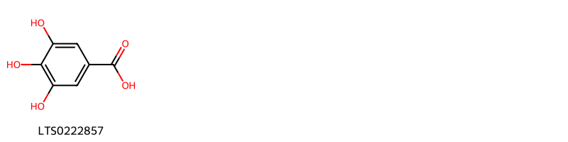
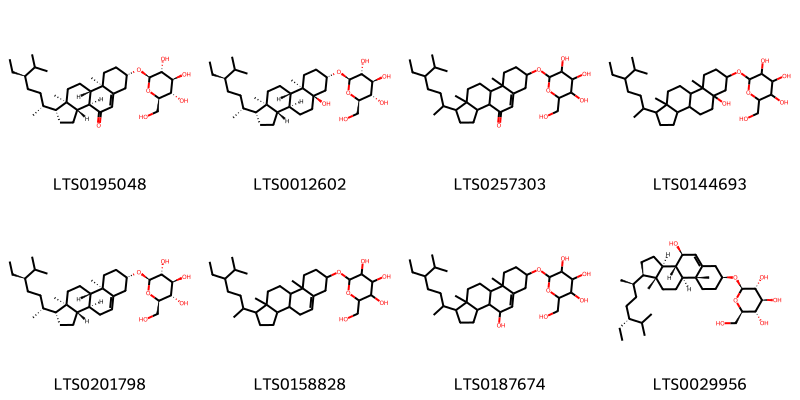

!!! abstract "Tóm tắt"

    Kim anh (Quả) (Fructus Rosae laevigatae) là quả già đã phơi hay sấy khô của cây Kim anh (Rosa laevigata Michx.), họ Hoa hồng (Rosaceae). Cây thường mọc ở các tỉnh miền núi biên giới như Cao Bằng, Lạng Sơn ở Việt Nam và một số khu vực khác tại Trung Quốc và Đài Loan. Quả kim anh có tính toan, cam, sáp, bình, vào các kinh phế, thận, bàng quang. Dược liệu dùng trị di tinh, hoạt tinh, di niệu, niệu tần (tiểu nhiều lần), băng kinh, rong huyết, ỉa chảy, lỵ lâu ngày. Quả kim anh có chứa nhiều thành phần hóa học quan trọng như tanin, vitamin C, saponozit và đường glucoza.

## Thông tin về thực vật

Dược liệu **Kim Anh ( Quả)** từ bộ phận **** từ loài *Rosa laevigata*.

**Mô tả thực vật:** Cây kim anh là một loại cây mềm, mọc thành bụi, xen lẫn với những cây khác như sim, tre v.v... Cây có thể mọc dài tới 10m. Thân cây có đường kính tới 2cm, thân và cành đều có gai mọc cúp xuống phía gốc như cây hoa hồng. Mỗi mẩu thân thường có 1-2 cành vươn ra rất dài, có thể tới 2-3m. Lá có lá kèm và gồm 3 lá chét. Lá chét hình trứng, 2 đầu nhọn, mép có răng cưa, lá chét giữa dài và rộng hơn. Đừng nhầm với cây tầm xuân có số lá chét nhiều hơn (5-7). Hoa màu trắng, đơn độc, mọc ở đầu cành, khi nở có đường kính rộng tới 5-8cm, nhị màu vàng. Đế hoa lớn, hình chén có gai nhỏ, nhọn, cuống hoa dài 1,5-3cm. Lá đài 5, tràng cũng có 5 cánh, nở vào cuối xuân sang hạ (các tháng 2, 3), quả chín vào các tháng 8, 9, 10.
Quả giả (thực ra đó là để hoa) tươi có màu vàng đỏ bóng, cứng hình cái chén, dài 1,5-2cm có cuống dài 2-3cm, phía trên còn sót lại 3-5 lá đài bao vây nhị và vòi hơi nổi phồng lên ngoài mặt có nhiều gai. Khi khô có màu nâu đỏ sẫm hay nhạt, sau khi chế biến, trên mặt có những vết sẹo của gai đã rụng đi. Trong “quả” có rất nhiều lông và “hạt” (thực ra đây mới là quả) hình thon, dẹt, dài 6-7mm, màu vàng nâu nhạt có góc rất cứng. Có hạt có cuống, có hạt không có cuống .

*Tài liệu tham khảo:* "Những cây thuốc và vị thuốc Việt Nam" - Đỗ Tất Lợi 
Trong dược điển Việt nam, một loài được sử dụng làm dược liệu là *Rosa laevigata*.

!!! info "Phân loại thực vật của *Rosa laevigata*"
    - **Kingdom:** Plantae
    - **Phylum:** Tracheophyta
    - **Order:** Rosales
    - **Family:** Rosaceae
    - **Genus:** Rosa
    - **Species:** *Rosa laevigata*

**Phân bố trên thế giới:** nan, United States of America, China, Hong Kong, South Africa, Korea, Republic of

**Phân bố tại Việt nam:** Không có ghi nhận ở Việt Nam

## Thông tin về dược liệu 

### Định danh

!!! info "Thông tin về tên gọi"

    - Dược liệu tiếng Việt: kim anh
    - Dược liệu tiếng Trung: 金樱子 (Jin Ying Zi)
    - Dược liệu tiếng Anh: Rosa Laevigata
    - Dược liệu latin thông dụng: Fructus Rosae laevigatae nRosae Laevigatae Fructus
    - Dược liệu latin kiểu DĐVN: *fructus rosae laevigatae*
    - Dược liệu latin kiểu DĐVN: *Rosae Laevigatae Fructus*
    - Dược liệu latin kiểu thông tư: **
    - Bộ phận dùng:  (Fructus)

### Mô tả dược liệu 

- **Theo dược điển Việt nam V:** Quả già (đế hoa lõm biến thành) bổ dọc, hình bầu dục, dài 2 cm đến 4 cm, rộng 0,3 cm đến 1,2 cm. Mép cắt thường quăn gập lại. Mặt ngoài màu da cam, nâu đỏ hoặc nâu sẫm bóng, hơi nhăn nheo, có vết của gai đã rụng. Đầu trên mang vết tích của lá đài và nhị. Đầu dưới còn sót lại một đoạn cuống ngắn. Phần lớn đã được nạo sạch hạt (quả đóng) và lông. Quả đóng có góc, màu vàng nâu nhạt, rất cứng, có nhiều lông tơ. Vị hơi ngọt, chát.

- **Mô tả dược liệu theo thông tư chế biến dược liệu theo phương pháp cổ truyền:** 

### Chế biến 

- **Chế biến theo dược điển việt nam V**: Thu hái vào tháng 10 đến 11, khi ‘quả’ chín tới biến thành màu đỏ, phơi khô, loại bỏ gai cứng. Bào chế Kim anh: Loại bỏ tạp chất, rửa sạch, sấy khô. Kim anh nhục (thịt ‘quả’ Kim anh): Lấy quả Kim anh sạch, ngâm mềm, bổ đôi, nạo hết ‘hạt’ (quả đóng) và lông ở trong, phơi hoặc sấy khô.

- **Chế biến theo thông tư:** 

--- 

## Thành phần hóa học

- Theo tài liệu của GS. Đỗ Tất Lợi:  (1) Nhóm hóa học: Acid hữu cơ,Tanin, Vitamin C, Saponozit, Đường, Nhựa.
(2) Tên hoạt chất là biomaker : Vitamin C, Saponozit
    

**Thành phần hóa học từ loài **Rosa laevigata**

Theo cơ sở dữ liệu lotus, loài *Rosa laevigata* đã phân lập và xác định được **98** hoạt chất thuộc về các nhóm Steroids and steroid derivatives, Organooxygen compounds, Flavonoids, Cinnamic acids and derivatives, Hydroxy acids and derivatives, Benzofurans, Tannins, Benzene and substituted derivatives, Coumarins and derivatives, Prenol lipids trong bảng dưới đây. Danh sách các hoạt chất như sau methyl (1r,2r,4as,6as,6br,8ar,10r,11r,12ar,12br,14bs)-1,10,11-trihydroxy-1,2,6a,6b,9,9,12a-heptamethyl-2,3,4,5,6,7,8,8a,10,11,12,12b,13,14b-tetradecahydropicene-4a-carboxylate [(LTS0025404)](https://lotus.naturalproducts.net/compound/lotus_id/LTS0025404), 7,8,9,12,13,14,20,28,29,30,33,34,35-tridecahydroxy-3,18,21,24,39-pentaoxaheptacyclo[20.17.0.0²,¹⁹.0⁵,¹⁰.0¹¹,¹⁶.0²⁶,³¹.0³²,³⁷]nonatriaconta-5(10),6,8,11,13,15,26(31),27,29,32,34,36-dodecaene-4,17,25,38-tetrone [(LTS0221409)](https://lotus.naturalproducts.net/compound/lotus_id/LTS0221409), (1r,2r,4as,6as,6br,8ar,10r,11r,12as,12br,13r,14bs)-1,10,11,13-tetrahydroxy-1,2,6a,6b,9,9,12a-heptamethyl-2,3,4,5,6,7,8,8a,10,11,12,12b,13,14b-tetradecahydropicene-4a-carboxylic acid [(LTS0153137)](https://lotus.naturalproducts.net/compound/lotus_id/LTS0153137), (+)-catechol [(LTS0117079)](https://lotus.naturalproducts.net/compound/lotus_id/LTS0117079), 1,10,11,13-tetrahydroxy-1,2,6a,6b,9,9,12a-heptamethyl-2,3,4,5,6,7,8,8a,10,11,12,12b,13,14b-tetradecahydropicene-4a-carboxylic acid [(LTS0130506)](https://lotus.naturalproducts.net/compound/lotus_id/LTS0130506), methyl (1r,2r,4as,6as,6br,8ar,10r,11r,12as,12br,13r,14bs)-1,10,11,13-tetrahydroxy-1,2,6a,6b,9,9,12a-heptamethyl-2,3,4,5,6,7,8,8a,10,11,12,12b,13,14b-tetradecahydropicene-4a-carboxylate [(LTS0101685)](https://lotus.naturalproducts.net/compound/lotus_id/LTS0101685), 3,4,5-trihydroxy-6-(hydroxymethyl)oxan-2-yl 1,10,11-trihydroxy-9-(hydroxymethyl)-1,2,6a,6b,9,12a-hexamethyl-2,3,4,5,6,7,8,8a,10,11,12,12b,13,14b-tetradecahydropicene-4a-carboxylate [(LTS0209667)](https://lotus.naturalproducts.net/compound/lotus_id/LTS0209667), galop [(LTS0222857)](https://lotus.naturalproducts.net/compound/lotus_id/LTS0222857), para-coumaric acid [(LTS0266252)](https://lotus.naturalproducts.net/compound/lotus_id/LTS0266252), 3,4,5-trihydroxy-6-(methoxymethyl)oxan-2-yl 1,10,11-trihydroxy-1,2,6a,6b,9,9,12a-heptamethyl-2,3,4,5,6,7,8,8a,10,11,12,12b,13,14b-tetradecahydropicene-4a-carboxylate [(LTS0196274)](https://lotus.naturalproducts.net/compound/lotus_id/LTS0196274), 1,10,11-trihydroxy-1,2,6a,6b,9,9,12a-heptamethyl-2,3,4,5,6,7,8,8a,10,11,12,12b,13,14b-tetradecahydropicene-4a-carboxylic acid [(LTS0013744)](https://lotus.naturalproducts.net/compound/lotus_id/LTS0013744), (10r,11r,13r,14r,15s)-3,4,5,14,20,21,22-heptahydroxy-13-(hydroxymethyl)-8,17-dioxo-9,12,16-trioxatetracyclo[16.4.0.0²,⁷.0¹⁰,¹⁵]docosa-1(22),2(7),3,5,18,20-hexaen-11-yl 3,4,5-trihydroxybenzoate [(LTS0176688)](https://lotus.naturalproducts.net/compound/lotus_id/LTS0176688), casuarictin [(LTS0241644)](https://lotus.naturalproducts.net/compound/lotus_id/LTS0241644), (2r,3r,4s,5s,6r)-2-{[(1r,3as,3bs,4r,7s,9ar,9bs,11ar)-1-[(2r,5r)-5-ethyl-6-methylheptan-2-yl]-4-hydroxy-9a,11a-dimethyl-1h,2h,3h,3ah,3bh,4h,6h,7h,8h,9h,9bh,10h,11h-cyclopenta[a]phenanthren-7-yl]oxy}-6-(hydroxymethyl)oxane-3,4,5-triol [(LTS0029956)](https://lotus.naturalproducts.net/compound/lotus_id/LTS0029956), 10-hydroxy-1,2,6a,6b,9,9,12a-heptamethyl-2,3,4,5,6,7,8,8a,10,11,12,12b,13,14b-tetradecahydro-1h-picene-4a-carboxylic acid [(LTS0166564)](https://lotus.naturalproducts.net/compound/lotus_id/LTS0166564), 7,8,9,12,13,14,28,29,30,33,34,35-dodecahydroxy-4,17,25,38-tetraoxo-3,18,21,24,39-pentaoxaheptacyclo[20.17.0.0²,¹⁹.0⁵,¹⁰.0¹¹,¹⁶.0²⁶,³¹.0³²,³⁷]nonatriaconta-5,7,9,11(16),12,14,26,28,30,32(37),33,35-dodecaen-20-yl 2-[5-({[3,4,5,14,20,21,22-heptahydroxy-13-(hydroxymethyl)-8,17-dioxo-9,12,16-trioxatetracyclo[16.4.0.0²,⁷.0¹⁰,¹⁵]docosa-1(22),2(7),3,5,18,20-hexaen-11-yl]oxy}carbonyl)-2,3-dihydroxyphenoxy]-3,4,5-trihydroxybenzoate [(LTS0180266)](https://lotus.naturalproducts.net/compound/lotus_id/LTS0180266), 6,7,14-trihydroxy-13-[(3,4,5-trihydroxyoxan-2-yl)oxy]-2,9-dioxatetracyclo[6.6.2.0⁴,¹⁶.0¹¹,¹⁵]hexadeca-1(15),4,6,8(16),11,13-hexaene-3,10-dione [(LTS0265081)](https://lotus.naturalproducts.net/compound/lotus_id/LTS0265081), [(2s,3r,4r,5s,6r)-3,4,5-trihydroxy-6-[2-hydroxy-4-(2-hydroxyethyl)phenoxy]oxan-2-yl]methyl 3,4,5-trihydroxybenzoate [(LTS0152950)](https://lotus.naturalproducts.net/compound/lotus_id/LTS0152950), (2s,3r,4s,5s,6r)-3,4,5-trihydroxy-6-(methoxymethyl)oxan-2-yl (1r,2r,4as,6as,6br,8ar,10r,11r,12ar,12br,14bs)-1,10,11-trihydroxy-1,2,6a,6b,9,9,12a-heptamethyl-2,3,4,5,6,7,8,8a,10,11,12,12b,13,14b-tetradecahydropicene-4a-carboxylate [(LTS0213683)](https://lotus.naturalproducts.net/compound/lotus_id/LTS0213683), 3-[6-({[(1r,2s,19r,20r,22r)-7,8,9,12,13,14,28,29,30,33,34,35-dodecahydroxy-4,17,25,38-tetraoxo-3,18,21,24,39-pentaoxaheptacyclo[20.17.0.0²,¹⁹.0⁵,¹⁰.0¹¹,¹⁶.0²⁶,³¹.0³²,³⁷]nonatriaconta-5,7,9,11(16),12,14,26,28,30,32(37),33,35-dodecaen-20-yl]oxy}carbonyl)-2,3,4-trihydroxyphenoxy]-4,5-dihydroxybenzoic acid [(LTS0239507)](https://lotus.naturalproducts.net/compound/lotus_id/LTS0239507), esculetin [(LTS0067593)](https://lotus.naturalproducts.net/compound/lotus_id/LTS0067593), 10,11-dihydroxy-9-(hydroxymethyl)-2,2,6a,6b,9,12a-hexamethyl-1,3,4,5,6,7,8,8a,10,11,12,12b,13,14b-tetradecahydropicene-4a-carboxylic acid [(LTS0258848)](https://lotus.naturalproducts.net/compound/lotus_id/LTS0258848), 7,8,9,12,13,14,28,29,30,33,34,35-dodecahydroxy-4,17,24,38-tetraoxo-3,18,21,25,39-pentaoxaheptacyclo[20.17.0.0²,¹⁹.0⁵,¹⁰.0¹¹,¹⁶.0²⁶,³¹.0³²,³⁷]nonatriaconta-5(10),6,8,11,13,15,26(31),27,29,32,34,36-dodecaen-20-yl 2-[5-({[3,4,5,14,20,21,22-heptahydroxy-13-(hydroxymethyl)-8,17-dioxo-9,12,16-trioxatetracyclo[16.4.0.0²,⁷.0¹⁰,¹⁵]docosa-1(22),2(7),3,5,18,20-hexaen-11-yl]oxy}carbonyl)-2,3-dihydroxyphenoxy]-3,4,5-trihydroxybenzoate [(LTS0055157)](https://lotus.naturalproducts.net/compound/lotus_id/LTS0055157), diethyl malate [(LTS0207399)](https://lotus.naturalproducts.net/compound/lotus_id/LTS0207399), 2-[5-({[3,4,5,14,20,21,22-heptahydroxy-13-(hydroxymethyl)-8,17-dioxo-9,12,16-trioxatetracyclo[16.4.0.0²,⁷.0¹⁰,¹⁵]docosa-1(22),2(7),3,5,18,20-hexaen-11-yl]oxy}carbonyl)-2,3-dihydroxyphenoxy]-3,4,5-trihydroxybenzoic acid [(LTS0213212)](https://lotus.naturalproducts.net/compound/lotus_id/LTS0213212), euscaphic acid [(LTS0205657)](https://lotus.naturalproducts.net/compound/lotus_id/LTS0205657), 10,11-dihydroxy-2,2,6a,6b,9,9,12a-heptamethyl-1,3,4,5,6,7,8,8a,10,11,12,12b,13,14b-tetradecahydropicene-4a-carboxylic acid [(LTS0167090)](https://lotus.naturalproducts.net/compound/lotus_id/LTS0167090), 10-hydroxy-11-methoxy-1,2,6a,6b,9,9,12a-heptamethyl-2,3,4,5,6,7,8,8a,10,11,12,12b,13,14b-tetradecahydro-1h-picene-4a-carboxylic acid [(LTS0067806)](https://lotus.naturalproducts.net/compound/lotus_id/LTS0067806), 3,4,5,14,20,21,22-heptahydroxy-13-(hydroxymethyl)-8,17-dioxo-9,12,16-trioxatetracyclo[16.4.0.0²,⁷.0¹⁰,¹⁵]docosa-1(22),2(7),3,5,18,20-hexaen-11-yl 2-[5-({[3,4,5,14,20,21,22-heptahydroxy-13-(hydroxymethyl)-8,17-dioxo-9,12,16-trioxatetracyclo[16.4.0.0²,⁷.0¹⁰,¹⁵]docosa-1(22),2(7),3,5,18,20-hexaen-11-yl]oxy}carbonyl)-2,3-dihydroxyphenoxy]-3,4,5-trihydroxybenzoate [(LTS0233902)](https://lotus.naturalproducts.net/compound/lotus_id/LTS0233902), tormentic acid [(LTS0102591)](https://lotus.naturalproducts.net/compound/lotus_id/LTS0102591), 6,7,14-trihydroxy-13-{[(2r,3r,4s,5r)-3,4,5-trihydroxyoxan-2-yl]oxy}-2,9-dioxatetracyclo[6.6.2.0⁴,¹⁶.0¹¹,¹⁵]hexadeca-1(15),4,6,8(16),11,13-hexaene-3,10-dione [(LTS0162363)](https://lotus.naturalproducts.net/compound/lotus_id/LTS0162363), 2-{[1-(5-ethyl-6-methylheptan-2-yl)-4-hydroxy-9a,11a-dimethyl-1h,2h,3h,3ah,3bh,4h,6h,7h,8h,9h,9bh,10h,11h-cyclopenta[a]phenanthren-7-yl]oxy}-6-(hydroxymethyl)oxane-3,4,5-triol [(LTS0187674)](https://lotus.naturalproducts.net/compound/lotus_id/LTS0187674), 3,4,5,14,20,21,22-heptahydroxy-13-(hydroxymethyl)-8,17-dioxo-9,12,16-trioxatetracyclo[16.4.0.0²,⁷.0¹⁰,¹⁵]docosa-1(22),2(7),3,5,18,20-hexaen-11-yl 2-{5-[({7,8,9,12,13,14,28,29,30,33,34,35-dodecahydroxy-4,17,25,38-tetraoxo-3,18,21,24,39-pentaoxaheptacyclo[20.17.0.0²,¹⁹.0⁵,¹⁰.0¹¹,¹⁶.0²⁶,³¹.0³²,³⁷]nonatriaconta-5,7,9,11(16),12,14,26,28,30,32(37),33,35-dodecaen-20-yl}oxy)carbonyl]-2,3-dihydroxyphenoxy}-3,4,5-trihydroxybenzoate [(LTS0202006)](https://lotus.naturalproducts.net/compound/lotus_id/LTS0202006), 19α-hydroxyasiatic acid [(LTS0215499)](https://lotus.naturalproducts.net/compound/lotus_id/LTS0215499), (1r,3as,3bs,7s,9ar,9bs,11ar)-1-[(2r,5r)-5-ethyl-6-methylheptan-2-yl]-9a,11a-dimethyl-7-{[(2r,3r,4s,5s,6r)-3,4,5-trihydroxy-6-(hydroxymethyl)oxan-2-yl]oxy}-1h,2h,3h,3ah,3bh,6h,7h,8h,9h,9bh,10h,11h-cyclopenta[a]phenanthren-4-one [(LTS0195048)](https://lotus.naturalproducts.net/compound/lotus_id/LTS0195048), {3,4,5-trihydroxy-6-[2-hydroxy-4-(2-hydroxyethyl)phenoxy]oxan-2-yl}methyl 3,4,5-trihydroxybenzoate [(LTS0136677)](https://lotus.naturalproducts.net/compound/lotus_id/LTS0136677), methyl 1,10,11,13-tetrahydroxy-1,2,6a,6b,9,9,12a-heptamethyl-2,3,4,5,6,7,8,8a,10,11,12,12b,13,14b-tetradecahydropicene-4a-carboxylate [(LTS0100796)](https://lotus.naturalproducts.net/compound/lotus_id/LTS0100796), 7,8,9,12,13,14,28,29,30,33,34,35-dodecahydroxy-4,17,25,38-tetraoxo-3,18,21,24,39-pentaoxaheptacyclo[20.17.0.0²,¹⁹.0⁵,¹⁰.0¹¹,¹⁶.0²⁶,³¹.0³²,³⁷]nonatriaconta-5,7,9,11(16),12,14,26,28,30,32(37),33,35-dodecaen-20-yl 3,4,5-trihydroxybenzoate [(LTS0009009)](https://lotus.naturalproducts.net/compound/lotus_id/LTS0009009), o1-methyl-glucose [(LTS0211293)](https://lotus.naturalproducts.net/compound/lotus_id/LTS0211293), maslinic acid [(LTS0109701)](https://lotus.naturalproducts.net/compound/lotus_id/LTS0109701), methyl 1,10,11-trihydroxy-1,2,6a,6b,9,9,12a-heptamethyl-2,3,4,5,6,7,8,8a,10,11,12,12b,13,14b-tetradecahydropicene-4a-carboxylate [(LTS0274330)](https://lotus.naturalproducts.net/compound/lotus_id/LTS0274330), 1,10,11-trihydroxy-9-(hydroxymethyl)-1,2,6a,6b,9,12a-hexamethyl-2,3,4,5,6,7,8,8a,10,11,12,12b,13,14b-tetradecahydropicene-4a-carboxylic acid [(LTS0156783)](https://lotus.naturalproducts.net/compound/lotus_id/LTS0156783), methyl (1r,2r,4as,6as,6br,8ar,10s,11r,12ar,12br,14bs)-1,10,11-trihydroxy-1,2,6a,6b,9,9,12a-heptamethyl-2,3,4,5,6,7,8,8a,10,11,12,12b,13,14b-tetradecahydropicene-4a-carboxylate [(LTS0055427)](https://lotus.naturalproducts.net/compound/lotus_id/LTS0055427), (1s,2r,4as,6as,6br,8ar,10r,11r,12ar,12br,14bs)-10-hydroxy-11-methoxy-1,2,6a,6b,9,9,12a-heptamethyl-2,3,4,5,6,7,8,8a,10,11,12,12b,13,14b-tetradecahydro-1h-picene-4a-carboxylic acid [(LTS0075435)](https://lotus.naturalproducts.net/compound/lotus_id/LTS0075435), (10r,11r,13r,14r,15s)-3,4,5,14,20,21,22-heptahydroxy-13-(hydroxymethyl)-8,17-dioxo-9,12,16-trioxatetracyclo[16.4.0.0²,⁷.0¹⁰,¹⁵]docosa-1(22),2(7),3,5,18,20-hexaen-11-yl 2-[5-({[(1r,2s,19r,20r,22r)-7,8,9,12,13,14,28,29,30,33,34,35-dodecahydroxy-4,17,25,38-tetraoxo-3,18,21,24,39-pentaoxaheptacyclo[20.17.0.0²,¹⁹.0⁵,¹⁰.0¹¹,¹⁶.0²⁶,³¹.0³²,³⁷]nonatriaconta-5,7,9,11(16),12,14,26,28,30,32(37),33,35-dodecaen-20-yl]oxy}carbonyl)-2,3-dihydroxyphenoxy]-3,4,5-trihydroxybenzoate [(LTS0217104)](https://lotus.naturalproducts.net/compound/lotus_id/LTS0217104), (1r,2r,4as,6as,6br,8ar,9r,10s,11r,12ar,12br,14bs)-1,10,11-trihydroxy-9-(hydroxymethyl)-1,2,6a,6b,9,12a-hexamethyl-2,3,4,5,6,7,8,8a,10,11,12,12b,13,14b-tetradecahydropicene-4a-carboxylic acid [(LTS0101460)](https://lotus.naturalproducts.net/compound/lotus_id/LTS0101460), sitogluside [(LTS0201798)](https://lotus.naturalproducts.net/compound/lotus_id/LTS0201798), catechol [(LTS0090912)](https://lotus.naturalproducts.net/compound/lotus_id/LTS0090912), (+)-epicatechin [(LTS0222407)](https://lotus.naturalproducts.net/compound/lotus_id/LTS0222407), 1-(5-ethyl-6-methylheptan-2-yl)-9a,11a-dimethyl-7-{[3,4,5-trihydroxy-6-(hydroxymethyl)oxan-2-yl]oxy}-1h,2h,3h,3ah,3bh,6h,7h,8h,9h,9bh,10h,11h-cyclopenta[a]phenanthren-4-one [(LTS0257303)](https://lotus.naturalproducts.net/compound/lotus_id/LTS0257303), (2s,3r,4s,5s,6r)-3,4,5-trihydroxy-6-(hydroxymethyl)oxan-2-yl (1r,2r,4as,6as,6br,8ar,10r,11r,12ar,12br,14bs)-1,10,11-trihydroxy-1,2,6a,6b,9,9,12a-heptamethyl-2,3,4,5,6,7,8,8a,10,11,12,12b,13,14b-tetradecahydropicene-4a-carboxylate [(LTS0206047)](https://lotus.naturalproducts.net/compound/lotus_id/LTS0206047), (1r,2s,19r,20s,22r)-7,8,9,12,13,14,20,28,29,30,33,34,35-tridecahydroxy-3,18,21,24,39-pentaoxaheptacyclo[20.17.0.0²,¹⁹.0⁵,¹⁰.0¹¹,¹⁶.0²⁶,³¹.0³²,³⁷]nonatriaconta-5(10),6,8,11,13,15,26(31),27,29,32,34,36-dodecaene-4,17,25,38-tetrone [(LTS0272643)](https://lotus.naturalproducts.net/compound/lotus_id/LTS0272643), 7,8,9,12,13,14,28,29,30,33,34,35-dodecahydroxy-4,17,25,38-tetraoxo-3,18,21,24,39-pentaoxaheptacyclo[20.17.0.0²,¹⁹.0⁵,¹⁰.0¹¹,¹⁶.0²⁶,³¹.0³²,³⁷]nonatriaconta-5,7,9,11(16),12,14,26,28,30,32(37),33,35-dodecaen-20-yl 2-{5-[({7,8,9,12,13,14,28,29,30,33,34,35-dodecahydroxy-4,17,25,38-tetraoxo-3,18,21,24,39-pentaoxaheptacyclo[20.17.0.0²,¹⁹.0⁵,¹⁰.0¹¹,¹⁶.0²⁶,³¹.0³²,³⁷]nonatriaconta-5,7,9,11(16),12,14,26,28,30,32(37),33,35-dodecaen-20-yl}oxy)carbonyl]-2,3-dihydroxyphenoxy}-3,4,5-trihydroxybenzoate [(LTS0029337)](https://lotus.naturalproducts.net/compound/lotus_id/LTS0029337), (4as,6as,6br,8ar,9r,10s,11r,12ar,12br,14bs)-10,11-dihydroxy-9-(hydroxymethyl)-2,2,6a,6b,9,12a-hexamethyl-1,3,4,5,6,7,8,8a,10,11,12,12b,13,14b-tetradecahydropicene-4a-carboxylic acid [(LTS0088461)](https://lotus.naturalproducts.net/compound/lotus_id/LTS0088461), hederagenin [(LTS0157813)](https://lotus.naturalproducts.net/compound/lotus_id/LTS0157813), (2s,3r,4s,5s,6r)-3,4,5-trihydroxy-6-(hydroxymethyl)oxan-2-yl (2s,4ar,6as,6br,8ar,9r,10r,11r,12ar,12br)-10,11-dihydroxy-2,9-bis(hydroxymethyl)-2,6a,6b,9,12a-pentamethyl-1,3,4,5,6,7,8,8a,10,11,12,12b,13,14-tetradecahydropicene-4a-carboxylate [(LTS0118740)](https://lotus.naturalproducts.net/compound/lotus_id/LTS0118740), methyl (1r)-1,10,11-trihydroxy-1,2,6a,6b,9,9,12a-heptamethyl-2,3,4,5,6,7,8,8a,10,11,12,12b,13,14b-tetradecahydropicene-4a-carboxylate [(LTS0057567)](https://lotus.naturalproducts.net/compound/lotus_id/LTS0057567), 6-{[3,4-dihydroxy-5-(hydroxymethyl)oxolan-2-yl]oxy}-7,13,14-trihydroxy-2,9-dioxatetracyclo[6.6.2.0⁴,¹⁶.0¹¹,¹⁵]hexadeca-1(15),4,6,8(16),11,13-hexaene-3,10-dione [(LTS0191766)](https://lotus.naturalproducts.net/compound/lotus_id/LTS0191766), corosolic acid [(LTS0231285)](https://lotus.naturalproducts.net/compound/lotus_id/LTS0231285), loliolide [(LTS0254454)](https://lotus.naturalproducts.net/compound/lotus_id/LTS0254454), 2-[5-({[(1r,2s,19r,20r,22r)-7,8,9,12,13,14,28,29,30,33,34,35-dodecahydroxy-4,17,25,38-tetraoxo-3,18,21,24,39-pentaoxaheptacyclo[20.17.0.0²,¹⁹.0⁵,¹⁰.0¹¹,¹⁶.0²⁶,³¹.0³²,³⁷]nonatriaconta-5,7,9,11(16),12,14,26,28,30,32(37),33,35-dodecaen-20-yl]oxy}carbonyl)-2,3-dihydroxyphenoxy]-3,4,5-trihydroxybenzoic acid [(LTS0014197)](https://lotus.naturalproducts.net/compound/lotus_id/LTS0014197), (1r,2s,19r,20r,22r)-7,8,9,12,13,14,28,29,30,33,34,35-dodecahydroxy-4,17,25,38-tetraoxo-3,18,21,24,39-pentaoxaheptacyclo[20.17.0.0²,¹⁹.0⁵,¹⁰.0¹¹,¹⁶.0²⁶,³¹.0³²,³⁷]nonatriaconta-5,7,9,11(16),12,14,26,28,30,32(37),33,35-dodecaen-20-yl 2-[2,3-dihydroxy-5-({[(10s,11s,12r,13s,15r)-3,4,5,11,13,21,22,23-octahydroxy-8,18-dioxo-9,14,17-trioxatetracyclo[17.4.0.0²,⁷.0¹⁰,¹⁵]tricosa-1(23),2(7),3,5,19,21-hexaen-12-yl]oxy}carbonyl)phenoxy]-3,4,5-trihydroxybenzoate [(LTS0187848)](https://lotus.naturalproducts.net/compound/lotus_id/LTS0187848), 2-[5-({[(10r,11r,13r,14r,15s)-3,4,5,14,20,21,22-heptahydroxy-13-(hydroxymethyl)-8,17-dioxo-9,12,16-trioxatetracyclo[16.4.0.0²,⁷.0¹⁰,¹⁵]docosa-1(22),2(7),3,5,18,20-hexaen-11-yl]oxy}carbonyl)-2,3-dihydroxyphenoxy]-3,4,5-trihydroxybenzoic acid [(LTS0274555)](https://lotus.naturalproducts.net/compound/lotus_id/LTS0274555), 9,10-dihydroxy-8-(hydroxymethyl)-5a,5b,8,11a-tetramethyl-1-(prop-1-en-2-yl)-hexadecahydrocyclopenta[a]chrysene-3a-carboxylic acid [(LTS0088264)](https://lotus.naturalproducts.net/compound/lotus_id/LTS0088264), 2-{[1-(5-ethyl-6-methylheptan-2-yl)-9a,11a-dimethyl-1h,2h,3h,3ah,3bh,4h,6h,7h,8h,9h,9bh,10h,11h-cyclopenta[a]phenanthren-7-yl]oxy}-6-(hydroxymethyl)oxane-3,4,5-triol [(LTS0158828)](https://lotus.naturalproducts.net/compound/lotus_id/LTS0158828), oleanolic acid [(LTS0141130)](https://lotus.naturalproducts.net/compound/lotus_id/LTS0141130), (1r,2s,19r,20r,22r)-7,8,9,12,13,14,28,29,30,33,34,35-dodecahydroxy-4,17,25,38-tetraoxo-3,18,21,24,39-pentaoxaheptacyclo[20.17.0.0²,¹⁹.0⁵,¹⁰.0¹¹,¹⁶.0²⁶,³¹.0³²,³⁷]nonatriaconta-5,7,9,11(16),12,14,26,28,30,32(37),33,35-dodecaen-20-yl 2-[2,3-dihydroxy-5-({[(10s,11s,12r,13r,15r)-3,4,5,11,13,21,22,23-octahydroxy-8,18-dioxo-9,14,17-trioxatetracyclo[17.4.0.0²,⁷.0¹⁰,¹⁵]tricosa-1(19),2,4,6,20,22-hexaen-12-yl]oxy}carbonyl)phenoxy]-3,4,5-trihydroxybenzoate [(LTS0143858)](https://lotus.naturalproducts.net/compound/lotus_id/LTS0143858), methyl 10-hydroxy-11-methoxy-1,2,6a,6b,9,9,12a-heptamethyl-2,3,4,5,6,7,8,8a,10,11,12,12b,13,14b-tetradecahydro-1h-picene-4a-carboxylate [(LTS0207367)](https://lotus.naturalproducts.net/compound/lotus_id/LTS0207367), (10r,11r,13r,14r,15s)-3,4,5,14,20,21,22-heptahydroxy-13-(hydroxymethyl)-8,17-dioxo-9,12,16-trioxatetracyclo[16.4.0.0²,⁷.0¹⁰,¹⁵]docosa-1(22),2(7),3,5,18,20-hexaen-11-yl 2-[5-({[(10r,11r,13r,14r,15s)-3,4,5,14,20,21,22-heptahydroxy-13-(hydroxymethyl)-8,17-dioxo-9,12,16-trioxatetracyclo[16.4.0.0²,⁷.0¹⁰,¹⁵]docosa-1(22),2(7),3,5,18,20-hexaen-11-yl]oxy}carbonyl)-2,3-dihydroxyphenoxy]-3,4,5-trihydroxybenzoate [(LTS0175540)](https://lotus.naturalproducts.net/compound/lotus_id/LTS0175540), (1r,2s,19r,20r,22r)-7,8,9,12,13,14,28,29,30,33,34,35-dodecahydroxy-4,17,25,38-tetraoxo-3,18,21,24,39-pentaoxaheptacyclo[20.17.0.0²,¹⁹.0⁵,¹⁰.0¹¹,¹⁶.0²⁶,³¹.0³²,³⁷]nonatriaconta-5,7,9,11(16),12,14,26,28,30,32(37),33,35-dodecaen-20-yl 2-[5-({[(10r,11r,13r,14r,15s)-3,4,5,14,20,21,22-heptahydroxy-13-(hydroxymethyl)-8,17-dioxo-9,12,16-trioxatetracyclo[16.4.0.0²,⁷.0¹⁰,¹⁵]docosa-1(22),2(7),3,5,18,20-hexaen-11-yl]oxy}carbonyl)-2,3-dihydroxyphenoxy]-3,4,5-trihydroxybenzoate [(LTS0164179)](https://lotus.naturalproducts.net/compound/lotus_id/LTS0164179), (1r,2s,19r,20r,22r)-7,8,9,12,13,14,28,29,30,33,34,35-dodecahydroxy-4,17,25,38-tetraoxo-3,18,21,24,39-pentaoxaheptacyclo[20.17.0.0²,¹⁹.0⁵,¹⁰.0¹¹,¹⁶.0²⁶,³¹.0³²,³⁷]nonatriaconta-5,7,9,11(16),12,14,26,28,30,32(37),33,35-dodecaen-20-yl 2-[2,3-dihydroxy-5-({[(10s,11s,12r,15r)-3,4,5,11,13,21,22,23-octahydroxy-8,18-dioxo-9,14,17-trioxatetracyclo[17.4.0.0²,⁷.0¹⁰,¹⁵]tricosa-1(23),2(7),3,5,19,21-hexaen-12-yl]oxy}carbonyl)phenoxy]-3,4,5-trihydroxybenzoate [(LTS0105116)](https://lotus.naturalproducts.net/compound/lotus_id/LTS0105116), (10s,11r,12r,13r,15r)-3,4,5,11,12,21,22,23-octahydroxy-8,18-dioxo-9,14,17-trioxatetracyclo[17.4.0.0²,⁷.0¹⁰,¹⁵]tricosa-1(23),2(7),3,5,19,21-hexaen-13-yl 2-[5-({[(1r,2s,19r,20r,22r)-7,8,9,12,13,14,28,29,30,33,34,35-dodecahydroxy-4,17,25,38-tetraoxo-3,18,21,24,39-pentaoxaheptacyclo[20.17.0.0²,¹⁹.0⁵,¹⁰.0¹¹,¹⁶.0²⁶,³¹.0³²,³⁷]nonatriaconta-5,7,9,11(16),12,14,26,28,30,32(37),33,35-dodecaen-20-yl]oxy}carbonyl)-2,3-dihydroxyphenoxy]-3,4,5-trihydroxybenzoate [(LTS0138471)](https://lotus.naturalproducts.net/compound/lotus_id/LTS0138471), (10s,11s,13r,14r,15s)-3,4,5,14,20,21,22-heptahydroxy-13-(hydroxymethyl)-8,17-dioxo-9,12,16-trioxatetracyclo[16.4.0.0²,⁷.0¹⁰,¹⁵]docosa-1(22),2(7),3,5,18,20-hexaen-11-yl 3,4,5-trihydroxybenzoate [(LTS0272893)](https://lotus.naturalproducts.net/compound/lotus_id/LTS0272893), methyl-α-d-mannoside [(LTS0012148)](https://lotus.naturalproducts.net/compound/lotus_id/LTS0012148), (2s,3r,4s,5s,6r)-3,4,5-trihydroxy-6-(hydroxymethyl)oxan-2-yl (1r,2r,4as,6as,6br,8ar,9r,10r,11r,12ar,12br,14bs)-1,10,11-trihydroxy-9-(hydroxymethyl)-1,2,6a,6b,9,12a-hexamethyl-2,3,4,5,6,7,8,8a,10,11,12,12b,13,14b-tetradecahydropicene-4a-carboxylate [(LTS0222629)](https://lotus.naturalproducts.net/compound/lotus_id/LTS0222629), 2-{5-[({7,8,9,12,13,14,28,29,30,33,34,35-dodecahydroxy-4,17,25,38-tetraoxo-3,18,21,24,39-pentaoxaheptacyclo[20.17.0.0²,¹⁹.0⁵,¹⁰.0¹¹,¹⁶.0²⁶,³¹.0³²,³⁷]nonatriaconta-5,7,9,11(16),12,14,26,28,30,32(37),33,35-dodecaen-20-yl}oxy)carbonyl]-2,3-dihydroxyphenoxy}-3,4,5-trihydroxybenzoic acid [(LTS0061601)](https://lotus.naturalproducts.net/compound/lotus_id/LTS0061601), 3,4,5,11,12,21,22,23-octahydroxy-8,18-dioxo-9,14,17-trioxatetracyclo[17.4.0.0²,⁷.0¹⁰,¹⁵]tricosa-1(23),2(7),3,5,19,21-hexaen-13-yl 2-{5-[({7,8,9,12,13,14,28,29,30,33,34,35-dodecahydroxy-4,17,25,38-tetraoxo-3,18,21,24,39-pentaoxaheptacyclo[20.17.0.0²,¹⁹.0⁵,¹⁰.0¹¹,¹⁶.0²⁶,³¹.0³²,³⁷]nonatriaconta-5,7,9,11(16),12,14,26,28,30,32(37),33,35-dodecaen-20-yl}oxy)carbonyl]-2,3-dihydroxyphenoxy}-3,4,5-trihydroxybenzoate [(LTS0173389)](https://lotus.naturalproducts.net/compound/lotus_id/LTS0173389), 2-{[1-(5-ethyl-6-methylheptan-2-yl)-5a-hydroxy-9a,11a-dimethyl-tetradecahydrocyclopenta[a]phenanthren-7-yl]oxy}-6-(hydroxymethyl)oxane-3,4,5-triol [(LTS0144693)](https://lotus.naturalproducts.net/compound/lotus_id/LTS0144693), 7,8,9,12,13,14,28,29,30,33,34,35-dodecahydroxy-4,17,25,38-tetraoxo-3,18,21,24,39-pentaoxaheptacyclo[20.17.0.0²,¹⁹.0⁵,¹⁰.0¹¹,¹⁶.0²⁶,³¹.0³²,³⁷]nonatriaconta-5,7,9,11(16),12,14,26,28,30,32(37),33,35-dodecaen-20-yl 2-{2,3-dihydroxy-5-[({3,4,5,11,13,21,22,23-octahydroxy-8,18-dioxo-9,14,17-trioxatetracyclo[17.4.0.0²,⁷.0¹⁰,¹⁵]tricosa-1(23),2(7),3,5,19,21-hexaen-12-yl}oxy)carbonyl]phenoxy}-3,4,5-trihydroxybenzoate [(LTS0243458)](https://lotus.naturalproducts.net/compound/lotus_id/LTS0243458), (1r,2s,19r,20r,22r)-7,8,9,12,13,14,28,29,30,33,34,35-dodecahydroxy-4,17,25,38-tetraoxo-3,18,21,24,39-pentaoxaheptacyclo[20.17.0.0²,¹⁹.0⁵,¹⁰.0¹¹,¹⁶.0²⁶,³¹.0³²,³⁷]nonatriaconta-5,7,9,11(16),12,14,26,28,30,32(37),33,35-dodecaen-20-yl 2-[5-({[(1r,2s,19r,20r,22r)-7,8,9,12,13,14,28,29,30,33,34,35-dodecahydroxy-4,17,25,38-tetraoxo-3,18,21,24,39-pentaoxaheptacyclo[20.17.0.0²,¹⁹.0⁵,¹⁰.0¹¹,¹⁶.0²⁶,³¹.0³²,³⁷]nonatriaconta-5,7,9,11(16),12,14,26,28,30,32(37),33,35-dodecaen-20-yl]oxy}carbonyl)-2,3-dihydroxyphenoxy]-3,4,5-trihydroxybenzoate [(LTS0113088)](https://lotus.naturalproducts.net/compound/lotus_id/LTS0113088), (10s,11r,12r,13r,15r)-3,4,5,11,12,21,22,23-octahydroxy-8,18-dioxo-9,14,17-trioxatetracyclo[17.4.0.0²,⁷.0¹⁰,¹⁵]tricosa-1(23),2(7),3,5,19,21-hexaen-13-yl 2-[5-({[(10r,11r,13r,14r,15s)-3,4,5,14,20,21,22-heptahydroxy-13-(hydroxymethyl)-8,17-dioxo-9,12,16-trioxatetracyclo[16.4.0.0²,⁷.0¹⁰,¹⁵]docosa-1(22),2(7),3,5,18,20-hexaen-11-yl]oxy}carbonyl)-2,3-dihydroxyphenoxy]-3,4,5-trihydroxybenzoate [(LTS0231291)](https://lotus.naturalproducts.net/compound/lotus_id/LTS0231291), methyl (1s,2r,4as,6as,6br,8ar,10r,11r,12ar,12br,14bs)-10,11-dihydroxy-1,2,6a,6b,9,9,12a-heptamethyl-2,3,4,5,6,7,8,8a,10,11,12,12b,13,14b-tetradecahydro-1h-picene-4a-carboxylate [(LTS0250757)](https://lotus.naturalproducts.net/compound/lotus_id/LTS0250757), oleanolic acid [(LTS0117717)](https://lotus.naturalproducts.net/compound/lotus_id/LTS0117717), 10,11-dihydroxy-1,2,6a,6b,9,9,12a-heptamethyl-2,3,4,5,6,7,8,8a,10,11,12,12b,13,14b-tetradecahydro-1h-picene-4a-carboxylic acid [(LTS0122037)](https://lotus.naturalproducts.net/compound/lotus_id/LTS0122037), methyl (1s,2r,4as,6as,6br,8ar,10r,11r,12ar,12br,14bs)-10-hydroxy-11-methoxy-1,2,6a,6b,9,9,12a-heptamethyl-2,3,4,5,6,7,8,8a,10,11,12,12b,13,14b-tetradecahydro-1h-picene-4a-carboxylate [(LTS0105757)](https://lotus.naturalproducts.net/compound/lotus_id/LTS0105757), ursolic acid [(LTS0250838)](https://lotus.naturalproducts.net/compound/lotus_id/LTS0250838), 6-{[(2s,3r,4r,5s)-3,4-dihydroxy-5-(hydroxymethyl)oxolan-2-yl]oxy}-7,13,14-trihydroxy-2,9-dioxatetracyclo[6.6.2.0⁴,¹⁶.0¹¹,¹⁵]hexadeca-1(15),4,6,8(16),11,13-hexaene-3,10-dione [(LTS0258176)](https://lotus.naturalproducts.net/compound/lotus_id/LTS0258176), ellagic acid [(LTS0037297)](https://lotus.naturalproducts.net/compound/lotus_id/LTS0037297), 3,4,5,11,12,21,22,23-octahydroxy-8,18-dioxo-9,14,17-trioxatetracyclo[17.4.0.0²,⁷.0¹⁰,¹⁵]tricosa-1(23),2(7),3,5,19,21-hexaen-13-yl 2-[5-({[3,4,5,14,20,21,22-heptahydroxy-13-(hydroxymethyl)-8,17-dioxo-9,12,16-trioxatetracyclo[16.4.0.0²,⁷.0¹⁰,¹⁵]docosa-1(22),2(7),3,5,18,20-hexaen-11-yl]oxy}carbonyl)-2,3-dihydroxyphenoxy]-3,4,5-trihydroxybenzoate [(LTS0038398)](https://lotus.naturalproducts.net/compound/lotus_id/LTS0038398), (2r,3r,4s,5s,6r)-2-{[(1r,3as,3bs,5ar,7s,9ar,9bs,11ar)-1-[(2r,5r)-5-ethyl-6-methylheptan-2-yl]-5a-hydroxy-9a,11a-dimethyl-tetradecahydrocyclopenta[a]phenanthren-7-yl]oxy}-6-(hydroxymethyl)oxane-3,4,5-triol [(LTS0012602)](https://lotus.naturalproducts.net/compound/lotus_id/LTS0012602), methyl 10,11-dihydroxy-1,2,6a,6b,9,9,12a-heptamethyl-2,3,4,5,6,7,8,8a,10,11,12,12b,13,14b-tetradecahydro-1h-picene-4a-carboxylate [(LTS0154296)](https://lotus.naturalproducts.net/compound/lotus_id/LTS0154296), (1r,2s,19r,22r)-7,8,9,12,13,14,20,28,29,30,33,34,35-tridecahydroxy-3,18,21,24,39-pentaoxaheptacyclo[20.17.0.0²,¹⁹.0⁵,¹⁰.0¹¹,¹⁶.0²⁶,³¹.0³²,³⁷]nonatriaconta-5(10),6,8,11,13,15,26(31),27,29,32,34,36-dodecaene-4,17,25,38-tetrone [(LTS0137167)](https://lotus.naturalproducts.net/compound/lotus_id/LTS0137167), 10-hydroxy-9-(hydroxymethyl)-2,2,6a,6b,9,12a-hexamethyl-1,3,4,5,6,7,8,8a,10,11,12,12b,13,14b-tetradecahydropicene-4a-carboxylic acid [(LTS0139989)](https://lotus.naturalproducts.net/compound/lotus_id/LTS0139989), (1r,3as,5ar,5br,7ar,8r,9r,10r,11ar,11br,13ar,13br)-9,10-dihydroxy-8-(hydroxymethyl)-5a,5b,8,11a-tetramethyl-1-(prop-1-en-2-yl)-hexadecahydrocyclopenta[a]chrysene-3a-carboxylic acid [(LTS0155412)](https://lotus.naturalproducts.net/compound/lotus_id/LTS0155412), 3-{6-[({7,8,9,12,13,14,28,29,30,33,34,35-dodecahydroxy-4,17,25,38-tetraoxo-3,18,21,24,39-pentaoxaheptacyclo[20.17.0.0²,¹⁹.0⁵,¹⁰.0¹¹,¹⁶.0²⁶,³¹.0³²,³⁷]nonatriaconta-5,7,9,11(16),12,14,26,28,30,32(37),33,35-dodecaen-20-yl}oxy)carbonyl]-2,3,4-trihydroxyphenoxy}-4,5-dihydroxybenzoic acid [(LTS0208883)](https://lotus.naturalproducts.net/compound/lotus_id/LTS0208883), 3,4,5-trihydroxy-6-(hydroxymethyl)oxan-2-yl 1,10,11-trihydroxy-1,2,6a,6b,9,9,12a-heptamethyl-2,3,4,5,6,7,8,8a,10,11,12,12b,13,14b-tetradecahydropicene-4a-carboxylate [(LTS0195391)](https://lotus.naturalproducts.net/compound/lotus_id/LTS0195391), 3,4,5,14,20,21,22-heptahydroxy-13-(hydroxymethyl)-8,17-dioxo-9,12,16-trioxatetracyclo[16.4.0.0²,⁷.0¹⁰,¹⁵]docosa-1(22),2(7),3,5,18,20-hexaen-11-yl 3,4,5-trihydroxybenzoate [(LTS0005266)](https://lotus.naturalproducts.net/compound/lotus_id/LTS0005266), (2s,3r,4s,5s,6r)-3,4,5-trihydroxy-6-(hydroxymethyl)oxan-2-yl (1r,2r,4as,6as,6br,8ar,10s,11r,12ar,12br,14bs)-1,10,11-trihydroxy-1,2,6a,6b,9,9,12a-heptamethyl-2,3,4,5,6,7,8,8a,10,11,12,12b,13,14b-tetradecahydropicene-4a-carboxylate [(LTS0056517)](https://lotus.naturalproducts.net/compound/lotus_id/LTS0056517). 
        
| chemicalTaxonomyClassyfireClass     |   smiles_count |
|:------------------------------------|---------------:|
| Benzene and substituted derivatives |             23 |
| Benzofurans                         |             36 |
| Cinnamic acids and derivatives      |             22 |
| Coumarins and derivatives           |             22 |
| Flavonoids                          |            136 |
| Hydroxy acids and derivatives       |             21 |
| Organooxygen compounds              |            198 |
| Prenol lipids                       |           4120 |
| Steroids and steroid derivatives    |            810 |
| Tannins                             |           6128 |

            
### Nhóm Benzene and substituted derivatives
<figure markdown="span">
    { width=100% }
<figcaption>Hình ảnh cấu trúc hóa học của hoạt chất thuộc nhóm *Benzene and substituted derivatives*. Tên thường gọi của các hoạt chất tương ứng là galop [(LTS0222857)](https://lotus.naturalproducts.net/compound/lotus_id/LTS0222857).</figcaption>
</figure>

            
            
### Nhóm Benzene and substituted derivatives
<figure markdown="span">
    { width=100% }
<figcaption>Hình ảnh cấu trúc hóa học của hoạt chất thuộc nhóm *Benzene and substituted derivatives*. Tên thường gọi của các hoạt chất tương ứng là galop [(LTS0222857)](https://lotus.naturalproducts.net/compound/lotus_id/LTS0222857).</figcaption>
</figure>

### Nhóm Benzofurans
<figure markdown="span">
    { width=100% }
<figcaption>Hình ảnh cấu trúc hóa học của hoạt chất thuộc nhóm *Benzofurans*. Tên thường gọi của các hoạt chất tương ứng là loliolide [(LTS0254454)](https://lotus.naturalproducts.net/compound/lotus_id/LTS0254454).</figcaption>
</figure>

            
            
### Nhóm Benzene and substituted derivatives
<figure markdown="span">
    { width=100% }
<figcaption>Hình ảnh cấu trúc hóa học của hoạt chất thuộc nhóm *Benzene and substituted derivatives*. Tên thường gọi của các hoạt chất tương ứng là galop [(LTS0222857)](https://lotus.naturalproducts.net/compound/lotus_id/LTS0222857).</figcaption>
</figure>

### Nhóm Benzofurans
<figure markdown="span">
    { width=100% }
<figcaption>Hình ảnh cấu trúc hóa học của hoạt chất thuộc nhóm *Benzofurans*. Tên thường gọi của các hoạt chất tương ứng là loliolide [(LTS0254454)](https://lotus.naturalproducts.net/compound/lotus_id/LTS0254454).</figcaption>
</figure>

### Nhóm Cinnamic acids and derivatives
<figure markdown="span">
    { width=100% }
<figcaption>Hình ảnh cấu trúc hóa học của hoạt chất thuộc nhóm *Cinnamic acids and derivatives*. Tên thường gọi của các hoạt chất tương ứng là para-coumaric acid [(LTS0266252)](https://lotus.naturalproducts.net/compound/lotus_id/LTS0266252).</figcaption>
</figure>

            
            
### Nhóm Benzene and substituted derivatives
<figure markdown="span">
    { width=100% }
<figcaption>Hình ảnh cấu trúc hóa học của hoạt chất thuộc nhóm *Benzene and substituted derivatives*. Tên thường gọi của các hoạt chất tương ứng là galop [(LTS0222857)](https://lotus.naturalproducts.net/compound/lotus_id/LTS0222857).</figcaption>
</figure>

### Nhóm Benzofurans
<figure markdown="span">
    { width=100% }
<figcaption>Hình ảnh cấu trúc hóa học của hoạt chất thuộc nhóm *Benzofurans*. Tên thường gọi của các hoạt chất tương ứng là loliolide [(LTS0254454)](https://lotus.naturalproducts.net/compound/lotus_id/LTS0254454).</figcaption>
</figure>

### Nhóm Cinnamic acids and derivatives
<figure markdown="span">
    { width=100% }
<figcaption>Hình ảnh cấu trúc hóa học của hoạt chất thuộc nhóm *Cinnamic acids and derivatives*. Tên thường gọi của các hoạt chất tương ứng là para-coumaric acid [(LTS0266252)](https://lotus.naturalproducts.net/compound/lotus_id/LTS0266252).</figcaption>
</figure>

### Nhóm Coumarins and derivatives
<figure markdown="span">
    { width=100% }
<figcaption>Hình ảnh cấu trúc hóa học của hoạt chất thuộc nhóm *Coumarins and derivatives*. Tên thường gọi của các hoạt chất tương ứng là esculetin [(LTS0067593)](https://lotus.naturalproducts.net/compound/lotus_id/LTS0067593).</figcaption>
</figure>

            
            
### Nhóm Benzene and substituted derivatives
<figure markdown="span">
    { width=100% }
<figcaption>Hình ảnh cấu trúc hóa học của hoạt chất thuộc nhóm *Benzene and substituted derivatives*. Tên thường gọi của các hoạt chất tương ứng là galop [(LTS0222857)](https://lotus.naturalproducts.net/compound/lotus_id/LTS0222857).</figcaption>
</figure>

### Nhóm Benzofurans
<figure markdown="span">
    { width=100% }
<figcaption>Hình ảnh cấu trúc hóa học của hoạt chất thuộc nhóm *Benzofurans*. Tên thường gọi của các hoạt chất tương ứng là loliolide [(LTS0254454)](https://lotus.naturalproducts.net/compound/lotus_id/LTS0254454).</figcaption>
</figure>

### Nhóm Cinnamic acids and derivatives
<figure markdown="span">
    { width=100% }
<figcaption>Hình ảnh cấu trúc hóa học của hoạt chất thuộc nhóm *Cinnamic acids and derivatives*. Tên thường gọi của các hoạt chất tương ứng là para-coumaric acid [(LTS0266252)](https://lotus.naturalproducts.net/compound/lotus_id/LTS0266252).</figcaption>
</figure>

### Nhóm Coumarins and derivatives
<figure markdown="span">
    { width=100% }
<figcaption>Hình ảnh cấu trúc hóa học của hoạt chất thuộc nhóm *Coumarins and derivatives*. Tên thường gọi của các hoạt chất tương ứng là esculetin [(LTS0067593)](https://lotus.naturalproducts.net/compound/lotus_id/LTS0067593).</figcaption>
</figure>

### Nhóm Flavonoids
<figure markdown="span">
    { width=100% }
<figcaption>Hình ảnh cấu trúc hóa học của hoạt chất thuộc nhóm *Flavonoids*. Tên thường gọi của các hoạt chất tương ứng là (+)-catechol [(LTS0117079)](https://lotus.naturalproducts.net/compound/lotus_id/LTS0117079), catechol [(LTS0090912)](https://lotus.naturalproducts.net/compound/lotus_id/LTS0090912), (+)-epicatechin [(LTS0222407)](https://lotus.naturalproducts.net/compound/lotus_id/LTS0222407).</figcaption>
</figure>

            
            
### Nhóm Benzene and substituted derivatives
<figure markdown="span">
    { width=100% }
<figcaption>Hình ảnh cấu trúc hóa học của hoạt chất thuộc nhóm *Benzene and substituted derivatives*. Tên thường gọi của các hoạt chất tương ứng là galop [(LTS0222857)](https://lotus.naturalproducts.net/compound/lotus_id/LTS0222857).</figcaption>
</figure>

### Nhóm Benzofurans
<figure markdown="span">
    { width=100% }
<figcaption>Hình ảnh cấu trúc hóa học của hoạt chất thuộc nhóm *Benzofurans*. Tên thường gọi của các hoạt chất tương ứng là loliolide [(LTS0254454)](https://lotus.naturalproducts.net/compound/lotus_id/LTS0254454).</figcaption>
</figure>

### Nhóm Cinnamic acids and derivatives
<figure markdown="span">
    { width=100% }
<figcaption>Hình ảnh cấu trúc hóa học của hoạt chất thuộc nhóm *Cinnamic acids and derivatives*. Tên thường gọi của các hoạt chất tương ứng là para-coumaric acid [(LTS0266252)](https://lotus.naturalproducts.net/compound/lotus_id/LTS0266252).</figcaption>
</figure>

### Nhóm Coumarins and derivatives
<figure markdown="span">
    { width=100% }
<figcaption>Hình ảnh cấu trúc hóa học của hoạt chất thuộc nhóm *Coumarins and derivatives*. Tên thường gọi của các hoạt chất tương ứng là esculetin [(LTS0067593)](https://lotus.naturalproducts.net/compound/lotus_id/LTS0067593).</figcaption>
</figure>

### Nhóm Flavonoids
<figure markdown="span">
    { width=100% }
<figcaption>Hình ảnh cấu trúc hóa học của hoạt chất thuộc nhóm *Flavonoids*. Tên thường gọi của các hoạt chất tương ứng là (+)-catechol [(LTS0117079)](https://lotus.naturalproducts.net/compound/lotus_id/LTS0117079), catechol [(LTS0090912)](https://lotus.naturalproducts.net/compound/lotus_id/LTS0090912), (+)-epicatechin [(LTS0222407)](https://lotus.naturalproducts.net/compound/lotus_id/LTS0222407).</figcaption>
</figure>

### Nhóm Hydroxy acids and derivatives
<figure markdown="span">
    { width=100% }
<figcaption>Hình ảnh cấu trúc hóa học của hoạt chất thuộc nhóm *Hydroxy acids and derivatives*. Tên thường gọi của các hoạt chất tương ứng là diethyl malate [(LTS0207399)](https://lotus.naturalproducts.net/compound/lotus_id/LTS0207399).</figcaption>
</figure>

            
            
### Nhóm Benzene and substituted derivatives
<figure markdown="span">
    { width=100% }
<figcaption>Hình ảnh cấu trúc hóa học của hoạt chất thuộc nhóm *Benzene and substituted derivatives*. Tên thường gọi của các hoạt chất tương ứng là galop [(LTS0222857)](https://lotus.naturalproducts.net/compound/lotus_id/LTS0222857).</figcaption>
</figure>

### Nhóm Benzofurans
<figure markdown="span">
    { width=100% }
<figcaption>Hình ảnh cấu trúc hóa học của hoạt chất thuộc nhóm *Benzofurans*. Tên thường gọi của các hoạt chất tương ứng là loliolide [(LTS0254454)](https://lotus.naturalproducts.net/compound/lotus_id/LTS0254454).</figcaption>
</figure>

### Nhóm Cinnamic acids and derivatives
<figure markdown="span">
    { width=100% }
<figcaption>Hình ảnh cấu trúc hóa học của hoạt chất thuộc nhóm *Cinnamic acids and derivatives*. Tên thường gọi của các hoạt chất tương ứng là para-coumaric acid [(LTS0266252)](https://lotus.naturalproducts.net/compound/lotus_id/LTS0266252).</figcaption>
</figure>

### Nhóm Coumarins and derivatives
<figure markdown="span">
    { width=100% }
<figcaption>Hình ảnh cấu trúc hóa học của hoạt chất thuộc nhóm *Coumarins and derivatives*. Tên thường gọi của các hoạt chất tương ứng là esculetin [(LTS0067593)](https://lotus.naturalproducts.net/compound/lotus_id/LTS0067593).</figcaption>
</figure>

### Nhóm Flavonoids
<figure markdown="span">
    { width=100% }
<figcaption>Hình ảnh cấu trúc hóa học của hoạt chất thuộc nhóm *Flavonoids*. Tên thường gọi của các hoạt chất tương ứng là (+)-catechol [(LTS0117079)](https://lotus.naturalproducts.net/compound/lotus_id/LTS0117079), catechol [(LTS0090912)](https://lotus.naturalproducts.net/compound/lotus_id/LTS0090912), (+)-epicatechin [(LTS0222407)](https://lotus.naturalproducts.net/compound/lotus_id/LTS0222407).</figcaption>
</figure>

### Nhóm Hydroxy acids and derivatives
<figure markdown="span">
    { width=100% }
<figcaption>Hình ảnh cấu trúc hóa học của hoạt chất thuộc nhóm *Hydroxy acids and derivatives*. Tên thường gọi của các hoạt chất tương ứng là diethyl malate [(LTS0207399)](https://lotus.naturalproducts.net/compound/lotus_id/LTS0207399).</figcaption>
</figure>

### Nhóm Organooxygen compounds
<figure markdown="span">
    { width=100% }
<figcaption>Hình ảnh cấu trúc hóa học của hoạt chất thuộc nhóm *Organooxygen compounds*. Tên thường gọi của các hoạt chất tương ứng là o1-methyl-glucose [(LTS0211293)](https://lotus.naturalproducts.net/compound/lotus_id/LTS0211293), [(2s,3r,4r,5s,6r)-3,4,5-trihydroxy-6-[2-hydroxy-4-(2-hydroxyethyl)phenoxy]oxan-2-yl]methyl 3,4,5-trihydroxybenzoate [(LTS0152950)](https://lotus.naturalproducts.net/compound/lotus_id/LTS0152950), {3,4,5-trihydroxy-6-[2-hydroxy-4-(2-hydroxyethyl)phenoxy]oxan-2-yl}methyl 3,4,5-trihydroxybenzoate [(LTS0136677)](https://lotus.naturalproducts.net/compound/lotus_id/LTS0136677), methyl-α-d-mannoside [(LTS0012148)](https://lotus.naturalproducts.net/compound/lotus_id/LTS0012148).</figcaption>
</figure>

            
            
### Nhóm Benzene and substituted derivatives
<figure markdown="span">
    { width=100% }
<figcaption>Hình ảnh cấu trúc hóa học của hoạt chất thuộc nhóm *Benzene and substituted derivatives*. Tên thường gọi của các hoạt chất tương ứng là galop [(LTS0222857)](https://lotus.naturalproducts.net/compound/lotus_id/LTS0222857).</figcaption>
</figure>

### Nhóm Benzofurans
<figure markdown="span">
    { width=100% }
<figcaption>Hình ảnh cấu trúc hóa học của hoạt chất thuộc nhóm *Benzofurans*. Tên thường gọi của các hoạt chất tương ứng là loliolide [(LTS0254454)](https://lotus.naturalproducts.net/compound/lotus_id/LTS0254454).</figcaption>
</figure>

### Nhóm Cinnamic acids and derivatives
<figure markdown="span">
    { width=100% }
<figcaption>Hình ảnh cấu trúc hóa học của hoạt chất thuộc nhóm *Cinnamic acids and derivatives*. Tên thường gọi của các hoạt chất tương ứng là para-coumaric acid [(LTS0266252)](https://lotus.naturalproducts.net/compound/lotus_id/LTS0266252).</figcaption>
</figure>

### Nhóm Coumarins and derivatives
<figure markdown="span">
    { width=100% }
<figcaption>Hình ảnh cấu trúc hóa học của hoạt chất thuộc nhóm *Coumarins and derivatives*. Tên thường gọi của các hoạt chất tương ứng là esculetin [(LTS0067593)](https://lotus.naturalproducts.net/compound/lotus_id/LTS0067593).</figcaption>
</figure>

### Nhóm Flavonoids
<figure markdown="span">
    { width=100% }
<figcaption>Hình ảnh cấu trúc hóa học của hoạt chất thuộc nhóm *Flavonoids*. Tên thường gọi của các hoạt chất tương ứng là (+)-catechol [(LTS0117079)](https://lotus.naturalproducts.net/compound/lotus_id/LTS0117079), catechol [(LTS0090912)](https://lotus.naturalproducts.net/compound/lotus_id/LTS0090912), (+)-epicatechin [(LTS0222407)](https://lotus.naturalproducts.net/compound/lotus_id/LTS0222407).</figcaption>
</figure>

### Nhóm Hydroxy acids and derivatives
<figure markdown="span">
    { width=100% }
<figcaption>Hình ảnh cấu trúc hóa học của hoạt chất thuộc nhóm *Hydroxy acids and derivatives*. Tên thường gọi của các hoạt chất tương ứng là diethyl malate [(LTS0207399)](https://lotus.naturalproducts.net/compound/lotus_id/LTS0207399).</figcaption>
</figure>

### Nhóm Organooxygen compounds
<figure markdown="span">
    { width=100% }
<figcaption>Hình ảnh cấu trúc hóa học của hoạt chất thuộc nhóm *Organooxygen compounds*. Tên thường gọi của các hoạt chất tương ứng là o1-methyl-glucose [(LTS0211293)](https://lotus.naturalproducts.net/compound/lotus_id/LTS0211293), [(2s,3r,4r,5s,6r)-3,4,5-trihydroxy-6-[2-hydroxy-4-(2-hydroxyethyl)phenoxy]oxan-2-yl]methyl 3,4,5-trihydroxybenzoate [(LTS0152950)](https://lotus.naturalproducts.net/compound/lotus_id/LTS0152950), {3,4,5-trihydroxy-6-[2-hydroxy-4-(2-hydroxyethyl)phenoxy]oxan-2-yl}methyl 3,4,5-trihydroxybenzoate [(LTS0136677)](https://lotus.naturalproducts.net/compound/lotus_id/LTS0136677), methyl-α-d-mannoside [(LTS0012148)](https://lotus.naturalproducts.net/compound/lotus_id/LTS0012148).</figcaption>
</figure>

### Nhóm Prenol lipids
<figure markdown="span">
    { width=100% }
<figcaption>Hình ảnh cấu trúc hóa học của hoạt chất thuộc nhóm *Prenol lipids*. Tên thường gọi của các hoạt chất tương ứng là euscaphic acid [(LTS0205657)](https://lotus.naturalproducts.net/compound/lotus_id/LTS0205657), 10-hydroxy-11-methoxy-1,2,6a,6b,9,9,12a-heptamethyl-2,3,4,5,6,7,8,8a,10,11,12,12b,13,14b-tetradecahydro-1h-picene-4a-carboxylic acid [(LTS0067806)](https://lotus.naturalproducts.net/compound/lotus_id/LTS0067806), methyl (1r,2r,4as,6as,6br,8ar,10s,11r,12ar,12br,14bs)-1,10,11-trihydroxy-1,2,6a,6b,9,9,12a-heptamethyl-2,3,4,5,6,7,8,8a,10,11,12,12b,13,14b-tetradecahydropicene-4a-carboxylate [(LTS0055427)](https://lotus.naturalproducts.net/compound/lotus_id/LTS0055427), 19α-hydroxyasiatic acid [(LTS0215499)](https://lotus.naturalproducts.net/compound/lotus_id/LTS0215499), (1s,2r,4as,6as,6br,8ar,10r,11r,12ar,12br,14bs)-10-hydroxy-11-methoxy-1,2,6a,6b,9,9,12a-heptamethyl-2,3,4,5,6,7,8,8a,10,11,12,12b,13,14b-tetradecahydro-1h-picene-4a-carboxylic acid [(LTS0075435)](https://lotus.naturalproducts.net/compound/lotus_id/LTS0075435), methyl 10,11-dihydroxy-1,2,6a,6b,9,9,12a-heptamethyl-2,3,4,5,6,7,8,8a,10,11,12,12b,13,14b-tetradecahydro-1h-picene-4a-carboxylate [(LTS0154296)](https://lotus.naturalproducts.net/compound/lotus_id/LTS0154296), 1,10,11-trihydroxy-1,2,6a,6b,9,9,12a-heptamethyl-2,3,4,5,6,7,8,8a,10,11,12,12b,13,14b-tetradecahydropicene-4a-carboxylic acid [(LTS0013744)](https://lotus.naturalproducts.net/compound/lotus_id/LTS0013744), (1r,2r,4as,6as,6br,8ar,9r,10s,11r,12ar,12br,14bs)-1,10,11-trihydroxy-9-(hydroxymethyl)-1,2,6a,6b,9,12a-hexamethyl-2,3,4,5,6,7,8,8a,10,11,12,12b,13,14b-tetradecahydropicene-4a-carboxylic acid [(LTS0101460)](https://lotus.naturalproducts.net/compound/lotus_id/LTS0101460), (2s,3r,4s,5s,6r)-3,4,5-trihydroxy-6-(hydroxymethyl)oxan-2-yl (1r,2r,4as,6as,6br,8ar,10r,11r,12ar,12br,14bs)-1,10,11-trihydroxy-1,2,6a,6b,9,9,12a-heptamethyl-2,3,4,5,6,7,8,8a,10,11,12,12b,13,14b-tetradecahydropicene-4a-carboxylate [(LTS0206047)](https://lotus.naturalproducts.net/compound/lotus_id/LTS0206047), (2s,3r,4s,5s,6r)-3,4,5-trihydroxy-6-(hydroxymethyl)oxan-2-yl (2s,4ar,6as,6br,8ar,9r,10r,11r,12ar,12br)-10,11-dihydroxy-2,9-bis(hydroxymethyl)-2,6a,6b,9,12a-pentamethyl-1,3,4,5,6,7,8,8a,10,11,12,12b,13,14-tetradecahydropicene-4a-carboxylate [(LTS0118740)](https://lotus.naturalproducts.net/compound/lotus_id/LTS0118740), (2s,3r,4s,5s,6r)-3,4,5-trihydroxy-6-(hydroxymethyl)oxan-2-yl (1r,2r,4as,6as,6br,8ar,10s,11r,12ar,12br,14bs)-1,10,11-trihydroxy-1,2,6a,6b,9,9,12a-heptamethyl-2,3,4,5,6,7,8,8a,10,11,12,12b,13,14b-tetradecahydropicene-4a-carboxylate [(LTS0056517)](https://lotus.naturalproducts.net/compound/lotus_id/LTS0056517), 3,4,5-trihydroxy-6-(methoxymethyl)oxan-2-yl 1,10,11-trihydroxy-1,2,6a,6b,9,9,12a-heptamethyl-2,3,4,5,6,7,8,8a,10,11,12,12b,13,14b-tetradecahydropicene-4a-carboxylate [(LTS0196274)](https://lotus.naturalproducts.net/compound/lotus_id/LTS0196274), methyl 1,10,11-trihydroxy-1,2,6a,6b,9,9,12a-heptamethyl-2,3,4,5,6,7,8,8a,10,11,12,12b,13,14b-tetradecahydropicene-4a-carboxylate [(LTS0274330)](https://lotus.naturalproducts.net/compound/lotus_id/LTS0274330), 10,11-dihydroxy-2,2,6a,6b,9,9,12a-heptamethyl-1,3,4,5,6,7,8,8a,10,11,12,12b,13,14b-tetradecahydropicene-4a-carboxylic acid [(LTS0167090)](https://lotus.naturalproducts.net/compound/lotus_id/LTS0167090), 10-hydroxy-9-(hydroxymethyl)-2,2,6a,6b,9,12a-hexamethyl-1,3,4,5,6,7,8,8a,10,11,12,12b,13,14b-tetradecahydropicene-4a-carboxylic acid [(LTS0139989)](https://lotus.naturalproducts.net/compound/lotus_id/LTS0139989), 10,11-dihydroxy-1,2,6a,6b,9,9,12a-heptamethyl-2,3,4,5,6,7,8,8a,10,11,12,12b,13,14b-tetradecahydro-1h-picene-4a-carboxylic acid [(LTS0122037)](https://lotus.naturalproducts.net/compound/lotus_id/LTS0122037), hederagenin [(LTS0157813)](https://lotus.naturalproducts.net/compound/lotus_id/LTS0157813), (1r,2r,4as,6as,6br,8ar,10r,11r,12as,12br,13r,14bs)-1,10,11,13-tetrahydroxy-1,2,6a,6b,9,9,12a-heptamethyl-2,3,4,5,6,7,8,8a,10,11,12,12b,13,14b-tetradecahydropicene-4a-carboxylic acid [(LTS0153137)](https://lotus.naturalproducts.net/compound/lotus_id/LTS0153137), (1r,3as,5ar,5br,7ar,8r,9r,10r,11ar,11br,13ar,13br)-9,10-dihydroxy-8-(hydroxymethyl)-5a,5b,8,11a-tetramethyl-1-(prop-1-en-2-yl)-hexadecahydrocyclopenta[a]chrysene-3a-carboxylic acid [(LTS0155412)](https://lotus.naturalproducts.net/compound/lotus_id/LTS0155412), methyl (1r,2r,4as,6as,6br,8ar,10r,11r,12as,12br,13r,14bs)-1,10,11,13-tetrahydroxy-1,2,6a,6b,9,9,12a-heptamethyl-2,3,4,5,6,7,8,8a,10,11,12,12b,13,14b-tetradecahydropicene-4a-carboxylate [(LTS0101685)](https://lotus.naturalproducts.net/compound/lotus_id/LTS0101685), ursolic acid [(LTS0250838)](https://lotus.naturalproducts.net/compound/lotus_id/LTS0250838), 10-hydroxy-1,2,6a,6b,9,9,12a-heptamethyl-2,3,4,5,6,7,8,8a,10,11,12,12b,13,14b-tetradecahydro-1h-picene-4a-carboxylic acid [(LTS0166564)](https://lotus.naturalproducts.net/compound/lotus_id/LTS0166564), methyl (1s,2r,4as,6as,6br,8ar,10r,11r,12ar,12br,14bs)-10-hydroxy-11-methoxy-1,2,6a,6b,9,9,12a-heptamethyl-2,3,4,5,6,7,8,8a,10,11,12,12b,13,14b-tetradecahydro-1h-picene-4a-carboxylate [(LTS0105757)](https://lotus.naturalproducts.net/compound/lotus_id/LTS0105757), 3,4,5-trihydroxy-6-(hydroxymethyl)oxan-2-yl 1,10,11-trihydroxy-9-(hydroxymethyl)-1,2,6a,6b,9,12a-hexamethyl-2,3,4,5,6,7,8,8a,10,11,12,12b,13,14b-tetradecahydropicene-4a-carboxylate [(LTS0209667)](https://lotus.naturalproducts.net/compound/lotus_id/LTS0209667), (2s,3r,4s,5s,6r)-3,4,5-trihydroxy-6-(methoxymethyl)oxan-2-yl (1r,2r,4as,6as,6br,8ar,10r,11r,12ar,12br,14bs)-1,10,11-trihydroxy-1,2,6a,6b,9,9,12a-heptamethyl-2,3,4,5,6,7,8,8a,10,11,12,12b,13,14b-tetradecahydropicene-4a-carboxylate [(LTS0213683)](https://lotus.naturalproducts.net/compound/lotus_id/LTS0213683), (4as,6as,6br,8ar,9r,10s,11r,12ar,12br,14bs)-10,11-dihydroxy-9-(hydroxymethyl)-2,2,6a,6b,9,12a-hexamethyl-1,3,4,5,6,7,8,8a,10,11,12,12b,13,14b-tetradecahydropicene-4a-carboxylic acid [(LTS0088461)](https://lotus.naturalproducts.net/compound/lotus_id/LTS0088461), (2s,3r,4s,5s,6r)-3,4,5-trihydroxy-6-(hydroxymethyl)oxan-2-yl (1r,2r,4as,6as,6br,8ar,9r,10r,11r,12ar,12br,14bs)-1,10,11-trihydroxy-9-(hydroxymethyl)-1,2,6a,6b,9,12a-hexamethyl-2,3,4,5,6,7,8,8a,10,11,12,12b,13,14b-tetradecahydropicene-4a-carboxylate [(LTS0222629)](https://lotus.naturalproducts.net/compound/lotus_id/LTS0222629), 9,10-dihydroxy-8-(hydroxymethyl)-5a,5b,8,11a-tetramethyl-1-(prop-1-en-2-yl)-hexadecahydrocyclopenta[a]chrysene-3a-carboxylic acid [(LTS0088264)](https://lotus.naturalproducts.net/compound/lotus_id/LTS0088264), corosolic acid [(LTS0231285)](https://lotus.naturalproducts.net/compound/lotus_id/LTS0231285), oleanolic acid [(LTS0141130)](https://lotus.naturalproducts.net/compound/lotus_id/LTS0141130), methyl 10-hydroxy-11-methoxy-1,2,6a,6b,9,9,12a-heptamethyl-2,3,4,5,6,7,8,8a,10,11,12,12b,13,14b-tetradecahydro-1h-picene-4a-carboxylate [(LTS0207367)](https://lotus.naturalproducts.net/compound/lotus_id/LTS0207367), 1,10,11-trihydroxy-9-(hydroxymethyl)-1,2,6a,6b,9,12a-hexamethyl-2,3,4,5,6,7,8,8a,10,11,12,12b,13,14b-tetradecahydropicene-4a-carboxylic acid [(LTS0156783)](https://lotus.naturalproducts.net/compound/lotus_id/LTS0156783), 3,4,5-trihydroxy-6-(hydroxymethyl)oxan-2-yl 1,10,11-trihydroxy-1,2,6a,6b,9,9,12a-heptamethyl-2,3,4,5,6,7,8,8a,10,11,12,12b,13,14b-tetradecahydropicene-4a-carboxylate [(LTS0195391)](https://lotus.naturalproducts.net/compound/lotus_id/LTS0195391), 10,11-dihydroxy-9-(hydroxymethyl)-2,2,6a,6b,9,12a-hexamethyl-1,3,4,5,6,7,8,8a,10,11,12,12b,13,14b-tetradecahydropicene-4a-carboxylic acid [(LTS0258848)](https://lotus.naturalproducts.net/compound/lotus_id/LTS0258848), methyl (1r)-1,10,11-trihydroxy-1,2,6a,6b,9,9,12a-heptamethyl-2,3,4,5,6,7,8,8a,10,11,12,12b,13,14b-tetradecahydropicene-4a-carboxylate [(LTS0057567)](https://lotus.naturalproducts.net/compound/lotus_id/LTS0057567), maslinic acid [(LTS0109701)](https://lotus.naturalproducts.net/compound/lotus_id/LTS0109701), 1,10,11,13-tetrahydroxy-1,2,6a,6b,9,9,12a-heptamethyl-2,3,4,5,6,7,8,8a,10,11,12,12b,13,14b-tetradecahydropicene-4a-carboxylic acid [(LTS0130506)](https://lotus.naturalproducts.net/compound/lotus_id/LTS0130506), tormentic acid [(LTS0102591)](https://lotus.naturalproducts.net/compound/lotus_id/LTS0102591), methyl (1s,2r,4as,6as,6br,8ar,10r,11r,12ar,12br,14bs)-10,11-dihydroxy-1,2,6a,6b,9,9,12a-heptamethyl-2,3,4,5,6,7,8,8a,10,11,12,12b,13,14b-tetradecahydro-1h-picene-4a-carboxylate [(LTS0250757)](https://lotus.naturalproducts.net/compound/lotus_id/LTS0250757), methyl 1,10,11,13-tetrahydroxy-1,2,6a,6b,9,9,12a-heptamethyl-2,3,4,5,6,7,8,8a,10,11,12,12b,13,14b-tetradecahydropicene-4a-carboxylate [(LTS0100796)](https://lotus.naturalproducts.net/compound/lotus_id/LTS0100796), methyl (1r,2r,4as,6as,6br,8ar,10r,11r,12ar,12br,14bs)-1,10,11-trihydroxy-1,2,6a,6b,9,9,12a-heptamethyl-2,3,4,5,6,7,8,8a,10,11,12,12b,13,14b-tetradecahydropicene-4a-carboxylate [(LTS0025404)](https://lotus.naturalproducts.net/compound/lotus_id/LTS0025404), oleanolic acid [(LTS0117717)](https://lotus.naturalproducts.net/compound/lotus_id/LTS0117717).</figcaption>
</figure>

            
            
### Nhóm Benzene and substituted derivatives
<figure markdown="span">
    { width=100% }
<figcaption>Hình ảnh cấu trúc hóa học của hoạt chất thuộc nhóm *Benzene and substituted derivatives*. Tên thường gọi của các hoạt chất tương ứng là galop [(LTS0222857)](https://lotus.naturalproducts.net/compound/lotus_id/LTS0222857).</figcaption>
</figure>

### Nhóm Benzofurans
<figure markdown="span">
    { width=100% }
<figcaption>Hình ảnh cấu trúc hóa học của hoạt chất thuộc nhóm *Benzofurans*. Tên thường gọi của các hoạt chất tương ứng là loliolide [(LTS0254454)](https://lotus.naturalproducts.net/compound/lotus_id/LTS0254454).</figcaption>
</figure>

### Nhóm Cinnamic acids and derivatives
<figure markdown="span">
    { width=100% }
<figcaption>Hình ảnh cấu trúc hóa học của hoạt chất thuộc nhóm *Cinnamic acids and derivatives*. Tên thường gọi của các hoạt chất tương ứng là para-coumaric acid [(LTS0266252)](https://lotus.naturalproducts.net/compound/lotus_id/LTS0266252).</figcaption>
</figure>

### Nhóm Coumarins and derivatives
<figure markdown="span">
    { width=100% }
<figcaption>Hình ảnh cấu trúc hóa học của hoạt chất thuộc nhóm *Coumarins and derivatives*. Tên thường gọi của các hoạt chất tương ứng là esculetin [(LTS0067593)](https://lotus.naturalproducts.net/compound/lotus_id/LTS0067593).</figcaption>
</figure>

### Nhóm Flavonoids
<figure markdown="span">
    { width=100% }
<figcaption>Hình ảnh cấu trúc hóa học của hoạt chất thuộc nhóm *Flavonoids*. Tên thường gọi của các hoạt chất tương ứng là (+)-catechol [(LTS0117079)](https://lotus.naturalproducts.net/compound/lotus_id/LTS0117079), catechol [(LTS0090912)](https://lotus.naturalproducts.net/compound/lotus_id/LTS0090912), (+)-epicatechin [(LTS0222407)](https://lotus.naturalproducts.net/compound/lotus_id/LTS0222407).</figcaption>
</figure>

### Nhóm Hydroxy acids and derivatives
<figure markdown="span">
    { width=100% }
<figcaption>Hình ảnh cấu trúc hóa học của hoạt chất thuộc nhóm *Hydroxy acids and derivatives*. Tên thường gọi của các hoạt chất tương ứng là diethyl malate [(LTS0207399)](https://lotus.naturalproducts.net/compound/lotus_id/LTS0207399).</figcaption>
</figure>

### Nhóm Organooxygen compounds
<figure markdown="span">
    { width=100% }
<figcaption>Hình ảnh cấu trúc hóa học của hoạt chất thuộc nhóm *Organooxygen compounds*. Tên thường gọi của các hoạt chất tương ứng là o1-methyl-glucose [(LTS0211293)](https://lotus.naturalproducts.net/compound/lotus_id/LTS0211293), [(2s,3r,4r,5s,6r)-3,4,5-trihydroxy-6-[2-hydroxy-4-(2-hydroxyethyl)phenoxy]oxan-2-yl]methyl 3,4,5-trihydroxybenzoate [(LTS0152950)](https://lotus.naturalproducts.net/compound/lotus_id/LTS0152950), {3,4,5-trihydroxy-6-[2-hydroxy-4-(2-hydroxyethyl)phenoxy]oxan-2-yl}methyl 3,4,5-trihydroxybenzoate [(LTS0136677)](https://lotus.naturalproducts.net/compound/lotus_id/LTS0136677), methyl-α-d-mannoside [(LTS0012148)](https://lotus.naturalproducts.net/compound/lotus_id/LTS0012148).</figcaption>
</figure>

### Nhóm Prenol lipids
<figure markdown="span">
    { width=100% }
<figcaption>Hình ảnh cấu trúc hóa học của hoạt chất thuộc nhóm *Prenol lipids*. Tên thường gọi của các hoạt chất tương ứng là euscaphic acid [(LTS0205657)](https://lotus.naturalproducts.net/compound/lotus_id/LTS0205657), 10-hydroxy-11-methoxy-1,2,6a,6b,9,9,12a-heptamethyl-2,3,4,5,6,7,8,8a,10,11,12,12b,13,14b-tetradecahydro-1h-picene-4a-carboxylic acid [(LTS0067806)](https://lotus.naturalproducts.net/compound/lotus_id/LTS0067806), methyl (1r,2r,4as,6as,6br,8ar,10s,11r,12ar,12br,14bs)-1,10,11-trihydroxy-1,2,6a,6b,9,9,12a-heptamethyl-2,3,4,5,6,7,8,8a,10,11,12,12b,13,14b-tetradecahydropicene-4a-carboxylate [(LTS0055427)](https://lotus.naturalproducts.net/compound/lotus_id/LTS0055427), 19α-hydroxyasiatic acid [(LTS0215499)](https://lotus.naturalproducts.net/compound/lotus_id/LTS0215499), (1s,2r,4as,6as,6br,8ar,10r,11r,12ar,12br,14bs)-10-hydroxy-11-methoxy-1,2,6a,6b,9,9,12a-heptamethyl-2,3,4,5,6,7,8,8a,10,11,12,12b,13,14b-tetradecahydro-1h-picene-4a-carboxylic acid [(LTS0075435)](https://lotus.naturalproducts.net/compound/lotus_id/LTS0075435), methyl 10,11-dihydroxy-1,2,6a,6b,9,9,12a-heptamethyl-2,3,4,5,6,7,8,8a,10,11,12,12b,13,14b-tetradecahydro-1h-picene-4a-carboxylate [(LTS0154296)](https://lotus.naturalproducts.net/compound/lotus_id/LTS0154296), 1,10,11-trihydroxy-1,2,6a,6b,9,9,12a-heptamethyl-2,3,4,5,6,7,8,8a,10,11,12,12b,13,14b-tetradecahydropicene-4a-carboxylic acid [(LTS0013744)](https://lotus.naturalproducts.net/compound/lotus_id/LTS0013744), (1r,2r,4as,6as,6br,8ar,9r,10s,11r,12ar,12br,14bs)-1,10,11-trihydroxy-9-(hydroxymethyl)-1,2,6a,6b,9,12a-hexamethyl-2,3,4,5,6,7,8,8a,10,11,12,12b,13,14b-tetradecahydropicene-4a-carboxylic acid [(LTS0101460)](https://lotus.naturalproducts.net/compound/lotus_id/LTS0101460), (2s,3r,4s,5s,6r)-3,4,5-trihydroxy-6-(hydroxymethyl)oxan-2-yl (1r,2r,4as,6as,6br,8ar,10r,11r,12ar,12br,14bs)-1,10,11-trihydroxy-1,2,6a,6b,9,9,12a-heptamethyl-2,3,4,5,6,7,8,8a,10,11,12,12b,13,14b-tetradecahydropicene-4a-carboxylate [(LTS0206047)](https://lotus.naturalproducts.net/compound/lotus_id/LTS0206047), (2s,3r,4s,5s,6r)-3,4,5-trihydroxy-6-(hydroxymethyl)oxan-2-yl (2s,4ar,6as,6br,8ar,9r,10r,11r,12ar,12br)-10,11-dihydroxy-2,9-bis(hydroxymethyl)-2,6a,6b,9,12a-pentamethyl-1,3,4,5,6,7,8,8a,10,11,12,12b,13,14-tetradecahydropicene-4a-carboxylate [(LTS0118740)](https://lotus.naturalproducts.net/compound/lotus_id/LTS0118740), (2s,3r,4s,5s,6r)-3,4,5-trihydroxy-6-(hydroxymethyl)oxan-2-yl (1r,2r,4as,6as,6br,8ar,10s,11r,12ar,12br,14bs)-1,10,11-trihydroxy-1,2,6a,6b,9,9,12a-heptamethyl-2,3,4,5,6,7,8,8a,10,11,12,12b,13,14b-tetradecahydropicene-4a-carboxylate [(LTS0056517)](https://lotus.naturalproducts.net/compound/lotus_id/LTS0056517), 3,4,5-trihydroxy-6-(methoxymethyl)oxan-2-yl 1,10,11-trihydroxy-1,2,6a,6b,9,9,12a-heptamethyl-2,3,4,5,6,7,8,8a,10,11,12,12b,13,14b-tetradecahydropicene-4a-carboxylate [(LTS0196274)](https://lotus.naturalproducts.net/compound/lotus_id/LTS0196274), methyl 1,10,11-trihydroxy-1,2,6a,6b,9,9,12a-heptamethyl-2,3,4,5,6,7,8,8a,10,11,12,12b,13,14b-tetradecahydropicene-4a-carboxylate [(LTS0274330)](https://lotus.naturalproducts.net/compound/lotus_id/LTS0274330), 10,11-dihydroxy-2,2,6a,6b,9,9,12a-heptamethyl-1,3,4,5,6,7,8,8a,10,11,12,12b,13,14b-tetradecahydropicene-4a-carboxylic acid [(LTS0167090)](https://lotus.naturalproducts.net/compound/lotus_id/LTS0167090), 10-hydroxy-9-(hydroxymethyl)-2,2,6a,6b,9,12a-hexamethyl-1,3,4,5,6,7,8,8a,10,11,12,12b,13,14b-tetradecahydropicene-4a-carboxylic acid [(LTS0139989)](https://lotus.naturalproducts.net/compound/lotus_id/LTS0139989), 10,11-dihydroxy-1,2,6a,6b,9,9,12a-heptamethyl-2,3,4,5,6,7,8,8a,10,11,12,12b,13,14b-tetradecahydro-1h-picene-4a-carboxylic acid [(LTS0122037)](https://lotus.naturalproducts.net/compound/lotus_id/LTS0122037), hederagenin [(LTS0157813)](https://lotus.naturalproducts.net/compound/lotus_id/LTS0157813), (1r,2r,4as,6as,6br,8ar,10r,11r,12as,12br,13r,14bs)-1,10,11,13-tetrahydroxy-1,2,6a,6b,9,9,12a-heptamethyl-2,3,4,5,6,7,8,8a,10,11,12,12b,13,14b-tetradecahydropicene-4a-carboxylic acid [(LTS0153137)](https://lotus.naturalproducts.net/compound/lotus_id/LTS0153137), (1r,3as,5ar,5br,7ar,8r,9r,10r,11ar,11br,13ar,13br)-9,10-dihydroxy-8-(hydroxymethyl)-5a,5b,8,11a-tetramethyl-1-(prop-1-en-2-yl)-hexadecahydrocyclopenta[a]chrysene-3a-carboxylic acid [(LTS0155412)](https://lotus.naturalproducts.net/compound/lotus_id/LTS0155412), methyl (1r,2r,4as,6as,6br,8ar,10r,11r,12as,12br,13r,14bs)-1,10,11,13-tetrahydroxy-1,2,6a,6b,9,9,12a-heptamethyl-2,3,4,5,6,7,8,8a,10,11,12,12b,13,14b-tetradecahydropicene-4a-carboxylate [(LTS0101685)](https://lotus.naturalproducts.net/compound/lotus_id/LTS0101685), ursolic acid [(LTS0250838)](https://lotus.naturalproducts.net/compound/lotus_id/LTS0250838), 10-hydroxy-1,2,6a,6b,9,9,12a-heptamethyl-2,3,4,5,6,7,8,8a,10,11,12,12b,13,14b-tetradecahydro-1h-picene-4a-carboxylic acid [(LTS0166564)](https://lotus.naturalproducts.net/compound/lotus_id/LTS0166564), methyl (1s,2r,4as,6as,6br,8ar,10r,11r,12ar,12br,14bs)-10-hydroxy-11-methoxy-1,2,6a,6b,9,9,12a-heptamethyl-2,3,4,5,6,7,8,8a,10,11,12,12b,13,14b-tetradecahydro-1h-picene-4a-carboxylate [(LTS0105757)](https://lotus.naturalproducts.net/compound/lotus_id/LTS0105757), 3,4,5-trihydroxy-6-(hydroxymethyl)oxan-2-yl 1,10,11-trihydroxy-9-(hydroxymethyl)-1,2,6a,6b,9,12a-hexamethyl-2,3,4,5,6,7,8,8a,10,11,12,12b,13,14b-tetradecahydropicene-4a-carboxylate [(LTS0209667)](https://lotus.naturalproducts.net/compound/lotus_id/LTS0209667), (2s,3r,4s,5s,6r)-3,4,5-trihydroxy-6-(methoxymethyl)oxan-2-yl (1r,2r,4as,6as,6br,8ar,10r,11r,12ar,12br,14bs)-1,10,11-trihydroxy-1,2,6a,6b,9,9,12a-heptamethyl-2,3,4,5,6,7,8,8a,10,11,12,12b,13,14b-tetradecahydropicene-4a-carboxylate [(LTS0213683)](https://lotus.naturalproducts.net/compound/lotus_id/LTS0213683), (4as,6as,6br,8ar,9r,10s,11r,12ar,12br,14bs)-10,11-dihydroxy-9-(hydroxymethyl)-2,2,6a,6b,9,12a-hexamethyl-1,3,4,5,6,7,8,8a,10,11,12,12b,13,14b-tetradecahydropicene-4a-carboxylic acid [(LTS0088461)](https://lotus.naturalproducts.net/compound/lotus_id/LTS0088461), (2s,3r,4s,5s,6r)-3,4,5-trihydroxy-6-(hydroxymethyl)oxan-2-yl (1r,2r,4as,6as,6br,8ar,9r,10r,11r,12ar,12br,14bs)-1,10,11-trihydroxy-9-(hydroxymethyl)-1,2,6a,6b,9,12a-hexamethyl-2,3,4,5,6,7,8,8a,10,11,12,12b,13,14b-tetradecahydropicene-4a-carboxylate [(LTS0222629)](https://lotus.naturalproducts.net/compound/lotus_id/LTS0222629), 9,10-dihydroxy-8-(hydroxymethyl)-5a,5b,8,11a-tetramethyl-1-(prop-1-en-2-yl)-hexadecahydrocyclopenta[a]chrysene-3a-carboxylic acid [(LTS0088264)](https://lotus.naturalproducts.net/compound/lotus_id/LTS0088264), corosolic acid [(LTS0231285)](https://lotus.naturalproducts.net/compound/lotus_id/LTS0231285), oleanolic acid [(LTS0141130)](https://lotus.naturalproducts.net/compound/lotus_id/LTS0141130), methyl 10-hydroxy-11-methoxy-1,2,6a,6b,9,9,12a-heptamethyl-2,3,4,5,6,7,8,8a,10,11,12,12b,13,14b-tetradecahydro-1h-picene-4a-carboxylate [(LTS0207367)](https://lotus.naturalproducts.net/compound/lotus_id/LTS0207367), 1,10,11-trihydroxy-9-(hydroxymethyl)-1,2,6a,6b,9,12a-hexamethyl-2,3,4,5,6,7,8,8a,10,11,12,12b,13,14b-tetradecahydropicene-4a-carboxylic acid [(LTS0156783)](https://lotus.naturalproducts.net/compound/lotus_id/LTS0156783), 3,4,5-trihydroxy-6-(hydroxymethyl)oxan-2-yl 1,10,11-trihydroxy-1,2,6a,6b,9,9,12a-heptamethyl-2,3,4,5,6,7,8,8a,10,11,12,12b,13,14b-tetradecahydropicene-4a-carboxylate [(LTS0195391)](https://lotus.naturalproducts.net/compound/lotus_id/LTS0195391), 10,11-dihydroxy-9-(hydroxymethyl)-2,2,6a,6b,9,12a-hexamethyl-1,3,4,5,6,7,8,8a,10,11,12,12b,13,14b-tetradecahydropicene-4a-carboxylic acid [(LTS0258848)](https://lotus.naturalproducts.net/compound/lotus_id/LTS0258848), methyl (1r)-1,10,11-trihydroxy-1,2,6a,6b,9,9,12a-heptamethyl-2,3,4,5,6,7,8,8a,10,11,12,12b,13,14b-tetradecahydropicene-4a-carboxylate [(LTS0057567)](https://lotus.naturalproducts.net/compound/lotus_id/LTS0057567), maslinic acid [(LTS0109701)](https://lotus.naturalproducts.net/compound/lotus_id/LTS0109701), 1,10,11,13-tetrahydroxy-1,2,6a,6b,9,9,12a-heptamethyl-2,3,4,5,6,7,8,8a,10,11,12,12b,13,14b-tetradecahydropicene-4a-carboxylic acid [(LTS0130506)](https://lotus.naturalproducts.net/compound/lotus_id/LTS0130506), tormentic acid [(LTS0102591)](https://lotus.naturalproducts.net/compound/lotus_id/LTS0102591), methyl (1s,2r,4as,6as,6br,8ar,10r,11r,12ar,12br,14bs)-10,11-dihydroxy-1,2,6a,6b,9,9,12a-heptamethyl-2,3,4,5,6,7,8,8a,10,11,12,12b,13,14b-tetradecahydro-1h-picene-4a-carboxylate [(LTS0250757)](https://lotus.naturalproducts.net/compound/lotus_id/LTS0250757), methyl 1,10,11,13-tetrahydroxy-1,2,6a,6b,9,9,12a-heptamethyl-2,3,4,5,6,7,8,8a,10,11,12,12b,13,14b-tetradecahydropicene-4a-carboxylate [(LTS0100796)](https://lotus.naturalproducts.net/compound/lotus_id/LTS0100796), methyl (1r,2r,4as,6as,6br,8ar,10r,11r,12ar,12br,14bs)-1,10,11-trihydroxy-1,2,6a,6b,9,9,12a-heptamethyl-2,3,4,5,6,7,8,8a,10,11,12,12b,13,14b-tetradecahydropicene-4a-carboxylate [(LTS0025404)](https://lotus.naturalproducts.net/compound/lotus_id/LTS0025404), oleanolic acid [(LTS0117717)](https://lotus.naturalproducts.net/compound/lotus_id/LTS0117717).</figcaption>
</figure>

### Nhóm Steroids and steroid derivatives
<figure markdown="span">
    { width=100% }
<figcaption>Hình ảnh cấu trúc hóa học của hoạt chất thuộc nhóm *Steroids and steroid derivatives*. Tên thường gọi của các hoạt chất tương ứng là (1r,3as,3bs,7s,9ar,9bs,11ar)-1-[(2r,5r)-5-ethyl-6-methylheptan-2-yl]-9a,11a-dimethyl-7-{[(2r,3r,4s,5s,6r)-3,4,5-trihydroxy-6-(hydroxymethyl)oxan-2-yl]oxy}-1h,2h,3h,3ah,3bh,6h,7h,8h,9h,9bh,10h,11h-cyclopenta[a]phenanthren-4-one [(LTS0195048)](https://lotus.naturalproducts.net/compound/lotus_id/LTS0195048), (2r,3r,4s,5s,6r)-2-{[(1r,3as,3bs,5ar,7s,9ar,9bs,11ar)-1-[(2r,5r)-5-ethyl-6-methylheptan-2-yl]-5a-hydroxy-9a,11a-dimethyl-tetradecahydrocyclopenta[a]phenanthren-7-yl]oxy}-6-(hydroxymethyl)oxane-3,4,5-triol [(LTS0012602)](https://lotus.naturalproducts.net/compound/lotus_id/LTS0012602), 1-(5-ethyl-6-methylheptan-2-yl)-9a,11a-dimethyl-7-{[3,4,5-trihydroxy-6-(hydroxymethyl)oxan-2-yl]oxy}-1h,2h,3h,3ah,3bh,6h,7h,8h,9h,9bh,10h,11h-cyclopenta[a]phenanthren-4-one [(LTS0257303)](https://lotus.naturalproducts.net/compound/lotus_id/LTS0257303), 2-{[1-(5-ethyl-6-methylheptan-2-yl)-5a-hydroxy-9a,11a-dimethyl-tetradecahydrocyclopenta[a]phenanthren-7-yl]oxy}-6-(hydroxymethyl)oxane-3,4,5-triol [(LTS0144693)](https://lotus.naturalproducts.net/compound/lotus_id/LTS0144693), sitogluside [(LTS0201798)](https://lotus.naturalproducts.net/compound/lotus_id/LTS0201798), 2-{[1-(5-ethyl-6-methylheptan-2-yl)-9a,11a-dimethyl-1h,2h,3h,3ah,3bh,4h,6h,7h,8h,9h,9bh,10h,11h-cyclopenta[a]phenanthren-7-yl]oxy}-6-(hydroxymethyl)oxane-3,4,5-triol [(LTS0158828)](https://lotus.naturalproducts.net/compound/lotus_id/LTS0158828), 2-{[1-(5-ethyl-6-methylheptan-2-yl)-4-hydroxy-9a,11a-dimethyl-1h,2h,3h,3ah,3bh,4h,6h,7h,8h,9h,9bh,10h,11h-cyclopenta[a]phenanthren-7-yl]oxy}-6-(hydroxymethyl)oxane-3,4,5-triol [(LTS0187674)](https://lotus.naturalproducts.net/compound/lotus_id/LTS0187674), (2r,3r,4s,5s,6r)-2-{[(1r,3as,3bs,4r,7s,9ar,9bs,11ar)-1-[(2r,5r)-5-ethyl-6-methylheptan-2-yl]-4-hydroxy-9a,11a-dimethyl-1h,2h,3h,3ah,3bh,4h,6h,7h,8h,9h,9bh,10h,11h-cyclopenta[a]phenanthren-7-yl]oxy}-6-(hydroxymethyl)oxane-3,4,5-triol [(LTS0029956)](https://lotus.naturalproducts.net/compound/lotus_id/LTS0029956).</figcaption>
</figure>

            
            
### Nhóm Benzene and substituted derivatives
<figure markdown="span">
    { width=100% }
<figcaption>Hình ảnh cấu trúc hóa học của hoạt chất thuộc nhóm *Benzene and substituted derivatives*. Tên thường gọi của các hoạt chất tương ứng là galop [(LTS0222857)](https://lotus.naturalproducts.net/compound/lotus_id/LTS0222857).</figcaption>
</figure>

### Nhóm Benzofurans
<figure markdown="span">
    { width=100% }
<figcaption>Hình ảnh cấu trúc hóa học của hoạt chất thuộc nhóm *Benzofurans*. Tên thường gọi của các hoạt chất tương ứng là loliolide [(LTS0254454)](https://lotus.naturalproducts.net/compound/lotus_id/LTS0254454).</figcaption>
</figure>

### Nhóm Cinnamic acids and derivatives
<figure markdown="span">
    { width=100% }
<figcaption>Hình ảnh cấu trúc hóa học của hoạt chất thuộc nhóm *Cinnamic acids and derivatives*. Tên thường gọi của các hoạt chất tương ứng là para-coumaric acid [(LTS0266252)](https://lotus.naturalproducts.net/compound/lotus_id/LTS0266252).</figcaption>
</figure>

### Nhóm Coumarins and derivatives
<figure markdown="span">
    { width=100% }
<figcaption>Hình ảnh cấu trúc hóa học của hoạt chất thuộc nhóm *Coumarins and derivatives*. Tên thường gọi của các hoạt chất tương ứng là esculetin [(LTS0067593)](https://lotus.naturalproducts.net/compound/lotus_id/LTS0067593).</figcaption>
</figure>

### Nhóm Flavonoids
<figure markdown="span">
    { width=100% }
<figcaption>Hình ảnh cấu trúc hóa học của hoạt chất thuộc nhóm *Flavonoids*. Tên thường gọi của các hoạt chất tương ứng là (+)-catechol [(LTS0117079)](https://lotus.naturalproducts.net/compound/lotus_id/LTS0117079), catechol [(LTS0090912)](https://lotus.naturalproducts.net/compound/lotus_id/LTS0090912), (+)-epicatechin [(LTS0222407)](https://lotus.naturalproducts.net/compound/lotus_id/LTS0222407).</figcaption>
</figure>

### Nhóm Hydroxy acids and derivatives
<figure markdown="span">
    { width=100% }
<figcaption>Hình ảnh cấu trúc hóa học của hoạt chất thuộc nhóm *Hydroxy acids and derivatives*. Tên thường gọi của các hoạt chất tương ứng là diethyl malate [(LTS0207399)](https://lotus.naturalproducts.net/compound/lotus_id/LTS0207399).</figcaption>
</figure>

### Nhóm Organooxygen compounds
<figure markdown="span">
    { width=100% }
<figcaption>Hình ảnh cấu trúc hóa học của hoạt chất thuộc nhóm *Organooxygen compounds*. Tên thường gọi của các hoạt chất tương ứng là o1-methyl-glucose [(LTS0211293)](https://lotus.naturalproducts.net/compound/lotus_id/LTS0211293), [(2s,3r,4r,5s,6r)-3,4,5-trihydroxy-6-[2-hydroxy-4-(2-hydroxyethyl)phenoxy]oxan-2-yl]methyl 3,4,5-trihydroxybenzoate [(LTS0152950)](https://lotus.naturalproducts.net/compound/lotus_id/LTS0152950), {3,4,5-trihydroxy-6-[2-hydroxy-4-(2-hydroxyethyl)phenoxy]oxan-2-yl}methyl 3,4,5-trihydroxybenzoate [(LTS0136677)](https://lotus.naturalproducts.net/compound/lotus_id/LTS0136677), methyl-α-d-mannoside [(LTS0012148)](https://lotus.naturalproducts.net/compound/lotus_id/LTS0012148).</figcaption>
</figure>

### Nhóm Prenol lipids
<figure markdown="span">
    { width=100% }
<figcaption>Hình ảnh cấu trúc hóa học của hoạt chất thuộc nhóm *Prenol lipids*. Tên thường gọi của các hoạt chất tương ứng là euscaphic acid [(LTS0205657)](https://lotus.naturalproducts.net/compound/lotus_id/LTS0205657), 10-hydroxy-11-methoxy-1,2,6a,6b,9,9,12a-heptamethyl-2,3,4,5,6,7,8,8a,10,11,12,12b,13,14b-tetradecahydro-1h-picene-4a-carboxylic acid [(LTS0067806)](https://lotus.naturalproducts.net/compound/lotus_id/LTS0067806), methyl (1r,2r,4as,6as,6br,8ar,10s,11r,12ar,12br,14bs)-1,10,11-trihydroxy-1,2,6a,6b,9,9,12a-heptamethyl-2,3,4,5,6,7,8,8a,10,11,12,12b,13,14b-tetradecahydropicene-4a-carboxylate [(LTS0055427)](https://lotus.naturalproducts.net/compound/lotus_id/LTS0055427), 19α-hydroxyasiatic acid [(LTS0215499)](https://lotus.naturalproducts.net/compound/lotus_id/LTS0215499), (1s,2r,4as,6as,6br,8ar,10r,11r,12ar,12br,14bs)-10-hydroxy-11-methoxy-1,2,6a,6b,9,9,12a-heptamethyl-2,3,4,5,6,7,8,8a,10,11,12,12b,13,14b-tetradecahydro-1h-picene-4a-carboxylic acid [(LTS0075435)](https://lotus.naturalproducts.net/compound/lotus_id/LTS0075435), methyl 10,11-dihydroxy-1,2,6a,6b,9,9,12a-heptamethyl-2,3,4,5,6,7,8,8a,10,11,12,12b,13,14b-tetradecahydro-1h-picene-4a-carboxylate [(LTS0154296)](https://lotus.naturalproducts.net/compound/lotus_id/LTS0154296), 1,10,11-trihydroxy-1,2,6a,6b,9,9,12a-heptamethyl-2,3,4,5,6,7,8,8a,10,11,12,12b,13,14b-tetradecahydropicene-4a-carboxylic acid [(LTS0013744)](https://lotus.naturalproducts.net/compound/lotus_id/LTS0013744), (1r,2r,4as,6as,6br,8ar,9r,10s,11r,12ar,12br,14bs)-1,10,11-trihydroxy-9-(hydroxymethyl)-1,2,6a,6b,9,12a-hexamethyl-2,3,4,5,6,7,8,8a,10,11,12,12b,13,14b-tetradecahydropicene-4a-carboxylic acid [(LTS0101460)](https://lotus.naturalproducts.net/compound/lotus_id/LTS0101460), (2s,3r,4s,5s,6r)-3,4,5-trihydroxy-6-(hydroxymethyl)oxan-2-yl (1r,2r,4as,6as,6br,8ar,10r,11r,12ar,12br,14bs)-1,10,11-trihydroxy-1,2,6a,6b,9,9,12a-heptamethyl-2,3,4,5,6,7,8,8a,10,11,12,12b,13,14b-tetradecahydropicene-4a-carboxylate [(LTS0206047)](https://lotus.naturalproducts.net/compound/lotus_id/LTS0206047), (2s,3r,4s,5s,6r)-3,4,5-trihydroxy-6-(hydroxymethyl)oxan-2-yl (2s,4ar,6as,6br,8ar,9r,10r,11r,12ar,12br)-10,11-dihydroxy-2,9-bis(hydroxymethyl)-2,6a,6b,9,12a-pentamethyl-1,3,4,5,6,7,8,8a,10,11,12,12b,13,14-tetradecahydropicene-4a-carboxylate [(LTS0118740)](https://lotus.naturalproducts.net/compound/lotus_id/LTS0118740), (2s,3r,4s,5s,6r)-3,4,5-trihydroxy-6-(hydroxymethyl)oxan-2-yl (1r,2r,4as,6as,6br,8ar,10s,11r,12ar,12br,14bs)-1,10,11-trihydroxy-1,2,6a,6b,9,9,12a-heptamethyl-2,3,4,5,6,7,8,8a,10,11,12,12b,13,14b-tetradecahydropicene-4a-carboxylate [(LTS0056517)](https://lotus.naturalproducts.net/compound/lotus_id/LTS0056517), 3,4,5-trihydroxy-6-(methoxymethyl)oxan-2-yl 1,10,11-trihydroxy-1,2,6a,6b,9,9,12a-heptamethyl-2,3,4,5,6,7,8,8a,10,11,12,12b,13,14b-tetradecahydropicene-4a-carboxylate [(LTS0196274)](https://lotus.naturalproducts.net/compound/lotus_id/LTS0196274), methyl 1,10,11-trihydroxy-1,2,6a,6b,9,9,12a-heptamethyl-2,3,4,5,6,7,8,8a,10,11,12,12b,13,14b-tetradecahydropicene-4a-carboxylate [(LTS0274330)](https://lotus.naturalproducts.net/compound/lotus_id/LTS0274330), 10,11-dihydroxy-2,2,6a,6b,9,9,12a-heptamethyl-1,3,4,5,6,7,8,8a,10,11,12,12b,13,14b-tetradecahydropicene-4a-carboxylic acid [(LTS0167090)](https://lotus.naturalproducts.net/compound/lotus_id/LTS0167090), 10-hydroxy-9-(hydroxymethyl)-2,2,6a,6b,9,12a-hexamethyl-1,3,4,5,6,7,8,8a,10,11,12,12b,13,14b-tetradecahydropicene-4a-carboxylic acid [(LTS0139989)](https://lotus.naturalproducts.net/compound/lotus_id/LTS0139989), 10,11-dihydroxy-1,2,6a,6b,9,9,12a-heptamethyl-2,3,4,5,6,7,8,8a,10,11,12,12b,13,14b-tetradecahydro-1h-picene-4a-carboxylic acid [(LTS0122037)](https://lotus.naturalproducts.net/compound/lotus_id/LTS0122037), hederagenin [(LTS0157813)](https://lotus.naturalproducts.net/compound/lotus_id/LTS0157813), (1r,2r,4as,6as,6br,8ar,10r,11r,12as,12br,13r,14bs)-1,10,11,13-tetrahydroxy-1,2,6a,6b,9,9,12a-heptamethyl-2,3,4,5,6,7,8,8a,10,11,12,12b,13,14b-tetradecahydropicene-4a-carboxylic acid [(LTS0153137)](https://lotus.naturalproducts.net/compound/lotus_id/LTS0153137), (1r,3as,5ar,5br,7ar,8r,9r,10r,11ar,11br,13ar,13br)-9,10-dihydroxy-8-(hydroxymethyl)-5a,5b,8,11a-tetramethyl-1-(prop-1-en-2-yl)-hexadecahydrocyclopenta[a]chrysene-3a-carboxylic acid [(LTS0155412)](https://lotus.naturalproducts.net/compound/lotus_id/LTS0155412), methyl (1r,2r,4as,6as,6br,8ar,10r,11r,12as,12br,13r,14bs)-1,10,11,13-tetrahydroxy-1,2,6a,6b,9,9,12a-heptamethyl-2,3,4,5,6,7,8,8a,10,11,12,12b,13,14b-tetradecahydropicene-4a-carboxylate [(LTS0101685)](https://lotus.naturalproducts.net/compound/lotus_id/LTS0101685), ursolic acid [(LTS0250838)](https://lotus.naturalproducts.net/compound/lotus_id/LTS0250838), 10-hydroxy-1,2,6a,6b,9,9,12a-heptamethyl-2,3,4,5,6,7,8,8a,10,11,12,12b,13,14b-tetradecahydro-1h-picene-4a-carboxylic acid [(LTS0166564)](https://lotus.naturalproducts.net/compound/lotus_id/LTS0166564), methyl (1s,2r,4as,6as,6br,8ar,10r,11r,12ar,12br,14bs)-10-hydroxy-11-methoxy-1,2,6a,6b,9,9,12a-heptamethyl-2,3,4,5,6,7,8,8a,10,11,12,12b,13,14b-tetradecahydro-1h-picene-4a-carboxylate [(LTS0105757)](https://lotus.naturalproducts.net/compound/lotus_id/LTS0105757), 3,4,5-trihydroxy-6-(hydroxymethyl)oxan-2-yl 1,10,11-trihydroxy-9-(hydroxymethyl)-1,2,6a,6b,9,12a-hexamethyl-2,3,4,5,6,7,8,8a,10,11,12,12b,13,14b-tetradecahydropicene-4a-carboxylate [(LTS0209667)](https://lotus.naturalproducts.net/compound/lotus_id/LTS0209667), (2s,3r,4s,5s,6r)-3,4,5-trihydroxy-6-(methoxymethyl)oxan-2-yl (1r,2r,4as,6as,6br,8ar,10r,11r,12ar,12br,14bs)-1,10,11-trihydroxy-1,2,6a,6b,9,9,12a-heptamethyl-2,3,4,5,6,7,8,8a,10,11,12,12b,13,14b-tetradecahydropicene-4a-carboxylate [(LTS0213683)](https://lotus.naturalproducts.net/compound/lotus_id/LTS0213683), (4as,6as,6br,8ar,9r,10s,11r,12ar,12br,14bs)-10,11-dihydroxy-9-(hydroxymethyl)-2,2,6a,6b,9,12a-hexamethyl-1,3,4,5,6,7,8,8a,10,11,12,12b,13,14b-tetradecahydropicene-4a-carboxylic acid [(LTS0088461)](https://lotus.naturalproducts.net/compound/lotus_id/LTS0088461), (2s,3r,4s,5s,6r)-3,4,5-trihydroxy-6-(hydroxymethyl)oxan-2-yl (1r,2r,4as,6as,6br,8ar,9r,10r,11r,12ar,12br,14bs)-1,10,11-trihydroxy-9-(hydroxymethyl)-1,2,6a,6b,9,12a-hexamethyl-2,3,4,5,6,7,8,8a,10,11,12,12b,13,14b-tetradecahydropicene-4a-carboxylate [(LTS0222629)](https://lotus.naturalproducts.net/compound/lotus_id/LTS0222629), 9,10-dihydroxy-8-(hydroxymethyl)-5a,5b,8,11a-tetramethyl-1-(prop-1-en-2-yl)-hexadecahydrocyclopenta[a]chrysene-3a-carboxylic acid [(LTS0088264)](https://lotus.naturalproducts.net/compound/lotus_id/LTS0088264), corosolic acid [(LTS0231285)](https://lotus.naturalproducts.net/compound/lotus_id/LTS0231285), oleanolic acid [(LTS0141130)](https://lotus.naturalproducts.net/compound/lotus_id/LTS0141130), methyl 10-hydroxy-11-methoxy-1,2,6a,6b,9,9,12a-heptamethyl-2,3,4,5,6,7,8,8a,10,11,12,12b,13,14b-tetradecahydro-1h-picene-4a-carboxylate [(LTS0207367)](https://lotus.naturalproducts.net/compound/lotus_id/LTS0207367), 1,10,11-trihydroxy-9-(hydroxymethyl)-1,2,6a,6b,9,12a-hexamethyl-2,3,4,5,6,7,8,8a,10,11,12,12b,13,14b-tetradecahydropicene-4a-carboxylic acid [(LTS0156783)](https://lotus.naturalproducts.net/compound/lotus_id/LTS0156783), 3,4,5-trihydroxy-6-(hydroxymethyl)oxan-2-yl 1,10,11-trihydroxy-1,2,6a,6b,9,9,12a-heptamethyl-2,3,4,5,6,7,8,8a,10,11,12,12b,13,14b-tetradecahydropicene-4a-carboxylate [(LTS0195391)](https://lotus.naturalproducts.net/compound/lotus_id/LTS0195391), 10,11-dihydroxy-9-(hydroxymethyl)-2,2,6a,6b,9,12a-hexamethyl-1,3,4,5,6,7,8,8a,10,11,12,12b,13,14b-tetradecahydropicene-4a-carboxylic acid [(LTS0258848)](https://lotus.naturalproducts.net/compound/lotus_id/LTS0258848), methyl (1r)-1,10,11-trihydroxy-1,2,6a,6b,9,9,12a-heptamethyl-2,3,4,5,6,7,8,8a,10,11,12,12b,13,14b-tetradecahydropicene-4a-carboxylate [(LTS0057567)](https://lotus.naturalproducts.net/compound/lotus_id/LTS0057567), maslinic acid [(LTS0109701)](https://lotus.naturalproducts.net/compound/lotus_id/LTS0109701), 1,10,11,13-tetrahydroxy-1,2,6a,6b,9,9,12a-heptamethyl-2,3,4,5,6,7,8,8a,10,11,12,12b,13,14b-tetradecahydropicene-4a-carboxylic acid [(LTS0130506)](https://lotus.naturalproducts.net/compound/lotus_id/LTS0130506), tormentic acid [(LTS0102591)](https://lotus.naturalproducts.net/compound/lotus_id/LTS0102591), methyl (1s,2r,4as,6as,6br,8ar,10r,11r,12ar,12br,14bs)-10,11-dihydroxy-1,2,6a,6b,9,9,12a-heptamethyl-2,3,4,5,6,7,8,8a,10,11,12,12b,13,14b-tetradecahydro-1h-picene-4a-carboxylate [(LTS0250757)](https://lotus.naturalproducts.net/compound/lotus_id/LTS0250757), methyl 1,10,11,13-tetrahydroxy-1,2,6a,6b,9,9,12a-heptamethyl-2,3,4,5,6,7,8,8a,10,11,12,12b,13,14b-tetradecahydropicene-4a-carboxylate [(LTS0100796)](https://lotus.naturalproducts.net/compound/lotus_id/LTS0100796), methyl (1r,2r,4as,6as,6br,8ar,10r,11r,12ar,12br,14bs)-1,10,11-trihydroxy-1,2,6a,6b,9,9,12a-heptamethyl-2,3,4,5,6,7,8,8a,10,11,12,12b,13,14b-tetradecahydropicene-4a-carboxylate [(LTS0025404)](https://lotus.naturalproducts.net/compound/lotus_id/LTS0025404), oleanolic acid [(LTS0117717)](https://lotus.naturalproducts.net/compound/lotus_id/LTS0117717).</figcaption>
</figure>

### Nhóm Steroids and steroid derivatives
<figure markdown="span">
    { width=100% }
<figcaption>Hình ảnh cấu trúc hóa học của hoạt chất thuộc nhóm *Steroids and steroid derivatives*. Tên thường gọi của các hoạt chất tương ứng là (1r,3as,3bs,7s,9ar,9bs,11ar)-1-[(2r,5r)-5-ethyl-6-methylheptan-2-yl]-9a,11a-dimethyl-7-{[(2r,3r,4s,5s,6r)-3,4,5-trihydroxy-6-(hydroxymethyl)oxan-2-yl]oxy}-1h,2h,3h,3ah,3bh,6h,7h,8h,9h,9bh,10h,11h-cyclopenta[a]phenanthren-4-one [(LTS0195048)](https://lotus.naturalproducts.net/compound/lotus_id/LTS0195048), (2r,3r,4s,5s,6r)-2-{[(1r,3as,3bs,5ar,7s,9ar,9bs,11ar)-1-[(2r,5r)-5-ethyl-6-methylheptan-2-yl]-5a-hydroxy-9a,11a-dimethyl-tetradecahydrocyclopenta[a]phenanthren-7-yl]oxy}-6-(hydroxymethyl)oxane-3,4,5-triol [(LTS0012602)](https://lotus.naturalproducts.net/compound/lotus_id/LTS0012602), 1-(5-ethyl-6-methylheptan-2-yl)-9a,11a-dimethyl-7-{[3,4,5-trihydroxy-6-(hydroxymethyl)oxan-2-yl]oxy}-1h,2h,3h,3ah,3bh,6h,7h,8h,9h,9bh,10h,11h-cyclopenta[a]phenanthren-4-one [(LTS0257303)](https://lotus.naturalproducts.net/compound/lotus_id/LTS0257303), 2-{[1-(5-ethyl-6-methylheptan-2-yl)-5a-hydroxy-9a,11a-dimethyl-tetradecahydrocyclopenta[a]phenanthren-7-yl]oxy}-6-(hydroxymethyl)oxane-3,4,5-triol [(LTS0144693)](https://lotus.naturalproducts.net/compound/lotus_id/LTS0144693), sitogluside [(LTS0201798)](https://lotus.naturalproducts.net/compound/lotus_id/LTS0201798), 2-{[1-(5-ethyl-6-methylheptan-2-yl)-9a,11a-dimethyl-1h,2h,3h,3ah,3bh,4h,6h,7h,8h,9h,9bh,10h,11h-cyclopenta[a]phenanthren-7-yl]oxy}-6-(hydroxymethyl)oxane-3,4,5-triol [(LTS0158828)](https://lotus.naturalproducts.net/compound/lotus_id/LTS0158828), 2-{[1-(5-ethyl-6-methylheptan-2-yl)-4-hydroxy-9a,11a-dimethyl-1h,2h,3h,3ah,3bh,4h,6h,7h,8h,9h,9bh,10h,11h-cyclopenta[a]phenanthren-7-yl]oxy}-6-(hydroxymethyl)oxane-3,4,5-triol [(LTS0187674)](https://lotus.naturalproducts.net/compound/lotus_id/LTS0187674), (2r,3r,4s,5s,6r)-2-{[(1r,3as,3bs,4r,7s,9ar,9bs,11ar)-1-[(2r,5r)-5-ethyl-6-methylheptan-2-yl]-4-hydroxy-9a,11a-dimethyl-1h,2h,3h,3ah,3bh,4h,6h,7h,8h,9h,9bh,10h,11h-cyclopenta[a]phenanthren-7-yl]oxy}-6-(hydroxymethyl)oxane-3,4,5-triol [(LTS0029956)](https://lotus.naturalproducts.net/compound/lotus_id/LTS0029956).</figcaption>
</figure>

### Nhóm Tannins
<figure markdown="span">
    { width=100% }
<figcaption>Hình ảnh cấu trúc hóa học của hoạt chất thuộc nhóm *Tannins*. Tên thường gọi của các hoạt chất tương ứng là ellagic acid [(LTS0037297)](https://lotus.naturalproducts.net/compound/lotus_id/LTS0037297), 3,4,5,11,12,21,22,23-octahydroxy-8,18-dioxo-9,14,17-trioxatetracyclo[17.4.0.0²,⁷.0¹⁰,¹⁵]tricosa-1(23),2(7),3,5,19,21-hexaen-13-yl 2-[5-({[3,4,5,14,20,21,22-heptahydroxy-13-(hydroxymethyl)-8,17-dioxo-9,12,16-trioxatetracyclo[16.4.0.0²,⁷.0¹⁰,¹⁵]docosa-1(22),2(7),3,5,18,20-hexaen-11-yl]oxy}carbonyl)-2,3-dihydroxyphenoxy]-3,4,5-trihydroxybenzoate [(LTS0038398)](https://lotus.naturalproducts.net/compound/lotus_id/LTS0038398), 3,4,5,14,20,21,22-heptahydroxy-13-(hydroxymethyl)-8,17-dioxo-9,12,16-trioxatetracyclo[16.4.0.0²,⁷.0¹⁰,¹⁵]docosa-1(22),2(7),3,5,18,20-hexaen-11-yl 2-{5-[({7,8,9,12,13,14,28,29,30,33,34,35-dodecahydroxy-4,17,25,38-tetraoxo-3,18,21,24,39-pentaoxaheptacyclo[20.17.0.0²,¹⁹.0⁵,¹⁰.0¹¹,¹⁶.0²⁶,³¹.0³²,³⁷]nonatriaconta-5,7,9,11(16),12,14,26,28,30,32(37),33,35-dodecaen-20-yl}oxy)carbonyl]-2,3-dihydroxyphenoxy}-3,4,5-trihydroxybenzoate [(LTS0202006)](https://lotus.naturalproducts.net/compound/lotus_id/LTS0202006), 3-{6-[({7,8,9,12,13,14,28,29,30,33,34,35-dodecahydroxy-4,17,25,38-tetraoxo-3,18,21,24,39-pentaoxaheptacyclo[20.17.0.0²,¹⁹.0⁵,¹⁰.0¹¹,¹⁶.0²⁶,³¹.0³²,³⁷]nonatriaconta-5,7,9,11(16),12,14,26,28,30,32(37),33,35-dodecaen-20-yl}oxy)carbonyl]-2,3,4-trihydroxyphenoxy}-4,5-dihydroxybenzoic acid [(LTS0208883)](https://lotus.naturalproducts.net/compound/lotus_id/LTS0208883), 3,4,5,11,12,21,22,23-octahydroxy-8,18-dioxo-9,14,17-trioxatetracyclo[17.4.0.0²,⁷.0¹⁰,¹⁵]tricosa-1(23),2(7),3,5,19,21-hexaen-13-yl 2-{5-[({7,8,9,12,13,14,28,29,30,33,34,35-dodecahydroxy-4,17,25,38-tetraoxo-3,18,21,24,39-pentaoxaheptacyclo[20.17.0.0²,¹⁹.0⁵,¹⁰.0¹¹,¹⁶.0²⁶,³¹.0³²,³⁷]nonatriaconta-5,7,9,11(16),12,14,26,28,30,32(37),33,35-dodecaen-20-yl}oxy)carbonyl]-2,3-dihydroxyphenoxy}-3,4,5-trihydroxybenzoate [(LTS0173389)](https://lotus.naturalproducts.net/compound/lotus_id/LTS0173389), 7,8,9,12,13,14,28,29,30,33,34,35-dodecahydroxy-4,17,25,38-tetraoxo-3,18,21,24,39-pentaoxaheptacyclo[20.17.0.0²,¹⁹.0⁵,¹⁰.0¹¹,¹⁶.0²⁶,³¹.0³²,³⁷]nonatriaconta-5,7,9,11(16),12,14,26,28,30,32(37),33,35-dodecaen-20-yl 2-[5-({[3,4,5,14,20,21,22-heptahydroxy-13-(hydroxymethyl)-8,17-dioxo-9,12,16-trioxatetracyclo[16.4.0.0²,⁷.0¹⁰,¹⁵]docosa-1(22),2(7),3,5,18,20-hexaen-11-yl]oxy}carbonyl)-2,3-dihydroxyphenoxy]-3,4,5-trihydroxybenzoate [(LTS0180266)](https://lotus.naturalproducts.net/compound/lotus_id/LTS0180266), 2-{5-[({7,8,9,12,13,14,28,29,30,33,34,35-dodecahydroxy-4,17,25,38-tetraoxo-3,18,21,24,39-pentaoxaheptacyclo[20.17.0.0²,¹⁹.0⁵,¹⁰.0¹¹,¹⁶.0²⁶,³¹.0³²,³⁷]nonatriaconta-5,7,9,11(16),12,14,26,28,30,32(37),33,35-dodecaen-20-yl}oxy)carbonyl]-2,3-dihydroxyphenoxy}-3,4,5-trihydroxybenzoic acid [(LTS0061601)](https://lotus.naturalproducts.net/compound/lotus_id/LTS0061601), (1r,2s,19r,20r,22r)-7,8,9,12,13,14,28,29,30,33,34,35-dodecahydroxy-4,17,25,38-tetraoxo-3,18,21,24,39-pentaoxaheptacyclo[20.17.0.0²,¹⁹.0⁵,¹⁰.0¹¹,¹⁶.0²⁶,³¹.0³²,³⁷]nonatriaconta-5,7,9,11(16),12,14,26,28,30,32(37),33,35-dodecaen-20-yl 2-[2,3-dihydroxy-5-({[(10s,11s,12r,13s,15r)-3,4,5,11,13,21,22,23-octahydroxy-8,18-dioxo-9,14,17-trioxatetracyclo[17.4.0.0²,⁷.0¹⁰,¹⁵]tricosa-1(23),2(7),3,5,19,21-hexaen-12-yl]oxy}carbonyl)phenoxy]-3,4,5-trihydroxybenzoate [(LTS0187848)](https://lotus.naturalproducts.net/compound/lotus_id/LTS0187848), (1r,2s,19r,20r,22r)-7,8,9,12,13,14,28,29,30,33,34,35-dodecahydroxy-4,17,25,38-tetraoxo-3,18,21,24,39-pentaoxaheptacyclo[20.17.0.0²,¹⁹.0⁵,¹⁰.0¹¹,¹⁶.0²⁶,³¹.0³²,³⁷]nonatriaconta-5,7,9,11(16),12,14,26,28,30,32(37),33,35-dodecaen-20-yl 2-[5-({[(1r,2s,19r,20r,22r)-7,8,9,12,13,14,28,29,30,33,34,35-dodecahydroxy-4,17,25,38-tetraoxo-3,18,21,24,39-pentaoxaheptacyclo[20.17.0.0²,¹⁹.0⁵,¹⁰.0¹¹,¹⁶.0²⁶,³¹.0³²,³⁷]nonatriaconta-5,7,9,11(16),12,14,26,28,30,32(37),33,35-dodecaen-20-yl]oxy}carbonyl)-2,3-dihydroxyphenoxy]-3,4,5-trihydroxybenzoate [(LTS0113088)](https://lotus.naturalproducts.net/compound/lotus_id/LTS0113088), (1r,2s,19r,20r,22r)-7,8,9,12,13,14,28,29,30,33,34,35-dodecahydroxy-4,17,25,38-tetraoxo-3,18,21,24,39-pentaoxaheptacyclo[20.17.0.0²,¹⁹.0⁵,¹⁰.0¹¹,¹⁶.0²⁶,³¹.0³²,³⁷]nonatriaconta-5,7,9,11(16),12,14,26,28,30,32(37),33,35-dodecaen-20-yl 2-[5-({[(10r,11r,13r,14r,15s)-3,4,5,14,20,21,22-heptahydroxy-13-(hydroxymethyl)-8,17-dioxo-9,12,16-trioxatetracyclo[16.4.0.0²,⁷.0¹⁰,¹⁵]docosa-1(22),2(7),3,5,18,20-hexaen-11-yl]oxy}carbonyl)-2,3-dihydroxyphenoxy]-3,4,5-trihydroxybenzoate [(LTS0164179)](https://lotus.naturalproducts.net/compound/lotus_id/LTS0164179), (10r,11r,13r,14r,15s)-3,4,5,14,20,21,22-heptahydroxy-13-(hydroxymethyl)-8,17-dioxo-9,12,16-trioxatetracyclo[16.4.0.0²,⁷.0¹⁰,¹⁵]docosa-1(22),2(7),3,5,18,20-hexaen-11-yl 2-[5-({[(10r,11r,13r,14r,15s)-3,4,5,14,20,21,22-heptahydroxy-13-(hydroxymethyl)-8,17-dioxo-9,12,16-trioxatetracyclo[16.4.0.0²,⁷.0¹⁰,¹⁵]docosa-1(22),2(7),3,5,18,20-hexaen-11-yl]oxy}carbonyl)-2,3-dihydroxyphenoxy]-3,4,5-trihydroxybenzoate [(LTS0175540)](https://lotus.naturalproducts.net/compound/lotus_id/LTS0175540), (10s,11s,13r,14r,15s)-3,4,5,14,20,21,22-heptahydroxy-13-(hydroxymethyl)-8,17-dioxo-9,12,16-trioxatetracyclo[16.4.0.0²,⁷.0¹⁰,¹⁵]docosa-1(22),2(7),3,5,18,20-hexaen-11-yl 3,4,5-trihydroxybenzoate [(LTS0272893)](https://lotus.naturalproducts.net/compound/lotus_id/LTS0272893), 6-{[3,4-dihydroxy-5-(hydroxymethyl)oxolan-2-yl]oxy}-7,13,14-trihydroxy-2,9-dioxatetracyclo[6.6.2.0⁴,¹⁶.0¹¹,¹⁵]hexadeca-1(15),4,6,8(16),11,13-hexaene-3,10-dione [(LTS0191766)](https://lotus.naturalproducts.net/compound/lotus_id/LTS0191766), (10r,11r,13r,14r,15s)-3,4,5,14,20,21,22-heptahydroxy-13-(hydroxymethyl)-8,17-dioxo-9,12,16-trioxatetracyclo[16.4.0.0²,⁷.0¹⁰,¹⁵]docosa-1(22),2(7),3,5,18,20-hexaen-11-yl 3,4,5-trihydroxybenzoate [(LTS0176688)](https://lotus.naturalproducts.net/compound/lotus_id/LTS0176688), (10s,11r,12r,13r,15r)-3,4,5,11,12,21,22,23-octahydroxy-8,18-dioxo-9,14,17-trioxatetracyclo[17.4.0.0²,⁷.0¹⁰,¹⁵]tricosa-1(23),2(7),3,5,19,21-hexaen-13-yl 2-[5-({[(1r,2s,19r,20r,22r)-7,8,9,12,13,14,28,29,30,33,34,35-dodecahydroxy-4,17,25,38-tetraoxo-3,18,21,24,39-pentaoxaheptacyclo[20.17.0.0²,¹⁹.0⁵,¹⁰.0¹¹,¹⁶.0²⁶,³¹.0³²,³⁷]nonatriaconta-5,7,9,11(16),12,14,26,28,30,32(37),33,35-dodecaen-20-yl]oxy}carbonyl)-2,3-dihydroxyphenoxy]-3,4,5-trihydroxybenzoate [(LTS0138471)](https://lotus.naturalproducts.net/compound/lotus_id/LTS0138471), 6,7,14-trihydroxy-13-{[(2r,3r,4s,5r)-3,4,5-trihydroxyoxan-2-yl]oxy}-2,9-dioxatetracyclo[6.6.2.0⁴,¹⁶.0¹¹,¹⁵]hexadeca-1(15),4,6,8(16),11,13-hexaene-3,10-dione [(LTS0162363)](https://lotus.naturalproducts.net/compound/lotus_id/LTS0162363), (1r,2s,19r,20r,22r)-7,8,9,12,13,14,28,29,30,33,34,35-dodecahydroxy-4,17,25,38-tetraoxo-3,18,21,24,39-pentaoxaheptacyclo[20.17.0.0²,¹⁹.0⁵,¹⁰.0¹¹,¹⁶.0²⁶,³¹.0³²,³⁷]nonatriaconta-5,7,9,11(16),12,14,26,28,30,32(37),33,35-dodecaen-20-yl 2-[2,3-dihydroxy-5-({[(10s,11s,12r,15r)-3,4,5,11,13,21,22,23-octahydroxy-8,18-dioxo-9,14,17-trioxatetracyclo[17.4.0.0²,⁷.0¹⁰,¹⁵]tricosa-1(23),2(7),3,5,19,21-hexaen-12-yl]oxy}carbonyl)phenoxy]-3,4,5-trihydroxybenzoate [(LTS0105116)](https://lotus.naturalproducts.net/compound/lotus_id/LTS0105116), 2-[5-({[(10r,11r,13r,14r,15s)-3,4,5,14,20,21,22-heptahydroxy-13-(hydroxymethyl)-8,17-dioxo-9,12,16-trioxatetracyclo[16.4.0.0²,⁷.0¹⁰,¹⁵]docosa-1(22),2(7),3,5,18,20-hexaen-11-yl]oxy}carbonyl)-2,3-dihydroxyphenoxy]-3,4,5-trihydroxybenzoic acid [(LTS0274555)](https://lotus.naturalproducts.net/compound/lotus_id/LTS0274555), 7,8,9,12,13,14,28,29,30,33,34,35-dodecahydroxy-4,17,25,38-tetraoxo-3,18,21,24,39-pentaoxaheptacyclo[20.17.0.0²,¹⁹.0⁵,¹⁰.0¹¹,¹⁶.0²⁶,³¹.0³²,³⁷]nonatriaconta-5,7,9,11(16),12,14,26,28,30,32(37),33,35-dodecaen-20-yl 2-{2,3-dihydroxy-5-[({3,4,5,11,13,21,22,23-octahydroxy-8,18-dioxo-9,14,17-trioxatetracyclo[17.4.0.0²,⁷.0¹⁰,¹⁵]tricosa-1(23),2(7),3,5,19,21-hexaen-12-yl}oxy)carbonyl]phenoxy}-3,4,5-trihydroxybenzoate [(LTS0243458)](https://lotus.naturalproducts.net/compound/lotus_id/LTS0243458), 6,7,14-trihydroxy-13-[(3,4,5-trihydroxyoxan-2-yl)oxy]-2,9-dioxatetracyclo[6.6.2.0⁴,¹⁶.0¹¹,¹⁵]hexadeca-1(15),4,6,8(16),11,13-hexaene-3,10-dione [(LTS0265081)](https://lotus.naturalproducts.net/compound/lotus_id/LTS0265081), 6-{[(2s,3r,4r,5s)-3,4-dihydroxy-5-(hydroxymethyl)oxolan-2-yl]oxy}-7,13,14-trihydroxy-2,9-dioxatetracyclo[6.6.2.0⁴,¹⁶.0¹¹,¹⁵]hexadeca-1(15),4,6,8(16),11,13-hexaene-3,10-dione [(LTS0258176)](https://lotus.naturalproducts.net/compound/lotus_id/LTS0258176), (10r,11r,13r,14r,15s)-3,4,5,14,20,21,22-heptahydroxy-13-(hydroxymethyl)-8,17-dioxo-9,12,16-trioxatetracyclo[16.4.0.0²,⁷.0¹⁰,¹⁵]docosa-1(22),2(7),3,5,18,20-hexaen-11-yl 2-[5-({[(1r,2s,19r,20r,22r)-7,8,9,12,13,14,28,29,30,33,34,35-dodecahydroxy-4,17,25,38-tetraoxo-3,18,21,24,39-pentaoxaheptacyclo[20.17.0.0²,¹⁹.0⁵,¹⁰.0¹¹,¹⁶.0²⁶,³¹.0³²,³⁷]nonatriaconta-5,7,9,11(16),12,14,26,28,30,32(37),33,35-dodecaen-20-yl]oxy}carbonyl)-2,3-dihydroxyphenoxy]-3,4,5-trihydroxybenzoate [(LTS0217104)](https://lotus.naturalproducts.net/compound/lotus_id/LTS0217104), (1r,2s,19r,20s,22r)-7,8,9,12,13,14,20,28,29,30,33,34,35-tridecahydroxy-3,18,21,24,39-pentaoxaheptacyclo[20.17.0.0²,¹⁹.0⁵,¹⁰.0¹¹,¹⁶.0²⁶,³¹.0³²,³⁷]nonatriaconta-5(10),6,8,11,13,15,26(31),27,29,32,34,36-dodecaene-4,17,25,38-tetrone [(LTS0272643)](https://lotus.naturalproducts.net/compound/lotus_id/LTS0272643), (10s,11r,12r,13r,15r)-3,4,5,11,12,21,22,23-octahydroxy-8,18-dioxo-9,14,17-trioxatetracyclo[17.4.0.0²,⁷.0¹⁰,¹⁵]tricosa-1(23),2(7),3,5,19,21-hexaen-13-yl 2-[5-({[(10r,11r,13r,14r,15s)-3,4,5,14,20,21,22-heptahydroxy-13-(hydroxymethyl)-8,17-dioxo-9,12,16-trioxatetracyclo[16.4.0.0²,⁷.0¹⁰,¹⁵]docosa-1(22),2(7),3,5,18,20-hexaen-11-yl]oxy}carbonyl)-2,3-dihydroxyphenoxy]-3,4,5-trihydroxybenzoate [(LTS0231291)](https://lotus.naturalproducts.net/compound/lotus_id/LTS0231291), 2-[5-({[3,4,5,14,20,21,22-heptahydroxy-13-(hydroxymethyl)-8,17-dioxo-9,12,16-trioxatetracyclo[16.4.0.0²,⁷.0¹⁰,¹⁵]docosa-1(22),2(7),3,5,18,20-hexaen-11-yl]oxy}carbonyl)-2,3-dihydroxyphenoxy]-3,4,5-trihydroxybenzoic acid [(LTS0213212)](https://lotus.naturalproducts.net/compound/lotus_id/LTS0213212), 7,8,9,12,13,14,20,28,29,30,33,34,35-tridecahydroxy-3,18,21,24,39-pentaoxaheptacyclo[20.17.0.0²,¹⁹.0⁵,¹⁰.0¹¹,¹⁶.0²⁶,³¹.0³²,³⁷]nonatriaconta-5(10),6,8,11,13,15,26(31),27,29,32,34,36-dodecaene-4,17,25,38-tetrone [(LTS0221409)](https://lotus.naturalproducts.net/compound/lotus_id/LTS0221409), 3-[6-({[(1r,2s,19r,20r,22r)-7,8,9,12,13,14,28,29,30,33,34,35-dodecahydroxy-4,17,25,38-tetraoxo-3,18,21,24,39-pentaoxaheptacyclo[20.17.0.0²,¹⁹.0⁵,¹⁰.0¹¹,¹⁶.0²⁶,³¹.0³²,³⁷]nonatriaconta-5,7,9,11(16),12,14,26,28,30,32(37),33,35-dodecaen-20-yl]oxy}carbonyl)-2,3,4-trihydroxyphenoxy]-4,5-dihydroxybenzoic acid [(LTS0239507)](https://lotus.naturalproducts.net/compound/lotus_id/LTS0239507), casuarictin [(LTS0241644)](https://lotus.naturalproducts.net/compound/lotus_id/LTS0241644), 3,4,5,14,20,21,22-heptahydroxy-13-(hydroxymethyl)-8,17-dioxo-9,12,16-trioxatetracyclo[16.4.0.0²,⁷.0¹⁰,¹⁵]docosa-1(22),2(7),3,5,18,20-hexaen-11-yl 2-[5-({[3,4,5,14,20,21,22-heptahydroxy-13-(hydroxymethyl)-8,17-dioxo-9,12,16-trioxatetracyclo[16.4.0.0²,⁷.0¹⁰,¹⁵]docosa-1(22),2(7),3,5,18,20-hexaen-11-yl]oxy}carbonyl)-2,3-dihydroxyphenoxy]-3,4,5-trihydroxybenzoate [(LTS0233902)](https://lotus.naturalproducts.net/compound/lotus_id/LTS0233902), (1r,2s,19r,20r,22r)-7,8,9,12,13,14,28,29,30,33,34,35-dodecahydroxy-4,17,25,38-tetraoxo-3,18,21,24,39-pentaoxaheptacyclo[20.17.0.0²,¹⁹.0⁵,¹⁰.0¹¹,¹⁶.0²⁶,³¹.0³²,³⁷]nonatriaconta-5,7,9,11(16),12,14,26,28,30,32(37),33,35-dodecaen-20-yl 2-[2,3-dihydroxy-5-({[(10s,11s,12r,13r,15r)-3,4,5,11,13,21,22,23-octahydroxy-8,18-dioxo-9,14,17-trioxatetracyclo[17.4.0.0²,⁷.0¹⁰,¹⁵]tricosa-1(19),2,4,6,20,22-hexaen-12-yl]oxy}carbonyl)phenoxy]-3,4,5-trihydroxybenzoate [(LTS0143858)](https://lotus.naturalproducts.net/compound/lotus_id/LTS0143858), (1r,2s,19r,22r)-7,8,9,12,13,14,20,28,29,30,33,34,35-tridecahydroxy-3,18,21,24,39-pentaoxaheptacyclo[20.17.0.0²,¹⁹.0⁵,¹⁰.0¹¹,¹⁶.0²⁶,³¹.0³²,³⁷]nonatriaconta-5(10),6,8,11,13,15,26(31),27,29,32,34,36-dodecaene-4,17,25,38-tetrone [(LTS0137167)](https://lotus.naturalproducts.net/compound/lotus_id/LTS0137167), 7,8,9,12,13,14,28,29,30,33,34,35-dodecahydroxy-4,17,24,38-tetraoxo-3,18,21,25,39-pentaoxaheptacyclo[20.17.0.0²,¹⁹.0⁵,¹⁰.0¹¹,¹⁶.0²⁶,³¹.0³²,³⁷]nonatriaconta-5(10),6,8,11,13,15,26(31),27,29,32,34,36-dodecaen-20-yl 2-[5-({[3,4,5,14,20,21,22-heptahydroxy-13-(hydroxymethyl)-8,17-dioxo-9,12,16-trioxatetracyclo[16.4.0.0²,⁷.0¹⁰,¹⁵]docosa-1(22),2(7),3,5,18,20-hexaen-11-yl]oxy}carbonyl)-2,3-dihydroxyphenoxy]-3,4,5-trihydroxybenzoate [(LTS0055157)](https://lotus.naturalproducts.net/compound/lotus_id/LTS0055157), 3,4,5,14,20,21,22-heptahydroxy-13-(hydroxymethyl)-8,17-dioxo-9,12,16-trioxatetracyclo[16.4.0.0²,⁷.0¹⁰,¹⁵]docosa-1(22),2(7),3,5,18,20-hexaen-11-yl 3,4,5-trihydroxybenzoate [(LTS0005266)](https://lotus.naturalproducts.net/compound/lotus_id/LTS0005266), 2-[5-({[(1r,2s,19r,20r,22r)-7,8,9,12,13,14,28,29,30,33,34,35-dodecahydroxy-4,17,25,38-tetraoxo-3,18,21,24,39-pentaoxaheptacyclo[20.17.0.0²,¹⁹.0⁵,¹⁰.0¹¹,¹⁶.0²⁶,³¹.0³²,³⁷]nonatriaconta-5,7,9,11(16),12,14,26,28,30,32(37),33,35-dodecaen-20-yl]oxy}carbonyl)-2,3-dihydroxyphenoxy]-3,4,5-trihydroxybenzoic acid [(LTS0014197)](https://lotus.naturalproducts.net/compound/lotus_id/LTS0014197), 7,8,9,12,13,14,28,29,30,33,34,35-dodecahydroxy-4,17,25,38-tetraoxo-3,18,21,24,39-pentaoxaheptacyclo[20.17.0.0²,¹⁹.0⁵,¹⁰.0¹¹,¹⁶.0²⁶,³¹.0³²,³⁷]nonatriaconta-5,7,9,11(16),12,14,26,28,30,32(37),33,35-dodecaen-20-yl 3,4,5-trihydroxybenzoate [(LTS0009009)](https://lotus.naturalproducts.net/compound/lotus_id/LTS0009009), 7,8,9,12,13,14,28,29,30,33,34,35-dodecahydroxy-4,17,25,38-tetraoxo-3,18,21,24,39-pentaoxaheptacyclo[20.17.0.0²,¹⁹.0⁵,¹⁰.0¹¹,¹⁶.0²⁶,³¹.0³²,³⁷]nonatriaconta-5,7,9,11(16),12,14,26,28,30,32(37),33,35-dodecaen-20-yl 2-{5-[({7,8,9,12,13,14,28,29,30,33,34,35-dodecahydroxy-4,17,25,38-tetraoxo-3,18,21,24,39-pentaoxaheptacyclo[20.17.0.0²,¹⁹.0⁵,¹⁰.0¹¹,¹⁶.0²⁶,³¹.0³²,³⁷]nonatriaconta-5,7,9,11(16),12,14,26,28,30,32(37),33,35-dodecaen-20-yl}oxy)carbonyl]-2,3-dihydroxyphenoxy}-3,4,5-trihydroxybenzoate [(LTS0029337)](https://lotus.naturalproducts.net/compound/lotus_id/LTS0029337).</figcaption>
</figure>

            

---

## Tác dụng dược lý

Theo tài liệu "Những cây thuốc và vị thuốc Việt Nam" - Đỗ Tất Lợi:Tác dụng dược lý của quả:
- Tác dụng lên tủy, hệ thần kinh và tim.

Theo tài liệu quốc tế: 1. To control the essence; 2. To astringe the intestines and stop diarrhea; 3. To decrease urination

---

## Dược điển Việt Nam V

### Soi bột:

<!-- Hình ảnh soi bột sẽ được tự động chèn vào đây sau -->

### Vi phẫu:

<!-- Hình ảnh vi phẫu sẽ được tự động chèn vào đây sau -->

### Định tính

Lấy 2 g bột dược liệu, thêm 15 ml nước cất, đun cách thủy 5 min, lắc đều, lọc. Dùng dịch lọc để tiến hành các phản ứng sau: Lấy 1 ml dịch lọc, thêm 0,5 ml dung dịch natri hydrocarbonat bão hòa (TT), thêm một giọt dung  dịch sắt (III) clorid 5 % (TT). Lắc, dung dịch có màu tím đậm. Thêm 5 ml dung dịch acid hydrocloric 10 % (TT), dung dịch mất màu. Lấy 0,5 ml dịch lọc, thêm 1 ml thuốc thử Fehling (TT), đun sôi, xuất hiện tủa đỏ gạch. Nhỏ 1 giọt dịch lọc trên phiến kính, thêm 2 giọt dung dịch phenylhydrazin hydroclorid 10 % (TT), đậy lá kính lên. Vài phút sau soi kính hiển vi thấy có tinh thể hình kim màu vàng. Lắc mạnh 2 ml dịch lọc trong 1 min, xuất hiện nhiều bọt.

### Định lượng

### Thông tin khác 

- ** Độ ẩm: ** Không quá 15,0 % (Phụ lục 9.6, 1 g, 105 °C, 5 h).
- ** Bảo quản:** Để nơi khô, thoáng, tránh mốc, mọt.nn

## Dược điển Hồng kong

<!-- PDF sẽ được tự động chèn vào đây sau -->

---

## Y dược học cổ truyền

- **Tên vị thuốc:** 
- **Tính vị quy kinh:** Toan, cam, sáp, bình. Vào các kinh phế, thận, bàng quang.
- **Công năng chủ trị:** Cố tinh sáp niệu, sáp trường, chỉ tả.
Chủ trị: Di tinh, hoạt tinh, di niệu, niệu tần (tiểu nhiều lần), băng kinh, rong huyết, ỉa chảy, lỵ lâu ngày.
- **Chú ý:** 
- **Kiêng kỵ:** Có thấp nhiệt, tiểu tiện bí, rắt không nên dùng.nn

## Bình luận

