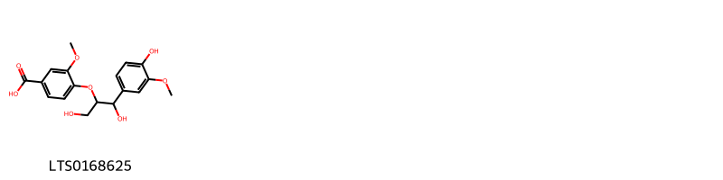
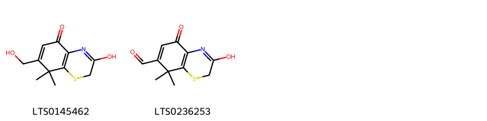
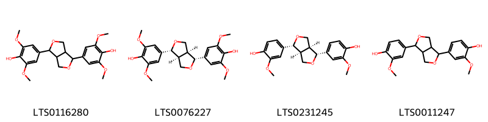
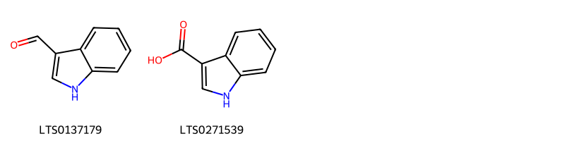
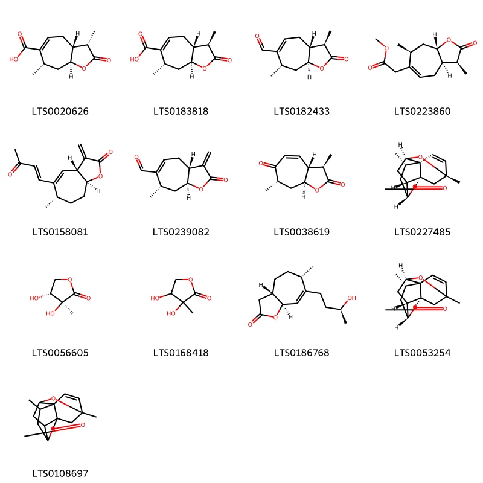
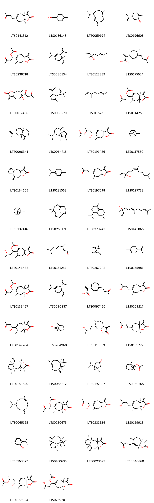
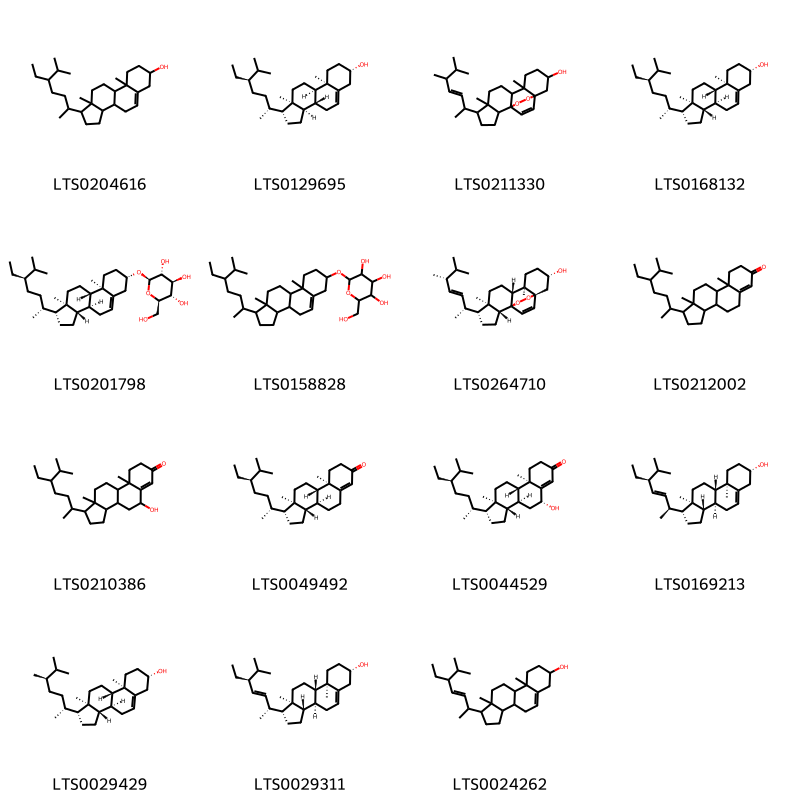
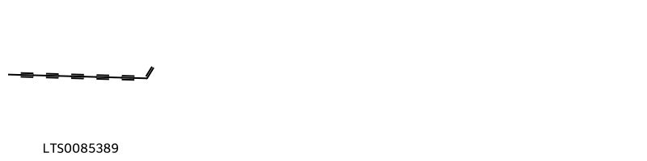

!!! abstract "Tóm tắt"

    Cây ké đầu ngựa có tên khoa học là  Xanthium strumarium L., thuộc họ Cúc - Asteraceae. Phân bố rộng khắp châu á và châu, Ai Cập... Tại Việt Nam mọc hoang ở khắp mọi nơi. Theo kinh nghiệm dân gian cây thường được đừng để chữa đau răng, mũi chảy nước trong, đặc, chữa thủy thũng, bí tiểu tiện, chữa bướu cổ. Thành phần hóa học bao gồm: Chất béo, gycozid, Vitamin C, Carboxy atractylozit, Xanthatin và xanthamin, Iot. Cây cả tác dụng điều trị các bệnh về da như mẩn ngứa, mụn nhọt, biếu cổ.

## Thông tin về thực vật

Dược liệu **Ké Đầu Ngựa (Quả)** từ bộ phận **nan** từ loài *Xanthium strumarium*.

**Mô tả thực vật:** Cây ké đầu ngựa là một cây nhỏ, cao độ 2m thân có khía rãnh. Lá mọc so le, phiến lá hơi 3 cạnh, mép có răng cưa có chỗ khía hơi sâu thành 3-5 thùy, có lông ngắn cứng. Cụm hoa hình đầu có thứ lưỡng tính ở phía trên, có thứ chỉ gồm có hai hoa cái nằm trong hai lá bắc dày và có gai. Quả giả hình thoi, có móc, có thể móc vào lông động vật. Trẻ con vẫn nghịch bỏ vào tóc nhau rất khó gỡ ra .

*Tài liệu tham khảo:* "Những cây thuốc và vị thuốc Việt Nam" - Đỗ Tất Lợi 
Trong dược điển Việt nam, một loài được sử dụng làm dược liệu là *Xanthium strumarium*.

!!! info "Phân loại thực vật của *Xanthium strumarium*"
    - **Kingdom:** Plantae
    - **Phylum:** Tracheophyta
    - **Order:** Asterales
    - **Family:** Asteraceae
    - **Genus:** Xanthium
    - **Species:** *Xanthium strumarium*

**Phân bố trên thế giới:** Namibia, Germany, Israel, United States of America, Spain, nan, Mexico, China, South Africa, Botswana, Canada, Brazil, Greece, India, Australia, Anguilla, Argentina, Uruguay

**Phân bố tại Việt nam:** Không có ghi nhận ở Việt Nam

## Thông tin về dược liệu 

### Định danh

!!! info "Thông tin về tên gọi"

    - Dược liệu tiếng Việt: nan
    - Dược liệu tiếng Trung: nan (nan)
    - Dược liệu tiếng Anh: nan
    - Dược liệu latin thông dụng: nan
    - Dược liệu latin kiểu DĐVN: *xanthium strumarium l.*
    - Dược liệu latin kiểu DĐVN: *nan*
    - Dược liệu latin kiểu thông tư: *nan*
    - Bộ phận dùng: nan (nan)

### Mô tả dược liệu 

- **Theo dược điển Việt nam V:** nan

- **Mô tả dược liệu theo thông tư chế biến dược liệu theo phương pháp cổ truyền:** nan

### Chế biến 

- **Chế biến theo dược điển việt nam V**: nan

- **Chế biến theo thông tư:** nan

--- 

## Thành phần hóa học

- Theo tài liệu của GS. Đỗ Tất Lợi:  (1) Chất béo, gycozid, Vitamin C, Carboxy atractylozit, Xanthatin và xanthamin, Iot.
(2) acid clorogenic
    

**Thành phần hóa học từ loài **Xanthium strumarium**

Theo cơ sở dữ liệu lotus, loài *Xanthium strumarium* đã phân lập và xác định được **276** hoạt chất thuộc về các nhóm Diarylheptanoids, Organonitrogen compounds, Fatty Acyls, Phenols, Benzothiazines, Unsaturated hydrocarbons, Steroids and steroid derivatives, Flavonoids, Furanoid lignans, Thiazines, Naphthofurans, Diazines, Coumarinolignans, Benzopyrans, Pyrrolidines, Trioxanes, 2-arylbenzofuran flavonoids, Dihydrofurans, Benzene and substituted derivatives, Coumarins and derivatives, Prenol lipids, Pyrans, Organooxygen compounds, Cinnamic acids and derivatives, Lactones, Isoflavonoids, Indoles and derivatives, Benzofurans, Dibenzylbutane lignans trong bảng dưới đây. Danh sách các hoạt chất như sau n-valeric acid [(LTS0025746)](https://lotus.naturalproducts.net/compound/lotus_id/LTS0025746), 2-[(2r,4ar,5r,8as)-5-hydroxy-4a-methyl-8-methylidene-octahydronaphthalen-2-yl]prop-2-enoic acid [(LTS0051024)](https://lotus.naturalproducts.net/compound/lotus_id/LTS0051024), 4-isopropyl-1,6-dimethyl-2,3,4,4a,7,8-hexahydronaphthalene [(LTS0270743)](https://lotus.naturalproducts.net/compound/lotus_id/LTS0270743), (2s)-2,3-dihydroxy-1-[(2s,3r)-2-(4-hydroxy-3-methoxyphenyl)-3-(hydroxymethyl)-7-methoxy-2,3-dihydro-1-benzofuran-5-yl]propan-1-one [(LTS0064774)](https://lotus.naturalproducts.net/compound/lotus_id/LTS0064774), 4,5-dihydroxy-2-[(3-hydroxy-8,8-dimethyl-5-oxo-2h-1,4-benzothiazin-7-yl)methoxy]-6-(hydroxymethyl)oxan-3-yl 3-(3,4-dihydroxyphenyl)prop-2-enoate [(LTS0166555)](https://lotus.naturalproducts.net/compound/lotus_id/LTS0166555), 9-hydroxy-12-(6-hydroxyhexa-1,3-dien-1-yl)-4-methyl-11-oxa-3-thiatricyclo[6.4.0.0²,⁶]dodeca-1,4,6,8-tetraen-10-one [(LTS0194981)](https://lotus.naturalproducts.net/compound/lotus_id/LTS0194981), 2,4'-bisphenol f [(LTS0101981)](https://lotus.naturalproducts.net/compound/lotus_id/LTS0101981), (3r,5r)-4-{[(2e)-3-(3,4-dihydroxyphenyl)prop-2-enoyl]oxy}-1,3,5-trihydroxycyclohexane-1-carboxylic acid [(LTS0165819)](https://lotus.naturalproducts.net/compound/lotus_id/LTS0165819), α pinene [(LTS0132416)](https://lotus.naturalproducts.net/compound/lotus_id/LTS0132416), ferulic acid [(LTS0077328)](https://lotus.naturalproducts.net/compound/lotus_id/LTS0077328), (1r)-1-[(3as,7r,8ar)-7-methyl-3-methylidene-2-oxo-3ah,4h,7h,8h,8ah-cyclohepta[b]furan-6-yl]-3-oxobutyl acetate [(LTS0012167)](https://lotus.naturalproducts.net/compound/lotus_id/LTS0012167), ethyl protocatechuate [(LTS0006328)](https://lotus.naturalproducts.net/compound/lotus_id/LTS0006328), (2r)-2,3-dihydroxy-8,8-dimethyl-7-({[(2r,3r,4s,5s,6r)-3,4,5-trihydroxy-6-(hydroxymethyl)oxan-2-yl]oxy}methyl)-2h-1,4-benzothiazin-5-one [(LTS0103628)](https://lotus.naturalproducts.net/compound/lotus_id/LTS0103628), bisphenol f [(LTS0060768)](https://lotus.naturalproducts.net/compound/lotus_id/LTS0060768), (-)-syringaresinol [(LTS0076227)](https://lotus.naturalproducts.net/compound/lotus_id/LTS0076227), methyl caffeate [(LTS0163009)](https://lotus.naturalproducts.net/compound/lotus_id/LTS0163009), 6-ethenyl-6-methyl-3-methylidene-5-(prop-1-en-2-yl)-tetrahydro-3ah-1-benzofuran-2-one [(LTS0273446)](https://lotus.naturalproducts.net/compound/lotus_id/LTS0273446), (+)-germacrene d [(LTS0068732)](https://lotus.naturalproducts.net/compound/lotus_id/LTS0068732), (3r,3ar,7s,8as)-3,7-dimethyl-2-oxo-3h,3ah,4h,7h,8h,8ah-cyclohepta[b]furan-6-carboxylic acid [(LTS0183818)](https://lotus.naturalproducts.net/compound/lotus_id/LTS0183818), ergosterol peroxide [(LTS0264710)](https://lotus.naturalproducts.net/compound/lotus_id/LTS0264710), 7-methyl-3-methylidene-6-[(1z)-3-oxobut-1-en-1-yl]-3ah,4h,7h,8h,8ah-cyclohepta[b]furan-2-one [(LTS0072745)](https://lotus.naturalproducts.net/compound/lotus_id/LTS0072745), citronellol, (+-)- [(LTS0090925)](https://lotus.naturalproducts.net/compound/lotus_id/LTS0090925), isovaleric acid [(LTS0156600)](https://lotus.naturalproducts.net/compound/lotus_id/LTS0156600), thujone [(LTS0197087)](https://lotus.naturalproducts.net/compound/lotus_id/LTS0197087), 2-[(2r,4as)-4a,8-dimethyl-7-oxo-1,2,3,4,5,6-hexahydronaphthalen-2-yl]prop-2-enoic acid [(LTS0240551)](https://lotus.naturalproducts.net/compound/lotus_id/LTS0240551), (3ar,7s,8ar)-7-methyl-3-methylidene-6-[(1z)-3-oxobut-1-en-1-yl]-3ah,4h,7h,8h,8ah-cyclohepta[b]furan-2-one [(LTS0272022)](https://lotus.naturalproducts.net/compound/lotus_id/LTS0272022), (4e)-5-[(1s)-1-hydroxy-2,6,6-trimethyl-4-oxocyclohex-2-en-1-yl]-3-methylpenta-2,4-dienoic acid [(LTS0268716)](https://lotus.naturalproducts.net/compound/lotus_id/LTS0268716), 8a-methyl-3,5-dimethylidene-octahydronaphtho[2,3-b]furan-2-one [(LTS0057674)](https://lotus.naturalproducts.net/compound/lotus_id/LTS0057674), (1r,3r,5r,6s,8s)-6-methyl-11-methylidene-5-[(1e)-3-oxobut-1-en-1-yl]-4,9-dioxatricyclo[6.3.0.0³,⁵]undecan-10-one [(LTS0205404)](https://lotus.naturalproducts.net/compound/lotus_id/LTS0205404), chlorogenic acid [(LTS0226495)](https://lotus.naturalproducts.net/compound/lotus_id/LTS0226495), (1r,2s,4r,8r,10s,12r,15s)-2,12-dimethyl-7-methylidene-6-oxo-5,11,13,14-tetraoxatetracyclo[10.2.2.0¹,¹⁰.0⁴,⁸]hexadecan-15-yl acetate [(LTS0025046)](https://lotus.naturalproducts.net/compound/lotus_id/LTS0025046), 7-(3-hydroxybutyl)-6-methyl-3-methylidene-3ah,4h,5h,6h,8ah-cyclohepta[b]furan-2-one [(LTS0116853)](https://lotus.naturalproducts.net/compound/lotus_id/LTS0116853), 5,5'-bis(3-hydroxypropyl)-3,3'-dimethoxy-[1,1'-biphenyl]-2,2'-diol [(LTS0080605)](https://lotus.naturalproducts.net/compound/lotus_id/LTS0080605), (3ar,7s,8as)-7-methyl-3-methylidene-6-(3-oxobutyl)-3ah,4h,7h,8h,8ah-cyclohepta[b]furan-2-one [(LTS0141312)](https://lotus.naturalproducts.net/compound/lotus_id/LTS0141312), cynarine [(LTS0039940)](https://lotus.naturalproducts.net/compound/lotus_id/LTS0039940), 4,8-dihydroxy-7-methyl-3-methylidene-6-(3-oxobut-1-en-1-yl)-3ah,4h,7h,8h,8ah-cyclohepta[b]furan-2-one [(LTS0070493)](https://lotus.naturalproducts.net/compound/lotus_id/LTS0070493), resorcinol [(LTS0035614)](https://lotus.naturalproducts.net/compound/lotus_id/LTS0035614), succinimide [(LTS0005145)](https://lotus.naturalproducts.net/compound/lotus_id/LTS0005145), 6,10-dimethyl-3,11-dioxapentacyclo[8.4.1.0¹,⁷.0⁴,¹⁴.0⁷,¹²]pentadec-8-en-2-one [(LTS0108697)](https://lotus.naturalproducts.net/compound/lotus_id/LTS0108697), (1r,3r,5r,6s,8r,11s)-5-[(1s)-1-hydroxy-3-oxobutyl]-6,11-dimethyl-4,9-dioxatricyclo[6.3.0.0³,⁵]undecan-10-one [(LTS0185828)](https://lotus.naturalproducts.net/compound/lotus_id/LTS0185828), (1s,3r,4s,5r)-1,3,5-tris({[(2e)-3-(3,4-dihydroxyphenyl)prop-2-enoyl]oxy})-4-hydroxycyclohexane-1-carboxylic acid [(LTS0171554)](https://lotus.naturalproducts.net/compound/lotus_id/LTS0171554), xanthumin [(LTS0138457)](https://lotus.naturalproducts.net/compound/lotus_id/LTS0138457), (1r,3r,8s,10r)-8-methyl-13-methylidene-4,11-dioxatricyclo[8.3.0.0³,⁷]tridec-6-ene-5,12-dione [(LTS0224488)](https://lotus.naturalproducts.net/compound/lotus_id/LTS0224488), thymol [(LTS0168527)](https://lotus.naturalproducts.net/compound/lotus_id/LTS0168527), (-)-pinoresinol [(LTS0231245)](https://lotus.naturalproducts.net/compound/lotus_id/LTS0231245), 4-[(4-hydroxyphenyl)methyl]-2-methylphenol [(LTS0008455)](https://lotus.naturalproducts.net/compound/lotus_id/LTS0008455), 4-{[1,3-dihydroxy-1-(4-hydroxy-3-methoxyphenyl)propan-2-yl]oxy}-3-methoxybenzoic acid [(LTS0168625)](https://lotus.naturalproducts.net/compound/lotus_id/LTS0168625), 3,5-dimethyl-8-methylidene-3h,3ah,4h,4ah,7h,7ah,9h,9ah-azuleno[6,5-b]furan-2-one [(LTS0039717)](https://lotus.naturalproducts.net/compound/lotus_id/LTS0039717), 1-[(3ar,7s,8ar)-7-methyl-3-methylidene-2-oxo-3ah,4h,7h,8h,8ah-cyclohepta[b]furan-6-yl]-3-oxobutyl acetate [(LTS0029291)](https://lotus.naturalproducts.net/compound/lotus_id/LTS0029291), (3ar,7s,8as)-7-methyl-3-methylidene-2-oxo-3ah,4h,7h,8h,8ah-cyclohepta[b]furan-6-carbaldehyde [(LTS0239082)](https://lotus.naturalproducts.net/compound/lotus_id/LTS0239082), 2,12-dimethyl-7-methylidene-6-oxo-5,11,13,14-tetraoxatetracyclo[10.2.2.0¹,¹⁰.0⁴,⁸]hexadecan-15-yl acetate [(LTS0192450)](https://lotus.naturalproducts.net/compound/lotus_id/LTS0192450), (1r,3r)-1-[(3ar,7s,8as)-7-methyl-3-methylidene-2-oxo-3ah,4h,7h,8h,8ah-cyclohepta[b]furan-6-yl]-3-hydroxybutyl acetate [(LTS0259201)](https://lotus.naturalproducts.net/compound/lotus_id/LTS0259201), 2-[(3s,3as,5r,8s,8as)-3-hydroxy-3a,8-dimethyl-octahydro-1h-azulen-5-yl]prop-2-enoic acid [(LTS0026298)](https://lotus.naturalproducts.net/compound/lotus_id/LTS0026298), 3-hydroxy-7-(hydroxymethyl)-8,8-dimethyl-2h-1,4-benzothiazin-5-one [(LTS0145462)](https://lotus.naturalproducts.net/compound/lotus_id/LTS0145462), (2z)-5-[(1r,3s,5r,8s)-3,8-dihydroxy-1,5-dimethyl-6-oxabicyclo[3.2.1]octan-8-yl]-3-methylpenta-2,4-dienoic acid [(LTS0024605)](https://lotus.naturalproducts.net/compound/lotus_id/LTS0024605), (1r,3r,5r,6s,8r,11s)-6,11-dimethyl-5-[(1e)-3-oxobut-1-en-1-yl]-4,9-dioxatricyclo[6.3.0.0³,⁵]undecan-10-one [(LTS0066365)](https://lotus.naturalproducts.net/compound/lotus_id/LTS0066365), 2-[(1r,5s)-5-methyl-4-(3-oxobutyl)cyclohept-3-en-1-yl]prop-2-enoic acid [(LTS0097460)](https://lotus.naturalproducts.net/compound/lotus_id/LTS0097460), coniferyl aldehyde [(LTS0140691)](https://lotus.naturalproducts.net/compound/lotus_id/LTS0140691), (1s,2s,4s,8r,10r,12r)-2,12-dimethyl-7-methylidene-5,11,13,14-tetraoxatetracyclo[10.2.2.0¹,¹⁰.0⁴,⁸]hexadec-15-en-6-one [(LTS0003442)](https://lotus.naturalproducts.net/compound/lotus_id/LTS0003442), (3r,3ar,7s,8ar)-6-(3-hydroxybutyl)-3,7-dimethyl-3h,3ah,4h,7h,8h,8ah-cyclohepta[b]furan-2-one [(LTS0265901)](https://lotus.naturalproducts.net/compound/lotus_id/LTS0265901), scopoletin [(LTS0193112)](https://lotus.naturalproducts.net/compound/lotus_id/LTS0193112), ononin [(LTS0235553)](https://lotus.naturalproducts.net/compound/lotus_id/LTS0235553), 2,4-bis(4-hydroxybenzyl)phenol [(LTS0041151)](https://lotus.naturalproducts.net/compound/lotus_id/LTS0041151), 2-[(3s,3as,8s,8as)-3-hydroxy-3a,8-dimethyl-octahydro-1h-azulen-5-yl]prop-2-enoic acid [(LTS0258155)](https://lotus.naturalproducts.net/compound/lotus_id/LTS0258155), p-cresol [(LTS0208715)](https://lotus.naturalproducts.net/compound/lotus_id/LTS0208715), 3,5-dicaffeoylquinic acid [(LTS0177751)](https://lotus.naturalproducts.net/compound/lotus_id/LTS0177751), 3-hydroxy-8,8-dimethyl-7-({[3,4,5-trihydroxy-6-(hydroxymethyl)oxan-2-yl]oxy}methyl)-2h-1,4-benzothiazin-5-one [(LTS0050164)](https://lotus.naturalproducts.net/compound/lotus_id/LTS0050164), 12'-acetyl-10'-hydroxy-6,9'-dimethyl-4'-methylidene-5-[(1e)-3-oxobut-1-en-1-yl]-4,6',9,14'-tetraoxaspiro[tricyclo[6.3.0.0³,⁵]undecane-11,13'-tricyclo[8.4.0.0³,⁷]tetradecan]-11'-ene-5',10-dione [(LTS0006616)](https://lotus.naturalproducts.net/compound/lotus_id/LTS0006616), 3-hydroxy-1-{7-methyl-3-methylidene-2-oxo-3ah,4h,7h,8h,8ah-cyclohepta[b]furan-6-yl}butyl acetate [(LTS0146483)](https://lotus.naturalproducts.net/compound/lotus_id/LTS0146483), cymene [(LTS0181568)](https://lotus.naturalproducts.net/compound/lotus_id/LTS0181568), terpineol [(LTS0136148)](https://lotus.naturalproducts.net/compound/lotus_id/LTS0136148), 4-hydroxy-4-{7-methyl-3-methylidene-2-oxo-3ah,4h,7h,8h,8ah-cyclohepta[b]furan-6-yl}butan-2-yl acetate [(LTS0191486)](https://lotus.naturalproducts.net/compound/lotus_id/LTS0191486), humulene [(LTS0263171)](https://lotus.naturalproducts.net/compound/lotus_id/LTS0263171), carvacrol [(LTS0012882)](https://lotus.naturalproducts.net/compound/lotus_id/LTS0012882), 2h-1λ⁶,2-thiazine-1,1-dione [(LTS0026668)](https://lotus.naturalproducts.net/compound/lotus_id/LTS0026668), (3as,6s,8as)-7-[(3s)-3-hydroxybutyl]-6-methyl-3h,3ah,4h,5h,6h,8ah-cyclohepta[b]furan-2-one [(LTS0186768)](https://lotus.naturalproducts.net/compound/lotus_id/LTS0186768), (1r,3s,7r,9s,13r)-9,13-dimethyl-4-methylidene-6,14-dioxatricyclo[8.4.0.0³,⁷]tetradec-10-en-5-one [(LTS0076728)](https://lotus.naturalproducts.net/compound/lotus_id/LTS0076728), 2,3-bis[(4-hydroxy-3-methoxyphenyl)methyl]-4-{[3-(4-hydroxy-3-methoxyphenyl)prop-2-enoyl]oxy}butyl 3-(4-hydroxy-3-methoxyphenyl)prop-2-enoate [(LTS0145734)](https://lotus.naturalproducts.net/compound/lotus_id/LTS0145734), (1'r,3r,3'r,3ar,7r,7'r,8as,9's,10'r)-12'-acetyl-10'-hydroxy-7,9'-dimethyl-4'-methylidene-6-(3-oxobutyl)-4,7,8,8a-tetrahydro-3ah-6',14'-dioxaspiro[cyclohepta[b]furan-3,13'-tricyclo[8.4.0.0³,⁷]tetradecan]-11'-ene-2,5'-dione [(LTS0028402)](https://lotus.naturalproducts.net/compound/lotus_id/LTS0028402), 1,3,5-tris({[3-(3,4-dihydroxyphenyl)prop-2-enoyl]oxy})-4-hydroxycyclohexane-1-carboxylic acid [(LTS0127488)](https://lotus.naturalproducts.net/compound/lotus_id/LTS0127488), 3-(4-hydroxy-3-methoxyphenyl)-n-[2-(4-hydroxyphenyl)ethyl]prop-2-enimidic acid [(LTS0240896)](https://lotus.naturalproducts.net/compound/lotus_id/LTS0240896), (3r,6e)-nerolidol [(LTS0145065)](https://lotus.naturalproducts.net/compound/lotus_id/LTS0145065), 3-(4-hydroxy-3,5-dimethoxyphenyl)-2-(hydroxymethyl)-5-methoxy-2h,3h-[1,4]dioxino[2,3-h]chromen-9-one [(LTS0136653)](https://lotus.naturalproducts.net/compound/lotus_id/LTS0136653), 7-methyl-3-methylidene-6-(3-oxobut-1-en-1-yl)-3ah,4h,7h,8h,8ah-cyclohepta[b]furan-2-one [(LTS0040201)](https://lotus.naturalproducts.net/compound/lotus_id/LTS0040201), axillarin [(LTS0067813)](https://lotus.naturalproducts.net/compound/lotus_id/LTS0067813), 3-(4-hydroxy-3-methoxyphenyl)-2-(hydroxymethyl)-5-methoxy-2h,3h-[1,4]dioxino[2,3-h]chromen-9-one [(LTS0202828)](https://lotus.naturalproducts.net/compound/lotus_id/LTS0202828), choline [(LTS0170307)](https://lotus.naturalproducts.net/compound/lotus_id/LTS0170307), cleomiscosin a [(LTS0042175)](https://lotus.naturalproducts.net/compound/lotus_id/LTS0042175), 1-{3,7-dimethyl-2-oxo-3h,3ah,4h,7h,8h,8ah-cyclohepta[b]furan-6-yl}-3-oxobutyl acetate [(LTS0176115)](https://lotus.naturalproducts.net/compound/lotus_id/LTS0176115), salicyclic acid [(LTS0116548)](https://lotus.naturalproducts.net/compound/lotus_id/LTS0116548), tomentosin [(LTS0274135)](https://lotus.naturalproducts.net/compound/lotus_id/LTS0274135), coniferaldehyde [(LTS0009773)](https://lotus.naturalproducts.net/compound/lotus_id/LTS0009773), (3ar,6s,8as)-6-methyl-3-methylidene-5-[(1e)-3-oxobut-1-en-1-yl]-3ah,6h,7h,8h,8ah-cyclohepta[b]furan-2-one [(LTS0158081)](https://lotus.naturalproducts.net/compound/lotus_id/LTS0158081), (1r,4r,6s,7s,10s,12r,14r)-6,10-dimethyl-3,11-dioxapentacyclo[8.4.1.0¹,⁷.0⁴,¹⁴.0⁷,¹²]pentadec-8-en-2-one [(LTS0227485)](https://lotus.naturalproducts.net/compound/lotus_id/LTS0227485), (1r,3s)-1-[(3as,7s,8as)-7-methyl-3-methylidene-2-oxo-3ah,4h,7h,8h,8ah-cyclohepta[b]furan-6-yl]-3-hydroxybutyl acetate [(LTS0024506)](https://lotus.naturalproducts.net/compound/lotus_id/LTS0024506), (1r,2s,9r,10s,12r)-2-hydroxy-4,9-dimethyl-13-methylidene-6-oxatetracyclo[7.4.0.0³,⁷.0¹⁰,¹²]trideca-3,7-dien-5-one [(LTS0175664)](https://lotus.naturalproducts.net/compound/lotus_id/LTS0175664), 8-epi-xanthatin [(LTS0254261)](https://lotus.naturalproducts.net/compound/lotus_id/LTS0254261), (1z,6z,8s)-8-isopropyl-1-methyl-5-methylidenecyclodeca-1,6-diene [(LTS0065195)](https://lotus.naturalproducts.net/compound/lotus_id/LTS0065195), (1r,3ar,3br,7s,9ar,9br,11ar)-1-[(2r,5r)-5-ethyl-6-methylheptan-2-yl]-9a,11a-dimethyl-1h,2h,3h,3ah,3bh,4h,6h,7h,8h,9h,9bh,10h,11h-cyclopenta[a]phenanthren-7-ol [(LTS0129695)](https://lotus.naturalproducts.net/compound/lotus_id/LTS0129695), tridec-1-en-3,5,7,9,11-pentayne [(LTS0085389)](https://lotus.naturalproducts.net/compound/lotus_id/LTS0085389), (3ar,7s,8ar)-6-(1-hydroxy-3-oxobutyl)-7-methyl-3-methylidene-3ah,4h,7h,8h,8ah-cyclohepta[b]furan-2-one [(LTS0215787)](https://lotus.naturalproducts.net/compound/lotus_id/LTS0215787), 12'-acetyl-10'-hydroxy-7,9'-dimethyl-4'-methylidene-6-(3-oxobut-1-en-1-yl)-4,7,8,8a-tetrahydro-3ah-6'-oxaspiro[cyclohepta[b]furan-3,13'-tricyclo[8.4.0.0³,⁷]tetradecan]-11'-ene-2,5'-dione [(LTS0076700)](https://lotus.naturalproducts.net/compound/lotus_id/LTS0076700), nerolidol [(LTS0197738)](https://lotus.naturalproducts.net/compound/lotus_id/LTS0197738), 3,4-dihydroxycinnamic acid [(LTS0128050)](https://lotus.naturalproducts.net/compound/lotus_id/LTS0128050), 1-{[(2z)-3-(3,4-dihydroxyphenyl)prop-2-enoyl]oxy}-3,4,5-trihydroxycyclohexane-1-carboxylic acid [(LTS0057001)](https://lotus.naturalproducts.net/compound/lotus_id/LTS0057001), (3ar,4ar,7ar,9ar)-5-methyl-3,8-dimethylidene-3ah,4h,4ah,7h,7ah,9h,9ah-azuleno[6,5-b]furan-2-one [(LTS0023629)](https://lotus.naturalproducts.net/compound/lotus_id/LTS0023629), 5-(5,6-dimethylhept-3-en-2-yl)-6,10-dimethyl-16,17-dioxapentacyclo[13.2.2.0¹,⁹.0²,⁶.0¹⁰,¹⁵]nonadec-18-en-13-ol [(LTS0211330)](https://lotus.naturalproducts.net/compound/lotus_id/LTS0211330), (1s,5r,7s,10r)-7-isopropyl-4,10-dimethyltricyclo[4.4.0.0¹,⁵]dec-3-ene [(LTS0064715)](https://lotus.naturalproducts.net/compound/lotus_id/LTS0064715), elemene [(LTS0090837)](https://lotus.naturalproducts.net/compound/lotus_id/LTS0090837), (3s,3as,5ar,9r,9as)-9-hydroxy-3,5a,9-trimethyl-3h,3ah,4h,5h,9ah,9bh-naphtho[1,2-b]furan-2,6-dione [(LTS0139835)](https://lotus.naturalproducts.net/compound/lotus_id/LTS0139835), (1r)-1,3-bis({[3-(3,4-dihydroxyphenyl)prop-2-enoyl]oxy})-4,5-dihydroxycyclohexane-1-carboxylic acid [(LTS0042414)](https://lotus.naturalproducts.net/compound/lotus_id/LTS0042414), β-pinene [(LTS0117550)](https://lotus.naturalproducts.net/compound/lotus_id/LTS0117550), 1-(5-ethyl-6-methylheptan-2-yl)-5-hydroxy-9a,11a-dimethyl-1h,2h,3h,3ah,3bh,4h,5h,8h,9h,9bh,10h,11h-cyclopenta[a]phenanthren-7-one [(LTS0210386)](https://lotus.naturalproducts.net/compound/lotus_id/LTS0210386), β-cadinene [(LTS0049088)](https://lotus.naturalproducts.net/compound/lotus_id/LTS0049088), phaseic acid [(LTS0185710)](https://lotus.naturalproducts.net/compound/lotus_id/LTS0185710), dihydrophaseic acid [(LTS0019935)](https://lotus.naturalproducts.net/compound/lotus_id/LTS0019935), 3-hydroxy-3-(hydroxymethyl)-7-methyl-6-(3-oxobut-1-en-1-yl)-3ah,4h,7h,8h,8ah-cyclohepta[b]furan-2-one [(LTS0144738)](https://lotus.naturalproducts.net/compound/lotus_id/LTS0144738), neochlorogenic acid [(LTS0235816)](https://lotus.naturalproducts.net/compound/lotus_id/LTS0235816), triacontanol [(LTS0026833)](https://lotus.naturalproducts.net/compound/lotus_id/LTS0026833), xanthinin [(LTS0238718)](https://lotus.naturalproducts.net/compound/lotus_id/LTS0238718), (1r,3r,5r,6s,8r)-5-[(1s)-1-hydroxy-3-oxobutyl]-6-methyl-11-methylidene-4,9-dioxatricyclo[6.3.0.0³,⁵]undecan-10-one [(LTS0250162)](https://lotus.naturalproducts.net/compound/lotus_id/LTS0250162), (1s)-1-[(3s,3ar,7s,8ar)-3,7-dimethyl-2-oxo-3h,3ah,4h,7h,8h,8ah-cyclohepta[b]furan-6-yl]-3-oxobutyl acetate [(LTS0019857)](https://lotus.naturalproducts.net/compound/lotus_id/LTS0019857), (2r,3s)-3-(4-hydroxy-3,5-dimethoxyphenyl)-5-methoxy-2-methyl-2h,3h-[1,4]dioxino[2,3-h]chromen-9-one [(LTS0098792)](https://lotus.naturalproducts.net/compound/lotus_id/LTS0098792), (1s,3r,4r,5r)-1,3-bis({[(2e)-3-(3,4-dihydroxyphenyl)prop-2-enoyl]oxy})-4,5-dihydroxycyclohexane-1-carboxylic acid [(LTS0146186)](https://lotus.naturalproducts.net/compound/lotus_id/LTS0146186), 6-methyl-11-methylidene-5-(3-oxobut-1-en-1-yl)-4,9-dioxatricyclo[6.3.0.0³,⁵]undecan-10-one [(LTS0072732)](https://lotus.naturalproducts.net/compound/lotus_id/LTS0072732), 8-isopropyl-1-methyl-5-methylidenecyclodeca-1,6-diene [(LTS0018398)](https://lotus.naturalproducts.net/compound/lotus_id/LTS0018398), p-hydroxybenzaldehyde [(LTS0259836)](https://lotus.naturalproducts.net/compound/lotus_id/LTS0259836), (3ar,7s,8ar)-6-[(1r)-1-hydroxy-3-oxobutyl]-7-methyl-3-methylidene-3ah,4h,7h,8h,8ah-cyclohepta[b]furan-2-one [(LTS0264730)](https://lotus.naturalproducts.net/compound/lotus_id/LTS0264730), stigmast-5-en-3-ol, (3β)- [(LTS0204616)](https://lotus.naturalproducts.net/compound/lotus_id/LTS0204616), (1s)-1-[(3ar,7s,8ar)-7-methyl-3-methylidene-2-oxo-3ah,4h,7h,8h,8ah-cyclohepta[b]furan-6-yl]-3-oxobutyl acetate [(LTS0114255)](https://lotus.naturalproducts.net/compound/lotus_id/LTS0114255), (3as,6s,8ar)-7-[(3s)-3-hydroxybutyl]-6-methyl-3-methylidene-3ah,4h,5h,6h,8ah-cyclohepta[b]furan-2-one [(LTS0040860)](https://lotus.naturalproducts.net/compound/lotus_id/LTS0040860), 9-hydroxy-12-[(1z,3z)-6-hydroxyhexa-1,3-dien-1-yl]-4-methyl-11-oxa-3-thiatricyclo[6.4.0.0²,⁶]dodeca-1,4,6,8-tetraen-10-one [(LTS0154240)](https://lotus.naturalproducts.net/compound/lotus_id/LTS0154240), (3r,3ar,7s,8as)-3,7-dimethyl-6-[(1e)-3-oxobut-1-en-1-yl]-3h,3ah,4h,7h,8h,8ah-cyclohepta[b]furan-2-one [(LTS0097137)](https://lotus.naturalproducts.net/compound/lotus_id/LTS0097137), 2-[5-methyl-4-(3-oxobut-1-en-1-yl)cyclohept-3-en-1-yl]prop-2-enoic acid [(LTS0269779)](https://lotus.naturalproducts.net/compound/lotus_id/LTS0269779), 2-[5-methyl-4-(3-oxobutyl)cyclohept-3-en-1-yl]prop-2-enoic acid [(LTS0175624)](https://lotus.naturalproducts.net/compound/lotus_id/LTS0175624), (1r,3r,5r,6s,8r)-6-methyl-11-methylidene-5-[(1e)-3-oxobut-1-en-1-yl]-4,9-dioxatricyclo[6.3.0.0³,⁵]undecan-10-one [(LTS0040992)](https://lotus.naturalproducts.net/compound/lotus_id/LTS0040992), (2r,3r)-3-(4-hydroxy-3,5-dimethoxyphenyl)-2-(hydroxymethyl)-5-methoxy-2h,3h-[1,4]dioxino[2,3-h]chromen-9-one [(LTS0200101)](https://lotus.naturalproducts.net/compound/lotus_id/LTS0200101), (1s,4r,9r,10s,13r)-15-hydroxy-7-{[6-(hydroxymethyl)-3-[(3-methylbutanoyl)oxy]-4,5-bis(sulfooxy)oxan-2-yl]oxy}-9-methyl-14-methylidenetetracyclo[11.2.1.0¹,¹⁰.0⁴,⁹]hexadecane-5,5-dicarboxylic acid [(LTS0119688)](https://lotus.naturalproducts.net/compound/lotus_id/LTS0119688), methyl 2-[(3s,3ar,7s,8as)-3,7-dimethyl-2-oxo-3h,3ah,4h,7h,8h,8ah-cyclohepta[b]furan-6-yl]acetate [(LTS0223860)](https://lotus.naturalproducts.net/compound/lotus_id/LTS0223860), (4ar,5r,6r,8as,9as)-6-hydroxy-3,8a-dimethyl-4a,6,9,9a-tetrahydro-4h-spiro[naphtho[2,3-b]furan-5,2'-oxiran]-2-one [(LTS0123671)](https://lotus.naturalproducts.net/compound/lotus_id/LTS0123671), 5-methyl-3,8-dimethylidene-3ah,4h,4ah,7h,7ah,9h,9ah-azuleno[6,5-b]furan-2-one [(LTS0184665)](https://lotus.naturalproducts.net/compound/lotus_id/LTS0184665), 12'-acetyl-10'-hydroxy-7,9'-dimethyl-4'-methylidene-6-(3-oxobutyl)-4,7,8,8a-tetrahydro-3ah-6'-oxaspiro[cyclohepta[b]furan-3,13'-tricyclo[8.4.0.0³,⁷]tetradecan]-11'-ene-2,5'-dione [(LTS0082663)](https://lotus.naturalproducts.net/compound/lotus_id/LTS0082663), (6s)-6-acetyl-2h,3h,4h,6h-cyclopenta[b][1,4]thiazine-5,7-dione [(LTS0201757)](https://lotus.naturalproducts.net/compound/lotus_id/LTS0201757), (3as,6s,8ar)-6-methyl-3-methylidene-7-(3-oxobutyl)-3ah,4h,5h,6h,8ah-cyclohepta[b]furan-2-one [(LTS0089030)](https://lotus.naturalproducts.net/compound/lotus_id/LTS0089030), (3s,3ar,7s,8as)-3,7-dimethyl-6-[(1e)-3-oxobut-1-en-1-yl]-3h,3ah,4h,7h,8h,8ah-cyclohepta[b]furan-2-one [(LTS0123850)](https://lotus.naturalproducts.net/compound/lotus_id/LTS0123850), (3r,3ar,4ar,7ar,9ar)-3,5-dimethyl-8-methylidene-3h,3ah,4h,4ah,7h,7ah,9h,9ah-azuleno[6,5-b]furan-2-one [(LTS0183640)](https://lotus.naturalproducts.net/compound/lotus_id/LTS0183640), sitogluside [(LTS0201798)](https://lotus.naturalproducts.net/compound/lotus_id/LTS0201798), 8-methyl-13-methylidene-4,11-dioxatricyclo[8.3.0.0³,⁷]tridec-6-ene-5,12-dione [(LTS0096675)](https://lotus.naturalproducts.net/compound/lotus_id/LTS0096675), 2-(5-hydroxy-4a-methyl-8-methylidene-octahydronaphthalen-2-yl)prop-2-enoic acid [(LTS0106792)](https://lotus.naturalproducts.net/compound/lotus_id/LTS0106792), 1-(5-ethyl-6-methylheptan-2-yl)-9a,11a-dimethyl-1h,2h,3h,3ah,3bh,4h,5h,8h,9h,9bh,10h,11h-cyclopenta[a]phenanthren-7-one [(LTS0212002)](https://lotus.naturalproducts.net/compound/lotus_id/LTS0212002), (3ar,7s,8ar)-6-[(1s)-1-hydroxy-3-oxobutyl]-7-methyl-3-methylidene-3ah,4h,7h,8h,8ah-cyclohepta[b]furan-2-one [(LTS0142284)](https://lotus.naturalproducts.net/compound/lotus_id/LTS0142284), (3ar,7s,8as)-6-[(3s)-3-hydroxybutyl]-7-methyl-3-methylidene-3ah,4h,7h,8h,8ah-cyclohepta[b]furan-2-one [(LTS0159918)](https://lotus.naturalproducts.net/compound/lotus_id/LTS0159918), vanillin [(LTS0136163)](https://lotus.naturalproducts.net/compound/lotus_id/LTS0136163), 3-hydroxy-8,8-dimethyl-7-({[(2r,3r,4s,5s,6r)-3,4,5-trihydroxy-6-(hydroxymethyl)oxan-2-yl]oxy}methyl)-2h-1,4-benzothiazin-5-one [(LTS0192270)](https://lotus.naturalproducts.net/compound/lotus_id/LTS0192270), (3ar,8as)-7-methyl-3-methylidene-6-(3-oxobutyl)-3ah,4h,7h,8h,8ah-cyclohepta[b]furan-2-one [(LTS0187939)](https://lotus.naturalproducts.net/compound/lotus_id/LTS0187939), (4r,8r)-2,12-dimethyl-7-methylidene-6-oxo-5,11,13,14-tetraoxatetracyclo[10.2.2.0¹,¹⁰.0⁴,⁸]hexadecan-15-yl acetate [(LTS0082359)](https://lotus.naturalproducts.net/compound/lotus_id/LTS0082359), (3s,3ar,7s,8as)-3,7-dimethyl-2-oxo-3h,3ah,4h,7h,8h,8ah-cyclohepta[b]furan-6-carboxylic acid [(LTS0020626)](https://lotus.naturalproducts.net/compound/lotus_id/LTS0020626), 5-(1-hydroxy-3-oxobutyl)-6,11-dimethyl-4,9-dioxatricyclo[6.3.0.0³,⁵]undecan-10-one [(LTS0140222)](https://lotus.naturalproducts.net/compound/lotus_id/LTS0140222), (3r,3ar,7s,8as)-3,7-dimethyl-6-(3-oxobutyl)-3h,3ah,4h,7h,8h,8ah-cyclohepta[b]furan-2-one [(LTS0221707)](https://lotus.naturalproducts.net/compound/lotus_id/LTS0221707), (2r,4s)-4-[(3ar,7s,8as)-7-methyl-3-methylidene-2-oxo-3ah,4h,7h,8h,8ah-cyclohepta[b]furan-6-yl]-4-hydroxybutan-2-yl acetate [(LTS0009452)](https://lotus.naturalproducts.net/compound/lotus_id/LTS0009452), 12'-acetyl-10'-hydroxy-6,9'-dimethyl-4'-methylidene-5-(3-oxobut-1-en-1-yl)-4,6',9-trioxaspiro[tricyclo[6.3.0.0³,⁵]undecane-11,13'-tricyclo[8.4.0.0³,⁷]tetradecan]-11'-ene-5',10-dione [(LTS0013089)](https://lotus.naturalproducts.net/compound/lotus_id/LTS0013089), methyl 3-(3,4-dihydroxyphenyl)prop-2-enoate [(LTS0080306)](https://lotus.naturalproducts.net/compound/lotus_id/LTS0080306), 6-(3-hydroxybutyl)-7-methyl-3-methylidene-3ah,4h,7h,8h,8ah-cyclohepta[b]furan-2-one [(LTS0109217)](https://lotus.naturalproducts.net/compound/lotus_id/LTS0109217), 3-{[3-(3,4-dihydroxyphenyl)prop-2-enoyl]oxy}-1,4,5-trihydroxycyclohexane-1-carboxylic acid [(LTS0143901)](https://lotus.naturalproducts.net/compound/lotus_id/LTS0143901), xanthatin [(LTS0163722)](https://lotus.naturalproducts.net/compound/lotus_id/LTS0163722), 3-hydroxy-8,8-dimethyl-5-oxo-2h-1,4-benzothiazine-7-carbaldehyde [(LTS0236253)](https://lotus.naturalproducts.net/compound/lotus_id/LTS0236253), (1s,1's,3r,3'r,5r,6r,7'r,8s,9's,10's,11r)-12'-acetyl-10'-hydroxy-6,9'-dimethyl-4'-methylidene-5-[(1e)-3-oxobut-1-en-1-yl]-4,6',9-trioxaspiro[tricyclo[6.3.0.0³,⁵]undecane-11,13'-tricyclo[8.4.0.0³,⁷]tetradecan]-11'-ene-5',10-dione [(LTS0032120)](https://lotus.naturalproducts.net/compound/lotus_id/LTS0032120), 9-hydroxy-12-[(1z,3e)-6-hydroxyhexa-1,3-dien-1-yl]-4-methyl-11-oxa-3-thiatricyclo[6.4.0.0²,⁶]dodeca-1,4,6,8-tetraen-10-one [(LTS0245740)](https://lotus.naturalproducts.net/compound/lotus_id/LTS0245740), carvone [(LTS0196605)](https://lotus.naturalproducts.net/compound/lotus_id/LTS0196605), syringaresinol [(LTS0116280)](https://lotus.naturalproducts.net/compound/lotus_id/LTS0116280), (3ar,7s,8as)-6-[(1r)-1-hydroxy-3-oxobutyl]-7-methyl-3-methylidene-3ah,4h,7h,8h,8ah-cyclohepta[b]furan-2-one [(LTS0114057)](https://lotus.naturalproducts.net/compound/lotus_id/LTS0114057), ethyl caffeate [(LTS0147324)](https://lotus.naturalproducts.net/compound/lotus_id/LTS0147324), caffeic acid [(LTS0027481)](https://lotus.naturalproducts.net/compound/lotus_id/LTS0027481), ononin [(LTS0065177)](https://lotus.naturalproducts.net/compound/lotus_id/LTS0065177), delta-cadinene [(LTS0019321)](https://lotus.naturalproducts.net/compound/lotus_id/LTS0019321), carvone, (+)- [(LTS0027671)](https://lotus.naturalproducts.net/compound/lotus_id/LTS0027671), formononetin [(LTS0082756)](https://lotus.naturalproducts.net/compound/lotus_id/LTS0082756), (1s,3r)-1-[(3ar,7s,8as)-7-methyl-3-methylidene-2-oxo-3ah,4h,7h,8h,8ah-cyclohepta[b]furan-6-yl]-3-hydroxybutyl acetate [(LTS0183004)](https://lotus.naturalproducts.net/compound/lotus_id/LTS0183004), β-sitostenone [(LTS0049492)](https://lotus.naturalproducts.net/compound/lotus_id/LTS0049492), (1's,3r,3'r,3as,7r,7'r,8as,9's,10's)-12'-acetyl-10'-hydroxy-7,9'-dimethyl-4'-methylidene-6-(3-oxobutyl)-4,7,8,8a-tetrahydro-3ah-6'-oxaspiro[cyclohepta[b]furan-3,13'-tricyclo[8.4.0.0³,⁷]tetradecan]-11'-ene-2,5'-dione [(LTS0222272)](https://lotus.naturalproducts.net/compound/lotus_id/LTS0222272), (2e,7s,11s)-3,7,11,15-tetramethylhexadec-2-en-1-ol [(LTS0207261)](https://lotus.naturalproducts.net/compound/lotus_id/LTS0207261), caryophyllene [(LTS0131870)](https://lotus.naturalproducts.net/compound/lotus_id/LTS0131870), 2-(4a,8-dimethyl-7-oxo-1,2,3,4,5,6-hexahydronaphthalen-2-yl)prop-2-enoic acid [(LTS0077588)](https://lotus.naturalproducts.net/compound/lotus_id/LTS0077588), vulgarin [(LTS0062007)](https://lotus.naturalproducts.net/compound/lotus_id/LTS0062007), ferulic acid [(LTS0273002)](https://lotus.naturalproducts.net/compound/lotus_id/LTS0273002), 2,3-dihydroxy-8,8-dimethyl-7-({[3,4,5-trihydroxy-6-(hydroxymethyl)oxan-2-yl]oxy}methyl)-2h-1,4-benzothiazin-5-one [(LTS0234733)](https://lotus.naturalproducts.net/compound/lotus_id/LTS0234733), (2r,3r)-2,3-bis[(4-hydroxy-3-methoxyphenyl)methyl]-4-{[(2e)-3-(4-hydroxy-3-methoxyphenyl)prop-2-enoyl]oxy}butyl (2e)-3-(4-hydroxy-3-methoxyphenyl)prop-2-enoate [(LTS0184891)](https://lotus.naturalproducts.net/compound/lotus_id/LTS0184891), (1s)-1-[(3as,7r,8as)-7-methyl-3-methylidene-2-oxo-3ah,4h,7h,8h,8ah-cyclohepta[b]furan-6-yl]-3-oxobutyl acetate [(LTS0215849)](https://lotus.naturalproducts.net/compound/lotus_id/LTS0215849), 3,4-dihydroxy-3-methyloxolan-2-one [(LTS0168418)](https://lotus.naturalproducts.net/compound/lotus_id/LTS0168418), 2-[(2r,4ar,5r,8as)-5-hydroxy-4a,8-dimethyl-2,3,4,5,6,8a-hexahydro-1h-naphthalen-2-yl]prop-2-enoic acid [(LTS0020654)](https://lotus.naturalproducts.net/compound/lotus_id/LTS0020654), 1-(2,2-dimethylchromen-6-yl)ethanone [(LTS0151425)](https://lotus.naturalproducts.net/compound/lotus_id/LTS0151425), loliolide [(LTS0254454)](https://lotus.naturalproducts.net/compound/lotus_id/LTS0254454), 7-isopropyl-1,4-dimethyl-2,3,3a,4,5,6-hexahydroazulene [(LTS0250551)](https://lotus.naturalproducts.net/compound/lotus_id/LTS0250551), vanillic acid [(LTS0229113)](https://lotus.naturalproducts.net/compound/lotus_id/LTS0229113), caryophyllene [(LTS0085212)](https://lotus.naturalproducts.net/compound/lotus_id/LTS0085212), (4as,8as,9as)-9a-hydroxy-3,8a-dimethyl-5-methylidene-3h,4ah,6h,9h-naphtho[2,3-b]furan-2-one [(LTS0241588)](https://lotus.naturalproducts.net/compound/lotus_id/LTS0241588), abscisic acid,  [(LTS0140631)](https://lotus.naturalproducts.net/compound/lotus_id/LTS0140631), 2-[(1s,2s,5r,7s,9r)-2,9-dimethyl-8,12-dioxatricyclo[7.2.1.0¹,⁷]dodec-10-en-5-yl]prop-2-enoic acid [(LTS0009310)](https://lotus.naturalproducts.net/compound/lotus_id/LTS0009310), (-)-α-cubebene [(LTS0042045)](https://lotus.naturalproducts.net/compound/lotus_id/LTS0042045), (1s,2r,9s,10r,12s)-5,9-dimethyl-13-methylidene-3-oxatetracyclo[7.4.0.0²,⁶.0¹⁰,¹²]tridec-5-ene-4,7-dione [(LTS0038485)](https://lotus.naturalproducts.net/compound/lotus_id/LTS0038485), (1r,3as,3bs,7s,9ar,9bs,11ar)-1-[(2s,3e,5s)-5-ethyl-6-methylhept-3-en-2-yl]-9a,11a-dimethyl-1h,2h,3h,3ah,3bh,4h,6h,7h,8h,9h,9bh,10h,11h-cyclopenta[a]phenanthren-7-ol [(LTS0169213)](https://lotus.naturalproducts.net/compound/lotus_id/LTS0169213), jaceidin [(LTS0240034)](https://lotus.naturalproducts.net/compound/lotus_id/LTS0240034), β-selinene [(LTS0096341)](https://lotus.naturalproducts.net/compound/lotus_id/LTS0096341), judaicin [(LTS0070208)](https://lotus.naturalproducts.net/compound/lotus_id/LTS0070208), 2-{[1-(5-ethyl-6-methylheptan-2-yl)-9a,11a-dimethyl-1h,2h,3h,3ah,3bh,4h,6h,7h,8h,9h,9bh,10h,11h-cyclopenta[a]phenanthren-7-yl]oxy}-6-(hydroxymethyl)oxane-3,4,5-triol [(LTS0158828)](https://lotus.naturalproducts.net/compound/lotus_id/LTS0158828), α-hydroquinone [(LTS0063684)](https://lotus.naturalproducts.net/compound/lotus_id/LTS0063684), 5-(1-hydroxy-3-oxobutyl)-6-methyl-11-methylidene-4,9-dioxatricyclo[6.3.0.0³,⁵]undecan-10-one [(LTS0017496)](https://lotus.naturalproducts.net/compound/lotus_id/LTS0017496), phytosterol [(LTS0029311)](https://lotus.naturalproducts.net/compound/lotus_id/LTS0029311), (1'r,3r,3'r,3ar,7r,7'r,8as,9's,10'r)-12'-acetyl-10'-hydroxy-7,9'-dimethyl-4'-methylidene-6-[(1e)-3-oxobut-1-en-1-yl]-4,7,8,8a-tetrahydro-3ah-6',14'-dioxaspiro[cyclohepta[b]furan-3,13'-tricyclo[8.4.0.0³,⁷]tetradecan]-11'-ene-2,5'-dione [(LTS0246739)](https://lotus.naturalproducts.net/compound/lotus_id/LTS0246739), (3r,3ar,7s,8as)-3,7-dimethyl-2-oxo-3h,3ah,4h,7h,8h,8ah-cyclohepta[b]furan-6-carbaldehyde [(LTS0182433)](https://lotus.naturalproducts.net/compound/lotus_id/LTS0182433), 2-[(2r,4ar,5r,8ar)-5-hydroxy-4a-methyl-8-methylidene-octahydronaphthalen-2-yl]prop-2-enoic acid [(LTS0240768)](https://lotus.naturalproducts.net/compound/lotus_id/LTS0240768), (3ar,5s,6s,7as)-6-ethenyl-6-methyl-3-methylidene-5-(prop-1-en-2-yl)-tetrahydro-3ah-1-benzofuran-2-one [(LTS0232182)](https://lotus.naturalproducts.net/compound/lotus_id/LTS0232182), 2-{2,9-dimethyl-8,12-dioxatricyclo[7.2.1.0¹,⁷]dodec-10-en-5-yl}prop-2-enoic acid [(LTS0206840)](https://lotus.naturalproducts.net/compound/lotus_id/LTS0206840), isoalantolactone [(LTS0028543)](https://lotus.naturalproducts.net/compound/lotus_id/LTS0028543), (-)-germacrene d [(LTS0059194)](https://lotus.naturalproducts.net/compound/lotus_id/LTS0059194), bornyl acetate [(LTS0060565)](https://lotus.naturalproducts.net/compound/lotus_id/LTS0060565), 6,11-dimethyl-5-(3-oxobut-1-en-1-yl)-4,9-dioxatricyclo[6.3.0.0³,⁵]undecan-10-one [(LTS0159548)](https://lotus.naturalproducts.net/compound/lotus_id/LTS0159548), 1,1,7-trimethyl-4-methylidene-octahydro-1ah-cyclopropa[e]azulene [(LTS0063570)](https://lotus.naturalproducts.net/compound/lotus_id/LTS0063570), (1r,1'r,3r,3'r,5r,6r,7'r,8s,9's,10'r,11r)-12'-acetyl-10'-hydroxy-6,9'-dimethyl-4'-methylidene-5-[(1e)-3-oxobut-1-en-1-yl]-4,6',9,14'-tetraoxaspiro[tricyclo[6.3.0.0³,⁵]undecane-11,13'-tricyclo[8.4.0.0³,⁷]tetradecan]-11'-ene-5',10-dione [(LTS0232766)](https://lotus.naturalproducts.net/compound/lotus_id/LTS0232766), 12'-acetyl-10'-hydroxy-7,9'-dimethyl-4'-methylidene-6-[(1e)-3-oxobut-1-en-1-yl]-4,7,8,8a-tetrahydro-3ah-6',14'-dioxaspiro[cyclohepta[b]furan-3,13'-tricyclo[8.4.0.0³,⁷]tetradecan]-11'-ene-2,5'-dione [(LTS0107160)](https://lotus.naturalproducts.net/compound/lotus_id/LTS0107160), 3,7,11,15-tetramethylhexadec-2-en-1-ol [(LTS0056933)](https://lotus.naturalproducts.net/compound/lotus_id/LTS0056933), (1r,3r,4r,5r)-3,4,5-tris({[(2e)-3-(3,4-dihydroxyphenyl)prop-2-enoyl]oxy})-1-hydroxycyclohexane-1-carboxylic acid [(LTS0206459)](https://lotus.naturalproducts.net/compound/lotus_id/LTS0206459), 1,4-bis({[(2e)-3-(3,4-dihydroxyphenyl)prop-2-enoyl]oxy})-3,5-dihydroxycyclohexane-1-carboxylic acid [(LTS0201979)](https://lotus.naturalproducts.net/compound/lotus_id/LTS0201979), (1s)-1-[(3ar,7s,8as)-7-methyl-3-methylidene-2-oxo-3ah,4h,7h,8h,8ah-cyclohepta[b]furan-6-yl]-3-oxobutyl acetate [(LTS0230675)](https://lotus.naturalproducts.net/compound/lotus_id/LTS0230675), catechol [(LTS0178554)](https://lotus.naturalproducts.net/compound/lotus_id/LTS0178554), (2r)-2,3-dihydroxy-1-[(2r,3s)-2-(4-hydroxy-3-methoxyphenyl)-3-(hydroxymethyl)-7-methoxy-2,3-dihydro-1-benzofuran-5-yl]propan-1-one [(LTS0114905)](https://lotus.naturalproducts.net/compound/lotus_id/LTS0114905), 2,12-dimethyl-7-methylidene-5,11,13,14-tetraoxatetracyclo[10.2.2.0¹,¹⁰.0⁴,⁸]hexadec-15-en-6-one [(LTS0178258)](https://lotus.naturalproducts.net/compound/lotus_id/LTS0178258), campesterol [(LTS0029429)](https://lotus.naturalproducts.net/compound/lotus_id/LTS0029429), (1r,4r,6s,12r,14r)-6,10-dimethyl-3,11-dioxapentacyclo[8.4.1.0¹,⁷.0⁴,¹⁴.0⁷,¹²]pentadec-8-en-2-one [(LTS0053254)](https://lotus.naturalproducts.net/compound/lotus_id/LTS0053254), 2-(3-hydroxy-3a,8-dimethyl-octahydro-1h-azulen-5-yl)prop-2-enoic acid [(LTS0062626)](https://lotus.naturalproducts.net/compound/lotus_id/LTS0062626), (3r,3ar,7s,8as)-3,7-dimethyl-3h,3ah,7h,8h,8ah-cyclohepta[b]furan-2,6-dione [(LTS0038619)](https://lotus.naturalproducts.net/compound/lotus_id/LTS0038619), indole-3-carboxaldehyde [(LTS0137179)](https://lotus.naturalproducts.net/compound/lotus_id/LTS0137179), indole - 3 carboxylic acid [(LTS0271539)](https://lotus.naturalproducts.net/compound/lotus_id/LTS0271539), (1r,3s,5s,6s,8s)-6-methyl-11-methylidene-5-[(1e)-3-oxobut-1-en-1-yl]-4,9-dioxatricyclo[6.3.0.0³,⁵]undecan-10-one [(LTS0029703)](https://lotus.naturalproducts.net/compound/lotus_id/LTS0029703), 3,5-bis({[3-(3,4-dihydroxyphenyl)prop-2-enoyl]oxy})-1,4-dihydroxycyclohexane-1-carboxylic acid [(LTS0076864)](https://lotus.naturalproducts.net/compound/lotus_id/LTS0076864), 6-(1-hydroxy-3-oxobutyl)-7-methyl-3-methylidene-3ah,4h,7h,8h,8ah-cyclohepta[b]furan-2-one [(LTS0233134)](https://lotus.naturalproducts.net/compound/lotus_id/LTS0233134), (1r,3s)-1-[(3ar,7s,8as)-7-methyl-3-methylidene-2-oxo-3ah,4h,7h,8h,8ah-cyclohepta[b]furan-6-yl]-3-hydroxybutyl acetate [(LTS0070246)](https://lotus.naturalproducts.net/compound/lotus_id/LTS0070246), hydroxymethylfurfural [(LTS0233269)](https://lotus.naturalproducts.net/compound/lotus_id/LTS0233269), (3as,4s)-7-isopropyl-1,4-dimethyl-2,3,3a,4,5,6-hexahydroazulene [(LTS0118636)](https://lotus.naturalproducts.net/compound/lotus_id/LTS0118636), 2-[(1r,5s)-5-methyl-4-[(1e)-3-oxobut-1-en-1-yl]cyclohept-3-en-1-yl]prop-2-enoic acid [(LTS0207507)](https://lotus.naturalproducts.net/compound/lotus_id/LTS0207507), pinoresinol [(LTS0011247)](https://lotus.naturalproducts.net/compound/lotus_id/LTS0011247), 9,13-dimethyl-4-methylidene-6,14-dioxatricyclo[8.4.0.0³,⁷]tetradec-10-en-5-one [(LTS0188017)](https://lotus.naturalproducts.net/compound/lotus_id/LTS0188017), (1as,4as,7as,7br)-1,1,7-trimethyl-4-methylidene-octahydro-1ah-cyclopropa[e]azulene [(LTS0160636)](https://lotus.naturalproducts.net/compound/lotus_id/LTS0160636), xanthydrol [(LTS0010654)](https://lotus.naturalproducts.net/compound/lotus_id/LTS0010654), sitosterol [(LTS0168132)](https://lotus.naturalproducts.net/compound/lotus_id/LTS0168132), (2r,3r,4s,5s,6r)-4,5-dihydroxy-2-[(3-hydroxy-8,8-dimethyl-5-oxo-2h-1,4-benzothiazin-7-yl)methoxy]-6-(hydroxymethyl)oxan-3-yl (2e)-3-(3,4-dihydroxyphenyl)prop-2-enoate [(LTS0155898)](https://lotus.naturalproducts.net/compound/lotus_id/LTS0155898), phaseic acid [(LTS0028609)](https://lotus.naturalproducts.net/compound/lotus_id/LTS0028609), (1's,3r,3'r,3as,7r,7'r,8as,9's,10's)-12'-acetyl-10'-hydroxy-7,9'-dimethyl-4'-methylidene-6-[(1e)-3-oxobut-1-en-1-yl]-4,7,8,8a-tetrahydro-3ah-6'-oxaspiro[cyclohepta[b]furan-3,13'-tricyclo[8.4.0.0³,⁷]tetradecan]-11'-ene-2,5'-dione [(LTS0099699)](https://lotus.naturalproducts.net/compound/lotus_id/LTS0099699), α-myrcene [(LTS0115731)](https://lotus.naturalproducts.net/compound/lotus_id/LTS0115731), nonadecanoic acid [(LTS0212995)](https://lotus.naturalproducts.net/compound/lotus_id/LTS0212995), limonene,  [(LTS0155981)](https://lotus.naturalproducts.net/compound/lotus_id/LTS0155981), pirod [(LTS0008205)](https://lotus.naturalproducts.net/compound/lotus_id/LTS0008205), (4s)-4-hydroxy-4-(3-hydroxybut-1-en-1-yl)-3,5,5-trimethylcyclohex-2-en-1-one [(LTS0225700)](https://lotus.naturalproducts.net/compound/lotus_id/LTS0225700), 5-methylpyrimidine-2,4-dione [(LTS0084111)](https://lotus.naturalproducts.net/compound/lotus_id/LTS0084111), (2s,4r)-1,7,7-trimethylbicyclo[2.2.1]heptan-2-ol [(LTS0010050)](https://lotus.naturalproducts.net/compound/lotus_id/LTS0010050), (3s,3as,7s,8as)-3-hydroxy-3-(hydroxymethyl)-7-methyl-6-[(1e)-3-oxobut-1-en-1-yl]-3ah,4h,7h,8h,8ah-cyclohepta[b]furan-2-one [(LTS0150658)](https://lotus.naturalproducts.net/compound/lotus_id/LTS0150658), 2-[(2r,4ar,5r)-5-hydroxy-4a,8-dimethyl-2,3,4,5,6,8a-hexahydro-1h-naphthalen-2-yl]prop-2-enoic acid [(LTS0173794)](https://lotus.naturalproducts.net/compound/lotus_id/LTS0173794), 4-ethenyl-1-isopropyl-4-methyl-3-(prop-1-en-2-yl)cyclohex-1-ene [(LTS0080134)](https://lotus.naturalproducts.net/compound/lotus_id/LTS0080134), (1r,3as,3bs,5r,9ar,9bs,11ar)-1-[(2r,5r)-5-ethyl-6-methylheptan-2-yl]-5-hydroxy-9a,11a-dimethyl-1h,2h,3h,3ah,3bh,4h,5h,8h,9h,9bh,10h,11h-cyclopenta[a]phenanthren-7-one [(LTS0044529)](https://lotus.naturalproducts.net/compound/lotus_id/LTS0044529), (3ar,5s,6s,7ar)-6-ethenyl-6-methyl-3-methylidene-5-(prop-1-en-2-yl)-tetrahydro-3ah-1-benzofuran-2-one [(LTS0267758)](https://lotus.naturalproducts.net/compound/lotus_id/LTS0267758), (6s,9r)-vomifoliol [(LTS0052786)](https://lotus.naturalproducts.net/compound/lotus_id/LTS0052786), citronella [(LTS0151257)](https://lotus.naturalproducts.net/compound/lotus_id/LTS0151257), 4a-methyl-1-methylidene-7-(prop-1-en-2-yl)-octahydronaphthalene [(LTS0165615)](https://lotus.naturalproducts.net/compound/lotus_id/LTS0165615), 7-methyl-3-methylidene-6-(3-oxobutyl)-3ah,4h,7h,8h,8ah-cyclohepta[b]furan-2-one [(LTS0197698)](https://lotus.naturalproducts.net/compound/lotus_id/LTS0197698), (3s,4r)-3,4-dihydroxy-3-methyloxolan-2-one [(LTS0056605)](https://lotus.naturalproducts.net/compound/lotus_id/LTS0056605), (3as,4s,7r,8r,8as)-4,8-dihydroxy-7-methyl-3-methylidene-6-[(1e)-3-oxobut-1-en-1-yl]-3ah,4h,7h,8h,8ah-cyclohepta[b]furan-2-one [(LTS0079148)](https://lotus.naturalproducts.net/compound/lotus_id/LTS0079148), 2-(5-hydroxy-4a,8-dimethyl-2,3,4,5,6,8a-hexahydro-1h-naphthalen-2-yl)prop-2-enoic acid [(LTS0004425)](https://lotus.naturalproducts.net/compound/lotus_id/LTS0004425), 1,3-bis({[3-(3,4-dihydroxyphenyl)prop-2-enoyl]oxy})-4,5-dihydroxycyclohexane-1-carboxylic acid [(LTS0171981)](https://lotus.naturalproducts.net/compound/lotus_id/LTS0171981), camphene [(LTS0267242)](https://lotus.naturalproducts.net/compound/lotus_id/LTS0267242), borneol [(LTS0264960)](https://lotus.naturalproducts.net/compound/lotus_id/LTS0264960), (2r,4r)-4-[(3ar,7s,8as)-7-methyl-3-methylidene-2-oxo-3ah,4h,7h,8h,8ah-cyclohepta[b]furan-6-yl]-4-hydroxybutan-2-yl acetate [(LTS0156024)](https://lotus.naturalproducts.net/compound/lotus_id/LTS0156024), stigmasterol [(LTS0024262)](https://lotus.naturalproducts.net/compound/lotus_id/LTS0024262), linalool, (+-)- [(LTS0128839)](https://lotus.naturalproducts.net/compound/lotus_id/LTS0128839), 3,7-dimethyl-6-(3-oxobut-1-en-1-yl)-3h,3ah,4h,7h,8h,8ah-cyclohepta[b]furan-2-one [(LTS0207893)](https://lotus.naturalproducts.net/compound/lotus_id/LTS0207893), (12s)-9-hydroxy-12-[(1e,3e)-6-hydroxyhexa-1,3-dien-1-yl]-4-methyl-11-oxa-3-thiatricyclo[6.4.0.0²,⁶]dodeca-1,4,6,8-tetraen-10-one [(LTS0223335)](https://lotus.naturalproducts.net/compound/lotus_id/LTS0223335), (2e)-3-(4-hydroxy-3-methoxyphenyl)-n-[2-(4-hydroxyphenyl)ethyl]prop-2-enimidic acid [(LTS0187051)](https://lotus.naturalproducts.net/compound/lotus_id/LTS0187051). 
        
| chemicalTaxonomyClassyfireClass     |   smiles_count |
|:------------------------------------|---------------:|
|                                     |             41 |
| 2-arylbenzofuran flavonoids         |            117 |
| Benzene and substituted derivatives |            163 |
| Benzofurans                         |             36 |
| Benzopyrans                         |             50 |
| Benzothiazines                      |             65 |
| Cinnamic acids and derivatives      |            376 |
| Coumarinolignans                    |            254 |
| Coumarins and derivatives           |             21 |
| Diarylheptanoids                    |             37 |
| Diazines                            |             25 |
| Dibenzylbutane lignans              |            184 |
| Dihydrofurans                       |             59 |
| Fatty Acyls                         |             77 |
| Flavonoids                          |             89 |
| Furanoid lignans                    |            216 |
| Indoles and derivatives             |             41 |
| Isoflavonoids                       |            156 |
| Lactones                            |            561 |
| Naphthofurans                       |            108 |
| Organonitrogen compounds            |             14 |
| Organooxygen compounds              |           1492 |
| Phenols                             |            139 |
| Prenol lipids                       |           6451 |
| Pyrans                              |            181 |
| Pyrrolidines                        |             13 |
| Steroids and steroid derivatives    |           1163 |
| Thiazines                           |             16 |
| Trioxanes                           |            275 |
| Unsaturated hydrocarbons            |             19 |

            
### Nhóm 
<figure markdown="span">
    { width=100% }
<figcaption>Hình ảnh cấu trúc hóa học của hoạt chất thuộc nhóm **. Tên thường gọi của các hoạt chất tương ứng là 4-{[1,3-dihydroxy-1-(4-hydroxy-3-methoxyphenyl)propan-2-yl]oxy}-3-methoxybenzoic acid [(LTS0168625)](https://lotus.naturalproducts.net/compound/lotus_id/LTS0168625).</figcaption>
</figure>

            
            
### Nhóm 
<figure markdown="span">
    { width=100% }
<figcaption>Hình ảnh cấu trúc hóa học của hoạt chất thuộc nhóm **. Tên thường gọi của các hoạt chất tương ứng là 4-{[1,3-dihydroxy-1-(4-hydroxy-3-methoxyphenyl)propan-2-yl]oxy}-3-methoxybenzoic acid [(LTS0168625)](https://lotus.naturalproducts.net/compound/lotus_id/LTS0168625).</figcaption>
</figure>

### Nhóm 2-arylbenzofuran flavonoids
<figure markdown="span">
    { width=100% }
<figcaption>Hình ảnh cấu trúc hóa học của hoạt chất thuộc nhóm *2-arylbenzofuran flavonoids*. Tên thường gọi của các hoạt chất tương ứng là (2r)-2,3-dihydroxy-1-[(2r,3s)-2-(4-hydroxy-3-methoxyphenyl)-3-(hydroxymethyl)-7-methoxy-2,3-dihydro-1-benzofuran-5-yl]propan-1-one [(LTS0114905)](https://lotus.naturalproducts.net/compound/lotus_id/LTS0114905), (2s)-2,3-dihydroxy-1-[(2s,3r)-2-(4-hydroxy-3-methoxyphenyl)-3-(hydroxymethyl)-7-methoxy-2,3-dihydro-1-benzofuran-5-yl]propan-1-one [(LTS0064774)](https://lotus.naturalproducts.net/compound/lotus_id/LTS0064774).</figcaption>
</figure>

            
            
### Nhóm 
<figure markdown="span">
    { width=100% }
<figcaption>Hình ảnh cấu trúc hóa học của hoạt chất thuộc nhóm **. Tên thường gọi của các hoạt chất tương ứng là 4-{[1,3-dihydroxy-1-(4-hydroxy-3-methoxyphenyl)propan-2-yl]oxy}-3-methoxybenzoic acid [(LTS0168625)](https://lotus.naturalproducts.net/compound/lotus_id/LTS0168625).</figcaption>
</figure>

### Nhóm 2-arylbenzofuran flavonoids
<figure markdown="span">
    { width=100% }
<figcaption>Hình ảnh cấu trúc hóa học của hoạt chất thuộc nhóm *2-arylbenzofuran flavonoids*. Tên thường gọi của các hoạt chất tương ứng là (2r)-2,3-dihydroxy-1-[(2r,3s)-2-(4-hydroxy-3-methoxyphenyl)-3-(hydroxymethyl)-7-methoxy-2,3-dihydro-1-benzofuran-5-yl]propan-1-one [(LTS0114905)](https://lotus.naturalproducts.net/compound/lotus_id/LTS0114905), (2s)-2,3-dihydroxy-1-[(2s,3r)-2-(4-hydroxy-3-methoxyphenyl)-3-(hydroxymethyl)-7-methoxy-2,3-dihydro-1-benzofuran-5-yl]propan-1-one [(LTS0064774)](https://lotus.naturalproducts.net/compound/lotus_id/LTS0064774).</figcaption>
</figure>

### Nhóm Benzene and substituted derivatives
<figure markdown="span">
    { width=100% }
<figcaption>Hình ảnh cấu trúc hóa học của hoạt chất thuộc nhóm *Benzene and substituted derivatives*. Tên thường gọi của các hoạt chất tương ứng là salicyclic acid [(LTS0116548)](https://lotus.naturalproducts.net/compound/lotus_id/LTS0116548), 5,5'-bis(3-hydroxypropyl)-3,3'-dimethoxy-[1,1'-biphenyl]-2,2'-diol [(LTS0080605)](https://lotus.naturalproducts.net/compound/lotus_id/LTS0080605), ethyl protocatechuate [(LTS0006328)](https://lotus.naturalproducts.net/compound/lotus_id/LTS0006328), bisphenol f [(LTS0060768)](https://lotus.naturalproducts.net/compound/lotus_id/LTS0060768), 4-[(4-hydroxyphenyl)methyl]-2-methylphenol [(LTS0008455)](https://lotus.naturalproducts.net/compound/lotus_id/LTS0008455), 2,4'-bisphenol f [(LTS0101981)](https://lotus.naturalproducts.net/compound/lotus_id/LTS0101981), vanillic acid [(LTS0229113)](https://lotus.naturalproducts.net/compound/lotus_id/LTS0229113).</figcaption>
</figure>

            
            
### Nhóm 
<figure markdown="span">
    { width=100% }
<figcaption>Hình ảnh cấu trúc hóa học của hoạt chất thuộc nhóm **. Tên thường gọi của các hoạt chất tương ứng là 4-{[1,3-dihydroxy-1-(4-hydroxy-3-methoxyphenyl)propan-2-yl]oxy}-3-methoxybenzoic acid [(LTS0168625)](https://lotus.naturalproducts.net/compound/lotus_id/LTS0168625).</figcaption>
</figure>

### Nhóm 2-arylbenzofuran flavonoids
<figure markdown="span">
    { width=100% }
<figcaption>Hình ảnh cấu trúc hóa học của hoạt chất thuộc nhóm *2-arylbenzofuran flavonoids*. Tên thường gọi của các hoạt chất tương ứng là (2r)-2,3-dihydroxy-1-[(2r,3s)-2-(4-hydroxy-3-methoxyphenyl)-3-(hydroxymethyl)-7-methoxy-2,3-dihydro-1-benzofuran-5-yl]propan-1-one [(LTS0114905)](https://lotus.naturalproducts.net/compound/lotus_id/LTS0114905), (2s)-2,3-dihydroxy-1-[(2s,3r)-2-(4-hydroxy-3-methoxyphenyl)-3-(hydroxymethyl)-7-methoxy-2,3-dihydro-1-benzofuran-5-yl]propan-1-one [(LTS0064774)](https://lotus.naturalproducts.net/compound/lotus_id/LTS0064774).</figcaption>
</figure>

### Nhóm Benzene and substituted derivatives
<figure markdown="span">
    { width=100% }
<figcaption>Hình ảnh cấu trúc hóa học của hoạt chất thuộc nhóm *Benzene and substituted derivatives*. Tên thường gọi của các hoạt chất tương ứng là salicyclic acid [(LTS0116548)](https://lotus.naturalproducts.net/compound/lotus_id/LTS0116548), 5,5'-bis(3-hydroxypropyl)-3,3'-dimethoxy-[1,1'-biphenyl]-2,2'-diol [(LTS0080605)](https://lotus.naturalproducts.net/compound/lotus_id/LTS0080605), ethyl protocatechuate [(LTS0006328)](https://lotus.naturalproducts.net/compound/lotus_id/LTS0006328), bisphenol f [(LTS0060768)](https://lotus.naturalproducts.net/compound/lotus_id/LTS0060768), 4-[(4-hydroxyphenyl)methyl]-2-methylphenol [(LTS0008455)](https://lotus.naturalproducts.net/compound/lotus_id/LTS0008455), 2,4'-bisphenol f [(LTS0101981)](https://lotus.naturalproducts.net/compound/lotus_id/LTS0101981), vanillic acid [(LTS0229113)](https://lotus.naturalproducts.net/compound/lotus_id/LTS0229113).</figcaption>
</figure>

### Nhóm Benzofurans
<figure markdown="span">
    { width=100% }
<figcaption>Hình ảnh cấu trúc hóa học của hoạt chất thuộc nhóm *Benzofurans*. Tên thường gọi của các hoạt chất tương ứng là loliolide [(LTS0254454)](https://lotus.naturalproducts.net/compound/lotus_id/LTS0254454).</figcaption>
</figure>

            
            
### Nhóm 
<figure markdown="span">
    { width=100% }
<figcaption>Hình ảnh cấu trúc hóa học của hoạt chất thuộc nhóm **. Tên thường gọi của các hoạt chất tương ứng là 4-{[1,3-dihydroxy-1-(4-hydroxy-3-methoxyphenyl)propan-2-yl]oxy}-3-methoxybenzoic acid [(LTS0168625)](https://lotus.naturalproducts.net/compound/lotus_id/LTS0168625).</figcaption>
</figure>

### Nhóm 2-arylbenzofuran flavonoids
<figure markdown="span">
    { width=100% }
<figcaption>Hình ảnh cấu trúc hóa học của hoạt chất thuộc nhóm *2-arylbenzofuran flavonoids*. Tên thường gọi của các hoạt chất tương ứng là (2r)-2,3-dihydroxy-1-[(2r,3s)-2-(4-hydroxy-3-methoxyphenyl)-3-(hydroxymethyl)-7-methoxy-2,3-dihydro-1-benzofuran-5-yl]propan-1-one [(LTS0114905)](https://lotus.naturalproducts.net/compound/lotus_id/LTS0114905), (2s)-2,3-dihydroxy-1-[(2s,3r)-2-(4-hydroxy-3-methoxyphenyl)-3-(hydroxymethyl)-7-methoxy-2,3-dihydro-1-benzofuran-5-yl]propan-1-one [(LTS0064774)](https://lotus.naturalproducts.net/compound/lotus_id/LTS0064774).</figcaption>
</figure>

### Nhóm Benzene and substituted derivatives
<figure markdown="span">
    { width=100% }
<figcaption>Hình ảnh cấu trúc hóa học của hoạt chất thuộc nhóm *Benzene and substituted derivatives*. Tên thường gọi của các hoạt chất tương ứng là salicyclic acid [(LTS0116548)](https://lotus.naturalproducts.net/compound/lotus_id/LTS0116548), 5,5'-bis(3-hydroxypropyl)-3,3'-dimethoxy-[1,1'-biphenyl]-2,2'-diol [(LTS0080605)](https://lotus.naturalproducts.net/compound/lotus_id/LTS0080605), ethyl protocatechuate [(LTS0006328)](https://lotus.naturalproducts.net/compound/lotus_id/LTS0006328), bisphenol f [(LTS0060768)](https://lotus.naturalproducts.net/compound/lotus_id/LTS0060768), 4-[(4-hydroxyphenyl)methyl]-2-methylphenol [(LTS0008455)](https://lotus.naturalproducts.net/compound/lotus_id/LTS0008455), 2,4'-bisphenol f [(LTS0101981)](https://lotus.naturalproducts.net/compound/lotus_id/LTS0101981), vanillic acid [(LTS0229113)](https://lotus.naturalproducts.net/compound/lotus_id/LTS0229113).</figcaption>
</figure>

### Nhóm Benzofurans
<figure markdown="span">
    { width=100% }
<figcaption>Hình ảnh cấu trúc hóa học của hoạt chất thuộc nhóm *Benzofurans*. Tên thường gọi của các hoạt chất tương ứng là loliolide [(LTS0254454)](https://lotus.naturalproducts.net/compound/lotus_id/LTS0254454).</figcaption>
</figure>

### Nhóm Benzopyrans
<figure markdown="span">
    { width=100% }
<figcaption>Hình ảnh cấu trúc hóa học của hoạt chất thuộc nhóm *Benzopyrans*. Tên thường gọi của các hoạt chất tương ứng là xanthydrol [(LTS0010654)](https://lotus.naturalproducts.net/compound/lotus_id/LTS0010654), 1-(2,2-dimethylchromen-6-yl)ethanone [(LTS0151425)](https://lotus.naturalproducts.net/compound/lotus_id/LTS0151425).</figcaption>
</figure>

            
            
### Nhóm 
<figure markdown="span">
    { width=100% }
<figcaption>Hình ảnh cấu trúc hóa học của hoạt chất thuộc nhóm **. Tên thường gọi của các hoạt chất tương ứng là 4-{[1,3-dihydroxy-1-(4-hydroxy-3-methoxyphenyl)propan-2-yl]oxy}-3-methoxybenzoic acid [(LTS0168625)](https://lotus.naturalproducts.net/compound/lotus_id/LTS0168625).</figcaption>
</figure>

### Nhóm 2-arylbenzofuran flavonoids
<figure markdown="span">
    { width=100% }
<figcaption>Hình ảnh cấu trúc hóa học của hoạt chất thuộc nhóm *2-arylbenzofuran flavonoids*. Tên thường gọi của các hoạt chất tương ứng là (2r)-2,3-dihydroxy-1-[(2r,3s)-2-(4-hydroxy-3-methoxyphenyl)-3-(hydroxymethyl)-7-methoxy-2,3-dihydro-1-benzofuran-5-yl]propan-1-one [(LTS0114905)](https://lotus.naturalproducts.net/compound/lotus_id/LTS0114905), (2s)-2,3-dihydroxy-1-[(2s,3r)-2-(4-hydroxy-3-methoxyphenyl)-3-(hydroxymethyl)-7-methoxy-2,3-dihydro-1-benzofuran-5-yl]propan-1-one [(LTS0064774)](https://lotus.naturalproducts.net/compound/lotus_id/LTS0064774).</figcaption>
</figure>

### Nhóm Benzene and substituted derivatives
<figure markdown="span">
    { width=100% }
<figcaption>Hình ảnh cấu trúc hóa học của hoạt chất thuộc nhóm *Benzene and substituted derivatives*. Tên thường gọi của các hoạt chất tương ứng là salicyclic acid [(LTS0116548)](https://lotus.naturalproducts.net/compound/lotus_id/LTS0116548), 5,5'-bis(3-hydroxypropyl)-3,3'-dimethoxy-[1,1'-biphenyl]-2,2'-diol [(LTS0080605)](https://lotus.naturalproducts.net/compound/lotus_id/LTS0080605), ethyl protocatechuate [(LTS0006328)](https://lotus.naturalproducts.net/compound/lotus_id/LTS0006328), bisphenol f [(LTS0060768)](https://lotus.naturalproducts.net/compound/lotus_id/LTS0060768), 4-[(4-hydroxyphenyl)methyl]-2-methylphenol [(LTS0008455)](https://lotus.naturalproducts.net/compound/lotus_id/LTS0008455), 2,4'-bisphenol f [(LTS0101981)](https://lotus.naturalproducts.net/compound/lotus_id/LTS0101981), vanillic acid [(LTS0229113)](https://lotus.naturalproducts.net/compound/lotus_id/LTS0229113).</figcaption>
</figure>

### Nhóm Benzofurans
<figure markdown="span">
    { width=100% }
<figcaption>Hình ảnh cấu trúc hóa học của hoạt chất thuộc nhóm *Benzofurans*. Tên thường gọi của các hoạt chất tương ứng là loliolide [(LTS0254454)](https://lotus.naturalproducts.net/compound/lotus_id/LTS0254454).</figcaption>
</figure>

### Nhóm Benzopyrans
<figure markdown="span">
    { width=100% }
<figcaption>Hình ảnh cấu trúc hóa học của hoạt chất thuộc nhóm *Benzopyrans*. Tên thường gọi của các hoạt chất tương ứng là xanthydrol [(LTS0010654)](https://lotus.naturalproducts.net/compound/lotus_id/LTS0010654), 1-(2,2-dimethylchromen-6-yl)ethanone [(LTS0151425)](https://lotus.naturalproducts.net/compound/lotus_id/LTS0151425).</figcaption>
</figure>

### Nhóm Benzothiazines
<figure markdown="span">
    { width=100% }
<figcaption>Hình ảnh cấu trúc hóa học của hoạt chất thuộc nhóm *Benzothiazines*. Tên thường gọi của các hoạt chất tương ứng là 3-hydroxy-7-(hydroxymethyl)-8,8-dimethyl-2h-1,4-benzothiazin-5-one [(LTS0145462)](https://lotus.naturalproducts.net/compound/lotus_id/LTS0145462), 3-hydroxy-8,8-dimethyl-5-oxo-2h-1,4-benzothiazine-7-carbaldehyde [(LTS0236253)](https://lotus.naturalproducts.net/compound/lotus_id/LTS0236253).</figcaption>
</figure>

            
            
### Nhóm 
<figure markdown="span">
    { width=100% }
<figcaption>Hình ảnh cấu trúc hóa học của hoạt chất thuộc nhóm **. Tên thường gọi của các hoạt chất tương ứng là 4-{[1,3-dihydroxy-1-(4-hydroxy-3-methoxyphenyl)propan-2-yl]oxy}-3-methoxybenzoic acid [(LTS0168625)](https://lotus.naturalproducts.net/compound/lotus_id/LTS0168625).</figcaption>
</figure>

### Nhóm 2-arylbenzofuran flavonoids
<figure markdown="span">
    { width=100% }
<figcaption>Hình ảnh cấu trúc hóa học của hoạt chất thuộc nhóm *2-arylbenzofuran flavonoids*. Tên thường gọi của các hoạt chất tương ứng là (2r)-2,3-dihydroxy-1-[(2r,3s)-2-(4-hydroxy-3-methoxyphenyl)-3-(hydroxymethyl)-7-methoxy-2,3-dihydro-1-benzofuran-5-yl]propan-1-one [(LTS0114905)](https://lotus.naturalproducts.net/compound/lotus_id/LTS0114905), (2s)-2,3-dihydroxy-1-[(2s,3r)-2-(4-hydroxy-3-methoxyphenyl)-3-(hydroxymethyl)-7-methoxy-2,3-dihydro-1-benzofuran-5-yl]propan-1-one [(LTS0064774)](https://lotus.naturalproducts.net/compound/lotus_id/LTS0064774).</figcaption>
</figure>

### Nhóm Benzene and substituted derivatives
<figure markdown="span">
    { width=100% }
<figcaption>Hình ảnh cấu trúc hóa học của hoạt chất thuộc nhóm *Benzene and substituted derivatives*. Tên thường gọi của các hoạt chất tương ứng là salicyclic acid [(LTS0116548)](https://lotus.naturalproducts.net/compound/lotus_id/LTS0116548), 5,5'-bis(3-hydroxypropyl)-3,3'-dimethoxy-[1,1'-biphenyl]-2,2'-diol [(LTS0080605)](https://lotus.naturalproducts.net/compound/lotus_id/LTS0080605), ethyl protocatechuate [(LTS0006328)](https://lotus.naturalproducts.net/compound/lotus_id/LTS0006328), bisphenol f [(LTS0060768)](https://lotus.naturalproducts.net/compound/lotus_id/LTS0060768), 4-[(4-hydroxyphenyl)methyl]-2-methylphenol [(LTS0008455)](https://lotus.naturalproducts.net/compound/lotus_id/LTS0008455), 2,4'-bisphenol f [(LTS0101981)](https://lotus.naturalproducts.net/compound/lotus_id/LTS0101981), vanillic acid [(LTS0229113)](https://lotus.naturalproducts.net/compound/lotus_id/LTS0229113).</figcaption>
</figure>

### Nhóm Benzofurans
<figure markdown="span">
    { width=100% }
<figcaption>Hình ảnh cấu trúc hóa học của hoạt chất thuộc nhóm *Benzofurans*. Tên thường gọi của các hoạt chất tương ứng là loliolide [(LTS0254454)](https://lotus.naturalproducts.net/compound/lotus_id/LTS0254454).</figcaption>
</figure>

### Nhóm Benzopyrans
<figure markdown="span">
    { width=100% }
<figcaption>Hình ảnh cấu trúc hóa học của hoạt chất thuộc nhóm *Benzopyrans*. Tên thường gọi của các hoạt chất tương ứng là xanthydrol [(LTS0010654)](https://lotus.naturalproducts.net/compound/lotus_id/LTS0010654), 1-(2,2-dimethylchromen-6-yl)ethanone [(LTS0151425)](https://lotus.naturalproducts.net/compound/lotus_id/LTS0151425).</figcaption>
</figure>

### Nhóm Benzothiazines
<figure markdown="span">
    { width=100% }
<figcaption>Hình ảnh cấu trúc hóa học của hoạt chất thuộc nhóm *Benzothiazines*. Tên thường gọi của các hoạt chất tương ứng là 3-hydroxy-7-(hydroxymethyl)-8,8-dimethyl-2h-1,4-benzothiazin-5-one [(LTS0145462)](https://lotus.naturalproducts.net/compound/lotus_id/LTS0145462), 3-hydroxy-8,8-dimethyl-5-oxo-2h-1,4-benzothiazine-7-carbaldehyde [(LTS0236253)](https://lotus.naturalproducts.net/compound/lotus_id/LTS0236253).</figcaption>
</figure>

### Nhóm Cinnamic acids and derivatives
<figure markdown="span">
    { width=100% }
<figcaption>Hình ảnh cấu trúc hóa học của hoạt chất thuộc nhóm *Cinnamic acids and derivatives*. Tên thường gọi của các hoạt chất tương ứng là 3-(4-hydroxy-3-methoxyphenyl)-n-[2-(4-hydroxyphenyl)ethyl]prop-2-enimidic acid [(LTS0240896)](https://lotus.naturalproducts.net/compound/lotus_id/LTS0240896), ethyl caffeate [(LTS0147324)](https://lotus.naturalproducts.net/compound/lotus_id/LTS0147324), methyl 3-(3,4-dihydroxyphenyl)prop-2-enoate [(LTS0080306)](https://lotus.naturalproducts.net/compound/lotus_id/LTS0080306), ferulic acid [(LTS0077328)](https://lotus.naturalproducts.net/compound/lotus_id/LTS0077328), (2r,3r,4s,5s,6r)-4,5-dihydroxy-2-[(3-hydroxy-8,8-dimethyl-5-oxo-2h-1,4-benzothiazin-7-yl)methoxy]-6-(hydroxymethyl)oxan-3-yl (2e)-3-(3,4-dihydroxyphenyl)prop-2-enoate [(LTS0155898)](https://lotus.naturalproducts.net/compound/lotus_id/LTS0155898), 4,5-dihydroxy-2-[(3-hydroxy-8,8-dimethyl-5-oxo-2h-1,4-benzothiazin-7-yl)methoxy]-6-(hydroxymethyl)oxan-3-yl 3-(3,4-dihydroxyphenyl)prop-2-enoate [(LTS0166555)](https://lotus.naturalproducts.net/compound/lotus_id/LTS0166555), 3,4-dihydroxycinnamic acid [(LTS0128050)](https://lotus.naturalproducts.net/compound/lotus_id/LTS0128050), methyl caffeate [(LTS0163009)](https://lotus.naturalproducts.net/compound/lotus_id/LTS0163009), caffeic acid [(LTS0027481)](https://lotus.naturalproducts.net/compound/lotus_id/LTS0027481), ferulic acid [(LTS0273002)](https://lotus.naturalproducts.net/compound/lotus_id/LTS0273002).</figcaption>
</figure>

            
            
### Nhóm 
<figure markdown="span">
    { width=100% }
<figcaption>Hình ảnh cấu trúc hóa học của hoạt chất thuộc nhóm **. Tên thường gọi của các hoạt chất tương ứng là 4-{[1,3-dihydroxy-1-(4-hydroxy-3-methoxyphenyl)propan-2-yl]oxy}-3-methoxybenzoic acid [(LTS0168625)](https://lotus.naturalproducts.net/compound/lotus_id/LTS0168625).</figcaption>
</figure>

### Nhóm 2-arylbenzofuran flavonoids
<figure markdown="span">
    { width=100% }
<figcaption>Hình ảnh cấu trúc hóa học của hoạt chất thuộc nhóm *2-arylbenzofuran flavonoids*. Tên thường gọi của các hoạt chất tương ứng là (2r)-2,3-dihydroxy-1-[(2r,3s)-2-(4-hydroxy-3-methoxyphenyl)-3-(hydroxymethyl)-7-methoxy-2,3-dihydro-1-benzofuran-5-yl]propan-1-one [(LTS0114905)](https://lotus.naturalproducts.net/compound/lotus_id/LTS0114905), (2s)-2,3-dihydroxy-1-[(2s,3r)-2-(4-hydroxy-3-methoxyphenyl)-3-(hydroxymethyl)-7-methoxy-2,3-dihydro-1-benzofuran-5-yl]propan-1-one [(LTS0064774)](https://lotus.naturalproducts.net/compound/lotus_id/LTS0064774).</figcaption>
</figure>

### Nhóm Benzene and substituted derivatives
<figure markdown="span">
    { width=100% }
<figcaption>Hình ảnh cấu trúc hóa học của hoạt chất thuộc nhóm *Benzene and substituted derivatives*. Tên thường gọi của các hoạt chất tương ứng là salicyclic acid [(LTS0116548)](https://lotus.naturalproducts.net/compound/lotus_id/LTS0116548), 5,5'-bis(3-hydroxypropyl)-3,3'-dimethoxy-[1,1'-biphenyl]-2,2'-diol [(LTS0080605)](https://lotus.naturalproducts.net/compound/lotus_id/LTS0080605), ethyl protocatechuate [(LTS0006328)](https://lotus.naturalproducts.net/compound/lotus_id/LTS0006328), bisphenol f [(LTS0060768)](https://lotus.naturalproducts.net/compound/lotus_id/LTS0060768), 4-[(4-hydroxyphenyl)methyl]-2-methylphenol [(LTS0008455)](https://lotus.naturalproducts.net/compound/lotus_id/LTS0008455), 2,4'-bisphenol f [(LTS0101981)](https://lotus.naturalproducts.net/compound/lotus_id/LTS0101981), vanillic acid [(LTS0229113)](https://lotus.naturalproducts.net/compound/lotus_id/LTS0229113).</figcaption>
</figure>

### Nhóm Benzofurans
<figure markdown="span">
    { width=100% }
<figcaption>Hình ảnh cấu trúc hóa học của hoạt chất thuộc nhóm *Benzofurans*. Tên thường gọi của các hoạt chất tương ứng là loliolide [(LTS0254454)](https://lotus.naturalproducts.net/compound/lotus_id/LTS0254454).</figcaption>
</figure>

### Nhóm Benzopyrans
<figure markdown="span">
    { width=100% }
<figcaption>Hình ảnh cấu trúc hóa học của hoạt chất thuộc nhóm *Benzopyrans*. Tên thường gọi của các hoạt chất tương ứng là xanthydrol [(LTS0010654)](https://lotus.naturalproducts.net/compound/lotus_id/LTS0010654), 1-(2,2-dimethylchromen-6-yl)ethanone [(LTS0151425)](https://lotus.naturalproducts.net/compound/lotus_id/LTS0151425).</figcaption>
</figure>

### Nhóm Benzothiazines
<figure markdown="span">
    { width=100% }
<figcaption>Hình ảnh cấu trúc hóa học của hoạt chất thuộc nhóm *Benzothiazines*. Tên thường gọi của các hoạt chất tương ứng là 3-hydroxy-7-(hydroxymethyl)-8,8-dimethyl-2h-1,4-benzothiazin-5-one [(LTS0145462)](https://lotus.naturalproducts.net/compound/lotus_id/LTS0145462), 3-hydroxy-8,8-dimethyl-5-oxo-2h-1,4-benzothiazine-7-carbaldehyde [(LTS0236253)](https://lotus.naturalproducts.net/compound/lotus_id/LTS0236253).</figcaption>
</figure>

### Nhóm Cinnamic acids and derivatives
<figure markdown="span">
    { width=100% }
<figcaption>Hình ảnh cấu trúc hóa học của hoạt chất thuộc nhóm *Cinnamic acids and derivatives*. Tên thường gọi của các hoạt chất tương ứng là 3-(4-hydroxy-3-methoxyphenyl)-n-[2-(4-hydroxyphenyl)ethyl]prop-2-enimidic acid [(LTS0240896)](https://lotus.naturalproducts.net/compound/lotus_id/LTS0240896), ethyl caffeate [(LTS0147324)](https://lotus.naturalproducts.net/compound/lotus_id/LTS0147324), methyl 3-(3,4-dihydroxyphenyl)prop-2-enoate [(LTS0080306)](https://lotus.naturalproducts.net/compound/lotus_id/LTS0080306), ferulic acid [(LTS0077328)](https://lotus.naturalproducts.net/compound/lotus_id/LTS0077328), (2r,3r,4s,5s,6r)-4,5-dihydroxy-2-[(3-hydroxy-8,8-dimethyl-5-oxo-2h-1,4-benzothiazin-7-yl)methoxy]-6-(hydroxymethyl)oxan-3-yl (2e)-3-(3,4-dihydroxyphenyl)prop-2-enoate [(LTS0155898)](https://lotus.naturalproducts.net/compound/lotus_id/LTS0155898), 4,5-dihydroxy-2-[(3-hydroxy-8,8-dimethyl-5-oxo-2h-1,4-benzothiazin-7-yl)methoxy]-6-(hydroxymethyl)oxan-3-yl 3-(3,4-dihydroxyphenyl)prop-2-enoate [(LTS0166555)](https://lotus.naturalproducts.net/compound/lotus_id/LTS0166555), 3,4-dihydroxycinnamic acid [(LTS0128050)](https://lotus.naturalproducts.net/compound/lotus_id/LTS0128050), methyl caffeate [(LTS0163009)](https://lotus.naturalproducts.net/compound/lotus_id/LTS0163009), caffeic acid [(LTS0027481)](https://lotus.naturalproducts.net/compound/lotus_id/LTS0027481), ferulic acid [(LTS0273002)](https://lotus.naturalproducts.net/compound/lotus_id/LTS0273002).</figcaption>
</figure>

### Nhóm Coumarinolignans
<figure markdown="span">
    { width=100% }
<figcaption>Hình ảnh cấu trúc hóa học của hoạt chất thuộc nhóm *Coumarinolignans*. Tên thường gọi của các hoạt chất tương ứng là 3-(4-hydroxy-3,5-dimethoxyphenyl)-2-(hydroxymethyl)-5-methoxy-2h,3h-[1,4]dioxino[2,3-h]chromen-9-one [(LTS0136653)](https://lotus.naturalproducts.net/compound/lotus_id/LTS0136653), (2r,3r)-3-(4-hydroxy-3,5-dimethoxyphenyl)-2-(hydroxymethyl)-5-methoxy-2h,3h-[1,4]dioxino[2,3-h]chromen-9-one [(LTS0200101)](https://lotus.naturalproducts.net/compound/lotus_id/LTS0200101), cleomiscosin a [(LTS0042175)](https://lotus.naturalproducts.net/compound/lotus_id/LTS0042175), 3-(4-hydroxy-3-methoxyphenyl)-2-(hydroxymethyl)-5-methoxy-2h,3h-[1,4]dioxino[2,3-h]chromen-9-one [(LTS0202828)](https://lotus.naturalproducts.net/compound/lotus_id/LTS0202828), (2r,3s)-3-(4-hydroxy-3,5-dimethoxyphenyl)-5-methoxy-2-methyl-2h,3h-[1,4]dioxino[2,3-h]chromen-9-one [(LTS0098792)](https://lotus.naturalproducts.net/compound/lotus_id/LTS0098792).</figcaption>
</figure>

            
            
### Nhóm 
<figure markdown="span">
    { width=100% }
<figcaption>Hình ảnh cấu trúc hóa học của hoạt chất thuộc nhóm **. Tên thường gọi của các hoạt chất tương ứng là 4-{[1,3-dihydroxy-1-(4-hydroxy-3-methoxyphenyl)propan-2-yl]oxy}-3-methoxybenzoic acid [(LTS0168625)](https://lotus.naturalproducts.net/compound/lotus_id/LTS0168625).</figcaption>
</figure>

### Nhóm 2-arylbenzofuran flavonoids
<figure markdown="span">
    { width=100% }
<figcaption>Hình ảnh cấu trúc hóa học của hoạt chất thuộc nhóm *2-arylbenzofuran flavonoids*. Tên thường gọi của các hoạt chất tương ứng là (2r)-2,3-dihydroxy-1-[(2r,3s)-2-(4-hydroxy-3-methoxyphenyl)-3-(hydroxymethyl)-7-methoxy-2,3-dihydro-1-benzofuran-5-yl]propan-1-one [(LTS0114905)](https://lotus.naturalproducts.net/compound/lotus_id/LTS0114905), (2s)-2,3-dihydroxy-1-[(2s,3r)-2-(4-hydroxy-3-methoxyphenyl)-3-(hydroxymethyl)-7-methoxy-2,3-dihydro-1-benzofuran-5-yl]propan-1-one [(LTS0064774)](https://lotus.naturalproducts.net/compound/lotus_id/LTS0064774).</figcaption>
</figure>

### Nhóm Benzene and substituted derivatives
<figure markdown="span">
    { width=100% }
<figcaption>Hình ảnh cấu trúc hóa học của hoạt chất thuộc nhóm *Benzene and substituted derivatives*. Tên thường gọi của các hoạt chất tương ứng là salicyclic acid [(LTS0116548)](https://lotus.naturalproducts.net/compound/lotus_id/LTS0116548), 5,5'-bis(3-hydroxypropyl)-3,3'-dimethoxy-[1,1'-biphenyl]-2,2'-diol [(LTS0080605)](https://lotus.naturalproducts.net/compound/lotus_id/LTS0080605), ethyl protocatechuate [(LTS0006328)](https://lotus.naturalproducts.net/compound/lotus_id/LTS0006328), bisphenol f [(LTS0060768)](https://lotus.naturalproducts.net/compound/lotus_id/LTS0060768), 4-[(4-hydroxyphenyl)methyl]-2-methylphenol [(LTS0008455)](https://lotus.naturalproducts.net/compound/lotus_id/LTS0008455), 2,4'-bisphenol f [(LTS0101981)](https://lotus.naturalproducts.net/compound/lotus_id/LTS0101981), vanillic acid [(LTS0229113)](https://lotus.naturalproducts.net/compound/lotus_id/LTS0229113).</figcaption>
</figure>

### Nhóm Benzofurans
<figure markdown="span">
    { width=100% }
<figcaption>Hình ảnh cấu trúc hóa học của hoạt chất thuộc nhóm *Benzofurans*. Tên thường gọi của các hoạt chất tương ứng là loliolide [(LTS0254454)](https://lotus.naturalproducts.net/compound/lotus_id/LTS0254454).</figcaption>
</figure>

### Nhóm Benzopyrans
<figure markdown="span">
    { width=100% }
<figcaption>Hình ảnh cấu trúc hóa học của hoạt chất thuộc nhóm *Benzopyrans*. Tên thường gọi của các hoạt chất tương ứng là xanthydrol [(LTS0010654)](https://lotus.naturalproducts.net/compound/lotus_id/LTS0010654), 1-(2,2-dimethylchromen-6-yl)ethanone [(LTS0151425)](https://lotus.naturalproducts.net/compound/lotus_id/LTS0151425).</figcaption>
</figure>

### Nhóm Benzothiazines
<figure markdown="span">
    { width=100% }
<figcaption>Hình ảnh cấu trúc hóa học của hoạt chất thuộc nhóm *Benzothiazines*. Tên thường gọi của các hoạt chất tương ứng là 3-hydroxy-7-(hydroxymethyl)-8,8-dimethyl-2h-1,4-benzothiazin-5-one [(LTS0145462)](https://lotus.naturalproducts.net/compound/lotus_id/LTS0145462), 3-hydroxy-8,8-dimethyl-5-oxo-2h-1,4-benzothiazine-7-carbaldehyde [(LTS0236253)](https://lotus.naturalproducts.net/compound/lotus_id/LTS0236253).</figcaption>
</figure>

### Nhóm Cinnamic acids and derivatives
<figure markdown="span">
    { width=100% }
<figcaption>Hình ảnh cấu trúc hóa học của hoạt chất thuộc nhóm *Cinnamic acids and derivatives*. Tên thường gọi của các hoạt chất tương ứng là 3-(4-hydroxy-3-methoxyphenyl)-n-[2-(4-hydroxyphenyl)ethyl]prop-2-enimidic acid [(LTS0240896)](https://lotus.naturalproducts.net/compound/lotus_id/LTS0240896), ethyl caffeate [(LTS0147324)](https://lotus.naturalproducts.net/compound/lotus_id/LTS0147324), methyl 3-(3,4-dihydroxyphenyl)prop-2-enoate [(LTS0080306)](https://lotus.naturalproducts.net/compound/lotus_id/LTS0080306), ferulic acid [(LTS0077328)](https://lotus.naturalproducts.net/compound/lotus_id/LTS0077328), (2r,3r,4s,5s,6r)-4,5-dihydroxy-2-[(3-hydroxy-8,8-dimethyl-5-oxo-2h-1,4-benzothiazin-7-yl)methoxy]-6-(hydroxymethyl)oxan-3-yl (2e)-3-(3,4-dihydroxyphenyl)prop-2-enoate [(LTS0155898)](https://lotus.naturalproducts.net/compound/lotus_id/LTS0155898), 4,5-dihydroxy-2-[(3-hydroxy-8,8-dimethyl-5-oxo-2h-1,4-benzothiazin-7-yl)methoxy]-6-(hydroxymethyl)oxan-3-yl 3-(3,4-dihydroxyphenyl)prop-2-enoate [(LTS0166555)](https://lotus.naturalproducts.net/compound/lotus_id/LTS0166555), 3,4-dihydroxycinnamic acid [(LTS0128050)](https://lotus.naturalproducts.net/compound/lotus_id/LTS0128050), methyl caffeate [(LTS0163009)](https://lotus.naturalproducts.net/compound/lotus_id/LTS0163009), caffeic acid [(LTS0027481)](https://lotus.naturalproducts.net/compound/lotus_id/LTS0027481), ferulic acid [(LTS0273002)](https://lotus.naturalproducts.net/compound/lotus_id/LTS0273002).</figcaption>
</figure>

### Nhóm Coumarinolignans
<figure markdown="span">
    { width=100% }
<figcaption>Hình ảnh cấu trúc hóa học của hoạt chất thuộc nhóm *Coumarinolignans*. Tên thường gọi của các hoạt chất tương ứng là 3-(4-hydroxy-3,5-dimethoxyphenyl)-2-(hydroxymethyl)-5-methoxy-2h,3h-[1,4]dioxino[2,3-h]chromen-9-one [(LTS0136653)](https://lotus.naturalproducts.net/compound/lotus_id/LTS0136653), (2r,3r)-3-(4-hydroxy-3,5-dimethoxyphenyl)-2-(hydroxymethyl)-5-methoxy-2h,3h-[1,4]dioxino[2,3-h]chromen-9-one [(LTS0200101)](https://lotus.naturalproducts.net/compound/lotus_id/LTS0200101), cleomiscosin a [(LTS0042175)](https://lotus.naturalproducts.net/compound/lotus_id/LTS0042175), 3-(4-hydroxy-3-methoxyphenyl)-2-(hydroxymethyl)-5-methoxy-2h,3h-[1,4]dioxino[2,3-h]chromen-9-one [(LTS0202828)](https://lotus.naturalproducts.net/compound/lotus_id/LTS0202828), (2r,3s)-3-(4-hydroxy-3,5-dimethoxyphenyl)-5-methoxy-2-methyl-2h,3h-[1,4]dioxino[2,3-h]chromen-9-one [(LTS0098792)](https://lotus.naturalproducts.net/compound/lotus_id/LTS0098792).</figcaption>
</figure>

### Nhóm Coumarins and derivatives
<figure markdown="span">
    { width=100% }
<figcaption>Hình ảnh cấu trúc hóa học của hoạt chất thuộc nhóm *Coumarins and derivatives*. Tên thường gọi của các hoạt chất tương ứng là scopoletin [(LTS0193112)](https://lotus.naturalproducts.net/compound/lotus_id/LTS0193112).</figcaption>
</figure>

            
            
### Nhóm 
<figure markdown="span">
    { width=100% }
<figcaption>Hình ảnh cấu trúc hóa học của hoạt chất thuộc nhóm **. Tên thường gọi của các hoạt chất tương ứng là 4-{[1,3-dihydroxy-1-(4-hydroxy-3-methoxyphenyl)propan-2-yl]oxy}-3-methoxybenzoic acid [(LTS0168625)](https://lotus.naturalproducts.net/compound/lotus_id/LTS0168625).</figcaption>
</figure>

### Nhóm 2-arylbenzofuran flavonoids
<figure markdown="span">
    { width=100% }
<figcaption>Hình ảnh cấu trúc hóa học của hoạt chất thuộc nhóm *2-arylbenzofuran flavonoids*. Tên thường gọi của các hoạt chất tương ứng là (2r)-2,3-dihydroxy-1-[(2r,3s)-2-(4-hydroxy-3-methoxyphenyl)-3-(hydroxymethyl)-7-methoxy-2,3-dihydro-1-benzofuran-5-yl]propan-1-one [(LTS0114905)](https://lotus.naturalproducts.net/compound/lotus_id/LTS0114905), (2s)-2,3-dihydroxy-1-[(2s,3r)-2-(4-hydroxy-3-methoxyphenyl)-3-(hydroxymethyl)-7-methoxy-2,3-dihydro-1-benzofuran-5-yl]propan-1-one [(LTS0064774)](https://lotus.naturalproducts.net/compound/lotus_id/LTS0064774).</figcaption>
</figure>

### Nhóm Benzene and substituted derivatives
<figure markdown="span">
    { width=100% }
<figcaption>Hình ảnh cấu trúc hóa học của hoạt chất thuộc nhóm *Benzene and substituted derivatives*. Tên thường gọi của các hoạt chất tương ứng là salicyclic acid [(LTS0116548)](https://lotus.naturalproducts.net/compound/lotus_id/LTS0116548), 5,5'-bis(3-hydroxypropyl)-3,3'-dimethoxy-[1,1'-biphenyl]-2,2'-diol [(LTS0080605)](https://lotus.naturalproducts.net/compound/lotus_id/LTS0080605), ethyl protocatechuate [(LTS0006328)](https://lotus.naturalproducts.net/compound/lotus_id/LTS0006328), bisphenol f [(LTS0060768)](https://lotus.naturalproducts.net/compound/lotus_id/LTS0060768), 4-[(4-hydroxyphenyl)methyl]-2-methylphenol [(LTS0008455)](https://lotus.naturalproducts.net/compound/lotus_id/LTS0008455), 2,4'-bisphenol f [(LTS0101981)](https://lotus.naturalproducts.net/compound/lotus_id/LTS0101981), vanillic acid [(LTS0229113)](https://lotus.naturalproducts.net/compound/lotus_id/LTS0229113).</figcaption>
</figure>

### Nhóm Benzofurans
<figure markdown="span">
    { width=100% }
<figcaption>Hình ảnh cấu trúc hóa học của hoạt chất thuộc nhóm *Benzofurans*. Tên thường gọi của các hoạt chất tương ứng là loliolide [(LTS0254454)](https://lotus.naturalproducts.net/compound/lotus_id/LTS0254454).</figcaption>
</figure>

### Nhóm Benzopyrans
<figure markdown="span">
    { width=100% }
<figcaption>Hình ảnh cấu trúc hóa học của hoạt chất thuộc nhóm *Benzopyrans*. Tên thường gọi của các hoạt chất tương ứng là xanthydrol [(LTS0010654)](https://lotus.naturalproducts.net/compound/lotus_id/LTS0010654), 1-(2,2-dimethylchromen-6-yl)ethanone [(LTS0151425)](https://lotus.naturalproducts.net/compound/lotus_id/LTS0151425).</figcaption>
</figure>

### Nhóm Benzothiazines
<figure markdown="span">
    { width=100% }
<figcaption>Hình ảnh cấu trúc hóa học của hoạt chất thuộc nhóm *Benzothiazines*. Tên thường gọi của các hoạt chất tương ứng là 3-hydroxy-7-(hydroxymethyl)-8,8-dimethyl-2h-1,4-benzothiazin-5-one [(LTS0145462)](https://lotus.naturalproducts.net/compound/lotus_id/LTS0145462), 3-hydroxy-8,8-dimethyl-5-oxo-2h-1,4-benzothiazine-7-carbaldehyde [(LTS0236253)](https://lotus.naturalproducts.net/compound/lotus_id/LTS0236253).</figcaption>
</figure>

### Nhóm Cinnamic acids and derivatives
<figure markdown="span">
    { width=100% }
<figcaption>Hình ảnh cấu trúc hóa học của hoạt chất thuộc nhóm *Cinnamic acids and derivatives*. Tên thường gọi của các hoạt chất tương ứng là 3-(4-hydroxy-3-methoxyphenyl)-n-[2-(4-hydroxyphenyl)ethyl]prop-2-enimidic acid [(LTS0240896)](https://lotus.naturalproducts.net/compound/lotus_id/LTS0240896), ethyl caffeate [(LTS0147324)](https://lotus.naturalproducts.net/compound/lotus_id/LTS0147324), methyl 3-(3,4-dihydroxyphenyl)prop-2-enoate [(LTS0080306)](https://lotus.naturalproducts.net/compound/lotus_id/LTS0080306), ferulic acid [(LTS0077328)](https://lotus.naturalproducts.net/compound/lotus_id/LTS0077328), (2r,3r,4s,5s,6r)-4,5-dihydroxy-2-[(3-hydroxy-8,8-dimethyl-5-oxo-2h-1,4-benzothiazin-7-yl)methoxy]-6-(hydroxymethyl)oxan-3-yl (2e)-3-(3,4-dihydroxyphenyl)prop-2-enoate [(LTS0155898)](https://lotus.naturalproducts.net/compound/lotus_id/LTS0155898), 4,5-dihydroxy-2-[(3-hydroxy-8,8-dimethyl-5-oxo-2h-1,4-benzothiazin-7-yl)methoxy]-6-(hydroxymethyl)oxan-3-yl 3-(3,4-dihydroxyphenyl)prop-2-enoate [(LTS0166555)](https://lotus.naturalproducts.net/compound/lotus_id/LTS0166555), 3,4-dihydroxycinnamic acid [(LTS0128050)](https://lotus.naturalproducts.net/compound/lotus_id/LTS0128050), methyl caffeate [(LTS0163009)](https://lotus.naturalproducts.net/compound/lotus_id/LTS0163009), caffeic acid [(LTS0027481)](https://lotus.naturalproducts.net/compound/lotus_id/LTS0027481), ferulic acid [(LTS0273002)](https://lotus.naturalproducts.net/compound/lotus_id/LTS0273002).</figcaption>
</figure>

### Nhóm Coumarinolignans
<figure markdown="span">
    { width=100% }
<figcaption>Hình ảnh cấu trúc hóa học của hoạt chất thuộc nhóm *Coumarinolignans*. Tên thường gọi của các hoạt chất tương ứng là 3-(4-hydroxy-3,5-dimethoxyphenyl)-2-(hydroxymethyl)-5-methoxy-2h,3h-[1,4]dioxino[2,3-h]chromen-9-one [(LTS0136653)](https://lotus.naturalproducts.net/compound/lotus_id/LTS0136653), (2r,3r)-3-(4-hydroxy-3,5-dimethoxyphenyl)-2-(hydroxymethyl)-5-methoxy-2h,3h-[1,4]dioxino[2,3-h]chromen-9-one [(LTS0200101)](https://lotus.naturalproducts.net/compound/lotus_id/LTS0200101), cleomiscosin a [(LTS0042175)](https://lotus.naturalproducts.net/compound/lotus_id/LTS0042175), 3-(4-hydroxy-3-methoxyphenyl)-2-(hydroxymethyl)-5-methoxy-2h,3h-[1,4]dioxino[2,3-h]chromen-9-one [(LTS0202828)](https://lotus.naturalproducts.net/compound/lotus_id/LTS0202828), (2r,3s)-3-(4-hydroxy-3,5-dimethoxyphenyl)-5-methoxy-2-methyl-2h,3h-[1,4]dioxino[2,3-h]chromen-9-one [(LTS0098792)](https://lotus.naturalproducts.net/compound/lotus_id/LTS0098792).</figcaption>
</figure>

### Nhóm Coumarins and derivatives
<figure markdown="span">
    { width=100% }
<figcaption>Hình ảnh cấu trúc hóa học của hoạt chất thuộc nhóm *Coumarins and derivatives*. Tên thường gọi của các hoạt chất tương ứng là scopoletin [(LTS0193112)](https://lotus.naturalproducts.net/compound/lotus_id/LTS0193112).</figcaption>
</figure>

### Nhóm Diarylheptanoids
<figure markdown="span">
    { width=100% }
<figcaption>Hình ảnh cấu trúc hóa học của hoạt chất thuộc nhóm *Diarylheptanoids*. Tên thường gọi của các hoạt chất tương ứng là 2,4-bis(4-hydroxybenzyl)phenol [(LTS0041151)](https://lotus.naturalproducts.net/compound/lotus_id/LTS0041151).</figcaption>
</figure>

            
            
### Nhóm 
<figure markdown="span">
    { width=100% }
<figcaption>Hình ảnh cấu trúc hóa học của hoạt chất thuộc nhóm **. Tên thường gọi của các hoạt chất tương ứng là 4-{[1,3-dihydroxy-1-(4-hydroxy-3-methoxyphenyl)propan-2-yl]oxy}-3-methoxybenzoic acid [(LTS0168625)](https://lotus.naturalproducts.net/compound/lotus_id/LTS0168625).</figcaption>
</figure>

### Nhóm 2-arylbenzofuran flavonoids
<figure markdown="span">
    { width=100% }
<figcaption>Hình ảnh cấu trúc hóa học của hoạt chất thuộc nhóm *2-arylbenzofuran flavonoids*. Tên thường gọi của các hoạt chất tương ứng là (2r)-2,3-dihydroxy-1-[(2r,3s)-2-(4-hydroxy-3-methoxyphenyl)-3-(hydroxymethyl)-7-methoxy-2,3-dihydro-1-benzofuran-5-yl]propan-1-one [(LTS0114905)](https://lotus.naturalproducts.net/compound/lotus_id/LTS0114905), (2s)-2,3-dihydroxy-1-[(2s,3r)-2-(4-hydroxy-3-methoxyphenyl)-3-(hydroxymethyl)-7-methoxy-2,3-dihydro-1-benzofuran-5-yl]propan-1-one [(LTS0064774)](https://lotus.naturalproducts.net/compound/lotus_id/LTS0064774).</figcaption>
</figure>

### Nhóm Benzene and substituted derivatives
<figure markdown="span">
    { width=100% }
<figcaption>Hình ảnh cấu trúc hóa học của hoạt chất thuộc nhóm *Benzene and substituted derivatives*. Tên thường gọi của các hoạt chất tương ứng là salicyclic acid [(LTS0116548)](https://lotus.naturalproducts.net/compound/lotus_id/LTS0116548), 5,5'-bis(3-hydroxypropyl)-3,3'-dimethoxy-[1,1'-biphenyl]-2,2'-diol [(LTS0080605)](https://lotus.naturalproducts.net/compound/lotus_id/LTS0080605), ethyl protocatechuate [(LTS0006328)](https://lotus.naturalproducts.net/compound/lotus_id/LTS0006328), bisphenol f [(LTS0060768)](https://lotus.naturalproducts.net/compound/lotus_id/LTS0060768), 4-[(4-hydroxyphenyl)methyl]-2-methylphenol [(LTS0008455)](https://lotus.naturalproducts.net/compound/lotus_id/LTS0008455), 2,4'-bisphenol f [(LTS0101981)](https://lotus.naturalproducts.net/compound/lotus_id/LTS0101981), vanillic acid [(LTS0229113)](https://lotus.naturalproducts.net/compound/lotus_id/LTS0229113).</figcaption>
</figure>

### Nhóm Benzofurans
<figure markdown="span">
    { width=100% }
<figcaption>Hình ảnh cấu trúc hóa học của hoạt chất thuộc nhóm *Benzofurans*. Tên thường gọi của các hoạt chất tương ứng là loliolide [(LTS0254454)](https://lotus.naturalproducts.net/compound/lotus_id/LTS0254454).</figcaption>
</figure>

### Nhóm Benzopyrans
<figure markdown="span">
    { width=100% }
<figcaption>Hình ảnh cấu trúc hóa học của hoạt chất thuộc nhóm *Benzopyrans*. Tên thường gọi của các hoạt chất tương ứng là xanthydrol [(LTS0010654)](https://lotus.naturalproducts.net/compound/lotus_id/LTS0010654), 1-(2,2-dimethylchromen-6-yl)ethanone [(LTS0151425)](https://lotus.naturalproducts.net/compound/lotus_id/LTS0151425).</figcaption>
</figure>

### Nhóm Benzothiazines
<figure markdown="span">
    { width=100% }
<figcaption>Hình ảnh cấu trúc hóa học của hoạt chất thuộc nhóm *Benzothiazines*. Tên thường gọi của các hoạt chất tương ứng là 3-hydroxy-7-(hydroxymethyl)-8,8-dimethyl-2h-1,4-benzothiazin-5-one [(LTS0145462)](https://lotus.naturalproducts.net/compound/lotus_id/LTS0145462), 3-hydroxy-8,8-dimethyl-5-oxo-2h-1,4-benzothiazine-7-carbaldehyde [(LTS0236253)](https://lotus.naturalproducts.net/compound/lotus_id/LTS0236253).</figcaption>
</figure>

### Nhóm Cinnamic acids and derivatives
<figure markdown="span">
    { width=100% }
<figcaption>Hình ảnh cấu trúc hóa học của hoạt chất thuộc nhóm *Cinnamic acids and derivatives*. Tên thường gọi của các hoạt chất tương ứng là 3-(4-hydroxy-3-methoxyphenyl)-n-[2-(4-hydroxyphenyl)ethyl]prop-2-enimidic acid [(LTS0240896)](https://lotus.naturalproducts.net/compound/lotus_id/LTS0240896), ethyl caffeate [(LTS0147324)](https://lotus.naturalproducts.net/compound/lotus_id/LTS0147324), methyl 3-(3,4-dihydroxyphenyl)prop-2-enoate [(LTS0080306)](https://lotus.naturalproducts.net/compound/lotus_id/LTS0080306), ferulic acid [(LTS0077328)](https://lotus.naturalproducts.net/compound/lotus_id/LTS0077328), (2r,3r,4s,5s,6r)-4,5-dihydroxy-2-[(3-hydroxy-8,8-dimethyl-5-oxo-2h-1,4-benzothiazin-7-yl)methoxy]-6-(hydroxymethyl)oxan-3-yl (2e)-3-(3,4-dihydroxyphenyl)prop-2-enoate [(LTS0155898)](https://lotus.naturalproducts.net/compound/lotus_id/LTS0155898), 4,5-dihydroxy-2-[(3-hydroxy-8,8-dimethyl-5-oxo-2h-1,4-benzothiazin-7-yl)methoxy]-6-(hydroxymethyl)oxan-3-yl 3-(3,4-dihydroxyphenyl)prop-2-enoate [(LTS0166555)](https://lotus.naturalproducts.net/compound/lotus_id/LTS0166555), 3,4-dihydroxycinnamic acid [(LTS0128050)](https://lotus.naturalproducts.net/compound/lotus_id/LTS0128050), methyl caffeate [(LTS0163009)](https://lotus.naturalproducts.net/compound/lotus_id/LTS0163009), caffeic acid [(LTS0027481)](https://lotus.naturalproducts.net/compound/lotus_id/LTS0027481), ferulic acid [(LTS0273002)](https://lotus.naturalproducts.net/compound/lotus_id/LTS0273002).</figcaption>
</figure>

### Nhóm Coumarinolignans
<figure markdown="span">
    { width=100% }
<figcaption>Hình ảnh cấu trúc hóa học của hoạt chất thuộc nhóm *Coumarinolignans*. Tên thường gọi của các hoạt chất tương ứng là 3-(4-hydroxy-3,5-dimethoxyphenyl)-2-(hydroxymethyl)-5-methoxy-2h,3h-[1,4]dioxino[2,3-h]chromen-9-one [(LTS0136653)](https://lotus.naturalproducts.net/compound/lotus_id/LTS0136653), (2r,3r)-3-(4-hydroxy-3,5-dimethoxyphenyl)-2-(hydroxymethyl)-5-methoxy-2h,3h-[1,4]dioxino[2,3-h]chromen-9-one [(LTS0200101)](https://lotus.naturalproducts.net/compound/lotus_id/LTS0200101), cleomiscosin a [(LTS0042175)](https://lotus.naturalproducts.net/compound/lotus_id/LTS0042175), 3-(4-hydroxy-3-methoxyphenyl)-2-(hydroxymethyl)-5-methoxy-2h,3h-[1,4]dioxino[2,3-h]chromen-9-one [(LTS0202828)](https://lotus.naturalproducts.net/compound/lotus_id/LTS0202828), (2r,3s)-3-(4-hydroxy-3,5-dimethoxyphenyl)-5-methoxy-2-methyl-2h,3h-[1,4]dioxino[2,3-h]chromen-9-one [(LTS0098792)](https://lotus.naturalproducts.net/compound/lotus_id/LTS0098792).</figcaption>
</figure>

### Nhóm Coumarins and derivatives
<figure markdown="span">
    { width=100% }
<figcaption>Hình ảnh cấu trúc hóa học của hoạt chất thuộc nhóm *Coumarins and derivatives*. Tên thường gọi của các hoạt chất tương ứng là scopoletin [(LTS0193112)](https://lotus.naturalproducts.net/compound/lotus_id/LTS0193112).</figcaption>
</figure>

### Nhóm Diarylheptanoids
<figure markdown="span">
    { width=100% }
<figcaption>Hình ảnh cấu trúc hóa học của hoạt chất thuộc nhóm *Diarylheptanoids*. Tên thường gọi của các hoạt chất tương ứng là 2,4-bis(4-hydroxybenzyl)phenol [(LTS0041151)](https://lotus.naturalproducts.net/compound/lotus_id/LTS0041151).</figcaption>
</figure>

### Nhóm Diazines
<figure markdown="span">
    { width=100% }
<figcaption>Hình ảnh cấu trúc hóa học của hoạt chất thuộc nhóm *Diazines*. Tên thường gọi của các hoạt chất tương ứng là 5-methylpyrimidine-2,4-dione [(LTS0084111)](https://lotus.naturalproducts.net/compound/lotus_id/LTS0084111), pirod [(LTS0008205)](https://lotus.naturalproducts.net/compound/lotus_id/LTS0008205).</figcaption>
</figure>

            
            
### Nhóm 
<figure markdown="span">
    { width=100% }
<figcaption>Hình ảnh cấu trúc hóa học của hoạt chất thuộc nhóm **. Tên thường gọi của các hoạt chất tương ứng là 4-{[1,3-dihydroxy-1-(4-hydroxy-3-methoxyphenyl)propan-2-yl]oxy}-3-methoxybenzoic acid [(LTS0168625)](https://lotus.naturalproducts.net/compound/lotus_id/LTS0168625).</figcaption>
</figure>

### Nhóm 2-arylbenzofuran flavonoids
<figure markdown="span">
    { width=100% }
<figcaption>Hình ảnh cấu trúc hóa học của hoạt chất thuộc nhóm *2-arylbenzofuran flavonoids*. Tên thường gọi của các hoạt chất tương ứng là (2r)-2,3-dihydroxy-1-[(2r,3s)-2-(4-hydroxy-3-methoxyphenyl)-3-(hydroxymethyl)-7-methoxy-2,3-dihydro-1-benzofuran-5-yl]propan-1-one [(LTS0114905)](https://lotus.naturalproducts.net/compound/lotus_id/LTS0114905), (2s)-2,3-dihydroxy-1-[(2s,3r)-2-(4-hydroxy-3-methoxyphenyl)-3-(hydroxymethyl)-7-methoxy-2,3-dihydro-1-benzofuran-5-yl]propan-1-one [(LTS0064774)](https://lotus.naturalproducts.net/compound/lotus_id/LTS0064774).</figcaption>
</figure>

### Nhóm Benzene and substituted derivatives
<figure markdown="span">
    { width=100% }
<figcaption>Hình ảnh cấu trúc hóa học của hoạt chất thuộc nhóm *Benzene and substituted derivatives*. Tên thường gọi của các hoạt chất tương ứng là salicyclic acid [(LTS0116548)](https://lotus.naturalproducts.net/compound/lotus_id/LTS0116548), 5,5'-bis(3-hydroxypropyl)-3,3'-dimethoxy-[1,1'-biphenyl]-2,2'-diol [(LTS0080605)](https://lotus.naturalproducts.net/compound/lotus_id/LTS0080605), ethyl protocatechuate [(LTS0006328)](https://lotus.naturalproducts.net/compound/lotus_id/LTS0006328), bisphenol f [(LTS0060768)](https://lotus.naturalproducts.net/compound/lotus_id/LTS0060768), 4-[(4-hydroxyphenyl)methyl]-2-methylphenol [(LTS0008455)](https://lotus.naturalproducts.net/compound/lotus_id/LTS0008455), 2,4'-bisphenol f [(LTS0101981)](https://lotus.naturalproducts.net/compound/lotus_id/LTS0101981), vanillic acid [(LTS0229113)](https://lotus.naturalproducts.net/compound/lotus_id/LTS0229113).</figcaption>
</figure>

### Nhóm Benzofurans
<figure markdown="span">
    { width=100% }
<figcaption>Hình ảnh cấu trúc hóa học của hoạt chất thuộc nhóm *Benzofurans*. Tên thường gọi của các hoạt chất tương ứng là loliolide [(LTS0254454)](https://lotus.naturalproducts.net/compound/lotus_id/LTS0254454).</figcaption>
</figure>

### Nhóm Benzopyrans
<figure markdown="span">
    { width=100% }
<figcaption>Hình ảnh cấu trúc hóa học của hoạt chất thuộc nhóm *Benzopyrans*. Tên thường gọi của các hoạt chất tương ứng là xanthydrol [(LTS0010654)](https://lotus.naturalproducts.net/compound/lotus_id/LTS0010654), 1-(2,2-dimethylchromen-6-yl)ethanone [(LTS0151425)](https://lotus.naturalproducts.net/compound/lotus_id/LTS0151425).</figcaption>
</figure>

### Nhóm Benzothiazines
<figure markdown="span">
    { width=100% }
<figcaption>Hình ảnh cấu trúc hóa học của hoạt chất thuộc nhóm *Benzothiazines*. Tên thường gọi của các hoạt chất tương ứng là 3-hydroxy-7-(hydroxymethyl)-8,8-dimethyl-2h-1,4-benzothiazin-5-one [(LTS0145462)](https://lotus.naturalproducts.net/compound/lotus_id/LTS0145462), 3-hydroxy-8,8-dimethyl-5-oxo-2h-1,4-benzothiazine-7-carbaldehyde [(LTS0236253)](https://lotus.naturalproducts.net/compound/lotus_id/LTS0236253).</figcaption>
</figure>

### Nhóm Cinnamic acids and derivatives
<figure markdown="span">
    { width=100% }
<figcaption>Hình ảnh cấu trúc hóa học của hoạt chất thuộc nhóm *Cinnamic acids and derivatives*. Tên thường gọi của các hoạt chất tương ứng là 3-(4-hydroxy-3-methoxyphenyl)-n-[2-(4-hydroxyphenyl)ethyl]prop-2-enimidic acid [(LTS0240896)](https://lotus.naturalproducts.net/compound/lotus_id/LTS0240896), ethyl caffeate [(LTS0147324)](https://lotus.naturalproducts.net/compound/lotus_id/LTS0147324), methyl 3-(3,4-dihydroxyphenyl)prop-2-enoate [(LTS0080306)](https://lotus.naturalproducts.net/compound/lotus_id/LTS0080306), ferulic acid [(LTS0077328)](https://lotus.naturalproducts.net/compound/lotus_id/LTS0077328), (2r,3r,4s,5s,6r)-4,5-dihydroxy-2-[(3-hydroxy-8,8-dimethyl-5-oxo-2h-1,4-benzothiazin-7-yl)methoxy]-6-(hydroxymethyl)oxan-3-yl (2e)-3-(3,4-dihydroxyphenyl)prop-2-enoate [(LTS0155898)](https://lotus.naturalproducts.net/compound/lotus_id/LTS0155898), 4,5-dihydroxy-2-[(3-hydroxy-8,8-dimethyl-5-oxo-2h-1,4-benzothiazin-7-yl)methoxy]-6-(hydroxymethyl)oxan-3-yl 3-(3,4-dihydroxyphenyl)prop-2-enoate [(LTS0166555)](https://lotus.naturalproducts.net/compound/lotus_id/LTS0166555), 3,4-dihydroxycinnamic acid [(LTS0128050)](https://lotus.naturalproducts.net/compound/lotus_id/LTS0128050), methyl caffeate [(LTS0163009)](https://lotus.naturalproducts.net/compound/lotus_id/LTS0163009), caffeic acid [(LTS0027481)](https://lotus.naturalproducts.net/compound/lotus_id/LTS0027481), ferulic acid [(LTS0273002)](https://lotus.naturalproducts.net/compound/lotus_id/LTS0273002).</figcaption>
</figure>

### Nhóm Coumarinolignans
<figure markdown="span">
    { width=100% }
<figcaption>Hình ảnh cấu trúc hóa học của hoạt chất thuộc nhóm *Coumarinolignans*. Tên thường gọi của các hoạt chất tương ứng là 3-(4-hydroxy-3,5-dimethoxyphenyl)-2-(hydroxymethyl)-5-methoxy-2h,3h-[1,4]dioxino[2,3-h]chromen-9-one [(LTS0136653)](https://lotus.naturalproducts.net/compound/lotus_id/LTS0136653), (2r,3r)-3-(4-hydroxy-3,5-dimethoxyphenyl)-2-(hydroxymethyl)-5-methoxy-2h,3h-[1,4]dioxino[2,3-h]chromen-9-one [(LTS0200101)](https://lotus.naturalproducts.net/compound/lotus_id/LTS0200101), cleomiscosin a [(LTS0042175)](https://lotus.naturalproducts.net/compound/lotus_id/LTS0042175), 3-(4-hydroxy-3-methoxyphenyl)-2-(hydroxymethyl)-5-methoxy-2h,3h-[1,4]dioxino[2,3-h]chromen-9-one [(LTS0202828)](https://lotus.naturalproducts.net/compound/lotus_id/LTS0202828), (2r,3s)-3-(4-hydroxy-3,5-dimethoxyphenyl)-5-methoxy-2-methyl-2h,3h-[1,4]dioxino[2,3-h]chromen-9-one [(LTS0098792)](https://lotus.naturalproducts.net/compound/lotus_id/LTS0098792).</figcaption>
</figure>

### Nhóm Coumarins and derivatives
<figure markdown="span">
    { width=100% }
<figcaption>Hình ảnh cấu trúc hóa học của hoạt chất thuộc nhóm *Coumarins and derivatives*. Tên thường gọi của các hoạt chất tương ứng là scopoletin [(LTS0193112)](https://lotus.naturalproducts.net/compound/lotus_id/LTS0193112).</figcaption>
</figure>

### Nhóm Diarylheptanoids
<figure markdown="span">
    { width=100% }
<figcaption>Hình ảnh cấu trúc hóa học của hoạt chất thuộc nhóm *Diarylheptanoids*. Tên thường gọi của các hoạt chất tương ứng là 2,4-bis(4-hydroxybenzyl)phenol [(LTS0041151)](https://lotus.naturalproducts.net/compound/lotus_id/LTS0041151).</figcaption>
</figure>

### Nhóm Diazines
<figure markdown="span">
    { width=100% }
<figcaption>Hình ảnh cấu trúc hóa học của hoạt chất thuộc nhóm *Diazines*. Tên thường gọi của các hoạt chất tương ứng là 5-methylpyrimidine-2,4-dione [(LTS0084111)](https://lotus.naturalproducts.net/compound/lotus_id/LTS0084111), pirod [(LTS0008205)](https://lotus.naturalproducts.net/compound/lotus_id/LTS0008205).</figcaption>
</figure>

### Nhóm Dibenzylbutane lignans
<figure markdown="span">
    { width=100% }
<figcaption>Hình ảnh cấu trúc hóa học của hoạt chất thuộc nhóm *Dibenzylbutane lignans*. Tên thường gọi của các hoạt chất tương ứng là (2r,3r)-2,3-bis[(4-hydroxy-3-methoxyphenyl)methyl]-4-{[(2e)-3-(4-hydroxy-3-methoxyphenyl)prop-2-enoyl]oxy}butyl (2e)-3-(4-hydroxy-3-methoxyphenyl)prop-2-enoate [(LTS0184891)](https://lotus.naturalproducts.net/compound/lotus_id/LTS0184891), 2,3-bis[(4-hydroxy-3-methoxyphenyl)methyl]-4-{[3-(4-hydroxy-3-methoxyphenyl)prop-2-enoyl]oxy}butyl 3-(4-hydroxy-3-methoxyphenyl)prop-2-enoate [(LTS0145734)](https://lotus.naturalproducts.net/compound/lotus_id/LTS0145734).</figcaption>
</figure>

            
            
### Nhóm 
<figure markdown="span">
    { width=100% }
<figcaption>Hình ảnh cấu trúc hóa học của hoạt chất thuộc nhóm **. Tên thường gọi của các hoạt chất tương ứng là 4-{[1,3-dihydroxy-1-(4-hydroxy-3-methoxyphenyl)propan-2-yl]oxy}-3-methoxybenzoic acid [(LTS0168625)](https://lotus.naturalproducts.net/compound/lotus_id/LTS0168625).</figcaption>
</figure>

### Nhóm 2-arylbenzofuran flavonoids
<figure markdown="span">
    { width=100% }
<figcaption>Hình ảnh cấu trúc hóa học của hoạt chất thuộc nhóm *2-arylbenzofuran flavonoids*. Tên thường gọi của các hoạt chất tương ứng là (2r)-2,3-dihydroxy-1-[(2r,3s)-2-(4-hydroxy-3-methoxyphenyl)-3-(hydroxymethyl)-7-methoxy-2,3-dihydro-1-benzofuran-5-yl]propan-1-one [(LTS0114905)](https://lotus.naturalproducts.net/compound/lotus_id/LTS0114905), (2s)-2,3-dihydroxy-1-[(2s,3r)-2-(4-hydroxy-3-methoxyphenyl)-3-(hydroxymethyl)-7-methoxy-2,3-dihydro-1-benzofuran-5-yl]propan-1-one [(LTS0064774)](https://lotus.naturalproducts.net/compound/lotus_id/LTS0064774).</figcaption>
</figure>

### Nhóm Benzene and substituted derivatives
<figure markdown="span">
    { width=100% }
<figcaption>Hình ảnh cấu trúc hóa học của hoạt chất thuộc nhóm *Benzene and substituted derivatives*. Tên thường gọi của các hoạt chất tương ứng là salicyclic acid [(LTS0116548)](https://lotus.naturalproducts.net/compound/lotus_id/LTS0116548), 5,5'-bis(3-hydroxypropyl)-3,3'-dimethoxy-[1,1'-biphenyl]-2,2'-diol [(LTS0080605)](https://lotus.naturalproducts.net/compound/lotus_id/LTS0080605), ethyl protocatechuate [(LTS0006328)](https://lotus.naturalproducts.net/compound/lotus_id/LTS0006328), bisphenol f [(LTS0060768)](https://lotus.naturalproducts.net/compound/lotus_id/LTS0060768), 4-[(4-hydroxyphenyl)methyl]-2-methylphenol [(LTS0008455)](https://lotus.naturalproducts.net/compound/lotus_id/LTS0008455), 2,4'-bisphenol f [(LTS0101981)](https://lotus.naturalproducts.net/compound/lotus_id/LTS0101981), vanillic acid [(LTS0229113)](https://lotus.naturalproducts.net/compound/lotus_id/LTS0229113).</figcaption>
</figure>

### Nhóm Benzofurans
<figure markdown="span">
    { width=100% }
<figcaption>Hình ảnh cấu trúc hóa học của hoạt chất thuộc nhóm *Benzofurans*. Tên thường gọi của các hoạt chất tương ứng là loliolide [(LTS0254454)](https://lotus.naturalproducts.net/compound/lotus_id/LTS0254454).</figcaption>
</figure>

### Nhóm Benzopyrans
<figure markdown="span">
    { width=100% }
<figcaption>Hình ảnh cấu trúc hóa học của hoạt chất thuộc nhóm *Benzopyrans*. Tên thường gọi của các hoạt chất tương ứng là xanthydrol [(LTS0010654)](https://lotus.naturalproducts.net/compound/lotus_id/LTS0010654), 1-(2,2-dimethylchromen-6-yl)ethanone [(LTS0151425)](https://lotus.naturalproducts.net/compound/lotus_id/LTS0151425).</figcaption>
</figure>

### Nhóm Benzothiazines
<figure markdown="span">
    { width=100% }
<figcaption>Hình ảnh cấu trúc hóa học của hoạt chất thuộc nhóm *Benzothiazines*. Tên thường gọi của các hoạt chất tương ứng là 3-hydroxy-7-(hydroxymethyl)-8,8-dimethyl-2h-1,4-benzothiazin-5-one [(LTS0145462)](https://lotus.naturalproducts.net/compound/lotus_id/LTS0145462), 3-hydroxy-8,8-dimethyl-5-oxo-2h-1,4-benzothiazine-7-carbaldehyde [(LTS0236253)](https://lotus.naturalproducts.net/compound/lotus_id/LTS0236253).</figcaption>
</figure>

### Nhóm Cinnamic acids and derivatives
<figure markdown="span">
    { width=100% }
<figcaption>Hình ảnh cấu trúc hóa học của hoạt chất thuộc nhóm *Cinnamic acids and derivatives*. Tên thường gọi của các hoạt chất tương ứng là 3-(4-hydroxy-3-methoxyphenyl)-n-[2-(4-hydroxyphenyl)ethyl]prop-2-enimidic acid [(LTS0240896)](https://lotus.naturalproducts.net/compound/lotus_id/LTS0240896), ethyl caffeate [(LTS0147324)](https://lotus.naturalproducts.net/compound/lotus_id/LTS0147324), methyl 3-(3,4-dihydroxyphenyl)prop-2-enoate [(LTS0080306)](https://lotus.naturalproducts.net/compound/lotus_id/LTS0080306), ferulic acid [(LTS0077328)](https://lotus.naturalproducts.net/compound/lotus_id/LTS0077328), (2r,3r,4s,5s,6r)-4,5-dihydroxy-2-[(3-hydroxy-8,8-dimethyl-5-oxo-2h-1,4-benzothiazin-7-yl)methoxy]-6-(hydroxymethyl)oxan-3-yl (2e)-3-(3,4-dihydroxyphenyl)prop-2-enoate [(LTS0155898)](https://lotus.naturalproducts.net/compound/lotus_id/LTS0155898), 4,5-dihydroxy-2-[(3-hydroxy-8,8-dimethyl-5-oxo-2h-1,4-benzothiazin-7-yl)methoxy]-6-(hydroxymethyl)oxan-3-yl 3-(3,4-dihydroxyphenyl)prop-2-enoate [(LTS0166555)](https://lotus.naturalproducts.net/compound/lotus_id/LTS0166555), 3,4-dihydroxycinnamic acid [(LTS0128050)](https://lotus.naturalproducts.net/compound/lotus_id/LTS0128050), methyl caffeate [(LTS0163009)](https://lotus.naturalproducts.net/compound/lotus_id/LTS0163009), caffeic acid [(LTS0027481)](https://lotus.naturalproducts.net/compound/lotus_id/LTS0027481), ferulic acid [(LTS0273002)](https://lotus.naturalproducts.net/compound/lotus_id/LTS0273002).</figcaption>
</figure>

### Nhóm Coumarinolignans
<figure markdown="span">
    { width=100% }
<figcaption>Hình ảnh cấu trúc hóa học của hoạt chất thuộc nhóm *Coumarinolignans*. Tên thường gọi của các hoạt chất tương ứng là 3-(4-hydroxy-3,5-dimethoxyphenyl)-2-(hydroxymethyl)-5-methoxy-2h,3h-[1,4]dioxino[2,3-h]chromen-9-one [(LTS0136653)](https://lotus.naturalproducts.net/compound/lotus_id/LTS0136653), (2r,3r)-3-(4-hydroxy-3,5-dimethoxyphenyl)-2-(hydroxymethyl)-5-methoxy-2h,3h-[1,4]dioxino[2,3-h]chromen-9-one [(LTS0200101)](https://lotus.naturalproducts.net/compound/lotus_id/LTS0200101), cleomiscosin a [(LTS0042175)](https://lotus.naturalproducts.net/compound/lotus_id/LTS0042175), 3-(4-hydroxy-3-methoxyphenyl)-2-(hydroxymethyl)-5-methoxy-2h,3h-[1,4]dioxino[2,3-h]chromen-9-one [(LTS0202828)](https://lotus.naturalproducts.net/compound/lotus_id/LTS0202828), (2r,3s)-3-(4-hydroxy-3,5-dimethoxyphenyl)-5-methoxy-2-methyl-2h,3h-[1,4]dioxino[2,3-h]chromen-9-one [(LTS0098792)](https://lotus.naturalproducts.net/compound/lotus_id/LTS0098792).</figcaption>
</figure>

### Nhóm Coumarins and derivatives
<figure markdown="span">
    { width=100% }
<figcaption>Hình ảnh cấu trúc hóa học của hoạt chất thuộc nhóm *Coumarins and derivatives*. Tên thường gọi của các hoạt chất tương ứng là scopoletin [(LTS0193112)](https://lotus.naturalproducts.net/compound/lotus_id/LTS0193112).</figcaption>
</figure>

### Nhóm Diarylheptanoids
<figure markdown="span">
    { width=100% }
<figcaption>Hình ảnh cấu trúc hóa học của hoạt chất thuộc nhóm *Diarylheptanoids*. Tên thường gọi của các hoạt chất tương ứng là 2,4-bis(4-hydroxybenzyl)phenol [(LTS0041151)](https://lotus.naturalproducts.net/compound/lotus_id/LTS0041151).</figcaption>
</figure>

### Nhóm Diazines
<figure markdown="span">
    { width=100% }
<figcaption>Hình ảnh cấu trúc hóa học của hoạt chất thuộc nhóm *Diazines*. Tên thường gọi của các hoạt chất tương ứng là 5-methylpyrimidine-2,4-dione [(LTS0084111)](https://lotus.naturalproducts.net/compound/lotus_id/LTS0084111), pirod [(LTS0008205)](https://lotus.naturalproducts.net/compound/lotus_id/LTS0008205).</figcaption>
</figure>

### Nhóm Dibenzylbutane lignans
<figure markdown="span">
    { width=100% }
<figcaption>Hình ảnh cấu trúc hóa học của hoạt chất thuộc nhóm *Dibenzylbutane lignans*. Tên thường gọi của các hoạt chất tương ứng là (2r,3r)-2,3-bis[(4-hydroxy-3-methoxyphenyl)methyl]-4-{[(2e)-3-(4-hydroxy-3-methoxyphenyl)prop-2-enoyl]oxy}butyl (2e)-3-(4-hydroxy-3-methoxyphenyl)prop-2-enoate [(LTS0184891)](https://lotus.naturalproducts.net/compound/lotus_id/LTS0184891), 2,3-bis[(4-hydroxy-3-methoxyphenyl)methyl]-4-{[3-(4-hydroxy-3-methoxyphenyl)prop-2-enoyl]oxy}butyl 3-(4-hydroxy-3-methoxyphenyl)prop-2-enoate [(LTS0145734)](https://lotus.naturalproducts.net/compound/lotus_id/LTS0145734).</figcaption>
</figure>

### Nhóm Dihydrofurans
<figure markdown="span">
    { width=100% }
<figcaption>Hình ảnh cấu trúc hóa học của hoạt chất thuộc nhóm *Dihydrofurans*. Tên thường gọi của các hoạt chất tương ứng là (1s,2r,9s,10r,12s)-5,9-dimethyl-13-methylidene-3-oxatetracyclo[7.4.0.0²,⁶.0¹⁰,¹²]tridec-5-ene-4,7-dione [(LTS0038485)](https://lotus.naturalproducts.net/compound/lotus_id/LTS0038485).</figcaption>
</figure>

            
            
### Nhóm 
<figure markdown="span">
    { width=100% }
<figcaption>Hình ảnh cấu trúc hóa học của hoạt chất thuộc nhóm **. Tên thường gọi của các hoạt chất tương ứng là 4-{[1,3-dihydroxy-1-(4-hydroxy-3-methoxyphenyl)propan-2-yl]oxy}-3-methoxybenzoic acid [(LTS0168625)](https://lotus.naturalproducts.net/compound/lotus_id/LTS0168625).</figcaption>
</figure>

### Nhóm 2-arylbenzofuran flavonoids
<figure markdown="span">
    { width=100% }
<figcaption>Hình ảnh cấu trúc hóa học của hoạt chất thuộc nhóm *2-arylbenzofuran flavonoids*. Tên thường gọi của các hoạt chất tương ứng là (2r)-2,3-dihydroxy-1-[(2r,3s)-2-(4-hydroxy-3-methoxyphenyl)-3-(hydroxymethyl)-7-methoxy-2,3-dihydro-1-benzofuran-5-yl]propan-1-one [(LTS0114905)](https://lotus.naturalproducts.net/compound/lotus_id/LTS0114905), (2s)-2,3-dihydroxy-1-[(2s,3r)-2-(4-hydroxy-3-methoxyphenyl)-3-(hydroxymethyl)-7-methoxy-2,3-dihydro-1-benzofuran-5-yl]propan-1-one [(LTS0064774)](https://lotus.naturalproducts.net/compound/lotus_id/LTS0064774).</figcaption>
</figure>

### Nhóm Benzene and substituted derivatives
<figure markdown="span">
    { width=100% }
<figcaption>Hình ảnh cấu trúc hóa học của hoạt chất thuộc nhóm *Benzene and substituted derivatives*. Tên thường gọi của các hoạt chất tương ứng là salicyclic acid [(LTS0116548)](https://lotus.naturalproducts.net/compound/lotus_id/LTS0116548), 5,5'-bis(3-hydroxypropyl)-3,3'-dimethoxy-[1,1'-biphenyl]-2,2'-diol [(LTS0080605)](https://lotus.naturalproducts.net/compound/lotus_id/LTS0080605), ethyl protocatechuate [(LTS0006328)](https://lotus.naturalproducts.net/compound/lotus_id/LTS0006328), bisphenol f [(LTS0060768)](https://lotus.naturalproducts.net/compound/lotus_id/LTS0060768), 4-[(4-hydroxyphenyl)methyl]-2-methylphenol [(LTS0008455)](https://lotus.naturalproducts.net/compound/lotus_id/LTS0008455), 2,4'-bisphenol f [(LTS0101981)](https://lotus.naturalproducts.net/compound/lotus_id/LTS0101981), vanillic acid [(LTS0229113)](https://lotus.naturalproducts.net/compound/lotus_id/LTS0229113).</figcaption>
</figure>

### Nhóm Benzofurans
<figure markdown="span">
    { width=100% }
<figcaption>Hình ảnh cấu trúc hóa học của hoạt chất thuộc nhóm *Benzofurans*. Tên thường gọi của các hoạt chất tương ứng là loliolide [(LTS0254454)](https://lotus.naturalproducts.net/compound/lotus_id/LTS0254454).</figcaption>
</figure>

### Nhóm Benzopyrans
<figure markdown="span">
    { width=100% }
<figcaption>Hình ảnh cấu trúc hóa học của hoạt chất thuộc nhóm *Benzopyrans*. Tên thường gọi của các hoạt chất tương ứng là xanthydrol [(LTS0010654)](https://lotus.naturalproducts.net/compound/lotus_id/LTS0010654), 1-(2,2-dimethylchromen-6-yl)ethanone [(LTS0151425)](https://lotus.naturalproducts.net/compound/lotus_id/LTS0151425).</figcaption>
</figure>

### Nhóm Benzothiazines
<figure markdown="span">
    { width=100% }
<figcaption>Hình ảnh cấu trúc hóa học của hoạt chất thuộc nhóm *Benzothiazines*. Tên thường gọi của các hoạt chất tương ứng là 3-hydroxy-7-(hydroxymethyl)-8,8-dimethyl-2h-1,4-benzothiazin-5-one [(LTS0145462)](https://lotus.naturalproducts.net/compound/lotus_id/LTS0145462), 3-hydroxy-8,8-dimethyl-5-oxo-2h-1,4-benzothiazine-7-carbaldehyde [(LTS0236253)](https://lotus.naturalproducts.net/compound/lotus_id/LTS0236253).</figcaption>
</figure>

### Nhóm Cinnamic acids and derivatives
<figure markdown="span">
    { width=100% }
<figcaption>Hình ảnh cấu trúc hóa học của hoạt chất thuộc nhóm *Cinnamic acids and derivatives*. Tên thường gọi của các hoạt chất tương ứng là 3-(4-hydroxy-3-methoxyphenyl)-n-[2-(4-hydroxyphenyl)ethyl]prop-2-enimidic acid [(LTS0240896)](https://lotus.naturalproducts.net/compound/lotus_id/LTS0240896), ethyl caffeate [(LTS0147324)](https://lotus.naturalproducts.net/compound/lotus_id/LTS0147324), methyl 3-(3,4-dihydroxyphenyl)prop-2-enoate [(LTS0080306)](https://lotus.naturalproducts.net/compound/lotus_id/LTS0080306), ferulic acid [(LTS0077328)](https://lotus.naturalproducts.net/compound/lotus_id/LTS0077328), (2r,3r,4s,5s,6r)-4,5-dihydroxy-2-[(3-hydroxy-8,8-dimethyl-5-oxo-2h-1,4-benzothiazin-7-yl)methoxy]-6-(hydroxymethyl)oxan-3-yl (2e)-3-(3,4-dihydroxyphenyl)prop-2-enoate [(LTS0155898)](https://lotus.naturalproducts.net/compound/lotus_id/LTS0155898), 4,5-dihydroxy-2-[(3-hydroxy-8,8-dimethyl-5-oxo-2h-1,4-benzothiazin-7-yl)methoxy]-6-(hydroxymethyl)oxan-3-yl 3-(3,4-dihydroxyphenyl)prop-2-enoate [(LTS0166555)](https://lotus.naturalproducts.net/compound/lotus_id/LTS0166555), 3,4-dihydroxycinnamic acid [(LTS0128050)](https://lotus.naturalproducts.net/compound/lotus_id/LTS0128050), methyl caffeate [(LTS0163009)](https://lotus.naturalproducts.net/compound/lotus_id/LTS0163009), caffeic acid [(LTS0027481)](https://lotus.naturalproducts.net/compound/lotus_id/LTS0027481), ferulic acid [(LTS0273002)](https://lotus.naturalproducts.net/compound/lotus_id/LTS0273002).</figcaption>
</figure>

### Nhóm Coumarinolignans
<figure markdown="span">
    { width=100% }
<figcaption>Hình ảnh cấu trúc hóa học của hoạt chất thuộc nhóm *Coumarinolignans*. Tên thường gọi của các hoạt chất tương ứng là 3-(4-hydroxy-3,5-dimethoxyphenyl)-2-(hydroxymethyl)-5-methoxy-2h,3h-[1,4]dioxino[2,3-h]chromen-9-one [(LTS0136653)](https://lotus.naturalproducts.net/compound/lotus_id/LTS0136653), (2r,3r)-3-(4-hydroxy-3,5-dimethoxyphenyl)-2-(hydroxymethyl)-5-methoxy-2h,3h-[1,4]dioxino[2,3-h]chromen-9-one [(LTS0200101)](https://lotus.naturalproducts.net/compound/lotus_id/LTS0200101), cleomiscosin a [(LTS0042175)](https://lotus.naturalproducts.net/compound/lotus_id/LTS0042175), 3-(4-hydroxy-3-methoxyphenyl)-2-(hydroxymethyl)-5-methoxy-2h,3h-[1,4]dioxino[2,3-h]chromen-9-one [(LTS0202828)](https://lotus.naturalproducts.net/compound/lotus_id/LTS0202828), (2r,3s)-3-(4-hydroxy-3,5-dimethoxyphenyl)-5-methoxy-2-methyl-2h,3h-[1,4]dioxino[2,3-h]chromen-9-one [(LTS0098792)](https://lotus.naturalproducts.net/compound/lotus_id/LTS0098792).</figcaption>
</figure>

### Nhóm Coumarins and derivatives
<figure markdown="span">
    { width=100% }
<figcaption>Hình ảnh cấu trúc hóa học của hoạt chất thuộc nhóm *Coumarins and derivatives*. Tên thường gọi của các hoạt chất tương ứng là scopoletin [(LTS0193112)](https://lotus.naturalproducts.net/compound/lotus_id/LTS0193112).</figcaption>
</figure>

### Nhóm Diarylheptanoids
<figure markdown="span">
    { width=100% }
<figcaption>Hình ảnh cấu trúc hóa học của hoạt chất thuộc nhóm *Diarylheptanoids*. Tên thường gọi của các hoạt chất tương ứng là 2,4-bis(4-hydroxybenzyl)phenol [(LTS0041151)](https://lotus.naturalproducts.net/compound/lotus_id/LTS0041151).</figcaption>
</figure>

### Nhóm Diazines
<figure markdown="span">
    { width=100% }
<figcaption>Hình ảnh cấu trúc hóa học của hoạt chất thuộc nhóm *Diazines*. Tên thường gọi của các hoạt chất tương ứng là 5-methylpyrimidine-2,4-dione [(LTS0084111)](https://lotus.naturalproducts.net/compound/lotus_id/LTS0084111), pirod [(LTS0008205)](https://lotus.naturalproducts.net/compound/lotus_id/LTS0008205).</figcaption>
</figure>

### Nhóm Dibenzylbutane lignans
<figure markdown="span">
    { width=100% }
<figcaption>Hình ảnh cấu trúc hóa học của hoạt chất thuộc nhóm *Dibenzylbutane lignans*. Tên thường gọi của các hoạt chất tương ứng là (2r,3r)-2,3-bis[(4-hydroxy-3-methoxyphenyl)methyl]-4-{[(2e)-3-(4-hydroxy-3-methoxyphenyl)prop-2-enoyl]oxy}butyl (2e)-3-(4-hydroxy-3-methoxyphenyl)prop-2-enoate [(LTS0184891)](https://lotus.naturalproducts.net/compound/lotus_id/LTS0184891), 2,3-bis[(4-hydroxy-3-methoxyphenyl)methyl]-4-{[3-(4-hydroxy-3-methoxyphenyl)prop-2-enoyl]oxy}butyl 3-(4-hydroxy-3-methoxyphenyl)prop-2-enoate [(LTS0145734)](https://lotus.naturalproducts.net/compound/lotus_id/LTS0145734).</figcaption>
</figure>

### Nhóm Dihydrofurans
<figure markdown="span">
    { width=100% }
<figcaption>Hình ảnh cấu trúc hóa học của hoạt chất thuộc nhóm *Dihydrofurans*. Tên thường gọi của các hoạt chất tương ứng là (1s,2r,9s,10r,12s)-5,9-dimethyl-13-methylidene-3-oxatetracyclo[7.4.0.0²,⁶.0¹⁰,¹²]tridec-5-ene-4,7-dione [(LTS0038485)](https://lotus.naturalproducts.net/compound/lotus_id/LTS0038485).</figcaption>
</figure>

### Nhóm Fatty Acyls
<figure markdown="span">
    { width=100% }
<figcaption>Hình ảnh cấu trúc hóa học của hoạt chất thuộc nhóm *Fatty Acyls*. Tên thường gọi của các hoạt chất tương ứng là triacontanol [(LTS0026833)](https://lotus.naturalproducts.net/compound/lotus_id/LTS0026833), isovaleric acid [(LTS0156600)](https://lotus.naturalproducts.net/compound/lotus_id/LTS0156600), n-valeric acid [(LTS0025746)](https://lotus.naturalproducts.net/compound/lotus_id/LTS0025746), nonadecanoic acid [(LTS0212995)](https://lotus.naturalproducts.net/compound/lotus_id/LTS0212995).</figcaption>
</figure>

            
            
### Nhóm 
<figure markdown="span">
    { width=100% }
<figcaption>Hình ảnh cấu trúc hóa học của hoạt chất thuộc nhóm **. Tên thường gọi của các hoạt chất tương ứng là 4-{[1,3-dihydroxy-1-(4-hydroxy-3-methoxyphenyl)propan-2-yl]oxy}-3-methoxybenzoic acid [(LTS0168625)](https://lotus.naturalproducts.net/compound/lotus_id/LTS0168625).</figcaption>
</figure>

### Nhóm 2-arylbenzofuran flavonoids
<figure markdown="span">
    { width=100% }
<figcaption>Hình ảnh cấu trúc hóa học của hoạt chất thuộc nhóm *2-arylbenzofuran flavonoids*. Tên thường gọi của các hoạt chất tương ứng là (2r)-2,3-dihydroxy-1-[(2r,3s)-2-(4-hydroxy-3-methoxyphenyl)-3-(hydroxymethyl)-7-methoxy-2,3-dihydro-1-benzofuran-5-yl]propan-1-one [(LTS0114905)](https://lotus.naturalproducts.net/compound/lotus_id/LTS0114905), (2s)-2,3-dihydroxy-1-[(2s,3r)-2-(4-hydroxy-3-methoxyphenyl)-3-(hydroxymethyl)-7-methoxy-2,3-dihydro-1-benzofuran-5-yl]propan-1-one [(LTS0064774)](https://lotus.naturalproducts.net/compound/lotus_id/LTS0064774).</figcaption>
</figure>

### Nhóm Benzene and substituted derivatives
<figure markdown="span">
    { width=100% }
<figcaption>Hình ảnh cấu trúc hóa học của hoạt chất thuộc nhóm *Benzene and substituted derivatives*. Tên thường gọi của các hoạt chất tương ứng là salicyclic acid [(LTS0116548)](https://lotus.naturalproducts.net/compound/lotus_id/LTS0116548), 5,5'-bis(3-hydroxypropyl)-3,3'-dimethoxy-[1,1'-biphenyl]-2,2'-diol [(LTS0080605)](https://lotus.naturalproducts.net/compound/lotus_id/LTS0080605), ethyl protocatechuate [(LTS0006328)](https://lotus.naturalproducts.net/compound/lotus_id/LTS0006328), bisphenol f [(LTS0060768)](https://lotus.naturalproducts.net/compound/lotus_id/LTS0060768), 4-[(4-hydroxyphenyl)methyl]-2-methylphenol [(LTS0008455)](https://lotus.naturalproducts.net/compound/lotus_id/LTS0008455), 2,4'-bisphenol f [(LTS0101981)](https://lotus.naturalproducts.net/compound/lotus_id/LTS0101981), vanillic acid [(LTS0229113)](https://lotus.naturalproducts.net/compound/lotus_id/LTS0229113).</figcaption>
</figure>

### Nhóm Benzofurans
<figure markdown="span">
    { width=100% }
<figcaption>Hình ảnh cấu trúc hóa học của hoạt chất thuộc nhóm *Benzofurans*. Tên thường gọi của các hoạt chất tương ứng là loliolide [(LTS0254454)](https://lotus.naturalproducts.net/compound/lotus_id/LTS0254454).</figcaption>
</figure>

### Nhóm Benzopyrans
<figure markdown="span">
    { width=100% }
<figcaption>Hình ảnh cấu trúc hóa học của hoạt chất thuộc nhóm *Benzopyrans*. Tên thường gọi của các hoạt chất tương ứng là xanthydrol [(LTS0010654)](https://lotus.naturalproducts.net/compound/lotus_id/LTS0010654), 1-(2,2-dimethylchromen-6-yl)ethanone [(LTS0151425)](https://lotus.naturalproducts.net/compound/lotus_id/LTS0151425).</figcaption>
</figure>

### Nhóm Benzothiazines
<figure markdown="span">
    { width=100% }
<figcaption>Hình ảnh cấu trúc hóa học của hoạt chất thuộc nhóm *Benzothiazines*. Tên thường gọi của các hoạt chất tương ứng là 3-hydroxy-7-(hydroxymethyl)-8,8-dimethyl-2h-1,4-benzothiazin-5-one [(LTS0145462)](https://lotus.naturalproducts.net/compound/lotus_id/LTS0145462), 3-hydroxy-8,8-dimethyl-5-oxo-2h-1,4-benzothiazine-7-carbaldehyde [(LTS0236253)](https://lotus.naturalproducts.net/compound/lotus_id/LTS0236253).</figcaption>
</figure>

### Nhóm Cinnamic acids and derivatives
<figure markdown="span">
    { width=100% }
<figcaption>Hình ảnh cấu trúc hóa học của hoạt chất thuộc nhóm *Cinnamic acids and derivatives*. Tên thường gọi của các hoạt chất tương ứng là 3-(4-hydroxy-3-methoxyphenyl)-n-[2-(4-hydroxyphenyl)ethyl]prop-2-enimidic acid [(LTS0240896)](https://lotus.naturalproducts.net/compound/lotus_id/LTS0240896), ethyl caffeate [(LTS0147324)](https://lotus.naturalproducts.net/compound/lotus_id/LTS0147324), methyl 3-(3,4-dihydroxyphenyl)prop-2-enoate [(LTS0080306)](https://lotus.naturalproducts.net/compound/lotus_id/LTS0080306), ferulic acid [(LTS0077328)](https://lotus.naturalproducts.net/compound/lotus_id/LTS0077328), (2r,3r,4s,5s,6r)-4,5-dihydroxy-2-[(3-hydroxy-8,8-dimethyl-5-oxo-2h-1,4-benzothiazin-7-yl)methoxy]-6-(hydroxymethyl)oxan-3-yl (2e)-3-(3,4-dihydroxyphenyl)prop-2-enoate [(LTS0155898)](https://lotus.naturalproducts.net/compound/lotus_id/LTS0155898), 4,5-dihydroxy-2-[(3-hydroxy-8,8-dimethyl-5-oxo-2h-1,4-benzothiazin-7-yl)methoxy]-6-(hydroxymethyl)oxan-3-yl 3-(3,4-dihydroxyphenyl)prop-2-enoate [(LTS0166555)](https://lotus.naturalproducts.net/compound/lotus_id/LTS0166555), 3,4-dihydroxycinnamic acid [(LTS0128050)](https://lotus.naturalproducts.net/compound/lotus_id/LTS0128050), methyl caffeate [(LTS0163009)](https://lotus.naturalproducts.net/compound/lotus_id/LTS0163009), caffeic acid [(LTS0027481)](https://lotus.naturalproducts.net/compound/lotus_id/LTS0027481), ferulic acid [(LTS0273002)](https://lotus.naturalproducts.net/compound/lotus_id/LTS0273002).</figcaption>
</figure>

### Nhóm Coumarinolignans
<figure markdown="span">
    { width=100% }
<figcaption>Hình ảnh cấu trúc hóa học của hoạt chất thuộc nhóm *Coumarinolignans*. Tên thường gọi của các hoạt chất tương ứng là 3-(4-hydroxy-3,5-dimethoxyphenyl)-2-(hydroxymethyl)-5-methoxy-2h,3h-[1,4]dioxino[2,3-h]chromen-9-one [(LTS0136653)](https://lotus.naturalproducts.net/compound/lotus_id/LTS0136653), (2r,3r)-3-(4-hydroxy-3,5-dimethoxyphenyl)-2-(hydroxymethyl)-5-methoxy-2h,3h-[1,4]dioxino[2,3-h]chromen-9-one [(LTS0200101)](https://lotus.naturalproducts.net/compound/lotus_id/LTS0200101), cleomiscosin a [(LTS0042175)](https://lotus.naturalproducts.net/compound/lotus_id/LTS0042175), 3-(4-hydroxy-3-methoxyphenyl)-2-(hydroxymethyl)-5-methoxy-2h,3h-[1,4]dioxino[2,3-h]chromen-9-one [(LTS0202828)](https://lotus.naturalproducts.net/compound/lotus_id/LTS0202828), (2r,3s)-3-(4-hydroxy-3,5-dimethoxyphenyl)-5-methoxy-2-methyl-2h,3h-[1,4]dioxino[2,3-h]chromen-9-one [(LTS0098792)](https://lotus.naturalproducts.net/compound/lotus_id/LTS0098792).</figcaption>
</figure>

### Nhóm Coumarins and derivatives
<figure markdown="span">
    { width=100% }
<figcaption>Hình ảnh cấu trúc hóa học của hoạt chất thuộc nhóm *Coumarins and derivatives*. Tên thường gọi của các hoạt chất tương ứng là scopoletin [(LTS0193112)](https://lotus.naturalproducts.net/compound/lotus_id/LTS0193112).</figcaption>
</figure>

### Nhóm Diarylheptanoids
<figure markdown="span">
    { width=100% }
<figcaption>Hình ảnh cấu trúc hóa học của hoạt chất thuộc nhóm *Diarylheptanoids*. Tên thường gọi của các hoạt chất tương ứng là 2,4-bis(4-hydroxybenzyl)phenol [(LTS0041151)](https://lotus.naturalproducts.net/compound/lotus_id/LTS0041151).</figcaption>
</figure>

### Nhóm Diazines
<figure markdown="span">
    { width=100% }
<figcaption>Hình ảnh cấu trúc hóa học của hoạt chất thuộc nhóm *Diazines*. Tên thường gọi của các hoạt chất tương ứng là 5-methylpyrimidine-2,4-dione [(LTS0084111)](https://lotus.naturalproducts.net/compound/lotus_id/LTS0084111), pirod [(LTS0008205)](https://lotus.naturalproducts.net/compound/lotus_id/LTS0008205).</figcaption>
</figure>

### Nhóm Dibenzylbutane lignans
<figure markdown="span">
    { width=100% }
<figcaption>Hình ảnh cấu trúc hóa học của hoạt chất thuộc nhóm *Dibenzylbutane lignans*. Tên thường gọi của các hoạt chất tương ứng là (2r,3r)-2,3-bis[(4-hydroxy-3-methoxyphenyl)methyl]-4-{[(2e)-3-(4-hydroxy-3-methoxyphenyl)prop-2-enoyl]oxy}butyl (2e)-3-(4-hydroxy-3-methoxyphenyl)prop-2-enoate [(LTS0184891)](https://lotus.naturalproducts.net/compound/lotus_id/LTS0184891), 2,3-bis[(4-hydroxy-3-methoxyphenyl)methyl]-4-{[3-(4-hydroxy-3-methoxyphenyl)prop-2-enoyl]oxy}butyl 3-(4-hydroxy-3-methoxyphenyl)prop-2-enoate [(LTS0145734)](https://lotus.naturalproducts.net/compound/lotus_id/LTS0145734).</figcaption>
</figure>

### Nhóm Dihydrofurans
<figure markdown="span">
    { width=100% }
<figcaption>Hình ảnh cấu trúc hóa học của hoạt chất thuộc nhóm *Dihydrofurans*. Tên thường gọi của các hoạt chất tương ứng là (1s,2r,9s,10r,12s)-5,9-dimethyl-13-methylidene-3-oxatetracyclo[7.4.0.0²,⁶.0¹⁰,¹²]tridec-5-ene-4,7-dione [(LTS0038485)](https://lotus.naturalproducts.net/compound/lotus_id/LTS0038485).</figcaption>
</figure>

### Nhóm Fatty Acyls
<figure markdown="span">
    { width=100% }
<figcaption>Hình ảnh cấu trúc hóa học của hoạt chất thuộc nhóm *Fatty Acyls*. Tên thường gọi của các hoạt chất tương ứng là triacontanol [(LTS0026833)](https://lotus.naturalproducts.net/compound/lotus_id/LTS0026833), isovaleric acid [(LTS0156600)](https://lotus.naturalproducts.net/compound/lotus_id/LTS0156600), n-valeric acid [(LTS0025746)](https://lotus.naturalproducts.net/compound/lotus_id/LTS0025746), nonadecanoic acid [(LTS0212995)](https://lotus.naturalproducts.net/compound/lotus_id/LTS0212995).</figcaption>
</figure>

### Nhóm Flavonoids
<figure markdown="span">
    { width=100% }
<figcaption>Hình ảnh cấu trúc hóa học của hoạt chất thuộc nhóm *Flavonoids*. Tên thường gọi của các hoạt chất tương ứng là jaceidin [(LTS0240034)](https://lotus.naturalproducts.net/compound/lotus_id/LTS0240034), axillarin [(LTS0067813)](https://lotus.naturalproducts.net/compound/lotus_id/LTS0067813).</figcaption>
</figure>

            
            
### Nhóm 
<figure markdown="span">
    { width=100% }
<figcaption>Hình ảnh cấu trúc hóa học của hoạt chất thuộc nhóm **. Tên thường gọi của các hoạt chất tương ứng là 4-{[1,3-dihydroxy-1-(4-hydroxy-3-methoxyphenyl)propan-2-yl]oxy}-3-methoxybenzoic acid [(LTS0168625)](https://lotus.naturalproducts.net/compound/lotus_id/LTS0168625).</figcaption>
</figure>

### Nhóm 2-arylbenzofuran flavonoids
<figure markdown="span">
    { width=100% }
<figcaption>Hình ảnh cấu trúc hóa học của hoạt chất thuộc nhóm *2-arylbenzofuran flavonoids*. Tên thường gọi của các hoạt chất tương ứng là (2r)-2,3-dihydroxy-1-[(2r,3s)-2-(4-hydroxy-3-methoxyphenyl)-3-(hydroxymethyl)-7-methoxy-2,3-dihydro-1-benzofuran-5-yl]propan-1-one [(LTS0114905)](https://lotus.naturalproducts.net/compound/lotus_id/LTS0114905), (2s)-2,3-dihydroxy-1-[(2s,3r)-2-(4-hydroxy-3-methoxyphenyl)-3-(hydroxymethyl)-7-methoxy-2,3-dihydro-1-benzofuran-5-yl]propan-1-one [(LTS0064774)](https://lotus.naturalproducts.net/compound/lotus_id/LTS0064774).</figcaption>
</figure>

### Nhóm Benzene and substituted derivatives
<figure markdown="span">
    { width=100% }
<figcaption>Hình ảnh cấu trúc hóa học của hoạt chất thuộc nhóm *Benzene and substituted derivatives*. Tên thường gọi của các hoạt chất tương ứng là salicyclic acid [(LTS0116548)](https://lotus.naturalproducts.net/compound/lotus_id/LTS0116548), 5,5'-bis(3-hydroxypropyl)-3,3'-dimethoxy-[1,1'-biphenyl]-2,2'-diol [(LTS0080605)](https://lotus.naturalproducts.net/compound/lotus_id/LTS0080605), ethyl protocatechuate [(LTS0006328)](https://lotus.naturalproducts.net/compound/lotus_id/LTS0006328), bisphenol f [(LTS0060768)](https://lotus.naturalproducts.net/compound/lotus_id/LTS0060768), 4-[(4-hydroxyphenyl)methyl]-2-methylphenol [(LTS0008455)](https://lotus.naturalproducts.net/compound/lotus_id/LTS0008455), 2,4'-bisphenol f [(LTS0101981)](https://lotus.naturalproducts.net/compound/lotus_id/LTS0101981), vanillic acid [(LTS0229113)](https://lotus.naturalproducts.net/compound/lotus_id/LTS0229113).</figcaption>
</figure>

### Nhóm Benzofurans
<figure markdown="span">
    { width=100% }
<figcaption>Hình ảnh cấu trúc hóa học của hoạt chất thuộc nhóm *Benzofurans*. Tên thường gọi của các hoạt chất tương ứng là loliolide [(LTS0254454)](https://lotus.naturalproducts.net/compound/lotus_id/LTS0254454).</figcaption>
</figure>

### Nhóm Benzopyrans
<figure markdown="span">
    { width=100% }
<figcaption>Hình ảnh cấu trúc hóa học của hoạt chất thuộc nhóm *Benzopyrans*. Tên thường gọi của các hoạt chất tương ứng là xanthydrol [(LTS0010654)](https://lotus.naturalproducts.net/compound/lotus_id/LTS0010654), 1-(2,2-dimethylchromen-6-yl)ethanone [(LTS0151425)](https://lotus.naturalproducts.net/compound/lotus_id/LTS0151425).</figcaption>
</figure>

### Nhóm Benzothiazines
<figure markdown="span">
    { width=100% }
<figcaption>Hình ảnh cấu trúc hóa học của hoạt chất thuộc nhóm *Benzothiazines*. Tên thường gọi của các hoạt chất tương ứng là 3-hydroxy-7-(hydroxymethyl)-8,8-dimethyl-2h-1,4-benzothiazin-5-one [(LTS0145462)](https://lotus.naturalproducts.net/compound/lotus_id/LTS0145462), 3-hydroxy-8,8-dimethyl-5-oxo-2h-1,4-benzothiazine-7-carbaldehyde [(LTS0236253)](https://lotus.naturalproducts.net/compound/lotus_id/LTS0236253).</figcaption>
</figure>

### Nhóm Cinnamic acids and derivatives
<figure markdown="span">
    { width=100% }
<figcaption>Hình ảnh cấu trúc hóa học của hoạt chất thuộc nhóm *Cinnamic acids and derivatives*. Tên thường gọi của các hoạt chất tương ứng là 3-(4-hydroxy-3-methoxyphenyl)-n-[2-(4-hydroxyphenyl)ethyl]prop-2-enimidic acid [(LTS0240896)](https://lotus.naturalproducts.net/compound/lotus_id/LTS0240896), ethyl caffeate [(LTS0147324)](https://lotus.naturalproducts.net/compound/lotus_id/LTS0147324), methyl 3-(3,4-dihydroxyphenyl)prop-2-enoate [(LTS0080306)](https://lotus.naturalproducts.net/compound/lotus_id/LTS0080306), ferulic acid [(LTS0077328)](https://lotus.naturalproducts.net/compound/lotus_id/LTS0077328), (2r,3r,4s,5s,6r)-4,5-dihydroxy-2-[(3-hydroxy-8,8-dimethyl-5-oxo-2h-1,4-benzothiazin-7-yl)methoxy]-6-(hydroxymethyl)oxan-3-yl (2e)-3-(3,4-dihydroxyphenyl)prop-2-enoate [(LTS0155898)](https://lotus.naturalproducts.net/compound/lotus_id/LTS0155898), 4,5-dihydroxy-2-[(3-hydroxy-8,8-dimethyl-5-oxo-2h-1,4-benzothiazin-7-yl)methoxy]-6-(hydroxymethyl)oxan-3-yl 3-(3,4-dihydroxyphenyl)prop-2-enoate [(LTS0166555)](https://lotus.naturalproducts.net/compound/lotus_id/LTS0166555), 3,4-dihydroxycinnamic acid [(LTS0128050)](https://lotus.naturalproducts.net/compound/lotus_id/LTS0128050), methyl caffeate [(LTS0163009)](https://lotus.naturalproducts.net/compound/lotus_id/LTS0163009), caffeic acid [(LTS0027481)](https://lotus.naturalproducts.net/compound/lotus_id/LTS0027481), ferulic acid [(LTS0273002)](https://lotus.naturalproducts.net/compound/lotus_id/LTS0273002).</figcaption>
</figure>

### Nhóm Coumarinolignans
<figure markdown="span">
    { width=100% }
<figcaption>Hình ảnh cấu trúc hóa học của hoạt chất thuộc nhóm *Coumarinolignans*. Tên thường gọi của các hoạt chất tương ứng là 3-(4-hydroxy-3,5-dimethoxyphenyl)-2-(hydroxymethyl)-5-methoxy-2h,3h-[1,4]dioxino[2,3-h]chromen-9-one [(LTS0136653)](https://lotus.naturalproducts.net/compound/lotus_id/LTS0136653), (2r,3r)-3-(4-hydroxy-3,5-dimethoxyphenyl)-2-(hydroxymethyl)-5-methoxy-2h,3h-[1,4]dioxino[2,3-h]chromen-9-one [(LTS0200101)](https://lotus.naturalproducts.net/compound/lotus_id/LTS0200101), cleomiscosin a [(LTS0042175)](https://lotus.naturalproducts.net/compound/lotus_id/LTS0042175), 3-(4-hydroxy-3-methoxyphenyl)-2-(hydroxymethyl)-5-methoxy-2h,3h-[1,4]dioxino[2,3-h]chromen-9-one [(LTS0202828)](https://lotus.naturalproducts.net/compound/lotus_id/LTS0202828), (2r,3s)-3-(4-hydroxy-3,5-dimethoxyphenyl)-5-methoxy-2-methyl-2h,3h-[1,4]dioxino[2,3-h]chromen-9-one [(LTS0098792)](https://lotus.naturalproducts.net/compound/lotus_id/LTS0098792).</figcaption>
</figure>

### Nhóm Coumarins and derivatives
<figure markdown="span">
    { width=100% }
<figcaption>Hình ảnh cấu trúc hóa học của hoạt chất thuộc nhóm *Coumarins and derivatives*. Tên thường gọi của các hoạt chất tương ứng là scopoletin [(LTS0193112)](https://lotus.naturalproducts.net/compound/lotus_id/LTS0193112).</figcaption>
</figure>

### Nhóm Diarylheptanoids
<figure markdown="span">
    { width=100% }
<figcaption>Hình ảnh cấu trúc hóa học của hoạt chất thuộc nhóm *Diarylheptanoids*. Tên thường gọi của các hoạt chất tương ứng là 2,4-bis(4-hydroxybenzyl)phenol [(LTS0041151)](https://lotus.naturalproducts.net/compound/lotus_id/LTS0041151).</figcaption>
</figure>

### Nhóm Diazines
<figure markdown="span">
    { width=100% }
<figcaption>Hình ảnh cấu trúc hóa học của hoạt chất thuộc nhóm *Diazines*. Tên thường gọi của các hoạt chất tương ứng là 5-methylpyrimidine-2,4-dione [(LTS0084111)](https://lotus.naturalproducts.net/compound/lotus_id/LTS0084111), pirod [(LTS0008205)](https://lotus.naturalproducts.net/compound/lotus_id/LTS0008205).</figcaption>
</figure>

### Nhóm Dibenzylbutane lignans
<figure markdown="span">
    { width=100% }
<figcaption>Hình ảnh cấu trúc hóa học của hoạt chất thuộc nhóm *Dibenzylbutane lignans*. Tên thường gọi của các hoạt chất tương ứng là (2r,3r)-2,3-bis[(4-hydroxy-3-methoxyphenyl)methyl]-4-{[(2e)-3-(4-hydroxy-3-methoxyphenyl)prop-2-enoyl]oxy}butyl (2e)-3-(4-hydroxy-3-methoxyphenyl)prop-2-enoate [(LTS0184891)](https://lotus.naturalproducts.net/compound/lotus_id/LTS0184891), 2,3-bis[(4-hydroxy-3-methoxyphenyl)methyl]-4-{[3-(4-hydroxy-3-methoxyphenyl)prop-2-enoyl]oxy}butyl 3-(4-hydroxy-3-methoxyphenyl)prop-2-enoate [(LTS0145734)](https://lotus.naturalproducts.net/compound/lotus_id/LTS0145734).</figcaption>
</figure>

### Nhóm Dihydrofurans
<figure markdown="span">
    { width=100% }
<figcaption>Hình ảnh cấu trúc hóa học của hoạt chất thuộc nhóm *Dihydrofurans*. Tên thường gọi của các hoạt chất tương ứng là (1s,2r,9s,10r,12s)-5,9-dimethyl-13-methylidene-3-oxatetracyclo[7.4.0.0²,⁶.0¹⁰,¹²]tridec-5-ene-4,7-dione [(LTS0038485)](https://lotus.naturalproducts.net/compound/lotus_id/LTS0038485).</figcaption>
</figure>

### Nhóm Fatty Acyls
<figure markdown="span">
    { width=100% }
<figcaption>Hình ảnh cấu trúc hóa học của hoạt chất thuộc nhóm *Fatty Acyls*. Tên thường gọi của các hoạt chất tương ứng là triacontanol [(LTS0026833)](https://lotus.naturalproducts.net/compound/lotus_id/LTS0026833), isovaleric acid [(LTS0156600)](https://lotus.naturalproducts.net/compound/lotus_id/LTS0156600), n-valeric acid [(LTS0025746)](https://lotus.naturalproducts.net/compound/lotus_id/LTS0025746), nonadecanoic acid [(LTS0212995)](https://lotus.naturalproducts.net/compound/lotus_id/LTS0212995).</figcaption>
</figure>

### Nhóm Flavonoids
<figure markdown="span">
    { width=100% }
<figcaption>Hình ảnh cấu trúc hóa học của hoạt chất thuộc nhóm *Flavonoids*. Tên thường gọi của các hoạt chất tương ứng là jaceidin [(LTS0240034)](https://lotus.naturalproducts.net/compound/lotus_id/LTS0240034), axillarin [(LTS0067813)](https://lotus.naturalproducts.net/compound/lotus_id/LTS0067813).</figcaption>
</figure>

### Nhóm Furanoid lignans
<figure markdown="span">
    { width=100% }
<figcaption>Hình ảnh cấu trúc hóa học của hoạt chất thuộc nhóm *Furanoid lignans*. Tên thường gọi của các hoạt chất tương ứng là syringaresinol [(LTS0116280)](https://lotus.naturalproducts.net/compound/lotus_id/LTS0116280), (-)-syringaresinol [(LTS0076227)](https://lotus.naturalproducts.net/compound/lotus_id/LTS0076227), (-)-pinoresinol [(LTS0231245)](https://lotus.naturalproducts.net/compound/lotus_id/LTS0231245), pinoresinol [(LTS0011247)](https://lotus.naturalproducts.net/compound/lotus_id/LTS0011247).</figcaption>
</figure>

            
            
### Nhóm 
<figure markdown="span">
    { width=100% }
<figcaption>Hình ảnh cấu trúc hóa học của hoạt chất thuộc nhóm **. Tên thường gọi của các hoạt chất tương ứng là 4-{[1,3-dihydroxy-1-(4-hydroxy-3-methoxyphenyl)propan-2-yl]oxy}-3-methoxybenzoic acid [(LTS0168625)](https://lotus.naturalproducts.net/compound/lotus_id/LTS0168625).</figcaption>
</figure>

### Nhóm 2-arylbenzofuran flavonoids
<figure markdown="span">
    { width=100% }
<figcaption>Hình ảnh cấu trúc hóa học của hoạt chất thuộc nhóm *2-arylbenzofuran flavonoids*. Tên thường gọi của các hoạt chất tương ứng là (2r)-2,3-dihydroxy-1-[(2r,3s)-2-(4-hydroxy-3-methoxyphenyl)-3-(hydroxymethyl)-7-methoxy-2,3-dihydro-1-benzofuran-5-yl]propan-1-one [(LTS0114905)](https://lotus.naturalproducts.net/compound/lotus_id/LTS0114905), (2s)-2,3-dihydroxy-1-[(2s,3r)-2-(4-hydroxy-3-methoxyphenyl)-3-(hydroxymethyl)-7-methoxy-2,3-dihydro-1-benzofuran-5-yl]propan-1-one [(LTS0064774)](https://lotus.naturalproducts.net/compound/lotus_id/LTS0064774).</figcaption>
</figure>

### Nhóm Benzene and substituted derivatives
<figure markdown="span">
    { width=100% }
<figcaption>Hình ảnh cấu trúc hóa học của hoạt chất thuộc nhóm *Benzene and substituted derivatives*. Tên thường gọi của các hoạt chất tương ứng là salicyclic acid [(LTS0116548)](https://lotus.naturalproducts.net/compound/lotus_id/LTS0116548), 5,5'-bis(3-hydroxypropyl)-3,3'-dimethoxy-[1,1'-biphenyl]-2,2'-diol [(LTS0080605)](https://lotus.naturalproducts.net/compound/lotus_id/LTS0080605), ethyl protocatechuate [(LTS0006328)](https://lotus.naturalproducts.net/compound/lotus_id/LTS0006328), bisphenol f [(LTS0060768)](https://lotus.naturalproducts.net/compound/lotus_id/LTS0060768), 4-[(4-hydroxyphenyl)methyl]-2-methylphenol [(LTS0008455)](https://lotus.naturalproducts.net/compound/lotus_id/LTS0008455), 2,4'-bisphenol f [(LTS0101981)](https://lotus.naturalproducts.net/compound/lotus_id/LTS0101981), vanillic acid [(LTS0229113)](https://lotus.naturalproducts.net/compound/lotus_id/LTS0229113).</figcaption>
</figure>

### Nhóm Benzofurans
<figure markdown="span">
    { width=100% }
<figcaption>Hình ảnh cấu trúc hóa học của hoạt chất thuộc nhóm *Benzofurans*. Tên thường gọi của các hoạt chất tương ứng là loliolide [(LTS0254454)](https://lotus.naturalproducts.net/compound/lotus_id/LTS0254454).</figcaption>
</figure>

### Nhóm Benzopyrans
<figure markdown="span">
    { width=100% }
<figcaption>Hình ảnh cấu trúc hóa học của hoạt chất thuộc nhóm *Benzopyrans*. Tên thường gọi của các hoạt chất tương ứng là xanthydrol [(LTS0010654)](https://lotus.naturalproducts.net/compound/lotus_id/LTS0010654), 1-(2,2-dimethylchromen-6-yl)ethanone [(LTS0151425)](https://lotus.naturalproducts.net/compound/lotus_id/LTS0151425).</figcaption>
</figure>

### Nhóm Benzothiazines
<figure markdown="span">
    { width=100% }
<figcaption>Hình ảnh cấu trúc hóa học của hoạt chất thuộc nhóm *Benzothiazines*. Tên thường gọi của các hoạt chất tương ứng là 3-hydroxy-7-(hydroxymethyl)-8,8-dimethyl-2h-1,4-benzothiazin-5-one [(LTS0145462)](https://lotus.naturalproducts.net/compound/lotus_id/LTS0145462), 3-hydroxy-8,8-dimethyl-5-oxo-2h-1,4-benzothiazine-7-carbaldehyde [(LTS0236253)](https://lotus.naturalproducts.net/compound/lotus_id/LTS0236253).</figcaption>
</figure>

### Nhóm Cinnamic acids and derivatives
<figure markdown="span">
    { width=100% }
<figcaption>Hình ảnh cấu trúc hóa học của hoạt chất thuộc nhóm *Cinnamic acids and derivatives*. Tên thường gọi của các hoạt chất tương ứng là 3-(4-hydroxy-3-methoxyphenyl)-n-[2-(4-hydroxyphenyl)ethyl]prop-2-enimidic acid [(LTS0240896)](https://lotus.naturalproducts.net/compound/lotus_id/LTS0240896), ethyl caffeate [(LTS0147324)](https://lotus.naturalproducts.net/compound/lotus_id/LTS0147324), methyl 3-(3,4-dihydroxyphenyl)prop-2-enoate [(LTS0080306)](https://lotus.naturalproducts.net/compound/lotus_id/LTS0080306), ferulic acid [(LTS0077328)](https://lotus.naturalproducts.net/compound/lotus_id/LTS0077328), (2r,3r,4s,5s,6r)-4,5-dihydroxy-2-[(3-hydroxy-8,8-dimethyl-5-oxo-2h-1,4-benzothiazin-7-yl)methoxy]-6-(hydroxymethyl)oxan-3-yl (2e)-3-(3,4-dihydroxyphenyl)prop-2-enoate [(LTS0155898)](https://lotus.naturalproducts.net/compound/lotus_id/LTS0155898), 4,5-dihydroxy-2-[(3-hydroxy-8,8-dimethyl-5-oxo-2h-1,4-benzothiazin-7-yl)methoxy]-6-(hydroxymethyl)oxan-3-yl 3-(3,4-dihydroxyphenyl)prop-2-enoate [(LTS0166555)](https://lotus.naturalproducts.net/compound/lotus_id/LTS0166555), 3,4-dihydroxycinnamic acid [(LTS0128050)](https://lotus.naturalproducts.net/compound/lotus_id/LTS0128050), methyl caffeate [(LTS0163009)](https://lotus.naturalproducts.net/compound/lotus_id/LTS0163009), caffeic acid [(LTS0027481)](https://lotus.naturalproducts.net/compound/lotus_id/LTS0027481), ferulic acid [(LTS0273002)](https://lotus.naturalproducts.net/compound/lotus_id/LTS0273002).</figcaption>
</figure>

### Nhóm Coumarinolignans
<figure markdown="span">
    { width=100% }
<figcaption>Hình ảnh cấu trúc hóa học của hoạt chất thuộc nhóm *Coumarinolignans*. Tên thường gọi của các hoạt chất tương ứng là 3-(4-hydroxy-3,5-dimethoxyphenyl)-2-(hydroxymethyl)-5-methoxy-2h,3h-[1,4]dioxino[2,3-h]chromen-9-one [(LTS0136653)](https://lotus.naturalproducts.net/compound/lotus_id/LTS0136653), (2r,3r)-3-(4-hydroxy-3,5-dimethoxyphenyl)-2-(hydroxymethyl)-5-methoxy-2h,3h-[1,4]dioxino[2,3-h]chromen-9-one [(LTS0200101)](https://lotus.naturalproducts.net/compound/lotus_id/LTS0200101), cleomiscosin a [(LTS0042175)](https://lotus.naturalproducts.net/compound/lotus_id/LTS0042175), 3-(4-hydroxy-3-methoxyphenyl)-2-(hydroxymethyl)-5-methoxy-2h,3h-[1,4]dioxino[2,3-h]chromen-9-one [(LTS0202828)](https://lotus.naturalproducts.net/compound/lotus_id/LTS0202828), (2r,3s)-3-(4-hydroxy-3,5-dimethoxyphenyl)-5-methoxy-2-methyl-2h,3h-[1,4]dioxino[2,3-h]chromen-9-one [(LTS0098792)](https://lotus.naturalproducts.net/compound/lotus_id/LTS0098792).</figcaption>
</figure>

### Nhóm Coumarins and derivatives
<figure markdown="span">
    { width=100% }
<figcaption>Hình ảnh cấu trúc hóa học của hoạt chất thuộc nhóm *Coumarins and derivatives*. Tên thường gọi của các hoạt chất tương ứng là scopoletin [(LTS0193112)](https://lotus.naturalproducts.net/compound/lotus_id/LTS0193112).</figcaption>
</figure>

### Nhóm Diarylheptanoids
<figure markdown="span">
    { width=100% }
<figcaption>Hình ảnh cấu trúc hóa học của hoạt chất thuộc nhóm *Diarylheptanoids*. Tên thường gọi của các hoạt chất tương ứng là 2,4-bis(4-hydroxybenzyl)phenol [(LTS0041151)](https://lotus.naturalproducts.net/compound/lotus_id/LTS0041151).</figcaption>
</figure>

### Nhóm Diazines
<figure markdown="span">
    { width=100% }
<figcaption>Hình ảnh cấu trúc hóa học của hoạt chất thuộc nhóm *Diazines*. Tên thường gọi của các hoạt chất tương ứng là 5-methylpyrimidine-2,4-dione [(LTS0084111)](https://lotus.naturalproducts.net/compound/lotus_id/LTS0084111), pirod [(LTS0008205)](https://lotus.naturalproducts.net/compound/lotus_id/LTS0008205).</figcaption>
</figure>

### Nhóm Dibenzylbutane lignans
<figure markdown="span">
    { width=100% }
<figcaption>Hình ảnh cấu trúc hóa học của hoạt chất thuộc nhóm *Dibenzylbutane lignans*. Tên thường gọi của các hoạt chất tương ứng là (2r,3r)-2,3-bis[(4-hydroxy-3-methoxyphenyl)methyl]-4-{[(2e)-3-(4-hydroxy-3-methoxyphenyl)prop-2-enoyl]oxy}butyl (2e)-3-(4-hydroxy-3-methoxyphenyl)prop-2-enoate [(LTS0184891)](https://lotus.naturalproducts.net/compound/lotus_id/LTS0184891), 2,3-bis[(4-hydroxy-3-methoxyphenyl)methyl]-4-{[3-(4-hydroxy-3-methoxyphenyl)prop-2-enoyl]oxy}butyl 3-(4-hydroxy-3-methoxyphenyl)prop-2-enoate [(LTS0145734)](https://lotus.naturalproducts.net/compound/lotus_id/LTS0145734).</figcaption>
</figure>

### Nhóm Dihydrofurans
<figure markdown="span">
    { width=100% }
<figcaption>Hình ảnh cấu trúc hóa học của hoạt chất thuộc nhóm *Dihydrofurans*. Tên thường gọi của các hoạt chất tương ứng là (1s,2r,9s,10r,12s)-5,9-dimethyl-13-methylidene-3-oxatetracyclo[7.4.0.0²,⁶.0¹⁰,¹²]tridec-5-ene-4,7-dione [(LTS0038485)](https://lotus.naturalproducts.net/compound/lotus_id/LTS0038485).</figcaption>
</figure>

### Nhóm Fatty Acyls
<figure markdown="span">
    { width=100% }
<figcaption>Hình ảnh cấu trúc hóa học của hoạt chất thuộc nhóm *Fatty Acyls*. Tên thường gọi của các hoạt chất tương ứng là triacontanol [(LTS0026833)](https://lotus.naturalproducts.net/compound/lotus_id/LTS0026833), isovaleric acid [(LTS0156600)](https://lotus.naturalproducts.net/compound/lotus_id/LTS0156600), n-valeric acid [(LTS0025746)](https://lotus.naturalproducts.net/compound/lotus_id/LTS0025746), nonadecanoic acid [(LTS0212995)](https://lotus.naturalproducts.net/compound/lotus_id/LTS0212995).</figcaption>
</figure>

### Nhóm Flavonoids
<figure markdown="span">
    { width=100% }
<figcaption>Hình ảnh cấu trúc hóa học của hoạt chất thuộc nhóm *Flavonoids*. Tên thường gọi của các hoạt chất tương ứng là jaceidin [(LTS0240034)](https://lotus.naturalproducts.net/compound/lotus_id/LTS0240034), axillarin [(LTS0067813)](https://lotus.naturalproducts.net/compound/lotus_id/LTS0067813).</figcaption>
</figure>

### Nhóm Furanoid lignans
<figure markdown="span">
    { width=100% }
<figcaption>Hình ảnh cấu trúc hóa học của hoạt chất thuộc nhóm *Furanoid lignans*. Tên thường gọi của các hoạt chất tương ứng là syringaresinol [(LTS0116280)](https://lotus.naturalproducts.net/compound/lotus_id/LTS0116280), (-)-syringaresinol [(LTS0076227)](https://lotus.naturalproducts.net/compound/lotus_id/LTS0076227), (-)-pinoresinol [(LTS0231245)](https://lotus.naturalproducts.net/compound/lotus_id/LTS0231245), pinoresinol [(LTS0011247)](https://lotus.naturalproducts.net/compound/lotus_id/LTS0011247).</figcaption>
</figure>

### Nhóm Indoles and derivatives
<figure markdown="span">
    { width=100% }
<figcaption>Hình ảnh cấu trúc hóa học của hoạt chất thuộc nhóm *Indoles and derivatives*. Tên thường gọi của các hoạt chất tương ứng là indole-3-carboxaldehyde [(LTS0137179)](https://lotus.naturalproducts.net/compound/lotus_id/LTS0137179), indole - 3 carboxylic acid [(LTS0271539)](https://lotus.naturalproducts.net/compound/lotus_id/LTS0271539).</figcaption>
</figure>

            
            
### Nhóm 
<figure markdown="span">
    { width=100% }
<figcaption>Hình ảnh cấu trúc hóa học của hoạt chất thuộc nhóm **. Tên thường gọi của các hoạt chất tương ứng là 4-{[1,3-dihydroxy-1-(4-hydroxy-3-methoxyphenyl)propan-2-yl]oxy}-3-methoxybenzoic acid [(LTS0168625)](https://lotus.naturalproducts.net/compound/lotus_id/LTS0168625).</figcaption>
</figure>

### Nhóm 2-arylbenzofuran flavonoids
<figure markdown="span">
    { width=100% }
<figcaption>Hình ảnh cấu trúc hóa học của hoạt chất thuộc nhóm *2-arylbenzofuran flavonoids*. Tên thường gọi của các hoạt chất tương ứng là (2r)-2,3-dihydroxy-1-[(2r,3s)-2-(4-hydroxy-3-methoxyphenyl)-3-(hydroxymethyl)-7-methoxy-2,3-dihydro-1-benzofuran-5-yl]propan-1-one [(LTS0114905)](https://lotus.naturalproducts.net/compound/lotus_id/LTS0114905), (2s)-2,3-dihydroxy-1-[(2s,3r)-2-(4-hydroxy-3-methoxyphenyl)-3-(hydroxymethyl)-7-methoxy-2,3-dihydro-1-benzofuran-5-yl]propan-1-one [(LTS0064774)](https://lotus.naturalproducts.net/compound/lotus_id/LTS0064774).</figcaption>
</figure>

### Nhóm Benzene and substituted derivatives
<figure markdown="span">
    { width=100% }
<figcaption>Hình ảnh cấu trúc hóa học của hoạt chất thuộc nhóm *Benzene and substituted derivatives*. Tên thường gọi của các hoạt chất tương ứng là salicyclic acid [(LTS0116548)](https://lotus.naturalproducts.net/compound/lotus_id/LTS0116548), 5,5'-bis(3-hydroxypropyl)-3,3'-dimethoxy-[1,1'-biphenyl]-2,2'-diol [(LTS0080605)](https://lotus.naturalproducts.net/compound/lotus_id/LTS0080605), ethyl protocatechuate [(LTS0006328)](https://lotus.naturalproducts.net/compound/lotus_id/LTS0006328), bisphenol f [(LTS0060768)](https://lotus.naturalproducts.net/compound/lotus_id/LTS0060768), 4-[(4-hydroxyphenyl)methyl]-2-methylphenol [(LTS0008455)](https://lotus.naturalproducts.net/compound/lotus_id/LTS0008455), 2,4'-bisphenol f [(LTS0101981)](https://lotus.naturalproducts.net/compound/lotus_id/LTS0101981), vanillic acid [(LTS0229113)](https://lotus.naturalproducts.net/compound/lotus_id/LTS0229113).</figcaption>
</figure>

### Nhóm Benzofurans
<figure markdown="span">
    { width=100% }
<figcaption>Hình ảnh cấu trúc hóa học của hoạt chất thuộc nhóm *Benzofurans*. Tên thường gọi của các hoạt chất tương ứng là loliolide [(LTS0254454)](https://lotus.naturalproducts.net/compound/lotus_id/LTS0254454).</figcaption>
</figure>

### Nhóm Benzopyrans
<figure markdown="span">
    { width=100% }
<figcaption>Hình ảnh cấu trúc hóa học của hoạt chất thuộc nhóm *Benzopyrans*. Tên thường gọi của các hoạt chất tương ứng là xanthydrol [(LTS0010654)](https://lotus.naturalproducts.net/compound/lotus_id/LTS0010654), 1-(2,2-dimethylchromen-6-yl)ethanone [(LTS0151425)](https://lotus.naturalproducts.net/compound/lotus_id/LTS0151425).</figcaption>
</figure>

### Nhóm Benzothiazines
<figure markdown="span">
    { width=100% }
<figcaption>Hình ảnh cấu trúc hóa học của hoạt chất thuộc nhóm *Benzothiazines*. Tên thường gọi của các hoạt chất tương ứng là 3-hydroxy-7-(hydroxymethyl)-8,8-dimethyl-2h-1,4-benzothiazin-5-one [(LTS0145462)](https://lotus.naturalproducts.net/compound/lotus_id/LTS0145462), 3-hydroxy-8,8-dimethyl-5-oxo-2h-1,4-benzothiazine-7-carbaldehyde [(LTS0236253)](https://lotus.naturalproducts.net/compound/lotus_id/LTS0236253).</figcaption>
</figure>

### Nhóm Cinnamic acids and derivatives
<figure markdown="span">
    { width=100% }
<figcaption>Hình ảnh cấu trúc hóa học của hoạt chất thuộc nhóm *Cinnamic acids and derivatives*. Tên thường gọi của các hoạt chất tương ứng là 3-(4-hydroxy-3-methoxyphenyl)-n-[2-(4-hydroxyphenyl)ethyl]prop-2-enimidic acid [(LTS0240896)](https://lotus.naturalproducts.net/compound/lotus_id/LTS0240896), ethyl caffeate [(LTS0147324)](https://lotus.naturalproducts.net/compound/lotus_id/LTS0147324), methyl 3-(3,4-dihydroxyphenyl)prop-2-enoate [(LTS0080306)](https://lotus.naturalproducts.net/compound/lotus_id/LTS0080306), ferulic acid [(LTS0077328)](https://lotus.naturalproducts.net/compound/lotus_id/LTS0077328), (2r,3r,4s,5s,6r)-4,5-dihydroxy-2-[(3-hydroxy-8,8-dimethyl-5-oxo-2h-1,4-benzothiazin-7-yl)methoxy]-6-(hydroxymethyl)oxan-3-yl (2e)-3-(3,4-dihydroxyphenyl)prop-2-enoate [(LTS0155898)](https://lotus.naturalproducts.net/compound/lotus_id/LTS0155898), 4,5-dihydroxy-2-[(3-hydroxy-8,8-dimethyl-5-oxo-2h-1,4-benzothiazin-7-yl)methoxy]-6-(hydroxymethyl)oxan-3-yl 3-(3,4-dihydroxyphenyl)prop-2-enoate [(LTS0166555)](https://lotus.naturalproducts.net/compound/lotus_id/LTS0166555), 3,4-dihydroxycinnamic acid [(LTS0128050)](https://lotus.naturalproducts.net/compound/lotus_id/LTS0128050), methyl caffeate [(LTS0163009)](https://lotus.naturalproducts.net/compound/lotus_id/LTS0163009), caffeic acid [(LTS0027481)](https://lotus.naturalproducts.net/compound/lotus_id/LTS0027481), ferulic acid [(LTS0273002)](https://lotus.naturalproducts.net/compound/lotus_id/LTS0273002).</figcaption>
</figure>

### Nhóm Coumarinolignans
<figure markdown="span">
    { width=100% }
<figcaption>Hình ảnh cấu trúc hóa học của hoạt chất thuộc nhóm *Coumarinolignans*. Tên thường gọi của các hoạt chất tương ứng là 3-(4-hydroxy-3,5-dimethoxyphenyl)-2-(hydroxymethyl)-5-methoxy-2h,3h-[1,4]dioxino[2,3-h]chromen-9-one [(LTS0136653)](https://lotus.naturalproducts.net/compound/lotus_id/LTS0136653), (2r,3r)-3-(4-hydroxy-3,5-dimethoxyphenyl)-2-(hydroxymethyl)-5-methoxy-2h,3h-[1,4]dioxino[2,3-h]chromen-9-one [(LTS0200101)](https://lotus.naturalproducts.net/compound/lotus_id/LTS0200101), cleomiscosin a [(LTS0042175)](https://lotus.naturalproducts.net/compound/lotus_id/LTS0042175), 3-(4-hydroxy-3-methoxyphenyl)-2-(hydroxymethyl)-5-methoxy-2h,3h-[1,4]dioxino[2,3-h]chromen-9-one [(LTS0202828)](https://lotus.naturalproducts.net/compound/lotus_id/LTS0202828), (2r,3s)-3-(4-hydroxy-3,5-dimethoxyphenyl)-5-methoxy-2-methyl-2h,3h-[1,4]dioxino[2,3-h]chromen-9-one [(LTS0098792)](https://lotus.naturalproducts.net/compound/lotus_id/LTS0098792).</figcaption>
</figure>

### Nhóm Coumarins and derivatives
<figure markdown="span">
    { width=100% }
<figcaption>Hình ảnh cấu trúc hóa học của hoạt chất thuộc nhóm *Coumarins and derivatives*. Tên thường gọi của các hoạt chất tương ứng là scopoletin [(LTS0193112)](https://lotus.naturalproducts.net/compound/lotus_id/LTS0193112).</figcaption>
</figure>

### Nhóm Diarylheptanoids
<figure markdown="span">
    { width=100% }
<figcaption>Hình ảnh cấu trúc hóa học của hoạt chất thuộc nhóm *Diarylheptanoids*. Tên thường gọi của các hoạt chất tương ứng là 2,4-bis(4-hydroxybenzyl)phenol [(LTS0041151)](https://lotus.naturalproducts.net/compound/lotus_id/LTS0041151).</figcaption>
</figure>

### Nhóm Diazines
<figure markdown="span">
    { width=100% }
<figcaption>Hình ảnh cấu trúc hóa học của hoạt chất thuộc nhóm *Diazines*. Tên thường gọi của các hoạt chất tương ứng là 5-methylpyrimidine-2,4-dione [(LTS0084111)](https://lotus.naturalproducts.net/compound/lotus_id/LTS0084111), pirod [(LTS0008205)](https://lotus.naturalproducts.net/compound/lotus_id/LTS0008205).</figcaption>
</figure>

### Nhóm Dibenzylbutane lignans
<figure markdown="span">
    { width=100% }
<figcaption>Hình ảnh cấu trúc hóa học của hoạt chất thuộc nhóm *Dibenzylbutane lignans*. Tên thường gọi của các hoạt chất tương ứng là (2r,3r)-2,3-bis[(4-hydroxy-3-methoxyphenyl)methyl]-4-{[(2e)-3-(4-hydroxy-3-methoxyphenyl)prop-2-enoyl]oxy}butyl (2e)-3-(4-hydroxy-3-methoxyphenyl)prop-2-enoate [(LTS0184891)](https://lotus.naturalproducts.net/compound/lotus_id/LTS0184891), 2,3-bis[(4-hydroxy-3-methoxyphenyl)methyl]-4-{[3-(4-hydroxy-3-methoxyphenyl)prop-2-enoyl]oxy}butyl 3-(4-hydroxy-3-methoxyphenyl)prop-2-enoate [(LTS0145734)](https://lotus.naturalproducts.net/compound/lotus_id/LTS0145734).</figcaption>
</figure>

### Nhóm Dihydrofurans
<figure markdown="span">
    { width=100% }
<figcaption>Hình ảnh cấu trúc hóa học của hoạt chất thuộc nhóm *Dihydrofurans*. Tên thường gọi của các hoạt chất tương ứng là (1s,2r,9s,10r,12s)-5,9-dimethyl-13-methylidene-3-oxatetracyclo[7.4.0.0²,⁶.0¹⁰,¹²]tridec-5-ene-4,7-dione [(LTS0038485)](https://lotus.naturalproducts.net/compound/lotus_id/LTS0038485).</figcaption>
</figure>

### Nhóm Fatty Acyls
<figure markdown="span">
    { width=100% }
<figcaption>Hình ảnh cấu trúc hóa học của hoạt chất thuộc nhóm *Fatty Acyls*. Tên thường gọi của các hoạt chất tương ứng là triacontanol [(LTS0026833)](https://lotus.naturalproducts.net/compound/lotus_id/LTS0026833), isovaleric acid [(LTS0156600)](https://lotus.naturalproducts.net/compound/lotus_id/LTS0156600), n-valeric acid [(LTS0025746)](https://lotus.naturalproducts.net/compound/lotus_id/LTS0025746), nonadecanoic acid [(LTS0212995)](https://lotus.naturalproducts.net/compound/lotus_id/LTS0212995).</figcaption>
</figure>

### Nhóm Flavonoids
<figure markdown="span">
    { width=100% }
<figcaption>Hình ảnh cấu trúc hóa học của hoạt chất thuộc nhóm *Flavonoids*. Tên thường gọi của các hoạt chất tương ứng là jaceidin [(LTS0240034)](https://lotus.naturalproducts.net/compound/lotus_id/LTS0240034), axillarin [(LTS0067813)](https://lotus.naturalproducts.net/compound/lotus_id/LTS0067813).</figcaption>
</figure>

### Nhóm Furanoid lignans
<figure markdown="span">
    { width=100% }
<figcaption>Hình ảnh cấu trúc hóa học của hoạt chất thuộc nhóm *Furanoid lignans*. Tên thường gọi của các hoạt chất tương ứng là syringaresinol [(LTS0116280)](https://lotus.naturalproducts.net/compound/lotus_id/LTS0116280), (-)-syringaresinol [(LTS0076227)](https://lotus.naturalproducts.net/compound/lotus_id/LTS0076227), (-)-pinoresinol [(LTS0231245)](https://lotus.naturalproducts.net/compound/lotus_id/LTS0231245), pinoresinol [(LTS0011247)](https://lotus.naturalproducts.net/compound/lotus_id/LTS0011247).</figcaption>
</figure>

### Nhóm Indoles and derivatives
<figure markdown="span">
    { width=100% }
<figcaption>Hình ảnh cấu trúc hóa học của hoạt chất thuộc nhóm *Indoles and derivatives*. Tên thường gọi của các hoạt chất tương ứng là indole-3-carboxaldehyde [(LTS0137179)](https://lotus.naturalproducts.net/compound/lotus_id/LTS0137179), indole - 3 carboxylic acid [(LTS0271539)](https://lotus.naturalproducts.net/compound/lotus_id/LTS0271539).</figcaption>
</figure>

### Nhóm Isoflavonoids
<figure markdown="span">
    { width=100% }
<figcaption>Hình ảnh cấu trúc hóa học của hoạt chất thuộc nhóm *Isoflavonoids*. Tên thường gọi của các hoạt chất tương ứng là formononetin [(LTS0082756)](https://lotus.naturalproducts.net/compound/lotus_id/LTS0082756), ononin [(LTS0235553)](https://lotus.naturalproducts.net/compound/lotus_id/LTS0235553), ononin [(LTS0065177)](https://lotus.naturalproducts.net/compound/lotus_id/LTS0065177).</figcaption>
</figure>

            
            
### Nhóm 
<figure markdown="span">
    { width=100% }
<figcaption>Hình ảnh cấu trúc hóa học của hoạt chất thuộc nhóm **. Tên thường gọi của các hoạt chất tương ứng là 4-{[1,3-dihydroxy-1-(4-hydroxy-3-methoxyphenyl)propan-2-yl]oxy}-3-methoxybenzoic acid [(LTS0168625)](https://lotus.naturalproducts.net/compound/lotus_id/LTS0168625).</figcaption>
</figure>

### Nhóm 2-arylbenzofuran flavonoids
<figure markdown="span">
    { width=100% }
<figcaption>Hình ảnh cấu trúc hóa học của hoạt chất thuộc nhóm *2-arylbenzofuran flavonoids*. Tên thường gọi của các hoạt chất tương ứng là (2r)-2,3-dihydroxy-1-[(2r,3s)-2-(4-hydroxy-3-methoxyphenyl)-3-(hydroxymethyl)-7-methoxy-2,3-dihydro-1-benzofuran-5-yl]propan-1-one [(LTS0114905)](https://lotus.naturalproducts.net/compound/lotus_id/LTS0114905), (2s)-2,3-dihydroxy-1-[(2s,3r)-2-(4-hydroxy-3-methoxyphenyl)-3-(hydroxymethyl)-7-methoxy-2,3-dihydro-1-benzofuran-5-yl]propan-1-one [(LTS0064774)](https://lotus.naturalproducts.net/compound/lotus_id/LTS0064774).</figcaption>
</figure>

### Nhóm Benzene and substituted derivatives
<figure markdown="span">
    { width=100% }
<figcaption>Hình ảnh cấu trúc hóa học của hoạt chất thuộc nhóm *Benzene and substituted derivatives*. Tên thường gọi của các hoạt chất tương ứng là salicyclic acid [(LTS0116548)](https://lotus.naturalproducts.net/compound/lotus_id/LTS0116548), 5,5'-bis(3-hydroxypropyl)-3,3'-dimethoxy-[1,1'-biphenyl]-2,2'-diol [(LTS0080605)](https://lotus.naturalproducts.net/compound/lotus_id/LTS0080605), ethyl protocatechuate [(LTS0006328)](https://lotus.naturalproducts.net/compound/lotus_id/LTS0006328), bisphenol f [(LTS0060768)](https://lotus.naturalproducts.net/compound/lotus_id/LTS0060768), 4-[(4-hydroxyphenyl)methyl]-2-methylphenol [(LTS0008455)](https://lotus.naturalproducts.net/compound/lotus_id/LTS0008455), 2,4'-bisphenol f [(LTS0101981)](https://lotus.naturalproducts.net/compound/lotus_id/LTS0101981), vanillic acid [(LTS0229113)](https://lotus.naturalproducts.net/compound/lotus_id/LTS0229113).</figcaption>
</figure>

### Nhóm Benzofurans
<figure markdown="span">
    { width=100% }
<figcaption>Hình ảnh cấu trúc hóa học của hoạt chất thuộc nhóm *Benzofurans*. Tên thường gọi của các hoạt chất tương ứng là loliolide [(LTS0254454)](https://lotus.naturalproducts.net/compound/lotus_id/LTS0254454).</figcaption>
</figure>

### Nhóm Benzopyrans
<figure markdown="span">
    { width=100% }
<figcaption>Hình ảnh cấu trúc hóa học của hoạt chất thuộc nhóm *Benzopyrans*. Tên thường gọi của các hoạt chất tương ứng là xanthydrol [(LTS0010654)](https://lotus.naturalproducts.net/compound/lotus_id/LTS0010654), 1-(2,2-dimethylchromen-6-yl)ethanone [(LTS0151425)](https://lotus.naturalproducts.net/compound/lotus_id/LTS0151425).</figcaption>
</figure>

### Nhóm Benzothiazines
<figure markdown="span">
    { width=100% }
<figcaption>Hình ảnh cấu trúc hóa học của hoạt chất thuộc nhóm *Benzothiazines*. Tên thường gọi của các hoạt chất tương ứng là 3-hydroxy-7-(hydroxymethyl)-8,8-dimethyl-2h-1,4-benzothiazin-5-one [(LTS0145462)](https://lotus.naturalproducts.net/compound/lotus_id/LTS0145462), 3-hydroxy-8,8-dimethyl-5-oxo-2h-1,4-benzothiazine-7-carbaldehyde [(LTS0236253)](https://lotus.naturalproducts.net/compound/lotus_id/LTS0236253).</figcaption>
</figure>

### Nhóm Cinnamic acids and derivatives
<figure markdown="span">
    { width=100% }
<figcaption>Hình ảnh cấu trúc hóa học của hoạt chất thuộc nhóm *Cinnamic acids and derivatives*. Tên thường gọi của các hoạt chất tương ứng là 3-(4-hydroxy-3-methoxyphenyl)-n-[2-(4-hydroxyphenyl)ethyl]prop-2-enimidic acid [(LTS0240896)](https://lotus.naturalproducts.net/compound/lotus_id/LTS0240896), ethyl caffeate [(LTS0147324)](https://lotus.naturalproducts.net/compound/lotus_id/LTS0147324), methyl 3-(3,4-dihydroxyphenyl)prop-2-enoate [(LTS0080306)](https://lotus.naturalproducts.net/compound/lotus_id/LTS0080306), ferulic acid [(LTS0077328)](https://lotus.naturalproducts.net/compound/lotus_id/LTS0077328), (2r,3r,4s,5s,6r)-4,5-dihydroxy-2-[(3-hydroxy-8,8-dimethyl-5-oxo-2h-1,4-benzothiazin-7-yl)methoxy]-6-(hydroxymethyl)oxan-3-yl (2e)-3-(3,4-dihydroxyphenyl)prop-2-enoate [(LTS0155898)](https://lotus.naturalproducts.net/compound/lotus_id/LTS0155898), 4,5-dihydroxy-2-[(3-hydroxy-8,8-dimethyl-5-oxo-2h-1,4-benzothiazin-7-yl)methoxy]-6-(hydroxymethyl)oxan-3-yl 3-(3,4-dihydroxyphenyl)prop-2-enoate [(LTS0166555)](https://lotus.naturalproducts.net/compound/lotus_id/LTS0166555), 3,4-dihydroxycinnamic acid [(LTS0128050)](https://lotus.naturalproducts.net/compound/lotus_id/LTS0128050), methyl caffeate [(LTS0163009)](https://lotus.naturalproducts.net/compound/lotus_id/LTS0163009), caffeic acid [(LTS0027481)](https://lotus.naturalproducts.net/compound/lotus_id/LTS0027481), ferulic acid [(LTS0273002)](https://lotus.naturalproducts.net/compound/lotus_id/LTS0273002).</figcaption>
</figure>

### Nhóm Coumarinolignans
<figure markdown="span">
    { width=100% }
<figcaption>Hình ảnh cấu trúc hóa học của hoạt chất thuộc nhóm *Coumarinolignans*. Tên thường gọi của các hoạt chất tương ứng là 3-(4-hydroxy-3,5-dimethoxyphenyl)-2-(hydroxymethyl)-5-methoxy-2h,3h-[1,4]dioxino[2,3-h]chromen-9-one [(LTS0136653)](https://lotus.naturalproducts.net/compound/lotus_id/LTS0136653), (2r,3r)-3-(4-hydroxy-3,5-dimethoxyphenyl)-2-(hydroxymethyl)-5-methoxy-2h,3h-[1,4]dioxino[2,3-h]chromen-9-one [(LTS0200101)](https://lotus.naturalproducts.net/compound/lotus_id/LTS0200101), cleomiscosin a [(LTS0042175)](https://lotus.naturalproducts.net/compound/lotus_id/LTS0042175), 3-(4-hydroxy-3-methoxyphenyl)-2-(hydroxymethyl)-5-methoxy-2h,3h-[1,4]dioxino[2,3-h]chromen-9-one [(LTS0202828)](https://lotus.naturalproducts.net/compound/lotus_id/LTS0202828), (2r,3s)-3-(4-hydroxy-3,5-dimethoxyphenyl)-5-methoxy-2-methyl-2h,3h-[1,4]dioxino[2,3-h]chromen-9-one [(LTS0098792)](https://lotus.naturalproducts.net/compound/lotus_id/LTS0098792).</figcaption>
</figure>

### Nhóm Coumarins and derivatives
<figure markdown="span">
    { width=100% }
<figcaption>Hình ảnh cấu trúc hóa học của hoạt chất thuộc nhóm *Coumarins and derivatives*. Tên thường gọi của các hoạt chất tương ứng là scopoletin [(LTS0193112)](https://lotus.naturalproducts.net/compound/lotus_id/LTS0193112).</figcaption>
</figure>

### Nhóm Diarylheptanoids
<figure markdown="span">
    { width=100% }
<figcaption>Hình ảnh cấu trúc hóa học của hoạt chất thuộc nhóm *Diarylheptanoids*. Tên thường gọi của các hoạt chất tương ứng là 2,4-bis(4-hydroxybenzyl)phenol [(LTS0041151)](https://lotus.naturalproducts.net/compound/lotus_id/LTS0041151).</figcaption>
</figure>

### Nhóm Diazines
<figure markdown="span">
    { width=100% }
<figcaption>Hình ảnh cấu trúc hóa học của hoạt chất thuộc nhóm *Diazines*. Tên thường gọi của các hoạt chất tương ứng là 5-methylpyrimidine-2,4-dione [(LTS0084111)](https://lotus.naturalproducts.net/compound/lotus_id/LTS0084111), pirod [(LTS0008205)](https://lotus.naturalproducts.net/compound/lotus_id/LTS0008205).</figcaption>
</figure>

### Nhóm Dibenzylbutane lignans
<figure markdown="span">
    { width=100% }
<figcaption>Hình ảnh cấu trúc hóa học của hoạt chất thuộc nhóm *Dibenzylbutane lignans*. Tên thường gọi của các hoạt chất tương ứng là (2r,3r)-2,3-bis[(4-hydroxy-3-methoxyphenyl)methyl]-4-{[(2e)-3-(4-hydroxy-3-methoxyphenyl)prop-2-enoyl]oxy}butyl (2e)-3-(4-hydroxy-3-methoxyphenyl)prop-2-enoate [(LTS0184891)](https://lotus.naturalproducts.net/compound/lotus_id/LTS0184891), 2,3-bis[(4-hydroxy-3-methoxyphenyl)methyl]-4-{[3-(4-hydroxy-3-methoxyphenyl)prop-2-enoyl]oxy}butyl 3-(4-hydroxy-3-methoxyphenyl)prop-2-enoate [(LTS0145734)](https://lotus.naturalproducts.net/compound/lotus_id/LTS0145734).</figcaption>
</figure>

### Nhóm Dihydrofurans
<figure markdown="span">
    { width=100% }
<figcaption>Hình ảnh cấu trúc hóa học của hoạt chất thuộc nhóm *Dihydrofurans*. Tên thường gọi của các hoạt chất tương ứng là (1s,2r,9s,10r,12s)-5,9-dimethyl-13-methylidene-3-oxatetracyclo[7.4.0.0²,⁶.0¹⁰,¹²]tridec-5-ene-4,7-dione [(LTS0038485)](https://lotus.naturalproducts.net/compound/lotus_id/LTS0038485).</figcaption>
</figure>

### Nhóm Fatty Acyls
<figure markdown="span">
    { width=100% }
<figcaption>Hình ảnh cấu trúc hóa học của hoạt chất thuộc nhóm *Fatty Acyls*. Tên thường gọi của các hoạt chất tương ứng là triacontanol [(LTS0026833)](https://lotus.naturalproducts.net/compound/lotus_id/LTS0026833), isovaleric acid [(LTS0156600)](https://lotus.naturalproducts.net/compound/lotus_id/LTS0156600), n-valeric acid [(LTS0025746)](https://lotus.naturalproducts.net/compound/lotus_id/LTS0025746), nonadecanoic acid [(LTS0212995)](https://lotus.naturalproducts.net/compound/lotus_id/LTS0212995).</figcaption>
</figure>

### Nhóm Flavonoids
<figure markdown="span">
    { width=100% }
<figcaption>Hình ảnh cấu trúc hóa học của hoạt chất thuộc nhóm *Flavonoids*. Tên thường gọi của các hoạt chất tương ứng là jaceidin [(LTS0240034)](https://lotus.naturalproducts.net/compound/lotus_id/LTS0240034), axillarin [(LTS0067813)](https://lotus.naturalproducts.net/compound/lotus_id/LTS0067813).</figcaption>
</figure>

### Nhóm Furanoid lignans
<figure markdown="span">
    { width=100% }
<figcaption>Hình ảnh cấu trúc hóa học của hoạt chất thuộc nhóm *Furanoid lignans*. Tên thường gọi của các hoạt chất tương ứng là syringaresinol [(LTS0116280)](https://lotus.naturalproducts.net/compound/lotus_id/LTS0116280), (-)-syringaresinol [(LTS0076227)](https://lotus.naturalproducts.net/compound/lotus_id/LTS0076227), (-)-pinoresinol [(LTS0231245)](https://lotus.naturalproducts.net/compound/lotus_id/LTS0231245), pinoresinol [(LTS0011247)](https://lotus.naturalproducts.net/compound/lotus_id/LTS0011247).</figcaption>
</figure>

### Nhóm Indoles and derivatives
<figure markdown="span">
    { width=100% }
<figcaption>Hình ảnh cấu trúc hóa học của hoạt chất thuộc nhóm *Indoles and derivatives*. Tên thường gọi của các hoạt chất tương ứng là indole-3-carboxaldehyde [(LTS0137179)](https://lotus.naturalproducts.net/compound/lotus_id/LTS0137179), indole - 3 carboxylic acid [(LTS0271539)](https://lotus.naturalproducts.net/compound/lotus_id/LTS0271539).</figcaption>
</figure>

### Nhóm Isoflavonoids
<figure markdown="span">
    { width=100% }
<figcaption>Hình ảnh cấu trúc hóa học của hoạt chất thuộc nhóm *Isoflavonoids*. Tên thường gọi của các hoạt chất tương ứng là formononetin [(LTS0082756)](https://lotus.naturalproducts.net/compound/lotus_id/LTS0082756), ononin [(LTS0235553)](https://lotus.naturalproducts.net/compound/lotus_id/LTS0235553), ononin [(LTS0065177)](https://lotus.naturalproducts.net/compound/lotus_id/LTS0065177).</figcaption>
</figure>

### Nhóm Lactones
<figure markdown="span">
    { width=100% }
<figcaption>Hình ảnh cấu trúc hóa học của hoạt chất thuộc nhóm *Lactones*. Tên thường gọi của các hoạt chất tương ứng là (3s,3ar,7s,8as)-3,7-dimethyl-2-oxo-3h,3ah,4h,7h,8h,8ah-cyclohepta[b]furan-6-carboxylic acid [(LTS0020626)](https://lotus.naturalproducts.net/compound/lotus_id/LTS0020626), (3r,3ar,7s,8as)-3,7-dimethyl-2-oxo-3h,3ah,4h,7h,8h,8ah-cyclohepta[b]furan-6-carboxylic acid [(LTS0183818)](https://lotus.naturalproducts.net/compound/lotus_id/LTS0183818), (3r,3ar,7s,8as)-3,7-dimethyl-2-oxo-3h,3ah,4h,7h,8h,8ah-cyclohepta[b]furan-6-carbaldehyde [(LTS0182433)](https://lotus.naturalproducts.net/compound/lotus_id/LTS0182433), methyl 2-[(3s,3ar,7s,8as)-3,7-dimethyl-2-oxo-3h,3ah,4h,7h,8h,8ah-cyclohepta[b]furan-6-yl]acetate [(LTS0223860)](https://lotus.naturalproducts.net/compound/lotus_id/LTS0223860), (3ar,6s,8as)-6-methyl-3-methylidene-5-[(1e)-3-oxobut-1-en-1-yl]-3ah,6h,7h,8h,8ah-cyclohepta[b]furan-2-one [(LTS0158081)](https://lotus.naturalproducts.net/compound/lotus_id/LTS0158081), (3ar,7s,8as)-7-methyl-3-methylidene-2-oxo-3ah,4h,7h,8h,8ah-cyclohepta[b]furan-6-carbaldehyde [(LTS0239082)](https://lotus.naturalproducts.net/compound/lotus_id/LTS0239082), (3r,3ar,7s,8as)-3,7-dimethyl-3h,3ah,7h,8h,8ah-cyclohepta[b]furan-2,6-dione [(LTS0038619)](https://lotus.naturalproducts.net/compound/lotus_id/LTS0038619), (1r,4r,6s,7s,10s,12r,14r)-6,10-dimethyl-3,11-dioxapentacyclo[8.4.1.0¹,⁷.0⁴,¹⁴.0⁷,¹²]pentadec-8-en-2-one [(LTS0227485)](https://lotus.naturalproducts.net/compound/lotus_id/LTS0227485), (3s,4r)-3,4-dihydroxy-3-methyloxolan-2-one [(LTS0056605)](https://lotus.naturalproducts.net/compound/lotus_id/LTS0056605), 3,4-dihydroxy-3-methyloxolan-2-one [(LTS0168418)](https://lotus.naturalproducts.net/compound/lotus_id/LTS0168418), (3as,6s,8as)-7-[(3s)-3-hydroxybutyl]-6-methyl-3h,3ah,4h,5h,6h,8ah-cyclohepta[b]furan-2-one [(LTS0186768)](https://lotus.naturalproducts.net/compound/lotus_id/LTS0186768), (1r,4r,6s,12r,14r)-6,10-dimethyl-3,11-dioxapentacyclo[8.4.1.0¹,⁷.0⁴,¹⁴.0⁷,¹²]pentadec-8-en-2-one [(LTS0053254)](https://lotus.naturalproducts.net/compound/lotus_id/LTS0053254), 6,10-dimethyl-3,11-dioxapentacyclo[8.4.1.0¹,⁷.0⁴,¹⁴.0⁷,¹²]pentadec-8-en-2-one [(LTS0108697)](https://lotus.naturalproducts.net/compound/lotus_id/LTS0108697).</figcaption>
</figure>

            
            
### Nhóm 
<figure markdown="span">
    { width=100% }
<figcaption>Hình ảnh cấu trúc hóa học của hoạt chất thuộc nhóm **. Tên thường gọi của các hoạt chất tương ứng là 4-{[1,3-dihydroxy-1-(4-hydroxy-3-methoxyphenyl)propan-2-yl]oxy}-3-methoxybenzoic acid [(LTS0168625)](https://lotus.naturalproducts.net/compound/lotus_id/LTS0168625).</figcaption>
</figure>

### Nhóm 2-arylbenzofuran flavonoids
<figure markdown="span">
    { width=100% }
<figcaption>Hình ảnh cấu trúc hóa học của hoạt chất thuộc nhóm *2-arylbenzofuran flavonoids*. Tên thường gọi của các hoạt chất tương ứng là (2r)-2,3-dihydroxy-1-[(2r,3s)-2-(4-hydroxy-3-methoxyphenyl)-3-(hydroxymethyl)-7-methoxy-2,3-dihydro-1-benzofuran-5-yl]propan-1-one [(LTS0114905)](https://lotus.naturalproducts.net/compound/lotus_id/LTS0114905), (2s)-2,3-dihydroxy-1-[(2s,3r)-2-(4-hydroxy-3-methoxyphenyl)-3-(hydroxymethyl)-7-methoxy-2,3-dihydro-1-benzofuran-5-yl]propan-1-one [(LTS0064774)](https://lotus.naturalproducts.net/compound/lotus_id/LTS0064774).</figcaption>
</figure>

### Nhóm Benzene and substituted derivatives
<figure markdown="span">
    { width=100% }
<figcaption>Hình ảnh cấu trúc hóa học của hoạt chất thuộc nhóm *Benzene and substituted derivatives*. Tên thường gọi của các hoạt chất tương ứng là salicyclic acid [(LTS0116548)](https://lotus.naturalproducts.net/compound/lotus_id/LTS0116548), 5,5'-bis(3-hydroxypropyl)-3,3'-dimethoxy-[1,1'-biphenyl]-2,2'-diol [(LTS0080605)](https://lotus.naturalproducts.net/compound/lotus_id/LTS0080605), ethyl protocatechuate [(LTS0006328)](https://lotus.naturalproducts.net/compound/lotus_id/LTS0006328), bisphenol f [(LTS0060768)](https://lotus.naturalproducts.net/compound/lotus_id/LTS0060768), 4-[(4-hydroxyphenyl)methyl]-2-methylphenol [(LTS0008455)](https://lotus.naturalproducts.net/compound/lotus_id/LTS0008455), 2,4'-bisphenol f [(LTS0101981)](https://lotus.naturalproducts.net/compound/lotus_id/LTS0101981), vanillic acid [(LTS0229113)](https://lotus.naturalproducts.net/compound/lotus_id/LTS0229113).</figcaption>
</figure>

### Nhóm Benzofurans
<figure markdown="span">
    { width=100% }
<figcaption>Hình ảnh cấu trúc hóa học của hoạt chất thuộc nhóm *Benzofurans*. Tên thường gọi của các hoạt chất tương ứng là loliolide [(LTS0254454)](https://lotus.naturalproducts.net/compound/lotus_id/LTS0254454).</figcaption>
</figure>

### Nhóm Benzopyrans
<figure markdown="span">
    { width=100% }
<figcaption>Hình ảnh cấu trúc hóa học của hoạt chất thuộc nhóm *Benzopyrans*. Tên thường gọi của các hoạt chất tương ứng là xanthydrol [(LTS0010654)](https://lotus.naturalproducts.net/compound/lotus_id/LTS0010654), 1-(2,2-dimethylchromen-6-yl)ethanone [(LTS0151425)](https://lotus.naturalproducts.net/compound/lotus_id/LTS0151425).</figcaption>
</figure>

### Nhóm Benzothiazines
<figure markdown="span">
    { width=100% }
<figcaption>Hình ảnh cấu trúc hóa học của hoạt chất thuộc nhóm *Benzothiazines*. Tên thường gọi của các hoạt chất tương ứng là 3-hydroxy-7-(hydroxymethyl)-8,8-dimethyl-2h-1,4-benzothiazin-5-one [(LTS0145462)](https://lotus.naturalproducts.net/compound/lotus_id/LTS0145462), 3-hydroxy-8,8-dimethyl-5-oxo-2h-1,4-benzothiazine-7-carbaldehyde [(LTS0236253)](https://lotus.naturalproducts.net/compound/lotus_id/LTS0236253).</figcaption>
</figure>

### Nhóm Cinnamic acids and derivatives
<figure markdown="span">
    { width=100% }
<figcaption>Hình ảnh cấu trúc hóa học của hoạt chất thuộc nhóm *Cinnamic acids and derivatives*. Tên thường gọi của các hoạt chất tương ứng là 3-(4-hydroxy-3-methoxyphenyl)-n-[2-(4-hydroxyphenyl)ethyl]prop-2-enimidic acid [(LTS0240896)](https://lotus.naturalproducts.net/compound/lotus_id/LTS0240896), ethyl caffeate [(LTS0147324)](https://lotus.naturalproducts.net/compound/lotus_id/LTS0147324), methyl 3-(3,4-dihydroxyphenyl)prop-2-enoate [(LTS0080306)](https://lotus.naturalproducts.net/compound/lotus_id/LTS0080306), ferulic acid [(LTS0077328)](https://lotus.naturalproducts.net/compound/lotus_id/LTS0077328), (2r,3r,4s,5s,6r)-4,5-dihydroxy-2-[(3-hydroxy-8,8-dimethyl-5-oxo-2h-1,4-benzothiazin-7-yl)methoxy]-6-(hydroxymethyl)oxan-3-yl (2e)-3-(3,4-dihydroxyphenyl)prop-2-enoate [(LTS0155898)](https://lotus.naturalproducts.net/compound/lotus_id/LTS0155898), 4,5-dihydroxy-2-[(3-hydroxy-8,8-dimethyl-5-oxo-2h-1,4-benzothiazin-7-yl)methoxy]-6-(hydroxymethyl)oxan-3-yl 3-(3,4-dihydroxyphenyl)prop-2-enoate [(LTS0166555)](https://lotus.naturalproducts.net/compound/lotus_id/LTS0166555), 3,4-dihydroxycinnamic acid [(LTS0128050)](https://lotus.naturalproducts.net/compound/lotus_id/LTS0128050), methyl caffeate [(LTS0163009)](https://lotus.naturalproducts.net/compound/lotus_id/LTS0163009), caffeic acid [(LTS0027481)](https://lotus.naturalproducts.net/compound/lotus_id/LTS0027481), ferulic acid [(LTS0273002)](https://lotus.naturalproducts.net/compound/lotus_id/LTS0273002).</figcaption>
</figure>

### Nhóm Coumarinolignans
<figure markdown="span">
    { width=100% }
<figcaption>Hình ảnh cấu trúc hóa học của hoạt chất thuộc nhóm *Coumarinolignans*. Tên thường gọi của các hoạt chất tương ứng là 3-(4-hydroxy-3,5-dimethoxyphenyl)-2-(hydroxymethyl)-5-methoxy-2h,3h-[1,4]dioxino[2,3-h]chromen-9-one [(LTS0136653)](https://lotus.naturalproducts.net/compound/lotus_id/LTS0136653), (2r,3r)-3-(4-hydroxy-3,5-dimethoxyphenyl)-2-(hydroxymethyl)-5-methoxy-2h,3h-[1,4]dioxino[2,3-h]chromen-9-one [(LTS0200101)](https://lotus.naturalproducts.net/compound/lotus_id/LTS0200101), cleomiscosin a [(LTS0042175)](https://lotus.naturalproducts.net/compound/lotus_id/LTS0042175), 3-(4-hydroxy-3-methoxyphenyl)-2-(hydroxymethyl)-5-methoxy-2h,3h-[1,4]dioxino[2,3-h]chromen-9-one [(LTS0202828)](https://lotus.naturalproducts.net/compound/lotus_id/LTS0202828), (2r,3s)-3-(4-hydroxy-3,5-dimethoxyphenyl)-5-methoxy-2-methyl-2h,3h-[1,4]dioxino[2,3-h]chromen-9-one [(LTS0098792)](https://lotus.naturalproducts.net/compound/lotus_id/LTS0098792).</figcaption>
</figure>

### Nhóm Coumarins and derivatives
<figure markdown="span">
    { width=100% }
<figcaption>Hình ảnh cấu trúc hóa học của hoạt chất thuộc nhóm *Coumarins and derivatives*. Tên thường gọi của các hoạt chất tương ứng là scopoletin [(LTS0193112)](https://lotus.naturalproducts.net/compound/lotus_id/LTS0193112).</figcaption>
</figure>

### Nhóm Diarylheptanoids
<figure markdown="span">
    { width=100% }
<figcaption>Hình ảnh cấu trúc hóa học của hoạt chất thuộc nhóm *Diarylheptanoids*. Tên thường gọi của các hoạt chất tương ứng là 2,4-bis(4-hydroxybenzyl)phenol [(LTS0041151)](https://lotus.naturalproducts.net/compound/lotus_id/LTS0041151).</figcaption>
</figure>

### Nhóm Diazines
<figure markdown="span">
    { width=100% }
<figcaption>Hình ảnh cấu trúc hóa học của hoạt chất thuộc nhóm *Diazines*. Tên thường gọi của các hoạt chất tương ứng là 5-methylpyrimidine-2,4-dione [(LTS0084111)](https://lotus.naturalproducts.net/compound/lotus_id/LTS0084111), pirod [(LTS0008205)](https://lotus.naturalproducts.net/compound/lotus_id/LTS0008205).</figcaption>
</figure>

### Nhóm Dibenzylbutane lignans
<figure markdown="span">
    { width=100% }
<figcaption>Hình ảnh cấu trúc hóa học của hoạt chất thuộc nhóm *Dibenzylbutane lignans*. Tên thường gọi của các hoạt chất tương ứng là (2r,3r)-2,3-bis[(4-hydroxy-3-methoxyphenyl)methyl]-4-{[(2e)-3-(4-hydroxy-3-methoxyphenyl)prop-2-enoyl]oxy}butyl (2e)-3-(4-hydroxy-3-methoxyphenyl)prop-2-enoate [(LTS0184891)](https://lotus.naturalproducts.net/compound/lotus_id/LTS0184891), 2,3-bis[(4-hydroxy-3-methoxyphenyl)methyl]-4-{[3-(4-hydroxy-3-methoxyphenyl)prop-2-enoyl]oxy}butyl 3-(4-hydroxy-3-methoxyphenyl)prop-2-enoate [(LTS0145734)](https://lotus.naturalproducts.net/compound/lotus_id/LTS0145734).</figcaption>
</figure>

### Nhóm Dihydrofurans
<figure markdown="span">
    { width=100% }
<figcaption>Hình ảnh cấu trúc hóa học của hoạt chất thuộc nhóm *Dihydrofurans*. Tên thường gọi của các hoạt chất tương ứng là (1s,2r,9s,10r,12s)-5,9-dimethyl-13-methylidene-3-oxatetracyclo[7.4.0.0²,⁶.0¹⁰,¹²]tridec-5-ene-4,7-dione [(LTS0038485)](https://lotus.naturalproducts.net/compound/lotus_id/LTS0038485).</figcaption>
</figure>

### Nhóm Fatty Acyls
<figure markdown="span">
    { width=100% }
<figcaption>Hình ảnh cấu trúc hóa học của hoạt chất thuộc nhóm *Fatty Acyls*. Tên thường gọi của các hoạt chất tương ứng là triacontanol [(LTS0026833)](https://lotus.naturalproducts.net/compound/lotus_id/LTS0026833), isovaleric acid [(LTS0156600)](https://lotus.naturalproducts.net/compound/lotus_id/LTS0156600), n-valeric acid [(LTS0025746)](https://lotus.naturalproducts.net/compound/lotus_id/LTS0025746), nonadecanoic acid [(LTS0212995)](https://lotus.naturalproducts.net/compound/lotus_id/LTS0212995).</figcaption>
</figure>

### Nhóm Flavonoids
<figure markdown="span">
    { width=100% }
<figcaption>Hình ảnh cấu trúc hóa học của hoạt chất thuộc nhóm *Flavonoids*. Tên thường gọi của các hoạt chất tương ứng là jaceidin [(LTS0240034)](https://lotus.naturalproducts.net/compound/lotus_id/LTS0240034), axillarin [(LTS0067813)](https://lotus.naturalproducts.net/compound/lotus_id/LTS0067813).</figcaption>
</figure>

### Nhóm Furanoid lignans
<figure markdown="span">
    { width=100% }
<figcaption>Hình ảnh cấu trúc hóa học của hoạt chất thuộc nhóm *Furanoid lignans*. Tên thường gọi của các hoạt chất tương ứng là syringaresinol [(LTS0116280)](https://lotus.naturalproducts.net/compound/lotus_id/LTS0116280), (-)-syringaresinol [(LTS0076227)](https://lotus.naturalproducts.net/compound/lotus_id/LTS0076227), (-)-pinoresinol [(LTS0231245)](https://lotus.naturalproducts.net/compound/lotus_id/LTS0231245), pinoresinol [(LTS0011247)](https://lotus.naturalproducts.net/compound/lotus_id/LTS0011247).</figcaption>
</figure>

### Nhóm Indoles and derivatives
<figure markdown="span">
    { width=100% }
<figcaption>Hình ảnh cấu trúc hóa học của hoạt chất thuộc nhóm *Indoles and derivatives*. Tên thường gọi của các hoạt chất tương ứng là indole-3-carboxaldehyde [(LTS0137179)](https://lotus.naturalproducts.net/compound/lotus_id/LTS0137179), indole - 3 carboxylic acid [(LTS0271539)](https://lotus.naturalproducts.net/compound/lotus_id/LTS0271539).</figcaption>
</figure>

### Nhóm Isoflavonoids
<figure markdown="span">
    { width=100% }
<figcaption>Hình ảnh cấu trúc hóa học của hoạt chất thuộc nhóm *Isoflavonoids*. Tên thường gọi của các hoạt chất tương ứng là formononetin [(LTS0082756)](https://lotus.naturalproducts.net/compound/lotus_id/LTS0082756), ononin [(LTS0235553)](https://lotus.naturalproducts.net/compound/lotus_id/LTS0235553), ononin [(LTS0065177)](https://lotus.naturalproducts.net/compound/lotus_id/LTS0065177).</figcaption>
</figure>

### Nhóm Lactones
<figure markdown="span">
    { width=100% }
<figcaption>Hình ảnh cấu trúc hóa học của hoạt chất thuộc nhóm *Lactones*. Tên thường gọi của các hoạt chất tương ứng là (3s,3ar,7s,8as)-3,7-dimethyl-2-oxo-3h,3ah,4h,7h,8h,8ah-cyclohepta[b]furan-6-carboxylic acid [(LTS0020626)](https://lotus.naturalproducts.net/compound/lotus_id/LTS0020626), (3r,3ar,7s,8as)-3,7-dimethyl-2-oxo-3h,3ah,4h,7h,8h,8ah-cyclohepta[b]furan-6-carboxylic acid [(LTS0183818)](https://lotus.naturalproducts.net/compound/lotus_id/LTS0183818), (3r,3ar,7s,8as)-3,7-dimethyl-2-oxo-3h,3ah,4h,7h,8h,8ah-cyclohepta[b]furan-6-carbaldehyde [(LTS0182433)](https://lotus.naturalproducts.net/compound/lotus_id/LTS0182433), methyl 2-[(3s,3ar,7s,8as)-3,7-dimethyl-2-oxo-3h,3ah,4h,7h,8h,8ah-cyclohepta[b]furan-6-yl]acetate [(LTS0223860)](https://lotus.naturalproducts.net/compound/lotus_id/LTS0223860), (3ar,6s,8as)-6-methyl-3-methylidene-5-[(1e)-3-oxobut-1-en-1-yl]-3ah,6h,7h,8h,8ah-cyclohepta[b]furan-2-one [(LTS0158081)](https://lotus.naturalproducts.net/compound/lotus_id/LTS0158081), (3ar,7s,8as)-7-methyl-3-methylidene-2-oxo-3ah,4h,7h,8h,8ah-cyclohepta[b]furan-6-carbaldehyde [(LTS0239082)](https://lotus.naturalproducts.net/compound/lotus_id/LTS0239082), (3r,3ar,7s,8as)-3,7-dimethyl-3h,3ah,7h,8h,8ah-cyclohepta[b]furan-2,6-dione [(LTS0038619)](https://lotus.naturalproducts.net/compound/lotus_id/LTS0038619), (1r,4r,6s,7s,10s,12r,14r)-6,10-dimethyl-3,11-dioxapentacyclo[8.4.1.0¹,⁷.0⁴,¹⁴.0⁷,¹²]pentadec-8-en-2-one [(LTS0227485)](https://lotus.naturalproducts.net/compound/lotus_id/LTS0227485), (3s,4r)-3,4-dihydroxy-3-methyloxolan-2-one [(LTS0056605)](https://lotus.naturalproducts.net/compound/lotus_id/LTS0056605), 3,4-dihydroxy-3-methyloxolan-2-one [(LTS0168418)](https://lotus.naturalproducts.net/compound/lotus_id/LTS0168418), (3as,6s,8as)-7-[(3s)-3-hydroxybutyl]-6-methyl-3h,3ah,4h,5h,6h,8ah-cyclohepta[b]furan-2-one [(LTS0186768)](https://lotus.naturalproducts.net/compound/lotus_id/LTS0186768), (1r,4r,6s,12r,14r)-6,10-dimethyl-3,11-dioxapentacyclo[8.4.1.0¹,⁷.0⁴,¹⁴.0⁷,¹²]pentadec-8-en-2-one [(LTS0053254)](https://lotus.naturalproducts.net/compound/lotus_id/LTS0053254), 6,10-dimethyl-3,11-dioxapentacyclo[8.4.1.0¹,⁷.0⁴,¹⁴.0⁷,¹²]pentadec-8-en-2-one [(LTS0108697)](https://lotus.naturalproducts.net/compound/lotus_id/LTS0108697).</figcaption>
</figure>

### Nhóm Naphthofurans
<figure markdown="span">
    { width=100% }
<figcaption>Hình ảnh cấu trúc hóa học của hoạt chất thuộc nhóm *Naphthofurans*. Tên thường gọi của các hoạt chất tương ứng là (1r,2s,9r,10s,12r)-2-hydroxy-4,9-dimethyl-13-methylidene-6-oxatetracyclo[7.4.0.0³,⁷.0¹⁰,¹²]trideca-3,7-dien-5-one [(LTS0175664)](https://lotus.naturalproducts.net/compound/lotus_id/LTS0175664), (4as,8as,9as)-9a-hydroxy-3,8a-dimethyl-5-methylidene-3h,4ah,6h,9h-naphtho[2,3-b]furan-2-one [(LTS0241588)](https://lotus.naturalproducts.net/compound/lotus_id/LTS0241588).</figcaption>
</figure>

            
            
### Nhóm 
<figure markdown="span">
    { width=100% }
<figcaption>Hình ảnh cấu trúc hóa học của hoạt chất thuộc nhóm **. Tên thường gọi của các hoạt chất tương ứng là 4-{[1,3-dihydroxy-1-(4-hydroxy-3-methoxyphenyl)propan-2-yl]oxy}-3-methoxybenzoic acid [(LTS0168625)](https://lotus.naturalproducts.net/compound/lotus_id/LTS0168625).</figcaption>
</figure>

### Nhóm 2-arylbenzofuran flavonoids
<figure markdown="span">
    { width=100% }
<figcaption>Hình ảnh cấu trúc hóa học của hoạt chất thuộc nhóm *2-arylbenzofuran flavonoids*. Tên thường gọi của các hoạt chất tương ứng là (2r)-2,3-dihydroxy-1-[(2r,3s)-2-(4-hydroxy-3-methoxyphenyl)-3-(hydroxymethyl)-7-methoxy-2,3-dihydro-1-benzofuran-5-yl]propan-1-one [(LTS0114905)](https://lotus.naturalproducts.net/compound/lotus_id/LTS0114905), (2s)-2,3-dihydroxy-1-[(2s,3r)-2-(4-hydroxy-3-methoxyphenyl)-3-(hydroxymethyl)-7-methoxy-2,3-dihydro-1-benzofuran-5-yl]propan-1-one [(LTS0064774)](https://lotus.naturalproducts.net/compound/lotus_id/LTS0064774).</figcaption>
</figure>

### Nhóm Benzene and substituted derivatives
<figure markdown="span">
    { width=100% }
<figcaption>Hình ảnh cấu trúc hóa học của hoạt chất thuộc nhóm *Benzene and substituted derivatives*. Tên thường gọi của các hoạt chất tương ứng là salicyclic acid [(LTS0116548)](https://lotus.naturalproducts.net/compound/lotus_id/LTS0116548), 5,5'-bis(3-hydroxypropyl)-3,3'-dimethoxy-[1,1'-biphenyl]-2,2'-diol [(LTS0080605)](https://lotus.naturalproducts.net/compound/lotus_id/LTS0080605), ethyl protocatechuate [(LTS0006328)](https://lotus.naturalproducts.net/compound/lotus_id/LTS0006328), bisphenol f [(LTS0060768)](https://lotus.naturalproducts.net/compound/lotus_id/LTS0060768), 4-[(4-hydroxyphenyl)methyl]-2-methylphenol [(LTS0008455)](https://lotus.naturalproducts.net/compound/lotus_id/LTS0008455), 2,4'-bisphenol f [(LTS0101981)](https://lotus.naturalproducts.net/compound/lotus_id/LTS0101981), vanillic acid [(LTS0229113)](https://lotus.naturalproducts.net/compound/lotus_id/LTS0229113).</figcaption>
</figure>

### Nhóm Benzofurans
<figure markdown="span">
    { width=100% }
<figcaption>Hình ảnh cấu trúc hóa học của hoạt chất thuộc nhóm *Benzofurans*. Tên thường gọi của các hoạt chất tương ứng là loliolide [(LTS0254454)](https://lotus.naturalproducts.net/compound/lotus_id/LTS0254454).</figcaption>
</figure>

### Nhóm Benzopyrans
<figure markdown="span">
    { width=100% }
<figcaption>Hình ảnh cấu trúc hóa học của hoạt chất thuộc nhóm *Benzopyrans*. Tên thường gọi của các hoạt chất tương ứng là xanthydrol [(LTS0010654)](https://lotus.naturalproducts.net/compound/lotus_id/LTS0010654), 1-(2,2-dimethylchromen-6-yl)ethanone [(LTS0151425)](https://lotus.naturalproducts.net/compound/lotus_id/LTS0151425).</figcaption>
</figure>

### Nhóm Benzothiazines
<figure markdown="span">
    { width=100% }
<figcaption>Hình ảnh cấu trúc hóa học của hoạt chất thuộc nhóm *Benzothiazines*. Tên thường gọi của các hoạt chất tương ứng là 3-hydroxy-7-(hydroxymethyl)-8,8-dimethyl-2h-1,4-benzothiazin-5-one [(LTS0145462)](https://lotus.naturalproducts.net/compound/lotus_id/LTS0145462), 3-hydroxy-8,8-dimethyl-5-oxo-2h-1,4-benzothiazine-7-carbaldehyde [(LTS0236253)](https://lotus.naturalproducts.net/compound/lotus_id/LTS0236253).</figcaption>
</figure>

### Nhóm Cinnamic acids and derivatives
<figure markdown="span">
    { width=100% }
<figcaption>Hình ảnh cấu trúc hóa học của hoạt chất thuộc nhóm *Cinnamic acids and derivatives*. Tên thường gọi của các hoạt chất tương ứng là 3-(4-hydroxy-3-methoxyphenyl)-n-[2-(4-hydroxyphenyl)ethyl]prop-2-enimidic acid [(LTS0240896)](https://lotus.naturalproducts.net/compound/lotus_id/LTS0240896), ethyl caffeate [(LTS0147324)](https://lotus.naturalproducts.net/compound/lotus_id/LTS0147324), methyl 3-(3,4-dihydroxyphenyl)prop-2-enoate [(LTS0080306)](https://lotus.naturalproducts.net/compound/lotus_id/LTS0080306), ferulic acid [(LTS0077328)](https://lotus.naturalproducts.net/compound/lotus_id/LTS0077328), (2r,3r,4s,5s,6r)-4,5-dihydroxy-2-[(3-hydroxy-8,8-dimethyl-5-oxo-2h-1,4-benzothiazin-7-yl)methoxy]-6-(hydroxymethyl)oxan-3-yl (2e)-3-(3,4-dihydroxyphenyl)prop-2-enoate [(LTS0155898)](https://lotus.naturalproducts.net/compound/lotus_id/LTS0155898), 4,5-dihydroxy-2-[(3-hydroxy-8,8-dimethyl-5-oxo-2h-1,4-benzothiazin-7-yl)methoxy]-6-(hydroxymethyl)oxan-3-yl 3-(3,4-dihydroxyphenyl)prop-2-enoate [(LTS0166555)](https://lotus.naturalproducts.net/compound/lotus_id/LTS0166555), 3,4-dihydroxycinnamic acid [(LTS0128050)](https://lotus.naturalproducts.net/compound/lotus_id/LTS0128050), methyl caffeate [(LTS0163009)](https://lotus.naturalproducts.net/compound/lotus_id/LTS0163009), caffeic acid [(LTS0027481)](https://lotus.naturalproducts.net/compound/lotus_id/LTS0027481), ferulic acid [(LTS0273002)](https://lotus.naturalproducts.net/compound/lotus_id/LTS0273002).</figcaption>
</figure>

### Nhóm Coumarinolignans
<figure markdown="span">
    { width=100% }
<figcaption>Hình ảnh cấu trúc hóa học của hoạt chất thuộc nhóm *Coumarinolignans*. Tên thường gọi của các hoạt chất tương ứng là 3-(4-hydroxy-3,5-dimethoxyphenyl)-2-(hydroxymethyl)-5-methoxy-2h,3h-[1,4]dioxino[2,3-h]chromen-9-one [(LTS0136653)](https://lotus.naturalproducts.net/compound/lotus_id/LTS0136653), (2r,3r)-3-(4-hydroxy-3,5-dimethoxyphenyl)-2-(hydroxymethyl)-5-methoxy-2h,3h-[1,4]dioxino[2,3-h]chromen-9-one [(LTS0200101)](https://lotus.naturalproducts.net/compound/lotus_id/LTS0200101), cleomiscosin a [(LTS0042175)](https://lotus.naturalproducts.net/compound/lotus_id/LTS0042175), 3-(4-hydroxy-3-methoxyphenyl)-2-(hydroxymethyl)-5-methoxy-2h,3h-[1,4]dioxino[2,3-h]chromen-9-one [(LTS0202828)](https://lotus.naturalproducts.net/compound/lotus_id/LTS0202828), (2r,3s)-3-(4-hydroxy-3,5-dimethoxyphenyl)-5-methoxy-2-methyl-2h,3h-[1,4]dioxino[2,3-h]chromen-9-one [(LTS0098792)](https://lotus.naturalproducts.net/compound/lotus_id/LTS0098792).</figcaption>
</figure>

### Nhóm Coumarins and derivatives
<figure markdown="span">
    { width=100% }
<figcaption>Hình ảnh cấu trúc hóa học của hoạt chất thuộc nhóm *Coumarins and derivatives*. Tên thường gọi của các hoạt chất tương ứng là scopoletin [(LTS0193112)](https://lotus.naturalproducts.net/compound/lotus_id/LTS0193112).</figcaption>
</figure>

### Nhóm Diarylheptanoids
<figure markdown="span">
    { width=100% }
<figcaption>Hình ảnh cấu trúc hóa học của hoạt chất thuộc nhóm *Diarylheptanoids*. Tên thường gọi của các hoạt chất tương ứng là 2,4-bis(4-hydroxybenzyl)phenol [(LTS0041151)](https://lotus.naturalproducts.net/compound/lotus_id/LTS0041151).</figcaption>
</figure>

### Nhóm Diazines
<figure markdown="span">
    { width=100% }
<figcaption>Hình ảnh cấu trúc hóa học của hoạt chất thuộc nhóm *Diazines*. Tên thường gọi của các hoạt chất tương ứng là 5-methylpyrimidine-2,4-dione [(LTS0084111)](https://lotus.naturalproducts.net/compound/lotus_id/LTS0084111), pirod [(LTS0008205)](https://lotus.naturalproducts.net/compound/lotus_id/LTS0008205).</figcaption>
</figure>

### Nhóm Dibenzylbutane lignans
<figure markdown="span">
    { width=100% }
<figcaption>Hình ảnh cấu trúc hóa học của hoạt chất thuộc nhóm *Dibenzylbutane lignans*. Tên thường gọi của các hoạt chất tương ứng là (2r,3r)-2,3-bis[(4-hydroxy-3-methoxyphenyl)methyl]-4-{[(2e)-3-(4-hydroxy-3-methoxyphenyl)prop-2-enoyl]oxy}butyl (2e)-3-(4-hydroxy-3-methoxyphenyl)prop-2-enoate [(LTS0184891)](https://lotus.naturalproducts.net/compound/lotus_id/LTS0184891), 2,3-bis[(4-hydroxy-3-methoxyphenyl)methyl]-4-{[3-(4-hydroxy-3-methoxyphenyl)prop-2-enoyl]oxy}butyl 3-(4-hydroxy-3-methoxyphenyl)prop-2-enoate [(LTS0145734)](https://lotus.naturalproducts.net/compound/lotus_id/LTS0145734).</figcaption>
</figure>

### Nhóm Dihydrofurans
<figure markdown="span">
    { width=100% }
<figcaption>Hình ảnh cấu trúc hóa học của hoạt chất thuộc nhóm *Dihydrofurans*. Tên thường gọi của các hoạt chất tương ứng là (1s,2r,9s,10r,12s)-5,9-dimethyl-13-methylidene-3-oxatetracyclo[7.4.0.0²,⁶.0¹⁰,¹²]tridec-5-ene-4,7-dione [(LTS0038485)](https://lotus.naturalproducts.net/compound/lotus_id/LTS0038485).</figcaption>
</figure>

### Nhóm Fatty Acyls
<figure markdown="span">
    { width=100% }
<figcaption>Hình ảnh cấu trúc hóa học của hoạt chất thuộc nhóm *Fatty Acyls*. Tên thường gọi của các hoạt chất tương ứng là triacontanol [(LTS0026833)](https://lotus.naturalproducts.net/compound/lotus_id/LTS0026833), isovaleric acid [(LTS0156600)](https://lotus.naturalproducts.net/compound/lotus_id/LTS0156600), n-valeric acid [(LTS0025746)](https://lotus.naturalproducts.net/compound/lotus_id/LTS0025746), nonadecanoic acid [(LTS0212995)](https://lotus.naturalproducts.net/compound/lotus_id/LTS0212995).</figcaption>
</figure>

### Nhóm Flavonoids
<figure markdown="span">
    { width=100% }
<figcaption>Hình ảnh cấu trúc hóa học của hoạt chất thuộc nhóm *Flavonoids*. Tên thường gọi của các hoạt chất tương ứng là jaceidin [(LTS0240034)](https://lotus.naturalproducts.net/compound/lotus_id/LTS0240034), axillarin [(LTS0067813)](https://lotus.naturalproducts.net/compound/lotus_id/LTS0067813).</figcaption>
</figure>

### Nhóm Furanoid lignans
<figure markdown="span">
    { width=100% }
<figcaption>Hình ảnh cấu trúc hóa học của hoạt chất thuộc nhóm *Furanoid lignans*. Tên thường gọi của các hoạt chất tương ứng là syringaresinol [(LTS0116280)](https://lotus.naturalproducts.net/compound/lotus_id/LTS0116280), (-)-syringaresinol [(LTS0076227)](https://lotus.naturalproducts.net/compound/lotus_id/LTS0076227), (-)-pinoresinol [(LTS0231245)](https://lotus.naturalproducts.net/compound/lotus_id/LTS0231245), pinoresinol [(LTS0011247)](https://lotus.naturalproducts.net/compound/lotus_id/LTS0011247).</figcaption>
</figure>

### Nhóm Indoles and derivatives
<figure markdown="span">
    { width=100% }
<figcaption>Hình ảnh cấu trúc hóa học của hoạt chất thuộc nhóm *Indoles and derivatives*. Tên thường gọi của các hoạt chất tương ứng là indole-3-carboxaldehyde [(LTS0137179)](https://lotus.naturalproducts.net/compound/lotus_id/LTS0137179), indole - 3 carboxylic acid [(LTS0271539)](https://lotus.naturalproducts.net/compound/lotus_id/LTS0271539).</figcaption>
</figure>

### Nhóm Isoflavonoids
<figure markdown="span">
    { width=100% }
<figcaption>Hình ảnh cấu trúc hóa học của hoạt chất thuộc nhóm *Isoflavonoids*. Tên thường gọi của các hoạt chất tương ứng là formononetin [(LTS0082756)](https://lotus.naturalproducts.net/compound/lotus_id/LTS0082756), ononin [(LTS0235553)](https://lotus.naturalproducts.net/compound/lotus_id/LTS0235553), ononin [(LTS0065177)](https://lotus.naturalproducts.net/compound/lotus_id/LTS0065177).</figcaption>
</figure>

### Nhóm Lactones
<figure markdown="span">
    { width=100% }
<figcaption>Hình ảnh cấu trúc hóa học của hoạt chất thuộc nhóm *Lactones*. Tên thường gọi của các hoạt chất tương ứng là (3s,3ar,7s,8as)-3,7-dimethyl-2-oxo-3h,3ah,4h,7h,8h,8ah-cyclohepta[b]furan-6-carboxylic acid [(LTS0020626)](https://lotus.naturalproducts.net/compound/lotus_id/LTS0020626), (3r,3ar,7s,8as)-3,7-dimethyl-2-oxo-3h,3ah,4h,7h,8h,8ah-cyclohepta[b]furan-6-carboxylic acid [(LTS0183818)](https://lotus.naturalproducts.net/compound/lotus_id/LTS0183818), (3r,3ar,7s,8as)-3,7-dimethyl-2-oxo-3h,3ah,4h,7h,8h,8ah-cyclohepta[b]furan-6-carbaldehyde [(LTS0182433)](https://lotus.naturalproducts.net/compound/lotus_id/LTS0182433), methyl 2-[(3s,3ar,7s,8as)-3,7-dimethyl-2-oxo-3h,3ah,4h,7h,8h,8ah-cyclohepta[b]furan-6-yl]acetate [(LTS0223860)](https://lotus.naturalproducts.net/compound/lotus_id/LTS0223860), (3ar,6s,8as)-6-methyl-3-methylidene-5-[(1e)-3-oxobut-1-en-1-yl]-3ah,6h,7h,8h,8ah-cyclohepta[b]furan-2-one [(LTS0158081)](https://lotus.naturalproducts.net/compound/lotus_id/LTS0158081), (3ar,7s,8as)-7-methyl-3-methylidene-2-oxo-3ah,4h,7h,8h,8ah-cyclohepta[b]furan-6-carbaldehyde [(LTS0239082)](https://lotus.naturalproducts.net/compound/lotus_id/LTS0239082), (3r,3ar,7s,8as)-3,7-dimethyl-3h,3ah,7h,8h,8ah-cyclohepta[b]furan-2,6-dione [(LTS0038619)](https://lotus.naturalproducts.net/compound/lotus_id/LTS0038619), (1r,4r,6s,7s,10s,12r,14r)-6,10-dimethyl-3,11-dioxapentacyclo[8.4.1.0¹,⁷.0⁴,¹⁴.0⁷,¹²]pentadec-8-en-2-one [(LTS0227485)](https://lotus.naturalproducts.net/compound/lotus_id/LTS0227485), (3s,4r)-3,4-dihydroxy-3-methyloxolan-2-one [(LTS0056605)](https://lotus.naturalproducts.net/compound/lotus_id/LTS0056605), 3,4-dihydroxy-3-methyloxolan-2-one [(LTS0168418)](https://lotus.naturalproducts.net/compound/lotus_id/LTS0168418), (3as,6s,8as)-7-[(3s)-3-hydroxybutyl]-6-methyl-3h,3ah,4h,5h,6h,8ah-cyclohepta[b]furan-2-one [(LTS0186768)](https://lotus.naturalproducts.net/compound/lotus_id/LTS0186768), (1r,4r,6s,12r,14r)-6,10-dimethyl-3,11-dioxapentacyclo[8.4.1.0¹,⁷.0⁴,¹⁴.0⁷,¹²]pentadec-8-en-2-one [(LTS0053254)](https://lotus.naturalproducts.net/compound/lotus_id/LTS0053254), 6,10-dimethyl-3,11-dioxapentacyclo[8.4.1.0¹,⁷.0⁴,¹⁴.0⁷,¹²]pentadec-8-en-2-one [(LTS0108697)](https://lotus.naturalproducts.net/compound/lotus_id/LTS0108697).</figcaption>
</figure>

### Nhóm Naphthofurans
<figure markdown="span">
    { width=100% }
<figcaption>Hình ảnh cấu trúc hóa học của hoạt chất thuộc nhóm *Naphthofurans*. Tên thường gọi của các hoạt chất tương ứng là (1r,2s,9r,10s,12r)-2-hydroxy-4,9-dimethyl-13-methylidene-6-oxatetracyclo[7.4.0.0³,⁷.0¹⁰,¹²]trideca-3,7-dien-5-one [(LTS0175664)](https://lotus.naturalproducts.net/compound/lotus_id/LTS0175664), (4as,8as,9as)-9a-hydroxy-3,8a-dimethyl-5-methylidene-3h,4ah,6h,9h-naphtho[2,3-b]furan-2-one [(LTS0241588)](https://lotus.naturalproducts.net/compound/lotus_id/LTS0241588).</figcaption>
</figure>

### Nhóm Organonitrogen compounds
<figure markdown="span">
    { width=100% }
<figcaption>Hình ảnh cấu trúc hóa học của hoạt chất thuộc nhóm *Organonitrogen compounds*. Tên thường gọi của các hoạt chất tương ứng là choline [(LTS0170307)](https://lotus.naturalproducts.net/compound/lotus_id/LTS0170307).</figcaption>
</figure>

            
            
### Nhóm 
<figure markdown="span">
    { width=100% }
<figcaption>Hình ảnh cấu trúc hóa học của hoạt chất thuộc nhóm **. Tên thường gọi của các hoạt chất tương ứng là 4-{[1,3-dihydroxy-1-(4-hydroxy-3-methoxyphenyl)propan-2-yl]oxy}-3-methoxybenzoic acid [(LTS0168625)](https://lotus.naturalproducts.net/compound/lotus_id/LTS0168625).</figcaption>
</figure>

### Nhóm 2-arylbenzofuran flavonoids
<figure markdown="span">
    { width=100% }
<figcaption>Hình ảnh cấu trúc hóa học của hoạt chất thuộc nhóm *2-arylbenzofuran flavonoids*. Tên thường gọi của các hoạt chất tương ứng là (2r)-2,3-dihydroxy-1-[(2r,3s)-2-(4-hydroxy-3-methoxyphenyl)-3-(hydroxymethyl)-7-methoxy-2,3-dihydro-1-benzofuran-5-yl]propan-1-one [(LTS0114905)](https://lotus.naturalproducts.net/compound/lotus_id/LTS0114905), (2s)-2,3-dihydroxy-1-[(2s,3r)-2-(4-hydroxy-3-methoxyphenyl)-3-(hydroxymethyl)-7-methoxy-2,3-dihydro-1-benzofuran-5-yl]propan-1-one [(LTS0064774)](https://lotus.naturalproducts.net/compound/lotus_id/LTS0064774).</figcaption>
</figure>

### Nhóm Benzene and substituted derivatives
<figure markdown="span">
    { width=100% }
<figcaption>Hình ảnh cấu trúc hóa học của hoạt chất thuộc nhóm *Benzene and substituted derivatives*. Tên thường gọi của các hoạt chất tương ứng là salicyclic acid [(LTS0116548)](https://lotus.naturalproducts.net/compound/lotus_id/LTS0116548), 5,5'-bis(3-hydroxypropyl)-3,3'-dimethoxy-[1,1'-biphenyl]-2,2'-diol [(LTS0080605)](https://lotus.naturalproducts.net/compound/lotus_id/LTS0080605), ethyl protocatechuate [(LTS0006328)](https://lotus.naturalproducts.net/compound/lotus_id/LTS0006328), bisphenol f [(LTS0060768)](https://lotus.naturalproducts.net/compound/lotus_id/LTS0060768), 4-[(4-hydroxyphenyl)methyl]-2-methylphenol [(LTS0008455)](https://lotus.naturalproducts.net/compound/lotus_id/LTS0008455), 2,4'-bisphenol f [(LTS0101981)](https://lotus.naturalproducts.net/compound/lotus_id/LTS0101981), vanillic acid [(LTS0229113)](https://lotus.naturalproducts.net/compound/lotus_id/LTS0229113).</figcaption>
</figure>

### Nhóm Benzofurans
<figure markdown="span">
    { width=100% }
<figcaption>Hình ảnh cấu trúc hóa học của hoạt chất thuộc nhóm *Benzofurans*. Tên thường gọi của các hoạt chất tương ứng là loliolide [(LTS0254454)](https://lotus.naturalproducts.net/compound/lotus_id/LTS0254454).</figcaption>
</figure>

### Nhóm Benzopyrans
<figure markdown="span">
    { width=100% }
<figcaption>Hình ảnh cấu trúc hóa học của hoạt chất thuộc nhóm *Benzopyrans*. Tên thường gọi của các hoạt chất tương ứng là xanthydrol [(LTS0010654)](https://lotus.naturalproducts.net/compound/lotus_id/LTS0010654), 1-(2,2-dimethylchromen-6-yl)ethanone [(LTS0151425)](https://lotus.naturalproducts.net/compound/lotus_id/LTS0151425).</figcaption>
</figure>

### Nhóm Benzothiazines
<figure markdown="span">
    { width=100% }
<figcaption>Hình ảnh cấu trúc hóa học của hoạt chất thuộc nhóm *Benzothiazines*. Tên thường gọi của các hoạt chất tương ứng là 3-hydroxy-7-(hydroxymethyl)-8,8-dimethyl-2h-1,4-benzothiazin-5-one [(LTS0145462)](https://lotus.naturalproducts.net/compound/lotus_id/LTS0145462), 3-hydroxy-8,8-dimethyl-5-oxo-2h-1,4-benzothiazine-7-carbaldehyde [(LTS0236253)](https://lotus.naturalproducts.net/compound/lotus_id/LTS0236253).</figcaption>
</figure>

### Nhóm Cinnamic acids and derivatives
<figure markdown="span">
    { width=100% }
<figcaption>Hình ảnh cấu trúc hóa học của hoạt chất thuộc nhóm *Cinnamic acids and derivatives*. Tên thường gọi của các hoạt chất tương ứng là 3-(4-hydroxy-3-methoxyphenyl)-n-[2-(4-hydroxyphenyl)ethyl]prop-2-enimidic acid [(LTS0240896)](https://lotus.naturalproducts.net/compound/lotus_id/LTS0240896), ethyl caffeate [(LTS0147324)](https://lotus.naturalproducts.net/compound/lotus_id/LTS0147324), methyl 3-(3,4-dihydroxyphenyl)prop-2-enoate [(LTS0080306)](https://lotus.naturalproducts.net/compound/lotus_id/LTS0080306), ferulic acid [(LTS0077328)](https://lotus.naturalproducts.net/compound/lotus_id/LTS0077328), (2r,3r,4s,5s,6r)-4,5-dihydroxy-2-[(3-hydroxy-8,8-dimethyl-5-oxo-2h-1,4-benzothiazin-7-yl)methoxy]-6-(hydroxymethyl)oxan-3-yl (2e)-3-(3,4-dihydroxyphenyl)prop-2-enoate [(LTS0155898)](https://lotus.naturalproducts.net/compound/lotus_id/LTS0155898), 4,5-dihydroxy-2-[(3-hydroxy-8,8-dimethyl-5-oxo-2h-1,4-benzothiazin-7-yl)methoxy]-6-(hydroxymethyl)oxan-3-yl 3-(3,4-dihydroxyphenyl)prop-2-enoate [(LTS0166555)](https://lotus.naturalproducts.net/compound/lotus_id/LTS0166555), 3,4-dihydroxycinnamic acid [(LTS0128050)](https://lotus.naturalproducts.net/compound/lotus_id/LTS0128050), methyl caffeate [(LTS0163009)](https://lotus.naturalproducts.net/compound/lotus_id/LTS0163009), caffeic acid [(LTS0027481)](https://lotus.naturalproducts.net/compound/lotus_id/LTS0027481), ferulic acid [(LTS0273002)](https://lotus.naturalproducts.net/compound/lotus_id/LTS0273002).</figcaption>
</figure>

### Nhóm Coumarinolignans
<figure markdown="span">
    { width=100% }
<figcaption>Hình ảnh cấu trúc hóa học của hoạt chất thuộc nhóm *Coumarinolignans*. Tên thường gọi của các hoạt chất tương ứng là 3-(4-hydroxy-3,5-dimethoxyphenyl)-2-(hydroxymethyl)-5-methoxy-2h,3h-[1,4]dioxino[2,3-h]chromen-9-one [(LTS0136653)](https://lotus.naturalproducts.net/compound/lotus_id/LTS0136653), (2r,3r)-3-(4-hydroxy-3,5-dimethoxyphenyl)-2-(hydroxymethyl)-5-methoxy-2h,3h-[1,4]dioxino[2,3-h]chromen-9-one [(LTS0200101)](https://lotus.naturalproducts.net/compound/lotus_id/LTS0200101), cleomiscosin a [(LTS0042175)](https://lotus.naturalproducts.net/compound/lotus_id/LTS0042175), 3-(4-hydroxy-3-methoxyphenyl)-2-(hydroxymethyl)-5-methoxy-2h,3h-[1,4]dioxino[2,3-h]chromen-9-one [(LTS0202828)](https://lotus.naturalproducts.net/compound/lotus_id/LTS0202828), (2r,3s)-3-(4-hydroxy-3,5-dimethoxyphenyl)-5-methoxy-2-methyl-2h,3h-[1,4]dioxino[2,3-h]chromen-9-one [(LTS0098792)](https://lotus.naturalproducts.net/compound/lotus_id/LTS0098792).</figcaption>
</figure>

### Nhóm Coumarins and derivatives
<figure markdown="span">
    { width=100% }
<figcaption>Hình ảnh cấu trúc hóa học của hoạt chất thuộc nhóm *Coumarins and derivatives*. Tên thường gọi của các hoạt chất tương ứng là scopoletin [(LTS0193112)](https://lotus.naturalproducts.net/compound/lotus_id/LTS0193112).</figcaption>
</figure>

### Nhóm Diarylheptanoids
<figure markdown="span">
    { width=100% }
<figcaption>Hình ảnh cấu trúc hóa học của hoạt chất thuộc nhóm *Diarylheptanoids*. Tên thường gọi của các hoạt chất tương ứng là 2,4-bis(4-hydroxybenzyl)phenol [(LTS0041151)](https://lotus.naturalproducts.net/compound/lotus_id/LTS0041151).</figcaption>
</figure>

### Nhóm Diazines
<figure markdown="span">
    { width=100% }
<figcaption>Hình ảnh cấu trúc hóa học của hoạt chất thuộc nhóm *Diazines*. Tên thường gọi của các hoạt chất tương ứng là 5-methylpyrimidine-2,4-dione [(LTS0084111)](https://lotus.naturalproducts.net/compound/lotus_id/LTS0084111), pirod [(LTS0008205)](https://lotus.naturalproducts.net/compound/lotus_id/LTS0008205).</figcaption>
</figure>

### Nhóm Dibenzylbutane lignans
<figure markdown="span">
    { width=100% }
<figcaption>Hình ảnh cấu trúc hóa học của hoạt chất thuộc nhóm *Dibenzylbutane lignans*. Tên thường gọi của các hoạt chất tương ứng là (2r,3r)-2,3-bis[(4-hydroxy-3-methoxyphenyl)methyl]-4-{[(2e)-3-(4-hydroxy-3-methoxyphenyl)prop-2-enoyl]oxy}butyl (2e)-3-(4-hydroxy-3-methoxyphenyl)prop-2-enoate [(LTS0184891)](https://lotus.naturalproducts.net/compound/lotus_id/LTS0184891), 2,3-bis[(4-hydroxy-3-methoxyphenyl)methyl]-4-{[3-(4-hydroxy-3-methoxyphenyl)prop-2-enoyl]oxy}butyl 3-(4-hydroxy-3-methoxyphenyl)prop-2-enoate [(LTS0145734)](https://lotus.naturalproducts.net/compound/lotus_id/LTS0145734).</figcaption>
</figure>

### Nhóm Dihydrofurans
<figure markdown="span">
    { width=100% }
<figcaption>Hình ảnh cấu trúc hóa học của hoạt chất thuộc nhóm *Dihydrofurans*. Tên thường gọi của các hoạt chất tương ứng là (1s,2r,9s,10r,12s)-5,9-dimethyl-13-methylidene-3-oxatetracyclo[7.4.0.0²,⁶.0¹⁰,¹²]tridec-5-ene-4,7-dione [(LTS0038485)](https://lotus.naturalproducts.net/compound/lotus_id/LTS0038485).</figcaption>
</figure>

### Nhóm Fatty Acyls
<figure markdown="span">
    { width=100% }
<figcaption>Hình ảnh cấu trúc hóa học của hoạt chất thuộc nhóm *Fatty Acyls*. Tên thường gọi của các hoạt chất tương ứng là triacontanol [(LTS0026833)](https://lotus.naturalproducts.net/compound/lotus_id/LTS0026833), isovaleric acid [(LTS0156600)](https://lotus.naturalproducts.net/compound/lotus_id/LTS0156600), n-valeric acid [(LTS0025746)](https://lotus.naturalproducts.net/compound/lotus_id/LTS0025746), nonadecanoic acid [(LTS0212995)](https://lotus.naturalproducts.net/compound/lotus_id/LTS0212995).</figcaption>
</figure>

### Nhóm Flavonoids
<figure markdown="span">
    { width=100% }
<figcaption>Hình ảnh cấu trúc hóa học của hoạt chất thuộc nhóm *Flavonoids*. Tên thường gọi của các hoạt chất tương ứng là jaceidin [(LTS0240034)](https://lotus.naturalproducts.net/compound/lotus_id/LTS0240034), axillarin [(LTS0067813)](https://lotus.naturalproducts.net/compound/lotus_id/LTS0067813).</figcaption>
</figure>

### Nhóm Furanoid lignans
<figure markdown="span">
    { width=100% }
<figcaption>Hình ảnh cấu trúc hóa học của hoạt chất thuộc nhóm *Furanoid lignans*. Tên thường gọi của các hoạt chất tương ứng là syringaresinol [(LTS0116280)](https://lotus.naturalproducts.net/compound/lotus_id/LTS0116280), (-)-syringaresinol [(LTS0076227)](https://lotus.naturalproducts.net/compound/lotus_id/LTS0076227), (-)-pinoresinol [(LTS0231245)](https://lotus.naturalproducts.net/compound/lotus_id/LTS0231245), pinoresinol [(LTS0011247)](https://lotus.naturalproducts.net/compound/lotus_id/LTS0011247).</figcaption>
</figure>

### Nhóm Indoles and derivatives
<figure markdown="span">
    { width=100% }
<figcaption>Hình ảnh cấu trúc hóa học của hoạt chất thuộc nhóm *Indoles and derivatives*. Tên thường gọi của các hoạt chất tương ứng là indole-3-carboxaldehyde [(LTS0137179)](https://lotus.naturalproducts.net/compound/lotus_id/LTS0137179), indole - 3 carboxylic acid [(LTS0271539)](https://lotus.naturalproducts.net/compound/lotus_id/LTS0271539).</figcaption>
</figure>

### Nhóm Isoflavonoids
<figure markdown="span">
    { width=100% }
<figcaption>Hình ảnh cấu trúc hóa học của hoạt chất thuộc nhóm *Isoflavonoids*. Tên thường gọi của các hoạt chất tương ứng là formononetin [(LTS0082756)](https://lotus.naturalproducts.net/compound/lotus_id/LTS0082756), ononin [(LTS0235553)](https://lotus.naturalproducts.net/compound/lotus_id/LTS0235553), ononin [(LTS0065177)](https://lotus.naturalproducts.net/compound/lotus_id/LTS0065177).</figcaption>
</figure>

### Nhóm Lactones
<figure markdown="span">
    { width=100% }
<figcaption>Hình ảnh cấu trúc hóa học của hoạt chất thuộc nhóm *Lactones*. Tên thường gọi của các hoạt chất tương ứng là (3s,3ar,7s,8as)-3,7-dimethyl-2-oxo-3h,3ah,4h,7h,8h,8ah-cyclohepta[b]furan-6-carboxylic acid [(LTS0020626)](https://lotus.naturalproducts.net/compound/lotus_id/LTS0020626), (3r,3ar,7s,8as)-3,7-dimethyl-2-oxo-3h,3ah,4h,7h,8h,8ah-cyclohepta[b]furan-6-carboxylic acid [(LTS0183818)](https://lotus.naturalproducts.net/compound/lotus_id/LTS0183818), (3r,3ar,7s,8as)-3,7-dimethyl-2-oxo-3h,3ah,4h,7h,8h,8ah-cyclohepta[b]furan-6-carbaldehyde [(LTS0182433)](https://lotus.naturalproducts.net/compound/lotus_id/LTS0182433), methyl 2-[(3s,3ar,7s,8as)-3,7-dimethyl-2-oxo-3h,3ah,4h,7h,8h,8ah-cyclohepta[b]furan-6-yl]acetate [(LTS0223860)](https://lotus.naturalproducts.net/compound/lotus_id/LTS0223860), (3ar,6s,8as)-6-methyl-3-methylidene-5-[(1e)-3-oxobut-1-en-1-yl]-3ah,6h,7h,8h,8ah-cyclohepta[b]furan-2-one [(LTS0158081)](https://lotus.naturalproducts.net/compound/lotus_id/LTS0158081), (3ar,7s,8as)-7-methyl-3-methylidene-2-oxo-3ah,4h,7h,8h,8ah-cyclohepta[b]furan-6-carbaldehyde [(LTS0239082)](https://lotus.naturalproducts.net/compound/lotus_id/LTS0239082), (3r,3ar,7s,8as)-3,7-dimethyl-3h,3ah,7h,8h,8ah-cyclohepta[b]furan-2,6-dione [(LTS0038619)](https://lotus.naturalproducts.net/compound/lotus_id/LTS0038619), (1r,4r,6s,7s,10s,12r,14r)-6,10-dimethyl-3,11-dioxapentacyclo[8.4.1.0¹,⁷.0⁴,¹⁴.0⁷,¹²]pentadec-8-en-2-one [(LTS0227485)](https://lotus.naturalproducts.net/compound/lotus_id/LTS0227485), (3s,4r)-3,4-dihydroxy-3-methyloxolan-2-one [(LTS0056605)](https://lotus.naturalproducts.net/compound/lotus_id/LTS0056605), 3,4-dihydroxy-3-methyloxolan-2-one [(LTS0168418)](https://lotus.naturalproducts.net/compound/lotus_id/LTS0168418), (3as,6s,8as)-7-[(3s)-3-hydroxybutyl]-6-methyl-3h,3ah,4h,5h,6h,8ah-cyclohepta[b]furan-2-one [(LTS0186768)](https://lotus.naturalproducts.net/compound/lotus_id/LTS0186768), (1r,4r,6s,12r,14r)-6,10-dimethyl-3,11-dioxapentacyclo[8.4.1.0¹,⁷.0⁴,¹⁴.0⁷,¹²]pentadec-8-en-2-one [(LTS0053254)](https://lotus.naturalproducts.net/compound/lotus_id/LTS0053254), 6,10-dimethyl-3,11-dioxapentacyclo[8.4.1.0¹,⁷.0⁴,¹⁴.0⁷,¹²]pentadec-8-en-2-one [(LTS0108697)](https://lotus.naturalproducts.net/compound/lotus_id/LTS0108697).</figcaption>
</figure>

### Nhóm Naphthofurans
<figure markdown="span">
    { width=100% }
<figcaption>Hình ảnh cấu trúc hóa học của hoạt chất thuộc nhóm *Naphthofurans*. Tên thường gọi của các hoạt chất tương ứng là (1r,2s,9r,10s,12r)-2-hydroxy-4,9-dimethyl-13-methylidene-6-oxatetracyclo[7.4.0.0³,⁷.0¹⁰,¹²]trideca-3,7-dien-5-one [(LTS0175664)](https://lotus.naturalproducts.net/compound/lotus_id/LTS0175664), (4as,8as,9as)-9a-hydroxy-3,8a-dimethyl-5-methylidene-3h,4ah,6h,9h-naphtho[2,3-b]furan-2-one [(LTS0241588)](https://lotus.naturalproducts.net/compound/lotus_id/LTS0241588).</figcaption>
</figure>

### Nhóm Organonitrogen compounds
<figure markdown="span">
    { width=100% }
<figcaption>Hình ảnh cấu trúc hóa học của hoạt chất thuộc nhóm *Organonitrogen compounds*. Tên thường gọi của các hoạt chất tương ứng là choline [(LTS0170307)](https://lotus.naturalproducts.net/compound/lotus_id/LTS0170307).</figcaption>
</figure>

### Nhóm Organooxygen compounds
<figure markdown="span">
    { width=100% }
<figcaption>Hình ảnh cấu trúc hóa học của hoạt chất thuộc nhóm *Organooxygen compounds*. Tên thường gọi của các hoạt chất tương ứng là chlorogenic acid [(LTS0226495)](https://lotus.naturalproducts.net/compound/lotus_id/LTS0226495), (1r,3r,4r,5r)-3,4,5-tris({[(2e)-3-(3,4-dihydroxyphenyl)prop-2-enoyl]oxy})-1-hydroxycyclohexane-1-carboxylic acid [(LTS0206459)](https://lotus.naturalproducts.net/compound/lotus_id/LTS0206459), 3-hydroxy-8,8-dimethyl-7-({[(2r,3r,4s,5s,6r)-3,4,5-trihydroxy-6-(hydroxymethyl)oxan-2-yl]oxy}methyl)-2h-1,4-benzothiazin-5-one [(LTS0192270)](https://lotus.naturalproducts.net/compound/lotus_id/LTS0192270), cynarine [(LTS0039940)](https://lotus.naturalproducts.net/compound/lotus_id/LTS0039940), 3,5-bis({[3-(3,4-dihydroxyphenyl)prop-2-enoyl]oxy})-1,4-dihydroxycyclohexane-1-carboxylic acid [(LTS0076864)](https://lotus.naturalproducts.net/compound/lotus_id/LTS0076864), (6s)-6-acetyl-2h,3h,4h,6h-cyclopenta[b][1,4]thiazine-5,7-dione [(LTS0201757)](https://lotus.naturalproducts.net/compound/lotus_id/LTS0201757), 1,3,5-tris({[3-(3,4-dihydroxyphenyl)prop-2-enoyl]oxy})-4-hydroxycyclohexane-1-carboxylic acid [(LTS0127488)](https://lotus.naturalproducts.net/compound/lotus_id/LTS0127488), 2-{2,9-dimethyl-8,12-dioxatricyclo[7.2.1.0¹,⁷]dodec-10-en-5-yl}prop-2-enoic acid [(LTS0206840)](https://lotus.naturalproducts.net/compound/lotus_id/LTS0206840), 3-{[3-(3,4-dihydroxyphenyl)prop-2-enoyl]oxy}-1,4,5-trihydroxycyclohexane-1-carboxylic acid [(LTS0143901)](https://lotus.naturalproducts.net/compound/lotus_id/LTS0143901), (1s,3r,4r,5r)-1,3-bis({[(2e)-3-(3,4-dihydroxyphenyl)prop-2-enoyl]oxy})-4,5-dihydroxycyclohexane-1-carboxylic acid [(LTS0146186)](https://lotus.naturalproducts.net/compound/lotus_id/LTS0146186), 1,3-bis({[3-(3,4-dihydroxyphenyl)prop-2-enoyl]oxy})-4,5-dihydroxycyclohexane-1-carboxylic acid [(LTS0171981)](https://lotus.naturalproducts.net/compound/lotus_id/LTS0171981), (1s,3r,4s,5r)-1,3,5-tris({[(2e)-3-(3,4-dihydroxyphenyl)prop-2-enoyl]oxy})-4-hydroxycyclohexane-1-carboxylic acid [(LTS0171554)](https://lotus.naturalproducts.net/compound/lotus_id/LTS0171554), 2,3-dihydroxy-8,8-dimethyl-7-({[3,4,5-trihydroxy-6-(hydroxymethyl)oxan-2-yl]oxy}methyl)-2h-1,4-benzothiazin-5-one [(LTS0234733)](https://lotus.naturalproducts.net/compound/lotus_id/LTS0234733), hydroxymethylfurfural [(LTS0233269)](https://lotus.naturalproducts.net/compound/lotus_id/LTS0233269), 3,5-dicaffeoylquinic acid [(LTS0177751)](https://lotus.naturalproducts.net/compound/lotus_id/LTS0177751), p-hydroxybenzaldehyde [(LTS0259836)](https://lotus.naturalproducts.net/compound/lotus_id/LTS0259836), 3-hydroxy-8,8-dimethyl-7-({[3,4,5-trihydroxy-6-(hydroxymethyl)oxan-2-yl]oxy}methyl)-2h-1,4-benzothiazin-5-one [(LTS0050164)](https://lotus.naturalproducts.net/compound/lotus_id/LTS0050164), 1-{[(2z)-3-(3,4-dihydroxyphenyl)prop-2-enoyl]oxy}-3,4,5-trihydroxycyclohexane-1-carboxylic acid [(LTS0057001)](https://lotus.naturalproducts.net/compound/lotus_id/LTS0057001), neochlorogenic acid [(LTS0235816)](https://lotus.naturalproducts.net/compound/lotus_id/LTS0235816), (3r,5r)-4-{[(2e)-3-(3,4-dihydroxyphenyl)prop-2-enoyl]oxy}-1,3,5-trihydroxycyclohexane-1-carboxylic acid [(LTS0165819)](https://lotus.naturalproducts.net/compound/lotus_id/LTS0165819), (1r)-1,3-bis({[3-(3,4-dihydroxyphenyl)prop-2-enoyl]oxy})-4,5-dihydroxycyclohexane-1-carboxylic acid [(LTS0042414)](https://lotus.naturalproducts.net/compound/lotus_id/LTS0042414), 2-[(1s,2s,5r,7s,9r)-2,9-dimethyl-8,12-dioxatricyclo[7.2.1.0¹,⁷]dodec-10-en-5-yl]prop-2-enoic acid [(LTS0009310)](https://lotus.naturalproducts.net/compound/lotus_id/LTS0009310), (2r)-2,3-dihydroxy-8,8-dimethyl-7-({[(2r,3r,4s,5s,6r)-3,4,5-trihydroxy-6-(hydroxymethyl)oxan-2-yl]oxy}methyl)-2h-1,4-benzothiazin-5-one [(LTS0103628)](https://lotus.naturalproducts.net/compound/lotus_id/LTS0103628).</figcaption>
</figure>

            
            
### Nhóm 
<figure markdown="span">
    { width=100% }
<figcaption>Hình ảnh cấu trúc hóa học của hoạt chất thuộc nhóm **. Tên thường gọi của các hoạt chất tương ứng là 4-{[1,3-dihydroxy-1-(4-hydroxy-3-methoxyphenyl)propan-2-yl]oxy}-3-methoxybenzoic acid [(LTS0168625)](https://lotus.naturalproducts.net/compound/lotus_id/LTS0168625).</figcaption>
</figure>

### Nhóm 2-arylbenzofuran flavonoids
<figure markdown="span">
    { width=100% }
<figcaption>Hình ảnh cấu trúc hóa học của hoạt chất thuộc nhóm *2-arylbenzofuran flavonoids*. Tên thường gọi của các hoạt chất tương ứng là (2r)-2,3-dihydroxy-1-[(2r,3s)-2-(4-hydroxy-3-methoxyphenyl)-3-(hydroxymethyl)-7-methoxy-2,3-dihydro-1-benzofuran-5-yl]propan-1-one [(LTS0114905)](https://lotus.naturalproducts.net/compound/lotus_id/LTS0114905), (2s)-2,3-dihydroxy-1-[(2s,3r)-2-(4-hydroxy-3-methoxyphenyl)-3-(hydroxymethyl)-7-methoxy-2,3-dihydro-1-benzofuran-5-yl]propan-1-one [(LTS0064774)](https://lotus.naturalproducts.net/compound/lotus_id/LTS0064774).</figcaption>
</figure>

### Nhóm Benzene and substituted derivatives
<figure markdown="span">
    { width=100% }
<figcaption>Hình ảnh cấu trúc hóa học của hoạt chất thuộc nhóm *Benzene and substituted derivatives*. Tên thường gọi của các hoạt chất tương ứng là salicyclic acid [(LTS0116548)](https://lotus.naturalproducts.net/compound/lotus_id/LTS0116548), 5,5'-bis(3-hydroxypropyl)-3,3'-dimethoxy-[1,1'-biphenyl]-2,2'-diol [(LTS0080605)](https://lotus.naturalproducts.net/compound/lotus_id/LTS0080605), ethyl protocatechuate [(LTS0006328)](https://lotus.naturalproducts.net/compound/lotus_id/LTS0006328), bisphenol f [(LTS0060768)](https://lotus.naturalproducts.net/compound/lotus_id/LTS0060768), 4-[(4-hydroxyphenyl)methyl]-2-methylphenol [(LTS0008455)](https://lotus.naturalproducts.net/compound/lotus_id/LTS0008455), 2,4'-bisphenol f [(LTS0101981)](https://lotus.naturalproducts.net/compound/lotus_id/LTS0101981), vanillic acid [(LTS0229113)](https://lotus.naturalproducts.net/compound/lotus_id/LTS0229113).</figcaption>
</figure>

### Nhóm Benzofurans
<figure markdown="span">
    { width=100% }
<figcaption>Hình ảnh cấu trúc hóa học của hoạt chất thuộc nhóm *Benzofurans*. Tên thường gọi của các hoạt chất tương ứng là loliolide [(LTS0254454)](https://lotus.naturalproducts.net/compound/lotus_id/LTS0254454).</figcaption>
</figure>

### Nhóm Benzopyrans
<figure markdown="span">
    { width=100% }
<figcaption>Hình ảnh cấu trúc hóa học của hoạt chất thuộc nhóm *Benzopyrans*. Tên thường gọi của các hoạt chất tương ứng là xanthydrol [(LTS0010654)](https://lotus.naturalproducts.net/compound/lotus_id/LTS0010654), 1-(2,2-dimethylchromen-6-yl)ethanone [(LTS0151425)](https://lotus.naturalproducts.net/compound/lotus_id/LTS0151425).</figcaption>
</figure>

### Nhóm Benzothiazines
<figure markdown="span">
    { width=100% }
<figcaption>Hình ảnh cấu trúc hóa học của hoạt chất thuộc nhóm *Benzothiazines*. Tên thường gọi của các hoạt chất tương ứng là 3-hydroxy-7-(hydroxymethyl)-8,8-dimethyl-2h-1,4-benzothiazin-5-one [(LTS0145462)](https://lotus.naturalproducts.net/compound/lotus_id/LTS0145462), 3-hydroxy-8,8-dimethyl-5-oxo-2h-1,4-benzothiazine-7-carbaldehyde [(LTS0236253)](https://lotus.naturalproducts.net/compound/lotus_id/LTS0236253).</figcaption>
</figure>

### Nhóm Cinnamic acids and derivatives
<figure markdown="span">
    { width=100% }
<figcaption>Hình ảnh cấu trúc hóa học của hoạt chất thuộc nhóm *Cinnamic acids and derivatives*. Tên thường gọi của các hoạt chất tương ứng là 3-(4-hydroxy-3-methoxyphenyl)-n-[2-(4-hydroxyphenyl)ethyl]prop-2-enimidic acid [(LTS0240896)](https://lotus.naturalproducts.net/compound/lotus_id/LTS0240896), ethyl caffeate [(LTS0147324)](https://lotus.naturalproducts.net/compound/lotus_id/LTS0147324), methyl 3-(3,4-dihydroxyphenyl)prop-2-enoate [(LTS0080306)](https://lotus.naturalproducts.net/compound/lotus_id/LTS0080306), ferulic acid [(LTS0077328)](https://lotus.naturalproducts.net/compound/lotus_id/LTS0077328), (2r,3r,4s,5s,6r)-4,5-dihydroxy-2-[(3-hydroxy-8,8-dimethyl-5-oxo-2h-1,4-benzothiazin-7-yl)methoxy]-6-(hydroxymethyl)oxan-3-yl (2e)-3-(3,4-dihydroxyphenyl)prop-2-enoate [(LTS0155898)](https://lotus.naturalproducts.net/compound/lotus_id/LTS0155898), 4,5-dihydroxy-2-[(3-hydroxy-8,8-dimethyl-5-oxo-2h-1,4-benzothiazin-7-yl)methoxy]-6-(hydroxymethyl)oxan-3-yl 3-(3,4-dihydroxyphenyl)prop-2-enoate [(LTS0166555)](https://lotus.naturalproducts.net/compound/lotus_id/LTS0166555), 3,4-dihydroxycinnamic acid [(LTS0128050)](https://lotus.naturalproducts.net/compound/lotus_id/LTS0128050), methyl caffeate [(LTS0163009)](https://lotus.naturalproducts.net/compound/lotus_id/LTS0163009), caffeic acid [(LTS0027481)](https://lotus.naturalproducts.net/compound/lotus_id/LTS0027481), ferulic acid [(LTS0273002)](https://lotus.naturalproducts.net/compound/lotus_id/LTS0273002).</figcaption>
</figure>

### Nhóm Coumarinolignans
<figure markdown="span">
    { width=100% }
<figcaption>Hình ảnh cấu trúc hóa học của hoạt chất thuộc nhóm *Coumarinolignans*. Tên thường gọi của các hoạt chất tương ứng là 3-(4-hydroxy-3,5-dimethoxyphenyl)-2-(hydroxymethyl)-5-methoxy-2h,3h-[1,4]dioxino[2,3-h]chromen-9-one [(LTS0136653)](https://lotus.naturalproducts.net/compound/lotus_id/LTS0136653), (2r,3r)-3-(4-hydroxy-3,5-dimethoxyphenyl)-2-(hydroxymethyl)-5-methoxy-2h,3h-[1,4]dioxino[2,3-h]chromen-9-one [(LTS0200101)](https://lotus.naturalproducts.net/compound/lotus_id/LTS0200101), cleomiscosin a [(LTS0042175)](https://lotus.naturalproducts.net/compound/lotus_id/LTS0042175), 3-(4-hydroxy-3-methoxyphenyl)-2-(hydroxymethyl)-5-methoxy-2h,3h-[1,4]dioxino[2,3-h]chromen-9-one [(LTS0202828)](https://lotus.naturalproducts.net/compound/lotus_id/LTS0202828), (2r,3s)-3-(4-hydroxy-3,5-dimethoxyphenyl)-5-methoxy-2-methyl-2h,3h-[1,4]dioxino[2,3-h]chromen-9-one [(LTS0098792)](https://lotus.naturalproducts.net/compound/lotus_id/LTS0098792).</figcaption>
</figure>

### Nhóm Coumarins and derivatives
<figure markdown="span">
    { width=100% }
<figcaption>Hình ảnh cấu trúc hóa học của hoạt chất thuộc nhóm *Coumarins and derivatives*. Tên thường gọi của các hoạt chất tương ứng là scopoletin [(LTS0193112)](https://lotus.naturalproducts.net/compound/lotus_id/LTS0193112).</figcaption>
</figure>

### Nhóm Diarylheptanoids
<figure markdown="span">
    { width=100% }
<figcaption>Hình ảnh cấu trúc hóa học của hoạt chất thuộc nhóm *Diarylheptanoids*. Tên thường gọi của các hoạt chất tương ứng là 2,4-bis(4-hydroxybenzyl)phenol [(LTS0041151)](https://lotus.naturalproducts.net/compound/lotus_id/LTS0041151).</figcaption>
</figure>

### Nhóm Diazines
<figure markdown="span">
    { width=100% }
<figcaption>Hình ảnh cấu trúc hóa học của hoạt chất thuộc nhóm *Diazines*. Tên thường gọi của các hoạt chất tương ứng là 5-methylpyrimidine-2,4-dione [(LTS0084111)](https://lotus.naturalproducts.net/compound/lotus_id/LTS0084111), pirod [(LTS0008205)](https://lotus.naturalproducts.net/compound/lotus_id/LTS0008205).</figcaption>
</figure>

### Nhóm Dibenzylbutane lignans
<figure markdown="span">
    { width=100% }
<figcaption>Hình ảnh cấu trúc hóa học của hoạt chất thuộc nhóm *Dibenzylbutane lignans*. Tên thường gọi của các hoạt chất tương ứng là (2r,3r)-2,3-bis[(4-hydroxy-3-methoxyphenyl)methyl]-4-{[(2e)-3-(4-hydroxy-3-methoxyphenyl)prop-2-enoyl]oxy}butyl (2e)-3-(4-hydroxy-3-methoxyphenyl)prop-2-enoate [(LTS0184891)](https://lotus.naturalproducts.net/compound/lotus_id/LTS0184891), 2,3-bis[(4-hydroxy-3-methoxyphenyl)methyl]-4-{[3-(4-hydroxy-3-methoxyphenyl)prop-2-enoyl]oxy}butyl 3-(4-hydroxy-3-methoxyphenyl)prop-2-enoate [(LTS0145734)](https://lotus.naturalproducts.net/compound/lotus_id/LTS0145734).</figcaption>
</figure>

### Nhóm Dihydrofurans
<figure markdown="span">
    { width=100% }
<figcaption>Hình ảnh cấu trúc hóa học của hoạt chất thuộc nhóm *Dihydrofurans*. Tên thường gọi của các hoạt chất tương ứng là (1s,2r,9s,10r,12s)-5,9-dimethyl-13-methylidene-3-oxatetracyclo[7.4.0.0²,⁶.0¹⁰,¹²]tridec-5-ene-4,7-dione [(LTS0038485)](https://lotus.naturalproducts.net/compound/lotus_id/LTS0038485).</figcaption>
</figure>

### Nhóm Fatty Acyls
<figure markdown="span">
    { width=100% }
<figcaption>Hình ảnh cấu trúc hóa học của hoạt chất thuộc nhóm *Fatty Acyls*. Tên thường gọi của các hoạt chất tương ứng là triacontanol [(LTS0026833)](https://lotus.naturalproducts.net/compound/lotus_id/LTS0026833), isovaleric acid [(LTS0156600)](https://lotus.naturalproducts.net/compound/lotus_id/LTS0156600), n-valeric acid [(LTS0025746)](https://lotus.naturalproducts.net/compound/lotus_id/LTS0025746), nonadecanoic acid [(LTS0212995)](https://lotus.naturalproducts.net/compound/lotus_id/LTS0212995).</figcaption>
</figure>

### Nhóm Flavonoids
<figure markdown="span">
    { width=100% }
<figcaption>Hình ảnh cấu trúc hóa học của hoạt chất thuộc nhóm *Flavonoids*. Tên thường gọi của các hoạt chất tương ứng là jaceidin [(LTS0240034)](https://lotus.naturalproducts.net/compound/lotus_id/LTS0240034), axillarin [(LTS0067813)](https://lotus.naturalproducts.net/compound/lotus_id/LTS0067813).</figcaption>
</figure>

### Nhóm Furanoid lignans
<figure markdown="span">
    { width=100% }
<figcaption>Hình ảnh cấu trúc hóa học của hoạt chất thuộc nhóm *Furanoid lignans*. Tên thường gọi của các hoạt chất tương ứng là syringaresinol [(LTS0116280)](https://lotus.naturalproducts.net/compound/lotus_id/LTS0116280), (-)-syringaresinol [(LTS0076227)](https://lotus.naturalproducts.net/compound/lotus_id/LTS0076227), (-)-pinoresinol [(LTS0231245)](https://lotus.naturalproducts.net/compound/lotus_id/LTS0231245), pinoresinol [(LTS0011247)](https://lotus.naturalproducts.net/compound/lotus_id/LTS0011247).</figcaption>
</figure>

### Nhóm Indoles and derivatives
<figure markdown="span">
    { width=100% }
<figcaption>Hình ảnh cấu trúc hóa học của hoạt chất thuộc nhóm *Indoles and derivatives*. Tên thường gọi của các hoạt chất tương ứng là indole-3-carboxaldehyde [(LTS0137179)](https://lotus.naturalproducts.net/compound/lotus_id/LTS0137179), indole - 3 carboxylic acid [(LTS0271539)](https://lotus.naturalproducts.net/compound/lotus_id/LTS0271539).</figcaption>
</figure>

### Nhóm Isoflavonoids
<figure markdown="span">
    { width=100% }
<figcaption>Hình ảnh cấu trúc hóa học của hoạt chất thuộc nhóm *Isoflavonoids*. Tên thường gọi của các hoạt chất tương ứng là formononetin [(LTS0082756)](https://lotus.naturalproducts.net/compound/lotus_id/LTS0082756), ononin [(LTS0235553)](https://lotus.naturalproducts.net/compound/lotus_id/LTS0235553), ononin [(LTS0065177)](https://lotus.naturalproducts.net/compound/lotus_id/LTS0065177).</figcaption>
</figure>

### Nhóm Lactones
<figure markdown="span">
    { width=100% }
<figcaption>Hình ảnh cấu trúc hóa học của hoạt chất thuộc nhóm *Lactones*. Tên thường gọi của các hoạt chất tương ứng là (3s,3ar,7s,8as)-3,7-dimethyl-2-oxo-3h,3ah,4h,7h,8h,8ah-cyclohepta[b]furan-6-carboxylic acid [(LTS0020626)](https://lotus.naturalproducts.net/compound/lotus_id/LTS0020626), (3r,3ar,7s,8as)-3,7-dimethyl-2-oxo-3h,3ah,4h,7h,8h,8ah-cyclohepta[b]furan-6-carboxylic acid [(LTS0183818)](https://lotus.naturalproducts.net/compound/lotus_id/LTS0183818), (3r,3ar,7s,8as)-3,7-dimethyl-2-oxo-3h,3ah,4h,7h,8h,8ah-cyclohepta[b]furan-6-carbaldehyde [(LTS0182433)](https://lotus.naturalproducts.net/compound/lotus_id/LTS0182433), methyl 2-[(3s,3ar,7s,8as)-3,7-dimethyl-2-oxo-3h,3ah,4h,7h,8h,8ah-cyclohepta[b]furan-6-yl]acetate [(LTS0223860)](https://lotus.naturalproducts.net/compound/lotus_id/LTS0223860), (3ar,6s,8as)-6-methyl-3-methylidene-5-[(1e)-3-oxobut-1-en-1-yl]-3ah,6h,7h,8h,8ah-cyclohepta[b]furan-2-one [(LTS0158081)](https://lotus.naturalproducts.net/compound/lotus_id/LTS0158081), (3ar,7s,8as)-7-methyl-3-methylidene-2-oxo-3ah,4h,7h,8h,8ah-cyclohepta[b]furan-6-carbaldehyde [(LTS0239082)](https://lotus.naturalproducts.net/compound/lotus_id/LTS0239082), (3r,3ar,7s,8as)-3,7-dimethyl-3h,3ah,7h,8h,8ah-cyclohepta[b]furan-2,6-dione [(LTS0038619)](https://lotus.naturalproducts.net/compound/lotus_id/LTS0038619), (1r,4r,6s,7s,10s,12r,14r)-6,10-dimethyl-3,11-dioxapentacyclo[8.4.1.0¹,⁷.0⁴,¹⁴.0⁷,¹²]pentadec-8-en-2-one [(LTS0227485)](https://lotus.naturalproducts.net/compound/lotus_id/LTS0227485), (3s,4r)-3,4-dihydroxy-3-methyloxolan-2-one [(LTS0056605)](https://lotus.naturalproducts.net/compound/lotus_id/LTS0056605), 3,4-dihydroxy-3-methyloxolan-2-one [(LTS0168418)](https://lotus.naturalproducts.net/compound/lotus_id/LTS0168418), (3as,6s,8as)-7-[(3s)-3-hydroxybutyl]-6-methyl-3h,3ah,4h,5h,6h,8ah-cyclohepta[b]furan-2-one [(LTS0186768)](https://lotus.naturalproducts.net/compound/lotus_id/LTS0186768), (1r,4r,6s,12r,14r)-6,10-dimethyl-3,11-dioxapentacyclo[8.4.1.0¹,⁷.0⁴,¹⁴.0⁷,¹²]pentadec-8-en-2-one [(LTS0053254)](https://lotus.naturalproducts.net/compound/lotus_id/LTS0053254), 6,10-dimethyl-3,11-dioxapentacyclo[8.4.1.0¹,⁷.0⁴,¹⁴.0⁷,¹²]pentadec-8-en-2-one [(LTS0108697)](https://lotus.naturalproducts.net/compound/lotus_id/LTS0108697).</figcaption>
</figure>

### Nhóm Naphthofurans
<figure markdown="span">
    { width=100% }
<figcaption>Hình ảnh cấu trúc hóa học của hoạt chất thuộc nhóm *Naphthofurans*. Tên thường gọi của các hoạt chất tương ứng là (1r,2s,9r,10s,12r)-2-hydroxy-4,9-dimethyl-13-methylidene-6-oxatetracyclo[7.4.0.0³,⁷.0¹⁰,¹²]trideca-3,7-dien-5-one [(LTS0175664)](https://lotus.naturalproducts.net/compound/lotus_id/LTS0175664), (4as,8as,9as)-9a-hydroxy-3,8a-dimethyl-5-methylidene-3h,4ah,6h,9h-naphtho[2,3-b]furan-2-one [(LTS0241588)](https://lotus.naturalproducts.net/compound/lotus_id/LTS0241588).</figcaption>
</figure>

### Nhóm Organonitrogen compounds
<figure markdown="span">
    { width=100% }
<figcaption>Hình ảnh cấu trúc hóa học của hoạt chất thuộc nhóm *Organonitrogen compounds*. Tên thường gọi của các hoạt chất tương ứng là choline [(LTS0170307)](https://lotus.naturalproducts.net/compound/lotus_id/LTS0170307).</figcaption>
</figure>

### Nhóm Organooxygen compounds
<figure markdown="span">
    { width=100% }
<figcaption>Hình ảnh cấu trúc hóa học của hoạt chất thuộc nhóm *Organooxygen compounds*. Tên thường gọi của các hoạt chất tương ứng là chlorogenic acid [(LTS0226495)](https://lotus.naturalproducts.net/compound/lotus_id/LTS0226495), (1r,3r,4r,5r)-3,4,5-tris({[(2e)-3-(3,4-dihydroxyphenyl)prop-2-enoyl]oxy})-1-hydroxycyclohexane-1-carboxylic acid [(LTS0206459)](https://lotus.naturalproducts.net/compound/lotus_id/LTS0206459), 3-hydroxy-8,8-dimethyl-7-({[(2r,3r,4s,5s,6r)-3,4,5-trihydroxy-6-(hydroxymethyl)oxan-2-yl]oxy}methyl)-2h-1,4-benzothiazin-5-one [(LTS0192270)](https://lotus.naturalproducts.net/compound/lotus_id/LTS0192270), cynarine [(LTS0039940)](https://lotus.naturalproducts.net/compound/lotus_id/LTS0039940), 3,5-bis({[3-(3,4-dihydroxyphenyl)prop-2-enoyl]oxy})-1,4-dihydroxycyclohexane-1-carboxylic acid [(LTS0076864)](https://lotus.naturalproducts.net/compound/lotus_id/LTS0076864), (6s)-6-acetyl-2h,3h,4h,6h-cyclopenta[b][1,4]thiazine-5,7-dione [(LTS0201757)](https://lotus.naturalproducts.net/compound/lotus_id/LTS0201757), 1,3,5-tris({[3-(3,4-dihydroxyphenyl)prop-2-enoyl]oxy})-4-hydroxycyclohexane-1-carboxylic acid [(LTS0127488)](https://lotus.naturalproducts.net/compound/lotus_id/LTS0127488), 2-{2,9-dimethyl-8,12-dioxatricyclo[7.2.1.0¹,⁷]dodec-10-en-5-yl}prop-2-enoic acid [(LTS0206840)](https://lotus.naturalproducts.net/compound/lotus_id/LTS0206840), 3-{[3-(3,4-dihydroxyphenyl)prop-2-enoyl]oxy}-1,4,5-trihydroxycyclohexane-1-carboxylic acid [(LTS0143901)](https://lotus.naturalproducts.net/compound/lotus_id/LTS0143901), (1s,3r,4r,5r)-1,3-bis({[(2e)-3-(3,4-dihydroxyphenyl)prop-2-enoyl]oxy})-4,5-dihydroxycyclohexane-1-carboxylic acid [(LTS0146186)](https://lotus.naturalproducts.net/compound/lotus_id/LTS0146186), 1,3-bis({[3-(3,4-dihydroxyphenyl)prop-2-enoyl]oxy})-4,5-dihydroxycyclohexane-1-carboxylic acid [(LTS0171981)](https://lotus.naturalproducts.net/compound/lotus_id/LTS0171981), (1s,3r,4s,5r)-1,3,5-tris({[(2e)-3-(3,4-dihydroxyphenyl)prop-2-enoyl]oxy})-4-hydroxycyclohexane-1-carboxylic acid [(LTS0171554)](https://lotus.naturalproducts.net/compound/lotus_id/LTS0171554), 2,3-dihydroxy-8,8-dimethyl-7-({[3,4,5-trihydroxy-6-(hydroxymethyl)oxan-2-yl]oxy}methyl)-2h-1,4-benzothiazin-5-one [(LTS0234733)](https://lotus.naturalproducts.net/compound/lotus_id/LTS0234733), hydroxymethylfurfural [(LTS0233269)](https://lotus.naturalproducts.net/compound/lotus_id/LTS0233269), 3,5-dicaffeoylquinic acid [(LTS0177751)](https://lotus.naturalproducts.net/compound/lotus_id/LTS0177751), p-hydroxybenzaldehyde [(LTS0259836)](https://lotus.naturalproducts.net/compound/lotus_id/LTS0259836), 3-hydroxy-8,8-dimethyl-7-({[3,4,5-trihydroxy-6-(hydroxymethyl)oxan-2-yl]oxy}methyl)-2h-1,4-benzothiazin-5-one [(LTS0050164)](https://lotus.naturalproducts.net/compound/lotus_id/LTS0050164), 1-{[(2z)-3-(3,4-dihydroxyphenyl)prop-2-enoyl]oxy}-3,4,5-trihydroxycyclohexane-1-carboxylic acid [(LTS0057001)](https://lotus.naturalproducts.net/compound/lotus_id/LTS0057001), neochlorogenic acid [(LTS0235816)](https://lotus.naturalproducts.net/compound/lotus_id/LTS0235816), (3r,5r)-4-{[(2e)-3-(3,4-dihydroxyphenyl)prop-2-enoyl]oxy}-1,3,5-trihydroxycyclohexane-1-carboxylic acid [(LTS0165819)](https://lotus.naturalproducts.net/compound/lotus_id/LTS0165819), (1r)-1,3-bis({[3-(3,4-dihydroxyphenyl)prop-2-enoyl]oxy})-4,5-dihydroxycyclohexane-1-carboxylic acid [(LTS0042414)](https://lotus.naturalproducts.net/compound/lotus_id/LTS0042414), 2-[(1s,2s,5r,7s,9r)-2,9-dimethyl-8,12-dioxatricyclo[7.2.1.0¹,⁷]dodec-10-en-5-yl]prop-2-enoic acid [(LTS0009310)](https://lotus.naturalproducts.net/compound/lotus_id/LTS0009310), (2r)-2,3-dihydroxy-8,8-dimethyl-7-({[(2r,3r,4s,5s,6r)-3,4,5-trihydroxy-6-(hydroxymethyl)oxan-2-yl]oxy}methyl)-2h-1,4-benzothiazin-5-one [(LTS0103628)](https://lotus.naturalproducts.net/compound/lotus_id/LTS0103628).</figcaption>
</figure>

### Nhóm Phenols
<figure markdown="span">
    { width=100% }
<figcaption>Hình ảnh cấu trúc hóa học của hoạt chất thuộc nhóm *Phenols*. Tên thường gọi của các hoạt chất tương ứng là catechol [(LTS0178554)](https://lotus.naturalproducts.net/compound/lotus_id/LTS0178554), p-cresol [(LTS0208715)](https://lotus.naturalproducts.net/compound/lotus_id/LTS0208715), resorcinol [(LTS0035614)](https://lotus.naturalproducts.net/compound/lotus_id/LTS0035614), (2e)-3-(4-hydroxy-3-methoxyphenyl)-n-[2-(4-hydroxyphenyl)ethyl]prop-2-enimidic acid [(LTS0187051)](https://lotus.naturalproducts.net/compound/lotus_id/LTS0187051), vanillin [(LTS0136163)](https://lotus.naturalproducts.net/compound/lotus_id/LTS0136163), coniferyl aldehyde [(LTS0140691)](https://lotus.naturalproducts.net/compound/lotus_id/LTS0140691), α-hydroquinone [(LTS0063684)](https://lotus.naturalproducts.net/compound/lotus_id/LTS0063684), coniferaldehyde [(LTS0009773)](https://lotus.naturalproducts.net/compound/lotus_id/LTS0009773).</figcaption>
</figure>

            
            
### Nhóm 
<figure markdown="span">
    { width=100% }
<figcaption>Hình ảnh cấu trúc hóa học của hoạt chất thuộc nhóm **. Tên thường gọi của các hoạt chất tương ứng là 4-{[1,3-dihydroxy-1-(4-hydroxy-3-methoxyphenyl)propan-2-yl]oxy}-3-methoxybenzoic acid [(LTS0168625)](https://lotus.naturalproducts.net/compound/lotus_id/LTS0168625).</figcaption>
</figure>

### Nhóm 2-arylbenzofuran flavonoids
<figure markdown="span">
    { width=100% }
<figcaption>Hình ảnh cấu trúc hóa học của hoạt chất thuộc nhóm *2-arylbenzofuran flavonoids*. Tên thường gọi của các hoạt chất tương ứng là (2r)-2,3-dihydroxy-1-[(2r,3s)-2-(4-hydroxy-3-methoxyphenyl)-3-(hydroxymethyl)-7-methoxy-2,3-dihydro-1-benzofuran-5-yl]propan-1-one [(LTS0114905)](https://lotus.naturalproducts.net/compound/lotus_id/LTS0114905), (2s)-2,3-dihydroxy-1-[(2s,3r)-2-(4-hydroxy-3-methoxyphenyl)-3-(hydroxymethyl)-7-methoxy-2,3-dihydro-1-benzofuran-5-yl]propan-1-one [(LTS0064774)](https://lotus.naturalproducts.net/compound/lotus_id/LTS0064774).</figcaption>
</figure>

### Nhóm Benzene and substituted derivatives
<figure markdown="span">
    { width=100% }
<figcaption>Hình ảnh cấu trúc hóa học của hoạt chất thuộc nhóm *Benzene and substituted derivatives*. Tên thường gọi của các hoạt chất tương ứng là salicyclic acid [(LTS0116548)](https://lotus.naturalproducts.net/compound/lotus_id/LTS0116548), 5,5'-bis(3-hydroxypropyl)-3,3'-dimethoxy-[1,1'-biphenyl]-2,2'-diol [(LTS0080605)](https://lotus.naturalproducts.net/compound/lotus_id/LTS0080605), ethyl protocatechuate [(LTS0006328)](https://lotus.naturalproducts.net/compound/lotus_id/LTS0006328), bisphenol f [(LTS0060768)](https://lotus.naturalproducts.net/compound/lotus_id/LTS0060768), 4-[(4-hydroxyphenyl)methyl]-2-methylphenol [(LTS0008455)](https://lotus.naturalproducts.net/compound/lotus_id/LTS0008455), 2,4'-bisphenol f [(LTS0101981)](https://lotus.naturalproducts.net/compound/lotus_id/LTS0101981), vanillic acid [(LTS0229113)](https://lotus.naturalproducts.net/compound/lotus_id/LTS0229113).</figcaption>
</figure>

### Nhóm Benzofurans
<figure markdown="span">
    { width=100% }
<figcaption>Hình ảnh cấu trúc hóa học của hoạt chất thuộc nhóm *Benzofurans*. Tên thường gọi của các hoạt chất tương ứng là loliolide [(LTS0254454)](https://lotus.naturalproducts.net/compound/lotus_id/LTS0254454).</figcaption>
</figure>

### Nhóm Benzopyrans
<figure markdown="span">
    { width=100% }
<figcaption>Hình ảnh cấu trúc hóa học của hoạt chất thuộc nhóm *Benzopyrans*. Tên thường gọi của các hoạt chất tương ứng là xanthydrol [(LTS0010654)](https://lotus.naturalproducts.net/compound/lotus_id/LTS0010654), 1-(2,2-dimethylchromen-6-yl)ethanone [(LTS0151425)](https://lotus.naturalproducts.net/compound/lotus_id/LTS0151425).</figcaption>
</figure>

### Nhóm Benzothiazines
<figure markdown="span">
    { width=100% }
<figcaption>Hình ảnh cấu trúc hóa học của hoạt chất thuộc nhóm *Benzothiazines*. Tên thường gọi của các hoạt chất tương ứng là 3-hydroxy-7-(hydroxymethyl)-8,8-dimethyl-2h-1,4-benzothiazin-5-one [(LTS0145462)](https://lotus.naturalproducts.net/compound/lotus_id/LTS0145462), 3-hydroxy-8,8-dimethyl-5-oxo-2h-1,4-benzothiazine-7-carbaldehyde [(LTS0236253)](https://lotus.naturalproducts.net/compound/lotus_id/LTS0236253).</figcaption>
</figure>

### Nhóm Cinnamic acids and derivatives
<figure markdown="span">
    { width=100% }
<figcaption>Hình ảnh cấu trúc hóa học của hoạt chất thuộc nhóm *Cinnamic acids and derivatives*. Tên thường gọi của các hoạt chất tương ứng là 3-(4-hydroxy-3-methoxyphenyl)-n-[2-(4-hydroxyphenyl)ethyl]prop-2-enimidic acid [(LTS0240896)](https://lotus.naturalproducts.net/compound/lotus_id/LTS0240896), ethyl caffeate [(LTS0147324)](https://lotus.naturalproducts.net/compound/lotus_id/LTS0147324), methyl 3-(3,4-dihydroxyphenyl)prop-2-enoate [(LTS0080306)](https://lotus.naturalproducts.net/compound/lotus_id/LTS0080306), ferulic acid [(LTS0077328)](https://lotus.naturalproducts.net/compound/lotus_id/LTS0077328), (2r,3r,4s,5s,6r)-4,5-dihydroxy-2-[(3-hydroxy-8,8-dimethyl-5-oxo-2h-1,4-benzothiazin-7-yl)methoxy]-6-(hydroxymethyl)oxan-3-yl (2e)-3-(3,4-dihydroxyphenyl)prop-2-enoate [(LTS0155898)](https://lotus.naturalproducts.net/compound/lotus_id/LTS0155898), 4,5-dihydroxy-2-[(3-hydroxy-8,8-dimethyl-5-oxo-2h-1,4-benzothiazin-7-yl)methoxy]-6-(hydroxymethyl)oxan-3-yl 3-(3,4-dihydroxyphenyl)prop-2-enoate [(LTS0166555)](https://lotus.naturalproducts.net/compound/lotus_id/LTS0166555), 3,4-dihydroxycinnamic acid [(LTS0128050)](https://lotus.naturalproducts.net/compound/lotus_id/LTS0128050), methyl caffeate [(LTS0163009)](https://lotus.naturalproducts.net/compound/lotus_id/LTS0163009), caffeic acid [(LTS0027481)](https://lotus.naturalproducts.net/compound/lotus_id/LTS0027481), ferulic acid [(LTS0273002)](https://lotus.naturalproducts.net/compound/lotus_id/LTS0273002).</figcaption>
</figure>

### Nhóm Coumarinolignans
<figure markdown="span">
    { width=100% }
<figcaption>Hình ảnh cấu trúc hóa học của hoạt chất thuộc nhóm *Coumarinolignans*. Tên thường gọi của các hoạt chất tương ứng là 3-(4-hydroxy-3,5-dimethoxyphenyl)-2-(hydroxymethyl)-5-methoxy-2h,3h-[1,4]dioxino[2,3-h]chromen-9-one [(LTS0136653)](https://lotus.naturalproducts.net/compound/lotus_id/LTS0136653), (2r,3r)-3-(4-hydroxy-3,5-dimethoxyphenyl)-2-(hydroxymethyl)-5-methoxy-2h,3h-[1,4]dioxino[2,3-h]chromen-9-one [(LTS0200101)](https://lotus.naturalproducts.net/compound/lotus_id/LTS0200101), cleomiscosin a [(LTS0042175)](https://lotus.naturalproducts.net/compound/lotus_id/LTS0042175), 3-(4-hydroxy-3-methoxyphenyl)-2-(hydroxymethyl)-5-methoxy-2h,3h-[1,4]dioxino[2,3-h]chromen-9-one [(LTS0202828)](https://lotus.naturalproducts.net/compound/lotus_id/LTS0202828), (2r,3s)-3-(4-hydroxy-3,5-dimethoxyphenyl)-5-methoxy-2-methyl-2h,3h-[1,4]dioxino[2,3-h]chromen-9-one [(LTS0098792)](https://lotus.naturalproducts.net/compound/lotus_id/LTS0098792).</figcaption>
</figure>

### Nhóm Coumarins and derivatives
<figure markdown="span">
    { width=100% }
<figcaption>Hình ảnh cấu trúc hóa học của hoạt chất thuộc nhóm *Coumarins and derivatives*. Tên thường gọi của các hoạt chất tương ứng là scopoletin [(LTS0193112)](https://lotus.naturalproducts.net/compound/lotus_id/LTS0193112).</figcaption>
</figure>

### Nhóm Diarylheptanoids
<figure markdown="span">
    { width=100% }
<figcaption>Hình ảnh cấu trúc hóa học của hoạt chất thuộc nhóm *Diarylheptanoids*. Tên thường gọi của các hoạt chất tương ứng là 2,4-bis(4-hydroxybenzyl)phenol [(LTS0041151)](https://lotus.naturalproducts.net/compound/lotus_id/LTS0041151).</figcaption>
</figure>

### Nhóm Diazines
<figure markdown="span">
    { width=100% }
<figcaption>Hình ảnh cấu trúc hóa học của hoạt chất thuộc nhóm *Diazines*. Tên thường gọi của các hoạt chất tương ứng là 5-methylpyrimidine-2,4-dione [(LTS0084111)](https://lotus.naturalproducts.net/compound/lotus_id/LTS0084111), pirod [(LTS0008205)](https://lotus.naturalproducts.net/compound/lotus_id/LTS0008205).</figcaption>
</figure>

### Nhóm Dibenzylbutane lignans
<figure markdown="span">
    { width=100% }
<figcaption>Hình ảnh cấu trúc hóa học của hoạt chất thuộc nhóm *Dibenzylbutane lignans*. Tên thường gọi của các hoạt chất tương ứng là (2r,3r)-2,3-bis[(4-hydroxy-3-methoxyphenyl)methyl]-4-{[(2e)-3-(4-hydroxy-3-methoxyphenyl)prop-2-enoyl]oxy}butyl (2e)-3-(4-hydroxy-3-methoxyphenyl)prop-2-enoate [(LTS0184891)](https://lotus.naturalproducts.net/compound/lotus_id/LTS0184891), 2,3-bis[(4-hydroxy-3-methoxyphenyl)methyl]-4-{[3-(4-hydroxy-3-methoxyphenyl)prop-2-enoyl]oxy}butyl 3-(4-hydroxy-3-methoxyphenyl)prop-2-enoate [(LTS0145734)](https://lotus.naturalproducts.net/compound/lotus_id/LTS0145734).</figcaption>
</figure>

### Nhóm Dihydrofurans
<figure markdown="span">
    { width=100% }
<figcaption>Hình ảnh cấu trúc hóa học của hoạt chất thuộc nhóm *Dihydrofurans*. Tên thường gọi của các hoạt chất tương ứng là (1s,2r,9s,10r,12s)-5,9-dimethyl-13-methylidene-3-oxatetracyclo[7.4.0.0²,⁶.0¹⁰,¹²]tridec-5-ene-4,7-dione [(LTS0038485)](https://lotus.naturalproducts.net/compound/lotus_id/LTS0038485).</figcaption>
</figure>

### Nhóm Fatty Acyls
<figure markdown="span">
    { width=100% }
<figcaption>Hình ảnh cấu trúc hóa học của hoạt chất thuộc nhóm *Fatty Acyls*. Tên thường gọi của các hoạt chất tương ứng là triacontanol [(LTS0026833)](https://lotus.naturalproducts.net/compound/lotus_id/LTS0026833), isovaleric acid [(LTS0156600)](https://lotus.naturalproducts.net/compound/lotus_id/LTS0156600), n-valeric acid [(LTS0025746)](https://lotus.naturalproducts.net/compound/lotus_id/LTS0025746), nonadecanoic acid [(LTS0212995)](https://lotus.naturalproducts.net/compound/lotus_id/LTS0212995).</figcaption>
</figure>

### Nhóm Flavonoids
<figure markdown="span">
    { width=100% }
<figcaption>Hình ảnh cấu trúc hóa học của hoạt chất thuộc nhóm *Flavonoids*. Tên thường gọi của các hoạt chất tương ứng là jaceidin [(LTS0240034)](https://lotus.naturalproducts.net/compound/lotus_id/LTS0240034), axillarin [(LTS0067813)](https://lotus.naturalproducts.net/compound/lotus_id/LTS0067813).</figcaption>
</figure>

### Nhóm Furanoid lignans
<figure markdown="span">
    { width=100% }
<figcaption>Hình ảnh cấu trúc hóa học của hoạt chất thuộc nhóm *Furanoid lignans*. Tên thường gọi của các hoạt chất tương ứng là syringaresinol [(LTS0116280)](https://lotus.naturalproducts.net/compound/lotus_id/LTS0116280), (-)-syringaresinol [(LTS0076227)](https://lotus.naturalproducts.net/compound/lotus_id/LTS0076227), (-)-pinoresinol [(LTS0231245)](https://lotus.naturalproducts.net/compound/lotus_id/LTS0231245), pinoresinol [(LTS0011247)](https://lotus.naturalproducts.net/compound/lotus_id/LTS0011247).</figcaption>
</figure>

### Nhóm Indoles and derivatives
<figure markdown="span">
    { width=100% }
<figcaption>Hình ảnh cấu trúc hóa học của hoạt chất thuộc nhóm *Indoles and derivatives*. Tên thường gọi của các hoạt chất tương ứng là indole-3-carboxaldehyde [(LTS0137179)](https://lotus.naturalproducts.net/compound/lotus_id/LTS0137179), indole - 3 carboxylic acid [(LTS0271539)](https://lotus.naturalproducts.net/compound/lotus_id/LTS0271539).</figcaption>
</figure>

### Nhóm Isoflavonoids
<figure markdown="span">
    { width=100% }
<figcaption>Hình ảnh cấu trúc hóa học của hoạt chất thuộc nhóm *Isoflavonoids*. Tên thường gọi của các hoạt chất tương ứng là formononetin [(LTS0082756)](https://lotus.naturalproducts.net/compound/lotus_id/LTS0082756), ononin [(LTS0235553)](https://lotus.naturalproducts.net/compound/lotus_id/LTS0235553), ononin [(LTS0065177)](https://lotus.naturalproducts.net/compound/lotus_id/LTS0065177).</figcaption>
</figure>

### Nhóm Lactones
<figure markdown="span">
    { width=100% }
<figcaption>Hình ảnh cấu trúc hóa học của hoạt chất thuộc nhóm *Lactones*. Tên thường gọi của các hoạt chất tương ứng là (3s,3ar,7s,8as)-3,7-dimethyl-2-oxo-3h,3ah,4h,7h,8h,8ah-cyclohepta[b]furan-6-carboxylic acid [(LTS0020626)](https://lotus.naturalproducts.net/compound/lotus_id/LTS0020626), (3r,3ar,7s,8as)-3,7-dimethyl-2-oxo-3h,3ah,4h,7h,8h,8ah-cyclohepta[b]furan-6-carboxylic acid [(LTS0183818)](https://lotus.naturalproducts.net/compound/lotus_id/LTS0183818), (3r,3ar,7s,8as)-3,7-dimethyl-2-oxo-3h,3ah,4h,7h,8h,8ah-cyclohepta[b]furan-6-carbaldehyde [(LTS0182433)](https://lotus.naturalproducts.net/compound/lotus_id/LTS0182433), methyl 2-[(3s,3ar,7s,8as)-3,7-dimethyl-2-oxo-3h,3ah,4h,7h,8h,8ah-cyclohepta[b]furan-6-yl]acetate [(LTS0223860)](https://lotus.naturalproducts.net/compound/lotus_id/LTS0223860), (3ar,6s,8as)-6-methyl-3-methylidene-5-[(1e)-3-oxobut-1-en-1-yl]-3ah,6h,7h,8h,8ah-cyclohepta[b]furan-2-one [(LTS0158081)](https://lotus.naturalproducts.net/compound/lotus_id/LTS0158081), (3ar,7s,8as)-7-methyl-3-methylidene-2-oxo-3ah,4h,7h,8h,8ah-cyclohepta[b]furan-6-carbaldehyde [(LTS0239082)](https://lotus.naturalproducts.net/compound/lotus_id/LTS0239082), (3r,3ar,7s,8as)-3,7-dimethyl-3h,3ah,7h,8h,8ah-cyclohepta[b]furan-2,6-dione [(LTS0038619)](https://lotus.naturalproducts.net/compound/lotus_id/LTS0038619), (1r,4r,6s,7s,10s,12r,14r)-6,10-dimethyl-3,11-dioxapentacyclo[8.4.1.0¹,⁷.0⁴,¹⁴.0⁷,¹²]pentadec-8-en-2-one [(LTS0227485)](https://lotus.naturalproducts.net/compound/lotus_id/LTS0227485), (3s,4r)-3,4-dihydroxy-3-methyloxolan-2-one [(LTS0056605)](https://lotus.naturalproducts.net/compound/lotus_id/LTS0056605), 3,4-dihydroxy-3-methyloxolan-2-one [(LTS0168418)](https://lotus.naturalproducts.net/compound/lotus_id/LTS0168418), (3as,6s,8as)-7-[(3s)-3-hydroxybutyl]-6-methyl-3h,3ah,4h,5h,6h,8ah-cyclohepta[b]furan-2-one [(LTS0186768)](https://lotus.naturalproducts.net/compound/lotus_id/LTS0186768), (1r,4r,6s,12r,14r)-6,10-dimethyl-3,11-dioxapentacyclo[8.4.1.0¹,⁷.0⁴,¹⁴.0⁷,¹²]pentadec-8-en-2-one [(LTS0053254)](https://lotus.naturalproducts.net/compound/lotus_id/LTS0053254), 6,10-dimethyl-3,11-dioxapentacyclo[8.4.1.0¹,⁷.0⁴,¹⁴.0⁷,¹²]pentadec-8-en-2-one [(LTS0108697)](https://lotus.naturalproducts.net/compound/lotus_id/LTS0108697).</figcaption>
</figure>

### Nhóm Naphthofurans
<figure markdown="span">
    { width=100% }
<figcaption>Hình ảnh cấu trúc hóa học của hoạt chất thuộc nhóm *Naphthofurans*. Tên thường gọi của các hoạt chất tương ứng là (1r,2s,9r,10s,12r)-2-hydroxy-4,9-dimethyl-13-methylidene-6-oxatetracyclo[7.4.0.0³,⁷.0¹⁰,¹²]trideca-3,7-dien-5-one [(LTS0175664)](https://lotus.naturalproducts.net/compound/lotus_id/LTS0175664), (4as,8as,9as)-9a-hydroxy-3,8a-dimethyl-5-methylidene-3h,4ah,6h,9h-naphtho[2,3-b]furan-2-one [(LTS0241588)](https://lotus.naturalproducts.net/compound/lotus_id/LTS0241588).</figcaption>
</figure>

### Nhóm Organonitrogen compounds
<figure markdown="span">
    { width=100% }
<figcaption>Hình ảnh cấu trúc hóa học của hoạt chất thuộc nhóm *Organonitrogen compounds*. Tên thường gọi của các hoạt chất tương ứng là choline [(LTS0170307)](https://lotus.naturalproducts.net/compound/lotus_id/LTS0170307).</figcaption>
</figure>

### Nhóm Organooxygen compounds
<figure markdown="span">
    { width=100% }
<figcaption>Hình ảnh cấu trúc hóa học của hoạt chất thuộc nhóm *Organooxygen compounds*. Tên thường gọi của các hoạt chất tương ứng là chlorogenic acid [(LTS0226495)](https://lotus.naturalproducts.net/compound/lotus_id/LTS0226495), (1r,3r,4r,5r)-3,4,5-tris({[(2e)-3-(3,4-dihydroxyphenyl)prop-2-enoyl]oxy})-1-hydroxycyclohexane-1-carboxylic acid [(LTS0206459)](https://lotus.naturalproducts.net/compound/lotus_id/LTS0206459), 3-hydroxy-8,8-dimethyl-7-({[(2r,3r,4s,5s,6r)-3,4,5-trihydroxy-6-(hydroxymethyl)oxan-2-yl]oxy}methyl)-2h-1,4-benzothiazin-5-one [(LTS0192270)](https://lotus.naturalproducts.net/compound/lotus_id/LTS0192270), cynarine [(LTS0039940)](https://lotus.naturalproducts.net/compound/lotus_id/LTS0039940), 3,5-bis({[3-(3,4-dihydroxyphenyl)prop-2-enoyl]oxy})-1,4-dihydroxycyclohexane-1-carboxylic acid [(LTS0076864)](https://lotus.naturalproducts.net/compound/lotus_id/LTS0076864), (6s)-6-acetyl-2h,3h,4h,6h-cyclopenta[b][1,4]thiazine-5,7-dione [(LTS0201757)](https://lotus.naturalproducts.net/compound/lotus_id/LTS0201757), 1,3,5-tris({[3-(3,4-dihydroxyphenyl)prop-2-enoyl]oxy})-4-hydroxycyclohexane-1-carboxylic acid [(LTS0127488)](https://lotus.naturalproducts.net/compound/lotus_id/LTS0127488), 2-{2,9-dimethyl-8,12-dioxatricyclo[7.2.1.0¹,⁷]dodec-10-en-5-yl}prop-2-enoic acid [(LTS0206840)](https://lotus.naturalproducts.net/compound/lotus_id/LTS0206840), 3-{[3-(3,4-dihydroxyphenyl)prop-2-enoyl]oxy}-1,4,5-trihydroxycyclohexane-1-carboxylic acid [(LTS0143901)](https://lotus.naturalproducts.net/compound/lotus_id/LTS0143901), (1s,3r,4r,5r)-1,3-bis({[(2e)-3-(3,4-dihydroxyphenyl)prop-2-enoyl]oxy})-4,5-dihydroxycyclohexane-1-carboxylic acid [(LTS0146186)](https://lotus.naturalproducts.net/compound/lotus_id/LTS0146186), 1,3-bis({[3-(3,4-dihydroxyphenyl)prop-2-enoyl]oxy})-4,5-dihydroxycyclohexane-1-carboxylic acid [(LTS0171981)](https://lotus.naturalproducts.net/compound/lotus_id/LTS0171981), (1s,3r,4s,5r)-1,3,5-tris({[(2e)-3-(3,4-dihydroxyphenyl)prop-2-enoyl]oxy})-4-hydroxycyclohexane-1-carboxylic acid [(LTS0171554)](https://lotus.naturalproducts.net/compound/lotus_id/LTS0171554), 2,3-dihydroxy-8,8-dimethyl-7-({[3,4,5-trihydroxy-6-(hydroxymethyl)oxan-2-yl]oxy}methyl)-2h-1,4-benzothiazin-5-one [(LTS0234733)](https://lotus.naturalproducts.net/compound/lotus_id/LTS0234733), hydroxymethylfurfural [(LTS0233269)](https://lotus.naturalproducts.net/compound/lotus_id/LTS0233269), 3,5-dicaffeoylquinic acid [(LTS0177751)](https://lotus.naturalproducts.net/compound/lotus_id/LTS0177751), p-hydroxybenzaldehyde [(LTS0259836)](https://lotus.naturalproducts.net/compound/lotus_id/LTS0259836), 3-hydroxy-8,8-dimethyl-7-({[3,4,5-trihydroxy-6-(hydroxymethyl)oxan-2-yl]oxy}methyl)-2h-1,4-benzothiazin-5-one [(LTS0050164)](https://lotus.naturalproducts.net/compound/lotus_id/LTS0050164), 1-{[(2z)-3-(3,4-dihydroxyphenyl)prop-2-enoyl]oxy}-3,4,5-trihydroxycyclohexane-1-carboxylic acid [(LTS0057001)](https://lotus.naturalproducts.net/compound/lotus_id/LTS0057001), neochlorogenic acid [(LTS0235816)](https://lotus.naturalproducts.net/compound/lotus_id/LTS0235816), (3r,5r)-4-{[(2e)-3-(3,4-dihydroxyphenyl)prop-2-enoyl]oxy}-1,3,5-trihydroxycyclohexane-1-carboxylic acid [(LTS0165819)](https://lotus.naturalproducts.net/compound/lotus_id/LTS0165819), (1r)-1,3-bis({[3-(3,4-dihydroxyphenyl)prop-2-enoyl]oxy})-4,5-dihydroxycyclohexane-1-carboxylic acid [(LTS0042414)](https://lotus.naturalproducts.net/compound/lotus_id/LTS0042414), 2-[(1s,2s,5r,7s,9r)-2,9-dimethyl-8,12-dioxatricyclo[7.2.1.0¹,⁷]dodec-10-en-5-yl]prop-2-enoic acid [(LTS0009310)](https://lotus.naturalproducts.net/compound/lotus_id/LTS0009310), (2r)-2,3-dihydroxy-8,8-dimethyl-7-({[(2r,3r,4s,5s,6r)-3,4,5-trihydroxy-6-(hydroxymethyl)oxan-2-yl]oxy}methyl)-2h-1,4-benzothiazin-5-one [(LTS0103628)](https://lotus.naturalproducts.net/compound/lotus_id/LTS0103628).</figcaption>
</figure>

### Nhóm Phenols
<figure markdown="span">
    { width=100% }
<figcaption>Hình ảnh cấu trúc hóa học của hoạt chất thuộc nhóm *Phenols*. Tên thường gọi của các hoạt chất tương ứng là catechol [(LTS0178554)](https://lotus.naturalproducts.net/compound/lotus_id/LTS0178554), p-cresol [(LTS0208715)](https://lotus.naturalproducts.net/compound/lotus_id/LTS0208715), resorcinol [(LTS0035614)](https://lotus.naturalproducts.net/compound/lotus_id/LTS0035614), (2e)-3-(4-hydroxy-3-methoxyphenyl)-n-[2-(4-hydroxyphenyl)ethyl]prop-2-enimidic acid [(LTS0187051)](https://lotus.naturalproducts.net/compound/lotus_id/LTS0187051), vanillin [(LTS0136163)](https://lotus.naturalproducts.net/compound/lotus_id/LTS0136163), coniferyl aldehyde [(LTS0140691)](https://lotus.naturalproducts.net/compound/lotus_id/LTS0140691), α-hydroquinone [(LTS0063684)](https://lotus.naturalproducts.net/compound/lotus_id/LTS0063684), coniferaldehyde [(LTS0009773)](https://lotus.naturalproducts.net/compound/lotus_id/LTS0009773).</figcaption>
</figure>

### Nhóm Prenol lipids
<figure markdown="span">
    { width=100% }
<figcaption>Hình ảnh cấu trúc hóa học của hoạt chất thuộc nhóm *Prenol lipids*. Tên thường gọi của các hoạt chất tương ứng là (3ar,7s,8as)-7-methyl-3-methylidene-6-(3-oxobutyl)-3ah,4h,7h,8h,8ah-cyclohepta[b]furan-2-one [(LTS0141312)](https://lotus.naturalproducts.net/compound/lotus_id/LTS0141312), terpineol [(LTS0136148)](https://lotus.naturalproducts.net/compound/lotus_id/LTS0136148), (-)-germacrene d [(LTS0059194)](https://lotus.naturalproducts.net/compound/lotus_id/LTS0059194), carvone [(LTS0196605)](https://lotus.naturalproducts.net/compound/lotus_id/LTS0196605), xanthinin [(LTS0238718)](https://lotus.naturalproducts.net/compound/lotus_id/LTS0238718), 4-ethenyl-1-isopropyl-4-methyl-3-(prop-1-en-2-yl)cyclohex-1-ene [(LTS0080134)](https://lotus.naturalproducts.net/compound/lotus_id/LTS0080134), linalool, (+-)- [(LTS0128839)](https://lotus.naturalproducts.net/compound/lotus_id/LTS0128839), 2-[5-methyl-4-(3-oxobutyl)cyclohept-3-en-1-yl]prop-2-enoic acid [(LTS0175624)](https://lotus.naturalproducts.net/compound/lotus_id/LTS0175624), 5-(1-hydroxy-3-oxobutyl)-6-methyl-11-methylidene-4,9-dioxatricyclo[6.3.0.0³,⁵]undecan-10-one [(LTS0017496)](https://lotus.naturalproducts.net/compound/lotus_id/LTS0017496), 1,1,7-trimethyl-4-methylidene-octahydro-1ah-cyclopropa[e]azulene [(LTS0063570)](https://lotus.naturalproducts.net/compound/lotus_id/LTS0063570), α-myrcene [(LTS0115731)](https://lotus.naturalproducts.net/compound/lotus_id/LTS0115731), (1s)-1-[(3ar,7s,8ar)-7-methyl-3-methylidene-2-oxo-3ah,4h,7h,8h,8ah-cyclohepta[b]furan-6-yl]-3-oxobutyl acetate [(LTS0114255)](https://lotus.naturalproducts.net/compound/lotus_id/LTS0114255), β-selinene [(LTS0096341)](https://lotus.naturalproducts.net/compound/lotus_id/LTS0096341), (1s,5r,7s,10r)-7-isopropyl-4,10-dimethyltricyclo[4.4.0.0¹,⁵]dec-3-ene [(LTS0064715)](https://lotus.naturalproducts.net/compound/lotus_id/LTS0064715), 4-hydroxy-4-{7-methyl-3-methylidene-2-oxo-3ah,4h,7h,8h,8ah-cyclohepta[b]furan-6-yl}butan-2-yl acetate [(LTS0191486)](https://lotus.naturalproducts.net/compound/lotus_id/LTS0191486), β-pinene [(LTS0117550)](https://lotus.naturalproducts.net/compound/lotus_id/LTS0117550), 5-methyl-3,8-dimethylidene-3ah,4h,4ah,7h,7ah,9h,9ah-azuleno[6,5-b]furan-2-one [(LTS0184665)](https://lotus.naturalproducts.net/compound/lotus_id/LTS0184665), cymene [(LTS0181568)](https://lotus.naturalproducts.net/compound/lotus_id/LTS0181568), 7-methyl-3-methylidene-6-(3-oxobutyl)-3ah,4h,7h,8h,8ah-cyclohepta[b]furan-2-one [(LTS0197698)](https://lotus.naturalproducts.net/compound/lotus_id/LTS0197698), nerolidol [(LTS0197738)](https://lotus.naturalproducts.net/compound/lotus_id/LTS0197738), α pinene [(LTS0132416)](https://lotus.naturalproducts.net/compound/lotus_id/LTS0132416), humulene [(LTS0263171)](https://lotus.naturalproducts.net/compound/lotus_id/LTS0263171), 4-isopropyl-1,6-dimethyl-2,3,4,4a,7,8-hexahydronaphthalene [(LTS0270743)](https://lotus.naturalproducts.net/compound/lotus_id/LTS0270743), (3r,6e)-nerolidol [(LTS0145065)](https://lotus.naturalproducts.net/compound/lotus_id/LTS0145065), 3-hydroxy-1-{7-methyl-3-methylidene-2-oxo-3ah,4h,7h,8h,8ah-cyclohepta[b]furan-6-yl}butyl acetate [(LTS0146483)](https://lotus.naturalproducts.net/compound/lotus_id/LTS0146483), citronella [(LTS0151257)](https://lotus.naturalproducts.net/compound/lotus_id/LTS0151257), camphene [(LTS0267242)](https://lotus.naturalproducts.net/compound/lotus_id/LTS0267242), limonene,  [(LTS0155981)](https://lotus.naturalproducts.net/compound/lotus_id/LTS0155981), xanthumin [(LTS0138457)](https://lotus.naturalproducts.net/compound/lotus_id/LTS0138457), elemene [(LTS0090837)](https://lotus.naturalproducts.net/compound/lotus_id/LTS0090837), 2-[(1r,5s)-5-methyl-4-(3-oxobutyl)cyclohept-3-en-1-yl]prop-2-enoic acid [(LTS0097460)](https://lotus.naturalproducts.net/compound/lotus_id/LTS0097460), 6-(3-hydroxybutyl)-7-methyl-3-methylidene-3ah,4h,7h,8h,8ah-cyclohepta[b]furan-2-one [(LTS0109217)](https://lotus.naturalproducts.net/compound/lotus_id/LTS0109217), (3ar,7s,8ar)-6-[(1s)-1-hydroxy-3-oxobutyl]-7-methyl-3-methylidene-3ah,4h,7h,8h,8ah-cyclohepta[b]furan-2-one [(LTS0142284)](https://lotus.naturalproducts.net/compound/lotus_id/LTS0142284), borneol [(LTS0264960)](https://lotus.naturalproducts.net/compound/lotus_id/LTS0264960), 7-(3-hydroxybutyl)-6-methyl-3-methylidene-3ah,4h,5h,6h,8ah-cyclohepta[b]furan-2-one [(LTS0116853)](https://lotus.naturalproducts.net/compound/lotus_id/LTS0116853), xanthatin [(LTS0163722)](https://lotus.naturalproducts.net/compound/lotus_id/LTS0163722), (3r,3ar,4ar,7ar,9ar)-3,5-dimethyl-8-methylidene-3h,3ah,4h,4ah,7h,7ah,9h,9ah-azuleno[6,5-b]furan-2-one [(LTS0183640)](https://lotus.naturalproducts.net/compound/lotus_id/LTS0183640), caryophyllene [(LTS0085212)](https://lotus.naturalproducts.net/compound/lotus_id/LTS0085212), thujone [(LTS0197087)](https://lotus.naturalproducts.net/compound/lotus_id/LTS0197087), bornyl acetate [(LTS0060565)](https://lotus.naturalproducts.net/compound/lotus_id/LTS0060565), (1z,6z,8s)-8-isopropyl-1-methyl-5-methylidenecyclodeca-1,6-diene [(LTS0065195)](https://lotus.naturalproducts.net/compound/lotus_id/LTS0065195), (1s)-1-[(3ar,7s,8as)-7-methyl-3-methylidene-2-oxo-3ah,4h,7h,8h,8ah-cyclohepta[b]furan-6-yl]-3-oxobutyl acetate [(LTS0230675)](https://lotus.naturalproducts.net/compound/lotus_id/LTS0230675), 6-(1-hydroxy-3-oxobutyl)-7-methyl-3-methylidene-3ah,4h,7h,8h,8ah-cyclohepta[b]furan-2-one [(LTS0233134)](https://lotus.naturalproducts.net/compound/lotus_id/LTS0233134), (3ar,7s,8as)-6-[(3s)-3-hydroxybutyl]-7-methyl-3-methylidene-3ah,4h,7h,8h,8ah-cyclohepta[b]furan-2-one [(LTS0159918)](https://lotus.naturalproducts.net/compound/lotus_id/LTS0159918), thymol [(LTS0168527)](https://lotus.naturalproducts.net/compound/lotus_id/LTS0168527), (1as,4as,7as,7br)-1,1,7-trimethyl-4-methylidene-octahydro-1ah-cyclopropa[e]azulene [(LTS0160636)](https://lotus.naturalproducts.net/compound/lotus_id/LTS0160636), (3ar,4ar,7ar,9ar)-5-methyl-3,8-dimethylidene-3ah,4h,4ah,7h,7ah,9h,9ah-azuleno[6,5-b]furan-2-one [(LTS0023629)](https://lotus.naturalproducts.net/compound/lotus_id/LTS0023629), (3as,6s,8ar)-7-[(3s)-3-hydroxybutyl]-6-methyl-3-methylidene-3ah,4h,5h,6h,8ah-cyclohepta[b]furan-2-one [(LTS0040860)](https://lotus.naturalproducts.net/compound/lotus_id/LTS0040860), (2r,4r)-4-[(3ar,7s,8as)-7-methyl-3-methylidene-2-oxo-3ah,4h,7h,8h,8ah-cyclohepta[b]furan-6-yl]-4-hydroxybutan-2-yl acetate [(LTS0156024)](https://lotus.naturalproducts.net/compound/lotus_id/LTS0156024), (1r,3r)-1-[(3ar,7s,8as)-7-methyl-3-methylidene-2-oxo-3ah,4h,7h,8h,8ah-cyclohepta[b]furan-6-yl]-3-hydroxybutyl acetate [(LTS0259201)](https://lotus.naturalproducts.net/compound/lotus_id/LTS0259201), (1s,3r)-1-[(3ar,7s,8as)-7-methyl-3-methylidene-2-oxo-3ah,4h,7h,8h,8ah-cyclohepta[b]furan-6-yl]-3-hydroxybutyl acetate [(LTS0183004)](https://lotus.naturalproducts.net/compound/lotus_id/LTS0183004), (2r,4s)-4-[(3ar,7s,8as)-7-methyl-3-methylidene-2-oxo-3ah,4h,7h,8h,8ah-cyclohepta[b]furan-6-yl]-4-hydroxybutan-2-yl acetate [(LTS0009452)](https://lotus.naturalproducts.net/compound/lotus_id/LTS0009452), (2s,4r)-1,7,7-trimethylbicyclo[2.2.1]heptan-2-ol [(LTS0010050)](https://lotus.naturalproducts.net/compound/lotus_id/LTS0010050), β-cadinene [(LTS0049088)](https://lotus.naturalproducts.net/compound/lotus_id/LTS0049088), (1r,3r,5r,6s,8r)-5-[(1s)-1-hydroxy-3-oxobutyl]-6-methyl-11-methylidene-4,9-dioxatricyclo[6.3.0.0³,⁵]undecan-10-one [(LTS0250162)](https://lotus.naturalproducts.net/compound/lotus_id/LTS0250162), caryophyllene [(LTS0131870)](https://lotus.naturalproducts.net/compound/lotus_id/LTS0131870), carvacrol [(LTS0012882)](https://lotus.naturalproducts.net/compound/lotus_id/LTS0012882), (1r)-1-[(3as,7r,8ar)-7-methyl-3-methylidene-2-oxo-3ah,4h,7h,8h,8ah-cyclohepta[b]furan-6-yl]-3-oxobutyl acetate [(LTS0012167)](https://lotus.naturalproducts.net/compound/lotus_id/LTS0012167), delta-cadinene [(LTS0019321)](https://lotus.naturalproducts.net/compound/lotus_id/LTS0019321), citronellol, (+-)- [(LTS0090925)](https://lotus.naturalproducts.net/compound/lotus_id/LTS0090925), carvone, (+)- [(LTS0027671)](https://lotus.naturalproducts.net/compound/lotus_id/LTS0027671), (-)-α-cubebene [(LTS0042045)](https://lotus.naturalproducts.net/compound/lotus_id/LTS0042045), 7-methyl-3-methylidene-6-(3-oxobut-1-en-1-yl)-3ah,4h,7h,8h,8ah-cyclohepta[b]furan-2-one [(LTS0040201)](https://lotus.naturalproducts.net/compound/lotus_id/LTS0040201), (4ar,5r,6r,8as,9as)-6-hydroxy-3,8a-dimethyl-4a,6,9,9a-tetrahydro-4h-spiro[naphtho[2,3-b]furan-5,2'-oxiran]-2-one [(LTS0123671)](https://lotus.naturalproducts.net/compound/lotus_id/LTS0123671), (3r,3ar,7s,8as)-3,7-dimethyl-6-[(1e)-3-oxobut-1-en-1-yl]-3h,3ah,4h,7h,8h,8ah-cyclohepta[b]furan-2-one [(LTS0097137)](https://lotus.naturalproducts.net/compound/lotus_id/LTS0097137), phaseic acid [(LTS0185710)](https://lotus.naturalproducts.net/compound/lotus_id/LTS0185710), (3s,3ar,7s,8as)-3,7-dimethyl-6-[(1e)-3-oxobut-1-en-1-yl]-3h,3ah,4h,7h,8h,8ah-cyclohepta[b]furan-2-one [(LTS0123850)](https://lotus.naturalproducts.net/compound/lotus_id/LTS0123850), (3r,3ar,7s,8as)-3,7-dimethyl-6-(3-oxobutyl)-3h,3ah,4h,7h,8h,8ah-cyclohepta[b]furan-2-one [(LTS0221707)](https://lotus.naturalproducts.net/compound/lotus_id/LTS0221707), (2z)-5-[(1r,3s,5r,8s)-3,8-dihydroxy-1,5-dimethyl-6-oxabicyclo[3.2.1]octan-8-yl]-3-methylpenta-2,4-dienoic acid [(LTS0024605)](https://lotus.naturalproducts.net/compound/lotus_id/LTS0024605), dihydrophaseic acid [(LTS0019935)](https://lotus.naturalproducts.net/compound/lotus_id/LTS0019935), (3r,3ar,7s,8ar)-6-(3-hydroxybutyl)-3,7-dimethyl-3h,3ah,4h,7h,8h,8ah-cyclohepta[b]furan-2-one [(LTS0265901)](https://lotus.naturalproducts.net/compound/lotus_id/LTS0265901), phaseic acid [(LTS0028609)](https://lotus.naturalproducts.net/compound/lotus_id/LTS0028609), (3as,6s,8ar)-6-methyl-3-methylidene-7-(3-oxobutyl)-3ah,4h,5h,6h,8ah-cyclohepta[b]furan-2-one [(LTS0089030)](https://lotus.naturalproducts.net/compound/lotus_id/LTS0089030), vulgarin [(LTS0062007)](https://lotus.naturalproducts.net/compound/lotus_id/LTS0062007), 12'-acetyl-10'-hydroxy-7,9'-dimethyl-4'-methylidene-6-(3-oxobut-1-en-1-yl)-4,7,8,8a-tetrahydro-3ah-6'-oxaspiro[cyclohepta[b]furan-3,13'-tricyclo[8.4.0.0³,⁷]tetradecan]-11'-ene-2,5'-dione [(LTS0076700)](https://lotus.naturalproducts.net/compound/lotus_id/LTS0076700), (3ar,7s,8ar)-6-(1-hydroxy-3-oxobutyl)-7-methyl-3-methylidene-3ah,4h,7h,8h,8ah-cyclohepta[b]furan-2-one [(LTS0215787)](https://lotus.naturalproducts.net/compound/lotus_id/LTS0215787), 3,7-dimethyl-6-(3-oxobut-1-en-1-yl)-3h,3ah,4h,7h,8h,8ah-cyclohepta[b]furan-2-one [(LTS0207893)](https://lotus.naturalproducts.net/compound/lotus_id/LTS0207893), (1r,3r,5r,6s,8r,11s)-6,11-dimethyl-5-[(1e)-3-oxobut-1-en-1-yl]-4,9-dioxatricyclo[6.3.0.0³,⁵]undecan-10-one [(LTS0066365)](https://lotus.naturalproducts.net/compound/lotus_id/LTS0066365), judaicin [(LTS0070208)](https://lotus.naturalproducts.net/compound/lotus_id/LTS0070208), 4,8-dihydroxy-7-methyl-3-methylidene-6-(3-oxobut-1-en-1-yl)-3ah,4h,7h,8h,8ah-cyclohepta[b]furan-2-one [(LTS0070493)](https://lotus.naturalproducts.net/compound/lotus_id/LTS0070493), (1's,3r,3'r,3as,7r,7'r,8as,9's,10's)-12'-acetyl-10'-hydroxy-7,9'-dimethyl-4'-methylidene-6-(3-oxobutyl)-4,7,8,8a-tetrahydro-3ah-6'-oxaspiro[cyclohepta[b]furan-3,13'-tricyclo[8.4.0.0³,⁷]tetradecan]-11'-ene-2,5'-dione [(LTS0222272)](https://lotus.naturalproducts.net/compound/lotus_id/LTS0222272), 2-(4a,8-dimethyl-7-oxo-1,2,3,4,5,6-hexahydronaphthalen-2-yl)prop-2-enoic acid [(LTS0077588)](https://lotus.naturalproducts.net/compound/lotus_id/LTS0077588), 12'-acetyl-10'-hydroxy-7,9'-dimethyl-4'-methylidene-6-(3-oxobutyl)-4,7,8,8a-tetrahydro-3ah-6'-oxaspiro[cyclohepta[b]furan-3,13'-tricyclo[8.4.0.0³,⁷]tetradecan]-11'-ene-2,5'-dione [(LTS0082663)](https://lotus.naturalproducts.net/compound/lotus_id/LTS0082663), (1r,3s)-1-[(3ar,7s,8as)-7-methyl-3-methylidene-2-oxo-3ah,4h,7h,8h,8ah-cyclohepta[b]furan-6-yl]-3-hydroxybutyl acetate [(LTS0070246)](https://lotus.naturalproducts.net/compound/lotus_id/LTS0070246), (3as,4s,7r,8r,8as)-4,8-dihydroxy-7-methyl-3-methylidene-6-[(1e)-3-oxobut-1-en-1-yl]-3ah,4h,7h,8h,8ah-cyclohepta[b]furan-2-one [(LTS0079148)](https://lotus.naturalproducts.net/compound/lotus_id/LTS0079148), 7-methyl-3-methylidene-6-[(1z)-3-oxobut-1-en-1-yl]-3ah,4h,7h,8h,8ah-cyclohepta[b]furan-2-one [(LTS0072745)](https://lotus.naturalproducts.net/compound/lotus_id/LTS0072745), 8a-methyl-3,5-dimethylidene-octahydronaphtho[2,3-b]furan-2-one [(LTS0057674)](https://lotus.naturalproducts.net/compound/lotus_id/LTS0057674), (3ar,8as)-7-methyl-3-methylidene-6-(3-oxobutyl)-3ah,4h,7h,8h,8ah-cyclohepta[b]furan-2-one [(LTS0187939)](https://lotus.naturalproducts.net/compound/lotus_id/LTS0187939), 3-hydroxy-3-(hydroxymethyl)-7-methyl-6-(3-oxobut-1-en-1-yl)-3ah,4h,7h,8h,8ah-cyclohepta[b]furan-2-one [(LTS0144738)](https://lotus.naturalproducts.net/compound/lotus_id/LTS0144738), 1-[(3ar,7s,8ar)-7-methyl-3-methylidene-2-oxo-3ah,4h,7h,8h,8ah-cyclohepta[b]furan-6-yl]-3-oxobutyl acetate [(LTS0029291)](https://lotus.naturalproducts.net/compound/lotus_id/LTS0029291), 8-isopropyl-1-methyl-5-methylidenecyclodeca-1,6-diene [(LTS0018398)](https://lotus.naturalproducts.net/compound/lotus_id/LTS0018398), 6-methyl-11-methylidene-5-(3-oxobut-1-en-1-yl)-4,9-dioxatricyclo[6.3.0.0³,⁵]undecan-10-one [(LTS0072732)](https://lotus.naturalproducts.net/compound/lotus_id/LTS0072732), abscisic acid,  [(LTS0140631)](https://lotus.naturalproducts.net/compound/lotus_id/LTS0140631), (2e,7s,11s)-3,7,11,15-tetramethylhexadec-2-en-1-ol [(LTS0207261)](https://lotus.naturalproducts.net/compound/lotus_id/LTS0207261), 2-[(2r,4ar,5r,8as)-5-hydroxy-4a-methyl-8-methylidene-octahydronaphthalen-2-yl]prop-2-enoic acid [(LTS0051024)](https://lotus.naturalproducts.net/compound/lotus_id/LTS0051024), (1r,3r,5r,6s,8s)-6-methyl-11-methylidene-5-[(1e)-3-oxobut-1-en-1-yl]-4,9-dioxatricyclo[6.3.0.0³,⁵]undecan-10-one [(LTS0205404)](https://lotus.naturalproducts.net/compound/lotus_id/LTS0205404), 4a-methyl-1-methylidene-7-(prop-1-en-2-yl)-octahydronaphthalene [(LTS0165615)](https://lotus.naturalproducts.net/compound/lotus_id/LTS0165615), (3s,3as,7s,8as)-3-hydroxy-3-(hydroxymethyl)-7-methyl-6-[(1e)-3-oxobut-1-en-1-yl]-3ah,4h,7h,8h,8ah-cyclohepta[b]furan-2-one [(LTS0150658)](https://lotus.naturalproducts.net/compound/lotus_id/LTS0150658), (3s,3as,5ar,9r,9as)-9-hydroxy-3,5a,9-trimethyl-3h,3ah,4h,5h,9ah,9bh-naphtho[1,2-b]furan-2,6-dione [(LTS0139835)](https://lotus.naturalproducts.net/compound/lotus_id/LTS0139835), (1'r,3r,3'r,3ar,7r,7'r,8as,9's,10'r)-12'-acetyl-10'-hydroxy-7,9'-dimethyl-4'-methylidene-6-[(1e)-3-oxobut-1-en-1-yl]-4,7,8,8a-tetrahydro-3ah-6',14'-dioxaspiro[cyclohepta[b]furan-3,13'-tricyclo[8.4.0.0³,⁷]tetradecan]-11'-ene-2,5'-dione [(LTS0246739)](https://lotus.naturalproducts.net/compound/lotus_id/LTS0246739), (1's,3r,3'r,3as,7r,7'r,8as,9's,10's)-12'-acetyl-10'-hydroxy-7,9'-dimethyl-4'-methylidene-6-[(1e)-3-oxobut-1-en-1-yl]-4,7,8,8a-tetrahydro-3ah-6'-oxaspiro[cyclohepta[b]furan-3,13'-tricyclo[8.4.0.0³,⁷]tetradecan]-11'-ene-2,5'-dione [(LTS0099699)](https://lotus.naturalproducts.net/compound/lotus_id/LTS0099699), 2-[(2r,4ar,5r,8ar)-5-hydroxy-4a-methyl-8-methylidene-octahydronaphthalen-2-yl]prop-2-enoic acid [(LTS0240768)](https://lotus.naturalproducts.net/compound/lotus_id/LTS0240768), 2-[(2r,4as)-4a,8-dimethyl-7-oxo-1,2,3,4,5,6-hexahydronaphthalen-2-yl]prop-2-enoic acid [(LTS0240551)](https://lotus.naturalproducts.net/compound/lotus_id/LTS0240551), (3as,4s)-7-isopropyl-1,4-dimethyl-2,3,3a,4,5,6-hexahydroazulene [(LTS0118636)](https://lotus.naturalproducts.net/compound/lotus_id/LTS0118636), 8-epi-xanthatin [(LTS0254261)](https://lotus.naturalproducts.net/compound/lotus_id/LTS0254261), (3ar,7s,8ar)-6-[(1r)-1-hydroxy-3-oxobutyl]-7-methyl-3-methylidene-3ah,4h,7h,8h,8ah-cyclohepta[b]furan-2-one [(LTS0264730)](https://lotus.naturalproducts.net/compound/lotus_id/LTS0264730), 2-[(3s,3as,8s,8as)-3-hydroxy-3a,8-dimethyl-octahydro-1h-azulen-5-yl]prop-2-enoic acid [(LTS0258155)](https://lotus.naturalproducts.net/compound/lotus_id/LTS0258155), (1s,4r,9r,10s,13r)-15-hydroxy-7-{[6-(hydroxymethyl)-3-[(3-methylbutanoyl)oxy]-4,5-bis(sulfooxy)oxan-2-yl]oxy}-9-methyl-14-methylidenetetracyclo[11.2.1.0¹,¹⁰.0⁴,⁹]hexadecane-5,5-dicarboxylic acid [(LTS0119688)](https://lotus.naturalproducts.net/compound/lotus_id/LTS0119688), 12'-acetyl-10'-hydroxy-7,9'-dimethyl-4'-methylidene-6-[(1e)-3-oxobut-1-en-1-yl]-4,7,8,8a-tetrahydro-3ah-6',14'-dioxaspiro[cyclohepta[b]furan-3,13'-tricyclo[8.4.0.0³,⁷]tetradecan]-11'-ene-2,5'-dione [(LTS0107160)](https://lotus.naturalproducts.net/compound/lotus_id/LTS0107160), 7-isopropyl-1,4-dimethyl-2,3,3a,4,5,6-hexahydroazulene [(LTS0250551)](https://lotus.naturalproducts.net/compound/lotus_id/LTS0250551), 2-[(2r,4ar,5r)-5-hydroxy-4a,8-dimethyl-2,3,4,5,6,8a-hexahydro-1h-naphthalen-2-yl]prop-2-enoic acid [(LTS0173794)](https://lotus.naturalproducts.net/compound/lotus_id/LTS0173794), 2-(5-hydroxy-4a-methyl-8-methylidene-octahydronaphthalen-2-yl)prop-2-enoic acid [(LTS0106792)](https://lotus.naturalproducts.net/compound/lotus_id/LTS0106792), 2-[(1r,5s)-5-methyl-4-[(1e)-3-oxobut-1-en-1-yl]cyclohept-3-en-1-yl]prop-2-enoic acid [(LTS0207507)](https://lotus.naturalproducts.net/compound/lotus_id/LTS0207507), 2-[5-methyl-4-(3-oxobut-1-en-1-yl)cyclohept-3-en-1-yl]prop-2-enoic acid [(LTS0269779)](https://lotus.naturalproducts.net/compound/lotus_id/LTS0269779), (1r,1'r,3r,3'r,5r,6r,7'r,8s,9's,10'r,11r)-12'-acetyl-10'-hydroxy-6,9'-dimethyl-4'-methylidene-5-[(1e)-3-oxobut-1-en-1-yl]-4,6',9,14'-tetraoxaspiro[tricyclo[6.3.0.0³,⁵]undecane-11,13'-tricyclo[8.4.0.0³,⁷]tetradecan]-11'-ene-5',10-dione [(LTS0232766)](https://lotus.naturalproducts.net/compound/lotus_id/LTS0232766), (4s)-4-hydroxy-4-(3-hydroxybut-1-en-1-yl)-3,5,5-trimethylcyclohex-2-en-1-one [(LTS0225700)](https://lotus.naturalproducts.net/compound/lotus_id/LTS0225700), (3ar,5s,6s,7as)-6-ethenyl-6-methyl-3-methylidene-5-(prop-1-en-2-yl)-tetrahydro-3ah-1-benzofuran-2-one [(LTS0232182)](https://lotus.naturalproducts.net/compound/lotus_id/LTS0232182), (1s,1's,3r,3'r,5r,6r,7'r,8s,9's,10's,11r)-12'-acetyl-10'-hydroxy-6,9'-dimethyl-4'-methylidene-5-[(1e)-3-oxobut-1-en-1-yl]-4,6',9-trioxaspiro[tricyclo[6.3.0.0³,⁵]undecane-11,13'-tricyclo[8.4.0.0³,⁷]tetradecan]-11'-ene-5',10-dione [(LTS0032120)](https://lotus.naturalproducts.net/compound/lotus_id/LTS0032120), isoalantolactone [(LTS0028543)](https://lotus.naturalproducts.net/compound/lotus_id/LTS0028543), 2-(3-hydroxy-3a,8-dimethyl-octahydro-1h-azulen-5-yl)prop-2-enoic acid [(LTS0062626)](https://lotus.naturalproducts.net/compound/lotus_id/LTS0062626), 3,7,11,15-tetramethylhexadec-2-en-1-ol [(LTS0056933)](https://lotus.naturalproducts.net/compound/lotus_id/LTS0056933), (1r,3r,5r,6s,8r)-6-methyl-11-methylidene-5-[(1e)-3-oxobut-1-en-1-yl]-4,9-dioxatricyclo[6.3.0.0³,⁵]undecan-10-one [(LTS0040992)](https://lotus.naturalproducts.net/compound/lotus_id/LTS0040992), 6,11-dimethyl-5-(3-oxobut-1-en-1-yl)-4,9-dioxatricyclo[6.3.0.0³,⁵]undecan-10-one [(LTS0159548)](https://lotus.naturalproducts.net/compound/lotus_id/LTS0159548), (3ar,5s,6s,7ar)-6-ethenyl-6-methyl-3-methylidene-5-(prop-1-en-2-yl)-tetrahydro-3ah-1-benzofuran-2-one [(LTS0267758)](https://lotus.naturalproducts.net/compound/lotus_id/LTS0267758), 12'-acetyl-10'-hydroxy-6,9'-dimethyl-4'-methylidene-5-[(1e)-3-oxobut-1-en-1-yl]-4,6',9,14'-tetraoxaspiro[tricyclo[6.3.0.0³,⁵]undecane-11,13'-tricyclo[8.4.0.0³,⁷]tetradecan]-11'-ene-5',10-dione [(LTS0006616)](https://lotus.naturalproducts.net/compound/lotus_id/LTS0006616), (6s,9r)-vomifoliol [(LTS0052786)](https://lotus.naturalproducts.net/compound/lotus_id/LTS0052786), (1r,3s,5s,6s,8s)-6-methyl-11-methylidene-5-[(1e)-3-oxobut-1-en-1-yl]-4,9-dioxatricyclo[6.3.0.0³,⁵]undecan-10-one [(LTS0029703)](https://lotus.naturalproducts.net/compound/lotus_id/LTS0029703), tomentosin [(LTS0274135)](https://lotus.naturalproducts.net/compound/lotus_id/LTS0274135), (+)-germacrene d [(LTS0068732)](https://lotus.naturalproducts.net/compound/lotus_id/LTS0068732), 2-(5-hydroxy-4a,8-dimethyl-2,3,4,5,6,8a-hexahydro-1h-naphthalen-2-yl)prop-2-enoic acid [(LTS0004425)](https://lotus.naturalproducts.net/compound/lotus_id/LTS0004425), 12'-acetyl-10'-hydroxy-6,9'-dimethyl-4'-methylidene-5-(3-oxobut-1-en-1-yl)-4,6',9-trioxaspiro[tricyclo[6.3.0.0³,⁵]undecane-11,13'-tricyclo[8.4.0.0³,⁷]tetradecan]-11'-ene-5',10-dione [(LTS0013089)](https://lotus.naturalproducts.net/compound/lotus_id/LTS0013089), 2-[(3s,3as,5r,8s,8as)-3-hydroxy-3a,8-dimethyl-octahydro-1h-azulen-5-yl]prop-2-enoic acid [(LTS0026298)](https://lotus.naturalproducts.net/compound/lotus_id/LTS0026298), (1s)-1-[(3as,7r,8as)-7-methyl-3-methylidene-2-oxo-3ah,4h,7h,8h,8ah-cyclohepta[b]furan-6-yl]-3-oxobutyl acetate [(LTS0215849)](https://lotus.naturalproducts.net/compound/lotus_id/LTS0215849), 2-[(2r,4ar,5r,8as)-5-hydroxy-4a,8-dimethyl-2,3,4,5,6,8a-hexahydro-1h-naphthalen-2-yl]prop-2-enoic acid [(LTS0020654)](https://lotus.naturalproducts.net/compound/lotus_id/LTS0020654), (4e)-5-[(1s)-1-hydroxy-2,6,6-trimethyl-4-oxocyclohex-2-en-1-yl]-3-methylpenta-2,4-dienoic acid [(LTS0268716)](https://lotus.naturalproducts.net/compound/lotus_id/LTS0268716), (1'r,3r,3'r,3ar,7r,7'r,8as,9's,10'r)-12'-acetyl-10'-hydroxy-7,9'-dimethyl-4'-methylidene-6-(3-oxobutyl)-4,7,8,8a-tetrahydro-3ah-6',14'-dioxaspiro[cyclohepta[b]furan-3,13'-tricyclo[8.4.0.0³,⁷]tetradecan]-11'-ene-2,5'-dione [(LTS0028402)](https://lotus.naturalproducts.net/compound/lotus_id/LTS0028402), (3ar,7s,8as)-6-[(1r)-1-hydroxy-3-oxobutyl]-7-methyl-3-methylidene-3ah,4h,7h,8h,8ah-cyclohepta[b]furan-2-one [(LTS0114057)](https://lotus.naturalproducts.net/compound/lotus_id/LTS0114057), 6-ethenyl-6-methyl-3-methylidene-5-(prop-1-en-2-yl)-tetrahydro-3ah-1-benzofuran-2-one [(LTS0273446)](https://lotus.naturalproducts.net/compound/lotus_id/LTS0273446).</figcaption>
</figure>

            
            
### Nhóm 
<figure markdown="span">
    { width=100% }
<figcaption>Hình ảnh cấu trúc hóa học của hoạt chất thuộc nhóm **. Tên thường gọi của các hoạt chất tương ứng là 4-{[1,3-dihydroxy-1-(4-hydroxy-3-methoxyphenyl)propan-2-yl]oxy}-3-methoxybenzoic acid [(LTS0168625)](https://lotus.naturalproducts.net/compound/lotus_id/LTS0168625).</figcaption>
</figure>

### Nhóm 2-arylbenzofuran flavonoids
<figure markdown="span">
    { width=100% }
<figcaption>Hình ảnh cấu trúc hóa học của hoạt chất thuộc nhóm *2-arylbenzofuran flavonoids*. Tên thường gọi của các hoạt chất tương ứng là (2r)-2,3-dihydroxy-1-[(2r,3s)-2-(4-hydroxy-3-methoxyphenyl)-3-(hydroxymethyl)-7-methoxy-2,3-dihydro-1-benzofuran-5-yl]propan-1-one [(LTS0114905)](https://lotus.naturalproducts.net/compound/lotus_id/LTS0114905), (2s)-2,3-dihydroxy-1-[(2s,3r)-2-(4-hydroxy-3-methoxyphenyl)-3-(hydroxymethyl)-7-methoxy-2,3-dihydro-1-benzofuran-5-yl]propan-1-one [(LTS0064774)](https://lotus.naturalproducts.net/compound/lotus_id/LTS0064774).</figcaption>
</figure>

### Nhóm Benzene and substituted derivatives
<figure markdown="span">
    { width=100% }
<figcaption>Hình ảnh cấu trúc hóa học của hoạt chất thuộc nhóm *Benzene and substituted derivatives*. Tên thường gọi của các hoạt chất tương ứng là salicyclic acid [(LTS0116548)](https://lotus.naturalproducts.net/compound/lotus_id/LTS0116548), 5,5'-bis(3-hydroxypropyl)-3,3'-dimethoxy-[1,1'-biphenyl]-2,2'-diol [(LTS0080605)](https://lotus.naturalproducts.net/compound/lotus_id/LTS0080605), ethyl protocatechuate [(LTS0006328)](https://lotus.naturalproducts.net/compound/lotus_id/LTS0006328), bisphenol f [(LTS0060768)](https://lotus.naturalproducts.net/compound/lotus_id/LTS0060768), 4-[(4-hydroxyphenyl)methyl]-2-methylphenol [(LTS0008455)](https://lotus.naturalproducts.net/compound/lotus_id/LTS0008455), 2,4'-bisphenol f [(LTS0101981)](https://lotus.naturalproducts.net/compound/lotus_id/LTS0101981), vanillic acid [(LTS0229113)](https://lotus.naturalproducts.net/compound/lotus_id/LTS0229113).</figcaption>
</figure>

### Nhóm Benzofurans
<figure markdown="span">
    { width=100% }
<figcaption>Hình ảnh cấu trúc hóa học của hoạt chất thuộc nhóm *Benzofurans*. Tên thường gọi của các hoạt chất tương ứng là loliolide [(LTS0254454)](https://lotus.naturalproducts.net/compound/lotus_id/LTS0254454).</figcaption>
</figure>

### Nhóm Benzopyrans
<figure markdown="span">
    { width=100% }
<figcaption>Hình ảnh cấu trúc hóa học của hoạt chất thuộc nhóm *Benzopyrans*. Tên thường gọi của các hoạt chất tương ứng là xanthydrol [(LTS0010654)](https://lotus.naturalproducts.net/compound/lotus_id/LTS0010654), 1-(2,2-dimethylchromen-6-yl)ethanone [(LTS0151425)](https://lotus.naturalproducts.net/compound/lotus_id/LTS0151425).</figcaption>
</figure>

### Nhóm Benzothiazines
<figure markdown="span">
    { width=100% }
<figcaption>Hình ảnh cấu trúc hóa học của hoạt chất thuộc nhóm *Benzothiazines*. Tên thường gọi của các hoạt chất tương ứng là 3-hydroxy-7-(hydroxymethyl)-8,8-dimethyl-2h-1,4-benzothiazin-5-one [(LTS0145462)](https://lotus.naturalproducts.net/compound/lotus_id/LTS0145462), 3-hydroxy-8,8-dimethyl-5-oxo-2h-1,4-benzothiazine-7-carbaldehyde [(LTS0236253)](https://lotus.naturalproducts.net/compound/lotus_id/LTS0236253).</figcaption>
</figure>

### Nhóm Cinnamic acids and derivatives
<figure markdown="span">
    { width=100% }
<figcaption>Hình ảnh cấu trúc hóa học của hoạt chất thuộc nhóm *Cinnamic acids and derivatives*. Tên thường gọi của các hoạt chất tương ứng là 3-(4-hydroxy-3-methoxyphenyl)-n-[2-(4-hydroxyphenyl)ethyl]prop-2-enimidic acid [(LTS0240896)](https://lotus.naturalproducts.net/compound/lotus_id/LTS0240896), ethyl caffeate [(LTS0147324)](https://lotus.naturalproducts.net/compound/lotus_id/LTS0147324), methyl 3-(3,4-dihydroxyphenyl)prop-2-enoate [(LTS0080306)](https://lotus.naturalproducts.net/compound/lotus_id/LTS0080306), ferulic acid [(LTS0077328)](https://lotus.naturalproducts.net/compound/lotus_id/LTS0077328), (2r,3r,4s,5s,6r)-4,5-dihydroxy-2-[(3-hydroxy-8,8-dimethyl-5-oxo-2h-1,4-benzothiazin-7-yl)methoxy]-6-(hydroxymethyl)oxan-3-yl (2e)-3-(3,4-dihydroxyphenyl)prop-2-enoate [(LTS0155898)](https://lotus.naturalproducts.net/compound/lotus_id/LTS0155898), 4,5-dihydroxy-2-[(3-hydroxy-8,8-dimethyl-5-oxo-2h-1,4-benzothiazin-7-yl)methoxy]-6-(hydroxymethyl)oxan-3-yl 3-(3,4-dihydroxyphenyl)prop-2-enoate [(LTS0166555)](https://lotus.naturalproducts.net/compound/lotus_id/LTS0166555), 3,4-dihydroxycinnamic acid [(LTS0128050)](https://lotus.naturalproducts.net/compound/lotus_id/LTS0128050), methyl caffeate [(LTS0163009)](https://lotus.naturalproducts.net/compound/lotus_id/LTS0163009), caffeic acid [(LTS0027481)](https://lotus.naturalproducts.net/compound/lotus_id/LTS0027481), ferulic acid [(LTS0273002)](https://lotus.naturalproducts.net/compound/lotus_id/LTS0273002).</figcaption>
</figure>

### Nhóm Coumarinolignans
<figure markdown="span">
    { width=100% }
<figcaption>Hình ảnh cấu trúc hóa học của hoạt chất thuộc nhóm *Coumarinolignans*. Tên thường gọi của các hoạt chất tương ứng là 3-(4-hydroxy-3,5-dimethoxyphenyl)-2-(hydroxymethyl)-5-methoxy-2h,3h-[1,4]dioxino[2,3-h]chromen-9-one [(LTS0136653)](https://lotus.naturalproducts.net/compound/lotus_id/LTS0136653), (2r,3r)-3-(4-hydroxy-3,5-dimethoxyphenyl)-2-(hydroxymethyl)-5-methoxy-2h,3h-[1,4]dioxino[2,3-h]chromen-9-one [(LTS0200101)](https://lotus.naturalproducts.net/compound/lotus_id/LTS0200101), cleomiscosin a [(LTS0042175)](https://lotus.naturalproducts.net/compound/lotus_id/LTS0042175), 3-(4-hydroxy-3-methoxyphenyl)-2-(hydroxymethyl)-5-methoxy-2h,3h-[1,4]dioxino[2,3-h]chromen-9-one [(LTS0202828)](https://lotus.naturalproducts.net/compound/lotus_id/LTS0202828), (2r,3s)-3-(4-hydroxy-3,5-dimethoxyphenyl)-5-methoxy-2-methyl-2h,3h-[1,4]dioxino[2,3-h]chromen-9-one [(LTS0098792)](https://lotus.naturalproducts.net/compound/lotus_id/LTS0098792).</figcaption>
</figure>

### Nhóm Coumarins and derivatives
<figure markdown="span">
    { width=100% }
<figcaption>Hình ảnh cấu trúc hóa học của hoạt chất thuộc nhóm *Coumarins and derivatives*. Tên thường gọi của các hoạt chất tương ứng là scopoletin [(LTS0193112)](https://lotus.naturalproducts.net/compound/lotus_id/LTS0193112).</figcaption>
</figure>

### Nhóm Diarylheptanoids
<figure markdown="span">
    { width=100% }
<figcaption>Hình ảnh cấu trúc hóa học của hoạt chất thuộc nhóm *Diarylheptanoids*. Tên thường gọi của các hoạt chất tương ứng là 2,4-bis(4-hydroxybenzyl)phenol [(LTS0041151)](https://lotus.naturalproducts.net/compound/lotus_id/LTS0041151).</figcaption>
</figure>

### Nhóm Diazines
<figure markdown="span">
    { width=100% }
<figcaption>Hình ảnh cấu trúc hóa học của hoạt chất thuộc nhóm *Diazines*. Tên thường gọi của các hoạt chất tương ứng là 5-methylpyrimidine-2,4-dione [(LTS0084111)](https://lotus.naturalproducts.net/compound/lotus_id/LTS0084111), pirod [(LTS0008205)](https://lotus.naturalproducts.net/compound/lotus_id/LTS0008205).</figcaption>
</figure>

### Nhóm Dibenzylbutane lignans
<figure markdown="span">
    { width=100% }
<figcaption>Hình ảnh cấu trúc hóa học của hoạt chất thuộc nhóm *Dibenzylbutane lignans*. Tên thường gọi của các hoạt chất tương ứng là (2r,3r)-2,3-bis[(4-hydroxy-3-methoxyphenyl)methyl]-4-{[(2e)-3-(4-hydroxy-3-methoxyphenyl)prop-2-enoyl]oxy}butyl (2e)-3-(4-hydroxy-3-methoxyphenyl)prop-2-enoate [(LTS0184891)](https://lotus.naturalproducts.net/compound/lotus_id/LTS0184891), 2,3-bis[(4-hydroxy-3-methoxyphenyl)methyl]-4-{[3-(4-hydroxy-3-methoxyphenyl)prop-2-enoyl]oxy}butyl 3-(4-hydroxy-3-methoxyphenyl)prop-2-enoate [(LTS0145734)](https://lotus.naturalproducts.net/compound/lotus_id/LTS0145734).</figcaption>
</figure>

### Nhóm Dihydrofurans
<figure markdown="span">
    { width=100% }
<figcaption>Hình ảnh cấu trúc hóa học của hoạt chất thuộc nhóm *Dihydrofurans*. Tên thường gọi của các hoạt chất tương ứng là (1s,2r,9s,10r,12s)-5,9-dimethyl-13-methylidene-3-oxatetracyclo[7.4.0.0²,⁶.0¹⁰,¹²]tridec-5-ene-4,7-dione [(LTS0038485)](https://lotus.naturalproducts.net/compound/lotus_id/LTS0038485).</figcaption>
</figure>

### Nhóm Fatty Acyls
<figure markdown="span">
    { width=100% }
<figcaption>Hình ảnh cấu trúc hóa học của hoạt chất thuộc nhóm *Fatty Acyls*. Tên thường gọi của các hoạt chất tương ứng là triacontanol [(LTS0026833)](https://lotus.naturalproducts.net/compound/lotus_id/LTS0026833), isovaleric acid [(LTS0156600)](https://lotus.naturalproducts.net/compound/lotus_id/LTS0156600), n-valeric acid [(LTS0025746)](https://lotus.naturalproducts.net/compound/lotus_id/LTS0025746), nonadecanoic acid [(LTS0212995)](https://lotus.naturalproducts.net/compound/lotus_id/LTS0212995).</figcaption>
</figure>

### Nhóm Flavonoids
<figure markdown="span">
    { width=100% }
<figcaption>Hình ảnh cấu trúc hóa học của hoạt chất thuộc nhóm *Flavonoids*. Tên thường gọi của các hoạt chất tương ứng là jaceidin [(LTS0240034)](https://lotus.naturalproducts.net/compound/lotus_id/LTS0240034), axillarin [(LTS0067813)](https://lotus.naturalproducts.net/compound/lotus_id/LTS0067813).</figcaption>
</figure>

### Nhóm Furanoid lignans
<figure markdown="span">
    { width=100% }
<figcaption>Hình ảnh cấu trúc hóa học của hoạt chất thuộc nhóm *Furanoid lignans*. Tên thường gọi của các hoạt chất tương ứng là syringaresinol [(LTS0116280)](https://lotus.naturalproducts.net/compound/lotus_id/LTS0116280), (-)-syringaresinol [(LTS0076227)](https://lotus.naturalproducts.net/compound/lotus_id/LTS0076227), (-)-pinoresinol [(LTS0231245)](https://lotus.naturalproducts.net/compound/lotus_id/LTS0231245), pinoresinol [(LTS0011247)](https://lotus.naturalproducts.net/compound/lotus_id/LTS0011247).</figcaption>
</figure>

### Nhóm Indoles and derivatives
<figure markdown="span">
    { width=100% }
<figcaption>Hình ảnh cấu trúc hóa học của hoạt chất thuộc nhóm *Indoles and derivatives*. Tên thường gọi của các hoạt chất tương ứng là indole-3-carboxaldehyde [(LTS0137179)](https://lotus.naturalproducts.net/compound/lotus_id/LTS0137179), indole - 3 carboxylic acid [(LTS0271539)](https://lotus.naturalproducts.net/compound/lotus_id/LTS0271539).</figcaption>
</figure>

### Nhóm Isoflavonoids
<figure markdown="span">
    { width=100% }
<figcaption>Hình ảnh cấu trúc hóa học của hoạt chất thuộc nhóm *Isoflavonoids*. Tên thường gọi của các hoạt chất tương ứng là formononetin [(LTS0082756)](https://lotus.naturalproducts.net/compound/lotus_id/LTS0082756), ononin [(LTS0235553)](https://lotus.naturalproducts.net/compound/lotus_id/LTS0235553), ononin [(LTS0065177)](https://lotus.naturalproducts.net/compound/lotus_id/LTS0065177).</figcaption>
</figure>

### Nhóm Lactones
<figure markdown="span">
    { width=100% }
<figcaption>Hình ảnh cấu trúc hóa học của hoạt chất thuộc nhóm *Lactones*. Tên thường gọi của các hoạt chất tương ứng là (3s,3ar,7s,8as)-3,7-dimethyl-2-oxo-3h,3ah,4h,7h,8h,8ah-cyclohepta[b]furan-6-carboxylic acid [(LTS0020626)](https://lotus.naturalproducts.net/compound/lotus_id/LTS0020626), (3r,3ar,7s,8as)-3,7-dimethyl-2-oxo-3h,3ah,4h,7h,8h,8ah-cyclohepta[b]furan-6-carboxylic acid [(LTS0183818)](https://lotus.naturalproducts.net/compound/lotus_id/LTS0183818), (3r,3ar,7s,8as)-3,7-dimethyl-2-oxo-3h,3ah,4h,7h,8h,8ah-cyclohepta[b]furan-6-carbaldehyde [(LTS0182433)](https://lotus.naturalproducts.net/compound/lotus_id/LTS0182433), methyl 2-[(3s,3ar,7s,8as)-3,7-dimethyl-2-oxo-3h,3ah,4h,7h,8h,8ah-cyclohepta[b]furan-6-yl]acetate [(LTS0223860)](https://lotus.naturalproducts.net/compound/lotus_id/LTS0223860), (3ar,6s,8as)-6-methyl-3-methylidene-5-[(1e)-3-oxobut-1-en-1-yl]-3ah,6h,7h,8h,8ah-cyclohepta[b]furan-2-one [(LTS0158081)](https://lotus.naturalproducts.net/compound/lotus_id/LTS0158081), (3ar,7s,8as)-7-methyl-3-methylidene-2-oxo-3ah,4h,7h,8h,8ah-cyclohepta[b]furan-6-carbaldehyde [(LTS0239082)](https://lotus.naturalproducts.net/compound/lotus_id/LTS0239082), (3r,3ar,7s,8as)-3,7-dimethyl-3h,3ah,7h,8h,8ah-cyclohepta[b]furan-2,6-dione [(LTS0038619)](https://lotus.naturalproducts.net/compound/lotus_id/LTS0038619), (1r,4r,6s,7s,10s,12r,14r)-6,10-dimethyl-3,11-dioxapentacyclo[8.4.1.0¹,⁷.0⁴,¹⁴.0⁷,¹²]pentadec-8-en-2-one [(LTS0227485)](https://lotus.naturalproducts.net/compound/lotus_id/LTS0227485), (3s,4r)-3,4-dihydroxy-3-methyloxolan-2-one [(LTS0056605)](https://lotus.naturalproducts.net/compound/lotus_id/LTS0056605), 3,4-dihydroxy-3-methyloxolan-2-one [(LTS0168418)](https://lotus.naturalproducts.net/compound/lotus_id/LTS0168418), (3as,6s,8as)-7-[(3s)-3-hydroxybutyl]-6-methyl-3h,3ah,4h,5h,6h,8ah-cyclohepta[b]furan-2-one [(LTS0186768)](https://lotus.naturalproducts.net/compound/lotus_id/LTS0186768), (1r,4r,6s,12r,14r)-6,10-dimethyl-3,11-dioxapentacyclo[8.4.1.0¹,⁷.0⁴,¹⁴.0⁷,¹²]pentadec-8-en-2-one [(LTS0053254)](https://lotus.naturalproducts.net/compound/lotus_id/LTS0053254), 6,10-dimethyl-3,11-dioxapentacyclo[8.4.1.0¹,⁷.0⁴,¹⁴.0⁷,¹²]pentadec-8-en-2-one [(LTS0108697)](https://lotus.naturalproducts.net/compound/lotus_id/LTS0108697).</figcaption>
</figure>

### Nhóm Naphthofurans
<figure markdown="span">
    { width=100% }
<figcaption>Hình ảnh cấu trúc hóa học của hoạt chất thuộc nhóm *Naphthofurans*. Tên thường gọi của các hoạt chất tương ứng là (1r,2s,9r,10s,12r)-2-hydroxy-4,9-dimethyl-13-methylidene-6-oxatetracyclo[7.4.0.0³,⁷.0¹⁰,¹²]trideca-3,7-dien-5-one [(LTS0175664)](https://lotus.naturalproducts.net/compound/lotus_id/LTS0175664), (4as,8as,9as)-9a-hydroxy-3,8a-dimethyl-5-methylidene-3h,4ah,6h,9h-naphtho[2,3-b]furan-2-one [(LTS0241588)](https://lotus.naturalproducts.net/compound/lotus_id/LTS0241588).</figcaption>
</figure>

### Nhóm Organonitrogen compounds
<figure markdown="span">
    { width=100% }
<figcaption>Hình ảnh cấu trúc hóa học của hoạt chất thuộc nhóm *Organonitrogen compounds*. Tên thường gọi của các hoạt chất tương ứng là choline [(LTS0170307)](https://lotus.naturalproducts.net/compound/lotus_id/LTS0170307).</figcaption>
</figure>

### Nhóm Organooxygen compounds
<figure markdown="span">
    { width=100% }
<figcaption>Hình ảnh cấu trúc hóa học của hoạt chất thuộc nhóm *Organooxygen compounds*. Tên thường gọi của các hoạt chất tương ứng là chlorogenic acid [(LTS0226495)](https://lotus.naturalproducts.net/compound/lotus_id/LTS0226495), (1r,3r,4r,5r)-3,4,5-tris({[(2e)-3-(3,4-dihydroxyphenyl)prop-2-enoyl]oxy})-1-hydroxycyclohexane-1-carboxylic acid [(LTS0206459)](https://lotus.naturalproducts.net/compound/lotus_id/LTS0206459), 3-hydroxy-8,8-dimethyl-7-({[(2r,3r,4s,5s,6r)-3,4,5-trihydroxy-6-(hydroxymethyl)oxan-2-yl]oxy}methyl)-2h-1,4-benzothiazin-5-one [(LTS0192270)](https://lotus.naturalproducts.net/compound/lotus_id/LTS0192270), cynarine [(LTS0039940)](https://lotus.naturalproducts.net/compound/lotus_id/LTS0039940), 3,5-bis({[3-(3,4-dihydroxyphenyl)prop-2-enoyl]oxy})-1,4-dihydroxycyclohexane-1-carboxylic acid [(LTS0076864)](https://lotus.naturalproducts.net/compound/lotus_id/LTS0076864), (6s)-6-acetyl-2h,3h,4h,6h-cyclopenta[b][1,4]thiazine-5,7-dione [(LTS0201757)](https://lotus.naturalproducts.net/compound/lotus_id/LTS0201757), 1,3,5-tris({[3-(3,4-dihydroxyphenyl)prop-2-enoyl]oxy})-4-hydroxycyclohexane-1-carboxylic acid [(LTS0127488)](https://lotus.naturalproducts.net/compound/lotus_id/LTS0127488), 2-{2,9-dimethyl-8,12-dioxatricyclo[7.2.1.0¹,⁷]dodec-10-en-5-yl}prop-2-enoic acid [(LTS0206840)](https://lotus.naturalproducts.net/compound/lotus_id/LTS0206840), 3-{[3-(3,4-dihydroxyphenyl)prop-2-enoyl]oxy}-1,4,5-trihydroxycyclohexane-1-carboxylic acid [(LTS0143901)](https://lotus.naturalproducts.net/compound/lotus_id/LTS0143901), (1s,3r,4r,5r)-1,3-bis({[(2e)-3-(3,4-dihydroxyphenyl)prop-2-enoyl]oxy})-4,5-dihydroxycyclohexane-1-carboxylic acid [(LTS0146186)](https://lotus.naturalproducts.net/compound/lotus_id/LTS0146186), 1,3-bis({[3-(3,4-dihydroxyphenyl)prop-2-enoyl]oxy})-4,5-dihydroxycyclohexane-1-carboxylic acid [(LTS0171981)](https://lotus.naturalproducts.net/compound/lotus_id/LTS0171981), (1s,3r,4s,5r)-1,3,5-tris({[(2e)-3-(3,4-dihydroxyphenyl)prop-2-enoyl]oxy})-4-hydroxycyclohexane-1-carboxylic acid [(LTS0171554)](https://lotus.naturalproducts.net/compound/lotus_id/LTS0171554), 2,3-dihydroxy-8,8-dimethyl-7-({[3,4,5-trihydroxy-6-(hydroxymethyl)oxan-2-yl]oxy}methyl)-2h-1,4-benzothiazin-5-one [(LTS0234733)](https://lotus.naturalproducts.net/compound/lotus_id/LTS0234733), hydroxymethylfurfural [(LTS0233269)](https://lotus.naturalproducts.net/compound/lotus_id/LTS0233269), 3,5-dicaffeoylquinic acid [(LTS0177751)](https://lotus.naturalproducts.net/compound/lotus_id/LTS0177751), p-hydroxybenzaldehyde [(LTS0259836)](https://lotus.naturalproducts.net/compound/lotus_id/LTS0259836), 3-hydroxy-8,8-dimethyl-7-({[3,4,5-trihydroxy-6-(hydroxymethyl)oxan-2-yl]oxy}methyl)-2h-1,4-benzothiazin-5-one [(LTS0050164)](https://lotus.naturalproducts.net/compound/lotus_id/LTS0050164), 1-{[(2z)-3-(3,4-dihydroxyphenyl)prop-2-enoyl]oxy}-3,4,5-trihydroxycyclohexane-1-carboxylic acid [(LTS0057001)](https://lotus.naturalproducts.net/compound/lotus_id/LTS0057001), neochlorogenic acid [(LTS0235816)](https://lotus.naturalproducts.net/compound/lotus_id/LTS0235816), (3r,5r)-4-{[(2e)-3-(3,4-dihydroxyphenyl)prop-2-enoyl]oxy}-1,3,5-trihydroxycyclohexane-1-carboxylic acid [(LTS0165819)](https://lotus.naturalproducts.net/compound/lotus_id/LTS0165819), (1r)-1,3-bis({[3-(3,4-dihydroxyphenyl)prop-2-enoyl]oxy})-4,5-dihydroxycyclohexane-1-carboxylic acid [(LTS0042414)](https://lotus.naturalproducts.net/compound/lotus_id/LTS0042414), 2-[(1s,2s,5r,7s,9r)-2,9-dimethyl-8,12-dioxatricyclo[7.2.1.0¹,⁷]dodec-10-en-5-yl]prop-2-enoic acid [(LTS0009310)](https://lotus.naturalproducts.net/compound/lotus_id/LTS0009310), (2r)-2,3-dihydroxy-8,8-dimethyl-7-({[(2r,3r,4s,5s,6r)-3,4,5-trihydroxy-6-(hydroxymethyl)oxan-2-yl]oxy}methyl)-2h-1,4-benzothiazin-5-one [(LTS0103628)](https://lotus.naturalproducts.net/compound/lotus_id/LTS0103628).</figcaption>
</figure>

### Nhóm Phenols
<figure markdown="span">
    { width=100% }
<figcaption>Hình ảnh cấu trúc hóa học của hoạt chất thuộc nhóm *Phenols*. Tên thường gọi của các hoạt chất tương ứng là catechol [(LTS0178554)](https://lotus.naturalproducts.net/compound/lotus_id/LTS0178554), p-cresol [(LTS0208715)](https://lotus.naturalproducts.net/compound/lotus_id/LTS0208715), resorcinol [(LTS0035614)](https://lotus.naturalproducts.net/compound/lotus_id/LTS0035614), (2e)-3-(4-hydroxy-3-methoxyphenyl)-n-[2-(4-hydroxyphenyl)ethyl]prop-2-enimidic acid [(LTS0187051)](https://lotus.naturalproducts.net/compound/lotus_id/LTS0187051), vanillin [(LTS0136163)](https://lotus.naturalproducts.net/compound/lotus_id/LTS0136163), coniferyl aldehyde [(LTS0140691)](https://lotus.naturalproducts.net/compound/lotus_id/LTS0140691), α-hydroquinone [(LTS0063684)](https://lotus.naturalproducts.net/compound/lotus_id/LTS0063684), coniferaldehyde [(LTS0009773)](https://lotus.naturalproducts.net/compound/lotus_id/LTS0009773).</figcaption>
</figure>

### Nhóm Prenol lipids
<figure markdown="span">
    { width=100% }
<figcaption>Hình ảnh cấu trúc hóa học của hoạt chất thuộc nhóm *Prenol lipids*. Tên thường gọi của các hoạt chất tương ứng là (3ar,7s,8as)-7-methyl-3-methylidene-6-(3-oxobutyl)-3ah,4h,7h,8h,8ah-cyclohepta[b]furan-2-one [(LTS0141312)](https://lotus.naturalproducts.net/compound/lotus_id/LTS0141312), terpineol [(LTS0136148)](https://lotus.naturalproducts.net/compound/lotus_id/LTS0136148), (-)-germacrene d [(LTS0059194)](https://lotus.naturalproducts.net/compound/lotus_id/LTS0059194), carvone [(LTS0196605)](https://lotus.naturalproducts.net/compound/lotus_id/LTS0196605), xanthinin [(LTS0238718)](https://lotus.naturalproducts.net/compound/lotus_id/LTS0238718), 4-ethenyl-1-isopropyl-4-methyl-3-(prop-1-en-2-yl)cyclohex-1-ene [(LTS0080134)](https://lotus.naturalproducts.net/compound/lotus_id/LTS0080134), linalool, (+-)- [(LTS0128839)](https://lotus.naturalproducts.net/compound/lotus_id/LTS0128839), 2-[5-methyl-4-(3-oxobutyl)cyclohept-3-en-1-yl]prop-2-enoic acid [(LTS0175624)](https://lotus.naturalproducts.net/compound/lotus_id/LTS0175624), 5-(1-hydroxy-3-oxobutyl)-6-methyl-11-methylidene-4,9-dioxatricyclo[6.3.0.0³,⁵]undecan-10-one [(LTS0017496)](https://lotus.naturalproducts.net/compound/lotus_id/LTS0017496), 1,1,7-trimethyl-4-methylidene-octahydro-1ah-cyclopropa[e]azulene [(LTS0063570)](https://lotus.naturalproducts.net/compound/lotus_id/LTS0063570), α-myrcene [(LTS0115731)](https://lotus.naturalproducts.net/compound/lotus_id/LTS0115731), (1s)-1-[(3ar,7s,8ar)-7-methyl-3-methylidene-2-oxo-3ah,4h,7h,8h,8ah-cyclohepta[b]furan-6-yl]-3-oxobutyl acetate [(LTS0114255)](https://lotus.naturalproducts.net/compound/lotus_id/LTS0114255), β-selinene [(LTS0096341)](https://lotus.naturalproducts.net/compound/lotus_id/LTS0096341), (1s,5r,7s,10r)-7-isopropyl-4,10-dimethyltricyclo[4.4.0.0¹,⁵]dec-3-ene [(LTS0064715)](https://lotus.naturalproducts.net/compound/lotus_id/LTS0064715), 4-hydroxy-4-{7-methyl-3-methylidene-2-oxo-3ah,4h,7h,8h,8ah-cyclohepta[b]furan-6-yl}butan-2-yl acetate [(LTS0191486)](https://lotus.naturalproducts.net/compound/lotus_id/LTS0191486), β-pinene [(LTS0117550)](https://lotus.naturalproducts.net/compound/lotus_id/LTS0117550), 5-methyl-3,8-dimethylidene-3ah,4h,4ah,7h,7ah,9h,9ah-azuleno[6,5-b]furan-2-one [(LTS0184665)](https://lotus.naturalproducts.net/compound/lotus_id/LTS0184665), cymene [(LTS0181568)](https://lotus.naturalproducts.net/compound/lotus_id/LTS0181568), 7-methyl-3-methylidene-6-(3-oxobutyl)-3ah,4h,7h,8h,8ah-cyclohepta[b]furan-2-one [(LTS0197698)](https://lotus.naturalproducts.net/compound/lotus_id/LTS0197698), nerolidol [(LTS0197738)](https://lotus.naturalproducts.net/compound/lotus_id/LTS0197738), α pinene [(LTS0132416)](https://lotus.naturalproducts.net/compound/lotus_id/LTS0132416), humulene [(LTS0263171)](https://lotus.naturalproducts.net/compound/lotus_id/LTS0263171), 4-isopropyl-1,6-dimethyl-2,3,4,4a,7,8-hexahydronaphthalene [(LTS0270743)](https://lotus.naturalproducts.net/compound/lotus_id/LTS0270743), (3r,6e)-nerolidol [(LTS0145065)](https://lotus.naturalproducts.net/compound/lotus_id/LTS0145065), 3-hydroxy-1-{7-methyl-3-methylidene-2-oxo-3ah,4h,7h,8h,8ah-cyclohepta[b]furan-6-yl}butyl acetate [(LTS0146483)](https://lotus.naturalproducts.net/compound/lotus_id/LTS0146483), citronella [(LTS0151257)](https://lotus.naturalproducts.net/compound/lotus_id/LTS0151257), camphene [(LTS0267242)](https://lotus.naturalproducts.net/compound/lotus_id/LTS0267242), limonene,  [(LTS0155981)](https://lotus.naturalproducts.net/compound/lotus_id/LTS0155981), xanthumin [(LTS0138457)](https://lotus.naturalproducts.net/compound/lotus_id/LTS0138457), elemene [(LTS0090837)](https://lotus.naturalproducts.net/compound/lotus_id/LTS0090837), 2-[(1r,5s)-5-methyl-4-(3-oxobutyl)cyclohept-3-en-1-yl]prop-2-enoic acid [(LTS0097460)](https://lotus.naturalproducts.net/compound/lotus_id/LTS0097460), 6-(3-hydroxybutyl)-7-methyl-3-methylidene-3ah,4h,7h,8h,8ah-cyclohepta[b]furan-2-one [(LTS0109217)](https://lotus.naturalproducts.net/compound/lotus_id/LTS0109217), (3ar,7s,8ar)-6-[(1s)-1-hydroxy-3-oxobutyl]-7-methyl-3-methylidene-3ah,4h,7h,8h,8ah-cyclohepta[b]furan-2-one [(LTS0142284)](https://lotus.naturalproducts.net/compound/lotus_id/LTS0142284), borneol [(LTS0264960)](https://lotus.naturalproducts.net/compound/lotus_id/LTS0264960), 7-(3-hydroxybutyl)-6-methyl-3-methylidene-3ah,4h,5h,6h,8ah-cyclohepta[b]furan-2-one [(LTS0116853)](https://lotus.naturalproducts.net/compound/lotus_id/LTS0116853), xanthatin [(LTS0163722)](https://lotus.naturalproducts.net/compound/lotus_id/LTS0163722), (3r,3ar,4ar,7ar,9ar)-3,5-dimethyl-8-methylidene-3h,3ah,4h,4ah,7h,7ah,9h,9ah-azuleno[6,5-b]furan-2-one [(LTS0183640)](https://lotus.naturalproducts.net/compound/lotus_id/LTS0183640), caryophyllene [(LTS0085212)](https://lotus.naturalproducts.net/compound/lotus_id/LTS0085212), thujone [(LTS0197087)](https://lotus.naturalproducts.net/compound/lotus_id/LTS0197087), bornyl acetate [(LTS0060565)](https://lotus.naturalproducts.net/compound/lotus_id/LTS0060565), (1z,6z,8s)-8-isopropyl-1-methyl-5-methylidenecyclodeca-1,6-diene [(LTS0065195)](https://lotus.naturalproducts.net/compound/lotus_id/LTS0065195), (1s)-1-[(3ar,7s,8as)-7-methyl-3-methylidene-2-oxo-3ah,4h,7h,8h,8ah-cyclohepta[b]furan-6-yl]-3-oxobutyl acetate [(LTS0230675)](https://lotus.naturalproducts.net/compound/lotus_id/LTS0230675), 6-(1-hydroxy-3-oxobutyl)-7-methyl-3-methylidene-3ah,4h,7h,8h,8ah-cyclohepta[b]furan-2-one [(LTS0233134)](https://lotus.naturalproducts.net/compound/lotus_id/LTS0233134), (3ar,7s,8as)-6-[(3s)-3-hydroxybutyl]-7-methyl-3-methylidene-3ah,4h,7h,8h,8ah-cyclohepta[b]furan-2-one [(LTS0159918)](https://lotus.naturalproducts.net/compound/lotus_id/LTS0159918), thymol [(LTS0168527)](https://lotus.naturalproducts.net/compound/lotus_id/LTS0168527), (1as,4as,7as,7br)-1,1,7-trimethyl-4-methylidene-octahydro-1ah-cyclopropa[e]azulene [(LTS0160636)](https://lotus.naturalproducts.net/compound/lotus_id/LTS0160636), (3ar,4ar,7ar,9ar)-5-methyl-3,8-dimethylidene-3ah,4h,4ah,7h,7ah,9h,9ah-azuleno[6,5-b]furan-2-one [(LTS0023629)](https://lotus.naturalproducts.net/compound/lotus_id/LTS0023629), (3as,6s,8ar)-7-[(3s)-3-hydroxybutyl]-6-methyl-3-methylidene-3ah,4h,5h,6h,8ah-cyclohepta[b]furan-2-one [(LTS0040860)](https://lotus.naturalproducts.net/compound/lotus_id/LTS0040860), (2r,4r)-4-[(3ar,7s,8as)-7-methyl-3-methylidene-2-oxo-3ah,4h,7h,8h,8ah-cyclohepta[b]furan-6-yl]-4-hydroxybutan-2-yl acetate [(LTS0156024)](https://lotus.naturalproducts.net/compound/lotus_id/LTS0156024), (1r,3r)-1-[(3ar,7s,8as)-7-methyl-3-methylidene-2-oxo-3ah,4h,7h,8h,8ah-cyclohepta[b]furan-6-yl]-3-hydroxybutyl acetate [(LTS0259201)](https://lotus.naturalproducts.net/compound/lotus_id/LTS0259201), (1s,3r)-1-[(3ar,7s,8as)-7-methyl-3-methylidene-2-oxo-3ah,4h,7h,8h,8ah-cyclohepta[b]furan-6-yl]-3-hydroxybutyl acetate [(LTS0183004)](https://lotus.naturalproducts.net/compound/lotus_id/LTS0183004), (2r,4s)-4-[(3ar,7s,8as)-7-methyl-3-methylidene-2-oxo-3ah,4h,7h,8h,8ah-cyclohepta[b]furan-6-yl]-4-hydroxybutan-2-yl acetate [(LTS0009452)](https://lotus.naturalproducts.net/compound/lotus_id/LTS0009452), (2s,4r)-1,7,7-trimethylbicyclo[2.2.1]heptan-2-ol [(LTS0010050)](https://lotus.naturalproducts.net/compound/lotus_id/LTS0010050), β-cadinene [(LTS0049088)](https://lotus.naturalproducts.net/compound/lotus_id/LTS0049088), (1r,3r,5r,6s,8r)-5-[(1s)-1-hydroxy-3-oxobutyl]-6-methyl-11-methylidene-4,9-dioxatricyclo[6.3.0.0³,⁵]undecan-10-one [(LTS0250162)](https://lotus.naturalproducts.net/compound/lotus_id/LTS0250162), caryophyllene [(LTS0131870)](https://lotus.naturalproducts.net/compound/lotus_id/LTS0131870), carvacrol [(LTS0012882)](https://lotus.naturalproducts.net/compound/lotus_id/LTS0012882), (1r)-1-[(3as,7r,8ar)-7-methyl-3-methylidene-2-oxo-3ah,4h,7h,8h,8ah-cyclohepta[b]furan-6-yl]-3-oxobutyl acetate [(LTS0012167)](https://lotus.naturalproducts.net/compound/lotus_id/LTS0012167), delta-cadinene [(LTS0019321)](https://lotus.naturalproducts.net/compound/lotus_id/LTS0019321), citronellol, (+-)- [(LTS0090925)](https://lotus.naturalproducts.net/compound/lotus_id/LTS0090925), carvone, (+)- [(LTS0027671)](https://lotus.naturalproducts.net/compound/lotus_id/LTS0027671), (-)-α-cubebene [(LTS0042045)](https://lotus.naturalproducts.net/compound/lotus_id/LTS0042045), 7-methyl-3-methylidene-6-(3-oxobut-1-en-1-yl)-3ah,4h,7h,8h,8ah-cyclohepta[b]furan-2-one [(LTS0040201)](https://lotus.naturalproducts.net/compound/lotus_id/LTS0040201), (4ar,5r,6r,8as,9as)-6-hydroxy-3,8a-dimethyl-4a,6,9,9a-tetrahydro-4h-spiro[naphtho[2,3-b]furan-5,2'-oxiran]-2-one [(LTS0123671)](https://lotus.naturalproducts.net/compound/lotus_id/LTS0123671), (3r,3ar,7s,8as)-3,7-dimethyl-6-[(1e)-3-oxobut-1-en-1-yl]-3h,3ah,4h,7h,8h,8ah-cyclohepta[b]furan-2-one [(LTS0097137)](https://lotus.naturalproducts.net/compound/lotus_id/LTS0097137), phaseic acid [(LTS0185710)](https://lotus.naturalproducts.net/compound/lotus_id/LTS0185710), (3s,3ar,7s,8as)-3,7-dimethyl-6-[(1e)-3-oxobut-1-en-1-yl]-3h,3ah,4h,7h,8h,8ah-cyclohepta[b]furan-2-one [(LTS0123850)](https://lotus.naturalproducts.net/compound/lotus_id/LTS0123850), (3r,3ar,7s,8as)-3,7-dimethyl-6-(3-oxobutyl)-3h,3ah,4h,7h,8h,8ah-cyclohepta[b]furan-2-one [(LTS0221707)](https://lotus.naturalproducts.net/compound/lotus_id/LTS0221707), (2z)-5-[(1r,3s,5r,8s)-3,8-dihydroxy-1,5-dimethyl-6-oxabicyclo[3.2.1]octan-8-yl]-3-methylpenta-2,4-dienoic acid [(LTS0024605)](https://lotus.naturalproducts.net/compound/lotus_id/LTS0024605), dihydrophaseic acid [(LTS0019935)](https://lotus.naturalproducts.net/compound/lotus_id/LTS0019935), (3r,3ar,7s,8ar)-6-(3-hydroxybutyl)-3,7-dimethyl-3h,3ah,4h,7h,8h,8ah-cyclohepta[b]furan-2-one [(LTS0265901)](https://lotus.naturalproducts.net/compound/lotus_id/LTS0265901), phaseic acid [(LTS0028609)](https://lotus.naturalproducts.net/compound/lotus_id/LTS0028609), (3as,6s,8ar)-6-methyl-3-methylidene-7-(3-oxobutyl)-3ah,4h,5h,6h,8ah-cyclohepta[b]furan-2-one [(LTS0089030)](https://lotus.naturalproducts.net/compound/lotus_id/LTS0089030), vulgarin [(LTS0062007)](https://lotus.naturalproducts.net/compound/lotus_id/LTS0062007), 12'-acetyl-10'-hydroxy-7,9'-dimethyl-4'-methylidene-6-(3-oxobut-1-en-1-yl)-4,7,8,8a-tetrahydro-3ah-6'-oxaspiro[cyclohepta[b]furan-3,13'-tricyclo[8.4.0.0³,⁷]tetradecan]-11'-ene-2,5'-dione [(LTS0076700)](https://lotus.naturalproducts.net/compound/lotus_id/LTS0076700), (3ar,7s,8ar)-6-(1-hydroxy-3-oxobutyl)-7-methyl-3-methylidene-3ah,4h,7h,8h,8ah-cyclohepta[b]furan-2-one [(LTS0215787)](https://lotus.naturalproducts.net/compound/lotus_id/LTS0215787), 3,7-dimethyl-6-(3-oxobut-1-en-1-yl)-3h,3ah,4h,7h,8h,8ah-cyclohepta[b]furan-2-one [(LTS0207893)](https://lotus.naturalproducts.net/compound/lotus_id/LTS0207893), (1r,3r,5r,6s,8r,11s)-6,11-dimethyl-5-[(1e)-3-oxobut-1-en-1-yl]-4,9-dioxatricyclo[6.3.0.0³,⁵]undecan-10-one [(LTS0066365)](https://lotus.naturalproducts.net/compound/lotus_id/LTS0066365), judaicin [(LTS0070208)](https://lotus.naturalproducts.net/compound/lotus_id/LTS0070208), 4,8-dihydroxy-7-methyl-3-methylidene-6-(3-oxobut-1-en-1-yl)-3ah,4h,7h,8h,8ah-cyclohepta[b]furan-2-one [(LTS0070493)](https://lotus.naturalproducts.net/compound/lotus_id/LTS0070493), (1's,3r,3'r,3as,7r,7'r,8as,9's,10's)-12'-acetyl-10'-hydroxy-7,9'-dimethyl-4'-methylidene-6-(3-oxobutyl)-4,7,8,8a-tetrahydro-3ah-6'-oxaspiro[cyclohepta[b]furan-3,13'-tricyclo[8.4.0.0³,⁷]tetradecan]-11'-ene-2,5'-dione [(LTS0222272)](https://lotus.naturalproducts.net/compound/lotus_id/LTS0222272), 2-(4a,8-dimethyl-7-oxo-1,2,3,4,5,6-hexahydronaphthalen-2-yl)prop-2-enoic acid [(LTS0077588)](https://lotus.naturalproducts.net/compound/lotus_id/LTS0077588), 12'-acetyl-10'-hydroxy-7,9'-dimethyl-4'-methylidene-6-(3-oxobutyl)-4,7,8,8a-tetrahydro-3ah-6'-oxaspiro[cyclohepta[b]furan-3,13'-tricyclo[8.4.0.0³,⁷]tetradecan]-11'-ene-2,5'-dione [(LTS0082663)](https://lotus.naturalproducts.net/compound/lotus_id/LTS0082663), (1r,3s)-1-[(3ar,7s,8as)-7-methyl-3-methylidene-2-oxo-3ah,4h,7h,8h,8ah-cyclohepta[b]furan-6-yl]-3-hydroxybutyl acetate [(LTS0070246)](https://lotus.naturalproducts.net/compound/lotus_id/LTS0070246), (3as,4s,7r,8r,8as)-4,8-dihydroxy-7-methyl-3-methylidene-6-[(1e)-3-oxobut-1-en-1-yl]-3ah,4h,7h,8h,8ah-cyclohepta[b]furan-2-one [(LTS0079148)](https://lotus.naturalproducts.net/compound/lotus_id/LTS0079148), 7-methyl-3-methylidene-6-[(1z)-3-oxobut-1-en-1-yl]-3ah,4h,7h,8h,8ah-cyclohepta[b]furan-2-one [(LTS0072745)](https://lotus.naturalproducts.net/compound/lotus_id/LTS0072745), 8a-methyl-3,5-dimethylidene-octahydronaphtho[2,3-b]furan-2-one [(LTS0057674)](https://lotus.naturalproducts.net/compound/lotus_id/LTS0057674), (3ar,8as)-7-methyl-3-methylidene-6-(3-oxobutyl)-3ah,4h,7h,8h,8ah-cyclohepta[b]furan-2-one [(LTS0187939)](https://lotus.naturalproducts.net/compound/lotus_id/LTS0187939), 3-hydroxy-3-(hydroxymethyl)-7-methyl-6-(3-oxobut-1-en-1-yl)-3ah,4h,7h,8h,8ah-cyclohepta[b]furan-2-one [(LTS0144738)](https://lotus.naturalproducts.net/compound/lotus_id/LTS0144738), 1-[(3ar,7s,8ar)-7-methyl-3-methylidene-2-oxo-3ah,4h,7h,8h,8ah-cyclohepta[b]furan-6-yl]-3-oxobutyl acetate [(LTS0029291)](https://lotus.naturalproducts.net/compound/lotus_id/LTS0029291), 8-isopropyl-1-methyl-5-methylidenecyclodeca-1,6-diene [(LTS0018398)](https://lotus.naturalproducts.net/compound/lotus_id/LTS0018398), 6-methyl-11-methylidene-5-(3-oxobut-1-en-1-yl)-4,9-dioxatricyclo[6.3.0.0³,⁵]undecan-10-one [(LTS0072732)](https://lotus.naturalproducts.net/compound/lotus_id/LTS0072732), abscisic acid,  [(LTS0140631)](https://lotus.naturalproducts.net/compound/lotus_id/LTS0140631), (2e,7s,11s)-3,7,11,15-tetramethylhexadec-2-en-1-ol [(LTS0207261)](https://lotus.naturalproducts.net/compound/lotus_id/LTS0207261), 2-[(2r,4ar,5r,8as)-5-hydroxy-4a-methyl-8-methylidene-octahydronaphthalen-2-yl]prop-2-enoic acid [(LTS0051024)](https://lotus.naturalproducts.net/compound/lotus_id/LTS0051024), (1r,3r,5r,6s,8s)-6-methyl-11-methylidene-5-[(1e)-3-oxobut-1-en-1-yl]-4,9-dioxatricyclo[6.3.0.0³,⁵]undecan-10-one [(LTS0205404)](https://lotus.naturalproducts.net/compound/lotus_id/LTS0205404), 4a-methyl-1-methylidene-7-(prop-1-en-2-yl)-octahydronaphthalene [(LTS0165615)](https://lotus.naturalproducts.net/compound/lotus_id/LTS0165615), (3s,3as,7s,8as)-3-hydroxy-3-(hydroxymethyl)-7-methyl-6-[(1e)-3-oxobut-1-en-1-yl]-3ah,4h,7h,8h,8ah-cyclohepta[b]furan-2-one [(LTS0150658)](https://lotus.naturalproducts.net/compound/lotus_id/LTS0150658), (3s,3as,5ar,9r,9as)-9-hydroxy-3,5a,9-trimethyl-3h,3ah,4h,5h,9ah,9bh-naphtho[1,2-b]furan-2,6-dione [(LTS0139835)](https://lotus.naturalproducts.net/compound/lotus_id/LTS0139835), (1'r,3r,3'r,3ar,7r,7'r,8as,9's,10'r)-12'-acetyl-10'-hydroxy-7,9'-dimethyl-4'-methylidene-6-[(1e)-3-oxobut-1-en-1-yl]-4,7,8,8a-tetrahydro-3ah-6',14'-dioxaspiro[cyclohepta[b]furan-3,13'-tricyclo[8.4.0.0³,⁷]tetradecan]-11'-ene-2,5'-dione [(LTS0246739)](https://lotus.naturalproducts.net/compound/lotus_id/LTS0246739), (1's,3r,3'r,3as,7r,7'r,8as,9's,10's)-12'-acetyl-10'-hydroxy-7,9'-dimethyl-4'-methylidene-6-[(1e)-3-oxobut-1-en-1-yl]-4,7,8,8a-tetrahydro-3ah-6'-oxaspiro[cyclohepta[b]furan-3,13'-tricyclo[8.4.0.0³,⁷]tetradecan]-11'-ene-2,5'-dione [(LTS0099699)](https://lotus.naturalproducts.net/compound/lotus_id/LTS0099699), 2-[(2r,4ar,5r,8ar)-5-hydroxy-4a-methyl-8-methylidene-octahydronaphthalen-2-yl]prop-2-enoic acid [(LTS0240768)](https://lotus.naturalproducts.net/compound/lotus_id/LTS0240768), 2-[(2r,4as)-4a,8-dimethyl-7-oxo-1,2,3,4,5,6-hexahydronaphthalen-2-yl]prop-2-enoic acid [(LTS0240551)](https://lotus.naturalproducts.net/compound/lotus_id/LTS0240551), (3as,4s)-7-isopropyl-1,4-dimethyl-2,3,3a,4,5,6-hexahydroazulene [(LTS0118636)](https://lotus.naturalproducts.net/compound/lotus_id/LTS0118636), 8-epi-xanthatin [(LTS0254261)](https://lotus.naturalproducts.net/compound/lotus_id/LTS0254261), (3ar,7s,8ar)-6-[(1r)-1-hydroxy-3-oxobutyl]-7-methyl-3-methylidene-3ah,4h,7h,8h,8ah-cyclohepta[b]furan-2-one [(LTS0264730)](https://lotus.naturalproducts.net/compound/lotus_id/LTS0264730), 2-[(3s,3as,8s,8as)-3-hydroxy-3a,8-dimethyl-octahydro-1h-azulen-5-yl]prop-2-enoic acid [(LTS0258155)](https://lotus.naturalproducts.net/compound/lotus_id/LTS0258155), (1s,4r,9r,10s,13r)-15-hydroxy-7-{[6-(hydroxymethyl)-3-[(3-methylbutanoyl)oxy]-4,5-bis(sulfooxy)oxan-2-yl]oxy}-9-methyl-14-methylidenetetracyclo[11.2.1.0¹,¹⁰.0⁴,⁹]hexadecane-5,5-dicarboxylic acid [(LTS0119688)](https://lotus.naturalproducts.net/compound/lotus_id/LTS0119688), 12'-acetyl-10'-hydroxy-7,9'-dimethyl-4'-methylidene-6-[(1e)-3-oxobut-1-en-1-yl]-4,7,8,8a-tetrahydro-3ah-6',14'-dioxaspiro[cyclohepta[b]furan-3,13'-tricyclo[8.4.0.0³,⁷]tetradecan]-11'-ene-2,5'-dione [(LTS0107160)](https://lotus.naturalproducts.net/compound/lotus_id/LTS0107160), 7-isopropyl-1,4-dimethyl-2,3,3a,4,5,6-hexahydroazulene [(LTS0250551)](https://lotus.naturalproducts.net/compound/lotus_id/LTS0250551), 2-[(2r,4ar,5r)-5-hydroxy-4a,8-dimethyl-2,3,4,5,6,8a-hexahydro-1h-naphthalen-2-yl]prop-2-enoic acid [(LTS0173794)](https://lotus.naturalproducts.net/compound/lotus_id/LTS0173794), 2-(5-hydroxy-4a-methyl-8-methylidene-octahydronaphthalen-2-yl)prop-2-enoic acid [(LTS0106792)](https://lotus.naturalproducts.net/compound/lotus_id/LTS0106792), 2-[(1r,5s)-5-methyl-4-[(1e)-3-oxobut-1-en-1-yl]cyclohept-3-en-1-yl]prop-2-enoic acid [(LTS0207507)](https://lotus.naturalproducts.net/compound/lotus_id/LTS0207507), 2-[5-methyl-4-(3-oxobut-1-en-1-yl)cyclohept-3-en-1-yl]prop-2-enoic acid [(LTS0269779)](https://lotus.naturalproducts.net/compound/lotus_id/LTS0269779), (1r,1'r,3r,3'r,5r,6r,7'r,8s,9's,10'r,11r)-12'-acetyl-10'-hydroxy-6,9'-dimethyl-4'-methylidene-5-[(1e)-3-oxobut-1-en-1-yl]-4,6',9,14'-tetraoxaspiro[tricyclo[6.3.0.0³,⁵]undecane-11,13'-tricyclo[8.4.0.0³,⁷]tetradecan]-11'-ene-5',10-dione [(LTS0232766)](https://lotus.naturalproducts.net/compound/lotus_id/LTS0232766), (4s)-4-hydroxy-4-(3-hydroxybut-1-en-1-yl)-3,5,5-trimethylcyclohex-2-en-1-one [(LTS0225700)](https://lotus.naturalproducts.net/compound/lotus_id/LTS0225700), (3ar,5s,6s,7as)-6-ethenyl-6-methyl-3-methylidene-5-(prop-1-en-2-yl)-tetrahydro-3ah-1-benzofuran-2-one [(LTS0232182)](https://lotus.naturalproducts.net/compound/lotus_id/LTS0232182), (1s,1's,3r,3'r,5r,6r,7'r,8s,9's,10's,11r)-12'-acetyl-10'-hydroxy-6,9'-dimethyl-4'-methylidene-5-[(1e)-3-oxobut-1-en-1-yl]-4,6',9-trioxaspiro[tricyclo[6.3.0.0³,⁵]undecane-11,13'-tricyclo[8.4.0.0³,⁷]tetradecan]-11'-ene-5',10-dione [(LTS0032120)](https://lotus.naturalproducts.net/compound/lotus_id/LTS0032120), isoalantolactone [(LTS0028543)](https://lotus.naturalproducts.net/compound/lotus_id/LTS0028543), 2-(3-hydroxy-3a,8-dimethyl-octahydro-1h-azulen-5-yl)prop-2-enoic acid [(LTS0062626)](https://lotus.naturalproducts.net/compound/lotus_id/LTS0062626), 3,7,11,15-tetramethylhexadec-2-en-1-ol [(LTS0056933)](https://lotus.naturalproducts.net/compound/lotus_id/LTS0056933), (1r,3r,5r,6s,8r)-6-methyl-11-methylidene-5-[(1e)-3-oxobut-1-en-1-yl]-4,9-dioxatricyclo[6.3.0.0³,⁵]undecan-10-one [(LTS0040992)](https://lotus.naturalproducts.net/compound/lotus_id/LTS0040992), 6,11-dimethyl-5-(3-oxobut-1-en-1-yl)-4,9-dioxatricyclo[6.3.0.0³,⁵]undecan-10-one [(LTS0159548)](https://lotus.naturalproducts.net/compound/lotus_id/LTS0159548), (3ar,5s,6s,7ar)-6-ethenyl-6-methyl-3-methylidene-5-(prop-1-en-2-yl)-tetrahydro-3ah-1-benzofuran-2-one [(LTS0267758)](https://lotus.naturalproducts.net/compound/lotus_id/LTS0267758), 12'-acetyl-10'-hydroxy-6,9'-dimethyl-4'-methylidene-5-[(1e)-3-oxobut-1-en-1-yl]-4,6',9,14'-tetraoxaspiro[tricyclo[6.3.0.0³,⁵]undecane-11,13'-tricyclo[8.4.0.0³,⁷]tetradecan]-11'-ene-5',10-dione [(LTS0006616)](https://lotus.naturalproducts.net/compound/lotus_id/LTS0006616), (6s,9r)-vomifoliol [(LTS0052786)](https://lotus.naturalproducts.net/compound/lotus_id/LTS0052786), (1r,3s,5s,6s,8s)-6-methyl-11-methylidene-5-[(1e)-3-oxobut-1-en-1-yl]-4,9-dioxatricyclo[6.3.0.0³,⁵]undecan-10-one [(LTS0029703)](https://lotus.naturalproducts.net/compound/lotus_id/LTS0029703), tomentosin [(LTS0274135)](https://lotus.naturalproducts.net/compound/lotus_id/LTS0274135), (+)-germacrene d [(LTS0068732)](https://lotus.naturalproducts.net/compound/lotus_id/LTS0068732), 2-(5-hydroxy-4a,8-dimethyl-2,3,4,5,6,8a-hexahydro-1h-naphthalen-2-yl)prop-2-enoic acid [(LTS0004425)](https://lotus.naturalproducts.net/compound/lotus_id/LTS0004425), 12'-acetyl-10'-hydroxy-6,9'-dimethyl-4'-methylidene-5-(3-oxobut-1-en-1-yl)-4,6',9-trioxaspiro[tricyclo[6.3.0.0³,⁵]undecane-11,13'-tricyclo[8.4.0.0³,⁷]tetradecan]-11'-ene-5',10-dione [(LTS0013089)](https://lotus.naturalproducts.net/compound/lotus_id/LTS0013089), 2-[(3s,3as,5r,8s,8as)-3-hydroxy-3a,8-dimethyl-octahydro-1h-azulen-5-yl]prop-2-enoic acid [(LTS0026298)](https://lotus.naturalproducts.net/compound/lotus_id/LTS0026298), (1s)-1-[(3as,7r,8as)-7-methyl-3-methylidene-2-oxo-3ah,4h,7h,8h,8ah-cyclohepta[b]furan-6-yl]-3-oxobutyl acetate [(LTS0215849)](https://lotus.naturalproducts.net/compound/lotus_id/LTS0215849), 2-[(2r,4ar,5r,8as)-5-hydroxy-4a,8-dimethyl-2,3,4,5,6,8a-hexahydro-1h-naphthalen-2-yl]prop-2-enoic acid [(LTS0020654)](https://lotus.naturalproducts.net/compound/lotus_id/LTS0020654), (4e)-5-[(1s)-1-hydroxy-2,6,6-trimethyl-4-oxocyclohex-2-en-1-yl]-3-methylpenta-2,4-dienoic acid [(LTS0268716)](https://lotus.naturalproducts.net/compound/lotus_id/LTS0268716), (1'r,3r,3'r,3ar,7r,7'r,8as,9's,10'r)-12'-acetyl-10'-hydroxy-7,9'-dimethyl-4'-methylidene-6-(3-oxobutyl)-4,7,8,8a-tetrahydro-3ah-6',14'-dioxaspiro[cyclohepta[b]furan-3,13'-tricyclo[8.4.0.0³,⁷]tetradecan]-11'-ene-2,5'-dione [(LTS0028402)](https://lotus.naturalproducts.net/compound/lotus_id/LTS0028402), (3ar,7s,8as)-6-[(1r)-1-hydroxy-3-oxobutyl]-7-methyl-3-methylidene-3ah,4h,7h,8h,8ah-cyclohepta[b]furan-2-one [(LTS0114057)](https://lotus.naturalproducts.net/compound/lotus_id/LTS0114057), 6-ethenyl-6-methyl-3-methylidene-5-(prop-1-en-2-yl)-tetrahydro-3ah-1-benzofuran-2-one [(LTS0273446)](https://lotus.naturalproducts.net/compound/lotus_id/LTS0273446).</figcaption>
</figure>

### Nhóm Pyrans
<figure markdown="span">
    { width=100% }
<figcaption>Hình ảnh cấu trúc hóa học của hoạt chất thuộc nhóm *Pyrans*. Tên thường gọi của các hoạt chất tương ứng là (12s)-9-hydroxy-12-[(1e,3e)-6-hydroxyhexa-1,3-dien-1-yl]-4-methyl-11-oxa-3-thiatricyclo[6.4.0.0²,⁶]dodeca-1,4,6,8-tetraen-10-one [(LTS0223335)](https://lotus.naturalproducts.net/compound/lotus_id/LTS0223335), 9-hydroxy-12-[(1z,3z)-6-hydroxyhexa-1,3-dien-1-yl]-4-methyl-11-oxa-3-thiatricyclo[6.4.0.0²,⁶]dodeca-1,4,6,8-tetraen-10-one [(LTS0154240)](https://lotus.naturalproducts.net/compound/lotus_id/LTS0154240), 9-hydroxy-12-[(1z,3e)-6-hydroxyhexa-1,3-dien-1-yl]-4-methyl-11-oxa-3-thiatricyclo[6.4.0.0²,⁶]dodeca-1,4,6,8-tetraen-10-one [(LTS0245740)](https://lotus.naturalproducts.net/compound/lotus_id/LTS0245740), 9-hydroxy-12-(6-hydroxyhexa-1,3-dien-1-yl)-4-methyl-11-oxa-3-thiatricyclo[6.4.0.0²,⁶]dodeca-1,4,6,8-tetraen-10-one [(LTS0194981)](https://lotus.naturalproducts.net/compound/lotus_id/LTS0194981).</figcaption>
</figure>

            
            
### Nhóm 
<figure markdown="span">
    { width=100% }
<figcaption>Hình ảnh cấu trúc hóa học của hoạt chất thuộc nhóm **. Tên thường gọi của các hoạt chất tương ứng là 4-{[1,3-dihydroxy-1-(4-hydroxy-3-methoxyphenyl)propan-2-yl]oxy}-3-methoxybenzoic acid [(LTS0168625)](https://lotus.naturalproducts.net/compound/lotus_id/LTS0168625).</figcaption>
</figure>

### Nhóm 2-arylbenzofuran flavonoids
<figure markdown="span">
    { width=100% }
<figcaption>Hình ảnh cấu trúc hóa học của hoạt chất thuộc nhóm *2-arylbenzofuran flavonoids*. Tên thường gọi của các hoạt chất tương ứng là (2r)-2,3-dihydroxy-1-[(2r,3s)-2-(4-hydroxy-3-methoxyphenyl)-3-(hydroxymethyl)-7-methoxy-2,3-dihydro-1-benzofuran-5-yl]propan-1-one [(LTS0114905)](https://lotus.naturalproducts.net/compound/lotus_id/LTS0114905), (2s)-2,3-dihydroxy-1-[(2s,3r)-2-(4-hydroxy-3-methoxyphenyl)-3-(hydroxymethyl)-7-methoxy-2,3-dihydro-1-benzofuran-5-yl]propan-1-one [(LTS0064774)](https://lotus.naturalproducts.net/compound/lotus_id/LTS0064774).</figcaption>
</figure>

### Nhóm Benzene and substituted derivatives
<figure markdown="span">
    { width=100% }
<figcaption>Hình ảnh cấu trúc hóa học của hoạt chất thuộc nhóm *Benzene and substituted derivatives*. Tên thường gọi của các hoạt chất tương ứng là salicyclic acid [(LTS0116548)](https://lotus.naturalproducts.net/compound/lotus_id/LTS0116548), 5,5'-bis(3-hydroxypropyl)-3,3'-dimethoxy-[1,1'-biphenyl]-2,2'-diol [(LTS0080605)](https://lotus.naturalproducts.net/compound/lotus_id/LTS0080605), ethyl protocatechuate [(LTS0006328)](https://lotus.naturalproducts.net/compound/lotus_id/LTS0006328), bisphenol f [(LTS0060768)](https://lotus.naturalproducts.net/compound/lotus_id/LTS0060768), 4-[(4-hydroxyphenyl)methyl]-2-methylphenol [(LTS0008455)](https://lotus.naturalproducts.net/compound/lotus_id/LTS0008455), 2,4'-bisphenol f [(LTS0101981)](https://lotus.naturalproducts.net/compound/lotus_id/LTS0101981), vanillic acid [(LTS0229113)](https://lotus.naturalproducts.net/compound/lotus_id/LTS0229113).</figcaption>
</figure>

### Nhóm Benzofurans
<figure markdown="span">
    { width=100% }
<figcaption>Hình ảnh cấu trúc hóa học của hoạt chất thuộc nhóm *Benzofurans*. Tên thường gọi của các hoạt chất tương ứng là loliolide [(LTS0254454)](https://lotus.naturalproducts.net/compound/lotus_id/LTS0254454).</figcaption>
</figure>

### Nhóm Benzopyrans
<figure markdown="span">
    { width=100% }
<figcaption>Hình ảnh cấu trúc hóa học của hoạt chất thuộc nhóm *Benzopyrans*. Tên thường gọi của các hoạt chất tương ứng là xanthydrol [(LTS0010654)](https://lotus.naturalproducts.net/compound/lotus_id/LTS0010654), 1-(2,2-dimethylchromen-6-yl)ethanone [(LTS0151425)](https://lotus.naturalproducts.net/compound/lotus_id/LTS0151425).</figcaption>
</figure>

### Nhóm Benzothiazines
<figure markdown="span">
    { width=100% }
<figcaption>Hình ảnh cấu trúc hóa học của hoạt chất thuộc nhóm *Benzothiazines*. Tên thường gọi của các hoạt chất tương ứng là 3-hydroxy-7-(hydroxymethyl)-8,8-dimethyl-2h-1,4-benzothiazin-5-one [(LTS0145462)](https://lotus.naturalproducts.net/compound/lotus_id/LTS0145462), 3-hydroxy-8,8-dimethyl-5-oxo-2h-1,4-benzothiazine-7-carbaldehyde [(LTS0236253)](https://lotus.naturalproducts.net/compound/lotus_id/LTS0236253).</figcaption>
</figure>

### Nhóm Cinnamic acids and derivatives
<figure markdown="span">
    { width=100% }
<figcaption>Hình ảnh cấu trúc hóa học của hoạt chất thuộc nhóm *Cinnamic acids and derivatives*. Tên thường gọi của các hoạt chất tương ứng là 3-(4-hydroxy-3-methoxyphenyl)-n-[2-(4-hydroxyphenyl)ethyl]prop-2-enimidic acid [(LTS0240896)](https://lotus.naturalproducts.net/compound/lotus_id/LTS0240896), ethyl caffeate [(LTS0147324)](https://lotus.naturalproducts.net/compound/lotus_id/LTS0147324), methyl 3-(3,4-dihydroxyphenyl)prop-2-enoate [(LTS0080306)](https://lotus.naturalproducts.net/compound/lotus_id/LTS0080306), ferulic acid [(LTS0077328)](https://lotus.naturalproducts.net/compound/lotus_id/LTS0077328), (2r,3r,4s,5s,6r)-4,5-dihydroxy-2-[(3-hydroxy-8,8-dimethyl-5-oxo-2h-1,4-benzothiazin-7-yl)methoxy]-6-(hydroxymethyl)oxan-3-yl (2e)-3-(3,4-dihydroxyphenyl)prop-2-enoate [(LTS0155898)](https://lotus.naturalproducts.net/compound/lotus_id/LTS0155898), 4,5-dihydroxy-2-[(3-hydroxy-8,8-dimethyl-5-oxo-2h-1,4-benzothiazin-7-yl)methoxy]-6-(hydroxymethyl)oxan-3-yl 3-(3,4-dihydroxyphenyl)prop-2-enoate [(LTS0166555)](https://lotus.naturalproducts.net/compound/lotus_id/LTS0166555), 3,4-dihydroxycinnamic acid [(LTS0128050)](https://lotus.naturalproducts.net/compound/lotus_id/LTS0128050), methyl caffeate [(LTS0163009)](https://lotus.naturalproducts.net/compound/lotus_id/LTS0163009), caffeic acid [(LTS0027481)](https://lotus.naturalproducts.net/compound/lotus_id/LTS0027481), ferulic acid [(LTS0273002)](https://lotus.naturalproducts.net/compound/lotus_id/LTS0273002).</figcaption>
</figure>

### Nhóm Coumarinolignans
<figure markdown="span">
    { width=100% }
<figcaption>Hình ảnh cấu trúc hóa học của hoạt chất thuộc nhóm *Coumarinolignans*. Tên thường gọi của các hoạt chất tương ứng là 3-(4-hydroxy-3,5-dimethoxyphenyl)-2-(hydroxymethyl)-5-methoxy-2h,3h-[1,4]dioxino[2,3-h]chromen-9-one [(LTS0136653)](https://lotus.naturalproducts.net/compound/lotus_id/LTS0136653), (2r,3r)-3-(4-hydroxy-3,5-dimethoxyphenyl)-2-(hydroxymethyl)-5-methoxy-2h,3h-[1,4]dioxino[2,3-h]chromen-9-one [(LTS0200101)](https://lotus.naturalproducts.net/compound/lotus_id/LTS0200101), cleomiscosin a [(LTS0042175)](https://lotus.naturalproducts.net/compound/lotus_id/LTS0042175), 3-(4-hydroxy-3-methoxyphenyl)-2-(hydroxymethyl)-5-methoxy-2h,3h-[1,4]dioxino[2,3-h]chromen-9-one [(LTS0202828)](https://lotus.naturalproducts.net/compound/lotus_id/LTS0202828), (2r,3s)-3-(4-hydroxy-3,5-dimethoxyphenyl)-5-methoxy-2-methyl-2h,3h-[1,4]dioxino[2,3-h]chromen-9-one [(LTS0098792)](https://lotus.naturalproducts.net/compound/lotus_id/LTS0098792).</figcaption>
</figure>

### Nhóm Coumarins and derivatives
<figure markdown="span">
    { width=100% }
<figcaption>Hình ảnh cấu trúc hóa học của hoạt chất thuộc nhóm *Coumarins and derivatives*. Tên thường gọi của các hoạt chất tương ứng là scopoletin [(LTS0193112)](https://lotus.naturalproducts.net/compound/lotus_id/LTS0193112).</figcaption>
</figure>

### Nhóm Diarylheptanoids
<figure markdown="span">
    { width=100% }
<figcaption>Hình ảnh cấu trúc hóa học của hoạt chất thuộc nhóm *Diarylheptanoids*. Tên thường gọi của các hoạt chất tương ứng là 2,4-bis(4-hydroxybenzyl)phenol [(LTS0041151)](https://lotus.naturalproducts.net/compound/lotus_id/LTS0041151).</figcaption>
</figure>

### Nhóm Diazines
<figure markdown="span">
    { width=100% }
<figcaption>Hình ảnh cấu trúc hóa học của hoạt chất thuộc nhóm *Diazines*. Tên thường gọi của các hoạt chất tương ứng là 5-methylpyrimidine-2,4-dione [(LTS0084111)](https://lotus.naturalproducts.net/compound/lotus_id/LTS0084111), pirod [(LTS0008205)](https://lotus.naturalproducts.net/compound/lotus_id/LTS0008205).</figcaption>
</figure>

### Nhóm Dibenzylbutane lignans
<figure markdown="span">
    { width=100% }
<figcaption>Hình ảnh cấu trúc hóa học của hoạt chất thuộc nhóm *Dibenzylbutane lignans*. Tên thường gọi của các hoạt chất tương ứng là (2r,3r)-2,3-bis[(4-hydroxy-3-methoxyphenyl)methyl]-4-{[(2e)-3-(4-hydroxy-3-methoxyphenyl)prop-2-enoyl]oxy}butyl (2e)-3-(4-hydroxy-3-methoxyphenyl)prop-2-enoate [(LTS0184891)](https://lotus.naturalproducts.net/compound/lotus_id/LTS0184891), 2,3-bis[(4-hydroxy-3-methoxyphenyl)methyl]-4-{[3-(4-hydroxy-3-methoxyphenyl)prop-2-enoyl]oxy}butyl 3-(4-hydroxy-3-methoxyphenyl)prop-2-enoate [(LTS0145734)](https://lotus.naturalproducts.net/compound/lotus_id/LTS0145734).</figcaption>
</figure>

### Nhóm Dihydrofurans
<figure markdown="span">
    { width=100% }
<figcaption>Hình ảnh cấu trúc hóa học của hoạt chất thuộc nhóm *Dihydrofurans*. Tên thường gọi của các hoạt chất tương ứng là (1s,2r,9s,10r,12s)-5,9-dimethyl-13-methylidene-3-oxatetracyclo[7.4.0.0²,⁶.0¹⁰,¹²]tridec-5-ene-4,7-dione [(LTS0038485)](https://lotus.naturalproducts.net/compound/lotus_id/LTS0038485).</figcaption>
</figure>

### Nhóm Fatty Acyls
<figure markdown="span">
    { width=100% }
<figcaption>Hình ảnh cấu trúc hóa học của hoạt chất thuộc nhóm *Fatty Acyls*. Tên thường gọi của các hoạt chất tương ứng là triacontanol [(LTS0026833)](https://lotus.naturalproducts.net/compound/lotus_id/LTS0026833), isovaleric acid [(LTS0156600)](https://lotus.naturalproducts.net/compound/lotus_id/LTS0156600), n-valeric acid [(LTS0025746)](https://lotus.naturalproducts.net/compound/lotus_id/LTS0025746), nonadecanoic acid [(LTS0212995)](https://lotus.naturalproducts.net/compound/lotus_id/LTS0212995).</figcaption>
</figure>

### Nhóm Flavonoids
<figure markdown="span">
    { width=100% }
<figcaption>Hình ảnh cấu trúc hóa học của hoạt chất thuộc nhóm *Flavonoids*. Tên thường gọi của các hoạt chất tương ứng là jaceidin [(LTS0240034)](https://lotus.naturalproducts.net/compound/lotus_id/LTS0240034), axillarin [(LTS0067813)](https://lotus.naturalproducts.net/compound/lotus_id/LTS0067813).</figcaption>
</figure>

### Nhóm Furanoid lignans
<figure markdown="span">
    { width=100% }
<figcaption>Hình ảnh cấu trúc hóa học của hoạt chất thuộc nhóm *Furanoid lignans*. Tên thường gọi của các hoạt chất tương ứng là syringaresinol [(LTS0116280)](https://lotus.naturalproducts.net/compound/lotus_id/LTS0116280), (-)-syringaresinol [(LTS0076227)](https://lotus.naturalproducts.net/compound/lotus_id/LTS0076227), (-)-pinoresinol [(LTS0231245)](https://lotus.naturalproducts.net/compound/lotus_id/LTS0231245), pinoresinol [(LTS0011247)](https://lotus.naturalproducts.net/compound/lotus_id/LTS0011247).</figcaption>
</figure>

### Nhóm Indoles and derivatives
<figure markdown="span">
    { width=100% }
<figcaption>Hình ảnh cấu trúc hóa học của hoạt chất thuộc nhóm *Indoles and derivatives*. Tên thường gọi của các hoạt chất tương ứng là indole-3-carboxaldehyde [(LTS0137179)](https://lotus.naturalproducts.net/compound/lotus_id/LTS0137179), indole - 3 carboxylic acid [(LTS0271539)](https://lotus.naturalproducts.net/compound/lotus_id/LTS0271539).</figcaption>
</figure>

### Nhóm Isoflavonoids
<figure markdown="span">
    { width=100% }
<figcaption>Hình ảnh cấu trúc hóa học của hoạt chất thuộc nhóm *Isoflavonoids*. Tên thường gọi của các hoạt chất tương ứng là formononetin [(LTS0082756)](https://lotus.naturalproducts.net/compound/lotus_id/LTS0082756), ononin [(LTS0235553)](https://lotus.naturalproducts.net/compound/lotus_id/LTS0235553), ononin [(LTS0065177)](https://lotus.naturalproducts.net/compound/lotus_id/LTS0065177).</figcaption>
</figure>

### Nhóm Lactones
<figure markdown="span">
    { width=100% }
<figcaption>Hình ảnh cấu trúc hóa học của hoạt chất thuộc nhóm *Lactones*. Tên thường gọi của các hoạt chất tương ứng là (3s,3ar,7s,8as)-3,7-dimethyl-2-oxo-3h,3ah,4h,7h,8h,8ah-cyclohepta[b]furan-6-carboxylic acid [(LTS0020626)](https://lotus.naturalproducts.net/compound/lotus_id/LTS0020626), (3r,3ar,7s,8as)-3,7-dimethyl-2-oxo-3h,3ah,4h,7h,8h,8ah-cyclohepta[b]furan-6-carboxylic acid [(LTS0183818)](https://lotus.naturalproducts.net/compound/lotus_id/LTS0183818), (3r,3ar,7s,8as)-3,7-dimethyl-2-oxo-3h,3ah,4h,7h,8h,8ah-cyclohepta[b]furan-6-carbaldehyde [(LTS0182433)](https://lotus.naturalproducts.net/compound/lotus_id/LTS0182433), methyl 2-[(3s,3ar,7s,8as)-3,7-dimethyl-2-oxo-3h,3ah,4h,7h,8h,8ah-cyclohepta[b]furan-6-yl]acetate [(LTS0223860)](https://lotus.naturalproducts.net/compound/lotus_id/LTS0223860), (3ar,6s,8as)-6-methyl-3-methylidene-5-[(1e)-3-oxobut-1-en-1-yl]-3ah,6h,7h,8h,8ah-cyclohepta[b]furan-2-one [(LTS0158081)](https://lotus.naturalproducts.net/compound/lotus_id/LTS0158081), (3ar,7s,8as)-7-methyl-3-methylidene-2-oxo-3ah,4h,7h,8h,8ah-cyclohepta[b]furan-6-carbaldehyde [(LTS0239082)](https://lotus.naturalproducts.net/compound/lotus_id/LTS0239082), (3r,3ar,7s,8as)-3,7-dimethyl-3h,3ah,7h,8h,8ah-cyclohepta[b]furan-2,6-dione [(LTS0038619)](https://lotus.naturalproducts.net/compound/lotus_id/LTS0038619), (1r,4r,6s,7s,10s,12r,14r)-6,10-dimethyl-3,11-dioxapentacyclo[8.4.1.0¹,⁷.0⁴,¹⁴.0⁷,¹²]pentadec-8-en-2-one [(LTS0227485)](https://lotus.naturalproducts.net/compound/lotus_id/LTS0227485), (3s,4r)-3,4-dihydroxy-3-methyloxolan-2-one [(LTS0056605)](https://lotus.naturalproducts.net/compound/lotus_id/LTS0056605), 3,4-dihydroxy-3-methyloxolan-2-one [(LTS0168418)](https://lotus.naturalproducts.net/compound/lotus_id/LTS0168418), (3as,6s,8as)-7-[(3s)-3-hydroxybutyl]-6-methyl-3h,3ah,4h,5h,6h,8ah-cyclohepta[b]furan-2-one [(LTS0186768)](https://lotus.naturalproducts.net/compound/lotus_id/LTS0186768), (1r,4r,6s,12r,14r)-6,10-dimethyl-3,11-dioxapentacyclo[8.4.1.0¹,⁷.0⁴,¹⁴.0⁷,¹²]pentadec-8-en-2-one [(LTS0053254)](https://lotus.naturalproducts.net/compound/lotus_id/LTS0053254), 6,10-dimethyl-3,11-dioxapentacyclo[8.4.1.0¹,⁷.0⁴,¹⁴.0⁷,¹²]pentadec-8-en-2-one [(LTS0108697)](https://lotus.naturalproducts.net/compound/lotus_id/LTS0108697).</figcaption>
</figure>

### Nhóm Naphthofurans
<figure markdown="span">
    { width=100% }
<figcaption>Hình ảnh cấu trúc hóa học của hoạt chất thuộc nhóm *Naphthofurans*. Tên thường gọi của các hoạt chất tương ứng là (1r,2s,9r,10s,12r)-2-hydroxy-4,9-dimethyl-13-methylidene-6-oxatetracyclo[7.4.0.0³,⁷.0¹⁰,¹²]trideca-3,7-dien-5-one [(LTS0175664)](https://lotus.naturalproducts.net/compound/lotus_id/LTS0175664), (4as,8as,9as)-9a-hydroxy-3,8a-dimethyl-5-methylidene-3h,4ah,6h,9h-naphtho[2,3-b]furan-2-one [(LTS0241588)](https://lotus.naturalproducts.net/compound/lotus_id/LTS0241588).</figcaption>
</figure>

### Nhóm Organonitrogen compounds
<figure markdown="span">
    { width=100% }
<figcaption>Hình ảnh cấu trúc hóa học của hoạt chất thuộc nhóm *Organonitrogen compounds*. Tên thường gọi của các hoạt chất tương ứng là choline [(LTS0170307)](https://lotus.naturalproducts.net/compound/lotus_id/LTS0170307).</figcaption>
</figure>

### Nhóm Organooxygen compounds
<figure markdown="span">
    { width=100% }
<figcaption>Hình ảnh cấu trúc hóa học của hoạt chất thuộc nhóm *Organooxygen compounds*. Tên thường gọi của các hoạt chất tương ứng là chlorogenic acid [(LTS0226495)](https://lotus.naturalproducts.net/compound/lotus_id/LTS0226495), (1r,3r,4r,5r)-3,4,5-tris({[(2e)-3-(3,4-dihydroxyphenyl)prop-2-enoyl]oxy})-1-hydroxycyclohexane-1-carboxylic acid [(LTS0206459)](https://lotus.naturalproducts.net/compound/lotus_id/LTS0206459), 3-hydroxy-8,8-dimethyl-7-({[(2r,3r,4s,5s,6r)-3,4,5-trihydroxy-6-(hydroxymethyl)oxan-2-yl]oxy}methyl)-2h-1,4-benzothiazin-5-one [(LTS0192270)](https://lotus.naturalproducts.net/compound/lotus_id/LTS0192270), cynarine [(LTS0039940)](https://lotus.naturalproducts.net/compound/lotus_id/LTS0039940), 3,5-bis({[3-(3,4-dihydroxyphenyl)prop-2-enoyl]oxy})-1,4-dihydroxycyclohexane-1-carboxylic acid [(LTS0076864)](https://lotus.naturalproducts.net/compound/lotus_id/LTS0076864), (6s)-6-acetyl-2h,3h,4h,6h-cyclopenta[b][1,4]thiazine-5,7-dione [(LTS0201757)](https://lotus.naturalproducts.net/compound/lotus_id/LTS0201757), 1,3,5-tris({[3-(3,4-dihydroxyphenyl)prop-2-enoyl]oxy})-4-hydroxycyclohexane-1-carboxylic acid [(LTS0127488)](https://lotus.naturalproducts.net/compound/lotus_id/LTS0127488), 2-{2,9-dimethyl-8,12-dioxatricyclo[7.2.1.0¹,⁷]dodec-10-en-5-yl}prop-2-enoic acid [(LTS0206840)](https://lotus.naturalproducts.net/compound/lotus_id/LTS0206840), 3-{[3-(3,4-dihydroxyphenyl)prop-2-enoyl]oxy}-1,4,5-trihydroxycyclohexane-1-carboxylic acid [(LTS0143901)](https://lotus.naturalproducts.net/compound/lotus_id/LTS0143901), (1s,3r,4r,5r)-1,3-bis({[(2e)-3-(3,4-dihydroxyphenyl)prop-2-enoyl]oxy})-4,5-dihydroxycyclohexane-1-carboxylic acid [(LTS0146186)](https://lotus.naturalproducts.net/compound/lotus_id/LTS0146186), 1,3-bis({[3-(3,4-dihydroxyphenyl)prop-2-enoyl]oxy})-4,5-dihydroxycyclohexane-1-carboxylic acid [(LTS0171981)](https://lotus.naturalproducts.net/compound/lotus_id/LTS0171981), (1s,3r,4s,5r)-1,3,5-tris({[(2e)-3-(3,4-dihydroxyphenyl)prop-2-enoyl]oxy})-4-hydroxycyclohexane-1-carboxylic acid [(LTS0171554)](https://lotus.naturalproducts.net/compound/lotus_id/LTS0171554), 2,3-dihydroxy-8,8-dimethyl-7-({[3,4,5-trihydroxy-6-(hydroxymethyl)oxan-2-yl]oxy}methyl)-2h-1,4-benzothiazin-5-one [(LTS0234733)](https://lotus.naturalproducts.net/compound/lotus_id/LTS0234733), hydroxymethylfurfural [(LTS0233269)](https://lotus.naturalproducts.net/compound/lotus_id/LTS0233269), 3,5-dicaffeoylquinic acid [(LTS0177751)](https://lotus.naturalproducts.net/compound/lotus_id/LTS0177751), p-hydroxybenzaldehyde [(LTS0259836)](https://lotus.naturalproducts.net/compound/lotus_id/LTS0259836), 3-hydroxy-8,8-dimethyl-7-({[3,4,5-trihydroxy-6-(hydroxymethyl)oxan-2-yl]oxy}methyl)-2h-1,4-benzothiazin-5-one [(LTS0050164)](https://lotus.naturalproducts.net/compound/lotus_id/LTS0050164), 1-{[(2z)-3-(3,4-dihydroxyphenyl)prop-2-enoyl]oxy}-3,4,5-trihydroxycyclohexane-1-carboxylic acid [(LTS0057001)](https://lotus.naturalproducts.net/compound/lotus_id/LTS0057001), neochlorogenic acid [(LTS0235816)](https://lotus.naturalproducts.net/compound/lotus_id/LTS0235816), (3r,5r)-4-{[(2e)-3-(3,4-dihydroxyphenyl)prop-2-enoyl]oxy}-1,3,5-trihydroxycyclohexane-1-carboxylic acid [(LTS0165819)](https://lotus.naturalproducts.net/compound/lotus_id/LTS0165819), (1r)-1,3-bis({[3-(3,4-dihydroxyphenyl)prop-2-enoyl]oxy})-4,5-dihydroxycyclohexane-1-carboxylic acid [(LTS0042414)](https://lotus.naturalproducts.net/compound/lotus_id/LTS0042414), 2-[(1s,2s,5r,7s,9r)-2,9-dimethyl-8,12-dioxatricyclo[7.2.1.0¹,⁷]dodec-10-en-5-yl]prop-2-enoic acid [(LTS0009310)](https://lotus.naturalproducts.net/compound/lotus_id/LTS0009310), (2r)-2,3-dihydroxy-8,8-dimethyl-7-({[(2r,3r,4s,5s,6r)-3,4,5-trihydroxy-6-(hydroxymethyl)oxan-2-yl]oxy}methyl)-2h-1,4-benzothiazin-5-one [(LTS0103628)](https://lotus.naturalproducts.net/compound/lotus_id/LTS0103628).</figcaption>
</figure>

### Nhóm Phenols
<figure markdown="span">
    { width=100% }
<figcaption>Hình ảnh cấu trúc hóa học của hoạt chất thuộc nhóm *Phenols*. Tên thường gọi của các hoạt chất tương ứng là catechol [(LTS0178554)](https://lotus.naturalproducts.net/compound/lotus_id/LTS0178554), p-cresol [(LTS0208715)](https://lotus.naturalproducts.net/compound/lotus_id/LTS0208715), resorcinol [(LTS0035614)](https://lotus.naturalproducts.net/compound/lotus_id/LTS0035614), (2e)-3-(4-hydroxy-3-methoxyphenyl)-n-[2-(4-hydroxyphenyl)ethyl]prop-2-enimidic acid [(LTS0187051)](https://lotus.naturalproducts.net/compound/lotus_id/LTS0187051), vanillin [(LTS0136163)](https://lotus.naturalproducts.net/compound/lotus_id/LTS0136163), coniferyl aldehyde [(LTS0140691)](https://lotus.naturalproducts.net/compound/lotus_id/LTS0140691), α-hydroquinone [(LTS0063684)](https://lotus.naturalproducts.net/compound/lotus_id/LTS0063684), coniferaldehyde [(LTS0009773)](https://lotus.naturalproducts.net/compound/lotus_id/LTS0009773).</figcaption>
</figure>

### Nhóm Prenol lipids
<figure markdown="span">
    { width=100% }
<figcaption>Hình ảnh cấu trúc hóa học của hoạt chất thuộc nhóm *Prenol lipids*. Tên thường gọi của các hoạt chất tương ứng là (3ar,7s,8as)-7-methyl-3-methylidene-6-(3-oxobutyl)-3ah,4h,7h,8h,8ah-cyclohepta[b]furan-2-one [(LTS0141312)](https://lotus.naturalproducts.net/compound/lotus_id/LTS0141312), terpineol [(LTS0136148)](https://lotus.naturalproducts.net/compound/lotus_id/LTS0136148), (-)-germacrene d [(LTS0059194)](https://lotus.naturalproducts.net/compound/lotus_id/LTS0059194), carvone [(LTS0196605)](https://lotus.naturalproducts.net/compound/lotus_id/LTS0196605), xanthinin [(LTS0238718)](https://lotus.naturalproducts.net/compound/lotus_id/LTS0238718), 4-ethenyl-1-isopropyl-4-methyl-3-(prop-1-en-2-yl)cyclohex-1-ene [(LTS0080134)](https://lotus.naturalproducts.net/compound/lotus_id/LTS0080134), linalool, (+-)- [(LTS0128839)](https://lotus.naturalproducts.net/compound/lotus_id/LTS0128839), 2-[5-methyl-4-(3-oxobutyl)cyclohept-3-en-1-yl]prop-2-enoic acid [(LTS0175624)](https://lotus.naturalproducts.net/compound/lotus_id/LTS0175624), 5-(1-hydroxy-3-oxobutyl)-6-methyl-11-methylidene-4,9-dioxatricyclo[6.3.0.0³,⁵]undecan-10-one [(LTS0017496)](https://lotus.naturalproducts.net/compound/lotus_id/LTS0017496), 1,1,7-trimethyl-4-methylidene-octahydro-1ah-cyclopropa[e]azulene [(LTS0063570)](https://lotus.naturalproducts.net/compound/lotus_id/LTS0063570), α-myrcene [(LTS0115731)](https://lotus.naturalproducts.net/compound/lotus_id/LTS0115731), (1s)-1-[(3ar,7s,8ar)-7-methyl-3-methylidene-2-oxo-3ah,4h,7h,8h,8ah-cyclohepta[b]furan-6-yl]-3-oxobutyl acetate [(LTS0114255)](https://lotus.naturalproducts.net/compound/lotus_id/LTS0114255), β-selinene [(LTS0096341)](https://lotus.naturalproducts.net/compound/lotus_id/LTS0096341), (1s,5r,7s,10r)-7-isopropyl-4,10-dimethyltricyclo[4.4.0.0¹,⁵]dec-3-ene [(LTS0064715)](https://lotus.naturalproducts.net/compound/lotus_id/LTS0064715), 4-hydroxy-4-{7-methyl-3-methylidene-2-oxo-3ah,4h,7h,8h,8ah-cyclohepta[b]furan-6-yl}butan-2-yl acetate [(LTS0191486)](https://lotus.naturalproducts.net/compound/lotus_id/LTS0191486), β-pinene [(LTS0117550)](https://lotus.naturalproducts.net/compound/lotus_id/LTS0117550), 5-methyl-3,8-dimethylidene-3ah,4h,4ah,7h,7ah,9h,9ah-azuleno[6,5-b]furan-2-one [(LTS0184665)](https://lotus.naturalproducts.net/compound/lotus_id/LTS0184665), cymene [(LTS0181568)](https://lotus.naturalproducts.net/compound/lotus_id/LTS0181568), 7-methyl-3-methylidene-6-(3-oxobutyl)-3ah,4h,7h,8h,8ah-cyclohepta[b]furan-2-one [(LTS0197698)](https://lotus.naturalproducts.net/compound/lotus_id/LTS0197698), nerolidol [(LTS0197738)](https://lotus.naturalproducts.net/compound/lotus_id/LTS0197738), α pinene [(LTS0132416)](https://lotus.naturalproducts.net/compound/lotus_id/LTS0132416), humulene [(LTS0263171)](https://lotus.naturalproducts.net/compound/lotus_id/LTS0263171), 4-isopropyl-1,6-dimethyl-2,3,4,4a,7,8-hexahydronaphthalene [(LTS0270743)](https://lotus.naturalproducts.net/compound/lotus_id/LTS0270743), (3r,6e)-nerolidol [(LTS0145065)](https://lotus.naturalproducts.net/compound/lotus_id/LTS0145065), 3-hydroxy-1-{7-methyl-3-methylidene-2-oxo-3ah,4h,7h,8h,8ah-cyclohepta[b]furan-6-yl}butyl acetate [(LTS0146483)](https://lotus.naturalproducts.net/compound/lotus_id/LTS0146483), citronella [(LTS0151257)](https://lotus.naturalproducts.net/compound/lotus_id/LTS0151257), camphene [(LTS0267242)](https://lotus.naturalproducts.net/compound/lotus_id/LTS0267242), limonene,  [(LTS0155981)](https://lotus.naturalproducts.net/compound/lotus_id/LTS0155981), xanthumin [(LTS0138457)](https://lotus.naturalproducts.net/compound/lotus_id/LTS0138457), elemene [(LTS0090837)](https://lotus.naturalproducts.net/compound/lotus_id/LTS0090837), 2-[(1r,5s)-5-methyl-4-(3-oxobutyl)cyclohept-3-en-1-yl]prop-2-enoic acid [(LTS0097460)](https://lotus.naturalproducts.net/compound/lotus_id/LTS0097460), 6-(3-hydroxybutyl)-7-methyl-3-methylidene-3ah,4h,7h,8h,8ah-cyclohepta[b]furan-2-one [(LTS0109217)](https://lotus.naturalproducts.net/compound/lotus_id/LTS0109217), (3ar,7s,8ar)-6-[(1s)-1-hydroxy-3-oxobutyl]-7-methyl-3-methylidene-3ah,4h,7h,8h,8ah-cyclohepta[b]furan-2-one [(LTS0142284)](https://lotus.naturalproducts.net/compound/lotus_id/LTS0142284), borneol [(LTS0264960)](https://lotus.naturalproducts.net/compound/lotus_id/LTS0264960), 7-(3-hydroxybutyl)-6-methyl-3-methylidene-3ah,4h,5h,6h,8ah-cyclohepta[b]furan-2-one [(LTS0116853)](https://lotus.naturalproducts.net/compound/lotus_id/LTS0116853), xanthatin [(LTS0163722)](https://lotus.naturalproducts.net/compound/lotus_id/LTS0163722), (3r,3ar,4ar,7ar,9ar)-3,5-dimethyl-8-methylidene-3h,3ah,4h,4ah,7h,7ah,9h,9ah-azuleno[6,5-b]furan-2-one [(LTS0183640)](https://lotus.naturalproducts.net/compound/lotus_id/LTS0183640), caryophyllene [(LTS0085212)](https://lotus.naturalproducts.net/compound/lotus_id/LTS0085212), thujone [(LTS0197087)](https://lotus.naturalproducts.net/compound/lotus_id/LTS0197087), bornyl acetate [(LTS0060565)](https://lotus.naturalproducts.net/compound/lotus_id/LTS0060565), (1z,6z,8s)-8-isopropyl-1-methyl-5-methylidenecyclodeca-1,6-diene [(LTS0065195)](https://lotus.naturalproducts.net/compound/lotus_id/LTS0065195), (1s)-1-[(3ar,7s,8as)-7-methyl-3-methylidene-2-oxo-3ah,4h,7h,8h,8ah-cyclohepta[b]furan-6-yl]-3-oxobutyl acetate [(LTS0230675)](https://lotus.naturalproducts.net/compound/lotus_id/LTS0230675), 6-(1-hydroxy-3-oxobutyl)-7-methyl-3-methylidene-3ah,4h,7h,8h,8ah-cyclohepta[b]furan-2-one [(LTS0233134)](https://lotus.naturalproducts.net/compound/lotus_id/LTS0233134), (3ar,7s,8as)-6-[(3s)-3-hydroxybutyl]-7-methyl-3-methylidene-3ah,4h,7h,8h,8ah-cyclohepta[b]furan-2-one [(LTS0159918)](https://lotus.naturalproducts.net/compound/lotus_id/LTS0159918), thymol [(LTS0168527)](https://lotus.naturalproducts.net/compound/lotus_id/LTS0168527), (1as,4as,7as,7br)-1,1,7-trimethyl-4-methylidene-octahydro-1ah-cyclopropa[e]azulene [(LTS0160636)](https://lotus.naturalproducts.net/compound/lotus_id/LTS0160636), (3ar,4ar,7ar,9ar)-5-methyl-3,8-dimethylidene-3ah,4h,4ah,7h,7ah,9h,9ah-azuleno[6,5-b]furan-2-one [(LTS0023629)](https://lotus.naturalproducts.net/compound/lotus_id/LTS0023629), (3as,6s,8ar)-7-[(3s)-3-hydroxybutyl]-6-methyl-3-methylidene-3ah,4h,5h,6h,8ah-cyclohepta[b]furan-2-one [(LTS0040860)](https://lotus.naturalproducts.net/compound/lotus_id/LTS0040860), (2r,4r)-4-[(3ar,7s,8as)-7-methyl-3-methylidene-2-oxo-3ah,4h,7h,8h,8ah-cyclohepta[b]furan-6-yl]-4-hydroxybutan-2-yl acetate [(LTS0156024)](https://lotus.naturalproducts.net/compound/lotus_id/LTS0156024), (1r,3r)-1-[(3ar,7s,8as)-7-methyl-3-methylidene-2-oxo-3ah,4h,7h,8h,8ah-cyclohepta[b]furan-6-yl]-3-hydroxybutyl acetate [(LTS0259201)](https://lotus.naturalproducts.net/compound/lotus_id/LTS0259201), (1s,3r)-1-[(3ar,7s,8as)-7-methyl-3-methylidene-2-oxo-3ah,4h,7h,8h,8ah-cyclohepta[b]furan-6-yl]-3-hydroxybutyl acetate [(LTS0183004)](https://lotus.naturalproducts.net/compound/lotus_id/LTS0183004), (2r,4s)-4-[(3ar,7s,8as)-7-methyl-3-methylidene-2-oxo-3ah,4h,7h,8h,8ah-cyclohepta[b]furan-6-yl]-4-hydroxybutan-2-yl acetate [(LTS0009452)](https://lotus.naturalproducts.net/compound/lotus_id/LTS0009452), (2s,4r)-1,7,7-trimethylbicyclo[2.2.1]heptan-2-ol [(LTS0010050)](https://lotus.naturalproducts.net/compound/lotus_id/LTS0010050), β-cadinene [(LTS0049088)](https://lotus.naturalproducts.net/compound/lotus_id/LTS0049088), (1r,3r,5r,6s,8r)-5-[(1s)-1-hydroxy-3-oxobutyl]-6-methyl-11-methylidene-4,9-dioxatricyclo[6.3.0.0³,⁵]undecan-10-one [(LTS0250162)](https://lotus.naturalproducts.net/compound/lotus_id/LTS0250162), caryophyllene [(LTS0131870)](https://lotus.naturalproducts.net/compound/lotus_id/LTS0131870), carvacrol [(LTS0012882)](https://lotus.naturalproducts.net/compound/lotus_id/LTS0012882), (1r)-1-[(3as,7r,8ar)-7-methyl-3-methylidene-2-oxo-3ah,4h,7h,8h,8ah-cyclohepta[b]furan-6-yl]-3-oxobutyl acetate [(LTS0012167)](https://lotus.naturalproducts.net/compound/lotus_id/LTS0012167), delta-cadinene [(LTS0019321)](https://lotus.naturalproducts.net/compound/lotus_id/LTS0019321), citronellol, (+-)- [(LTS0090925)](https://lotus.naturalproducts.net/compound/lotus_id/LTS0090925), carvone, (+)- [(LTS0027671)](https://lotus.naturalproducts.net/compound/lotus_id/LTS0027671), (-)-α-cubebene [(LTS0042045)](https://lotus.naturalproducts.net/compound/lotus_id/LTS0042045), 7-methyl-3-methylidene-6-(3-oxobut-1-en-1-yl)-3ah,4h,7h,8h,8ah-cyclohepta[b]furan-2-one [(LTS0040201)](https://lotus.naturalproducts.net/compound/lotus_id/LTS0040201), (4ar,5r,6r,8as,9as)-6-hydroxy-3,8a-dimethyl-4a,6,9,9a-tetrahydro-4h-spiro[naphtho[2,3-b]furan-5,2'-oxiran]-2-one [(LTS0123671)](https://lotus.naturalproducts.net/compound/lotus_id/LTS0123671), (3r,3ar,7s,8as)-3,7-dimethyl-6-[(1e)-3-oxobut-1-en-1-yl]-3h,3ah,4h,7h,8h,8ah-cyclohepta[b]furan-2-one [(LTS0097137)](https://lotus.naturalproducts.net/compound/lotus_id/LTS0097137), phaseic acid [(LTS0185710)](https://lotus.naturalproducts.net/compound/lotus_id/LTS0185710), (3s,3ar,7s,8as)-3,7-dimethyl-6-[(1e)-3-oxobut-1-en-1-yl]-3h,3ah,4h,7h,8h,8ah-cyclohepta[b]furan-2-one [(LTS0123850)](https://lotus.naturalproducts.net/compound/lotus_id/LTS0123850), (3r,3ar,7s,8as)-3,7-dimethyl-6-(3-oxobutyl)-3h,3ah,4h,7h,8h,8ah-cyclohepta[b]furan-2-one [(LTS0221707)](https://lotus.naturalproducts.net/compound/lotus_id/LTS0221707), (2z)-5-[(1r,3s,5r,8s)-3,8-dihydroxy-1,5-dimethyl-6-oxabicyclo[3.2.1]octan-8-yl]-3-methylpenta-2,4-dienoic acid [(LTS0024605)](https://lotus.naturalproducts.net/compound/lotus_id/LTS0024605), dihydrophaseic acid [(LTS0019935)](https://lotus.naturalproducts.net/compound/lotus_id/LTS0019935), (3r,3ar,7s,8ar)-6-(3-hydroxybutyl)-3,7-dimethyl-3h,3ah,4h,7h,8h,8ah-cyclohepta[b]furan-2-one [(LTS0265901)](https://lotus.naturalproducts.net/compound/lotus_id/LTS0265901), phaseic acid [(LTS0028609)](https://lotus.naturalproducts.net/compound/lotus_id/LTS0028609), (3as,6s,8ar)-6-methyl-3-methylidene-7-(3-oxobutyl)-3ah,4h,5h,6h,8ah-cyclohepta[b]furan-2-one [(LTS0089030)](https://lotus.naturalproducts.net/compound/lotus_id/LTS0089030), vulgarin [(LTS0062007)](https://lotus.naturalproducts.net/compound/lotus_id/LTS0062007), 12'-acetyl-10'-hydroxy-7,9'-dimethyl-4'-methylidene-6-(3-oxobut-1-en-1-yl)-4,7,8,8a-tetrahydro-3ah-6'-oxaspiro[cyclohepta[b]furan-3,13'-tricyclo[8.4.0.0³,⁷]tetradecan]-11'-ene-2,5'-dione [(LTS0076700)](https://lotus.naturalproducts.net/compound/lotus_id/LTS0076700), (3ar,7s,8ar)-6-(1-hydroxy-3-oxobutyl)-7-methyl-3-methylidene-3ah,4h,7h,8h,8ah-cyclohepta[b]furan-2-one [(LTS0215787)](https://lotus.naturalproducts.net/compound/lotus_id/LTS0215787), 3,7-dimethyl-6-(3-oxobut-1-en-1-yl)-3h,3ah,4h,7h,8h,8ah-cyclohepta[b]furan-2-one [(LTS0207893)](https://lotus.naturalproducts.net/compound/lotus_id/LTS0207893), (1r,3r,5r,6s,8r,11s)-6,11-dimethyl-5-[(1e)-3-oxobut-1-en-1-yl]-4,9-dioxatricyclo[6.3.0.0³,⁵]undecan-10-one [(LTS0066365)](https://lotus.naturalproducts.net/compound/lotus_id/LTS0066365), judaicin [(LTS0070208)](https://lotus.naturalproducts.net/compound/lotus_id/LTS0070208), 4,8-dihydroxy-7-methyl-3-methylidene-6-(3-oxobut-1-en-1-yl)-3ah,4h,7h,8h,8ah-cyclohepta[b]furan-2-one [(LTS0070493)](https://lotus.naturalproducts.net/compound/lotus_id/LTS0070493), (1's,3r,3'r,3as,7r,7'r,8as,9's,10's)-12'-acetyl-10'-hydroxy-7,9'-dimethyl-4'-methylidene-6-(3-oxobutyl)-4,7,8,8a-tetrahydro-3ah-6'-oxaspiro[cyclohepta[b]furan-3,13'-tricyclo[8.4.0.0³,⁷]tetradecan]-11'-ene-2,5'-dione [(LTS0222272)](https://lotus.naturalproducts.net/compound/lotus_id/LTS0222272), 2-(4a,8-dimethyl-7-oxo-1,2,3,4,5,6-hexahydronaphthalen-2-yl)prop-2-enoic acid [(LTS0077588)](https://lotus.naturalproducts.net/compound/lotus_id/LTS0077588), 12'-acetyl-10'-hydroxy-7,9'-dimethyl-4'-methylidene-6-(3-oxobutyl)-4,7,8,8a-tetrahydro-3ah-6'-oxaspiro[cyclohepta[b]furan-3,13'-tricyclo[8.4.0.0³,⁷]tetradecan]-11'-ene-2,5'-dione [(LTS0082663)](https://lotus.naturalproducts.net/compound/lotus_id/LTS0082663), (1r,3s)-1-[(3ar,7s,8as)-7-methyl-3-methylidene-2-oxo-3ah,4h,7h,8h,8ah-cyclohepta[b]furan-6-yl]-3-hydroxybutyl acetate [(LTS0070246)](https://lotus.naturalproducts.net/compound/lotus_id/LTS0070246), (3as,4s,7r,8r,8as)-4,8-dihydroxy-7-methyl-3-methylidene-6-[(1e)-3-oxobut-1-en-1-yl]-3ah,4h,7h,8h,8ah-cyclohepta[b]furan-2-one [(LTS0079148)](https://lotus.naturalproducts.net/compound/lotus_id/LTS0079148), 7-methyl-3-methylidene-6-[(1z)-3-oxobut-1-en-1-yl]-3ah,4h,7h,8h,8ah-cyclohepta[b]furan-2-one [(LTS0072745)](https://lotus.naturalproducts.net/compound/lotus_id/LTS0072745), 8a-methyl-3,5-dimethylidene-octahydronaphtho[2,3-b]furan-2-one [(LTS0057674)](https://lotus.naturalproducts.net/compound/lotus_id/LTS0057674), (3ar,8as)-7-methyl-3-methylidene-6-(3-oxobutyl)-3ah,4h,7h,8h,8ah-cyclohepta[b]furan-2-one [(LTS0187939)](https://lotus.naturalproducts.net/compound/lotus_id/LTS0187939), 3-hydroxy-3-(hydroxymethyl)-7-methyl-6-(3-oxobut-1-en-1-yl)-3ah,4h,7h,8h,8ah-cyclohepta[b]furan-2-one [(LTS0144738)](https://lotus.naturalproducts.net/compound/lotus_id/LTS0144738), 1-[(3ar,7s,8ar)-7-methyl-3-methylidene-2-oxo-3ah,4h,7h,8h,8ah-cyclohepta[b]furan-6-yl]-3-oxobutyl acetate [(LTS0029291)](https://lotus.naturalproducts.net/compound/lotus_id/LTS0029291), 8-isopropyl-1-methyl-5-methylidenecyclodeca-1,6-diene [(LTS0018398)](https://lotus.naturalproducts.net/compound/lotus_id/LTS0018398), 6-methyl-11-methylidene-5-(3-oxobut-1-en-1-yl)-4,9-dioxatricyclo[6.3.0.0³,⁵]undecan-10-one [(LTS0072732)](https://lotus.naturalproducts.net/compound/lotus_id/LTS0072732), abscisic acid,  [(LTS0140631)](https://lotus.naturalproducts.net/compound/lotus_id/LTS0140631), (2e,7s,11s)-3,7,11,15-tetramethylhexadec-2-en-1-ol [(LTS0207261)](https://lotus.naturalproducts.net/compound/lotus_id/LTS0207261), 2-[(2r,4ar,5r,8as)-5-hydroxy-4a-methyl-8-methylidene-octahydronaphthalen-2-yl]prop-2-enoic acid [(LTS0051024)](https://lotus.naturalproducts.net/compound/lotus_id/LTS0051024), (1r,3r,5r,6s,8s)-6-methyl-11-methylidene-5-[(1e)-3-oxobut-1-en-1-yl]-4,9-dioxatricyclo[6.3.0.0³,⁵]undecan-10-one [(LTS0205404)](https://lotus.naturalproducts.net/compound/lotus_id/LTS0205404), 4a-methyl-1-methylidene-7-(prop-1-en-2-yl)-octahydronaphthalene [(LTS0165615)](https://lotus.naturalproducts.net/compound/lotus_id/LTS0165615), (3s,3as,7s,8as)-3-hydroxy-3-(hydroxymethyl)-7-methyl-6-[(1e)-3-oxobut-1-en-1-yl]-3ah,4h,7h,8h,8ah-cyclohepta[b]furan-2-one [(LTS0150658)](https://lotus.naturalproducts.net/compound/lotus_id/LTS0150658), (3s,3as,5ar,9r,9as)-9-hydroxy-3,5a,9-trimethyl-3h,3ah,4h,5h,9ah,9bh-naphtho[1,2-b]furan-2,6-dione [(LTS0139835)](https://lotus.naturalproducts.net/compound/lotus_id/LTS0139835), (1'r,3r,3'r,3ar,7r,7'r,8as,9's,10'r)-12'-acetyl-10'-hydroxy-7,9'-dimethyl-4'-methylidene-6-[(1e)-3-oxobut-1-en-1-yl]-4,7,8,8a-tetrahydro-3ah-6',14'-dioxaspiro[cyclohepta[b]furan-3,13'-tricyclo[8.4.0.0³,⁷]tetradecan]-11'-ene-2,5'-dione [(LTS0246739)](https://lotus.naturalproducts.net/compound/lotus_id/LTS0246739), (1's,3r,3'r,3as,7r,7'r,8as,9's,10's)-12'-acetyl-10'-hydroxy-7,9'-dimethyl-4'-methylidene-6-[(1e)-3-oxobut-1-en-1-yl]-4,7,8,8a-tetrahydro-3ah-6'-oxaspiro[cyclohepta[b]furan-3,13'-tricyclo[8.4.0.0³,⁷]tetradecan]-11'-ene-2,5'-dione [(LTS0099699)](https://lotus.naturalproducts.net/compound/lotus_id/LTS0099699), 2-[(2r,4ar,5r,8ar)-5-hydroxy-4a-methyl-8-methylidene-octahydronaphthalen-2-yl]prop-2-enoic acid [(LTS0240768)](https://lotus.naturalproducts.net/compound/lotus_id/LTS0240768), 2-[(2r,4as)-4a,8-dimethyl-7-oxo-1,2,3,4,5,6-hexahydronaphthalen-2-yl]prop-2-enoic acid [(LTS0240551)](https://lotus.naturalproducts.net/compound/lotus_id/LTS0240551), (3as,4s)-7-isopropyl-1,4-dimethyl-2,3,3a,4,5,6-hexahydroazulene [(LTS0118636)](https://lotus.naturalproducts.net/compound/lotus_id/LTS0118636), 8-epi-xanthatin [(LTS0254261)](https://lotus.naturalproducts.net/compound/lotus_id/LTS0254261), (3ar,7s,8ar)-6-[(1r)-1-hydroxy-3-oxobutyl]-7-methyl-3-methylidene-3ah,4h,7h,8h,8ah-cyclohepta[b]furan-2-one [(LTS0264730)](https://lotus.naturalproducts.net/compound/lotus_id/LTS0264730), 2-[(3s,3as,8s,8as)-3-hydroxy-3a,8-dimethyl-octahydro-1h-azulen-5-yl]prop-2-enoic acid [(LTS0258155)](https://lotus.naturalproducts.net/compound/lotus_id/LTS0258155), (1s,4r,9r,10s,13r)-15-hydroxy-7-{[6-(hydroxymethyl)-3-[(3-methylbutanoyl)oxy]-4,5-bis(sulfooxy)oxan-2-yl]oxy}-9-methyl-14-methylidenetetracyclo[11.2.1.0¹,¹⁰.0⁴,⁹]hexadecane-5,5-dicarboxylic acid [(LTS0119688)](https://lotus.naturalproducts.net/compound/lotus_id/LTS0119688), 12'-acetyl-10'-hydroxy-7,9'-dimethyl-4'-methylidene-6-[(1e)-3-oxobut-1-en-1-yl]-4,7,8,8a-tetrahydro-3ah-6',14'-dioxaspiro[cyclohepta[b]furan-3,13'-tricyclo[8.4.0.0³,⁷]tetradecan]-11'-ene-2,5'-dione [(LTS0107160)](https://lotus.naturalproducts.net/compound/lotus_id/LTS0107160), 7-isopropyl-1,4-dimethyl-2,3,3a,4,5,6-hexahydroazulene [(LTS0250551)](https://lotus.naturalproducts.net/compound/lotus_id/LTS0250551), 2-[(2r,4ar,5r)-5-hydroxy-4a,8-dimethyl-2,3,4,5,6,8a-hexahydro-1h-naphthalen-2-yl]prop-2-enoic acid [(LTS0173794)](https://lotus.naturalproducts.net/compound/lotus_id/LTS0173794), 2-(5-hydroxy-4a-methyl-8-methylidene-octahydronaphthalen-2-yl)prop-2-enoic acid [(LTS0106792)](https://lotus.naturalproducts.net/compound/lotus_id/LTS0106792), 2-[(1r,5s)-5-methyl-4-[(1e)-3-oxobut-1-en-1-yl]cyclohept-3-en-1-yl]prop-2-enoic acid [(LTS0207507)](https://lotus.naturalproducts.net/compound/lotus_id/LTS0207507), 2-[5-methyl-4-(3-oxobut-1-en-1-yl)cyclohept-3-en-1-yl]prop-2-enoic acid [(LTS0269779)](https://lotus.naturalproducts.net/compound/lotus_id/LTS0269779), (1r,1'r,3r,3'r,5r,6r,7'r,8s,9's,10'r,11r)-12'-acetyl-10'-hydroxy-6,9'-dimethyl-4'-methylidene-5-[(1e)-3-oxobut-1-en-1-yl]-4,6',9,14'-tetraoxaspiro[tricyclo[6.3.0.0³,⁵]undecane-11,13'-tricyclo[8.4.0.0³,⁷]tetradecan]-11'-ene-5',10-dione [(LTS0232766)](https://lotus.naturalproducts.net/compound/lotus_id/LTS0232766), (4s)-4-hydroxy-4-(3-hydroxybut-1-en-1-yl)-3,5,5-trimethylcyclohex-2-en-1-one [(LTS0225700)](https://lotus.naturalproducts.net/compound/lotus_id/LTS0225700), (3ar,5s,6s,7as)-6-ethenyl-6-methyl-3-methylidene-5-(prop-1-en-2-yl)-tetrahydro-3ah-1-benzofuran-2-one [(LTS0232182)](https://lotus.naturalproducts.net/compound/lotus_id/LTS0232182), (1s,1's,3r,3'r,5r,6r,7'r,8s,9's,10's,11r)-12'-acetyl-10'-hydroxy-6,9'-dimethyl-4'-methylidene-5-[(1e)-3-oxobut-1-en-1-yl]-4,6',9-trioxaspiro[tricyclo[6.3.0.0³,⁵]undecane-11,13'-tricyclo[8.4.0.0³,⁷]tetradecan]-11'-ene-5',10-dione [(LTS0032120)](https://lotus.naturalproducts.net/compound/lotus_id/LTS0032120), isoalantolactone [(LTS0028543)](https://lotus.naturalproducts.net/compound/lotus_id/LTS0028543), 2-(3-hydroxy-3a,8-dimethyl-octahydro-1h-azulen-5-yl)prop-2-enoic acid [(LTS0062626)](https://lotus.naturalproducts.net/compound/lotus_id/LTS0062626), 3,7,11,15-tetramethylhexadec-2-en-1-ol [(LTS0056933)](https://lotus.naturalproducts.net/compound/lotus_id/LTS0056933), (1r,3r,5r,6s,8r)-6-methyl-11-methylidene-5-[(1e)-3-oxobut-1-en-1-yl]-4,9-dioxatricyclo[6.3.0.0³,⁵]undecan-10-one [(LTS0040992)](https://lotus.naturalproducts.net/compound/lotus_id/LTS0040992), 6,11-dimethyl-5-(3-oxobut-1-en-1-yl)-4,9-dioxatricyclo[6.3.0.0³,⁵]undecan-10-one [(LTS0159548)](https://lotus.naturalproducts.net/compound/lotus_id/LTS0159548), (3ar,5s,6s,7ar)-6-ethenyl-6-methyl-3-methylidene-5-(prop-1-en-2-yl)-tetrahydro-3ah-1-benzofuran-2-one [(LTS0267758)](https://lotus.naturalproducts.net/compound/lotus_id/LTS0267758), 12'-acetyl-10'-hydroxy-6,9'-dimethyl-4'-methylidene-5-[(1e)-3-oxobut-1-en-1-yl]-4,6',9,14'-tetraoxaspiro[tricyclo[6.3.0.0³,⁵]undecane-11,13'-tricyclo[8.4.0.0³,⁷]tetradecan]-11'-ene-5',10-dione [(LTS0006616)](https://lotus.naturalproducts.net/compound/lotus_id/LTS0006616), (6s,9r)-vomifoliol [(LTS0052786)](https://lotus.naturalproducts.net/compound/lotus_id/LTS0052786), (1r,3s,5s,6s,8s)-6-methyl-11-methylidene-5-[(1e)-3-oxobut-1-en-1-yl]-4,9-dioxatricyclo[6.3.0.0³,⁵]undecan-10-one [(LTS0029703)](https://lotus.naturalproducts.net/compound/lotus_id/LTS0029703), tomentosin [(LTS0274135)](https://lotus.naturalproducts.net/compound/lotus_id/LTS0274135), (+)-germacrene d [(LTS0068732)](https://lotus.naturalproducts.net/compound/lotus_id/LTS0068732), 2-(5-hydroxy-4a,8-dimethyl-2,3,4,5,6,8a-hexahydro-1h-naphthalen-2-yl)prop-2-enoic acid [(LTS0004425)](https://lotus.naturalproducts.net/compound/lotus_id/LTS0004425), 12'-acetyl-10'-hydroxy-6,9'-dimethyl-4'-methylidene-5-(3-oxobut-1-en-1-yl)-4,6',9-trioxaspiro[tricyclo[6.3.0.0³,⁵]undecane-11,13'-tricyclo[8.4.0.0³,⁷]tetradecan]-11'-ene-5',10-dione [(LTS0013089)](https://lotus.naturalproducts.net/compound/lotus_id/LTS0013089), 2-[(3s,3as,5r,8s,8as)-3-hydroxy-3a,8-dimethyl-octahydro-1h-azulen-5-yl]prop-2-enoic acid [(LTS0026298)](https://lotus.naturalproducts.net/compound/lotus_id/LTS0026298), (1s)-1-[(3as,7r,8as)-7-methyl-3-methylidene-2-oxo-3ah,4h,7h,8h,8ah-cyclohepta[b]furan-6-yl]-3-oxobutyl acetate [(LTS0215849)](https://lotus.naturalproducts.net/compound/lotus_id/LTS0215849), 2-[(2r,4ar,5r,8as)-5-hydroxy-4a,8-dimethyl-2,3,4,5,6,8a-hexahydro-1h-naphthalen-2-yl]prop-2-enoic acid [(LTS0020654)](https://lotus.naturalproducts.net/compound/lotus_id/LTS0020654), (4e)-5-[(1s)-1-hydroxy-2,6,6-trimethyl-4-oxocyclohex-2-en-1-yl]-3-methylpenta-2,4-dienoic acid [(LTS0268716)](https://lotus.naturalproducts.net/compound/lotus_id/LTS0268716), (1'r,3r,3'r,3ar,7r,7'r,8as,9's,10'r)-12'-acetyl-10'-hydroxy-7,9'-dimethyl-4'-methylidene-6-(3-oxobutyl)-4,7,8,8a-tetrahydro-3ah-6',14'-dioxaspiro[cyclohepta[b]furan-3,13'-tricyclo[8.4.0.0³,⁷]tetradecan]-11'-ene-2,5'-dione [(LTS0028402)](https://lotus.naturalproducts.net/compound/lotus_id/LTS0028402), (3ar,7s,8as)-6-[(1r)-1-hydroxy-3-oxobutyl]-7-methyl-3-methylidene-3ah,4h,7h,8h,8ah-cyclohepta[b]furan-2-one [(LTS0114057)](https://lotus.naturalproducts.net/compound/lotus_id/LTS0114057), 6-ethenyl-6-methyl-3-methylidene-5-(prop-1-en-2-yl)-tetrahydro-3ah-1-benzofuran-2-one [(LTS0273446)](https://lotus.naturalproducts.net/compound/lotus_id/LTS0273446).</figcaption>
</figure>

### Nhóm Pyrans
<figure markdown="span">
    { width=100% }
<figcaption>Hình ảnh cấu trúc hóa học của hoạt chất thuộc nhóm *Pyrans*. Tên thường gọi của các hoạt chất tương ứng là (12s)-9-hydroxy-12-[(1e,3e)-6-hydroxyhexa-1,3-dien-1-yl]-4-methyl-11-oxa-3-thiatricyclo[6.4.0.0²,⁶]dodeca-1,4,6,8-tetraen-10-one [(LTS0223335)](https://lotus.naturalproducts.net/compound/lotus_id/LTS0223335), 9-hydroxy-12-[(1z,3z)-6-hydroxyhexa-1,3-dien-1-yl]-4-methyl-11-oxa-3-thiatricyclo[6.4.0.0²,⁶]dodeca-1,4,6,8-tetraen-10-one [(LTS0154240)](https://lotus.naturalproducts.net/compound/lotus_id/LTS0154240), 9-hydroxy-12-[(1z,3e)-6-hydroxyhexa-1,3-dien-1-yl]-4-methyl-11-oxa-3-thiatricyclo[6.4.0.0²,⁶]dodeca-1,4,6,8-tetraen-10-one [(LTS0245740)](https://lotus.naturalproducts.net/compound/lotus_id/LTS0245740), 9-hydroxy-12-(6-hydroxyhexa-1,3-dien-1-yl)-4-methyl-11-oxa-3-thiatricyclo[6.4.0.0²,⁶]dodeca-1,4,6,8-tetraen-10-one [(LTS0194981)](https://lotus.naturalproducts.net/compound/lotus_id/LTS0194981).</figcaption>
</figure>

### Nhóm Pyrrolidines
<figure markdown="span">
    { width=100% }
<figcaption>Hình ảnh cấu trúc hóa học của hoạt chất thuộc nhóm *Pyrrolidines*. Tên thường gọi của các hoạt chất tương ứng là succinimide [(LTS0005145)](https://lotus.naturalproducts.net/compound/lotus_id/LTS0005145).</figcaption>
</figure>

            
            
### Nhóm 
<figure markdown="span">
    { width=100% }
<figcaption>Hình ảnh cấu trúc hóa học của hoạt chất thuộc nhóm **. Tên thường gọi của các hoạt chất tương ứng là 4-{[1,3-dihydroxy-1-(4-hydroxy-3-methoxyphenyl)propan-2-yl]oxy}-3-methoxybenzoic acid [(LTS0168625)](https://lotus.naturalproducts.net/compound/lotus_id/LTS0168625).</figcaption>
</figure>

### Nhóm 2-arylbenzofuran flavonoids
<figure markdown="span">
    { width=100% }
<figcaption>Hình ảnh cấu trúc hóa học của hoạt chất thuộc nhóm *2-arylbenzofuran flavonoids*. Tên thường gọi của các hoạt chất tương ứng là (2r)-2,3-dihydroxy-1-[(2r,3s)-2-(4-hydroxy-3-methoxyphenyl)-3-(hydroxymethyl)-7-methoxy-2,3-dihydro-1-benzofuran-5-yl]propan-1-one [(LTS0114905)](https://lotus.naturalproducts.net/compound/lotus_id/LTS0114905), (2s)-2,3-dihydroxy-1-[(2s,3r)-2-(4-hydroxy-3-methoxyphenyl)-3-(hydroxymethyl)-7-methoxy-2,3-dihydro-1-benzofuran-5-yl]propan-1-one [(LTS0064774)](https://lotus.naturalproducts.net/compound/lotus_id/LTS0064774).</figcaption>
</figure>

### Nhóm Benzene and substituted derivatives
<figure markdown="span">
    { width=100% }
<figcaption>Hình ảnh cấu trúc hóa học của hoạt chất thuộc nhóm *Benzene and substituted derivatives*. Tên thường gọi của các hoạt chất tương ứng là salicyclic acid [(LTS0116548)](https://lotus.naturalproducts.net/compound/lotus_id/LTS0116548), 5,5'-bis(3-hydroxypropyl)-3,3'-dimethoxy-[1,1'-biphenyl]-2,2'-diol [(LTS0080605)](https://lotus.naturalproducts.net/compound/lotus_id/LTS0080605), ethyl protocatechuate [(LTS0006328)](https://lotus.naturalproducts.net/compound/lotus_id/LTS0006328), bisphenol f [(LTS0060768)](https://lotus.naturalproducts.net/compound/lotus_id/LTS0060768), 4-[(4-hydroxyphenyl)methyl]-2-methylphenol [(LTS0008455)](https://lotus.naturalproducts.net/compound/lotus_id/LTS0008455), 2,4'-bisphenol f [(LTS0101981)](https://lotus.naturalproducts.net/compound/lotus_id/LTS0101981), vanillic acid [(LTS0229113)](https://lotus.naturalproducts.net/compound/lotus_id/LTS0229113).</figcaption>
</figure>

### Nhóm Benzofurans
<figure markdown="span">
    { width=100% }
<figcaption>Hình ảnh cấu trúc hóa học của hoạt chất thuộc nhóm *Benzofurans*. Tên thường gọi của các hoạt chất tương ứng là loliolide [(LTS0254454)](https://lotus.naturalproducts.net/compound/lotus_id/LTS0254454).</figcaption>
</figure>

### Nhóm Benzopyrans
<figure markdown="span">
    { width=100% }
<figcaption>Hình ảnh cấu trúc hóa học của hoạt chất thuộc nhóm *Benzopyrans*. Tên thường gọi của các hoạt chất tương ứng là xanthydrol [(LTS0010654)](https://lotus.naturalproducts.net/compound/lotus_id/LTS0010654), 1-(2,2-dimethylchromen-6-yl)ethanone [(LTS0151425)](https://lotus.naturalproducts.net/compound/lotus_id/LTS0151425).</figcaption>
</figure>

### Nhóm Benzothiazines
<figure markdown="span">
    { width=100% }
<figcaption>Hình ảnh cấu trúc hóa học của hoạt chất thuộc nhóm *Benzothiazines*. Tên thường gọi của các hoạt chất tương ứng là 3-hydroxy-7-(hydroxymethyl)-8,8-dimethyl-2h-1,4-benzothiazin-5-one [(LTS0145462)](https://lotus.naturalproducts.net/compound/lotus_id/LTS0145462), 3-hydroxy-8,8-dimethyl-5-oxo-2h-1,4-benzothiazine-7-carbaldehyde [(LTS0236253)](https://lotus.naturalproducts.net/compound/lotus_id/LTS0236253).</figcaption>
</figure>

### Nhóm Cinnamic acids and derivatives
<figure markdown="span">
    { width=100% }
<figcaption>Hình ảnh cấu trúc hóa học của hoạt chất thuộc nhóm *Cinnamic acids and derivatives*. Tên thường gọi của các hoạt chất tương ứng là 3-(4-hydroxy-3-methoxyphenyl)-n-[2-(4-hydroxyphenyl)ethyl]prop-2-enimidic acid [(LTS0240896)](https://lotus.naturalproducts.net/compound/lotus_id/LTS0240896), ethyl caffeate [(LTS0147324)](https://lotus.naturalproducts.net/compound/lotus_id/LTS0147324), methyl 3-(3,4-dihydroxyphenyl)prop-2-enoate [(LTS0080306)](https://lotus.naturalproducts.net/compound/lotus_id/LTS0080306), ferulic acid [(LTS0077328)](https://lotus.naturalproducts.net/compound/lotus_id/LTS0077328), (2r,3r,4s,5s,6r)-4,5-dihydroxy-2-[(3-hydroxy-8,8-dimethyl-5-oxo-2h-1,4-benzothiazin-7-yl)methoxy]-6-(hydroxymethyl)oxan-3-yl (2e)-3-(3,4-dihydroxyphenyl)prop-2-enoate [(LTS0155898)](https://lotus.naturalproducts.net/compound/lotus_id/LTS0155898), 4,5-dihydroxy-2-[(3-hydroxy-8,8-dimethyl-5-oxo-2h-1,4-benzothiazin-7-yl)methoxy]-6-(hydroxymethyl)oxan-3-yl 3-(3,4-dihydroxyphenyl)prop-2-enoate [(LTS0166555)](https://lotus.naturalproducts.net/compound/lotus_id/LTS0166555), 3,4-dihydroxycinnamic acid [(LTS0128050)](https://lotus.naturalproducts.net/compound/lotus_id/LTS0128050), methyl caffeate [(LTS0163009)](https://lotus.naturalproducts.net/compound/lotus_id/LTS0163009), caffeic acid [(LTS0027481)](https://lotus.naturalproducts.net/compound/lotus_id/LTS0027481), ferulic acid [(LTS0273002)](https://lotus.naturalproducts.net/compound/lotus_id/LTS0273002).</figcaption>
</figure>

### Nhóm Coumarinolignans
<figure markdown="span">
    { width=100% }
<figcaption>Hình ảnh cấu trúc hóa học của hoạt chất thuộc nhóm *Coumarinolignans*. Tên thường gọi của các hoạt chất tương ứng là 3-(4-hydroxy-3,5-dimethoxyphenyl)-2-(hydroxymethyl)-5-methoxy-2h,3h-[1,4]dioxino[2,3-h]chromen-9-one [(LTS0136653)](https://lotus.naturalproducts.net/compound/lotus_id/LTS0136653), (2r,3r)-3-(4-hydroxy-3,5-dimethoxyphenyl)-2-(hydroxymethyl)-5-methoxy-2h,3h-[1,4]dioxino[2,3-h]chromen-9-one [(LTS0200101)](https://lotus.naturalproducts.net/compound/lotus_id/LTS0200101), cleomiscosin a [(LTS0042175)](https://lotus.naturalproducts.net/compound/lotus_id/LTS0042175), 3-(4-hydroxy-3-methoxyphenyl)-2-(hydroxymethyl)-5-methoxy-2h,3h-[1,4]dioxino[2,3-h]chromen-9-one [(LTS0202828)](https://lotus.naturalproducts.net/compound/lotus_id/LTS0202828), (2r,3s)-3-(4-hydroxy-3,5-dimethoxyphenyl)-5-methoxy-2-methyl-2h,3h-[1,4]dioxino[2,3-h]chromen-9-one [(LTS0098792)](https://lotus.naturalproducts.net/compound/lotus_id/LTS0098792).</figcaption>
</figure>

### Nhóm Coumarins and derivatives
<figure markdown="span">
    { width=100% }
<figcaption>Hình ảnh cấu trúc hóa học của hoạt chất thuộc nhóm *Coumarins and derivatives*. Tên thường gọi của các hoạt chất tương ứng là scopoletin [(LTS0193112)](https://lotus.naturalproducts.net/compound/lotus_id/LTS0193112).</figcaption>
</figure>

### Nhóm Diarylheptanoids
<figure markdown="span">
    { width=100% }
<figcaption>Hình ảnh cấu trúc hóa học của hoạt chất thuộc nhóm *Diarylheptanoids*. Tên thường gọi của các hoạt chất tương ứng là 2,4-bis(4-hydroxybenzyl)phenol [(LTS0041151)](https://lotus.naturalproducts.net/compound/lotus_id/LTS0041151).</figcaption>
</figure>

### Nhóm Diazines
<figure markdown="span">
    { width=100% }
<figcaption>Hình ảnh cấu trúc hóa học của hoạt chất thuộc nhóm *Diazines*. Tên thường gọi của các hoạt chất tương ứng là 5-methylpyrimidine-2,4-dione [(LTS0084111)](https://lotus.naturalproducts.net/compound/lotus_id/LTS0084111), pirod [(LTS0008205)](https://lotus.naturalproducts.net/compound/lotus_id/LTS0008205).</figcaption>
</figure>

### Nhóm Dibenzylbutane lignans
<figure markdown="span">
    { width=100% }
<figcaption>Hình ảnh cấu trúc hóa học của hoạt chất thuộc nhóm *Dibenzylbutane lignans*. Tên thường gọi của các hoạt chất tương ứng là (2r,3r)-2,3-bis[(4-hydroxy-3-methoxyphenyl)methyl]-4-{[(2e)-3-(4-hydroxy-3-methoxyphenyl)prop-2-enoyl]oxy}butyl (2e)-3-(4-hydroxy-3-methoxyphenyl)prop-2-enoate [(LTS0184891)](https://lotus.naturalproducts.net/compound/lotus_id/LTS0184891), 2,3-bis[(4-hydroxy-3-methoxyphenyl)methyl]-4-{[3-(4-hydroxy-3-methoxyphenyl)prop-2-enoyl]oxy}butyl 3-(4-hydroxy-3-methoxyphenyl)prop-2-enoate [(LTS0145734)](https://lotus.naturalproducts.net/compound/lotus_id/LTS0145734).</figcaption>
</figure>

### Nhóm Dihydrofurans
<figure markdown="span">
    { width=100% }
<figcaption>Hình ảnh cấu trúc hóa học của hoạt chất thuộc nhóm *Dihydrofurans*. Tên thường gọi của các hoạt chất tương ứng là (1s,2r,9s,10r,12s)-5,9-dimethyl-13-methylidene-3-oxatetracyclo[7.4.0.0²,⁶.0¹⁰,¹²]tridec-5-ene-4,7-dione [(LTS0038485)](https://lotus.naturalproducts.net/compound/lotus_id/LTS0038485).</figcaption>
</figure>

### Nhóm Fatty Acyls
<figure markdown="span">
    { width=100% }
<figcaption>Hình ảnh cấu trúc hóa học của hoạt chất thuộc nhóm *Fatty Acyls*. Tên thường gọi của các hoạt chất tương ứng là triacontanol [(LTS0026833)](https://lotus.naturalproducts.net/compound/lotus_id/LTS0026833), isovaleric acid [(LTS0156600)](https://lotus.naturalproducts.net/compound/lotus_id/LTS0156600), n-valeric acid [(LTS0025746)](https://lotus.naturalproducts.net/compound/lotus_id/LTS0025746), nonadecanoic acid [(LTS0212995)](https://lotus.naturalproducts.net/compound/lotus_id/LTS0212995).</figcaption>
</figure>

### Nhóm Flavonoids
<figure markdown="span">
    { width=100% }
<figcaption>Hình ảnh cấu trúc hóa học của hoạt chất thuộc nhóm *Flavonoids*. Tên thường gọi của các hoạt chất tương ứng là jaceidin [(LTS0240034)](https://lotus.naturalproducts.net/compound/lotus_id/LTS0240034), axillarin [(LTS0067813)](https://lotus.naturalproducts.net/compound/lotus_id/LTS0067813).</figcaption>
</figure>

### Nhóm Furanoid lignans
<figure markdown="span">
    { width=100% }
<figcaption>Hình ảnh cấu trúc hóa học của hoạt chất thuộc nhóm *Furanoid lignans*. Tên thường gọi của các hoạt chất tương ứng là syringaresinol [(LTS0116280)](https://lotus.naturalproducts.net/compound/lotus_id/LTS0116280), (-)-syringaresinol [(LTS0076227)](https://lotus.naturalproducts.net/compound/lotus_id/LTS0076227), (-)-pinoresinol [(LTS0231245)](https://lotus.naturalproducts.net/compound/lotus_id/LTS0231245), pinoresinol [(LTS0011247)](https://lotus.naturalproducts.net/compound/lotus_id/LTS0011247).</figcaption>
</figure>

### Nhóm Indoles and derivatives
<figure markdown="span">
    { width=100% }
<figcaption>Hình ảnh cấu trúc hóa học của hoạt chất thuộc nhóm *Indoles and derivatives*. Tên thường gọi của các hoạt chất tương ứng là indole-3-carboxaldehyde [(LTS0137179)](https://lotus.naturalproducts.net/compound/lotus_id/LTS0137179), indole - 3 carboxylic acid [(LTS0271539)](https://lotus.naturalproducts.net/compound/lotus_id/LTS0271539).</figcaption>
</figure>

### Nhóm Isoflavonoids
<figure markdown="span">
    { width=100% }
<figcaption>Hình ảnh cấu trúc hóa học của hoạt chất thuộc nhóm *Isoflavonoids*. Tên thường gọi của các hoạt chất tương ứng là formononetin [(LTS0082756)](https://lotus.naturalproducts.net/compound/lotus_id/LTS0082756), ononin [(LTS0235553)](https://lotus.naturalproducts.net/compound/lotus_id/LTS0235553), ononin [(LTS0065177)](https://lotus.naturalproducts.net/compound/lotus_id/LTS0065177).</figcaption>
</figure>

### Nhóm Lactones
<figure markdown="span">
    { width=100% }
<figcaption>Hình ảnh cấu trúc hóa học của hoạt chất thuộc nhóm *Lactones*. Tên thường gọi của các hoạt chất tương ứng là (3s,3ar,7s,8as)-3,7-dimethyl-2-oxo-3h,3ah,4h,7h,8h,8ah-cyclohepta[b]furan-6-carboxylic acid [(LTS0020626)](https://lotus.naturalproducts.net/compound/lotus_id/LTS0020626), (3r,3ar,7s,8as)-3,7-dimethyl-2-oxo-3h,3ah,4h,7h,8h,8ah-cyclohepta[b]furan-6-carboxylic acid [(LTS0183818)](https://lotus.naturalproducts.net/compound/lotus_id/LTS0183818), (3r,3ar,7s,8as)-3,7-dimethyl-2-oxo-3h,3ah,4h,7h,8h,8ah-cyclohepta[b]furan-6-carbaldehyde [(LTS0182433)](https://lotus.naturalproducts.net/compound/lotus_id/LTS0182433), methyl 2-[(3s,3ar,7s,8as)-3,7-dimethyl-2-oxo-3h,3ah,4h,7h,8h,8ah-cyclohepta[b]furan-6-yl]acetate [(LTS0223860)](https://lotus.naturalproducts.net/compound/lotus_id/LTS0223860), (3ar,6s,8as)-6-methyl-3-methylidene-5-[(1e)-3-oxobut-1-en-1-yl]-3ah,6h,7h,8h,8ah-cyclohepta[b]furan-2-one [(LTS0158081)](https://lotus.naturalproducts.net/compound/lotus_id/LTS0158081), (3ar,7s,8as)-7-methyl-3-methylidene-2-oxo-3ah,4h,7h,8h,8ah-cyclohepta[b]furan-6-carbaldehyde [(LTS0239082)](https://lotus.naturalproducts.net/compound/lotus_id/LTS0239082), (3r,3ar,7s,8as)-3,7-dimethyl-3h,3ah,7h,8h,8ah-cyclohepta[b]furan-2,6-dione [(LTS0038619)](https://lotus.naturalproducts.net/compound/lotus_id/LTS0038619), (1r,4r,6s,7s,10s,12r,14r)-6,10-dimethyl-3,11-dioxapentacyclo[8.4.1.0¹,⁷.0⁴,¹⁴.0⁷,¹²]pentadec-8-en-2-one [(LTS0227485)](https://lotus.naturalproducts.net/compound/lotus_id/LTS0227485), (3s,4r)-3,4-dihydroxy-3-methyloxolan-2-one [(LTS0056605)](https://lotus.naturalproducts.net/compound/lotus_id/LTS0056605), 3,4-dihydroxy-3-methyloxolan-2-one [(LTS0168418)](https://lotus.naturalproducts.net/compound/lotus_id/LTS0168418), (3as,6s,8as)-7-[(3s)-3-hydroxybutyl]-6-methyl-3h,3ah,4h,5h,6h,8ah-cyclohepta[b]furan-2-one [(LTS0186768)](https://lotus.naturalproducts.net/compound/lotus_id/LTS0186768), (1r,4r,6s,12r,14r)-6,10-dimethyl-3,11-dioxapentacyclo[8.4.1.0¹,⁷.0⁴,¹⁴.0⁷,¹²]pentadec-8-en-2-one [(LTS0053254)](https://lotus.naturalproducts.net/compound/lotus_id/LTS0053254), 6,10-dimethyl-3,11-dioxapentacyclo[8.4.1.0¹,⁷.0⁴,¹⁴.0⁷,¹²]pentadec-8-en-2-one [(LTS0108697)](https://lotus.naturalproducts.net/compound/lotus_id/LTS0108697).</figcaption>
</figure>

### Nhóm Naphthofurans
<figure markdown="span">
    { width=100% }
<figcaption>Hình ảnh cấu trúc hóa học của hoạt chất thuộc nhóm *Naphthofurans*. Tên thường gọi của các hoạt chất tương ứng là (1r,2s,9r,10s,12r)-2-hydroxy-4,9-dimethyl-13-methylidene-6-oxatetracyclo[7.4.0.0³,⁷.0¹⁰,¹²]trideca-3,7-dien-5-one [(LTS0175664)](https://lotus.naturalproducts.net/compound/lotus_id/LTS0175664), (4as,8as,9as)-9a-hydroxy-3,8a-dimethyl-5-methylidene-3h,4ah,6h,9h-naphtho[2,3-b]furan-2-one [(LTS0241588)](https://lotus.naturalproducts.net/compound/lotus_id/LTS0241588).</figcaption>
</figure>

### Nhóm Organonitrogen compounds
<figure markdown="span">
    { width=100% }
<figcaption>Hình ảnh cấu trúc hóa học của hoạt chất thuộc nhóm *Organonitrogen compounds*. Tên thường gọi của các hoạt chất tương ứng là choline [(LTS0170307)](https://lotus.naturalproducts.net/compound/lotus_id/LTS0170307).</figcaption>
</figure>

### Nhóm Organooxygen compounds
<figure markdown="span">
    { width=100% }
<figcaption>Hình ảnh cấu trúc hóa học của hoạt chất thuộc nhóm *Organooxygen compounds*. Tên thường gọi của các hoạt chất tương ứng là chlorogenic acid [(LTS0226495)](https://lotus.naturalproducts.net/compound/lotus_id/LTS0226495), (1r,3r,4r,5r)-3,4,5-tris({[(2e)-3-(3,4-dihydroxyphenyl)prop-2-enoyl]oxy})-1-hydroxycyclohexane-1-carboxylic acid [(LTS0206459)](https://lotus.naturalproducts.net/compound/lotus_id/LTS0206459), 3-hydroxy-8,8-dimethyl-7-({[(2r,3r,4s,5s,6r)-3,4,5-trihydroxy-6-(hydroxymethyl)oxan-2-yl]oxy}methyl)-2h-1,4-benzothiazin-5-one [(LTS0192270)](https://lotus.naturalproducts.net/compound/lotus_id/LTS0192270), cynarine [(LTS0039940)](https://lotus.naturalproducts.net/compound/lotus_id/LTS0039940), 3,5-bis({[3-(3,4-dihydroxyphenyl)prop-2-enoyl]oxy})-1,4-dihydroxycyclohexane-1-carboxylic acid [(LTS0076864)](https://lotus.naturalproducts.net/compound/lotus_id/LTS0076864), (6s)-6-acetyl-2h,3h,4h,6h-cyclopenta[b][1,4]thiazine-5,7-dione [(LTS0201757)](https://lotus.naturalproducts.net/compound/lotus_id/LTS0201757), 1,3,5-tris({[3-(3,4-dihydroxyphenyl)prop-2-enoyl]oxy})-4-hydroxycyclohexane-1-carboxylic acid [(LTS0127488)](https://lotus.naturalproducts.net/compound/lotus_id/LTS0127488), 2-{2,9-dimethyl-8,12-dioxatricyclo[7.2.1.0¹,⁷]dodec-10-en-5-yl}prop-2-enoic acid [(LTS0206840)](https://lotus.naturalproducts.net/compound/lotus_id/LTS0206840), 3-{[3-(3,4-dihydroxyphenyl)prop-2-enoyl]oxy}-1,4,5-trihydroxycyclohexane-1-carboxylic acid [(LTS0143901)](https://lotus.naturalproducts.net/compound/lotus_id/LTS0143901), (1s,3r,4r,5r)-1,3-bis({[(2e)-3-(3,4-dihydroxyphenyl)prop-2-enoyl]oxy})-4,5-dihydroxycyclohexane-1-carboxylic acid [(LTS0146186)](https://lotus.naturalproducts.net/compound/lotus_id/LTS0146186), 1,3-bis({[3-(3,4-dihydroxyphenyl)prop-2-enoyl]oxy})-4,5-dihydroxycyclohexane-1-carboxylic acid [(LTS0171981)](https://lotus.naturalproducts.net/compound/lotus_id/LTS0171981), (1s,3r,4s,5r)-1,3,5-tris({[(2e)-3-(3,4-dihydroxyphenyl)prop-2-enoyl]oxy})-4-hydroxycyclohexane-1-carboxylic acid [(LTS0171554)](https://lotus.naturalproducts.net/compound/lotus_id/LTS0171554), 2,3-dihydroxy-8,8-dimethyl-7-({[3,4,5-trihydroxy-6-(hydroxymethyl)oxan-2-yl]oxy}methyl)-2h-1,4-benzothiazin-5-one [(LTS0234733)](https://lotus.naturalproducts.net/compound/lotus_id/LTS0234733), hydroxymethylfurfural [(LTS0233269)](https://lotus.naturalproducts.net/compound/lotus_id/LTS0233269), 3,5-dicaffeoylquinic acid [(LTS0177751)](https://lotus.naturalproducts.net/compound/lotus_id/LTS0177751), p-hydroxybenzaldehyde [(LTS0259836)](https://lotus.naturalproducts.net/compound/lotus_id/LTS0259836), 3-hydroxy-8,8-dimethyl-7-({[3,4,5-trihydroxy-6-(hydroxymethyl)oxan-2-yl]oxy}methyl)-2h-1,4-benzothiazin-5-one [(LTS0050164)](https://lotus.naturalproducts.net/compound/lotus_id/LTS0050164), 1-{[(2z)-3-(3,4-dihydroxyphenyl)prop-2-enoyl]oxy}-3,4,5-trihydroxycyclohexane-1-carboxylic acid [(LTS0057001)](https://lotus.naturalproducts.net/compound/lotus_id/LTS0057001), neochlorogenic acid [(LTS0235816)](https://lotus.naturalproducts.net/compound/lotus_id/LTS0235816), (3r,5r)-4-{[(2e)-3-(3,4-dihydroxyphenyl)prop-2-enoyl]oxy}-1,3,5-trihydroxycyclohexane-1-carboxylic acid [(LTS0165819)](https://lotus.naturalproducts.net/compound/lotus_id/LTS0165819), (1r)-1,3-bis({[3-(3,4-dihydroxyphenyl)prop-2-enoyl]oxy})-4,5-dihydroxycyclohexane-1-carboxylic acid [(LTS0042414)](https://lotus.naturalproducts.net/compound/lotus_id/LTS0042414), 2-[(1s,2s,5r,7s,9r)-2,9-dimethyl-8,12-dioxatricyclo[7.2.1.0¹,⁷]dodec-10-en-5-yl]prop-2-enoic acid [(LTS0009310)](https://lotus.naturalproducts.net/compound/lotus_id/LTS0009310), (2r)-2,3-dihydroxy-8,8-dimethyl-7-({[(2r,3r,4s,5s,6r)-3,4,5-trihydroxy-6-(hydroxymethyl)oxan-2-yl]oxy}methyl)-2h-1,4-benzothiazin-5-one [(LTS0103628)](https://lotus.naturalproducts.net/compound/lotus_id/LTS0103628).</figcaption>
</figure>

### Nhóm Phenols
<figure markdown="span">
    { width=100% }
<figcaption>Hình ảnh cấu trúc hóa học của hoạt chất thuộc nhóm *Phenols*. Tên thường gọi của các hoạt chất tương ứng là catechol [(LTS0178554)](https://lotus.naturalproducts.net/compound/lotus_id/LTS0178554), p-cresol [(LTS0208715)](https://lotus.naturalproducts.net/compound/lotus_id/LTS0208715), resorcinol [(LTS0035614)](https://lotus.naturalproducts.net/compound/lotus_id/LTS0035614), (2e)-3-(4-hydroxy-3-methoxyphenyl)-n-[2-(4-hydroxyphenyl)ethyl]prop-2-enimidic acid [(LTS0187051)](https://lotus.naturalproducts.net/compound/lotus_id/LTS0187051), vanillin [(LTS0136163)](https://lotus.naturalproducts.net/compound/lotus_id/LTS0136163), coniferyl aldehyde [(LTS0140691)](https://lotus.naturalproducts.net/compound/lotus_id/LTS0140691), α-hydroquinone [(LTS0063684)](https://lotus.naturalproducts.net/compound/lotus_id/LTS0063684), coniferaldehyde [(LTS0009773)](https://lotus.naturalproducts.net/compound/lotus_id/LTS0009773).</figcaption>
</figure>

### Nhóm Prenol lipids
<figure markdown="span">
    { width=100% }
<figcaption>Hình ảnh cấu trúc hóa học của hoạt chất thuộc nhóm *Prenol lipids*. Tên thường gọi của các hoạt chất tương ứng là (3ar,7s,8as)-7-methyl-3-methylidene-6-(3-oxobutyl)-3ah,4h,7h,8h,8ah-cyclohepta[b]furan-2-one [(LTS0141312)](https://lotus.naturalproducts.net/compound/lotus_id/LTS0141312), terpineol [(LTS0136148)](https://lotus.naturalproducts.net/compound/lotus_id/LTS0136148), (-)-germacrene d [(LTS0059194)](https://lotus.naturalproducts.net/compound/lotus_id/LTS0059194), carvone [(LTS0196605)](https://lotus.naturalproducts.net/compound/lotus_id/LTS0196605), xanthinin [(LTS0238718)](https://lotus.naturalproducts.net/compound/lotus_id/LTS0238718), 4-ethenyl-1-isopropyl-4-methyl-3-(prop-1-en-2-yl)cyclohex-1-ene [(LTS0080134)](https://lotus.naturalproducts.net/compound/lotus_id/LTS0080134), linalool, (+-)- [(LTS0128839)](https://lotus.naturalproducts.net/compound/lotus_id/LTS0128839), 2-[5-methyl-4-(3-oxobutyl)cyclohept-3-en-1-yl]prop-2-enoic acid [(LTS0175624)](https://lotus.naturalproducts.net/compound/lotus_id/LTS0175624), 5-(1-hydroxy-3-oxobutyl)-6-methyl-11-methylidene-4,9-dioxatricyclo[6.3.0.0³,⁵]undecan-10-one [(LTS0017496)](https://lotus.naturalproducts.net/compound/lotus_id/LTS0017496), 1,1,7-trimethyl-4-methylidene-octahydro-1ah-cyclopropa[e]azulene [(LTS0063570)](https://lotus.naturalproducts.net/compound/lotus_id/LTS0063570), α-myrcene [(LTS0115731)](https://lotus.naturalproducts.net/compound/lotus_id/LTS0115731), (1s)-1-[(3ar,7s,8ar)-7-methyl-3-methylidene-2-oxo-3ah,4h,7h,8h,8ah-cyclohepta[b]furan-6-yl]-3-oxobutyl acetate [(LTS0114255)](https://lotus.naturalproducts.net/compound/lotus_id/LTS0114255), β-selinene [(LTS0096341)](https://lotus.naturalproducts.net/compound/lotus_id/LTS0096341), (1s,5r,7s,10r)-7-isopropyl-4,10-dimethyltricyclo[4.4.0.0¹,⁵]dec-3-ene [(LTS0064715)](https://lotus.naturalproducts.net/compound/lotus_id/LTS0064715), 4-hydroxy-4-{7-methyl-3-methylidene-2-oxo-3ah,4h,7h,8h,8ah-cyclohepta[b]furan-6-yl}butan-2-yl acetate [(LTS0191486)](https://lotus.naturalproducts.net/compound/lotus_id/LTS0191486), β-pinene [(LTS0117550)](https://lotus.naturalproducts.net/compound/lotus_id/LTS0117550), 5-methyl-3,8-dimethylidene-3ah,4h,4ah,7h,7ah,9h,9ah-azuleno[6,5-b]furan-2-one [(LTS0184665)](https://lotus.naturalproducts.net/compound/lotus_id/LTS0184665), cymene [(LTS0181568)](https://lotus.naturalproducts.net/compound/lotus_id/LTS0181568), 7-methyl-3-methylidene-6-(3-oxobutyl)-3ah,4h,7h,8h,8ah-cyclohepta[b]furan-2-one [(LTS0197698)](https://lotus.naturalproducts.net/compound/lotus_id/LTS0197698), nerolidol [(LTS0197738)](https://lotus.naturalproducts.net/compound/lotus_id/LTS0197738), α pinene [(LTS0132416)](https://lotus.naturalproducts.net/compound/lotus_id/LTS0132416), humulene [(LTS0263171)](https://lotus.naturalproducts.net/compound/lotus_id/LTS0263171), 4-isopropyl-1,6-dimethyl-2,3,4,4a,7,8-hexahydronaphthalene [(LTS0270743)](https://lotus.naturalproducts.net/compound/lotus_id/LTS0270743), (3r,6e)-nerolidol [(LTS0145065)](https://lotus.naturalproducts.net/compound/lotus_id/LTS0145065), 3-hydroxy-1-{7-methyl-3-methylidene-2-oxo-3ah,4h,7h,8h,8ah-cyclohepta[b]furan-6-yl}butyl acetate [(LTS0146483)](https://lotus.naturalproducts.net/compound/lotus_id/LTS0146483), citronella [(LTS0151257)](https://lotus.naturalproducts.net/compound/lotus_id/LTS0151257), camphene [(LTS0267242)](https://lotus.naturalproducts.net/compound/lotus_id/LTS0267242), limonene,  [(LTS0155981)](https://lotus.naturalproducts.net/compound/lotus_id/LTS0155981), xanthumin [(LTS0138457)](https://lotus.naturalproducts.net/compound/lotus_id/LTS0138457), elemene [(LTS0090837)](https://lotus.naturalproducts.net/compound/lotus_id/LTS0090837), 2-[(1r,5s)-5-methyl-4-(3-oxobutyl)cyclohept-3-en-1-yl]prop-2-enoic acid [(LTS0097460)](https://lotus.naturalproducts.net/compound/lotus_id/LTS0097460), 6-(3-hydroxybutyl)-7-methyl-3-methylidene-3ah,4h,7h,8h,8ah-cyclohepta[b]furan-2-one [(LTS0109217)](https://lotus.naturalproducts.net/compound/lotus_id/LTS0109217), (3ar,7s,8ar)-6-[(1s)-1-hydroxy-3-oxobutyl]-7-methyl-3-methylidene-3ah,4h,7h,8h,8ah-cyclohepta[b]furan-2-one [(LTS0142284)](https://lotus.naturalproducts.net/compound/lotus_id/LTS0142284), borneol [(LTS0264960)](https://lotus.naturalproducts.net/compound/lotus_id/LTS0264960), 7-(3-hydroxybutyl)-6-methyl-3-methylidene-3ah,4h,5h,6h,8ah-cyclohepta[b]furan-2-one [(LTS0116853)](https://lotus.naturalproducts.net/compound/lotus_id/LTS0116853), xanthatin [(LTS0163722)](https://lotus.naturalproducts.net/compound/lotus_id/LTS0163722), (3r,3ar,4ar,7ar,9ar)-3,5-dimethyl-8-methylidene-3h,3ah,4h,4ah,7h,7ah,9h,9ah-azuleno[6,5-b]furan-2-one [(LTS0183640)](https://lotus.naturalproducts.net/compound/lotus_id/LTS0183640), caryophyllene [(LTS0085212)](https://lotus.naturalproducts.net/compound/lotus_id/LTS0085212), thujone [(LTS0197087)](https://lotus.naturalproducts.net/compound/lotus_id/LTS0197087), bornyl acetate [(LTS0060565)](https://lotus.naturalproducts.net/compound/lotus_id/LTS0060565), (1z,6z,8s)-8-isopropyl-1-methyl-5-methylidenecyclodeca-1,6-diene [(LTS0065195)](https://lotus.naturalproducts.net/compound/lotus_id/LTS0065195), (1s)-1-[(3ar,7s,8as)-7-methyl-3-methylidene-2-oxo-3ah,4h,7h,8h,8ah-cyclohepta[b]furan-6-yl]-3-oxobutyl acetate [(LTS0230675)](https://lotus.naturalproducts.net/compound/lotus_id/LTS0230675), 6-(1-hydroxy-3-oxobutyl)-7-methyl-3-methylidene-3ah,4h,7h,8h,8ah-cyclohepta[b]furan-2-one [(LTS0233134)](https://lotus.naturalproducts.net/compound/lotus_id/LTS0233134), (3ar,7s,8as)-6-[(3s)-3-hydroxybutyl]-7-methyl-3-methylidene-3ah,4h,7h,8h,8ah-cyclohepta[b]furan-2-one [(LTS0159918)](https://lotus.naturalproducts.net/compound/lotus_id/LTS0159918), thymol [(LTS0168527)](https://lotus.naturalproducts.net/compound/lotus_id/LTS0168527), (1as,4as,7as,7br)-1,1,7-trimethyl-4-methylidene-octahydro-1ah-cyclopropa[e]azulene [(LTS0160636)](https://lotus.naturalproducts.net/compound/lotus_id/LTS0160636), (3ar,4ar,7ar,9ar)-5-methyl-3,8-dimethylidene-3ah,4h,4ah,7h,7ah,9h,9ah-azuleno[6,5-b]furan-2-one [(LTS0023629)](https://lotus.naturalproducts.net/compound/lotus_id/LTS0023629), (3as,6s,8ar)-7-[(3s)-3-hydroxybutyl]-6-methyl-3-methylidene-3ah,4h,5h,6h,8ah-cyclohepta[b]furan-2-one [(LTS0040860)](https://lotus.naturalproducts.net/compound/lotus_id/LTS0040860), (2r,4r)-4-[(3ar,7s,8as)-7-methyl-3-methylidene-2-oxo-3ah,4h,7h,8h,8ah-cyclohepta[b]furan-6-yl]-4-hydroxybutan-2-yl acetate [(LTS0156024)](https://lotus.naturalproducts.net/compound/lotus_id/LTS0156024), (1r,3r)-1-[(3ar,7s,8as)-7-methyl-3-methylidene-2-oxo-3ah,4h,7h,8h,8ah-cyclohepta[b]furan-6-yl]-3-hydroxybutyl acetate [(LTS0259201)](https://lotus.naturalproducts.net/compound/lotus_id/LTS0259201), (1s,3r)-1-[(3ar,7s,8as)-7-methyl-3-methylidene-2-oxo-3ah,4h,7h,8h,8ah-cyclohepta[b]furan-6-yl]-3-hydroxybutyl acetate [(LTS0183004)](https://lotus.naturalproducts.net/compound/lotus_id/LTS0183004), (2r,4s)-4-[(3ar,7s,8as)-7-methyl-3-methylidene-2-oxo-3ah,4h,7h,8h,8ah-cyclohepta[b]furan-6-yl]-4-hydroxybutan-2-yl acetate [(LTS0009452)](https://lotus.naturalproducts.net/compound/lotus_id/LTS0009452), (2s,4r)-1,7,7-trimethylbicyclo[2.2.1]heptan-2-ol [(LTS0010050)](https://lotus.naturalproducts.net/compound/lotus_id/LTS0010050), β-cadinene [(LTS0049088)](https://lotus.naturalproducts.net/compound/lotus_id/LTS0049088), (1r,3r,5r,6s,8r)-5-[(1s)-1-hydroxy-3-oxobutyl]-6-methyl-11-methylidene-4,9-dioxatricyclo[6.3.0.0³,⁵]undecan-10-one [(LTS0250162)](https://lotus.naturalproducts.net/compound/lotus_id/LTS0250162), caryophyllene [(LTS0131870)](https://lotus.naturalproducts.net/compound/lotus_id/LTS0131870), carvacrol [(LTS0012882)](https://lotus.naturalproducts.net/compound/lotus_id/LTS0012882), (1r)-1-[(3as,7r,8ar)-7-methyl-3-methylidene-2-oxo-3ah,4h,7h,8h,8ah-cyclohepta[b]furan-6-yl]-3-oxobutyl acetate [(LTS0012167)](https://lotus.naturalproducts.net/compound/lotus_id/LTS0012167), delta-cadinene [(LTS0019321)](https://lotus.naturalproducts.net/compound/lotus_id/LTS0019321), citronellol, (+-)- [(LTS0090925)](https://lotus.naturalproducts.net/compound/lotus_id/LTS0090925), carvone, (+)- [(LTS0027671)](https://lotus.naturalproducts.net/compound/lotus_id/LTS0027671), (-)-α-cubebene [(LTS0042045)](https://lotus.naturalproducts.net/compound/lotus_id/LTS0042045), 7-methyl-3-methylidene-6-(3-oxobut-1-en-1-yl)-3ah,4h,7h,8h,8ah-cyclohepta[b]furan-2-one [(LTS0040201)](https://lotus.naturalproducts.net/compound/lotus_id/LTS0040201), (4ar,5r,6r,8as,9as)-6-hydroxy-3,8a-dimethyl-4a,6,9,9a-tetrahydro-4h-spiro[naphtho[2,3-b]furan-5,2'-oxiran]-2-one [(LTS0123671)](https://lotus.naturalproducts.net/compound/lotus_id/LTS0123671), (3r,3ar,7s,8as)-3,7-dimethyl-6-[(1e)-3-oxobut-1-en-1-yl]-3h,3ah,4h,7h,8h,8ah-cyclohepta[b]furan-2-one [(LTS0097137)](https://lotus.naturalproducts.net/compound/lotus_id/LTS0097137), phaseic acid [(LTS0185710)](https://lotus.naturalproducts.net/compound/lotus_id/LTS0185710), (3s,3ar,7s,8as)-3,7-dimethyl-6-[(1e)-3-oxobut-1-en-1-yl]-3h,3ah,4h,7h,8h,8ah-cyclohepta[b]furan-2-one [(LTS0123850)](https://lotus.naturalproducts.net/compound/lotus_id/LTS0123850), (3r,3ar,7s,8as)-3,7-dimethyl-6-(3-oxobutyl)-3h,3ah,4h,7h,8h,8ah-cyclohepta[b]furan-2-one [(LTS0221707)](https://lotus.naturalproducts.net/compound/lotus_id/LTS0221707), (2z)-5-[(1r,3s,5r,8s)-3,8-dihydroxy-1,5-dimethyl-6-oxabicyclo[3.2.1]octan-8-yl]-3-methylpenta-2,4-dienoic acid [(LTS0024605)](https://lotus.naturalproducts.net/compound/lotus_id/LTS0024605), dihydrophaseic acid [(LTS0019935)](https://lotus.naturalproducts.net/compound/lotus_id/LTS0019935), (3r,3ar,7s,8ar)-6-(3-hydroxybutyl)-3,7-dimethyl-3h,3ah,4h,7h,8h,8ah-cyclohepta[b]furan-2-one [(LTS0265901)](https://lotus.naturalproducts.net/compound/lotus_id/LTS0265901), phaseic acid [(LTS0028609)](https://lotus.naturalproducts.net/compound/lotus_id/LTS0028609), (3as,6s,8ar)-6-methyl-3-methylidene-7-(3-oxobutyl)-3ah,4h,5h,6h,8ah-cyclohepta[b]furan-2-one [(LTS0089030)](https://lotus.naturalproducts.net/compound/lotus_id/LTS0089030), vulgarin [(LTS0062007)](https://lotus.naturalproducts.net/compound/lotus_id/LTS0062007), 12'-acetyl-10'-hydroxy-7,9'-dimethyl-4'-methylidene-6-(3-oxobut-1-en-1-yl)-4,7,8,8a-tetrahydro-3ah-6'-oxaspiro[cyclohepta[b]furan-3,13'-tricyclo[8.4.0.0³,⁷]tetradecan]-11'-ene-2,5'-dione [(LTS0076700)](https://lotus.naturalproducts.net/compound/lotus_id/LTS0076700), (3ar,7s,8ar)-6-(1-hydroxy-3-oxobutyl)-7-methyl-3-methylidene-3ah,4h,7h,8h,8ah-cyclohepta[b]furan-2-one [(LTS0215787)](https://lotus.naturalproducts.net/compound/lotus_id/LTS0215787), 3,7-dimethyl-6-(3-oxobut-1-en-1-yl)-3h,3ah,4h,7h,8h,8ah-cyclohepta[b]furan-2-one [(LTS0207893)](https://lotus.naturalproducts.net/compound/lotus_id/LTS0207893), (1r,3r,5r,6s,8r,11s)-6,11-dimethyl-5-[(1e)-3-oxobut-1-en-1-yl]-4,9-dioxatricyclo[6.3.0.0³,⁵]undecan-10-one [(LTS0066365)](https://lotus.naturalproducts.net/compound/lotus_id/LTS0066365), judaicin [(LTS0070208)](https://lotus.naturalproducts.net/compound/lotus_id/LTS0070208), 4,8-dihydroxy-7-methyl-3-methylidene-6-(3-oxobut-1-en-1-yl)-3ah,4h,7h,8h,8ah-cyclohepta[b]furan-2-one [(LTS0070493)](https://lotus.naturalproducts.net/compound/lotus_id/LTS0070493), (1's,3r,3'r,3as,7r,7'r,8as,9's,10's)-12'-acetyl-10'-hydroxy-7,9'-dimethyl-4'-methylidene-6-(3-oxobutyl)-4,7,8,8a-tetrahydro-3ah-6'-oxaspiro[cyclohepta[b]furan-3,13'-tricyclo[8.4.0.0³,⁷]tetradecan]-11'-ene-2,5'-dione [(LTS0222272)](https://lotus.naturalproducts.net/compound/lotus_id/LTS0222272), 2-(4a,8-dimethyl-7-oxo-1,2,3,4,5,6-hexahydronaphthalen-2-yl)prop-2-enoic acid [(LTS0077588)](https://lotus.naturalproducts.net/compound/lotus_id/LTS0077588), 12'-acetyl-10'-hydroxy-7,9'-dimethyl-4'-methylidene-6-(3-oxobutyl)-4,7,8,8a-tetrahydro-3ah-6'-oxaspiro[cyclohepta[b]furan-3,13'-tricyclo[8.4.0.0³,⁷]tetradecan]-11'-ene-2,5'-dione [(LTS0082663)](https://lotus.naturalproducts.net/compound/lotus_id/LTS0082663), (1r,3s)-1-[(3ar,7s,8as)-7-methyl-3-methylidene-2-oxo-3ah,4h,7h,8h,8ah-cyclohepta[b]furan-6-yl]-3-hydroxybutyl acetate [(LTS0070246)](https://lotus.naturalproducts.net/compound/lotus_id/LTS0070246), (3as,4s,7r,8r,8as)-4,8-dihydroxy-7-methyl-3-methylidene-6-[(1e)-3-oxobut-1-en-1-yl]-3ah,4h,7h,8h,8ah-cyclohepta[b]furan-2-one [(LTS0079148)](https://lotus.naturalproducts.net/compound/lotus_id/LTS0079148), 7-methyl-3-methylidene-6-[(1z)-3-oxobut-1-en-1-yl]-3ah,4h,7h,8h,8ah-cyclohepta[b]furan-2-one [(LTS0072745)](https://lotus.naturalproducts.net/compound/lotus_id/LTS0072745), 8a-methyl-3,5-dimethylidene-octahydronaphtho[2,3-b]furan-2-one [(LTS0057674)](https://lotus.naturalproducts.net/compound/lotus_id/LTS0057674), (3ar,8as)-7-methyl-3-methylidene-6-(3-oxobutyl)-3ah,4h,7h,8h,8ah-cyclohepta[b]furan-2-one [(LTS0187939)](https://lotus.naturalproducts.net/compound/lotus_id/LTS0187939), 3-hydroxy-3-(hydroxymethyl)-7-methyl-6-(3-oxobut-1-en-1-yl)-3ah,4h,7h,8h,8ah-cyclohepta[b]furan-2-one [(LTS0144738)](https://lotus.naturalproducts.net/compound/lotus_id/LTS0144738), 1-[(3ar,7s,8ar)-7-methyl-3-methylidene-2-oxo-3ah,4h,7h,8h,8ah-cyclohepta[b]furan-6-yl]-3-oxobutyl acetate [(LTS0029291)](https://lotus.naturalproducts.net/compound/lotus_id/LTS0029291), 8-isopropyl-1-methyl-5-methylidenecyclodeca-1,6-diene [(LTS0018398)](https://lotus.naturalproducts.net/compound/lotus_id/LTS0018398), 6-methyl-11-methylidene-5-(3-oxobut-1-en-1-yl)-4,9-dioxatricyclo[6.3.0.0³,⁵]undecan-10-one [(LTS0072732)](https://lotus.naturalproducts.net/compound/lotus_id/LTS0072732), abscisic acid,  [(LTS0140631)](https://lotus.naturalproducts.net/compound/lotus_id/LTS0140631), (2e,7s,11s)-3,7,11,15-tetramethylhexadec-2-en-1-ol [(LTS0207261)](https://lotus.naturalproducts.net/compound/lotus_id/LTS0207261), 2-[(2r,4ar,5r,8as)-5-hydroxy-4a-methyl-8-methylidene-octahydronaphthalen-2-yl]prop-2-enoic acid [(LTS0051024)](https://lotus.naturalproducts.net/compound/lotus_id/LTS0051024), (1r,3r,5r,6s,8s)-6-methyl-11-methylidene-5-[(1e)-3-oxobut-1-en-1-yl]-4,9-dioxatricyclo[6.3.0.0³,⁵]undecan-10-one [(LTS0205404)](https://lotus.naturalproducts.net/compound/lotus_id/LTS0205404), 4a-methyl-1-methylidene-7-(prop-1-en-2-yl)-octahydronaphthalene [(LTS0165615)](https://lotus.naturalproducts.net/compound/lotus_id/LTS0165615), (3s,3as,7s,8as)-3-hydroxy-3-(hydroxymethyl)-7-methyl-6-[(1e)-3-oxobut-1-en-1-yl]-3ah,4h,7h,8h,8ah-cyclohepta[b]furan-2-one [(LTS0150658)](https://lotus.naturalproducts.net/compound/lotus_id/LTS0150658), (3s,3as,5ar,9r,9as)-9-hydroxy-3,5a,9-trimethyl-3h,3ah,4h,5h,9ah,9bh-naphtho[1,2-b]furan-2,6-dione [(LTS0139835)](https://lotus.naturalproducts.net/compound/lotus_id/LTS0139835), (1'r,3r,3'r,3ar,7r,7'r,8as,9's,10'r)-12'-acetyl-10'-hydroxy-7,9'-dimethyl-4'-methylidene-6-[(1e)-3-oxobut-1-en-1-yl]-4,7,8,8a-tetrahydro-3ah-6',14'-dioxaspiro[cyclohepta[b]furan-3,13'-tricyclo[8.4.0.0³,⁷]tetradecan]-11'-ene-2,5'-dione [(LTS0246739)](https://lotus.naturalproducts.net/compound/lotus_id/LTS0246739), (1's,3r,3'r,3as,7r,7'r,8as,9's,10's)-12'-acetyl-10'-hydroxy-7,9'-dimethyl-4'-methylidene-6-[(1e)-3-oxobut-1-en-1-yl]-4,7,8,8a-tetrahydro-3ah-6'-oxaspiro[cyclohepta[b]furan-3,13'-tricyclo[8.4.0.0³,⁷]tetradecan]-11'-ene-2,5'-dione [(LTS0099699)](https://lotus.naturalproducts.net/compound/lotus_id/LTS0099699), 2-[(2r,4ar,5r,8ar)-5-hydroxy-4a-methyl-8-methylidene-octahydronaphthalen-2-yl]prop-2-enoic acid [(LTS0240768)](https://lotus.naturalproducts.net/compound/lotus_id/LTS0240768), 2-[(2r,4as)-4a,8-dimethyl-7-oxo-1,2,3,4,5,6-hexahydronaphthalen-2-yl]prop-2-enoic acid [(LTS0240551)](https://lotus.naturalproducts.net/compound/lotus_id/LTS0240551), (3as,4s)-7-isopropyl-1,4-dimethyl-2,3,3a,4,5,6-hexahydroazulene [(LTS0118636)](https://lotus.naturalproducts.net/compound/lotus_id/LTS0118636), 8-epi-xanthatin [(LTS0254261)](https://lotus.naturalproducts.net/compound/lotus_id/LTS0254261), (3ar,7s,8ar)-6-[(1r)-1-hydroxy-3-oxobutyl]-7-methyl-3-methylidene-3ah,4h,7h,8h,8ah-cyclohepta[b]furan-2-one [(LTS0264730)](https://lotus.naturalproducts.net/compound/lotus_id/LTS0264730), 2-[(3s,3as,8s,8as)-3-hydroxy-3a,8-dimethyl-octahydro-1h-azulen-5-yl]prop-2-enoic acid [(LTS0258155)](https://lotus.naturalproducts.net/compound/lotus_id/LTS0258155), (1s,4r,9r,10s,13r)-15-hydroxy-7-{[6-(hydroxymethyl)-3-[(3-methylbutanoyl)oxy]-4,5-bis(sulfooxy)oxan-2-yl]oxy}-9-methyl-14-methylidenetetracyclo[11.2.1.0¹,¹⁰.0⁴,⁹]hexadecane-5,5-dicarboxylic acid [(LTS0119688)](https://lotus.naturalproducts.net/compound/lotus_id/LTS0119688), 12'-acetyl-10'-hydroxy-7,9'-dimethyl-4'-methylidene-6-[(1e)-3-oxobut-1-en-1-yl]-4,7,8,8a-tetrahydro-3ah-6',14'-dioxaspiro[cyclohepta[b]furan-3,13'-tricyclo[8.4.0.0³,⁷]tetradecan]-11'-ene-2,5'-dione [(LTS0107160)](https://lotus.naturalproducts.net/compound/lotus_id/LTS0107160), 7-isopropyl-1,4-dimethyl-2,3,3a,4,5,6-hexahydroazulene [(LTS0250551)](https://lotus.naturalproducts.net/compound/lotus_id/LTS0250551), 2-[(2r,4ar,5r)-5-hydroxy-4a,8-dimethyl-2,3,4,5,6,8a-hexahydro-1h-naphthalen-2-yl]prop-2-enoic acid [(LTS0173794)](https://lotus.naturalproducts.net/compound/lotus_id/LTS0173794), 2-(5-hydroxy-4a-methyl-8-methylidene-octahydronaphthalen-2-yl)prop-2-enoic acid [(LTS0106792)](https://lotus.naturalproducts.net/compound/lotus_id/LTS0106792), 2-[(1r,5s)-5-methyl-4-[(1e)-3-oxobut-1-en-1-yl]cyclohept-3-en-1-yl]prop-2-enoic acid [(LTS0207507)](https://lotus.naturalproducts.net/compound/lotus_id/LTS0207507), 2-[5-methyl-4-(3-oxobut-1-en-1-yl)cyclohept-3-en-1-yl]prop-2-enoic acid [(LTS0269779)](https://lotus.naturalproducts.net/compound/lotus_id/LTS0269779), (1r,1'r,3r,3'r,5r,6r,7'r,8s,9's,10'r,11r)-12'-acetyl-10'-hydroxy-6,9'-dimethyl-4'-methylidene-5-[(1e)-3-oxobut-1-en-1-yl]-4,6',9,14'-tetraoxaspiro[tricyclo[6.3.0.0³,⁵]undecane-11,13'-tricyclo[8.4.0.0³,⁷]tetradecan]-11'-ene-5',10-dione [(LTS0232766)](https://lotus.naturalproducts.net/compound/lotus_id/LTS0232766), (4s)-4-hydroxy-4-(3-hydroxybut-1-en-1-yl)-3,5,5-trimethylcyclohex-2-en-1-one [(LTS0225700)](https://lotus.naturalproducts.net/compound/lotus_id/LTS0225700), (3ar,5s,6s,7as)-6-ethenyl-6-methyl-3-methylidene-5-(prop-1-en-2-yl)-tetrahydro-3ah-1-benzofuran-2-one [(LTS0232182)](https://lotus.naturalproducts.net/compound/lotus_id/LTS0232182), (1s,1's,3r,3'r,5r,6r,7'r,8s,9's,10's,11r)-12'-acetyl-10'-hydroxy-6,9'-dimethyl-4'-methylidene-5-[(1e)-3-oxobut-1-en-1-yl]-4,6',9-trioxaspiro[tricyclo[6.3.0.0³,⁵]undecane-11,13'-tricyclo[8.4.0.0³,⁷]tetradecan]-11'-ene-5',10-dione [(LTS0032120)](https://lotus.naturalproducts.net/compound/lotus_id/LTS0032120), isoalantolactone [(LTS0028543)](https://lotus.naturalproducts.net/compound/lotus_id/LTS0028543), 2-(3-hydroxy-3a,8-dimethyl-octahydro-1h-azulen-5-yl)prop-2-enoic acid [(LTS0062626)](https://lotus.naturalproducts.net/compound/lotus_id/LTS0062626), 3,7,11,15-tetramethylhexadec-2-en-1-ol [(LTS0056933)](https://lotus.naturalproducts.net/compound/lotus_id/LTS0056933), (1r,3r,5r,6s,8r)-6-methyl-11-methylidene-5-[(1e)-3-oxobut-1-en-1-yl]-4,9-dioxatricyclo[6.3.0.0³,⁵]undecan-10-one [(LTS0040992)](https://lotus.naturalproducts.net/compound/lotus_id/LTS0040992), 6,11-dimethyl-5-(3-oxobut-1-en-1-yl)-4,9-dioxatricyclo[6.3.0.0³,⁵]undecan-10-one [(LTS0159548)](https://lotus.naturalproducts.net/compound/lotus_id/LTS0159548), (3ar,5s,6s,7ar)-6-ethenyl-6-methyl-3-methylidene-5-(prop-1-en-2-yl)-tetrahydro-3ah-1-benzofuran-2-one [(LTS0267758)](https://lotus.naturalproducts.net/compound/lotus_id/LTS0267758), 12'-acetyl-10'-hydroxy-6,9'-dimethyl-4'-methylidene-5-[(1e)-3-oxobut-1-en-1-yl]-4,6',9,14'-tetraoxaspiro[tricyclo[6.3.0.0³,⁵]undecane-11,13'-tricyclo[8.4.0.0³,⁷]tetradecan]-11'-ene-5',10-dione [(LTS0006616)](https://lotus.naturalproducts.net/compound/lotus_id/LTS0006616), (6s,9r)-vomifoliol [(LTS0052786)](https://lotus.naturalproducts.net/compound/lotus_id/LTS0052786), (1r,3s,5s,6s,8s)-6-methyl-11-methylidene-5-[(1e)-3-oxobut-1-en-1-yl]-4,9-dioxatricyclo[6.3.0.0³,⁵]undecan-10-one [(LTS0029703)](https://lotus.naturalproducts.net/compound/lotus_id/LTS0029703), tomentosin [(LTS0274135)](https://lotus.naturalproducts.net/compound/lotus_id/LTS0274135), (+)-germacrene d [(LTS0068732)](https://lotus.naturalproducts.net/compound/lotus_id/LTS0068732), 2-(5-hydroxy-4a,8-dimethyl-2,3,4,5,6,8a-hexahydro-1h-naphthalen-2-yl)prop-2-enoic acid [(LTS0004425)](https://lotus.naturalproducts.net/compound/lotus_id/LTS0004425), 12'-acetyl-10'-hydroxy-6,9'-dimethyl-4'-methylidene-5-(3-oxobut-1-en-1-yl)-4,6',9-trioxaspiro[tricyclo[6.3.0.0³,⁵]undecane-11,13'-tricyclo[8.4.0.0³,⁷]tetradecan]-11'-ene-5',10-dione [(LTS0013089)](https://lotus.naturalproducts.net/compound/lotus_id/LTS0013089), 2-[(3s,3as,5r,8s,8as)-3-hydroxy-3a,8-dimethyl-octahydro-1h-azulen-5-yl]prop-2-enoic acid [(LTS0026298)](https://lotus.naturalproducts.net/compound/lotus_id/LTS0026298), (1s)-1-[(3as,7r,8as)-7-methyl-3-methylidene-2-oxo-3ah,4h,7h,8h,8ah-cyclohepta[b]furan-6-yl]-3-oxobutyl acetate [(LTS0215849)](https://lotus.naturalproducts.net/compound/lotus_id/LTS0215849), 2-[(2r,4ar,5r,8as)-5-hydroxy-4a,8-dimethyl-2,3,4,5,6,8a-hexahydro-1h-naphthalen-2-yl]prop-2-enoic acid [(LTS0020654)](https://lotus.naturalproducts.net/compound/lotus_id/LTS0020654), (4e)-5-[(1s)-1-hydroxy-2,6,6-trimethyl-4-oxocyclohex-2-en-1-yl]-3-methylpenta-2,4-dienoic acid [(LTS0268716)](https://lotus.naturalproducts.net/compound/lotus_id/LTS0268716), (1'r,3r,3'r,3ar,7r,7'r,8as,9's,10'r)-12'-acetyl-10'-hydroxy-7,9'-dimethyl-4'-methylidene-6-(3-oxobutyl)-4,7,8,8a-tetrahydro-3ah-6',14'-dioxaspiro[cyclohepta[b]furan-3,13'-tricyclo[8.4.0.0³,⁷]tetradecan]-11'-ene-2,5'-dione [(LTS0028402)](https://lotus.naturalproducts.net/compound/lotus_id/LTS0028402), (3ar,7s,8as)-6-[(1r)-1-hydroxy-3-oxobutyl]-7-methyl-3-methylidene-3ah,4h,7h,8h,8ah-cyclohepta[b]furan-2-one [(LTS0114057)](https://lotus.naturalproducts.net/compound/lotus_id/LTS0114057), 6-ethenyl-6-methyl-3-methylidene-5-(prop-1-en-2-yl)-tetrahydro-3ah-1-benzofuran-2-one [(LTS0273446)](https://lotus.naturalproducts.net/compound/lotus_id/LTS0273446).</figcaption>
</figure>

### Nhóm Pyrans
<figure markdown="span">
    { width=100% }
<figcaption>Hình ảnh cấu trúc hóa học của hoạt chất thuộc nhóm *Pyrans*. Tên thường gọi của các hoạt chất tương ứng là (12s)-9-hydroxy-12-[(1e,3e)-6-hydroxyhexa-1,3-dien-1-yl]-4-methyl-11-oxa-3-thiatricyclo[6.4.0.0²,⁶]dodeca-1,4,6,8-tetraen-10-one [(LTS0223335)](https://lotus.naturalproducts.net/compound/lotus_id/LTS0223335), 9-hydroxy-12-[(1z,3z)-6-hydroxyhexa-1,3-dien-1-yl]-4-methyl-11-oxa-3-thiatricyclo[6.4.0.0²,⁶]dodeca-1,4,6,8-tetraen-10-one [(LTS0154240)](https://lotus.naturalproducts.net/compound/lotus_id/LTS0154240), 9-hydroxy-12-[(1z,3e)-6-hydroxyhexa-1,3-dien-1-yl]-4-methyl-11-oxa-3-thiatricyclo[6.4.0.0²,⁶]dodeca-1,4,6,8-tetraen-10-one [(LTS0245740)](https://lotus.naturalproducts.net/compound/lotus_id/LTS0245740), 9-hydroxy-12-(6-hydroxyhexa-1,3-dien-1-yl)-4-methyl-11-oxa-3-thiatricyclo[6.4.0.0²,⁶]dodeca-1,4,6,8-tetraen-10-one [(LTS0194981)](https://lotus.naturalproducts.net/compound/lotus_id/LTS0194981).</figcaption>
</figure>

### Nhóm Pyrrolidines
<figure markdown="span">
    { width=100% }
<figcaption>Hình ảnh cấu trúc hóa học của hoạt chất thuộc nhóm *Pyrrolidines*. Tên thường gọi của các hoạt chất tương ứng là succinimide [(LTS0005145)](https://lotus.naturalproducts.net/compound/lotus_id/LTS0005145).</figcaption>
</figure>

### Nhóm Steroids and steroid derivatives
<figure markdown="span">
    { width=100% }
<figcaption>Hình ảnh cấu trúc hóa học của hoạt chất thuộc nhóm *Steroids and steroid derivatives*. Tên thường gọi của các hoạt chất tương ứng là stigmast-5-en-3-ol, (3β)- [(LTS0204616)](https://lotus.naturalproducts.net/compound/lotus_id/LTS0204616), (1r,3ar,3br,7s,9ar,9br,11ar)-1-[(2r,5r)-5-ethyl-6-methylheptan-2-yl]-9a,11a-dimethyl-1h,2h,3h,3ah,3bh,4h,6h,7h,8h,9h,9bh,10h,11h-cyclopenta[a]phenanthren-7-ol [(LTS0129695)](https://lotus.naturalproducts.net/compound/lotus_id/LTS0129695), 5-(5,6-dimethylhept-3-en-2-yl)-6,10-dimethyl-16,17-dioxapentacyclo[13.2.2.0¹,⁹.0²,⁶.0¹⁰,¹⁵]nonadec-18-en-13-ol [(LTS0211330)](https://lotus.naturalproducts.net/compound/lotus_id/LTS0211330), sitosterol [(LTS0168132)](https://lotus.naturalproducts.net/compound/lotus_id/LTS0168132), sitogluside [(LTS0201798)](https://lotus.naturalproducts.net/compound/lotus_id/LTS0201798), 2-{[1-(5-ethyl-6-methylheptan-2-yl)-9a,11a-dimethyl-1h,2h,3h,3ah,3bh,4h,6h,7h,8h,9h,9bh,10h,11h-cyclopenta[a]phenanthren-7-yl]oxy}-6-(hydroxymethyl)oxane-3,4,5-triol [(LTS0158828)](https://lotus.naturalproducts.net/compound/lotus_id/LTS0158828), ergosterol peroxide [(LTS0264710)](https://lotus.naturalproducts.net/compound/lotus_id/LTS0264710), 1-(5-ethyl-6-methylheptan-2-yl)-9a,11a-dimethyl-1h,2h,3h,3ah,3bh,4h,5h,8h,9h,9bh,10h,11h-cyclopenta[a]phenanthren-7-one [(LTS0212002)](https://lotus.naturalproducts.net/compound/lotus_id/LTS0212002), 1-(5-ethyl-6-methylheptan-2-yl)-5-hydroxy-9a,11a-dimethyl-1h,2h,3h,3ah,3bh,4h,5h,8h,9h,9bh,10h,11h-cyclopenta[a]phenanthren-7-one [(LTS0210386)](https://lotus.naturalproducts.net/compound/lotus_id/LTS0210386), β-sitostenone [(LTS0049492)](https://lotus.naturalproducts.net/compound/lotus_id/LTS0049492), (1r,3as,3bs,5r,9ar,9bs,11ar)-1-[(2r,5r)-5-ethyl-6-methylheptan-2-yl]-5-hydroxy-9a,11a-dimethyl-1h,2h,3h,3ah,3bh,4h,5h,8h,9h,9bh,10h,11h-cyclopenta[a]phenanthren-7-one [(LTS0044529)](https://lotus.naturalproducts.net/compound/lotus_id/LTS0044529), (1r,3as,3bs,7s,9ar,9bs,11ar)-1-[(2s,3e,5s)-5-ethyl-6-methylhept-3-en-2-yl]-9a,11a-dimethyl-1h,2h,3h,3ah,3bh,4h,6h,7h,8h,9h,9bh,10h,11h-cyclopenta[a]phenanthren-7-ol [(LTS0169213)](https://lotus.naturalproducts.net/compound/lotus_id/LTS0169213), campesterol [(LTS0029429)](https://lotus.naturalproducts.net/compound/lotus_id/LTS0029429), phytosterol [(LTS0029311)](https://lotus.naturalproducts.net/compound/lotus_id/LTS0029311), stigmasterol [(LTS0024262)](https://lotus.naturalproducts.net/compound/lotus_id/LTS0024262).</figcaption>
</figure>

            
            
### Nhóm 
<figure markdown="span">
    { width=100% }
<figcaption>Hình ảnh cấu trúc hóa học của hoạt chất thuộc nhóm **. Tên thường gọi của các hoạt chất tương ứng là 4-{[1,3-dihydroxy-1-(4-hydroxy-3-methoxyphenyl)propan-2-yl]oxy}-3-methoxybenzoic acid [(LTS0168625)](https://lotus.naturalproducts.net/compound/lotus_id/LTS0168625).</figcaption>
</figure>

### Nhóm 2-arylbenzofuran flavonoids
<figure markdown="span">
    { width=100% }
<figcaption>Hình ảnh cấu trúc hóa học của hoạt chất thuộc nhóm *2-arylbenzofuran flavonoids*. Tên thường gọi của các hoạt chất tương ứng là (2r)-2,3-dihydroxy-1-[(2r,3s)-2-(4-hydroxy-3-methoxyphenyl)-3-(hydroxymethyl)-7-methoxy-2,3-dihydro-1-benzofuran-5-yl]propan-1-one [(LTS0114905)](https://lotus.naturalproducts.net/compound/lotus_id/LTS0114905), (2s)-2,3-dihydroxy-1-[(2s,3r)-2-(4-hydroxy-3-methoxyphenyl)-3-(hydroxymethyl)-7-methoxy-2,3-dihydro-1-benzofuran-5-yl]propan-1-one [(LTS0064774)](https://lotus.naturalproducts.net/compound/lotus_id/LTS0064774).</figcaption>
</figure>

### Nhóm Benzene and substituted derivatives
<figure markdown="span">
    { width=100% }
<figcaption>Hình ảnh cấu trúc hóa học của hoạt chất thuộc nhóm *Benzene and substituted derivatives*. Tên thường gọi của các hoạt chất tương ứng là salicyclic acid [(LTS0116548)](https://lotus.naturalproducts.net/compound/lotus_id/LTS0116548), 5,5'-bis(3-hydroxypropyl)-3,3'-dimethoxy-[1,1'-biphenyl]-2,2'-diol [(LTS0080605)](https://lotus.naturalproducts.net/compound/lotus_id/LTS0080605), ethyl protocatechuate [(LTS0006328)](https://lotus.naturalproducts.net/compound/lotus_id/LTS0006328), bisphenol f [(LTS0060768)](https://lotus.naturalproducts.net/compound/lotus_id/LTS0060768), 4-[(4-hydroxyphenyl)methyl]-2-methylphenol [(LTS0008455)](https://lotus.naturalproducts.net/compound/lotus_id/LTS0008455), 2,4'-bisphenol f [(LTS0101981)](https://lotus.naturalproducts.net/compound/lotus_id/LTS0101981), vanillic acid [(LTS0229113)](https://lotus.naturalproducts.net/compound/lotus_id/LTS0229113).</figcaption>
</figure>

### Nhóm Benzofurans
<figure markdown="span">
    { width=100% }
<figcaption>Hình ảnh cấu trúc hóa học của hoạt chất thuộc nhóm *Benzofurans*. Tên thường gọi của các hoạt chất tương ứng là loliolide [(LTS0254454)](https://lotus.naturalproducts.net/compound/lotus_id/LTS0254454).</figcaption>
</figure>

### Nhóm Benzopyrans
<figure markdown="span">
    { width=100% }
<figcaption>Hình ảnh cấu trúc hóa học của hoạt chất thuộc nhóm *Benzopyrans*. Tên thường gọi của các hoạt chất tương ứng là xanthydrol [(LTS0010654)](https://lotus.naturalproducts.net/compound/lotus_id/LTS0010654), 1-(2,2-dimethylchromen-6-yl)ethanone [(LTS0151425)](https://lotus.naturalproducts.net/compound/lotus_id/LTS0151425).</figcaption>
</figure>

### Nhóm Benzothiazines
<figure markdown="span">
    { width=100% }
<figcaption>Hình ảnh cấu trúc hóa học của hoạt chất thuộc nhóm *Benzothiazines*. Tên thường gọi của các hoạt chất tương ứng là 3-hydroxy-7-(hydroxymethyl)-8,8-dimethyl-2h-1,4-benzothiazin-5-one [(LTS0145462)](https://lotus.naturalproducts.net/compound/lotus_id/LTS0145462), 3-hydroxy-8,8-dimethyl-5-oxo-2h-1,4-benzothiazine-7-carbaldehyde [(LTS0236253)](https://lotus.naturalproducts.net/compound/lotus_id/LTS0236253).</figcaption>
</figure>

### Nhóm Cinnamic acids and derivatives
<figure markdown="span">
    { width=100% }
<figcaption>Hình ảnh cấu trúc hóa học của hoạt chất thuộc nhóm *Cinnamic acids and derivatives*. Tên thường gọi của các hoạt chất tương ứng là 3-(4-hydroxy-3-methoxyphenyl)-n-[2-(4-hydroxyphenyl)ethyl]prop-2-enimidic acid [(LTS0240896)](https://lotus.naturalproducts.net/compound/lotus_id/LTS0240896), ethyl caffeate [(LTS0147324)](https://lotus.naturalproducts.net/compound/lotus_id/LTS0147324), methyl 3-(3,4-dihydroxyphenyl)prop-2-enoate [(LTS0080306)](https://lotus.naturalproducts.net/compound/lotus_id/LTS0080306), ferulic acid [(LTS0077328)](https://lotus.naturalproducts.net/compound/lotus_id/LTS0077328), (2r,3r,4s,5s,6r)-4,5-dihydroxy-2-[(3-hydroxy-8,8-dimethyl-5-oxo-2h-1,4-benzothiazin-7-yl)methoxy]-6-(hydroxymethyl)oxan-3-yl (2e)-3-(3,4-dihydroxyphenyl)prop-2-enoate [(LTS0155898)](https://lotus.naturalproducts.net/compound/lotus_id/LTS0155898), 4,5-dihydroxy-2-[(3-hydroxy-8,8-dimethyl-5-oxo-2h-1,4-benzothiazin-7-yl)methoxy]-6-(hydroxymethyl)oxan-3-yl 3-(3,4-dihydroxyphenyl)prop-2-enoate [(LTS0166555)](https://lotus.naturalproducts.net/compound/lotus_id/LTS0166555), 3,4-dihydroxycinnamic acid [(LTS0128050)](https://lotus.naturalproducts.net/compound/lotus_id/LTS0128050), methyl caffeate [(LTS0163009)](https://lotus.naturalproducts.net/compound/lotus_id/LTS0163009), caffeic acid [(LTS0027481)](https://lotus.naturalproducts.net/compound/lotus_id/LTS0027481), ferulic acid [(LTS0273002)](https://lotus.naturalproducts.net/compound/lotus_id/LTS0273002).</figcaption>
</figure>

### Nhóm Coumarinolignans
<figure markdown="span">
    { width=100% }
<figcaption>Hình ảnh cấu trúc hóa học của hoạt chất thuộc nhóm *Coumarinolignans*. Tên thường gọi của các hoạt chất tương ứng là 3-(4-hydroxy-3,5-dimethoxyphenyl)-2-(hydroxymethyl)-5-methoxy-2h,3h-[1,4]dioxino[2,3-h]chromen-9-one [(LTS0136653)](https://lotus.naturalproducts.net/compound/lotus_id/LTS0136653), (2r,3r)-3-(4-hydroxy-3,5-dimethoxyphenyl)-2-(hydroxymethyl)-5-methoxy-2h,3h-[1,4]dioxino[2,3-h]chromen-9-one [(LTS0200101)](https://lotus.naturalproducts.net/compound/lotus_id/LTS0200101), cleomiscosin a [(LTS0042175)](https://lotus.naturalproducts.net/compound/lotus_id/LTS0042175), 3-(4-hydroxy-3-methoxyphenyl)-2-(hydroxymethyl)-5-methoxy-2h,3h-[1,4]dioxino[2,3-h]chromen-9-one [(LTS0202828)](https://lotus.naturalproducts.net/compound/lotus_id/LTS0202828), (2r,3s)-3-(4-hydroxy-3,5-dimethoxyphenyl)-5-methoxy-2-methyl-2h,3h-[1,4]dioxino[2,3-h]chromen-9-one [(LTS0098792)](https://lotus.naturalproducts.net/compound/lotus_id/LTS0098792).</figcaption>
</figure>

### Nhóm Coumarins and derivatives
<figure markdown="span">
    { width=100% }
<figcaption>Hình ảnh cấu trúc hóa học của hoạt chất thuộc nhóm *Coumarins and derivatives*. Tên thường gọi của các hoạt chất tương ứng là scopoletin [(LTS0193112)](https://lotus.naturalproducts.net/compound/lotus_id/LTS0193112).</figcaption>
</figure>

### Nhóm Diarylheptanoids
<figure markdown="span">
    { width=100% }
<figcaption>Hình ảnh cấu trúc hóa học của hoạt chất thuộc nhóm *Diarylheptanoids*. Tên thường gọi của các hoạt chất tương ứng là 2,4-bis(4-hydroxybenzyl)phenol [(LTS0041151)](https://lotus.naturalproducts.net/compound/lotus_id/LTS0041151).</figcaption>
</figure>

### Nhóm Diazines
<figure markdown="span">
    { width=100% }
<figcaption>Hình ảnh cấu trúc hóa học của hoạt chất thuộc nhóm *Diazines*. Tên thường gọi của các hoạt chất tương ứng là 5-methylpyrimidine-2,4-dione [(LTS0084111)](https://lotus.naturalproducts.net/compound/lotus_id/LTS0084111), pirod [(LTS0008205)](https://lotus.naturalproducts.net/compound/lotus_id/LTS0008205).</figcaption>
</figure>

### Nhóm Dibenzylbutane lignans
<figure markdown="span">
    { width=100% }
<figcaption>Hình ảnh cấu trúc hóa học của hoạt chất thuộc nhóm *Dibenzylbutane lignans*. Tên thường gọi của các hoạt chất tương ứng là (2r,3r)-2,3-bis[(4-hydroxy-3-methoxyphenyl)methyl]-4-{[(2e)-3-(4-hydroxy-3-methoxyphenyl)prop-2-enoyl]oxy}butyl (2e)-3-(4-hydroxy-3-methoxyphenyl)prop-2-enoate [(LTS0184891)](https://lotus.naturalproducts.net/compound/lotus_id/LTS0184891), 2,3-bis[(4-hydroxy-3-methoxyphenyl)methyl]-4-{[3-(4-hydroxy-3-methoxyphenyl)prop-2-enoyl]oxy}butyl 3-(4-hydroxy-3-methoxyphenyl)prop-2-enoate [(LTS0145734)](https://lotus.naturalproducts.net/compound/lotus_id/LTS0145734).</figcaption>
</figure>

### Nhóm Dihydrofurans
<figure markdown="span">
    { width=100% }
<figcaption>Hình ảnh cấu trúc hóa học của hoạt chất thuộc nhóm *Dihydrofurans*. Tên thường gọi của các hoạt chất tương ứng là (1s,2r,9s,10r,12s)-5,9-dimethyl-13-methylidene-3-oxatetracyclo[7.4.0.0²,⁶.0¹⁰,¹²]tridec-5-ene-4,7-dione [(LTS0038485)](https://lotus.naturalproducts.net/compound/lotus_id/LTS0038485).</figcaption>
</figure>

### Nhóm Fatty Acyls
<figure markdown="span">
    { width=100% }
<figcaption>Hình ảnh cấu trúc hóa học của hoạt chất thuộc nhóm *Fatty Acyls*. Tên thường gọi của các hoạt chất tương ứng là triacontanol [(LTS0026833)](https://lotus.naturalproducts.net/compound/lotus_id/LTS0026833), isovaleric acid [(LTS0156600)](https://lotus.naturalproducts.net/compound/lotus_id/LTS0156600), n-valeric acid [(LTS0025746)](https://lotus.naturalproducts.net/compound/lotus_id/LTS0025746), nonadecanoic acid [(LTS0212995)](https://lotus.naturalproducts.net/compound/lotus_id/LTS0212995).</figcaption>
</figure>

### Nhóm Flavonoids
<figure markdown="span">
    { width=100% }
<figcaption>Hình ảnh cấu trúc hóa học của hoạt chất thuộc nhóm *Flavonoids*. Tên thường gọi của các hoạt chất tương ứng là jaceidin [(LTS0240034)](https://lotus.naturalproducts.net/compound/lotus_id/LTS0240034), axillarin [(LTS0067813)](https://lotus.naturalproducts.net/compound/lotus_id/LTS0067813).</figcaption>
</figure>

### Nhóm Furanoid lignans
<figure markdown="span">
    { width=100% }
<figcaption>Hình ảnh cấu trúc hóa học của hoạt chất thuộc nhóm *Furanoid lignans*. Tên thường gọi của các hoạt chất tương ứng là syringaresinol [(LTS0116280)](https://lotus.naturalproducts.net/compound/lotus_id/LTS0116280), (-)-syringaresinol [(LTS0076227)](https://lotus.naturalproducts.net/compound/lotus_id/LTS0076227), (-)-pinoresinol [(LTS0231245)](https://lotus.naturalproducts.net/compound/lotus_id/LTS0231245), pinoresinol [(LTS0011247)](https://lotus.naturalproducts.net/compound/lotus_id/LTS0011247).</figcaption>
</figure>

### Nhóm Indoles and derivatives
<figure markdown="span">
    { width=100% }
<figcaption>Hình ảnh cấu trúc hóa học của hoạt chất thuộc nhóm *Indoles and derivatives*. Tên thường gọi của các hoạt chất tương ứng là indole-3-carboxaldehyde [(LTS0137179)](https://lotus.naturalproducts.net/compound/lotus_id/LTS0137179), indole - 3 carboxylic acid [(LTS0271539)](https://lotus.naturalproducts.net/compound/lotus_id/LTS0271539).</figcaption>
</figure>

### Nhóm Isoflavonoids
<figure markdown="span">
    { width=100% }
<figcaption>Hình ảnh cấu trúc hóa học của hoạt chất thuộc nhóm *Isoflavonoids*. Tên thường gọi của các hoạt chất tương ứng là formononetin [(LTS0082756)](https://lotus.naturalproducts.net/compound/lotus_id/LTS0082756), ononin [(LTS0235553)](https://lotus.naturalproducts.net/compound/lotus_id/LTS0235553), ononin [(LTS0065177)](https://lotus.naturalproducts.net/compound/lotus_id/LTS0065177).</figcaption>
</figure>

### Nhóm Lactones
<figure markdown="span">
    { width=100% }
<figcaption>Hình ảnh cấu trúc hóa học của hoạt chất thuộc nhóm *Lactones*. Tên thường gọi của các hoạt chất tương ứng là (3s,3ar,7s,8as)-3,7-dimethyl-2-oxo-3h,3ah,4h,7h,8h,8ah-cyclohepta[b]furan-6-carboxylic acid [(LTS0020626)](https://lotus.naturalproducts.net/compound/lotus_id/LTS0020626), (3r,3ar,7s,8as)-3,7-dimethyl-2-oxo-3h,3ah,4h,7h,8h,8ah-cyclohepta[b]furan-6-carboxylic acid [(LTS0183818)](https://lotus.naturalproducts.net/compound/lotus_id/LTS0183818), (3r,3ar,7s,8as)-3,7-dimethyl-2-oxo-3h,3ah,4h,7h,8h,8ah-cyclohepta[b]furan-6-carbaldehyde [(LTS0182433)](https://lotus.naturalproducts.net/compound/lotus_id/LTS0182433), methyl 2-[(3s,3ar,7s,8as)-3,7-dimethyl-2-oxo-3h,3ah,4h,7h,8h,8ah-cyclohepta[b]furan-6-yl]acetate [(LTS0223860)](https://lotus.naturalproducts.net/compound/lotus_id/LTS0223860), (3ar,6s,8as)-6-methyl-3-methylidene-5-[(1e)-3-oxobut-1-en-1-yl]-3ah,6h,7h,8h,8ah-cyclohepta[b]furan-2-one [(LTS0158081)](https://lotus.naturalproducts.net/compound/lotus_id/LTS0158081), (3ar,7s,8as)-7-methyl-3-methylidene-2-oxo-3ah,4h,7h,8h,8ah-cyclohepta[b]furan-6-carbaldehyde [(LTS0239082)](https://lotus.naturalproducts.net/compound/lotus_id/LTS0239082), (3r,3ar,7s,8as)-3,7-dimethyl-3h,3ah,7h,8h,8ah-cyclohepta[b]furan-2,6-dione [(LTS0038619)](https://lotus.naturalproducts.net/compound/lotus_id/LTS0038619), (1r,4r,6s,7s,10s,12r,14r)-6,10-dimethyl-3,11-dioxapentacyclo[8.4.1.0¹,⁷.0⁴,¹⁴.0⁷,¹²]pentadec-8-en-2-one [(LTS0227485)](https://lotus.naturalproducts.net/compound/lotus_id/LTS0227485), (3s,4r)-3,4-dihydroxy-3-methyloxolan-2-one [(LTS0056605)](https://lotus.naturalproducts.net/compound/lotus_id/LTS0056605), 3,4-dihydroxy-3-methyloxolan-2-one [(LTS0168418)](https://lotus.naturalproducts.net/compound/lotus_id/LTS0168418), (3as,6s,8as)-7-[(3s)-3-hydroxybutyl]-6-methyl-3h,3ah,4h,5h,6h,8ah-cyclohepta[b]furan-2-one [(LTS0186768)](https://lotus.naturalproducts.net/compound/lotus_id/LTS0186768), (1r,4r,6s,12r,14r)-6,10-dimethyl-3,11-dioxapentacyclo[8.4.1.0¹,⁷.0⁴,¹⁴.0⁷,¹²]pentadec-8-en-2-one [(LTS0053254)](https://lotus.naturalproducts.net/compound/lotus_id/LTS0053254), 6,10-dimethyl-3,11-dioxapentacyclo[8.4.1.0¹,⁷.0⁴,¹⁴.0⁷,¹²]pentadec-8-en-2-one [(LTS0108697)](https://lotus.naturalproducts.net/compound/lotus_id/LTS0108697).</figcaption>
</figure>

### Nhóm Naphthofurans
<figure markdown="span">
    { width=100% }
<figcaption>Hình ảnh cấu trúc hóa học của hoạt chất thuộc nhóm *Naphthofurans*. Tên thường gọi của các hoạt chất tương ứng là (1r,2s,9r,10s,12r)-2-hydroxy-4,9-dimethyl-13-methylidene-6-oxatetracyclo[7.4.0.0³,⁷.0¹⁰,¹²]trideca-3,7-dien-5-one [(LTS0175664)](https://lotus.naturalproducts.net/compound/lotus_id/LTS0175664), (4as,8as,9as)-9a-hydroxy-3,8a-dimethyl-5-methylidene-3h,4ah,6h,9h-naphtho[2,3-b]furan-2-one [(LTS0241588)](https://lotus.naturalproducts.net/compound/lotus_id/LTS0241588).</figcaption>
</figure>

### Nhóm Organonitrogen compounds
<figure markdown="span">
    { width=100% }
<figcaption>Hình ảnh cấu trúc hóa học của hoạt chất thuộc nhóm *Organonitrogen compounds*. Tên thường gọi của các hoạt chất tương ứng là choline [(LTS0170307)](https://lotus.naturalproducts.net/compound/lotus_id/LTS0170307).</figcaption>
</figure>

### Nhóm Organooxygen compounds
<figure markdown="span">
    { width=100% }
<figcaption>Hình ảnh cấu trúc hóa học của hoạt chất thuộc nhóm *Organooxygen compounds*. Tên thường gọi của các hoạt chất tương ứng là chlorogenic acid [(LTS0226495)](https://lotus.naturalproducts.net/compound/lotus_id/LTS0226495), (1r,3r,4r,5r)-3,4,5-tris({[(2e)-3-(3,4-dihydroxyphenyl)prop-2-enoyl]oxy})-1-hydroxycyclohexane-1-carboxylic acid [(LTS0206459)](https://lotus.naturalproducts.net/compound/lotus_id/LTS0206459), 3-hydroxy-8,8-dimethyl-7-({[(2r,3r,4s,5s,6r)-3,4,5-trihydroxy-6-(hydroxymethyl)oxan-2-yl]oxy}methyl)-2h-1,4-benzothiazin-5-one [(LTS0192270)](https://lotus.naturalproducts.net/compound/lotus_id/LTS0192270), cynarine [(LTS0039940)](https://lotus.naturalproducts.net/compound/lotus_id/LTS0039940), 3,5-bis({[3-(3,4-dihydroxyphenyl)prop-2-enoyl]oxy})-1,4-dihydroxycyclohexane-1-carboxylic acid [(LTS0076864)](https://lotus.naturalproducts.net/compound/lotus_id/LTS0076864), (6s)-6-acetyl-2h,3h,4h,6h-cyclopenta[b][1,4]thiazine-5,7-dione [(LTS0201757)](https://lotus.naturalproducts.net/compound/lotus_id/LTS0201757), 1,3,5-tris({[3-(3,4-dihydroxyphenyl)prop-2-enoyl]oxy})-4-hydroxycyclohexane-1-carboxylic acid [(LTS0127488)](https://lotus.naturalproducts.net/compound/lotus_id/LTS0127488), 2-{2,9-dimethyl-8,12-dioxatricyclo[7.2.1.0¹,⁷]dodec-10-en-5-yl}prop-2-enoic acid [(LTS0206840)](https://lotus.naturalproducts.net/compound/lotus_id/LTS0206840), 3-{[3-(3,4-dihydroxyphenyl)prop-2-enoyl]oxy}-1,4,5-trihydroxycyclohexane-1-carboxylic acid [(LTS0143901)](https://lotus.naturalproducts.net/compound/lotus_id/LTS0143901), (1s,3r,4r,5r)-1,3-bis({[(2e)-3-(3,4-dihydroxyphenyl)prop-2-enoyl]oxy})-4,5-dihydroxycyclohexane-1-carboxylic acid [(LTS0146186)](https://lotus.naturalproducts.net/compound/lotus_id/LTS0146186), 1,3-bis({[3-(3,4-dihydroxyphenyl)prop-2-enoyl]oxy})-4,5-dihydroxycyclohexane-1-carboxylic acid [(LTS0171981)](https://lotus.naturalproducts.net/compound/lotus_id/LTS0171981), (1s,3r,4s,5r)-1,3,5-tris({[(2e)-3-(3,4-dihydroxyphenyl)prop-2-enoyl]oxy})-4-hydroxycyclohexane-1-carboxylic acid [(LTS0171554)](https://lotus.naturalproducts.net/compound/lotus_id/LTS0171554), 2,3-dihydroxy-8,8-dimethyl-7-({[3,4,5-trihydroxy-6-(hydroxymethyl)oxan-2-yl]oxy}methyl)-2h-1,4-benzothiazin-5-one [(LTS0234733)](https://lotus.naturalproducts.net/compound/lotus_id/LTS0234733), hydroxymethylfurfural [(LTS0233269)](https://lotus.naturalproducts.net/compound/lotus_id/LTS0233269), 3,5-dicaffeoylquinic acid [(LTS0177751)](https://lotus.naturalproducts.net/compound/lotus_id/LTS0177751), p-hydroxybenzaldehyde [(LTS0259836)](https://lotus.naturalproducts.net/compound/lotus_id/LTS0259836), 3-hydroxy-8,8-dimethyl-7-({[3,4,5-trihydroxy-6-(hydroxymethyl)oxan-2-yl]oxy}methyl)-2h-1,4-benzothiazin-5-one [(LTS0050164)](https://lotus.naturalproducts.net/compound/lotus_id/LTS0050164), 1-{[(2z)-3-(3,4-dihydroxyphenyl)prop-2-enoyl]oxy}-3,4,5-trihydroxycyclohexane-1-carboxylic acid [(LTS0057001)](https://lotus.naturalproducts.net/compound/lotus_id/LTS0057001), neochlorogenic acid [(LTS0235816)](https://lotus.naturalproducts.net/compound/lotus_id/LTS0235816), (3r,5r)-4-{[(2e)-3-(3,4-dihydroxyphenyl)prop-2-enoyl]oxy}-1,3,5-trihydroxycyclohexane-1-carboxylic acid [(LTS0165819)](https://lotus.naturalproducts.net/compound/lotus_id/LTS0165819), (1r)-1,3-bis({[3-(3,4-dihydroxyphenyl)prop-2-enoyl]oxy})-4,5-dihydroxycyclohexane-1-carboxylic acid [(LTS0042414)](https://lotus.naturalproducts.net/compound/lotus_id/LTS0042414), 2-[(1s,2s,5r,7s,9r)-2,9-dimethyl-8,12-dioxatricyclo[7.2.1.0¹,⁷]dodec-10-en-5-yl]prop-2-enoic acid [(LTS0009310)](https://lotus.naturalproducts.net/compound/lotus_id/LTS0009310), (2r)-2,3-dihydroxy-8,8-dimethyl-7-({[(2r,3r,4s,5s,6r)-3,4,5-trihydroxy-6-(hydroxymethyl)oxan-2-yl]oxy}methyl)-2h-1,4-benzothiazin-5-one [(LTS0103628)](https://lotus.naturalproducts.net/compound/lotus_id/LTS0103628).</figcaption>
</figure>

### Nhóm Phenols
<figure markdown="span">
    { width=100% }
<figcaption>Hình ảnh cấu trúc hóa học của hoạt chất thuộc nhóm *Phenols*. Tên thường gọi của các hoạt chất tương ứng là catechol [(LTS0178554)](https://lotus.naturalproducts.net/compound/lotus_id/LTS0178554), p-cresol [(LTS0208715)](https://lotus.naturalproducts.net/compound/lotus_id/LTS0208715), resorcinol [(LTS0035614)](https://lotus.naturalproducts.net/compound/lotus_id/LTS0035614), (2e)-3-(4-hydroxy-3-methoxyphenyl)-n-[2-(4-hydroxyphenyl)ethyl]prop-2-enimidic acid [(LTS0187051)](https://lotus.naturalproducts.net/compound/lotus_id/LTS0187051), vanillin [(LTS0136163)](https://lotus.naturalproducts.net/compound/lotus_id/LTS0136163), coniferyl aldehyde [(LTS0140691)](https://lotus.naturalproducts.net/compound/lotus_id/LTS0140691), α-hydroquinone [(LTS0063684)](https://lotus.naturalproducts.net/compound/lotus_id/LTS0063684), coniferaldehyde [(LTS0009773)](https://lotus.naturalproducts.net/compound/lotus_id/LTS0009773).</figcaption>
</figure>

### Nhóm Prenol lipids
<figure markdown="span">
    { width=100% }
<figcaption>Hình ảnh cấu trúc hóa học của hoạt chất thuộc nhóm *Prenol lipids*. Tên thường gọi của các hoạt chất tương ứng là (3ar,7s,8as)-7-methyl-3-methylidene-6-(3-oxobutyl)-3ah,4h,7h,8h,8ah-cyclohepta[b]furan-2-one [(LTS0141312)](https://lotus.naturalproducts.net/compound/lotus_id/LTS0141312), terpineol [(LTS0136148)](https://lotus.naturalproducts.net/compound/lotus_id/LTS0136148), (-)-germacrene d [(LTS0059194)](https://lotus.naturalproducts.net/compound/lotus_id/LTS0059194), carvone [(LTS0196605)](https://lotus.naturalproducts.net/compound/lotus_id/LTS0196605), xanthinin [(LTS0238718)](https://lotus.naturalproducts.net/compound/lotus_id/LTS0238718), 4-ethenyl-1-isopropyl-4-methyl-3-(prop-1-en-2-yl)cyclohex-1-ene [(LTS0080134)](https://lotus.naturalproducts.net/compound/lotus_id/LTS0080134), linalool, (+-)- [(LTS0128839)](https://lotus.naturalproducts.net/compound/lotus_id/LTS0128839), 2-[5-methyl-4-(3-oxobutyl)cyclohept-3-en-1-yl]prop-2-enoic acid [(LTS0175624)](https://lotus.naturalproducts.net/compound/lotus_id/LTS0175624), 5-(1-hydroxy-3-oxobutyl)-6-methyl-11-methylidene-4,9-dioxatricyclo[6.3.0.0³,⁵]undecan-10-one [(LTS0017496)](https://lotus.naturalproducts.net/compound/lotus_id/LTS0017496), 1,1,7-trimethyl-4-methylidene-octahydro-1ah-cyclopropa[e]azulene [(LTS0063570)](https://lotus.naturalproducts.net/compound/lotus_id/LTS0063570), α-myrcene [(LTS0115731)](https://lotus.naturalproducts.net/compound/lotus_id/LTS0115731), (1s)-1-[(3ar,7s,8ar)-7-methyl-3-methylidene-2-oxo-3ah,4h,7h,8h,8ah-cyclohepta[b]furan-6-yl]-3-oxobutyl acetate [(LTS0114255)](https://lotus.naturalproducts.net/compound/lotus_id/LTS0114255), β-selinene [(LTS0096341)](https://lotus.naturalproducts.net/compound/lotus_id/LTS0096341), (1s,5r,7s,10r)-7-isopropyl-4,10-dimethyltricyclo[4.4.0.0¹,⁵]dec-3-ene [(LTS0064715)](https://lotus.naturalproducts.net/compound/lotus_id/LTS0064715), 4-hydroxy-4-{7-methyl-3-methylidene-2-oxo-3ah,4h,7h,8h,8ah-cyclohepta[b]furan-6-yl}butan-2-yl acetate [(LTS0191486)](https://lotus.naturalproducts.net/compound/lotus_id/LTS0191486), β-pinene [(LTS0117550)](https://lotus.naturalproducts.net/compound/lotus_id/LTS0117550), 5-methyl-3,8-dimethylidene-3ah,4h,4ah,7h,7ah,9h,9ah-azuleno[6,5-b]furan-2-one [(LTS0184665)](https://lotus.naturalproducts.net/compound/lotus_id/LTS0184665), cymene [(LTS0181568)](https://lotus.naturalproducts.net/compound/lotus_id/LTS0181568), 7-methyl-3-methylidene-6-(3-oxobutyl)-3ah,4h,7h,8h,8ah-cyclohepta[b]furan-2-one [(LTS0197698)](https://lotus.naturalproducts.net/compound/lotus_id/LTS0197698), nerolidol [(LTS0197738)](https://lotus.naturalproducts.net/compound/lotus_id/LTS0197738), α pinene [(LTS0132416)](https://lotus.naturalproducts.net/compound/lotus_id/LTS0132416), humulene [(LTS0263171)](https://lotus.naturalproducts.net/compound/lotus_id/LTS0263171), 4-isopropyl-1,6-dimethyl-2,3,4,4a,7,8-hexahydronaphthalene [(LTS0270743)](https://lotus.naturalproducts.net/compound/lotus_id/LTS0270743), (3r,6e)-nerolidol [(LTS0145065)](https://lotus.naturalproducts.net/compound/lotus_id/LTS0145065), 3-hydroxy-1-{7-methyl-3-methylidene-2-oxo-3ah,4h,7h,8h,8ah-cyclohepta[b]furan-6-yl}butyl acetate [(LTS0146483)](https://lotus.naturalproducts.net/compound/lotus_id/LTS0146483), citronella [(LTS0151257)](https://lotus.naturalproducts.net/compound/lotus_id/LTS0151257), camphene [(LTS0267242)](https://lotus.naturalproducts.net/compound/lotus_id/LTS0267242), limonene,  [(LTS0155981)](https://lotus.naturalproducts.net/compound/lotus_id/LTS0155981), xanthumin [(LTS0138457)](https://lotus.naturalproducts.net/compound/lotus_id/LTS0138457), elemene [(LTS0090837)](https://lotus.naturalproducts.net/compound/lotus_id/LTS0090837), 2-[(1r,5s)-5-methyl-4-(3-oxobutyl)cyclohept-3-en-1-yl]prop-2-enoic acid [(LTS0097460)](https://lotus.naturalproducts.net/compound/lotus_id/LTS0097460), 6-(3-hydroxybutyl)-7-methyl-3-methylidene-3ah,4h,7h,8h,8ah-cyclohepta[b]furan-2-one [(LTS0109217)](https://lotus.naturalproducts.net/compound/lotus_id/LTS0109217), (3ar,7s,8ar)-6-[(1s)-1-hydroxy-3-oxobutyl]-7-methyl-3-methylidene-3ah,4h,7h,8h,8ah-cyclohepta[b]furan-2-one [(LTS0142284)](https://lotus.naturalproducts.net/compound/lotus_id/LTS0142284), borneol [(LTS0264960)](https://lotus.naturalproducts.net/compound/lotus_id/LTS0264960), 7-(3-hydroxybutyl)-6-methyl-3-methylidene-3ah,4h,5h,6h,8ah-cyclohepta[b]furan-2-one [(LTS0116853)](https://lotus.naturalproducts.net/compound/lotus_id/LTS0116853), xanthatin [(LTS0163722)](https://lotus.naturalproducts.net/compound/lotus_id/LTS0163722), (3r,3ar,4ar,7ar,9ar)-3,5-dimethyl-8-methylidene-3h,3ah,4h,4ah,7h,7ah,9h,9ah-azuleno[6,5-b]furan-2-one [(LTS0183640)](https://lotus.naturalproducts.net/compound/lotus_id/LTS0183640), caryophyllene [(LTS0085212)](https://lotus.naturalproducts.net/compound/lotus_id/LTS0085212), thujone [(LTS0197087)](https://lotus.naturalproducts.net/compound/lotus_id/LTS0197087), bornyl acetate [(LTS0060565)](https://lotus.naturalproducts.net/compound/lotus_id/LTS0060565), (1z,6z,8s)-8-isopropyl-1-methyl-5-methylidenecyclodeca-1,6-diene [(LTS0065195)](https://lotus.naturalproducts.net/compound/lotus_id/LTS0065195), (1s)-1-[(3ar,7s,8as)-7-methyl-3-methylidene-2-oxo-3ah,4h,7h,8h,8ah-cyclohepta[b]furan-6-yl]-3-oxobutyl acetate [(LTS0230675)](https://lotus.naturalproducts.net/compound/lotus_id/LTS0230675), 6-(1-hydroxy-3-oxobutyl)-7-methyl-3-methylidene-3ah,4h,7h,8h,8ah-cyclohepta[b]furan-2-one [(LTS0233134)](https://lotus.naturalproducts.net/compound/lotus_id/LTS0233134), (3ar,7s,8as)-6-[(3s)-3-hydroxybutyl]-7-methyl-3-methylidene-3ah,4h,7h,8h,8ah-cyclohepta[b]furan-2-one [(LTS0159918)](https://lotus.naturalproducts.net/compound/lotus_id/LTS0159918), thymol [(LTS0168527)](https://lotus.naturalproducts.net/compound/lotus_id/LTS0168527), (1as,4as,7as,7br)-1,1,7-trimethyl-4-methylidene-octahydro-1ah-cyclopropa[e]azulene [(LTS0160636)](https://lotus.naturalproducts.net/compound/lotus_id/LTS0160636), (3ar,4ar,7ar,9ar)-5-methyl-3,8-dimethylidene-3ah,4h,4ah,7h,7ah,9h,9ah-azuleno[6,5-b]furan-2-one [(LTS0023629)](https://lotus.naturalproducts.net/compound/lotus_id/LTS0023629), (3as,6s,8ar)-7-[(3s)-3-hydroxybutyl]-6-methyl-3-methylidene-3ah,4h,5h,6h,8ah-cyclohepta[b]furan-2-one [(LTS0040860)](https://lotus.naturalproducts.net/compound/lotus_id/LTS0040860), (2r,4r)-4-[(3ar,7s,8as)-7-methyl-3-methylidene-2-oxo-3ah,4h,7h,8h,8ah-cyclohepta[b]furan-6-yl]-4-hydroxybutan-2-yl acetate [(LTS0156024)](https://lotus.naturalproducts.net/compound/lotus_id/LTS0156024), (1r,3r)-1-[(3ar,7s,8as)-7-methyl-3-methylidene-2-oxo-3ah,4h,7h,8h,8ah-cyclohepta[b]furan-6-yl]-3-hydroxybutyl acetate [(LTS0259201)](https://lotus.naturalproducts.net/compound/lotus_id/LTS0259201), (1s,3r)-1-[(3ar,7s,8as)-7-methyl-3-methylidene-2-oxo-3ah,4h,7h,8h,8ah-cyclohepta[b]furan-6-yl]-3-hydroxybutyl acetate [(LTS0183004)](https://lotus.naturalproducts.net/compound/lotus_id/LTS0183004), (2r,4s)-4-[(3ar,7s,8as)-7-methyl-3-methylidene-2-oxo-3ah,4h,7h,8h,8ah-cyclohepta[b]furan-6-yl]-4-hydroxybutan-2-yl acetate [(LTS0009452)](https://lotus.naturalproducts.net/compound/lotus_id/LTS0009452), (2s,4r)-1,7,7-trimethylbicyclo[2.2.1]heptan-2-ol [(LTS0010050)](https://lotus.naturalproducts.net/compound/lotus_id/LTS0010050), β-cadinene [(LTS0049088)](https://lotus.naturalproducts.net/compound/lotus_id/LTS0049088), (1r,3r,5r,6s,8r)-5-[(1s)-1-hydroxy-3-oxobutyl]-6-methyl-11-methylidene-4,9-dioxatricyclo[6.3.0.0³,⁵]undecan-10-one [(LTS0250162)](https://lotus.naturalproducts.net/compound/lotus_id/LTS0250162), caryophyllene [(LTS0131870)](https://lotus.naturalproducts.net/compound/lotus_id/LTS0131870), carvacrol [(LTS0012882)](https://lotus.naturalproducts.net/compound/lotus_id/LTS0012882), (1r)-1-[(3as,7r,8ar)-7-methyl-3-methylidene-2-oxo-3ah,4h,7h,8h,8ah-cyclohepta[b]furan-6-yl]-3-oxobutyl acetate [(LTS0012167)](https://lotus.naturalproducts.net/compound/lotus_id/LTS0012167), delta-cadinene [(LTS0019321)](https://lotus.naturalproducts.net/compound/lotus_id/LTS0019321), citronellol, (+-)- [(LTS0090925)](https://lotus.naturalproducts.net/compound/lotus_id/LTS0090925), carvone, (+)- [(LTS0027671)](https://lotus.naturalproducts.net/compound/lotus_id/LTS0027671), (-)-α-cubebene [(LTS0042045)](https://lotus.naturalproducts.net/compound/lotus_id/LTS0042045), 7-methyl-3-methylidene-6-(3-oxobut-1-en-1-yl)-3ah,4h,7h,8h,8ah-cyclohepta[b]furan-2-one [(LTS0040201)](https://lotus.naturalproducts.net/compound/lotus_id/LTS0040201), (4ar,5r,6r,8as,9as)-6-hydroxy-3,8a-dimethyl-4a,6,9,9a-tetrahydro-4h-spiro[naphtho[2,3-b]furan-5,2'-oxiran]-2-one [(LTS0123671)](https://lotus.naturalproducts.net/compound/lotus_id/LTS0123671), (3r,3ar,7s,8as)-3,7-dimethyl-6-[(1e)-3-oxobut-1-en-1-yl]-3h,3ah,4h,7h,8h,8ah-cyclohepta[b]furan-2-one [(LTS0097137)](https://lotus.naturalproducts.net/compound/lotus_id/LTS0097137), phaseic acid [(LTS0185710)](https://lotus.naturalproducts.net/compound/lotus_id/LTS0185710), (3s,3ar,7s,8as)-3,7-dimethyl-6-[(1e)-3-oxobut-1-en-1-yl]-3h,3ah,4h,7h,8h,8ah-cyclohepta[b]furan-2-one [(LTS0123850)](https://lotus.naturalproducts.net/compound/lotus_id/LTS0123850), (3r,3ar,7s,8as)-3,7-dimethyl-6-(3-oxobutyl)-3h,3ah,4h,7h,8h,8ah-cyclohepta[b]furan-2-one [(LTS0221707)](https://lotus.naturalproducts.net/compound/lotus_id/LTS0221707), (2z)-5-[(1r,3s,5r,8s)-3,8-dihydroxy-1,5-dimethyl-6-oxabicyclo[3.2.1]octan-8-yl]-3-methylpenta-2,4-dienoic acid [(LTS0024605)](https://lotus.naturalproducts.net/compound/lotus_id/LTS0024605), dihydrophaseic acid [(LTS0019935)](https://lotus.naturalproducts.net/compound/lotus_id/LTS0019935), (3r,3ar,7s,8ar)-6-(3-hydroxybutyl)-3,7-dimethyl-3h,3ah,4h,7h,8h,8ah-cyclohepta[b]furan-2-one [(LTS0265901)](https://lotus.naturalproducts.net/compound/lotus_id/LTS0265901), phaseic acid [(LTS0028609)](https://lotus.naturalproducts.net/compound/lotus_id/LTS0028609), (3as,6s,8ar)-6-methyl-3-methylidene-7-(3-oxobutyl)-3ah,4h,5h,6h,8ah-cyclohepta[b]furan-2-one [(LTS0089030)](https://lotus.naturalproducts.net/compound/lotus_id/LTS0089030), vulgarin [(LTS0062007)](https://lotus.naturalproducts.net/compound/lotus_id/LTS0062007), 12'-acetyl-10'-hydroxy-7,9'-dimethyl-4'-methylidene-6-(3-oxobut-1-en-1-yl)-4,7,8,8a-tetrahydro-3ah-6'-oxaspiro[cyclohepta[b]furan-3,13'-tricyclo[8.4.0.0³,⁷]tetradecan]-11'-ene-2,5'-dione [(LTS0076700)](https://lotus.naturalproducts.net/compound/lotus_id/LTS0076700), (3ar,7s,8ar)-6-(1-hydroxy-3-oxobutyl)-7-methyl-3-methylidene-3ah,4h,7h,8h,8ah-cyclohepta[b]furan-2-one [(LTS0215787)](https://lotus.naturalproducts.net/compound/lotus_id/LTS0215787), 3,7-dimethyl-6-(3-oxobut-1-en-1-yl)-3h,3ah,4h,7h,8h,8ah-cyclohepta[b]furan-2-one [(LTS0207893)](https://lotus.naturalproducts.net/compound/lotus_id/LTS0207893), (1r,3r,5r,6s,8r,11s)-6,11-dimethyl-5-[(1e)-3-oxobut-1-en-1-yl]-4,9-dioxatricyclo[6.3.0.0³,⁵]undecan-10-one [(LTS0066365)](https://lotus.naturalproducts.net/compound/lotus_id/LTS0066365), judaicin [(LTS0070208)](https://lotus.naturalproducts.net/compound/lotus_id/LTS0070208), 4,8-dihydroxy-7-methyl-3-methylidene-6-(3-oxobut-1-en-1-yl)-3ah,4h,7h,8h,8ah-cyclohepta[b]furan-2-one [(LTS0070493)](https://lotus.naturalproducts.net/compound/lotus_id/LTS0070493), (1's,3r,3'r,3as,7r,7'r,8as,9's,10's)-12'-acetyl-10'-hydroxy-7,9'-dimethyl-4'-methylidene-6-(3-oxobutyl)-4,7,8,8a-tetrahydro-3ah-6'-oxaspiro[cyclohepta[b]furan-3,13'-tricyclo[8.4.0.0³,⁷]tetradecan]-11'-ene-2,5'-dione [(LTS0222272)](https://lotus.naturalproducts.net/compound/lotus_id/LTS0222272), 2-(4a,8-dimethyl-7-oxo-1,2,3,4,5,6-hexahydronaphthalen-2-yl)prop-2-enoic acid [(LTS0077588)](https://lotus.naturalproducts.net/compound/lotus_id/LTS0077588), 12'-acetyl-10'-hydroxy-7,9'-dimethyl-4'-methylidene-6-(3-oxobutyl)-4,7,8,8a-tetrahydro-3ah-6'-oxaspiro[cyclohepta[b]furan-3,13'-tricyclo[8.4.0.0³,⁷]tetradecan]-11'-ene-2,5'-dione [(LTS0082663)](https://lotus.naturalproducts.net/compound/lotus_id/LTS0082663), (1r,3s)-1-[(3ar,7s,8as)-7-methyl-3-methylidene-2-oxo-3ah,4h,7h,8h,8ah-cyclohepta[b]furan-6-yl]-3-hydroxybutyl acetate [(LTS0070246)](https://lotus.naturalproducts.net/compound/lotus_id/LTS0070246), (3as,4s,7r,8r,8as)-4,8-dihydroxy-7-methyl-3-methylidene-6-[(1e)-3-oxobut-1-en-1-yl]-3ah,4h,7h,8h,8ah-cyclohepta[b]furan-2-one [(LTS0079148)](https://lotus.naturalproducts.net/compound/lotus_id/LTS0079148), 7-methyl-3-methylidene-6-[(1z)-3-oxobut-1-en-1-yl]-3ah,4h,7h,8h,8ah-cyclohepta[b]furan-2-one [(LTS0072745)](https://lotus.naturalproducts.net/compound/lotus_id/LTS0072745), 8a-methyl-3,5-dimethylidene-octahydronaphtho[2,3-b]furan-2-one [(LTS0057674)](https://lotus.naturalproducts.net/compound/lotus_id/LTS0057674), (3ar,8as)-7-methyl-3-methylidene-6-(3-oxobutyl)-3ah,4h,7h,8h,8ah-cyclohepta[b]furan-2-one [(LTS0187939)](https://lotus.naturalproducts.net/compound/lotus_id/LTS0187939), 3-hydroxy-3-(hydroxymethyl)-7-methyl-6-(3-oxobut-1-en-1-yl)-3ah,4h,7h,8h,8ah-cyclohepta[b]furan-2-one [(LTS0144738)](https://lotus.naturalproducts.net/compound/lotus_id/LTS0144738), 1-[(3ar,7s,8ar)-7-methyl-3-methylidene-2-oxo-3ah,4h,7h,8h,8ah-cyclohepta[b]furan-6-yl]-3-oxobutyl acetate [(LTS0029291)](https://lotus.naturalproducts.net/compound/lotus_id/LTS0029291), 8-isopropyl-1-methyl-5-methylidenecyclodeca-1,6-diene [(LTS0018398)](https://lotus.naturalproducts.net/compound/lotus_id/LTS0018398), 6-methyl-11-methylidene-5-(3-oxobut-1-en-1-yl)-4,9-dioxatricyclo[6.3.0.0³,⁵]undecan-10-one [(LTS0072732)](https://lotus.naturalproducts.net/compound/lotus_id/LTS0072732), abscisic acid,  [(LTS0140631)](https://lotus.naturalproducts.net/compound/lotus_id/LTS0140631), (2e,7s,11s)-3,7,11,15-tetramethylhexadec-2-en-1-ol [(LTS0207261)](https://lotus.naturalproducts.net/compound/lotus_id/LTS0207261), 2-[(2r,4ar,5r,8as)-5-hydroxy-4a-methyl-8-methylidene-octahydronaphthalen-2-yl]prop-2-enoic acid [(LTS0051024)](https://lotus.naturalproducts.net/compound/lotus_id/LTS0051024), (1r,3r,5r,6s,8s)-6-methyl-11-methylidene-5-[(1e)-3-oxobut-1-en-1-yl]-4,9-dioxatricyclo[6.3.0.0³,⁵]undecan-10-one [(LTS0205404)](https://lotus.naturalproducts.net/compound/lotus_id/LTS0205404), 4a-methyl-1-methylidene-7-(prop-1-en-2-yl)-octahydronaphthalene [(LTS0165615)](https://lotus.naturalproducts.net/compound/lotus_id/LTS0165615), (3s,3as,7s,8as)-3-hydroxy-3-(hydroxymethyl)-7-methyl-6-[(1e)-3-oxobut-1-en-1-yl]-3ah,4h,7h,8h,8ah-cyclohepta[b]furan-2-one [(LTS0150658)](https://lotus.naturalproducts.net/compound/lotus_id/LTS0150658), (3s,3as,5ar,9r,9as)-9-hydroxy-3,5a,9-trimethyl-3h,3ah,4h,5h,9ah,9bh-naphtho[1,2-b]furan-2,6-dione [(LTS0139835)](https://lotus.naturalproducts.net/compound/lotus_id/LTS0139835), (1'r,3r,3'r,3ar,7r,7'r,8as,9's,10'r)-12'-acetyl-10'-hydroxy-7,9'-dimethyl-4'-methylidene-6-[(1e)-3-oxobut-1-en-1-yl]-4,7,8,8a-tetrahydro-3ah-6',14'-dioxaspiro[cyclohepta[b]furan-3,13'-tricyclo[8.4.0.0³,⁷]tetradecan]-11'-ene-2,5'-dione [(LTS0246739)](https://lotus.naturalproducts.net/compound/lotus_id/LTS0246739), (1's,3r,3'r,3as,7r,7'r,8as,9's,10's)-12'-acetyl-10'-hydroxy-7,9'-dimethyl-4'-methylidene-6-[(1e)-3-oxobut-1-en-1-yl]-4,7,8,8a-tetrahydro-3ah-6'-oxaspiro[cyclohepta[b]furan-3,13'-tricyclo[8.4.0.0³,⁷]tetradecan]-11'-ene-2,5'-dione [(LTS0099699)](https://lotus.naturalproducts.net/compound/lotus_id/LTS0099699), 2-[(2r,4ar,5r,8ar)-5-hydroxy-4a-methyl-8-methylidene-octahydronaphthalen-2-yl]prop-2-enoic acid [(LTS0240768)](https://lotus.naturalproducts.net/compound/lotus_id/LTS0240768), 2-[(2r,4as)-4a,8-dimethyl-7-oxo-1,2,3,4,5,6-hexahydronaphthalen-2-yl]prop-2-enoic acid [(LTS0240551)](https://lotus.naturalproducts.net/compound/lotus_id/LTS0240551), (3as,4s)-7-isopropyl-1,4-dimethyl-2,3,3a,4,5,6-hexahydroazulene [(LTS0118636)](https://lotus.naturalproducts.net/compound/lotus_id/LTS0118636), 8-epi-xanthatin [(LTS0254261)](https://lotus.naturalproducts.net/compound/lotus_id/LTS0254261), (3ar,7s,8ar)-6-[(1r)-1-hydroxy-3-oxobutyl]-7-methyl-3-methylidene-3ah,4h,7h,8h,8ah-cyclohepta[b]furan-2-one [(LTS0264730)](https://lotus.naturalproducts.net/compound/lotus_id/LTS0264730), 2-[(3s,3as,8s,8as)-3-hydroxy-3a,8-dimethyl-octahydro-1h-azulen-5-yl]prop-2-enoic acid [(LTS0258155)](https://lotus.naturalproducts.net/compound/lotus_id/LTS0258155), (1s,4r,9r,10s,13r)-15-hydroxy-7-{[6-(hydroxymethyl)-3-[(3-methylbutanoyl)oxy]-4,5-bis(sulfooxy)oxan-2-yl]oxy}-9-methyl-14-methylidenetetracyclo[11.2.1.0¹,¹⁰.0⁴,⁹]hexadecane-5,5-dicarboxylic acid [(LTS0119688)](https://lotus.naturalproducts.net/compound/lotus_id/LTS0119688), 12'-acetyl-10'-hydroxy-7,9'-dimethyl-4'-methylidene-6-[(1e)-3-oxobut-1-en-1-yl]-4,7,8,8a-tetrahydro-3ah-6',14'-dioxaspiro[cyclohepta[b]furan-3,13'-tricyclo[8.4.0.0³,⁷]tetradecan]-11'-ene-2,5'-dione [(LTS0107160)](https://lotus.naturalproducts.net/compound/lotus_id/LTS0107160), 7-isopropyl-1,4-dimethyl-2,3,3a,4,5,6-hexahydroazulene [(LTS0250551)](https://lotus.naturalproducts.net/compound/lotus_id/LTS0250551), 2-[(2r,4ar,5r)-5-hydroxy-4a,8-dimethyl-2,3,4,5,6,8a-hexahydro-1h-naphthalen-2-yl]prop-2-enoic acid [(LTS0173794)](https://lotus.naturalproducts.net/compound/lotus_id/LTS0173794), 2-(5-hydroxy-4a-methyl-8-methylidene-octahydronaphthalen-2-yl)prop-2-enoic acid [(LTS0106792)](https://lotus.naturalproducts.net/compound/lotus_id/LTS0106792), 2-[(1r,5s)-5-methyl-4-[(1e)-3-oxobut-1-en-1-yl]cyclohept-3-en-1-yl]prop-2-enoic acid [(LTS0207507)](https://lotus.naturalproducts.net/compound/lotus_id/LTS0207507), 2-[5-methyl-4-(3-oxobut-1-en-1-yl)cyclohept-3-en-1-yl]prop-2-enoic acid [(LTS0269779)](https://lotus.naturalproducts.net/compound/lotus_id/LTS0269779), (1r,1'r,3r,3'r,5r,6r,7'r,8s,9's,10'r,11r)-12'-acetyl-10'-hydroxy-6,9'-dimethyl-4'-methylidene-5-[(1e)-3-oxobut-1-en-1-yl]-4,6',9,14'-tetraoxaspiro[tricyclo[6.3.0.0³,⁵]undecane-11,13'-tricyclo[8.4.0.0³,⁷]tetradecan]-11'-ene-5',10-dione [(LTS0232766)](https://lotus.naturalproducts.net/compound/lotus_id/LTS0232766), (4s)-4-hydroxy-4-(3-hydroxybut-1-en-1-yl)-3,5,5-trimethylcyclohex-2-en-1-one [(LTS0225700)](https://lotus.naturalproducts.net/compound/lotus_id/LTS0225700), (3ar,5s,6s,7as)-6-ethenyl-6-methyl-3-methylidene-5-(prop-1-en-2-yl)-tetrahydro-3ah-1-benzofuran-2-one [(LTS0232182)](https://lotus.naturalproducts.net/compound/lotus_id/LTS0232182), (1s,1's,3r,3'r,5r,6r,7'r,8s,9's,10's,11r)-12'-acetyl-10'-hydroxy-6,9'-dimethyl-4'-methylidene-5-[(1e)-3-oxobut-1-en-1-yl]-4,6',9-trioxaspiro[tricyclo[6.3.0.0³,⁵]undecane-11,13'-tricyclo[8.4.0.0³,⁷]tetradecan]-11'-ene-5',10-dione [(LTS0032120)](https://lotus.naturalproducts.net/compound/lotus_id/LTS0032120), isoalantolactone [(LTS0028543)](https://lotus.naturalproducts.net/compound/lotus_id/LTS0028543), 2-(3-hydroxy-3a,8-dimethyl-octahydro-1h-azulen-5-yl)prop-2-enoic acid [(LTS0062626)](https://lotus.naturalproducts.net/compound/lotus_id/LTS0062626), 3,7,11,15-tetramethylhexadec-2-en-1-ol [(LTS0056933)](https://lotus.naturalproducts.net/compound/lotus_id/LTS0056933), (1r,3r,5r,6s,8r)-6-methyl-11-methylidene-5-[(1e)-3-oxobut-1-en-1-yl]-4,9-dioxatricyclo[6.3.0.0³,⁵]undecan-10-one [(LTS0040992)](https://lotus.naturalproducts.net/compound/lotus_id/LTS0040992), 6,11-dimethyl-5-(3-oxobut-1-en-1-yl)-4,9-dioxatricyclo[6.3.0.0³,⁵]undecan-10-one [(LTS0159548)](https://lotus.naturalproducts.net/compound/lotus_id/LTS0159548), (3ar,5s,6s,7ar)-6-ethenyl-6-methyl-3-methylidene-5-(prop-1-en-2-yl)-tetrahydro-3ah-1-benzofuran-2-one [(LTS0267758)](https://lotus.naturalproducts.net/compound/lotus_id/LTS0267758), 12'-acetyl-10'-hydroxy-6,9'-dimethyl-4'-methylidene-5-[(1e)-3-oxobut-1-en-1-yl]-4,6',9,14'-tetraoxaspiro[tricyclo[6.3.0.0³,⁵]undecane-11,13'-tricyclo[8.4.0.0³,⁷]tetradecan]-11'-ene-5',10-dione [(LTS0006616)](https://lotus.naturalproducts.net/compound/lotus_id/LTS0006616), (6s,9r)-vomifoliol [(LTS0052786)](https://lotus.naturalproducts.net/compound/lotus_id/LTS0052786), (1r,3s,5s,6s,8s)-6-methyl-11-methylidene-5-[(1e)-3-oxobut-1-en-1-yl]-4,9-dioxatricyclo[6.3.0.0³,⁵]undecan-10-one [(LTS0029703)](https://lotus.naturalproducts.net/compound/lotus_id/LTS0029703), tomentosin [(LTS0274135)](https://lotus.naturalproducts.net/compound/lotus_id/LTS0274135), (+)-germacrene d [(LTS0068732)](https://lotus.naturalproducts.net/compound/lotus_id/LTS0068732), 2-(5-hydroxy-4a,8-dimethyl-2,3,4,5,6,8a-hexahydro-1h-naphthalen-2-yl)prop-2-enoic acid [(LTS0004425)](https://lotus.naturalproducts.net/compound/lotus_id/LTS0004425), 12'-acetyl-10'-hydroxy-6,9'-dimethyl-4'-methylidene-5-(3-oxobut-1-en-1-yl)-4,6',9-trioxaspiro[tricyclo[6.3.0.0³,⁵]undecane-11,13'-tricyclo[8.4.0.0³,⁷]tetradecan]-11'-ene-5',10-dione [(LTS0013089)](https://lotus.naturalproducts.net/compound/lotus_id/LTS0013089), 2-[(3s,3as,5r,8s,8as)-3-hydroxy-3a,8-dimethyl-octahydro-1h-azulen-5-yl]prop-2-enoic acid [(LTS0026298)](https://lotus.naturalproducts.net/compound/lotus_id/LTS0026298), (1s)-1-[(3as,7r,8as)-7-methyl-3-methylidene-2-oxo-3ah,4h,7h,8h,8ah-cyclohepta[b]furan-6-yl]-3-oxobutyl acetate [(LTS0215849)](https://lotus.naturalproducts.net/compound/lotus_id/LTS0215849), 2-[(2r,4ar,5r,8as)-5-hydroxy-4a,8-dimethyl-2,3,4,5,6,8a-hexahydro-1h-naphthalen-2-yl]prop-2-enoic acid [(LTS0020654)](https://lotus.naturalproducts.net/compound/lotus_id/LTS0020654), (4e)-5-[(1s)-1-hydroxy-2,6,6-trimethyl-4-oxocyclohex-2-en-1-yl]-3-methylpenta-2,4-dienoic acid [(LTS0268716)](https://lotus.naturalproducts.net/compound/lotus_id/LTS0268716), (1'r,3r,3'r,3ar,7r,7'r,8as,9's,10'r)-12'-acetyl-10'-hydroxy-7,9'-dimethyl-4'-methylidene-6-(3-oxobutyl)-4,7,8,8a-tetrahydro-3ah-6',14'-dioxaspiro[cyclohepta[b]furan-3,13'-tricyclo[8.4.0.0³,⁷]tetradecan]-11'-ene-2,5'-dione [(LTS0028402)](https://lotus.naturalproducts.net/compound/lotus_id/LTS0028402), (3ar,7s,8as)-6-[(1r)-1-hydroxy-3-oxobutyl]-7-methyl-3-methylidene-3ah,4h,7h,8h,8ah-cyclohepta[b]furan-2-one [(LTS0114057)](https://lotus.naturalproducts.net/compound/lotus_id/LTS0114057), 6-ethenyl-6-methyl-3-methylidene-5-(prop-1-en-2-yl)-tetrahydro-3ah-1-benzofuran-2-one [(LTS0273446)](https://lotus.naturalproducts.net/compound/lotus_id/LTS0273446).</figcaption>
</figure>

### Nhóm Pyrans
<figure markdown="span">
    { width=100% }
<figcaption>Hình ảnh cấu trúc hóa học của hoạt chất thuộc nhóm *Pyrans*. Tên thường gọi của các hoạt chất tương ứng là (12s)-9-hydroxy-12-[(1e,3e)-6-hydroxyhexa-1,3-dien-1-yl]-4-methyl-11-oxa-3-thiatricyclo[6.4.0.0²,⁶]dodeca-1,4,6,8-tetraen-10-one [(LTS0223335)](https://lotus.naturalproducts.net/compound/lotus_id/LTS0223335), 9-hydroxy-12-[(1z,3z)-6-hydroxyhexa-1,3-dien-1-yl]-4-methyl-11-oxa-3-thiatricyclo[6.4.0.0²,⁶]dodeca-1,4,6,8-tetraen-10-one [(LTS0154240)](https://lotus.naturalproducts.net/compound/lotus_id/LTS0154240), 9-hydroxy-12-[(1z,3e)-6-hydroxyhexa-1,3-dien-1-yl]-4-methyl-11-oxa-3-thiatricyclo[6.4.0.0²,⁶]dodeca-1,4,6,8-tetraen-10-one [(LTS0245740)](https://lotus.naturalproducts.net/compound/lotus_id/LTS0245740), 9-hydroxy-12-(6-hydroxyhexa-1,3-dien-1-yl)-4-methyl-11-oxa-3-thiatricyclo[6.4.0.0²,⁶]dodeca-1,4,6,8-tetraen-10-one [(LTS0194981)](https://lotus.naturalproducts.net/compound/lotus_id/LTS0194981).</figcaption>
</figure>

### Nhóm Pyrrolidines
<figure markdown="span">
    { width=100% }
<figcaption>Hình ảnh cấu trúc hóa học của hoạt chất thuộc nhóm *Pyrrolidines*. Tên thường gọi của các hoạt chất tương ứng là succinimide [(LTS0005145)](https://lotus.naturalproducts.net/compound/lotus_id/LTS0005145).</figcaption>
</figure>

### Nhóm Steroids and steroid derivatives
<figure markdown="span">
    { width=100% }
<figcaption>Hình ảnh cấu trúc hóa học của hoạt chất thuộc nhóm *Steroids and steroid derivatives*. Tên thường gọi của các hoạt chất tương ứng là stigmast-5-en-3-ol, (3β)- [(LTS0204616)](https://lotus.naturalproducts.net/compound/lotus_id/LTS0204616), (1r,3ar,3br,7s,9ar,9br,11ar)-1-[(2r,5r)-5-ethyl-6-methylheptan-2-yl]-9a,11a-dimethyl-1h,2h,3h,3ah,3bh,4h,6h,7h,8h,9h,9bh,10h,11h-cyclopenta[a]phenanthren-7-ol [(LTS0129695)](https://lotus.naturalproducts.net/compound/lotus_id/LTS0129695), 5-(5,6-dimethylhept-3-en-2-yl)-6,10-dimethyl-16,17-dioxapentacyclo[13.2.2.0¹,⁹.0²,⁶.0¹⁰,¹⁵]nonadec-18-en-13-ol [(LTS0211330)](https://lotus.naturalproducts.net/compound/lotus_id/LTS0211330), sitosterol [(LTS0168132)](https://lotus.naturalproducts.net/compound/lotus_id/LTS0168132), sitogluside [(LTS0201798)](https://lotus.naturalproducts.net/compound/lotus_id/LTS0201798), 2-{[1-(5-ethyl-6-methylheptan-2-yl)-9a,11a-dimethyl-1h,2h,3h,3ah,3bh,4h,6h,7h,8h,9h,9bh,10h,11h-cyclopenta[a]phenanthren-7-yl]oxy}-6-(hydroxymethyl)oxane-3,4,5-triol [(LTS0158828)](https://lotus.naturalproducts.net/compound/lotus_id/LTS0158828), ergosterol peroxide [(LTS0264710)](https://lotus.naturalproducts.net/compound/lotus_id/LTS0264710), 1-(5-ethyl-6-methylheptan-2-yl)-9a,11a-dimethyl-1h,2h,3h,3ah,3bh,4h,5h,8h,9h,9bh,10h,11h-cyclopenta[a]phenanthren-7-one [(LTS0212002)](https://lotus.naturalproducts.net/compound/lotus_id/LTS0212002), 1-(5-ethyl-6-methylheptan-2-yl)-5-hydroxy-9a,11a-dimethyl-1h,2h,3h,3ah,3bh,4h,5h,8h,9h,9bh,10h,11h-cyclopenta[a]phenanthren-7-one [(LTS0210386)](https://lotus.naturalproducts.net/compound/lotus_id/LTS0210386), β-sitostenone [(LTS0049492)](https://lotus.naturalproducts.net/compound/lotus_id/LTS0049492), (1r,3as,3bs,5r,9ar,9bs,11ar)-1-[(2r,5r)-5-ethyl-6-methylheptan-2-yl]-5-hydroxy-9a,11a-dimethyl-1h,2h,3h,3ah,3bh,4h,5h,8h,9h,9bh,10h,11h-cyclopenta[a]phenanthren-7-one [(LTS0044529)](https://lotus.naturalproducts.net/compound/lotus_id/LTS0044529), (1r,3as,3bs,7s,9ar,9bs,11ar)-1-[(2s,3e,5s)-5-ethyl-6-methylhept-3-en-2-yl]-9a,11a-dimethyl-1h,2h,3h,3ah,3bh,4h,6h,7h,8h,9h,9bh,10h,11h-cyclopenta[a]phenanthren-7-ol [(LTS0169213)](https://lotus.naturalproducts.net/compound/lotus_id/LTS0169213), campesterol [(LTS0029429)](https://lotus.naturalproducts.net/compound/lotus_id/LTS0029429), phytosterol [(LTS0029311)](https://lotus.naturalproducts.net/compound/lotus_id/LTS0029311), stigmasterol [(LTS0024262)](https://lotus.naturalproducts.net/compound/lotus_id/LTS0024262).</figcaption>
</figure>

### Nhóm Thiazines
<figure markdown="span">
    { width=100% }
<figcaption>Hình ảnh cấu trúc hóa học của hoạt chất thuộc nhóm *Thiazines*. Tên thường gọi của các hoạt chất tương ứng là 2h-1λ⁶,2-thiazine-1,1-dione [(LTS0026668)](https://lotus.naturalproducts.net/compound/lotus_id/LTS0026668).</figcaption>
</figure>

            
            
### Nhóm 
<figure markdown="span">
    { width=100% }
<figcaption>Hình ảnh cấu trúc hóa học của hoạt chất thuộc nhóm **. Tên thường gọi của các hoạt chất tương ứng là 4-{[1,3-dihydroxy-1-(4-hydroxy-3-methoxyphenyl)propan-2-yl]oxy}-3-methoxybenzoic acid [(LTS0168625)](https://lotus.naturalproducts.net/compound/lotus_id/LTS0168625).</figcaption>
</figure>

### Nhóm 2-arylbenzofuran flavonoids
<figure markdown="span">
    { width=100% }
<figcaption>Hình ảnh cấu trúc hóa học của hoạt chất thuộc nhóm *2-arylbenzofuran flavonoids*. Tên thường gọi của các hoạt chất tương ứng là (2r)-2,3-dihydroxy-1-[(2r,3s)-2-(4-hydroxy-3-methoxyphenyl)-3-(hydroxymethyl)-7-methoxy-2,3-dihydro-1-benzofuran-5-yl]propan-1-one [(LTS0114905)](https://lotus.naturalproducts.net/compound/lotus_id/LTS0114905), (2s)-2,3-dihydroxy-1-[(2s,3r)-2-(4-hydroxy-3-methoxyphenyl)-3-(hydroxymethyl)-7-methoxy-2,3-dihydro-1-benzofuran-5-yl]propan-1-one [(LTS0064774)](https://lotus.naturalproducts.net/compound/lotus_id/LTS0064774).</figcaption>
</figure>

### Nhóm Benzene and substituted derivatives
<figure markdown="span">
    { width=100% }
<figcaption>Hình ảnh cấu trúc hóa học của hoạt chất thuộc nhóm *Benzene and substituted derivatives*. Tên thường gọi của các hoạt chất tương ứng là salicyclic acid [(LTS0116548)](https://lotus.naturalproducts.net/compound/lotus_id/LTS0116548), 5,5'-bis(3-hydroxypropyl)-3,3'-dimethoxy-[1,1'-biphenyl]-2,2'-diol [(LTS0080605)](https://lotus.naturalproducts.net/compound/lotus_id/LTS0080605), ethyl protocatechuate [(LTS0006328)](https://lotus.naturalproducts.net/compound/lotus_id/LTS0006328), bisphenol f [(LTS0060768)](https://lotus.naturalproducts.net/compound/lotus_id/LTS0060768), 4-[(4-hydroxyphenyl)methyl]-2-methylphenol [(LTS0008455)](https://lotus.naturalproducts.net/compound/lotus_id/LTS0008455), 2,4'-bisphenol f [(LTS0101981)](https://lotus.naturalproducts.net/compound/lotus_id/LTS0101981), vanillic acid [(LTS0229113)](https://lotus.naturalproducts.net/compound/lotus_id/LTS0229113).</figcaption>
</figure>

### Nhóm Benzofurans
<figure markdown="span">
    { width=100% }
<figcaption>Hình ảnh cấu trúc hóa học của hoạt chất thuộc nhóm *Benzofurans*. Tên thường gọi của các hoạt chất tương ứng là loliolide [(LTS0254454)](https://lotus.naturalproducts.net/compound/lotus_id/LTS0254454).</figcaption>
</figure>

### Nhóm Benzopyrans
<figure markdown="span">
    { width=100% }
<figcaption>Hình ảnh cấu trúc hóa học của hoạt chất thuộc nhóm *Benzopyrans*. Tên thường gọi của các hoạt chất tương ứng là xanthydrol [(LTS0010654)](https://lotus.naturalproducts.net/compound/lotus_id/LTS0010654), 1-(2,2-dimethylchromen-6-yl)ethanone [(LTS0151425)](https://lotus.naturalproducts.net/compound/lotus_id/LTS0151425).</figcaption>
</figure>

### Nhóm Benzothiazines
<figure markdown="span">
    { width=100% }
<figcaption>Hình ảnh cấu trúc hóa học của hoạt chất thuộc nhóm *Benzothiazines*. Tên thường gọi của các hoạt chất tương ứng là 3-hydroxy-7-(hydroxymethyl)-8,8-dimethyl-2h-1,4-benzothiazin-5-one [(LTS0145462)](https://lotus.naturalproducts.net/compound/lotus_id/LTS0145462), 3-hydroxy-8,8-dimethyl-5-oxo-2h-1,4-benzothiazine-7-carbaldehyde [(LTS0236253)](https://lotus.naturalproducts.net/compound/lotus_id/LTS0236253).</figcaption>
</figure>

### Nhóm Cinnamic acids and derivatives
<figure markdown="span">
    { width=100% }
<figcaption>Hình ảnh cấu trúc hóa học của hoạt chất thuộc nhóm *Cinnamic acids and derivatives*. Tên thường gọi của các hoạt chất tương ứng là 3-(4-hydroxy-3-methoxyphenyl)-n-[2-(4-hydroxyphenyl)ethyl]prop-2-enimidic acid [(LTS0240896)](https://lotus.naturalproducts.net/compound/lotus_id/LTS0240896), ethyl caffeate [(LTS0147324)](https://lotus.naturalproducts.net/compound/lotus_id/LTS0147324), methyl 3-(3,4-dihydroxyphenyl)prop-2-enoate [(LTS0080306)](https://lotus.naturalproducts.net/compound/lotus_id/LTS0080306), ferulic acid [(LTS0077328)](https://lotus.naturalproducts.net/compound/lotus_id/LTS0077328), (2r,3r,4s,5s,6r)-4,5-dihydroxy-2-[(3-hydroxy-8,8-dimethyl-5-oxo-2h-1,4-benzothiazin-7-yl)methoxy]-6-(hydroxymethyl)oxan-3-yl (2e)-3-(3,4-dihydroxyphenyl)prop-2-enoate [(LTS0155898)](https://lotus.naturalproducts.net/compound/lotus_id/LTS0155898), 4,5-dihydroxy-2-[(3-hydroxy-8,8-dimethyl-5-oxo-2h-1,4-benzothiazin-7-yl)methoxy]-6-(hydroxymethyl)oxan-3-yl 3-(3,4-dihydroxyphenyl)prop-2-enoate [(LTS0166555)](https://lotus.naturalproducts.net/compound/lotus_id/LTS0166555), 3,4-dihydroxycinnamic acid [(LTS0128050)](https://lotus.naturalproducts.net/compound/lotus_id/LTS0128050), methyl caffeate [(LTS0163009)](https://lotus.naturalproducts.net/compound/lotus_id/LTS0163009), caffeic acid [(LTS0027481)](https://lotus.naturalproducts.net/compound/lotus_id/LTS0027481), ferulic acid [(LTS0273002)](https://lotus.naturalproducts.net/compound/lotus_id/LTS0273002).</figcaption>
</figure>

### Nhóm Coumarinolignans
<figure markdown="span">
    { width=100% }
<figcaption>Hình ảnh cấu trúc hóa học của hoạt chất thuộc nhóm *Coumarinolignans*. Tên thường gọi của các hoạt chất tương ứng là 3-(4-hydroxy-3,5-dimethoxyphenyl)-2-(hydroxymethyl)-5-methoxy-2h,3h-[1,4]dioxino[2,3-h]chromen-9-one [(LTS0136653)](https://lotus.naturalproducts.net/compound/lotus_id/LTS0136653), (2r,3r)-3-(4-hydroxy-3,5-dimethoxyphenyl)-2-(hydroxymethyl)-5-methoxy-2h,3h-[1,4]dioxino[2,3-h]chromen-9-one [(LTS0200101)](https://lotus.naturalproducts.net/compound/lotus_id/LTS0200101), cleomiscosin a [(LTS0042175)](https://lotus.naturalproducts.net/compound/lotus_id/LTS0042175), 3-(4-hydroxy-3-methoxyphenyl)-2-(hydroxymethyl)-5-methoxy-2h,3h-[1,4]dioxino[2,3-h]chromen-9-one [(LTS0202828)](https://lotus.naturalproducts.net/compound/lotus_id/LTS0202828), (2r,3s)-3-(4-hydroxy-3,5-dimethoxyphenyl)-5-methoxy-2-methyl-2h,3h-[1,4]dioxino[2,3-h]chromen-9-one [(LTS0098792)](https://lotus.naturalproducts.net/compound/lotus_id/LTS0098792).</figcaption>
</figure>

### Nhóm Coumarins and derivatives
<figure markdown="span">
    { width=100% }
<figcaption>Hình ảnh cấu trúc hóa học của hoạt chất thuộc nhóm *Coumarins and derivatives*. Tên thường gọi của các hoạt chất tương ứng là scopoletin [(LTS0193112)](https://lotus.naturalproducts.net/compound/lotus_id/LTS0193112).</figcaption>
</figure>

### Nhóm Diarylheptanoids
<figure markdown="span">
    { width=100% }
<figcaption>Hình ảnh cấu trúc hóa học của hoạt chất thuộc nhóm *Diarylheptanoids*. Tên thường gọi của các hoạt chất tương ứng là 2,4-bis(4-hydroxybenzyl)phenol [(LTS0041151)](https://lotus.naturalproducts.net/compound/lotus_id/LTS0041151).</figcaption>
</figure>

### Nhóm Diazines
<figure markdown="span">
    { width=100% }
<figcaption>Hình ảnh cấu trúc hóa học của hoạt chất thuộc nhóm *Diazines*. Tên thường gọi của các hoạt chất tương ứng là 5-methylpyrimidine-2,4-dione [(LTS0084111)](https://lotus.naturalproducts.net/compound/lotus_id/LTS0084111), pirod [(LTS0008205)](https://lotus.naturalproducts.net/compound/lotus_id/LTS0008205).</figcaption>
</figure>

### Nhóm Dibenzylbutane lignans
<figure markdown="span">
    { width=100% }
<figcaption>Hình ảnh cấu trúc hóa học của hoạt chất thuộc nhóm *Dibenzylbutane lignans*. Tên thường gọi của các hoạt chất tương ứng là (2r,3r)-2,3-bis[(4-hydroxy-3-methoxyphenyl)methyl]-4-{[(2e)-3-(4-hydroxy-3-methoxyphenyl)prop-2-enoyl]oxy}butyl (2e)-3-(4-hydroxy-3-methoxyphenyl)prop-2-enoate [(LTS0184891)](https://lotus.naturalproducts.net/compound/lotus_id/LTS0184891), 2,3-bis[(4-hydroxy-3-methoxyphenyl)methyl]-4-{[3-(4-hydroxy-3-methoxyphenyl)prop-2-enoyl]oxy}butyl 3-(4-hydroxy-3-methoxyphenyl)prop-2-enoate [(LTS0145734)](https://lotus.naturalproducts.net/compound/lotus_id/LTS0145734).</figcaption>
</figure>

### Nhóm Dihydrofurans
<figure markdown="span">
    { width=100% }
<figcaption>Hình ảnh cấu trúc hóa học của hoạt chất thuộc nhóm *Dihydrofurans*. Tên thường gọi của các hoạt chất tương ứng là (1s,2r,9s,10r,12s)-5,9-dimethyl-13-methylidene-3-oxatetracyclo[7.4.0.0²,⁶.0¹⁰,¹²]tridec-5-ene-4,7-dione [(LTS0038485)](https://lotus.naturalproducts.net/compound/lotus_id/LTS0038485).</figcaption>
</figure>

### Nhóm Fatty Acyls
<figure markdown="span">
    { width=100% }
<figcaption>Hình ảnh cấu trúc hóa học của hoạt chất thuộc nhóm *Fatty Acyls*. Tên thường gọi của các hoạt chất tương ứng là triacontanol [(LTS0026833)](https://lotus.naturalproducts.net/compound/lotus_id/LTS0026833), isovaleric acid [(LTS0156600)](https://lotus.naturalproducts.net/compound/lotus_id/LTS0156600), n-valeric acid [(LTS0025746)](https://lotus.naturalproducts.net/compound/lotus_id/LTS0025746), nonadecanoic acid [(LTS0212995)](https://lotus.naturalproducts.net/compound/lotus_id/LTS0212995).</figcaption>
</figure>

### Nhóm Flavonoids
<figure markdown="span">
    { width=100% }
<figcaption>Hình ảnh cấu trúc hóa học của hoạt chất thuộc nhóm *Flavonoids*. Tên thường gọi của các hoạt chất tương ứng là jaceidin [(LTS0240034)](https://lotus.naturalproducts.net/compound/lotus_id/LTS0240034), axillarin [(LTS0067813)](https://lotus.naturalproducts.net/compound/lotus_id/LTS0067813).</figcaption>
</figure>

### Nhóm Furanoid lignans
<figure markdown="span">
    { width=100% }
<figcaption>Hình ảnh cấu trúc hóa học của hoạt chất thuộc nhóm *Furanoid lignans*. Tên thường gọi của các hoạt chất tương ứng là syringaresinol [(LTS0116280)](https://lotus.naturalproducts.net/compound/lotus_id/LTS0116280), (-)-syringaresinol [(LTS0076227)](https://lotus.naturalproducts.net/compound/lotus_id/LTS0076227), (-)-pinoresinol [(LTS0231245)](https://lotus.naturalproducts.net/compound/lotus_id/LTS0231245), pinoresinol [(LTS0011247)](https://lotus.naturalproducts.net/compound/lotus_id/LTS0011247).</figcaption>
</figure>

### Nhóm Indoles and derivatives
<figure markdown="span">
    { width=100% }
<figcaption>Hình ảnh cấu trúc hóa học của hoạt chất thuộc nhóm *Indoles and derivatives*. Tên thường gọi của các hoạt chất tương ứng là indole-3-carboxaldehyde [(LTS0137179)](https://lotus.naturalproducts.net/compound/lotus_id/LTS0137179), indole - 3 carboxylic acid [(LTS0271539)](https://lotus.naturalproducts.net/compound/lotus_id/LTS0271539).</figcaption>
</figure>

### Nhóm Isoflavonoids
<figure markdown="span">
    { width=100% }
<figcaption>Hình ảnh cấu trúc hóa học của hoạt chất thuộc nhóm *Isoflavonoids*. Tên thường gọi của các hoạt chất tương ứng là formononetin [(LTS0082756)](https://lotus.naturalproducts.net/compound/lotus_id/LTS0082756), ononin [(LTS0235553)](https://lotus.naturalproducts.net/compound/lotus_id/LTS0235553), ononin [(LTS0065177)](https://lotus.naturalproducts.net/compound/lotus_id/LTS0065177).</figcaption>
</figure>

### Nhóm Lactones
<figure markdown="span">
    { width=100% }
<figcaption>Hình ảnh cấu trúc hóa học của hoạt chất thuộc nhóm *Lactones*. Tên thường gọi của các hoạt chất tương ứng là (3s,3ar,7s,8as)-3,7-dimethyl-2-oxo-3h,3ah,4h,7h,8h,8ah-cyclohepta[b]furan-6-carboxylic acid [(LTS0020626)](https://lotus.naturalproducts.net/compound/lotus_id/LTS0020626), (3r,3ar,7s,8as)-3,7-dimethyl-2-oxo-3h,3ah,4h,7h,8h,8ah-cyclohepta[b]furan-6-carboxylic acid [(LTS0183818)](https://lotus.naturalproducts.net/compound/lotus_id/LTS0183818), (3r,3ar,7s,8as)-3,7-dimethyl-2-oxo-3h,3ah,4h,7h,8h,8ah-cyclohepta[b]furan-6-carbaldehyde [(LTS0182433)](https://lotus.naturalproducts.net/compound/lotus_id/LTS0182433), methyl 2-[(3s,3ar,7s,8as)-3,7-dimethyl-2-oxo-3h,3ah,4h,7h,8h,8ah-cyclohepta[b]furan-6-yl]acetate [(LTS0223860)](https://lotus.naturalproducts.net/compound/lotus_id/LTS0223860), (3ar,6s,8as)-6-methyl-3-methylidene-5-[(1e)-3-oxobut-1-en-1-yl]-3ah,6h,7h,8h,8ah-cyclohepta[b]furan-2-one [(LTS0158081)](https://lotus.naturalproducts.net/compound/lotus_id/LTS0158081), (3ar,7s,8as)-7-methyl-3-methylidene-2-oxo-3ah,4h,7h,8h,8ah-cyclohepta[b]furan-6-carbaldehyde [(LTS0239082)](https://lotus.naturalproducts.net/compound/lotus_id/LTS0239082), (3r,3ar,7s,8as)-3,7-dimethyl-3h,3ah,7h,8h,8ah-cyclohepta[b]furan-2,6-dione [(LTS0038619)](https://lotus.naturalproducts.net/compound/lotus_id/LTS0038619), (1r,4r,6s,7s,10s,12r,14r)-6,10-dimethyl-3,11-dioxapentacyclo[8.4.1.0¹,⁷.0⁴,¹⁴.0⁷,¹²]pentadec-8-en-2-one [(LTS0227485)](https://lotus.naturalproducts.net/compound/lotus_id/LTS0227485), (3s,4r)-3,4-dihydroxy-3-methyloxolan-2-one [(LTS0056605)](https://lotus.naturalproducts.net/compound/lotus_id/LTS0056605), 3,4-dihydroxy-3-methyloxolan-2-one [(LTS0168418)](https://lotus.naturalproducts.net/compound/lotus_id/LTS0168418), (3as,6s,8as)-7-[(3s)-3-hydroxybutyl]-6-methyl-3h,3ah,4h,5h,6h,8ah-cyclohepta[b]furan-2-one [(LTS0186768)](https://lotus.naturalproducts.net/compound/lotus_id/LTS0186768), (1r,4r,6s,12r,14r)-6,10-dimethyl-3,11-dioxapentacyclo[8.4.1.0¹,⁷.0⁴,¹⁴.0⁷,¹²]pentadec-8-en-2-one [(LTS0053254)](https://lotus.naturalproducts.net/compound/lotus_id/LTS0053254), 6,10-dimethyl-3,11-dioxapentacyclo[8.4.1.0¹,⁷.0⁴,¹⁴.0⁷,¹²]pentadec-8-en-2-one [(LTS0108697)](https://lotus.naturalproducts.net/compound/lotus_id/LTS0108697).</figcaption>
</figure>

### Nhóm Naphthofurans
<figure markdown="span">
    { width=100% }
<figcaption>Hình ảnh cấu trúc hóa học của hoạt chất thuộc nhóm *Naphthofurans*. Tên thường gọi của các hoạt chất tương ứng là (1r,2s,9r,10s,12r)-2-hydroxy-4,9-dimethyl-13-methylidene-6-oxatetracyclo[7.4.0.0³,⁷.0¹⁰,¹²]trideca-3,7-dien-5-one [(LTS0175664)](https://lotus.naturalproducts.net/compound/lotus_id/LTS0175664), (4as,8as,9as)-9a-hydroxy-3,8a-dimethyl-5-methylidene-3h,4ah,6h,9h-naphtho[2,3-b]furan-2-one [(LTS0241588)](https://lotus.naturalproducts.net/compound/lotus_id/LTS0241588).</figcaption>
</figure>

### Nhóm Organonitrogen compounds
<figure markdown="span">
    { width=100% }
<figcaption>Hình ảnh cấu trúc hóa học của hoạt chất thuộc nhóm *Organonitrogen compounds*. Tên thường gọi của các hoạt chất tương ứng là choline [(LTS0170307)](https://lotus.naturalproducts.net/compound/lotus_id/LTS0170307).</figcaption>
</figure>

### Nhóm Organooxygen compounds
<figure markdown="span">
    { width=100% }
<figcaption>Hình ảnh cấu trúc hóa học của hoạt chất thuộc nhóm *Organooxygen compounds*. Tên thường gọi của các hoạt chất tương ứng là chlorogenic acid [(LTS0226495)](https://lotus.naturalproducts.net/compound/lotus_id/LTS0226495), (1r,3r,4r,5r)-3,4,5-tris({[(2e)-3-(3,4-dihydroxyphenyl)prop-2-enoyl]oxy})-1-hydroxycyclohexane-1-carboxylic acid [(LTS0206459)](https://lotus.naturalproducts.net/compound/lotus_id/LTS0206459), 3-hydroxy-8,8-dimethyl-7-({[(2r,3r,4s,5s,6r)-3,4,5-trihydroxy-6-(hydroxymethyl)oxan-2-yl]oxy}methyl)-2h-1,4-benzothiazin-5-one [(LTS0192270)](https://lotus.naturalproducts.net/compound/lotus_id/LTS0192270), cynarine [(LTS0039940)](https://lotus.naturalproducts.net/compound/lotus_id/LTS0039940), 3,5-bis({[3-(3,4-dihydroxyphenyl)prop-2-enoyl]oxy})-1,4-dihydroxycyclohexane-1-carboxylic acid [(LTS0076864)](https://lotus.naturalproducts.net/compound/lotus_id/LTS0076864), (6s)-6-acetyl-2h,3h,4h,6h-cyclopenta[b][1,4]thiazine-5,7-dione [(LTS0201757)](https://lotus.naturalproducts.net/compound/lotus_id/LTS0201757), 1,3,5-tris({[3-(3,4-dihydroxyphenyl)prop-2-enoyl]oxy})-4-hydroxycyclohexane-1-carboxylic acid [(LTS0127488)](https://lotus.naturalproducts.net/compound/lotus_id/LTS0127488), 2-{2,9-dimethyl-8,12-dioxatricyclo[7.2.1.0¹,⁷]dodec-10-en-5-yl}prop-2-enoic acid [(LTS0206840)](https://lotus.naturalproducts.net/compound/lotus_id/LTS0206840), 3-{[3-(3,4-dihydroxyphenyl)prop-2-enoyl]oxy}-1,4,5-trihydroxycyclohexane-1-carboxylic acid [(LTS0143901)](https://lotus.naturalproducts.net/compound/lotus_id/LTS0143901), (1s,3r,4r,5r)-1,3-bis({[(2e)-3-(3,4-dihydroxyphenyl)prop-2-enoyl]oxy})-4,5-dihydroxycyclohexane-1-carboxylic acid [(LTS0146186)](https://lotus.naturalproducts.net/compound/lotus_id/LTS0146186), 1,3-bis({[3-(3,4-dihydroxyphenyl)prop-2-enoyl]oxy})-4,5-dihydroxycyclohexane-1-carboxylic acid [(LTS0171981)](https://lotus.naturalproducts.net/compound/lotus_id/LTS0171981), (1s,3r,4s,5r)-1,3,5-tris({[(2e)-3-(3,4-dihydroxyphenyl)prop-2-enoyl]oxy})-4-hydroxycyclohexane-1-carboxylic acid [(LTS0171554)](https://lotus.naturalproducts.net/compound/lotus_id/LTS0171554), 2,3-dihydroxy-8,8-dimethyl-7-({[3,4,5-trihydroxy-6-(hydroxymethyl)oxan-2-yl]oxy}methyl)-2h-1,4-benzothiazin-5-one [(LTS0234733)](https://lotus.naturalproducts.net/compound/lotus_id/LTS0234733), hydroxymethylfurfural [(LTS0233269)](https://lotus.naturalproducts.net/compound/lotus_id/LTS0233269), 3,5-dicaffeoylquinic acid [(LTS0177751)](https://lotus.naturalproducts.net/compound/lotus_id/LTS0177751), p-hydroxybenzaldehyde [(LTS0259836)](https://lotus.naturalproducts.net/compound/lotus_id/LTS0259836), 3-hydroxy-8,8-dimethyl-7-({[3,4,5-trihydroxy-6-(hydroxymethyl)oxan-2-yl]oxy}methyl)-2h-1,4-benzothiazin-5-one [(LTS0050164)](https://lotus.naturalproducts.net/compound/lotus_id/LTS0050164), 1-{[(2z)-3-(3,4-dihydroxyphenyl)prop-2-enoyl]oxy}-3,4,5-trihydroxycyclohexane-1-carboxylic acid [(LTS0057001)](https://lotus.naturalproducts.net/compound/lotus_id/LTS0057001), neochlorogenic acid [(LTS0235816)](https://lotus.naturalproducts.net/compound/lotus_id/LTS0235816), (3r,5r)-4-{[(2e)-3-(3,4-dihydroxyphenyl)prop-2-enoyl]oxy}-1,3,5-trihydroxycyclohexane-1-carboxylic acid [(LTS0165819)](https://lotus.naturalproducts.net/compound/lotus_id/LTS0165819), (1r)-1,3-bis({[3-(3,4-dihydroxyphenyl)prop-2-enoyl]oxy})-4,5-dihydroxycyclohexane-1-carboxylic acid [(LTS0042414)](https://lotus.naturalproducts.net/compound/lotus_id/LTS0042414), 2-[(1s,2s,5r,7s,9r)-2,9-dimethyl-8,12-dioxatricyclo[7.2.1.0¹,⁷]dodec-10-en-5-yl]prop-2-enoic acid [(LTS0009310)](https://lotus.naturalproducts.net/compound/lotus_id/LTS0009310), (2r)-2,3-dihydroxy-8,8-dimethyl-7-({[(2r,3r,4s,5s,6r)-3,4,5-trihydroxy-6-(hydroxymethyl)oxan-2-yl]oxy}methyl)-2h-1,4-benzothiazin-5-one [(LTS0103628)](https://lotus.naturalproducts.net/compound/lotus_id/LTS0103628).</figcaption>
</figure>

### Nhóm Phenols
<figure markdown="span">
    { width=100% }
<figcaption>Hình ảnh cấu trúc hóa học của hoạt chất thuộc nhóm *Phenols*. Tên thường gọi của các hoạt chất tương ứng là catechol [(LTS0178554)](https://lotus.naturalproducts.net/compound/lotus_id/LTS0178554), p-cresol [(LTS0208715)](https://lotus.naturalproducts.net/compound/lotus_id/LTS0208715), resorcinol [(LTS0035614)](https://lotus.naturalproducts.net/compound/lotus_id/LTS0035614), (2e)-3-(4-hydroxy-3-methoxyphenyl)-n-[2-(4-hydroxyphenyl)ethyl]prop-2-enimidic acid [(LTS0187051)](https://lotus.naturalproducts.net/compound/lotus_id/LTS0187051), vanillin [(LTS0136163)](https://lotus.naturalproducts.net/compound/lotus_id/LTS0136163), coniferyl aldehyde [(LTS0140691)](https://lotus.naturalproducts.net/compound/lotus_id/LTS0140691), α-hydroquinone [(LTS0063684)](https://lotus.naturalproducts.net/compound/lotus_id/LTS0063684), coniferaldehyde [(LTS0009773)](https://lotus.naturalproducts.net/compound/lotus_id/LTS0009773).</figcaption>
</figure>

### Nhóm Prenol lipids
<figure markdown="span">
    { width=100% }
<figcaption>Hình ảnh cấu trúc hóa học của hoạt chất thuộc nhóm *Prenol lipids*. Tên thường gọi của các hoạt chất tương ứng là (3ar,7s,8as)-7-methyl-3-methylidene-6-(3-oxobutyl)-3ah,4h,7h,8h,8ah-cyclohepta[b]furan-2-one [(LTS0141312)](https://lotus.naturalproducts.net/compound/lotus_id/LTS0141312), terpineol [(LTS0136148)](https://lotus.naturalproducts.net/compound/lotus_id/LTS0136148), (-)-germacrene d [(LTS0059194)](https://lotus.naturalproducts.net/compound/lotus_id/LTS0059194), carvone [(LTS0196605)](https://lotus.naturalproducts.net/compound/lotus_id/LTS0196605), xanthinin [(LTS0238718)](https://lotus.naturalproducts.net/compound/lotus_id/LTS0238718), 4-ethenyl-1-isopropyl-4-methyl-3-(prop-1-en-2-yl)cyclohex-1-ene [(LTS0080134)](https://lotus.naturalproducts.net/compound/lotus_id/LTS0080134), linalool, (+-)- [(LTS0128839)](https://lotus.naturalproducts.net/compound/lotus_id/LTS0128839), 2-[5-methyl-4-(3-oxobutyl)cyclohept-3-en-1-yl]prop-2-enoic acid [(LTS0175624)](https://lotus.naturalproducts.net/compound/lotus_id/LTS0175624), 5-(1-hydroxy-3-oxobutyl)-6-methyl-11-methylidene-4,9-dioxatricyclo[6.3.0.0³,⁵]undecan-10-one [(LTS0017496)](https://lotus.naturalproducts.net/compound/lotus_id/LTS0017496), 1,1,7-trimethyl-4-methylidene-octahydro-1ah-cyclopropa[e]azulene [(LTS0063570)](https://lotus.naturalproducts.net/compound/lotus_id/LTS0063570), α-myrcene [(LTS0115731)](https://lotus.naturalproducts.net/compound/lotus_id/LTS0115731), (1s)-1-[(3ar,7s,8ar)-7-methyl-3-methylidene-2-oxo-3ah,4h,7h,8h,8ah-cyclohepta[b]furan-6-yl]-3-oxobutyl acetate [(LTS0114255)](https://lotus.naturalproducts.net/compound/lotus_id/LTS0114255), β-selinene [(LTS0096341)](https://lotus.naturalproducts.net/compound/lotus_id/LTS0096341), (1s,5r,7s,10r)-7-isopropyl-4,10-dimethyltricyclo[4.4.0.0¹,⁵]dec-3-ene [(LTS0064715)](https://lotus.naturalproducts.net/compound/lotus_id/LTS0064715), 4-hydroxy-4-{7-methyl-3-methylidene-2-oxo-3ah,4h,7h,8h,8ah-cyclohepta[b]furan-6-yl}butan-2-yl acetate [(LTS0191486)](https://lotus.naturalproducts.net/compound/lotus_id/LTS0191486), β-pinene [(LTS0117550)](https://lotus.naturalproducts.net/compound/lotus_id/LTS0117550), 5-methyl-3,8-dimethylidene-3ah,4h,4ah,7h,7ah,9h,9ah-azuleno[6,5-b]furan-2-one [(LTS0184665)](https://lotus.naturalproducts.net/compound/lotus_id/LTS0184665), cymene [(LTS0181568)](https://lotus.naturalproducts.net/compound/lotus_id/LTS0181568), 7-methyl-3-methylidene-6-(3-oxobutyl)-3ah,4h,7h,8h,8ah-cyclohepta[b]furan-2-one [(LTS0197698)](https://lotus.naturalproducts.net/compound/lotus_id/LTS0197698), nerolidol [(LTS0197738)](https://lotus.naturalproducts.net/compound/lotus_id/LTS0197738), α pinene [(LTS0132416)](https://lotus.naturalproducts.net/compound/lotus_id/LTS0132416), humulene [(LTS0263171)](https://lotus.naturalproducts.net/compound/lotus_id/LTS0263171), 4-isopropyl-1,6-dimethyl-2,3,4,4a,7,8-hexahydronaphthalene [(LTS0270743)](https://lotus.naturalproducts.net/compound/lotus_id/LTS0270743), (3r,6e)-nerolidol [(LTS0145065)](https://lotus.naturalproducts.net/compound/lotus_id/LTS0145065), 3-hydroxy-1-{7-methyl-3-methylidene-2-oxo-3ah,4h,7h,8h,8ah-cyclohepta[b]furan-6-yl}butyl acetate [(LTS0146483)](https://lotus.naturalproducts.net/compound/lotus_id/LTS0146483), citronella [(LTS0151257)](https://lotus.naturalproducts.net/compound/lotus_id/LTS0151257), camphene [(LTS0267242)](https://lotus.naturalproducts.net/compound/lotus_id/LTS0267242), limonene,  [(LTS0155981)](https://lotus.naturalproducts.net/compound/lotus_id/LTS0155981), xanthumin [(LTS0138457)](https://lotus.naturalproducts.net/compound/lotus_id/LTS0138457), elemene [(LTS0090837)](https://lotus.naturalproducts.net/compound/lotus_id/LTS0090837), 2-[(1r,5s)-5-methyl-4-(3-oxobutyl)cyclohept-3-en-1-yl]prop-2-enoic acid [(LTS0097460)](https://lotus.naturalproducts.net/compound/lotus_id/LTS0097460), 6-(3-hydroxybutyl)-7-methyl-3-methylidene-3ah,4h,7h,8h,8ah-cyclohepta[b]furan-2-one [(LTS0109217)](https://lotus.naturalproducts.net/compound/lotus_id/LTS0109217), (3ar,7s,8ar)-6-[(1s)-1-hydroxy-3-oxobutyl]-7-methyl-3-methylidene-3ah,4h,7h,8h,8ah-cyclohepta[b]furan-2-one [(LTS0142284)](https://lotus.naturalproducts.net/compound/lotus_id/LTS0142284), borneol [(LTS0264960)](https://lotus.naturalproducts.net/compound/lotus_id/LTS0264960), 7-(3-hydroxybutyl)-6-methyl-3-methylidene-3ah,4h,5h,6h,8ah-cyclohepta[b]furan-2-one [(LTS0116853)](https://lotus.naturalproducts.net/compound/lotus_id/LTS0116853), xanthatin [(LTS0163722)](https://lotus.naturalproducts.net/compound/lotus_id/LTS0163722), (3r,3ar,4ar,7ar,9ar)-3,5-dimethyl-8-methylidene-3h,3ah,4h,4ah,7h,7ah,9h,9ah-azuleno[6,5-b]furan-2-one [(LTS0183640)](https://lotus.naturalproducts.net/compound/lotus_id/LTS0183640), caryophyllene [(LTS0085212)](https://lotus.naturalproducts.net/compound/lotus_id/LTS0085212), thujone [(LTS0197087)](https://lotus.naturalproducts.net/compound/lotus_id/LTS0197087), bornyl acetate [(LTS0060565)](https://lotus.naturalproducts.net/compound/lotus_id/LTS0060565), (1z,6z,8s)-8-isopropyl-1-methyl-5-methylidenecyclodeca-1,6-diene [(LTS0065195)](https://lotus.naturalproducts.net/compound/lotus_id/LTS0065195), (1s)-1-[(3ar,7s,8as)-7-methyl-3-methylidene-2-oxo-3ah,4h,7h,8h,8ah-cyclohepta[b]furan-6-yl]-3-oxobutyl acetate [(LTS0230675)](https://lotus.naturalproducts.net/compound/lotus_id/LTS0230675), 6-(1-hydroxy-3-oxobutyl)-7-methyl-3-methylidene-3ah,4h,7h,8h,8ah-cyclohepta[b]furan-2-one [(LTS0233134)](https://lotus.naturalproducts.net/compound/lotus_id/LTS0233134), (3ar,7s,8as)-6-[(3s)-3-hydroxybutyl]-7-methyl-3-methylidene-3ah,4h,7h,8h,8ah-cyclohepta[b]furan-2-one [(LTS0159918)](https://lotus.naturalproducts.net/compound/lotus_id/LTS0159918), thymol [(LTS0168527)](https://lotus.naturalproducts.net/compound/lotus_id/LTS0168527), (1as,4as,7as,7br)-1,1,7-trimethyl-4-methylidene-octahydro-1ah-cyclopropa[e]azulene [(LTS0160636)](https://lotus.naturalproducts.net/compound/lotus_id/LTS0160636), (3ar,4ar,7ar,9ar)-5-methyl-3,8-dimethylidene-3ah,4h,4ah,7h,7ah,9h,9ah-azuleno[6,5-b]furan-2-one [(LTS0023629)](https://lotus.naturalproducts.net/compound/lotus_id/LTS0023629), (3as,6s,8ar)-7-[(3s)-3-hydroxybutyl]-6-methyl-3-methylidene-3ah,4h,5h,6h,8ah-cyclohepta[b]furan-2-one [(LTS0040860)](https://lotus.naturalproducts.net/compound/lotus_id/LTS0040860), (2r,4r)-4-[(3ar,7s,8as)-7-methyl-3-methylidene-2-oxo-3ah,4h,7h,8h,8ah-cyclohepta[b]furan-6-yl]-4-hydroxybutan-2-yl acetate [(LTS0156024)](https://lotus.naturalproducts.net/compound/lotus_id/LTS0156024), (1r,3r)-1-[(3ar,7s,8as)-7-methyl-3-methylidene-2-oxo-3ah,4h,7h,8h,8ah-cyclohepta[b]furan-6-yl]-3-hydroxybutyl acetate [(LTS0259201)](https://lotus.naturalproducts.net/compound/lotus_id/LTS0259201), (1s,3r)-1-[(3ar,7s,8as)-7-methyl-3-methylidene-2-oxo-3ah,4h,7h,8h,8ah-cyclohepta[b]furan-6-yl]-3-hydroxybutyl acetate [(LTS0183004)](https://lotus.naturalproducts.net/compound/lotus_id/LTS0183004), (2r,4s)-4-[(3ar,7s,8as)-7-methyl-3-methylidene-2-oxo-3ah,4h,7h,8h,8ah-cyclohepta[b]furan-6-yl]-4-hydroxybutan-2-yl acetate [(LTS0009452)](https://lotus.naturalproducts.net/compound/lotus_id/LTS0009452), (2s,4r)-1,7,7-trimethylbicyclo[2.2.1]heptan-2-ol [(LTS0010050)](https://lotus.naturalproducts.net/compound/lotus_id/LTS0010050), β-cadinene [(LTS0049088)](https://lotus.naturalproducts.net/compound/lotus_id/LTS0049088), (1r,3r,5r,6s,8r)-5-[(1s)-1-hydroxy-3-oxobutyl]-6-methyl-11-methylidene-4,9-dioxatricyclo[6.3.0.0³,⁵]undecan-10-one [(LTS0250162)](https://lotus.naturalproducts.net/compound/lotus_id/LTS0250162), caryophyllene [(LTS0131870)](https://lotus.naturalproducts.net/compound/lotus_id/LTS0131870), carvacrol [(LTS0012882)](https://lotus.naturalproducts.net/compound/lotus_id/LTS0012882), (1r)-1-[(3as,7r,8ar)-7-methyl-3-methylidene-2-oxo-3ah,4h,7h,8h,8ah-cyclohepta[b]furan-6-yl]-3-oxobutyl acetate [(LTS0012167)](https://lotus.naturalproducts.net/compound/lotus_id/LTS0012167), delta-cadinene [(LTS0019321)](https://lotus.naturalproducts.net/compound/lotus_id/LTS0019321), citronellol, (+-)- [(LTS0090925)](https://lotus.naturalproducts.net/compound/lotus_id/LTS0090925), carvone, (+)- [(LTS0027671)](https://lotus.naturalproducts.net/compound/lotus_id/LTS0027671), (-)-α-cubebene [(LTS0042045)](https://lotus.naturalproducts.net/compound/lotus_id/LTS0042045), 7-methyl-3-methylidene-6-(3-oxobut-1-en-1-yl)-3ah,4h,7h,8h,8ah-cyclohepta[b]furan-2-one [(LTS0040201)](https://lotus.naturalproducts.net/compound/lotus_id/LTS0040201), (4ar,5r,6r,8as,9as)-6-hydroxy-3,8a-dimethyl-4a,6,9,9a-tetrahydro-4h-spiro[naphtho[2,3-b]furan-5,2'-oxiran]-2-one [(LTS0123671)](https://lotus.naturalproducts.net/compound/lotus_id/LTS0123671), (3r,3ar,7s,8as)-3,7-dimethyl-6-[(1e)-3-oxobut-1-en-1-yl]-3h,3ah,4h,7h,8h,8ah-cyclohepta[b]furan-2-one [(LTS0097137)](https://lotus.naturalproducts.net/compound/lotus_id/LTS0097137), phaseic acid [(LTS0185710)](https://lotus.naturalproducts.net/compound/lotus_id/LTS0185710), (3s,3ar,7s,8as)-3,7-dimethyl-6-[(1e)-3-oxobut-1-en-1-yl]-3h,3ah,4h,7h,8h,8ah-cyclohepta[b]furan-2-one [(LTS0123850)](https://lotus.naturalproducts.net/compound/lotus_id/LTS0123850), (3r,3ar,7s,8as)-3,7-dimethyl-6-(3-oxobutyl)-3h,3ah,4h,7h,8h,8ah-cyclohepta[b]furan-2-one [(LTS0221707)](https://lotus.naturalproducts.net/compound/lotus_id/LTS0221707), (2z)-5-[(1r,3s,5r,8s)-3,8-dihydroxy-1,5-dimethyl-6-oxabicyclo[3.2.1]octan-8-yl]-3-methylpenta-2,4-dienoic acid [(LTS0024605)](https://lotus.naturalproducts.net/compound/lotus_id/LTS0024605), dihydrophaseic acid [(LTS0019935)](https://lotus.naturalproducts.net/compound/lotus_id/LTS0019935), (3r,3ar,7s,8ar)-6-(3-hydroxybutyl)-3,7-dimethyl-3h,3ah,4h,7h,8h,8ah-cyclohepta[b]furan-2-one [(LTS0265901)](https://lotus.naturalproducts.net/compound/lotus_id/LTS0265901), phaseic acid [(LTS0028609)](https://lotus.naturalproducts.net/compound/lotus_id/LTS0028609), (3as,6s,8ar)-6-methyl-3-methylidene-7-(3-oxobutyl)-3ah,4h,5h,6h,8ah-cyclohepta[b]furan-2-one [(LTS0089030)](https://lotus.naturalproducts.net/compound/lotus_id/LTS0089030), vulgarin [(LTS0062007)](https://lotus.naturalproducts.net/compound/lotus_id/LTS0062007), 12'-acetyl-10'-hydroxy-7,9'-dimethyl-4'-methylidene-6-(3-oxobut-1-en-1-yl)-4,7,8,8a-tetrahydro-3ah-6'-oxaspiro[cyclohepta[b]furan-3,13'-tricyclo[8.4.0.0³,⁷]tetradecan]-11'-ene-2,5'-dione [(LTS0076700)](https://lotus.naturalproducts.net/compound/lotus_id/LTS0076700), (3ar,7s,8ar)-6-(1-hydroxy-3-oxobutyl)-7-methyl-3-methylidene-3ah,4h,7h,8h,8ah-cyclohepta[b]furan-2-one [(LTS0215787)](https://lotus.naturalproducts.net/compound/lotus_id/LTS0215787), 3,7-dimethyl-6-(3-oxobut-1-en-1-yl)-3h,3ah,4h,7h,8h,8ah-cyclohepta[b]furan-2-one [(LTS0207893)](https://lotus.naturalproducts.net/compound/lotus_id/LTS0207893), (1r,3r,5r,6s,8r,11s)-6,11-dimethyl-5-[(1e)-3-oxobut-1-en-1-yl]-4,9-dioxatricyclo[6.3.0.0³,⁵]undecan-10-one [(LTS0066365)](https://lotus.naturalproducts.net/compound/lotus_id/LTS0066365), judaicin [(LTS0070208)](https://lotus.naturalproducts.net/compound/lotus_id/LTS0070208), 4,8-dihydroxy-7-methyl-3-methylidene-6-(3-oxobut-1-en-1-yl)-3ah,4h,7h,8h,8ah-cyclohepta[b]furan-2-one [(LTS0070493)](https://lotus.naturalproducts.net/compound/lotus_id/LTS0070493), (1's,3r,3'r,3as,7r,7'r,8as,9's,10's)-12'-acetyl-10'-hydroxy-7,9'-dimethyl-4'-methylidene-6-(3-oxobutyl)-4,7,8,8a-tetrahydro-3ah-6'-oxaspiro[cyclohepta[b]furan-3,13'-tricyclo[8.4.0.0³,⁷]tetradecan]-11'-ene-2,5'-dione [(LTS0222272)](https://lotus.naturalproducts.net/compound/lotus_id/LTS0222272), 2-(4a,8-dimethyl-7-oxo-1,2,3,4,5,6-hexahydronaphthalen-2-yl)prop-2-enoic acid [(LTS0077588)](https://lotus.naturalproducts.net/compound/lotus_id/LTS0077588), 12'-acetyl-10'-hydroxy-7,9'-dimethyl-4'-methylidene-6-(3-oxobutyl)-4,7,8,8a-tetrahydro-3ah-6'-oxaspiro[cyclohepta[b]furan-3,13'-tricyclo[8.4.0.0³,⁷]tetradecan]-11'-ene-2,5'-dione [(LTS0082663)](https://lotus.naturalproducts.net/compound/lotus_id/LTS0082663), (1r,3s)-1-[(3ar,7s,8as)-7-methyl-3-methylidene-2-oxo-3ah,4h,7h,8h,8ah-cyclohepta[b]furan-6-yl]-3-hydroxybutyl acetate [(LTS0070246)](https://lotus.naturalproducts.net/compound/lotus_id/LTS0070246), (3as,4s,7r,8r,8as)-4,8-dihydroxy-7-methyl-3-methylidene-6-[(1e)-3-oxobut-1-en-1-yl]-3ah,4h,7h,8h,8ah-cyclohepta[b]furan-2-one [(LTS0079148)](https://lotus.naturalproducts.net/compound/lotus_id/LTS0079148), 7-methyl-3-methylidene-6-[(1z)-3-oxobut-1-en-1-yl]-3ah,4h,7h,8h,8ah-cyclohepta[b]furan-2-one [(LTS0072745)](https://lotus.naturalproducts.net/compound/lotus_id/LTS0072745), 8a-methyl-3,5-dimethylidene-octahydronaphtho[2,3-b]furan-2-one [(LTS0057674)](https://lotus.naturalproducts.net/compound/lotus_id/LTS0057674), (3ar,8as)-7-methyl-3-methylidene-6-(3-oxobutyl)-3ah,4h,7h,8h,8ah-cyclohepta[b]furan-2-one [(LTS0187939)](https://lotus.naturalproducts.net/compound/lotus_id/LTS0187939), 3-hydroxy-3-(hydroxymethyl)-7-methyl-6-(3-oxobut-1-en-1-yl)-3ah,4h,7h,8h,8ah-cyclohepta[b]furan-2-one [(LTS0144738)](https://lotus.naturalproducts.net/compound/lotus_id/LTS0144738), 1-[(3ar,7s,8ar)-7-methyl-3-methylidene-2-oxo-3ah,4h,7h,8h,8ah-cyclohepta[b]furan-6-yl]-3-oxobutyl acetate [(LTS0029291)](https://lotus.naturalproducts.net/compound/lotus_id/LTS0029291), 8-isopropyl-1-methyl-5-methylidenecyclodeca-1,6-diene [(LTS0018398)](https://lotus.naturalproducts.net/compound/lotus_id/LTS0018398), 6-methyl-11-methylidene-5-(3-oxobut-1-en-1-yl)-4,9-dioxatricyclo[6.3.0.0³,⁵]undecan-10-one [(LTS0072732)](https://lotus.naturalproducts.net/compound/lotus_id/LTS0072732), abscisic acid,  [(LTS0140631)](https://lotus.naturalproducts.net/compound/lotus_id/LTS0140631), (2e,7s,11s)-3,7,11,15-tetramethylhexadec-2-en-1-ol [(LTS0207261)](https://lotus.naturalproducts.net/compound/lotus_id/LTS0207261), 2-[(2r,4ar,5r,8as)-5-hydroxy-4a-methyl-8-methylidene-octahydronaphthalen-2-yl]prop-2-enoic acid [(LTS0051024)](https://lotus.naturalproducts.net/compound/lotus_id/LTS0051024), (1r,3r,5r,6s,8s)-6-methyl-11-methylidene-5-[(1e)-3-oxobut-1-en-1-yl]-4,9-dioxatricyclo[6.3.0.0³,⁵]undecan-10-one [(LTS0205404)](https://lotus.naturalproducts.net/compound/lotus_id/LTS0205404), 4a-methyl-1-methylidene-7-(prop-1-en-2-yl)-octahydronaphthalene [(LTS0165615)](https://lotus.naturalproducts.net/compound/lotus_id/LTS0165615), (3s,3as,7s,8as)-3-hydroxy-3-(hydroxymethyl)-7-methyl-6-[(1e)-3-oxobut-1-en-1-yl]-3ah,4h,7h,8h,8ah-cyclohepta[b]furan-2-one [(LTS0150658)](https://lotus.naturalproducts.net/compound/lotus_id/LTS0150658), (3s,3as,5ar,9r,9as)-9-hydroxy-3,5a,9-trimethyl-3h,3ah,4h,5h,9ah,9bh-naphtho[1,2-b]furan-2,6-dione [(LTS0139835)](https://lotus.naturalproducts.net/compound/lotus_id/LTS0139835), (1'r,3r,3'r,3ar,7r,7'r,8as,9's,10'r)-12'-acetyl-10'-hydroxy-7,9'-dimethyl-4'-methylidene-6-[(1e)-3-oxobut-1-en-1-yl]-4,7,8,8a-tetrahydro-3ah-6',14'-dioxaspiro[cyclohepta[b]furan-3,13'-tricyclo[8.4.0.0³,⁷]tetradecan]-11'-ene-2,5'-dione [(LTS0246739)](https://lotus.naturalproducts.net/compound/lotus_id/LTS0246739), (1's,3r,3'r,3as,7r,7'r,8as,9's,10's)-12'-acetyl-10'-hydroxy-7,9'-dimethyl-4'-methylidene-6-[(1e)-3-oxobut-1-en-1-yl]-4,7,8,8a-tetrahydro-3ah-6'-oxaspiro[cyclohepta[b]furan-3,13'-tricyclo[8.4.0.0³,⁷]tetradecan]-11'-ene-2,5'-dione [(LTS0099699)](https://lotus.naturalproducts.net/compound/lotus_id/LTS0099699), 2-[(2r,4ar,5r,8ar)-5-hydroxy-4a-methyl-8-methylidene-octahydronaphthalen-2-yl]prop-2-enoic acid [(LTS0240768)](https://lotus.naturalproducts.net/compound/lotus_id/LTS0240768), 2-[(2r,4as)-4a,8-dimethyl-7-oxo-1,2,3,4,5,6-hexahydronaphthalen-2-yl]prop-2-enoic acid [(LTS0240551)](https://lotus.naturalproducts.net/compound/lotus_id/LTS0240551), (3as,4s)-7-isopropyl-1,4-dimethyl-2,3,3a,4,5,6-hexahydroazulene [(LTS0118636)](https://lotus.naturalproducts.net/compound/lotus_id/LTS0118636), 8-epi-xanthatin [(LTS0254261)](https://lotus.naturalproducts.net/compound/lotus_id/LTS0254261), (3ar,7s,8ar)-6-[(1r)-1-hydroxy-3-oxobutyl]-7-methyl-3-methylidene-3ah,4h,7h,8h,8ah-cyclohepta[b]furan-2-one [(LTS0264730)](https://lotus.naturalproducts.net/compound/lotus_id/LTS0264730), 2-[(3s,3as,8s,8as)-3-hydroxy-3a,8-dimethyl-octahydro-1h-azulen-5-yl]prop-2-enoic acid [(LTS0258155)](https://lotus.naturalproducts.net/compound/lotus_id/LTS0258155), (1s,4r,9r,10s,13r)-15-hydroxy-7-{[6-(hydroxymethyl)-3-[(3-methylbutanoyl)oxy]-4,5-bis(sulfooxy)oxan-2-yl]oxy}-9-methyl-14-methylidenetetracyclo[11.2.1.0¹,¹⁰.0⁴,⁹]hexadecane-5,5-dicarboxylic acid [(LTS0119688)](https://lotus.naturalproducts.net/compound/lotus_id/LTS0119688), 12'-acetyl-10'-hydroxy-7,9'-dimethyl-4'-methylidene-6-[(1e)-3-oxobut-1-en-1-yl]-4,7,8,8a-tetrahydro-3ah-6',14'-dioxaspiro[cyclohepta[b]furan-3,13'-tricyclo[8.4.0.0³,⁷]tetradecan]-11'-ene-2,5'-dione [(LTS0107160)](https://lotus.naturalproducts.net/compound/lotus_id/LTS0107160), 7-isopropyl-1,4-dimethyl-2,3,3a,4,5,6-hexahydroazulene [(LTS0250551)](https://lotus.naturalproducts.net/compound/lotus_id/LTS0250551), 2-[(2r,4ar,5r)-5-hydroxy-4a,8-dimethyl-2,3,4,5,6,8a-hexahydro-1h-naphthalen-2-yl]prop-2-enoic acid [(LTS0173794)](https://lotus.naturalproducts.net/compound/lotus_id/LTS0173794), 2-(5-hydroxy-4a-methyl-8-methylidene-octahydronaphthalen-2-yl)prop-2-enoic acid [(LTS0106792)](https://lotus.naturalproducts.net/compound/lotus_id/LTS0106792), 2-[(1r,5s)-5-methyl-4-[(1e)-3-oxobut-1-en-1-yl]cyclohept-3-en-1-yl]prop-2-enoic acid [(LTS0207507)](https://lotus.naturalproducts.net/compound/lotus_id/LTS0207507), 2-[5-methyl-4-(3-oxobut-1-en-1-yl)cyclohept-3-en-1-yl]prop-2-enoic acid [(LTS0269779)](https://lotus.naturalproducts.net/compound/lotus_id/LTS0269779), (1r,1'r,3r,3'r,5r,6r,7'r,8s,9's,10'r,11r)-12'-acetyl-10'-hydroxy-6,9'-dimethyl-4'-methylidene-5-[(1e)-3-oxobut-1-en-1-yl]-4,6',9,14'-tetraoxaspiro[tricyclo[6.3.0.0³,⁵]undecane-11,13'-tricyclo[8.4.0.0³,⁷]tetradecan]-11'-ene-5',10-dione [(LTS0232766)](https://lotus.naturalproducts.net/compound/lotus_id/LTS0232766), (4s)-4-hydroxy-4-(3-hydroxybut-1-en-1-yl)-3,5,5-trimethylcyclohex-2-en-1-one [(LTS0225700)](https://lotus.naturalproducts.net/compound/lotus_id/LTS0225700), (3ar,5s,6s,7as)-6-ethenyl-6-methyl-3-methylidene-5-(prop-1-en-2-yl)-tetrahydro-3ah-1-benzofuran-2-one [(LTS0232182)](https://lotus.naturalproducts.net/compound/lotus_id/LTS0232182), (1s,1's,3r,3'r,5r,6r,7'r,8s,9's,10's,11r)-12'-acetyl-10'-hydroxy-6,9'-dimethyl-4'-methylidene-5-[(1e)-3-oxobut-1-en-1-yl]-4,6',9-trioxaspiro[tricyclo[6.3.0.0³,⁵]undecane-11,13'-tricyclo[8.4.0.0³,⁷]tetradecan]-11'-ene-5',10-dione [(LTS0032120)](https://lotus.naturalproducts.net/compound/lotus_id/LTS0032120), isoalantolactone [(LTS0028543)](https://lotus.naturalproducts.net/compound/lotus_id/LTS0028543), 2-(3-hydroxy-3a,8-dimethyl-octahydro-1h-azulen-5-yl)prop-2-enoic acid [(LTS0062626)](https://lotus.naturalproducts.net/compound/lotus_id/LTS0062626), 3,7,11,15-tetramethylhexadec-2-en-1-ol [(LTS0056933)](https://lotus.naturalproducts.net/compound/lotus_id/LTS0056933), (1r,3r,5r,6s,8r)-6-methyl-11-methylidene-5-[(1e)-3-oxobut-1-en-1-yl]-4,9-dioxatricyclo[6.3.0.0³,⁵]undecan-10-one [(LTS0040992)](https://lotus.naturalproducts.net/compound/lotus_id/LTS0040992), 6,11-dimethyl-5-(3-oxobut-1-en-1-yl)-4,9-dioxatricyclo[6.3.0.0³,⁵]undecan-10-one [(LTS0159548)](https://lotus.naturalproducts.net/compound/lotus_id/LTS0159548), (3ar,5s,6s,7ar)-6-ethenyl-6-methyl-3-methylidene-5-(prop-1-en-2-yl)-tetrahydro-3ah-1-benzofuran-2-one [(LTS0267758)](https://lotus.naturalproducts.net/compound/lotus_id/LTS0267758), 12'-acetyl-10'-hydroxy-6,9'-dimethyl-4'-methylidene-5-[(1e)-3-oxobut-1-en-1-yl]-4,6',9,14'-tetraoxaspiro[tricyclo[6.3.0.0³,⁵]undecane-11,13'-tricyclo[8.4.0.0³,⁷]tetradecan]-11'-ene-5',10-dione [(LTS0006616)](https://lotus.naturalproducts.net/compound/lotus_id/LTS0006616), (6s,9r)-vomifoliol [(LTS0052786)](https://lotus.naturalproducts.net/compound/lotus_id/LTS0052786), (1r,3s,5s,6s,8s)-6-methyl-11-methylidene-5-[(1e)-3-oxobut-1-en-1-yl]-4,9-dioxatricyclo[6.3.0.0³,⁵]undecan-10-one [(LTS0029703)](https://lotus.naturalproducts.net/compound/lotus_id/LTS0029703), tomentosin [(LTS0274135)](https://lotus.naturalproducts.net/compound/lotus_id/LTS0274135), (+)-germacrene d [(LTS0068732)](https://lotus.naturalproducts.net/compound/lotus_id/LTS0068732), 2-(5-hydroxy-4a,8-dimethyl-2,3,4,5,6,8a-hexahydro-1h-naphthalen-2-yl)prop-2-enoic acid [(LTS0004425)](https://lotus.naturalproducts.net/compound/lotus_id/LTS0004425), 12'-acetyl-10'-hydroxy-6,9'-dimethyl-4'-methylidene-5-(3-oxobut-1-en-1-yl)-4,6',9-trioxaspiro[tricyclo[6.3.0.0³,⁵]undecane-11,13'-tricyclo[8.4.0.0³,⁷]tetradecan]-11'-ene-5',10-dione [(LTS0013089)](https://lotus.naturalproducts.net/compound/lotus_id/LTS0013089), 2-[(3s,3as,5r,8s,8as)-3-hydroxy-3a,8-dimethyl-octahydro-1h-azulen-5-yl]prop-2-enoic acid [(LTS0026298)](https://lotus.naturalproducts.net/compound/lotus_id/LTS0026298), (1s)-1-[(3as,7r,8as)-7-methyl-3-methylidene-2-oxo-3ah,4h,7h,8h,8ah-cyclohepta[b]furan-6-yl]-3-oxobutyl acetate [(LTS0215849)](https://lotus.naturalproducts.net/compound/lotus_id/LTS0215849), 2-[(2r,4ar,5r,8as)-5-hydroxy-4a,8-dimethyl-2,3,4,5,6,8a-hexahydro-1h-naphthalen-2-yl]prop-2-enoic acid [(LTS0020654)](https://lotus.naturalproducts.net/compound/lotus_id/LTS0020654), (4e)-5-[(1s)-1-hydroxy-2,6,6-trimethyl-4-oxocyclohex-2-en-1-yl]-3-methylpenta-2,4-dienoic acid [(LTS0268716)](https://lotus.naturalproducts.net/compound/lotus_id/LTS0268716), (1'r,3r,3'r,3ar,7r,7'r,8as,9's,10'r)-12'-acetyl-10'-hydroxy-7,9'-dimethyl-4'-methylidene-6-(3-oxobutyl)-4,7,8,8a-tetrahydro-3ah-6',14'-dioxaspiro[cyclohepta[b]furan-3,13'-tricyclo[8.4.0.0³,⁷]tetradecan]-11'-ene-2,5'-dione [(LTS0028402)](https://lotus.naturalproducts.net/compound/lotus_id/LTS0028402), (3ar,7s,8as)-6-[(1r)-1-hydroxy-3-oxobutyl]-7-methyl-3-methylidene-3ah,4h,7h,8h,8ah-cyclohepta[b]furan-2-one [(LTS0114057)](https://lotus.naturalproducts.net/compound/lotus_id/LTS0114057), 6-ethenyl-6-methyl-3-methylidene-5-(prop-1-en-2-yl)-tetrahydro-3ah-1-benzofuran-2-one [(LTS0273446)](https://lotus.naturalproducts.net/compound/lotus_id/LTS0273446).</figcaption>
</figure>

### Nhóm Pyrans
<figure markdown="span">
    { width=100% }
<figcaption>Hình ảnh cấu trúc hóa học của hoạt chất thuộc nhóm *Pyrans*. Tên thường gọi của các hoạt chất tương ứng là (12s)-9-hydroxy-12-[(1e,3e)-6-hydroxyhexa-1,3-dien-1-yl]-4-methyl-11-oxa-3-thiatricyclo[6.4.0.0²,⁶]dodeca-1,4,6,8-tetraen-10-one [(LTS0223335)](https://lotus.naturalproducts.net/compound/lotus_id/LTS0223335), 9-hydroxy-12-[(1z,3z)-6-hydroxyhexa-1,3-dien-1-yl]-4-methyl-11-oxa-3-thiatricyclo[6.4.0.0²,⁶]dodeca-1,4,6,8-tetraen-10-one [(LTS0154240)](https://lotus.naturalproducts.net/compound/lotus_id/LTS0154240), 9-hydroxy-12-[(1z,3e)-6-hydroxyhexa-1,3-dien-1-yl]-4-methyl-11-oxa-3-thiatricyclo[6.4.0.0²,⁶]dodeca-1,4,6,8-tetraen-10-one [(LTS0245740)](https://lotus.naturalproducts.net/compound/lotus_id/LTS0245740), 9-hydroxy-12-(6-hydroxyhexa-1,3-dien-1-yl)-4-methyl-11-oxa-3-thiatricyclo[6.4.0.0²,⁶]dodeca-1,4,6,8-tetraen-10-one [(LTS0194981)](https://lotus.naturalproducts.net/compound/lotus_id/LTS0194981).</figcaption>
</figure>

### Nhóm Pyrrolidines
<figure markdown="span">
    { width=100% }
<figcaption>Hình ảnh cấu trúc hóa học của hoạt chất thuộc nhóm *Pyrrolidines*. Tên thường gọi của các hoạt chất tương ứng là succinimide [(LTS0005145)](https://lotus.naturalproducts.net/compound/lotus_id/LTS0005145).</figcaption>
</figure>

### Nhóm Steroids and steroid derivatives
<figure markdown="span">
    { width=100% }
<figcaption>Hình ảnh cấu trúc hóa học của hoạt chất thuộc nhóm *Steroids and steroid derivatives*. Tên thường gọi của các hoạt chất tương ứng là stigmast-5-en-3-ol, (3β)- [(LTS0204616)](https://lotus.naturalproducts.net/compound/lotus_id/LTS0204616), (1r,3ar,3br,7s,9ar,9br,11ar)-1-[(2r,5r)-5-ethyl-6-methylheptan-2-yl]-9a,11a-dimethyl-1h,2h,3h,3ah,3bh,4h,6h,7h,8h,9h,9bh,10h,11h-cyclopenta[a]phenanthren-7-ol [(LTS0129695)](https://lotus.naturalproducts.net/compound/lotus_id/LTS0129695), 5-(5,6-dimethylhept-3-en-2-yl)-6,10-dimethyl-16,17-dioxapentacyclo[13.2.2.0¹,⁹.0²,⁶.0¹⁰,¹⁵]nonadec-18-en-13-ol [(LTS0211330)](https://lotus.naturalproducts.net/compound/lotus_id/LTS0211330), sitosterol [(LTS0168132)](https://lotus.naturalproducts.net/compound/lotus_id/LTS0168132), sitogluside [(LTS0201798)](https://lotus.naturalproducts.net/compound/lotus_id/LTS0201798), 2-{[1-(5-ethyl-6-methylheptan-2-yl)-9a,11a-dimethyl-1h,2h,3h,3ah,3bh,4h,6h,7h,8h,9h,9bh,10h,11h-cyclopenta[a]phenanthren-7-yl]oxy}-6-(hydroxymethyl)oxane-3,4,5-triol [(LTS0158828)](https://lotus.naturalproducts.net/compound/lotus_id/LTS0158828), ergosterol peroxide [(LTS0264710)](https://lotus.naturalproducts.net/compound/lotus_id/LTS0264710), 1-(5-ethyl-6-methylheptan-2-yl)-9a,11a-dimethyl-1h,2h,3h,3ah,3bh,4h,5h,8h,9h,9bh,10h,11h-cyclopenta[a]phenanthren-7-one [(LTS0212002)](https://lotus.naturalproducts.net/compound/lotus_id/LTS0212002), 1-(5-ethyl-6-methylheptan-2-yl)-5-hydroxy-9a,11a-dimethyl-1h,2h,3h,3ah,3bh,4h,5h,8h,9h,9bh,10h,11h-cyclopenta[a]phenanthren-7-one [(LTS0210386)](https://lotus.naturalproducts.net/compound/lotus_id/LTS0210386), β-sitostenone [(LTS0049492)](https://lotus.naturalproducts.net/compound/lotus_id/LTS0049492), (1r,3as,3bs,5r,9ar,9bs,11ar)-1-[(2r,5r)-5-ethyl-6-methylheptan-2-yl]-5-hydroxy-9a,11a-dimethyl-1h,2h,3h,3ah,3bh,4h,5h,8h,9h,9bh,10h,11h-cyclopenta[a]phenanthren-7-one [(LTS0044529)](https://lotus.naturalproducts.net/compound/lotus_id/LTS0044529), (1r,3as,3bs,7s,9ar,9bs,11ar)-1-[(2s,3e,5s)-5-ethyl-6-methylhept-3-en-2-yl]-9a,11a-dimethyl-1h,2h,3h,3ah,3bh,4h,6h,7h,8h,9h,9bh,10h,11h-cyclopenta[a]phenanthren-7-ol [(LTS0169213)](https://lotus.naturalproducts.net/compound/lotus_id/LTS0169213), campesterol [(LTS0029429)](https://lotus.naturalproducts.net/compound/lotus_id/LTS0029429), phytosterol [(LTS0029311)](https://lotus.naturalproducts.net/compound/lotus_id/LTS0029311), stigmasterol [(LTS0024262)](https://lotus.naturalproducts.net/compound/lotus_id/LTS0024262).</figcaption>
</figure>

### Nhóm Thiazines
<figure markdown="span">
    { width=100% }
<figcaption>Hình ảnh cấu trúc hóa học của hoạt chất thuộc nhóm *Thiazines*. Tên thường gọi của các hoạt chất tương ứng là 2h-1λ⁶,2-thiazine-1,1-dione [(LTS0026668)](https://lotus.naturalproducts.net/compound/lotus_id/LTS0026668).</figcaption>
</figure>

### Nhóm Trioxanes
<figure markdown="span">
    { width=100% }
<figcaption>Hình ảnh cấu trúc hóa học của hoạt chất thuộc nhóm *Trioxanes*. Tên thường gọi của các hoạt chất tương ứng là (4r,8r)-2,12-dimethyl-7-methylidene-6-oxo-5,11,13,14-tetraoxatetracyclo[10.2.2.0¹,¹⁰.0⁴,⁸]hexadecan-15-yl acetate [(LTS0082359)](https://lotus.naturalproducts.net/compound/lotus_id/LTS0082359), 2,12-dimethyl-7-methylidene-6-oxo-5,11,13,14-tetraoxatetracyclo[10.2.2.0¹,¹⁰.0⁴,⁸]hexadecan-15-yl acetate [(LTS0192450)](https://lotus.naturalproducts.net/compound/lotus_id/LTS0192450), (1r,2s,4r,8r,10s,12r,15s)-2,12-dimethyl-7-methylidene-6-oxo-5,11,13,14-tetraoxatetracyclo[10.2.2.0¹,¹⁰.0⁴,⁸]hexadecan-15-yl acetate [(LTS0025046)](https://lotus.naturalproducts.net/compound/lotus_id/LTS0025046), 2,12-dimethyl-7-methylidene-5,11,13,14-tetraoxatetracyclo[10.2.2.0¹,¹⁰.0⁴,⁸]hexadec-15-en-6-one [(LTS0178258)](https://lotus.naturalproducts.net/compound/lotus_id/LTS0178258), (1s,2s,4s,8r,10r,12r)-2,12-dimethyl-7-methylidene-5,11,13,14-tetraoxatetracyclo[10.2.2.0¹,¹⁰.0⁴,⁸]hexadec-15-en-6-one [(LTS0003442)](https://lotus.naturalproducts.net/compound/lotus_id/LTS0003442).</figcaption>
</figure>

            
            
### Nhóm 
<figure markdown="span">
    { width=100% }
<figcaption>Hình ảnh cấu trúc hóa học của hoạt chất thuộc nhóm **. Tên thường gọi của các hoạt chất tương ứng là 4-{[1,3-dihydroxy-1-(4-hydroxy-3-methoxyphenyl)propan-2-yl]oxy}-3-methoxybenzoic acid [(LTS0168625)](https://lotus.naturalproducts.net/compound/lotus_id/LTS0168625).</figcaption>
</figure>

### Nhóm 2-arylbenzofuran flavonoids
<figure markdown="span">
    { width=100% }
<figcaption>Hình ảnh cấu trúc hóa học của hoạt chất thuộc nhóm *2-arylbenzofuran flavonoids*. Tên thường gọi của các hoạt chất tương ứng là (2r)-2,3-dihydroxy-1-[(2r,3s)-2-(4-hydroxy-3-methoxyphenyl)-3-(hydroxymethyl)-7-methoxy-2,3-dihydro-1-benzofuran-5-yl]propan-1-one [(LTS0114905)](https://lotus.naturalproducts.net/compound/lotus_id/LTS0114905), (2s)-2,3-dihydroxy-1-[(2s,3r)-2-(4-hydroxy-3-methoxyphenyl)-3-(hydroxymethyl)-7-methoxy-2,3-dihydro-1-benzofuran-5-yl]propan-1-one [(LTS0064774)](https://lotus.naturalproducts.net/compound/lotus_id/LTS0064774).</figcaption>
</figure>

### Nhóm Benzene and substituted derivatives
<figure markdown="span">
    { width=100% }
<figcaption>Hình ảnh cấu trúc hóa học của hoạt chất thuộc nhóm *Benzene and substituted derivatives*. Tên thường gọi của các hoạt chất tương ứng là salicyclic acid [(LTS0116548)](https://lotus.naturalproducts.net/compound/lotus_id/LTS0116548), 5,5'-bis(3-hydroxypropyl)-3,3'-dimethoxy-[1,1'-biphenyl]-2,2'-diol [(LTS0080605)](https://lotus.naturalproducts.net/compound/lotus_id/LTS0080605), ethyl protocatechuate [(LTS0006328)](https://lotus.naturalproducts.net/compound/lotus_id/LTS0006328), bisphenol f [(LTS0060768)](https://lotus.naturalproducts.net/compound/lotus_id/LTS0060768), 4-[(4-hydroxyphenyl)methyl]-2-methylphenol [(LTS0008455)](https://lotus.naturalproducts.net/compound/lotus_id/LTS0008455), 2,4'-bisphenol f [(LTS0101981)](https://lotus.naturalproducts.net/compound/lotus_id/LTS0101981), vanillic acid [(LTS0229113)](https://lotus.naturalproducts.net/compound/lotus_id/LTS0229113).</figcaption>
</figure>

### Nhóm Benzofurans
<figure markdown="span">
    { width=100% }
<figcaption>Hình ảnh cấu trúc hóa học của hoạt chất thuộc nhóm *Benzofurans*. Tên thường gọi của các hoạt chất tương ứng là loliolide [(LTS0254454)](https://lotus.naturalproducts.net/compound/lotus_id/LTS0254454).</figcaption>
</figure>

### Nhóm Benzopyrans
<figure markdown="span">
    { width=100% }
<figcaption>Hình ảnh cấu trúc hóa học của hoạt chất thuộc nhóm *Benzopyrans*. Tên thường gọi của các hoạt chất tương ứng là xanthydrol [(LTS0010654)](https://lotus.naturalproducts.net/compound/lotus_id/LTS0010654), 1-(2,2-dimethylchromen-6-yl)ethanone [(LTS0151425)](https://lotus.naturalproducts.net/compound/lotus_id/LTS0151425).</figcaption>
</figure>

### Nhóm Benzothiazines
<figure markdown="span">
    { width=100% }
<figcaption>Hình ảnh cấu trúc hóa học của hoạt chất thuộc nhóm *Benzothiazines*. Tên thường gọi của các hoạt chất tương ứng là 3-hydroxy-7-(hydroxymethyl)-8,8-dimethyl-2h-1,4-benzothiazin-5-one [(LTS0145462)](https://lotus.naturalproducts.net/compound/lotus_id/LTS0145462), 3-hydroxy-8,8-dimethyl-5-oxo-2h-1,4-benzothiazine-7-carbaldehyde [(LTS0236253)](https://lotus.naturalproducts.net/compound/lotus_id/LTS0236253).</figcaption>
</figure>

### Nhóm Cinnamic acids and derivatives
<figure markdown="span">
    { width=100% }
<figcaption>Hình ảnh cấu trúc hóa học của hoạt chất thuộc nhóm *Cinnamic acids and derivatives*. Tên thường gọi của các hoạt chất tương ứng là 3-(4-hydroxy-3-methoxyphenyl)-n-[2-(4-hydroxyphenyl)ethyl]prop-2-enimidic acid [(LTS0240896)](https://lotus.naturalproducts.net/compound/lotus_id/LTS0240896), ethyl caffeate [(LTS0147324)](https://lotus.naturalproducts.net/compound/lotus_id/LTS0147324), methyl 3-(3,4-dihydroxyphenyl)prop-2-enoate [(LTS0080306)](https://lotus.naturalproducts.net/compound/lotus_id/LTS0080306), ferulic acid [(LTS0077328)](https://lotus.naturalproducts.net/compound/lotus_id/LTS0077328), (2r,3r,4s,5s,6r)-4,5-dihydroxy-2-[(3-hydroxy-8,8-dimethyl-5-oxo-2h-1,4-benzothiazin-7-yl)methoxy]-6-(hydroxymethyl)oxan-3-yl (2e)-3-(3,4-dihydroxyphenyl)prop-2-enoate [(LTS0155898)](https://lotus.naturalproducts.net/compound/lotus_id/LTS0155898), 4,5-dihydroxy-2-[(3-hydroxy-8,8-dimethyl-5-oxo-2h-1,4-benzothiazin-7-yl)methoxy]-6-(hydroxymethyl)oxan-3-yl 3-(3,4-dihydroxyphenyl)prop-2-enoate [(LTS0166555)](https://lotus.naturalproducts.net/compound/lotus_id/LTS0166555), 3,4-dihydroxycinnamic acid [(LTS0128050)](https://lotus.naturalproducts.net/compound/lotus_id/LTS0128050), methyl caffeate [(LTS0163009)](https://lotus.naturalproducts.net/compound/lotus_id/LTS0163009), caffeic acid [(LTS0027481)](https://lotus.naturalproducts.net/compound/lotus_id/LTS0027481), ferulic acid [(LTS0273002)](https://lotus.naturalproducts.net/compound/lotus_id/LTS0273002).</figcaption>
</figure>

### Nhóm Coumarinolignans
<figure markdown="span">
    { width=100% }
<figcaption>Hình ảnh cấu trúc hóa học của hoạt chất thuộc nhóm *Coumarinolignans*. Tên thường gọi của các hoạt chất tương ứng là 3-(4-hydroxy-3,5-dimethoxyphenyl)-2-(hydroxymethyl)-5-methoxy-2h,3h-[1,4]dioxino[2,3-h]chromen-9-one [(LTS0136653)](https://lotus.naturalproducts.net/compound/lotus_id/LTS0136653), (2r,3r)-3-(4-hydroxy-3,5-dimethoxyphenyl)-2-(hydroxymethyl)-5-methoxy-2h,3h-[1,4]dioxino[2,3-h]chromen-9-one [(LTS0200101)](https://lotus.naturalproducts.net/compound/lotus_id/LTS0200101), cleomiscosin a [(LTS0042175)](https://lotus.naturalproducts.net/compound/lotus_id/LTS0042175), 3-(4-hydroxy-3-methoxyphenyl)-2-(hydroxymethyl)-5-methoxy-2h,3h-[1,4]dioxino[2,3-h]chromen-9-one [(LTS0202828)](https://lotus.naturalproducts.net/compound/lotus_id/LTS0202828), (2r,3s)-3-(4-hydroxy-3,5-dimethoxyphenyl)-5-methoxy-2-methyl-2h,3h-[1,4]dioxino[2,3-h]chromen-9-one [(LTS0098792)](https://lotus.naturalproducts.net/compound/lotus_id/LTS0098792).</figcaption>
</figure>

### Nhóm Coumarins and derivatives
<figure markdown="span">
    { width=100% }
<figcaption>Hình ảnh cấu trúc hóa học của hoạt chất thuộc nhóm *Coumarins and derivatives*. Tên thường gọi của các hoạt chất tương ứng là scopoletin [(LTS0193112)](https://lotus.naturalproducts.net/compound/lotus_id/LTS0193112).</figcaption>
</figure>

### Nhóm Diarylheptanoids
<figure markdown="span">
    { width=100% }
<figcaption>Hình ảnh cấu trúc hóa học của hoạt chất thuộc nhóm *Diarylheptanoids*. Tên thường gọi của các hoạt chất tương ứng là 2,4-bis(4-hydroxybenzyl)phenol [(LTS0041151)](https://lotus.naturalproducts.net/compound/lotus_id/LTS0041151).</figcaption>
</figure>

### Nhóm Diazines
<figure markdown="span">
    { width=100% }
<figcaption>Hình ảnh cấu trúc hóa học của hoạt chất thuộc nhóm *Diazines*. Tên thường gọi của các hoạt chất tương ứng là 5-methylpyrimidine-2,4-dione [(LTS0084111)](https://lotus.naturalproducts.net/compound/lotus_id/LTS0084111), pirod [(LTS0008205)](https://lotus.naturalproducts.net/compound/lotus_id/LTS0008205).</figcaption>
</figure>

### Nhóm Dibenzylbutane lignans
<figure markdown="span">
    { width=100% }
<figcaption>Hình ảnh cấu trúc hóa học của hoạt chất thuộc nhóm *Dibenzylbutane lignans*. Tên thường gọi của các hoạt chất tương ứng là (2r,3r)-2,3-bis[(4-hydroxy-3-methoxyphenyl)methyl]-4-{[(2e)-3-(4-hydroxy-3-methoxyphenyl)prop-2-enoyl]oxy}butyl (2e)-3-(4-hydroxy-3-methoxyphenyl)prop-2-enoate [(LTS0184891)](https://lotus.naturalproducts.net/compound/lotus_id/LTS0184891), 2,3-bis[(4-hydroxy-3-methoxyphenyl)methyl]-4-{[3-(4-hydroxy-3-methoxyphenyl)prop-2-enoyl]oxy}butyl 3-(4-hydroxy-3-methoxyphenyl)prop-2-enoate [(LTS0145734)](https://lotus.naturalproducts.net/compound/lotus_id/LTS0145734).</figcaption>
</figure>

### Nhóm Dihydrofurans
<figure markdown="span">
    { width=100% }
<figcaption>Hình ảnh cấu trúc hóa học của hoạt chất thuộc nhóm *Dihydrofurans*. Tên thường gọi của các hoạt chất tương ứng là (1s,2r,9s,10r,12s)-5,9-dimethyl-13-methylidene-3-oxatetracyclo[7.4.0.0²,⁶.0¹⁰,¹²]tridec-5-ene-4,7-dione [(LTS0038485)](https://lotus.naturalproducts.net/compound/lotus_id/LTS0038485).</figcaption>
</figure>

### Nhóm Fatty Acyls
<figure markdown="span">
    { width=100% }
<figcaption>Hình ảnh cấu trúc hóa học của hoạt chất thuộc nhóm *Fatty Acyls*. Tên thường gọi của các hoạt chất tương ứng là triacontanol [(LTS0026833)](https://lotus.naturalproducts.net/compound/lotus_id/LTS0026833), isovaleric acid [(LTS0156600)](https://lotus.naturalproducts.net/compound/lotus_id/LTS0156600), n-valeric acid [(LTS0025746)](https://lotus.naturalproducts.net/compound/lotus_id/LTS0025746), nonadecanoic acid [(LTS0212995)](https://lotus.naturalproducts.net/compound/lotus_id/LTS0212995).</figcaption>
</figure>

### Nhóm Flavonoids
<figure markdown="span">
    { width=100% }
<figcaption>Hình ảnh cấu trúc hóa học của hoạt chất thuộc nhóm *Flavonoids*. Tên thường gọi của các hoạt chất tương ứng là jaceidin [(LTS0240034)](https://lotus.naturalproducts.net/compound/lotus_id/LTS0240034), axillarin [(LTS0067813)](https://lotus.naturalproducts.net/compound/lotus_id/LTS0067813).</figcaption>
</figure>

### Nhóm Furanoid lignans
<figure markdown="span">
    { width=100% }
<figcaption>Hình ảnh cấu trúc hóa học của hoạt chất thuộc nhóm *Furanoid lignans*. Tên thường gọi của các hoạt chất tương ứng là syringaresinol [(LTS0116280)](https://lotus.naturalproducts.net/compound/lotus_id/LTS0116280), (-)-syringaresinol [(LTS0076227)](https://lotus.naturalproducts.net/compound/lotus_id/LTS0076227), (-)-pinoresinol [(LTS0231245)](https://lotus.naturalproducts.net/compound/lotus_id/LTS0231245), pinoresinol [(LTS0011247)](https://lotus.naturalproducts.net/compound/lotus_id/LTS0011247).</figcaption>
</figure>

### Nhóm Indoles and derivatives
<figure markdown="span">
    { width=100% }
<figcaption>Hình ảnh cấu trúc hóa học của hoạt chất thuộc nhóm *Indoles and derivatives*. Tên thường gọi của các hoạt chất tương ứng là indole-3-carboxaldehyde [(LTS0137179)](https://lotus.naturalproducts.net/compound/lotus_id/LTS0137179), indole - 3 carboxylic acid [(LTS0271539)](https://lotus.naturalproducts.net/compound/lotus_id/LTS0271539).</figcaption>
</figure>

### Nhóm Isoflavonoids
<figure markdown="span">
    { width=100% }
<figcaption>Hình ảnh cấu trúc hóa học của hoạt chất thuộc nhóm *Isoflavonoids*. Tên thường gọi của các hoạt chất tương ứng là formononetin [(LTS0082756)](https://lotus.naturalproducts.net/compound/lotus_id/LTS0082756), ononin [(LTS0235553)](https://lotus.naturalproducts.net/compound/lotus_id/LTS0235553), ononin [(LTS0065177)](https://lotus.naturalproducts.net/compound/lotus_id/LTS0065177).</figcaption>
</figure>

### Nhóm Lactones
<figure markdown="span">
    { width=100% }
<figcaption>Hình ảnh cấu trúc hóa học của hoạt chất thuộc nhóm *Lactones*. Tên thường gọi của các hoạt chất tương ứng là (3s,3ar,7s,8as)-3,7-dimethyl-2-oxo-3h,3ah,4h,7h,8h,8ah-cyclohepta[b]furan-6-carboxylic acid [(LTS0020626)](https://lotus.naturalproducts.net/compound/lotus_id/LTS0020626), (3r,3ar,7s,8as)-3,7-dimethyl-2-oxo-3h,3ah,4h,7h,8h,8ah-cyclohepta[b]furan-6-carboxylic acid [(LTS0183818)](https://lotus.naturalproducts.net/compound/lotus_id/LTS0183818), (3r,3ar,7s,8as)-3,7-dimethyl-2-oxo-3h,3ah,4h,7h,8h,8ah-cyclohepta[b]furan-6-carbaldehyde [(LTS0182433)](https://lotus.naturalproducts.net/compound/lotus_id/LTS0182433), methyl 2-[(3s,3ar,7s,8as)-3,7-dimethyl-2-oxo-3h,3ah,4h,7h,8h,8ah-cyclohepta[b]furan-6-yl]acetate [(LTS0223860)](https://lotus.naturalproducts.net/compound/lotus_id/LTS0223860), (3ar,6s,8as)-6-methyl-3-methylidene-5-[(1e)-3-oxobut-1-en-1-yl]-3ah,6h,7h,8h,8ah-cyclohepta[b]furan-2-one [(LTS0158081)](https://lotus.naturalproducts.net/compound/lotus_id/LTS0158081), (3ar,7s,8as)-7-methyl-3-methylidene-2-oxo-3ah,4h,7h,8h,8ah-cyclohepta[b]furan-6-carbaldehyde [(LTS0239082)](https://lotus.naturalproducts.net/compound/lotus_id/LTS0239082), (3r,3ar,7s,8as)-3,7-dimethyl-3h,3ah,7h,8h,8ah-cyclohepta[b]furan-2,6-dione [(LTS0038619)](https://lotus.naturalproducts.net/compound/lotus_id/LTS0038619), (1r,4r,6s,7s,10s,12r,14r)-6,10-dimethyl-3,11-dioxapentacyclo[8.4.1.0¹,⁷.0⁴,¹⁴.0⁷,¹²]pentadec-8-en-2-one [(LTS0227485)](https://lotus.naturalproducts.net/compound/lotus_id/LTS0227485), (3s,4r)-3,4-dihydroxy-3-methyloxolan-2-one [(LTS0056605)](https://lotus.naturalproducts.net/compound/lotus_id/LTS0056605), 3,4-dihydroxy-3-methyloxolan-2-one [(LTS0168418)](https://lotus.naturalproducts.net/compound/lotus_id/LTS0168418), (3as,6s,8as)-7-[(3s)-3-hydroxybutyl]-6-methyl-3h,3ah,4h,5h,6h,8ah-cyclohepta[b]furan-2-one [(LTS0186768)](https://lotus.naturalproducts.net/compound/lotus_id/LTS0186768), (1r,4r,6s,12r,14r)-6,10-dimethyl-3,11-dioxapentacyclo[8.4.1.0¹,⁷.0⁴,¹⁴.0⁷,¹²]pentadec-8-en-2-one [(LTS0053254)](https://lotus.naturalproducts.net/compound/lotus_id/LTS0053254), 6,10-dimethyl-3,11-dioxapentacyclo[8.4.1.0¹,⁷.0⁴,¹⁴.0⁷,¹²]pentadec-8-en-2-one [(LTS0108697)](https://lotus.naturalproducts.net/compound/lotus_id/LTS0108697).</figcaption>
</figure>

### Nhóm Naphthofurans
<figure markdown="span">
    { width=100% }
<figcaption>Hình ảnh cấu trúc hóa học của hoạt chất thuộc nhóm *Naphthofurans*. Tên thường gọi của các hoạt chất tương ứng là (1r,2s,9r,10s,12r)-2-hydroxy-4,9-dimethyl-13-methylidene-6-oxatetracyclo[7.4.0.0³,⁷.0¹⁰,¹²]trideca-3,7-dien-5-one [(LTS0175664)](https://lotus.naturalproducts.net/compound/lotus_id/LTS0175664), (4as,8as,9as)-9a-hydroxy-3,8a-dimethyl-5-methylidene-3h,4ah,6h,9h-naphtho[2,3-b]furan-2-one [(LTS0241588)](https://lotus.naturalproducts.net/compound/lotus_id/LTS0241588).</figcaption>
</figure>

### Nhóm Organonitrogen compounds
<figure markdown="span">
    { width=100% }
<figcaption>Hình ảnh cấu trúc hóa học của hoạt chất thuộc nhóm *Organonitrogen compounds*. Tên thường gọi của các hoạt chất tương ứng là choline [(LTS0170307)](https://lotus.naturalproducts.net/compound/lotus_id/LTS0170307).</figcaption>
</figure>

### Nhóm Organooxygen compounds
<figure markdown="span">
    { width=100% }
<figcaption>Hình ảnh cấu trúc hóa học của hoạt chất thuộc nhóm *Organooxygen compounds*. Tên thường gọi của các hoạt chất tương ứng là chlorogenic acid [(LTS0226495)](https://lotus.naturalproducts.net/compound/lotus_id/LTS0226495), (1r,3r,4r,5r)-3,4,5-tris({[(2e)-3-(3,4-dihydroxyphenyl)prop-2-enoyl]oxy})-1-hydroxycyclohexane-1-carboxylic acid [(LTS0206459)](https://lotus.naturalproducts.net/compound/lotus_id/LTS0206459), 3-hydroxy-8,8-dimethyl-7-({[(2r,3r,4s,5s,6r)-3,4,5-trihydroxy-6-(hydroxymethyl)oxan-2-yl]oxy}methyl)-2h-1,4-benzothiazin-5-one [(LTS0192270)](https://lotus.naturalproducts.net/compound/lotus_id/LTS0192270), cynarine [(LTS0039940)](https://lotus.naturalproducts.net/compound/lotus_id/LTS0039940), 3,5-bis({[3-(3,4-dihydroxyphenyl)prop-2-enoyl]oxy})-1,4-dihydroxycyclohexane-1-carboxylic acid [(LTS0076864)](https://lotus.naturalproducts.net/compound/lotus_id/LTS0076864), (6s)-6-acetyl-2h,3h,4h,6h-cyclopenta[b][1,4]thiazine-5,7-dione [(LTS0201757)](https://lotus.naturalproducts.net/compound/lotus_id/LTS0201757), 1,3,5-tris({[3-(3,4-dihydroxyphenyl)prop-2-enoyl]oxy})-4-hydroxycyclohexane-1-carboxylic acid [(LTS0127488)](https://lotus.naturalproducts.net/compound/lotus_id/LTS0127488), 2-{2,9-dimethyl-8,12-dioxatricyclo[7.2.1.0¹,⁷]dodec-10-en-5-yl}prop-2-enoic acid [(LTS0206840)](https://lotus.naturalproducts.net/compound/lotus_id/LTS0206840), 3-{[3-(3,4-dihydroxyphenyl)prop-2-enoyl]oxy}-1,4,5-trihydroxycyclohexane-1-carboxylic acid [(LTS0143901)](https://lotus.naturalproducts.net/compound/lotus_id/LTS0143901), (1s,3r,4r,5r)-1,3-bis({[(2e)-3-(3,4-dihydroxyphenyl)prop-2-enoyl]oxy})-4,5-dihydroxycyclohexane-1-carboxylic acid [(LTS0146186)](https://lotus.naturalproducts.net/compound/lotus_id/LTS0146186), 1,3-bis({[3-(3,4-dihydroxyphenyl)prop-2-enoyl]oxy})-4,5-dihydroxycyclohexane-1-carboxylic acid [(LTS0171981)](https://lotus.naturalproducts.net/compound/lotus_id/LTS0171981), (1s,3r,4s,5r)-1,3,5-tris({[(2e)-3-(3,4-dihydroxyphenyl)prop-2-enoyl]oxy})-4-hydroxycyclohexane-1-carboxylic acid [(LTS0171554)](https://lotus.naturalproducts.net/compound/lotus_id/LTS0171554), 2,3-dihydroxy-8,8-dimethyl-7-({[3,4,5-trihydroxy-6-(hydroxymethyl)oxan-2-yl]oxy}methyl)-2h-1,4-benzothiazin-5-one [(LTS0234733)](https://lotus.naturalproducts.net/compound/lotus_id/LTS0234733), hydroxymethylfurfural [(LTS0233269)](https://lotus.naturalproducts.net/compound/lotus_id/LTS0233269), 3,5-dicaffeoylquinic acid [(LTS0177751)](https://lotus.naturalproducts.net/compound/lotus_id/LTS0177751), p-hydroxybenzaldehyde [(LTS0259836)](https://lotus.naturalproducts.net/compound/lotus_id/LTS0259836), 3-hydroxy-8,8-dimethyl-7-({[3,4,5-trihydroxy-6-(hydroxymethyl)oxan-2-yl]oxy}methyl)-2h-1,4-benzothiazin-5-one [(LTS0050164)](https://lotus.naturalproducts.net/compound/lotus_id/LTS0050164), 1-{[(2z)-3-(3,4-dihydroxyphenyl)prop-2-enoyl]oxy}-3,4,5-trihydroxycyclohexane-1-carboxylic acid [(LTS0057001)](https://lotus.naturalproducts.net/compound/lotus_id/LTS0057001), neochlorogenic acid [(LTS0235816)](https://lotus.naturalproducts.net/compound/lotus_id/LTS0235816), (3r,5r)-4-{[(2e)-3-(3,4-dihydroxyphenyl)prop-2-enoyl]oxy}-1,3,5-trihydroxycyclohexane-1-carboxylic acid [(LTS0165819)](https://lotus.naturalproducts.net/compound/lotus_id/LTS0165819), (1r)-1,3-bis({[3-(3,4-dihydroxyphenyl)prop-2-enoyl]oxy})-4,5-dihydroxycyclohexane-1-carboxylic acid [(LTS0042414)](https://lotus.naturalproducts.net/compound/lotus_id/LTS0042414), 2-[(1s,2s,5r,7s,9r)-2,9-dimethyl-8,12-dioxatricyclo[7.2.1.0¹,⁷]dodec-10-en-5-yl]prop-2-enoic acid [(LTS0009310)](https://lotus.naturalproducts.net/compound/lotus_id/LTS0009310), (2r)-2,3-dihydroxy-8,8-dimethyl-7-({[(2r,3r,4s,5s,6r)-3,4,5-trihydroxy-6-(hydroxymethyl)oxan-2-yl]oxy}methyl)-2h-1,4-benzothiazin-5-one [(LTS0103628)](https://lotus.naturalproducts.net/compound/lotus_id/LTS0103628).</figcaption>
</figure>

### Nhóm Phenols
<figure markdown="span">
    { width=100% }
<figcaption>Hình ảnh cấu trúc hóa học của hoạt chất thuộc nhóm *Phenols*. Tên thường gọi của các hoạt chất tương ứng là catechol [(LTS0178554)](https://lotus.naturalproducts.net/compound/lotus_id/LTS0178554), p-cresol [(LTS0208715)](https://lotus.naturalproducts.net/compound/lotus_id/LTS0208715), resorcinol [(LTS0035614)](https://lotus.naturalproducts.net/compound/lotus_id/LTS0035614), (2e)-3-(4-hydroxy-3-methoxyphenyl)-n-[2-(4-hydroxyphenyl)ethyl]prop-2-enimidic acid [(LTS0187051)](https://lotus.naturalproducts.net/compound/lotus_id/LTS0187051), vanillin [(LTS0136163)](https://lotus.naturalproducts.net/compound/lotus_id/LTS0136163), coniferyl aldehyde [(LTS0140691)](https://lotus.naturalproducts.net/compound/lotus_id/LTS0140691), α-hydroquinone [(LTS0063684)](https://lotus.naturalproducts.net/compound/lotus_id/LTS0063684), coniferaldehyde [(LTS0009773)](https://lotus.naturalproducts.net/compound/lotus_id/LTS0009773).</figcaption>
</figure>

### Nhóm Prenol lipids
<figure markdown="span">
    { width=100% }
<figcaption>Hình ảnh cấu trúc hóa học của hoạt chất thuộc nhóm *Prenol lipids*. Tên thường gọi của các hoạt chất tương ứng là (3ar,7s,8as)-7-methyl-3-methylidene-6-(3-oxobutyl)-3ah,4h,7h,8h,8ah-cyclohepta[b]furan-2-one [(LTS0141312)](https://lotus.naturalproducts.net/compound/lotus_id/LTS0141312), terpineol [(LTS0136148)](https://lotus.naturalproducts.net/compound/lotus_id/LTS0136148), (-)-germacrene d [(LTS0059194)](https://lotus.naturalproducts.net/compound/lotus_id/LTS0059194), carvone [(LTS0196605)](https://lotus.naturalproducts.net/compound/lotus_id/LTS0196605), xanthinin [(LTS0238718)](https://lotus.naturalproducts.net/compound/lotus_id/LTS0238718), 4-ethenyl-1-isopropyl-4-methyl-3-(prop-1-en-2-yl)cyclohex-1-ene [(LTS0080134)](https://lotus.naturalproducts.net/compound/lotus_id/LTS0080134), linalool, (+-)- [(LTS0128839)](https://lotus.naturalproducts.net/compound/lotus_id/LTS0128839), 2-[5-methyl-4-(3-oxobutyl)cyclohept-3-en-1-yl]prop-2-enoic acid [(LTS0175624)](https://lotus.naturalproducts.net/compound/lotus_id/LTS0175624), 5-(1-hydroxy-3-oxobutyl)-6-methyl-11-methylidene-4,9-dioxatricyclo[6.3.0.0³,⁵]undecan-10-one [(LTS0017496)](https://lotus.naturalproducts.net/compound/lotus_id/LTS0017496), 1,1,7-trimethyl-4-methylidene-octahydro-1ah-cyclopropa[e]azulene [(LTS0063570)](https://lotus.naturalproducts.net/compound/lotus_id/LTS0063570), α-myrcene [(LTS0115731)](https://lotus.naturalproducts.net/compound/lotus_id/LTS0115731), (1s)-1-[(3ar,7s,8ar)-7-methyl-3-methylidene-2-oxo-3ah,4h,7h,8h,8ah-cyclohepta[b]furan-6-yl]-3-oxobutyl acetate [(LTS0114255)](https://lotus.naturalproducts.net/compound/lotus_id/LTS0114255), β-selinene [(LTS0096341)](https://lotus.naturalproducts.net/compound/lotus_id/LTS0096341), (1s,5r,7s,10r)-7-isopropyl-4,10-dimethyltricyclo[4.4.0.0¹,⁵]dec-3-ene [(LTS0064715)](https://lotus.naturalproducts.net/compound/lotus_id/LTS0064715), 4-hydroxy-4-{7-methyl-3-methylidene-2-oxo-3ah,4h,7h,8h,8ah-cyclohepta[b]furan-6-yl}butan-2-yl acetate [(LTS0191486)](https://lotus.naturalproducts.net/compound/lotus_id/LTS0191486), β-pinene [(LTS0117550)](https://lotus.naturalproducts.net/compound/lotus_id/LTS0117550), 5-methyl-3,8-dimethylidene-3ah,4h,4ah,7h,7ah,9h,9ah-azuleno[6,5-b]furan-2-one [(LTS0184665)](https://lotus.naturalproducts.net/compound/lotus_id/LTS0184665), cymene [(LTS0181568)](https://lotus.naturalproducts.net/compound/lotus_id/LTS0181568), 7-methyl-3-methylidene-6-(3-oxobutyl)-3ah,4h,7h,8h,8ah-cyclohepta[b]furan-2-one [(LTS0197698)](https://lotus.naturalproducts.net/compound/lotus_id/LTS0197698), nerolidol [(LTS0197738)](https://lotus.naturalproducts.net/compound/lotus_id/LTS0197738), α pinene [(LTS0132416)](https://lotus.naturalproducts.net/compound/lotus_id/LTS0132416), humulene [(LTS0263171)](https://lotus.naturalproducts.net/compound/lotus_id/LTS0263171), 4-isopropyl-1,6-dimethyl-2,3,4,4a,7,8-hexahydronaphthalene [(LTS0270743)](https://lotus.naturalproducts.net/compound/lotus_id/LTS0270743), (3r,6e)-nerolidol [(LTS0145065)](https://lotus.naturalproducts.net/compound/lotus_id/LTS0145065), 3-hydroxy-1-{7-methyl-3-methylidene-2-oxo-3ah,4h,7h,8h,8ah-cyclohepta[b]furan-6-yl}butyl acetate [(LTS0146483)](https://lotus.naturalproducts.net/compound/lotus_id/LTS0146483), citronella [(LTS0151257)](https://lotus.naturalproducts.net/compound/lotus_id/LTS0151257), camphene [(LTS0267242)](https://lotus.naturalproducts.net/compound/lotus_id/LTS0267242), limonene,  [(LTS0155981)](https://lotus.naturalproducts.net/compound/lotus_id/LTS0155981), xanthumin [(LTS0138457)](https://lotus.naturalproducts.net/compound/lotus_id/LTS0138457), elemene [(LTS0090837)](https://lotus.naturalproducts.net/compound/lotus_id/LTS0090837), 2-[(1r,5s)-5-methyl-4-(3-oxobutyl)cyclohept-3-en-1-yl]prop-2-enoic acid [(LTS0097460)](https://lotus.naturalproducts.net/compound/lotus_id/LTS0097460), 6-(3-hydroxybutyl)-7-methyl-3-methylidene-3ah,4h,7h,8h,8ah-cyclohepta[b]furan-2-one [(LTS0109217)](https://lotus.naturalproducts.net/compound/lotus_id/LTS0109217), (3ar,7s,8ar)-6-[(1s)-1-hydroxy-3-oxobutyl]-7-methyl-3-methylidene-3ah,4h,7h,8h,8ah-cyclohepta[b]furan-2-one [(LTS0142284)](https://lotus.naturalproducts.net/compound/lotus_id/LTS0142284), borneol [(LTS0264960)](https://lotus.naturalproducts.net/compound/lotus_id/LTS0264960), 7-(3-hydroxybutyl)-6-methyl-3-methylidene-3ah,4h,5h,6h,8ah-cyclohepta[b]furan-2-one [(LTS0116853)](https://lotus.naturalproducts.net/compound/lotus_id/LTS0116853), xanthatin [(LTS0163722)](https://lotus.naturalproducts.net/compound/lotus_id/LTS0163722), (3r,3ar,4ar,7ar,9ar)-3,5-dimethyl-8-methylidene-3h,3ah,4h,4ah,7h,7ah,9h,9ah-azuleno[6,5-b]furan-2-one [(LTS0183640)](https://lotus.naturalproducts.net/compound/lotus_id/LTS0183640), caryophyllene [(LTS0085212)](https://lotus.naturalproducts.net/compound/lotus_id/LTS0085212), thujone [(LTS0197087)](https://lotus.naturalproducts.net/compound/lotus_id/LTS0197087), bornyl acetate [(LTS0060565)](https://lotus.naturalproducts.net/compound/lotus_id/LTS0060565), (1z,6z,8s)-8-isopropyl-1-methyl-5-methylidenecyclodeca-1,6-diene [(LTS0065195)](https://lotus.naturalproducts.net/compound/lotus_id/LTS0065195), (1s)-1-[(3ar,7s,8as)-7-methyl-3-methylidene-2-oxo-3ah,4h,7h,8h,8ah-cyclohepta[b]furan-6-yl]-3-oxobutyl acetate [(LTS0230675)](https://lotus.naturalproducts.net/compound/lotus_id/LTS0230675), 6-(1-hydroxy-3-oxobutyl)-7-methyl-3-methylidene-3ah,4h,7h,8h,8ah-cyclohepta[b]furan-2-one [(LTS0233134)](https://lotus.naturalproducts.net/compound/lotus_id/LTS0233134), (3ar,7s,8as)-6-[(3s)-3-hydroxybutyl]-7-methyl-3-methylidene-3ah,4h,7h,8h,8ah-cyclohepta[b]furan-2-one [(LTS0159918)](https://lotus.naturalproducts.net/compound/lotus_id/LTS0159918), thymol [(LTS0168527)](https://lotus.naturalproducts.net/compound/lotus_id/LTS0168527), (1as,4as,7as,7br)-1,1,7-trimethyl-4-methylidene-octahydro-1ah-cyclopropa[e]azulene [(LTS0160636)](https://lotus.naturalproducts.net/compound/lotus_id/LTS0160636), (3ar,4ar,7ar,9ar)-5-methyl-3,8-dimethylidene-3ah,4h,4ah,7h,7ah,9h,9ah-azuleno[6,5-b]furan-2-one [(LTS0023629)](https://lotus.naturalproducts.net/compound/lotus_id/LTS0023629), (3as,6s,8ar)-7-[(3s)-3-hydroxybutyl]-6-methyl-3-methylidene-3ah,4h,5h,6h,8ah-cyclohepta[b]furan-2-one [(LTS0040860)](https://lotus.naturalproducts.net/compound/lotus_id/LTS0040860), (2r,4r)-4-[(3ar,7s,8as)-7-methyl-3-methylidene-2-oxo-3ah,4h,7h,8h,8ah-cyclohepta[b]furan-6-yl]-4-hydroxybutan-2-yl acetate [(LTS0156024)](https://lotus.naturalproducts.net/compound/lotus_id/LTS0156024), (1r,3r)-1-[(3ar,7s,8as)-7-methyl-3-methylidene-2-oxo-3ah,4h,7h,8h,8ah-cyclohepta[b]furan-6-yl]-3-hydroxybutyl acetate [(LTS0259201)](https://lotus.naturalproducts.net/compound/lotus_id/LTS0259201), (1s,3r)-1-[(3ar,7s,8as)-7-methyl-3-methylidene-2-oxo-3ah,4h,7h,8h,8ah-cyclohepta[b]furan-6-yl]-3-hydroxybutyl acetate [(LTS0183004)](https://lotus.naturalproducts.net/compound/lotus_id/LTS0183004), (2r,4s)-4-[(3ar,7s,8as)-7-methyl-3-methylidene-2-oxo-3ah,4h,7h,8h,8ah-cyclohepta[b]furan-6-yl]-4-hydroxybutan-2-yl acetate [(LTS0009452)](https://lotus.naturalproducts.net/compound/lotus_id/LTS0009452), (2s,4r)-1,7,7-trimethylbicyclo[2.2.1]heptan-2-ol [(LTS0010050)](https://lotus.naturalproducts.net/compound/lotus_id/LTS0010050), β-cadinene [(LTS0049088)](https://lotus.naturalproducts.net/compound/lotus_id/LTS0049088), (1r,3r,5r,6s,8r)-5-[(1s)-1-hydroxy-3-oxobutyl]-6-methyl-11-methylidene-4,9-dioxatricyclo[6.3.0.0³,⁵]undecan-10-one [(LTS0250162)](https://lotus.naturalproducts.net/compound/lotus_id/LTS0250162), caryophyllene [(LTS0131870)](https://lotus.naturalproducts.net/compound/lotus_id/LTS0131870), carvacrol [(LTS0012882)](https://lotus.naturalproducts.net/compound/lotus_id/LTS0012882), (1r)-1-[(3as,7r,8ar)-7-methyl-3-methylidene-2-oxo-3ah,4h,7h,8h,8ah-cyclohepta[b]furan-6-yl]-3-oxobutyl acetate [(LTS0012167)](https://lotus.naturalproducts.net/compound/lotus_id/LTS0012167), delta-cadinene [(LTS0019321)](https://lotus.naturalproducts.net/compound/lotus_id/LTS0019321), citronellol, (+-)- [(LTS0090925)](https://lotus.naturalproducts.net/compound/lotus_id/LTS0090925), carvone, (+)- [(LTS0027671)](https://lotus.naturalproducts.net/compound/lotus_id/LTS0027671), (-)-α-cubebene [(LTS0042045)](https://lotus.naturalproducts.net/compound/lotus_id/LTS0042045), 7-methyl-3-methylidene-6-(3-oxobut-1-en-1-yl)-3ah,4h,7h,8h,8ah-cyclohepta[b]furan-2-one [(LTS0040201)](https://lotus.naturalproducts.net/compound/lotus_id/LTS0040201), (4ar,5r,6r,8as,9as)-6-hydroxy-3,8a-dimethyl-4a,6,9,9a-tetrahydro-4h-spiro[naphtho[2,3-b]furan-5,2'-oxiran]-2-one [(LTS0123671)](https://lotus.naturalproducts.net/compound/lotus_id/LTS0123671), (3r,3ar,7s,8as)-3,7-dimethyl-6-[(1e)-3-oxobut-1-en-1-yl]-3h,3ah,4h,7h,8h,8ah-cyclohepta[b]furan-2-one [(LTS0097137)](https://lotus.naturalproducts.net/compound/lotus_id/LTS0097137), phaseic acid [(LTS0185710)](https://lotus.naturalproducts.net/compound/lotus_id/LTS0185710), (3s,3ar,7s,8as)-3,7-dimethyl-6-[(1e)-3-oxobut-1-en-1-yl]-3h,3ah,4h,7h,8h,8ah-cyclohepta[b]furan-2-one [(LTS0123850)](https://lotus.naturalproducts.net/compound/lotus_id/LTS0123850), (3r,3ar,7s,8as)-3,7-dimethyl-6-(3-oxobutyl)-3h,3ah,4h,7h,8h,8ah-cyclohepta[b]furan-2-one [(LTS0221707)](https://lotus.naturalproducts.net/compound/lotus_id/LTS0221707), (2z)-5-[(1r,3s,5r,8s)-3,8-dihydroxy-1,5-dimethyl-6-oxabicyclo[3.2.1]octan-8-yl]-3-methylpenta-2,4-dienoic acid [(LTS0024605)](https://lotus.naturalproducts.net/compound/lotus_id/LTS0024605), dihydrophaseic acid [(LTS0019935)](https://lotus.naturalproducts.net/compound/lotus_id/LTS0019935), (3r,3ar,7s,8ar)-6-(3-hydroxybutyl)-3,7-dimethyl-3h,3ah,4h,7h,8h,8ah-cyclohepta[b]furan-2-one [(LTS0265901)](https://lotus.naturalproducts.net/compound/lotus_id/LTS0265901), phaseic acid [(LTS0028609)](https://lotus.naturalproducts.net/compound/lotus_id/LTS0028609), (3as,6s,8ar)-6-methyl-3-methylidene-7-(3-oxobutyl)-3ah,4h,5h,6h,8ah-cyclohepta[b]furan-2-one [(LTS0089030)](https://lotus.naturalproducts.net/compound/lotus_id/LTS0089030), vulgarin [(LTS0062007)](https://lotus.naturalproducts.net/compound/lotus_id/LTS0062007), 12'-acetyl-10'-hydroxy-7,9'-dimethyl-4'-methylidene-6-(3-oxobut-1-en-1-yl)-4,7,8,8a-tetrahydro-3ah-6'-oxaspiro[cyclohepta[b]furan-3,13'-tricyclo[8.4.0.0³,⁷]tetradecan]-11'-ene-2,5'-dione [(LTS0076700)](https://lotus.naturalproducts.net/compound/lotus_id/LTS0076700), (3ar,7s,8ar)-6-(1-hydroxy-3-oxobutyl)-7-methyl-3-methylidene-3ah,4h,7h,8h,8ah-cyclohepta[b]furan-2-one [(LTS0215787)](https://lotus.naturalproducts.net/compound/lotus_id/LTS0215787), 3,7-dimethyl-6-(3-oxobut-1-en-1-yl)-3h,3ah,4h,7h,8h,8ah-cyclohepta[b]furan-2-one [(LTS0207893)](https://lotus.naturalproducts.net/compound/lotus_id/LTS0207893), (1r,3r,5r,6s,8r,11s)-6,11-dimethyl-5-[(1e)-3-oxobut-1-en-1-yl]-4,9-dioxatricyclo[6.3.0.0³,⁵]undecan-10-one [(LTS0066365)](https://lotus.naturalproducts.net/compound/lotus_id/LTS0066365), judaicin [(LTS0070208)](https://lotus.naturalproducts.net/compound/lotus_id/LTS0070208), 4,8-dihydroxy-7-methyl-3-methylidene-6-(3-oxobut-1-en-1-yl)-3ah,4h,7h,8h,8ah-cyclohepta[b]furan-2-one [(LTS0070493)](https://lotus.naturalproducts.net/compound/lotus_id/LTS0070493), (1's,3r,3'r,3as,7r,7'r,8as,9's,10's)-12'-acetyl-10'-hydroxy-7,9'-dimethyl-4'-methylidene-6-(3-oxobutyl)-4,7,8,8a-tetrahydro-3ah-6'-oxaspiro[cyclohepta[b]furan-3,13'-tricyclo[8.4.0.0³,⁷]tetradecan]-11'-ene-2,5'-dione [(LTS0222272)](https://lotus.naturalproducts.net/compound/lotus_id/LTS0222272), 2-(4a,8-dimethyl-7-oxo-1,2,3,4,5,6-hexahydronaphthalen-2-yl)prop-2-enoic acid [(LTS0077588)](https://lotus.naturalproducts.net/compound/lotus_id/LTS0077588), 12'-acetyl-10'-hydroxy-7,9'-dimethyl-4'-methylidene-6-(3-oxobutyl)-4,7,8,8a-tetrahydro-3ah-6'-oxaspiro[cyclohepta[b]furan-3,13'-tricyclo[8.4.0.0³,⁷]tetradecan]-11'-ene-2,5'-dione [(LTS0082663)](https://lotus.naturalproducts.net/compound/lotus_id/LTS0082663), (1r,3s)-1-[(3ar,7s,8as)-7-methyl-3-methylidene-2-oxo-3ah,4h,7h,8h,8ah-cyclohepta[b]furan-6-yl]-3-hydroxybutyl acetate [(LTS0070246)](https://lotus.naturalproducts.net/compound/lotus_id/LTS0070246), (3as,4s,7r,8r,8as)-4,8-dihydroxy-7-methyl-3-methylidene-6-[(1e)-3-oxobut-1-en-1-yl]-3ah,4h,7h,8h,8ah-cyclohepta[b]furan-2-one [(LTS0079148)](https://lotus.naturalproducts.net/compound/lotus_id/LTS0079148), 7-methyl-3-methylidene-6-[(1z)-3-oxobut-1-en-1-yl]-3ah,4h,7h,8h,8ah-cyclohepta[b]furan-2-one [(LTS0072745)](https://lotus.naturalproducts.net/compound/lotus_id/LTS0072745), 8a-methyl-3,5-dimethylidene-octahydronaphtho[2,3-b]furan-2-one [(LTS0057674)](https://lotus.naturalproducts.net/compound/lotus_id/LTS0057674), (3ar,8as)-7-methyl-3-methylidene-6-(3-oxobutyl)-3ah,4h,7h,8h,8ah-cyclohepta[b]furan-2-one [(LTS0187939)](https://lotus.naturalproducts.net/compound/lotus_id/LTS0187939), 3-hydroxy-3-(hydroxymethyl)-7-methyl-6-(3-oxobut-1-en-1-yl)-3ah,4h,7h,8h,8ah-cyclohepta[b]furan-2-one [(LTS0144738)](https://lotus.naturalproducts.net/compound/lotus_id/LTS0144738), 1-[(3ar,7s,8ar)-7-methyl-3-methylidene-2-oxo-3ah,4h,7h,8h,8ah-cyclohepta[b]furan-6-yl]-3-oxobutyl acetate [(LTS0029291)](https://lotus.naturalproducts.net/compound/lotus_id/LTS0029291), 8-isopropyl-1-methyl-5-methylidenecyclodeca-1,6-diene [(LTS0018398)](https://lotus.naturalproducts.net/compound/lotus_id/LTS0018398), 6-methyl-11-methylidene-5-(3-oxobut-1-en-1-yl)-4,9-dioxatricyclo[6.3.0.0³,⁵]undecan-10-one [(LTS0072732)](https://lotus.naturalproducts.net/compound/lotus_id/LTS0072732), abscisic acid,  [(LTS0140631)](https://lotus.naturalproducts.net/compound/lotus_id/LTS0140631), (2e,7s,11s)-3,7,11,15-tetramethylhexadec-2-en-1-ol [(LTS0207261)](https://lotus.naturalproducts.net/compound/lotus_id/LTS0207261), 2-[(2r,4ar,5r,8as)-5-hydroxy-4a-methyl-8-methylidene-octahydronaphthalen-2-yl]prop-2-enoic acid [(LTS0051024)](https://lotus.naturalproducts.net/compound/lotus_id/LTS0051024), (1r,3r,5r,6s,8s)-6-methyl-11-methylidene-5-[(1e)-3-oxobut-1-en-1-yl]-4,9-dioxatricyclo[6.3.0.0³,⁵]undecan-10-one [(LTS0205404)](https://lotus.naturalproducts.net/compound/lotus_id/LTS0205404), 4a-methyl-1-methylidene-7-(prop-1-en-2-yl)-octahydronaphthalene [(LTS0165615)](https://lotus.naturalproducts.net/compound/lotus_id/LTS0165615), (3s,3as,7s,8as)-3-hydroxy-3-(hydroxymethyl)-7-methyl-6-[(1e)-3-oxobut-1-en-1-yl]-3ah,4h,7h,8h,8ah-cyclohepta[b]furan-2-one [(LTS0150658)](https://lotus.naturalproducts.net/compound/lotus_id/LTS0150658), (3s,3as,5ar,9r,9as)-9-hydroxy-3,5a,9-trimethyl-3h,3ah,4h,5h,9ah,9bh-naphtho[1,2-b]furan-2,6-dione [(LTS0139835)](https://lotus.naturalproducts.net/compound/lotus_id/LTS0139835), (1'r,3r,3'r,3ar,7r,7'r,8as,9's,10'r)-12'-acetyl-10'-hydroxy-7,9'-dimethyl-4'-methylidene-6-[(1e)-3-oxobut-1-en-1-yl]-4,7,8,8a-tetrahydro-3ah-6',14'-dioxaspiro[cyclohepta[b]furan-3,13'-tricyclo[8.4.0.0³,⁷]tetradecan]-11'-ene-2,5'-dione [(LTS0246739)](https://lotus.naturalproducts.net/compound/lotus_id/LTS0246739), (1's,3r,3'r,3as,7r,7'r,8as,9's,10's)-12'-acetyl-10'-hydroxy-7,9'-dimethyl-4'-methylidene-6-[(1e)-3-oxobut-1-en-1-yl]-4,7,8,8a-tetrahydro-3ah-6'-oxaspiro[cyclohepta[b]furan-3,13'-tricyclo[8.4.0.0³,⁷]tetradecan]-11'-ene-2,5'-dione [(LTS0099699)](https://lotus.naturalproducts.net/compound/lotus_id/LTS0099699), 2-[(2r,4ar,5r,8ar)-5-hydroxy-4a-methyl-8-methylidene-octahydronaphthalen-2-yl]prop-2-enoic acid [(LTS0240768)](https://lotus.naturalproducts.net/compound/lotus_id/LTS0240768), 2-[(2r,4as)-4a,8-dimethyl-7-oxo-1,2,3,4,5,6-hexahydronaphthalen-2-yl]prop-2-enoic acid [(LTS0240551)](https://lotus.naturalproducts.net/compound/lotus_id/LTS0240551), (3as,4s)-7-isopropyl-1,4-dimethyl-2,3,3a,4,5,6-hexahydroazulene [(LTS0118636)](https://lotus.naturalproducts.net/compound/lotus_id/LTS0118636), 8-epi-xanthatin [(LTS0254261)](https://lotus.naturalproducts.net/compound/lotus_id/LTS0254261), (3ar,7s,8ar)-6-[(1r)-1-hydroxy-3-oxobutyl]-7-methyl-3-methylidene-3ah,4h,7h,8h,8ah-cyclohepta[b]furan-2-one [(LTS0264730)](https://lotus.naturalproducts.net/compound/lotus_id/LTS0264730), 2-[(3s,3as,8s,8as)-3-hydroxy-3a,8-dimethyl-octahydro-1h-azulen-5-yl]prop-2-enoic acid [(LTS0258155)](https://lotus.naturalproducts.net/compound/lotus_id/LTS0258155), (1s,4r,9r,10s,13r)-15-hydroxy-7-{[6-(hydroxymethyl)-3-[(3-methylbutanoyl)oxy]-4,5-bis(sulfooxy)oxan-2-yl]oxy}-9-methyl-14-methylidenetetracyclo[11.2.1.0¹,¹⁰.0⁴,⁹]hexadecane-5,5-dicarboxylic acid [(LTS0119688)](https://lotus.naturalproducts.net/compound/lotus_id/LTS0119688), 12'-acetyl-10'-hydroxy-7,9'-dimethyl-4'-methylidene-6-[(1e)-3-oxobut-1-en-1-yl]-4,7,8,8a-tetrahydro-3ah-6',14'-dioxaspiro[cyclohepta[b]furan-3,13'-tricyclo[8.4.0.0³,⁷]tetradecan]-11'-ene-2,5'-dione [(LTS0107160)](https://lotus.naturalproducts.net/compound/lotus_id/LTS0107160), 7-isopropyl-1,4-dimethyl-2,3,3a,4,5,6-hexahydroazulene [(LTS0250551)](https://lotus.naturalproducts.net/compound/lotus_id/LTS0250551), 2-[(2r,4ar,5r)-5-hydroxy-4a,8-dimethyl-2,3,4,5,6,8a-hexahydro-1h-naphthalen-2-yl]prop-2-enoic acid [(LTS0173794)](https://lotus.naturalproducts.net/compound/lotus_id/LTS0173794), 2-(5-hydroxy-4a-methyl-8-methylidene-octahydronaphthalen-2-yl)prop-2-enoic acid [(LTS0106792)](https://lotus.naturalproducts.net/compound/lotus_id/LTS0106792), 2-[(1r,5s)-5-methyl-4-[(1e)-3-oxobut-1-en-1-yl]cyclohept-3-en-1-yl]prop-2-enoic acid [(LTS0207507)](https://lotus.naturalproducts.net/compound/lotus_id/LTS0207507), 2-[5-methyl-4-(3-oxobut-1-en-1-yl)cyclohept-3-en-1-yl]prop-2-enoic acid [(LTS0269779)](https://lotus.naturalproducts.net/compound/lotus_id/LTS0269779), (1r,1'r,3r,3'r,5r,6r,7'r,8s,9's,10'r,11r)-12'-acetyl-10'-hydroxy-6,9'-dimethyl-4'-methylidene-5-[(1e)-3-oxobut-1-en-1-yl]-4,6',9,14'-tetraoxaspiro[tricyclo[6.3.0.0³,⁵]undecane-11,13'-tricyclo[8.4.0.0³,⁷]tetradecan]-11'-ene-5',10-dione [(LTS0232766)](https://lotus.naturalproducts.net/compound/lotus_id/LTS0232766), (4s)-4-hydroxy-4-(3-hydroxybut-1-en-1-yl)-3,5,5-trimethylcyclohex-2-en-1-one [(LTS0225700)](https://lotus.naturalproducts.net/compound/lotus_id/LTS0225700), (3ar,5s,6s,7as)-6-ethenyl-6-methyl-3-methylidene-5-(prop-1-en-2-yl)-tetrahydro-3ah-1-benzofuran-2-one [(LTS0232182)](https://lotus.naturalproducts.net/compound/lotus_id/LTS0232182), (1s,1's,3r,3'r,5r,6r,7'r,8s,9's,10's,11r)-12'-acetyl-10'-hydroxy-6,9'-dimethyl-4'-methylidene-5-[(1e)-3-oxobut-1-en-1-yl]-4,6',9-trioxaspiro[tricyclo[6.3.0.0³,⁵]undecane-11,13'-tricyclo[8.4.0.0³,⁷]tetradecan]-11'-ene-5',10-dione [(LTS0032120)](https://lotus.naturalproducts.net/compound/lotus_id/LTS0032120), isoalantolactone [(LTS0028543)](https://lotus.naturalproducts.net/compound/lotus_id/LTS0028543), 2-(3-hydroxy-3a,8-dimethyl-octahydro-1h-azulen-5-yl)prop-2-enoic acid [(LTS0062626)](https://lotus.naturalproducts.net/compound/lotus_id/LTS0062626), 3,7,11,15-tetramethylhexadec-2-en-1-ol [(LTS0056933)](https://lotus.naturalproducts.net/compound/lotus_id/LTS0056933), (1r,3r,5r,6s,8r)-6-methyl-11-methylidene-5-[(1e)-3-oxobut-1-en-1-yl]-4,9-dioxatricyclo[6.3.0.0³,⁵]undecan-10-one [(LTS0040992)](https://lotus.naturalproducts.net/compound/lotus_id/LTS0040992), 6,11-dimethyl-5-(3-oxobut-1-en-1-yl)-4,9-dioxatricyclo[6.3.0.0³,⁵]undecan-10-one [(LTS0159548)](https://lotus.naturalproducts.net/compound/lotus_id/LTS0159548), (3ar,5s,6s,7ar)-6-ethenyl-6-methyl-3-methylidene-5-(prop-1-en-2-yl)-tetrahydro-3ah-1-benzofuran-2-one [(LTS0267758)](https://lotus.naturalproducts.net/compound/lotus_id/LTS0267758), 12'-acetyl-10'-hydroxy-6,9'-dimethyl-4'-methylidene-5-[(1e)-3-oxobut-1-en-1-yl]-4,6',9,14'-tetraoxaspiro[tricyclo[6.3.0.0³,⁵]undecane-11,13'-tricyclo[8.4.0.0³,⁷]tetradecan]-11'-ene-5',10-dione [(LTS0006616)](https://lotus.naturalproducts.net/compound/lotus_id/LTS0006616), (6s,9r)-vomifoliol [(LTS0052786)](https://lotus.naturalproducts.net/compound/lotus_id/LTS0052786), (1r,3s,5s,6s,8s)-6-methyl-11-methylidene-5-[(1e)-3-oxobut-1-en-1-yl]-4,9-dioxatricyclo[6.3.0.0³,⁵]undecan-10-one [(LTS0029703)](https://lotus.naturalproducts.net/compound/lotus_id/LTS0029703), tomentosin [(LTS0274135)](https://lotus.naturalproducts.net/compound/lotus_id/LTS0274135), (+)-germacrene d [(LTS0068732)](https://lotus.naturalproducts.net/compound/lotus_id/LTS0068732), 2-(5-hydroxy-4a,8-dimethyl-2,3,4,5,6,8a-hexahydro-1h-naphthalen-2-yl)prop-2-enoic acid [(LTS0004425)](https://lotus.naturalproducts.net/compound/lotus_id/LTS0004425), 12'-acetyl-10'-hydroxy-6,9'-dimethyl-4'-methylidene-5-(3-oxobut-1-en-1-yl)-4,6',9-trioxaspiro[tricyclo[6.3.0.0³,⁵]undecane-11,13'-tricyclo[8.4.0.0³,⁷]tetradecan]-11'-ene-5',10-dione [(LTS0013089)](https://lotus.naturalproducts.net/compound/lotus_id/LTS0013089), 2-[(3s,3as,5r,8s,8as)-3-hydroxy-3a,8-dimethyl-octahydro-1h-azulen-5-yl]prop-2-enoic acid [(LTS0026298)](https://lotus.naturalproducts.net/compound/lotus_id/LTS0026298), (1s)-1-[(3as,7r,8as)-7-methyl-3-methylidene-2-oxo-3ah,4h,7h,8h,8ah-cyclohepta[b]furan-6-yl]-3-oxobutyl acetate [(LTS0215849)](https://lotus.naturalproducts.net/compound/lotus_id/LTS0215849), 2-[(2r,4ar,5r,8as)-5-hydroxy-4a,8-dimethyl-2,3,4,5,6,8a-hexahydro-1h-naphthalen-2-yl]prop-2-enoic acid [(LTS0020654)](https://lotus.naturalproducts.net/compound/lotus_id/LTS0020654), (4e)-5-[(1s)-1-hydroxy-2,6,6-trimethyl-4-oxocyclohex-2-en-1-yl]-3-methylpenta-2,4-dienoic acid [(LTS0268716)](https://lotus.naturalproducts.net/compound/lotus_id/LTS0268716), (1'r,3r,3'r,3ar,7r,7'r,8as,9's,10'r)-12'-acetyl-10'-hydroxy-7,9'-dimethyl-4'-methylidene-6-(3-oxobutyl)-4,7,8,8a-tetrahydro-3ah-6',14'-dioxaspiro[cyclohepta[b]furan-3,13'-tricyclo[8.4.0.0³,⁷]tetradecan]-11'-ene-2,5'-dione [(LTS0028402)](https://lotus.naturalproducts.net/compound/lotus_id/LTS0028402), (3ar,7s,8as)-6-[(1r)-1-hydroxy-3-oxobutyl]-7-methyl-3-methylidene-3ah,4h,7h,8h,8ah-cyclohepta[b]furan-2-one [(LTS0114057)](https://lotus.naturalproducts.net/compound/lotus_id/LTS0114057), 6-ethenyl-6-methyl-3-methylidene-5-(prop-1-en-2-yl)-tetrahydro-3ah-1-benzofuran-2-one [(LTS0273446)](https://lotus.naturalproducts.net/compound/lotus_id/LTS0273446).</figcaption>
</figure>

### Nhóm Pyrans
<figure markdown="span">
    { width=100% }
<figcaption>Hình ảnh cấu trúc hóa học của hoạt chất thuộc nhóm *Pyrans*. Tên thường gọi của các hoạt chất tương ứng là (12s)-9-hydroxy-12-[(1e,3e)-6-hydroxyhexa-1,3-dien-1-yl]-4-methyl-11-oxa-3-thiatricyclo[6.4.0.0²,⁶]dodeca-1,4,6,8-tetraen-10-one [(LTS0223335)](https://lotus.naturalproducts.net/compound/lotus_id/LTS0223335), 9-hydroxy-12-[(1z,3z)-6-hydroxyhexa-1,3-dien-1-yl]-4-methyl-11-oxa-3-thiatricyclo[6.4.0.0²,⁶]dodeca-1,4,6,8-tetraen-10-one [(LTS0154240)](https://lotus.naturalproducts.net/compound/lotus_id/LTS0154240), 9-hydroxy-12-[(1z,3e)-6-hydroxyhexa-1,3-dien-1-yl]-4-methyl-11-oxa-3-thiatricyclo[6.4.0.0²,⁶]dodeca-1,4,6,8-tetraen-10-one [(LTS0245740)](https://lotus.naturalproducts.net/compound/lotus_id/LTS0245740), 9-hydroxy-12-(6-hydroxyhexa-1,3-dien-1-yl)-4-methyl-11-oxa-3-thiatricyclo[6.4.0.0²,⁶]dodeca-1,4,6,8-tetraen-10-one [(LTS0194981)](https://lotus.naturalproducts.net/compound/lotus_id/LTS0194981).</figcaption>
</figure>

### Nhóm Pyrrolidines
<figure markdown="span">
    { width=100% }
<figcaption>Hình ảnh cấu trúc hóa học của hoạt chất thuộc nhóm *Pyrrolidines*. Tên thường gọi của các hoạt chất tương ứng là succinimide [(LTS0005145)](https://lotus.naturalproducts.net/compound/lotus_id/LTS0005145).</figcaption>
</figure>

### Nhóm Steroids and steroid derivatives
<figure markdown="span">
    { width=100% }
<figcaption>Hình ảnh cấu trúc hóa học của hoạt chất thuộc nhóm *Steroids and steroid derivatives*. Tên thường gọi của các hoạt chất tương ứng là stigmast-5-en-3-ol, (3β)- [(LTS0204616)](https://lotus.naturalproducts.net/compound/lotus_id/LTS0204616), (1r,3ar,3br,7s,9ar,9br,11ar)-1-[(2r,5r)-5-ethyl-6-methylheptan-2-yl]-9a,11a-dimethyl-1h,2h,3h,3ah,3bh,4h,6h,7h,8h,9h,9bh,10h,11h-cyclopenta[a]phenanthren-7-ol [(LTS0129695)](https://lotus.naturalproducts.net/compound/lotus_id/LTS0129695), 5-(5,6-dimethylhept-3-en-2-yl)-6,10-dimethyl-16,17-dioxapentacyclo[13.2.2.0¹,⁹.0²,⁶.0¹⁰,¹⁵]nonadec-18-en-13-ol [(LTS0211330)](https://lotus.naturalproducts.net/compound/lotus_id/LTS0211330), sitosterol [(LTS0168132)](https://lotus.naturalproducts.net/compound/lotus_id/LTS0168132), sitogluside [(LTS0201798)](https://lotus.naturalproducts.net/compound/lotus_id/LTS0201798), 2-{[1-(5-ethyl-6-methylheptan-2-yl)-9a,11a-dimethyl-1h,2h,3h,3ah,3bh,4h,6h,7h,8h,9h,9bh,10h,11h-cyclopenta[a]phenanthren-7-yl]oxy}-6-(hydroxymethyl)oxane-3,4,5-triol [(LTS0158828)](https://lotus.naturalproducts.net/compound/lotus_id/LTS0158828), ergosterol peroxide [(LTS0264710)](https://lotus.naturalproducts.net/compound/lotus_id/LTS0264710), 1-(5-ethyl-6-methylheptan-2-yl)-9a,11a-dimethyl-1h,2h,3h,3ah,3bh,4h,5h,8h,9h,9bh,10h,11h-cyclopenta[a]phenanthren-7-one [(LTS0212002)](https://lotus.naturalproducts.net/compound/lotus_id/LTS0212002), 1-(5-ethyl-6-methylheptan-2-yl)-5-hydroxy-9a,11a-dimethyl-1h,2h,3h,3ah,3bh,4h,5h,8h,9h,9bh,10h,11h-cyclopenta[a]phenanthren-7-one [(LTS0210386)](https://lotus.naturalproducts.net/compound/lotus_id/LTS0210386), β-sitostenone [(LTS0049492)](https://lotus.naturalproducts.net/compound/lotus_id/LTS0049492), (1r,3as,3bs,5r,9ar,9bs,11ar)-1-[(2r,5r)-5-ethyl-6-methylheptan-2-yl]-5-hydroxy-9a,11a-dimethyl-1h,2h,3h,3ah,3bh,4h,5h,8h,9h,9bh,10h,11h-cyclopenta[a]phenanthren-7-one [(LTS0044529)](https://lotus.naturalproducts.net/compound/lotus_id/LTS0044529), (1r,3as,3bs,7s,9ar,9bs,11ar)-1-[(2s,3e,5s)-5-ethyl-6-methylhept-3-en-2-yl]-9a,11a-dimethyl-1h,2h,3h,3ah,3bh,4h,6h,7h,8h,9h,9bh,10h,11h-cyclopenta[a]phenanthren-7-ol [(LTS0169213)](https://lotus.naturalproducts.net/compound/lotus_id/LTS0169213), campesterol [(LTS0029429)](https://lotus.naturalproducts.net/compound/lotus_id/LTS0029429), phytosterol [(LTS0029311)](https://lotus.naturalproducts.net/compound/lotus_id/LTS0029311), stigmasterol [(LTS0024262)](https://lotus.naturalproducts.net/compound/lotus_id/LTS0024262).</figcaption>
</figure>

### Nhóm Thiazines
<figure markdown="span">
    { width=100% }
<figcaption>Hình ảnh cấu trúc hóa học của hoạt chất thuộc nhóm *Thiazines*. Tên thường gọi của các hoạt chất tương ứng là 2h-1λ⁶,2-thiazine-1,1-dione [(LTS0026668)](https://lotus.naturalproducts.net/compound/lotus_id/LTS0026668).</figcaption>
</figure>

### Nhóm Trioxanes
<figure markdown="span">
    { width=100% }
<figcaption>Hình ảnh cấu trúc hóa học của hoạt chất thuộc nhóm *Trioxanes*. Tên thường gọi của các hoạt chất tương ứng là (4r,8r)-2,12-dimethyl-7-methylidene-6-oxo-5,11,13,14-tetraoxatetracyclo[10.2.2.0¹,¹⁰.0⁴,⁸]hexadecan-15-yl acetate [(LTS0082359)](https://lotus.naturalproducts.net/compound/lotus_id/LTS0082359), 2,12-dimethyl-7-methylidene-6-oxo-5,11,13,14-tetraoxatetracyclo[10.2.2.0¹,¹⁰.0⁴,⁸]hexadecan-15-yl acetate [(LTS0192450)](https://lotus.naturalproducts.net/compound/lotus_id/LTS0192450), (1r,2s,4r,8r,10s,12r,15s)-2,12-dimethyl-7-methylidene-6-oxo-5,11,13,14-tetraoxatetracyclo[10.2.2.0¹,¹⁰.0⁴,⁸]hexadecan-15-yl acetate [(LTS0025046)](https://lotus.naturalproducts.net/compound/lotus_id/LTS0025046), 2,12-dimethyl-7-methylidene-5,11,13,14-tetraoxatetracyclo[10.2.2.0¹,¹⁰.0⁴,⁸]hexadec-15-en-6-one [(LTS0178258)](https://lotus.naturalproducts.net/compound/lotus_id/LTS0178258), (1s,2s,4s,8r,10r,12r)-2,12-dimethyl-7-methylidene-5,11,13,14-tetraoxatetracyclo[10.2.2.0¹,¹⁰.0⁴,⁸]hexadec-15-en-6-one [(LTS0003442)](https://lotus.naturalproducts.net/compound/lotus_id/LTS0003442).</figcaption>
</figure>

### Nhóm Unsaturated hydrocarbons
<figure markdown="span">
    { width=100% }
<figcaption>Hình ảnh cấu trúc hóa học của hoạt chất thuộc nhóm *Unsaturated hydrocarbons*. Tên thường gọi của các hoạt chất tương ứng là tridec-1-en-3,5,7,9,11-pentayne [(LTS0085389)](https://lotus.naturalproducts.net/compound/lotus_id/LTS0085389).</figcaption>
</figure>

            

---

## Tác dụng dược lý

Theo tài liệu "Những cây thuốc và vị thuốc Việt Nam" - Đỗ Tất Lợi:Chưa thấy có tài liệu. Nhưng dựa trên thực tế và kinh nghiệm dân gian cho thấy ké đầu ngựa có 1 số tác dụng sau:
- Trị bệnh về da như mẩn ngứa, mụn nhọt,
- Biếu cổ.

Theo tài liệu quốc tế: nan

---

## Dược điển Việt Nam V

### Soi bột:

nan

<!-- Hình ảnh soi bột sẽ được tự động chèn vào đây sau -->

### Vi phẫu:

nan

<!-- Hình ảnh vi phẫu sẽ được tự động chèn vào đây sau -->

### Định tính

nan

### Định lượng

nan

### Thông tin khác 

- ** Độ ẩm: ** nan
- ** Bảo quản:** nan

## Dược điển Hồng kong

<!-- PDF sẽ được tự động chèn vào đây sau -->

---

## Y dược học cổ truyền

- **Tên vị thuốc:** nan
- **Tính vị quy kinh:** Tân, khổ, ôn. Vào kinh phế.
- **Công năng chủ trị:** Trừ phong thấp, tiêu độc, tán phong thông khiếu.
Chủ trị: Đau khớp, chân tay tê dại co rút; viêm mũi, viêm xoang; mụn nhọt, mẩn ngứa.
- **Chú ý:** nan
- **Kiêng kỵ:** nan

## Bình luận

