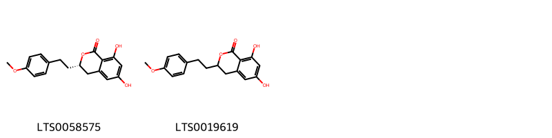
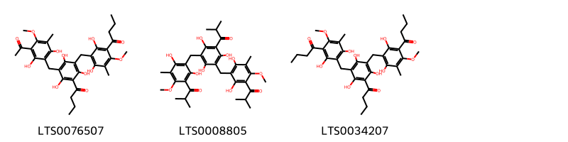
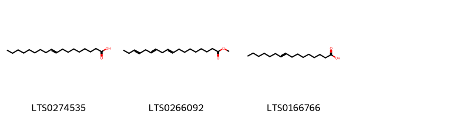
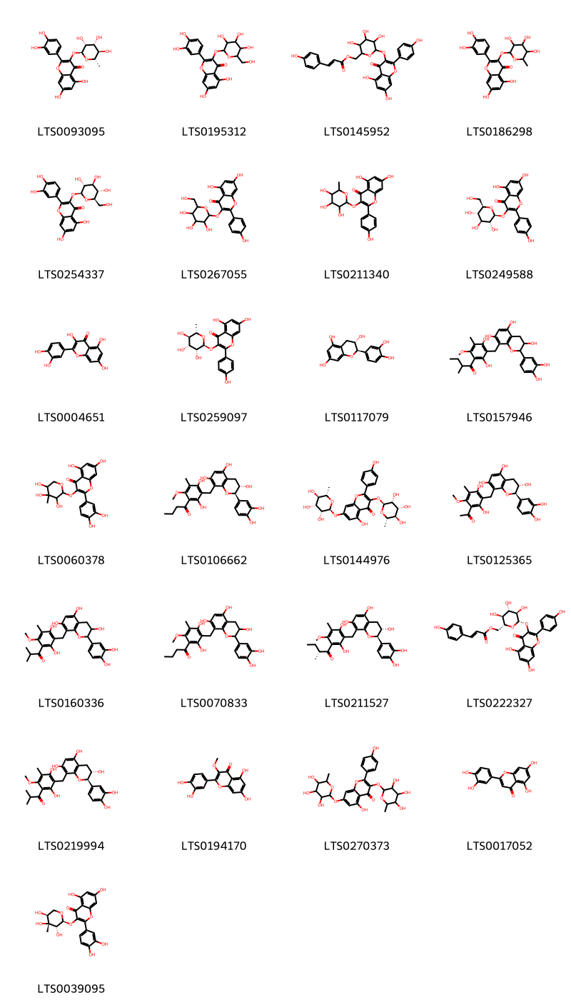
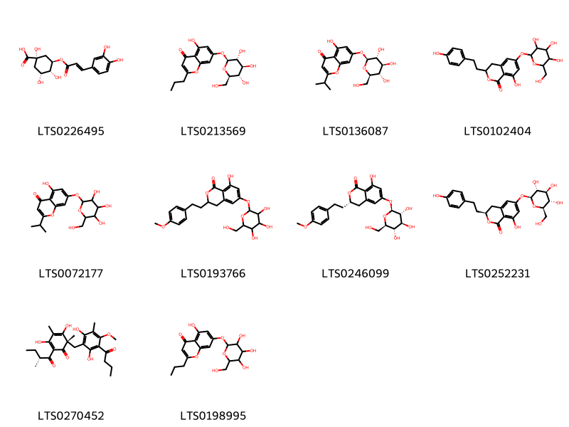
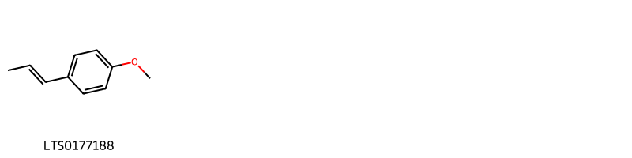
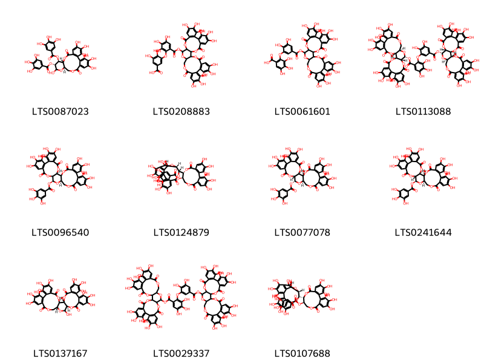

!!! abstract "Tóm tắt"

    Long nha thảo với Tên khoa học Agrimonia nepalensis D. Don (Agrimonia eupatoria auct. non L.), thuộc họ Hoa hồng (Rosaceae.). Phân bố bản địa của loài này là Bắc và Đông Âu đến Nhật Bản và Bắc Đông Dương... Cây mọc hoang ở miền Bắc Việt Nam (quanh thị xã Cao Bằng, Lạng Sơn). Phần trên mặt đất của cây được sử dụng làm thuốc. Thành phần hóa học của Long nha thảo bao gồm các hợp chất như agrimol C, luteolin, quercitrin và pilosanol C.... Dược liệu tác dụng dược lý: tiêu viêm,tăng sự dinh dưỡng của tế bào,  tăng sức động của huyết dịch....Dùng làm thuốc cầm máu chữa bệnh đi ỉa ra máu, thổ huyết, ho ra máu, đổ máu cam, tử cung xuất huyết... trong dân gian thường dùng bằng cách loại bỏ tạp chất, cắt đoạn,  phơi hoặc sấy khô, dạng thuốc sắc,  thuốc tán, dùng riêng, hoặc phối hợp với các vị thuốc khác.

## Thông tin về thực vật

Dược liệu **Long Nha Thảo( Phần Trên Mặt Đất)** từ bộ phận **nan** từ loài *Agrimonia pilosa*.

**Mô tả thực vật:** Loại cỏ cao 0,5-1,5m, toàn thân và mang lông trắng, nhiều cành. Thân rễ mọc ngang, đường kính có thể đạt tới 1cm. Lá mọc so le, kép, dìa lẻ, lá chét hình trứng dài, mép có răng cưa to. Cạnh những lá chét to có nhiều lá chét nhỏ. Lá chét to dài chừng 6cm, rộng chừng 2,5cm, lá chét nhỏ có khi chỉ dài 5mm. Cả hai mặt lá đều mang nhiều lông. Hoa nhỏ mọc thành chùm mọc ở đầu cành hoặc kẽ lá, Cánh hoa màu vàng. Quả gồm 2-3 quả bế bọc xung quanh bởi đế hoa có đài ở mép trên. Toàn bộ có nhiều gai.

*Tài liệu tham khảo:* "Những cây thuốc và vị thuốc Việt Nam" - Đỗ Tất Lợi 
Trong dược điển Việt nam, một loài được sử dụng làm dược liệu là *Agrimonia pilosa*.

!!! info "Phân loại thực vật của *N/A*"
    - **Kingdom:** N/A
    - **Phylum:** N/A
    - **Order:** N/A
    - **Family:** N/A
    - **Genus:** N/A
    - **Species:** *N/A*

**Phân bố trên thế giới:** N/A

**Phân bố tại Việt nam:** N/A

## Thông tin về dược liệu 

### Định danh

!!! info "Thông tin về tên gọi"

    - Dược liệu tiếng Việt: nan
    - Dược liệu tiếng Trung: nan (nan)
    - Dược liệu tiếng Anh: nan
    - Dược liệu latin thông dụng: nan
    - Dược liệu latin kiểu DĐVN: *herba agrimoniae*
    - Dược liệu latin kiểu DĐVN: *nan*
    - Dược liệu latin kiểu thông tư: *nan*
    - Bộ phận dùng: nan (nan)

### Mô tả dược liệu 

- **Theo dược điển Việt nam V:** nan

- **Mô tả dược liệu theo thông tư chế biến dược liệu theo phương pháp cổ truyền:** nan

### Chế biến 

- **Chế biến theo dược điển việt nam V**: nan

- **Chế biến theo thông tư:** nan

--- 

## Thành phần hóa học

- Theo tài liệu của GS. Đỗ Tất Lợi:  (1) Agrimol c
Luteolin
Quercitrin
Pilosanol c
(2)  các hợp chất phenolic như tannin
    

**Thành phần hóa học từ loài **Agrimonia pilosa**

Theo cơ sở dữ liệu lotus, loài *Agrimonia pilosa* đã phân lập và xác định được **66** hoạt chất thuộc về các nhóm Diarylheptanoids, Organooxygen compounds, Fatty Acyls, Flavonoids, Phenol ethers, Tannins, Benzene and substituted derivatives, Prenol lipids trong bảng dưới đây. Danh sách các hoạt chất như sau 1-{3-[(3-acetyl-2,6-dihydroxy-4-methoxy-5-methylphenyl)methyl]-5-[(3-butanoyl-2,6-dihydroxy-4-methoxy-5-methylphenyl)methyl]-2,4,6-trihydroxyphenyl}butan-1-one [(LTS0076507)](https://lotus.naturalproducts.net/compound/lotus_id/LTS0076507), (+-)-propylene glycol [(LTS0274535)](https://lotus.naturalproducts.net/compound/lotus_id/LTS0274535), 5-hydroxy-2-isopropyl-7-{[(2s,3r,4s,5s,6r)-3,4,5-trihydroxy-6-(hydroxymethyl)oxan-2-yl]oxy}chromen-4-one [(LTS0136087)](https://lotus.naturalproducts.net/compound/lotus_id/LTS0136087), pilosanol b [(LTS0219994)](https://lotus.naturalproducts.net/compound/lotus_id/LTS0219994), (3s)-8-hydroxy-3-[2-(4-hydroxyphenyl)ethyl]-6-{[(2s,3r,4s,5s,6r)-3,4,5-trihydroxy-6-(hydroxymethyl)oxan-2-yl]oxy}-3,4-dihydro-2-benzopyran-1-one [(LTS0252231)](https://lotus.naturalproducts.net/compound/lotus_id/LTS0252231), (11r,12r)-12-[(15s,19s)-2,3,4,7,8,9,19-heptahydroxy-12,17-dioxo-13,16-dioxatetracyclo[13.3.1.0⁵,¹⁸.0⁶,¹¹]nonadeca-1(18),2,4,6,8,10-hexaen-14-yl]-3,4,5,17,18,19-hexahydroxy-8,14-dioxo-9,13-dioxatricyclo[13.4.0.0²,⁷]nonadeca-1(15),2,4,6,16,18-hexaen-11-yl 3,4,5-trihydroxybenzoate [(LTS0107688)](https://lotus.naturalproducts.net/compound/lotus_id/LTS0107688), 6,10,14-trimethylpentadeca-5,9,13-trien-2-one [(LTS0158635)](https://lotus.naturalproducts.net/compound/lotus_id/LTS0158635), tiliroside [(LTS0222327)](https://lotus.naturalproducts.net/compound/lotus_id/LTS0222327), (3s)-6,8-dihydroxy-3-[2-(4-methoxyphenyl)ethyl]-3,4-dihydro-2-benzopyran-1-one [(LTS0058575)](https://lotus.naturalproducts.net/compound/lotus_id/LTS0058575), (+)-catechol [(LTS0117079)](https://lotus.naturalproducts.net/compound/lotus_id/LTS0117079), 1-(3-{[(2r,3s)-2-(3,4-dihydroxyphenyl)-3,5,7-trihydroxy-3,4-dihydro-2h-1-benzopyran-8-yl]methyl}-2,4-dihydroxy-6-methoxy-5-methylphenyl)ethanone [(LTS0125365)](https://lotus.naturalproducts.net/compound/lotus_id/LTS0125365), 2-(3,4-dihydroxyphenyl)-5,7-dihydroxy-3-{[3,4,5-trihydroxy-6-(hydroxymethyl)oxan-2-yl]oxy}chromen-4-one [(LTS0195312)](https://lotus.naturalproducts.net/compound/lotus_id/LTS0195312), pomolic acid [(LTS0196537)](https://lotus.naturalproducts.net/compound/lotus_id/LTS0196537), (11r,12r)-12-[(14r,15s,19s)-2,3,4,7,8,9,19-heptahydroxy-12,17-dioxo-13,16-dioxatetracyclo[13.3.1.0⁵,¹⁸.0⁶,¹¹]nonadeca-1(18),2,4,6,8,10-hexaen-14-yl]-3,4,5,17,18,19-hexahydroxy-8,14-dioxo-9,13-dioxatricyclo[13.4.0.0²,⁷]nonadeca-1(15),2,4,6,16,18-hexaen-11-yl 3,4,5-trihydroxybenzoate [(LTS0124879)](https://lotus.naturalproducts.net/compound/lotus_id/LTS0124879), 2-{5-[({7,8,9,12,13,14,28,29,30,33,34,35-dodecahydroxy-4,17,25,38-tetraoxo-3,18,21,24,39-pentaoxaheptacyclo[20.17.0.0²,¹⁹.0⁵,¹⁰.0¹¹,¹⁶.0²⁶,³¹.0³²,³⁷]nonatriaconta-5,7,9,11(16),12,14,26,28,30,32(37),33,35-dodecaen-20-yl}oxy)carbonyl]-2,3-dihydroxyphenoxy}-3,4,5-trihydroxybenzoic acid [(LTS0061601)](https://lotus.naturalproducts.net/compound/lotus_id/LTS0061601), afzelin [(LTS0259097)](https://lotus.naturalproducts.net/compound/lotus_id/LTS0259097), (1r,2s,19r,20r,22r)-7,8,9,12,13,14,28,29,30,33,34,35-dodecahydroxy-4,17,25,38-tetraoxo-3,18,21,24,39-pentaoxaheptacyclo[20.17.0.0²,¹⁹.0⁵,¹⁰.0¹¹,¹⁶.0²⁶,³¹.0³²,³⁷]nonatriaconta-5,7,9,11(16),12,14,26,28,30,32(37),33,35-dodecaen-20-yl 3,4,5-trihydroxybenzoate [(LTS0077078)](https://lotus.naturalproducts.net/compound/lotus_id/LTS0077078), pilosanol c [(LTS0106662)](https://lotus.naturalproducts.net/compound/lotus_id/LTS0106662), 6-[(3-butanoyl-2,6-dihydroxy-4-methoxy-5-methylphenyl)methyl]-3,5-dihydroxy-4,6-dimethyl-2-(2-methylbutanoyl)cyclohexa-2,4-dien-1-one [(LTS0177471)](https://lotus.naturalproducts.net/compound/lotus_id/LTS0177471), trifolin [(LTS0267055)](https://lotus.naturalproducts.net/compound/lotus_id/LTS0267055), 8-hydroxy-3-[2-(4-hydroxyphenyl)ethyl]-6-{[3,4,5-trihydroxy-6-(hydroxymethyl)oxan-2-yl]oxy}-3,4-dihydro-2-benzopyran-1-one [(LTS0102404)](https://lotus.naturalproducts.net/compound/lotus_id/LTS0102404), (3s)-8-hydroxy-3-[2-(4-methoxyphenyl)ethyl]-6-{[(2s,3r,4s,5s,6r)-3,4,5-trihydroxy-6-(hydroxymethyl)oxan-2-yl]oxy}-3,4-dihydro-2-benzopyran-1-one [(LTS0246099)](https://lotus.naturalproducts.net/compound/lotus_id/LTS0246099), (6-{[5,7-dihydroxy-2-(4-hydroxyphenyl)-4-oxochromen-3-yl]oxy}-3,4,5-trihydroxyoxan-2-yl)methyl 3-(4-hydroxyphenyl)prop-2-enoate [(LTS0145952)](https://lotus.naturalproducts.net/compound/lotus_id/LTS0145952), (2s,20s,22r)-7,8,9,12,13,14,28,29,30,33,34,35-dodecahydroxy-4,17,25,38-tetraoxo-3,18,21,24,39-pentaoxaheptacyclo[20.17.0.0²,¹⁹.0⁵,¹⁰.0¹¹,¹⁶.0²⁶,³¹.0³²,³⁷]nonatriaconta-5,7,9,11(16),12,14,26,28,30,32(37),33,35-dodecaen-20-yl 3,4,5-trihydroxybenzoate [(LTS0096540)](https://lotus.naturalproducts.net/compound/lotus_id/LTS0096540), (1r,2s,19r,20r,22r)-7,8,9,12,13,14,28,29,30,33,34,35-dodecahydroxy-4,17,25,38-tetraoxo-3,18,21,24,39-pentaoxaheptacyclo[20.17.0.0²,¹⁹.0⁵,¹⁰.0¹¹,¹⁶.0²⁶,³¹.0³²,³⁷]nonatriaconta-5,7,9,11(16),12,14,26,28,30,32(37),33,35-dodecaen-20-yl 2-[5-({[(1r,2s,19r,20r,22r)-7,8,9,12,13,14,28,29,30,33,34,35-dodecahydroxy-4,17,25,38-tetraoxo-3,18,21,24,39-pentaoxaheptacyclo[20.17.0.0²,¹⁹.0⁵,¹⁰.0¹¹,¹⁶.0²⁶,³¹.0³²,³⁷]nonatriaconta-5,7,9,11(16),12,14,26,28,30,32(37),33,35-dodecaen-20-yl]oxy}carbonyl)-2,3-dihydroxyphenoxy]-3,4,5-trihydroxybenzoate [(LTS0113088)](https://lotus.naturalproducts.net/compound/lotus_id/LTS0113088), chlorogenic acid [(LTS0226495)](https://lotus.naturalproducts.net/compound/lotus_id/LTS0226495), quercetin [(LTS0004651)](https://lotus.naturalproducts.net/compound/lotus_id/LTS0004651), agrimophol [(LTS0270452)](https://lotus.naturalproducts.net/compound/lotus_id/LTS0270452), 5-hydroxy-2-propyl-7-{[3,4,5-trihydroxy-6-(hydroxymethyl)oxan-2-yl]oxy}chromen-4-one [(LTS0198995)](https://lotus.naturalproducts.net/compound/lotus_id/LTS0198995), tormentic acid [(LTS0102591)](https://lotus.naturalproducts.net/compound/lotus_id/LTS0102591), 6,8-dihydroxy-3-[2-(4-methoxyphenyl)ethyl]-3,4-dihydro-2-benzopyran-1-one [(LTS0019619)](https://lotus.naturalproducts.net/compound/lotus_id/LTS0019619), 1-{3-[(3-{[2,6-dihydroxy-4-methoxy-3-methyl-5-(2-methylpropanoyl)phenyl]methyl}-2,4,6-trihydroxy-5-(2-methylpropanoyl)phenyl)methyl]-2,4-dihydroxy-6-methoxy-5-methylphenyl}-2-methylpropan-1-one [(LTS0008805)](https://lotus.naturalproducts.net/compound/lotus_id/LTS0008805), 5,7-dihydroxy-2-(4-hydroxyphenyl)-3-[(3,4,5-trihydroxy-6-methyloxan-2-yl)oxy]chromen-4-one [(LTS0211340)](https://lotus.naturalproducts.net/compound/lotus_id/LTS0211340), 9-hexadecenoic acid [(LTS0166766)](https://lotus.naturalproducts.net/compound/lotus_id/LTS0166766), 2-(3,4-dihydroxyphenyl)-5,7-dihydroxy-3-{[(2s,3r,4r,5s)-3,4,5-trihydroxy-4-methyloxan-2-yl]oxy}chromen-4-one [(LTS0039095)](https://lotus.naturalproducts.net/compound/lotus_id/LTS0039095), (2s,3r,4s,5s,6r)-3,4,5-trihydroxy-6-(hydroxymethyl)oxan-2-yl (1r,2r,4as,6as,6br,8ar,10r,11r,12ar,12br,14bs)-1,10,11-trihydroxy-1,2,6a,6b,9,9,12a-heptamethyl-2,3,4,5,6,7,8,8a,10,11,12,12b,13,14b-tetradecahydropicene-4a-carboxylate [(LTS0206047)](https://lotus.naturalproducts.net/compound/lotus_id/LTS0206047), agrimol c [(LTS0034207)](https://lotus.naturalproducts.net/compound/lotus_id/LTS0034207), 7,8,9,12,13,14,28,29,30,33,34,35-dodecahydroxy-4,17,25,38-tetraoxo-3,18,21,24,39-pentaoxaheptacyclo[20.17.0.0²,¹⁹.0⁵,¹⁰.0¹¹,¹⁶.0²⁶,³¹.0³²,³⁷]nonatriaconta-5,7,9,11(16),12,14,26,28,30,32(37),33,35-dodecaen-20-yl 2-{5-[({7,8,9,12,13,14,28,29,30,33,34,35-dodecahydroxy-4,17,25,38-tetraoxo-3,18,21,24,39-pentaoxaheptacyclo[20.17.0.0²,¹⁹.0⁵,¹⁰.0¹¹,¹⁶.0²⁶,³¹.0³²,³⁷]nonatriaconta-5,7,9,11(16),12,14,26,28,30,32(37),33,35-dodecaen-20-yl}oxy)carbonyl]-2,3-dihydroxyphenoxy}-3,4,5-trihydroxybenzoate [(LTS0029337)](https://lotus.naturalproducts.net/compound/lotus_id/LTS0029337), (1r,2r,4as,6as,6br,8as,10r,11r,12s,12ar,12bs,14bs)-1,10,11,12-tetrahydroxy-1,2,6a,6b,9,9,12a-heptamethyl-2,3,4,5,6,7,8,8a,10,11,12,12b,13,14b-tetradecahydropicene-4a-carboxylic acid [(LTS0175244)](https://lotus.naturalproducts.net/compound/lotus_id/LTS0175244), 1-(3-{[2-(3,4-dihydroxyphenyl)-3,5,7-trihydroxy-3,4-dihydro-2h-1-benzopyran-8-yl]methyl}-2,4-dihydroxy-6-methoxy-5-methylphenyl)butan-1-one [(LTS0070833)](https://lotus.naturalproducts.net/compound/lotus_id/LTS0070833), 1-(3-{[2-(3,4-dihydroxyphenyl)-3,5,7-trihydroxy-3,4-dihydro-2h-1-benzopyran-8-yl]methyl}-2,4-dihydroxy-6-methoxy-5-methylphenyl)-2-methylbutan-1-one [(LTS0157946)](https://lotus.naturalproducts.net/compound/lotus_id/LTS0157946), ursolic acid [(LTS0250838)](https://lotus.naturalproducts.net/compound/lotus_id/LTS0250838), astragalin [(LTS0249588)](https://lotus.naturalproducts.net/compound/lotus_id/LTS0249588), 1,10,11,12-tetrahydroxy-1,2,6a,6b,9,9,12a-heptamethyl-2,3,4,5,6,7,8,8a,10,11,12,12b,13,14b-tetradecahydropicene-4a-carboxylic acid [(LTS0236587)](https://lotus.naturalproducts.net/compound/lotus_id/LTS0236587), methyl elaidolinolenate [(LTS0266092)](https://lotus.naturalproducts.net/compound/lotus_id/LTS0266092), isoquercetin [(LTS0254337)](https://lotus.naturalproducts.net/compound/lotus_id/LTS0254337), quercitrin [(LTS0093095)](https://lotus.naturalproducts.net/compound/lotus_id/LTS0093095), 2-(3,4-dihydroxyphenyl)-5,7-dihydroxy-3-[(3,4,5-trihydroxy-4-methyloxan-2-yl)oxy]chromen-4-one [(LTS0060378)](https://lotus.naturalproducts.net/compound/lotus_id/LTS0060378), casuarictin [(LTS0241644)](https://lotus.naturalproducts.net/compound/lotus_id/LTS0241644), (10r,11s,12r,15r)-3,4,5,13,21,22,23-heptahydroxy-8,18-dioxo-11-(3,4,5-trihydroxybenzoyloxy)-9,14,17-trioxatetracyclo[17.4.0.0²,⁷.0¹⁰,¹⁵]tricosa-1(23),2(7),3,5,19,21-hexaen-12-yl 3,4,5-trihydroxybenzoate [(LTS0087023)](https://lotus.naturalproducts.net/compound/lotus_id/LTS0087023), lespedin [(LTS0144976)](https://lotus.naturalproducts.net/compound/lotus_id/LTS0144976), (2r)-1-(3-{[(2r,3s)-2-(3,4-dihydroxyphenyl)-3,5,7-trihydroxy-3,4-dihydro-2h-1-benzopyran-8-yl]methyl}-2,4-dihydroxy-6-methoxy-5-methylphenyl)-2-methylbutan-1-one [(LTS0211527)](https://lotus.naturalproducts.net/compound/lotus_id/LTS0211527), 5-hydroxy-2-propyl-7-{[(2s,3r,4s,5s,6r)-3,4,5-trihydroxy-6-(hydroxymethyl)oxan-2-yl]oxy}chromen-4-one [(LTS0213569)](https://lotus.naturalproducts.net/compound/lotus_id/LTS0213569), 5-hydroxy-2-isopropyl-7-{[3,4,5-trihydroxy-6-(hydroxymethyl)oxan-2-yl]oxy}chromen-4-one [(LTS0072177)](https://lotus.naturalproducts.net/compound/lotus_id/LTS0072177), corosolic acid [(LTS0231285)](https://lotus.naturalproducts.net/compound/lotus_id/LTS0231285), (1r,2s,19r,22r)-7,8,9,12,13,14,20,28,29,30,33,34,35-tridecahydroxy-3,18,21,24,39-pentaoxaheptacyclo[20.17.0.0²,¹⁹.0⁵,¹⁰.0¹¹,¹⁶.0²⁶,³¹.0³²,³⁷]nonatriaconta-5(10),6,8,11,13,15,26(31),27,29,32,34,36-dodecaene-4,17,25,38-tetrone [(LTS0137167)](https://lotus.naturalproducts.net/compound/lotus_id/LTS0137167), luteolin [(LTS0017052)](https://lotus.naturalproducts.net/compound/lotus_id/LTS0017052), (1r,2r,4as,6as,6br,8as,10r,11s,12s,12ar,12bs,14bs)-1,10,11,12-tetrahydroxy-1,2,6a,6b,9,9,12a-heptamethyl-2,3,4,5,6,7,8,8a,10,11,12,12b,13,14b-tetradecahydropicene-4a-carboxylic acid [(LTS0162367)](https://lotus.naturalproducts.net/compound/lotus_id/LTS0162367), quercetin 3-methyl ether [(LTS0194170)](https://lotus.naturalproducts.net/compound/lotus_id/LTS0194170), quercitrin [(LTS0186298)](https://lotus.naturalproducts.net/compound/lotus_id/LTS0186298), 8-hydroxy-3-[2-(4-methoxyphenyl)ethyl]-6-{[3,4,5-trihydroxy-6-(hydroxymethyl)oxan-2-yl]oxy}-3,4-dihydro-2-benzopyran-1-one [(LTS0193766)](https://lotus.naturalproducts.net/compound/lotus_id/LTS0193766), 3-{6-[({7,8,9,12,13,14,28,29,30,33,34,35-dodecahydroxy-4,17,25,38-tetraoxo-3,18,21,24,39-pentaoxaheptacyclo[20.17.0.0²,¹⁹.0⁵,¹⁰.0¹¹,¹⁶.0²⁶,³¹.0³²,³⁷]nonatriaconta-5,7,9,11(16),12,14,26,28,30,32(37),33,35-dodecaen-20-yl}oxy)carbonyl]-2,3,4-trihydroxyphenoxy}-4,5-dihydroxybenzoic acid [(LTS0208883)](https://lotus.naturalproducts.net/compound/lotus_id/LTS0208883), p-propenylanisole [(LTS0177188)](https://lotus.naturalproducts.net/compound/lotus_id/LTS0177188), 3,4,5-trihydroxy-6-(hydroxymethyl)oxan-2-yl 1,10,11-trihydroxy-1,2,6a,6b,9,9,12a-heptamethyl-2,3,4,5,6,7,8,8a,10,11,12,12b,13,14b-tetradecahydropicene-4a-carboxylate [(LTS0195391)](https://lotus.naturalproducts.net/compound/lotus_id/LTS0195391), 1-(3-{[2-(3,4-dihydroxyphenyl)-3,5,7-trihydroxy-3,4-dihydro-2h-1-benzopyran-8-yl]methyl}-2,4-dihydroxy-6-methoxy-5-methylphenyl)-2-methylpropan-1-one [(LTS0160336)](https://lotus.naturalproducts.net/compound/lotus_id/LTS0160336), kaempferitrin [(LTS0270373)](https://lotus.naturalproducts.net/compound/lotus_id/LTS0270373). 
        
| chemicalTaxonomyClassyfireClass     |   smiles_count |
|:------------------------------------|---------------:|
| Benzene and substituted derivatives |             80 |
| Diarylheptanoids                    |            265 |
| Fatty Acyls                         |             81 |
| Flavonoids                          |           1759 |
| Organooxygen compounds              |            650 |
| Phenol ethers                       |             16 |
| Prenol lipids                       |           1007 |
| Tannins                             |           1873 |

            
### Nhóm Benzene and substituted derivatives
<figure markdown="span">
    { width=100% }
<figcaption>Hình ảnh cấu trúc hóa học của hoạt chất thuộc nhóm *Benzene and substituted derivatives*. Tên thường gọi của các hoạt chất tương ứng là (3s)-6,8-dihydroxy-3-[2-(4-methoxyphenyl)ethyl]-3,4-dihydro-2-benzopyran-1-one [(LTS0058575)](https://lotus.naturalproducts.net/compound/lotus_id/LTS0058575), 6,8-dihydroxy-3-[2-(4-methoxyphenyl)ethyl]-3,4-dihydro-2-benzopyran-1-one [(LTS0019619)](https://lotus.naturalproducts.net/compound/lotus_id/LTS0019619).</figcaption>
</figure>

            
            
### Nhóm Benzene and substituted derivatives
<figure markdown="span">
    { width=100% }
<figcaption>Hình ảnh cấu trúc hóa học của hoạt chất thuộc nhóm *Benzene and substituted derivatives*. Tên thường gọi của các hoạt chất tương ứng là (3s)-6,8-dihydroxy-3-[2-(4-methoxyphenyl)ethyl]-3,4-dihydro-2-benzopyran-1-one [(LTS0058575)](https://lotus.naturalproducts.net/compound/lotus_id/LTS0058575), 6,8-dihydroxy-3-[2-(4-methoxyphenyl)ethyl]-3,4-dihydro-2-benzopyran-1-one [(LTS0019619)](https://lotus.naturalproducts.net/compound/lotus_id/LTS0019619).</figcaption>
</figure>

### Nhóm Diarylheptanoids
<figure markdown="span">
    { width=100% }
<figcaption>Hình ảnh cấu trúc hóa học của hoạt chất thuộc nhóm *Diarylheptanoids*. Tên thường gọi của các hoạt chất tương ứng là 1-{3-[(3-acetyl-2,6-dihydroxy-4-methoxy-5-methylphenyl)methyl]-5-[(3-butanoyl-2,6-dihydroxy-4-methoxy-5-methylphenyl)methyl]-2,4,6-trihydroxyphenyl}butan-1-one [(LTS0076507)](https://lotus.naturalproducts.net/compound/lotus_id/LTS0076507), 1-{3-[(3-{[2,6-dihydroxy-4-methoxy-3-methyl-5-(2-methylpropanoyl)phenyl]methyl}-2,4,6-trihydroxy-5-(2-methylpropanoyl)phenyl)methyl]-2,4-dihydroxy-6-methoxy-5-methylphenyl}-2-methylpropan-1-one [(LTS0008805)](https://lotus.naturalproducts.net/compound/lotus_id/LTS0008805), agrimol c [(LTS0034207)](https://lotus.naturalproducts.net/compound/lotus_id/LTS0034207).</figcaption>
</figure>

            
            
### Nhóm Benzene and substituted derivatives
<figure markdown="span">
    { width=100% }
<figcaption>Hình ảnh cấu trúc hóa học của hoạt chất thuộc nhóm *Benzene and substituted derivatives*. Tên thường gọi của các hoạt chất tương ứng là (3s)-6,8-dihydroxy-3-[2-(4-methoxyphenyl)ethyl]-3,4-dihydro-2-benzopyran-1-one [(LTS0058575)](https://lotus.naturalproducts.net/compound/lotus_id/LTS0058575), 6,8-dihydroxy-3-[2-(4-methoxyphenyl)ethyl]-3,4-dihydro-2-benzopyran-1-one [(LTS0019619)](https://lotus.naturalproducts.net/compound/lotus_id/LTS0019619).</figcaption>
</figure>

### Nhóm Diarylheptanoids
<figure markdown="span">
    { width=100% }
<figcaption>Hình ảnh cấu trúc hóa học của hoạt chất thuộc nhóm *Diarylheptanoids*. Tên thường gọi của các hoạt chất tương ứng là 1-{3-[(3-acetyl-2,6-dihydroxy-4-methoxy-5-methylphenyl)methyl]-5-[(3-butanoyl-2,6-dihydroxy-4-methoxy-5-methylphenyl)methyl]-2,4,6-trihydroxyphenyl}butan-1-one [(LTS0076507)](https://lotus.naturalproducts.net/compound/lotus_id/LTS0076507), 1-{3-[(3-{[2,6-dihydroxy-4-methoxy-3-methyl-5-(2-methylpropanoyl)phenyl]methyl}-2,4,6-trihydroxy-5-(2-methylpropanoyl)phenyl)methyl]-2,4-dihydroxy-6-methoxy-5-methylphenyl}-2-methylpropan-1-one [(LTS0008805)](https://lotus.naturalproducts.net/compound/lotus_id/LTS0008805), agrimol c [(LTS0034207)](https://lotus.naturalproducts.net/compound/lotus_id/LTS0034207).</figcaption>
</figure>

### Nhóm Fatty Acyls
<figure markdown="span">
    { width=100% }
<figcaption>Hình ảnh cấu trúc hóa học của hoạt chất thuộc nhóm *Fatty Acyls*. Tên thường gọi của các hoạt chất tương ứng là (+-)-propylene glycol [(LTS0274535)](https://lotus.naturalproducts.net/compound/lotus_id/LTS0274535), methyl elaidolinolenate [(LTS0266092)](https://lotus.naturalproducts.net/compound/lotus_id/LTS0266092), 9-hexadecenoic acid [(LTS0166766)](https://lotus.naturalproducts.net/compound/lotus_id/LTS0166766).</figcaption>
</figure>

            
            
### Nhóm Benzene and substituted derivatives
<figure markdown="span">
    { width=100% }
<figcaption>Hình ảnh cấu trúc hóa học của hoạt chất thuộc nhóm *Benzene and substituted derivatives*. Tên thường gọi của các hoạt chất tương ứng là (3s)-6,8-dihydroxy-3-[2-(4-methoxyphenyl)ethyl]-3,4-dihydro-2-benzopyran-1-one [(LTS0058575)](https://lotus.naturalproducts.net/compound/lotus_id/LTS0058575), 6,8-dihydroxy-3-[2-(4-methoxyphenyl)ethyl]-3,4-dihydro-2-benzopyran-1-one [(LTS0019619)](https://lotus.naturalproducts.net/compound/lotus_id/LTS0019619).</figcaption>
</figure>

### Nhóm Diarylheptanoids
<figure markdown="span">
    { width=100% }
<figcaption>Hình ảnh cấu trúc hóa học của hoạt chất thuộc nhóm *Diarylheptanoids*. Tên thường gọi của các hoạt chất tương ứng là 1-{3-[(3-acetyl-2,6-dihydroxy-4-methoxy-5-methylphenyl)methyl]-5-[(3-butanoyl-2,6-dihydroxy-4-methoxy-5-methylphenyl)methyl]-2,4,6-trihydroxyphenyl}butan-1-one [(LTS0076507)](https://lotus.naturalproducts.net/compound/lotus_id/LTS0076507), 1-{3-[(3-{[2,6-dihydroxy-4-methoxy-3-methyl-5-(2-methylpropanoyl)phenyl]methyl}-2,4,6-trihydroxy-5-(2-methylpropanoyl)phenyl)methyl]-2,4-dihydroxy-6-methoxy-5-methylphenyl}-2-methylpropan-1-one [(LTS0008805)](https://lotus.naturalproducts.net/compound/lotus_id/LTS0008805), agrimol c [(LTS0034207)](https://lotus.naturalproducts.net/compound/lotus_id/LTS0034207).</figcaption>
</figure>

### Nhóm Fatty Acyls
<figure markdown="span">
    { width=100% }
<figcaption>Hình ảnh cấu trúc hóa học của hoạt chất thuộc nhóm *Fatty Acyls*. Tên thường gọi của các hoạt chất tương ứng là (+-)-propylene glycol [(LTS0274535)](https://lotus.naturalproducts.net/compound/lotus_id/LTS0274535), methyl elaidolinolenate [(LTS0266092)](https://lotus.naturalproducts.net/compound/lotus_id/LTS0266092), 9-hexadecenoic acid [(LTS0166766)](https://lotus.naturalproducts.net/compound/lotus_id/LTS0166766).</figcaption>
</figure>

### Nhóm Flavonoids
<figure markdown="span">
    { width=100% }
<figcaption>Hình ảnh cấu trúc hóa học của hoạt chất thuộc nhóm *Flavonoids*. Tên thường gọi của các hoạt chất tương ứng là quercitrin [(LTS0093095)](https://lotus.naturalproducts.net/compound/lotus_id/LTS0093095), 2-(3,4-dihydroxyphenyl)-5,7-dihydroxy-3-{[3,4,5-trihydroxy-6-(hydroxymethyl)oxan-2-yl]oxy}chromen-4-one [(LTS0195312)](https://lotus.naturalproducts.net/compound/lotus_id/LTS0195312), (6-{[5,7-dihydroxy-2-(4-hydroxyphenyl)-4-oxochromen-3-yl]oxy}-3,4,5-trihydroxyoxan-2-yl)methyl 3-(4-hydroxyphenyl)prop-2-enoate [(LTS0145952)](https://lotus.naturalproducts.net/compound/lotus_id/LTS0145952), quercitrin [(LTS0186298)](https://lotus.naturalproducts.net/compound/lotus_id/LTS0186298), isoquercetin [(LTS0254337)](https://lotus.naturalproducts.net/compound/lotus_id/LTS0254337), trifolin [(LTS0267055)](https://lotus.naturalproducts.net/compound/lotus_id/LTS0267055), 5,7-dihydroxy-2-(4-hydroxyphenyl)-3-[(3,4,5-trihydroxy-6-methyloxan-2-yl)oxy]chromen-4-one [(LTS0211340)](https://lotus.naturalproducts.net/compound/lotus_id/LTS0211340), astragalin [(LTS0249588)](https://lotus.naturalproducts.net/compound/lotus_id/LTS0249588), quercetin [(LTS0004651)](https://lotus.naturalproducts.net/compound/lotus_id/LTS0004651), afzelin [(LTS0259097)](https://lotus.naturalproducts.net/compound/lotus_id/LTS0259097), (+)-catechol [(LTS0117079)](https://lotus.naturalproducts.net/compound/lotus_id/LTS0117079), 1-(3-{[2-(3,4-dihydroxyphenyl)-3,5,7-trihydroxy-3,4-dihydro-2h-1-benzopyran-8-yl]methyl}-2,4-dihydroxy-6-methoxy-5-methylphenyl)-2-methylbutan-1-one [(LTS0157946)](https://lotus.naturalproducts.net/compound/lotus_id/LTS0157946), 2-(3,4-dihydroxyphenyl)-5,7-dihydroxy-3-[(3,4,5-trihydroxy-4-methyloxan-2-yl)oxy]chromen-4-one [(LTS0060378)](https://lotus.naturalproducts.net/compound/lotus_id/LTS0060378), pilosanol c [(LTS0106662)](https://lotus.naturalproducts.net/compound/lotus_id/LTS0106662), lespedin [(LTS0144976)](https://lotus.naturalproducts.net/compound/lotus_id/LTS0144976), 1-(3-{[(2r,3s)-2-(3,4-dihydroxyphenyl)-3,5,7-trihydroxy-3,4-dihydro-2h-1-benzopyran-8-yl]methyl}-2,4-dihydroxy-6-methoxy-5-methylphenyl)ethanone [(LTS0125365)](https://lotus.naturalproducts.net/compound/lotus_id/LTS0125365), 1-(3-{[2-(3,4-dihydroxyphenyl)-3,5,7-trihydroxy-3,4-dihydro-2h-1-benzopyran-8-yl]methyl}-2,4-dihydroxy-6-methoxy-5-methylphenyl)-2-methylpropan-1-one [(LTS0160336)](https://lotus.naturalproducts.net/compound/lotus_id/LTS0160336), 1-(3-{[2-(3,4-dihydroxyphenyl)-3,5,7-trihydroxy-3,4-dihydro-2h-1-benzopyran-8-yl]methyl}-2,4-dihydroxy-6-methoxy-5-methylphenyl)butan-1-one [(LTS0070833)](https://lotus.naturalproducts.net/compound/lotus_id/LTS0070833), (2r)-1-(3-{[(2r,3s)-2-(3,4-dihydroxyphenyl)-3,5,7-trihydroxy-3,4-dihydro-2h-1-benzopyran-8-yl]methyl}-2,4-dihydroxy-6-methoxy-5-methylphenyl)-2-methylbutan-1-one [(LTS0211527)](https://lotus.naturalproducts.net/compound/lotus_id/LTS0211527), tiliroside [(LTS0222327)](https://lotus.naturalproducts.net/compound/lotus_id/LTS0222327), pilosanol b [(LTS0219994)](https://lotus.naturalproducts.net/compound/lotus_id/LTS0219994), quercetin 3-methyl ether [(LTS0194170)](https://lotus.naturalproducts.net/compound/lotus_id/LTS0194170), kaempferitrin [(LTS0270373)](https://lotus.naturalproducts.net/compound/lotus_id/LTS0270373), luteolin [(LTS0017052)](https://lotus.naturalproducts.net/compound/lotus_id/LTS0017052), 2-(3,4-dihydroxyphenyl)-5,7-dihydroxy-3-{[(2s,3r,4r,5s)-3,4,5-trihydroxy-4-methyloxan-2-yl]oxy}chromen-4-one [(LTS0039095)](https://lotus.naturalproducts.net/compound/lotus_id/LTS0039095).</figcaption>
</figure>

            
            
### Nhóm Benzene and substituted derivatives
<figure markdown="span">
    { width=100% }
<figcaption>Hình ảnh cấu trúc hóa học của hoạt chất thuộc nhóm *Benzene and substituted derivatives*. Tên thường gọi của các hoạt chất tương ứng là (3s)-6,8-dihydroxy-3-[2-(4-methoxyphenyl)ethyl]-3,4-dihydro-2-benzopyran-1-one [(LTS0058575)](https://lotus.naturalproducts.net/compound/lotus_id/LTS0058575), 6,8-dihydroxy-3-[2-(4-methoxyphenyl)ethyl]-3,4-dihydro-2-benzopyran-1-one [(LTS0019619)](https://lotus.naturalproducts.net/compound/lotus_id/LTS0019619).</figcaption>
</figure>

### Nhóm Diarylheptanoids
<figure markdown="span">
    { width=100% }
<figcaption>Hình ảnh cấu trúc hóa học của hoạt chất thuộc nhóm *Diarylheptanoids*. Tên thường gọi của các hoạt chất tương ứng là 1-{3-[(3-acetyl-2,6-dihydroxy-4-methoxy-5-methylphenyl)methyl]-5-[(3-butanoyl-2,6-dihydroxy-4-methoxy-5-methylphenyl)methyl]-2,4,6-trihydroxyphenyl}butan-1-one [(LTS0076507)](https://lotus.naturalproducts.net/compound/lotus_id/LTS0076507), 1-{3-[(3-{[2,6-dihydroxy-4-methoxy-3-methyl-5-(2-methylpropanoyl)phenyl]methyl}-2,4,6-trihydroxy-5-(2-methylpropanoyl)phenyl)methyl]-2,4-dihydroxy-6-methoxy-5-methylphenyl}-2-methylpropan-1-one [(LTS0008805)](https://lotus.naturalproducts.net/compound/lotus_id/LTS0008805), agrimol c [(LTS0034207)](https://lotus.naturalproducts.net/compound/lotus_id/LTS0034207).</figcaption>
</figure>

### Nhóm Fatty Acyls
<figure markdown="span">
    { width=100% }
<figcaption>Hình ảnh cấu trúc hóa học của hoạt chất thuộc nhóm *Fatty Acyls*. Tên thường gọi của các hoạt chất tương ứng là (+-)-propylene glycol [(LTS0274535)](https://lotus.naturalproducts.net/compound/lotus_id/LTS0274535), methyl elaidolinolenate [(LTS0266092)](https://lotus.naturalproducts.net/compound/lotus_id/LTS0266092), 9-hexadecenoic acid [(LTS0166766)](https://lotus.naturalproducts.net/compound/lotus_id/LTS0166766).</figcaption>
</figure>

### Nhóm Flavonoids
<figure markdown="span">
    { width=100% }
<figcaption>Hình ảnh cấu trúc hóa học của hoạt chất thuộc nhóm *Flavonoids*. Tên thường gọi của các hoạt chất tương ứng là quercitrin [(LTS0093095)](https://lotus.naturalproducts.net/compound/lotus_id/LTS0093095), 2-(3,4-dihydroxyphenyl)-5,7-dihydroxy-3-{[3,4,5-trihydroxy-6-(hydroxymethyl)oxan-2-yl]oxy}chromen-4-one [(LTS0195312)](https://lotus.naturalproducts.net/compound/lotus_id/LTS0195312), (6-{[5,7-dihydroxy-2-(4-hydroxyphenyl)-4-oxochromen-3-yl]oxy}-3,4,5-trihydroxyoxan-2-yl)methyl 3-(4-hydroxyphenyl)prop-2-enoate [(LTS0145952)](https://lotus.naturalproducts.net/compound/lotus_id/LTS0145952), quercitrin [(LTS0186298)](https://lotus.naturalproducts.net/compound/lotus_id/LTS0186298), isoquercetin [(LTS0254337)](https://lotus.naturalproducts.net/compound/lotus_id/LTS0254337), trifolin [(LTS0267055)](https://lotus.naturalproducts.net/compound/lotus_id/LTS0267055), 5,7-dihydroxy-2-(4-hydroxyphenyl)-3-[(3,4,5-trihydroxy-6-methyloxan-2-yl)oxy]chromen-4-one [(LTS0211340)](https://lotus.naturalproducts.net/compound/lotus_id/LTS0211340), astragalin [(LTS0249588)](https://lotus.naturalproducts.net/compound/lotus_id/LTS0249588), quercetin [(LTS0004651)](https://lotus.naturalproducts.net/compound/lotus_id/LTS0004651), afzelin [(LTS0259097)](https://lotus.naturalproducts.net/compound/lotus_id/LTS0259097), (+)-catechol [(LTS0117079)](https://lotus.naturalproducts.net/compound/lotus_id/LTS0117079), 1-(3-{[2-(3,4-dihydroxyphenyl)-3,5,7-trihydroxy-3,4-dihydro-2h-1-benzopyran-8-yl]methyl}-2,4-dihydroxy-6-methoxy-5-methylphenyl)-2-methylbutan-1-one [(LTS0157946)](https://lotus.naturalproducts.net/compound/lotus_id/LTS0157946), 2-(3,4-dihydroxyphenyl)-5,7-dihydroxy-3-[(3,4,5-trihydroxy-4-methyloxan-2-yl)oxy]chromen-4-one [(LTS0060378)](https://lotus.naturalproducts.net/compound/lotus_id/LTS0060378), pilosanol c [(LTS0106662)](https://lotus.naturalproducts.net/compound/lotus_id/LTS0106662), lespedin [(LTS0144976)](https://lotus.naturalproducts.net/compound/lotus_id/LTS0144976), 1-(3-{[(2r,3s)-2-(3,4-dihydroxyphenyl)-3,5,7-trihydroxy-3,4-dihydro-2h-1-benzopyran-8-yl]methyl}-2,4-dihydroxy-6-methoxy-5-methylphenyl)ethanone [(LTS0125365)](https://lotus.naturalproducts.net/compound/lotus_id/LTS0125365), 1-(3-{[2-(3,4-dihydroxyphenyl)-3,5,7-trihydroxy-3,4-dihydro-2h-1-benzopyran-8-yl]methyl}-2,4-dihydroxy-6-methoxy-5-methylphenyl)-2-methylpropan-1-one [(LTS0160336)](https://lotus.naturalproducts.net/compound/lotus_id/LTS0160336), 1-(3-{[2-(3,4-dihydroxyphenyl)-3,5,7-trihydroxy-3,4-dihydro-2h-1-benzopyran-8-yl]methyl}-2,4-dihydroxy-6-methoxy-5-methylphenyl)butan-1-one [(LTS0070833)](https://lotus.naturalproducts.net/compound/lotus_id/LTS0070833), (2r)-1-(3-{[(2r,3s)-2-(3,4-dihydroxyphenyl)-3,5,7-trihydroxy-3,4-dihydro-2h-1-benzopyran-8-yl]methyl}-2,4-dihydroxy-6-methoxy-5-methylphenyl)-2-methylbutan-1-one [(LTS0211527)](https://lotus.naturalproducts.net/compound/lotus_id/LTS0211527), tiliroside [(LTS0222327)](https://lotus.naturalproducts.net/compound/lotus_id/LTS0222327), pilosanol b [(LTS0219994)](https://lotus.naturalproducts.net/compound/lotus_id/LTS0219994), quercetin 3-methyl ether [(LTS0194170)](https://lotus.naturalproducts.net/compound/lotus_id/LTS0194170), kaempferitrin [(LTS0270373)](https://lotus.naturalproducts.net/compound/lotus_id/LTS0270373), luteolin [(LTS0017052)](https://lotus.naturalproducts.net/compound/lotus_id/LTS0017052), 2-(3,4-dihydroxyphenyl)-5,7-dihydroxy-3-{[(2s,3r,4r,5s)-3,4,5-trihydroxy-4-methyloxan-2-yl]oxy}chromen-4-one [(LTS0039095)](https://lotus.naturalproducts.net/compound/lotus_id/LTS0039095).</figcaption>
</figure>

### Nhóm Organooxygen compounds
<figure markdown="span">
    { width=100% }
<figcaption>Hình ảnh cấu trúc hóa học của hoạt chất thuộc nhóm *Organooxygen compounds*. Tên thường gọi của các hoạt chất tương ứng là chlorogenic acid [(LTS0226495)](https://lotus.naturalproducts.net/compound/lotus_id/LTS0226495), 5-hydroxy-2-propyl-7-{[(2s,3r,4s,5s,6r)-3,4,5-trihydroxy-6-(hydroxymethyl)oxan-2-yl]oxy}chromen-4-one [(LTS0213569)](https://lotus.naturalproducts.net/compound/lotus_id/LTS0213569), 5-hydroxy-2-isopropyl-7-{[(2s,3r,4s,5s,6r)-3,4,5-trihydroxy-6-(hydroxymethyl)oxan-2-yl]oxy}chromen-4-one [(LTS0136087)](https://lotus.naturalproducts.net/compound/lotus_id/LTS0136087), 8-hydroxy-3-[2-(4-hydroxyphenyl)ethyl]-6-{[3,4,5-trihydroxy-6-(hydroxymethyl)oxan-2-yl]oxy}-3,4-dihydro-2-benzopyran-1-one [(LTS0102404)](https://lotus.naturalproducts.net/compound/lotus_id/LTS0102404), 5-hydroxy-2-isopropyl-7-{[3,4,5-trihydroxy-6-(hydroxymethyl)oxan-2-yl]oxy}chromen-4-one [(LTS0072177)](https://lotus.naturalproducts.net/compound/lotus_id/LTS0072177), 8-hydroxy-3-[2-(4-methoxyphenyl)ethyl]-6-{[3,4,5-trihydroxy-6-(hydroxymethyl)oxan-2-yl]oxy}-3,4-dihydro-2-benzopyran-1-one [(LTS0193766)](https://lotus.naturalproducts.net/compound/lotus_id/LTS0193766), (3s)-8-hydroxy-3-[2-(4-methoxyphenyl)ethyl]-6-{[(2s,3r,4s,5s,6r)-3,4,5-trihydroxy-6-(hydroxymethyl)oxan-2-yl]oxy}-3,4-dihydro-2-benzopyran-1-one [(LTS0246099)](https://lotus.naturalproducts.net/compound/lotus_id/LTS0246099), (3s)-8-hydroxy-3-[2-(4-hydroxyphenyl)ethyl]-6-{[(2s,3r,4s,5s,6r)-3,4,5-trihydroxy-6-(hydroxymethyl)oxan-2-yl]oxy}-3,4-dihydro-2-benzopyran-1-one [(LTS0252231)](https://lotus.naturalproducts.net/compound/lotus_id/LTS0252231), agrimophol [(LTS0270452)](https://lotus.naturalproducts.net/compound/lotus_id/LTS0270452), 5-hydroxy-2-propyl-7-{[3,4,5-trihydroxy-6-(hydroxymethyl)oxan-2-yl]oxy}chromen-4-one [(LTS0198995)](https://lotus.naturalproducts.net/compound/lotus_id/LTS0198995).</figcaption>
</figure>

            
            
### Nhóm Benzene and substituted derivatives
<figure markdown="span">
    { width=100% }
<figcaption>Hình ảnh cấu trúc hóa học của hoạt chất thuộc nhóm *Benzene and substituted derivatives*. Tên thường gọi của các hoạt chất tương ứng là (3s)-6,8-dihydroxy-3-[2-(4-methoxyphenyl)ethyl]-3,4-dihydro-2-benzopyran-1-one [(LTS0058575)](https://lotus.naturalproducts.net/compound/lotus_id/LTS0058575), 6,8-dihydroxy-3-[2-(4-methoxyphenyl)ethyl]-3,4-dihydro-2-benzopyran-1-one [(LTS0019619)](https://lotus.naturalproducts.net/compound/lotus_id/LTS0019619).</figcaption>
</figure>

### Nhóm Diarylheptanoids
<figure markdown="span">
    { width=100% }
<figcaption>Hình ảnh cấu trúc hóa học của hoạt chất thuộc nhóm *Diarylheptanoids*. Tên thường gọi của các hoạt chất tương ứng là 1-{3-[(3-acetyl-2,6-dihydroxy-4-methoxy-5-methylphenyl)methyl]-5-[(3-butanoyl-2,6-dihydroxy-4-methoxy-5-methylphenyl)methyl]-2,4,6-trihydroxyphenyl}butan-1-one [(LTS0076507)](https://lotus.naturalproducts.net/compound/lotus_id/LTS0076507), 1-{3-[(3-{[2,6-dihydroxy-4-methoxy-3-methyl-5-(2-methylpropanoyl)phenyl]methyl}-2,4,6-trihydroxy-5-(2-methylpropanoyl)phenyl)methyl]-2,4-dihydroxy-6-methoxy-5-methylphenyl}-2-methylpropan-1-one [(LTS0008805)](https://lotus.naturalproducts.net/compound/lotus_id/LTS0008805), agrimol c [(LTS0034207)](https://lotus.naturalproducts.net/compound/lotus_id/LTS0034207).</figcaption>
</figure>

### Nhóm Fatty Acyls
<figure markdown="span">
    { width=100% }
<figcaption>Hình ảnh cấu trúc hóa học của hoạt chất thuộc nhóm *Fatty Acyls*. Tên thường gọi của các hoạt chất tương ứng là (+-)-propylene glycol [(LTS0274535)](https://lotus.naturalproducts.net/compound/lotus_id/LTS0274535), methyl elaidolinolenate [(LTS0266092)](https://lotus.naturalproducts.net/compound/lotus_id/LTS0266092), 9-hexadecenoic acid [(LTS0166766)](https://lotus.naturalproducts.net/compound/lotus_id/LTS0166766).</figcaption>
</figure>

### Nhóm Flavonoids
<figure markdown="span">
    { width=100% }
<figcaption>Hình ảnh cấu trúc hóa học của hoạt chất thuộc nhóm *Flavonoids*. Tên thường gọi của các hoạt chất tương ứng là quercitrin [(LTS0093095)](https://lotus.naturalproducts.net/compound/lotus_id/LTS0093095), 2-(3,4-dihydroxyphenyl)-5,7-dihydroxy-3-{[3,4,5-trihydroxy-6-(hydroxymethyl)oxan-2-yl]oxy}chromen-4-one [(LTS0195312)](https://lotus.naturalproducts.net/compound/lotus_id/LTS0195312), (6-{[5,7-dihydroxy-2-(4-hydroxyphenyl)-4-oxochromen-3-yl]oxy}-3,4,5-trihydroxyoxan-2-yl)methyl 3-(4-hydroxyphenyl)prop-2-enoate [(LTS0145952)](https://lotus.naturalproducts.net/compound/lotus_id/LTS0145952), quercitrin [(LTS0186298)](https://lotus.naturalproducts.net/compound/lotus_id/LTS0186298), isoquercetin [(LTS0254337)](https://lotus.naturalproducts.net/compound/lotus_id/LTS0254337), trifolin [(LTS0267055)](https://lotus.naturalproducts.net/compound/lotus_id/LTS0267055), 5,7-dihydroxy-2-(4-hydroxyphenyl)-3-[(3,4,5-trihydroxy-6-methyloxan-2-yl)oxy]chromen-4-one [(LTS0211340)](https://lotus.naturalproducts.net/compound/lotus_id/LTS0211340), astragalin [(LTS0249588)](https://lotus.naturalproducts.net/compound/lotus_id/LTS0249588), quercetin [(LTS0004651)](https://lotus.naturalproducts.net/compound/lotus_id/LTS0004651), afzelin [(LTS0259097)](https://lotus.naturalproducts.net/compound/lotus_id/LTS0259097), (+)-catechol [(LTS0117079)](https://lotus.naturalproducts.net/compound/lotus_id/LTS0117079), 1-(3-{[2-(3,4-dihydroxyphenyl)-3,5,7-trihydroxy-3,4-dihydro-2h-1-benzopyran-8-yl]methyl}-2,4-dihydroxy-6-methoxy-5-methylphenyl)-2-methylbutan-1-one [(LTS0157946)](https://lotus.naturalproducts.net/compound/lotus_id/LTS0157946), 2-(3,4-dihydroxyphenyl)-5,7-dihydroxy-3-[(3,4,5-trihydroxy-4-methyloxan-2-yl)oxy]chromen-4-one [(LTS0060378)](https://lotus.naturalproducts.net/compound/lotus_id/LTS0060378), pilosanol c [(LTS0106662)](https://lotus.naturalproducts.net/compound/lotus_id/LTS0106662), lespedin [(LTS0144976)](https://lotus.naturalproducts.net/compound/lotus_id/LTS0144976), 1-(3-{[(2r,3s)-2-(3,4-dihydroxyphenyl)-3,5,7-trihydroxy-3,4-dihydro-2h-1-benzopyran-8-yl]methyl}-2,4-dihydroxy-6-methoxy-5-methylphenyl)ethanone [(LTS0125365)](https://lotus.naturalproducts.net/compound/lotus_id/LTS0125365), 1-(3-{[2-(3,4-dihydroxyphenyl)-3,5,7-trihydroxy-3,4-dihydro-2h-1-benzopyran-8-yl]methyl}-2,4-dihydroxy-6-methoxy-5-methylphenyl)-2-methylpropan-1-one [(LTS0160336)](https://lotus.naturalproducts.net/compound/lotus_id/LTS0160336), 1-(3-{[2-(3,4-dihydroxyphenyl)-3,5,7-trihydroxy-3,4-dihydro-2h-1-benzopyran-8-yl]methyl}-2,4-dihydroxy-6-methoxy-5-methylphenyl)butan-1-one [(LTS0070833)](https://lotus.naturalproducts.net/compound/lotus_id/LTS0070833), (2r)-1-(3-{[(2r,3s)-2-(3,4-dihydroxyphenyl)-3,5,7-trihydroxy-3,4-dihydro-2h-1-benzopyran-8-yl]methyl}-2,4-dihydroxy-6-methoxy-5-methylphenyl)-2-methylbutan-1-one [(LTS0211527)](https://lotus.naturalproducts.net/compound/lotus_id/LTS0211527), tiliroside [(LTS0222327)](https://lotus.naturalproducts.net/compound/lotus_id/LTS0222327), pilosanol b [(LTS0219994)](https://lotus.naturalproducts.net/compound/lotus_id/LTS0219994), quercetin 3-methyl ether [(LTS0194170)](https://lotus.naturalproducts.net/compound/lotus_id/LTS0194170), kaempferitrin [(LTS0270373)](https://lotus.naturalproducts.net/compound/lotus_id/LTS0270373), luteolin [(LTS0017052)](https://lotus.naturalproducts.net/compound/lotus_id/LTS0017052), 2-(3,4-dihydroxyphenyl)-5,7-dihydroxy-3-{[(2s,3r,4r,5s)-3,4,5-trihydroxy-4-methyloxan-2-yl]oxy}chromen-4-one [(LTS0039095)](https://lotus.naturalproducts.net/compound/lotus_id/LTS0039095).</figcaption>
</figure>

### Nhóm Organooxygen compounds
<figure markdown="span">
    { width=100% }
<figcaption>Hình ảnh cấu trúc hóa học của hoạt chất thuộc nhóm *Organooxygen compounds*. Tên thường gọi của các hoạt chất tương ứng là chlorogenic acid [(LTS0226495)](https://lotus.naturalproducts.net/compound/lotus_id/LTS0226495), 5-hydroxy-2-propyl-7-{[(2s,3r,4s,5s,6r)-3,4,5-trihydroxy-6-(hydroxymethyl)oxan-2-yl]oxy}chromen-4-one [(LTS0213569)](https://lotus.naturalproducts.net/compound/lotus_id/LTS0213569), 5-hydroxy-2-isopropyl-7-{[(2s,3r,4s,5s,6r)-3,4,5-trihydroxy-6-(hydroxymethyl)oxan-2-yl]oxy}chromen-4-one [(LTS0136087)](https://lotus.naturalproducts.net/compound/lotus_id/LTS0136087), 8-hydroxy-3-[2-(4-hydroxyphenyl)ethyl]-6-{[3,4,5-trihydroxy-6-(hydroxymethyl)oxan-2-yl]oxy}-3,4-dihydro-2-benzopyran-1-one [(LTS0102404)](https://lotus.naturalproducts.net/compound/lotus_id/LTS0102404), 5-hydroxy-2-isopropyl-7-{[3,4,5-trihydroxy-6-(hydroxymethyl)oxan-2-yl]oxy}chromen-4-one [(LTS0072177)](https://lotus.naturalproducts.net/compound/lotus_id/LTS0072177), 8-hydroxy-3-[2-(4-methoxyphenyl)ethyl]-6-{[3,4,5-trihydroxy-6-(hydroxymethyl)oxan-2-yl]oxy}-3,4-dihydro-2-benzopyran-1-one [(LTS0193766)](https://lotus.naturalproducts.net/compound/lotus_id/LTS0193766), (3s)-8-hydroxy-3-[2-(4-methoxyphenyl)ethyl]-6-{[(2s,3r,4s,5s,6r)-3,4,5-trihydroxy-6-(hydroxymethyl)oxan-2-yl]oxy}-3,4-dihydro-2-benzopyran-1-one [(LTS0246099)](https://lotus.naturalproducts.net/compound/lotus_id/LTS0246099), (3s)-8-hydroxy-3-[2-(4-hydroxyphenyl)ethyl]-6-{[(2s,3r,4s,5s,6r)-3,4,5-trihydroxy-6-(hydroxymethyl)oxan-2-yl]oxy}-3,4-dihydro-2-benzopyran-1-one [(LTS0252231)](https://lotus.naturalproducts.net/compound/lotus_id/LTS0252231), agrimophol [(LTS0270452)](https://lotus.naturalproducts.net/compound/lotus_id/LTS0270452), 5-hydroxy-2-propyl-7-{[3,4,5-trihydroxy-6-(hydroxymethyl)oxan-2-yl]oxy}chromen-4-one [(LTS0198995)](https://lotus.naturalproducts.net/compound/lotus_id/LTS0198995).</figcaption>
</figure>

### Nhóm Phenol ethers
<figure markdown="span">
    { width=100% }
<figcaption>Hình ảnh cấu trúc hóa học của hoạt chất thuộc nhóm *Phenol ethers*. Tên thường gọi của các hoạt chất tương ứng là p-propenylanisole [(LTS0177188)](https://lotus.naturalproducts.net/compound/lotus_id/LTS0177188).</figcaption>
</figure>

            
            
### Nhóm Benzene and substituted derivatives
<figure markdown="span">
    { width=100% }
<figcaption>Hình ảnh cấu trúc hóa học của hoạt chất thuộc nhóm *Benzene and substituted derivatives*. Tên thường gọi của các hoạt chất tương ứng là (3s)-6,8-dihydroxy-3-[2-(4-methoxyphenyl)ethyl]-3,4-dihydro-2-benzopyran-1-one [(LTS0058575)](https://lotus.naturalproducts.net/compound/lotus_id/LTS0058575), 6,8-dihydroxy-3-[2-(4-methoxyphenyl)ethyl]-3,4-dihydro-2-benzopyran-1-one [(LTS0019619)](https://lotus.naturalproducts.net/compound/lotus_id/LTS0019619).</figcaption>
</figure>

### Nhóm Diarylheptanoids
<figure markdown="span">
    { width=100% }
<figcaption>Hình ảnh cấu trúc hóa học của hoạt chất thuộc nhóm *Diarylheptanoids*. Tên thường gọi của các hoạt chất tương ứng là 1-{3-[(3-acetyl-2,6-dihydroxy-4-methoxy-5-methylphenyl)methyl]-5-[(3-butanoyl-2,6-dihydroxy-4-methoxy-5-methylphenyl)methyl]-2,4,6-trihydroxyphenyl}butan-1-one [(LTS0076507)](https://lotus.naturalproducts.net/compound/lotus_id/LTS0076507), 1-{3-[(3-{[2,6-dihydroxy-4-methoxy-3-methyl-5-(2-methylpropanoyl)phenyl]methyl}-2,4,6-trihydroxy-5-(2-methylpropanoyl)phenyl)methyl]-2,4-dihydroxy-6-methoxy-5-methylphenyl}-2-methylpropan-1-one [(LTS0008805)](https://lotus.naturalproducts.net/compound/lotus_id/LTS0008805), agrimol c [(LTS0034207)](https://lotus.naturalproducts.net/compound/lotus_id/LTS0034207).</figcaption>
</figure>

### Nhóm Fatty Acyls
<figure markdown="span">
    { width=100% }
<figcaption>Hình ảnh cấu trúc hóa học của hoạt chất thuộc nhóm *Fatty Acyls*. Tên thường gọi của các hoạt chất tương ứng là (+-)-propylene glycol [(LTS0274535)](https://lotus.naturalproducts.net/compound/lotus_id/LTS0274535), methyl elaidolinolenate [(LTS0266092)](https://lotus.naturalproducts.net/compound/lotus_id/LTS0266092), 9-hexadecenoic acid [(LTS0166766)](https://lotus.naturalproducts.net/compound/lotus_id/LTS0166766).</figcaption>
</figure>

### Nhóm Flavonoids
<figure markdown="span">
    { width=100% }
<figcaption>Hình ảnh cấu trúc hóa học của hoạt chất thuộc nhóm *Flavonoids*. Tên thường gọi của các hoạt chất tương ứng là quercitrin [(LTS0093095)](https://lotus.naturalproducts.net/compound/lotus_id/LTS0093095), 2-(3,4-dihydroxyphenyl)-5,7-dihydroxy-3-{[3,4,5-trihydroxy-6-(hydroxymethyl)oxan-2-yl]oxy}chromen-4-one [(LTS0195312)](https://lotus.naturalproducts.net/compound/lotus_id/LTS0195312), (6-{[5,7-dihydroxy-2-(4-hydroxyphenyl)-4-oxochromen-3-yl]oxy}-3,4,5-trihydroxyoxan-2-yl)methyl 3-(4-hydroxyphenyl)prop-2-enoate [(LTS0145952)](https://lotus.naturalproducts.net/compound/lotus_id/LTS0145952), quercitrin [(LTS0186298)](https://lotus.naturalproducts.net/compound/lotus_id/LTS0186298), isoquercetin [(LTS0254337)](https://lotus.naturalproducts.net/compound/lotus_id/LTS0254337), trifolin [(LTS0267055)](https://lotus.naturalproducts.net/compound/lotus_id/LTS0267055), 5,7-dihydroxy-2-(4-hydroxyphenyl)-3-[(3,4,5-trihydroxy-6-methyloxan-2-yl)oxy]chromen-4-one [(LTS0211340)](https://lotus.naturalproducts.net/compound/lotus_id/LTS0211340), astragalin [(LTS0249588)](https://lotus.naturalproducts.net/compound/lotus_id/LTS0249588), quercetin [(LTS0004651)](https://lotus.naturalproducts.net/compound/lotus_id/LTS0004651), afzelin [(LTS0259097)](https://lotus.naturalproducts.net/compound/lotus_id/LTS0259097), (+)-catechol [(LTS0117079)](https://lotus.naturalproducts.net/compound/lotus_id/LTS0117079), 1-(3-{[2-(3,4-dihydroxyphenyl)-3,5,7-trihydroxy-3,4-dihydro-2h-1-benzopyran-8-yl]methyl}-2,4-dihydroxy-6-methoxy-5-methylphenyl)-2-methylbutan-1-one [(LTS0157946)](https://lotus.naturalproducts.net/compound/lotus_id/LTS0157946), 2-(3,4-dihydroxyphenyl)-5,7-dihydroxy-3-[(3,4,5-trihydroxy-4-methyloxan-2-yl)oxy]chromen-4-one [(LTS0060378)](https://lotus.naturalproducts.net/compound/lotus_id/LTS0060378), pilosanol c [(LTS0106662)](https://lotus.naturalproducts.net/compound/lotus_id/LTS0106662), lespedin [(LTS0144976)](https://lotus.naturalproducts.net/compound/lotus_id/LTS0144976), 1-(3-{[(2r,3s)-2-(3,4-dihydroxyphenyl)-3,5,7-trihydroxy-3,4-dihydro-2h-1-benzopyran-8-yl]methyl}-2,4-dihydroxy-6-methoxy-5-methylphenyl)ethanone [(LTS0125365)](https://lotus.naturalproducts.net/compound/lotus_id/LTS0125365), 1-(3-{[2-(3,4-dihydroxyphenyl)-3,5,7-trihydroxy-3,4-dihydro-2h-1-benzopyran-8-yl]methyl}-2,4-dihydroxy-6-methoxy-5-methylphenyl)-2-methylpropan-1-one [(LTS0160336)](https://lotus.naturalproducts.net/compound/lotus_id/LTS0160336), 1-(3-{[2-(3,4-dihydroxyphenyl)-3,5,7-trihydroxy-3,4-dihydro-2h-1-benzopyran-8-yl]methyl}-2,4-dihydroxy-6-methoxy-5-methylphenyl)butan-1-one [(LTS0070833)](https://lotus.naturalproducts.net/compound/lotus_id/LTS0070833), (2r)-1-(3-{[(2r,3s)-2-(3,4-dihydroxyphenyl)-3,5,7-trihydroxy-3,4-dihydro-2h-1-benzopyran-8-yl]methyl}-2,4-dihydroxy-6-methoxy-5-methylphenyl)-2-methylbutan-1-one [(LTS0211527)](https://lotus.naturalproducts.net/compound/lotus_id/LTS0211527), tiliroside [(LTS0222327)](https://lotus.naturalproducts.net/compound/lotus_id/LTS0222327), pilosanol b [(LTS0219994)](https://lotus.naturalproducts.net/compound/lotus_id/LTS0219994), quercetin 3-methyl ether [(LTS0194170)](https://lotus.naturalproducts.net/compound/lotus_id/LTS0194170), kaempferitrin [(LTS0270373)](https://lotus.naturalproducts.net/compound/lotus_id/LTS0270373), luteolin [(LTS0017052)](https://lotus.naturalproducts.net/compound/lotus_id/LTS0017052), 2-(3,4-dihydroxyphenyl)-5,7-dihydroxy-3-{[(2s,3r,4r,5s)-3,4,5-trihydroxy-4-methyloxan-2-yl]oxy}chromen-4-one [(LTS0039095)](https://lotus.naturalproducts.net/compound/lotus_id/LTS0039095).</figcaption>
</figure>

### Nhóm Organooxygen compounds
<figure markdown="span">
    { width=100% }
<figcaption>Hình ảnh cấu trúc hóa học của hoạt chất thuộc nhóm *Organooxygen compounds*. Tên thường gọi của các hoạt chất tương ứng là chlorogenic acid [(LTS0226495)](https://lotus.naturalproducts.net/compound/lotus_id/LTS0226495), 5-hydroxy-2-propyl-7-{[(2s,3r,4s,5s,6r)-3,4,5-trihydroxy-6-(hydroxymethyl)oxan-2-yl]oxy}chromen-4-one [(LTS0213569)](https://lotus.naturalproducts.net/compound/lotus_id/LTS0213569), 5-hydroxy-2-isopropyl-7-{[(2s,3r,4s,5s,6r)-3,4,5-trihydroxy-6-(hydroxymethyl)oxan-2-yl]oxy}chromen-4-one [(LTS0136087)](https://lotus.naturalproducts.net/compound/lotus_id/LTS0136087), 8-hydroxy-3-[2-(4-hydroxyphenyl)ethyl]-6-{[3,4,5-trihydroxy-6-(hydroxymethyl)oxan-2-yl]oxy}-3,4-dihydro-2-benzopyran-1-one [(LTS0102404)](https://lotus.naturalproducts.net/compound/lotus_id/LTS0102404), 5-hydroxy-2-isopropyl-7-{[3,4,5-trihydroxy-6-(hydroxymethyl)oxan-2-yl]oxy}chromen-4-one [(LTS0072177)](https://lotus.naturalproducts.net/compound/lotus_id/LTS0072177), 8-hydroxy-3-[2-(4-methoxyphenyl)ethyl]-6-{[3,4,5-trihydroxy-6-(hydroxymethyl)oxan-2-yl]oxy}-3,4-dihydro-2-benzopyran-1-one [(LTS0193766)](https://lotus.naturalproducts.net/compound/lotus_id/LTS0193766), (3s)-8-hydroxy-3-[2-(4-methoxyphenyl)ethyl]-6-{[(2s,3r,4s,5s,6r)-3,4,5-trihydroxy-6-(hydroxymethyl)oxan-2-yl]oxy}-3,4-dihydro-2-benzopyran-1-one [(LTS0246099)](https://lotus.naturalproducts.net/compound/lotus_id/LTS0246099), (3s)-8-hydroxy-3-[2-(4-hydroxyphenyl)ethyl]-6-{[(2s,3r,4s,5s,6r)-3,4,5-trihydroxy-6-(hydroxymethyl)oxan-2-yl]oxy}-3,4-dihydro-2-benzopyran-1-one [(LTS0252231)](https://lotus.naturalproducts.net/compound/lotus_id/LTS0252231), agrimophol [(LTS0270452)](https://lotus.naturalproducts.net/compound/lotus_id/LTS0270452), 5-hydroxy-2-propyl-7-{[3,4,5-trihydroxy-6-(hydroxymethyl)oxan-2-yl]oxy}chromen-4-one [(LTS0198995)](https://lotus.naturalproducts.net/compound/lotus_id/LTS0198995).</figcaption>
</figure>

### Nhóm Phenol ethers
<figure markdown="span">
    { width=100% }
<figcaption>Hình ảnh cấu trúc hóa học của hoạt chất thuộc nhóm *Phenol ethers*. Tên thường gọi của các hoạt chất tương ứng là p-propenylanisole [(LTS0177188)](https://lotus.naturalproducts.net/compound/lotus_id/LTS0177188).</figcaption>
</figure>

### Nhóm Prenol lipids
<figure markdown="span">
    { width=100% }
<figcaption>Hình ảnh cấu trúc hóa học của hoạt chất thuộc nhóm *Prenol lipids*. Tên thường gọi của các hoạt chất tương ứng là (1r,2r,4as,6as,6br,8as,10r,11r,12s,12ar,12bs,14bs)-1,10,11,12-tetrahydroxy-1,2,6a,6b,9,9,12a-heptamethyl-2,3,4,5,6,7,8,8a,10,11,12,12b,13,14b-tetradecahydropicene-4a-carboxylic acid [(LTS0175244)](https://lotus.naturalproducts.net/compound/lotus_id/LTS0175244), 1,10,11,12-tetrahydroxy-1,2,6a,6b,9,9,12a-heptamethyl-2,3,4,5,6,7,8,8a,10,11,12,12b,13,14b-tetradecahydropicene-4a-carboxylic acid [(LTS0236587)](https://lotus.naturalproducts.net/compound/lotus_id/LTS0236587), 6,10,14-trimethylpentadeca-5,9,13-trien-2-one [(LTS0158635)](https://lotus.naturalproducts.net/compound/lotus_id/LTS0158635), (2s,3r,4s,5s,6r)-3,4,5-trihydroxy-6-(hydroxymethyl)oxan-2-yl (1r,2r,4as,6as,6br,8ar,10r,11r,12ar,12br,14bs)-1,10,11-trihydroxy-1,2,6a,6b,9,9,12a-heptamethyl-2,3,4,5,6,7,8,8a,10,11,12,12b,13,14b-tetradecahydropicene-4a-carboxylate [(LTS0206047)](https://lotus.naturalproducts.net/compound/lotus_id/LTS0206047), ursolic acid [(LTS0250838)](https://lotus.naturalproducts.net/compound/lotus_id/LTS0250838), pomolic acid [(LTS0196537)](https://lotus.naturalproducts.net/compound/lotus_id/LTS0196537), (1r,2r,4as,6as,6br,8as,10r,11s,12s,12ar,12bs,14bs)-1,10,11,12-tetrahydroxy-1,2,6a,6b,9,9,12a-heptamethyl-2,3,4,5,6,7,8,8a,10,11,12,12b,13,14b-tetradecahydropicene-4a-carboxylic acid [(LTS0162367)](https://lotus.naturalproducts.net/compound/lotus_id/LTS0162367), corosolic acid [(LTS0231285)](https://lotus.naturalproducts.net/compound/lotus_id/LTS0231285), 3,4,5-trihydroxy-6-(hydroxymethyl)oxan-2-yl 1,10,11-trihydroxy-1,2,6a,6b,9,9,12a-heptamethyl-2,3,4,5,6,7,8,8a,10,11,12,12b,13,14b-tetradecahydropicene-4a-carboxylate [(LTS0195391)](https://lotus.naturalproducts.net/compound/lotus_id/LTS0195391), tormentic acid [(LTS0102591)](https://lotus.naturalproducts.net/compound/lotus_id/LTS0102591).</figcaption>
</figure>

            
            
### Nhóm Benzene and substituted derivatives
<figure markdown="span">
    { width=100% }
<figcaption>Hình ảnh cấu trúc hóa học của hoạt chất thuộc nhóm *Benzene and substituted derivatives*. Tên thường gọi của các hoạt chất tương ứng là (3s)-6,8-dihydroxy-3-[2-(4-methoxyphenyl)ethyl]-3,4-dihydro-2-benzopyran-1-one [(LTS0058575)](https://lotus.naturalproducts.net/compound/lotus_id/LTS0058575), 6,8-dihydroxy-3-[2-(4-methoxyphenyl)ethyl]-3,4-dihydro-2-benzopyran-1-one [(LTS0019619)](https://lotus.naturalproducts.net/compound/lotus_id/LTS0019619).</figcaption>
</figure>

### Nhóm Diarylheptanoids
<figure markdown="span">
    { width=100% }
<figcaption>Hình ảnh cấu trúc hóa học của hoạt chất thuộc nhóm *Diarylheptanoids*. Tên thường gọi của các hoạt chất tương ứng là 1-{3-[(3-acetyl-2,6-dihydroxy-4-methoxy-5-methylphenyl)methyl]-5-[(3-butanoyl-2,6-dihydroxy-4-methoxy-5-methylphenyl)methyl]-2,4,6-trihydroxyphenyl}butan-1-one [(LTS0076507)](https://lotus.naturalproducts.net/compound/lotus_id/LTS0076507), 1-{3-[(3-{[2,6-dihydroxy-4-methoxy-3-methyl-5-(2-methylpropanoyl)phenyl]methyl}-2,4,6-trihydroxy-5-(2-methylpropanoyl)phenyl)methyl]-2,4-dihydroxy-6-methoxy-5-methylphenyl}-2-methylpropan-1-one [(LTS0008805)](https://lotus.naturalproducts.net/compound/lotus_id/LTS0008805), agrimol c [(LTS0034207)](https://lotus.naturalproducts.net/compound/lotus_id/LTS0034207).</figcaption>
</figure>

### Nhóm Fatty Acyls
<figure markdown="span">
    { width=100% }
<figcaption>Hình ảnh cấu trúc hóa học của hoạt chất thuộc nhóm *Fatty Acyls*. Tên thường gọi của các hoạt chất tương ứng là (+-)-propylene glycol [(LTS0274535)](https://lotus.naturalproducts.net/compound/lotus_id/LTS0274535), methyl elaidolinolenate [(LTS0266092)](https://lotus.naturalproducts.net/compound/lotus_id/LTS0266092), 9-hexadecenoic acid [(LTS0166766)](https://lotus.naturalproducts.net/compound/lotus_id/LTS0166766).</figcaption>
</figure>

### Nhóm Flavonoids
<figure markdown="span">
    { width=100% }
<figcaption>Hình ảnh cấu trúc hóa học của hoạt chất thuộc nhóm *Flavonoids*. Tên thường gọi của các hoạt chất tương ứng là quercitrin [(LTS0093095)](https://lotus.naturalproducts.net/compound/lotus_id/LTS0093095), 2-(3,4-dihydroxyphenyl)-5,7-dihydroxy-3-{[3,4,5-trihydroxy-6-(hydroxymethyl)oxan-2-yl]oxy}chromen-4-one [(LTS0195312)](https://lotus.naturalproducts.net/compound/lotus_id/LTS0195312), (6-{[5,7-dihydroxy-2-(4-hydroxyphenyl)-4-oxochromen-3-yl]oxy}-3,4,5-trihydroxyoxan-2-yl)methyl 3-(4-hydroxyphenyl)prop-2-enoate [(LTS0145952)](https://lotus.naturalproducts.net/compound/lotus_id/LTS0145952), quercitrin [(LTS0186298)](https://lotus.naturalproducts.net/compound/lotus_id/LTS0186298), isoquercetin [(LTS0254337)](https://lotus.naturalproducts.net/compound/lotus_id/LTS0254337), trifolin [(LTS0267055)](https://lotus.naturalproducts.net/compound/lotus_id/LTS0267055), 5,7-dihydroxy-2-(4-hydroxyphenyl)-3-[(3,4,5-trihydroxy-6-methyloxan-2-yl)oxy]chromen-4-one [(LTS0211340)](https://lotus.naturalproducts.net/compound/lotus_id/LTS0211340), astragalin [(LTS0249588)](https://lotus.naturalproducts.net/compound/lotus_id/LTS0249588), quercetin [(LTS0004651)](https://lotus.naturalproducts.net/compound/lotus_id/LTS0004651), afzelin [(LTS0259097)](https://lotus.naturalproducts.net/compound/lotus_id/LTS0259097), (+)-catechol [(LTS0117079)](https://lotus.naturalproducts.net/compound/lotus_id/LTS0117079), 1-(3-{[2-(3,4-dihydroxyphenyl)-3,5,7-trihydroxy-3,4-dihydro-2h-1-benzopyran-8-yl]methyl}-2,4-dihydroxy-6-methoxy-5-methylphenyl)-2-methylbutan-1-one [(LTS0157946)](https://lotus.naturalproducts.net/compound/lotus_id/LTS0157946), 2-(3,4-dihydroxyphenyl)-5,7-dihydroxy-3-[(3,4,5-trihydroxy-4-methyloxan-2-yl)oxy]chromen-4-one [(LTS0060378)](https://lotus.naturalproducts.net/compound/lotus_id/LTS0060378), pilosanol c [(LTS0106662)](https://lotus.naturalproducts.net/compound/lotus_id/LTS0106662), lespedin [(LTS0144976)](https://lotus.naturalproducts.net/compound/lotus_id/LTS0144976), 1-(3-{[(2r,3s)-2-(3,4-dihydroxyphenyl)-3,5,7-trihydroxy-3,4-dihydro-2h-1-benzopyran-8-yl]methyl}-2,4-dihydroxy-6-methoxy-5-methylphenyl)ethanone [(LTS0125365)](https://lotus.naturalproducts.net/compound/lotus_id/LTS0125365), 1-(3-{[2-(3,4-dihydroxyphenyl)-3,5,7-trihydroxy-3,4-dihydro-2h-1-benzopyran-8-yl]methyl}-2,4-dihydroxy-6-methoxy-5-methylphenyl)-2-methylpropan-1-one [(LTS0160336)](https://lotus.naturalproducts.net/compound/lotus_id/LTS0160336), 1-(3-{[2-(3,4-dihydroxyphenyl)-3,5,7-trihydroxy-3,4-dihydro-2h-1-benzopyran-8-yl]methyl}-2,4-dihydroxy-6-methoxy-5-methylphenyl)butan-1-one [(LTS0070833)](https://lotus.naturalproducts.net/compound/lotus_id/LTS0070833), (2r)-1-(3-{[(2r,3s)-2-(3,4-dihydroxyphenyl)-3,5,7-trihydroxy-3,4-dihydro-2h-1-benzopyran-8-yl]methyl}-2,4-dihydroxy-6-methoxy-5-methylphenyl)-2-methylbutan-1-one [(LTS0211527)](https://lotus.naturalproducts.net/compound/lotus_id/LTS0211527), tiliroside [(LTS0222327)](https://lotus.naturalproducts.net/compound/lotus_id/LTS0222327), pilosanol b [(LTS0219994)](https://lotus.naturalproducts.net/compound/lotus_id/LTS0219994), quercetin 3-methyl ether [(LTS0194170)](https://lotus.naturalproducts.net/compound/lotus_id/LTS0194170), kaempferitrin [(LTS0270373)](https://lotus.naturalproducts.net/compound/lotus_id/LTS0270373), luteolin [(LTS0017052)](https://lotus.naturalproducts.net/compound/lotus_id/LTS0017052), 2-(3,4-dihydroxyphenyl)-5,7-dihydroxy-3-{[(2s,3r,4r,5s)-3,4,5-trihydroxy-4-methyloxan-2-yl]oxy}chromen-4-one [(LTS0039095)](https://lotus.naturalproducts.net/compound/lotus_id/LTS0039095).</figcaption>
</figure>

### Nhóm Organooxygen compounds
<figure markdown="span">
    { width=100% }
<figcaption>Hình ảnh cấu trúc hóa học của hoạt chất thuộc nhóm *Organooxygen compounds*. Tên thường gọi của các hoạt chất tương ứng là chlorogenic acid [(LTS0226495)](https://lotus.naturalproducts.net/compound/lotus_id/LTS0226495), 5-hydroxy-2-propyl-7-{[(2s,3r,4s,5s,6r)-3,4,5-trihydroxy-6-(hydroxymethyl)oxan-2-yl]oxy}chromen-4-one [(LTS0213569)](https://lotus.naturalproducts.net/compound/lotus_id/LTS0213569), 5-hydroxy-2-isopropyl-7-{[(2s,3r,4s,5s,6r)-3,4,5-trihydroxy-6-(hydroxymethyl)oxan-2-yl]oxy}chromen-4-one [(LTS0136087)](https://lotus.naturalproducts.net/compound/lotus_id/LTS0136087), 8-hydroxy-3-[2-(4-hydroxyphenyl)ethyl]-6-{[3,4,5-trihydroxy-6-(hydroxymethyl)oxan-2-yl]oxy}-3,4-dihydro-2-benzopyran-1-one [(LTS0102404)](https://lotus.naturalproducts.net/compound/lotus_id/LTS0102404), 5-hydroxy-2-isopropyl-7-{[3,4,5-trihydroxy-6-(hydroxymethyl)oxan-2-yl]oxy}chromen-4-one [(LTS0072177)](https://lotus.naturalproducts.net/compound/lotus_id/LTS0072177), 8-hydroxy-3-[2-(4-methoxyphenyl)ethyl]-6-{[3,4,5-trihydroxy-6-(hydroxymethyl)oxan-2-yl]oxy}-3,4-dihydro-2-benzopyran-1-one [(LTS0193766)](https://lotus.naturalproducts.net/compound/lotus_id/LTS0193766), (3s)-8-hydroxy-3-[2-(4-methoxyphenyl)ethyl]-6-{[(2s,3r,4s,5s,6r)-3,4,5-trihydroxy-6-(hydroxymethyl)oxan-2-yl]oxy}-3,4-dihydro-2-benzopyran-1-one [(LTS0246099)](https://lotus.naturalproducts.net/compound/lotus_id/LTS0246099), (3s)-8-hydroxy-3-[2-(4-hydroxyphenyl)ethyl]-6-{[(2s,3r,4s,5s,6r)-3,4,5-trihydroxy-6-(hydroxymethyl)oxan-2-yl]oxy}-3,4-dihydro-2-benzopyran-1-one [(LTS0252231)](https://lotus.naturalproducts.net/compound/lotus_id/LTS0252231), agrimophol [(LTS0270452)](https://lotus.naturalproducts.net/compound/lotus_id/LTS0270452), 5-hydroxy-2-propyl-7-{[3,4,5-trihydroxy-6-(hydroxymethyl)oxan-2-yl]oxy}chromen-4-one [(LTS0198995)](https://lotus.naturalproducts.net/compound/lotus_id/LTS0198995).</figcaption>
</figure>

### Nhóm Phenol ethers
<figure markdown="span">
    { width=100% }
<figcaption>Hình ảnh cấu trúc hóa học của hoạt chất thuộc nhóm *Phenol ethers*. Tên thường gọi của các hoạt chất tương ứng là p-propenylanisole [(LTS0177188)](https://lotus.naturalproducts.net/compound/lotus_id/LTS0177188).</figcaption>
</figure>

### Nhóm Prenol lipids
<figure markdown="span">
    { width=100% }
<figcaption>Hình ảnh cấu trúc hóa học của hoạt chất thuộc nhóm *Prenol lipids*. Tên thường gọi của các hoạt chất tương ứng là (1r,2r,4as,6as,6br,8as,10r,11r,12s,12ar,12bs,14bs)-1,10,11,12-tetrahydroxy-1,2,6a,6b,9,9,12a-heptamethyl-2,3,4,5,6,7,8,8a,10,11,12,12b,13,14b-tetradecahydropicene-4a-carboxylic acid [(LTS0175244)](https://lotus.naturalproducts.net/compound/lotus_id/LTS0175244), 1,10,11,12-tetrahydroxy-1,2,6a,6b,9,9,12a-heptamethyl-2,3,4,5,6,7,8,8a,10,11,12,12b,13,14b-tetradecahydropicene-4a-carboxylic acid [(LTS0236587)](https://lotus.naturalproducts.net/compound/lotus_id/LTS0236587), 6,10,14-trimethylpentadeca-5,9,13-trien-2-one [(LTS0158635)](https://lotus.naturalproducts.net/compound/lotus_id/LTS0158635), (2s,3r,4s,5s,6r)-3,4,5-trihydroxy-6-(hydroxymethyl)oxan-2-yl (1r,2r,4as,6as,6br,8ar,10r,11r,12ar,12br,14bs)-1,10,11-trihydroxy-1,2,6a,6b,9,9,12a-heptamethyl-2,3,4,5,6,7,8,8a,10,11,12,12b,13,14b-tetradecahydropicene-4a-carboxylate [(LTS0206047)](https://lotus.naturalproducts.net/compound/lotus_id/LTS0206047), ursolic acid [(LTS0250838)](https://lotus.naturalproducts.net/compound/lotus_id/LTS0250838), pomolic acid [(LTS0196537)](https://lotus.naturalproducts.net/compound/lotus_id/LTS0196537), (1r,2r,4as,6as,6br,8as,10r,11s,12s,12ar,12bs,14bs)-1,10,11,12-tetrahydroxy-1,2,6a,6b,9,9,12a-heptamethyl-2,3,4,5,6,7,8,8a,10,11,12,12b,13,14b-tetradecahydropicene-4a-carboxylic acid [(LTS0162367)](https://lotus.naturalproducts.net/compound/lotus_id/LTS0162367), corosolic acid [(LTS0231285)](https://lotus.naturalproducts.net/compound/lotus_id/LTS0231285), 3,4,5-trihydroxy-6-(hydroxymethyl)oxan-2-yl 1,10,11-trihydroxy-1,2,6a,6b,9,9,12a-heptamethyl-2,3,4,5,6,7,8,8a,10,11,12,12b,13,14b-tetradecahydropicene-4a-carboxylate [(LTS0195391)](https://lotus.naturalproducts.net/compound/lotus_id/LTS0195391), tormentic acid [(LTS0102591)](https://lotus.naturalproducts.net/compound/lotus_id/LTS0102591).</figcaption>
</figure>

### Nhóm Tannins
<figure markdown="span">
    { width=100% }
<figcaption>Hình ảnh cấu trúc hóa học của hoạt chất thuộc nhóm *Tannins*. Tên thường gọi của các hoạt chất tương ứng là (10r,11s,12r,15r)-3,4,5,13,21,22,23-heptahydroxy-8,18-dioxo-11-(3,4,5-trihydroxybenzoyloxy)-9,14,17-trioxatetracyclo[17.4.0.0²,⁷.0¹⁰,¹⁵]tricosa-1(23),2(7),3,5,19,21-hexaen-12-yl 3,4,5-trihydroxybenzoate [(LTS0087023)](https://lotus.naturalproducts.net/compound/lotus_id/LTS0087023), 3-{6-[({7,8,9,12,13,14,28,29,30,33,34,35-dodecahydroxy-4,17,25,38-tetraoxo-3,18,21,24,39-pentaoxaheptacyclo[20.17.0.0²,¹⁹.0⁵,¹⁰.0¹¹,¹⁶.0²⁶,³¹.0³²,³⁷]nonatriaconta-5,7,9,11(16),12,14,26,28,30,32(37),33,35-dodecaen-20-yl}oxy)carbonyl]-2,3,4-trihydroxyphenoxy}-4,5-dihydroxybenzoic acid [(LTS0208883)](https://lotus.naturalproducts.net/compound/lotus_id/LTS0208883), 2-{5-[({7,8,9,12,13,14,28,29,30,33,34,35-dodecahydroxy-4,17,25,38-tetraoxo-3,18,21,24,39-pentaoxaheptacyclo[20.17.0.0²,¹⁹.0⁵,¹⁰.0¹¹,¹⁶.0²⁶,³¹.0³²,³⁷]nonatriaconta-5,7,9,11(16),12,14,26,28,30,32(37),33,35-dodecaen-20-yl}oxy)carbonyl]-2,3-dihydroxyphenoxy}-3,4,5-trihydroxybenzoic acid [(LTS0061601)](https://lotus.naturalproducts.net/compound/lotus_id/LTS0061601), (1r,2s,19r,20r,22r)-7,8,9,12,13,14,28,29,30,33,34,35-dodecahydroxy-4,17,25,38-tetraoxo-3,18,21,24,39-pentaoxaheptacyclo[20.17.0.0²,¹⁹.0⁵,¹⁰.0¹¹,¹⁶.0²⁶,³¹.0³²,³⁷]nonatriaconta-5,7,9,11(16),12,14,26,28,30,32(37),33,35-dodecaen-20-yl 2-[5-({[(1r,2s,19r,20r,22r)-7,8,9,12,13,14,28,29,30,33,34,35-dodecahydroxy-4,17,25,38-tetraoxo-3,18,21,24,39-pentaoxaheptacyclo[20.17.0.0²,¹⁹.0⁵,¹⁰.0¹¹,¹⁶.0²⁶,³¹.0³²,³⁷]nonatriaconta-5,7,9,11(16),12,14,26,28,30,32(37),33,35-dodecaen-20-yl]oxy}carbonyl)-2,3-dihydroxyphenoxy]-3,4,5-trihydroxybenzoate [(LTS0113088)](https://lotus.naturalproducts.net/compound/lotus_id/LTS0113088), (2s,20s,22r)-7,8,9,12,13,14,28,29,30,33,34,35-dodecahydroxy-4,17,25,38-tetraoxo-3,18,21,24,39-pentaoxaheptacyclo[20.17.0.0²,¹⁹.0⁵,¹⁰.0¹¹,¹⁶.0²⁶,³¹.0³²,³⁷]nonatriaconta-5,7,9,11(16),12,14,26,28,30,32(37),33,35-dodecaen-20-yl 3,4,5-trihydroxybenzoate [(LTS0096540)](https://lotus.naturalproducts.net/compound/lotus_id/LTS0096540), (11r,12r)-12-[(14r,15s,19s)-2,3,4,7,8,9,19-heptahydroxy-12,17-dioxo-13,16-dioxatetracyclo[13.3.1.0⁵,¹⁸.0⁶,¹¹]nonadeca-1(18),2,4,6,8,10-hexaen-14-yl]-3,4,5,17,18,19-hexahydroxy-8,14-dioxo-9,13-dioxatricyclo[13.4.0.0²,⁷]nonadeca-1(15),2,4,6,16,18-hexaen-11-yl 3,4,5-trihydroxybenzoate [(LTS0124879)](https://lotus.naturalproducts.net/compound/lotus_id/LTS0124879), (1r,2s,19r,20r,22r)-7,8,9,12,13,14,28,29,30,33,34,35-dodecahydroxy-4,17,25,38-tetraoxo-3,18,21,24,39-pentaoxaheptacyclo[20.17.0.0²,¹⁹.0⁵,¹⁰.0¹¹,¹⁶.0²⁶,³¹.0³²,³⁷]nonatriaconta-5,7,9,11(16),12,14,26,28,30,32(37),33,35-dodecaen-20-yl 3,4,5-trihydroxybenzoate [(LTS0077078)](https://lotus.naturalproducts.net/compound/lotus_id/LTS0077078), casuarictin [(LTS0241644)](https://lotus.naturalproducts.net/compound/lotus_id/LTS0241644), (1r,2s,19r,22r)-7,8,9,12,13,14,20,28,29,30,33,34,35-tridecahydroxy-3,18,21,24,39-pentaoxaheptacyclo[20.17.0.0²,¹⁹.0⁵,¹⁰.0¹¹,¹⁶.0²⁶,³¹.0³²,³⁷]nonatriaconta-5(10),6,8,11,13,15,26(31),27,29,32,34,36-dodecaene-4,17,25,38-tetrone [(LTS0137167)](https://lotus.naturalproducts.net/compound/lotus_id/LTS0137167), 7,8,9,12,13,14,28,29,30,33,34,35-dodecahydroxy-4,17,25,38-tetraoxo-3,18,21,24,39-pentaoxaheptacyclo[20.17.0.0²,¹⁹.0⁵,¹⁰.0¹¹,¹⁶.0²⁶,³¹.0³²,³⁷]nonatriaconta-5,7,9,11(16),12,14,26,28,30,32(37),33,35-dodecaen-20-yl 2-{5-[({7,8,9,12,13,14,28,29,30,33,34,35-dodecahydroxy-4,17,25,38-tetraoxo-3,18,21,24,39-pentaoxaheptacyclo[20.17.0.0²,¹⁹.0⁵,¹⁰.0¹¹,¹⁶.0²⁶,³¹.0³²,³⁷]nonatriaconta-5,7,9,11(16),12,14,26,28,30,32(37),33,35-dodecaen-20-yl}oxy)carbonyl]-2,3-dihydroxyphenoxy}-3,4,5-trihydroxybenzoate [(LTS0029337)](https://lotus.naturalproducts.net/compound/lotus_id/LTS0029337), (11r,12r)-12-[(15s,19s)-2,3,4,7,8,9,19-heptahydroxy-12,17-dioxo-13,16-dioxatetracyclo[13.3.1.0⁵,¹⁸.0⁶,¹¹]nonadeca-1(18),2,4,6,8,10-hexaen-14-yl]-3,4,5,17,18,19-hexahydroxy-8,14-dioxo-9,13-dioxatricyclo[13.4.0.0²,⁷]nonadeca-1(15),2,4,6,16,18-hexaen-11-yl 3,4,5-trihydroxybenzoate [(LTS0107688)](https://lotus.naturalproducts.net/compound/lotus_id/LTS0107688).</figcaption>
</figure>

            

---

## Tác dụng dược lý

Theo tài liệu "Những cây thuốc và vị thuốc Việt Nam" - Đỗ Tất Lợi:- tiêu viêm
- tăng sự dinh dưỡng của tế bào, 
- tăng sức động của huyết dịch.
- Làm hạ huyết đường.

Theo tài liệu quốc tế: nan

---

## Dược điển Việt Nam V

### Soi bột:

nan

<!-- Hình ảnh soi bột sẽ được tự động chèn vào đây sau -->

### Vi phẫu:

nan

<!-- Hình ảnh vi phẫu sẽ được tự động chèn vào đây sau -->

### Định tính

nan

### Định lượng

nan

### Thông tin khác 

- ** Độ ẩm: ** nan
- ** Bảo quản:** nan

## Dược điển Hồng kong

<!-- PDF sẽ được tự động chèn vào đây sau -->

---

## Y dược học cổ truyền

- **Tên vị thuốc:** nan
- **Tính vị quy kinh:** Vị đắng, chát, tính ấm, vào các kinh tâm, phế, can, thận.
- **Công năng chủ trị:** Liễm huyết, chỉ huyết, thanh tràng chỉ tả, ích khí bổ trung.

Chủ trị: Ho ra máu, nôn ra máu, đại tiện ra máu, chảy máu cam, băng huyết. Ngoài ra còn dùng chữa viêm ruột, lỵ, sốt rét, tràng nhạc, ung thũng, chữa bệnh gan, mật, viêm miệng.
- **Chú ý:** nan
- **Kiêng kỵ:** nan

## Bình luận

