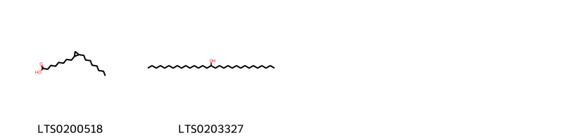
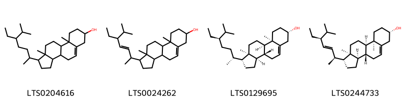

!!! abstract "Tóm tắt"

    Long nhãn có tên khoa học Dimocarpus longan Lour, họ Bồ hòn (Sapindaceae). Cây bản địa của Ấn Độ, Nam Trung Quốc và Tây Bắc Bán đảo Malaysia.Ở Việt Nam đâu cũng có, nhưng nhiều và quý nhất là nhãn Hưng Yên. Ngoài công dụng làm thực phẩm, long nhân nhục là một vị thuốc nhân dân dùng để bồi bổ, chữa các bệnh hay quên, thần kinh kém, hay hoảng hốt, thần kinh suy nhược, không ngủ được. Cùi khô (long nhãn nhục) chứa nước, chất tan trong nước glucoza, sacaroza, axit taetric, chất có nitơ. Trong một số nghiên cứu cho thấy long nhãn có tác dụng chống oxy hóa, căng cường miễn dịch...

## Thông tin về thực vật

Dược liệu **Long Nhãn (Cùi)** từ bộ phận **** từ loài *Dimocarpus longan*.

**Mô tả thực vật:** Cây nhãn cao 5-7m. Lá rườm ra, vỏ cây xù xì, sắc xám, nhiều cành, nhiều lá um tùm, xanh tươi luôn, không hay héo và rụng như là các cây khác. Lá kép hình lông chim, mọc so le gồm 5 đến 9 lá chét hẹp, dài 7-20cm, rộng 2,5-5cm. Mùa xuân vào các tháng 2-3-4 có hoa màu vàng nhạt, mọc thành chùm ở đầu cành hay kẽ lá, đài 5-6 rằng, tràng 5-6, nhị 6-10, bầu 2-3 6. Quả có vỏ ngoài màu vàng xám, hầu như nhẫn (chỉ có một ô của bầu phát triển thành quả, các ô kia tiêu giảm đi). Hạt đen nhánh có áo hạt trắng bao bọc.

*Tài liệu tham khảo:* "Những cây thuốc và vị thuốc Việt Nam" - Đỗ Tất Lợi 
Trong dược điển Việt nam, một loài được sử dụng làm dược liệu là *Dimocarpus longan*.

!!! info "Phân loại thực vật của *Dimocarpus longan*"
    - **Kingdom:** Plantae
    - **Phylum:** Tracheophyta
    - **Order:** Sapindales
    - **Family:** Sapindaceae
    - **Genus:** Dimocarpus
    - **Species:** *Dimocarpus longan*

**Phân bố trên thế giới:** Thailand, nan, United States of America, French Guiana, China, Chinese Taipei, Hong Kong, Réunion, Malaysia, India, Indonesia

**Phân bố tại Việt nam:** Không có ghi nhận ở Việt Nam

## Thông tin về dược liệu 

### Định danh

!!! info "Thông tin về tên gọi"

    - Dược liệu tiếng Việt: long nhãn
    - Dược liệu tiếng Trung: 龙眼肉 (Long Yan Rou)
    - Dược liệu tiếng Anh: Longan Aril
    - Dược liệu latin thông dụng: Arillus Longan
    - Dược liệu latin kiểu DĐVN: *arillus longan*
    - Dược liệu latin kiểu DĐVN: **
    - Dược liệu latin kiểu thông tư: *Arillus Longan*
    - Bộ phận dùng:  (Arillus)

### Mô tả dược liệu 

- **Theo dược điển Việt nam V:** Cùi quả nhãn dày mỏng không đều, rách nứt theo thớ dọc,  màu vàng cánh gián hay màu nâu, trong mờ, một mặt nhăn  không phẳng, một mặt sáng bóng, có vân dọc nhỏ, dài  1,5 cm, rộng 2 cm đến 4 cm, dày chừng 0,1 cm, thường  thấy cùi kết dính. Thể chất mềm nhuận, dẻo dai, sờ không  dính tay. Mùi thơm nhẹ, vị ngọt đậm.

- **Mô tả dược liệu theo thông tư chế biến dược liệu theo phương pháp cổ truyền:** 

### Chế biến 

- **Chế biến theo dược điển việt nam V**: Mùa hạ và mùa thu, hải quả nhãn đã chín, củi dày ráo  nước đem phơi nắng to hoặc sấy nhẹ ở nhiệt độ từ 40 °C  đến 50 °C đến khi lắc quả có tiếng kêu lóc cóc, bóc bỏ vỏ cứng và hạt, lấy cùi đã nhăn vàng sấy ở 50 °C đến 60 °C  đến khi sờ không dính tay (độ ẩm dược liệu dưới 15,0 %)  thì bỏ ra. Chú ý giữ vệ sinh khi bóc cùi và khi sấy, phơi.  Chùm quả trước khi phơi hoặc sấy có thể nhúng nước sôi  từ 1 min đến 2 min.

- **Chế biến theo thông tư:** 

--- 

## Thành phần hóa học

- Theo tài liệu của GS. Đỗ Tất Lợi:  (1) Quercitrin
2-amino-4-(hydroxymethyl)hex-5-ynoic acid
Friedelin
Adenosine...
    

**Thành phần hóa học từ loài **Dimocarpus longan**

Theo cơ sở dữ liệu lotus, loài *Dimocarpus longan* đã phân lập và xác định được **46** hoạt chất thuộc về các nhóm Steroids and steroid derivatives, Organooxygen compounds, Flavonoids, Fatty Acyls, Imidazopyrimidines, Purine nucleotides, Purine nucleosides, Tannins, Sphingolipids, Pyrimidine nucleosides, Carboxylic acids and derivatives, Benzene and substituted derivatives, Prenol lipids trong bảng dưới đây. Danh sách các hoạt chất như sau friedelin [(LTS0213494)](https://lotus.naturalproducts.net/compound/lotus_id/LTS0213494), stigmast-5-en-3-ol, (3β)- [(LTS0204616)](https://lotus.naturalproducts.net/compound/lotus_id/LTS0204616), sucrose [(LTS0272557)](https://lotus.naturalproducts.net/compound/lotus_id/LTS0272557), 2-ethyl-3,4,5-trihydroxybenzoic acid [(LTS0101718)](https://lotus.naturalproducts.net/compound/lotus_id/LTS0101718), ent-epicatechin [(LTS0265245)](https://lotus.naturalproducts.net/compound/lotus_id/LTS0265245), (1r,2s,8r,27r,39r)-1,2,14,15,16,19,20,21,29,35,36-undecahydroxy-2-(2-oxopropyl)-7,10,25,28,31,40-hexaoxaoctacyclo[35.2.1.0⁵,³⁹.0⁸,²⁷.0⁹,³⁰.0¹²,¹⁷.0¹⁸,²³.0³³,³⁸]tetraconta-4,12,14,16,18(23),19,21,33,35,37-decaene-3,6,11,24,32-pentone [(LTS0046514)](https://lotus.naturalproducts.net/compound/lotus_id/LTS0046514), (-)-friedelin [(LTS0041645)](https://lotus.naturalproducts.net/compound/lotus_id/LTS0041645), (2s,4r)-2-amino-4-methylhex-5-ynoic acid [(LTS0241853)](https://lotus.naturalproducts.net/compound/lotus_id/LTS0241853), 2-hydroxy-n-(3-hydroxy-1-{[3,4,5-trihydroxy-6-(hydroxymethyl)oxan-2-yl]oxy}octadeca-4,8-dien-2-yl)hexadecanimidic acid [(LTS0121977)](https://lotus.naturalproducts.net/compound/lotus_id/LTS0121977), 8-[(1r,2s)-2-octylcyclopropyl]octanoic acid [(LTS0063901)](https://lotus.naturalproducts.net/compound/lotus_id/LTS0063901), epi-friedelanol [(LTS0114491)](https://lotus.naturalproducts.net/compound/lotus_id/LTS0114491), 2-amino-4-(hydroxymethyl)hex-5-ynoic acid [(LTS0206097)](https://lotus.naturalproducts.net/compound/lotus_id/LTS0206097), galop [(LTS0222857)](https://lotus.naturalproducts.net/compound/lotus_id/LTS0222857), leucon [(LTS0114351)](https://lotus.naturalproducts.net/compound/lotus_id/LTS0114351), (1r,3ar,3br,7s,9ar,9br,11ar)-1-[(2s,3e,5s)-5-ethyl-6-methylhept-3-en-2-yl]-9a,11a-dimethyl-1h,2h,3h,3ah,3bh,4h,6h,7h,8h,9h,9bh,10h,11h-cyclopenta[a]phenanthren-7-ol [(LTS0244733)](https://lotus.naturalproducts.net/compound/lotus_id/LTS0244733), catechol [(LTS0090912)](https://lotus.naturalproducts.net/compound/lotus_id/LTS0090912), 16-hentriacontanol [(LTS0203327)](https://lotus.naturalproducts.net/compound/lotus_id/LTS0203327), proanthocyanidin a2 [(LTS0117726)](https://lotus.naturalproducts.net/compound/lotus_id/LTS0117726), hypoglycine a [(LTS0212793)](https://lotus.naturalproducts.net/compound/lotus_id/LTS0212793), adenosine monophosphate [(LTS0007212)](https://lotus.naturalproducts.net/compound/lotus_id/LTS0007212), 2-hydroxy-n-[(4z,8z)-3-hydroxy-1-{[3,4,5-trihydroxy-6-(hydroxymethyl)oxan-2-yl]oxy}octadeca-4,8-dien-2-yl]hexadecanimidic acid [(LTS0176187)](https://lotus.naturalproducts.net/compound/lotus_id/LTS0176187), dihydrosterculic acid [(LTS0200518)](https://lotus.naturalproducts.net/compound/lotus_id/LTS0200518), procyanidin a1 [(LTS0171311)](https://lotus.naturalproducts.net/compound/lotus_id/LTS0171311), cyclic amp [(LTS0171934)](https://lotus.naturalproducts.net/compound/lotus_id/LTS0171934), 3,4-dihydroxybenzoic acid [(LTS0018765)](https://lotus.naturalproducts.net/compound/lotus_id/LTS0018765), inosine [(LTS0117891)](https://lotus.naturalproducts.net/compound/lotus_id/LTS0117891), (1r,3ar,3br,7s,9ar,9br,11ar)-1-[(2r,5r)-5-ethyl-6-methylheptan-2-yl]-9a,11a-dimethyl-1h,2h,3h,3ah,3bh,4h,6h,7h,8h,9h,9bh,10h,11h-cyclopenta[a]phenanthren-7-ol [(LTS0129695)](https://lotus.naturalproducts.net/compound/lotus_id/LTS0129695), 2-amino-4-hydroxyhept-6-ynoic acid [(LTS0251092)](https://lotus.naturalproducts.net/compound/lotus_id/LTS0251092), ellagic acid [(LTS0037297)](https://lotus.naturalproducts.net/compound/lotus_id/LTS0037297), 1-[3,4-dihydroxy-5-(hydroxymethyl)oxolan-2-yl]-4-hydroxy-5-methylpyrimidin-2-one [(LTS0207204)](https://lotus.naturalproducts.net/compound/lotus_id/LTS0207204), (2s,4s)-2-amino-4-hydroxyhept-6-ynoic acid [(LTS0188566)](https://lotus.naturalproducts.net/compound/lotus_id/LTS0188566), 2-amino-4-methylhex-5-ynoic acid [(LTS0241835)](https://lotus.naturalproducts.net/compound/lotus_id/LTS0241835), adenosine [(LTS0014061)](https://lotus.naturalproducts.net/compound/lotus_id/LTS0014061), (2s,4s)-2-amino-4-(hydroxymethyl)hex-5-ynoic acid [(LTS0206358)](https://lotus.naturalproducts.net/compound/lotus_id/LTS0206358), ethyl gallate [(LTS0270645)](https://lotus.naturalproducts.net/compound/lotus_id/LTS0270645), 1-[3,4-dihydroxy-5-(hydroxymethyl)oxolan-2-yl]-4-hydroxypyrimidin-2-one [(LTS0075646)](https://lotus.naturalproducts.net/compound/lotus_id/LTS0075646), adenosine monophosphate [(LTS0080280)](https://lotus.naturalproducts.net/compound/lotus_id/LTS0080280), (-)-inosine [(LTS0273582)](https://lotus.naturalproducts.net/compound/lotus_id/LTS0273582), cyclic adenosine monophosphate [(LTS0260959)](https://lotus.naturalproducts.net/compound/lotus_id/LTS0260959), 4,4a,6b,8a,11,11,12b,14a-octamethyl-hexadecahydropicen-3-ol [(LTS0182128)](https://lotus.naturalproducts.net/compound/lotus_id/LTS0182128), adenosine [(LTS0052576)](https://lotus.naturalproducts.net/compound/lotus_id/LTS0052576), (2s,4r)-2-amino-4-hydroxyhept-6-ynoic acid [(LTS0054000)](https://lotus.naturalproducts.net/compound/lotus_id/LTS0054000), 5-methyluridine [(LTS0036805)](https://lotus.naturalproducts.net/compound/lotus_id/LTS0036805), quercitrin [(LTS0186298)](https://lotus.naturalproducts.net/compound/lotus_id/LTS0186298), uridine [(LTS0220125)](https://lotus.naturalproducts.net/compound/lotus_id/LTS0220125), stigmasterol [(LTS0024262)](https://lotus.naturalproducts.net/compound/lotus_id/LTS0024262). 
        
| chemicalTaxonomyClassyfireClass     |   smiles_count |
|:------------------------------------|---------------:|
| Benzene and substituted derivatives |             93 |
| Carboxylic acids and derivatives    |             18 |
| Fatty Acyls                         |             60 |
| Flavonoids                          |            321 |
| Imidazopyrimidines                  |             18 |
| Organooxygen compounds              |             78 |
| Prenol lipids                       |            295 |
| Purine nucleosides                  |            156 |
| Purine nucleotides                  |            182 |
| Pyrimidine nucleosides              |            154 |
| Sphingolipids                       |            142 |
| Steroids and steroid derivatives    |            275 |
| Tannins                             |             42 |

            
### Nhóm Benzene and substituted derivatives
<figure markdown="span">
    { width=100% }
<figcaption>Hình ảnh cấu trúc hóa học của hoạt chất thuộc nhóm *Benzene and substituted derivatives*. Tên thường gọi của các hoạt chất tương ứng là galop [(LTS0222857)](https://lotus.naturalproducts.net/compound/lotus_id/LTS0222857), 3,4-dihydroxybenzoic acid [(LTS0018765)](https://lotus.naturalproducts.net/compound/lotus_id/LTS0018765), ethyl gallate [(LTS0270645)](https://lotus.naturalproducts.net/compound/lotus_id/LTS0270645), 2-ethyl-3,4,5-trihydroxybenzoic acid [(LTS0101718)](https://lotus.naturalproducts.net/compound/lotus_id/LTS0101718).</figcaption>
</figure>

            
            
### Nhóm Benzene and substituted derivatives
<figure markdown="span">
    { width=100% }
<figcaption>Hình ảnh cấu trúc hóa học của hoạt chất thuộc nhóm *Benzene and substituted derivatives*. Tên thường gọi của các hoạt chất tương ứng là galop [(LTS0222857)](https://lotus.naturalproducts.net/compound/lotus_id/LTS0222857), 3,4-dihydroxybenzoic acid [(LTS0018765)](https://lotus.naturalproducts.net/compound/lotus_id/LTS0018765), ethyl gallate [(LTS0270645)](https://lotus.naturalproducts.net/compound/lotus_id/LTS0270645), 2-ethyl-3,4,5-trihydroxybenzoic acid [(LTS0101718)](https://lotus.naturalproducts.net/compound/lotus_id/LTS0101718).</figcaption>
</figure>

### Nhóm Carboxylic acids and derivatives
<figure markdown="span">
    { width=100% }
<figcaption>Hình ảnh cấu trúc hóa học của hoạt chất thuộc nhóm *Carboxylic acids and derivatives*. Tên thường gọi của các hoạt chất tương ứng là hypoglycine a [(LTS0212793)](https://lotus.naturalproducts.net/compound/lotus_id/LTS0212793).</figcaption>
</figure>

            
            
### Nhóm Benzene and substituted derivatives
<figure markdown="span">
    { width=100% }
<figcaption>Hình ảnh cấu trúc hóa học của hoạt chất thuộc nhóm *Benzene and substituted derivatives*. Tên thường gọi của các hoạt chất tương ứng là galop [(LTS0222857)](https://lotus.naturalproducts.net/compound/lotus_id/LTS0222857), 3,4-dihydroxybenzoic acid [(LTS0018765)](https://lotus.naturalproducts.net/compound/lotus_id/LTS0018765), ethyl gallate [(LTS0270645)](https://lotus.naturalproducts.net/compound/lotus_id/LTS0270645), 2-ethyl-3,4,5-trihydroxybenzoic acid [(LTS0101718)](https://lotus.naturalproducts.net/compound/lotus_id/LTS0101718).</figcaption>
</figure>

### Nhóm Carboxylic acids and derivatives
<figure markdown="span">
    { width=100% }
<figcaption>Hình ảnh cấu trúc hóa học của hoạt chất thuộc nhóm *Carboxylic acids and derivatives*. Tên thường gọi của các hoạt chất tương ứng là hypoglycine a [(LTS0212793)](https://lotus.naturalproducts.net/compound/lotus_id/LTS0212793).</figcaption>
</figure>

### Nhóm Fatty Acyls
<figure markdown="span">
    { width=100% }
<figcaption>Hình ảnh cấu trúc hóa học của hoạt chất thuộc nhóm *Fatty Acyls*. Tên thường gọi của các hoạt chất tương ứng là dihydrosterculic acid [(LTS0200518)](https://lotus.naturalproducts.net/compound/lotus_id/LTS0200518), 16-hentriacontanol [(LTS0203327)](https://lotus.naturalproducts.net/compound/lotus_id/LTS0203327).</figcaption>
</figure>

            
            
### Nhóm Benzene and substituted derivatives
<figure markdown="span">
    { width=100% }
<figcaption>Hình ảnh cấu trúc hóa học của hoạt chất thuộc nhóm *Benzene and substituted derivatives*. Tên thường gọi của các hoạt chất tương ứng là galop [(LTS0222857)](https://lotus.naturalproducts.net/compound/lotus_id/LTS0222857), 3,4-dihydroxybenzoic acid [(LTS0018765)](https://lotus.naturalproducts.net/compound/lotus_id/LTS0018765), ethyl gallate [(LTS0270645)](https://lotus.naturalproducts.net/compound/lotus_id/LTS0270645), 2-ethyl-3,4,5-trihydroxybenzoic acid [(LTS0101718)](https://lotus.naturalproducts.net/compound/lotus_id/LTS0101718).</figcaption>
</figure>

### Nhóm Carboxylic acids and derivatives
<figure markdown="span">
    { width=100% }
<figcaption>Hình ảnh cấu trúc hóa học của hoạt chất thuộc nhóm *Carboxylic acids and derivatives*. Tên thường gọi của các hoạt chất tương ứng là hypoglycine a [(LTS0212793)](https://lotus.naturalproducts.net/compound/lotus_id/LTS0212793).</figcaption>
</figure>

### Nhóm Fatty Acyls
<figure markdown="span">
    { width=100% }
<figcaption>Hình ảnh cấu trúc hóa học của hoạt chất thuộc nhóm *Fatty Acyls*. Tên thường gọi của các hoạt chất tương ứng là dihydrosterculic acid [(LTS0200518)](https://lotus.naturalproducts.net/compound/lotus_id/LTS0200518), 16-hentriacontanol [(LTS0203327)](https://lotus.naturalproducts.net/compound/lotus_id/LTS0203327).</figcaption>
</figure>

### Nhóm Flavonoids
<figure markdown="span">
    { width=100% }
<figcaption>Hình ảnh cấu trúc hóa học của hoạt chất thuộc nhóm *Flavonoids*. Tên thường gọi của các hoạt chất tương ứng là quercitrin [(LTS0186298)](https://lotus.naturalproducts.net/compound/lotus_id/LTS0186298), procyanidin a1 [(LTS0171311)](https://lotus.naturalproducts.net/compound/lotus_id/LTS0171311), proanthocyanidin a2 [(LTS0117726)](https://lotus.naturalproducts.net/compound/lotus_id/LTS0117726), catechol [(LTS0090912)](https://lotus.naturalproducts.net/compound/lotus_id/LTS0090912), ent-epicatechin [(LTS0265245)](https://lotus.naturalproducts.net/compound/lotus_id/LTS0265245).</figcaption>
</figure>

            
            
### Nhóm Benzene and substituted derivatives
<figure markdown="span">
    { width=100% }
<figcaption>Hình ảnh cấu trúc hóa học của hoạt chất thuộc nhóm *Benzene and substituted derivatives*. Tên thường gọi của các hoạt chất tương ứng là galop [(LTS0222857)](https://lotus.naturalproducts.net/compound/lotus_id/LTS0222857), 3,4-dihydroxybenzoic acid [(LTS0018765)](https://lotus.naturalproducts.net/compound/lotus_id/LTS0018765), ethyl gallate [(LTS0270645)](https://lotus.naturalproducts.net/compound/lotus_id/LTS0270645), 2-ethyl-3,4,5-trihydroxybenzoic acid [(LTS0101718)](https://lotus.naturalproducts.net/compound/lotus_id/LTS0101718).</figcaption>
</figure>

### Nhóm Carboxylic acids and derivatives
<figure markdown="span">
    { width=100% }
<figcaption>Hình ảnh cấu trúc hóa học của hoạt chất thuộc nhóm *Carboxylic acids and derivatives*. Tên thường gọi của các hoạt chất tương ứng là hypoglycine a [(LTS0212793)](https://lotus.naturalproducts.net/compound/lotus_id/LTS0212793).</figcaption>
</figure>

### Nhóm Fatty Acyls
<figure markdown="span">
    { width=100% }
<figcaption>Hình ảnh cấu trúc hóa học của hoạt chất thuộc nhóm *Fatty Acyls*. Tên thường gọi của các hoạt chất tương ứng là dihydrosterculic acid [(LTS0200518)](https://lotus.naturalproducts.net/compound/lotus_id/LTS0200518), 16-hentriacontanol [(LTS0203327)](https://lotus.naturalproducts.net/compound/lotus_id/LTS0203327).</figcaption>
</figure>

### Nhóm Flavonoids
<figure markdown="span">
    { width=100% }
<figcaption>Hình ảnh cấu trúc hóa học của hoạt chất thuộc nhóm *Flavonoids*. Tên thường gọi của các hoạt chất tương ứng là quercitrin [(LTS0186298)](https://lotus.naturalproducts.net/compound/lotus_id/LTS0186298), procyanidin a1 [(LTS0171311)](https://lotus.naturalproducts.net/compound/lotus_id/LTS0171311), proanthocyanidin a2 [(LTS0117726)](https://lotus.naturalproducts.net/compound/lotus_id/LTS0117726), catechol [(LTS0090912)](https://lotus.naturalproducts.net/compound/lotus_id/LTS0090912), ent-epicatechin [(LTS0265245)](https://lotus.naturalproducts.net/compound/lotus_id/LTS0265245).</figcaption>
</figure>

### Nhóm Imidazopyrimidines
<figure markdown="span">
    { width=100% }
<figcaption>Hình ảnh cấu trúc hóa học của hoạt chất thuộc nhóm *Imidazopyrimidines*. Tên thường gọi của các hoạt chất tương ứng là leucon [(LTS0114351)](https://lotus.naturalproducts.net/compound/lotus_id/LTS0114351).</figcaption>
</figure>

            
            
### Nhóm Benzene and substituted derivatives
<figure markdown="span">
    { width=100% }
<figcaption>Hình ảnh cấu trúc hóa học của hoạt chất thuộc nhóm *Benzene and substituted derivatives*. Tên thường gọi của các hoạt chất tương ứng là galop [(LTS0222857)](https://lotus.naturalproducts.net/compound/lotus_id/LTS0222857), 3,4-dihydroxybenzoic acid [(LTS0018765)](https://lotus.naturalproducts.net/compound/lotus_id/LTS0018765), ethyl gallate [(LTS0270645)](https://lotus.naturalproducts.net/compound/lotus_id/LTS0270645), 2-ethyl-3,4,5-trihydroxybenzoic acid [(LTS0101718)](https://lotus.naturalproducts.net/compound/lotus_id/LTS0101718).</figcaption>
</figure>

### Nhóm Carboxylic acids and derivatives
<figure markdown="span">
    { width=100% }
<figcaption>Hình ảnh cấu trúc hóa học của hoạt chất thuộc nhóm *Carboxylic acids and derivatives*. Tên thường gọi của các hoạt chất tương ứng là hypoglycine a [(LTS0212793)](https://lotus.naturalproducts.net/compound/lotus_id/LTS0212793).</figcaption>
</figure>

### Nhóm Fatty Acyls
<figure markdown="span">
    { width=100% }
<figcaption>Hình ảnh cấu trúc hóa học của hoạt chất thuộc nhóm *Fatty Acyls*. Tên thường gọi của các hoạt chất tương ứng là dihydrosterculic acid [(LTS0200518)](https://lotus.naturalproducts.net/compound/lotus_id/LTS0200518), 16-hentriacontanol [(LTS0203327)](https://lotus.naturalproducts.net/compound/lotus_id/LTS0203327).</figcaption>
</figure>

### Nhóm Flavonoids
<figure markdown="span">
    { width=100% }
<figcaption>Hình ảnh cấu trúc hóa học của hoạt chất thuộc nhóm *Flavonoids*. Tên thường gọi của các hoạt chất tương ứng là quercitrin [(LTS0186298)](https://lotus.naturalproducts.net/compound/lotus_id/LTS0186298), procyanidin a1 [(LTS0171311)](https://lotus.naturalproducts.net/compound/lotus_id/LTS0171311), proanthocyanidin a2 [(LTS0117726)](https://lotus.naturalproducts.net/compound/lotus_id/LTS0117726), catechol [(LTS0090912)](https://lotus.naturalproducts.net/compound/lotus_id/LTS0090912), ent-epicatechin [(LTS0265245)](https://lotus.naturalproducts.net/compound/lotus_id/LTS0265245).</figcaption>
</figure>

### Nhóm Imidazopyrimidines
<figure markdown="span">
    { width=100% }
<figcaption>Hình ảnh cấu trúc hóa học của hoạt chất thuộc nhóm *Imidazopyrimidines*. Tên thường gọi của các hoạt chất tương ứng là leucon [(LTS0114351)](https://lotus.naturalproducts.net/compound/lotus_id/LTS0114351).</figcaption>
</figure>

### Nhóm Organooxygen compounds
<figure markdown="span">
    { width=100% }
<figcaption>Hình ảnh cấu trúc hóa học của hoạt chất thuộc nhóm *Organooxygen compounds*. Tên thường gọi của các hoạt chất tương ứng là sucrose [(LTS0272557)](https://lotus.naturalproducts.net/compound/lotus_id/LTS0272557).</figcaption>
</figure>

            
            
### Nhóm Benzene and substituted derivatives
<figure markdown="span">
    { width=100% }
<figcaption>Hình ảnh cấu trúc hóa học của hoạt chất thuộc nhóm *Benzene and substituted derivatives*. Tên thường gọi của các hoạt chất tương ứng là galop [(LTS0222857)](https://lotus.naturalproducts.net/compound/lotus_id/LTS0222857), 3,4-dihydroxybenzoic acid [(LTS0018765)](https://lotus.naturalproducts.net/compound/lotus_id/LTS0018765), ethyl gallate [(LTS0270645)](https://lotus.naturalproducts.net/compound/lotus_id/LTS0270645), 2-ethyl-3,4,5-trihydroxybenzoic acid [(LTS0101718)](https://lotus.naturalproducts.net/compound/lotus_id/LTS0101718).</figcaption>
</figure>

### Nhóm Carboxylic acids and derivatives
<figure markdown="span">
    { width=100% }
<figcaption>Hình ảnh cấu trúc hóa học của hoạt chất thuộc nhóm *Carboxylic acids and derivatives*. Tên thường gọi của các hoạt chất tương ứng là hypoglycine a [(LTS0212793)](https://lotus.naturalproducts.net/compound/lotus_id/LTS0212793).</figcaption>
</figure>

### Nhóm Fatty Acyls
<figure markdown="span">
    { width=100% }
<figcaption>Hình ảnh cấu trúc hóa học của hoạt chất thuộc nhóm *Fatty Acyls*. Tên thường gọi của các hoạt chất tương ứng là dihydrosterculic acid [(LTS0200518)](https://lotus.naturalproducts.net/compound/lotus_id/LTS0200518), 16-hentriacontanol [(LTS0203327)](https://lotus.naturalproducts.net/compound/lotus_id/LTS0203327).</figcaption>
</figure>

### Nhóm Flavonoids
<figure markdown="span">
    { width=100% }
<figcaption>Hình ảnh cấu trúc hóa học của hoạt chất thuộc nhóm *Flavonoids*. Tên thường gọi của các hoạt chất tương ứng là quercitrin [(LTS0186298)](https://lotus.naturalproducts.net/compound/lotus_id/LTS0186298), procyanidin a1 [(LTS0171311)](https://lotus.naturalproducts.net/compound/lotus_id/LTS0171311), proanthocyanidin a2 [(LTS0117726)](https://lotus.naturalproducts.net/compound/lotus_id/LTS0117726), catechol [(LTS0090912)](https://lotus.naturalproducts.net/compound/lotus_id/LTS0090912), ent-epicatechin [(LTS0265245)](https://lotus.naturalproducts.net/compound/lotus_id/LTS0265245).</figcaption>
</figure>

### Nhóm Imidazopyrimidines
<figure markdown="span">
    { width=100% }
<figcaption>Hình ảnh cấu trúc hóa học của hoạt chất thuộc nhóm *Imidazopyrimidines*. Tên thường gọi của các hoạt chất tương ứng là leucon [(LTS0114351)](https://lotus.naturalproducts.net/compound/lotus_id/LTS0114351).</figcaption>
</figure>

### Nhóm Organooxygen compounds
<figure markdown="span">
    { width=100% }
<figcaption>Hình ảnh cấu trúc hóa học của hoạt chất thuộc nhóm *Organooxygen compounds*. Tên thường gọi của các hoạt chất tương ứng là sucrose [(LTS0272557)](https://lotus.naturalproducts.net/compound/lotus_id/LTS0272557).</figcaption>
</figure>

### Nhóm Prenol lipids
<figure markdown="span">
    { width=100% }
<figcaption>Hình ảnh cấu trúc hóa học của hoạt chất thuộc nhóm *Prenol lipids*. Tên thường gọi của các hoạt chất tương ứng là epi-friedelanol [(LTS0114491)](https://lotus.naturalproducts.net/compound/lotus_id/LTS0114491), 4,4a,6b,8a,11,11,12b,14a-octamethyl-hexadecahydropicen-3-ol [(LTS0182128)](https://lotus.naturalproducts.net/compound/lotus_id/LTS0182128), (-)-friedelin [(LTS0041645)](https://lotus.naturalproducts.net/compound/lotus_id/LTS0041645), friedelin [(LTS0213494)](https://lotus.naturalproducts.net/compound/lotus_id/LTS0213494).</figcaption>
</figure>

            
            
### Nhóm Benzene and substituted derivatives
<figure markdown="span">
    { width=100% }
<figcaption>Hình ảnh cấu trúc hóa học của hoạt chất thuộc nhóm *Benzene and substituted derivatives*. Tên thường gọi của các hoạt chất tương ứng là galop [(LTS0222857)](https://lotus.naturalproducts.net/compound/lotus_id/LTS0222857), 3,4-dihydroxybenzoic acid [(LTS0018765)](https://lotus.naturalproducts.net/compound/lotus_id/LTS0018765), ethyl gallate [(LTS0270645)](https://lotus.naturalproducts.net/compound/lotus_id/LTS0270645), 2-ethyl-3,4,5-trihydroxybenzoic acid [(LTS0101718)](https://lotus.naturalproducts.net/compound/lotus_id/LTS0101718).</figcaption>
</figure>

### Nhóm Carboxylic acids and derivatives
<figure markdown="span">
    { width=100% }
<figcaption>Hình ảnh cấu trúc hóa học của hoạt chất thuộc nhóm *Carboxylic acids and derivatives*. Tên thường gọi của các hoạt chất tương ứng là hypoglycine a [(LTS0212793)](https://lotus.naturalproducts.net/compound/lotus_id/LTS0212793).</figcaption>
</figure>

### Nhóm Fatty Acyls
<figure markdown="span">
    { width=100% }
<figcaption>Hình ảnh cấu trúc hóa học của hoạt chất thuộc nhóm *Fatty Acyls*. Tên thường gọi của các hoạt chất tương ứng là dihydrosterculic acid [(LTS0200518)](https://lotus.naturalproducts.net/compound/lotus_id/LTS0200518), 16-hentriacontanol [(LTS0203327)](https://lotus.naturalproducts.net/compound/lotus_id/LTS0203327).</figcaption>
</figure>

### Nhóm Flavonoids
<figure markdown="span">
    { width=100% }
<figcaption>Hình ảnh cấu trúc hóa học của hoạt chất thuộc nhóm *Flavonoids*. Tên thường gọi của các hoạt chất tương ứng là quercitrin [(LTS0186298)](https://lotus.naturalproducts.net/compound/lotus_id/LTS0186298), procyanidin a1 [(LTS0171311)](https://lotus.naturalproducts.net/compound/lotus_id/LTS0171311), proanthocyanidin a2 [(LTS0117726)](https://lotus.naturalproducts.net/compound/lotus_id/LTS0117726), catechol [(LTS0090912)](https://lotus.naturalproducts.net/compound/lotus_id/LTS0090912), ent-epicatechin [(LTS0265245)](https://lotus.naturalproducts.net/compound/lotus_id/LTS0265245).</figcaption>
</figure>

### Nhóm Imidazopyrimidines
<figure markdown="span">
    { width=100% }
<figcaption>Hình ảnh cấu trúc hóa học của hoạt chất thuộc nhóm *Imidazopyrimidines*. Tên thường gọi của các hoạt chất tương ứng là leucon [(LTS0114351)](https://lotus.naturalproducts.net/compound/lotus_id/LTS0114351).</figcaption>
</figure>

### Nhóm Organooxygen compounds
<figure markdown="span">
    { width=100% }
<figcaption>Hình ảnh cấu trúc hóa học của hoạt chất thuộc nhóm *Organooxygen compounds*. Tên thường gọi của các hoạt chất tương ứng là sucrose [(LTS0272557)](https://lotus.naturalproducts.net/compound/lotus_id/LTS0272557).</figcaption>
</figure>

### Nhóm Prenol lipids
<figure markdown="span">
    { width=100% }
<figcaption>Hình ảnh cấu trúc hóa học của hoạt chất thuộc nhóm *Prenol lipids*. Tên thường gọi của các hoạt chất tương ứng là epi-friedelanol [(LTS0114491)](https://lotus.naturalproducts.net/compound/lotus_id/LTS0114491), 4,4a,6b,8a,11,11,12b,14a-octamethyl-hexadecahydropicen-3-ol [(LTS0182128)](https://lotus.naturalproducts.net/compound/lotus_id/LTS0182128), (-)-friedelin [(LTS0041645)](https://lotus.naturalproducts.net/compound/lotus_id/LTS0041645), friedelin [(LTS0213494)](https://lotus.naturalproducts.net/compound/lotus_id/LTS0213494).</figcaption>
</figure>

### Nhóm Purine nucleosides
<figure markdown="span">
    { width=100% }
<figcaption>Hình ảnh cấu trúc hóa học của hoạt chất thuộc nhóm *Purine nucleosides*. Tên thường gọi của các hoạt chất tương ứng là inosine [(LTS0117891)](https://lotus.naturalproducts.net/compound/lotus_id/LTS0117891), adenosine [(LTS0052576)](https://lotus.naturalproducts.net/compound/lotus_id/LTS0052576), (-)-inosine [(LTS0273582)](https://lotus.naturalproducts.net/compound/lotus_id/LTS0273582), adenosine [(LTS0014061)](https://lotus.naturalproducts.net/compound/lotus_id/LTS0014061).</figcaption>
</figure>

            
            
### Nhóm Benzene and substituted derivatives
<figure markdown="span">
    { width=100% }
<figcaption>Hình ảnh cấu trúc hóa học của hoạt chất thuộc nhóm *Benzene and substituted derivatives*. Tên thường gọi của các hoạt chất tương ứng là galop [(LTS0222857)](https://lotus.naturalproducts.net/compound/lotus_id/LTS0222857), 3,4-dihydroxybenzoic acid [(LTS0018765)](https://lotus.naturalproducts.net/compound/lotus_id/LTS0018765), ethyl gallate [(LTS0270645)](https://lotus.naturalproducts.net/compound/lotus_id/LTS0270645), 2-ethyl-3,4,5-trihydroxybenzoic acid [(LTS0101718)](https://lotus.naturalproducts.net/compound/lotus_id/LTS0101718).</figcaption>
</figure>

### Nhóm Carboxylic acids and derivatives
<figure markdown="span">
    { width=100% }
<figcaption>Hình ảnh cấu trúc hóa học của hoạt chất thuộc nhóm *Carboxylic acids and derivatives*. Tên thường gọi của các hoạt chất tương ứng là hypoglycine a [(LTS0212793)](https://lotus.naturalproducts.net/compound/lotus_id/LTS0212793).</figcaption>
</figure>

### Nhóm Fatty Acyls
<figure markdown="span">
    { width=100% }
<figcaption>Hình ảnh cấu trúc hóa học của hoạt chất thuộc nhóm *Fatty Acyls*. Tên thường gọi của các hoạt chất tương ứng là dihydrosterculic acid [(LTS0200518)](https://lotus.naturalproducts.net/compound/lotus_id/LTS0200518), 16-hentriacontanol [(LTS0203327)](https://lotus.naturalproducts.net/compound/lotus_id/LTS0203327).</figcaption>
</figure>

### Nhóm Flavonoids
<figure markdown="span">
    { width=100% }
<figcaption>Hình ảnh cấu trúc hóa học của hoạt chất thuộc nhóm *Flavonoids*. Tên thường gọi của các hoạt chất tương ứng là quercitrin [(LTS0186298)](https://lotus.naturalproducts.net/compound/lotus_id/LTS0186298), procyanidin a1 [(LTS0171311)](https://lotus.naturalproducts.net/compound/lotus_id/LTS0171311), proanthocyanidin a2 [(LTS0117726)](https://lotus.naturalproducts.net/compound/lotus_id/LTS0117726), catechol [(LTS0090912)](https://lotus.naturalproducts.net/compound/lotus_id/LTS0090912), ent-epicatechin [(LTS0265245)](https://lotus.naturalproducts.net/compound/lotus_id/LTS0265245).</figcaption>
</figure>

### Nhóm Imidazopyrimidines
<figure markdown="span">
    { width=100% }
<figcaption>Hình ảnh cấu trúc hóa học của hoạt chất thuộc nhóm *Imidazopyrimidines*. Tên thường gọi của các hoạt chất tương ứng là leucon [(LTS0114351)](https://lotus.naturalproducts.net/compound/lotus_id/LTS0114351).</figcaption>
</figure>

### Nhóm Organooxygen compounds
<figure markdown="span">
    { width=100% }
<figcaption>Hình ảnh cấu trúc hóa học của hoạt chất thuộc nhóm *Organooxygen compounds*. Tên thường gọi của các hoạt chất tương ứng là sucrose [(LTS0272557)](https://lotus.naturalproducts.net/compound/lotus_id/LTS0272557).</figcaption>
</figure>

### Nhóm Prenol lipids
<figure markdown="span">
    { width=100% }
<figcaption>Hình ảnh cấu trúc hóa học của hoạt chất thuộc nhóm *Prenol lipids*. Tên thường gọi của các hoạt chất tương ứng là epi-friedelanol [(LTS0114491)](https://lotus.naturalproducts.net/compound/lotus_id/LTS0114491), 4,4a,6b,8a,11,11,12b,14a-octamethyl-hexadecahydropicen-3-ol [(LTS0182128)](https://lotus.naturalproducts.net/compound/lotus_id/LTS0182128), (-)-friedelin [(LTS0041645)](https://lotus.naturalproducts.net/compound/lotus_id/LTS0041645), friedelin [(LTS0213494)](https://lotus.naturalproducts.net/compound/lotus_id/LTS0213494).</figcaption>
</figure>

### Nhóm Purine nucleosides
<figure markdown="span">
    { width=100% }
<figcaption>Hình ảnh cấu trúc hóa học của hoạt chất thuộc nhóm *Purine nucleosides*. Tên thường gọi của các hoạt chất tương ứng là inosine [(LTS0117891)](https://lotus.naturalproducts.net/compound/lotus_id/LTS0117891), adenosine [(LTS0052576)](https://lotus.naturalproducts.net/compound/lotus_id/LTS0052576), (-)-inosine [(LTS0273582)](https://lotus.naturalproducts.net/compound/lotus_id/LTS0273582), adenosine [(LTS0014061)](https://lotus.naturalproducts.net/compound/lotus_id/LTS0014061).</figcaption>
</figure>

### Nhóm Purine nucleotides
<figure markdown="span">
    { width=100% }
<figcaption>Hình ảnh cấu trúc hóa học của hoạt chất thuộc nhóm *Purine nucleotides*. Tên thường gọi của các hoạt chất tương ứng là adenosine monophosphate [(LTS0080280)](https://lotus.naturalproducts.net/compound/lotus_id/LTS0080280), cyclic amp [(LTS0171934)](https://lotus.naturalproducts.net/compound/lotus_id/LTS0171934), cyclic adenosine monophosphate [(LTS0260959)](https://lotus.naturalproducts.net/compound/lotus_id/LTS0260959), adenosine monophosphate [(LTS0007212)](https://lotus.naturalproducts.net/compound/lotus_id/LTS0007212).</figcaption>
</figure>

            
            
### Nhóm Benzene and substituted derivatives
<figure markdown="span">
    { width=100% }
<figcaption>Hình ảnh cấu trúc hóa học của hoạt chất thuộc nhóm *Benzene and substituted derivatives*. Tên thường gọi của các hoạt chất tương ứng là galop [(LTS0222857)](https://lotus.naturalproducts.net/compound/lotus_id/LTS0222857), 3,4-dihydroxybenzoic acid [(LTS0018765)](https://lotus.naturalproducts.net/compound/lotus_id/LTS0018765), ethyl gallate [(LTS0270645)](https://lotus.naturalproducts.net/compound/lotus_id/LTS0270645), 2-ethyl-3,4,5-trihydroxybenzoic acid [(LTS0101718)](https://lotus.naturalproducts.net/compound/lotus_id/LTS0101718).</figcaption>
</figure>

### Nhóm Carboxylic acids and derivatives
<figure markdown="span">
    { width=100% }
<figcaption>Hình ảnh cấu trúc hóa học của hoạt chất thuộc nhóm *Carboxylic acids and derivatives*. Tên thường gọi của các hoạt chất tương ứng là hypoglycine a [(LTS0212793)](https://lotus.naturalproducts.net/compound/lotus_id/LTS0212793).</figcaption>
</figure>

### Nhóm Fatty Acyls
<figure markdown="span">
    { width=100% }
<figcaption>Hình ảnh cấu trúc hóa học của hoạt chất thuộc nhóm *Fatty Acyls*. Tên thường gọi của các hoạt chất tương ứng là dihydrosterculic acid [(LTS0200518)](https://lotus.naturalproducts.net/compound/lotus_id/LTS0200518), 16-hentriacontanol [(LTS0203327)](https://lotus.naturalproducts.net/compound/lotus_id/LTS0203327).</figcaption>
</figure>

### Nhóm Flavonoids
<figure markdown="span">
    { width=100% }
<figcaption>Hình ảnh cấu trúc hóa học của hoạt chất thuộc nhóm *Flavonoids*. Tên thường gọi của các hoạt chất tương ứng là quercitrin [(LTS0186298)](https://lotus.naturalproducts.net/compound/lotus_id/LTS0186298), procyanidin a1 [(LTS0171311)](https://lotus.naturalproducts.net/compound/lotus_id/LTS0171311), proanthocyanidin a2 [(LTS0117726)](https://lotus.naturalproducts.net/compound/lotus_id/LTS0117726), catechol [(LTS0090912)](https://lotus.naturalproducts.net/compound/lotus_id/LTS0090912), ent-epicatechin [(LTS0265245)](https://lotus.naturalproducts.net/compound/lotus_id/LTS0265245).</figcaption>
</figure>

### Nhóm Imidazopyrimidines
<figure markdown="span">
    { width=100% }
<figcaption>Hình ảnh cấu trúc hóa học của hoạt chất thuộc nhóm *Imidazopyrimidines*. Tên thường gọi của các hoạt chất tương ứng là leucon [(LTS0114351)](https://lotus.naturalproducts.net/compound/lotus_id/LTS0114351).</figcaption>
</figure>

### Nhóm Organooxygen compounds
<figure markdown="span">
    { width=100% }
<figcaption>Hình ảnh cấu trúc hóa học của hoạt chất thuộc nhóm *Organooxygen compounds*. Tên thường gọi của các hoạt chất tương ứng là sucrose [(LTS0272557)](https://lotus.naturalproducts.net/compound/lotus_id/LTS0272557).</figcaption>
</figure>

### Nhóm Prenol lipids
<figure markdown="span">
    { width=100% }
<figcaption>Hình ảnh cấu trúc hóa học của hoạt chất thuộc nhóm *Prenol lipids*. Tên thường gọi của các hoạt chất tương ứng là epi-friedelanol [(LTS0114491)](https://lotus.naturalproducts.net/compound/lotus_id/LTS0114491), 4,4a,6b,8a,11,11,12b,14a-octamethyl-hexadecahydropicen-3-ol [(LTS0182128)](https://lotus.naturalproducts.net/compound/lotus_id/LTS0182128), (-)-friedelin [(LTS0041645)](https://lotus.naturalproducts.net/compound/lotus_id/LTS0041645), friedelin [(LTS0213494)](https://lotus.naturalproducts.net/compound/lotus_id/LTS0213494).</figcaption>
</figure>

### Nhóm Purine nucleosides
<figure markdown="span">
    { width=100% }
<figcaption>Hình ảnh cấu trúc hóa học của hoạt chất thuộc nhóm *Purine nucleosides*. Tên thường gọi của các hoạt chất tương ứng là inosine [(LTS0117891)](https://lotus.naturalproducts.net/compound/lotus_id/LTS0117891), adenosine [(LTS0052576)](https://lotus.naturalproducts.net/compound/lotus_id/LTS0052576), (-)-inosine [(LTS0273582)](https://lotus.naturalproducts.net/compound/lotus_id/LTS0273582), adenosine [(LTS0014061)](https://lotus.naturalproducts.net/compound/lotus_id/LTS0014061).</figcaption>
</figure>

### Nhóm Purine nucleotides
<figure markdown="span">
    { width=100% }
<figcaption>Hình ảnh cấu trúc hóa học của hoạt chất thuộc nhóm *Purine nucleotides*. Tên thường gọi của các hoạt chất tương ứng là adenosine monophosphate [(LTS0080280)](https://lotus.naturalproducts.net/compound/lotus_id/LTS0080280), cyclic amp [(LTS0171934)](https://lotus.naturalproducts.net/compound/lotus_id/LTS0171934), cyclic adenosine monophosphate [(LTS0260959)](https://lotus.naturalproducts.net/compound/lotus_id/LTS0260959), adenosine monophosphate [(LTS0007212)](https://lotus.naturalproducts.net/compound/lotus_id/LTS0007212).</figcaption>
</figure>

### Nhóm Pyrimidine nucleosides
<figure markdown="span">
    { width=100% }
<figcaption>Hình ảnh cấu trúc hóa học của hoạt chất thuộc nhóm *Pyrimidine nucleosides*. Tên thường gọi của các hoạt chất tương ứng là 1-[3,4-dihydroxy-5-(hydroxymethyl)oxolan-2-yl]-4-hydroxy-5-methylpyrimidin-2-one [(LTS0207204)](https://lotus.naturalproducts.net/compound/lotus_id/LTS0207204), 1-[3,4-dihydroxy-5-(hydroxymethyl)oxolan-2-yl]-4-hydroxypyrimidin-2-one [(LTS0075646)](https://lotus.naturalproducts.net/compound/lotus_id/LTS0075646), uridine [(LTS0220125)](https://lotus.naturalproducts.net/compound/lotus_id/LTS0220125), 5-methyluridine [(LTS0036805)](https://lotus.naturalproducts.net/compound/lotus_id/LTS0036805).</figcaption>
</figure>

            
            
### Nhóm Benzene and substituted derivatives
<figure markdown="span">
    { width=100% }
<figcaption>Hình ảnh cấu trúc hóa học của hoạt chất thuộc nhóm *Benzene and substituted derivatives*. Tên thường gọi của các hoạt chất tương ứng là galop [(LTS0222857)](https://lotus.naturalproducts.net/compound/lotus_id/LTS0222857), 3,4-dihydroxybenzoic acid [(LTS0018765)](https://lotus.naturalproducts.net/compound/lotus_id/LTS0018765), ethyl gallate [(LTS0270645)](https://lotus.naturalproducts.net/compound/lotus_id/LTS0270645), 2-ethyl-3,4,5-trihydroxybenzoic acid [(LTS0101718)](https://lotus.naturalproducts.net/compound/lotus_id/LTS0101718).</figcaption>
</figure>

### Nhóm Carboxylic acids and derivatives
<figure markdown="span">
    { width=100% }
<figcaption>Hình ảnh cấu trúc hóa học của hoạt chất thuộc nhóm *Carboxylic acids and derivatives*. Tên thường gọi của các hoạt chất tương ứng là hypoglycine a [(LTS0212793)](https://lotus.naturalproducts.net/compound/lotus_id/LTS0212793).</figcaption>
</figure>

### Nhóm Fatty Acyls
<figure markdown="span">
    { width=100% }
<figcaption>Hình ảnh cấu trúc hóa học của hoạt chất thuộc nhóm *Fatty Acyls*. Tên thường gọi của các hoạt chất tương ứng là dihydrosterculic acid [(LTS0200518)](https://lotus.naturalproducts.net/compound/lotus_id/LTS0200518), 16-hentriacontanol [(LTS0203327)](https://lotus.naturalproducts.net/compound/lotus_id/LTS0203327).</figcaption>
</figure>

### Nhóm Flavonoids
<figure markdown="span">
    { width=100% }
<figcaption>Hình ảnh cấu trúc hóa học của hoạt chất thuộc nhóm *Flavonoids*. Tên thường gọi của các hoạt chất tương ứng là quercitrin [(LTS0186298)](https://lotus.naturalproducts.net/compound/lotus_id/LTS0186298), procyanidin a1 [(LTS0171311)](https://lotus.naturalproducts.net/compound/lotus_id/LTS0171311), proanthocyanidin a2 [(LTS0117726)](https://lotus.naturalproducts.net/compound/lotus_id/LTS0117726), catechol [(LTS0090912)](https://lotus.naturalproducts.net/compound/lotus_id/LTS0090912), ent-epicatechin [(LTS0265245)](https://lotus.naturalproducts.net/compound/lotus_id/LTS0265245).</figcaption>
</figure>

### Nhóm Imidazopyrimidines
<figure markdown="span">
    { width=100% }
<figcaption>Hình ảnh cấu trúc hóa học của hoạt chất thuộc nhóm *Imidazopyrimidines*. Tên thường gọi của các hoạt chất tương ứng là leucon [(LTS0114351)](https://lotus.naturalproducts.net/compound/lotus_id/LTS0114351).</figcaption>
</figure>

### Nhóm Organooxygen compounds
<figure markdown="span">
    { width=100% }
<figcaption>Hình ảnh cấu trúc hóa học của hoạt chất thuộc nhóm *Organooxygen compounds*. Tên thường gọi của các hoạt chất tương ứng là sucrose [(LTS0272557)](https://lotus.naturalproducts.net/compound/lotus_id/LTS0272557).</figcaption>
</figure>

### Nhóm Prenol lipids
<figure markdown="span">
    { width=100% }
<figcaption>Hình ảnh cấu trúc hóa học của hoạt chất thuộc nhóm *Prenol lipids*. Tên thường gọi của các hoạt chất tương ứng là epi-friedelanol [(LTS0114491)](https://lotus.naturalproducts.net/compound/lotus_id/LTS0114491), 4,4a,6b,8a,11,11,12b,14a-octamethyl-hexadecahydropicen-3-ol [(LTS0182128)](https://lotus.naturalproducts.net/compound/lotus_id/LTS0182128), (-)-friedelin [(LTS0041645)](https://lotus.naturalproducts.net/compound/lotus_id/LTS0041645), friedelin [(LTS0213494)](https://lotus.naturalproducts.net/compound/lotus_id/LTS0213494).</figcaption>
</figure>

### Nhóm Purine nucleosides
<figure markdown="span">
    { width=100% }
<figcaption>Hình ảnh cấu trúc hóa học của hoạt chất thuộc nhóm *Purine nucleosides*. Tên thường gọi của các hoạt chất tương ứng là inosine [(LTS0117891)](https://lotus.naturalproducts.net/compound/lotus_id/LTS0117891), adenosine [(LTS0052576)](https://lotus.naturalproducts.net/compound/lotus_id/LTS0052576), (-)-inosine [(LTS0273582)](https://lotus.naturalproducts.net/compound/lotus_id/LTS0273582), adenosine [(LTS0014061)](https://lotus.naturalproducts.net/compound/lotus_id/LTS0014061).</figcaption>
</figure>

### Nhóm Purine nucleotides
<figure markdown="span">
    { width=100% }
<figcaption>Hình ảnh cấu trúc hóa học của hoạt chất thuộc nhóm *Purine nucleotides*. Tên thường gọi của các hoạt chất tương ứng là adenosine monophosphate [(LTS0080280)](https://lotus.naturalproducts.net/compound/lotus_id/LTS0080280), cyclic amp [(LTS0171934)](https://lotus.naturalproducts.net/compound/lotus_id/LTS0171934), cyclic adenosine monophosphate [(LTS0260959)](https://lotus.naturalproducts.net/compound/lotus_id/LTS0260959), adenosine monophosphate [(LTS0007212)](https://lotus.naturalproducts.net/compound/lotus_id/LTS0007212).</figcaption>
</figure>

### Nhóm Pyrimidine nucleosides
<figure markdown="span">
    { width=100% }
<figcaption>Hình ảnh cấu trúc hóa học của hoạt chất thuộc nhóm *Pyrimidine nucleosides*. Tên thường gọi của các hoạt chất tương ứng là 1-[3,4-dihydroxy-5-(hydroxymethyl)oxolan-2-yl]-4-hydroxy-5-methylpyrimidin-2-one [(LTS0207204)](https://lotus.naturalproducts.net/compound/lotus_id/LTS0207204), 1-[3,4-dihydroxy-5-(hydroxymethyl)oxolan-2-yl]-4-hydroxypyrimidin-2-one [(LTS0075646)](https://lotus.naturalproducts.net/compound/lotus_id/LTS0075646), uridine [(LTS0220125)](https://lotus.naturalproducts.net/compound/lotus_id/LTS0220125), 5-methyluridine [(LTS0036805)](https://lotus.naturalproducts.net/compound/lotus_id/LTS0036805).</figcaption>
</figure>

### Nhóm Sphingolipids
<figure markdown="span">
    { width=100% }
<figcaption>Hình ảnh cấu trúc hóa học của hoạt chất thuộc nhóm *Sphingolipids*. Tên thường gọi của các hoạt chất tương ứng là 2-hydroxy-n-(3-hydroxy-1-{[3,4,5-trihydroxy-6-(hydroxymethyl)oxan-2-yl]oxy}octadeca-4,8-dien-2-yl)hexadecanimidic acid [(LTS0121977)](https://lotus.naturalproducts.net/compound/lotus_id/LTS0121977), 2-hydroxy-n-[(4z,8z)-3-hydroxy-1-{[3,4,5-trihydroxy-6-(hydroxymethyl)oxan-2-yl]oxy}octadeca-4,8-dien-2-yl]hexadecanimidic acid [(LTS0176187)](https://lotus.naturalproducts.net/compound/lotus_id/LTS0176187).</figcaption>
</figure>

            
            
### Nhóm Benzene and substituted derivatives
<figure markdown="span">
    { width=100% }
<figcaption>Hình ảnh cấu trúc hóa học của hoạt chất thuộc nhóm *Benzene and substituted derivatives*. Tên thường gọi của các hoạt chất tương ứng là galop [(LTS0222857)](https://lotus.naturalproducts.net/compound/lotus_id/LTS0222857), 3,4-dihydroxybenzoic acid [(LTS0018765)](https://lotus.naturalproducts.net/compound/lotus_id/LTS0018765), ethyl gallate [(LTS0270645)](https://lotus.naturalproducts.net/compound/lotus_id/LTS0270645), 2-ethyl-3,4,5-trihydroxybenzoic acid [(LTS0101718)](https://lotus.naturalproducts.net/compound/lotus_id/LTS0101718).</figcaption>
</figure>

### Nhóm Carboxylic acids and derivatives
<figure markdown="span">
    { width=100% }
<figcaption>Hình ảnh cấu trúc hóa học của hoạt chất thuộc nhóm *Carboxylic acids and derivatives*. Tên thường gọi của các hoạt chất tương ứng là hypoglycine a [(LTS0212793)](https://lotus.naturalproducts.net/compound/lotus_id/LTS0212793).</figcaption>
</figure>

### Nhóm Fatty Acyls
<figure markdown="span">
    { width=100% }
<figcaption>Hình ảnh cấu trúc hóa học của hoạt chất thuộc nhóm *Fatty Acyls*. Tên thường gọi của các hoạt chất tương ứng là dihydrosterculic acid [(LTS0200518)](https://lotus.naturalproducts.net/compound/lotus_id/LTS0200518), 16-hentriacontanol [(LTS0203327)](https://lotus.naturalproducts.net/compound/lotus_id/LTS0203327).</figcaption>
</figure>

### Nhóm Flavonoids
<figure markdown="span">
    { width=100% }
<figcaption>Hình ảnh cấu trúc hóa học của hoạt chất thuộc nhóm *Flavonoids*. Tên thường gọi của các hoạt chất tương ứng là quercitrin [(LTS0186298)](https://lotus.naturalproducts.net/compound/lotus_id/LTS0186298), procyanidin a1 [(LTS0171311)](https://lotus.naturalproducts.net/compound/lotus_id/LTS0171311), proanthocyanidin a2 [(LTS0117726)](https://lotus.naturalproducts.net/compound/lotus_id/LTS0117726), catechol [(LTS0090912)](https://lotus.naturalproducts.net/compound/lotus_id/LTS0090912), ent-epicatechin [(LTS0265245)](https://lotus.naturalproducts.net/compound/lotus_id/LTS0265245).</figcaption>
</figure>

### Nhóm Imidazopyrimidines
<figure markdown="span">
    { width=100% }
<figcaption>Hình ảnh cấu trúc hóa học của hoạt chất thuộc nhóm *Imidazopyrimidines*. Tên thường gọi của các hoạt chất tương ứng là leucon [(LTS0114351)](https://lotus.naturalproducts.net/compound/lotus_id/LTS0114351).</figcaption>
</figure>

### Nhóm Organooxygen compounds
<figure markdown="span">
    { width=100% }
<figcaption>Hình ảnh cấu trúc hóa học của hoạt chất thuộc nhóm *Organooxygen compounds*. Tên thường gọi của các hoạt chất tương ứng là sucrose [(LTS0272557)](https://lotus.naturalproducts.net/compound/lotus_id/LTS0272557).</figcaption>
</figure>

### Nhóm Prenol lipids
<figure markdown="span">
    { width=100% }
<figcaption>Hình ảnh cấu trúc hóa học của hoạt chất thuộc nhóm *Prenol lipids*. Tên thường gọi của các hoạt chất tương ứng là epi-friedelanol [(LTS0114491)](https://lotus.naturalproducts.net/compound/lotus_id/LTS0114491), 4,4a,6b,8a,11,11,12b,14a-octamethyl-hexadecahydropicen-3-ol [(LTS0182128)](https://lotus.naturalproducts.net/compound/lotus_id/LTS0182128), (-)-friedelin [(LTS0041645)](https://lotus.naturalproducts.net/compound/lotus_id/LTS0041645), friedelin [(LTS0213494)](https://lotus.naturalproducts.net/compound/lotus_id/LTS0213494).</figcaption>
</figure>

### Nhóm Purine nucleosides
<figure markdown="span">
    { width=100% }
<figcaption>Hình ảnh cấu trúc hóa học của hoạt chất thuộc nhóm *Purine nucleosides*. Tên thường gọi của các hoạt chất tương ứng là inosine [(LTS0117891)](https://lotus.naturalproducts.net/compound/lotus_id/LTS0117891), adenosine [(LTS0052576)](https://lotus.naturalproducts.net/compound/lotus_id/LTS0052576), (-)-inosine [(LTS0273582)](https://lotus.naturalproducts.net/compound/lotus_id/LTS0273582), adenosine [(LTS0014061)](https://lotus.naturalproducts.net/compound/lotus_id/LTS0014061).</figcaption>
</figure>

### Nhóm Purine nucleotides
<figure markdown="span">
    { width=100% }
<figcaption>Hình ảnh cấu trúc hóa học của hoạt chất thuộc nhóm *Purine nucleotides*. Tên thường gọi của các hoạt chất tương ứng là adenosine monophosphate [(LTS0080280)](https://lotus.naturalproducts.net/compound/lotus_id/LTS0080280), cyclic amp [(LTS0171934)](https://lotus.naturalproducts.net/compound/lotus_id/LTS0171934), cyclic adenosine monophosphate [(LTS0260959)](https://lotus.naturalproducts.net/compound/lotus_id/LTS0260959), adenosine monophosphate [(LTS0007212)](https://lotus.naturalproducts.net/compound/lotus_id/LTS0007212).</figcaption>
</figure>

### Nhóm Pyrimidine nucleosides
<figure markdown="span">
    { width=100% }
<figcaption>Hình ảnh cấu trúc hóa học của hoạt chất thuộc nhóm *Pyrimidine nucleosides*. Tên thường gọi của các hoạt chất tương ứng là 1-[3,4-dihydroxy-5-(hydroxymethyl)oxolan-2-yl]-4-hydroxy-5-methylpyrimidin-2-one [(LTS0207204)](https://lotus.naturalproducts.net/compound/lotus_id/LTS0207204), 1-[3,4-dihydroxy-5-(hydroxymethyl)oxolan-2-yl]-4-hydroxypyrimidin-2-one [(LTS0075646)](https://lotus.naturalproducts.net/compound/lotus_id/LTS0075646), uridine [(LTS0220125)](https://lotus.naturalproducts.net/compound/lotus_id/LTS0220125), 5-methyluridine [(LTS0036805)](https://lotus.naturalproducts.net/compound/lotus_id/LTS0036805).</figcaption>
</figure>

### Nhóm Sphingolipids
<figure markdown="span">
    { width=100% }
<figcaption>Hình ảnh cấu trúc hóa học của hoạt chất thuộc nhóm *Sphingolipids*. Tên thường gọi của các hoạt chất tương ứng là 2-hydroxy-n-(3-hydroxy-1-{[3,4,5-trihydroxy-6-(hydroxymethyl)oxan-2-yl]oxy}octadeca-4,8-dien-2-yl)hexadecanimidic acid [(LTS0121977)](https://lotus.naturalproducts.net/compound/lotus_id/LTS0121977), 2-hydroxy-n-[(4z,8z)-3-hydroxy-1-{[3,4,5-trihydroxy-6-(hydroxymethyl)oxan-2-yl]oxy}octadeca-4,8-dien-2-yl]hexadecanimidic acid [(LTS0176187)](https://lotus.naturalproducts.net/compound/lotus_id/LTS0176187).</figcaption>
</figure>

### Nhóm Steroids and steroid derivatives
<figure markdown="span">
    { width=100% }
<figcaption>Hình ảnh cấu trúc hóa học của hoạt chất thuộc nhóm *Steroids and steroid derivatives*. Tên thường gọi của các hoạt chất tương ứng là stigmast-5-en-3-ol, (3β)- [(LTS0204616)](https://lotus.naturalproducts.net/compound/lotus_id/LTS0204616), stigmasterol [(LTS0024262)](https://lotus.naturalproducts.net/compound/lotus_id/LTS0024262), (1r,3ar,3br,7s,9ar,9br,11ar)-1-[(2r,5r)-5-ethyl-6-methylheptan-2-yl]-9a,11a-dimethyl-1h,2h,3h,3ah,3bh,4h,6h,7h,8h,9h,9bh,10h,11h-cyclopenta[a]phenanthren-7-ol [(LTS0129695)](https://lotus.naturalproducts.net/compound/lotus_id/LTS0129695), (1r,3ar,3br,7s,9ar,9br,11ar)-1-[(2s,3e,5s)-5-ethyl-6-methylhept-3-en-2-yl]-9a,11a-dimethyl-1h,2h,3h,3ah,3bh,4h,6h,7h,8h,9h,9bh,10h,11h-cyclopenta[a]phenanthren-7-ol [(LTS0244733)](https://lotus.naturalproducts.net/compound/lotus_id/LTS0244733).</figcaption>
</figure>

            
            
### Nhóm Benzene and substituted derivatives
<figure markdown="span">
    { width=100% }
<figcaption>Hình ảnh cấu trúc hóa học của hoạt chất thuộc nhóm *Benzene and substituted derivatives*. Tên thường gọi của các hoạt chất tương ứng là galop [(LTS0222857)](https://lotus.naturalproducts.net/compound/lotus_id/LTS0222857), 3,4-dihydroxybenzoic acid [(LTS0018765)](https://lotus.naturalproducts.net/compound/lotus_id/LTS0018765), ethyl gallate [(LTS0270645)](https://lotus.naturalproducts.net/compound/lotus_id/LTS0270645), 2-ethyl-3,4,5-trihydroxybenzoic acid [(LTS0101718)](https://lotus.naturalproducts.net/compound/lotus_id/LTS0101718).</figcaption>
</figure>

### Nhóm Carboxylic acids and derivatives
<figure markdown="span">
    { width=100% }
<figcaption>Hình ảnh cấu trúc hóa học của hoạt chất thuộc nhóm *Carboxylic acids and derivatives*. Tên thường gọi của các hoạt chất tương ứng là hypoglycine a [(LTS0212793)](https://lotus.naturalproducts.net/compound/lotus_id/LTS0212793).</figcaption>
</figure>

### Nhóm Fatty Acyls
<figure markdown="span">
    { width=100% }
<figcaption>Hình ảnh cấu trúc hóa học của hoạt chất thuộc nhóm *Fatty Acyls*. Tên thường gọi của các hoạt chất tương ứng là dihydrosterculic acid [(LTS0200518)](https://lotus.naturalproducts.net/compound/lotus_id/LTS0200518), 16-hentriacontanol [(LTS0203327)](https://lotus.naturalproducts.net/compound/lotus_id/LTS0203327).</figcaption>
</figure>

### Nhóm Flavonoids
<figure markdown="span">
    { width=100% }
<figcaption>Hình ảnh cấu trúc hóa học của hoạt chất thuộc nhóm *Flavonoids*. Tên thường gọi của các hoạt chất tương ứng là quercitrin [(LTS0186298)](https://lotus.naturalproducts.net/compound/lotus_id/LTS0186298), procyanidin a1 [(LTS0171311)](https://lotus.naturalproducts.net/compound/lotus_id/LTS0171311), proanthocyanidin a2 [(LTS0117726)](https://lotus.naturalproducts.net/compound/lotus_id/LTS0117726), catechol [(LTS0090912)](https://lotus.naturalproducts.net/compound/lotus_id/LTS0090912), ent-epicatechin [(LTS0265245)](https://lotus.naturalproducts.net/compound/lotus_id/LTS0265245).</figcaption>
</figure>

### Nhóm Imidazopyrimidines
<figure markdown="span">
    { width=100% }
<figcaption>Hình ảnh cấu trúc hóa học của hoạt chất thuộc nhóm *Imidazopyrimidines*. Tên thường gọi của các hoạt chất tương ứng là leucon [(LTS0114351)](https://lotus.naturalproducts.net/compound/lotus_id/LTS0114351).</figcaption>
</figure>

### Nhóm Organooxygen compounds
<figure markdown="span">
    { width=100% }
<figcaption>Hình ảnh cấu trúc hóa học của hoạt chất thuộc nhóm *Organooxygen compounds*. Tên thường gọi của các hoạt chất tương ứng là sucrose [(LTS0272557)](https://lotus.naturalproducts.net/compound/lotus_id/LTS0272557).</figcaption>
</figure>

### Nhóm Prenol lipids
<figure markdown="span">
    { width=100% }
<figcaption>Hình ảnh cấu trúc hóa học của hoạt chất thuộc nhóm *Prenol lipids*. Tên thường gọi của các hoạt chất tương ứng là epi-friedelanol [(LTS0114491)](https://lotus.naturalproducts.net/compound/lotus_id/LTS0114491), 4,4a,6b,8a,11,11,12b,14a-octamethyl-hexadecahydropicen-3-ol [(LTS0182128)](https://lotus.naturalproducts.net/compound/lotus_id/LTS0182128), (-)-friedelin [(LTS0041645)](https://lotus.naturalproducts.net/compound/lotus_id/LTS0041645), friedelin [(LTS0213494)](https://lotus.naturalproducts.net/compound/lotus_id/LTS0213494).</figcaption>
</figure>

### Nhóm Purine nucleosides
<figure markdown="span">
    { width=100% }
<figcaption>Hình ảnh cấu trúc hóa học của hoạt chất thuộc nhóm *Purine nucleosides*. Tên thường gọi của các hoạt chất tương ứng là inosine [(LTS0117891)](https://lotus.naturalproducts.net/compound/lotus_id/LTS0117891), adenosine [(LTS0052576)](https://lotus.naturalproducts.net/compound/lotus_id/LTS0052576), (-)-inosine [(LTS0273582)](https://lotus.naturalproducts.net/compound/lotus_id/LTS0273582), adenosine [(LTS0014061)](https://lotus.naturalproducts.net/compound/lotus_id/LTS0014061).</figcaption>
</figure>

### Nhóm Purine nucleotides
<figure markdown="span">
    { width=100% }
<figcaption>Hình ảnh cấu trúc hóa học của hoạt chất thuộc nhóm *Purine nucleotides*. Tên thường gọi của các hoạt chất tương ứng là adenosine monophosphate [(LTS0080280)](https://lotus.naturalproducts.net/compound/lotus_id/LTS0080280), cyclic amp [(LTS0171934)](https://lotus.naturalproducts.net/compound/lotus_id/LTS0171934), cyclic adenosine monophosphate [(LTS0260959)](https://lotus.naturalproducts.net/compound/lotus_id/LTS0260959), adenosine monophosphate [(LTS0007212)](https://lotus.naturalproducts.net/compound/lotus_id/LTS0007212).</figcaption>
</figure>

### Nhóm Pyrimidine nucleosides
<figure markdown="span">
    { width=100% }
<figcaption>Hình ảnh cấu trúc hóa học của hoạt chất thuộc nhóm *Pyrimidine nucleosides*. Tên thường gọi của các hoạt chất tương ứng là 1-[3,4-dihydroxy-5-(hydroxymethyl)oxolan-2-yl]-4-hydroxy-5-methylpyrimidin-2-one [(LTS0207204)](https://lotus.naturalproducts.net/compound/lotus_id/LTS0207204), 1-[3,4-dihydroxy-5-(hydroxymethyl)oxolan-2-yl]-4-hydroxypyrimidin-2-one [(LTS0075646)](https://lotus.naturalproducts.net/compound/lotus_id/LTS0075646), uridine [(LTS0220125)](https://lotus.naturalproducts.net/compound/lotus_id/LTS0220125), 5-methyluridine [(LTS0036805)](https://lotus.naturalproducts.net/compound/lotus_id/LTS0036805).</figcaption>
</figure>

### Nhóm Sphingolipids
<figure markdown="span">
    { width=100% }
<figcaption>Hình ảnh cấu trúc hóa học của hoạt chất thuộc nhóm *Sphingolipids*. Tên thường gọi của các hoạt chất tương ứng là 2-hydroxy-n-(3-hydroxy-1-{[3,4,5-trihydroxy-6-(hydroxymethyl)oxan-2-yl]oxy}octadeca-4,8-dien-2-yl)hexadecanimidic acid [(LTS0121977)](https://lotus.naturalproducts.net/compound/lotus_id/LTS0121977), 2-hydroxy-n-[(4z,8z)-3-hydroxy-1-{[3,4,5-trihydroxy-6-(hydroxymethyl)oxan-2-yl]oxy}octadeca-4,8-dien-2-yl]hexadecanimidic acid [(LTS0176187)](https://lotus.naturalproducts.net/compound/lotus_id/LTS0176187).</figcaption>
</figure>

### Nhóm Steroids and steroid derivatives
<figure markdown="span">
    { width=100% }
<figcaption>Hình ảnh cấu trúc hóa học của hoạt chất thuộc nhóm *Steroids and steroid derivatives*. Tên thường gọi của các hoạt chất tương ứng là stigmast-5-en-3-ol, (3β)- [(LTS0204616)](https://lotus.naturalproducts.net/compound/lotus_id/LTS0204616), stigmasterol [(LTS0024262)](https://lotus.naturalproducts.net/compound/lotus_id/LTS0024262), (1r,3ar,3br,7s,9ar,9br,11ar)-1-[(2r,5r)-5-ethyl-6-methylheptan-2-yl]-9a,11a-dimethyl-1h,2h,3h,3ah,3bh,4h,6h,7h,8h,9h,9bh,10h,11h-cyclopenta[a]phenanthren-7-ol [(LTS0129695)](https://lotus.naturalproducts.net/compound/lotus_id/LTS0129695), (1r,3ar,3br,7s,9ar,9br,11ar)-1-[(2s,3e,5s)-5-ethyl-6-methylhept-3-en-2-yl]-9a,11a-dimethyl-1h,2h,3h,3ah,3bh,4h,6h,7h,8h,9h,9bh,10h,11h-cyclopenta[a]phenanthren-7-ol [(LTS0244733)](https://lotus.naturalproducts.net/compound/lotus_id/LTS0244733).</figcaption>
</figure>

### Nhóm Tannins
<figure markdown="span">
    { width=100% }
<figcaption>Hình ảnh cấu trúc hóa học của hoạt chất thuộc nhóm *Tannins*. Tên thường gọi của các hoạt chất tương ứng là ellagic acid [(LTS0037297)](https://lotus.naturalproducts.net/compound/lotus_id/LTS0037297).</figcaption>
</figure>

            

---

## Tác dụng dược lý

Theo tài liệu "Những cây thuốc và vị thuốc Việt Nam" - Đỗ Tất Lợi:Chưa thấy có tài liệu nghiên cứu.

Theo tài liệu quốc tế: To tonify the heart and the spleen, to nourish blood,and to tranquilize the mind.

---

## Dược điển Việt Nam V

### Soi bột:

<!-- Hình ảnh soi bột sẽ được tự động chèn vào đây sau -->

### Vi phẫu:

Mặt cắt ngang: Một hàng tế bào biểu bì ngoài gồm những  tế bào hình gần vuông. Một hàng tế bào biểu bì trong gồm  những tế bào thành hơi dày và được phủ một lớp cutin  hơi dày. Giữa biểu bì ngoài và biểu bì trong là những tế  bào mô mềm lớn, hình trụ, đường kính 148 µm, xếp thành  nhiều hàng. Một số tế bào mô mềm có chứa khối chất màu  vàng nhạt và những giọt dầu.

<!-- Hình ảnh vi phẫu sẽ được tự động chèn vào đây sau -->

### Định tính

### Định lượng

Chất chiết được trong dược liệu Không ít hơn 70,0 %, tính theo dược liệu khô kiệt. Tiến hành theo phương pháp chiết nóng (Phụ lục 12.10),  dùng nước làm dung môi.

### Thông tin khác 

- ** Độ ẩm: ** Không quá 15,0 % (Phụ lục 9.6, 1 g, 100 °C, 4 h).
- ** Bảo quản:** Đóng gói trong các thùng, hòm kín, có lót thêm chất chống  ẩm. Để nơi khô, mát, thoáng, tránh mốc, mọt, đề phòng  dược liệu bị ẩm ướt, chua và biến màu.nn

## Dược điển Hồng kong

<!-- PDF sẽ được tự động chèn vào đây sau -->

---

## Y dược học cổ truyền

- **Tên vị thuốc:** 
- **Tính vị quy kinh:** Cam, ôn. Vào các kinh tâm, tỳ.
- **Công năng chủ trị:** Bổ ích tâm tỳ, dưỡng huyết, an thần. Chủ trị: Khí huyết bất  túc, hồi hộp, tim đập mạnh, hay quên, mất ngủ, huyết hư.
- **Chú ý:** 
- **Kiêng kỵ:** Không dùng cho người ở trong có đảm hỏa, thấp trệ, đảm ẩm.nn

## Bình luận

