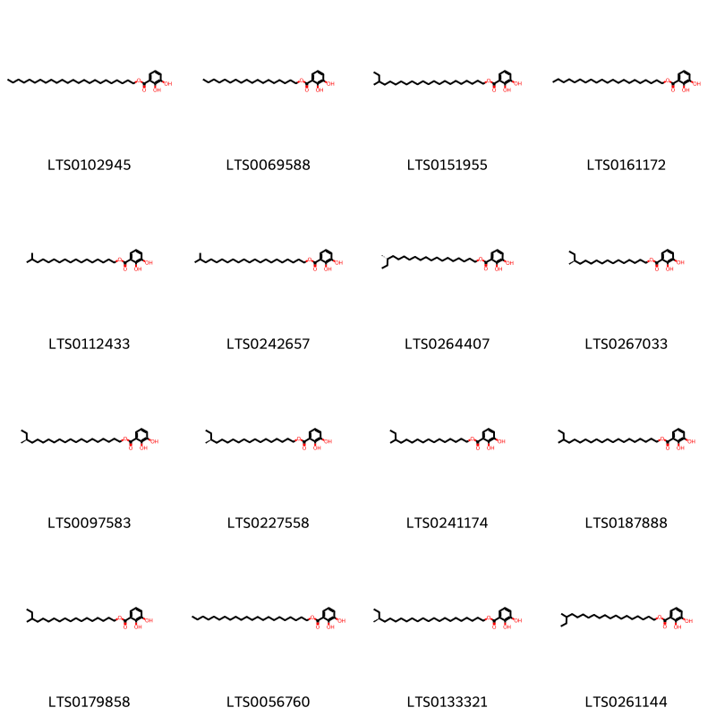

!!! abstract "Tóm tắt"

    Long Đởm (Radix et Rhizoma Gentianae) là rễ và thân rễ đã phơi hay sấy khô của cây Long đởm (Gentiana scabra Bunge), cây Điều diệp long đởm (Gentiana manshurica Kitag.), cây Tam hoa long đởm (Gentiana triflora Pall.) hoặc cây Kiên long đởm (Gentiana rigescens Franch.), họ Long đởm (Gentianaceae). Loài cây này thường mọc ở các khu vực nhiệt đới và cận nhiệt đới, phân bố tại Trung Quốc, Việt Nam, Thái Lan, và một số nước Đông Nam Á. Theo y học cổ truyền, long đởm được sử dụng để chữa ho, long đờm, hen suyễn, và một số bệnh liên quan đến đường hô hấp. Ngoài ra, dược liệu này còn có tác dụng trị giun sán và giảm đau. Các nghiên cứu dược lý hiện đại đã chứng minh long đởm có những tác dụng như kháng khuẩn, chống viêm, giảm ho, giãn phế quản, và có hiệu quả an thần nhẹ. Thành phần hóa học chính của long đởm bao gồm các alkaloid như stemonine, tuberostemonine, isostemonine, cùng với các hợp chất phenolic.

## Thông tin về thực vật

Dược liệu **Long Đởm (Rễ Và Thân Rễ)** từ bộ phận **nan** từ loài *Gentiana scabra*.

**Mô tả thực vật:** Cây long đờm là một loại cỏ sống lâu năm, cao 35-60cm. Thân rễ ngắn, rễ nhiều, đường kính 2-3mm, vỏ ngoài màu vàng nhạt. Thân mọcđứng, đơn độc hay 2-3 cành, đốt thường ngắn so với chiều dài của lá. Lá mọc đối, không cuống, lá phía dưới thân nhỏ, phía trên to rộng hơn, dài từ 3-8cm, rộng từ 0,4-3cm. Hoa hình chuông màu lam nhạt hay sẫm, mọc thành chùm không cuống ở đầu cành hoặc ở kẽ những lá phía trên.

*Tài liệu tham khảo:* "Những cây thuốc và vị thuốc Việt Nam" - Đỗ Tất Lợi 
Trong dược điển Việt nam, một số loài có thể dùng thay thế cho nhau làm dược liệu bao gồm *Gentiana scabra, Gentiana mans, Gentiana triflora, Gentiana rigescens*

!!! info "Phân loại thực vật của *Gentiana scabra*"
    - **Kingdom:** Plantae
    - **Phylum:** Tracheophyta
    - **Order:** Gentianales
    - **Family:** Gentianaceae
    - **Genus:** Gentiana
    - **Species:** *Gentiana scabra*

**Phân bố trên thế giới:** China, Korea, Republic of, Japan, Russian Federation

**Phân bố tại Việt nam:** Không có ghi nhận ở Việt Nam

 
Chưa có thông tin về loài này trên gibf

!!! info "Phân loại thực vật của *Gentiana triflora*"
    - **Kingdom:** Plantae
    - **Phylum:** Tracheophyta
    - **Order:** Gentianales
    - **Family:** Gentianaceae
    - **Genus:** Gentiana
    - **Species:** *Gentiana triflora*

**Phân bố trên thế giới:** nan, Russian Federation, China, Japan, Korea, Republic of

**Phân bố tại Việt nam:** Không có ghi nhận ở Việt Nam

!!! info "Phân loại thực vật của *Gentiana rigescens*"
    - **Kingdom:** Plantae
    - **Phylum:** Tracheophyta
    - **Order:** Gentianales
    - **Family:** Gentianaceae
    - **Genus:** Gentiana
    - **Species:** *Gentiana rigescens*

**Phân bố trên thế giới:** China

**Phân bố tại Việt nam:** Không có ghi nhận ở Việt Nam

## Thông tin về dược liệu 

### Định danh

!!! info "Thông tin về tên gọi"

    - Dược liệu tiếng Việt: nan
    - Dược liệu tiếng Trung: nan (nan)
    - Dược liệu tiếng Anh: nan
    - Dược liệu latin thông dụng: nan
    - Dược liệu latin kiểu DĐVN: *gentiana scabra bunge*
    - Dược liệu latin kiểu DĐVN: *nan*
    - Dược liệu latin kiểu thông tư: *nan*
    - Bộ phận dùng: nan (nan)

### Mô tả dược liệu 

- **Theo dược điển Việt nam V:** nan

- **Mô tả dược liệu theo thông tư chế biến dược liệu theo phương pháp cổ truyền:** nan

### Chế biến 

- **Chế biến theo dược điển việt nam V**: nan

- **Chế biến theo thông tư:** nan

--- 

## Thành phần hóa học

- Theo tài liệu của GS. Đỗ Tất Lợi:  Trong long đờm có một glucozit đắng chừng 2% gọi là gentiopicrin C, H₂O, và một chất 20 đường gọi là gentianoza CH₁₂O16 chừng 4%.
Thủy phân gentiopicrin ta sẽ được gentiogenin CHO, và glucoza.
Gentianoza gồm hai phân tử glucoza và một phân tử fructoza.​12:25/-strong/-heart:>:o:-((:-hĐã gửi Xem trước khi gửiThả Files vào đây để xem lại trước khi gửi
    

**Thành phần hóa học từ loài **Gentiana rigescens**

Theo cơ sở dữ liệu lotus, loài *Gentiana rigescens* đã phân lập và xác định được **32** hoạt chất thuộc về các nhóm Pyranopyridines, Steroids and steroid derivatives, Benzene and substituted derivatives, Prenol lipids trong bảng dưới đây. Danh sách các hoạt chất như sau 2-(3a,3b,6,9a-tetramethyl-7-{[3,4,5-trihydroxy-6-(hydroxymethyl)oxan-2-yl]oxy}-6-({[3,4,5-trihydroxy-6-(hydroxymethyl)oxan-2-yl]oxy}methyl)-dodecahydro-1h-cyclopenta[a]phenanthren-1-yl)-4,5-dihydroxy-6,6-dimethyloxane-2-carboxylic acid [(LTS0247122)](https://lotus.naturalproducts.net/compound/lotus_id/LTS0247122), docosyl 2,3-dihydroxybenzoate [(LTS0056760)](https://lotus.naturalproducts.net/compound/lotus_id/LTS0056760), stigmast-5-en-3-ol, (3β)- [(LTS0204616)](https://lotus.naturalproducts.net/compound/lotus_id/LTS0204616), (20s)-20-methyldocosyl 2,3-dihydroxybenzoate [(LTS0133321)](https://lotus.naturalproducts.net/compound/lotus_id/LTS0133321), 4,5-dihydroxy-2-[7-hydroxy-6-(hydroxymethyl)-3a,3b,6,9a-tetramethyl-dodecahydro-1h-cyclopenta[a]phenanthren-1-yl]-6,6-dimethyloxane-2-carboxylic acid [(LTS0016017)](https://lotus.naturalproducts.net/compound/lotus_id/LTS0016017), (2s,4s,5s)-2-[(1s,3ar,3br,5ar,6s,7s,9ar,9br,11ar)-3a,3b,6,9a-tetramethyl-7-{[(2r,3r,4s,5s,6r)-3,4,5-trihydroxy-6-(hydroxymethyl)oxan-2-yl]oxy}-6-({[(2r,3r,4s,5s,6r)-3,4,5-trihydroxy-6-(hydroxymethyl)oxan-2-yl]oxy}methyl)-dodecahydro-1h-cyclopenta[a]phenanthren-1-yl]-4,5-dihydroxy-6,6-dimethyloxane-2-carboxylic acid [(LTS0034338)](https://lotus.naturalproducts.net/compound/lotus_id/LTS0034338), 2-(7-{[4,5-dihydroxy-6-(hydroxymethyl)-3-{[3,4,5-trihydroxy-6-(hydroxymethyl)oxan-2-yl]oxy}oxan-2-yl]oxy}-3a,3b,6,6,9a-pentamethyl-dodecahydro-1h-cyclopenta[a]phenanthren-1-yl)-4,5-dihydroxy-6,6-dimethyloxane-2-carboxylic acid [(LTS0235253)](https://lotus.naturalproducts.net/compound/lotus_id/LTS0235253), 18-methylicosyl 2,3-dihydroxybenzoate [(LTS0187888)](https://lotus.naturalproducts.net/compound/lotus_id/LTS0187888), (17s)-17-methylnonadecyl 2,3-dihydroxybenzoate [(LTS0264407)](https://lotus.naturalproducts.net/compound/lotus_id/LTS0264407), octadecyl 2,3-dihydroxybenzoate [(LTS0069588)](https://lotus.naturalproducts.net/compound/lotus_id/LTS0069588), 2-(7-{[4,5-dihydroxy-6-(hydroxymethyl)-3-{[3,4,5-trihydroxy-6-(hydroxymethyl)oxan-2-yl]oxy}oxan-2-yl]oxy}-6-(hydroxymethyl)-3a,3b,6,9a-tetramethyl-dodecahydro-1h-cyclopenta[a]phenanthren-1-yl)-4,5-dihydroxy-6,6-dimethyloxane-2-carboxylic acid [(LTS0230502)](https://lotus.naturalproducts.net/compound/lotus_id/LTS0230502), 20-methylhenicosyl 2,3-dihydroxybenzoate [(LTS0242657)](https://lotus.naturalproducts.net/compound/lotus_id/LTS0242657), (2s,4s,5s)-2-[(1s,3ar,3br,5ar,6s,7s,9ar,9br,11ar)-7-hydroxy-6-(hydroxymethyl)-3a,3b,6,9a-tetramethyl-dodecahydro-1h-cyclopenta[a]phenanthren-1-yl]-4,5-dihydroxy-6,6-dimethyloxane-2-carboxylic acid [(LTS0005968)](https://lotus.naturalproducts.net/compound/lotus_id/LTS0005968), (2s,4s,5s)-2-[(1s,3ar,3br,5ar,7s,9ar,9br,11ar)-7-{[(2r,3r,4s,5s,6r)-4,5-dihydroxy-6-(hydroxymethyl)-3-{[(2s,3r,4s,5s,6r)-3,4,5-trihydroxy-6-(hydroxymethyl)oxan-2-yl]oxy}oxan-2-yl]oxy}-3a,3b,6,6,9a-pentamethyl-dodecahydro-1h-cyclopenta[a]phenanthren-1-yl]-4,5-dihydroxy-6,6-dimethyloxane-2-carboxylic acid [(LTS0209360)](https://lotus.naturalproducts.net/compound/lotus_id/LTS0209360), 17-methylnonadecyl 2,3-dihydroxybenzoate [(LTS0261144)](https://lotus.naturalproducts.net/compound/lotus_id/LTS0261144), (2s,4s,5s,6s)-2-[(1s,3ar,3br,5ar,6s,7s,9ar,9br,11ar)-6-(hydroxymethyl)-3a,3b,6,9a-tetramethyl-7-{[(2r,3r,4s,5s,6r)-3,4,5-trihydroxy-6-(hydroxymethyl)oxan-2-yl]oxy}-dodecahydro-1h-cyclopenta[a]phenanthren-1-yl]-4,5-dihydroxy-6-(hydroxymethyl)-6-methyloxane-2-carboxylic acid [(LTS0116540)](https://lotus.naturalproducts.net/compound/lotus_id/LTS0116540), (2s,4s,5s)-2-[(1s,3ar,3br,5ar,6s,7s,9ar,9br,11ar)-6-(hydroxymethyl)-3a,3b,6,9a-tetramethyl-7-{[(2r,3r,4s,5s,6r)-3,4,5-trihydroxy-6-(hydroxymethyl)oxan-2-yl]oxy}-dodecahydro-1h-cyclopenta[a]phenanthren-1-yl]-4,5-dihydroxy-6,6-dimethyloxane-2-carboxylic acid [(LTS0214334)](https://lotus.naturalproducts.net/compound/lotus_id/LTS0214334), 4,5-dihydroxy-6-(hydroxymethyl)-2-[6-(hydroxymethyl)-3a,3b,6,9a-tetramethyl-7-{[3,4,5-trihydroxy-6-(hydroxymethyl)oxan-2-yl]oxy}-dodecahydro-1h-cyclopenta[a]phenanthren-1-yl]-6-methyloxane-2-carboxylic acid [(LTS0259356)](https://lotus.naturalproducts.net/compound/lotus_id/LTS0259356), 20-methyldocosyl 2,3-dihydroxybenzoate [(LTS0151955)](https://lotus.naturalproducts.net/compound/lotus_id/LTS0151955), 16-methyloctadecyl 2,3-dihydroxybenzoate [(LTS0179858)](https://lotus.naturalproducts.net/compound/lotus_id/LTS0179858), 4,5-dihydroxy-2-[6-(hydroxymethyl)-3a,3b,6,9a-tetramethyl-7-{[3,4,5-trihydroxy-6-(hydroxymethyl)oxan-2-yl]oxy}-dodecahydro-1h-cyclopenta[a]phenanthren-1-yl]-6,6-dimethyloxane-2-carboxylic acid [(LTS0054202)](https://lotus.naturalproducts.net/compound/lotus_id/LTS0054202), henicosyl 2,3-dihydroxybenzoate [(LTS0161172)](https://lotus.naturalproducts.net/compound/lotus_id/LTS0161172), (2s,4s,5s)-2-[(1s,3ar,3br,5ar,6s,7s,9ar,9br,11ar)-7-{[(2r,3r,4s,5s,6r)-4,5-dihydroxy-6-(hydroxymethyl)-3-{[(2s,3r,4s,5s,6r)-3,4,5-trihydroxy-6-(hydroxymethyl)oxan-2-yl]oxy}oxan-2-yl]oxy}-6-(hydroxymethyl)-3a,3b,6,9a-tetramethyl-dodecahydro-1h-cyclopenta[a]phenanthren-1-yl]-4,5-dihydroxy-6,6-dimethyloxane-2-carboxylic acid [(LTS0229404)](https://lotus.naturalproducts.net/compound/lotus_id/LTS0229404), 16-methylheptadecyl 2,3-dihydroxybenzoate [(LTS0112433)](https://lotus.naturalproducts.net/compound/lotus_id/LTS0112433), 14-methylhexadecyl 2,3-dihydroxybenzoate [(LTS0241174)](https://lotus.naturalproducts.net/compound/lotus_id/LTS0241174), (18s)-18-methylicosyl 2,3-dihydroxybenzoate [(LTS0097583)](https://lotus.naturalproducts.net/compound/lotus_id/LTS0097583), (16s)-16-methyloctadecyl 2,3-dihydroxybenzoate [(LTS0227558)](https://lotus.naturalproducts.net/compound/lotus_id/LTS0227558), tetracosyl 2,3-dihydroxybenzoate [(LTS0102945)](https://lotus.naturalproducts.net/compound/lotus_id/LTS0102945), gentianidine [(LTS0236316)](https://lotus.naturalproducts.net/compound/lotus_id/LTS0236316), (14s)-14-methylhexadecyl 2,3-dihydroxybenzoate [(LTS0267033)](https://lotus.naturalproducts.net/compound/lotus_id/LTS0267033), 6-hydroxy-1-methyl-1h,3h,4h-pyrano[3,4-c]pyridine-5-carbaldehyde [(LTS0003118)](https://lotus.naturalproducts.net/compound/lotus_id/LTS0003118), gentianine [(LTS0240161)](https://lotus.naturalproducts.net/compound/lotus_id/LTS0240161). 
        
| chemicalTaxonomyClassyfireClass     |   smiles_count |
|:------------------------------------|---------------:|
| Benzene and substituted derivatives |            657 |
| Prenol lipids                       |           1585 |
| Pyranopyridines                     |             61 |
| Steroids and steroid derivatives    |             49 |

            
### Nhóm Benzene and substituted derivatives
<figure markdown="span">
    { width=100% }
<figcaption>Hình ảnh cấu trúc hóa học của hoạt chất thuộc nhóm *Benzene and substituted derivatives*. Tên thường gọi của các hoạt chất tương ứng là tetracosyl 2,3-dihydroxybenzoate [(LTS0102945)](https://lotus.naturalproducts.net/compound/lotus_id/LTS0102945), octadecyl 2,3-dihydroxybenzoate [(LTS0069588)](https://lotus.naturalproducts.net/compound/lotus_id/LTS0069588), 20-methyldocosyl 2,3-dihydroxybenzoate [(LTS0151955)](https://lotus.naturalproducts.net/compound/lotus_id/LTS0151955), henicosyl 2,3-dihydroxybenzoate [(LTS0161172)](https://lotus.naturalproducts.net/compound/lotus_id/LTS0161172), 16-methylheptadecyl 2,3-dihydroxybenzoate [(LTS0112433)](https://lotus.naturalproducts.net/compound/lotus_id/LTS0112433), 20-methylhenicosyl 2,3-dihydroxybenzoate [(LTS0242657)](https://lotus.naturalproducts.net/compound/lotus_id/LTS0242657), (17s)-17-methylnonadecyl 2,3-dihydroxybenzoate [(LTS0264407)](https://lotus.naturalproducts.net/compound/lotus_id/LTS0264407), (14s)-14-methylhexadecyl 2,3-dihydroxybenzoate [(LTS0267033)](https://lotus.naturalproducts.net/compound/lotus_id/LTS0267033), (18s)-18-methylicosyl 2,3-dihydroxybenzoate [(LTS0097583)](https://lotus.naturalproducts.net/compound/lotus_id/LTS0097583), (16s)-16-methyloctadecyl 2,3-dihydroxybenzoate [(LTS0227558)](https://lotus.naturalproducts.net/compound/lotus_id/LTS0227558), 14-methylhexadecyl 2,3-dihydroxybenzoate [(LTS0241174)](https://lotus.naturalproducts.net/compound/lotus_id/LTS0241174), 18-methylicosyl 2,3-dihydroxybenzoate [(LTS0187888)](https://lotus.naturalproducts.net/compound/lotus_id/LTS0187888), 16-methyloctadecyl 2,3-dihydroxybenzoate [(LTS0179858)](https://lotus.naturalproducts.net/compound/lotus_id/LTS0179858), docosyl 2,3-dihydroxybenzoate [(LTS0056760)](https://lotus.naturalproducts.net/compound/lotus_id/LTS0056760), (20s)-20-methyldocosyl 2,3-dihydroxybenzoate [(LTS0133321)](https://lotus.naturalproducts.net/compound/lotus_id/LTS0133321), 17-methylnonadecyl 2,3-dihydroxybenzoate [(LTS0261144)](https://lotus.naturalproducts.net/compound/lotus_id/LTS0261144).</figcaption>
</figure>

            
            
### Nhóm Benzene and substituted derivatives
<figure markdown="span">
    { width=100% }
<figcaption>Hình ảnh cấu trúc hóa học của hoạt chất thuộc nhóm *Benzene and substituted derivatives*. Tên thường gọi của các hoạt chất tương ứng là tetracosyl 2,3-dihydroxybenzoate [(LTS0102945)](https://lotus.naturalproducts.net/compound/lotus_id/LTS0102945), octadecyl 2,3-dihydroxybenzoate [(LTS0069588)](https://lotus.naturalproducts.net/compound/lotus_id/LTS0069588), 20-methyldocosyl 2,3-dihydroxybenzoate [(LTS0151955)](https://lotus.naturalproducts.net/compound/lotus_id/LTS0151955), henicosyl 2,3-dihydroxybenzoate [(LTS0161172)](https://lotus.naturalproducts.net/compound/lotus_id/LTS0161172), 16-methylheptadecyl 2,3-dihydroxybenzoate [(LTS0112433)](https://lotus.naturalproducts.net/compound/lotus_id/LTS0112433), 20-methylhenicosyl 2,3-dihydroxybenzoate [(LTS0242657)](https://lotus.naturalproducts.net/compound/lotus_id/LTS0242657), (17s)-17-methylnonadecyl 2,3-dihydroxybenzoate [(LTS0264407)](https://lotus.naturalproducts.net/compound/lotus_id/LTS0264407), (14s)-14-methylhexadecyl 2,3-dihydroxybenzoate [(LTS0267033)](https://lotus.naturalproducts.net/compound/lotus_id/LTS0267033), (18s)-18-methylicosyl 2,3-dihydroxybenzoate [(LTS0097583)](https://lotus.naturalproducts.net/compound/lotus_id/LTS0097583), (16s)-16-methyloctadecyl 2,3-dihydroxybenzoate [(LTS0227558)](https://lotus.naturalproducts.net/compound/lotus_id/LTS0227558), 14-methylhexadecyl 2,3-dihydroxybenzoate [(LTS0241174)](https://lotus.naturalproducts.net/compound/lotus_id/LTS0241174), 18-methylicosyl 2,3-dihydroxybenzoate [(LTS0187888)](https://lotus.naturalproducts.net/compound/lotus_id/LTS0187888), 16-methyloctadecyl 2,3-dihydroxybenzoate [(LTS0179858)](https://lotus.naturalproducts.net/compound/lotus_id/LTS0179858), docosyl 2,3-dihydroxybenzoate [(LTS0056760)](https://lotus.naturalproducts.net/compound/lotus_id/LTS0056760), (20s)-20-methyldocosyl 2,3-dihydroxybenzoate [(LTS0133321)](https://lotus.naturalproducts.net/compound/lotus_id/LTS0133321), 17-methylnonadecyl 2,3-dihydroxybenzoate [(LTS0261144)](https://lotus.naturalproducts.net/compound/lotus_id/LTS0261144).</figcaption>
</figure>

### Nhóm Prenol lipids
<figure markdown="span">
    { width=100% }
<figcaption>Hình ảnh cấu trúc hóa học của hoạt chất thuộc nhóm *Prenol lipids*. Tên thường gọi của các hoạt chất tương ứng là (2s,4s,5s)-2-[(1s,3ar,3br,5ar,7s,9ar,9br,11ar)-7-{[(2r,3r,4s,5s,6r)-4,5-dihydroxy-6-(hydroxymethyl)-3-{[(2s,3r,4s,5s,6r)-3,4,5-trihydroxy-6-(hydroxymethyl)oxan-2-yl]oxy}oxan-2-yl]oxy}-3a,3b,6,6,9a-pentamethyl-dodecahydro-1h-cyclopenta[a]phenanthren-1-yl]-4,5-dihydroxy-6,6-dimethyloxane-2-carboxylic acid [(LTS0209360)](https://lotus.naturalproducts.net/compound/lotus_id/LTS0209360), 2-(7-{[4,5-dihydroxy-6-(hydroxymethyl)-3-{[3,4,5-trihydroxy-6-(hydroxymethyl)oxan-2-yl]oxy}oxan-2-yl]oxy}-6-(hydroxymethyl)-3a,3b,6,9a-tetramethyl-dodecahydro-1h-cyclopenta[a]phenanthren-1-yl)-4,5-dihydroxy-6,6-dimethyloxane-2-carboxylic acid [(LTS0230502)](https://lotus.naturalproducts.net/compound/lotus_id/LTS0230502), (2s,4s,5s,6s)-2-[(1s,3ar,3br,5ar,6s,7s,9ar,9br,11ar)-6-(hydroxymethyl)-3a,3b,6,9a-tetramethyl-7-{[(2r,3r,4s,5s,6r)-3,4,5-trihydroxy-6-(hydroxymethyl)oxan-2-yl]oxy}-dodecahydro-1h-cyclopenta[a]phenanthren-1-yl]-4,5-dihydroxy-6-(hydroxymethyl)-6-methyloxane-2-carboxylic acid [(LTS0116540)](https://lotus.naturalproducts.net/compound/lotus_id/LTS0116540), 2-(3a,3b,6,9a-tetramethyl-7-{[3,4,5-trihydroxy-6-(hydroxymethyl)oxan-2-yl]oxy}-6-({[3,4,5-trihydroxy-6-(hydroxymethyl)oxan-2-yl]oxy}methyl)-dodecahydro-1h-cyclopenta[a]phenanthren-1-yl)-4,5-dihydroxy-6,6-dimethyloxane-2-carboxylic acid [(LTS0247122)](https://lotus.naturalproducts.net/compound/lotus_id/LTS0247122), (2s,4s,5s)-2-[(1s,3ar,3br,5ar,6s,7s,9ar,9br,11ar)-6-(hydroxymethyl)-3a,3b,6,9a-tetramethyl-7-{[(2r,3r,4s,5s,6r)-3,4,5-trihydroxy-6-(hydroxymethyl)oxan-2-yl]oxy}-dodecahydro-1h-cyclopenta[a]phenanthren-1-yl]-4,5-dihydroxy-6,6-dimethyloxane-2-carboxylic acid [(LTS0214334)](https://lotus.naturalproducts.net/compound/lotus_id/LTS0214334), 4,5-dihydroxy-2-[6-(hydroxymethyl)-3a,3b,6,9a-tetramethyl-7-{[3,4,5-trihydroxy-6-(hydroxymethyl)oxan-2-yl]oxy}-dodecahydro-1h-cyclopenta[a]phenanthren-1-yl]-6,6-dimethyloxane-2-carboxylic acid [(LTS0054202)](https://lotus.naturalproducts.net/compound/lotus_id/LTS0054202), 2-(7-{[4,5-dihydroxy-6-(hydroxymethyl)-3-{[3,4,5-trihydroxy-6-(hydroxymethyl)oxan-2-yl]oxy}oxan-2-yl]oxy}-3a,3b,6,6,9a-pentamethyl-dodecahydro-1h-cyclopenta[a]phenanthren-1-yl)-4,5-dihydroxy-6,6-dimethyloxane-2-carboxylic acid [(LTS0235253)](https://lotus.naturalproducts.net/compound/lotus_id/LTS0235253), 4,5-dihydroxy-6-(hydroxymethyl)-2-[6-(hydroxymethyl)-3a,3b,6,9a-tetramethyl-7-{[3,4,5-trihydroxy-6-(hydroxymethyl)oxan-2-yl]oxy}-dodecahydro-1h-cyclopenta[a]phenanthren-1-yl]-6-methyloxane-2-carboxylic acid [(LTS0259356)](https://lotus.naturalproducts.net/compound/lotus_id/LTS0259356), (2s,4s,5s)-2-[(1s,3ar,3br,5ar,6s,7s,9ar,9br,11ar)-3a,3b,6,9a-tetramethyl-7-{[(2r,3r,4s,5s,6r)-3,4,5-trihydroxy-6-(hydroxymethyl)oxan-2-yl]oxy}-6-({[(2r,3r,4s,5s,6r)-3,4,5-trihydroxy-6-(hydroxymethyl)oxan-2-yl]oxy}methyl)-dodecahydro-1h-cyclopenta[a]phenanthren-1-yl]-4,5-dihydroxy-6,6-dimethyloxane-2-carboxylic acid [(LTS0034338)](https://lotus.naturalproducts.net/compound/lotus_id/LTS0034338), (2s,4s,5s)-2-[(1s,3ar,3br,5ar,6s,7s,9ar,9br,11ar)-7-hydroxy-6-(hydroxymethyl)-3a,3b,6,9a-tetramethyl-dodecahydro-1h-cyclopenta[a]phenanthren-1-yl]-4,5-dihydroxy-6,6-dimethyloxane-2-carboxylic acid [(LTS0005968)](https://lotus.naturalproducts.net/compound/lotus_id/LTS0005968), 4,5-dihydroxy-2-[7-hydroxy-6-(hydroxymethyl)-3a,3b,6,9a-tetramethyl-dodecahydro-1h-cyclopenta[a]phenanthren-1-yl]-6,6-dimethyloxane-2-carboxylic acid [(LTS0016017)](https://lotus.naturalproducts.net/compound/lotus_id/LTS0016017), (2s,4s,5s)-2-[(1s,3ar,3br,5ar,6s,7s,9ar,9br,11ar)-7-{[(2r,3r,4s,5s,6r)-4,5-dihydroxy-6-(hydroxymethyl)-3-{[(2s,3r,4s,5s,6r)-3,4,5-trihydroxy-6-(hydroxymethyl)oxan-2-yl]oxy}oxan-2-yl]oxy}-6-(hydroxymethyl)-3a,3b,6,9a-tetramethyl-dodecahydro-1h-cyclopenta[a]phenanthren-1-yl]-4,5-dihydroxy-6,6-dimethyloxane-2-carboxylic acid [(LTS0229404)](https://lotus.naturalproducts.net/compound/lotus_id/LTS0229404).</figcaption>
</figure>

            
            
### Nhóm Benzene and substituted derivatives
<figure markdown="span">
    { width=100% }
<figcaption>Hình ảnh cấu trúc hóa học của hoạt chất thuộc nhóm *Benzene and substituted derivatives*. Tên thường gọi của các hoạt chất tương ứng là tetracosyl 2,3-dihydroxybenzoate [(LTS0102945)](https://lotus.naturalproducts.net/compound/lotus_id/LTS0102945), octadecyl 2,3-dihydroxybenzoate [(LTS0069588)](https://lotus.naturalproducts.net/compound/lotus_id/LTS0069588), 20-methyldocosyl 2,3-dihydroxybenzoate [(LTS0151955)](https://lotus.naturalproducts.net/compound/lotus_id/LTS0151955), henicosyl 2,3-dihydroxybenzoate [(LTS0161172)](https://lotus.naturalproducts.net/compound/lotus_id/LTS0161172), 16-methylheptadecyl 2,3-dihydroxybenzoate [(LTS0112433)](https://lotus.naturalproducts.net/compound/lotus_id/LTS0112433), 20-methylhenicosyl 2,3-dihydroxybenzoate [(LTS0242657)](https://lotus.naturalproducts.net/compound/lotus_id/LTS0242657), (17s)-17-methylnonadecyl 2,3-dihydroxybenzoate [(LTS0264407)](https://lotus.naturalproducts.net/compound/lotus_id/LTS0264407), (14s)-14-methylhexadecyl 2,3-dihydroxybenzoate [(LTS0267033)](https://lotus.naturalproducts.net/compound/lotus_id/LTS0267033), (18s)-18-methylicosyl 2,3-dihydroxybenzoate [(LTS0097583)](https://lotus.naturalproducts.net/compound/lotus_id/LTS0097583), (16s)-16-methyloctadecyl 2,3-dihydroxybenzoate [(LTS0227558)](https://lotus.naturalproducts.net/compound/lotus_id/LTS0227558), 14-methylhexadecyl 2,3-dihydroxybenzoate [(LTS0241174)](https://lotus.naturalproducts.net/compound/lotus_id/LTS0241174), 18-methylicosyl 2,3-dihydroxybenzoate [(LTS0187888)](https://lotus.naturalproducts.net/compound/lotus_id/LTS0187888), 16-methyloctadecyl 2,3-dihydroxybenzoate [(LTS0179858)](https://lotus.naturalproducts.net/compound/lotus_id/LTS0179858), docosyl 2,3-dihydroxybenzoate [(LTS0056760)](https://lotus.naturalproducts.net/compound/lotus_id/LTS0056760), (20s)-20-methyldocosyl 2,3-dihydroxybenzoate [(LTS0133321)](https://lotus.naturalproducts.net/compound/lotus_id/LTS0133321), 17-methylnonadecyl 2,3-dihydroxybenzoate [(LTS0261144)](https://lotus.naturalproducts.net/compound/lotus_id/LTS0261144).</figcaption>
</figure>

### Nhóm Prenol lipids
<figure markdown="span">
    { width=100% }
<figcaption>Hình ảnh cấu trúc hóa học của hoạt chất thuộc nhóm *Prenol lipids*. Tên thường gọi của các hoạt chất tương ứng là (2s,4s,5s)-2-[(1s,3ar,3br,5ar,7s,9ar,9br,11ar)-7-{[(2r,3r,4s,5s,6r)-4,5-dihydroxy-6-(hydroxymethyl)-3-{[(2s,3r,4s,5s,6r)-3,4,5-trihydroxy-6-(hydroxymethyl)oxan-2-yl]oxy}oxan-2-yl]oxy}-3a,3b,6,6,9a-pentamethyl-dodecahydro-1h-cyclopenta[a]phenanthren-1-yl]-4,5-dihydroxy-6,6-dimethyloxane-2-carboxylic acid [(LTS0209360)](https://lotus.naturalproducts.net/compound/lotus_id/LTS0209360), 2-(7-{[4,5-dihydroxy-6-(hydroxymethyl)-3-{[3,4,5-trihydroxy-6-(hydroxymethyl)oxan-2-yl]oxy}oxan-2-yl]oxy}-6-(hydroxymethyl)-3a,3b,6,9a-tetramethyl-dodecahydro-1h-cyclopenta[a]phenanthren-1-yl)-4,5-dihydroxy-6,6-dimethyloxane-2-carboxylic acid [(LTS0230502)](https://lotus.naturalproducts.net/compound/lotus_id/LTS0230502), (2s,4s,5s,6s)-2-[(1s,3ar,3br,5ar,6s,7s,9ar,9br,11ar)-6-(hydroxymethyl)-3a,3b,6,9a-tetramethyl-7-{[(2r,3r,4s,5s,6r)-3,4,5-trihydroxy-6-(hydroxymethyl)oxan-2-yl]oxy}-dodecahydro-1h-cyclopenta[a]phenanthren-1-yl]-4,5-dihydroxy-6-(hydroxymethyl)-6-methyloxane-2-carboxylic acid [(LTS0116540)](https://lotus.naturalproducts.net/compound/lotus_id/LTS0116540), 2-(3a,3b,6,9a-tetramethyl-7-{[3,4,5-trihydroxy-6-(hydroxymethyl)oxan-2-yl]oxy}-6-({[3,4,5-trihydroxy-6-(hydroxymethyl)oxan-2-yl]oxy}methyl)-dodecahydro-1h-cyclopenta[a]phenanthren-1-yl)-4,5-dihydroxy-6,6-dimethyloxane-2-carboxylic acid [(LTS0247122)](https://lotus.naturalproducts.net/compound/lotus_id/LTS0247122), (2s,4s,5s)-2-[(1s,3ar,3br,5ar,6s,7s,9ar,9br,11ar)-6-(hydroxymethyl)-3a,3b,6,9a-tetramethyl-7-{[(2r,3r,4s,5s,6r)-3,4,5-trihydroxy-6-(hydroxymethyl)oxan-2-yl]oxy}-dodecahydro-1h-cyclopenta[a]phenanthren-1-yl]-4,5-dihydroxy-6,6-dimethyloxane-2-carboxylic acid [(LTS0214334)](https://lotus.naturalproducts.net/compound/lotus_id/LTS0214334), 4,5-dihydroxy-2-[6-(hydroxymethyl)-3a,3b,6,9a-tetramethyl-7-{[3,4,5-trihydroxy-6-(hydroxymethyl)oxan-2-yl]oxy}-dodecahydro-1h-cyclopenta[a]phenanthren-1-yl]-6,6-dimethyloxane-2-carboxylic acid [(LTS0054202)](https://lotus.naturalproducts.net/compound/lotus_id/LTS0054202), 2-(7-{[4,5-dihydroxy-6-(hydroxymethyl)-3-{[3,4,5-trihydroxy-6-(hydroxymethyl)oxan-2-yl]oxy}oxan-2-yl]oxy}-3a,3b,6,6,9a-pentamethyl-dodecahydro-1h-cyclopenta[a]phenanthren-1-yl)-4,5-dihydroxy-6,6-dimethyloxane-2-carboxylic acid [(LTS0235253)](https://lotus.naturalproducts.net/compound/lotus_id/LTS0235253), 4,5-dihydroxy-6-(hydroxymethyl)-2-[6-(hydroxymethyl)-3a,3b,6,9a-tetramethyl-7-{[3,4,5-trihydroxy-6-(hydroxymethyl)oxan-2-yl]oxy}-dodecahydro-1h-cyclopenta[a]phenanthren-1-yl]-6-methyloxane-2-carboxylic acid [(LTS0259356)](https://lotus.naturalproducts.net/compound/lotus_id/LTS0259356), (2s,4s,5s)-2-[(1s,3ar,3br,5ar,6s,7s,9ar,9br,11ar)-3a,3b,6,9a-tetramethyl-7-{[(2r,3r,4s,5s,6r)-3,4,5-trihydroxy-6-(hydroxymethyl)oxan-2-yl]oxy}-6-({[(2r,3r,4s,5s,6r)-3,4,5-trihydroxy-6-(hydroxymethyl)oxan-2-yl]oxy}methyl)-dodecahydro-1h-cyclopenta[a]phenanthren-1-yl]-4,5-dihydroxy-6,6-dimethyloxane-2-carboxylic acid [(LTS0034338)](https://lotus.naturalproducts.net/compound/lotus_id/LTS0034338), (2s,4s,5s)-2-[(1s,3ar,3br,5ar,6s,7s,9ar,9br,11ar)-7-hydroxy-6-(hydroxymethyl)-3a,3b,6,9a-tetramethyl-dodecahydro-1h-cyclopenta[a]phenanthren-1-yl]-4,5-dihydroxy-6,6-dimethyloxane-2-carboxylic acid [(LTS0005968)](https://lotus.naturalproducts.net/compound/lotus_id/LTS0005968), 4,5-dihydroxy-2-[7-hydroxy-6-(hydroxymethyl)-3a,3b,6,9a-tetramethyl-dodecahydro-1h-cyclopenta[a]phenanthren-1-yl]-6,6-dimethyloxane-2-carboxylic acid [(LTS0016017)](https://lotus.naturalproducts.net/compound/lotus_id/LTS0016017), (2s,4s,5s)-2-[(1s,3ar,3br,5ar,6s,7s,9ar,9br,11ar)-7-{[(2r,3r,4s,5s,6r)-4,5-dihydroxy-6-(hydroxymethyl)-3-{[(2s,3r,4s,5s,6r)-3,4,5-trihydroxy-6-(hydroxymethyl)oxan-2-yl]oxy}oxan-2-yl]oxy}-6-(hydroxymethyl)-3a,3b,6,9a-tetramethyl-dodecahydro-1h-cyclopenta[a]phenanthren-1-yl]-4,5-dihydroxy-6,6-dimethyloxane-2-carboxylic acid [(LTS0229404)](https://lotus.naturalproducts.net/compound/lotus_id/LTS0229404).</figcaption>
</figure>

### Nhóm Pyranopyridines
<figure markdown="span">
    { width=100% }
<figcaption>Hình ảnh cấu trúc hóa học của hoạt chất thuộc nhóm *Pyranopyridines*. Tên thường gọi của các hoạt chất tương ứng là gentianine [(LTS0240161)](https://lotus.naturalproducts.net/compound/lotus_id/LTS0240161), gentianidine [(LTS0236316)](https://lotus.naturalproducts.net/compound/lotus_id/LTS0236316), 6-hydroxy-1-methyl-1h,3h,4h-pyrano[3,4-c]pyridine-5-carbaldehyde [(LTS0003118)](https://lotus.naturalproducts.net/compound/lotus_id/LTS0003118).</figcaption>
</figure>

            
            
### Nhóm Benzene and substituted derivatives
<figure markdown="span">
    { width=100% }
<figcaption>Hình ảnh cấu trúc hóa học của hoạt chất thuộc nhóm *Benzene and substituted derivatives*. Tên thường gọi của các hoạt chất tương ứng là tetracosyl 2,3-dihydroxybenzoate [(LTS0102945)](https://lotus.naturalproducts.net/compound/lotus_id/LTS0102945), octadecyl 2,3-dihydroxybenzoate [(LTS0069588)](https://lotus.naturalproducts.net/compound/lotus_id/LTS0069588), 20-methyldocosyl 2,3-dihydroxybenzoate [(LTS0151955)](https://lotus.naturalproducts.net/compound/lotus_id/LTS0151955), henicosyl 2,3-dihydroxybenzoate [(LTS0161172)](https://lotus.naturalproducts.net/compound/lotus_id/LTS0161172), 16-methylheptadecyl 2,3-dihydroxybenzoate [(LTS0112433)](https://lotus.naturalproducts.net/compound/lotus_id/LTS0112433), 20-methylhenicosyl 2,3-dihydroxybenzoate [(LTS0242657)](https://lotus.naturalproducts.net/compound/lotus_id/LTS0242657), (17s)-17-methylnonadecyl 2,3-dihydroxybenzoate [(LTS0264407)](https://lotus.naturalproducts.net/compound/lotus_id/LTS0264407), (14s)-14-methylhexadecyl 2,3-dihydroxybenzoate [(LTS0267033)](https://lotus.naturalproducts.net/compound/lotus_id/LTS0267033), (18s)-18-methylicosyl 2,3-dihydroxybenzoate [(LTS0097583)](https://lotus.naturalproducts.net/compound/lotus_id/LTS0097583), (16s)-16-methyloctadecyl 2,3-dihydroxybenzoate [(LTS0227558)](https://lotus.naturalproducts.net/compound/lotus_id/LTS0227558), 14-methylhexadecyl 2,3-dihydroxybenzoate [(LTS0241174)](https://lotus.naturalproducts.net/compound/lotus_id/LTS0241174), 18-methylicosyl 2,3-dihydroxybenzoate [(LTS0187888)](https://lotus.naturalproducts.net/compound/lotus_id/LTS0187888), 16-methyloctadecyl 2,3-dihydroxybenzoate [(LTS0179858)](https://lotus.naturalproducts.net/compound/lotus_id/LTS0179858), docosyl 2,3-dihydroxybenzoate [(LTS0056760)](https://lotus.naturalproducts.net/compound/lotus_id/LTS0056760), (20s)-20-methyldocosyl 2,3-dihydroxybenzoate [(LTS0133321)](https://lotus.naturalproducts.net/compound/lotus_id/LTS0133321), 17-methylnonadecyl 2,3-dihydroxybenzoate [(LTS0261144)](https://lotus.naturalproducts.net/compound/lotus_id/LTS0261144).</figcaption>
</figure>

### Nhóm Prenol lipids
<figure markdown="span">
    { width=100% }
<figcaption>Hình ảnh cấu trúc hóa học của hoạt chất thuộc nhóm *Prenol lipids*. Tên thường gọi của các hoạt chất tương ứng là (2s,4s,5s)-2-[(1s,3ar,3br,5ar,7s,9ar,9br,11ar)-7-{[(2r,3r,4s,5s,6r)-4,5-dihydroxy-6-(hydroxymethyl)-3-{[(2s,3r,4s,5s,6r)-3,4,5-trihydroxy-6-(hydroxymethyl)oxan-2-yl]oxy}oxan-2-yl]oxy}-3a,3b,6,6,9a-pentamethyl-dodecahydro-1h-cyclopenta[a]phenanthren-1-yl]-4,5-dihydroxy-6,6-dimethyloxane-2-carboxylic acid [(LTS0209360)](https://lotus.naturalproducts.net/compound/lotus_id/LTS0209360), 2-(7-{[4,5-dihydroxy-6-(hydroxymethyl)-3-{[3,4,5-trihydroxy-6-(hydroxymethyl)oxan-2-yl]oxy}oxan-2-yl]oxy}-6-(hydroxymethyl)-3a,3b,6,9a-tetramethyl-dodecahydro-1h-cyclopenta[a]phenanthren-1-yl)-4,5-dihydroxy-6,6-dimethyloxane-2-carboxylic acid [(LTS0230502)](https://lotus.naturalproducts.net/compound/lotus_id/LTS0230502), (2s,4s,5s,6s)-2-[(1s,3ar,3br,5ar,6s,7s,9ar,9br,11ar)-6-(hydroxymethyl)-3a,3b,6,9a-tetramethyl-7-{[(2r,3r,4s,5s,6r)-3,4,5-trihydroxy-6-(hydroxymethyl)oxan-2-yl]oxy}-dodecahydro-1h-cyclopenta[a]phenanthren-1-yl]-4,5-dihydroxy-6-(hydroxymethyl)-6-methyloxane-2-carboxylic acid [(LTS0116540)](https://lotus.naturalproducts.net/compound/lotus_id/LTS0116540), 2-(3a,3b,6,9a-tetramethyl-7-{[3,4,5-trihydroxy-6-(hydroxymethyl)oxan-2-yl]oxy}-6-({[3,4,5-trihydroxy-6-(hydroxymethyl)oxan-2-yl]oxy}methyl)-dodecahydro-1h-cyclopenta[a]phenanthren-1-yl)-4,5-dihydroxy-6,6-dimethyloxane-2-carboxylic acid [(LTS0247122)](https://lotus.naturalproducts.net/compound/lotus_id/LTS0247122), (2s,4s,5s)-2-[(1s,3ar,3br,5ar,6s,7s,9ar,9br,11ar)-6-(hydroxymethyl)-3a,3b,6,9a-tetramethyl-7-{[(2r,3r,4s,5s,6r)-3,4,5-trihydroxy-6-(hydroxymethyl)oxan-2-yl]oxy}-dodecahydro-1h-cyclopenta[a]phenanthren-1-yl]-4,5-dihydroxy-6,6-dimethyloxane-2-carboxylic acid [(LTS0214334)](https://lotus.naturalproducts.net/compound/lotus_id/LTS0214334), 4,5-dihydroxy-2-[6-(hydroxymethyl)-3a,3b,6,9a-tetramethyl-7-{[3,4,5-trihydroxy-6-(hydroxymethyl)oxan-2-yl]oxy}-dodecahydro-1h-cyclopenta[a]phenanthren-1-yl]-6,6-dimethyloxane-2-carboxylic acid [(LTS0054202)](https://lotus.naturalproducts.net/compound/lotus_id/LTS0054202), 2-(7-{[4,5-dihydroxy-6-(hydroxymethyl)-3-{[3,4,5-trihydroxy-6-(hydroxymethyl)oxan-2-yl]oxy}oxan-2-yl]oxy}-3a,3b,6,6,9a-pentamethyl-dodecahydro-1h-cyclopenta[a]phenanthren-1-yl)-4,5-dihydroxy-6,6-dimethyloxane-2-carboxylic acid [(LTS0235253)](https://lotus.naturalproducts.net/compound/lotus_id/LTS0235253), 4,5-dihydroxy-6-(hydroxymethyl)-2-[6-(hydroxymethyl)-3a,3b,6,9a-tetramethyl-7-{[3,4,5-trihydroxy-6-(hydroxymethyl)oxan-2-yl]oxy}-dodecahydro-1h-cyclopenta[a]phenanthren-1-yl]-6-methyloxane-2-carboxylic acid [(LTS0259356)](https://lotus.naturalproducts.net/compound/lotus_id/LTS0259356), (2s,4s,5s)-2-[(1s,3ar,3br,5ar,6s,7s,9ar,9br,11ar)-3a,3b,6,9a-tetramethyl-7-{[(2r,3r,4s,5s,6r)-3,4,5-trihydroxy-6-(hydroxymethyl)oxan-2-yl]oxy}-6-({[(2r,3r,4s,5s,6r)-3,4,5-trihydroxy-6-(hydroxymethyl)oxan-2-yl]oxy}methyl)-dodecahydro-1h-cyclopenta[a]phenanthren-1-yl]-4,5-dihydroxy-6,6-dimethyloxane-2-carboxylic acid [(LTS0034338)](https://lotus.naturalproducts.net/compound/lotus_id/LTS0034338), (2s,4s,5s)-2-[(1s,3ar,3br,5ar,6s,7s,9ar,9br,11ar)-7-hydroxy-6-(hydroxymethyl)-3a,3b,6,9a-tetramethyl-dodecahydro-1h-cyclopenta[a]phenanthren-1-yl]-4,5-dihydroxy-6,6-dimethyloxane-2-carboxylic acid [(LTS0005968)](https://lotus.naturalproducts.net/compound/lotus_id/LTS0005968), 4,5-dihydroxy-2-[7-hydroxy-6-(hydroxymethyl)-3a,3b,6,9a-tetramethyl-dodecahydro-1h-cyclopenta[a]phenanthren-1-yl]-6,6-dimethyloxane-2-carboxylic acid [(LTS0016017)](https://lotus.naturalproducts.net/compound/lotus_id/LTS0016017), (2s,4s,5s)-2-[(1s,3ar,3br,5ar,6s,7s,9ar,9br,11ar)-7-{[(2r,3r,4s,5s,6r)-4,5-dihydroxy-6-(hydroxymethyl)-3-{[(2s,3r,4s,5s,6r)-3,4,5-trihydroxy-6-(hydroxymethyl)oxan-2-yl]oxy}oxan-2-yl]oxy}-6-(hydroxymethyl)-3a,3b,6,9a-tetramethyl-dodecahydro-1h-cyclopenta[a]phenanthren-1-yl]-4,5-dihydroxy-6,6-dimethyloxane-2-carboxylic acid [(LTS0229404)](https://lotus.naturalproducts.net/compound/lotus_id/LTS0229404).</figcaption>
</figure>

### Nhóm Pyranopyridines
<figure markdown="span">
    { width=100% }
<figcaption>Hình ảnh cấu trúc hóa học của hoạt chất thuộc nhóm *Pyranopyridines*. Tên thường gọi của các hoạt chất tương ứng là gentianine [(LTS0240161)](https://lotus.naturalproducts.net/compound/lotus_id/LTS0240161), gentianidine [(LTS0236316)](https://lotus.naturalproducts.net/compound/lotus_id/LTS0236316), 6-hydroxy-1-methyl-1h,3h,4h-pyrano[3,4-c]pyridine-5-carbaldehyde [(LTS0003118)](https://lotus.naturalproducts.net/compound/lotus_id/LTS0003118).</figcaption>
</figure>

### Nhóm Steroids and steroid derivatives
<figure markdown="span">
    { width=100% }
<figcaption>Hình ảnh cấu trúc hóa học của hoạt chất thuộc nhóm *Steroids and steroid derivatives*. Tên thường gọi của các hoạt chất tương ứng là stigmast-5-en-3-ol, (3β)- [(LTS0204616)](https://lotus.naturalproducts.net/compound/lotus_id/LTS0204616).</figcaption>
</figure>

            

---

## Tác dụng dược lý

Theo tài liệu "Những cây thuốc và vị thuốc Việt Nam" - Đỗ Tất Lợi:+ Kích thích sự bài tiết dịch tiêu hoá, làm khoẻ dạ dày
+ Sự bài tiết dịch vị tăng tiến và lượng axit tự do cũng tăng hơn.

Theo tài liệu quốc tế: nan

---

## Dược điển Việt Nam V

### Soi bột:

nan

<!-- Hình ảnh soi bột sẽ được tự động chèn vào đây sau -->

### Vi phẫu:

nan

<!-- Hình ảnh vi phẫu sẽ được tự động chèn vào đây sau -->

### Định tính

nan

### Định lượng

nan

### Thông tin khác 

- ** Độ ẩm: ** nan
- ** Bảo quản:** nan

## Dược điển Hồng kong

<!-- PDF sẽ được tự động chèn vào đây sau -->

---

## Y dược học cổ truyền

- **Tên vị thuốc:** nan
- **Tính vị quy kinh:** Khổ, hàn. Vào các kinh can. đởm, bàng quang
- **Công năng chủ trị:** Thanh thấp nhiệt, tã can đởm hòa. Chủ trị: Hoàng đàn thấp nhiệt, âm hộ sưng ngứa kèm đới hạ, thấp chẩn, mắt đò, tai nghễnh ngãng, sườn đau, miệng đắng, kinh phong co giật.
- **Chú ý:** nan
- **Kiêng kỵ:** nan

## Bình luận

