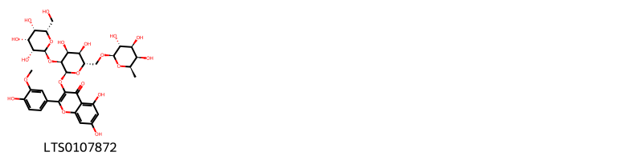

!!! abstract "Tóm tắt"

    Lá hen (Folium Calotropis gigantea) là lá của cây Bồng bồng (Calotropis gigantea (L.) W.T.Aiton), thuộc họ Thiên lý (Asclepiadaceae). Lá hen phân bố chủ yếu ở các khu vực nhiệt đới khô từ Nam Trung Quốc đến Châu Á nhiệt đới. Tại Việt Nam, cây mọc hoang và được trồng nhiều nơi làm hàng rào hoặc làm thuốc. Theo tài liệu cổ, lá hen có vị đắng, tính bình, thường được dùng chữa hen suyễn. Tác dụng dược lý của lá hen bao gồm hỗ trợ hoạt động tim mạch như tăng sức co bóp cơ tim, kéo dài thời gian tâm thu, làm giảm nhịp tim, đồng thời có tác dụng chống ung thư, chống viêm, và chống oxy hóa. Thành phần hóa học chính của lá hen gồm các triterpenoids (amyrin, β-amyrin, taraxasterol acetate) và các glycosid tim (digitoxigenin, calotropin, calactin, uzarigenin).

## Thông tin về thực vật

Dược liệu **Lá Hen (Dùng Lá)** từ bộ phận **** từ loài *Calotropis gigantea*.

**Mô tả thực vật:** Cây nhỏ cao 5-7m có thể cao hơn nếu để tự nhiên. Cành có lông trắng. Lá mọc đối dài 12- 20cm rộng 5-11cm không có lá kèm. Góc phiến lá có tuyến trắng. Hoa mọc thành xim gồm nhiều tán đơn hay kép. Hoa lớn, đều đẹp, đường kính Scm, màu trắng xám hoặc đốm hồng. Đài 5, tràng hợp hình bánh xe. 5 nhị liền nhau thành ống có 5 phần phụ như 5 con rồng. (Mùa hoa gần quanh năm, chủ yếu từ tháng 12-1). Bao phấn hàn liền với đầu nhuỵ. Hạt phấn của mỗi ô họp thành 1 khối phấn có chuôi và gót đính. 2 lá noãn rời nhau, bầu thượng, đầu nhuỵ dính liền với các bao phấn. Quả gồm 2 đại, nhiều hạt dài 23mm, trên hạt có chùm lồng.

*Tài liệu tham khảo:* "Những cây thuốc và vị thuốc Việt Nam" - Đỗ Tất Lợi 
Trong dược điển Việt nam, một loài được sử dụng làm dược liệu là *Calotropis gigantea*.

!!! info "Phân loại thực vật của *Calotropis gigantea*"
    - **Kingdom:** Plantae
    - **Phylum:** Tracheophyta
    - **Order:** Gentianales
    - **Family:** Apocynaceae
    - **Genus:** Calotropis
    - **Species:** *Calotropis gigantea*

**Phân bố trên thế giới:** Tanzania, United Republic of, Turks and Caicos Islands, Kenya, Nepal, Bahamas, Sri Lanka, Seychelles, Egypt, Cambodia, Australia, Indonesia, Nigeria, India, Viet Nam, Thailand, United States of America, Philippines, China, Malaysia, Maldives

**Phân bố tại Việt nam:** Bà Rịa - Vũng Tàu, Bình Thuận, Khánh Hòa, Hồ Chí Minh city

## Thông tin về dược liệu 

### Định danh

!!! info "Thông tin về tên gọi"

    - Dược liệu tiếng Việt: lá hen
    - Dược liệu tiếng Trung:  ()
    - Dược liệu tiếng Anh: 
    - Dược liệu latin thông dụng: Folium Calotropis
    - Dược liệu latin kiểu DĐVN: *folium calotropis*
    - Dược liệu latin kiểu DĐVN: **
    - Dược liệu latin kiểu thông tư: **
    - Bộ phận dùng:  (Folium)

### Mô tả dược liệu 

- **Theo dược điển Việt nam V:** Lá có cuống ngắn khoảng 0,5 cm, lá to hình thuôn dài, dài từ 12 cm đến 20 cm, rộng 5 cm đến 10 cm, hai mặt đều có lông trắng, mặt dưới nhiều hơn. Mặt dưới lá có gân nổi rõ; gân giữa rộng và có một tuyến lớn ở phần gần cuống lá. Xung quanh tuyến có lông màu hung đò, hơi cứng và thô.

- **Mô tả dược liệu theo thông tư chế biến dược liệu theo phương pháp cổ truyền:** 

### Chế biến 

- **Chế biến theo dược điển việt nam V**: Thu hái vào tháng 9 đến tháng 11. Lau sạch phấn trắng ở mặt sau lá. Phơi khô. Khi dùng rửa sạch, để ráo nước, thái chỉ, sao qua hoặc tẩm mật ong, sao vàng.

- **Chế biến theo thông tư:** 

--- 

## Thành phần hóa học

- Theo tài liệu của GS. Đỗ Tất Lợi:  (1) Thành phần hóa học:
Ankaloid
Triterpenoids:Amyrin,Β-amyrin, Taraxasterol acetate, 4,4,6a,6b,8a,12,14b-heptamethyl-11-methylidene-hexadecahydropicen-3-yl acetate
Cardenolides (các glycosid tim):Digitoxigenin, Calotropin,,Calactin, Uzarigenin
(2) Biomarker  - Không tìm được
Định tính
A. Lấy khoảng 20 g bột thô dược liệu, cho vào bình nón 250 ml. Thêm 70 ml dung dịch acid sulfuric 10 % (TT). Đun sôi 10 min. Lọc, chuyển dịch lọc vào bình gạn dung tích 100 ml. Kiềm hóa dịch lọc bằng dung dịch amoniac 25 % (TT) tới pH 10. Chiết alcaloid bằng cách lắc với cloroform (TT) 3 lần, mồi lần 10 ml. Gộp dịch chiết cloroform, rồi lắc với dung dịch acid sulfuric 10 % (TT) 3 lần, mỗi lần 5 ml. Cô dịch chiết acid còn khoảng 3 ml, sau đó cho vào 3 ống nghiệm nhỏ, mỗi ống 1 ml. Tiến hành các phản ứng sau:
Ống 1: Thêm 2 giọt thuốc thử Dragendorff (TT), xuất hiện tủa vàng cam.
Ống 2: Thêm 2 giọt thuốc thử Bouchardat (TT), xuất hiện tủa nâu.
Ống 3: Thêm 2 giọt thuốc thử Mayer (TT), xuất hiện tủa trắng.
B. Phương pháp sắc ký lớp mỏng (Phụ lục 5.4).
Bản mỏng: Silica gel G.
Dung môi khai triển: Cloroform – methanol – amoniac (50:9:1).
Dung dịch thử: Lấy khoảng 5 g bột thô dược liệu, loại tạp bằng ether dầu hỏa trong bình Soxhlet, tãi bã dược liệu để bay hết dung môi. Thấm ẩm dược liệu bằng dung dịch amoniac 10% (TT). Thêm 30 ml cloroform (TT), đun hồi lưu trên cách thủy 15 min, để nguội, lọc. Cô dịch lọc trên cách thủy đến cắn.
Dung dịch đối chiếu: Lấy 5 g bột Lá hen (mẫu chuẩn), tiến hành chiết như mô tả ở phần Dung dịch thử.
Cách tiến hành: Chấm riêng biệt lên bản mỏng 20 µl mỗi dung dịch trên. Sau khi triển khai sắc ký, lấy bản mỏng ra, để khô trong không khí ở nhiệt độ phòng, phun thuốc thử vanilin – acid sulfuric (TT). Sấy bản mỏng ở 105 °C đến khi các vết hiện rõ. Quan sát dưới ánh sáng thường. Trên sắc ký đồ của dung dịch thử phải có các vết cùng vị trí và màu sắc với các vết trên sắc ký đồ của dung dịch đối chiếu.
    

**Thành phần hóa học từ loài **Calotropis gigantea**

Theo cơ sở dữ liệu lotus, loài *Calotropis gigantea* đã phân lập và xác định được **24** hoạt chất thuộc về các nhóm Flavonoids, Steroids and steroid derivatives, Prenol lipids, Carboxylic acids and derivatives trong bảng dưới đây. Danh sách các hoạt chất như sau 1-acetyl-3a,3b-dihydroxy-7-({5-[(5-{[5-({5-[(5-hydroxy-4-methoxy-6-methyloxan-2-yl)oxy]-4-methoxy-6-methyloxan-2-yl}oxy)-4-methoxy-6-methyloxan-2-yl]oxy}-4-methoxy-6-methyloxan-2-yl)oxy]-4-methoxy-6-methyloxan-2-yl}oxy)-9a,11a-dimethyl-1h,2h,3h,4h,6h,7h,8h,9h,9bh,10h,11h-cyclopenta[a]phenanthren-11-yl benzoate [(LTS0118166)](https://lotus.naturalproducts.net/compound/lotus_id/LTS0118166), (1r,3ar,3bs,7s,9ar,9br,11r,11as)-1-acetyl-1,3a,3b-trihydroxy-7-{[(2r,4s,5r,6r)-5-{[(2s,4s,5r,6r)-5-{[(2s,4s,5r,6r)-5-{[(2s,4s,5r,6r)-5-{[(2s,4s,5r,6r)-5-hydroxy-4-methoxy-6-methyloxan-2-yl]oxy}-4-methoxy-6-methyloxan-2-yl]oxy}-4-methoxy-6-methyloxan-2-yl]oxy}-4-methoxy-6-methyloxan-2-yl]oxy}-4-methoxy-6-methyloxan-2-yl]oxy}-9a,11a-dimethyl-2h,3h,4h,6h,7h,8h,9h,9bh,10h,11h-cyclopenta[a]phenanthren-11-yl benzoate [(LTS0053132)](https://lotus.naturalproducts.net/compound/lotus_id/LTS0053132), calotropin [(LTS0057277)](https://lotus.naturalproducts.net/compound/lotus_id/LTS0057277), (1s,3r,5s,7r,9s,10s,12r,14r,15s,18r,19r,21r,22s,23r)-9,10,21,22-tetrahydroxy-7,18-dimethyl-19-(5-oxo-2h-furan-3-yl)-4,6,11-trioxahexacyclo[12.11.0.0³,¹².0⁵,¹⁰.0¹⁵,²³.0¹⁸,²²]pentacosane-14-carbaldehyde [(LTS0155116)](https://lotus.naturalproducts.net/compound/lotus_id/LTS0155116), methyl (2s,3r,5r)-2-{[(1r,3as,3br,5as,7r,8r,9ar,9bs,11ar)-9a-formyl-3a,8-dihydroxy-11a-methyl-1-(5-oxo-2h-furan-3-yl)-tetradecahydrocyclopenta[a]phenanthren-7-yl]oxy}-3-hydroxy-5-methyloxolane-3-carboxylate [(LTS0236753)](https://lotus.naturalproducts.net/compound/lotus_id/LTS0236753), taraxasterol acetate [(LTS0190545)](https://lotus.naturalproducts.net/compound/lotus_id/LTS0190545), (3ar,3bs,7s,9ar,9br,11r,11as)-1-acetyl-3a,3b-dihydroxy-7-{[(2r,4s,5r,6r)-5-{[(2s,4s,5r,6r)-5-{[(2s,4s,5r,6r)-5-hydroxy-4-methoxy-6-methyloxan-2-yl]oxy}-4-methoxy-6-methyloxan-2-yl]oxy}-4-methoxy-6-methyloxan-2-yl]oxy}-9a,11a-dimethyl-1h,2h,3h,4h,6h,7h,8h,9h,9bh,10h,11h-cyclopenta[a]phenanthren-11-yl benzoate [(LTS0155820)](https://lotus.naturalproducts.net/compound/lotus_id/LTS0155820), (1r,3ar,3bs,7s,9ar,9br,11r,11as)-1-acetyl-3a,3b-dihydroxy-7-{[(2r,4s,5r,6r)-5-{[(2s,4s,5r,6r)-5-{[(2s,4s,5r,6r)-5-{[(2s,4s,5r,6r)-5-{[(2s,4s,5r,6r)-5-hydroxy-4-methoxy-6-methyloxan-2-yl]oxy}-4-methoxy-6-methyloxan-2-yl]oxy}-4-methoxy-6-methyloxan-2-yl]oxy}-4-methoxy-6-methyloxan-2-yl]oxy}-4-methoxy-6-methyloxan-2-yl]oxy}-9a,11a-dimethyl-1h,2h,3h,4h,6h,7h,8h,9h,9bh,10h,11h-cyclopenta[a]phenanthren-11-yl benzoate [(LTS0256859)](https://lotus.naturalproducts.net/compound/lotus_id/LTS0256859), (s)-{4-[(ethoxycarbonyl)amino]phenyl}[(1-hydroxyethylidene)amino]acetic acid [(LTS0219511)](https://lotus.naturalproducts.net/compound/lotus_id/LTS0219511), {4-[(ethoxycarbonyl)amino]phenyl}[(1-hydroxyethylidene)amino]acetic acid [(LTS0024539)](https://lotus.naturalproducts.net/compound/lotus_id/LTS0024539), β-amyrin [(LTS0251864)](https://lotus.naturalproducts.net/compound/lotus_id/LTS0251864), (4ar,6ar,6br,8ar,12as,12bs,14as,14br)-4,4,6a,6b,8a,12,14b-heptamethyl-11-methylidene-hexadecahydropicen-3-yl acetate [(LTS0117429)](https://lotus.naturalproducts.net/compound/lotus_id/LTS0117429), (3ar,3bs,7s,9ar,9br,11r,11as)-1-acetyl-3a,3b-dihydroxy-7-{[(2r,4s,5r,6r)-5-{[(2s,4s,5r,6r)-5-{[(2s,4s,5r,6r)-5-{[(2s,4s,5r,6r)-5-hydroxy-4-methoxy-6-methyloxan-2-yl]oxy}-4-methoxy-6-methyloxan-2-yl]oxy}-4-methoxy-6-methyloxan-2-yl]oxy}-4-methoxy-6-methyloxan-2-yl]oxy}-9a,11a-dimethyl-1h,2h,3h,4h,6h,7h,8h,9h,9bh,10h,11h-cyclopenta[a]phenanthren-11-yl benzoate [(LTS0130109)](https://lotus.naturalproducts.net/compound/lotus_id/LTS0130109), calotropin [(LTS0245598)](https://lotus.naturalproducts.net/compound/lotus_id/LTS0245598), amyrin [(LTS0222826)](https://lotus.naturalproducts.net/compound/lotus_id/LTS0222826), (1s,3ar,3bs,7s,9ar,9br,11r,11as)-1-acetyl-1,3a,3b-trihydroxy-7-{[(2r,4s,5r,6r)-5-{[(2s,4s,5r,6r)-5-{[(2s,4s,5r,6r)-5-{[(2s,4s,5r,6r)-5-hydroxy-4-methoxy-6-methyloxan-2-yl]oxy}-4-methoxy-6-methyloxan-2-yl]oxy}-4-methoxy-6-methyloxan-2-yl]oxy}-4-methoxy-6-methyloxan-2-yl]oxy}-9a,11a-dimethyl-2h,3h,4h,6h,7h,8h,9h,9bh,10h,11h-cyclopenta[a]phenanthren-11-yl benzoate [(LTS0203360)](https://lotus.naturalproducts.net/compound/lotus_id/LTS0203360), calactin [(LTS0147801)](https://lotus.naturalproducts.net/compound/lotus_id/LTS0147801), uzarigenin [(LTS0145581)](https://lotus.naturalproducts.net/compound/lotus_id/LTS0145581), 4,4,6a,6b,8a,12,14b-heptamethyl-11-methylidene-hexadecahydropicen-3-yl acetate [(LTS0026037)](https://lotus.naturalproducts.net/compound/lotus_id/LTS0026037), 4-[(1r,3as,3br,5ar,7s,9ar,9bs,11ar)-3a-hydroxy-9a-(hydroxymethyl)-11a-methyl-7-{[(3r,4r,5s,6r)-3,4,5-trihydroxy-6-methyloxan-2-yl]oxy}-tetradecahydrocyclopenta[a]phenanthren-1-yl]-5h-furan-2-one [(LTS0078621)](https://lotus.naturalproducts.net/compound/lotus_id/LTS0078621), 1-acetyl-1,3a,3b-trihydroxy-7-({5-[(5-{[5-({5-[(5-hydroxy-4-methoxy-6-methyloxan-2-yl)oxy]-4-methoxy-6-methyloxan-2-yl}oxy)-4-methoxy-6-methyloxan-2-yl]oxy}-4-methoxy-6-methyloxan-2-yl)oxy]-4-methoxy-6-methyloxan-2-yl}oxy)-9a,11a-dimethyl-2h,3h,4h,6h,7h,8h,9h,9bh,10h,11h-cyclopenta[a]phenanthren-11-yl benzoate [(LTS0258529)](https://lotus.naturalproducts.net/compound/lotus_id/LTS0258529), 3-{[(2s,3s,4s,5r,6s)-4,5-dihydroxy-3-{[(2s,3r,4r,5s,6s)-3,4,5-trihydroxy-6-(hydroxymethyl)oxan-2-yl]oxy}-6-({[(2r,3r,4s,5r,6r)-3,4,5-trihydroxy-6-methyloxan-2-yl]oxy}methyl)oxan-2-yl]oxy}-5,7-dihydroxy-2-(4-hydroxy-3-methoxyphenyl)chromen-4-one [(LTS0107872)](https://lotus.naturalproducts.net/compound/lotus_id/LTS0107872), (1s,3ar,3bs,7s,9ar,9br,11r,11as)-1-acetyl-1,3a,3b-trihydroxy-7-{[(2r,4s,5r,6r)-5-{[(2s,4s,5r,6r)-5-{[(2s,4s,5r,6r)-5-{[(2s,4s,5r,6r)-5-{[(2s,4s,5r,6r)-5-hydroxy-4-methoxy-6-methyloxan-2-yl]oxy}-4-methoxy-6-methyloxan-2-yl]oxy}-4-methoxy-6-methyloxan-2-yl]oxy}-4-methoxy-6-methyloxan-2-yl]oxy}-4-methoxy-6-methyloxan-2-yl]oxy}-9a,11a-dimethyl-2h,3h,4h,6h,7h,8h,9h,9bh,10h,11h-cyclopenta[a]phenanthren-11-yl benzoate [(LTS0207108)](https://lotus.naturalproducts.net/compound/lotus_id/LTS0207108), digitoxigenin [(LTS0102008)](https://lotus.naturalproducts.net/compound/lotus_id/LTS0102008). 
        
| chemicalTaxonomyClassyfireClass   |   smiles_count |
|:----------------------------------|---------------:|
| Carboxylic acids and derivatives  |             74 |
| Flavonoids                        |            163 |
| Prenol lipids                     |            445 |
| Steroids and steroid derivatives  |           2544 |

            
### Nhóm Carboxylic acids and derivatives
<figure markdown="span">
    { width=100% }
<figcaption>Hình ảnh cấu trúc hóa học của hoạt chất thuộc nhóm *Carboxylic acids and derivatives*. Tên thường gọi của các hoạt chất tương ứng là {4-[(ethoxycarbonyl)amino]phenyl}[(1-hydroxyethylidene)amino]acetic acid [(LTS0024539)](https://lotus.naturalproducts.net/compound/lotus_id/LTS0024539), (s)-{4-[(ethoxycarbonyl)amino]phenyl}[(1-hydroxyethylidene)amino]acetic acid [(LTS0219511)](https://lotus.naturalproducts.net/compound/lotus_id/LTS0219511).</figcaption>
</figure>

            
            
### Nhóm Carboxylic acids and derivatives
<figure markdown="span">
    { width=100% }
<figcaption>Hình ảnh cấu trúc hóa học của hoạt chất thuộc nhóm *Carboxylic acids and derivatives*. Tên thường gọi của các hoạt chất tương ứng là {4-[(ethoxycarbonyl)amino]phenyl}[(1-hydroxyethylidene)amino]acetic acid [(LTS0024539)](https://lotus.naturalproducts.net/compound/lotus_id/LTS0024539), (s)-{4-[(ethoxycarbonyl)amino]phenyl}[(1-hydroxyethylidene)amino]acetic acid [(LTS0219511)](https://lotus.naturalproducts.net/compound/lotus_id/LTS0219511).</figcaption>
</figure>

### Nhóm Flavonoids
<figure markdown="span">
    { width=100% }
<figcaption>Hình ảnh cấu trúc hóa học của hoạt chất thuộc nhóm *Flavonoids*. Tên thường gọi của các hoạt chất tương ứng là 3-{[(2s,3s,4s,5r,6s)-4,5-dihydroxy-3-{[(2s,3r,4r,5s,6s)-3,4,5-trihydroxy-6-(hydroxymethyl)oxan-2-yl]oxy}-6-({[(2r,3r,4s,5r,6r)-3,4,5-trihydroxy-6-methyloxan-2-yl]oxy}methyl)oxan-2-yl]oxy}-5,7-dihydroxy-2-(4-hydroxy-3-methoxyphenyl)chromen-4-one [(LTS0107872)](https://lotus.naturalproducts.net/compound/lotus_id/LTS0107872).</figcaption>
</figure>

            
            
### Nhóm Carboxylic acids and derivatives
<figure markdown="span">
    { width=100% }
<figcaption>Hình ảnh cấu trúc hóa học của hoạt chất thuộc nhóm *Carboxylic acids and derivatives*. Tên thường gọi của các hoạt chất tương ứng là {4-[(ethoxycarbonyl)amino]phenyl}[(1-hydroxyethylidene)amino]acetic acid [(LTS0024539)](https://lotus.naturalproducts.net/compound/lotus_id/LTS0024539), (s)-{4-[(ethoxycarbonyl)amino]phenyl}[(1-hydroxyethylidene)amino]acetic acid [(LTS0219511)](https://lotus.naturalproducts.net/compound/lotus_id/LTS0219511).</figcaption>
</figure>

### Nhóm Flavonoids
<figure markdown="span">
    { width=100% }
<figcaption>Hình ảnh cấu trúc hóa học của hoạt chất thuộc nhóm *Flavonoids*. Tên thường gọi của các hoạt chất tương ứng là 3-{[(2s,3s,4s,5r,6s)-4,5-dihydroxy-3-{[(2s,3r,4r,5s,6s)-3,4,5-trihydroxy-6-(hydroxymethyl)oxan-2-yl]oxy}-6-({[(2r,3r,4s,5r,6r)-3,4,5-trihydroxy-6-methyloxan-2-yl]oxy}methyl)oxan-2-yl]oxy}-5,7-dihydroxy-2-(4-hydroxy-3-methoxyphenyl)chromen-4-one [(LTS0107872)](https://lotus.naturalproducts.net/compound/lotus_id/LTS0107872).</figcaption>
</figure>

### Nhóm Prenol lipids
<figure markdown="span">
    { width=100% }
<figcaption>Hình ảnh cấu trúc hóa học của hoạt chất thuộc nhóm *Prenol lipids*. Tên thường gọi của các hoạt chất tương ứng là amyrin [(LTS0222826)](https://lotus.naturalproducts.net/compound/lotus_id/LTS0222826), taraxasterol acetate [(LTS0190545)](https://lotus.naturalproducts.net/compound/lotus_id/LTS0190545), β-amyrin [(LTS0251864)](https://lotus.naturalproducts.net/compound/lotus_id/LTS0251864), 4,4,6a,6b,8a,12,14b-heptamethyl-11-methylidene-hexadecahydropicen-3-yl acetate [(LTS0026037)](https://lotus.naturalproducts.net/compound/lotus_id/LTS0026037), (4ar,6ar,6br,8ar,12as,12bs,14as,14br)-4,4,6a,6b,8a,12,14b-heptamethyl-11-methylidene-hexadecahydropicen-3-yl acetate [(LTS0117429)](https://lotus.naturalproducts.net/compound/lotus_id/LTS0117429).</figcaption>
</figure>

            
            
### Nhóm Carboxylic acids and derivatives
<figure markdown="span">
    { width=100% }
<figcaption>Hình ảnh cấu trúc hóa học của hoạt chất thuộc nhóm *Carboxylic acids and derivatives*. Tên thường gọi của các hoạt chất tương ứng là {4-[(ethoxycarbonyl)amino]phenyl}[(1-hydroxyethylidene)amino]acetic acid [(LTS0024539)](https://lotus.naturalproducts.net/compound/lotus_id/LTS0024539), (s)-{4-[(ethoxycarbonyl)amino]phenyl}[(1-hydroxyethylidene)amino]acetic acid [(LTS0219511)](https://lotus.naturalproducts.net/compound/lotus_id/LTS0219511).</figcaption>
</figure>

### Nhóm Flavonoids
<figure markdown="span">
    { width=100% }
<figcaption>Hình ảnh cấu trúc hóa học của hoạt chất thuộc nhóm *Flavonoids*. Tên thường gọi của các hoạt chất tương ứng là 3-{[(2s,3s,4s,5r,6s)-4,5-dihydroxy-3-{[(2s,3r,4r,5s,6s)-3,4,5-trihydroxy-6-(hydroxymethyl)oxan-2-yl]oxy}-6-({[(2r,3r,4s,5r,6r)-3,4,5-trihydroxy-6-methyloxan-2-yl]oxy}methyl)oxan-2-yl]oxy}-5,7-dihydroxy-2-(4-hydroxy-3-methoxyphenyl)chromen-4-one [(LTS0107872)](https://lotus.naturalproducts.net/compound/lotus_id/LTS0107872).</figcaption>
</figure>

### Nhóm Prenol lipids
<figure markdown="span">
    { width=100% }
<figcaption>Hình ảnh cấu trúc hóa học của hoạt chất thuộc nhóm *Prenol lipids*. Tên thường gọi của các hoạt chất tương ứng là amyrin [(LTS0222826)](https://lotus.naturalproducts.net/compound/lotus_id/LTS0222826), taraxasterol acetate [(LTS0190545)](https://lotus.naturalproducts.net/compound/lotus_id/LTS0190545), β-amyrin [(LTS0251864)](https://lotus.naturalproducts.net/compound/lotus_id/LTS0251864), 4,4,6a,6b,8a,12,14b-heptamethyl-11-methylidene-hexadecahydropicen-3-yl acetate [(LTS0026037)](https://lotus.naturalproducts.net/compound/lotus_id/LTS0026037), (4ar,6ar,6br,8ar,12as,12bs,14as,14br)-4,4,6a,6b,8a,12,14b-heptamethyl-11-methylidene-hexadecahydropicen-3-yl acetate [(LTS0117429)](https://lotus.naturalproducts.net/compound/lotus_id/LTS0117429).</figcaption>
</figure>

### Nhóm Steroids and steroid derivatives
<figure markdown="span">
    { width=100% }
<figcaption>Hình ảnh cấu trúc hóa học của hoạt chất thuộc nhóm *Steroids and steroid derivatives*. Tên thường gọi của các hoạt chất tương ứng là 4-[(1r,3as,3br,5ar,7s,9ar,9bs,11ar)-3a-hydroxy-9a-(hydroxymethyl)-11a-methyl-7-{[(3r,4r,5s,6r)-3,4,5-trihydroxy-6-methyloxan-2-yl]oxy}-tetradecahydrocyclopenta[a]phenanthren-1-yl]-5h-furan-2-one [(LTS0078621)](https://lotus.naturalproducts.net/compound/lotus_id/LTS0078621), digitoxigenin [(LTS0102008)](https://lotus.naturalproducts.net/compound/lotus_id/LTS0102008), uzarigenin [(LTS0145581)](https://lotus.naturalproducts.net/compound/lotus_id/LTS0145581), calactin [(LTS0147801)](https://lotus.naturalproducts.net/compound/lotus_id/LTS0147801), calotropin [(LTS0245598)](https://lotus.naturalproducts.net/compound/lotus_id/LTS0245598), calotropin [(LTS0057277)](https://lotus.naturalproducts.net/compound/lotus_id/LTS0057277), 1-acetyl-3a,3b-dihydroxy-7-({5-[(5-{[5-({5-[(5-hydroxy-4-methoxy-6-methyloxan-2-yl)oxy]-4-methoxy-6-methyloxan-2-yl}oxy)-4-methoxy-6-methyloxan-2-yl]oxy}-4-methoxy-6-methyloxan-2-yl)oxy]-4-methoxy-6-methyloxan-2-yl}oxy)-9a,11a-dimethyl-1h,2h,3h,4h,6h,7h,8h,9h,9bh,10h,11h-cyclopenta[a]phenanthren-11-yl benzoate [(LTS0118166)](https://lotus.naturalproducts.net/compound/lotus_id/LTS0118166), (1s,3ar,3bs,7s,9ar,9br,11r,11as)-1-acetyl-1,3a,3b-trihydroxy-7-{[(2r,4s,5r,6r)-5-{[(2s,4s,5r,6r)-5-{[(2s,4s,5r,6r)-5-{[(2s,4s,5r,6r)-5-hydroxy-4-methoxy-6-methyloxan-2-yl]oxy}-4-methoxy-6-methyloxan-2-yl]oxy}-4-methoxy-6-methyloxan-2-yl]oxy}-4-methoxy-6-methyloxan-2-yl]oxy}-9a,11a-dimethyl-2h,3h,4h,6h,7h,8h,9h,9bh,10h,11h-cyclopenta[a]phenanthren-11-yl benzoate [(LTS0203360)](https://lotus.naturalproducts.net/compound/lotus_id/LTS0203360), (1s,3r,5s,7r,9s,10s,12r,14r,15s,18r,19r,21r,22s,23r)-9,10,21,22-tetrahydroxy-7,18-dimethyl-19-(5-oxo-2h-furan-3-yl)-4,6,11-trioxahexacyclo[12.11.0.0³,¹².0⁵,¹⁰.0¹⁵,²³.0¹⁸,²²]pentacosane-14-carbaldehyde [(LTS0155116)](https://lotus.naturalproducts.net/compound/lotus_id/LTS0155116), (1s,3ar,3bs,7s,9ar,9br,11r,11as)-1-acetyl-1,3a,3b-trihydroxy-7-{[(2r,4s,5r,6r)-5-{[(2s,4s,5r,6r)-5-{[(2s,4s,5r,6r)-5-{[(2s,4s,5r,6r)-5-{[(2s,4s,5r,6r)-5-hydroxy-4-methoxy-6-methyloxan-2-yl]oxy}-4-methoxy-6-methyloxan-2-yl]oxy}-4-methoxy-6-methyloxan-2-yl]oxy}-4-methoxy-6-methyloxan-2-yl]oxy}-4-methoxy-6-methyloxan-2-yl]oxy}-9a,11a-dimethyl-2h,3h,4h,6h,7h,8h,9h,9bh,10h,11h-cyclopenta[a]phenanthren-11-yl benzoate [(LTS0207108)](https://lotus.naturalproducts.net/compound/lotus_id/LTS0207108), (3ar,3bs,7s,9ar,9br,11r,11as)-1-acetyl-3a,3b-dihydroxy-7-{[(2r,4s,5r,6r)-5-{[(2s,4s,5r,6r)-5-{[(2s,4s,5r,6r)-5-hydroxy-4-methoxy-6-methyloxan-2-yl]oxy}-4-methoxy-6-methyloxan-2-yl]oxy}-4-methoxy-6-methyloxan-2-yl]oxy}-9a,11a-dimethyl-1h,2h,3h,4h,6h,7h,8h,9h,9bh,10h,11h-cyclopenta[a]phenanthren-11-yl benzoate [(LTS0155820)](https://lotus.naturalproducts.net/compound/lotus_id/LTS0155820), methyl (2s,3r,5r)-2-{[(1r,3as,3br,5as,7r,8r,9ar,9bs,11ar)-9a-formyl-3a,8-dihydroxy-11a-methyl-1-(5-oxo-2h-furan-3-yl)-tetradecahydrocyclopenta[a]phenanthren-7-yl]oxy}-3-hydroxy-5-methyloxolane-3-carboxylate [(LTS0236753)](https://lotus.naturalproducts.net/compound/lotus_id/LTS0236753), (1r,3ar,3bs,7s,9ar,9br,11r,11as)-1-acetyl-1,3a,3b-trihydroxy-7-{[(2r,4s,5r,6r)-5-{[(2s,4s,5r,6r)-5-{[(2s,4s,5r,6r)-5-{[(2s,4s,5r,6r)-5-{[(2s,4s,5r,6r)-5-hydroxy-4-methoxy-6-methyloxan-2-yl]oxy}-4-methoxy-6-methyloxan-2-yl]oxy}-4-methoxy-6-methyloxan-2-yl]oxy}-4-methoxy-6-methyloxan-2-yl]oxy}-4-methoxy-6-methyloxan-2-yl]oxy}-9a,11a-dimethyl-2h,3h,4h,6h,7h,8h,9h,9bh,10h,11h-cyclopenta[a]phenanthren-11-yl benzoate [(LTS0053132)](https://lotus.naturalproducts.net/compound/lotus_id/LTS0053132), (1r,3ar,3bs,7s,9ar,9br,11r,11as)-1-acetyl-3a,3b-dihydroxy-7-{[(2r,4s,5r,6r)-5-{[(2s,4s,5r,6r)-5-{[(2s,4s,5r,6r)-5-{[(2s,4s,5r,6r)-5-{[(2s,4s,5r,6r)-5-hydroxy-4-methoxy-6-methyloxan-2-yl]oxy}-4-methoxy-6-methyloxan-2-yl]oxy}-4-methoxy-6-methyloxan-2-yl]oxy}-4-methoxy-6-methyloxan-2-yl]oxy}-4-methoxy-6-methyloxan-2-yl]oxy}-9a,11a-dimethyl-1h,2h,3h,4h,6h,7h,8h,9h,9bh,10h,11h-cyclopenta[a]phenanthren-11-yl benzoate [(LTS0256859)](https://lotus.naturalproducts.net/compound/lotus_id/LTS0256859), (3ar,3bs,7s,9ar,9br,11r,11as)-1-acetyl-3a,3b-dihydroxy-7-{[(2r,4s,5r,6r)-5-{[(2s,4s,5r,6r)-5-{[(2s,4s,5r,6r)-5-{[(2s,4s,5r,6r)-5-hydroxy-4-methoxy-6-methyloxan-2-yl]oxy}-4-methoxy-6-methyloxan-2-yl]oxy}-4-methoxy-6-methyloxan-2-yl]oxy}-4-methoxy-6-methyloxan-2-yl]oxy}-9a,11a-dimethyl-1h,2h,3h,4h,6h,7h,8h,9h,9bh,10h,11h-cyclopenta[a]phenanthren-11-yl benzoate [(LTS0130109)](https://lotus.naturalproducts.net/compound/lotus_id/LTS0130109), 1-acetyl-1,3a,3b-trihydroxy-7-({5-[(5-{[5-({5-[(5-hydroxy-4-methoxy-6-methyloxan-2-yl)oxy]-4-methoxy-6-methyloxan-2-yl}oxy)-4-methoxy-6-methyloxan-2-yl]oxy}-4-methoxy-6-methyloxan-2-yl)oxy]-4-methoxy-6-methyloxan-2-yl}oxy)-9a,11a-dimethyl-2h,3h,4h,6h,7h,8h,9h,9bh,10h,11h-cyclopenta[a]phenanthren-11-yl benzoate [(LTS0258529)](https://lotus.naturalproducts.net/compound/lotus_id/LTS0258529).</figcaption>
</figure>

            

---

## Tác dụng dược lý

Theo tài liệu "Những cây thuốc và vị thuốc Việt Nam" - Đỗ Tất Lợi:Tác dụng như một glucosid trợ tim, tăng sức co bóp cơ tim, tăng trương lực cơ tim, làm kéo dài thời gian tâm thu và làm giảm nhịp tim 
Lá cây có tác dụng chống ung thư dạng biểu bì mũi hầu của người trong nuôi cấy mô.
Chống viêm và chống oxy hóa

Theo tài liệu quốc tế: 

---

## Dược điển Việt Nam V

### Soi bột:

Có màu lục nhạt, vị đắng hơi chát. Soi kính hiển vi thấy: Mảnh biểu bì có nhiều lỗ khí và lông che chở đa bào. Nhiều lông che chở đa bào thành mỏng, trong suốt. Nhiều mảnh mạch xoắn, các mảnh mạch vạch. Các tinh thể calci oxalat hình cầu gai nằm rải rác.nn

<!-- Hình ảnh soi bột sẽ được tự động chèn vào đây sau -->

### Vi phẫu:

Phần gân lá: Phía trên phẳng, phía dưới lồi. Biểu bì trên và dưới là một lớp tế bào nhỏ xếp đều đặn, có lông che chở đa bào (biểu bì dưới có nhiều lông hơn). Mô dày nằm dưới biểu bì gồm 2 đến 3 lớp tế bào hình tròn, thành dày. Tiếp đến là mô mềm, gồm những tế bào lớn hơn, hình trứng hay hình đa giác, có thành mỏng, kích thước không đều nhau, có ống nhựa mủ nằm rải rác trong mô mềm, hoặc trong mạch gỗ. Bó libe-gỗ gân chính gồm có cung gỗ gồm những mạch gỗ, xếp thành dãy, bao bọc bởi vòng libe. Rải rác có tinh thể calci oxalat hình cầu gai đường kính 0,03 mm đến 0,04 mm, trong tế bào mô mềm. Phần phiến lá: Biểu bì trên và biểu bì dưới gồm một hàng tế bào nhỏ, xếp thành hàng đều đặn, rải rác có lỗ khí. Trên biểu bì, mang lông che chở đa bào. Phía dưới biểu bì trên là mô dậu, gồm 3 đến 4 hàng tế bào hình chữ nhật, xếp vuông góc với mặt lá. Mô mềm, gồm những tế bào thành mỏng, xếp sít nhau, để hở những khoảng gian bào. Rải rác trong phiến lá có mạch xoắn, bó libe-gỗ, libe ở ngoài, gỗ ở trong.

<!-- Hình ảnh vi phẫu sẽ được tự động chèn vào đây sau -->

### Định tính

A. Lấy khoảng 20 g bột thô dược liệu, cho vào bình nón 250 ml. Thêm 70 ml dung dịch acid sulfuric 10 % (TT). Đun sôi 10 min. Lọc, chuyển dịch lọc vào bình gạn dung tích 100 ml. Kiềm hóa dịch lọc bằng dung dịch amoniac 25 % (TT) tới pH 10. Chiết alcaloid bằng cách lắc với cloroform (TT) 3 lần, mồi lần 10 ml. Gộp dịch chiết cloroform, rồi lắc với dung dịch acid sulfuric 10 % (TT) 3 lần, mỗi lần 5 ml. Cô dịch chiết acid còn khoảng 3 ml, sau đó cho vào 3 ống nghiệm nhỏ, mỗi ống 1 ml. Tiến hành các phản ứng sau: Ống 1: Thêm 2 giọt thuốc thử Dragendorff (TT), xuất hiện tủa vàng cam. Ống 2: Thêm 2 giọt thuốc thử Bouchardat (TT), xuất hiện tủa nâu. Ống 3: Thêm 2 giọt thuốc thử Mayer (TT), xuất hiện tủa trắng. B. Phương pháp sắc ký lớp mỏng (Phụ lục 5.4). Bản mỏng: Silica gel G. Dung môi khai triển: Cloroform – methanol – amoniac (50:9:1). Dung dịch thử: Lấy khoảng 5 g bột thô dược liệu, loại tạp bằng ether dầu hỏa trong bình Soxhlet, tãi bã dược liệu để bay hết dung môi. Thấm ẩm dược liệu bằng dung dịch amoniac 10% (TT). Thêm 30 ml cloroform (TT), đun hồi lưu trên cách thủy 15 min, để nguội, lọc. Cô dịch lọc trên cách thủy đến cắn. Dung dịch đối chiếu: Lấy 5 g bột Lá hen (mẫu chuẩn), tiến hành chiết như mô tả ở phần Dung dịch thử. Cách tiến hành: Chấm riêng biệt lên bản mỏng 20 µl mỗi dung dịch trên. Sau khi triển khai sắc ký, lấy bản mỏng ra, để khô trong không khí ở nhiệt độ phòng, phun thuốc thử vanilin – acid sulfuric (TT). Sấy bản mỏng ở 105 °C đến khi các vết hiện rõ. Quan sát dưới ánh sáng thường. Trên sắc ký đồ của dung dịch thử phải có các vết cùng vị trí và màu sắc với các vết trên sắc ký đồ của dung dịch đối chiếu.

### Định lượng

### Thông tin khác 

- ** Độ ẩm: ** Không quá 12,0 % (Phụ lục 9.8).
- ** Bảo quản:** Trong bao bì kín, để ở nơi khô mát.nn

## Dược điển Hồng kong

<!-- PDF sẽ được tự động chèn vào đây sau -->

---

## Y dược học cổ truyền

- **Tên vị thuốc:** 
- **Tính vị quy kinh:** Vị đắng, hơi chát, tính mát. Vào kinh phế.
- **Công năng chủ trị:** Trừ đờm, giảm ho, giáng khí nghịch, tiêu độc.
Chủ trị: Hen suyễn kèm theo ho, nhiều đờm; dùng ngoài, trị bệnh ngoài da: Ngứa lở, mụn nhọt, đau răng, rắn cắn.
- **Chú ý:** 
- **Kiêng kỵ:** Phụ nữ có thai và trẻ em dưới 1 tuổi.

## Bình luận

