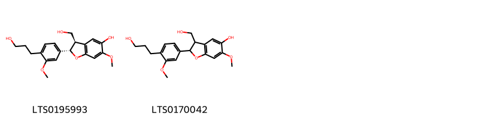
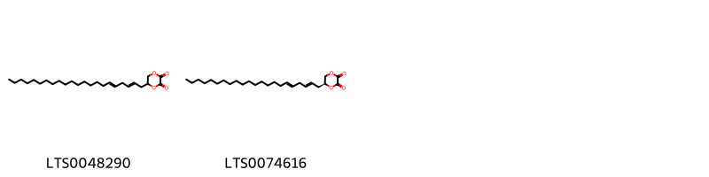
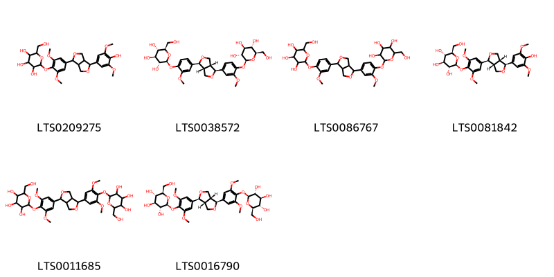
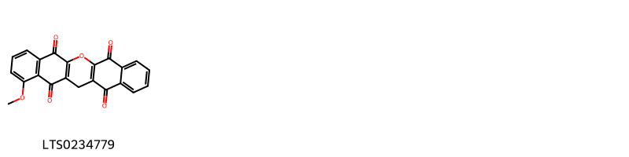
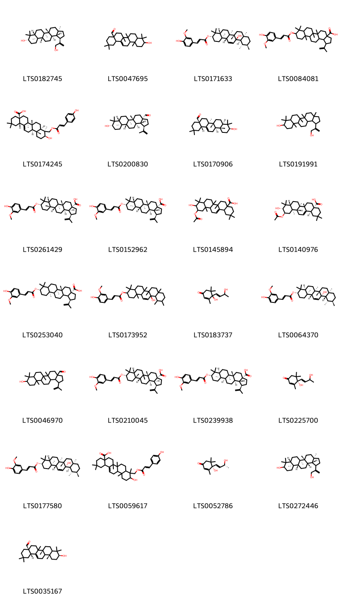
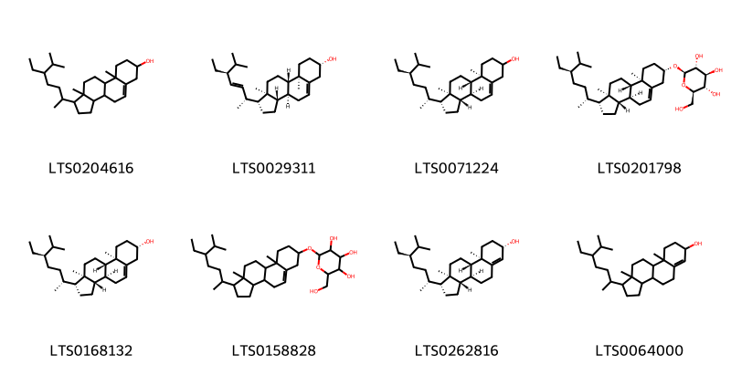

!!! abstract "Tóm tắt"

    Lá Móng (Folium Lawsoniae) là lá tươi hoặc đã phơi hay sấy khô của cây Lá móng (Lawsonia inermis L.), thuộc họ Tử vi (Lythraceae).  Loài cây này mọc hoang và được trồng phổ biến tại các vùng nhiệt đới và á nhiệt đới, bao gồm Việt Nam, Ai Cập, và các nước Đông Nam Á. Lá móng được dùng để chữa các bệnh hắc lào, lở loét, bệnh da vàng, bệnh hủi, và nhanh mọc tóc và móng tay. Lá tươi giã nát trộn với giấm thanh có tác dụng chữa các bệnh ngoài da. Thành phần hóa học chính của lá móng bao gồm: Lawsone (1,2-naphthoquinone - một chất quinon có tác dụng kháng sinh mạnh), tanin, chất béo, tinh dầu, chất nhựa.

## Thông tin về thực vật

Dược liệu **Lá Móng** từ bộ phận **** từ loài *Lawsonia inermis*.

**Mô tả thực vật:** Cây lá móng tay là một cây nhỏ, cao chừng 3-4mét, thân nhẵn hoặc có gai ở đầu cành. Lá mọc đối, cuống ngắn, phiến là đơn, nhỏ, hình trứng, hai đầu bẹp, nhất là phía cuống, dài 2-3 cm, rộng 1-1,5 cm. Hoa trắng đỏ, mùi thơm, nhỏ, mọc thành chuỳ ở đầu cành. Quả nang hình cầu to bằng quả hạt tiêu, không nứt, phía cuống có đài bao bọc, có 4 cạnh dọc, 4 ngăn, trong chứa nhiều hạt nhỏ, có cạnh góc, vỏ hạt dai, rất dày phía dưới xốp

*Tài liệu tham khảo:* "Những cây thuốc và vị thuốc Việt Nam" - Đỗ Tất Lợi 
Trong dược điển Việt nam, một loài được sử dụng làm dược liệu là *Lawsonia inermis*.

!!! info "Phân loại thực vật của *Lawsonia inermis*"
    - **Kingdom:** Plantae
    - **Phylum:** Tracheophyta
    - **Order:** Myrtales
    - **Family:** Lythraceae
    - **Genus:** Lawsonia
    - **Species:** *Lawsonia inermis*

**Phân bố trên thế giới:** India, French Guiana, Malaysia, Tunisia, United Arab Emirates, Egypt, Mexico, Benin, Maldives, Singapore

**Phân bố tại Việt nam:** Không có ghi nhận ở Việt Nam

## Thông tin về dược liệu 

### Định danh

!!! info "Thông tin về tên gọi"

    - Dược liệu tiếng Việt: lá móng
    - Dược liệu tiếng Trung:  ()
    - Dược liệu tiếng Anh: 
    - Dược liệu latin thông dụng: Folium Lawsoniae
    - Dược liệu latin kiểu DĐVN: *folium lawsoniae*
    - Dược liệu latin kiểu DĐVN: **
    - Dược liệu latin kiểu thông tư: **
    - Bộ phận dùng:  (Folium)

### Mô tả dược liệu 

- **Theo dược điển Việt nam V:** Lá hình trứng, gốc lá thuôn, đầu nhọn, dài 2 cm đến 3 cm, rộng 1 cm đến 1,5 cm, cuống ngắn, mép lá nguyên hơi lượn sóng, mặt trên màu lục, mặt dưới màu nâu nhạt.

- **Mô tả dược liệu theo thông tư chế biến dược liệu theo phương pháp cổ truyền:** 

### Chế biến 

- **Chế biến theo dược điển việt nam V**: Thu hái lá, phơi khô hoặc sấy khô. Khi dùng tiến hành vi sao. nn

- **Chế biến theo thông tư:** 

--- 

## Thành phần hóa học

- Theo tài liệu của GS. Đỗ Tất Lợi:  Lá chứa một thuộc chất quinon gọi là Lawsone có tác dụng kháng sinh mạnh. Ngoài ra, trước đây, người ta còn thấy trong lá móng có 7- 8% tanin, 6% chất béo, 1,20% tinh dầu, 2-3% chất nhựa, 2% chất màu có tinh thể hình kim màu vàng da cam, chất màu này là một chất nhuộm có phản ứng axit, ra ánh sáng và không khí có màu đỏ, do đó bột có màu xanh nhạt ở giữa, màu đỏ xung quanh.
    

**Thành phần hóa học từ loài **Lawsonia inermis**

Theo cơ sở dữ liệu lotus, loài *Lawsonia inermis* đã phân lập và xác định được **94** hoạt chất thuộc về các nhóm Steroids and steroid derivatives, Organooxygen compounds, Lignan glycosides, Flavonoids, Fatty Acyls, Naphthalenes, Benzopyrans, Naphthopyrans, Dioxanes, 2-arylbenzofuran flavonoids, Benzene and substituted derivatives, Coumarins and derivatives, Prenol lipids trong bảng dưới đây. Danh sách các hoạt chất như sau 6-methoxy-3-[(2-oxochromen-7-yl)oxy]-7-{[(2s,3r,4s,5s,6r)-3,4,5-trihydroxy-6-(hydroxymethyl)oxan-2-yl]oxy}chromen-2-one [(LTS0178249)](https://lotus.naturalproducts.net/compound/lotus_id/LTS0178249), 7,8-bis({[(2s,3r,4s,5s,6r)-3,4,5-trihydroxy-6-(hydroxymethyl)oxan-2-yl]oxy})chromen-2-one [(LTS0075724)](https://lotus.naturalproducts.net/compound/lotus_id/LTS0075724), 2-(hydroxymethyl)-6-{2-methoxy-4-[4-(3-methoxy-4-{[3,4,5-trihydroxy-6-(hydroxymethyl)oxan-2-yl]oxy}phenyl)-hexahydrofuro[3,4-c]furan-1-yl]phenoxy}oxane-3,4,5-triol [(LTS0086767)](https://lotus.naturalproducts.net/compound/lotus_id/LTS0086767), 9-{[3-(4-hydroxy-3-methoxyphenyl)prop-2-enoyl]oxy}-5a,5b,8,8,11a-pentamethyl-1-(prop-1-en-2-yl)-hexadecahydrocyclopenta[a]chrysene-3a-carboxylic acid [(LTS0084081)](https://lotus.naturalproducts.net/compound/lotus_id/LTS0084081), galop [(LTS0222857)](https://lotus.naturalproducts.net/compound/lotus_id/LTS0222857), 5-hydroxy-6-pentyl-7-(pentyloxy)-2-phenylchromen-4-one [(LTS0069216)](https://lotus.naturalproducts.net/compound/lotus_id/LTS0069216), (4as,6br,10s,12ar,14bs)-10-hydroxy-2,2,6a,6b,9,9,12a-heptamethyl-1,3,4,5,6,7,8,8a,10,11,12,12b,13,14b-tetradecahydropicene-4a-carbaldehyde [(LTS0035167)](https://lotus.naturalproducts.net/compound/lotus_id/LTS0035167), 5,7-dihydroxy-2-(4-methoxy-3-{[(2s,3r,4s,5s,6r)-3,4,5-trihydroxy-6-(hydroxymethyl)oxan-2-yl]oxy}phenyl)chromen-4-one [(LTS0213261)](https://lotus.naturalproducts.net/compound/lotus_id/LTS0213261), 1-methoxy-13h-6-oxapentacene-5,7,12,14-tetrone [(LTS0234779)](https://lotus.naturalproducts.net/compound/lotus_id/LTS0234779), (1r,3as,5ar,5br,7ar,9s,11ar,11br,13ar,13br)-9-hydroxy-5a,5b,8,8,11a-pentamethyl-1-(prop-1-en-2-yl)-hexadecahydrocyclopenta[a]chrysene-3a-carbaldehyde [(LTS0200830)](https://lotus.naturalproducts.net/compound/lotus_id/LTS0200830), luteolin 7-o-glucoside [(LTS0227450)](https://lotus.naturalproducts.net/compound/lotus_id/LTS0227450), 1-(2,4-dihydroxy-3,5-dimethyl-6-{[(2s,3r,4s,5s,6r)-3,4,5-trihydroxy-6-(hydroxymethyl)oxan-2-yl]oxy}phenyl)butan-1-one [(LTS0066785)](https://lotus.naturalproducts.net/compound/lotus_id/LTS0066785), (1r,3as,5ar,5br,7ar,9s,11ar,11br,13ar,13br)-9-{[(2e)-3-(4-hydroxy-3-methoxyphenyl)prop-2-enoyl]oxy}-5a,5b,8,8,11a-pentamethyl-1-(prop-1-en-2-yl)-hexadecahydrocyclopenta[a]chrysene-3a-carboxylic acid [(LTS0152962)](https://lotus.naturalproducts.net/compound/lotus_id/LTS0152962), (3s,4as,6ar,6bs,8ar,11r,12s,12as,12bs,14ar,14bs)-12b-hydroxy-4,4,6a,6b,8a,11,12,14b-octamethyl-1,2,3,4a,5,6,7,8,9,10,11,12,12a,14a-tetradecahydropicen-3-yl (2e)-3-(4-hydroxy-3-methoxyphenyl)prop-2-enoate [(LTS0064370)](https://lotus.naturalproducts.net/compound/lotus_id/LTS0064370), luteolin 3'-glucoside [(LTS0071552)](https://lotus.naturalproducts.net/compound/lotus_id/LTS0071552), (2s,3r,4s,5s,6r)-2-[(3-hydroxy-4-{[(2s,3r,4s,5s,6r)-3,4,5-trihydroxy-6-(hydroxymethyl)oxan-2-yl]oxy}naphthalen-1-yl)oxy]-6-(hydroxymethyl)oxane-3,4,5-triol [(LTS0133896)](https://lotus.naturalproducts.net/compound/lotus_id/LTS0133896), 12b-hydroxy-4,4,6a,6b,8a,11,12,14b-octamethyl-1,2,3,4a,5,6,7,8,9,10,11,12,12a,14a-tetradecahydropicen-3-yl 3-(4-hydroxy-3-methoxyphenyl)prop-2-enoate [(LTS0173952)](https://lotus.naturalproducts.net/compound/lotus_id/LTS0173952), (3s,4ar,6ar,6bs,8ar,11r,12s,12ar,12br,14ar,14bs)-12b-hydroxy-4,4,6a,6b,8a,11,12,14b-octamethyl-1,2,3,4a,5,6,7,8,9,10,11,12,12a,14a-tetradecahydropicen-3-yl (2e)-3-(4-hydroxy-3-methoxyphenyl)prop-2-enoate [(LTS0171633)](https://lotus.naturalproducts.net/compound/lotus_id/LTS0171633), 3-(hydroxymethyl)-2-[4-(3-hydroxypropyl)-3-methoxyphenyl]-6-methoxy-2,3-dihydro-1-benzofuran-5-ol [(LTS0170042)](https://lotus.naturalproducts.net/compound/lotus_id/LTS0170042), luteolin [(LTS0017052)](https://lotus.naturalproducts.net/compound/lotus_id/LTS0017052), fustin [(LTS0248078)](https://lotus.naturalproducts.net/compound/lotus_id/LTS0248078), betulinaldehyde [(LTS0046970)](https://lotus.naturalproducts.net/compound/lotus_id/LTS0046970), α linolenic acid [(LTS0132789)](https://lotus.naturalproducts.net/compound/lotus_id/LTS0132789), acanthoside b [(LTS0081842)](https://lotus.naturalproducts.net/compound/lotus_id/LTS0081842), 5-hydroxy-7-(pent-4-en-1-yloxy)-2-phenylchromen-4-one [(LTS0144758)](https://lotus.naturalproducts.net/compound/lotus_id/LTS0144758), (1r,3as,5ar,7ar,9s,11as,11br,13ar,13bs)-9-{[(2e)-3-(4-hydroxy-3-methoxyphenyl)prop-2-enoyl]oxy}-5a,5b,8,8,11a-pentamethyl-1-(prop-1-en-2-yl)-hexadecahydrocyclopenta[a]chrysene-3a-carboxylic acid [(LTS0210045)](https://lotus.naturalproducts.net/compound/lotus_id/LTS0210045), 11-(acetyloxy)-10-hydroxy-2,2,6a,6b,9,9,12a-heptamethyl-1,3,4,5,6,7,8,8a,10,11,12,12b,13,14b-tetradecahydropicene-4a-carboxylic acid [(LTS0145894)](https://lotus.naturalproducts.net/compound/lotus_id/LTS0145894), liriodendrin [(LTS0016790)](https://lotus.naturalproducts.net/compound/lotus_id/LTS0016790), 5,7-dihydroxy-2-(3-hydroxy-4-{[(2s,3r,4s,5s,6r)-3,4,5-trihydroxy-6-(hydroxymethyl)oxan-2-yl]oxy}phenyl)chromen-4-one [(LTS0006167)](https://lotus.naturalproducts.net/compound/lotus_id/LTS0006167), spiraeoside [(LTS0068360)](https://lotus.naturalproducts.net/compound/lotus_id/LTS0068360), (2s,3r,4s,5s,6r)-2-{4-[(1e)-3-hydroxyprop-1-en-1-yl]-2,6-dimethoxyphenoxy}-6-({[(2r,3r,4s,5s,6r)-3,4,5-trihydroxy-6-(hydroxymethyl)oxan-2-yl]oxy}methyl)oxane-3,4,5-triol [(LTS0135469)](https://lotus.naturalproducts.net/compound/lotus_id/LTS0135469), (2r)-5-hydroxy-2-(4-hydroxyphenyl)-7-(pent-4-en-1-yloxy)-2,3-dihydro-1-benzopyran-4-one [(LTS0006964)](https://lotus.naturalproducts.net/compound/lotus_id/LTS0006964), 2-[4-(3-hydroxyprop-1-en-1-yl)-2,6-dimethoxyphenoxy]-6-({[3,4,5-trihydroxy-6-(hydroxymethyl)oxan-2-yl]oxy}methyl)oxane-3,4,5-triol [(LTS0077374)](https://lotus.naturalproducts.net/compound/lotus_id/LTS0077374), 7,8-bis({[3,4,5-trihydroxy-6-(hydroxymethyl)oxan-2-yl]oxy})chromen-2-one [(LTS0056785)](https://lotus.naturalproducts.net/compound/lotus_id/LTS0056785), hana [(LTS0247440)](https://lotus.naturalproducts.net/compound/lotus_id/LTS0247440), (1r,3as,5ar,5br,7as,9s,11ar,11bs,13ar,13br)-9-{[(2e)-3-(4-hydroxy-3-methoxyphenyl)prop-2-enoyl]oxy}-5a,5b,8,8,11a-pentamethyl-1-(prop-1-en-2-yl)-hexadecahydrocyclopenta[a]chrysene-3a-carboxylic acid [(LTS0239938)](https://lotus.naturalproducts.net/compound/lotus_id/LTS0239938), 5-hydroxy-2-(4-methoxyphenyl)-7-{[(2s,3r,4s,5s,6r)-3,4,5-trihydroxy-6-(hydroxymethyl)oxan-2-yl]oxy}chromen-4-one [(LTS0120993)](https://lotus.naturalproducts.net/compound/lotus_id/LTS0120993), oleanolic aldehyde [(LTS0170906)](https://lotus.naturalproducts.net/compound/lotus_id/LTS0170906), (3s,4ar,6ar,6bs,8ar,11r,12s,12ar,12bs,14ar,14bs)-12b-hydroxy-4,4,6a,6b,8a,11,12,14b-octamethyl-1,2,3,4a,5,6,7,8,9,10,11,12,12a,14a-tetradecahydropicen-3-yl (2e)-3-(4-hydroxy-3-methoxyphenyl)prop-2-enoate [(LTS0177580)](https://lotus.naturalproducts.net/compound/lotus_id/LTS0177580), isoquercetin [(LTS0254337)](https://lotus.naturalproducts.net/compound/lotus_id/LTS0254337), (1r,3ar,5ar,5br,7ar,9s,11ar,11br,13ar,13bs)-1-(3-hydroxyprop-1-en-2-yl)-3a,5a,5b,8,8,11a-hexamethyl-hexadecahydrocyclopenta[a]chrysen-9-ol [(LTS0182745)](https://lotus.naturalproducts.net/compound/lotus_id/LTS0182745), 8-hydroxy-2-methylnaphthalene-1,4-dione [(LTS0163574)](https://lotus.naturalproducts.net/compound/lotus_id/LTS0163574), rhoifolin [(LTS0150745)](https://lotus.naturalproducts.net/compound/lotus_id/LTS0150745), fustin [(LTS0228197)](https://lotus.naturalproducts.net/compound/lotus_id/LTS0228197), 1-(2,4-dihydroxy-3,5-dimethyl-6-{[3,4,5-trihydroxy-6-(hydroxymethyl)oxan-2-yl]oxy}phenyl)butan-1-one [(LTS0058757)](https://lotus.naturalproducts.net/compound/lotus_id/LTS0058757), stigmast-5-en-3-ol, (3β)- [(LTS0204616)](https://lotus.naturalproducts.net/compound/lotus_id/LTS0204616), 6-methoxy-3-[(2-oxochromen-7-yl)oxy]-7-{[3,4,5-trihydroxy-6-(hydroxymethyl)oxan-2-yl]oxy}chromen-2-one [(LTS0022127)](https://lotus.naturalproducts.net/compound/lotus_id/LTS0022127), (2s,3r,4s,5s,6r)-2-{4-[(1s,3ar,4s,6ar)-4-(3-methoxy-4-{[(2s,3r,4s,5s,6r)-3,4,5-trihydroxy-6-(hydroxymethyl)oxan-2-yl]oxy}phenyl)-hexahydrofuro[3,4-c]furan-1-yl]-2-methoxyphenoxy}-6-(hydroxymethyl)oxane-3,4,5-triol [(LTS0038572)](https://lotus.naturalproducts.net/compound/lotus_id/LTS0038572), (4as,6as,6br,8ar,10r,11r,12ar,12br,14bs)-11-(acetyloxy)-10-hydroxy-2,2,6a,6b,9,9,12a-heptamethyl-1,3,4,5,6,7,8,8a,10,11,12,12b,13,14b-tetradecahydropicene-4a-carboxylic acid [(LTS0140976)](https://lotus.naturalproducts.net/compound/lotus_id/LTS0140976), undec-8-en-1-yl 12-(5,6-dioxo-1,4-dioxan-2-yl)dodecanoate [(LTS0273450)](https://lotus.naturalproducts.net/compound/lotus_id/LTS0273450), sitogluside [(LTS0201798)](https://lotus.naturalproducts.net/compound/lotus_id/LTS0201798), 8-hydroxy-2,6-dimethoxy-9-oxoxanthen-3-yl acetate [(LTS0154403)](https://lotus.naturalproducts.net/compound/lotus_id/LTS0154403), (3s)-8-hydroxy-3-[2-(4-methoxyphenyl)ethyl]-6-{[(2s,3r,4s,5s,6r)-3,4,5-trihydroxy-6-(hydroxymethyl)oxan-2-yl]oxy}-3,4-dihydro-2-benzopyran-1-one [(LTS0246099)](https://lotus.naturalproducts.net/compound/lotus_id/LTS0246099), quercetin [(LTS0004651)](https://lotus.naturalproducts.net/compound/lotus_id/LTS0004651), 10-hydroxy-2,2,6a,6b,9,9,12a-heptamethyl-1,3,4,5,6,7,8,8a,10,11,12,12b,13,14b-tetradecahydropicene-4a-carbaldehyde [(LTS0047695)](https://lotus.naturalproducts.net/compound/lotus_id/LTS0047695), stigmast-5-en-3-ol [(LTS0071224)](https://lotus.naturalproducts.net/compound/lotus_id/LTS0071224), (2s,3s,4s,5r,6s)-6-{[5,7-dihydroxy-2-(4-hydroxyphenyl)-4-oxochromen-6-yl]oxy}-3,4,5-trihydroxyoxane-2-carboxylic acid [(LTS0006527)](https://lotus.naturalproducts.net/compound/lotus_id/LTS0006527), 2-(hydroxymethyl)-6-[4-(3-hydroxyprop-1-en-1-yl)-2,6-dimethoxyphenoxy]oxane-3,4,5-triol [(LTS0188912)](https://lotus.naturalproducts.net/compound/lotus_id/LTS0188912), 2-{4-[4-(3,5-dimethoxy-4-{[3,4,5-trihydroxy-6-(hydroxymethyl)oxan-2-yl]oxy}phenyl)-hexahydrofuro[3,4-c]furan-1-yl]-2,6-dimethoxyphenoxy}-6-(hydroxymethyl)oxane-3,4,5-triol [(LTS0011685)](https://lotus.naturalproducts.net/compound/lotus_id/LTS0011685), 10-hydroxy-9-({[3-(4-hydroxyphenyl)prop-2-enoyl]oxy}methyl)-2,2,6a,6b,9,12a-hexamethyl-1,3,4,5,6,7,8,8a,10,11,12,12b,13,14b-tetradecahydropicene-4a-carboxylic acid [(LTS0059617)](https://lotus.naturalproducts.net/compound/lotus_id/LTS0059617), 1-(5-ethyl-6-methylheptan-2-yl)-9a,11a-dimethyl-1h,2h,3h,3ah,3bh,4h,5h,7h,8h,9h,9bh,10h,11h-cyclopenta[a]phenanthren-7-ol [(LTS0064000)](https://lotus.naturalproducts.net/compound/lotus_id/LTS0064000), 4-hydroxy-4-(3-hydroxybut-1-en-1-yl)-3,5,5-trimethylcyclohex-2-en-1-one [(LTS0183737)](https://lotus.naturalproducts.net/compound/lotus_id/LTS0183737), 2-(3,4-dihydroxyphenyl)-7-hydroxy-5-{[(2s,3r,4s,5s,6r)-3,4,5-trihydroxy-6-(hydroxymethyl)oxan-2-yl]oxy}chromen-4-one [(LTS0155853)](https://lotus.naturalproducts.net/compound/lotus_id/LTS0155853), 8-hydroxy-3-[2-(4-methoxyphenyl)ethyl]-6-{[3,4,5-trihydroxy-6-(hydroxymethyl)oxan-2-yl]oxy}-3,4-dihydro-2-benzopyran-1-one [(LTS0193766)](https://lotus.naturalproducts.net/compound/lotus_id/LTS0193766), (3s)-3-methylnonacosan-1-ol [(LTS0004840)](https://lotus.naturalproducts.net/compound/lotus_id/LTS0004840), 1,3-dihydroxy-6,7-dimethoxyxanthen-9-one [(LTS0099334)](https://lotus.naturalproducts.net/compound/lotus_id/LTS0099334), 2-{[1-(5-ethyl-6-methylheptan-2-yl)-9a,11a-dimethyl-1h,2h,3h,3ah,3bh,4h,6h,7h,8h,9h,9bh,10h,11h-cyclopenta[a]phenanthren-7-yl]oxy}-6-(hydroxymethyl)oxane-3,4,5-triol [(LTS0158828)](https://lotus.naturalproducts.net/compound/lotus_id/LTS0158828), 2-(3,4-dimethoxyphenyl)chromen-4-one [(LTS0182841)](https://lotus.naturalproducts.net/compound/lotus_id/LTS0182841), phytosterol [(LTS0029311)](https://lotus.naturalproducts.net/compound/lotus_id/LTS0029311), (5s)-5-[(2e,5e)-docosa-2,5-dien-1-yl]-1,4-dioxane-2,3-dione [(LTS0074616)](https://lotus.naturalproducts.net/compound/lotus_id/LTS0074616), rhoifolin [(LTS0029806)](https://lotus.naturalproducts.net/compound/lotus_id/LTS0029806), 6-{[5,7-dihydroxy-2-(4-hydroxyphenyl)-4-oxochromen-6-yl]oxy}-3,4,5-trihydroxyoxane-2-carboxylic acid [(LTS0001130)](https://lotus.naturalproducts.net/compound/lotus_id/LTS0001130), (+/-)-eriodictyol [(LTS0106920)](https://lotus.naturalproducts.net/compound/lotus_id/LTS0106920), (8e)-undec-8-en-1-yl 12-[(2s)-5,6-dioxo-1,4-dioxan-2-yl]dodecanoate [(LTS0093073)](https://lotus.naturalproducts.net/compound/lotus_id/LTS0093073), 7-hydroxy-5-(prop-2-en-1-yloxy)chromen-2-one [(LTS0130157)](https://lotus.naturalproducts.net/compound/lotus_id/LTS0130157), 6-(acetyloxy)-8-hydroxy-2-methoxy-9-oxoxanthen-3-yl acetate [(LTS0107768)](https://lotus.naturalproducts.net/compound/lotus_id/LTS0107768), 2-{4-[4-(4-hydroxy-3,5-dimethoxyphenyl)-hexahydrofuro[3,4-c]furan-1-yl]-2,6-dimethoxyphenoxy}-6-(hydroxymethyl)oxane-3,4,5-triol [(LTS0209275)](https://lotus.naturalproducts.net/compound/lotus_id/LTS0209275), 7-hydroxyflavone [(LTS0135437)](https://lotus.naturalproducts.net/compound/lotus_id/LTS0135437), (1r,3as,3bs,7s,9ar,9bs,11ar)-1-[(2r,5r)-5-ethyl-6-methylheptan-2-yl]-9a,11a-dimethyl-1h,2h,3h,3ah,3bh,4h,5h,7h,8h,9h,9bh,10h,11h-cyclopenta[a]phenanthren-7-ol [(LTS0262816)](https://lotus.naturalproducts.net/compound/lotus_id/LTS0262816), (1r,3as,5ar,5br,7ar,9s,11as,11br,13ar,13bs)-9-{[(2e)-3-(4-hydroxy-3-methoxyphenyl)prop-2-enoyl]oxy}-5a,5b,8,8,11a-pentamethyl-1-(prop-1-en-2-yl)-hexadecahydrocyclopenta[a]chrysene-3a-carboxylic acid [(LTS0261429)](https://lotus.naturalproducts.net/compound/lotus_id/LTS0261429), 5-(docosa-2,5-dien-1-yl)-1,4-dioxane-2,3-dione [(LTS0048290)](https://lotus.naturalproducts.net/compound/lotus_id/LTS0048290), (2r,3s,4s,5r,6r)-2-(hydroxymethyl)-6-{4-[(1e)-3-hydroxyprop-1-en-1-yl]-2,6-dimethoxyphenoxy}oxane-3,4,5-triol [(LTS0230398)](https://lotus.naturalproducts.net/compound/lotus_id/LTS0230398), 1-(3-hydroxyprop-1-en-2-yl)-3a,5a,5b,8,8,11a-hexamethyl-hexadecahydrocyclopenta[a]chrysen-9-ol [(LTS0191991)](https://lotus.naturalproducts.net/compound/lotus_id/LTS0191991), α-linolenic acid [(LTS0275508)](https://lotus.naturalproducts.net/compound/lotus_id/LTS0275508), sitosterol [(LTS0168132)](https://lotus.naturalproducts.net/compound/lotus_id/LTS0168132), 2-hydroxy-1,4-naphthoquinone [(LTS0266331)](https://lotus.naturalproducts.net/compound/lotus_id/LTS0266331), (4s)-4-hydroxy-4-(3-hydroxybut-1-en-1-yl)-3,5,5-trimethylcyclohex-2-en-1-one [(LTS0225700)](https://lotus.naturalproducts.net/compound/lotus_id/LTS0225700), (4as,6as,6br,8ar,9s,10s,12ar,12br,14bs)-10-hydroxy-9-({[(2e)-3-(4-hydroxyphenyl)prop-2-enoyl]oxy}methyl)-2,2,6a,6b,9,12a-hexamethyl-1,3,4,5,6,7,8,8a,10,11,12,12b,13,14b-tetradecahydropicene-4a-carboxylic acid [(LTS0174245)](https://lotus.naturalproducts.net/compound/lotus_id/LTS0174245), 3-methylnonacosan-1-ol [(LTS0120241)](https://lotus.naturalproducts.net/compound/lotus_id/LTS0120241), 5,7-dihydroxy-2-(3-hydroxy-4-methoxyphenyl)-3-{[(2s,3r,4s,5s,6r)-3,4,5-trihydroxy-6-(hydroxymethyl)oxan-2-yl]oxy}chromen-4-one [(LTS0223934)](https://lotus.naturalproducts.net/compound/lotus_id/LTS0223934), (6s,9r)-vomifoliol [(LTS0052786)](https://lotus.naturalproducts.net/compound/lotus_id/LTS0052786), (3ar,5ar,5br,7ar,11ar,11br,13as,13bs)-1-(3-hydroxyprop-1-en-2-yl)-3a,5a,5b,8,8,11a-hexamethyl-hexadecahydrocyclopenta[a]chrysen-9-ol [(LTS0272446)](https://lotus.naturalproducts.net/compound/lotus_id/LTS0272446), (1r,3as,5ar,5br,9s,11ar)-9-{[(2e)-3-(4-hydroxy-3-methoxyphenyl)prop-2-enoyl]oxy}-5a,5b,8,8,11a-pentamethyl-1-(prop-1-en-2-yl)-hexadecahydrocyclopenta[a]chrysene-3a-carboxylic acid [(LTS0253040)](https://lotus.naturalproducts.net/compound/lotus_id/LTS0253040), lawsonicin [(LTS0195993)](https://lotus.naturalproducts.net/compound/lotus_id/LTS0195993). 
        
| chemicalTaxonomyClassyfireClass     |   smiles_count |
|:------------------------------------|---------------:|
| 2-arylbenzofuran flavonoids         |             93 |
| Benzene and substituted derivatives |             23 |
| Benzopyrans                         |            121 |
| Coumarins and derivatives           |            334 |
| Dioxanes                            |             88 |
| Fatty Acyls                         |            230 |
| Flavonoids                          |           1446 |
| Lignan glycosides                   |            638 |
| Naphthalenes                        |             71 |
| Naphthopyrans                       |             52 |
| Organooxygen compounds              |            633 |
| Prenol lipids                       |           2290 |
| Steroids and steroid derivatives    |            640 |

            
### Nhóm 2-arylbenzofuran flavonoids
<figure markdown="span">
    { width=100% }
<figcaption>Hình ảnh cấu trúc hóa học của hoạt chất thuộc nhóm *2-arylbenzofuran flavonoids*. Tên thường gọi của các hoạt chất tương ứng là lawsonicin [(LTS0195993)](https://lotus.naturalproducts.net/compound/lotus_id/LTS0195993), 3-(hydroxymethyl)-2-[4-(3-hydroxypropyl)-3-methoxyphenyl]-6-methoxy-2,3-dihydro-1-benzofuran-5-ol [(LTS0170042)](https://lotus.naturalproducts.net/compound/lotus_id/LTS0170042).</figcaption>
</figure>

            
            
### Nhóm 2-arylbenzofuran flavonoids
<figure markdown="span">
    { width=100% }
<figcaption>Hình ảnh cấu trúc hóa học của hoạt chất thuộc nhóm *2-arylbenzofuran flavonoids*. Tên thường gọi của các hoạt chất tương ứng là lawsonicin [(LTS0195993)](https://lotus.naturalproducts.net/compound/lotus_id/LTS0195993), 3-(hydroxymethyl)-2-[4-(3-hydroxypropyl)-3-methoxyphenyl]-6-methoxy-2,3-dihydro-1-benzofuran-5-ol [(LTS0170042)](https://lotus.naturalproducts.net/compound/lotus_id/LTS0170042).</figcaption>
</figure>

### Nhóm Benzene and substituted derivatives
<figure markdown="span">
    { width=100% }
<figcaption>Hình ảnh cấu trúc hóa học của hoạt chất thuộc nhóm *Benzene and substituted derivatives*. Tên thường gọi của các hoạt chất tương ứng là galop [(LTS0222857)](https://lotus.naturalproducts.net/compound/lotus_id/LTS0222857).</figcaption>
</figure>

            
            
### Nhóm 2-arylbenzofuran flavonoids
<figure markdown="span">
    { width=100% }
<figcaption>Hình ảnh cấu trúc hóa học của hoạt chất thuộc nhóm *2-arylbenzofuran flavonoids*. Tên thường gọi của các hoạt chất tương ứng là lawsonicin [(LTS0195993)](https://lotus.naturalproducts.net/compound/lotus_id/LTS0195993), 3-(hydroxymethyl)-2-[4-(3-hydroxypropyl)-3-methoxyphenyl]-6-methoxy-2,3-dihydro-1-benzofuran-5-ol [(LTS0170042)](https://lotus.naturalproducts.net/compound/lotus_id/LTS0170042).</figcaption>
</figure>

### Nhóm Benzene and substituted derivatives
<figure markdown="span">
    { width=100% }
<figcaption>Hình ảnh cấu trúc hóa học của hoạt chất thuộc nhóm *Benzene and substituted derivatives*. Tên thường gọi của các hoạt chất tương ứng là galop [(LTS0222857)](https://lotus.naturalproducts.net/compound/lotus_id/LTS0222857).</figcaption>
</figure>

### Nhóm Benzopyrans
<figure markdown="span">
    { width=100% }
<figcaption>Hình ảnh cấu trúc hóa học của hoạt chất thuộc nhóm *Benzopyrans*. Tên thường gọi của các hoạt chất tương ứng là 8-hydroxy-2,6-dimethoxy-9-oxoxanthen-3-yl acetate [(LTS0154403)](https://lotus.naturalproducts.net/compound/lotus_id/LTS0154403), 1,3-dihydroxy-6,7-dimethoxyxanthen-9-one [(LTS0099334)](https://lotus.naturalproducts.net/compound/lotus_id/LTS0099334), 6-(acetyloxy)-8-hydroxy-2-methoxy-9-oxoxanthen-3-yl acetate [(LTS0107768)](https://lotus.naturalproducts.net/compound/lotus_id/LTS0107768).</figcaption>
</figure>

            
            
### Nhóm 2-arylbenzofuran flavonoids
<figure markdown="span">
    { width=100% }
<figcaption>Hình ảnh cấu trúc hóa học của hoạt chất thuộc nhóm *2-arylbenzofuran flavonoids*. Tên thường gọi của các hoạt chất tương ứng là lawsonicin [(LTS0195993)](https://lotus.naturalproducts.net/compound/lotus_id/LTS0195993), 3-(hydroxymethyl)-2-[4-(3-hydroxypropyl)-3-methoxyphenyl]-6-methoxy-2,3-dihydro-1-benzofuran-5-ol [(LTS0170042)](https://lotus.naturalproducts.net/compound/lotus_id/LTS0170042).</figcaption>
</figure>

### Nhóm Benzene and substituted derivatives
<figure markdown="span">
    { width=100% }
<figcaption>Hình ảnh cấu trúc hóa học của hoạt chất thuộc nhóm *Benzene and substituted derivatives*. Tên thường gọi của các hoạt chất tương ứng là galop [(LTS0222857)](https://lotus.naturalproducts.net/compound/lotus_id/LTS0222857).</figcaption>
</figure>

### Nhóm Benzopyrans
<figure markdown="span">
    { width=100% }
<figcaption>Hình ảnh cấu trúc hóa học của hoạt chất thuộc nhóm *Benzopyrans*. Tên thường gọi của các hoạt chất tương ứng là 8-hydroxy-2,6-dimethoxy-9-oxoxanthen-3-yl acetate [(LTS0154403)](https://lotus.naturalproducts.net/compound/lotus_id/LTS0154403), 1,3-dihydroxy-6,7-dimethoxyxanthen-9-one [(LTS0099334)](https://lotus.naturalproducts.net/compound/lotus_id/LTS0099334), 6-(acetyloxy)-8-hydroxy-2-methoxy-9-oxoxanthen-3-yl acetate [(LTS0107768)](https://lotus.naturalproducts.net/compound/lotus_id/LTS0107768).</figcaption>
</figure>

### Nhóm Coumarins and derivatives
<figure markdown="span">
    { width=100% }
<figcaption>Hình ảnh cấu trúc hóa học của hoạt chất thuộc nhóm *Coumarins and derivatives*. Tên thường gọi của các hoạt chất tương ứng là 7-hydroxy-5-(prop-2-en-1-yloxy)chromen-2-one [(LTS0130157)](https://lotus.naturalproducts.net/compound/lotus_id/LTS0130157), 7,8-bis({[(2s,3r,4s,5s,6r)-3,4,5-trihydroxy-6-(hydroxymethyl)oxan-2-yl]oxy})chromen-2-one [(LTS0075724)](https://lotus.naturalproducts.net/compound/lotus_id/LTS0075724), 7,8-bis({[3,4,5-trihydroxy-6-(hydroxymethyl)oxan-2-yl]oxy})chromen-2-one [(LTS0056785)](https://lotus.naturalproducts.net/compound/lotus_id/LTS0056785), 6-methoxy-3-[(2-oxochromen-7-yl)oxy]-7-{[(2s,3r,4s,5s,6r)-3,4,5-trihydroxy-6-(hydroxymethyl)oxan-2-yl]oxy}chromen-2-one [(LTS0178249)](https://lotus.naturalproducts.net/compound/lotus_id/LTS0178249), 6-methoxy-3-[(2-oxochromen-7-yl)oxy]-7-{[3,4,5-trihydroxy-6-(hydroxymethyl)oxan-2-yl]oxy}chromen-2-one [(LTS0022127)](https://lotus.naturalproducts.net/compound/lotus_id/LTS0022127).</figcaption>
</figure>

            
            
### Nhóm 2-arylbenzofuran flavonoids
<figure markdown="span">
    { width=100% }
<figcaption>Hình ảnh cấu trúc hóa học của hoạt chất thuộc nhóm *2-arylbenzofuran flavonoids*. Tên thường gọi của các hoạt chất tương ứng là lawsonicin [(LTS0195993)](https://lotus.naturalproducts.net/compound/lotus_id/LTS0195993), 3-(hydroxymethyl)-2-[4-(3-hydroxypropyl)-3-methoxyphenyl]-6-methoxy-2,3-dihydro-1-benzofuran-5-ol [(LTS0170042)](https://lotus.naturalproducts.net/compound/lotus_id/LTS0170042).</figcaption>
</figure>

### Nhóm Benzene and substituted derivatives
<figure markdown="span">
    { width=100% }
<figcaption>Hình ảnh cấu trúc hóa học của hoạt chất thuộc nhóm *Benzene and substituted derivatives*. Tên thường gọi của các hoạt chất tương ứng là galop [(LTS0222857)](https://lotus.naturalproducts.net/compound/lotus_id/LTS0222857).</figcaption>
</figure>

### Nhóm Benzopyrans
<figure markdown="span">
    { width=100% }
<figcaption>Hình ảnh cấu trúc hóa học của hoạt chất thuộc nhóm *Benzopyrans*. Tên thường gọi của các hoạt chất tương ứng là 8-hydroxy-2,6-dimethoxy-9-oxoxanthen-3-yl acetate [(LTS0154403)](https://lotus.naturalproducts.net/compound/lotus_id/LTS0154403), 1,3-dihydroxy-6,7-dimethoxyxanthen-9-one [(LTS0099334)](https://lotus.naturalproducts.net/compound/lotus_id/LTS0099334), 6-(acetyloxy)-8-hydroxy-2-methoxy-9-oxoxanthen-3-yl acetate [(LTS0107768)](https://lotus.naturalproducts.net/compound/lotus_id/LTS0107768).</figcaption>
</figure>

### Nhóm Coumarins and derivatives
<figure markdown="span">
    { width=100% }
<figcaption>Hình ảnh cấu trúc hóa học của hoạt chất thuộc nhóm *Coumarins and derivatives*. Tên thường gọi của các hoạt chất tương ứng là 7-hydroxy-5-(prop-2-en-1-yloxy)chromen-2-one [(LTS0130157)](https://lotus.naturalproducts.net/compound/lotus_id/LTS0130157), 7,8-bis({[(2s,3r,4s,5s,6r)-3,4,5-trihydroxy-6-(hydroxymethyl)oxan-2-yl]oxy})chromen-2-one [(LTS0075724)](https://lotus.naturalproducts.net/compound/lotus_id/LTS0075724), 7,8-bis({[3,4,5-trihydroxy-6-(hydroxymethyl)oxan-2-yl]oxy})chromen-2-one [(LTS0056785)](https://lotus.naturalproducts.net/compound/lotus_id/LTS0056785), 6-methoxy-3-[(2-oxochromen-7-yl)oxy]-7-{[(2s,3r,4s,5s,6r)-3,4,5-trihydroxy-6-(hydroxymethyl)oxan-2-yl]oxy}chromen-2-one [(LTS0178249)](https://lotus.naturalproducts.net/compound/lotus_id/LTS0178249), 6-methoxy-3-[(2-oxochromen-7-yl)oxy]-7-{[3,4,5-trihydroxy-6-(hydroxymethyl)oxan-2-yl]oxy}chromen-2-one [(LTS0022127)](https://lotus.naturalproducts.net/compound/lotus_id/LTS0022127).</figcaption>
</figure>

### Nhóm Dioxanes
<figure markdown="span">
    { width=100% }
<figcaption>Hình ảnh cấu trúc hóa học của hoạt chất thuộc nhóm *Dioxanes*. Tên thường gọi của các hoạt chất tương ứng là 5-(docosa-2,5-dien-1-yl)-1,4-dioxane-2,3-dione [(LTS0048290)](https://lotus.naturalproducts.net/compound/lotus_id/LTS0048290), (5s)-5-[(2e,5e)-docosa-2,5-dien-1-yl]-1,4-dioxane-2,3-dione [(LTS0074616)](https://lotus.naturalproducts.net/compound/lotus_id/LTS0074616).</figcaption>
</figure>

            
            
### Nhóm 2-arylbenzofuran flavonoids
<figure markdown="span">
    { width=100% }
<figcaption>Hình ảnh cấu trúc hóa học của hoạt chất thuộc nhóm *2-arylbenzofuran flavonoids*. Tên thường gọi của các hoạt chất tương ứng là lawsonicin [(LTS0195993)](https://lotus.naturalproducts.net/compound/lotus_id/LTS0195993), 3-(hydroxymethyl)-2-[4-(3-hydroxypropyl)-3-methoxyphenyl]-6-methoxy-2,3-dihydro-1-benzofuran-5-ol [(LTS0170042)](https://lotus.naturalproducts.net/compound/lotus_id/LTS0170042).</figcaption>
</figure>

### Nhóm Benzene and substituted derivatives
<figure markdown="span">
    { width=100% }
<figcaption>Hình ảnh cấu trúc hóa học của hoạt chất thuộc nhóm *Benzene and substituted derivatives*. Tên thường gọi của các hoạt chất tương ứng là galop [(LTS0222857)](https://lotus.naturalproducts.net/compound/lotus_id/LTS0222857).</figcaption>
</figure>

### Nhóm Benzopyrans
<figure markdown="span">
    { width=100% }
<figcaption>Hình ảnh cấu trúc hóa học của hoạt chất thuộc nhóm *Benzopyrans*. Tên thường gọi của các hoạt chất tương ứng là 8-hydroxy-2,6-dimethoxy-9-oxoxanthen-3-yl acetate [(LTS0154403)](https://lotus.naturalproducts.net/compound/lotus_id/LTS0154403), 1,3-dihydroxy-6,7-dimethoxyxanthen-9-one [(LTS0099334)](https://lotus.naturalproducts.net/compound/lotus_id/LTS0099334), 6-(acetyloxy)-8-hydroxy-2-methoxy-9-oxoxanthen-3-yl acetate [(LTS0107768)](https://lotus.naturalproducts.net/compound/lotus_id/LTS0107768).</figcaption>
</figure>

### Nhóm Coumarins and derivatives
<figure markdown="span">
    { width=100% }
<figcaption>Hình ảnh cấu trúc hóa học của hoạt chất thuộc nhóm *Coumarins and derivatives*. Tên thường gọi của các hoạt chất tương ứng là 7-hydroxy-5-(prop-2-en-1-yloxy)chromen-2-one [(LTS0130157)](https://lotus.naturalproducts.net/compound/lotus_id/LTS0130157), 7,8-bis({[(2s,3r,4s,5s,6r)-3,4,5-trihydroxy-6-(hydroxymethyl)oxan-2-yl]oxy})chromen-2-one [(LTS0075724)](https://lotus.naturalproducts.net/compound/lotus_id/LTS0075724), 7,8-bis({[3,4,5-trihydroxy-6-(hydroxymethyl)oxan-2-yl]oxy})chromen-2-one [(LTS0056785)](https://lotus.naturalproducts.net/compound/lotus_id/LTS0056785), 6-methoxy-3-[(2-oxochromen-7-yl)oxy]-7-{[(2s,3r,4s,5s,6r)-3,4,5-trihydroxy-6-(hydroxymethyl)oxan-2-yl]oxy}chromen-2-one [(LTS0178249)](https://lotus.naturalproducts.net/compound/lotus_id/LTS0178249), 6-methoxy-3-[(2-oxochromen-7-yl)oxy]-7-{[3,4,5-trihydroxy-6-(hydroxymethyl)oxan-2-yl]oxy}chromen-2-one [(LTS0022127)](https://lotus.naturalproducts.net/compound/lotus_id/LTS0022127).</figcaption>
</figure>

### Nhóm Dioxanes
<figure markdown="span">
    { width=100% }
<figcaption>Hình ảnh cấu trúc hóa học của hoạt chất thuộc nhóm *Dioxanes*. Tên thường gọi của các hoạt chất tương ứng là 5-(docosa-2,5-dien-1-yl)-1,4-dioxane-2,3-dione [(LTS0048290)](https://lotus.naturalproducts.net/compound/lotus_id/LTS0048290), (5s)-5-[(2e,5e)-docosa-2,5-dien-1-yl]-1,4-dioxane-2,3-dione [(LTS0074616)](https://lotus.naturalproducts.net/compound/lotus_id/LTS0074616).</figcaption>
</figure>

### Nhóm Fatty Acyls
<figure markdown="span">
    { width=100% }
<figcaption>Hình ảnh cấu trúc hóa học của hoạt chất thuộc nhóm *Fatty Acyls*. Tên thường gọi của các hoạt chất tương ứng là (8e)-undec-8-en-1-yl 12-[(2s)-5,6-dioxo-1,4-dioxan-2-yl]dodecanoate [(LTS0093073)](https://lotus.naturalproducts.net/compound/lotus_id/LTS0093073), 3-methylnonacosan-1-ol [(LTS0120241)](https://lotus.naturalproducts.net/compound/lotus_id/LTS0120241), (3s)-3-methylnonacosan-1-ol [(LTS0004840)](https://lotus.naturalproducts.net/compound/lotus_id/LTS0004840), α-linolenic acid [(LTS0275508)](https://lotus.naturalproducts.net/compound/lotus_id/LTS0275508), α linolenic acid [(LTS0132789)](https://lotus.naturalproducts.net/compound/lotus_id/LTS0132789), undec-8-en-1-yl 12-(5,6-dioxo-1,4-dioxan-2-yl)dodecanoate [(LTS0273450)](https://lotus.naturalproducts.net/compound/lotus_id/LTS0273450).</figcaption>
</figure>

            
            
### Nhóm 2-arylbenzofuran flavonoids
<figure markdown="span">
    { width=100% }
<figcaption>Hình ảnh cấu trúc hóa học của hoạt chất thuộc nhóm *2-arylbenzofuran flavonoids*. Tên thường gọi của các hoạt chất tương ứng là lawsonicin [(LTS0195993)](https://lotus.naturalproducts.net/compound/lotus_id/LTS0195993), 3-(hydroxymethyl)-2-[4-(3-hydroxypropyl)-3-methoxyphenyl]-6-methoxy-2,3-dihydro-1-benzofuran-5-ol [(LTS0170042)](https://lotus.naturalproducts.net/compound/lotus_id/LTS0170042).</figcaption>
</figure>

### Nhóm Benzene and substituted derivatives
<figure markdown="span">
    { width=100% }
<figcaption>Hình ảnh cấu trúc hóa học của hoạt chất thuộc nhóm *Benzene and substituted derivatives*. Tên thường gọi của các hoạt chất tương ứng là galop [(LTS0222857)](https://lotus.naturalproducts.net/compound/lotus_id/LTS0222857).</figcaption>
</figure>

### Nhóm Benzopyrans
<figure markdown="span">
    { width=100% }
<figcaption>Hình ảnh cấu trúc hóa học của hoạt chất thuộc nhóm *Benzopyrans*. Tên thường gọi của các hoạt chất tương ứng là 8-hydroxy-2,6-dimethoxy-9-oxoxanthen-3-yl acetate [(LTS0154403)](https://lotus.naturalproducts.net/compound/lotus_id/LTS0154403), 1,3-dihydroxy-6,7-dimethoxyxanthen-9-one [(LTS0099334)](https://lotus.naturalproducts.net/compound/lotus_id/LTS0099334), 6-(acetyloxy)-8-hydroxy-2-methoxy-9-oxoxanthen-3-yl acetate [(LTS0107768)](https://lotus.naturalproducts.net/compound/lotus_id/LTS0107768).</figcaption>
</figure>

### Nhóm Coumarins and derivatives
<figure markdown="span">
    { width=100% }
<figcaption>Hình ảnh cấu trúc hóa học của hoạt chất thuộc nhóm *Coumarins and derivatives*. Tên thường gọi của các hoạt chất tương ứng là 7-hydroxy-5-(prop-2-en-1-yloxy)chromen-2-one [(LTS0130157)](https://lotus.naturalproducts.net/compound/lotus_id/LTS0130157), 7,8-bis({[(2s,3r,4s,5s,6r)-3,4,5-trihydroxy-6-(hydroxymethyl)oxan-2-yl]oxy})chromen-2-one [(LTS0075724)](https://lotus.naturalproducts.net/compound/lotus_id/LTS0075724), 7,8-bis({[3,4,5-trihydroxy-6-(hydroxymethyl)oxan-2-yl]oxy})chromen-2-one [(LTS0056785)](https://lotus.naturalproducts.net/compound/lotus_id/LTS0056785), 6-methoxy-3-[(2-oxochromen-7-yl)oxy]-7-{[(2s,3r,4s,5s,6r)-3,4,5-trihydroxy-6-(hydroxymethyl)oxan-2-yl]oxy}chromen-2-one [(LTS0178249)](https://lotus.naturalproducts.net/compound/lotus_id/LTS0178249), 6-methoxy-3-[(2-oxochromen-7-yl)oxy]-7-{[3,4,5-trihydroxy-6-(hydroxymethyl)oxan-2-yl]oxy}chromen-2-one [(LTS0022127)](https://lotus.naturalproducts.net/compound/lotus_id/LTS0022127).</figcaption>
</figure>

### Nhóm Dioxanes
<figure markdown="span">
    { width=100% }
<figcaption>Hình ảnh cấu trúc hóa học của hoạt chất thuộc nhóm *Dioxanes*. Tên thường gọi của các hoạt chất tương ứng là 5-(docosa-2,5-dien-1-yl)-1,4-dioxane-2,3-dione [(LTS0048290)](https://lotus.naturalproducts.net/compound/lotus_id/LTS0048290), (5s)-5-[(2e,5e)-docosa-2,5-dien-1-yl]-1,4-dioxane-2,3-dione [(LTS0074616)](https://lotus.naturalproducts.net/compound/lotus_id/LTS0074616).</figcaption>
</figure>

### Nhóm Fatty Acyls
<figure markdown="span">
    { width=100% }
<figcaption>Hình ảnh cấu trúc hóa học của hoạt chất thuộc nhóm *Fatty Acyls*. Tên thường gọi của các hoạt chất tương ứng là (8e)-undec-8-en-1-yl 12-[(2s)-5,6-dioxo-1,4-dioxan-2-yl]dodecanoate [(LTS0093073)](https://lotus.naturalproducts.net/compound/lotus_id/LTS0093073), 3-methylnonacosan-1-ol [(LTS0120241)](https://lotus.naturalproducts.net/compound/lotus_id/LTS0120241), (3s)-3-methylnonacosan-1-ol [(LTS0004840)](https://lotus.naturalproducts.net/compound/lotus_id/LTS0004840), α-linolenic acid [(LTS0275508)](https://lotus.naturalproducts.net/compound/lotus_id/LTS0275508), α linolenic acid [(LTS0132789)](https://lotus.naturalproducts.net/compound/lotus_id/LTS0132789), undec-8-en-1-yl 12-(5,6-dioxo-1,4-dioxan-2-yl)dodecanoate [(LTS0273450)](https://lotus.naturalproducts.net/compound/lotus_id/LTS0273450).</figcaption>
</figure>

### Nhóm Flavonoids
<figure markdown="span">
    { width=100% }
<figcaption>Hình ảnh cấu trúc hóa học của hoạt chất thuộc nhóm *Flavonoids*. Tên thường gọi của các hoạt chất tương ứng là 5-hydroxy-6-pentyl-7-(pentyloxy)-2-phenylchromen-4-one [(LTS0069216)](https://lotus.naturalproducts.net/compound/lotus_id/LTS0069216), 5-hydroxy-2-(4-methoxyphenyl)-7-{[(2s,3r,4s,5s,6r)-3,4,5-trihydroxy-6-(hydroxymethyl)oxan-2-yl]oxy}chromen-4-one [(LTS0120993)](https://lotus.naturalproducts.net/compound/lotus_id/LTS0120993), 2-(3,4-dihydroxyphenyl)-7-hydroxy-5-{[(2s,3r,4s,5s,6r)-3,4,5-trihydroxy-6-(hydroxymethyl)oxan-2-yl]oxy}chromen-4-one [(LTS0155853)](https://lotus.naturalproducts.net/compound/lotus_id/LTS0155853), 5-hydroxy-7-(pent-4-en-1-yloxy)-2-phenylchromen-4-one [(LTS0144758)](https://lotus.naturalproducts.net/compound/lotus_id/LTS0144758), rhoifolin [(LTS0150745)](https://lotus.naturalproducts.net/compound/lotus_id/LTS0150745), 5,7-dihydroxy-2-(3-hydroxy-4-methoxyphenyl)-3-{[(2s,3r,4s,5s,6r)-3,4,5-trihydroxy-6-(hydroxymethyl)oxan-2-yl]oxy}chromen-4-one [(LTS0223934)](https://lotus.naturalproducts.net/compound/lotus_id/LTS0223934), fustin [(LTS0228197)](https://lotus.naturalproducts.net/compound/lotus_id/LTS0228197), 2-(3,4-dimethoxyphenyl)chromen-4-one [(LTS0182841)](https://lotus.naturalproducts.net/compound/lotus_id/LTS0182841), (+/-)-eriodictyol [(LTS0106920)](https://lotus.naturalproducts.net/compound/lotus_id/LTS0106920), isoquercetin [(LTS0254337)](https://lotus.naturalproducts.net/compound/lotus_id/LTS0254337), luteolin 3'-glucoside [(LTS0071552)](https://lotus.naturalproducts.net/compound/lotus_id/LTS0071552), spiraeoside [(LTS0068360)](https://lotus.naturalproducts.net/compound/lotus_id/LTS0068360), 5,7-dihydroxy-2-(4-methoxy-3-{[(2s,3r,4s,5s,6r)-3,4,5-trihydroxy-6-(hydroxymethyl)oxan-2-yl]oxy}phenyl)chromen-4-one [(LTS0213261)](https://lotus.naturalproducts.net/compound/lotus_id/LTS0213261), luteolin 7-o-glucoside [(LTS0227450)](https://lotus.naturalproducts.net/compound/lotus_id/LTS0227450), (2r)-5-hydroxy-2-(4-hydroxyphenyl)-7-(pent-4-en-1-yloxy)-2,3-dihydro-1-benzopyran-4-one [(LTS0006964)](https://lotus.naturalproducts.net/compound/lotus_id/LTS0006964), 7-hydroxyflavone [(LTS0135437)](https://lotus.naturalproducts.net/compound/lotus_id/LTS0135437), 6-{[5,7-dihydroxy-2-(4-hydroxyphenyl)-4-oxochromen-6-yl]oxy}-3,4,5-trihydroxyoxane-2-carboxylic acid [(LTS0001130)](https://lotus.naturalproducts.net/compound/lotus_id/LTS0001130), fustin [(LTS0248078)](https://lotus.naturalproducts.net/compound/lotus_id/LTS0248078), quercetin [(LTS0004651)](https://lotus.naturalproducts.net/compound/lotus_id/LTS0004651), (2s,3s,4s,5r,6s)-6-{[5,7-dihydroxy-2-(4-hydroxyphenyl)-4-oxochromen-6-yl]oxy}-3,4,5-trihydroxyoxane-2-carboxylic acid [(LTS0006527)](https://lotus.naturalproducts.net/compound/lotus_id/LTS0006527), rhoifolin [(LTS0029806)](https://lotus.naturalproducts.net/compound/lotus_id/LTS0029806), 5,7-dihydroxy-2-(3-hydroxy-4-{[(2s,3r,4s,5s,6r)-3,4,5-trihydroxy-6-(hydroxymethyl)oxan-2-yl]oxy}phenyl)chromen-4-one [(LTS0006167)](https://lotus.naturalproducts.net/compound/lotus_id/LTS0006167), luteolin [(LTS0017052)](https://lotus.naturalproducts.net/compound/lotus_id/LTS0017052).</figcaption>
</figure>

            
            
### Nhóm 2-arylbenzofuran flavonoids
<figure markdown="span">
    { width=100% }
<figcaption>Hình ảnh cấu trúc hóa học của hoạt chất thuộc nhóm *2-arylbenzofuran flavonoids*. Tên thường gọi của các hoạt chất tương ứng là lawsonicin [(LTS0195993)](https://lotus.naturalproducts.net/compound/lotus_id/LTS0195993), 3-(hydroxymethyl)-2-[4-(3-hydroxypropyl)-3-methoxyphenyl]-6-methoxy-2,3-dihydro-1-benzofuran-5-ol [(LTS0170042)](https://lotus.naturalproducts.net/compound/lotus_id/LTS0170042).</figcaption>
</figure>

### Nhóm Benzene and substituted derivatives
<figure markdown="span">
    { width=100% }
<figcaption>Hình ảnh cấu trúc hóa học của hoạt chất thuộc nhóm *Benzene and substituted derivatives*. Tên thường gọi của các hoạt chất tương ứng là galop [(LTS0222857)](https://lotus.naturalproducts.net/compound/lotus_id/LTS0222857).</figcaption>
</figure>

### Nhóm Benzopyrans
<figure markdown="span">
    { width=100% }
<figcaption>Hình ảnh cấu trúc hóa học của hoạt chất thuộc nhóm *Benzopyrans*. Tên thường gọi của các hoạt chất tương ứng là 8-hydroxy-2,6-dimethoxy-9-oxoxanthen-3-yl acetate [(LTS0154403)](https://lotus.naturalproducts.net/compound/lotus_id/LTS0154403), 1,3-dihydroxy-6,7-dimethoxyxanthen-9-one [(LTS0099334)](https://lotus.naturalproducts.net/compound/lotus_id/LTS0099334), 6-(acetyloxy)-8-hydroxy-2-methoxy-9-oxoxanthen-3-yl acetate [(LTS0107768)](https://lotus.naturalproducts.net/compound/lotus_id/LTS0107768).</figcaption>
</figure>

### Nhóm Coumarins and derivatives
<figure markdown="span">
    { width=100% }
<figcaption>Hình ảnh cấu trúc hóa học của hoạt chất thuộc nhóm *Coumarins and derivatives*. Tên thường gọi của các hoạt chất tương ứng là 7-hydroxy-5-(prop-2-en-1-yloxy)chromen-2-one [(LTS0130157)](https://lotus.naturalproducts.net/compound/lotus_id/LTS0130157), 7,8-bis({[(2s,3r,4s,5s,6r)-3,4,5-trihydroxy-6-(hydroxymethyl)oxan-2-yl]oxy})chromen-2-one [(LTS0075724)](https://lotus.naturalproducts.net/compound/lotus_id/LTS0075724), 7,8-bis({[3,4,5-trihydroxy-6-(hydroxymethyl)oxan-2-yl]oxy})chromen-2-one [(LTS0056785)](https://lotus.naturalproducts.net/compound/lotus_id/LTS0056785), 6-methoxy-3-[(2-oxochromen-7-yl)oxy]-7-{[(2s,3r,4s,5s,6r)-3,4,5-trihydroxy-6-(hydroxymethyl)oxan-2-yl]oxy}chromen-2-one [(LTS0178249)](https://lotus.naturalproducts.net/compound/lotus_id/LTS0178249), 6-methoxy-3-[(2-oxochromen-7-yl)oxy]-7-{[3,4,5-trihydroxy-6-(hydroxymethyl)oxan-2-yl]oxy}chromen-2-one [(LTS0022127)](https://lotus.naturalproducts.net/compound/lotus_id/LTS0022127).</figcaption>
</figure>

### Nhóm Dioxanes
<figure markdown="span">
    { width=100% }
<figcaption>Hình ảnh cấu trúc hóa học của hoạt chất thuộc nhóm *Dioxanes*. Tên thường gọi của các hoạt chất tương ứng là 5-(docosa-2,5-dien-1-yl)-1,4-dioxane-2,3-dione [(LTS0048290)](https://lotus.naturalproducts.net/compound/lotus_id/LTS0048290), (5s)-5-[(2e,5e)-docosa-2,5-dien-1-yl]-1,4-dioxane-2,3-dione [(LTS0074616)](https://lotus.naturalproducts.net/compound/lotus_id/LTS0074616).</figcaption>
</figure>

### Nhóm Fatty Acyls
<figure markdown="span">
    { width=100% }
<figcaption>Hình ảnh cấu trúc hóa học của hoạt chất thuộc nhóm *Fatty Acyls*. Tên thường gọi của các hoạt chất tương ứng là (8e)-undec-8-en-1-yl 12-[(2s)-5,6-dioxo-1,4-dioxan-2-yl]dodecanoate [(LTS0093073)](https://lotus.naturalproducts.net/compound/lotus_id/LTS0093073), 3-methylnonacosan-1-ol [(LTS0120241)](https://lotus.naturalproducts.net/compound/lotus_id/LTS0120241), (3s)-3-methylnonacosan-1-ol [(LTS0004840)](https://lotus.naturalproducts.net/compound/lotus_id/LTS0004840), α-linolenic acid [(LTS0275508)](https://lotus.naturalproducts.net/compound/lotus_id/LTS0275508), α linolenic acid [(LTS0132789)](https://lotus.naturalproducts.net/compound/lotus_id/LTS0132789), undec-8-en-1-yl 12-(5,6-dioxo-1,4-dioxan-2-yl)dodecanoate [(LTS0273450)](https://lotus.naturalproducts.net/compound/lotus_id/LTS0273450).</figcaption>
</figure>

### Nhóm Flavonoids
<figure markdown="span">
    { width=100% }
<figcaption>Hình ảnh cấu trúc hóa học của hoạt chất thuộc nhóm *Flavonoids*. Tên thường gọi của các hoạt chất tương ứng là 5-hydroxy-6-pentyl-7-(pentyloxy)-2-phenylchromen-4-one [(LTS0069216)](https://lotus.naturalproducts.net/compound/lotus_id/LTS0069216), 5-hydroxy-2-(4-methoxyphenyl)-7-{[(2s,3r,4s,5s,6r)-3,4,5-trihydroxy-6-(hydroxymethyl)oxan-2-yl]oxy}chromen-4-one [(LTS0120993)](https://lotus.naturalproducts.net/compound/lotus_id/LTS0120993), 2-(3,4-dihydroxyphenyl)-7-hydroxy-5-{[(2s,3r,4s,5s,6r)-3,4,5-trihydroxy-6-(hydroxymethyl)oxan-2-yl]oxy}chromen-4-one [(LTS0155853)](https://lotus.naturalproducts.net/compound/lotus_id/LTS0155853), 5-hydroxy-7-(pent-4-en-1-yloxy)-2-phenylchromen-4-one [(LTS0144758)](https://lotus.naturalproducts.net/compound/lotus_id/LTS0144758), rhoifolin [(LTS0150745)](https://lotus.naturalproducts.net/compound/lotus_id/LTS0150745), 5,7-dihydroxy-2-(3-hydroxy-4-methoxyphenyl)-3-{[(2s,3r,4s,5s,6r)-3,4,5-trihydroxy-6-(hydroxymethyl)oxan-2-yl]oxy}chromen-4-one [(LTS0223934)](https://lotus.naturalproducts.net/compound/lotus_id/LTS0223934), fustin [(LTS0228197)](https://lotus.naturalproducts.net/compound/lotus_id/LTS0228197), 2-(3,4-dimethoxyphenyl)chromen-4-one [(LTS0182841)](https://lotus.naturalproducts.net/compound/lotus_id/LTS0182841), (+/-)-eriodictyol [(LTS0106920)](https://lotus.naturalproducts.net/compound/lotus_id/LTS0106920), isoquercetin [(LTS0254337)](https://lotus.naturalproducts.net/compound/lotus_id/LTS0254337), luteolin 3'-glucoside [(LTS0071552)](https://lotus.naturalproducts.net/compound/lotus_id/LTS0071552), spiraeoside [(LTS0068360)](https://lotus.naturalproducts.net/compound/lotus_id/LTS0068360), 5,7-dihydroxy-2-(4-methoxy-3-{[(2s,3r,4s,5s,6r)-3,4,5-trihydroxy-6-(hydroxymethyl)oxan-2-yl]oxy}phenyl)chromen-4-one [(LTS0213261)](https://lotus.naturalproducts.net/compound/lotus_id/LTS0213261), luteolin 7-o-glucoside [(LTS0227450)](https://lotus.naturalproducts.net/compound/lotus_id/LTS0227450), (2r)-5-hydroxy-2-(4-hydroxyphenyl)-7-(pent-4-en-1-yloxy)-2,3-dihydro-1-benzopyran-4-one [(LTS0006964)](https://lotus.naturalproducts.net/compound/lotus_id/LTS0006964), 7-hydroxyflavone [(LTS0135437)](https://lotus.naturalproducts.net/compound/lotus_id/LTS0135437), 6-{[5,7-dihydroxy-2-(4-hydroxyphenyl)-4-oxochromen-6-yl]oxy}-3,4,5-trihydroxyoxane-2-carboxylic acid [(LTS0001130)](https://lotus.naturalproducts.net/compound/lotus_id/LTS0001130), fustin [(LTS0248078)](https://lotus.naturalproducts.net/compound/lotus_id/LTS0248078), quercetin [(LTS0004651)](https://lotus.naturalproducts.net/compound/lotus_id/LTS0004651), (2s,3s,4s,5r,6s)-6-{[5,7-dihydroxy-2-(4-hydroxyphenyl)-4-oxochromen-6-yl]oxy}-3,4,5-trihydroxyoxane-2-carboxylic acid [(LTS0006527)](https://lotus.naturalproducts.net/compound/lotus_id/LTS0006527), rhoifolin [(LTS0029806)](https://lotus.naturalproducts.net/compound/lotus_id/LTS0029806), 5,7-dihydroxy-2-(3-hydroxy-4-{[(2s,3r,4s,5s,6r)-3,4,5-trihydroxy-6-(hydroxymethyl)oxan-2-yl]oxy}phenyl)chromen-4-one [(LTS0006167)](https://lotus.naturalproducts.net/compound/lotus_id/LTS0006167), luteolin [(LTS0017052)](https://lotus.naturalproducts.net/compound/lotus_id/LTS0017052).</figcaption>
</figure>

### Nhóm Lignan glycosides
<figure markdown="span">
    { width=100% }
<figcaption>Hình ảnh cấu trúc hóa học của hoạt chất thuộc nhóm *Lignan glycosides*. Tên thường gọi của các hoạt chất tương ứng là 2-{4-[4-(4-hydroxy-3,5-dimethoxyphenyl)-hexahydrofuro[3,4-c]furan-1-yl]-2,6-dimethoxyphenoxy}-6-(hydroxymethyl)oxane-3,4,5-triol [(LTS0209275)](https://lotus.naturalproducts.net/compound/lotus_id/LTS0209275), (2s,3r,4s,5s,6r)-2-{4-[(1s,3ar,4s,6ar)-4-(3-methoxy-4-{[(2s,3r,4s,5s,6r)-3,4,5-trihydroxy-6-(hydroxymethyl)oxan-2-yl]oxy}phenyl)-hexahydrofuro[3,4-c]furan-1-yl]-2-methoxyphenoxy}-6-(hydroxymethyl)oxane-3,4,5-triol [(LTS0038572)](https://lotus.naturalproducts.net/compound/lotus_id/LTS0038572), 2-(hydroxymethyl)-6-{2-methoxy-4-[4-(3-methoxy-4-{[3,4,5-trihydroxy-6-(hydroxymethyl)oxan-2-yl]oxy}phenyl)-hexahydrofuro[3,4-c]furan-1-yl]phenoxy}oxane-3,4,5-triol [(LTS0086767)](https://lotus.naturalproducts.net/compound/lotus_id/LTS0086767), acanthoside b [(LTS0081842)](https://lotus.naturalproducts.net/compound/lotus_id/LTS0081842), 2-{4-[4-(3,5-dimethoxy-4-{[3,4,5-trihydroxy-6-(hydroxymethyl)oxan-2-yl]oxy}phenyl)-hexahydrofuro[3,4-c]furan-1-yl]-2,6-dimethoxyphenoxy}-6-(hydroxymethyl)oxane-3,4,5-triol [(LTS0011685)](https://lotus.naturalproducts.net/compound/lotus_id/LTS0011685), liriodendrin [(LTS0016790)](https://lotus.naturalproducts.net/compound/lotus_id/LTS0016790).</figcaption>
</figure>

            
            
### Nhóm 2-arylbenzofuran flavonoids
<figure markdown="span">
    { width=100% }
<figcaption>Hình ảnh cấu trúc hóa học của hoạt chất thuộc nhóm *2-arylbenzofuran flavonoids*. Tên thường gọi của các hoạt chất tương ứng là lawsonicin [(LTS0195993)](https://lotus.naturalproducts.net/compound/lotus_id/LTS0195993), 3-(hydroxymethyl)-2-[4-(3-hydroxypropyl)-3-methoxyphenyl]-6-methoxy-2,3-dihydro-1-benzofuran-5-ol [(LTS0170042)](https://lotus.naturalproducts.net/compound/lotus_id/LTS0170042).</figcaption>
</figure>

### Nhóm Benzene and substituted derivatives
<figure markdown="span">
    { width=100% }
<figcaption>Hình ảnh cấu trúc hóa học của hoạt chất thuộc nhóm *Benzene and substituted derivatives*. Tên thường gọi của các hoạt chất tương ứng là galop [(LTS0222857)](https://lotus.naturalproducts.net/compound/lotus_id/LTS0222857).</figcaption>
</figure>

### Nhóm Benzopyrans
<figure markdown="span">
    { width=100% }
<figcaption>Hình ảnh cấu trúc hóa học của hoạt chất thuộc nhóm *Benzopyrans*. Tên thường gọi của các hoạt chất tương ứng là 8-hydroxy-2,6-dimethoxy-9-oxoxanthen-3-yl acetate [(LTS0154403)](https://lotus.naturalproducts.net/compound/lotus_id/LTS0154403), 1,3-dihydroxy-6,7-dimethoxyxanthen-9-one [(LTS0099334)](https://lotus.naturalproducts.net/compound/lotus_id/LTS0099334), 6-(acetyloxy)-8-hydroxy-2-methoxy-9-oxoxanthen-3-yl acetate [(LTS0107768)](https://lotus.naturalproducts.net/compound/lotus_id/LTS0107768).</figcaption>
</figure>

### Nhóm Coumarins and derivatives
<figure markdown="span">
    { width=100% }
<figcaption>Hình ảnh cấu trúc hóa học của hoạt chất thuộc nhóm *Coumarins and derivatives*. Tên thường gọi của các hoạt chất tương ứng là 7-hydroxy-5-(prop-2-en-1-yloxy)chromen-2-one [(LTS0130157)](https://lotus.naturalproducts.net/compound/lotus_id/LTS0130157), 7,8-bis({[(2s,3r,4s,5s,6r)-3,4,5-trihydroxy-6-(hydroxymethyl)oxan-2-yl]oxy})chromen-2-one [(LTS0075724)](https://lotus.naturalproducts.net/compound/lotus_id/LTS0075724), 7,8-bis({[3,4,5-trihydroxy-6-(hydroxymethyl)oxan-2-yl]oxy})chromen-2-one [(LTS0056785)](https://lotus.naturalproducts.net/compound/lotus_id/LTS0056785), 6-methoxy-3-[(2-oxochromen-7-yl)oxy]-7-{[(2s,3r,4s,5s,6r)-3,4,5-trihydroxy-6-(hydroxymethyl)oxan-2-yl]oxy}chromen-2-one [(LTS0178249)](https://lotus.naturalproducts.net/compound/lotus_id/LTS0178249), 6-methoxy-3-[(2-oxochromen-7-yl)oxy]-7-{[3,4,5-trihydroxy-6-(hydroxymethyl)oxan-2-yl]oxy}chromen-2-one [(LTS0022127)](https://lotus.naturalproducts.net/compound/lotus_id/LTS0022127).</figcaption>
</figure>

### Nhóm Dioxanes
<figure markdown="span">
    { width=100% }
<figcaption>Hình ảnh cấu trúc hóa học của hoạt chất thuộc nhóm *Dioxanes*. Tên thường gọi của các hoạt chất tương ứng là 5-(docosa-2,5-dien-1-yl)-1,4-dioxane-2,3-dione [(LTS0048290)](https://lotus.naturalproducts.net/compound/lotus_id/LTS0048290), (5s)-5-[(2e,5e)-docosa-2,5-dien-1-yl]-1,4-dioxane-2,3-dione [(LTS0074616)](https://lotus.naturalproducts.net/compound/lotus_id/LTS0074616).</figcaption>
</figure>

### Nhóm Fatty Acyls
<figure markdown="span">
    { width=100% }
<figcaption>Hình ảnh cấu trúc hóa học của hoạt chất thuộc nhóm *Fatty Acyls*. Tên thường gọi của các hoạt chất tương ứng là (8e)-undec-8-en-1-yl 12-[(2s)-5,6-dioxo-1,4-dioxan-2-yl]dodecanoate [(LTS0093073)](https://lotus.naturalproducts.net/compound/lotus_id/LTS0093073), 3-methylnonacosan-1-ol [(LTS0120241)](https://lotus.naturalproducts.net/compound/lotus_id/LTS0120241), (3s)-3-methylnonacosan-1-ol [(LTS0004840)](https://lotus.naturalproducts.net/compound/lotus_id/LTS0004840), α-linolenic acid [(LTS0275508)](https://lotus.naturalproducts.net/compound/lotus_id/LTS0275508), α linolenic acid [(LTS0132789)](https://lotus.naturalproducts.net/compound/lotus_id/LTS0132789), undec-8-en-1-yl 12-(5,6-dioxo-1,4-dioxan-2-yl)dodecanoate [(LTS0273450)](https://lotus.naturalproducts.net/compound/lotus_id/LTS0273450).</figcaption>
</figure>

### Nhóm Flavonoids
<figure markdown="span">
    { width=100% }
<figcaption>Hình ảnh cấu trúc hóa học của hoạt chất thuộc nhóm *Flavonoids*. Tên thường gọi của các hoạt chất tương ứng là 5-hydroxy-6-pentyl-7-(pentyloxy)-2-phenylchromen-4-one [(LTS0069216)](https://lotus.naturalproducts.net/compound/lotus_id/LTS0069216), 5-hydroxy-2-(4-methoxyphenyl)-7-{[(2s,3r,4s,5s,6r)-3,4,5-trihydroxy-6-(hydroxymethyl)oxan-2-yl]oxy}chromen-4-one [(LTS0120993)](https://lotus.naturalproducts.net/compound/lotus_id/LTS0120993), 2-(3,4-dihydroxyphenyl)-7-hydroxy-5-{[(2s,3r,4s,5s,6r)-3,4,5-trihydroxy-6-(hydroxymethyl)oxan-2-yl]oxy}chromen-4-one [(LTS0155853)](https://lotus.naturalproducts.net/compound/lotus_id/LTS0155853), 5-hydroxy-7-(pent-4-en-1-yloxy)-2-phenylchromen-4-one [(LTS0144758)](https://lotus.naturalproducts.net/compound/lotus_id/LTS0144758), rhoifolin [(LTS0150745)](https://lotus.naturalproducts.net/compound/lotus_id/LTS0150745), 5,7-dihydroxy-2-(3-hydroxy-4-methoxyphenyl)-3-{[(2s,3r,4s,5s,6r)-3,4,5-trihydroxy-6-(hydroxymethyl)oxan-2-yl]oxy}chromen-4-one [(LTS0223934)](https://lotus.naturalproducts.net/compound/lotus_id/LTS0223934), fustin [(LTS0228197)](https://lotus.naturalproducts.net/compound/lotus_id/LTS0228197), 2-(3,4-dimethoxyphenyl)chromen-4-one [(LTS0182841)](https://lotus.naturalproducts.net/compound/lotus_id/LTS0182841), (+/-)-eriodictyol [(LTS0106920)](https://lotus.naturalproducts.net/compound/lotus_id/LTS0106920), isoquercetin [(LTS0254337)](https://lotus.naturalproducts.net/compound/lotus_id/LTS0254337), luteolin 3'-glucoside [(LTS0071552)](https://lotus.naturalproducts.net/compound/lotus_id/LTS0071552), spiraeoside [(LTS0068360)](https://lotus.naturalproducts.net/compound/lotus_id/LTS0068360), 5,7-dihydroxy-2-(4-methoxy-3-{[(2s,3r,4s,5s,6r)-3,4,5-trihydroxy-6-(hydroxymethyl)oxan-2-yl]oxy}phenyl)chromen-4-one [(LTS0213261)](https://lotus.naturalproducts.net/compound/lotus_id/LTS0213261), luteolin 7-o-glucoside [(LTS0227450)](https://lotus.naturalproducts.net/compound/lotus_id/LTS0227450), (2r)-5-hydroxy-2-(4-hydroxyphenyl)-7-(pent-4-en-1-yloxy)-2,3-dihydro-1-benzopyran-4-one [(LTS0006964)](https://lotus.naturalproducts.net/compound/lotus_id/LTS0006964), 7-hydroxyflavone [(LTS0135437)](https://lotus.naturalproducts.net/compound/lotus_id/LTS0135437), 6-{[5,7-dihydroxy-2-(4-hydroxyphenyl)-4-oxochromen-6-yl]oxy}-3,4,5-trihydroxyoxane-2-carboxylic acid [(LTS0001130)](https://lotus.naturalproducts.net/compound/lotus_id/LTS0001130), fustin [(LTS0248078)](https://lotus.naturalproducts.net/compound/lotus_id/LTS0248078), quercetin [(LTS0004651)](https://lotus.naturalproducts.net/compound/lotus_id/LTS0004651), (2s,3s,4s,5r,6s)-6-{[5,7-dihydroxy-2-(4-hydroxyphenyl)-4-oxochromen-6-yl]oxy}-3,4,5-trihydroxyoxane-2-carboxylic acid [(LTS0006527)](https://lotus.naturalproducts.net/compound/lotus_id/LTS0006527), rhoifolin [(LTS0029806)](https://lotus.naturalproducts.net/compound/lotus_id/LTS0029806), 5,7-dihydroxy-2-(3-hydroxy-4-{[(2s,3r,4s,5s,6r)-3,4,5-trihydroxy-6-(hydroxymethyl)oxan-2-yl]oxy}phenyl)chromen-4-one [(LTS0006167)](https://lotus.naturalproducts.net/compound/lotus_id/LTS0006167), luteolin [(LTS0017052)](https://lotus.naturalproducts.net/compound/lotus_id/LTS0017052).</figcaption>
</figure>

### Nhóm Lignan glycosides
<figure markdown="span">
    { width=100% }
<figcaption>Hình ảnh cấu trúc hóa học của hoạt chất thuộc nhóm *Lignan glycosides*. Tên thường gọi của các hoạt chất tương ứng là 2-{4-[4-(4-hydroxy-3,5-dimethoxyphenyl)-hexahydrofuro[3,4-c]furan-1-yl]-2,6-dimethoxyphenoxy}-6-(hydroxymethyl)oxane-3,4,5-triol [(LTS0209275)](https://lotus.naturalproducts.net/compound/lotus_id/LTS0209275), (2s,3r,4s,5s,6r)-2-{4-[(1s,3ar,4s,6ar)-4-(3-methoxy-4-{[(2s,3r,4s,5s,6r)-3,4,5-trihydroxy-6-(hydroxymethyl)oxan-2-yl]oxy}phenyl)-hexahydrofuro[3,4-c]furan-1-yl]-2-methoxyphenoxy}-6-(hydroxymethyl)oxane-3,4,5-triol [(LTS0038572)](https://lotus.naturalproducts.net/compound/lotus_id/LTS0038572), 2-(hydroxymethyl)-6-{2-methoxy-4-[4-(3-methoxy-4-{[3,4,5-trihydroxy-6-(hydroxymethyl)oxan-2-yl]oxy}phenyl)-hexahydrofuro[3,4-c]furan-1-yl]phenoxy}oxane-3,4,5-triol [(LTS0086767)](https://lotus.naturalproducts.net/compound/lotus_id/LTS0086767), acanthoside b [(LTS0081842)](https://lotus.naturalproducts.net/compound/lotus_id/LTS0081842), 2-{4-[4-(3,5-dimethoxy-4-{[3,4,5-trihydroxy-6-(hydroxymethyl)oxan-2-yl]oxy}phenyl)-hexahydrofuro[3,4-c]furan-1-yl]-2,6-dimethoxyphenoxy}-6-(hydroxymethyl)oxane-3,4,5-triol [(LTS0011685)](https://lotus.naturalproducts.net/compound/lotus_id/LTS0011685), liriodendrin [(LTS0016790)](https://lotus.naturalproducts.net/compound/lotus_id/LTS0016790).</figcaption>
</figure>

### Nhóm Naphthalenes
<figure markdown="span">
    { width=100% }
<figcaption>Hình ảnh cấu trúc hóa học của hoạt chất thuộc nhóm *Naphthalenes*. Tên thường gọi của các hoạt chất tương ứng là 8-hydroxy-2-methylnaphthalene-1,4-dione [(LTS0163574)](https://lotus.naturalproducts.net/compound/lotus_id/LTS0163574), 2-hydroxy-1,4-naphthoquinone [(LTS0266331)](https://lotus.naturalproducts.net/compound/lotus_id/LTS0266331), hana [(LTS0247440)](https://lotus.naturalproducts.net/compound/lotus_id/LTS0247440).</figcaption>
</figure>

            
            
### Nhóm 2-arylbenzofuran flavonoids
<figure markdown="span">
    { width=100% }
<figcaption>Hình ảnh cấu trúc hóa học của hoạt chất thuộc nhóm *2-arylbenzofuran flavonoids*. Tên thường gọi của các hoạt chất tương ứng là lawsonicin [(LTS0195993)](https://lotus.naturalproducts.net/compound/lotus_id/LTS0195993), 3-(hydroxymethyl)-2-[4-(3-hydroxypropyl)-3-methoxyphenyl]-6-methoxy-2,3-dihydro-1-benzofuran-5-ol [(LTS0170042)](https://lotus.naturalproducts.net/compound/lotus_id/LTS0170042).</figcaption>
</figure>

### Nhóm Benzene and substituted derivatives
<figure markdown="span">
    { width=100% }
<figcaption>Hình ảnh cấu trúc hóa học của hoạt chất thuộc nhóm *Benzene and substituted derivatives*. Tên thường gọi của các hoạt chất tương ứng là galop [(LTS0222857)](https://lotus.naturalproducts.net/compound/lotus_id/LTS0222857).</figcaption>
</figure>

### Nhóm Benzopyrans
<figure markdown="span">
    { width=100% }
<figcaption>Hình ảnh cấu trúc hóa học của hoạt chất thuộc nhóm *Benzopyrans*. Tên thường gọi của các hoạt chất tương ứng là 8-hydroxy-2,6-dimethoxy-9-oxoxanthen-3-yl acetate [(LTS0154403)](https://lotus.naturalproducts.net/compound/lotus_id/LTS0154403), 1,3-dihydroxy-6,7-dimethoxyxanthen-9-one [(LTS0099334)](https://lotus.naturalproducts.net/compound/lotus_id/LTS0099334), 6-(acetyloxy)-8-hydroxy-2-methoxy-9-oxoxanthen-3-yl acetate [(LTS0107768)](https://lotus.naturalproducts.net/compound/lotus_id/LTS0107768).</figcaption>
</figure>

### Nhóm Coumarins and derivatives
<figure markdown="span">
    { width=100% }
<figcaption>Hình ảnh cấu trúc hóa học của hoạt chất thuộc nhóm *Coumarins and derivatives*. Tên thường gọi của các hoạt chất tương ứng là 7-hydroxy-5-(prop-2-en-1-yloxy)chromen-2-one [(LTS0130157)](https://lotus.naturalproducts.net/compound/lotus_id/LTS0130157), 7,8-bis({[(2s,3r,4s,5s,6r)-3,4,5-trihydroxy-6-(hydroxymethyl)oxan-2-yl]oxy})chromen-2-one [(LTS0075724)](https://lotus.naturalproducts.net/compound/lotus_id/LTS0075724), 7,8-bis({[3,4,5-trihydroxy-6-(hydroxymethyl)oxan-2-yl]oxy})chromen-2-one [(LTS0056785)](https://lotus.naturalproducts.net/compound/lotus_id/LTS0056785), 6-methoxy-3-[(2-oxochromen-7-yl)oxy]-7-{[(2s,3r,4s,5s,6r)-3,4,5-trihydroxy-6-(hydroxymethyl)oxan-2-yl]oxy}chromen-2-one [(LTS0178249)](https://lotus.naturalproducts.net/compound/lotus_id/LTS0178249), 6-methoxy-3-[(2-oxochromen-7-yl)oxy]-7-{[3,4,5-trihydroxy-6-(hydroxymethyl)oxan-2-yl]oxy}chromen-2-one [(LTS0022127)](https://lotus.naturalproducts.net/compound/lotus_id/LTS0022127).</figcaption>
</figure>

### Nhóm Dioxanes
<figure markdown="span">
    { width=100% }
<figcaption>Hình ảnh cấu trúc hóa học của hoạt chất thuộc nhóm *Dioxanes*. Tên thường gọi của các hoạt chất tương ứng là 5-(docosa-2,5-dien-1-yl)-1,4-dioxane-2,3-dione [(LTS0048290)](https://lotus.naturalproducts.net/compound/lotus_id/LTS0048290), (5s)-5-[(2e,5e)-docosa-2,5-dien-1-yl]-1,4-dioxane-2,3-dione [(LTS0074616)](https://lotus.naturalproducts.net/compound/lotus_id/LTS0074616).</figcaption>
</figure>

### Nhóm Fatty Acyls
<figure markdown="span">
    { width=100% }
<figcaption>Hình ảnh cấu trúc hóa học của hoạt chất thuộc nhóm *Fatty Acyls*. Tên thường gọi của các hoạt chất tương ứng là (8e)-undec-8-en-1-yl 12-[(2s)-5,6-dioxo-1,4-dioxan-2-yl]dodecanoate [(LTS0093073)](https://lotus.naturalproducts.net/compound/lotus_id/LTS0093073), 3-methylnonacosan-1-ol [(LTS0120241)](https://lotus.naturalproducts.net/compound/lotus_id/LTS0120241), (3s)-3-methylnonacosan-1-ol [(LTS0004840)](https://lotus.naturalproducts.net/compound/lotus_id/LTS0004840), α-linolenic acid [(LTS0275508)](https://lotus.naturalproducts.net/compound/lotus_id/LTS0275508), α linolenic acid [(LTS0132789)](https://lotus.naturalproducts.net/compound/lotus_id/LTS0132789), undec-8-en-1-yl 12-(5,6-dioxo-1,4-dioxan-2-yl)dodecanoate [(LTS0273450)](https://lotus.naturalproducts.net/compound/lotus_id/LTS0273450).</figcaption>
</figure>

### Nhóm Flavonoids
<figure markdown="span">
    { width=100% }
<figcaption>Hình ảnh cấu trúc hóa học của hoạt chất thuộc nhóm *Flavonoids*. Tên thường gọi của các hoạt chất tương ứng là 5-hydroxy-6-pentyl-7-(pentyloxy)-2-phenylchromen-4-one [(LTS0069216)](https://lotus.naturalproducts.net/compound/lotus_id/LTS0069216), 5-hydroxy-2-(4-methoxyphenyl)-7-{[(2s,3r,4s,5s,6r)-3,4,5-trihydroxy-6-(hydroxymethyl)oxan-2-yl]oxy}chromen-4-one [(LTS0120993)](https://lotus.naturalproducts.net/compound/lotus_id/LTS0120993), 2-(3,4-dihydroxyphenyl)-7-hydroxy-5-{[(2s,3r,4s,5s,6r)-3,4,5-trihydroxy-6-(hydroxymethyl)oxan-2-yl]oxy}chromen-4-one [(LTS0155853)](https://lotus.naturalproducts.net/compound/lotus_id/LTS0155853), 5-hydroxy-7-(pent-4-en-1-yloxy)-2-phenylchromen-4-one [(LTS0144758)](https://lotus.naturalproducts.net/compound/lotus_id/LTS0144758), rhoifolin [(LTS0150745)](https://lotus.naturalproducts.net/compound/lotus_id/LTS0150745), 5,7-dihydroxy-2-(3-hydroxy-4-methoxyphenyl)-3-{[(2s,3r,4s,5s,6r)-3,4,5-trihydroxy-6-(hydroxymethyl)oxan-2-yl]oxy}chromen-4-one [(LTS0223934)](https://lotus.naturalproducts.net/compound/lotus_id/LTS0223934), fustin [(LTS0228197)](https://lotus.naturalproducts.net/compound/lotus_id/LTS0228197), 2-(3,4-dimethoxyphenyl)chromen-4-one [(LTS0182841)](https://lotus.naturalproducts.net/compound/lotus_id/LTS0182841), (+/-)-eriodictyol [(LTS0106920)](https://lotus.naturalproducts.net/compound/lotus_id/LTS0106920), isoquercetin [(LTS0254337)](https://lotus.naturalproducts.net/compound/lotus_id/LTS0254337), luteolin 3'-glucoside [(LTS0071552)](https://lotus.naturalproducts.net/compound/lotus_id/LTS0071552), spiraeoside [(LTS0068360)](https://lotus.naturalproducts.net/compound/lotus_id/LTS0068360), 5,7-dihydroxy-2-(4-methoxy-3-{[(2s,3r,4s,5s,6r)-3,4,5-trihydroxy-6-(hydroxymethyl)oxan-2-yl]oxy}phenyl)chromen-4-one [(LTS0213261)](https://lotus.naturalproducts.net/compound/lotus_id/LTS0213261), luteolin 7-o-glucoside [(LTS0227450)](https://lotus.naturalproducts.net/compound/lotus_id/LTS0227450), (2r)-5-hydroxy-2-(4-hydroxyphenyl)-7-(pent-4-en-1-yloxy)-2,3-dihydro-1-benzopyran-4-one [(LTS0006964)](https://lotus.naturalproducts.net/compound/lotus_id/LTS0006964), 7-hydroxyflavone [(LTS0135437)](https://lotus.naturalproducts.net/compound/lotus_id/LTS0135437), 6-{[5,7-dihydroxy-2-(4-hydroxyphenyl)-4-oxochromen-6-yl]oxy}-3,4,5-trihydroxyoxane-2-carboxylic acid [(LTS0001130)](https://lotus.naturalproducts.net/compound/lotus_id/LTS0001130), fustin [(LTS0248078)](https://lotus.naturalproducts.net/compound/lotus_id/LTS0248078), quercetin [(LTS0004651)](https://lotus.naturalproducts.net/compound/lotus_id/LTS0004651), (2s,3s,4s,5r,6s)-6-{[5,7-dihydroxy-2-(4-hydroxyphenyl)-4-oxochromen-6-yl]oxy}-3,4,5-trihydroxyoxane-2-carboxylic acid [(LTS0006527)](https://lotus.naturalproducts.net/compound/lotus_id/LTS0006527), rhoifolin [(LTS0029806)](https://lotus.naturalproducts.net/compound/lotus_id/LTS0029806), 5,7-dihydroxy-2-(3-hydroxy-4-{[(2s,3r,4s,5s,6r)-3,4,5-trihydroxy-6-(hydroxymethyl)oxan-2-yl]oxy}phenyl)chromen-4-one [(LTS0006167)](https://lotus.naturalproducts.net/compound/lotus_id/LTS0006167), luteolin [(LTS0017052)](https://lotus.naturalproducts.net/compound/lotus_id/LTS0017052).</figcaption>
</figure>

### Nhóm Lignan glycosides
<figure markdown="span">
    { width=100% }
<figcaption>Hình ảnh cấu trúc hóa học của hoạt chất thuộc nhóm *Lignan glycosides*. Tên thường gọi của các hoạt chất tương ứng là 2-{4-[4-(4-hydroxy-3,5-dimethoxyphenyl)-hexahydrofuro[3,4-c]furan-1-yl]-2,6-dimethoxyphenoxy}-6-(hydroxymethyl)oxane-3,4,5-triol [(LTS0209275)](https://lotus.naturalproducts.net/compound/lotus_id/LTS0209275), (2s,3r,4s,5s,6r)-2-{4-[(1s,3ar,4s,6ar)-4-(3-methoxy-4-{[(2s,3r,4s,5s,6r)-3,4,5-trihydroxy-6-(hydroxymethyl)oxan-2-yl]oxy}phenyl)-hexahydrofuro[3,4-c]furan-1-yl]-2-methoxyphenoxy}-6-(hydroxymethyl)oxane-3,4,5-triol [(LTS0038572)](https://lotus.naturalproducts.net/compound/lotus_id/LTS0038572), 2-(hydroxymethyl)-6-{2-methoxy-4-[4-(3-methoxy-4-{[3,4,5-trihydroxy-6-(hydroxymethyl)oxan-2-yl]oxy}phenyl)-hexahydrofuro[3,4-c]furan-1-yl]phenoxy}oxane-3,4,5-triol [(LTS0086767)](https://lotus.naturalproducts.net/compound/lotus_id/LTS0086767), acanthoside b [(LTS0081842)](https://lotus.naturalproducts.net/compound/lotus_id/LTS0081842), 2-{4-[4-(3,5-dimethoxy-4-{[3,4,5-trihydroxy-6-(hydroxymethyl)oxan-2-yl]oxy}phenyl)-hexahydrofuro[3,4-c]furan-1-yl]-2,6-dimethoxyphenoxy}-6-(hydroxymethyl)oxane-3,4,5-triol [(LTS0011685)](https://lotus.naturalproducts.net/compound/lotus_id/LTS0011685), liriodendrin [(LTS0016790)](https://lotus.naturalproducts.net/compound/lotus_id/LTS0016790).</figcaption>
</figure>

### Nhóm Naphthalenes
<figure markdown="span">
    { width=100% }
<figcaption>Hình ảnh cấu trúc hóa học của hoạt chất thuộc nhóm *Naphthalenes*. Tên thường gọi của các hoạt chất tương ứng là 8-hydroxy-2-methylnaphthalene-1,4-dione [(LTS0163574)](https://lotus.naturalproducts.net/compound/lotus_id/LTS0163574), 2-hydroxy-1,4-naphthoquinone [(LTS0266331)](https://lotus.naturalproducts.net/compound/lotus_id/LTS0266331), hana [(LTS0247440)](https://lotus.naturalproducts.net/compound/lotus_id/LTS0247440).</figcaption>
</figure>

### Nhóm Naphthopyrans
<figure markdown="span">
    { width=100% }
<figcaption>Hình ảnh cấu trúc hóa học của hoạt chất thuộc nhóm *Naphthopyrans*. Tên thường gọi của các hoạt chất tương ứng là 1-methoxy-13h-6-oxapentacene-5,7,12,14-tetrone [(LTS0234779)](https://lotus.naturalproducts.net/compound/lotus_id/LTS0234779).</figcaption>
</figure>

            
            
### Nhóm 2-arylbenzofuran flavonoids
<figure markdown="span">
    { width=100% }
<figcaption>Hình ảnh cấu trúc hóa học của hoạt chất thuộc nhóm *2-arylbenzofuran flavonoids*. Tên thường gọi của các hoạt chất tương ứng là lawsonicin [(LTS0195993)](https://lotus.naturalproducts.net/compound/lotus_id/LTS0195993), 3-(hydroxymethyl)-2-[4-(3-hydroxypropyl)-3-methoxyphenyl]-6-methoxy-2,3-dihydro-1-benzofuran-5-ol [(LTS0170042)](https://lotus.naturalproducts.net/compound/lotus_id/LTS0170042).</figcaption>
</figure>

### Nhóm Benzene and substituted derivatives
<figure markdown="span">
    { width=100% }
<figcaption>Hình ảnh cấu trúc hóa học của hoạt chất thuộc nhóm *Benzene and substituted derivatives*. Tên thường gọi của các hoạt chất tương ứng là galop [(LTS0222857)](https://lotus.naturalproducts.net/compound/lotus_id/LTS0222857).</figcaption>
</figure>

### Nhóm Benzopyrans
<figure markdown="span">
    { width=100% }
<figcaption>Hình ảnh cấu trúc hóa học của hoạt chất thuộc nhóm *Benzopyrans*. Tên thường gọi của các hoạt chất tương ứng là 8-hydroxy-2,6-dimethoxy-9-oxoxanthen-3-yl acetate [(LTS0154403)](https://lotus.naturalproducts.net/compound/lotus_id/LTS0154403), 1,3-dihydroxy-6,7-dimethoxyxanthen-9-one [(LTS0099334)](https://lotus.naturalproducts.net/compound/lotus_id/LTS0099334), 6-(acetyloxy)-8-hydroxy-2-methoxy-9-oxoxanthen-3-yl acetate [(LTS0107768)](https://lotus.naturalproducts.net/compound/lotus_id/LTS0107768).</figcaption>
</figure>

### Nhóm Coumarins and derivatives
<figure markdown="span">
    { width=100% }
<figcaption>Hình ảnh cấu trúc hóa học của hoạt chất thuộc nhóm *Coumarins and derivatives*. Tên thường gọi của các hoạt chất tương ứng là 7-hydroxy-5-(prop-2-en-1-yloxy)chromen-2-one [(LTS0130157)](https://lotus.naturalproducts.net/compound/lotus_id/LTS0130157), 7,8-bis({[(2s,3r,4s,5s,6r)-3,4,5-trihydroxy-6-(hydroxymethyl)oxan-2-yl]oxy})chromen-2-one [(LTS0075724)](https://lotus.naturalproducts.net/compound/lotus_id/LTS0075724), 7,8-bis({[3,4,5-trihydroxy-6-(hydroxymethyl)oxan-2-yl]oxy})chromen-2-one [(LTS0056785)](https://lotus.naturalproducts.net/compound/lotus_id/LTS0056785), 6-methoxy-3-[(2-oxochromen-7-yl)oxy]-7-{[(2s,3r,4s,5s,6r)-3,4,5-trihydroxy-6-(hydroxymethyl)oxan-2-yl]oxy}chromen-2-one [(LTS0178249)](https://lotus.naturalproducts.net/compound/lotus_id/LTS0178249), 6-methoxy-3-[(2-oxochromen-7-yl)oxy]-7-{[3,4,5-trihydroxy-6-(hydroxymethyl)oxan-2-yl]oxy}chromen-2-one [(LTS0022127)](https://lotus.naturalproducts.net/compound/lotus_id/LTS0022127).</figcaption>
</figure>

### Nhóm Dioxanes
<figure markdown="span">
    { width=100% }
<figcaption>Hình ảnh cấu trúc hóa học của hoạt chất thuộc nhóm *Dioxanes*. Tên thường gọi của các hoạt chất tương ứng là 5-(docosa-2,5-dien-1-yl)-1,4-dioxane-2,3-dione [(LTS0048290)](https://lotus.naturalproducts.net/compound/lotus_id/LTS0048290), (5s)-5-[(2e,5e)-docosa-2,5-dien-1-yl]-1,4-dioxane-2,3-dione [(LTS0074616)](https://lotus.naturalproducts.net/compound/lotus_id/LTS0074616).</figcaption>
</figure>

### Nhóm Fatty Acyls
<figure markdown="span">
    { width=100% }
<figcaption>Hình ảnh cấu trúc hóa học của hoạt chất thuộc nhóm *Fatty Acyls*. Tên thường gọi của các hoạt chất tương ứng là (8e)-undec-8-en-1-yl 12-[(2s)-5,6-dioxo-1,4-dioxan-2-yl]dodecanoate [(LTS0093073)](https://lotus.naturalproducts.net/compound/lotus_id/LTS0093073), 3-methylnonacosan-1-ol [(LTS0120241)](https://lotus.naturalproducts.net/compound/lotus_id/LTS0120241), (3s)-3-methylnonacosan-1-ol [(LTS0004840)](https://lotus.naturalproducts.net/compound/lotus_id/LTS0004840), α-linolenic acid [(LTS0275508)](https://lotus.naturalproducts.net/compound/lotus_id/LTS0275508), α linolenic acid [(LTS0132789)](https://lotus.naturalproducts.net/compound/lotus_id/LTS0132789), undec-8-en-1-yl 12-(5,6-dioxo-1,4-dioxan-2-yl)dodecanoate [(LTS0273450)](https://lotus.naturalproducts.net/compound/lotus_id/LTS0273450).</figcaption>
</figure>

### Nhóm Flavonoids
<figure markdown="span">
    { width=100% }
<figcaption>Hình ảnh cấu trúc hóa học của hoạt chất thuộc nhóm *Flavonoids*. Tên thường gọi của các hoạt chất tương ứng là 5-hydroxy-6-pentyl-7-(pentyloxy)-2-phenylchromen-4-one [(LTS0069216)](https://lotus.naturalproducts.net/compound/lotus_id/LTS0069216), 5-hydroxy-2-(4-methoxyphenyl)-7-{[(2s,3r,4s,5s,6r)-3,4,5-trihydroxy-6-(hydroxymethyl)oxan-2-yl]oxy}chromen-4-one [(LTS0120993)](https://lotus.naturalproducts.net/compound/lotus_id/LTS0120993), 2-(3,4-dihydroxyphenyl)-7-hydroxy-5-{[(2s,3r,4s,5s,6r)-3,4,5-trihydroxy-6-(hydroxymethyl)oxan-2-yl]oxy}chromen-4-one [(LTS0155853)](https://lotus.naturalproducts.net/compound/lotus_id/LTS0155853), 5-hydroxy-7-(pent-4-en-1-yloxy)-2-phenylchromen-4-one [(LTS0144758)](https://lotus.naturalproducts.net/compound/lotus_id/LTS0144758), rhoifolin [(LTS0150745)](https://lotus.naturalproducts.net/compound/lotus_id/LTS0150745), 5,7-dihydroxy-2-(3-hydroxy-4-methoxyphenyl)-3-{[(2s,3r,4s,5s,6r)-3,4,5-trihydroxy-6-(hydroxymethyl)oxan-2-yl]oxy}chromen-4-one [(LTS0223934)](https://lotus.naturalproducts.net/compound/lotus_id/LTS0223934), fustin [(LTS0228197)](https://lotus.naturalproducts.net/compound/lotus_id/LTS0228197), 2-(3,4-dimethoxyphenyl)chromen-4-one [(LTS0182841)](https://lotus.naturalproducts.net/compound/lotus_id/LTS0182841), (+/-)-eriodictyol [(LTS0106920)](https://lotus.naturalproducts.net/compound/lotus_id/LTS0106920), isoquercetin [(LTS0254337)](https://lotus.naturalproducts.net/compound/lotus_id/LTS0254337), luteolin 3'-glucoside [(LTS0071552)](https://lotus.naturalproducts.net/compound/lotus_id/LTS0071552), spiraeoside [(LTS0068360)](https://lotus.naturalproducts.net/compound/lotus_id/LTS0068360), 5,7-dihydroxy-2-(4-methoxy-3-{[(2s,3r,4s,5s,6r)-3,4,5-trihydroxy-6-(hydroxymethyl)oxan-2-yl]oxy}phenyl)chromen-4-one [(LTS0213261)](https://lotus.naturalproducts.net/compound/lotus_id/LTS0213261), luteolin 7-o-glucoside [(LTS0227450)](https://lotus.naturalproducts.net/compound/lotus_id/LTS0227450), (2r)-5-hydroxy-2-(4-hydroxyphenyl)-7-(pent-4-en-1-yloxy)-2,3-dihydro-1-benzopyran-4-one [(LTS0006964)](https://lotus.naturalproducts.net/compound/lotus_id/LTS0006964), 7-hydroxyflavone [(LTS0135437)](https://lotus.naturalproducts.net/compound/lotus_id/LTS0135437), 6-{[5,7-dihydroxy-2-(4-hydroxyphenyl)-4-oxochromen-6-yl]oxy}-3,4,5-trihydroxyoxane-2-carboxylic acid [(LTS0001130)](https://lotus.naturalproducts.net/compound/lotus_id/LTS0001130), fustin [(LTS0248078)](https://lotus.naturalproducts.net/compound/lotus_id/LTS0248078), quercetin [(LTS0004651)](https://lotus.naturalproducts.net/compound/lotus_id/LTS0004651), (2s,3s,4s,5r,6s)-6-{[5,7-dihydroxy-2-(4-hydroxyphenyl)-4-oxochromen-6-yl]oxy}-3,4,5-trihydroxyoxane-2-carboxylic acid [(LTS0006527)](https://lotus.naturalproducts.net/compound/lotus_id/LTS0006527), rhoifolin [(LTS0029806)](https://lotus.naturalproducts.net/compound/lotus_id/LTS0029806), 5,7-dihydroxy-2-(3-hydroxy-4-{[(2s,3r,4s,5s,6r)-3,4,5-trihydroxy-6-(hydroxymethyl)oxan-2-yl]oxy}phenyl)chromen-4-one [(LTS0006167)](https://lotus.naturalproducts.net/compound/lotus_id/LTS0006167), luteolin [(LTS0017052)](https://lotus.naturalproducts.net/compound/lotus_id/LTS0017052).</figcaption>
</figure>

### Nhóm Lignan glycosides
<figure markdown="span">
    { width=100% }
<figcaption>Hình ảnh cấu trúc hóa học của hoạt chất thuộc nhóm *Lignan glycosides*. Tên thường gọi của các hoạt chất tương ứng là 2-{4-[4-(4-hydroxy-3,5-dimethoxyphenyl)-hexahydrofuro[3,4-c]furan-1-yl]-2,6-dimethoxyphenoxy}-6-(hydroxymethyl)oxane-3,4,5-triol [(LTS0209275)](https://lotus.naturalproducts.net/compound/lotus_id/LTS0209275), (2s,3r,4s,5s,6r)-2-{4-[(1s,3ar,4s,6ar)-4-(3-methoxy-4-{[(2s,3r,4s,5s,6r)-3,4,5-trihydroxy-6-(hydroxymethyl)oxan-2-yl]oxy}phenyl)-hexahydrofuro[3,4-c]furan-1-yl]-2-methoxyphenoxy}-6-(hydroxymethyl)oxane-3,4,5-triol [(LTS0038572)](https://lotus.naturalproducts.net/compound/lotus_id/LTS0038572), 2-(hydroxymethyl)-6-{2-methoxy-4-[4-(3-methoxy-4-{[3,4,5-trihydroxy-6-(hydroxymethyl)oxan-2-yl]oxy}phenyl)-hexahydrofuro[3,4-c]furan-1-yl]phenoxy}oxane-3,4,5-triol [(LTS0086767)](https://lotus.naturalproducts.net/compound/lotus_id/LTS0086767), acanthoside b [(LTS0081842)](https://lotus.naturalproducts.net/compound/lotus_id/LTS0081842), 2-{4-[4-(3,5-dimethoxy-4-{[3,4,5-trihydroxy-6-(hydroxymethyl)oxan-2-yl]oxy}phenyl)-hexahydrofuro[3,4-c]furan-1-yl]-2,6-dimethoxyphenoxy}-6-(hydroxymethyl)oxane-3,4,5-triol [(LTS0011685)](https://lotus.naturalproducts.net/compound/lotus_id/LTS0011685), liriodendrin [(LTS0016790)](https://lotus.naturalproducts.net/compound/lotus_id/LTS0016790).</figcaption>
</figure>

### Nhóm Naphthalenes
<figure markdown="span">
    { width=100% }
<figcaption>Hình ảnh cấu trúc hóa học của hoạt chất thuộc nhóm *Naphthalenes*. Tên thường gọi của các hoạt chất tương ứng là 8-hydroxy-2-methylnaphthalene-1,4-dione [(LTS0163574)](https://lotus.naturalproducts.net/compound/lotus_id/LTS0163574), 2-hydroxy-1,4-naphthoquinone [(LTS0266331)](https://lotus.naturalproducts.net/compound/lotus_id/LTS0266331), hana [(LTS0247440)](https://lotus.naturalproducts.net/compound/lotus_id/LTS0247440).</figcaption>
</figure>

### Nhóm Naphthopyrans
<figure markdown="span">
    { width=100% }
<figcaption>Hình ảnh cấu trúc hóa học của hoạt chất thuộc nhóm *Naphthopyrans*. Tên thường gọi của các hoạt chất tương ứng là 1-methoxy-13h-6-oxapentacene-5,7,12,14-tetrone [(LTS0234779)](https://lotus.naturalproducts.net/compound/lotus_id/LTS0234779).</figcaption>
</figure>

### Nhóm Organooxygen compounds
<figure markdown="span">
    { width=100% }
<figcaption>Hình ảnh cấu trúc hóa học của hoạt chất thuộc nhóm *Organooxygen compounds*. Tên thường gọi của các hoạt chất tương ứng là (2s,3r,4s,5s,6r)-2-{4-[(1e)-3-hydroxyprop-1-en-1-yl]-2,6-dimethoxyphenoxy}-6-({[(2r,3r,4s,5s,6r)-3,4,5-trihydroxy-6-(hydroxymethyl)oxan-2-yl]oxy}methyl)oxane-3,4,5-triol [(LTS0135469)](https://lotus.naturalproducts.net/compound/lotus_id/LTS0135469), 1-(2,4-dihydroxy-3,5-dimethyl-6-{[(2s,3r,4s,5s,6r)-3,4,5-trihydroxy-6-(hydroxymethyl)oxan-2-yl]oxy}phenyl)butan-1-one [(LTS0066785)](https://lotus.naturalproducts.net/compound/lotus_id/LTS0066785), 2-[4-(3-hydroxyprop-1-en-1-yl)-2,6-dimethoxyphenoxy]-6-({[3,4,5-trihydroxy-6-(hydroxymethyl)oxan-2-yl]oxy}methyl)oxane-3,4,5-triol [(LTS0077374)](https://lotus.naturalproducts.net/compound/lotus_id/LTS0077374), 8-hydroxy-3-[2-(4-methoxyphenyl)ethyl]-6-{[3,4,5-trihydroxy-6-(hydroxymethyl)oxan-2-yl]oxy}-3,4-dihydro-2-benzopyran-1-one [(LTS0193766)](https://lotus.naturalproducts.net/compound/lotus_id/LTS0193766), (3s)-8-hydroxy-3-[2-(4-methoxyphenyl)ethyl]-6-{[(2s,3r,4s,5s,6r)-3,4,5-trihydroxy-6-(hydroxymethyl)oxan-2-yl]oxy}-3,4-dihydro-2-benzopyran-1-one [(LTS0246099)](https://lotus.naturalproducts.net/compound/lotus_id/LTS0246099), (2r,3s,4s,5r,6r)-2-(hydroxymethyl)-6-{4-[(1e)-3-hydroxyprop-1-en-1-yl]-2,6-dimethoxyphenoxy}oxane-3,4,5-triol [(LTS0230398)](https://lotus.naturalproducts.net/compound/lotus_id/LTS0230398), 2-(hydroxymethyl)-6-[4-(3-hydroxyprop-1-en-1-yl)-2,6-dimethoxyphenoxy]oxane-3,4,5-triol [(LTS0188912)](https://lotus.naturalproducts.net/compound/lotus_id/LTS0188912), 1-(2,4-dihydroxy-3,5-dimethyl-6-{[3,4,5-trihydroxy-6-(hydroxymethyl)oxan-2-yl]oxy}phenyl)butan-1-one [(LTS0058757)](https://lotus.naturalproducts.net/compound/lotus_id/LTS0058757), (2s,3r,4s,5s,6r)-2-[(3-hydroxy-4-{[(2s,3r,4s,5s,6r)-3,4,5-trihydroxy-6-(hydroxymethyl)oxan-2-yl]oxy}naphthalen-1-yl)oxy]-6-(hydroxymethyl)oxane-3,4,5-triol [(LTS0133896)](https://lotus.naturalproducts.net/compound/lotus_id/LTS0133896).</figcaption>
</figure>

            
            
### Nhóm 2-arylbenzofuran flavonoids
<figure markdown="span">
    { width=100% }
<figcaption>Hình ảnh cấu trúc hóa học của hoạt chất thuộc nhóm *2-arylbenzofuran flavonoids*. Tên thường gọi của các hoạt chất tương ứng là lawsonicin [(LTS0195993)](https://lotus.naturalproducts.net/compound/lotus_id/LTS0195993), 3-(hydroxymethyl)-2-[4-(3-hydroxypropyl)-3-methoxyphenyl]-6-methoxy-2,3-dihydro-1-benzofuran-5-ol [(LTS0170042)](https://lotus.naturalproducts.net/compound/lotus_id/LTS0170042).</figcaption>
</figure>

### Nhóm Benzene and substituted derivatives
<figure markdown="span">
    { width=100% }
<figcaption>Hình ảnh cấu trúc hóa học của hoạt chất thuộc nhóm *Benzene and substituted derivatives*. Tên thường gọi của các hoạt chất tương ứng là galop [(LTS0222857)](https://lotus.naturalproducts.net/compound/lotus_id/LTS0222857).</figcaption>
</figure>

### Nhóm Benzopyrans
<figure markdown="span">
    { width=100% }
<figcaption>Hình ảnh cấu trúc hóa học của hoạt chất thuộc nhóm *Benzopyrans*. Tên thường gọi của các hoạt chất tương ứng là 8-hydroxy-2,6-dimethoxy-9-oxoxanthen-3-yl acetate [(LTS0154403)](https://lotus.naturalproducts.net/compound/lotus_id/LTS0154403), 1,3-dihydroxy-6,7-dimethoxyxanthen-9-one [(LTS0099334)](https://lotus.naturalproducts.net/compound/lotus_id/LTS0099334), 6-(acetyloxy)-8-hydroxy-2-methoxy-9-oxoxanthen-3-yl acetate [(LTS0107768)](https://lotus.naturalproducts.net/compound/lotus_id/LTS0107768).</figcaption>
</figure>

### Nhóm Coumarins and derivatives
<figure markdown="span">
    { width=100% }
<figcaption>Hình ảnh cấu trúc hóa học của hoạt chất thuộc nhóm *Coumarins and derivatives*. Tên thường gọi của các hoạt chất tương ứng là 7-hydroxy-5-(prop-2-en-1-yloxy)chromen-2-one [(LTS0130157)](https://lotus.naturalproducts.net/compound/lotus_id/LTS0130157), 7,8-bis({[(2s,3r,4s,5s,6r)-3,4,5-trihydroxy-6-(hydroxymethyl)oxan-2-yl]oxy})chromen-2-one [(LTS0075724)](https://lotus.naturalproducts.net/compound/lotus_id/LTS0075724), 7,8-bis({[3,4,5-trihydroxy-6-(hydroxymethyl)oxan-2-yl]oxy})chromen-2-one [(LTS0056785)](https://lotus.naturalproducts.net/compound/lotus_id/LTS0056785), 6-methoxy-3-[(2-oxochromen-7-yl)oxy]-7-{[(2s,3r,4s,5s,6r)-3,4,5-trihydroxy-6-(hydroxymethyl)oxan-2-yl]oxy}chromen-2-one [(LTS0178249)](https://lotus.naturalproducts.net/compound/lotus_id/LTS0178249), 6-methoxy-3-[(2-oxochromen-7-yl)oxy]-7-{[3,4,5-trihydroxy-6-(hydroxymethyl)oxan-2-yl]oxy}chromen-2-one [(LTS0022127)](https://lotus.naturalproducts.net/compound/lotus_id/LTS0022127).</figcaption>
</figure>

### Nhóm Dioxanes
<figure markdown="span">
    { width=100% }
<figcaption>Hình ảnh cấu trúc hóa học của hoạt chất thuộc nhóm *Dioxanes*. Tên thường gọi của các hoạt chất tương ứng là 5-(docosa-2,5-dien-1-yl)-1,4-dioxane-2,3-dione [(LTS0048290)](https://lotus.naturalproducts.net/compound/lotus_id/LTS0048290), (5s)-5-[(2e,5e)-docosa-2,5-dien-1-yl]-1,4-dioxane-2,3-dione [(LTS0074616)](https://lotus.naturalproducts.net/compound/lotus_id/LTS0074616).</figcaption>
</figure>

### Nhóm Fatty Acyls
<figure markdown="span">
    { width=100% }
<figcaption>Hình ảnh cấu trúc hóa học của hoạt chất thuộc nhóm *Fatty Acyls*. Tên thường gọi của các hoạt chất tương ứng là (8e)-undec-8-en-1-yl 12-[(2s)-5,6-dioxo-1,4-dioxan-2-yl]dodecanoate [(LTS0093073)](https://lotus.naturalproducts.net/compound/lotus_id/LTS0093073), 3-methylnonacosan-1-ol [(LTS0120241)](https://lotus.naturalproducts.net/compound/lotus_id/LTS0120241), (3s)-3-methylnonacosan-1-ol [(LTS0004840)](https://lotus.naturalproducts.net/compound/lotus_id/LTS0004840), α-linolenic acid [(LTS0275508)](https://lotus.naturalproducts.net/compound/lotus_id/LTS0275508), α linolenic acid [(LTS0132789)](https://lotus.naturalproducts.net/compound/lotus_id/LTS0132789), undec-8-en-1-yl 12-(5,6-dioxo-1,4-dioxan-2-yl)dodecanoate [(LTS0273450)](https://lotus.naturalproducts.net/compound/lotus_id/LTS0273450).</figcaption>
</figure>

### Nhóm Flavonoids
<figure markdown="span">
    { width=100% }
<figcaption>Hình ảnh cấu trúc hóa học của hoạt chất thuộc nhóm *Flavonoids*. Tên thường gọi của các hoạt chất tương ứng là 5-hydroxy-6-pentyl-7-(pentyloxy)-2-phenylchromen-4-one [(LTS0069216)](https://lotus.naturalproducts.net/compound/lotus_id/LTS0069216), 5-hydroxy-2-(4-methoxyphenyl)-7-{[(2s,3r,4s,5s,6r)-3,4,5-trihydroxy-6-(hydroxymethyl)oxan-2-yl]oxy}chromen-4-one [(LTS0120993)](https://lotus.naturalproducts.net/compound/lotus_id/LTS0120993), 2-(3,4-dihydroxyphenyl)-7-hydroxy-5-{[(2s,3r,4s,5s,6r)-3,4,5-trihydroxy-6-(hydroxymethyl)oxan-2-yl]oxy}chromen-4-one [(LTS0155853)](https://lotus.naturalproducts.net/compound/lotus_id/LTS0155853), 5-hydroxy-7-(pent-4-en-1-yloxy)-2-phenylchromen-4-one [(LTS0144758)](https://lotus.naturalproducts.net/compound/lotus_id/LTS0144758), rhoifolin [(LTS0150745)](https://lotus.naturalproducts.net/compound/lotus_id/LTS0150745), 5,7-dihydroxy-2-(3-hydroxy-4-methoxyphenyl)-3-{[(2s,3r,4s,5s,6r)-3,4,5-trihydroxy-6-(hydroxymethyl)oxan-2-yl]oxy}chromen-4-one [(LTS0223934)](https://lotus.naturalproducts.net/compound/lotus_id/LTS0223934), fustin [(LTS0228197)](https://lotus.naturalproducts.net/compound/lotus_id/LTS0228197), 2-(3,4-dimethoxyphenyl)chromen-4-one [(LTS0182841)](https://lotus.naturalproducts.net/compound/lotus_id/LTS0182841), (+/-)-eriodictyol [(LTS0106920)](https://lotus.naturalproducts.net/compound/lotus_id/LTS0106920), isoquercetin [(LTS0254337)](https://lotus.naturalproducts.net/compound/lotus_id/LTS0254337), luteolin 3'-glucoside [(LTS0071552)](https://lotus.naturalproducts.net/compound/lotus_id/LTS0071552), spiraeoside [(LTS0068360)](https://lotus.naturalproducts.net/compound/lotus_id/LTS0068360), 5,7-dihydroxy-2-(4-methoxy-3-{[(2s,3r,4s,5s,6r)-3,4,5-trihydroxy-6-(hydroxymethyl)oxan-2-yl]oxy}phenyl)chromen-4-one [(LTS0213261)](https://lotus.naturalproducts.net/compound/lotus_id/LTS0213261), luteolin 7-o-glucoside [(LTS0227450)](https://lotus.naturalproducts.net/compound/lotus_id/LTS0227450), (2r)-5-hydroxy-2-(4-hydroxyphenyl)-7-(pent-4-en-1-yloxy)-2,3-dihydro-1-benzopyran-4-one [(LTS0006964)](https://lotus.naturalproducts.net/compound/lotus_id/LTS0006964), 7-hydroxyflavone [(LTS0135437)](https://lotus.naturalproducts.net/compound/lotus_id/LTS0135437), 6-{[5,7-dihydroxy-2-(4-hydroxyphenyl)-4-oxochromen-6-yl]oxy}-3,4,5-trihydroxyoxane-2-carboxylic acid [(LTS0001130)](https://lotus.naturalproducts.net/compound/lotus_id/LTS0001130), fustin [(LTS0248078)](https://lotus.naturalproducts.net/compound/lotus_id/LTS0248078), quercetin [(LTS0004651)](https://lotus.naturalproducts.net/compound/lotus_id/LTS0004651), (2s,3s,4s,5r,6s)-6-{[5,7-dihydroxy-2-(4-hydroxyphenyl)-4-oxochromen-6-yl]oxy}-3,4,5-trihydroxyoxane-2-carboxylic acid [(LTS0006527)](https://lotus.naturalproducts.net/compound/lotus_id/LTS0006527), rhoifolin [(LTS0029806)](https://lotus.naturalproducts.net/compound/lotus_id/LTS0029806), 5,7-dihydroxy-2-(3-hydroxy-4-{[(2s,3r,4s,5s,6r)-3,4,5-trihydroxy-6-(hydroxymethyl)oxan-2-yl]oxy}phenyl)chromen-4-one [(LTS0006167)](https://lotus.naturalproducts.net/compound/lotus_id/LTS0006167), luteolin [(LTS0017052)](https://lotus.naturalproducts.net/compound/lotus_id/LTS0017052).</figcaption>
</figure>

### Nhóm Lignan glycosides
<figure markdown="span">
    { width=100% }
<figcaption>Hình ảnh cấu trúc hóa học của hoạt chất thuộc nhóm *Lignan glycosides*. Tên thường gọi của các hoạt chất tương ứng là 2-{4-[4-(4-hydroxy-3,5-dimethoxyphenyl)-hexahydrofuro[3,4-c]furan-1-yl]-2,6-dimethoxyphenoxy}-6-(hydroxymethyl)oxane-3,4,5-triol [(LTS0209275)](https://lotus.naturalproducts.net/compound/lotus_id/LTS0209275), (2s,3r,4s,5s,6r)-2-{4-[(1s,3ar,4s,6ar)-4-(3-methoxy-4-{[(2s,3r,4s,5s,6r)-3,4,5-trihydroxy-6-(hydroxymethyl)oxan-2-yl]oxy}phenyl)-hexahydrofuro[3,4-c]furan-1-yl]-2-methoxyphenoxy}-6-(hydroxymethyl)oxane-3,4,5-triol [(LTS0038572)](https://lotus.naturalproducts.net/compound/lotus_id/LTS0038572), 2-(hydroxymethyl)-6-{2-methoxy-4-[4-(3-methoxy-4-{[3,4,5-trihydroxy-6-(hydroxymethyl)oxan-2-yl]oxy}phenyl)-hexahydrofuro[3,4-c]furan-1-yl]phenoxy}oxane-3,4,5-triol [(LTS0086767)](https://lotus.naturalproducts.net/compound/lotus_id/LTS0086767), acanthoside b [(LTS0081842)](https://lotus.naturalproducts.net/compound/lotus_id/LTS0081842), 2-{4-[4-(3,5-dimethoxy-4-{[3,4,5-trihydroxy-6-(hydroxymethyl)oxan-2-yl]oxy}phenyl)-hexahydrofuro[3,4-c]furan-1-yl]-2,6-dimethoxyphenoxy}-6-(hydroxymethyl)oxane-3,4,5-triol [(LTS0011685)](https://lotus.naturalproducts.net/compound/lotus_id/LTS0011685), liriodendrin [(LTS0016790)](https://lotus.naturalproducts.net/compound/lotus_id/LTS0016790).</figcaption>
</figure>

### Nhóm Naphthalenes
<figure markdown="span">
    { width=100% }
<figcaption>Hình ảnh cấu trúc hóa học của hoạt chất thuộc nhóm *Naphthalenes*. Tên thường gọi của các hoạt chất tương ứng là 8-hydroxy-2-methylnaphthalene-1,4-dione [(LTS0163574)](https://lotus.naturalproducts.net/compound/lotus_id/LTS0163574), 2-hydroxy-1,4-naphthoquinone [(LTS0266331)](https://lotus.naturalproducts.net/compound/lotus_id/LTS0266331), hana [(LTS0247440)](https://lotus.naturalproducts.net/compound/lotus_id/LTS0247440).</figcaption>
</figure>

### Nhóm Naphthopyrans
<figure markdown="span">
    { width=100% }
<figcaption>Hình ảnh cấu trúc hóa học của hoạt chất thuộc nhóm *Naphthopyrans*. Tên thường gọi của các hoạt chất tương ứng là 1-methoxy-13h-6-oxapentacene-5,7,12,14-tetrone [(LTS0234779)](https://lotus.naturalproducts.net/compound/lotus_id/LTS0234779).</figcaption>
</figure>

### Nhóm Organooxygen compounds
<figure markdown="span">
    { width=100% }
<figcaption>Hình ảnh cấu trúc hóa học của hoạt chất thuộc nhóm *Organooxygen compounds*. Tên thường gọi của các hoạt chất tương ứng là (2s,3r,4s,5s,6r)-2-{4-[(1e)-3-hydroxyprop-1-en-1-yl]-2,6-dimethoxyphenoxy}-6-({[(2r,3r,4s,5s,6r)-3,4,5-trihydroxy-6-(hydroxymethyl)oxan-2-yl]oxy}methyl)oxane-3,4,5-triol [(LTS0135469)](https://lotus.naturalproducts.net/compound/lotus_id/LTS0135469), 1-(2,4-dihydroxy-3,5-dimethyl-6-{[(2s,3r,4s,5s,6r)-3,4,5-trihydroxy-6-(hydroxymethyl)oxan-2-yl]oxy}phenyl)butan-1-one [(LTS0066785)](https://lotus.naturalproducts.net/compound/lotus_id/LTS0066785), 2-[4-(3-hydroxyprop-1-en-1-yl)-2,6-dimethoxyphenoxy]-6-({[3,4,5-trihydroxy-6-(hydroxymethyl)oxan-2-yl]oxy}methyl)oxane-3,4,5-triol [(LTS0077374)](https://lotus.naturalproducts.net/compound/lotus_id/LTS0077374), 8-hydroxy-3-[2-(4-methoxyphenyl)ethyl]-6-{[3,4,5-trihydroxy-6-(hydroxymethyl)oxan-2-yl]oxy}-3,4-dihydro-2-benzopyran-1-one [(LTS0193766)](https://lotus.naturalproducts.net/compound/lotus_id/LTS0193766), (3s)-8-hydroxy-3-[2-(4-methoxyphenyl)ethyl]-6-{[(2s,3r,4s,5s,6r)-3,4,5-trihydroxy-6-(hydroxymethyl)oxan-2-yl]oxy}-3,4-dihydro-2-benzopyran-1-one [(LTS0246099)](https://lotus.naturalproducts.net/compound/lotus_id/LTS0246099), (2r,3s,4s,5r,6r)-2-(hydroxymethyl)-6-{4-[(1e)-3-hydroxyprop-1-en-1-yl]-2,6-dimethoxyphenoxy}oxane-3,4,5-triol [(LTS0230398)](https://lotus.naturalproducts.net/compound/lotus_id/LTS0230398), 2-(hydroxymethyl)-6-[4-(3-hydroxyprop-1-en-1-yl)-2,6-dimethoxyphenoxy]oxane-3,4,5-triol [(LTS0188912)](https://lotus.naturalproducts.net/compound/lotus_id/LTS0188912), 1-(2,4-dihydroxy-3,5-dimethyl-6-{[3,4,5-trihydroxy-6-(hydroxymethyl)oxan-2-yl]oxy}phenyl)butan-1-one [(LTS0058757)](https://lotus.naturalproducts.net/compound/lotus_id/LTS0058757), (2s,3r,4s,5s,6r)-2-[(3-hydroxy-4-{[(2s,3r,4s,5s,6r)-3,4,5-trihydroxy-6-(hydroxymethyl)oxan-2-yl]oxy}naphthalen-1-yl)oxy]-6-(hydroxymethyl)oxane-3,4,5-triol [(LTS0133896)](https://lotus.naturalproducts.net/compound/lotus_id/LTS0133896).</figcaption>
</figure>

### Nhóm Prenol lipids
<figure markdown="span">
    { width=100% }
<figcaption>Hình ảnh cấu trúc hóa học của hoạt chất thuộc nhóm *Prenol lipids*. Tên thường gọi của các hoạt chất tương ứng là (1r,3ar,5ar,5br,7ar,9s,11ar,11br,13ar,13bs)-1-(3-hydroxyprop-1-en-2-yl)-3a,5a,5b,8,8,11a-hexamethyl-hexadecahydrocyclopenta[a]chrysen-9-ol [(LTS0182745)](https://lotus.naturalproducts.net/compound/lotus_id/LTS0182745), 10-hydroxy-2,2,6a,6b,9,9,12a-heptamethyl-1,3,4,5,6,7,8,8a,10,11,12,12b,13,14b-tetradecahydropicene-4a-carbaldehyde [(LTS0047695)](https://lotus.naturalproducts.net/compound/lotus_id/LTS0047695), (3s,4ar,6ar,6bs,8ar,11r,12s,12ar,12br,14ar,14bs)-12b-hydroxy-4,4,6a,6b,8a,11,12,14b-octamethyl-1,2,3,4a,5,6,7,8,9,10,11,12,12a,14a-tetradecahydropicen-3-yl (2e)-3-(4-hydroxy-3-methoxyphenyl)prop-2-enoate [(LTS0171633)](https://lotus.naturalproducts.net/compound/lotus_id/LTS0171633), 9-{[3-(4-hydroxy-3-methoxyphenyl)prop-2-enoyl]oxy}-5a,5b,8,8,11a-pentamethyl-1-(prop-1-en-2-yl)-hexadecahydrocyclopenta[a]chrysene-3a-carboxylic acid [(LTS0084081)](https://lotus.naturalproducts.net/compound/lotus_id/LTS0084081), (4as,6as,6br,8ar,9s,10s,12ar,12br,14bs)-10-hydroxy-9-({[(2e)-3-(4-hydroxyphenyl)prop-2-enoyl]oxy}methyl)-2,2,6a,6b,9,12a-hexamethyl-1,3,4,5,6,7,8,8a,10,11,12,12b,13,14b-tetradecahydropicene-4a-carboxylic acid [(LTS0174245)](https://lotus.naturalproducts.net/compound/lotus_id/LTS0174245), (1r,3as,5ar,5br,7ar,9s,11ar,11br,13ar,13br)-9-hydroxy-5a,5b,8,8,11a-pentamethyl-1-(prop-1-en-2-yl)-hexadecahydrocyclopenta[a]chrysene-3a-carbaldehyde [(LTS0200830)](https://lotus.naturalproducts.net/compound/lotus_id/LTS0200830), oleanolic aldehyde [(LTS0170906)](https://lotus.naturalproducts.net/compound/lotus_id/LTS0170906), 1-(3-hydroxyprop-1-en-2-yl)-3a,5a,5b,8,8,11a-hexamethyl-hexadecahydrocyclopenta[a]chrysen-9-ol [(LTS0191991)](https://lotus.naturalproducts.net/compound/lotus_id/LTS0191991), (1r,3as,5ar,5br,7ar,9s,11as,11br,13ar,13bs)-9-{[(2e)-3-(4-hydroxy-3-methoxyphenyl)prop-2-enoyl]oxy}-5a,5b,8,8,11a-pentamethyl-1-(prop-1-en-2-yl)-hexadecahydrocyclopenta[a]chrysene-3a-carboxylic acid [(LTS0261429)](https://lotus.naturalproducts.net/compound/lotus_id/LTS0261429), (1r,3as,5ar,5br,7ar,9s,11ar,11br,13ar,13br)-9-{[(2e)-3-(4-hydroxy-3-methoxyphenyl)prop-2-enoyl]oxy}-5a,5b,8,8,11a-pentamethyl-1-(prop-1-en-2-yl)-hexadecahydrocyclopenta[a]chrysene-3a-carboxylic acid [(LTS0152962)](https://lotus.naturalproducts.net/compound/lotus_id/LTS0152962), 11-(acetyloxy)-10-hydroxy-2,2,6a,6b,9,9,12a-heptamethyl-1,3,4,5,6,7,8,8a,10,11,12,12b,13,14b-tetradecahydropicene-4a-carboxylic acid [(LTS0145894)](https://lotus.naturalproducts.net/compound/lotus_id/LTS0145894), (4as,6as,6br,8ar,10r,11r,12ar,12br,14bs)-11-(acetyloxy)-10-hydroxy-2,2,6a,6b,9,9,12a-heptamethyl-1,3,4,5,6,7,8,8a,10,11,12,12b,13,14b-tetradecahydropicene-4a-carboxylic acid [(LTS0140976)](https://lotus.naturalproducts.net/compound/lotus_id/LTS0140976), (1r,3as,5ar,5br,9s,11ar)-9-{[(2e)-3-(4-hydroxy-3-methoxyphenyl)prop-2-enoyl]oxy}-5a,5b,8,8,11a-pentamethyl-1-(prop-1-en-2-yl)-hexadecahydrocyclopenta[a]chrysene-3a-carboxylic acid [(LTS0253040)](https://lotus.naturalproducts.net/compound/lotus_id/LTS0253040), 12b-hydroxy-4,4,6a,6b,8a,11,12,14b-octamethyl-1,2,3,4a,5,6,7,8,9,10,11,12,12a,14a-tetradecahydropicen-3-yl 3-(4-hydroxy-3-methoxyphenyl)prop-2-enoate [(LTS0173952)](https://lotus.naturalproducts.net/compound/lotus_id/LTS0173952), 4-hydroxy-4-(3-hydroxybut-1-en-1-yl)-3,5,5-trimethylcyclohex-2-en-1-one [(LTS0183737)](https://lotus.naturalproducts.net/compound/lotus_id/LTS0183737), (3s,4as,6ar,6bs,8ar,11r,12s,12as,12bs,14ar,14bs)-12b-hydroxy-4,4,6a,6b,8a,11,12,14b-octamethyl-1,2,3,4a,5,6,7,8,9,10,11,12,12a,14a-tetradecahydropicen-3-yl (2e)-3-(4-hydroxy-3-methoxyphenyl)prop-2-enoate [(LTS0064370)](https://lotus.naturalproducts.net/compound/lotus_id/LTS0064370), betulinaldehyde [(LTS0046970)](https://lotus.naturalproducts.net/compound/lotus_id/LTS0046970), (1r,3as,5ar,7ar,9s,11as,11br,13ar,13bs)-9-{[(2e)-3-(4-hydroxy-3-methoxyphenyl)prop-2-enoyl]oxy}-5a,5b,8,8,11a-pentamethyl-1-(prop-1-en-2-yl)-hexadecahydrocyclopenta[a]chrysene-3a-carboxylic acid [(LTS0210045)](https://lotus.naturalproducts.net/compound/lotus_id/LTS0210045), (1r,3as,5ar,5br,7as,9s,11ar,11bs,13ar,13br)-9-{[(2e)-3-(4-hydroxy-3-methoxyphenyl)prop-2-enoyl]oxy}-5a,5b,8,8,11a-pentamethyl-1-(prop-1-en-2-yl)-hexadecahydrocyclopenta[a]chrysene-3a-carboxylic acid [(LTS0239938)](https://lotus.naturalproducts.net/compound/lotus_id/LTS0239938), (4s)-4-hydroxy-4-(3-hydroxybut-1-en-1-yl)-3,5,5-trimethylcyclohex-2-en-1-one [(LTS0225700)](https://lotus.naturalproducts.net/compound/lotus_id/LTS0225700), (3s,4ar,6ar,6bs,8ar,11r,12s,12ar,12bs,14ar,14bs)-12b-hydroxy-4,4,6a,6b,8a,11,12,14b-octamethyl-1,2,3,4a,5,6,7,8,9,10,11,12,12a,14a-tetradecahydropicen-3-yl (2e)-3-(4-hydroxy-3-methoxyphenyl)prop-2-enoate [(LTS0177580)](https://lotus.naturalproducts.net/compound/lotus_id/LTS0177580), 10-hydroxy-9-({[3-(4-hydroxyphenyl)prop-2-enoyl]oxy}methyl)-2,2,6a,6b,9,12a-hexamethyl-1,3,4,5,6,7,8,8a,10,11,12,12b,13,14b-tetradecahydropicene-4a-carboxylic acid [(LTS0059617)](https://lotus.naturalproducts.net/compound/lotus_id/LTS0059617), (6s,9r)-vomifoliol [(LTS0052786)](https://lotus.naturalproducts.net/compound/lotus_id/LTS0052786), (3ar,5ar,5br,7ar,11ar,11br,13as,13bs)-1-(3-hydroxyprop-1-en-2-yl)-3a,5a,5b,8,8,11a-hexamethyl-hexadecahydrocyclopenta[a]chrysen-9-ol [(LTS0272446)](https://lotus.naturalproducts.net/compound/lotus_id/LTS0272446), (4as,6br,10s,12ar,14bs)-10-hydroxy-2,2,6a,6b,9,9,12a-heptamethyl-1,3,4,5,6,7,8,8a,10,11,12,12b,13,14b-tetradecahydropicene-4a-carbaldehyde [(LTS0035167)](https://lotus.naturalproducts.net/compound/lotus_id/LTS0035167).</figcaption>
</figure>

            
            
### Nhóm 2-arylbenzofuran flavonoids
<figure markdown="span">
    { width=100% }
<figcaption>Hình ảnh cấu trúc hóa học của hoạt chất thuộc nhóm *2-arylbenzofuran flavonoids*. Tên thường gọi của các hoạt chất tương ứng là lawsonicin [(LTS0195993)](https://lotus.naturalproducts.net/compound/lotus_id/LTS0195993), 3-(hydroxymethyl)-2-[4-(3-hydroxypropyl)-3-methoxyphenyl]-6-methoxy-2,3-dihydro-1-benzofuran-5-ol [(LTS0170042)](https://lotus.naturalproducts.net/compound/lotus_id/LTS0170042).</figcaption>
</figure>

### Nhóm Benzene and substituted derivatives
<figure markdown="span">
    { width=100% }
<figcaption>Hình ảnh cấu trúc hóa học của hoạt chất thuộc nhóm *Benzene and substituted derivatives*. Tên thường gọi của các hoạt chất tương ứng là galop [(LTS0222857)](https://lotus.naturalproducts.net/compound/lotus_id/LTS0222857).</figcaption>
</figure>

### Nhóm Benzopyrans
<figure markdown="span">
    { width=100% }
<figcaption>Hình ảnh cấu trúc hóa học của hoạt chất thuộc nhóm *Benzopyrans*. Tên thường gọi của các hoạt chất tương ứng là 8-hydroxy-2,6-dimethoxy-9-oxoxanthen-3-yl acetate [(LTS0154403)](https://lotus.naturalproducts.net/compound/lotus_id/LTS0154403), 1,3-dihydroxy-6,7-dimethoxyxanthen-9-one [(LTS0099334)](https://lotus.naturalproducts.net/compound/lotus_id/LTS0099334), 6-(acetyloxy)-8-hydroxy-2-methoxy-9-oxoxanthen-3-yl acetate [(LTS0107768)](https://lotus.naturalproducts.net/compound/lotus_id/LTS0107768).</figcaption>
</figure>

### Nhóm Coumarins and derivatives
<figure markdown="span">
    { width=100% }
<figcaption>Hình ảnh cấu trúc hóa học của hoạt chất thuộc nhóm *Coumarins and derivatives*. Tên thường gọi của các hoạt chất tương ứng là 7-hydroxy-5-(prop-2-en-1-yloxy)chromen-2-one [(LTS0130157)](https://lotus.naturalproducts.net/compound/lotus_id/LTS0130157), 7,8-bis({[(2s,3r,4s,5s,6r)-3,4,5-trihydroxy-6-(hydroxymethyl)oxan-2-yl]oxy})chromen-2-one [(LTS0075724)](https://lotus.naturalproducts.net/compound/lotus_id/LTS0075724), 7,8-bis({[3,4,5-trihydroxy-6-(hydroxymethyl)oxan-2-yl]oxy})chromen-2-one [(LTS0056785)](https://lotus.naturalproducts.net/compound/lotus_id/LTS0056785), 6-methoxy-3-[(2-oxochromen-7-yl)oxy]-7-{[(2s,3r,4s,5s,6r)-3,4,5-trihydroxy-6-(hydroxymethyl)oxan-2-yl]oxy}chromen-2-one [(LTS0178249)](https://lotus.naturalproducts.net/compound/lotus_id/LTS0178249), 6-methoxy-3-[(2-oxochromen-7-yl)oxy]-7-{[3,4,5-trihydroxy-6-(hydroxymethyl)oxan-2-yl]oxy}chromen-2-one [(LTS0022127)](https://lotus.naturalproducts.net/compound/lotus_id/LTS0022127).</figcaption>
</figure>

### Nhóm Dioxanes
<figure markdown="span">
    { width=100% }
<figcaption>Hình ảnh cấu trúc hóa học của hoạt chất thuộc nhóm *Dioxanes*. Tên thường gọi của các hoạt chất tương ứng là 5-(docosa-2,5-dien-1-yl)-1,4-dioxane-2,3-dione [(LTS0048290)](https://lotus.naturalproducts.net/compound/lotus_id/LTS0048290), (5s)-5-[(2e,5e)-docosa-2,5-dien-1-yl]-1,4-dioxane-2,3-dione [(LTS0074616)](https://lotus.naturalproducts.net/compound/lotus_id/LTS0074616).</figcaption>
</figure>

### Nhóm Fatty Acyls
<figure markdown="span">
    { width=100% }
<figcaption>Hình ảnh cấu trúc hóa học của hoạt chất thuộc nhóm *Fatty Acyls*. Tên thường gọi của các hoạt chất tương ứng là (8e)-undec-8-en-1-yl 12-[(2s)-5,6-dioxo-1,4-dioxan-2-yl]dodecanoate [(LTS0093073)](https://lotus.naturalproducts.net/compound/lotus_id/LTS0093073), 3-methylnonacosan-1-ol [(LTS0120241)](https://lotus.naturalproducts.net/compound/lotus_id/LTS0120241), (3s)-3-methylnonacosan-1-ol [(LTS0004840)](https://lotus.naturalproducts.net/compound/lotus_id/LTS0004840), α-linolenic acid [(LTS0275508)](https://lotus.naturalproducts.net/compound/lotus_id/LTS0275508), α linolenic acid [(LTS0132789)](https://lotus.naturalproducts.net/compound/lotus_id/LTS0132789), undec-8-en-1-yl 12-(5,6-dioxo-1,4-dioxan-2-yl)dodecanoate [(LTS0273450)](https://lotus.naturalproducts.net/compound/lotus_id/LTS0273450).</figcaption>
</figure>

### Nhóm Flavonoids
<figure markdown="span">
    { width=100% }
<figcaption>Hình ảnh cấu trúc hóa học của hoạt chất thuộc nhóm *Flavonoids*. Tên thường gọi của các hoạt chất tương ứng là 5-hydroxy-6-pentyl-7-(pentyloxy)-2-phenylchromen-4-one [(LTS0069216)](https://lotus.naturalproducts.net/compound/lotus_id/LTS0069216), 5-hydroxy-2-(4-methoxyphenyl)-7-{[(2s,3r,4s,5s,6r)-3,4,5-trihydroxy-6-(hydroxymethyl)oxan-2-yl]oxy}chromen-4-one [(LTS0120993)](https://lotus.naturalproducts.net/compound/lotus_id/LTS0120993), 2-(3,4-dihydroxyphenyl)-7-hydroxy-5-{[(2s,3r,4s,5s,6r)-3,4,5-trihydroxy-6-(hydroxymethyl)oxan-2-yl]oxy}chromen-4-one [(LTS0155853)](https://lotus.naturalproducts.net/compound/lotus_id/LTS0155853), 5-hydroxy-7-(pent-4-en-1-yloxy)-2-phenylchromen-4-one [(LTS0144758)](https://lotus.naturalproducts.net/compound/lotus_id/LTS0144758), rhoifolin [(LTS0150745)](https://lotus.naturalproducts.net/compound/lotus_id/LTS0150745), 5,7-dihydroxy-2-(3-hydroxy-4-methoxyphenyl)-3-{[(2s,3r,4s,5s,6r)-3,4,5-trihydroxy-6-(hydroxymethyl)oxan-2-yl]oxy}chromen-4-one [(LTS0223934)](https://lotus.naturalproducts.net/compound/lotus_id/LTS0223934), fustin [(LTS0228197)](https://lotus.naturalproducts.net/compound/lotus_id/LTS0228197), 2-(3,4-dimethoxyphenyl)chromen-4-one [(LTS0182841)](https://lotus.naturalproducts.net/compound/lotus_id/LTS0182841), (+/-)-eriodictyol [(LTS0106920)](https://lotus.naturalproducts.net/compound/lotus_id/LTS0106920), isoquercetin [(LTS0254337)](https://lotus.naturalproducts.net/compound/lotus_id/LTS0254337), luteolin 3'-glucoside [(LTS0071552)](https://lotus.naturalproducts.net/compound/lotus_id/LTS0071552), spiraeoside [(LTS0068360)](https://lotus.naturalproducts.net/compound/lotus_id/LTS0068360), 5,7-dihydroxy-2-(4-methoxy-3-{[(2s,3r,4s,5s,6r)-3,4,5-trihydroxy-6-(hydroxymethyl)oxan-2-yl]oxy}phenyl)chromen-4-one [(LTS0213261)](https://lotus.naturalproducts.net/compound/lotus_id/LTS0213261), luteolin 7-o-glucoside [(LTS0227450)](https://lotus.naturalproducts.net/compound/lotus_id/LTS0227450), (2r)-5-hydroxy-2-(4-hydroxyphenyl)-7-(pent-4-en-1-yloxy)-2,3-dihydro-1-benzopyran-4-one [(LTS0006964)](https://lotus.naturalproducts.net/compound/lotus_id/LTS0006964), 7-hydroxyflavone [(LTS0135437)](https://lotus.naturalproducts.net/compound/lotus_id/LTS0135437), 6-{[5,7-dihydroxy-2-(4-hydroxyphenyl)-4-oxochromen-6-yl]oxy}-3,4,5-trihydroxyoxane-2-carboxylic acid [(LTS0001130)](https://lotus.naturalproducts.net/compound/lotus_id/LTS0001130), fustin [(LTS0248078)](https://lotus.naturalproducts.net/compound/lotus_id/LTS0248078), quercetin [(LTS0004651)](https://lotus.naturalproducts.net/compound/lotus_id/LTS0004651), (2s,3s,4s,5r,6s)-6-{[5,7-dihydroxy-2-(4-hydroxyphenyl)-4-oxochromen-6-yl]oxy}-3,4,5-trihydroxyoxane-2-carboxylic acid [(LTS0006527)](https://lotus.naturalproducts.net/compound/lotus_id/LTS0006527), rhoifolin [(LTS0029806)](https://lotus.naturalproducts.net/compound/lotus_id/LTS0029806), 5,7-dihydroxy-2-(3-hydroxy-4-{[(2s,3r,4s,5s,6r)-3,4,5-trihydroxy-6-(hydroxymethyl)oxan-2-yl]oxy}phenyl)chromen-4-one [(LTS0006167)](https://lotus.naturalproducts.net/compound/lotus_id/LTS0006167), luteolin [(LTS0017052)](https://lotus.naturalproducts.net/compound/lotus_id/LTS0017052).</figcaption>
</figure>

### Nhóm Lignan glycosides
<figure markdown="span">
    { width=100% }
<figcaption>Hình ảnh cấu trúc hóa học của hoạt chất thuộc nhóm *Lignan glycosides*. Tên thường gọi của các hoạt chất tương ứng là 2-{4-[4-(4-hydroxy-3,5-dimethoxyphenyl)-hexahydrofuro[3,4-c]furan-1-yl]-2,6-dimethoxyphenoxy}-6-(hydroxymethyl)oxane-3,4,5-triol [(LTS0209275)](https://lotus.naturalproducts.net/compound/lotus_id/LTS0209275), (2s,3r,4s,5s,6r)-2-{4-[(1s,3ar,4s,6ar)-4-(3-methoxy-4-{[(2s,3r,4s,5s,6r)-3,4,5-trihydroxy-6-(hydroxymethyl)oxan-2-yl]oxy}phenyl)-hexahydrofuro[3,4-c]furan-1-yl]-2-methoxyphenoxy}-6-(hydroxymethyl)oxane-3,4,5-triol [(LTS0038572)](https://lotus.naturalproducts.net/compound/lotus_id/LTS0038572), 2-(hydroxymethyl)-6-{2-methoxy-4-[4-(3-methoxy-4-{[3,4,5-trihydroxy-6-(hydroxymethyl)oxan-2-yl]oxy}phenyl)-hexahydrofuro[3,4-c]furan-1-yl]phenoxy}oxane-3,4,5-triol [(LTS0086767)](https://lotus.naturalproducts.net/compound/lotus_id/LTS0086767), acanthoside b [(LTS0081842)](https://lotus.naturalproducts.net/compound/lotus_id/LTS0081842), 2-{4-[4-(3,5-dimethoxy-4-{[3,4,5-trihydroxy-6-(hydroxymethyl)oxan-2-yl]oxy}phenyl)-hexahydrofuro[3,4-c]furan-1-yl]-2,6-dimethoxyphenoxy}-6-(hydroxymethyl)oxane-3,4,5-triol [(LTS0011685)](https://lotus.naturalproducts.net/compound/lotus_id/LTS0011685), liriodendrin [(LTS0016790)](https://lotus.naturalproducts.net/compound/lotus_id/LTS0016790).</figcaption>
</figure>

### Nhóm Naphthalenes
<figure markdown="span">
    { width=100% }
<figcaption>Hình ảnh cấu trúc hóa học của hoạt chất thuộc nhóm *Naphthalenes*. Tên thường gọi của các hoạt chất tương ứng là 8-hydroxy-2-methylnaphthalene-1,4-dione [(LTS0163574)](https://lotus.naturalproducts.net/compound/lotus_id/LTS0163574), 2-hydroxy-1,4-naphthoquinone [(LTS0266331)](https://lotus.naturalproducts.net/compound/lotus_id/LTS0266331), hana [(LTS0247440)](https://lotus.naturalproducts.net/compound/lotus_id/LTS0247440).</figcaption>
</figure>

### Nhóm Naphthopyrans
<figure markdown="span">
    { width=100% }
<figcaption>Hình ảnh cấu trúc hóa học của hoạt chất thuộc nhóm *Naphthopyrans*. Tên thường gọi của các hoạt chất tương ứng là 1-methoxy-13h-6-oxapentacene-5,7,12,14-tetrone [(LTS0234779)](https://lotus.naturalproducts.net/compound/lotus_id/LTS0234779).</figcaption>
</figure>

### Nhóm Organooxygen compounds
<figure markdown="span">
    { width=100% }
<figcaption>Hình ảnh cấu trúc hóa học của hoạt chất thuộc nhóm *Organooxygen compounds*. Tên thường gọi của các hoạt chất tương ứng là (2s,3r,4s,5s,6r)-2-{4-[(1e)-3-hydroxyprop-1-en-1-yl]-2,6-dimethoxyphenoxy}-6-({[(2r,3r,4s,5s,6r)-3,4,5-trihydroxy-6-(hydroxymethyl)oxan-2-yl]oxy}methyl)oxane-3,4,5-triol [(LTS0135469)](https://lotus.naturalproducts.net/compound/lotus_id/LTS0135469), 1-(2,4-dihydroxy-3,5-dimethyl-6-{[(2s,3r,4s,5s,6r)-3,4,5-trihydroxy-6-(hydroxymethyl)oxan-2-yl]oxy}phenyl)butan-1-one [(LTS0066785)](https://lotus.naturalproducts.net/compound/lotus_id/LTS0066785), 2-[4-(3-hydroxyprop-1-en-1-yl)-2,6-dimethoxyphenoxy]-6-({[3,4,5-trihydroxy-6-(hydroxymethyl)oxan-2-yl]oxy}methyl)oxane-3,4,5-triol [(LTS0077374)](https://lotus.naturalproducts.net/compound/lotus_id/LTS0077374), 8-hydroxy-3-[2-(4-methoxyphenyl)ethyl]-6-{[3,4,5-trihydroxy-6-(hydroxymethyl)oxan-2-yl]oxy}-3,4-dihydro-2-benzopyran-1-one [(LTS0193766)](https://lotus.naturalproducts.net/compound/lotus_id/LTS0193766), (3s)-8-hydroxy-3-[2-(4-methoxyphenyl)ethyl]-6-{[(2s,3r,4s,5s,6r)-3,4,5-trihydroxy-6-(hydroxymethyl)oxan-2-yl]oxy}-3,4-dihydro-2-benzopyran-1-one [(LTS0246099)](https://lotus.naturalproducts.net/compound/lotus_id/LTS0246099), (2r,3s,4s,5r,6r)-2-(hydroxymethyl)-6-{4-[(1e)-3-hydroxyprop-1-en-1-yl]-2,6-dimethoxyphenoxy}oxane-3,4,5-triol [(LTS0230398)](https://lotus.naturalproducts.net/compound/lotus_id/LTS0230398), 2-(hydroxymethyl)-6-[4-(3-hydroxyprop-1-en-1-yl)-2,6-dimethoxyphenoxy]oxane-3,4,5-triol [(LTS0188912)](https://lotus.naturalproducts.net/compound/lotus_id/LTS0188912), 1-(2,4-dihydroxy-3,5-dimethyl-6-{[3,4,5-trihydroxy-6-(hydroxymethyl)oxan-2-yl]oxy}phenyl)butan-1-one [(LTS0058757)](https://lotus.naturalproducts.net/compound/lotus_id/LTS0058757), (2s,3r,4s,5s,6r)-2-[(3-hydroxy-4-{[(2s,3r,4s,5s,6r)-3,4,5-trihydroxy-6-(hydroxymethyl)oxan-2-yl]oxy}naphthalen-1-yl)oxy]-6-(hydroxymethyl)oxane-3,4,5-triol [(LTS0133896)](https://lotus.naturalproducts.net/compound/lotus_id/LTS0133896).</figcaption>
</figure>

### Nhóm Prenol lipids
<figure markdown="span">
    { width=100% }
<figcaption>Hình ảnh cấu trúc hóa học của hoạt chất thuộc nhóm *Prenol lipids*. Tên thường gọi của các hoạt chất tương ứng là (1r,3ar,5ar,5br,7ar,9s,11ar,11br,13ar,13bs)-1-(3-hydroxyprop-1-en-2-yl)-3a,5a,5b,8,8,11a-hexamethyl-hexadecahydrocyclopenta[a]chrysen-9-ol [(LTS0182745)](https://lotus.naturalproducts.net/compound/lotus_id/LTS0182745), 10-hydroxy-2,2,6a,6b,9,9,12a-heptamethyl-1,3,4,5,6,7,8,8a,10,11,12,12b,13,14b-tetradecahydropicene-4a-carbaldehyde [(LTS0047695)](https://lotus.naturalproducts.net/compound/lotus_id/LTS0047695), (3s,4ar,6ar,6bs,8ar,11r,12s,12ar,12br,14ar,14bs)-12b-hydroxy-4,4,6a,6b,8a,11,12,14b-octamethyl-1,2,3,4a,5,6,7,8,9,10,11,12,12a,14a-tetradecahydropicen-3-yl (2e)-3-(4-hydroxy-3-methoxyphenyl)prop-2-enoate [(LTS0171633)](https://lotus.naturalproducts.net/compound/lotus_id/LTS0171633), 9-{[3-(4-hydroxy-3-methoxyphenyl)prop-2-enoyl]oxy}-5a,5b,8,8,11a-pentamethyl-1-(prop-1-en-2-yl)-hexadecahydrocyclopenta[a]chrysene-3a-carboxylic acid [(LTS0084081)](https://lotus.naturalproducts.net/compound/lotus_id/LTS0084081), (4as,6as,6br,8ar,9s,10s,12ar,12br,14bs)-10-hydroxy-9-({[(2e)-3-(4-hydroxyphenyl)prop-2-enoyl]oxy}methyl)-2,2,6a,6b,9,12a-hexamethyl-1,3,4,5,6,7,8,8a,10,11,12,12b,13,14b-tetradecahydropicene-4a-carboxylic acid [(LTS0174245)](https://lotus.naturalproducts.net/compound/lotus_id/LTS0174245), (1r,3as,5ar,5br,7ar,9s,11ar,11br,13ar,13br)-9-hydroxy-5a,5b,8,8,11a-pentamethyl-1-(prop-1-en-2-yl)-hexadecahydrocyclopenta[a]chrysene-3a-carbaldehyde [(LTS0200830)](https://lotus.naturalproducts.net/compound/lotus_id/LTS0200830), oleanolic aldehyde [(LTS0170906)](https://lotus.naturalproducts.net/compound/lotus_id/LTS0170906), 1-(3-hydroxyprop-1-en-2-yl)-3a,5a,5b,8,8,11a-hexamethyl-hexadecahydrocyclopenta[a]chrysen-9-ol [(LTS0191991)](https://lotus.naturalproducts.net/compound/lotus_id/LTS0191991), (1r,3as,5ar,5br,7ar,9s,11as,11br,13ar,13bs)-9-{[(2e)-3-(4-hydroxy-3-methoxyphenyl)prop-2-enoyl]oxy}-5a,5b,8,8,11a-pentamethyl-1-(prop-1-en-2-yl)-hexadecahydrocyclopenta[a]chrysene-3a-carboxylic acid [(LTS0261429)](https://lotus.naturalproducts.net/compound/lotus_id/LTS0261429), (1r,3as,5ar,5br,7ar,9s,11ar,11br,13ar,13br)-9-{[(2e)-3-(4-hydroxy-3-methoxyphenyl)prop-2-enoyl]oxy}-5a,5b,8,8,11a-pentamethyl-1-(prop-1-en-2-yl)-hexadecahydrocyclopenta[a]chrysene-3a-carboxylic acid [(LTS0152962)](https://lotus.naturalproducts.net/compound/lotus_id/LTS0152962), 11-(acetyloxy)-10-hydroxy-2,2,6a,6b,9,9,12a-heptamethyl-1,3,4,5,6,7,8,8a,10,11,12,12b,13,14b-tetradecahydropicene-4a-carboxylic acid [(LTS0145894)](https://lotus.naturalproducts.net/compound/lotus_id/LTS0145894), (4as,6as,6br,8ar,10r,11r,12ar,12br,14bs)-11-(acetyloxy)-10-hydroxy-2,2,6a,6b,9,9,12a-heptamethyl-1,3,4,5,6,7,8,8a,10,11,12,12b,13,14b-tetradecahydropicene-4a-carboxylic acid [(LTS0140976)](https://lotus.naturalproducts.net/compound/lotus_id/LTS0140976), (1r,3as,5ar,5br,9s,11ar)-9-{[(2e)-3-(4-hydroxy-3-methoxyphenyl)prop-2-enoyl]oxy}-5a,5b,8,8,11a-pentamethyl-1-(prop-1-en-2-yl)-hexadecahydrocyclopenta[a]chrysene-3a-carboxylic acid [(LTS0253040)](https://lotus.naturalproducts.net/compound/lotus_id/LTS0253040), 12b-hydroxy-4,4,6a,6b,8a,11,12,14b-octamethyl-1,2,3,4a,5,6,7,8,9,10,11,12,12a,14a-tetradecahydropicen-3-yl 3-(4-hydroxy-3-methoxyphenyl)prop-2-enoate [(LTS0173952)](https://lotus.naturalproducts.net/compound/lotus_id/LTS0173952), 4-hydroxy-4-(3-hydroxybut-1-en-1-yl)-3,5,5-trimethylcyclohex-2-en-1-one [(LTS0183737)](https://lotus.naturalproducts.net/compound/lotus_id/LTS0183737), (3s,4as,6ar,6bs,8ar,11r,12s,12as,12bs,14ar,14bs)-12b-hydroxy-4,4,6a,6b,8a,11,12,14b-octamethyl-1,2,3,4a,5,6,7,8,9,10,11,12,12a,14a-tetradecahydropicen-3-yl (2e)-3-(4-hydroxy-3-methoxyphenyl)prop-2-enoate [(LTS0064370)](https://lotus.naturalproducts.net/compound/lotus_id/LTS0064370), betulinaldehyde [(LTS0046970)](https://lotus.naturalproducts.net/compound/lotus_id/LTS0046970), (1r,3as,5ar,7ar,9s,11as,11br,13ar,13bs)-9-{[(2e)-3-(4-hydroxy-3-methoxyphenyl)prop-2-enoyl]oxy}-5a,5b,8,8,11a-pentamethyl-1-(prop-1-en-2-yl)-hexadecahydrocyclopenta[a]chrysene-3a-carboxylic acid [(LTS0210045)](https://lotus.naturalproducts.net/compound/lotus_id/LTS0210045), (1r,3as,5ar,5br,7as,9s,11ar,11bs,13ar,13br)-9-{[(2e)-3-(4-hydroxy-3-methoxyphenyl)prop-2-enoyl]oxy}-5a,5b,8,8,11a-pentamethyl-1-(prop-1-en-2-yl)-hexadecahydrocyclopenta[a]chrysene-3a-carboxylic acid [(LTS0239938)](https://lotus.naturalproducts.net/compound/lotus_id/LTS0239938), (4s)-4-hydroxy-4-(3-hydroxybut-1-en-1-yl)-3,5,5-trimethylcyclohex-2-en-1-one [(LTS0225700)](https://lotus.naturalproducts.net/compound/lotus_id/LTS0225700), (3s,4ar,6ar,6bs,8ar,11r,12s,12ar,12bs,14ar,14bs)-12b-hydroxy-4,4,6a,6b,8a,11,12,14b-octamethyl-1,2,3,4a,5,6,7,8,9,10,11,12,12a,14a-tetradecahydropicen-3-yl (2e)-3-(4-hydroxy-3-methoxyphenyl)prop-2-enoate [(LTS0177580)](https://lotus.naturalproducts.net/compound/lotus_id/LTS0177580), 10-hydroxy-9-({[3-(4-hydroxyphenyl)prop-2-enoyl]oxy}methyl)-2,2,6a,6b,9,12a-hexamethyl-1,3,4,5,6,7,8,8a,10,11,12,12b,13,14b-tetradecahydropicene-4a-carboxylic acid [(LTS0059617)](https://lotus.naturalproducts.net/compound/lotus_id/LTS0059617), (6s,9r)-vomifoliol [(LTS0052786)](https://lotus.naturalproducts.net/compound/lotus_id/LTS0052786), (3ar,5ar,5br,7ar,11ar,11br,13as,13bs)-1-(3-hydroxyprop-1-en-2-yl)-3a,5a,5b,8,8,11a-hexamethyl-hexadecahydrocyclopenta[a]chrysen-9-ol [(LTS0272446)](https://lotus.naturalproducts.net/compound/lotus_id/LTS0272446), (4as,6br,10s,12ar,14bs)-10-hydroxy-2,2,6a,6b,9,9,12a-heptamethyl-1,3,4,5,6,7,8,8a,10,11,12,12b,13,14b-tetradecahydropicene-4a-carbaldehyde [(LTS0035167)](https://lotus.naturalproducts.net/compound/lotus_id/LTS0035167).</figcaption>
</figure>

### Nhóm Steroids and steroid derivatives
<figure markdown="span">
    { width=100% }
<figcaption>Hình ảnh cấu trúc hóa học của hoạt chất thuộc nhóm *Steroids and steroid derivatives*. Tên thường gọi của các hoạt chất tương ứng là stigmast-5-en-3-ol, (3β)- [(LTS0204616)](https://lotus.naturalproducts.net/compound/lotus_id/LTS0204616), phytosterol [(LTS0029311)](https://lotus.naturalproducts.net/compound/lotus_id/LTS0029311), stigmast-5-en-3-ol [(LTS0071224)](https://lotus.naturalproducts.net/compound/lotus_id/LTS0071224), sitogluside [(LTS0201798)](https://lotus.naturalproducts.net/compound/lotus_id/LTS0201798), sitosterol [(LTS0168132)](https://lotus.naturalproducts.net/compound/lotus_id/LTS0168132), 2-{[1-(5-ethyl-6-methylheptan-2-yl)-9a,11a-dimethyl-1h,2h,3h,3ah,3bh,4h,6h,7h,8h,9h,9bh,10h,11h-cyclopenta[a]phenanthren-7-yl]oxy}-6-(hydroxymethyl)oxane-3,4,5-triol [(LTS0158828)](https://lotus.naturalproducts.net/compound/lotus_id/LTS0158828), (1r,3as,3bs,7s,9ar,9bs,11ar)-1-[(2r,5r)-5-ethyl-6-methylheptan-2-yl]-9a,11a-dimethyl-1h,2h,3h,3ah,3bh,4h,5h,7h,8h,9h,9bh,10h,11h-cyclopenta[a]phenanthren-7-ol [(LTS0262816)](https://lotus.naturalproducts.net/compound/lotus_id/LTS0262816), 1-(5-ethyl-6-methylheptan-2-yl)-9a,11a-dimethyl-1h,2h,3h,3ah,3bh,4h,5h,7h,8h,9h,9bh,10h,11h-cyclopenta[a]phenanthren-7-ol [(LTS0064000)](https://lotus.naturalproducts.net/compound/lotus_id/LTS0064000).</figcaption>
</figure>

            

---

## Tác dụng dược lý

Theo tài liệu "Những cây thuốc và vị thuốc Việt Nam" - Đỗ Tất Lợi:-tác dụng kháng sinh của lá rất mạnh

Theo tài liệu quốc tế: 

---

## Dược điển Việt Nam V

### Soi bột:

Bột có màu xanh lục. Soi dưới kính hiển vi thấy: Mảnh mô mềm mang tinh bột, tinh thể calci oxalat hình cầu gai, mảnh mạch xoắn, mạch điểm, mạch thang. nn

<!-- Hình ảnh soi bột sẽ được tự động chèn vào đây sau -->

### Vi phẫu:

Gân chính: Gân lá hơi lồi ở phía dưới, hơi lõm và nhọn ở phía trên. Biểu bì trên và dưới là một lớp tế bào xếp đều đặn. Sau biểu bì trên và dưới là lớp mô dày có 2 đến 3 hàng tế bào có thành dày ở góc. Mô mềm gồm các tế bào hình đa giác thành mỏng. Rải rác trong mô mềm có tinh thể calci oxalat hình cầu gai. Giữa gân chính là những bó libe-gỗ xếp thành hình cung, libe ờ phía trên và dưới, các bó gỗ ở trong. Phiến lá: Dưới lớp biểu bì trên là 2 đến 3 hàng tế bào mô dậu, mô mềm rải rác có tinh thể calci oxalat hình cầu gai.

<!-- Hình ảnh vi phẫu sẽ được tự động chèn vào đây sau -->

### Định tính

A. Lấy khoảng 5 g bột dược liệu cho vào bình nón, thêm 30 ml ethanol 96 % (TT), đun cách thủy khoảng 10 min, lọc, dịch lọc làm các phản ứng sau: Cho 1 ml dịch lọc vào ống nghiệm, thêm ít bột magnesi (TT) và 5 giọt acid hydrocloric (TT), lắc đều rồi đặt vào bình cách thủy vài phút sẽ xuất hiện màu đỏ đậm. Nhỏ 1 giọt dịch lọc lên tờ giấy lọc, sấy nhẹ cho khô rồi đặt trên miệng lọ amoniac đậm đặc đã mở nút thấy màu vàng của vết đậm lên. Cho vào ống nghiệm 1 ml dịch lọc, thêm 2-3 giọt dung dịch sắt (III) clorid 5 % (TT) sẽ xuất hiện màu xanh đen. Lấy 1 ml dịch lọc cho vào ống nghiệm to, thêm 5 ml nước, lắc mạnh ống nghiệm theo chiều dọc sẽ có cột bọt bền 15 min. B. Lấy 5 g bột dược liệu, thêm 10 ml methanol (TT) và 10 ml dung dịch natri hydroxyd 1 N (TT), đun hồi lưu 15 min, lọc nóng. Đun cách thủy dịch lọc để loại hết methanol và thu được dịch chiết nước. Acid hóa dịch chiết nước bằng acid hydrocloric (TT) đến pH 6, sau đó lắc kỹ với 5 ml cloroform (TT), gạn lớp cloroform vào ống nghiệm, thêm 3 ml amoniac (TT), lắc đều, lớp amoniac sẽ xuất hiện màu đỏ.

### Định lượng

### Thông tin khác 

- ** Độ ẩm: ** Không quá 12,0 % đối với dược liệu khô (Phụ lục 9.6, 2 g, 100 °C, 5 h).
- ** Bảo quản:** Để nơi khô mát, tránh ẩm, trong bao bì kín. nn

## Dược điển Hồng kong

<!-- PDF sẽ được tự động chèn vào đây sau -->

---

## Y dược học cổ truyền

- **Tên vị thuốc:** 
- **Tính vị quy kinh:** Vị đắng hơi chát. Tính ấm. Vào kinh can, thận.
- **Công năng chủ trị:** Hoạt huyết, tán ứ. Chủ trị: Đau nhức xương khớp, tê bại chân tay, bế kinh, hoặc phụ nữ kinh nguyệt không đều.

Còn dùng khi bị chấn thương sưng tấy cơ nhục. Sang lở, mụn nhọt, hắc lào, nấm móng tay, móng chân. Rắn cắn.
- **Chú ý:** 
- **Kiêng kỵ:** Phụ nữ có thai, hoặc đa kinh không dùng.nn

## Bình luận

