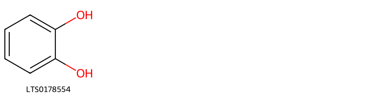
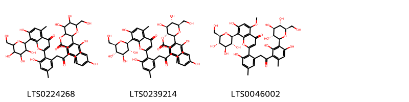

!!! abstract "Tóm tắt"

    Lô hội là cây có thân hóa, ngắn, to thô. Tên khoa học là Aloe sp., thuộc họ Hành Tỏi Liliaceae. Phân bố chủ yếu ở đông châu Phi, Ấn Độ, Châu Mỹ. Tại Việt Nam, lô hội mọc hoang ở bờ biển những tỉnh Ninh Thuận (Phan Rang, Phan Ri) và Bình Thuận. Ở miền Bắc được trồng làm cảnh nhưng ít hơn. Theo tài liệu cổ lô hội vị đắng tính hàn, vào 4 kinh can, tỳ, vị và đại tràng. Có tác dụng sát trùng, thông tiện, thanh nhiệt, lương can. Một số thành phần hóa học đã được phát hiện và xác định cấu trúc của nhóm Aloin.

## Thông tin về thực vật

Dược liệu **Lô Hội (Nhựa)** từ bộ phận **nan** từ loài *Aloe vera*.

**Mô tả thực vật:** - Lô hội có nhiều loài khác nhau. ở đây chúng tôi chỉ giới thiệu một loài có ở nước ta và một số loài thông dụng. Lô hội Aloe vera Livar. sinensis Berger [Aloe perfoliata Lour. (non L.). Alde barbadensis Mill.var.sinensis Haw.] là một cây có thân hoá gỗ, ngắn, to thô. Lá không cuống, mọc thành vành rất sít nhau, dày mẫm, hình 3 cạnh, mép dây, mép có răng cưa thô cứng và thưa dài 30-50cm, rộng 5- 10cm, dày 1-2cm, ở phía cuống. Cụm hoa dài chừng 1m, mọc thành chùm dài mang hoa màu vàng xanh lục nhạt lúc đầu mọc đứng, sau rū xuống, dài 3-4cm. Quả nang, hình trứng thuôn, lúc đầu xanh sau nâu và dai.
- Tại miền Bắc có trồng một loài lô hội trước đây được xác định là Aloe perfoliata L. chủ yếu để làm cảnh, có lá ngắn hơn chỉ đo được chừng 15- 20cm, chưa thấy ra hoa kết quả.
- Tại các nước khúc người ta dùng nhựa nhiều cây lô hội khác như Aloe vulgaris Lamk., Aloe ferox L., Aloe perryi Bak. v.v... cho nhiều thứ lô hội chất lượng khác nhau.

*Tài liệu tham khảo:* "Những cây thuốc và vị thuốc Việt Nam" - Đỗ Tất Lợi 
Trong dược điển Việt nam, một số loài có thể dùng thay thế cho nhau làm dược liệu bao gồm *Aloe vera, Aloe ferox*

!!! info "Phân loại thực vật của *Aloe vera*"
    - **Kingdom:** Plantae
    - **Phylum:** Tracheophyta
    - **Order:** Asparagales
    - **Family:** Asphodelaceae
    - **Genus:** Aloe
    - **Species:** *Aloe vera*

**Phân bố trên thế giới:** France, Benin, Chad, Saint Vincent and the Grenadines, Haiti, Curaçao, Gibraltar, Bahamas, Jamaica, Sri Lanka, Antigua and Barbuda, Oman, Cabo Verde, Spain, French Guiana, Mexico, Chinese Taipei, Colombia, Réunion, Bonaire, Sint Eustatius and Saba, Barbados, United Arab Emirates, Australia, Aruba, Virgin Islands (U.S.), Sint Maarten (Dutch part), Jordan, Portugal, India, Brazil, Peru, United States of America, Philippines, Malta, Dominican Republic, Malaysia, Greece, Ecuador, Puerto Rico, Anguilla, Austria, Cyprus

**Phân bố tại Việt nam:** Không có ghi nhận ở Việt Nam

!!! info "Phân loại thực vật của *Aloe ferox*"
    - **Kingdom:** Plantae
    - **Phylum:** Tracheophyta
    - **Order:** Asparagales
    - **Family:** Asphodelaceae
    - **Genus:** Aloe
    - **Species:** *Aloe ferox*

**Phân bố trên thế giới:** France, South Africa

**Phân bố tại Việt nam:** Không có ghi nhận ở Việt Nam

## Thông tin về dược liệu 

### Định danh

!!! info "Thông tin về tên gọi"

    - Dược liệu tiếng Việt: nan
    - Dược liệu tiếng Trung: nan (nan)
    - Dược liệu tiếng Anh: nan
    - Dược liệu latin thông dụng: nan
    - Dược liệu latin kiểu DĐVN: *resina aloe*
    - Dược liệu latin kiểu DĐVN: *nan*
    - Dược liệu latin kiểu thông tư: *nan*
    - Bộ phận dùng: nan (nan)

### Mô tả dược liệu 

- **Theo dược điển Việt nam V:** nan

- **Mô tả dược liệu theo thông tư chế biến dược liệu theo phương pháp cổ truyền:** nan

### Chế biến 

- **Chế biến theo dược điển việt nam V**: nan

- **Chế biến theo thông tư:** nan

--- 

## Thành phần hóa học

- Theo tài liệu của GS. Đỗ Tất Lợi:  Nhóm hóa học: Aloin, Barbaloin, Aloesin
Tên hoạt chất: Barbaloin
    

**Thành phần hóa học từ loài **Aloe ferox**

Theo cơ sở dữ liệu lotus, loài *Aloe ferox* đã phân lập và xác định được **49** hoạt chất thuộc về các nhóm Anthracenes, Naphthofurans, Organooxygen compounds, Fatty Acyls, Cinnamic acids and derivatives, Benzopyrans, Phenols, Tetralins, Benzene and substituted derivatives, Stilbenes trong bảng dưới đây. Danh sách các hoạt chất như sau 2-[2-(2-{2,4-dihydroxy-6-methyl-3-[(2s,3r,4r,5s,6r)-3,4,5-trihydroxy-6-(hydroxymethyl)oxan-2-yl]phenyl}-2-oxoethyl)-6-hydroxy-4-methylphenyl]-7-hydroxy-5-methoxy-8-[(2s,3r,4r,5s,6r)-3,4,5-trihydroxy-6-(hydroxymethyl)oxan-2-yl]chromen-4-one [(LTS0046002)](https://lotus.naturalproducts.net/compound/lotus_id/LTS0046002), (2s,3r,4s,5s,6r)-4,5-dihydroxy-6-(hydroxymethyl)-2-[2-(4-methoxy-6-oxopyran-2-yl)-3-methyl-5-{[(2s,3r,4s,5s,6r)-3,4,5-trihydroxy-6-(hydroxymethyl)oxan-2-yl]oxy}phenoxy]oxan-3-yl (2e)-3-(4-hydroxyphenyl)prop-2-enoate [(LTS0157592)](https://lotus.naturalproducts.net/compound/lotus_id/LTS0157592), aloin [(LTS0029105)](https://lotus.naturalproducts.net/compound/lotus_id/LTS0029105), (10s)-1,8-dihydroxy-3-(hydroxymethyl)-10-[3,4,5-trihydroxy-6-(hydroxymethyl)oxan-2-yl]-10h-anthracen-9-one [(LTS0228709)](https://lotus.naturalproducts.net/compound/lotus_id/LTS0228709), (10r)-1,8-dihydroxy-3-(hydroxymethyl)-10-[(2s,3r,4s,5s,6r)-3,4,5-trihydroxy-6-(hydroxymethyl)oxan-2-yl]-10h-anthracen-9-one [(LTS0031006)](https://lotus.naturalproducts.net/compound/lotus_id/LTS0031006), 5-methyl-2-(2-oxopropyl)furo[2,3-h]chromen-4-one [(LTS0187350)](https://lotus.naturalproducts.net/compound/lotus_id/LTS0187350), 8-hydroxy-1-methylnaphtho[2,3-c]furan-4,9-dione [(LTS0007568)](https://lotus.naturalproducts.net/compound/lotus_id/LTS0007568), methyl (10s)-10-hydroxyoctadecanoate [(LTS0087157)](https://lotus.naturalproducts.net/compound/lotus_id/LTS0087157), 2-[(5,7-dihydroxy-4-methyl-1,2,3,4-tetrahydronaphthalen-2-yl)oxy]-6-(hydroxymethyl)oxane-3,4,5-triol [(LTS0262148)](https://lotus.naturalproducts.net/compound/lotus_id/LTS0262148), 5-hydroxy-3-methyl-1h-naphtho[2,3-c]furan-4-one [(LTS0114294)](https://lotus.naturalproducts.net/compound/lotus_id/LTS0114294), (10s)-10-hydroxystearic acid [(LTS0149027)](https://lotus.naturalproducts.net/compound/lotus_id/LTS0149027), barbaloin [(LTS0119475)](https://lotus.naturalproducts.net/compound/lotus_id/LTS0119475), aloesin [(LTS0217039)](https://lotus.naturalproducts.net/compound/lotus_id/LTS0217039), 7-hydroxy-8-(3-hydroxy-2-oxopropyl)-5-methyl-2-(2-oxopropyl)chromen-4-one [(LTS0055496)](https://lotus.naturalproducts.net/compound/lotus_id/LTS0055496), (2r,3s,4r,5r,6s)-4,5-dihydroxy-6-(hydroxymethyl)-2-[5-methyl-4-oxo-2-(2-oxopropyl)-7-{[(2r,3s,4r,5r,6s)-3,4,5-trihydroxy-6-(hydroxymethyl)oxan-2-yl]oxy}chromen-8-yl]oxan-3-yl (2e)-3-(4-hydroxyphenyl)prop-2-enoate [(LTS0000941)](https://lotus.naturalproducts.net/compound/lotus_id/LTS0000941), 2-{2,6-dihydroxy-3-[2-(3-hydroxy-2-{7-hydroxy-5-methyl-4-oxo-8-[3,4,5-trihydroxy-6-(hydroxymethyl)oxan-2-yl]chromen-2-yl}-5-methylphenyl)acetyl]-4-methylphenyl}-4,5-dihydroxy-6-(hydroxymethyl)oxan-3-yl 3-(4-hydroxyphenyl)prop-2-enoate [(LTS0224268)](https://lotus.naturalproducts.net/compound/lotus_id/LTS0224268), 10-hydroxystearic acid [(LTS0183716)](https://lotus.naturalproducts.net/compound/lotus_id/LTS0183716), 1,8-dihydroxy-10-[3,4,5-trihydroxy-6-(hydroxymethyl)oxan-2-yl]-3-{[(3,4,5-trihydroxy-6-methyloxan-2-yl)oxy]methyl}-10h-anthracen-9-one [(LTS0200784)](https://lotus.naturalproducts.net/compound/lotus_id/LTS0200784), aloin [(LTS0274534)](https://lotus.naturalproducts.net/compound/lotus_id/LTS0274534), catechol [(LTS0178554)](https://lotus.naturalproducts.net/compound/lotus_id/LTS0178554), aloesone [(LTS0026373)](https://lotus.naturalproducts.net/compound/lotus_id/LTS0026373), 3-[(2-acetyl-3,5-dihydroxyphenyl)methyl]-6,8-dihydroxy-3,4-dihydro-2-benzopyran-1-one [(LTS0272769)](https://lotus.naturalproducts.net/compound/lotus_id/LTS0272769), (3r)-3-[(2-acetyl-3,5-dihydroxyphenyl)methyl]-6,8-dihydroxy-3,4-dihydro-2-benzopyran-1-one [(LTS0069982)](https://lotus.naturalproducts.net/compound/lotus_id/LTS0069982), 4,5-dihydroxy-2-[7-hydroxy-5-methyl-4-oxo-2-(2-oxopropyl)chromen-8-yl]-6-(hydroxymethyl)oxan-3-yl 3-(4-hydroxyphenyl)prop-2-enoate [(LTS0037040)](https://lotus.naturalproducts.net/compound/lotus_id/LTS0037040), 8-[2-(furan-2-yl)-2-oxoethyl]-7-hydroxy-5-methyl-2-(2-oxopropyl)chromen-4-one [(LTS0075578)](https://lotus.naturalproducts.net/compound/lotus_id/LTS0075578), aloinoside a [(LTS0144287)](https://lotus.naturalproducts.net/compound/lotus_id/LTS0144287), 1,8-dihydroxy-3-(hydroxymethyl)-10-[(2s,3r,4s,5s,6r)-3,4,5-trihydroxy-6-(hydroxymethyl)oxan-2-yl]-10h-anthracen-9-one [(LTS0197016)](https://lotus.naturalproducts.net/compound/lotus_id/LTS0197016), 4,5-dihydroxy-6-(hydroxymethyl)-2-[5-methyl-4-oxo-2-(2-oxopropyl)-7-{[3,4,5-trihydroxy-6-(hydroxymethyl)oxan-2-yl]oxy}chromen-8-yl]oxan-3-yl 3-(4-hydroxyphenyl)prop-2-enoate [(LTS0156567)](https://lotus.naturalproducts.net/compound/lotus_id/LTS0156567), 1,3,6-trihydroxy-8-methylanthracene-9,10-dione [(LTS0093516)](https://lotus.naturalproducts.net/compound/lotus_id/LTS0093516), methyl 3,6,9-trihydroxy-1-methyl-8-oxo-6,7-dihydro-5h-anthracene-2-carboxylate [(LTS0045627)](https://lotus.naturalproducts.net/compound/lotus_id/LTS0045627), (6r)-8-methyl-5,6,7,8-tetrahydronaphthalene-1,3,6-triol [(LTS0137098)](https://lotus.naturalproducts.net/compound/lotus_id/LTS0137098), aloe emodin [(LTS0098857)](https://lotus.naturalproducts.net/compound/lotus_id/LTS0098857), benzoic acid [(LTS0145871)](https://lotus.naturalproducts.net/compound/lotus_id/LTS0145871), aloinoside b [(LTS0168247)](https://lotus.naturalproducts.net/compound/lotus_id/LTS0168247), 10-keto stearic acid [(LTS0198554)](https://lotus.naturalproducts.net/compound/lotus_id/LTS0198554), {6-[(5,7-dihydroxy-4-methyl-1,2,3,4-tetrahydronaphthalen-2-yl)oxy]-4,5-dihydroxy-3-{[(2e)-3-(4-hydroxyphenyl)prop-2-enoyl]oxy}oxan-2-yl}methyl (2e)-3-(4-hydroxyphenyl)prop-2-enoate [(LTS0096371)](https://lotus.naturalproducts.net/compound/lotus_id/LTS0096371), 7-hydroxy-5-methyl-2-(2-oxopropyl)-8-[3,4,5-trihydroxy-6-(hydroxymethyl)oxan-2-yl]chromen-4-one [(LTS0197988)](https://lotus.naturalproducts.net/compound/lotus_id/LTS0197988), aloeresin a [(LTS0159879)](https://lotus.naturalproducts.net/compound/lotus_id/LTS0159879), methyl 10-hydroxyoctadecanoate [(LTS0025136)](https://lotus.naturalproducts.net/compound/lotus_id/LTS0025136), (2s,3r,4s,5s,6r)-4,5-dihydroxy-6-(hydroxymethyl)-2-[5-methyl-4-oxo-2-(2-oxopropyl)-7-{[(2s,3r,4s,5s,6r)-3,4,5-trihydroxy-6-(hydroxymethyl)oxan-2-yl]oxy}chromen-8-yl]oxan-3-yl (2e)-3-(4-hydroxyphenyl)prop-2-enoate [(LTS0181658)](https://lotus.naturalproducts.net/compound/lotus_id/LTS0181658), (6r,8r)-8-methyl-5,6,7,8-tetrahydronaphthalene-1,3,6-triol [(LTS0073631)](https://lotus.naturalproducts.net/compound/lotus_id/LTS0073631), (2s,3r,4s,5s,6r)-4,5-dihydroxy-6-(hydroxymethyl)-2-{2-[(2r)-2-hydroxypropyl]-7-methoxy-5-methyl-4-oxochromen-8-yl}oxan-3-yl (2e)-3-(4-hydroxyphenyl)prop-2-enoate [(LTS0130240)](https://lotus.naturalproducts.net/compound/lotus_id/LTS0130240), (2s,3r,4s,5s,6r)-2-{2,6-dihydroxy-3-[2-(3-hydroxy-2-{7-hydroxy-5-methyl-4-oxo-8-[(2s,3r,4r,5s,6r)-3,4,5-trihydroxy-6-(hydroxymethyl)oxan-2-yl]chromen-2-yl}-5-methylphenyl)acetyl]-4-methylphenyl}-4,5-dihydroxy-6-(hydroxymethyl)oxan-3-yl (2e)-3-(4-hydroxyphenyl)prop-2-enoate [(LTS0239214)](https://lotus.naturalproducts.net/compound/lotus_id/LTS0239214), 5-hydroxy-3-methyl-9h-naphtho[2,3-c]furan-4-one [(LTS0118996)](https://lotus.naturalproducts.net/compound/lotus_id/LTS0118996), turkey rhubarb [(LTS0160968)](https://lotus.naturalproducts.net/compound/lotus_id/LTS0160968), altechromone a [(LTS0252146)](https://lotus.naturalproducts.net/compound/lotus_id/LTS0252146), 1,5,8-trihydroxy-3-(hydroxymethyl)-10-[3,4,5-trihydroxy-6-(hydroxymethyl)oxan-2-yl]-10h-anthracen-9-one [(LTS0180385)](https://lotus.naturalproducts.net/compound/lotus_id/LTS0180385), hydroxyacetophenone [(LTS0214036)](https://lotus.naturalproducts.net/compound/lotus_id/LTS0214036), 8-methyl-5,6,7,8-tetrahydronaphthalene-1,3,6-triol [(LTS0240630)](https://lotus.naturalproducts.net/compound/lotus_id/LTS0240630). 
        
| chemicalTaxonomyClassyfireClass     |   smiles_count |
|:------------------------------------|---------------:|
| Anthracenes                         |            942 |
| Benzene and substituted derivatives |             14 |
| Benzopyrans                         |            176 |
| Cinnamic acids and derivatives      |             85 |
| Fatty Acyls                         |            141 |
| Naphthofurans                       |             85 |
| Organooxygen compounds              |           1044 |
| Phenols                             |             10 |
| Stilbenes                           |            439 |
| Tetralins                           |             87 |

            
### Nhóm Anthracenes
<figure markdown="span">
    { width=100% }
<figcaption>Hình ảnh cấu trúc hóa học của hoạt chất thuộc nhóm *Anthracenes*. Tên thường gọi của các hoạt chất tương ứng là aloin [(LTS0274534)](https://lotus.naturalproducts.net/compound/lotus_id/LTS0274534), turkey rhubarb [(LTS0160968)](https://lotus.naturalproducts.net/compound/lotus_id/LTS0160968), methyl 3,6,9-trihydroxy-1-methyl-8-oxo-6,7-dihydro-5h-anthracene-2-carboxylate [(LTS0045627)](https://lotus.naturalproducts.net/compound/lotus_id/LTS0045627), barbaloin [(LTS0119475)](https://lotus.naturalproducts.net/compound/lotus_id/LTS0119475), aloin [(LTS0029105)](https://lotus.naturalproducts.net/compound/lotus_id/LTS0029105), (10r)-1,8-dihydroxy-3-(hydroxymethyl)-10-[(2s,3r,4s,5s,6r)-3,4,5-trihydroxy-6-(hydroxymethyl)oxan-2-yl]-10h-anthracen-9-one [(LTS0031006)](https://lotus.naturalproducts.net/compound/lotus_id/LTS0031006), (10s)-1,8-dihydroxy-3-(hydroxymethyl)-10-[3,4,5-trihydroxy-6-(hydroxymethyl)oxan-2-yl]-10h-anthracen-9-one [(LTS0228709)](https://lotus.naturalproducts.net/compound/lotus_id/LTS0228709), aloe emodin [(LTS0098857)](https://lotus.naturalproducts.net/compound/lotus_id/LTS0098857), 1,5,8-trihydroxy-3-(hydroxymethyl)-10-[3,4,5-trihydroxy-6-(hydroxymethyl)oxan-2-yl]-10h-anthracen-9-one [(LTS0180385)](https://lotus.naturalproducts.net/compound/lotus_id/LTS0180385), 1,8-dihydroxy-3-(hydroxymethyl)-10-[(2s,3r,4s,5s,6r)-3,4,5-trihydroxy-6-(hydroxymethyl)oxan-2-yl]-10h-anthracen-9-one [(LTS0197016)](https://lotus.naturalproducts.net/compound/lotus_id/LTS0197016), 1,3,6-trihydroxy-8-methylanthracene-9,10-dione [(LTS0093516)](https://lotus.naturalproducts.net/compound/lotus_id/LTS0093516), 1,8-dihydroxy-10-[3,4,5-trihydroxy-6-(hydroxymethyl)oxan-2-yl]-3-{[(3,4,5-trihydroxy-6-methyloxan-2-yl)oxy]methyl}-10h-anthracen-9-one [(LTS0200784)](https://lotus.naturalproducts.net/compound/lotus_id/LTS0200784), aloinoside b [(LTS0168247)](https://lotus.naturalproducts.net/compound/lotus_id/LTS0168247), aloinoside a [(LTS0144287)](https://lotus.naturalproducts.net/compound/lotus_id/LTS0144287).</figcaption>
</figure>

            
            
### Nhóm Anthracenes
<figure markdown="span">
    { width=100% }
<figcaption>Hình ảnh cấu trúc hóa học của hoạt chất thuộc nhóm *Anthracenes*. Tên thường gọi của các hoạt chất tương ứng là aloin [(LTS0274534)](https://lotus.naturalproducts.net/compound/lotus_id/LTS0274534), turkey rhubarb [(LTS0160968)](https://lotus.naturalproducts.net/compound/lotus_id/LTS0160968), methyl 3,6,9-trihydroxy-1-methyl-8-oxo-6,7-dihydro-5h-anthracene-2-carboxylate [(LTS0045627)](https://lotus.naturalproducts.net/compound/lotus_id/LTS0045627), barbaloin [(LTS0119475)](https://lotus.naturalproducts.net/compound/lotus_id/LTS0119475), aloin [(LTS0029105)](https://lotus.naturalproducts.net/compound/lotus_id/LTS0029105), (10r)-1,8-dihydroxy-3-(hydroxymethyl)-10-[(2s,3r,4s,5s,6r)-3,4,5-trihydroxy-6-(hydroxymethyl)oxan-2-yl]-10h-anthracen-9-one [(LTS0031006)](https://lotus.naturalproducts.net/compound/lotus_id/LTS0031006), (10s)-1,8-dihydroxy-3-(hydroxymethyl)-10-[3,4,5-trihydroxy-6-(hydroxymethyl)oxan-2-yl]-10h-anthracen-9-one [(LTS0228709)](https://lotus.naturalproducts.net/compound/lotus_id/LTS0228709), aloe emodin [(LTS0098857)](https://lotus.naturalproducts.net/compound/lotus_id/LTS0098857), 1,5,8-trihydroxy-3-(hydroxymethyl)-10-[3,4,5-trihydroxy-6-(hydroxymethyl)oxan-2-yl]-10h-anthracen-9-one [(LTS0180385)](https://lotus.naturalproducts.net/compound/lotus_id/LTS0180385), 1,8-dihydroxy-3-(hydroxymethyl)-10-[(2s,3r,4s,5s,6r)-3,4,5-trihydroxy-6-(hydroxymethyl)oxan-2-yl]-10h-anthracen-9-one [(LTS0197016)](https://lotus.naturalproducts.net/compound/lotus_id/LTS0197016), 1,3,6-trihydroxy-8-methylanthracene-9,10-dione [(LTS0093516)](https://lotus.naturalproducts.net/compound/lotus_id/LTS0093516), 1,8-dihydroxy-10-[3,4,5-trihydroxy-6-(hydroxymethyl)oxan-2-yl]-3-{[(3,4,5-trihydroxy-6-methyloxan-2-yl)oxy]methyl}-10h-anthracen-9-one [(LTS0200784)](https://lotus.naturalproducts.net/compound/lotus_id/LTS0200784), aloinoside b [(LTS0168247)](https://lotus.naturalproducts.net/compound/lotus_id/LTS0168247), aloinoside a [(LTS0144287)](https://lotus.naturalproducts.net/compound/lotus_id/LTS0144287).</figcaption>
</figure>

### Nhóm Benzene and substituted derivatives
<figure markdown="span">
    { width=100% }
<figcaption>Hình ảnh cấu trúc hóa học của hoạt chất thuộc nhóm *Benzene and substituted derivatives*. Tên thường gọi của các hoạt chất tương ứng là benzoic acid [(LTS0145871)](https://lotus.naturalproducts.net/compound/lotus_id/LTS0145871).</figcaption>
</figure>

            
            
### Nhóm Anthracenes
<figure markdown="span">
    { width=100% }
<figcaption>Hình ảnh cấu trúc hóa học của hoạt chất thuộc nhóm *Anthracenes*. Tên thường gọi của các hoạt chất tương ứng là aloin [(LTS0274534)](https://lotus.naturalproducts.net/compound/lotus_id/LTS0274534), turkey rhubarb [(LTS0160968)](https://lotus.naturalproducts.net/compound/lotus_id/LTS0160968), methyl 3,6,9-trihydroxy-1-methyl-8-oxo-6,7-dihydro-5h-anthracene-2-carboxylate [(LTS0045627)](https://lotus.naturalproducts.net/compound/lotus_id/LTS0045627), barbaloin [(LTS0119475)](https://lotus.naturalproducts.net/compound/lotus_id/LTS0119475), aloin [(LTS0029105)](https://lotus.naturalproducts.net/compound/lotus_id/LTS0029105), (10r)-1,8-dihydroxy-3-(hydroxymethyl)-10-[(2s,3r,4s,5s,6r)-3,4,5-trihydroxy-6-(hydroxymethyl)oxan-2-yl]-10h-anthracen-9-one [(LTS0031006)](https://lotus.naturalproducts.net/compound/lotus_id/LTS0031006), (10s)-1,8-dihydroxy-3-(hydroxymethyl)-10-[3,4,5-trihydroxy-6-(hydroxymethyl)oxan-2-yl]-10h-anthracen-9-one [(LTS0228709)](https://lotus.naturalproducts.net/compound/lotus_id/LTS0228709), aloe emodin [(LTS0098857)](https://lotus.naturalproducts.net/compound/lotus_id/LTS0098857), 1,5,8-trihydroxy-3-(hydroxymethyl)-10-[3,4,5-trihydroxy-6-(hydroxymethyl)oxan-2-yl]-10h-anthracen-9-one [(LTS0180385)](https://lotus.naturalproducts.net/compound/lotus_id/LTS0180385), 1,8-dihydroxy-3-(hydroxymethyl)-10-[(2s,3r,4s,5s,6r)-3,4,5-trihydroxy-6-(hydroxymethyl)oxan-2-yl]-10h-anthracen-9-one [(LTS0197016)](https://lotus.naturalproducts.net/compound/lotus_id/LTS0197016), 1,3,6-trihydroxy-8-methylanthracene-9,10-dione [(LTS0093516)](https://lotus.naturalproducts.net/compound/lotus_id/LTS0093516), 1,8-dihydroxy-10-[3,4,5-trihydroxy-6-(hydroxymethyl)oxan-2-yl]-3-{[(3,4,5-trihydroxy-6-methyloxan-2-yl)oxy]methyl}-10h-anthracen-9-one [(LTS0200784)](https://lotus.naturalproducts.net/compound/lotus_id/LTS0200784), aloinoside b [(LTS0168247)](https://lotus.naturalproducts.net/compound/lotus_id/LTS0168247), aloinoside a [(LTS0144287)](https://lotus.naturalproducts.net/compound/lotus_id/LTS0144287).</figcaption>
</figure>

### Nhóm Benzene and substituted derivatives
<figure markdown="span">
    { width=100% }
<figcaption>Hình ảnh cấu trúc hóa học của hoạt chất thuộc nhóm *Benzene and substituted derivatives*. Tên thường gọi của các hoạt chất tương ứng là benzoic acid [(LTS0145871)](https://lotus.naturalproducts.net/compound/lotus_id/LTS0145871).</figcaption>
</figure>

### Nhóm Benzopyrans
<figure markdown="span">
    { width=100% }
<figcaption>Hình ảnh cấu trúc hóa học của hoạt chất thuộc nhóm *Benzopyrans*. Tên thường gọi của các hoạt chất tương ứng là altechromone a [(LTS0252146)](https://lotus.naturalproducts.net/compound/lotus_id/LTS0252146), 8-[2-(furan-2-yl)-2-oxoethyl]-7-hydroxy-5-methyl-2-(2-oxopropyl)chromen-4-one [(LTS0075578)](https://lotus.naturalproducts.net/compound/lotus_id/LTS0075578), 5-methyl-2-(2-oxopropyl)furo[2,3-h]chromen-4-one [(LTS0187350)](https://lotus.naturalproducts.net/compound/lotus_id/LTS0187350), 7-hydroxy-8-(3-hydroxy-2-oxopropyl)-5-methyl-2-(2-oxopropyl)chromen-4-one [(LTS0055496)](https://lotus.naturalproducts.net/compound/lotus_id/LTS0055496), aloesone [(LTS0026373)](https://lotus.naturalproducts.net/compound/lotus_id/LTS0026373).</figcaption>
</figure>

            
            
### Nhóm Anthracenes
<figure markdown="span">
    { width=100% }
<figcaption>Hình ảnh cấu trúc hóa học của hoạt chất thuộc nhóm *Anthracenes*. Tên thường gọi của các hoạt chất tương ứng là aloin [(LTS0274534)](https://lotus.naturalproducts.net/compound/lotus_id/LTS0274534), turkey rhubarb [(LTS0160968)](https://lotus.naturalproducts.net/compound/lotus_id/LTS0160968), methyl 3,6,9-trihydroxy-1-methyl-8-oxo-6,7-dihydro-5h-anthracene-2-carboxylate [(LTS0045627)](https://lotus.naturalproducts.net/compound/lotus_id/LTS0045627), barbaloin [(LTS0119475)](https://lotus.naturalproducts.net/compound/lotus_id/LTS0119475), aloin [(LTS0029105)](https://lotus.naturalproducts.net/compound/lotus_id/LTS0029105), (10r)-1,8-dihydroxy-3-(hydroxymethyl)-10-[(2s,3r,4s,5s,6r)-3,4,5-trihydroxy-6-(hydroxymethyl)oxan-2-yl]-10h-anthracen-9-one [(LTS0031006)](https://lotus.naturalproducts.net/compound/lotus_id/LTS0031006), (10s)-1,8-dihydroxy-3-(hydroxymethyl)-10-[3,4,5-trihydroxy-6-(hydroxymethyl)oxan-2-yl]-10h-anthracen-9-one [(LTS0228709)](https://lotus.naturalproducts.net/compound/lotus_id/LTS0228709), aloe emodin [(LTS0098857)](https://lotus.naturalproducts.net/compound/lotus_id/LTS0098857), 1,5,8-trihydroxy-3-(hydroxymethyl)-10-[3,4,5-trihydroxy-6-(hydroxymethyl)oxan-2-yl]-10h-anthracen-9-one [(LTS0180385)](https://lotus.naturalproducts.net/compound/lotus_id/LTS0180385), 1,8-dihydroxy-3-(hydroxymethyl)-10-[(2s,3r,4s,5s,6r)-3,4,5-trihydroxy-6-(hydroxymethyl)oxan-2-yl]-10h-anthracen-9-one [(LTS0197016)](https://lotus.naturalproducts.net/compound/lotus_id/LTS0197016), 1,3,6-trihydroxy-8-methylanthracene-9,10-dione [(LTS0093516)](https://lotus.naturalproducts.net/compound/lotus_id/LTS0093516), 1,8-dihydroxy-10-[3,4,5-trihydroxy-6-(hydroxymethyl)oxan-2-yl]-3-{[(3,4,5-trihydroxy-6-methyloxan-2-yl)oxy]methyl}-10h-anthracen-9-one [(LTS0200784)](https://lotus.naturalproducts.net/compound/lotus_id/LTS0200784), aloinoside b [(LTS0168247)](https://lotus.naturalproducts.net/compound/lotus_id/LTS0168247), aloinoside a [(LTS0144287)](https://lotus.naturalproducts.net/compound/lotus_id/LTS0144287).</figcaption>
</figure>

### Nhóm Benzene and substituted derivatives
<figure markdown="span">
    { width=100% }
<figcaption>Hình ảnh cấu trúc hóa học của hoạt chất thuộc nhóm *Benzene and substituted derivatives*. Tên thường gọi của các hoạt chất tương ứng là benzoic acid [(LTS0145871)](https://lotus.naturalproducts.net/compound/lotus_id/LTS0145871).</figcaption>
</figure>

### Nhóm Benzopyrans
<figure markdown="span">
    { width=100% }
<figcaption>Hình ảnh cấu trúc hóa học của hoạt chất thuộc nhóm *Benzopyrans*. Tên thường gọi của các hoạt chất tương ứng là altechromone a [(LTS0252146)](https://lotus.naturalproducts.net/compound/lotus_id/LTS0252146), 8-[2-(furan-2-yl)-2-oxoethyl]-7-hydroxy-5-methyl-2-(2-oxopropyl)chromen-4-one [(LTS0075578)](https://lotus.naturalproducts.net/compound/lotus_id/LTS0075578), 5-methyl-2-(2-oxopropyl)furo[2,3-h]chromen-4-one [(LTS0187350)](https://lotus.naturalproducts.net/compound/lotus_id/LTS0187350), 7-hydroxy-8-(3-hydroxy-2-oxopropyl)-5-methyl-2-(2-oxopropyl)chromen-4-one [(LTS0055496)](https://lotus.naturalproducts.net/compound/lotus_id/LTS0055496), aloesone [(LTS0026373)](https://lotus.naturalproducts.net/compound/lotus_id/LTS0026373).</figcaption>
</figure>

### Nhóm Cinnamic acids and derivatives
<figure markdown="span">
    { width=100% }
<figcaption>Hình ảnh cấu trúc hóa học của hoạt chất thuộc nhóm *Cinnamic acids and derivatives*. Tên thường gọi của các hoạt chất tương ứng là {6-[(5,7-dihydroxy-4-methyl-1,2,3,4-tetrahydronaphthalen-2-yl)oxy]-4,5-dihydroxy-3-{[(2e)-3-(4-hydroxyphenyl)prop-2-enoyl]oxy}oxan-2-yl}methyl (2e)-3-(4-hydroxyphenyl)prop-2-enoate [(LTS0096371)](https://lotus.naturalproducts.net/compound/lotus_id/LTS0096371).</figcaption>
</figure>

            
            
### Nhóm Anthracenes
<figure markdown="span">
    { width=100% }
<figcaption>Hình ảnh cấu trúc hóa học của hoạt chất thuộc nhóm *Anthracenes*. Tên thường gọi của các hoạt chất tương ứng là aloin [(LTS0274534)](https://lotus.naturalproducts.net/compound/lotus_id/LTS0274534), turkey rhubarb [(LTS0160968)](https://lotus.naturalproducts.net/compound/lotus_id/LTS0160968), methyl 3,6,9-trihydroxy-1-methyl-8-oxo-6,7-dihydro-5h-anthracene-2-carboxylate [(LTS0045627)](https://lotus.naturalproducts.net/compound/lotus_id/LTS0045627), barbaloin [(LTS0119475)](https://lotus.naturalproducts.net/compound/lotus_id/LTS0119475), aloin [(LTS0029105)](https://lotus.naturalproducts.net/compound/lotus_id/LTS0029105), (10r)-1,8-dihydroxy-3-(hydroxymethyl)-10-[(2s,3r,4s,5s,6r)-3,4,5-trihydroxy-6-(hydroxymethyl)oxan-2-yl]-10h-anthracen-9-one [(LTS0031006)](https://lotus.naturalproducts.net/compound/lotus_id/LTS0031006), (10s)-1,8-dihydroxy-3-(hydroxymethyl)-10-[3,4,5-trihydroxy-6-(hydroxymethyl)oxan-2-yl]-10h-anthracen-9-one [(LTS0228709)](https://lotus.naturalproducts.net/compound/lotus_id/LTS0228709), aloe emodin [(LTS0098857)](https://lotus.naturalproducts.net/compound/lotus_id/LTS0098857), 1,5,8-trihydroxy-3-(hydroxymethyl)-10-[3,4,5-trihydroxy-6-(hydroxymethyl)oxan-2-yl]-10h-anthracen-9-one [(LTS0180385)](https://lotus.naturalproducts.net/compound/lotus_id/LTS0180385), 1,8-dihydroxy-3-(hydroxymethyl)-10-[(2s,3r,4s,5s,6r)-3,4,5-trihydroxy-6-(hydroxymethyl)oxan-2-yl]-10h-anthracen-9-one [(LTS0197016)](https://lotus.naturalproducts.net/compound/lotus_id/LTS0197016), 1,3,6-trihydroxy-8-methylanthracene-9,10-dione [(LTS0093516)](https://lotus.naturalproducts.net/compound/lotus_id/LTS0093516), 1,8-dihydroxy-10-[3,4,5-trihydroxy-6-(hydroxymethyl)oxan-2-yl]-3-{[(3,4,5-trihydroxy-6-methyloxan-2-yl)oxy]methyl}-10h-anthracen-9-one [(LTS0200784)](https://lotus.naturalproducts.net/compound/lotus_id/LTS0200784), aloinoside b [(LTS0168247)](https://lotus.naturalproducts.net/compound/lotus_id/LTS0168247), aloinoside a [(LTS0144287)](https://lotus.naturalproducts.net/compound/lotus_id/LTS0144287).</figcaption>
</figure>

### Nhóm Benzene and substituted derivatives
<figure markdown="span">
    { width=100% }
<figcaption>Hình ảnh cấu trúc hóa học của hoạt chất thuộc nhóm *Benzene and substituted derivatives*. Tên thường gọi của các hoạt chất tương ứng là benzoic acid [(LTS0145871)](https://lotus.naturalproducts.net/compound/lotus_id/LTS0145871).</figcaption>
</figure>

### Nhóm Benzopyrans
<figure markdown="span">
    { width=100% }
<figcaption>Hình ảnh cấu trúc hóa học của hoạt chất thuộc nhóm *Benzopyrans*. Tên thường gọi của các hoạt chất tương ứng là altechromone a [(LTS0252146)](https://lotus.naturalproducts.net/compound/lotus_id/LTS0252146), 8-[2-(furan-2-yl)-2-oxoethyl]-7-hydroxy-5-methyl-2-(2-oxopropyl)chromen-4-one [(LTS0075578)](https://lotus.naturalproducts.net/compound/lotus_id/LTS0075578), 5-methyl-2-(2-oxopropyl)furo[2,3-h]chromen-4-one [(LTS0187350)](https://lotus.naturalproducts.net/compound/lotus_id/LTS0187350), 7-hydroxy-8-(3-hydroxy-2-oxopropyl)-5-methyl-2-(2-oxopropyl)chromen-4-one [(LTS0055496)](https://lotus.naturalproducts.net/compound/lotus_id/LTS0055496), aloesone [(LTS0026373)](https://lotus.naturalproducts.net/compound/lotus_id/LTS0026373).</figcaption>
</figure>

### Nhóm Cinnamic acids and derivatives
<figure markdown="span">
    { width=100% }
<figcaption>Hình ảnh cấu trúc hóa học của hoạt chất thuộc nhóm *Cinnamic acids and derivatives*. Tên thường gọi của các hoạt chất tương ứng là {6-[(5,7-dihydroxy-4-methyl-1,2,3,4-tetrahydronaphthalen-2-yl)oxy]-4,5-dihydroxy-3-{[(2e)-3-(4-hydroxyphenyl)prop-2-enoyl]oxy}oxan-2-yl}methyl (2e)-3-(4-hydroxyphenyl)prop-2-enoate [(LTS0096371)](https://lotus.naturalproducts.net/compound/lotus_id/LTS0096371).</figcaption>
</figure>

### Nhóm Fatty Acyls
<figure markdown="span">
    { width=100% }
<figcaption>Hình ảnh cấu trúc hóa học của hoạt chất thuộc nhóm *Fatty Acyls*. Tên thường gọi của các hoạt chất tương ứng là 10-keto stearic acid [(LTS0198554)](https://lotus.naturalproducts.net/compound/lotus_id/LTS0198554), (10s)-10-hydroxystearic acid [(LTS0149027)](https://lotus.naturalproducts.net/compound/lotus_id/LTS0149027), methyl (10s)-10-hydroxyoctadecanoate [(LTS0087157)](https://lotus.naturalproducts.net/compound/lotus_id/LTS0087157), methyl 10-hydroxyoctadecanoate [(LTS0025136)](https://lotus.naturalproducts.net/compound/lotus_id/LTS0025136), 10-hydroxystearic acid [(LTS0183716)](https://lotus.naturalproducts.net/compound/lotus_id/LTS0183716).</figcaption>
</figure>

            
            
### Nhóm Anthracenes
<figure markdown="span">
    { width=100% }
<figcaption>Hình ảnh cấu trúc hóa học của hoạt chất thuộc nhóm *Anthracenes*. Tên thường gọi của các hoạt chất tương ứng là aloin [(LTS0274534)](https://lotus.naturalproducts.net/compound/lotus_id/LTS0274534), turkey rhubarb [(LTS0160968)](https://lotus.naturalproducts.net/compound/lotus_id/LTS0160968), methyl 3,6,9-trihydroxy-1-methyl-8-oxo-6,7-dihydro-5h-anthracene-2-carboxylate [(LTS0045627)](https://lotus.naturalproducts.net/compound/lotus_id/LTS0045627), barbaloin [(LTS0119475)](https://lotus.naturalproducts.net/compound/lotus_id/LTS0119475), aloin [(LTS0029105)](https://lotus.naturalproducts.net/compound/lotus_id/LTS0029105), (10r)-1,8-dihydroxy-3-(hydroxymethyl)-10-[(2s,3r,4s,5s,6r)-3,4,5-trihydroxy-6-(hydroxymethyl)oxan-2-yl]-10h-anthracen-9-one [(LTS0031006)](https://lotus.naturalproducts.net/compound/lotus_id/LTS0031006), (10s)-1,8-dihydroxy-3-(hydroxymethyl)-10-[3,4,5-trihydroxy-6-(hydroxymethyl)oxan-2-yl]-10h-anthracen-9-one [(LTS0228709)](https://lotus.naturalproducts.net/compound/lotus_id/LTS0228709), aloe emodin [(LTS0098857)](https://lotus.naturalproducts.net/compound/lotus_id/LTS0098857), 1,5,8-trihydroxy-3-(hydroxymethyl)-10-[3,4,5-trihydroxy-6-(hydroxymethyl)oxan-2-yl]-10h-anthracen-9-one [(LTS0180385)](https://lotus.naturalproducts.net/compound/lotus_id/LTS0180385), 1,8-dihydroxy-3-(hydroxymethyl)-10-[(2s,3r,4s,5s,6r)-3,4,5-trihydroxy-6-(hydroxymethyl)oxan-2-yl]-10h-anthracen-9-one [(LTS0197016)](https://lotus.naturalproducts.net/compound/lotus_id/LTS0197016), 1,3,6-trihydroxy-8-methylanthracene-9,10-dione [(LTS0093516)](https://lotus.naturalproducts.net/compound/lotus_id/LTS0093516), 1,8-dihydroxy-10-[3,4,5-trihydroxy-6-(hydroxymethyl)oxan-2-yl]-3-{[(3,4,5-trihydroxy-6-methyloxan-2-yl)oxy]methyl}-10h-anthracen-9-one [(LTS0200784)](https://lotus.naturalproducts.net/compound/lotus_id/LTS0200784), aloinoside b [(LTS0168247)](https://lotus.naturalproducts.net/compound/lotus_id/LTS0168247), aloinoside a [(LTS0144287)](https://lotus.naturalproducts.net/compound/lotus_id/LTS0144287).</figcaption>
</figure>

### Nhóm Benzene and substituted derivatives
<figure markdown="span">
    { width=100% }
<figcaption>Hình ảnh cấu trúc hóa học của hoạt chất thuộc nhóm *Benzene and substituted derivatives*. Tên thường gọi của các hoạt chất tương ứng là benzoic acid [(LTS0145871)](https://lotus.naturalproducts.net/compound/lotus_id/LTS0145871).</figcaption>
</figure>

### Nhóm Benzopyrans
<figure markdown="span">
    { width=100% }
<figcaption>Hình ảnh cấu trúc hóa học của hoạt chất thuộc nhóm *Benzopyrans*. Tên thường gọi của các hoạt chất tương ứng là altechromone a [(LTS0252146)](https://lotus.naturalproducts.net/compound/lotus_id/LTS0252146), 8-[2-(furan-2-yl)-2-oxoethyl]-7-hydroxy-5-methyl-2-(2-oxopropyl)chromen-4-one [(LTS0075578)](https://lotus.naturalproducts.net/compound/lotus_id/LTS0075578), 5-methyl-2-(2-oxopropyl)furo[2,3-h]chromen-4-one [(LTS0187350)](https://lotus.naturalproducts.net/compound/lotus_id/LTS0187350), 7-hydroxy-8-(3-hydroxy-2-oxopropyl)-5-methyl-2-(2-oxopropyl)chromen-4-one [(LTS0055496)](https://lotus.naturalproducts.net/compound/lotus_id/LTS0055496), aloesone [(LTS0026373)](https://lotus.naturalproducts.net/compound/lotus_id/LTS0026373).</figcaption>
</figure>

### Nhóm Cinnamic acids and derivatives
<figure markdown="span">
    { width=100% }
<figcaption>Hình ảnh cấu trúc hóa học của hoạt chất thuộc nhóm *Cinnamic acids and derivatives*. Tên thường gọi của các hoạt chất tương ứng là {6-[(5,7-dihydroxy-4-methyl-1,2,3,4-tetrahydronaphthalen-2-yl)oxy]-4,5-dihydroxy-3-{[(2e)-3-(4-hydroxyphenyl)prop-2-enoyl]oxy}oxan-2-yl}methyl (2e)-3-(4-hydroxyphenyl)prop-2-enoate [(LTS0096371)](https://lotus.naturalproducts.net/compound/lotus_id/LTS0096371).</figcaption>
</figure>

### Nhóm Fatty Acyls
<figure markdown="span">
    { width=100% }
<figcaption>Hình ảnh cấu trúc hóa học của hoạt chất thuộc nhóm *Fatty Acyls*. Tên thường gọi của các hoạt chất tương ứng là 10-keto stearic acid [(LTS0198554)](https://lotus.naturalproducts.net/compound/lotus_id/LTS0198554), (10s)-10-hydroxystearic acid [(LTS0149027)](https://lotus.naturalproducts.net/compound/lotus_id/LTS0149027), methyl (10s)-10-hydroxyoctadecanoate [(LTS0087157)](https://lotus.naturalproducts.net/compound/lotus_id/LTS0087157), methyl 10-hydroxyoctadecanoate [(LTS0025136)](https://lotus.naturalproducts.net/compound/lotus_id/LTS0025136), 10-hydroxystearic acid [(LTS0183716)](https://lotus.naturalproducts.net/compound/lotus_id/LTS0183716).</figcaption>
</figure>

### Nhóm Naphthofurans
<figure markdown="span">
    { width=100% }
<figcaption>Hình ảnh cấu trúc hóa học của hoạt chất thuộc nhóm *Naphthofurans*. Tên thường gọi của các hoạt chất tương ứng là 5-hydroxy-3-methyl-1h-naphtho[2,3-c]furan-4-one [(LTS0114294)](https://lotus.naturalproducts.net/compound/lotus_id/LTS0114294), 8-hydroxy-1-methylnaphtho[2,3-c]furan-4,9-dione [(LTS0007568)](https://lotus.naturalproducts.net/compound/lotus_id/LTS0007568), 5-hydroxy-3-methyl-9h-naphtho[2,3-c]furan-4-one [(LTS0118996)](https://lotus.naturalproducts.net/compound/lotus_id/LTS0118996).</figcaption>
</figure>

            
            
### Nhóm Anthracenes
<figure markdown="span">
    { width=100% }
<figcaption>Hình ảnh cấu trúc hóa học của hoạt chất thuộc nhóm *Anthracenes*. Tên thường gọi của các hoạt chất tương ứng là aloin [(LTS0274534)](https://lotus.naturalproducts.net/compound/lotus_id/LTS0274534), turkey rhubarb [(LTS0160968)](https://lotus.naturalproducts.net/compound/lotus_id/LTS0160968), methyl 3,6,9-trihydroxy-1-methyl-8-oxo-6,7-dihydro-5h-anthracene-2-carboxylate [(LTS0045627)](https://lotus.naturalproducts.net/compound/lotus_id/LTS0045627), barbaloin [(LTS0119475)](https://lotus.naturalproducts.net/compound/lotus_id/LTS0119475), aloin [(LTS0029105)](https://lotus.naturalproducts.net/compound/lotus_id/LTS0029105), (10r)-1,8-dihydroxy-3-(hydroxymethyl)-10-[(2s,3r,4s,5s,6r)-3,4,5-trihydroxy-6-(hydroxymethyl)oxan-2-yl]-10h-anthracen-9-one [(LTS0031006)](https://lotus.naturalproducts.net/compound/lotus_id/LTS0031006), (10s)-1,8-dihydroxy-3-(hydroxymethyl)-10-[3,4,5-trihydroxy-6-(hydroxymethyl)oxan-2-yl]-10h-anthracen-9-one [(LTS0228709)](https://lotus.naturalproducts.net/compound/lotus_id/LTS0228709), aloe emodin [(LTS0098857)](https://lotus.naturalproducts.net/compound/lotus_id/LTS0098857), 1,5,8-trihydroxy-3-(hydroxymethyl)-10-[3,4,5-trihydroxy-6-(hydroxymethyl)oxan-2-yl]-10h-anthracen-9-one [(LTS0180385)](https://lotus.naturalproducts.net/compound/lotus_id/LTS0180385), 1,8-dihydroxy-3-(hydroxymethyl)-10-[(2s,3r,4s,5s,6r)-3,4,5-trihydroxy-6-(hydroxymethyl)oxan-2-yl]-10h-anthracen-9-one [(LTS0197016)](https://lotus.naturalproducts.net/compound/lotus_id/LTS0197016), 1,3,6-trihydroxy-8-methylanthracene-9,10-dione [(LTS0093516)](https://lotus.naturalproducts.net/compound/lotus_id/LTS0093516), 1,8-dihydroxy-10-[3,4,5-trihydroxy-6-(hydroxymethyl)oxan-2-yl]-3-{[(3,4,5-trihydroxy-6-methyloxan-2-yl)oxy]methyl}-10h-anthracen-9-one [(LTS0200784)](https://lotus.naturalproducts.net/compound/lotus_id/LTS0200784), aloinoside b [(LTS0168247)](https://lotus.naturalproducts.net/compound/lotus_id/LTS0168247), aloinoside a [(LTS0144287)](https://lotus.naturalproducts.net/compound/lotus_id/LTS0144287).</figcaption>
</figure>

### Nhóm Benzene and substituted derivatives
<figure markdown="span">
    { width=100% }
<figcaption>Hình ảnh cấu trúc hóa học của hoạt chất thuộc nhóm *Benzene and substituted derivatives*. Tên thường gọi của các hoạt chất tương ứng là benzoic acid [(LTS0145871)](https://lotus.naturalproducts.net/compound/lotus_id/LTS0145871).</figcaption>
</figure>

### Nhóm Benzopyrans
<figure markdown="span">
    { width=100% }
<figcaption>Hình ảnh cấu trúc hóa học của hoạt chất thuộc nhóm *Benzopyrans*. Tên thường gọi của các hoạt chất tương ứng là altechromone a [(LTS0252146)](https://lotus.naturalproducts.net/compound/lotus_id/LTS0252146), 8-[2-(furan-2-yl)-2-oxoethyl]-7-hydroxy-5-methyl-2-(2-oxopropyl)chromen-4-one [(LTS0075578)](https://lotus.naturalproducts.net/compound/lotus_id/LTS0075578), 5-methyl-2-(2-oxopropyl)furo[2,3-h]chromen-4-one [(LTS0187350)](https://lotus.naturalproducts.net/compound/lotus_id/LTS0187350), 7-hydroxy-8-(3-hydroxy-2-oxopropyl)-5-methyl-2-(2-oxopropyl)chromen-4-one [(LTS0055496)](https://lotus.naturalproducts.net/compound/lotus_id/LTS0055496), aloesone [(LTS0026373)](https://lotus.naturalproducts.net/compound/lotus_id/LTS0026373).</figcaption>
</figure>

### Nhóm Cinnamic acids and derivatives
<figure markdown="span">
    { width=100% }
<figcaption>Hình ảnh cấu trúc hóa học của hoạt chất thuộc nhóm *Cinnamic acids and derivatives*. Tên thường gọi của các hoạt chất tương ứng là {6-[(5,7-dihydroxy-4-methyl-1,2,3,4-tetrahydronaphthalen-2-yl)oxy]-4,5-dihydroxy-3-{[(2e)-3-(4-hydroxyphenyl)prop-2-enoyl]oxy}oxan-2-yl}methyl (2e)-3-(4-hydroxyphenyl)prop-2-enoate [(LTS0096371)](https://lotus.naturalproducts.net/compound/lotus_id/LTS0096371).</figcaption>
</figure>

### Nhóm Fatty Acyls
<figure markdown="span">
    { width=100% }
<figcaption>Hình ảnh cấu trúc hóa học của hoạt chất thuộc nhóm *Fatty Acyls*. Tên thường gọi của các hoạt chất tương ứng là 10-keto stearic acid [(LTS0198554)](https://lotus.naturalproducts.net/compound/lotus_id/LTS0198554), (10s)-10-hydroxystearic acid [(LTS0149027)](https://lotus.naturalproducts.net/compound/lotus_id/LTS0149027), methyl (10s)-10-hydroxyoctadecanoate [(LTS0087157)](https://lotus.naturalproducts.net/compound/lotus_id/LTS0087157), methyl 10-hydroxyoctadecanoate [(LTS0025136)](https://lotus.naturalproducts.net/compound/lotus_id/LTS0025136), 10-hydroxystearic acid [(LTS0183716)](https://lotus.naturalproducts.net/compound/lotus_id/LTS0183716).</figcaption>
</figure>

### Nhóm Naphthofurans
<figure markdown="span">
    { width=100% }
<figcaption>Hình ảnh cấu trúc hóa học của hoạt chất thuộc nhóm *Naphthofurans*. Tên thường gọi của các hoạt chất tương ứng là 5-hydroxy-3-methyl-1h-naphtho[2,3-c]furan-4-one [(LTS0114294)](https://lotus.naturalproducts.net/compound/lotus_id/LTS0114294), 8-hydroxy-1-methylnaphtho[2,3-c]furan-4,9-dione [(LTS0007568)](https://lotus.naturalproducts.net/compound/lotus_id/LTS0007568), 5-hydroxy-3-methyl-9h-naphtho[2,3-c]furan-4-one [(LTS0118996)](https://lotus.naturalproducts.net/compound/lotus_id/LTS0118996).</figcaption>
</figure>

### Nhóm Organooxygen compounds
<figure markdown="span">
    { width=100% }
<figcaption>Hình ảnh cấu trúc hóa học của hoạt chất thuộc nhóm *Organooxygen compounds*. Tên thường gọi của các hoạt chất tương ứng là aloesin [(LTS0217039)](https://lotus.naturalproducts.net/compound/lotus_id/LTS0217039), (2s,3r,4s,5s,6r)-4,5-dihydroxy-6-(hydroxymethyl)-2-{2-[(2r)-2-hydroxypropyl]-7-methoxy-5-methyl-4-oxochromen-8-yl}oxan-3-yl (2e)-3-(4-hydroxyphenyl)prop-2-enoate [(LTS0130240)](https://lotus.naturalproducts.net/compound/lotus_id/LTS0130240), aloeresin a [(LTS0159879)](https://lotus.naturalproducts.net/compound/lotus_id/LTS0159879), 7-hydroxy-5-methyl-2-(2-oxopropyl)-8-[3,4,5-trihydroxy-6-(hydroxymethyl)oxan-2-yl]chromen-4-one [(LTS0197988)](https://lotus.naturalproducts.net/compound/lotus_id/LTS0197988), 4,5-dihydroxy-2-[7-hydroxy-5-methyl-4-oxo-2-(2-oxopropyl)chromen-8-yl]-6-(hydroxymethyl)oxan-3-yl 3-(4-hydroxyphenyl)prop-2-enoate [(LTS0037040)](https://lotus.naturalproducts.net/compound/lotus_id/LTS0037040), (3r)-3-[(2-acetyl-3,5-dihydroxyphenyl)methyl]-6,8-dihydroxy-3,4-dihydro-2-benzopyran-1-one [(LTS0069982)](https://lotus.naturalproducts.net/compound/lotus_id/LTS0069982), (2s,3r,4s,5s,6r)-4,5-dihydroxy-6-(hydroxymethyl)-2-[2-(4-methoxy-6-oxopyran-2-yl)-3-methyl-5-{[(2s,3r,4s,5s,6r)-3,4,5-trihydroxy-6-(hydroxymethyl)oxan-2-yl]oxy}phenoxy]oxan-3-yl (2e)-3-(4-hydroxyphenyl)prop-2-enoate [(LTS0157592)](https://lotus.naturalproducts.net/compound/lotus_id/LTS0157592), 3-[(2-acetyl-3,5-dihydroxyphenyl)methyl]-6,8-dihydroxy-3,4-dihydro-2-benzopyran-1-one [(LTS0272769)](https://lotus.naturalproducts.net/compound/lotus_id/LTS0272769), hydroxyacetophenone [(LTS0214036)](https://lotus.naturalproducts.net/compound/lotus_id/LTS0214036), (2s,3r,4s,5s,6r)-4,5-dihydroxy-6-(hydroxymethyl)-2-[5-methyl-4-oxo-2-(2-oxopropyl)-7-{[(2s,3r,4s,5s,6r)-3,4,5-trihydroxy-6-(hydroxymethyl)oxan-2-yl]oxy}chromen-8-yl]oxan-3-yl (2e)-3-(4-hydroxyphenyl)prop-2-enoate [(LTS0181658)](https://lotus.naturalproducts.net/compound/lotus_id/LTS0181658), 4,5-dihydroxy-6-(hydroxymethyl)-2-[5-methyl-4-oxo-2-(2-oxopropyl)-7-{[3,4,5-trihydroxy-6-(hydroxymethyl)oxan-2-yl]oxy}chromen-8-yl]oxan-3-yl 3-(4-hydroxyphenyl)prop-2-enoate [(LTS0156567)](https://lotus.naturalproducts.net/compound/lotus_id/LTS0156567), 2-[(5,7-dihydroxy-4-methyl-1,2,3,4-tetrahydronaphthalen-2-yl)oxy]-6-(hydroxymethyl)oxane-3,4,5-triol [(LTS0262148)](https://lotus.naturalproducts.net/compound/lotus_id/LTS0262148), (2r,3s,4r,5r,6s)-4,5-dihydroxy-6-(hydroxymethyl)-2-[5-methyl-4-oxo-2-(2-oxopropyl)-7-{[(2r,3s,4r,5r,6s)-3,4,5-trihydroxy-6-(hydroxymethyl)oxan-2-yl]oxy}chromen-8-yl]oxan-3-yl (2e)-3-(4-hydroxyphenyl)prop-2-enoate [(LTS0000941)](https://lotus.naturalproducts.net/compound/lotus_id/LTS0000941).</figcaption>
</figure>

            
            
### Nhóm Anthracenes
<figure markdown="span">
    { width=100% }
<figcaption>Hình ảnh cấu trúc hóa học của hoạt chất thuộc nhóm *Anthracenes*. Tên thường gọi của các hoạt chất tương ứng là aloin [(LTS0274534)](https://lotus.naturalproducts.net/compound/lotus_id/LTS0274534), turkey rhubarb [(LTS0160968)](https://lotus.naturalproducts.net/compound/lotus_id/LTS0160968), methyl 3,6,9-trihydroxy-1-methyl-8-oxo-6,7-dihydro-5h-anthracene-2-carboxylate [(LTS0045627)](https://lotus.naturalproducts.net/compound/lotus_id/LTS0045627), barbaloin [(LTS0119475)](https://lotus.naturalproducts.net/compound/lotus_id/LTS0119475), aloin [(LTS0029105)](https://lotus.naturalproducts.net/compound/lotus_id/LTS0029105), (10r)-1,8-dihydroxy-3-(hydroxymethyl)-10-[(2s,3r,4s,5s,6r)-3,4,5-trihydroxy-6-(hydroxymethyl)oxan-2-yl]-10h-anthracen-9-one [(LTS0031006)](https://lotus.naturalproducts.net/compound/lotus_id/LTS0031006), (10s)-1,8-dihydroxy-3-(hydroxymethyl)-10-[3,4,5-trihydroxy-6-(hydroxymethyl)oxan-2-yl]-10h-anthracen-9-one [(LTS0228709)](https://lotus.naturalproducts.net/compound/lotus_id/LTS0228709), aloe emodin [(LTS0098857)](https://lotus.naturalproducts.net/compound/lotus_id/LTS0098857), 1,5,8-trihydroxy-3-(hydroxymethyl)-10-[3,4,5-trihydroxy-6-(hydroxymethyl)oxan-2-yl]-10h-anthracen-9-one [(LTS0180385)](https://lotus.naturalproducts.net/compound/lotus_id/LTS0180385), 1,8-dihydroxy-3-(hydroxymethyl)-10-[(2s,3r,4s,5s,6r)-3,4,5-trihydroxy-6-(hydroxymethyl)oxan-2-yl]-10h-anthracen-9-one [(LTS0197016)](https://lotus.naturalproducts.net/compound/lotus_id/LTS0197016), 1,3,6-trihydroxy-8-methylanthracene-9,10-dione [(LTS0093516)](https://lotus.naturalproducts.net/compound/lotus_id/LTS0093516), 1,8-dihydroxy-10-[3,4,5-trihydroxy-6-(hydroxymethyl)oxan-2-yl]-3-{[(3,4,5-trihydroxy-6-methyloxan-2-yl)oxy]methyl}-10h-anthracen-9-one [(LTS0200784)](https://lotus.naturalproducts.net/compound/lotus_id/LTS0200784), aloinoside b [(LTS0168247)](https://lotus.naturalproducts.net/compound/lotus_id/LTS0168247), aloinoside a [(LTS0144287)](https://lotus.naturalproducts.net/compound/lotus_id/LTS0144287).</figcaption>
</figure>

### Nhóm Benzene and substituted derivatives
<figure markdown="span">
    { width=100% }
<figcaption>Hình ảnh cấu trúc hóa học của hoạt chất thuộc nhóm *Benzene and substituted derivatives*. Tên thường gọi của các hoạt chất tương ứng là benzoic acid [(LTS0145871)](https://lotus.naturalproducts.net/compound/lotus_id/LTS0145871).</figcaption>
</figure>

### Nhóm Benzopyrans
<figure markdown="span">
    { width=100% }
<figcaption>Hình ảnh cấu trúc hóa học của hoạt chất thuộc nhóm *Benzopyrans*. Tên thường gọi của các hoạt chất tương ứng là altechromone a [(LTS0252146)](https://lotus.naturalproducts.net/compound/lotus_id/LTS0252146), 8-[2-(furan-2-yl)-2-oxoethyl]-7-hydroxy-5-methyl-2-(2-oxopropyl)chromen-4-one [(LTS0075578)](https://lotus.naturalproducts.net/compound/lotus_id/LTS0075578), 5-methyl-2-(2-oxopropyl)furo[2,3-h]chromen-4-one [(LTS0187350)](https://lotus.naturalproducts.net/compound/lotus_id/LTS0187350), 7-hydroxy-8-(3-hydroxy-2-oxopropyl)-5-methyl-2-(2-oxopropyl)chromen-4-one [(LTS0055496)](https://lotus.naturalproducts.net/compound/lotus_id/LTS0055496), aloesone [(LTS0026373)](https://lotus.naturalproducts.net/compound/lotus_id/LTS0026373).</figcaption>
</figure>

### Nhóm Cinnamic acids and derivatives
<figure markdown="span">
    { width=100% }
<figcaption>Hình ảnh cấu trúc hóa học của hoạt chất thuộc nhóm *Cinnamic acids and derivatives*. Tên thường gọi của các hoạt chất tương ứng là {6-[(5,7-dihydroxy-4-methyl-1,2,3,4-tetrahydronaphthalen-2-yl)oxy]-4,5-dihydroxy-3-{[(2e)-3-(4-hydroxyphenyl)prop-2-enoyl]oxy}oxan-2-yl}methyl (2e)-3-(4-hydroxyphenyl)prop-2-enoate [(LTS0096371)](https://lotus.naturalproducts.net/compound/lotus_id/LTS0096371).</figcaption>
</figure>

### Nhóm Fatty Acyls
<figure markdown="span">
    { width=100% }
<figcaption>Hình ảnh cấu trúc hóa học của hoạt chất thuộc nhóm *Fatty Acyls*. Tên thường gọi của các hoạt chất tương ứng là 10-keto stearic acid [(LTS0198554)](https://lotus.naturalproducts.net/compound/lotus_id/LTS0198554), (10s)-10-hydroxystearic acid [(LTS0149027)](https://lotus.naturalproducts.net/compound/lotus_id/LTS0149027), methyl (10s)-10-hydroxyoctadecanoate [(LTS0087157)](https://lotus.naturalproducts.net/compound/lotus_id/LTS0087157), methyl 10-hydroxyoctadecanoate [(LTS0025136)](https://lotus.naturalproducts.net/compound/lotus_id/LTS0025136), 10-hydroxystearic acid [(LTS0183716)](https://lotus.naturalproducts.net/compound/lotus_id/LTS0183716).</figcaption>
</figure>

### Nhóm Naphthofurans
<figure markdown="span">
    { width=100% }
<figcaption>Hình ảnh cấu trúc hóa học của hoạt chất thuộc nhóm *Naphthofurans*. Tên thường gọi của các hoạt chất tương ứng là 5-hydroxy-3-methyl-1h-naphtho[2,3-c]furan-4-one [(LTS0114294)](https://lotus.naturalproducts.net/compound/lotus_id/LTS0114294), 8-hydroxy-1-methylnaphtho[2,3-c]furan-4,9-dione [(LTS0007568)](https://lotus.naturalproducts.net/compound/lotus_id/LTS0007568), 5-hydroxy-3-methyl-9h-naphtho[2,3-c]furan-4-one [(LTS0118996)](https://lotus.naturalproducts.net/compound/lotus_id/LTS0118996).</figcaption>
</figure>

### Nhóm Organooxygen compounds
<figure markdown="span">
    { width=100% }
<figcaption>Hình ảnh cấu trúc hóa học của hoạt chất thuộc nhóm *Organooxygen compounds*. Tên thường gọi của các hoạt chất tương ứng là aloesin [(LTS0217039)](https://lotus.naturalproducts.net/compound/lotus_id/LTS0217039), (2s,3r,4s,5s,6r)-4,5-dihydroxy-6-(hydroxymethyl)-2-{2-[(2r)-2-hydroxypropyl]-7-methoxy-5-methyl-4-oxochromen-8-yl}oxan-3-yl (2e)-3-(4-hydroxyphenyl)prop-2-enoate [(LTS0130240)](https://lotus.naturalproducts.net/compound/lotus_id/LTS0130240), aloeresin a [(LTS0159879)](https://lotus.naturalproducts.net/compound/lotus_id/LTS0159879), 7-hydroxy-5-methyl-2-(2-oxopropyl)-8-[3,4,5-trihydroxy-6-(hydroxymethyl)oxan-2-yl]chromen-4-one [(LTS0197988)](https://lotus.naturalproducts.net/compound/lotus_id/LTS0197988), 4,5-dihydroxy-2-[7-hydroxy-5-methyl-4-oxo-2-(2-oxopropyl)chromen-8-yl]-6-(hydroxymethyl)oxan-3-yl 3-(4-hydroxyphenyl)prop-2-enoate [(LTS0037040)](https://lotus.naturalproducts.net/compound/lotus_id/LTS0037040), (3r)-3-[(2-acetyl-3,5-dihydroxyphenyl)methyl]-6,8-dihydroxy-3,4-dihydro-2-benzopyran-1-one [(LTS0069982)](https://lotus.naturalproducts.net/compound/lotus_id/LTS0069982), (2s,3r,4s,5s,6r)-4,5-dihydroxy-6-(hydroxymethyl)-2-[2-(4-methoxy-6-oxopyran-2-yl)-3-methyl-5-{[(2s,3r,4s,5s,6r)-3,4,5-trihydroxy-6-(hydroxymethyl)oxan-2-yl]oxy}phenoxy]oxan-3-yl (2e)-3-(4-hydroxyphenyl)prop-2-enoate [(LTS0157592)](https://lotus.naturalproducts.net/compound/lotus_id/LTS0157592), 3-[(2-acetyl-3,5-dihydroxyphenyl)methyl]-6,8-dihydroxy-3,4-dihydro-2-benzopyran-1-one [(LTS0272769)](https://lotus.naturalproducts.net/compound/lotus_id/LTS0272769), hydroxyacetophenone [(LTS0214036)](https://lotus.naturalproducts.net/compound/lotus_id/LTS0214036), (2s,3r,4s,5s,6r)-4,5-dihydroxy-6-(hydroxymethyl)-2-[5-methyl-4-oxo-2-(2-oxopropyl)-7-{[(2s,3r,4s,5s,6r)-3,4,5-trihydroxy-6-(hydroxymethyl)oxan-2-yl]oxy}chromen-8-yl]oxan-3-yl (2e)-3-(4-hydroxyphenyl)prop-2-enoate [(LTS0181658)](https://lotus.naturalproducts.net/compound/lotus_id/LTS0181658), 4,5-dihydroxy-6-(hydroxymethyl)-2-[5-methyl-4-oxo-2-(2-oxopropyl)-7-{[3,4,5-trihydroxy-6-(hydroxymethyl)oxan-2-yl]oxy}chromen-8-yl]oxan-3-yl 3-(4-hydroxyphenyl)prop-2-enoate [(LTS0156567)](https://lotus.naturalproducts.net/compound/lotus_id/LTS0156567), 2-[(5,7-dihydroxy-4-methyl-1,2,3,4-tetrahydronaphthalen-2-yl)oxy]-6-(hydroxymethyl)oxane-3,4,5-triol [(LTS0262148)](https://lotus.naturalproducts.net/compound/lotus_id/LTS0262148), (2r,3s,4r,5r,6s)-4,5-dihydroxy-6-(hydroxymethyl)-2-[5-methyl-4-oxo-2-(2-oxopropyl)-7-{[(2r,3s,4r,5r,6s)-3,4,5-trihydroxy-6-(hydroxymethyl)oxan-2-yl]oxy}chromen-8-yl]oxan-3-yl (2e)-3-(4-hydroxyphenyl)prop-2-enoate [(LTS0000941)](https://lotus.naturalproducts.net/compound/lotus_id/LTS0000941).</figcaption>
</figure>

### Nhóm Phenols
<figure markdown="span">
    { width=100% }
<figcaption>Hình ảnh cấu trúc hóa học của hoạt chất thuộc nhóm *Phenols*. Tên thường gọi của các hoạt chất tương ứng là catechol [(LTS0178554)](https://lotus.naturalproducts.net/compound/lotus_id/LTS0178554).</figcaption>
</figure>

            
            
### Nhóm Anthracenes
<figure markdown="span">
    { width=100% }
<figcaption>Hình ảnh cấu trúc hóa học của hoạt chất thuộc nhóm *Anthracenes*. Tên thường gọi của các hoạt chất tương ứng là aloin [(LTS0274534)](https://lotus.naturalproducts.net/compound/lotus_id/LTS0274534), turkey rhubarb [(LTS0160968)](https://lotus.naturalproducts.net/compound/lotus_id/LTS0160968), methyl 3,6,9-trihydroxy-1-methyl-8-oxo-6,7-dihydro-5h-anthracene-2-carboxylate [(LTS0045627)](https://lotus.naturalproducts.net/compound/lotus_id/LTS0045627), barbaloin [(LTS0119475)](https://lotus.naturalproducts.net/compound/lotus_id/LTS0119475), aloin [(LTS0029105)](https://lotus.naturalproducts.net/compound/lotus_id/LTS0029105), (10r)-1,8-dihydroxy-3-(hydroxymethyl)-10-[(2s,3r,4s,5s,6r)-3,4,5-trihydroxy-6-(hydroxymethyl)oxan-2-yl]-10h-anthracen-9-one [(LTS0031006)](https://lotus.naturalproducts.net/compound/lotus_id/LTS0031006), (10s)-1,8-dihydroxy-3-(hydroxymethyl)-10-[3,4,5-trihydroxy-6-(hydroxymethyl)oxan-2-yl]-10h-anthracen-9-one [(LTS0228709)](https://lotus.naturalproducts.net/compound/lotus_id/LTS0228709), aloe emodin [(LTS0098857)](https://lotus.naturalproducts.net/compound/lotus_id/LTS0098857), 1,5,8-trihydroxy-3-(hydroxymethyl)-10-[3,4,5-trihydroxy-6-(hydroxymethyl)oxan-2-yl]-10h-anthracen-9-one [(LTS0180385)](https://lotus.naturalproducts.net/compound/lotus_id/LTS0180385), 1,8-dihydroxy-3-(hydroxymethyl)-10-[(2s,3r,4s,5s,6r)-3,4,5-trihydroxy-6-(hydroxymethyl)oxan-2-yl]-10h-anthracen-9-one [(LTS0197016)](https://lotus.naturalproducts.net/compound/lotus_id/LTS0197016), 1,3,6-trihydroxy-8-methylanthracene-9,10-dione [(LTS0093516)](https://lotus.naturalproducts.net/compound/lotus_id/LTS0093516), 1,8-dihydroxy-10-[3,4,5-trihydroxy-6-(hydroxymethyl)oxan-2-yl]-3-{[(3,4,5-trihydroxy-6-methyloxan-2-yl)oxy]methyl}-10h-anthracen-9-one [(LTS0200784)](https://lotus.naturalproducts.net/compound/lotus_id/LTS0200784), aloinoside b [(LTS0168247)](https://lotus.naturalproducts.net/compound/lotus_id/LTS0168247), aloinoside a [(LTS0144287)](https://lotus.naturalproducts.net/compound/lotus_id/LTS0144287).</figcaption>
</figure>

### Nhóm Benzene and substituted derivatives
<figure markdown="span">
    { width=100% }
<figcaption>Hình ảnh cấu trúc hóa học của hoạt chất thuộc nhóm *Benzene and substituted derivatives*. Tên thường gọi của các hoạt chất tương ứng là benzoic acid [(LTS0145871)](https://lotus.naturalproducts.net/compound/lotus_id/LTS0145871).</figcaption>
</figure>

### Nhóm Benzopyrans
<figure markdown="span">
    { width=100% }
<figcaption>Hình ảnh cấu trúc hóa học của hoạt chất thuộc nhóm *Benzopyrans*. Tên thường gọi của các hoạt chất tương ứng là altechromone a [(LTS0252146)](https://lotus.naturalproducts.net/compound/lotus_id/LTS0252146), 8-[2-(furan-2-yl)-2-oxoethyl]-7-hydroxy-5-methyl-2-(2-oxopropyl)chromen-4-one [(LTS0075578)](https://lotus.naturalproducts.net/compound/lotus_id/LTS0075578), 5-methyl-2-(2-oxopropyl)furo[2,3-h]chromen-4-one [(LTS0187350)](https://lotus.naturalproducts.net/compound/lotus_id/LTS0187350), 7-hydroxy-8-(3-hydroxy-2-oxopropyl)-5-methyl-2-(2-oxopropyl)chromen-4-one [(LTS0055496)](https://lotus.naturalproducts.net/compound/lotus_id/LTS0055496), aloesone [(LTS0026373)](https://lotus.naturalproducts.net/compound/lotus_id/LTS0026373).</figcaption>
</figure>

### Nhóm Cinnamic acids and derivatives
<figure markdown="span">
    { width=100% }
<figcaption>Hình ảnh cấu trúc hóa học của hoạt chất thuộc nhóm *Cinnamic acids and derivatives*. Tên thường gọi của các hoạt chất tương ứng là {6-[(5,7-dihydroxy-4-methyl-1,2,3,4-tetrahydronaphthalen-2-yl)oxy]-4,5-dihydroxy-3-{[(2e)-3-(4-hydroxyphenyl)prop-2-enoyl]oxy}oxan-2-yl}methyl (2e)-3-(4-hydroxyphenyl)prop-2-enoate [(LTS0096371)](https://lotus.naturalproducts.net/compound/lotus_id/LTS0096371).</figcaption>
</figure>

### Nhóm Fatty Acyls
<figure markdown="span">
    { width=100% }
<figcaption>Hình ảnh cấu trúc hóa học của hoạt chất thuộc nhóm *Fatty Acyls*. Tên thường gọi của các hoạt chất tương ứng là 10-keto stearic acid [(LTS0198554)](https://lotus.naturalproducts.net/compound/lotus_id/LTS0198554), (10s)-10-hydroxystearic acid [(LTS0149027)](https://lotus.naturalproducts.net/compound/lotus_id/LTS0149027), methyl (10s)-10-hydroxyoctadecanoate [(LTS0087157)](https://lotus.naturalproducts.net/compound/lotus_id/LTS0087157), methyl 10-hydroxyoctadecanoate [(LTS0025136)](https://lotus.naturalproducts.net/compound/lotus_id/LTS0025136), 10-hydroxystearic acid [(LTS0183716)](https://lotus.naturalproducts.net/compound/lotus_id/LTS0183716).</figcaption>
</figure>

### Nhóm Naphthofurans
<figure markdown="span">
    { width=100% }
<figcaption>Hình ảnh cấu trúc hóa học của hoạt chất thuộc nhóm *Naphthofurans*. Tên thường gọi của các hoạt chất tương ứng là 5-hydroxy-3-methyl-1h-naphtho[2,3-c]furan-4-one [(LTS0114294)](https://lotus.naturalproducts.net/compound/lotus_id/LTS0114294), 8-hydroxy-1-methylnaphtho[2,3-c]furan-4,9-dione [(LTS0007568)](https://lotus.naturalproducts.net/compound/lotus_id/LTS0007568), 5-hydroxy-3-methyl-9h-naphtho[2,3-c]furan-4-one [(LTS0118996)](https://lotus.naturalproducts.net/compound/lotus_id/LTS0118996).</figcaption>
</figure>

### Nhóm Organooxygen compounds
<figure markdown="span">
    { width=100% }
<figcaption>Hình ảnh cấu trúc hóa học của hoạt chất thuộc nhóm *Organooxygen compounds*. Tên thường gọi của các hoạt chất tương ứng là aloesin [(LTS0217039)](https://lotus.naturalproducts.net/compound/lotus_id/LTS0217039), (2s,3r,4s,5s,6r)-4,5-dihydroxy-6-(hydroxymethyl)-2-{2-[(2r)-2-hydroxypropyl]-7-methoxy-5-methyl-4-oxochromen-8-yl}oxan-3-yl (2e)-3-(4-hydroxyphenyl)prop-2-enoate [(LTS0130240)](https://lotus.naturalproducts.net/compound/lotus_id/LTS0130240), aloeresin a [(LTS0159879)](https://lotus.naturalproducts.net/compound/lotus_id/LTS0159879), 7-hydroxy-5-methyl-2-(2-oxopropyl)-8-[3,4,5-trihydroxy-6-(hydroxymethyl)oxan-2-yl]chromen-4-one [(LTS0197988)](https://lotus.naturalproducts.net/compound/lotus_id/LTS0197988), 4,5-dihydroxy-2-[7-hydroxy-5-methyl-4-oxo-2-(2-oxopropyl)chromen-8-yl]-6-(hydroxymethyl)oxan-3-yl 3-(4-hydroxyphenyl)prop-2-enoate [(LTS0037040)](https://lotus.naturalproducts.net/compound/lotus_id/LTS0037040), (3r)-3-[(2-acetyl-3,5-dihydroxyphenyl)methyl]-6,8-dihydroxy-3,4-dihydro-2-benzopyran-1-one [(LTS0069982)](https://lotus.naturalproducts.net/compound/lotus_id/LTS0069982), (2s,3r,4s,5s,6r)-4,5-dihydroxy-6-(hydroxymethyl)-2-[2-(4-methoxy-6-oxopyran-2-yl)-3-methyl-5-{[(2s,3r,4s,5s,6r)-3,4,5-trihydroxy-6-(hydroxymethyl)oxan-2-yl]oxy}phenoxy]oxan-3-yl (2e)-3-(4-hydroxyphenyl)prop-2-enoate [(LTS0157592)](https://lotus.naturalproducts.net/compound/lotus_id/LTS0157592), 3-[(2-acetyl-3,5-dihydroxyphenyl)methyl]-6,8-dihydroxy-3,4-dihydro-2-benzopyran-1-one [(LTS0272769)](https://lotus.naturalproducts.net/compound/lotus_id/LTS0272769), hydroxyacetophenone [(LTS0214036)](https://lotus.naturalproducts.net/compound/lotus_id/LTS0214036), (2s,3r,4s,5s,6r)-4,5-dihydroxy-6-(hydroxymethyl)-2-[5-methyl-4-oxo-2-(2-oxopropyl)-7-{[(2s,3r,4s,5s,6r)-3,4,5-trihydroxy-6-(hydroxymethyl)oxan-2-yl]oxy}chromen-8-yl]oxan-3-yl (2e)-3-(4-hydroxyphenyl)prop-2-enoate [(LTS0181658)](https://lotus.naturalproducts.net/compound/lotus_id/LTS0181658), 4,5-dihydroxy-6-(hydroxymethyl)-2-[5-methyl-4-oxo-2-(2-oxopropyl)-7-{[3,4,5-trihydroxy-6-(hydroxymethyl)oxan-2-yl]oxy}chromen-8-yl]oxan-3-yl 3-(4-hydroxyphenyl)prop-2-enoate [(LTS0156567)](https://lotus.naturalproducts.net/compound/lotus_id/LTS0156567), 2-[(5,7-dihydroxy-4-methyl-1,2,3,4-tetrahydronaphthalen-2-yl)oxy]-6-(hydroxymethyl)oxane-3,4,5-triol [(LTS0262148)](https://lotus.naturalproducts.net/compound/lotus_id/LTS0262148), (2r,3s,4r,5r,6s)-4,5-dihydroxy-6-(hydroxymethyl)-2-[5-methyl-4-oxo-2-(2-oxopropyl)-7-{[(2r,3s,4r,5r,6s)-3,4,5-trihydroxy-6-(hydroxymethyl)oxan-2-yl]oxy}chromen-8-yl]oxan-3-yl (2e)-3-(4-hydroxyphenyl)prop-2-enoate [(LTS0000941)](https://lotus.naturalproducts.net/compound/lotus_id/LTS0000941).</figcaption>
</figure>

### Nhóm Phenols
<figure markdown="span">
    { width=100% }
<figcaption>Hình ảnh cấu trúc hóa học của hoạt chất thuộc nhóm *Phenols*. Tên thường gọi của các hoạt chất tương ứng là catechol [(LTS0178554)](https://lotus.naturalproducts.net/compound/lotus_id/LTS0178554).</figcaption>
</figure>

### Nhóm Stilbenes
<figure markdown="span">
    { width=100% }
<figcaption>Hình ảnh cấu trúc hóa học của hoạt chất thuộc nhóm *Stilbenes*. Tên thường gọi của các hoạt chất tương ứng là 2-{2,6-dihydroxy-3-[2-(3-hydroxy-2-{7-hydroxy-5-methyl-4-oxo-8-[3,4,5-trihydroxy-6-(hydroxymethyl)oxan-2-yl]chromen-2-yl}-5-methylphenyl)acetyl]-4-methylphenyl}-4,5-dihydroxy-6-(hydroxymethyl)oxan-3-yl 3-(4-hydroxyphenyl)prop-2-enoate [(LTS0224268)](https://lotus.naturalproducts.net/compound/lotus_id/LTS0224268), (2s,3r,4s,5s,6r)-2-{2,6-dihydroxy-3-[2-(3-hydroxy-2-{7-hydroxy-5-methyl-4-oxo-8-[(2s,3r,4r,5s,6r)-3,4,5-trihydroxy-6-(hydroxymethyl)oxan-2-yl]chromen-2-yl}-5-methylphenyl)acetyl]-4-methylphenyl}-4,5-dihydroxy-6-(hydroxymethyl)oxan-3-yl (2e)-3-(4-hydroxyphenyl)prop-2-enoate [(LTS0239214)](https://lotus.naturalproducts.net/compound/lotus_id/LTS0239214), 2-[2-(2-{2,4-dihydroxy-6-methyl-3-[(2s,3r,4r,5s,6r)-3,4,5-trihydroxy-6-(hydroxymethyl)oxan-2-yl]phenyl}-2-oxoethyl)-6-hydroxy-4-methylphenyl]-7-hydroxy-5-methoxy-8-[(2s,3r,4r,5s,6r)-3,4,5-trihydroxy-6-(hydroxymethyl)oxan-2-yl]chromen-4-one [(LTS0046002)](https://lotus.naturalproducts.net/compound/lotus_id/LTS0046002).</figcaption>
</figure>

            
            
### Nhóm Anthracenes
<figure markdown="span">
    { width=100% }
<figcaption>Hình ảnh cấu trúc hóa học của hoạt chất thuộc nhóm *Anthracenes*. Tên thường gọi của các hoạt chất tương ứng là aloin [(LTS0274534)](https://lotus.naturalproducts.net/compound/lotus_id/LTS0274534), turkey rhubarb [(LTS0160968)](https://lotus.naturalproducts.net/compound/lotus_id/LTS0160968), methyl 3,6,9-trihydroxy-1-methyl-8-oxo-6,7-dihydro-5h-anthracene-2-carboxylate [(LTS0045627)](https://lotus.naturalproducts.net/compound/lotus_id/LTS0045627), barbaloin [(LTS0119475)](https://lotus.naturalproducts.net/compound/lotus_id/LTS0119475), aloin [(LTS0029105)](https://lotus.naturalproducts.net/compound/lotus_id/LTS0029105), (10r)-1,8-dihydroxy-3-(hydroxymethyl)-10-[(2s,3r,4s,5s,6r)-3,4,5-trihydroxy-6-(hydroxymethyl)oxan-2-yl]-10h-anthracen-9-one [(LTS0031006)](https://lotus.naturalproducts.net/compound/lotus_id/LTS0031006), (10s)-1,8-dihydroxy-3-(hydroxymethyl)-10-[3,4,5-trihydroxy-6-(hydroxymethyl)oxan-2-yl]-10h-anthracen-9-one [(LTS0228709)](https://lotus.naturalproducts.net/compound/lotus_id/LTS0228709), aloe emodin [(LTS0098857)](https://lotus.naturalproducts.net/compound/lotus_id/LTS0098857), 1,5,8-trihydroxy-3-(hydroxymethyl)-10-[3,4,5-trihydroxy-6-(hydroxymethyl)oxan-2-yl]-10h-anthracen-9-one [(LTS0180385)](https://lotus.naturalproducts.net/compound/lotus_id/LTS0180385), 1,8-dihydroxy-3-(hydroxymethyl)-10-[(2s,3r,4s,5s,6r)-3,4,5-trihydroxy-6-(hydroxymethyl)oxan-2-yl]-10h-anthracen-9-one [(LTS0197016)](https://lotus.naturalproducts.net/compound/lotus_id/LTS0197016), 1,3,6-trihydroxy-8-methylanthracene-9,10-dione [(LTS0093516)](https://lotus.naturalproducts.net/compound/lotus_id/LTS0093516), 1,8-dihydroxy-10-[3,4,5-trihydroxy-6-(hydroxymethyl)oxan-2-yl]-3-{[(3,4,5-trihydroxy-6-methyloxan-2-yl)oxy]methyl}-10h-anthracen-9-one [(LTS0200784)](https://lotus.naturalproducts.net/compound/lotus_id/LTS0200784), aloinoside b [(LTS0168247)](https://lotus.naturalproducts.net/compound/lotus_id/LTS0168247), aloinoside a [(LTS0144287)](https://lotus.naturalproducts.net/compound/lotus_id/LTS0144287).</figcaption>
</figure>

### Nhóm Benzene and substituted derivatives
<figure markdown="span">
    { width=100% }
<figcaption>Hình ảnh cấu trúc hóa học của hoạt chất thuộc nhóm *Benzene and substituted derivatives*. Tên thường gọi của các hoạt chất tương ứng là benzoic acid [(LTS0145871)](https://lotus.naturalproducts.net/compound/lotus_id/LTS0145871).</figcaption>
</figure>

### Nhóm Benzopyrans
<figure markdown="span">
    { width=100% }
<figcaption>Hình ảnh cấu trúc hóa học của hoạt chất thuộc nhóm *Benzopyrans*. Tên thường gọi của các hoạt chất tương ứng là altechromone a [(LTS0252146)](https://lotus.naturalproducts.net/compound/lotus_id/LTS0252146), 8-[2-(furan-2-yl)-2-oxoethyl]-7-hydroxy-5-methyl-2-(2-oxopropyl)chromen-4-one [(LTS0075578)](https://lotus.naturalproducts.net/compound/lotus_id/LTS0075578), 5-methyl-2-(2-oxopropyl)furo[2,3-h]chromen-4-one [(LTS0187350)](https://lotus.naturalproducts.net/compound/lotus_id/LTS0187350), 7-hydroxy-8-(3-hydroxy-2-oxopropyl)-5-methyl-2-(2-oxopropyl)chromen-4-one [(LTS0055496)](https://lotus.naturalproducts.net/compound/lotus_id/LTS0055496), aloesone [(LTS0026373)](https://lotus.naturalproducts.net/compound/lotus_id/LTS0026373).</figcaption>
</figure>

### Nhóm Cinnamic acids and derivatives
<figure markdown="span">
    { width=100% }
<figcaption>Hình ảnh cấu trúc hóa học của hoạt chất thuộc nhóm *Cinnamic acids and derivatives*. Tên thường gọi của các hoạt chất tương ứng là {6-[(5,7-dihydroxy-4-methyl-1,2,3,4-tetrahydronaphthalen-2-yl)oxy]-4,5-dihydroxy-3-{[(2e)-3-(4-hydroxyphenyl)prop-2-enoyl]oxy}oxan-2-yl}methyl (2e)-3-(4-hydroxyphenyl)prop-2-enoate [(LTS0096371)](https://lotus.naturalproducts.net/compound/lotus_id/LTS0096371).</figcaption>
</figure>

### Nhóm Fatty Acyls
<figure markdown="span">
    { width=100% }
<figcaption>Hình ảnh cấu trúc hóa học của hoạt chất thuộc nhóm *Fatty Acyls*. Tên thường gọi của các hoạt chất tương ứng là 10-keto stearic acid [(LTS0198554)](https://lotus.naturalproducts.net/compound/lotus_id/LTS0198554), (10s)-10-hydroxystearic acid [(LTS0149027)](https://lotus.naturalproducts.net/compound/lotus_id/LTS0149027), methyl (10s)-10-hydroxyoctadecanoate [(LTS0087157)](https://lotus.naturalproducts.net/compound/lotus_id/LTS0087157), methyl 10-hydroxyoctadecanoate [(LTS0025136)](https://lotus.naturalproducts.net/compound/lotus_id/LTS0025136), 10-hydroxystearic acid [(LTS0183716)](https://lotus.naturalproducts.net/compound/lotus_id/LTS0183716).</figcaption>
</figure>

### Nhóm Naphthofurans
<figure markdown="span">
    { width=100% }
<figcaption>Hình ảnh cấu trúc hóa học của hoạt chất thuộc nhóm *Naphthofurans*. Tên thường gọi của các hoạt chất tương ứng là 5-hydroxy-3-methyl-1h-naphtho[2,3-c]furan-4-one [(LTS0114294)](https://lotus.naturalproducts.net/compound/lotus_id/LTS0114294), 8-hydroxy-1-methylnaphtho[2,3-c]furan-4,9-dione [(LTS0007568)](https://lotus.naturalproducts.net/compound/lotus_id/LTS0007568), 5-hydroxy-3-methyl-9h-naphtho[2,3-c]furan-4-one [(LTS0118996)](https://lotus.naturalproducts.net/compound/lotus_id/LTS0118996).</figcaption>
</figure>

### Nhóm Organooxygen compounds
<figure markdown="span">
    { width=100% }
<figcaption>Hình ảnh cấu trúc hóa học của hoạt chất thuộc nhóm *Organooxygen compounds*. Tên thường gọi của các hoạt chất tương ứng là aloesin [(LTS0217039)](https://lotus.naturalproducts.net/compound/lotus_id/LTS0217039), (2s,3r,4s,5s,6r)-4,5-dihydroxy-6-(hydroxymethyl)-2-{2-[(2r)-2-hydroxypropyl]-7-methoxy-5-methyl-4-oxochromen-8-yl}oxan-3-yl (2e)-3-(4-hydroxyphenyl)prop-2-enoate [(LTS0130240)](https://lotus.naturalproducts.net/compound/lotus_id/LTS0130240), aloeresin a [(LTS0159879)](https://lotus.naturalproducts.net/compound/lotus_id/LTS0159879), 7-hydroxy-5-methyl-2-(2-oxopropyl)-8-[3,4,5-trihydroxy-6-(hydroxymethyl)oxan-2-yl]chromen-4-one [(LTS0197988)](https://lotus.naturalproducts.net/compound/lotus_id/LTS0197988), 4,5-dihydroxy-2-[7-hydroxy-5-methyl-4-oxo-2-(2-oxopropyl)chromen-8-yl]-6-(hydroxymethyl)oxan-3-yl 3-(4-hydroxyphenyl)prop-2-enoate [(LTS0037040)](https://lotus.naturalproducts.net/compound/lotus_id/LTS0037040), (3r)-3-[(2-acetyl-3,5-dihydroxyphenyl)methyl]-6,8-dihydroxy-3,4-dihydro-2-benzopyran-1-one [(LTS0069982)](https://lotus.naturalproducts.net/compound/lotus_id/LTS0069982), (2s,3r,4s,5s,6r)-4,5-dihydroxy-6-(hydroxymethyl)-2-[2-(4-methoxy-6-oxopyran-2-yl)-3-methyl-5-{[(2s,3r,4s,5s,6r)-3,4,5-trihydroxy-6-(hydroxymethyl)oxan-2-yl]oxy}phenoxy]oxan-3-yl (2e)-3-(4-hydroxyphenyl)prop-2-enoate [(LTS0157592)](https://lotus.naturalproducts.net/compound/lotus_id/LTS0157592), 3-[(2-acetyl-3,5-dihydroxyphenyl)methyl]-6,8-dihydroxy-3,4-dihydro-2-benzopyran-1-one [(LTS0272769)](https://lotus.naturalproducts.net/compound/lotus_id/LTS0272769), hydroxyacetophenone [(LTS0214036)](https://lotus.naturalproducts.net/compound/lotus_id/LTS0214036), (2s,3r,4s,5s,6r)-4,5-dihydroxy-6-(hydroxymethyl)-2-[5-methyl-4-oxo-2-(2-oxopropyl)-7-{[(2s,3r,4s,5s,6r)-3,4,5-trihydroxy-6-(hydroxymethyl)oxan-2-yl]oxy}chromen-8-yl]oxan-3-yl (2e)-3-(4-hydroxyphenyl)prop-2-enoate [(LTS0181658)](https://lotus.naturalproducts.net/compound/lotus_id/LTS0181658), 4,5-dihydroxy-6-(hydroxymethyl)-2-[5-methyl-4-oxo-2-(2-oxopropyl)-7-{[3,4,5-trihydroxy-6-(hydroxymethyl)oxan-2-yl]oxy}chromen-8-yl]oxan-3-yl 3-(4-hydroxyphenyl)prop-2-enoate [(LTS0156567)](https://lotus.naturalproducts.net/compound/lotus_id/LTS0156567), 2-[(5,7-dihydroxy-4-methyl-1,2,3,4-tetrahydronaphthalen-2-yl)oxy]-6-(hydroxymethyl)oxane-3,4,5-triol [(LTS0262148)](https://lotus.naturalproducts.net/compound/lotus_id/LTS0262148), (2r,3s,4r,5r,6s)-4,5-dihydroxy-6-(hydroxymethyl)-2-[5-methyl-4-oxo-2-(2-oxopropyl)-7-{[(2r,3s,4r,5r,6s)-3,4,5-trihydroxy-6-(hydroxymethyl)oxan-2-yl]oxy}chromen-8-yl]oxan-3-yl (2e)-3-(4-hydroxyphenyl)prop-2-enoate [(LTS0000941)](https://lotus.naturalproducts.net/compound/lotus_id/LTS0000941).</figcaption>
</figure>

### Nhóm Phenols
<figure markdown="span">
    { width=100% }
<figcaption>Hình ảnh cấu trúc hóa học của hoạt chất thuộc nhóm *Phenols*. Tên thường gọi của các hoạt chất tương ứng là catechol [(LTS0178554)](https://lotus.naturalproducts.net/compound/lotus_id/LTS0178554).</figcaption>
</figure>

### Nhóm Stilbenes
<figure markdown="span">
    { width=100% }
<figcaption>Hình ảnh cấu trúc hóa học của hoạt chất thuộc nhóm *Stilbenes*. Tên thường gọi của các hoạt chất tương ứng là 2-{2,6-dihydroxy-3-[2-(3-hydroxy-2-{7-hydroxy-5-methyl-4-oxo-8-[3,4,5-trihydroxy-6-(hydroxymethyl)oxan-2-yl]chromen-2-yl}-5-methylphenyl)acetyl]-4-methylphenyl}-4,5-dihydroxy-6-(hydroxymethyl)oxan-3-yl 3-(4-hydroxyphenyl)prop-2-enoate [(LTS0224268)](https://lotus.naturalproducts.net/compound/lotus_id/LTS0224268), (2s,3r,4s,5s,6r)-2-{2,6-dihydroxy-3-[2-(3-hydroxy-2-{7-hydroxy-5-methyl-4-oxo-8-[(2s,3r,4r,5s,6r)-3,4,5-trihydroxy-6-(hydroxymethyl)oxan-2-yl]chromen-2-yl}-5-methylphenyl)acetyl]-4-methylphenyl}-4,5-dihydroxy-6-(hydroxymethyl)oxan-3-yl (2e)-3-(4-hydroxyphenyl)prop-2-enoate [(LTS0239214)](https://lotus.naturalproducts.net/compound/lotus_id/LTS0239214), 2-[2-(2-{2,4-dihydroxy-6-methyl-3-[(2s,3r,4r,5s,6r)-3,4,5-trihydroxy-6-(hydroxymethyl)oxan-2-yl]phenyl}-2-oxoethyl)-6-hydroxy-4-methylphenyl]-7-hydroxy-5-methoxy-8-[(2s,3r,4r,5s,6r)-3,4,5-trihydroxy-6-(hydroxymethyl)oxan-2-yl]chromen-4-one [(LTS0046002)](https://lotus.naturalproducts.net/compound/lotus_id/LTS0046002).</figcaption>
</figure>

### Nhóm Tetralins
<figure markdown="span">
    { width=100% }
<figcaption>Hình ảnh cấu trúc hóa học của hoạt chất thuộc nhóm *Tetralins*. Tên thường gọi của các hoạt chất tương ứng là (6r,8r)-8-methyl-5,6,7,8-tetrahydronaphthalene-1,3,6-triol [(LTS0073631)](https://lotus.naturalproducts.net/compound/lotus_id/LTS0073631), (6r)-8-methyl-5,6,7,8-tetrahydronaphthalene-1,3,6-triol [(LTS0137098)](https://lotus.naturalproducts.net/compound/lotus_id/LTS0137098), 8-methyl-5,6,7,8-tetrahydronaphthalene-1,3,6-triol [(LTS0240630)](https://lotus.naturalproducts.net/compound/lotus_id/LTS0240630).</figcaption>
</figure>

            

---

## Tác dụng dược lý

Theo tài liệu "Những cây thuốc và vị thuốc Việt Nam" - Đỗ Tất Lợi:- thuốc bổ, giúp tiêu hoá tốt (liều 0,05-0,10g)
- thuốc tẩy mạnh (liều cao)
- thông mật (cholagogue)

Theo tài liệu quốc tế: nan

---

## Dược điển Việt Nam V

### Soi bột:

nan

<!-- Hình ảnh soi bột sẽ được tự động chèn vào đây sau -->

### Vi phẫu:

nan

<!-- Hình ảnh vi phẫu sẽ được tự động chèn vào đây sau -->

### Định tính

nan

### Định lượng

nan

### Thông tin khác 

- ** Độ ẩm: ** nan
- ** Bảo quản:** nan

## Dược điển Hồng kong

<!-- PDF sẽ được tự động chèn vào đây sau -->

---

## Y dược học cổ truyền

- **Tên vị thuốc:** nan
- **Tính vị quy kinh:** Khổ, hàn. Vào các kinh can, vị, đại trường.
- **Công năng chủ trị:** Thanh can nhiệt, thông tiện. Chủ trị: Can có thực nhiệt, đại tiện bí, tiểu nhi cam tích kinh phong, can nhiệt, bế kinh, làm giảm độc ba đậu.
- **Chú ý:** nan
- **Kiêng kỵ:** nan

## Bình luận

