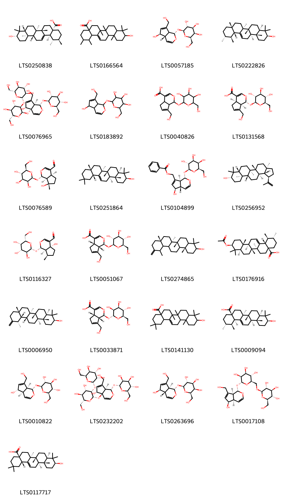

!!! abstract "Tóm tắt"

    Hạt mã đề (Semen Plantaginis), thuộc họ Plantaginaceae, là một dược liệu phổ biến trong y học cổ truyền và dân gian. Loài cây này phân bố rộng rãi trên thế giới, bao gồm các khu vực thuộc châu Á, châu Âu, châu Phi, và châu Mỹ. Tại Việt Nam, mã đề mọc hoang và được trồng phổ biến ở khắp các vùng. Theo kinh nghiệm dân gian, hạt mã đề có nhiều công dụng trong việc điều trị các bệnh lý liên quan đến trị chứng thấp nhiệt ở bàng quang, đái nhỏ giọt, tắc và phù thũng, cầm tiêu chảy, trị nôn, tiêu chảy mùa hè, tiểu tiện không lợi, chữa đái tháo đường, thích hợp cho phụ nữ bị viêm tử cung, huyết trắng. Tác dụng dược lý của mã đề bao gồm lợi tiểu, kháng sinh, hạ huyết áp và hỗ trợ điều trị lỵ cấp và mạn tính. Thành phần hóa học chủ yếu của mã đề là aucubin và plantaginin, ngoài ra ở hạt mã đề còn có các thành phần chất nhầy, axit plantenolic, adenin và cholin. Với những đặc tính này, lá mã đề là một dược liệu quan trọng trong điều trị nhiều chứng bệnh, giúp cải thiện sức khỏe và hỗ trợ điều trị các vấn đề sức khoẻ.

## Thông tin về thực vật

Dược liệu **Mã Đề (Hạt)** từ bộ phận **Hạt** từ loài *Plantago major*.

**Mô tả thực vật:** Là loại cây cỏ sống lâu năm, thân ngắn, lá mọc thành cụm ở gốc, cuống dài, phiến lá hình thìa hay hình trứng, có gân dọc theo sống lá và đồng quy ở ngọn và gốc lá. Hoa mọc thành bông, có cán dài, xuất phát từ kẽ lá. Hoa đều, lưỡng tính, đài 4, xếp chéo, hơi đính nhau ở gốc, tràng màu nâu tồn tại, gồm 4 thuỳ nằm xen kẽ ở giữa các lá đài. Nhị 4 chỉ nhị mảnh, dài, 2 lá noãn, chứa nhiều tiểu noãn. Quả hộp trong chứa nhiều hạt màu nâu đen bóng.

*Tài liệu tham khảo:* "Những cây thuốc và vị thuốc Việt Nam" - Đỗ Tất Lợi 
Trong dược điển Việt nam, một loài được sử dụng làm dược liệu là *Plantago major*.

!!! info "Phân loại thực vật của *Plantago major*"
    - **Kingdom:** Plantae
    - **Phylum:** Tracheophyta
    - **Order:** Lamiales
    - **Family:** Plantaginaceae
    - **Genus:** Plantago
    - **Species:** *Plantago major*

**Phân bố trên thế giới:** Germany, Switzerland, Haiti, Chile, Netherlands, Spain, Mexico, Chinese Taipei, Colombia, Sweden, Hong Kong, South Africa, Australia, Russian Federation, Portugal, Honduras, United Kingdom of Great Britain and Northern Ireland, Brazil, Argentina, Ukraine, Thailand, United States of America, China, Norway, New Zealand, Canada, Ecuador, Greece, Puerto Rico, Denmark, Austria

**Phân bố tại Việt nam:** Không có ghi nhận ở Việt Nam

## Thông tin về dược liệu 

### Định danh

!!! info "Thông tin về tên gọi"

    - Dược liệu tiếng Việt: mã đề
    - Dược liệu tiếng Trung:  ()
    - Dược liệu tiếng Anh: 
    - Dược liệu latin thông dụng: Semen PlantaginisnPlantaginis Semen
    - Dược liệu latin kiểu DĐVN: *semen plantaginis*
    - Dược liệu latin kiểu DĐVN: *Plantaginis Semen*
    - Dược liệu latin kiểu thông tư: **
    - Bộ phận dùng: Hạt (Semen)

### Mô tả dược liệu 

- **Theo dược điển Việt nam V:** Hạt rất nhỏ. hình bầu dục, hơi dẹt, dài rộng khoảng  1 mm. Mặt ngoài màu nâu hay tím đen. Nhìn gân thấy trên  mặt hạt có chấm nhỏ màu trắng khá rõ. Nhìn qua kính lúp  thấy những vân lăn tăn trên bề mặt hạt. Rốn hạt lõm.

- **Mô tả dược liệu theo thông tư chế biến dược liệu theo phương pháp cổ truyền:** 

### Chế biến 

- **Chế biến theo dược điển việt nam V**: 

- **Chế biến theo thông tư:** 

--- 

## Thành phần hóa học

- Theo tài liệu của GS. Đỗ Tất Lợi:  Toàn cây chứa: aucubin, plantaginin
Ngoài ra, Trong lá có thêm : chất nhầy, chất đắng, carotin, vitamin C, vitamin K, vitamin T, axit citric.
    

**Thành phần hóa học từ loài **Plantago major**

Theo cơ sở dữ liệu lotus, loài *Plantago major* đã phân lập và xác định được **159** hoạt chất thuộc về các nhóm Steroids and steroid derivatives, Organooxygen compounds, Flavonoids, Fatty Acyls, Cinnamic acids and derivatives, Hydroxy acids and derivatives, Benzofurans, Phenols, Tannins, Carboxylic acids and derivatives, Benzene and substituted derivatives, Saturated hydrocarbons, Prenol lipids trong bảng dưới đây. Danh sách các hoạt chất như sau hellicoside [(LTS0174069)](https://lotus.naturalproducts.net/compound/lotus_id/LTS0174069), (1s,4as,7as)-7-(hydroxymethyl)-1-{[(2r,3s,4s,5s,6r)-3,4,5-trihydroxy-6-(hydroxymethyl)oxan-2-yl]oxy}-1h,4ah,5h,7ah-cyclopenta[c]pyran-4-carboxylic acid [(LTS0033871)](https://lotus.naturalproducts.net/compound/lotus_id/LTS0033871), 2-[2-(3,4-dihydroxyphenyl)ethoxy]-4,5-dihydroxy-6-(hydroxymethyl)oxan-3-yl 3-(3,4-dihydroxyphenyl)prop-2-enoate [(LTS0020717)](https://lotus.naturalproducts.net/compound/lotus_id/LTS0020717), (2r,3r,4r,5r,6r)-6-[2-(3,4-dihydroxyphenyl)ethoxy]-5-hydroxy-2-(hydroxymethyl)-4-{[(2r,3r,4r,5r,6s)-3,4,5-trihydroxy-6-methyloxan-2-yl]oxy}oxan-3-yl (2e)-3-(4-hydroxy-3-methoxyphenyl)prop-2-enoate [(LTS0036801)](https://lotus.naturalproducts.net/compound/lotus_id/LTS0036801), [(2r,3s,4s,5r,6s)-6-[2-(3,4-dihydroxyphenyl)ethoxy]-3,5-dihydroxy-4-{[(2s,3s,4r,5r,6s)-3,4,5-trihydroxy-6-(hydroxymethyl)oxan-2-yl]oxy}oxan-2-yl]methyl (2e)-3-(3,4-dihydroxyphenyl)prop-2-enoate [(LTS0275867)](https://lotus.naturalproducts.net/compound/lotus_id/LTS0275867), 6-[2-(3,4-dihydroxyphenyl)ethoxy]-5-hydroxy-2-(hydroxymethyl)-4-{[3,4,5-trihydroxy-6-(hydroxymethyl)oxan-2-yl]oxy}oxan-3-yl 3-(3,4-dihydroxyphenyl)prop-2-enoate [(LTS0255997)](https://lotus.naturalproducts.net/compound/lotus_id/LTS0255997), tetratriacontane [(LTS0215630)](https://lotus.naturalproducts.net/compound/lotus_id/LTS0215630), ferulic acid [(LTS0077328)](https://lotus.naturalproducts.net/compound/lotus_id/LTS0077328), campesterol [(LTS0046755)](https://lotus.naturalproducts.net/compound/lotus_id/LTS0046755), fumaric acid [(LTS0114831)](https://lotus.naturalproducts.net/compound/lotus_id/LTS0114831), [2-(3,4-dihydroxyphenyl)-7,8-dihydroxy-hexahydro-2h-pyrano[2,3-b][1,4]dioxin-6-yl]methyl 3-(3,4-dihydroxyphenyl)prop-2-enoate [(LTS0043685)](https://lotus.naturalproducts.net/compound/lotus_id/LTS0043685), 2-(3,4-dihydroxy-5-{[(2s,3r,4s,5s,6r)-3,4,5-trihydroxy-6-(hydroxymethyl)oxan-2-yl]oxy}phenyl)-5,7-dihydroxy-2,3-dihydro-1-benzopyran-4-one [(LTS0007690)](https://lotus.naturalproducts.net/compound/lotus_id/LTS0007690), 5,6-dihydroxy-2-(4-hydroxyphenyl)-7-{[3,4,5-trihydroxy-6-(hydroxymethyl)oxan-2-yl]oxy}chromen-4-one [(LTS0273859)](https://lotus.naturalproducts.net/compound/lotus_id/LTS0273859), methyl caffeate [(LTS0163009)](https://lotus.naturalproducts.net/compound/lotus_id/LTS0163009), galop [(LTS0222857)](https://lotus.naturalproducts.net/compound/lotus_id/LTS0222857), para-coumaric acid [(LTS0266252)](https://lotus.naturalproducts.net/compound/lotus_id/LTS0266252), (-)-malic acid [(LTS0128885)](https://lotus.naturalproducts.net/compound/lotus_id/LTS0128885), (2s,3r,4s,5r,6r)-2-{[(1s,4as,5r)-5-hydroxy-7-(hydroxymethyl)-1h,4ah,5h,7ah-cyclopenta[c]pyran-1-yl]oxy}-6-(hydroxymethyl)oxane-3,4,5-triol [(LTS0057185)](https://lotus.naturalproducts.net/compound/lotus_id/LTS0057185), (2r,3r,4r,5r,6r)-6-[(2r)-2-(3,4-dihydroxyphenyl)-2-hydroxyethoxy]-5-hydroxy-2-(hydroxymethyl)-4-{[(2s,3r,4s,5s,6r)-3,4,5-trihydroxy-6-(hydroxymethyl)oxan-2-yl]oxy}oxan-3-yl (2e)-3-(3,4-dihydroxyphenyl)prop-2-enoate [(LTS0148011)](https://lotus.naturalproducts.net/compound/lotus_id/LTS0148011), chlorogenic acid [(LTS0226495)](https://lotus.naturalproducts.net/compound/lotus_id/LTS0226495), {6-[2-(3,4-dihydroxyphenyl)ethoxy]-3,4,5-trihydroxyoxan-2-yl}methyl 3-(3,4-dihydroxyphenyl)prop-2-enoate [(LTS0179931)](https://lotus.naturalproducts.net/compound/lotus_id/LTS0179931), isorhamnetin [(LTS0107505)](https://lotus.naturalproducts.net/compound/lotus_id/LTS0107505), tritriacontane [(LTS0203319)](https://lotus.naturalproducts.net/compound/lotus_id/LTS0203319), (6ar,6br,8ar,14br)-4,4,6a,6b,8a,12,14b-heptamethyl-11-methylidene-hexadecahydropicen-3-ol [(LTS0274865)](https://lotus.naturalproducts.net/compound/lotus_id/LTS0274865), luteolin 7-o-glucoside [(LTS0227450)](https://lotus.naturalproducts.net/compound/lotus_id/LTS0227450), [(4r,7s,8s,11s)-2-oxo-8-{[(2s,3s,4s,5s,6r)-3,4,5-trihydroxy-6-(hydroxymethyl)oxan-2-yl]oxy}-3,9-dioxatricyclo[5.3.1.0⁴,¹¹]undeca-1(10),5-dien-6-yl]methyl acetate [(LTS0027889)](https://lotus.naturalproducts.net/compound/lotus_id/LTS0027889), (1s,2r,4as,6as,6br,8ar,10s,12ar,12br,14bs)-10-(acetyloxy)-1,2,6a,6b,9,9,12a-heptamethyl-2,3,4,5,6,7,8,8a,10,11,12,12b,13,14b-tetradecahydro-1h-picene-4a-carboxylic acid [(LTS0176916)](https://lotus.naturalproducts.net/compound/lotus_id/LTS0176916), 6-hydroxy-7-methylidene-1-{[(2s,3r,4s,5s,6r)-3,4,5-trihydroxy-6-(hydroxymethyl)oxan-2-yl]oxy}-1h,4ah,5h,6h,7ah-cyclopenta[c]pyran-4-carboxylic acid [(LTS0141606)](https://lotus.naturalproducts.net/compound/lotus_id/LTS0141606), [(1s,4as,5r,7as)-5-hydroxy-1-{[(2s,3r,4s,5r,6r)-3,4,5-trihydroxy-6-(hydroxymethyl)oxan-2-yl]oxy}-1h,4ah,5h,7ah-cyclopenta[c]pyran-7-yl]methyl benzoate [(LTS0104899)](https://lotus.naturalproducts.net/compound/lotus_id/LTS0104899), 6-[2-(3,4-dihydroxyphenyl)ethoxy]-5-hydroxy-2-(hydroxymethyl)-4-[(3,4,5-trihydroxy-6-methyloxan-2-yl)oxy]oxan-3-yl 3-(3,4-dihydroxyphenyl)prop-2-enoate [(LTS0050472)](https://lotus.naturalproducts.net/compound/lotus_id/LTS0050472), aucubin [(LTS0010822)](https://lotus.naturalproducts.net/compound/lotus_id/LTS0010822), nonacosane [(LTS0062747)](https://lotus.naturalproducts.net/compound/lotus_id/LTS0062747), 10-hydroxy-1,2,6a,6b,9,9,12a-heptamethyl-2,3,4,5,6,7,8,8a,10,11,12,12b,13,14b-tetradecahydro-1h-picene-4a-carboxylic acid [(LTS0166564)](https://lotus.naturalproducts.net/compound/lotus_id/LTS0166564), hyperoside [(LTS0089156)](https://lotus.naturalproducts.net/compound/lotus_id/LTS0089156), luteolin [(LTS0017052)](https://lotus.naturalproducts.net/compound/lotus_id/LTS0017052), [(2r,3r,4s,5r,6r)-6-[2-(3,4-dihydroxyphenyl)ethoxy]-3,5-dihydroxy-4-{[(2r,3r,4r,5r,6s)-3,4,5-trihydroxy-6-methyloxan-2-yl]oxy}oxan-2-yl]methyl (2e)-3-(4-hydroxy-3-methoxyphenyl)prop-2-enoate [(LTS0195688)](https://lotus.naturalproducts.net/compound/lotus_id/LTS0195688), 2-({5,6-dihydroxy-2-methyl-3,9-dioxatricyclo[4.4.0.0²,⁴]dec-7-en-10-yl}oxy)-6-(hydroxymethyl)oxane-3,4,5-triol [(LTS0193871)](https://lotus.naturalproducts.net/compound/lotus_id/LTS0193871), verbascoside [(LTS0168159)](https://lotus.naturalproducts.net/compound/lotus_id/LTS0168159), octacosane [(LTS0242387)](https://lotus.naturalproducts.net/compound/lotus_id/LTS0242387), phenylacrylic acid [(LTS0097258)](https://lotus.naturalproducts.net/compound/lotus_id/LTS0097258), 2-(3,4-dihydroxyphenyl)-5,7-dihydroxy-3-{[3,4,5-trihydroxy-6-(hydroxymethyl)oxan-2-yl]oxy}chromen-4-one [(LTS0195312)](https://lotus.naturalproducts.net/compound/lotus_id/LTS0195312), 3-hydroxy-4,5-bis(3,4,5-trihydroxybenzoyloxy)-6-[(3,4,5-trihydroxybenzoyloxy)methyl]oxan-2-yl 3,4,5-trihydroxybenzoate [(LTS0076562)](https://lotus.naturalproducts.net/compound/lotus_id/LTS0076562), {6-[2-(3,4-dihydroxyphenyl)ethoxy]-3,5-dihydroxy-4-{[3,4,5-trihydroxy-6-(hydroxymethyl)oxan-2-yl]oxy}oxan-2-yl}methyl 3-(3,4-dihydroxyphenyl)prop-2-enoate [(LTS0224256)](https://lotus.naturalproducts.net/compound/lotus_id/LTS0224256), (2r,3s,4s,5s,6r)-2-{[(1s,4ar,5r,7as)-5-hydroxy-7-(hydroxymethyl)-1h,4ah,5h,7ah-cyclopenta[c]pyran-1-yl]oxy}-6-({[(2r,3r,4s,5s,6r)-3,4,5-trihydroxy-6-(hydroxymethyl)oxan-2-yl]oxy}methyl)oxane-3,4,5-triol [(LTS0017108)](https://lotus.naturalproducts.net/compound/lotus_id/LTS0017108), (3r,4r,6r)-6-[2-(3,4-dihydroxyphenyl)ethoxy]-5-hydroxy-2-(hydroxymethyl)-4-{[(2s,3s,5r)-3,4,5-trihydroxy-6-methyloxan-2-yl]oxy}oxan-3-yl (2e)-3-(3,4-dihydroxyphenyl)prop-2-enoate [(LTS0063526)](https://lotus.naturalproducts.net/compound/lotus_id/LTS0063526), nepitrin [(LTS0032877)](https://lotus.naturalproducts.net/compound/lotus_id/LTS0032877), plantamajoside [(LTS0032137)](https://lotus.naturalproducts.net/compound/lotus_id/LTS0032137), 6-[2-(3,4-dihydroxyphenyl)-2-hydroxyethoxy]-5-hydroxy-2-(hydroxymethyl)-4-{[3,4,5-trihydroxy-6-(hydroxymethyl)oxan-2-yl]oxy}oxan-3-yl 3-(3,4-dihydroxyphenyl)prop-2-enoate [(LTS0119924)](https://lotus.naturalproducts.net/compound/lotus_id/LTS0119924), malonic acid [(LTS0195913)](https://lotus.naturalproducts.net/compound/lotus_id/LTS0195913), plantaginin [(LTS0093185)](https://lotus.naturalproducts.net/compound/lotus_id/LTS0093185), [(2r,3r,4s,5r,6r)-6-[2-(3,4-dihydroxyphenyl)ethoxy]-3,5-dihydroxy-4-{[(2r,3r,4r,5r,6s)-3,4,5-trihydroxy-6-methyloxan-2-yl]oxy}oxan-2-yl]methyl (2e)-3-(3,4-dihydroxyphenyl)prop-2-enoate [(LTS0126301)](https://lotus.naturalproducts.net/compound/lotus_id/LTS0126301), (2r,3r,4s,5r,6s)-3-hydroxy-2-(hydroxymethyl)-5,6-bis(3,4,5-trihydroxybenzoyloxy)oxan-4-yl 3,4,5-trihydroxybenzoate [(LTS0113903)](https://lotus.naturalproducts.net/compound/lotus_id/LTS0113903), salicyclic acid [(LTS0116548)](https://lotus.naturalproducts.net/compound/lotus_id/LTS0116548), [(2r,3r,4s,5r,6r)-3,5-dihydroxy-6-[2-(3-hydroxy-4-methoxyphenyl)ethoxy]-4-{[(2r,3r,4s,5s,6r)-3,4,5-trihydroxy-6-(hydroxymethyl)oxan-2-yl]oxy}oxan-2-yl]methyl (2e)-3-(4-hydroxy-3-methoxyphenyl)prop-2-enoate [(LTS0018395)](https://lotus.naturalproducts.net/compound/lotus_id/LTS0018395), calceolarioside b [(LTS0180020)](https://lotus.naturalproducts.net/compound/lotus_id/LTS0180020), 5-hydroxy-6-[2-(3-hydroxy-4-methoxyphenyl)ethoxy]-2-(hydroxymethyl)-4-[(3,4,5-trihydroxy-6-methyloxan-2-yl)oxy]oxan-3-yl 3-(4-hydroxy-3-methoxyphenyl)prop-2-enoate [(LTS0108163)](https://lotus.naturalproducts.net/compound/lotus_id/LTS0108163), (2r,3s,4r,5r,6r)-6-[2-(3,4-dihydroxyphenyl)ethoxy]-4,5-dihydroxy-2-(hydroxymethyl)oxan-3-yl (2e)-3-(3,4-dihydroxyphenyl)prop-2-enoate [(LTS0061085)](https://lotus.naturalproducts.net/compound/lotus_id/LTS0061085), amyrin [(LTS0222826)](https://lotus.naturalproducts.net/compound/lotus_id/LTS0222826), triacontane [(LTS0250709)](https://lotus.naturalproducts.net/compound/lotus_id/LTS0250709), methyl 9-hydroxyoctadec-11-enoate [(LTS0241479)](https://lotus.naturalproducts.net/compound/lotus_id/LTS0241479), asperuloside [(LTS0186128)](https://lotus.naturalproducts.net/compound/lotus_id/LTS0186128), methyl 6-hydroxy-7-methyl-1-{[3,4,5-trihydroxy-6-(hydroxymethyl)oxan-2-yl]oxy}-1h,4ah,5h,6h-cyclopenta[c]pyran-4-carboxylate [(LTS0004188)](https://lotus.naturalproducts.net/compound/lotus_id/LTS0004188), butenedioic acid [(LTS0069098)](https://lotus.naturalproducts.net/compound/lotus_id/LTS0069098), neochlorogenic acid [(LTS0235816)](https://lotus.naturalproducts.net/compound/lotus_id/LTS0235816), hexacosane [(LTS0079361)](https://lotus.naturalproducts.net/compound/lotus_id/LTS0079361), (2s)-2-(3,4-dihydroxy-5-{[(2s,3s,4s,5s,6r)-3,4,5-trihydroxy-6-(hydroxymethyl)oxan-2-yl]oxy}phenyl)-5,7-dihydroxy-2,3-dihydro-1-benzopyran-4-one [(LTS0132976)](https://lotus.naturalproducts.net/compound/lotus_id/LTS0132976), {6-[2-(3,4-dihydroxyphenyl)ethoxy]-3,5-dihydroxy-4-[(3,4,5-trihydroxy-6-methyloxan-2-yl)oxy]oxan-2-yl}methyl 3-(3,4-dihydroxyphenyl)prop-2-enoate [(LTS0270785)](https://lotus.naturalproducts.net/compound/lotus_id/LTS0270785), (2r)-2-{[(1r,2s,6s)-5-hydroxy-2-(hydroxymethyl)-3,9-dioxatricyclo[4.4.0.0²,⁴]dec-7-en-10-yl]oxy}-6-(hydroxymethyl)oxane-3,4,5-triol [(LTS0137228)](https://lotus.naturalproducts.net/compound/lotus_id/LTS0137228), [(4ar,6r,7s,8s,8ar)-2-(3,4-dihydroxyphenyl)-7,8-dihydroxy-hexahydro-2h-pyrano[2,3-b][1,4]dioxin-6-yl]methyl (2e)-3-(3,4-dihydroxyphenyl)prop-2-enoate [(LTS0042103)](https://lotus.naturalproducts.net/compound/lotus_id/LTS0042103), {6-[2-(3,4-dihydroxyphenyl)ethoxy]-3,5-dihydroxy-4-[(3,4,5-trihydroxy-6-methyloxan-2-yl)oxy]oxan-2-yl}methyl 3-(4-hydroxy-3-methoxyphenyl)prop-2-enoate [(LTS0025301)](https://lotus.naturalproducts.net/compound/lotus_id/LTS0025301), [(2r,3r,4s,5r,6r)-3,5-dihydroxy-6-[2-(3-hydroxy-4-methoxyphenyl)ethoxy]-4-{[(2r,3r,4r,5s,6r)-3,4,5-trihydroxy-6-(hydroxymethyl)oxan-2-yl]oxy}oxan-2-yl]methyl (2e)-3-(4-hydroxy-3-methoxyphenyl)prop-2-enoate [(LTS0225069)](https://lotus.naturalproducts.net/compound/lotus_id/LTS0225069), stigmast-5-en-3-ol, (3β)- [(LTS0204616)](https://lotus.naturalproducts.net/compound/lotus_id/LTS0204616), malic acid [(LTS0216520)](https://lotus.naturalproducts.net/compound/lotus_id/LTS0216520), succinic acid [(LTS0237204)](https://lotus.naturalproducts.net/compound/lotus_id/LTS0237204), (2r,3r,4r,5r,6r)-6-[2-(3,4-dihydroxyphenyl)ethoxy]-5-hydroxy-2-(hydroxymethyl)-4-{[(2s,3r,4s,5r,6s)-3,4,5-trihydroxy-6-methyloxan-2-yl]oxy}oxan-3-yl (2e)-3-(3,4-dihydroxyphenyl)prop-2-enoate [(LTS0178188)](https://lotus.naturalproducts.net/compound/lotus_id/LTS0178188), (1s,4as,7s,7as)-7-hydroxy-7-methyl-1-{[(2s,3s,4s,5s,6r)-3,4,5-trihydroxy-6-(hydroxymethyl)oxan-2-yl]oxy}-1h,4ah,5h,6h,7ah-cyclopenta[c]pyran-4-carbaldehyde [(LTS0076589)](https://lotus.naturalproducts.net/compound/lotus_id/LTS0076589), taraxasterol [(LTS0006950)](https://lotus.naturalproducts.net/compound/lotus_id/LTS0006950), hentriacontane [(LTS0046415)](https://lotus.naturalproducts.net/compound/lotus_id/LTS0046415), scutellarein [(LTS0136843)](https://lotus.naturalproducts.net/compound/lotus_id/LTS0136843), (2r,3r,4s,5s,6r)-2-[2-(3,4-dihydroxyphenyl)ethoxy]-4,5-dihydroxy-6-(hydroxymethyl)oxan-3-yl (2e)-3-(3,4-dihydroxyphenyl)prop-2-enoate [(LTS0060181)](https://lotus.naturalproducts.net/compound/lotus_id/LTS0060181), methyl 7-[(acetyloxy)methyl]-6-hydroxy-1-{[3,4,5-trihydroxy-6-(hydroxymethyl)oxan-2-yl]oxy}-1h,4ah,5h,6h-cyclopenta[c]pyran-4-carboxylate [(LTS0231762)](https://lotus.naturalproducts.net/compound/lotus_id/LTS0231762), (1s,2r,4as,6as,6br,8ar,10s,12ar,12br,14br)-10-hydroxy-1,2,6a,6b,9,9,12a-heptamethyl-2,3,4,5,6,7,8,8a,10,11,12,12b,13,14b-tetradecahydro-1h-picene-4a-carboxylic acid [(LTS0009094)](https://lotus.naturalproducts.net/compound/lotus_id/LTS0009094), 7-(hydroxymethyl)-1-{[3,4,5-trihydroxy-6-(hydroxymethyl)oxan-2-yl]oxy}-1h,4ah,5h,7ah-cyclopenta[c]pyran-4-carboxylic acid [(LTS0040826)](https://lotus.naturalproducts.net/compound/lotus_id/LTS0040826), methyl (1s,4as,6s)-7-[(acetyloxy)methyl]-6-hydroxy-1-{[(2s,3r,4s,5s,6r)-3,4,5-trihydroxy-6-(hydroxymethyl)oxan-2-yl]oxy}-1h,4ah,5h,6h-cyclopenta[c]pyran-4-carboxylate [(LTS0211713)](https://lotus.naturalproducts.net/compound/lotus_id/LTS0211713), [(2r,3s,4s,5s,6s)-3,5-dihydroxy-6-[2-(3-hydroxy-4-methoxyphenyl)ethoxy]-4-{[(2r,3s,4s,5s,6s)-3,4,5-trihydroxy-6-(hydroxymethyl)oxan-2-yl]oxy}oxan-2-yl]methyl (2e)-3-(4-hydroxy-3-methoxyphenyl)prop-2-enoate [(LTS0001359)](https://lotus.naturalproducts.net/compound/lotus_id/LTS0001359), (2r,3r,4r,5r,6r)-5-hydroxy-6-[2-(3-hydroxy-4-methoxyphenyl)ethoxy]-2-(hydroxymethyl)-4-{[(2s,3r,4r,5r,6s)-3,4,5-trihydroxy-6-methyloxan-2-yl]oxy}oxan-3-yl (2e)-3-(4-hydroxy-3-methoxyphenyl)prop-2-enoate [(LTS0105864)](https://lotus.naturalproducts.net/compound/lotus_id/LTS0105864), 3-rutinosyl quercetin [(LTS0032845)](https://lotus.naturalproducts.net/compound/lotus_id/LTS0032845), quercetin [(LTS0004651)](https://lotus.naturalproducts.net/compound/lotus_id/LTS0004651), methyl 3-(3,4-dihydroxyphenyl)prop-2-enoate [(LTS0080306)](https://lotus.naturalproducts.net/compound/lotus_id/LTS0080306), stigmast-5-en-3-ol [(LTS0071224)](https://lotus.naturalproducts.net/compound/lotus_id/LTS0071224), 3-{[3-(3,4-dihydroxyphenyl)prop-2-enoyl]oxy}-1,4,5-trihydroxycyclohexane-1-carboxylic acid [(LTS0143901)](https://lotus.naturalproducts.net/compound/lotus_id/LTS0143901), (1s,4as,6s,7as)-6-hydroxy-7-methylidene-1-{[(2s,3s,4r,5s,6r)-3,4,5-trihydroxy-6-(hydroxymethyl)oxan-2-yl]oxy}-1h,4ah,5h,6h,7ah-cyclopenta[c]pyran-4-carboxylic acid [(LTS0161312)](https://lotus.naturalproducts.net/compound/lotus_id/LTS0161312), (2s,3r,4s,5r,6r)-3,4,5-tris(3,4,5-trihydroxybenzoyloxy)-6-[(3,4,5-trihydroxybenzoyloxy)methyl]oxan-2-yl 3,4,5-trihydroxybenzoate [(LTS0216134)](https://lotus.naturalproducts.net/compound/lotus_id/LTS0216134), methyl (9r,11z)-9-hydroxyoctadec-11-enoate [(LTS0172883)](https://lotus.naturalproducts.net/compound/lotus_id/LTS0172883), (2s,4s,5s,10s)-2-(hydroxymethyl)-10-{[(2s,3r,4s,5s,6r)-3,4,5-trihydroxy-6-(hydroxymethyl)oxan-2-yl]oxy}-3,9-dioxatricyclo[4.4.0.0²,⁴]dec-7-en-5-yl 4-hydroxy-3-methoxybenzoate [(LTS0146787)](https://lotus.naturalproducts.net/compound/lotus_id/LTS0146787), ethyl caffeate [(LTS0147324)](https://lotus.naturalproducts.net/compound/lotus_id/LTS0147324), (2s,3r,4r,5r,6r)-3-hydroxy-4,5-bis(3,4,5-trihydroxybenzoyloxy)-6-[(3,4,5-trihydroxybenzoyloxy)methyl]oxan-2-yl 3,4,5-trihydroxybenzoate [(LTS0245464)](https://lotus.naturalproducts.net/compound/lotus_id/LTS0245464), cinnamic acid [(LTS0128130)](https://lotus.naturalproducts.net/compound/lotus_id/LTS0128130), (2s,3r,4s,5s,6r)-2-{[(1s,2s,4s,5s,6s,10s)-5-hydroxy-2-(hydroxymethyl)-3,9-dioxatricyclo[4.4.0.0²,⁴]dec-7-en-10-yl]oxy}-6-(hydroxymethyl)oxane-3,4,5-triol [(LTS0161967)](https://lotus.naturalproducts.net/compound/lotus_id/LTS0161967), (2r,3r,4r,5r,6r)-6-[2-(3,4-dihydroxyphenyl)ethoxy]-5-hydroxy-2-(hydroxymethyl)-4-{[(2r,3r,4s,5s,6r)-3,4,5-trihydroxy-6-(hydroxymethyl)oxan-2-yl]oxy}oxan-3-yl (2e)-3-(3,4-dihydroxyphenyl)prop-2-enoate [(LTS0133938)](https://lotus.naturalproducts.net/compound/lotus_id/LTS0133938), [(2r,3r,4s,5r,6r)-3,5-dihydroxy-6-[2-(3-hydroxy-4-methoxyphenyl)ethoxy]-4-{[(2s,3r,4r,5r,6s)-3,4,5-trihydroxy-6-methyloxan-2-yl]oxy}oxan-2-yl]methyl (2e)-3-(4-hydroxy-3-methoxyphenyl)prop-2-enoate [(LTS0003736)](https://lotus.naturalproducts.net/compound/lotus_id/LTS0003736), ferulic acid [(LTS0273002)](https://lotus.naturalproducts.net/compound/lotus_id/LTS0273002), (2s,3r,4s,5s,6r)-2-{[(2r,3r,4s,5s,6r)-2-{[(1s,4as,5r,7ar)-5-hydroxy-7-(hydroxymethyl)-1-{[(2s,3r,4s,5s,6r)-3,4,5-trihydroxy-6-(hydroxymethyl)oxan-2-yl]oxy}-1h,5h,7ah-cyclopenta[c]pyran-4a-yl]oxy}-4,5-dihydroxy-6-(hydroxymethyl)oxan-3-yl]oxy}-6-(hydroxymethyl)oxane-3,4,5-triol [(LTS0076965)](https://lotus.naturalproducts.net/compound/lotus_id/LTS0076965), [(2r,3r,4s,5r,6r)-6-[2-(3,4-dihydroxyphenyl)ethoxy]-3,5-dihydroxy-4-{[(2s,3r,4r,5r,6s)-3,4,5-trihydroxy-6-methyloxan-2-yl]oxy}oxan-2-yl]methyl (2e)-3-(3-hydroxy-4-methoxyphenyl)prop-2-enoate [(LTS0243585)](https://lotus.naturalproducts.net/compound/lotus_id/LTS0243585), 3-hydroxy-2-(hydroxymethyl)-5,6-bis(3,4,5-trihydroxybenzoyloxy)oxan-4-yl 3,4,5-trihydroxybenzoate [(LTS0232193)](https://lotus.naturalproducts.net/compound/lotus_id/LTS0232193), {3,5-dihydroxy-6-[2-(3-hydroxy-4-methoxyphenyl)ethoxy]-4-{[3,4,5-trihydroxy-6-(hydroxymethyl)oxan-2-yl]oxy}oxan-2-yl}methyl 3-(4-hydroxy-3-methoxyphenyl)prop-2-enoate [(LTS0046498)](https://lotus.naturalproducts.net/compound/lotus_id/LTS0046498), loliolide [(LTS0254454)](https://lotus.naturalproducts.net/compound/lotus_id/LTS0254454), vanillic acid [(LTS0229113)](https://lotus.naturalproducts.net/compound/lotus_id/LTS0229113), chamomile [(LTS0104946)](https://lotus.naturalproducts.net/compound/lotus_id/LTS0104946), methyl (1s,4as,6s)-6-hydroxy-7-(hydroxymethyl)-1-{[(2s,3r,4s,5s,6r)-3,4,5-trihydroxy-6-(hydroxymethyl)oxan-2-yl]oxy}-1h,4ah,5h,6h-cyclopenta[c]pyran-4-carboxylate [(LTS0036023)](https://lotus.naturalproducts.net/compound/lotus_id/LTS0036023), heptacosane [(LTS0150428)](https://lotus.naturalproducts.net/compound/lotus_id/LTS0150428), asperuloside [(LTS0072898)](https://lotus.naturalproducts.net/compound/lotus_id/LTS0072898), (1r,4ar,7ar)-7-(hydroxymethyl)-1-{[(2s,3r,4s,5s,6r)-3,4,5-trihydroxy-6-(hydroxymethyl)oxan-2-yl]oxy}-1h,4ah,5h,7ah-cyclopenta[c]pyran-4-carboxylic acid [(LTS0131568)](https://lotus.naturalproducts.net/compound/lotus_id/LTS0131568), ethyl 3-(3,4-dihydroxyphenyl)prop-2-enoate [(LTS0196241)](https://lotus.naturalproducts.net/compound/lotus_id/LTS0196241), oleanolic acid [(LTS0141130)](https://lotus.naturalproducts.net/compound/lotus_id/LTS0141130), phytosterol [(LTS0029311)](https://lotus.naturalproducts.net/compound/lotus_id/LTS0029311), dotriacontane [(LTS0101459)](https://lotus.naturalproducts.net/compound/lotus_id/LTS0101459), (1s,4ar,7r,7ar)-4a-hydroxy-7-methyl-1-{[(2r,3s,4r,5s,6s)-3,4,5-trihydroxy-6-(hydroxymethyl)oxan-2-yl]oxy}-1h,5h,6h,7h,7ah-cyclopenta[c]pyran-4-carbaldehyde [(LTS0116327)](https://lotus.naturalproducts.net/compound/lotus_id/LTS0116327), loliolide [(LTS0119422)](https://lotus.naturalproducts.net/compound/lotus_id/LTS0119422), luteolin 7-o-glucuronide [(LTS0081420)](https://lotus.naturalproducts.net/compound/lotus_id/LTS0081420), methyl (1s,4as,6s)-6-hydroxy-7-methyl-1-{[(2s,3r,4s,5s,6r)-3,4,5-trihydroxy-6-(hydroxymethyl)oxan-2-yl]oxy}-1h,4ah,5h,6h-cyclopenta[c]pyran-4-carboxylate [(LTS0179065)](https://lotus.naturalproducts.net/compound/lotus_id/LTS0179065), citric acid [(LTS0213921)](https://lotus.naturalproducts.net/compound/lotus_id/LTS0213921), 6-[2-(3,4-dihydroxyphenyl)ethoxy]-4,5-dihydroxy-2-(hydroxymethyl)oxan-3-yl 3-(3,4-dihydroxyphenyl)prop-2-enoate [(LTS0133175)](https://lotus.naturalproducts.net/compound/lotus_id/LTS0133175), syringic acid [(LTS0210036)](https://lotus.naturalproducts.net/compound/lotus_id/LTS0210036), geniposidic acid [(LTS0051067)](https://lotus.naturalproducts.net/compound/lotus_id/LTS0051067), catalpol [(LTS0114481)](https://lotus.naturalproducts.net/compound/lotus_id/LTS0114481), [(2s,4ar,6r,7s,8s,8ar)-2-(3,4-dihydroxyphenyl)-7,8-dihydroxy-hexahydro-2h-pyrano[2,3-b][1,4]dioxin-6-yl]methyl (2e)-3-(3,4-dihydroxyphenyl)prop-2-enoate [(LTS0012177)](https://lotus.naturalproducts.net/compound/lotus_id/LTS0012177), (.+-.)-tartaric acid [(LTS0061981)](https://lotus.naturalproducts.net/compound/lotus_id/LTS0061981), aucubin [(LTS0183892)](https://lotus.naturalproducts.net/compound/lotus_id/LTS0183892), β-amyrin [(LTS0251864)](https://lotus.naturalproducts.net/compound/lotus_id/LTS0251864), p-hydroxybenzoic acid [(LTS0263634)](https://lotus.naturalproducts.net/compound/lotus_id/LTS0263634), [(2r,3r,4s,5r,6r)-6-[2-(3,4-dihydroxyphenyl)ethoxy]-3,5-dihydroxy-4-{[(2s,3r,4s,5s,6r)-3,4,5-trihydroxy-6-(hydroxymethyl)oxan-2-yl]oxy}oxan-2-yl]methyl (2e)-3-(3,4-dihydroxyphenyl)prop-2-enoate [(LTS0075267)](https://lotus.naturalproducts.net/compound/lotus_id/LTS0075267), plantagoside [(LTS0036853)](https://lotus.naturalproducts.net/compound/lotus_id/LTS0036853), 2-[2-(3,4-dihydroxyphenyl)ethoxy]-3,5-dihydroxy-6-(hydroxymethyl)oxan-4-yl 3-(3,4-dihydroxyphenyl)prop-2-enoate [(LTS0249969)](https://lotus.naturalproducts.net/compound/lotus_id/LTS0249969), oleanolic acid [(LTS0117717)](https://lotus.naturalproducts.net/compound/lotus_id/LTS0117717), (1r,3as,3bs,7s,9bs)-1-[(2r,5r)-5,6-dimethylheptan-2-yl]-9a,11a-dimethyl-1h,2h,3h,3ah,3bh,4h,6h,7h,8h,9h,9bh,10h,11h-cyclopenta[a]phenanthren-7-ol [(LTS0057877)](https://lotus.naturalproducts.net/compound/lotus_id/LTS0057877), 2,5-dihydroxybenzoic acid [(LTS0170793)](https://lotus.naturalproducts.net/compound/lotus_id/LTS0170793), lupeol [(LTS0256952)](https://lotus.naturalproducts.net/compound/lotus_id/LTS0256952), plantagoside [(LTS0089096)](https://lotus.naturalproducts.net/compound/lotus_id/LTS0089096), ursolic acid [(LTS0250838)](https://lotus.naturalproducts.net/compound/lotus_id/LTS0250838), {3,5-dihydroxy-6-[2-(3-hydroxy-4-methoxyphenyl)ethoxy]-4-[(3,4,5-trihydroxy-6-methyloxan-2-yl)oxy]oxan-2-yl}methyl 3-(4-hydroxy-3-methoxyphenyl)prop-2-enoate [(LTS0151863)](https://lotus.naturalproducts.net/compound/lotus_id/LTS0151863), 6-[2-(3,4-dihydroxyphenyl)ethoxy]-5-hydroxy-2-(hydroxymethyl)-4-[(3,4,5-trihydroxy-6-methyloxan-2-yl)oxy]oxan-3-yl 3-(4-hydroxy-3-methoxyphenyl)prop-2-enoate [(LTS0063413)](https://lotus.naturalproducts.net/compound/lotus_id/LTS0063413), (2r,3r,4r,5r,6r)-6-[2-(3,4-dihydroxyphenyl)ethoxy]-5-hydroxy-2-(hydroxymethyl)-4-{[(2s,3r,4r,5r,6s)-3,4,5-trihydroxy-6-methyloxan-2-yl]oxy}oxan-3-yl (2e)-3-(3-hydroxy-4-methoxyphenyl)prop-2-enoate [(LTS0218569)](https://lotus.naturalproducts.net/compound/lotus_id/LTS0218569), methyl (1s,6s)-6-hydroxy-7-methyl-1-{[(2s,3r,4s,5s,6r)-3,4,5-trihydroxy-6-(hydroxymethyl)oxan-2-yl]oxy}-1h,4ah,5h,6h-cyclopenta[c]pyran-4-carboxylate [(LTS0231638)](https://lotus.naturalproducts.net/compound/lotus_id/LTS0231638), benzoic acid [(LTS0145871)](https://lotus.naturalproducts.net/compound/lotus_id/LTS0145871), [(2r,3r,4s,5r,6r)-6-[2-(3,4-dihydroxyphenyl)ethoxy]-3,5-dihydroxy-4-{[(2r,3r,4s,5s,6r)-3,4,5-trihydroxy-6-(hydroxymethyl)oxan-2-yl]oxy}oxan-2-yl]methyl (2e)-3-(3,4-dihydroxyphenyl)prop-2-enoate [(LTS0060369)](https://lotus.naturalproducts.net/compound/lotus_id/LTS0060369), pentacosane [(LTS0080764)](https://lotus.naturalproducts.net/compound/lotus_id/LTS0080764), 3,4,5-tris(3,4,5-trihydroxybenzoyloxy)-6-[(3,4,5-trihydroxybenzoyloxy)methyl]oxan-2-yl 3,4,5-trihydroxybenzoate [(LTS0226232)](https://lotus.naturalproducts.net/compound/lotus_id/LTS0226232), hispidulin [(LTS0135598)](https://lotus.naturalproducts.net/compound/lotus_id/LTS0135598), hydroxycinnamic acid [(LTS0233023)](https://lotus.naturalproducts.net/compound/lotus_id/LTS0233023), antirrhinoside [(LTS0029316)](https://lotus.naturalproducts.net/compound/lotus_id/LTS0029316), tyrosol [(LTS0132195)](https://lotus.naturalproducts.net/compound/lotus_id/LTS0132195), [(2r,3r,4s,5r,6r)-6-[2-(3,4-dihydroxyphenyl)ethoxy]-3,5-dihydroxy-4-{[(2s,3r,4r,5r,6s)-3,4,5-trihydroxy-6-methyloxan-2-yl]oxy}oxan-2-yl]methyl (2e)-3-(4-hydroxy-3-methoxyphenyl)prop-2-enoate [(LTS0242289)](https://lotus.naturalproducts.net/compound/lotus_id/LTS0242289), (-)-tartaric acid [(LTS0214562)](https://lotus.naturalproducts.net/compound/lotus_id/LTS0214562), (2s,3s,4s,5s,6s)-2-{[(2s,3s,4s,5s,6r)-2-{[(1s,4ar,5r,7ar)-5-hydroxy-7-(hydroxymethyl)-1-{[(2r,3s,4s,5s,6r)-3,4,5-trihydroxy-6-(hydroxymethyl)oxan-2-yl]oxy}-1h,5h,7ah-cyclopenta[c]pyran-4a-yl]oxy}-4,5-dihydroxy-6-(hydroxymethyl)oxan-3-yl]oxy}-6-(hydroxymethyl)oxane-3,4,5-triol [(LTS0232202)](https://lotus.naturalproducts.net/compound/lotus_id/LTS0232202), homoplantaginin [(LTS0142016)](https://lotus.naturalproducts.net/compound/lotus_id/LTS0142016), (2r,3r,4s,5r,6r)-2-[2-(3,4-dihydroxyphenyl)ethoxy]-3,5-dihydroxy-6-(hydroxymethyl)oxan-4-yl (2e)-3-(3,4-dihydroxyphenyl)prop-2-enoate [(LTS0183723)](https://lotus.naturalproducts.net/compound/lotus_id/LTS0183723), (2s,3r,4s,5r,6r)-2-{[(1s,4as,5r,7as)-5-hydroxy-7-(hydroxymethyl)-1h,4ah,5h,7ah-cyclopenta[c]pyran-1-yl]oxy}-6-(hydroxymethyl)oxane-3,4,5-triol [(LTS0263696)](https://lotus.naturalproducts.net/compound/lotus_id/LTS0263696), rutin [(LTS0042292)](https://lotus.naturalproducts.net/compound/lotus_id/LTS0042292). 
        
| chemicalTaxonomyClassyfireClass     |   smiles_count |
|:------------------------------------|---------------:|
| Benzene and substituted derivatives |            129 |
| Benzofurans                         |             64 |
| Carboxylic acids and derivatives    |             85 |
| Cinnamic acids and derivatives      |           4363 |
| Fatty Acyls                         |             62 |
| Flavonoids                          |           1274 |
| Hydroxy acids and derivatives       |             38 |
| Organooxygen compounds              |           1402 |
| Phenols                             |             14 |
| Prenol lipids                       |           2284 |
| Saturated hydrocarbons              |            295 |
| Steroids and steroid derivatives    |            348 |
| Tannins                             |            818 |

            
### Nhóm Benzene and substituted derivatives
<figure markdown="span">
    { width=100% }
<figcaption>Hình ảnh cấu trúc hóa học của hoạt chất thuộc nhóm *Benzene and substituted derivatives*. Tên thường gọi của các hoạt chất tương ứng là syringic acid [(LTS0210036)](https://lotus.naturalproducts.net/compound/lotus_id/LTS0210036), 2,5-dihydroxybenzoic acid [(LTS0170793)](https://lotus.naturalproducts.net/compound/lotus_id/LTS0170793), benzoic acid [(LTS0145871)](https://lotus.naturalproducts.net/compound/lotus_id/LTS0145871), galop [(LTS0222857)](https://lotus.naturalproducts.net/compound/lotus_id/LTS0222857), p-hydroxybenzoic acid [(LTS0263634)](https://lotus.naturalproducts.net/compound/lotus_id/LTS0263634), vanillic acid [(LTS0229113)](https://lotus.naturalproducts.net/compound/lotus_id/LTS0229113), salicyclic acid [(LTS0116548)](https://lotus.naturalproducts.net/compound/lotus_id/LTS0116548).</figcaption>
</figure>

            
            
### Nhóm Benzene and substituted derivatives
<figure markdown="span">
    { width=100% }
<figcaption>Hình ảnh cấu trúc hóa học của hoạt chất thuộc nhóm *Benzene and substituted derivatives*. Tên thường gọi của các hoạt chất tương ứng là syringic acid [(LTS0210036)](https://lotus.naturalproducts.net/compound/lotus_id/LTS0210036), 2,5-dihydroxybenzoic acid [(LTS0170793)](https://lotus.naturalproducts.net/compound/lotus_id/LTS0170793), benzoic acid [(LTS0145871)](https://lotus.naturalproducts.net/compound/lotus_id/LTS0145871), galop [(LTS0222857)](https://lotus.naturalproducts.net/compound/lotus_id/LTS0222857), p-hydroxybenzoic acid [(LTS0263634)](https://lotus.naturalproducts.net/compound/lotus_id/LTS0263634), vanillic acid [(LTS0229113)](https://lotus.naturalproducts.net/compound/lotus_id/LTS0229113), salicyclic acid [(LTS0116548)](https://lotus.naturalproducts.net/compound/lotus_id/LTS0116548).</figcaption>
</figure>

### Nhóm Benzofurans
<figure markdown="span">
    { width=100% }
<figcaption>Hình ảnh cấu trúc hóa học của hoạt chất thuộc nhóm *Benzofurans*. Tên thường gọi của các hoạt chất tương ứng là loliolide [(LTS0254454)](https://lotus.naturalproducts.net/compound/lotus_id/LTS0254454), loliolide [(LTS0119422)](https://lotus.naturalproducts.net/compound/lotus_id/LTS0119422).</figcaption>
</figure>

            
            
### Nhóm Benzene and substituted derivatives
<figure markdown="span">
    { width=100% }
<figcaption>Hình ảnh cấu trúc hóa học của hoạt chất thuộc nhóm *Benzene and substituted derivatives*. Tên thường gọi của các hoạt chất tương ứng là syringic acid [(LTS0210036)](https://lotus.naturalproducts.net/compound/lotus_id/LTS0210036), 2,5-dihydroxybenzoic acid [(LTS0170793)](https://lotus.naturalproducts.net/compound/lotus_id/LTS0170793), benzoic acid [(LTS0145871)](https://lotus.naturalproducts.net/compound/lotus_id/LTS0145871), galop [(LTS0222857)](https://lotus.naturalproducts.net/compound/lotus_id/LTS0222857), p-hydroxybenzoic acid [(LTS0263634)](https://lotus.naturalproducts.net/compound/lotus_id/LTS0263634), vanillic acid [(LTS0229113)](https://lotus.naturalproducts.net/compound/lotus_id/LTS0229113), salicyclic acid [(LTS0116548)](https://lotus.naturalproducts.net/compound/lotus_id/LTS0116548).</figcaption>
</figure>

### Nhóm Benzofurans
<figure markdown="span">
    { width=100% }
<figcaption>Hình ảnh cấu trúc hóa học của hoạt chất thuộc nhóm *Benzofurans*. Tên thường gọi của các hoạt chất tương ứng là loliolide [(LTS0254454)](https://lotus.naturalproducts.net/compound/lotus_id/LTS0254454), loliolide [(LTS0119422)](https://lotus.naturalproducts.net/compound/lotus_id/LTS0119422).</figcaption>
</figure>

### Nhóm Carboxylic acids and derivatives
<figure markdown="span">
    { width=100% }
<figcaption>Hình ảnh cấu trúc hóa học của hoạt chất thuộc nhóm *Carboxylic acids and derivatives*. Tên thường gọi của các hoạt chất tương ứng là citric acid [(LTS0213921)](https://lotus.naturalproducts.net/compound/lotus_id/LTS0213921), fumaric acid [(LTS0114831)](https://lotus.naturalproducts.net/compound/lotus_id/LTS0114831), malonic acid [(LTS0195913)](https://lotus.naturalproducts.net/compound/lotus_id/LTS0195913), succinic acid [(LTS0237204)](https://lotus.naturalproducts.net/compound/lotus_id/LTS0237204), butenedioic acid [(LTS0069098)](https://lotus.naturalproducts.net/compound/lotus_id/LTS0069098).</figcaption>
</figure>

            
            
### Nhóm Benzene and substituted derivatives
<figure markdown="span">
    { width=100% }
<figcaption>Hình ảnh cấu trúc hóa học của hoạt chất thuộc nhóm *Benzene and substituted derivatives*. Tên thường gọi của các hoạt chất tương ứng là syringic acid [(LTS0210036)](https://lotus.naturalproducts.net/compound/lotus_id/LTS0210036), 2,5-dihydroxybenzoic acid [(LTS0170793)](https://lotus.naturalproducts.net/compound/lotus_id/LTS0170793), benzoic acid [(LTS0145871)](https://lotus.naturalproducts.net/compound/lotus_id/LTS0145871), galop [(LTS0222857)](https://lotus.naturalproducts.net/compound/lotus_id/LTS0222857), p-hydroxybenzoic acid [(LTS0263634)](https://lotus.naturalproducts.net/compound/lotus_id/LTS0263634), vanillic acid [(LTS0229113)](https://lotus.naturalproducts.net/compound/lotus_id/LTS0229113), salicyclic acid [(LTS0116548)](https://lotus.naturalproducts.net/compound/lotus_id/LTS0116548).</figcaption>
</figure>

### Nhóm Benzofurans
<figure markdown="span">
    { width=100% }
<figcaption>Hình ảnh cấu trúc hóa học của hoạt chất thuộc nhóm *Benzofurans*. Tên thường gọi của các hoạt chất tương ứng là loliolide [(LTS0254454)](https://lotus.naturalproducts.net/compound/lotus_id/LTS0254454), loliolide [(LTS0119422)](https://lotus.naturalproducts.net/compound/lotus_id/LTS0119422).</figcaption>
</figure>

### Nhóm Carboxylic acids and derivatives
<figure markdown="span">
    { width=100% }
<figcaption>Hình ảnh cấu trúc hóa học của hoạt chất thuộc nhóm *Carboxylic acids and derivatives*. Tên thường gọi của các hoạt chất tương ứng là citric acid [(LTS0213921)](https://lotus.naturalproducts.net/compound/lotus_id/LTS0213921), fumaric acid [(LTS0114831)](https://lotus.naturalproducts.net/compound/lotus_id/LTS0114831), malonic acid [(LTS0195913)](https://lotus.naturalproducts.net/compound/lotus_id/LTS0195913), succinic acid [(LTS0237204)](https://lotus.naturalproducts.net/compound/lotus_id/LTS0237204), butenedioic acid [(LTS0069098)](https://lotus.naturalproducts.net/compound/lotus_id/LTS0069098).</figcaption>
</figure>

### Nhóm Cinnamic acids and derivatives
<figure markdown="span">
    { width=100% }
<figcaption>Hình ảnh cấu trúc hóa học của hoạt chất thuộc nhóm *Cinnamic acids and derivatives*. Tên thường gọi của các hoạt chất tương ứng là (2r,3r,4r,5r,6r)-6-[2-(3,4-dihydroxyphenyl)ethoxy]-5-hydroxy-2-(hydroxymethyl)-4-{[(2r,3r,4s,5s,6r)-3,4,5-trihydroxy-6-(hydroxymethyl)oxan-2-yl]oxy}oxan-3-yl (2e)-3-(3,4-dihydroxyphenyl)prop-2-enoate [(LTS0133938)](https://lotus.naturalproducts.net/compound/lotus_id/LTS0133938), 6-[2-(3,4-dihydroxyphenyl)ethoxy]-5-hydroxy-2-(hydroxymethyl)-4-{[3,4,5-trihydroxy-6-(hydroxymethyl)oxan-2-yl]oxy}oxan-3-yl 3-(3,4-dihydroxyphenyl)prop-2-enoate [(LTS0255997)](https://lotus.naturalproducts.net/compound/lotus_id/LTS0255997), methyl 3-(3,4-dihydroxyphenyl)prop-2-enoate [(LTS0080306)](https://lotus.naturalproducts.net/compound/lotus_id/LTS0080306), 6-[2-(3,4-dihydroxyphenyl)ethoxy]-4,5-dihydroxy-2-(hydroxymethyl)oxan-3-yl 3-(3,4-dihydroxyphenyl)prop-2-enoate [(LTS0133175)](https://lotus.naturalproducts.net/compound/lotus_id/LTS0133175), 5-hydroxy-6-[2-(3-hydroxy-4-methoxyphenyl)ethoxy]-2-(hydroxymethyl)-4-[(3,4,5-trihydroxy-6-methyloxan-2-yl)oxy]oxan-3-yl 3-(4-hydroxy-3-methoxyphenyl)prop-2-enoate [(LTS0108163)](https://lotus.naturalproducts.net/compound/lotus_id/LTS0108163), [(2r,3r,4s,5r,6r)-6-[2-(3,4-dihydroxyphenyl)ethoxy]-3,5-dihydroxy-4-{[(2r,3r,4s,5s,6r)-3,4,5-trihydroxy-6-(hydroxymethyl)oxan-2-yl]oxy}oxan-2-yl]methyl (2e)-3-(3,4-dihydroxyphenyl)prop-2-enoate [(LTS0060369)](https://lotus.naturalproducts.net/compound/lotus_id/LTS0060369), ferulic acid [(LTS0077328)](https://lotus.naturalproducts.net/compound/lotus_id/LTS0077328), (2r,3r,4r,5r,6r)-6-[2-(3,4-dihydroxyphenyl)ethoxy]-5-hydroxy-2-(hydroxymethyl)-4-{[(2s,3r,4s,5r,6s)-3,4,5-trihydroxy-6-methyloxan-2-yl]oxy}oxan-3-yl (2e)-3-(3,4-dihydroxyphenyl)prop-2-enoate [(LTS0178188)](https://lotus.naturalproducts.net/compound/lotus_id/LTS0178188), (3r,4r,6r)-6-[2-(3,4-dihydroxyphenyl)ethoxy]-5-hydroxy-2-(hydroxymethyl)-4-{[(2s,3s,5r)-3,4,5-trihydroxy-6-methyloxan-2-yl]oxy}oxan-3-yl (2e)-3-(3,4-dihydroxyphenyl)prop-2-enoate [(LTS0063526)](https://lotus.naturalproducts.net/compound/lotus_id/LTS0063526), verbascoside [(LTS0168159)](https://lotus.naturalproducts.net/compound/lotus_id/LTS0168159), 6-[2-(3,4-dihydroxyphenyl)-2-hydroxyethoxy]-5-hydroxy-2-(hydroxymethyl)-4-{[3,4,5-trihydroxy-6-(hydroxymethyl)oxan-2-yl]oxy}oxan-3-yl 3-(3,4-dihydroxyphenyl)prop-2-enoate [(LTS0119924)](https://lotus.naturalproducts.net/compound/lotus_id/LTS0119924), (2r,3r,4s,5s,6r)-2-[2-(3,4-dihydroxyphenyl)ethoxy]-4,5-dihydroxy-6-(hydroxymethyl)oxan-3-yl (2e)-3-(3,4-dihydroxyphenyl)prop-2-enoate [(LTS0060181)](https://lotus.naturalproducts.net/compound/lotus_id/LTS0060181), {3,5-dihydroxy-6-[2-(3-hydroxy-4-methoxyphenyl)ethoxy]-4-{[3,4,5-trihydroxy-6-(hydroxymethyl)oxan-2-yl]oxy}oxan-2-yl}methyl 3-(4-hydroxy-3-methoxyphenyl)prop-2-enoate [(LTS0046498)](https://lotus.naturalproducts.net/compound/lotus_id/LTS0046498), cinnamic acid [(LTS0128130)](https://lotus.naturalproducts.net/compound/lotus_id/LTS0128130), {6-[2-(3,4-dihydroxyphenyl)ethoxy]-3,5-dihydroxy-4-[(3,4,5-trihydroxy-6-methyloxan-2-yl)oxy]oxan-2-yl}methyl 3-(3,4-dihydroxyphenyl)prop-2-enoate [(LTS0270785)](https://lotus.naturalproducts.net/compound/lotus_id/LTS0270785), [(2r,3r,4s,5r,6r)-6-[2-(3,4-dihydroxyphenyl)ethoxy]-3,5-dihydroxy-4-{[(2s,3r,4r,5r,6s)-3,4,5-trihydroxy-6-methyloxan-2-yl]oxy}oxan-2-yl]methyl (2e)-3-(3-hydroxy-4-methoxyphenyl)prop-2-enoate [(LTS0243585)](https://lotus.naturalproducts.net/compound/lotus_id/LTS0243585), {3,5-dihydroxy-6-[2-(3-hydroxy-4-methoxyphenyl)ethoxy]-4-[(3,4,5-trihydroxy-6-methyloxan-2-yl)oxy]oxan-2-yl}methyl 3-(4-hydroxy-3-methoxyphenyl)prop-2-enoate [(LTS0151863)](https://lotus.naturalproducts.net/compound/lotus_id/LTS0151863), ethyl caffeate [(LTS0147324)](https://lotus.naturalproducts.net/compound/lotus_id/LTS0147324), (2r,3r,4r,5r,6r)-6-[(2r)-2-(3,4-dihydroxyphenyl)-2-hydroxyethoxy]-5-hydroxy-2-(hydroxymethyl)-4-{[(2s,3r,4s,5s,6r)-3,4,5-trihydroxy-6-(hydroxymethyl)oxan-2-yl]oxy}oxan-3-yl (2e)-3-(3,4-dihydroxyphenyl)prop-2-enoate [(LTS0148011)](https://lotus.naturalproducts.net/compound/lotus_id/LTS0148011), methyl caffeate [(LTS0163009)](https://lotus.naturalproducts.net/compound/lotus_id/LTS0163009), [(2r,3r,4s,5r,6r)-6-[2-(3,4-dihydroxyphenyl)ethoxy]-3,5-dihydroxy-4-{[(2s,3r,4r,5r,6s)-3,4,5-trihydroxy-6-methyloxan-2-yl]oxy}oxan-2-yl]methyl (2e)-3-(4-hydroxy-3-methoxyphenyl)prop-2-enoate [(LTS0242289)](https://lotus.naturalproducts.net/compound/lotus_id/LTS0242289), phenylacrylic acid [(LTS0097258)](https://lotus.naturalproducts.net/compound/lotus_id/LTS0097258), {6-[2-(3,4-dihydroxyphenyl)ethoxy]-3,4,5-trihydroxyoxan-2-yl}methyl 3-(3,4-dihydroxyphenyl)prop-2-enoate [(LTS0179931)](https://lotus.naturalproducts.net/compound/lotus_id/LTS0179931), calceolarioside b [(LTS0180020)](https://lotus.naturalproducts.net/compound/lotus_id/LTS0180020), [(2r,3s,4s,5r,6s)-6-[2-(3,4-dihydroxyphenyl)ethoxy]-3,5-dihydroxy-4-{[(2s,3s,4r,5r,6s)-3,4,5-trihydroxy-6-(hydroxymethyl)oxan-2-yl]oxy}oxan-2-yl]methyl (2e)-3-(3,4-dihydroxyphenyl)prop-2-enoate [(LTS0275867)](https://lotus.naturalproducts.net/compound/lotus_id/LTS0275867), ethyl 3-(3,4-dihydroxyphenyl)prop-2-enoate [(LTS0196241)](https://lotus.naturalproducts.net/compound/lotus_id/LTS0196241), [(2r,3r,4s,5r,6r)-6-[2-(3,4-dihydroxyphenyl)ethoxy]-3,5-dihydroxy-4-{[(2s,3r,4s,5s,6r)-3,4,5-trihydroxy-6-(hydroxymethyl)oxan-2-yl]oxy}oxan-2-yl]methyl (2e)-3-(3,4-dihydroxyphenyl)prop-2-enoate [(LTS0075267)](https://lotus.naturalproducts.net/compound/lotus_id/LTS0075267), {6-[2-(3,4-dihydroxyphenyl)ethoxy]-3,5-dihydroxy-4-{[3,4,5-trihydroxy-6-(hydroxymethyl)oxan-2-yl]oxy}oxan-2-yl}methyl 3-(3,4-dihydroxyphenyl)prop-2-enoate [(LTS0224256)](https://lotus.naturalproducts.net/compound/lotus_id/LTS0224256), [(2r,3r,4s,5r,6r)-6-[2-(3,4-dihydroxyphenyl)ethoxy]-3,5-dihydroxy-4-{[(2r,3r,4r,5r,6s)-3,4,5-trihydroxy-6-methyloxan-2-yl]oxy}oxan-2-yl]methyl (2e)-3-(4-hydroxy-3-methoxyphenyl)prop-2-enoate [(LTS0195688)](https://lotus.naturalproducts.net/compound/lotus_id/LTS0195688), para-coumaric acid [(LTS0266252)](https://lotus.naturalproducts.net/compound/lotus_id/LTS0266252), (2r,3r,4r,5r,6r)-6-[2-(3,4-dihydroxyphenyl)ethoxy]-5-hydroxy-2-(hydroxymethyl)-4-{[(2s,3r,4r,5r,6s)-3,4,5-trihydroxy-6-methyloxan-2-yl]oxy}oxan-3-yl (2e)-3-(3-hydroxy-4-methoxyphenyl)prop-2-enoate [(LTS0218569)](https://lotus.naturalproducts.net/compound/lotus_id/LTS0218569), {6-[2-(3,4-dihydroxyphenyl)ethoxy]-3,5-dihydroxy-4-[(3,4,5-trihydroxy-6-methyloxan-2-yl)oxy]oxan-2-yl}methyl 3-(4-hydroxy-3-methoxyphenyl)prop-2-enoate [(LTS0025301)](https://lotus.naturalproducts.net/compound/lotus_id/LTS0025301), [(2r,3r,4s,5r,6r)-3,5-dihydroxy-6-[2-(3-hydroxy-4-methoxyphenyl)ethoxy]-4-{[(2r,3r,4r,5s,6r)-3,4,5-trihydroxy-6-(hydroxymethyl)oxan-2-yl]oxy}oxan-2-yl]methyl (2e)-3-(4-hydroxy-3-methoxyphenyl)prop-2-enoate [(LTS0225069)](https://lotus.naturalproducts.net/compound/lotus_id/LTS0225069), 2-[2-(3,4-dihydroxyphenyl)ethoxy]-3,5-dihydroxy-6-(hydroxymethyl)oxan-4-yl 3-(3,4-dihydroxyphenyl)prop-2-enoate [(LTS0249969)](https://lotus.naturalproducts.net/compound/lotus_id/LTS0249969), 6-[2-(3,4-dihydroxyphenyl)ethoxy]-5-hydroxy-2-(hydroxymethyl)-4-[(3,4,5-trihydroxy-6-methyloxan-2-yl)oxy]oxan-3-yl 3-(3,4-dihydroxyphenyl)prop-2-enoate [(LTS0050472)](https://lotus.naturalproducts.net/compound/lotus_id/LTS0050472), 6-[2-(3,4-dihydroxyphenyl)ethoxy]-5-hydroxy-2-(hydroxymethyl)-4-[(3,4,5-trihydroxy-6-methyloxan-2-yl)oxy]oxan-3-yl 3-(4-hydroxy-3-methoxyphenyl)prop-2-enoate [(LTS0063413)](https://lotus.naturalproducts.net/compound/lotus_id/LTS0063413), hellicoside [(LTS0174069)](https://lotus.naturalproducts.net/compound/lotus_id/LTS0174069), (2r,3r,4s,5r,6r)-2-[2-(3,4-dihydroxyphenyl)ethoxy]-3,5-dihydroxy-6-(hydroxymethyl)oxan-4-yl (2e)-3-(3,4-dihydroxyphenyl)prop-2-enoate [(LTS0183723)](https://lotus.naturalproducts.net/compound/lotus_id/LTS0183723), hydroxycinnamic acid [(LTS0233023)](https://lotus.naturalproducts.net/compound/lotus_id/LTS0233023), 2-[2-(3,4-dihydroxyphenyl)ethoxy]-4,5-dihydroxy-6-(hydroxymethyl)oxan-3-yl 3-(3,4-dihydroxyphenyl)prop-2-enoate [(LTS0020717)](https://lotus.naturalproducts.net/compound/lotus_id/LTS0020717), (2r,3r,4r,5r,6r)-6-[2-(3,4-dihydroxyphenyl)ethoxy]-5-hydroxy-2-(hydroxymethyl)-4-{[(2r,3r,4r,5r,6s)-3,4,5-trihydroxy-6-methyloxan-2-yl]oxy}oxan-3-yl (2e)-3-(4-hydroxy-3-methoxyphenyl)prop-2-enoate [(LTS0036801)](https://lotus.naturalproducts.net/compound/lotus_id/LTS0036801), [(2s,4ar,6r,7s,8s,8ar)-2-(3,4-dihydroxyphenyl)-7,8-dihydroxy-hexahydro-2h-pyrano[2,3-b][1,4]dioxin-6-yl]methyl (2e)-3-(3,4-dihydroxyphenyl)prop-2-enoate [(LTS0012177)](https://lotus.naturalproducts.net/compound/lotus_id/LTS0012177), [(4ar,6r,7s,8s,8ar)-2-(3,4-dihydroxyphenyl)-7,8-dihydroxy-hexahydro-2h-pyrano[2,3-b][1,4]dioxin-6-yl]methyl (2e)-3-(3,4-dihydroxyphenyl)prop-2-enoate [(LTS0042103)](https://lotus.naturalproducts.net/compound/lotus_id/LTS0042103), (2r,3s,4r,5r,6r)-6-[2-(3,4-dihydroxyphenyl)ethoxy]-4,5-dihydroxy-2-(hydroxymethyl)oxan-3-yl (2e)-3-(3,4-dihydroxyphenyl)prop-2-enoate [(LTS0061085)](https://lotus.naturalproducts.net/compound/lotus_id/LTS0061085), [(2r,3r,4s,5r,6r)-3,5-dihydroxy-6-[2-(3-hydroxy-4-methoxyphenyl)ethoxy]-4-{[(2s,3r,4r,5r,6s)-3,4,5-trihydroxy-6-methyloxan-2-yl]oxy}oxan-2-yl]methyl (2e)-3-(4-hydroxy-3-methoxyphenyl)prop-2-enoate [(LTS0003736)](https://lotus.naturalproducts.net/compound/lotus_id/LTS0003736), [(2r,3s,4s,5s,6s)-3,5-dihydroxy-6-[2-(3-hydroxy-4-methoxyphenyl)ethoxy]-4-{[(2r,3s,4s,5s,6s)-3,4,5-trihydroxy-6-(hydroxymethyl)oxan-2-yl]oxy}oxan-2-yl]methyl (2e)-3-(4-hydroxy-3-methoxyphenyl)prop-2-enoate [(LTS0001359)](https://lotus.naturalproducts.net/compound/lotus_id/LTS0001359), [(2r,3r,4s,5r,6r)-3,5-dihydroxy-6-[2-(3-hydroxy-4-methoxyphenyl)ethoxy]-4-{[(2r,3r,4s,5s,6r)-3,4,5-trihydroxy-6-(hydroxymethyl)oxan-2-yl]oxy}oxan-2-yl]methyl (2e)-3-(4-hydroxy-3-methoxyphenyl)prop-2-enoate [(LTS0018395)](https://lotus.naturalproducts.net/compound/lotus_id/LTS0018395), (2r,3r,4r,5r,6r)-5-hydroxy-6-[2-(3-hydroxy-4-methoxyphenyl)ethoxy]-2-(hydroxymethyl)-4-{[(2s,3r,4r,5r,6s)-3,4,5-trihydroxy-6-methyloxan-2-yl]oxy}oxan-3-yl (2e)-3-(4-hydroxy-3-methoxyphenyl)prop-2-enoate [(LTS0105864)](https://lotus.naturalproducts.net/compound/lotus_id/LTS0105864), ferulic acid [(LTS0273002)](https://lotus.naturalproducts.net/compound/lotus_id/LTS0273002), plantamajoside [(LTS0032137)](https://lotus.naturalproducts.net/compound/lotus_id/LTS0032137), [(2r,3r,4s,5r,6r)-6-[2-(3,4-dihydroxyphenyl)ethoxy]-3,5-dihydroxy-4-{[(2r,3r,4r,5r,6s)-3,4,5-trihydroxy-6-methyloxan-2-yl]oxy}oxan-2-yl]methyl (2e)-3-(3,4-dihydroxyphenyl)prop-2-enoate [(LTS0126301)](https://lotus.naturalproducts.net/compound/lotus_id/LTS0126301), [2-(3,4-dihydroxyphenyl)-7,8-dihydroxy-hexahydro-2h-pyrano[2,3-b][1,4]dioxin-6-yl]methyl 3-(3,4-dihydroxyphenyl)prop-2-enoate [(LTS0043685)](https://lotus.naturalproducts.net/compound/lotus_id/LTS0043685).</figcaption>
</figure>

            
            
### Nhóm Benzene and substituted derivatives
<figure markdown="span">
    { width=100% }
<figcaption>Hình ảnh cấu trúc hóa học của hoạt chất thuộc nhóm *Benzene and substituted derivatives*. Tên thường gọi của các hoạt chất tương ứng là syringic acid [(LTS0210036)](https://lotus.naturalproducts.net/compound/lotus_id/LTS0210036), 2,5-dihydroxybenzoic acid [(LTS0170793)](https://lotus.naturalproducts.net/compound/lotus_id/LTS0170793), benzoic acid [(LTS0145871)](https://lotus.naturalproducts.net/compound/lotus_id/LTS0145871), galop [(LTS0222857)](https://lotus.naturalproducts.net/compound/lotus_id/LTS0222857), p-hydroxybenzoic acid [(LTS0263634)](https://lotus.naturalproducts.net/compound/lotus_id/LTS0263634), vanillic acid [(LTS0229113)](https://lotus.naturalproducts.net/compound/lotus_id/LTS0229113), salicyclic acid [(LTS0116548)](https://lotus.naturalproducts.net/compound/lotus_id/LTS0116548).</figcaption>
</figure>

### Nhóm Benzofurans
<figure markdown="span">
    { width=100% }
<figcaption>Hình ảnh cấu trúc hóa học của hoạt chất thuộc nhóm *Benzofurans*. Tên thường gọi của các hoạt chất tương ứng là loliolide [(LTS0254454)](https://lotus.naturalproducts.net/compound/lotus_id/LTS0254454), loliolide [(LTS0119422)](https://lotus.naturalproducts.net/compound/lotus_id/LTS0119422).</figcaption>
</figure>

### Nhóm Carboxylic acids and derivatives
<figure markdown="span">
    { width=100% }
<figcaption>Hình ảnh cấu trúc hóa học của hoạt chất thuộc nhóm *Carboxylic acids and derivatives*. Tên thường gọi của các hoạt chất tương ứng là citric acid [(LTS0213921)](https://lotus.naturalproducts.net/compound/lotus_id/LTS0213921), fumaric acid [(LTS0114831)](https://lotus.naturalproducts.net/compound/lotus_id/LTS0114831), malonic acid [(LTS0195913)](https://lotus.naturalproducts.net/compound/lotus_id/LTS0195913), succinic acid [(LTS0237204)](https://lotus.naturalproducts.net/compound/lotus_id/LTS0237204), butenedioic acid [(LTS0069098)](https://lotus.naturalproducts.net/compound/lotus_id/LTS0069098).</figcaption>
</figure>

### Nhóm Cinnamic acids and derivatives
<figure markdown="span">
    { width=100% }
<figcaption>Hình ảnh cấu trúc hóa học của hoạt chất thuộc nhóm *Cinnamic acids and derivatives*. Tên thường gọi của các hoạt chất tương ứng là (2r,3r,4r,5r,6r)-6-[2-(3,4-dihydroxyphenyl)ethoxy]-5-hydroxy-2-(hydroxymethyl)-4-{[(2r,3r,4s,5s,6r)-3,4,5-trihydroxy-6-(hydroxymethyl)oxan-2-yl]oxy}oxan-3-yl (2e)-3-(3,4-dihydroxyphenyl)prop-2-enoate [(LTS0133938)](https://lotus.naturalproducts.net/compound/lotus_id/LTS0133938), 6-[2-(3,4-dihydroxyphenyl)ethoxy]-5-hydroxy-2-(hydroxymethyl)-4-{[3,4,5-trihydroxy-6-(hydroxymethyl)oxan-2-yl]oxy}oxan-3-yl 3-(3,4-dihydroxyphenyl)prop-2-enoate [(LTS0255997)](https://lotus.naturalproducts.net/compound/lotus_id/LTS0255997), methyl 3-(3,4-dihydroxyphenyl)prop-2-enoate [(LTS0080306)](https://lotus.naturalproducts.net/compound/lotus_id/LTS0080306), 6-[2-(3,4-dihydroxyphenyl)ethoxy]-4,5-dihydroxy-2-(hydroxymethyl)oxan-3-yl 3-(3,4-dihydroxyphenyl)prop-2-enoate [(LTS0133175)](https://lotus.naturalproducts.net/compound/lotus_id/LTS0133175), 5-hydroxy-6-[2-(3-hydroxy-4-methoxyphenyl)ethoxy]-2-(hydroxymethyl)-4-[(3,4,5-trihydroxy-6-methyloxan-2-yl)oxy]oxan-3-yl 3-(4-hydroxy-3-methoxyphenyl)prop-2-enoate [(LTS0108163)](https://lotus.naturalproducts.net/compound/lotus_id/LTS0108163), [(2r,3r,4s,5r,6r)-6-[2-(3,4-dihydroxyphenyl)ethoxy]-3,5-dihydroxy-4-{[(2r,3r,4s,5s,6r)-3,4,5-trihydroxy-6-(hydroxymethyl)oxan-2-yl]oxy}oxan-2-yl]methyl (2e)-3-(3,4-dihydroxyphenyl)prop-2-enoate [(LTS0060369)](https://lotus.naturalproducts.net/compound/lotus_id/LTS0060369), ferulic acid [(LTS0077328)](https://lotus.naturalproducts.net/compound/lotus_id/LTS0077328), (2r,3r,4r,5r,6r)-6-[2-(3,4-dihydroxyphenyl)ethoxy]-5-hydroxy-2-(hydroxymethyl)-4-{[(2s,3r,4s,5r,6s)-3,4,5-trihydroxy-6-methyloxan-2-yl]oxy}oxan-3-yl (2e)-3-(3,4-dihydroxyphenyl)prop-2-enoate [(LTS0178188)](https://lotus.naturalproducts.net/compound/lotus_id/LTS0178188), (3r,4r,6r)-6-[2-(3,4-dihydroxyphenyl)ethoxy]-5-hydroxy-2-(hydroxymethyl)-4-{[(2s,3s,5r)-3,4,5-trihydroxy-6-methyloxan-2-yl]oxy}oxan-3-yl (2e)-3-(3,4-dihydroxyphenyl)prop-2-enoate [(LTS0063526)](https://lotus.naturalproducts.net/compound/lotus_id/LTS0063526), verbascoside [(LTS0168159)](https://lotus.naturalproducts.net/compound/lotus_id/LTS0168159), 6-[2-(3,4-dihydroxyphenyl)-2-hydroxyethoxy]-5-hydroxy-2-(hydroxymethyl)-4-{[3,4,5-trihydroxy-6-(hydroxymethyl)oxan-2-yl]oxy}oxan-3-yl 3-(3,4-dihydroxyphenyl)prop-2-enoate [(LTS0119924)](https://lotus.naturalproducts.net/compound/lotus_id/LTS0119924), (2r,3r,4s,5s,6r)-2-[2-(3,4-dihydroxyphenyl)ethoxy]-4,5-dihydroxy-6-(hydroxymethyl)oxan-3-yl (2e)-3-(3,4-dihydroxyphenyl)prop-2-enoate [(LTS0060181)](https://lotus.naturalproducts.net/compound/lotus_id/LTS0060181), {3,5-dihydroxy-6-[2-(3-hydroxy-4-methoxyphenyl)ethoxy]-4-{[3,4,5-trihydroxy-6-(hydroxymethyl)oxan-2-yl]oxy}oxan-2-yl}methyl 3-(4-hydroxy-3-methoxyphenyl)prop-2-enoate [(LTS0046498)](https://lotus.naturalproducts.net/compound/lotus_id/LTS0046498), cinnamic acid [(LTS0128130)](https://lotus.naturalproducts.net/compound/lotus_id/LTS0128130), {6-[2-(3,4-dihydroxyphenyl)ethoxy]-3,5-dihydroxy-4-[(3,4,5-trihydroxy-6-methyloxan-2-yl)oxy]oxan-2-yl}methyl 3-(3,4-dihydroxyphenyl)prop-2-enoate [(LTS0270785)](https://lotus.naturalproducts.net/compound/lotus_id/LTS0270785), [(2r,3r,4s,5r,6r)-6-[2-(3,4-dihydroxyphenyl)ethoxy]-3,5-dihydroxy-4-{[(2s,3r,4r,5r,6s)-3,4,5-trihydroxy-6-methyloxan-2-yl]oxy}oxan-2-yl]methyl (2e)-3-(3-hydroxy-4-methoxyphenyl)prop-2-enoate [(LTS0243585)](https://lotus.naturalproducts.net/compound/lotus_id/LTS0243585), {3,5-dihydroxy-6-[2-(3-hydroxy-4-methoxyphenyl)ethoxy]-4-[(3,4,5-trihydroxy-6-methyloxan-2-yl)oxy]oxan-2-yl}methyl 3-(4-hydroxy-3-methoxyphenyl)prop-2-enoate [(LTS0151863)](https://lotus.naturalproducts.net/compound/lotus_id/LTS0151863), ethyl caffeate [(LTS0147324)](https://lotus.naturalproducts.net/compound/lotus_id/LTS0147324), (2r,3r,4r,5r,6r)-6-[(2r)-2-(3,4-dihydroxyphenyl)-2-hydroxyethoxy]-5-hydroxy-2-(hydroxymethyl)-4-{[(2s,3r,4s,5s,6r)-3,4,5-trihydroxy-6-(hydroxymethyl)oxan-2-yl]oxy}oxan-3-yl (2e)-3-(3,4-dihydroxyphenyl)prop-2-enoate [(LTS0148011)](https://lotus.naturalproducts.net/compound/lotus_id/LTS0148011), methyl caffeate [(LTS0163009)](https://lotus.naturalproducts.net/compound/lotus_id/LTS0163009), [(2r,3r,4s,5r,6r)-6-[2-(3,4-dihydroxyphenyl)ethoxy]-3,5-dihydroxy-4-{[(2s,3r,4r,5r,6s)-3,4,5-trihydroxy-6-methyloxan-2-yl]oxy}oxan-2-yl]methyl (2e)-3-(4-hydroxy-3-methoxyphenyl)prop-2-enoate [(LTS0242289)](https://lotus.naturalproducts.net/compound/lotus_id/LTS0242289), phenylacrylic acid [(LTS0097258)](https://lotus.naturalproducts.net/compound/lotus_id/LTS0097258), {6-[2-(3,4-dihydroxyphenyl)ethoxy]-3,4,5-trihydroxyoxan-2-yl}methyl 3-(3,4-dihydroxyphenyl)prop-2-enoate [(LTS0179931)](https://lotus.naturalproducts.net/compound/lotus_id/LTS0179931), calceolarioside b [(LTS0180020)](https://lotus.naturalproducts.net/compound/lotus_id/LTS0180020), [(2r,3s,4s,5r,6s)-6-[2-(3,4-dihydroxyphenyl)ethoxy]-3,5-dihydroxy-4-{[(2s,3s,4r,5r,6s)-3,4,5-trihydroxy-6-(hydroxymethyl)oxan-2-yl]oxy}oxan-2-yl]methyl (2e)-3-(3,4-dihydroxyphenyl)prop-2-enoate [(LTS0275867)](https://lotus.naturalproducts.net/compound/lotus_id/LTS0275867), ethyl 3-(3,4-dihydroxyphenyl)prop-2-enoate [(LTS0196241)](https://lotus.naturalproducts.net/compound/lotus_id/LTS0196241), [(2r,3r,4s,5r,6r)-6-[2-(3,4-dihydroxyphenyl)ethoxy]-3,5-dihydroxy-4-{[(2s,3r,4s,5s,6r)-3,4,5-trihydroxy-6-(hydroxymethyl)oxan-2-yl]oxy}oxan-2-yl]methyl (2e)-3-(3,4-dihydroxyphenyl)prop-2-enoate [(LTS0075267)](https://lotus.naturalproducts.net/compound/lotus_id/LTS0075267), {6-[2-(3,4-dihydroxyphenyl)ethoxy]-3,5-dihydroxy-4-{[3,4,5-trihydroxy-6-(hydroxymethyl)oxan-2-yl]oxy}oxan-2-yl}methyl 3-(3,4-dihydroxyphenyl)prop-2-enoate [(LTS0224256)](https://lotus.naturalproducts.net/compound/lotus_id/LTS0224256), [(2r,3r,4s,5r,6r)-6-[2-(3,4-dihydroxyphenyl)ethoxy]-3,5-dihydroxy-4-{[(2r,3r,4r,5r,6s)-3,4,5-trihydroxy-6-methyloxan-2-yl]oxy}oxan-2-yl]methyl (2e)-3-(4-hydroxy-3-methoxyphenyl)prop-2-enoate [(LTS0195688)](https://lotus.naturalproducts.net/compound/lotus_id/LTS0195688), para-coumaric acid [(LTS0266252)](https://lotus.naturalproducts.net/compound/lotus_id/LTS0266252), (2r,3r,4r,5r,6r)-6-[2-(3,4-dihydroxyphenyl)ethoxy]-5-hydroxy-2-(hydroxymethyl)-4-{[(2s,3r,4r,5r,6s)-3,4,5-trihydroxy-6-methyloxan-2-yl]oxy}oxan-3-yl (2e)-3-(3-hydroxy-4-methoxyphenyl)prop-2-enoate [(LTS0218569)](https://lotus.naturalproducts.net/compound/lotus_id/LTS0218569), {6-[2-(3,4-dihydroxyphenyl)ethoxy]-3,5-dihydroxy-4-[(3,4,5-trihydroxy-6-methyloxan-2-yl)oxy]oxan-2-yl}methyl 3-(4-hydroxy-3-methoxyphenyl)prop-2-enoate [(LTS0025301)](https://lotus.naturalproducts.net/compound/lotus_id/LTS0025301), [(2r,3r,4s,5r,6r)-3,5-dihydroxy-6-[2-(3-hydroxy-4-methoxyphenyl)ethoxy]-4-{[(2r,3r,4r,5s,6r)-3,4,5-trihydroxy-6-(hydroxymethyl)oxan-2-yl]oxy}oxan-2-yl]methyl (2e)-3-(4-hydroxy-3-methoxyphenyl)prop-2-enoate [(LTS0225069)](https://lotus.naturalproducts.net/compound/lotus_id/LTS0225069), 2-[2-(3,4-dihydroxyphenyl)ethoxy]-3,5-dihydroxy-6-(hydroxymethyl)oxan-4-yl 3-(3,4-dihydroxyphenyl)prop-2-enoate [(LTS0249969)](https://lotus.naturalproducts.net/compound/lotus_id/LTS0249969), 6-[2-(3,4-dihydroxyphenyl)ethoxy]-5-hydroxy-2-(hydroxymethyl)-4-[(3,4,5-trihydroxy-6-methyloxan-2-yl)oxy]oxan-3-yl 3-(3,4-dihydroxyphenyl)prop-2-enoate [(LTS0050472)](https://lotus.naturalproducts.net/compound/lotus_id/LTS0050472), 6-[2-(3,4-dihydroxyphenyl)ethoxy]-5-hydroxy-2-(hydroxymethyl)-4-[(3,4,5-trihydroxy-6-methyloxan-2-yl)oxy]oxan-3-yl 3-(4-hydroxy-3-methoxyphenyl)prop-2-enoate [(LTS0063413)](https://lotus.naturalproducts.net/compound/lotus_id/LTS0063413), hellicoside [(LTS0174069)](https://lotus.naturalproducts.net/compound/lotus_id/LTS0174069), (2r,3r,4s,5r,6r)-2-[2-(3,4-dihydroxyphenyl)ethoxy]-3,5-dihydroxy-6-(hydroxymethyl)oxan-4-yl (2e)-3-(3,4-dihydroxyphenyl)prop-2-enoate [(LTS0183723)](https://lotus.naturalproducts.net/compound/lotus_id/LTS0183723), hydroxycinnamic acid [(LTS0233023)](https://lotus.naturalproducts.net/compound/lotus_id/LTS0233023), 2-[2-(3,4-dihydroxyphenyl)ethoxy]-4,5-dihydroxy-6-(hydroxymethyl)oxan-3-yl 3-(3,4-dihydroxyphenyl)prop-2-enoate [(LTS0020717)](https://lotus.naturalproducts.net/compound/lotus_id/LTS0020717), (2r,3r,4r,5r,6r)-6-[2-(3,4-dihydroxyphenyl)ethoxy]-5-hydroxy-2-(hydroxymethyl)-4-{[(2r,3r,4r,5r,6s)-3,4,5-trihydroxy-6-methyloxan-2-yl]oxy}oxan-3-yl (2e)-3-(4-hydroxy-3-methoxyphenyl)prop-2-enoate [(LTS0036801)](https://lotus.naturalproducts.net/compound/lotus_id/LTS0036801), [(2s,4ar,6r,7s,8s,8ar)-2-(3,4-dihydroxyphenyl)-7,8-dihydroxy-hexahydro-2h-pyrano[2,3-b][1,4]dioxin-6-yl]methyl (2e)-3-(3,4-dihydroxyphenyl)prop-2-enoate [(LTS0012177)](https://lotus.naturalproducts.net/compound/lotus_id/LTS0012177), [(4ar,6r,7s,8s,8ar)-2-(3,4-dihydroxyphenyl)-7,8-dihydroxy-hexahydro-2h-pyrano[2,3-b][1,4]dioxin-6-yl]methyl (2e)-3-(3,4-dihydroxyphenyl)prop-2-enoate [(LTS0042103)](https://lotus.naturalproducts.net/compound/lotus_id/LTS0042103), (2r,3s,4r,5r,6r)-6-[2-(3,4-dihydroxyphenyl)ethoxy]-4,5-dihydroxy-2-(hydroxymethyl)oxan-3-yl (2e)-3-(3,4-dihydroxyphenyl)prop-2-enoate [(LTS0061085)](https://lotus.naturalproducts.net/compound/lotus_id/LTS0061085), [(2r,3r,4s,5r,6r)-3,5-dihydroxy-6-[2-(3-hydroxy-4-methoxyphenyl)ethoxy]-4-{[(2s,3r,4r,5r,6s)-3,4,5-trihydroxy-6-methyloxan-2-yl]oxy}oxan-2-yl]methyl (2e)-3-(4-hydroxy-3-methoxyphenyl)prop-2-enoate [(LTS0003736)](https://lotus.naturalproducts.net/compound/lotus_id/LTS0003736), [(2r,3s,4s,5s,6s)-3,5-dihydroxy-6-[2-(3-hydroxy-4-methoxyphenyl)ethoxy]-4-{[(2r,3s,4s,5s,6s)-3,4,5-trihydroxy-6-(hydroxymethyl)oxan-2-yl]oxy}oxan-2-yl]methyl (2e)-3-(4-hydroxy-3-methoxyphenyl)prop-2-enoate [(LTS0001359)](https://lotus.naturalproducts.net/compound/lotus_id/LTS0001359), [(2r,3r,4s,5r,6r)-3,5-dihydroxy-6-[2-(3-hydroxy-4-methoxyphenyl)ethoxy]-4-{[(2r,3r,4s,5s,6r)-3,4,5-trihydroxy-6-(hydroxymethyl)oxan-2-yl]oxy}oxan-2-yl]methyl (2e)-3-(4-hydroxy-3-methoxyphenyl)prop-2-enoate [(LTS0018395)](https://lotus.naturalproducts.net/compound/lotus_id/LTS0018395), (2r,3r,4r,5r,6r)-5-hydroxy-6-[2-(3-hydroxy-4-methoxyphenyl)ethoxy]-2-(hydroxymethyl)-4-{[(2s,3r,4r,5r,6s)-3,4,5-trihydroxy-6-methyloxan-2-yl]oxy}oxan-3-yl (2e)-3-(4-hydroxy-3-methoxyphenyl)prop-2-enoate [(LTS0105864)](https://lotus.naturalproducts.net/compound/lotus_id/LTS0105864), ferulic acid [(LTS0273002)](https://lotus.naturalproducts.net/compound/lotus_id/LTS0273002), plantamajoside [(LTS0032137)](https://lotus.naturalproducts.net/compound/lotus_id/LTS0032137), [(2r,3r,4s,5r,6r)-6-[2-(3,4-dihydroxyphenyl)ethoxy]-3,5-dihydroxy-4-{[(2r,3r,4r,5r,6s)-3,4,5-trihydroxy-6-methyloxan-2-yl]oxy}oxan-2-yl]methyl (2e)-3-(3,4-dihydroxyphenyl)prop-2-enoate [(LTS0126301)](https://lotus.naturalproducts.net/compound/lotus_id/LTS0126301), [2-(3,4-dihydroxyphenyl)-7,8-dihydroxy-hexahydro-2h-pyrano[2,3-b][1,4]dioxin-6-yl]methyl 3-(3,4-dihydroxyphenyl)prop-2-enoate [(LTS0043685)](https://lotus.naturalproducts.net/compound/lotus_id/LTS0043685).</figcaption>
</figure>

### Nhóm Fatty Acyls
<figure markdown="span">
    { width=100% }
<figcaption>Hình ảnh cấu trúc hóa học của hoạt chất thuộc nhóm *Fatty Acyls*. Tên thường gọi của các hoạt chất tương ứng là methyl (9r,11z)-9-hydroxyoctadec-11-enoate [(LTS0172883)](https://lotus.naturalproducts.net/compound/lotus_id/LTS0172883), methyl 9-hydroxyoctadec-11-enoate [(LTS0241479)](https://lotus.naturalproducts.net/compound/lotus_id/LTS0241479).</figcaption>
</figure>

            
            
### Nhóm Benzene and substituted derivatives
<figure markdown="span">
    { width=100% }
<figcaption>Hình ảnh cấu trúc hóa học của hoạt chất thuộc nhóm *Benzene and substituted derivatives*. Tên thường gọi của các hoạt chất tương ứng là syringic acid [(LTS0210036)](https://lotus.naturalproducts.net/compound/lotus_id/LTS0210036), 2,5-dihydroxybenzoic acid [(LTS0170793)](https://lotus.naturalproducts.net/compound/lotus_id/LTS0170793), benzoic acid [(LTS0145871)](https://lotus.naturalproducts.net/compound/lotus_id/LTS0145871), galop [(LTS0222857)](https://lotus.naturalproducts.net/compound/lotus_id/LTS0222857), p-hydroxybenzoic acid [(LTS0263634)](https://lotus.naturalproducts.net/compound/lotus_id/LTS0263634), vanillic acid [(LTS0229113)](https://lotus.naturalproducts.net/compound/lotus_id/LTS0229113), salicyclic acid [(LTS0116548)](https://lotus.naturalproducts.net/compound/lotus_id/LTS0116548).</figcaption>
</figure>

### Nhóm Benzofurans
<figure markdown="span">
    { width=100% }
<figcaption>Hình ảnh cấu trúc hóa học của hoạt chất thuộc nhóm *Benzofurans*. Tên thường gọi của các hoạt chất tương ứng là loliolide [(LTS0254454)](https://lotus.naturalproducts.net/compound/lotus_id/LTS0254454), loliolide [(LTS0119422)](https://lotus.naturalproducts.net/compound/lotus_id/LTS0119422).</figcaption>
</figure>

### Nhóm Carboxylic acids and derivatives
<figure markdown="span">
    { width=100% }
<figcaption>Hình ảnh cấu trúc hóa học của hoạt chất thuộc nhóm *Carboxylic acids and derivatives*. Tên thường gọi của các hoạt chất tương ứng là citric acid [(LTS0213921)](https://lotus.naturalproducts.net/compound/lotus_id/LTS0213921), fumaric acid [(LTS0114831)](https://lotus.naturalproducts.net/compound/lotus_id/LTS0114831), malonic acid [(LTS0195913)](https://lotus.naturalproducts.net/compound/lotus_id/LTS0195913), succinic acid [(LTS0237204)](https://lotus.naturalproducts.net/compound/lotus_id/LTS0237204), butenedioic acid [(LTS0069098)](https://lotus.naturalproducts.net/compound/lotus_id/LTS0069098).</figcaption>
</figure>

### Nhóm Cinnamic acids and derivatives
<figure markdown="span">
    { width=100% }
<figcaption>Hình ảnh cấu trúc hóa học của hoạt chất thuộc nhóm *Cinnamic acids and derivatives*. Tên thường gọi của các hoạt chất tương ứng là (2r,3r,4r,5r,6r)-6-[2-(3,4-dihydroxyphenyl)ethoxy]-5-hydroxy-2-(hydroxymethyl)-4-{[(2r,3r,4s,5s,6r)-3,4,5-trihydroxy-6-(hydroxymethyl)oxan-2-yl]oxy}oxan-3-yl (2e)-3-(3,4-dihydroxyphenyl)prop-2-enoate [(LTS0133938)](https://lotus.naturalproducts.net/compound/lotus_id/LTS0133938), 6-[2-(3,4-dihydroxyphenyl)ethoxy]-5-hydroxy-2-(hydroxymethyl)-4-{[3,4,5-trihydroxy-6-(hydroxymethyl)oxan-2-yl]oxy}oxan-3-yl 3-(3,4-dihydroxyphenyl)prop-2-enoate [(LTS0255997)](https://lotus.naturalproducts.net/compound/lotus_id/LTS0255997), methyl 3-(3,4-dihydroxyphenyl)prop-2-enoate [(LTS0080306)](https://lotus.naturalproducts.net/compound/lotus_id/LTS0080306), 6-[2-(3,4-dihydroxyphenyl)ethoxy]-4,5-dihydroxy-2-(hydroxymethyl)oxan-3-yl 3-(3,4-dihydroxyphenyl)prop-2-enoate [(LTS0133175)](https://lotus.naturalproducts.net/compound/lotus_id/LTS0133175), 5-hydroxy-6-[2-(3-hydroxy-4-methoxyphenyl)ethoxy]-2-(hydroxymethyl)-4-[(3,4,5-trihydroxy-6-methyloxan-2-yl)oxy]oxan-3-yl 3-(4-hydroxy-3-methoxyphenyl)prop-2-enoate [(LTS0108163)](https://lotus.naturalproducts.net/compound/lotus_id/LTS0108163), [(2r,3r,4s,5r,6r)-6-[2-(3,4-dihydroxyphenyl)ethoxy]-3,5-dihydroxy-4-{[(2r,3r,4s,5s,6r)-3,4,5-trihydroxy-6-(hydroxymethyl)oxan-2-yl]oxy}oxan-2-yl]methyl (2e)-3-(3,4-dihydroxyphenyl)prop-2-enoate [(LTS0060369)](https://lotus.naturalproducts.net/compound/lotus_id/LTS0060369), ferulic acid [(LTS0077328)](https://lotus.naturalproducts.net/compound/lotus_id/LTS0077328), (2r,3r,4r,5r,6r)-6-[2-(3,4-dihydroxyphenyl)ethoxy]-5-hydroxy-2-(hydroxymethyl)-4-{[(2s,3r,4s,5r,6s)-3,4,5-trihydroxy-6-methyloxan-2-yl]oxy}oxan-3-yl (2e)-3-(3,4-dihydroxyphenyl)prop-2-enoate [(LTS0178188)](https://lotus.naturalproducts.net/compound/lotus_id/LTS0178188), (3r,4r,6r)-6-[2-(3,4-dihydroxyphenyl)ethoxy]-5-hydroxy-2-(hydroxymethyl)-4-{[(2s,3s,5r)-3,4,5-trihydroxy-6-methyloxan-2-yl]oxy}oxan-3-yl (2e)-3-(3,4-dihydroxyphenyl)prop-2-enoate [(LTS0063526)](https://lotus.naturalproducts.net/compound/lotus_id/LTS0063526), verbascoside [(LTS0168159)](https://lotus.naturalproducts.net/compound/lotus_id/LTS0168159), 6-[2-(3,4-dihydroxyphenyl)-2-hydroxyethoxy]-5-hydroxy-2-(hydroxymethyl)-4-{[3,4,5-trihydroxy-6-(hydroxymethyl)oxan-2-yl]oxy}oxan-3-yl 3-(3,4-dihydroxyphenyl)prop-2-enoate [(LTS0119924)](https://lotus.naturalproducts.net/compound/lotus_id/LTS0119924), (2r,3r,4s,5s,6r)-2-[2-(3,4-dihydroxyphenyl)ethoxy]-4,5-dihydroxy-6-(hydroxymethyl)oxan-3-yl (2e)-3-(3,4-dihydroxyphenyl)prop-2-enoate [(LTS0060181)](https://lotus.naturalproducts.net/compound/lotus_id/LTS0060181), {3,5-dihydroxy-6-[2-(3-hydroxy-4-methoxyphenyl)ethoxy]-4-{[3,4,5-trihydroxy-6-(hydroxymethyl)oxan-2-yl]oxy}oxan-2-yl}methyl 3-(4-hydroxy-3-methoxyphenyl)prop-2-enoate [(LTS0046498)](https://lotus.naturalproducts.net/compound/lotus_id/LTS0046498), cinnamic acid [(LTS0128130)](https://lotus.naturalproducts.net/compound/lotus_id/LTS0128130), {6-[2-(3,4-dihydroxyphenyl)ethoxy]-3,5-dihydroxy-4-[(3,4,5-trihydroxy-6-methyloxan-2-yl)oxy]oxan-2-yl}methyl 3-(3,4-dihydroxyphenyl)prop-2-enoate [(LTS0270785)](https://lotus.naturalproducts.net/compound/lotus_id/LTS0270785), [(2r,3r,4s,5r,6r)-6-[2-(3,4-dihydroxyphenyl)ethoxy]-3,5-dihydroxy-4-{[(2s,3r,4r,5r,6s)-3,4,5-trihydroxy-6-methyloxan-2-yl]oxy}oxan-2-yl]methyl (2e)-3-(3-hydroxy-4-methoxyphenyl)prop-2-enoate [(LTS0243585)](https://lotus.naturalproducts.net/compound/lotus_id/LTS0243585), {3,5-dihydroxy-6-[2-(3-hydroxy-4-methoxyphenyl)ethoxy]-4-[(3,4,5-trihydroxy-6-methyloxan-2-yl)oxy]oxan-2-yl}methyl 3-(4-hydroxy-3-methoxyphenyl)prop-2-enoate [(LTS0151863)](https://lotus.naturalproducts.net/compound/lotus_id/LTS0151863), ethyl caffeate [(LTS0147324)](https://lotus.naturalproducts.net/compound/lotus_id/LTS0147324), (2r,3r,4r,5r,6r)-6-[(2r)-2-(3,4-dihydroxyphenyl)-2-hydroxyethoxy]-5-hydroxy-2-(hydroxymethyl)-4-{[(2s,3r,4s,5s,6r)-3,4,5-trihydroxy-6-(hydroxymethyl)oxan-2-yl]oxy}oxan-3-yl (2e)-3-(3,4-dihydroxyphenyl)prop-2-enoate [(LTS0148011)](https://lotus.naturalproducts.net/compound/lotus_id/LTS0148011), methyl caffeate [(LTS0163009)](https://lotus.naturalproducts.net/compound/lotus_id/LTS0163009), [(2r,3r,4s,5r,6r)-6-[2-(3,4-dihydroxyphenyl)ethoxy]-3,5-dihydroxy-4-{[(2s,3r,4r,5r,6s)-3,4,5-trihydroxy-6-methyloxan-2-yl]oxy}oxan-2-yl]methyl (2e)-3-(4-hydroxy-3-methoxyphenyl)prop-2-enoate [(LTS0242289)](https://lotus.naturalproducts.net/compound/lotus_id/LTS0242289), phenylacrylic acid [(LTS0097258)](https://lotus.naturalproducts.net/compound/lotus_id/LTS0097258), {6-[2-(3,4-dihydroxyphenyl)ethoxy]-3,4,5-trihydroxyoxan-2-yl}methyl 3-(3,4-dihydroxyphenyl)prop-2-enoate [(LTS0179931)](https://lotus.naturalproducts.net/compound/lotus_id/LTS0179931), calceolarioside b [(LTS0180020)](https://lotus.naturalproducts.net/compound/lotus_id/LTS0180020), [(2r,3s,4s,5r,6s)-6-[2-(3,4-dihydroxyphenyl)ethoxy]-3,5-dihydroxy-4-{[(2s,3s,4r,5r,6s)-3,4,5-trihydroxy-6-(hydroxymethyl)oxan-2-yl]oxy}oxan-2-yl]methyl (2e)-3-(3,4-dihydroxyphenyl)prop-2-enoate [(LTS0275867)](https://lotus.naturalproducts.net/compound/lotus_id/LTS0275867), ethyl 3-(3,4-dihydroxyphenyl)prop-2-enoate [(LTS0196241)](https://lotus.naturalproducts.net/compound/lotus_id/LTS0196241), [(2r,3r,4s,5r,6r)-6-[2-(3,4-dihydroxyphenyl)ethoxy]-3,5-dihydroxy-4-{[(2s,3r,4s,5s,6r)-3,4,5-trihydroxy-6-(hydroxymethyl)oxan-2-yl]oxy}oxan-2-yl]methyl (2e)-3-(3,4-dihydroxyphenyl)prop-2-enoate [(LTS0075267)](https://lotus.naturalproducts.net/compound/lotus_id/LTS0075267), {6-[2-(3,4-dihydroxyphenyl)ethoxy]-3,5-dihydroxy-4-{[3,4,5-trihydroxy-6-(hydroxymethyl)oxan-2-yl]oxy}oxan-2-yl}methyl 3-(3,4-dihydroxyphenyl)prop-2-enoate [(LTS0224256)](https://lotus.naturalproducts.net/compound/lotus_id/LTS0224256), [(2r,3r,4s,5r,6r)-6-[2-(3,4-dihydroxyphenyl)ethoxy]-3,5-dihydroxy-4-{[(2r,3r,4r,5r,6s)-3,4,5-trihydroxy-6-methyloxan-2-yl]oxy}oxan-2-yl]methyl (2e)-3-(4-hydroxy-3-methoxyphenyl)prop-2-enoate [(LTS0195688)](https://lotus.naturalproducts.net/compound/lotus_id/LTS0195688), para-coumaric acid [(LTS0266252)](https://lotus.naturalproducts.net/compound/lotus_id/LTS0266252), (2r,3r,4r,5r,6r)-6-[2-(3,4-dihydroxyphenyl)ethoxy]-5-hydroxy-2-(hydroxymethyl)-4-{[(2s,3r,4r,5r,6s)-3,4,5-trihydroxy-6-methyloxan-2-yl]oxy}oxan-3-yl (2e)-3-(3-hydroxy-4-methoxyphenyl)prop-2-enoate [(LTS0218569)](https://lotus.naturalproducts.net/compound/lotus_id/LTS0218569), {6-[2-(3,4-dihydroxyphenyl)ethoxy]-3,5-dihydroxy-4-[(3,4,5-trihydroxy-6-methyloxan-2-yl)oxy]oxan-2-yl}methyl 3-(4-hydroxy-3-methoxyphenyl)prop-2-enoate [(LTS0025301)](https://lotus.naturalproducts.net/compound/lotus_id/LTS0025301), [(2r,3r,4s,5r,6r)-3,5-dihydroxy-6-[2-(3-hydroxy-4-methoxyphenyl)ethoxy]-4-{[(2r,3r,4r,5s,6r)-3,4,5-trihydroxy-6-(hydroxymethyl)oxan-2-yl]oxy}oxan-2-yl]methyl (2e)-3-(4-hydroxy-3-methoxyphenyl)prop-2-enoate [(LTS0225069)](https://lotus.naturalproducts.net/compound/lotus_id/LTS0225069), 2-[2-(3,4-dihydroxyphenyl)ethoxy]-3,5-dihydroxy-6-(hydroxymethyl)oxan-4-yl 3-(3,4-dihydroxyphenyl)prop-2-enoate [(LTS0249969)](https://lotus.naturalproducts.net/compound/lotus_id/LTS0249969), 6-[2-(3,4-dihydroxyphenyl)ethoxy]-5-hydroxy-2-(hydroxymethyl)-4-[(3,4,5-trihydroxy-6-methyloxan-2-yl)oxy]oxan-3-yl 3-(3,4-dihydroxyphenyl)prop-2-enoate [(LTS0050472)](https://lotus.naturalproducts.net/compound/lotus_id/LTS0050472), 6-[2-(3,4-dihydroxyphenyl)ethoxy]-5-hydroxy-2-(hydroxymethyl)-4-[(3,4,5-trihydroxy-6-methyloxan-2-yl)oxy]oxan-3-yl 3-(4-hydroxy-3-methoxyphenyl)prop-2-enoate [(LTS0063413)](https://lotus.naturalproducts.net/compound/lotus_id/LTS0063413), hellicoside [(LTS0174069)](https://lotus.naturalproducts.net/compound/lotus_id/LTS0174069), (2r,3r,4s,5r,6r)-2-[2-(3,4-dihydroxyphenyl)ethoxy]-3,5-dihydroxy-6-(hydroxymethyl)oxan-4-yl (2e)-3-(3,4-dihydroxyphenyl)prop-2-enoate [(LTS0183723)](https://lotus.naturalproducts.net/compound/lotus_id/LTS0183723), hydroxycinnamic acid [(LTS0233023)](https://lotus.naturalproducts.net/compound/lotus_id/LTS0233023), 2-[2-(3,4-dihydroxyphenyl)ethoxy]-4,5-dihydroxy-6-(hydroxymethyl)oxan-3-yl 3-(3,4-dihydroxyphenyl)prop-2-enoate [(LTS0020717)](https://lotus.naturalproducts.net/compound/lotus_id/LTS0020717), (2r,3r,4r,5r,6r)-6-[2-(3,4-dihydroxyphenyl)ethoxy]-5-hydroxy-2-(hydroxymethyl)-4-{[(2r,3r,4r,5r,6s)-3,4,5-trihydroxy-6-methyloxan-2-yl]oxy}oxan-3-yl (2e)-3-(4-hydroxy-3-methoxyphenyl)prop-2-enoate [(LTS0036801)](https://lotus.naturalproducts.net/compound/lotus_id/LTS0036801), [(2s,4ar,6r,7s,8s,8ar)-2-(3,4-dihydroxyphenyl)-7,8-dihydroxy-hexahydro-2h-pyrano[2,3-b][1,4]dioxin-6-yl]methyl (2e)-3-(3,4-dihydroxyphenyl)prop-2-enoate [(LTS0012177)](https://lotus.naturalproducts.net/compound/lotus_id/LTS0012177), [(4ar,6r,7s,8s,8ar)-2-(3,4-dihydroxyphenyl)-7,8-dihydroxy-hexahydro-2h-pyrano[2,3-b][1,4]dioxin-6-yl]methyl (2e)-3-(3,4-dihydroxyphenyl)prop-2-enoate [(LTS0042103)](https://lotus.naturalproducts.net/compound/lotus_id/LTS0042103), (2r,3s,4r,5r,6r)-6-[2-(3,4-dihydroxyphenyl)ethoxy]-4,5-dihydroxy-2-(hydroxymethyl)oxan-3-yl (2e)-3-(3,4-dihydroxyphenyl)prop-2-enoate [(LTS0061085)](https://lotus.naturalproducts.net/compound/lotus_id/LTS0061085), [(2r,3r,4s,5r,6r)-3,5-dihydroxy-6-[2-(3-hydroxy-4-methoxyphenyl)ethoxy]-4-{[(2s,3r,4r,5r,6s)-3,4,5-trihydroxy-6-methyloxan-2-yl]oxy}oxan-2-yl]methyl (2e)-3-(4-hydroxy-3-methoxyphenyl)prop-2-enoate [(LTS0003736)](https://lotus.naturalproducts.net/compound/lotus_id/LTS0003736), [(2r,3s,4s,5s,6s)-3,5-dihydroxy-6-[2-(3-hydroxy-4-methoxyphenyl)ethoxy]-4-{[(2r,3s,4s,5s,6s)-3,4,5-trihydroxy-6-(hydroxymethyl)oxan-2-yl]oxy}oxan-2-yl]methyl (2e)-3-(4-hydroxy-3-methoxyphenyl)prop-2-enoate [(LTS0001359)](https://lotus.naturalproducts.net/compound/lotus_id/LTS0001359), [(2r,3r,4s,5r,6r)-3,5-dihydroxy-6-[2-(3-hydroxy-4-methoxyphenyl)ethoxy]-4-{[(2r,3r,4s,5s,6r)-3,4,5-trihydroxy-6-(hydroxymethyl)oxan-2-yl]oxy}oxan-2-yl]methyl (2e)-3-(4-hydroxy-3-methoxyphenyl)prop-2-enoate [(LTS0018395)](https://lotus.naturalproducts.net/compound/lotus_id/LTS0018395), (2r,3r,4r,5r,6r)-5-hydroxy-6-[2-(3-hydroxy-4-methoxyphenyl)ethoxy]-2-(hydroxymethyl)-4-{[(2s,3r,4r,5r,6s)-3,4,5-trihydroxy-6-methyloxan-2-yl]oxy}oxan-3-yl (2e)-3-(4-hydroxy-3-methoxyphenyl)prop-2-enoate [(LTS0105864)](https://lotus.naturalproducts.net/compound/lotus_id/LTS0105864), ferulic acid [(LTS0273002)](https://lotus.naturalproducts.net/compound/lotus_id/LTS0273002), plantamajoside [(LTS0032137)](https://lotus.naturalproducts.net/compound/lotus_id/LTS0032137), [(2r,3r,4s,5r,6r)-6-[2-(3,4-dihydroxyphenyl)ethoxy]-3,5-dihydroxy-4-{[(2r,3r,4r,5r,6s)-3,4,5-trihydroxy-6-methyloxan-2-yl]oxy}oxan-2-yl]methyl (2e)-3-(3,4-dihydroxyphenyl)prop-2-enoate [(LTS0126301)](https://lotus.naturalproducts.net/compound/lotus_id/LTS0126301), [2-(3,4-dihydroxyphenyl)-7,8-dihydroxy-hexahydro-2h-pyrano[2,3-b][1,4]dioxin-6-yl]methyl 3-(3,4-dihydroxyphenyl)prop-2-enoate [(LTS0043685)](https://lotus.naturalproducts.net/compound/lotus_id/LTS0043685).</figcaption>
</figure>

### Nhóm Fatty Acyls
<figure markdown="span">
    { width=100% }
<figcaption>Hình ảnh cấu trúc hóa học của hoạt chất thuộc nhóm *Fatty Acyls*. Tên thường gọi của các hoạt chất tương ứng là methyl (9r,11z)-9-hydroxyoctadec-11-enoate [(LTS0172883)](https://lotus.naturalproducts.net/compound/lotus_id/LTS0172883), methyl 9-hydroxyoctadec-11-enoate [(LTS0241479)](https://lotus.naturalproducts.net/compound/lotus_id/LTS0241479).</figcaption>
</figure>

### Nhóm Flavonoids
<figure markdown="span">
    { width=100% }
<figcaption>Hình ảnh cấu trúc hóa học của hoạt chất thuộc nhóm *Flavonoids*. Tên thường gọi của các hoạt chất tương ứng là quercetin [(LTS0004651)](https://lotus.naturalproducts.net/compound/lotus_id/LTS0004651), (2s)-2-(3,4-dihydroxy-5-{[(2s,3s,4s,5s,6r)-3,4,5-trihydroxy-6-(hydroxymethyl)oxan-2-yl]oxy}phenyl)-5,7-dihydroxy-2,3-dihydro-1-benzopyran-4-one [(LTS0132976)](https://lotus.naturalproducts.net/compound/lotus_id/LTS0132976), nepitrin [(LTS0032877)](https://lotus.naturalproducts.net/compound/lotus_id/LTS0032877), luteolin 7-o-glucuronide [(LTS0081420)](https://lotus.naturalproducts.net/compound/lotus_id/LTS0081420), rutin [(LTS0042292)](https://lotus.naturalproducts.net/compound/lotus_id/LTS0042292), hyperoside [(LTS0089156)](https://lotus.naturalproducts.net/compound/lotus_id/LTS0089156), plantagoside [(LTS0089096)](https://lotus.naturalproducts.net/compound/lotus_id/LTS0089096), 2-(3,4-dihydroxyphenyl)-5,7-dihydroxy-3-{[3,4,5-trihydroxy-6-(hydroxymethyl)oxan-2-yl]oxy}chromen-4-one [(LTS0195312)](https://lotus.naturalproducts.net/compound/lotus_id/LTS0195312), chamomile [(LTS0104946)](https://lotus.naturalproducts.net/compound/lotus_id/LTS0104946), 5,6-dihydroxy-2-(4-hydroxyphenyl)-7-{[3,4,5-trihydroxy-6-(hydroxymethyl)oxan-2-yl]oxy}chromen-4-one [(LTS0273859)](https://lotus.naturalproducts.net/compound/lotus_id/LTS0273859), homoplantaginin [(LTS0142016)](https://lotus.naturalproducts.net/compound/lotus_id/LTS0142016), isorhamnetin [(LTS0107505)](https://lotus.naturalproducts.net/compound/lotus_id/LTS0107505), plantaginin [(LTS0093185)](https://lotus.naturalproducts.net/compound/lotus_id/LTS0093185), luteolin 7-o-glucoside [(LTS0227450)](https://lotus.naturalproducts.net/compound/lotus_id/LTS0227450), plantagoside [(LTS0036853)](https://lotus.naturalproducts.net/compound/lotus_id/LTS0036853), hispidulin [(LTS0135598)](https://lotus.naturalproducts.net/compound/lotus_id/LTS0135598), luteolin [(LTS0017052)](https://lotus.naturalproducts.net/compound/lotus_id/LTS0017052), 3-rutinosyl quercetin [(LTS0032845)](https://lotus.naturalproducts.net/compound/lotus_id/LTS0032845), scutellarein [(LTS0136843)](https://lotus.naturalproducts.net/compound/lotus_id/LTS0136843).</figcaption>
</figure>

            
            
### Nhóm Benzene and substituted derivatives
<figure markdown="span">
    { width=100% }
<figcaption>Hình ảnh cấu trúc hóa học của hoạt chất thuộc nhóm *Benzene and substituted derivatives*. Tên thường gọi của các hoạt chất tương ứng là syringic acid [(LTS0210036)](https://lotus.naturalproducts.net/compound/lotus_id/LTS0210036), 2,5-dihydroxybenzoic acid [(LTS0170793)](https://lotus.naturalproducts.net/compound/lotus_id/LTS0170793), benzoic acid [(LTS0145871)](https://lotus.naturalproducts.net/compound/lotus_id/LTS0145871), galop [(LTS0222857)](https://lotus.naturalproducts.net/compound/lotus_id/LTS0222857), p-hydroxybenzoic acid [(LTS0263634)](https://lotus.naturalproducts.net/compound/lotus_id/LTS0263634), vanillic acid [(LTS0229113)](https://lotus.naturalproducts.net/compound/lotus_id/LTS0229113), salicyclic acid [(LTS0116548)](https://lotus.naturalproducts.net/compound/lotus_id/LTS0116548).</figcaption>
</figure>

### Nhóm Benzofurans
<figure markdown="span">
    { width=100% }
<figcaption>Hình ảnh cấu trúc hóa học của hoạt chất thuộc nhóm *Benzofurans*. Tên thường gọi của các hoạt chất tương ứng là loliolide [(LTS0254454)](https://lotus.naturalproducts.net/compound/lotus_id/LTS0254454), loliolide [(LTS0119422)](https://lotus.naturalproducts.net/compound/lotus_id/LTS0119422).</figcaption>
</figure>

### Nhóm Carboxylic acids and derivatives
<figure markdown="span">
    { width=100% }
<figcaption>Hình ảnh cấu trúc hóa học của hoạt chất thuộc nhóm *Carboxylic acids and derivatives*. Tên thường gọi của các hoạt chất tương ứng là citric acid [(LTS0213921)](https://lotus.naturalproducts.net/compound/lotus_id/LTS0213921), fumaric acid [(LTS0114831)](https://lotus.naturalproducts.net/compound/lotus_id/LTS0114831), malonic acid [(LTS0195913)](https://lotus.naturalproducts.net/compound/lotus_id/LTS0195913), succinic acid [(LTS0237204)](https://lotus.naturalproducts.net/compound/lotus_id/LTS0237204), butenedioic acid [(LTS0069098)](https://lotus.naturalproducts.net/compound/lotus_id/LTS0069098).</figcaption>
</figure>

### Nhóm Cinnamic acids and derivatives
<figure markdown="span">
    { width=100% }
<figcaption>Hình ảnh cấu trúc hóa học của hoạt chất thuộc nhóm *Cinnamic acids and derivatives*. Tên thường gọi của các hoạt chất tương ứng là (2r,3r,4r,5r,6r)-6-[2-(3,4-dihydroxyphenyl)ethoxy]-5-hydroxy-2-(hydroxymethyl)-4-{[(2r,3r,4s,5s,6r)-3,4,5-trihydroxy-6-(hydroxymethyl)oxan-2-yl]oxy}oxan-3-yl (2e)-3-(3,4-dihydroxyphenyl)prop-2-enoate [(LTS0133938)](https://lotus.naturalproducts.net/compound/lotus_id/LTS0133938), 6-[2-(3,4-dihydroxyphenyl)ethoxy]-5-hydroxy-2-(hydroxymethyl)-4-{[3,4,5-trihydroxy-6-(hydroxymethyl)oxan-2-yl]oxy}oxan-3-yl 3-(3,4-dihydroxyphenyl)prop-2-enoate [(LTS0255997)](https://lotus.naturalproducts.net/compound/lotus_id/LTS0255997), methyl 3-(3,4-dihydroxyphenyl)prop-2-enoate [(LTS0080306)](https://lotus.naturalproducts.net/compound/lotus_id/LTS0080306), 6-[2-(3,4-dihydroxyphenyl)ethoxy]-4,5-dihydroxy-2-(hydroxymethyl)oxan-3-yl 3-(3,4-dihydroxyphenyl)prop-2-enoate [(LTS0133175)](https://lotus.naturalproducts.net/compound/lotus_id/LTS0133175), 5-hydroxy-6-[2-(3-hydroxy-4-methoxyphenyl)ethoxy]-2-(hydroxymethyl)-4-[(3,4,5-trihydroxy-6-methyloxan-2-yl)oxy]oxan-3-yl 3-(4-hydroxy-3-methoxyphenyl)prop-2-enoate [(LTS0108163)](https://lotus.naturalproducts.net/compound/lotus_id/LTS0108163), [(2r,3r,4s,5r,6r)-6-[2-(3,4-dihydroxyphenyl)ethoxy]-3,5-dihydroxy-4-{[(2r,3r,4s,5s,6r)-3,4,5-trihydroxy-6-(hydroxymethyl)oxan-2-yl]oxy}oxan-2-yl]methyl (2e)-3-(3,4-dihydroxyphenyl)prop-2-enoate [(LTS0060369)](https://lotus.naturalproducts.net/compound/lotus_id/LTS0060369), ferulic acid [(LTS0077328)](https://lotus.naturalproducts.net/compound/lotus_id/LTS0077328), (2r,3r,4r,5r,6r)-6-[2-(3,4-dihydroxyphenyl)ethoxy]-5-hydroxy-2-(hydroxymethyl)-4-{[(2s,3r,4s,5r,6s)-3,4,5-trihydroxy-6-methyloxan-2-yl]oxy}oxan-3-yl (2e)-3-(3,4-dihydroxyphenyl)prop-2-enoate [(LTS0178188)](https://lotus.naturalproducts.net/compound/lotus_id/LTS0178188), (3r,4r,6r)-6-[2-(3,4-dihydroxyphenyl)ethoxy]-5-hydroxy-2-(hydroxymethyl)-4-{[(2s,3s,5r)-3,4,5-trihydroxy-6-methyloxan-2-yl]oxy}oxan-3-yl (2e)-3-(3,4-dihydroxyphenyl)prop-2-enoate [(LTS0063526)](https://lotus.naturalproducts.net/compound/lotus_id/LTS0063526), verbascoside [(LTS0168159)](https://lotus.naturalproducts.net/compound/lotus_id/LTS0168159), 6-[2-(3,4-dihydroxyphenyl)-2-hydroxyethoxy]-5-hydroxy-2-(hydroxymethyl)-4-{[3,4,5-trihydroxy-6-(hydroxymethyl)oxan-2-yl]oxy}oxan-3-yl 3-(3,4-dihydroxyphenyl)prop-2-enoate [(LTS0119924)](https://lotus.naturalproducts.net/compound/lotus_id/LTS0119924), (2r,3r,4s,5s,6r)-2-[2-(3,4-dihydroxyphenyl)ethoxy]-4,5-dihydroxy-6-(hydroxymethyl)oxan-3-yl (2e)-3-(3,4-dihydroxyphenyl)prop-2-enoate [(LTS0060181)](https://lotus.naturalproducts.net/compound/lotus_id/LTS0060181), {3,5-dihydroxy-6-[2-(3-hydroxy-4-methoxyphenyl)ethoxy]-4-{[3,4,5-trihydroxy-6-(hydroxymethyl)oxan-2-yl]oxy}oxan-2-yl}methyl 3-(4-hydroxy-3-methoxyphenyl)prop-2-enoate [(LTS0046498)](https://lotus.naturalproducts.net/compound/lotus_id/LTS0046498), cinnamic acid [(LTS0128130)](https://lotus.naturalproducts.net/compound/lotus_id/LTS0128130), {6-[2-(3,4-dihydroxyphenyl)ethoxy]-3,5-dihydroxy-4-[(3,4,5-trihydroxy-6-methyloxan-2-yl)oxy]oxan-2-yl}methyl 3-(3,4-dihydroxyphenyl)prop-2-enoate [(LTS0270785)](https://lotus.naturalproducts.net/compound/lotus_id/LTS0270785), [(2r,3r,4s,5r,6r)-6-[2-(3,4-dihydroxyphenyl)ethoxy]-3,5-dihydroxy-4-{[(2s,3r,4r,5r,6s)-3,4,5-trihydroxy-6-methyloxan-2-yl]oxy}oxan-2-yl]methyl (2e)-3-(3-hydroxy-4-methoxyphenyl)prop-2-enoate [(LTS0243585)](https://lotus.naturalproducts.net/compound/lotus_id/LTS0243585), {3,5-dihydroxy-6-[2-(3-hydroxy-4-methoxyphenyl)ethoxy]-4-[(3,4,5-trihydroxy-6-methyloxan-2-yl)oxy]oxan-2-yl}methyl 3-(4-hydroxy-3-methoxyphenyl)prop-2-enoate [(LTS0151863)](https://lotus.naturalproducts.net/compound/lotus_id/LTS0151863), ethyl caffeate [(LTS0147324)](https://lotus.naturalproducts.net/compound/lotus_id/LTS0147324), (2r,3r,4r,5r,6r)-6-[(2r)-2-(3,4-dihydroxyphenyl)-2-hydroxyethoxy]-5-hydroxy-2-(hydroxymethyl)-4-{[(2s,3r,4s,5s,6r)-3,4,5-trihydroxy-6-(hydroxymethyl)oxan-2-yl]oxy}oxan-3-yl (2e)-3-(3,4-dihydroxyphenyl)prop-2-enoate [(LTS0148011)](https://lotus.naturalproducts.net/compound/lotus_id/LTS0148011), methyl caffeate [(LTS0163009)](https://lotus.naturalproducts.net/compound/lotus_id/LTS0163009), [(2r,3r,4s,5r,6r)-6-[2-(3,4-dihydroxyphenyl)ethoxy]-3,5-dihydroxy-4-{[(2s,3r,4r,5r,6s)-3,4,5-trihydroxy-6-methyloxan-2-yl]oxy}oxan-2-yl]methyl (2e)-3-(4-hydroxy-3-methoxyphenyl)prop-2-enoate [(LTS0242289)](https://lotus.naturalproducts.net/compound/lotus_id/LTS0242289), phenylacrylic acid [(LTS0097258)](https://lotus.naturalproducts.net/compound/lotus_id/LTS0097258), {6-[2-(3,4-dihydroxyphenyl)ethoxy]-3,4,5-trihydroxyoxan-2-yl}methyl 3-(3,4-dihydroxyphenyl)prop-2-enoate [(LTS0179931)](https://lotus.naturalproducts.net/compound/lotus_id/LTS0179931), calceolarioside b [(LTS0180020)](https://lotus.naturalproducts.net/compound/lotus_id/LTS0180020), [(2r,3s,4s,5r,6s)-6-[2-(3,4-dihydroxyphenyl)ethoxy]-3,5-dihydroxy-4-{[(2s,3s,4r,5r,6s)-3,4,5-trihydroxy-6-(hydroxymethyl)oxan-2-yl]oxy}oxan-2-yl]methyl (2e)-3-(3,4-dihydroxyphenyl)prop-2-enoate [(LTS0275867)](https://lotus.naturalproducts.net/compound/lotus_id/LTS0275867), ethyl 3-(3,4-dihydroxyphenyl)prop-2-enoate [(LTS0196241)](https://lotus.naturalproducts.net/compound/lotus_id/LTS0196241), [(2r,3r,4s,5r,6r)-6-[2-(3,4-dihydroxyphenyl)ethoxy]-3,5-dihydroxy-4-{[(2s,3r,4s,5s,6r)-3,4,5-trihydroxy-6-(hydroxymethyl)oxan-2-yl]oxy}oxan-2-yl]methyl (2e)-3-(3,4-dihydroxyphenyl)prop-2-enoate [(LTS0075267)](https://lotus.naturalproducts.net/compound/lotus_id/LTS0075267), {6-[2-(3,4-dihydroxyphenyl)ethoxy]-3,5-dihydroxy-4-{[3,4,5-trihydroxy-6-(hydroxymethyl)oxan-2-yl]oxy}oxan-2-yl}methyl 3-(3,4-dihydroxyphenyl)prop-2-enoate [(LTS0224256)](https://lotus.naturalproducts.net/compound/lotus_id/LTS0224256), [(2r,3r,4s,5r,6r)-6-[2-(3,4-dihydroxyphenyl)ethoxy]-3,5-dihydroxy-4-{[(2r,3r,4r,5r,6s)-3,4,5-trihydroxy-6-methyloxan-2-yl]oxy}oxan-2-yl]methyl (2e)-3-(4-hydroxy-3-methoxyphenyl)prop-2-enoate [(LTS0195688)](https://lotus.naturalproducts.net/compound/lotus_id/LTS0195688), para-coumaric acid [(LTS0266252)](https://lotus.naturalproducts.net/compound/lotus_id/LTS0266252), (2r,3r,4r,5r,6r)-6-[2-(3,4-dihydroxyphenyl)ethoxy]-5-hydroxy-2-(hydroxymethyl)-4-{[(2s,3r,4r,5r,6s)-3,4,5-trihydroxy-6-methyloxan-2-yl]oxy}oxan-3-yl (2e)-3-(3-hydroxy-4-methoxyphenyl)prop-2-enoate [(LTS0218569)](https://lotus.naturalproducts.net/compound/lotus_id/LTS0218569), {6-[2-(3,4-dihydroxyphenyl)ethoxy]-3,5-dihydroxy-4-[(3,4,5-trihydroxy-6-methyloxan-2-yl)oxy]oxan-2-yl}methyl 3-(4-hydroxy-3-methoxyphenyl)prop-2-enoate [(LTS0025301)](https://lotus.naturalproducts.net/compound/lotus_id/LTS0025301), [(2r,3r,4s,5r,6r)-3,5-dihydroxy-6-[2-(3-hydroxy-4-methoxyphenyl)ethoxy]-4-{[(2r,3r,4r,5s,6r)-3,4,5-trihydroxy-6-(hydroxymethyl)oxan-2-yl]oxy}oxan-2-yl]methyl (2e)-3-(4-hydroxy-3-methoxyphenyl)prop-2-enoate [(LTS0225069)](https://lotus.naturalproducts.net/compound/lotus_id/LTS0225069), 2-[2-(3,4-dihydroxyphenyl)ethoxy]-3,5-dihydroxy-6-(hydroxymethyl)oxan-4-yl 3-(3,4-dihydroxyphenyl)prop-2-enoate [(LTS0249969)](https://lotus.naturalproducts.net/compound/lotus_id/LTS0249969), 6-[2-(3,4-dihydroxyphenyl)ethoxy]-5-hydroxy-2-(hydroxymethyl)-4-[(3,4,5-trihydroxy-6-methyloxan-2-yl)oxy]oxan-3-yl 3-(3,4-dihydroxyphenyl)prop-2-enoate [(LTS0050472)](https://lotus.naturalproducts.net/compound/lotus_id/LTS0050472), 6-[2-(3,4-dihydroxyphenyl)ethoxy]-5-hydroxy-2-(hydroxymethyl)-4-[(3,4,5-trihydroxy-6-methyloxan-2-yl)oxy]oxan-3-yl 3-(4-hydroxy-3-methoxyphenyl)prop-2-enoate [(LTS0063413)](https://lotus.naturalproducts.net/compound/lotus_id/LTS0063413), hellicoside [(LTS0174069)](https://lotus.naturalproducts.net/compound/lotus_id/LTS0174069), (2r,3r,4s,5r,6r)-2-[2-(3,4-dihydroxyphenyl)ethoxy]-3,5-dihydroxy-6-(hydroxymethyl)oxan-4-yl (2e)-3-(3,4-dihydroxyphenyl)prop-2-enoate [(LTS0183723)](https://lotus.naturalproducts.net/compound/lotus_id/LTS0183723), hydroxycinnamic acid [(LTS0233023)](https://lotus.naturalproducts.net/compound/lotus_id/LTS0233023), 2-[2-(3,4-dihydroxyphenyl)ethoxy]-4,5-dihydroxy-6-(hydroxymethyl)oxan-3-yl 3-(3,4-dihydroxyphenyl)prop-2-enoate [(LTS0020717)](https://lotus.naturalproducts.net/compound/lotus_id/LTS0020717), (2r,3r,4r,5r,6r)-6-[2-(3,4-dihydroxyphenyl)ethoxy]-5-hydroxy-2-(hydroxymethyl)-4-{[(2r,3r,4r,5r,6s)-3,4,5-trihydroxy-6-methyloxan-2-yl]oxy}oxan-3-yl (2e)-3-(4-hydroxy-3-methoxyphenyl)prop-2-enoate [(LTS0036801)](https://lotus.naturalproducts.net/compound/lotus_id/LTS0036801), [(2s,4ar,6r,7s,8s,8ar)-2-(3,4-dihydroxyphenyl)-7,8-dihydroxy-hexahydro-2h-pyrano[2,3-b][1,4]dioxin-6-yl]methyl (2e)-3-(3,4-dihydroxyphenyl)prop-2-enoate [(LTS0012177)](https://lotus.naturalproducts.net/compound/lotus_id/LTS0012177), [(4ar,6r,7s,8s,8ar)-2-(3,4-dihydroxyphenyl)-7,8-dihydroxy-hexahydro-2h-pyrano[2,3-b][1,4]dioxin-6-yl]methyl (2e)-3-(3,4-dihydroxyphenyl)prop-2-enoate [(LTS0042103)](https://lotus.naturalproducts.net/compound/lotus_id/LTS0042103), (2r,3s,4r,5r,6r)-6-[2-(3,4-dihydroxyphenyl)ethoxy]-4,5-dihydroxy-2-(hydroxymethyl)oxan-3-yl (2e)-3-(3,4-dihydroxyphenyl)prop-2-enoate [(LTS0061085)](https://lotus.naturalproducts.net/compound/lotus_id/LTS0061085), [(2r,3r,4s,5r,6r)-3,5-dihydroxy-6-[2-(3-hydroxy-4-methoxyphenyl)ethoxy]-4-{[(2s,3r,4r,5r,6s)-3,4,5-trihydroxy-6-methyloxan-2-yl]oxy}oxan-2-yl]methyl (2e)-3-(4-hydroxy-3-methoxyphenyl)prop-2-enoate [(LTS0003736)](https://lotus.naturalproducts.net/compound/lotus_id/LTS0003736), [(2r,3s,4s,5s,6s)-3,5-dihydroxy-6-[2-(3-hydroxy-4-methoxyphenyl)ethoxy]-4-{[(2r,3s,4s,5s,6s)-3,4,5-trihydroxy-6-(hydroxymethyl)oxan-2-yl]oxy}oxan-2-yl]methyl (2e)-3-(4-hydroxy-3-methoxyphenyl)prop-2-enoate [(LTS0001359)](https://lotus.naturalproducts.net/compound/lotus_id/LTS0001359), [(2r,3r,4s,5r,6r)-3,5-dihydroxy-6-[2-(3-hydroxy-4-methoxyphenyl)ethoxy]-4-{[(2r,3r,4s,5s,6r)-3,4,5-trihydroxy-6-(hydroxymethyl)oxan-2-yl]oxy}oxan-2-yl]methyl (2e)-3-(4-hydroxy-3-methoxyphenyl)prop-2-enoate [(LTS0018395)](https://lotus.naturalproducts.net/compound/lotus_id/LTS0018395), (2r,3r,4r,5r,6r)-5-hydroxy-6-[2-(3-hydroxy-4-methoxyphenyl)ethoxy]-2-(hydroxymethyl)-4-{[(2s,3r,4r,5r,6s)-3,4,5-trihydroxy-6-methyloxan-2-yl]oxy}oxan-3-yl (2e)-3-(4-hydroxy-3-methoxyphenyl)prop-2-enoate [(LTS0105864)](https://lotus.naturalproducts.net/compound/lotus_id/LTS0105864), ferulic acid [(LTS0273002)](https://lotus.naturalproducts.net/compound/lotus_id/LTS0273002), plantamajoside [(LTS0032137)](https://lotus.naturalproducts.net/compound/lotus_id/LTS0032137), [(2r,3r,4s,5r,6r)-6-[2-(3,4-dihydroxyphenyl)ethoxy]-3,5-dihydroxy-4-{[(2r,3r,4r,5r,6s)-3,4,5-trihydroxy-6-methyloxan-2-yl]oxy}oxan-2-yl]methyl (2e)-3-(3,4-dihydroxyphenyl)prop-2-enoate [(LTS0126301)](https://lotus.naturalproducts.net/compound/lotus_id/LTS0126301), [2-(3,4-dihydroxyphenyl)-7,8-dihydroxy-hexahydro-2h-pyrano[2,3-b][1,4]dioxin-6-yl]methyl 3-(3,4-dihydroxyphenyl)prop-2-enoate [(LTS0043685)](https://lotus.naturalproducts.net/compound/lotus_id/LTS0043685).</figcaption>
</figure>

### Nhóm Fatty Acyls
<figure markdown="span">
    { width=100% }
<figcaption>Hình ảnh cấu trúc hóa học của hoạt chất thuộc nhóm *Fatty Acyls*. Tên thường gọi của các hoạt chất tương ứng là methyl (9r,11z)-9-hydroxyoctadec-11-enoate [(LTS0172883)](https://lotus.naturalproducts.net/compound/lotus_id/LTS0172883), methyl 9-hydroxyoctadec-11-enoate [(LTS0241479)](https://lotus.naturalproducts.net/compound/lotus_id/LTS0241479).</figcaption>
</figure>

### Nhóm Flavonoids
<figure markdown="span">
    { width=100% }
<figcaption>Hình ảnh cấu trúc hóa học của hoạt chất thuộc nhóm *Flavonoids*. Tên thường gọi của các hoạt chất tương ứng là quercetin [(LTS0004651)](https://lotus.naturalproducts.net/compound/lotus_id/LTS0004651), (2s)-2-(3,4-dihydroxy-5-{[(2s,3s,4s,5s,6r)-3,4,5-trihydroxy-6-(hydroxymethyl)oxan-2-yl]oxy}phenyl)-5,7-dihydroxy-2,3-dihydro-1-benzopyran-4-one [(LTS0132976)](https://lotus.naturalproducts.net/compound/lotus_id/LTS0132976), nepitrin [(LTS0032877)](https://lotus.naturalproducts.net/compound/lotus_id/LTS0032877), luteolin 7-o-glucuronide [(LTS0081420)](https://lotus.naturalproducts.net/compound/lotus_id/LTS0081420), rutin [(LTS0042292)](https://lotus.naturalproducts.net/compound/lotus_id/LTS0042292), hyperoside [(LTS0089156)](https://lotus.naturalproducts.net/compound/lotus_id/LTS0089156), plantagoside [(LTS0089096)](https://lotus.naturalproducts.net/compound/lotus_id/LTS0089096), 2-(3,4-dihydroxyphenyl)-5,7-dihydroxy-3-{[3,4,5-trihydroxy-6-(hydroxymethyl)oxan-2-yl]oxy}chromen-4-one [(LTS0195312)](https://lotus.naturalproducts.net/compound/lotus_id/LTS0195312), chamomile [(LTS0104946)](https://lotus.naturalproducts.net/compound/lotus_id/LTS0104946), 5,6-dihydroxy-2-(4-hydroxyphenyl)-7-{[3,4,5-trihydroxy-6-(hydroxymethyl)oxan-2-yl]oxy}chromen-4-one [(LTS0273859)](https://lotus.naturalproducts.net/compound/lotus_id/LTS0273859), homoplantaginin [(LTS0142016)](https://lotus.naturalproducts.net/compound/lotus_id/LTS0142016), isorhamnetin [(LTS0107505)](https://lotus.naturalproducts.net/compound/lotus_id/LTS0107505), plantaginin [(LTS0093185)](https://lotus.naturalproducts.net/compound/lotus_id/LTS0093185), luteolin 7-o-glucoside [(LTS0227450)](https://lotus.naturalproducts.net/compound/lotus_id/LTS0227450), plantagoside [(LTS0036853)](https://lotus.naturalproducts.net/compound/lotus_id/LTS0036853), hispidulin [(LTS0135598)](https://lotus.naturalproducts.net/compound/lotus_id/LTS0135598), luteolin [(LTS0017052)](https://lotus.naturalproducts.net/compound/lotus_id/LTS0017052), 3-rutinosyl quercetin [(LTS0032845)](https://lotus.naturalproducts.net/compound/lotus_id/LTS0032845), scutellarein [(LTS0136843)](https://lotus.naturalproducts.net/compound/lotus_id/LTS0136843).</figcaption>
</figure>

### Nhóm Hydroxy acids and derivatives
<figure markdown="span">
    { width=100% }
<figcaption>Hình ảnh cấu trúc hóa học của hoạt chất thuộc nhóm *Hydroxy acids and derivatives*. Tên thường gọi của các hoạt chất tương ứng là (-)-malic acid [(LTS0128885)](https://lotus.naturalproducts.net/compound/lotus_id/LTS0128885), malic acid [(LTS0216520)](https://lotus.naturalproducts.net/compound/lotus_id/LTS0216520).</figcaption>
</figure>

            
            
### Nhóm Benzene and substituted derivatives
<figure markdown="span">
    { width=100% }
<figcaption>Hình ảnh cấu trúc hóa học của hoạt chất thuộc nhóm *Benzene and substituted derivatives*. Tên thường gọi của các hoạt chất tương ứng là syringic acid [(LTS0210036)](https://lotus.naturalproducts.net/compound/lotus_id/LTS0210036), 2,5-dihydroxybenzoic acid [(LTS0170793)](https://lotus.naturalproducts.net/compound/lotus_id/LTS0170793), benzoic acid [(LTS0145871)](https://lotus.naturalproducts.net/compound/lotus_id/LTS0145871), galop [(LTS0222857)](https://lotus.naturalproducts.net/compound/lotus_id/LTS0222857), p-hydroxybenzoic acid [(LTS0263634)](https://lotus.naturalproducts.net/compound/lotus_id/LTS0263634), vanillic acid [(LTS0229113)](https://lotus.naturalproducts.net/compound/lotus_id/LTS0229113), salicyclic acid [(LTS0116548)](https://lotus.naturalproducts.net/compound/lotus_id/LTS0116548).</figcaption>
</figure>

### Nhóm Benzofurans
<figure markdown="span">
    { width=100% }
<figcaption>Hình ảnh cấu trúc hóa học của hoạt chất thuộc nhóm *Benzofurans*. Tên thường gọi của các hoạt chất tương ứng là loliolide [(LTS0254454)](https://lotus.naturalproducts.net/compound/lotus_id/LTS0254454), loliolide [(LTS0119422)](https://lotus.naturalproducts.net/compound/lotus_id/LTS0119422).</figcaption>
</figure>

### Nhóm Carboxylic acids and derivatives
<figure markdown="span">
    { width=100% }
<figcaption>Hình ảnh cấu trúc hóa học của hoạt chất thuộc nhóm *Carboxylic acids and derivatives*. Tên thường gọi của các hoạt chất tương ứng là citric acid [(LTS0213921)](https://lotus.naturalproducts.net/compound/lotus_id/LTS0213921), fumaric acid [(LTS0114831)](https://lotus.naturalproducts.net/compound/lotus_id/LTS0114831), malonic acid [(LTS0195913)](https://lotus.naturalproducts.net/compound/lotus_id/LTS0195913), succinic acid [(LTS0237204)](https://lotus.naturalproducts.net/compound/lotus_id/LTS0237204), butenedioic acid [(LTS0069098)](https://lotus.naturalproducts.net/compound/lotus_id/LTS0069098).</figcaption>
</figure>

### Nhóm Cinnamic acids and derivatives
<figure markdown="span">
    { width=100% }
<figcaption>Hình ảnh cấu trúc hóa học của hoạt chất thuộc nhóm *Cinnamic acids and derivatives*. Tên thường gọi của các hoạt chất tương ứng là (2r,3r,4r,5r,6r)-6-[2-(3,4-dihydroxyphenyl)ethoxy]-5-hydroxy-2-(hydroxymethyl)-4-{[(2r,3r,4s,5s,6r)-3,4,5-trihydroxy-6-(hydroxymethyl)oxan-2-yl]oxy}oxan-3-yl (2e)-3-(3,4-dihydroxyphenyl)prop-2-enoate [(LTS0133938)](https://lotus.naturalproducts.net/compound/lotus_id/LTS0133938), 6-[2-(3,4-dihydroxyphenyl)ethoxy]-5-hydroxy-2-(hydroxymethyl)-4-{[3,4,5-trihydroxy-6-(hydroxymethyl)oxan-2-yl]oxy}oxan-3-yl 3-(3,4-dihydroxyphenyl)prop-2-enoate [(LTS0255997)](https://lotus.naturalproducts.net/compound/lotus_id/LTS0255997), methyl 3-(3,4-dihydroxyphenyl)prop-2-enoate [(LTS0080306)](https://lotus.naturalproducts.net/compound/lotus_id/LTS0080306), 6-[2-(3,4-dihydroxyphenyl)ethoxy]-4,5-dihydroxy-2-(hydroxymethyl)oxan-3-yl 3-(3,4-dihydroxyphenyl)prop-2-enoate [(LTS0133175)](https://lotus.naturalproducts.net/compound/lotus_id/LTS0133175), 5-hydroxy-6-[2-(3-hydroxy-4-methoxyphenyl)ethoxy]-2-(hydroxymethyl)-4-[(3,4,5-trihydroxy-6-methyloxan-2-yl)oxy]oxan-3-yl 3-(4-hydroxy-3-methoxyphenyl)prop-2-enoate [(LTS0108163)](https://lotus.naturalproducts.net/compound/lotus_id/LTS0108163), [(2r,3r,4s,5r,6r)-6-[2-(3,4-dihydroxyphenyl)ethoxy]-3,5-dihydroxy-4-{[(2r,3r,4s,5s,6r)-3,4,5-trihydroxy-6-(hydroxymethyl)oxan-2-yl]oxy}oxan-2-yl]methyl (2e)-3-(3,4-dihydroxyphenyl)prop-2-enoate [(LTS0060369)](https://lotus.naturalproducts.net/compound/lotus_id/LTS0060369), ferulic acid [(LTS0077328)](https://lotus.naturalproducts.net/compound/lotus_id/LTS0077328), (2r,3r,4r,5r,6r)-6-[2-(3,4-dihydroxyphenyl)ethoxy]-5-hydroxy-2-(hydroxymethyl)-4-{[(2s,3r,4s,5r,6s)-3,4,5-trihydroxy-6-methyloxan-2-yl]oxy}oxan-3-yl (2e)-3-(3,4-dihydroxyphenyl)prop-2-enoate [(LTS0178188)](https://lotus.naturalproducts.net/compound/lotus_id/LTS0178188), (3r,4r,6r)-6-[2-(3,4-dihydroxyphenyl)ethoxy]-5-hydroxy-2-(hydroxymethyl)-4-{[(2s,3s,5r)-3,4,5-trihydroxy-6-methyloxan-2-yl]oxy}oxan-3-yl (2e)-3-(3,4-dihydroxyphenyl)prop-2-enoate [(LTS0063526)](https://lotus.naturalproducts.net/compound/lotus_id/LTS0063526), verbascoside [(LTS0168159)](https://lotus.naturalproducts.net/compound/lotus_id/LTS0168159), 6-[2-(3,4-dihydroxyphenyl)-2-hydroxyethoxy]-5-hydroxy-2-(hydroxymethyl)-4-{[3,4,5-trihydroxy-6-(hydroxymethyl)oxan-2-yl]oxy}oxan-3-yl 3-(3,4-dihydroxyphenyl)prop-2-enoate [(LTS0119924)](https://lotus.naturalproducts.net/compound/lotus_id/LTS0119924), (2r,3r,4s,5s,6r)-2-[2-(3,4-dihydroxyphenyl)ethoxy]-4,5-dihydroxy-6-(hydroxymethyl)oxan-3-yl (2e)-3-(3,4-dihydroxyphenyl)prop-2-enoate [(LTS0060181)](https://lotus.naturalproducts.net/compound/lotus_id/LTS0060181), {3,5-dihydroxy-6-[2-(3-hydroxy-4-methoxyphenyl)ethoxy]-4-{[3,4,5-trihydroxy-6-(hydroxymethyl)oxan-2-yl]oxy}oxan-2-yl}methyl 3-(4-hydroxy-3-methoxyphenyl)prop-2-enoate [(LTS0046498)](https://lotus.naturalproducts.net/compound/lotus_id/LTS0046498), cinnamic acid [(LTS0128130)](https://lotus.naturalproducts.net/compound/lotus_id/LTS0128130), {6-[2-(3,4-dihydroxyphenyl)ethoxy]-3,5-dihydroxy-4-[(3,4,5-trihydroxy-6-methyloxan-2-yl)oxy]oxan-2-yl}methyl 3-(3,4-dihydroxyphenyl)prop-2-enoate [(LTS0270785)](https://lotus.naturalproducts.net/compound/lotus_id/LTS0270785), [(2r,3r,4s,5r,6r)-6-[2-(3,4-dihydroxyphenyl)ethoxy]-3,5-dihydroxy-4-{[(2s,3r,4r,5r,6s)-3,4,5-trihydroxy-6-methyloxan-2-yl]oxy}oxan-2-yl]methyl (2e)-3-(3-hydroxy-4-methoxyphenyl)prop-2-enoate [(LTS0243585)](https://lotus.naturalproducts.net/compound/lotus_id/LTS0243585), {3,5-dihydroxy-6-[2-(3-hydroxy-4-methoxyphenyl)ethoxy]-4-[(3,4,5-trihydroxy-6-methyloxan-2-yl)oxy]oxan-2-yl}methyl 3-(4-hydroxy-3-methoxyphenyl)prop-2-enoate [(LTS0151863)](https://lotus.naturalproducts.net/compound/lotus_id/LTS0151863), ethyl caffeate [(LTS0147324)](https://lotus.naturalproducts.net/compound/lotus_id/LTS0147324), (2r,3r,4r,5r,6r)-6-[(2r)-2-(3,4-dihydroxyphenyl)-2-hydroxyethoxy]-5-hydroxy-2-(hydroxymethyl)-4-{[(2s,3r,4s,5s,6r)-3,4,5-trihydroxy-6-(hydroxymethyl)oxan-2-yl]oxy}oxan-3-yl (2e)-3-(3,4-dihydroxyphenyl)prop-2-enoate [(LTS0148011)](https://lotus.naturalproducts.net/compound/lotus_id/LTS0148011), methyl caffeate [(LTS0163009)](https://lotus.naturalproducts.net/compound/lotus_id/LTS0163009), [(2r,3r,4s,5r,6r)-6-[2-(3,4-dihydroxyphenyl)ethoxy]-3,5-dihydroxy-4-{[(2s,3r,4r,5r,6s)-3,4,5-trihydroxy-6-methyloxan-2-yl]oxy}oxan-2-yl]methyl (2e)-3-(4-hydroxy-3-methoxyphenyl)prop-2-enoate [(LTS0242289)](https://lotus.naturalproducts.net/compound/lotus_id/LTS0242289), phenylacrylic acid [(LTS0097258)](https://lotus.naturalproducts.net/compound/lotus_id/LTS0097258), {6-[2-(3,4-dihydroxyphenyl)ethoxy]-3,4,5-trihydroxyoxan-2-yl}methyl 3-(3,4-dihydroxyphenyl)prop-2-enoate [(LTS0179931)](https://lotus.naturalproducts.net/compound/lotus_id/LTS0179931), calceolarioside b [(LTS0180020)](https://lotus.naturalproducts.net/compound/lotus_id/LTS0180020), [(2r,3s,4s,5r,6s)-6-[2-(3,4-dihydroxyphenyl)ethoxy]-3,5-dihydroxy-4-{[(2s,3s,4r,5r,6s)-3,4,5-trihydroxy-6-(hydroxymethyl)oxan-2-yl]oxy}oxan-2-yl]methyl (2e)-3-(3,4-dihydroxyphenyl)prop-2-enoate [(LTS0275867)](https://lotus.naturalproducts.net/compound/lotus_id/LTS0275867), ethyl 3-(3,4-dihydroxyphenyl)prop-2-enoate [(LTS0196241)](https://lotus.naturalproducts.net/compound/lotus_id/LTS0196241), [(2r,3r,4s,5r,6r)-6-[2-(3,4-dihydroxyphenyl)ethoxy]-3,5-dihydroxy-4-{[(2s,3r,4s,5s,6r)-3,4,5-trihydroxy-6-(hydroxymethyl)oxan-2-yl]oxy}oxan-2-yl]methyl (2e)-3-(3,4-dihydroxyphenyl)prop-2-enoate [(LTS0075267)](https://lotus.naturalproducts.net/compound/lotus_id/LTS0075267), {6-[2-(3,4-dihydroxyphenyl)ethoxy]-3,5-dihydroxy-4-{[3,4,5-trihydroxy-6-(hydroxymethyl)oxan-2-yl]oxy}oxan-2-yl}methyl 3-(3,4-dihydroxyphenyl)prop-2-enoate [(LTS0224256)](https://lotus.naturalproducts.net/compound/lotus_id/LTS0224256), [(2r,3r,4s,5r,6r)-6-[2-(3,4-dihydroxyphenyl)ethoxy]-3,5-dihydroxy-4-{[(2r,3r,4r,5r,6s)-3,4,5-trihydroxy-6-methyloxan-2-yl]oxy}oxan-2-yl]methyl (2e)-3-(4-hydroxy-3-methoxyphenyl)prop-2-enoate [(LTS0195688)](https://lotus.naturalproducts.net/compound/lotus_id/LTS0195688), para-coumaric acid [(LTS0266252)](https://lotus.naturalproducts.net/compound/lotus_id/LTS0266252), (2r,3r,4r,5r,6r)-6-[2-(3,4-dihydroxyphenyl)ethoxy]-5-hydroxy-2-(hydroxymethyl)-4-{[(2s,3r,4r,5r,6s)-3,4,5-trihydroxy-6-methyloxan-2-yl]oxy}oxan-3-yl (2e)-3-(3-hydroxy-4-methoxyphenyl)prop-2-enoate [(LTS0218569)](https://lotus.naturalproducts.net/compound/lotus_id/LTS0218569), {6-[2-(3,4-dihydroxyphenyl)ethoxy]-3,5-dihydroxy-4-[(3,4,5-trihydroxy-6-methyloxan-2-yl)oxy]oxan-2-yl}methyl 3-(4-hydroxy-3-methoxyphenyl)prop-2-enoate [(LTS0025301)](https://lotus.naturalproducts.net/compound/lotus_id/LTS0025301), [(2r,3r,4s,5r,6r)-3,5-dihydroxy-6-[2-(3-hydroxy-4-methoxyphenyl)ethoxy]-4-{[(2r,3r,4r,5s,6r)-3,4,5-trihydroxy-6-(hydroxymethyl)oxan-2-yl]oxy}oxan-2-yl]methyl (2e)-3-(4-hydroxy-3-methoxyphenyl)prop-2-enoate [(LTS0225069)](https://lotus.naturalproducts.net/compound/lotus_id/LTS0225069), 2-[2-(3,4-dihydroxyphenyl)ethoxy]-3,5-dihydroxy-6-(hydroxymethyl)oxan-4-yl 3-(3,4-dihydroxyphenyl)prop-2-enoate [(LTS0249969)](https://lotus.naturalproducts.net/compound/lotus_id/LTS0249969), 6-[2-(3,4-dihydroxyphenyl)ethoxy]-5-hydroxy-2-(hydroxymethyl)-4-[(3,4,5-trihydroxy-6-methyloxan-2-yl)oxy]oxan-3-yl 3-(3,4-dihydroxyphenyl)prop-2-enoate [(LTS0050472)](https://lotus.naturalproducts.net/compound/lotus_id/LTS0050472), 6-[2-(3,4-dihydroxyphenyl)ethoxy]-5-hydroxy-2-(hydroxymethyl)-4-[(3,4,5-trihydroxy-6-methyloxan-2-yl)oxy]oxan-3-yl 3-(4-hydroxy-3-methoxyphenyl)prop-2-enoate [(LTS0063413)](https://lotus.naturalproducts.net/compound/lotus_id/LTS0063413), hellicoside [(LTS0174069)](https://lotus.naturalproducts.net/compound/lotus_id/LTS0174069), (2r,3r,4s,5r,6r)-2-[2-(3,4-dihydroxyphenyl)ethoxy]-3,5-dihydroxy-6-(hydroxymethyl)oxan-4-yl (2e)-3-(3,4-dihydroxyphenyl)prop-2-enoate [(LTS0183723)](https://lotus.naturalproducts.net/compound/lotus_id/LTS0183723), hydroxycinnamic acid [(LTS0233023)](https://lotus.naturalproducts.net/compound/lotus_id/LTS0233023), 2-[2-(3,4-dihydroxyphenyl)ethoxy]-4,5-dihydroxy-6-(hydroxymethyl)oxan-3-yl 3-(3,4-dihydroxyphenyl)prop-2-enoate [(LTS0020717)](https://lotus.naturalproducts.net/compound/lotus_id/LTS0020717), (2r,3r,4r,5r,6r)-6-[2-(3,4-dihydroxyphenyl)ethoxy]-5-hydroxy-2-(hydroxymethyl)-4-{[(2r,3r,4r,5r,6s)-3,4,5-trihydroxy-6-methyloxan-2-yl]oxy}oxan-3-yl (2e)-3-(4-hydroxy-3-methoxyphenyl)prop-2-enoate [(LTS0036801)](https://lotus.naturalproducts.net/compound/lotus_id/LTS0036801), [(2s,4ar,6r,7s,8s,8ar)-2-(3,4-dihydroxyphenyl)-7,8-dihydroxy-hexahydro-2h-pyrano[2,3-b][1,4]dioxin-6-yl]methyl (2e)-3-(3,4-dihydroxyphenyl)prop-2-enoate [(LTS0012177)](https://lotus.naturalproducts.net/compound/lotus_id/LTS0012177), [(4ar,6r,7s,8s,8ar)-2-(3,4-dihydroxyphenyl)-7,8-dihydroxy-hexahydro-2h-pyrano[2,3-b][1,4]dioxin-6-yl]methyl (2e)-3-(3,4-dihydroxyphenyl)prop-2-enoate [(LTS0042103)](https://lotus.naturalproducts.net/compound/lotus_id/LTS0042103), (2r,3s,4r,5r,6r)-6-[2-(3,4-dihydroxyphenyl)ethoxy]-4,5-dihydroxy-2-(hydroxymethyl)oxan-3-yl (2e)-3-(3,4-dihydroxyphenyl)prop-2-enoate [(LTS0061085)](https://lotus.naturalproducts.net/compound/lotus_id/LTS0061085), [(2r,3r,4s,5r,6r)-3,5-dihydroxy-6-[2-(3-hydroxy-4-methoxyphenyl)ethoxy]-4-{[(2s,3r,4r,5r,6s)-3,4,5-trihydroxy-6-methyloxan-2-yl]oxy}oxan-2-yl]methyl (2e)-3-(4-hydroxy-3-methoxyphenyl)prop-2-enoate [(LTS0003736)](https://lotus.naturalproducts.net/compound/lotus_id/LTS0003736), [(2r,3s,4s,5s,6s)-3,5-dihydroxy-6-[2-(3-hydroxy-4-methoxyphenyl)ethoxy]-4-{[(2r,3s,4s,5s,6s)-3,4,5-trihydroxy-6-(hydroxymethyl)oxan-2-yl]oxy}oxan-2-yl]methyl (2e)-3-(4-hydroxy-3-methoxyphenyl)prop-2-enoate [(LTS0001359)](https://lotus.naturalproducts.net/compound/lotus_id/LTS0001359), [(2r,3r,4s,5r,6r)-3,5-dihydroxy-6-[2-(3-hydroxy-4-methoxyphenyl)ethoxy]-4-{[(2r,3r,4s,5s,6r)-3,4,5-trihydroxy-6-(hydroxymethyl)oxan-2-yl]oxy}oxan-2-yl]methyl (2e)-3-(4-hydroxy-3-methoxyphenyl)prop-2-enoate [(LTS0018395)](https://lotus.naturalproducts.net/compound/lotus_id/LTS0018395), (2r,3r,4r,5r,6r)-5-hydroxy-6-[2-(3-hydroxy-4-methoxyphenyl)ethoxy]-2-(hydroxymethyl)-4-{[(2s,3r,4r,5r,6s)-3,4,5-trihydroxy-6-methyloxan-2-yl]oxy}oxan-3-yl (2e)-3-(4-hydroxy-3-methoxyphenyl)prop-2-enoate [(LTS0105864)](https://lotus.naturalproducts.net/compound/lotus_id/LTS0105864), ferulic acid [(LTS0273002)](https://lotus.naturalproducts.net/compound/lotus_id/LTS0273002), plantamajoside [(LTS0032137)](https://lotus.naturalproducts.net/compound/lotus_id/LTS0032137), [(2r,3r,4s,5r,6r)-6-[2-(3,4-dihydroxyphenyl)ethoxy]-3,5-dihydroxy-4-{[(2r,3r,4r,5r,6s)-3,4,5-trihydroxy-6-methyloxan-2-yl]oxy}oxan-2-yl]methyl (2e)-3-(3,4-dihydroxyphenyl)prop-2-enoate [(LTS0126301)](https://lotus.naturalproducts.net/compound/lotus_id/LTS0126301), [2-(3,4-dihydroxyphenyl)-7,8-dihydroxy-hexahydro-2h-pyrano[2,3-b][1,4]dioxin-6-yl]methyl 3-(3,4-dihydroxyphenyl)prop-2-enoate [(LTS0043685)](https://lotus.naturalproducts.net/compound/lotus_id/LTS0043685).</figcaption>
</figure>

### Nhóm Fatty Acyls
<figure markdown="span">
    { width=100% }
<figcaption>Hình ảnh cấu trúc hóa học của hoạt chất thuộc nhóm *Fatty Acyls*. Tên thường gọi của các hoạt chất tương ứng là methyl (9r,11z)-9-hydroxyoctadec-11-enoate [(LTS0172883)](https://lotus.naturalproducts.net/compound/lotus_id/LTS0172883), methyl 9-hydroxyoctadec-11-enoate [(LTS0241479)](https://lotus.naturalproducts.net/compound/lotus_id/LTS0241479).</figcaption>
</figure>

### Nhóm Flavonoids
<figure markdown="span">
    { width=100% }
<figcaption>Hình ảnh cấu trúc hóa học của hoạt chất thuộc nhóm *Flavonoids*. Tên thường gọi của các hoạt chất tương ứng là quercetin [(LTS0004651)](https://lotus.naturalproducts.net/compound/lotus_id/LTS0004651), (2s)-2-(3,4-dihydroxy-5-{[(2s,3s,4s,5s,6r)-3,4,5-trihydroxy-6-(hydroxymethyl)oxan-2-yl]oxy}phenyl)-5,7-dihydroxy-2,3-dihydro-1-benzopyran-4-one [(LTS0132976)](https://lotus.naturalproducts.net/compound/lotus_id/LTS0132976), nepitrin [(LTS0032877)](https://lotus.naturalproducts.net/compound/lotus_id/LTS0032877), luteolin 7-o-glucuronide [(LTS0081420)](https://lotus.naturalproducts.net/compound/lotus_id/LTS0081420), rutin [(LTS0042292)](https://lotus.naturalproducts.net/compound/lotus_id/LTS0042292), hyperoside [(LTS0089156)](https://lotus.naturalproducts.net/compound/lotus_id/LTS0089156), plantagoside [(LTS0089096)](https://lotus.naturalproducts.net/compound/lotus_id/LTS0089096), 2-(3,4-dihydroxyphenyl)-5,7-dihydroxy-3-{[3,4,5-trihydroxy-6-(hydroxymethyl)oxan-2-yl]oxy}chromen-4-one [(LTS0195312)](https://lotus.naturalproducts.net/compound/lotus_id/LTS0195312), chamomile [(LTS0104946)](https://lotus.naturalproducts.net/compound/lotus_id/LTS0104946), 5,6-dihydroxy-2-(4-hydroxyphenyl)-7-{[3,4,5-trihydroxy-6-(hydroxymethyl)oxan-2-yl]oxy}chromen-4-one [(LTS0273859)](https://lotus.naturalproducts.net/compound/lotus_id/LTS0273859), homoplantaginin [(LTS0142016)](https://lotus.naturalproducts.net/compound/lotus_id/LTS0142016), isorhamnetin [(LTS0107505)](https://lotus.naturalproducts.net/compound/lotus_id/LTS0107505), plantaginin [(LTS0093185)](https://lotus.naturalproducts.net/compound/lotus_id/LTS0093185), luteolin 7-o-glucoside [(LTS0227450)](https://lotus.naturalproducts.net/compound/lotus_id/LTS0227450), plantagoside [(LTS0036853)](https://lotus.naturalproducts.net/compound/lotus_id/LTS0036853), hispidulin [(LTS0135598)](https://lotus.naturalproducts.net/compound/lotus_id/LTS0135598), luteolin [(LTS0017052)](https://lotus.naturalproducts.net/compound/lotus_id/LTS0017052), 3-rutinosyl quercetin [(LTS0032845)](https://lotus.naturalproducts.net/compound/lotus_id/LTS0032845), scutellarein [(LTS0136843)](https://lotus.naturalproducts.net/compound/lotus_id/LTS0136843).</figcaption>
</figure>

### Nhóm Hydroxy acids and derivatives
<figure markdown="span">
    { width=100% }
<figcaption>Hình ảnh cấu trúc hóa học của hoạt chất thuộc nhóm *Hydroxy acids and derivatives*. Tên thường gọi của các hoạt chất tương ứng là (-)-malic acid [(LTS0128885)](https://lotus.naturalproducts.net/compound/lotus_id/LTS0128885), malic acid [(LTS0216520)](https://lotus.naturalproducts.net/compound/lotus_id/LTS0216520).</figcaption>
</figure>

### Nhóm Organooxygen compounds
<figure markdown="span">
    { width=100% }
<figcaption>Hình ảnh cấu trúc hóa học của hoạt chất thuộc nhóm *Organooxygen compounds*. Tên thường gọi của các hoạt chất tương ứng là asperuloside [(LTS0072898)](https://lotus.naturalproducts.net/compound/lotus_id/LTS0072898), 3-{[3-(3,4-dihydroxyphenyl)prop-2-enoyl]oxy}-1,4,5-trihydroxycyclohexane-1-carboxylic acid [(LTS0143901)](https://lotus.naturalproducts.net/compound/lotus_id/LTS0143901), asperuloside [(LTS0186128)](https://lotus.naturalproducts.net/compound/lotus_id/LTS0186128), chlorogenic acid [(LTS0226495)](https://lotus.naturalproducts.net/compound/lotus_id/LTS0226495), (2r)-2-{[(1r,2s,6s)-5-hydroxy-2-(hydroxymethyl)-3,9-dioxatricyclo[4.4.0.0²,⁴]dec-7-en-10-yl]oxy}-6-(hydroxymethyl)oxane-3,4,5-triol [(LTS0137228)](https://lotus.naturalproducts.net/compound/lotus_id/LTS0137228), 2-({5,6-dihydroxy-2-methyl-3,9-dioxatricyclo[4.4.0.0²,⁴]dec-7-en-10-yl}oxy)-6-(hydroxymethyl)oxane-3,4,5-triol [(LTS0193871)](https://lotus.naturalproducts.net/compound/lotus_id/LTS0193871), methyl (1s,4as,6s)-7-[(acetyloxy)methyl]-6-hydroxy-1-{[(2s,3r,4s,5s,6r)-3,4,5-trihydroxy-6-(hydroxymethyl)oxan-2-yl]oxy}-1h,4ah,5h,6h-cyclopenta[c]pyran-4-carboxylate [(LTS0211713)](https://lotus.naturalproducts.net/compound/lotus_id/LTS0211713), methyl (1s,4as,6s)-6-hydroxy-7-methyl-1-{[(2s,3r,4s,5s,6r)-3,4,5-trihydroxy-6-(hydroxymethyl)oxan-2-yl]oxy}-1h,4ah,5h,6h-cyclopenta[c]pyran-4-carboxylate [(LTS0179065)](https://lotus.naturalproducts.net/compound/lotus_id/LTS0179065), (2s,3r,4s,5s,6r)-2-{[(1s,2s,4s,5s,6s,10s)-5-hydroxy-2-(hydroxymethyl)-3,9-dioxatricyclo[4.4.0.0²,⁴]dec-7-en-10-yl]oxy}-6-(hydroxymethyl)oxane-3,4,5-triol [(LTS0161967)](https://lotus.naturalproducts.net/compound/lotus_id/LTS0161967), catalpol [(LTS0114481)](https://lotus.naturalproducts.net/compound/lotus_id/LTS0114481), (1s,4as,6s,7as)-6-hydroxy-7-methylidene-1-{[(2s,3s,4r,5s,6r)-3,4,5-trihydroxy-6-(hydroxymethyl)oxan-2-yl]oxy}-1h,4ah,5h,6h,7ah-cyclopenta[c]pyran-4-carboxylic acid [(LTS0161312)](https://lotus.naturalproducts.net/compound/lotus_id/LTS0161312), (-)-tartaric acid [(LTS0214562)](https://lotus.naturalproducts.net/compound/lotus_id/LTS0214562), neochlorogenic acid [(LTS0235816)](https://lotus.naturalproducts.net/compound/lotus_id/LTS0235816), methyl (1s,4as,6s)-6-hydroxy-7-(hydroxymethyl)-1-{[(2s,3r,4s,5s,6r)-3,4,5-trihydroxy-6-(hydroxymethyl)oxan-2-yl]oxy}-1h,4ah,5h,6h-cyclopenta[c]pyran-4-carboxylate [(LTS0036023)](https://lotus.naturalproducts.net/compound/lotus_id/LTS0036023), (.+-.)-tartaric acid [(LTS0061981)](https://lotus.naturalproducts.net/compound/lotus_id/LTS0061981), methyl 6-hydroxy-7-methyl-1-{[3,4,5-trihydroxy-6-(hydroxymethyl)oxan-2-yl]oxy}-1h,4ah,5h,6h-cyclopenta[c]pyran-4-carboxylate [(LTS0004188)](https://lotus.naturalproducts.net/compound/lotus_id/LTS0004188), antirrhinoside [(LTS0029316)](https://lotus.naturalproducts.net/compound/lotus_id/LTS0029316), methyl 7-[(acetyloxy)methyl]-6-hydroxy-1-{[3,4,5-trihydroxy-6-(hydroxymethyl)oxan-2-yl]oxy}-1h,4ah,5h,6h-cyclopenta[c]pyran-4-carboxylate [(LTS0231762)](https://lotus.naturalproducts.net/compound/lotus_id/LTS0231762), methyl (1s,6s)-6-hydroxy-7-methyl-1-{[(2s,3r,4s,5s,6r)-3,4,5-trihydroxy-6-(hydroxymethyl)oxan-2-yl]oxy}-1h,4ah,5h,6h-cyclopenta[c]pyran-4-carboxylate [(LTS0231638)](https://lotus.naturalproducts.net/compound/lotus_id/LTS0231638), [(4r,7s,8s,11s)-2-oxo-8-{[(2s,3s,4s,5s,6r)-3,4,5-trihydroxy-6-(hydroxymethyl)oxan-2-yl]oxy}-3,9-dioxatricyclo[5.3.1.0⁴,¹¹]undeca-1(10),5-dien-6-yl]methyl acetate [(LTS0027889)](https://lotus.naturalproducts.net/compound/lotus_id/LTS0027889).</figcaption>
</figure>

            
            
### Nhóm Benzene and substituted derivatives
<figure markdown="span">
    { width=100% }
<figcaption>Hình ảnh cấu trúc hóa học của hoạt chất thuộc nhóm *Benzene and substituted derivatives*. Tên thường gọi của các hoạt chất tương ứng là syringic acid [(LTS0210036)](https://lotus.naturalproducts.net/compound/lotus_id/LTS0210036), 2,5-dihydroxybenzoic acid [(LTS0170793)](https://lotus.naturalproducts.net/compound/lotus_id/LTS0170793), benzoic acid [(LTS0145871)](https://lotus.naturalproducts.net/compound/lotus_id/LTS0145871), galop [(LTS0222857)](https://lotus.naturalproducts.net/compound/lotus_id/LTS0222857), p-hydroxybenzoic acid [(LTS0263634)](https://lotus.naturalproducts.net/compound/lotus_id/LTS0263634), vanillic acid [(LTS0229113)](https://lotus.naturalproducts.net/compound/lotus_id/LTS0229113), salicyclic acid [(LTS0116548)](https://lotus.naturalproducts.net/compound/lotus_id/LTS0116548).</figcaption>
</figure>

### Nhóm Benzofurans
<figure markdown="span">
    { width=100% }
<figcaption>Hình ảnh cấu trúc hóa học của hoạt chất thuộc nhóm *Benzofurans*. Tên thường gọi của các hoạt chất tương ứng là loliolide [(LTS0254454)](https://lotus.naturalproducts.net/compound/lotus_id/LTS0254454), loliolide [(LTS0119422)](https://lotus.naturalproducts.net/compound/lotus_id/LTS0119422).</figcaption>
</figure>

### Nhóm Carboxylic acids and derivatives
<figure markdown="span">
    { width=100% }
<figcaption>Hình ảnh cấu trúc hóa học của hoạt chất thuộc nhóm *Carboxylic acids and derivatives*. Tên thường gọi của các hoạt chất tương ứng là citric acid [(LTS0213921)](https://lotus.naturalproducts.net/compound/lotus_id/LTS0213921), fumaric acid [(LTS0114831)](https://lotus.naturalproducts.net/compound/lotus_id/LTS0114831), malonic acid [(LTS0195913)](https://lotus.naturalproducts.net/compound/lotus_id/LTS0195913), succinic acid [(LTS0237204)](https://lotus.naturalproducts.net/compound/lotus_id/LTS0237204), butenedioic acid [(LTS0069098)](https://lotus.naturalproducts.net/compound/lotus_id/LTS0069098).</figcaption>
</figure>

### Nhóm Cinnamic acids and derivatives
<figure markdown="span">
    { width=100% }
<figcaption>Hình ảnh cấu trúc hóa học của hoạt chất thuộc nhóm *Cinnamic acids and derivatives*. Tên thường gọi của các hoạt chất tương ứng là (2r,3r,4r,5r,6r)-6-[2-(3,4-dihydroxyphenyl)ethoxy]-5-hydroxy-2-(hydroxymethyl)-4-{[(2r,3r,4s,5s,6r)-3,4,5-trihydroxy-6-(hydroxymethyl)oxan-2-yl]oxy}oxan-3-yl (2e)-3-(3,4-dihydroxyphenyl)prop-2-enoate [(LTS0133938)](https://lotus.naturalproducts.net/compound/lotus_id/LTS0133938), 6-[2-(3,4-dihydroxyphenyl)ethoxy]-5-hydroxy-2-(hydroxymethyl)-4-{[3,4,5-trihydroxy-6-(hydroxymethyl)oxan-2-yl]oxy}oxan-3-yl 3-(3,4-dihydroxyphenyl)prop-2-enoate [(LTS0255997)](https://lotus.naturalproducts.net/compound/lotus_id/LTS0255997), methyl 3-(3,4-dihydroxyphenyl)prop-2-enoate [(LTS0080306)](https://lotus.naturalproducts.net/compound/lotus_id/LTS0080306), 6-[2-(3,4-dihydroxyphenyl)ethoxy]-4,5-dihydroxy-2-(hydroxymethyl)oxan-3-yl 3-(3,4-dihydroxyphenyl)prop-2-enoate [(LTS0133175)](https://lotus.naturalproducts.net/compound/lotus_id/LTS0133175), 5-hydroxy-6-[2-(3-hydroxy-4-methoxyphenyl)ethoxy]-2-(hydroxymethyl)-4-[(3,4,5-trihydroxy-6-methyloxan-2-yl)oxy]oxan-3-yl 3-(4-hydroxy-3-methoxyphenyl)prop-2-enoate [(LTS0108163)](https://lotus.naturalproducts.net/compound/lotus_id/LTS0108163), [(2r,3r,4s,5r,6r)-6-[2-(3,4-dihydroxyphenyl)ethoxy]-3,5-dihydroxy-4-{[(2r,3r,4s,5s,6r)-3,4,5-trihydroxy-6-(hydroxymethyl)oxan-2-yl]oxy}oxan-2-yl]methyl (2e)-3-(3,4-dihydroxyphenyl)prop-2-enoate [(LTS0060369)](https://lotus.naturalproducts.net/compound/lotus_id/LTS0060369), ferulic acid [(LTS0077328)](https://lotus.naturalproducts.net/compound/lotus_id/LTS0077328), (2r,3r,4r,5r,6r)-6-[2-(3,4-dihydroxyphenyl)ethoxy]-5-hydroxy-2-(hydroxymethyl)-4-{[(2s,3r,4s,5r,6s)-3,4,5-trihydroxy-6-methyloxan-2-yl]oxy}oxan-3-yl (2e)-3-(3,4-dihydroxyphenyl)prop-2-enoate [(LTS0178188)](https://lotus.naturalproducts.net/compound/lotus_id/LTS0178188), (3r,4r,6r)-6-[2-(3,4-dihydroxyphenyl)ethoxy]-5-hydroxy-2-(hydroxymethyl)-4-{[(2s,3s,5r)-3,4,5-trihydroxy-6-methyloxan-2-yl]oxy}oxan-3-yl (2e)-3-(3,4-dihydroxyphenyl)prop-2-enoate [(LTS0063526)](https://lotus.naturalproducts.net/compound/lotus_id/LTS0063526), verbascoside [(LTS0168159)](https://lotus.naturalproducts.net/compound/lotus_id/LTS0168159), 6-[2-(3,4-dihydroxyphenyl)-2-hydroxyethoxy]-5-hydroxy-2-(hydroxymethyl)-4-{[3,4,5-trihydroxy-6-(hydroxymethyl)oxan-2-yl]oxy}oxan-3-yl 3-(3,4-dihydroxyphenyl)prop-2-enoate [(LTS0119924)](https://lotus.naturalproducts.net/compound/lotus_id/LTS0119924), (2r,3r,4s,5s,6r)-2-[2-(3,4-dihydroxyphenyl)ethoxy]-4,5-dihydroxy-6-(hydroxymethyl)oxan-3-yl (2e)-3-(3,4-dihydroxyphenyl)prop-2-enoate [(LTS0060181)](https://lotus.naturalproducts.net/compound/lotus_id/LTS0060181), {3,5-dihydroxy-6-[2-(3-hydroxy-4-methoxyphenyl)ethoxy]-4-{[3,4,5-trihydroxy-6-(hydroxymethyl)oxan-2-yl]oxy}oxan-2-yl}methyl 3-(4-hydroxy-3-methoxyphenyl)prop-2-enoate [(LTS0046498)](https://lotus.naturalproducts.net/compound/lotus_id/LTS0046498), cinnamic acid [(LTS0128130)](https://lotus.naturalproducts.net/compound/lotus_id/LTS0128130), {6-[2-(3,4-dihydroxyphenyl)ethoxy]-3,5-dihydroxy-4-[(3,4,5-trihydroxy-6-methyloxan-2-yl)oxy]oxan-2-yl}methyl 3-(3,4-dihydroxyphenyl)prop-2-enoate [(LTS0270785)](https://lotus.naturalproducts.net/compound/lotus_id/LTS0270785), [(2r,3r,4s,5r,6r)-6-[2-(3,4-dihydroxyphenyl)ethoxy]-3,5-dihydroxy-4-{[(2s,3r,4r,5r,6s)-3,4,5-trihydroxy-6-methyloxan-2-yl]oxy}oxan-2-yl]methyl (2e)-3-(3-hydroxy-4-methoxyphenyl)prop-2-enoate [(LTS0243585)](https://lotus.naturalproducts.net/compound/lotus_id/LTS0243585), {3,5-dihydroxy-6-[2-(3-hydroxy-4-methoxyphenyl)ethoxy]-4-[(3,4,5-trihydroxy-6-methyloxan-2-yl)oxy]oxan-2-yl}methyl 3-(4-hydroxy-3-methoxyphenyl)prop-2-enoate [(LTS0151863)](https://lotus.naturalproducts.net/compound/lotus_id/LTS0151863), ethyl caffeate [(LTS0147324)](https://lotus.naturalproducts.net/compound/lotus_id/LTS0147324), (2r,3r,4r,5r,6r)-6-[(2r)-2-(3,4-dihydroxyphenyl)-2-hydroxyethoxy]-5-hydroxy-2-(hydroxymethyl)-4-{[(2s,3r,4s,5s,6r)-3,4,5-trihydroxy-6-(hydroxymethyl)oxan-2-yl]oxy}oxan-3-yl (2e)-3-(3,4-dihydroxyphenyl)prop-2-enoate [(LTS0148011)](https://lotus.naturalproducts.net/compound/lotus_id/LTS0148011), methyl caffeate [(LTS0163009)](https://lotus.naturalproducts.net/compound/lotus_id/LTS0163009), [(2r,3r,4s,5r,6r)-6-[2-(3,4-dihydroxyphenyl)ethoxy]-3,5-dihydroxy-4-{[(2s,3r,4r,5r,6s)-3,4,5-trihydroxy-6-methyloxan-2-yl]oxy}oxan-2-yl]methyl (2e)-3-(4-hydroxy-3-methoxyphenyl)prop-2-enoate [(LTS0242289)](https://lotus.naturalproducts.net/compound/lotus_id/LTS0242289), phenylacrylic acid [(LTS0097258)](https://lotus.naturalproducts.net/compound/lotus_id/LTS0097258), {6-[2-(3,4-dihydroxyphenyl)ethoxy]-3,4,5-trihydroxyoxan-2-yl}methyl 3-(3,4-dihydroxyphenyl)prop-2-enoate [(LTS0179931)](https://lotus.naturalproducts.net/compound/lotus_id/LTS0179931), calceolarioside b [(LTS0180020)](https://lotus.naturalproducts.net/compound/lotus_id/LTS0180020), [(2r,3s,4s,5r,6s)-6-[2-(3,4-dihydroxyphenyl)ethoxy]-3,5-dihydroxy-4-{[(2s,3s,4r,5r,6s)-3,4,5-trihydroxy-6-(hydroxymethyl)oxan-2-yl]oxy}oxan-2-yl]methyl (2e)-3-(3,4-dihydroxyphenyl)prop-2-enoate [(LTS0275867)](https://lotus.naturalproducts.net/compound/lotus_id/LTS0275867), ethyl 3-(3,4-dihydroxyphenyl)prop-2-enoate [(LTS0196241)](https://lotus.naturalproducts.net/compound/lotus_id/LTS0196241), [(2r,3r,4s,5r,6r)-6-[2-(3,4-dihydroxyphenyl)ethoxy]-3,5-dihydroxy-4-{[(2s,3r,4s,5s,6r)-3,4,5-trihydroxy-6-(hydroxymethyl)oxan-2-yl]oxy}oxan-2-yl]methyl (2e)-3-(3,4-dihydroxyphenyl)prop-2-enoate [(LTS0075267)](https://lotus.naturalproducts.net/compound/lotus_id/LTS0075267), {6-[2-(3,4-dihydroxyphenyl)ethoxy]-3,5-dihydroxy-4-{[3,4,5-trihydroxy-6-(hydroxymethyl)oxan-2-yl]oxy}oxan-2-yl}methyl 3-(3,4-dihydroxyphenyl)prop-2-enoate [(LTS0224256)](https://lotus.naturalproducts.net/compound/lotus_id/LTS0224256), [(2r,3r,4s,5r,6r)-6-[2-(3,4-dihydroxyphenyl)ethoxy]-3,5-dihydroxy-4-{[(2r,3r,4r,5r,6s)-3,4,5-trihydroxy-6-methyloxan-2-yl]oxy}oxan-2-yl]methyl (2e)-3-(4-hydroxy-3-methoxyphenyl)prop-2-enoate [(LTS0195688)](https://lotus.naturalproducts.net/compound/lotus_id/LTS0195688), para-coumaric acid [(LTS0266252)](https://lotus.naturalproducts.net/compound/lotus_id/LTS0266252), (2r,3r,4r,5r,6r)-6-[2-(3,4-dihydroxyphenyl)ethoxy]-5-hydroxy-2-(hydroxymethyl)-4-{[(2s,3r,4r,5r,6s)-3,4,5-trihydroxy-6-methyloxan-2-yl]oxy}oxan-3-yl (2e)-3-(3-hydroxy-4-methoxyphenyl)prop-2-enoate [(LTS0218569)](https://lotus.naturalproducts.net/compound/lotus_id/LTS0218569), {6-[2-(3,4-dihydroxyphenyl)ethoxy]-3,5-dihydroxy-4-[(3,4,5-trihydroxy-6-methyloxan-2-yl)oxy]oxan-2-yl}methyl 3-(4-hydroxy-3-methoxyphenyl)prop-2-enoate [(LTS0025301)](https://lotus.naturalproducts.net/compound/lotus_id/LTS0025301), [(2r,3r,4s,5r,6r)-3,5-dihydroxy-6-[2-(3-hydroxy-4-methoxyphenyl)ethoxy]-4-{[(2r,3r,4r,5s,6r)-3,4,5-trihydroxy-6-(hydroxymethyl)oxan-2-yl]oxy}oxan-2-yl]methyl (2e)-3-(4-hydroxy-3-methoxyphenyl)prop-2-enoate [(LTS0225069)](https://lotus.naturalproducts.net/compound/lotus_id/LTS0225069), 2-[2-(3,4-dihydroxyphenyl)ethoxy]-3,5-dihydroxy-6-(hydroxymethyl)oxan-4-yl 3-(3,4-dihydroxyphenyl)prop-2-enoate [(LTS0249969)](https://lotus.naturalproducts.net/compound/lotus_id/LTS0249969), 6-[2-(3,4-dihydroxyphenyl)ethoxy]-5-hydroxy-2-(hydroxymethyl)-4-[(3,4,5-trihydroxy-6-methyloxan-2-yl)oxy]oxan-3-yl 3-(3,4-dihydroxyphenyl)prop-2-enoate [(LTS0050472)](https://lotus.naturalproducts.net/compound/lotus_id/LTS0050472), 6-[2-(3,4-dihydroxyphenyl)ethoxy]-5-hydroxy-2-(hydroxymethyl)-4-[(3,4,5-trihydroxy-6-methyloxan-2-yl)oxy]oxan-3-yl 3-(4-hydroxy-3-methoxyphenyl)prop-2-enoate [(LTS0063413)](https://lotus.naturalproducts.net/compound/lotus_id/LTS0063413), hellicoside [(LTS0174069)](https://lotus.naturalproducts.net/compound/lotus_id/LTS0174069), (2r,3r,4s,5r,6r)-2-[2-(3,4-dihydroxyphenyl)ethoxy]-3,5-dihydroxy-6-(hydroxymethyl)oxan-4-yl (2e)-3-(3,4-dihydroxyphenyl)prop-2-enoate [(LTS0183723)](https://lotus.naturalproducts.net/compound/lotus_id/LTS0183723), hydroxycinnamic acid [(LTS0233023)](https://lotus.naturalproducts.net/compound/lotus_id/LTS0233023), 2-[2-(3,4-dihydroxyphenyl)ethoxy]-4,5-dihydroxy-6-(hydroxymethyl)oxan-3-yl 3-(3,4-dihydroxyphenyl)prop-2-enoate [(LTS0020717)](https://lotus.naturalproducts.net/compound/lotus_id/LTS0020717), (2r,3r,4r,5r,6r)-6-[2-(3,4-dihydroxyphenyl)ethoxy]-5-hydroxy-2-(hydroxymethyl)-4-{[(2r,3r,4r,5r,6s)-3,4,5-trihydroxy-6-methyloxan-2-yl]oxy}oxan-3-yl (2e)-3-(4-hydroxy-3-methoxyphenyl)prop-2-enoate [(LTS0036801)](https://lotus.naturalproducts.net/compound/lotus_id/LTS0036801), [(2s,4ar,6r,7s,8s,8ar)-2-(3,4-dihydroxyphenyl)-7,8-dihydroxy-hexahydro-2h-pyrano[2,3-b][1,4]dioxin-6-yl]methyl (2e)-3-(3,4-dihydroxyphenyl)prop-2-enoate [(LTS0012177)](https://lotus.naturalproducts.net/compound/lotus_id/LTS0012177), [(4ar,6r,7s,8s,8ar)-2-(3,4-dihydroxyphenyl)-7,8-dihydroxy-hexahydro-2h-pyrano[2,3-b][1,4]dioxin-6-yl]methyl (2e)-3-(3,4-dihydroxyphenyl)prop-2-enoate [(LTS0042103)](https://lotus.naturalproducts.net/compound/lotus_id/LTS0042103), (2r,3s,4r,5r,6r)-6-[2-(3,4-dihydroxyphenyl)ethoxy]-4,5-dihydroxy-2-(hydroxymethyl)oxan-3-yl (2e)-3-(3,4-dihydroxyphenyl)prop-2-enoate [(LTS0061085)](https://lotus.naturalproducts.net/compound/lotus_id/LTS0061085), [(2r,3r,4s,5r,6r)-3,5-dihydroxy-6-[2-(3-hydroxy-4-methoxyphenyl)ethoxy]-4-{[(2s,3r,4r,5r,6s)-3,4,5-trihydroxy-6-methyloxan-2-yl]oxy}oxan-2-yl]methyl (2e)-3-(4-hydroxy-3-methoxyphenyl)prop-2-enoate [(LTS0003736)](https://lotus.naturalproducts.net/compound/lotus_id/LTS0003736), [(2r,3s,4s,5s,6s)-3,5-dihydroxy-6-[2-(3-hydroxy-4-methoxyphenyl)ethoxy]-4-{[(2r,3s,4s,5s,6s)-3,4,5-trihydroxy-6-(hydroxymethyl)oxan-2-yl]oxy}oxan-2-yl]methyl (2e)-3-(4-hydroxy-3-methoxyphenyl)prop-2-enoate [(LTS0001359)](https://lotus.naturalproducts.net/compound/lotus_id/LTS0001359), [(2r,3r,4s,5r,6r)-3,5-dihydroxy-6-[2-(3-hydroxy-4-methoxyphenyl)ethoxy]-4-{[(2r,3r,4s,5s,6r)-3,4,5-trihydroxy-6-(hydroxymethyl)oxan-2-yl]oxy}oxan-2-yl]methyl (2e)-3-(4-hydroxy-3-methoxyphenyl)prop-2-enoate [(LTS0018395)](https://lotus.naturalproducts.net/compound/lotus_id/LTS0018395), (2r,3r,4r,5r,6r)-5-hydroxy-6-[2-(3-hydroxy-4-methoxyphenyl)ethoxy]-2-(hydroxymethyl)-4-{[(2s,3r,4r,5r,6s)-3,4,5-trihydroxy-6-methyloxan-2-yl]oxy}oxan-3-yl (2e)-3-(4-hydroxy-3-methoxyphenyl)prop-2-enoate [(LTS0105864)](https://lotus.naturalproducts.net/compound/lotus_id/LTS0105864), ferulic acid [(LTS0273002)](https://lotus.naturalproducts.net/compound/lotus_id/LTS0273002), plantamajoside [(LTS0032137)](https://lotus.naturalproducts.net/compound/lotus_id/LTS0032137), [(2r,3r,4s,5r,6r)-6-[2-(3,4-dihydroxyphenyl)ethoxy]-3,5-dihydroxy-4-{[(2r,3r,4r,5r,6s)-3,4,5-trihydroxy-6-methyloxan-2-yl]oxy}oxan-2-yl]methyl (2e)-3-(3,4-dihydroxyphenyl)prop-2-enoate [(LTS0126301)](https://lotus.naturalproducts.net/compound/lotus_id/LTS0126301), [2-(3,4-dihydroxyphenyl)-7,8-dihydroxy-hexahydro-2h-pyrano[2,3-b][1,4]dioxin-6-yl]methyl 3-(3,4-dihydroxyphenyl)prop-2-enoate [(LTS0043685)](https://lotus.naturalproducts.net/compound/lotus_id/LTS0043685).</figcaption>
</figure>

### Nhóm Fatty Acyls
<figure markdown="span">
    { width=100% }
<figcaption>Hình ảnh cấu trúc hóa học của hoạt chất thuộc nhóm *Fatty Acyls*. Tên thường gọi của các hoạt chất tương ứng là methyl (9r,11z)-9-hydroxyoctadec-11-enoate [(LTS0172883)](https://lotus.naturalproducts.net/compound/lotus_id/LTS0172883), methyl 9-hydroxyoctadec-11-enoate [(LTS0241479)](https://lotus.naturalproducts.net/compound/lotus_id/LTS0241479).</figcaption>
</figure>

### Nhóm Flavonoids
<figure markdown="span">
    { width=100% }
<figcaption>Hình ảnh cấu trúc hóa học của hoạt chất thuộc nhóm *Flavonoids*. Tên thường gọi của các hoạt chất tương ứng là quercetin [(LTS0004651)](https://lotus.naturalproducts.net/compound/lotus_id/LTS0004651), (2s)-2-(3,4-dihydroxy-5-{[(2s,3s,4s,5s,6r)-3,4,5-trihydroxy-6-(hydroxymethyl)oxan-2-yl]oxy}phenyl)-5,7-dihydroxy-2,3-dihydro-1-benzopyran-4-one [(LTS0132976)](https://lotus.naturalproducts.net/compound/lotus_id/LTS0132976), nepitrin [(LTS0032877)](https://lotus.naturalproducts.net/compound/lotus_id/LTS0032877), luteolin 7-o-glucuronide [(LTS0081420)](https://lotus.naturalproducts.net/compound/lotus_id/LTS0081420), rutin [(LTS0042292)](https://lotus.naturalproducts.net/compound/lotus_id/LTS0042292), hyperoside [(LTS0089156)](https://lotus.naturalproducts.net/compound/lotus_id/LTS0089156), plantagoside [(LTS0089096)](https://lotus.naturalproducts.net/compound/lotus_id/LTS0089096), 2-(3,4-dihydroxyphenyl)-5,7-dihydroxy-3-{[3,4,5-trihydroxy-6-(hydroxymethyl)oxan-2-yl]oxy}chromen-4-one [(LTS0195312)](https://lotus.naturalproducts.net/compound/lotus_id/LTS0195312), chamomile [(LTS0104946)](https://lotus.naturalproducts.net/compound/lotus_id/LTS0104946), 5,6-dihydroxy-2-(4-hydroxyphenyl)-7-{[3,4,5-trihydroxy-6-(hydroxymethyl)oxan-2-yl]oxy}chromen-4-one [(LTS0273859)](https://lotus.naturalproducts.net/compound/lotus_id/LTS0273859), homoplantaginin [(LTS0142016)](https://lotus.naturalproducts.net/compound/lotus_id/LTS0142016), isorhamnetin [(LTS0107505)](https://lotus.naturalproducts.net/compound/lotus_id/LTS0107505), plantaginin [(LTS0093185)](https://lotus.naturalproducts.net/compound/lotus_id/LTS0093185), luteolin 7-o-glucoside [(LTS0227450)](https://lotus.naturalproducts.net/compound/lotus_id/LTS0227450), plantagoside [(LTS0036853)](https://lotus.naturalproducts.net/compound/lotus_id/LTS0036853), hispidulin [(LTS0135598)](https://lotus.naturalproducts.net/compound/lotus_id/LTS0135598), luteolin [(LTS0017052)](https://lotus.naturalproducts.net/compound/lotus_id/LTS0017052), 3-rutinosyl quercetin [(LTS0032845)](https://lotus.naturalproducts.net/compound/lotus_id/LTS0032845), scutellarein [(LTS0136843)](https://lotus.naturalproducts.net/compound/lotus_id/LTS0136843).</figcaption>
</figure>

### Nhóm Hydroxy acids and derivatives
<figure markdown="span">
    { width=100% }
<figcaption>Hình ảnh cấu trúc hóa học của hoạt chất thuộc nhóm *Hydroxy acids and derivatives*. Tên thường gọi của các hoạt chất tương ứng là (-)-malic acid [(LTS0128885)](https://lotus.naturalproducts.net/compound/lotus_id/LTS0128885), malic acid [(LTS0216520)](https://lotus.naturalproducts.net/compound/lotus_id/LTS0216520).</figcaption>
</figure>

### Nhóm Organooxygen compounds
<figure markdown="span">
    { width=100% }
<figcaption>Hình ảnh cấu trúc hóa học của hoạt chất thuộc nhóm *Organooxygen compounds*. Tên thường gọi của các hoạt chất tương ứng là asperuloside [(LTS0072898)](https://lotus.naturalproducts.net/compound/lotus_id/LTS0072898), 3-{[3-(3,4-dihydroxyphenyl)prop-2-enoyl]oxy}-1,4,5-trihydroxycyclohexane-1-carboxylic acid [(LTS0143901)](https://lotus.naturalproducts.net/compound/lotus_id/LTS0143901), asperuloside [(LTS0186128)](https://lotus.naturalproducts.net/compound/lotus_id/LTS0186128), chlorogenic acid [(LTS0226495)](https://lotus.naturalproducts.net/compound/lotus_id/LTS0226495), (2r)-2-{[(1r,2s,6s)-5-hydroxy-2-(hydroxymethyl)-3,9-dioxatricyclo[4.4.0.0²,⁴]dec-7-en-10-yl]oxy}-6-(hydroxymethyl)oxane-3,4,5-triol [(LTS0137228)](https://lotus.naturalproducts.net/compound/lotus_id/LTS0137228), 2-({5,6-dihydroxy-2-methyl-3,9-dioxatricyclo[4.4.0.0²,⁴]dec-7-en-10-yl}oxy)-6-(hydroxymethyl)oxane-3,4,5-triol [(LTS0193871)](https://lotus.naturalproducts.net/compound/lotus_id/LTS0193871), methyl (1s,4as,6s)-7-[(acetyloxy)methyl]-6-hydroxy-1-{[(2s,3r,4s,5s,6r)-3,4,5-trihydroxy-6-(hydroxymethyl)oxan-2-yl]oxy}-1h,4ah,5h,6h-cyclopenta[c]pyran-4-carboxylate [(LTS0211713)](https://lotus.naturalproducts.net/compound/lotus_id/LTS0211713), methyl (1s,4as,6s)-6-hydroxy-7-methyl-1-{[(2s,3r,4s,5s,6r)-3,4,5-trihydroxy-6-(hydroxymethyl)oxan-2-yl]oxy}-1h,4ah,5h,6h-cyclopenta[c]pyran-4-carboxylate [(LTS0179065)](https://lotus.naturalproducts.net/compound/lotus_id/LTS0179065), (2s,3r,4s,5s,6r)-2-{[(1s,2s,4s,5s,6s,10s)-5-hydroxy-2-(hydroxymethyl)-3,9-dioxatricyclo[4.4.0.0²,⁴]dec-7-en-10-yl]oxy}-6-(hydroxymethyl)oxane-3,4,5-triol [(LTS0161967)](https://lotus.naturalproducts.net/compound/lotus_id/LTS0161967), catalpol [(LTS0114481)](https://lotus.naturalproducts.net/compound/lotus_id/LTS0114481), (1s,4as,6s,7as)-6-hydroxy-7-methylidene-1-{[(2s,3s,4r,5s,6r)-3,4,5-trihydroxy-6-(hydroxymethyl)oxan-2-yl]oxy}-1h,4ah,5h,6h,7ah-cyclopenta[c]pyran-4-carboxylic acid [(LTS0161312)](https://lotus.naturalproducts.net/compound/lotus_id/LTS0161312), (-)-tartaric acid [(LTS0214562)](https://lotus.naturalproducts.net/compound/lotus_id/LTS0214562), neochlorogenic acid [(LTS0235816)](https://lotus.naturalproducts.net/compound/lotus_id/LTS0235816), methyl (1s,4as,6s)-6-hydroxy-7-(hydroxymethyl)-1-{[(2s,3r,4s,5s,6r)-3,4,5-trihydroxy-6-(hydroxymethyl)oxan-2-yl]oxy}-1h,4ah,5h,6h-cyclopenta[c]pyran-4-carboxylate [(LTS0036023)](https://lotus.naturalproducts.net/compound/lotus_id/LTS0036023), (.+-.)-tartaric acid [(LTS0061981)](https://lotus.naturalproducts.net/compound/lotus_id/LTS0061981), methyl 6-hydroxy-7-methyl-1-{[3,4,5-trihydroxy-6-(hydroxymethyl)oxan-2-yl]oxy}-1h,4ah,5h,6h-cyclopenta[c]pyran-4-carboxylate [(LTS0004188)](https://lotus.naturalproducts.net/compound/lotus_id/LTS0004188), antirrhinoside [(LTS0029316)](https://lotus.naturalproducts.net/compound/lotus_id/LTS0029316), methyl 7-[(acetyloxy)methyl]-6-hydroxy-1-{[3,4,5-trihydroxy-6-(hydroxymethyl)oxan-2-yl]oxy}-1h,4ah,5h,6h-cyclopenta[c]pyran-4-carboxylate [(LTS0231762)](https://lotus.naturalproducts.net/compound/lotus_id/LTS0231762), methyl (1s,6s)-6-hydroxy-7-methyl-1-{[(2s,3r,4s,5s,6r)-3,4,5-trihydroxy-6-(hydroxymethyl)oxan-2-yl]oxy}-1h,4ah,5h,6h-cyclopenta[c]pyran-4-carboxylate [(LTS0231638)](https://lotus.naturalproducts.net/compound/lotus_id/LTS0231638), [(4r,7s,8s,11s)-2-oxo-8-{[(2s,3s,4s,5s,6r)-3,4,5-trihydroxy-6-(hydroxymethyl)oxan-2-yl]oxy}-3,9-dioxatricyclo[5.3.1.0⁴,¹¹]undeca-1(10),5-dien-6-yl]methyl acetate [(LTS0027889)](https://lotus.naturalproducts.net/compound/lotus_id/LTS0027889).</figcaption>
</figure>

### Nhóm Phenols
<figure markdown="span">
    { width=100% }
<figcaption>Hình ảnh cấu trúc hóa học của hoạt chất thuộc nhóm *Phenols*. Tên thường gọi của các hoạt chất tương ứng là tyrosol [(LTS0132195)](https://lotus.naturalproducts.net/compound/lotus_id/LTS0132195).</figcaption>
</figure>

            
            
### Nhóm Benzene and substituted derivatives
<figure markdown="span">
    { width=100% }
<figcaption>Hình ảnh cấu trúc hóa học của hoạt chất thuộc nhóm *Benzene and substituted derivatives*. Tên thường gọi của các hoạt chất tương ứng là syringic acid [(LTS0210036)](https://lotus.naturalproducts.net/compound/lotus_id/LTS0210036), 2,5-dihydroxybenzoic acid [(LTS0170793)](https://lotus.naturalproducts.net/compound/lotus_id/LTS0170793), benzoic acid [(LTS0145871)](https://lotus.naturalproducts.net/compound/lotus_id/LTS0145871), galop [(LTS0222857)](https://lotus.naturalproducts.net/compound/lotus_id/LTS0222857), p-hydroxybenzoic acid [(LTS0263634)](https://lotus.naturalproducts.net/compound/lotus_id/LTS0263634), vanillic acid [(LTS0229113)](https://lotus.naturalproducts.net/compound/lotus_id/LTS0229113), salicyclic acid [(LTS0116548)](https://lotus.naturalproducts.net/compound/lotus_id/LTS0116548).</figcaption>
</figure>

### Nhóm Benzofurans
<figure markdown="span">
    { width=100% }
<figcaption>Hình ảnh cấu trúc hóa học của hoạt chất thuộc nhóm *Benzofurans*. Tên thường gọi của các hoạt chất tương ứng là loliolide [(LTS0254454)](https://lotus.naturalproducts.net/compound/lotus_id/LTS0254454), loliolide [(LTS0119422)](https://lotus.naturalproducts.net/compound/lotus_id/LTS0119422).</figcaption>
</figure>

### Nhóm Carboxylic acids and derivatives
<figure markdown="span">
    { width=100% }
<figcaption>Hình ảnh cấu trúc hóa học của hoạt chất thuộc nhóm *Carboxylic acids and derivatives*. Tên thường gọi của các hoạt chất tương ứng là citric acid [(LTS0213921)](https://lotus.naturalproducts.net/compound/lotus_id/LTS0213921), fumaric acid [(LTS0114831)](https://lotus.naturalproducts.net/compound/lotus_id/LTS0114831), malonic acid [(LTS0195913)](https://lotus.naturalproducts.net/compound/lotus_id/LTS0195913), succinic acid [(LTS0237204)](https://lotus.naturalproducts.net/compound/lotus_id/LTS0237204), butenedioic acid [(LTS0069098)](https://lotus.naturalproducts.net/compound/lotus_id/LTS0069098).</figcaption>
</figure>

### Nhóm Cinnamic acids and derivatives
<figure markdown="span">
    { width=100% }
<figcaption>Hình ảnh cấu trúc hóa học của hoạt chất thuộc nhóm *Cinnamic acids and derivatives*. Tên thường gọi của các hoạt chất tương ứng là (2r,3r,4r,5r,6r)-6-[2-(3,4-dihydroxyphenyl)ethoxy]-5-hydroxy-2-(hydroxymethyl)-4-{[(2r,3r,4s,5s,6r)-3,4,5-trihydroxy-6-(hydroxymethyl)oxan-2-yl]oxy}oxan-3-yl (2e)-3-(3,4-dihydroxyphenyl)prop-2-enoate [(LTS0133938)](https://lotus.naturalproducts.net/compound/lotus_id/LTS0133938), 6-[2-(3,4-dihydroxyphenyl)ethoxy]-5-hydroxy-2-(hydroxymethyl)-4-{[3,4,5-trihydroxy-6-(hydroxymethyl)oxan-2-yl]oxy}oxan-3-yl 3-(3,4-dihydroxyphenyl)prop-2-enoate [(LTS0255997)](https://lotus.naturalproducts.net/compound/lotus_id/LTS0255997), methyl 3-(3,4-dihydroxyphenyl)prop-2-enoate [(LTS0080306)](https://lotus.naturalproducts.net/compound/lotus_id/LTS0080306), 6-[2-(3,4-dihydroxyphenyl)ethoxy]-4,5-dihydroxy-2-(hydroxymethyl)oxan-3-yl 3-(3,4-dihydroxyphenyl)prop-2-enoate [(LTS0133175)](https://lotus.naturalproducts.net/compound/lotus_id/LTS0133175), 5-hydroxy-6-[2-(3-hydroxy-4-methoxyphenyl)ethoxy]-2-(hydroxymethyl)-4-[(3,4,5-trihydroxy-6-methyloxan-2-yl)oxy]oxan-3-yl 3-(4-hydroxy-3-methoxyphenyl)prop-2-enoate [(LTS0108163)](https://lotus.naturalproducts.net/compound/lotus_id/LTS0108163), [(2r,3r,4s,5r,6r)-6-[2-(3,4-dihydroxyphenyl)ethoxy]-3,5-dihydroxy-4-{[(2r,3r,4s,5s,6r)-3,4,5-trihydroxy-6-(hydroxymethyl)oxan-2-yl]oxy}oxan-2-yl]methyl (2e)-3-(3,4-dihydroxyphenyl)prop-2-enoate [(LTS0060369)](https://lotus.naturalproducts.net/compound/lotus_id/LTS0060369), ferulic acid [(LTS0077328)](https://lotus.naturalproducts.net/compound/lotus_id/LTS0077328), (2r,3r,4r,5r,6r)-6-[2-(3,4-dihydroxyphenyl)ethoxy]-5-hydroxy-2-(hydroxymethyl)-4-{[(2s,3r,4s,5r,6s)-3,4,5-trihydroxy-6-methyloxan-2-yl]oxy}oxan-3-yl (2e)-3-(3,4-dihydroxyphenyl)prop-2-enoate [(LTS0178188)](https://lotus.naturalproducts.net/compound/lotus_id/LTS0178188), (3r,4r,6r)-6-[2-(3,4-dihydroxyphenyl)ethoxy]-5-hydroxy-2-(hydroxymethyl)-4-{[(2s,3s,5r)-3,4,5-trihydroxy-6-methyloxan-2-yl]oxy}oxan-3-yl (2e)-3-(3,4-dihydroxyphenyl)prop-2-enoate [(LTS0063526)](https://lotus.naturalproducts.net/compound/lotus_id/LTS0063526), verbascoside [(LTS0168159)](https://lotus.naturalproducts.net/compound/lotus_id/LTS0168159), 6-[2-(3,4-dihydroxyphenyl)-2-hydroxyethoxy]-5-hydroxy-2-(hydroxymethyl)-4-{[3,4,5-trihydroxy-6-(hydroxymethyl)oxan-2-yl]oxy}oxan-3-yl 3-(3,4-dihydroxyphenyl)prop-2-enoate [(LTS0119924)](https://lotus.naturalproducts.net/compound/lotus_id/LTS0119924), (2r,3r,4s,5s,6r)-2-[2-(3,4-dihydroxyphenyl)ethoxy]-4,5-dihydroxy-6-(hydroxymethyl)oxan-3-yl (2e)-3-(3,4-dihydroxyphenyl)prop-2-enoate [(LTS0060181)](https://lotus.naturalproducts.net/compound/lotus_id/LTS0060181), {3,5-dihydroxy-6-[2-(3-hydroxy-4-methoxyphenyl)ethoxy]-4-{[3,4,5-trihydroxy-6-(hydroxymethyl)oxan-2-yl]oxy}oxan-2-yl}methyl 3-(4-hydroxy-3-methoxyphenyl)prop-2-enoate [(LTS0046498)](https://lotus.naturalproducts.net/compound/lotus_id/LTS0046498), cinnamic acid [(LTS0128130)](https://lotus.naturalproducts.net/compound/lotus_id/LTS0128130), {6-[2-(3,4-dihydroxyphenyl)ethoxy]-3,5-dihydroxy-4-[(3,4,5-trihydroxy-6-methyloxan-2-yl)oxy]oxan-2-yl}methyl 3-(3,4-dihydroxyphenyl)prop-2-enoate [(LTS0270785)](https://lotus.naturalproducts.net/compound/lotus_id/LTS0270785), [(2r,3r,4s,5r,6r)-6-[2-(3,4-dihydroxyphenyl)ethoxy]-3,5-dihydroxy-4-{[(2s,3r,4r,5r,6s)-3,4,5-trihydroxy-6-methyloxan-2-yl]oxy}oxan-2-yl]methyl (2e)-3-(3-hydroxy-4-methoxyphenyl)prop-2-enoate [(LTS0243585)](https://lotus.naturalproducts.net/compound/lotus_id/LTS0243585), {3,5-dihydroxy-6-[2-(3-hydroxy-4-methoxyphenyl)ethoxy]-4-[(3,4,5-trihydroxy-6-methyloxan-2-yl)oxy]oxan-2-yl}methyl 3-(4-hydroxy-3-methoxyphenyl)prop-2-enoate [(LTS0151863)](https://lotus.naturalproducts.net/compound/lotus_id/LTS0151863), ethyl caffeate [(LTS0147324)](https://lotus.naturalproducts.net/compound/lotus_id/LTS0147324), (2r,3r,4r,5r,6r)-6-[(2r)-2-(3,4-dihydroxyphenyl)-2-hydroxyethoxy]-5-hydroxy-2-(hydroxymethyl)-4-{[(2s,3r,4s,5s,6r)-3,4,5-trihydroxy-6-(hydroxymethyl)oxan-2-yl]oxy}oxan-3-yl (2e)-3-(3,4-dihydroxyphenyl)prop-2-enoate [(LTS0148011)](https://lotus.naturalproducts.net/compound/lotus_id/LTS0148011), methyl caffeate [(LTS0163009)](https://lotus.naturalproducts.net/compound/lotus_id/LTS0163009), [(2r,3r,4s,5r,6r)-6-[2-(3,4-dihydroxyphenyl)ethoxy]-3,5-dihydroxy-4-{[(2s,3r,4r,5r,6s)-3,4,5-trihydroxy-6-methyloxan-2-yl]oxy}oxan-2-yl]methyl (2e)-3-(4-hydroxy-3-methoxyphenyl)prop-2-enoate [(LTS0242289)](https://lotus.naturalproducts.net/compound/lotus_id/LTS0242289), phenylacrylic acid [(LTS0097258)](https://lotus.naturalproducts.net/compound/lotus_id/LTS0097258), {6-[2-(3,4-dihydroxyphenyl)ethoxy]-3,4,5-trihydroxyoxan-2-yl}methyl 3-(3,4-dihydroxyphenyl)prop-2-enoate [(LTS0179931)](https://lotus.naturalproducts.net/compound/lotus_id/LTS0179931), calceolarioside b [(LTS0180020)](https://lotus.naturalproducts.net/compound/lotus_id/LTS0180020), [(2r,3s,4s,5r,6s)-6-[2-(3,4-dihydroxyphenyl)ethoxy]-3,5-dihydroxy-4-{[(2s,3s,4r,5r,6s)-3,4,5-trihydroxy-6-(hydroxymethyl)oxan-2-yl]oxy}oxan-2-yl]methyl (2e)-3-(3,4-dihydroxyphenyl)prop-2-enoate [(LTS0275867)](https://lotus.naturalproducts.net/compound/lotus_id/LTS0275867), ethyl 3-(3,4-dihydroxyphenyl)prop-2-enoate [(LTS0196241)](https://lotus.naturalproducts.net/compound/lotus_id/LTS0196241), [(2r,3r,4s,5r,6r)-6-[2-(3,4-dihydroxyphenyl)ethoxy]-3,5-dihydroxy-4-{[(2s,3r,4s,5s,6r)-3,4,5-trihydroxy-6-(hydroxymethyl)oxan-2-yl]oxy}oxan-2-yl]methyl (2e)-3-(3,4-dihydroxyphenyl)prop-2-enoate [(LTS0075267)](https://lotus.naturalproducts.net/compound/lotus_id/LTS0075267), {6-[2-(3,4-dihydroxyphenyl)ethoxy]-3,5-dihydroxy-4-{[3,4,5-trihydroxy-6-(hydroxymethyl)oxan-2-yl]oxy}oxan-2-yl}methyl 3-(3,4-dihydroxyphenyl)prop-2-enoate [(LTS0224256)](https://lotus.naturalproducts.net/compound/lotus_id/LTS0224256), [(2r,3r,4s,5r,6r)-6-[2-(3,4-dihydroxyphenyl)ethoxy]-3,5-dihydroxy-4-{[(2r,3r,4r,5r,6s)-3,4,5-trihydroxy-6-methyloxan-2-yl]oxy}oxan-2-yl]methyl (2e)-3-(4-hydroxy-3-methoxyphenyl)prop-2-enoate [(LTS0195688)](https://lotus.naturalproducts.net/compound/lotus_id/LTS0195688), para-coumaric acid [(LTS0266252)](https://lotus.naturalproducts.net/compound/lotus_id/LTS0266252), (2r,3r,4r,5r,6r)-6-[2-(3,4-dihydroxyphenyl)ethoxy]-5-hydroxy-2-(hydroxymethyl)-4-{[(2s,3r,4r,5r,6s)-3,4,5-trihydroxy-6-methyloxan-2-yl]oxy}oxan-3-yl (2e)-3-(3-hydroxy-4-methoxyphenyl)prop-2-enoate [(LTS0218569)](https://lotus.naturalproducts.net/compound/lotus_id/LTS0218569), {6-[2-(3,4-dihydroxyphenyl)ethoxy]-3,5-dihydroxy-4-[(3,4,5-trihydroxy-6-methyloxan-2-yl)oxy]oxan-2-yl}methyl 3-(4-hydroxy-3-methoxyphenyl)prop-2-enoate [(LTS0025301)](https://lotus.naturalproducts.net/compound/lotus_id/LTS0025301), [(2r,3r,4s,5r,6r)-3,5-dihydroxy-6-[2-(3-hydroxy-4-methoxyphenyl)ethoxy]-4-{[(2r,3r,4r,5s,6r)-3,4,5-trihydroxy-6-(hydroxymethyl)oxan-2-yl]oxy}oxan-2-yl]methyl (2e)-3-(4-hydroxy-3-methoxyphenyl)prop-2-enoate [(LTS0225069)](https://lotus.naturalproducts.net/compound/lotus_id/LTS0225069), 2-[2-(3,4-dihydroxyphenyl)ethoxy]-3,5-dihydroxy-6-(hydroxymethyl)oxan-4-yl 3-(3,4-dihydroxyphenyl)prop-2-enoate [(LTS0249969)](https://lotus.naturalproducts.net/compound/lotus_id/LTS0249969), 6-[2-(3,4-dihydroxyphenyl)ethoxy]-5-hydroxy-2-(hydroxymethyl)-4-[(3,4,5-trihydroxy-6-methyloxan-2-yl)oxy]oxan-3-yl 3-(3,4-dihydroxyphenyl)prop-2-enoate [(LTS0050472)](https://lotus.naturalproducts.net/compound/lotus_id/LTS0050472), 6-[2-(3,4-dihydroxyphenyl)ethoxy]-5-hydroxy-2-(hydroxymethyl)-4-[(3,4,5-trihydroxy-6-methyloxan-2-yl)oxy]oxan-3-yl 3-(4-hydroxy-3-methoxyphenyl)prop-2-enoate [(LTS0063413)](https://lotus.naturalproducts.net/compound/lotus_id/LTS0063413), hellicoside [(LTS0174069)](https://lotus.naturalproducts.net/compound/lotus_id/LTS0174069), (2r,3r,4s,5r,6r)-2-[2-(3,4-dihydroxyphenyl)ethoxy]-3,5-dihydroxy-6-(hydroxymethyl)oxan-4-yl (2e)-3-(3,4-dihydroxyphenyl)prop-2-enoate [(LTS0183723)](https://lotus.naturalproducts.net/compound/lotus_id/LTS0183723), hydroxycinnamic acid [(LTS0233023)](https://lotus.naturalproducts.net/compound/lotus_id/LTS0233023), 2-[2-(3,4-dihydroxyphenyl)ethoxy]-4,5-dihydroxy-6-(hydroxymethyl)oxan-3-yl 3-(3,4-dihydroxyphenyl)prop-2-enoate [(LTS0020717)](https://lotus.naturalproducts.net/compound/lotus_id/LTS0020717), (2r,3r,4r,5r,6r)-6-[2-(3,4-dihydroxyphenyl)ethoxy]-5-hydroxy-2-(hydroxymethyl)-4-{[(2r,3r,4r,5r,6s)-3,4,5-trihydroxy-6-methyloxan-2-yl]oxy}oxan-3-yl (2e)-3-(4-hydroxy-3-methoxyphenyl)prop-2-enoate [(LTS0036801)](https://lotus.naturalproducts.net/compound/lotus_id/LTS0036801), [(2s,4ar,6r,7s,8s,8ar)-2-(3,4-dihydroxyphenyl)-7,8-dihydroxy-hexahydro-2h-pyrano[2,3-b][1,4]dioxin-6-yl]methyl (2e)-3-(3,4-dihydroxyphenyl)prop-2-enoate [(LTS0012177)](https://lotus.naturalproducts.net/compound/lotus_id/LTS0012177), [(4ar,6r,7s,8s,8ar)-2-(3,4-dihydroxyphenyl)-7,8-dihydroxy-hexahydro-2h-pyrano[2,3-b][1,4]dioxin-6-yl]methyl (2e)-3-(3,4-dihydroxyphenyl)prop-2-enoate [(LTS0042103)](https://lotus.naturalproducts.net/compound/lotus_id/LTS0042103), (2r,3s,4r,5r,6r)-6-[2-(3,4-dihydroxyphenyl)ethoxy]-4,5-dihydroxy-2-(hydroxymethyl)oxan-3-yl (2e)-3-(3,4-dihydroxyphenyl)prop-2-enoate [(LTS0061085)](https://lotus.naturalproducts.net/compound/lotus_id/LTS0061085), [(2r,3r,4s,5r,6r)-3,5-dihydroxy-6-[2-(3-hydroxy-4-methoxyphenyl)ethoxy]-4-{[(2s,3r,4r,5r,6s)-3,4,5-trihydroxy-6-methyloxan-2-yl]oxy}oxan-2-yl]methyl (2e)-3-(4-hydroxy-3-methoxyphenyl)prop-2-enoate [(LTS0003736)](https://lotus.naturalproducts.net/compound/lotus_id/LTS0003736), [(2r,3s,4s,5s,6s)-3,5-dihydroxy-6-[2-(3-hydroxy-4-methoxyphenyl)ethoxy]-4-{[(2r,3s,4s,5s,6s)-3,4,5-trihydroxy-6-(hydroxymethyl)oxan-2-yl]oxy}oxan-2-yl]methyl (2e)-3-(4-hydroxy-3-methoxyphenyl)prop-2-enoate [(LTS0001359)](https://lotus.naturalproducts.net/compound/lotus_id/LTS0001359), [(2r,3r,4s,5r,6r)-3,5-dihydroxy-6-[2-(3-hydroxy-4-methoxyphenyl)ethoxy]-4-{[(2r,3r,4s,5s,6r)-3,4,5-trihydroxy-6-(hydroxymethyl)oxan-2-yl]oxy}oxan-2-yl]methyl (2e)-3-(4-hydroxy-3-methoxyphenyl)prop-2-enoate [(LTS0018395)](https://lotus.naturalproducts.net/compound/lotus_id/LTS0018395), (2r,3r,4r,5r,6r)-5-hydroxy-6-[2-(3-hydroxy-4-methoxyphenyl)ethoxy]-2-(hydroxymethyl)-4-{[(2s,3r,4r,5r,6s)-3,4,5-trihydroxy-6-methyloxan-2-yl]oxy}oxan-3-yl (2e)-3-(4-hydroxy-3-methoxyphenyl)prop-2-enoate [(LTS0105864)](https://lotus.naturalproducts.net/compound/lotus_id/LTS0105864), ferulic acid [(LTS0273002)](https://lotus.naturalproducts.net/compound/lotus_id/LTS0273002), plantamajoside [(LTS0032137)](https://lotus.naturalproducts.net/compound/lotus_id/LTS0032137), [(2r,3r,4s,5r,6r)-6-[2-(3,4-dihydroxyphenyl)ethoxy]-3,5-dihydroxy-4-{[(2r,3r,4r,5r,6s)-3,4,5-trihydroxy-6-methyloxan-2-yl]oxy}oxan-2-yl]methyl (2e)-3-(3,4-dihydroxyphenyl)prop-2-enoate [(LTS0126301)](https://lotus.naturalproducts.net/compound/lotus_id/LTS0126301), [2-(3,4-dihydroxyphenyl)-7,8-dihydroxy-hexahydro-2h-pyrano[2,3-b][1,4]dioxin-6-yl]methyl 3-(3,4-dihydroxyphenyl)prop-2-enoate [(LTS0043685)](https://lotus.naturalproducts.net/compound/lotus_id/LTS0043685).</figcaption>
</figure>

### Nhóm Fatty Acyls
<figure markdown="span">
    { width=100% }
<figcaption>Hình ảnh cấu trúc hóa học của hoạt chất thuộc nhóm *Fatty Acyls*. Tên thường gọi của các hoạt chất tương ứng là methyl (9r,11z)-9-hydroxyoctadec-11-enoate [(LTS0172883)](https://lotus.naturalproducts.net/compound/lotus_id/LTS0172883), methyl 9-hydroxyoctadec-11-enoate [(LTS0241479)](https://lotus.naturalproducts.net/compound/lotus_id/LTS0241479).</figcaption>
</figure>

### Nhóm Flavonoids
<figure markdown="span">
    { width=100% }
<figcaption>Hình ảnh cấu trúc hóa học của hoạt chất thuộc nhóm *Flavonoids*. Tên thường gọi của các hoạt chất tương ứng là quercetin [(LTS0004651)](https://lotus.naturalproducts.net/compound/lotus_id/LTS0004651), (2s)-2-(3,4-dihydroxy-5-{[(2s,3s,4s,5s,6r)-3,4,5-trihydroxy-6-(hydroxymethyl)oxan-2-yl]oxy}phenyl)-5,7-dihydroxy-2,3-dihydro-1-benzopyran-4-one [(LTS0132976)](https://lotus.naturalproducts.net/compound/lotus_id/LTS0132976), nepitrin [(LTS0032877)](https://lotus.naturalproducts.net/compound/lotus_id/LTS0032877), luteolin 7-o-glucuronide [(LTS0081420)](https://lotus.naturalproducts.net/compound/lotus_id/LTS0081420), rutin [(LTS0042292)](https://lotus.naturalproducts.net/compound/lotus_id/LTS0042292), hyperoside [(LTS0089156)](https://lotus.naturalproducts.net/compound/lotus_id/LTS0089156), plantagoside [(LTS0089096)](https://lotus.naturalproducts.net/compound/lotus_id/LTS0089096), 2-(3,4-dihydroxyphenyl)-5,7-dihydroxy-3-{[3,4,5-trihydroxy-6-(hydroxymethyl)oxan-2-yl]oxy}chromen-4-one [(LTS0195312)](https://lotus.naturalproducts.net/compound/lotus_id/LTS0195312), chamomile [(LTS0104946)](https://lotus.naturalproducts.net/compound/lotus_id/LTS0104946), 5,6-dihydroxy-2-(4-hydroxyphenyl)-7-{[3,4,5-trihydroxy-6-(hydroxymethyl)oxan-2-yl]oxy}chromen-4-one [(LTS0273859)](https://lotus.naturalproducts.net/compound/lotus_id/LTS0273859), homoplantaginin [(LTS0142016)](https://lotus.naturalproducts.net/compound/lotus_id/LTS0142016), isorhamnetin [(LTS0107505)](https://lotus.naturalproducts.net/compound/lotus_id/LTS0107505), plantaginin [(LTS0093185)](https://lotus.naturalproducts.net/compound/lotus_id/LTS0093185), luteolin 7-o-glucoside [(LTS0227450)](https://lotus.naturalproducts.net/compound/lotus_id/LTS0227450), plantagoside [(LTS0036853)](https://lotus.naturalproducts.net/compound/lotus_id/LTS0036853), hispidulin [(LTS0135598)](https://lotus.naturalproducts.net/compound/lotus_id/LTS0135598), luteolin [(LTS0017052)](https://lotus.naturalproducts.net/compound/lotus_id/LTS0017052), 3-rutinosyl quercetin [(LTS0032845)](https://lotus.naturalproducts.net/compound/lotus_id/LTS0032845), scutellarein [(LTS0136843)](https://lotus.naturalproducts.net/compound/lotus_id/LTS0136843).</figcaption>
</figure>

### Nhóm Hydroxy acids and derivatives
<figure markdown="span">
    { width=100% }
<figcaption>Hình ảnh cấu trúc hóa học của hoạt chất thuộc nhóm *Hydroxy acids and derivatives*. Tên thường gọi của các hoạt chất tương ứng là (-)-malic acid [(LTS0128885)](https://lotus.naturalproducts.net/compound/lotus_id/LTS0128885), malic acid [(LTS0216520)](https://lotus.naturalproducts.net/compound/lotus_id/LTS0216520).</figcaption>
</figure>

### Nhóm Organooxygen compounds
<figure markdown="span">
    { width=100% }
<figcaption>Hình ảnh cấu trúc hóa học của hoạt chất thuộc nhóm *Organooxygen compounds*. Tên thường gọi của các hoạt chất tương ứng là asperuloside [(LTS0072898)](https://lotus.naturalproducts.net/compound/lotus_id/LTS0072898), 3-{[3-(3,4-dihydroxyphenyl)prop-2-enoyl]oxy}-1,4,5-trihydroxycyclohexane-1-carboxylic acid [(LTS0143901)](https://lotus.naturalproducts.net/compound/lotus_id/LTS0143901), asperuloside [(LTS0186128)](https://lotus.naturalproducts.net/compound/lotus_id/LTS0186128), chlorogenic acid [(LTS0226495)](https://lotus.naturalproducts.net/compound/lotus_id/LTS0226495), (2r)-2-{[(1r,2s,6s)-5-hydroxy-2-(hydroxymethyl)-3,9-dioxatricyclo[4.4.0.0²,⁴]dec-7-en-10-yl]oxy}-6-(hydroxymethyl)oxane-3,4,5-triol [(LTS0137228)](https://lotus.naturalproducts.net/compound/lotus_id/LTS0137228), 2-({5,6-dihydroxy-2-methyl-3,9-dioxatricyclo[4.4.0.0²,⁴]dec-7-en-10-yl}oxy)-6-(hydroxymethyl)oxane-3,4,5-triol [(LTS0193871)](https://lotus.naturalproducts.net/compound/lotus_id/LTS0193871), methyl (1s,4as,6s)-7-[(acetyloxy)methyl]-6-hydroxy-1-{[(2s,3r,4s,5s,6r)-3,4,5-trihydroxy-6-(hydroxymethyl)oxan-2-yl]oxy}-1h,4ah,5h,6h-cyclopenta[c]pyran-4-carboxylate [(LTS0211713)](https://lotus.naturalproducts.net/compound/lotus_id/LTS0211713), methyl (1s,4as,6s)-6-hydroxy-7-methyl-1-{[(2s,3r,4s,5s,6r)-3,4,5-trihydroxy-6-(hydroxymethyl)oxan-2-yl]oxy}-1h,4ah,5h,6h-cyclopenta[c]pyran-4-carboxylate [(LTS0179065)](https://lotus.naturalproducts.net/compound/lotus_id/LTS0179065), (2s,3r,4s,5s,6r)-2-{[(1s,2s,4s,5s,6s,10s)-5-hydroxy-2-(hydroxymethyl)-3,9-dioxatricyclo[4.4.0.0²,⁴]dec-7-en-10-yl]oxy}-6-(hydroxymethyl)oxane-3,4,5-triol [(LTS0161967)](https://lotus.naturalproducts.net/compound/lotus_id/LTS0161967), catalpol [(LTS0114481)](https://lotus.naturalproducts.net/compound/lotus_id/LTS0114481), (1s,4as,6s,7as)-6-hydroxy-7-methylidene-1-{[(2s,3s,4r,5s,6r)-3,4,5-trihydroxy-6-(hydroxymethyl)oxan-2-yl]oxy}-1h,4ah,5h,6h,7ah-cyclopenta[c]pyran-4-carboxylic acid [(LTS0161312)](https://lotus.naturalproducts.net/compound/lotus_id/LTS0161312), (-)-tartaric acid [(LTS0214562)](https://lotus.naturalproducts.net/compound/lotus_id/LTS0214562), neochlorogenic acid [(LTS0235816)](https://lotus.naturalproducts.net/compound/lotus_id/LTS0235816), methyl (1s,4as,6s)-6-hydroxy-7-(hydroxymethyl)-1-{[(2s,3r,4s,5s,6r)-3,4,5-trihydroxy-6-(hydroxymethyl)oxan-2-yl]oxy}-1h,4ah,5h,6h-cyclopenta[c]pyran-4-carboxylate [(LTS0036023)](https://lotus.naturalproducts.net/compound/lotus_id/LTS0036023), (.+-.)-tartaric acid [(LTS0061981)](https://lotus.naturalproducts.net/compound/lotus_id/LTS0061981), methyl 6-hydroxy-7-methyl-1-{[3,4,5-trihydroxy-6-(hydroxymethyl)oxan-2-yl]oxy}-1h,4ah,5h,6h-cyclopenta[c]pyran-4-carboxylate [(LTS0004188)](https://lotus.naturalproducts.net/compound/lotus_id/LTS0004188), antirrhinoside [(LTS0029316)](https://lotus.naturalproducts.net/compound/lotus_id/LTS0029316), methyl 7-[(acetyloxy)methyl]-6-hydroxy-1-{[3,4,5-trihydroxy-6-(hydroxymethyl)oxan-2-yl]oxy}-1h,4ah,5h,6h-cyclopenta[c]pyran-4-carboxylate [(LTS0231762)](https://lotus.naturalproducts.net/compound/lotus_id/LTS0231762), methyl (1s,6s)-6-hydroxy-7-methyl-1-{[(2s,3r,4s,5s,6r)-3,4,5-trihydroxy-6-(hydroxymethyl)oxan-2-yl]oxy}-1h,4ah,5h,6h-cyclopenta[c]pyran-4-carboxylate [(LTS0231638)](https://lotus.naturalproducts.net/compound/lotus_id/LTS0231638), [(4r,7s,8s,11s)-2-oxo-8-{[(2s,3s,4s,5s,6r)-3,4,5-trihydroxy-6-(hydroxymethyl)oxan-2-yl]oxy}-3,9-dioxatricyclo[5.3.1.0⁴,¹¹]undeca-1(10),5-dien-6-yl]methyl acetate [(LTS0027889)](https://lotus.naturalproducts.net/compound/lotus_id/LTS0027889).</figcaption>
</figure>

### Nhóm Phenols
<figure markdown="span">
    { width=100% }
<figcaption>Hình ảnh cấu trúc hóa học của hoạt chất thuộc nhóm *Phenols*. Tên thường gọi của các hoạt chất tương ứng là tyrosol [(LTS0132195)](https://lotus.naturalproducts.net/compound/lotus_id/LTS0132195).</figcaption>
</figure>

### Nhóm Prenol lipids
<figure markdown="span">
    { width=100% }
<figcaption>Hình ảnh cấu trúc hóa học của hoạt chất thuộc nhóm *Prenol lipids*. Tên thường gọi của các hoạt chất tương ứng là ursolic acid [(LTS0250838)](https://lotus.naturalproducts.net/compound/lotus_id/LTS0250838), 10-hydroxy-1,2,6a,6b,9,9,12a-heptamethyl-2,3,4,5,6,7,8,8a,10,11,12,12b,13,14b-tetradecahydro-1h-picene-4a-carboxylic acid [(LTS0166564)](https://lotus.naturalproducts.net/compound/lotus_id/LTS0166564), (2s,3r,4s,5r,6r)-2-{[(1s,4as,5r)-5-hydroxy-7-(hydroxymethyl)-1h,4ah,5h,7ah-cyclopenta[c]pyran-1-yl]oxy}-6-(hydroxymethyl)oxane-3,4,5-triol [(LTS0057185)](https://lotus.naturalproducts.net/compound/lotus_id/LTS0057185), amyrin [(LTS0222826)](https://lotus.naturalproducts.net/compound/lotus_id/LTS0222826), (2s,3r,4s,5s,6r)-2-{[(2r,3r,4s,5s,6r)-2-{[(1s,4as,5r,7ar)-5-hydroxy-7-(hydroxymethyl)-1-{[(2s,3r,4s,5s,6r)-3,4,5-trihydroxy-6-(hydroxymethyl)oxan-2-yl]oxy}-1h,5h,7ah-cyclopenta[c]pyran-4a-yl]oxy}-4,5-dihydroxy-6-(hydroxymethyl)oxan-3-yl]oxy}-6-(hydroxymethyl)oxane-3,4,5-triol [(LTS0076965)](https://lotus.naturalproducts.net/compound/lotus_id/LTS0076965), aucubin [(LTS0183892)](https://lotus.naturalproducts.net/compound/lotus_id/LTS0183892), 7-(hydroxymethyl)-1-{[3,4,5-trihydroxy-6-(hydroxymethyl)oxan-2-yl]oxy}-1h,4ah,5h,7ah-cyclopenta[c]pyran-4-carboxylic acid [(LTS0040826)](https://lotus.naturalproducts.net/compound/lotus_id/LTS0040826), (1r,4ar,7ar)-7-(hydroxymethyl)-1-{[(2s,3r,4s,5s,6r)-3,4,5-trihydroxy-6-(hydroxymethyl)oxan-2-yl]oxy}-1h,4ah,5h,7ah-cyclopenta[c]pyran-4-carboxylic acid [(LTS0131568)](https://lotus.naturalproducts.net/compound/lotus_id/LTS0131568), (1s,4as,7s,7as)-7-hydroxy-7-methyl-1-{[(2s,3s,4s,5s,6r)-3,4,5-trihydroxy-6-(hydroxymethyl)oxan-2-yl]oxy}-1h,4ah,5h,6h,7ah-cyclopenta[c]pyran-4-carbaldehyde [(LTS0076589)](https://lotus.naturalproducts.net/compound/lotus_id/LTS0076589), β-amyrin [(LTS0251864)](https://lotus.naturalproducts.net/compound/lotus_id/LTS0251864), [(1s,4as,5r,7as)-5-hydroxy-1-{[(2s,3r,4s,5r,6r)-3,4,5-trihydroxy-6-(hydroxymethyl)oxan-2-yl]oxy}-1h,4ah,5h,7ah-cyclopenta[c]pyran-7-yl]methyl benzoate [(LTS0104899)](https://lotus.naturalproducts.net/compound/lotus_id/LTS0104899), lupeol [(LTS0256952)](https://lotus.naturalproducts.net/compound/lotus_id/LTS0256952), (1s,4ar,7r,7ar)-4a-hydroxy-7-methyl-1-{[(2r,3s,4r,5s,6s)-3,4,5-trihydroxy-6-(hydroxymethyl)oxan-2-yl]oxy}-1h,5h,6h,7h,7ah-cyclopenta[c]pyran-4-carbaldehyde [(LTS0116327)](https://lotus.naturalproducts.net/compound/lotus_id/LTS0116327), geniposidic acid [(LTS0051067)](https://lotus.naturalproducts.net/compound/lotus_id/LTS0051067), (6ar,6br,8ar,14br)-4,4,6a,6b,8a,12,14b-heptamethyl-11-methylidene-hexadecahydropicen-3-ol [(LTS0274865)](https://lotus.naturalproducts.net/compound/lotus_id/LTS0274865), (1s,2r,4as,6as,6br,8ar,10s,12ar,12br,14bs)-10-(acetyloxy)-1,2,6a,6b,9,9,12a-heptamethyl-2,3,4,5,6,7,8,8a,10,11,12,12b,13,14b-tetradecahydro-1h-picene-4a-carboxylic acid [(LTS0176916)](https://lotus.naturalproducts.net/compound/lotus_id/LTS0176916), taraxasterol [(LTS0006950)](https://lotus.naturalproducts.net/compound/lotus_id/LTS0006950), (1s,4as,7as)-7-(hydroxymethyl)-1-{[(2r,3s,4s,5s,6r)-3,4,5-trihydroxy-6-(hydroxymethyl)oxan-2-yl]oxy}-1h,4ah,5h,7ah-cyclopenta[c]pyran-4-carboxylic acid [(LTS0033871)](https://lotus.naturalproducts.net/compound/lotus_id/LTS0033871), oleanolic acid [(LTS0141130)](https://lotus.naturalproducts.net/compound/lotus_id/LTS0141130), (1s,2r,4as,6as,6br,8ar,10s,12ar,12br,14br)-10-hydroxy-1,2,6a,6b,9,9,12a-heptamethyl-2,3,4,5,6,7,8,8a,10,11,12,12b,13,14b-tetradecahydro-1h-picene-4a-carboxylic acid [(LTS0009094)](https://lotus.naturalproducts.net/compound/lotus_id/LTS0009094), aucubin [(LTS0010822)](https://lotus.naturalproducts.net/compound/lotus_id/LTS0010822), (2s,3s,4s,5s,6s)-2-{[(2s,3s,4s,5s,6r)-2-{[(1s,4ar,5r,7ar)-5-hydroxy-7-(hydroxymethyl)-1-{[(2r,3s,4s,5s,6r)-3,4,5-trihydroxy-6-(hydroxymethyl)oxan-2-yl]oxy}-1h,5h,7ah-cyclopenta[c]pyran-4a-yl]oxy}-4,5-dihydroxy-6-(hydroxymethyl)oxan-3-yl]oxy}-6-(hydroxymethyl)oxane-3,4,5-triol [(LTS0232202)](https://lotus.naturalproducts.net/compound/lotus_id/LTS0232202), (2s,3r,4s,5r,6r)-2-{[(1s,4as,5r,7as)-5-hydroxy-7-(hydroxymethyl)-1h,4ah,5h,7ah-cyclopenta[c]pyran-1-yl]oxy}-6-(hydroxymethyl)oxane-3,4,5-triol [(LTS0263696)](https://lotus.naturalproducts.net/compound/lotus_id/LTS0263696), (2r,3s,4s,5s,6r)-2-{[(1s,4ar,5r,7as)-5-hydroxy-7-(hydroxymethyl)-1h,4ah,5h,7ah-cyclopenta[c]pyran-1-yl]oxy}-6-({[(2r,3r,4s,5s,6r)-3,4,5-trihydroxy-6-(hydroxymethyl)oxan-2-yl]oxy}methyl)oxane-3,4,5-triol [(LTS0017108)](https://lotus.naturalproducts.net/compound/lotus_id/LTS0017108), oleanolic acid [(LTS0117717)](https://lotus.naturalproducts.net/compound/lotus_id/LTS0117717).</figcaption>
</figure>

            
            
### Nhóm Benzene and substituted derivatives
<figure markdown="span">
    { width=100% }
<figcaption>Hình ảnh cấu trúc hóa học của hoạt chất thuộc nhóm *Benzene and substituted derivatives*. Tên thường gọi của các hoạt chất tương ứng là syringic acid [(LTS0210036)](https://lotus.naturalproducts.net/compound/lotus_id/LTS0210036), 2,5-dihydroxybenzoic acid [(LTS0170793)](https://lotus.naturalproducts.net/compound/lotus_id/LTS0170793), benzoic acid [(LTS0145871)](https://lotus.naturalproducts.net/compound/lotus_id/LTS0145871), galop [(LTS0222857)](https://lotus.naturalproducts.net/compound/lotus_id/LTS0222857), p-hydroxybenzoic acid [(LTS0263634)](https://lotus.naturalproducts.net/compound/lotus_id/LTS0263634), vanillic acid [(LTS0229113)](https://lotus.naturalproducts.net/compound/lotus_id/LTS0229113), salicyclic acid [(LTS0116548)](https://lotus.naturalproducts.net/compound/lotus_id/LTS0116548).</figcaption>
</figure>

### Nhóm Benzofurans
<figure markdown="span">
    { width=100% }
<figcaption>Hình ảnh cấu trúc hóa học của hoạt chất thuộc nhóm *Benzofurans*. Tên thường gọi của các hoạt chất tương ứng là loliolide [(LTS0254454)](https://lotus.naturalproducts.net/compound/lotus_id/LTS0254454), loliolide [(LTS0119422)](https://lotus.naturalproducts.net/compound/lotus_id/LTS0119422).</figcaption>
</figure>

### Nhóm Carboxylic acids and derivatives
<figure markdown="span">
    { width=100% }
<figcaption>Hình ảnh cấu trúc hóa học của hoạt chất thuộc nhóm *Carboxylic acids and derivatives*. Tên thường gọi của các hoạt chất tương ứng là citric acid [(LTS0213921)](https://lotus.naturalproducts.net/compound/lotus_id/LTS0213921), fumaric acid [(LTS0114831)](https://lotus.naturalproducts.net/compound/lotus_id/LTS0114831), malonic acid [(LTS0195913)](https://lotus.naturalproducts.net/compound/lotus_id/LTS0195913), succinic acid [(LTS0237204)](https://lotus.naturalproducts.net/compound/lotus_id/LTS0237204), butenedioic acid [(LTS0069098)](https://lotus.naturalproducts.net/compound/lotus_id/LTS0069098).</figcaption>
</figure>

### Nhóm Cinnamic acids and derivatives
<figure markdown="span">
    { width=100% }
<figcaption>Hình ảnh cấu trúc hóa học của hoạt chất thuộc nhóm *Cinnamic acids and derivatives*. Tên thường gọi của các hoạt chất tương ứng là (2r,3r,4r,5r,6r)-6-[2-(3,4-dihydroxyphenyl)ethoxy]-5-hydroxy-2-(hydroxymethyl)-4-{[(2r,3r,4s,5s,6r)-3,4,5-trihydroxy-6-(hydroxymethyl)oxan-2-yl]oxy}oxan-3-yl (2e)-3-(3,4-dihydroxyphenyl)prop-2-enoate [(LTS0133938)](https://lotus.naturalproducts.net/compound/lotus_id/LTS0133938), 6-[2-(3,4-dihydroxyphenyl)ethoxy]-5-hydroxy-2-(hydroxymethyl)-4-{[3,4,5-trihydroxy-6-(hydroxymethyl)oxan-2-yl]oxy}oxan-3-yl 3-(3,4-dihydroxyphenyl)prop-2-enoate [(LTS0255997)](https://lotus.naturalproducts.net/compound/lotus_id/LTS0255997), methyl 3-(3,4-dihydroxyphenyl)prop-2-enoate [(LTS0080306)](https://lotus.naturalproducts.net/compound/lotus_id/LTS0080306), 6-[2-(3,4-dihydroxyphenyl)ethoxy]-4,5-dihydroxy-2-(hydroxymethyl)oxan-3-yl 3-(3,4-dihydroxyphenyl)prop-2-enoate [(LTS0133175)](https://lotus.naturalproducts.net/compound/lotus_id/LTS0133175), 5-hydroxy-6-[2-(3-hydroxy-4-methoxyphenyl)ethoxy]-2-(hydroxymethyl)-4-[(3,4,5-trihydroxy-6-methyloxan-2-yl)oxy]oxan-3-yl 3-(4-hydroxy-3-methoxyphenyl)prop-2-enoate [(LTS0108163)](https://lotus.naturalproducts.net/compound/lotus_id/LTS0108163), [(2r,3r,4s,5r,6r)-6-[2-(3,4-dihydroxyphenyl)ethoxy]-3,5-dihydroxy-4-{[(2r,3r,4s,5s,6r)-3,4,5-trihydroxy-6-(hydroxymethyl)oxan-2-yl]oxy}oxan-2-yl]methyl (2e)-3-(3,4-dihydroxyphenyl)prop-2-enoate [(LTS0060369)](https://lotus.naturalproducts.net/compound/lotus_id/LTS0060369), ferulic acid [(LTS0077328)](https://lotus.naturalproducts.net/compound/lotus_id/LTS0077328), (2r,3r,4r,5r,6r)-6-[2-(3,4-dihydroxyphenyl)ethoxy]-5-hydroxy-2-(hydroxymethyl)-4-{[(2s,3r,4s,5r,6s)-3,4,5-trihydroxy-6-methyloxan-2-yl]oxy}oxan-3-yl (2e)-3-(3,4-dihydroxyphenyl)prop-2-enoate [(LTS0178188)](https://lotus.naturalproducts.net/compound/lotus_id/LTS0178188), (3r,4r,6r)-6-[2-(3,4-dihydroxyphenyl)ethoxy]-5-hydroxy-2-(hydroxymethyl)-4-{[(2s,3s,5r)-3,4,5-trihydroxy-6-methyloxan-2-yl]oxy}oxan-3-yl (2e)-3-(3,4-dihydroxyphenyl)prop-2-enoate [(LTS0063526)](https://lotus.naturalproducts.net/compound/lotus_id/LTS0063526), verbascoside [(LTS0168159)](https://lotus.naturalproducts.net/compound/lotus_id/LTS0168159), 6-[2-(3,4-dihydroxyphenyl)-2-hydroxyethoxy]-5-hydroxy-2-(hydroxymethyl)-4-{[3,4,5-trihydroxy-6-(hydroxymethyl)oxan-2-yl]oxy}oxan-3-yl 3-(3,4-dihydroxyphenyl)prop-2-enoate [(LTS0119924)](https://lotus.naturalproducts.net/compound/lotus_id/LTS0119924), (2r,3r,4s,5s,6r)-2-[2-(3,4-dihydroxyphenyl)ethoxy]-4,5-dihydroxy-6-(hydroxymethyl)oxan-3-yl (2e)-3-(3,4-dihydroxyphenyl)prop-2-enoate [(LTS0060181)](https://lotus.naturalproducts.net/compound/lotus_id/LTS0060181), {3,5-dihydroxy-6-[2-(3-hydroxy-4-methoxyphenyl)ethoxy]-4-{[3,4,5-trihydroxy-6-(hydroxymethyl)oxan-2-yl]oxy}oxan-2-yl}methyl 3-(4-hydroxy-3-methoxyphenyl)prop-2-enoate [(LTS0046498)](https://lotus.naturalproducts.net/compound/lotus_id/LTS0046498), cinnamic acid [(LTS0128130)](https://lotus.naturalproducts.net/compound/lotus_id/LTS0128130), {6-[2-(3,4-dihydroxyphenyl)ethoxy]-3,5-dihydroxy-4-[(3,4,5-trihydroxy-6-methyloxan-2-yl)oxy]oxan-2-yl}methyl 3-(3,4-dihydroxyphenyl)prop-2-enoate [(LTS0270785)](https://lotus.naturalproducts.net/compound/lotus_id/LTS0270785), [(2r,3r,4s,5r,6r)-6-[2-(3,4-dihydroxyphenyl)ethoxy]-3,5-dihydroxy-4-{[(2s,3r,4r,5r,6s)-3,4,5-trihydroxy-6-methyloxan-2-yl]oxy}oxan-2-yl]methyl (2e)-3-(3-hydroxy-4-methoxyphenyl)prop-2-enoate [(LTS0243585)](https://lotus.naturalproducts.net/compound/lotus_id/LTS0243585), {3,5-dihydroxy-6-[2-(3-hydroxy-4-methoxyphenyl)ethoxy]-4-[(3,4,5-trihydroxy-6-methyloxan-2-yl)oxy]oxan-2-yl}methyl 3-(4-hydroxy-3-methoxyphenyl)prop-2-enoate [(LTS0151863)](https://lotus.naturalproducts.net/compound/lotus_id/LTS0151863), ethyl caffeate [(LTS0147324)](https://lotus.naturalproducts.net/compound/lotus_id/LTS0147324), (2r,3r,4r,5r,6r)-6-[(2r)-2-(3,4-dihydroxyphenyl)-2-hydroxyethoxy]-5-hydroxy-2-(hydroxymethyl)-4-{[(2s,3r,4s,5s,6r)-3,4,5-trihydroxy-6-(hydroxymethyl)oxan-2-yl]oxy}oxan-3-yl (2e)-3-(3,4-dihydroxyphenyl)prop-2-enoate [(LTS0148011)](https://lotus.naturalproducts.net/compound/lotus_id/LTS0148011), methyl caffeate [(LTS0163009)](https://lotus.naturalproducts.net/compound/lotus_id/LTS0163009), [(2r,3r,4s,5r,6r)-6-[2-(3,4-dihydroxyphenyl)ethoxy]-3,5-dihydroxy-4-{[(2s,3r,4r,5r,6s)-3,4,5-trihydroxy-6-methyloxan-2-yl]oxy}oxan-2-yl]methyl (2e)-3-(4-hydroxy-3-methoxyphenyl)prop-2-enoate [(LTS0242289)](https://lotus.naturalproducts.net/compound/lotus_id/LTS0242289), phenylacrylic acid [(LTS0097258)](https://lotus.naturalproducts.net/compound/lotus_id/LTS0097258), {6-[2-(3,4-dihydroxyphenyl)ethoxy]-3,4,5-trihydroxyoxan-2-yl}methyl 3-(3,4-dihydroxyphenyl)prop-2-enoate [(LTS0179931)](https://lotus.naturalproducts.net/compound/lotus_id/LTS0179931), calceolarioside b [(LTS0180020)](https://lotus.naturalproducts.net/compound/lotus_id/LTS0180020), [(2r,3s,4s,5r,6s)-6-[2-(3,4-dihydroxyphenyl)ethoxy]-3,5-dihydroxy-4-{[(2s,3s,4r,5r,6s)-3,4,5-trihydroxy-6-(hydroxymethyl)oxan-2-yl]oxy}oxan-2-yl]methyl (2e)-3-(3,4-dihydroxyphenyl)prop-2-enoate [(LTS0275867)](https://lotus.naturalproducts.net/compound/lotus_id/LTS0275867), ethyl 3-(3,4-dihydroxyphenyl)prop-2-enoate [(LTS0196241)](https://lotus.naturalproducts.net/compound/lotus_id/LTS0196241), [(2r,3r,4s,5r,6r)-6-[2-(3,4-dihydroxyphenyl)ethoxy]-3,5-dihydroxy-4-{[(2s,3r,4s,5s,6r)-3,4,5-trihydroxy-6-(hydroxymethyl)oxan-2-yl]oxy}oxan-2-yl]methyl (2e)-3-(3,4-dihydroxyphenyl)prop-2-enoate [(LTS0075267)](https://lotus.naturalproducts.net/compound/lotus_id/LTS0075267), {6-[2-(3,4-dihydroxyphenyl)ethoxy]-3,5-dihydroxy-4-{[3,4,5-trihydroxy-6-(hydroxymethyl)oxan-2-yl]oxy}oxan-2-yl}methyl 3-(3,4-dihydroxyphenyl)prop-2-enoate [(LTS0224256)](https://lotus.naturalproducts.net/compound/lotus_id/LTS0224256), [(2r,3r,4s,5r,6r)-6-[2-(3,4-dihydroxyphenyl)ethoxy]-3,5-dihydroxy-4-{[(2r,3r,4r,5r,6s)-3,4,5-trihydroxy-6-methyloxan-2-yl]oxy}oxan-2-yl]methyl (2e)-3-(4-hydroxy-3-methoxyphenyl)prop-2-enoate [(LTS0195688)](https://lotus.naturalproducts.net/compound/lotus_id/LTS0195688), para-coumaric acid [(LTS0266252)](https://lotus.naturalproducts.net/compound/lotus_id/LTS0266252), (2r,3r,4r,5r,6r)-6-[2-(3,4-dihydroxyphenyl)ethoxy]-5-hydroxy-2-(hydroxymethyl)-4-{[(2s,3r,4r,5r,6s)-3,4,5-trihydroxy-6-methyloxan-2-yl]oxy}oxan-3-yl (2e)-3-(3-hydroxy-4-methoxyphenyl)prop-2-enoate [(LTS0218569)](https://lotus.naturalproducts.net/compound/lotus_id/LTS0218569), {6-[2-(3,4-dihydroxyphenyl)ethoxy]-3,5-dihydroxy-4-[(3,4,5-trihydroxy-6-methyloxan-2-yl)oxy]oxan-2-yl}methyl 3-(4-hydroxy-3-methoxyphenyl)prop-2-enoate [(LTS0025301)](https://lotus.naturalproducts.net/compound/lotus_id/LTS0025301), [(2r,3r,4s,5r,6r)-3,5-dihydroxy-6-[2-(3-hydroxy-4-methoxyphenyl)ethoxy]-4-{[(2r,3r,4r,5s,6r)-3,4,5-trihydroxy-6-(hydroxymethyl)oxan-2-yl]oxy}oxan-2-yl]methyl (2e)-3-(4-hydroxy-3-methoxyphenyl)prop-2-enoate [(LTS0225069)](https://lotus.naturalproducts.net/compound/lotus_id/LTS0225069), 2-[2-(3,4-dihydroxyphenyl)ethoxy]-3,5-dihydroxy-6-(hydroxymethyl)oxan-4-yl 3-(3,4-dihydroxyphenyl)prop-2-enoate [(LTS0249969)](https://lotus.naturalproducts.net/compound/lotus_id/LTS0249969), 6-[2-(3,4-dihydroxyphenyl)ethoxy]-5-hydroxy-2-(hydroxymethyl)-4-[(3,4,5-trihydroxy-6-methyloxan-2-yl)oxy]oxan-3-yl 3-(3,4-dihydroxyphenyl)prop-2-enoate [(LTS0050472)](https://lotus.naturalproducts.net/compound/lotus_id/LTS0050472), 6-[2-(3,4-dihydroxyphenyl)ethoxy]-5-hydroxy-2-(hydroxymethyl)-4-[(3,4,5-trihydroxy-6-methyloxan-2-yl)oxy]oxan-3-yl 3-(4-hydroxy-3-methoxyphenyl)prop-2-enoate [(LTS0063413)](https://lotus.naturalproducts.net/compound/lotus_id/LTS0063413), hellicoside [(LTS0174069)](https://lotus.naturalproducts.net/compound/lotus_id/LTS0174069), (2r,3r,4s,5r,6r)-2-[2-(3,4-dihydroxyphenyl)ethoxy]-3,5-dihydroxy-6-(hydroxymethyl)oxan-4-yl (2e)-3-(3,4-dihydroxyphenyl)prop-2-enoate [(LTS0183723)](https://lotus.naturalproducts.net/compound/lotus_id/LTS0183723), hydroxycinnamic acid [(LTS0233023)](https://lotus.naturalproducts.net/compound/lotus_id/LTS0233023), 2-[2-(3,4-dihydroxyphenyl)ethoxy]-4,5-dihydroxy-6-(hydroxymethyl)oxan-3-yl 3-(3,4-dihydroxyphenyl)prop-2-enoate [(LTS0020717)](https://lotus.naturalproducts.net/compound/lotus_id/LTS0020717), (2r,3r,4r,5r,6r)-6-[2-(3,4-dihydroxyphenyl)ethoxy]-5-hydroxy-2-(hydroxymethyl)-4-{[(2r,3r,4r,5r,6s)-3,4,5-trihydroxy-6-methyloxan-2-yl]oxy}oxan-3-yl (2e)-3-(4-hydroxy-3-methoxyphenyl)prop-2-enoate [(LTS0036801)](https://lotus.naturalproducts.net/compound/lotus_id/LTS0036801), [(2s,4ar,6r,7s,8s,8ar)-2-(3,4-dihydroxyphenyl)-7,8-dihydroxy-hexahydro-2h-pyrano[2,3-b][1,4]dioxin-6-yl]methyl (2e)-3-(3,4-dihydroxyphenyl)prop-2-enoate [(LTS0012177)](https://lotus.naturalproducts.net/compound/lotus_id/LTS0012177), [(4ar,6r,7s,8s,8ar)-2-(3,4-dihydroxyphenyl)-7,8-dihydroxy-hexahydro-2h-pyrano[2,3-b][1,4]dioxin-6-yl]methyl (2e)-3-(3,4-dihydroxyphenyl)prop-2-enoate [(LTS0042103)](https://lotus.naturalproducts.net/compound/lotus_id/LTS0042103), (2r,3s,4r,5r,6r)-6-[2-(3,4-dihydroxyphenyl)ethoxy]-4,5-dihydroxy-2-(hydroxymethyl)oxan-3-yl (2e)-3-(3,4-dihydroxyphenyl)prop-2-enoate [(LTS0061085)](https://lotus.naturalproducts.net/compound/lotus_id/LTS0061085), [(2r,3r,4s,5r,6r)-3,5-dihydroxy-6-[2-(3-hydroxy-4-methoxyphenyl)ethoxy]-4-{[(2s,3r,4r,5r,6s)-3,4,5-trihydroxy-6-methyloxan-2-yl]oxy}oxan-2-yl]methyl (2e)-3-(4-hydroxy-3-methoxyphenyl)prop-2-enoate [(LTS0003736)](https://lotus.naturalproducts.net/compound/lotus_id/LTS0003736), [(2r,3s,4s,5s,6s)-3,5-dihydroxy-6-[2-(3-hydroxy-4-methoxyphenyl)ethoxy]-4-{[(2r,3s,4s,5s,6s)-3,4,5-trihydroxy-6-(hydroxymethyl)oxan-2-yl]oxy}oxan-2-yl]methyl (2e)-3-(4-hydroxy-3-methoxyphenyl)prop-2-enoate [(LTS0001359)](https://lotus.naturalproducts.net/compound/lotus_id/LTS0001359), [(2r,3r,4s,5r,6r)-3,5-dihydroxy-6-[2-(3-hydroxy-4-methoxyphenyl)ethoxy]-4-{[(2r,3r,4s,5s,6r)-3,4,5-trihydroxy-6-(hydroxymethyl)oxan-2-yl]oxy}oxan-2-yl]methyl (2e)-3-(4-hydroxy-3-methoxyphenyl)prop-2-enoate [(LTS0018395)](https://lotus.naturalproducts.net/compound/lotus_id/LTS0018395), (2r,3r,4r,5r,6r)-5-hydroxy-6-[2-(3-hydroxy-4-methoxyphenyl)ethoxy]-2-(hydroxymethyl)-4-{[(2s,3r,4r,5r,6s)-3,4,5-trihydroxy-6-methyloxan-2-yl]oxy}oxan-3-yl (2e)-3-(4-hydroxy-3-methoxyphenyl)prop-2-enoate [(LTS0105864)](https://lotus.naturalproducts.net/compound/lotus_id/LTS0105864), ferulic acid [(LTS0273002)](https://lotus.naturalproducts.net/compound/lotus_id/LTS0273002), plantamajoside [(LTS0032137)](https://lotus.naturalproducts.net/compound/lotus_id/LTS0032137), [(2r,3r,4s,5r,6r)-6-[2-(3,4-dihydroxyphenyl)ethoxy]-3,5-dihydroxy-4-{[(2r,3r,4r,5r,6s)-3,4,5-trihydroxy-6-methyloxan-2-yl]oxy}oxan-2-yl]methyl (2e)-3-(3,4-dihydroxyphenyl)prop-2-enoate [(LTS0126301)](https://lotus.naturalproducts.net/compound/lotus_id/LTS0126301), [2-(3,4-dihydroxyphenyl)-7,8-dihydroxy-hexahydro-2h-pyrano[2,3-b][1,4]dioxin-6-yl]methyl 3-(3,4-dihydroxyphenyl)prop-2-enoate [(LTS0043685)](https://lotus.naturalproducts.net/compound/lotus_id/LTS0043685).</figcaption>
</figure>

### Nhóm Fatty Acyls
<figure markdown="span">
    { width=100% }
<figcaption>Hình ảnh cấu trúc hóa học của hoạt chất thuộc nhóm *Fatty Acyls*. Tên thường gọi của các hoạt chất tương ứng là methyl (9r,11z)-9-hydroxyoctadec-11-enoate [(LTS0172883)](https://lotus.naturalproducts.net/compound/lotus_id/LTS0172883), methyl 9-hydroxyoctadec-11-enoate [(LTS0241479)](https://lotus.naturalproducts.net/compound/lotus_id/LTS0241479).</figcaption>
</figure>

### Nhóm Flavonoids
<figure markdown="span">
    { width=100% }
<figcaption>Hình ảnh cấu trúc hóa học của hoạt chất thuộc nhóm *Flavonoids*. Tên thường gọi của các hoạt chất tương ứng là quercetin [(LTS0004651)](https://lotus.naturalproducts.net/compound/lotus_id/LTS0004651), (2s)-2-(3,4-dihydroxy-5-{[(2s,3s,4s,5s,6r)-3,4,5-trihydroxy-6-(hydroxymethyl)oxan-2-yl]oxy}phenyl)-5,7-dihydroxy-2,3-dihydro-1-benzopyran-4-one [(LTS0132976)](https://lotus.naturalproducts.net/compound/lotus_id/LTS0132976), nepitrin [(LTS0032877)](https://lotus.naturalproducts.net/compound/lotus_id/LTS0032877), luteolin 7-o-glucuronide [(LTS0081420)](https://lotus.naturalproducts.net/compound/lotus_id/LTS0081420), rutin [(LTS0042292)](https://lotus.naturalproducts.net/compound/lotus_id/LTS0042292), hyperoside [(LTS0089156)](https://lotus.naturalproducts.net/compound/lotus_id/LTS0089156), plantagoside [(LTS0089096)](https://lotus.naturalproducts.net/compound/lotus_id/LTS0089096), 2-(3,4-dihydroxyphenyl)-5,7-dihydroxy-3-{[3,4,5-trihydroxy-6-(hydroxymethyl)oxan-2-yl]oxy}chromen-4-one [(LTS0195312)](https://lotus.naturalproducts.net/compound/lotus_id/LTS0195312), chamomile [(LTS0104946)](https://lotus.naturalproducts.net/compound/lotus_id/LTS0104946), 5,6-dihydroxy-2-(4-hydroxyphenyl)-7-{[3,4,5-trihydroxy-6-(hydroxymethyl)oxan-2-yl]oxy}chromen-4-one [(LTS0273859)](https://lotus.naturalproducts.net/compound/lotus_id/LTS0273859), homoplantaginin [(LTS0142016)](https://lotus.naturalproducts.net/compound/lotus_id/LTS0142016), isorhamnetin [(LTS0107505)](https://lotus.naturalproducts.net/compound/lotus_id/LTS0107505), plantaginin [(LTS0093185)](https://lotus.naturalproducts.net/compound/lotus_id/LTS0093185), luteolin 7-o-glucoside [(LTS0227450)](https://lotus.naturalproducts.net/compound/lotus_id/LTS0227450), plantagoside [(LTS0036853)](https://lotus.naturalproducts.net/compound/lotus_id/LTS0036853), hispidulin [(LTS0135598)](https://lotus.naturalproducts.net/compound/lotus_id/LTS0135598), luteolin [(LTS0017052)](https://lotus.naturalproducts.net/compound/lotus_id/LTS0017052), 3-rutinosyl quercetin [(LTS0032845)](https://lotus.naturalproducts.net/compound/lotus_id/LTS0032845), scutellarein [(LTS0136843)](https://lotus.naturalproducts.net/compound/lotus_id/LTS0136843).</figcaption>
</figure>

### Nhóm Hydroxy acids and derivatives
<figure markdown="span">
    { width=100% }
<figcaption>Hình ảnh cấu trúc hóa học của hoạt chất thuộc nhóm *Hydroxy acids and derivatives*. Tên thường gọi của các hoạt chất tương ứng là (-)-malic acid [(LTS0128885)](https://lotus.naturalproducts.net/compound/lotus_id/LTS0128885), malic acid [(LTS0216520)](https://lotus.naturalproducts.net/compound/lotus_id/LTS0216520).</figcaption>
</figure>

### Nhóm Organooxygen compounds
<figure markdown="span">
    { width=100% }
<figcaption>Hình ảnh cấu trúc hóa học của hoạt chất thuộc nhóm *Organooxygen compounds*. Tên thường gọi của các hoạt chất tương ứng là asperuloside [(LTS0072898)](https://lotus.naturalproducts.net/compound/lotus_id/LTS0072898), 3-{[3-(3,4-dihydroxyphenyl)prop-2-enoyl]oxy}-1,4,5-trihydroxycyclohexane-1-carboxylic acid [(LTS0143901)](https://lotus.naturalproducts.net/compound/lotus_id/LTS0143901), asperuloside [(LTS0186128)](https://lotus.naturalproducts.net/compound/lotus_id/LTS0186128), chlorogenic acid [(LTS0226495)](https://lotus.naturalproducts.net/compound/lotus_id/LTS0226495), (2r)-2-{[(1r,2s,6s)-5-hydroxy-2-(hydroxymethyl)-3,9-dioxatricyclo[4.4.0.0²,⁴]dec-7-en-10-yl]oxy}-6-(hydroxymethyl)oxane-3,4,5-triol [(LTS0137228)](https://lotus.naturalproducts.net/compound/lotus_id/LTS0137228), 2-({5,6-dihydroxy-2-methyl-3,9-dioxatricyclo[4.4.0.0²,⁴]dec-7-en-10-yl}oxy)-6-(hydroxymethyl)oxane-3,4,5-triol [(LTS0193871)](https://lotus.naturalproducts.net/compound/lotus_id/LTS0193871), methyl (1s,4as,6s)-7-[(acetyloxy)methyl]-6-hydroxy-1-{[(2s,3r,4s,5s,6r)-3,4,5-trihydroxy-6-(hydroxymethyl)oxan-2-yl]oxy}-1h,4ah,5h,6h-cyclopenta[c]pyran-4-carboxylate [(LTS0211713)](https://lotus.naturalproducts.net/compound/lotus_id/LTS0211713), methyl (1s,4as,6s)-6-hydroxy-7-methyl-1-{[(2s,3r,4s,5s,6r)-3,4,5-trihydroxy-6-(hydroxymethyl)oxan-2-yl]oxy}-1h,4ah,5h,6h-cyclopenta[c]pyran-4-carboxylate [(LTS0179065)](https://lotus.naturalproducts.net/compound/lotus_id/LTS0179065), (2s,3r,4s,5s,6r)-2-{[(1s,2s,4s,5s,6s,10s)-5-hydroxy-2-(hydroxymethyl)-3,9-dioxatricyclo[4.4.0.0²,⁴]dec-7-en-10-yl]oxy}-6-(hydroxymethyl)oxane-3,4,5-triol [(LTS0161967)](https://lotus.naturalproducts.net/compound/lotus_id/LTS0161967), catalpol [(LTS0114481)](https://lotus.naturalproducts.net/compound/lotus_id/LTS0114481), (1s,4as,6s,7as)-6-hydroxy-7-methylidene-1-{[(2s,3s,4r,5s,6r)-3,4,5-trihydroxy-6-(hydroxymethyl)oxan-2-yl]oxy}-1h,4ah,5h,6h,7ah-cyclopenta[c]pyran-4-carboxylic acid [(LTS0161312)](https://lotus.naturalproducts.net/compound/lotus_id/LTS0161312), (-)-tartaric acid [(LTS0214562)](https://lotus.naturalproducts.net/compound/lotus_id/LTS0214562), neochlorogenic acid [(LTS0235816)](https://lotus.naturalproducts.net/compound/lotus_id/LTS0235816), methyl (1s,4as,6s)-6-hydroxy-7-(hydroxymethyl)-1-{[(2s,3r,4s,5s,6r)-3,4,5-trihydroxy-6-(hydroxymethyl)oxan-2-yl]oxy}-1h,4ah,5h,6h-cyclopenta[c]pyran-4-carboxylate [(LTS0036023)](https://lotus.naturalproducts.net/compound/lotus_id/LTS0036023), (.+-.)-tartaric acid [(LTS0061981)](https://lotus.naturalproducts.net/compound/lotus_id/LTS0061981), methyl 6-hydroxy-7-methyl-1-{[3,4,5-trihydroxy-6-(hydroxymethyl)oxan-2-yl]oxy}-1h,4ah,5h,6h-cyclopenta[c]pyran-4-carboxylate [(LTS0004188)](https://lotus.naturalproducts.net/compound/lotus_id/LTS0004188), antirrhinoside [(LTS0029316)](https://lotus.naturalproducts.net/compound/lotus_id/LTS0029316), methyl 7-[(acetyloxy)methyl]-6-hydroxy-1-{[3,4,5-trihydroxy-6-(hydroxymethyl)oxan-2-yl]oxy}-1h,4ah,5h,6h-cyclopenta[c]pyran-4-carboxylate [(LTS0231762)](https://lotus.naturalproducts.net/compound/lotus_id/LTS0231762), methyl (1s,6s)-6-hydroxy-7-methyl-1-{[(2s,3r,4s,5s,6r)-3,4,5-trihydroxy-6-(hydroxymethyl)oxan-2-yl]oxy}-1h,4ah,5h,6h-cyclopenta[c]pyran-4-carboxylate [(LTS0231638)](https://lotus.naturalproducts.net/compound/lotus_id/LTS0231638), [(4r,7s,8s,11s)-2-oxo-8-{[(2s,3s,4s,5s,6r)-3,4,5-trihydroxy-6-(hydroxymethyl)oxan-2-yl]oxy}-3,9-dioxatricyclo[5.3.1.0⁴,¹¹]undeca-1(10),5-dien-6-yl]methyl acetate [(LTS0027889)](https://lotus.naturalproducts.net/compound/lotus_id/LTS0027889).</figcaption>
</figure>

### Nhóm Phenols
<figure markdown="span">
    { width=100% }
<figcaption>Hình ảnh cấu trúc hóa học của hoạt chất thuộc nhóm *Phenols*. Tên thường gọi của các hoạt chất tương ứng là tyrosol [(LTS0132195)](https://lotus.naturalproducts.net/compound/lotus_id/LTS0132195).</figcaption>
</figure>

### Nhóm Prenol lipids
<figure markdown="span">
    { width=100% }
<figcaption>Hình ảnh cấu trúc hóa học của hoạt chất thuộc nhóm *Prenol lipids*. Tên thường gọi của các hoạt chất tương ứng là ursolic acid [(LTS0250838)](https://lotus.naturalproducts.net/compound/lotus_id/LTS0250838), 10-hydroxy-1,2,6a,6b,9,9,12a-heptamethyl-2,3,4,5,6,7,8,8a,10,11,12,12b,13,14b-tetradecahydro-1h-picene-4a-carboxylic acid [(LTS0166564)](https://lotus.naturalproducts.net/compound/lotus_id/LTS0166564), (2s,3r,4s,5r,6r)-2-{[(1s,4as,5r)-5-hydroxy-7-(hydroxymethyl)-1h,4ah,5h,7ah-cyclopenta[c]pyran-1-yl]oxy}-6-(hydroxymethyl)oxane-3,4,5-triol [(LTS0057185)](https://lotus.naturalproducts.net/compound/lotus_id/LTS0057185), amyrin [(LTS0222826)](https://lotus.naturalproducts.net/compound/lotus_id/LTS0222826), (2s,3r,4s,5s,6r)-2-{[(2r,3r,4s,5s,6r)-2-{[(1s,4as,5r,7ar)-5-hydroxy-7-(hydroxymethyl)-1-{[(2s,3r,4s,5s,6r)-3,4,5-trihydroxy-6-(hydroxymethyl)oxan-2-yl]oxy}-1h,5h,7ah-cyclopenta[c]pyran-4a-yl]oxy}-4,5-dihydroxy-6-(hydroxymethyl)oxan-3-yl]oxy}-6-(hydroxymethyl)oxane-3,4,5-triol [(LTS0076965)](https://lotus.naturalproducts.net/compound/lotus_id/LTS0076965), aucubin [(LTS0183892)](https://lotus.naturalproducts.net/compound/lotus_id/LTS0183892), 7-(hydroxymethyl)-1-{[3,4,5-trihydroxy-6-(hydroxymethyl)oxan-2-yl]oxy}-1h,4ah,5h,7ah-cyclopenta[c]pyran-4-carboxylic acid [(LTS0040826)](https://lotus.naturalproducts.net/compound/lotus_id/LTS0040826), (1r,4ar,7ar)-7-(hydroxymethyl)-1-{[(2s,3r,4s,5s,6r)-3,4,5-trihydroxy-6-(hydroxymethyl)oxan-2-yl]oxy}-1h,4ah,5h,7ah-cyclopenta[c]pyran-4-carboxylic acid [(LTS0131568)](https://lotus.naturalproducts.net/compound/lotus_id/LTS0131568), (1s,4as,7s,7as)-7-hydroxy-7-methyl-1-{[(2s,3s,4s,5s,6r)-3,4,5-trihydroxy-6-(hydroxymethyl)oxan-2-yl]oxy}-1h,4ah,5h,6h,7ah-cyclopenta[c]pyran-4-carbaldehyde [(LTS0076589)](https://lotus.naturalproducts.net/compound/lotus_id/LTS0076589), β-amyrin [(LTS0251864)](https://lotus.naturalproducts.net/compound/lotus_id/LTS0251864), [(1s,4as,5r,7as)-5-hydroxy-1-{[(2s,3r,4s,5r,6r)-3,4,5-trihydroxy-6-(hydroxymethyl)oxan-2-yl]oxy}-1h,4ah,5h,7ah-cyclopenta[c]pyran-7-yl]methyl benzoate [(LTS0104899)](https://lotus.naturalproducts.net/compound/lotus_id/LTS0104899), lupeol [(LTS0256952)](https://lotus.naturalproducts.net/compound/lotus_id/LTS0256952), (1s,4ar,7r,7ar)-4a-hydroxy-7-methyl-1-{[(2r,3s,4r,5s,6s)-3,4,5-trihydroxy-6-(hydroxymethyl)oxan-2-yl]oxy}-1h,5h,6h,7h,7ah-cyclopenta[c]pyran-4-carbaldehyde [(LTS0116327)](https://lotus.naturalproducts.net/compound/lotus_id/LTS0116327), geniposidic acid [(LTS0051067)](https://lotus.naturalproducts.net/compound/lotus_id/LTS0051067), (6ar,6br,8ar,14br)-4,4,6a,6b,8a,12,14b-heptamethyl-11-methylidene-hexadecahydropicen-3-ol [(LTS0274865)](https://lotus.naturalproducts.net/compound/lotus_id/LTS0274865), (1s,2r,4as,6as,6br,8ar,10s,12ar,12br,14bs)-10-(acetyloxy)-1,2,6a,6b,9,9,12a-heptamethyl-2,3,4,5,6,7,8,8a,10,11,12,12b,13,14b-tetradecahydro-1h-picene-4a-carboxylic acid [(LTS0176916)](https://lotus.naturalproducts.net/compound/lotus_id/LTS0176916), taraxasterol [(LTS0006950)](https://lotus.naturalproducts.net/compound/lotus_id/LTS0006950), (1s,4as,7as)-7-(hydroxymethyl)-1-{[(2r,3s,4s,5s,6r)-3,4,5-trihydroxy-6-(hydroxymethyl)oxan-2-yl]oxy}-1h,4ah,5h,7ah-cyclopenta[c]pyran-4-carboxylic acid [(LTS0033871)](https://lotus.naturalproducts.net/compound/lotus_id/LTS0033871), oleanolic acid [(LTS0141130)](https://lotus.naturalproducts.net/compound/lotus_id/LTS0141130), (1s,2r,4as,6as,6br,8ar,10s,12ar,12br,14br)-10-hydroxy-1,2,6a,6b,9,9,12a-heptamethyl-2,3,4,5,6,7,8,8a,10,11,12,12b,13,14b-tetradecahydro-1h-picene-4a-carboxylic acid [(LTS0009094)](https://lotus.naturalproducts.net/compound/lotus_id/LTS0009094), aucubin [(LTS0010822)](https://lotus.naturalproducts.net/compound/lotus_id/LTS0010822), (2s,3s,4s,5s,6s)-2-{[(2s,3s,4s,5s,6r)-2-{[(1s,4ar,5r,7ar)-5-hydroxy-7-(hydroxymethyl)-1-{[(2r,3s,4s,5s,6r)-3,4,5-trihydroxy-6-(hydroxymethyl)oxan-2-yl]oxy}-1h,5h,7ah-cyclopenta[c]pyran-4a-yl]oxy}-4,5-dihydroxy-6-(hydroxymethyl)oxan-3-yl]oxy}-6-(hydroxymethyl)oxane-3,4,5-triol [(LTS0232202)](https://lotus.naturalproducts.net/compound/lotus_id/LTS0232202), (2s,3r,4s,5r,6r)-2-{[(1s,4as,5r,7as)-5-hydroxy-7-(hydroxymethyl)-1h,4ah,5h,7ah-cyclopenta[c]pyran-1-yl]oxy}-6-(hydroxymethyl)oxane-3,4,5-triol [(LTS0263696)](https://lotus.naturalproducts.net/compound/lotus_id/LTS0263696), (2r,3s,4s,5s,6r)-2-{[(1s,4ar,5r,7as)-5-hydroxy-7-(hydroxymethyl)-1h,4ah,5h,7ah-cyclopenta[c]pyran-1-yl]oxy}-6-({[(2r,3r,4s,5s,6r)-3,4,5-trihydroxy-6-(hydroxymethyl)oxan-2-yl]oxy}methyl)oxane-3,4,5-triol [(LTS0017108)](https://lotus.naturalproducts.net/compound/lotus_id/LTS0017108), oleanolic acid [(LTS0117717)](https://lotus.naturalproducts.net/compound/lotus_id/LTS0117717).</figcaption>
</figure>

### Nhóm Saturated hydrocarbons
<figure markdown="span">
    { width=100% }
<figcaption>Hình ảnh cấu trúc hóa học của hoạt chất thuộc nhóm *Saturated hydrocarbons*. Tên thường gọi của các hoạt chất tương ứng là hexacosane [(LTS0079361)](https://lotus.naturalproducts.net/compound/lotus_id/LTS0079361), nonacosane [(LTS0062747)](https://lotus.naturalproducts.net/compound/lotus_id/LTS0062747), tritriacontane [(LTS0203319)](https://lotus.naturalproducts.net/compound/lotus_id/LTS0203319), tetratriacontane [(LTS0215630)](https://lotus.naturalproducts.net/compound/lotus_id/LTS0215630), pentacosane [(LTS0080764)](https://lotus.naturalproducts.net/compound/lotus_id/LTS0080764), dotriacontane [(LTS0101459)](https://lotus.naturalproducts.net/compound/lotus_id/LTS0101459), heptacosane [(LTS0150428)](https://lotus.naturalproducts.net/compound/lotus_id/LTS0150428), triacontane [(LTS0250709)](https://lotus.naturalproducts.net/compound/lotus_id/LTS0250709), hentriacontane [(LTS0046415)](https://lotus.naturalproducts.net/compound/lotus_id/LTS0046415), octacosane [(LTS0242387)](https://lotus.naturalproducts.net/compound/lotus_id/LTS0242387).</figcaption>
</figure>

            
            
### Nhóm Benzene and substituted derivatives
<figure markdown="span">
    { width=100% }
<figcaption>Hình ảnh cấu trúc hóa học của hoạt chất thuộc nhóm *Benzene and substituted derivatives*. Tên thường gọi của các hoạt chất tương ứng là syringic acid [(LTS0210036)](https://lotus.naturalproducts.net/compound/lotus_id/LTS0210036), 2,5-dihydroxybenzoic acid [(LTS0170793)](https://lotus.naturalproducts.net/compound/lotus_id/LTS0170793), benzoic acid [(LTS0145871)](https://lotus.naturalproducts.net/compound/lotus_id/LTS0145871), galop [(LTS0222857)](https://lotus.naturalproducts.net/compound/lotus_id/LTS0222857), p-hydroxybenzoic acid [(LTS0263634)](https://lotus.naturalproducts.net/compound/lotus_id/LTS0263634), vanillic acid [(LTS0229113)](https://lotus.naturalproducts.net/compound/lotus_id/LTS0229113), salicyclic acid [(LTS0116548)](https://lotus.naturalproducts.net/compound/lotus_id/LTS0116548).</figcaption>
</figure>

### Nhóm Benzofurans
<figure markdown="span">
    { width=100% }
<figcaption>Hình ảnh cấu trúc hóa học của hoạt chất thuộc nhóm *Benzofurans*. Tên thường gọi của các hoạt chất tương ứng là loliolide [(LTS0254454)](https://lotus.naturalproducts.net/compound/lotus_id/LTS0254454), loliolide [(LTS0119422)](https://lotus.naturalproducts.net/compound/lotus_id/LTS0119422).</figcaption>
</figure>

### Nhóm Carboxylic acids and derivatives
<figure markdown="span">
    { width=100% }
<figcaption>Hình ảnh cấu trúc hóa học của hoạt chất thuộc nhóm *Carboxylic acids and derivatives*. Tên thường gọi của các hoạt chất tương ứng là citric acid [(LTS0213921)](https://lotus.naturalproducts.net/compound/lotus_id/LTS0213921), fumaric acid [(LTS0114831)](https://lotus.naturalproducts.net/compound/lotus_id/LTS0114831), malonic acid [(LTS0195913)](https://lotus.naturalproducts.net/compound/lotus_id/LTS0195913), succinic acid [(LTS0237204)](https://lotus.naturalproducts.net/compound/lotus_id/LTS0237204), butenedioic acid [(LTS0069098)](https://lotus.naturalproducts.net/compound/lotus_id/LTS0069098).</figcaption>
</figure>

### Nhóm Cinnamic acids and derivatives
<figure markdown="span">
    { width=100% }
<figcaption>Hình ảnh cấu trúc hóa học của hoạt chất thuộc nhóm *Cinnamic acids and derivatives*. Tên thường gọi của các hoạt chất tương ứng là (2r,3r,4r,5r,6r)-6-[2-(3,4-dihydroxyphenyl)ethoxy]-5-hydroxy-2-(hydroxymethyl)-4-{[(2r,3r,4s,5s,6r)-3,4,5-trihydroxy-6-(hydroxymethyl)oxan-2-yl]oxy}oxan-3-yl (2e)-3-(3,4-dihydroxyphenyl)prop-2-enoate [(LTS0133938)](https://lotus.naturalproducts.net/compound/lotus_id/LTS0133938), 6-[2-(3,4-dihydroxyphenyl)ethoxy]-5-hydroxy-2-(hydroxymethyl)-4-{[3,4,5-trihydroxy-6-(hydroxymethyl)oxan-2-yl]oxy}oxan-3-yl 3-(3,4-dihydroxyphenyl)prop-2-enoate [(LTS0255997)](https://lotus.naturalproducts.net/compound/lotus_id/LTS0255997), methyl 3-(3,4-dihydroxyphenyl)prop-2-enoate [(LTS0080306)](https://lotus.naturalproducts.net/compound/lotus_id/LTS0080306), 6-[2-(3,4-dihydroxyphenyl)ethoxy]-4,5-dihydroxy-2-(hydroxymethyl)oxan-3-yl 3-(3,4-dihydroxyphenyl)prop-2-enoate [(LTS0133175)](https://lotus.naturalproducts.net/compound/lotus_id/LTS0133175), 5-hydroxy-6-[2-(3-hydroxy-4-methoxyphenyl)ethoxy]-2-(hydroxymethyl)-4-[(3,4,5-trihydroxy-6-methyloxan-2-yl)oxy]oxan-3-yl 3-(4-hydroxy-3-methoxyphenyl)prop-2-enoate [(LTS0108163)](https://lotus.naturalproducts.net/compound/lotus_id/LTS0108163), [(2r,3r,4s,5r,6r)-6-[2-(3,4-dihydroxyphenyl)ethoxy]-3,5-dihydroxy-4-{[(2r,3r,4s,5s,6r)-3,4,5-trihydroxy-6-(hydroxymethyl)oxan-2-yl]oxy}oxan-2-yl]methyl (2e)-3-(3,4-dihydroxyphenyl)prop-2-enoate [(LTS0060369)](https://lotus.naturalproducts.net/compound/lotus_id/LTS0060369), ferulic acid [(LTS0077328)](https://lotus.naturalproducts.net/compound/lotus_id/LTS0077328), (2r,3r,4r,5r,6r)-6-[2-(3,4-dihydroxyphenyl)ethoxy]-5-hydroxy-2-(hydroxymethyl)-4-{[(2s,3r,4s,5r,6s)-3,4,5-trihydroxy-6-methyloxan-2-yl]oxy}oxan-3-yl (2e)-3-(3,4-dihydroxyphenyl)prop-2-enoate [(LTS0178188)](https://lotus.naturalproducts.net/compound/lotus_id/LTS0178188), (3r,4r,6r)-6-[2-(3,4-dihydroxyphenyl)ethoxy]-5-hydroxy-2-(hydroxymethyl)-4-{[(2s,3s,5r)-3,4,5-trihydroxy-6-methyloxan-2-yl]oxy}oxan-3-yl (2e)-3-(3,4-dihydroxyphenyl)prop-2-enoate [(LTS0063526)](https://lotus.naturalproducts.net/compound/lotus_id/LTS0063526), verbascoside [(LTS0168159)](https://lotus.naturalproducts.net/compound/lotus_id/LTS0168159), 6-[2-(3,4-dihydroxyphenyl)-2-hydroxyethoxy]-5-hydroxy-2-(hydroxymethyl)-4-{[3,4,5-trihydroxy-6-(hydroxymethyl)oxan-2-yl]oxy}oxan-3-yl 3-(3,4-dihydroxyphenyl)prop-2-enoate [(LTS0119924)](https://lotus.naturalproducts.net/compound/lotus_id/LTS0119924), (2r,3r,4s,5s,6r)-2-[2-(3,4-dihydroxyphenyl)ethoxy]-4,5-dihydroxy-6-(hydroxymethyl)oxan-3-yl (2e)-3-(3,4-dihydroxyphenyl)prop-2-enoate [(LTS0060181)](https://lotus.naturalproducts.net/compound/lotus_id/LTS0060181), {3,5-dihydroxy-6-[2-(3-hydroxy-4-methoxyphenyl)ethoxy]-4-{[3,4,5-trihydroxy-6-(hydroxymethyl)oxan-2-yl]oxy}oxan-2-yl}methyl 3-(4-hydroxy-3-methoxyphenyl)prop-2-enoate [(LTS0046498)](https://lotus.naturalproducts.net/compound/lotus_id/LTS0046498), cinnamic acid [(LTS0128130)](https://lotus.naturalproducts.net/compound/lotus_id/LTS0128130), {6-[2-(3,4-dihydroxyphenyl)ethoxy]-3,5-dihydroxy-4-[(3,4,5-trihydroxy-6-methyloxan-2-yl)oxy]oxan-2-yl}methyl 3-(3,4-dihydroxyphenyl)prop-2-enoate [(LTS0270785)](https://lotus.naturalproducts.net/compound/lotus_id/LTS0270785), [(2r,3r,4s,5r,6r)-6-[2-(3,4-dihydroxyphenyl)ethoxy]-3,5-dihydroxy-4-{[(2s,3r,4r,5r,6s)-3,4,5-trihydroxy-6-methyloxan-2-yl]oxy}oxan-2-yl]methyl (2e)-3-(3-hydroxy-4-methoxyphenyl)prop-2-enoate [(LTS0243585)](https://lotus.naturalproducts.net/compound/lotus_id/LTS0243585), {3,5-dihydroxy-6-[2-(3-hydroxy-4-methoxyphenyl)ethoxy]-4-[(3,4,5-trihydroxy-6-methyloxan-2-yl)oxy]oxan-2-yl}methyl 3-(4-hydroxy-3-methoxyphenyl)prop-2-enoate [(LTS0151863)](https://lotus.naturalproducts.net/compound/lotus_id/LTS0151863), ethyl caffeate [(LTS0147324)](https://lotus.naturalproducts.net/compound/lotus_id/LTS0147324), (2r,3r,4r,5r,6r)-6-[(2r)-2-(3,4-dihydroxyphenyl)-2-hydroxyethoxy]-5-hydroxy-2-(hydroxymethyl)-4-{[(2s,3r,4s,5s,6r)-3,4,5-trihydroxy-6-(hydroxymethyl)oxan-2-yl]oxy}oxan-3-yl (2e)-3-(3,4-dihydroxyphenyl)prop-2-enoate [(LTS0148011)](https://lotus.naturalproducts.net/compound/lotus_id/LTS0148011), methyl caffeate [(LTS0163009)](https://lotus.naturalproducts.net/compound/lotus_id/LTS0163009), [(2r,3r,4s,5r,6r)-6-[2-(3,4-dihydroxyphenyl)ethoxy]-3,5-dihydroxy-4-{[(2s,3r,4r,5r,6s)-3,4,5-trihydroxy-6-methyloxan-2-yl]oxy}oxan-2-yl]methyl (2e)-3-(4-hydroxy-3-methoxyphenyl)prop-2-enoate [(LTS0242289)](https://lotus.naturalproducts.net/compound/lotus_id/LTS0242289), phenylacrylic acid [(LTS0097258)](https://lotus.naturalproducts.net/compound/lotus_id/LTS0097258), {6-[2-(3,4-dihydroxyphenyl)ethoxy]-3,4,5-trihydroxyoxan-2-yl}methyl 3-(3,4-dihydroxyphenyl)prop-2-enoate [(LTS0179931)](https://lotus.naturalproducts.net/compound/lotus_id/LTS0179931), calceolarioside b [(LTS0180020)](https://lotus.naturalproducts.net/compound/lotus_id/LTS0180020), [(2r,3s,4s,5r,6s)-6-[2-(3,4-dihydroxyphenyl)ethoxy]-3,5-dihydroxy-4-{[(2s,3s,4r,5r,6s)-3,4,5-trihydroxy-6-(hydroxymethyl)oxan-2-yl]oxy}oxan-2-yl]methyl (2e)-3-(3,4-dihydroxyphenyl)prop-2-enoate [(LTS0275867)](https://lotus.naturalproducts.net/compound/lotus_id/LTS0275867), ethyl 3-(3,4-dihydroxyphenyl)prop-2-enoate [(LTS0196241)](https://lotus.naturalproducts.net/compound/lotus_id/LTS0196241), [(2r,3r,4s,5r,6r)-6-[2-(3,4-dihydroxyphenyl)ethoxy]-3,5-dihydroxy-4-{[(2s,3r,4s,5s,6r)-3,4,5-trihydroxy-6-(hydroxymethyl)oxan-2-yl]oxy}oxan-2-yl]methyl (2e)-3-(3,4-dihydroxyphenyl)prop-2-enoate [(LTS0075267)](https://lotus.naturalproducts.net/compound/lotus_id/LTS0075267), {6-[2-(3,4-dihydroxyphenyl)ethoxy]-3,5-dihydroxy-4-{[3,4,5-trihydroxy-6-(hydroxymethyl)oxan-2-yl]oxy}oxan-2-yl}methyl 3-(3,4-dihydroxyphenyl)prop-2-enoate [(LTS0224256)](https://lotus.naturalproducts.net/compound/lotus_id/LTS0224256), [(2r,3r,4s,5r,6r)-6-[2-(3,4-dihydroxyphenyl)ethoxy]-3,5-dihydroxy-4-{[(2r,3r,4r,5r,6s)-3,4,5-trihydroxy-6-methyloxan-2-yl]oxy}oxan-2-yl]methyl (2e)-3-(4-hydroxy-3-methoxyphenyl)prop-2-enoate [(LTS0195688)](https://lotus.naturalproducts.net/compound/lotus_id/LTS0195688), para-coumaric acid [(LTS0266252)](https://lotus.naturalproducts.net/compound/lotus_id/LTS0266252), (2r,3r,4r,5r,6r)-6-[2-(3,4-dihydroxyphenyl)ethoxy]-5-hydroxy-2-(hydroxymethyl)-4-{[(2s,3r,4r,5r,6s)-3,4,5-trihydroxy-6-methyloxan-2-yl]oxy}oxan-3-yl (2e)-3-(3-hydroxy-4-methoxyphenyl)prop-2-enoate [(LTS0218569)](https://lotus.naturalproducts.net/compound/lotus_id/LTS0218569), {6-[2-(3,4-dihydroxyphenyl)ethoxy]-3,5-dihydroxy-4-[(3,4,5-trihydroxy-6-methyloxan-2-yl)oxy]oxan-2-yl}methyl 3-(4-hydroxy-3-methoxyphenyl)prop-2-enoate [(LTS0025301)](https://lotus.naturalproducts.net/compound/lotus_id/LTS0025301), [(2r,3r,4s,5r,6r)-3,5-dihydroxy-6-[2-(3-hydroxy-4-methoxyphenyl)ethoxy]-4-{[(2r,3r,4r,5s,6r)-3,4,5-trihydroxy-6-(hydroxymethyl)oxan-2-yl]oxy}oxan-2-yl]methyl (2e)-3-(4-hydroxy-3-methoxyphenyl)prop-2-enoate [(LTS0225069)](https://lotus.naturalproducts.net/compound/lotus_id/LTS0225069), 2-[2-(3,4-dihydroxyphenyl)ethoxy]-3,5-dihydroxy-6-(hydroxymethyl)oxan-4-yl 3-(3,4-dihydroxyphenyl)prop-2-enoate [(LTS0249969)](https://lotus.naturalproducts.net/compound/lotus_id/LTS0249969), 6-[2-(3,4-dihydroxyphenyl)ethoxy]-5-hydroxy-2-(hydroxymethyl)-4-[(3,4,5-trihydroxy-6-methyloxan-2-yl)oxy]oxan-3-yl 3-(3,4-dihydroxyphenyl)prop-2-enoate [(LTS0050472)](https://lotus.naturalproducts.net/compound/lotus_id/LTS0050472), 6-[2-(3,4-dihydroxyphenyl)ethoxy]-5-hydroxy-2-(hydroxymethyl)-4-[(3,4,5-trihydroxy-6-methyloxan-2-yl)oxy]oxan-3-yl 3-(4-hydroxy-3-methoxyphenyl)prop-2-enoate [(LTS0063413)](https://lotus.naturalproducts.net/compound/lotus_id/LTS0063413), hellicoside [(LTS0174069)](https://lotus.naturalproducts.net/compound/lotus_id/LTS0174069), (2r,3r,4s,5r,6r)-2-[2-(3,4-dihydroxyphenyl)ethoxy]-3,5-dihydroxy-6-(hydroxymethyl)oxan-4-yl (2e)-3-(3,4-dihydroxyphenyl)prop-2-enoate [(LTS0183723)](https://lotus.naturalproducts.net/compound/lotus_id/LTS0183723), hydroxycinnamic acid [(LTS0233023)](https://lotus.naturalproducts.net/compound/lotus_id/LTS0233023), 2-[2-(3,4-dihydroxyphenyl)ethoxy]-4,5-dihydroxy-6-(hydroxymethyl)oxan-3-yl 3-(3,4-dihydroxyphenyl)prop-2-enoate [(LTS0020717)](https://lotus.naturalproducts.net/compound/lotus_id/LTS0020717), (2r,3r,4r,5r,6r)-6-[2-(3,4-dihydroxyphenyl)ethoxy]-5-hydroxy-2-(hydroxymethyl)-4-{[(2r,3r,4r,5r,6s)-3,4,5-trihydroxy-6-methyloxan-2-yl]oxy}oxan-3-yl (2e)-3-(4-hydroxy-3-methoxyphenyl)prop-2-enoate [(LTS0036801)](https://lotus.naturalproducts.net/compound/lotus_id/LTS0036801), [(2s,4ar,6r,7s,8s,8ar)-2-(3,4-dihydroxyphenyl)-7,8-dihydroxy-hexahydro-2h-pyrano[2,3-b][1,4]dioxin-6-yl]methyl (2e)-3-(3,4-dihydroxyphenyl)prop-2-enoate [(LTS0012177)](https://lotus.naturalproducts.net/compound/lotus_id/LTS0012177), [(4ar,6r,7s,8s,8ar)-2-(3,4-dihydroxyphenyl)-7,8-dihydroxy-hexahydro-2h-pyrano[2,3-b][1,4]dioxin-6-yl]methyl (2e)-3-(3,4-dihydroxyphenyl)prop-2-enoate [(LTS0042103)](https://lotus.naturalproducts.net/compound/lotus_id/LTS0042103), (2r,3s,4r,5r,6r)-6-[2-(3,4-dihydroxyphenyl)ethoxy]-4,5-dihydroxy-2-(hydroxymethyl)oxan-3-yl (2e)-3-(3,4-dihydroxyphenyl)prop-2-enoate [(LTS0061085)](https://lotus.naturalproducts.net/compound/lotus_id/LTS0061085), [(2r,3r,4s,5r,6r)-3,5-dihydroxy-6-[2-(3-hydroxy-4-methoxyphenyl)ethoxy]-4-{[(2s,3r,4r,5r,6s)-3,4,5-trihydroxy-6-methyloxan-2-yl]oxy}oxan-2-yl]methyl (2e)-3-(4-hydroxy-3-methoxyphenyl)prop-2-enoate [(LTS0003736)](https://lotus.naturalproducts.net/compound/lotus_id/LTS0003736), [(2r,3s,4s,5s,6s)-3,5-dihydroxy-6-[2-(3-hydroxy-4-methoxyphenyl)ethoxy]-4-{[(2r,3s,4s,5s,6s)-3,4,5-trihydroxy-6-(hydroxymethyl)oxan-2-yl]oxy}oxan-2-yl]methyl (2e)-3-(4-hydroxy-3-methoxyphenyl)prop-2-enoate [(LTS0001359)](https://lotus.naturalproducts.net/compound/lotus_id/LTS0001359), [(2r,3r,4s,5r,6r)-3,5-dihydroxy-6-[2-(3-hydroxy-4-methoxyphenyl)ethoxy]-4-{[(2r,3r,4s,5s,6r)-3,4,5-trihydroxy-6-(hydroxymethyl)oxan-2-yl]oxy}oxan-2-yl]methyl (2e)-3-(4-hydroxy-3-methoxyphenyl)prop-2-enoate [(LTS0018395)](https://lotus.naturalproducts.net/compound/lotus_id/LTS0018395), (2r,3r,4r,5r,6r)-5-hydroxy-6-[2-(3-hydroxy-4-methoxyphenyl)ethoxy]-2-(hydroxymethyl)-4-{[(2s,3r,4r,5r,6s)-3,4,5-trihydroxy-6-methyloxan-2-yl]oxy}oxan-3-yl (2e)-3-(4-hydroxy-3-methoxyphenyl)prop-2-enoate [(LTS0105864)](https://lotus.naturalproducts.net/compound/lotus_id/LTS0105864), ferulic acid [(LTS0273002)](https://lotus.naturalproducts.net/compound/lotus_id/LTS0273002), plantamajoside [(LTS0032137)](https://lotus.naturalproducts.net/compound/lotus_id/LTS0032137), [(2r,3r,4s,5r,6r)-6-[2-(3,4-dihydroxyphenyl)ethoxy]-3,5-dihydroxy-4-{[(2r,3r,4r,5r,6s)-3,4,5-trihydroxy-6-methyloxan-2-yl]oxy}oxan-2-yl]methyl (2e)-3-(3,4-dihydroxyphenyl)prop-2-enoate [(LTS0126301)](https://lotus.naturalproducts.net/compound/lotus_id/LTS0126301), [2-(3,4-dihydroxyphenyl)-7,8-dihydroxy-hexahydro-2h-pyrano[2,3-b][1,4]dioxin-6-yl]methyl 3-(3,4-dihydroxyphenyl)prop-2-enoate [(LTS0043685)](https://lotus.naturalproducts.net/compound/lotus_id/LTS0043685).</figcaption>
</figure>

### Nhóm Fatty Acyls
<figure markdown="span">
    { width=100% }
<figcaption>Hình ảnh cấu trúc hóa học của hoạt chất thuộc nhóm *Fatty Acyls*. Tên thường gọi của các hoạt chất tương ứng là methyl (9r,11z)-9-hydroxyoctadec-11-enoate [(LTS0172883)](https://lotus.naturalproducts.net/compound/lotus_id/LTS0172883), methyl 9-hydroxyoctadec-11-enoate [(LTS0241479)](https://lotus.naturalproducts.net/compound/lotus_id/LTS0241479).</figcaption>
</figure>

### Nhóm Flavonoids
<figure markdown="span">
    { width=100% }
<figcaption>Hình ảnh cấu trúc hóa học của hoạt chất thuộc nhóm *Flavonoids*. Tên thường gọi của các hoạt chất tương ứng là quercetin [(LTS0004651)](https://lotus.naturalproducts.net/compound/lotus_id/LTS0004651), (2s)-2-(3,4-dihydroxy-5-{[(2s,3s,4s,5s,6r)-3,4,5-trihydroxy-6-(hydroxymethyl)oxan-2-yl]oxy}phenyl)-5,7-dihydroxy-2,3-dihydro-1-benzopyran-4-one [(LTS0132976)](https://lotus.naturalproducts.net/compound/lotus_id/LTS0132976), nepitrin [(LTS0032877)](https://lotus.naturalproducts.net/compound/lotus_id/LTS0032877), luteolin 7-o-glucuronide [(LTS0081420)](https://lotus.naturalproducts.net/compound/lotus_id/LTS0081420), rutin [(LTS0042292)](https://lotus.naturalproducts.net/compound/lotus_id/LTS0042292), hyperoside [(LTS0089156)](https://lotus.naturalproducts.net/compound/lotus_id/LTS0089156), plantagoside [(LTS0089096)](https://lotus.naturalproducts.net/compound/lotus_id/LTS0089096), 2-(3,4-dihydroxyphenyl)-5,7-dihydroxy-3-{[3,4,5-trihydroxy-6-(hydroxymethyl)oxan-2-yl]oxy}chromen-4-one [(LTS0195312)](https://lotus.naturalproducts.net/compound/lotus_id/LTS0195312), chamomile [(LTS0104946)](https://lotus.naturalproducts.net/compound/lotus_id/LTS0104946), 5,6-dihydroxy-2-(4-hydroxyphenyl)-7-{[3,4,5-trihydroxy-6-(hydroxymethyl)oxan-2-yl]oxy}chromen-4-one [(LTS0273859)](https://lotus.naturalproducts.net/compound/lotus_id/LTS0273859), homoplantaginin [(LTS0142016)](https://lotus.naturalproducts.net/compound/lotus_id/LTS0142016), isorhamnetin [(LTS0107505)](https://lotus.naturalproducts.net/compound/lotus_id/LTS0107505), plantaginin [(LTS0093185)](https://lotus.naturalproducts.net/compound/lotus_id/LTS0093185), luteolin 7-o-glucoside [(LTS0227450)](https://lotus.naturalproducts.net/compound/lotus_id/LTS0227450), plantagoside [(LTS0036853)](https://lotus.naturalproducts.net/compound/lotus_id/LTS0036853), hispidulin [(LTS0135598)](https://lotus.naturalproducts.net/compound/lotus_id/LTS0135598), luteolin [(LTS0017052)](https://lotus.naturalproducts.net/compound/lotus_id/LTS0017052), 3-rutinosyl quercetin [(LTS0032845)](https://lotus.naturalproducts.net/compound/lotus_id/LTS0032845), scutellarein [(LTS0136843)](https://lotus.naturalproducts.net/compound/lotus_id/LTS0136843).</figcaption>
</figure>

### Nhóm Hydroxy acids and derivatives
<figure markdown="span">
    { width=100% }
<figcaption>Hình ảnh cấu trúc hóa học của hoạt chất thuộc nhóm *Hydroxy acids and derivatives*. Tên thường gọi của các hoạt chất tương ứng là (-)-malic acid [(LTS0128885)](https://lotus.naturalproducts.net/compound/lotus_id/LTS0128885), malic acid [(LTS0216520)](https://lotus.naturalproducts.net/compound/lotus_id/LTS0216520).</figcaption>
</figure>

### Nhóm Organooxygen compounds
<figure markdown="span">
    { width=100% }
<figcaption>Hình ảnh cấu trúc hóa học của hoạt chất thuộc nhóm *Organooxygen compounds*. Tên thường gọi của các hoạt chất tương ứng là asperuloside [(LTS0072898)](https://lotus.naturalproducts.net/compound/lotus_id/LTS0072898), 3-{[3-(3,4-dihydroxyphenyl)prop-2-enoyl]oxy}-1,4,5-trihydroxycyclohexane-1-carboxylic acid [(LTS0143901)](https://lotus.naturalproducts.net/compound/lotus_id/LTS0143901), asperuloside [(LTS0186128)](https://lotus.naturalproducts.net/compound/lotus_id/LTS0186128), chlorogenic acid [(LTS0226495)](https://lotus.naturalproducts.net/compound/lotus_id/LTS0226495), (2r)-2-{[(1r,2s,6s)-5-hydroxy-2-(hydroxymethyl)-3,9-dioxatricyclo[4.4.0.0²,⁴]dec-7-en-10-yl]oxy}-6-(hydroxymethyl)oxane-3,4,5-triol [(LTS0137228)](https://lotus.naturalproducts.net/compound/lotus_id/LTS0137228), 2-({5,6-dihydroxy-2-methyl-3,9-dioxatricyclo[4.4.0.0²,⁴]dec-7-en-10-yl}oxy)-6-(hydroxymethyl)oxane-3,4,5-triol [(LTS0193871)](https://lotus.naturalproducts.net/compound/lotus_id/LTS0193871), methyl (1s,4as,6s)-7-[(acetyloxy)methyl]-6-hydroxy-1-{[(2s,3r,4s,5s,6r)-3,4,5-trihydroxy-6-(hydroxymethyl)oxan-2-yl]oxy}-1h,4ah,5h,6h-cyclopenta[c]pyran-4-carboxylate [(LTS0211713)](https://lotus.naturalproducts.net/compound/lotus_id/LTS0211713), methyl (1s,4as,6s)-6-hydroxy-7-methyl-1-{[(2s,3r,4s,5s,6r)-3,4,5-trihydroxy-6-(hydroxymethyl)oxan-2-yl]oxy}-1h,4ah,5h,6h-cyclopenta[c]pyran-4-carboxylate [(LTS0179065)](https://lotus.naturalproducts.net/compound/lotus_id/LTS0179065), (2s,3r,4s,5s,6r)-2-{[(1s,2s,4s,5s,6s,10s)-5-hydroxy-2-(hydroxymethyl)-3,9-dioxatricyclo[4.4.0.0²,⁴]dec-7-en-10-yl]oxy}-6-(hydroxymethyl)oxane-3,4,5-triol [(LTS0161967)](https://lotus.naturalproducts.net/compound/lotus_id/LTS0161967), catalpol [(LTS0114481)](https://lotus.naturalproducts.net/compound/lotus_id/LTS0114481), (1s,4as,6s,7as)-6-hydroxy-7-methylidene-1-{[(2s,3s,4r,5s,6r)-3,4,5-trihydroxy-6-(hydroxymethyl)oxan-2-yl]oxy}-1h,4ah,5h,6h,7ah-cyclopenta[c]pyran-4-carboxylic acid [(LTS0161312)](https://lotus.naturalproducts.net/compound/lotus_id/LTS0161312), (-)-tartaric acid [(LTS0214562)](https://lotus.naturalproducts.net/compound/lotus_id/LTS0214562), neochlorogenic acid [(LTS0235816)](https://lotus.naturalproducts.net/compound/lotus_id/LTS0235816), methyl (1s,4as,6s)-6-hydroxy-7-(hydroxymethyl)-1-{[(2s,3r,4s,5s,6r)-3,4,5-trihydroxy-6-(hydroxymethyl)oxan-2-yl]oxy}-1h,4ah,5h,6h-cyclopenta[c]pyran-4-carboxylate [(LTS0036023)](https://lotus.naturalproducts.net/compound/lotus_id/LTS0036023), (.+-.)-tartaric acid [(LTS0061981)](https://lotus.naturalproducts.net/compound/lotus_id/LTS0061981), methyl 6-hydroxy-7-methyl-1-{[3,4,5-trihydroxy-6-(hydroxymethyl)oxan-2-yl]oxy}-1h,4ah,5h,6h-cyclopenta[c]pyran-4-carboxylate [(LTS0004188)](https://lotus.naturalproducts.net/compound/lotus_id/LTS0004188), antirrhinoside [(LTS0029316)](https://lotus.naturalproducts.net/compound/lotus_id/LTS0029316), methyl 7-[(acetyloxy)methyl]-6-hydroxy-1-{[3,4,5-trihydroxy-6-(hydroxymethyl)oxan-2-yl]oxy}-1h,4ah,5h,6h-cyclopenta[c]pyran-4-carboxylate [(LTS0231762)](https://lotus.naturalproducts.net/compound/lotus_id/LTS0231762), methyl (1s,6s)-6-hydroxy-7-methyl-1-{[(2s,3r,4s,5s,6r)-3,4,5-trihydroxy-6-(hydroxymethyl)oxan-2-yl]oxy}-1h,4ah,5h,6h-cyclopenta[c]pyran-4-carboxylate [(LTS0231638)](https://lotus.naturalproducts.net/compound/lotus_id/LTS0231638), [(4r,7s,8s,11s)-2-oxo-8-{[(2s,3s,4s,5s,6r)-3,4,5-trihydroxy-6-(hydroxymethyl)oxan-2-yl]oxy}-3,9-dioxatricyclo[5.3.1.0⁴,¹¹]undeca-1(10),5-dien-6-yl]methyl acetate [(LTS0027889)](https://lotus.naturalproducts.net/compound/lotus_id/LTS0027889).</figcaption>
</figure>

### Nhóm Phenols
<figure markdown="span">
    { width=100% }
<figcaption>Hình ảnh cấu trúc hóa học của hoạt chất thuộc nhóm *Phenols*. Tên thường gọi của các hoạt chất tương ứng là tyrosol [(LTS0132195)](https://lotus.naturalproducts.net/compound/lotus_id/LTS0132195).</figcaption>
</figure>

### Nhóm Prenol lipids
<figure markdown="span">
    { width=100% }
<figcaption>Hình ảnh cấu trúc hóa học của hoạt chất thuộc nhóm *Prenol lipids*. Tên thường gọi của các hoạt chất tương ứng là ursolic acid [(LTS0250838)](https://lotus.naturalproducts.net/compound/lotus_id/LTS0250838), 10-hydroxy-1,2,6a,6b,9,9,12a-heptamethyl-2,3,4,5,6,7,8,8a,10,11,12,12b,13,14b-tetradecahydro-1h-picene-4a-carboxylic acid [(LTS0166564)](https://lotus.naturalproducts.net/compound/lotus_id/LTS0166564), (2s,3r,4s,5r,6r)-2-{[(1s,4as,5r)-5-hydroxy-7-(hydroxymethyl)-1h,4ah,5h,7ah-cyclopenta[c]pyran-1-yl]oxy}-6-(hydroxymethyl)oxane-3,4,5-triol [(LTS0057185)](https://lotus.naturalproducts.net/compound/lotus_id/LTS0057185), amyrin [(LTS0222826)](https://lotus.naturalproducts.net/compound/lotus_id/LTS0222826), (2s,3r,4s,5s,6r)-2-{[(2r,3r,4s,5s,6r)-2-{[(1s,4as,5r,7ar)-5-hydroxy-7-(hydroxymethyl)-1-{[(2s,3r,4s,5s,6r)-3,4,5-trihydroxy-6-(hydroxymethyl)oxan-2-yl]oxy}-1h,5h,7ah-cyclopenta[c]pyran-4a-yl]oxy}-4,5-dihydroxy-6-(hydroxymethyl)oxan-3-yl]oxy}-6-(hydroxymethyl)oxane-3,4,5-triol [(LTS0076965)](https://lotus.naturalproducts.net/compound/lotus_id/LTS0076965), aucubin [(LTS0183892)](https://lotus.naturalproducts.net/compound/lotus_id/LTS0183892), 7-(hydroxymethyl)-1-{[3,4,5-trihydroxy-6-(hydroxymethyl)oxan-2-yl]oxy}-1h,4ah,5h,7ah-cyclopenta[c]pyran-4-carboxylic acid [(LTS0040826)](https://lotus.naturalproducts.net/compound/lotus_id/LTS0040826), (1r,4ar,7ar)-7-(hydroxymethyl)-1-{[(2s,3r,4s,5s,6r)-3,4,5-trihydroxy-6-(hydroxymethyl)oxan-2-yl]oxy}-1h,4ah,5h,7ah-cyclopenta[c]pyran-4-carboxylic acid [(LTS0131568)](https://lotus.naturalproducts.net/compound/lotus_id/LTS0131568), (1s,4as,7s,7as)-7-hydroxy-7-methyl-1-{[(2s,3s,4s,5s,6r)-3,4,5-trihydroxy-6-(hydroxymethyl)oxan-2-yl]oxy}-1h,4ah,5h,6h,7ah-cyclopenta[c]pyran-4-carbaldehyde [(LTS0076589)](https://lotus.naturalproducts.net/compound/lotus_id/LTS0076589), β-amyrin [(LTS0251864)](https://lotus.naturalproducts.net/compound/lotus_id/LTS0251864), [(1s,4as,5r,7as)-5-hydroxy-1-{[(2s,3r,4s,5r,6r)-3,4,5-trihydroxy-6-(hydroxymethyl)oxan-2-yl]oxy}-1h,4ah,5h,7ah-cyclopenta[c]pyran-7-yl]methyl benzoate [(LTS0104899)](https://lotus.naturalproducts.net/compound/lotus_id/LTS0104899), lupeol [(LTS0256952)](https://lotus.naturalproducts.net/compound/lotus_id/LTS0256952), (1s,4ar,7r,7ar)-4a-hydroxy-7-methyl-1-{[(2r,3s,4r,5s,6s)-3,4,5-trihydroxy-6-(hydroxymethyl)oxan-2-yl]oxy}-1h,5h,6h,7h,7ah-cyclopenta[c]pyran-4-carbaldehyde [(LTS0116327)](https://lotus.naturalproducts.net/compound/lotus_id/LTS0116327), geniposidic acid [(LTS0051067)](https://lotus.naturalproducts.net/compound/lotus_id/LTS0051067), (6ar,6br,8ar,14br)-4,4,6a,6b,8a,12,14b-heptamethyl-11-methylidene-hexadecahydropicen-3-ol [(LTS0274865)](https://lotus.naturalproducts.net/compound/lotus_id/LTS0274865), (1s,2r,4as,6as,6br,8ar,10s,12ar,12br,14bs)-10-(acetyloxy)-1,2,6a,6b,9,9,12a-heptamethyl-2,3,4,5,6,7,8,8a,10,11,12,12b,13,14b-tetradecahydro-1h-picene-4a-carboxylic acid [(LTS0176916)](https://lotus.naturalproducts.net/compound/lotus_id/LTS0176916), taraxasterol [(LTS0006950)](https://lotus.naturalproducts.net/compound/lotus_id/LTS0006950), (1s,4as,7as)-7-(hydroxymethyl)-1-{[(2r,3s,4s,5s,6r)-3,4,5-trihydroxy-6-(hydroxymethyl)oxan-2-yl]oxy}-1h,4ah,5h,7ah-cyclopenta[c]pyran-4-carboxylic acid [(LTS0033871)](https://lotus.naturalproducts.net/compound/lotus_id/LTS0033871), oleanolic acid [(LTS0141130)](https://lotus.naturalproducts.net/compound/lotus_id/LTS0141130), (1s,2r,4as,6as,6br,8ar,10s,12ar,12br,14br)-10-hydroxy-1,2,6a,6b,9,9,12a-heptamethyl-2,3,4,5,6,7,8,8a,10,11,12,12b,13,14b-tetradecahydro-1h-picene-4a-carboxylic acid [(LTS0009094)](https://lotus.naturalproducts.net/compound/lotus_id/LTS0009094), aucubin [(LTS0010822)](https://lotus.naturalproducts.net/compound/lotus_id/LTS0010822), (2s,3s,4s,5s,6s)-2-{[(2s,3s,4s,5s,6r)-2-{[(1s,4ar,5r,7ar)-5-hydroxy-7-(hydroxymethyl)-1-{[(2r,3s,4s,5s,6r)-3,4,5-trihydroxy-6-(hydroxymethyl)oxan-2-yl]oxy}-1h,5h,7ah-cyclopenta[c]pyran-4a-yl]oxy}-4,5-dihydroxy-6-(hydroxymethyl)oxan-3-yl]oxy}-6-(hydroxymethyl)oxane-3,4,5-triol [(LTS0232202)](https://lotus.naturalproducts.net/compound/lotus_id/LTS0232202), (2s,3r,4s,5r,6r)-2-{[(1s,4as,5r,7as)-5-hydroxy-7-(hydroxymethyl)-1h,4ah,5h,7ah-cyclopenta[c]pyran-1-yl]oxy}-6-(hydroxymethyl)oxane-3,4,5-triol [(LTS0263696)](https://lotus.naturalproducts.net/compound/lotus_id/LTS0263696), (2r,3s,4s,5s,6r)-2-{[(1s,4ar,5r,7as)-5-hydroxy-7-(hydroxymethyl)-1h,4ah,5h,7ah-cyclopenta[c]pyran-1-yl]oxy}-6-({[(2r,3r,4s,5s,6r)-3,4,5-trihydroxy-6-(hydroxymethyl)oxan-2-yl]oxy}methyl)oxane-3,4,5-triol [(LTS0017108)](https://lotus.naturalproducts.net/compound/lotus_id/LTS0017108), oleanolic acid [(LTS0117717)](https://lotus.naturalproducts.net/compound/lotus_id/LTS0117717).</figcaption>
</figure>

### Nhóm Saturated hydrocarbons
<figure markdown="span">
    { width=100% }
<figcaption>Hình ảnh cấu trúc hóa học của hoạt chất thuộc nhóm *Saturated hydrocarbons*. Tên thường gọi của các hoạt chất tương ứng là hexacosane [(LTS0079361)](https://lotus.naturalproducts.net/compound/lotus_id/LTS0079361), nonacosane [(LTS0062747)](https://lotus.naturalproducts.net/compound/lotus_id/LTS0062747), tritriacontane [(LTS0203319)](https://lotus.naturalproducts.net/compound/lotus_id/LTS0203319), tetratriacontane [(LTS0215630)](https://lotus.naturalproducts.net/compound/lotus_id/LTS0215630), pentacosane [(LTS0080764)](https://lotus.naturalproducts.net/compound/lotus_id/LTS0080764), dotriacontane [(LTS0101459)](https://lotus.naturalproducts.net/compound/lotus_id/LTS0101459), heptacosane [(LTS0150428)](https://lotus.naturalproducts.net/compound/lotus_id/LTS0150428), triacontane [(LTS0250709)](https://lotus.naturalproducts.net/compound/lotus_id/LTS0250709), hentriacontane [(LTS0046415)](https://lotus.naturalproducts.net/compound/lotus_id/LTS0046415), octacosane [(LTS0242387)](https://lotus.naturalproducts.net/compound/lotus_id/LTS0242387).</figcaption>
</figure>

### Nhóm Steroids and steroid derivatives
<figure markdown="span">
    { width=100% }
<figcaption>Hình ảnh cấu trúc hóa học của hoạt chất thuộc nhóm *Steroids and steroid derivatives*. Tên thường gọi của các hoạt chất tương ứng là stigmast-5-en-3-ol, (3β)- [(LTS0204616)](https://lotus.naturalproducts.net/compound/lotus_id/LTS0204616), stigmast-5-en-3-ol [(LTS0071224)](https://lotus.naturalproducts.net/compound/lotus_id/LTS0071224), phytosterol [(LTS0029311)](https://lotus.naturalproducts.net/compound/lotus_id/LTS0029311), (1r,3as,3bs,7s,9bs)-1-[(2r,5r)-5,6-dimethylheptan-2-yl]-9a,11a-dimethyl-1h,2h,3h,3ah,3bh,4h,6h,7h,8h,9h,9bh,10h,11h-cyclopenta[a]phenanthren-7-ol [(LTS0057877)](https://lotus.naturalproducts.net/compound/lotus_id/LTS0057877), campesterol [(LTS0046755)](https://lotus.naturalproducts.net/compound/lotus_id/LTS0046755).</figcaption>
</figure>

            
            
### Nhóm Benzene and substituted derivatives
<figure markdown="span">
    { width=100% }
<figcaption>Hình ảnh cấu trúc hóa học của hoạt chất thuộc nhóm *Benzene and substituted derivatives*. Tên thường gọi của các hoạt chất tương ứng là syringic acid [(LTS0210036)](https://lotus.naturalproducts.net/compound/lotus_id/LTS0210036), 2,5-dihydroxybenzoic acid [(LTS0170793)](https://lotus.naturalproducts.net/compound/lotus_id/LTS0170793), benzoic acid [(LTS0145871)](https://lotus.naturalproducts.net/compound/lotus_id/LTS0145871), galop [(LTS0222857)](https://lotus.naturalproducts.net/compound/lotus_id/LTS0222857), p-hydroxybenzoic acid [(LTS0263634)](https://lotus.naturalproducts.net/compound/lotus_id/LTS0263634), vanillic acid [(LTS0229113)](https://lotus.naturalproducts.net/compound/lotus_id/LTS0229113), salicyclic acid [(LTS0116548)](https://lotus.naturalproducts.net/compound/lotus_id/LTS0116548).</figcaption>
</figure>

### Nhóm Benzofurans
<figure markdown="span">
    { width=100% }
<figcaption>Hình ảnh cấu trúc hóa học của hoạt chất thuộc nhóm *Benzofurans*. Tên thường gọi của các hoạt chất tương ứng là loliolide [(LTS0254454)](https://lotus.naturalproducts.net/compound/lotus_id/LTS0254454), loliolide [(LTS0119422)](https://lotus.naturalproducts.net/compound/lotus_id/LTS0119422).</figcaption>
</figure>

### Nhóm Carboxylic acids and derivatives
<figure markdown="span">
    { width=100% }
<figcaption>Hình ảnh cấu trúc hóa học của hoạt chất thuộc nhóm *Carboxylic acids and derivatives*. Tên thường gọi của các hoạt chất tương ứng là citric acid [(LTS0213921)](https://lotus.naturalproducts.net/compound/lotus_id/LTS0213921), fumaric acid [(LTS0114831)](https://lotus.naturalproducts.net/compound/lotus_id/LTS0114831), malonic acid [(LTS0195913)](https://lotus.naturalproducts.net/compound/lotus_id/LTS0195913), succinic acid [(LTS0237204)](https://lotus.naturalproducts.net/compound/lotus_id/LTS0237204), butenedioic acid [(LTS0069098)](https://lotus.naturalproducts.net/compound/lotus_id/LTS0069098).</figcaption>
</figure>

### Nhóm Cinnamic acids and derivatives
<figure markdown="span">
    { width=100% }
<figcaption>Hình ảnh cấu trúc hóa học của hoạt chất thuộc nhóm *Cinnamic acids and derivatives*. Tên thường gọi của các hoạt chất tương ứng là (2r,3r,4r,5r,6r)-6-[2-(3,4-dihydroxyphenyl)ethoxy]-5-hydroxy-2-(hydroxymethyl)-4-{[(2r,3r,4s,5s,6r)-3,4,5-trihydroxy-6-(hydroxymethyl)oxan-2-yl]oxy}oxan-3-yl (2e)-3-(3,4-dihydroxyphenyl)prop-2-enoate [(LTS0133938)](https://lotus.naturalproducts.net/compound/lotus_id/LTS0133938), 6-[2-(3,4-dihydroxyphenyl)ethoxy]-5-hydroxy-2-(hydroxymethyl)-4-{[3,4,5-trihydroxy-6-(hydroxymethyl)oxan-2-yl]oxy}oxan-3-yl 3-(3,4-dihydroxyphenyl)prop-2-enoate [(LTS0255997)](https://lotus.naturalproducts.net/compound/lotus_id/LTS0255997), methyl 3-(3,4-dihydroxyphenyl)prop-2-enoate [(LTS0080306)](https://lotus.naturalproducts.net/compound/lotus_id/LTS0080306), 6-[2-(3,4-dihydroxyphenyl)ethoxy]-4,5-dihydroxy-2-(hydroxymethyl)oxan-3-yl 3-(3,4-dihydroxyphenyl)prop-2-enoate [(LTS0133175)](https://lotus.naturalproducts.net/compound/lotus_id/LTS0133175), 5-hydroxy-6-[2-(3-hydroxy-4-methoxyphenyl)ethoxy]-2-(hydroxymethyl)-4-[(3,4,5-trihydroxy-6-methyloxan-2-yl)oxy]oxan-3-yl 3-(4-hydroxy-3-methoxyphenyl)prop-2-enoate [(LTS0108163)](https://lotus.naturalproducts.net/compound/lotus_id/LTS0108163), [(2r,3r,4s,5r,6r)-6-[2-(3,4-dihydroxyphenyl)ethoxy]-3,5-dihydroxy-4-{[(2r,3r,4s,5s,6r)-3,4,5-trihydroxy-6-(hydroxymethyl)oxan-2-yl]oxy}oxan-2-yl]methyl (2e)-3-(3,4-dihydroxyphenyl)prop-2-enoate [(LTS0060369)](https://lotus.naturalproducts.net/compound/lotus_id/LTS0060369), ferulic acid [(LTS0077328)](https://lotus.naturalproducts.net/compound/lotus_id/LTS0077328), (2r,3r,4r,5r,6r)-6-[2-(3,4-dihydroxyphenyl)ethoxy]-5-hydroxy-2-(hydroxymethyl)-4-{[(2s,3r,4s,5r,6s)-3,4,5-trihydroxy-6-methyloxan-2-yl]oxy}oxan-3-yl (2e)-3-(3,4-dihydroxyphenyl)prop-2-enoate [(LTS0178188)](https://lotus.naturalproducts.net/compound/lotus_id/LTS0178188), (3r,4r,6r)-6-[2-(3,4-dihydroxyphenyl)ethoxy]-5-hydroxy-2-(hydroxymethyl)-4-{[(2s,3s,5r)-3,4,5-trihydroxy-6-methyloxan-2-yl]oxy}oxan-3-yl (2e)-3-(3,4-dihydroxyphenyl)prop-2-enoate [(LTS0063526)](https://lotus.naturalproducts.net/compound/lotus_id/LTS0063526), verbascoside [(LTS0168159)](https://lotus.naturalproducts.net/compound/lotus_id/LTS0168159), 6-[2-(3,4-dihydroxyphenyl)-2-hydroxyethoxy]-5-hydroxy-2-(hydroxymethyl)-4-{[3,4,5-trihydroxy-6-(hydroxymethyl)oxan-2-yl]oxy}oxan-3-yl 3-(3,4-dihydroxyphenyl)prop-2-enoate [(LTS0119924)](https://lotus.naturalproducts.net/compound/lotus_id/LTS0119924), (2r,3r,4s,5s,6r)-2-[2-(3,4-dihydroxyphenyl)ethoxy]-4,5-dihydroxy-6-(hydroxymethyl)oxan-3-yl (2e)-3-(3,4-dihydroxyphenyl)prop-2-enoate [(LTS0060181)](https://lotus.naturalproducts.net/compound/lotus_id/LTS0060181), {3,5-dihydroxy-6-[2-(3-hydroxy-4-methoxyphenyl)ethoxy]-4-{[3,4,5-trihydroxy-6-(hydroxymethyl)oxan-2-yl]oxy}oxan-2-yl}methyl 3-(4-hydroxy-3-methoxyphenyl)prop-2-enoate [(LTS0046498)](https://lotus.naturalproducts.net/compound/lotus_id/LTS0046498), cinnamic acid [(LTS0128130)](https://lotus.naturalproducts.net/compound/lotus_id/LTS0128130), {6-[2-(3,4-dihydroxyphenyl)ethoxy]-3,5-dihydroxy-4-[(3,4,5-trihydroxy-6-methyloxan-2-yl)oxy]oxan-2-yl}methyl 3-(3,4-dihydroxyphenyl)prop-2-enoate [(LTS0270785)](https://lotus.naturalproducts.net/compound/lotus_id/LTS0270785), [(2r,3r,4s,5r,6r)-6-[2-(3,4-dihydroxyphenyl)ethoxy]-3,5-dihydroxy-4-{[(2s,3r,4r,5r,6s)-3,4,5-trihydroxy-6-methyloxan-2-yl]oxy}oxan-2-yl]methyl (2e)-3-(3-hydroxy-4-methoxyphenyl)prop-2-enoate [(LTS0243585)](https://lotus.naturalproducts.net/compound/lotus_id/LTS0243585), {3,5-dihydroxy-6-[2-(3-hydroxy-4-methoxyphenyl)ethoxy]-4-[(3,4,5-trihydroxy-6-methyloxan-2-yl)oxy]oxan-2-yl}methyl 3-(4-hydroxy-3-methoxyphenyl)prop-2-enoate [(LTS0151863)](https://lotus.naturalproducts.net/compound/lotus_id/LTS0151863), ethyl caffeate [(LTS0147324)](https://lotus.naturalproducts.net/compound/lotus_id/LTS0147324), (2r,3r,4r,5r,6r)-6-[(2r)-2-(3,4-dihydroxyphenyl)-2-hydroxyethoxy]-5-hydroxy-2-(hydroxymethyl)-4-{[(2s,3r,4s,5s,6r)-3,4,5-trihydroxy-6-(hydroxymethyl)oxan-2-yl]oxy}oxan-3-yl (2e)-3-(3,4-dihydroxyphenyl)prop-2-enoate [(LTS0148011)](https://lotus.naturalproducts.net/compound/lotus_id/LTS0148011), methyl caffeate [(LTS0163009)](https://lotus.naturalproducts.net/compound/lotus_id/LTS0163009), [(2r,3r,4s,5r,6r)-6-[2-(3,4-dihydroxyphenyl)ethoxy]-3,5-dihydroxy-4-{[(2s,3r,4r,5r,6s)-3,4,5-trihydroxy-6-methyloxan-2-yl]oxy}oxan-2-yl]methyl (2e)-3-(4-hydroxy-3-methoxyphenyl)prop-2-enoate [(LTS0242289)](https://lotus.naturalproducts.net/compound/lotus_id/LTS0242289), phenylacrylic acid [(LTS0097258)](https://lotus.naturalproducts.net/compound/lotus_id/LTS0097258), {6-[2-(3,4-dihydroxyphenyl)ethoxy]-3,4,5-trihydroxyoxan-2-yl}methyl 3-(3,4-dihydroxyphenyl)prop-2-enoate [(LTS0179931)](https://lotus.naturalproducts.net/compound/lotus_id/LTS0179931), calceolarioside b [(LTS0180020)](https://lotus.naturalproducts.net/compound/lotus_id/LTS0180020), [(2r,3s,4s,5r,6s)-6-[2-(3,4-dihydroxyphenyl)ethoxy]-3,5-dihydroxy-4-{[(2s,3s,4r,5r,6s)-3,4,5-trihydroxy-6-(hydroxymethyl)oxan-2-yl]oxy}oxan-2-yl]methyl (2e)-3-(3,4-dihydroxyphenyl)prop-2-enoate [(LTS0275867)](https://lotus.naturalproducts.net/compound/lotus_id/LTS0275867), ethyl 3-(3,4-dihydroxyphenyl)prop-2-enoate [(LTS0196241)](https://lotus.naturalproducts.net/compound/lotus_id/LTS0196241), [(2r,3r,4s,5r,6r)-6-[2-(3,4-dihydroxyphenyl)ethoxy]-3,5-dihydroxy-4-{[(2s,3r,4s,5s,6r)-3,4,5-trihydroxy-6-(hydroxymethyl)oxan-2-yl]oxy}oxan-2-yl]methyl (2e)-3-(3,4-dihydroxyphenyl)prop-2-enoate [(LTS0075267)](https://lotus.naturalproducts.net/compound/lotus_id/LTS0075267), {6-[2-(3,4-dihydroxyphenyl)ethoxy]-3,5-dihydroxy-4-{[3,4,5-trihydroxy-6-(hydroxymethyl)oxan-2-yl]oxy}oxan-2-yl}methyl 3-(3,4-dihydroxyphenyl)prop-2-enoate [(LTS0224256)](https://lotus.naturalproducts.net/compound/lotus_id/LTS0224256), [(2r,3r,4s,5r,6r)-6-[2-(3,4-dihydroxyphenyl)ethoxy]-3,5-dihydroxy-4-{[(2r,3r,4r,5r,6s)-3,4,5-trihydroxy-6-methyloxan-2-yl]oxy}oxan-2-yl]methyl (2e)-3-(4-hydroxy-3-methoxyphenyl)prop-2-enoate [(LTS0195688)](https://lotus.naturalproducts.net/compound/lotus_id/LTS0195688), para-coumaric acid [(LTS0266252)](https://lotus.naturalproducts.net/compound/lotus_id/LTS0266252), (2r,3r,4r,5r,6r)-6-[2-(3,4-dihydroxyphenyl)ethoxy]-5-hydroxy-2-(hydroxymethyl)-4-{[(2s,3r,4r,5r,6s)-3,4,5-trihydroxy-6-methyloxan-2-yl]oxy}oxan-3-yl (2e)-3-(3-hydroxy-4-methoxyphenyl)prop-2-enoate [(LTS0218569)](https://lotus.naturalproducts.net/compound/lotus_id/LTS0218569), {6-[2-(3,4-dihydroxyphenyl)ethoxy]-3,5-dihydroxy-4-[(3,4,5-trihydroxy-6-methyloxan-2-yl)oxy]oxan-2-yl}methyl 3-(4-hydroxy-3-methoxyphenyl)prop-2-enoate [(LTS0025301)](https://lotus.naturalproducts.net/compound/lotus_id/LTS0025301), [(2r,3r,4s,5r,6r)-3,5-dihydroxy-6-[2-(3-hydroxy-4-methoxyphenyl)ethoxy]-4-{[(2r,3r,4r,5s,6r)-3,4,5-trihydroxy-6-(hydroxymethyl)oxan-2-yl]oxy}oxan-2-yl]methyl (2e)-3-(4-hydroxy-3-methoxyphenyl)prop-2-enoate [(LTS0225069)](https://lotus.naturalproducts.net/compound/lotus_id/LTS0225069), 2-[2-(3,4-dihydroxyphenyl)ethoxy]-3,5-dihydroxy-6-(hydroxymethyl)oxan-4-yl 3-(3,4-dihydroxyphenyl)prop-2-enoate [(LTS0249969)](https://lotus.naturalproducts.net/compound/lotus_id/LTS0249969), 6-[2-(3,4-dihydroxyphenyl)ethoxy]-5-hydroxy-2-(hydroxymethyl)-4-[(3,4,5-trihydroxy-6-methyloxan-2-yl)oxy]oxan-3-yl 3-(3,4-dihydroxyphenyl)prop-2-enoate [(LTS0050472)](https://lotus.naturalproducts.net/compound/lotus_id/LTS0050472), 6-[2-(3,4-dihydroxyphenyl)ethoxy]-5-hydroxy-2-(hydroxymethyl)-4-[(3,4,5-trihydroxy-6-methyloxan-2-yl)oxy]oxan-3-yl 3-(4-hydroxy-3-methoxyphenyl)prop-2-enoate [(LTS0063413)](https://lotus.naturalproducts.net/compound/lotus_id/LTS0063413), hellicoside [(LTS0174069)](https://lotus.naturalproducts.net/compound/lotus_id/LTS0174069), (2r,3r,4s,5r,6r)-2-[2-(3,4-dihydroxyphenyl)ethoxy]-3,5-dihydroxy-6-(hydroxymethyl)oxan-4-yl (2e)-3-(3,4-dihydroxyphenyl)prop-2-enoate [(LTS0183723)](https://lotus.naturalproducts.net/compound/lotus_id/LTS0183723), hydroxycinnamic acid [(LTS0233023)](https://lotus.naturalproducts.net/compound/lotus_id/LTS0233023), 2-[2-(3,4-dihydroxyphenyl)ethoxy]-4,5-dihydroxy-6-(hydroxymethyl)oxan-3-yl 3-(3,4-dihydroxyphenyl)prop-2-enoate [(LTS0020717)](https://lotus.naturalproducts.net/compound/lotus_id/LTS0020717), (2r,3r,4r,5r,6r)-6-[2-(3,4-dihydroxyphenyl)ethoxy]-5-hydroxy-2-(hydroxymethyl)-4-{[(2r,3r,4r,5r,6s)-3,4,5-trihydroxy-6-methyloxan-2-yl]oxy}oxan-3-yl (2e)-3-(4-hydroxy-3-methoxyphenyl)prop-2-enoate [(LTS0036801)](https://lotus.naturalproducts.net/compound/lotus_id/LTS0036801), [(2s,4ar,6r,7s,8s,8ar)-2-(3,4-dihydroxyphenyl)-7,8-dihydroxy-hexahydro-2h-pyrano[2,3-b][1,4]dioxin-6-yl]methyl (2e)-3-(3,4-dihydroxyphenyl)prop-2-enoate [(LTS0012177)](https://lotus.naturalproducts.net/compound/lotus_id/LTS0012177), [(4ar,6r,7s,8s,8ar)-2-(3,4-dihydroxyphenyl)-7,8-dihydroxy-hexahydro-2h-pyrano[2,3-b][1,4]dioxin-6-yl]methyl (2e)-3-(3,4-dihydroxyphenyl)prop-2-enoate [(LTS0042103)](https://lotus.naturalproducts.net/compound/lotus_id/LTS0042103), (2r,3s,4r,5r,6r)-6-[2-(3,4-dihydroxyphenyl)ethoxy]-4,5-dihydroxy-2-(hydroxymethyl)oxan-3-yl (2e)-3-(3,4-dihydroxyphenyl)prop-2-enoate [(LTS0061085)](https://lotus.naturalproducts.net/compound/lotus_id/LTS0061085), [(2r,3r,4s,5r,6r)-3,5-dihydroxy-6-[2-(3-hydroxy-4-methoxyphenyl)ethoxy]-4-{[(2s,3r,4r,5r,6s)-3,4,5-trihydroxy-6-methyloxan-2-yl]oxy}oxan-2-yl]methyl (2e)-3-(4-hydroxy-3-methoxyphenyl)prop-2-enoate [(LTS0003736)](https://lotus.naturalproducts.net/compound/lotus_id/LTS0003736), [(2r,3s,4s,5s,6s)-3,5-dihydroxy-6-[2-(3-hydroxy-4-methoxyphenyl)ethoxy]-4-{[(2r,3s,4s,5s,6s)-3,4,5-trihydroxy-6-(hydroxymethyl)oxan-2-yl]oxy}oxan-2-yl]methyl (2e)-3-(4-hydroxy-3-methoxyphenyl)prop-2-enoate [(LTS0001359)](https://lotus.naturalproducts.net/compound/lotus_id/LTS0001359), [(2r,3r,4s,5r,6r)-3,5-dihydroxy-6-[2-(3-hydroxy-4-methoxyphenyl)ethoxy]-4-{[(2r,3r,4s,5s,6r)-3,4,5-trihydroxy-6-(hydroxymethyl)oxan-2-yl]oxy}oxan-2-yl]methyl (2e)-3-(4-hydroxy-3-methoxyphenyl)prop-2-enoate [(LTS0018395)](https://lotus.naturalproducts.net/compound/lotus_id/LTS0018395), (2r,3r,4r,5r,6r)-5-hydroxy-6-[2-(3-hydroxy-4-methoxyphenyl)ethoxy]-2-(hydroxymethyl)-4-{[(2s,3r,4r,5r,6s)-3,4,5-trihydroxy-6-methyloxan-2-yl]oxy}oxan-3-yl (2e)-3-(4-hydroxy-3-methoxyphenyl)prop-2-enoate [(LTS0105864)](https://lotus.naturalproducts.net/compound/lotus_id/LTS0105864), ferulic acid [(LTS0273002)](https://lotus.naturalproducts.net/compound/lotus_id/LTS0273002), plantamajoside [(LTS0032137)](https://lotus.naturalproducts.net/compound/lotus_id/LTS0032137), [(2r,3r,4s,5r,6r)-6-[2-(3,4-dihydroxyphenyl)ethoxy]-3,5-dihydroxy-4-{[(2r,3r,4r,5r,6s)-3,4,5-trihydroxy-6-methyloxan-2-yl]oxy}oxan-2-yl]methyl (2e)-3-(3,4-dihydroxyphenyl)prop-2-enoate [(LTS0126301)](https://lotus.naturalproducts.net/compound/lotus_id/LTS0126301), [2-(3,4-dihydroxyphenyl)-7,8-dihydroxy-hexahydro-2h-pyrano[2,3-b][1,4]dioxin-6-yl]methyl 3-(3,4-dihydroxyphenyl)prop-2-enoate [(LTS0043685)](https://lotus.naturalproducts.net/compound/lotus_id/LTS0043685).</figcaption>
</figure>

### Nhóm Fatty Acyls
<figure markdown="span">
    { width=100% }
<figcaption>Hình ảnh cấu trúc hóa học của hoạt chất thuộc nhóm *Fatty Acyls*. Tên thường gọi của các hoạt chất tương ứng là methyl (9r,11z)-9-hydroxyoctadec-11-enoate [(LTS0172883)](https://lotus.naturalproducts.net/compound/lotus_id/LTS0172883), methyl 9-hydroxyoctadec-11-enoate [(LTS0241479)](https://lotus.naturalproducts.net/compound/lotus_id/LTS0241479).</figcaption>
</figure>

### Nhóm Flavonoids
<figure markdown="span">
    { width=100% }
<figcaption>Hình ảnh cấu trúc hóa học của hoạt chất thuộc nhóm *Flavonoids*. Tên thường gọi của các hoạt chất tương ứng là quercetin [(LTS0004651)](https://lotus.naturalproducts.net/compound/lotus_id/LTS0004651), (2s)-2-(3,4-dihydroxy-5-{[(2s,3s,4s,5s,6r)-3,4,5-trihydroxy-6-(hydroxymethyl)oxan-2-yl]oxy}phenyl)-5,7-dihydroxy-2,3-dihydro-1-benzopyran-4-one [(LTS0132976)](https://lotus.naturalproducts.net/compound/lotus_id/LTS0132976), nepitrin [(LTS0032877)](https://lotus.naturalproducts.net/compound/lotus_id/LTS0032877), luteolin 7-o-glucuronide [(LTS0081420)](https://lotus.naturalproducts.net/compound/lotus_id/LTS0081420), rutin [(LTS0042292)](https://lotus.naturalproducts.net/compound/lotus_id/LTS0042292), hyperoside [(LTS0089156)](https://lotus.naturalproducts.net/compound/lotus_id/LTS0089156), plantagoside [(LTS0089096)](https://lotus.naturalproducts.net/compound/lotus_id/LTS0089096), 2-(3,4-dihydroxyphenyl)-5,7-dihydroxy-3-{[3,4,5-trihydroxy-6-(hydroxymethyl)oxan-2-yl]oxy}chromen-4-one [(LTS0195312)](https://lotus.naturalproducts.net/compound/lotus_id/LTS0195312), chamomile [(LTS0104946)](https://lotus.naturalproducts.net/compound/lotus_id/LTS0104946), 5,6-dihydroxy-2-(4-hydroxyphenyl)-7-{[3,4,5-trihydroxy-6-(hydroxymethyl)oxan-2-yl]oxy}chromen-4-one [(LTS0273859)](https://lotus.naturalproducts.net/compound/lotus_id/LTS0273859), homoplantaginin [(LTS0142016)](https://lotus.naturalproducts.net/compound/lotus_id/LTS0142016), isorhamnetin [(LTS0107505)](https://lotus.naturalproducts.net/compound/lotus_id/LTS0107505), plantaginin [(LTS0093185)](https://lotus.naturalproducts.net/compound/lotus_id/LTS0093185), luteolin 7-o-glucoside [(LTS0227450)](https://lotus.naturalproducts.net/compound/lotus_id/LTS0227450), plantagoside [(LTS0036853)](https://lotus.naturalproducts.net/compound/lotus_id/LTS0036853), hispidulin [(LTS0135598)](https://lotus.naturalproducts.net/compound/lotus_id/LTS0135598), luteolin [(LTS0017052)](https://lotus.naturalproducts.net/compound/lotus_id/LTS0017052), 3-rutinosyl quercetin [(LTS0032845)](https://lotus.naturalproducts.net/compound/lotus_id/LTS0032845), scutellarein [(LTS0136843)](https://lotus.naturalproducts.net/compound/lotus_id/LTS0136843).</figcaption>
</figure>

### Nhóm Hydroxy acids and derivatives
<figure markdown="span">
    { width=100% }
<figcaption>Hình ảnh cấu trúc hóa học của hoạt chất thuộc nhóm *Hydroxy acids and derivatives*. Tên thường gọi của các hoạt chất tương ứng là (-)-malic acid [(LTS0128885)](https://lotus.naturalproducts.net/compound/lotus_id/LTS0128885), malic acid [(LTS0216520)](https://lotus.naturalproducts.net/compound/lotus_id/LTS0216520).</figcaption>
</figure>

### Nhóm Organooxygen compounds
<figure markdown="span">
    { width=100% }
<figcaption>Hình ảnh cấu trúc hóa học của hoạt chất thuộc nhóm *Organooxygen compounds*. Tên thường gọi của các hoạt chất tương ứng là asperuloside [(LTS0072898)](https://lotus.naturalproducts.net/compound/lotus_id/LTS0072898), 3-{[3-(3,4-dihydroxyphenyl)prop-2-enoyl]oxy}-1,4,5-trihydroxycyclohexane-1-carboxylic acid [(LTS0143901)](https://lotus.naturalproducts.net/compound/lotus_id/LTS0143901), asperuloside [(LTS0186128)](https://lotus.naturalproducts.net/compound/lotus_id/LTS0186128), chlorogenic acid [(LTS0226495)](https://lotus.naturalproducts.net/compound/lotus_id/LTS0226495), (2r)-2-{[(1r,2s,6s)-5-hydroxy-2-(hydroxymethyl)-3,9-dioxatricyclo[4.4.0.0²,⁴]dec-7-en-10-yl]oxy}-6-(hydroxymethyl)oxane-3,4,5-triol [(LTS0137228)](https://lotus.naturalproducts.net/compound/lotus_id/LTS0137228), 2-({5,6-dihydroxy-2-methyl-3,9-dioxatricyclo[4.4.0.0²,⁴]dec-7-en-10-yl}oxy)-6-(hydroxymethyl)oxane-3,4,5-triol [(LTS0193871)](https://lotus.naturalproducts.net/compound/lotus_id/LTS0193871), methyl (1s,4as,6s)-7-[(acetyloxy)methyl]-6-hydroxy-1-{[(2s,3r,4s,5s,6r)-3,4,5-trihydroxy-6-(hydroxymethyl)oxan-2-yl]oxy}-1h,4ah,5h,6h-cyclopenta[c]pyran-4-carboxylate [(LTS0211713)](https://lotus.naturalproducts.net/compound/lotus_id/LTS0211713), methyl (1s,4as,6s)-6-hydroxy-7-methyl-1-{[(2s,3r,4s,5s,6r)-3,4,5-trihydroxy-6-(hydroxymethyl)oxan-2-yl]oxy}-1h,4ah,5h,6h-cyclopenta[c]pyran-4-carboxylate [(LTS0179065)](https://lotus.naturalproducts.net/compound/lotus_id/LTS0179065), (2s,3r,4s,5s,6r)-2-{[(1s,2s,4s,5s,6s,10s)-5-hydroxy-2-(hydroxymethyl)-3,9-dioxatricyclo[4.4.0.0²,⁴]dec-7-en-10-yl]oxy}-6-(hydroxymethyl)oxane-3,4,5-triol [(LTS0161967)](https://lotus.naturalproducts.net/compound/lotus_id/LTS0161967), catalpol [(LTS0114481)](https://lotus.naturalproducts.net/compound/lotus_id/LTS0114481), (1s,4as,6s,7as)-6-hydroxy-7-methylidene-1-{[(2s,3s,4r,5s,6r)-3,4,5-trihydroxy-6-(hydroxymethyl)oxan-2-yl]oxy}-1h,4ah,5h,6h,7ah-cyclopenta[c]pyran-4-carboxylic acid [(LTS0161312)](https://lotus.naturalproducts.net/compound/lotus_id/LTS0161312), (-)-tartaric acid [(LTS0214562)](https://lotus.naturalproducts.net/compound/lotus_id/LTS0214562), neochlorogenic acid [(LTS0235816)](https://lotus.naturalproducts.net/compound/lotus_id/LTS0235816), methyl (1s,4as,6s)-6-hydroxy-7-(hydroxymethyl)-1-{[(2s,3r,4s,5s,6r)-3,4,5-trihydroxy-6-(hydroxymethyl)oxan-2-yl]oxy}-1h,4ah,5h,6h-cyclopenta[c]pyran-4-carboxylate [(LTS0036023)](https://lotus.naturalproducts.net/compound/lotus_id/LTS0036023), (.+-.)-tartaric acid [(LTS0061981)](https://lotus.naturalproducts.net/compound/lotus_id/LTS0061981), methyl 6-hydroxy-7-methyl-1-{[3,4,5-trihydroxy-6-(hydroxymethyl)oxan-2-yl]oxy}-1h,4ah,5h,6h-cyclopenta[c]pyran-4-carboxylate [(LTS0004188)](https://lotus.naturalproducts.net/compound/lotus_id/LTS0004188), antirrhinoside [(LTS0029316)](https://lotus.naturalproducts.net/compound/lotus_id/LTS0029316), methyl 7-[(acetyloxy)methyl]-6-hydroxy-1-{[3,4,5-trihydroxy-6-(hydroxymethyl)oxan-2-yl]oxy}-1h,4ah,5h,6h-cyclopenta[c]pyran-4-carboxylate [(LTS0231762)](https://lotus.naturalproducts.net/compound/lotus_id/LTS0231762), methyl (1s,6s)-6-hydroxy-7-methyl-1-{[(2s,3r,4s,5s,6r)-3,4,5-trihydroxy-6-(hydroxymethyl)oxan-2-yl]oxy}-1h,4ah,5h,6h-cyclopenta[c]pyran-4-carboxylate [(LTS0231638)](https://lotus.naturalproducts.net/compound/lotus_id/LTS0231638), [(4r,7s,8s,11s)-2-oxo-8-{[(2s,3s,4s,5s,6r)-3,4,5-trihydroxy-6-(hydroxymethyl)oxan-2-yl]oxy}-3,9-dioxatricyclo[5.3.1.0⁴,¹¹]undeca-1(10),5-dien-6-yl]methyl acetate [(LTS0027889)](https://lotus.naturalproducts.net/compound/lotus_id/LTS0027889).</figcaption>
</figure>

### Nhóm Phenols
<figure markdown="span">
    { width=100% }
<figcaption>Hình ảnh cấu trúc hóa học của hoạt chất thuộc nhóm *Phenols*. Tên thường gọi của các hoạt chất tương ứng là tyrosol [(LTS0132195)](https://lotus.naturalproducts.net/compound/lotus_id/LTS0132195).</figcaption>
</figure>

### Nhóm Prenol lipids
<figure markdown="span">
    { width=100% }
<figcaption>Hình ảnh cấu trúc hóa học của hoạt chất thuộc nhóm *Prenol lipids*. Tên thường gọi của các hoạt chất tương ứng là ursolic acid [(LTS0250838)](https://lotus.naturalproducts.net/compound/lotus_id/LTS0250838), 10-hydroxy-1,2,6a,6b,9,9,12a-heptamethyl-2,3,4,5,6,7,8,8a,10,11,12,12b,13,14b-tetradecahydro-1h-picene-4a-carboxylic acid [(LTS0166564)](https://lotus.naturalproducts.net/compound/lotus_id/LTS0166564), (2s,3r,4s,5r,6r)-2-{[(1s,4as,5r)-5-hydroxy-7-(hydroxymethyl)-1h,4ah,5h,7ah-cyclopenta[c]pyran-1-yl]oxy}-6-(hydroxymethyl)oxane-3,4,5-triol [(LTS0057185)](https://lotus.naturalproducts.net/compound/lotus_id/LTS0057185), amyrin [(LTS0222826)](https://lotus.naturalproducts.net/compound/lotus_id/LTS0222826), (2s,3r,4s,5s,6r)-2-{[(2r,3r,4s,5s,6r)-2-{[(1s,4as,5r,7ar)-5-hydroxy-7-(hydroxymethyl)-1-{[(2s,3r,4s,5s,6r)-3,4,5-trihydroxy-6-(hydroxymethyl)oxan-2-yl]oxy}-1h,5h,7ah-cyclopenta[c]pyran-4a-yl]oxy}-4,5-dihydroxy-6-(hydroxymethyl)oxan-3-yl]oxy}-6-(hydroxymethyl)oxane-3,4,5-triol [(LTS0076965)](https://lotus.naturalproducts.net/compound/lotus_id/LTS0076965), aucubin [(LTS0183892)](https://lotus.naturalproducts.net/compound/lotus_id/LTS0183892), 7-(hydroxymethyl)-1-{[3,4,5-trihydroxy-6-(hydroxymethyl)oxan-2-yl]oxy}-1h,4ah,5h,7ah-cyclopenta[c]pyran-4-carboxylic acid [(LTS0040826)](https://lotus.naturalproducts.net/compound/lotus_id/LTS0040826), (1r,4ar,7ar)-7-(hydroxymethyl)-1-{[(2s,3r,4s,5s,6r)-3,4,5-trihydroxy-6-(hydroxymethyl)oxan-2-yl]oxy}-1h,4ah,5h,7ah-cyclopenta[c]pyran-4-carboxylic acid [(LTS0131568)](https://lotus.naturalproducts.net/compound/lotus_id/LTS0131568), (1s,4as,7s,7as)-7-hydroxy-7-methyl-1-{[(2s,3s,4s,5s,6r)-3,4,5-trihydroxy-6-(hydroxymethyl)oxan-2-yl]oxy}-1h,4ah,5h,6h,7ah-cyclopenta[c]pyran-4-carbaldehyde [(LTS0076589)](https://lotus.naturalproducts.net/compound/lotus_id/LTS0076589), β-amyrin [(LTS0251864)](https://lotus.naturalproducts.net/compound/lotus_id/LTS0251864), [(1s,4as,5r,7as)-5-hydroxy-1-{[(2s,3r,4s,5r,6r)-3,4,5-trihydroxy-6-(hydroxymethyl)oxan-2-yl]oxy}-1h,4ah,5h,7ah-cyclopenta[c]pyran-7-yl]methyl benzoate [(LTS0104899)](https://lotus.naturalproducts.net/compound/lotus_id/LTS0104899), lupeol [(LTS0256952)](https://lotus.naturalproducts.net/compound/lotus_id/LTS0256952), (1s,4ar,7r,7ar)-4a-hydroxy-7-methyl-1-{[(2r,3s,4r,5s,6s)-3,4,5-trihydroxy-6-(hydroxymethyl)oxan-2-yl]oxy}-1h,5h,6h,7h,7ah-cyclopenta[c]pyran-4-carbaldehyde [(LTS0116327)](https://lotus.naturalproducts.net/compound/lotus_id/LTS0116327), geniposidic acid [(LTS0051067)](https://lotus.naturalproducts.net/compound/lotus_id/LTS0051067), (6ar,6br,8ar,14br)-4,4,6a,6b,8a,12,14b-heptamethyl-11-methylidene-hexadecahydropicen-3-ol [(LTS0274865)](https://lotus.naturalproducts.net/compound/lotus_id/LTS0274865), (1s,2r,4as,6as,6br,8ar,10s,12ar,12br,14bs)-10-(acetyloxy)-1,2,6a,6b,9,9,12a-heptamethyl-2,3,4,5,6,7,8,8a,10,11,12,12b,13,14b-tetradecahydro-1h-picene-4a-carboxylic acid [(LTS0176916)](https://lotus.naturalproducts.net/compound/lotus_id/LTS0176916), taraxasterol [(LTS0006950)](https://lotus.naturalproducts.net/compound/lotus_id/LTS0006950), (1s,4as,7as)-7-(hydroxymethyl)-1-{[(2r,3s,4s,5s,6r)-3,4,5-trihydroxy-6-(hydroxymethyl)oxan-2-yl]oxy}-1h,4ah,5h,7ah-cyclopenta[c]pyran-4-carboxylic acid [(LTS0033871)](https://lotus.naturalproducts.net/compound/lotus_id/LTS0033871), oleanolic acid [(LTS0141130)](https://lotus.naturalproducts.net/compound/lotus_id/LTS0141130), (1s,2r,4as,6as,6br,8ar,10s,12ar,12br,14br)-10-hydroxy-1,2,6a,6b,9,9,12a-heptamethyl-2,3,4,5,6,7,8,8a,10,11,12,12b,13,14b-tetradecahydro-1h-picene-4a-carboxylic acid [(LTS0009094)](https://lotus.naturalproducts.net/compound/lotus_id/LTS0009094), aucubin [(LTS0010822)](https://lotus.naturalproducts.net/compound/lotus_id/LTS0010822), (2s,3s,4s,5s,6s)-2-{[(2s,3s,4s,5s,6r)-2-{[(1s,4ar,5r,7ar)-5-hydroxy-7-(hydroxymethyl)-1-{[(2r,3s,4s,5s,6r)-3,4,5-trihydroxy-6-(hydroxymethyl)oxan-2-yl]oxy}-1h,5h,7ah-cyclopenta[c]pyran-4a-yl]oxy}-4,5-dihydroxy-6-(hydroxymethyl)oxan-3-yl]oxy}-6-(hydroxymethyl)oxane-3,4,5-triol [(LTS0232202)](https://lotus.naturalproducts.net/compound/lotus_id/LTS0232202), (2s,3r,4s,5r,6r)-2-{[(1s,4as,5r,7as)-5-hydroxy-7-(hydroxymethyl)-1h,4ah,5h,7ah-cyclopenta[c]pyran-1-yl]oxy}-6-(hydroxymethyl)oxane-3,4,5-triol [(LTS0263696)](https://lotus.naturalproducts.net/compound/lotus_id/LTS0263696), (2r,3s,4s,5s,6r)-2-{[(1s,4ar,5r,7as)-5-hydroxy-7-(hydroxymethyl)-1h,4ah,5h,7ah-cyclopenta[c]pyran-1-yl]oxy}-6-({[(2r,3r,4s,5s,6r)-3,4,5-trihydroxy-6-(hydroxymethyl)oxan-2-yl]oxy}methyl)oxane-3,4,5-triol [(LTS0017108)](https://lotus.naturalproducts.net/compound/lotus_id/LTS0017108), oleanolic acid [(LTS0117717)](https://lotus.naturalproducts.net/compound/lotus_id/LTS0117717).</figcaption>
</figure>

### Nhóm Saturated hydrocarbons
<figure markdown="span">
    { width=100% }
<figcaption>Hình ảnh cấu trúc hóa học của hoạt chất thuộc nhóm *Saturated hydrocarbons*. Tên thường gọi của các hoạt chất tương ứng là hexacosane [(LTS0079361)](https://lotus.naturalproducts.net/compound/lotus_id/LTS0079361), nonacosane [(LTS0062747)](https://lotus.naturalproducts.net/compound/lotus_id/LTS0062747), tritriacontane [(LTS0203319)](https://lotus.naturalproducts.net/compound/lotus_id/LTS0203319), tetratriacontane [(LTS0215630)](https://lotus.naturalproducts.net/compound/lotus_id/LTS0215630), pentacosane [(LTS0080764)](https://lotus.naturalproducts.net/compound/lotus_id/LTS0080764), dotriacontane [(LTS0101459)](https://lotus.naturalproducts.net/compound/lotus_id/LTS0101459), heptacosane [(LTS0150428)](https://lotus.naturalproducts.net/compound/lotus_id/LTS0150428), triacontane [(LTS0250709)](https://lotus.naturalproducts.net/compound/lotus_id/LTS0250709), hentriacontane [(LTS0046415)](https://lotus.naturalproducts.net/compound/lotus_id/LTS0046415), octacosane [(LTS0242387)](https://lotus.naturalproducts.net/compound/lotus_id/LTS0242387).</figcaption>
</figure>

### Nhóm Steroids and steroid derivatives
<figure markdown="span">
    { width=100% }
<figcaption>Hình ảnh cấu trúc hóa học của hoạt chất thuộc nhóm *Steroids and steroid derivatives*. Tên thường gọi của các hoạt chất tương ứng là stigmast-5-en-3-ol, (3β)- [(LTS0204616)](https://lotus.naturalproducts.net/compound/lotus_id/LTS0204616), stigmast-5-en-3-ol [(LTS0071224)](https://lotus.naturalproducts.net/compound/lotus_id/LTS0071224), phytosterol [(LTS0029311)](https://lotus.naturalproducts.net/compound/lotus_id/LTS0029311), (1r,3as,3bs,7s,9bs)-1-[(2r,5r)-5,6-dimethylheptan-2-yl]-9a,11a-dimethyl-1h,2h,3h,3ah,3bh,4h,6h,7h,8h,9h,9bh,10h,11h-cyclopenta[a]phenanthren-7-ol [(LTS0057877)](https://lotus.naturalproducts.net/compound/lotus_id/LTS0057877), campesterol [(LTS0046755)](https://lotus.naturalproducts.net/compound/lotus_id/LTS0046755).</figcaption>
</figure>

### Nhóm Tannins
<figure markdown="span">
    { width=100% }
<figcaption>Hình ảnh cấu trúc hóa học của hoạt chất thuộc nhóm *Tannins*. Tên thường gọi của các hoạt chất tương ứng là 3-hydroxy-4,5-bis(3,4,5-trihydroxybenzoyloxy)-6-[(3,4,5-trihydroxybenzoyloxy)methyl]oxan-2-yl 3,4,5-trihydroxybenzoate [(LTS0076562)](https://lotus.naturalproducts.net/compound/lotus_id/LTS0076562), (2r,3r,4s,5r,6s)-3-hydroxy-2-(hydroxymethyl)-5,6-bis(3,4,5-trihydroxybenzoyloxy)oxan-4-yl 3,4,5-trihydroxybenzoate [(LTS0113903)](https://lotus.naturalproducts.net/compound/lotus_id/LTS0113903), 3-hydroxy-2-(hydroxymethyl)-5,6-bis(3,4,5-trihydroxybenzoyloxy)oxan-4-yl 3,4,5-trihydroxybenzoate [(LTS0232193)](https://lotus.naturalproducts.net/compound/lotus_id/LTS0232193), (2s,3r,4s,5r,6r)-3,4,5-tris(3,4,5-trihydroxybenzoyloxy)-6-[(3,4,5-trihydroxybenzoyloxy)methyl]oxan-2-yl 3,4,5-trihydroxybenzoate [(LTS0216134)](https://lotus.naturalproducts.net/compound/lotus_id/LTS0216134), (2s,4s,5s,10s)-2-(hydroxymethyl)-10-{[(2s,3r,4s,5s,6r)-3,4,5-trihydroxy-6-(hydroxymethyl)oxan-2-yl]oxy}-3,9-dioxatricyclo[4.4.0.0²,⁴]dec-7-en-5-yl 4-hydroxy-3-methoxybenzoate [(LTS0146787)](https://lotus.naturalproducts.net/compound/lotus_id/LTS0146787), 3,4,5-tris(3,4,5-trihydroxybenzoyloxy)-6-[(3,4,5-trihydroxybenzoyloxy)methyl]oxan-2-yl 3,4,5-trihydroxybenzoate [(LTS0226232)](https://lotus.naturalproducts.net/compound/lotus_id/LTS0226232), (2s,3r,4r,5r,6r)-3-hydroxy-4,5-bis(3,4,5-trihydroxybenzoyloxy)-6-[(3,4,5-trihydroxybenzoyloxy)methyl]oxan-2-yl 3,4,5-trihydroxybenzoate [(LTS0245464)](https://lotus.naturalproducts.net/compound/lotus_id/LTS0245464).</figcaption>
</figure>

            

---

## Tác dụng dược lý

Theo tài liệu "Những cây thuốc và vị thuốc Việt Nam" - Đỗ Tất Lợi:Tác dụng lợi tiểu.
chữa ho
kháng sinh
chữa cao huyết áp
chữa lỵ cấp và mạn tính.

Theo tài liệu quốc tế: 

---

## Dược điển Việt Nam V

### Soi bột:

Bột màu nâu xám, có chất nhầy. Soi kính hiển vi thấy:  Mảnh vỏ ngoài gồm những tế bào đa giác hoặc hình chữ  nhật, thành tương đối dày, chứa chất dự trữ màu vàng xám.  Mảnh nội nhũ gồm những tế bào hình đa giác thành rất  dày và trong suốt, giữa tế bào có chất dự trữ lổn nhổn màu  vàng nâu. Nhiều giọt dầu. Hạt tinh bột tròn và nhiều cạnh. nn

<!-- Hình ảnh soi bột sẽ được tự động chèn vào đây sau -->

### Vi phẫu:

<!-- Hình ảnh vi phẫu sẽ được tự động chèn vào đây sau -->

### Định tính

### Định lượng

### Thông tin khác 

- ** Độ ẩm: ** Hạt lép: Không quá 2,0 % (Phụ lục 12.11).
- ** Bảo quản:** Để nơi khô ráo, mát.nn

## Dược điển Hồng kong

<!-- PDF sẽ được tự động chèn vào đây sau -->

---

## Y dược học cổ truyền

- **Tên vị thuốc:** 
- **Tính vị quy kinh:** Cam, lượng, Vào các kinh can, phế, thận, tiểu trường, bàng quang.
- **Công năng chủ trị:** Công năng: Thanh thấp nhiệt, trừ đờm, chỉ ho, lợi tiểu, thông lâm, chỉ huyết.
Chủ trị: Ho nhiều đờm, viêm phế quản, viêm thận, bàng quang, sỏi tiết niệu, tiểu tiện ra máu, chảy máu cam.
- **Chú ý:** 
- **Kiêng kỵ:** Phụ nữ có thai dùng thận trọng.nn

## Bình luận

