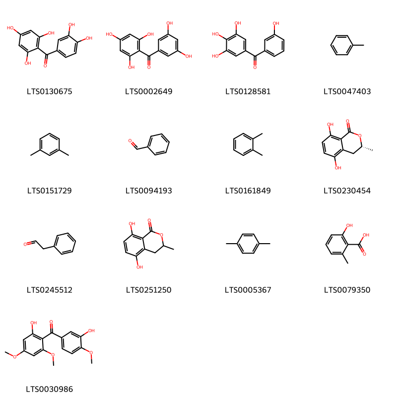
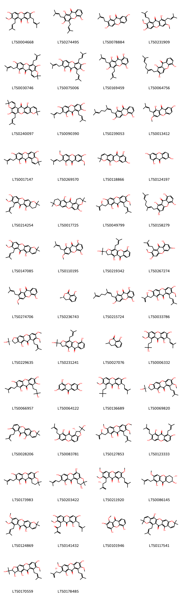
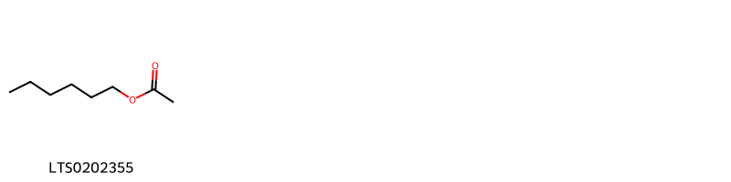
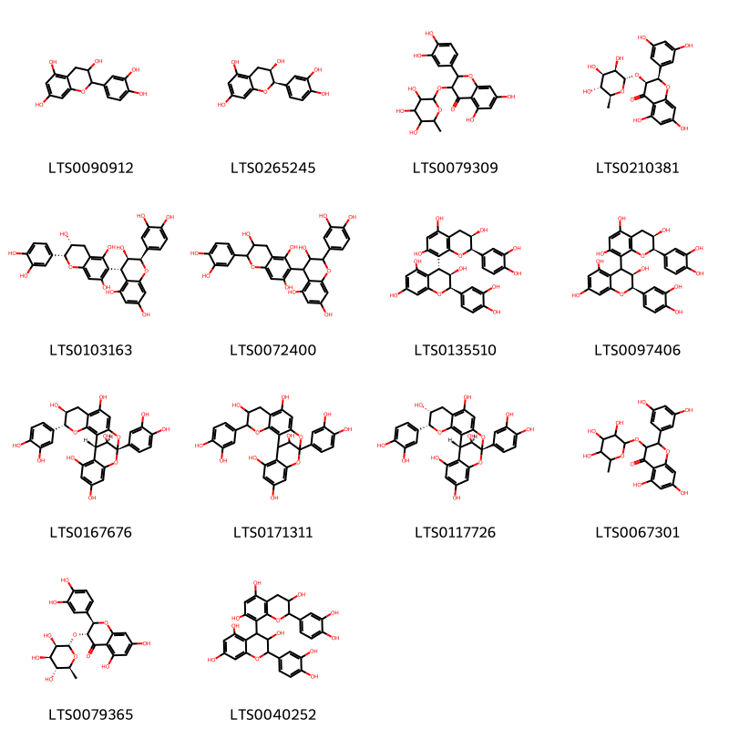
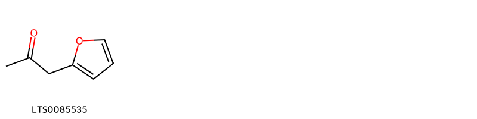
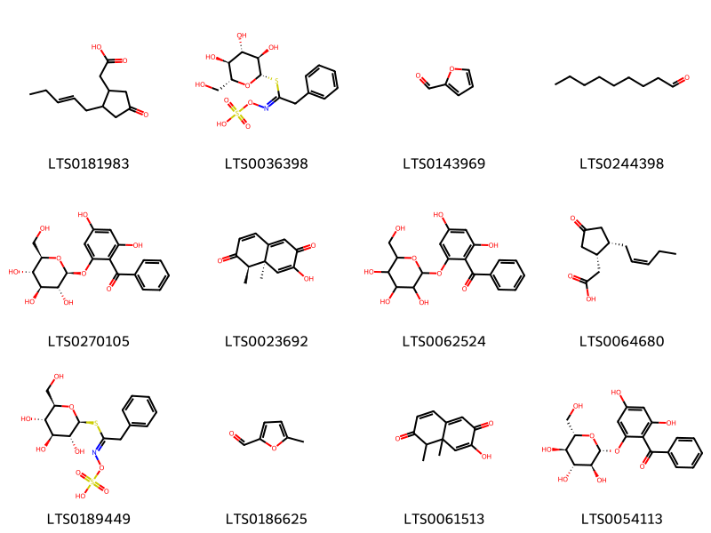
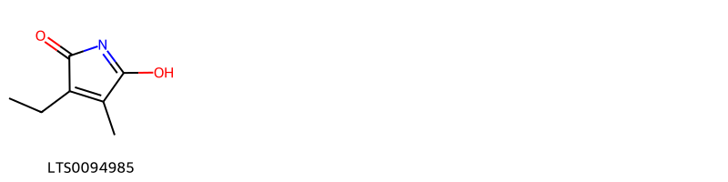
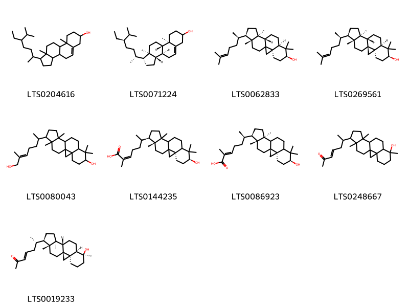

!!! abstract "Tóm tắt"

    Vỏ măng cụt (Pericarpium Garciniae mangostanae) là vỏ quả chín được phơi hoặc sấy khô của quả cây Măng cụt  (Garcinia mangostana L.), thuộc họ Măng cụt (Clusiaceae). Măng cụt có nguồn gốc từ Borneo, Malaysia, sau đó được di thực sang các nước khác, trong đó có Việt Nam. Hiện nay ở nước ta, cây được trồng nhiều ở vùng Nam Bộ. Theo y học cổ truyền, vỏ măng cụt có vị chát, tính ấm, vào kinh đại tràng. Dân gian sử dụng vỏ quả măng cụt để chữa đau bụng ỉa chảy, lỵ, khí hư bạch đới, chống viêm, hạ sốt. Vỏ măng cụt chứa nhiều thành phần hóa học như tanin, nhựa, chất mangostin...

## Thông tin về thực vật

Dược liệu **Măng Cụt (Vỏ Quả)** từ bộ phận **nan** từ loài *Garcinia mangostana*.

**Mô tả thực vật:** Măng cụt là một loại cây to, có thể cao tới 20m. Lá dày, dai, màu lục sẫm, hình thuôn dài 15-20cm, rộng 7-10cm.Đặc điểm của cây này là người ta mới chỉ thấy cây cái. Người ta cho rằng trong số những nhị lép (staminode) bao quanh bầu có thể có bao phấn chứa phấn hoa.
Quả hình cầu, to bằng quả cam trung bình, vỏ ngoài màu đỏ sẫm, dãy cứng, phía dưới có lá đài, phía đỉnh có đầu nhụy. Trong quả có từ 6 đến 18 hạt, quanh hạt có áo hạt ăn được.

*Tài liệu tham khảo:* "Những cây thuốc và vị thuốc Việt Nam" - Đỗ Tất Lợi 
Trong dược điển Việt nam, một loài được sử dụng làm dược liệu là *Garcinia mangostana*.

!!! info "Phân loại thực vật của *Garcinia mangostana*"
    - **Kingdom:** Plantae
    - **Phylum:** Tracheophyta
    - **Order:** Malpighiales
    - **Family:** Clusiaceae
    - **Genus:** Garcinia
    - **Species:** *Garcinia mangostana*

**Phân bố trên thế giới:** Thailand, United States of America, Philippines, Costa Rica, Honduras, Colombia, China, Réunion, Malaysia, Ecuador, India, Brazil, Singapore, Panama, Indonesia, Seychelles, Viet Nam

**Phân bố tại Việt nam:** Tiền Giang

## Thông tin về dược liệu 

### Định danh

!!! info "Thông tin về tên gọi"

    - Dược liệu tiếng Việt: nan
    - Dược liệu tiếng Trung: nan (nan)
    - Dược liệu tiếng Anh: nan
    - Dược liệu latin thông dụng: nan
    - Dược liệu latin kiểu DĐVN: *pericarpium garciniae mangostanae*
    - Dược liệu latin kiểu DĐVN: *nan*
    - Dược liệu latin kiểu thông tư: *nan*
    - Bộ phận dùng: nan (nan)

### Mô tả dược liệu 

- **Theo dược điển Việt nam V:** nan

- **Mô tả dược liệu theo thông tư chế biến dược liệu theo phương pháp cổ truyền:** nan

### Chế biến 

- **Chế biến theo dược điển việt nam V**: nan

- **Chế biến theo thông tư:** nan

--- 

## Thành phần hóa học

- Theo tài liệu của GS. Đỗ Tất Lợi:  Trong vỏ quả có chứa từ 7-13% tanin, chất nhựa và chất mangostin (C20H22O5), có tinh thể hình phiến nhỏ, màu vàng tươi, không vị, tan trong rượu, ête và chất kiềm, không tan trong nước, độ chảy 175°C.
    

**Thành phần hóa học từ loài **Garcinia mangostana**

Theo cơ sở dữ liệu lotus, loài *Garcinia mangostana* đã phân lập và xác định được **211** hoạt chất thuộc về các nhóm Pyrans, Steroids and steroid derivatives, Heteroaromatic compounds, Organooxygen compounds, Flavonoids, Macrolides and analogues, Lactones, Benzopyrans, Fatty Acyls, Pyrrolidines, Dioxanes, 2-arylbenzofuran flavonoids, Carboxylic acids and derivatives, Benzene and substituted derivatives, Pyridines and derivatives, Saturated hydrocarbons, Prenol lipids trong bảng dưới đây. Danh sách các hoạt chất như sau 1-hydroxy-2-(2-hydroxy-3-methylbut-3-en-1-yl)-3,6,7-trimethoxy-8-(3-methylbut-2-en-1-yl)xanthen-9-one [(LTS0127853)](https://lotus.naturalproducts.net/compound/lotus_id/LTS0127853), 6-propyl-5,6-dihydropyran-2-one [(LTS0051247)](https://lotus.naturalproducts.net/compound/lotus_id/LTS0051247), 4-isopropyl-1,6-dimethyl-2,3,4,4a,7,8-hexahydronaphthalene [(LTS0270743)](https://lotus.naturalproducts.net/compound/lotus_id/LTS0270743), 1-hydroxy-8-[(1e)-3-hydroxy-3-methylbut-1-en-1-yl]-3,6,7-trimethoxy-2-(3-methylbut-2-en-1-yl)xanthen-9-one [(LTS0039363)](https://lotus.naturalproducts.net/compound/lotus_id/LTS0039363), hexanol [(LTS0217299)](https://lotus.naturalproducts.net/compound/lotus_id/LTS0217299), 5-hydroxy-8-methoxy-2,2-dimethyl-7-(3-methylbut-2-en-1-yl)-1,11-dioxatetracen-6-one [(LTS0005339)](https://lotus.naturalproducts.net/compound/lotus_id/LTS0005339), betulin [(LTS0101863)](https://lotus.naturalproducts.net/compound/lotus_id/LTS0101863), (2e,6r)-6-[(1s,3r,6s,12s,15r,16r)-6-hydroxy-7,7,12,16-tetramethylpentacyclo[9.7.0.0¹,³.0³,⁸.0¹²,¹⁶]octadecan-15-yl]-2-methylhept-2-enoic acid [(LTS0086923)](https://lotus.naturalproducts.net/compound/lotus_id/LTS0086923), (3s,4r,5r)-4-({[(2s,3s,4r,5r)-4-(hydroxymethyl)-3,5-dimethyloxolan-2-yl]oxy}methyl)-3,5-dimethyloxolan-2-one [(LTS0088000)](https://lotus.naturalproducts.net/compound/lotus_id/LTS0088000), (6r)-6-propyl-5,6-dihydropyran-2-one [(LTS0037125)](https://lotus.naturalproducts.net/compound/lotus_id/LTS0037125), garcinone d [(LTS0006332)](https://lotus.naturalproducts.net/compound/lotus_id/LTS0006332), (e)-α-bisabolene [(LTS0046940)](https://lotus.naturalproducts.net/compound/lotus_id/LTS0046940), egonol [(LTS0157858)](https://lotus.naturalproducts.net/compound/lotus_id/LTS0157858), octane [(LTS0186469)](https://lotus.naturalproducts.net/compound/lotus_id/LTS0186469), 1,6-dihydroxy-8-[(1e)-3-hydroxy-3-methylbut-1-en-1-yl]-3,7-dimethoxy-2-(3-methylbut-2-en-1-yl)xanthen-9-one [(LTS0208929)](https://lotus.naturalproducts.net/compound/lotus_id/LTS0208929), ortho-xylene [(LTS0161849)](https://lotus.naturalproducts.net/compound/lotus_id/LTS0161849), 1,6-dihydroxy-3-methoxy-2-(3-methylbut-2-en-1-yl)xanthen-9-one [(LTS0215756)](https://lotus.naturalproducts.net/compound/lotus_id/LTS0215756), (3r)-3,9-dihydroxy-5,10-dimethoxy-2,2-dimethyl-11-(3-methylbut-2-en-1-yl)-3,4-dihydro-1,7-dioxatetraphen-12-one [(LTS0016522)](https://lotus.naturalproducts.net/compound/lotus_id/LTS0016522), 1-(3,3-dimethylbutyl)-3,6,8-trihydroxy-2-methoxy-7-(3-methylbut-2-en-1-yl)xanthen-9-one [(LTS0136689)](https://lotus.naturalproducts.net/compound/lotus_id/LTS0136689), (1r,3r,4r,9r,12r)-3,4,12-trimethyl-10,13-dioxatetracyclo[7.3.1.0¹,⁹.0³,⁷]trideca-5,7-diene [(LTS0051889)](https://lotus.naturalproducts.net/compound/lotus_id/LTS0051889), 22-hydroxy-7,7,18,18-tetramethyl-8,13,17-trioxapentacyclo[12.8.0.0³,¹².0⁴,⁹.0¹⁶,²¹]docosa-1(22),3,5,9,11,14,16(21),19-octaen-2-one [(LTS0125235)](https://lotus.naturalproducts.net/compound/lotus_id/LTS0125235), 4-[4,8-dihydroxy-2-(2-hydroxypropan-2-yl)-7-methoxy-6-(3-methylbut-2-en-1-yl)-5-oxo-2h,3h-furo[3,2-b]xanthen-3-yl]-1,3,6-trihydroxy-7-methoxy-2,8-bis(3-methylbut-2-en-1-yl)xanthen-9-one [(LTS0262429)](https://lotus.naturalproducts.net/compound/lotus_id/LTS0262429), (6s,7s)-1,6,7-trihydroxy-3-methoxy-2-(3-methylbut-2-en-1-yl)-5,6,7,8-tetrahydroxanthen-9-one [(LTS0086145)](https://lotus.naturalproducts.net/compound/lotus_id/LTS0086145), (3s,5s)-5,12-dihydroxy-14-methoxy-3-methyl-3,4,5,6,7,8,9,10-octahydro-2-benzoxacyclododecin-1-one [(LTS0224745)](https://lotus.naturalproducts.net/compound/lotus_id/LTS0224745), ethylcyclohexane [(LTS0033805)](https://lotus.naturalproducts.net/compound/lotus_id/LTS0033805), gamma-mangostin [(LTS0090390)](https://lotus.naturalproducts.net/compound/lotus_id/LTS0090390), 10,22-dihydroxy-7,7,18,18-tetramethyl-8,13,17-trioxapentacyclo[12.8.0.0³,¹².0⁴,⁹.0¹⁶,²¹]docosa-1(22),3,9,11,14,16(21)-hexaen-2-one [(LTS0017725)](https://lotus.naturalproducts.net/compound/lotus_id/LTS0017725), 4-hydroxy-6-propyloxan-2-one [(LTS0119647)](https://lotus.naturalproducts.net/compound/lotus_id/LTS0119647), 1,6-dihydroxy-8-(3-hydroxy-3-methylbut-1-en-1-yl)-3,7-dimethoxy-2-(3-methylbut-2-en-1-yl)xanthen-9-one [(LTS0250097)](https://lotus.naturalproducts.net/compound/lotus_id/LTS0250097), (1r,2r)-1,8,10-trihydroxy-2-(2-hydroxypropan-2-yl)-9-(3-methylbut-2-en-1-yl)-1h,2h-furo[3,2-a]xanthen-11-one [(LTS0120943)](https://lotus.naturalproducts.net/compound/lotus_id/LTS0120943), 1,3,6,7-tetrahydroxy-8-(3-hydroxy-3-methylbutyl)-2-(3-methylbut-2-en-1-yl)xanthen-9-one [(LTS0066957)](https://lotus.naturalproducts.net/compound/lotus_id/LTS0066957), 3,9-dihydroxy-5,10-dimethoxy-2,2-dimethyl-11-(3-methylbut-2-en-1-yl)-3,4-dihydro-1,7-dioxatetraphen-12-one [(LTS0117102)](https://lotus.naturalproducts.net/compound/lotus_id/LTS0117102), 3-ethyl-4-methyl-1-[3,4,5-trihydroxy-6-(hydroxymethyl)oxan-2-yl]pyrrole-2,5-dione [(LTS0039383)](https://lotus.naturalproducts.net/compound/lotus_id/LTS0039383), 4,9-dihydroxy-2-(2-hydroxypropan-2-yl)-11-(3-methylbut-2-en-1-yl)-2h,3h-furo[3,2-b]xanthen-5-one [(LTS0231241)](https://lotus.naturalproducts.net/compound/lotus_id/LTS0231241), 10,15-dihydroxy-7,7,19,19-tetramethyl-11-(3-methylbut-2-en-1-yl)-2,8,20-trioxapentacyclo[12.8.0.0³,¹².0⁴,⁹.0¹⁶,²¹]docosa-1(22),3,5,9,11,14,16(21),17-octaen-13-one [(LTS0262247)](https://lotus.naturalproducts.net/compound/lotus_id/LTS0262247), mellein [(LTS0236743)](https://lotus.naturalproducts.net/compound/lotus_id/LTS0236743), gartanin [(LTS0169459)](https://lotus.naturalproducts.net/compound/lotus_id/LTS0169459), (2s)-4,8,10-trihydroxy-2-(2-hydroxypropan-2-yl)-9-(3-methylbut-2-en-1-yl)-1h,2h-furo[3,2-a]xanthen-11-one [(LTS0164037)](https://lotus.naturalproducts.net/compound/lotus_id/LTS0164037), (3s)-3,5,9-trihydroxy-10-methoxy-2,2-dimethyl-11-(3-methylbut-2-en-1-yl)-3,4-dihydro-1,7-dioxatetraphen-12-one [(LTS0179749)](https://lotus.naturalproducts.net/compound/lotus_id/LTS0179749), 1,5,8-trihydroxy-3-methoxy-2-(3-methylbut-2-en-1-yl)xanthen-9-one [(LTS0110195)](https://lotus.naturalproducts.net/compound/lotus_id/LTS0110195), 6-{7-hydroxy-7,12,16-trimethylpentacyclo[9.7.0.0¹,³.0³,⁸.0¹²,¹⁶]octadecan-15-yl}hept-3-en-2-one [(LTS0248667)](https://lotus.naturalproducts.net/compound/lotus_id/LTS0248667), 1,3,7-trihydroxy-2,8-bis(3-methylbut-2-en-1-yl)xanthen-9-one [(LTS0123333)](https://lotus.naturalproducts.net/compound/lotus_id/LTS0123333), (3s,4r,5r)-4-({[(2s,3s,4s)-4-acetyl-3-methyloxolan-2-yl]oxy}methyl)-3,5-dimethyloxolan-2-one [(LTS0077101)](https://lotus.naturalproducts.net/compound/lotus_id/LTS0077101), (3s,4r,5r)-4-({[(2r,3s,4r,5r)-4-(hydroxymethyl)-3,5-dimethyloxolan-2-yl]oxy}methyl)-3,5-dimethyloxolan-2-one [(LTS0045140)](https://lotus.naturalproducts.net/compound/lotus_id/LTS0045140), 1-hydroxy-8-[(2r)-2-hydroxy-3-methylbut-3-en-1-yl]-3,6,7-trimethoxy-2-(3-methylbut-2-en-1-yl)xanthen-9-one [(LTS0211920)](https://lotus.naturalproducts.net/compound/lotus_id/LTS0211920), bran oil [(LTS0143969)](https://lotus.naturalproducts.net/compound/lotus_id/LTS0143969), procyanidin a1 [(LTS0167676)](https://lotus.naturalproducts.net/compound/lotus_id/LTS0167676), 1,6-dihydroxy-2-[(2s)-2-hydroxy-3-methylbut-3-en-1-yl]-3,7-dimethoxy-8-(3-methylbut-2-en-1-yl)xanthen-9-one [(LTS0148678)](https://lotus.naturalproducts.net/compound/lotus_id/LTS0148678), (3r)-5,8-dihydroxy-3-methyl-3,4-dihydro-2-benzopyran-1-one [(LTS0230454)](https://lotus.naturalproducts.net/compound/lotus_id/LTS0230454), (2s,3r)-3,4,8-trihydroxy-2-(2-hydroxypropan-2-yl)-7-methoxy-6-(3-methylbut-2-en-1-yl)-2h,3h-furo[3,2-b]xanthen-5-one [(LTS0052033)](https://lotus.naturalproducts.net/compound/lotus_id/LTS0052033), 7,12-dihydroxy-14-methoxy-3-methyl-3,4,5,6,7,8,9,10-octahydro-2-benzoxacyclododecin-1-one [(LTS0031900)](https://lotus.naturalproducts.net/compound/lotus_id/LTS0031900), toluene [(LTS0047403)](https://lotus.naturalproducts.net/compound/lotus_id/LTS0047403), 1,3,6-trihydroxy-2-[(2s)-2-hydroxy-3-methylbut-3-en-1-yl]-7-methoxy-8-(3-methylbut-2-en-1-yl)xanthen-9-one [(LTS0049799)](https://lotus.naturalproducts.net/compound/lotus_id/LTS0049799), (2s)-4,7-dihydroxy-2-(2-hydroxypropan-2-yl)-6-(3-methylbut-2-en-1-yl)-2h,3h-furo[3,2-b]xanthen-5-one [(LTS0023328)](https://lotus.naturalproducts.net/compound/lotus_id/LTS0023328), cycloartenol [(LTS0269561)](https://lotus.naturalproducts.net/compound/lotus_id/LTS0269561), 5-hydroxy-8,9-dimethoxy-2,2-dimethyl-7-(3-methylbut-2-en-1-yl)-1,11-dioxatetracen-6-one [(LTS0124869)](https://lotus.naturalproducts.net/compound/lotus_id/LTS0124869), 12-hydroxy-14-methoxy-3-methyl-3,4,5,6,7,8,9,10-octahydro-2-benzoxacyclododecin-1-one [(LTS0178955)](https://lotus.naturalproducts.net/compound/lotus_id/LTS0178955), heptane [(LTS0062507)](https://lotus.naturalproducts.net/compound/lotus_id/LTS0062507), 9-hydroxycalabaxanthone [(LTS0147085)](https://lotus.naturalproducts.net/compound/lotus_id/LTS0147085), valencene [(LTS0110395)](https://lotus.naturalproducts.net/compound/lotus_id/LTS0110395), 10,16-dihydroxy-6,6,19,19-tetramethyl-15-(3-methylbut-2-en-1-yl)-5,13,18-trioxapentacyclo[12.8.0.0³,¹².0⁴,⁹.0¹⁷,²²]docosa-1(22),3,7,9,11,14,16,20-octaen-2-one [(LTS0151632)](https://lotus.naturalproducts.net/compound/lotus_id/LTS0151632), terpineol [(LTS0136148)](https://lotus.naturalproducts.net/compound/lotus_id/LTS0136148), (2r,3s)-2-(3,5-dihydroxyphenyl)-5,7-dihydroxy-3-{[(2s,3r,4r,5r,6s)-3,4,5-trihydroxy-6-methyloxan-2-yl]oxy}-2,3-dihydro-1-benzopyran-4-one [(LTS0210381)](https://lotus.naturalproducts.net/compound/lotus_id/LTS0210381), 1,5-dihydroxy-3-methoxy-2-(3-methylbut-2-en-1-yl)xanthen-9-one [(LTS0274706)](https://lotus.naturalproducts.net/compound/lotus_id/LTS0274706), (2r,3r,4r)-2-(3,4-dihydroxyphenyl)-4-[(2r,3r)-2-(3,4-dihydroxyphenyl)-3,5,7-trihydroxy-3,4-dihydro-2h-1-benzopyran-8-yl]-3,4-dihydro-2h-1-benzopyran-3,5,7-triol [(LTS0135510)](https://lotus.naturalproducts.net/compound/lotus_id/LTS0135510), (3s,4r,5r)-4-(hydroxymethyl)-3,5-dimethyloxolan-2-one [(LTS0070024)](https://lotus.naturalproducts.net/compound/lotus_id/LTS0070024), 6,8,12-trihydroxy-2,2-dimethyl-7-(3-methylbut-2-en-1-yl)-3,4-dihydro-1,10-dioxatetraphen-5-one [(LTS0173983)](https://lotus.naturalproducts.net/compound/lotus_id/LTS0173983), 8-deoxygartanin [(LTS0274495)](https://lotus.naturalproducts.net/compound/lotus_id/LTS0274495), 1-hydroxy-8-(3-hydroxy-3-methylbut-1-en-1-yl)-3,6,7-trimethoxy-2-(3-methylbut-2-en-1-yl)xanthen-9-one [(LTS0151187)](https://lotus.naturalproducts.net/compound/lotus_id/LTS0151187), 5,12-dihydroxy-14-methoxy-3-methyl-3,4,5,6,7,8,9,10-octahydro-2-benzoxacyclododecin-1-one [(LTS0138773)](https://lotus.naturalproducts.net/compound/lotus_id/LTS0138773), (3s)-3,6,8,11-tetrahydroxy-2,2-dimethyl-7-(3-methylbut-2-en-1-yl)-3,4-dihydro-1,10-dioxatetraphen-5-one [(LTS0203422)](https://lotus.naturalproducts.net/compound/lotus_id/LTS0203422), cis-3-hexenol [(LTS0132156)](https://lotus.naturalproducts.net/compound/lotus_id/LTS0132156), 1,6-dihydroxy-2-(2-hydroxy-3-methylbut-3-en-1-yl)-3,7-dimethoxy-8-(3-methylbut-2-en-1-yl)xanthen-9-one [(LTS0188719)](https://lotus.naturalproducts.net/compound/lotus_id/LTS0188719), smeathxanthone a [(LTS0158279)](https://lotus.naturalproducts.net/compound/lotus_id/LTS0158279), 2-(2-benzoyl-3,5-dihydroxyphenoxy)-6-(hydroxymethyl)oxane-3,4,5-triol [(LTS0062524)](https://lotus.naturalproducts.net/compound/lotus_id/LTS0062524), astilbin [(LTS0079309)](https://lotus.naturalproducts.net/compound/lotus_id/LTS0079309), benzaldehyde [(LTS0094193)](https://lotus.naturalproducts.net/compound/lotus_id/LTS0094193), (2s)-4,8,10-trihydroxy-9-(3-methylbut-2-en-1-yl)-2-(prop-1-en-2-yl)-1h,2h-furo[3,2-a]xanthen-11-one [(LTS0096790)](https://lotus.naturalproducts.net/compound/lotus_id/LTS0096790), cratoxyxanthone [(LTS0130968)](https://lotus.naturalproducts.net/compound/lotus_id/LTS0130968), maclurin [(LTS0130675)](https://lotus.naturalproducts.net/compound/lotus_id/LTS0130675), valencene [(LTS0031707)](https://lotus.naturalproducts.net/compound/lotus_id/LTS0031707), 5-(3-hydroxybenzoyl)benzene-1,2,3-triol [(LTS0128581)](https://lotus.naturalproducts.net/compound/lotus_id/LTS0128581), 3,5,9-trihydroxy-10-methoxy-2,2-dimethyl-11-(3-methylbut-2-en-1-yl)-3,4-dihydro-1,7-dioxatetraphen-12-one [(LTS0095757)](https://lotus.naturalproducts.net/compound/lotus_id/LTS0095757), proanthocyanidin a2 [(LTS0117726)](https://lotus.naturalproducts.net/compound/lotus_id/LTS0117726), (2s,3r,4s,5s,6r)-2-(2-benzoyl-3,5-dihydroxyphenoxy)-6-(hydroxymethyl)oxane-3,4,5-triol [(LTS0270105)](https://lotus.naturalproducts.net/compound/lotus_id/LTS0270105), 11α-mangostanin [(LTS0069820)](https://lotus.naturalproducts.net/compound/lotus_id/LTS0069820), 1,6-dihydroxy-8-[(2r)-2-hydroxy-3-methylbut-3-en-1-yl]-3,7-dimethoxy-2-(3-methylbut-2-en-1-yl)xanthen-9-one [(LTS0034259)](https://lotus.naturalproducts.net/compound/lotus_id/LTS0034259), α-copaene [(LTS0207598)](https://lotus.naturalproducts.net/compound/lotus_id/LTS0207598), 6,8,12-trihydroxy-2,2-dimethyl-7-(3-methylbut-2-en-1-yl)-1,10-dioxatetraphen-5-one [(LTS0017147)](https://lotus.naturalproducts.net/compound/lotus_id/LTS0017147), 4-hydroxy-2-(2-hydroxypropan-2-yl)-7,8-dimethoxy-6-(3-methylbut-2-en-1-yl)-2h,3h-furo[3,2-b]xanthen-5-one [(LTS0129425)](https://lotus.naturalproducts.net/compound/lotus_id/LTS0129425), 4-[(2s,3r)-4,8-dihydroxy-2-(2-hydroxypropan-2-yl)-7-methoxy-6-(3-methylbut-2-en-1-yl)-5-oxo-2h,3h-furo[3,2-b]xanthen-3-yl]-1,3,6-trihydroxy-7-methoxy-2,8-bis(3-methylbut-2-en-1-yl)xanthen-9-one [(LTS0208522)](https://lotus.naturalproducts.net/compound/lotus_id/LTS0208522), 4-isopropyl-6-methyl-1-methylidene-3,4,4a,7,8,8a-hexahydro-2h-naphthalene [(LTS0111070)](https://lotus.naturalproducts.net/compound/lotus_id/LTS0111070), 1,5,8-trihydroxy-3-methoxy-2,4-bis(3-methylbut-2-en-1-yl)xanthen-9-one [(LTS0222461)](https://lotus.naturalproducts.net/compound/lotus_id/LTS0222461), (4s,6r)-4-hydroxy-6-propyloxan-2-one [(LTS0008995)](https://lotus.naturalproducts.net/compound/lotus_id/LTS0008995), 1,3,6-trihydroxy-2-(2-hydroxy-3-methylbut-3-en-1-yl)-7-methoxy-8-(3-methylbut-2-en-1-yl)xanthen-9-one [(LTS0033786)](https://lotus.naturalproducts.net/compound/lotus_id/LTS0033786), (2z)-6-[(3r,6s,15r,16r)-6-hydroxy-7,7,12,16-tetramethylpentacyclo[9.7.0.0¹,³.0³,⁸.0¹²,¹⁶]octadecan-15-yl]-2-methylhept-2-enoic acid [(LTS0144235)](https://lotus.naturalproducts.net/compound/lotus_id/LTS0144235), 10,22-dihydroxy-7,7,18,18-tetramethyl-8,13,17-trioxapentacyclo[12.8.0.0³,¹².0⁴,⁹.0¹⁶,²¹]docosa-1(22),3,9,11,14,16(21),19-heptaen-2-one [(LTS0116124)](https://lotus.naturalproducts.net/compound/lotus_id/LTS0116124), cudraxanthone g [(LTS0045459)](https://lotus.naturalproducts.net/compound/lotus_id/LTS0045459), 2-(3,7-dimethylocta-2,6-dien-1-yl)-1,3,5-trihydroxyxanthen-9-one [(LTS0239053)](https://lotus.naturalproducts.net/compound/lotus_id/LTS0239053), 4-hydroxy-7,8-dimethoxy-6-(3-methylbut-2-en-1-yl)furo[3,2-b]xanthen-5-one [(LTS0117978)](https://lotus.naturalproducts.net/compound/lotus_id/LTS0117978), 10,22-dihydroxy-7,7,18,18-tetramethyl-11-(3-methylbut-2-en-1-yl)-8,13,17-trioxapentacyclo[12.8.0.0³,¹².0⁴,⁹.0¹⁶,²¹]docosa-1(22),3,9,11,14,16(21),19-heptaen-2-one [(LTS0243340)](https://lotus.naturalproducts.net/compound/lotus_id/LTS0243340), 2-(3-hydroxy-4-methoxybenzoyl)-3,5-dimethoxyphenol [(LTS0030986)](https://lotus.naturalproducts.net/compound/lotus_id/LTS0030986), 1,3-dihydroxy-2-[(2r)-2-hydroxy-3-methylbut-3-en-1-yl]-6,7-dimethoxy-8-(3-methylbut-2-en-1-yl)xanthen-9-one [(LTS0043408)](https://lotus.naturalproducts.net/compound/lotus_id/LTS0043408), [4-oxo-2-(pent-2-en-1-yl)cyclopentyl]acetic acid [(LTS0181983)](https://lotus.naturalproducts.net/compound/lotus_id/LTS0181983), garcinone e [(LTS0075006)](https://lotus.naturalproducts.net/compound/lotus_id/LTS0075006), phenylacetaldehyde [(LTS0245512)](https://lotus.naturalproducts.net/compound/lotus_id/LTS0245512), 7-hydroxy-1,8a-dimethyl-1h-naphthalene-2,6-dione [(LTS0061513)](https://lotus.naturalproducts.net/compound/lotus_id/LTS0061513), (3s,7r)-7,12-dihydroxy-14-methoxy-3-methyl-3,4,5,6,7,8,9,10-octahydro-2-benzoxacyclododecin-1-one [(LTS0057052)](https://lotus.naturalproducts.net/compound/lotus_id/LTS0057052), 3-ethyl-5-hydroxy-4-methylpyrrol-2-one [(LTS0094985)](https://lotus.naturalproducts.net/compound/lotus_id/LTS0094985), 1,8,10-trihydroxy-2-(2-hydroxypropan-2-yl)-9-(3-methylbut-2-en-1-yl)-1h,2h-furo[3,2-a]xanthen-11-one [(LTS0127995)](https://lotus.naturalproducts.net/compound/lotus_id/LTS0127995), hexyl acetate [(LTS0202355)](https://lotus.naturalproducts.net/compound/lotus_id/LTS0202355), 15-[(5e)-7-hydroxy-6-methylhept-5-en-2-yl]-7,7,12,16-tetramethylpentacyclo[9.7.0.0¹,³.0³,⁸.0¹²,¹⁶]octadecan-6-ol [(LTS0080043)](https://lotus.naturalproducts.net/compound/lotus_id/LTS0080043), stigmast-5-en-3-ol, (3β)- [(LTS0204616)](https://lotus.naturalproducts.net/compound/lotus_id/LTS0204616), 4-(hydroxymethyl)-3,5-dimethyloxolan-2-one [(LTS0236015)](https://lotus.naturalproducts.net/compound/lotus_id/LTS0236015), (2r,3r,4s)-2-(3,4-dihydroxyphenyl)-4-[(2r,3r)-2-(3,4-dihydroxyphenyl)-3,5,7-trihydroxy-3,4-dihydro-2h-1-benzopyran-6-yl]-3,4-dihydro-2h-1-benzopyran-3,5,7-triol [(LTS0103163)](https://lotus.naturalproducts.net/compound/lotus_id/LTS0103163), m-xylene [(LTS0151729)](https://lotus.naturalproducts.net/compound/lotus_id/LTS0151729), ent-epicatechin [(LTS0265245)](https://lotus.naturalproducts.net/compound/lotus_id/LTS0265245), 4,8,10-trihydroxy-9-(3-methylbut-2-en-1-yl)-2-(prop-1-en-2-yl)-1h,2h-furo[3,2-a]xanthen-11-one [(LTS0134990)](https://lotus.naturalproducts.net/compound/lotus_id/LTS0134990), 7,9,12-trihydroxy-2,2-dimethyl-1,11-dioxatetracen-6-one [(LTS0118866)](https://lotus.naturalproducts.net/compound/lotus_id/LTS0118866), 5-methylfurfural [(LTS0186625)](https://lotus.naturalproducts.net/compound/lotus_id/LTS0186625), 1-hydroxy-2-[(2r)-2-hydroxy-3-methylbut-3-en-1-yl]-3,6,7-trimethoxy-8-(3-methylbut-2-en-1-yl)xanthen-9-one [(LTS0063592)](https://lotus.naturalproducts.net/compound/lotus_id/LTS0063592), glucotropaeolin [(LTS0189449)](https://lotus.naturalproducts.net/compound/lotus_id/LTS0189449), nonanal [(LTS0244398)](https://lotus.naturalproducts.net/compound/lotus_id/LTS0244398), 1,6-dihydroxy-2-[(2r)-2-hydroxy-3-methylbut-3-en-1-yl]-3,7-dimethoxy-8-(3-methylbut-2-en-1-yl)xanthen-9-one [(LTS0178485)](https://lotus.naturalproducts.net/compound/lotus_id/LTS0178485), 1,3,7-trihydroxy-2-(3-methylbut-2-en-1-yl)xanthen-9-one [(LTS0078884)](https://lotus.naturalproducts.net/compound/lotus_id/LTS0078884), 1-(2,3-dihydroxy-3-methylbutyl)-3,6,8-trihydroxy-2-methoxy-7-(3-methylbut-2-en-1-yl)xanthen-9-one [(LTS0136054)](https://lotus.naturalproducts.net/compound/lotus_id/LTS0136054), 6,8,12-trihydroxy-2,2-dimethyl-7,11-bis(3-methylbut-2-en-1-yl)-3,4-dihydro-1,10-dioxatetraphen-5-one [(LTS0242758)](https://lotus.naturalproducts.net/compound/lotus_id/LTS0242758), 1-hydroxy-8-(2-hydroxy-3-methylbut-3-en-1-yl)-3,6,7-trimethoxy-2-(3-methylbut-2-en-1-yl)xanthen-9-one [(LTS0015615)](https://lotus.naturalproducts.net/compound/lotus_id/LTS0015615), 1,3,7-trihydroxy-2-methoxyxanthen-9-one [(LTS0207686)](https://lotus.naturalproducts.net/compound/lotus_id/LTS0207686), furfuryl methyl ketone [(LTS0085535)](https://lotus.naturalproducts.net/compound/lotus_id/LTS0085535), 4-({[4-(hydroxymethyl)-3,5-dimethyloxolan-2-yl]oxy}methyl)-3,5-dimethyloxolan-2-one [(LTS0212914)](https://lotus.naturalproducts.net/compound/lotus_id/LTS0212914), 5,8-dihydroxy-2,2-dimethyl-7-(3-methylbut-2-en-1-yl)-1,11-dioxatetracen-6-one [(LTS0028206)](https://lotus.naturalproducts.net/compound/lotus_id/LTS0028206), (2s)-4,7-dihydroxy-2-(2-hydroxypropan-2-yl)-11-(3-methylbut-2-en-1-yl)-2h,3h-furo[3,2-b]xanthen-5-one [(LTS0005088)](https://lotus.naturalproducts.net/compound/lotus_id/LTS0005088), 4,8-dihydroxy-7-methoxy-6-(3-methylbut-2-en-1-yl)furo[3,2-b]xanthen-5-one [(LTS0037501)](https://lotus.naturalproducts.net/compound/lotus_id/LTS0037501), trans-4-hydroxymellein [(LTS0166041)](https://lotus.naturalproducts.net/compound/lotus_id/LTS0166041), 1,6-dihydroxy-3,7-dimethoxy-2,8-bis(3-methylbut-2-en-1-yl)xanthen-9-one [(LTS0231909)](https://lotus.naturalproducts.net/compound/lotus_id/LTS0231909), catechol [(LTS0090912)](https://lotus.naturalproducts.net/compound/lotus_id/LTS0090912), 5,9-dihydroxy-7-(3-hydroxy-3-methylbutyl)-8-methoxy-2,2-dimethyl-1,11-dioxatetracen-6-one [(LTS0193960)](https://lotus.naturalproducts.net/compound/lotus_id/LTS0193960), 5,8-dihydroxy-3-methyl-3,4-dihydro-2-benzopyran-1-one [(LTS0251250)](https://lotus.naturalproducts.net/compound/lotus_id/LTS0251250), (2s)-4,8-dihydroxy-2-(2-hydroxypropan-2-yl)-7-methoxy-6-(3-methylbut-2-en-1-yl)-2h,3h-furo[3,2-b]xanthen-5-one [(LTS0169307)](https://lotus.naturalproducts.net/compound/lotus_id/LTS0169307), (2r,3s,4r,5r,6s)-2-(2-benzoyl-3,5-dihydroxyphenoxy)-6-(hydroxymethyl)oxane-3,4,5-triol [(LTS0054113)](https://lotus.naturalproducts.net/compound/lotus_id/LTS0054113), stigmast-5-en-3-ol [(LTS0071224)](https://lotus.naturalproducts.net/compound/lotus_id/LTS0071224), 2-(3,7-dimethylocta-2,6-dien-1-yl)-1,3,5,8-tetrahydroxyxanthen-9-one [(LTS0215724)](https://lotus.naturalproducts.net/compound/lotus_id/LTS0215724), (2s)-4,9-dihydroxy-2-(2-hydroxypropan-2-yl)-11-(3-methylbut-2-en-1-yl)-2h,3h-furo[3,2-b]xanthen-5-one [(LTS0219342)](https://lotus.naturalproducts.net/compound/lotus_id/LTS0219342), mellein [(LTS0027076)](https://lotus.naturalproducts.net/compound/lotus_id/LTS0027076), 2-(3,5-dihydroxybenzoyl)benzene-1,3,5-triol [(LTS0002649)](https://lotus.naturalproducts.net/compound/lotus_id/LTS0002649), n-[(1s,2r)-3-{[(1s,2s,3r,4s,7r,9s,10s,12r,15s)-4,12-bis(acetyloxy)-2-(benzoyloxy)-1,9-dihydroxy-10,14,17,17-tetramethyl-11-oxo-6-oxatetracyclo[11.3.1.0³,¹⁰.0⁴,⁷]heptadec-13-en-15-yl]oxy}-2-hydroxy-3-oxo-1-phenylpropyl]benzenecarboximidic acid [(LTS0163460)](https://lotus.naturalproducts.net/compound/lotus_id/LTS0163460), 5,10-dihydroxy-2,2-dimethyl-12-(3-methylbut-2-en-1-yl)-1,11-dioxatetracen-6-one [(LTS0161438)](https://lotus.naturalproducts.net/compound/lotus_id/LTS0161438), methylsalicylic acid [(LTS0079350)](https://lotus.naturalproducts.net/compound/lotus_id/LTS0079350), cis-4-hydroxymellein [(LTS0036641)](https://lotus.naturalproducts.net/compound/lotus_id/LTS0036641), (+)-gamma-cadinene [(LTS0103949)](https://lotus.naturalproducts.net/compound/lotus_id/LTS0103949), delta-cadinene [(LTS0019321)](https://lotus.naturalproducts.net/compound/lotus_id/LTS0019321), guaiene [(LTS0274548)](https://lotus.naturalproducts.net/compound/lotus_id/LTS0274548), para-xylene [(LTS0005367)](https://lotus.naturalproducts.net/compound/lotus_id/LTS0005367), 2-(3,5-dihydroxyphenyl)-5,7-dihydroxy-3-[(3,4,5-trihydroxy-6-methyloxan-2-yl)oxy]-2,3-dihydro-1-benzopyran-4-one [(LTS0067301)](https://lotus.naturalproducts.net/compound/lotus_id/LTS0067301), 3,6,8-trihydroxy-2-methoxy-1-(3-methylbut-2-en-1-yl)xanthen-9-one [(LTS0267274)](https://lotus.naturalproducts.net/compound/lotus_id/LTS0267274), 4-acetyl-3-methyloxolan-2-one [(LTS0079634)](https://lotus.naturalproducts.net/compound/lotus_id/LTS0079634), 1,3,6-trihydroxy-2-[(2r)-2-hydroxy-3-methylbut-3-en-1-yl]-7-methoxy-8-(3-methylbut-2-en-1-yl)xanthen-9-one [(LTS0246824)](https://lotus.naturalproducts.net/compound/lotus_id/LTS0246824), 2,3,6,8-tetrahydroxy-1-(3-methylbut-2-en-1-yl)xanthen-9-one [(LTS0170763)](https://lotus.naturalproducts.net/compound/lotus_id/LTS0170763), 22-hydroxy-10-methoxy-7,7,18,18-tetramethyl-8,13,17-trioxapentacyclo[12.8.0.0³,¹².0⁴,⁹.0¹⁶,²¹]docosa-1(22),3,9,11,14,16(21),19-heptaen-2-one [(LTS0116316)](https://lotus.naturalproducts.net/compound/lotus_id/LTS0116316), (3s,4s)-4-acetyl-3-methyloxolan-2-one [(LTS0254946)](https://lotus.naturalproducts.net/compound/lotus_id/LTS0254946), 4-{[(4-acetyl-3-methyloxolan-2-yl)oxy]methyl}-3,5-dimethyloxolan-2-one [(LTS0099244)](https://lotus.naturalproducts.net/compound/lotus_id/LTS0099244), 2,4,5-trihydroxy-1-methoxyxanthen-9-one [(LTS0101946)](https://lotus.naturalproducts.net/compound/lotus_id/LTS0101946), 3,4,12-trimethyl-10,13-dioxatetracyclo[7.3.1.0¹,⁹.0³,⁷]trideca-5,7-diene [(LTS0093221)](https://lotus.naturalproducts.net/compound/lotus_id/LTS0093221), (3e,6s)-6-[(1s,3r,7s,8r,11s,12s,15r,16r)-7-hydroxy-7,12,16-trimethylpentacyclo[9.7.0.0¹,³.0³,⁸.0¹²,¹⁶]octadecan-15-yl]hept-3-en-2-one [(LTS0019233)](https://lotus.naturalproducts.net/compound/lotus_id/LTS0019233), 3,6,8,11-tetrahydroxy-2,2-dimethyl-7-(3-methylbut-2-en-1-yl)-3,4-dihydro-1,10-dioxatetraphen-5-one [(LTS0201029)](https://lotus.naturalproducts.net/compound/lotus_id/LTS0201029), 1,7-dihydroxy-3-methoxy-2-(3-methylbut-2-en-1-yl)xanthen-9-one [(LTS0013412)](https://lotus.naturalproducts.net/compound/lotus_id/LTS0013412), 3-ethyl-4-methyl-1-[(2r,3r,4s,5s,6r)-3,4,5-trihydroxy-6-(hydroxymethyl)oxan-2-yl]pyrrole-2,5-dione [(LTS0252312)](https://lotus.naturalproducts.net/compound/lotus_id/LTS0252312), mangostinone [(LTS0064756)](https://lotus.naturalproducts.net/compound/lotus_id/LTS0064756), 3,5,9-trihydroxy-8-methoxy-2,2-dimethyl-7-(3-methylbut-2-en-1-yl)-3,4-dihydro-1,11-dioxatetracen-6-one [(LTS0160807)](https://lotus.naturalproducts.net/compound/lotus_id/LTS0160807), 1-[(2s)-2,3-dihydroxy-3-methylbutyl]-3,6,8-trihydroxy-2-methoxy-7-(3-methylbut-2-en-1-yl)xanthen-9-one [(LTS0081448)](https://lotus.naturalproducts.net/compound/lotus_id/LTS0081448), 1,6-dihydroxy-3,7-dimethoxy-2-(3-methylbut-2-en-1-yl)xanthen-9-one [(LTS0269570)](https://lotus.naturalproducts.net/compound/lotus_id/LTS0269570), [(1s,2s)-4-oxo-2-[(2z)-pent-2-en-1-yl]cyclopentyl]acetic acid [(LTS0064680)](https://lotus.naturalproducts.net/compound/lotus_id/LTS0064680), 2-(3,4-dihydroxyphenyl)-4-[2-(3,4-dihydroxyphenyl)-3,5,7-trihydroxy-3,4-dihydro-2h-1-benzopyran-6-yl]-3,4-dihydro-2h-1-benzopyran-3,5,7-triol [(LTS0072400)](https://lotus.naturalproducts.net/compound/lotus_id/LTS0072400), mangostin [(LTS0004668)](https://lotus.naturalproducts.net/compound/lotus_id/LTS0004668), (2r)-4-hydroxy-2-(2-hydroxypropan-2-yl)-7,8-dimethoxy-6-(3-methylbut-2-en-1-yl)-2h,3h-furo[3,2-b]xanthen-5-one [(LTS0229635)](https://lotus.naturalproducts.net/compound/lotus_id/LTS0229635), (2r,3r)-2-(3,4-dihydroxyphenyl)-4-[(2r,3r)-2-(3,4-dihydroxyphenyl)-3,5,7-trihydroxy-3,4-dihydro-2h-1-benzopyran-8-yl]-3,4-dihydro-2h-1-benzopyran-3,5,7-triol [(LTS0097406)](https://lotus.naturalproducts.net/compound/lotus_id/LTS0097406), 4,8-dihydroxy-2-(2-hydroxypropan-2-yl)-7-methoxy-6-(3-methylbut-2-en-1-yl)-2h,3h-furo[3,2-b]xanthen-5-one [(LTS0067475)](https://lotus.naturalproducts.net/compound/lotus_id/LTS0067475), (3r)-3,6,8,11-tetrahydroxy-2,2-dimethyl-7-(3-methylbut-2-en-1-yl)-3,4-dihydro-1,10-dioxatetraphen-5-one [(LTS0007290)](https://lotus.naturalproducts.net/compound/lotus_id/LTS0007290), tovophylline a [(LTS0030746)](https://lotus.naturalproducts.net/compound/lotus_id/LTS0030746), 3-isomangostin [(LTS0214254)](https://lotus.naturalproducts.net/compound/lotus_id/LTS0214254), 4,8-dihydroxy-3-methyl-3,4-dihydro-2-benzopyran-1-one [(LTS0170094)](https://lotus.naturalproducts.net/compound/lotus_id/LTS0170094), (3s,5r)-5,12-dihydroxy-14-methoxy-3-methyl-3,4,5,6,7,8,9,10-octahydro-2-benzoxacyclododecin-1-one [(LTS0068967)](https://lotus.naturalproducts.net/compound/lotus_id/LTS0068967), (3r,6s,8r,11s,12s,15r,16r)-7,7,12,16-tetramethyl-15-[(2r)-6-methylhept-5-en-2-yl]pentacyclo[9.7.0.0¹,³.0³,⁸.0¹²,¹⁶]octadecan-6-ol [(LTS0062833)](https://lotus.naturalproducts.net/compound/lotus_id/LTS0062833), (-)-friedelin [(LTS0041645)](https://lotus.naturalproducts.net/compound/lotus_id/LTS0041645), 1,3,6-trihydroxy-7-methoxy-8-(3-methyl-2-oxobut-3-en-1-yl)-2-(3-methylbut-2-en-1-yl)xanthen-9-one [(LTS0141432)](https://lotus.naturalproducts.net/compound/lotus_id/LTS0141432), 4,8-dihydroxy-7-methoxy-6-(3-methylbut-2-en-1-yl)-2-(prop-1-en-2-yl)-2h,3h-furo[3,2-b]xanthen-5-one [(LTS0209628)](https://lotus.naturalproducts.net/compound/lotus_id/LTS0209628), 4,7-dihydroxy-2-(2-hydroxypropan-2-yl)-11-(3-methylbut-2-en-1-yl)-2h,3h-furo[3,2-b]xanthen-5-one [(LTS0250985)](https://lotus.naturalproducts.net/compound/lotus_id/LTS0250985), (z)-α-bisabolene [(LTS0053911)](https://lotus.naturalproducts.net/compound/lotus_id/LTS0053911), gentisein [(LTS0124197)](https://lotus.naturalproducts.net/compound/lotus_id/LTS0124197), pyridine [(LTS0108275)](https://lotus.naturalproducts.net/compound/lotus_id/LTS0108275), procyanidin a1 [(LTS0171311)](https://lotus.naturalproducts.net/compound/lotus_id/LTS0171311), 1,6-dihydroxy-8-(2-hydroxy-3-methylbut-3-en-1-yl)-3,7-dimethoxy-2-(3-methylbut-2-en-1-yl)xanthen-9-one [(LTS0001144)](https://lotus.naturalproducts.net/compound/lotus_id/LTS0001144), 3,4,8-trihydroxy-2-(2-hydroxypropan-2-yl)-7-methoxy-6-(3-methylbut-2-en-1-yl)-2h,3h-furo[3,2-b]xanthen-5-one [(LTS0170559)](https://lotus.naturalproducts.net/compound/lotus_id/LTS0170559), lasiodiplodin [(LTS0064600)](https://lotus.naturalproducts.net/compound/lotus_id/LTS0064600), 1,3,6-trihydroxy-2,4-bis(3-methylbut-2-en-1-yl)xanthen-9-one [(LTS0183316)](https://lotus.naturalproducts.net/compound/lotus_id/LTS0183316), 2-(3,4-dihydroxyphenyl)-4-[2-(3,4-dihydroxyphenyl)-3,5,7-trihydroxy-3,4-dihydro-2h-1-benzopyran-8-yl]-3,4-dihydro-2h-1-benzopyran-3,5,7-triol [(LTS0040252)](https://lotus.naturalproducts.net/compound/lotus_id/LTS0040252), 4,7-dihydroxy-2-(2-hydroxypropan-2-yl)-6-(3-methylbut-2-en-1-yl)-2h,3h-furo[3,2-b]xanthen-5-one [(LTS0222283)](https://lotus.naturalproducts.net/compound/lotus_id/LTS0222283), 5,12-dihydroxy-2,2,9,9-tetramethyl-14-(3-methylbut-2-en-1-yl)-1,6,8-trioxapentacen-13-one [(LTS0117541)](https://lotus.naturalproducts.net/compound/lotus_id/LTS0117541), glucotropeolin [(LTS0036398)](https://lotus.naturalproducts.net/compound/lotus_id/LTS0036398), (1r,8as)-7-hydroxy-1,8a-dimethyl-1h-naphthalene-2,6-dione [(LTS0023692)](https://lotus.naturalproducts.net/compound/lotus_id/LTS0023692), 2,3,5,7-tetrahydroxyxanthen-9-one [(LTS0064122)](https://lotus.naturalproducts.net/compound/lotus_id/LTS0064122), (2s)-4,8-dihydroxy-7-methoxy-6-(3-methylbut-2-en-1-yl)-2-(prop-1-en-2-yl)-2h,3h-furo[3,2-b]xanthen-5-one [(LTS0261717)](https://lotus.naturalproducts.net/compound/lotus_id/LTS0261717), 10,22-dihydroxy-7,7,18,18-tetramethyl-11-(3-methylbut-2-en-1-yl)-8,13,17-trioxapentacyclo[12.8.0.0³,¹².0⁴,⁹.0¹⁶,²¹]docosa-1(22),3,5,9,11,14,16(21),19-octaen-2-one [(LTS0240097)](https://lotus.naturalproducts.net/compound/lotus_id/LTS0240097), astilbin [(LTS0079365)](https://lotus.naturalproducts.net/compound/lotus_id/LTS0079365), 1-isomangostin [(LTS0121436)](https://lotus.naturalproducts.net/compound/lotus_id/LTS0121436), (1r,2s,7s,8s)-8-isopropyl-1,3-dimethyltricyclo[4.4.0.0²,⁷]dec-3-ene [(LTS0190031)](https://lotus.naturalproducts.net/compound/lotus_id/LTS0190031), 1,3-dihydroxy-2-(2-hydroxy-3-methylbut-3-en-1-yl)-6,7-dimethoxy-8-(3-methylbut-2-en-1-yl)xanthen-9-one [(LTS0015155)](https://lotus.naturalproducts.net/compound/lotus_id/LTS0015155), (3s)-3,5,9-trihydroxy-8-methoxy-2,2-dimethyl-7-(3-methylbut-2-en-1-yl)-3,4-dihydro-1,11-dioxatetracen-6-one [(LTS0056527)](https://lotus.naturalproducts.net/compound/lotus_id/LTS0056527), 1,6-dihydroxy-3,7-dimethoxy-8-(3-methyl-2-oxobut-3-en-1-yl)-2-(3-methylbut-2-en-1-yl)xanthen-9-one [(LTS0241561)](https://lotus.naturalproducts.net/compound/lotus_id/LTS0241561), (1s,2s)-1,8,10-trihydroxy-2-(2-hydroxypropan-2-yl)-9-(3-methylbut-2-en-1-yl)-1h,2h-furo[3,2-a]xanthen-11-one [(LTS0083781)](https://lotus.naturalproducts.net/compound/lotus_id/LTS0083781). 
        
| chemicalTaxonomyClassyfireClass     |   smiles_count |
|:------------------------------------|---------------:|
| 2-arylbenzofuran flavonoids         |             39 |
| Benzene and substituted derivatives |            279 |
| Benzopyrans                         |           6369 |
| Carboxylic acids and derivatives    |             13 |
| Dioxanes                            |             81 |
| Fatty Acyls                         |            119 |
| Flavonoids                          |           1102 |
| Heteroaromatic compounds            |             14 |
| Lactones                            |            388 |
| Macrolides and analogues            |            272 |
| Organooxygen compounds              |            483 |
| Prenol lipids                       |            726 |
| Pyrans                              |             37 |
| Pyridines and derivatives           |              8 |
| Pyrrolidines                        |             19 |
| Saturated hydrocarbons              |             25 |
| Steroids and steroid derivatives    |            677 |

            
### Nhóm 2-arylbenzofuran flavonoids
<figure markdown="span">
    { width=100% }
<figcaption>Hình ảnh cấu trúc hóa học của hoạt chất thuộc nhóm *2-arylbenzofuran flavonoids*. Tên thường gọi của các hoạt chất tương ứng là egonol [(LTS0157858)](https://lotus.naturalproducts.net/compound/lotus_id/LTS0157858).</figcaption>
</figure>

            
            
### Nhóm 2-arylbenzofuran flavonoids
<figure markdown="span">
    { width=100% }
<figcaption>Hình ảnh cấu trúc hóa học của hoạt chất thuộc nhóm *2-arylbenzofuran flavonoids*. Tên thường gọi của các hoạt chất tương ứng là egonol [(LTS0157858)](https://lotus.naturalproducts.net/compound/lotus_id/LTS0157858).</figcaption>
</figure>

### Nhóm Benzene and substituted derivatives
<figure markdown="span">
    { width=100% }
<figcaption>Hình ảnh cấu trúc hóa học của hoạt chất thuộc nhóm *Benzene and substituted derivatives*. Tên thường gọi của các hoạt chất tương ứng là maclurin [(LTS0130675)](https://lotus.naturalproducts.net/compound/lotus_id/LTS0130675), 2-(3,5-dihydroxybenzoyl)benzene-1,3,5-triol [(LTS0002649)](https://lotus.naturalproducts.net/compound/lotus_id/LTS0002649), 5-(3-hydroxybenzoyl)benzene-1,2,3-triol [(LTS0128581)](https://lotus.naturalproducts.net/compound/lotus_id/LTS0128581), toluene [(LTS0047403)](https://lotus.naturalproducts.net/compound/lotus_id/LTS0047403), m-xylene [(LTS0151729)](https://lotus.naturalproducts.net/compound/lotus_id/LTS0151729), benzaldehyde [(LTS0094193)](https://lotus.naturalproducts.net/compound/lotus_id/LTS0094193), ortho-xylene [(LTS0161849)](https://lotus.naturalproducts.net/compound/lotus_id/LTS0161849), (3r)-5,8-dihydroxy-3-methyl-3,4-dihydro-2-benzopyran-1-one [(LTS0230454)](https://lotus.naturalproducts.net/compound/lotus_id/LTS0230454), phenylacetaldehyde [(LTS0245512)](https://lotus.naturalproducts.net/compound/lotus_id/LTS0245512), 5,8-dihydroxy-3-methyl-3,4-dihydro-2-benzopyran-1-one [(LTS0251250)](https://lotus.naturalproducts.net/compound/lotus_id/LTS0251250), para-xylene [(LTS0005367)](https://lotus.naturalproducts.net/compound/lotus_id/LTS0005367), methylsalicylic acid [(LTS0079350)](https://lotus.naturalproducts.net/compound/lotus_id/LTS0079350), 2-(3-hydroxy-4-methoxybenzoyl)-3,5-dimethoxyphenol [(LTS0030986)](https://lotus.naturalproducts.net/compound/lotus_id/LTS0030986).</figcaption>
</figure>

            
            
### Nhóm 2-arylbenzofuran flavonoids
<figure markdown="span">
    { width=100% }
<figcaption>Hình ảnh cấu trúc hóa học của hoạt chất thuộc nhóm *2-arylbenzofuran flavonoids*. Tên thường gọi của các hoạt chất tương ứng là egonol [(LTS0157858)](https://lotus.naturalproducts.net/compound/lotus_id/LTS0157858).</figcaption>
</figure>

### Nhóm Benzene and substituted derivatives
<figure markdown="span">
    { width=100% }
<figcaption>Hình ảnh cấu trúc hóa học của hoạt chất thuộc nhóm *Benzene and substituted derivatives*. Tên thường gọi của các hoạt chất tương ứng là maclurin [(LTS0130675)](https://lotus.naturalproducts.net/compound/lotus_id/LTS0130675), 2-(3,5-dihydroxybenzoyl)benzene-1,3,5-triol [(LTS0002649)](https://lotus.naturalproducts.net/compound/lotus_id/LTS0002649), 5-(3-hydroxybenzoyl)benzene-1,2,3-triol [(LTS0128581)](https://lotus.naturalproducts.net/compound/lotus_id/LTS0128581), toluene [(LTS0047403)](https://lotus.naturalproducts.net/compound/lotus_id/LTS0047403), m-xylene [(LTS0151729)](https://lotus.naturalproducts.net/compound/lotus_id/LTS0151729), benzaldehyde [(LTS0094193)](https://lotus.naturalproducts.net/compound/lotus_id/LTS0094193), ortho-xylene [(LTS0161849)](https://lotus.naturalproducts.net/compound/lotus_id/LTS0161849), (3r)-5,8-dihydroxy-3-methyl-3,4-dihydro-2-benzopyran-1-one [(LTS0230454)](https://lotus.naturalproducts.net/compound/lotus_id/LTS0230454), phenylacetaldehyde [(LTS0245512)](https://lotus.naturalproducts.net/compound/lotus_id/LTS0245512), 5,8-dihydroxy-3-methyl-3,4-dihydro-2-benzopyran-1-one [(LTS0251250)](https://lotus.naturalproducts.net/compound/lotus_id/LTS0251250), para-xylene [(LTS0005367)](https://lotus.naturalproducts.net/compound/lotus_id/LTS0005367), methylsalicylic acid [(LTS0079350)](https://lotus.naturalproducts.net/compound/lotus_id/LTS0079350), 2-(3-hydroxy-4-methoxybenzoyl)-3,5-dimethoxyphenol [(LTS0030986)](https://lotus.naturalproducts.net/compound/lotus_id/LTS0030986).</figcaption>
</figure>

### Nhóm Benzopyrans
<figure markdown="span">
    { width=100% }
<figcaption>Hình ảnh cấu trúc hóa học của hoạt chất thuộc nhóm *Benzopyrans*. Tên thường gọi của các hoạt chất tương ứng là mangostin [(LTS0004668)](https://lotus.naturalproducts.net/compound/lotus_id/LTS0004668), 8-deoxygartanin [(LTS0274495)](https://lotus.naturalproducts.net/compound/lotus_id/LTS0274495), 1,3,7-trihydroxy-2-(3-methylbut-2-en-1-yl)xanthen-9-one [(LTS0078884)](https://lotus.naturalproducts.net/compound/lotus_id/LTS0078884), 1,6-dihydroxy-3,7-dimethoxy-2,8-bis(3-methylbut-2-en-1-yl)xanthen-9-one [(LTS0231909)](https://lotus.naturalproducts.net/compound/lotus_id/LTS0231909), tovophylline a [(LTS0030746)](https://lotus.naturalproducts.net/compound/lotus_id/LTS0030746), garcinone e [(LTS0075006)](https://lotus.naturalproducts.net/compound/lotus_id/LTS0075006), gartanin [(LTS0169459)](https://lotus.naturalproducts.net/compound/lotus_id/LTS0169459), mangostinone [(LTS0064756)](https://lotus.naturalproducts.net/compound/lotus_id/LTS0064756), 10,22-dihydroxy-7,7,18,18-tetramethyl-11-(3-methylbut-2-en-1-yl)-8,13,17-trioxapentacyclo[12.8.0.0³,¹².0⁴,⁹.0¹⁶,²¹]docosa-1(22),3,5,9,11,14,16(21),19-octaen-2-one [(LTS0240097)](https://lotus.naturalproducts.net/compound/lotus_id/LTS0240097), gamma-mangostin [(LTS0090390)](https://lotus.naturalproducts.net/compound/lotus_id/LTS0090390), 2-(3,7-dimethylocta-2,6-dien-1-yl)-1,3,5-trihydroxyxanthen-9-one [(LTS0239053)](https://lotus.naturalproducts.net/compound/lotus_id/LTS0239053), 1,7-dihydroxy-3-methoxy-2-(3-methylbut-2-en-1-yl)xanthen-9-one [(LTS0013412)](https://lotus.naturalproducts.net/compound/lotus_id/LTS0013412), 6,8,12-trihydroxy-2,2-dimethyl-7-(3-methylbut-2-en-1-yl)-1,10-dioxatetraphen-5-one [(LTS0017147)](https://lotus.naturalproducts.net/compound/lotus_id/LTS0017147), 1,6-dihydroxy-3,7-dimethoxy-2-(3-methylbut-2-en-1-yl)xanthen-9-one [(LTS0269570)](https://lotus.naturalproducts.net/compound/lotus_id/LTS0269570), 7,9,12-trihydroxy-2,2-dimethyl-1,11-dioxatetracen-6-one [(LTS0118866)](https://lotus.naturalproducts.net/compound/lotus_id/LTS0118866), gentisein [(LTS0124197)](https://lotus.naturalproducts.net/compound/lotus_id/LTS0124197), 3-isomangostin [(LTS0214254)](https://lotus.naturalproducts.net/compound/lotus_id/LTS0214254), 10,22-dihydroxy-7,7,18,18-tetramethyl-8,13,17-trioxapentacyclo[12.8.0.0³,¹².0⁴,⁹.0¹⁶,²¹]docosa-1(22),3,9,11,14,16(21)-hexaen-2-one [(LTS0017725)](https://lotus.naturalproducts.net/compound/lotus_id/LTS0017725), 1,3,6-trihydroxy-2-[(2s)-2-hydroxy-3-methylbut-3-en-1-yl]-7-methoxy-8-(3-methylbut-2-en-1-yl)xanthen-9-one [(LTS0049799)](https://lotus.naturalproducts.net/compound/lotus_id/LTS0049799), smeathxanthone a [(LTS0158279)](https://lotus.naturalproducts.net/compound/lotus_id/LTS0158279), 9-hydroxycalabaxanthone [(LTS0147085)](https://lotus.naturalproducts.net/compound/lotus_id/LTS0147085), 1,5,8-trihydroxy-3-methoxy-2-(3-methylbut-2-en-1-yl)xanthen-9-one [(LTS0110195)](https://lotus.naturalproducts.net/compound/lotus_id/LTS0110195), (2s)-4,9-dihydroxy-2-(2-hydroxypropan-2-yl)-11-(3-methylbut-2-en-1-yl)-2h,3h-furo[3,2-b]xanthen-5-one [(LTS0219342)](https://lotus.naturalproducts.net/compound/lotus_id/LTS0219342), 3,6,8-trihydroxy-2-methoxy-1-(3-methylbut-2-en-1-yl)xanthen-9-one [(LTS0267274)](https://lotus.naturalproducts.net/compound/lotus_id/LTS0267274), 1,5-dihydroxy-3-methoxy-2-(3-methylbut-2-en-1-yl)xanthen-9-one [(LTS0274706)](https://lotus.naturalproducts.net/compound/lotus_id/LTS0274706), mellein [(LTS0236743)](https://lotus.naturalproducts.net/compound/lotus_id/LTS0236743), 2-(3,7-dimethylocta-2,6-dien-1-yl)-1,3,5,8-tetrahydroxyxanthen-9-one [(LTS0215724)](https://lotus.naturalproducts.net/compound/lotus_id/LTS0215724), 1,3,6-trihydroxy-2-(2-hydroxy-3-methylbut-3-en-1-yl)-7-methoxy-8-(3-methylbut-2-en-1-yl)xanthen-9-one [(LTS0033786)](https://lotus.naturalproducts.net/compound/lotus_id/LTS0033786), (2r)-4-hydroxy-2-(2-hydroxypropan-2-yl)-7,8-dimethoxy-6-(3-methylbut-2-en-1-yl)-2h,3h-furo[3,2-b]xanthen-5-one [(LTS0229635)](https://lotus.naturalproducts.net/compound/lotus_id/LTS0229635), 4,9-dihydroxy-2-(2-hydroxypropan-2-yl)-11-(3-methylbut-2-en-1-yl)-2h,3h-furo[3,2-b]xanthen-5-one [(LTS0231241)](https://lotus.naturalproducts.net/compound/lotus_id/LTS0231241), mellein [(LTS0027076)](https://lotus.naturalproducts.net/compound/lotus_id/LTS0027076), garcinone d [(LTS0006332)](https://lotus.naturalproducts.net/compound/lotus_id/LTS0006332), 1,3,6,7-tetrahydroxy-8-(3-hydroxy-3-methylbutyl)-2-(3-methylbut-2-en-1-yl)xanthen-9-one [(LTS0066957)](https://lotus.naturalproducts.net/compound/lotus_id/LTS0066957), 2,3,5,7-tetrahydroxyxanthen-9-one [(LTS0064122)](https://lotus.naturalproducts.net/compound/lotus_id/LTS0064122), 1-(3,3-dimethylbutyl)-3,6,8-trihydroxy-2-methoxy-7-(3-methylbut-2-en-1-yl)xanthen-9-one [(LTS0136689)](https://lotus.naturalproducts.net/compound/lotus_id/LTS0136689), 11α-mangostanin [(LTS0069820)](https://lotus.naturalproducts.net/compound/lotus_id/LTS0069820), 5,8-dihydroxy-2,2-dimethyl-7-(3-methylbut-2-en-1-yl)-1,11-dioxatetracen-6-one [(LTS0028206)](https://lotus.naturalproducts.net/compound/lotus_id/LTS0028206), (1s,2s)-1,8,10-trihydroxy-2-(2-hydroxypropan-2-yl)-9-(3-methylbut-2-en-1-yl)-1h,2h-furo[3,2-a]xanthen-11-one [(LTS0083781)](https://lotus.naturalproducts.net/compound/lotus_id/LTS0083781), 1-hydroxy-2-(2-hydroxy-3-methylbut-3-en-1-yl)-3,6,7-trimethoxy-8-(3-methylbut-2-en-1-yl)xanthen-9-one [(LTS0127853)](https://lotus.naturalproducts.net/compound/lotus_id/LTS0127853), 1,3,7-trihydroxy-2,8-bis(3-methylbut-2-en-1-yl)xanthen-9-one [(LTS0123333)](https://lotus.naturalproducts.net/compound/lotus_id/LTS0123333), 6,8,12-trihydroxy-2,2-dimethyl-7-(3-methylbut-2-en-1-yl)-3,4-dihydro-1,10-dioxatetraphen-5-one [(LTS0173983)](https://lotus.naturalproducts.net/compound/lotus_id/LTS0173983), (3s)-3,6,8,11-tetrahydroxy-2,2-dimethyl-7-(3-methylbut-2-en-1-yl)-3,4-dihydro-1,10-dioxatetraphen-5-one [(LTS0203422)](https://lotus.naturalproducts.net/compound/lotus_id/LTS0203422), 1-hydroxy-8-[(2r)-2-hydroxy-3-methylbut-3-en-1-yl]-3,6,7-trimethoxy-2-(3-methylbut-2-en-1-yl)xanthen-9-one [(LTS0211920)](https://lotus.naturalproducts.net/compound/lotus_id/LTS0211920), (6s,7s)-1,6,7-trihydroxy-3-methoxy-2-(3-methylbut-2-en-1-yl)-5,6,7,8-tetrahydroxanthen-9-one [(LTS0086145)](https://lotus.naturalproducts.net/compound/lotus_id/LTS0086145), 5-hydroxy-8,9-dimethoxy-2,2-dimethyl-7-(3-methylbut-2-en-1-yl)-1,11-dioxatetracen-6-one [(LTS0124869)](https://lotus.naturalproducts.net/compound/lotus_id/LTS0124869), 1,3,6-trihydroxy-7-methoxy-8-(3-methyl-2-oxobut-3-en-1-yl)-2-(3-methylbut-2-en-1-yl)xanthen-9-one [(LTS0141432)](https://lotus.naturalproducts.net/compound/lotus_id/LTS0141432), 2,4,5-trihydroxy-1-methoxyxanthen-9-one [(LTS0101946)](https://lotus.naturalproducts.net/compound/lotus_id/LTS0101946), 5,12-dihydroxy-2,2,9,9-tetramethyl-14-(3-methylbut-2-en-1-yl)-1,6,8-trioxapentacen-13-one [(LTS0117541)](https://lotus.naturalproducts.net/compound/lotus_id/LTS0117541), 3,4,8-trihydroxy-2-(2-hydroxypropan-2-yl)-7-methoxy-6-(3-methylbut-2-en-1-yl)-2h,3h-furo[3,2-b]xanthen-5-one [(LTS0170559)](https://lotus.naturalproducts.net/compound/lotus_id/LTS0170559), 1,6-dihydroxy-2-[(2r)-2-hydroxy-3-methylbut-3-en-1-yl]-3,7-dimethoxy-8-(3-methylbut-2-en-1-yl)xanthen-9-one [(LTS0178485)](https://lotus.naturalproducts.net/compound/lotus_id/LTS0178485), (3s)-3,5,9-trihydroxy-10-methoxy-2,2-dimethyl-11-(3-methylbut-2-en-1-yl)-3,4-dihydro-1,7-dioxatetraphen-12-one [(LTS0179749)](https://lotus.naturalproducts.net/compound/lotus_id/LTS0179749), 10,22-dihydroxy-7,7,18,18-tetramethyl-8,13,17-trioxapentacyclo[12.8.0.0³,¹².0⁴,⁹.0¹⁶,²¹]docosa-1(22),3,9,11,14,16(21),19-heptaen-2-one [(LTS0116124)](https://lotus.naturalproducts.net/compound/lotus_id/LTS0116124), 22-hydroxy-10-methoxy-7,7,18,18-tetramethyl-8,13,17-trioxapentacyclo[12.8.0.0³,¹².0⁴,⁹.0¹⁶,²¹]docosa-1(22),3,9,11,14,16(21),19-heptaen-2-one [(LTS0116316)](https://lotus.naturalproducts.net/compound/lotus_id/LTS0116316), 1-hydroxy-8-(3-hydroxy-3-methylbut-1-en-1-yl)-3,6,7-trimethoxy-2-(3-methylbut-2-en-1-yl)xanthen-9-one [(LTS0151187)](https://lotus.naturalproducts.net/compound/lotus_id/LTS0151187), 4,8,10-trihydroxy-9-(3-methylbut-2-en-1-yl)-2-(prop-1-en-2-yl)-1h,2h-furo[3,2-a]xanthen-11-one [(LTS0134990)](https://lotus.naturalproducts.net/compound/lotus_id/LTS0134990), 5,9-dihydroxy-7-(3-hydroxy-3-methylbutyl)-8-methoxy-2,2-dimethyl-1,11-dioxatetracen-6-one [(LTS0193960)](https://lotus.naturalproducts.net/compound/lotus_id/LTS0193960), 3,6,8,11-tetrahydroxy-2,2-dimethyl-7-(3-methylbut-2-en-1-yl)-3,4-dihydro-1,10-dioxatetraphen-5-one [(LTS0201029)](https://lotus.naturalproducts.net/compound/lotus_id/LTS0201029), 1,3,6-trihydroxy-2-[(2r)-2-hydroxy-3-methylbut-3-en-1-yl]-7-methoxy-8-(3-methylbut-2-en-1-yl)xanthen-9-one [(LTS0246824)](https://lotus.naturalproducts.net/compound/lotus_id/LTS0246824), 1,6-dihydroxy-2-[(2s)-2-hydroxy-3-methylbut-3-en-1-yl]-3,7-dimethoxy-8-(3-methylbut-2-en-1-yl)xanthen-9-one [(LTS0148678)](https://lotus.naturalproducts.net/compound/lotus_id/LTS0148678), 10,16-dihydroxy-6,6,19,19-tetramethyl-15-(3-methylbut-2-en-1-yl)-5,13,18-trioxapentacyclo[12.8.0.0³,¹².0⁴,⁹.0¹⁷,²²]docosa-1(22),3,7,9,11,14,16,20-octaen-2-one [(LTS0151632)](https://lotus.naturalproducts.net/compound/lotus_id/LTS0151632), 1-isomangostin [(LTS0121436)](https://lotus.naturalproducts.net/compound/lotus_id/LTS0121436), 5,10-dihydroxy-2,2-dimethyl-12-(3-methylbut-2-en-1-yl)-1,11-dioxatetracen-6-one [(LTS0161438)](https://lotus.naturalproducts.net/compound/lotus_id/LTS0161438), 3,5,9-trihydroxy-8-methoxy-2,2-dimethyl-7-(3-methylbut-2-en-1-yl)-3,4-dihydro-1,11-dioxatetracen-6-one [(LTS0160807)](https://lotus.naturalproducts.net/compound/lotus_id/LTS0160807), trans-4-hydroxymellein [(LTS0166041)](https://lotus.naturalproducts.net/compound/lotus_id/LTS0166041), 2,3,6,8-tetrahydroxy-1-(3-methylbut-2-en-1-yl)xanthen-9-one [(LTS0170763)](https://lotus.naturalproducts.net/compound/lotus_id/LTS0170763), 1-(2,3-dihydroxy-3-methylbutyl)-3,6,8-trihydroxy-2-methoxy-7-(3-methylbut-2-en-1-yl)xanthen-9-one [(LTS0136054)](https://lotus.naturalproducts.net/compound/lotus_id/LTS0136054), 3,5,9-trihydroxy-10-methoxy-2,2-dimethyl-11-(3-methylbut-2-en-1-yl)-3,4-dihydro-1,7-dioxatetraphen-12-one [(LTS0095757)](https://lotus.naturalproducts.net/compound/lotus_id/LTS0095757), 1,6-dihydroxy-3,7-dimethoxy-8-(3-methyl-2-oxobut-3-en-1-yl)-2-(3-methylbut-2-en-1-yl)xanthen-9-one [(LTS0241561)](https://lotus.naturalproducts.net/compound/lotus_id/LTS0241561), (2s)-4,8,10-trihydroxy-9-(3-methylbut-2-en-1-yl)-2-(prop-1-en-2-yl)-1h,2h-furo[3,2-a]xanthen-11-one [(LTS0096790)](https://lotus.naturalproducts.net/compound/lotus_id/LTS0096790), (1r,2r)-1,8,10-trihydroxy-2-(2-hydroxypropan-2-yl)-9-(3-methylbut-2-en-1-yl)-1h,2h-furo[3,2-a]xanthen-11-one [(LTS0120943)](https://lotus.naturalproducts.net/compound/lotus_id/LTS0120943), 4-hydroxy-7,8-dimethoxy-6-(3-methylbut-2-en-1-yl)furo[3,2-b]xanthen-5-one [(LTS0117978)](https://lotus.naturalproducts.net/compound/lotus_id/LTS0117978), 1,3,6-trihydroxy-2,4-bis(3-methylbut-2-en-1-yl)xanthen-9-one [(LTS0183316)](https://lotus.naturalproducts.net/compound/lotus_id/LTS0183316), 3,9-dihydroxy-5,10-dimethoxy-2,2-dimethyl-11-(3-methylbut-2-en-1-yl)-3,4-dihydro-1,7-dioxatetraphen-12-one [(LTS0117102)](https://lotus.naturalproducts.net/compound/lotus_id/LTS0117102), 4,8-dihydroxy-2-(2-hydroxypropan-2-yl)-7-methoxy-6-(3-methylbut-2-en-1-yl)-2h,3h-furo[3,2-b]xanthen-5-one [(LTS0067475)](https://lotus.naturalproducts.net/compound/lotus_id/LTS0067475), (2s)-4,8-dihydroxy-7-methoxy-6-(3-methylbut-2-en-1-yl)-2-(prop-1-en-2-yl)-2h,3h-furo[3,2-b]xanthen-5-one [(LTS0261717)](https://lotus.naturalproducts.net/compound/lotus_id/LTS0261717), 4,8-dihydroxy-7-methoxy-6-(3-methylbut-2-en-1-yl)-2-(prop-1-en-2-yl)-2h,3h-furo[3,2-b]xanthen-5-one [(LTS0209628)](https://lotus.naturalproducts.net/compound/lotus_id/LTS0209628), (2s,3r)-3,4,8-trihydroxy-2-(2-hydroxypropan-2-yl)-7-methoxy-6-(3-methylbut-2-en-1-yl)-2h,3h-furo[3,2-b]xanthen-5-one [(LTS0052033)](https://lotus.naturalproducts.net/compound/lotus_id/LTS0052033), 1,6-dihydroxy-3-methoxy-2-(3-methylbut-2-en-1-yl)xanthen-9-one [(LTS0215756)](https://lotus.naturalproducts.net/compound/lotus_id/LTS0215756), 1,5,8-trihydroxy-3-methoxy-2,4-bis(3-methylbut-2-en-1-yl)xanthen-9-one [(LTS0222461)](https://lotus.naturalproducts.net/compound/lotus_id/LTS0222461), 1,6-dihydroxy-8-[(1e)-3-hydroxy-3-methylbut-1-en-1-yl]-3,7-dimethoxy-2-(3-methylbut-2-en-1-yl)xanthen-9-one [(LTS0208929)](https://lotus.naturalproducts.net/compound/lotus_id/LTS0208929), 1-[(2s)-2,3-dihydroxy-3-methylbutyl]-3,6,8-trihydroxy-2-methoxy-7-(3-methylbut-2-en-1-yl)xanthen-9-one [(LTS0081448)](https://lotus.naturalproducts.net/compound/lotus_id/LTS0081448), 4,7-dihydroxy-2-(2-hydroxypropan-2-yl)-6-(3-methylbut-2-en-1-yl)-2h,3h-furo[3,2-b]xanthen-5-one [(LTS0222283)](https://lotus.naturalproducts.net/compound/lotus_id/LTS0222283), 1,6-dihydroxy-2-(2-hydroxy-3-methylbut-3-en-1-yl)-3,7-dimethoxy-8-(3-methylbut-2-en-1-yl)xanthen-9-one [(LTS0188719)](https://lotus.naturalproducts.net/compound/lotus_id/LTS0188719), (2s)-4,8,10-trihydroxy-2-(2-hydroxypropan-2-yl)-9-(3-methylbut-2-en-1-yl)-1h,2h-furo[3,2-a]xanthen-11-one [(LTS0164037)](https://lotus.naturalproducts.net/compound/lotus_id/LTS0164037), 4,8-dihydroxy-3-methyl-3,4-dihydro-2-benzopyran-1-one [(LTS0170094)](https://lotus.naturalproducts.net/compound/lotus_id/LTS0170094), (2s)-4,8-dihydroxy-2-(2-hydroxypropan-2-yl)-7-methoxy-6-(3-methylbut-2-en-1-yl)-2h,3h-furo[3,2-b]xanthen-5-one [(LTS0169307)](https://lotus.naturalproducts.net/compound/lotus_id/LTS0169307), 1,3,7-trihydroxy-2-methoxyxanthen-9-one [(LTS0207686)](https://lotus.naturalproducts.net/compound/lotus_id/LTS0207686), 1,6-dihydroxy-8-(3-hydroxy-3-methylbut-1-en-1-yl)-3,7-dimethoxy-2-(3-methylbut-2-en-1-yl)xanthen-9-one [(LTS0250097)](https://lotus.naturalproducts.net/compound/lotus_id/LTS0250097), 10,22-dihydroxy-7,7,18,18-tetramethyl-11-(3-methylbut-2-en-1-yl)-8,13,17-trioxapentacyclo[12.8.0.0³,¹².0⁴,⁹.0¹⁶,²¹]docosa-1(22),3,9,11,14,16(21),19-heptaen-2-one [(LTS0243340)](https://lotus.naturalproducts.net/compound/lotus_id/LTS0243340), 4,7-dihydroxy-2-(2-hydroxypropan-2-yl)-11-(3-methylbut-2-en-1-yl)-2h,3h-furo[3,2-b]xanthen-5-one [(LTS0250985)](https://lotus.naturalproducts.net/compound/lotus_id/LTS0250985), 1-hydroxy-2-[(2r)-2-hydroxy-3-methylbut-3-en-1-yl]-3,6,7-trimethoxy-8-(3-methylbut-2-en-1-yl)xanthen-9-one [(LTS0063592)](https://lotus.naturalproducts.net/compound/lotus_id/LTS0063592), 22-hydroxy-7,7,18,18-tetramethyl-8,13,17-trioxapentacyclo[12.8.0.0³,¹².0⁴,⁹.0¹⁶,²¹]docosa-1(22),3,5,9,11,14,16(21),19-octaen-2-one [(LTS0125235)](https://lotus.naturalproducts.net/compound/lotus_id/LTS0125235), cratoxyxanthone [(LTS0130968)](https://lotus.naturalproducts.net/compound/lotus_id/LTS0130968), 5-hydroxy-8-methoxy-2,2-dimethyl-7-(3-methylbut-2-en-1-yl)-1,11-dioxatetracen-6-one [(LTS0005339)](https://lotus.naturalproducts.net/compound/lotus_id/LTS0005339), 1,3-dihydroxy-2-(2-hydroxy-3-methylbut-3-en-1-yl)-6,7-dimethoxy-8-(3-methylbut-2-en-1-yl)xanthen-9-one [(LTS0015155)](https://lotus.naturalproducts.net/compound/lotus_id/LTS0015155), 4-hydroxy-2-(2-hydroxypropan-2-yl)-7,8-dimethoxy-6-(3-methylbut-2-en-1-yl)-2h,3h-furo[3,2-b]xanthen-5-one [(LTS0129425)](https://lotus.naturalproducts.net/compound/lotus_id/LTS0129425), (3r)-3,6,8,11-tetrahydroxy-2,2-dimethyl-7-(3-methylbut-2-en-1-yl)-3,4-dihydro-1,10-dioxatetraphen-5-one [(LTS0007290)](https://lotus.naturalproducts.net/compound/lotus_id/LTS0007290), 1-hydroxy-8-(2-hydroxy-3-methylbut-3-en-1-yl)-3,6,7-trimethoxy-2-(3-methylbut-2-en-1-yl)xanthen-9-one [(LTS0015615)](https://lotus.naturalproducts.net/compound/lotus_id/LTS0015615), 1,6-dihydroxy-8-(2-hydroxy-3-methylbut-3-en-1-yl)-3,7-dimethoxy-2-(3-methylbut-2-en-1-yl)xanthen-9-one [(LTS0001144)](https://lotus.naturalproducts.net/compound/lotus_id/LTS0001144), 10,15-dihydroxy-7,7,19,19-tetramethyl-11-(3-methylbut-2-en-1-yl)-2,8,20-trioxapentacyclo[12.8.0.0³,¹².0⁴,⁹.0¹⁶,²¹]docosa-1(22),3,5,9,11,14,16(21),17-octaen-13-one [(LTS0262247)](https://lotus.naturalproducts.net/compound/lotus_id/LTS0262247), (3r)-3,9-dihydroxy-5,10-dimethoxy-2,2-dimethyl-11-(3-methylbut-2-en-1-yl)-3,4-dihydro-1,7-dioxatetraphen-12-one [(LTS0016522)](https://lotus.naturalproducts.net/compound/lotus_id/LTS0016522), (3s)-3,5,9-trihydroxy-8-methoxy-2,2-dimethyl-7-(3-methylbut-2-en-1-yl)-3,4-dihydro-1,11-dioxatetracen-6-one [(LTS0056527)](https://lotus.naturalproducts.net/compound/lotus_id/LTS0056527), 1,6-dihydroxy-8-[(2r)-2-hydroxy-3-methylbut-3-en-1-yl]-3,7-dimethoxy-2-(3-methylbut-2-en-1-yl)xanthen-9-one [(LTS0034259)](https://lotus.naturalproducts.net/compound/lotus_id/LTS0034259), 6,8,12-trihydroxy-2,2-dimethyl-7,11-bis(3-methylbut-2-en-1-yl)-3,4-dihydro-1,10-dioxatetraphen-5-one [(LTS0242758)](https://lotus.naturalproducts.net/compound/lotus_id/LTS0242758), (2s)-4,7-dihydroxy-2-(2-hydroxypropan-2-yl)-11-(3-methylbut-2-en-1-yl)-2h,3h-furo[3,2-b]xanthen-5-one [(LTS0005088)](https://lotus.naturalproducts.net/compound/lotus_id/LTS0005088), 4-[(2s,3r)-4,8-dihydroxy-2-(2-hydroxypropan-2-yl)-7-methoxy-6-(3-methylbut-2-en-1-yl)-5-oxo-2h,3h-furo[3,2-b]xanthen-3-yl]-1,3,6-trihydroxy-7-methoxy-2,8-bis(3-methylbut-2-en-1-yl)xanthen-9-one [(LTS0208522)](https://lotus.naturalproducts.net/compound/lotus_id/LTS0208522), (2s)-4,7-dihydroxy-2-(2-hydroxypropan-2-yl)-6-(3-methylbut-2-en-1-yl)-2h,3h-furo[3,2-b]xanthen-5-one [(LTS0023328)](https://lotus.naturalproducts.net/compound/lotus_id/LTS0023328), 1,8,10-trihydroxy-2-(2-hydroxypropan-2-yl)-9-(3-methylbut-2-en-1-yl)-1h,2h-furo[3,2-a]xanthen-11-one [(LTS0127995)](https://lotus.naturalproducts.net/compound/lotus_id/LTS0127995), 4-[4,8-dihydroxy-2-(2-hydroxypropan-2-yl)-7-methoxy-6-(3-methylbut-2-en-1-yl)-5-oxo-2h,3h-furo[3,2-b]xanthen-3-yl]-1,3,6-trihydroxy-7-methoxy-2,8-bis(3-methylbut-2-en-1-yl)xanthen-9-one [(LTS0262429)](https://lotus.naturalproducts.net/compound/lotus_id/LTS0262429), 4,8-dihydroxy-7-methoxy-6-(3-methylbut-2-en-1-yl)furo[3,2-b]xanthen-5-one [(LTS0037501)](https://lotus.naturalproducts.net/compound/lotus_id/LTS0037501), 1-hydroxy-8-[(1e)-3-hydroxy-3-methylbut-1-en-1-yl]-3,6,7-trimethoxy-2-(3-methylbut-2-en-1-yl)xanthen-9-one [(LTS0039363)](https://lotus.naturalproducts.net/compound/lotus_id/LTS0039363), cis-4-hydroxymellein [(LTS0036641)](https://lotus.naturalproducts.net/compound/lotus_id/LTS0036641), cudraxanthone g [(LTS0045459)](https://lotus.naturalproducts.net/compound/lotus_id/LTS0045459), 1,3-dihydroxy-2-[(2r)-2-hydroxy-3-methylbut-3-en-1-yl]-6,7-dimethoxy-8-(3-methylbut-2-en-1-yl)xanthen-9-one [(LTS0043408)](https://lotus.naturalproducts.net/compound/lotus_id/LTS0043408).</figcaption>
</figure>

            
            
### Nhóm 2-arylbenzofuran flavonoids
<figure markdown="span">
    { width=100% }
<figcaption>Hình ảnh cấu trúc hóa học của hoạt chất thuộc nhóm *2-arylbenzofuran flavonoids*. Tên thường gọi của các hoạt chất tương ứng là egonol [(LTS0157858)](https://lotus.naturalproducts.net/compound/lotus_id/LTS0157858).</figcaption>
</figure>

### Nhóm Benzene and substituted derivatives
<figure markdown="span">
    { width=100% }
<figcaption>Hình ảnh cấu trúc hóa học của hoạt chất thuộc nhóm *Benzene and substituted derivatives*. Tên thường gọi của các hoạt chất tương ứng là maclurin [(LTS0130675)](https://lotus.naturalproducts.net/compound/lotus_id/LTS0130675), 2-(3,5-dihydroxybenzoyl)benzene-1,3,5-triol [(LTS0002649)](https://lotus.naturalproducts.net/compound/lotus_id/LTS0002649), 5-(3-hydroxybenzoyl)benzene-1,2,3-triol [(LTS0128581)](https://lotus.naturalproducts.net/compound/lotus_id/LTS0128581), toluene [(LTS0047403)](https://lotus.naturalproducts.net/compound/lotus_id/LTS0047403), m-xylene [(LTS0151729)](https://lotus.naturalproducts.net/compound/lotus_id/LTS0151729), benzaldehyde [(LTS0094193)](https://lotus.naturalproducts.net/compound/lotus_id/LTS0094193), ortho-xylene [(LTS0161849)](https://lotus.naturalproducts.net/compound/lotus_id/LTS0161849), (3r)-5,8-dihydroxy-3-methyl-3,4-dihydro-2-benzopyran-1-one [(LTS0230454)](https://lotus.naturalproducts.net/compound/lotus_id/LTS0230454), phenylacetaldehyde [(LTS0245512)](https://lotus.naturalproducts.net/compound/lotus_id/LTS0245512), 5,8-dihydroxy-3-methyl-3,4-dihydro-2-benzopyran-1-one [(LTS0251250)](https://lotus.naturalproducts.net/compound/lotus_id/LTS0251250), para-xylene [(LTS0005367)](https://lotus.naturalproducts.net/compound/lotus_id/LTS0005367), methylsalicylic acid [(LTS0079350)](https://lotus.naturalproducts.net/compound/lotus_id/LTS0079350), 2-(3-hydroxy-4-methoxybenzoyl)-3,5-dimethoxyphenol [(LTS0030986)](https://lotus.naturalproducts.net/compound/lotus_id/LTS0030986).</figcaption>
</figure>

### Nhóm Benzopyrans
<figure markdown="span">
    { width=100% }
<figcaption>Hình ảnh cấu trúc hóa học của hoạt chất thuộc nhóm *Benzopyrans*. Tên thường gọi của các hoạt chất tương ứng là mangostin [(LTS0004668)](https://lotus.naturalproducts.net/compound/lotus_id/LTS0004668), 8-deoxygartanin [(LTS0274495)](https://lotus.naturalproducts.net/compound/lotus_id/LTS0274495), 1,3,7-trihydroxy-2-(3-methylbut-2-en-1-yl)xanthen-9-one [(LTS0078884)](https://lotus.naturalproducts.net/compound/lotus_id/LTS0078884), 1,6-dihydroxy-3,7-dimethoxy-2,8-bis(3-methylbut-2-en-1-yl)xanthen-9-one [(LTS0231909)](https://lotus.naturalproducts.net/compound/lotus_id/LTS0231909), tovophylline a [(LTS0030746)](https://lotus.naturalproducts.net/compound/lotus_id/LTS0030746), garcinone e [(LTS0075006)](https://lotus.naturalproducts.net/compound/lotus_id/LTS0075006), gartanin [(LTS0169459)](https://lotus.naturalproducts.net/compound/lotus_id/LTS0169459), mangostinone [(LTS0064756)](https://lotus.naturalproducts.net/compound/lotus_id/LTS0064756), 10,22-dihydroxy-7,7,18,18-tetramethyl-11-(3-methylbut-2-en-1-yl)-8,13,17-trioxapentacyclo[12.8.0.0³,¹².0⁴,⁹.0¹⁶,²¹]docosa-1(22),3,5,9,11,14,16(21),19-octaen-2-one [(LTS0240097)](https://lotus.naturalproducts.net/compound/lotus_id/LTS0240097), gamma-mangostin [(LTS0090390)](https://lotus.naturalproducts.net/compound/lotus_id/LTS0090390), 2-(3,7-dimethylocta-2,6-dien-1-yl)-1,3,5-trihydroxyxanthen-9-one [(LTS0239053)](https://lotus.naturalproducts.net/compound/lotus_id/LTS0239053), 1,7-dihydroxy-3-methoxy-2-(3-methylbut-2-en-1-yl)xanthen-9-one [(LTS0013412)](https://lotus.naturalproducts.net/compound/lotus_id/LTS0013412), 6,8,12-trihydroxy-2,2-dimethyl-7-(3-methylbut-2-en-1-yl)-1,10-dioxatetraphen-5-one [(LTS0017147)](https://lotus.naturalproducts.net/compound/lotus_id/LTS0017147), 1,6-dihydroxy-3,7-dimethoxy-2-(3-methylbut-2-en-1-yl)xanthen-9-one [(LTS0269570)](https://lotus.naturalproducts.net/compound/lotus_id/LTS0269570), 7,9,12-trihydroxy-2,2-dimethyl-1,11-dioxatetracen-6-one [(LTS0118866)](https://lotus.naturalproducts.net/compound/lotus_id/LTS0118866), gentisein [(LTS0124197)](https://lotus.naturalproducts.net/compound/lotus_id/LTS0124197), 3-isomangostin [(LTS0214254)](https://lotus.naturalproducts.net/compound/lotus_id/LTS0214254), 10,22-dihydroxy-7,7,18,18-tetramethyl-8,13,17-trioxapentacyclo[12.8.0.0³,¹².0⁴,⁹.0¹⁶,²¹]docosa-1(22),3,9,11,14,16(21)-hexaen-2-one [(LTS0017725)](https://lotus.naturalproducts.net/compound/lotus_id/LTS0017725), 1,3,6-trihydroxy-2-[(2s)-2-hydroxy-3-methylbut-3-en-1-yl]-7-methoxy-8-(3-methylbut-2-en-1-yl)xanthen-9-one [(LTS0049799)](https://lotus.naturalproducts.net/compound/lotus_id/LTS0049799), smeathxanthone a [(LTS0158279)](https://lotus.naturalproducts.net/compound/lotus_id/LTS0158279), 9-hydroxycalabaxanthone [(LTS0147085)](https://lotus.naturalproducts.net/compound/lotus_id/LTS0147085), 1,5,8-trihydroxy-3-methoxy-2-(3-methylbut-2-en-1-yl)xanthen-9-one [(LTS0110195)](https://lotus.naturalproducts.net/compound/lotus_id/LTS0110195), (2s)-4,9-dihydroxy-2-(2-hydroxypropan-2-yl)-11-(3-methylbut-2-en-1-yl)-2h,3h-furo[3,2-b]xanthen-5-one [(LTS0219342)](https://lotus.naturalproducts.net/compound/lotus_id/LTS0219342), 3,6,8-trihydroxy-2-methoxy-1-(3-methylbut-2-en-1-yl)xanthen-9-one [(LTS0267274)](https://lotus.naturalproducts.net/compound/lotus_id/LTS0267274), 1,5-dihydroxy-3-methoxy-2-(3-methylbut-2-en-1-yl)xanthen-9-one [(LTS0274706)](https://lotus.naturalproducts.net/compound/lotus_id/LTS0274706), mellein [(LTS0236743)](https://lotus.naturalproducts.net/compound/lotus_id/LTS0236743), 2-(3,7-dimethylocta-2,6-dien-1-yl)-1,3,5,8-tetrahydroxyxanthen-9-one [(LTS0215724)](https://lotus.naturalproducts.net/compound/lotus_id/LTS0215724), 1,3,6-trihydroxy-2-(2-hydroxy-3-methylbut-3-en-1-yl)-7-methoxy-8-(3-methylbut-2-en-1-yl)xanthen-9-one [(LTS0033786)](https://lotus.naturalproducts.net/compound/lotus_id/LTS0033786), (2r)-4-hydroxy-2-(2-hydroxypropan-2-yl)-7,8-dimethoxy-6-(3-methylbut-2-en-1-yl)-2h,3h-furo[3,2-b]xanthen-5-one [(LTS0229635)](https://lotus.naturalproducts.net/compound/lotus_id/LTS0229635), 4,9-dihydroxy-2-(2-hydroxypropan-2-yl)-11-(3-methylbut-2-en-1-yl)-2h,3h-furo[3,2-b]xanthen-5-one [(LTS0231241)](https://lotus.naturalproducts.net/compound/lotus_id/LTS0231241), mellein [(LTS0027076)](https://lotus.naturalproducts.net/compound/lotus_id/LTS0027076), garcinone d [(LTS0006332)](https://lotus.naturalproducts.net/compound/lotus_id/LTS0006332), 1,3,6,7-tetrahydroxy-8-(3-hydroxy-3-methylbutyl)-2-(3-methylbut-2-en-1-yl)xanthen-9-one [(LTS0066957)](https://lotus.naturalproducts.net/compound/lotus_id/LTS0066957), 2,3,5,7-tetrahydroxyxanthen-9-one [(LTS0064122)](https://lotus.naturalproducts.net/compound/lotus_id/LTS0064122), 1-(3,3-dimethylbutyl)-3,6,8-trihydroxy-2-methoxy-7-(3-methylbut-2-en-1-yl)xanthen-9-one [(LTS0136689)](https://lotus.naturalproducts.net/compound/lotus_id/LTS0136689), 11α-mangostanin [(LTS0069820)](https://lotus.naturalproducts.net/compound/lotus_id/LTS0069820), 5,8-dihydroxy-2,2-dimethyl-7-(3-methylbut-2-en-1-yl)-1,11-dioxatetracen-6-one [(LTS0028206)](https://lotus.naturalproducts.net/compound/lotus_id/LTS0028206), (1s,2s)-1,8,10-trihydroxy-2-(2-hydroxypropan-2-yl)-9-(3-methylbut-2-en-1-yl)-1h,2h-furo[3,2-a]xanthen-11-one [(LTS0083781)](https://lotus.naturalproducts.net/compound/lotus_id/LTS0083781), 1-hydroxy-2-(2-hydroxy-3-methylbut-3-en-1-yl)-3,6,7-trimethoxy-8-(3-methylbut-2-en-1-yl)xanthen-9-one [(LTS0127853)](https://lotus.naturalproducts.net/compound/lotus_id/LTS0127853), 1,3,7-trihydroxy-2,8-bis(3-methylbut-2-en-1-yl)xanthen-9-one [(LTS0123333)](https://lotus.naturalproducts.net/compound/lotus_id/LTS0123333), 6,8,12-trihydroxy-2,2-dimethyl-7-(3-methylbut-2-en-1-yl)-3,4-dihydro-1,10-dioxatetraphen-5-one [(LTS0173983)](https://lotus.naturalproducts.net/compound/lotus_id/LTS0173983), (3s)-3,6,8,11-tetrahydroxy-2,2-dimethyl-7-(3-methylbut-2-en-1-yl)-3,4-dihydro-1,10-dioxatetraphen-5-one [(LTS0203422)](https://lotus.naturalproducts.net/compound/lotus_id/LTS0203422), 1-hydroxy-8-[(2r)-2-hydroxy-3-methylbut-3-en-1-yl]-3,6,7-trimethoxy-2-(3-methylbut-2-en-1-yl)xanthen-9-one [(LTS0211920)](https://lotus.naturalproducts.net/compound/lotus_id/LTS0211920), (6s,7s)-1,6,7-trihydroxy-3-methoxy-2-(3-methylbut-2-en-1-yl)-5,6,7,8-tetrahydroxanthen-9-one [(LTS0086145)](https://lotus.naturalproducts.net/compound/lotus_id/LTS0086145), 5-hydroxy-8,9-dimethoxy-2,2-dimethyl-7-(3-methylbut-2-en-1-yl)-1,11-dioxatetracen-6-one [(LTS0124869)](https://lotus.naturalproducts.net/compound/lotus_id/LTS0124869), 1,3,6-trihydroxy-7-methoxy-8-(3-methyl-2-oxobut-3-en-1-yl)-2-(3-methylbut-2-en-1-yl)xanthen-9-one [(LTS0141432)](https://lotus.naturalproducts.net/compound/lotus_id/LTS0141432), 2,4,5-trihydroxy-1-methoxyxanthen-9-one [(LTS0101946)](https://lotus.naturalproducts.net/compound/lotus_id/LTS0101946), 5,12-dihydroxy-2,2,9,9-tetramethyl-14-(3-methylbut-2-en-1-yl)-1,6,8-trioxapentacen-13-one [(LTS0117541)](https://lotus.naturalproducts.net/compound/lotus_id/LTS0117541), 3,4,8-trihydroxy-2-(2-hydroxypropan-2-yl)-7-methoxy-6-(3-methylbut-2-en-1-yl)-2h,3h-furo[3,2-b]xanthen-5-one [(LTS0170559)](https://lotus.naturalproducts.net/compound/lotus_id/LTS0170559), 1,6-dihydroxy-2-[(2r)-2-hydroxy-3-methylbut-3-en-1-yl]-3,7-dimethoxy-8-(3-methylbut-2-en-1-yl)xanthen-9-one [(LTS0178485)](https://lotus.naturalproducts.net/compound/lotus_id/LTS0178485), (3s)-3,5,9-trihydroxy-10-methoxy-2,2-dimethyl-11-(3-methylbut-2-en-1-yl)-3,4-dihydro-1,7-dioxatetraphen-12-one [(LTS0179749)](https://lotus.naturalproducts.net/compound/lotus_id/LTS0179749), 10,22-dihydroxy-7,7,18,18-tetramethyl-8,13,17-trioxapentacyclo[12.8.0.0³,¹².0⁴,⁹.0¹⁶,²¹]docosa-1(22),3,9,11,14,16(21),19-heptaen-2-one [(LTS0116124)](https://lotus.naturalproducts.net/compound/lotus_id/LTS0116124), 22-hydroxy-10-methoxy-7,7,18,18-tetramethyl-8,13,17-trioxapentacyclo[12.8.0.0³,¹².0⁴,⁹.0¹⁶,²¹]docosa-1(22),3,9,11,14,16(21),19-heptaen-2-one [(LTS0116316)](https://lotus.naturalproducts.net/compound/lotus_id/LTS0116316), 1-hydroxy-8-(3-hydroxy-3-methylbut-1-en-1-yl)-3,6,7-trimethoxy-2-(3-methylbut-2-en-1-yl)xanthen-9-one [(LTS0151187)](https://lotus.naturalproducts.net/compound/lotus_id/LTS0151187), 4,8,10-trihydroxy-9-(3-methylbut-2-en-1-yl)-2-(prop-1-en-2-yl)-1h,2h-furo[3,2-a]xanthen-11-one [(LTS0134990)](https://lotus.naturalproducts.net/compound/lotus_id/LTS0134990), 5,9-dihydroxy-7-(3-hydroxy-3-methylbutyl)-8-methoxy-2,2-dimethyl-1,11-dioxatetracen-6-one [(LTS0193960)](https://lotus.naturalproducts.net/compound/lotus_id/LTS0193960), 3,6,8,11-tetrahydroxy-2,2-dimethyl-7-(3-methylbut-2-en-1-yl)-3,4-dihydro-1,10-dioxatetraphen-5-one [(LTS0201029)](https://lotus.naturalproducts.net/compound/lotus_id/LTS0201029), 1,3,6-trihydroxy-2-[(2r)-2-hydroxy-3-methylbut-3-en-1-yl]-7-methoxy-8-(3-methylbut-2-en-1-yl)xanthen-9-one [(LTS0246824)](https://lotus.naturalproducts.net/compound/lotus_id/LTS0246824), 1,6-dihydroxy-2-[(2s)-2-hydroxy-3-methylbut-3-en-1-yl]-3,7-dimethoxy-8-(3-methylbut-2-en-1-yl)xanthen-9-one [(LTS0148678)](https://lotus.naturalproducts.net/compound/lotus_id/LTS0148678), 10,16-dihydroxy-6,6,19,19-tetramethyl-15-(3-methylbut-2-en-1-yl)-5,13,18-trioxapentacyclo[12.8.0.0³,¹².0⁴,⁹.0¹⁷,²²]docosa-1(22),3,7,9,11,14,16,20-octaen-2-one [(LTS0151632)](https://lotus.naturalproducts.net/compound/lotus_id/LTS0151632), 1-isomangostin [(LTS0121436)](https://lotus.naturalproducts.net/compound/lotus_id/LTS0121436), 5,10-dihydroxy-2,2-dimethyl-12-(3-methylbut-2-en-1-yl)-1,11-dioxatetracen-6-one [(LTS0161438)](https://lotus.naturalproducts.net/compound/lotus_id/LTS0161438), 3,5,9-trihydroxy-8-methoxy-2,2-dimethyl-7-(3-methylbut-2-en-1-yl)-3,4-dihydro-1,11-dioxatetracen-6-one [(LTS0160807)](https://lotus.naturalproducts.net/compound/lotus_id/LTS0160807), trans-4-hydroxymellein [(LTS0166041)](https://lotus.naturalproducts.net/compound/lotus_id/LTS0166041), 2,3,6,8-tetrahydroxy-1-(3-methylbut-2-en-1-yl)xanthen-9-one [(LTS0170763)](https://lotus.naturalproducts.net/compound/lotus_id/LTS0170763), 1-(2,3-dihydroxy-3-methylbutyl)-3,6,8-trihydroxy-2-methoxy-7-(3-methylbut-2-en-1-yl)xanthen-9-one [(LTS0136054)](https://lotus.naturalproducts.net/compound/lotus_id/LTS0136054), 3,5,9-trihydroxy-10-methoxy-2,2-dimethyl-11-(3-methylbut-2-en-1-yl)-3,4-dihydro-1,7-dioxatetraphen-12-one [(LTS0095757)](https://lotus.naturalproducts.net/compound/lotus_id/LTS0095757), 1,6-dihydroxy-3,7-dimethoxy-8-(3-methyl-2-oxobut-3-en-1-yl)-2-(3-methylbut-2-en-1-yl)xanthen-9-one [(LTS0241561)](https://lotus.naturalproducts.net/compound/lotus_id/LTS0241561), (2s)-4,8,10-trihydroxy-9-(3-methylbut-2-en-1-yl)-2-(prop-1-en-2-yl)-1h,2h-furo[3,2-a]xanthen-11-one [(LTS0096790)](https://lotus.naturalproducts.net/compound/lotus_id/LTS0096790), (1r,2r)-1,8,10-trihydroxy-2-(2-hydroxypropan-2-yl)-9-(3-methylbut-2-en-1-yl)-1h,2h-furo[3,2-a]xanthen-11-one [(LTS0120943)](https://lotus.naturalproducts.net/compound/lotus_id/LTS0120943), 4-hydroxy-7,8-dimethoxy-6-(3-methylbut-2-en-1-yl)furo[3,2-b]xanthen-5-one [(LTS0117978)](https://lotus.naturalproducts.net/compound/lotus_id/LTS0117978), 1,3,6-trihydroxy-2,4-bis(3-methylbut-2-en-1-yl)xanthen-9-one [(LTS0183316)](https://lotus.naturalproducts.net/compound/lotus_id/LTS0183316), 3,9-dihydroxy-5,10-dimethoxy-2,2-dimethyl-11-(3-methylbut-2-en-1-yl)-3,4-dihydro-1,7-dioxatetraphen-12-one [(LTS0117102)](https://lotus.naturalproducts.net/compound/lotus_id/LTS0117102), 4,8-dihydroxy-2-(2-hydroxypropan-2-yl)-7-methoxy-6-(3-methylbut-2-en-1-yl)-2h,3h-furo[3,2-b]xanthen-5-one [(LTS0067475)](https://lotus.naturalproducts.net/compound/lotus_id/LTS0067475), (2s)-4,8-dihydroxy-7-methoxy-6-(3-methylbut-2-en-1-yl)-2-(prop-1-en-2-yl)-2h,3h-furo[3,2-b]xanthen-5-one [(LTS0261717)](https://lotus.naturalproducts.net/compound/lotus_id/LTS0261717), 4,8-dihydroxy-7-methoxy-6-(3-methylbut-2-en-1-yl)-2-(prop-1-en-2-yl)-2h,3h-furo[3,2-b]xanthen-5-one [(LTS0209628)](https://lotus.naturalproducts.net/compound/lotus_id/LTS0209628), (2s,3r)-3,4,8-trihydroxy-2-(2-hydroxypropan-2-yl)-7-methoxy-6-(3-methylbut-2-en-1-yl)-2h,3h-furo[3,2-b]xanthen-5-one [(LTS0052033)](https://lotus.naturalproducts.net/compound/lotus_id/LTS0052033), 1,6-dihydroxy-3-methoxy-2-(3-methylbut-2-en-1-yl)xanthen-9-one [(LTS0215756)](https://lotus.naturalproducts.net/compound/lotus_id/LTS0215756), 1,5,8-trihydroxy-3-methoxy-2,4-bis(3-methylbut-2-en-1-yl)xanthen-9-one [(LTS0222461)](https://lotus.naturalproducts.net/compound/lotus_id/LTS0222461), 1,6-dihydroxy-8-[(1e)-3-hydroxy-3-methylbut-1-en-1-yl]-3,7-dimethoxy-2-(3-methylbut-2-en-1-yl)xanthen-9-one [(LTS0208929)](https://lotus.naturalproducts.net/compound/lotus_id/LTS0208929), 1-[(2s)-2,3-dihydroxy-3-methylbutyl]-3,6,8-trihydroxy-2-methoxy-7-(3-methylbut-2-en-1-yl)xanthen-9-one [(LTS0081448)](https://lotus.naturalproducts.net/compound/lotus_id/LTS0081448), 4,7-dihydroxy-2-(2-hydroxypropan-2-yl)-6-(3-methylbut-2-en-1-yl)-2h,3h-furo[3,2-b]xanthen-5-one [(LTS0222283)](https://lotus.naturalproducts.net/compound/lotus_id/LTS0222283), 1,6-dihydroxy-2-(2-hydroxy-3-methylbut-3-en-1-yl)-3,7-dimethoxy-8-(3-methylbut-2-en-1-yl)xanthen-9-one [(LTS0188719)](https://lotus.naturalproducts.net/compound/lotus_id/LTS0188719), (2s)-4,8,10-trihydroxy-2-(2-hydroxypropan-2-yl)-9-(3-methylbut-2-en-1-yl)-1h,2h-furo[3,2-a]xanthen-11-one [(LTS0164037)](https://lotus.naturalproducts.net/compound/lotus_id/LTS0164037), 4,8-dihydroxy-3-methyl-3,4-dihydro-2-benzopyran-1-one [(LTS0170094)](https://lotus.naturalproducts.net/compound/lotus_id/LTS0170094), (2s)-4,8-dihydroxy-2-(2-hydroxypropan-2-yl)-7-methoxy-6-(3-methylbut-2-en-1-yl)-2h,3h-furo[3,2-b]xanthen-5-one [(LTS0169307)](https://lotus.naturalproducts.net/compound/lotus_id/LTS0169307), 1,3,7-trihydroxy-2-methoxyxanthen-9-one [(LTS0207686)](https://lotus.naturalproducts.net/compound/lotus_id/LTS0207686), 1,6-dihydroxy-8-(3-hydroxy-3-methylbut-1-en-1-yl)-3,7-dimethoxy-2-(3-methylbut-2-en-1-yl)xanthen-9-one [(LTS0250097)](https://lotus.naturalproducts.net/compound/lotus_id/LTS0250097), 10,22-dihydroxy-7,7,18,18-tetramethyl-11-(3-methylbut-2-en-1-yl)-8,13,17-trioxapentacyclo[12.8.0.0³,¹².0⁴,⁹.0¹⁶,²¹]docosa-1(22),3,9,11,14,16(21),19-heptaen-2-one [(LTS0243340)](https://lotus.naturalproducts.net/compound/lotus_id/LTS0243340), 4,7-dihydroxy-2-(2-hydroxypropan-2-yl)-11-(3-methylbut-2-en-1-yl)-2h,3h-furo[3,2-b]xanthen-5-one [(LTS0250985)](https://lotus.naturalproducts.net/compound/lotus_id/LTS0250985), 1-hydroxy-2-[(2r)-2-hydroxy-3-methylbut-3-en-1-yl]-3,6,7-trimethoxy-8-(3-methylbut-2-en-1-yl)xanthen-9-one [(LTS0063592)](https://lotus.naturalproducts.net/compound/lotus_id/LTS0063592), 22-hydroxy-7,7,18,18-tetramethyl-8,13,17-trioxapentacyclo[12.8.0.0³,¹².0⁴,⁹.0¹⁶,²¹]docosa-1(22),3,5,9,11,14,16(21),19-octaen-2-one [(LTS0125235)](https://lotus.naturalproducts.net/compound/lotus_id/LTS0125235), cratoxyxanthone [(LTS0130968)](https://lotus.naturalproducts.net/compound/lotus_id/LTS0130968), 5-hydroxy-8-methoxy-2,2-dimethyl-7-(3-methylbut-2-en-1-yl)-1,11-dioxatetracen-6-one [(LTS0005339)](https://lotus.naturalproducts.net/compound/lotus_id/LTS0005339), 1,3-dihydroxy-2-(2-hydroxy-3-methylbut-3-en-1-yl)-6,7-dimethoxy-8-(3-methylbut-2-en-1-yl)xanthen-9-one [(LTS0015155)](https://lotus.naturalproducts.net/compound/lotus_id/LTS0015155), 4-hydroxy-2-(2-hydroxypropan-2-yl)-7,8-dimethoxy-6-(3-methylbut-2-en-1-yl)-2h,3h-furo[3,2-b]xanthen-5-one [(LTS0129425)](https://lotus.naturalproducts.net/compound/lotus_id/LTS0129425), (3r)-3,6,8,11-tetrahydroxy-2,2-dimethyl-7-(3-methylbut-2-en-1-yl)-3,4-dihydro-1,10-dioxatetraphen-5-one [(LTS0007290)](https://lotus.naturalproducts.net/compound/lotus_id/LTS0007290), 1-hydroxy-8-(2-hydroxy-3-methylbut-3-en-1-yl)-3,6,7-trimethoxy-2-(3-methylbut-2-en-1-yl)xanthen-9-one [(LTS0015615)](https://lotus.naturalproducts.net/compound/lotus_id/LTS0015615), 1,6-dihydroxy-8-(2-hydroxy-3-methylbut-3-en-1-yl)-3,7-dimethoxy-2-(3-methylbut-2-en-1-yl)xanthen-9-one [(LTS0001144)](https://lotus.naturalproducts.net/compound/lotus_id/LTS0001144), 10,15-dihydroxy-7,7,19,19-tetramethyl-11-(3-methylbut-2-en-1-yl)-2,8,20-trioxapentacyclo[12.8.0.0³,¹².0⁴,⁹.0¹⁶,²¹]docosa-1(22),3,5,9,11,14,16(21),17-octaen-13-one [(LTS0262247)](https://lotus.naturalproducts.net/compound/lotus_id/LTS0262247), (3r)-3,9-dihydroxy-5,10-dimethoxy-2,2-dimethyl-11-(3-methylbut-2-en-1-yl)-3,4-dihydro-1,7-dioxatetraphen-12-one [(LTS0016522)](https://lotus.naturalproducts.net/compound/lotus_id/LTS0016522), (3s)-3,5,9-trihydroxy-8-methoxy-2,2-dimethyl-7-(3-methylbut-2-en-1-yl)-3,4-dihydro-1,11-dioxatetracen-6-one [(LTS0056527)](https://lotus.naturalproducts.net/compound/lotus_id/LTS0056527), 1,6-dihydroxy-8-[(2r)-2-hydroxy-3-methylbut-3-en-1-yl]-3,7-dimethoxy-2-(3-methylbut-2-en-1-yl)xanthen-9-one [(LTS0034259)](https://lotus.naturalproducts.net/compound/lotus_id/LTS0034259), 6,8,12-trihydroxy-2,2-dimethyl-7,11-bis(3-methylbut-2-en-1-yl)-3,4-dihydro-1,10-dioxatetraphen-5-one [(LTS0242758)](https://lotus.naturalproducts.net/compound/lotus_id/LTS0242758), (2s)-4,7-dihydroxy-2-(2-hydroxypropan-2-yl)-11-(3-methylbut-2-en-1-yl)-2h,3h-furo[3,2-b]xanthen-5-one [(LTS0005088)](https://lotus.naturalproducts.net/compound/lotus_id/LTS0005088), 4-[(2s,3r)-4,8-dihydroxy-2-(2-hydroxypropan-2-yl)-7-methoxy-6-(3-methylbut-2-en-1-yl)-5-oxo-2h,3h-furo[3,2-b]xanthen-3-yl]-1,3,6-trihydroxy-7-methoxy-2,8-bis(3-methylbut-2-en-1-yl)xanthen-9-one [(LTS0208522)](https://lotus.naturalproducts.net/compound/lotus_id/LTS0208522), (2s)-4,7-dihydroxy-2-(2-hydroxypropan-2-yl)-6-(3-methylbut-2-en-1-yl)-2h,3h-furo[3,2-b]xanthen-5-one [(LTS0023328)](https://lotus.naturalproducts.net/compound/lotus_id/LTS0023328), 1,8,10-trihydroxy-2-(2-hydroxypropan-2-yl)-9-(3-methylbut-2-en-1-yl)-1h,2h-furo[3,2-a]xanthen-11-one [(LTS0127995)](https://lotus.naturalproducts.net/compound/lotus_id/LTS0127995), 4-[4,8-dihydroxy-2-(2-hydroxypropan-2-yl)-7-methoxy-6-(3-methylbut-2-en-1-yl)-5-oxo-2h,3h-furo[3,2-b]xanthen-3-yl]-1,3,6-trihydroxy-7-methoxy-2,8-bis(3-methylbut-2-en-1-yl)xanthen-9-one [(LTS0262429)](https://lotus.naturalproducts.net/compound/lotus_id/LTS0262429), 4,8-dihydroxy-7-methoxy-6-(3-methylbut-2-en-1-yl)furo[3,2-b]xanthen-5-one [(LTS0037501)](https://lotus.naturalproducts.net/compound/lotus_id/LTS0037501), 1-hydroxy-8-[(1e)-3-hydroxy-3-methylbut-1-en-1-yl]-3,6,7-trimethoxy-2-(3-methylbut-2-en-1-yl)xanthen-9-one [(LTS0039363)](https://lotus.naturalproducts.net/compound/lotus_id/LTS0039363), cis-4-hydroxymellein [(LTS0036641)](https://lotus.naturalproducts.net/compound/lotus_id/LTS0036641), cudraxanthone g [(LTS0045459)](https://lotus.naturalproducts.net/compound/lotus_id/LTS0045459), 1,3-dihydroxy-2-[(2r)-2-hydroxy-3-methylbut-3-en-1-yl]-6,7-dimethoxy-8-(3-methylbut-2-en-1-yl)xanthen-9-one [(LTS0043408)](https://lotus.naturalproducts.net/compound/lotus_id/LTS0043408).</figcaption>
</figure>

### Nhóm Carboxylic acids and derivatives
<figure markdown="span">
    { width=100% }
<figcaption>Hình ảnh cấu trúc hóa học của hoạt chất thuộc nhóm *Carboxylic acids and derivatives*. Tên thường gọi của các hoạt chất tương ứng là hexyl acetate [(LTS0202355)](https://lotus.naturalproducts.net/compound/lotus_id/LTS0202355).</figcaption>
</figure>

            
            
### Nhóm 2-arylbenzofuran flavonoids
<figure markdown="span">
    { width=100% }
<figcaption>Hình ảnh cấu trúc hóa học của hoạt chất thuộc nhóm *2-arylbenzofuran flavonoids*. Tên thường gọi của các hoạt chất tương ứng là egonol [(LTS0157858)](https://lotus.naturalproducts.net/compound/lotus_id/LTS0157858).</figcaption>
</figure>

### Nhóm Benzene and substituted derivatives
<figure markdown="span">
    { width=100% }
<figcaption>Hình ảnh cấu trúc hóa học của hoạt chất thuộc nhóm *Benzene and substituted derivatives*. Tên thường gọi của các hoạt chất tương ứng là maclurin [(LTS0130675)](https://lotus.naturalproducts.net/compound/lotus_id/LTS0130675), 2-(3,5-dihydroxybenzoyl)benzene-1,3,5-triol [(LTS0002649)](https://lotus.naturalproducts.net/compound/lotus_id/LTS0002649), 5-(3-hydroxybenzoyl)benzene-1,2,3-triol [(LTS0128581)](https://lotus.naturalproducts.net/compound/lotus_id/LTS0128581), toluene [(LTS0047403)](https://lotus.naturalproducts.net/compound/lotus_id/LTS0047403), m-xylene [(LTS0151729)](https://lotus.naturalproducts.net/compound/lotus_id/LTS0151729), benzaldehyde [(LTS0094193)](https://lotus.naturalproducts.net/compound/lotus_id/LTS0094193), ortho-xylene [(LTS0161849)](https://lotus.naturalproducts.net/compound/lotus_id/LTS0161849), (3r)-5,8-dihydroxy-3-methyl-3,4-dihydro-2-benzopyran-1-one [(LTS0230454)](https://lotus.naturalproducts.net/compound/lotus_id/LTS0230454), phenylacetaldehyde [(LTS0245512)](https://lotus.naturalproducts.net/compound/lotus_id/LTS0245512), 5,8-dihydroxy-3-methyl-3,4-dihydro-2-benzopyran-1-one [(LTS0251250)](https://lotus.naturalproducts.net/compound/lotus_id/LTS0251250), para-xylene [(LTS0005367)](https://lotus.naturalproducts.net/compound/lotus_id/LTS0005367), methylsalicylic acid [(LTS0079350)](https://lotus.naturalproducts.net/compound/lotus_id/LTS0079350), 2-(3-hydroxy-4-methoxybenzoyl)-3,5-dimethoxyphenol [(LTS0030986)](https://lotus.naturalproducts.net/compound/lotus_id/LTS0030986).</figcaption>
</figure>

### Nhóm Benzopyrans
<figure markdown="span">
    { width=100% }
<figcaption>Hình ảnh cấu trúc hóa học của hoạt chất thuộc nhóm *Benzopyrans*. Tên thường gọi của các hoạt chất tương ứng là mangostin [(LTS0004668)](https://lotus.naturalproducts.net/compound/lotus_id/LTS0004668), 8-deoxygartanin [(LTS0274495)](https://lotus.naturalproducts.net/compound/lotus_id/LTS0274495), 1,3,7-trihydroxy-2-(3-methylbut-2-en-1-yl)xanthen-9-one [(LTS0078884)](https://lotus.naturalproducts.net/compound/lotus_id/LTS0078884), 1,6-dihydroxy-3,7-dimethoxy-2,8-bis(3-methylbut-2-en-1-yl)xanthen-9-one [(LTS0231909)](https://lotus.naturalproducts.net/compound/lotus_id/LTS0231909), tovophylline a [(LTS0030746)](https://lotus.naturalproducts.net/compound/lotus_id/LTS0030746), garcinone e [(LTS0075006)](https://lotus.naturalproducts.net/compound/lotus_id/LTS0075006), gartanin [(LTS0169459)](https://lotus.naturalproducts.net/compound/lotus_id/LTS0169459), mangostinone [(LTS0064756)](https://lotus.naturalproducts.net/compound/lotus_id/LTS0064756), 10,22-dihydroxy-7,7,18,18-tetramethyl-11-(3-methylbut-2-en-1-yl)-8,13,17-trioxapentacyclo[12.8.0.0³,¹².0⁴,⁹.0¹⁶,²¹]docosa-1(22),3,5,9,11,14,16(21),19-octaen-2-one [(LTS0240097)](https://lotus.naturalproducts.net/compound/lotus_id/LTS0240097), gamma-mangostin [(LTS0090390)](https://lotus.naturalproducts.net/compound/lotus_id/LTS0090390), 2-(3,7-dimethylocta-2,6-dien-1-yl)-1,3,5-trihydroxyxanthen-9-one [(LTS0239053)](https://lotus.naturalproducts.net/compound/lotus_id/LTS0239053), 1,7-dihydroxy-3-methoxy-2-(3-methylbut-2-en-1-yl)xanthen-9-one [(LTS0013412)](https://lotus.naturalproducts.net/compound/lotus_id/LTS0013412), 6,8,12-trihydroxy-2,2-dimethyl-7-(3-methylbut-2-en-1-yl)-1,10-dioxatetraphen-5-one [(LTS0017147)](https://lotus.naturalproducts.net/compound/lotus_id/LTS0017147), 1,6-dihydroxy-3,7-dimethoxy-2-(3-methylbut-2-en-1-yl)xanthen-9-one [(LTS0269570)](https://lotus.naturalproducts.net/compound/lotus_id/LTS0269570), 7,9,12-trihydroxy-2,2-dimethyl-1,11-dioxatetracen-6-one [(LTS0118866)](https://lotus.naturalproducts.net/compound/lotus_id/LTS0118866), gentisein [(LTS0124197)](https://lotus.naturalproducts.net/compound/lotus_id/LTS0124197), 3-isomangostin [(LTS0214254)](https://lotus.naturalproducts.net/compound/lotus_id/LTS0214254), 10,22-dihydroxy-7,7,18,18-tetramethyl-8,13,17-trioxapentacyclo[12.8.0.0³,¹².0⁴,⁹.0¹⁶,²¹]docosa-1(22),3,9,11,14,16(21)-hexaen-2-one [(LTS0017725)](https://lotus.naturalproducts.net/compound/lotus_id/LTS0017725), 1,3,6-trihydroxy-2-[(2s)-2-hydroxy-3-methylbut-3-en-1-yl]-7-methoxy-8-(3-methylbut-2-en-1-yl)xanthen-9-one [(LTS0049799)](https://lotus.naturalproducts.net/compound/lotus_id/LTS0049799), smeathxanthone a [(LTS0158279)](https://lotus.naturalproducts.net/compound/lotus_id/LTS0158279), 9-hydroxycalabaxanthone [(LTS0147085)](https://lotus.naturalproducts.net/compound/lotus_id/LTS0147085), 1,5,8-trihydroxy-3-methoxy-2-(3-methylbut-2-en-1-yl)xanthen-9-one [(LTS0110195)](https://lotus.naturalproducts.net/compound/lotus_id/LTS0110195), (2s)-4,9-dihydroxy-2-(2-hydroxypropan-2-yl)-11-(3-methylbut-2-en-1-yl)-2h,3h-furo[3,2-b]xanthen-5-one [(LTS0219342)](https://lotus.naturalproducts.net/compound/lotus_id/LTS0219342), 3,6,8-trihydroxy-2-methoxy-1-(3-methylbut-2-en-1-yl)xanthen-9-one [(LTS0267274)](https://lotus.naturalproducts.net/compound/lotus_id/LTS0267274), 1,5-dihydroxy-3-methoxy-2-(3-methylbut-2-en-1-yl)xanthen-9-one [(LTS0274706)](https://lotus.naturalproducts.net/compound/lotus_id/LTS0274706), mellein [(LTS0236743)](https://lotus.naturalproducts.net/compound/lotus_id/LTS0236743), 2-(3,7-dimethylocta-2,6-dien-1-yl)-1,3,5,8-tetrahydroxyxanthen-9-one [(LTS0215724)](https://lotus.naturalproducts.net/compound/lotus_id/LTS0215724), 1,3,6-trihydroxy-2-(2-hydroxy-3-methylbut-3-en-1-yl)-7-methoxy-8-(3-methylbut-2-en-1-yl)xanthen-9-one [(LTS0033786)](https://lotus.naturalproducts.net/compound/lotus_id/LTS0033786), (2r)-4-hydroxy-2-(2-hydroxypropan-2-yl)-7,8-dimethoxy-6-(3-methylbut-2-en-1-yl)-2h,3h-furo[3,2-b]xanthen-5-one [(LTS0229635)](https://lotus.naturalproducts.net/compound/lotus_id/LTS0229635), 4,9-dihydroxy-2-(2-hydroxypropan-2-yl)-11-(3-methylbut-2-en-1-yl)-2h,3h-furo[3,2-b]xanthen-5-one [(LTS0231241)](https://lotus.naturalproducts.net/compound/lotus_id/LTS0231241), mellein [(LTS0027076)](https://lotus.naturalproducts.net/compound/lotus_id/LTS0027076), garcinone d [(LTS0006332)](https://lotus.naturalproducts.net/compound/lotus_id/LTS0006332), 1,3,6,7-tetrahydroxy-8-(3-hydroxy-3-methylbutyl)-2-(3-methylbut-2-en-1-yl)xanthen-9-one [(LTS0066957)](https://lotus.naturalproducts.net/compound/lotus_id/LTS0066957), 2,3,5,7-tetrahydroxyxanthen-9-one [(LTS0064122)](https://lotus.naturalproducts.net/compound/lotus_id/LTS0064122), 1-(3,3-dimethylbutyl)-3,6,8-trihydroxy-2-methoxy-7-(3-methylbut-2-en-1-yl)xanthen-9-one [(LTS0136689)](https://lotus.naturalproducts.net/compound/lotus_id/LTS0136689), 11α-mangostanin [(LTS0069820)](https://lotus.naturalproducts.net/compound/lotus_id/LTS0069820), 5,8-dihydroxy-2,2-dimethyl-7-(3-methylbut-2-en-1-yl)-1,11-dioxatetracen-6-one [(LTS0028206)](https://lotus.naturalproducts.net/compound/lotus_id/LTS0028206), (1s,2s)-1,8,10-trihydroxy-2-(2-hydroxypropan-2-yl)-9-(3-methylbut-2-en-1-yl)-1h,2h-furo[3,2-a]xanthen-11-one [(LTS0083781)](https://lotus.naturalproducts.net/compound/lotus_id/LTS0083781), 1-hydroxy-2-(2-hydroxy-3-methylbut-3-en-1-yl)-3,6,7-trimethoxy-8-(3-methylbut-2-en-1-yl)xanthen-9-one [(LTS0127853)](https://lotus.naturalproducts.net/compound/lotus_id/LTS0127853), 1,3,7-trihydroxy-2,8-bis(3-methylbut-2-en-1-yl)xanthen-9-one [(LTS0123333)](https://lotus.naturalproducts.net/compound/lotus_id/LTS0123333), 6,8,12-trihydroxy-2,2-dimethyl-7-(3-methylbut-2-en-1-yl)-3,4-dihydro-1,10-dioxatetraphen-5-one [(LTS0173983)](https://lotus.naturalproducts.net/compound/lotus_id/LTS0173983), (3s)-3,6,8,11-tetrahydroxy-2,2-dimethyl-7-(3-methylbut-2-en-1-yl)-3,4-dihydro-1,10-dioxatetraphen-5-one [(LTS0203422)](https://lotus.naturalproducts.net/compound/lotus_id/LTS0203422), 1-hydroxy-8-[(2r)-2-hydroxy-3-methylbut-3-en-1-yl]-3,6,7-trimethoxy-2-(3-methylbut-2-en-1-yl)xanthen-9-one [(LTS0211920)](https://lotus.naturalproducts.net/compound/lotus_id/LTS0211920), (6s,7s)-1,6,7-trihydroxy-3-methoxy-2-(3-methylbut-2-en-1-yl)-5,6,7,8-tetrahydroxanthen-9-one [(LTS0086145)](https://lotus.naturalproducts.net/compound/lotus_id/LTS0086145), 5-hydroxy-8,9-dimethoxy-2,2-dimethyl-7-(3-methylbut-2-en-1-yl)-1,11-dioxatetracen-6-one [(LTS0124869)](https://lotus.naturalproducts.net/compound/lotus_id/LTS0124869), 1,3,6-trihydroxy-7-methoxy-8-(3-methyl-2-oxobut-3-en-1-yl)-2-(3-methylbut-2-en-1-yl)xanthen-9-one [(LTS0141432)](https://lotus.naturalproducts.net/compound/lotus_id/LTS0141432), 2,4,5-trihydroxy-1-methoxyxanthen-9-one [(LTS0101946)](https://lotus.naturalproducts.net/compound/lotus_id/LTS0101946), 5,12-dihydroxy-2,2,9,9-tetramethyl-14-(3-methylbut-2-en-1-yl)-1,6,8-trioxapentacen-13-one [(LTS0117541)](https://lotus.naturalproducts.net/compound/lotus_id/LTS0117541), 3,4,8-trihydroxy-2-(2-hydroxypropan-2-yl)-7-methoxy-6-(3-methylbut-2-en-1-yl)-2h,3h-furo[3,2-b]xanthen-5-one [(LTS0170559)](https://lotus.naturalproducts.net/compound/lotus_id/LTS0170559), 1,6-dihydroxy-2-[(2r)-2-hydroxy-3-methylbut-3-en-1-yl]-3,7-dimethoxy-8-(3-methylbut-2-en-1-yl)xanthen-9-one [(LTS0178485)](https://lotus.naturalproducts.net/compound/lotus_id/LTS0178485), (3s)-3,5,9-trihydroxy-10-methoxy-2,2-dimethyl-11-(3-methylbut-2-en-1-yl)-3,4-dihydro-1,7-dioxatetraphen-12-one [(LTS0179749)](https://lotus.naturalproducts.net/compound/lotus_id/LTS0179749), 10,22-dihydroxy-7,7,18,18-tetramethyl-8,13,17-trioxapentacyclo[12.8.0.0³,¹².0⁴,⁹.0¹⁶,²¹]docosa-1(22),3,9,11,14,16(21),19-heptaen-2-one [(LTS0116124)](https://lotus.naturalproducts.net/compound/lotus_id/LTS0116124), 22-hydroxy-10-methoxy-7,7,18,18-tetramethyl-8,13,17-trioxapentacyclo[12.8.0.0³,¹².0⁴,⁹.0¹⁶,²¹]docosa-1(22),3,9,11,14,16(21),19-heptaen-2-one [(LTS0116316)](https://lotus.naturalproducts.net/compound/lotus_id/LTS0116316), 1-hydroxy-8-(3-hydroxy-3-methylbut-1-en-1-yl)-3,6,7-trimethoxy-2-(3-methylbut-2-en-1-yl)xanthen-9-one [(LTS0151187)](https://lotus.naturalproducts.net/compound/lotus_id/LTS0151187), 4,8,10-trihydroxy-9-(3-methylbut-2-en-1-yl)-2-(prop-1-en-2-yl)-1h,2h-furo[3,2-a]xanthen-11-one [(LTS0134990)](https://lotus.naturalproducts.net/compound/lotus_id/LTS0134990), 5,9-dihydroxy-7-(3-hydroxy-3-methylbutyl)-8-methoxy-2,2-dimethyl-1,11-dioxatetracen-6-one [(LTS0193960)](https://lotus.naturalproducts.net/compound/lotus_id/LTS0193960), 3,6,8,11-tetrahydroxy-2,2-dimethyl-7-(3-methylbut-2-en-1-yl)-3,4-dihydro-1,10-dioxatetraphen-5-one [(LTS0201029)](https://lotus.naturalproducts.net/compound/lotus_id/LTS0201029), 1,3,6-trihydroxy-2-[(2r)-2-hydroxy-3-methylbut-3-en-1-yl]-7-methoxy-8-(3-methylbut-2-en-1-yl)xanthen-9-one [(LTS0246824)](https://lotus.naturalproducts.net/compound/lotus_id/LTS0246824), 1,6-dihydroxy-2-[(2s)-2-hydroxy-3-methylbut-3-en-1-yl]-3,7-dimethoxy-8-(3-methylbut-2-en-1-yl)xanthen-9-one [(LTS0148678)](https://lotus.naturalproducts.net/compound/lotus_id/LTS0148678), 10,16-dihydroxy-6,6,19,19-tetramethyl-15-(3-methylbut-2-en-1-yl)-5,13,18-trioxapentacyclo[12.8.0.0³,¹².0⁴,⁹.0¹⁷,²²]docosa-1(22),3,7,9,11,14,16,20-octaen-2-one [(LTS0151632)](https://lotus.naturalproducts.net/compound/lotus_id/LTS0151632), 1-isomangostin [(LTS0121436)](https://lotus.naturalproducts.net/compound/lotus_id/LTS0121436), 5,10-dihydroxy-2,2-dimethyl-12-(3-methylbut-2-en-1-yl)-1,11-dioxatetracen-6-one [(LTS0161438)](https://lotus.naturalproducts.net/compound/lotus_id/LTS0161438), 3,5,9-trihydroxy-8-methoxy-2,2-dimethyl-7-(3-methylbut-2-en-1-yl)-3,4-dihydro-1,11-dioxatetracen-6-one [(LTS0160807)](https://lotus.naturalproducts.net/compound/lotus_id/LTS0160807), trans-4-hydroxymellein [(LTS0166041)](https://lotus.naturalproducts.net/compound/lotus_id/LTS0166041), 2,3,6,8-tetrahydroxy-1-(3-methylbut-2-en-1-yl)xanthen-9-one [(LTS0170763)](https://lotus.naturalproducts.net/compound/lotus_id/LTS0170763), 1-(2,3-dihydroxy-3-methylbutyl)-3,6,8-trihydroxy-2-methoxy-7-(3-methylbut-2-en-1-yl)xanthen-9-one [(LTS0136054)](https://lotus.naturalproducts.net/compound/lotus_id/LTS0136054), 3,5,9-trihydroxy-10-methoxy-2,2-dimethyl-11-(3-methylbut-2-en-1-yl)-3,4-dihydro-1,7-dioxatetraphen-12-one [(LTS0095757)](https://lotus.naturalproducts.net/compound/lotus_id/LTS0095757), 1,6-dihydroxy-3,7-dimethoxy-8-(3-methyl-2-oxobut-3-en-1-yl)-2-(3-methylbut-2-en-1-yl)xanthen-9-one [(LTS0241561)](https://lotus.naturalproducts.net/compound/lotus_id/LTS0241561), (2s)-4,8,10-trihydroxy-9-(3-methylbut-2-en-1-yl)-2-(prop-1-en-2-yl)-1h,2h-furo[3,2-a]xanthen-11-one [(LTS0096790)](https://lotus.naturalproducts.net/compound/lotus_id/LTS0096790), (1r,2r)-1,8,10-trihydroxy-2-(2-hydroxypropan-2-yl)-9-(3-methylbut-2-en-1-yl)-1h,2h-furo[3,2-a]xanthen-11-one [(LTS0120943)](https://lotus.naturalproducts.net/compound/lotus_id/LTS0120943), 4-hydroxy-7,8-dimethoxy-6-(3-methylbut-2-en-1-yl)furo[3,2-b]xanthen-5-one [(LTS0117978)](https://lotus.naturalproducts.net/compound/lotus_id/LTS0117978), 1,3,6-trihydroxy-2,4-bis(3-methylbut-2-en-1-yl)xanthen-9-one [(LTS0183316)](https://lotus.naturalproducts.net/compound/lotus_id/LTS0183316), 3,9-dihydroxy-5,10-dimethoxy-2,2-dimethyl-11-(3-methylbut-2-en-1-yl)-3,4-dihydro-1,7-dioxatetraphen-12-one [(LTS0117102)](https://lotus.naturalproducts.net/compound/lotus_id/LTS0117102), 4,8-dihydroxy-2-(2-hydroxypropan-2-yl)-7-methoxy-6-(3-methylbut-2-en-1-yl)-2h,3h-furo[3,2-b]xanthen-5-one [(LTS0067475)](https://lotus.naturalproducts.net/compound/lotus_id/LTS0067475), (2s)-4,8-dihydroxy-7-methoxy-6-(3-methylbut-2-en-1-yl)-2-(prop-1-en-2-yl)-2h,3h-furo[3,2-b]xanthen-5-one [(LTS0261717)](https://lotus.naturalproducts.net/compound/lotus_id/LTS0261717), 4,8-dihydroxy-7-methoxy-6-(3-methylbut-2-en-1-yl)-2-(prop-1-en-2-yl)-2h,3h-furo[3,2-b]xanthen-5-one [(LTS0209628)](https://lotus.naturalproducts.net/compound/lotus_id/LTS0209628), (2s,3r)-3,4,8-trihydroxy-2-(2-hydroxypropan-2-yl)-7-methoxy-6-(3-methylbut-2-en-1-yl)-2h,3h-furo[3,2-b]xanthen-5-one [(LTS0052033)](https://lotus.naturalproducts.net/compound/lotus_id/LTS0052033), 1,6-dihydroxy-3-methoxy-2-(3-methylbut-2-en-1-yl)xanthen-9-one [(LTS0215756)](https://lotus.naturalproducts.net/compound/lotus_id/LTS0215756), 1,5,8-trihydroxy-3-methoxy-2,4-bis(3-methylbut-2-en-1-yl)xanthen-9-one [(LTS0222461)](https://lotus.naturalproducts.net/compound/lotus_id/LTS0222461), 1,6-dihydroxy-8-[(1e)-3-hydroxy-3-methylbut-1-en-1-yl]-3,7-dimethoxy-2-(3-methylbut-2-en-1-yl)xanthen-9-one [(LTS0208929)](https://lotus.naturalproducts.net/compound/lotus_id/LTS0208929), 1-[(2s)-2,3-dihydroxy-3-methylbutyl]-3,6,8-trihydroxy-2-methoxy-7-(3-methylbut-2-en-1-yl)xanthen-9-one [(LTS0081448)](https://lotus.naturalproducts.net/compound/lotus_id/LTS0081448), 4,7-dihydroxy-2-(2-hydroxypropan-2-yl)-6-(3-methylbut-2-en-1-yl)-2h,3h-furo[3,2-b]xanthen-5-one [(LTS0222283)](https://lotus.naturalproducts.net/compound/lotus_id/LTS0222283), 1,6-dihydroxy-2-(2-hydroxy-3-methylbut-3-en-1-yl)-3,7-dimethoxy-8-(3-methylbut-2-en-1-yl)xanthen-9-one [(LTS0188719)](https://lotus.naturalproducts.net/compound/lotus_id/LTS0188719), (2s)-4,8,10-trihydroxy-2-(2-hydroxypropan-2-yl)-9-(3-methylbut-2-en-1-yl)-1h,2h-furo[3,2-a]xanthen-11-one [(LTS0164037)](https://lotus.naturalproducts.net/compound/lotus_id/LTS0164037), 4,8-dihydroxy-3-methyl-3,4-dihydro-2-benzopyran-1-one [(LTS0170094)](https://lotus.naturalproducts.net/compound/lotus_id/LTS0170094), (2s)-4,8-dihydroxy-2-(2-hydroxypropan-2-yl)-7-methoxy-6-(3-methylbut-2-en-1-yl)-2h,3h-furo[3,2-b]xanthen-5-one [(LTS0169307)](https://lotus.naturalproducts.net/compound/lotus_id/LTS0169307), 1,3,7-trihydroxy-2-methoxyxanthen-9-one [(LTS0207686)](https://lotus.naturalproducts.net/compound/lotus_id/LTS0207686), 1,6-dihydroxy-8-(3-hydroxy-3-methylbut-1-en-1-yl)-3,7-dimethoxy-2-(3-methylbut-2-en-1-yl)xanthen-9-one [(LTS0250097)](https://lotus.naturalproducts.net/compound/lotus_id/LTS0250097), 10,22-dihydroxy-7,7,18,18-tetramethyl-11-(3-methylbut-2-en-1-yl)-8,13,17-trioxapentacyclo[12.8.0.0³,¹².0⁴,⁹.0¹⁶,²¹]docosa-1(22),3,9,11,14,16(21),19-heptaen-2-one [(LTS0243340)](https://lotus.naturalproducts.net/compound/lotus_id/LTS0243340), 4,7-dihydroxy-2-(2-hydroxypropan-2-yl)-11-(3-methylbut-2-en-1-yl)-2h,3h-furo[3,2-b]xanthen-5-one [(LTS0250985)](https://lotus.naturalproducts.net/compound/lotus_id/LTS0250985), 1-hydroxy-2-[(2r)-2-hydroxy-3-methylbut-3-en-1-yl]-3,6,7-trimethoxy-8-(3-methylbut-2-en-1-yl)xanthen-9-one [(LTS0063592)](https://lotus.naturalproducts.net/compound/lotus_id/LTS0063592), 22-hydroxy-7,7,18,18-tetramethyl-8,13,17-trioxapentacyclo[12.8.0.0³,¹².0⁴,⁹.0¹⁶,²¹]docosa-1(22),3,5,9,11,14,16(21),19-octaen-2-one [(LTS0125235)](https://lotus.naturalproducts.net/compound/lotus_id/LTS0125235), cratoxyxanthone [(LTS0130968)](https://lotus.naturalproducts.net/compound/lotus_id/LTS0130968), 5-hydroxy-8-methoxy-2,2-dimethyl-7-(3-methylbut-2-en-1-yl)-1,11-dioxatetracen-6-one [(LTS0005339)](https://lotus.naturalproducts.net/compound/lotus_id/LTS0005339), 1,3-dihydroxy-2-(2-hydroxy-3-methylbut-3-en-1-yl)-6,7-dimethoxy-8-(3-methylbut-2-en-1-yl)xanthen-9-one [(LTS0015155)](https://lotus.naturalproducts.net/compound/lotus_id/LTS0015155), 4-hydroxy-2-(2-hydroxypropan-2-yl)-7,8-dimethoxy-6-(3-methylbut-2-en-1-yl)-2h,3h-furo[3,2-b]xanthen-5-one [(LTS0129425)](https://lotus.naturalproducts.net/compound/lotus_id/LTS0129425), (3r)-3,6,8,11-tetrahydroxy-2,2-dimethyl-7-(3-methylbut-2-en-1-yl)-3,4-dihydro-1,10-dioxatetraphen-5-one [(LTS0007290)](https://lotus.naturalproducts.net/compound/lotus_id/LTS0007290), 1-hydroxy-8-(2-hydroxy-3-methylbut-3-en-1-yl)-3,6,7-trimethoxy-2-(3-methylbut-2-en-1-yl)xanthen-9-one [(LTS0015615)](https://lotus.naturalproducts.net/compound/lotus_id/LTS0015615), 1,6-dihydroxy-8-(2-hydroxy-3-methylbut-3-en-1-yl)-3,7-dimethoxy-2-(3-methylbut-2-en-1-yl)xanthen-9-one [(LTS0001144)](https://lotus.naturalproducts.net/compound/lotus_id/LTS0001144), 10,15-dihydroxy-7,7,19,19-tetramethyl-11-(3-methylbut-2-en-1-yl)-2,8,20-trioxapentacyclo[12.8.0.0³,¹².0⁴,⁹.0¹⁶,²¹]docosa-1(22),3,5,9,11,14,16(21),17-octaen-13-one [(LTS0262247)](https://lotus.naturalproducts.net/compound/lotus_id/LTS0262247), (3r)-3,9-dihydroxy-5,10-dimethoxy-2,2-dimethyl-11-(3-methylbut-2-en-1-yl)-3,4-dihydro-1,7-dioxatetraphen-12-one [(LTS0016522)](https://lotus.naturalproducts.net/compound/lotus_id/LTS0016522), (3s)-3,5,9-trihydroxy-8-methoxy-2,2-dimethyl-7-(3-methylbut-2-en-1-yl)-3,4-dihydro-1,11-dioxatetracen-6-one [(LTS0056527)](https://lotus.naturalproducts.net/compound/lotus_id/LTS0056527), 1,6-dihydroxy-8-[(2r)-2-hydroxy-3-methylbut-3-en-1-yl]-3,7-dimethoxy-2-(3-methylbut-2-en-1-yl)xanthen-9-one [(LTS0034259)](https://lotus.naturalproducts.net/compound/lotus_id/LTS0034259), 6,8,12-trihydroxy-2,2-dimethyl-7,11-bis(3-methylbut-2-en-1-yl)-3,4-dihydro-1,10-dioxatetraphen-5-one [(LTS0242758)](https://lotus.naturalproducts.net/compound/lotus_id/LTS0242758), (2s)-4,7-dihydroxy-2-(2-hydroxypropan-2-yl)-11-(3-methylbut-2-en-1-yl)-2h,3h-furo[3,2-b]xanthen-5-one [(LTS0005088)](https://lotus.naturalproducts.net/compound/lotus_id/LTS0005088), 4-[(2s,3r)-4,8-dihydroxy-2-(2-hydroxypropan-2-yl)-7-methoxy-6-(3-methylbut-2-en-1-yl)-5-oxo-2h,3h-furo[3,2-b]xanthen-3-yl]-1,3,6-trihydroxy-7-methoxy-2,8-bis(3-methylbut-2-en-1-yl)xanthen-9-one [(LTS0208522)](https://lotus.naturalproducts.net/compound/lotus_id/LTS0208522), (2s)-4,7-dihydroxy-2-(2-hydroxypropan-2-yl)-6-(3-methylbut-2-en-1-yl)-2h,3h-furo[3,2-b]xanthen-5-one [(LTS0023328)](https://lotus.naturalproducts.net/compound/lotus_id/LTS0023328), 1,8,10-trihydroxy-2-(2-hydroxypropan-2-yl)-9-(3-methylbut-2-en-1-yl)-1h,2h-furo[3,2-a]xanthen-11-one [(LTS0127995)](https://lotus.naturalproducts.net/compound/lotus_id/LTS0127995), 4-[4,8-dihydroxy-2-(2-hydroxypropan-2-yl)-7-methoxy-6-(3-methylbut-2-en-1-yl)-5-oxo-2h,3h-furo[3,2-b]xanthen-3-yl]-1,3,6-trihydroxy-7-methoxy-2,8-bis(3-methylbut-2-en-1-yl)xanthen-9-one [(LTS0262429)](https://lotus.naturalproducts.net/compound/lotus_id/LTS0262429), 4,8-dihydroxy-7-methoxy-6-(3-methylbut-2-en-1-yl)furo[3,2-b]xanthen-5-one [(LTS0037501)](https://lotus.naturalproducts.net/compound/lotus_id/LTS0037501), 1-hydroxy-8-[(1e)-3-hydroxy-3-methylbut-1-en-1-yl]-3,6,7-trimethoxy-2-(3-methylbut-2-en-1-yl)xanthen-9-one [(LTS0039363)](https://lotus.naturalproducts.net/compound/lotus_id/LTS0039363), cis-4-hydroxymellein [(LTS0036641)](https://lotus.naturalproducts.net/compound/lotus_id/LTS0036641), cudraxanthone g [(LTS0045459)](https://lotus.naturalproducts.net/compound/lotus_id/LTS0045459), 1,3-dihydroxy-2-[(2r)-2-hydroxy-3-methylbut-3-en-1-yl]-6,7-dimethoxy-8-(3-methylbut-2-en-1-yl)xanthen-9-one [(LTS0043408)](https://lotus.naturalproducts.net/compound/lotus_id/LTS0043408).</figcaption>
</figure>

### Nhóm Carboxylic acids and derivatives
<figure markdown="span">
    { width=100% }
<figcaption>Hình ảnh cấu trúc hóa học của hoạt chất thuộc nhóm *Carboxylic acids and derivatives*. Tên thường gọi của các hoạt chất tương ứng là hexyl acetate [(LTS0202355)](https://lotus.naturalproducts.net/compound/lotus_id/LTS0202355).</figcaption>
</figure>

### Nhóm Dioxanes
<figure markdown="span">
    { width=100% }
<figcaption>Hình ảnh cấu trúc hóa học của hoạt chất thuộc nhóm *Dioxanes*. Tên thường gọi của các hoạt chất tương ứng là (1r,3r,4r,9r,12r)-3,4,12-trimethyl-10,13-dioxatetracyclo[7.3.1.0¹,⁹.0³,⁷]trideca-5,7-diene [(LTS0051889)](https://lotus.naturalproducts.net/compound/lotus_id/LTS0051889), 3,4,12-trimethyl-10,13-dioxatetracyclo[7.3.1.0¹,⁹.0³,⁷]trideca-5,7-diene [(LTS0093221)](https://lotus.naturalproducts.net/compound/lotus_id/LTS0093221).</figcaption>
</figure>

            
            
### Nhóm 2-arylbenzofuran flavonoids
<figure markdown="span">
    { width=100% }
<figcaption>Hình ảnh cấu trúc hóa học của hoạt chất thuộc nhóm *2-arylbenzofuran flavonoids*. Tên thường gọi của các hoạt chất tương ứng là egonol [(LTS0157858)](https://lotus.naturalproducts.net/compound/lotus_id/LTS0157858).</figcaption>
</figure>

### Nhóm Benzene and substituted derivatives
<figure markdown="span">
    { width=100% }
<figcaption>Hình ảnh cấu trúc hóa học của hoạt chất thuộc nhóm *Benzene and substituted derivatives*. Tên thường gọi của các hoạt chất tương ứng là maclurin [(LTS0130675)](https://lotus.naturalproducts.net/compound/lotus_id/LTS0130675), 2-(3,5-dihydroxybenzoyl)benzene-1,3,5-triol [(LTS0002649)](https://lotus.naturalproducts.net/compound/lotus_id/LTS0002649), 5-(3-hydroxybenzoyl)benzene-1,2,3-triol [(LTS0128581)](https://lotus.naturalproducts.net/compound/lotus_id/LTS0128581), toluene [(LTS0047403)](https://lotus.naturalproducts.net/compound/lotus_id/LTS0047403), m-xylene [(LTS0151729)](https://lotus.naturalproducts.net/compound/lotus_id/LTS0151729), benzaldehyde [(LTS0094193)](https://lotus.naturalproducts.net/compound/lotus_id/LTS0094193), ortho-xylene [(LTS0161849)](https://lotus.naturalproducts.net/compound/lotus_id/LTS0161849), (3r)-5,8-dihydroxy-3-methyl-3,4-dihydro-2-benzopyran-1-one [(LTS0230454)](https://lotus.naturalproducts.net/compound/lotus_id/LTS0230454), phenylacetaldehyde [(LTS0245512)](https://lotus.naturalproducts.net/compound/lotus_id/LTS0245512), 5,8-dihydroxy-3-methyl-3,4-dihydro-2-benzopyran-1-one [(LTS0251250)](https://lotus.naturalproducts.net/compound/lotus_id/LTS0251250), para-xylene [(LTS0005367)](https://lotus.naturalproducts.net/compound/lotus_id/LTS0005367), methylsalicylic acid [(LTS0079350)](https://lotus.naturalproducts.net/compound/lotus_id/LTS0079350), 2-(3-hydroxy-4-methoxybenzoyl)-3,5-dimethoxyphenol [(LTS0030986)](https://lotus.naturalproducts.net/compound/lotus_id/LTS0030986).</figcaption>
</figure>

### Nhóm Benzopyrans
<figure markdown="span">
    { width=100% }
<figcaption>Hình ảnh cấu trúc hóa học của hoạt chất thuộc nhóm *Benzopyrans*. Tên thường gọi của các hoạt chất tương ứng là mangostin [(LTS0004668)](https://lotus.naturalproducts.net/compound/lotus_id/LTS0004668), 8-deoxygartanin [(LTS0274495)](https://lotus.naturalproducts.net/compound/lotus_id/LTS0274495), 1,3,7-trihydroxy-2-(3-methylbut-2-en-1-yl)xanthen-9-one [(LTS0078884)](https://lotus.naturalproducts.net/compound/lotus_id/LTS0078884), 1,6-dihydroxy-3,7-dimethoxy-2,8-bis(3-methylbut-2-en-1-yl)xanthen-9-one [(LTS0231909)](https://lotus.naturalproducts.net/compound/lotus_id/LTS0231909), tovophylline a [(LTS0030746)](https://lotus.naturalproducts.net/compound/lotus_id/LTS0030746), garcinone e [(LTS0075006)](https://lotus.naturalproducts.net/compound/lotus_id/LTS0075006), gartanin [(LTS0169459)](https://lotus.naturalproducts.net/compound/lotus_id/LTS0169459), mangostinone [(LTS0064756)](https://lotus.naturalproducts.net/compound/lotus_id/LTS0064756), 10,22-dihydroxy-7,7,18,18-tetramethyl-11-(3-methylbut-2-en-1-yl)-8,13,17-trioxapentacyclo[12.8.0.0³,¹².0⁴,⁹.0¹⁶,²¹]docosa-1(22),3,5,9,11,14,16(21),19-octaen-2-one [(LTS0240097)](https://lotus.naturalproducts.net/compound/lotus_id/LTS0240097), gamma-mangostin [(LTS0090390)](https://lotus.naturalproducts.net/compound/lotus_id/LTS0090390), 2-(3,7-dimethylocta-2,6-dien-1-yl)-1,3,5-trihydroxyxanthen-9-one [(LTS0239053)](https://lotus.naturalproducts.net/compound/lotus_id/LTS0239053), 1,7-dihydroxy-3-methoxy-2-(3-methylbut-2-en-1-yl)xanthen-9-one [(LTS0013412)](https://lotus.naturalproducts.net/compound/lotus_id/LTS0013412), 6,8,12-trihydroxy-2,2-dimethyl-7-(3-methylbut-2-en-1-yl)-1,10-dioxatetraphen-5-one [(LTS0017147)](https://lotus.naturalproducts.net/compound/lotus_id/LTS0017147), 1,6-dihydroxy-3,7-dimethoxy-2-(3-methylbut-2-en-1-yl)xanthen-9-one [(LTS0269570)](https://lotus.naturalproducts.net/compound/lotus_id/LTS0269570), 7,9,12-trihydroxy-2,2-dimethyl-1,11-dioxatetracen-6-one [(LTS0118866)](https://lotus.naturalproducts.net/compound/lotus_id/LTS0118866), gentisein [(LTS0124197)](https://lotus.naturalproducts.net/compound/lotus_id/LTS0124197), 3-isomangostin [(LTS0214254)](https://lotus.naturalproducts.net/compound/lotus_id/LTS0214254), 10,22-dihydroxy-7,7,18,18-tetramethyl-8,13,17-trioxapentacyclo[12.8.0.0³,¹².0⁴,⁹.0¹⁶,²¹]docosa-1(22),3,9,11,14,16(21)-hexaen-2-one [(LTS0017725)](https://lotus.naturalproducts.net/compound/lotus_id/LTS0017725), 1,3,6-trihydroxy-2-[(2s)-2-hydroxy-3-methylbut-3-en-1-yl]-7-methoxy-8-(3-methylbut-2-en-1-yl)xanthen-9-one [(LTS0049799)](https://lotus.naturalproducts.net/compound/lotus_id/LTS0049799), smeathxanthone a [(LTS0158279)](https://lotus.naturalproducts.net/compound/lotus_id/LTS0158279), 9-hydroxycalabaxanthone [(LTS0147085)](https://lotus.naturalproducts.net/compound/lotus_id/LTS0147085), 1,5,8-trihydroxy-3-methoxy-2-(3-methylbut-2-en-1-yl)xanthen-9-one [(LTS0110195)](https://lotus.naturalproducts.net/compound/lotus_id/LTS0110195), (2s)-4,9-dihydroxy-2-(2-hydroxypropan-2-yl)-11-(3-methylbut-2-en-1-yl)-2h,3h-furo[3,2-b]xanthen-5-one [(LTS0219342)](https://lotus.naturalproducts.net/compound/lotus_id/LTS0219342), 3,6,8-trihydroxy-2-methoxy-1-(3-methylbut-2-en-1-yl)xanthen-9-one [(LTS0267274)](https://lotus.naturalproducts.net/compound/lotus_id/LTS0267274), 1,5-dihydroxy-3-methoxy-2-(3-methylbut-2-en-1-yl)xanthen-9-one [(LTS0274706)](https://lotus.naturalproducts.net/compound/lotus_id/LTS0274706), mellein [(LTS0236743)](https://lotus.naturalproducts.net/compound/lotus_id/LTS0236743), 2-(3,7-dimethylocta-2,6-dien-1-yl)-1,3,5,8-tetrahydroxyxanthen-9-one [(LTS0215724)](https://lotus.naturalproducts.net/compound/lotus_id/LTS0215724), 1,3,6-trihydroxy-2-(2-hydroxy-3-methylbut-3-en-1-yl)-7-methoxy-8-(3-methylbut-2-en-1-yl)xanthen-9-one [(LTS0033786)](https://lotus.naturalproducts.net/compound/lotus_id/LTS0033786), (2r)-4-hydroxy-2-(2-hydroxypropan-2-yl)-7,8-dimethoxy-6-(3-methylbut-2-en-1-yl)-2h,3h-furo[3,2-b]xanthen-5-one [(LTS0229635)](https://lotus.naturalproducts.net/compound/lotus_id/LTS0229635), 4,9-dihydroxy-2-(2-hydroxypropan-2-yl)-11-(3-methylbut-2-en-1-yl)-2h,3h-furo[3,2-b]xanthen-5-one [(LTS0231241)](https://lotus.naturalproducts.net/compound/lotus_id/LTS0231241), mellein [(LTS0027076)](https://lotus.naturalproducts.net/compound/lotus_id/LTS0027076), garcinone d [(LTS0006332)](https://lotus.naturalproducts.net/compound/lotus_id/LTS0006332), 1,3,6,7-tetrahydroxy-8-(3-hydroxy-3-methylbutyl)-2-(3-methylbut-2-en-1-yl)xanthen-9-one [(LTS0066957)](https://lotus.naturalproducts.net/compound/lotus_id/LTS0066957), 2,3,5,7-tetrahydroxyxanthen-9-one [(LTS0064122)](https://lotus.naturalproducts.net/compound/lotus_id/LTS0064122), 1-(3,3-dimethylbutyl)-3,6,8-trihydroxy-2-methoxy-7-(3-methylbut-2-en-1-yl)xanthen-9-one [(LTS0136689)](https://lotus.naturalproducts.net/compound/lotus_id/LTS0136689), 11α-mangostanin [(LTS0069820)](https://lotus.naturalproducts.net/compound/lotus_id/LTS0069820), 5,8-dihydroxy-2,2-dimethyl-7-(3-methylbut-2-en-1-yl)-1,11-dioxatetracen-6-one [(LTS0028206)](https://lotus.naturalproducts.net/compound/lotus_id/LTS0028206), (1s,2s)-1,8,10-trihydroxy-2-(2-hydroxypropan-2-yl)-9-(3-methylbut-2-en-1-yl)-1h,2h-furo[3,2-a]xanthen-11-one [(LTS0083781)](https://lotus.naturalproducts.net/compound/lotus_id/LTS0083781), 1-hydroxy-2-(2-hydroxy-3-methylbut-3-en-1-yl)-3,6,7-trimethoxy-8-(3-methylbut-2-en-1-yl)xanthen-9-one [(LTS0127853)](https://lotus.naturalproducts.net/compound/lotus_id/LTS0127853), 1,3,7-trihydroxy-2,8-bis(3-methylbut-2-en-1-yl)xanthen-9-one [(LTS0123333)](https://lotus.naturalproducts.net/compound/lotus_id/LTS0123333), 6,8,12-trihydroxy-2,2-dimethyl-7-(3-methylbut-2-en-1-yl)-3,4-dihydro-1,10-dioxatetraphen-5-one [(LTS0173983)](https://lotus.naturalproducts.net/compound/lotus_id/LTS0173983), (3s)-3,6,8,11-tetrahydroxy-2,2-dimethyl-7-(3-methylbut-2-en-1-yl)-3,4-dihydro-1,10-dioxatetraphen-5-one [(LTS0203422)](https://lotus.naturalproducts.net/compound/lotus_id/LTS0203422), 1-hydroxy-8-[(2r)-2-hydroxy-3-methylbut-3-en-1-yl]-3,6,7-trimethoxy-2-(3-methylbut-2-en-1-yl)xanthen-9-one [(LTS0211920)](https://lotus.naturalproducts.net/compound/lotus_id/LTS0211920), (6s,7s)-1,6,7-trihydroxy-3-methoxy-2-(3-methylbut-2-en-1-yl)-5,6,7,8-tetrahydroxanthen-9-one [(LTS0086145)](https://lotus.naturalproducts.net/compound/lotus_id/LTS0086145), 5-hydroxy-8,9-dimethoxy-2,2-dimethyl-7-(3-methylbut-2-en-1-yl)-1,11-dioxatetracen-6-one [(LTS0124869)](https://lotus.naturalproducts.net/compound/lotus_id/LTS0124869), 1,3,6-trihydroxy-7-methoxy-8-(3-methyl-2-oxobut-3-en-1-yl)-2-(3-methylbut-2-en-1-yl)xanthen-9-one [(LTS0141432)](https://lotus.naturalproducts.net/compound/lotus_id/LTS0141432), 2,4,5-trihydroxy-1-methoxyxanthen-9-one [(LTS0101946)](https://lotus.naturalproducts.net/compound/lotus_id/LTS0101946), 5,12-dihydroxy-2,2,9,9-tetramethyl-14-(3-methylbut-2-en-1-yl)-1,6,8-trioxapentacen-13-one [(LTS0117541)](https://lotus.naturalproducts.net/compound/lotus_id/LTS0117541), 3,4,8-trihydroxy-2-(2-hydroxypropan-2-yl)-7-methoxy-6-(3-methylbut-2-en-1-yl)-2h,3h-furo[3,2-b]xanthen-5-one [(LTS0170559)](https://lotus.naturalproducts.net/compound/lotus_id/LTS0170559), 1,6-dihydroxy-2-[(2r)-2-hydroxy-3-methylbut-3-en-1-yl]-3,7-dimethoxy-8-(3-methylbut-2-en-1-yl)xanthen-9-one [(LTS0178485)](https://lotus.naturalproducts.net/compound/lotus_id/LTS0178485), (3s)-3,5,9-trihydroxy-10-methoxy-2,2-dimethyl-11-(3-methylbut-2-en-1-yl)-3,4-dihydro-1,7-dioxatetraphen-12-one [(LTS0179749)](https://lotus.naturalproducts.net/compound/lotus_id/LTS0179749), 10,22-dihydroxy-7,7,18,18-tetramethyl-8,13,17-trioxapentacyclo[12.8.0.0³,¹².0⁴,⁹.0¹⁶,²¹]docosa-1(22),3,9,11,14,16(21),19-heptaen-2-one [(LTS0116124)](https://lotus.naturalproducts.net/compound/lotus_id/LTS0116124), 22-hydroxy-10-methoxy-7,7,18,18-tetramethyl-8,13,17-trioxapentacyclo[12.8.0.0³,¹².0⁴,⁹.0¹⁶,²¹]docosa-1(22),3,9,11,14,16(21),19-heptaen-2-one [(LTS0116316)](https://lotus.naturalproducts.net/compound/lotus_id/LTS0116316), 1-hydroxy-8-(3-hydroxy-3-methylbut-1-en-1-yl)-3,6,7-trimethoxy-2-(3-methylbut-2-en-1-yl)xanthen-9-one [(LTS0151187)](https://lotus.naturalproducts.net/compound/lotus_id/LTS0151187), 4,8,10-trihydroxy-9-(3-methylbut-2-en-1-yl)-2-(prop-1-en-2-yl)-1h,2h-furo[3,2-a]xanthen-11-one [(LTS0134990)](https://lotus.naturalproducts.net/compound/lotus_id/LTS0134990), 5,9-dihydroxy-7-(3-hydroxy-3-methylbutyl)-8-methoxy-2,2-dimethyl-1,11-dioxatetracen-6-one [(LTS0193960)](https://lotus.naturalproducts.net/compound/lotus_id/LTS0193960), 3,6,8,11-tetrahydroxy-2,2-dimethyl-7-(3-methylbut-2-en-1-yl)-3,4-dihydro-1,10-dioxatetraphen-5-one [(LTS0201029)](https://lotus.naturalproducts.net/compound/lotus_id/LTS0201029), 1,3,6-trihydroxy-2-[(2r)-2-hydroxy-3-methylbut-3-en-1-yl]-7-methoxy-8-(3-methylbut-2-en-1-yl)xanthen-9-one [(LTS0246824)](https://lotus.naturalproducts.net/compound/lotus_id/LTS0246824), 1,6-dihydroxy-2-[(2s)-2-hydroxy-3-methylbut-3-en-1-yl]-3,7-dimethoxy-8-(3-methylbut-2-en-1-yl)xanthen-9-one [(LTS0148678)](https://lotus.naturalproducts.net/compound/lotus_id/LTS0148678), 10,16-dihydroxy-6,6,19,19-tetramethyl-15-(3-methylbut-2-en-1-yl)-5,13,18-trioxapentacyclo[12.8.0.0³,¹².0⁴,⁹.0¹⁷,²²]docosa-1(22),3,7,9,11,14,16,20-octaen-2-one [(LTS0151632)](https://lotus.naturalproducts.net/compound/lotus_id/LTS0151632), 1-isomangostin [(LTS0121436)](https://lotus.naturalproducts.net/compound/lotus_id/LTS0121436), 5,10-dihydroxy-2,2-dimethyl-12-(3-methylbut-2-en-1-yl)-1,11-dioxatetracen-6-one [(LTS0161438)](https://lotus.naturalproducts.net/compound/lotus_id/LTS0161438), 3,5,9-trihydroxy-8-methoxy-2,2-dimethyl-7-(3-methylbut-2-en-1-yl)-3,4-dihydro-1,11-dioxatetracen-6-one [(LTS0160807)](https://lotus.naturalproducts.net/compound/lotus_id/LTS0160807), trans-4-hydroxymellein [(LTS0166041)](https://lotus.naturalproducts.net/compound/lotus_id/LTS0166041), 2,3,6,8-tetrahydroxy-1-(3-methylbut-2-en-1-yl)xanthen-9-one [(LTS0170763)](https://lotus.naturalproducts.net/compound/lotus_id/LTS0170763), 1-(2,3-dihydroxy-3-methylbutyl)-3,6,8-trihydroxy-2-methoxy-7-(3-methylbut-2-en-1-yl)xanthen-9-one [(LTS0136054)](https://lotus.naturalproducts.net/compound/lotus_id/LTS0136054), 3,5,9-trihydroxy-10-methoxy-2,2-dimethyl-11-(3-methylbut-2-en-1-yl)-3,4-dihydro-1,7-dioxatetraphen-12-one [(LTS0095757)](https://lotus.naturalproducts.net/compound/lotus_id/LTS0095757), 1,6-dihydroxy-3,7-dimethoxy-8-(3-methyl-2-oxobut-3-en-1-yl)-2-(3-methylbut-2-en-1-yl)xanthen-9-one [(LTS0241561)](https://lotus.naturalproducts.net/compound/lotus_id/LTS0241561), (2s)-4,8,10-trihydroxy-9-(3-methylbut-2-en-1-yl)-2-(prop-1-en-2-yl)-1h,2h-furo[3,2-a]xanthen-11-one [(LTS0096790)](https://lotus.naturalproducts.net/compound/lotus_id/LTS0096790), (1r,2r)-1,8,10-trihydroxy-2-(2-hydroxypropan-2-yl)-9-(3-methylbut-2-en-1-yl)-1h,2h-furo[3,2-a]xanthen-11-one [(LTS0120943)](https://lotus.naturalproducts.net/compound/lotus_id/LTS0120943), 4-hydroxy-7,8-dimethoxy-6-(3-methylbut-2-en-1-yl)furo[3,2-b]xanthen-5-one [(LTS0117978)](https://lotus.naturalproducts.net/compound/lotus_id/LTS0117978), 1,3,6-trihydroxy-2,4-bis(3-methylbut-2-en-1-yl)xanthen-9-one [(LTS0183316)](https://lotus.naturalproducts.net/compound/lotus_id/LTS0183316), 3,9-dihydroxy-5,10-dimethoxy-2,2-dimethyl-11-(3-methylbut-2-en-1-yl)-3,4-dihydro-1,7-dioxatetraphen-12-one [(LTS0117102)](https://lotus.naturalproducts.net/compound/lotus_id/LTS0117102), 4,8-dihydroxy-2-(2-hydroxypropan-2-yl)-7-methoxy-6-(3-methylbut-2-en-1-yl)-2h,3h-furo[3,2-b]xanthen-5-one [(LTS0067475)](https://lotus.naturalproducts.net/compound/lotus_id/LTS0067475), (2s)-4,8-dihydroxy-7-methoxy-6-(3-methylbut-2-en-1-yl)-2-(prop-1-en-2-yl)-2h,3h-furo[3,2-b]xanthen-5-one [(LTS0261717)](https://lotus.naturalproducts.net/compound/lotus_id/LTS0261717), 4,8-dihydroxy-7-methoxy-6-(3-methylbut-2-en-1-yl)-2-(prop-1-en-2-yl)-2h,3h-furo[3,2-b]xanthen-5-one [(LTS0209628)](https://lotus.naturalproducts.net/compound/lotus_id/LTS0209628), (2s,3r)-3,4,8-trihydroxy-2-(2-hydroxypropan-2-yl)-7-methoxy-6-(3-methylbut-2-en-1-yl)-2h,3h-furo[3,2-b]xanthen-5-one [(LTS0052033)](https://lotus.naturalproducts.net/compound/lotus_id/LTS0052033), 1,6-dihydroxy-3-methoxy-2-(3-methylbut-2-en-1-yl)xanthen-9-one [(LTS0215756)](https://lotus.naturalproducts.net/compound/lotus_id/LTS0215756), 1,5,8-trihydroxy-3-methoxy-2,4-bis(3-methylbut-2-en-1-yl)xanthen-9-one [(LTS0222461)](https://lotus.naturalproducts.net/compound/lotus_id/LTS0222461), 1,6-dihydroxy-8-[(1e)-3-hydroxy-3-methylbut-1-en-1-yl]-3,7-dimethoxy-2-(3-methylbut-2-en-1-yl)xanthen-9-one [(LTS0208929)](https://lotus.naturalproducts.net/compound/lotus_id/LTS0208929), 1-[(2s)-2,3-dihydroxy-3-methylbutyl]-3,6,8-trihydroxy-2-methoxy-7-(3-methylbut-2-en-1-yl)xanthen-9-one [(LTS0081448)](https://lotus.naturalproducts.net/compound/lotus_id/LTS0081448), 4,7-dihydroxy-2-(2-hydroxypropan-2-yl)-6-(3-methylbut-2-en-1-yl)-2h,3h-furo[3,2-b]xanthen-5-one [(LTS0222283)](https://lotus.naturalproducts.net/compound/lotus_id/LTS0222283), 1,6-dihydroxy-2-(2-hydroxy-3-methylbut-3-en-1-yl)-3,7-dimethoxy-8-(3-methylbut-2-en-1-yl)xanthen-9-one [(LTS0188719)](https://lotus.naturalproducts.net/compound/lotus_id/LTS0188719), (2s)-4,8,10-trihydroxy-2-(2-hydroxypropan-2-yl)-9-(3-methylbut-2-en-1-yl)-1h,2h-furo[3,2-a]xanthen-11-one [(LTS0164037)](https://lotus.naturalproducts.net/compound/lotus_id/LTS0164037), 4,8-dihydroxy-3-methyl-3,4-dihydro-2-benzopyran-1-one [(LTS0170094)](https://lotus.naturalproducts.net/compound/lotus_id/LTS0170094), (2s)-4,8-dihydroxy-2-(2-hydroxypropan-2-yl)-7-methoxy-6-(3-methylbut-2-en-1-yl)-2h,3h-furo[3,2-b]xanthen-5-one [(LTS0169307)](https://lotus.naturalproducts.net/compound/lotus_id/LTS0169307), 1,3,7-trihydroxy-2-methoxyxanthen-9-one [(LTS0207686)](https://lotus.naturalproducts.net/compound/lotus_id/LTS0207686), 1,6-dihydroxy-8-(3-hydroxy-3-methylbut-1-en-1-yl)-3,7-dimethoxy-2-(3-methylbut-2-en-1-yl)xanthen-9-one [(LTS0250097)](https://lotus.naturalproducts.net/compound/lotus_id/LTS0250097), 10,22-dihydroxy-7,7,18,18-tetramethyl-11-(3-methylbut-2-en-1-yl)-8,13,17-trioxapentacyclo[12.8.0.0³,¹².0⁴,⁹.0¹⁶,²¹]docosa-1(22),3,9,11,14,16(21),19-heptaen-2-one [(LTS0243340)](https://lotus.naturalproducts.net/compound/lotus_id/LTS0243340), 4,7-dihydroxy-2-(2-hydroxypropan-2-yl)-11-(3-methylbut-2-en-1-yl)-2h,3h-furo[3,2-b]xanthen-5-one [(LTS0250985)](https://lotus.naturalproducts.net/compound/lotus_id/LTS0250985), 1-hydroxy-2-[(2r)-2-hydroxy-3-methylbut-3-en-1-yl]-3,6,7-trimethoxy-8-(3-methylbut-2-en-1-yl)xanthen-9-one [(LTS0063592)](https://lotus.naturalproducts.net/compound/lotus_id/LTS0063592), 22-hydroxy-7,7,18,18-tetramethyl-8,13,17-trioxapentacyclo[12.8.0.0³,¹².0⁴,⁹.0¹⁶,²¹]docosa-1(22),3,5,9,11,14,16(21),19-octaen-2-one [(LTS0125235)](https://lotus.naturalproducts.net/compound/lotus_id/LTS0125235), cratoxyxanthone [(LTS0130968)](https://lotus.naturalproducts.net/compound/lotus_id/LTS0130968), 5-hydroxy-8-methoxy-2,2-dimethyl-7-(3-methylbut-2-en-1-yl)-1,11-dioxatetracen-6-one [(LTS0005339)](https://lotus.naturalproducts.net/compound/lotus_id/LTS0005339), 1,3-dihydroxy-2-(2-hydroxy-3-methylbut-3-en-1-yl)-6,7-dimethoxy-8-(3-methylbut-2-en-1-yl)xanthen-9-one [(LTS0015155)](https://lotus.naturalproducts.net/compound/lotus_id/LTS0015155), 4-hydroxy-2-(2-hydroxypropan-2-yl)-7,8-dimethoxy-6-(3-methylbut-2-en-1-yl)-2h,3h-furo[3,2-b]xanthen-5-one [(LTS0129425)](https://lotus.naturalproducts.net/compound/lotus_id/LTS0129425), (3r)-3,6,8,11-tetrahydroxy-2,2-dimethyl-7-(3-methylbut-2-en-1-yl)-3,4-dihydro-1,10-dioxatetraphen-5-one [(LTS0007290)](https://lotus.naturalproducts.net/compound/lotus_id/LTS0007290), 1-hydroxy-8-(2-hydroxy-3-methylbut-3-en-1-yl)-3,6,7-trimethoxy-2-(3-methylbut-2-en-1-yl)xanthen-9-one [(LTS0015615)](https://lotus.naturalproducts.net/compound/lotus_id/LTS0015615), 1,6-dihydroxy-8-(2-hydroxy-3-methylbut-3-en-1-yl)-3,7-dimethoxy-2-(3-methylbut-2-en-1-yl)xanthen-9-one [(LTS0001144)](https://lotus.naturalproducts.net/compound/lotus_id/LTS0001144), 10,15-dihydroxy-7,7,19,19-tetramethyl-11-(3-methylbut-2-en-1-yl)-2,8,20-trioxapentacyclo[12.8.0.0³,¹².0⁴,⁹.0¹⁶,²¹]docosa-1(22),3,5,9,11,14,16(21),17-octaen-13-one [(LTS0262247)](https://lotus.naturalproducts.net/compound/lotus_id/LTS0262247), (3r)-3,9-dihydroxy-5,10-dimethoxy-2,2-dimethyl-11-(3-methylbut-2-en-1-yl)-3,4-dihydro-1,7-dioxatetraphen-12-one [(LTS0016522)](https://lotus.naturalproducts.net/compound/lotus_id/LTS0016522), (3s)-3,5,9-trihydroxy-8-methoxy-2,2-dimethyl-7-(3-methylbut-2-en-1-yl)-3,4-dihydro-1,11-dioxatetracen-6-one [(LTS0056527)](https://lotus.naturalproducts.net/compound/lotus_id/LTS0056527), 1,6-dihydroxy-8-[(2r)-2-hydroxy-3-methylbut-3-en-1-yl]-3,7-dimethoxy-2-(3-methylbut-2-en-1-yl)xanthen-9-one [(LTS0034259)](https://lotus.naturalproducts.net/compound/lotus_id/LTS0034259), 6,8,12-trihydroxy-2,2-dimethyl-7,11-bis(3-methylbut-2-en-1-yl)-3,4-dihydro-1,10-dioxatetraphen-5-one [(LTS0242758)](https://lotus.naturalproducts.net/compound/lotus_id/LTS0242758), (2s)-4,7-dihydroxy-2-(2-hydroxypropan-2-yl)-11-(3-methylbut-2-en-1-yl)-2h,3h-furo[3,2-b]xanthen-5-one [(LTS0005088)](https://lotus.naturalproducts.net/compound/lotus_id/LTS0005088), 4-[(2s,3r)-4,8-dihydroxy-2-(2-hydroxypropan-2-yl)-7-methoxy-6-(3-methylbut-2-en-1-yl)-5-oxo-2h,3h-furo[3,2-b]xanthen-3-yl]-1,3,6-trihydroxy-7-methoxy-2,8-bis(3-methylbut-2-en-1-yl)xanthen-9-one [(LTS0208522)](https://lotus.naturalproducts.net/compound/lotus_id/LTS0208522), (2s)-4,7-dihydroxy-2-(2-hydroxypropan-2-yl)-6-(3-methylbut-2-en-1-yl)-2h,3h-furo[3,2-b]xanthen-5-one [(LTS0023328)](https://lotus.naturalproducts.net/compound/lotus_id/LTS0023328), 1,8,10-trihydroxy-2-(2-hydroxypropan-2-yl)-9-(3-methylbut-2-en-1-yl)-1h,2h-furo[3,2-a]xanthen-11-one [(LTS0127995)](https://lotus.naturalproducts.net/compound/lotus_id/LTS0127995), 4-[4,8-dihydroxy-2-(2-hydroxypropan-2-yl)-7-methoxy-6-(3-methylbut-2-en-1-yl)-5-oxo-2h,3h-furo[3,2-b]xanthen-3-yl]-1,3,6-trihydroxy-7-methoxy-2,8-bis(3-methylbut-2-en-1-yl)xanthen-9-one [(LTS0262429)](https://lotus.naturalproducts.net/compound/lotus_id/LTS0262429), 4,8-dihydroxy-7-methoxy-6-(3-methylbut-2-en-1-yl)furo[3,2-b]xanthen-5-one [(LTS0037501)](https://lotus.naturalproducts.net/compound/lotus_id/LTS0037501), 1-hydroxy-8-[(1e)-3-hydroxy-3-methylbut-1-en-1-yl]-3,6,7-trimethoxy-2-(3-methylbut-2-en-1-yl)xanthen-9-one [(LTS0039363)](https://lotus.naturalproducts.net/compound/lotus_id/LTS0039363), cis-4-hydroxymellein [(LTS0036641)](https://lotus.naturalproducts.net/compound/lotus_id/LTS0036641), cudraxanthone g [(LTS0045459)](https://lotus.naturalproducts.net/compound/lotus_id/LTS0045459), 1,3-dihydroxy-2-[(2r)-2-hydroxy-3-methylbut-3-en-1-yl]-6,7-dimethoxy-8-(3-methylbut-2-en-1-yl)xanthen-9-one [(LTS0043408)](https://lotus.naturalproducts.net/compound/lotus_id/LTS0043408).</figcaption>
</figure>

### Nhóm Carboxylic acids and derivatives
<figure markdown="span">
    { width=100% }
<figcaption>Hình ảnh cấu trúc hóa học của hoạt chất thuộc nhóm *Carboxylic acids and derivatives*. Tên thường gọi của các hoạt chất tương ứng là hexyl acetate [(LTS0202355)](https://lotus.naturalproducts.net/compound/lotus_id/LTS0202355).</figcaption>
</figure>

### Nhóm Dioxanes
<figure markdown="span">
    { width=100% }
<figcaption>Hình ảnh cấu trúc hóa học của hoạt chất thuộc nhóm *Dioxanes*. Tên thường gọi của các hoạt chất tương ứng là (1r,3r,4r,9r,12r)-3,4,12-trimethyl-10,13-dioxatetracyclo[7.3.1.0¹,⁹.0³,⁷]trideca-5,7-diene [(LTS0051889)](https://lotus.naturalproducts.net/compound/lotus_id/LTS0051889), 3,4,12-trimethyl-10,13-dioxatetracyclo[7.3.1.0¹,⁹.0³,⁷]trideca-5,7-diene [(LTS0093221)](https://lotus.naturalproducts.net/compound/lotus_id/LTS0093221).</figcaption>
</figure>

### Nhóm Fatty Acyls
<figure markdown="span">
    { width=100% }
<figcaption>Hình ảnh cấu trúc hóa học của hoạt chất thuộc nhóm *Fatty Acyls*. Tên thường gọi của các hoạt chất tương ứng là 3-ethyl-4-methyl-1-[3,4,5-trihydroxy-6-(hydroxymethyl)oxan-2-yl]pyrrole-2,5-dione [(LTS0039383)](https://lotus.naturalproducts.net/compound/lotus_id/LTS0039383), cis-3-hexenol [(LTS0132156)](https://lotus.naturalproducts.net/compound/lotus_id/LTS0132156), 3-ethyl-4-methyl-1-[(2r,3r,4s,5s,6r)-3,4,5-trihydroxy-6-(hydroxymethyl)oxan-2-yl]pyrrole-2,5-dione [(LTS0252312)](https://lotus.naturalproducts.net/compound/lotus_id/LTS0252312), hexanol [(LTS0217299)](https://lotus.naturalproducts.net/compound/lotus_id/LTS0217299).</figcaption>
</figure>

            
            
### Nhóm 2-arylbenzofuran flavonoids
<figure markdown="span">
    { width=100% }
<figcaption>Hình ảnh cấu trúc hóa học của hoạt chất thuộc nhóm *2-arylbenzofuran flavonoids*. Tên thường gọi của các hoạt chất tương ứng là egonol [(LTS0157858)](https://lotus.naturalproducts.net/compound/lotus_id/LTS0157858).</figcaption>
</figure>

### Nhóm Benzene and substituted derivatives
<figure markdown="span">
    { width=100% }
<figcaption>Hình ảnh cấu trúc hóa học của hoạt chất thuộc nhóm *Benzene and substituted derivatives*. Tên thường gọi của các hoạt chất tương ứng là maclurin [(LTS0130675)](https://lotus.naturalproducts.net/compound/lotus_id/LTS0130675), 2-(3,5-dihydroxybenzoyl)benzene-1,3,5-triol [(LTS0002649)](https://lotus.naturalproducts.net/compound/lotus_id/LTS0002649), 5-(3-hydroxybenzoyl)benzene-1,2,3-triol [(LTS0128581)](https://lotus.naturalproducts.net/compound/lotus_id/LTS0128581), toluene [(LTS0047403)](https://lotus.naturalproducts.net/compound/lotus_id/LTS0047403), m-xylene [(LTS0151729)](https://lotus.naturalproducts.net/compound/lotus_id/LTS0151729), benzaldehyde [(LTS0094193)](https://lotus.naturalproducts.net/compound/lotus_id/LTS0094193), ortho-xylene [(LTS0161849)](https://lotus.naturalproducts.net/compound/lotus_id/LTS0161849), (3r)-5,8-dihydroxy-3-methyl-3,4-dihydro-2-benzopyran-1-one [(LTS0230454)](https://lotus.naturalproducts.net/compound/lotus_id/LTS0230454), phenylacetaldehyde [(LTS0245512)](https://lotus.naturalproducts.net/compound/lotus_id/LTS0245512), 5,8-dihydroxy-3-methyl-3,4-dihydro-2-benzopyran-1-one [(LTS0251250)](https://lotus.naturalproducts.net/compound/lotus_id/LTS0251250), para-xylene [(LTS0005367)](https://lotus.naturalproducts.net/compound/lotus_id/LTS0005367), methylsalicylic acid [(LTS0079350)](https://lotus.naturalproducts.net/compound/lotus_id/LTS0079350), 2-(3-hydroxy-4-methoxybenzoyl)-3,5-dimethoxyphenol [(LTS0030986)](https://lotus.naturalproducts.net/compound/lotus_id/LTS0030986).</figcaption>
</figure>

### Nhóm Benzopyrans
<figure markdown="span">
    { width=100% }
<figcaption>Hình ảnh cấu trúc hóa học của hoạt chất thuộc nhóm *Benzopyrans*. Tên thường gọi của các hoạt chất tương ứng là mangostin [(LTS0004668)](https://lotus.naturalproducts.net/compound/lotus_id/LTS0004668), 8-deoxygartanin [(LTS0274495)](https://lotus.naturalproducts.net/compound/lotus_id/LTS0274495), 1,3,7-trihydroxy-2-(3-methylbut-2-en-1-yl)xanthen-9-one [(LTS0078884)](https://lotus.naturalproducts.net/compound/lotus_id/LTS0078884), 1,6-dihydroxy-3,7-dimethoxy-2,8-bis(3-methylbut-2-en-1-yl)xanthen-9-one [(LTS0231909)](https://lotus.naturalproducts.net/compound/lotus_id/LTS0231909), tovophylline a [(LTS0030746)](https://lotus.naturalproducts.net/compound/lotus_id/LTS0030746), garcinone e [(LTS0075006)](https://lotus.naturalproducts.net/compound/lotus_id/LTS0075006), gartanin [(LTS0169459)](https://lotus.naturalproducts.net/compound/lotus_id/LTS0169459), mangostinone [(LTS0064756)](https://lotus.naturalproducts.net/compound/lotus_id/LTS0064756), 10,22-dihydroxy-7,7,18,18-tetramethyl-11-(3-methylbut-2-en-1-yl)-8,13,17-trioxapentacyclo[12.8.0.0³,¹².0⁴,⁹.0¹⁶,²¹]docosa-1(22),3,5,9,11,14,16(21),19-octaen-2-one [(LTS0240097)](https://lotus.naturalproducts.net/compound/lotus_id/LTS0240097), gamma-mangostin [(LTS0090390)](https://lotus.naturalproducts.net/compound/lotus_id/LTS0090390), 2-(3,7-dimethylocta-2,6-dien-1-yl)-1,3,5-trihydroxyxanthen-9-one [(LTS0239053)](https://lotus.naturalproducts.net/compound/lotus_id/LTS0239053), 1,7-dihydroxy-3-methoxy-2-(3-methylbut-2-en-1-yl)xanthen-9-one [(LTS0013412)](https://lotus.naturalproducts.net/compound/lotus_id/LTS0013412), 6,8,12-trihydroxy-2,2-dimethyl-7-(3-methylbut-2-en-1-yl)-1,10-dioxatetraphen-5-one [(LTS0017147)](https://lotus.naturalproducts.net/compound/lotus_id/LTS0017147), 1,6-dihydroxy-3,7-dimethoxy-2-(3-methylbut-2-en-1-yl)xanthen-9-one [(LTS0269570)](https://lotus.naturalproducts.net/compound/lotus_id/LTS0269570), 7,9,12-trihydroxy-2,2-dimethyl-1,11-dioxatetracen-6-one [(LTS0118866)](https://lotus.naturalproducts.net/compound/lotus_id/LTS0118866), gentisein [(LTS0124197)](https://lotus.naturalproducts.net/compound/lotus_id/LTS0124197), 3-isomangostin [(LTS0214254)](https://lotus.naturalproducts.net/compound/lotus_id/LTS0214254), 10,22-dihydroxy-7,7,18,18-tetramethyl-8,13,17-trioxapentacyclo[12.8.0.0³,¹².0⁴,⁹.0¹⁶,²¹]docosa-1(22),3,9,11,14,16(21)-hexaen-2-one [(LTS0017725)](https://lotus.naturalproducts.net/compound/lotus_id/LTS0017725), 1,3,6-trihydroxy-2-[(2s)-2-hydroxy-3-methylbut-3-en-1-yl]-7-methoxy-8-(3-methylbut-2-en-1-yl)xanthen-9-one [(LTS0049799)](https://lotus.naturalproducts.net/compound/lotus_id/LTS0049799), smeathxanthone a [(LTS0158279)](https://lotus.naturalproducts.net/compound/lotus_id/LTS0158279), 9-hydroxycalabaxanthone [(LTS0147085)](https://lotus.naturalproducts.net/compound/lotus_id/LTS0147085), 1,5,8-trihydroxy-3-methoxy-2-(3-methylbut-2-en-1-yl)xanthen-9-one [(LTS0110195)](https://lotus.naturalproducts.net/compound/lotus_id/LTS0110195), (2s)-4,9-dihydroxy-2-(2-hydroxypropan-2-yl)-11-(3-methylbut-2-en-1-yl)-2h,3h-furo[3,2-b]xanthen-5-one [(LTS0219342)](https://lotus.naturalproducts.net/compound/lotus_id/LTS0219342), 3,6,8-trihydroxy-2-methoxy-1-(3-methylbut-2-en-1-yl)xanthen-9-one [(LTS0267274)](https://lotus.naturalproducts.net/compound/lotus_id/LTS0267274), 1,5-dihydroxy-3-methoxy-2-(3-methylbut-2-en-1-yl)xanthen-9-one [(LTS0274706)](https://lotus.naturalproducts.net/compound/lotus_id/LTS0274706), mellein [(LTS0236743)](https://lotus.naturalproducts.net/compound/lotus_id/LTS0236743), 2-(3,7-dimethylocta-2,6-dien-1-yl)-1,3,5,8-tetrahydroxyxanthen-9-one [(LTS0215724)](https://lotus.naturalproducts.net/compound/lotus_id/LTS0215724), 1,3,6-trihydroxy-2-(2-hydroxy-3-methylbut-3-en-1-yl)-7-methoxy-8-(3-methylbut-2-en-1-yl)xanthen-9-one [(LTS0033786)](https://lotus.naturalproducts.net/compound/lotus_id/LTS0033786), (2r)-4-hydroxy-2-(2-hydroxypropan-2-yl)-7,8-dimethoxy-6-(3-methylbut-2-en-1-yl)-2h,3h-furo[3,2-b]xanthen-5-one [(LTS0229635)](https://lotus.naturalproducts.net/compound/lotus_id/LTS0229635), 4,9-dihydroxy-2-(2-hydroxypropan-2-yl)-11-(3-methylbut-2-en-1-yl)-2h,3h-furo[3,2-b]xanthen-5-one [(LTS0231241)](https://lotus.naturalproducts.net/compound/lotus_id/LTS0231241), mellein [(LTS0027076)](https://lotus.naturalproducts.net/compound/lotus_id/LTS0027076), garcinone d [(LTS0006332)](https://lotus.naturalproducts.net/compound/lotus_id/LTS0006332), 1,3,6,7-tetrahydroxy-8-(3-hydroxy-3-methylbutyl)-2-(3-methylbut-2-en-1-yl)xanthen-9-one [(LTS0066957)](https://lotus.naturalproducts.net/compound/lotus_id/LTS0066957), 2,3,5,7-tetrahydroxyxanthen-9-one [(LTS0064122)](https://lotus.naturalproducts.net/compound/lotus_id/LTS0064122), 1-(3,3-dimethylbutyl)-3,6,8-trihydroxy-2-methoxy-7-(3-methylbut-2-en-1-yl)xanthen-9-one [(LTS0136689)](https://lotus.naturalproducts.net/compound/lotus_id/LTS0136689), 11α-mangostanin [(LTS0069820)](https://lotus.naturalproducts.net/compound/lotus_id/LTS0069820), 5,8-dihydroxy-2,2-dimethyl-7-(3-methylbut-2-en-1-yl)-1,11-dioxatetracen-6-one [(LTS0028206)](https://lotus.naturalproducts.net/compound/lotus_id/LTS0028206), (1s,2s)-1,8,10-trihydroxy-2-(2-hydroxypropan-2-yl)-9-(3-methylbut-2-en-1-yl)-1h,2h-furo[3,2-a]xanthen-11-one [(LTS0083781)](https://lotus.naturalproducts.net/compound/lotus_id/LTS0083781), 1-hydroxy-2-(2-hydroxy-3-methylbut-3-en-1-yl)-3,6,7-trimethoxy-8-(3-methylbut-2-en-1-yl)xanthen-9-one [(LTS0127853)](https://lotus.naturalproducts.net/compound/lotus_id/LTS0127853), 1,3,7-trihydroxy-2,8-bis(3-methylbut-2-en-1-yl)xanthen-9-one [(LTS0123333)](https://lotus.naturalproducts.net/compound/lotus_id/LTS0123333), 6,8,12-trihydroxy-2,2-dimethyl-7-(3-methylbut-2-en-1-yl)-3,4-dihydro-1,10-dioxatetraphen-5-one [(LTS0173983)](https://lotus.naturalproducts.net/compound/lotus_id/LTS0173983), (3s)-3,6,8,11-tetrahydroxy-2,2-dimethyl-7-(3-methylbut-2-en-1-yl)-3,4-dihydro-1,10-dioxatetraphen-5-one [(LTS0203422)](https://lotus.naturalproducts.net/compound/lotus_id/LTS0203422), 1-hydroxy-8-[(2r)-2-hydroxy-3-methylbut-3-en-1-yl]-3,6,7-trimethoxy-2-(3-methylbut-2-en-1-yl)xanthen-9-one [(LTS0211920)](https://lotus.naturalproducts.net/compound/lotus_id/LTS0211920), (6s,7s)-1,6,7-trihydroxy-3-methoxy-2-(3-methylbut-2-en-1-yl)-5,6,7,8-tetrahydroxanthen-9-one [(LTS0086145)](https://lotus.naturalproducts.net/compound/lotus_id/LTS0086145), 5-hydroxy-8,9-dimethoxy-2,2-dimethyl-7-(3-methylbut-2-en-1-yl)-1,11-dioxatetracen-6-one [(LTS0124869)](https://lotus.naturalproducts.net/compound/lotus_id/LTS0124869), 1,3,6-trihydroxy-7-methoxy-8-(3-methyl-2-oxobut-3-en-1-yl)-2-(3-methylbut-2-en-1-yl)xanthen-9-one [(LTS0141432)](https://lotus.naturalproducts.net/compound/lotus_id/LTS0141432), 2,4,5-trihydroxy-1-methoxyxanthen-9-one [(LTS0101946)](https://lotus.naturalproducts.net/compound/lotus_id/LTS0101946), 5,12-dihydroxy-2,2,9,9-tetramethyl-14-(3-methylbut-2-en-1-yl)-1,6,8-trioxapentacen-13-one [(LTS0117541)](https://lotus.naturalproducts.net/compound/lotus_id/LTS0117541), 3,4,8-trihydroxy-2-(2-hydroxypropan-2-yl)-7-methoxy-6-(3-methylbut-2-en-1-yl)-2h,3h-furo[3,2-b]xanthen-5-one [(LTS0170559)](https://lotus.naturalproducts.net/compound/lotus_id/LTS0170559), 1,6-dihydroxy-2-[(2r)-2-hydroxy-3-methylbut-3-en-1-yl]-3,7-dimethoxy-8-(3-methylbut-2-en-1-yl)xanthen-9-one [(LTS0178485)](https://lotus.naturalproducts.net/compound/lotus_id/LTS0178485), (3s)-3,5,9-trihydroxy-10-methoxy-2,2-dimethyl-11-(3-methylbut-2-en-1-yl)-3,4-dihydro-1,7-dioxatetraphen-12-one [(LTS0179749)](https://lotus.naturalproducts.net/compound/lotus_id/LTS0179749), 10,22-dihydroxy-7,7,18,18-tetramethyl-8,13,17-trioxapentacyclo[12.8.0.0³,¹².0⁴,⁹.0¹⁶,²¹]docosa-1(22),3,9,11,14,16(21),19-heptaen-2-one [(LTS0116124)](https://lotus.naturalproducts.net/compound/lotus_id/LTS0116124), 22-hydroxy-10-methoxy-7,7,18,18-tetramethyl-8,13,17-trioxapentacyclo[12.8.0.0³,¹².0⁴,⁹.0¹⁶,²¹]docosa-1(22),3,9,11,14,16(21),19-heptaen-2-one [(LTS0116316)](https://lotus.naturalproducts.net/compound/lotus_id/LTS0116316), 1-hydroxy-8-(3-hydroxy-3-methylbut-1-en-1-yl)-3,6,7-trimethoxy-2-(3-methylbut-2-en-1-yl)xanthen-9-one [(LTS0151187)](https://lotus.naturalproducts.net/compound/lotus_id/LTS0151187), 4,8,10-trihydroxy-9-(3-methylbut-2-en-1-yl)-2-(prop-1-en-2-yl)-1h,2h-furo[3,2-a]xanthen-11-one [(LTS0134990)](https://lotus.naturalproducts.net/compound/lotus_id/LTS0134990), 5,9-dihydroxy-7-(3-hydroxy-3-methylbutyl)-8-methoxy-2,2-dimethyl-1,11-dioxatetracen-6-one [(LTS0193960)](https://lotus.naturalproducts.net/compound/lotus_id/LTS0193960), 3,6,8,11-tetrahydroxy-2,2-dimethyl-7-(3-methylbut-2-en-1-yl)-3,4-dihydro-1,10-dioxatetraphen-5-one [(LTS0201029)](https://lotus.naturalproducts.net/compound/lotus_id/LTS0201029), 1,3,6-trihydroxy-2-[(2r)-2-hydroxy-3-methylbut-3-en-1-yl]-7-methoxy-8-(3-methylbut-2-en-1-yl)xanthen-9-one [(LTS0246824)](https://lotus.naturalproducts.net/compound/lotus_id/LTS0246824), 1,6-dihydroxy-2-[(2s)-2-hydroxy-3-methylbut-3-en-1-yl]-3,7-dimethoxy-8-(3-methylbut-2-en-1-yl)xanthen-9-one [(LTS0148678)](https://lotus.naturalproducts.net/compound/lotus_id/LTS0148678), 10,16-dihydroxy-6,6,19,19-tetramethyl-15-(3-methylbut-2-en-1-yl)-5,13,18-trioxapentacyclo[12.8.0.0³,¹².0⁴,⁹.0¹⁷,²²]docosa-1(22),3,7,9,11,14,16,20-octaen-2-one [(LTS0151632)](https://lotus.naturalproducts.net/compound/lotus_id/LTS0151632), 1-isomangostin [(LTS0121436)](https://lotus.naturalproducts.net/compound/lotus_id/LTS0121436), 5,10-dihydroxy-2,2-dimethyl-12-(3-methylbut-2-en-1-yl)-1,11-dioxatetracen-6-one [(LTS0161438)](https://lotus.naturalproducts.net/compound/lotus_id/LTS0161438), 3,5,9-trihydroxy-8-methoxy-2,2-dimethyl-7-(3-methylbut-2-en-1-yl)-3,4-dihydro-1,11-dioxatetracen-6-one [(LTS0160807)](https://lotus.naturalproducts.net/compound/lotus_id/LTS0160807), trans-4-hydroxymellein [(LTS0166041)](https://lotus.naturalproducts.net/compound/lotus_id/LTS0166041), 2,3,6,8-tetrahydroxy-1-(3-methylbut-2-en-1-yl)xanthen-9-one [(LTS0170763)](https://lotus.naturalproducts.net/compound/lotus_id/LTS0170763), 1-(2,3-dihydroxy-3-methylbutyl)-3,6,8-trihydroxy-2-methoxy-7-(3-methylbut-2-en-1-yl)xanthen-9-one [(LTS0136054)](https://lotus.naturalproducts.net/compound/lotus_id/LTS0136054), 3,5,9-trihydroxy-10-methoxy-2,2-dimethyl-11-(3-methylbut-2-en-1-yl)-3,4-dihydro-1,7-dioxatetraphen-12-one [(LTS0095757)](https://lotus.naturalproducts.net/compound/lotus_id/LTS0095757), 1,6-dihydroxy-3,7-dimethoxy-8-(3-methyl-2-oxobut-3-en-1-yl)-2-(3-methylbut-2-en-1-yl)xanthen-9-one [(LTS0241561)](https://lotus.naturalproducts.net/compound/lotus_id/LTS0241561), (2s)-4,8,10-trihydroxy-9-(3-methylbut-2-en-1-yl)-2-(prop-1-en-2-yl)-1h,2h-furo[3,2-a]xanthen-11-one [(LTS0096790)](https://lotus.naturalproducts.net/compound/lotus_id/LTS0096790), (1r,2r)-1,8,10-trihydroxy-2-(2-hydroxypropan-2-yl)-9-(3-methylbut-2-en-1-yl)-1h,2h-furo[3,2-a]xanthen-11-one [(LTS0120943)](https://lotus.naturalproducts.net/compound/lotus_id/LTS0120943), 4-hydroxy-7,8-dimethoxy-6-(3-methylbut-2-en-1-yl)furo[3,2-b]xanthen-5-one [(LTS0117978)](https://lotus.naturalproducts.net/compound/lotus_id/LTS0117978), 1,3,6-trihydroxy-2,4-bis(3-methylbut-2-en-1-yl)xanthen-9-one [(LTS0183316)](https://lotus.naturalproducts.net/compound/lotus_id/LTS0183316), 3,9-dihydroxy-5,10-dimethoxy-2,2-dimethyl-11-(3-methylbut-2-en-1-yl)-3,4-dihydro-1,7-dioxatetraphen-12-one [(LTS0117102)](https://lotus.naturalproducts.net/compound/lotus_id/LTS0117102), 4,8-dihydroxy-2-(2-hydroxypropan-2-yl)-7-methoxy-6-(3-methylbut-2-en-1-yl)-2h,3h-furo[3,2-b]xanthen-5-one [(LTS0067475)](https://lotus.naturalproducts.net/compound/lotus_id/LTS0067475), (2s)-4,8-dihydroxy-7-methoxy-6-(3-methylbut-2-en-1-yl)-2-(prop-1-en-2-yl)-2h,3h-furo[3,2-b]xanthen-5-one [(LTS0261717)](https://lotus.naturalproducts.net/compound/lotus_id/LTS0261717), 4,8-dihydroxy-7-methoxy-6-(3-methylbut-2-en-1-yl)-2-(prop-1-en-2-yl)-2h,3h-furo[3,2-b]xanthen-5-one [(LTS0209628)](https://lotus.naturalproducts.net/compound/lotus_id/LTS0209628), (2s,3r)-3,4,8-trihydroxy-2-(2-hydroxypropan-2-yl)-7-methoxy-6-(3-methylbut-2-en-1-yl)-2h,3h-furo[3,2-b]xanthen-5-one [(LTS0052033)](https://lotus.naturalproducts.net/compound/lotus_id/LTS0052033), 1,6-dihydroxy-3-methoxy-2-(3-methylbut-2-en-1-yl)xanthen-9-one [(LTS0215756)](https://lotus.naturalproducts.net/compound/lotus_id/LTS0215756), 1,5,8-trihydroxy-3-methoxy-2,4-bis(3-methylbut-2-en-1-yl)xanthen-9-one [(LTS0222461)](https://lotus.naturalproducts.net/compound/lotus_id/LTS0222461), 1,6-dihydroxy-8-[(1e)-3-hydroxy-3-methylbut-1-en-1-yl]-3,7-dimethoxy-2-(3-methylbut-2-en-1-yl)xanthen-9-one [(LTS0208929)](https://lotus.naturalproducts.net/compound/lotus_id/LTS0208929), 1-[(2s)-2,3-dihydroxy-3-methylbutyl]-3,6,8-trihydroxy-2-methoxy-7-(3-methylbut-2-en-1-yl)xanthen-9-one [(LTS0081448)](https://lotus.naturalproducts.net/compound/lotus_id/LTS0081448), 4,7-dihydroxy-2-(2-hydroxypropan-2-yl)-6-(3-methylbut-2-en-1-yl)-2h,3h-furo[3,2-b]xanthen-5-one [(LTS0222283)](https://lotus.naturalproducts.net/compound/lotus_id/LTS0222283), 1,6-dihydroxy-2-(2-hydroxy-3-methylbut-3-en-1-yl)-3,7-dimethoxy-8-(3-methylbut-2-en-1-yl)xanthen-9-one [(LTS0188719)](https://lotus.naturalproducts.net/compound/lotus_id/LTS0188719), (2s)-4,8,10-trihydroxy-2-(2-hydroxypropan-2-yl)-9-(3-methylbut-2-en-1-yl)-1h,2h-furo[3,2-a]xanthen-11-one [(LTS0164037)](https://lotus.naturalproducts.net/compound/lotus_id/LTS0164037), 4,8-dihydroxy-3-methyl-3,4-dihydro-2-benzopyran-1-one [(LTS0170094)](https://lotus.naturalproducts.net/compound/lotus_id/LTS0170094), (2s)-4,8-dihydroxy-2-(2-hydroxypropan-2-yl)-7-methoxy-6-(3-methylbut-2-en-1-yl)-2h,3h-furo[3,2-b]xanthen-5-one [(LTS0169307)](https://lotus.naturalproducts.net/compound/lotus_id/LTS0169307), 1,3,7-trihydroxy-2-methoxyxanthen-9-one [(LTS0207686)](https://lotus.naturalproducts.net/compound/lotus_id/LTS0207686), 1,6-dihydroxy-8-(3-hydroxy-3-methylbut-1-en-1-yl)-3,7-dimethoxy-2-(3-methylbut-2-en-1-yl)xanthen-9-one [(LTS0250097)](https://lotus.naturalproducts.net/compound/lotus_id/LTS0250097), 10,22-dihydroxy-7,7,18,18-tetramethyl-11-(3-methylbut-2-en-1-yl)-8,13,17-trioxapentacyclo[12.8.0.0³,¹².0⁴,⁹.0¹⁶,²¹]docosa-1(22),3,9,11,14,16(21),19-heptaen-2-one [(LTS0243340)](https://lotus.naturalproducts.net/compound/lotus_id/LTS0243340), 4,7-dihydroxy-2-(2-hydroxypropan-2-yl)-11-(3-methylbut-2-en-1-yl)-2h,3h-furo[3,2-b]xanthen-5-one [(LTS0250985)](https://lotus.naturalproducts.net/compound/lotus_id/LTS0250985), 1-hydroxy-2-[(2r)-2-hydroxy-3-methylbut-3-en-1-yl]-3,6,7-trimethoxy-8-(3-methylbut-2-en-1-yl)xanthen-9-one [(LTS0063592)](https://lotus.naturalproducts.net/compound/lotus_id/LTS0063592), 22-hydroxy-7,7,18,18-tetramethyl-8,13,17-trioxapentacyclo[12.8.0.0³,¹².0⁴,⁹.0¹⁶,²¹]docosa-1(22),3,5,9,11,14,16(21),19-octaen-2-one [(LTS0125235)](https://lotus.naturalproducts.net/compound/lotus_id/LTS0125235), cratoxyxanthone [(LTS0130968)](https://lotus.naturalproducts.net/compound/lotus_id/LTS0130968), 5-hydroxy-8-methoxy-2,2-dimethyl-7-(3-methylbut-2-en-1-yl)-1,11-dioxatetracen-6-one [(LTS0005339)](https://lotus.naturalproducts.net/compound/lotus_id/LTS0005339), 1,3-dihydroxy-2-(2-hydroxy-3-methylbut-3-en-1-yl)-6,7-dimethoxy-8-(3-methylbut-2-en-1-yl)xanthen-9-one [(LTS0015155)](https://lotus.naturalproducts.net/compound/lotus_id/LTS0015155), 4-hydroxy-2-(2-hydroxypropan-2-yl)-7,8-dimethoxy-6-(3-methylbut-2-en-1-yl)-2h,3h-furo[3,2-b]xanthen-5-one [(LTS0129425)](https://lotus.naturalproducts.net/compound/lotus_id/LTS0129425), (3r)-3,6,8,11-tetrahydroxy-2,2-dimethyl-7-(3-methylbut-2-en-1-yl)-3,4-dihydro-1,10-dioxatetraphen-5-one [(LTS0007290)](https://lotus.naturalproducts.net/compound/lotus_id/LTS0007290), 1-hydroxy-8-(2-hydroxy-3-methylbut-3-en-1-yl)-3,6,7-trimethoxy-2-(3-methylbut-2-en-1-yl)xanthen-9-one [(LTS0015615)](https://lotus.naturalproducts.net/compound/lotus_id/LTS0015615), 1,6-dihydroxy-8-(2-hydroxy-3-methylbut-3-en-1-yl)-3,7-dimethoxy-2-(3-methylbut-2-en-1-yl)xanthen-9-one [(LTS0001144)](https://lotus.naturalproducts.net/compound/lotus_id/LTS0001144), 10,15-dihydroxy-7,7,19,19-tetramethyl-11-(3-methylbut-2-en-1-yl)-2,8,20-trioxapentacyclo[12.8.0.0³,¹².0⁴,⁹.0¹⁶,²¹]docosa-1(22),3,5,9,11,14,16(21),17-octaen-13-one [(LTS0262247)](https://lotus.naturalproducts.net/compound/lotus_id/LTS0262247), (3r)-3,9-dihydroxy-5,10-dimethoxy-2,2-dimethyl-11-(3-methylbut-2-en-1-yl)-3,4-dihydro-1,7-dioxatetraphen-12-one [(LTS0016522)](https://lotus.naturalproducts.net/compound/lotus_id/LTS0016522), (3s)-3,5,9-trihydroxy-8-methoxy-2,2-dimethyl-7-(3-methylbut-2-en-1-yl)-3,4-dihydro-1,11-dioxatetracen-6-one [(LTS0056527)](https://lotus.naturalproducts.net/compound/lotus_id/LTS0056527), 1,6-dihydroxy-8-[(2r)-2-hydroxy-3-methylbut-3-en-1-yl]-3,7-dimethoxy-2-(3-methylbut-2-en-1-yl)xanthen-9-one [(LTS0034259)](https://lotus.naturalproducts.net/compound/lotus_id/LTS0034259), 6,8,12-trihydroxy-2,2-dimethyl-7,11-bis(3-methylbut-2-en-1-yl)-3,4-dihydro-1,10-dioxatetraphen-5-one [(LTS0242758)](https://lotus.naturalproducts.net/compound/lotus_id/LTS0242758), (2s)-4,7-dihydroxy-2-(2-hydroxypropan-2-yl)-11-(3-methylbut-2-en-1-yl)-2h,3h-furo[3,2-b]xanthen-5-one [(LTS0005088)](https://lotus.naturalproducts.net/compound/lotus_id/LTS0005088), 4-[(2s,3r)-4,8-dihydroxy-2-(2-hydroxypropan-2-yl)-7-methoxy-6-(3-methylbut-2-en-1-yl)-5-oxo-2h,3h-furo[3,2-b]xanthen-3-yl]-1,3,6-trihydroxy-7-methoxy-2,8-bis(3-methylbut-2-en-1-yl)xanthen-9-one [(LTS0208522)](https://lotus.naturalproducts.net/compound/lotus_id/LTS0208522), (2s)-4,7-dihydroxy-2-(2-hydroxypropan-2-yl)-6-(3-methylbut-2-en-1-yl)-2h,3h-furo[3,2-b]xanthen-5-one [(LTS0023328)](https://lotus.naturalproducts.net/compound/lotus_id/LTS0023328), 1,8,10-trihydroxy-2-(2-hydroxypropan-2-yl)-9-(3-methylbut-2-en-1-yl)-1h,2h-furo[3,2-a]xanthen-11-one [(LTS0127995)](https://lotus.naturalproducts.net/compound/lotus_id/LTS0127995), 4-[4,8-dihydroxy-2-(2-hydroxypropan-2-yl)-7-methoxy-6-(3-methylbut-2-en-1-yl)-5-oxo-2h,3h-furo[3,2-b]xanthen-3-yl]-1,3,6-trihydroxy-7-methoxy-2,8-bis(3-methylbut-2-en-1-yl)xanthen-9-one [(LTS0262429)](https://lotus.naturalproducts.net/compound/lotus_id/LTS0262429), 4,8-dihydroxy-7-methoxy-6-(3-methylbut-2-en-1-yl)furo[3,2-b]xanthen-5-one [(LTS0037501)](https://lotus.naturalproducts.net/compound/lotus_id/LTS0037501), 1-hydroxy-8-[(1e)-3-hydroxy-3-methylbut-1-en-1-yl]-3,6,7-trimethoxy-2-(3-methylbut-2-en-1-yl)xanthen-9-one [(LTS0039363)](https://lotus.naturalproducts.net/compound/lotus_id/LTS0039363), cis-4-hydroxymellein [(LTS0036641)](https://lotus.naturalproducts.net/compound/lotus_id/LTS0036641), cudraxanthone g [(LTS0045459)](https://lotus.naturalproducts.net/compound/lotus_id/LTS0045459), 1,3-dihydroxy-2-[(2r)-2-hydroxy-3-methylbut-3-en-1-yl]-6,7-dimethoxy-8-(3-methylbut-2-en-1-yl)xanthen-9-one [(LTS0043408)](https://lotus.naturalproducts.net/compound/lotus_id/LTS0043408).</figcaption>
</figure>

### Nhóm Carboxylic acids and derivatives
<figure markdown="span">
    { width=100% }
<figcaption>Hình ảnh cấu trúc hóa học của hoạt chất thuộc nhóm *Carboxylic acids and derivatives*. Tên thường gọi của các hoạt chất tương ứng là hexyl acetate [(LTS0202355)](https://lotus.naturalproducts.net/compound/lotus_id/LTS0202355).</figcaption>
</figure>

### Nhóm Dioxanes
<figure markdown="span">
    { width=100% }
<figcaption>Hình ảnh cấu trúc hóa học của hoạt chất thuộc nhóm *Dioxanes*. Tên thường gọi của các hoạt chất tương ứng là (1r,3r,4r,9r,12r)-3,4,12-trimethyl-10,13-dioxatetracyclo[7.3.1.0¹,⁹.0³,⁷]trideca-5,7-diene [(LTS0051889)](https://lotus.naturalproducts.net/compound/lotus_id/LTS0051889), 3,4,12-trimethyl-10,13-dioxatetracyclo[7.3.1.0¹,⁹.0³,⁷]trideca-5,7-diene [(LTS0093221)](https://lotus.naturalproducts.net/compound/lotus_id/LTS0093221).</figcaption>
</figure>

### Nhóm Fatty Acyls
<figure markdown="span">
    { width=100% }
<figcaption>Hình ảnh cấu trúc hóa học của hoạt chất thuộc nhóm *Fatty Acyls*. Tên thường gọi của các hoạt chất tương ứng là 3-ethyl-4-methyl-1-[3,4,5-trihydroxy-6-(hydroxymethyl)oxan-2-yl]pyrrole-2,5-dione [(LTS0039383)](https://lotus.naturalproducts.net/compound/lotus_id/LTS0039383), cis-3-hexenol [(LTS0132156)](https://lotus.naturalproducts.net/compound/lotus_id/LTS0132156), 3-ethyl-4-methyl-1-[(2r,3r,4s,5s,6r)-3,4,5-trihydroxy-6-(hydroxymethyl)oxan-2-yl]pyrrole-2,5-dione [(LTS0252312)](https://lotus.naturalproducts.net/compound/lotus_id/LTS0252312), hexanol [(LTS0217299)](https://lotus.naturalproducts.net/compound/lotus_id/LTS0217299).</figcaption>
</figure>

### Nhóm Flavonoids
<figure markdown="span">
    { width=100% }
<figcaption>Hình ảnh cấu trúc hóa học của hoạt chất thuộc nhóm *Flavonoids*. Tên thường gọi của các hoạt chất tương ứng là catechol [(LTS0090912)](https://lotus.naturalproducts.net/compound/lotus_id/LTS0090912), ent-epicatechin [(LTS0265245)](https://lotus.naturalproducts.net/compound/lotus_id/LTS0265245), astilbin [(LTS0079309)](https://lotus.naturalproducts.net/compound/lotus_id/LTS0079309), (2r,3s)-2-(3,5-dihydroxyphenyl)-5,7-dihydroxy-3-{[(2s,3r,4r,5r,6s)-3,4,5-trihydroxy-6-methyloxan-2-yl]oxy}-2,3-dihydro-1-benzopyran-4-one [(LTS0210381)](https://lotus.naturalproducts.net/compound/lotus_id/LTS0210381), (2r,3r,4s)-2-(3,4-dihydroxyphenyl)-4-[(2r,3r)-2-(3,4-dihydroxyphenyl)-3,5,7-trihydroxy-3,4-dihydro-2h-1-benzopyran-6-yl]-3,4-dihydro-2h-1-benzopyran-3,5,7-triol [(LTS0103163)](https://lotus.naturalproducts.net/compound/lotus_id/LTS0103163), 2-(3,4-dihydroxyphenyl)-4-[2-(3,4-dihydroxyphenyl)-3,5,7-trihydroxy-3,4-dihydro-2h-1-benzopyran-6-yl]-3,4-dihydro-2h-1-benzopyran-3,5,7-triol [(LTS0072400)](https://lotus.naturalproducts.net/compound/lotus_id/LTS0072400), (2r,3r,4r)-2-(3,4-dihydroxyphenyl)-4-[(2r,3r)-2-(3,4-dihydroxyphenyl)-3,5,7-trihydroxy-3,4-dihydro-2h-1-benzopyran-8-yl]-3,4-dihydro-2h-1-benzopyran-3,5,7-triol [(LTS0135510)](https://lotus.naturalproducts.net/compound/lotus_id/LTS0135510), (2r,3r)-2-(3,4-dihydroxyphenyl)-4-[(2r,3r)-2-(3,4-dihydroxyphenyl)-3,5,7-trihydroxy-3,4-dihydro-2h-1-benzopyran-8-yl]-3,4-dihydro-2h-1-benzopyran-3,5,7-triol [(LTS0097406)](https://lotus.naturalproducts.net/compound/lotus_id/LTS0097406), procyanidin a1 [(LTS0167676)](https://lotus.naturalproducts.net/compound/lotus_id/LTS0167676), procyanidin a1 [(LTS0171311)](https://lotus.naturalproducts.net/compound/lotus_id/LTS0171311), proanthocyanidin a2 [(LTS0117726)](https://lotus.naturalproducts.net/compound/lotus_id/LTS0117726), 2-(3,5-dihydroxyphenyl)-5,7-dihydroxy-3-[(3,4,5-trihydroxy-6-methyloxan-2-yl)oxy]-2,3-dihydro-1-benzopyran-4-one [(LTS0067301)](https://lotus.naturalproducts.net/compound/lotus_id/LTS0067301), astilbin [(LTS0079365)](https://lotus.naturalproducts.net/compound/lotus_id/LTS0079365), 2-(3,4-dihydroxyphenyl)-4-[2-(3,4-dihydroxyphenyl)-3,5,7-trihydroxy-3,4-dihydro-2h-1-benzopyran-8-yl]-3,4-dihydro-2h-1-benzopyran-3,5,7-triol [(LTS0040252)](https://lotus.naturalproducts.net/compound/lotus_id/LTS0040252).</figcaption>
</figure>

            
            
### Nhóm 2-arylbenzofuran flavonoids
<figure markdown="span">
    { width=100% }
<figcaption>Hình ảnh cấu trúc hóa học của hoạt chất thuộc nhóm *2-arylbenzofuran flavonoids*. Tên thường gọi của các hoạt chất tương ứng là egonol [(LTS0157858)](https://lotus.naturalproducts.net/compound/lotus_id/LTS0157858).</figcaption>
</figure>

### Nhóm Benzene and substituted derivatives
<figure markdown="span">
    { width=100% }
<figcaption>Hình ảnh cấu trúc hóa học của hoạt chất thuộc nhóm *Benzene and substituted derivatives*. Tên thường gọi của các hoạt chất tương ứng là maclurin [(LTS0130675)](https://lotus.naturalproducts.net/compound/lotus_id/LTS0130675), 2-(3,5-dihydroxybenzoyl)benzene-1,3,5-triol [(LTS0002649)](https://lotus.naturalproducts.net/compound/lotus_id/LTS0002649), 5-(3-hydroxybenzoyl)benzene-1,2,3-triol [(LTS0128581)](https://lotus.naturalproducts.net/compound/lotus_id/LTS0128581), toluene [(LTS0047403)](https://lotus.naturalproducts.net/compound/lotus_id/LTS0047403), m-xylene [(LTS0151729)](https://lotus.naturalproducts.net/compound/lotus_id/LTS0151729), benzaldehyde [(LTS0094193)](https://lotus.naturalproducts.net/compound/lotus_id/LTS0094193), ortho-xylene [(LTS0161849)](https://lotus.naturalproducts.net/compound/lotus_id/LTS0161849), (3r)-5,8-dihydroxy-3-methyl-3,4-dihydro-2-benzopyran-1-one [(LTS0230454)](https://lotus.naturalproducts.net/compound/lotus_id/LTS0230454), phenylacetaldehyde [(LTS0245512)](https://lotus.naturalproducts.net/compound/lotus_id/LTS0245512), 5,8-dihydroxy-3-methyl-3,4-dihydro-2-benzopyran-1-one [(LTS0251250)](https://lotus.naturalproducts.net/compound/lotus_id/LTS0251250), para-xylene [(LTS0005367)](https://lotus.naturalproducts.net/compound/lotus_id/LTS0005367), methylsalicylic acid [(LTS0079350)](https://lotus.naturalproducts.net/compound/lotus_id/LTS0079350), 2-(3-hydroxy-4-methoxybenzoyl)-3,5-dimethoxyphenol [(LTS0030986)](https://lotus.naturalproducts.net/compound/lotus_id/LTS0030986).</figcaption>
</figure>

### Nhóm Benzopyrans
<figure markdown="span">
    { width=100% }
<figcaption>Hình ảnh cấu trúc hóa học của hoạt chất thuộc nhóm *Benzopyrans*. Tên thường gọi của các hoạt chất tương ứng là mangostin [(LTS0004668)](https://lotus.naturalproducts.net/compound/lotus_id/LTS0004668), 8-deoxygartanin [(LTS0274495)](https://lotus.naturalproducts.net/compound/lotus_id/LTS0274495), 1,3,7-trihydroxy-2-(3-methylbut-2-en-1-yl)xanthen-9-one [(LTS0078884)](https://lotus.naturalproducts.net/compound/lotus_id/LTS0078884), 1,6-dihydroxy-3,7-dimethoxy-2,8-bis(3-methylbut-2-en-1-yl)xanthen-9-one [(LTS0231909)](https://lotus.naturalproducts.net/compound/lotus_id/LTS0231909), tovophylline a [(LTS0030746)](https://lotus.naturalproducts.net/compound/lotus_id/LTS0030746), garcinone e [(LTS0075006)](https://lotus.naturalproducts.net/compound/lotus_id/LTS0075006), gartanin [(LTS0169459)](https://lotus.naturalproducts.net/compound/lotus_id/LTS0169459), mangostinone [(LTS0064756)](https://lotus.naturalproducts.net/compound/lotus_id/LTS0064756), 10,22-dihydroxy-7,7,18,18-tetramethyl-11-(3-methylbut-2-en-1-yl)-8,13,17-trioxapentacyclo[12.8.0.0³,¹².0⁴,⁹.0¹⁶,²¹]docosa-1(22),3,5,9,11,14,16(21),19-octaen-2-one [(LTS0240097)](https://lotus.naturalproducts.net/compound/lotus_id/LTS0240097), gamma-mangostin [(LTS0090390)](https://lotus.naturalproducts.net/compound/lotus_id/LTS0090390), 2-(3,7-dimethylocta-2,6-dien-1-yl)-1,3,5-trihydroxyxanthen-9-one [(LTS0239053)](https://lotus.naturalproducts.net/compound/lotus_id/LTS0239053), 1,7-dihydroxy-3-methoxy-2-(3-methylbut-2-en-1-yl)xanthen-9-one [(LTS0013412)](https://lotus.naturalproducts.net/compound/lotus_id/LTS0013412), 6,8,12-trihydroxy-2,2-dimethyl-7-(3-methylbut-2-en-1-yl)-1,10-dioxatetraphen-5-one [(LTS0017147)](https://lotus.naturalproducts.net/compound/lotus_id/LTS0017147), 1,6-dihydroxy-3,7-dimethoxy-2-(3-methylbut-2-en-1-yl)xanthen-9-one [(LTS0269570)](https://lotus.naturalproducts.net/compound/lotus_id/LTS0269570), 7,9,12-trihydroxy-2,2-dimethyl-1,11-dioxatetracen-6-one [(LTS0118866)](https://lotus.naturalproducts.net/compound/lotus_id/LTS0118866), gentisein [(LTS0124197)](https://lotus.naturalproducts.net/compound/lotus_id/LTS0124197), 3-isomangostin [(LTS0214254)](https://lotus.naturalproducts.net/compound/lotus_id/LTS0214254), 10,22-dihydroxy-7,7,18,18-tetramethyl-8,13,17-trioxapentacyclo[12.8.0.0³,¹².0⁴,⁹.0¹⁶,²¹]docosa-1(22),3,9,11,14,16(21)-hexaen-2-one [(LTS0017725)](https://lotus.naturalproducts.net/compound/lotus_id/LTS0017725), 1,3,6-trihydroxy-2-[(2s)-2-hydroxy-3-methylbut-3-en-1-yl]-7-methoxy-8-(3-methylbut-2-en-1-yl)xanthen-9-one [(LTS0049799)](https://lotus.naturalproducts.net/compound/lotus_id/LTS0049799), smeathxanthone a [(LTS0158279)](https://lotus.naturalproducts.net/compound/lotus_id/LTS0158279), 9-hydroxycalabaxanthone [(LTS0147085)](https://lotus.naturalproducts.net/compound/lotus_id/LTS0147085), 1,5,8-trihydroxy-3-methoxy-2-(3-methylbut-2-en-1-yl)xanthen-9-one [(LTS0110195)](https://lotus.naturalproducts.net/compound/lotus_id/LTS0110195), (2s)-4,9-dihydroxy-2-(2-hydroxypropan-2-yl)-11-(3-methylbut-2-en-1-yl)-2h,3h-furo[3,2-b]xanthen-5-one [(LTS0219342)](https://lotus.naturalproducts.net/compound/lotus_id/LTS0219342), 3,6,8-trihydroxy-2-methoxy-1-(3-methylbut-2-en-1-yl)xanthen-9-one [(LTS0267274)](https://lotus.naturalproducts.net/compound/lotus_id/LTS0267274), 1,5-dihydroxy-3-methoxy-2-(3-methylbut-2-en-1-yl)xanthen-9-one [(LTS0274706)](https://lotus.naturalproducts.net/compound/lotus_id/LTS0274706), mellein [(LTS0236743)](https://lotus.naturalproducts.net/compound/lotus_id/LTS0236743), 2-(3,7-dimethylocta-2,6-dien-1-yl)-1,3,5,8-tetrahydroxyxanthen-9-one [(LTS0215724)](https://lotus.naturalproducts.net/compound/lotus_id/LTS0215724), 1,3,6-trihydroxy-2-(2-hydroxy-3-methylbut-3-en-1-yl)-7-methoxy-8-(3-methylbut-2-en-1-yl)xanthen-9-one [(LTS0033786)](https://lotus.naturalproducts.net/compound/lotus_id/LTS0033786), (2r)-4-hydroxy-2-(2-hydroxypropan-2-yl)-7,8-dimethoxy-6-(3-methylbut-2-en-1-yl)-2h,3h-furo[3,2-b]xanthen-5-one [(LTS0229635)](https://lotus.naturalproducts.net/compound/lotus_id/LTS0229635), 4,9-dihydroxy-2-(2-hydroxypropan-2-yl)-11-(3-methylbut-2-en-1-yl)-2h,3h-furo[3,2-b]xanthen-5-one [(LTS0231241)](https://lotus.naturalproducts.net/compound/lotus_id/LTS0231241), mellein [(LTS0027076)](https://lotus.naturalproducts.net/compound/lotus_id/LTS0027076), garcinone d [(LTS0006332)](https://lotus.naturalproducts.net/compound/lotus_id/LTS0006332), 1,3,6,7-tetrahydroxy-8-(3-hydroxy-3-methylbutyl)-2-(3-methylbut-2-en-1-yl)xanthen-9-one [(LTS0066957)](https://lotus.naturalproducts.net/compound/lotus_id/LTS0066957), 2,3,5,7-tetrahydroxyxanthen-9-one [(LTS0064122)](https://lotus.naturalproducts.net/compound/lotus_id/LTS0064122), 1-(3,3-dimethylbutyl)-3,6,8-trihydroxy-2-methoxy-7-(3-methylbut-2-en-1-yl)xanthen-9-one [(LTS0136689)](https://lotus.naturalproducts.net/compound/lotus_id/LTS0136689), 11α-mangostanin [(LTS0069820)](https://lotus.naturalproducts.net/compound/lotus_id/LTS0069820), 5,8-dihydroxy-2,2-dimethyl-7-(3-methylbut-2-en-1-yl)-1,11-dioxatetracen-6-one [(LTS0028206)](https://lotus.naturalproducts.net/compound/lotus_id/LTS0028206), (1s,2s)-1,8,10-trihydroxy-2-(2-hydroxypropan-2-yl)-9-(3-methylbut-2-en-1-yl)-1h,2h-furo[3,2-a]xanthen-11-one [(LTS0083781)](https://lotus.naturalproducts.net/compound/lotus_id/LTS0083781), 1-hydroxy-2-(2-hydroxy-3-methylbut-3-en-1-yl)-3,6,7-trimethoxy-8-(3-methylbut-2-en-1-yl)xanthen-9-one [(LTS0127853)](https://lotus.naturalproducts.net/compound/lotus_id/LTS0127853), 1,3,7-trihydroxy-2,8-bis(3-methylbut-2-en-1-yl)xanthen-9-one [(LTS0123333)](https://lotus.naturalproducts.net/compound/lotus_id/LTS0123333), 6,8,12-trihydroxy-2,2-dimethyl-7-(3-methylbut-2-en-1-yl)-3,4-dihydro-1,10-dioxatetraphen-5-one [(LTS0173983)](https://lotus.naturalproducts.net/compound/lotus_id/LTS0173983), (3s)-3,6,8,11-tetrahydroxy-2,2-dimethyl-7-(3-methylbut-2-en-1-yl)-3,4-dihydro-1,10-dioxatetraphen-5-one [(LTS0203422)](https://lotus.naturalproducts.net/compound/lotus_id/LTS0203422), 1-hydroxy-8-[(2r)-2-hydroxy-3-methylbut-3-en-1-yl]-3,6,7-trimethoxy-2-(3-methylbut-2-en-1-yl)xanthen-9-one [(LTS0211920)](https://lotus.naturalproducts.net/compound/lotus_id/LTS0211920), (6s,7s)-1,6,7-trihydroxy-3-methoxy-2-(3-methylbut-2-en-1-yl)-5,6,7,8-tetrahydroxanthen-9-one [(LTS0086145)](https://lotus.naturalproducts.net/compound/lotus_id/LTS0086145), 5-hydroxy-8,9-dimethoxy-2,2-dimethyl-7-(3-methylbut-2-en-1-yl)-1,11-dioxatetracen-6-one [(LTS0124869)](https://lotus.naturalproducts.net/compound/lotus_id/LTS0124869), 1,3,6-trihydroxy-7-methoxy-8-(3-methyl-2-oxobut-3-en-1-yl)-2-(3-methylbut-2-en-1-yl)xanthen-9-one [(LTS0141432)](https://lotus.naturalproducts.net/compound/lotus_id/LTS0141432), 2,4,5-trihydroxy-1-methoxyxanthen-9-one [(LTS0101946)](https://lotus.naturalproducts.net/compound/lotus_id/LTS0101946), 5,12-dihydroxy-2,2,9,9-tetramethyl-14-(3-methylbut-2-en-1-yl)-1,6,8-trioxapentacen-13-one [(LTS0117541)](https://lotus.naturalproducts.net/compound/lotus_id/LTS0117541), 3,4,8-trihydroxy-2-(2-hydroxypropan-2-yl)-7-methoxy-6-(3-methylbut-2-en-1-yl)-2h,3h-furo[3,2-b]xanthen-5-one [(LTS0170559)](https://lotus.naturalproducts.net/compound/lotus_id/LTS0170559), 1,6-dihydroxy-2-[(2r)-2-hydroxy-3-methylbut-3-en-1-yl]-3,7-dimethoxy-8-(3-methylbut-2-en-1-yl)xanthen-9-one [(LTS0178485)](https://lotus.naturalproducts.net/compound/lotus_id/LTS0178485), (3s)-3,5,9-trihydroxy-10-methoxy-2,2-dimethyl-11-(3-methylbut-2-en-1-yl)-3,4-dihydro-1,7-dioxatetraphen-12-one [(LTS0179749)](https://lotus.naturalproducts.net/compound/lotus_id/LTS0179749), 10,22-dihydroxy-7,7,18,18-tetramethyl-8,13,17-trioxapentacyclo[12.8.0.0³,¹².0⁴,⁹.0¹⁶,²¹]docosa-1(22),3,9,11,14,16(21),19-heptaen-2-one [(LTS0116124)](https://lotus.naturalproducts.net/compound/lotus_id/LTS0116124), 22-hydroxy-10-methoxy-7,7,18,18-tetramethyl-8,13,17-trioxapentacyclo[12.8.0.0³,¹².0⁴,⁹.0¹⁶,²¹]docosa-1(22),3,9,11,14,16(21),19-heptaen-2-one [(LTS0116316)](https://lotus.naturalproducts.net/compound/lotus_id/LTS0116316), 1-hydroxy-8-(3-hydroxy-3-methylbut-1-en-1-yl)-3,6,7-trimethoxy-2-(3-methylbut-2-en-1-yl)xanthen-9-one [(LTS0151187)](https://lotus.naturalproducts.net/compound/lotus_id/LTS0151187), 4,8,10-trihydroxy-9-(3-methylbut-2-en-1-yl)-2-(prop-1-en-2-yl)-1h,2h-furo[3,2-a]xanthen-11-one [(LTS0134990)](https://lotus.naturalproducts.net/compound/lotus_id/LTS0134990), 5,9-dihydroxy-7-(3-hydroxy-3-methylbutyl)-8-methoxy-2,2-dimethyl-1,11-dioxatetracen-6-one [(LTS0193960)](https://lotus.naturalproducts.net/compound/lotus_id/LTS0193960), 3,6,8,11-tetrahydroxy-2,2-dimethyl-7-(3-methylbut-2-en-1-yl)-3,4-dihydro-1,10-dioxatetraphen-5-one [(LTS0201029)](https://lotus.naturalproducts.net/compound/lotus_id/LTS0201029), 1,3,6-trihydroxy-2-[(2r)-2-hydroxy-3-methylbut-3-en-1-yl]-7-methoxy-8-(3-methylbut-2-en-1-yl)xanthen-9-one [(LTS0246824)](https://lotus.naturalproducts.net/compound/lotus_id/LTS0246824), 1,6-dihydroxy-2-[(2s)-2-hydroxy-3-methylbut-3-en-1-yl]-3,7-dimethoxy-8-(3-methylbut-2-en-1-yl)xanthen-9-one [(LTS0148678)](https://lotus.naturalproducts.net/compound/lotus_id/LTS0148678), 10,16-dihydroxy-6,6,19,19-tetramethyl-15-(3-methylbut-2-en-1-yl)-5,13,18-trioxapentacyclo[12.8.0.0³,¹².0⁴,⁹.0¹⁷,²²]docosa-1(22),3,7,9,11,14,16,20-octaen-2-one [(LTS0151632)](https://lotus.naturalproducts.net/compound/lotus_id/LTS0151632), 1-isomangostin [(LTS0121436)](https://lotus.naturalproducts.net/compound/lotus_id/LTS0121436), 5,10-dihydroxy-2,2-dimethyl-12-(3-methylbut-2-en-1-yl)-1,11-dioxatetracen-6-one [(LTS0161438)](https://lotus.naturalproducts.net/compound/lotus_id/LTS0161438), 3,5,9-trihydroxy-8-methoxy-2,2-dimethyl-7-(3-methylbut-2-en-1-yl)-3,4-dihydro-1,11-dioxatetracen-6-one [(LTS0160807)](https://lotus.naturalproducts.net/compound/lotus_id/LTS0160807), trans-4-hydroxymellein [(LTS0166041)](https://lotus.naturalproducts.net/compound/lotus_id/LTS0166041), 2,3,6,8-tetrahydroxy-1-(3-methylbut-2-en-1-yl)xanthen-9-one [(LTS0170763)](https://lotus.naturalproducts.net/compound/lotus_id/LTS0170763), 1-(2,3-dihydroxy-3-methylbutyl)-3,6,8-trihydroxy-2-methoxy-7-(3-methylbut-2-en-1-yl)xanthen-9-one [(LTS0136054)](https://lotus.naturalproducts.net/compound/lotus_id/LTS0136054), 3,5,9-trihydroxy-10-methoxy-2,2-dimethyl-11-(3-methylbut-2-en-1-yl)-3,4-dihydro-1,7-dioxatetraphen-12-one [(LTS0095757)](https://lotus.naturalproducts.net/compound/lotus_id/LTS0095757), 1,6-dihydroxy-3,7-dimethoxy-8-(3-methyl-2-oxobut-3-en-1-yl)-2-(3-methylbut-2-en-1-yl)xanthen-9-one [(LTS0241561)](https://lotus.naturalproducts.net/compound/lotus_id/LTS0241561), (2s)-4,8,10-trihydroxy-9-(3-methylbut-2-en-1-yl)-2-(prop-1-en-2-yl)-1h,2h-furo[3,2-a]xanthen-11-one [(LTS0096790)](https://lotus.naturalproducts.net/compound/lotus_id/LTS0096790), (1r,2r)-1,8,10-trihydroxy-2-(2-hydroxypropan-2-yl)-9-(3-methylbut-2-en-1-yl)-1h,2h-furo[3,2-a]xanthen-11-one [(LTS0120943)](https://lotus.naturalproducts.net/compound/lotus_id/LTS0120943), 4-hydroxy-7,8-dimethoxy-6-(3-methylbut-2-en-1-yl)furo[3,2-b]xanthen-5-one [(LTS0117978)](https://lotus.naturalproducts.net/compound/lotus_id/LTS0117978), 1,3,6-trihydroxy-2,4-bis(3-methylbut-2-en-1-yl)xanthen-9-one [(LTS0183316)](https://lotus.naturalproducts.net/compound/lotus_id/LTS0183316), 3,9-dihydroxy-5,10-dimethoxy-2,2-dimethyl-11-(3-methylbut-2-en-1-yl)-3,4-dihydro-1,7-dioxatetraphen-12-one [(LTS0117102)](https://lotus.naturalproducts.net/compound/lotus_id/LTS0117102), 4,8-dihydroxy-2-(2-hydroxypropan-2-yl)-7-methoxy-6-(3-methylbut-2-en-1-yl)-2h,3h-furo[3,2-b]xanthen-5-one [(LTS0067475)](https://lotus.naturalproducts.net/compound/lotus_id/LTS0067475), (2s)-4,8-dihydroxy-7-methoxy-6-(3-methylbut-2-en-1-yl)-2-(prop-1-en-2-yl)-2h,3h-furo[3,2-b]xanthen-5-one [(LTS0261717)](https://lotus.naturalproducts.net/compound/lotus_id/LTS0261717), 4,8-dihydroxy-7-methoxy-6-(3-methylbut-2-en-1-yl)-2-(prop-1-en-2-yl)-2h,3h-furo[3,2-b]xanthen-5-one [(LTS0209628)](https://lotus.naturalproducts.net/compound/lotus_id/LTS0209628), (2s,3r)-3,4,8-trihydroxy-2-(2-hydroxypropan-2-yl)-7-methoxy-6-(3-methylbut-2-en-1-yl)-2h,3h-furo[3,2-b]xanthen-5-one [(LTS0052033)](https://lotus.naturalproducts.net/compound/lotus_id/LTS0052033), 1,6-dihydroxy-3-methoxy-2-(3-methylbut-2-en-1-yl)xanthen-9-one [(LTS0215756)](https://lotus.naturalproducts.net/compound/lotus_id/LTS0215756), 1,5,8-trihydroxy-3-methoxy-2,4-bis(3-methylbut-2-en-1-yl)xanthen-9-one [(LTS0222461)](https://lotus.naturalproducts.net/compound/lotus_id/LTS0222461), 1,6-dihydroxy-8-[(1e)-3-hydroxy-3-methylbut-1-en-1-yl]-3,7-dimethoxy-2-(3-methylbut-2-en-1-yl)xanthen-9-one [(LTS0208929)](https://lotus.naturalproducts.net/compound/lotus_id/LTS0208929), 1-[(2s)-2,3-dihydroxy-3-methylbutyl]-3,6,8-trihydroxy-2-methoxy-7-(3-methylbut-2-en-1-yl)xanthen-9-one [(LTS0081448)](https://lotus.naturalproducts.net/compound/lotus_id/LTS0081448), 4,7-dihydroxy-2-(2-hydroxypropan-2-yl)-6-(3-methylbut-2-en-1-yl)-2h,3h-furo[3,2-b]xanthen-5-one [(LTS0222283)](https://lotus.naturalproducts.net/compound/lotus_id/LTS0222283), 1,6-dihydroxy-2-(2-hydroxy-3-methylbut-3-en-1-yl)-3,7-dimethoxy-8-(3-methylbut-2-en-1-yl)xanthen-9-one [(LTS0188719)](https://lotus.naturalproducts.net/compound/lotus_id/LTS0188719), (2s)-4,8,10-trihydroxy-2-(2-hydroxypropan-2-yl)-9-(3-methylbut-2-en-1-yl)-1h,2h-furo[3,2-a]xanthen-11-one [(LTS0164037)](https://lotus.naturalproducts.net/compound/lotus_id/LTS0164037), 4,8-dihydroxy-3-methyl-3,4-dihydro-2-benzopyran-1-one [(LTS0170094)](https://lotus.naturalproducts.net/compound/lotus_id/LTS0170094), (2s)-4,8-dihydroxy-2-(2-hydroxypropan-2-yl)-7-methoxy-6-(3-methylbut-2-en-1-yl)-2h,3h-furo[3,2-b]xanthen-5-one [(LTS0169307)](https://lotus.naturalproducts.net/compound/lotus_id/LTS0169307), 1,3,7-trihydroxy-2-methoxyxanthen-9-one [(LTS0207686)](https://lotus.naturalproducts.net/compound/lotus_id/LTS0207686), 1,6-dihydroxy-8-(3-hydroxy-3-methylbut-1-en-1-yl)-3,7-dimethoxy-2-(3-methylbut-2-en-1-yl)xanthen-9-one [(LTS0250097)](https://lotus.naturalproducts.net/compound/lotus_id/LTS0250097), 10,22-dihydroxy-7,7,18,18-tetramethyl-11-(3-methylbut-2-en-1-yl)-8,13,17-trioxapentacyclo[12.8.0.0³,¹².0⁴,⁹.0¹⁶,²¹]docosa-1(22),3,9,11,14,16(21),19-heptaen-2-one [(LTS0243340)](https://lotus.naturalproducts.net/compound/lotus_id/LTS0243340), 4,7-dihydroxy-2-(2-hydroxypropan-2-yl)-11-(3-methylbut-2-en-1-yl)-2h,3h-furo[3,2-b]xanthen-5-one [(LTS0250985)](https://lotus.naturalproducts.net/compound/lotus_id/LTS0250985), 1-hydroxy-2-[(2r)-2-hydroxy-3-methylbut-3-en-1-yl]-3,6,7-trimethoxy-8-(3-methylbut-2-en-1-yl)xanthen-9-one [(LTS0063592)](https://lotus.naturalproducts.net/compound/lotus_id/LTS0063592), 22-hydroxy-7,7,18,18-tetramethyl-8,13,17-trioxapentacyclo[12.8.0.0³,¹².0⁴,⁹.0¹⁶,²¹]docosa-1(22),3,5,9,11,14,16(21),19-octaen-2-one [(LTS0125235)](https://lotus.naturalproducts.net/compound/lotus_id/LTS0125235), cratoxyxanthone [(LTS0130968)](https://lotus.naturalproducts.net/compound/lotus_id/LTS0130968), 5-hydroxy-8-methoxy-2,2-dimethyl-7-(3-methylbut-2-en-1-yl)-1,11-dioxatetracen-6-one [(LTS0005339)](https://lotus.naturalproducts.net/compound/lotus_id/LTS0005339), 1,3-dihydroxy-2-(2-hydroxy-3-methylbut-3-en-1-yl)-6,7-dimethoxy-8-(3-methylbut-2-en-1-yl)xanthen-9-one [(LTS0015155)](https://lotus.naturalproducts.net/compound/lotus_id/LTS0015155), 4-hydroxy-2-(2-hydroxypropan-2-yl)-7,8-dimethoxy-6-(3-methylbut-2-en-1-yl)-2h,3h-furo[3,2-b]xanthen-5-one [(LTS0129425)](https://lotus.naturalproducts.net/compound/lotus_id/LTS0129425), (3r)-3,6,8,11-tetrahydroxy-2,2-dimethyl-7-(3-methylbut-2-en-1-yl)-3,4-dihydro-1,10-dioxatetraphen-5-one [(LTS0007290)](https://lotus.naturalproducts.net/compound/lotus_id/LTS0007290), 1-hydroxy-8-(2-hydroxy-3-methylbut-3-en-1-yl)-3,6,7-trimethoxy-2-(3-methylbut-2-en-1-yl)xanthen-9-one [(LTS0015615)](https://lotus.naturalproducts.net/compound/lotus_id/LTS0015615), 1,6-dihydroxy-8-(2-hydroxy-3-methylbut-3-en-1-yl)-3,7-dimethoxy-2-(3-methylbut-2-en-1-yl)xanthen-9-one [(LTS0001144)](https://lotus.naturalproducts.net/compound/lotus_id/LTS0001144), 10,15-dihydroxy-7,7,19,19-tetramethyl-11-(3-methylbut-2-en-1-yl)-2,8,20-trioxapentacyclo[12.8.0.0³,¹².0⁴,⁹.0¹⁶,²¹]docosa-1(22),3,5,9,11,14,16(21),17-octaen-13-one [(LTS0262247)](https://lotus.naturalproducts.net/compound/lotus_id/LTS0262247), (3r)-3,9-dihydroxy-5,10-dimethoxy-2,2-dimethyl-11-(3-methylbut-2-en-1-yl)-3,4-dihydro-1,7-dioxatetraphen-12-one [(LTS0016522)](https://lotus.naturalproducts.net/compound/lotus_id/LTS0016522), (3s)-3,5,9-trihydroxy-8-methoxy-2,2-dimethyl-7-(3-methylbut-2-en-1-yl)-3,4-dihydro-1,11-dioxatetracen-6-one [(LTS0056527)](https://lotus.naturalproducts.net/compound/lotus_id/LTS0056527), 1,6-dihydroxy-8-[(2r)-2-hydroxy-3-methylbut-3-en-1-yl]-3,7-dimethoxy-2-(3-methylbut-2-en-1-yl)xanthen-9-one [(LTS0034259)](https://lotus.naturalproducts.net/compound/lotus_id/LTS0034259), 6,8,12-trihydroxy-2,2-dimethyl-7,11-bis(3-methylbut-2-en-1-yl)-3,4-dihydro-1,10-dioxatetraphen-5-one [(LTS0242758)](https://lotus.naturalproducts.net/compound/lotus_id/LTS0242758), (2s)-4,7-dihydroxy-2-(2-hydroxypropan-2-yl)-11-(3-methylbut-2-en-1-yl)-2h,3h-furo[3,2-b]xanthen-5-one [(LTS0005088)](https://lotus.naturalproducts.net/compound/lotus_id/LTS0005088), 4-[(2s,3r)-4,8-dihydroxy-2-(2-hydroxypropan-2-yl)-7-methoxy-6-(3-methylbut-2-en-1-yl)-5-oxo-2h,3h-furo[3,2-b]xanthen-3-yl]-1,3,6-trihydroxy-7-methoxy-2,8-bis(3-methylbut-2-en-1-yl)xanthen-9-one [(LTS0208522)](https://lotus.naturalproducts.net/compound/lotus_id/LTS0208522), (2s)-4,7-dihydroxy-2-(2-hydroxypropan-2-yl)-6-(3-methylbut-2-en-1-yl)-2h,3h-furo[3,2-b]xanthen-5-one [(LTS0023328)](https://lotus.naturalproducts.net/compound/lotus_id/LTS0023328), 1,8,10-trihydroxy-2-(2-hydroxypropan-2-yl)-9-(3-methylbut-2-en-1-yl)-1h,2h-furo[3,2-a]xanthen-11-one [(LTS0127995)](https://lotus.naturalproducts.net/compound/lotus_id/LTS0127995), 4-[4,8-dihydroxy-2-(2-hydroxypropan-2-yl)-7-methoxy-6-(3-methylbut-2-en-1-yl)-5-oxo-2h,3h-furo[3,2-b]xanthen-3-yl]-1,3,6-trihydroxy-7-methoxy-2,8-bis(3-methylbut-2-en-1-yl)xanthen-9-one [(LTS0262429)](https://lotus.naturalproducts.net/compound/lotus_id/LTS0262429), 4,8-dihydroxy-7-methoxy-6-(3-methylbut-2-en-1-yl)furo[3,2-b]xanthen-5-one [(LTS0037501)](https://lotus.naturalproducts.net/compound/lotus_id/LTS0037501), 1-hydroxy-8-[(1e)-3-hydroxy-3-methylbut-1-en-1-yl]-3,6,7-trimethoxy-2-(3-methylbut-2-en-1-yl)xanthen-9-one [(LTS0039363)](https://lotus.naturalproducts.net/compound/lotus_id/LTS0039363), cis-4-hydroxymellein [(LTS0036641)](https://lotus.naturalproducts.net/compound/lotus_id/LTS0036641), cudraxanthone g [(LTS0045459)](https://lotus.naturalproducts.net/compound/lotus_id/LTS0045459), 1,3-dihydroxy-2-[(2r)-2-hydroxy-3-methylbut-3-en-1-yl]-6,7-dimethoxy-8-(3-methylbut-2-en-1-yl)xanthen-9-one [(LTS0043408)](https://lotus.naturalproducts.net/compound/lotus_id/LTS0043408).</figcaption>
</figure>

### Nhóm Carboxylic acids and derivatives
<figure markdown="span">
    { width=100% }
<figcaption>Hình ảnh cấu trúc hóa học của hoạt chất thuộc nhóm *Carboxylic acids and derivatives*. Tên thường gọi của các hoạt chất tương ứng là hexyl acetate [(LTS0202355)](https://lotus.naturalproducts.net/compound/lotus_id/LTS0202355).</figcaption>
</figure>

### Nhóm Dioxanes
<figure markdown="span">
    { width=100% }
<figcaption>Hình ảnh cấu trúc hóa học của hoạt chất thuộc nhóm *Dioxanes*. Tên thường gọi của các hoạt chất tương ứng là (1r,3r,4r,9r,12r)-3,4,12-trimethyl-10,13-dioxatetracyclo[7.3.1.0¹,⁹.0³,⁷]trideca-5,7-diene [(LTS0051889)](https://lotus.naturalproducts.net/compound/lotus_id/LTS0051889), 3,4,12-trimethyl-10,13-dioxatetracyclo[7.3.1.0¹,⁹.0³,⁷]trideca-5,7-diene [(LTS0093221)](https://lotus.naturalproducts.net/compound/lotus_id/LTS0093221).</figcaption>
</figure>

### Nhóm Fatty Acyls
<figure markdown="span">
    { width=100% }
<figcaption>Hình ảnh cấu trúc hóa học của hoạt chất thuộc nhóm *Fatty Acyls*. Tên thường gọi của các hoạt chất tương ứng là 3-ethyl-4-methyl-1-[3,4,5-trihydroxy-6-(hydroxymethyl)oxan-2-yl]pyrrole-2,5-dione [(LTS0039383)](https://lotus.naturalproducts.net/compound/lotus_id/LTS0039383), cis-3-hexenol [(LTS0132156)](https://lotus.naturalproducts.net/compound/lotus_id/LTS0132156), 3-ethyl-4-methyl-1-[(2r,3r,4s,5s,6r)-3,4,5-trihydroxy-6-(hydroxymethyl)oxan-2-yl]pyrrole-2,5-dione [(LTS0252312)](https://lotus.naturalproducts.net/compound/lotus_id/LTS0252312), hexanol [(LTS0217299)](https://lotus.naturalproducts.net/compound/lotus_id/LTS0217299).</figcaption>
</figure>

### Nhóm Flavonoids
<figure markdown="span">
    { width=100% }
<figcaption>Hình ảnh cấu trúc hóa học của hoạt chất thuộc nhóm *Flavonoids*. Tên thường gọi của các hoạt chất tương ứng là catechol [(LTS0090912)](https://lotus.naturalproducts.net/compound/lotus_id/LTS0090912), ent-epicatechin [(LTS0265245)](https://lotus.naturalproducts.net/compound/lotus_id/LTS0265245), astilbin [(LTS0079309)](https://lotus.naturalproducts.net/compound/lotus_id/LTS0079309), (2r,3s)-2-(3,5-dihydroxyphenyl)-5,7-dihydroxy-3-{[(2s,3r,4r,5r,6s)-3,4,5-trihydroxy-6-methyloxan-2-yl]oxy}-2,3-dihydro-1-benzopyran-4-one [(LTS0210381)](https://lotus.naturalproducts.net/compound/lotus_id/LTS0210381), (2r,3r,4s)-2-(3,4-dihydroxyphenyl)-4-[(2r,3r)-2-(3,4-dihydroxyphenyl)-3,5,7-trihydroxy-3,4-dihydro-2h-1-benzopyran-6-yl]-3,4-dihydro-2h-1-benzopyran-3,5,7-triol [(LTS0103163)](https://lotus.naturalproducts.net/compound/lotus_id/LTS0103163), 2-(3,4-dihydroxyphenyl)-4-[2-(3,4-dihydroxyphenyl)-3,5,7-trihydroxy-3,4-dihydro-2h-1-benzopyran-6-yl]-3,4-dihydro-2h-1-benzopyran-3,5,7-triol [(LTS0072400)](https://lotus.naturalproducts.net/compound/lotus_id/LTS0072400), (2r,3r,4r)-2-(3,4-dihydroxyphenyl)-4-[(2r,3r)-2-(3,4-dihydroxyphenyl)-3,5,7-trihydroxy-3,4-dihydro-2h-1-benzopyran-8-yl]-3,4-dihydro-2h-1-benzopyran-3,5,7-triol [(LTS0135510)](https://lotus.naturalproducts.net/compound/lotus_id/LTS0135510), (2r,3r)-2-(3,4-dihydroxyphenyl)-4-[(2r,3r)-2-(3,4-dihydroxyphenyl)-3,5,7-trihydroxy-3,4-dihydro-2h-1-benzopyran-8-yl]-3,4-dihydro-2h-1-benzopyran-3,5,7-triol [(LTS0097406)](https://lotus.naturalproducts.net/compound/lotus_id/LTS0097406), procyanidin a1 [(LTS0167676)](https://lotus.naturalproducts.net/compound/lotus_id/LTS0167676), procyanidin a1 [(LTS0171311)](https://lotus.naturalproducts.net/compound/lotus_id/LTS0171311), proanthocyanidin a2 [(LTS0117726)](https://lotus.naturalproducts.net/compound/lotus_id/LTS0117726), 2-(3,5-dihydroxyphenyl)-5,7-dihydroxy-3-[(3,4,5-trihydroxy-6-methyloxan-2-yl)oxy]-2,3-dihydro-1-benzopyran-4-one [(LTS0067301)](https://lotus.naturalproducts.net/compound/lotus_id/LTS0067301), astilbin [(LTS0079365)](https://lotus.naturalproducts.net/compound/lotus_id/LTS0079365), 2-(3,4-dihydroxyphenyl)-4-[2-(3,4-dihydroxyphenyl)-3,5,7-trihydroxy-3,4-dihydro-2h-1-benzopyran-8-yl]-3,4-dihydro-2h-1-benzopyran-3,5,7-triol [(LTS0040252)](https://lotus.naturalproducts.net/compound/lotus_id/LTS0040252).</figcaption>
</figure>

### Nhóm Heteroaromatic compounds
<figure markdown="span">
    { width=100% }
<figcaption>Hình ảnh cấu trúc hóa học của hoạt chất thuộc nhóm *Heteroaromatic compounds*. Tên thường gọi của các hoạt chất tương ứng là furfuryl methyl ketone [(LTS0085535)](https://lotus.naturalproducts.net/compound/lotus_id/LTS0085535).</figcaption>
</figure>

            
            
### Nhóm 2-arylbenzofuran flavonoids
<figure markdown="span">
    { width=100% }
<figcaption>Hình ảnh cấu trúc hóa học của hoạt chất thuộc nhóm *2-arylbenzofuran flavonoids*. Tên thường gọi của các hoạt chất tương ứng là egonol [(LTS0157858)](https://lotus.naturalproducts.net/compound/lotus_id/LTS0157858).</figcaption>
</figure>

### Nhóm Benzene and substituted derivatives
<figure markdown="span">
    { width=100% }
<figcaption>Hình ảnh cấu trúc hóa học của hoạt chất thuộc nhóm *Benzene and substituted derivatives*. Tên thường gọi của các hoạt chất tương ứng là maclurin [(LTS0130675)](https://lotus.naturalproducts.net/compound/lotus_id/LTS0130675), 2-(3,5-dihydroxybenzoyl)benzene-1,3,5-triol [(LTS0002649)](https://lotus.naturalproducts.net/compound/lotus_id/LTS0002649), 5-(3-hydroxybenzoyl)benzene-1,2,3-triol [(LTS0128581)](https://lotus.naturalproducts.net/compound/lotus_id/LTS0128581), toluene [(LTS0047403)](https://lotus.naturalproducts.net/compound/lotus_id/LTS0047403), m-xylene [(LTS0151729)](https://lotus.naturalproducts.net/compound/lotus_id/LTS0151729), benzaldehyde [(LTS0094193)](https://lotus.naturalproducts.net/compound/lotus_id/LTS0094193), ortho-xylene [(LTS0161849)](https://lotus.naturalproducts.net/compound/lotus_id/LTS0161849), (3r)-5,8-dihydroxy-3-methyl-3,4-dihydro-2-benzopyran-1-one [(LTS0230454)](https://lotus.naturalproducts.net/compound/lotus_id/LTS0230454), phenylacetaldehyde [(LTS0245512)](https://lotus.naturalproducts.net/compound/lotus_id/LTS0245512), 5,8-dihydroxy-3-methyl-3,4-dihydro-2-benzopyran-1-one [(LTS0251250)](https://lotus.naturalproducts.net/compound/lotus_id/LTS0251250), para-xylene [(LTS0005367)](https://lotus.naturalproducts.net/compound/lotus_id/LTS0005367), methylsalicylic acid [(LTS0079350)](https://lotus.naturalproducts.net/compound/lotus_id/LTS0079350), 2-(3-hydroxy-4-methoxybenzoyl)-3,5-dimethoxyphenol [(LTS0030986)](https://lotus.naturalproducts.net/compound/lotus_id/LTS0030986).</figcaption>
</figure>

### Nhóm Benzopyrans
<figure markdown="span">
    { width=100% }
<figcaption>Hình ảnh cấu trúc hóa học của hoạt chất thuộc nhóm *Benzopyrans*. Tên thường gọi của các hoạt chất tương ứng là mangostin [(LTS0004668)](https://lotus.naturalproducts.net/compound/lotus_id/LTS0004668), 8-deoxygartanin [(LTS0274495)](https://lotus.naturalproducts.net/compound/lotus_id/LTS0274495), 1,3,7-trihydroxy-2-(3-methylbut-2-en-1-yl)xanthen-9-one [(LTS0078884)](https://lotus.naturalproducts.net/compound/lotus_id/LTS0078884), 1,6-dihydroxy-3,7-dimethoxy-2,8-bis(3-methylbut-2-en-1-yl)xanthen-9-one [(LTS0231909)](https://lotus.naturalproducts.net/compound/lotus_id/LTS0231909), tovophylline a [(LTS0030746)](https://lotus.naturalproducts.net/compound/lotus_id/LTS0030746), garcinone e [(LTS0075006)](https://lotus.naturalproducts.net/compound/lotus_id/LTS0075006), gartanin [(LTS0169459)](https://lotus.naturalproducts.net/compound/lotus_id/LTS0169459), mangostinone [(LTS0064756)](https://lotus.naturalproducts.net/compound/lotus_id/LTS0064756), 10,22-dihydroxy-7,7,18,18-tetramethyl-11-(3-methylbut-2-en-1-yl)-8,13,17-trioxapentacyclo[12.8.0.0³,¹².0⁴,⁹.0¹⁶,²¹]docosa-1(22),3,5,9,11,14,16(21),19-octaen-2-one [(LTS0240097)](https://lotus.naturalproducts.net/compound/lotus_id/LTS0240097), gamma-mangostin [(LTS0090390)](https://lotus.naturalproducts.net/compound/lotus_id/LTS0090390), 2-(3,7-dimethylocta-2,6-dien-1-yl)-1,3,5-trihydroxyxanthen-9-one [(LTS0239053)](https://lotus.naturalproducts.net/compound/lotus_id/LTS0239053), 1,7-dihydroxy-3-methoxy-2-(3-methylbut-2-en-1-yl)xanthen-9-one [(LTS0013412)](https://lotus.naturalproducts.net/compound/lotus_id/LTS0013412), 6,8,12-trihydroxy-2,2-dimethyl-7-(3-methylbut-2-en-1-yl)-1,10-dioxatetraphen-5-one [(LTS0017147)](https://lotus.naturalproducts.net/compound/lotus_id/LTS0017147), 1,6-dihydroxy-3,7-dimethoxy-2-(3-methylbut-2-en-1-yl)xanthen-9-one [(LTS0269570)](https://lotus.naturalproducts.net/compound/lotus_id/LTS0269570), 7,9,12-trihydroxy-2,2-dimethyl-1,11-dioxatetracen-6-one [(LTS0118866)](https://lotus.naturalproducts.net/compound/lotus_id/LTS0118866), gentisein [(LTS0124197)](https://lotus.naturalproducts.net/compound/lotus_id/LTS0124197), 3-isomangostin [(LTS0214254)](https://lotus.naturalproducts.net/compound/lotus_id/LTS0214254), 10,22-dihydroxy-7,7,18,18-tetramethyl-8,13,17-trioxapentacyclo[12.8.0.0³,¹².0⁴,⁹.0¹⁶,²¹]docosa-1(22),3,9,11,14,16(21)-hexaen-2-one [(LTS0017725)](https://lotus.naturalproducts.net/compound/lotus_id/LTS0017725), 1,3,6-trihydroxy-2-[(2s)-2-hydroxy-3-methylbut-3-en-1-yl]-7-methoxy-8-(3-methylbut-2-en-1-yl)xanthen-9-one [(LTS0049799)](https://lotus.naturalproducts.net/compound/lotus_id/LTS0049799), smeathxanthone a [(LTS0158279)](https://lotus.naturalproducts.net/compound/lotus_id/LTS0158279), 9-hydroxycalabaxanthone [(LTS0147085)](https://lotus.naturalproducts.net/compound/lotus_id/LTS0147085), 1,5,8-trihydroxy-3-methoxy-2-(3-methylbut-2-en-1-yl)xanthen-9-one [(LTS0110195)](https://lotus.naturalproducts.net/compound/lotus_id/LTS0110195), (2s)-4,9-dihydroxy-2-(2-hydroxypropan-2-yl)-11-(3-methylbut-2-en-1-yl)-2h,3h-furo[3,2-b]xanthen-5-one [(LTS0219342)](https://lotus.naturalproducts.net/compound/lotus_id/LTS0219342), 3,6,8-trihydroxy-2-methoxy-1-(3-methylbut-2-en-1-yl)xanthen-9-one [(LTS0267274)](https://lotus.naturalproducts.net/compound/lotus_id/LTS0267274), 1,5-dihydroxy-3-methoxy-2-(3-methylbut-2-en-1-yl)xanthen-9-one [(LTS0274706)](https://lotus.naturalproducts.net/compound/lotus_id/LTS0274706), mellein [(LTS0236743)](https://lotus.naturalproducts.net/compound/lotus_id/LTS0236743), 2-(3,7-dimethylocta-2,6-dien-1-yl)-1,3,5,8-tetrahydroxyxanthen-9-one [(LTS0215724)](https://lotus.naturalproducts.net/compound/lotus_id/LTS0215724), 1,3,6-trihydroxy-2-(2-hydroxy-3-methylbut-3-en-1-yl)-7-methoxy-8-(3-methylbut-2-en-1-yl)xanthen-9-one [(LTS0033786)](https://lotus.naturalproducts.net/compound/lotus_id/LTS0033786), (2r)-4-hydroxy-2-(2-hydroxypropan-2-yl)-7,8-dimethoxy-6-(3-methylbut-2-en-1-yl)-2h,3h-furo[3,2-b]xanthen-5-one [(LTS0229635)](https://lotus.naturalproducts.net/compound/lotus_id/LTS0229635), 4,9-dihydroxy-2-(2-hydroxypropan-2-yl)-11-(3-methylbut-2-en-1-yl)-2h,3h-furo[3,2-b]xanthen-5-one [(LTS0231241)](https://lotus.naturalproducts.net/compound/lotus_id/LTS0231241), mellein [(LTS0027076)](https://lotus.naturalproducts.net/compound/lotus_id/LTS0027076), garcinone d [(LTS0006332)](https://lotus.naturalproducts.net/compound/lotus_id/LTS0006332), 1,3,6,7-tetrahydroxy-8-(3-hydroxy-3-methylbutyl)-2-(3-methylbut-2-en-1-yl)xanthen-9-one [(LTS0066957)](https://lotus.naturalproducts.net/compound/lotus_id/LTS0066957), 2,3,5,7-tetrahydroxyxanthen-9-one [(LTS0064122)](https://lotus.naturalproducts.net/compound/lotus_id/LTS0064122), 1-(3,3-dimethylbutyl)-3,6,8-trihydroxy-2-methoxy-7-(3-methylbut-2-en-1-yl)xanthen-9-one [(LTS0136689)](https://lotus.naturalproducts.net/compound/lotus_id/LTS0136689), 11α-mangostanin [(LTS0069820)](https://lotus.naturalproducts.net/compound/lotus_id/LTS0069820), 5,8-dihydroxy-2,2-dimethyl-7-(3-methylbut-2-en-1-yl)-1,11-dioxatetracen-6-one [(LTS0028206)](https://lotus.naturalproducts.net/compound/lotus_id/LTS0028206), (1s,2s)-1,8,10-trihydroxy-2-(2-hydroxypropan-2-yl)-9-(3-methylbut-2-en-1-yl)-1h,2h-furo[3,2-a]xanthen-11-one [(LTS0083781)](https://lotus.naturalproducts.net/compound/lotus_id/LTS0083781), 1-hydroxy-2-(2-hydroxy-3-methylbut-3-en-1-yl)-3,6,7-trimethoxy-8-(3-methylbut-2-en-1-yl)xanthen-9-one [(LTS0127853)](https://lotus.naturalproducts.net/compound/lotus_id/LTS0127853), 1,3,7-trihydroxy-2,8-bis(3-methylbut-2-en-1-yl)xanthen-9-one [(LTS0123333)](https://lotus.naturalproducts.net/compound/lotus_id/LTS0123333), 6,8,12-trihydroxy-2,2-dimethyl-7-(3-methylbut-2-en-1-yl)-3,4-dihydro-1,10-dioxatetraphen-5-one [(LTS0173983)](https://lotus.naturalproducts.net/compound/lotus_id/LTS0173983), (3s)-3,6,8,11-tetrahydroxy-2,2-dimethyl-7-(3-methylbut-2-en-1-yl)-3,4-dihydro-1,10-dioxatetraphen-5-one [(LTS0203422)](https://lotus.naturalproducts.net/compound/lotus_id/LTS0203422), 1-hydroxy-8-[(2r)-2-hydroxy-3-methylbut-3-en-1-yl]-3,6,7-trimethoxy-2-(3-methylbut-2-en-1-yl)xanthen-9-one [(LTS0211920)](https://lotus.naturalproducts.net/compound/lotus_id/LTS0211920), (6s,7s)-1,6,7-trihydroxy-3-methoxy-2-(3-methylbut-2-en-1-yl)-5,6,7,8-tetrahydroxanthen-9-one [(LTS0086145)](https://lotus.naturalproducts.net/compound/lotus_id/LTS0086145), 5-hydroxy-8,9-dimethoxy-2,2-dimethyl-7-(3-methylbut-2-en-1-yl)-1,11-dioxatetracen-6-one [(LTS0124869)](https://lotus.naturalproducts.net/compound/lotus_id/LTS0124869), 1,3,6-trihydroxy-7-methoxy-8-(3-methyl-2-oxobut-3-en-1-yl)-2-(3-methylbut-2-en-1-yl)xanthen-9-one [(LTS0141432)](https://lotus.naturalproducts.net/compound/lotus_id/LTS0141432), 2,4,5-trihydroxy-1-methoxyxanthen-9-one [(LTS0101946)](https://lotus.naturalproducts.net/compound/lotus_id/LTS0101946), 5,12-dihydroxy-2,2,9,9-tetramethyl-14-(3-methylbut-2-en-1-yl)-1,6,8-trioxapentacen-13-one [(LTS0117541)](https://lotus.naturalproducts.net/compound/lotus_id/LTS0117541), 3,4,8-trihydroxy-2-(2-hydroxypropan-2-yl)-7-methoxy-6-(3-methylbut-2-en-1-yl)-2h,3h-furo[3,2-b]xanthen-5-one [(LTS0170559)](https://lotus.naturalproducts.net/compound/lotus_id/LTS0170559), 1,6-dihydroxy-2-[(2r)-2-hydroxy-3-methylbut-3-en-1-yl]-3,7-dimethoxy-8-(3-methylbut-2-en-1-yl)xanthen-9-one [(LTS0178485)](https://lotus.naturalproducts.net/compound/lotus_id/LTS0178485), (3s)-3,5,9-trihydroxy-10-methoxy-2,2-dimethyl-11-(3-methylbut-2-en-1-yl)-3,4-dihydro-1,7-dioxatetraphen-12-one [(LTS0179749)](https://lotus.naturalproducts.net/compound/lotus_id/LTS0179749), 10,22-dihydroxy-7,7,18,18-tetramethyl-8,13,17-trioxapentacyclo[12.8.0.0³,¹².0⁴,⁹.0¹⁶,²¹]docosa-1(22),3,9,11,14,16(21),19-heptaen-2-one [(LTS0116124)](https://lotus.naturalproducts.net/compound/lotus_id/LTS0116124), 22-hydroxy-10-methoxy-7,7,18,18-tetramethyl-8,13,17-trioxapentacyclo[12.8.0.0³,¹².0⁴,⁹.0¹⁶,²¹]docosa-1(22),3,9,11,14,16(21),19-heptaen-2-one [(LTS0116316)](https://lotus.naturalproducts.net/compound/lotus_id/LTS0116316), 1-hydroxy-8-(3-hydroxy-3-methylbut-1-en-1-yl)-3,6,7-trimethoxy-2-(3-methylbut-2-en-1-yl)xanthen-9-one [(LTS0151187)](https://lotus.naturalproducts.net/compound/lotus_id/LTS0151187), 4,8,10-trihydroxy-9-(3-methylbut-2-en-1-yl)-2-(prop-1-en-2-yl)-1h,2h-furo[3,2-a]xanthen-11-one [(LTS0134990)](https://lotus.naturalproducts.net/compound/lotus_id/LTS0134990), 5,9-dihydroxy-7-(3-hydroxy-3-methylbutyl)-8-methoxy-2,2-dimethyl-1,11-dioxatetracen-6-one [(LTS0193960)](https://lotus.naturalproducts.net/compound/lotus_id/LTS0193960), 3,6,8,11-tetrahydroxy-2,2-dimethyl-7-(3-methylbut-2-en-1-yl)-3,4-dihydro-1,10-dioxatetraphen-5-one [(LTS0201029)](https://lotus.naturalproducts.net/compound/lotus_id/LTS0201029), 1,3,6-trihydroxy-2-[(2r)-2-hydroxy-3-methylbut-3-en-1-yl]-7-methoxy-8-(3-methylbut-2-en-1-yl)xanthen-9-one [(LTS0246824)](https://lotus.naturalproducts.net/compound/lotus_id/LTS0246824), 1,6-dihydroxy-2-[(2s)-2-hydroxy-3-methylbut-3-en-1-yl]-3,7-dimethoxy-8-(3-methylbut-2-en-1-yl)xanthen-9-one [(LTS0148678)](https://lotus.naturalproducts.net/compound/lotus_id/LTS0148678), 10,16-dihydroxy-6,6,19,19-tetramethyl-15-(3-methylbut-2-en-1-yl)-5,13,18-trioxapentacyclo[12.8.0.0³,¹².0⁴,⁹.0¹⁷,²²]docosa-1(22),3,7,9,11,14,16,20-octaen-2-one [(LTS0151632)](https://lotus.naturalproducts.net/compound/lotus_id/LTS0151632), 1-isomangostin [(LTS0121436)](https://lotus.naturalproducts.net/compound/lotus_id/LTS0121436), 5,10-dihydroxy-2,2-dimethyl-12-(3-methylbut-2-en-1-yl)-1,11-dioxatetracen-6-one [(LTS0161438)](https://lotus.naturalproducts.net/compound/lotus_id/LTS0161438), 3,5,9-trihydroxy-8-methoxy-2,2-dimethyl-7-(3-methylbut-2-en-1-yl)-3,4-dihydro-1,11-dioxatetracen-6-one [(LTS0160807)](https://lotus.naturalproducts.net/compound/lotus_id/LTS0160807), trans-4-hydroxymellein [(LTS0166041)](https://lotus.naturalproducts.net/compound/lotus_id/LTS0166041), 2,3,6,8-tetrahydroxy-1-(3-methylbut-2-en-1-yl)xanthen-9-one [(LTS0170763)](https://lotus.naturalproducts.net/compound/lotus_id/LTS0170763), 1-(2,3-dihydroxy-3-methylbutyl)-3,6,8-trihydroxy-2-methoxy-7-(3-methylbut-2-en-1-yl)xanthen-9-one [(LTS0136054)](https://lotus.naturalproducts.net/compound/lotus_id/LTS0136054), 3,5,9-trihydroxy-10-methoxy-2,2-dimethyl-11-(3-methylbut-2-en-1-yl)-3,4-dihydro-1,7-dioxatetraphen-12-one [(LTS0095757)](https://lotus.naturalproducts.net/compound/lotus_id/LTS0095757), 1,6-dihydroxy-3,7-dimethoxy-8-(3-methyl-2-oxobut-3-en-1-yl)-2-(3-methylbut-2-en-1-yl)xanthen-9-one [(LTS0241561)](https://lotus.naturalproducts.net/compound/lotus_id/LTS0241561), (2s)-4,8,10-trihydroxy-9-(3-methylbut-2-en-1-yl)-2-(prop-1-en-2-yl)-1h,2h-furo[3,2-a]xanthen-11-one [(LTS0096790)](https://lotus.naturalproducts.net/compound/lotus_id/LTS0096790), (1r,2r)-1,8,10-trihydroxy-2-(2-hydroxypropan-2-yl)-9-(3-methylbut-2-en-1-yl)-1h,2h-furo[3,2-a]xanthen-11-one [(LTS0120943)](https://lotus.naturalproducts.net/compound/lotus_id/LTS0120943), 4-hydroxy-7,8-dimethoxy-6-(3-methylbut-2-en-1-yl)furo[3,2-b]xanthen-5-one [(LTS0117978)](https://lotus.naturalproducts.net/compound/lotus_id/LTS0117978), 1,3,6-trihydroxy-2,4-bis(3-methylbut-2-en-1-yl)xanthen-9-one [(LTS0183316)](https://lotus.naturalproducts.net/compound/lotus_id/LTS0183316), 3,9-dihydroxy-5,10-dimethoxy-2,2-dimethyl-11-(3-methylbut-2-en-1-yl)-3,4-dihydro-1,7-dioxatetraphen-12-one [(LTS0117102)](https://lotus.naturalproducts.net/compound/lotus_id/LTS0117102), 4,8-dihydroxy-2-(2-hydroxypropan-2-yl)-7-methoxy-6-(3-methylbut-2-en-1-yl)-2h,3h-furo[3,2-b]xanthen-5-one [(LTS0067475)](https://lotus.naturalproducts.net/compound/lotus_id/LTS0067475), (2s)-4,8-dihydroxy-7-methoxy-6-(3-methylbut-2-en-1-yl)-2-(prop-1-en-2-yl)-2h,3h-furo[3,2-b]xanthen-5-one [(LTS0261717)](https://lotus.naturalproducts.net/compound/lotus_id/LTS0261717), 4,8-dihydroxy-7-methoxy-6-(3-methylbut-2-en-1-yl)-2-(prop-1-en-2-yl)-2h,3h-furo[3,2-b]xanthen-5-one [(LTS0209628)](https://lotus.naturalproducts.net/compound/lotus_id/LTS0209628), (2s,3r)-3,4,8-trihydroxy-2-(2-hydroxypropan-2-yl)-7-methoxy-6-(3-methylbut-2-en-1-yl)-2h,3h-furo[3,2-b]xanthen-5-one [(LTS0052033)](https://lotus.naturalproducts.net/compound/lotus_id/LTS0052033), 1,6-dihydroxy-3-methoxy-2-(3-methylbut-2-en-1-yl)xanthen-9-one [(LTS0215756)](https://lotus.naturalproducts.net/compound/lotus_id/LTS0215756), 1,5,8-trihydroxy-3-methoxy-2,4-bis(3-methylbut-2-en-1-yl)xanthen-9-one [(LTS0222461)](https://lotus.naturalproducts.net/compound/lotus_id/LTS0222461), 1,6-dihydroxy-8-[(1e)-3-hydroxy-3-methylbut-1-en-1-yl]-3,7-dimethoxy-2-(3-methylbut-2-en-1-yl)xanthen-9-one [(LTS0208929)](https://lotus.naturalproducts.net/compound/lotus_id/LTS0208929), 1-[(2s)-2,3-dihydroxy-3-methylbutyl]-3,6,8-trihydroxy-2-methoxy-7-(3-methylbut-2-en-1-yl)xanthen-9-one [(LTS0081448)](https://lotus.naturalproducts.net/compound/lotus_id/LTS0081448), 4,7-dihydroxy-2-(2-hydroxypropan-2-yl)-6-(3-methylbut-2-en-1-yl)-2h,3h-furo[3,2-b]xanthen-5-one [(LTS0222283)](https://lotus.naturalproducts.net/compound/lotus_id/LTS0222283), 1,6-dihydroxy-2-(2-hydroxy-3-methylbut-3-en-1-yl)-3,7-dimethoxy-8-(3-methylbut-2-en-1-yl)xanthen-9-one [(LTS0188719)](https://lotus.naturalproducts.net/compound/lotus_id/LTS0188719), (2s)-4,8,10-trihydroxy-2-(2-hydroxypropan-2-yl)-9-(3-methylbut-2-en-1-yl)-1h,2h-furo[3,2-a]xanthen-11-one [(LTS0164037)](https://lotus.naturalproducts.net/compound/lotus_id/LTS0164037), 4,8-dihydroxy-3-methyl-3,4-dihydro-2-benzopyran-1-one [(LTS0170094)](https://lotus.naturalproducts.net/compound/lotus_id/LTS0170094), (2s)-4,8-dihydroxy-2-(2-hydroxypropan-2-yl)-7-methoxy-6-(3-methylbut-2-en-1-yl)-2h,3h-furo[3,2-b]xanthen-5-one [(LTS0169307)](https://lotus.naturalproducts.net/compound/lotus_id/LTS0169307), 1,3,7-trihydroxy-2-methoxyxanthen-9-one [(LTS0207686)](https://lotus.naturalproducts.net/compound/lotus_id/LTS0207686), 1,6-dihydroxy-8-(3-hydroxy-3-methylbut-1-en-1-yl)-3,7-dimethoxy-2-(3-methylbut-2-en-1-yl)xanthen-9-one [(LTS0250097)](https://lotus.naturalproducts.net/compound/lotus_id/LTS0250097), 10,22-dihydroxy-7,7,18,18-tetramethyl-11-(3-methylbut-2-en-1-yl)-8,13,17-trioxapentacyclo[12.8.0.0³,¹².0⁴,⁹.0¹⁶,²¹]docosa-1(22),3,9,11,14,16(21),19-heptaen-2-one [(LTS0243340)](https://lotus.naturalproducts.net/compound/lotus_id/LTS0243340), 4,7-dihydroxy-2-(2-hydroxypropan-2-yl)-11-(3-methylbut-2-en-1-yl)-2h,3h-furo[3,2-b]xanthen-5-one [(LTS0250985)](https://lotus.naturalproducts.net/compound/lotus_id/LTS0250985), 1-hydroxy-2-[(2r)-2-hydroxy-3-methylbut-3-en-1-yl]-3,6,7-trimethoxy-8-(3-methylbut-2-en-1-yl)xanthen-9-one [(LTS0063592)](https://lotus.naturalproducts.net/compound/lotus_id/LTS0063592), 22-hydroxy-7,7,18,18-tetramethyl-8,13,17-trioxapentacyclo[12.8.0.0³,¹².0⁴,⁹.0¹⁶,²¹]docosa-1(22),3,5,9,11,14,16(21),19-octaen-2-one [(LTS0125235)](https://lotus.naturalproducts.net/compound/lotus_id/LTS0125235), cratoxyxanthone [(LTS0130968)](https://lotus.naturalproducts.net/compound/lotus_id/LTS0130968), 5-hydroxy-8-methoxy-2,2-dimethyl-7-(3-methylbut-2-en-1-yl)-1,11-dioxatetracen-6-one [(LTS0005339)](https://lotus.naturalproducts.net/compound/lotus_id/LTS0005339), 1,3-dihydroxy-2-(2-hydroxy-3-methylbut-3-en-1-yl)-6,7-dimethoxy-8-(3-methylbut-2-en-1-yl)xanthen-9-one [(LTS0015155)](https://lotus.naturalproducts.net/compound/lotus_id/LTS0015155), 4-hydroxy-2-(2-hydroxypropan-2-yl)-7,8-dimethoxy-6-(3-methylbut-2-en-1-yl)-2h,3h-furo[3,2-b]xanthen-5-one [(LTS0129425)](https://lotus.naturalproducts.net/compound/lotus_id/LTS0129425), (3r)-3,6,8,11-tetrahydroxy-2,2-dimethyl-7-(3-methylbut-2-en-1-yl)-3,4-dihydro-1,10-dioxatetraphen-5-one [(LTS0007290)](https://lotus.naturalproducts.net/compound/lotus_id/LTS0007290), 1-hydroxy-8-(2-hydroxy-3-methylbut-3-en-1-yl)-3,6,7-trimethoxy-2-(3-methylbut-2-en-1-yl)xanthen-9-one [(LTS0015615)](https://lotus.naturalproducts.net/compound/lotus_id/LTS0015615), 1,6-dihydroxy-8-(2-hydroxy-3-methylbut-3-en-1-yl)-3,7-dimethoxy-2-(3-methylbut-2-en-1-yl)xanthen-9-one [(LTS0001144)](https://lotus.naturalproducts.net/compound/lotus_id/LTS0001144), 10,15-dihydroxy-7,7,19,19-tetramethyl-11-(3-methylbut-2-en-1-yl)-2,8,20-trioxapentacyclo[12.8.0.0³,¹².0⁴,⁹.0¹⁶,²¹]docosa-1(22),3,5,9,11,14,16(21),17-octaen-13-one [(LTS0262247)](https://lotus.naturalproducts.net/compound/lotus_id/LTS0262247), (3r)-3,9-dihydroxy-5,10-dimethoxy-2,2-dimethyl-11-(3-methylbut-2-en-1-yl)-3,4-dihydro-1,7-dioxatetraphen-12-one [(LTS0016522)](https://lotus.naturalproducts.net/compound/lotus_id/LTS0016522), (3s)-3,5,9-trihydroxy-8-methoxy-2,2-dimethyl-7-(3-methylbut-2-en-1-yl)-3,4-dihydro-1,11-dioxatetracen-6-one [(LTS0056527)](https://lotus.naturalproducts.net/compound/lotus_id/LTS0056527), 1,6-dihydroxy-8-[(2r)-2-hydroxy-3-methylbut-3-en-1-yl]-3,7-dimethoxy-2-(3-methylbut-2-en-1-yl)xanthen-9-one [(LTS0034259)](https://lotus.naturalproducts.net/compound/lotus_id/LTS0034259), 6,8,12-trihydroxy-2,2-dimethyl-7,11-bis(3-methylbut-2-en-1-yl)-3,4-dihydro-1,10-dioxatetraphen-5-one [(LTS0242758)](https://lotus.naturalproducts.net/compound/lotus_id/LTS0242758), (2s)-4,7-dihydroxy-2-(2-hydroxypropan-2-yl)-11-(3-methylbut-2-en-1-yl)-2h,3h-furo[3,2-b]xanthen-5-one [(LTS0005088)](https://lotus.naturalproducts.net/compound/lotus_id/LTS0005088), 4-[(2s,3r)-4,8-dihydroxy-2-(2-hydroxypropan-2-yl)-7-methoxy-6-(3-methylbut-2-en-1-yl)-5-oxo-2h,3h-furo[3,2-b]xanthen-3-yl]-1,3,6-trihydroxy-7-methoxy-2,8-bis(3-methylbut-2-en-1-yl)xanthen-9-one [(LTS0208522)](https://lotus.naturalproducts.net/compound/lotus_id/LTS0208522), (2s)-4,7-dihydroxy-2-(2-hydroxypropan-2-yl)-6-(3-methylbut-2-en-1-yl)-2h,3h-furo[3,2-b]xanthen-5-one [(LTS0023328)](https://lotus.naturalproducts.net/compound/lotus_id/LTS0023328), 1,8,10-trihydroxy-2-(2-hydroxypropan-2-yl)-9-(3-methylbut-2-en-1-yl)-1h,2h-furo[3,2-a]xanthen-11-one [(LTS0127995)](https://lotus.naturalproducts.net/compound/lotus_id/LTS0127995), 4-[4,8-dihydroxy-2-(2-hydroxypropan-2-yl)-7-methoxy-6-(3-methylbut-2-en-1-yl)-5-oxo-2h,3h-furo[3,2-b]xanthen-3-yl]-1,3,6-trihydroxy-7-methoxy-2,8-bis(3-methylbut-2-en-1-yl)xanthen-9-one [(LTS0262429)](https://lotus.naturalproducts.net/compound/lotus_id/LTS0262429), 4,8-dihydroxy-7-methoxy-6-(3-methylbut-2-en-1-yl)furo[3,2-b]xanthen-5-one [(LTS0037501)](https://lotus.naturalproducts.net/compound/lotus_id/LTS0037501), 1-hydroxy-8-[(1e)-3-hydroxy-3-methylbut-1-en-1-yl]-3,6,7-trimethoxy-2-(3-methylbut-2-en-1-yl)xanthen-9-one [(LTS0039363)](https://lotus.naturalproducts.net/compound/lotus_id/LTS0039363), cis-4-hydroxymellein [(LTS0036641)](https://lotus.naturalproducts.net/compound/lotus_id/LTS0036641), cudraxanthone g [(LTS0045459)](https://lotus.naturalproducts.net/compound/lotus_id/LTS0045459), 1,3-dihydroxy-2-[(2r)-2-hydroxy-3-methylbut-3-en-1-yl]-6,7-dimethoxy-8-(3-methylbut-2-en-1-yl)xanthen-9-one [(LTS0043408)](https://lotus.naturalproducts.net/compound/lotus_id/LTS0043408).</figcaption>
</figure>

### Nhóm Carboxylic acids and derivatives
<figure markdown="span">
    { width=100% }
<figcaption>Hình ảnh cấu trúc hóa học của hoạt chất thuộc nhóm *Carboxylic acids and derivatives*. Tên thường gọi của các hoạt chất tương ứng là hexyl acetate [(LTS0202355)](https://lotus.naturalproducts.net/compound/lotus_id/LTS0202355).</figcaption>
</figure>

### Nhóm Dioxanes
<figure markdown="span">
    { width=100% }
<figcaption>Hình ảnh cấu trúc hóa học của hoạt chất thuộc nhóm *Dioxanes*. Tên thường gọi của các hoạt chất tương ứng là (1r,3r,4r,9r,12r)-3,4,12-trimethyl-10,13-dioxatetracyclo[7.3.1.0¹,⁹.0³,⁷]trideca-5,7-diene [(LTS0051889)](https://lotus.naturalproducts.net/compound/lotus_id/LTS0051889), 3,4,12-trimethyl-10,13-dioxatetracyclo[7.3.1.0¹,⁹.0³,⁷]trideca-5,7-diene [(LTS0093221)](https://lotus.naturalproducts.net/compound/lotus_id/LTS0093221).</figcaption>
</figure>

### Nhóm Fatty Acyls
<figure markdown="span">
    { width=100% }
<figcaption>Hình ảnh cấu trúc hóa học của hoạt chất thuộc nhóm *Fatty Acyls*. Tên thường gọi của các hoạt chất tương ứng là 3-ethyl-4-methyl-1-[3,4,5-trihydroxy-6-(hydroxymethyl)oxan-2-yl]pyrrole-2,5-dione [(LTS0039383)](https://lotus.naturalproducts.net/compound/lotus_id/LTS0039383), cis-3-hexenol [(LTS0132156)](https://lotus.naturalproducts.net/compound/lotus_id/LTS0132156), 3-ethyl-4-methyl-1-[(2r,3r,4s,5s,6r)-3,4,5-trihydroxy-6-(hydroxymethyl)oxan-2-yl]pyrrole-2,5-dione [(LTS0252312)](https://lotus.naturalproducts.net/compound/lotus_id/LTS0252312), hexanol [(LTS0217299)](https://lotus.naturalproducts.net/compound/lotus_id/LTS0217299).</figcaption>
</figure>

### Nhóm Flavonoids
<figure markdown="span">
    { width=100% }
<figcaption>Hình ảnh cấu trúc hóa học của hoạt chất thuộc nhóm *Flavonoids*. Tên thường gọi của các hoạt chất tương ứng là catechol [(LTS0090912)](https://lotus.naturalproducts.net/compound/lotus_id/LTS0090912), ent-epicatechin [(LTS0265245)](https://lotus.naturalproducts.net/compound/lotus_id/LTS0265245), astilbin [(LTS0079309)](https://lotus.naturalproducts.net/compound/lotus_id/LTS0079309), (2r,3s)-2-(3,5-dihydroxyphenyl)-5,7-dihydroxy-3-{[(2s,3r,4r,5r,6s)-3,4,5-trihydroxy-6-methyloxan-2-yl]oxy}-2,3-dihydro-1-benzopyran-4-one [(LTS0210381)](https://lotus.naturalproducts.net/compound/lotus_id/LTS0210381), (2r,3r,4s)-2-(3,4-dihydroxyphenyl)-4-[(2r,3r)-2-(3,4-dihydroxyphenyl)-3,5,7-trihydroxy-3,4-dihydro-2h-1-benzopyran-6-yl]-3,4-dihydro-2h-1-benzopyran-3,5,7-triol [(LTS0103163)](https://lotus.naturalproducts.net/compound/lotus_id/LTS0103163), 2-(3,4-dihydroxyphenyl)-4-[2-(3,4-dihydroxyphenyl)-3,5,7-trihydroxy-3,4-dihydro-2h-1-benzopyran-6-yl]-3,4-dihydro-2h-1-benzopyran-3,5,7-triol [(LTS0072400)](https://lotus.naturalproducts.net/compound/lotus_id/LTS0072400), (2r,3r,4r)-2-(3,4-dihydroxyphenyl)-4-[(2r,3r)-2-(3,4-dihydroxyphenyl)-3,5,7-trihydroxy-3,4-dihydro-2h-1-benzopyran-8-yl]-3,4-dihydro-2h-1-benzopyran-3,5,7-triol [(LTS0135510)](https://lotus.naturalproducts.net/compound/lotus_id/LTS0135510), (2r,3r)-2-(3,4-dihydroxyphenyl)-4-[(2r,3r)-2-(3,4-dihydroxyphenyl)-3,5,7-trihydroxy-3,4-dihydro-2h-1-benzopyran-8-yl]-3,4-dihydro-2h-1-benzopyran-3,5,7-triol [(LTS0097406)](https://lotus.naturalproducts.net/compound/lotus_id/LTS0097406), procyanidin a1 [(LTS0167676)](https://lotus.naturalproducts.net/compound/lotus_id/LTS0167676), procyanidin a1 [(LTS0171311)](https://lotus.naturalproducts.net/compound/lotus_id/LTS0171311), proanthocyanidin a2 [(LTS0117726)](https://lotus.naturalproducts.net/compound/lotus_id/LTS0117726), 2-(3,5-dihydroxyphenyl)-5,7-dihydroxy-3-[(3,4,5-trihydroxy-6-methyloxan-2-yl)oxy]-2,3-dihydro-1-benzopyran-4-one [(LTS0067301)](https://lotus.naturalproducts.net/compound/lotus_id/LTS0067301), astilbin [(LTS0079365)](https://lotus.naturalproducts.net/compound/lotus_id/LTS0079365), 2-(3,4-dihydroxyphenyl)-4-[2-(3,4-dihydroxyphenyl)-3,5,7-trihydroxy-3,4-dihydro-2h-1-benzopyran-8-yl]-3,4-dihydro-2h-1-benzopyran-3,5,7-triol [(LTS0040252)](https://lotus.naturalproducts.net/compound/lotus_id/LTS0040252).</figcaption>
</figure>

### Nhóm Heteroaromatic compounds
<figure markdown="span">
    { width=100% }
<figcaption>Hình ảnh cấu trúc hóa học của hoạt chất thuộc nhóm *Heteroaromatic compounds*. Tên thường gọi của các hoạt chất tương ứng là furfuryl methyl ketone [(LTS0085535)](https://lotus.naturalproducts.net/compound/lotus_id/LTS0085535).</figcaption>
</figure>

### Nhóm Lactones
<figure markdown="span">
    { width=100% }
<figcaption>Hình ảnh cấu trúc hóa học của hoạt chất thuộc nhóm *Lactones*. Tên thường gọi của các hoạt chất tương ứng là 4-acetyl-3-methyloxolan-2-one [(LTS0079634)](https://lotus.naturalproducts.net/compound/lotus_id/LTS0079634), (3s,4r,5r)-4-({[(2s,3s,4s)-4-acetyl-3-methyloxolan-2-yl]oxy}methyl)-3,5-dimethyloxolan-2-one [(LTS0077101)](https://lotus.naturalproducts.net/compound/lotus_id/LTS0077101), (3s,4r,5r)-4-({[(2s,3s,4r,5r)-4-(hydroxymethyl)-3,5-dimethyloxolan-2-yl]oxy}methyl)-3,5-dimethyloxolan-2-one [(LTS0088000)](https://lotus.naturalproducts.net/compound/lotus_id/LTS0088000), 4-hydroxy-6-propyloxan-2-one [(LTS0119647)](https://lotus.naturalproducts.net/compound/lotus_id/LTS0119647), 4-({[4-(hydroxymethyl)-3,5-dimethyloxolan-2-yl]oxy}methyl)-3,5-dimethyloxolan-2-one [(LTS0212914)](https://lotus.naturalproducts.net/compound/lotus_id/LTS0212914), (3s,4r,5r)-4-(hydroxymethyl)-3,5-dimethyloxolan-2-one [(LTS0070024)](https://lotus.naturalproducts.net/compound/lotus_id/LTS0070024), 4-(hydroxymethyl)-3,5-dimethyloxolan-2-one [(LTS0236015)](https://lotus.naturalproducts.net/compound/lotus_id/LTS0236015), (3s,4r,5r)-4-({[(2r,3s,4r,5r)-4-(hydroxymethyl)-3,5-dimethyloxolan-2-yl]oxy}methyl)-3,5-dimethyloxolan-2-one [(LTS0045140)](https://lotus.naturalproducts.net/compound/lotus_id/LTS0045140), (3s,4s)-4-acetyl-3-methyloxolan-2-one [(LTS0254946)](https://lotus.naturalproducts.net/compound/lotus_id/LTS0254946), (4s,6r)-4-hydroxy-6-propyloxan-2-one [(LTS0008995)](https://lotus.naturalproducts.net/compound/lotus_id/LTS0008995), 4-{[(4-acetyl-3-methyloxolan-2-yl)oxy]methyl}-3,5-dimethyloxolan-2-one [(LTS0099244)](https://lotus.naturalproducts.net/compound/lotus_id/LTS0099244).</figcaption>
</figure>

            
            
### Nhóm 2-arylbenzofuran flavonoids
<figure markdown="span">
    { width=100% }
<figcaption>Hình ảnh cấu trúc hóa học của hoạt chất thuộc nhóm *2-arylbenzofuran flavonoids*. Tên thường gọi của các hoạt chất tương ứng là egonol [(LTS0157858)](https://lotus.naturalproducts.net/compound/lotus_id/LTS0157858).</figcaption>
</figure>

### Nhóm Benzene and substituted derivatives
<figure markdown="span">
    { width=100% }
<figcaption>Hình ảnh cấu trúc hóa học của hoạt chất thuộc nhóm *Benzene and substituted derivatives*. Tên thường gọi của các hoạt chất tương ứng là maclurin [(LTS0130675)](https://lotus.naturalproducts.net/compound/lotus_id/LTS0130675), 2-(3,5-dihydroxybenzoyl)benzene-1,3,5-triol [(LTS0002649)](https://lotus.naturalproducts.net/compound/lotus_id/LTS0002649), 5-(3-hydroxybenzoyl)benzene-1,2,3-triol [(LTS0128581)](https://lotus.naturalproducts.net/compound/lotus_id/LTS0128581), toluene [(LTS0047403)](https://lotus.naturalproducts.net/compound/lotus_id/LTS0047403), m-xylene [(LTS0151729)](https://lotus.naturalproducts.net/compound/lotus_id/LTS0151729), benzaldehyde [(LTS0094193)](https://lotus.naturalproducts.net/compound/lotus_id/LTS0094193), ortho-xylene [(LTS0161849)](https://lotus.naturalproducts.net/compound/lotus_id/LTS0161849), (3r)-5,8-dihydroxy-3-methyl-3,4-dihydro-2-benzopyran-1-one [(LTS0230454)](https://lotus.naturalproducts.net/compound/lotus_id/LTS0230454), phenylacetaldehyde [(LTS0245512)](https://lotus.naturalproducts.net/compound/lotus_id/LTS0245512), 5,8-dihydroxy-3-methyl-3,4-dihydro-2-benzopyran-1-one [(LTS0251250)](https://lotus.naturalproducts.net/compound/lotus_id/LTS0251250), para-xylene [(LTS0005367)](https://lotus.naturalproducts.net/compound/lotus_id/LTS0005367), methylsalicylic acid [(LTS0079350)](https://lotus.naturalproducts.net/compound/lotus_id/LTS0079350), 2-(3-hydroxy-4-methoxybenzoyl)-3,5-dimethoxyphenol [(LTS0030986)](https://lotus.naturalproducts.net/compound/lotus_id/LTS0030986).</figcaption>
</figure>

### Nhóm Benzopyrans
<figure markdown="span">
    { width=100% }
<figcaption>Hình ảnh cấu trúc hóa học của hoạt chất thuộc nhóm *Benzopyrans*. Tên thường gọi của các hoạt chất tương ứng là mangostin [(LTS0004668)](https://lotus.naturalproducts.net/compound/lotus_id/LTS0004668), 8-deoxygartanin [(LTS0274495)](https://lotus.naturalproducts.net/compound/lotus_id/LTS0274495), 1,3,7-trihydroxy-2-(3-methylbut-2-en-1-yl)xanthen-9-one [(LTS0078884)](https://lotus.naturalproducts.net/compound/lotus_id/LTS0078884), 1,6-dihydroxy-3,7-dimethoxy-2,8-bis(3-methylbut-2-en-1-yl)xanthen-9-one [(LTS0231909)](https://lotus.naturalproducts.net/compound/lotus_id/LTS0231909), tovophylline a [(LTS0030746)](https://lotus.naturalproducts.net/compound/lotus_id/LTS0030746), garcinone e [(LTS0075006)](https://lotus.naturalproducts.net/compound/lotus_id/LTS0075006), gartanin [(LTS0169459)](https://lotus.naturalproducts.net/compound/lotus_id/LTS0169459), mangostinone [(LTS0064756)](https://lotus.naturalproducts.net/compound/lotus_id/LTS0064756), 10,22-dihydroxy-7,7,18,18-tetramethyl-11-(3-methylbut-2-en-1-yl)-8,13,17-trioxapentacyclo[12.8.0.0³,¹².0⁴,⁹.0¹⁶,²¹]docosa-1(22),3,5,9,11,14,16(21),19-octaen-2-one [(LTS0240097)](https://lotus.naturalproducts.net/compound/lotus_id/LTS0240097), gamma-mangostin [(LTS0090390)](https://lotus.naturalproducts.net/compound/lotus_id/LTS0090390), 2-(3,7-dimethylocta-2,6-dien-1-yl)-1,3,5-trihydroxyxanthen-9-one [(LTS0239053)](https://lotus.naturalproducts.net/compound/lotus_id/LTS0239053), 1,7-dihydroxy-3-methoxy-2-(3-methylbut-2-en-1-yl)xanthen-9-one [(LTS0013412)](https://lotus.naturalproducts.net/compound/lotus_id/LTS0013412), 6,8,12-trihydroxy-2,2-dimethyl-7-(3-methylbut-2-en-1-yl)-1,10-dioxatetraphen-5-one [(LTS0017147)](https://lotus.naturalproducts.net/compound/lotus_id/LTS0017147), 1,6-dihydroxy-3,7-dimethoxy-2-(3-methylbut-2-en-1-yl)xanthen-9-one [(LTS0269570)](https://lotus.naturalproducts.net/compound/lotus_id/LTS0269570), 7,9,12-trihydroxy-2,2-dimethyl-1,11-dioxatetracen-6-one [(LTS0118866)](https://lotus.naturalproducts.net/compound/lotus_id/LTS0118866), gentisein [(LTS0124197)](https://lotus.naturalproducts.net/compound/lotus_id/LTS0124197), 3-isomangostin [(LTS0214254)](https://lotus.naturalproducts.net/compound/lotus_id/LTS0214254), 10,22-dihydroxy-7,7,18,18-tetramethyl-8,13,17-trioxapentacyclo[12.8.0.0³,¹².0⁴,⁹.0¹⁶,²¹]docosa-1(22),3,9,11,14,16(21)-hexaen-2-one [(LTS0017725)](https://lotus.naturalproducts.net/compound/lotus_id/LTS0017725), 1,3,6-trihydroxy-2-[(2s)-2-hydroxy-3-methylbut-3-en-1-yl]-7-methoxy-8-(3-methylbut-2-en-1-yl)xanthen-9-one [(LTS0049799)](https://lotus.naturalproducts.net/compound/lotus_id/LTS0049799), smeathxanthone a [(LTS0158279)](https://lotus.naturalproducts.net/compound/lotus_id/LTS0158279), 9-hydroxycalabaxanthone [(LTS0147085)](https://lotus.naturalproducts.net/compound/lotus_id/LTS0147085), 1,5,8-trihydroxy-3-methoxy-2-(3-methylbut-2-en-1-yl)xanthen-9-one [(LTS0110195)](https://lotus.naturalproducts.net/compound/lotus_id/LTS0110195), (2s)-4,9-dihydroxy-2-(2-hydroxypropan-2-yl)-11-(3-methylbut-2-en-1-yl)-2h,3h-furo[3,2-b]xanthen-5-one [(LTS0219342)](https://lotus.naturalproducts.net/compound/lotus_id/LTS0219342), 3,6,8-trihydroxy-2-methoxy-1-(3-methylbut-2-en-1-yl)xanthen-9-one [(LTS0267274)](https://lotus.naturalproducts.net/compound/lotus_id/LTS0267274), 1,5-dihydroxy-3-methoxy-2-(3-methylbut-2-en-1-yl)xanthen-9-one [(LTS0274706)](https://lotus.naturalproducts.net/compound/lotus_id/LTS0274706), mellein [(LTS0236743)](https://lotus.naturalproducts.net/compound/lotus_id/LTS0236743), 2-(3,7-dimethylocta-2,6-dien-1-yl)-1,3,5,8-tetrahydroxyxanthen-9-one [(LTS0215724)](https://lotus.naturalproducts.net/compound/lotus_id/LTS0215724), 1,3,6-trihydroxy-2-(2-hydroxy-3-methylbut-3-en-1-yl)-7-methoxy-8-(3-methylbut-2-en-1-yl)xanthen-9-one [(LTS0033786)](https://lotus.naturalproducts.net/compound/lotus_id/LTS0033786), (2r)-4-hydroxy-2-(2-hydroxypropan-2-yl)-7,8-dimethoxy-6-(3-methylbut-2-en-1-yl)-2h,3h-furo[3,2-b]xanthen-5-one [(LTS0229635)](https://lotus.naturalproducts.net/compound/lotus_id/LTS0229635), 4,9-dihydroxy-2-(2-hydroxypropan-2-yl)-11-(3-methylbut-2-en-1-yl)-2h,3h-furo[3,2-b]xanthen-5-one [(LTS0231241)](https://lotus.naturalproducts.net/compound/lotus_id/LTS0231241), mellein [(LTS0027076)](https://lotus.naturalproducts.net/compound/lotus_id/LTS0027076), garcinone d [(LTS0006332)](https://lotus.naturalproducts.net/compound/lotus_id/LTS0006332), 1,3,6,7-tetrahydroxy-8-(3-hydroxy-3-methylbutyl)-2-(3-methylbut-2-en-1-yl)xanthen-9-one [(LTS0066957)](https://lotus.naturalproducts.net/compound/lotus_id/LTS0066957), 2,3,5,7-tetrahydroxyxanthen-9-one [(LTS0064122)](https://lotus.naturalproducts.net/compound/lotus_id/LTS0064122), 1-(3,3-dimethylbutyl)-3,6,8-trihydroxy-2-methoxy-7-(3-methylbut-2-en-1-yl)xanthen-9-one [(LTS0136689)](https://lotus.naturalproducts.net/compound/lotus_id/LTS0136689), 11α-mangostanin [(LTS0069820)](https://lotus.naturalproducts.net/compound/lotus_id/LTS0069820), 5,8-dihydroxy-2,2-dimethyl-7-(3-methylbut-2-en-1-yl)-1,11-dioxatetracen-6-one [(LTS0028206)](https://lotus.naturalproducts.net/compound/lotus_id/LTS0028206), (1s,2s)-1,8,10-trihydroxy-2-(2-hydroxypropan-2-yl)-9-(3-methylbut-2-en-1-yl)-1h,2h-furo[3,2-a]xanthen-11-one [(LTS0083781)](https://lotus.naturalproducts.net/compound/lotus_id/LTS0083781), 1-hydroxy-2-(2-hydroxy-3-methylbut-3-en-1-yl)-3,6,7-trimethoxy-8-(3-methylbut-2-en-1-yl)xanthen-9-one [(LTS0127853)](https://lotus.naturalproducts.net/compound/lotus_id/LTS0127853), 1,3,7-trihydroxy-2,8-bis(3-methylbut-2-en-1-yl)xanthen-9-one [(LTS0123333)](https://lotus.naturalproducts.net/compound/lotus_id/LTS0123333), 6,8,12-trihydroxy-2,2-dimethyl-7-(3-methylbut-2-en-1-yl)-3,4-dihydro-1,10-dioxatetraphen-5-one [(LTS0173983)](https://lotus.naturalproducts.net/compound/lotus_id/LTS0173983), (3s)-3,6,8,11-tetrahydroxy-2,2-dimethyl-7-(3-methylbut-2-en-1-yl)-3,4-dihydro-1,10-dioxatetraphen-5-one [(LTS0203422)](https://lotus.naturalproducts.net/compound/lotus_id/LTS0203422), 1-hydroxy-8-[(2r)-2-hydroxy-3-methylbut-3-en-1-yl]-3,6,7-trimethoxy-2-(3-methylbut-2-en-1-yl)xanthen-9-one [(LTS0211920)](https://lotus.naturalproducts.net/compound/lotus_id/LTS0211920), (6s,7s)-1,6,7-trihydroxy-3-methoxy-2-(3-methylbut-2-en-1-yl)-5,6,7,8-tetrahydroxanthen-9-one [(LTS0086145)](https://lotus.naturalproducts.net/compound/lotus_id/LTS0086145), 5-hydroxy-8,9-dimethoxy-2,2-dimethyl-7-(3-methylbut-2-en-1-yl)-1,11-dioxatetracen-6-one [(LTS0124869)](https://lotus.naturalproducts.net/compound/lotus_id/LTS0124869), 1,3,6-trihydroxy-7-methoxy-8-(3-methyl-2-oxobut-3-en-1-yl)-2-(3-methylbut-2-en-1-yl)xanthen-9-one [(LTS0141432)](https://lotus.naturalproducts.net/compound/lotus_id/LTS0141432), 2,4,5-trihydroxy-1-methoxyxanthen-9-one [(LTS0101946)](https://lotus.naturalproducts.net/compound/lotus_id/LTS0101946), 5,12-dihydroxy-2,2,9,9-tetramethyl-14-(3-methylbut-2-en-1-yl)-1,6,8-trioxapentacen-13-one [(LTS0117541)](https://lotus.naturalproducts.net/compound/lotus_id/LTS0117541), 3,4,8-trihydroxy-2-(2-hydroxypropan-2-yl)-7-methoxy-6-(3-methylbut-2-en-1-yl)-2h,3h-furo[3,2-b]xanthen-5-one [(LTS0170559)](https://lotus.naturalproducts.net/compound/lotus_id/LTS0170559), 1,6-dihydroxy-2-[(2r)-2-hydroxy-3-methylbut-3-en-1-yl]-3,7-dimethoxy-8-(3-methylbut-2-en-1-yl)xanthen-9-one [(LTS0178485)](https://lotus.naturalproducts.net/compound/lotus_id/LTS0178485), (3s)-3,5,9-trihydroxy-10-methoxy-2,2-dimethyl-11-(3-methylbut-2-en-1-yl)-3,4-dihydro-1,7-dioxatetraphen-12-one [(LTS0179749)](https://lotus.naturalproducts.net/compound/lotus_id/LTS0179749), 10,22-dihydroxy-7,7,18,18-tetramethyl-8,13,17-trioxapentacyclo[12.8.0.0³,¹².0⁴,⁹.0¹⁶,²¹]docosa-1(22),3,9,11,14,16(21),19-heptaen-2-one [(LTS0116124)](https://lotus.naturalproducts.net/compound/lotus_id/LTS0116124), 22-hydroxy-10-methoxy-7,7,18,18-tetramethyl-8,13,17-trioxapentacyclo[12.8.0.0³,¹².0⁴,⁹.0¹⁶,²¹]docosa-1(22),3,9,11,14,16(21),19-heptaen-2-one [(LTS0116316)](https://lotus.naturalproducts.net/compound/lotus_id/LTS0116316), 1-hydroxy-8-(3-hydroxy-3-methylbut-1-en-1-yl)-3,6,7-trimethoxy-2-(3-methylbut-2-en-1-yl)xanthen-9-one [(LTS0151187)](https://lotus.naturalproducts.net/compound/lotus_id/LTS0151187), 4,8,10-trihydroxy-9-(3-methylbut-2-en-1-yl)-2-(prop-1-en-2-yl)-1h,2h-furo[3,2-a]xanthen-11-one [(LTS0134990)](https://lotus.naturalproducts.net/compound/lotus_id/LTS0134990), 5,9-dihydroxy-7-(3-hydroxy-3-methylbutyl)-8-methoxy-2,2-dimethyl-1,11-dioxatetracen-6-one [(LTS0193960)](https://lotus.naturalproducts.net/compound/lotus_id/LTS0193960), 3,6,8,11-tetrahydroxy-2,2-dimethyl-7-(3-methylbut-2-en-1-yl)-3,4-dihydro-1,10-dioxatetraphen-5-one [(LTS0201029)](https://lotus.naturalproducts.net/compound/lotus_id/LTS0201029), 1,3,6-trihydroxy-2-[(2r)-2-hydroxy-3-methylbut-3-en-1-yl]-7-methoxy-8-(3-methylbut-2-en-1-yl)xanthen-9-one [(LTS0246824)](https://lotus.naturalproducts.net/compound/lotus_id/LTS0246824), 1,6-dihydroxy-2-[(2s)-2-hydroxy-3-methylbut-3-en-1-yl]-3,7-dimethoxy-8-(3-methylbut-2-en-1-yl)xanthen-9-one [(LTS0148678)](https://lotus.naturalproducts.net/compound/lotus_id/LTS0148678), 10,16-dihydroxy-6,6,19,19-tetramethyl-15-(3-methylbut-2-en-1-yl)-5,13,18-trioxapentacyclo[12.8.0.0³,¹².0⁴,⁹.0¹⁷,²²]docosa-1(22),3,7,9,11,14,16,20-octaen-2-one [(LTS0151632)](https://lotus.naturalproducts.net/compound/lotus_id/LTS0151632), 1-isomangostin [(LTS0121436)](https://lotus.naturalproducts.net/compound/lotus_id/LTS0121436), 5,10-dihydroxy-2,2-dimethyl-12-(3-methylbut-2-en-1-yl)-1,11-dioxatetracen-6-one [(LTS0161438)](https://lotus.naturalproducts.net/compound/lotus_id/LTS0161438), 3,5,9-trihydroxy-8-methoxy-2,2-dimethyl-7-(3-methylbut-2-en-1-yl)-3,4-dihydro-1,11-dioxatetracen-6-one [(LTS0160807)](https://lotus.naturalproducts.net/compound/lotus_id/LTS0160807), trans-4-hydroxymellein [(LTS0166041)](https://lotus.naturalproducts.net/compound/lotus_id/LTS0166041), 2,3,6,8-tetrahydroxy-1-(3-methylbut-2-en-1-yl)xanthen-9-one [(LTS0170763)](https://lotus.naturalproducts.net/compound/lotus_id/LTS0170763), 1-(2,3-dihydroxy-3-methylbutyl)-3,6,8-trihydroxy-2-methoxy-7-(3-methylbut-2-en-1-yl)xanthen-9-one [(LTS0136054)](https://lotus.naturalproducts.net/compound/lotus_id/LTS0136054), 3,5,9-trihydroxy-10-methoxy-2,2-dimethyl-11-(3-methylbut-2-en-1-yl)-3,4-dihydro-1,7-dioxatetraphen-12-one [(LTS0095757)](https://lotus.naturalproducts.net/compound/lotus_id/LTS0095757), 1,6-dihydroxy-3,7-dimethoxy-8-(3-methyl-2-oxobut-3-en-1-yl)-2-(3-methylbut-2-en-1-yl)xanthen-9-one [(LTS0241561)](https://lotus.naturalproducts.net/compound/lotus_id/LTS0241561), (2s)-4,8,10-trihydroxy-9-(3-methylbut-2-en-1-yl)-2-(prop-1-en-2-yl)-1h,2h-furo[3,2-a]xanthen-11-one [(LTS0096790)](https://lotus.naturalproducts.net/compound/lotus_id/LTS0096790), (1r,2r)-1,8,10-trihydroxy-2-(2-hydroxypropan-2-yl)-9-(3-methylbut-2-en-1-yl)-1h,2h-furo[3,2-a]xanthen-11-one [(LTS0120943)](https://lotus.naturalproducts.net/compound/lotus_id/LTS0120943), 4-hydroxy-7,8-dimethoxy-6-(3-methylbut-2-en-1-yl)furo[3,2-b]xanthen-5-one [(LTS0117978)](https://lotus.naturalproducts.net/compound/lotus_id/LTS0117978), 1,3,6-trihydroxy-2,4-bis(3-methylbut-2-en-1-yl)xanthen-9-one [(LTS0183316)](https://lotus.naturalproducts.net/compound/lotus_id/LTS0183316), 3,9-dihydroxy-5,10-dimethoxy-2,2-dimethyl-11-(3-methylbut-2-en-1-yl)-3,4-dihydro-1,7-dioxatetraphen-12-one [(LTS0117102)](https://lotus.naturalproducts.net/compound/lotus_id/LTS0117102), 4,8-dihydroxy-2-(2-hydroxypropan-2-yl)-7-methoxy-6-(3-methylbut-2-en-1-yl)-2h,3h-furo[3,2-b]xanthen-5-one [(LTS0067475)](https://lotus.naturalproducts.net/compound/lotus_id/LTS0067475), (2s)-4,8-dihydroxy-7-methoxy-6-(3-methylbut-2-en-1-yl)-2-(prop-1-en-2-yl)-2h,3h-furo[3,2-b]xanthen-5-one [(LTS0261717)](https://lotus.naturalproducts.net/compound/lotus_id/LTS0261717), 4,8-dihydroxy-7-methoxy-6-(3-methylbut-2-en-1-yl)-2-(prop-1-en-2-yl)-2h,3h-furo[3,2-b]xanthen-5-one [(LTS0209628)](https://lotus.naturalproducts.net/compound/lotus_id/LTS0209628), (2s,3r)-3,4,8-trihydroxy-2-(2-hydroxypropan-2-yl)-7-methoxy-6-(3-methylbut-2-en-1-yl)-2h,3h-furo[3,2-b]xanthen-5-one [(LTS0052033)](https://lotus.naturalproducts.net/compound/lotus_id/LTS0052033), 1,6-dihydroxy-3-methoxy-2-(3-methylbut-2-en-1-yl)xanthen-9-one [(LTS0215756)](https://lotus.naturalproducts.net/compound/lotus_id/LTS0215756), 1,5,8-trihydroxy-3-methoxy-2,4-bis(3-methylbut-2-en-1-yl)xanthen-9-one [(LTS0222461)](https://lotus.naturalproducts.net/compound/lotus_id/LTS0222461), 1,6-dihydroxy-8-[(1e)-3-hydroxy-3-methylbut-1-en-1-yl]-3,7-dimethoxy-2-(3-methylbut-2-en-1-yl)xanthen-9-one [(LTS0208929)](https://lotus.naturalproducts.net/compound/lotus_id/LTS0208929), 1-[(2s)-2,3-dihydroxy-3-methylbutyl]-3,6,8-trihydroxy-2-methoxy-7-(3-methylbut-2-en-1-yl)xanthen-9-one [(LTS0081448)](https://lotus.naturalproducts.net/compound/lotus_id/LTS0081448), 4,7-dihydroxy-2-(2-hydroxypropan-2-yl)-6-(3-methylbut-2-en-1-yl)-2h,3h-furo[3,2-b]xanthen-5-one [(LTS0222283)](https://lotus.naturalproducts.net/compound/lotus_id/LTS0222283), 1,6-dihydroxy-2-(2-hydroxy-3-methylbut-3-en-1-yl)-3,7-dimethoxy-8-(3-methylbut-2-en-1-yl)xanthen-9-one [(LTS0188719)](https://lotus.naturalproducts.net/compound/lotus_id/LTS0188719), (2s)-4,8,10-trihydroxy-2-(2-hydroxypropan-2-yl)-9-(3-methylbut-2-en-1-yl)-1h,2h-furo[3,2-a]xanthen-11-one [(LTS0164037)](https://lotus.naturalproducts.net/compound/lotus_id/LTS0164037), 4,8-dihydroxy-3-methyl-3,4-dihydro-2-benzopyran-1-one [(LTS0170094)](https://lotus.naturalproducts.net/compound/lotus_id/LTS0170094), (2s)-4,8-dihydroxy-2-(2-hydroxypropan-2-yl)-7-methoxy-6-(3-methylbut-2-en-1-yl)-2h,3h-furo[3,2-b]xanthen-5-one [(LTS0169307)](https://lotus.naturalproducts.net/compound/lotus_id/LTS0169307), 1,3,7-trihydroxy-2-methoxyxanthen-9-one [(LTS0207686)](https://lotus.naturalproducts.net/compound/lotus_id/LTS0207686), 1,6-dihydroxy-8-(3-hydroxy-3-methylbut-1-en-1-yl)-3,7-dimethoxy-2-(3-methylbut-2-en-1-yl)xanthen-9-one [(LTS0250097)](https://lotus.naturalproducts.net/compound/lotus_id/LTS0250097), 10,22-dihydroxy-7,7,18,18-tetramethyl-11-(3-methylbut-2-en-1-yl)-8,13,17-trioxapentacyclo[12.8.0.0³,¹².0⁴,⁹.0¹⁶,²¹]docosa-1(22),3,9,11,14,16(21),19-heptaen-2-one [(LTS0243340)](https://lotus.naturalproducts.net/compound/lotus_id/LTS0243340), 4,7-dihydroxy-2-(2-hydroxypropan-2-yl)-11-(3-methylbut-2-en-1-yl)-2h,3h-furo[3,2-b]xanthen-5-one [(LTS0250985)](https://lotus.naturalproducts.net/compound/lotus_id/LTS0250985), 1-hydroxy-2-[(2r)-2-hydroxy-3-methylbut-3-en-1-yl]-3,6,7-trimethoxy-8-(3-methylbut-2-en-1-yl)xanthen-9-one [(LTS0063592)](https://lotus.naturalproducts.net/compound/lotus_id/LTS0063592), 22-hydroxy-7,7,18,18-tetramethyl-8,13,17-trioxapentacyclo[12.8.0.0³,¹².0⁴,⁹.0¹⁶,²¹]docosa-1(22),3,5,9,11,14,16(21),19-octaen-2-one [(LTS0125235)](https://lotus.naturalproducts.net/compound/lotus_id/LTS0125235), cratoxyxanthone [(LTS0130968)](https://lotus.naturalproducts.net/compound/lotus_id/LTS0130968), 5-hydroxy-8-methoxy-2,2-dimethyl-7-(3-methylbut-2-en-1-yl)-1,11-dioxatetracen-6-one [(LTS0005339)](https://lotus.naturalproducts.net/compound/lotus_id/LTS0005339), 1,3-dihydroxy-2-(2-hydroxy-3-methylbut-3-en-1-yl)-6,7-dimethoxy-8-(3-methylbut-2-en-1-yl)xanthen-9-one [(LTS0015155)](https://lotus.naturalproducts.net/compound/lotus_id/LTS0015155), 4-hydroxy-2-(2-hydroxypropan-2-yl)-7,8-dimethoxy-6-(3-methylbut-2-en-1-yl)-2h,3h-furo[3,2-b]xanthen-5-one [(LTS0129425)](https://lotus.naturalproducts.net/compound/lotus_id/LTS0129425), (3r)-3,6,8,11-tetrahydroxy-2,2-dimethyl-7-(3-methylbut-2-en-1-yl)-3,4-dihydro-1,10-dioxatetraphen-5-one [(LTS0007290)](https://lotus.naturalproducts.net/compound/lotus_id/LTS0007290), 1-hydroxy-8-(2-hydroxy-3-methylbut-3-en-1-yl)-3,6,7-trimethoxy-2-(3-methylbut-2-en-1-yl)xanthen-9-one [(LTS0015615)](https://lotus.naturalproducts.net/compound/lotus_id/LTS0015615), 1,6-dihydroxy-8-(2-hydroxy-3-methylbut-3-en-1-yl)-3,7-dimethoxy-2-(3-methylbut-2-en-1-yl)xanthen-9-one [(LTS0001144)](https://lotus.naturalproducts.net/compound/lotus_id/LTS0001144), 10,15-dihydroxy-7,7,19,19-tetramethyl-11-(3-methylbut-2-en-1-yl)-2,8,20-trioxapentacyclo[12.8.0.0³,¹².0⁴,⁹.0¹⁶,²¹]docosa-1(22),3,5,9,11,14,16(21),17-octaen-13-one [(LTS0262247)](https://lotus.naturalproducts.net/compound/lotus_id/LTS0262247), (3r)-3,9-dihydroxy-5,10-dimethoxy-2,2-dimethyl-11-(3-methylbut-2-en-1-yl)-3,4-dihydro-1,7-dioxatetraphen-12-one [(LTS0016522)](https://lotus.naturalproducts.net/compound/lotus_id/LTS0016522), (3s)-3,5,9-trihydroxy-8-methoxy-2,2-dimethyl-7-(3-methylbut-2-en-1-yl)-3,4-dihydro-1,11-dioxatetracen-6-one [(LTS0056527)](https://lotus.naturalproducts.net/compound/lotus_id/LTS0056527), 1,6-dihydroxy-8-[(2r)-2-hydroxy-3-methylbut-3-en-1-yl]-3,7-dimethoxy-2-(3-methylbut-2-en-1-yl)xanthen-9-one [(LTS0034259)](https://lotus.naturalproducts.net/compound/lotus_id/LTS0034259), 6,8,12-trihydroxy-2,2-dimethyl-7,11-bis(3-methylbut-2-en-1-yl)-3,4-dihydro-1,10-dioxatetraphen-5-one [(LTS0242758)](https://lotus.naturalproducts.net/compound/lotus_id/LTS0242758), (2s)-4,7-dihydroxy-2-(2-hydroxypropan-2-yl)-11-(3-methylbut-2-en-1-yl)-2h,3h-furo[3,2-b]xanthen-5-one [(LTS0005088)](https://lotus.naturalproducts.net/compound/lotus_id/LTS0005088), 4-[(2s,3r)-4,8-dihydroxy-2-(2-hydroxypropan-2-yl)-7-methoxy-6-(3-methylbut-2-en-1-yl)-5-oxo-2h,3h-furo[3,2-b]xanthen-3-yl]-1,3,6-trihydroxy-7-methoxy-2,8-bis(3-methylbut-2-en-1-yl)xanthen-9-one [(LTS0208522)](https://lotus.naturalproducts.net/compound/lotus_id/LTS0208522), (2s)-4,7-dihydroxy-2-(2-hydroxypropan-2-yl)-6-(3-methylbut-2-en-1-yl)-2h,3h-furo[3,2-b]xanthen-5-one [(LTS0023328)](https://lotus.naturalproducts.net/compound/lotus_id/LTS0023328), 1,8,10-trihydroxy-2-(2-hydroxypropan-2-yl)-9-(3-methylbut-2-en-1-yl)-1h,2h-furo[3,2-a]xanthen-11-one [(LTS0127995)](https://lotus.naturalproducts.net/compound/lotus_id/LTS0127995), 4-[4,8-dihydroxy-2-(2-hydroxypropan-2-yl)-7-methoxy-6-(3-methylbut-2-en-1-yl)-5-oxo-2h,3h-furo[3,2-b]xanthen-3-yl]-1,3,6-trihydroxy-7-methoxy-2,8-bis(3-methylbut-2-en-1-yl)xanthen-9-one [(LTS0262429)](https://lotus.naturalproducts.net/compound/lotus_id/LTS0262429), 4,8-dihydroxy-7-methoxy-6-(3-methylbut-2-en-1-yl)furo[3,2-b]xanthen-5-one [(LTS0037501)](https://lotus.naturalproducts.net/compound/lotus_id/LTS0037501), 1-hydroxy-8-[(1e)-3-hydroxy-3-methylbut-1-en-1-yl]-3,6,7-trimethoxy-2-(3-methylbut-2-en-1-yl)xanthen-9-one [(LTS0039363)](https://lotus.naturalproducts.net/compound/lotus_id/LTS0039363), cis-4-hydroxymellein [(LTS0036641)](https://lotus.naturalproducts.net/compound/lotus_id/LTS0036641), cudraxanthone g [(LTS0045459)](https://lotus.naturalproducts.net/compound/lotus_id/LTS0045459), 1,3-dihydroxy-2-[(2r)-2-hydroxy-3-methylbut-3-en-1-yl]-6,7-dimethoxy-8-(3-methylbut-2-en-1-yl)xanthen-9-one [(LTS0043408)](https://lotus.naturalproducts.net/compound/lotus_id/LTS0043408).</figcaption>
</figure>

### Nhóm Carboxylic acids and derivatives
<figure markdown="span">
    { width=100% }
<figcaption>Hình ảnh cấu trúc hóa học của hoạt chất thuộc nhóm *Carboxylic acids and derivatives*. Tên thường gọi của các hoạt chất tương ứng là hexyl acetate [(LTS0202355)](https://lotus.naturalproducts.net/compound/lotus_id/LTS0202355).</figcaption>
</figure>

### Nhóm Dioxanes
<figure markdown="span">
    { width=100% }
<figcaption>Hình ảnh cấu trúc hóa học của hoạt chất thuộc nhóm *Dioxanes*. Tên thường gọi của các hoạt chất tương ứng là (1r,3r,4r,9r,12r)-3,4,12-trimethyl-10,13-dioxatetracyclo[7.3.1.0¹,⁹.0³,⁷]trideca-5,7-diene [(LTS0051889)](https://lotus.naturalproducts.net/compound/lotus_id/LTS0051889), 3,4,12-trimethyl-10,13-dioxatetracyclo[7.3.1.0¹,⁹.0³,⁷]trideca-5,7-diene [(LTS0093221)](https://lotus.naturalproducts.net/compound/lotus_id/LTS0093221).</figcaption>
</figure>

### Nhóm Fatty Acyls
<figure markdown="span">
    { width=100% }
<figcaption>Hình ảnh cấu trúc hóa học của hoạt chất thuộc nhóm *Fatty Acyls*. Tên thường gọi của các hoạt chất tương ứng là 3-ethyl-4-methyl-1-[3,4,5-trihydroxy-6-(hydroxymethyl)oxan-2-yl]pyrrole-2,5-dione [(LTS0039383)](https://lotus.naturalproducts.net/compound/lotus_id/LTS0039383), cis-3-hexenol [(LTS0132156)](https://lotus.naturalproducts.net/compound/lotus_id/LTS0132156), 3-ethyl-4-methyl-1-[(2r,3r,4s,5s,6r)-3,4,5-trihydroxy-6-(hydroxymethyl)oxan-2-yl]pyrrole-2,5-dione [(LTS0252312)](https://lotus.naturalproducts.net/compound/lotus_id/LTS0252312), hexanol [(LTS0217299)](https://lotus.naturalproducts.net/compound/lotus_id/LTS0217299).</figcaption>
</figure>

### Nhóm Flavonoids
<figure markdown="span">
    { width=100% }
<figcaption>Hình ảnh cấu trúc hóa học của hoạt chất thuộc nhóm *Flavonoids*. Tên thường gọi của các hoạt chất tương ứng là catechol [(LTS0090912)](https://lotus.naturalproducts.net/compound/lotus_id/LTS0090912), ent-epicatechin [(LTS0265245)](https://lotus.naturalproducts.net/compound/lotus_id/LTS0265245), astilbin [(LTS0079309)](https://lotus.naturalproducts.net/compound/lotus_id/LTS0079309), (2r,3s)-2-(3,5-dihydroxyphenyl)-5,7-dihydroxy-3-{[(2s,3r,4r,5r,6s)-3,4,5-trihydroxy-6-methyloxan-2-yl]oxy}-2,3-dihydro-1-benzopyran-4-one [(LTS0210381)](https://lotus.naturalproducts.net/compound/lotus_id/LTS0210381), (2r,3r,4s)-2-(3,4-dihydroxyphenyl)-4-[(2r,3r)-2-(3,4-dihydroxyphenyl)-3,5,7-trihydroxy-3,4-dihydro-2h-1-benzopyran-6-yl]-3,4-dihydro-2h-1-benzopyran-3,5,7-triol [(LTS0103163)](https://lotus.naturalproducts.net/compound/lotus_id/LTS0103163), 2-(3,4-dihydroxyphenyl)-4-[2-(3,4-dihydroxyphenyl)-3,5,7-trihydroxy-3,4-dihydro-2h-1-benzopyran-6-yl]-3,4-dihydro-2h-1-benzopyran-3,5,7-triol [(LTS0072400)](https://lotus.naturalproducts.net/compound/lotus_id/LTS0072400), (2r,3r,4r)-2-(3,4-dihydroxyphenyl)-4-[(2r,3r)-2-(3,4-dihydroxyphenyl)-3,5,7-trihydroxy-3,4-dihydro-2h-1-benzopyran-8-yl]-3,4-dihydro-2h-1-benzopyran-3,5,7-triol [(LTS0135510)](https://lotus.naturalproducts.net/compound/lotus_id/LTS0135510), (2r,3r)-2-(3,4-dihydroxyphenyl)-4-[(2r,3r)-2-(3,4-dihydroxyphenyl)-3,5,7-trihydroxy-3,4-dihydro-2h-1-benzopyran-8-yl]-3,4-dihydro-2h-1-benzopyran-3,5,7-triol [(LTS0097406)](https://lotus.naturalproducts.net/compound/lotus_id/LTS0097406), procyanidin a1 [(LTS0167676)](https://lotus.naturalproducts.net/compound/lotus_id/LTS0167676), procyanidin a1 [(LTS0171311)](https://lotus.naturalproducts.net/compound/lotus_id/LTS0171311), proanthocyanidin a2 [(LTS0117726)](https://lotus.naturalproducts.net/compound/lotus_id/LTS0117726), 2-(3,5-dihydroxyphenyl)-5,7-dihydroxy-3-[(3,4,5-trihydroxy-6-methyloxan-2-yl)oxy]-2,3-dihydro-1-benzopyran-4-one [(LTS0067301)](https://lotus.naturalproducts.net/compound/lotus_id/LTS0067301), astilbin [(LTS0079365)](https://lotus.naturalproducts.net/compound/lotus_id/LTS0079365), 2-(3,4-dihydroxyphenyl)-4-[2-(3,4-dihydroxyphenyl)-3,5,7-trihydroxy-3,4-dihydro-2h-1-benzopyran-8-yl]-3,4-dihydro-2h-1-benzopyran-3,5,7-triol [(LTS0040252)](https://lotus.naturalproducts.net/compound/lotus_id/LTS0040252).</figcaption>
</figure>

### Nhóm Heteroaromatic compounds
<figure markdown="span">
    { width=100% }
<figcaption>Hình ảnh cấu trúc hóa học của hoạt chất thuộc nhóm *Heteroaromatic compounds*. Tên thường gọi của các hoạt chất tương ứng là furfuryl methyl ketone [(LTS0085535)](https://lotus.naturalproducts.net/compound/lotus_id/LTS0085535).</figcaption>
</figure>

### Nhóm Lactones
<figure markdown="span">
    { width=100% }
<figcaption>Hình ảnh cấu trúc hóa học của hoạt chất thuộc nhóm *Lactones*. Tên thường gọi của các hoạt chất tương ứng là 4-acetyl-3-methyloxolan-2-one [(LTS0079634)](https://lotus.naturalproducts.net/compound/lotus_id/LTS0079634), (3s,4r,5r)-4-({[(2s,3s,4s)-4-acetyl-3-methyloxolan-2-yl]oxy}methyl)-3,5-dimethyloxolan-2-one [(LTS0077101)](https://lotus.naturalproducts.net/compound/lotus_id/LTS0077101), (3s,4r,5r)-4-({[(2s,3s,4r,5r)-4-(hydroxymethyl)-3,5-dimethyloxolan-2-yl]oxy}methyl)-3,5-dimethyloxolan-2-one [(LTS0088000)](https://lotus.naturalproducts.net/compound/lotus_id/LTS0088000), 4-hydroxy-6-propyloxan-2-one [(LTS0119647)](https://lotus.naturalproducts.net/compound/lotus_id/LTS0119647), 4-({[4-(hydroxymethyl)-3,5-dimethyloxolan-2-yl]oxy}methyl)-3,5-dimethyloxolan-2-one [(LTS0212914)](https://lotus.naturalproducts.net/compound/lotus_id/LTS0212914), (3s,4r,5r)-4-(hydroxymethyl)-3,5-dimethyloxolan-2-one [(LTS0070024)](https://lotus.naturalproducts.net/compound/lotus_id/LTS0070024), 4-(hydroxymethyl)-3,5-dimethyloxolan-2-one [(LTS0236015)](https://lotus.naturalproducts.net/compound/lotus_id/LTS0236015), (3s,4r,5r)-4-({[(2r,3s,4r,5r)-4-(hydroxymethyl)-3,5-dimethyloxolan-2-yl]oxy}methyl)-3,5-dimethyloxolan-2-one [(LTS0045140)](https://lotus.naturalproducts.net/compound/lotus_id/LTS0045140), (3s,4s)-4-acetyl-3-methyloxolan-2-one [(LTS0254946)](https://lotus.naturalproducts.net/compound/lotus_id/LTS0254946), (4s,6r)-4-hydroxy-6-propyloxan-2-one [(LTS0008995)](https://lotus.naturalproducts.net/compound/lotus_id/LTS0008995), 4-{[(4-acetyl-3-methyloxolan-2-yl)oxy]methyl}-3,5-dimethyloxolan-2-one [(LTS0099244)](https://lotus.naturalproducts.net/compound/lotus_id/LTS0099244).</figcaption>
</figure>

### Nhóm Macrolides and analogues
<figure markdown="span">
    { width=100% }
<figcaption>Hình ảnh cấu trúc hóa học của hoạt chất thuộc nhóm *Macrolides and analogues*. Tên thường gọi của các hoạt chất tương ứng là lasiodiplodin [(LTS0064600)](https://lotus.naturalproducts.net/compound/lotus_id/LTS0064600), 5,12-dihydroxy-14-methoxy-3-methyl-3,4,5,6,7,8,9,10-octahydro-2-benzoxacyclododecin-1-one [(LTS0138773)](https://lotus.naturalproducts.net/compound/lotus_id/LTS0138773), (3s,7r)-7,12-dihydroxy-14-methoxy-3-methyl-3,4,5,6,7,8,9,10-octahydro-2-benzoxacyclododecin-1-one [(LTS0057052)](https://lotus.naturalproducts.net/compound/lotus_id/LTS0057052), 12-hydroxy-14-methoxy-3-methyl-3,4,5,6,7,8,9,10-octahydro-2-benzoxacyclododecin-1-one [(LTS0178955)](https://lotus.naturalproducts.net/compound/lotus_id/LTS0178955), (3s,5r)-5,12-dihydroxy-14-methoxy-3-methyl-3,4,5,6,7,8,9,10-octahydro-2-benzoxacyclododecin-1-one [(LTS0068967)](https://lotus.naturalproducts.net/compound/lotus_id/LTS0068967), 7,12-dihydroxy-14-methoxy-3-methyl-3,4,5,6,7,8,9,10-octahydro-2-benzoxacyclododecin-1-one [(LTS0031900)](https://lotus.naturalproducts.net/compound/lotus_id/LTS0031900), (3s,5s)-5,12-dihydroxy-14-methoxy-3-methyl-3,4,5,6,7,8,9,10-octahydro-2-benzoxacyclododecin-1-one [(LTS0224745)](https://lotus.naturalproducts.net/compound/lotus_id/LTS0224745).</figcaption>
</figure>

            
            
### Nhóm 2-arylbenzofuran flavonoids
<figure markdown="span">
    { width=100% }
<figcaption>Hình ảnh cấu trúc hóa học của hoạt chất thuộc nhóm *2-arylbenzofuran flavonoids*. Tên thường gọi của các hoạt chất tương ứng là egonol [(LTS0157858)](https://lotus.naturalproducts.net/compound/lotus_id/LTS0157858).</figcaption>
</figure>

### Nhóm Benzene and substituted derivatives
<figure markdown="span">
    { width=100% }
<figcaption>Hình ảnh cấu trúc hóa học của hoạt chất thuộc nhóm *Benzene and substituted derivatives*. Tên thường gọi của các hoạt chất tương ứng là maclurin [(LTS0130675)](https://lotus.naturalproducts.net/compound/lotus_id/LTS0130675), 2-(3,5-dihydroxybenzoyl)benzene-1,3,5-triol [(LTS0002649)](https://lotus.naturalproducts.net/compound/lotus_id/LTS0002649), 5-(3-hydroxybenzoyl)benzene-1,2,3-triol [(LTS0128581)](https://lotus.naturalproducts.net/compound/lotus_id/LTS0128581), toluene [(LTS0047403)](https://lotus.naturalproducts.net/compound/lotus_id/LTS0047403), m-xylene [(LTS0151729)](https://lotus.naturalproducts.net/compound/lotus_id/LTS0151729), benzaldehyde [(LTS0094193)](https://lotus.naturalproducts.net/compound/lotus_id/LTS0094193), ortho-xylene [(LTS0161849)](https://lotus.naturalproducts.net/compound/lotus_id/LTS0161849), (3r)-5,8-dihydroxy-3-methyl-3,4-dihydro-2-benzopyran-1-one [(LTS0230454)](https://lotus.naturalproducts.net/compound/lotus_id/LTS0230454), phenylacetaldehyde [(LTS0245512)](https://lotus.naturalproducts.net/compound/lotus_id/LTS0245512), 5,8-dihydroxy-3-methyl-3,4-dihydro-2-benzopyran-1-one [(LTS0251250)](https://lotus.naturalproducts.net/compound/lotus_id/LTS0251250), para-xylene [(LTS0005367)](https://lotus.naturalproducts.net/compound/lotus_id/LTS0005367), methylsalicylic acid [(LTS0079350)](https://lotus.naturalproducts.net/compound/lotus_id/LTS0079350), 2-(3-hydroxy-4-methoxybenzoyl)-3,5-dimethoxyphenol [(LTS0030986)](https://lotus.naturalproducts.net/compound/lotus_id/LTS0030986).</figcaption>
</figure>

### Nhóm Benzopyrans
<figure markdown="span">
    { width=100% }
<figcaption>Hình ảnh cấu trúc hóa học của hoạt chất thuộc nhóm *Benzopyrans*. Tên thường gọi của các hoạt chất tương ứng là mangostin [(LTS0004668)](https://lotus.naturalproducts.net/compound/lotus_id/LTS0004668), 8-deoxygartanin [(LTS0274495)](https://lotus.naturalproducts.net/compound/lotus_id/LTS0274495), 1,3,7-trihydroxy-2-(3-methylbut-2-en-1-yl)xanthen-9-one [(LTS0078884)](https://lotus.naturalproducts.net/compound/lotus_id/LTS0078884), 1,6-dihydroxy-3,7-dimethoxy-2,8-bis(3-methylbut-2-en-1-yl)xanthen-9-one [(LTS0231909)](https://lotus.naturalproducts.net/compound/lotus_id/LTS0231909), tovophylline a [(LTS0030746)](https://lotus.naturalproducts.net/compound/lotus_id/LTS0030746), garcinone e [(LTS0075006)](https://lotus.naturalproducts.net/compound/lotus_id/LTS0075006), gartanin [(LTS0169459)](https://lotus.naturalproducts.net/compound/lotus_id/LTS0169459), mangostinone [(LTS0064756)](https://lotus.naturalproducts.net/compound/lotus_id/LTS0064756), 10,22-dihydroxy-7,7,18,18-tetramethyl-11-(3-methylbut-2-en-1-yl)-8,13,17-trioxapentacyclo[12.8.0.0³,¹².0⁴,⁹.0¹⁶,²¹]docosa-1(22),3,5,9,11,14,16(21),19-octaen-2-one [(LTS0240097)](https://lotus.naturalproducts.net/compound/lotus_id/LTS0240097), gamma-mangostin [(LTS0090390)](https://lotus.naturalproducts.net/compound/lotus_id/LTS0090390), 2-(3,7-dimethylocta-2,6-dien-1-yl)-1,3,5-trihydroxyxanthen-9-one [(LTS0239053)](https://lotus.naturalproducts.net/compound/lotus_id/LTS0239053), 1,7-dihydroxy-3-methoxy-2-(3-methylbut-2-en-1-yl)xanthen-9-one [(LTS0013412)](https://lotus.naturalproducts.net/compound/lotus_id/LTS0013412), 6,8,12-trihydroxy-2,2-dimethyl-7-(3-methylbut-2-en-1-yl)-1,10-dioxatetraphen-5-one [(LTS0017147)](https://lotus.naturalproducts.net/compound/lotus_id/LTS0017147), 1,6-dihydroxy-3,7-dimethoxy-2-(3-methylbut-2-en-1-yl)xanthen-9-one [(LTS0269570)](https://lotus.naturalproducts.net/compound/lotus_id/LTS0269570), 7,9,12-trihydroxy-2,2-dimethyl-1,11-dioxatetracen-6-one [(LTS0118866)](https://lotus.naturalproducts.net/compound/lotus_id/LTS0118866), gentisein [(LTS0124197)](https://lotus.naturalproducts.net/compound/lotus_id/LTS0124197), 3-isomangostin [(LTS0214254)](https://lotus.naturalproducts.net/compound/lotus_id/LTS0214254), 10,22-dihydroxy-7,7,18,18-tetramethyl-8,13,17-trioxapentacyclo[12.8.0.0³,¹².0⁴,⁹.0¹⁶,²¹]docosa-1(22),3,9,11,14,16(21)-hexaen-2-one [(LTS0017725)](https://lotus.naturalproducts.net/compound/lotus_id/LTS0017725), 1,3,6-trihydroxy-2-[(2s)-2-hydroxy-3-methylbut-3-en-1-yl]-7-methoxy-8-(3-methylbut-2-en-1-yl)xanthen-9-one [(LTS0049799)](https://lotus.naturalproducts.net/compound/lotus_id/LTS0049799), smeathxanthone a [(LTS0158279)](https://lotus.naturalproducts.net/compound/lotus_id/LTS0158279), 9-hydroxycalabaxanthone [(LTS0147085)](https://lotus.naturalproducts.net/compound/lotus_id/LTS0147085), 1,5,8-trihydroxy-3-methoxy-2-(3-methylbut-2-en-1-yl)xanthen-9-one [(LTS0110195)](https://lotus.naturalproducts.net/compound/lotus_id/LTS0110195), (2s)-4,9-dihydroxy-2-(2-hydroxypropan-2-yl)-11-(3-methylbut-2-en-1-yl)-2h,3h-furo[3,2-b]xanthen-5-one [(LTS0219342)](https://lotus.naturalproducts.net/compound/lotus_id/LTS0219342), 3,6,8-trihydroxy-2-methoxy-1-(3-methylbut-2-en-1-yl)xanthen-9-one [(LTS0267274)](https://lotus.naturalproducts.net/compound/lotus_id/LTS0267274), 1,5-dihydroxy-3-methoxy-2-(3-methylbut-2-en-1-yl)xanthen-9-one [(LTS0274706)](https://lotus.naturalproducts.net/compound/lotus_id/LTS0274706), mellein [(LTS0236743)](https://lotus.naturalproducts.net/compound/lotus_id/LTS0236743), 2-(3,7-dimethylocta-2,6-dien-1-yl)-1,3,5,8-tetrahydroxyxanthen-9-one [(LTS0215724)](https://lotus.naturalproducts.net/compound/lotus_id/LTS0215724), 1,3,6-trihydroxy-2-(2-hydroxy-3-methylbut-3-en-1-yl)-7-methoxy-8-(3-methylbut-2-en-1-yl)xanthen-9-one [(LTS0033786)](https://lotus.naturalproducts.net/compound/lotus_id/LTS0033786), (2r)-4-hydroxy-2-(2-hydroxypropan-2-yl)-7,8-dimethoxy-6-(3-methylbut-2-en-1-yl)-2h,3h-furo[3,2-b]xanthen-5-one [(LTS0229635)](https://lotus.naturalproducts.net/compound/lotus_id/LTS0229635), 4,9-dihydroxy-2-(2-hydroxypropan-2-yl)-11-(3-methylbut-2-en-1-yl)-2h,3h-furo[3,2-b]xanthen-5-one [(LTS0231241)](https://lotus.naturalproducts.net/compound/lotus_id/LTS0231241), mellein [(LTS0027076)](https://lotus.naturalproducts.net/compound/lotus_id/LTS0027076), garcinone d [(LTS0006332)](https://lotus.naturalproducts.net/compound/lotus_id/LTS0006332), 1,3,6,7-tetrahydroxy-8-(3-hydroxy-3-methylbutyl)-2-(3-methylbut-2-en-1-yl)xanthen-9-one [(LTS0066957)](https://lotus.naturalproducts.net/compound/lotus_id/LTS0066957), 2,3,5,7-tetrahydroxyxanthen-9-one [(LTS0064122)](https://lotus.naturalproducts.net/compound/lotus_id/LTS0064122), 1-(3,3-dimethylbutyl)-3,6,8-trihydroxy-2-methoxy-7-(3-methylbut-2-en-1-yl)xanthen-9-one [(LTS0136689)](https://lotus.naturalproducts.net/compound/lotus_id/LTS0136689), 11α-mangostanin [(LTS0069820)](https://lotus.naturalproducts.net/compound/lotus_id/LTS0069820), 5,8-dihydroxy-2,2-dimethyl-7-(3-methylbut-2-en-1-yl)-1,11-dioxatetracen-6-one [(LTS0028206)](https://lotus.naturalproducts.net/compound/lotus_id/LTS0028206), (1s,2s)-1,8,10-trihydroxy-2-(2-hydroxypropan-2-yl)-9-(3-methylbut-2-en-1-yl)-1h,2h-furo[3,2-a]xanthen-11-one [(LTS0083781)](https://lotus.naturalproducts.net/compound/lotus_id/LTS0083781), 1-hydroxy-2-(2-hydroxy-3-methylbut-3-en-1-yl)-3,6,7-trimethoxy-8-(3-methylbut-2-en-1-yl)xanthen-9-one [(LTS0127853)](https://lotus.naturalproducts.net/compound/lotus_id/LTS0127853), 1,3,7-trihydroxy-2,8-bis(3-methylbut-2-en-1-yl)xanthen-9-one [(LTS0123333)](https://lotus.naturalproducts.net/compound/lotus_id/LTS0123333), 6,8,12-trihydroxy-2,2-dimethyl-7-(3-methylbut-2-en-1-yl)-3,4-dihydro-1,10-dioxatetraphen-5-one [(LTS0173983)](https://lotus.naturalproducts.net/compound/lotus_id/LTS0173983), (3s)-3,6,8,11-tetrahydroxy-2,2-dimethyl-7-(3-methylbut-2-en-1-yl)-3,4-dihydro-1,10-dioxatetraphen-5-one [(LTS0203422)](https://lotus.naturalproducts.net/compound/lotus_id/LTS0203422), 1-hydroxy-8-[(2r)-2-hydroxy-3-methylbut-3-en-1-yl]-3,6,7-trimethoxy-2-(3-methylbut-2-en-1-yl)xanthen-9-one [(LTS0211920)](https://lotus.naturalproducts.net/compound/lotus_id/LTS0211920), (6s,7s)-1,6,7-trihydroxy-3-methoxy-2-(3-methylbut-2-en-1-yl)-5,6,7,8-tetrahydroxanthen-9-one [(LTS0086145)](https://lotus.naturalproducts.net/compound/lotus_id/LTS0086145), 5-hydroxy-8,9-dimethoxy-2,2-dimethyl-7-(3-methylbut-2-en-1-yl)-1,11-dioxatetracen-6-one [(LTS0124869)](https://lotus.naturalproducts.net/compound/lotus_id/LTS0124869), 1,3,6-trihydroxy-7-methoxy-8-(3-methyl-2-oxobut-3-en-1-yl)-2-(3-methylbut-2-en-1-yl)xanthen-9-one [(LTS0141432)](https://lotus.naturalproducts.net/compound/lotus_id/LTS0141432), 2,4,5-trihydroxy-1-methoxyxanthen-9-one [(LTS0101946)](https://lotus.naturalproducts.net/compound/lotus_id/LTS0101946), 5,12-dihydroxy-2,2,9,9-tetramethyl-14-(3-methylbut-2-en-1-yl)-1,6,8-trioxapentacen-13-one [(LTS0117541)](https://lotus.naturalproducts.net/compound/lotus_id/LTS0117541), 3,4,8-trihydroxy-2-(2-hydroxypropan-2-yl)-7-methoxy-6-(3-methylbut-2-en-1-yl)-2h,3h-furo[3,2-b]xanthen-5-one [(LTS0170559)](https://lotus.naturalproducts.net/compound/lotus_id/LTS0170559), 1,6-dihydroxy-2-[(2r)-2-hydroxy-3-methylbut-3-en-1-yl]-3,7-dimethoxy-8-(3-methylbut-2-en-1-yl)xanthen-9-one [(LTS0178485)](https://lotus.naturalproducts.net/compound/lotus_id/LTS0178485), (3s)-3,5,9-trihydroxy-10-methoxy-2,2-dimethyl-11-(3-methylbut-2-en-1-yl)-3,4-dihydro-1,7-dioxatetraphen-12-one [(LTS0179749)](https://lotus.naturalproducts.net/compound/lotus_id/LTS0179749), 10,22-dihydroxy-7,7,18,18-tetramethyl-8,13,17-trioxapentacyclo[12.8.0.0³,¹².0⁴,⁹.0¹⁶,²¹]docosa-1(22),3,9,11,14,16(21),19-heptaen-2-one [(LTS0116124)](https://lotus.naturalproducts.net/compound/lotus_id/LTS0116124), 22-hydroxy-10-methoxy-7,7,18,18-tetramethyl-8,13,17-trioxapentacyclo[12.8.0.0³,¹².0⁴,⁹.0¹⁶,²¹]docosa-1(22),3,9,11,14,16(21),19-heptaen-2-one [(LTS0116316)](https://lotus.naturalproducts.net/compound/lotus_id/LTS0116316), 1-hydroxy-8-(3-hydroxy-3-methylbut-1-en-1-yl)-3,6,7-trimethoxy-2-(3-methylbut-2-en-1-yl)xanthen-9-one [(LTS0151187)](https://lotus.naturalproducts.net/compound/lotus_id/LTS0151187), 4,8,10-trihydroxy-9-(3-methylbut-2-en-1-yl)-2-(prop-1-en-2-yl)-1h,2h-furo[3,2-a]xanthen-11-one [(LTS0134990)](https://lotus.naturalproducts.net/compound/lotus_id/LTS0134990), 5,9-dihydroxy-7-(3-hydroxy-3-methylbutyl)-8-methoxy-2,2-dimethyl-1,11-dioxatetracen-6-one [(LTS0193960)](https://lotus.naturalproducts.net/compound/lotus_id/LTS0193960), 3,6,8,11-tetrahydroxy-2,2-dimethyl-7-(3-methylbut-2-en-1-yl)-3,4-dihydro-1,10-dioxatetraphen-5-one [(LTS0201029)](https://lotus.naturalproducts.net/compound/lotus_id/LTS0201029), 1,3,6-trihydroxy-2-[(2r)-2-hydroxy-3-methylbut-3-en-1-yl]-7-methoxy-8-(3-methylbut-2-en-1-yl)xanthen-9-one [(LTS0246824)](https://lotus.naturalproducts.net/compound/lotus_id/LTS0246824), 1,6-dihydroxy-2-[(2s)-2-hydroxy-3-methylbut-3-en-1-yl]-3,7-dimethoxy-8-(3-methylbut-2-en-1-yl)xanthen-9-one [(LTS0148678)](https://lotus.naturalproducts.net/compound/lotus_id/LTS0148678), 10,16-dihydroxy-6,6,19,19-tetramethyl-15-(3-methylbut-2-en-1-yl)-5,13,18-trioxapentacyclo[12.8.0.0³,¹².0⁴,⁹.0¹⁷,²²]docosa-1(22),3,7,9,11,14,16,20-octaen-2-one [(LTS0151632)](https://lotus.naturalproducts.net/compound/lotus_id/LTS0151632), 1-isomangostin [(LTS0121436)](https://lotus.naturalproducts.net/compound/lotus_id/LTS0121436), 5,10-dihydroxy-2,2-dimethyl-12-(3-methylbut-2-en-1-yl)-1,11-dioxatetracen-6-one [(LTS0161438)](https://lotus.naturalproducts.net/compound/lotus_id/LTS0161438), 3,5,9-trihydroxy-8-methoxy-2,2-dimethyl-7-(3-methylbut-2-en-1-yl)-3,4-dihydro-1,11-dioxatetracen-6-one [(LTS0160807)](https://lotus.naturalproducts.net/compound/lotus_id/LTS0160807), trans-4-hydroxymellein [(LTS0166041)](https://lotus.naturalproducts.net/compound/lotus_id/LTS0166041), 2,3,6,8-tetrahydroxy-1-(3-methylbut-2-en-1-yl)xanthen-9-one [(LTS0170763)](https://lotus.naturalproducts.net/compound/lotus_id/LTS0170763), 1-(2,3-dihydroxy-3-methylbutyl)-3,6,8-trihydroxy-2-methoxy-7-(3-methylbut-2-en-1-yl)xanthen-9-one [(LTS0136054)](https://lotus.naturalproducts.net/compound/lotus_id/LTS0136054), 3,5,9-trihydroxy-10-methoxy-2,2-dimethyl-11-(3-methylbut-2-en-1-yl)-3,4-dihydro-1,7-dioxatetraphen-12-one [(LTS0095757)](https://lotus.naturalproducts.net/compound/lotus_id/LTS0095757), 1,6-dihydroxy-3,7-dimethoxy-8-(3-methyl-2-oxobut-3-en-1-yl)-2-(3-methylbut-2-en-1-yl)xanthen-9-one [(LTS0241561)](https://lotus.naturalproducts.net/compound/lotus_id/LTS0241561), (2s)-4,8,10-trihydroxy-9-(3-methylbut-2-en-1-yl)-2-(prop-1-en-2-yl)-1h,2h-furo[3,2-a]xanthen-11-one [(LTS0096790)](https://lotus.naturalproducts.net/compound/lotus_id/LTS0096790), (1r,2r)-1,8,10-trihydroxy-2-(2-hydroxypropan-2-yl)-9-(3-methylbut-2-en-1-yl)-1h,2h-furo[3,2-a]xanthen-11-one [(LTS0120943)](https://lotus.naturalproducts.net/compound/lotus_id/LTS0120943), 4-hydroxy-7,8-dimethoxy-6-(3-methylbut-2-en-1-yl)furo[3,2-b]xanthen-5-one [(LTS0117978)](https://lotus.naturalproducts.net/compound/lotus_id/LTS0117978), 1,3,6-trihydroxy-2,4-bis(3-methylbut-2-en-1-yl)xanthen-9-one [(LTS0183316)](https://lotus.naturalproducts.net/compound/lotus_id/LTS0183316), 3,9-dihydroxy-5,10-dimethoxy-2,2-dimethyl-11-(3-methylbut-2-en-1-yl)-3,4-dihydro-1,7-dioxatetraphen-12-one [(LTS0117102)](https://lotus.naturalproducts.net/compound/lotus_id/LTS0117102), 4,8-dihydroxy-2-(2-hydroxypropan-2-yl)-7-methoxy-6-(3-methylbut-2-en-1-yl)-2h,3h-furo[3,2-b]xanthen-5-one [(LTS0067475)](https://lotus.naturalproducts.net/compound/lotus_id/LTS0067475), (2s)-4,8-dihydroxy-7-methoxy-6-(3-methylbut-2-en-1-yl)-2-(prop-1-en-2-yl)-2h,3h-furo[3,2-b]xanthen-5-one [(LTS0261717)](https://lotus.naturalproducts.net/compound/lotus_id/LTS0261717), 4,8-dihydroxy-7-methoxy-6-(3-methylbut-2-en-1-yl)-2-(prop-1-en-2-yl)-2h,3h-furo[3,2-b]xanthen-5-one [(LTS0209628)](https://lotus.naturalproducts.net/compound/lotus_id/LTS0209628), (2s,3r)-3,4,8-trihydroxy-2-(2-hydroxypropan-2-yl)-7-methoxy-6-(3-methylbut-2-en-1-yl)-2h,3h-furo[3,2-b]xanthen-5-one [(LTS0052033)](https://lotus.naturalproducts.net/compound/lotus_id/LTS0052033), 1,6-dihydroxy-3-methoxy-2-(3-methylbut-2-en-1-yl)xanthen-9-one [(LTS0215756)](https://lotus.naturalproducts.net/compound/lotus_id/LTS0215756), 1,5,8-trihydroxy-3-methoxy-2,4-bis(3-methylbut-2-en-1-yl)xanthen-9-one [(LTS0222461)](https://lotus.naturalproducts.net/compound/lotus_id/LTS0222461), 1,6-dihydroxy-8-[(1e)-3-hydroxy-3-methylbut-1-en-1-yl]-3,7-dimethoxy-2-(3-methylbut-2-en-1-yl)xanthen-9-one [(LTS0208929)](https://lotus.naturalproducts.net/compound/lotus_id/LTS0208929), 1-[(2s)-2,3-dihydroxy-3-methylbutyl]-3,6,8-trihydroxy-2-methoxy-7-(3-methylbut-2-en-1-yl)xanthen-9-one [(LTS0081448)](https://lotus.naturalproducts.net/compound/lotus_id/LTS0081448), 4,7-dihydroxy-2-(2-hydroxypropan-2-yl)-6-(3-methylbut-2-en-1-yl)-2h,3h-furo[3,2-b]xanthen-5-one [(LTS0222283)](https://lotus.naturalproducts.net/compound/lotus_id/LTS0222283), 1,6-dihydroxy-2-(2-hydroxy-3-methylbut-3-en-1-yl)-3,7-dimethoxy-8-(3-methylbut-2-en-1-yl)xanthen-9-one [(LTS0188719)](https://lotus.naturalproducts.net/compound/lotus_id/LTS0188719), (2s)-4,8,10-trihydroxy-2-(2-hydroxypropan-2-yl)-9-(3-methylbut-2-en-1-yl)-1h,2h-furo[3,2-a]xanthen-11-one [(LTS0164037)](https://lotus.naturalproducts.net/compound/lotus_id/LTS0164037), 4,8-dihydroxy-3-methyl-3,4-dihydro-2-benzopyran-1-one [(LTS0170094)](https://lotus.naturalproducts.net/compound/lotus_id/LTS0170094), (2s)-4,8-dihydroxy-2-(2-hydroxypropan-2-yl)-7-methoxy-6-(3-methylbut-2-en-1-yl)-2h,3h-furo[3,2-b]xanthen-5-one [(LTS0169307)](https://lotus.naturalproducts.net/compound/lotus_id/LTS0169307), 1,3,7-trihydroxy-2-methoxyxanthen-9-one [(LTS0207686)](https://lotus.naturalproducts.net/compound/lotus_id/LTS0207686), 1,6-dihydroxy-8-(3-hydroxy-3-methylbut-1-en-1-yl)-3,7-dimethoxy-2-(3-methylbut-2-en-1-yl)xanthen-9-one [(LTS0250097)](https://lotus.naturalproducts.net/compound/lotus_id/LTS0250097), 10,22-dihydroxy-7,7,18,18-tetramethyl-11-(3-methylbut-2-en-1-yl)-8,13,17-trioxapentacyclo[12.8.0.0³,¹².0⁴,⁹.0¹⁶,²¹]docosa-1(22),3,9,11,14,16(21),19-heptaen-2-one [(LTS0243340)](https://lotus.naturalproducts.net/compound/lotus_id/LTS0243340), 4,7-dihydroxy-2-(2-hydroxypropan-2-yl)-11-(3-methylbut-2-en-1-yl)-2h,3h-furo[3,2-b]xanthen-5-one [(LTS0250985)](https://lotus.naturalproducts.net/compound/lotus_id/LTS0250985), 1-hydroxy-2-[(2r)-2-hydroxy-3-methylbut-3-en-1-yl]-3,6,7-trimethoxy-8-(3-methylbut-2-en-1-yl)xanthen-9-one [(LTS0063592)](https://lotus.naturalproducts.net/compound/lotus_id/LTS0063592), 22-hydroxy-7,7,18,18-tetramethyl-8,13,17-trioxapentacyclo[12.8.0.0³,¹².0⁴,⁹.0¹⁶,²¹]docosa-1(22),3,5,9,11,14,16(21),19-octaen-2-one [(LTS0125235)](https://lotus.naturalproducts.net/compound/lotus_id/LTS0125235), cratoxyxanthone [(LTS0130968)](https://lotus.naturalproducts.net/compound/lotus_id/LTS0130968), 5-hydroxy-8-methoxy-2,2-dimethyl-7-(3-methylbut-2-en-1-yl)-1,11-dioxatetracen-6-one [(LTS0005339)](https://lotus.naturalproducts.net/compound/lotus_id/LTS0005339), 1,3-dihydroxy-2-(2-hydroxy-3-methylbut-3-en-1-yl)-6,7-dimethoxy-8-(3-methylbut-2-en-1-yl)xanthen-9-one [(LTS0015155)](https://lotus.naturalproducts.net/compound/lotus_id/LTS0015155), 4-hydroxy-2-(2-hydroxypropan-2-yl)-7,8-dimethoxy-6-(3-methylbut-2-en-1-yl)-2h,3h-furo[3,2-b]xanthen-5-one [(LTS0129425)](https://lotus.naturalproducts.net/compound/lotus_id/LTS0129425), (3r)-3,6,8,11-tetrahydroxy-2,2-dimethyl-7-(3-methylbut-2-en-1-yl)-3,4-dihydro-1,10-dioxatetraphen-5-one [(LTS0007290)](https://lotus.naturalproducts.net/compound/lotus_id/LTS0007290), 1-hydroxy-8-(2-hydroxy-3-methylbut-3-en-1-yl)-3,6,7-trimethoxy-2-(3-methylbut-2-en-1-yl)xanthen-9-one [(LTS0015615)](https://lotus.naturalproducts.net/compound/lotus_id/LTS0015615), 1,6-dihydroxy-8-(2-hydroxy-3-methylbut-3-en-1-yl)-3,7-dimethoxy-2-(3-methylbut-2-en-1-yl)xanthen-9-one [(LTS0001144)](https://lotus.naturalproducts.net/compound/lotus_id/LTS0001144), 10,15-dihydroxy-7,7,19,19-tetramethyl-11-(3-methylbut-2-en-1-yl)-2,8,20-trioxapentacyclo[12.8.0.0³,¹².0⁴,⁹.0¹⁶,²¹]docosa-1(22),3,5,9,11,14,16(21),17-octaen-13-one [(LTS0262247)](https://lotus.naturalproducts.net/compound/lotus_id/LTS0262247), (3r)-3,9-dihydroxy-5,10-dimethoxy-2,2-dimethyl-11-(3-methylbut-2-en-1-yl)-3,4-dihydro-1,7-dioxatetraphen-12-one [(LTS0016522)](https://lotus.naturalproducts.net/compound/lotus_id/LTS0016522), (3s)-3,5,9-trihydroxy-8-methoxy-2,2-dimethyl-7-(3-methylbut-2-en-1-yl)-3,4-dihydro-1,11-dioxatetracen-6-one [(LTS0056527)](https://lotus.naturalproducts.net/compound/lotus_id/LTS0056527), 1,6-dihydroxy-8-[(2r)-2-hydroxy-3-methylbut-3-en-1-yl]-3,7-dimethoxy-2-(3-methylbut-2-en-1-yl)xanthen-9-one [(LTS0034259)](https://lotus.naturalproducts.net/compound/lotus_id/LTS0034259), 6,8,12-trihydroxy-2,2-dimethyl-7,11-bis(3-methylbut-2-en-1-yl)-3,4-dihydro-1,10-dioxatetraphen-5-one [(LTS0242758)](https://lotus.naturalproducts.net/compound/lotus_id/LTS0242758), (2s)-4,7-dihydroxy-2-(2-hydroxypropan-2-yl)-11-(3-methylbut-2-en-1-yl)-2h,3h-furo[3,2-b]xanthen-5-one [(LTS0005088)](https://lotus.naturalproducts.net/compound/lotus_id/LTS0005088), 4-[(2s,3r)-4,8-dihydroxy-2-(2-hydroxypropan-2-yl)-7-methoxy-6-(3-methylbut-2-en-1-yl)-5-oxo-2h,3h-furo[3,2-b]xanthen-3-yl]-1,3,6-trihydroxy-7-methoxy-2,8-bis(3-methylbut-2-en-1-yl)xanthen-9-one [(LTS0208522)](https://lotus.naturalproducts.net/compound/lotus_id/LTS0208522), (2s)-4,7-dihydroxy-2-(2-hydroxypropan-2-yl)-6-(3-methylbut-2-en-1-yl)-2h,3h-furo[3,2-b]xanthen-5-one [(LTS0023328)](https://lotus.naturalproducts.net/compound/lotus_id/LTS0023328), 1,8,10-trihydroxy-2-(2-hydroxypropan-2-yl)-9-(3-methylbut-2-en-1-yl)-1h,2h-furo[3,2-a]xanthen-11-one [(LTS0127995)](https://lotus.naturalproducts.net/compound/lotus_id/LTS0127995), 4-[4,8-dihydroxy-2-(2-hydroxypropan-2-yl)-7-methoxy-6-(3-methylbut-2-en-1-yl)-5-oxo-2h,3h-furo[3,2-b]xanthen-3-yl]-1,3,6-trihydroxy-7-methoxy-2,8-bis(3-methylbut-2-en-1-yl)xanthen-9-one [(LTS0262429)](https://lotus.naturalproducts.net/compound/lotus_id/LTS0262429), 4,8-dihydroxy-7-methoxy-6-(3-methylbut-2-en-1-yl)furo[3,2-b]xanthen-5-one [(LTS0037501)](https://lotus.naturalproducts.net/compound/lotus_id/LTS0037501), 1-hydroxy-8-[(1e)-3-hydroxy-3-methylbut-1-en-1-yl]-3,6,7-trimethoxy-2-(3-methylbut-2-en-1-yl)xanthen-9-one [(LTS0039363)](https://lotus.naturalproducts.net/compound/lotus_id/LTS0039363), cis-4-hydroxymellein [(LTS0036641)](https://lotus.naturalproducts.net/compound/lotus_id/LTS0036641), cudraxanthone g [(LTS0045459)](https://lotus.naturalproducts.net/compound/lotus_id/LTS0045459), 1,3-dihydroxy-2-[(2r)-2-hydroxy-3-methylbut-3-en-1-yl]-6,7-dimethoxy-8-(3-methylbut-2-en-1-yl)xanthen-9-one [(LTS0043408)](https://lotus.naturalproducts.net/compound/lotus_id/LTS0043408).</figcaption>
</figure>

### Nhóm Carboxylic acids and derivatives
<figure markdown="span">
    { width=100% }
<figcaption>Hình ảnh cấu trúc hóa học của hoạt chất thuộc nhóm *Carboxylic acids and derivatives*. Tên thường gọi của các hoạt chất tương ứng là hexyl acetate [(LTS0202355)](https://lotus.naturalproducts.net/compound/lotus_id/LTS0202355).</figcaption>
</figure>

### Nhóm Dioxanes
<figure markdown="span">
    { width=100% }
<figcaption>Hình ảnh cấu trúc hóa học của hoạt chất thuộc nhóm *Dioxanes*. Tên thường gọi của các hoạt chất tương ứng là (1r,3r,4r,9r,12r)-3,4,12-trimethyl-10,13-dioxatetracyclo[7.3.1.0¹,⁹.0³,⁷]trideca-5,7-diene [(LTS0051889)](https://lotus.naturalproducts.net/compound/lotus_id/LTS0051889), 3,4,12-trimethyl-10,13-dioxatetracyclo[7.3.1.0¹,⁹.0³,⁷]trideca-5,7-diene [(LTS0093221)](https://lotus.naturalproducts.net/compound/lotus_id/LTS0093221).</figcaption>
</figure>

### Nhóm Fatty Acyls
<figure markdown="span">
    { width=100% }
<figcaption>Hình ảnh cấu trúc hóa học của hoạt chất thuộc nhóm *Fatty Acyls*. Tên thường gọi của các hoạt chất tương ứng là 3-ethyl-4-methyl-1-[3,4,5-trihydroxy-6-(hydroxymethyl)oxan-2-yl]pyrrole-2,5-dione [(LTS0039383)](https://lotus.naturalproducts.net/compound/lotus_id/LTS0039383), cis-3-hexenol [(LTS0132156)](https://lotus.naturalproducts.net/compound/lotus_id/LTS0132156), 3-ethyl-4-methyl-1-[(2r,3r,4s,5s,6r)-3,4,5-trihydroxy-6-(hydroxymethyl)oxan-2-yl]pyrrole-2,5-dione [(LTS0252312)](https://lotus.naturalproducts.net/compound/lotus_id/LTS0252312), hexanol [(LTS0217299)](https://lotus.naturalproducts.net/compound/lotus_id/LTS0217299).</figcaption>
</figure>

### Nhóm Flavonoids
<figure markdown="span">
    { width=100% }
<figcaption>Hình ảnh cấu trúc hóa học của hoạt chất thuộc nhóm *Flavonoids*. Tên thường gọi của các hoạt chất tương ứng là catechol [(LTS0090912)](https://lotus.naturalproducts.net/compound/lotus_id/LTS0090912), ent-epicatechin [(LTS0265245)](https://lotus.naturalproducts.net/compound/lotus_id/LTS0265245), astilbin [(LTS0079309)](https://lotus.naturalproducts.net/compound/lotus_id/LTS0079309), (2r,3s)-2-(3,5-dihydroxyphenyl)-5,7-dihydroxy-3-{[(2s,3r,4r,5r,6s)-3,4,5-trihydroxy-6-methyloxan-2-yl]oxy}-2,3-dihydro-1-benzopyran-4-one [(LTS0210381)](https://lotus.naturalproducts.net/compound/lotus_id/LTS0210381), (2r,3r,4s)-2-(3,4-dihydroxyphenyl)-4-[(2r,3r)-2-(3,4-dihydroxyphenyl)-3,5,7-trihydroxy-3,4-dihydro-2h-1-benzopyran-6-yl]-3,4-dihydro-2h-1-benzopyran-3,5,7-triol [(LTS0103163)](https://lotus.naturalproducts.net/compound/lotus_id/LTS0103163), 2-(3,4-dihydroxyphenyl)-4-[2-(3,4-dihydroxyphenyl)-3,5,7-trihydroxy-3,4-dihydro-2h-1-benzopyran-6-yl]-3,4-dihydro-2h-1-benzopyran-3,5,7-triol [(LTS0072400)](https://lotus.naturalproducts.net/compound/lotus_id/LTS0072400), (2r,3r,4r)-2-(3,4-dihydroxyphenyl)-4-[(2r,3r)-2-(3,4-dihydroxyphenyl)-3,5,7-trihydroxy-3,4-dihydro-2h-1-benzopyran-8-yl]-3,4-dihydro-2h-1-benzopyran-3,5,7-triol [(LTS0135510)](https://lotus.naturalproducts.net/compound/lotus_id/LTS0135510), (2r,3r)-2-(3,4-dihydroxyphenyl)-4-[(2r,3r)-2-(3,4-dihydroxyphenyl)-3,5,7-trihydroxy-3,4-dihydro-2h-1-benzopyran-8-yl]-3,4-dihydro-2h-1-benzopyran-3,5,7-triol [(LTS0097406)](https://lotus.naturalproducts.net/compound/lotus_id/LTS0097406), procyanidin a1 [(LTS0167676)](https://lotus.naturalproducts.net/compound/lotus_id/LTS0167676), procyanidin a1 [(LTS0171311)](https://lotus.naturalproducts.net/compound/lotus_id/LTS0171311), proanthocyanidin a2 [(LTS0117726)](https://lotus.naturalproducts.net/compound/lotus_id/LTS0117726), 2-(3,5-dihydroxyphenyl)-5,7-dihydroxy-3-[(3,4,5-trihydroxy-6-methyloxan-2-yl)oxy]-2,3-dihydro-1-benzopyran-4-one [(LTS0067301)](https://lotus.naturalproducts.net/compound/lotus_id/LTS0067301), astilbin [(LTS0079365)](https://lotus.naturalproducts.net/compound/lotus_id/LTS0079365), 2-(3,4-dihydroxyphenyl)-4-[2-(3,4-dihydroxyphenyl)-3,5,7-trihydroxy-3,4-dihydro-2h-1-benzopyran-8-yl]-3,4-dihydro-2h-1-benzopyran-3,5,7-triol [(LTS0040252)](https://lotus.naturalproducts.net/compound/lotus_id/LTS0040252).</figcaption>
</figure>

### Nhóm Heteroaromatic compounds
<figure markdown="span">
    { width=100% }
<figcaption>Hình ảnh cấu trúc hóa học của hoạt chất thuộc nhóm *Heteroaromatic compounds*. Tên thường gọi của các hoạt chất tương ứng là furfuryl methyl ketone [(LTS0085535)](https://lotus.naturalproducts.net/compound/lotus_id/LTS0085535).</figcaption>
</figure>

### Nhóm Lactones
<figure markdown="span">
    { width=100% }
<figcaption>Hình ảnh cấu trúc hóa học của hoạt chất thuộc nhóm *Lactones*. Tên thường gọi của các hoạt chất tương ứng là 4-acetyl-3-methyloxolan-2-one [(LTS0079634)](https://lotus.naturalproducts.net/compound/lotus_id/LTS0079634), (3s,4r,5r)-4-({[(2s,3s,4s)-4-acetyl-3-methyloxolan-2-yl]oxy}methyl)-3,5-dimethyloxolan-2-one [(LTS0077101)](https://lotus.naturalproducts.net/compound/lotus_id/LTS0077101), (3s,4r,5r)-4-({[(2s,3s,4r,5r)-4-(hydroxymethyl)-3,5-dimethyloxolan-2-yl]oxy}methyl)-3,5-dimethyloxolan-2-one [(LTS0088000)](https://lotus.naturalproducts.net/compound/lotus_id/LTS0088000), 4-hydroxy-6-propyloxan-2-one [(LTS0119647)](https://lotus.naturalproducts.net/compound/lotus_id/LTS0119647), 4-({[4-(hydroxymethyl)-3,5-dimethyloxolan-2-yl]oxy}methyl)-3,5-dimethyloxolan-2-one [(LTS0212914)](https://lotus.naturalproducts.net/compound/lotus_id/LTS0212914), (3s,4r,5r)-4-(hydroxymethyl)-3,5-dimethyloxolan-2-one [(LTS0070024)](https://lotus.naturalproducts.net/compound/lotus_id/LTS0070024), 4-(hydroxymethyl)-3,5-dimethyloxolan-2-one [(LTS0236015)](https://lotus.naturalproducts.net/compound/lotus_id/LTS0236015), (3s,4r,5r)-4-({[(2r,3s,4r,5r)-4-(hydroxymethyl)-3,5-dimethyloxolan-2-yl]oxy}methyl)-3,5-dimethyloxolan-2-one [(LTS0045140)](https://lotus.naturalproducts.net/compound/lotus_id/LTS0045140), (3s,4s)-4-acetyl-3-methyloxolan-2-one [(LTS0254946)](https://lotus.naturalproducts.net/compound/lotus_id/LTS0254946), (4s,6r)-4-hydroxy-6-propyloxan-2-one [(LTS0008995)](https://lotus.naturalproducts.net/compound/lotus_id/LTS0008995), 4-{[(4-acetyl-3-methyloxolan-2-yl)oxy]methyl}-3,5-dimethyloxolan-2-one [(LTS0099244)](https://lotus.naturalproducts.net/compound/lotus_id/LTS0099244).</figcaption>
</figure>

### Nhóm Macrolides and analogues
<figure markdown="span">
    { width=100% }
<figcaption>Hình ảnh cấu trúc hóa học của hoạt chất thuộc nhóm *Macrolides and analogues*. Tên thường gọi của các hoạt chất tương ứng là lasiodiplodin [(LTS0064600)](https://lotus.naturalproducts.net/compound/lotus_id/LTS0064600), 5,12-dihydroxy-14-methoxy-3-methyl-3,4,5,6,7,8,9,10-octahydro-2-benzoxacyclododecin-1-one [(LTS0138773)](https://lotus.naturalproducts.net/compound/lotus_id/LTS0138773), (3s,7r)-7,12-dihydroxy-14-methoxy-3-methyl-3,4,5,6,7,8,9,10-octahydro-2-benzoxacyclododecin-1-one [(LTS0057052)](https://lotus.naturalproducts.net/compound/lotus_id/LTS0057052), 12-hydroxy-14-methoxy-3-methyl-3,4,5,6,7,8,9,10-octahydro-2-benzoxacyclododecin-1-one [(LTS0178955)](https://lotus.naturalproducts.net/compound/lotus_id/LTS0178955), (3s,5r)-5,12-dihydroxy-14-methoxy-3-methyl-3,4,5,6,7,8,9,10-octahydro-2-benzoxacyclododecin-1-one [(LTS0068967)](https://lotus.naturalproducts.net/compound/lotus_id/LTS0068967), 7,12-dihydroxy-14-methoxy-3-methyl-3,4,5,6,7,8,9,10-octahydro-2-benzoxacyclododecin-1-one [(LTS0031900)](https://lotus.naturalproducts.net/compound/lotus_id/LTS0031900), (3s,5s)-5,12-dihydroxy-14-methoxy-3-methyl-3,4,5,6,7,8,9,10-octahydro-2-benzoxacyclododecin-1-one [(LTS0224745)](https://lotus.naturalproducts.net/compound/lotus_id/LTS0224745).</figcaption>
</figure>

### Nhóm Organooxygen compounds
<figure markdown="span">
    { width=100% }
<figcaption>Hình ảnh cấu trúc hóa học của hoạt chất thuộc nhóm *Organooxygen compounds*. Tên thường gọi của các hoạt chất tương ứng là [4-oxo-2-(pent-2-en-1-yl)cyclopentyl]acetic acid [(LTS0181983)](https://lotus.naturalproducts.net/compound/lotus_id/LTS0181983), glucotropeolin [(LTS0036398)](https://lotus.naturalproducts.net/compound/lotus_id/LTS0036398), bran oil [(LTS0143969)](https://lotus.naturalproducts.net/compound/lotus_id/LTS0143969), nonanal [(LTS0244398)](https://lotus.naturalproducts.net/compound/lotus_id/LTS0244398), (2s,3r,4s,5s,6r)-2-(2-benzoyl-3,5-dihydroxyphenoxy)-6-(hydroxymethyl)oxane-3,4,5-triol [(LTS0270105)](https://lotus.naturalproducts.net/compound/lotus_id/LTS0270105), (1r,8as)-7-hydroxy-1,8a-dimethyl-1h-naphthalene-2,6-dione [(LTS0023692)](https://lotus.naturalproducts.net/compound/lotus_id/LTS0023692), 2-(2-benzoyl-3,5-dihydroxyphenoxy)-6-(hydroxymethyl)oxane-3,4,5-triol [(LTS0062524)](https://lotus.naturalproducts.net/compound/lotus_id/LTS0062524), [(1s,2s)-4-oxo-2-[(2z)-pent-2-en-1-yl]cyclopentyl]acetic acid [(LTS0064680)](https://lotus.naturalproducts.net/compound/lotus_id/LTS0064680), glucotropaeolin [(LTS0189449)](https://lotus.naturalproducts.net/compound/lotus_id/LTS0189449), 5-methylfurfural [(LTS0186625)](https://lotus.naturalproducts.net/compound/lotus_id/LTS0186625), 7-hydroxy-1,8a-dimethyl-1h-naphthalene-2,6-dione [(LTS0061513)](https://lotus.naturalproducts.net/compound/lotus_id/LTS0061513), (2r,3s,4r,5r,6s)-2-(2-benzoyl-3,5-dihydroxyphenoxy)-6-(hydroxymethyl)oxane-3,4,5-triol [(LTS0054113)](https://lotus.naturalproducts.net/compound/lotus_id/LTS0054113).</figcaption>
</figure>

            
            
### Nhóm 2-arylbenzofuran flavonoids
<figure markdown="span">
    { width=100% }
<figcaption>Hình ảnh cấu trúc hóa học của hoạt chất thuộc nhóm *2-arylbenzofuran flavonoids*. Tên thường gọi của các hoạt chất tương ứng là egonol [(LTS0157858)](https://lotus.naturalproducts.net/compound/lotus_id/LTS0157858).</figcaption>
</figure>

### Nhóm Benzene and substituted derivatives
<figure markdown="span">
    { width=100% }
<figcaption>Hình ảnh cấu trúc hóa học của hoạt chất thuộc nhóm *Benzene and substituted derivatives*. Tên thường gọi của các hoạt chất tương ứng là maclurin [(LTS0130675)](https://lotus.naturalproducts.net/compound/lotus_id/LTS0130675), 2-(3,5-dihydroxybenzoyl)benzene-1,3,5-triol [(LTS0002649)](https://lotus.naturalproducts.net/compound/lotus_id/LTS0002649), 5-(3-hydroxybenzoyl)benzene-1,2,3-triol [(LTS0128581)](https://lotus.naturalproducts.net/compound/lotus_id/LTS0128581), toluene [(LTS0047403)](https://lotus.naturalproducts.net/compound/lotus_id/LTS0047403), m-xylene [(LTS0151729)](https://lotus.naturalproducts.net/compound/lotus_id/LTS0151729), benzaldehyde [(LTS0094193)](https://lotus.naturalproducts.net/compound/lotus_id/LTS0094193), ortho-xylene [(LTS0161849)](https://lotus.naturalproducts.net/compound/lotus_id/LTS0161849), (3r)-5,8-dihydroxy-3-methyl-3,4-dihydro-2-benzopyran-1-one [(LTS0230454)](https://lotus.naturalproducts.net/compound/lotus_id/LTS0230454), phenylacetaldehyde [(LTS0245512)](https://lotus.naturalproducts.net/compound/lotus_id/LTS0245512), 5,8-dihydroxy-3-methyl-3,4-dihydro-2-benzopyran-1-one [(LTS0251250)](https://lotus.naturalproducts.net/compound/lotus_id/LTS0251250), para-xylene [(LTS0005367)](https://lotus.naturalproducts.net/compound/lotus_id/LTS0005367), methylsalicylic acid [(LTS0079350)](https://lotus.naturalproducts.net/compound/lotus_id/LTS0079350), 2-(3-hydroxy-4-methoxybenzoyl)-3,5-dimethoxyphenol [(LTS0030986)](https://lotus.naturalproducts.net/compound/lotus_id/LTS0030986).</figcaption>
</figure>

### Nhóm Benzopyrans
<figure markdown="span">
    { width=100% }
<figcaption>Hình ảnh cấu trúc hóa học của hoạt chất thuộc nhóm *Benzopyrans*. Tên thường gọi của các hoạt chất tương ứng là mangostin [(LTS0004668)](https://lotus.naturalproducts.net/compound/lotus_id/LTS0004668), 8-deoxygartanin [(LTS0274495)](https://lotus.naturalproducts.net/compound/lotus_id/LTS0274495), 1,3,7-trihydroxy-2-(3-methylbut-2-en-1-yl)xanthen-9-one [(LTS0078884)](https://lotus.naturalproducts.net/compound/lotus_id/LTS0078884), 1,6-dihydroxy-3,7-dimethoxy-2,8-bis(3-methylbut-2-en-1-yl)xanthen-9-one [(LTS0231909)](https://lotus.naturalproducts.net/compound/lotus_id/LTS0231909), tovophylline a [(LTS0030746)](https://lotus.naturalproducts.net/compound/lotus_id/LTS0030746), garcinone e [(LTS0075006)](https://lotus.naturalproducts.net/compound/lotus_id/LTS0075006), gartanin [(LTS0169459)](https://lotus.naturalproducts.net/compound/lotus_id/LTS0169459), mangostinone [(LTS0064756)](https://lotus.naturalproducts.net/compound/lotus_id/LTS0064756), 10,22-dihydroxy-7,7,18,18-tetramethyl-11-(3-methylbut-2-en-1-yl)-8,13,17-trioxapentacyclo[12.8.0.0³,¹².0⁴,⁹.0¹⁶,²¹]docosa-1(22),3,5,9,11,14,16(21),19-octaen-2-one [(LTS0240097)](https://lotus.naturalproducts.net/compound/lotus_id/LTS0240097), gamma-mangostin [(LTS0090390)](https://lotus.naturalproducts.net/compound/lotus_id/LTS0090390), 2-(3,7-dimethylocta-2,6-dien-1-yl)-1,3,5-trihydroxyxanthen-9-one [(LTS0239053)](https://lotus.naturalproducts.net/compound/lotus_id/LTS0239053), 1,7-dihydroxy-3-methoxy-2-(3-methylbut-2-en-1-yl)xanthen-9-one [(LTS0013412)](https://lotus.naturalproducts.net/compound/lotus_id/LTS0013412), 6,8,12-trihydroxy-2,2-dimethyl-7-(3-methylbut-2-en-1-yl)-1,10-dioxatetraphen-5-one [(LTS0017147)](https://lotus.naturalproducts.net/compound/lotus_id/LTS0017147), 1,6-dihydroxy-3,7-dimethoxy-2-(3-methylbut-2-en-1-yl)xanthen-9-one [(LTS0269570)](https://lotus.naturalproducts.net/compound/lotus_id/LTS0269570), 7,9,12-trihydroxy-2,2-dimethyl-1,11-dioxatetracen-6-one [(LTS0118866)](https://lotus.naturalproducts.net/compound/lotus_id/LTS0118866), gentisein [(LTS0124197)](https://lotus.naturalproducts.net/compound/lotus_id/LTS0124197), 3-isomangostin [(LTS0214254)](https://lotus.naturalproducts.net/compound/lotus_id/LTS0214254), 10,22-dihydroxy-7,7,18,18-tetramethyl-8,13,17-trioxapentacyclo[12.8.0.0³,¹².0⁴,⁹.0¹⁶,²¹]docosa-1(22),3,9,11,14,16(21)-hexaen-2-one [(LTS0017725)](https://lotus.naturalproducts.net/compound/lotus_id/LTS0017725), 1,3,6-trihydroxy-2-[(2s)-2-hydroxy-3-methylbut-3-en-1-yl]-7-methoxy-8-(3-methylbut-2-en-1-yl)xanthen-9-one [(LTS0049799)](https://lotus.naturalproducts.net/compound/lotus_id/LTS0049799), smeathxanthone a [(LTS0158279)](https://lotus.naturalproducts.net/compound/lotus_id/LTS0158279), 9-hydroxycalabaxanthone [(LTS0147085)](https://lotus.naturalproducts.net/compound/lotus_id/LTS0147085), 1,5,8-trihydroxy-3-methoxy-2-(3-methylbut-2-en-1-yl)xanthen-9-one [(LTS0110195)](https://lotus.naturalproducts.net/compound/lotus_id/LTS0110195), (2s)-4,9-dihydroxy-2-(2-hydroxypropan-2-yl)-11-(3-methylbut-2-en-1-yl)-2h,3h-furo[3,2-b]xanthen-5-one [(LTS0219342)](https://lotus.naturalproducts.net/compound/lotus_id/LTS0219342), 3,6,8-trihydroxy-2-methoxy-1-(3-methylbut-2-en-1-yl)xanthen-9-one [(LTS0267274)](https://lotus.naturalproducts.net/compound/lotus_id/LTS0267274), 1,5-dihydroxy-3-methoxy-2-(3-methylbut-2-en-1-yl)xanthen-9-one [(LTS0274706)](https://lotus.naturalproducts.net/compound/lotus_id/LTS0274706), mellein [(LTS0236743)](https://lotus.naturalproducts.net/compound/lotus_id/LTS0236743), 2-(3,7-dimethylocta-2,6-dien-1-yl)-1,3,5,8-tetrahydroxyxanthen-9-one [(LTS0215724)](https://lotus.naturalproducts.net/compound/lotus_id/LTS0215724), 1,3,6-trihydroxy-2-(2-hydroxy-3-methylbut-3-en-1-yl)-7-methoxy-8-(3-methylbut-2-en-1-yl)xanthen-9-one [(LTS0033786)](https://lotus.naturalproducts.net/compound/lotus_id/LTS0033786), (2r)-4-hydroxy-2-(2-hydroxypropan-2-yl)-7,8-dimethoxy-6-(3-methylbut-2-en-1-yl)-2h,3h-furo[3,2-b]xanthen-5-one [(LTS0229635)](https://lotus.naturalproducts.net/compound/lotus_id/LTS0229635), 4,9-dihydroxy-2-(2-hydroxypropan-2-yl)-11-(3-methylbut-2-en-1-yl)-2h,3h-furo[3,2-b]xanthen-5-one [(LTS0231241)](https://lotus.naturalproducts.net/compound/lotus_id/LTS0231241), mellein [(LTS0027076)](https://lotus.naturalproducts.net/compound/lotus_id/LTS0027076), garcinone d [(LTS0006332)](https://lotus.naturalproducts.net/compound/lotus_id/LTS0006332), 1,3,6,7-tetrahydroxy-8-(3-hydroxy-3-methylbutyl)-2-(3-methylbut-2-en-1-yl)xanthen-9-one [(LTS0066957)](https://lotus.naturalproducts.net/compound/lotus_id/LTS0066957), 2,3,5,7-tetrahydroxyxanthen-9-one [(LTS0064122)](https://lotus.naturalproducts.net/compound/lotus_id/LTS0064122), 1-(3,3-dimethylbutyl)-3,6,8-trihydroxy-2-methoxy-7-(3-methylbut-2-en-1-yl)xanthen-9-one [(LTS0136689)](https://lotus.naturalproducts.net/compound/lotus_id/LTS0136689), 11α-mangostanin [(LTS0069820)](https://lotus.naturalproducts.net/compound/lotus_id/LTS0069820), 5,8-dihydroxy-2,2-dimethyl-7-(3-methylbut-2-en-1-yl)-1,11-dioxatetracen-6-one [(LTS0028206)](https://lotus.naturalproducts.net/compound/lotus_id/LTS0028206), (1s,2s)-1,8,10-trihydroxy-2-(2-hydroxypropan-2-yl)-9-(3-methylbut-2-en-1-yl)-1h,2h-furo[3,2-a]xanthen-11-one [(LTS0083781)](https://lotus.naturalproducts.net/compound/lotus_id/LTS0083781), 1-hydroxy-2-(2-hydroxy-3-methylbut-3-en-1-yl)-3,6,7-trimethoxy-8-(3-methylbut-2-en-1-yl)xanthen-9-one [(LTS0127853)](https://lotus.naturalproducts.net/compound/lotus_id/LTS0127853), 1,3,7-trihydroxy-2,8-bis(3-methylbut-2-en-1-yl)xanthen-9-one [(LTS0123333)](https://lotus.naturalproducts.net/compound/lotus_id/LTS0123333), 6,8,12-trihydroxy-2,2-dimethyl-7-(3-methylbut-2-en-1-yl)-3,4-dihydro-1,10-dioxatetraphen-5-one [(LTS0173983)](https://lotus.naturalproducts.net/compound/lotus_id/LTS0173983), (3s)-3,6,8,11-tetrahydroxy-2,2-dimethyl-7-(3-methylbut-2-en-1-yl)-3,4-dihydro-1,10-dioxatetraphen-5-one [(LTS0203422)](https://lotus.naturalproducts.net/compound/lotus_id/LTS0203422), 1-hydroxy-8-[(2r)-2-hydroxy-3-methylbut-3-en-1-yl]-3,6,7-trimethoxy-2-(3-methylbut-2-en-1-yl)xanthen-9-one [(LTS0211920)](https://lotus.naturalproducts.net/compound/lotus_id/LTS0211920), (6s,7s)-1,6,7-trihydroxy-3-methoxy-2-(3-methylbut-2-en-1-yl)-5,6,7,8-tetrahydroxanthen-9-one [(LTS0086145)](https://lotus.naturalproducts.net/compound/lotus_id/LTS0086145), 5-hydroxy-8,9-dimethoxy-2,2-dimethyl-7-(3-methylbut-2-en-1-yl)-1,11-dioxatetracen-6-one [(LTS0124869)](https://lotus.naturalproducts.net/compound/lotus_id/LTS0124869), 1,3,6-trihydroxy-7-methoxy-8-(3-methyl-2-oxobut-3-en-1-yl)-2-(3-methylbut-2-en-1-yl)xanthen-9-one [(LTS0141432)](https://lotus.naturalproducts.net/compound/lotus_id/LTS0141432), 2,4,5-trihydroxy-1-methoxyxanthen-9-one [(LTS0101946)](https://lotus.naturalproducts.net/compound/lotus_id/LTS0101946), 5,12-dihydroxy-2,2,9,9-tetramethyl-14-(3-methylbut-2-en-1-yl)-1,6,8-trioxapentacen-13-one [(LTS0117541)](https://lotus.naturalproducts.net/compound/lotus_id/LTS0117541), 3,4,8-trihydroxy-2-(2-hydroxypropan-2-yl)-7-methoxy-6-(3-methylbut-2-en-1-yl)-2h,3h-furo[3,2-b]xanthen-5-one [(LTS0170559)](https://lotus.naturalproducts.net/compound/lotus_id/LTS0170559), 1,6-dihydroxy-2-[(2r)-2-hydroxy-3-methylbut-3-en-1-yl]-3,7-dimethoxy-8-(3-methylbut-2-en-1-yl)xanthen-9-one [(LTS0178485)](https://lotus.naturalproducts.net/compound/lotus_id/LTS0178485), (3s)-3,5,9-trihydroxy-10-methoxy-2,2-dimethyl-11-(3-methylbut-2-en-1-yl)-3,4-dihydro-1,7-dioxatetraphen-12-one [(LTS0179749)](https://lotus.naturalproducts.net/compound/lotus_id/LTS0179749), 10,22-dihydroxy-7,7,18,18-tetramethyl-8,13,17-trioxapentacyclo[12.8.0.0³,¹².0⁴,⁹.0¹⁶,²¹]docosa-1(22),3,9,11,14,16(21),19-heptaen-2-one [(LTS0116124)](https://lotus.naturalproducts.net/compound/lotus_id/LTS0116124), 22-hydroxy-10-methoxy-7,7,18,18-tetramethyl-8,13,17-trioxapentacyclo[12.8.0.0³,¹².0⁴,⁹.0¹⁶,²¹]docosa-1(22),3,9,11,14,16(21),19-heptaen-2-one [(LTS0116316)](https://lotus.naturalproducts.net/compound/lotus_id/LTS0116316), 1-hydroxy-8-(3-hydroxy-3-methylbut-1-en-1-yl)-3,6,7-trimethoxy-2-(3-methylbut-2-en-1-yl)xanthen-9-one [(LTS0151187)](https://lotus.naturalproducts.net/compound/lotus_id/LTS0151187), 4,8,10-trihydroxy-9-(3-methylbut-2-en-1-yl)-2-(prop-1-en-2-yl)-1h,2h-furo[3,2-a]xanthen-11-one [(LTS0134990)](https://lotus.naturalproducts.net/compound/lotus_id/LTS0134990), 5,9-dihydroxy-7-(3-hydroxy-3-methylbutyl)-8-methoxy-2,2-dimethyl-1,11-dioxatetracen-6-one [(LTS0193960)](https://lotus.naturalproducts.net/compound/lotus_id/LTS0193960), 3,6,8,11-tetrahydroxy-2,2-dimethyl-7-(3-methylbut-2-en-1-yl)-3,4-dihydro-1,10-dioxatetraphen-5-one [(LTS0201029)](https://lotus.naturalproducts.net/compound/lotus_id/LTS0201029), 1,3,6-trihydroxy-2-[(2r)-2-hydroxy-3-methylbut-3-en-1-yl]-7-methoxy-8-(3-methylbut-2-en-1-yl)xanthen-9-one [(LTS0246824)](https://lotus.naturalproducts.net/compound/lotus_id/LTS0246824), 1,6-dihydroxy-2-[(2s)-2-hydroxy-3-methylbut-3-en-1-yl]-3,7-dimethoxy-8-(3-methylbut-2-en-1-yl)xanthen-9-one [(LTS0148678)](https://lotus.naturalproducts.net/compound/lotus_id/LTS0148678), 10,16-dihydroxy-6,6,19,19-tetramethyl-15-(3-methylbut-2-en-1-yl)-5,13,18-trioxapentacyclo[12.8.0.0³,¹².0⁴,⁹.0¹⁷,²²]docosa-1(22),3,7,9,11,14,16,20-octaen-2-one [(LTS0151632)](https://lotus.naturalproducts.net/compound/lotus_id/LTS0151632), 1-isomangostin [(LTS0121436)](https://lotus.naturalproducts.net/compound/lotus_id/LTS0121436), 5,10-dihydroxy-2,2-dimethyl-12-(3-methylbut-2-en-1-yl)-1,11-dioxatetracen-6-one [(LTS0161438)](https://lotus.naturalproducts.net/compound/lotus_id/LTS0161438), 3,5,9-trihydroxy-8-methoxy-2,2-dimethyl-7-(3-methylbut-2-en-1-yl)-3,4-dihydro-1,11-dioxatetracen-6-one [(LTS0160807)](https://lotus.naturalproducts.net/compound/lotus_id/LTS0160807), trans-4-hydroxymellein [(LTS0166041)](https://lotus.naturalproducts.net/compound/lotus_id/LTS0166041), 2,3,6,8-tetrahydroxy-1-(3-methylbut-2-en-1-yl)xanthen-9-one [(LTS0170763)](https://lotus.naturalproducts.net/compound/lotus_id/LTS0170763), 1-(2,3-dihydroxy-3-methylbutyl)-3,6,8-trihydroxy-2-methoxy-7-(3-methylbut-2-en-1-yl)xanthen-9-one [(LTS0136054)](https://lotus.naturalproducts.net/compound/lotus_id/LTS0136054), 3,5,9-trihydroxy-10-methoxy-2,2-dimethyl-11-(3-methylbut-2-en-1-yl)-3,4-dihydro-1,7-dioxatetraphen-12-one [(LTS0095757)](https://lotus.naturalproducts.net/compound/lotus_id/LTS0095757), 1,6-dihydroxy-3,7-dimethoxy-8-(3-methyl-2-oxobut-3-en-1-yl)-2-(3-methylbut-2-en-1-yl)xanthen-9-one [(LTS0241561)](https://lotus.naturalproducts.net/compound/lotus_id/LTS0241561), (2s)-4,8,10-trihydroxy-9-(3-methylbut-2-en-1-yl)-2-(prop-1-en-2-yl)-1h,2h-furo[3,2-a]xanthen-11-one [(LTS0096790)](https://lotus.naturalproducts.net/compound/lotus_id/LTS0096790), (1r,2r)-1,8,10-trihydroxy-2-(2-hydroxypropan-2-yl)-9-(3-methylbut-2-en-1-yl)-1h,2h-furo[3,2-a]xanthen-11-one [(LTS0120943)](https://lotus.naturalproducts.net/compound/lotus_id/LTS0120943), 4-hydroxy-7,8-dimethoxy-6-(3-methylbut-2-en-1-yl)furo[3,2-b]xanthen-5-one [(LTS0117978)](https://lotus.naturalproducts.net/compound/lotus_id/LTS0117978), 1,3,6-trihydroxy-2,4-bis(3-methylbut-2-en-1-yl)xanthen-9-one [(LTS0183316)](https://lotus.naturalproducts.net/compound/lotus_id/LTS0183316), 3,9-dihydroxy-5,10-dimethoxy-2,2-dimethyl-11-(3-methylbut-2-en-1-yl)-3,4-dihydro-1,7-dioxatetraphen-12-one [(LTS0117102)](https://lotus.naturalproducts.net/compound/lotus_id/LTS0117102), 4,8-dihydroxy-2-(2-hydroxypropan-2-yl)-7-methoxy-6-(3-methylbut-2-en-1-yl)-2h,3h-furo[3,2-b]xanthen-5-one [(LTS0067475)](https://lotus.naturalproducts.net/compound/lotus_id/LTS0067475), (2s)-4,8-dihydroxy-7-methoxy-6-(3-methylbut-2-en-1-yl)-2-(prop-1-en-2-yl)-2h,3h-furo[3,2-b]xanthen-5-one [(LTS0261717)](https://lotus.naturalproducts.net/compound/lotus_id/LTS0261717), 4,8-dihydroxy-7-methoxy-6-(3-methylbut-2-en-1-yl)-2-(prop-1-en-2-yl)-2h,3h-furo[3,2-b]xanthen-5-one [(LTS0209628)](https://lotus.naturalproducts.net/compound/lotus_id/LTS0209628), (2s,3r)-3,4,8-trihydroxy-2-(2-hydroxypropan-2-yl)-7-methoxy-6-(3-methylbut-2-en-1-yl)-2h,3h-furo[3,2-b]xanthen-5-one [(LTS0052033)](https://lotus.naturalproducts.net/compound/lotus_id/LTS0052033), 1,6-dihydroxy-3-methoxy-2-(3-methylbut-2-en-1-yl)xanthen-9-one [(LTS0215756)](https://lotus.naturalproducts.net/compound/lotus_id/LTS0215756), 1,5,8-trihydroxy-3-methoxy-2,4-bis(3-methylbut-2-en-1-yl)xanthen-9-one [(LTS0222461)](https://lotus.naturalproducts.net/compound/lotus_id/LTS0222461), 1,6-dihydroxy-8-[(1e)-3-hydroxy-3-methylbut-1-en-1-yl]-3,7-dimethoxy-2-(3-methylbut-2-en-1-yl)xanthen-9-one [(LTS0208929)](https://lotus.naturalproducts.net/compound/lotus_id/LTS0208929), 1-[(2s)-2,3-dihydroxy-3-methylbutyl]-3,6,8-trihydroxy-2-methoxy-7-(3-methylbut-2-en-1-yl)xanthen-9-one [(LTS0081448)](https://lotus.naturalproducts.net/compound/lotus_id/LTS0081448), 4,7-dihydroxy-2-(2-hydroxypropan-2-yl)-6-(3-methylbut-2-en-1-yl)-2h,3h-furo[3,2-b]xanthen-5-one [(LTS0222283)](https://lotus.naturalproducts.net/compound/lotus_id/LTS0222283), 1,6-dihydroxy-2-(2-hydroxy-3-methylbut-3-en-1-yl)-3,7-dimethoxy-8-(3-methylbut-2-en-1-yl)xanthen-9-one [(LTS0188719)](https://lotus.naturalproducts.net/compound/lotus_id/LTS0188719), (2s)-4,8,10-trihydroxy-2-(2-hydroxypropan-2-yl)-9-(3-methylbut-2-en-1-yl)-1h,2h-furo[3,2-a]xanthen-11-one [(LTS0164037)](https://lotus.naturalproducts.net/compound/lotus_id/LTS0164037), 4,8-dihydroxy-3-methyl-3,4-dihydro-2-benzopyran-1-one [(LTS0170094)](https://lotus.naturalproducts.net/compound/lotus_id/LTS0170094), (2s)-4,8-dihydroxy-2-(2-hydroxypropan-2-yl)-7-methoxy-6-(3-methylbut-2-en-1-yl)-2h,3h-furo[3,2-b]xanthen-5-one [(LTS0169307)](https://lotus.naturalproducts.net/compound/lotus_id/LTS0169307), 1,3,7-trihydroxy-2-methoxyxanthen-9-one [(LTS0207686)](https://lotus.naturalproducts.net/compound/lotus_id/LTS0207686), 1,6-dihydroxy-8-(3-hydroxy-3-methylbut-1-en-1-yl)-3,7-dimethoxy-2-(3-methylbut-2-en-1-yl)xanthen-9-one [(LTS0250097)](https://lotus.naturalproducts.net/compound/lotus_id/LTS0250097), 10,22-dihydroxy-7,7,18,18-tetramethyl-11-(3-methylbut-2-en-1-yl)-8,13,17-trioxapentacyclo[12.8.0.0³,¹².0⁴,⁹.0¹⁶,²¹]docosa-1(22),3,9,11,14,16(21),19-heptaen-2-one [(LTS0243340)](https://lotus.naturalproducts.net/compound/lotus_id/LTS0243340), 4,7-dihydroxy-2-(2-hydroxypropan-2-yl)-11-(3-methylbut-2-en-1-yl)-2h,3h-furo[3,2-b]xanthen-5-one [(LTS0250985)](https://lotus.naturalproducts.net/compound/lotus_id/LTS0250985), 1-hydroxy-2-[(2r)-2-hydroxy-3-methylbut-3-en-1-yl]-3,6,7-trimethoxy-8-(3-methylbut-2-en-1-yl)xanthen-9-one [(LTS0063592)](https://lotus.naturalproducts.net/compound/lotus_id/LTS0063592), 22-hydroxy-7,7,18,18-tetramethyl-8,13,17-trioxapentacyclo[12.8.0.0³,¹².0⁴,⁹.0¹⁶,²¹]docosa-1(22),3,5,9,11,14,16(21),19-octaen-2-one [(LTS0125235)](https://lotus.naturalproducts.net/compound/lotus_id/LTS0125235), cratoxyxanthone [(LTS0130968)](https://lotus.naturalproducts.net/compound/lotus_id/LTS0130968), 5-hydroxy-8-methoxy-2,2-dimethyl-7-(3-methylbut-2-en-1-yl)-1,11-dioxatetracen-6-one [(LTS0005339)](https://lotus.naturalproducts.net/compound/lotus_id/LTS0005339), 1,3-dihydroxy-2-(2-hydroxy-3-methylbut-3-en-1-yl)-6,7-dimethoxy-8-(3-methylbut-2-en-1-yl)xanthen-9-one [(LTS0015155)](https://lotus.naturalproducts.net/compound/lotus_id/LTS0015155), 4-hydroxy-2-(2-hydroxypropan-2-yl)-7,8-dimethoxy-6-(3-methylbut-2-en-1-yl)-2h,3h-furo[3,2-b]xanthen-5-one [(LTS0129425)](https://lotus.naturalproducts.net/compound/lotus_id/LTS0129425), (3r)-3,6,8,11-tetrahydroxy-2,2-dimethyl-7-(3-methylbut-2-en-1-yl)-3,4-dihydro-1,10-dioxatetraphen-5-one [(LTS0007290)](https://lotus.naturalproducts.net/compound/lotus_id/LTS0007290), 1-hydroxy-8-(2-hydroxy-3-methylbut-3-en-1-yl)-3,6,7-trimethoxy-2-(3-methylbut-2-en-1-yl)xanthen-9-one [(LTS0015615)](https://lotus.naturalproducts.net/compound/lotus_id/LTS0015615), 1,6-dihydroxy-8-(2-hydroxy-3-methylbut-3-en-1-yl)-3,7-dimethoxy-2-(3-methylbut-2-en-1-yl)xanthen-9-one [(LTS0001144)](https://lotus.naturalproducts.net/compound/lotus_id/LTS0001144), 10,15-dihydroxy-7,7,19,19-tetramethyl-11-(3-methylbut-2-en-1-yl)-2,8,20-trioxapentacyclo[12.8.0.0³,¹².0⁴,⁹.0¹⁶,²¹]docosa-1(22),3,5,9,11,14,16(21),17-octaen-13-one [(LTS0262247)](https://lotus.naturalproducts.net/compound/lotus_id/LTS0262247), (3r)-3,9-dihydroxy-5,10-dimethoxy-2,2-dimethyl-11-(3-methylbut-2-en-1-yl)-3,4-dihydro-1,7-dioxatetraphen-12-one [(LTS0016522)](https://lotus.naturalproducts.net/compound/lotus_id/LTS0016522), (3s)-3,5,9-trihydroxy-8-methoxy-2,2-dimethyl-7-(3-methylbut-2-en-1-yl)-3,4-dihydro-1,11-dioxatetracen-6-one [(LTS0056527)](https://lotus.naturalproducts.net/compound/lotus_id/LTS0056527), 1,6-dihydroxy-8-[(2r)-2-hydroxy-3-methylbut-3-en-1-yl]-3,7-dimethoxy-2-(3-methylbut-2-en-1-yl)xanthen-9-one [(LTS0034259)](https://lotus.naturalproducts.net/compound/lotus_id/LTS0034259), 6,8,12-trihydroxy-2,2-dimethyl-7,11-bis(3-methylbut-2-en-1-yl)-3,4-dihydro-1,10-dioxatetraphen-5-one [(LTS0242758)](https://lotus.naturalproducts.net/compound/lotus_id/LTS0242758), (2s)-4,7-dihydroxy-2-(2-hydroxypropan-2-yl)-11-(3-methylbut-2-en-1-yl)-2h,3h-furo[3,2-b]xanthen-5-one [(LTS0005088)](https://lotus.naturalproducts.net/compound/lotus_id/LTS0005088), 4-[(2s,3r)-4,8-dihydroxy-2-(2-hydroxypropan-2-yl)-7-methoxy-6-(3-methylbut-2-en-1-yl)-5-oxo-2h,3h-furo[3,2-b]xanthen-3-yl]-1,3,6-trihydroxy-7-methoxy-2,8-bis(3-methylbut-2-en-1-yl)xanthen-9-one [(LTS0208522)](https://lotus.naturalproducts.net/compound/lotus_id/LTS0208522), (2s)-4,7-dihydroxy-2-(2-hydroxypropan-2-yl)-6-(3-methylbut-2-en-1-yl)-2h,3h-furo[3,2-b]xanthen-5-one [(LTS0023328)](https://lotus.naturalproducts.net/compound/lotus_id/LTS0023328), 1,8,10-trihydroxy-2-(2-hydroxypropan-2-yl)-9-(3-methylbut-2-en-1-yl)-1h,2h-furo[3,2-a]xanthen-11-one [(LTS0127995)](https://lotus.naturalproducts.net/compound/lotus_id/LTS0127995), 4-[4,8-dihydroxy-2-(2-hydroxypropan-2-yl)-7-methoxy-6-(3-methylbut-2-en-1-yl)-5-oxo-2h,3h-furo[3,2-b]xanthen-3-yl]-1,3,6-trihydroxy-7-methoxy-2,8-bis(3-methylbut-2-en-1-yl)xanthen-9-one [(LTS0262429)](https://lotus.naturalproducts.net/compound/lotus_id/LTS0262429), 4,8-dihydroxy-7-methoxy-6-(3-methylbut-2-en-1-yl)furo[3,2-b]xanthen-5-one [(LTS0037501)](https://lotus.naturalproducts.net/compound/lotus_id/LTS0037501), 1-hydroxy-8-[(1e)-3-hydroxy-3-methylbut-1-en-1-yl]-3,6,7-trimethoxy-2-(3-methylbut-2-en-1-yl)xanthen-9-one [(LTS0039363)](https://lotus.naturalproducts.net/compound/lotus_id/LTS0039363), cis-4-hydroxymellein [(LTS0036641)](https://lotus.naturalproducts.net/compound/lotus_id/LTS0036641), cudraxanthone g [(LTS0045459)](https://lotus.naturalproducts.net/compound/lotus_id/LTS0045459), 1,3-dihydroxy-2-[(2r)-2-hydroxy-3-methylbut-3-en-1-yl]-6,7-dimethoxy-8-(3-methylbut-2-en-1-yl)xanthen-9-one [(LTS0043408)](https://lotus.naturalproducts.net/compound/lotus_id/LTS0043408).</figcaption>
</figure>

### Nhóm Carboxylic acids and derivatives
<figure markdown="span">
    { width=100% }
<figcaption>Hình ảnh cấu trúc hóa học của hoạt chất thuộc nhóm *Carboxylic acids and derivatives*. Tên thường gọi của các hoạt chất tương ứng là hexyl acetate [(LTS0202355)](https://lotus.naturalproducts.net/compound/lotus_id/LTS0202355).</figcaption>
</figure>

### Nhóm Dioxanes
<figure markdown="span">
    { width=100% }
<figcaption>Hình ảnh cấu trúc hóa học của hoạt chất thuộc nhóm *Dioxanes*. Tên thường gọi của các hoạt chất tương ứng là (1r,3r,4r,9r,12r)-3,4,12-trimethyl-10,13-dioxatetracyclo[7.3.1.0¹,⁹.0³,⁷]trideca-5,7-diene [(LTS0051889)](https://lotus.naturalproducts.net/compound/lotus_id/LTS0051889), 3,4,12-trimethyl-10,13-dioxatetracyclo[7.3.1.0¹,⁹.0³,⁷]trideca-5,7-diene [(LTS0093221)](https://lotus.naturalproducts.net/compound/lotus_id/LTS0093221).</figcaption>
</figure>

### Nhóm Fatty Acyls
<figure markdown="span">
    { width=100% }
<figcaption>Hình ảnh cấu trúc hóa học của hoạt chất thuộc nhóm *Fatty Acyls*. Tên thường gọi của các hoạt chất tương ứng là 3-ethyl-4-methyl-1-[3,4,5-trihydroxy-6-(hydroxymethyl)oxan-2-yl]pyrrole-2,5-dione [(LTS0039383)](https://lotus.naturalproducts.net/compound/lotus_id/LTS0039383), cis-3-hexenol [(LTS0132156)](https://lotus.naturalproducts.net/compound/lotus_id/LTS0132156), 3-ethyl-4-methyl-1-[(2r,3r,4s,5s,6r)-3,4,5-trihydroxy-6-(hydroxymethyl)oxan-2-yl]pyrrole-2,5-dione [(LTS0252312)](https://lotus.naturalproducts.net/compound/lotus_id/LTS0252312), hexanol [(LTS0217299)](https://lotus.naturalproducts.net/compound/lotus_id/LTS0217299).</figcaption>
</figure>

### Nhóm Flavonoids
<figure markdown="span">
    { width=100% }
<figcaption>Hình ảnh cấu trúc hóa học của hoạt chất thuộc nhóm *Flavonoids*. Tên thường gọi của các hoạt chất tương ứng là catechol [(LTS0090912)](https://lotus.naturalproducts.net/compound/lotus_id/LTS0090912), ent-epicatechin [(LTS0265245)](https://lotus.naturalproducts.net/compound/lotus_id/LTS0265245), astilbin [(LTS0079309)](https://lotus.naturalproducts.net/compound/lotus_id/LTS0079309), (2r,3s)-2-(3,5-dihydroxyphenyl)-5,7-dihydroxy-3-{[(2s,3r,4r,5r,6s)-3,4,5-trihydroxy-6-methyloxan-2-yl]oxy}-2,3-dihydro-1-benzopyran-4-one [(LTS0210381)](https://lotus.naturalproducts.net/compound/lotus_id/LTS0210381), (2r,3r,4s)-2-(3,4-dihydroxyphenyl)-4-[(2r,3r)-2-(3,4-dihydroxyphenyl)-3,5,7-trihydroxy-3,4-dihydro-2h-1-benzopyran-6-yl]-3,4-dihydro-2h-1-benzopyran-3,5,7-triol [(LTS0103163)](https://lotus.naturalproducts.net/compound/lotus_id/LTS0103163), 2-(3,4-dihydroxyphenyl)-4-[2-(3,4-dihydroxyphenyl)-3,5,7-trihydroxy-3,4-dihydro-2h-1-benzopyran-6-yl]-3,4-dihydro-2h-1-benzopyran-3,5,7-triol [(LTS0072400)](https://lotus.naturalproducts.net/compound/lotus_id/LTS0072400), (2r,3r,4r)-2-(3,4-dihydroxyphenyl)-4-[(2r,3r)-2-(3,4-dihydroxyphenyl)-3,5,7-trihydroxy-3,4-dihydro-2h-1-benzopyran-8-yl]-3,4-dihydro-2h-1-benzopyran-3,5,7-triol [(LTS0135510)](https://lotus.naturalproducts.net/compound/lotus_id/LTS0135510), (2r,3r)-2-(3,4-dihydroxyphenyl)-4-[(2r,3r)-2-(3,4-dihydroxyphenyl)-3,5,7-trihydroxy-3,4-dihydro-2h-1-benzopyran-8-yl]-3,4-dihydro-2h-1-benzopyran-3,5,7-triol [(LTS0097406)](https://lotus.naturalproducts.net/compound/lotus_id/LTS0097406), procyanidin a1 [(LTS0167676)](https://lotus.naturalproducts.net/compound/lotus_id/LTS0167676), procyanidin a1 [(LTS0171311)](https://lotus.naturalproducts.net/compound/lotus_id/LTS0171311), proanthocyanidin a2 [(LTS0117726)](https://lotus.naturalproducts.net/compound/lotus_id/LTS0117726), 2-(3,5-dihydroxyphenyl)-5,7-dihydroxy-3-[(3,4,5-trihydroxy-6-methyloxan-2-yl)oxy]-2,3-dihydro-1-benzopyran-4-one [(LTS0067301)](https://lotus.naturalproducts.net/compound/lotus_id/LTS0067301), astilbin [(LTS0079365)](https://lotus.naturalproducts.net/compound/lotus_id/LTS0079365), 2-(3,4-dihydroxyphenyl)-4-[2-(3,4-dihydroxyphenyl)-3,5,7-trihydroxy-3,4-dihydro-2h-1-benzopyran-8-yl]-3,4-dihydro-2h-1-benzopyran-3,5,7-triol [(LTS0040252)](https://lotus.naturalproducts.net/compound/lotus_id/LTS0040252).</figcaption>
</figure>

### Nhóm Heteroaromatic compounds
<figure markdown="span">
    { width=100% }
<figcaption>Hình ảnh cấu trúc hóa học của hoạt chất thuộc nhóm *Heteroaromatic compounds*. Tên thường gọi của các hoạt chất tương ứng là furfuryl methyl ketone [(LTS0085535)](https://lotus.naturalproducts.net/compound/lotus_id/LTS0085535).</figcaption>
</figure>

### Nhóm Lactones
<figure markdown="span">
    { width=100% }
<figcaption>Hình ảnh cấu trúc hóa học của hoạt chất thuộc nhóm *Lactones*. Tên thường gọi của các hoạt chất tương ứng là 4-acetyl-3-methyloxolan-2-one [(LTS0079634)](https://lotus.naturalproducts.net/compound/lotus_id/LTS0079634), (3s,4r,5r)-4-({[(2s,3s,4s)-4-acetyl-3-methyloxolan-2-yl]oxy}methyl)-3,5-dimethyloxolan-2-one [(LTS0077101)](https://lotus.naturalproducts.net/compound/lotus_id/LTS0077101), (3s,4r,5r)-4-({[(2s,3s,4r,5r)-4-(hydroxymethyl)-3,5-dimethyloxolan-2-yl]oxy}methyl)-3,5-dimethyloxolan-2-one [(LTS0088000)](https://lotus.naturalproducts.net/compound/lotus_id/LTS0088000), 4-hydroxy-6-propyloxan-2-one [(LTS0119647)](https://lotus.naturalproducts.net/compound/lotus_id/LTS0119647), 4-({[4-(hydroxymethyl)-3,5-dimethyloxolan-2-yl]oxy}methyl)-3,5-dimethyloxolan-2-one [(LTS0212914)](https://lotus.naturalproducts.net/compound/lotus_id/LTS0212914), (3s,4r,5r)-4-(hydroxymethyl)-3,5-dimethyloxolan-2-one [(LTS0070024)](https://lotus.naturalproducts.net/compound/lotus_id/LTS0070024), 4-(hydroxymethyl)-3,5-dimethyloxolan-2-one [(LTS0236015)](https://lotus.naturalproducts.net/compound/lotus_id/LTS0236015), (3s,4r,5r)-4-({[(2r,3s,4r,5r)-4-(hydroxymethyl)-3,5-dimethyloxolan-2-yl]oxy}methyl)-3,5-dimethyloxolan-2-one [(LTS0045140)](https://lotus.naturalproducts.net/compound/lotus_id/LTS0045140), (3s,4s)-4-acetyl-3-methyloxolan-2-one [(LTS0254946)](https://lotus.naturalproducts.net/compound/lotus_id/LTS0254946), (4s,6r)-4-hydroxy-6-propyloxan-2-one [(LTS0008995)](https://lotus.naturalproducts.net/compound/lotus_id/LTS0008995), 4-{[(4-acetyl-3-methyloxolan-2-yl)oxy]methyl}-3,5-dimethyloxolan-2-one [(LTS0099244)](https://lotus.naturalproducts.net/compound/lotus_id/LTS0099244).</figcaption>
</figure>

### Nhóm Macrolides and analogues
<figure markdown="span">
    { width=100% }
<figcaption>Hình ảnh cấu trúc hóa học của hoạt chất thuộc nhóm *Macrolides and analogues*. Tên thường gọi của các hoạt chất tương ứng là lasiodiplodin [(LTS0064600)](https://lotus.naturalproducts.net/compound/lotus_id/LTS0064600), 5,12-dihydroxy-14-methoxy-3-methyl-3,4,5,6,7,8,9,10-octahydro-2-benzoxacyclododecin-1-one [(LTS0138773)](https://lotus.naturalproducts.net/compound/lotus_id/LTS0138773), (3s,7r)-7,12-dihydroxy-14-methoxy-3-methyl-3,4,5,6,7,8,9,10-octahydro-2-benzoxacyclododecin-1-one [(LTS0057052)](https://lotus.naturalproducts.net/compound/lotus_id/LTS0057052), 12-hydroxy-14-methoxy-3-methyl-3,4,5,6,7,8,9,10-octahydro-2-benzoxacyclododecin-1-one [(LTS0178955)](https://lotus.naturalproducts.net/compound/lotus_id/LTS0178955), (3s,5r)-5,12-dihydroxy-14-methoxy-3-methyl-3,4,5,6,7,8,9,10-octahydro-2-benzoxacyclododecin-1-one [(LTS0068967)](https://lotus.naturalproducts.net/compound/lotus_id/LTS0068967), 7,12-dihydroxy-14-methoxy-3-methyl-3,4,5,6,7,8,9,10-octahydro-2-benzoxacyclododecin-1-one [(LTS0031900)](https://lotus.naturalproducts.net/compound/lotus_id/LTS0031900), (3s,5s)-5,12-dihydroxy-14-methoxy-3-methyl-3,4,5,6,7,8,9,10-octahydro-2-benzoxacyclododecin-1-one [(LTS0224745)](https://lotus.naturalproducts.net/compound/lotus_id/LTS0224745).</figcaption>
</figure>

### Nhóm Organooxygen compounds
<figure markdown="span">
    { width=100% }
<figcaption>Hình ảnh cấu trúc hóa học của hoạt chất thuộc nhóm *Organooxygen compounds*. Tên thường gọi của các hoạt chất tương ứng là [4-oxo-2-(pent-2-en-1-yl)cyclopentyl]acetic acid [(LTS0181983)](https://lotus.naturalproducts.net/compound/lotus_id/LTS0181983), glucotropeolin [(LTS0036398)](https://lotus.naturalproducts.net/compound/lotus_id/LTS0036398), bran oil [(LTS0143969)](https://lotus.naturalproducts.net/compound/lotus_id/LTS0143969), nonanal [(LTS0244398)](https://lotus.naturalproducts.net/compound/lotus_id/LTS0244398), (2s,3r,4s,5s,6r)-2-(2-benzoyl-3,5-dihydroxyphenoxy)-6-(hydroxymethyl)oxane-3,4,5-triol [(LTS0270105)](https://lotus.naturalproducts.net/compound/lotus_id/LTS0270105), (1r,8as)-7-hydroxy-1,8a-dimethyl-1h-naphthalene-2,6-dione [(LTS0023692)](https://lotus.naturalproducts.net/compound/lotus_id/LTS0023692), 2-(2-benzoyl-3,5-dihydroxyphenoxy)-6-(hydroxymethyl)oxane-3,4,5-triol [(LTS0062524)](https://lotus.naturalproducts.net/compound/lotus_id/LTS0062524), [(1s,2s)-4-oxo-2-[(2z)-pent-2-en-1-yl]cyclopentyl]acetic acid [(LTS0064680)](https://lotus.naturalproducts.net/compound/lotus_id/LTS0064680), glucotropaeolin [(LTS0189449)](https://lotus.naturalproducts.net/compound/lotus_id/LTS0189449), 5-methylfurfural [(LTS0186625)](https://lotus.naturalproducts.net/compound/lotus_id/LTS0186625), 7-hydroxy-1,8a-dimethyl-1h-naphthalene-2,6-dione [(LTS0061513)](https://lotus.naturalproducts.net/compound/lotus_id/LTS0061513), (2r,3s,4r,5r,6s)-2-(2-benzoyl-3,5-dihydroxyphenoxy)-6-(hydroxymethyl)oxane-3,4,5-triol [(LTS0054113)](https://lotus.naturalproducts.net/compound/lotus_id/LTS0054113).</figcaption>
</figure>

### Nhóm Prenol lipids
<figure markdown="span">
    { width=100% }
<figcaption>Hình ảnh cấu trúc hóa học của hoạt chất thuộc nhóm *Prenol lipids*. Tên thường gọi của các hoạt chất tương ứng là (-)-friedelin [(LTS0041645)](https://lotus.naturalproducts.net/compound/lotus_id/LTS0041645), betulin [(LTS0101863)](https://lotus.naturalproducts.net/compound/lotus_id/LTS0101863), terpineol [(LTS0136148)](https://lotus.naturalproducts.net/compound/lotus_id/LTS0136148), (z)-α-bisabolene [(LTS0053911)](https://lotus.naturalproducts.net/compound/lotus_id/LTS0053911), (e)-α-bisabolene [(LTS0046940)](https://lotus.naturalproducts.net/compound/lotus_id/LTS0046940), 4-isopropyl-1,6-dimethyl-2,3,4,4a,7,8-hexahydronaphthalene [(LTS0270743)](https://lotus.naturalproducts.net/compound/lotus_id/LTS0270743), (+)-gamma-cadinene [(LTS0103949)](https://lotus.naturalproducts.net/compound/lotus_id/LTS0103949), α-copaene [(LTS0207598)](https://lotus.naturalproducts.net/compound/lotus_id/LTS0207598), n-[(1s,2r)-3-{[(1s,2s,3r,4s,7r,9s,10s,12r,15s)-4,12-bis(acetyloxy)-2-(benzoyloxy)-1,9-dihydroxy-10,14,17,17-tetramethyl-11-oxo-6-oxatetracyclo[11.3.1.0³,¹⁰.0⁴,⁷]heptadec-13-en-15-yl]oxy}-2-hydroxy-3-oxo-1-phenylpropyl]benzenecarboximidic acid [(LTS0163460)](https://lotus.naturalproducts.net/compound/lotus_id/LTS0163460), (1r,2s,7s,8s)-8-isopropyl-1,3-dimethyltricyclo[4.4.0.0²,⁷]dec-3-ene [(LTS0190031)](https://lotus.naturalproducts.net/compound/lotus_id/LTS0190031), delta-cadinene [(LTS0019321)](https://lotus.naturalproducts.net/compound/lotus_id/LTS0019321), guaiene [(LTS0274548)](https://lotus.naturalproducts.net/compound/lotus_id/LTS0274548), valencene [(LTS0031707)](https://lotus.naturalproducts.net/compound/lotus_id/LTS0031707), valencene [(LTS0110395)](https://lotus.naturalproducts.net/compound/lotus_id/LTS0110395), 4-isopropyl-6-methyl-1-methylidene-3,4,4a,7,8,8a-hexahydro-2h-naphthalene [(LTS0111070)](https://lotus.naturalproducts.net/compound/lotus_id/LTS0111070).</figcaption>
</figure>

            
            
### Nhóm 2-arylbenzofuran flavonoids
<figure markdown="span">
    { width=100% }
<figcaption>Hình ảnh cấu trúc hóa học của hoạt chất thuộc nhóm *2-arylbenzofuran flavonoids*. Tên thường gọi của các hoạt chất tương ứng là egonol [(LTS0157858)](https://lotus.naturalproducts.net/compound/lotus_id/LTS0157858).</figcaption>
</figure>

### Nhóm Benzene and substituted derivatives
<figure markdown="span">
    { width=100% }
<figcaption>Hình ảnh cấu trúc hóa học của hoạt chất thuộc nhóm *Benzene and substituted derivatives*. Tên thường gọi của các hoạt chất tương ứng là maclurin [(LTS0130675)](https://lotus.naturalproducts.net/compound/lotus_id/LTS0130675), 2-(3,5-dihydroxybenzoyl)benzene-1,3,5-triol [(LTS0002649)](https://lotus.naturalproducts.net/compound/lotus_id/LTS0002649), 5-(3-hydroxybenzoyl)benzene-1,2,3-triol [(LTS0128581)](https://lotus.naturalproducts.net/compound/lotus_id/LTS0128581), toluene [(LTS0047403)](https://lotus.naturalproducts.net/compound/lotus_id/LTS0047403), m-xylene [(LTS0151729)](https://lotus.naturalproducts.net/compound/lotus_id/LTS0151729), benzaldehyde [(LTS0094193)](https://lotus.naturalproducts.net/compound/lotus_id/LTS0094193), ortho-xylene [(LTS0161849)](https://lotus.naturalproducts.net/compound/lotus_id/LTS0161849), (3r)-5,8-dihydroxy-3-methyl-3,4-dihydro-2-benzopyran-1-one [(LTS0230454)](https://lotus.naturalproducts.net/compound/lotus_id/LTS0230454), phenylacetaldehyde [(LTS0245512)](https://lotus.naturalproducts.net/compound/lotus_id/LTS0245512), 5,8-dihydroxy-3-methyl-3,4-dihydro-2-benzopyran-1-one [(LTS0251250)](https://lotus.naturalproducts.net/compound/lotus_id/LTS0251250), para-xylene [(LTS0005367)](https://lotus.naturalproducts.net/compound/lotus_id/LTS0005367), methylsalicylic acid [(LTS0079350)](https://lotus.naturalproducts.net/compound/lotus_id/LTS0079350), 2-(3-hydroxy-4-methoxybenzoyl)-3,5-dimethoxyphenol [(LTS0030986)](https://lotus.naturalproducts.net/compound/lotus_id/LTS0030986).</figcaption>
</figure>

### Nhóm Benzopyrans
<figure markdown="span">
    { width=100% }
<figcaption>Hình ảnh cấu trúc hóa học của hoạt chất thuộc nhóm *Benzopyrans*. Tên thường gọi của các hoạt chất tương ứng là mangostin [(LTS0004668)](https://lotus.naturalproducts.net/compound/lotus_id/LTS0004668), 8-deoxygartanin [(LTS0274495)](https://lotus.naturalproducts.net/compound/lotus_id/LTS0274495), 1,3,7-trihydroxy-2-(3-methylbut-2-en-1-yl)xanthen-9-one [(LTS0078884)](https://lotus.naturalproducts.net/compound/lotus_id/LTS0078884), 1,6-dihydroxy-3,7-dimethoxy-2,8-bis(3-methylbut-2-en-1-yl)xanthen-9-one [(LTS0231909)](https://lotus.naturalproducts.net/compound/lotus_id/LTS0231909), tovophylline a [(LTS0030746)](https://lotus.naturalproducts.net/compound/lotus_id/LTS0030746), garcinone e [(LTS0075006)](https://lotus.naturalproducts.net/compound/lotus_id/LTS0075006), gartanin [(LTS0169459)](https://lotus.naturalproducts.net/compound/lotus_id/LTS0169459), mangostinone [(LTS0064756)](https://lotus.naturalproducts.net/compound/lotus_id/LTS0064756), 10,22-dihydroxy-7,7,18,18-tetramethyl-11-(3-methylbut-2-en-1-yl)-8,13,17-trioxapentacyclo[12.8.0.0³,¹².0⁴,⁹.0¹⁶,²¹]docosa-1(22),3,5,9,11,14,16(21),19-octaen-2-one [(LTS0240097)](https://lotus.naturalproducts.net/compound/lotus_id/LTS0240097), gamma-mangostin [(LTS0090390)](https://lotus.naturalproducts.net/compound/lotus_id/LTS0090390), 2-(3,7-dimethylocta-2,6-dien-1-yl)-1,3,5-trihydroxyxanthen-9-one [(LTS0239053)](https://lotus.naturalproducts.net/compound/lotus_id/LTS0239053), 1,7-dihydroxy-3-methoxy-2-(3-methylbut-2-en-1-yl)xanthen-9-one [(LTS0013412)](https://lotus.naturalproducts.net/compound/lotus_id/LTS0013412), 6,8,12-trihydroxy-2,2-dimethyl-7-(3-methylbut-2-en-1-yl)-1,10-dioxatetraphen-5-one [(LTS0017147)](https://lotus.naturalproducts.net/compound/lotus_id/LTS0017147), 1,6-dihydroxy-3,7-dimethoxy-2-(3-methylbut-2-en-1-yl)xanthen-9-one [(LTS0269570)](https://lotus.naturalproducts.net/compound/lotus_id/LTS0269570), 7,9,12-trihydroxy-2,2-dimethyl-1,11-dioxatetracen-6-one [(LTS0118866)](https://lotus.naturalproducts.net/compound/lotus_id/LTS0118866), gentisein [(LTS0124197)](https://lotus.naturalproducts.net/compound/lotus_id/LTS0124197), 3-isomangostin [(LTS0214254)](https://lotus.naturalproducts.net/compound/lotus_id/LTS0214254), 10,22-dihydroxy-7,7,18,18-tetramethyl-8,13,17-trioxapentacyclo[12.8.0.0³,¹².0⁴,⁹.0¹⁶,²¹]docosa-1(22),3,9,11,14,16(21)-hexaen-2-one [(LTS0017725)](https://lotus.naturalproducts.net/compound/lotus_id/LTS0017725), 1,3,6-trihydroxy-2-[(2s)-2-hydroxy-3-methylbut-3-en-1-yl]-7-methoxy-8-(3-methylbut-2-en-1-yl)xanthen-9-one [(LTS0049799)](https://lotus.naturalproducts.net/compound/lotus_id/LTS0049799), smeathxanthone a [(LTS0158279)](https://lotus.naturalproducts.net/compound/lotus_id/LTS0158279), 9-hydroxycalabaxanthone [(LTS0147085)](https://lotus.naturalproducts.net/compound/lotus_id/LTS0147085), 1,5,8-trihydroxy-3-methoxy-2-(3-methylbut-2-en-1-yl)xanthen-9-one [(LTS0110195)](https://lotus.naturalproducts.net/compound/lotus_id/LTS0110195), (2s)-4,9-dihydroxy-2-(2-hydroxypropan-2-yl)-11-(3-methylbut-2-en-1-yl)-2h,3h-furo[3,2-b]xanthen-5-one [(LTS0219342)](https://lotus.naturalproducts.net/compound/lotus_id/LTS0219342), 3,6,8-trihydroxy-2-methoxy-1-(3-methylbut-2-en-1-yl)xanthen-9-one [(LTS0267274)](https://lotus.naturalproducts.net/compound/lotus_id/LTS0267274), 1,5-dihydroxy-3-methoxy-2-(3-methylbut-2-en-1-yl)xanthen-9-one [(LTS0274706)](https://lotus.naturalproducts.net/compound/lotus_id/LTS0274706), mellein [(LTS0236743)](https://lotus.naturalproducts.net/compound/lotus_id/LTS0236743), 2-(3,7-dimethylocta-2,6-dien-1-yl)-1,3,5,8-tetrahydroxyxanthen-9-one [(LTS0215724)](https://lotus.naturalproducts.net/compound/lotus_id/LTS0215724), 1,3,6-trihydroxy-2-(2-hydroxy-3-methylbut-3-en-1-yl)-7-methoxy-8-(3-methylbut-2-en-1-yl)xanthen-9-one [(LTS0033786)](https://lotus.naturalproducts.net/compound/lotus_id/LTS0033786), (2r)-4-hydroxy-2-(2-hydroxypropan-2-yl)-7,8-dimethoxy-6-(3-methylbut-2-en-1-yl)-2h,3h-furo[3,2-b]xanthen-5-one [(LTS0229635)](https://lotus.naturalproducts.net/compound/lotus_id/LTS0229635), 4,9-dihydroxy-2-(2-hydroxypropan-2-yl)-11-(3-methylbut-2-en-1-yl)-2h,3h-furo[3,2-b]xanthen-5-one [(LTS0231241)](https://lotus.naturalproducts.net/compound/lotus_id/LTS0231241), mellein [(LTS0027076)](https://lotus.naturalproducts.net/compound/lotus_id/LTS0027076), garcinone d [(LTS0006332)](https://lotus.naturalproducts.net/compound/lotus_id/LTS0006332), 1,3,6,7-tetrahydroxy-8-(3-hydroxy-3-methylbutyl)-2-(3-methylbut-2-en-1-yl)xanthen-9-one [(LTS0066957)](https://lotus.naturalproducts.net/compound/lotus_id/LTS0066957), 2,3,5,7-tetrahydroxyxanthen-9-one [(LTS0064122)](https://lotus.naturalproducts.net/compound/lotus_id/LTS0064122), 1-(3,3-dimethylbutyl)-3,6,8-trihydroxy-2-methoxy-7-(3-methylbut-2-en-1-yl)xanthen-9-one [(LTS0136689)](https://lotus.naturalproducts.net/compound/lotus_id/LTS0136689), 11α-mangostanin [(LTS0069820)](https://lotus.naturalproducts.net/compound/lotus_id/LTS0069820), 5,8-dihydroxy-2,2-dimethyl-7-(3-methylbut-2-en-1-yl)-1,11-dioxatetracen-6-one [(LTS0028206)](https://lotus.naturalproducts.net/compound/lotus_id/LTS0028206), (1s,2s)-1,8,10-trihydroxy-2-(2-hydroxypropan-2-yl)-9-(3-methylbut-2-en-1-yl)-1h,2h-furo[3,2-a]xanthen-11-one [(LTS0083781)](https://lotus.naturalproducts.net/compound/lotus_id/LTS0083781), 1-hydroxy-2-(2-hydroxy-3-methylbut-3-en-1-yl)-3,6,7-trimethoxy-8-(3-methylbut-2-en-1-yl)xanthen-9-one [(LTS0127853)](https://lotus.naturalproducts.net/compound/lotus_id/LTS0127853), 1,3,7-trihydroxy-2,8-bis(3-methylbut-2-en-1-yl)xanthen-9-one [(LTS0123333)](https://lotus.naturalproducts.net/compound/lotus_id/LTS0123333), 6,8,12-trihydroxy-2,2-dimethyl-7-(3-methylbut-2-en-1-yl)-3,4-dihydro-1,10-dioxatetraphen-5-one [(LTS0173983)](https://lotus.naturalproducts.net/compound/lotus_id/LTS0173983), (3s)-3,6,8,11-tetrahydroxy-2,2-dimethyl-7-(3-methylbut-2-en-1-yl)-3,4-dihydro-1,10-dioxatetraphen-5-one [(LTS0203422)](https://lotus.naturalproducts.net/compound/lotus_id/LTS0203422), 1-hydroxy-8-[(2r)-2-hydroxy-3-methylbut-3-en-1-yl]-3,6,7-trimethoxy-2-(3-methylbut-2-en-1-yl)xanthen-9-one [(LTS0211920)](https://lotus.naturalproducts.net/compound/lotus_id/LTS0211920), (6s,7s)-1,6,7-trihydroxy-3-methoxy-2-(3-methylbut-2-en-1-yl)-5,6,7,8-tetrahydroxanthen-9-one [(LTS0086145)](https://lotus.naturalproducts.net/compound/lotus_id/LTS0086145), 5-hydroxy-8,9-dimethoxy-2,2-dimethyl-7-(3-methylbut-2-en-1-yl)-1,11-dioxatetracen-6-one [(LTS0124869)](https://lotus.naturalproducts.net/compound/lotus_id/LTS0124869), 1,3,6-trihydroxy-7-methoxy-8-(3-methyl-2-oxobut-3-en-1-yl)-2-(3-methylbut-2-en-1-yl)xanthen-9-one [(LTS0141432)](https://lotus.naturalproducts.net/compound/lotus_id/LTS0141432), 2,4,5-trihydroxy-1-methoxyxanthen-9-one [(LTS0101946)](https://lotus.naturalproducts.net/compound/lotus_id/LTS0101946), 5,12-dihydroxy-2,2,9,9-tetramethyl-14-(3-methylbut-2-en-1-yl)-1,6,8-trioxapentacen-13-one [(LTS0117541)](https://lotus.naturalproducts.net/compound/lotus_id/LTS0117541), 3,4,8-trihydroxy-2-(2-hydroxypropan-2-yl)-7-methoxy-6-(3-methylbut-2-en-1-yl)-2h,3h-furo[3,2-b]xanthen-5-one [(LTS0170559)](https://lotus.naturalproducts.net/compound/lotus_id/LTS0170559), 1,6-dihydroxy-2-[(2r)-2-hydroxy-3-methylbut-3-en-1-yl]-3,7-dimethoxy-8-(3-methylbut-2-en-1-yl)xanthen-9-one [(LTS0178485)](https://lotus.naturalproducts.net/compound/lotus_id/LTS0178485), (3s)-3,5,9-trihydroxy-10-methoxy-2,2-dimethyl-11-(3-methylbut-2-en-1-yl)-3,4-dihydro-1,7-dioxatetraphen-12-one [(LTS0179749)](https://lotus.naturalproducts.net/compound/lotus_id/LTS0179749), 10,22-dihydroxy-7,7,18,18-tetramethyl-8,13,17-trioxapentacyclo[12.8.0.0³,¹².0⁴,⁹.0¹⁶,²¹]docosa-1(22),3,9,11,14,16(21),19-heptaen-2-one [(LTS0116124)](https://lotus.naturalproducts.net/compound/lotus_id/LTS0116124), 22-hydroxy-10-methoxy-7,7,18,18-tetramethyl-8,13,17-trioxapentacyclo[12.8.0.0³,¹².0⁴,⁹.0¹⁶,²¹]docosa-1(22),3,9,11,14,16(21),19-heptaen-2-one [(LTS0116316)](https://lotus.naturalproducts.net/compound/lotus_id/LTS0116316), 1-hydroxy-8-(3-hydroxy-3-methylbut-1-en-1-yl)-3,6,7-trimethoxy-2-(3-methylbut-2-en-1-yl)xanthen-9-one [(LTS0151187)](https://lotus.naturalproducts.net/compound/lotus_id/LTS0151187), 4,8,10-trihydroxy-9-(3-methylbut-2-en-1-yl)-2-(prop-1-en-2-yl)-1h,2h-furo[3,2-a]xanthen-11-one [(LTS0134990)](https://lotus.naturalproducts.net/compound/lotus_id/LTS0134990), 5,9-dihydroxy-7-(3-hydroxy-3-methylbutyl)-8-methoxy-2,2-dimethyl-1,11-dioxatetracen-6-one [(LTS0193960)](https://lotus.naturalproducts.net/compound/lotus_id/LTS0193960), 3,6,8,11-tetrahydroxy-2,2-dimethyl-7-(3-methylbut-2-en-1-yl)-3,4-dihydro-1,10-dioxatetraphen-5-one [(LTS0201029)](https://lotus.naturalproducts.net/compound/lotus_id/LTS0201029), 1,3,6-trihydroxy-2-[(2r)-2-hydroxy-3-methylbut-3-en-1-yl]-7-methoxy-8-(3-methylbut-2-en-1-yl)xanthen-9-one [(LTS0246824)](https://lotus.naturalproducts.net/compound/lotus_id/LTS0246824), 1,6-dihydroxy-2-[(2s)-2-hydroxy-3-methylbut-3-en-1-yl]-3,7-dimethoxy-8-(3-methylbut-2-en-1-yl)xanthen-9-one [(LTS0148678)](https://lotus.naturalproducts.net/compound/lotus_id/LTS0148678), 10,16-dihydroxy-6,6,19,19-tetramethyl-15-(3-methylbut-2-en-1-yl)-5,13,18-trioxapentacyclo[12.8.0.0³,¹².0⁴,⁹.0¹⁷,²²]docosa-1(22),3,7,9,11,14,16,20-octaen-2-one [(LTS0151632)](https://lotus.naturalproducts.net/compound/lotus_id/LTS0151632), 1-isomangostin [(LTS0121436)](https://lotus.naturalproducts.net/compound/lotus_id/LTS0121436), 5,10-dihydroxy-2,2-dimethyl-12-(3-methylbut-2-en-1-yl)-1,11-dioxatetracen-6-one [(LTS0161438)](https://lotus.naturalproducts.net/compound/lotus_id/LTS0161438), 3,5,9-trihydroxy-8-methoxy-2,2-dimethyl-7-(3-methylbut-2-en-1-yl)-3,4-dihydro-1,11-dioxatetracen-6-one [(LTS0160807)](https://lotus.naturalproducts.net/compound/lotus_id/LTS0160807), trans-4-hydroxymellein [(LTS0166041)](https://lotus.naturalproducts.net/compound/lotus_id/LTS0166041), 2,3,6,8-tetrahydroxy-1-(3-methylbut-2-en-1-yl)xanthen-9-one [(LTS0170763)](https://lotus.naturalproducts.net/compound/lotus_id/LTS0170763), 1-(2,3-dihydroxy-3-methylbutyl)-3,6,8-trihydroxy-2-methoxy-7-(3-methylbut-2-en-1-yl)xanthen-9-one [(LTS0136054)](https://lotus.naturalproducts.net/compound/lotus_id/LTS0136054), 3,5,9-trihydroxy-10-methoxy-2,2-dimethyl-11-(3-methylbut-2-en-1-yl)-3,4-dihydro-1,7-dioxatetraphen-12-one [(LTS0095757)](https://lotus.naturalproducts.net/compound/lotus_id/LTS0095757), 1,6-dihydroxy-3,7-dimethoxy-8-(3-methyl-2-oxobut-3-en-1-yl)-2-(3-methylbut-2-en-1-yl)xanthen-9-one [(LTS0241561)](https://lotus.naturalproducts.net/compound/lotus_id/LTS0241561), (2s)-4,8,10-trihydroxy-9-(3-methylbut-2-en-1-yl)-2-(prop-1-en-2-yl)-1h,2h-furo[3,2-a]xanthen-11-one [(LTS0096790)](https://lotus.naturalproducts.net/compound/lotus_id/LTS0096790), (1r,2r)-1,8,10-trihydroxy-2-(2-hydroxypropan-2-yl)-9-(3-methylbut-2-en-1-yl)-1h,2h-furo[3,2-a]xanthen-11-one [(LTS0120943)](https://lotus.naturalproducts.net/compound/lotus_id/LTS0120943), 4-hydroxy-7,8-dimethoxy-6-(3-methylbut-2-en-1-yl)furo[3,2-b]xanthen-5-one [(LTS0117978)](https://lotus.naturalproducts.net/compound/lotus_id/LTS0117978), 1,3,6-trihydroxy-2,4-bis(3-methylbut-2-en-1-yl)xanthen-9-one [(LTS0183316)](https://lotus.naturalproducts.net/compound/lotus_id/LTS0183316), 3,9-dihydroxy-5,10-dimethoxy-2,2-dimethyl-11-(3-methylbut-2-en-1-yl)-3,4-dihydro-1,7-dioxatetraphen-12-one [(LTS0117102)](https://lotus.naturalproducts.net/compound/lotus_id/LTS0117102), 4,8-dihydroxy-2-(2-hydroxypropan-2-yl)-7-methoxy-6-(3-methylbut-2-en-1-yl)-2h,3h-furo[3,2-b]xanthen-5-one [(LTS0067475)](https://lotus.naturalproducts.net/compound/lotus_id/LTS0067475), (2s)-4,8-dihydroxy-7-methoxy-6-(3-methylbut-2-en-1-yl)-2-(prop-1-en-2-yl)-2h,3h-furo[3,2-b]xanthen-5-one [(LTS0261717)](https://lotus.naturalproducts.net/compound/lotus_id/LTS0261717), 4,8-dihydroxy-7-methoxy-6-(3-methylbut-2-en-1-yl)-2-(prop-1-en-2-yl)-2h,3h-furo[3,2-b]xanthen-5-one [(LTS0209628)](https://lotus.naturalproducts.net/compound/lotus_id/LTS0209628), (2s,3r)-3,4,8-trihydroxy-2-(2-hydroxypropan-2-yl)-7-methoxy-6-(3-methylbut-2-en-1-yl)-2h,3h-furo[3,2-b]xanthen-5-one [(LTS0052033)](https://lotus.naturalproducts.net/compound/lotus_id/LTS0052033), 1,6-dihydroxy-3-methoxy-2-(3-methylbut-2-en-1-yl)xanthen-9-one [(LTS0215756)](https://lotus.naturalproducts.net/compound/lotus_id/LTS0215756), 1,5,8-trihydroxy-3-methoxy-2,4-bis(3-methylbut-2-en-1-yl)xanthen-9-one [(LTS0222461)](https://lotus.naturalproducts.net/compound/lotus_id/LTS0222461), 1,6-dihydroxy-8-[(1e)-3-hydroxy-3-methylbut-1-en-1-yl]-3,7-dimethoxy-2-(3-methylbut-2-en-1-yl)xanthen-9-one [(LTS0208929)](https://lotus.naturalproducts.net/compound/lotus_id/LTS0208929), 1-[(2s)-2,3-dihydroxy-3-methylbutyl]-3,6,8-trihydroxy-2-methoxy-7-(3-methylbut-2-en-1-yl)xanthen-9-one [(LTS0081448)](https://lotus.naturalproducts.net/compound/lotus_id/LTS0081448), 4,7-dihydroxy-2-(2-hydroxypropan-2-yl)-6-(3-methylbut-2-en-1-yl)-2h,3h-furo[3,2-b]xanthen-5-one [(LTS0222283)](https://lotus.naturalproducts.net/compound/lotus_id/LTS0222283), 1,6-dihydroxy-2-(2-hydroxy-3-methylbut-3-en-1-yl)-3,7-dimethoxy-8-(3-methylbut-2-en-1-yl)xanthen-9-one [(LTS0188719)](https://lotus.naturalproducts.net/compound/lotus_id/LTS0188719), (2s)-4,8,10-trihydroxy-2-(2-hydroxypropan-2-yl)-9-(3-methylbut-2-en-1-yl)-1h,2h-furo[3,2-a]xanthen-11-one [(LTS0164037)](https://lotus.naturalproducts.net/compound/lotus_id/LTS0164037), 4,8-dihydroxy-3-methyl-3,4-dihydro-2-benzopyran-1-one [(LTS0170094)](https://lotus.naturalproducts.net/compound/lotus_id/LTS0170094), (2s)-4,8-dihydroxy-2-(2-hydroxypropan-2-yl)-7-methoxy-6-(3-methylbut-2-en-1-yl)-2h,3h-furo[3,2-b]xanthen-5-one [(LTS0169307)](https://lotus.naturalproducts.net/compound/lotus_id/LTS0169307), 1,3,7-trihydroxy-2-methoxyxanthen-9-one [(LTS0207686)](https://lotus.naturalproducts.net/compound/lotus_id/LTS0207686), 1,6-dihydroxy-8-(3-hydroxy-3-methylbut-1-en-1-yl)-3,7-dimethoxy-2-(3-methylbut-2-en-1-yl)xanthen-9-one [(LTS0250097)](https://lotus.naturalproducts.net/compound/lotus_id/LTS0250097), 10,22-dihydroxy-7,7,18,18-tetramethyl-11-(3-methylbut-2-en-1-yl)-8,13,17-trioxapentacyclo[12.8.0.0³,¹².0⁴,⁹.0¹⁶,²¹]docosa-1(22),3,9,11,14,16(21),19-heptaen-2-one [(LTS0243340)](https://lotus.naturalproducts.net/compound/lotus_id/LTS0243340), 4,7-dihydroxy-2-(2-hydroxypropan-2-yl)-11-(3-methylbut-2-en-1-yl)-2h,3h-furo[3,2-b]xanthen-5-one [(LTS0250985)](https://lotus.naturalproducts.net/compound/lotus_id/LTS0250985), 1-hydroxy-2-[(2r)-2-hydroxy-3-methylbut-3-en-1-yl]-3,6,7-trimethoxy-8-(3-methylbut-2-en-1-yl)xanthen-9-one [(LTS0063592)](https://lotus.naturalproducts.net/compound/lotus_id/LTS0063592), 22-hydroxy-7,7,18,18-tetramethyl-8,13,17-trioxapentacyclo[12.8.0.0³,¹².0⁴,⁹.0¹⁶,²¹]docosa-1(22),3,5,9,11,14,16(21),19-octaen-2-one [(LTS0125235)](https://lotus.naturalproducts.net/compound/lotus_id/LTS0125235), cratoxyxanthone [(LTS0130968)](https://lotus.naturalproducts.net/compound/lotus_id/LTS0130968), 5-hydroxy-8-methoxy-2,2-dimethyl-7-(3-methylbut-2-en-1-yl)-1,11-dioxatetracen-6-one [(LTS0005339)](https://lotus.naturalproducts.net/compound/lotus_id/LTS0005339), 1,3-dihydroxy-2-(2-hydroxy-3-methylbut-3-en-1-yl)-6,7-dimethoxy-8-(3-methylbut-2-en-1-yl)xanthen-9-one [(LTS0015155)](https://lotus.naturalproducts.net/compound/lotus_id/LTS0015155), 4-hydroxy-2-(2-hydroxypropan-2-yl)-7,8-dimethoxy-6-(3-methylbut-2-en-1-yl)-2h,3h-furo[3,2-b]xanthen-5-one [(LTS0129425)](https://lotus.naturalproducts.net/compound/lotus_id/LTS0129425), (3r)-3,6,8,11-tetrahydroxy-2,2-dimethyl-7-(3-methylbut-2-en-1-yl)-3,4-dihydro-1,10-dioxatetraphen-5-one [(LTS0007290)](https://lotus.naturalproducts.net/compound/lotus_id/LTS0007290), 1-hydroxy-8-(2-hydroxy-3-methylbut-3-en-1-yl)-3,6,7-trimethoxy-2-(3-methylbut-2-en-1-yl)xanthen-9-one [(LTS0015615)](https://lotus.naturalproducts.net/compound/lotus_id/LTS0015615), 1,6-dihydroxy-8-(2-hydroxy-3-methylbut-3-en-1-yl)-3,7-dimethoxy-2-(3-methylbut-2-en-1-yl)xanthen-9-one [(LTS0001144)](https://lotus.naturalproducts.net/compound/lotus_id/LTS0001144), 10,15-dihydroxy-7,7,19,19-tetramethyl-11-(3-methylbut-2-en-1-yl)-2,8,20-trioxapentacyclo[12.8.0.0³,¹².0⁴,⁹.0¹⁶,²¹]docosa-1(22),3,5,9,11,14,16(21),17-octaen-13-one [(LTS0262247)](https://lotus.naturalproducts.net/compound/lotus_id/LTS0262247), (3r)-3,9-dihydroxy-5,10-dimethoxy-2,2-dimethyl-11-(3-methylbut-2-en-1-yl)-3,4-dihydro-1,7-dioxatetraphen-12-one [(LTS0016522)](https://lotus.naturalproducts.net/compound/lotus_id/LTS0016522), (3s)-3,5,9-trihydroxy-8-methoxy-2,2-dimethyl-7-(3-methylbut-2-en-1-yl)-3,4-dihydro-1,11-dioxatetracen-6-one [(LTS0056527)](https://lotus.naturalproducts.net/compound/lotus_id/LTS0056527), 1,6-dihydroxy-8-[(2r)-2-hydroxy-3-methylbut-3-en-1-yl]-3,7-dimethoxy-2-(3-methylbut-2-en-1-yl)xanthen-9-one [(LTS0034259)](https://lotus.naturalproducts.net/compound/lotus_id/LTS0034259), 6,8,12-trihydroxy-2,2-dimethyl-7,11-bis(3-methylbut-2-en-1-yl)-3,4-dihydro-1,10-dioxatetraphen-5-one [(LTS0242758)](https://lotus.naturalproducts.net/compound/lotus_id/LTS0242758), (2s)-4,7-dihydroxy-2-(2-hydroxypropan-2-yl)-11-(3-methylbut-2-en-1-yl)-2h,3h-furo[3,2-b]xanthen-5-one [(LTS0005088)](https://lotus.naturalproducts.net/compound/lotus_id/LTS0005088), 4-[(2s,3r)-4,8-dihydroxy-2-(2-hydroxypropan-2-yl)-7-methoxy-6-(3-methylbut-2-en-1-yl)-5-oxo-2h,3h-furo[3,2-b]xanthen-3-yl]-1,3,6-trihydroxy-7-methoxy-2,8-bis(3-methylbut-2-en-1-yl)xanthen-9-one [(LTS0208522)](https://lotus.naturalproducts.net/compound/lotus_id/LTS0208522), (2s)-4,7-dihydroxy-2-(2-hydroxypropan-2-yl)-6-(3-methylbut-2-en-1-yl)-2h,3h-furo[3,2-b]xanthen-5-one [(LTS0023328)](https://lotus.naturalproducts.net/compound/lotus_id/LTS0023328), 1,8,10-trihydroxy-2-(2-hydroxypropan-2-yl)-9-(3-methylbut-2-en-1-yl)-1h,2h-furo[3,2-a]xanthen-11-one [(LTS0127995)](https://lotus.naturalproducts.net/compound/lotus_id/LTS0127995), 4-[4,8-dihydroxy-2-(2-hydroxypropan-2-yl)-7-methoxy-6-(3-methylbut-2-en-1-yl)-5-oxo-2h,3h-furo[3,2-b]xanthen-3-yl]-1,3,6-trihydroxy-7-methoxy-2,8-bis(3-methylbut-2-en-1-yl)xanthen-9-one [(LTS0262429)](https://lotus.naturalproducts.net/compound/lotus_id/LTS0262429), 4,8-dihydroxy-7-methoxy-6-(3-methylbut-2-en-1-yl)furo[3,2-b]xanthen-5-one [(LTS0037501)](https://lotus.naturalproducts.net/compound/lotus_id/LTS0037501), 1-hydroxy-8-[(1e)-3-hydroxy-3-methylbut-1-en-1-yl]-3,6,7-trimethoxy-2-(3-methylbut-2-en-1-yl)xanthen-9-one [(LTS0039363)](https://lotus.naturalproducts.net/compound/lotus_id/LTS0039363), cis-4-hydroxymellein [(LTS0036641)](https://lotus.naturalproducts.net/compound/lotus_id/LTS0036641), cudraxanthone g [(LTS0045459)](https://lotus.naturalproducts.net/compound/lotus_id/LTS0045459), 1,3-dihydroxy-2-[(2r)-2-hydroxy-3-methylbut-3-en-1-yl]-6,7-dimethoxy-8-(3-methylbut-2-en-1-yl)xanthen-9-one [(LTS0043408)](https://lotus.naturalproducts.net/compound/lotus_id/LTS0043408).</figcaption>
</figure>

### Nhóm Carboxylic acids and derivatives
<figure markdown="span">
    { width=100% }
<figcaption>Hình ảnh cấu trúc hóa học của hoạt chất thuộc nhóm *Carboxylic acids and derivatives*. Tên thường gọi của các hoạt chất tương ứng là hexyl acetate [(LTS0202355)](https://lotus.naturalproducts.net/compound/lotus_id/LTS0202355).</figcaption>
</figure>

### Nhóm Dioxanes
<figure markdown="span">
    { width=100% }
<figcaption>Hình ảnh cấu trúc hóa học của hoạt chất thuộc nhóm *Dioxanes*. Tên thường gọi của các hoạt chất tương ứng là (1r,3r,4r,9r,12r)-3,4,12-trimethyl-10,13-dioxatetracyclo[7.3.1.0¹,⁹.0³,⁷]trideca-5,7-diene [(LTS0051889)](https://lotus.naturalproducts.net/compound/lotus_id/LTS0051889), 3,4,12-trimethyl-10,13-dioxatetracyclo[7.3.1.0¹,⁹.0³,⁷]trideca-5,7-diene [(LTS0093221)](https://lotus.naturalproducts.net/compound/lotus_id/LTS0093221).</figcaption>
</figure>

### Nhóm Fatty Acyls
<figure markdown="span">
    { width=100% }
<figcaption>Hình ảnh cấu trúc hóa học của hoạt chất thuộc nhóm *Fatty Acyls*. Tên thường gọi của các hoạt chất tương ứng là 3-ethyl-4-methyl-1-[3,4,5-trihydroxy-6-(hydroxymethyl)oxan-2-yl]pyrrole-2,5-dione [(LTS0039383)](https://lotus.naturalproducts.net/compound/lotus_id/LTS0039383), cis-3-hexenol [(LTS0132156)](https://lotus.naturalproducts.net/compound/lotus_id/LTS0132156), 3-ethyl-4-methyl-1-[(2r,3r,4s,5s,6r)-3,4,5-trihydroxy-6-(hydroxymethyl)oxan-2-yl]pyrrole-2,5-dione [(LTS0252312)](https://lotus.naturalproducts.net/compound/lotus_id/LTS0252312), hexanol [(LTS0217299)](https://lotus.naturalproducts.net/compound/lotus_id/LTS0217299).</figcaption>
</figure>

### Nhóm Flavonoids
<figure markdown="span">
    { width=100% }
<figcaption>Hình ảnh cấu trúc hóa học của hoạt chất thuộc nhóm *Flavonoids*. Tên thường gọi của các hoạt chất tương ứng là catechol [(LTS0090912)](https://lotus.naturalproducts.net/compound/lotus_id/LTS0090912), ent-epicatechin [(LTS0265245)](https://lotus.naturalproducts.net/compound/lotus_id/LTS0265245), astilbin [(LTS0079309)](https://lotus.naturalproducts.net/compound/lotus_id/LTS0079309), (2r,3s)-2-(3,5-dihydroxyphenyl)-5,7-dihydroxy-3-{[(2s,3r,4r,5r,6s)-3,4,5-trihydroxy-6-methyloxan-2-yl]oxy}-2,3-dihydro-1-benzopyran-4-one [(LTS0210381)](https://lotus.naturalproducts.net/compound/lotus_id/LTS0210381), (2r,3r,4s)-2-(3,4-dihydroxyphenyl)-4-[(2r,3r)-2-(3,4-dihydroxyphenyl)-3,5,7-trihydroxy-3,4-dihydro-2h-1-benzopyran-6-yl]-3,4-dihydro-2h-1-benzopyran-3,5,7-triol [(LTS0103163)](https://lotus.naturalproducts.net/compound/lotus_id/LTS0103163), 2-(3,4-dihydroxyphenyl)-4-[2-(3,4-dihydroxyphenyl)-3,5,7-trihydroxy-3,4-dihydro-2h-1-benzopyran-6-yl]-3,4-dihydro-2h-1-benzopyran-3,5,7-triol [(LTS0072400)](https://lotus.naturalproducts.net/compound/lotus_id/LTS0072400), (2r,3r,4r)-2-(3,4-dihydroxyphenyl)-4-[(2r,3r)-2-(3,4-dihydroxyphenyl)-3,5,7-trihydroxy-3,4-dihydro-2h-1-benzopyran-8-yl]-3,4-dihydro-2h-1-benzopyran-3,5,7-triol [(LTS0135510)](https://lotus.naturalproducts.net/compound/lotus_id/LTS0135510), (2r,3r)-2-(3,4-dihydroxyphenyl)-4-[(2r,3r)-2-(3,4-dihydroxyphenyl)-3,5,7-trihydroxy-3,4-dihydro-2h-1-benzopyran-8-yl]-3,4-dihydro-2h-1-benzopyran-3,5,7-triol [(LTS0097406)](https://lotus.naturalproducts.net/compound/lotus_id/LTS0097406), procyanidin a1 [(LTS0167676)](https://lotus.naturalproducts.net/compound/lotus_id/LTS0167676), procyanidin a1 [(LTS0171311)](https://lotus.naturalproducts.net/compound/lotus_id/LTS0171311), proanthocyanidin a2 [(LTS0117726)](https://lotus.naturalproducts.net/compound/lotus_id/LTS0117726), 2-(3,5-dihydroxyphenyl)-5,7-dihydroxy-3-[(3,4,5-trihydroxy-6-methyloxan-2-yl)oxy]-2,3-dihydro-1-benzopyran-4-one [(LTS0067301)](https://lotus.naturalproducts.net/compound/lotus_id/LTS0067301), astilbin [(LTS0079365)](https://lotus.naturalproducts.net/compound/lotus_id/LTS0079365), 2-(3,4-dihydroxyphenyl)-4-[2-(3,4-dihydroxyphenyl)-3,5,7-trihydroxy-3,4-dihydro-2h-1-benzopyran-8-yl]-3,4-dihydro-2h-1-benzopyran-3,5,7-triol [(LTS0040252)](https://lotus.naturalproducts.net/compound/lotus_id/LTS0040252).</figcaption>
</figure>

### Nhóm Heteroaromatic compounds
<figure markdown="span">
    { width=100% }
<figcaption>Hình ảnh cấu trúc hóa học của hoạt chất thuộc nhóm *Heteroaromatic compounds*. Tên thường gọi của các hoạt chất tương ứng là furfuryl methyl ketone [(LTS0085535)](https://lotus.naturalproducts.net/compound/lotus_id/LTS0085535).</figcaption>
</figure>

### Nhóm Lactones
<figure markdown="span">
    { width=100% }
<figcaption>Hình ảnh cấu trúc hóa học của hoạt chất thuộc nhóm *Lactones*. Tên thường gọi của các hoạt chất tương ứng là 4-acetyl-3-methyloxolan-2-one [(LTS0079634)](https://lotus.naturalproducts.net/compound/lotus_id/LTS0079634), (3s,4r,5r)-4-({[(2s,3s,4s)-4-acetyl-3-methyloxolan-2-yl]oxy}methyl)-3,5-dimethyloxolan-2-one [(LTS0077101)](https://lotus.naturalproducts.net/compound/lotus_id/LTS0077101), (3s,4r,5r)-4-({[(2s,3s,4r,5r)-4-(hydroxymethyl)-3,5-dimethyloxolan-2-yl]oxy}methyl)-3,5-dimethyloxolan-2-one [(LTS0088000)](https://lotus.naturalproducts.net/compound/lotus_id/LTS0088000), 4-hydroxy-6-propyloxan-2-one [(LTS0119647)](https://lotus.naturalproducts.net/compound/lotus_id/LTS0119647), 4-({[4-(hydroxymethyl)-3,5-dimethyloxolan-2-yl]oxy}methyl)-3,5-dimethyloxolan-2-one [(LTS0212914)](https://lotus.naturalproducts.net/compound/lotus_id/LTS0212914), (3s,4r,5r)-4-(hydroxymethyl)-3,5-dimethyloxolan-2-one [(LTS0070024)](https://lotus.naturalproducts.net/compound/lotus_id/LTS0070024), 4-(hydroxymethyl)-3,5-dimethyloxolan-2-one [(LTS0236015)](https://lotus.naturalproducts.net/compound/lotus_id/LTS0236015), (3s,4r,5r)-4-({[(2r,3s,4r,5r)-4-(hydroxymethyl)-3,5-dimethyloxolan-2-yl]oxy}methyl)-3,5-dimethyloxolan-2-one [(LTS0045140)](https://lotus.naturalproducts.net/compound/lotus_id/LTS0045140), (3s,4s)-4-acetyl-3-methyloxolan-2-one [(LTS0254946)](https://lotus.naturalproducts.net/compound/lotus_id/LTS0254946), (4s,6r)-4-hydroxy-6-propyloxan-2-one [(LTS0008995)](https://lotus.naturalproducts.net/compound/lotus_id/LTS0008995), 4-{[(4-acetyl-3-methyloxolan-2-yl)oxy]methyl}-3,5-dimethyloxolan-2-one [(LTS0099244)](https://lotus.naturalproducts.net/compound/lotus_id/LTS0099244).</figcaption>
</figure>

### Nhóm Macrolides and analogues
<figure markdown="span">
    { width=100% }
<figcaption>Hình ảnh cấu trúc hóa học của hoạt chất thuộc nhóm *Macrolides and analogues*. Tên thường gọi của các hoạt chất tương ứng là lasiodiplodin [(LTS0064600)](https://lotus.naturalproducts.net/compound/lotus_id/LTS0064600), 5,12-dihydroxy-14-methoxy-3-methyl-3,4,5,6,7,8,9,10-octahydro-2-benzoxacyclododecin-1-one [(LTS0138773)](https://lotus.naturalproducts.net/compound/lotus_id/LTS0138773), (3s,7r)-7,12-dihydroxy-14-methoxy-3-methyl-3,4,5,6,7,8,9,10-octahydro-2-benzoxacyclododecin-1-one [(LTS0057052)](https://lotus.naturalproducts.net/compound/lotus_id/LTS0057052), 12-hydroxy-14-methoxy-3-methyl-3,4,5,6,7,8,9,10-octahydro-2-benzoxacyclododecin-1-one [(LTS0178955)](https://lotus.naturalproducts.net/compound/lotus_id/LTS0178955), (3s,5r)-5,12-dihydroxy-14-methoxy-3-methyl-3,4,5,6,7,8,9,10-octahydro-2-benzoxacyclododecin-1-one [(LTS0068967)](https://lotus.naturalproducts.net/compound/lotus_id/LTS0068967), 7,12-dihydroxy-14-methoxy-3-methyl-3,4,5,6,7,8,9,10-octahydro-2-benzoxacyclododecin-1-one [(LTS0031900)](https://lotus.naturalproducts.net/compound/lotus_id/LTS0031900), (3s,5s)-5,12-dihydroxy-14-methoxy-3-methyl-3,4,5,6,7,8,9,10-octahydro-2-benzoxacyclododecin-1-one [(LTS0224745)](https://lotus.naturalproducts.net/compound/lotus_id/LTS0224745).</figcaption>
</figure>

### Nhóm Organooxygen compounds
<figure markdown="span">
    { width=100% }
<figcaption>Hình ảnh cấu trúc hóa học của hoạt chất thuộc nhóm *Organooxygen compounds*. Tên thường gọi của các hoạt chất tương ứng là [4-oxo-2-(pent-2-en-1-yl)cyclopentyl]acetic acid [(LTS0181983)](https://lotus.naturalproducts.net/compound/lotus_id/LTS0181983), glucotropeolin [(LTS0036398)](https://lotus.naturalproducts.net/compound/lotus_id/LTS0036398), bran oil [(LTS0143969)](https://lotus.naturalproducts.net/compound/lotus_id/LTS0143969), nonanal [(LTS0244398)](https://lotus.naturalproducts.net/compound/lotus_id/LTS0244398), (2s,3r,4s,5s,6r)-2-(2-benzoyl-3,5-dihydroxyphenoxy)-6-(hydroxymethyl)oxane-3,4,5-triol [(LTS0270105)](https://lotus.naturalproducts.net/compound/lotus_id/LTS0270105), (1r,8as)-7-hydroxy-1,8a-dimethyl-1h-naphthalene-2,6-dione [(LTS0023692)](https://lotus.naturalproducts.net/compound/lotus_id/LTS0023692), 2-(2-benzoyl-3,5-dihydroxyphenoxy)-6-(hydroxymethyl)oxane-3,4,5-triol [(LTS0062524)](https://lotus.naturalproducts.net/compound/lotus_id/LTS0062524), [(1s,2s)-4-oxo-2-[(2z)-pent-2-en-1-yl]cyclopentyl]acetic acid [(LTS0064680)](https://lotus.naturalproducts.net/compound/lotus_id/LTS0064680), glucotropaeolin [(LTS0189449)](https://lotus.naturalproducts.net/compound/lotus_id/LTS0189449), 5-methylfurfural [(LTS0186625)](https://lotus.naturalproducts.net/compound/lotus_id/LTS0186625), 7-hydroxy-1,8a-dimethyl-1h-naphthalene-2,6-dione [(LTS0061513)](https://lotus.naturalproducts.net/compound/lotus_id/LTS0061513), (2r,3s,4r,5r,6s)-2-(2-benzoyl-3,5-dihydroxyphenoxy)-6-(hydroxymethyl)oxane-3,4,5-triol [(LTS0054113)](https://lotus.naturalproducts.net/compound/lotus_id/LTS0054113).</figcaption>
</figure>

### Nhóm Prenol lipids
<figure markdown="span">
    { width=100% }
<figcaption>Hình ảnh cấu trúc hóa học của hoạt chất thuộc nhóm *Prenol lipids*. Tên thường gọi của các hoạt chất tương ứng là (-)-friedelin [(LTS0041645)](https://lotus.naturalproducts.net/compound/lotus_id/LTS0041645), betulin [(LTS0101863)](https://lotus.naturalproducts.net/compound/lotus_id/LTS0101863), terpineol [(LTS0136148)](https://lotus.naturalproducts.net/compound/lotus_id/LTS0136148), (z)-α-bisabolene [(LTS0053911)](https://lotus.naturalproducts.net/compound/lotus_id/LTS0053911), (e)-α-bisabolene [(LTS0046940)](https://lotus.naturalproducts.net/compound/lotus_id/LTS0046940), 4-isopropyl-1,6-dimethyl-2,3,4,4a,7,8-hexahydronaphthalene [(LTS0270743)](https://lotus.naturalproducts.net/compound/lotus_id/LTS0270743), (+)-gamma-cadinene [(LTS0103949)](https://lotus.naturalproducts.net/compound/lotus_id/LTS0103949), α-copaene [(LTS0207598)](https://lotus.naturalproducts.net/compound/lotus_id/LTS0207598), n-[(1s,2r)-3-{[(1s,2s,3r,4s,7r,9s,10s,12r,15s)-4,12-bis(acetyloxy)-2-(benzoyloxy)-1,9-dihydroxy-10,14,17,17-tetramethyl-11-oxo-6-oxatetracyclo[11.3.1.0³,¹⁰.0⁴,⁷]heptadec-13-en-15-yl]oxy}-2-hydroxy-3-oxo-1-phenylpropyl]benzenecarboximidic acid [(LTS0163460)](https://lotus.naturalproducts.net/compound/lotus_id/LTS0163460), (1r,2s,7s,8s)-8-isopropyl-1,3-dimethyltricyclo[4.4.0.0²,⁷]dec-3-ene [(LTS0190031)](https://lotus.naturalproducts.net/compound/lotus_id/LTS0190031), delta-cadinene [(LTS0019321)](https://lotus.naturalproducts.net/compound/lotus_id/LTS0019321), guaiene [(LTS0274548)](https://lotus.naturalproducts.net/compound/lotus_id/LTS0274548), valencene [(LTS0031707)](https://lotus.naturalproducts.net/compound/lotus_id/LTS0031707), valencene [(LTS0110395)](https://lotus.naturalproducts.net/compound/lotus_id/LTS0110395), 4-isopropyl-6-methyl-1-methylidene-3,4,4a,7,8,8a-hexahydro-2h-naphthalene [(LTS0111070)](https://lotus.naturalproducts.net/compound/lotus_id/LTS0111070).</figcaption>
</figure>

### Nhóm Pyrans
<figure markdown="span">
    { width=100% }
<figcaption>Hình ảnh cấu trúc hóa học của hoạt chất thuộc nhóm *Pyrans*. Tên thường gọi của các hoạt chất tương ứng là 6-propyl-5,6-dihydropyran-2-one [(LTS0051247)](https://lotus.naturalproducts.net/compound/lotus_id/LTS0051247), (6r)-6-propyl-5,6-dihydropyran-2-one [(LTS0037125)](https://lotus.naturalproducts.net/compound/lotus_id/LTS0037125).</figcaption>
</figure>

            
            
### Nhóm 2-arylbenzofuran flavonoids
<figure markdown="span">
    { width=100% }
<figcaption>Hình ảnh cấu trúc hóa học của hoạt chất thuộc nhóm *2-arylbenzofuran flavonoids*. Tên thường gọi của các hoạt chất tương ứng là egonol [(LTS0157858)](https://lotus.naturalproducts.net/compound/lotus_id/LTS0157858).</figcaption>
</figure>

### Nhóm Benzene and substituted derivatives
<figure markdown="span">
    { width=100% }
<figcaption>Hình ảnh cấu trúc hóa học của hoạt chất thuộc nhóm *Benzene and substituted derivatives*. Tên thường gọi của các hoạt chất tương ứng là maclurin [(LTS0130675)](https://lotus.naturalproducts.net/compound/lotus_id/LTS0130675), 2-(3,5-dihydroxybenzoyl)benzene-1,3,5-triol [(LTS0002649)](https://lotus.naturalproducts.net/compound/lotus_id/LTS0002649), 5-(3-hydroxybenzoyl)benzene-1,2,3-triol [(LTS0128581)](https://lotus.naturalproducts.net/compound/lotus_id/LTS0128581), toluene [(LTS0047403)](https://lotus.naturalproducts.net/compound/lotus_id/LTS0047403), m-xylene [(LTS0151729)](https://lotus.naturalproducts.net/compound/lotus_id/LTS0151729), benzaldehyde [(LTS0094193)](https://lotus.naturalproducts.net/compound/lotus_id/LTS0094193), ortho-xylene [(LTS0161849)](https://lotus.naturalproducts.net/compound/lotus_id/LTS0161849), (3r)-5,8-dihydroxy-3-methyl-3,4-dihydro-2-benzopyran-1-one [(LTS0230454)](https://lotus.naturalproducts.net/compound/lotus_id/LTS0230454), phenylacetaldehyde [(LTS0245512)](https://lotus.naturalproducts.net/compound/lotus_id/LTS0245512), 5,8-dihydroxy-3-methyl-3,4-dihydro-2-benzopyran-1-one [(LTS0251250)](https://lotus.naturalproducts.net/compound/lotus_id/LTS0251250), para-xylene [(LTS0005367)](https://lotus.naturalproducts.net/compound/lotus_id/LTS0005367), methylsalicylic acid [(LTS0079350)](https://lotus.naturalproducts.net/compound/lotus_id/LTS0079350), 2-(3-hydroxy-4-methoxybenzoyl)-3,5-dimethoxyphenol [(LTS0030986)](https://lotus.naturalproducts.net/compound/lotus_id/LTS0030986).</figcaption>
</figure>

### Nhóm Benzopyrans
<figure markdown="span">
    { width=100% }
<figcaption>Hình ảnh cấu trúc hóa học của hoạt chất thuộc nhóm *Benzopyrans*. Tên thường gọi của các hoạt chất tương ứng là mangostin [(LTS0004668)](https://lotus.naturalproducts.net/compound/lotus_id/LTS0004668), 8-deoxygartanin [(LTS0274495)](https://lotus.naturalproducts.net/compound/lotus_id/LTS0274495), 1,3,7-trihydroxy-2-(3-methylbut-2-en-1-yl)xanthen-9-one [(LTS0078884)](https://lotus.naturalproducts.net/compound/lotus_id/LTS0078884), 1,6-dihydroxy-3,7-dimethoxy-2,8-bis(3-methylbut-2-en-1-yl)xanthen-9-one [(LTS0231909)](https://lotus.naturalproducts.net/compound/lotus_id/LTS0231909), tovophylline a [(LTS0030746)](https://lotus.naturalproducts.net/compound/lotus_id/LTS0030746), garcinone e [(LTS0075006)](https://lotus.naturalproducts.net/compound/lotus_id/LTS0075006), gartanin [(LTS0169459)](https://lotus.naturalproducts.net/compound/lotus_id/LTS0169459), mangostinone [(LTS0064756)](https://lotus.naturalproducts.net/compound/lotus_id/LTS0064756), 10,22-dihydroxy-7,7,18,18-tetramethyl-11-(3-methylbut-2-en-1-yl)-8,13,17-trioxapentacyclo[12.8.0.0³,¹².0⁴,⁹.0¹⁶,²¹]docosa-1(22),3,5,9,11,14,16(21),19-octaen-2-one [(LTS0240097)](https://lotus.naturalproducts.net/compound/lotus_id/LTS0240097), gamma-mangostin [(LTS0090390)](https://lotus.naturalproducts.net/compound/lotus_id/LTS0090390), 2-(3,7-dimethylocta-2,6-dien-1-yl)-1,3,5-trihydroxyxanthen-9-one [(LTS0239053)](https://lotus.naturalproducts.net/compound/lotus_id/LTS0239053), 1,7-dihydroxy-3-methoxy-2-(3-methylbut-2-en-1-yl)xanthen-9-one [(LTS0013412)](https://lotus.naturalproducts.net/compound/lotus_id/LTS0013412), 6,8,12-trihydroxy-2,2-dimethyl-7-(3-methylbut-2-en-1-yl)-1,10-dioxatetraphen-5-one [(LTS0017147)](https://lotus.naturalproducts.net/compound/lotus_id/LTS0017147), 1,6-dihydroxy-3,7-dimethoxy-2-(3-methylbut-2-en-1-yl)xanthen-9-one [(LTS0269570)](https://lotus.naturalproducts.net/compound/lotus_id/LTS0269570), 7,9,12-trihydroxy-2,2-dimethyl-1,11-dioxatetracen-6-one [(LTS0118866)](https://lotus.naturalproducts.net/compound/lotus_id/LTS0118866), gentisein [(LTS0124197)](https://lotus.naturalproducts.net/compound/lotus_id/LTS0124197), 3-isomangostin [(LTS0214254)](https://lotus.naturalproducts.net/compound/lotus_id/LTS0214254), 10,22-dihydroxy-7,7,18,18-tetramethyl-8,13,17-trioxapentacyclo[12.8.0.0³,¹².0⁴,⁹.0¹⁶,²¹]docosa-1(22),3,9,11,14,16(21)-hexaen-2-one [(LTS0017725)](https://lotus.naturalproducts.net/compound/lotus_id/LTS0017725), 1,3,6-trihydroxy-2-[(2s)-2-hydroxy-3-methylbut-3-en-1-yl]-7-methoxy-8-(3-methylbut-2-en-1-yl)xanthen-9-one [(LTS0049799)](https://lotus.naturalproducts.net/compound/lotus_id/LTS0049799), smeathxanthone a [(LTS0158279)](https://lotus.naturalproducts.net/compound/lotus_id/LTS0158279), 9-hydroxycalabaxanthone [(LTS0147085)](https://lotus.naturalproducts.net/compound/lotus_id/LTS0147085), 1,5,8-trihydroxy-3-methoxy-2-(3-methylbut-2-en-1-yl)xanthen-9-one [(LTS0110195)](https://lotus.naturalproducts.net/compound/lotus_id/LTS0110195), (2s)-4,9-dihydroxy-2-(2-hydroxypropan-2-yl)-11-(3-methylbut-2-en-1-yl)-2h,3h-furo[3,2-b]xanthen-5-one [(LTS0219342)](https://lotus.naturalproducts.net/compound/lotus_id/LTS0219342), 3,6,8-trihydroxy-2-methoxy-1-(3-methylbut-2-en-1-yl)xanthen-9-one [(LTS0267274)](https://lotus.naturalproducts.net/compound/lotus_id/LTS0267274), 1,5-dihydroxy-3-methoxy-2-(3-methylbut-2-en-1-yl)xanthen-9-one [(LTS0274706)](https://lotus.naturalproducts.net/compound/lotus_id/LTS0274706), mellein [(LTS0236743)](https://lotus.naturalproducts.net/compound/lotus_id/LTS0236743), 2-(3,7-dimethylocta-2,6-dien-1-yl)-1,3,5,8-tetrahydroxyxanthen-9-one [(LTS0215724)](https://lotus.naturalproducts.net/compound/lotus_id/LTS0215724), 1,3,6-trihydroxy-2-(2-hydroxy-3-methylbut-3-en-1-yl)-7-methoxy-8-(3-methylbut-2-en-1-yl)xanthen-9-one [(LTS0033786)](https://lotus.naturalproducts.net/compound/lotus_id/LTS0033786), (2r)-4-hydroxy-2-(2-hydroxypropan-2-yl)-7,8-dimethoxy-6-(3-methylbut-2-en-1-yl)-2h,3h-furo[3,2-b]xanthen-5-one [(LTS0229635)](https://lotus.naturalproducts.net/compound/lotus_id/LTS0229635), 4,9-dihydroxy-2-(2-hydroxypropan-2-yl)-11-(3-methylbut-2-en-1-yl)-2h,3h-furo[3,2-b]xanthen-5-one [(LTS0231241)](https://lotus.naturalproducts.net/compound/lotus_id/LTS0231241), mellein [(LTS0027076)](https://lotus.naturalproducts.net/compound/lotus_id/LTS0027076), garcinone d [(LTS0006332)](https://lotus.naturalproducts.net/compound/lotus_id/LTS0006332), 1,3,6,7-tetrahydroxy-8-(3-hydroxy-3-methylbutyl)-2-(3-methylbut-2-en-1-yl)xanthen-9-one [(LTS0066957)](https://lotus.naturalproducts.net/compound/lotus_id/LTS0066957), 2,3,5,7-tetrahydroxyxanthen-9-one [(LTS0064122)](https://lotus.naturalproducts.net/compound/lotus_id/LTS0064122), 1-(3,3-dimethylbutyl)-3,6,8-trihydroxy-2-methoxy-7-(3-methylbut-2-en-1-yl)xanthen-9-one [(LTS0136689)](https://lotus.naturalproducts.net/compound/lotus_id/LTS0136689), 11α-mangostanin [(LTS0069820)](https://lotus.naturalproducts.net/compound/lotus_id/LTS0069820), 5,8-dihydroxy-2,2-dimethyl-7-(3-methylbut-2-en-1-yl)-1,11-dioxatetracen-6-one [(LTS0028206)](https://lotus.naturalproducts.net/compound/lotus_id/LTS0028206), (1s,2s)-1,8,10-trihydroxy-2-(2-hydroxypropan-2-yl)-9-(3-methylbut-2-en-1-yl)-1h,2h-furo[3,2-a]xanthen-11-one [(LTS0083781)](https://lotus.naturalproducts.net/compound/lotus_id/LTS0083781), 1-hydroxy-2-(2-hydroxy-3-methylbut-3-en-1-yl)-3,6,7-trimethoxy-8-(3-methylbut-2-en-1-yl)xanthen-9-one [(LTS0127853)](https://lotus.naturalproducts.net/compound/lotus_id/LTS0127853), 1,3,7-trihydroxy-2,8-bis(3-methylbut-2-en-1-yl)xanthen-9-one [(LTS0123333)](https://lotus.naturalproducts.net/compound/lotus_id/LTS0123333), 6,8,12-trihydroxy-2,2-dimethyl-7-(3-methylbut-2-en-1-yl)-3,4-dihydro-1,10-dioxatetraphen-5-one [(LTS0173983)](https://lotus.naturalproducts.net/compound/lotus_id/LTS0173983), (3s)-3,6,8,11-tetrahydroxy-2,2-dimethyl-7-(3-methylbut-2-en-1-yl)-3,4-dihydro-1,10-dioxatetraphen-5-one [(LTS0203422)](https://lotus.naturalproducts.net/compound/lotus_id/LTS0203422), 1-hydroxy-8-[(2r)-2-hydroxy-3-methylbut-3-en-1-yl]-3,6,7-trimethoxy-2-(3-methylbut-2-en-1-yl)xanthen-9-one [(LTS0211920)](https://lotus.naturalproducts.net/compound/lotus_id/LTS0211920), (6s,7s)-1,6,7-trihydroxy-3-methoxy-2-(3-methylbut-2-en-1-yl)-5,6,7,8-tetrahydroxanthen-9-one [(LTS0086145)](https://lotus.naturalproducts.net/compound/lotus_id/LTS0086145), 5-hydroxy-8,9-dimethoxy-2,2-dimethyl-7-(3-methylbut-2-en-1-yl)-1,11-dioxatetracen-6-one [(LTS0124869)](https://lotus.naturalproducts.net/compound/lotus_id/LTS0124869), 1,3,6-trihydroxy-7-methoxy-8-(3-methyl-2-oxobut-3-en-1-yl)-2-(3-methylbut-2-en-1-yl)xanthen-9-one [(LTS0141432)](https://lotus.naturalproducts.net/compound/lotus_id/LTS0141432), 2,4,5-trihydroxy-1-methoxyxanthen-9-one [(LTS0101946)](https://lotus.naturalproducts.net/compound/lotus_id/LTS0101946), 5,12-dihydroxy-2,2,9,9-tetramethyl-14-(3-methylbut-2-en-1-yl)-1,6,8-trioxapentacen-13-one [(LTS0117541)](https://lotus.naturalproducts.net/compound/lotus_id/LTS0117541), 3,4,8-trihydroxy-2-(2-hydroxypropan-2-yl)-7-methoxy-6-(3-methylbut-2-en-1-yl)-2h,3h-furo[3,2-b]xanthen-5-one [(LTS0170559)](https://lotus.naturalproducts.net/compound/lotus_id/LTS0170559), 1,6-dihydroxy-2-[(2r)-2-hydroxy-3-methylbut-3-en-1-yl]-3,7-dimethoxy-8-(3-methylbut-2-en-1-yl)xanthen-9-one [(LTS0178485)](https://lotus.naturalproducts.net/compound/lotus_id/LTS0178485), (3s)-3,5,9-trihydroxy-10-methoxy-2,2-dimethyl-11-(3-methylbut-2-en-1-yl)-3,4-dihydro-1,7-dioxatetraphen-12-one [(LTS0179749)](https://lotus.naturalproducts.net/compound/lotus_id/LTS0179749), 10,22-dihydroxy-7,7,18,18-tetramethyl-8,13,17-trioxapentacyclo[12.8.0.0³,¹².0⁴,⁹.0¹⁶,²¹]docosa-1(22),3,9,11,14,16(21),19-heptaen-2-one [(LTS0116124)](https://lotus.naturalproducts.net/compound/lotus_id/LTS0116124), 22-hydroxy-10-methoxy-7,7,18,18-tetramethyl-8,13,17-trioxapentacyclo[12.8.0.0³,¹².0⁴,⁹.0¹⁶,²¹]docosa-1(22),3,9,11,14,16(21),19-heptaen-2-one [(LTS0116316)](https://lotus.naturalproducts.net/compound/lotus_id/LTS0116316), 1-hydroxy-8-(3-hydroxy-3-methylbut-1-en-1-yl)-3,6,7-trimethoxy-2-(3-methylbut-2-en-1-yl)xanthen-9-one [(LTS0151187)](https://lotus.naturalproducts.net/compound/lotus_id/LTS0151187), 4,8,10-trihydroxy-9-(3-methylbut-2-en-1-yl)-2-(prop-1-en-2-yl)-1h,2h-furo[3,2-a]xanthen-11-one [(LTS0134990)](https://lotus.naturalproducts.net/compound/lotus_id/LTS0134990), 5,9-dihydroxy-7-(3-hydroxy-3-methylbutyl)-8-methoxy-2,2-dimethyl-1,11-dioxatetracen-6-one [(LTS0193960)](https://lotus.naturalproducts.net/compound/lotus_id/LTS0193960), 3,6,8,11-tetrahydroxy-2,2-dimethyl-7-(3-methylbut-2-en-1-yl)-3,4-dihydro-1,10-dioxatetraphen-5-one [(LTS0201029)](https://lotus.naturalproducts.net/compound/lotus_id/LTS0201029), 1,3,6-trihydroxy-2-[(2r)-2-hydroxy-3-methylbut-3-en-1-yl]-7-methoxy-8-(3-methylbut-2-en-1-yl)xanthen-9-one [(LTS0246824)](https://lotus.naturalproducts.net/compound/lotus_id/LTS0246824), 1,6-dihydroxy-2-[(2s)-2-hydroxy-3-methylbut-3-en-1-yl]-3,7-dimethoxy-8-(3-methylbut-2-en-1-yl)xanthen-9-one [(LTS0148678)](https://lotus.naturalproducts.net/compound/lotus_id/LTS0148678), 10,16-dihydroxy-6,6,19,19-tetramethyl-15-(3-methylbut-2-en-1-yl)-5,13,18-trioxapentacyclo[12.8.0.0³,¹².0⁴,⁹.0¹⁷,²²]docosa-1(22),3,7,9,11,14,16,20-octaen-2-one [(LTS0151632)](https://lotus.naturalproducts.net/compound/lotus_id/LTS0151632), 1-isomangostin [(LTS0121436)](https://lotus.naturalproducts.net/compound/lotus_id/LTS0121436), 5,10-dihydroxy-2,2-dimethyl-12-(3-methylbut-2-en-1-yl)-1,11-dioxatetracen-6-one [(LTS0161438)](https://lotus.naturalproducts.net/compound/lotus_id/LTS0161438), 3,5,9-trihydroxy-8-methoxy-2,2-dimethyl-7-(3-methylbut-2-en-1-yl)-3,4-dihydro-1,11-dioxatetracen-6-one [(LTS0160807)](https://lotus.naturalproducts.net/compound/lotus_id/LTS0160807), trans-4-hydroxymellein [(LTS0166041)](https://lotus.naturalproducts.net/compound/lotus_id/LTS0166041), 2,3,6,8-tetrahydroxy-1-(3-methylbut-2-en-1-yl)xanthen-9-one [(LTS0170763)](https://lotus.naturalproducts.net/compound/lotus_id/LTS0170763), 1-(2,3-dihydroxy-3-methylbutyl)-3,6,8-trihydroxy-2-methoxy-7-(3-methylbut-2-en-1-yl)xanthen-9-one [(LTS0136054)](https://lotus.naturalproducts.net/compound/lotus_id/LTS0136054), 3,5,9-trihydroxy-10-methoxy-2,2-dimethyl-11-(3-methylbut-2-en-1-yl)-3,4-dihydro-1,7-dioxatetraphen-12-one [(LTS0095757)](https://lotus.naturalproducts.net/compound/lotus_id/LTS0095757), 1,6-dihydroxy-3,7-dimethoxy-8-(3-methyl-2-oxobut-3-en-1-yl)-2-(3-methylbut-2-en-1-yl)xanthen-9-one [(LTS0241561)](https://lotus.naturalproducts.net/compound/lotus_id/LTS0241561), (2s)-4,8,10-trihydroxy-9-(3-methylbut-2-en-1-yl)-2-(prop-1-en-2-yl)-1h,2h-furo[3,2-a]xanthen-11-one [(LTS0096790)](https://lotus.naturalproducts.net/compound/lotus_id/LTS0096790), (1r,2r)-1,8,10-trihydroxy-2-(2-hydroxypropan-2-yl)-9-(3-methylbut-2-en-1-yl)-1h,2h-furo[3,2-a]xanthen-11-one [(LTS0120943)](https://lotus.naturalproducts.net/compound/lotus_id/LTS0120943), 4-hydroxy-7,8-dimethoxy-6-(3-methylbut-2-en-1-yl)furo[3,2-b]xanthen-5-one [(LTS0117978)](https://lotus.naturalproducts.net/compound/lotus_id/LTS0117978), 1,3,6-trihydroxy-2,4-bis(3-methylbut-2-en-1-yl)xanthen-9-one [(LTS0183316)](https://lotus.naturalproducts.net/compound/lotus_id/LTS0183316), 3,9-dihydroxy-5,10-dimethoxy-2,2-dimethyl-11-(3-methylbut-2-en-1-yl)-3,4-dihydro-1,7-dioxatetraphen-12-one [(LTS0117102)](https://lotus.naturalproducts.net/compound/lotus_id/LTS0117102), 4,8-dihydroxy-2-(2-hydroxypropan-2-yl)-7-methoxy-6-(3-methylbut-2-en-1-yl)-2h,3h-furo[3,2-b]xanthen-5-one [(LTS0067475)](https://lotus.naturalproducts.net/compound/lotus_id/LTS0067475), (2s)-4,8-dihydroxy-7-methoxy-6-(3-methylbut-2-en-1-yl)-2-(prop-1-en-2-yl)-2h,3h-furo[3,2-b]xanthen-5-one [(LTS0261717)](https://lotus.naturalproducts.net/compound/lotus_id/LTS0261717), 4,8-dihydroxy-7-methoxy-6-(3-methylbut-2-en-1-yl)-2-(prop-1-en-2-yl)-2h,3h-furo[3,2-b]xanthen-5-one [(LTS0209628)](https://lotus.naturalproducts.net/compound/lotus_id/LTS0209628), (2s,3r)-3,4,8-trihydroxy-2-(2-hydroxypropan-2-yl)-7-methoxy-6-(3-methylbut-2-en-1-yl)-2h,3h-furo[3,2-b]xanthen-5-one [(LTS0052033)](https://lotus.naturalproducts.net/compound/lotus_id/LTS0052033), 1,6-dihydroxy-3-methoxy-2-(3-methylbut-2-en-1-yl)xanthen-9-one [(LTS0215756)](https://lotus.naturalproducts.net/compound/lotus_id/LTS0215756), 1,5,8-trihydroxy-3-methoxy-2,4-bis(3-methylbut-2-en-1-yl)xanthen-9-one [(LTS0222461)](https://lotus.naturalproducts.net/compound/lotus_id/LTS0222461), 1,6-dihydroxy-8-[(1e)-3-hydroxy-3-methylbut-1-en-1-yl]-3,7-dimethoxy-2-(3-methylbut-2-en-1-yl)xanthen-9-one [(LTS0208929)](https://lotus.naturalproducts.net/compound/lotus_id/LTS0208929), 1-[(2s)-2,3-dihydroxy-3-methylbutyl]-3,6,8-trihydroxy-2-methoxy-7-(3-methylbut-2-en-1-yl)xanthen-9-one [(LTS0081448)](https://lotus.naturalproducts.net/compound/lotus_id/LTS0081448), 4,7-dihydroxy-2-(2-hydroxypropan-2-yl)-6-(3-methylbut-2-en-1-yl)-2h,3h-furo[3,2-b]xanthen-5-one [(LTS0222283)](https://lotus.naturalproducts.net/compound/lotus_id/LTS0222283), 1,6-dihydroxy-2-(2-hydroxy-3-methylbut-3-en-1-yl)-3,7-dimethoxy-8-(3-methylbut-2-en-1-yl)xanthen-9-one [(LTS0188719)](https://lotus.naturalproducts.net/compound/lotus_id/LTS0188719), (2s)-4,8,10-trihydroxy-2-(2-hydroxypropan-2-yl)-9-(3-methylbut-2-en-1-yl)-1h,2h-furo[3,2-a]xanthen-11-one [(LTS0164037)](https://lotus.naturalproducts.net/compound/lotus_id/LTS0164037), 4,8-dihydroxy-3-methyl-3,4-dihydro-2-benzopyran-1-one [(LTS0170094)](https://lotus.naturalproducts.net/compound/lotus_id/LTS0170094), (2s)-4,8-dihydroxy-2-(2-hydroxypropan-2-yl)-7-methoxy-6-(3-methylbut-2-en-1-yl)-2h,3h-furo[3,2-b]xanthen-5-one [(LTS0169307)](https://lotus.naturalproducts.net/compound/lotus_id/LTS0169307), 1,3,7-trihydroxy-2-methoxyxanthen-9-one [(LTS0207686)](https://lotus.naturalproducts.net/compound/lotus_id/LTS0207686), 1,6-dihydroxy-8-(3-hydroxy-3-methylbut-1-en-1-yl)-3,7-dimethoxy-2-(3-methylbut-2-en-1-yl)xanthen-9-one [(LTS0250097)](https://lotus.naturalproducts.net/compound/lotus_id/LTS0250097), 10,22-dihydroxy-7,7,18,18-tetramethyl-11-(3-methylbut-2-en-1-yl)-8,13,17-trioxapentacyclo[12.8.0.0³,¹².0⁴,⁹.0¹⁶,²¹]docosa-1(22),3,9,11,14,16(21),19-heptaen-2-one [(LTS0243340)](https://lotus.naturalproducts.net/compound/lotus_id/LTS0243340), 4,7-dihydroxy-2-(2-hydroxypropan-2-yl)-11-(3-methylbut-2-en-1-yl)-2h,3h-furo[3,2-b]xanthen-5-one [(LTS0250985)](https://lotus.naturalproducts.net/compound/lotus_id/LTS0250985), 1-hydroxy-2-[(2r)-2-hydroxy-3-methylbut-3-en-1-yl]-3,6,7-trimethoxy-8-(3-methylbut-2-en-1-yl)xanthen-9-one [(LTS0063592)](https://lotus.naturalproducts.net/compound/lotus_id/LTS0063592), 22-hydroxy-7,7,18,18-tetramethyl-8,13,17-trioxapentacyclo[12.8.0.0³,¹².0⁴,⁹.0¹⁶,²¹]docosa-1(22),3,5,9,11,14,16(21),19-octaen-2-one [(LTS0125235)](https://lotus.naturalproducts.net/compound/lotus_id/LTS0125235), cratoxyxanthone [(LTS0130968)](https://lotus.naturalproducts.net/compound/lotus_id/LTS0130968), 5-hydroxy-8-methoxy-2,2-dimethyl-7-(3-methylbut-2-en-1-yl)-1,11-dioxatetracen-6-one [(LTS0005339)](https://lotus.naturalproducts.net/compound/lotus_id/LTS0005339), 1,3-dihydroxy-2-(2-hydroxy-3-methylbut-3-en-1-yl)-6,7-dimethoxy-8-(3-methylbut-2-en-1-yl)xanthen-9-one [(LTS0015155)](https://lotus.naturalproducts.net/compound/lotus_id/LTS0015155), 4-hydroxy-2-(2-hydroxypropan-2-yl)-7,8-dimethoxy-6-(3-methylbut-2-en-1-yl)-2h,3h-furo[3,2-b]xanthen-5-one [(LTS0129425)](https://lotus.naturalproducts.net/compound/lotus_id/LTS0129425), (3r)-3,6,8,11-tetrahydroxy-2,2-dimethyl-7-(3-methylbut-2-en-1-yl)-3,4-dihydro-1,10-dioxatetraphen-5-one [(LTS0007290)](https://lotus.naturalproducts.net/compound/lotus_id/LTS0007290), 1-hydroxy-8-(2-hydroxy-3-methylbut-3-en-1-yl)-3,6,7-trimethoxy-2-(3-methylbut-2-en-1-yl)xanthen-9-one [(LTS0015615)](https://lotus.naturalproducts.net/compound/lotus_id/LTS0015615), 1,6-dihydroxy-8-(2-hydroxy-3-methylbut-3-en-1-yl)-3,7-dimethoxy-2-(3-methylbut-2-en-1-yl)xanthen-9-one [(LTS0001144)](https://lotus.naturalproducts.net/compound/lotus_id/LTS0001144), 10,15-dihydroxy-7,7,19,19-tetramethyl-11-(3-methylbut-2-en-1-yl)-2,8,20-trioxapentacyclo[12.8.0.0³,¹².0⁴,⁹.0¹⁶,²¹]docosa-1(22),3,5,9,11,14,16(21),17-octaen-13-one [(LTS0262247)](https://lotus.naturalproducts.net/compound/lotus_id/LTS0262247), (3r)-3,9-dihydroxy-5,10-dimethoxy-2,2-dimethyl-11-(3-methylbut-2-en-1-yl)-3,4-dihydro-1,7-dioxatetraphen-12-one [(LTS0016522)](https://lotus.naturalproducts.net/compound/lotus_id/LTS0016522), (3s)-3,5,9-trihydroxy-8-methoxy-2,2-dimethyl-7-(3-methylbut-2-en-1-yl)-3,4-dihydro-1,11-dioxatetracen-6-one [(LTS0056527)](https://lotus.naturalproducts.net/compound/lotus_id/LTS0056527), 1,6-dihydroxy-8-[(2r)-2-hydroxy-3-methylbut-3-en-1-yl]-3,7-dimethoxy-2-(3-methylbut-2-en-1-yl)xanthen-9-one [(LTS0034259)](https://lotus.naturalproducts.net/compound/lotus_id/LTS0034259), 6,8,12-trihydroxy-2,2-dimethyl-7,11-bis(3-methylbut-2-en-1-yl)-3,4-dihydro-1,10-dioxatetraphen-5-one [(LTS0242758)](https://lotus.naturalproducts.net/compound/lotus_id/LTS0242758), (2s)-4,7-dihydroxy-2-(2-hydroxypropan-2-yl)-11-(3-methylbut-2-en-1-yl)-2h,3h-furo[3,2-b]xanthen-5-one [(LTS0005088)](https://lotus.naturalproducts.net/compound/lotus_id/LTS0005088), 4-[(2s,3r)-4,8-dihydroxy-2-(2-hydroxypropan-2-yl)-7-methoxy-6-(3-methylbut-2-en-1-yl)-5-oxo-2h,3h-furo[3,2-b]xanthen-3-yl]-1,3,6-trihydroxy-7-methoxy-2,8-bis(3-methylbut-2-en-1-yl)xanthen-9-one [(LTS0208522)](https://lotus.naturalproducts.net/compound/lotus_id/LTS0208522), (2s)-4,7-dihydroxy-2-(2-hydroxypropan-2-yl)-6-(3-methylbut-2-en-1-yl)-2h,3h-furo[3,2-b]xanthen-5-one [(LTS0023328)](https://lotus.naturalproducts.net/compound/lotus_id/LTS0023328), 1,8,10-trihydroxy-2-(2-hydroxypropan-2-yl)-9-(3-methylbut-2-en-1-yl)-1h,2h-furo[3,2-a]xanthen-11-one [(LTS0127995)](https://lotus.naturalproducts.net/compound/lotus_id/LTS0127995), 4-[4,8-dihydroxy-2-(2-hydroxypropan-2-yl)-7-methoxy-6-(3-methylbut-2-en-1-yl)-5-oxo-2h,3h-furo[3,2-b]xanthen-3-yl]-1,3,6-trihydroxy-7-methoxy-2,8-bis(3-methylbut-2-en-1-yl)xanthen-9-one [(LTS0262429)](https://lotus.naturalproducts.net/compound/lotus_id/LTS0262429), 4,8-dihydroxy-7-methoxy-6-(3-methylbut-2-en-1-yl)furo[3,2-b]xanthen-5-one [(LTS0037501)](https://lotus.naturalproducts.net/compound/lotus_id/LTS0037501), 1-hydroxy-8-[(1e)-3-hydroxy-3-methylbut-1-en-1-yl]-3,6,7-trimethoxy-2-(3-methylbut-2-en-1-yl)xanthen-9-one [(LTS0039363)](https://lotus.naturalproducts.net/compound/lotus_id/LTS0039363), cis-4-hydroxymellein [(LTS0036641)](https://lotus.naturalproducts.net/compound/lotus_id/LTS0036641), cudraxanthone g [(LTS0045459)](https://lotus.naturalproducts.net/compound/lotus_id/LTS0045459), 1,3-dihydroxy-2-[(2r)-2-hydroxy-3-methylbut-3-en-1-yl]-6,7-dimethoxy-8-(3-methylbut-2-en-1-yl)xanthen-9-one [(LTS0043408)](https://lotus.naturalproducts.net/compound/lotus_id/LTS0043408).</figcaption>
</figure>

### Nhóm Carboxylic acids and derivatives
<figure markdown="span">
    { width=100% }
<figcaption>Hình ảnh cấu trúc hóa học của hoạt chất thuộc nhóm *Carboxylic acids and derivatives*. Tên thường gọi của các hoạt chất tương ứng là hexyl acetate [(LTS0202355)](https://lotus.naturalproducts.net/compound/lotus_id/LTS0202355).</figcaption>
</figure>

### Nhóm Dioxanes
<figure markdown="span">
    { width=100% }
<figcaption>Hình ảnh cấu trúc hóa học của hoạt chất thuộc nhóm *Dioxanes*. Tên thường gọi của các hoạt chất tương ứng là (1r,3r,4r,9r,12r)-3,4,12-trimethyl-10,13-dioxatetracyclo[7.3.1.0¹,⁹.0³,⁷]trideca-5,7-diene [(LTS0051889)](https://lotus.naturalproducts.net/compound/lotus_id/LTS0051889), 3,4,12-trimethyl-10,13-dioxatetracyclo[7.3.1.0¹,⁹.0³,⁷]trideca-5,7-diene [(LTS0093221)](https://lotus.naturalproducts.net/compound/lotus_id/LTS0093221).</figcaption>
</figure>

### Nhóm Fatty Acyls
<figure markdown="span">
    { width=100% }
<figcaption>Hình ảnh cấu trúc hóa học của hoạt chất thuộc nhóm *Fatty Acyls*. Tên thường gọi của các hoạt chất tương ứng là 3-ethyl-4-methyl-1-[3,4,5-trihydroxy-6-(hydroxymethyl)oxan-2-yl]pyrrole-2,5-dione [(LTS0039383)](https://lotus.naturalproducts.net/compound/lotus_id/LTS0039383), cis-3-hexenol [(LTS0132156)](https://lotus.naturalproducts.net/compound/lotus_id/LTS0132156), 3-ethyl-4-methyl-1-[(2r,3r,4s,5s,6r)-3,4,5-trihydroxy-6-(hydroxymethyl)oxan-2-yl]pyrrole-2,5-dione [(LTS0252312)](https://lotus.naturalproducts.net/compound/lotus_id/LTS0252312), hexanol [(LTS0217299)](https://lotus.naturalproducts.net/compound/lotus_id/LTS0217299).</figcaption>
</figure>

### Nhóm Flavonoids
<figure markdown="span">
    { width=100% }
<figcaption>Hình ảnh cấu trúc hóa học của hoạt chất thuộc nhóm *Flavonoids*. Tên thường gọi của các hoạt chất tương ứng là catechol [(LTS0090912)](https://lotus.naturalproducts.net/compound/lotus_id/LTS0090912), ent-epicatechin [(LTS0265245)](https://lotus.naturalproducts.net/compound/lotus_id/LTS0265245), astilbin [(LTS0079309)](https://lotus.naturalproducts.net/compound/lotus_id/LTS0079309), (2r,3s)-2-(3,5-dihydroxyphenyl)-5,7-dihydroxy-3-{[(2s,3r,4r,5r,6s)-3,4,5-trihydroxy-6-methyloxan-2-yl]oxy}-2,3-dihydro-1-benzopyran-4-one [(LTS0210381)](https://lotus.naturalproducts.net/compound/lotus_id/LTS0210381), (2r,3r,4s)-2-(3,4-dihydroxyphenyl)-4-[(2r,3r)-2-(3,4-dihydroxyphenyl)-3,5,7-trihydroxy-3,4-dihydro-2h-1-benzopyran-6-yl]-3,4-dihydro-2h-1-benzopyran-3,5,7-triol [(LTS0103163)](https://lotus.naturalproducts.net/compound/lotus_id/LTS0103163), 2-(3,4-dihydroxyphenyl)-4-[2-(3,4-dihydroxyphenyl)-3,5,7-trihydroxy-3,4-dihydro-2h-1-benzopyran-6-yl]-3,4-dihydro-2h-1-benzopyran-3,5,7-triol [(LTS0072400)](https://lotus.naturalproducts.net/compound/lotus_id/LTS0072400), (2r,3r,4r)-2-(3,4-dihydroxyphenyl)-4-[(2r,3r)-2-(3,4-dihydroxyphenyl)-3,5,7-trihydroxy-3,4-dihydro-2h-1-benzopyran-8-yl]-3,4-dihydro-2h-1-benzopyran-3,5,7-triol [(LTS0135510)](https://lotus.naturalproducts.net/compound/lotus_id/LTS0135510), (2r,3r)-2-(3,4-dihydroxyphenyl)-4-[(2r,3r)-2-(3,4-dihydroxyphenyl)-3,5,7-trihydroxy-3,4-dihydro-2h-1-benzopyran-8-yl]-3,4-dihydro-2h-1-benzopyran-3,5,7-triol [(LTS0097406)](https://lotus.naturalproducts.net/compound/lotus_id/LTS0097406), procyanidin a1 [(LTS0167676)](https://lotus.naturalproducts.net/compound/lotus_id/LTS0167676), procyanidin a1 [(LTS0171311)](https://lotus.naturalproducts.net/compound/lotus_id/LTS0171311), proanthocyanidin a2 [(LTS0117726)](https://lotus.naturalproducts.net/compound/lotus_id/LTS0117726), 2-(3,5-dihydroxyphenyl)-5,7-dihydroxy-3-[(3,4,5-trihydroxy-6-methyloxan-2-yl)oxy]-2,3-dihydro-1-benzopyran-4-one [(LTS0067301)](https://lotus.naturalproducts.net/compound/lotus_id/LTS0067301), astilbin [(LTS0079365)](https://lotus.naturalproducts.net/compound/lotus_id/LTS0079365), 2-(3,4-dihydroxyphenyl)-4-[2-(3,4-dihydroxyphenyl)-3,5,7-trihydroxy-3,4-dihydro-2h-1-benzopyran-8-yl]-3,4-dihydro-2h-1-benzopyran-3,5,7-triol [(LTS0040252)](https://lotus.naturalproducts.net/compound/lotus_id/LTS0040252).</figcaption>
</figure>

### Nhóm Heteroaromatic compounds
<figure markdown="span">
    { width=100% }
<figcaption>Hình ảnh cấu trúc hóa học của hoạt chất thuộc nhóm *Heteroaromatic compounds*. Tên thường gọi của các hoạt chất tương ứng là furfuryl methyl ketone [(LTS0085535)](https://lotus.naturalproducts.net/compound/lotus_id/LTS0085535).</figcaption>
</figure>

### Nhóm Lactones
<figure markdown="span">
    { width=100% }
<figcaption>Hình ảnh cấu trúc hóa học của hoạt chất thuộc nhóm *Lactones*. Tên thường gọi của các hoạt chất tương ứng là 4-acetyl-3-methyloxolan-2-one [(LTS0079634)](https://lotus.naturalproducts.net/compound/lotus_id/LTS0079634), (3s,4r,5r)-4-({[(2s,3s,4s)-4-acetyl-3-methyloxolan-2-yl]oxy}methyl)-3,5-dimethyloxolan-2-one [(LTS0077101)](https://lotus.naturalproducts.net/compound/lotus_id/LTS0077101), (3s,4r,5r)-4-({[(2s,3s,4r,5r)-4-(hydroxymethyl)-3,5-dimethyloxolan-2-yl]oxy}methyl)-3,5-dimethyloxolan-2-one [(LTS0088000)](https://lotus.naturalproducts.net/compound/lotus_id/LTS0088000), 4-hydroxy-6-propyloxan-2-one [(LTS0119647)](https://lotus.naturalproducts.net/compound/lotus_id/LTS0119647), 4-({[4-(hydroxymethyl)-3,5-dimethyloxolan-2-yl]oxy}methyl)-3,5-dimethyloxolan-2-one [(LTS0212914)](https://lotus.naturalproducts.net/compound/lotus_id/LTS0212914), (3s,4r,5r)-4-(hydroxymethyl)-3,5-dimethyloxolan-2-one [(LTS0070024)](https://lotus.naturalproducts.net/compound/lotus_id/LTS0070024), 4-(hydroxymethyl)-3,5-dimethyloxolan-2-one [(LTS0236015)](https://lotus.naturalproducts.net/compound/lotus_id/LTS0236015), (3s,4r,5r)-4-({[(2r,3s,4r,5r)-4-(hydroxymethyl)-3,5-dimethyloxolan-2-yl]oxy}methyl)-3,5-dimethyloxolan-2-one [(LTS0045140)](https://lotus.naturalproducts.net/compound/lotus_id/LTS0045140), (3s,4s)-4-acetyl-3-methyloxolan-2-one [(LTS0254946)](https://lotus.naturalproducts.net/compound/lotus_id/LTS0254946), (4s,6r)-4-hydroxy-6-propyloxan-2-one [(LTS0008995)](https://lotus.naturalproducts.net/compound/lotus_id/LTS0008995), 4-{[(4-acetyl-3-methyloxolan-2-yl)oxy]methyl}-3,5-dimethyloxolan-2-one [(LTS0099244)](https://lotus.naturalproducts.net/compound/lotus_id/LTS0099244).</figcaption>
</figure>

### Nhóm Macrolides and analogues
<figure markdown="span">
    { width=100% }
<figcaption>Hình ảnh cấu trúc hóa học của hoạt chất thuộc nhóm *Macrolides and analogues*. Tên thường gọi của các hoạt chất tương ứng là lasiodiplodin [(LTS0064600)](https://lotus.naturalproducts.net/compound/lotus_id/LTS0064600), 5,12-dihydroxy-14-methoxy-3-methyl-3,4,5,6,7,8,9,10-octahydro-2-benzoxacyclododecin-1-one [(LTS0138773)](https://lotus.naturalproducts.net/compound/lotus_id/LTS0138773), (3s,7r)-7,12-dihydroxy-14-methoxy-3-methyl-3,4,5,6,7,8,9,10-octahydro-2-benzoxacyclododecin-1-one [(LTS0057052)](https://lotus.naturalproducts.net/compound/lotus_id/LTS0057052), 12-hydroxy-14-methoxy-3-methyl-3,4,5,6,7,8,9,10-octahydro-2-benzoxacyclododecin-1-one [(LTS0178955)](https://lotus.naturalproducts.net/compound/lotus_id/LTS0178955), (3s,5r)-5,12-dihydroxy-14-methoxy-3-methyl-3,4,5,6,7,8,9,10-octahydro-2-benzoxacyclododecin-1-one [(LTS0068967)](https://lotus.naturalproducts.net/compound/lotus_id/LTS0068967), 7,12-dihydroxy-14-methoxy-3-methyl-3,4,5,6,7,8,9,10-octahydro-2-benzoxacyclododecin-1-one [(LTS0031900)](https://lotus.naturalproducts.net/compound/lotus_id/LTS0031900), (3s,5s)-5,12-dihydroxy-14-methoxy-3-methyl-3,4,5,6,7,8,9,10-octahydro-2-benzoxacyclododecin-1-one [(LTS0224745)](https://lotus.naturalproducts.net/compound/lotus_id/LTS0224745).</figcaption>
</figure>

### Nhóm Organooxygen compounds
<figure markdown="span">
    { width=100% }
<figcaption>Hình ảnh cấu trúc hóa học của hoạt chất thuộc nhóm *Organooxygen compounds*. Tên thường gọi của các hoạt chất tương ứng là [4-oxo-2-(pent-2-en-1-yl)cyclopentyl]acetic acid [(LTS0181983)](https://lotus.naturalproducts.net/compound/lotus_id/LTS0181983), glucotropeolin [(LTS0036398)](https://lotus.naturalproducts.net/compound/lotus_id/LTS0036398), bran oil [(LTS0143969)](https://lotus.naturalproducts.net/compound/lotus_id/LTS0143969), nonanal [(LTS0244398)](https://lotus.naturalproducts.net/compound/lotus_id/LTS0244398), (2s,3r,4s,5s,6r)-2-(2-benzoyl-3,5-dihydroxyphenoxy)-6-(hydroxymethyl)oxane-3,4,5-triol [(LTS0270105)](https://lotus.naturalproducts.net/compound/lotus_id/LTS0270105), (1r,8as)-7-hydroxy-1,8a-dimethyl-1h-naphthalene-2,6-dione [(LTS0023692)](https://lotus.naturalproducts.net/compound/lotus_id/LTS0023692), 2-(2-benzoyl-3,5-dihydroxyphenoxy)-6-(hydroxymethyl)oxane-3,4,5-triol [(LTS0062524)](https://lotus.naturalproducts.net/compound/lotus_id/LTS0062524), [(1s,2s)-4-oxo-2-[(2z)-pent-2-en-1-yl]cyclopentyl]acetic acid [(LTS0064680)](https://lotus.naturalproducts.net/compound/lotus_id/LTS0064680), glucotropaeolin [(LTS0189449)](https://lotus.naturalproducts.net/compound/lotus_id/LTS0189449), 5-methylfurfural [(LTS0186625)](https://lotus.naturalproducts.net/compound/lotus_id/LTS0186625), 7-hydroxy-1,8a-dimethyl-1h-naphthalene-2,6-dione [(LTS0061513)](https://lotus.naturalproducts.net/compound/lotus_id/LTS0061513), (2r,3s,4r,5r,6s)-2-(2-benzoyl-3,5-dihydroxyphenoxy)-6-(hydroxymethyl)oxane-3,4,5-triol [(LTS0054113)](https://lotus.naturalproducts.net/compound/lotus_id/LTS0054113).</figcaption>
</figure>

### Nhóm Prenol lipids
<figure markdown="span">
    { width=100% }
<figcaption>Hình ảnh cấu trúc hóa học của hoạt chất thuộc nhóm *Prenol lipids*. Tên thường gọi của các hoạt chất tương ứng là (-)-friedelin [(LTS0041645)](https://lotus.naturalproducts.net/compound/lotus_id/LTS0041645), betulin [(LTS0101863)](https://lotus.naturalproducts.net/compound/lotus_id/LTS0101863), terpineol [(LTS0136148)](https://lotus.naturalproducts.net/compound/lotus_id/LTS0136148), (z)-α-bisabolene [(LTS0053911)](https://lotus.naturalproducts.net/compound/lotus_id/LTS0053911), (e)-α-bisabolene [(LTS0046940)](https://lotus.naturalproducts.net/compound/lotus_id/LTS0046940), 4-isopropyl-1,6-dimethyl-2,3,4,4a,7,8-hexahydronaphthalene [(LTS0270743)](https://lotus.naturalproducts.net/compound/lotus_id/LTS0270743), (+)-gamma-cadinene [(LTS0103949)](https://lotus.naturalproducts.net/compound/lotus_id/LTS0103949), α-copaene [(LTS0207598)](https://lotus.naturalproducts.net/compound/lotus_id/LTS0207598), n-[(1s,2r)-3-{[(1s,2s,3r,4s,7r,9s,10s,12r,15s)-4,12-bis(acetyloxy)-2-(benzoyloxy)-1,9-dihydroxy-10,14,17,17-tetramethyl-11-oxo-6-oxatetracyclo[11.3.1.0³,¹⁰.0⁴,⁷]heptadec-13-en-15-yl]oxy}-2-hydroxy-3-oxo-1-phenylpropyl]benzenecarboximidic acid [(LTS0163460)](https://lotus.naturalproducts.net/compound/lotus_id/LTS0163460), (1r,2s,7s,8s)-8-isopropyl-1,3-dimethyltricyclo[4.4.0.0²,⁷]dec-3-ene [(LTS0190031)](https://lotus.naturalproducts.net/compound/lotus_id/LTS0190031), delta-cadinene [(LTS0019321)](https://lotus.naturalproducts.net/compound/lotus_id/LTS0019321), guaiene [(LTS0274548)](https://lotus.naturalproducts.net/compound/lotus_id/LTS0274548), valencene [(LTS0031707)](https://lotus.naturalproducts.net/compound/lotus_id/LTS0031707), valencene [(LTS0110395)](https://lotus.naturalproducts.net/compound/lotus_id/LTS0110395), 4-isopropyl-6-methyl-1-methylidene-3,4,4a,7,8,8a-hexahydro-2h-naphthalene [(LTS0111070)](https://lotus.naturalproducts.net/compound/lotus_id/LTS0111070).</figcaption>
</figure>

### Nhóm Pyrans
<figure markdown="span">
    { width=100% }
<figcaption>Hình ảnh cấu trúc hóa học của hoạt chất thuộc nhóm *Pyrans*. Tên thường gọi của các hoạt chất tương ứng là 6-propyl-5,6-dihydropyran-2-one [(LTS0051247)](https://lotus.naturalproducts.net/compound/lotus_id/LTS0051247), (6r)-6-propyl-5,6-dihydropyran-2-one [(LTS0037125)](https://lotus.naturalproducts.net/compound/lotus_id/LTS0037125).</figcaption>
</figure>

### Nhóm Pyridines and derivatives
<figure markdown="span">
    { width=100% }
<figcaption>Hình ảnh cấu trúc hóa học của hoạt chất thuộc nhóm *Pyridines and derivatives*. Tên thường gọi của các hoạt chất tương ứng là pyridine [(LTS0108275)](https://lotus.naturalproducts.net/compound/lotus_id/LTS0108275).</figcaption>
</figure>

            
            
### Nhóm 2-arylbenzofuran flavonoids
<figure markdown="span">
    { width=100% }
<figcaption>Hình ảnh cấu trúc hóa học của hoạt chất thuộc nhóm *2-arylbenzofuran flavonoids*. Tên thường gọi của các hoạt chất tương ứng là egonol [(LTS0157858)](https://lotus.naturalproducts.net/compound/lotus_id/LTS0157858).</figcaption>
</figure>

### Nhóm Benzene and substituted derivatives
<figure markdown="span">
    { width=100% }
<figcaption>Hình ảnh cấu trúc hóa học của hoạt chất thuộc nhóm *Benzene and substituted derivatives*. Tên thường gọi của các hoạt chất tương ứng là maclurin [(LTS0130675)](https://lotus.naturalproducts.net/compound/lotus_id/LTS0130675), 2-(3,5-dihydroxybenzoyl)benzene-1,3,5-triol [(LTS0002649)](https://lotus.naturalproducts.net/compound/lotus_id/LTS0002649), 5-(3-hydroxybenzoyl)benzene-1,2,3-triol [(LTS0128581)](https://lotus.naturalproducts.net/compound/lotus_id/LTS0128581), toluene [(LTS0047403)](https://lotus.naturalproducts.net/compound/lotus_id/LTS0047403), m-xylene [(LTS0151729)](https://lotus.naturalproducts.net/compound/lotus_id/LTS0151729), benzaldehyde [(LTS0094193)](https://lotus.naturalproducts.net/compound/lotus_id/LTS0094193), ortho-xylene [(LTS0161849)](https://lotus.naturalproducts.net/compound/lotus_id/LTS0161849), (3r)-5,8-dihydroxy-3-methyl-3,4-dihydro-2-benzopyran-1-one [(LTS0230454)](https://lotus.naturalproducts.net/compound/lotus_id/LTS0230454), phenylacetaldehyde [(LTS0245512)](https://lotus.naturalproducts.net/compound/lotus_id/LTS0245512), 5,8-dihydroxy-3-methyl-3,4-dihydro-2-benzopyran-1-one [(LTS0251250)](https://lotus.naturalproducts.net/compound/lotus_id/LTS0251250), para-xylene [(LTS0005367)](https://lotus.naturalproducts.net/compound/lotus_id/LTS0005367), methylsalicylic acid [(LTS0079350)](https://lotus.naturalproducts.net/compound/lotus_id/LTS0079350), 2-(3-hydroxy-4-methoxybenzoyl)-3,5-dimethoxyphenol [(LTS0030986)](https://lotus.naturalproducts.net/compound/lotus_id/LTS0030986).</figcaption>
</figure>

### Nhóm Benzopyrans
<figure markdown="span">
    { width=100% }
<figcaption>Hình ảnh cấu trúc hóa học của hoạt chất thuộc nhóm *Benzopyrans*. Tên thường gọi của các hoạt chất tương ứng là mangostin [(LTS0004668)](https://lotus.naturalproducts.net/compound/lotus_id/LTS0004668), 8-deoxygartanin [(LTS0274495)](https://lotus.naturalproducts.net/compound/lotus_id/LTS0274495), 1,3,7-trihydroxy-2-(3-methylbut-2-en-1-yl)xanthen-9-one [(LTS0078884)](https://lotus.naturalproducts.net/compound/lotus_id/LTS0078884), 1,6-dihydroxy-3,7-dimethoxy-2,8-bis(3-methylbut-2-en-1-yl)xanthen-9-one [(LTS0231909)](https://lotus.naturalproducts.net/compound/lotus_id/LTS0231909), tovophylline a [(LTS0030746)](https://lotus.naturalproducts.net/compound/lotus_id/LTS0030746), garcinone e [(LTS0075006)](https://lotus.naturalproducts.net/compound/lotus_id/LTS0075006), gartanin [(LTS0169459)](https://lotus.naturalproducts.net/compound/lotus_id/LTS0169459), mangostinone [(LTS0064756)](https://lotus.naturalproducts.net/compound/lotus_id/LTS0064756), 10,22-dihydroxy-7,7,18,18-tetramethyl-11-(3-methylbut-2-en-1-yl)-8,13,17-trioxapentacyclo[12.8.0.0³,¹².0⁴,⁹.0¹⁶,²¹]docosa-1(22),3,5,9,11,14,16(21),19-octaen-2-one [(LTS0240097)](https://lotus.naturalproducts.net/compound/lotus_id/LTS0240097), gamma-mangostin [(LTS0090390)](https://lotus.naturalproducts.net/compound/lotus_id/LTS0090390), 2-(3,7-dimethylocta-2,6-dien-1-yl)-1,3,5-trihydroxyxanthen-9-one [(LTS0239053)](https://lotus.naturalproducts.net/compound/lotus_id/LTS0239053), 1,7-dihydroxy-3-methoxy-2-(3-methylbut-2-en-1-yl)xanthen-9-one [(LTS0013412)](https://lotus.naturalproducts.net/compound/lotus_id/LTS0013412), 6,8,12-trihydroxy-2,2-dimethyl-7-(3-methylbut-2-en-1-yl)-1,10-dioxatetraphen-5-one [(LTS0017147)](https://lotus.naturalproducts.net/compound/lotus_id/LTS0017147), 1,6-dihydroxy-3,7-dimethoxy-2-(3-methylbut-2-en-1-yl)xanthen-9-one [(LTS0269570)](https://lotus.naturalproducts.net/compound/lotus_id/LTS0269570), 7,9,12-trihydroxy-2,2-dimethyl-1,11-dioxatetracen-6-one [(LTS0118866)](https://lotus.naturalproducts.net/compound/lotus_id/LTS0118866), gentisein [(LTS0124197)](https://lotus.naturalproducts.net/compound/lotus_id/LTS0124197), 3-isomangostin [(LTS0214254)](https://lotus.naturalproducts.net/compound/lotus_id/LTS0214254), 10,22-dihydroxy-7,7,18,18-tetramethyl-8,13,17-trioxapentacyclo[12.8.0.0³,¹².0⁴,⁹.0¹⁶,²¹]docosa-1(22),3,9,11,14,16(21)-hexaen-2-one [(LTS0017725)](https://lotus.naturalproducts.net/compound/lotus_id/LTS0017725), 1,3,6-trihydroxy-2-[(2s)-2-hydroxy-3-methylbut-3-en-1-yl]-7-methoxy-8-(3-methylbut-2-en-1-yl)xanthen-9-one [(LTS0049799)](https://lotus.naturalproducts.net/compound/lotus_id/LTS0049799), smeathxanthone a [(LTS0158279)](https://lotus.naturalproducts.net/compound/lotus_id/LTS0158279), 9-hydroxycalabaxanthone [(LTS0147085)](https://lotus.naturalproducts.net/compound/lotus_id/LTS0147085), 1,5,8-trihydroxy-3-methoxy-2-(3-methylbut-2-en-1-yl)xanthen-9-one [(LTS0110195)](https://lotus.naturalproducts.net/compound/lotus_id/LTS0110195), (2s)-4,9-dihydroxy-2-(2-hydroxypropan-2-yl)-11-(3-methylbut-2-en-1-yl)-2h,3h-furo[3,2-b]xanthen-5-one [(LTS0219342)](https://lotus.naturalproducts.net/compound/lotus_id/LTS0219342), 3,6,8-trihydroxy-2-methoxy-1-(3-methylbut-2-en-1-yl)xanthen-9-one [(LTS0267274)](https://lotus.naturalproducts.net/compound/lotus_id/LTS0267274), 1,5-dihydroxy-3-methoxy-2-(3-methylbut-2-en-1-yl)xanthen-9-one [(LTS0274706)](https://lotus.naturalproducts.net/compound/lotus_id/LTS0274706), mellein [(LTS0236743)](https://lotus.naturalproducts.net/compound/lotus_id/LTS0236743), 2-(3,7-dimethylocta-2,6-dien-1-yl)-1,3,5,8-tetrahydroxyxanthen-9-one [(LTS0215724)](https://lotus.naturalproducts.net/compound/lotus_id/LTS0215724), 1,3,6-trihydroxy-2-(2-hydroxy-3-methylbut-3-en-1-yl)-7-methoxy-8-(3-methylbut-2-en-1-yl)xanthen-9-one [(LTS0033786)](https://lotus.naturalproducts.net/compound/lotus_id/LTS0033786), (2r)-4-hydroxy-2-(2-hydroxypropan-2-yl)-7,8-dimethoxy-6-(3-methylbut-2-en-1-yl)-2h,3h-furo[3,2-b]xanthen-5-one [(LTS0229635)](https://lotus.naturalproducts.net/compound/lotus_id/LTS0229635), 4,9-dihydroxy-2-(2-hydroxypropan-2-yl)-11-(3-methylbut-2-en-1-yl)-2h,3h-furo[3,2-b]xanthen-5-one [(LTS0231241)](https://lotus.naturalproducts.net/compound/lotus_id/LTS0231241), mellein [(LTS0027076)](https://lotus.naturalproducts.net/compound/lotus_id/LTS0027076), garcinone d [(LTS0006332)](https://lotus.naturalproducts.net/compound/lotus_id/LTS0006332), 1,3,6,7-tetrahydroxy-8-(3-hydroxy-3-methylbutyl)-2-(3-methylbut-2-en-1-yl)xanthen-9-one [(LTS0066957)](https://lotus.naturalproducts.net/compound/lotus_id/LTS0066957), 2,3,5,7-tetrahydroxyxanthen-9-one [(LTS0064122)](https://lotus.naturalproducts.net/compound/lotus_id/LTS0064122), 1-(3,3-dimethylbutyl)-3,6,8-trihydroxy-2-methoxy-7-(3-methylbut-2-en-1-yl)xanthen-9-one [(LTS0136689)](https://lotus.naturalproducts.net/compound/lotus_id/LTS0136689), 11α-mangostanin [(LTS0069820)](https://lotus.naturalproducts.net/compound/lotus_id/LTS0069820), 5,8-dihydroxy-2,2-dimethyl-7-(3-methylbut-2-en-1-yl)-1,11-dioxatetracen-6-one [(LTS0028206)](https://lotus.naturalproducts.net/compound/lotus_id/LTS0028206), (1s,2s)-1,8,10-trihydroxy-2-(2-hydroxypropan-2-yl)-9-(3-methylbut-2-en-1-yl)-1h,2h-furo[3,2-a]xanthen-11-one [(LTS0083781)](https://lotus.naturalproducts.net/compound/lotus_id/LTS0083781), 1-hydroxy-2-(2-hydroxy-3-methylbut-3-en-1-yl)-3,6,7-trimethoxy-8-(3-methylbut-2-en-1-yl)xanthen-9-one [(LTS0127853)](https://lotus.naturalproducts.net/compound/lotus_id/LTS0127853), 1,3,7-trihydroxy-2,8-bis(3-methylbut-2-en-1-yl)xanthen-9-one [(LTS0123333)](https://lotus.naturalproducts.net/compound/lotus_id/LTS0123333), 6,8,12-trihydroxy-2,2-dimethyl-7-(3-methylbut-2-en-1-yl)-3,4-dihydro-1,10-dioxatetraphen-5-one [(LTS0173983)](https://lotus.naturalproducts.net/compound/lotus_id/LTS0173983), (3s)-3,6,8,11-tetrahydroxy-2,2-dimethyl-7-(3-methylbut-2-en-1-yl)-3,4-dihydro-1,10-dioxatetraphen-5-one [(LTS0203422)](https://lotus.naturalproducts.net/compound/lotus_id/LTS0203422), 1-hydroxy-8-[(2r)-2-hydroxy-3-methylbut-3-en-1-yl]-3,6,7-trimethoxy-2-(3-methylbut-2-en-1-yl)xanthen-9-one [(LTS0211920)](https://lotus.naturalproducts.net/compound/lotus_id/LTS0211920), (6s,7s)-1,6,7-trihydroxy-3-methoxy-2-(3-methylbut-2-en-1-yl)-5,6,7,8-tetrahydroxanthen-9-one [(LTS0086145)](https://lotus.naturalproducts.net/compound/lotus_id/LTS0086145), 5-hydroxy-8,9-dimethoxy-2,2-dimethyl-7-(3-methylbut-2-en-1-yl)-1,11-dioxatetracen-6-one [(LTS0124869)](https://lotus.naturalproducts.net/compound/lotus_id/LTS0124869), 1,3,6-trihydroxy-7-methoxy-8-(3-methyl-2-oxobut-3-en-1-yl)-2-(3-methylbut-2-en-1-yl)xanthen-9-one [(LTS0141432)](https://lotus.naturalproducts.net/compound/lotus_id/LTS0141432), 2,4,5-trihydroxy-1-methoxyxanthen-9-one [(LTS0101946)](https://lotus.naturalproducts.net/compound/lotus_id/LTS0101946), 5,12-dihydroxy-2,2,9,9-tetramethyl-14-(3-methylbut-2-en-1-yl)-1,6,8-trioxapentacen-13-one [(LTS0117541)](https://lotus.naturalproducts.net/compound/lotus_id/LTS0117541), 3,4,8-trihydroxy-2-(2-hydroxypropan-2-yl)-7-methoxy-6-(3-methylbut-2-en-1-yl)-2h,3h-furo[3,2-b]xanthen-5-one [(LTS0170559)](https://lotus.naturalproducts.net/compound/lotus_id/LTS0170559), 1,6-dihydroxy-2-[(2r)-2-hydroxy-3-methylbut-3-en-1-yl]-3,7-dimethoxy-8-(3-methylbut-2-en-1-yl)xanthen-9-one [(LTS0178485)](https://lotus.naturalproducts.net/compound/lotus_id/LTS0178485), (3s)-3,5,9-trihydroxy-10-methoxy-2,2-dimethyl-11-(3-methylbut-2-en-1-yl)-3,4-dihydro-1,7-dioxatetraphen-12-one [(LTS0179749)](https://lotus.naturalproducts.net/compound/lotus_id/LTS0179749), 10,22-dihydroxy-7,7,18,18-tetramethyl-8,13,17-trioxapentacyclo[12.8.0.0³,¹².0⁴,⁹.0¹⁶,²¹]docosa-1(22),3,9,11,14,16(21),19-heptaen-2-one [(LTS0116124)](https://lotus.naturalproducts.net/compound/lotus_id/LTS0116124), 22-hydroxy-10-methoxy-7,7,18,18-tetramethyl-8,13,17-trioxapentacyclo[12.8.0.0³,¹².0⁴,⁹.0¹⁶,²¹]docosa-1(22),3,9,11,14,16(21),19-heptaen-2-one [(LTS0116316)](https://lotus.naturalproducts.net/compound/lotus_id/LTS0116316), 1-hydroxy-8-(3-hydroxy-3-methylbut-1-en-1-yl)-3,6,7-trimethoxy-2-(3-methylbut-2-en-1-yl)xanthen-9-one [(LTS0151187)](https://lotus.naturalproducts.net/compound/lotus_id/LTS0151187), 4,8,10-trihydroxy-9-(3-methylbut-2-en-1-yl)-2-(prop-1-en-2-yl)-1h,2h-furo[3,2-a]xanthen-11-one [(LTS0134990)](https://lotus.naturalproducts.net/compound/lotus_id/LTS0134990), 5,9-dihydroxy-7-(3-hydroxy-3-methylbutyl)-8-methoxy-2,2-dimethyl-1,11-dioxatetracen-6-one [(LTS0193960)](https://lotus.naturalproducts.net/compound/lotus_id/LTS0193960), 3,6,8,11-tetrahydroxy-2,2-dimethyl-7-(3-methylbut-2-en-1-yl)-3,4-dihydro-1,10-dioxatetraphen-5-one [(LTS0201029)](https://lotus.naturalproducts.net/compound/lotus_id/LTS0201029), 1,3,6-trihydroxy-2-[(2r)-2-hydroxy-3-methylbut-3-en-1-yl]-7-methoxy-8-(3-methylbut-2-en-1-yl)xanthen-9-one [(LTS0246824)](https://lotus.naturalproducts.net/compound/lotus_id/LTS0246824), 1,6-dihydroxy-2-[(2s)-2-hydroxy-3-methylbut-3-en-1-yl]-3,7-dimethoxy-8-(3-methylbut-2-en-1-yl)xanthen-9-one [(LTS0148678)](https://lotus.naturalproducts.net/compound/lotus_id/LTS0148678), 10,16-dihydroxy-6,6,19,19-tetramethyl-15-(3-methylbut-2-en-1-yl)-5,13,18-trioxapentacyclo[12.8.0.0³,¹².0⁴,⁹.0¹⁷,²²]docosa-1(22),3,7,9,11,14,16,20-octaen-2-one [(LTS0151632)](https://lotus.naturalproducts.net/compound/lotus_id/LTS0151632), 1-isomangostin [(LTS0121436)](https://lotus.naturalproducts.net/compound/lotus_id/LTS0121436), 5,10-dihydroxy-2,2-dimethyl-12-(3-methylbut-2-en-1-yl)-1,11-dioxatetracen-6-one [(LTS0161438)](https://lotus.naturalproducts.net/compound/lotus_id/LTS0161438), 3,5,9-trihydroxy-8-methoxy-2,2-dimethyl-7-(3-methylbut-2-en-1-yl)-3,4-dihydro-1,11-dioxatetracen-6-one [(LTS0160807)](https://lotus.naturalproducts.net/compound/lotus_id/LTS0160807), trans-4-hydroxymellein [(LTS0166041)](https://lotus.naturalproducts.net/compound/lotus_id/LTS0166041), 2,3,6,8-tetrahydroxy-1-(3-methylbut-2-en-1-yl)xanthen-9-one [(LTS0170763)](https://lotus.naturalproducts.net/compound/lotus_id/LTS0170763), 1-(2,3-dihydroxy-3-methylbutyl)-3,6,8-trihydroxy-2-methoxy-7-(3-methylbut-2-en-1-yl)xanthen-9-one [(LTS0136054)](https://lotus.naturalproducts.net/compound/lotus_id/LTS0136054), 3,5,9-trihydroxy-10-methoxy-2,2-dimethyl-11-(3-methylbut-2-en-1-yl)-3,4-dihydro-1,7-dioxatetraphen-12-one [(LTS0095757)](https://lotus.naturalproducts.net/compound/lotus_id/LTS0095757), 1,6-dihydroxy-3,7-dimethoxy-8-(3-methyl-2-oxobut-3-en-1-yl)-2-(3-methylbut-2-en-1-yl)xanthen-9-one [(LTS0241561)](https://lotus.naturalproducts.net/compound/lotus_id/LTS0241561), (2s)-4,8,10-trihydroxy-9-(3-methylbut-2-en-1-yl)-2-(prop-1-en-2-yl)-1h,2h-furo[3,2-a]xanthen-11-one [(LTS0096790)](https://lotus.naturalproducts.net/compound/lotus_id/LTS0096790), (1r,2r)-1,8,10-trihydroxy-2-(2-hydroxypropan-2-yl)-9-(3-methylbut-2-en-1-yl)-1h,2h-furo[3,2-a]xanthen-11-one [(LTS0120943)](https://lotus.naturalproducts.net/compound/lotus_id/LTS0120943), 4-hydroxy-7,8-dimethoxy-6-(3-methylbut-2-en-1-yl)furo[3,2-b]xanthen-5-one [(LTS0117978)](https://lotus.naturalproducts.net/compound/lotus_id/LTS0117978), 1,3,6-trihydroxy-2,4-bis(3-methylbut-2-en-1-yl)xanthen-9-one [(LTS0183316)](https://lotus.naturalproducts.net/compound/lotus_id/LTS0183316), 3,9-dihydroxy-5,10-dimethoxy-2,2-dimethyl-11-(3-methylbut-2-en-1-yl)-3,4-dihydro-1,7-dioxatetraphen-12-one [(LTS0117102)](https://lotus.naturalproducts.net/compound/lotus_id/LTS0117102), 4,8-dihydroxy-2-(2-hydroxypropan-2-yl)-7-methoxy-6-(3-methylbut-2-en-1-yl)-2h,3h-furo[3,2-b]xanthen-5-one [(LTS0067475)](https://lotus.naturalproducts.net/compound/lotus_id/LTS0067475), (2s)-4,8-dihydroxy-7-methoxy-6-(3-methylbut-2-en-1-yl)-2-(prop-1-en-2-yl)-2h,3h-furo[3,2-b]xanthen-5-one [(LTS0261717)](https://lotus.naturalproducts.net/compound/lotus_id/LTS0261717), 4,8-dihydroxy-7-methoxy-6-(3-methylbut-2-en-1-yl)-2-(prop-1-en-2-yl)-2h,3h-furo[3,2-b]xanthen-5-one [(LTS0209628)](https://lotus.naturalproducts.net/compound/lotus_id/LTS0209628), (2s,3r)-3,4,8-trihydroxy-2-(2-hydroxypropan-2-yl)-7-methoxy-6-(3-methylbut-2-en-1-yl)-2h,3h-furo[3,2-b]xanthen-5-one [(LTS0052033)](https://lotus.naturalproducts.net/compound/lotus_id/LTS0052033), 1,6-dihydroxy-3-methoxy-2-(3-methylbut-2-en-1-yl)xanthen-9-one [(LTS0215756)](https://lotus.naturalproducts.net/compound/lotus_id/LTS0215756), 1,5,8-trihydroxy-3-methoxy-2,4-bis(3-methylbut-2-en-1-yl)xanthen-9-one [(LTS0222461)](https://lotus.naturalproducts.net/compound/lotus_id/LTS0222461), 1,6-dihydroxy-8-[(1e)-3-hydroxy-3-methylbut-1-en-1-yl]-3,7-dimethoxy-2-(3-methylbut-2-en-1-yl)xanthen-9-one [(LTS0208929)](https://lotus.naturalproducts.net/compound/lotus_id/LTS0208929), 1-[(2s)-2,3-dihydroxy-3-methylbutyl]-3,6,8-trihydroxy-2-methoxy-7-(3-methylbut-2-en-1-yl)xanthen-9-one [(LTS0081448)](https://lotus.naturalproducts.net/compound/lotus_id/LTS0081448), 4,7-dihydroxy-2-(2-hydroxypropan-2-yl)-6-(3-methylbut-2-en-1-yl)-2h,3h-furo[3,2-b]xanthen-5-one [(LTS0222283)](https://lotus.naturalproducts.net/compound/lotus_id/LTS0222283), 1,6-dihydroxy-2-(2-hydroxy-3-methylbut-3-en-1-yl)-3,7-dimethoxy-8-(3-methylbut-2-en-1-yl)xanthen-9-one [(LTS0188719)](https://lotus.naturalproducts.net/compound/lotus_id/LTS0188719), (2s)-4,8,10-trihydroxy-2-(2-hydroxypropan-2-yl)-9-(3-methylbut-2-en-1-yl)-1h,2h-furo[3,2-a]xanthen-11-one [(LTS0164037)](https://lotus.naturalproducts.net/compound/lotus_id/LTS0164037), 4,8-dihydroxy-3-methyl-3,4-dihydro-2-benzopyran-1-one [(LTS0170094)](https://lotus.naturalproducts.net/compound/lotus_id/LTS0170094), (2s)-4,8-dihydroxy-2-(2-hydroxypropan-2-yl)-7-methoxy-6-(3-methylbut-2-en-1-yl)-2h,3h-furo[3,2-b]xanthen-5-one [(LTS0169307)](https://lotus.naturalproducts.net/compound/lotus_id/LTS0169307), 1,3,7-trihydroxy-2-methoxyxanthen-9-one [(LTS0207686)](https://lotus.naturalproducts.net/compound/lotus_id/LTS0207686), 1,6-dihydroxy-8-(3-hydroxy-3-methylbut-1-en-1-yl)-3,7-dimethoxy-2-(3-methylbut-2-en-1-yl)xanthen-9-one [(LTS0250097)](https://lotus.naturalproducts.net/compound/lotus_id/LTS0250097), 10,22-dihydroxy-7,7,18,18-tetramethyl-11-(3-methylbut-2-en-1-yl)-8,13,17-trioxapentacyclo[12.8.0.0³,¹².0⁴,⁹.0¹⁶,²¹]docosa-1(22),3,9,11,14,16(21),19-heptaen-2-one [(LTS0243340)](https://lotus.naturalproducts.net/compound/lotus_id/LTS0243340), 4,7-dihydroxy-2-(2-hydroxypropan-2-yl)-11-(3-methylbut-2-en-1-yl)-2h,3h-furo[3,2-b]xanthen-5-one [(LTS0250985)](https://lotus.naturalproducts.net/compound/lotus_id/LTS0250985), 1-hydroxy-2-[(2r)-2-hydroxy-3-methylbut-3-en-1-yl]-3,6,7-trimethoxy-8-(3-methylbut-2-en-1-yl)xanthen-9-one [(LTS0063592)](https://lotus.naturalproducts.net/compound/lotus_id/LTS0063592), 22-hydroxy-7,7,18,18-tetramethyl-8,13,17-trioxapentacyclo[12.8.0.0³,¹².0⁴,⁹.0¹⁶,²¹]docosa-1(22),3,5,9,11,14,16(21),19-octaen-2-one [(LTS0125235)](https://lotus.naturalproducts.net/compound/lotus_id/LTS0125235), cratoxyxanthone [(LTS0130968)](https://lotus.naturalproducts.net/compound/lotus_id/LTS0130968), 5-hydroxy-8-methoxy-2,2-dimethyl-7-(3-methylbut-2-en-1-yl)-1,11-dioxatetracen-6-one [(LTS0005339)](https://lotus.naturalproducts.net/compound/lotus_id/LTS0005339), 1,3-dihydroxy-2-(2-hydroxy-3-methylbut-3-en-1-yl)-6,7-dimethoxy-8-(3-methylbut-2-en-1-yl)xanthen-9-one [(LTS0015155)](https://lotus.naturalproducts.net/compound/lotus_id/LTS0015155), 4-hydroxy-2-(2-hydroxypropan-2-yl)-7,8-dimethoxy-6-(3-methylbut-2-en-1-yl)-2h,3h-furo[3,2-b]xanthen-5-one [(LTS0129425)](https://lotus.naturalproducts.net/compound/lotus_id/LTS0129425), (3r)-3,6,8,11-tetrahydroxy-2,2-dimethyl-7-(3-methylbut-2-en-1-yl)-3,4-dihydro-1,10-dioxatetraphen-5-one [(LTS0007290)](https://lotus.naturalproducts.net/compound/lotus_id/LTS0007290), 1-hydroxy-8-(2-hydroxy-3-methylbut-3-en-1-yl)-3,6,7-trimethoxy-2-(3-methylbut-2-en-1-yl)xanthen-9-one [(LTS0015615)](https://lotus.naturalproducts.net/compound/lotus_id/LTS0015615), 1,6-dihydroxy-8-(2-hydroxy-3-methylbut-3-en-1-yl)-3,7-dimethoxy-2-(3-methylbut-2-en-1-yl)xanthen-9-one [(LTS0001144)](https://lotus.naturalproducts.net/compound/lotus_id/LTS0001144), 10,15-dihydroxy-7,7,19,19-tetramethyl-11-(3-methylbut-2-en-1-yl)-2,8,20-trioxapentacyclo[12.8.0.0³,¹².0⁴,⁹.0¹⁶,²¹]docosa-1(22),3,5,9,11,14,16(21),17-octaen-13-one [(LTS0262247)](https://lotus.naturalproducts.net/compound/lotus_id/LTS0262247), (3r)-3,9-dihydroxy-5,10-dimethoxy-2,2-dimethyl-11-(3-methylbut-2-en-1-yl)-3,4-dihydro-1,7-dioxatetraphen-12-one [(LTS0016522)](https://lotus.naturalproducts.net/compound/lotus_id/LTS0016522), (3s)-3,5,9-trihydroxy-8-methoxy-2,2-dimethyl-7-(3-methylbut-2-en-1-yl)-3,4-dihydro-1,11-dioxatetracen-6-one [(LTS0056527)](https://lotus.naturalproducts.net/compound/lotus_id/LTS0056527), 1,6-dihydroxy-8-[(2r)-2-hydroxy-3-methylbut-3-en-1-yl]-3,7-dimethoxy-2-(3-methylbut-2-en-1-yl)xanthen-9-one [(LTS0034259)](https://lotus.naturalproducts.net/compound/lotus_id/LTS0034259), 6,8,12-trihydroxy-2,2-dimethyl-7,11-bis(3-methylbut-2-en-1-yl)-3,4-dihydro-1,10-dioxatetraphen-5-one [(LTS0242758)](https://lotus.naturalproducts.net/compound/lotus_id/LTS0242758), (2s)-4,7-dihydroxy-2-(2-hydroxypropan-2-yl)-11-(3-methylbut-2-en-1-yl)-2h,3h-furo[3,2-b]xanthen-5-one [(LTS0005088)](https://lotus.naturalproducts.net/compound/lotus_id/LTS0005088), 4-[(2s,3r)-4,8-dihydroxy-2-(2-hydroxypropan-2-yl)-7-methoxy-6-(3-methylbut-2-en-1-yl)-5-oxo-2h,3h-furo[3,2-b]xanthen-3-yl]-1,3,6-trihydroxy-7-methoxy-2,8-bis(3-methylbut-2-en-1-yl)xanthen-9-one [(LTS0208522)](https://lotus.naturalproducts.net/compound/lotus_id/LTS0208522), (2s)-4,7-dihydroxy-2-(2-hydroxypropan-2-yl)-6-(3-methylbut-2-en-1-yl)-2h,3h-furo[3,2-b]xanthen-5-one [(LTS0023328)](https://lotus.naturalproducts.net/compound/lotus_id/LTS0023328), 1,8,10-trihydroxy-2-(2-hydroxypropan-2-yl)-9-(3-methylbut-2-en-1-yl)-1h,2h-furo[3,2-a]xanthen-11-one [(LTS0127995)](https://lotus.naturalproducts.net/compound/lotus_id/LTS0127995), 4-[4,8-dihydroxy-2-(2-hydroxypropan-2-yl)-7-methoxy-6-(3-methylbut-2-en-1-yl)-5-oxo-2h,3h-furo[3,2-b]xanthen-3-yl]-1,3,6-trihydroxy-7-methoxy-2,8-bis(3-methylbut-2-en-1-yl)xanthen-9-one [(LTS0262429)](https://lotus.naturalproducts.net/compound/lotus_id/LTS0262429), 4,8-dihydroxy-7-methoxy-6-(3-methylbut-2-en-1-yl)furo[3,2-b]xanthen-5-one [(LTS0037501)](https://lotus.naturalproducts.net/compound/lotus_id/LTS0037501), 1-hydroxy-8-[(1e)-3-hydroxy-3-methylbut-1-en-1-yl]-3,6,7-trimethoxy-2-(3-methylbut-2-en-1-yl)xanthen-9-one [(LTS0039363)](https://lotus.naturalproducts.net/compound/lotus_id/LTS0039363), cis-4-hydroxymellein [(LTS0036641)](https://lotus.naturalproducts.net/compound/lotus_id/LTS0036641), cudraxanthone g [(LTS0045459)](https://lotus.naturalproducts.net/compound/lotus_id/LTS0045459), 1,3-dihydroxy-2-[(2r)-2-hydroxy-3-methylbut-3-en-1-yl]-6,7-dimethoxy-8-(3-methylbut-2-en-1-yl)xanthen-9-one [(LTS0043408)](https://lotus.naturalproducts.net/compound/lotus_id/LTS0043408).</figcaption>
</figure>

### Nhóm Carboxylic acids and derivatives
<figure markdown="span">
    { width=100% }
<figcaption>Hình ảnh cấu trúc hóa học của hoạt chất thuộc nhóm *Carboxylic acids and derivatives*. Tên thường gọi của các hoạt chất tương ứng là hexyl acetate [(LTS0202355)](https://lotus.naturalproducts.net/compound/lotus_id/LTS0202355).</figcaption>
</figure>

### Nhóm Dioxanes
<figure markdown="span">
    { width=100% }
<figcaption>Hình ảnh cấu trúc hóa học của hoạt chất thuộc nhóm *Dioxanes*. Tên thường gọi của các hoạt chất tương ứng là (1r,3r,4r,9r,12r)-3,4,12-trimethyl-10,13-dioxatetracyclo[7.3.1.0¹,⁹.0³,⁷]trideca-5,7-diene [(LTS0051889)](https://lotus.naturalproducts.net/compound/lotus_id/LTS0051889), 3,4,12-trimethyl-10,13-dioxatetracyclo[7.3.1.0¹,⁹.0³,⁷]trideca-5,7-diene [(LTS0093221)](https://lotus.naturalproducts.net/compound/lotus_id/LTS0093221).</figcaption>
</figure>

### Nhóm Fatty Acyls
<figure markdown="span">
    { width=100% }
<figcaption>Hình ảnh cấu trúc hóa học của hoạt chất thuộc nhóm *Fatty Acyls*. Tên thường gọi của các hoạt chất tương ứng là 3-ethyl-4-methyl-1-[3,4,5-trihydroxy-6-(hydroxymethyl)oxan-2-yl]pyrrole-2,5-dione [(LTS0039383)](https://lotus.naturalproducts.net/compound/lotus_id/LTS0039383), cis-3-hexenol [(LTS0132156)](https://lotus.naturalproducts.net/compound/lotus_id/LTS0132156), 3-ethyl-4-methyl-1-[(2r,3r,4s,5s,6r)-3,4,5-trihydroxy-6-(hydroxymethyl)oxan-2-yl]pyrrole-2,5-dione [(LTS0252312)](https://lotus.naturalproducts.net/compound/lotus_id/LTS0252312), hexanol [(LTS0217299)](https://lotus.naturalproducts.net/compound/lotus_id/LTS0217299).</figcaption>
</figure>

### Nhóm Flavonoids
<figure markdown="span">
    { width=100% }
<figcaption>Hình ảnh cấu trúc hóa học của hoạt chất thuộc nhóm *Flavonoids*. Tên thường gọi của các hoạt chất tương ứng là catechol [(LTS0090912)](https://lotus.naturalproducts.net/compound/lotus_id/LTS0090912), ent-epicatechin [(LTS0265245)](https://lotus.naturalproducts.net/compound/lotus_id/LTS0265245), astilbin [(LTS0079309)](https://lotus.naturalproducts.net/compound/lotus_id/LTS0079309), (2r,3s)-2-(3,5-dihydroxyphenyl)-5,7-dihydroxy-3-{[(2s,3r,4r,5r,6s)-3,4,5-trihydroxy-6-methyloxan-2-yl]oxy}-2,3-dihydro-1-benzopyran-4-one [(LTS0210381)](https://lotus.naturalproducts.net/compound/lotus_id/LTS0210381), (2r,3r,4s)-2-(3,4-dihydroxyphenyl)-4-[(2r,3r)-2-(3,4-dihydroxyphenyl)-3,5,7-trihydroxy-3,4-dihydro-2h-1-benzopyran-6-yl]-3,4-dihydro-2h-1-benzopyran-3,5,7-triol [(LTS0103163)](https://lotus.naturalproducts.net/compound/lotus_id/LTS0103163), 2-(3,4-dihydroxyphenyl)-4-[2-(3,4-dihydroxyphenyl)-3,5,7-trihydroxy-3,4-dihydro-2h-1-benzopyran-6-yl]-3,4-dihydro-2h-1-benzopyran-3,5,7-triol [(LTS0072400)](https://lotus.naturalproducts.net/compound/lotus_id/LTS0072400), (2r,3r,4r)-2-(3,4-dihydroxyphenyl)-4-[(2r,3r)-2-(3,4-dihydroxyphenyl)-3,5,7-trihydroxy-3,4-dihydro-2h-1-benzopyran-8-yl]-3,4-dihydro-2h-1-benzopyran-3,5,7-triol [(LTS0135510)](https://lotus.naturalproducts.net/compound/lotus_id/LTS0135510), (2r,3r)-2-(3,4-dihydroxyphenyl)-4-[(2r,3r)-2-(3,4-dihydroxyphenyl)-3,5,7-trihydroxy-3,4-dihydro-2h-1-benzopyran-8-yl]-3,4-dihydro-2h-1-benzopyran-3,5,7-triol [(LTS0097406)](https://lotus.naturalproducts.net/compound/lotus_id/LTS0097406), procyanidin a1 [(LTS0167676)](https://lotus.naturalproducts.net/compound/lotus_id/LTS0167676), procyanidin a1 [(LTS0171311)](https://lotus.naturalproducts.net/compound/lotus_id/LTS0171311), proanthocyanidin a2 [(LTS0117726)](https://lotus.naturalproducts.net/compound/lotus_id/LTS0117726), 2-(3,5-dihydroxyphenyl)-5,7-dihydroxy-3-[(3,4,5-trihydroxy-6-methyloxan-2-yl)oxy]-2,3-dihydro-1-benzopyran-4-one [(LTS0067301)](https://lotus.naturalproducts.net/compound/lotus_id/LTS0067301), astilbin [(LTS0079365)](https://lotus.naturalproducts.net/compound/lotus_id/LTS0079365), 2-(3,4-dihydroxyphenyl)-4-[2-(3,4-dihydroxyphenyl)-3,5,7-trihydroxy-3,4-dihydro-2h-1-benzopyran-8-yl]-3,4-dihydro-2h-1-benzopyran-3,5,7-triol [(LTS0040252)](https://lotus.naturalproducts.net/compound/lotus_id/LTS0040252).</figcaption>
</figure>

### Nhóm Heteroaromatic compounds
<figure markdown="span">
    { width=100% }
<figcaption>Hình ảnh cấu trúc hóa học của hoạt chất thuộc nhóm *Heteroaromatic compounds*. Tên thường gọi của các hoạt chất tương ứng là furfuryl methyl ketone [(LTS0085535)](https://lotus.naturalproducts.net/compound/lotus_id/LTS0085535).</figcaption>
</figure>

### Nhóm Lactones
<figure markdown="span">
    { width=100% }
<figcaption>Hình ảnh cấu trúc hóa học của hoạt chất thuộc nhóm *Lactones*. Tên thường gọi của các hoạt chất tương ứng là 4-acetyl-3-methyloxolan-2-one [(LTS0079634)](https://lotus.naturalproducts.net/compound/lotus_id/LTS0079634), (3s,4r,5r)-4-({[(2s,3s,4s)-4-acetyl-3-methyloxolan-2-yl]oxy}methyl)-3,5-dimethyloxolan-2-one [(LTS0077101)](https://lotus.naturalproducts.net/compound/lotus_id/LTS0077101), (3s,4r,5r)-4-({[(2s,3s,4r,5r)-4-(hydroxymethyl)-3,5-dimethyloxolan-2-yl]oxy}methyl)-3,5-dimethyloxolan-2-one [(LTS0088000)](https://lotus.naturalproducts.net/compound/lotus_id/LTS0088000), 4-hydroxy-6-propyloxan-2-one [(LTS0119647)](https://lotus.naturalproducts.net/compound/lotus_id/LTS0119647), 4-({[4-(hydroxymethyl)-3,5-dimethyloxolan-2-yl]oxy}methyl)-3,5-dimethyloxolan-2-one [(LTS0212914)](https://lotus.naturalproducts.net/compound/lotus_id/LTS0212914), (3s,4r,5r)-4-(hydroxymethyl)-3,5-dimethyloxolan-2-one [(LTS0070024)](https://lotus.naturalproducts.net/compound/lotus_id/LTS0070024), 4-(hydroxymethyl)-3,5-dimethyloxolan-2-one [(LTS0236015)](https://lotus.naturalproducts.net/compound/lotus_id/LTS0236015), (3s,4r,5r)-4-({[(2r,3s,4r,5r)-4-(hydroxymethyl)-3,5-dimethyloxolan-2-yl]oxy}methyl)-3,5-dimethyloxolan-2-one [(LTS0045140)](https://lotus.naturalproducts.net/compound/lotus_id/LTS0045140), (3s,4s)-4-acetyl-3-methyloxolan-2-one [(LTS0254946)](https://lotus.naturalproducts.net/compound/lotus_id/LTS0254946), (4s,6r)-4-hydroxy-6-propyloxan-2-one [(LTS0008995)](https://lotus.naturalproducts.net/compound/lotus_id/LTS0008995), 4-{[(4-acetyl-3-methyloxolan-2-yl)oxy]methyl}-3,5-dimethyloxolan-2-one [(LTS0099244)](https://lotus.naturalproducts.net/compound/lotus_id/LTS0099244).</figcaption>
</figure>

### Nhóm Macrolides and analogues
<figure markdown="span">
    { width=100% }
<figcaption>Hình ảnh cấu trúc hóa học của hoạt chất thuộc nhóm *Macrolides and analogues*. Tên thường gọi của các hoạt chất tương ứng là lasiodiplodin [(LTS0064600)](https://lotus.naturalproducts.net/compound/lotus_id/LTS0064600), 5,12-dihydroxy-14-methoxy-3-methyl-3,4,5,6,7,8,9,10-octahydro-2-benzoxacyclododecin-1-one [(LTS0138773)](https://lotus.naturalproducts.net/compound/lotus_id/LTS0138773), (3s,7r)-7,12-dihydroxy-14-methoxy-3-methyl-3,4,5,6,7,8,9,10-octahydro-2-benzoxacyclododecin-1-one [(LTS0057052)](https://lotus.naturalproducts.net/compound/lotus_id/LTS0057052), 12-hydroxy-14-methoxy-3-methyl-3,4,5,6,7,8,9,10-octahydro-2-benzoxacyclododecin-1-one [(LTS0178955)](https://lotus.naturalproducts.net/compound/lotus_id/LTS0178955), (3s,5r)-5,12-dihydroxy-14-methoxy-3-methyl-3,4,5,6,7,8,9,10-octahydro-2-benzoxacyclododecin-1-one [(LTS0068967)](https://lotus.naturalproducts.net/compound/lotus_id/LTS0068967), 7,12-dihydroxy-14-methoxy-3-methyl-3,4,5,6,7,8,9,10-octahydro-2-benzoxacyclododecin-1-one [(LTS0031900)](https://lotus.naturalproducts.net/compound/lotus_id/LTS0031900), (3s,5s)-5,12-dihydroxy-14-methoxy-3-methyl-3,4,5,6,7,8,9,10-octahydro-2-benzoxacyclododecin-1-one [(LTS0224745)](https://lotus.naturalproducts.net/compound/lotus_id/LTS0224745).</figcaption>
</figure>

### Nhóm Organooxygen compounds
<figure markdown="span">
    { width=100% }
<figcaption>Hình ảnh cấu trúc hóa học của hoạt chất thuộc nhóm *Organooxygen compounds*. Tên thường gọi của các hoạt chất tương ứng là [4-oxo-2-(pent-2-en-1-yl)cyclopentyl]acetic acid [(LTS0181983)](https://lotus.naturalproducts.net/compound/lotus_id/LTS0181983), glucotropeolin [(LTS0036398)](https://lotus.naturalproducts.net/compound/lotus_id/LTS0036398), bran oil [(LTS0143969)](https://lotus.naturalproducts.net/compound/lotus_id/LTS0143969), nonanal [(LTS0244398)](https://lotus.naturalproducts.net/compound/lotus_id/LTS0244398), (2s,3r,4s,5s,6r)-2-(2-benzoyl-3,5-dihydroxyphenoxy)-6-(hydroxymethyl)oxane-3,4,5-triol [(LTS0270105)](https://lotus.naturalproducts.net/compound/lotus_id/LTS0270105), (1r,8as)-7-hydroxy-1,8a-dimethyl-1h-naphthalene-2,6-dione [(LTS0023692)](https://lotus.naturalproducts.net/compound/lotus_id/LTS0023692), 2-(2-benzoyl-3,5-dihydroxyphenoxy)-6-(hydroxymethyl)oxane-3,4,5-triol [(LTS0062524)](https://lotus.naturalproducts.net/compound/lotus_id/LTS0062524), [(1s,2s)-4-oxo-2-[(2z)-pent-2-en-1-yl]cyclopentyl]acetic acid [(LTS0064680)](https://lotus.naturalproducts.net/compound/lotus_id/LTS0064680), glucotropaeolin [(LTS0189449)](https://lotus.naturalproducts.net/compound/lotus_id/LTS0189449), 5-methylfurfural [(LTS0186625)](https://lotus.naturalproducts.net/compound/lotus_id/LTS0186625), 7-hydroxy-1,8a-dimethyl-1h-naphthalene-2,6-dione [(LTS0061513)](https://lotus.naturalproducts.net/compound/lotus_id/LTS0061513), (2r,3s,4r,5r,6s)-2-(2-benzoyl-3,5-dihydroxyphenoxy)-6-(hydroxymethyl)oxane-3,4,5-triol [(LTS0054113)](https://lotus.naturalproducts.net/compound/lotus_id/LTS0054113).</figcaption>
</figure>

### Nhóm Prenol lipids
<figure markdown="span">
    { width=100% }
<figcaption>Hình ảnh cấu trúc hóa học của hoạt chất thuộc nhóm *Prenol lipids*. Tên thường gọi của các hoạt chất tương ứng là (-)-friedelin [(LTS0041645)](https://lotus.naturalproducts.net/compound/lotus_id/LTS0041645), betulin [(LTS0101863)](https://lotus.naturalproducts.net/compound/lotus_id/LTS0101863), terpineol [(LTS0136148)](https://lotus.naturalproducts.net/compound/lotus_id/LTS0136148), (z)-α-bisabolene [(LTS0053911)](https://lotus.naturalproducts.net/compound/lotus_id/LTS0053911), (e)-α-bisabolene [(LTS0046940)](https://lotus.naturalproducts.net/compound/lotus_id/LTS0046940), 4-isopropyl-1,6-dimethyl-2,3,4,4a,7,8-hexahydronaphthalene [(LTS0270743)](https://lotus.naturalproducts.net/compound/lotus_id/LTS0270743), (+)-gamma-cadinene [(LTS0103949)](https://lotus.naturalproducts.net/compound/lotus_id/LTS0103949), α-copaene [(LTS0207598)](https://lotus.naturalproducts.net/compound/lotus_id/LTS0207598), n-[(1s,2r)-3-{[(1s,2s,3r,4s,7r,9s,10s,12r,15s)-4,12-bis(acetyloxy)-2-(benzoyloxy)-1,9-dihydroxy-10,14,17,17-tetramethyl-11-oxo-6-oxatetracyclo[11.3.1.0³,¹⁰.0⁴,⁷]heptadec-13-en-15-yl]oxy}-2-hydroxy-3-oxo-1-phenylpropyl]benzenecarboximidic acid [(LTS0163460)](https://lotus.naturalproducts.net/compound/lotus_id/LTS0163460), (1r,2s,7s,8s)-8-isopropyl-1,3-dimethyltricyclo[4.4.0.0²,⁷]dec-3-ene [(LTS0190031)](https://lotus.naturalproducts.net/compound/lotus_id/LTS0190031), delta-cadinene [(LTS0019321)](https://lotus.naturalproducts.net/compound/lotus_id/LTS0019321), guaiene [(LTS0274548)](https://lotus.naturalproducts.net/compound/lotus_id/LTS0274548), valencene [(LTS0031707)](https://lotus.naturalproducts.net/compound/lotus_id/LTS0031707), valencene [(LTS0110395)](https://lotus.naturalproducts.net/compound/lotus_id/LTS0110395), 4-isopropyl-6-methyl-1-methylidene-3,4,4a,7,8,8a-hexahydro-2h-naphthalene [(LTS0111070)](https://lotus.naturalproducts.net/compound/lotus_id/LTS0111070).</figcaption>
</figure>

### Nhóm Pyrans
<figure markdown="span">
    { width=100% }
<figcaption>Hình ảnh cấu trúc hóa học của hoạt chất thuộc nhóm *Pyrans*. Tên thường gọi của các hoạt chất tương ứng là 6-propyl-5,6-dihydropyran-2-one [(LTS0051247)](https://lotus.naturalproducts.net/compound/lotus_id/LTS0051247), (6r)-6-propyl-5,6-dihydropyran-2-one [(LTS0037125)](https://lotus.naturalproducts.net/compound/lotus_id/LTS0037125).</figcaption>
</figure>

### Nhóm Pyridines and derivatives
<figure markdown="span">
    { width=100% }
<figcaption>Hình ảnh cấu trúc hóa học của hoạt chất thuộc nhóm *Pyridines and derivatives*. Tên thường gọi của các hoạt chất tương ứng là pyridine [(LTS0108275)](https://lotus.naturalproducts.net/compound/lotus_id/LTS0108275).</figcaption>
</figure>

### Nhóm Pyrrolidines
<figure markdown="span">
    { width=100% }
<figcaption>Hình ảnh cấu trúc hóa học của hoạt chất thuộc nhóm *Pyrrolidines*. Tên thường gọi của các hoạt chất tương ứng là 3-ethyl-5-hydroxy-4-methylpyrrol-2-one [(LTS0094985)](https://lotus.naturalproducts.net/compound/lotus_id/LTS0094985).</figcaption>
</figure>

            
            
### Nhóm 2-arylbenzofuran flavonoids
<figure markdown="span">
    { width=100% }
<figcaption>Hình ảnh cấu trúc hóa học của hoạt chất thuộc nhóm *2-arylbenzofuran flavonoids*. Tên thường gọi của các hoạt chất tương ứng là egonol [(LTS0157858)](https://lotus.naturalproducts.net/compound/lotus_id/LTS0157858).</figcaption>
</figure>

### Nhóm Benzene and substituted derivatives
<figure markdown="span">
    { width=100% }
<figcaption>Hình ảnh cấu trúc hóa học của hoạt chất thuộc nhóm *Benzene and substituted derivatives*. Tên thường gọi của các hoạt chất tương ứng là maclurin [(LTS0130675)](https://lotus.naturalproducts.net/compound/lotus_id/LTS0130675), 2-(3,5-dihydroxybenzoyl)benzene-1,3,5-triol [(LTS0002649)](https://lotus.naturalproducts.net/compound/lotus_id/LTS0002649), 5-(3-hydroxybenzoyl)benzene-1,2,3-triol [(LTS0128581)](https://lotus.naturalproducts.net/compound/lotus_id/LTS0128581), toluene [(LTS0047403)](https://lotus.naturalproducts.net/compound/lotus_id/LTS0047403), m-xylene [(LTS0151729)](https://lotus.naturalproducts.net/compound/lotus_id/LTS0151729), benzaldehyde [(LTS0094193)](https://lotus.naturalproducts.net/compound/lotus_id/LTS0094193), ortho-xylene [(LTS0161849)](https://lotus.naturalproducts.net/compound/lotus_id/LTS0161849), (3r)-5,8-dihydroxy-3-methyl-3,4-dihydro-2-benzopyran-1-one [(LTS0230454)](https://lotus.naturalproducts.net/compound/lotus_id/LTS0230454), phenylacetaldehyde [(LTS0245512)](https://lotus.naturalproducts.net/compound/lotus_id/LTS0245512), 5,8-dihydroxy-3-methyl-3,4-dihydro-2-benzopyran-1-one [(LTS0251250)](https://lotus.naturalproducts.net/compound/lotus_id/LTS0251250), para-xylene [(LTS0005367)](https://lotus.naturalproducts.net/compound/lotus_id/LTS0005367), methylsalicylic acid [(LTS0079350)](https://lotus.naturalproducts.net/compound/lotus_id/LTS0079350), 2-(3-hydroxy-4-methoxybenzoyl)-3,5-dimethoxyphenol [(LTS0030986)](https://lotus.naturalproducts.net/compound/lotus_id/LTS0030986).</figcaption>
</figure>

### Nhóm Benzopyrans
<figure markdown="span">
    { width=100% }
<figcaption>Hình ảnh cấu trúc hóa học của hoạt chất thuộc nhóm *Benzopyrans*. Tên thường gọi của các hoạt chất tương ứng là mangostin [(LTS0004668)](https://lotus.naturalproducts.net/compound/lotus_id/LTS0004668), 8-deoxygartanin [(LTS0274495)](https://lotus.naturalproducts.net/compound/lotus_id/LTS0274495), 1,3,7-trihydroxy-2-(3-methylbut-2-en-1-yl)xanthen-9-one [(LTS0078884)](https://lotus.naturalproducts.net/compound/lotus_id/LTS0078884), 1,6-dihydroxy-3,7-dimethoxy-2,8-bis(3-methylbut-2-en-1-yl)xanthen-9-one [(LTS0231909)](https://lotus.naturalproducts.net/compound/lotus_id/LTS0231909), tovophylline a [(LTS0030746)](https://lotus.naturalproducts.net/compound/lotus_id/LTS0030746), garcinone e [(LTS0075006)](https://lotus.naturalproducts.net/compound/lotus_id/LTS0075006), gartanin [(LTS0169459)](https://lotus.naturalproducts.net/compound/lotus_id/LTS0169459), mangostinone [(LTS0064756)](https://lotus.naturalproducts.net/compound/lotus_id/LTS0064756), 10,22-dihydroxy-7,7,18,18-tetramethyl-11-(3-methylbut-2-en-1-yl)-8,13,17-trioxapentacyclo[12.8.0.0³,¹².0⁴,⁹.0¹⁶,²¹]docosa-1(22),3,5,9,11,14,16(21),19-octaen-2-one [(LTS0240097)](https://lotus.naturalproducts.net/compound/lotus_id/LTS0240097), gamma-mangostin [(LTS0090390)](https://lotus.naturalproducts.net/compound/lotus_id/LTS0090390), 2-(3,7-dimethylocta-2,6-dien-1-yl)-1,3,5-trihydroxyxanthen-9-one [(LTS0239053)](https://lotus.naturalproducts.net/compound/lotus_id/LTS0239053), 1,7-dihydroxy-3-methoxy-2-(3-methylbut-2-en-1-yl)xanthen-9-one [(LTS0013412)](https://lotus.naturalproducts.net/compound/lotus_id/LTS0013412), 6,8,12-trihydroxy-2,2-dimethyl-7-(3-methylbut-2-en-1-yl)-1,10-dioxatetraphen-5-one [(LTS0017147)](https://lotus.naturalproducts.net/compound/lotus_id/LTS0017147), 1,6-dihydroxy-3,7-dimethoxy-2-(3-methylbut-2-en-1-yl)xanthen-9-one [(LTS0269570)](https://lotus.naturalproducts.net/compound/lotus_id/LTS0269570), 7,9,12-trihydroxy-2,2-dimethyl-1,11-dioxatetracen-6-one [(LTS0118866)](https://lotus.naturalproducts.net/compound/lotus_id/LTS0118866), gentisein [(LTS0124197)](https://lotus.naturalproducts.net/compound/lotus_id/LTS0124197), 3-isomangostin [(LTS0214254)](https://lotus.naturalproducts.net/compound/lotus_id/LTS0214254), 10,22-dihydroxy-7,7,18,18-tetramethyl-8,13,17-trioxapentacyclo[12.8.0.0³,¹².0⁴,⁹.0¹⁶,²¹]docosa-1(22),3,9,11,14,16(21)-hexaen-2-one [(LTS0017725)](https://lotus.naturalproducts.net/compound/lotus_id/LTS0017725), 1,3,6-trihydroxy-2-[(2s)-2-hydroxy-3-methylbut-3-en-1-yl]-7-methoxy-8-(3-methylbut-2-en-1-yl)xanthen-9-one [(LTS0049799)](https://lotus.naturalproducts.net/compound/lotus_id/LTS0049799), smeathxanthone a [(LTS0158279)](https://lotus.naturalproducts.net/compound/lotus_id/LTS0158279), 9-hydroxycalabaxanthone [(LTS0147085)](https://lotus.naturalproducts.net/compound/lotus_id/LTS0147085), 1,5,8-trihydroxy-3-methoxy-2-(3-methylbut-2-en-1-yl)xanthen-9-one [(LTS0110195)](https://lotus.naturalproducts.net/compound/lotus_id/LTS0110195), (2s)-4,9-dihydroxy-2-(2-hydroxypropan-2-yl)-11-(3-methylbut-2-en-1-yl)-2h,3h-furo[3,2-b]xanthen-5-one [(LTS0219342)](https://lotus.naturalproducts.net/compound/lotus_id/LTS0219342), 3,6,8-trihydroxy-2-methoxy-1-(3-methylbut-2-en-1-yl)xanthen-9-one [(LTS0267274)](https://lotus.naturalproducts.net/compound/lotus_id/LTS0267274), 1,5-dihydroxy-3-methoxy-2-(3-methylbut-2-en-1-yl)xanthen-9-one [(LTS0274706)](https://lotus.naturalproducts.net/compound/lotus_id/LTS0274706), mellein [(LTS0236743)](https://lotus.naturalproducts.net/compound/lotus_id/LTS0236743), 2-(3,7-dimethylocta-2,6-dien-1-yl)-1,3,5,8-tetrahydroxyxanthen-9-one [(LTS0215724)](https://lotus.naturalproducts.net/compound/lotus_id/LTS0215724), 1,3,6-trihydroxy-2-(2-hydroxy-3-methylbut-3-en-1-yl)-7-methoxy-8-(3-methylbut-2-en-1-yl)xanthen-9-one [(LTS0033786)](https://lotus.naturalproducts.net/compound/lotus_id/LTS0033786), (2r)-4-hydroxy-2-(2-hydroxypropan-2-yl)-7,8-dimethoxy-6-(3-methylbut-2-en-1-yl)-2h,3h-furo[3,2-b]xanthen-5-one [(LTS0229635)](https://lotus.naturalproducts.net/compound/lotus_id/LTS0229635), 4,9-dihydroxy-2-(2-hydroxypropan-2-yl)-11-(3-methylbut-2-en-1-yl)-2h,3h-furo[3,2-b]xanthen-5-one [(LTS0231241)](https://lotus.naturalproducts.net/compound/lotus_id/LTS0231241), mellein [(LTS0027076)](https://lotus.naturalproducts.net/compound/lotus_id/LTS0027076), garcinone d [(LTS0006332)](https://lotus.naturalproducts.net/compound/lotus_id/LTS0006332), 1,3,6,7-tetrahydroxy-8-(3-hydroxy-3-methylbutyl)-2-(3-methylbut-2-en-1-yl)xanthen-9-one [(LTS0066957)](https://lotus.naturalproducts.net/compound/lotus_id/LTS0066957), 2,3,5,7-tetrahydroxyxanthen-9-one [(LTS0064122)](https://lotus.naturalproducts.net/compound/lotus_id/LTS0064122), 1-(3,3-dimethylbutyl)-3,6,8-trihydroxy-2-methoxy-7-(3-methylbut-2-en-1-yl)xanthen-9-one [(LTS0136689)](https://lotus.naturalproducts.net/compound/lotus_id/LTS0136689), 11α-mangostanin [(LTS0069820)](https://lotus.naturalproducts.net/compound/lotus_id/LTS0069820), 5,8-dihydroxy-2,2-dimethyl-7-(3-methylbut-2-en-1-yl)-1,11-dioxatetracen-6-one [(LTS0028206)](https://lotus.naturalproducts.net/compound/lotus_id/LTS0028206), (1s,2s)-1,8,10-trihydroxy-2-(2-hydroxypropan-2-yl)-9-(3-methylbut-2-en-1-yl)-1h,2h-furo[3,2-a]xanthen-11-one [(LTS0083781)](https://lotus.naturalproducts.net/compound/lotus_id/LTS0083781), 1-hydroxy-2-(2-hydroxy-3-methylbut-3-en-1-yl)-3,6,7-trimethoxy-8-(3-methylbut-2-en-1-yl)xanthen-9-one [(LTS0127853)](https://lotus.naturalproducts.net/compound/lotus_id/LTS0127853), 1,3,7-trihydroxy-2,8-bis(3-methylbut-2-en-1-yl)xanthen-9-one [(LTS0123333)](https://lotus.naturalproducts.net/compound/lotus_id/LTS0123333), 6,8,12-trihydroxy-2,2-dimethyl-7-(3-methylbut-2-en-1-yl)-3,4-dihydro-1,10-dioxatetraphen-5-one [(LTS0173983)](https://lotus.naturalproducts.net/compound/lotus_id/LTS0173983), (3s)-3,6,8,11-tetrahydroxy-2,2-dimethyl-7-(3-methylbut-2-en-1-yl)-3,4-dihydro-1,10-dioxatetraphen-5-one [(LTS0203422)](https://lotus.naturalproducts.net/compound/lotus_id/LTS0203422), 1-hydroxy-8-[(2r)-2-hydroxy-3-methylbut-3-en-1-yl]-3,6,7-trimethoxy-2-(3-methylbut-2-en-1-yl)xanthen-9-one [(LTS0211920)](https://lotus.naturalproducts.net/compound/lotus_id/LTS0211920), (6s,7s)-1,6,7-trihydroxy-3-methoxy-2-(3-methylbut-2-en-1-yl)-5,6,7,8-tetrahydroxanthen-9-one [(LTS0086145)](https://lotus.naturalproducts.net/compound/lotus_id/LTS0086145), 5-hydroxy-8,9-dimethoxy-2,2-dimethyl-7-(3-methylbut-2-en-1-yl)-1,11-dioxatetracen-6-one [(LTS0124869)](https://lotus.naturalproducts.net/compound/lotus_id/LTS0124869), 1,3,6-trihydroxy-7-methoxy-8-(3-methyl-2-oxobut-3-en-1-yl)-2-(3-methylbut-2-en-1-yl)xanthen-9-one [(LTS0141432)](https://lotus.naturalproducts.net/compound/lotus_id/LTS0141432), 2,4,5-trihydroxy-1-methoxyxanthen-9-one [(LTS0101946)](https://lotus.naturalproducts.net/compound/lotus_id/LTS0101946), 5,12-dihydroxy-2,2,9,9-tetramethyl-14-(3-methylbut-2-en-1-yl)-1,6,8-trioxapentacen-13-one [(LTS0117541)](https://lotus.naturalproducts.net/compound/lotus_id/LTS0117541), 3,4,8-trihydroxy-2-(2-hydroxypropan-2-yl)-7-methoxy-6-(3-methylbut-2-en-1-yl)-2h,3h-furo[3,2-b]xanthen-5-one [(LTS0170559)](https://lotus.naturalproducts.net/compound/lotus_id/LTS0170559), 1,6-dihydroxy-2-[(2r)-2-hydroxy-3-methylbut-3-en-1-yl]-3,7-dimethoxy-8-(3-methylbut-2-en-1-yl)xanthen-9-one [(LTS0178485)](https://lotus.naturalproducts.net/compound/lotus_id/LTS0178485), (3s)-3,5,9-trihydroxy-10-methoxy-2,2-dimethyl-11-(3-methylbut-2-en-1-yl)-3,4-dihydro-1,7-dioxatetraphen-12-one [(LTS0179749)](https://lotus.naturalproducts.net/compound/lotus_id/LTS0179749), 10,22-dihydroxy-7,7,18,18-tetramethyl-8,13,17-trioxapentacyclo[12.8.0.0³,¹².0⁴,⁹.0¹⁶,²¹]docosa-1(22),3,9,11,14,16(21),19-heptaen-2-one [(LTS0116124)](https://lotus.naturalproducts.net/compound/lotus_id/LTS0116124), 22-hydroxy-10-methoxy-7,7,18,18-tetramethyl-8,13,17-trioxapentacyclo[12.8.0.0³,¹².0⁴,⁹.0¹⁶,²¹]docosa-1(22),3,9,11,14,16(21),19-heptaen-2-one [(LTS0116316)](https://lotus.naturalproducts.net/compound/lotus_id/LTS0116316), 1-hydroxy-8-(3-hydroxy-3-methylbut-1-en-1-yl)-3,6,7-trimethoxy-2-(3-methylbut-2-en-1-yl)xanthen-9-one [(LTS0151187)](https://lotus.naturalproducts.net/compound/lotus_id/LTS0151187), 4,8,10-trihydroxy-9-(3-methylbut-2-en-1-yl)-2-(prop-1-en-2-yl)-1h,2h-furo[3,2-a]xanthen-11-one [(LTS0134990)](https://lotus.naturalproducts.net/compound/lotus_id/LTS0134990), 5,9-dihydroxy-7-(3-hydroxy-3-methylbutyl)-8-methoxy-2,2-dimethyl-1,11-dioxatetracen-6-one [(LTS0193960)](https://lotus.naturalproducts.net/compound/lotus_id/LTS0193960), 3,6,8,11-tetrahydroxy-2,2-dimethyl-7-(3-methylbut-2-en-1-yl)-3,4-dihydro-1,10-dioxatetraphen-5-one [(LTS0201029)](https://lotus.naturalproducts.net/compound/lotus_id/LTS0201029), 1,3,6-trihydroxy-2-[(2r)-2-hydroxy-3-methylbut-3-en-1-yl]-7-methoxy-8-(3-methylbut-2-en-1-yl)xanthen-9-one [(LTS0246824)](https://lotus.naturalproducts.net/compound/lotus_id/LTS0246824), 1,6-dihydroxy-2-[(2s)-2-hydroxy-3-methylbut-3-en-1-yl]-3,7-dimethoxy-8-(3-methylbut-2-en-1-yl)xanthen-9-one [(LTS0148678)](https://lotus.naturalproducts.net/compound/lotus_id/LTS0148678), 10,16-dihydroxy-6,6,19,19-tetramethyl-15-(3-methylbut-2-en-1-yl)-5,13,18-trioxapentacyclo[12.8.0.0³,¹².0⁴,⁹.0¹⁷,²²]docosa-1(22),3,7,9,11,14,16,20-octaen-2-one [(LTS0151632)](https://lotus.naturalproducts.net/compound/lotus_id/LTS0151632), 1-isomangostin [(LTS0121436)](https://lotus.naturalproducts.net/compound/lotus_id/LTS0121436), 5,10-dihydroxy-2,2-dimethyl-12-(3-methylbut-2-en-1-yl)-1,11-dioxatetracen-6-one [(LTS0161438)](https://lotus.naturalproducts.net/compound/lotus_id/LTS0161438), 3,5,9-trihydroxy-8-methoxy-2,2-dimethyl-7-(3-methylbut-2-en-1-yl)-3,4-dihydro-1,11-dioxatetracen-6-one [(LTS0160807)](https://lotus.naturalproducts.net/compound/lotus_id/LTS0160807), trans-4-hydroxymellein [(LTS0166041)](https://lotus.naturalproducts.net/compound/lotus_id/LTS0166041), 2,3,6,8-tetrahydroxy-1-(3-methylbut-2-en-1-yl)xanthen-9-one [(LTS0170763)](https://lotus.naturalproducts.net/compound/lotus_id/LTS0170763), 1-(2,3-dihydroxy-3-methylbutyl)-3,6,8-trihydroxy-2-methoxy-7-(3-methylbut-2-en-1-yl)xanthen-9-one [(LTS0136054)](https://lotus.naturalproducts.net/compound/lotus_id/LTS0136054), 3,5,9-trihydroxy-10-methoxy-2,2-dimethyl-11-(3-methylbut-2-en-1-yl)-3,4-dihydro-1,7-dioxatetraphen-12-one [(LTS0095757)](https://lotus.naturalproducts.net/compound/lotus_id/LTS0095757), 1,6-dihydroxy-3,7-dimethoxy-8-(3-methyl-2-oxobut-3-en-1-yl)-2-(3-methylbut-2-en-1-yl)xanthen-9-one [(LTS0241561)](https://lotus.naturalproducts.net/compound/lotus_id/LTS0241561), (2s)-4,8,10-trihydroxy-9-(3-methylbut-2-en-1-yl)-2-(prop-1-en-2-yl)-1h,2h-furo[3,2-a]xanthen-11-one [(LTS0096790)](https://lotus.naturalproducts.net/compound/lotus_id/LTS0096790), (1r,2r)-1,8,10-trihydroxy-2-(2-hydroxypropan-2-yl)-9-(3-methylbut-2-en-1-yl)-1h,2h-furo[3,2-a]xanthen-11-one [(LTS0120943)](https://lotus.naturalproducts.net/compound/lotus_id/LTS0120943), 4-hydroxy-7,8-dimethoxy-6-(3-methylbut-2-en-1-yl)furo[3,2-b]xanthen-5-one [(LTS0117978)](https://lotus.naturalproducts.net/compound/lotus_id/LTS0117978), 1,3,6-trihydroxy-2,4-bis(3-methylbut-2-en-1-yl)xanthen-9-one [(LTS0183316)](https://lotus.naturalproducts.net/compound/lotus_id/LTS0183316), 3,9-dihydroxy-5,10-dimethoxy-2,2-dimethyl-11-(3-methylbut-2-en-1-yl)-3,4-dihydro-1,7-dioxatetraphen-12-one [(LTS0117102)](https://lotus.naturalproducts.net/compound/lotus_id/LTS0117102), 4,8-dihydroxy-2-(2-hydroxypropan-2-yl)-7-methoxy-6-(3-methylbut-2-en-1-yl)-2h,3h-furo[3,2-b]xanthen-5-one [(LTS0067475)](https://lotus.naturalproducts.net/compound/lotus_id/LTS0067475), (2s)-4,8-dihydroxy-7-methoxy-6-(3-methylbut-2-en-1-yl)-2-(prop-1-en-2-yl)-2h,3h-furo[3,2-b]xanthen-5-one [(LTS0261717)](https://lotus.naturalproducts.net/compound/lotus_id/LTS0261717), 4,8-dihydroxy-7-methoxy-6-(3-methylbut-2-en-1-yl)-2-(prop-1-en-2-yl)-2h,3h-furo[3,2-b]xanthen-5-one [(LTS0209628)](https://lotus.naturalproducts.net/compound/lotus_id/LTS0209628), (2s,3r)-3,4,8-trihydroxy-2-(2-hydroxypropan-2-yl)-7-methoxy-6-(3-methylbut-2-en-1-yl)-2h,3h-furo[3,2-b]xanthen-5-one [(LTS0052033)](https://lotus.naturalproducts.net/compound/lotus_id/LTS0052033), 1,6-dihydroxy-3-methoxy-2-(3-methylbut-2-en-1-yl)xanthen-9-one [(LTS0215756)](https://lotus.naturalproducts.net/compound/lotus_id/LTS0215756), 1,5,8-trihydroxy-3-methoxy-2,4-bis(3-methylbut-2-en-1-yl)xanthen-9-one [(LTS0222461)](https://lotus.naturalproducts.net/compound/lotus_id/LTS0222461), 1,6-dihydroxy-8-[(1e)-3-hydroxy-3-methylbut-1-en-1-yl]-3,7-dimethoxy-2-(3-methylbut-2-en-1-yl)xanthen-9-one [(LTS0208929)](https://lotus.naturalproducts.net/compound/lotus_id/LTS0208929), 1-[(2s)-2,3-dihydroxy-3-methylbutyl]-3,6,8-trihydroxy-2-methoxy-7-(3-methylbut-2-en-1-yl)xanthen-9-one [(LTS0081448)](https://lotus.naturalproducts.net/compound/lotus_id/LTS0081448), 4,7-dihydroxy-2-(2-hydroxypropan-2-yl)-6-(3-methylbut-2-en-1-yl)-2h,3h-furo[3,2-b]xanthen-5-one [(LTS0222283)](https://lotus.naturalproducts.net/compound/lotus_id/LTS0222283), 1,6-dihydroxy-2-(2-hydroxy-3-methylbut-3-en-1-yl)-3,7-dimethoxy-8-(3-methylbut-2-en-1-yl)xanthen-9-one [(LTS0188719)](https://lotus.naturalproducts.net/compound/lotus_id/LTS0188719), (2s)-4,8,10-trihydroxy-2-(2-hydroxypropan-2-yl)-9-(3-methylbut-2-en-1-yl)-1h,2h-furo[3,2-a]xanthen-11-one [(LTS0164037)](https://lotus.naturalproducts.net/compound/lotus_id/LTS0164037), 4,8-dihydroxy-3-methyl-3,4-dihydro-2-benzopyran-1-one [(LTS0170094)](https://lotus.naturalproducts.net/compound/lotus_id/LTS0170094), (2s)-4,8-dihydroxy-2-(2-hydroxypropan-2-yl)-7-methoxy-6-(3-methylbut-2-en-1-yl)-2h,3h-furo[3,2-b]xanthen-5-one [(LTS0169307)](https://lotus.naturalproducts.net/compound/lotus_id/LTS0169307), 1,3,7-trihydroxy-2-methoxyxanthen-9-one [(LTS0207686)](https://lotus.naturalproducts.net/compound/lotus_id/LTS0207686), 1,6-dihydroxy-8-(3-hydroxy-3-methylbut-1-en-1-yl)-3,7-dimethoxy-2-(3-methylbut-2-en-1-yl)xanthen-9-one [(LTS0250097)](https://lotus.naturalproducts.net/compound/lotus_id/LTS0250097), 10,22-dihydroxy-7,7,18,18-tetramethyl-11-(3-methylbut-2-en-1-yl)-8,13,17-trioxapentacyclo[12.8.0.0³,¹².0⁴,⁹.0¹⁶,²¹]docosa-1(22),3,9,11,14,16(21),19-heptaen-2-one [(LTS0243340)](https://lotus.naturalproducts.net/compound/lotus_id/LTS0243340), 4,7-dihydroxy-2-(2-hydroxypropan-2-yl)-11-(3-methylbut-2-en-1-yl)-2h,3h-furo[3,2-b]xanthen-5-one [(LTS0250985)](https://lotus.naturalproducts.net/compound/lotus_id/LTS0250985), 1-hydroxy-2-[(2r)-2-hydroxy-3-methylbut-3-en-1-yl]-3,6,7-trimethoxy-8-(3-methylbut-2-en-1-yl)xanthen-9-one [(LTS0063592)](https://lotus.naturalproducts.net/compound/lotus_id/LTS0063592), 22-hydroxy-7,7,18,18-tetramethyl-8,13,17-trioxapentacyclo[12.8.0.0³,¹².0⁴,⁹.0¹⁶,²¹]docosa-1(22),3,5,9,11,14,16(21),19-octaen-2-one [(LTS0125235)](https://lotus.naturalproducts.net/compound/lotus_id/LTS0125235), cratoxyxanthone [(LTS0130968)](https://lotus.naturalproducts.net/compound/lotus_id/LTS0130968), 5-hydroxy-8-methoxy-2,2-dimethyl-7-(3-methylbut-2-en-1-yl)-1,11-dioxatetracen-6-one [(LTS0005339)](https://lotus.naturalproducts.net/compound/lotus_id/LTS0005339), 1,3-dihydroxy-2-(2-hydroxy-3-methylbut-3-en-1-yl)-6,7-dimethoxy-8-(3-methylbut-2-en-1-yl)xanthen-9-one [(LTS0015155)](https://lotus.naturalproducts.net/compound/lotus_id/LTS0015155), 4-hydroxy-2-(2-hydroxypropan-2-yl)-7,8-dimethoxy-6-(3-methylbut-2-en-1-yl)-2h,3h-furo[3,2-b]xanthen-5-one [(LTS0129425)](https://lotus.naturalproducts.net/compound/lotus_id/LTS0129425), (3r)-3,6,8,11-tetrahydroxy-2,2-dimethyl-7-(3-methylbut-2-en-1-yl)-3,4-dihydro-1,10-dioxatetraphen-5-one [(LTS0007290)](https://lotus.naturalproducts.net/compound/lotus_id/LTS0007290), 1-hydroxy-8-(2-hydroxy-3-methylbut-3-en-1-yl)-3,6,7-trimethoxy-2-(3-methylbut-2-en-1-yl)xanthen-9-one [(LTS0015615)](https://lotus.naturalproducts.net/compound/lotus_id/LTS0015615), 1,6-dihydroxy-8-(2-hydroxy-3-methylbut-3-en-1-yl)-3,7-dimethoxy-2-(3-methylbut-2-en-1-yl)xanthen-9-one [(LTS0001144)](https://lotus.naturalproducts.net/compound/lotus_id/LTS0001144), 10,15-dihydroxy-7,7,19,19-tetramethyl-11-(3-methylbut-2-en-1-yl)-2,8,20-trioxapentacyclo[12.8.0.0³,¹².0⁴,⁹.0¹⁶,²¹]docosa-1(22),3,5,9,11,14,16(21),17-octaen-13-one [(LTS0262247)](https://lotus.naturalproducts.net/compound/lotus_id/LTS0262247), (3r)-3,9-dihydroxy-5,10-dimethoxy-2,2-dimethyl-11-(3-methylbut-2-en-1-yl)-3,4-dihydro-1,7-dioxatetraphen-12-one [(LTS0016522)](https://lotus.naturalproducts.net/compound/lotus_id/LTS0016522), (3s)-3,5,9-trihydroxy-8-methoxy-2,2-dimethyl-7-(3-methylbut-2-en-1-yl)-3,4-dihydro-1,11-dioxatetracen-6-one [(LTS0056527)](https://lotus.naturalproducts.net/compound/lotus_id/LTS0056527), 1,6-dihydroxy-8-[(2r)-2-hydroxy-3-methylbut-3-en-1-yl]-3,7-dimethoxy-2-(3-methylbut-2-en-1-yl)xanthen-9-one [(LTS0034259)](https://lotus.naturalproducts.net/compound/lotus_id/LTS0034259), 6,8,12-trihydroxy-2,2-dimethyl-7,11-bis(3-methylbut-2-en-1-yl)-3,4-dihydro-1,10-dioxatetraphen-5-one [(LTS0242758)](https://lotus.naturalproducts.net/compound/lotus_id/LTS0242758), (2s)-4,7-dihydroxy-2-(2-hydroxypropan-2-yl)-11-(3-methylbut-2-en-1-yl)-2h,3h-furo[3,2-b]xanthen-5-one [(LTS0005088)](https://lotus.naturalproducts.net/compound/lotus_id/LTS0005088), 4-[(2s,3r)-4,8-dihydroxy-2-(2-hydroxypropan-2-yl)-7-methoxy-6-(3-methylbut-2-en-1-yl)-5-oxo-2h,3h-furo[3,2-b]xanthen-3-yl]-1,3,6-trihydroxy-7-methoxy-2,8-bis(3-methylbut-2-en-1-yl)xanthen-9-one [(LTS0208522)](https://lotus.naturalproducts.net/compound/lotus_id/LTS0208522), (2s)-4,7-dihydroxy-2-(2-hydroxypropan-2-yl)-6-(3-methylbut-2-en-1-yl)-2h,3h-furo[3,2-b]xanthen-5-one [(LTS0023328)](https://lotus.naturalproducts.net/compound/lotus_id/LTS0023328), 1,8,10-trihydroxy-2-(2-hydroxypropan-2-yl)-9-(3-methylbut-2-en-1-yl)-1h,2h-furo[3,2-a]xanthen-11-one [(LTS0127995)](https://lotus.naturalproducts.net/compound/lotus_id/LTS0127995), 4-[4,8-dihydroxy-2-(2-hydroxypropan-2-yl)-7-methoxy-6-(3-methylbut-2-en-1-yl)-5-oxo-2h,3h-furo[3,2-b]xanthen-3-yl]-1,3,6-trihydroxy-7-methoxy-2,8-bis(3-methylbut-2-en-1-yl)xanthen-9-one [(LTS0262429)](https://lotus.naturalproducts.net/compound/lotus_id/LTS0262429), 4,8-dihydroxy-7-methoxy-6-(3-methylbut-2-en-1-yl)furo[3,2-b]xanthen-5-one [(LTS0037501)](https://lotus.naturalproducts.net/compound/lotus_id/LTS0037501), 1-hydroxy-8-[(1e)-3-hydroxy-3-methylbut-1-en-1-yl]-3,6,7-trimethoxy-2-(3-methylbut-2-en-1-yl)xanthen-9-one [(LTS0039363)](https://lotus.naturalproducts.net/compound/lotus_id/LTS0039363), cis-4-hydroxymellein [(LTS0036641)](https://lotus.naturalproducts.net/compound/lotus_id/LTS0036641), cudraxanthone g [(LTS0045459)](https://lotus.naturalproducts.net/compound/lotus_id/LTS0045459), 1,3-dihydroxy-2-[(2r)-2-hydroxy-3-methylbut-3-en-1-yl]-6,7-dimethoxy-8-(3-methylbut-2-en-1-yl)xanthen-9-one [(LTS0043408)](https://lotus.naturalproducts.net/compound/lotus_id/LTS0043408).</figcaption>
</figure>

### Nhóm Carboxylic acids and derivatives
<figure markdown="span">
    { width=100% }
<figcaption>Hình ảnh cấu trúc hóa học của hoạt chất thuộc nhóm *Carboxylic acids and derivatives*. Tên thường gọi của các hoạt chất tương ứng là hexyl acetate [(LTS0202355)](https://lotus.naturalproducts.net/compound/lotus_id/LTS0202355).</figcaption>
</figure>

### Nhóm Dioxanes
<figure markdown="span">
    { width=100% }
<figcaption>Hình ảnh cấu trúc hóa học của hoạt chất thuộc nhóm *Dioxanes*. Tên thường gọi của các hoạt chất tương ứng là (1r,3r,4r,9r,12r)-3,4,12-trimethyl-10,13-dioxatetracyclo[7.3.1.0¹,⁹.0³,⁷]trideca-5,7-diene [(LTS0051889)](https://lotus.naturalproducts.net/compound/lotus_id/LTS0051889), 3,4,12-trimethyl-10,13-dioxatetracyclo[7.3.1.0¹,⁹.0³,⁷]trideca-5,7-diene [(LTS0093221)](https://lotus.naturalproducts.net/compound/lotus_id/LTS0093221).</figcaption>
</figure>

### Nhóm Fatty Acyls
<figure markdown="span">
    { width=100% }
<figcaption>Hình ảnh cấu trúc hóa học của hoạt chất thuộc nhóm *Fatty Acyls*. Tên thường gọi của các hoạt chất tương ứng là 3-ethyl-4-methyl-1-[3,4,5-trihydroxy-6-(hydroxymethyl)oxan-2-yl]pyrrole-2,5-dione [(LTS0039383)](https://lotus.naturalproducts.net/compound/lotus_id/LTS0039383), cis-3-hexenol [(LTS0132156)](https://lotus.naturalproducts.net/compound/lotus_id/LTS0132156), 3-ethyl-4-methyl-1-[(2r,3r,4s,5s,6r)-3,4,5-trihydroxy-6-(hydroxymethyl)oxan-2-yl]pyrrole-2,5-dione [(LTS0252312)](https://lotus.naturalproducts.net/compound/lotus_id/LTS0252312), hexanol [(LTS0217299)](https://lotus.naturalproducts.net/compound/lotus_id/LTS0217299).</figcaption>
</figure>

### Nhóm Flavonoids
<figure markdown="span">
    { width=100% }
<figcaption>Hình ảnh cấu trúc hóa học của hoạt chất thuộc nhóm *Flavonoids*. Tên thường gọi của các hoạt chất tương ứng là catechol [(LTS0090912)](https://lotus.naturalproducts.net/compound/lotus_id/LTS0090912), ent-epicatechin [(LTS0265245)](https://lotus.naturalproducts.net/compound/lotus_id/LTS0265245), astilbin [(LTS0079309)](https://lotus.naturalproducts.net/compound/lotus_id/LTS0079309), (2r,3s)-2-(3,5-dihydroxyphenyl)-5,7-dihydroxy-3-{[(2s,3r,4r,5r,6s)-3,4,5-trihydroxy-6-methyloxan-2-yl]oxy}-2,3-dihydro-1-benzopyran-4-one [(LTS0210381)](https://lotus.naturalproducts.net/compound/lotus_id/LTS0210381), (2r,3r,4s)-2-(3,4-dihydroxyphenyl)-4-[(2r,3r)-2-(3,4-dihydroxyphenyl)-3,5,7-trihydroxy-3,4-dihydro-2h-1-benzopyran-6-yl]-3,4-dihydro-2h-1-benzopyran-3,5,7-triol [(LTS0103163)](https://lotus.naturalproducts.net/compound/lotus_id/LTS0103163), 2-(3,4-dihydroxyphenyl)-4-[2-(3,4-dihydroxyphenyl)-3,5,7-trihydroxy-3,4-dihydro-2h-1-benzopyran-6-yl]-3,4-dihydro-2h-1-benzopyran-3,5,7-triol [(LTS0072400)](https://lotus.naturalproducts.net/compound/lotus_id/LTS0072400), (2r,3r,4r)-2-(3,4-dihydroxyphenyl)-4-[(2r,3r)-2-(3,4-dihydroxyphenyl)-3,5,7-trihydroxy-3,4-dihydro-2h-1-benzopyran-8-yl]-3,4-dihydro-2h-1-benzopyran-3,5,7-triol [(LTS0135510)](https://lotus.naturalproducts.net/compound/lotus_id/LTS0135510), (2r,3r)-2-(3,4-dihydroxyphenyl)-4-[(2r,3r)-2-(3,4-dihydroxyphenyl)-3,5,7-trihydroxy-3,4-dihydro-2h-1-benzopyran-8-yl]-3,4-dihydro-2h-1-benzopyran-3,5,7-triol [(LTS0097406)](https://lotus.naturalproducts.net/compound/lotus_id/LTS0097406), procyanidin a1 [(LTS0167676)](https://lotus.naturalproducts.net/compound/lotus_id/LTS0167676), procyanidin a1 [(LTS0171311)](https://lotus.naturalproducts.net/compound/lotus_id/LTS0171311), proanthocyanidin a2 [(LTS0117726)](https://lotus.naturalproducts.net/compound/lotus_id/LTS0117726), 2-(3,5-dihydroxyphenyl)-5,7-dihydroxy-3-[(3,4,5-trihydroxy-6-methyloxan-2-yl)oxy]-2,3-dihydro-1-benzopyran-4-one [(LTS0067301)](https://lotus.naturalproducts.net/compound/lotus_id/LTS0067301), astilbin [(LTS0079365)](https://lotus.naturalproducts.net/compound/lotus_id/LTS0079365), 2-(3,4-dihydroxyphenyl)-4-[2-(3,4-dihydroxyphenyl)-3,5,7-trihydroxy-3,4-dihydro-2h-1-benzopyran-8-yl]-3,4-dihydro-2h-1-benzopyran-3,5,7-triol [(LTS0040252)](https://lotus.naturalproducts.net/compound/lotus_id/LTS0040252).</figcaption>
</figure>

### Nhóm Heteroaromatic compounds
<figure markdown="span">
    { width=100% }
<figcaption>Hình ảnh cấu trúc hóa học của hoạt chất thuộc nhóm *Heteroaromatic compounds*. Tên thường gọi của các hoạt chất tương ứng là furfuryl methyl ketone [(LTS0085535)](https://lotus.naturalproducts.net/compound/lotus_id/LTS0085535).</figcaption>
</figure>

### Nhóm Lactones
<figure markdown="span">
    { width=100% }
<figcaption>Hình ảnh cấu trúc hóa học của hoạt chất thuộc nhóm *Lactones*. Tên thường gọi của các hoạt chất tương ứng là 4-acetyl-3-methyloxolan-2-one [(LTS0079634)](https://lotus.naturalproducts.net/compound/lotus_id/LTS0079634), (3s,4r,5r)-4-({[(2s,3s,4s)-4-acetyl-3-methyloxolan-2-yl]oxy}methyl)-3,5-dimethyloxolan-2-one [(LTS0077101)](https://lotus.naturalproducts.net/compound/lotus_id/LTS0077101), (3s,4r,5r)-4-({[(2s,3s,4r,5r)-4-(hydroxymethyl)-3,5-dimethyloxolan-2-yl]oxy}methyl)-3,5-dimethyloxolan-2-one [(LTS0088000)](https://lotus.naturalproducts.net/compound/lotus_id/LTS0088000), 4-hydroxy-6-propyloxan-2-one [(LTS0119647)](https://lotus.naturalproducts.net/compound/lotus_id/LTS0119647), 4-({[4-(hydroxymethyl)-3,5-dimethyloxolan-2-yl]oxy}methyl)-3,5-dimethyloxolan-2-one [(LTS0212914)](https://lotus.naturalproducts.net/compound/lotus_id/LTS0212914), (3s,4r,5r)-4-(hydroxymethyl)-3,5-dimethyloxolan-2-one [(LTS0070024)](https://lotus.naturalproducts.net/compound/lotus_id/LTS0070024), 4-(hydroxymethyl)-3,5-dimethyloxolan-2-one [(LTS0236015)](https://lotus.naturalproducts.net/compound/lotus_id/LTS0236015), (3s,4r,5r)-4-({[(2r,3s,4r,5r)-4-(hydroxymethyl)-3,5-dimethyloxolan-2-yl]oxy}methyl)-3,5-dimethyloxolan-2-one [(LTS0045140)](https://lotus.naturalproducts.net/compound/lotus_id/LTS0045140), (3s,4s)-4-acetyl-3-methyloxolan-2-one [(LTS0254946)](https://lotus.naturalproducts.net/compound/lotus_id/LTS0254946), (4s,6r)-4-hydroxy-6-propyloxan-2-one [(LTS0008995)](https://lotus.naturalproducts.net/compound/lotus_id/LTS0008995), 4-{[(4-acetyl-3-methyloxolan-2-yl)oxy]methyl}-3,5-dimethyloxolan-2-one [(LTS0099244)](https://lotus.naturalproducts.net/compound/lotus_id/LTS0099244).</figcaption>
</figure>

### Nhóm Macrolides and analogues
<figure markdown="span">
    { width=100% }
<figcaption>Hình ảnh cấu trúc hóa học của hoạt chất thuộc nhóm *Macrolides and analogues*. Tên thường gọi của các hoạt chất tương ứng là lasiodiplodin [(LTS0064600)](https://lotus.naturalproducts.net/compound/lotus_id/LTS0064600), 5,12-dihydroxy-14-methoxy-3-methyl-3,4,5,6,7,8,9,10-octahydro-2-benzoxacyclododecin-1-one [(LTS0138773)](https://lotus.naturalproducts.net/compound/lotus_id/LTS0138773), (3s,7r)-7,12-dihydroxy-14-methoxy-3-methyl-3,4,5,6,7,8,9,10-octahydro-2-benzoxacyclododecin-1-one [(LTS0057052)](https://lotus.naturalproducts.net/compound/lotus_id/LTS0057052), 12-hydroxy-14-methoxy-3-methyl-3,4,5,6,7,8,9,10-octahydro-2-benzoxacyclododecin-1-one [(LTS0178955)](https://lotus.naturalproducts.net/compound/lotus_id/LTS0178955), (3s,5r)-5,12-dihydroxy-14-methoxy-3-methyl-3,4,5,6,7,8,9,10-octahydro-2-benzoxacyclododecin-1-one [(LTS0068967)](https://lotus.naturalproducts.net/compound/lotus_id/LTS0068967), 7,12-dihydroxy-14-methoxy-3-methyl-3,4,5,6,7,8,9,10-octahydro-2-benzoxacyclododecin-1-one [(LTS0031900)](https://lotus.naturalproducts.net/compound/lotus_id/LTS0031900), (3s,5s)-5,12-dihydroxy-14-methoxy-3-methyl-3,4,5,6,7,8,9,10-octahydro-2-benzoxacyclododecin-1-one [(LTS0224745)](https://lotus.naturalproducts.net/compound/lotus_id/LTS0224745).</figcaption>
</figure>

### Nhóm Organooxygen compounds
<figure markdown="span">
    { width=100% }
<figcaption>Hình ảnh cấu trúc hóa học của hoạt chất thuộc nhóm *Organooxygen compounds*. Tên thường gọi của các hoạt chất tương ứng là [4-oxo-2-(pent-2-en-1-yl)cyclopentyl]acetic acid [(LTS0181983)](https://lotus.naturalproducts.net/compound/lotus_id/LTS0181983), glucotropeolin [(LTS0036398)](https://lotus.naturalproducts.net/compound/lotus_id/LTS0036398), bran oil [(LTS0143969)](https://lotus.naturalproducts.net/compound/lotus_id/LTS0143969), nonanal [(LTS0244398)](https://lotus.naturalproducts.net/compound/lotus_id/LTS0244398), (2s,3r,4s,5s,6r)-2-(2-benzoyl-3,5-dihydroxyphenoxy)-6-(hydroxymethyl)oxane-3,4,5-triol [(LTS0270105)](https://lotus.naturalproducts.net/compound/lotus_id/LTS0270105), (1r,8as)-7-hydroxy-1,8a-dimethyl-1h-naphthalene-2,6-dione [(LTS0023692)](https://lotus.naturalproducts.net/compound/lotus_id/LTS0023692), 2-(2-benzoyl-3,5-dihydroxyphenoxy)-6-(hydroxymethyl)oxane-3,4,5-triol [(LTS0062524)](https://lotus.naturalproducts.net/compound/lotus_id/LTS0062524), [(1s,2s)-4-oxo-2-[(2z)-pent-2-en-1-yl]cyclopentyl]acetic acid [(LTS0064680)](https://lotus.naturalproducts.net/compound/lotus_id/LTS0064680), glucotropaeolin [(LTS0189449)](https://lotus.naturalproducts.net/compound/lotus_id/LTS0189449), 5-methylfurfural [(LTS0186625)](https://lotus.naturalproducts.net/compound/lotus_id/LTS0186625), 7-hydroxy-1,8a-dimethyl-1h-naphthalene-2,6-dione [(LTS0061513)](https://lotus.naturalproducts.net/compound/lotus_id/LTS0061513), (2r,3s,4r,5r,6s)-2-(2-benzoyl-3,5-dihydroxyphenoxy)-6-(hydroxymethyl)oxane-3,4,5-triol [(LTS0054113)](https://lotus.naturalproducts.net/compound/lotus_id/LTS0054113).</figcaption>
</figure>

### Nhóm Prenol lipids
<figure markdown="span">
    { width=100% }
<figcaption>Hình ảnh cấu trúc hóa học của hoạt chất thuộc nhóm *Prenol lipids*. Tên thường gọi của các hoạt chất tương ứng là (-)-friedelin [(LTS0041645)](https://lotus.naturalproducts.net/compound/lotus_id/LTS0041645), betulin [(LTS0101863)](https://lotus.naturalproducts.net/compound/lotus_id/LTS0101863), terpineol [(LTS0136148)](https://lotus.naturalproducts.net/compound/lotus_id/LTS0136148), (z)-α-bisabolene [(LTS0053911)](https://lotus.naturalproducts.net/compound/lotus_id/LTS0053911), (e)-α-bisabolene [(LTS0046940)](https://lotus.naturalproducts.net/compound/lotus_id/LTS0046940), 4-isopropyl-1,6-dimethyl-2,3,4,4a,7,8-hexahydronaphthalene [(LTS0270743)](https://lotus.naturalproducts.net/compound/lotus_id/LTS0270743), (+)-gamma-cadinene [(LTS0103949)](https://lotus.naturalproducts.net/compound/lotus_id/LTS0103949), α-copaene [(LTS0207598)](https://lotus.naturalproducts.net/compound/lotus_id/LTS0207598), n-[(1s,2r)-3-{[(1s,2s,3r,4s,7r,9s,10s,12r,15s)-4,12-bis(acetyloxy)-2-(benzoyloxy)-1,9-dihydroxy-10,14,17,17-tetramethyl-11-oxo-6-oxatetracyclo[11.3.1.0³,¹⁰.0⁴,⁷]heptadec-13-en-15-yl]oxy}-2-hydroxy-3-oxo-1-phenylpropyl]benzenecarboximidic acid [(LTS0163460)](https://lotus.naturalproducts.net/compound/lotus_id/LTS0163460), (1r,2s,7s,8s)-8-isopropyl-1,3-dimethyltricyclo[4.4.0.0²,⁷]dec-3-ene [(LTS0190031)](https://lotus.naturalproducts.net/compound/lotus_id/LTS0190031), delta-cadinene [(LTS0019321)](https://lotus.naturalproducts.net/compound/lotus_id/LTS0019321), guaiene [(LTS0274548)](https://lotus.naturalproducts.net/compound/lotus_id/LTS0274548), valencene [(LTS0031707)](https://lotus.naturalproducts.net/compound/lotus_id/LTS0031707), valencene [(LTS0110395)](https://lotus.naturalproducts.net/compound/lotus_id/LTS0110395), 4-isopropyl-6-methyl-1-methylidene-3,4,4a,7,8,8a-hexahydro-2h-naphthalene [(LTS0111070)](https://lotus.naturalproducts.net/compound/lotus_id/LTS0111070).</figcaption>
</figure>

### Nhóm Pyrans
<figure markdown="span">
    { width=100% }
<figcaption>Hình ảnh cấu trúc hóa học của hoạt chất thuộc nhóm *Pyrans*. Tên thường gọi của các hoạt chất tương ứng là 6-propyl-5,6-dihydropyran-2-one [(LTS0051247)](https://lotus.naturalproducts.net/compound/lotus_id/LTS0051247), (6r)-6-propyl-5,6-dihydropyran-2-one [(LTS0037125)](https://lotus.naturalproducts.net/compound/lotus_id/LTS0037125).</figcaption>
</figure>

### Nhóm Pyridines and derivatives
<figure markdown="span">
    { width=100% }
<figcaption>Hình ảnh cấu trúc hóa học của hoạt chất thuộc nhóm *Pyridines and derivatives*. Tên thường gọi của các hoạt chất tương ứng là pyridine [(LTS0108275)](https://lotus.naturalproducts.net/compound/lotus_id/LTS0108275).</figcaption>
</figure>

### Nhóm Pyrrolidines
<figure markdown="span">
    { width=100% }
<figcaption>Hình ảnh cấu trúc hóa học của hoạt chất thuộc nhóm *Pyrrolidines*. Tên thường gọi của các hoạt chất tương ứng là 3-ethyl-5-hydroxy-4-methylpyrrol-2-one [(LTS0094985)](https://lotus.naturalproducts.net/compound/lotus_id/LTS0094985).</figcaption>
</figure>

### Nhóm Saturated hydrocarbons
<figure markdown="span">
    { width=100% }
<figcaption>Hình ảnh cấu trúc hóa học của hoạt chất thuộc nhóm *Saturated hydrocarbons*. Tên thường gọi của các hoạt chất tương ứng là octane [(LTS0186469)](https://lotus.naturalproducts.net/compound/lotus_id/LTS0186469), heptane [(LTS0062507)](https://lotus.naturalproducts.net/compound/lotus_id/LTS0062507), ethylcyclohexane [(LTS0033805)](https://lotus.naturalproducts.net/compound/lotus_id/LTS0033805).</figcaption>
</figure>

            
            
### Nhóm 2-arylbenzofuran flavonoids
<figure markdown="span">
    { width=100% }
<figcaption>Hình ảnh cấu trúc hóa học của hoạt chất thuộc nhóm *2-arylbenzofuran flavonoids*. Tên thường gọi của các hoạt chất tương ứng là egonol [(LTS0157858)](https://lotus.naturalproducts.net/compound/lotus_id/LTS0157858).</figcaption>
</figure>

### Nhóm Benzene and substituted derivatives
<figure markdown="span">
    { width=100% }
<figcaption>Hình ảnh cấu trúc hóa học của hoạt chất thuộc nhóm *Benzene and substituted derivatives*. Tên thường gọi của các hoạt chất tương ứng là maclurin [(LTS0130675)](https://lotus.naturalproducts.net/compound/lotus_id/LTS0130675), 2-(3,5-dihydroxybenzoyl)benzene-1,3,5-triol [(LTS0002649)](https://lotus.naturalproducts.net/compound/lotus_id/LTS0002649), 5-(3-hydroxybenzoyl)benzene-1,2,3-triol [(LTS0128581)](https://lotus.naturalproducts.net/compound/lotus_id/LTS0128581), toluene [(LTS0047403)](https://lotus.naturalproducts.net/compound/lotus_id/LTS0047403), m-xylene [(LTS0151729)](https://lotus.naturalproducts.net/compound/lotus_id/LTS0151729), benzaldehyde [(LTS0094193)](https://lotus.naturalproducts.net/compound/lotus_id/LTS0094193), ortho-xylene [(LTS0161849)](https://lotus.naturalproducts.net/compound/lotus_id/LTS0161849), (3r)-5,8-dihydroxy-3-methyl-3,4-dihydro-2-benzopyran-1-one [(LTS0230454)](https://lotus.naturalproducts.net/compound/lotus_id/LTS0230454), phenylacetaldehyde [(LTS0245512)](https://lotus.naturalproducts.net/compound/lotus_id/LTS0245512), 5,8-dihydroxy-3-methyl-3,4-dihydro-2-benzopyran-1-one [(LTS0251250)](https://lotus.naturalproducts.net/compound/lotus_id/LTS0251250), para-xylene [(LTS0005367)](https://lotus.naturalproducts.net/compound/lotus_id/LTS0005367), methylsalicylic acid [(LTS0079350)](https://lotus.naturalproducts.net/compound/lotus_id/LTS0079350), 2-(3-hydroxy-4-methoxybenzoyl)-3,5-dimethoxyphenol [(LTS0030986)](https://lotus.naturalproducts.net/compound/lotus_id/LTS0030986).</figcaption>
</figure>

### Nhóm Benzopyrans
<figure markdown="span">
    { width=100% }
<figcaption>Hình ảnh cấu trúc hóa học của hoạt chất thuộc nhóm *Benzopyrans*. Tên thường gọi của các hoạt chất tương ứng là mangostin [(LTS0004668)](https://lotus.naturalproducts.net/compound/lotus_id/LTS0004668), 8-deoxygartanin [(LTS0274495)](https://lotus.naturalproducts.net/compound/lotus_id/LTS0274495), 1,3,7-trihydroxy-2-(3-methylbut-2-en-1-yl)xanthen-9-one [(LTS0078884)](https://lotus.naturalproducts.net/compound/lotus_id/LTS0078884), 1,6-dihydroxy-3,7-dimethoxy-2,8-bis(3-methylbut-2-en-1-yl)xanthen-9-one [(LTS0231909)](https://lotus.naturalproducts.net/compound/lotus_id/LTS0231909), tovophylline a [(LTS0030746)](https://lotus.naturalproducts.net/compound/lotus_id/LTS0030746), garcinone e [(LTS0075006)](https://lotus.naturalproducts.net/compound/lotus_id/LTS0075006), gartanin [(LTS0169459)](https://lotus.naturalproducts.net/compound/lotus_id/LTS0169459), mangostinone [(LTS0064756)](https://lotus.naturalproducts.net/compound/lotus_id/LTS0064756), 10,22-dihydroxy-7,7,18,18-tetramethyl-11-(3-methylbut-2-en-1-yl)-8,13,17-trioxapentacyclo[12.8.0.0³,¹².0⁴,⁹.0¹⁶,²¹]docosa-1(22),3,5,9,11,14,16(21),19-octaen-2-one [(LTS0240097)](https://lotus.naturalproducts.net/compound/lotus_id/LTS0240097), gamma-mangostin [(LTS0090390)](https://lotus.naturalproducts.net/compound/lotus_id/LTS0090390), 2-(3,7-dimethylocta-2,6-dien-1-yl)-1,3,5-trihydroxyxanthen-9-one [(LTS0239053)](https://lotus.naturalproducts.net/compound/lotus_id/LTS0239053), 1,7-dihydroxy-3-methoxy-2-(3-methylbut-2-en-1-yl)xanthen-9-one [(LTS0013412)](https://lotus.naturalproducts.net/compound/lotus_id/LTS0013412), 6,8,12-trihydroxy-2,2-dimethyl-7-(3-methylbut-2-en-1-yl)-1,10-dioxatetraphen-5-one [(LTS0017147)](https://lotus.naturalproducts.net/compound/lotus_id/LTS0017147), 1,6-dihydroxy-3,7-dimethoxy-2-(3-methylbut-2-en-1-yl)xanthen-9-one [(LTS0269570)](https://lotus.naturalproducts.net/compound/lotus_id/LTS0269570), 7,9,12-trihydroxy-2,2-dimethyl-1,11-dioxatetracen-6-one [(LTS0118866)](https://lotus.naturalproducts.net/compound/lotus_id/LTS0118866), gentisein [(LTS0124197)](https://lotus.naturalproducts.net/compound/lotus_id/LTS0124197), 3-isomangostin [(LTS0214254)](https://lotus.naturalproducts.net/compound/lotus_id/LTS0214254), 10,22-dihydroxy-7,7,18,18-tetramethyl-8,13,17-trioxapentacyclo[12.8.0.0³,¹².0⁴,⁹.0¹⁶,²¹]docosa-1(22),3,9,11,14,16(21)-hexaen-2-one [(LTS0017725)](https://lotus.naturalproducts.net/compound/lotus_id/LTS0017725), 1,3,6-trihydroxy-2-[(2s)-2-hydroxy-3-methylbut-3-en-1-yl]-7-methoxy-8-(3-methylbut-2-en-1-yl)xanthen-9-one [(LTS0049799)](https://lotus.naturalproducts.net/compound/lotus_id/LTS0049799), smeathxanthone a [(LTS0158279)](https://lotus.naturalproducts.net/compound/lotus_id/LTS0158279), 9-hydroxycalabaxanthone [(LTS0147085)](https://lotus.naturalproducts.net/compound/lotus_id/LTS0147085), 1,5,8-trihydroxy-3-methoxy-2-(3-methylbut-2-en-1-yl)xanthen-9-one [(LTS0110195)](https://lotus.naturalproducts.net/compound/lotus_id/LTS0110195), (2s)-4,9-dihydroxy-2-(2-hydroxypropan-2-yl)-11-(3-methylbut-2-en-1-yl)-2h,3h-furo[3,2-b]xanthen-5-one [(LTS0219342)](https://lotus.naturalproducts.net/compound/lotus_id/LTS0219342), 3,6,8-trihydroxy-2-methoxy-1-(3-methylbut-2-en-1-yl)xanthen-9-one [(LTS0267274)](https://lotus.naturalproducts.net/compound/lotus_id/LTS0267274), 1,5-dihydroxy-3-methoxy-2-(3-methylbut-2-en-1-yl)xanthen-9-one [(LTS0274706)](https://lotus.naturalproducts.net/compound/lotus_id/LTS0274706), mellein [(LTS0236743)](https://lotus.naturalproducts.net/compound/lotus_id/LTS0236743), 2-(3,7-dimethylocta-2,6-dien-1-yl)-1,3,5,8-tetrahydroxyxanthen-9-one [(LTS0215724)](https://lotus.naturalproducts.net/compound/lotus_id/LTS0215724), 1,3,6-trihydroxy-2-(2-hydroxy-3-methylbut-3-en-1-yl)-7-methoxy-8-(3-methylbut-2-en-1-yl)xanthen-9-one [(LTS0033786)](https://lotus.naturalproducts.net/compound/lotus_id/LTS0033786), (2r)-4-hydroxy-2-(2-hydroxypropan-2-yl)-7,8-dimethoxy-6-(3-methylbut-2-en-1-yl)-2h,3h-furo[3,2-b]xanthen-5-one [(LTS0229635)](https://lotus.naturalproducts.net/compound/lotus_id/LTS0229635), 4,9-dihydroxy-2-(2-hydroxypropan-2-yl)-11-(3-methylbut-2-en-1-yl)-2h,3h-furo[3,2-b]xanthen-5-one [(LTS0231241)](https://lotus.naturalproducts.net/compound/lotus_id/LTS0231241), mellein [(LTS0027076)](https://lotus.naturalproducts.net/compound/lotus_id/LTS0027076), garcinone d [(LTS0006332)](https://lotus.naturalproducts.net/compound/lotus_id/LTS0006332), 1,3,6,7-tetrahydroxy-8-(3-hydroxy-3-methylbutyl)-2-(3-methylbut-2-en-1-yl)xanthen-9-one [(LTS0066957)](https://lotus.naturalproducts.net/compound/lotus_id/LTS0066957), 2,3,5,7-tetrahydroxyxanthen-9-one [(LTS0064122)](https://lotus.naturalproducts.net/compound/lotus_id/LTS0064122), 1-(3,3-dimethylbutyl)-3,6,8-trihydroxy-2-methoxy-7-(3-methylbut-2-en-1-yl)xanthen-9-one [(LTS0136689)](https://lotus.naturalproducts.net/compound/lotus_id/LTS0136689), 11α-mangostanin [(LTS0069820)](https://lotus.naturalproducts.net/compound/lotus_id/LTS0069820), 5,8-dihydroxy-2,2-dimethyl-7-(3-methylbut-2-en-1-yl)-1,11-dioxatetracen-6-one [(LTS0028206)](https://lotus.naturalproducts.net/compound/lotus_id/LTS0028206), (1s,2s)-1,8,10-trihydroxy-2-(2-hydroxypropan-2-yl)-9-(3-methylbut-2-en-1-yl)-1h,2h-furo[3,2-a]xanthen-11-one [(LTS0083781)](https://lotus.naturalproducts.net/compound/lotus_id/LTS0083781), 1-hydroxy-2-(2-hydroxy-3-methylbut-3-en-1-yl)-3,6,7-trimethoxy-8-(3-methylbut-2-en-1-yl)xanthen-9-one [(LTS0127853)](https://lotus.naturalproducts.net/compound/lotus_id/LTS0127853), 1,3,7-trihydroxy-2,8-bis(3-methylbut-2-en-1-yl)xanthen-9-one [(LTS0123333)](https://lotus.naturalproducts.net/compound/lotus_id/LTS0123333), 6,8,12-trihydroxy-2,2-dimethyl-7-(3-methylbut-2-en-1-yl)-3,4-dihydro-1,10-dioxatetraphen-5-one [(LTS0173983)](https://lotus.naturalproducts.net/compound/lotus_id/LTS0173983), (3s)-3,6,8,11-tetrahydroxy-2,2-dimethyl-7-(3-methylbut-2-en-1-yl)-3,4-dihydro-1,10-dioxatetraphen-5-one [(LTS0203422)](https://lotus.naturalproducts.net/compound/lotus_id/LTS0203422), 1-hydroxy-8-[(2r)-2-hydroxy-3-methylbut-3-en-1-yl]-3,6,7-trimethoxy-2-(3-methylbut-2-en-1-yl)xanthen-9-one [(LTS0211920)](https://lotus.naturalproducts.net/compound/lotus_id/LTS0211920), (6s,7s)-1,6,7-trihydroxy-3-methoxy-2-(3-methylbut-2-en-1-yl)-5,6,7,8-tetrahydroxanthen-9-one [(LTS0086145)](https://lotus.naturalproducts.net/compound/lotus_id/LTS0086145), 5-hydroxy-8,9-dimethoxy-2,2-dimethyl-7-(3-methylbut-2-en-1-yl)-1,11-dioxatetracen-6-one [(LTS0124869)](https://lotus.naturalproducts.net/compound/lotus_id/LTS0124869), 1,3,6-trihydroxy-7-methoxy-8-(3-methyl-2-oxobut-3-en-1-yl)-2-(3-methylbut-2-en-1-yl)xanthen-9-one [(LTS0141432)](https://lotus.naturalproducts.net/compound/lotus_id/LTS0141432), 2,4,5-trihydroxy-1-methoxyxanthen-9-one [(LTS0101946)](https://lotus.naturalproducts.net/compound/lotus_id/LTS0101946), 5,12-dihydroxy-2,2,9,9-tetramethyl-14-(3-methylbut-2-en-1-yl)-1,6,8-trioxapentacen-13-one [(LTS0117541)](https://lotus.naturalproducts.net/compound/lotus_id/LTS0117541), 3,4,8-trihydroxy-2-(2-hydroxypropan-2-yl)-7-methoxy-6-(3-methylbut-2-en-1-yl)-2h,3h-furo[3,2-b]xanthen-5-one [(LTS0170559)](https://lotus.naturalproducts.net/compound/lotus_id/LTS0170559), 1,6-dihydroxy-2-[(2r)-2-hydroxy-3-methylbut-3-en-1-yl]-3,7-dimethoxy-8-(3-methylbut-2-en-1-yl)xanthen-9-one [(LTS0178485)](https://lotus.naturalproducts.net/compound/lotus_id/LTS0178485), (3s)-3,5,9-trihydroxy-10-methoxy-2,2-dimethyl-11-(3-methylbut-2-en-1-yl)-3,4-dihydro-1,7-dioxatetraphen-12-one [(LTS0179749)](https://lotus.naturalproducts.net/compound/lotus_id/LTS0179749), 10,22-dihydroxy-7,7,18,18-tetramethyl-8,13,17-trioxapentacyclo[12.8.0.0³,¹².0⁴,⁹.0¹⁶,²¹]docosa-1(22),3,9,11,14,16(21),19-heptaen-2-one [(LTS0116124)](https://lotus.naturalproducts.net/compound/lotus_id/LTS0116124), 22-hydroxy-10-methoxy-7,7,18,18-tetramethyl-8,13,17-trioxapentacyclo[12.8.0.0³,¹².0⁴,⁹.0¹⁶,²¹]docosa-1(22),3,9,11,14,16(21),19-heptaen-2-one [(LTS0116316)](https://lotus.naturalproducts.net/compound/lotus_id/LTS0116316), 1-hydroxy-8-(3-hydroxy-3-methylbut-1-en-1-yl)-3,6,7-trimethoxy-2-(3-methylbut-2-en-1-yl)xanthen-9-one [(LTS0151187)](https://lotus.naturalproducts.net/compound/lotus_id/LTS0151187), 4,8,10-trihydroxy-9-(3-methylbut-2-en-1-yl)-2-(prop-1-en-2-yl)-1h,2h-furo[3,2-a]xanthen-11-one [(LTS0134990)](https://lotus.naturalproducts.net/compound/lotus_id/LTS0134990), 5,9-dihydroxy-7-(3-hydroxy-3-methylbutyl)-8-methoxy-2,2-dimethyl-1,11-dioxatetracen-6-one [(LTS0193960)](https://lotus.naturalproducts.net/compound/lotus_id/LTS0193960), 3,6,8,11-tetrahydroxy-2,2-dimethyl-7-(3-methylbut-2-en-1-yl)-3,4-dihydro-1,10-dioxatetraphen-5-one [(LTS0201029)](https://lotus.naturalproducts.net/compound/lotus_id/LTS0201029), 1,3,6-trihydroxy-2-[(2r)-2-hydroxy-3-methylbut-3-en-1-yl]-7-methoxy-8-(3-methylbut-2-en-1-yl)xanthen-9-one [(LTS0246824)](https://lotus.naturalproducts.net/compound/lotus_id/LTS0246824), 1,6-dihydroxy-2-[(2s)-2-hydroxy-3-methylbut-3-en-1-yl]-3,7-dimethoxy-8-(3-methylbut-2-en-1-yl)xanthen-9-one [(LTS0148678)](https://lotus.naturalproducts.net/compound/lotus_id/LTS0148678), 10,16-dihydroxy-6,6,19,19-tetramethyl-15-(3-methylbut-2-en-1-yl)-5,13,18-trioxapentacyclo[12.8.0.0³,¹².0⁴,⁹.0¹⁷,²²]docosa-1(22),3,7,9,11,14,16,20-octaen-2-one [(LTS0151632)](https://lotus.naturalproducts.net/compound/lotus_id/LTS0151632), 1-isomangostin [(LTS0121436)](https://lotus.naturalproducts.net/compound/lotus_id/LTS0121436), 5,10-dihydroxy-2,2-dimethyl-12-(3-methylbut-2-en-1-yl)-1,11-dioxatetracen-6-one [(LTS0161438)](https://lotus.naturalproducts.net/compound/lotus_id/LTS0161438), 3,5,9-trihydroxy-8-methoxy-2,2-dimethyl-7-(3-methylbut-2-en-1-yl)-3,4-dihydro-1,11-dioxatetracen-6-one [(LTS0160807)](https://lotus.naturalproducts.net/compound/lotus_id/LTS0160807), trans-4-hydroxymellein [(LTS0166041)](https://lotus.naturalproducts.net/compound/lotus_id/LTS0166041), 2,3,6,8-tetrahydroxy-1-(3-methylbut-2-en-1-yl)xanthen-9-one [(LTS0170763)](https://lotus.naturalproducts.net/compound/lotus_id/LTS0170763), 1-(2,3-dihydroxy-3-methylbutyl)-3,6,8-trihydroxy-2-methoxy-7-(3-methylbut-2-en-1-yl)xanthen-9-one [(LTS0136054)](https://lotus.naturalproducts.net/compound/lotus_id/LTS0136054), 3,5,9-trihydroxy-10-methoxy-2,2-dimethyl-11-(3-methylbut-2-en-1-yl)-3,4-dihydro-1,7-dioxatetraphen-12-one [(LTS0095757)](https://lotus.naturalproducts.net/compound/lotus_id/LTS0095757), 1,6-dihydroxy-3,7-dimethoxy-8-(3-methyl-2-oxobut-3-en-1-yl)-2-(3-methylbut-2-en-1-yl)xanthen-9-one [(LTS0241561)](https://lotus.naturalproducts.net/compound/lotus_id/LTS0241561), (2s)-4,8,10-trihydroxy-9-(3-methylbut-2-en-1-yl)-2-(prop-1-en-2-yl)-1h,2h-furo[3,2-a]xanthen-11-one [(LTS0096790)](https://lotus.naturalproducts.net/compound/lotus_id/LTS0096790), (1r,2r)-1,8,10-trihydroxy-2-(2-hydroxypropan-2-yl)-9-(3-methylbut-2-en-1-yl)-1h,2h-furo[3,2-a]xanthen-11-one [(LTS0120943)](https://lotus.naturalproducts.net/compound/lotus_id/LTS0120943), 4-hydroxy-7,8-dimethoxy-6-(3-methylbut-2-en-1-yl)furo[3,2-b]xanthen-5-one [(LTS0117978)](https://lotus.naturalproducts.net/compound/lotus_id/LTS0117978), 1,3,6-trihydroxy-2,4-bis(3-methylbut-2-en-1-yl)xanthen-9-one [(LTS0183316)](https://lotus.naturalproducts.net/compound/lotus_id/LTS0183316), 3,9-dihydroxy-5,10-dimethoxy-2,2-dimethyl-11-(3-methylbut-2-en-1-yl)-3,4-dihydro-1,7-dioxatetraphen-12-one [(LTS0117102)](https://lotus.naturalproducts.net/compound/lotus_id/LTS0117102), 4,8-dihydroxy-2-(2-hydroxypropan-2-yl)-7-methoxy-6-(3-methylbut-2-en-1-yl)-2h,3h-furo[3,2-b]xanthen-5-one [(LTS0067475)](https://lotus.naturalproducts.net/compound/lotus_id/LTS0067475), (2s)-4,8-dihydroxy-7-methoxy-6-(3-methylbut-2-en-1-yl)-2-(prop-1-en-2-yl)-2h,3h-furo[3,2-b]xanthen-5-one [(LTS0261717)](https://lotus.naturalproducts.net/compound/lotus_id/LTS0261717), 4,8-dihydroxy-7-methoxy-6-(3-methylbut-2-en-1-yl)-2-(prop-1-en-2-yl)-2h,3h-furo[3,2-b]xanthen-5-one [(LTS0209628)](https://lotus.naturalproducts.net/compound/lotus_id/LTS0209628), (2s,3r)-3,4,8-trihydroxy-2-(2-hydroxypropan-2-yl)-7-methoxy-6-(3-methylbut-2-en-1-yl)-2h,3h-furo[3,2-b]xanthen-5-one [(LTS0052033)](https://lotus.naturalproducts.net/compound/lotus_id/LTS0052033), 1,6-dihydroxy-3-methoxy-2-(3-methylbut-2-en-1-yl)xanthen-9-one [(LTS0215756)](https://lotus.naturalproducts.net/compound/lotus_id/LTS0215756), 1,5,8-trihydroxy-3-methoxy-2,4-bis(3-methylbut-2-en-1-yl)xanthen-9-one [(LTS0222461)](https://lotus.naturalproducts.net/compound/lotus_id/LTS0222461), 1,6-dihydroxy-8-[(1e)-3-hydroxy-3-methylbut-1-en-1-yl]-3,7-dimethoxy-2-(3-methylbut-2-en-1-yl)xanthen-9-one [(LTS0208929)](https://lotus.naturalproducts.net/compound/lotus_id/LTS0208929), 1-[(2s)-2,3-dihydroxy-3-methylbutyl]-3,6,8-trihydroxy-2-methoxy-7-(3-methylbut-2-en-1-yl)xanthen-9-one [(LTS0081448)](https://lotus.naturalproducts.net/compound/lotus_id/LTS0081448), 4,7-dihydroxy-2-(2-hydroxypropan-2-yl)-6-(3-methylbut-2-en-1-yl)-2h,3h-furo[3,2-b]xanthen-5-one [(LTS0222283)](https://lotus.naturalproducts.net/compound/lotus_id/LTS0222283), 1,6-dihydroxy-2-(2-hydroxy-3-methylbut-3-en-1-yl)-3,7-dimethoxy-8-(3-methylbut-2-en-1-yl)xanthen-9-one [(LTS0188719)](https://lotus.naturalproducts.net/compound/lotus_id/LTS0188719), (2s)-4,8,10-trihydroxy-2-(2-hydroxypropan-2-yl)-9-(3-methylbut-2-en-1-yl)-1h,2h-furo[3,2-a]xanthen-11-one [(LTS0164037)](https://lotus.naturalproducts.net/compound/lotus_id/LTS0164037), 4,8-dihydroxy-3-methyl-3,4-dihydro-2-benzopyran-1-one [(LTS0170094)](https://lotus.naturalproducts.net/compound/lotus_id/LTS0170094), (2s)-4,8-dihydroxy-2-(2-hydroxypropan-2-yl)-7-methoxy-6-(3-methylbut-2-en-1-yl)-2h,3h-furo[3,2-b]xanthen-5-one [(LTS0169307)](https://lotus.naturalproducts.net/compound/lotus_id/LTS0169307), 1,3,7-trihydroxy-2-methoxyxanthen-9-one [(LTS0207686)](https://lotus.naturalproducts.net/compound/lotus_id/LTS0207686), 1,6-dihydroxy-8-(3-hydroxy-3-methylbut-1-en-1-yl)-3,7-dimethoxy-2-(3-methylbut-2-en-1-yl)xanthen-9-one [(LTS0250097)](https://lotus.naturalproducts.net/compound/lotus_id/LTS0250097), 10,22-dihydroxy-7,7,18,18-tetramethyl-11-(3-methylbut-2-en-1-yl)-8,13,17-trioxapentacyclo[12.8.0.0³,¹².0⁴,⁹.0¹⁶,²¹]docosa-1(22),3,9,11,14,16(21),19-heptaen-2-one [(LTS0243340)](https://lotus.naturalproducts.net/compound/lotus_id/LTS0243340), 4,7-dihydroxy-2-(2-hydroxypropan-2-yl)-11-(3-methylbut-2-en-1-yl)-2h,3h-furo[3,2-b]xanthen-5-one [(LTS0250985)](https://lotus.naturalproducts.net/compound/lotus_id/LTS0250985), 1-hydroxy-2-[(2r)-2-hydroxy-3-methylbut-3-en-1-yl]-3,6,7-trimethoxy-8-(3-methylbut-2-en-1-yl)xanthen-9-one [(LTS0063592)](https://lotus.naturalproducts.net/compound/lotus_id/LTS0063592), 22-hydroxy-7,7,18,18-tetramethyl-8,13,17-trioxapentacyclo[12.8.0.0³,¹².0⁴,⁹.0¹⁶,²¹]docosa-1(22),3,5,9,11,14,16(21),19-octaen-2-one [(LTS0125235)](https://lotus.naturalproducts.net/compound/lotus_id/LTS0125235), cratoxyxanthone [(LTS0130968)](https://lotus.naturalproducts.net/compound/lotus_id/LTS0130968), 5-hydroxy-8-methoxy-2,2-dimethyl-7-(3-methylbut-2-en-1-yl)-1,11-dioxatetracen-6-one [(LTS0005339)](https://lotus.naturalproducts.net/compound/lotus_id/LTS0005339), 1,3-dihydroxy-2-(2-hydroxy-3-methylbut-3-en-1-yl)-6,7-dimethoxy-8-(3-methylbut-2-en-1-yl)xanthen-9-one [(LTS0015155)](https://lotus.naturalproducts.net/compound/lotus_id/LTS0015155), 4-hydroxy-2-(2-hydroxypropan-2-yl)-7,8-dimethoxy-6-(3-methylbut-2-en-1-yl)-2h,3h-furo[3,2-b]xanthen-5-one [(LTS0129425)](https://lotus.naturalproducts.net/compound/lotus_id/LTS0129425), (3r)-3,6,8,11-tetrahydroxy-2,2-dimethyl-7-(3-methylbut-2-en-1-yl)-3,4-dihydro-1,10-dioxatetraphen-5-one [(LTS0007290)](https://lotus.naturalproducts.net/compound/lotus_id/LTS0007290), 1-hydroxy-8-(2-hydroxy-3-methylbut-3-en-1-yl)-3,6,7-trimethoxy-2-(3-methylbut-2-en-1-yl)xanthen-9-one [(LTS0015615)](https://lotus.naturalproducts.net/compound/lotus_id/LTS0015615), 1,6-dihydroxy-8-(2-hydroxy-3-methylbut-3-en-1-yl)-3,7-dimethoxy-2-(3-methylbut-2-en-1-yl)xanthen-9-one [(LTS0001144)](https://lotus.naturalproducts.net/compound/lotus_id/LTS0001144), 10,15-dihydroxy-7,7,19,19-tetramethyl-11-(3-methylbut-2-en-1-yl)-2,8,20-trioxapentacyclo[12.8.0.0³,¹².0⁴,⁹.0¹⁶,²¹]docosa-1(22),3,5,9,11,14,16(21),17-octaen-13-one [(LTS0262247)](https://lotus.naturalproducts.net/compound/lotus_id/LTS0262247), (3r)-3,9-dihydroxy-5,10-dimethoxy-2,2-dimethyl-11-(3-methylbut-2-en-1-yl)-3,4-dihydro-1,7-dioxatetraphen-12-one [(LTS0016522)](https://lotus.naturalproducts.net/compound/lotus_id/LTS0016522), (3s)-3,5,9-trihydroxy-8-methoxy-2,2-dimethyl-7-(3-methylbut-2-en-1-yl)-3,4-dihydro-1,11-dioxatetracen-6-one [(LTS0056527)](https://lotus.naturalproducts.net/compound/lotus_id/LTS0056527), 1,6-dihydroxy-8-[(2r)-2-hydroxy-3-methylbut-3-en-1-yl]-3,7-dimethoxy-2-(3-methylbut-2-en-1-yl)xanthen-9-one [(LTS0034259)](https://lotus.naturalproducts.net/compound/lotus_id/LTS0034259), 6,8,12-trihydroxy-2,2-dimethyl-7,11-bis(3-methylbut-2-en-1-yl)-3,4-dihydro-1,10-dioxatetraphen-5-one [(LTS0242758)](https://lotus.naturalproducts.net/compound/lotus_id/LTS0242758), (2s)-4,7-dihydroxy-2-(2-hydroxypropan-2-yl)-11-(3-methylbut-2-en-1-yl)-2h,3h-furo[3,2-b]xanthen-5-one [(LTS0005088)](https://lotus.naturalproducts.net/compound/lotus_id/LTS0005088), 4-[(2s,3r)-4,8-dihydroxy-2-(2-hydroxypropan-2-yl)-7-methoxy-6-(3-methylbut-2-en-1-yl)-5-oxo-2h,3h-furo[3,2-b]xanthen-3-yl]-1,3,6-trihydroxy-7-methoxy-2,8-bis(3-methylbut-2-en-1-yl)xanthen-9-one [(LTS0208522)](https://lotus.naturalproducts.net/compound/lotus_id/LTS0208522), (2s)-4,7-dihydroxy-2-(2-hydroxypropan-2-yl)-6-(3-methylbut-2-en-1-yl)-2h,3h-furo[3,2-b]xanthen-5-one [(LTS0023328)](https://lotus.naturalproducts.net/compound/lotus_id/LTS0023328), 1,8,10-trihydroxy-2-(2-hydroxypropan-2-yl)-9-(3-methylbut-2-en-1-yl)-1h,2h-furo[3,2-a]xanthen-11-one [(LTS0127995)](https://lotus.naturalproducts.net/compound/lotus_id/LTS0127995), 4-[4,8-dihydroxy-2-(2-hydroxypropan-2-yl)-7-methoxy-6-(3-methylbut-2-en-1-yl)-5-oxo-2h,3h-furo[3,2-b]xanthen-3-yl]-1,3,6-trihydroxy-7-methoxy-2,8-bis(3-methylbut-2-en-1-yl)xanthen-9-one [(LTS0262429)](https://lotus.naturalproducts.net/compound/lotus_id/LTS0262429), 4,8-dihydroxy-7-methoxy-6-(3-methylbut-2-en-1-yl)furo[3,2-b]xanthen-5-one [(LTS0037501)](https://lotus.naturalproducts.net/compound/lotus_id/LTS0037501), 1-hydroxy-8-[(1e)-3-hydroxy-3-methylbut-1-en-1-yl]-3,6,7-trimethoxy-2-(3-methylbut-2-en-1-yl)xanthen-9-one [(LTS0039363)](https://lotus.naturalproducts.net/compound/lotus_id/LTS0039363), cis-4-hydroxymellein [(LTS0036641)](https://lotus.naturalproducts.net/compound/lotus_id/LTS0036641), cudraxanthone g [(LTS0045459)](https://lotus.naturalproducts.net/compound/lotus_id/LTS0045459), 1,3-dihydroxy-2-[(2r)-2-hydroxy-3-methylbut-3-en-1-yl]-6,7-dimethoxy-8-(3-methylbut-2-en-1-yl)xanthen-9-one [(LTS0043408)](https://lotus.naturalproducts.net/compound/lotus_id/LTS0043408).</figcaption>
</figure>

### Nhóm Carboxylic acids and derivatives
<figure markdown="span">
    { width=100% }
<figcaption>Hình ảnh cấu trúc hóa học của hoạt chất thuộc nhóm *Carboxylic acids and derivatives*. Tên thường gọi của các hoạt chất tương ứng là hexyl acetate [(LTS0202355)](https://lotus.naturalproducts.net/compound/lotus_id/LTS0202355).</figcaption>
</figure>

### Nhóm Dioxanes
<figure markdown="span">
    { width=100% }
<figcaption>Hình ảnh cấu trúc hóa học của hoạt chất thuộc nhóm *Dioxanes*. Tên thường gọi của các hoạt chất tương ứng là (1r,3r,4r,9r,12r)-3,4,12-trimethyl-10,13-dioxatetracyclo[7.3.1.0¹,⁹.0³,⁷]trideca-5,7-diene [(LTS0051889)](https://lotus.naturalproducts.net/compound/lotus_id/LTS0051889), 3,4,12-trimethyl-10,13-dioxatetracyclo[7.3.1.0¹,⁹.0³,⁷]trideca-5,7-diene [(LTS0093221)](https://lotus.naturalproducts.net/compound/lotus_id/LTS0093221).</figcaption>
</figure>

### Nhóm Fatty Acyls
<figure markdown="span">
    { width=100% }
<figcaption>Hình ảnh cấu trúc hóa học của hoạt chất thuộc nhóm *Fatty Acyls*. Tên thường gọi của các hoạt chất tương ứng là 3-ethyl-4-methyl-1-[3,4,5-trihydroxy-6-(hydroxymethyl)oxan-2-yl]pyrrole-2,5-dione [(LTS0039383)](https://lotus.naturalproducts.net/compound/lotus_id/LTS0039383), cis-3-hexenol [(LTS0132156)](https://lotus.naturalproducts.net/compound/lotus_id/LTS0132156), 3-ethyl-4-methyl-1-[(2r,3r,4s,5s,6r)-3,4,5-trihydroxy-6-(hydroxymethyl)oxan-2-yl]pyrrole-2,5-dione [(LTS0252312)](https://lotus.naturalproducts.net/compound/lotus_id/LTS0252312), hexanol [(LTS0217299)](https://lotus.naturalproducts.net/compound/lotus_id/LTS0217299).</figcaption>
</figure>

### Nhóm Flavonoids
<figure markdown="span">
    { width=100% }
<figcaption>Hình ảnh cấu trúc hóa học của hoạt chất thuộc nhóm *Flavonoids*. Tên thường gọi của các hoạt chất tương ứng là catechol [(LTS0090912)](https://lotus.naturalproducts.net/compound/lotus_id/LTS0090912), ent-epicatechin [(LTS0265245)](https://lotus.naturalproducts.net/compound/lotus_id/LTS0265245), astilbin [(LTS0079309)](https://lotus.naturalproducts.net/compound/lotus_id/LTS0079309), (2r,3s)-2-(3,5-dihydroxyphenyl)-5,7-dihydroxy-3-{[(2s,3r,4r,5r,6s)-3,4,5-trihydroxy-6-methyloxan-2-yl]oxy}-2,3-dihydro-1-benzopyran-4-one [(LTS0210381)](https://lotus.naturalproducts.net/compound/lotus_id/LTS0210381), (2r,3r,4s)-2-(3,4-dihydroxyphenyl)-4-[(2r,3r)-2-(3,4-dihydroxyphenyl)-3,5,7-trihydroxy-3,4-dihydro-2h-1-benzopyran-6-yl]-3,4-dihydro-2h-1-benzopyran-3,5,7-triol [(LTS0103163)](https://lotus.naturalproducts.net/compound/lotus_id/LTS0103163), 2-(3,4-dihydroxyphenyl)-4-[2-(3,4-dihydroxyphenyl)-3,5,7-trihydroxy-3,4-dihydro-2h-1-benzopyran-6-yl]-3,4-dihydro-2h-1-benzopyran-3,5,7-triol [(LTS0072400)](https://lotus.naturalproducts.net/compound/lotus_id/LTS0072400), (2r,3r,4r)-2-(3,4-dihydroxyphenyl)-4-[(2r,3r)-2-(3,4-dihydroxyphenyl)-3,5,7-trihydroxy-3,4-dihydro-2h-1-benzopyran-8-yl]-3,4-dihydro-2h-1-benzopyran-3,5,7-triol [(LTS0135510)](https://lotus.naturalproducts.net/compound/lotus_id/LTS0135510), (2r,3r)-2-(3,4-dihydroxyphenyl)-4-[(2r,3r)-2-(3,4-dihydroxyphenyl)-3,5,7-trihydroxy-3,4-dihydro-2h-1-benzopyran-8-yl]-3,4-dihydro-2h-1-benzopyran-3,5,7-triol [(LTS0097406)](https://lotus.naturalproducts.net/compound/lotus_id/LTS0097406), procyanidin a1 [(LTS0167676)](https://lotus.naturalproducts.net/compound/lotus_id/LTS0167676), procyanidin a1 [(LTS0171311)](https://lotus.naturalproducts.net/compound/lotus_id/LTS0171311), proanthocyanidin a2 [(LTS0117726)](https://lotus.naturalproducts.net/compound/lotus_id/LTS0117726), 2-(3,5-dihydroxyphenyl)-5,7-dihydroxy-3-[(3,4,5-trihydroxy-6-methyloxan-2-yl)oxy]-2,3-dihydro-1-benzopyran-4-one [(LTS0067301)](https://lotus.naturalproducts.net/compound/lotus_id/LTS0067301), astilbin [(LTS0079365)](https://lotus.naturalproducts.net/compound/lotus_id/LTS0079365), 2-(3,4-dihydroxyphenyl)-4-[2-(3,4-dihydroxyphenyl)-3,5,7-trihydroxy-3,4-dihydro-2h-1-benzopyran-8-yl]-3,4-dihydro-2h-1-benzopyran-3,5,7-triol [(LTS0040252)](https://lotus.naturalproducts.net/compound/lotus_id/LTS0040252).</figcaption>
</figure>

### Nhóm Heteroaromatic compounds
<figure markdown="span">
    { width=100% }
<figcaption>Hình ảnh cấu trúc hóa học của hoạt chất thuộc nhóm *Heteroaromatic compounds*. Tên thường gọi của các hoạt chất tương ứng là furfuryl methyl ketone [(LTS0085535)](https://lotus.naturalproducts.net/compound/lotus_id/LTS0085535).</figcaption>
</figure>

### Nhóm Lactones
<figure markdown="span">
    { width=100% }
<figcaption>Hình ảnh cấu trúc hóa học của hoạt chất thuộc nhóm *Lactones*. Tên thường gọi của các hoạt chất tương ứng là 4-acetyl-3-methyloxolan-2-one [(LTS0079634)](https://lotus.naturalproducts.net/compound/lotus_id/LTS0079634), (3s,4r,5r)-4-({[(2s,3s,4s)-4-acetyl-3-methyloxolan-2-yl]oxy}methyl)-3,5-dimethyloxolan-2-one [(LTS0077101)](https://lotus.naturalproducts.net/compound/lotus_id/LTS0077101), (3s,4r,5r)-4-({[(2s,3s,4r,5r)-4-(hydroxymethyl)-3,5-dimethyloxolan-2-yl]oxy}methyl)-3,5-dimethyloxolan-2-one [(LTS0088000)](https://lotus.naturalproducts.net/compound/lotus_id/LTS0088000), 4-hydroxy-6-propyloxan-2-one [(LTS0119647)](https://lotus.naturalproducts.net/compound/lotus_id/LTS0119647), 4-({[4-(hydroxymethyl)-3,5-dimethyloxolan-2-yl]oxy}methyl)-3,5-dimethyloxolan-2-one [(LTS0212914)](https://lotus.naturalproducts.net/compound/lotus_id/LTS0212914), (3s,4r,5r)-4-(hydroxymethyl)-3,5-dimethyloxolan-2-one [(LTS0070024)](https://lotus.naturalproducts.net/compound/lotus_id/LTS0070024), 4-(hydroxymethyl)-3,5-dimethyloxolan-2-one [(LTS0236015)](https://lotus.naturalproducts.net/compound/lotus_id/LTS0236015), (3s,4r,5r)-4-({[(2r,3s,4r,5r)-4-(hydroxymethyl)-3,5-dimethyloxolan-2-yl]oxy}methyl)-3,5-dimethyloxolan-2-one [(LTS0045140)](https://lotus.naturalproducts.net/compound/lotus_id/LTS0045140), (3s,4s)-4-acetyl-3-methyloxolan-2-one [(LTS0254946)](https://lotus.naturalproducts.net/compound/lotus_id/LTS0254946), (4s,6r)-4-hydroxy-6-propyloxan-2-one [(LTS0008995)](https://lotus.naturalproducts.net/compound/lotus_id/LTS0008995), 4-{[(4-acetyl-3-methyloxolan-2-yl)oxy]methyl}-3,5-dimethyloxolan-2-one [(LTS0099244)](https://lotus.naturalproducts.net/compound/lotus_id/LTS0099244).</figcaption>
</figure>

### Nhóm Macrolides and analogues
<figure markdown="span">
    { width=100% }
<figcaption>Hình ảnh cấu trúc hóa học của hoạt chất thuộc nhóm *Macrolides and analogues*. Tên thường gọi của các hoạt chất tương ứng là lasiodiplodin [(LTS0064600)](https://lotus.naturalproducts.net/compound/lotus_id/LTS0064600), 5,12-dihydroxy-14-methoxy-3-methyl-3,4,5,6,7,8,9,10-octahydro-2-benzoxacyclododecin-1-one [(LTS0138773)](https://lotus.naturalproducts.net/compound/lotus_id/LTS0138773), (3s,7r)-7,12-dihydroxy-14-methoxy-3-methyl-3,4,5,6,7,8,9,10-octahydro-2-benzoxacyclododecin-1-one [(LTS0057052)](https://lotus.naturalproducts.net/compound/lotus_id/LTS0057052), 12-hydroxy-14-methoxy-3-methyl-3,4,5,6,7,8,9,10-octahydro-2-benzoxacyclododecin-1-one [(LTS0178955)](https://lotus.naturalproducts.net/compound/lotus_id/LTS0178955), (3s,5r)-5,12-dihydroxy-14-methoxy-3-methyl-3,4,5,6,7,8,9,10-octahydro-2-benzoxacyclododecin-1-one [(LTS0068967)](https://lotus.naturalproducts.net/compound/lotus_id/LTS0068967), 7,12-dihydroxy-14-methoxy-3-methyl-3,4,5,6,7,8,9,10-octahydro-2-benzoxacyclododecin-1-one [(LTS0031900)](https://lotus.naturalproducts.net/compound/lotus_id/LTS0031900), (3s,5s)-5,12-dihydroxy-14-methoxy-3-methyl-3,4,5,6,7,8,9,10-octahydro-2-benzoxacyclododecin-1-one [(LTS0224745)](https://lotus.naturalproducts.net/compound/lotus_id/LTS0224745).</figcaption>
</figure>

### Nhóm Organooxygen compounds
<figure markdown="span">
    { width=100% }
<figcaption>Hình ảnh cấu trúc hóa học của hoạt chất thuộc nhóm *Organooxygen compounds*. Tên thường gọi của các hoạt chất tương ứng là [4-oxo-2-(pent-2-en-1-yl)cyclopentyl]acetic acid [(LTS0181983)](https://lotus.naturalproducts.net/compound/lotus_id/LTS0181983), glucotropeolin [(LTS0036398)](https://lotus.naturalproducts.net/compound/lotus_id/LTS0036398), bran oil [(LTS0143969)](https://lotus.naturalproducts.net/compound/lotus_id/LTS0143969), nonanal [(LTS0244398)](https://lotus.naturalproducts.net/compound/lotus_id/LTS0244398), (2s,3r,4s,5s,6r)-2-(2-benzoyl-3,5-dihydroxyphenoxy)-6-(hydroxymethyl)oxane-3,4,5-triol [(LTS0270105)](https://lotus.naturalproducts.net/compound/lotus_id/LTS0270105), (1r,8as)-7-hydroxy-1,8a-dimethyl-1h-naphthalene-2,6-dione [(LTS0023692)](https://lotus.naturalproducts.net/compound/lotus_id/LTS0023692), 2-(2-benzoyl-3,5-dihydroxyphenoxy)-6-(hydroxymethyl)oxane-3,4,5-triol [(LTS0062524)](https://lotus.naturalproducts.net/compound/lotus_id/LTS0062524), [(1s,2s)-4-oxo-2-[(2z)-pent-2-en-1-yl]cyclopentyl]acetic acid [(LTS0064680)](https://lotus.naturalproducts.net/compound/lotus_id/LTS0064680), glucotropaeolin [(LTS0189449)](https://lotus.naturalproducts.net/compound/lotus_id/LTS0189449), 5-methylfurfural [(LTS0186625)](https://lotus.naturalproducts.net/compound/lotus_id/LTS0186625), 7-hydroxy-1,8a-dimethyl-1h-naphthalene-2,6-dione [(LTS0061513)](https://lotus.naturalproducts.net/compound/lotus_id/LTS0061513), (2r,3s,4r,5r,6s)-2-(2-benzoyl-3,5-dihydroxyphenoxy)-6-(hydroxymethyl)oxane-3,4,5-triol [(LTS0054113)](https://lotus.naturalproducts.net/compound/lotus_id/LTS0054113).</figcaption>
</figure>

### Nhóm Prenol lipids
<figure markdown="span">
    { width=100% }
<figcaption>Hình ảnh cấu trúc hóa học của hoạt chất thuộc nhóm *Prenol lipids*. Tên thường gọi của các hoạt chất tương ứng là (-)-friedelin [(LTS0041645)](https://lotus.naturalproducts.net/compound/lotus_id/LTS0041645), betulin [(LTS0101863)](https://lotus.naturalproducts.net/compound/lotus_id/LTS0101863), terpineol [(LTS0136148)](https://lotus.naturalproducts.net/compound/lotus_id/LTS0136148), (z)-α-bisabolene [(LTS0053911)](https://lotus.naturalproducts.net/compound/lotus_id/LTS0053911), (e)-α-bisabolene [(LTS0046940)](https://lotus.naturalproducts.net/compound/lotus_id/LTS0046940), 4-isopropyl-1,6-dimethyl-2,3,4,4a,7,8-hexahydronaphthalene [(LTS0270743)](https://lotus.naturalproducts.net/compound/lotus_id/LTS0270743), (+)-gamma-cadinene [(LTS0103949)](https://lotus.naturalproducts.net/compound/lotus_id/LTS0103949), α-copaene [(LTS0207598)](https://lotus.naturalproducts.net/compound/lotus_id/LTS0207598), n-[(1s,2r)-3-{[(1s,2s,3r,4s,7r,9s,10s,12r,15s)-4,12-bis(acetyloxy)-2-(benzoyloxy)-1,9-dihydroxy-10,14,17,17-tetramethyl-11-oxo-6-oxatetracyclo[11.3.1.0³,¹⁰.0⁴,⁷]heptadec-13-en-15-yl]oxy}-2-hydroxy-3-oxo-1-phenylpropyl]benzenecarboximidic acid [(LTS0163460)](https://lotus.naturalproducts.net/compound/lotus_id/LTS0163460), (1r,2s,7s,8s)-8-isopropyl-1,3-dimethyltricyclo[4.4.0.0²,⁷]dec-3-ene [(LTS0190031)](https://lotus.naturalproducts.net/compound/lotus_id/LTS0190031), delta-cadinene [(LTS0019321)](https://lotus.naturalproducts.net/compound/lotus_id/LTS0019321), guaiene [(LTS0274548)](https://lotus.naturalproducts.net/compound/lotus_id/LTS0274548), valencene [(LTS0031707)](https://lotus.naturalproducts.net/compound/lotus_id/LTS0031707), valencene [(LTS0110395)](https://lotus.naturalproducts.net/compound/lotus_id/LTS0110395), 4-isopropyl-6-methyl-1-methylidene-3,4,4a,7,8,8a-hexahydro-2h-naphthalene [(LTS0111070)](https://lotus.naturalproducts.net/compound/lotus_id/LTS0111070).</figcaption>
</figure>

### Nhóm Pyrans
<figure markdown="span">
    { width=100% }
<figcaption>Hình ảnh cấu trúc hóa học của hoạt chất thuộc nhóm *Pyrans*. Tên thường gọi của các hoạt chất tương ứng là 6-propyl-5,6-dihydropyran-2-one [(LTS0051247)](https://lotus.naturalproducts.net/compound/lotus_id/LTS0051247), (6r)-6-propyl-5,6-dihydropyran-2-one [(LTS0037125)](https://lotus.naturalproducts.net/compound/lotus_id/LTS0037125).</figcaption>
</figure>

### Nhóm Pyridines and derivatives
<figure markdown="span">
    { width=100% }
<figcaption>Hình ảnh cấu trúc hóa học của hoạt chất thuộc nhóm *Pyridines and derivatives*. Tên thường gọi của các hoạt chất tương ứng là pyridine [(LTS0108275)](https://lotus.naturalproducts.net/compound/lotus_id/LTS0108275).</figcaption>
</figure>

### Nhóm Pyrrolidines
<figure markdown="span">
    { width=100% }
<figcaption>Hình ảnh cấu trúc hóa học của hoạt chất thuộc nhóm *Pyrrolidines*. Tên thường gọi của các hoạt chất tương ứng là 3-ethyl-5-hydroxy-4-methylpyrrol-2-one [(LTS0094985)](https://lotus.naturalproducts.net/compound/lotus_id/LTS0094985).</figcaption>
</figure>

### Nhóm Saturated hydrocarbons
<figure markdown="span">
    { width=100% }
<figcaption>Hình ảnh cấu trúc hóa học của hoạt chất thuộc nhóm *Saturated hydrocarbons*. Tên thường gọi của các hoạt chất tương ứng là octane [(LTS0186469)](https://lotus.naturalproducts.net/compound/lotus_id/LTS0186469), heptane [(LTS0062507)](https://lotus.naturalproducts.net/compound/lotus_id/LTS0062507), ethylcyclohexane [(LTS0033805)](https://lotus.naturalproducts.net/compound/lotus_id/LTS0033805).</figcaption>
</figure>

### Nhóm Steroids and steroid derivatives
<figure markdown="span">
    { width=100% }
<figcaption>Hình ảnh cấu trúc hóa học của hoạt chất thuộc nhóm *Steroids and steroid derivatives*. Tên thường gọi của các hoạt chất tương ứng là stigmast-5-en-3-ol, (3β)- [(LTS0204616)](https://lotus.naturalproducts.net/compound/lotus_id/LTS0204616), stigmast-5-en-3-ol [(LTS0071224)](https://lotus.naturalproducts.net/compound/lotus_id/LTS0071224), (3r,6s,8r,11s,12s,15r,16r)-7,7,12,16-tetramethyl-15-[(2r)-6-methylhept-5-en-2-yl]pentacyclo[9.7.0.0¹,³.0³,⁸.0¹²,¹⁶]octadecan-6-ol [(LTS0062833)](https://lotus.naturalproducts.net/compound/lotus_id/LTS0062833), cycloartenol [(LTS0269561)](https://lotus.naturalproducts.net/compound/lotus_id/LTS0269561), 15-[(5e)-7-hydroxy-6-methylhept-5-en-2-yl]-7,7,12,16-tetramethylpentacyclo[9.7.0.0¹,³.0³,⁸.0¹²,¹⁶]octadecan-6-ol [(LTS0080043)](https://lotus.naturalproducts.net/compound/lotus_id/LTS0080043), (2z)-6-[(3r,6s,15r,16r)-6-hydroxy-7,7,12,16-tetramethylpentacyclo[9.7.0.0¹,³.0³,⁸.0¹²,¹⁶]octadecan-15-yl]-2-methylhept-2-enoic acid [(LTS0144235)](https://lotus.naturalproducts.net/compound/lotus_id/LTS0144235), (2e,6r)-6-[(1s,3r,6s,12s,15r,16r)-6-hydroxy-7,7,12,16-tetramethylpentacyclo[9.7.0.0¹,³.0³,⁸.0¹²,¹⁶]octadecan-15-yl]-2-methylhept-2-enoic acid [(LTS0086923)](https://lotus.naturalproducts.net/compound/lotus_id/LTS0086923), 6-{7-hydroxy-7,12,16-trimethylpentacyclo[9.7.0.0¹,³.0³,⁸.0¹²,¹⁶]octadecan-15-yl}hept-3-en-2-one [(LTS0248667)](https://lotus.naturalproducts.net/compound/lotus_id/LTS0248667), (3e,6s)-6-[(1s,3r,7s,8r,11s,12s,15r,16r)-7-hydroxy-7,12,16-trimethylpentacyclo[9.7.0.0¹,³.0³,⁸.0¹²,¹⁶]octadecan-15-yl]hept-3-en-2-one [(LTS0019233)](https://lotus.naturalproducts.net/compound/lotus_id/LTS0019233).</figcaption>
</figure>

            

---

## Tác dụng dược lý

Theo tài liệu "Những cây thuốc và vị thuốc Việt Nam" - Đỗ Tất Lợi:- chữa đau bụng đi ỉa lỏng, chữa lỵ, có khi còn dùng chữa bệnh hoàng đản (vàng da)
- Theo dr Duke: có tác dụng chống viêm, điều trị sốt

Theo tài liệu quốc tế: nan

---

## Dược điển Việt Nam V

### Soi bột:

nan

<!-- Hình ảnh soi bột sẽ được tự động chèn vào đây sau -->

### Vi phẫu:

nan

<!-- Hình ảnh vi phẫu sẽ được tự động chèn vào đây sau -->

### Định tính

nan

### Định lượng

nan

### Thông tin khác 

- ** Độ ẩm: ** nan
- ** Bảo quản:** nan

## Dược điển Hồng kong

<!-- PDF sẽ được tự động chèn vào đây sau -->

---

## Y dược học cổ truyền

- **Tên vị thuốc:** nan
- **Tính vị quy kinh:** Vị chát, tính ấm. Vào kinh đại tràng.
- **Công năng chủ trị:** Sát trùng chỉ lỵ, thu liễm săn da.
Chủ trị: Đau bụng ỉa chảy, lỵ, khí hư bạch đới.
- **Chú ý:** nan
- **Kiêng kỵ:** nan

## Bình luận

