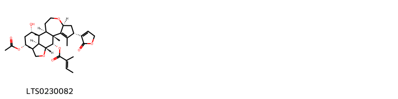
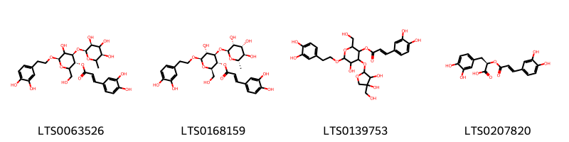
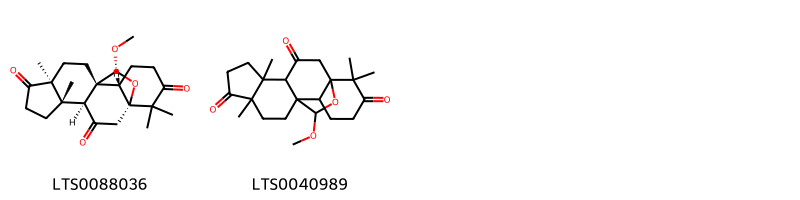
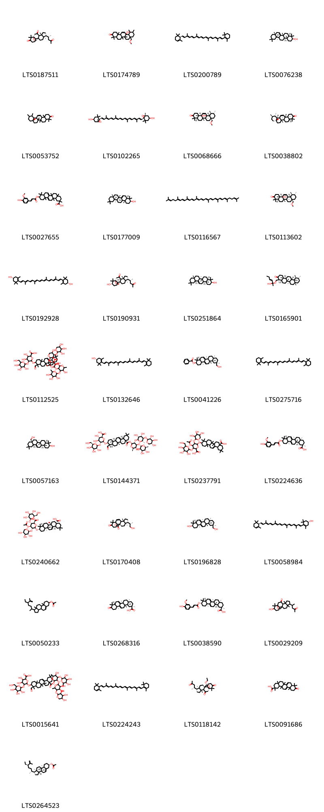

!!! abstract "Tóm tắt"

    Mướp đắng (Quả) (Pructus Momordicae charantiae) là quả của cây mướp đắng (Momordica charantia), thuộc họ Bí (Cucurbitaceae). Mướp đắng phân bố rộng khắp thế giới, từ châu Phi, châu Á đến châu Úc và các đảo Thái Bình Dương. Tại Việt Nam, mướp đắng được trồng phổ biến ở cả miền Bắc và miền Nam. Theo y học cổ truyền, mướp đắng có vị đắng, tính hàn, quy vào kinh tỳ, phế và thận, liều dùng thường dao động từ 6-12g/ngày. Mướp đắng được dùng để chữa ho, sốt, táo bón, tiểu buốt, tiểu dắt, tiểu đường, và các bệnh ngoài da như mụn nhọt, rôm sảy. Tác dụng dược lý của mướp đắng bao gồm chống viêm, hạ đường huyết, và hỗ trợ tiêu hóa. Thành phần hóa học chính gồm glucozit đắng (momordixin), vitamin B1, C, adenin, betain, và protein.

## Thông tin về thực vật

Dược liệu **Mướp Đắng (Quả)** từ bộ phận **nan** từ loài *Momordica charantia*.

**Mô tả thực vật:** Mướp đắng là một loại cây leo, thân có góc cạnh, ở ngọn hơi có lông tơ. Lá mọc so le, dài 5-10 cm, rộng 4-8 cm, phiến lá chia 5-7 thùy hình trứng, mép có răng cưa đều, mặt dưới lá màu nhạt hơn mặt trên, trên gân lá có lông ngắn. Hoa mọc đơn độc ở kẽ lá, đực cái cùng gốc, có cuống dài, cánh hoa màu vàng nhạt, đường kính của hoa chừng 2cm. Quả hình thoi dài 8-15 cm, trên mặt có nhiều u nổi lên, quả chưa chín có màu vàng xanh, khi chín có màu vàng hồng, trong quả có hạt dẹt 13-15 mm, rộng 7-8 mm, trông gần giống hạt bí ngô, quanh hạt có màng màu đỏ máu như màng gấc.

*Tài liệu tham khảo:* "Những cây thuốc và vị thuốc Việt Nam" - Đỗ Tất Lợi 
Trong dược điển Việt nam, một loài được sử dụng làm dược liệu là *Momordica charantia*.

!!! info "Phân loại thực vật của *Momordica charantia*"
    - **Kingdom:** Plantae
    - **Phylum:** Tracheophyta
    - **Order:** Cucurbitales
    - **Family:** Cucurbitaceae
    - **Genus:** Momordica
    - **Species:** *Momordica charantia*

**Phân bố trên thế giới:** nan, French Polynesia, Dominican Republic, Lao People’s Democratic Republic, Indonesia, Panama, United States of America, Réunion, Montserrat, Belize, Jamaica, American Samoa, Colombia, India, Antigua and Barbuda, Malawi, Barbados, Brazil, Chinese Taipei, Nicaragua, Sri Lanka, Saint Kitts and Nevis, Thailand, Honduras, Philippines, Puerto Rico, French Guiana, Kenya, Guatemala, Argentina, Guadeloupe, Mexico, Cayman Islands, Viet Nam, Northern Mariana Islands, Australia, Ghana, Peru, China, Nigeria, Spain, New Zealand, Ecuador, South Africa, Bahamas, Costa Rica, Virgin Islands (U.S.), Cabo Verde, Hong Kong, Vanuatu, Saint Lucia

**Phân bố tại Việt nam:** Đồng Tháp

## Thông tin về dược liệu 

### Định danh

!!! info "Thông tin về tên gọi"

    - Dược liệu tiếng Việt: nan
    - Dược liệu tiếng Trung: nan (nan)
    - Dược liệu tiếng Anh: nan
    - Dược liệu latin thông dụng: nan
    - Dược liệu latin kiểu DĐVN: *pructus momordicae charantiae*
    - Dược liệu latin kiểu DĐVN: *nan*
    - Dược liệu latin kiểu thông tư: *nan*
    - Bộ phận dùng: nan (nan)

### Mô tả dược liệu 

- **Theo dược điển Việt nam V:** nan

- **Mô tả dược liệu theo thông tư chế biến dược liệu theo phương pháp cổ truyền:** nan

### Chế biến 

- **Chế biến theo dược điển việt nam V**: nan

- **Chế biến theo thông tư:** nan

--- 

## Thành phần hóa học

- Theo tài liệu của GS. Đỗ Tất Lợi:  (1) Glucozit đắng còn gọi là momocdixin, Vitamin B1, C, adenin, betain, protein.
(2) Không tìm thấy
    

**Thành phần hóa học từ loài **Momordica charantia**

Theo cơ sở dữ liệu lotus, loài *Momordica charantia* đã phân lập và xác định được **359** hoạt chất thuộc về các nhóm Steroids and steroid derivatives, Diazines, Organooxygen compounds, Fatty Acyls, Cinnamic acids and derivatives, Lactones, Tetrahydrofurans, Oxolanes, Carboxylic acids and derivatives, Benzene and substituted derivatives, Prenol lipids, Oxepanes trong bảng dưới đây. Danh sách các hoạt chất như sau 2-{[1-(3-hydroxy-6-methyl-4-{[3,4,5-trihydroxy-6-(hydroxymethyl)oxan-2-yl]oxy}hept-5-en-2-yl)-4-methoxy-3a,6,6,9b,11a-pentamethyl-1h,2h,3h,3bh,4h,7h,8h,9h,9ah,10h,11h-cyclopenta[a]phenanthren-7-yl]oxy}-6-(hydroxymethyl)oxane-3,4,5-triol [(LTS0268345)](https://lotus.naturalproducts.net/compound/lotus_id/LTS0268345), 8-(6-methoxy-6-methylhept-4-en-2-yl)-5,9,17,17-tetramethyl-18-oxapentacyclo[10.5.2.0¹,¹³.0⁴,¹².0⁵,⁹]nonadec-2-en-16-ol [(LTS0202941)](https://lotus.naturalproducts.net/compound/lotus_id/LTS0202941), 2-[(5-hydroxy-6-{7-hydroxy-4-methoxy-3a,6,6,9b,11a-pentamethyl-1h,2h,3h,3bh,4h,7h,8h,9h,9ah,10h,11h-cyclopenta[a]phenanthren-1-yl}-2-methylhept-2-en-4-yl)oxy]-6-(hydroxymethyl)oxane-3,4,5-triol [(LTS0200297)](https://lotus.naturalproducts.net/compound/lotus_id/LTS0200297), (1r,3as,3bs,7s,9ar,9bs,11ar)-1-[(2r,5r)-5-ethyl-6-methylhept-6-en-2-yl]-9a,11a-dimethyl-1h,2h,3h,3ah,3bh,4h,6h,7h,8h,9h,9bh,10h,11h-cyclopenta[a]phenanthren-7-yl acetate [(LTS0264523)](https://lotus.naturalproducts.net/compound/lotus_id/LTS0264523), 2-{[1-(3,4-dihydroxy-6-methylhept-5-en-2-yl)-3a,6,6,9b,11a-pentamethyl-1h,2h,3h,3bh,4h,7h,8h,9h,9ah,10h,11h-cyclopenta[a]phenanthren-7-yl]oxy}-6-({[3,4,5-trihydroxy-6-(hydroxymethyl)oxan-2-yl]oxy}methyl)oxane-3,4,5-triol [(LTS0100265)](https://lotus.naturalproducts.net/compound/lotus_id/LTS0100265), (1r,3as,3br,4s,7s,9as,9bs,11ar)-4-methoxy-1-[(2r,4e)-6-methoxy-6-methylhept-4-en-2-yl]-3a,6,6,9b,11a-pentamethyl-1h,2h,3h,3bh,4h,7h,8h,9h,9ah,10h,11h-cyclopenta[a]phenanthren-7-ol [(LTS0225710)](https://lotus.naturalproducts.net/compound/lotus_id/LTS0225710), (1r,3as,3br,4s,7s,9as,9bs,11ar)-3a,6,6,9b,11a-pentamethyl-1-[(2r,4e)-6-methylhepta-4,6-dien-2-yl]-1h,2h,3h,3bh,4h,7h,8h,9h,9ah,10h,11h-cyclopenta[a]phenanthrene-4,7-diol [(LTS0244149)](https://lotus.naturalproducts.net/compound/lotus_id/LTS0244149), momordol [(LTS0187083)](https://lotus.naturalproducts.net/compound/lotus_id/LTS0187083), capric acid [(LTS0039856)](https://lotus.naturalproducts.net/compound/lotus_id/LTS0039856), 2-[(4-amino-6-hydroxy-2-imino-3h-pyrimidin-5-yl)oxy]oxane-3,4,5-triol [(LTS0121669)](https://lotus.naturalproducts.net/compound/lotus_id/LTS0121669), 2-(hydroxymethyl)-6-{[8-(6-methoxy-6-methylhept-4-en-2-yl)-5,9,17,17-tetramethyl-18-oxapentacyclo[10.5.2.0¹,¹³.0⁴,¹².0⁵,⁹]nonadec-2-en-16-yl]oxy}oxane-3,4,5-triol [(LTS0190489)](https://lotus.naturalproducts.net/compound/lotus_id/LTS0190489), (1r,3as,3br,7s,9bs,11ar)-7-hydroxy-1-[(2r,4e)-6-hydroxy-6-methylhept-4-en-2-yl]-3a,6,6,9b,11a-pentamethyl-1h,2h,3h,3bh,7h,8h,9h,9ah,10h,11h-cyclopenta[a]phenanthren-4-one [(LTS0064031)](https://lotus.naturalproducts.net/compound/lotus_id/LTS0064031), erythrodiol [(LTS0057163)](https://lotus.naturalproducts.net/compound/lotus_id/LTS0057163), β-carotene [(LTS0275716)](https://lotus.naturalproducts.net/compound/lotus_id/LTS0275716), (2r,3r,4s,5s,6r)-2-{[(4s,5s,6s)-6-[(1r,3as,3br,4s,7s,9as,9bs,11ar)-7-hydroxy-4-methoxy-3a,6,6,9b,11a-pentamethyl-1h,2h,3h,3bh,4h,7h,8h,9h,9ah,10h,11h-cyclopenta[a]phenanthren-1-yl]-5-hydroxy-2-methylhept-2-en-4-yl]oxy}-6-(hydroxymethyl)oxane-3,4,5-triol [(LTS0095267)](https://lotus.naturalproducts.net/compound/lotus_id/LTS0095267), (2r,3r,4s,5s,6r)-2-{[(1s,4s,5s,8r,9r,12s,13s,16s,19r)-8-[(2r,4e)-6-hydroxy-6-methylhept-4-en-2-yl]-19-methoxy-5,9,17,17-tetramethyl-18-oxapentacyclo[10.5.2.0¹,¹³.0⁴,¹².0⁵,⁹]nonadec-2-en-16-yl]oxy}-6-(hydroxymethyl)oxane-3,4,5-triol [(LTS0045939)](https://lotus.naturalproducts.net/compound/lotus_id/LTS0045939), eleostearic acid [(LTS0116169)](https://lotus.naturalproducts.net/compound/lotus_id/LTS0116169), (1r,3as,3bs,4s,7s,9ar,9br,11ar)-7-hydroxy-3a,6,6,11a-tetramethyl-1-[(2r,4e)-6-methylhepta-4,6-dien-2-yl]-4-{[(2r,3r,4s,5s,6r)-3,4,5-trihydroxy-6-(hydroxymethyl)oxan-2-yl]oxy}-1h,2h,3h,3bh,4h,7h,8h,9h,9ah,10h,11h-cyclopenta[a]phenanthrene-9b-carbaldehyde [(LTS0067936)](https://lotus.naturalproducts.net/compound/lotus_id/LTS0067936), (2r,3s,4r,5r,6r)-2-(hydroxymethyl)-6-{[(1s,4s,5s,8r,9r,12r,13s,16s)-8-[(2r,4e)-6-methoxy-6-methylhept-4-en-2-yl]-5,9,17,17-tetramethyl-18-oxapentacyclo[10.5.2.0¹,¹³.0⁴,¹².0⁵,⁹]nonadec-2-en-16-yl]oxy}oxane-3,4,5-triol [(LTS0250460)](https://lotus.naturalproducts.net/compound/lotus_id/LTS0250460), 4,7-dihydroxy-1-(4-hydroxy-6-methylhept-5-en-2-yl)-3a,6,6,11a-tetramethyl-1h,2h,3h,3bh,4h,7h,8h,9h,9ah,10h,11h-cyclopenta[a]phenanthrene-9b-carbaldehyde [(LTS0114245)](https://lotus.naturalproducts.net/compound/lotus_id/LTS0114245), (2r,3r,4r,5s,6r)-2-{[(1r,3as,3bs,7s,9ar,9bs,11ar)-9b-(hydroxymethyl)-1-[(2r,4e)-6-methoxy-6-methylhept-4-en-2-yl]-3a,6,6,11a-tetramethyl-1h,2h,3h,3bh,4h,7h,8h,9h,9ah,10h,11h-cyclopenta[a]phenanthren-7-yl]oxy}-6-(hydroxymethyl)oxane-3,4,5-triol [(LTS0199886)](https://lotus.naturalproducts.net/compound/lotus_id/LTS0199886), (2r,3r,4r,5s,6r)-2-{[(1r,3as,3br,4s,7s,9as,9bs,11ar)-4-methoxy-1-[(2r,4e)-6-methoxy-6-methylhept-4-en-2-yl]-3a,6,6,9b,11a-pentamethyl-1h,2h,3h,3bh,4h,7h,8h,9h,9ah,10h,11h-cyclopenta[a]phenanthren-7-yl]oxy}-6-(hydroxymethyl)oxane-3,4,5-triol [(LTS0197354)](https://lotus.naturalproducts.net/compound/lotus_id/LTS0197354), (1r,4s,5s,8r,9r,12s,13s,16s)-8-[(2r,4e)-6-methoxy-6-methylhept-4-en-2-yl]-5,9,17,17-tetramethyl-18-oxapentacyclo[10.5.2.0¹,¹³.0⁴,¹².0⁵,⁹]nonadec-2-en-16-ol [(LTS0079790)](https://lotus.naturalproducts.net/compound/lotus_id/LTS0079790), 15-(5,6-dimethylhept-3-en-2-yl)-2,16-dimethyl-8-oxapentacyclo[9.7.0.0²,⁷.0⁷,⁹.0¹²,¹⁶]octadec-11-ene-5,10-diol [(LTS0031313)](https://lotus.naturalproducts.net/compound/lotus_id/LTS0031313), 8-(6-hydroxy-6-methylhept-4-en-2-yl)-5,9,17,17-tetramethyl-18-oxapentacyclo[10.5.2.0¹,¹³.0⁴,¹².0⁵,⁹]nonadec-2-ene-16,19-diol [(LTS0075200)](https://lotus.naturalproducts.net/compound/lotus_id/LTS0075200), verbascoside [(LTS0168159)](https://lotus.naturalproducts.net/compound/lotus_id/LTS0168159), (4ar,6ar,6bs,8as,11r,12s,12ar,12br,14ar,14bs)-12b-hydroxy-8a-(methoxymethyl)-4,4,6a,6b,11,12,14b-heptamethyl-2,4a,5,6,7,8,9,10,11,12,12a,14a-dodecahydro-1h-picen-3-one [(LTS0113602)](https://lotus.naturalproducts.net/compound/lotus_id/LTS0113602), (2r,3s,4r,5r,6r)-2-(hydroxymethyl)-6-{[(1r,4s,5s,8r,9r,12s,13s,16s)-8-[(2r,4e)-6-methoxy-6-methylhept-4-en-2-yl]-5,9,17,17-tetramethyl-18-oxapentacyclo[10.5.2.0¹,¹³.0⁴,¹².0⁵,⁹]nonadec-2-en-16-yl]oxy}oxane-3,4,5-triol [(LTS0023106)](https://lotus.naturalproducts.net/compound/lotus_id/LTS0023106), [3,4,5-tris(acetyloxy)-6-({6-[4,7-bis(acetyloxy)-9b-formyl-3a,6,6,11a-tetramethyl-1h,2h,3h,3bh,4h,7h,8h,9h,9ah,10h,11h-cyclopenta[a]phenanthren-1-yl]-2-methyl-3-oxohept-1-en-4-yl}oxy)oxan-2-yl]methyl acetate [(LTS0086166)](https://lotus.naturalproducts.net/compound/lotus_id/LTS0086166), 2-(hydroxymethyl)-6-{[5,9,17,17-tetramethyl-8-(6-methyl-4-{[3,4,5-trihydroxy-6-(hydroxymethyl)oxan-2-yl]oxy}hept-5-en-2-yl)-18-oxapentacyclo[10.5.2.0¹,¹³.0⁴,¹².0⁵,⁹]nonadec-2-en-16-yl]oxy}oxane-3,4,5-triol [(LTS0004047)](https://lotus.naturalproducts.net/compound/lotus_id/LTS0004047), (3r,4ar,6bs,8as,11r,12ar,12bs,14bs)-11-(hydroxymethyl)-4,4,6b,8a,11,12b,14b-heptamethyl-1,2,3,4a,5,7,8,9,10,12,12a,13-dodecahydropicen-3-yl benzoate [(LTS0041226)](https://lotus.naturalproducts.net/compound/lotus_id/LTS0041226), (1r,3as,3br,4s,7s,9ar,9br,11ar)-7-hydroxy-1-[(2r,4e)-6-hydroxy-6-methylhept-4-en-2-yl]-4-methoxy-3a,6,6,11a-tetramethyl-1h,2h,3h,3bh,4h,7h,8h,9h,9ah,10h,11h-cyclopenta[a]phenanthrene-9b-carbaldehyde [(LTS0019145)](https://lotus.naturalproducts.net/compound/lotus_id/LTS0019145), α linolenic acid [(LTS0132789)](https://lotus.naturalproducts.net/compound/lotus_id/LTS0132789), (3r,4r,5s,6s)-6-[(1r,3as,3br,7s,9as,9br,11ar)-7-{[(2r,3r,4s,5s,6r)-6-({[(2r,3r,4r,5s,6r)-5-{[(2s,3r,4s)-3,4-dihydroxyoxan-2-yl]oxy}-3,4-dihydroxy-6-(hydroxymethyl)oxan-2-yl]oxy}methyl)-3,4,5-trihydroxyoxan-2-yl]oxy}-3a,6,6,9b,11a-pentamethyl-1h,2h,3h,3bh,4h,7h,8h,9h,9ah,10h,11h-cyclopenta[a]phenanthren-1-yl]-2-methylheptane-2,3,4,5-tetrol [(LTS0255388)](https://lotus.naturalproducts.net/compound/lotus_id/LTS0255388), (2r,3r,4s,5s,6r)-2-{[(1r,3as,3br,4s,7s,9as,9bs,11ar)-7-hydroxy-1-[(2r,4e)-6-methoxy-6-methylhept-4-en-2-yl]-3a,6,6,9b,11a-pentamethyl-1h,2h,3h,3bh,4h,7h,8h,9h,9ah,10h,11h-cyclopenta[a]phenanthren-4-yl]oxy}-6-(hydroxymethyl)oxane-3,4,5-triol [(LTS0174476)](https://lotus.naturalproducts.net/compound/lotus_id/LTS0174476), [3,4,5-tris(acetyloxy)-6-({6-[4,7-bis(acetyloxy)-9b-formyl-3a,6,6,11a-tetramethyl-1h,2h,3h,3bh,4h,7h,8h,9h,9ah,10h,11h-cyclopenta[a]phenanthren-1-yl]-2-methylhept-2-en-4-yl}oxy)oxan-2-yl]methyl acetate [(LTS0129816)](https://lotus.naturalproducts.net/compound/lotus_id/LTS0129816), (2r,5s,7r,9s,10r,12r,15r,16r)-15-[(2r,3e,5r)-5,6-dimethylhept-3-en-2-yl]-2,16-dimethyl-8-oxapentacyclo[9.7.0.0²,⁷.0⁷,⁹.0¹²,¹⁶]octadec-1(11)-ene-5,10-diol [(LTS0144928)](https://lotus.naturalproducts.net/compound/lotus_id/LTS0144928), vicine (van) (8ci) [(LTS0146565)](https://lotus.naturalproducts.net/compound/lotus_id/LTS0146565), (3as,3br,9as,9bs,11as)-3a,6,6,9b,11a-pentamethyl-2h,3h,3bh,8h,9h,9ah,10h,11h-cyclopenta[a]phenanthrene-1,4,7-trione [(LTS0260673)](https://lotus.naturalproducts.net/compound/lotus_id/LTS0260673), (6-{[1-(5-ethyl-6-methylhept-6-en-2-yl)-9a,11a-dimethyl-1h,2h,3h,3ah,3bh,4h,6h,7h,8h,9h,9bh,10h,11h-cyclopenta[a]phenanthren-7-yl]oxy}-3,4,5-trihydroxyoxan-2-yl)methyl octadecanoate [(LTS0239601)](https://lotus.naturalproducts.net/compound/lotus_id/LTS0239601), (2r,3r,4s,5s,6r)-2-{[(1r,4s,5s,8r,9r,12s,13s,16s)-8-[(2r,4e)-6-hydroxy-6-methylhept-4-en-2-yl]-5,9,17,17-tetramethyl-18-oxapentacyclo[10.5.2.0¹,¹³.0⁴,¹².0⁵,⁹]nonadec-2-en-16-yl]oxy}-6-(hydroxymethyl)oxane-3,4,5-triol [(LTS0062823)](https://lotus.naturalproducts.net/compound/lotus_id/LTS0062823), (1s,4s,5r,8r,9s,12r,13s,16s,19s)-19-methoxy-8-[(2s,4r)-4-methoxy-6-methylhept-5-en-2-yl]-5,9,17,17-tetramethyl-18-oxapentacyclo[10.5.2.0¹,¹³.0⁴,¹².0⁵,⁹]nonadec-2-en-16-ol [(LTS0150699)](https://lotus.naturalproducts.net/compound/lotus_id/LTS0150699), palmitoleic acid [(LTS0261591)](https://lotus.naturalproducts.net/compound/lotus_id/LTS0261591), (2r,3s,4r,5r,6r)-2-(hydroxymethyl)-6-{[(4s,5s,8r,9r,12s,13s,16s,19r)-19-methoxy-8-[(2r,4e)-6-methoxy-6-methylhept-4-en-2-yl]-5,9,17,17-tetramethyl-18-oxapentacyclo[10.5.2.0¹,¹³.0⁴,¹².0⁵,⁹]nonadec-2-en-16-yl]oxy}oxane-3,4,5-triol [(LTS0211380)](https://lotus.naturalproducts.net/compound/lotus_id/LTS0211380), 7-hydroxy-1-(6-hydroxy-6-methylhept-4-en-2-yl)-4-methoxy-3a,6,6,11a-tetramethyl-1h,2h,3h,3bh,4h,7h,8h,9h,9ah,10h,11h-cyclopenta[a]phenanthrene-9b-carbaldehyde [(LTS0107535)](https://lotus.naturalproducts.net/compound/lotus_id/LTS0107535), (1r,3as,3br,4r,7s,9as,9bs,11ar)-1-[(2r,4r)-4-hydroxy-6-methylhept-5-en-2-yl]-4-methoxy-3a,6,6,9b,11a-pentamethyl-1h,2h,3h,3bh,4h,7h,8h,9h,9ah,10h,11h-cyclopenta[a]phenanthren-7-ol [(LTS0138393)](https://lotus.naturalproducts.net/compound/lotus_id/LTS0138393), 4-methoxy-1-(6-methoxy-6-methylhept-4-en-2-yl)-3a,6,6,11a-tetramethyl-7-{[3,4,5-trihydroxy-6-(hydroxymethyl)oxan-2-yl]oxy}-1h,2h,3h,3bh,4h,7h,8h,9h,9ah,10h,11h-cyclopenta[a]phenanthrene-9b-carbaldehyde [(LTS0129705)](https://lotus.naturalproducts.net/compound/lotus_id/LTS0129705), 1-(5-ethyl-6-methylhept-6-en-2-yl)-9a,11a-dimethyl-1h,2h,3h,3ah,3bh,4h,6h,7h,8h,9h,9bh,10h,11h-cyclopenta[a]phenanthrene-4,7-diol [(LTS0045802)](https://lotus.naturalproducts.net/compound/lotus_id/LTS0045802), [3,4,5-tris(acetyloxy)-6-{[8-(6-hydroxy-6-methylhept-4-en-2-yl)-5,9,17,17-tetramethyl-18-oxapentacyclo[10.5.2.0¹,¹³.0⁴,¹².0⁵,⁹]nonadec-2-en-16-yl]oxy}oxan-2-yl]methyl acetate [(LTS0040625)](https://lotus.naturalproducts.net/compound/lotus_id/LTS0040625), (2r,3r,4r,5s,6r)-2-{[(4s,5s,6s)-6-[(1r,3as,3br,4r,7s,9as,9bs,11ar)-4-hydroxy-3a,6,6,9b,11a-pentamethyl-7-{[(2r,3r,4r,5s,6r)-3,4,5-trihydroxy-6-(hydroxymethyl)oxan-2-yl]oxy}-1h,2h,3h,3bh,4h,7h,8h,9h,9ah,10h,11h-cyclopenta[a]phenanthren-1-yl]-5-hydroxy-2-methylhept-2-en-4-yl]oxy}-6-(hydroxymethyl)oxane-3,4,5-triol [(LTS0190492)](https://lotus.naturalproducts.net/compound/lotus_id/LTS0190492), 2-({8-[(4e)-6-hydroxy-6-methylhept-4-en-2-yl]-19-methoxy-5,9,17,17-tetramethyl-18-oxapentacyclo[10.5.2.0¹,¹³.0⁴,¹².0⁵,⁹]nonadec-2-en-16-yl}oxy)-6-(hydroxymethyl)oxane-3,4,5-triol [(LTS0180049)](https://lotus.naturalproducts.net/compound/lotus_id/LTS0180049), (2r,3r,4r,5s,6r)-2-{[(1r,3as,3br,4s,7s,9as,9bs,11ar)-1-[(2r,4e)-6-hydroxy-6-methylhept-4-en-2-yl]-4-methoxy-3a,6,6,9b,11a-pentamethyl-1h,2h,3h,3bh,4h,7h,8h,9h,9ah,10h,11h-cyclopenta[a]phenanthren-7-yl]oxy}-6-(hydroxymethyl)oxane-3,4,5-triol [(LTS0145719)](https://lotus.naturalproducts.net/compound/lotus_id/LTS0145719), (1r,3as,3br,4s,7s,9as,9bs,11ar)-1-[(2r,4e)-6-methoxy-6-methylhept-4-en-2-yl]-3a,6,6,9b,11a-pentamethyl-1h,2h,3h,3bh,4h,7h,8h,9h,9ah,10h,11h-cyclopenta[a]phenanthrene-4,7-diol [(LTS0221058)](https://lotus.naturalproducts.net/compound/lotus_id/LTS0221058), (1r,3as,3bs,4r,7s,9ar,9br,11ar)-7-hydroxy-1-[(2r,4e)-6-methoxy-6-methylhept-4-en-2-yl]-3a,6,6,11a-tetramethyl-4-{[(2r,3r,4s,5s,6r)-3,4,5-trihydroxy-6-(hydroxymethyl)oxan-2-yl]oxy}-1h,2h,3h,3bh,4h,7h,8h,9h,9ah,10h,11h-cyclopenta[a]phenanthrene-9b-carbaldehyde [(LTS0079940)](https://lotus.naturalproducts.net/compound/lotus_id/LTS0079940), 2-(hydroxymethyl)-6-{[(3e)-6-(19-methoxy-5,9,17,17-tetramethyl-16-{[3,4,5-trihydroxy-6-(hydroxymethyl)oxan-2-yl]oxy}-18-oxapentacyclo[10.5.2.0¹,¹³.0⁴,¹².0⁵,⁹]nonadec-2-en-8-yl)-2-methylhept-3-en-2-yl]oxy}oxane-3,4,5-triol [(LTS0029162)](https://lotus.naturalproducts.net/compound/lotus_id/LTS0029162), (1r,3as,3bs,7s,9ar,9bs,11ar)-1-[(2r,5r)-5-ethyl-6-methylhept-6-en-2-yl]-7-hydroxy-9a,11a-dimethyl-1h,2h,3h,3ah,3bh,6h,7h,8h,9h,9bh,10h,11h-cyclopenta[a]phenanthren-4-one [(LTS0169006)](https://lotus.naturalproducts.net/compound/lotus_id/LTS0169006), (1r,3as,3bs,4s,7s,9ar,9br,11ar)-4,7-dihydroxy-1-[(2r,4e)-6-hydroxy-6-methylhept-4-en-2-yl]-3a,6,6,11a-tetramethyl-1h,2h,3h,3bh,4h,7h,8h,9h,9ah,10h,11h-cyclopenta[a]phenanthrene-9b-carbaldehyde [(LTS0209494)](https://lotus.naturalproducts.net/compound/lotus_id/LTS0209494), (1s,4s,5r,8r,9s,12r,13s,16s,19r)-19-methoxy-8-[(2s,4r)-4-methoxy-6-methylhept-5-en-2-yl]-5,9,17,17-tetramethyl-18-oxapentacyclo[10.5.2.0¹,¹³.0⁴,¹².0⁵,⁹]nonadec-2-en-16-ol [(LTS0057255)](https://lotus.naturalproducts.net/compound/lotus_id/LTS0057255), (1r,5s,8r,9r,12r)-5,9,17,17-tetramethyl-8-[(2r)-4-oxopentan-2-yl]-18-oxapentacyclo[10.5.2.0¹,¹³.0⁴,¹².0⁵,⁹]nonadecane-3,16-dione [(LTS0187511)](https://lotus.naturalproducts.net/compound/lotus_id/LTS0187511), α,α'-trehalose [(LTS0256842)](https://lotus.naturalproducts.net/compound/lotus_id/LTS0256842), karavilagenin e [(LTS0182529)](https://lotus.naturalproducts.net/compound/lotus_id/LTS0182529), (2r,3r,4s,5s,6r)-2-{[(1s,4s,5s,8r,9r,12s,13s,16s)-8-[(2r,4e)-6-hydroxy-6-methylhept-4-en-2-yl]-5,9,17,17-tetramethyl-18-oxapentacyclo[10.5.2.0¹,¹³.0⁴,¹².0⁵,⁹]nonadec-2-en-16-yl]oxy}-6-(hydroxymethyl)oxane-3,4,5-triol [(LTS0126274)](https://lotus.naturalproducts.net/compound/lotus_id/LTS0126274), (1r,3as,3br,9as,9bs,11ar)-3a,6,6,9b,11a-pentamethyl-1-[(2r,4e)-6-methylhepta-4,6-dien-2-yl]-1h,2h,3h,3bh,8h,9h,9ah,10h,11h-cyclopenta[a]phenanthrene-4,7-dione [(LTS0046819)](https://lotus.naturalproducts.net/compound/lotus_id/LTS0046819), (1s,4s,5s,8r,9r,12s,13s,16r)-8-[(2r,4e)-6-hydroxy-6-methylhept-4-en-2-yl]-5,9,17,17-tetramethyl-18-oxapentacyclo[10.5.2.0¹,¹³.0⁴,¹².0⁵,⁹]nonadec-2-en-16-ol [(LTS0267584)](https://lotus.naturalproducts.net/compound/lotus_id/LTS0267584), (1s,3ar,3br,4r,7r,9bs,11as)-7-hydroxy-1-[(2s,4e)-6-hydroxy-6-methylhept-4-en-2-yl]-3a,6,6,11a-tetramethyl-4-{[(2s,3s,4r,5r,6s)-3,4,5-trihydroxy-6-(hydroxymethyl)oxan-2-yl]oxy}-1h,2h,3h,3bh,4h,7h,8h,9h,9ah,10h,11h-cyclopenta[a]phenanthrene-9b-carbaldehyde [(LTS0042114)](https://lotus.naturalproducts.net/compound/lotus_id/LTS0042114), elaeostearic acid [(LTS0007390)](https://lotus.naturalproducts.net/compound/lotus_id/LTS0007390), (2r,3r,4r,5r,6r)-2-{[(1r,3as,3br,4r,7s,9as,9bs,11ar)-1-[(2s,3s,4r)-3-hydroxy-6-methyl-4-{[(2r,3r,4s,5r,6r)-3,4,5-trihydroxy-6-(hydroxymethyl)oxan-2-yl]oxy}hept-5-en-2-yl]-4-methoxy-3a,6,6,9b,11a-pentamethyl-1h,2h,3h,3bh,4h,7h,8h,9h,9ah,10h,11h-cyclopenta[a]phenanthren-7-yl]oxy}-6-(hydroxymethyl)oxane-3,4,5-triol [(LTS0259333)](https://lotus.naturalproducts.net/compound/lotus_id/LTS0259333), (2r,4as,6as,8ar,12as,14as,14br)-2,4a,6a,9,9,12a,14a-heptamethyl-10-oxo-3,4,5,6,8,8a,11,12,14,14b-decahydro-1h-picene-2-carboxylic acid [(LTS0268316)](https://lotus.naturalproducts.net/compound/lotus_id/LTS0268316), (2s)-2-[(1r,7s,9s,12s,15r,16r)-1-formyl-6,6,12,16-tetramethyl-5,10-dioxo-8-oxapentacyclo[9.7.0.0²,⁷.0⁷,⁹.0¹²,¹⁶]octadecan-15-yl]propanoic acid [(LTS0249415)](https://lotus.naturalproducts.net/compound/lotus_id/LTS0249415), 2-{[1-(6-hydroxy-6-methylhept-4-en-2-yl)-4-methoxy-3a,6,6,9b,11a-pentamethyl-1h,2h,3h,3bh,4h,7h,8h,9h,9ah,10h,11h-cyclopenta[a]phenanthren-7-yl]oxy}-6-(hydroxymethyl)oxane-3,4,5-triol [(LTS0153434)](https://lotus.naturalproducts.net/compound/lotus_id/LTS0153434), (1r,4s,5s,8r,9r,12s,13s,16s,19r)-19-methoxy-8-[(2r,4r)-4-methoxy-6-methylhept-5-en-2-yl]-5,9,17,17-tetramethyl-18-oxapentacyclo[10.5.2.0¹,¹³.0⁴,¹².0⁵,⁹]nonadec-2-en-16-ol [(LTS0037224)](https://lotus.naturalproducts.net/compound/lotus_id/LTS0037224), (2r,3r,4r,5s,6r)-2-{[(4s,5s,6s)-5-hydroxy-6-[(1r,4s,5s,8r,9r,12s,13s,16s)-16-hydroxy-5,9,17,17-tetramethyl-18-oxapentacyclo[10.5.2.0¹,¹³.0⁴,¹².0⁵,⁹]nonadec-2-en-8-yl]-2-methylhept-2-en-4-yl]oxy}-6-(hydroxymethyl)oxane-3,4,5-triol [(LTS0041181)](https://lotus.naturalproducts.net/compound/lotus_id/LTS0041181), 4,7-dihydroxy-3a,6,6,11a-tetramethyl-1-(6-methyl-4-{[3,4,5-trihydroxy-6-(hydroxymethyl)oxan-2-yl]oxy}hept-5-en-2-yl)-1h,2h,3h,3bh,4h,7h,8h,9h,9ah,10h,11h-cyclopenta[a]phenanthrene-9b-carbaldehyde [(LTS0188895)](https://lotus.naturalproducts.net/compound/lotus_id/LTS0188895), 2-{[7-hydroxy-3a,6,6,9b,11a-pentamethyl-1-(6-methyl-4-{[3,4,5-trihydroxy-6-(hydroxymethyl)oxan-2-yl]oxy}hept-5-en-2-yl)-1h,2h,3h,3bh,4h,7h,8h,9h,9ah,10h,11h-cyclopenta[a]phenanthren-4-yl]oxy}-6-(hydroxymethyl)oxane-3,4,5-triol [(LTS0204337)](https://lotus.naturalproducts.net/compound/lotus_id/LTS0204337), (1s,4s,5s,8r,9r,13s,16s,19r)-19-methoxy-5,9,17,17-tetramethyl-8-[(2r,4e)-6-methylhepta-4,6-dien-2-yl]-18-oxapentacyclo[10.5.2.0¹,¹³.0⁴,¹².0⁵,⁹]nonadec-2-en-16-ol [(LTS0148835)](https://lotus.naturalproducts.net/compound/lotus_id/LTS0148835), 3a,6,6,9b,11a-pentamethyl-1-(6-methylhepta-4,6-dien-2-yl)-1h,2h,3h,3bh,4h,7h,8h,9h,9ah,10h,11h-cyclopenta[a]phenanthrene-4,7-diol [(LTS0247823)](https://lotus.naturalproducts.net/compound/lotus_id/LTS0247823), (2r,3r,4s,5s,6r)-2-{[(1r,3as,3br,7s,9as,9br,11ar)-3a,6,6,9b,11a-pentamethyl-1-[(2r)-4,5,6-trihydroxy-6-methylheptan-2-yl]-1h,2h,3h,3bh,4h,7h,8h,9h,9ah,10h,11h-cyclopenta[a]phenanthren-7-yl]oxy}-6-({[(2r,3r,4s,5s,6r)-3,4,5-trihydroxy-6-(hydroxymethyl)oxan-2-yl]oxy}methyl)oxane-3,4,5-triol [(LTS0069337)](https://lotus.naturalproducts.net/compound/lotus_id/LTS0069337), (2r,3s,4s,5r,6r)-2-(hydroxymethyl)-6-{[(1r,4s,5s,8r,9r,12s,13s,16s)-8-[(2r,4r)-4-methoxy-6-methylhept-5-en-2-yl]-5,9,17,17-tetramethyl-18-oxapentacyclo[10.5.2.0¹,¹³.0⁴,¹².0⁵,⁹]nonadec-2-en-16-yl]oxy}oxane-3,4,5-triol [(LTS0034264)](https://lotus.naturalproducts.net/compound/lotus_id/LTS0034264), 4-hydroxy-1-(3-hydroxy-6-methyl-4-{[3,4,5-trihydroxy-6-(hydroxymethyl)oxan-2-yl]oxy}hept-5-en-2-yl)-3a,6,6,11a-tetramethyl-7-{[3,4,5-trihydroxy-6-(hydroxymethyl)oxan-2-yl]oxy}-1h,2h,3h,3bh,4h,7h,8h,9h,9ah,10h,11h-cyclopenta[a]phenanthrene-9b-carbaldehyde [(LTS0170737)](https://lotus.naturalproducts.net/compound/lotus_id/LTS0170737), (1s,4s,5s,8r,9r,13s,16r)-8-[(2r,4e)-6-hydroxy-6-methylhept-4-en-2-yl]-5,9,17,17-tetramethyl-18-oxapentacyclo[10.5.2.0¹,¹³.0⁴,¹².0⁵,⁹]nonadec-2-en-16-ol [(LTS0102049)](https://lotus.naturalproducts.net/compound/lotus_id/LTS0102049), 7-hydroxy-1-(6-hydroxy-6-methylhept-4-en-2-yl)-3a,6,6,11a-tetramethyl-4-{[3,4,5-trihydroxy-6-(hydroxymethyl)oxan-2-yl]oxy}-1h,2h,3h,3bh,4h,7h,8h,9h,9ah,10h,11h-cyclopenta[a]phenanthrene-9b-carbaldehyde [(LTS0048241)](https://lotus.naturalproducts.net/compound/lotus_id/LTS0048241), 16-hydroxy-8-(6-hydroxy-6-methylhept-4-en-2-yl)-5,9,17,17-tetramethyl-18-oxapentacyclo[10.5.2.0¹,¹³.0⁴,¹².0⁵,⁹]nonadec-2-en-19-one [(LTS0271133)](https://lotus.naturalproducts.net/compound/lotus_id/LTS0271133), β-amyrin [(LTS0251864)](https://lotus.naturalproducts.net/compound/lotus_id/LTS0251864), (1s,4s,5s,8r,9r,12s,13s,16s,19r)-8-[(2r,4e)-6-hydroxy-6-methylhept-4-en-2-yl]-19-methoxy-5,9,17,17-tetramethyl-18-oxapentacyclo[10.5.2.0¹,¹³.0⁴,¹².0⁵,⁹]nonadec-2-en-16-ol [(LTS0160645)](https://lotus.naturalproducts.net/compound/lotus_id/LTS0160645), (1r,3as,3bs,4r,7s,9ar,9br,11ar)-4-methoxy-1-[(2r,4e)-6-methoxy-6-methylhept-4-en-2-yl]-3a,6,6,11a-tetramethyl-7-{[(2r,3r,4s,5s,6r)-3,4,5-trihydroxy-6-(hydroxymethyl)oxan-2-yl]oxy}-1h,2h,3h,3bh,4h,7h,8h,9h,9ah,10h,11h-cyclopenta[a]phenanthrene-9b-carbaldehyde [(LTS0042409)](https://lotus.naturalproducts.net/compound/lotus_id/LTS0042409), (3r,4s,5s,6r)-2-{[(1r,3as,3bs,7s,9ar,9bs,11ar)-1-[(2r,5r)-5-ethyl-6-methylhept-6-en-2-yl]-9a,11a-dimethyl-1h,2h,3h,3ah,3bh,4h,6h,7h,8h,9h,9bh,10h,11h-cyclopenta[a]phenanthren-7-yl]oxy}-6-(hydroxymethyl)oxane-3,4,5-triol; bis((3r,4s,5s,6r)-2-{[(1r,3as,3bs,7s,9ar,9bs,11ar)-1-[(2r,5r)-5-ethyl-6-methylheptan-2-yl]-9a,11a-dimethyl-1h,2h,3h,3ah,3bh,4h,6h,7h,8h,9h,9bh,10h,11h-cyclopenta[a]phenanthren-7-yl]oxy}-6-(hydroxymethyl)oxane-3,4,5-triol) [(LTS0172008)](https://lotus.naturalproducts.net/compound/lotus_id/LTS0172008), (2r,3r,4r,5s,6r)-2-{[(1r,3as,3br,4r,7s,9as,9bs,11ar)-4-methoxy-1-[(2r,4e)-6-methoxy-6-methylhept-4-en-2-yl]-3a,6,6,9b,11a-pentamethyl-1h,2h,3h,3bh,4h,7h,8h,9h,9ah,10h,11h-cyclopenta[a]phenanthren-7-yl]oxy}-6-(hydroxymethyl)oxane-3,4,5-triol [(LTS0271764)](https://lotus.naturalproducts.net/compound/lotus_id/LTS0271764), (1r,4s,5s,9s,12s,13s)-5,9,17,17-tetramethyl-18-oxapentacyclo[10.5.2.0¹,¹³.0⁴,¹².0⁵,⁹]nonadec-2-ene-8,16-dione [(LTS0251902)](https://lotus.naturalproducts.net/compound/lotus_id/LTS0251902), 2-(hydroxymethyl)-6-{[2-methyl-6-(5,9,17,17-tetramethyl-16-{[3,4,5-trihydroxy-6-(hydroxymethyl)oxan-2-yl]oxy}-18-oxapentacyclo[10.5.2.0¹,¹³.0⁴,¹².0⁵,⁹]nonadec-2-en-8-yl)hept-3-en-2-yl]oxy}oxane-3,4,5-triol [(LTS0160842)](https://lotus.naturalproducts.net/compound/lotus_id/LTS0160842), (2r,3s,4r,5r,6r)-2-(hydroxymethyl)-6-{[(1r,4s,5s,8r,9r,12s,13s,16s)-5,9,17,17-tetramethyl-8-[(2r,4s,5s)-4,5,6-trihydroxy-6-methylheptan-2-yl]-18-oxapentacyclo[10.5.2.0¹,¹³.0⁴,¹².0⁵,⁹]nonadec-2-en-16-yl]oxy}oxane-3,4,5-triol [(LTS0196309)](https://lotus.naturalproducts.net/compound/lotus_id/LTS0196309), 4-methoxy-3a,6,6,9b,11a-pentamethyl-1-(6-methylhepta-4,6-dien-2-yl)-1h,2h,3h,3bh,4h,7h,8h,9h,9ah,10h,11h-cyclopenta[a]phenanthren-7-ol [(LTS0018750)](https://lotus.naturalproducts.net/compound/lotus_id/LTS0018750), 6-(3a,6,6,9b,11a-pentamethyl-7-{[3,4,5-trihydroxy-6-({[3,4,5-trihydroxy-6-(hydroxymethyl)oxan-2-yl]oxy}methyl)oxan-2-yl]oxy}-1h,2h,3h,3bh,4h,7h,8h,9h,9ah,10h,11h-cyclopenta[a]phenanthren-1-yl)-2-methylheptane-2,3,4,5-tetrol [(LTS0075030)](https://lotus.naturalproducts.net/compound/lotus_id/LTS0075030), 3-{[9b-formyl-4-hydroxy-1-(4-hydroxy-6-methylhept-5-en-2-yl)-3a,6,6,11a-tetramethyl-1h,2h,3h,3bh,4h,7h,8h,9h,9ah,10h,11h-cyclopenta[a]phenanthren-7-yl]oxy}-3-oxopropanoic acid [(LTS0247353)](https://lotus.naturalproducts.net/compound/lotus_id/LTS0247353), (2r,3r,4s,5s,6r)-2-{[(4s,5r,6s)-6-[(1r,3as,3br,4r,7s,9as,9bs,11ar)-7-hydroxy-4-methoxy-3a,6,6,9b,11a-pentamethyl-1h,2h,3h,3bh,4h,7h,8h,9h,9ah,10h,11h-cyclopenta[a]phenanthren-1-yl]-5-hydroxy-2-methylhept-2-en-4-yl]oxy}-6-(hydroxymethyl)oxane-3,4,5-triol [(LTS0034523)](https://lotus.naturalproducts.net/compound/lotus_id/LTS0034523), 2-(hydroxymethyl)-6-{[4-methoxy-3a,6,6,9b,11a-pentamethyl-1-(6-methyl-4-{[3,4,5-trihydroxy-6-(hydroxymethyl)oxan-2-yl]oxy}hept-5-en-2-yl)-1h,2h,3h,3bh,4h,7h,8h,9h,9ah,10h,11h-cyclopenta[a]phenanthren-7-yl]oxy}oxane-3,4,5-triol [(LTS0125880)](https://lotus.naturalproducts.net/compound/lotus_id/LTS0125880), stigmasterol [(LTS0150357)](https://lotus.naturalproducts.net/compound/lotus_id/LTS0150357), 2-{[8-(6-hydroxy-6-methylhept-4-en-2-yl)-5,9,17,17-tetramethyl-18-oxapentacyclo[10.5.2.0¹,¹³.0⁴,¹².0⁵,⁹]nonadec-2-en-16-yl]oxy}-6-(hydroxymethyl)oxane-3,4,5-triol [(LTS0265446)](https://lotus.naturalproducts.net/compound/lotus_id/LTS0265446), (2r,3r,4s,5s,6r)-2-{[(1r,3as,3br,7s,9as,9br,11ar)-3a,6,6,9b,11a-pentamethyl-1-[(2r,4s,5s)-4,5,6-trihydroxy-6-methylheptan-2-yl]-1h,2h,3h,3bh,4h,7h,8h,9h,9ah,10h,11h-cyclopenta[a]phenanthren-7-yl]oxy}-6-({[(2r,3r,4s,5s,6r)-3,4,5-trihydroxy-6-(hydroxymethyl)oxan-2-yl]oxy}methyl)oxane-3,4,5-triol [(LTS0204333)](https://lotus.naturalproducts.net/compound/lotus_id/LTS0204333), (1r,3br,7s,9ar,9bs,11ar)-1-[(2r,5r)-5-ethyl-6-methylheptan-2-yl]-7-hydroxy-9a,11a-dimethyl-1h,3bh,4h,6h,7h,8h,9h,9bh,10h,11h-cyclopenta[a]phenanthren-2-one [(LTS0022758)](https://lotus.naturalproducts.net/compound/lotus_id/LTS0022758), (1r,4s,5s,8r,9r,12s,13s,16s,19r)-8-[(2r,4e)-6-hydroxy-6-methylhept-4-en-2-yl]-5,9,17,17-tetramethyl-18-oxapentacyclo[10.5.2.0¹,¹³.0⁴,¹².0⁵,⁹]nonadec-2-ene-16,19-diol [(LTS0039425)](https://lotus.naturalproducts.net/compound/lotus_id/LTS0039425), (4r,5r,6r)-6-ethyl-5-[(4r,7r,8s,10r,11r)-11-ethyl-8,10,12-trihydroxy-4,7-dimethyldodecyl]-4-hydroxy-4,5-dimethylcyclohex-2-en-1-one [(LTS0238630)](https://lotus.naturalproducts.net/compound/lotus_id/LTS0238630), (2r,3r,4r,5s,6r)-2-{[(4s,5s,6s)-5-hydroxy-2-methyl-6-[(1r,4s,5s,8r,9r,12s,13s,16s)-5,9,17,17-tetramethyl-16-{[(2r,3r,4s,5s,6r)-3,4,5-trihydroxy-6-(hydroxymethyl)oxan-2-yl]oxy}-18-oxapentacyclo[10.5.2.0¹,¹³.0⁴,¹².0⁵,⁹]nonadec-2-en-8-yl]hept-2-en-4-yl]oxy}-6-(hydroxymethyl)oxane-3,4,5-triol [(LTS0185546)](https://lotus.naturalproducts.net/compound/lotus_id/LTS0185546), (1r,3as,3br,4s,7s,9as,9bs,11ar)-1-[(2r,4e)-6-hydroxy-6-methylhept-4-en-2-yl]-4-methoxy-3a,6,6,9b,11a-pentamethyl-1h,2h,3h,3bh,4h,7h,8h,9h,9ah,10h,11h-cyclopenta[a]phenanthren-7-ol [(LTS0242916)](https://lotus.naturalproducts.net/compound/lotus_id/LTS0242916), (2r,3s,4s,5r,6r)-2-(hydroxymethyl)-6-{[(4s,5s,8r,9r,12s,13s,16s)-5,9,17,17-tetramethyl-8-[(2r,4e)-6-methylhepta-4,6-dien-2-yl]-18-oxapentacyclo[10.5.2.0¹,¹³.0⁴,¹².0⁵,⁹]nonadec-2-en-16-yl]oxy}oxane-3,4,5-triol [(LTS0138121)](https://lotus.naturalproducts.net/compound/lotus_id/LTS0138121), 6-[(8a-{[(3-{[5-({3,5-dihydroxy-4-[(3,4,5-trihydroxyoxan-2-yl)oxy]oxan-2-yl}oxy)-3,4-dihydroxy-6-methyloxan-2-yl]oxy}-5-hydroxy-6-methyl-4-[(3,4,5-trihydroxy-6-methyloxan-2-yl)oxy]oxan-2-yl)oxy]carbonyl}-4-formyl-4,6a,6b,11,11,14b-hexamethyl-1,2,3,4a,5,6,7,8,9,10,12,12a,14,14a-tetradecahydropicen-3-yl)oxy]-3,4-dihydroxy-5-{[3,4,5-trihydroxy-6-(hydroxymethyl)oxan-2-yl]oxy}oxane-2-carboxylic acid [(LTS0112525)](https://lotus.naturalproducts.net/compound/lotus_id/LTS0112525), (2r,3s,4r,5r,6r)-2-(hydroxymethyl)-6-{[(1s,4s,5s,8r,9r,12s,13s,16s,19r)-19-methoxy-8-[(2r,4e)-6-methoxy-6-methylhept-4-en-2-yl]-5,9,17,17-tetramethyl-18-oxapentacyclo[10.5.2.0¹,¹³.0⁴,¹².0⁵,⁹]nonadec-2-en-16-yl]oxy}oxane-3,4,5-triol [(LTS0178156)](https://lotus.naturalproducts.net/compound/lotus_id/LTS0178156), (2r,3s,4r,5r,6r)-2-(hydroxymethyl)-6-{[(1r,4s,5s,8r,9r,12s,13s,16s)-19-methoxy-8-[(2r,4e)-6-methoxy-6-methylhept-4-en-2-yl]-5,9,17,17-tetramethyl-18-oxapentacyclo[10.5.2.0¹,¹³.0⁴,¹².0⁵,⁹]nonadec-2-en-16-yl]oxy}oxane-3,4,5-triol [(LTS0093495)](https://lotus.naturalproducts.net/compound/lotus_id/LTS0093495), 2-{[3a,6,6,9b,11a-pentamethyl-1-(4,5,6-trihydroxy-6-methylheptan-2-yl)-1h,2h,3h,3bh,4h,7h,8h,9h,9ah,10h,11h-cyclopenta[a]phenanthren-7-yl]oxy}-6-({[3,4,5-trihydroxy-6-(hydroxymethyl)oxan-2-yl]oxy}methyl)oxane-3,4,5-triol [(LTS0071861)](https://lotus.naturalproducts.net/compound/lotus_id/LTS0071861), 5,9,17,17-tetramethyl-18-oxapentacyclo[10.5.2.0¹,¹³.0⁴,¹².0⁵,⁹]nonadec-2-ene-8,16,19-trione [(LTS0005755)](https://lotus.naturalproducts.net/compound/lotus_id/LTS0005755), alnulin [(LTS0076238)](https://lotus.naturalproducts.net/compound/lotus_id/LTS0076238), (1r,5s,8r,9r,12r,19r)-19-methoxy-5,9,17,17-tetramethyl-8-[(2r)-6-methyl-4-oxohept-5-en-2-yl]-18-oxapentacyclo[10.5.2.0¹,¹³.0⁴,¹².0⁵,⁹]nonadecane-3,16-dione [(LTS0029675)](https://lotus.naturalproducts.net/compound/lotus_id/LTS0029675), (6-{[1-(5-ethyl-6-methylhept-6-en-2-yl)-9a,11a-dimethyl-1h,2h,3h,3ah,3bh,4h,6h,7h,8h,9h,9bh,10h,11h-cyclopenta[a]phenanthren-7-yl]oxy}-3,4,5-trihydroxyoxan-2-yl)methyl hexadecanoate [(LTS0011333)](https://lotus.naturalproducts.net/compound/lotus_id/LTS0011333), (1r,4s,5s,8r,9r,12s,13s,16s)-16-hydroxy-8-[(2r,4e)-6-hydroxy-6-methylhept-4-en-2-yl]-5,9,17,17-tetramethyl-18-oxapentacyclo[10.5.2.0¹,¹³.0⁴,¹².0⁵,⁹]nonadec-2-en-19-one [(LTS0139757)](https://lotus.naturalproducts.net/compound/lotus_id/LTS0139757), (2r,3s,4s,5r,6r)-2-(hydroxymethyl)-6-{[(1r,4s,5s,8r,9r,12s,13s,16s)-5,9,17,17-tetramethyl-8-[(2r,4r)-6-methyl-4-{[(2r,3r,4r,5s,6r)-3,4,5-trihydroxy-6-(hydroxymethyl)oxan-2-yl]oxy}hept-5-en-2-yl]-18-oxapentacyclo[10.5.2.0¹,¹³.0⁴,¹².0⁵,⁹]nonadec-2-en-16-yl]oxy}oxane-3,4,5-triol [(LTS0046160)](https://lotus.naturalproducts.net/compound/lotus_id/LTS0046160), (2r,3r,4r,5s,6r)-2-{[(1s,4s,5s,8r,9r,12s,13s,16s)-8-[(2r,4e)-6-hydroxy-6-methylhept-4-en-2-yl]-5,9,17,17-tetramethyl-18-oxapentacyclo[10.5.2.0¹,¹³.0⁴,¹².0⁵,⁹]nonadec-2-en-16-yl]oxy}-6-(hydroxymethyl)oxane-3,4,5-triol [(LTS0239403)](https://lotus.naturalproducts.net/compound/lotus_id/LTS0239403), 7-hydroxy-3a,6,6,11a-tetramethyl-1-(6-methylhepta-4,6-dien-2-yl)-4-{[3,4,5-trihydroxy-6-(hydroxymethyl)oxan-2-yl]oxy}-1h,2h,3h,3bh,4h,7h,8h,9h,9ah,10h,11h-cyclopenta[a]phenanthrene-9b-carbaldehyde [(LTS0139990)](https://lotus.naturalproducts.net/compound/lotus_id/LTS0139990), 2-{[5-hydroxy-6-(4-hydroxy-3a,6,6,9b,11a-pentamethyl-7-{[3,4,5-trihydroxy-6-(hydroxymethyl)oxan-2-yl]oxy}-1h,2h,3h,3bh,4h,7h,8h,9h,9ah,10h,11h-cyclopenta[a]phenanthren-1-yl)-2-methylhept-2-en-4-yl]oxy}-6-(hydroxymethyl)oxane-3,4,5-triol [(LTS0217668)](https://lotus.naturalproducts.net/compound/lotus_id/LTS0217668), (1r,3as,3bs,4s,7s,9ar,9br,11ar)-4-methoxy-1-[(2r,4e)-6-methoxy-6-methylhept-4-en-2-yl]-3a,6,6,11a-tetramethyl-7-{[(2r,3r,4s,5s,6r)-3,4,5-trihydroxy-6-(hydroxymethyl)oxan-2-yl]oxy}-1h,2h,3h,3bh,4h,7h,8h,9h,9ah,10h,11h-cyclopenta[a]phenanthrene-9b-carbaldehyde [(LTS0265131)](https://lotus.naturalproducts.net/compound/lotus_id/LTS0265131), 4-hydroxy-1-(6-hydroxy-6-methylhept-4-en-2-yl)-3a,6,6,11a-tetramethyl-7-{[3,4,5-trihydroxy-6-(hydroxymethyl)oxan-2-yl]oxy}-1h,2h,3h,3bh,4h,7h,8h,9h,9ah,10h,11h-cyclopenta[a]phenanthrene-9b-carbaldehyde [(LTS0214261)](https://lotus.naturalproducts.net/compound/lotus_id/LTS0214261), (2r,3r,4r,5s,6r)-2-{[(1r,3as,3br,4s,7s,9as,9bs,11ar)-1-[(2s,3s,4s)-3-hydroxy-6-methyl-4-{[(2r,3r,4r,5s,6r)-3,4,5-trihydroxy-6-(hydroxymethyl)oxan-2-yl]oxy}hept-5-en-2-yl]-4-methoxy-3a,6,6,9b,11a-pentamethyl-1h,2h,3h,3bh,4h,7h,8h,9h,9ah,10h,11h-cyclopenta[a]phenanthren-7-yl]oxy}-6-(hydroxymethyl)oxane-3,4,5-triol [(LTS0085769)](https://lotus.naturalproducts.net/compound/lotus_id/LTS0085769), (1r,3as,3br,7s,9as,9bs,11ar)-7-hydroxy-1-[(2r,4e)-6-hydroxy-6-methylhept-4-en-2-yl]-3a,6,6,9b,11a-pentamethyl-1h,2h,3h,3bh,7h,8h,9h,9ah,10h,11h-cyclopenta[a]phenanthren-4-one [(LTS0111532)](https://lotus.naturalproducts.net/compound/lotus_id/LTS0111532), 2-[(5-hydroxy-6-{16-hydroxy-5,9,17,17-tetramethyl-18-oxapentacyclo[10.5.2.0¹,¹³.0⁴,¹².0⁵,⁹]nonadec-2-en-8-yl}-2-methylhept-2-en-4-yl)oxy]-6-(hydroxymethyl)oxane-3,4,5-triol [(LTS0117142)](https://lotus.naturalproducts.net/compound/lotus_id/LTS0117142), momordicilin [(LTS0165901)](https://lotus.naturalproducts.net/compound/lotus_id/LTS0165901), (1r,3ar,3br,7s,9ar,9br,11ar)-1-[(2r,5r)-5-ethyl-6-methylheptan-2-yl]-9a,11a-dimethyl-1h,2h,3h,3ah,3bh,4h,6h,7h,8h,9h,9bh,10h,11h-cyclopenta[a]phenanthren-7-ol [(LTS0129695)](https://lotus.naturalproducts.net/compound/lotus_id/LTS0129695), 1-(5-ethyl-6-methylhept-3-en-2-yl)-9a,11a-dimethyl-1h,2h,3h,3ah,5h,5ah,6h,7h,8h,9h,9bh,10h,11h-cyclopenta[a]phenanthren-7-ol [(LTS0173223)](https://lotus.naturalproducts.net/compound/lotus_id/LTS0173223), (2r,3r,4s,5s,6r)-2-{[(1r,4s,5s,8r,9r,12s,13s,16s,19r)-19-butoxy-8-[(2r,4e)-6-hydroxy-6-methylhept-4-en-2-yl]-5,9,17,17-tetramethyl-18-oxapentacyclo[10.5.2.0¹,¹³.0⁴,¹².0⁵,⁹]nonadec-2-en-16-yl]oxy}-6-(hydroxymethyl)oxane-3,4,5-triol [(LTS0053685)](https://lotus.naturalproducts.net/compound/lotus_id/LTS0053685), 7-hydroxy-4-methoxy-1-(6-methoxy-6-methylhept-4-en-2-yl)-3a,6,6,11a-tetramethyl-1h,2h,3h,3bh,4h,7h,8h,9h,9ah,10h,11h-cyclopenta[a]phenanthrene-9b-carbaldehyde [(LTS0099029)](https://lotus.naturalproducts.net/compound/lotus_id/LTS0099029), 2-{[1-(4-{[4,5-dihydroxy-6-(hydroxymethyl)-3-{[3,4,5-trihydroxy-6-(hydroxymethyl)oxan-2-yl]oxy}oxan-2-yl]oxy}-6-methylhept-5-en-2-yl)-7-hydroxy-3a,6,6,9b,11a-pentamethyl-1h,2h,3h,3bh,4h,7h,8h,9h,9ah,10h,11h-cyclopenta[a]phenanthren-4-yl]oxy}-6-(hydroxymethyl)oxane-3,4,5-triol [(LTS0215710)](https://lotus.naturalproducts.net/compound/lotus_id/LTS0215710), (1s,4s,5s,8r,9r,13s,16s,19r)-19-methoxy-8-[(2r,4e)-6-methoxy-6-methylhept-4-en-2-yl]-5,9,17,17-tetramethyl-18-oxapentacyclo[10.5.2.0¹,¹³.0⁴,¹².0⁵,⁹]nonadec-2-en-16-ol [(LTS0100307)](https://lotus.naturalproducts.net/compound/lotus_id/LTS0100307), (1r,3as,3bs,7s,9ar,9br,11ar)-7-hydroxy-3a,6,6,11a-tetramethyl-4-oxo-1-[(2s)-4-oxopentan-2-yl]-1h,2h,3h,3bh,7h,8h,9h,9ah,10h,11h-cyclopenta[a]phenanthrene-9b-carbaldehyde [(LTS0140523)](https://lotus.naturalproducts.net/compound/lotus_id/LTS0140523), (+)-α-carotene [(LTS0200789)](https://lotus.naturalproducts.net/compound/lotus_id/LTS0200789), stigmast-5-en-3-ol, (3β)- [(LTS0204616)](https://lotus.naturalproducts.net/compound/lotus_id/LTS0204616), 2-{[8-(6-hydroxy-6-methylhept-4-en-2-yl)-19-methoxy-5,9,17,17-tetramethyl-18-oxapentacyclo[10.5.2.0¹,¹³.0⁴,¹².0⁵,⁹]nonadec-2-en-16-yl]oxy}-6-(hydroxymethyl)oxane-3,4,5-triol [(LTS0131149)](https://lotus.naturalproducts.net/compound/lotus_id/LTS0131149), palmitic acid [(LTS0079439)](https://lotus.naturalproducts.net/compound/lotus_id/LTS0079439), 6-(7-{[3,4-dihydroxy-6-({[3,4,5-trihydroxy-6-(hydroxymethyl)oxan-2-yl]oxy}methyl)-5-[(3,4,5-trihydroxyoxan-2-yl)oxy]oxan-2-yl]oxy}-3a,6,6,9b,11a-pentamethyl-1h,2h,3h,3bh,4h,7h,8h,9h,9ah,10h,11h-cyclopenta[a]phenanthren-1-yl)-2-methylheptane-2,3,4,5-tetrol [(LTS0265659)](https://lotus.naturalproducts.net/compound/lotus_id/LTS0265659), (1r,4s,5s,8r,9r,12s,13s,16s)-8-[(2r,4e)-6-hydroxy-6-methylhept-4-en-2-yl]-19-methoxy-5,9,17,17-tetramethyl-18-oxapentacyclo[10.5.2.0¹,¹³.0⁴,¹².0⁵,⁹]nonadec-2-en-16-ol [(LTS0164855)](https://lotus.naturalproducts.net/compound/lotus_id/LTS0164855), (2r,3s,4s,5r,6r)-2-(hydroxymethyl)-6-{[(1s,4s,5s,8r,9r,12s,13s,16s)-5,9,17,17-tetramethyl-8-[(2r,4e)-6-methylhepta-4,6-dien-2-yl]-18-oxapentacyclo[10.5.2.0¹,¹³.0⁴,¹².0⁵,⁹]nonadec-2-en-16-yl]oxy}oxane-3,4,5-triol [(LTS0181016)](https://lotus.naturalproducts.net/compound/lotus_id/LTS0181016), (2r,3r,4s,5s,6r)-2-{[(1r,3as,3bs,4s,7s,9ar,9br,11ar)-7-hydroxy-9b-(hydroxymethyl)-3a,6,6,11a-tetramethyl-1-[(2r,4r)-6-methyl-4-{[(2r,3r,4s,5s,6r)-3,4,5-trihydroxy-6-(hydroxymethyl)oxan-2-yl]oxy}hept-5-en-2-yl]-1h,2h,3h,3bh,4h,7h,8h,9h,9ah,10h,11h-cyclopenta[a]phenanthren-4-yl]oxy}-6-(hydroxymethyl)oxane-3,4,5-triol [(LTS0266765)](https://lotus.naturalproducts.net/compound/lotus_id/LTS0266765), 2-{[7-hydroxy-1-(4-hydroxy-6-methylhept-5-en-2-yl)-9b-(hydroxymethyl)-3a,6,6,11a-tetramethyl-1h,2h,3h,3bh,4h,7h,8h,9h,9ah,10h,11h-cyclopenta[a]phenanthren-4-yl]oxy}-6-(hydroxymethyl)oxane-3,4,5-triol [(LTS0186386)](https://lotus.naturalproducts.net/compound/lotus_id/LTS0186386), (3as,3br,9as,9bs,11ar)-3a,6,6,9b,11a-pentamethyl-1h,3h,3bh,8h,9h,9ah,10h,11h-cyclopenta[a]phenanthrene-2,4,7-trione [(LTS0061509)](https://lotus.naturalproducts.net/compound/lotus_id/LTS0061509), (1r,4s,5s,8r,9r,12s,13s,16s,19r)-19-methoxy-8-[(2r,4e)-6-methoxy-6-methylhept-4-en-2-yl]-5,9,17,17-tetramethyl-18-oxapentacyclo[10.5.2.0¹,¹³.0⁴,¹².0⁵,⁹]nonadec-2-en-16-ol [(LTS0029409)](https://lotus.naturalproducts.net/compound/lotus_id/LTS0029409), (2r,3r,4s,5s,6r)-2-{[(1r,4s,5s,8r,9r,12s,13s,16s,19r)-8-[(2r,4e)-6-hydroxy-6-methylhept-4-en-2-yl]-19-methoxy-5,9,17,17-tetramethyl-18-oxapentacyclo[10.5.2.0¹,¹³.0⁴,¹².0⁵,⁹]nonadec-2-en-16-yl]oxy}-6-(hydroxymethyl)oxane-3,4,5-triol [(LTS0025856)](https://lotus.naturalproducts.net/compound/lotus_id/LTS0025856), violaxanthin [(LTS0102265)](https://lotus.naturalproducts.net/compound/lotus_id/LTS0102265), 1-(5-ethyl-6-methylheptan-2-yl)-7-hydroxy-9a,11a-dimethyl-1h,3bh,4h,6h,7h,8h,9h,9bh,10h,11h-cyclopenta[a]phenanthren-2-one [(LTS0073541)](https://lotus.naturalproducts.net/compound/lotus_id/LTS0073541), (1r,4s,5s,8r,9r,12s,13s,16s)-8-[(2r,4e)-6-methoxy-6-methylhept-4-en-2-yl]-5,9,17,17-tetramethyl-16-{[(2r,3r,4r,5s,6r)-3,4,5-trihydroxy-6-(hydroxymethyl)oxan-2-yl]oxy}-18-oxapentacyclo[10.5.2.0¹,¹³.0⁴,¹².0⁵,⁹]nonadec-2-en-19-one [(LTS0097367)](https://lotus.naturalproducts.net/compound/lotus_id/LTS0097367), (1r,4s,5s,8r,9r,12s,13s,16s,19r)-5,9,17,17-tetramethyl-8-[(2r,4e)-6-methylhepta-4,6-dien-2-yl]-18-oxapentacyclo[10.5.2.0¹,¹³.0⁴,¹².0⁵,⁹]nonadec-2-ene-16,19-diol [(LTS0191984)](https://lotus.naturalproducts.net/compound/lotus_id/LTS0191984), (1r,3as,3bs,4s,7s,9ar,9br,11ar)-1-[(2r,4e)-6-hydroxy-6-methylhept-4-en-2-yl]-4-methoxy-3a,6,6,11a-tetramethyl-7-{[(2r,3r,4r,5s,6r)-3,4,5-trihydroxy-6-(hydroxymethyl)oxan-2-yl]oxy}-1h,2h,3h,3bh,4h,7h,8h,9h,9ah,10h,11h-cyclopenta[a]phenanthrene-9b-carbaldehyde [(LTS0153238)](https://lotus.naturalproducts.net/compound/lotus_id/LTS0153238), [(2r,3s,4s,5r,6r)-6-{[(1r,3as,3bs,7r,9ar,9bs,11ar)-1-[(2r,5r)-5-ethyl-6-methylhept-6-en-2-yl]-9a,11a-dimethyl-1h,2h,3h,3ah,3bh,4h,6h,7h,8h,9h,9bh,10h,11h-cyclopenta[a]phenanthren-7-yl]oxy}-3,4,5-trihydroxyoxan-2-yl]methyl hexadecanoate [(LTS0171302)](https://lotus.naturalproducts.net/compound/lotus_id/LTS0171302), (1r,3as,3bs,4s,7s,9ar,9br,11ar)-4,7-dihydroxy-3a,6,6,11a-tetramethyl-1-[(2r)-6-methyl-4-oxohept-5-en-2-yl]-1h,2h,3h,3bh,4h,7h,8h,9h,9ah,10h,11h-cyclopenta[a]phenanthrene-9b-carbaldehyde [(LTS0003886)](https://lotus.naturalproducts.net/compound/lotus_id/LTS0003886), (3r,6s,8r,11s,12s,15r,16r)-7,7,12,16-tetramethyl-15-[(2r)-6-methylhept-5-en-2-yl]pentacyclo[9.7.0.0¹,³.0³,⁸.0¹²,¹⁶]octadecan-6-ol [(LTS0062833)](https://lotus.naturalproducts.net/compound/lotus_id/LTS0062833), balsaminol b [(LTS0216394)](https://lotus.naturalproducts.net/compound/lotus_id/LTS0216394), myristic acid [(LTS0102566)](https://lotus.naturalproducts.net/compound/lotus_id/LTS0102566), 19-methoxy-5,9,17,17-tetramethyl-18-oxapentacyclo[10.5.2.0¹,¹³.0⁴,¹².0⁵,⁹]nonadecane-3,8,16-trione [(LTS0040989)](https://lotus.naturalproducts.net/compound/lotus_id/LTS0040989), (2r,3s,4s,5r,6r)-2-(hydroxymethyl)-6-{[(1r,4s,5s,8r,9r,12s,13s,16s)-8-[(2r,4s)-4-methoxy-6-methylhept-5-en-2-yl]-5,9,17,17-tetramethyl-18-oxapentacyclo[10.5.2.0¹,¹³.0⁴,¹².0⁵,⁹]nonadec-2-en-16-yl]oxy}oxane-3,4,5-triol [(LTS0205034)](https://lotus.naturalproducts.net/compound/lotus_id/LTS0205034), (1r,3ar,7s,9as,11ar)-1-[(2r,3e,5r)-5,6-dimethylhept-3-en-2-yl]-7-hydroxy-9a,11a-dimethyl-1h,2h,3h,3ah,6h,7h,8h,9h,10h,11h-cyclopenta[a]phenanthren-4-one [(LTS0047257)](https://lotus.naturalproducts.net/compound/lotus_id/LTS0047257), 2-(hydroxymethyl)-6-{[4-methoxy-1-(6-methoxy-6-methylhept-4-en-2-yl)-3a,6,6,9b,11a-pentamethyl-1h,2h,3h,3bh,4h,7h,8h,9h,9ah,10h,11h-cyclopenta[a]phenanthren-7-yl]oxy}oxane-3,4,5-triol [(LTS0267071)](https://lotus.naturalproducts.net/compound/lotus_id/LTS0267071), 4-{[3,4-dihydroxy-4-(hydroxymethyl)oxolan-2-yl]oxy}-6-[2-(3,4-dihydroxyphenyl)ethoxy]-5-hydroxy-2-(hydroxymethyl)oxan-3-yl 3-(3,4-dihydroxyphenyl)prop-2-enoate [(LTS0139753)](https://lotus.naturalproducts.net/compound/lotus_id/LTS0139753), (2r,3r,4r,5s,6r)-2-{[(1r,4s,5s,8r,9r,12s,13s,16s,19r)-8-[(2r,4e)-6-hydroxy-6-methylhept-4-en-2-yl]-19-methoxy-5,9,17,17-tetramethyl-18-oxapentacyclo[10.5.2.0¹,¹³.0⁴,¹².0⁵,⁹]nonadec-2-en-16-yl]oxy}-6-(hydroxymethyl)oxane-3,4,5-triol [(LTS0020472)](https://lotus.naturalproducts.net/compound/lotus_id/LTS0020472), (2r,3r,4s,5s,6r)-2-{[(1r,3as,3br,4s,7s,9as,9bs,11ar)-7-hydroxy-3a,6,6,9b,11a-pentamethyl-1-[(2r,4r)-6-methyl-4-{[(2r,3r,4s,5s,6r)-3,4,5-trihydroxy-6-(hydroxymethyl)oxan-2-yl]oxy}hept-5-en-2-yl]-1h,2h,3h,3bh,4h,7h,8h,9h,9ah,10h,11h-cyclopenta[a]phenanthren-4-yl]oxy}-6-(hydroxymethyl)oxane-3,4,5-triol [(LTS0085399)](https://lotus.naturalproducts.net/compound/lotus_id/LTS0085399), (1r,3as,3bs,4r,7s,9ar,9br,11ar)-4,7-dihydroxy-1-[(2r,4r)-4-hydroxy-6-methylhept-5-en-2-yl]-3a,6,6,11a-tetramethyl-1h,2h,3h,3bh,4h,7h,8h,9h,9ah,10h,11h-cyclopenta[a]phenanthrene-9b-carbaldehyde [(LTS0101223)](https://lotus.naturalproducts.net/compound/lotus_id/LTS0101223), (2r,3s,4r,5r,6r)-2-(hydroxymethyl)-6-{[(1s,4s,5s,8r,9r,12s,13s,16s)-8-[(2r,4s)-4-methoxy-6-methylhept-5-en-2-yl]-5,9,17,17-tetramethyl-18-oxapentacyclo[10.5.2.0¹,¹³.0⁴,¹².0⁵,⁹]nonadec-2-en-16-yl]oxy}oxane-3,4,5-triol [(LTS0017542)](https://lotus.naturalproducts.net/compound/lotus_id/LTS0017542), sitosterol [(LTS0168132)](https://lotus.naturalproducts.net/compound/lotus_id/LTS0168132), (2r,3r,4r,5s,6r)-2-{[(4s,5s,8r,9r,12s,13s,16s)-8-[(2r,4e)-6-hydroxy-6-methylhept-4-en-2-yl]-5,9,17,17-tetramethyl-18-oxapentacyclo[10.5.2.0¹,¹³.0⁴,¹².0⁵,⁹]nonadec-2-en-16-yl]oxy}-6-(hydroxymethyl)oxane-3,4,5-triol [(LTS0108812)](https://lotus.naturalproducts.net/compound/lotus_id/LTS0108812), (1r,3as,3br,7s,9as,9bs,11ar)-7-hydroxy-3a,6,6,9b,11a-pentamethyl-1-[(2r)-4-oxopentan-2-yl]-1h,2h,3h,3bh,7h,8h,9h,9ah,10h,11h-cyclopenta[a]phenanthren-4-one [(LTS0122598)](https://lotus.naturalproducts.net/compound/lotus_id/LTS0122598), (3r,4r,5s,6s)-6-[(1r,3as,3br,7s,9as,9br,11ar)-7-{[(2r,3r,4r,5s,6r)-3,4-dihydroxy-6-({[(2r,3r,4s,5s,6r)-3,4,5-trihydroxy-6-(hydroxymethyl)oxan-2-yl]oxy}methyl)-5-{[(2s,3r,4s,5r)-3,4,5-trihydroxyoxan-2-yl]oxy}oxan-2-yl]oxy}-3a,6,6,9b,11a-pentamethyl-1h,2h,3h,3bh,4h,7h,8h,9h,9ah,10h,11h-cyclopenta[a]phenanthren-1-yl]-2-methylheptane-2,3,4,5-tetrol [(LTS0262233)](https://lotus.naturalproducts.net/compound/lotus_id/LTS0262233), 3-{[(1r,3as,3bs,4s,7s,9ar,9br,11ar)-9b-formyl-4-hydroxy-1-[(2r,4r)-4-hydroxy-6-methylhept-5-en-2-yl]-3a,6,6,11a-tetramethyl-1h,2h,3h,3bh,4h,7h,8h,9h,9ah,10h,11h-cyclopenta[a]phenanthren-7-yl]oxy}-3-oxopropanoic acid [(LTS0137869)](https://lotus.naturalproducts.net/compound/lotus_id/LTS0137869), spinasterol [(LTS0263612)](https://lotus.naturalproducts.net/compound/lotus_id/LTS0263612), 8-(6-hydroxy-6-methylhept-4-en-2-yl)-5,9,17,17-tetramethyl-18-oxapentacyclo[10.5.2.0¹,¹³.0⁴,¹².0⁵,⁹]nonadec-2-en-16-ol [(LTS0255887)](https://lotus.naturalproducts.net/compound/lotus_id/LTS0255887), (1r,3as,9br,11ar)-1-[(2r)-6-hydroxy-6-methyl-4-oxoheptan-2-yl]-3a,6,6,11a-tetramethyl-4,7-dioxo-1h,2h,3h,3bh,8h,9h,9ah,10h,11h-cyclopenta[a]phenanthrene-9b-carbaldehyde [(LTS0244449)](https://lotus.naturalproducts.net/compound/lotus_id/LTS0244449), (1s,2r,5s,7r,9s,10s,15r,16r)-15-[(2r,3e,5r)-5,6-dimethylhept-3-en-2-yl]-2,16-dimethyl-8-oxapentacyclo[9.7.0.0²,⁷.0⁷,⁹.0¹²,¹⁶]octadec-11-ene-5,10-diol [(LTS0049464)](https://lotus.naturalproducts.net/compound/lotus_id/LTS0049464), (1r,3as,3bs,4s,7s,9ar,9br,11ar)-7-hydroxy-1-[(2r,4e)-6-methoxy-6-methylhept-4-en-2-yl]-3a,6,6,11a-tetramethyl-4-{[(2r,3r,4s,5s,6r)-3,4,5-trihydroxy-6-(hydroxymethyl)oxan-2-yl]oxy}-1h,2h,3h,3bh,4h,7h,8h,9h,9ah,10h,11h-cyclopenta[a]phenanthrene-9b-carbaldehyde [(LTS0149519)](https://lotus.naturalproducts.net/compound/lotus_id/LTS0149519), 2-(hydroxymethyl)-6-{[5,9,17,17-tetramethyl-8-(4,5,6-trihydroxy-6-methylheptan-2-yl)-18-oxapentacyclo[10.5.2.0¹,¹³.0⁴,¹².0⁵,⁹]nonadec-2-en-16-yl]oxy}oxane-3,4,5-triol [(LTS0260841)](https://lotus.naturalproducts.net/compound/lotus_id/LTS0260841), (1r,3as,3bs,7s,9ar,9br,11ar)-7-hydroxy-3a,6,6,11a-tetramethyl-4-oxo-1-[(2r)-4-oxopentan-2-yl]-1h,2h,3h,3bh,7h,8h,9h,9ah,10h,11h-cyclopenta[a]phenanthrene-9b-carbaldehyde [(LTS0233089)](https://lotus.naturalproducts.net/compound/lotus_id/LTS0233089), (2r,3r,4s,5s,6r)-2-{[(1r,3as,3br,7s,9as,9br,11ar)-1-[(2r,4r,5s)-4,5-dihydroxy-6-methylheptan-2-yl]-3a,6,6,9b,11a-pentamethyl-1h,2h,3h,3bh,4h,7h,8h,9h,9ah,10h,11h-cyclopenta[a]phenanthren-7-yl]oxy}-6-({[(2r,3r,4s,5s,6r)-3,4,5-trihydroxy-6-(hydroxymethyl)oxan-2-yl]oxy}methyl)oxane-3,4,5-triol [(LTS0131788)](https://lotus.naturalproducts.net/compound/lotus_id/LTS0131788), 4-methoxy-1-(6-methoxy-6-methylhept-4-en-2-yl)-3a,6,6,9b,11a-pentamethyl-1h,2h,3h,3bh,4h,7h,8h,9h,9ah,10h,11h-cyclopenta[a]phenanthren-7-ol [(LTS0089910)](https://lotus.naturalproducts.net/compound/lotus_id/LTS0089910), 7-hydroxy-1-(6-hydroxy-6-methylhept-4-en-2-yl)-3a,6,6,9b,11a-pentamethyl-1h,2h,3h,3bh,7h,8h,9h,9ah,10h,11h-cyclopenta[a]phenanthren-4-one [(LTS0142838)](https://lotus.naturalproducts.net/compound/lotus_id/LTS0142838), 7-hydroxy-1-(6-methoxy-6-methylhept-4-en-2-yl)-3a,6,6,11a-tetramethyl-4-{[3,4,5-trihydroxy-6-(hydroxymethyl)oxan-2-yl]oxy}-1h,2h,3h,3bh,4h,7h,8h,9h,9ah,10h,11h-cyclopenta[a]phenanthrene-9b-carbaldehyde [(LTS0237032)](https://lotus.naturalproducts.net/compound/lotus_id/LTS0237032), karounidiol [(LTS0196828)](https://lotus.naturalproducts.net/compound/lotus_id/LTS0196828), [(2r,3r,4s,5r,6r)-3,4,5-tris(acetyloxy)-6-{[(1r,4s,5s,8r,9r,12s,13s,16s)-8-[(2r,4e)-6-hydroxy-6-methylhept-4-en-2-yl]-5,9,17,17-tetramethyl-18-oxapentacyclo[10.5.2.0¹,¹³.0⁴,¹².0⁵,⁹]nonadec-2-en-16-yl]oxy}oxan-2-yl]methyl acetate [(LTS0096779)](https://lotus.naturalproducts.net/compound/lotus_id/LTS0096779), (1r,5s,8r,9r,12r,19r)-19-ethoxy-5,9,17,17-tetramethyl-8-[(2r)-4-oxopentan-2-yl]-18-oxapentacyclo[10.5.2.0¹,¹³.0⁴,¹².0⁵,⁹]nonadecane-3,16-dione [(LTS0118142)](https://lotus.naturalproducts.net/compound/lotus_id/LTS0118142), stearic acid [(LTS0237766)](https://lotus.naturalproducts.net/compound/lotus_id/LTS0237766), (3r,4r,5s,6s)-6-[(1r,3as,3br,7s,9as,9br,11ar)-3a,6,6,9b,11a-pentamethyl-7-{[(2r,3r,4s,5s,6r)-3,4,5-trihydroxy-6-({[(2r,3r,4s,5s,6r)-3,4,5-trihydroxy-6-(hydroxymethyl)oxan-2-yl]oxy}methyl)oxan-2-yl]oxy}-1h,2h,3h,3bh,4h,7h,8h,9h,9ah,10h,11h-cyclopenta[a]phenanthren-1-yl]-2-methylheptane-2,3,4,5-tetrol [(LTS0154042)](https://lotus.naturalproducts.net/compound/lotus_id/LTS0154042), (2r,3r,4r,5s,6r)-2-{[(1r,3as,3br,4r,7s,9as,9bs,11ar)-1-[(2r,4e)-6-hydroxy-6-methylhept-4-en-2-yl]-4-methoxy-3a,6,6,9b,11a-pentamethyl-1h,2h,3h,3bh,4h,7h,8h,9h,9ah,10h,11h-cyclopenta[a]phenanthren-7-yl]oxy}-6-(hydroxymethyl)oxane-3,4,5-triol [(LTS0033499)](https://lotus.naturalproducts.net/compound/lotus_id/LTS0033499), 7,7,12,16-tetramethyl-15-(6-methyl-5-methylideneheptan-2-yl)pentacyclo[9.7.0.0¹,³.0³,⁸.0¹²,¹⁶]octadec-8-en-6-ol [(LTS0259188)](https://lotus.naturalproducts.net/compound/lotus_id/LTS0259188), (2r,3r,4r,5s,6r)-2-{[(1r,3as,3br,4s,7s,9as,9bs,11ar)-4-methoxy-3a,6,6,9b,11a-pentamethyl-1-[(2r,4r)-6-methyl-4-{[(2r,3r,4s,5s,6r)-3,4,5-trihydroxy-6-(hydroxymethyl)oxan-2-yl]oxy}hept-5-en-2-yl]-1h,2h,3h,3bh,4h,7h,8h,9h,9ah,10h,11h-cyclopenta[a]phenanthren-7-yl]oxy}-6-(hydroxymethyl)oxane-3,4,5-triol [(LTS0120349)](https://lotus.naturalproducts.net/compound/lotus_id/LTS0120349), (2r,3r,4s,5s,6r)-2-{[(1r,3as,3bs,4s,7s,9ar,9br,11ar)-7-hydroxy-1-[(2r,4r)-4-hydroxy-6-methylhept-5-en-2-yl]-9b-(hydroxymethyl)-3a,6,6,11a-tetramethyl-1h,2h,3h,3bh,4h,7h,8h,9h,9ah,10h,11h-cyclopenta[a]phenanthren-4-yl]oxy}-6-(hydroxymethyl)oxane-3,4,5-triol [(LTS0065600)](https://lotus.naturalproducts.net/compound/lotus_id/LTS0065600), (2r,3s,4s,5r,6r)-2-(hydroxymethyl)-6-{[(1s,4s,5s,8r,9r,12s,13s,16s,19r)-19-methoxy-8-[(2r,4e)-6-methoxy-6-methylhept-4-en-2-yl]-5,9,17,17-tetramethyl-18-oxapentacyclo[10.5.2.0¹,¹³.0⁴,¹².0⁵,⁹]nonadec-2-en-16-yl]oxy}oxane-3,4,5-triol [(LTS0215485)](https://lotus.naturalproducts.net/compound/lotus_id/LTS0215485), (1r,4s,5s,8r,9r,12s,13s,16s,19r)-8-[(2r,4e)-6-hydroxy-6-methylhept-4-en-2-yl]-19-methoxy-5,9,17,17-tetramethyl-18-oxapentacyclo[10.5.2.0¹,¹³.0⁴,¹².0⁵,⁹]nonadec-2-en-16-ol [(LTS0105599)](https://lotus.naturalproducts.net/compound/lotus_id/LTS0105599), (1r,3as,3bs,7s,9ar,9bs,11ar)-1-[(2r,5s)-5-ethyl-6-methylhept-6-en-2-yl]-9a,11a-dimethyl-1h,2h,3h,3ah,3bh,4h,6h,7h,8h,9h,9bh,10h,11h-cyclopenta[a]phenanthren-7-ol [(LTS0190573)](https://lotus.naturalproducts.net/compound/lotus_id/LTS0190573), lauric acid [(LTS0051907)](https://lotus.naturalproducts.net/compound/lotus_id/LTS0051907), (2r,3s,4s,5r,6r)-2-(hydroxymethyl)-6-{[(4s,5s,8r,9r,12s,13s,16s)-8-[(2r,4r)-4-methoxy-6-methylhept-5-en-2-yl]-5,9,17,17-tetramethyl-18-oxapentacyclo[10.5.2.0¹,¹³.0⁴,¹².0⁵,⁹]nonadec-2-en-16-yl]oxy}oxane-3,4,5-triol [(LTS0086913)](https://lotus.naturalproducts.net/compound/lotus_id/LTS0086913), 2-{[5-hydroxy-2-methyl-6-(5,9,17,17-tetramethyl-16-{[3,4,5-trihydroxy-6-(hydroxymethyl)oxan-2-yl]oxy}-18-oxapentacyclo[10.5.2.0¹,¹³.0⁴,¹².0⁵,⁹]nonadec-2-en-8-yl)hept-2-en-4-yl]oxy}-6-(hydroxymethyl)oxane-3,4,5-triol [(LTS0081081)](https://lotus.naturalproducts.net/compound/lotus_id/LTS0081081), (2r,3s,4r,5r,6r)-2-(hydroxymethyl)-6-{[(1r,4s,5s,8r,9r,12s,13s,16s,19r)-19-methoxy-8-[(2r,4e)-6-methoxy-6-methylhept-4-en-2-yl]-5,9,17,17-tetramethyl-18-oxapentacyclo[10.5.2.0¹,¹³.0⁴,¹².0⁵,⁹]nonadec-2-en-16-yl]oxy}oxane-3,4,5-triol [(LTS0036137)](https://lotus.naturalproducts.net/compound/lotus_id/LTS0036137), (2s,3s,4s,5r,6r)-6-{[(3s,4ar,6ar,6bs,8as,12as,14ar,14br)-8a-carboxy-4,4,6a,6b,11,11,14b-heptamethyl-1,2,3,4a,5,6,7,8,9,10,12,12a,14,14a-tetradecahydropicen-3-yl]oxy}-4-(acetyloxy)-3-{[(2s,3r,4s,5s,6r)-3,4,5-trihydroxy-6-(hydroxymethyl)oxan-2-yl]oxy}-5-{[(2s,3r,4s,5r)-3,4,5-trihydroxyoxan-2-yl]oxy}oxane-2-carboxylic acid [(LTS0240662)](https://lotus.naturalproducts.net/compound/lotus_id/LTS0240662), (2r,3s,4r,5r,6r)-2-(hydroxymethyl)-6-{[(1r,4s,5s,8r,9r,12s,13s,16s)-8-[(2r,4s)-4-methoxy-6-methylhept-5-en-2-yl]-5,9,17,17-tetramethyl-18-oxapentacyclo[10.5.2.0¹,¹³.0⁴,¹².0⁵,⁹]nonadec-2-en-16-yl]oxy}oxane-3,4,5-triol [(LTS0257199)](https://lotus.naturalproducts.net/compound/lotus_id/LTS0257199), (1r,4s,5s,8r,9r,12s,13s,16s,19s)-19-methoxy-8-[(2r,4r)-4-methoxy-6-methylhept-5-en-2-yl]-5,9,17,17-tetramethyl-18-oxapentacyclo[10.5.2.0¹,¹³.0⁴,¹².0⁵,⁹]nonadec-2-en-16-ol [(LTS0041170)](https://lotus.naturalproducts.net/compound/lotus_id/LTS0041170), [(2r,3r,4s,5r,6s)-6-{[(4r,6r)-6-[(1r,3as,3bs,4s,7s,9as,9br,11ar)-4,7-bis(acetyloxy)-9b-formyl-3a,6,6,11a-tetramethyl-1h,2h,3h,3bh,4h,7h,8h,9h,9ah,10h,11h-cyclopenta[a]phenanthren-1-yl]-2-methyl-3-oxohept-1-en-4-yl]oxy}-3,4,5-tris(acetyloxy)oxan-2-yl]methyl acetate [(LTS0102866)](https://lotus.naturalproducts.net/compound/lotus_id/LTS0102866), (2r,3s,4s,5r,6s)-2-(hydroxymethyl)-6-{[(3e,6r)-6-[(1r,4s,5s,8r,9r,12s,13s,16s,19r)-19-methoxy-5,9,17,17-tetramethyl-16-{[(2r,3r,4r,5s,6r)-3,4,5-trihydroxy-6-(hydroxymethyl)oxan-2-yl]oxy}-18-oxapentacyclo[10.5.2.0¹,¹³.0⁴,¹².0⁵,⁹]nonadec-2-en-8-yl]-2-methylhept-3-en-2-yl]oxy}oxane-3,4,5-triol [(LTS0172579)](https://lotus.naturalproducts.net/compound/lotus_id/LTS0172579), 8-(6-hydroxy-6-methylhept-4-en-2-yl)-19-methoxy-5,9,17,17-tetramethyl-18-oxapentacyclo[10.5.2.0¹,¹³.0⁴,¹².0⁵,⁹]nonadec-2-en-16-ol [(LTS0250982)](https://lotus.naturalproducts.net/compound/lotus_id/LTS0250982), cycloartenol [(LTS0269561)](https://lotus.naturalproducts.net/compound/lotus_id/LTS0269561), trehalose [(LTS0060329)](https://lotus.naturalproducts.net/compound/lotus_id/LTS0060329), α-carotene [(LTS0224243)](https://lotus.naturalproducts.net/compound/lotus_id/LTS0224243), (2r,3s,4r,5r,6r)-2-(hydroxymethyl)-6-{[(1r,4s,5s,8r,9r,12s,13s,16s,19r)-19-methoxy-8-[(2r,4r)-4-methoxy-6-methylhept-5-en-2-yl]-5,9,17,17-tetramethyl-18-oxapentacyclo[10.5.2.0¹,¹³.0⁴,¹².0⁵,⁹]nonadec-2-en-16-yl]oxy}oxane-3,4,5-triol [(LTS0250252)](https://lotus.naturalproducts.net/compound/lotus_id/LTS0250252), 2-{[1-(5-ethyl-6-methylhept-6-en-2-yl)-5,5a-dihydroxy-9a,11a-dimethyl-tetradecahydrocyclopenta[a]phenanthren-7-yl]oxy}-6-(hydroxymethyl)oxane-3,4,5-triol [(LTS0013993)](https://lotus.naturalproducts.net/compound/lotus_id/LTS0013993), 2-(hydroxymethyl)-6-{[(3e)-2-methyl-6-(5,9,17,17-tetramethyl-16-{[3,4,5-trihydroxy-6-(hydroxymethyl)oxan-2-yl]oxy}-18-oxapentacyclo[10.5.2.0¹,¹³.0⁴,¹².0⁵,⁹]nonadec-2-en-8-yl)hept-3-en-2-yl]oxy}oxane-3,4,5-triol [(LTS0219262)](https://lotus.naturalproducts.net/compound/lotus_id/LTS0219262), 5,9,17,17-tetramethyl-18-oxapentacyclo[10.5.2.0¹,¹³.0⁴,¹².0⁵,⁹]nonadec-2-ene-8,16-dione [(LTS0196554)](https://lotus.naturalproducts.net/compound/lotus_id/LTS0196554), (1r,3as,3bs,4s,7s,9ar,9br,11ar)-4-hydroxy-1-[(2r,4e)-6-hydroxy-6-methylhept-4-en-2-yl]-3a,6,6,11a-tetramethyl-7-{[(2r,3r,4r,5s,6r)-3,4,5-trihydroxy-6-(hydroxymethyl)oxan-2-yl]oxy}-1h,2h,3h,3bh,4h,7h,8h,9h,9ah,10h,11h-cyclopenta[a]phenanthrene-9b-carbaldehyde [(LTS0194831)](https://lotus.naturalproducts.net/compound/lotus_id/LTS0194831), (2r,3r,4s,5s,6r)-2-{[(1s,4s,5s,8r,9r,13s,16s)-8-[(2r,4e)-6-hydroxy-6-methylhept-4-en-2-yl]-5,9,17,17-tetramethyl-18-oxapentacyclo[10.5.2.0¹,¹³.0⁴,¹².0⁵,⁹]nonadec-2-en-16-yl]oxy}-6-(hydroxymethyl)oxane-3,4,5-triol [(LTS0177873)](https://lotus.naturalproducts.net/compound/lotus_id/LTS0177873), (1r,4s,5s,9s,12r,13s,19r)-19-methoxy-5,9,17,17-tetramethyl-18-oxapentacyclo[10.5.2.0¹,¹³.0⁴,¹².0⁵,⁹]nonadecane-3,8,16-trione [(LTS0088036)](https://lotus.naturalproducts.net/compound/lotus_id/LTS0088036), (1r,3as,9br,11ar)-1-[(2r,4e)-6-hydroxy-6-methylhept-4-en-2-yl]-3a,6,6,11a-tetramethyl-4,7-dioxo-1h,2h,3h,3bh,8h,9h,9ah,10h,11h-cyclopenta[a]phenanthrene-9b-carbaldehyde [(LTS0186216)](https://lotus.naturalproducts.net/compound/lotus_id/LTS0186216), (4s,5s,8r,9r,12s,13s,16s,19r)-8-[(2r,4e)-6-hydroxy-6-methylhept-4-en-2-yl]-19-methoxy-5,9,17,17-tetramethyl-18-oxapentacyclo[10.5.2.0¹,¹³.0⁴,¹².0⁵,⁹]nonadec-2-en-16-ol [(LTS0191965)](https://lotus.naturalproducts.net/compound/lotus_id/LTS0191965), karavilagenin e [(LTS0103100)](https://lotus.naturalproducts.net/compound/lotus_id/LTS0103100), 1-(6-hydroxy-6-methylhept-4-en-2-yl)-4-methoxy-3a,6,6,9b,11a-pentamethyl-1h,2h,3h,3bh,4h,7h,8h,9h,9ah,10h,11h-cyclopenta[a]phenanthren-7-ol [(LTS0084150)](https://lotus.naturalproducts.net/compound/lotus_id/LTS0084150), 2-{[7-hydroxy-1-(6-methoxy-6-methylhept-4-en-2-yl)-3a,6,6,9b,11a-pentamethyl-1h,2h,3h,3bh,4h,7h,8h,9h,9ah,10h,11h-cyclopenta[a]phenanthren-4-yl]oxy}-6-(hydroxymethyl)oxane-3,4,5-triol [(LTS0247366)](https://lotus.naturalproducts.net/compound/lotus_id/LTS0247366), (2r,3s,4s,5r,6s)-2-(hydroxymethyl)-6-{[(3e,6r)-2-methyl-6-[(1r,4s,5s,8r,9r,12s,13s,16s)-5,9,17,17-tetramethyl-16-{[(2r,3r,4r,5s,6r)-3,4,5-trihydroxy-6-(hydroxymethyl)oxan-2-yl]oxy}-18-oxapentacyclo[10.5.2.0¹,¹³.0⁴,¹².0⁵,⁹]nonadec-2-en-8-yl]hept-3-en-2-yl]oxy}oxane-3,4,5-triol [(LTS0014134)](https://lotus.naturalproducts.net/compound/lotus_id/LTS0014134), 1-(5-ethyl-6-methylhept-6-en-2-yl)-9a,11a-dimethyl-1h,2h,3h,3ah,3bh,4h,6h,7h,8h,9h,9bh,10h,11h-cyclopenta[a]phenanthren-7-yl acetate [(LTS0050233)](https://lotus.naturalproducts.net/compound/lotus_id/LTS0050233), (2r,3s,4s,5r,6r)-2-(hydroxymethyl)-6-{[(1r,4s,5s,8r,9r,12s,13s,16s,19r)-19-methoxy-5,9,17,17-tetramethyl-8-[(2r,4e)-6-methylhepta-4,6-dien-2-yl]-18-oxapentacyclo[10.5.2.0¹,¹³.0⁴,¹².0⁵,⁹]nonadec-2-en-16-yl]oxy}oxane-3,4,5-triol [(LTS0186419)](https://lotus.naturalproducts.net/compound/lotus_id/LTS0186419), 2-{[19-butoxy-8-(6-hydroxy-6-methylhept-4-en-2-yl)-5,9,17,17-tetramethyl-18-oxapentacyclo[10.5.2.0¹,¹³.0⁴,¹².0⁵,⁹]nonadec-2-en-16-yl]oxy}-6-(hydroxymethyl)oxane-3,4,5-triol [(LTS0063263)](https://lotus.naturalproducts.net/compound/lotus_id/LTS0063263), 2-(hydroxymethyl)-6-{[8-(4-methoxy-6-methylhept-5-en-2-yl)-5,9,17,17-tetramethyl-18-oxapentacyclo[10.5.2.0¹,¹³.0⁴,¹².0⁵,⁹]nonadec-2-en-16-yl]oxy}oxane-3,4,5-triol [(LTS0122936)](https://lotus.naturalproducts.net/compound/lotus_id/LTS0122936), (2r,3s,4s,5r,6r)-2-(hydroxymethyl)-6-{[(1s,4s,5s,8r,9r,13s,16s,19r)-19-methoxy-8-[(2r,4e)-6-methoxy-6-methylhept-4-en-2-yl]-5,9,17,17-tetramethyl-18-oxapentacyclo[10.5.2.0¹,¹³.0⁴,¹².0⁵,⁹]nonadec-2-en-16-yl]oxy}oxane-3,4,5-triol [(LTS0117261)](https://lotus.naturalproducts.net/compound/lotus_id/LTS0117261), momordicin-28 [(LTS0068666)](https://lotus.naturalproducts.net/compound/lotus_id/LTS0068666), (1r,4s,5s,8r,9r,12s,13s,16s)-5,9,17,17-tetramethyl-8-[(2r,4e)-6-methylhepta-4,6-dien-2-yl]-16-{[(2r,3r,4s,5s,6r)-3,4,5-trihydroxy-6-(hydroxymethyl)oxan-2-yl]oxy}-18-oxapentacyclo[10.5.2.0¹,¹³.0⁴,¹².0⁵,⁹]nonadec-2-en-19-one [(LTS0110420)](https://lotus.naturalproducts.net/compound/lotus_id/LTS0110420), (2r,3s,4r,5r,6r)-2-(hydroxymethyl)-6-{[(1r,4s,5s,8r,9r,12s,13s,16s)-5,9,17,17-tetramethyl-8-[(2r,4e)-6-methylhepta-4,6-dien-2-yl]-18-oxapentacyclo[10.5.2.0¹,¹³.0⁴,¹².0⁵,⁹]nonadec-2-en-16-yl]oxy}oxane-3,4,5-triol [(LTS0145012)](https://lotus.naturalproducts.net/compound/lotus_id/LTS0145012), (1s,3ar,3br,4r,7r,9as,9bs,11as)-7-hydroxy-1-[(2s,4e)-6-methoxy-6-methylhept-4-en-2-yl]-3a,6,6,11a-tetramethyl-4-{[(2s,3s,4r,5r,6s)-3,4,5-trihydroxy-6-(hydroxymethyl)oxan-2-yl]oxy}-1h,2h,3h,3bh,4h,7h,8h,9h,9ah,10h,11h-cyclopenta[a]phenanthrene-9b-carbaldehyde [(LTS0240291)](https://lotus.naturalproducts.net/compound/lotus_id/LTS0240291), (2r,3r,4s,5s,6r)-2-{[(1r,3as,3br,7s,9as,9br,11ar)-1-[(2s,3s,4s)-3,4-dihydroxy-6-methylhept-5-en-2-yl]-3a,6,6,9b,11a-pentamethyl-1h,2h,3h,3bh,4h,7h,8h,9h,9ah,10h,11h-cyclopenta[a]phenanthren-7-yl]oxy}-6-({[(2r,3r,4s,5s,6r)-3,4,5-trihydroxy-6-(hydroxymethyl)oxan-2-yl]oxy}methyl)oxane-3,4,5-triol [(LTS0232995)](https://lotus.naturalproducts.net/compound/lotus_id/LTS0232995), (3r,4ar,6bs,8as,11r,12ar,12bs,14bs)-11-(hydroxymethyl)-4,4,6b,8a,11,12b,14b-heptamethyl-1,2,3,4a,7,8,9,10,12,12a,13,14-dodecahydropicen-3-ol [(LTS0217291)](https://lotus.naturalproducts.net/compound/lotus_id/LTS0217291), (1s,4s,5s,8r,9r,12r,13s,16s)-5,9,17,17-tetramethyl-8-[(2r,4e)-6-methylhepta-4,6-dien-2-yl]-16-{[(2r,3r,4s,5s,6r)-3,4,5-trihydroxy-6-(hydroxymethyl)oxan-2-yl]oxy}-18-oxapentacyclo[10.5.2.0¹,¹³.0⁴,¹².0⁵,⁹]nonadec-2-en-19-one [(LTS0219349)](https://lotus.naturalproducts.net/compound/lotus_id/LTS0219349), 1-(4-hydroxy-6-methylhept-5-en-2-yl)-4-methoxy-3a,6,6,9b,11a-pentamethyl-1h,2h,3h,3bh,4h,7h,8h,9h,9ah,10h,11h-cyclopenta[a]phenanthren-7-ol [(LTS0168637)](https://lotus.naturalproducts.net/compound/lotus_id/LTS0168637), (1s,4s,5s,8r,9r,12s,13s,16s,19r)-19-methoxy-8-[(2r,4e)-6-methoxy-6-methylhept-4-en-2-yl]-5,9,17,17-tetramethyl-18-oxapentacyclo[10.5.2.0¹,¹³.0⁴,¹².0⁵,⁹]nonadec-2-en-16-ol [(LTS0270759)](https://lotus.naturalproducts.net/compound/lotus_id/LTS0270759), (2r,5s,7r,9r,12r,15r,16r)-15-[(2r,3e,5r)-5,6-dimethylhept-3-en-2-yl]-5-hydroxy-2,16-dimethyl-8-oxapentacyclo[9.7.0.0²,⁷.0⁷,⁹.0¹²,¹⁶]octadec-1(11)-en-10-one [(LTS0119244)](https://lotus.naturalproducts.net/compound/lotus_id/LTS0119244), (1r,3as,3br,4s,7s,9as,9bs,11ar)-4-methoxy-3a,6,6,9b,11a-pentamethyl-1-[(2r,4e)-6-methylhepta-4,6-dien-2-yl]-1h,2h,3h,3bh,4h,7h,8h,9h,9ah,10h,11h-cyclopenta[a]phenanthren-7-ol [(LTS0029380)](https://lotus.naturalproducts.net/compound/lotus_id/LTS0029380), [3,4,5-tris(acetyloxy)-6-{[8-(6-methoxy-6-methylhept-4-en-2-yl)-5,9,17,17-tetramethyl-18-oxapentacyclo[10.5.2.0¹,¹³.0⁴,¹².0⁵,⁹]nonadec-2-en-16-yl]oxy}oxan-2-yl]methyl acetate [(LTS0062327)](https://lotus.naturalproducts.net/compound/lotus_id/LTS0062327), stigmast-5-en-3-ol [(LTS0071224)](https://lotus.naturalproducts.net/compound/lotus_id/LTS0071224), (2r,3r,4s,5s,6r)-2-{[(1r,3as,3bs,5r,5ar,7s,9ar,9bs,11ar)-1-[(2r,5r)-5-ethyl-6-methylhept-6-en-2-yl]-5,5a-dihydroxy-9a,11a-dimethyl-tetradecahydrocyclopenta[a]phenanthren-7-yl]oxy}-6-(hydroxymethyl)oxane-3,4,5-triol [(LTS0128240)](https://lotus.naturalproducts.net/compound/lotus_id/LTS0128240), 6-{[8a-({[3-({3,4-dihydroxy-6-methyl-5-[(3,4,5-trihydroxyoxan-2-yl)oxy]oxan-2-yl}oxy)-5-hydroxy-6-methyl-4-[(3,4,5-trihydroxy-6-methyloxan-2-yl)oxy]oxan-2-yl]oxy}carbonyl)-4-formyl-4,6a,6b,11,11,14b-hexamethyl-1,2,3,4a,5,6,7,8,9,10,12,12a,14,14a-tetradecahydropicen-3-yl]oxy}-3,4-dihydroxy-5-{[3,4,5-trihydroxy-6-(hydroxymethyl)oxan-2-yl]oxy}oxane-2-carboxylic acid [(LTS0015641)](https://lotus.naturalproducts.net/compound/lotus_id/LTS0015641), (1r,7s,9r,12s,15r,16r)-15-[(2r)-6-hydroxy-6-methyl-4-oxoheptan-2-yl]-6,6,12,16-tetramethyl-5,10-dioxo-8-oxapentacyclo[9.7.0.0²,⁷.0⁷,⁹.0¹²,¹⁶]octadecane-1-carbaldehyde [(LTS0267676)](https://lotus.naturalproducts.net/compound/lotus_id/LTS0267676), (2r,3r,4s,5s,6r)-2-{[(1r,3as,3br,4s,7s,9as,9bs,11ar)-4-methoxy-1-[(2r,4s)-4-methoxy-6-methylhept-5-en-2-yl]-3a,6,6,9b,11a-pentamethyl-1h,2h,3h,3bh,4h,7h,8h,9h,9ah,10h,11h-cyclopenta[a]phenanthren-7-yl]oxy}-6-(hydroxymethyl)oxane-3,4,5-triol [(LTS0011342)](https://lotus.naturalproducts.net/compound/lotus_id/LTS0011342), [(2r,3r,4r,5r,6r)-3,4,5-tris(acetyloxy)-6-{[(1r,4s,5s,8r,9r,12s,13s,16s)-8-[(2r,4e)-6-methoxy-6-methylhept-4-en-2-yl]-5,9,17,17-tetramethyl-18-oxapentacyclo[10.5.2.0¹,¹³.0⁴,¹².0⁵,⁹]nonadec-2-en-16-yl]oxy}oxan-2-yl]methyl acetate [(LTS0234310)](https://lotus.naturalproducts.net/compound/lotus_id/LTS0234310), (1r,3as,3bs,4s,7s,9ar,9bs,11ar)-1-[(2r,5r)-5-ethyl-6-methylhept-6-en-2-yl]-9a,11a-dimethyl-1h,2h,3h,3ah,3bh,4h,6h,7h,8h,9h,9bh,10h,11h-cyclopenta[a]phenanthrene-4,7-diol [(LTS0105269)](https://lotus.naturalproducts.net/compound/lotus_id/LTS0105269), [(2r,3r,4r,5r,6r)-3,4,5-tris(acetyloxy)-6-{[(1r,4s,5s,8r,9r,12s,13s,16s)-8-[(2r,4e)-6-hydroxy-6-methylhept-4-en-2-yl]-5,9,17,17-tetramethyl-18-oxapentacyclo[10.5.2.0¹,¹³.0⁴,¹².0⁵,⁹]nonadec-2-en-16-yl]oxy}oxan-2-yl]methyl acetate [(LTS0261900)](https://lotus.naturalproducts.net/compound/lotus_id/LTS0261900), (1r,4s,5s,8r,9r,12s,13s,16s,19r)-19-methoxy-5,9,17,17-tetramethyl-8-[(2r,4e)-6-methylhepta-4,6-dien-2-yl]-18-oxapentacyclo[10.5.2.0¹,¹³.0⁴,¹².0⁵,⁹]nonadec-2-en-16-ol [(LTS0233969)](https://lotus.naturalproducts.net/compound/lotus_id/LTS0233969), 6-[7-({6-[({5-[(3,4-dihydroxyoxan-2-yl)oxy]-3,4-dihydroxy-6-(hydroxymethyl)oxan-2-yl}oxy)methyl]-3,4,5-trihydroxyoxan-2-yl}oxy)-3a,6,6,9b,11a-pentamethyl-1h,2h,3h,3bh,4h,7h,8h,9h,9ah,10h,11h-cyclopenta[a]phenanthren-1-yl]-2-methylheptane-2,3,4,5-tetrol [(LTS0088039)](https://lotus.naturalproducts.net/compound/lotus_id/LTS0088039), rosemary acid [(LTS0207820)](https://lotus.naturalproducts.net/compound/lotus_id/LTS0207820), 1-(6-hydroxy-6-methylhept-4-en-2-yl)-4-methoxy-3a,6,6,11a-tetramethyl-7-{[3,4,5-trihydroxy-6-(hydroxymethyl)oxan-2-yl]oxy}-1h,2h,3h,3bh,4h,7h,8h,9h,9ah,10h,11h-cyclopenta[a]phenanthrene-9b-carbaldehyde [(LTS0037779)](https://lotus.naturalproducts.net/compound/lotus_id/LTS0037779), (4r,5s,6s)-6-[(1r,3as,3br,7s,9as,9br,11ar)-3a,6,6,9b,11a-pentamethyl-7-{[(2r,3r,4s,5s,6r)-3,4,5-trihydroxy-6-({[(2r,3r,4s,5s,6r)-3,4,5-trihydroxy-6-(hydroxymethyl)oxan-2-yl]oxy}methyl)oxan-2-yl]oxy}-1h,2h,3h,3bh,4h,7h,8h,9h,9ah,10h,11h-cyclopenta[a]phenanthren-1-yl]-2,4,5-trihydroxy-2-methylheptan-3-one [(LTS0125307)](https://lotus.naturalproducts.net/compound/lotus_id/LTS0125307), (2r,3r,4s,5s,6r)-2-{[(1r,3as,3br,4r,7s,9as,9bs,11ar)-4-methoxy-1-[(2r,4e)-6-methoxy-6-methylhept-4-en-2-yl]-3a,6,6,9b,11a-pentamethyl-1h,2h,3h,3bh,4h,7h,8h,9h,9ah,10h,11h-cyclopenta[a]phenanthren-7-yl]oxy}-6-(hydroxymethyl)oxane-3,4,5-triol [(LTS0116404)](https://lotus.naturalproducts.net/compound/lotus_id/LTS0116404), (2r,3s,4r,5r,6r)-2-(hydroxymethyl)-6-{[(1s,4s,5s,8r,9r,13s,16s)-8-[(2r,4s)-4-methoxy-6-methylhept-5-en-2-yl]-5,9,17,17-tetramethyl-18-oxapentacyclo[10.5.2.0¹,¹³.0⁴,¹².0⁵,⁹]nonadec-2-en-16-yl]oxy}oxane-3,4,5-triol [(LTS0214728)](https://lotus.naturalproducts.net/compound/lotus_id/LTS0214728), 1-(5-ethyl-6-methylhept-6-en-2-yl)-9a,11a-dimethyl-1h,2h,3h,3ah,3bh,4h,6h,7h,8h,9h,9bh,10h,11h-cyclopenta[a]phenanthren-7-ol [(LTS0067478)](https://lotus.naturalproducts.net/compound/lotus_id/LTS0067478), 4-hydroxy-1-(4-hydroxy-6-methylhept-5-en-2-yl)-3a,6,6,11a-tetramethyl-7-{[3,4,5-trihydroxy-6-(hydroxymethyl)oxan-2-yl]oxy}-1h,2h,3h,3bh,4h,7h,8h,9h,9ah,10h,11h-cyclopenta[a]phenanthrene-9b-carbaldehyde [(LTS0099759)](https://lotus.naturalproducts.net/compound/lotus_id/LTS0099759), (1r,3as,3bs,4s,7s,9as,9br,11ar)-4,7-dihydroxy-1-[(2r,4r)-4-hydroxy-6-methylhept-5-en-2-yl]-3a,6,6,11a-tetramethyl-1h,2h,3h,3bh,4h,7h,8h,9h,9ah,10h,11h-cyclopenta[a]phenanthrene-9b-carbaldehyde [(LTS0027897)](https://lotus.naturalproducts.net/compound/lotus_id/LTS0027897), multiflorenol [(LTS0177009)](https://lotus.naturalproducts.net/compound/lotus_id/LTS0177009), 2-{[7-hydroxy-9b-(hydroxymethyl)-3a,6,6,11a-tetramethyl-1-(6-methyl-4-{[3,4,5-trihydroxy-6-(hydroxymethyl)oxan-2-yl]oxy}hept-5-en-2-yl)-1h,2h,3h,3bh,4h,7h,8h,9h,9ah,10h,11h-cyclopenta[a]phenanthren-4-yl]oxy}-6-(hydroxymethyl)oxane-3,4,5-triol [(LTS0245125)](https://lotus.naturalproducts.net/compound/lotus_id/LTS0245125), (3as,3br,9ar,9br,11ar)-4,7-dihydroxy-3a,6,6,11a-tetramethyl-1-(6-methylhepta-4,6-dien-2-yl)-1h,2h,3h,3bh,4h,7h,8h,9h,9ah,10h,11h-cyclopenta[a]phenanthrene-9b-carbaldehyde [(LTS0131832)](https://lotus.naturalproducts.net/compound/lotus_id/LTS0131832), 10-{[3-(4-hydroxy-3-methoxyphenyl)prop-2-enoyl]oxy}-2,4a,6a,9,9,12a,14a-heptamethyl-1,3,4,5,6,8,8a,10,11,12,14,14b-dodecahydropicene-2-carboxylic acid [(LTS0027655)](https://lotus.naturalproducts.net/compound/lotus_id/LTS0027655), (1r,3as,3bs,4s,7s,9ar,9br,11ar)-4,7-dihydroxy-1-[(2r)-4-hydroxy-6-methylhept-5-en-2-yl]-3a,6,6,11a-tetramethyl-1h,2h,3h,3bh,4h,7h,8h,9h,9ah,10h,11h-cyclopenta[a]phenanthrene-9b-carbaldehyde [(LTS0245312)](https://lotus.naturalproducts.net/compound/lotus_id/LTS0245312), (2r,3s,4s,5r,6r)-2-(hydroxymethyl)-6-{[(1r,4s,5s,8r,9r,12s,13s,16s,19r)-19-methoxy-8-[(2r,4e)-6-methoxy-6-methylhept-4-en-2-yl]-5,9,17,17-tetramethyl-18-oxapentacyclo[10.5.2.0¹,¹³.0⁴,¹².0⁵,⁹]nonadec-2-en-16-yl]oxy}oxane-3,4,5-triol [(LTS0050220)](https://lotus.naturalproducts.net/compound/lotus_id/LTS0050220), α-linolenic acid [(LTS0275508)](https://lotus.naturalproducts.net/compound/lotus_id/LTS0275508), oleic acid [(LTS0256910)](https://lotus.naturalproducts.net/compound/lotus_id/LTS0256910), (2r,3s,4s,5r,6r)-2-(hydroxymethyl)-6-{[(1r,4s,5s,8r,9r,12s,13s,16s)-8-[(2r,4e)-6-methoxy-6-methylhept-4-en-2-yl]-5,9,17,17-tetramethyl-18-oxapentacyclo[10.5.2.0¹,¹³.0⁴,¹².0⁵,⁹]nonadec-2-en-16-yl]oxy}oxane-3,4,5-triol [(LTS0181077)](https://lotus.naturalproducts.net/compound/lotus_id/LTS0181077), balsaminapentaol [(LTS0019500)](https://lotus.naturalproducts.net/compound/lotus_id/LTS0019500), (2r,3r,4s,5s,6r)-2-{[(1s,4s,5s,8r,9r,13s,16s,19r)-8-[(2r,4e)-6-hydroxy-6-methylhept-4-en-2-yl]-19-methoxy-5,9,17,17-tetramethyl-18-oxapentacyclo[10.5.2.0¹,¹³.0⁴,¹².0⁵,⁹]nonadec-2-en-16-yl]oxy}-6-(hydroxymethyl)oxane-3,4,5-triol [(LTS0008511)](https://lotus.naturalproducts.net/compound/lotus_id/LTS0008511), (1r,4s,5s,8r,9r,12r,13s,16s)-16-hydroxy-5,9,17,17-tetramethyl-8-[(2r)-4-oxopentan-2-yl]-18-oxapentacyclo[10.5.2.0¹,¹³.0⁴,¹².0⁵,⁹]nonadecan-3-one [(LTS0190931)](https://lotus.naturalproducts.net/compound/lotus_id/LTS0190931), (1r,4s,5s,8r,9r,12s,13s,16s)-8-[(2r,4e)-6-methoxy-6-methylhept-4-en-2-yl]-5,9,17,17-tetramethyl-16-{[(2r,3r,4s,5s,6r)-3,4,5-trihydroxy-6-(hydroxymethyl)oxan-2-yl]oxy}-18-oxapentacyclo[10.5.2.0¹,¹³.0⁴,¹².0⁵,⁹]nonadec-2-en-19-one [(LTS0103708)](https://lotus.naturalproducts.net/compound/lotus_id/LTS0103708), (2r,5s,7r,9s,10s,12r,15r,16r)-15-[(2r,3e,5r)-5,6-dimethylhept-3-en-2-yl]-2,16-dimethyl-8-oxapentacyclo[9.7.0.0²,⁷.0⁷,⁹.0¹²,¹⁶]octadec-1(11)-ene-5,10-diol [(LTS0132648)](https://lotus.naturalproducts.net/compound/lotus_id/LTS0132648), (1r,3as,3bs,4s,7s,9ar,9br,11ar)-4,7-dihydroxy-1-[(2r,4r)-4-hydroxy-6-methylhept-5-en-2-yl]-3a,6,6,11a-tetramethyl-1h,2h,3h,3bh,4h,7h,8h,9h,9ah,10h,11h-cyclopenta[a]phenanthrene-9b-carbaldehyde [(LTS0201837)](https://lotus.naturalproducts.net/compound/lotus_id/LTS0201837), (1r,3as,3br,9as,9bs,11ar)-1-[(2r,4e)-6-hydroxy-6-methylhept-4-en-2-yl]-3a,6,6,9b,11a-pentamethyl-1h,2h,3h,3bh,8h,9h,9ah,10h,11h-cyclopenta[a]phenanthrene-4,7-dione [(LTS0066682)](https://lotus.naturalproducts.net/compound/lotus_id/LTS0066682), 1-(5,6-dimethylhept-3-en-2-yl)-7-hydroxy-9a,11a-dimethyl-1h,2h,3h,3ah,6h,7h,8h,9h,10h,11h-cyclopenta[a]phenanthren-4-one [(LTS0021444)](https://lotus.naturalproducts.net/compound/lotus_id/LTS0021444), (1r,3as,3br,4r,7s,9as,9bs,11ar)-4-methoxy-1-[(2r,4e)-6-methoxy-6-methylhept-4-en-2-yl]-3a,6,6,9b,11a-pentamethyl-1h,2h,3h,3bh,4h,7h,8h,9h,9ah,10h,11h-cyclopenta[a]phenanthren-7-ol [(LTS0124335)](https://lotus.naturalproducts.net/compound/lotus_id/LTS0124335), 2-{[6-(3a,6,6,9b,11a-pentamethyl-7-{[3,4,5-trihydroxy-6-({[3,4,5-trihydroxy-6-(hydroxymethyl)oxan-2-yl]oxy}methyl)oxan-2-yl]oxy}-1h,2h,3h,3bh,4h,7h,8h,9h,9ah,10h,11h-cyclopenta[a]phenanthren-1-yl)-3,4-dihydroxy-2-methylheptan-2-yl]oxy}-6-(hydroxymethyl)oxane-3,4,5-triol [(LTS0271194)](https://lotus.naturalproducts.net/compound/lotus_id/LTS0271194), 7-hydroxy-3a,6,6,11a-tetramethyl-4-oxo-1-(4-oxopentan-2-yl)-1h,2h,3h,3bh,7h,8h,9h,9ah,10h,11h-cyclopenta[a]phenanthrene-9b-carbaldehyde [(LTS0177771)](https://lotus.naturalproducts.net/compound/lotus_id/LTS0177771), linoleic [(LTS0013198)](https://lotus.naturalproducts.net/compound/lotus_id/LTS0013198), 1-(6-methoxy-6-methylhept-4-en-2-yl)-3a,6,6,9b,11a-pentamethyl-1h,2h,3h,3bh,4h,7h,8h,9h,9ah,10h,11h-cyclopenta[a]phenanthrene-4,7-diol [(LTS0114549)](https://lotus.naturalproducts.net/compound/lotus_id/LTS0114549), (2r,3s,4s,5r,6r)-2-(hydroxymethyl)-6-{[(1r,4s,5s,8r,9r,12s,13s,16s)-19-methoxy-8-[(2r,4e)-6-methoxy-6-methylhept-4-en-2-yl]-5,9,17,17-tetramethyl-18-oxapentacyclo[10.5.2.0¹,¹³.0⁴,¹².0⁵,⁹]nonadec-2-en-16-yl]oxy}oxane-3,4,5-triol [(LTS0272718)](https://lotus.naturalproducts.net/compound/lotus_id/LTS0272718), 15-(5,6-dimethylhept-3-en-2-yl)-2,16-dimethyl-8-oxapentacyclo[9.7.0.0²,⁷.0⁷,⁹.0¹²,¹⁶]octadec-1(11)-ene-5,10-diol [(LTS0068076)](https://lotus.naturalproducts.net/compound/lotus_id/LTS0068076), 7-hydroxy-3a,6,6,9b,11a-pentamethyl-1-(4-oxopentan-2-yl)-1h,2h,3h,3bh,7h,8h,9h,9ah,10h,11h-cyclopenta[a]phenanthren-4-one [(LTS0071414)](https://lotus.naturalproducts.net/compound/lotus_id/LTS0071414), lycopene [(LTS0116567)](https://lotus.naturalproducts.net/compound/lotus_id/LTS0116567), petroselinic acid [(LTS0057266)](https://lotus.naturalproducts.net/compound/lotus_id/LTS0057266), (2r,3s,4r,5r,6r)-2-(hydroxymethyl)-6-{[(4s,5s,8r,9r,13s,16s)-8-[(2r,4e)-6-methoxy-6-methylhept-4-en-2-yl]-5,9,17,17-tetramethyl-18-oxapentacyclo[10.5.2.0¹,¹³.0⁴,¹².0⁵,⁹]nonadec-2-en-16-yl]oxy}oxane-3,4,5-triol [(LTS0224793)](https://lotus.naturalproducts.net/compound/lotus_id/LTS0224793), (1r,4s,5s,9s,12s,13s)-5,9,17,17-tetramethyl-18-oxapentacyclo[10.5.2.0¹,¹³.0⁴,¹².0⁵,⁹]nonadec-2-ene-8,16,19-trione [(LTS0113810)](https://lotus.naturalproducts.net/compound/lotus_id/LTS0113810), (1r,3as,3bs,4r,7s,9ar,9br,11ar)-7-hydroxy-1-[(2r,4e)-6-hydroxy-6-methylhept-4-en-2-yl]-3a,6,6,11a-tetramethyl-4-{[(2r,3r,4s,5s,6r)-3,4,5-trihydroxy-6-(hydroxymethyl)oxan-2-yl]oxy}-1h,2h,3h,3bh,4h,7h,8h,9h,9ah,10h,11h-cyclopenta[a]phenanthrene-9b-carbaldehyde [(LTS0056031)](https://lotus.naturalproducts.net/compound/lotus_id/LTS0056031), (1s,4s,5s,8r,9r,12s,13s,16s,19r)-19-methoxy-5,9,17,17-tetramethyl-8-[(2r,4e)-6-methylhepta-4,6-dien-2-yl]-18-oxapentacyclo[10.5.2.0¹,¹³.0⁴,¹².0⁵,⁹]nonadec-2-en-16-ol [(LTS0244273)](https://lotus.naturalproducts.net/compound/lotus_id/LTS0244273), 2-[(6-{7-hydroxy-4-methoxy-3a,6,6,9b,11a-pentamethyl-1h,2h,3h,3bh,4h,7h,8h,9h,9ah,10h,11h-cyclopenta[a]phenanthren-1-yl}-2-methylhept-2-en-4-yl)oxy]-6-(hydroxymethyl)oxane-3,4,5-triol [(LTS0081250)](https://lotus.naturalproducts.net/compound/lotus_id/LTS0081250), (1r,3as,3bs,4s,7s,9as,9br,11ar)-4,7-dihydroxy-3a,6,6,11a-tetramethyl-1-[(2r,4r)-6-methyl-4-{[(2r,3r,4s,5s,6r)-3,4,5-trihydroxy-6-(hydroxymethyl)oxan-2-yl]oxy}hept-5-en-2-yl]-1h,2h,3h,3bh,4h,7h,8h,9h,9ah,10h,11h-cyclopenta[a]phenanthrene-9b-carbaldehyde [(LTS0116189)](https://lotus.naturalproducts.net/compound/lotus_id/LTS0116189), 2-(hydroxymethyl)-6-({19-methoxy-8-[(4e)-6-methoxy-6-methylhept-4-en-2-yl]-5,9,17,17-tetramethyl-18-oxapentacyclo[10.5.2.0¹,¹³.0⁴,¹².0⁵,⁹]nonadec-2-en-16-yl}oxy)oxane-3,4,5-triol [(LTS0123217)](https://lotus.naturalproducts.net/compound/lotus_id/LTS0123217), (1r,3as,3bs,4s,7s,9ar,9br,11ar)-4-hydroxy-1-[(2r,4r)-4-hydroxy-6-methylhept-5-en-2-yl]-3a,6,6,11a-tetramethyl-7-{[(2r,3r,4r,5s,6r)-3,4,5-trihydroxy-6-(hydroxymethyl)oxan-2-yl]oxy}-1h,2h,3h,3bh,4h,7h,8h,9h,9ah,10h,11h-cyclopenta[a]phenanthrene-9b-carbaldehyde [(LTS0233702)](https://lotus.naturalproducts.net/compound/lotus_id/LTS0233702), (3r,4r,6r)-6-[2-(3,4-dihydroxyphenyl)ethoxy]-5-hydroxy-2-(hydroxymethyl)-4-{[(2s,3s,5r)-3,4,5-trihydroxy-6-methyloxan-2-yl]oxy}oxan-3-yl (2e)-3-(3,4-dihydroxyphenyl)prop-2-enoate [(LTS0063526)](https://lotus.naturalproducts.net/compound/lotus_id/LTS0063526), 2-{[3a,6,6,9b,11a-pentamethyl-1-(3,4,5-trihydroxy-6-methylheptan-2-yl)-1h,2h,3h,3bh,4h,7h,8h,9h,9ah,10h,11h-cyclopenta[a]phenanthren-7-yl]oxy}-6-({[3,4,5-trihydroxy-6-(hydroxymethyl)oxan-2-yl]oxy}methyl)oxane-3,4,5-triol [(LTS0061198)](https://lotus.naturalproducts.net/compound/lotus_id/LTS0061198), (2r,3s,4s,5r,6r)-2-(hydroxymethyl)-6-{[(1s,4s,5s,8r,9r,12s,13s,16s)-8-[(2r,4r)-4-methoxy-6-methylhept-5-en-2-yl]-5,9,17,17-tetramethyl-18-oxapentacyclo[10.5.2.0¹,¹³.0⁴,¹².0⁵,⁹]nonadec-2-en-16-yl]oxy}oxane-3,4,5-triol [(LTS0173059)](https://lotus.naturalproducts.net/compound/lotus_id/LTS0173059), (1s,4s,5r,8r,13s,14r,17s,18r,19s,20r)-4,5,9,9,13,19,20-heptamethyl-24-oxahexacyclo[15.5.2.0¹,¹⁸.0⁴,¹⁷.0⁵,¹⁴.0⁸,¹³]tetracos-15-en-10-one [(LTS0038802)](https://lotus.naturalproducts.net/compound/lotus_id/LTS0038802), 1-(5-ethyl-6-methylhept-6-en-2-yl)-7-hydroxy-9a,11a-dimethyl-1h,2h,3h,3ah,3bh,6h,7h,8h,9h,9bh,10h,11h-cyclopenta[a]phenanthren-4-one [(LTS0092322)](https://lotus.naturalproducts.net/compound/lotus_id/LTS0092322), 2-{[1-(4,5-dihydroxy-6-methylheptan-2-yl)-3a,6,6,9b,11a-pentamethyl-1h,2h,3h,3bh,4h,7h,8h,9h,9ah,10h,11h-cyclopenta[a]phenanthren-7-yl]oxy}-6-({[3,4,5-trihydroxy-6-(hydroxymethyl)oxan-2-yl]oxy}methyl)oxane-3,4,5-triol [(LTS0108689)](https://lotus.naturalproducts.net/compound/lotus_id/LTS0108689), 3a,6,6,9b,11a-pentamethyl-1h,3h,3bh,8h,9h,9ah,10h,11h-cyclopenta[a]phenanthrene-2,4,7-trione [(LTS0223501)](https://lotus.naturalproducts.net/compound/lotus_id/LTS0223501), (1r,4s,5s,8r,9r,12s,13s,16s)-8-[(2r,4r)-4-hydroxy-6-methylhept-5-en-2-yl]-5,9,17,17-tetramethyl-18-oxapentacyclo[10.5.2.0¹,¹³.0⁴,¹².0⁵,⁹]nonadec-2-en-16-ol [(LTS0191630)](https://lotus.naturalproducts.net/compound/lotus_id/LTS0191630), (1r,3as,3bs,4s,7s,9as,9bs,11ar)-1-[(2r,4e)-6-hydroxy-6-methylhept-4-en-2-yl]-4-methoxy-3a,6,6,9b,11a-pentamethyl-1h,2h,3h,3bh,4h,7h,8h,9h,9ah,10h,11h-cyclopenta[a]phenanthren-7-ol [(LTS0096914)](https://lotus.naturalproducts.net/compound/lotus_id/LTS0096914), (2r,3r,4s,5s,6r)-2-{[(4r,6r)-6-[(1r,3as,3br,4s,7s,9as,9bs,11ar)-7-hydroxy-4-methoxy-3a,6,6,9b,11a-pentamethyl-1h,2h,3h,3bh,4h,7h,8h,9h,9ah,10h,11h-cyclopenta[a]phenanthren-1-yl]-2-methylhept-2-en-4-yl]oxy}-6-(hydroxymethyl)oxane-3,4,5-triol [(LTS0079443)](https://lotus.naturalproducts.net/compound/lotus_id/LTS0079443), 2-{[9b-(hydroxymethyl)-1-(6-methoxy-6-methylhept-4-en-2-yl)-3a,6,6,11a-tetramethyl-1h,2h,3h,3bh,4h,7h,8h,9h,9ah,10h,11h-cyclopenta[a]phenanthren-7-yl]oxy}-6-(hydroxymethyl)oxane-3,4,5-triol [(LTS0048360)](https://lotus.naturalproducts.net/compound/lotus_id/LTS0048360), cucurbalsaminol a [(LTS0224718)](https://lotus.naturalproducts.net/compound/lotus_id/LTS0224718), 8-(4,6-dihydroxy-6-methyl-5-oxoheptan-2-yl)-5,9,17,17-tetramethyl-18-oxapentacyclo[10.5.2.0¹,¹³.0⁴,¹².0⁵,⁹]nonadec-2-en-16-one [(LTS0009011)](https://lotus.naturalproducts.net/compound/lotus_id/LTS0009011), (1r,3as,3bs,4s,7s,9ar,9br,11ar)-4-hydroxy-1-[(2s,3s,4s)-3-hydroxy-6-methyl-4-{[(2r,3r,4r,5s,6r)-3,4,5-trihydroxy-6-(hydroxymethyl)oxan-2-yl]oxy}hept-5-en-2-yl]-3a,6,6,11a-tetramethyl-7-{[(2r,3r,4s,5s,6r)-3,4,5-trihydroxy-6-(hydroxymethyl)oxan-2-yl]oxy}-1h,2h,3h,3bh,4h,7h,8h,9h,9ah,10h,11h-cyclopenta[a]phenanthrene-9b-carbaldehyde [(LTS0254000)](https://lotus.naturalproducts.net/compound/lotus_id/LTS0254000), 4,5,9,9,13,19,20-heptamethyl-24-oxahexacyclo[15.5.2.0¹,¹⁸.0⁴,¹⁷.0⁵,¹⁴.0⁸,¹³]tetracos-15-en-10-one [(LTS0053752)](https://lotus.naturalproducts.net/compound/lotus_id/LTS0053752), 2-(hydroxymethyl)-6-{[6-(19-methoxy-5,9,17,17-tetramethyl-16-{[3,4,5-trihydroxy-6-(hydroxymethyl)oxan-2-yl]oxy}-18-oxapentacyclo[10.5.2.0¹,¹³.0⁴,¹².0⁵,⁹]nonadec-2-en-8-yl)-2-methylhept-3-en-2-yl]oxy}oxane-3,4,5-triol [(LTS0027257)](https://lotus.naturalproducts.net/compound/lotus_id/LTS0027257), (1r,4s,5s,8r,9r,12s,13s)-8-[(2r,4r)-4,6-dihydroxy-6-methyl-5-oxoheptan-2-yl]-5,9,17,17-tetramethyl-18-oxapentacyclo[10.5.2.0¹,¹³.0⁴,¹².0⁵,⁹]nonadec-2-en-16-one [(LTS0028314)](https://lotus.naturalproducts.net/compound/lotus_id/LTS0028314), (1r,3as,3bs,7s,9ar,9br,11ar)-7-hydroxy-1-[(2r,4e)-6-hydroxy-6-methylhept-4-en-2-yl]-3a,6,6,11a-tetramethyl-4-oxo-1h,2h,3h,3bh,7h,8h,9h,9ah,10h,11h-cyclopenta[a]phenanthrene-9b-carbaldehyde [(LTS0240147)](https://lotus.naturalproducts.net/compound/lotus_id/LTS0240147), (2r,3s,4r,5r,6r)-2-(hydroxymethyl)-6-{[(1s,4s,5s,8r,9r,12s,13s,16s)-5,9,17,17-tetramethyl-8-[(2r,4e)-6-methylhepta-4,6-dien-2-yl]-18-oxapentacyclo[10.5.2.0¹,¹³.0⁴,¹².0⁵,⁹]nonadec-2-en-16-yl]oxy}oxane-3,4,5-triol [(LTS0001826)](https://lotus.naturalproducts.net/compound/lotus_id/LTS0001826), (2r,3r,4r,5s,6r)-2-{[(4s,5s,6s)-5-hydroxy-2-methyl-6-[(1r,4s,5s,8r,9r,12s,13s,16s)-5,9,17,17-tetramethyl-16-{[(2r,3r,4r,5s,6r)-3,4,5-trihydroxy-6-(hydroxymethyl)oxan-2-yl]oxy}-18-oxapentacyclo[10.5.2.0¹,¹³.0⁴,¹².0⁵,⁹]nonadec-2-en-8-yl]hept-2-en-4-yl]oxy}-6-(hydroxymethyl)oxane-3,4,5-triol [(LTS0260172)](https://lotus.naturalproducts.net/compound/lotus_id/LTS0260172), 6-[(8a-carboxy-4,4,6a,6b,11,11,14b-heptamethyl-1,2,3,4a,5,6,7,8,9,10,12,12a,14,14a-tetradecahydropicen-3-yl)oxy]-4-(acetyloxy)-3-{[3,4,5-trihydroxy-6-(hydroxymethyl)oxan-2-yl]oxy}-5-[(3,4,5-trihydroxyoxan-2-yl)oxy]oxane-2-carboxylic acid [(LTS0237791)](https://lotus.naturalproducts.net/compound/lotus_id/LTS0237791), (1s,4s,5s,8r,9r,13s,16s)-5,9,17,17-tetramethyl-8-[(2r,4e)-6-methylhepta-4,6-dien-2-yl]-16-{[(2r,3r,4s,5s,6r)-3,4,5-trihydroxy-6-(hydroxymethyl)oxan-2-yl]oxy}-18-oxapentacyclo[10.5.2.0¹,¹³.0⁴,¹².0⁵,⁹]nonadec-2-en-19-one [(LTS0153737)](https://lotus.naturalproducts.net/compound/lotus_id/LTS0153737), (2r,3r,4s,5s,6r)-2-{[(1r,3as,3br,4s,7s,9as,9bs,11ar)-1-[(2r,4r)-4-{[(2r,3r,4s,5s,6r)-4,5-dihydroxy-6-(hydroxymethyl)-3-{[(2s,3r,4s,5s,6r)-3,4,5-trihydroxy-6-(hydroxymethyl)oxan-2-yl]oxy}oxan-2-yl]oxy}-6-methylhept-5-en-2-yl]-7-hydroxy-3a,6,6,9b,11a-pentamethyl-1h,2h,3h,3bh,4h,7h,8h,9h,9ah,10h,11h-cyclopenta[a]phenanthren-4-yl]oxy}-6-(hydroxymethyl)oxane-3,4,5-triol [(LTS0210620)](https://lotus.naturalproducts.net/compound/lotus_id/LTS0210620), (2r,3r,4r,5s,6r)-2-{[(1r,4s,5s,8r,9r,12s,13s,16s)-8-[(2r,4e)-6-hydroxy-6-methylhept-4-en-2-yl]-5,9,17,17-tetramethyl-18-oxapentacyclo[10.5.2.0¹,¹³.0⁴,¹².0⁵,⁹]nonadec-2-en-16-yl]oxy}-6-(hydroxymethyl)oxane-3,4,5-triol [(LTS0226611)](https://lotus.naturalproducts.net/compound/lotus_id/LTS0226611), (1r,2r,6s,8s,11r,12s,13r,16r,17r,19s,20r)-17-(acetyloxy)-19-hydroxy-1,9,11,16-tetramethyl-8-(2-oxo-5h-furan-3-yl)-5,14-dioxapentacyclo[11.6.1.0²,¹¹.0⁶,¹⁰.0¹⁶,²⁰]icos-9-en-12-yl (2e)-2-methylbut-2-enoate [(LTS0230082)](https://lotus.naturalproducts.net/compound/lotus_id/LTS0230082), balsaminol a [(LTS0247515)](https://lotus.naturalproducts.net/compound/lotus_id/LTS0247515), 16-hydroxy-5,9,17,17-tetramethyl-8-(4-oxopentan-2-yl)-18-oxapentacyclo[10.5.2.0¹,¹³.0⁴,¹².0⁵,⁹]nonadecan-3-one [(LTS0029209)](https://lotus.naturalproducts.net/compound/lotus_id/LTS0029209), 6-(3a,6,6,9b,11a-pentamethyl-7-{[3,4,5-trihydroxy-6-(hydroxymethyl)oxan-2-yl]oxy}-1h,2h,3h,3bh,4h,7h,8h,9h,9ah,10h,11h-cyclopenta[a]phenanthren-1-yl)-2-methylheptane-2,3,4,5-tetrol [(LTS0193093)](https://lotus.naturalproducts.net/compound/lotus_id/LTS0193093), (2r,4as,6as,8ar,10s,12as,14as,14br)-10-{[(2e)-3-(4-hydroxy-3-methoxyphenyl)prop-2-enoyl]oxy}-2,4a,6a,9,9,12a,14a-heptamethyl-1,3,4,5,6,8,8a,10,11,12,14,14b-dodecahydropicene-2-carboxylic acid [(LTS0038590)](https://lotus.naturalproducts.net/compound/lotus_id/LTS0038590), (1s,4r,5r,8s,9s,13r,16r,19r)-8-[(2s,4e)-6-hydroxy-6-methylhept-4-en-2-yl]-5,9,17,17-tetramethyl-18-oxapentacyclo[10.5.2.0¹,¹³.0⁴,¹².0⁵,⁹]nonadec-2-ene-16,19-diol [(LTS0169834)](https://lotus.naturalproducts.net/compound/lotus_id/LTS0169834), [(2r,3r,4s,5r,6r)-6-{[(4r,6r)-6-[(1r,3as,3bs,4s,7s,9as,9br,11ar)-4,7-bis(acetyloxy)-9b-formyl-3a,6,6,11a-tetramethyl-1h,2h,3h,3bh,4h,7h,8h,9h,9ah,10h,11h-cyclopenta[a]phenanthren-1-yl]-2-methylhept-2-en-4-yl]oxy}-3,4,5-tris(acetyloxy)oxan-2-yl]methyl acetate [(LTS0115833)](https://lotus.naturalproducts.net/compound/lotus_id/LTS0115833), (2r,3s,4s,5r,6r)-2-(hydroxymethyl)-6-{[(1s,4s,5s,8r,9r,12r,13s,16s)-8-[(2r,4e)-6-methoxy-6-methylhept-4-en-2-yl]-5,9,17,17-tetramethyl-18-oxapentacyclo[10.5.2.0¹,¹³.0⁴,¹².0⁵,⁹]nonadec-2-en-16-yl]oxy}oxane-3,4,5-triol [(LTS0009518)](https://lotus.naturalproducts.net/compound/lotus_id/LTS0009518), (1r,5s,8r,9r,12s)-8-[(2s)-1-hydroxypropan-2-yl]-5,9,17,17-tetramethyl-18-oxapentacyclo[10.5.2.0¹,¹³.0⁴,¹².0⁵,⁹]nonadec-2-ene-16,19-dione [(LTS0170408)](https://lotus.naturalproducts.net/compound/lotus_id/LTS0170408), p-anisic acid [(LTS0123492)](https://lotus.naturalproducts.net/compound/lotus_id/LTS0123492), 8-(6-methoxy-6-methylhept-4-en-2-yl)-5,9,17,17-tetramethyl-16-{[3,4,5-trihydroxy-6-(hydroxymethyl)oxan-2-yl]oxy}-18-oxapentacyclo[10.5.2.0¹,¹³.0⁴,¹².0⁵,⁹]nonadec-2-en-19-one [(LTS0182004)](https://lotus.naturalproducts.net/compound/lotus_id/LTS0182004), 7-hydroxy-4-methoxy-3a,6,6,11a-tetramethyl-1-(6-methylhepta-4,6-dien-2-yl)-1h,2h,3h,3bh,4h,7h,8h,9h,9ah,10h,11h-cyclopenta[a]phenanthrene-9b-carbaldehyde [(LTS0193383)](https://lotus.naturalproducts.net/compound/lotus_id/LTS0193383), (2s,3s,4s,5r,6r)-6-{[(3s,4s,4ar,6ar,6bs,8as,12as,14ar,14br)-8a-({[(2s,3r,4s,5s,6r)-3-{[(2s,3r,4s,5r,6s)-3,4-dihydroxy-6-methyl-5-{[(2s,3r,4s,5r)-3,4,5-trihydroxyoxan-2-yl]oxy}oxan-2-yl]oxy}-5-hydroxy-6-methyl-4-{[(2s,3r,4r,5r,6s)-3,4,5-trihydroxy-6-methyloxan-2-yl]oxy}oxan-2-yl]oxy}carbonyl)-4-formyl-4,6a,6b,11,11,14b-hexamethyl-1,2,3,4a,5,6,7,8,9,10,12,12a,14,14a-tetradecahydropicen-3-yl]oxy}-3,4-dihydroxy-5-{[(2s,3r,4s,5r,6r)-3,4,5-trihydroxy-6-(hydroxymethyl)oxan-2-yl]oxy}oxane-2-carboxylic acid [(LTS0144371)](https://lotus.naturalproducts.net/compound/lotus_id/LTS0144371), (1r,3as,3br,4s,7s,9as,9bs,11ar)-1-[(2r,4r)-4-hydroxy-6-methylhept-5-en-2-yl]-4-methoxy-3a,6,6,9b,11a-pentamethyl-1h,2h,3h,3bh,4h,7h,8h,9h,9ah,10h,11h-cyclopenta[a]phenanthren-7-ol [(LTS0057952)](https://lotus.naturalproducts.net/compound/lotus_id/LTS0057952), [(2r,3s,4s,5r,6r)-6-{[(1r,3as,3bs,7r,9ar,9bs,11ar)-1-[(2r,5r)-5-ethyl-6-methylhept-6-en-2-yl]-9a,11a-dimethyl-1h,2h,3h,3ah,3bh,4h,6h,7h,8h,9h,9bh,10h,11h-cyclopenta[a]phenanthren-7-yl]oxy}-3,4,5-trihydroxyoxan-2-yl]methyl octadecanoate [(LTS0201748)](https://lotus.naturalproducts.net/compound/lotus_id/LTS0201748), 2-[(4-amino-6-hydroxy-2-imino-3h-pyrimidin-5-yl)oxy]-6-(hydroxymethyl)oxane-3,4,5-triol [(LTS0056193)](https://lotus.naturalproducts.net/compound/lotus_id/LTS0056193), 6-(3a,6,6,9b,11a-pentamethyl-7-{[3,4,5-trihydroxy-6-({[3,4,5-trihydroxy-6-(hydroxymethyl)oxan-2-yl]oxy}methyl)oxan-2-yl]oxy}-1h,2h,3h,3bh,4h,7h,8h,9h,9ah,10h,11h-cyclopenta[a]phenanthren-1-yl)-2,4,5-trihydroxy-2-methylheptan-3-one [(LTS0156536)](https://lotus.naturalproducts.net/compound/lotus_id/LTS0156536), 2-(hydroxymethyl)-6-{[19-methoxy-8-(6-methoxy-6-methylhept-4-en-2-yl)-5,9,17,17-tetramethyl-18-oxapentacyclo[10.5.2.0¹,¹³.0⁴,¹².0⁵,⁹]nonadec-2-en-16-yl]oxy}oxane-3,4,5-triol [(LTS0243300)](https://lotus.naturalproducts.net/compound/lotus_id/LTS0243300), cucurbalsaminol b [(LTS0123124)](https://lotus.naturalproducts.net/compound/lotus_id/LTS0123124), (1r,3as,3bs,4s,7s,9ar,9br,11ar)-7-hydroxy-1-[(2r,4e)-6-hydroxy-6-methylhept-4-en-2-yl]-3a,6,6,11a-tetramethyl-4-{[(2r,3r,4s,5s,6r)-3,4,5-trihydroxy-6-(hydroxymethyl)oxan-2-yl]oxy}-1h,2h,3h,3bh,4h,7h,8h,9h,9ah,10h,11h-cyclopenta[a]phenanthrene-9b-carbaldehyde [(LTS0206587)](https://lotus.naturalproducts.net/compound/lotus_id/LTS0206587), 3a,6,6,9b,11a-pentamethyl-1-(6-methylhepta-4,6-dien-2-yl)-1h,2h,3h,3bh,8h,9h,9ah,10h,11h-cyclopenta[a]phenanthrene-4,7-dione [(LTS0101295)](https://lotus.naturalproducts.net/compound/lotus_id/LTS0101295), (1r,7s,9r,12s,15r,16r)-6,6,12,16-tetramethyl-15-[(2r)-6-methyl-4-oxohept-5-en-2-yl]-5,10-dioxo-8-oxapentacyclo[9.7.0.0²,⁷.0⁷,⁹.0¹²,¹⁶]octadecane-1-carbaldehyde [(LTS0092893)](https://lotus.naturalproducts.net/compound/lotus_id/LTS0092893), cryptoxanthin [(LTS0132646)](https://lotus.naturalproducts.net/compound/lotus_id/LTS0132646), 2,4a,6a,9,9,12a,14a-heptamethyl-10-oxo-3,4,5,6,8,8a,11,12,14,14b-decahydro-1h-picene-2-carboxylic acid [(LTS0091686)](https://lotus.naturalproducts.net/compound/lotus_id/LTS0091686), (1r,4s,5s,8r,9r,12s,13s,16s)-8-[(2r,4e)-6-hydroxy-6-methylhept-4-en-2-yl]-5,9,17,17-tetramethyl-18-oxapentacyclo[10.5.2.0¹,¹³.0⁴,¹².0⁵,⁹]nonadec-2-en-16-ol [(LTS0273478)](https://lotus.naturalproducts.net/compound/lotus_id/LTS0273478), (1r,3as,3br,4r,7s,9as,9bs,11ar)-1-[(2r,4e)-6-hydroxy-6-methylhept-4-en-2-yl]-4-methoxy-3a,6,6,9b,11a-pentamethyl-1h,2h,3h,3bh,4h,7h,8h,9h,9ah,10h,11h-cyclopenta[a]phenanthren-7-ol [(LTS0271661)](https://lotus.naturalproducts.net/compound/lotus_id/LTS0271661), (1r,3as,9br,11ar)-3a,6,6,11a-tetramethyl-1-[(2r)-6-methyl-4-oxohept-5-en-2-yl]-4,7-dioxo-1h,2h,3h,3bh,8h,9h,9ah,10h,11h-cyclopenta[a]phenanthrene-9b-carbaldehyde [(LTS0140600)](https://lotus.naturalproducts.net/compound/lotus_id/LTS0140600), zeinoxanthin [(LTS0058984)](https://lotus.naturalproducts.net/compound/lotus_id/LTS0058984), phytosterol [(LTS0029311)](https://lotus.naturalproducts.net/compound/lotus_id/LTS0029311), (2r,3s,4r,5r,6r)-2-(hydroxymethyl)-6-{[(1s,4s,5s,8r,9r,13s,16s)-5,9,17,17-tetramethyl-8-[(2r,4e)-6-methylhepta-4,6-dien-2-yl]-18-oxapentacyclo[10.5.2.0¹,¹³.0⁴,¹².0⁵,⁹]nonadec-2-en-16-yl]oxy}oxane-3,4,5-triol [(LTS0269474)](https://lotus.naturalproducts.net/compound/lotus_id/LTS0269474), (2r,3r,4s,5s,6r)-2-{[(1r,3as,3br,4s,7s,9as,9bs,11ar)-7-hydroxy-1-[(2r,4r)-4-hydroxy-6-methylhept-5-en-2-yl]-3a,6,6,9b,11a-pentamethyl-1h,2h,3h,3bh,4h,7h,8h,9h,9ah,10h,11h-cyclopenta[a]phenanthren-4-yl]oxy}-6-(hydroxymethyl)oxane-3,4,5-triol [(LTS0151514)](https://lotus.naturalproducts.net/compound/lotus_id/LTS0151514), 3a,6,6,9b,11a-pentamethyl-2h,3h,3bh,8h,9h,9ah,10h,11h-cyclopenta[a]phenanthrene-1,4,7-trione [(LTS0131968)](https://lotus.naturalproducts.net/compound/lotus_id/LTS0131968), momordicin-28 [(LTS0174789)](https://lotus.naturalproducts.net/compound/lotus_id/LTS0174789), (2r,5s,7r,9r,12r,15r,16r)-15-[(2r,5r)-5,6-dimethylhept-3-en-2-yl]-5-hydroxy-2,16-dimethyl-8-oxapentacyclo[9.7.0.0²,⁷.0⁷,⁹.0¹²,¹⁶]octadec-1(11)-en-10-one [(LTS0234055)](https://lotus.naturalproducts.net/compound/lotus_id/LTS0234055), 2-{[7-hydroxy-1-(4-hydroxy-6-methylhept-5-en-2-yl)-3a,6,6,9b,11a-pentamethyl-1h,2h,3h,3bh,4h,7h,8h,9h,9ah,10h,11h-cyclopenta[a]phenanthren-4-yl]oxy}-6-(hydroxymethyl)oxane-3,4,5-triol [(LTS0153977)](https://lotus.naturalproducts.net/compound/lotus_id/LTS0153977), (2r,3r,4s,5s,6r)-2-{[(1r,3as,3br,4s,7s,9as,9bs,11ar)-4-methoxy-1-[(2r,4e)-6-methoxy-6-methylhept-4-en-2-yl]-3a,6,6,9b,11a-pentamethyl-1h,2h,3h,3bh,4h,7h,8h,9h,9ah,10h,11h-cyclopenta[a]phenanthren-7-yl]oxy}-6-(hydroxymethyl)oxane-3,4,5-triol [(LTS0109636)](https://lotus.naturalproducts.net/compound/lotus_id/LTS0109636), zeaxanthin [(LTS0192928)](https://lotus.naturalproducts.net/compound/lotus_id/LTS0192928), (2r,4as,6as,8ar,10r,12as,14as,14br)-10-{[(2e)-3-(4-hydroxy-3-methoxyphenyl)prop-2-enoyl]oxy}-2,4a,6a,9,9,12a,14a-heptamethyl-1,3,4,5,6,8,8a,10,11,12,14,14b-dodecahydropicene-2-carboxylic acid [(LTS0224636)](https://lotus.naturalproducts.net/compound/lotus_id/LTS0224636), (1r,3as,3bs,4s,7s,9as,9bs,11ar)-3a,6,6,9b,11a-pentamethyl-1-[(2r,4e)-6-methylhepta-4,6-dien-2-yl]-1h,2h,3h,3bh,4h,7h,8h,9h,9ah,10h,11h-cyclopenta[a]phenanthrene-4,7-diol [(LTS0165382)](https://lotus.naturalproducts.net/compound/lotus_id/LTS0165382), 1-(6-hydroxy-6-methylhept-4-en-2-yl)-3a,6,6,9b,11a-pentamethyl-1h,2h,3h,3bh,8h,9h,9ah,10h,11h-cyclopenta[a]phenanthrene-4,7-dione [(LTS0053493)](https://lotus.naturalproducts.net/compound/lotus_id/LTS0053493), (2r,3s,4s,5r,6r)-2-(hydroxymethyl)-6-{[(1r,4s,5s,8r,9r,12s,13s,16s)-5,9,17,17-tetramethyl-8-[(2r,4e)-6-methylhepta-4,6-dien-2-yl]-18-oxapentacyclo[10.5.2.0¹,¹³.0⁴,¹².0⁵,⁹]nonadec-2-en-16-yl]oxy}oxane-3,4,5-triol [(LTS0024950)](https://lotus.naturalproducts.net/compound/lotus_id/LTS0024950), (1r,3as,3bs,4s,7s,9ar,9br,11ar)-7-hydroxy-4-methoxy-1-[(2r,4e)-6-methoxy-6-methylhept-4-en-2-yl]-3a,6,6,11a-tetramethyl-1h,2h,3h,3bh,4h,7h,8h,9h,9ah,10h,11h-cyclopenta[a]phenanthrene-9b-carbaldehyde [(LTS0076167)](https://lotus.naturalproducts.net/compound/lotus_id/LTS0076167), (2r,3r,4s,5s,6r)-2-{[(1r,3as,3br,7s,9as,9br,11ar)-3a,6,6,9b,11a-pentamethyl-1-[(2s,3s,4s,5s)-3,4,5-trihydroxy-6-methylheptan-2-yl]-1h,2h,3h,3bh,4h,7h,8h,9h,9ah,10h,11h-cyclopenta[a]phenanthren-7-yl]oxy}-6-({[(2r,3r,4s,5s,6r)-3,4,5-trihydroxy-6-(hydroxymethyl)oxan-2-yl]oxy}methyl)oxane-3,4,5-triol [(LTS0005656)](https://lotus.naturalproducts.net/compound/lotus_id/LTS0005656), 4,7-dihydroxy-1-(6-hydroxy-6-methylhept-4-en-2-yl)-3a,6,6,11a-tetramethyl-1h,2h,3h,3bh,4h,7h,8h,9h,9ah,10h,11h-cyclopenta[a]phenanthrene-9b-carbaldehyde [(LTS0018551)](https://lotus.naturalproducts.net/compound/lotus_id/LTS0018551), pirod [(LTS0008205)](https://lotus.naturalproducts.net/compound/lotus_id/LTS0008205), (1r,5s,9s,12s)-5,9,17,17-tetramethyl-18-oxapentacyclo[10.5.2.0¹,¹³.0⁴,¹².0⁵,⁹]nonadec-2-ene-8,16,19-trione [(LTS0247116)](https://lotus.naturalproducts.net/compound/lotus_id/LTS0247116), (1r,3as,3bs,4s,7s,9ar,9br,11ar)-7-hydroxy-4-methoxy-3a,6,6,11a-tetramethyl-1-[(2r,4e)-6-methylhepta-4,6-dien-2-yl]-1h,2h,3h,3bh,4h,7h,8h,9h,9ah,10h,11h-cyclopenta[a]phenanthrene-9b-carbaldehyde [(LTS0263536)](https://lotus.naturalproducts.net/compound/lotus_id/LTS0263536), (1r,3as,3bs,4s,7s,9ar,9br,11ar)-4-methoxy-1-[(2r,4e)-6-methoxy-6-methylhept-4-en-2-yl]-3a,6,6,11a-tetramethyl-7-{[(2r,3r,4r,5s,6r)-3,4,5-trihydroxy-6-(hydroxymethyl)oxan-2-yl]oxy}-1h,2h,3h,3bh,4h,7h,8h,9h,9ah,10h,11h-cyclopenta[a]phenanthrene-9b-carbaldehyde [(LTS0003723)](https://lotus.naturalproducts.net/compound/lotus_id/LTS0003723), (2s,3r,4s,5s,6r)-2-{[(3s,4r,6r)-6-[(1r,3as,3br,7s,9as,9br,11ar)-3a,6,6,9b,11a-pentamethyl-7-{[(2r,3r,4s,5s,6r)-3,4,5-trihydroxy-6-({[(2r,3r,4s,5s,6r)-3,4,5-trihydroxy-6-(hydroxymethyl)oxan-2-yl]oxy}methyl)oxan-2-yl]oxy}-1h,2h,3h,3bh,4h,7h,8h,9h,9ah,10h,11h-cyclopenta[a]phenanthren-1-yl]-3,4-dihydroxy-2-methylheptan-2-yl]oxy}-6-(hydroxymethyl)oxane-3,4,5-triol [(LTS0128005)](https://lotus.naturalproducts.net/compound/lotus_id/LTS0128005), 7-hydroxy-1-(6-hydroxy-6-methylhept-4-en-2-yl)-3a,6,6,11a-tetramethyl-4-oxo-1h,2h,3h,3bh,7h,8h,9h,9ah,10h,11h-cyclopenta[a]phenanthrene-9b-carbaldehyde [(LTS0069208)](https://lotus.naturalproducts.net/compound/lotus_id/LTS0069208). 
        
| chemicalTaxonomyClassyfireClass     |   smiles_count |
|:------------------------------------|---------------:|
| Benzene and substituted derivatives |             18 |
| Carboxylic acids and derivatives    |            126 |
| Cinnamic acids and derivatives      |            353 |
| Diazines                            |             12 |
| Fatty Acyls                         |            458 |
| Lactones                            |            187 |
| Organooxygen compounds              |            355 |
| Oxepanes                            |            134 |
| Oxolanes                            |             71 |
| Prenol lipids                       |           3897 |
| Steroids and steroid derivatives    |          32809 |
| Tetrahydrofurans                    |             48 |

            
### Nhóm Benzene and substituted derivatives
<figure markdown="span">
    { width=100% }
<figcaption>Hình ảnh cấu trúc hóa học của hoạt chất thuộc nhóm *Benzene and substituted derivatives*. Tên thường gọi của các hoạt chất tương ứng là p-anisic acid [(LTS0123492)](https://lotus.naturalproducts.net/compound/lotus_id/LTS0123492).</figcaption>
</figure>

            
            
### Nhóm Benzene and substituted derivatives
<figure markdown="span">
    { width=100% }
<figcaption>Hình ảnh cấu trúc hóa học của hoạt chất thuộc nhóm *Benzene and substituted derivatives*. Tên thường gọi của các hoạt chất tương ứng là p-anisic acid [(LTS0123492)](https://lotus.naturalproducts.net/compound/lotus_id/LTS0123492).</figcaption>
</figure>

### Nhóm Carboxylic acids and derivatives
<figure markdown="span">
    { width=100% }
<figcaption>Hình ảnh cấu trúc hóa học của hoạt chất thuộc nhóm *Carboxylic acids and derivatives*. Tên thường gọi của các hoạt chất tương ứng là (1r,2r,6s,8s,11r,12s,13r,16r,17r,19s,20r)-17-(acetyloxy)-19-hydroxy-1,9,11,16-tetramethyl-8-(2-oxo-5h-furan-3-yl)-5,14-dioxapentacyclo[11.6.1.0²,¹¹.0⁶,¹⁰.0¹⁶,²⁰]icos-9-en-12-yl (2e)-2-methylbut-2-enoate [(LTS0230082)](https://lotus.naturalproducts.net/compound/lotus_id/LTS0230082).</figcaption>
</figure>

            
            
### Nhóm Benzene and substituted derivatives
<figure markdown="span">
    { width=100% }
<figcaption>Hình ảnh cấu trúc hóa học của hoạt chất thuộc nhóm *Benzene and substituted derivatives*. Tên thường gọi của các hoạt chất tương ứng là p-anisic acid [(LTS0123492)](https://lotus.naturalproducts.net/compound/lotus_id/LTS0123492).</figcaption>
</figure>

### Nhóm Carboxylic acids and derivatives
<figure markdown="span">
    { width=100% }
<figcaption>Hình ảnh cấu trúc hóa học của hoạt chất thuộc nhóm *Carboxylic acids and derivatives*. Tên thường gọi của các hoạt chất tương ứng là (1r,2r,6s,8s,11r,12s,13r,16r,17r,19s,20r)-17-(acetyloxy)-19-hydroxy-1,9,11,16-tetramethyl-8-(2-oxo-5h-furan-3-yl)-5,14-dioxapentacyclo[11.6.1.0²,¹¹.0⁶,¹⁰.0¹⁶,²⁰]icos-9-en-12-yl (2e)-2-methylbut-2-enoate [(LTS0230082)](https://lotus.naturalproducts.net/compound/lotus_id/LTS0230082).</figcaption>
</figure>

### Nhóm Cinnamic acids and derivatives
<figure markdown="span">
    { width=100% }
<figcaption>Hình ảnh cấu trúc hóa học của hoạt chất thuộc nhóm *Cinnamic acids and derivatives*. Tên thường gọi của các hoạt chất tương ứng là (3r,4r,6r)-6-[2-(3,4-dihydroxyphenyl)ethoxy]-5-hydroxy-2-(hydroxymethyl)-4-{[(2s,3s,5r)-3,4,5-trihydroxy-6-methyloxan-2-yl]oxy}oxan-3-yl (2e)-3-(3,4-dihydroxyphenyl)prop-2-enoate [(LTS0063526)](https://lotus.naturalproducts.net/compound/lotus_id/LTS0063526), verbascoside [(LTS0168159)](https://lotus.naturalproducts.net/compound/lotus_id/LTS0168159), 4-{[3,4-dihydroxy-4-(hydroxymethyl)oxolan-2-yl]oxy}-6-[2-(3,4-dihydroxyphenyl)ethoxy]-5-hydroxy-2-(hydroxymethyl)oxan-3-yl 3-(3,4-dihydroxyphenyl)prop-2-enoate [(LTS0139753)](https://lotus.naturalproducts.net/compound/lotus_id/LTS0139753), rosemary acid [(LTS0207820)](https://lotus.naturalproducts.net/compound/lotus_id/LTS0207820).</figcaption>
</figure>

            
            
### Nhóm Benzene and substituted derivatives
<figure markdown="span">
    { width=100% }
<figcaption>Hình ảnh cấu trúc hóa học của hoạt chất thuộc nhóm *Benzene and substituted derivatives*. Tên thường gọi của các hoạt chất tương ứng là p-anisic acid [(LTS0123492)](https://lotus.naturalproducts.net/compound/lotus_id/LTS0123492).</figcaption>
</figure>

### Nhóm Carboxylic acids and derivatives
<figure markdown="span">
    { width=100% }
<figcaption>Hình ảnh cấu trúc hóa học của hoạt chất thuộc nhóm *Carboxylic acids and derivatives*. Tên thường gọi của các hoạt chất tương ứng là (1r,2r,6s,8s,11r,12s,13r,16r,17r,19s,20r)-17-(acetyloxy)-19-hydroxy-1,9,11,16-tetramethyl-8-(2-oxo-5h-furan-3-yl)-5,14-dioxapentacyclo[11.6.1.0²,¹¹.0⁶,¹⁰.0¹⁶,²⁰]icos-9-en-12-yl (2e)-2-methylbut-2-enoate [(LTS0230082)](https://lotus.naturalproducts.net/compound/lotus_id/LTS0230082).</figcaption>
</figure>

### Nhóm Cinnamic acids and derivatives
<figure markdown="span">
    { width=100% }
<figcaption>Hình ảnh cấu trúc hóa học của hoạt chất thuộc nhóm *Cinnamic acids and derivatives*. Tên thường gọi của các hoạt chất tương ứng là (3r,4r,6r)-6-[2-(3,4-dihydroxyphenyl)ethoxy]-5-hydroxy-2-(hydroxymethyl)-4-{[(2s,3s,5r)-3,4,5-trihydroxy-6-methyloxan-2-yl]oxy}oxan-3-yl (2e)-3-(3,4-dihydroxyphenyl)prop-2-enoate [(LTS0063526)](https://lotus.naturalproducts.net/compound/lotus_id/LTS0063526), verbascoside [(LTS0168159)](https://lotus.naturalproducts.net/compound/lotus_id/LTS0168159), 4-{[3,4-dihydroxy-4-(hydroxymethyl)oxolan-2-yl]oxy}-6-[2-(3,4-dihydroxyphenyl)ethoxy]-5-hydroxy-2-(hydroxymethyl)oxan-3-yl 3-(3,4-dihydroxyphenyl)prop-2-enoate [(LTS0139753)](https://lotus.naturalproducts.net/compound/lotus_id/LTS0139753), rosemary acid [(LTS0207820)](https://lotus.naturalproducts.net/compound/lotus_id/LTS0207820).</figcaption>
</figure>

### Nhóm Diazines
<figure markdown="span">
    { width=100% }
<figcaption>Hình ảnh cấu trúc hóa học của hoạt chất thuộc nhóm *Diazines*. Tên thường gọi của các hoạt chất tương ứng là pirod [(LTS0008205)](https://lotus.naturalproducts.net/compound/lotus_id/LTS0008205).</figcaption>
</figure>

            
            
### Nhóm Benzene and substituted derivatives
<figure markdown="span">
    { width=100% }
<figcaption>Hình ảnh cấu trúc hóa học của hoạt chất thuộc nhóm *Benzene and substituted derivatives*. Tên thường gọi của các hoạt chất tương ứng là p-anisic acid [(LTS0123492)](https://lotus.naturalproducts.net/compound/lotus_id/LTS0123492).</figcaption>
</figure>

### Nhóm Carboxylic acids and derivatives
<figure markdown="span">
    { width=100% }
<figcaption>Hình ảnh cấu trúc hóa học của hoạt chất thuộc nhóm *Carboxylic acids and derivatives*. Tên thường gọi của các hoạt chất tương ứng là (1r,2r,6s,8s,11r,12s,13r,16r,17r,19s,20r)-17-(acetyloxy)-19-hydroxy-1,9,11,16-tetramethyl-8-(2-oxo-5h-furan-3-yl)-5,14-dioxapentacyclo[11.6.1.0²,¹¹.0⁶,¹⁰.0¹⁶,²⁰]icos-9-en-12-yl (2e)-2-methylbut-2-enoate [(LTS0230082)](https://lotus.naturalproducts.net/compound/lotus_id/LTS0230082).</figcaption>
</figure>

### Nhóm Cinnamic acids and derivatives
<figure markdown="span">
    { width=100% }
<figcaption>Hình ảnh cấu trúc hóa học của hoạt chất thuộc nhóm *Cinnamic acids and derivatives*. Tên thường gọi của các hoạt chất tương ứng là (3r,4r,6r)-6-[2-(3,4-dihydroxyphenyl)ethoxy]-5-hydroxy-2-(hydroxymethyl)-4-{[(2s,3s,5r)-3,4,5-trihydroxy-6-methyloxan-2-yl]oxy}oxan-3-yl (2e)-3-(3,4-dihydroxyphenyl)prop-2-enoate [(LTS0063526)](https://lotus.naturalproducts.net/compound/lotus_id/LTS0063526), verbascoside [(LTS0168159)](https://lotus.naturalproducts.net/compound/lotus_id/LTS0168159), 4-{[3,4-dihydroxy-4-(hydroxymethyl)oxolan-2-yl]oxy}-6-[2-(3,4-dihydroxyphenyl)ethoxy]-5-hydroxy-2-(hydroxymethyl)oxan-3-yl 3-(3,4-dihydroxyphenyl)prop-2-enoate [(LTS0139753)](https://lotus.naturalproducts.net/compound/lotus_id/LTS0139753), rosemary acid [(LTS0207820)](https://lotus.naturalproducts.net/compound/lotus_id/LTS0207820).</figcaption>
</figure>

### Nhóm Diazines
<figure markdown="span">
    { width=100% }
<figcaption>Hình ảnh cấu trúc hóa học của hoạt chất thuộc nhóm *Diazines*. Tên thường gọi của các hoạt chất tương ứng là pirod [(LTS0008205)](https://lotus.naturalproducts.net/compound/lotus_id/LTS0008205).</figcaption>
</figure>

### Nhóm Fatty Acyls
<figure markdown="span">
    { width=100% }
<figcaption>Hình ảnh cấu trúc hóa học của hoạt chất thuộc nhóm *Fatty Acyls*. Tên thường gọi của các hoạt chất tương ứng là palmitic acid [(LTS0079439)](https://lotus.naturalproducts.net/compound/lotus_id/LTS0079439), palmitoleic acid [(LTS0261591)](https://lotus.naturalproducts.net/compound/lotus_id/LTS0261591), oleic acid [(LTS0256910)](https://lotus.naturalproducts.net/compound/lotus_id/LTS0256910), myristic acid [(LTS0102566)](https://lotus.naturalproducts.net/compound/lotus_id/LTS0102566), (4r,5r,6r)-6-ethyl-5-[(4r,7r,8s,10r,11r)-11-ethyl-8,10,12-trihydroxy-4,7-dimethyldodecyl]-4-hydroxy-4,5-dimethylcyclohex-2-en-1-one [(LTS0238630)](https://lotus.naturalproducts.net/compound/lotus_id/LTS0238630), momordol [(LTS0187083)](https://lotus.naturalproducts.net/compound/lotus_id/LTS0187083), α-linolenic acid [(LTS0275508)](https://lotus.naturalproducts.net/compound/lotus_id/LTS0275508), α linolenic acid [(LTS0132789)](https://lotus.naturalproducts.net/compound/lotus_id/LTS0132789), petroselinic acid [(LTS0057266)](https://lotus.naturalproducts.net/compound/lotus_id/LTS0057266), elaeostearic acid [(LTS0007390)](https://lotus.naturalproducts.net/compound/lotus_id/LTS0007390), lauric acid [(LTS0051907)](https://lotus.naturalproducts.net/compound/lotus_id/LTS0051907), linoleic [(LTS0013198)](https://lotus.naturalproducts.net/compound/lotus_id/LTS0013198), stearic acid [(LTS0237766)](https://lotus.naturalproducts.net/compound/lotus_id/LTS0237766), capric acid [(LTS0039856)](https://lotus.naturalproducts.net/compound/lotus_id/LTS0039856), eleostearic acid [(LTS0116169)](https://lotus.naturalproducts.net/compound/lotus_id/LTS0116169).</figcaption>
</figure>

            
            
### Nhóm Benzene and substituted derivatives
<figure markdown="span">
    { width=100% }
<figcaption>Hình ảnh cấu trúc hóa học của hoạt chất thuộc nhóm *Benzene and substituted derivatives*. Tên thường gọi của các hoạt chất tương ứng là p-anisic acid [(LTS0123492)](https://lotus.naturalproducts.net/compound/lotus_id/LTS0123492).</figcaption>
</figure>

### Nhóm Carboxylic acids and derivatives
<figure markdown="span">
    { width=100% }
<figcaption>Hình ảnh cấu trúc hóa học của hoạt chất thuộc nhóm *Carboxylic acids and derivatives*. Tên thường gọi của các hoạt chất tương ứng là (1r,2r,6s,8s,11r,12s,13r,16r,17r,19s,20r)-17-(acetyloxy)-19-hydroxy-1,9,11,16-tetramethyl-8-(2-oxo-5h-furan-3-yl)-5,14-dioxapentacyclo[11.6.1.0²,¹¹.0⁶,¹⁰.0¹⁶,²⁰]icos-9-en-12-yl (2e)-2-methylbut-2-enoate [(LTS0230082)](https://lotus.naturalproducts.net/compound/lotus_id/LTS0230082).</figcaption>
</figure>

### Nhóm Cinnamic acids and derivatives
<figure markdown="span">
    { width=100% }
<figcaption>Hình ảnh cấu trúc hóa học của hoạt chất thuộc nhóm *Cinnamic acids and derivatives*. Tên thường gọi của các hoạt chất tương ứng là (3r,4r,6r)-6-[2-(3,4-dihydroxyphenyl)ethoxy]-5-hydroxy-2-(hydroxymethyl)-4-{[(2s,3s,5r)-3,4,5-trihydroxy-6-methyloxan-2-yl]oxy}oxan-3-yl (2e)-3-(3,4-dihydroxyphenyl)prop-2-enoate [(LTS0063526)](https://lotus.naturalproducts.net/compound/lotus_id/LTS0063526), verbascoside [(LTS0168159)](https://lotus.naturalproducts.net/compound/lotus_id/LTS0168159), 4-{[3,4-dihydroxy-4-(hydroxymethyl)oxolan-2-yl]oxy}-6-[2-(3,4-dihydroxyphenyl)ethoxy]-5-hydroxy-2-(hydroxymethyl)oxan-3-yl 3-(3,4-dihydroxyphenyl)prop-2-enoate [(LTS0139753)](https://lotus.naturalproducts.net/compound/lotus_id/LTS0139753), rosemary acid [(LTS0207820)](https://lotus.naturalproducts.net/compound/lotus_id/LTS0207820).</figcaption>
</figure>

### Nhóm Diazines
<figure markdown="span">
    { width=100% }
<figcaption>Hình ảnh cấu trúc hóa học của hoạt chất thuộc nhóm *Diazines*. Tên thường gọi của các hoạt chất tương ứng là pirod [(LTS0008205)](https://lotus.naturalproducts.net/compound/lotus_id/LTS0008205).</figcaption>
</figure>

### Nhóm Fatty Acyls
<figure markdown="span">
    { width=100% }
<figcaption>Hình ảnh cấu trúc hóa học của hoạt chất thuộc nhóm *Fatty Acyls*. Tên thường gọi của các hoạt chất tương ứng là palmitic acid [(LTS0079439)](https://lotus.naturalproducts.net/compound/lotus_id/LTS0079439), palmitoleic acid [(LTS0261591)](https://lotus.naturalproducts.net/compound/lotus_id/LTS0261591), oleic acid [(LTS0256910)](https://lotus.naturalproducts.net/compound/lotus_id/LTS0256910), myristic acid [(LTS0102566)](https://lotus.naturalproducts.net/compound/lotus_id/LTS0102566), (4r,5r,6r)-6-ethyl-5-[(4r,7r,8s,10r,11r)-11-ethyl-8,10,12-trihydroxy-4,7-dimethyldodecyl]-4-hydroxy-4,5-dimethylcyclohex-2-en-1-one [(LTS0238630)](https://lotus.naturalproducts.net/compound/lotus_id/LTS0238630), momordol [(LTS0187083)](https://lotus.naturalproducts.net/compound/lotus_id/LTS0187083), α-linolenic acid [(LTS0275508)](https://lotus.naturalproducts.net/compound/lotus_id/LTS0275508), α linolenic acid [(LTS0132789)](https://lotus.naturalproducts.net/compound/lotus_id/LTS0132789), petroselinic acid [(LTS0057266)](https://lotus.naturalproducts.net/compound/lotus_id/LTS0057266), elaeostearic acid [(LTS0007390)](https://lotus.naturalproducts.net/compound/lotus_id/LTS0007390), lauric acid [(LTS0051907)](https://lotus.naturalproducts.net/compound/lotus_id/LTS0051907), linoleic [(LTS0013198)](https://lotus.naturalproducts.net/compound/lotus_id/LTS0013198), stearic acid [(LTS0237766)](https://lotus.naturalproducts.net/compound/lotus_id/LTS0237766), capric acid [(LTS0039856)](https://lotus.naturalproducts.net/compound/lotus_id/LTS0039856), eleostearic acid [(LTS0116169)](https://lotus.naturalproducts.net/compound/lotus_id/LTS0116169).</figcaption>
</figure>

### Nhóm Lactones
<figure markdown="span">
    { width=100% }
<figcaption>Hình ảnh cấu trúc hóa học của hoạt chất thuộc nhóm *Lactones*. Tên thường gọi của các hoạt chất tương ứng là (1r,4s,5s,9s,12s,13s)-5,9,17,17-tetramethyl-18-oxapentacyclo[10.5.2.0¹,¹³.0⁴,¹².0⁵,⁹]nonadec-2-ene-8,16,19-trione [(LTS0113810)](https://lotus.naturalproducts.net/compound/lotus_id/LTS0113810), (1r,5s,9s,12s)-5,9,17,17-tetramethyl-18-oxapentacyclo[10.5.2.0¹,¹³.0⁴,¹².0⁵,⁹]nonadec-2-ene-8,16,19-trione [(LTS0247116)](https://lotus.naturalproducts.net/compound/lotus_id/LTS0247116), 5,9,17,17-tetramethyl-18-oxapentacyclo[10.5.2.0¹,¹³.0⁴,¹².0⁵,⁹]nonadec-2-ene-8,16,19-trione [(LTS0005755)](https://lotus.naturalproducts.net/compound/lotus_id/LTS0005755).</figcaption>
</figure>

            
            
### Nhóm Benzene and substituted derivatives
<figure markdown="span">
    { width=100% }
<figcaption>Hình ảnh cấu trúc hóa học của hoạt chất thuộc nhóm *Benzene and substituted derivatives*. Tên thường gọi của các hoạt chất tương ứng là p-anisic acid [(LTS0123492)](https://lotus.naturalproducts.net/compound/lotus_id/LTS0123492).</figcaption>
</figure>

### Nhóm Carboxylic acids and derivatives
<figure markdown="span">
    { width=100% }
<figcaption>Hình ảnh cấu trúc hóa học của hoạt chất thuộc nhóm *Carboxylic acids and derivatives*. Tên thường gọi của các hoạt chất tương ứng là (1r,2r,6s,8s,11r,12s,13r,16r,17r,19s,20r)-17-(acetyloxy)-19-hydroxy-1,9,11,16-tetramethyl-8-(2-oxo-5h-furan-3-yl)-5,14-dioxapentacyclo[11.6.1.0²,¹¹.0⁶,¹⁰.0¹⁶,²⁰]icos-9-en-12-yl (2e)-2-methylbut-2-enoate [(LTS0230082)](https://lotus.naturalproducts.net/compound/lotus_id/LTS0230082).</figcaption>
</figure>

### Nhóm Cinnamic acids and derivatives
<figure markdown="span">
    { width=100% }
<figcaption>Hình ảnh cấu trúc hóa học của hoạt chất thuộc nhóm *Cinnamic acids and derivatives*. Tên thường gọi của các hoạt chất tương ứng là (3r,4r,6r)-6-[2-(3,4-dihydroxyphenyl)ethoxy]-5-hydroxy-2-(hydroxymethyl)-4-{[(2s,3s,5r)-3,4,5-trihydroxy-6-methyloxan-2-yl]oxy}oxan-3-yl (2e)-3-(3,4-dihydroxyphenyl)prop-2-enoate [(LTS0063526)](https://lotus.naturalproducts.net/compound/lotus_id/LTS0063526), verbascoside [(LTS0168159)](https://lotus.naturalproducts.net/compound/lotus_id/LTS0168159), 4-{[3,4-dihydroxy-4-(hydroxymethyl)oxolan-2-yl]oxy}-6-[2-(3,4-dihydroxyphenyl)ethoxy]-5-hydroxy-2-(hydroxymethyl)oxan-3-yl 3-(3,4-dihydroxyphenyl)prop-2-enoate [(LTS0139753)](https://lotus.naturalproducts.net/compound/lotus_id/LTS0139753), rosemary acid [(LTS0207820)](https://lotus.naturalproducts.net/compound/lotus_id/LTS0207820).</figcaption>
</figure>

### Nhóm Diazines
<figure markdown="span">
    { width=100% }
<figcaption>Hình ảnh cấu trúc hóa học của hoạt chất thuộc nhóm *Diazines*. Tên thường gọi của các hoạt chất tương ứng là pirod [(LTS0008205)](https://lotus.naturalproducts.net/compound/lotus_id/LTS0008205).</figcaption>
</figure>

### Nhóm Fatty Acyls
<figure markdown="span">
    { width=100% }
<figcaption>Hình ảnh cấu trúc hóa học của hoạt chất thuộc nhóm *Fatty Acyls*. Tên thường gọi của các hoạt chất tương ứng là palmitic acid [(LTS0079439)](https://lotus.naturalproducts.net/compound/lotus_id/LTS0079439), palmitoleic acid [(LTS0261591)](https://lotus.naturalproducts.net/compound/lotus_id/LTS0261591), oleic acid [(LTS0256910)](https://lotus.naturalproducts.net/compound/lotus_id/LTS0256910), myristic acid [(LTS0102566)](https://lotus.naturalproducts.net/compound/lotus_id/LTS0102566), (4r,5r,6r)-6-ethyl-5-[(4r,7r,8s,10r,11r)-11-ethyl-8,10,12-trihydroxy-4,7-dimethyldodecyl]-4-hydroxy-4,5-dimethylcyclohex-2-en-1-one [(LTS0238630)](https://lotus.naturalproducts.net/compound/lotus_id/LTS0238630), momordol [(LTS0187083)](https://lotus.naturalproducts.net/compound/lotus_id/LTS0187083), α-linolenic acid [(LTS0275508)](https://lotus.naturalproducts.net/compound/lotus_id/LTS0275508), α linolenic acid [(LTS0132789)](https://lotus.naturalproducts.net/compound/lotus_id/LTS0132789), petroselinic acid [(LTS0057266)](https://lotus.naturalproducts.net/compound/lotus_id/LTS0057266), elaeostearic acid [(LTS0007390)](https://lotus.naturalproducts.net/compound/lotus_id/LTS0007390), lauric acid [(LTS0051907)](https://lotus.naturalproducts.net/compound/lotus_id/LTS0051907), linoleic [(LTS0013198)](https://lotus.naturalproducts.net/compound/lotus_id/LTS0013198), stearic acid [(LTS0237766)](https://lotus.naturalproducts.net/compound/lotus_id/LTS0237766), capric acid [(LTS0039856)](https://lotus.naturalproducts.net/compound/lotus_id/LTS0039856), eleostearic acid [(LTS0116169)](https://lotus.naturalproducts.net/compound/lotus_id/LTS0116169).</figcaption>
</figure>

### Nhóm Lactones
<figure markdown="span">
    { width=100% }
<figcaption>Hình ảnh cấu trúc hóa học của hoạt chất thuộc nhóm *Lactones*. Tên thường gọi của các hoạt chất tương ứng là (1r,4s,5s,9s,12s,13s)-5,9,17,17-tetramethyl-18-oxapentacyclo[10.5.2.0¹,¹³.0⁴,¹².0⁵,⁹]nonadec-2-ene-8,16,19-trione [(LTS0113810)](https://lotus.naturalproducts.net/compound/lotus_id/LTS0113810), (1r,5s,9s,12s)-5,9,17,17-tetramethyl-18-oxapentacyclo[10.5.2.0¹,¹³.0⁴,¹².0⁵,⁹]nonadec-2-ene-8,16,19-trione [(LTS0247116)](https://lotus.naturalproducts.net/compound/lotus_id/LTS0247116), 5,9,17,17-tetramethyl-18-oxapentacyclo[10.5.2.0¹,¹³.0⁴,¹².0⁵,⁹]nonadec-2-ene-8,16,19-trione [(LTS0005755)](https://lotus.naturalproducts.net/compound/lotus_id/LTS0005755).</figcaption>
</figure>

### Nhóm Organooxygen compounds
<figure markdown="span">
    { width=100% }
<figcaption>Hình ảnh cấu trúc hóa học của hoạt chất thuộc nhóm *Organooxygen compounds*. Tên thường gọi của các hoạt chất tương ứng là 2-[(4-amino-6-hydroxy-2-imino-3h-pyrimidin-5-yl)oxy]oxane-3,4,5-triol [(LTS0121669)](https://lotus.naturalproducts.net/compound/lotus_id/LTS0121669), vicine (van) (8ci) [(LTS0146565)](https://lotus.naturalproducts.net/compound/lotus_id/LTS0146565), 2-[(4-amino-6-hydroxy-2-imino-3h-pyrimidin-5-yl)oxy]-6-(hydroxymethyl)oxane-3,4,5-triol [(LTS0056193)](https://lotus.naturalproducts.net/compound/lotus_id/LTS0056193), α,α'-trehalose [(LTS0256842)](https://lotus.naturalproducts.net/compound/lotus_id/LTS0256842), trehalose [(LTS0060329)](https://lotus.naturalproducts.net/compound/lotus_id/LTS0060329), (3r,4ar,6bs,8as,11r,12ar,12bs,14bs)-11-(hydroxymethyl)-4,4,6b,8a,11,12b,14b-heptamethyl-1,2,3,4a,7,8,9,10,12,12a,13,14-dodecahydropicen-3-ol [(LTS0217291)](https://lotus.naturalproducts.net/compound/lotus_id/LTS0217291).</figcaption>
</figure>

            
            
### Nhóm Benzene and substituted derivatives
<figure markdown="span">
    { width=100% }
<figcaption>Hình ảnh cấu trúc hóa học của hoạt chất thuộc nhóm *Benzene and substituted derivatives*. Tên thường gọi của các hoạt chất tương ứng là p-anisic acid [(LTS0123492)](https://lotus.naturalproducts.net/compound/lotus_id/LTS0123492).</figcaption>
</figure>

### Nhóm Carboxylic acids and derivatives
<figure markdown="span">
    { width=100% }
<figcaption>Hình ảnh cấu trúc hóa học của hoạt chất thuộc nhóm *Carboxylic acids and derivatives*. Tên thường gọi của các hoạt chất tương ứng là (1r,2r,6s,8s,11r,12s,13r,16r,17r,19s,20r)-17-(acetyloxy)-19-hydroxy-1,9,11,16-tetramethyl-8-(2-oxo-5h-furan-3-yl)-5,14-dioxapentacyclo[11.6.1.0²,¹¹.0⁶,¹⁰.0¹⁶,²⁰]icos-9-en-12-yl (2e)-2-methylbut-2-enoate [(LTS0230082)](https://lotus.naturalproducts.net/compound/lotus_id/LTS0230082).</figcaption>
</figure>

### Nhóm Cinnamic acids and derivatives
<figure markdown="span">
    { width=100% }
<figcaption>Hình ảnh cấu trúc hóa học của hoạt chất thuộc nhóm *Cinnamic acids and derivatives*. Tên thường gọi của các hoạt chất tương ứng là (3r,4r,6r)-6-[2-(3,4-dihydroxyphenyl)ethoxy]-5-hydroxy-2-(hydroxymethyl)-4-{[(2s,3s,5r)-3,4,5-trihydroxy-6-methyloxan-2-yl]oxy}oxan-3-yl (2e)-3-(3,4-dihydroxyphenyl)prop-2-enoate [(LTS0063526)](https://lotus.naturalproducts.net/compound/lotus_id/LTS0063526), verbascoside [(LTS0168159)](https://lotus.naturalproducts.net/compound/lotus_id/LTS0168159), 4-{[3,4-dihydroxy-4-(hydroxymethyl)oxolan-2-yl]oxy}-6-[2-(3,4-dihydroxyphenyl)ethoxy]-5-hydroxy-2-(hydroxymethyl)oxan-3-yl 3-(3,4-dihydroxyphenyl)prop-2-enoate [(LTS0139753)](https://lotus.naturalproducts.net/compound/lotus_id/LTS0139753), rosemary acid [(LTS0207820)](https://lotus.naturalproducts.net/compound/lotus_id/LTS0207820).</figcaption>
</figure>

### Nhóm Diazines
<figure markdown="span">
    { width=100% }
<figcaption>Hình ảnh cấu trúc hóa học của hoạt chất thuộc nhóm *Diazines*. Tên thường gọi của các hoạt chất tương ứng là pirod [(LTS0008205)](https://lotus.naturalproducts.net/compound/lotus_id/LTS0008205).</figcaption>
</figure>

### Nhóm Fatty Acyls
<figure markdown="span">
    { width=100% }
<figcaption>Hình ảnh cấu trúc hóa học của hoạt chất thuộc nhóm *Fatty Acyls*. Tên thường gọi của các hoạt chất tương ứng là palmitic acid [(LTS0079439)](https://lotus.naturalproducts.net/compound/lotus_id/LTS0079439), palmitoleic acid [(LTS0261591)](https://lotus.naturalproducts.net/compound/lotus_id/LTS0261591), oleic acid [(LTS0256910)](https://lotus.naturalproducts.net/compound/lotus_id/LTS0256910), myristic acid [(LTS0102566)](https://lotus.naturalproducts.net/compound/lotus_id/LTS0102566), (4r,5r,6r)-6-ethyl-5-[(4r,7r,8s,10r,11r)-11-ethyl-8,10,12-trihydroxy-4,7-dimethyldodecyl]-4-hydroxy-4,5-dimethylcyclohex-2-en-1-one [(LTS0238630)](https://lotus.naturalproducts.net/compound/lotus_id/LTS0238630), momordol [(LTS0187083)](https://lotus.naturalproducts.net/compound/lotus_id/LTS0187083), α-linolenic acid [(LTS0275508)](https://lotus.naturalproducts.net/compound/lotus_id/LTS0275508), α linolenic acid [(LTS0132789)](https://lotus.naturalproducts.net/compound/lotus_id/LTS0132789), petroselinic acid [(LTS0057266)](https://lotus.naturalproducts.net/compound/lotus_id/LTS0057266), elaeostearic acid [(LTS0007390)](https://lotus.naturalproducts.net/compound/lotus_id/LTS0007390), lauric acid [(LTS0051907)](https://lotus.naturalproducts.net/compound/lotus_id/LTS0051907), linoleic [(LTS0013198)](https://lotus.naturalproducts.net/compound/lotus_id/LTS0013198), stearic acid [(LTS0237766)](https://lotus.naturalproducts.net/compound/lotus_id/LTS0237766), capric acid [(LTS0039856)](https://lotus.naturalproducts.net/compound/lotus_id/LTS0039856), eleostearic acid [(LTS0116169)](https://lotus.naturalproducts.net/compound/lotus_id/LTS0116169).</figcaption>
</figure>

### Nhóm Lactones
<figure markdown="span">
    { width=100% }
<figcaption>Hình ảnh cấu trúc hóa học của hoạt chất thuộc nhóm *Lactones*. Tên thường gọi của các hoạt chất tương ứng là (1r,4s,5s,9s,12s,13s)-5,9,17,17-tetramethyl-18-oxapentacyclo[10.5.2.0¹,¹³.0⁴,¹².0⁵,⁹]nonadec-2-ene-8,16,19-trione [(LTS0113810)](https://lotus.naturalproducts.net/compound/lotus_id/LTS0113810), (1r,5s,9s,12s)-5,9,17,17-tetramethyl-18-oxapentacyclo[10.5.2.0¹,¹³.0⁴,¹².0⁵,⁹]nonadec-2-ene-8,16,19-trione [(LTS0247116)](https://lotus.naturalproducts.net/compound/lotus_id/LTS0247116), 5,9,17,17-tetramethyl-18-oxapentacyclo[10.5.2.0¹,¹³.0⁴,¹².0⁵,⁹]nonadec-2-ene-8,16,19-trione [(LTS0005755)](https://lotus.naturalproducts.net/compound/lotus_id/LTS0005755).</figcaption>
</figure>

### Nhóm Organooxygen compounds
<figure markdown="span">
    { width=100% }
<figcaption>Hình ảnh cấu trúc hóa học của hoạt chất thuộc nhóm *Organooxygen compounds*. Tên thường gọi của các hoạt chất tương ứng là 2-[(4-amino-6-hydroxy-2-imino-3h-pyrimidin-5-yl)oxy]oxane-3,4,5-triol [(LTS0121669)](https://lotus.naturalproducts.net/compound/lotus_id/LTS0121669), vicine (van) (8ci) [(LTS0146565)](https://lotus.naturalproducts.net/compound/lotus_id/LTS0146565), 2-[(4-amino-6-hydroxy-2-imino-3h-pyrimidin-5-yl)oxy]-6-(hydroxymethyl)oxane-3,4,5-triol [(LTS0056193)](https://lotus.naturalproducts.net/compound/lotus_id/LTS0056193), α,α'-trehalose [(LTS0256842)](https://lotus.naturalproducts.net/compound/lotus_id/LTS0256842), trehalose [(LTS0060329)](https://lotus.naturalproducts.net/compound/lotus_id/LTS0060329), (3r,4ar,6bs,8as,11r,12ar,12bs,14bs)-11-(hydroxymethyl)-4,4,6b,8a,11,12b,14b-heptamethyl-1,2,3,4a,7,8,9,10,12,12a,13,14-dodecahydropicen-3-ol [(LTS0217291)](https://lotus.naturalproducts.net/compound/lotus_id/LTS0217291).</figcaption>
</figure>

### Nhóm Oxepanes
<figure markdown="span">
    { width=100% }
<figcaption>Hình ảnh cấu trúc hóa học của hoạt chất thuộc nhóm *Oxepanes*. Tên thường gọi của các hoạt chất tương ứng là (1r,4s,5s,9s,12r,13s,19r)-19-methoxy-5,9,17,17-tetramethyl-18-oxapentacyclo[10.5.2.0¹,¹³.0⁴,¹².0⁵,⁹]nonadecane-3,8,16-trione [(LTS0088036)](https://lotus.naturalproducts.net/compound/lotus_id/LTS0088036), 19-methoxy-5,9,17,17-tetramethyl-18-oxapentacyclo[10.5.2.0¹,¹³.0⁴,¹².0⁵,⁹]nonadecane-3,8,16-trione [(LTS0040989)](https://lotus.naturalproducts.net/compound/lotus_id/LTS0040989).</figcaption>
</figure>

            
            
### Nhóm Benzene and substituted derivatives
<figure markdown="span">
    { width=100% }
<figcaption>Hình ảnh cấu trúc hóa học của hoạt chất thuộc nhóm *Benzene and substituted derivatives*. Tên thường gọi của các hoạt chất tương ứng là p-anisic acid [(LTS0123492)](https://lotus.naturalproducts.net/compound/lotus_id/LTS0123492).</figcaption>
</figure>

### Nhóm Carboxylic acids and derivatives
<figure markdown="span">
    { width=100% }
<figcaption>Hình ảnh cấu trúc hóa học của hoạt chất thuộc nhóm *Carboxylic acids and derivatives*. Tên thường gọi của các hoạt chất tương ứng là (1r,2r,6s,8s,11r,12s,13r,16r,17r,19s,20r)-17-(acetyloxy)-19-hydroxy-1,9,11,16-tetramethyl-8-(2-oxo-5h-furan-3-yl)-5,14-dioxapentacyclo[11.6.1.0²,¹¹.0⁶,¹⁰.0¹⁶,²⁰]icos-9-en-12-yl (2e)-2-methylbut-2-enoate [(LTS0230082)](https://lotus.naturalproducts.net/compound/lotus_id/LTS0230082).</figcaption>
</figure>

### Nhóm Cinnamic acids and derivatives
<figure markdown="span">
    { width=100% }
<figcaption>Hình ảnh cấu trúc hóa học của hoạt chất thuộc nhóm *Cinnamic acids and derivatives*. Tên thường gọi của các hoạt chất tương ứng là (3r,4r,6r)-6-[2-(3,4-dihydroxyphenyl)ethoxy]-5-hydroxy-2-(hydroxymethyl)-4-{[(2s,3s,5r)-3,4,5-trihydroxy-6-methyloxan-2-yl]oxy}oxan-3-yl (2e)-3-(3,4-dihydroxyphenyl)prop-2-enoate [(LTS0063526)](https://lotus.naturalproducts.net/compound/lotus_id/LTS0063526), verbascoside [(LTS0168159)](https://lotus.naturalproducts.net/compound/lotus_id/LTS0168159), 4-{[3,4-dihydroxy-4-(hydroxymethyl)oxolan-2-yl]oxy}-6-[2-(3,4-dihydroxyphenyl)ethoxy]-5-hydroxy-2-(hydroxymethyl)oxan-3-yl 3-(3,4-dihydroxyphenyl)prop-2-enoate [(LTS0139753)](https://lotus.naturalproducts.net/compound/lotus_id/LTS0139753), rosemary acid [(LTS0207820)](https://lotus.naturalproducts.net/compound/lotus_id/LTS0207820).</figcaption>
</figure>

### Nhóm Diazines
<figure markdown="span">
    { width=100% }
<figcaption>Hình ảnh cấu trúc hóa học của hoạt chất thuộc nhóm *Diazines*. Tên thường gọi của các hoạt chất tương ứng là pirod [(LTS0008205)](https://lotus.naturalproducts.net/compound/lotus_id/LTS0008205).</figcaption>
</figure>

### Nhóm Fatty Acyls
<figure markdown="span">
    { width=100% }
<figcaption>Hình ảnh cấu trúc hóa học của hoạt chất thuộc nhóm *Fatty Acyls*. Tên thường gọi của các hoạt chất tương ứng là palmitic acid [(LTS0079439)](https://lotus.naturalproducts.net/compound/lotus_id/LTS0079439), palmitoleic acid [(LTS0261591)](https://lotus.naturalproducts.net/compound/lotus_id/LTS0261591), oleic acid [(LTS0256910)](https://lotus.naturalproducts.net/compound/lotus_id/LTS0256910), myristic acid [(LTS0102566)](https://lotus.naturalproducts.net/compound/lotus_id/LTS0102566), (4r,5r,6r)-6-ethyl-5-[(4r,7r,8s,10r,11r)-11-ethyl-8,10,12-trihydroxy-4,7-dimethyldodecyl]-4-hydroxy-4,5-dimethylcyclohex-2-en-1-one [(LTS0238630)](https://lotus.naturalproducts.net/compound/lotus_id/LTS0238630), momordol [(LTS0187083)](https://lotus.naturalproducts.net/compound/lotus_id/LTS0187083), α-linolenic acid [(LTS0275508)](https://lotus.naturalproducts.net/compound/lotus_id/LTS0275508), α linolenic acid [(LTS0132789)](https://lotus.naturalproducts.net/compound/lotus_id/LTS0132789), petroselinic acid [(LTS0057266)](https://lotus.naturalproducts.net/compound/lotus_id/LTS0057266), elaeostearic acid [(LTS0007390)](https://lotus.naturalproducts.net/compound/lotus_id/LTS0007390), lauric acid [(LTS0051907)](https://lotus.naturalproducts.net/compound/lotus_id/LTS0051907), linoleic [(LTS0013198)](https://lotus.naturalproducts.net/compound/lotus_id/LTS0013198), stearic acid [(LTS0237766)](https://lotus.naturalproducts.net/compound/lotus_id/LTS0237766), capric acid [(LTS0039856)](https://lotus.naturalproducts.net/compound/lotus_id/LTS0039856), eleostearic acid [(LTS0116169)](https://lotus.naturalproducts.net/compound/lotus_id/LTS0116169).</figcaption>
</figure>

### Nhóm Lactones
<figure markdown="span">
    { width=100% }
<figcaption>Hình ảnh cấu trúc hóa học của hoạt chất thuộc nhóm *Lactones*. Tên thường gọi của các hoạt chất tương ứng là (1r,4s,5s,9s,12s,13s)-5,9,17,17-tetramethyl-18-oxapentacyclo[10.5.2.0¹,¹³.0⁴,¹².0⁵,⁹]nonadec-2-ene-8,16,19-trione [(LTS0113810)](https://lotus.naturalproducts.net/compound/lotus_id/LTS0113810), (1r,5s,9s,12s)-5,9,17,17-tetramethyl-18-oxapentacyclo[10.5.2.0¹,¹³.0⁴,¹².0⁵,⁹]nonadec-2-ene-8,16,19-trione [(LTS0247116)](https://lotus.naturalproducts.net/compound/lotus_id/LTS0247116), 5,9,17,17-tetramethyl-18-oxapentacyclo[10.5.2.0¹,¹³.0⁴,¹².0⁵,⁹]nonadec-2-ene-8,16,19-trione [(LTS0005755)](https://lotus.naturalproducts.net/compound/lotus_id/LTS0005755).</figcaption>
</figure>

### Nhóm Organooxygen compounds
<figure markdown="span">
    { width=100% }
<figcaption>Hình ảnh cấu trúc hóa học của hoạt chất thuộc nhóm *Organooxygen compounds*. Tên thường gọi của các hoạt chất tương ứng là 2-[(4-amino-6-hydroxy-2-imino-3h-pyrimidin-5-yl)oxy]oxane-3,4,5-triol [(LTS0121669)](https://lotus.naturalproducts.net/compound/lotus_id/LTS0121669), vicine (van) (8ci) [(LTS0146565)](https://lotus.naturalproducts.net/compound/lotus_id/LTS0146565), 2-[(4-amino-6-hydroxy-2-imino-3h-pyrimidin-5-yl)oxy]-6-(hydroxymethyl)oxane-3,4,5-triol [(LTS0056193)](https://lotus.naturalproducts.net/compound/lotus_id/LTS0056193), α,α'-trehalose [(LTS0256842)](https://lotus.naturalproducts.net/compound/lotus_id/LTS0256842), trehalose [(LTS0060329)](https://lotus.naturalproducts.net/compound/lotus_id/LTS0060329), (3r,4ar,6bs,8as,11r,12ar,12bs,14bs)-11-(hydroxymethyl)-4,4,6b,8a,11,12b,14b-heptamethyl-1,2,3,4a,7,8,9,10,12,12a,13,14-dodecahydropicen-3-ol [(LTS0217291)](https://lotus.naturalproducts.net/compound/lotus_id/LTS0217291).</figcaption>
</figure>

### Nhóm Oxepanes
<figure markdown="span">
    { width=100% }
<figcaption>Hình ảnh cấu trúc hóa học của hoạt chất thuộc nhóm *Oxepanes*. Tên thường gọi của các hoạt chất tương ứng là (1r,4s,5s,9s,12r,13s,19r)-19-methoxy-5,9,17,17-tetramethyl-18-oxapentacyclo[10.5.2.0¹,¹³.0⁴,¹².0⁵,⁹]nonadecane-3,8,16-trione [(LTS0088036)](https://lotus.naturalproducts.net/compound/lotus_id/LTS0088036), 19-methoxy-5,9,17,17-tetramethyl-18-oxapentacyclo[10.5.2.0¹,¹³.0⁴,¹².0⁵,⁹]nonadecane-3,8,16-trione [(LTS0040989)](https://lotus.naturalproducts.net/compound/lotus_id/LTS0040989).</figcaption>
</figure>

### Nhóm Oxolanes
<figure markdown="span">
    { width=100% }
<figcaption>Hình ảnh cấu trúc hóa học của hoạt chất thuộc nhóm *Oxolanes*. Tên thường gọi của các hoạt chất tương ứng là (1r,4s,5s,9s,12s,13s)-5,9,17,17-tetramethyl-18-oxapentacyclo[10.5.2.0¹,¹³.0⁴,¹².0⁵,⁹]nonadec-2-ene-8,16-dione [(LTS0251902)](https://lotus.naturalproducts.net/compound/lotus_id/LTS0251902).</figcaption>
</figure>

            
            
### Nhóm Benzene and substituted derivatives
<figure markdown="span">
    { width=100% }
<figcaption>Hình ảnh cấu trúc hóa học của hoạt chất thuộc nhóm *Benzene and substituted derivatives*. Tên thường gọi của các hoạt chất tương ứng là p-anisic acid [(LTS0123492)](https://lotus.naturalproducts.net/compound/lotus_id/LTS0123492).</figcaption>
</figure>

### Nhóm Carboxylic acids and derivatives
<figure markdown="span">
    { width=100% }
<figcaption>Hình ảnh cấu trúc hóa học của hoạt chất thuộc nhóm *Carboxylic acids and derivatives*. Tên thường gọi của các hoạt chất tương ứng là (1r,2r,6s,8s,11r,12s,13r,16r,17r,19s,20r)-17-(acetyloxy)-19-hydroxy-1,9,11,16-tetramethyl-8-(2-oxo-5h-furan-3-yl)-5,14-dioxapentacyclo[11.6.1.0²,¹¹.0⁶,¹⁰.0¹⁶,²⁰]icos-9-en-12-yl (2e)-2-methylbut-2-enoate [(LTS0230082)](https://lotus.naturalproducts.net/compound/lotus_id/LTS0230082).</figcaption>
</figure>

### Nhóm Cinnamic acids and derivatives
<figure markdown="span">
    { width=100% }
<figcaption>Hình ảnh cấu trúc hóa học của hoạt chất thuộc nhóm *Cinnamic acids and derivatives*. Tên thường gọi của các hoạt chất tương ứng là (3r,4r,6r)-6-[2-(3,4-dihydroxyphenyl)ethoxy]-5-hydroxy-2-(hydroxymethyl)-4-{[(2s,3s,5r)-3,4,5-trihydroxy-6-methyloxan-2-yl]oxy}oxan-3-yl (2e)-3-(3,4-dihydroxyphenyl)prop-2-enoate [(LTS0063526)](https://lotus.naturalproducts.net/compound/lotus_id/LTS0063526), verbascoside [(LTS0168159)](https://lotus.naturalproducts.net/compound/lotus_id/LTS0168159), 4-{[3,4-dihydroxy-4-(hydroxymethyl)oxolan-2-yl]oxy}-6-[2-(3,4-dihydroxyphenyl)ethoxy]-5-hydroxy-2-(hydroxymethyl)oxan-3-yl 3-(3,4-dihydroxyphenyl)prop-2-enoate [(LTS0139753)](https://lotus.naturalproducts.net/compound/lotus_id/LTS0139753), rosemary acid [(LTS0207820)](https://lotus.naturalproducts.net/compound/lotus_id/LTS0207820).</figcaption>
</figure>

### Nhóm Diazines
<figure markdown="span">
    { width=100% }
<figcaption>Hình ảnh cấu trúc hóa học của hoạt chất thuộc nhóm *Diazines*. Tên thường gọi của các hoạt chất tương ứng là pirod [(LTS0008205)](https://lotus.naturalproducts.net/compound/lotus_id/LTS0008205).</figcaption>
</figure>

### Nhóm Fatty Acyls
<figure markdown="span">
    { width=100% }
<figcaption>Hình ảnh cấu trúc hóa học của hoạt chất thuộc nhóm *Fatty Acyls*. Tên thường gọi của các hoạt chất tương ứng là palmitic acid [(LTS0079439)](https://lotus.naturalproducts.net/compound/lotus_id/LTS0079439), palmitoleic acid [(LTS0261591)](https://lotus.naturalproducts.net/compound/lotus_id/LTS0261591), oleic acid [(LTS0256910)](https://lotus.naturalproducts.net/compound/lotus_id/LTS0256910), myristic acid [(LTS0102566)](https://lotus.naturalproducts.net/compound/lotus_id/LTS0102566), (4r,5r,6r)-6-ethyl-5-[(4r,7r,8s,10r,11r)-11-ethyl-8,10,12-trihydroxy-4,7-dimethyldodecyl]-4-hydroxy-4,5-dimethylcyclohex-2-en-1-one [(LTS0238630)](https://lotus.naturalproducts.net/compound/lotus_id/LTS0238630), momordol [(LTS0187083)](https://lotus.naturalproducts.net/compound/lotus_id/LTS0187083), α-linolenic acid [(LTS0275508)](https://lotus.naturalproducts.net/compound/lotus_id/LTS0275508), α linolenic acid [(LTS0132789)](https://lotus.naturalproducts.net/compound/lotus_id/LTS0132789), petroselinic acid [(LTS0057266)](https://lotus.naturalproducts.net/compound/lotus_id/LTS0057266), elaeostearic acid [(LTS0007390)](https://lotus.naturalproducts.net/compound/lotus_id/LTS0007390), lauric acid [(LTS0051907)](https://lotus.naturalproducts.net/compound/lotus_id/LTS0051907), linoleic [(LTS0013198)](https://lotus.naturalproducts.net/compound/lotus_id/LTS0013198), stearic acid [(LTS0237766)](https://lotus.naturalproducts.net/compound/lotus_id/LTS0237766), capric acid [(LTS0039856)](https://lotus.naturalproducts.net/compound/lotus_id/LTS0039856), eleostearic acid [(LTS0116169)](https://lotus.naturalproducts.net/compound/lotus_id/LTS0116169).</figcaption>
</figure>

### Nhóm Lactones
<figure markdown="span">
    { width=100% }
<figcaption>Hình ảnh cấu trúc hóa học của hoạt chất thuộc nhóm *Lactones*. Tên thường gọi của các hoạt chất tương ứng là (1r,4s,5s,9s,12s,13s)-5,9,17,17-tetramethyl-18-oxapentacyclo[10.5.2.0¹,¹³.0⁴,¹².0⁵,⁹]nonadec-2-ene-8,16,19-trione [(LTS0113810)](https://lotus.naturalproducts.net/compound/lotus_id/LTS0113810), (1r,5s,9s,12s)-5,9,17,17-tetramethyl-18-oxapentacyclo[10.5.2.0¹,¹³.0⁴,¹².0⁵,⁹]nonadec-2-ene-8,16,19-trione [(LTS0247116)](https://lotus.naturalproducts.net/compound/lotus_id/LTS0247116), 5,9,17,17-tetramethyl-18-oxapentacyclo[10.5.2.0¹,¹³.0⁴,¹².0⁵,⁹]nonadec-2-ene-8,16,19-trione [(LTS0005755)](https://lotus.naturalproducts.net/compound/lotus_id/LTS0005755).</figcaption>
</figure>

### Nhóm Organooxygen compounds
<figure markdown="span">
    { width=100% }
<figcaption>Hình ảnh cấu trúc hóa học của hoạt chất thuộc nhóm *Organooxygen compounds*. Tên thường gọi của các hoạt chất tương ứng là 2-[(4-amino-6-hydroxy-2-imino-3h-pyrimidin-5-yl)oxy]oxane-3,4,5-triol [(LTS0121669)](https://lotus.naturalproducts.net/compound/lotus_id/LTS0121669), vicine (van) (8ci) [(LTS0146565)](https://lotus.naturalproducts.net/compound/lotus_id/LTS0146565), 2-[(4-amino-6-hydroxy-2-imino-3h-pyrimidin-5-yl)oxy]-6-(hydroxymethyl)oxane-3,4,5-triol [(LTS0056193)](https://lotus.naturalproducts.net/compound/lotus_id/LTS0056193), α,α'-trehalose [(LTS0256842)](https://lotus.naturalproducts.net/compound/lotus_id/LTS0256842), trehalose [(LTS0060329)](https://lotus.naturalproducts.net/compound/lotus_id/LTS0060329), (3r,4ar,6bs,8as,11r,12ar,12bs,14bs)-11-(hydroxymethyl)-4,4,6b,8a,11,12b,14b-heptamethyl-1,2,3,4a,7,8,9,10,12,12a,13,14-dodecahydropicen-3-ol [(LTS0217291)](https://lotus.naturalproducts.net/compound/lotus_id/LTS0217291).</figcaption>
</figure>

### Nhóm Oxepanes
<figure markdown="span">
    { width=100% }
<figcaption>Hình ảnh cấu trúc hóa học của hoạt chất thuộc nhóm *Oxepanes*. Tên thường gọi của các hoạt chất tương ứng là (1r,4s,5s,9s,12r,13s,19r)-19-methoxy-5,9,17,17-tetramethyl-18-oxapentacyclo[10.5.2.0¹,¹³.0⁴,¹².0⁵,⁹]nonadecane-3,8,16-trione [(LTS0088036)](https://lotus.naturalproducts.net/compound/lotus_id/LTS0088036), 19-methoxy-5,9,17,17-tetramethyl-18-oxapentacyclo[10.5.2.0¹,¹³.0⁴,¹².0⁵,⁹]nonadecane-3,8,16-trione [(LTS0040989)](https://lotus.naturalproducts.net/compound/lotus_id/LTS0040989).</figcaption>
</figure>

### Nhóm Oxolanes
<figure markdown="span">
    { width=100% }
<figcaption>Hình ảnh cấu trúc hóa học của hoạt chất thuộc nhóm *Oxolanes*. Tên thường gọi của các hoạt chất tương ứng là (1r,4s,5s,9s,12s,13s)-5,9,17,17-tetramethyl-18-oxapentacyclo[10.5.2.0¹,¹³.0⁴,¹².0⁵,⁹]nonadec-2-ene-8,16-dione [(LTS0251902)](https://lotus.naturalproducts.net/compound/lotus_id/LTS0251902).</figcaption>
</figure>

### Nhóm Prenol lipids
<figure markdown="span">
    { width=100% }
<figcaption>Hình ảnh cấu trúc hóa học của hoạt chất thuộc nhóm *Prenol lipids*. Tên thường gọi của các hoạt chất tương ứng là (1r,5s,8r,9r,12r)-5,9,17,17-tetramethyl-8-[(2r)-4-oxopentan-2-yl]-18-oxapentacyclo[10.5.2.0¹,¹³.0⁴,¹².0⁵,⁹]nonadecane-3,16-dione [(LTS0187511)](https://lotus.naturalproducts.net/compound/lotus_id/LTS0187511), momordicin-28 [(LTS0174789)](https://lotus.naturalproducts.net/compound/lotus_id/LTS0174789), (+)-α-carotene [(LTS0200789)](https://lotus.naturalproducts.net/compound/lotus_id/LTS0200789), alnulin [(LTS0076238)](https://lotus.naturalproducts.net/compound/lotus_id/LTS0076238), 4,5,9,9,13,19,20-heptamethyl-24-oxahexacyclo[15.5.2.0¹,¹⁸.0⁴,¹⁷.0⁵,¹⁴.0⁸,¹³]tetracos-15-en-10-one [(LTS0053752)](https://lotus.naturalproducts.net/compound/lotus_id/LTS0053752), violaxanthin [(LTS0102265)](https://lotus.naturalproducts.net/compound/lotus_id/LTS0102265), momordicin-28 [(LTS0068666)](https://lotus.naturalproducts.net/compound/lotus_id/LTS0068666), (1s,4s,5r,8r,13s,14r,17s,18r,19s,20r)-4,5,9,9,13,19,20-heptamethyl-24-oxahexacyclo[15.5.2.0¹,¹⁸.0⁴,¹⁷.0⁵,¹⁴.0⁸,¹³]tetracos-15-en-10-one [(LTS0038802)](https://lotus.naturalproducts.net/compound/lotus_id/LTS0038802), 10-{[3-(4-hydroxy-3-methoxyphenyl)prop-2-enoyl]oxy}-2,4a,6a,9,9,12a,14a-heptamethyl-1,3,4,5,6,8,8a,10,11,12,14,14b-dodecahydropicene-2-carboxylic acid [(LTS0027655)](https://lotus.naturalproducts.net/compound/lotus_id/LTS0027655), multiflorenol [(LTS0177009)](https://lotus.naturalproducts.net/compound/lotus_id/LTS0177009), lycopene [(LTS0116567)](https://lotus.naturalproducts.net/compound/lotus_id/LTS0116567), (4ar,6ar,6bs,8as,11r,12s,12ar,12br,14ar,14bs)-12b-hydroxy-8a-(methoxymethyl)-4,4,6a,6b,11,12,14b-heptamethyl-2,4a,5,6,7,8,9,10,11,12,12a,14a-dodecahydro-1h-picen-3-one [(LTS0113602)](https://lotus.naturalproducts.net/compound/lotus_id/LTS0113602), zeaxanthin [(LTS0192928)](https://lotus.naturalproducts.net/compound/lotus_id/LTS0192928), (1r,4s,5s,8r,9r,12r,13s,16s)-16-hydroxy-5,9,17,17-tetramethyl-8-[(2r)-4-oxopentan-2-yl]-18-oxapentacyclo[10.5.2.0¹,¹³.0⁴,¹².0⁵,⁹]nonadecan-3-one [(LTS0190931)](https://lotus.naturalproducts.net/compound/lotus_id/LTS0190931), β-amyrin [(LTS0251864)](https://lotus.naturalproducts.net/compound/lotus_id/LTS0251864), momordicilin [(LTS0165901)](https://lotus.naturalproducts.net/compound/lotus_id/LTS0165901), 6-[(8a-{[(3-{[5-({3,5-dihydroxy-4-[(3,4,5-trihydroxyoxan-2-yl)oxy]oxan-2-yl}oxy)-3,4-dihydroxy-6-methyloxan-2-yl]oxy}-5-hydroxy-6-methyl-4-[(3,4,5-trihydroxy-6-methyloxan-2-yl)oxy]oxan-2-yl)oxy]carbonyl}-4-formyl-4,6a,6b,11,11,14b-hexamethyl-1,2,3,4a,5,6,7,8,9,10,12,12a,14,14a-tetradecahydropicen-3-yl)oxy]-3,4-dihydroxy-5-{[3,4,5-trihydroxy-6-(hydroxymethyl)oxan-2-yl]oxy}oxane-2-carboxylic acid [(LTS0112525)](https://lotus.naturalproducts.net/compound/lotus_id/LTS0112525), cryptoxanthin [(LTS0132646)](https://lotus.naturalproducts.net/compound/lotus_id/LTS0132646), (3r,4ar,6bs,8as,11r,12ar,12bs,14bs)-11-(hydroxymethyl)-4,4,6b,8a,11,12b,14b-heptamethyl-1,2,3,4a,5,7,8,9,10,12,12a,13-dodecahydropicen-3-yl benzoate [(LTS0041226)](https://lotus.naturalproducts.net/compound/lotus_id/LTS0041226), β-carotene [(LTS0275716)](https://lotus.naturalproducts.net/compound/lotus_id/LTS0275716), erythrodiol [(LTS0057163)](https://lotus.naturalproducts.net/compound/lotus_id/LTS0057163), (2s,3s,4s,5r,6r)-6-{[(3s,4s,4ar,6ar,6bs,8as,12as,14ar,14br)-8a-({[(2s,3r,4s,5s,6r)-3-{[(2s,3r,4s,5r,6s)-3,4-dihydroxy-6-methyl-5-{[(2s,3r,4s,5r)-3,4,5-trihydroxyoxan-2-yl]oxy}oxan-2-yl]oxy}-5-hydroxy-6-methyl-4-{[(2s,3r,4r,5r,6s)-3,4,5-trihydroxy-6-methyloxan-2-yl]oxy}oxan-2-yl]oxy}carbonyl)-4-formyl-4,6a,6b,11,11,14b-hexamethyl-1,2,3,4a,5,6,7,8,9,10,12,12a,14,14a-tetradecahydropicen-3-yl]oxy}-3,4-dihydroxy-5-{[(2s,3r,4s,5r,6r)-3,4,5-trihydroxy-6-(hydroxymethyl)oxan-2-yl]oxy}oxane-2-carboxylic acid [(LTS0144371)](https://lotus.naturalproducts.net/compound/lotus_id/LTS0144371), 6-[(8a-carboxy-4,4,6a,6b,11,11,14b-heptamethyl-1,2,3,4a,5,6,7,8,9,10,12,12a,14,14a-tetradecahydropicen-3-yl)oxy]-4-(acetyloxy)-3-{[3,4,5-trihydroxy-6-(hydroxymethyl)oxan-2-yl]oxy}-5-[(3,4,5-trihydroxyoxan-2-yl)oxy]oxane-2-carboxylic acid [(LTS0237791)](https://lotus.naturalproducts.net/compound/lotus_id/LTS0237791), (2r,4as,6as,8ar,10r,12as,14as,14br)-10-{[(2e)-3-(4-hydroxy-3-methoxyphenyl)prop-2-enoyl]oxy}-2,4a,6a,9,9,12a,14a-heptamethyl-1,3,4,5,6,8,8a,10,11,12,14,14b-dodecahydropicene-2-carboxylic acid [(LTS0224636)](https://lotus.naturalproducts.net/compound/lotus_id/LTS0224636), (2s,3s,4s,5r,6r)-6-{[(3s,4ar,6ar,6bs,8as,12as,14ar,14br)-8a-carboxy-4,4,6a,6b,11,11,14b-heptamethyl-1,2,3,4a,5,6,7,8,9,10,12,12a,14,14a-tetradecahydropicen-3-yl]oxy}-4-(acetyloxy)-3-{[(2s,3r,4s,5s,6r)-3,4,5-trihydroxy-6-(hydroxymethyl)oxan-2-yl]oxy}-5-{[(2s,3r,4s,5r)-3,4,5-trihydroxyoxan-2-yl]oxy}oxane-2-carboxylic acid [(LTS0240662)](https://lotus.naturalproducts.net/compound/lotus_id/LTS0240662), (1r,5s,8r,9r,12s)-8-[(2s)-1-hydroxypropan-2-yl]-5,9,17,17-tetramethyl-18-oxapentacyclo[10.5.2.0¹,¹³.0⁴,¹².0⁵,⁹]nonadec-2-ene-16,19-dione [(LTS0170408)](https://lotus.naturalproducts.net/compound/lotus_id/LTS0170408), karounidiol [(LTS0196828)](https://lotus.naturalproducts.net/compound/lotus_id/LTS0196828), zeinoxanthin [(LTS0058984)](https://lotus.naturalproducts.net/compound/lotus_id/LTS0058984), 1-(5-ethyl-6-methylhept-6-en-2-yl)-9a,11a-dimethyl-1h,2h,3h,3ah,3bh,4h,6h,7h,8h,9h,9bh,10h,11h-cyclopenta[a]phenanthren-7-yl acetate [(LTS0050233)](https://lotus.naturalproducts.net/compound/lotus_id/LTS0050233), (2r,4as,6as,8ar,12as,14as,14br)-2,4a,6a,9,9,12a,14a-heptamethyl-10-oxo-3,4,5,6,8,8a,11,12,14,14b-decahydro-1h-picene-2-carboxylic acid [(LTS0268316)](https://lotus.naturalproducts.net/compound/lotus_id/LTS0268316), (2r,4as,6as,8ar,10s,12as,14as,14br)-10-{[(2e)-3-(4-hydroxy-3-methoxyphenyl)prop-2-enoyl]oxy}-2,4a,6a,9,9,12a,14a-heptamethyl-1,3,4,5,6,8,8a,10,11,12,14,14b-dodecahydropicene-2-carboxylic acid [(LTS0038590)](https://lotus.naturalproducts.net/compound/lotus_id/LTS0038590), 16-hydroxy-5,9,17,17-tetramethyl-8-(4-oxopentan-2-yl)-18-oxapentacyclo[10.5.2.0¹,¹³.0⁴,¹².0⁵,⁹]nonadecan-3-one [(LTS0029209)](https://lotus.naturalproducts.net/compound/lotus_id/LTS0029209), 6-{[8a-({[3-({3,4-dihydroxy-6-methyl-5-[(3,4,5-trihydroxyoxan-2-yl)oxy]oxan-2-yl}oxy)-5-hydroxy-6-methyl-4-[(3,4,5-trihydroxy-6-methyloxan-2-yl)oxy]oxan-2-yl]oxy}carbonyl)-4-formyl-4,6a,6b,11,11,14b-hexamethyl-1,2,3,4a,5,6,7,8,9,10,12,12a,14,14a-tetradecahydropicen-3-yl]oxy}-3,4-dihydroxy-5-{[3,4,5-trihydroxy-6-(hydroxymethyl)oxan-2-yl]oxy}oxane-2-carboxylic acid [(LTS0015641)](https://lotus.naturalproducts.net/compound/lotus_id/LTS0015641), α-carotene [(LTS0224243)](https://lotus.naturalproducts.net/compound/lotus_id/LTS0224243), (1r,5s,8r,9r,12r,19r)-19-ethoxy-5,9,17,17-tetramethyl-8-[(2r)-4-oxopentan-2-yl]-18-oxapentacyclo[10.5.2.0¹,¹³.0⁴,¹².0⁵,⁹]nonadecane-3,16-dione [(LTS0118142)](https://lotus.naturalproducts.net/compound/lotus_id/LTS0118142), 2,4a,6a,9,9,12a,14a-heptamethyl-10-oxo-3,4,5,6,8,8a,11,12,14,14b-decahydro-1h-picene-2-carboxylic acid [(LTS0091686)](https://lotus.naturalproducts.net/compound/lotus_id/LTS0091686), (1r,3as,3bs,7s,9ar,9bs,11ar)-1-[(2r,5r)-5-ethyl-6-methylhept-6-en-2-yl]-9a,11a-dimethyl-1h,2h,3h,3ah,3bh,4h,6h,7h,8h,9h,9bh,10h,11h-cyclopenta[a]phenanthren-7-yl acetate [(LTS0264523)](https://lotus.naturalproducts.net/compound/lotus_id/LTS0264523).</figcaption>
</figure>

            
            
### Nhóm Benzene and substituted derivatives
<figure markdown="span">
    { width=100% }
<figcaption>Hình ảnh cấu trúc hóa học của hoạt chất thuộc nhóm *Benzene and substituted derivatives*. Tên thường gọi của các hoạt chất tương ứng là p-anisic acid [(LTS0123492)](https://lotus.naturalproducts.net/compound/lotus_id/LTS0123492).</figcaption>
</figure>

### Nhóm Carboxylic acids and derivatives
<figure markdown="span">
    { width=100% }
<figcaption>Hình ảnh cấu trúc hóa học của hoạt chất thuộc nhóm *Carboxylic acids and derivatives*. Tên thường gọi của các hoạt chất tương ứng là (1r,2r,6s,8s,11r,12s,13r,16r,17r,19s,20r)-17-(acetyloxy)-19-hydroxy-1,9,11,16-tetramethyl-8-(2-oxo-5h-furan-3-yl)-5,14-dioxapentacyclo[11.6.1.0²,¹¹.0⁶,¹⁰.0¹⁶,²⁰]icos-9-en-12-yl (2e)-2-methylbut-2-enoate [(LTS0230082)](https://lotus.naturalproducts.net/compound/lotus_id/LTS0230082).</figcaption>
</figure>

### Nhóm Cinnamic acids and derivatives
<figure markdown="span">
    { width=100% }
<figcaption>Hình ảnh cấu trúc hóa học của hoạt chất thuộc nhóm *Cinnamic acids and derivatives*. Tên thường gọi của các hoạt chất tương ứng là (3r,4r,6r)-6-[2-(3,4-dihydroxyphenyl)ethoxy]-5-hydroxy-2-(hydroxymethyl)-4-{[(2s,3s,5r)-3,4,5-trihydroxy-6-methyloxan-2-yl]oxy}oxan-3-yl (2e)-3-(3,4-dihydroxyphenyl)prop-2-enoate [(LTS0063526)](https://lotus.naturalproducts.net/compound/lotus_id/LTS0063526), verbascoside [(LTS0168159)](https://lotus.naturalproducts.net/compound/lotus_id/LTS0168159), 4-{[3,4-dihydroxy-4-(hydroxymethyl)oxolan-2-yl]oxy}-6-[2-(3,4-dihydroxyphenyl)ethoxy]-5-hydroxy-2-(hydroxymethyl)oxan-3-yl 3-(3,4-dihydroxyphenyl)prop-2-enoate [(LTS0139753)](https://lotus.naturalproducts.net/compound/lotus_id/LTS0139753), rosemary acid [(LTS0207820)](https://lotus.naturalproducts.net/compound/lotus_id/LTS0207820).</figcaption>
</figure>

### Nhóm Diazines
<figure markdown="span">
    { width=100% }
<figcaption>Hình ảnh cấu trúc hóa học của hoạt chất thuộc nhóm *Diazines*. Tên thường gọi của các hoạt chất tương ứng là pirod [(LTS0008205)](https://lotus.naturalproducts.net/compound/lotus_id/LTS0008205).</figcaption>
</figure>

### Nhóm Fatty Acyls
<figure markdown="span">
    { width=100% }
<figcaption>Hình ảnh cấu trúc hóa học của hoạt chất thuộc nhóm *Fatty Acyls*. Tên thường gọi của các hoạt chất tương ứng là palmitic acid [(LTS0079439)](https://lotus.naturalproducts.net/compound/lotus_id/LTS0079439), palmitoleic acid [(LTS0261591)](https://lotus.naturalproducts.net/compound/lotus_id/LTS0261591), oleic acid [(LTS0256910)](https://lotus.naturalproducts.net/compound/lotus_id/LTS0256910), myristic acid [(LTS0102566)](https://lotus.naturalproducts.net/compound/lotus_id/LTS0102566), (4r,5r,6r)-6-ethyl-5-[(4r,7r,8s,10r,11r)-11-ethyl-8,10,12-trihydroxy-4,7-dimethyldodecyl]-4-hydroxy-4,5-dimethylcyclohex-2-en-1-one [(LTS0238630)](https://lotus.naturalproducts.net/compound/lotus_id/LTS0238630), momordol [(LTS0187083)](https://lotus.naturalproducts.net/compound/lotus_id/LTS0187083), α-linolenic acid [(LTS0275508)](https://lotus.naturalproducts.net/compound/lotus_id/LTS0275508), α linolenic acid [(LTS0132789)](https://lotus.naturalproducts.net/compound/lotus_id/LTS0132789), petroselinic acid [(LTS0057266)](https://lotus.naturalproducts.net/compound/lotus_id/LTS0057266), elaeostearic acid [(LTS0007390)](https://lotus.naturalproducts.net/compound/lotus_id/LTS0007390), lauric acid [(LTS0051907)](https://lotus.naturalproducts.net/compound/lotus_id/LTS0051907), linoleic [(LTS0013198)](https://lotus.naturalproducts.net/compound/lotus_id/LTS0013198), stearic acid [(LTS0237766)](https://lotus.naturalproducts.net/compound/lotus_id/LTS0237766), capric acid [(LTS0039856)](https://lotus.naturalproducts.net/compound/lotus_id/LTS0039856), eleostearic acid [(LTS0116169)](https://lotus.naturalproducts.net/compound/lotus_id/LTS0116169).</figcaption>
</figure>

### Nhóm Lactones
<figure markdown="span">
    { width=100% }
<figcaption>Hình ảnh cấu trúc hóa học của hoạt chất thuộc nhóm *Lactones*. Tên thường gọi của các hoạt chất tương ứng là (1r,4s,5s,9s,12s,13s)-5,9,17,17-tetramethyl-18-oxapentacyclo[10.5.2.0¹,¹³.0⁴,¹².0⁵,⁹]nonadec-2-ene-8,16,19-trione [(LTS0113810)](https://lotus.naturalproducts.net/compound/lotus_id/LTS0113810), (1r,5s,9s,12s)-5,9,17,17-tetramethyl-18-oxapentacyclo[10.5.2.0¹,¹³.0⁴,¹².0⁵,⁹]nonadec-2-ene-8,16,19-trione [(LTS0247116)](https://lotus.naturalproducts.net/compound/lotus_id/LTS0247116), 5,9,17,17-tetramethyl-18-oxapentacyclo[10.5.2.0¹,¹³.0⁴,¹².0⁵,⁹]nonadec-2-ene-8,16,19-trione [(LTS0005755)](https://lotus.naturalproducts.net/compound/lotus_id/LTS0005755).</figcaption>
</figure>

### Nhóm Organooxygen compounds
<figure markdown="span">
    { width=100% }
<figcaption>Hình ảnh cấu trúc hóa học của hoạt chất thuộc nhóm *Organooxygen compounds*. Tên thường gọi của các hoạt chất tương ứng là 2-[(4-amino-6-hydroxy-2-imino-3h-pyrimidin-5-yl)oxy]oxane-3,4,5-triol [(LTS0121669)](https://lotus.naturalproducts.net/compound/lotus_id/LTS0121669), vicine (van) (8ci) [(LTS0146565)](https://lotus.naturalproducts.net/compound/lotus_id/LTS0146565), 2-[(4-amino-6-hydroxy-2-imino-3h-pyrimidin-5-yl)oxy]-6-(hydroxymethyl)oxane-3,4,5-triol [(LTS0056193)](https://lotus.naturalproducts.net/compound/lotus_id/LTS0056193), α,α'-trehalose [(LTS0256842)](https://lotus.naturalproducts.net/compound/lotus_id/LTS0256842), trehalose [(LTS0060329)](https://lotus.naturalproducts.net/compound/lotus_id/LTS0060329), (3r,4ar,6bs,8as,11r,12ar,12bs,14bs)-11-(hydroxymethyl)-4,4,6b,8a,11,12b,14b-heptamethyl-1,2,3,4a,7,8,9,10,12,12a,13,14-dodecahydropicen-3-ol [(LTS0217291)](https://lotus.naturalproducts.net/compound/lotus_id/LTS0217291).</figcaption>
</figure>

### Nhóm Oxepanes
<figure markdown="span">
    { width=100% }
<figcaption>Hình ảnh cấu trúc hóa học của hoạt chất thuộc nhóm *Oxepanes*. Tên thường gọi của các hoạt chất tương ứng là (1r,4s,5s,9s,12r,13s,19r)-19-methoxy-5,9,17,17-tetramethyl-18-oxapentacyclo[10.5.2.0¹,¹³.0⁴,¹².0⁵,⁹]nonadecane-3,8,16-trione [(LTS0088036)](https://lotus.naturalproducts.net/compound/lotus_id/LTS0088036), 19-methoxy-5,9,17,17-tetramethyl-18-oxapentacyclo[10.5.2.0¹,¹³.0⁴,¹².0⁵,⁹]nonadecane-3,8,16-trione [(LTS0040989)](https://lotus.naturalproducts.net/compound/lotus_id/LTS0040989).</figcaption>
</figure>

### Nhóm Oxolanes
<figure markdown="span">
    { width=100% }
<figcaption>Hình ảnh cấu trúc hóa học của hoạt chất thuộc nhóm *Oxolanes*. Tên thường gọi của các hoạt chất tương ứng là (1r,4s,5s,9s,12s,13s)-5,9,17,17-tetramethyl-18-oxapentacyclo[10.5.2.0¹,¹³.0⁴,¹².0⁵,⁹]nonadec-2-ene-8,16-dione [(LTS0251902)](https://lotus.naturalproducts.net/compound/lotus_id/LTS0251902).</figcaption>
</figure>

### Nhóm Prenol lipids
<figure markdown="span">
    { width=100% }
<figcaption>Hình ảnh cấu trúc hóa học của hoạt chất thuộc nhóm *Prenol lipids*. Tên thường gọi của các hoạt chất tương ứng là (1r,5s,8r,9r,12r)-5,9,17,17-tetramethyl-8-[(2r)-4-oxopentan-2-yl]-18-oxapentacyclo[10.5.2.0¹,¹³.0⁴,¹².0⁵,⁹]nonadecane-3,16-dione [(LTS0187511)](https://lotus.naturalproducts.net/compound/lotus_id/LTS0187511), momordicin-28 [(LTS0174789)](https://lotus.naturalproducts.net/compound/lotus_id/LTS0174789), (+)-α-carotene [(LTS0200789)](https://lotus.naturalproducts.net/compound/lotus_id/LTS0200789), alnulin [(LTS0076238)](https://lotus.naturalproducts.net/compound/lotus_id/LTS0076238), 4,5,9,9,13,19,20-heptamethyl-24-oxahexacyclo[15.5.2.0¹,¹⁸.0⁴,¹⁷.0⁵,¹⁴.0⁸,¹³]tetracos-15-en-10-one [(LTS0053752)](https://lotus.naturalproducts.net/compound/lotus_id/LTS0053752), violaxanthin [(LTS0102265)](https://lotus.naturalproducts.net/compound/lotus_id/LTS0102265), momordicin-28 [(LTS0068666)](https://lotus.naturalproducts.net/compound/lotus_id/LTS0068666), (1s,4s,5r,8r,13s,14r,17s,18r,19s,20r)-4,5,9,9,13,19,20-heptamethyl-24-oxahexacyclo[15.5.2.0¹,¹⁸.0⁴,¹⁷.0⁵,¹⁴.0⁸,¹³]tetracos-15-en-10-one [(LTS0038802)](https://lotus.naturalproducts.net/compound/lotus_id/LTS0038802), 10-{[3-(4-hydroxy-3-methoxyphenyl)prop-2-enoyl]oxy}-2,4a,6a,9,9,12a,14a-heptamethyl-1,3,4,5,6,8,8a,10,11,12,14,14b-dodecahydropicene-2-carboxylic acid [(LTS0027655)](https://lotus.naturalproducts.net/compound/lotus_id/LTS0027655), multiflorenol [(LTS0177009)](https://lotus.naturalproducts.net/compound/lotus_id/LTS0177009), lycopene [(LTS0116567)](https://lotus.naturalproducts.net/compound/lotus_id/LTS0116567), (4ar,6ar,6bs,8as,11r,12s,12ar,12br,14ar,14bs)-12b-hydroxy-8a-(methoxymethyl)-4,4,6a,6b,11,12,14b-heptamethyl-2,4a,5,6,7,8,9,10,11,12,12a,14a-dodecahydro-1h-picen-3-one [(LTS0113602)](https://lotus.naturalproducts.net/compound/lotus_id/LTS0113602), zeaxanthin [(LTS0192928)](https://lotus.naturalproducts.net/compound/lotus_id/LTS0192928), (1r,4s,5s,8r,9r,12r,13s,16s)-16-hydroxy-5,9,17,17-tetramethyl-8-[(2r)-4-oxopentan-2-yl]-18-oxapentacyclo[10.5.2.0¹,¹³.0⁴,¹².0⁵,⁹]nonadecan-3-one [(LTS0190931)](https://lotus.naturalproducts.net/compound/lotus_id/LTS0190931), β-amyrin [(LTS0251864)](https://lotus.naturalproducts.net/compound/lotus_id/LTS0251864), momordicilin [(LTS0165901)](https://lotus.naturalproducts.net/compound/lotus_id/LTS0165901), 6-[(8a-{[(3-{[5-({3,5-dihydroxy-4-[(3,4,5-trihydroxyoxan-2-yl)oxy]oxan-2-yl}oxy)-3,4-dihydroxy-6-methyloxan-2-yl]oxy}-5-hydroxy-6-methyl-4-[(3,4,5-trihydroxy-6-methyloxan-2-yl)oxy]oxan-2-yl)oxy]carbonyl}-4-formyl-4,6a,6b,11,11,14b-hexamethyl-1,2,3,4a,5,6,7,8,9,10,12,12a,14,14a-tetradecahydropicen-3-yl)oxy]-3,4-dihydroxy-5-{[3,4,5-trihydroxy-6-(hydroxymethyl)oxan-2-yl]oxy}oxane-2-carboxylic acid [(LTS0112525)](https://lotus.naturalproducts.net/compound/lotus_id/LTS0112525), cryptoxanthin [(LTS0132646)](https://lotus.naturalproducts.net/compound/lotus_id/LTS0132646), (3r,4ar,6bs,8as,11r,12ar,12bs,14bs)-11-(hydroxymethyl)-4,4,6b,8a,11,12b,14b-heptamethyl-1,2,3,4a,5,7,8,9,10,12,12a,13-dodecahydropicen-3-yl benzoate [(LTS0041226)](https://lotus.naturalproducts.net/compound/lotus_id/LTS0041226), β-carotene [(LTS0275716)](https://lotus.naturalproducts.net/compound/lotus_id/LTS0275716), erythrodiol [(LTS0057163)](https://lotus.naturalproducts.net/compound/lotus_id/LTS0057163), (2s,3s,4s,5r,6r)-6-{[(3s,4s,4ar,6ar,6bs,8as,12as,14ar,14br)-8a-({[(2s,3r,4s,5s,6r)-3-{[(2s,3r,4s,5r,6s)-3,4-dihydroxy-6-methyl-5-{[(2s,3r,4s,5r)-3,4,5-trihydroxyoxan-2-yl]oxy}oxan-2-yl]oxy}-5-hydroxy-6-methyl-4-{[(2s,3r,4r,5r,6s)-3,4,5-trihydroxy-6-methyloxan-2-yl]oxy}oxan-2-yl]oxy}carbonyl)-4-formyl-4,6a,6b,11,11,14b-hexamethyl-1,2,3,4a,5,6,7,8,9,10,12,12a,14,14a-tetradecahydropicen-3-yl]oxy}-3,4-dihydroxy-5-{[(2s,3r,4s,5r,6r)-3,4,5-trihydroxy-6-(hydroxymethyl)oxan-2-yl]oxy}oxane-2-carboxylic acid [(LTS0144371)](https://lotus.naturalproducts.net/compound/lotus_id/LTS0144371), 6-[(8a-carboxy-4,4,6a,6b,11,11,14b-heptamethyl-1,2,3,4a,5,6,7,8,9,10,12,12a,14,14a-tetradecahydropicen-3-yl)oxy]-4-(acetyloxy)-3-{[3,4,5-trihydroxy-6-(hydroxymethyl)oxan-2-yl]oxy}-5-[(3,4,5-trihydroxyoxan-2-yl)oxy]oxane-2-carboxylic acid [(LTS0237791)](https://lotus.naturalproducts.net/compound/lotus_id/LTS0237791), (2r,4as,6as,8ar,10r,12as,14as,14br)-10-{[(2e)-3-(4-hydroxy-3-methoxyphenyl)prop-2-enoyl]oxy}-2,4a,6a,9,9,12a,14a-heptamethyl-1,3,4,5,6,8,8a,10,11,12,14,14b-dodecahydropicene-2-carboxylic acid [(LTS0224636)](https://lotus.naturalproducts.net/compound/lotus_id/LTS0224636), (2s,3s,4s,5r,6r)-6-{[(3s,4ar,6ar,6bs,8as,12as,14ar,14br)-8a-carboxy-4,4,6a,6b,11,11,14b-heptamethyl-1,2,3,4a,5,6,7,8,9,10,12,12a,14,14a-tetradecahydropicen-3-yl]oxy}-4-(acetyloxy)-3-{[(2s,3r,4s,5s,6r)-3,4,5-trihydroxy-6-(hydroxymethyl)oxan-2-yl]oxy}-5-{[(2s,3r,4s,5r)-3,4,5-trihydroxyoxan-2-yl]oxy}oxane-2-carboxylic acid [(LTS0240662)](https://lotus.naturalproducts.net/compound/lotus_id/LTS0240662), (1r,5s,8r,9r,12s)-8-[(2s)-1-hydroxypropan-2-yl]-5,9,17,17-tetramethyl-18-oxapentacyclo[10.5.2.0¹,¹³.0⁴,¹².0⁵,⁹]nonadec-2-ene-16,19-dione [(LTS0170408)](https://lotus.naturalproducts.net/compound/lotus_id/LTS0170408), karounidiol [(LTS0196828)](https://lotus.naturalproducts.net/compound/lotus_id/LTS0196828), zeinoxanthin [(LTS0058984)](https://lotus.naturalproducts.net/compound/lotus_id/LTS0058984), 1-(5-ethyl-6-methylhept-6-en-2-yl)-9a,11a-dimethyl-1h,2h,3h,3ah,3bh,4h,6h,7h,8h,9h,9bh,10h,11h-cyclopenta[a]phenanthren-7-yl acetate [(LTS0050233)](https://lotus.naturalproducts.net/compound/lotus_id/LTS0050233), (2r,4as,6as,8ar,12as,14as,14br)-2,4a,6a,9,9,12a,14a-heptamethyl-10-oxo-3,4,5,6,8,8a,11,12,14,14b-decahydro-1h-picene-2-carboxylic acid [(LTS0268316)](https://lotus.naturalproducts.net/compound/lotus_id/LTS0268316), (2r,4as,6as,8ar,10s,12as,14as,14br)-10-{[(2e)-3-(4-hydroxy-3-methoxyphenyl)prop-2-enoyl]oxy}-2,4a,6a,9,9,12a,14a-heptamethyl-1,3,4,5,6,8,8a,10,11,12,14,14b-dodecahydropicene-2-carboxylic acid [(LTS0038590)](https://lotus.naturalproducts.net/compound/lotus_id/LTS0038590), 16-hydroxy-5,9,17,17-tetramethyl-8-(4-oxopentan-2-yl)-18-oxapentacyclo[10.5.2.0¹,¹³.0⁴,¹².0⁵,⁹]nonadecan-3-one [(LTS0029209)](https://lotus.naturalproducts.net/compound/lotus_id/LTS0029209), 6-{[8a-({[3-({3,4-dihydroxy-6-methyl-5-[(3,4,5-trihydroxyoxan-2-yl)oxy]oxan-2-yl}oxy)-5-hydroxy-6-methyl-4-[(3,4,5-trihydroxy-6-methyloxan-2-yl)oxy]oxan-2-yl]oxy}carbonyl)-4-formyl-4,6a,6b,11,11,14b-hexamethyl-1,2,3,4a,5,6,7,8,9,10,12,12a,14,14a-tetradecahydropicen-3-yl]oxy}-3,4-dihydroxy-5-{[3,4,5-trihydroxy-6-(hydroxymethyl)oxan-2-yl]oxy}oxane-2-carboxylic acid [(LTS0015641)](https://lotus.naturalproducts.net/compound/lotus_id/LTS0015641), α-carotene [(LTS0224243)](https://lotus.naturalproducts.net/compound/lotus_id/LTS0224243), (1r,5s,8r,9r,12r,19r)-19-ethoxy-5,9,17,17-tetramethyl-8-[(2r)-4-oxopentan-2-yl]-18-oxapentacyclo[10.5.2.0¹,¹³.0⁴,¹².0⁵,⁹]nonadecane-3,16-dione [(LTS0118142)](https://lotus.naturalproducts.net/compound/lotus_id/LTS0118142), 2,4a,6a,9,9,12a,14a-heptamethyl-10-oxo-3,4,5,6,8,8a,11,12,14,14b-decahydro-1h-picene-2-carboxylic acid [(LTS0091686)](https://lotus.naturalproducts.net/compound/lotus_id/LTS0091686), (1r,3as,3bs,7s,9ar,9bs,11ar)-1-[(2r,5r)-5-ethyl-6-methylhept-6-en-2-yl]-9a,11a-dimethyl-1h,2h,3h,3ah,3bh,4h,6h,7h,8h,9h,9bh,10h,11h-cyclopenta[a]phenanthren-7-yl acetate [(LTS0264523)](https://lotus.naturalproducts.net/compound/lotus_id/LTS0264523).</figcaption>
</figure>

### Nhóm Steroids and steroid derivatives
<figure markdown="span">
    { width=100% }
<figcaption>Hình ảnh cấu trúc hóa học của hoạt chất thuộc nhóm *Steroids and steroid derivatives*. Tên thường gọi của các hoạt chất tương ứng là 2-{[8-(6-hydroxy-6-methylhept-4-en-2-yl)-19-methoxy-5,9,17,17-tetramethyl-18-oxapentacyclo[10.5.2.0¹,¹³.0⁴,¹².0⁵,⁹]nonadec-2-en-16-yl]oxy}-6-(hydroxymethyl)oxane-3,4,5-triol [(LTS0131149)](https://lotus.naturalproducts.net/compound/lotus_id/LTS0131149), 2-{[1-(4-{[4,5-dihydroxy-6-(hydroxymethyl)-3-{[3,4,5-trihydroxy-6-(hydroxymethyl)oxan-2-yl]oxy}oxan-2-yl]oxy}-6-methylhept-5-en-2-yl)-7-hydroxy-3a,6,6,9b,11a-pentamethyl-1h,2h,3h,3bh,4h,7h,8h,9h,9ah,10h,11h-cyclopenta[a]phenanthren-4-yl]oxy}-6-(hydroxymethyl)oxane-3,4,5-triol [(LTS0215710)](https://lotus.naturalproducts.net/compound/lotus_id/LTS0215710), 8-(6-methoxy-6-methylhept-4-en-2-yl)-5,9,17,17-tetramethyl-18-oxapentacyclo[10.5.2.0¹,¹³.0⁴,¹².0⁵,⁹]nonadec-2-en-16-ol [(LTS0202941)](https://lotus.naturalproducts.net/compound/lotus_id/LTS0202941), balsaminol b [(LTS0216394)](https://lotus.naturalproducts.net/compound/lotus_id/LTS0216394), (3as,3br,9ar,9br,11ar)-4,7-dihydroxy-3a,6,6,11a-tetramethyl-1-(6-methylhepta-4,6-dien-2-yl)-1h,2h,3h,3bh,4h,7h,8h,9h,9ah,10h,11h-cyclopenta[a]phenanthrene-9b-carbaldehyde [(LTS0131832)](https://lotus.naturalproducts.net/compound/lotus_id/LTS0131832), 2-[(5-hydroxy-6-{16-hydroxy-5,9,17,17-tetramethyl-18-oxapentacyclo[10.5.2.0¹,¹³.0⁴,¹².0⁵,⁹]nonadec-2-en-8-yl}-2-methylhept-2-en-4-yl)oxy]-6-(hydroxymethyl)oxane-3,4,5-triol [(LTS0117142)](https://lotus.naturalproducts.net/compound/lotus_id/LTS0117142), 1-(5-ethyl-6-methylheptan-2-yl)-7-hydroxy-9a,11a-dimethyl-1h,3bh,4h,6h,7h,8h,9h,9bh,10h,11h-cyclopenta[a]phenanthren-2-one [(LTS0073541)](https://lotus.naturalproducts.net/compound/lotus_id/LTS0073541), (1r,3as,3bs,4s,7s,9ar,9br,11ar)-7-hydroxy-3a,6,6,11a-tetramethyl-1-[(2r,4e)-6-methylhepta-4,6-dien-2-yl]-4-{[(2r,3r,4s,5s,6r)-3,4,5-trihydroxy-6-(hydroxymethyl)oxan-2-yl]oxy}-1h,2h,3h,3bh,4h,7h,8h,9h,9ah,10h,11h-cyclopenta[a]phenanthrene-9b-carbaldehyde [(LTS0067936)](https://lotus.naturalproducts.net/compound/lotus_id/LTS0067936), (2r,3r,4r,5s,6r)-2-{[(1r,3as,3br,4s,7s,9as,9bs,11ar)-4-methoxy-1-[(2r,4e)-6-methoxy-6-methylhept-4-en-2-yl]-3a,6,6,9b,11a-pentamethyl-1h,2h,3h,3bh,4h,7h,8h,9h,9ah,10h,11h-cyclopenta[a]phenanthren-7-yl]oxy}-6-(hydroxymethyl)oxane-3,4,5-triol [(LTS0197354)](https://lotus.naturalproducts.net/compound/lotus_id/LTS0197354), (1r,3as,3br,7s,9as,9bs,11ar)-7-hydroxy-3a,6,6,9b,11a-pentamethyl-1-[(2r)-4-oxopentan-2-yl]-1h,2h,3h,3bh,7h,8h,9h,9ah,10h,11h-cyclopenta[a]phenanthren-4-one [(LTS0122598)](https://lotus.naturalproducts.net/compound/lotus_id/LTS0122598), 2-(hydroxymethyl)-6-{[4-methoxy-3a,6,6,9b,11a-pentamethyl-1-(6-methyl-4-{[3,4,5-trihydroxy-6-(hydroxymethyl)oxan-2-yl]oxy}hept-5-en-2-yl)-1h,2h,3h,3bh,4h,7h,8h,9h,9ah,10h,11h-cyclopenta[a]phenanthren-7-yl]oxy}oxane-3,4,5-triol [(LTS0125880)](https://lotus.naturalproducts.net/compound/lotus_id/LTS0125880), stigmast-5-en-3-ol [(LTS0071224)](https://lotus.naturalproducts.net/compound/lotus_id/LTS0071224), (2r,3r,4s,5s,6r)-2-{[(1r,3as,3br,7s,9as,9br,11ar)-3a,6,6,9b,11a-pentamethyl-1-[(2r,4s,5s)-4,5,6-trihydroxy-6-methylheptan-2-yl]-1h,2h,3h,3bh,4h,7h,8h,9h,9ah,10h,11h-cyclopenta[a]phenanthren-7-yl]oxy}-6-({[(2r,3r,4s,5s,6r)-3,4,5-trihydroxy-6-(hydroxymethyl)oxan-2-yl]oxy}methyl)oxane-3,4,5-triol [(LTS0204333)](https://lotus.naturalproducts.net/compound/lotus_id/LTS0204333), [(2r,3s,4s,5r,6r)-6-{[(1r,3as,3bs,7r,9ar,9bs,11ar)-1-[(2r,5r)-5-ethyl-6-methylhept-6-en-2-yl]-9a,11a-dimethyl-1h,2h,3h,3ah,3bh,4h,6h,7h,8h,9h,9bh,10h,11h-cyclopenta[a]phenanthren-7-yl]oxy}-3,4,5-trihydroxyoxan-2-yl]methyl octadecanoate [(LTS0201748)](https://lotus.naturalproducts.net/compound/lotus_id/LTS0201748), 7-hydroxy-4-methoxy-3a,6,6,11a-tetramethyl-1-(6-methylhepta-4,6-dien-2-yl)-1h,2h,3h,3bh,4h,7h,8h,9h,9ah,10h,11h-cyclopenta[a]phenanthrene-9b-carbaldehyde [(LTS0193383)](https://lotus.naturalproducts.net/compound/lotus_id/LTS0193383), 6-(3a,6,6,9b,11a-pentamethyl-7-{[3,4,5-trihydroxy-6-({[3,4,5-trihydroxy-6-(hydroxymethyl)oxan-2-yl]oxy}methyl)oxan-2-yl]oxy}-1h,2h,3h,3bh,4h,7h,8h,9h,9ah,10h,11h-cyclopenta[a]phenanthren-1-yl)-2-methylheptane-2,3,4,5-tetrol [(LTS0075030)](https://lotus.naturalproducts.net/compound/lotus_id/LTS0075030), 3a,6,6,9b,11a-pentamethyl-1h,3h,3bh,8h,9h,9ah,10h,11h-cyclopenta[a]phenanthrene-2,4,7-trione [(LTS0223501)](https://lotus.naturalproducts.net/compound/lotus_id/LTS0223501), [3,4,5-tris(acetyloxy)-6-({6-[4,7-bis(acetyloxy)-9b-formyl-3a,6,6,11a-tetramethyl-1h,2h,3h,3bh,4h,7h,8h,9h,9ah,10h,11h-cyclopenta[a]phenanthren-1-yl]-2-methyl-3-oxohept-1-en-4-yl}oxy)oxan-2-yl]methyl acetate [(LTS0086166)](https://lotus.naturalproducts.net/compound/lotus_id/LTS0086166), 4-hydroxy-1-(6-hydroxy-6-methylhept-4-en-2-yl)-3a,6,6,11a-tetramethyl-7-{[3,4,5-trihydroxy-6-(hydroxymethyl)oxan-2-yl]oxy}-1h,2h,3h,3bh,4h,7h,8h,9h,9ah,10h,11h-cyclopenta[a]phenanthrene-9b-carbaldehyde [(LTS0214261)](https://lotus.naturalproducts.net/compound/lotus_id/LTS0214261), (1r,3as,3bs,4s,7s,9ar,9br,11ar)-4,7-dihydroxy-1-[(2r,4e)-6-hydroxy-6-methylhept-4-en-2-yl]-3a,6,6,11a-tetramethyl-1h,2h,3h,3bh,4h,7h,8h,9h,9ah,10h,11h-cyclopenta[a]phenanthrene-9b-carbaldehyde [(LTS0209494)](https://lotus.naturalproducts.net/compound/lotus_id/LTS0209494), 2-[(6-{7-hydroxy-4-methoxy-3a,6,6,9b,11a-pentamethyl-1h,2h,3h,3bh,4h,7h,8h,9h,9ah,10h,11h-cyclopenta[a]phenanthren-1-yl}-2-methylhept-2-en-4-yl)oxy]-6-(hydroxymethyl)oxane-3,4,5-triol [(LTS0081250)](https://lotus.naturalproducts.net/compound/lotus_id/LTS0081250), (2r,5s,7r,9s,10s,12r,15r,16r)-15-[(2r,3e,5r)-5,6-dimethylhept-3-en-2-yl]-2,16-dimethyl-8-oxapentacyclo[9.7.0.0²,⁷.0⁷,⁹.0¹²,¹⁶]octadec-1(11)-ene-5,10-diol [(LTS0132648)](https://lotus.naturalproducts.net/compound/lotus_id/LTS0132648), [(2r,3r,4s,5r,6s)-6-{[(4r,6r)-6-[(1r,3as,3bs,4s,7s,9as,9br,11ar)-4,7-bis(acetyloxy)-9b-formyl-3a,6,6,11a-tetramethyl-1h,2h,3h,3bh,4h,7h,8h,9h,9ah,10h,11h-cyclopenta[a]phenanthren-1-yl]-2-methyl-3-oxohept-1-en-4-yl]oxy}-3,4,5-tris(acetyloxy)oxan-2-yl]methyl acetate [(LTS0102866)](https://lotus.naturalproducts.net/compound/lotus_id/LTS0102866), 4-methoxy-1-(6-methoxy-6-methylhept-4-en-2-yl)-3a,6,6,11a-tetramethyl-7-{[3,4,5-trihydroxy-6-(hydroxymethyl)oxan-2-yl]oxy}-1h,2h,3h,3bh,4h,7h,8h,9h,9ah,10h,11h-cyclopenta[a]phenanthrene-9b-carbaldehyde [(LTS0129705)](https://lotus.naturalproducts.net/compound/lotus_id/LTS0129705), (1r,3as,3bs,4s,7s,9ar,9br,11ar)-7-hydroxy-4-methoxy-1-[(2r,4e)-6-methoxy-6-methylhept-4-en-2-yl]-3a,6,6,11a-tetramethyl-1h,2h,3h,3bh,4h,7h,8h,9h,9ah,10h,11h-cyclopenta[a]phenanthrene-9b-carbaldehyde [(LTS0076167)](https://lotus.naturalproducts.net/compound/lotus_id/LTS0076167), 1-(6-hydroxy-6-methylhept-4-en-2-yl)-4-methoxy-3a,6,6,9b,11a-pentamethyl-1h,2h,3h,3bh,4h,7h,8h,9h,9ah,10h,11h-cyclopenta[a]phenanthren-7-ol [(LTS0084150)](https://lotus.naturalproducts.net/compound/lotus_id/LTS0084150), 7-hydroxy-1-(6-hydroxy-6-methylhept-4-en-2-yl)-3a,6,6,11a-tetramethyl-4-oxo-1h,2h,3h,3bh,7h,8h,9h,9ah,10h,11h-cyclopenta[a]phenanthrene-9b-carbaldehyde [(LTS0069208)](https://lotus.naturalproducts.net/compound/lotus_id/LTS0069208), 2-(hydroxymethyl)-6-{[8-(4-methoxy-6-methylhept-5-en-2-yl)-5,9,17,17-tetramethyl-18-oxapentacyclo[10.5.2.0¹,¹³.0⁴,¹².0⁵,⁹]nonadec-2-en-16-yl]oxy}oxane-3,4,5-triol [(LTS0122936)](https://lotus.naturalproducts.net/compound/lotus_id/LTS0122936), 6-[7-({6-[({5-[(3,4-dihydroxyoxan-2-yl)oxy]-3,4-dihydroxy-6-(hydroxymethyl)oxan-2-yl}oxy)methyl]-3,4,5-trihydroxyoxan-2-yl}oxy)-3a,6,6,9b,11a-pentamethyl-1h,2h,3h,3bh,4h,7h,8h,9h,9ah,10h,11h-cyclopenta[a]phenanthren-1-yl]-2-methylheptane-2,3,4,5-tetrol [(LTS0088039)](https://lotus.naturalproducts.net/compound/lotus_id/LTS0088039), 7-hydroxy-3a,6,6,9b,11a-pentamethyl-1-(4-oxopentan-2-yl)-1h,2h,3h,3bh,7h,8h,9h,9ah,10h,11h-cyclopenta[a]phenanthren-4-one [(LTS0071414)](https://lotus.naturalproducts.net/compound/lotus_id/LTS0071414), (2r,3s,4s,5r,6r)-2-(hydroxymethyl)-6-{[(1s,4s,5s,8r,9r,12s,13s,16s,19r)-19-methoxy-8-[(2r,4e)-6-methoxy-6-methylhept-4-en-2-yl]-5,9,17,17-tetramethyl-18-oxapentacyclo[10.5.2.0¹,¹³.0⁴,¹².0⁵,⁹]nonadec-2-en-16-yl]oxy}oxane-3,4,5-triol [(LTS0215485)](https://lotus.naturalproducts.net/compound/lotus_id/LTS0215485), (2r,3s,4s,5r,6r)-2-(hydroxymethyl)-6-{[(1r,4s,5s,8r,9r,12s,13s,16s,19r)-19-methoxy-8-[(2r,4e)-6-methoxy-6-methylhept-4-en-2-yl]-5,9,17,17-tetramethyl-18-oxapentacyclo[10.5.2.0¹,¹³.0⁴,¹².0⁵,⁹]nonadec-2-en-16-yl]oxy}oxane-3,4,5-triol [(LTS0050220)](https://lotus.naturalproducts.net/compound/lotus_id/LTS0050220), (2r,3s,4r,5r,6r)-2-(hydroxymethyl)-6-{[(1r,4s,5s,8r,9r,12s,13s,16s)-19-methoxy-8-[(2r,4e)-6-methoxy-6-methylhept-4-en-2-yl]-5,9,17,17-tetramethyl-18-oxapentacyclo[10.5.2.0¹,¹³.0⁴,¹².0⁵,⁹]nonadec-2-en-16-yl]oxy}oxane-3,4,5-triol [(LTS0093495)](https://lotus.naturalproducts.net/compound/lotus_id/LTS0093495), (1r,7s,9r,12s,15r,16r)-6,6,12,16-tetramethyl-15-[(2r)-6-methyl-4-oxohept-5-en-2-yl]-5,10-dioxo-8-oxapentacyclo[9.7.0.0²,⁷.0⁷,⁹.0¹²,¹⁶]octadecane-1-carbaldehyde [(LTS0092893)](https://lotus.naturalproducts.net/compound/lotus_id/LTS0092893), 7-hydroxy-4-methoxy-1-(6-methoxy-6-methylhept-4-en-2-yl)-3a,6,6,11a-tetramethyl-1h,2h,3h,3bh,4h,7h,8h,9h,9ah,10h,11h-cyclopenta[a]phenanthrene-9b-carbaldehyde [(LTS0099029)](https://lotus.naturalproducts.net/compound/lotus_id/LTS0099029), 1-(5,6-dimethylhept-3-en-2-yl)-7-hydroxy-9a,11a-dimethyl-1h,2h,3h,3ah,6h,7h,8h,9h,10h,11h-cyclopenta[a]phenanthren-4-one [(LTS0021444)](https://lotus.naturalproducts.net/compound/lotus_id/LTS0021444), (1r,3as,3bs,4r,7s,9ar,9br,11ar)-7-hydroxy-1-[(2r,4e)-6-methoxy-6-methylhept-4-en-2-yl]-3a,6,6,11a-tetramethyl-4-{[(2r,3r,4s,5s,6r)-3,4,5-trihydroxy-6-(hydroxymethyl)oxan-2-yl]oxy}-1h,2h,3h,3bh,4h,7h,8h,9h,9ah,10h,11h-cyclopenta[a]phenanthrene-9b-carbaldehyde [(LTS0079940)](https://lotus.naturalproducts.net/compound/lotus_id/LTS0079940), (2r,3r,4r,5s,6r)-2-{[(1r,3as,3br,4s,7s,9as,9bs,11ar)-1-[(2r,4e)-6-hydroxy-6-methylhept-4-en-2-yl]-4-methoxy-3a,6,6,9b,11a-pentamethyl-1h,2h,3h,3bh,4h,7h,8h,9h,9ah,10h,11h-cyclopenta[a]phenanthren-7-yl]oxy}-6-(hydroxymethyl)oxane-3,4,5-triol [(LTS0145719)](https://lotus.naturalproducts.net/compound/lotus_id/LTS0145719), (3r,4s,5s,6r)-2-{[(1r,3as,3bs,7s,9ar,9bs,11ar)-1-[(2r,5r)-5-ethyl-6-methylhept-6-en-2-yl]-9a,11a-dimethyl-1h,2h,3h,3ah,3bh,4h,6h,7h,8h,9h,9bh,10h,11h-cyclopenta[a]phenanthren-7-yl]oxy}-6-(hydroxymethyl)oxane-3,4,5-triol; bis((3r,4s,5s,6r)-2-{[(1r,3as,3bs,7s,9ar,9bs,11ar)-1-[(2r,5r)-5-ethyl-6-methylheptan-2-yl]-9a,11a-dimethyl-1h,2h,3h,3ah,3bh,4h,6h,7h,8h,9h,9bh,10h,11h-cyclopenta[a]phenanthren-7-yl]oxy}-6-(hydroxymethyl)oxane-3,4,5-triol) [(LTS0172008)](https://lotus.naturalproducts.net/compound/lotus_id/LTS0172008), (1s,4s,5s,8r,9r,12s,13s,16s,19r)-8-[(2r,4e)-6-hydroxy-6-methylhept-4-en-2-yl]-19-methoxy-5,9,17,17-tetramethyl-18-oxapentacyclo[10.5.2.0¹,¹³.0⁴,¹².0⁵,⁹]nonadec-2-en-16-ol [(LTS0160645)](https://lotus.naturalproducts.net/compound/lotus_id/LTS0160645), sitosterol [(LTS0168132)](https://lotus.naturalproducts.net/compound/lotus_id/LTS0168132), (1s,4s,5s,8r,9r,13s,16r)-8-[(2r,4e)-6-hydroxy-6-methylhept-4-en-2-yl]-5,9,17,17-tetramethyl-18-oxapentacyclo[10.5.2.0¹,¹³.0⁴,¹².0⁵,⁹]nonadec-2-en-16-ol [(LTS0102049)](https://lotus.naturalproducts.net/compound/lotus_id/LTS0102049), (2r,3s,4s,5r,6r)-2-(hydroxymethyl)-6-{[(4s,5s,8r,9r,12s,13s,16s)-8-[(2r,4r)-4-methoxy-6-methylhept-5-en-2-yl]-5,9,17,17-tetramethyl-18-oxapentacyclo[10.5.2.0¹,¹³.0⁴,¹².0⁵,⁹]nonadec-2-en-16-yl]oxy}oxane-3,4,5-triol [(LTS0086913)](https://lotus.naturalproducts.net/compound/lotus_id/LTS0086913), (1r,3as,3br,7s,9bs,11ar)-7-hydroxy-1-[(2r,4e)-6-hydroxy-6-methylhept-4-en-2-yl]-3a,6,6,9b,11a-pentamethyl-1h,2h,3h,3bh,7h,8h,9h,9ah,10h,11h-cyclopenta[a]phenanthren-4-one [(LTS0064031)](https://lotus.naturalproducts.net/compound/lotus_id/LTS0064031), 2-(hydroxymethyl)-6-{[6-(19-methoxy-5,9,17,17-tetramethyl-16-{[3,4,5-trihydroxy-6-(hydroxymethyl)oxan-2-yl]oxy}-18-oxapentacyclo[10.5.2.0¹,¹³.0⁴,¹².0⁵,⁹]nonadec-2-en-8-yl)-2-methylhept-3-en-2-yl]oxy}oxane-3,4,5-triol [(LTS0027257)](https://lotus.naturalproducts.net/compound/lotus_id/LTS0027257), 1-(5-ethyl-6-methylhept-6-en-2-yl)-9a,11a-dimethyl-1h,2h,3h,3ah,3bh,4h,6h,7h,8h,9h,9bh,10h,11h-cyclopenta[a]phenanthren-7-ol [(LTS0067478)](https://lotus.naturalproducts.net/compound/lotus_id/LTS0067478), [(2r,3r,4s,5r,6r)-3,4,5-tris(acetyloxy)-6-{[(1r,4s,5s,8r,9r,12s,13s,16s)-8-[(2r,4e)-6-hydroxy-6-methylhept-4-en-2-yl]-5,9,17,17-tetramethyl-18-oxapentacyclo[10.5.2.0¹,¹³.0⁴,¹².0⁵,⁹]nonadec-2-en-16-yl]oxy}oxan-2-yl]methyl acetate [(LTS0096779)](https://lotus.naturalproducts.net/compound/lotus_id/LTS0096779), (2r,5s,7r,9r,12r,15r,16r)-15-[(2r,3e,5r)-5,6-dimethylhept-3-en-2-yl]-5-hydroxy-2,16-dimethyl-8-oxapentacyclo[9.7.0.0²,⁷.0⁷,⁹.0¹²,¹⁶]octadec-1(11)-en-10-one [(LTS0119244)](https://lotus.naturalproducts.net/compound/lotus_id/LTS0119244), (1r,3as,3bs,4s,7s,9ar,9bs,11ar)-1-[(2r,5r)-5-ethyl-6-methylhept-6-en-2-yl]-9a,11a-dimethyl-1h,2h,3h,3ah,3bh,4h,6h,7h,8h,9h,9bh,10h,11h-cyclopenta[a]phenanthrene-4,7-diol [(LTS0105269)](https://lotus.naturalproducts.net/compound/lotus_id/LTS0105269), 4-hydroxy-1-(4-hydroxy-6-methylhept-5-en-2-yl)-3a,6,6,11a-tetramethyl-7-{[3,4,5-trihydroxy-6-(hydroxymethyl)oxan-2-yl]oxy}-1h,2h,3h,3bh,4h,7h,8h,9h,9ah,10h,11h-cyclopenta[a]phenanthrene-9b-carbaldehyde [(LTS0099759)](https://lotus.naturalproducts.net/compound/lotus_id/LTS0099759), (2r,3s,4s,5r,6r)-2-(hydroxymethyl)-6-{[(1s,4s,5s,8r,9r,13s,16s,19r)-19-methoxy-8-[(2r,4e)-6-methoxy-6-methylhept-4-en-2-yl]-5,9,17,17-tetramethyl-18-oxapentacyclo[10.5.2.0¹,¹³.0⁴,¹².0⁵,⁹]nonadec-2-en-16-yl]oxy}oxane-3,4,5-triol [(LTS0117261)](https://lotus.naturalproducts.net/compound/lotus_id/LTS0117261), [(2r,3r,4s,5r,6r)-6-{[(4r,6r)-6-[(1r,3as,3bs,4s,7s,9as,9br,11ar)-4,7-bis(acetyloxy)-9b-formyl-3a,6,6,11a-tetramethyl-1h,2h,3h,3bh,4h,7h,8h,9h,9ah,10h,11h-cyclopenta[a]phenanthren-1-yl]-2-methylhept-2-en-4-yl]oxy}-3,4,5-tris(acetyloxy)oxan-2-yl]methyl acetate [(LTS0115833)](https://lotus.naturalproducts.net/compound/lotus_id/LTS0115833), (1r,4s,5s,8r,9r,12s,13s,16s,19r)-8-[(2r,4e)-6-hydroxy-6-methylhept-4-en-2-yl]-5,9,17,17-tetramethyl-18-oxapentacyclo[10.5.2.0¹,¹³.0⁴,¹².0⁵,⁹]nonadec-2-ene-16,19-diol [(LTS0039425)](https://lotus.naturalproducts.net/compound/lotus_id/LTS0039425), (1r,3as,3br,4s,7s,9ar,9br,11ar)-7-hydroxy-1-[(2r,4e)-6-hydroxy-6-methylhept-4-en-2-yl]-4-methoxy-3a,6,6,11a-tetramethyl-1h,2h,3h,3bh,4h,7h,8h,9h,9ah,10h,11h-cyclopenta[a]phenanthrene-9b-carbaldehyde [(LTS0019145)](https://lotus.naturalproducts.net/compound/lotus_id/LTS0019145), (2r,3s,4s,5r,6r)-2-(hydroxymethyl)-6-{[(1s,4s,5s,8r,9r,12s,13s,16s)-8-[(2r,4r)-4-methoxy-6-methylhept-5-en-2-yl]-5,9,17,17-tetramethyl-18-oxapentacyclo[10.5.2.0¹,¹³.0⁴,¹².0⁵,⁹]nonadec-2-en-16-yl]oxy}oxane-3,4,5-triol [(LTS0173059)](https://lotus.naturalproducts.net/compound/lotus_id/LTS0173059), (2r,3r,4s,5s,6r)-2-{[(4s,5r,6s)-6-[(1r,3as,3br,4r,7s,9as,9bs,11ar)-7-hydroxy-4-methoxy-3a,6,6,9b,11a-pentamethyl-1h,2h,3h,3bh,4h,7h,8h,9h,9ah,10h,11h-cyclopenta[a]phenanthren-1-yl]-5-hydroxy-2-methylhept-2-en-4-yl]oxy}-6-(hydroxymethyl)oxane-3,4,5-triol [(LTS0034523)](https://lotus.naturalproducts.net/compound/lotus_id/LTS0034523), (2r,3r,4r,5s,6r)-2-{[(4s,5s,6s)-6-[(1r,3as,3br,4r,7s,9as,9bs,11ar)-4-hydroxy-3a,6,6,9b,11a-pentamethyl-7-{[(2r,3r,4r,5s,6r)-3,4,5-trihydroxy-6-(hydroxymethyl)oxan-2-yl]oxy}-1h,2h,3h,3bh,4h,7h,8h,9h,9ah,10h,11h-cyclopenta[a]phenanthren-1-yl]-5-hydroxy-2-methylhept-2-en-4-yl]oxy}-6-(hydroxymethyl)oxane-3,4,5-triol [(LTS0190492)](https://lotus.naturalproducts.net/compound/lotus_id/LTS0190492), 1-(5-ethyl-6-methylhept-6-en-2-yl)-9a,11a-dimethyl-1h,2h,3h,3ah,3bh,4h,6h,7h,8h,9h,9bh,10h,11h-cyclopenta[a]phenanthrene-4,7-diol [(LTS0045802)](https://lotus.naturalproducts.net/compound/lotus_id/LTS0045802), (2r,3s,4s,5r,6r)-2-(hydroxymethyl)-6-{[(1r,4s,5s,8r,9r,12s,13s,16s)-5,9,17,17-tetramethyl-8-[(2r,4r)-6-methyl-4-{[(2r,3r,4r,5s,6r)-3,4,5-trihydroxy-6-(hydroxymethyl)oxan-2-yl]oxy}hept-5-en-2-yl]-18-oxapentacyclo[10.5.2.0¹,¹³.0⁴,¹².0⁵,⁹]nonadec-2-en-16-yl]oxy}oxane-3,4,5-triol [(LTS0046160)](https://lotus.naturalproducts.net/compound/lotus_id/LTS0046160), (2r,3r,4s,5s,6r)-2-{[(1r,3as,3br,4r,7s,9as,9bs,11ar)-4-methoxy-1-[(2r,4e)-6-methoxy-6-methylhept-4-en-2-yl]-3a,6,6,9b,11a-pentamethyl-1h,2h,3h,3bh,4h,7h,8h,9h,9ah,10h,11h-cyclopenta[a]phenanthren-7-yl]oxy}-6-(hydroxymethyl)oxane-3,4,5-triol [(LTS0116404)](https://lotus.naturalproducts.net/compound/lotus_id/LTS0116404), (4s,5s,8r,9r,12s,13s,16s,19r)-8-[(2r,4e)-6-hydroxy-6-methylhept-4-en-2-yl]-19-methoxy-5,9,17,17-tetramethyl-18-oxapentacyclo[10.5.2.0¹,¹³.0⁴,¹².0⁵,⁹]nonadec-2-en-16-ol [(LTS0191965)](https://lotus.naturalproducts.net/compound/lotus_id/LTS0191965), 7-hydroxy-1-(6-hydroxy-6-methylhept-4-en-2-yl)-4-methoxy-3a,6,6,11a-tetramethyl-1h,2h,3h,3bh,4h,7h,8h,9h,9ah,10h,11h-cyclopenta[a]phenanthrene-9b-carbaldehyde [(LTS0107535)](https://lotus.naturalproducts.net/compound/lotus_id/LTS0107535), 7-hydroxy-1-(6-hydroxy-6-methylhept-4-en-2-yl)-3a,6,6,11a-tetramethyl-4-{[3,4,5-trihydroxy-6-(hydroxymethyl)oxan-2-yl]oxy}-1h,2h,3h,3bh,4h,7h,8h,9h,9ah,10h,11h-cyclopenta[a]phenanthrene-9b-carbaldehyde [(LTS0048241)](https://lotus.naturalproducts.net/compound/lotus_id/LTS0048241), (2r,3r,4r,5s,6r)-2-{[(4s,5s,8r,9r,12s,13s,16s)-8-[(2r,4e)-6-hydroxy-6-methylhept-4-en-2-yl]-5,9,17,17-tetramethyl-18-oxapentacyclo[10.5.2.0¹,¹³.0⁴,¹².0⁵,⁹]nonadec-2-en-16-yl]oxy}-6-(hydroxymethyl)oxane-3,4,5-triol [(LTS0108812)](https://lotus.naturalproducts.net/compound/lotus_id/LTS0108812), (2r,3s,4s,5r,6r)-2-(hydroxymethyl)-6-{[(1r,4s,5s,8r,9r,12s,13s,16s,19r)-19-methoxy-5,9,17,17-tetramethyl-8-[(2r,4e)-6-methylhepta-4,6-dien-2-yl]-18-oxapentacyclo[10.5.2.0¹,¹³.0⁴,¹².0⁵,⁹]nonadec-2-en-16-yl]oxy}oxane-3,4,5-triol [(LTS0186419)](https://lotus.naturalproducts.net/compound/lotus_id/LTS0186419), (2r,3s,4s,5r,6r)-2-(hydroxymethyl)-6-{[(1r,4s,5s,8r,9r,12s,13s,16s)-8-[(2r,4e)-6-methoxy-6-methylhept-4-en-2-yl]-5,9,17,17-tetramethyl-18-oxapentacyclo[10.5.2.0¹,¹³.0⁴,¹².0⁵,⁹]nonadec-2-en-16-yl]oxy}oxane-3,4,5-triol [(LTS0181077)](https://lotus.naturalproducts.net/compound/lotus_id/LTS0181077), stigmasterol [(LTS0150357)](https://lotus.naturalproducts.net/compound/lotus_id/LTS0150357), (2r,3r,4r,5s,6r)-2-{[(1r,3as,3br,4r,7s,9as,9bs,11ar)-4-methoxy-1-[(2r,4e)-6-methoxy-6-methylhept-4-en-2-yl]-3a,6,6,9b,11a-pentamethyl-1h,2h,3h,3bh,4h,7h,8h,9h,9ah,10h,11h-cyclopenta[a]phenanthren-7-yl]oxy}-6-(hydroxymethyl)oxane-3,4,5-triol [(LTS0271764)](https://lotus.naturalproducts.net/compound/lotus_id/LTS0271764), stigmast-5-en-3-ol, (3β)- [(LTS0204616)](https://lotus.naturalproducts.net/compound/lotus_id/LTS0204616), 8-(6-hydroxy-6-methylhept-4-en-2-yl)-5,9,17,17-tetramethyl-18-oxapentacyclo[10.5.2.0¹,¹³.0⁴,¹².0⁵,⁹]nonadec-2-en-16-ol [(LTS0255887)](https://lotus.naturalproducts.net/compound/lotus_id/LTS0255887), (2r,3s,4s,5r,6s)-2-(hydroxymethyl)-6-{[(3e,6r)-6-[(1r,4s,5s,8r,9r,12s,13s,16s,19r)-19-methoxy-5,9,17,17-tetramethyl-16-{[(2r,3r,4r,5s,6r)-3,4,5-trihydroxy-6-(hydroxymethyl)oxan-2-yl]oxy}-18-oxapentacyclo[10.5.2.0¹,¹³.0⁴,¹².0⁵,⁹]nonadec-2-en-8-yl]-2-methylhept-3-en-2-yl]oxy}oxane-3,4,5-triol [(LTS0172579)](https://lotus.naturalproducts.net/compound/lotus_id/LTS0172579), (1r,3as,3bs,4s,7s,9ar,9br,11ar)-7-hydroxy-1-[(2r,4e)-6-hydroxy-6-methylhept-4-en-2-yl]-3a,6,6,11a-tetramethyl-4-{[(2r,3r,4s,5s,6r)-3,4,5-trihydroxy-6-(hydroxymethyl)oxan-2-yl]oxy}-1h,2h,3h,3bh,4h,7h,8h,9h,9ah,10h,11h-cyclopenta[a]phenanthrene-9b-carbaldehyde [(LTS0206587)](https://lotus.naturalproducts.net/compound/lotus_id/LTS0206587), (1r,4s,5s,8r,9r,12s,13s,16s,19r)-8-[(2r,4e)-6-hydroxy-6-methylhept-4-en-2-yl]-19-methoxy-5,9,17,17-tetramethyl-18-oxapentacyclo[10.5.2.0¹,¹³.0⁴,¹².0⁵,⁹]nonadec-2-en-16-ol [(LTS0105599)](https://lotus.naturalproducts.net/compound/lotus_id/LTS0105599), 7-hydroxy-3a,6,6,11a-tetramethyl-1-(6-methylhepta-4,6-dien-2-yl)-4-{[3,4,5-trihydroxy-6-(hydroxymethyl)oxan-2-yl]oxy}-1h,2h,3h,3bh,4h,7h,8h,9h,9ah,10h,11h-cyclopenta[a]phenanthrene-9b-carbaldehyde [(LTS0139990)](https://lotus.naturalproducts.net/compound/lotus_id/LTS0139990), (1r,4s,5s,8r,9r,12s,13s,16s)-8-[(2r,4r)-4-hydroxy-6-methylhept-5-en-2-yl]-5,9,17,17-tetramethyl-18-oxapentacyclo[10.5.2.0¹,¹³.0⁴,¹².0⁵,⁹]nonadec-2-en-16-ol [(LTS0191630)](https://lotus.naturalproducts.net/compound/lotus_id/LTS0191630), (1r,3as,3bs,4s,7s,9ar,9br,11ar)-4,7-dihydroxy-1-[(2r,4r)-4-hydroxy-6-methylhept-5-en-2-yl]-3a,6,6,11a-tetramethyl-1h,2h,3h,3bh,4h,7h,8h,9h,9ah,10h,11h-cyclopenta[a]phenanthrene-9b-carbaldehyde [(LTS0201837)](https://lotus.naturalproducts.net/compound/lotus_id/LTS0201837), 2-{[7-hydroxy-3a,6,6,9b,11a-pentamethyl-1-(6-methyl-4-{[3,4,5-trihydroxy-6-(hydroxymethyl)oxan-2-yl]oxy}hept-5-en-2-yl)-1h,2h,3h,3bh,4h,7h,8h,9h,9ah,10h,11h-cyclopenta[a]phenanthren-4-yl]oxy}-6-(hydroxymethyl)oxane-3,4,5-triol [(LTS0204337)](https://lotus.naturalproducts.net/compound/lotus_id/LTS0204337), 3a,6,6,9b,11a-pentamethyl-2h,3h,3bh,8h,9h,9ah,10h,11h-cyclopenta[a]phenanthrene-1,4,7-trione [(LTS0131968)](https://lotus.naturalproducts.net/compound/lotus_id/LTS0131968), (1r,3as,3bs,4s,7s,9ar,9br,11ar)-4,7-dihydroxy-1-[(2r)-4-hydroxy-6-methylhept-5-en-2-yl]-3a,6,6,11a-tetramethyl-1h,2h,3h,3bh,4h,7h,8h,9h,9ah,10h,11h-cyclopenta[a]phenanthrene-9b-carbaldehyde [(LTS0245312)](https://lotus.naturalproducts.net/compound/lotus_id/LTS0245312), (1r,4s,5s,8r,9r,12s,13s,16s)-8-[(2r,4e)-6-methoxy-6-methylhept-4-en-2-yl]-5,9,17,17-tetramethyl-16-{[(2r,3r,4s,5s,6r)-3,4,5-trihydroxy-6-(hydroxymethyl)oxan-2-yl]oxy}-18-oxapentacyclo[10.5.2.0¹,¹³.0⁴,¹².0⁵,⁹]nonadec-2-en-19-one [(LTS0103708)](https://lotus.naturalproducts.net/compound/lotus_id/LTS0103708), (1r,3as,3bs,4s,7s,9as,9bs,11ar)-3a,6,6,9b,11a-pentamethyl-1-[(2r,4e)-6-methylhepta-4,6-dien-2-yl]-1h,2h,3h,3bh,4h,7h,8h,9h,9ah,10h,11h-cyclopenta[a]phenanthrene-4,7-diol [(LTS0165382)](https://lotus.naturalproducts.net/compound/lotus_id/LTS0165382), (2r,3r,4r,5s,6r)-2-{[(1r,3as,3bs,7s,9ar,9bs,11ar)-9b-(hydroxymethyl)-1-[(2r,4e)-6-methoxy-6-methylhept-4-en-2-yl]-3a,6,6,11a-tetramethyl-1h,2h,3h,3bh,4h,7h,8h,9h,9ah,10h,11h-cyclopenta[a]phenanthren-7-yl]oxy}-6-(hydroxymethyl)oxane-3,4,5-triol [(LTS0199886)](https://lotus.naturalproducts.net/compound/lotus_id/LTS0199886), (1s,4s,5s,8r,9r,12s,13s,16r)-8-[(2r,4e)-6-hydroxy-6-methylhept-4-en-2-yl]-5,9,17,17-tetramethyl-18-oxapentacyclo[10.5.2.0¹,¹³.0⁴,¹².0⁵,⁹]nonadec-2-en-16-ol [(LTS0267584)](https://lotus.naturalproducts.net/compound/lotus_id/LTS0267584), 2-[(5-hydroxy-6-{7-hydroxy-4-methoxy-3a,6,6,9b,11a-pentamethyl-1h,2h,3h,3bh,4h,7h,8h,9h,9ah,10h,11h-cyclopenta[a]phenanthren-1-yl}-2-methylhept-2-en-4-yl)oxy]-6-(hydroxymethyl)oxane-3,4,5-triol [(LTS0200297)](https://lotus.naturalproducts.net/compound/lotus_id/LTS0200297), (1r,3as,3bs,7s,9ar,9br,11ar)-7-hydroxy-3a,6,6,11a-tetramethyl-4-oxo-1-[(2s)-4-oxopentan-2-yl]-1h,2h,3h,3bh,7h,8h,9h,9ah,10h,11h-cyclopenta[a]phenanthrene-9b-carbaldehyde [(LTS0140523)](https://lotus.naturalproducts.net/compound/lotus_id/LTS0140523), (1r,3as,3bs,4s,7s,9ar,9br,11ar)-7-hydroxy-1-[(2r,4e)-6-methoxy-6-methylhept-4-en-2-yl]-3a,6,6,11a-tetramethyl-4-{[(2r,3r,4s,5s,6r)-3,4,5-trihydroxy-6-(hydroxymethyl)oxan-2-yl]oxy}-1h,2h,3h,3bh,4h,7h,8h,9h,9ah,10h,11h-cyclopenta[a]phenanthrene-9b-carbaldehyde [(LTS0149519)](https://lotus.naturalproducts.net/compound/lotus_id/LTS0149519), (3r,4r,5s,6s)-6-[(1r,3as,3br,7s,9as,9br,11ar)-3a,6,6,9b,11a-pentamethyl-7-{[(2r,3r,4s,5s,6r)-3,4,5-trihydroxy-6-({[(2r,3r,4s,5s,6r)-3,4,5-trihydroxy-6-(hydroxymethyl)oxan-2-yl]oxy}methyl)oxan-2-yl]oxy}-1h,2h,3h,3bh,4h,7h,8h,9h,9ah,10h,11h-cyclopenta[a]phenanthren-1-yl]-2-methylheptane-2,3,4,5-tetrol [(LTS0154042)](https://lotus.naturalproducts.net/compound/lotus_id/LTS0154042), (1s,4s,5s,8r,9r,13s,16s)-5,9,17,17-tetramethyl-8-[(2r,4e)-6-methylhepta-4,6-dien-2-yl]-16-{[(2r,3r,4s,5s,6r)-3,4,5-trihydroxy-6-(hydroxymethyl)oxan-2-yl]oxy}-18-oxapentacyclo[10.5.2.0¹,¹³.0⁴,¹².0⁵,⁹]nonadec-2-en-19-one [(LTS0153737)](https://lotus.naturalproducts.net/compound/lotus_id/LTS0153737), 2-{[1-(6-hydroxy-6-methylhept-4-en-2-yl)-4-methoxy-3a,6,6,9b,11a-pentamethyl-1h,2h,3h,3bh,4h,7h,8h,9h,9ah,10h,11h-cyclopenta[a]phenanthren-7-yl]oxy}-6-(hydroxymethyl)oxane-3,4,5-triol [(LTS0153434)](https://lotus.naturalproducts.net/compound/lotus_id/LTS0153434), (2s,3r,4s,5s,6r)-2-{[(3s,4r,6r)-6-[(1r,3as,3br,7s,9as,9br,11ar)-3a,6,6,9b,11a-pentamethyl-7-{[(2r,3r,4s,5s,6r)-3,4,5-trihydroxy-6-({[(2r,3r,4s,5s,6r)-3,4,5-trihydroxy-6-(hydroxymethyl)oxan-2-yl]oxy}methyl)oxan-2-yl]oxy}-1h,2h,3h,3bh,4h,7h,8h,9h,9ah,10h,11h-cyclopenta[a]phenanthren-1-yl]-3,4-dihydroxy-2-methylheptan-2-yl]oxy}-6-(hydroxymethyl)oxane-3,4,5-triol [(LTS0128005)](https://lotus.naturalproducts.net/compound/lotus_id/LTS0128005), 2-{[7-hydroxy-1-(4-hydroxy-6-methylhept-5-en-2-yl)-3a,6,6,9b,11a-pentamethyl-1h,2h,3h,3bh,4h,7h,8h,9h,9ah,10h,11h-cyclopenta[a]phenanthren-4-yl]oxy}-6-(hydroxymethyl)oxane-3,4,5-triol [(LTS0153977)](https://lotus.naturalproducts.net/compound/lotus_id/LTS0153977), (1r,3as,3br,4r,7s,9as,9bs,11ar)-1-[(2r,4r)-4-hydroxy-6-methylhept-5-en-2-yl]-4-methoxy-3a,6,6,9b,11a-pentamethyl-1h,2h,3h,3bh,4h,7h,8h,9h,9ah,10h,11h-cyclopenta[a]phenanthren-7-ol [(LTS0138393)](https://lotus.naturalproducts.net/compound/lotus_id/LTS0138393), (1r,4s,5s,8r,9r,12s,13s,16s)-16-hydroxy-8-[(2r,4e)-6-hydroxy-6-methylhept-4-en-2-yl]-5,9,17,17-tetramethyl-18-oxapentacyclo[10.5.2.0¹,¹³.0⁴,¹².0⁵,⁹]nonadec-2-en-19-one [(LTS0139757)](https://lotus.naturalproducts.net/compound/lotus_id/LTS0139757), (1r,4s,5s,8r,9r,12s,13s,16s,19r)-5,9,17,17-tetramethyl-8-[(2r,4e)-6-methylhepta-4,6-dien-2-yl]-18-oxapentacyclo[10.5.2.0¹,¹³.0⁴,¹².0⁵,⁹]nonadec-2-ene-16,19-diol [(LTS0191984)](https://lotus.naturalproducts.net/compound/lotus_id/LTS0191984), (1r,3as,3bs,4s,7s,9ar,9br,11ar)-1-[(2r,4e)-6-hydroxy-6-methylhept-4-en-2-yl]-4-methoxy-3a,6,6,11a-tetramethyl-7-{[(2r,3r,4r,5s,6r)-3,4,5-trihydroxy-6-(hydroxymethyl)oxan-2-yl]oxy}-1h,2h,3h,3bh,4h,7h,8h,9h,9ah,10h,11h-cyclopenta[a]phenanthrene-9b-carbaldehyde [(LTS0153238)](https://lotus.naturalproducts.net/compound/lotus_id/LTS0153238), (1r,3as,9br,11ar)-3a,6,6,11a-tetramethyl-1-[(2r)-6-methyl-4-oxohept-5-en-2-yl]-4,7-dioxo-1h,2h,3h,3bh,8h,9h,9ah,10h,11h-cyclopenta[a]phenanthrene-9b-carbaldehyde [(LTS0140600)](https://lotus.naturalproducts.net/compound/lotus_id/LTS0140600), (1s,4s,5r,8r,9s,12r,13s,16s,19s)-19-methoxy-8-[(2s,4r)-4-methoxy-6-methylhept-5-en-2-yl]-5,9,17,17-tetramethyl-18-oxapentacyclo[10.5.2.0¹,¹³.0⁴,¹².0⁵,⁹]nonadec-2-en-16-ol [(LTS0150699)](https://lotus.naturalproducts.net/compound/lotus_id/LTS0150699), 7-hydroxy-1-(6-hydroxy-6-methylhept-4-en-2-yl)-3a,6,6,9b,11a-pentamethyl-1h,2h,3h,3bh,7h,8h,9h,9ah,10h,11h-cyclopenta[a]phenanthren-4-one [(LTS0142838)](https://lotus.naturalproducts.net/compound/lotus_id/LTS0142838), spinasterol [(LTS0263612)](https://lotus.naturalproducts.net/compound/lotus_id/LTS0263612), 2-(hydroxymethyl)-6-{[2-methyl-6-(5,9,17,17-tetramethyl-16-{[3,4,5-trihydroxy-6-(hydroxymethyl)oxan-2-yl]oxy}-18-oxapentacyclo[10.5.2.0¹,¹³.0⁴,¹².0⁵,⁹]nonadec-2-en-8-yl)hept-3-en-2-yl]oxy}oxane-3,4,5-triol [(LTS0160842)](https://lotus.naturalproducts.net/compound/lotus_id/LTS0160842), (2r,3s,4r,5r,6r)-2-(hydroxymethyl)-6-{[(1r,4s,5s,8r,9r,12s,13s,16s)-5,9,17,17-tetramethyl-8-[(2r,4e)-6-methylhepta-4,6-dien-2-yl]-18-oxapentacyclo[10.5.2.0¹,¹³.0⁴,¹².0⁵,⁹]nonadec-2-en-16-yl]oxy}oxane-3,4,5-triol [(LTS0145012)](https://lotus.naturalproducts.net/compound/lotus_id/LTS0145012), (1s,4s,5s,8r,9r,13s,16s,19r)-19-methoxy-5,9,17,17-tetramethyl-8-[(2r,4e)-6-methylhepta-4,6-dien-2-yl]-18-oxapentacyclo[10.5.2.0¹,¹³.0⁴,¹².0⁵,⁹]nonadec-2-en-16-ol [(LTS0148835)](https://lotus.naturalproducts.net/compound/lotus_id/LTS0148835), (1r,3as,3bs,7s,9ar,9br,11ar)-7-hydroxy-3a,6,6,11a-tetramethyl-4-oxo-1-[(2r)-4-oxopentan-2-yl]-1h,2h,3h,3bh,7h,8h,9h,9ah,10h,11h-cyclopenta[a]phenanthrene-9b-carbaldehyde [(LTS0233089)](https://lotus.naturalproducts.net/compound/lotus_id/LTS0233089), (2r,3r,4s,5s,6r)-2-{[(1r,3as,3br,4s,7s,9as,9bs,11ar)-7-hydroxy-1-[(2r,4r)-4-hydroxy-6-methylhept-5-en-2-yl]-3a,6,6,9b,11a-pentamethyl-1h,2h,3h,3bh,4h,7h,8h,9h,9ah,10h,11h-cyclopenta[a]phenanthren-4-yl]oxy}-6-(hydroxymethyl)oxane-3,4,5-triol [(LTS0151514)](https://lotus.naturalproducts.net/compound/lotus_id/LTS0151514), 8-(6-hydroxy-6-methylhept-4-en-2-yl)-5,9,17,17-tetramethyl-18-oxapentacyclo[10.5.2.0¹,¹³.0⁴,¹².0⁵,⁹]nonadec-2-ene-16,19-diol [(LTS0075200)](https://lotus.naturalproducts.net/compound/lotus_id/LTS0075200), (1r,3as,3bs,4r,7s,9ar,9br,11ar)-4,7-dihydroxy-1-[(2r,4r)-4-hydroxy-6-methylhept-5-en-2-yl]-3a,6,6,11a-tetramethyl-1h,2h,3h,3bh,4h,7h,8h,9h,9ah,10h,11h-cyclopenta[a]phenanthrene-9b-carbaldehyde [(LTS0101223)](https://lotus.naturalproducts.net/compound/lotus_id/LTS0101223), (1r,3as,3bs,4s,7s,9as,9br,11ar)-4,7-dihydroxy-3a,6,6,11a-tetramethyl-1-[(2r,4r)-6-methyl-4-{[(2r,3r,4s,5s,6r)-3,4,5-trihydroxy-6-(hydroxymethyl)oxan-2-yl]oxy}hept-5-en-2-yl]-1h,2h,3h,3bh,4h,7h,8h,9h,9ah,10h,11h-cyclopenta[a]phenanthrene-9b-carbaldehyde [(LTS0116189)](https://lotus.naturalproducts.net/compound/lotus_id/LTS0116189), 2-{[1-(3,4-dihydroxy-6-methylhept-5-en-2-yl)-3a,6,6,9b,11a-pentamethyl-1h,2h,3h,3bh,4h,7h,8h,9h,9ah,10h,11h-cyclopenta[a]phenanthren-7-yl]oxy}-6-({[3,4,5-trihydroxy-6-(hydroxymethyl)oxan-2-yl]oxy}methyl)oxane-3,4,5-triol [(LTS0100265)](https://lotus.naturalproducts.net/compound/lotus_id/LTS0100265), (2r,3r,4s,5s,6r)-2-{[(1r,3as,3br,7s,9as,9br,11ar)-1-[(2s,3s,4s)-3,4-dihydroxy-6-methylhept-5-en-2-yl]-3a,6,6,9b,11a-pentamethyl-1h,2h,3h,3bh,4h,7h,8h,9h,9ah,10h,11h-cyclopenta[a]phenanthren-7-yl]oxy}-6-({[(2r,3r,4s,5s,6r)-3,4,5-trihydroxy-6-(hydroxymethyl)oxan-2-yl]oxy}methyl)oxane-3,4,5-triol [(LTS0232995)](https://lotus.naturalproducts.net/compound/lotus_id/LTS0232995), (1s,4r,5r,8s,9s,13r,16r,19r)-8-[(2s,4e)-6-hydroxy-6-methylhept-4-en-2-yl]-5,9,17,17-tetramethyl-18-oxapentacyclo[10.5.2.0¹,¹³.0⁴,¹².0⁵,⁹]nonadec-2-ene-16,19-diol [(LTS0169834)](https://lotus.naturalproducts.net/compound/lotus_id/LTS0169834), [(2r,3s,4s,5r,6r)-6-{[(1r,3as,3bs,7r,9ar,9bs,11ar)-1-[(2r,5r)-5-ethyl-6-methylhept-6-en-2-yl]-9a,11a-dimethyl-1h,2h,3h,3ah,3bh,4h,6h,7h,8h,9h,9bh,10h,11h-cyclopenta[a]phenanthren-7-yl]oxy}-3,4,5-trihydroxyoxan-2-yl]methyl hexadecanoate [(LTS0171302)](https://lotus.naturalproducts.net/compound/lotus_id/LTS0171302), (2r,5s,7r,9s,10r,12r,15r,16r)-15-[(2r,3e,5r)-5,6-dimethylhept-3-en-2-yl]-2,16-dimethyl-8-oxapentacyclo[9.7.0.0²,⁷.0⁷,⁹.0¹²,¹⁶]octadec-1(11)-ene-5,10-diol [(LTS0144928)](https://lotus.naturalproducts.net/compound/lotus_id/LTS0144928), karavilagenin e [(LTS0103100)](https://lotus.naturalproducts.net/compound/lotus_id/LTS0103100), (1r,3as,3br,4s,7s,9as,9bs,11ar)-4-methoxy-1-[(2r,4e)-6-methoxy-6-methylhept-4-en-2-yl]-3a,6,6,9b,11a-pentamethyl-1h,2h,3h,3bh,4h,7h,8h,9h,9ah,10h,11h-cyclopenta[a]phenanthren-7-ol [(LTS0225710)](https://lotus.naturalproducts.net/compound/lotus_id/LTS0225710), 4-hydroxy-1-(3-hydroxy-6-methyl-4-{[3,4,5-trihydroxy-6-(hydroxymethyl)oxan-2-yl]oxy}hept-5-en-2-yl)-3a,6,6,11a-tetramethyl-7-{[3,4,5-trihydroxy-6-(hydroxymethyl)oxan-2-yl]oxy}-1h,2h,3h,3bh,4h,7h,8h,9h,9ah,10h,11h-cyclopenta[a]phenanthrene-9b-carbaldehyde [(LTS0170737)](https://lotus.naturalproducts.net/compound/lotus_id/LTS0170737), (1r,3as,9br,11ar)-1-[(2r)-6-hydroxy-6-methyl-4-oxoheptan-2-yl]-3a,6,6,11a-tetramethyl-4,7-dioxo-1h,2h,3h,3bh,8h,9h,9ah,10h,11h-cyclopenta[a]phenanthrene-9b-carbaldehyde [(LTS0244449)](https://lotus.naturalproducts.net/compound/lotus_id/LTS0244449), 6-(3a,6,6,9b,11a-pentamethyl-7-{[3,4,5-trihydroxy-6-({[3,4,5-trihydroxy-6-(hydroxymethyl)oxan-2-yl]oxy}methyl)oxan-2-yl]oxy}-1h,2h,3h,3bh,4h,7h,8h,9h,9ah,10h,11h-cyclopenta[a]phenanthren-1-yl)-2,4,5-trihydroxy-2-methylheptan-3-one [(LTS0156536)](https://lotus.naturalproducts.net/compound/lotus_id/LTS0156536), (2r,3s,4r,5r,6r)-2-(hydroxymethyl)-6-{[(1r,4s,5s,8r,9r,12s,13s,16s,19r)-19-methoxy-8-[(2r,4r)-4-methoxy-6-methylhept-5-en-2-yl]-5,9,17,17-tetramethyl-18-oxapentacyclo[10.5.2.0¹,¹³.0⁴,¹².0⁵,⁹]nonadec-2-en-16-yl]oxy}oxane-3,4,5-triol [(LTS0250252)](https://lotus.naturalproducts.net/compound/lotus_id/LTS0250252), (2s)-2-[(1r,7s,9s,12s,15r,16r)-1-formyl-6,6,12,16-tetramethyl-5,10-dioxo-8-oxapentacyclo[9.7.0.0²,⁷.0⁷,⁹.0¹²,¹⁶]octadecan-15-yl]propanoic acid [(LTS0249415)](https://lotus.naturalproducts.net/compound/lotus_id/LTS0249415), (1r,4s,5s,8r,9r,12s,13s,16s,19r)-19-methoxy-5,9,17,17-tetramethyl-8-[(2r,4e)-6-methylhepta-4,6-dien-2-yl]-18-oxapentacyclo[10.5.2.0¹,¹³.0⁴,¹².0⁵,⁹]nonadec-2-en-16-ol [(LTS0233969)](https://lotus.naturalproducts.net/compound/lotus_id/LTS0233969), (2r,3s,4s,5r,6r)-2-(hydroxymethyl)-6-{[(4s,5s,8r,9r,12s,13s,16s)-5,9,17,17-tetramethyl-8-[(2r,4e)-6-methylhepta-4,6-dien-2-yl]-18-oxapentacyclo[10.5.2.0¹,¹³.0⁴,¹².0⁵,⁹]nonadec-2-en-16-yl]oxy}oxane-3,4,5-triol [(LTS0138121)](https://lotus.naturalproducts.net/compound/lotus_id/LTS0138121), (2r,3s,4r,5r,6r)-2-(hydroxymethyl)-6-{[(1s,4s,5s,8r,9r,12s,13s,16s,19r)-19-methoxy-8-[(2r,4e)-6-methoxy-6-methylhept-4-en-2-yl]-5,9,17,17-tetramethyl-18-oxapentacyclo[10.5.2.0¹,¹³.0⁴,¹².0⁵,⁹]nonadec-2-en-16-yl]oxy}oxane-3,4,5-triol [(LTS0178156)](https://lotus.naturalproducts.net/compound/lotus_id/LTS0178156), 3-{[(1r,3as,3bs,4s,7s,9ar,9br,11ar)-9b-formyl-4-hydroxy-1-[(2r,4r)-4-hydroxy-6-methylhept-5-en-2-yl]-3a,6,6,11a-tetramethyl-1h,2h,3h,3bh,4h,7h,8h,9h,9ah,10h,11h-cyclopenta[a]phenanthren-7-yl]oxy}-3-oxopropanoic acid [(LTS0137869)](https://lotus.naturalproducts.net/compound/lotus_id/LTS0137869), (2r,3s,4r,5r,6r)-2-(hydroxymethyl)-6-{[(1s,4s,5s,8r,9r,13s,16s)-5,9,17,17-tetramethyl-8-[(2r,4e)-6-methylhepta-4,6-dien-2-yl]-18-oxapentacyclo[10.5.2.0¹,¹³.0⁴,¹².0⁵,⁹]nonadec-2-en-16-yl]oxy}oxane-3,4,5-triol [(LTS0269474)](https://lotus.naturalproducts.net/compound/lotus_id/LTS0269474), 2-(hydroxymethyl)-6-{[19-methoxy-8-(6-methoxy-6-methylhept-4-en-2-yl)-5,9,17,17-tetramethyl-18-oxapentacyclo[10.5.2.0¹,¹³.0⁴,¹².0⁵,⁹]nonadec-2-en-16-yl]oxy}oxane-3,4,5-triol [(LTS0243300)](https://lotus.naturalproducts.net/compound/lotus_id/LTS0243300), (3r,4r,5s,6s)-6-[(1r,3as,3br,7s,9as,9br,11ar)-7-{[(2r,3r,4r,5s,6r)-3,4-dihydroxy-6-({[(2r,3r,4s,5s,6r)-3,4,5-trihydroxy-6-(hydroxymethyl)oxan-2-yl]oxy}methyl)-5-{[(2s,3r,4s,5r)-3,4,5-trihydroxyoxan-2-yl]oxy}oxan-2-yl]oxy}-3a,6,6,9b,11a-pentamethyl-1h,2h,3h,3bh,4h,7h,8h,9h,9ah,10h,11h-cyclopenta[a]phenanthren-1-yl]-2-methylheptane-2,3,4,5-tetrol [(LTS0262233)](https://lotus.naturalproducts.net/compound/lotus_id/LTS0262233), (2r,3r,4s,5s,6r)-2-{[(1r,3as,3br,7s,9as,9br,11ar)-1-[(2r,4r,5s)-4,5-dihydroxy-6-methylheptan-2-yl]-3a,6,6,9b,11a-pentamethyl-1h,2h,3h,3bh,4h,7h,8h,9h,9ah,10h,11h-cyclopenta[a]phenanthren-7-yl]oxy}-6-({[(2r,3r,4s,5s,6r)-3,4,5-trihydroxy-6-(hydroxymethyl)oxan-2-yl]oxy}methyl)oxane-3,4,5-triol [(LTS0131788)](https://lotus.naturalproducts.net/compound/lotus_id/LTS0131788), 3-{[9b-formyl-4-hydroxy-1-(4-hydroxy-6-methylhept-5-en-2-yl)-3a,6,6,11a-tetramethyl-1h,2h,3h,3bh,4h,7h,8h,9h,9ah,10h,11h-cyclopenta[a]phenanthren-7-yl]oxy}-3-oxopropanoic acid [(LTS0247353)](https://lotus.naturalproducts.net/compound/lotus_id/LTS0247353), (2r,3s,4s,5r,6r)-2-(hydroxymethyl)-6-{[(1s,4s,5s,8r,9r,12s,13s,16s)-5,9,17,17-tetramethyl-8-[(2r,4e)-6-methylhepta-4,6-dien-2-yl]-18-oxapentacyclo[10.5.2.0¹,¹³.0⁴,¹².0⁵,⁹]nonadec-2-en-16-yl]oxy}oxane-3,4,5-triol [(LTS0181016)](https://lotus.naturalproducts.net/compound/lotus_id/LTS0181016), (1r,3as,3br,7s,9as,9bs,11ar)-7-hydroxy-1-[(2r,4e)-6-hydroxy-6-methylhept-4-en-2-yl]-3a,6,6,9b,11a-pentamethyl-1h,2h,3h,3bh,7h,8h,9h,9ah,10h,11h-cyclopenta[a]phenanthren-4-one [(LTS0111532)](https://lotus.naturalproducts.net/compound/lotus_id/LTS0111532), 1-(5-ethyl-6-methylhept-3-en-2-yl)-9a,11a-dimethyl-1h,2h,3h,3ah,5h,5ah,6h,7h,8h,9h,9bh,10h,11h-cyclopenta[a]phenanthren-7-ol [(LTS0173223)](https://lotus.naturalproducts.net/compound/lotus_id/LTS0173223), 2-(hydroxymethyl)-6-({19-methoxy-8-[(4e)-6-methoxy-6-methylhept-4-en-2-yl]-5,9,17,17-tetramethyl-18-oxapentacyclo[10.5.2.0¹,¹³.0⁴,¹².0⁵,⁹]nonadec-2-en-16-yl}oxy)oxane-3,4,5-triol [(LTS0123217)](https://lotus.naturalproducts.net/compound/lotus_id/LTS0123217), 1-(6-methoxy-6-methylhept-4-en-2-yl)-3a,6,6,9b,11a-pentamethyl-1h,2h,3h,3bh,4h,7h,8h,9h,9ah,10h,11h-cyclopenta[a]phenanthrene-4,7-diol [(LTS0114549)](https://lotus.naturalproducts.net/compound/lotus_id/LTS0114549), 7,7,12,16-tetramethyl-15-(6-methyl-5-methylideneheptan-2-yl)pentacyclo[9.7.0.0¹,³.0³,⁸.0¹²,¹⁶]octadec-8-en-6-ol [(LTS0259188)](https://lotus.naturalproducts.net/compound/lotus_id/LTS0259188), (3r,4r,5s,6s)-6-[(1r,3as,3br,7s,9as,9br,11ar)-7-{[(2r,3r,4s,5s,6r)-6-({[(2r,3r,4r,5s,6r)-5-{[(2s,3r,4s)-3,4-dihydroxyoxan-2-yl]oxy}-3,4-dihydroxy-6-(hydroxymethyl)oxan-2-yl]oxy}methyl)-3,4,5-trihydroxyoxan-2-yl]oxy}-3a,6,6,9b,11a-pentamethyl-1h,2h,3h,3bh,4h,7h,8h,9h,9ah,10h,11h-cyclopenta[a]phenanthren-1-yl]-2-methylheptane-2,3,4,5-tetrol [(LTS0255388)](https://lotus.naturalproducts.net/compound/lotus_id/LTS0255388), 6-(7-{[3,4-dihydroxy-6-({[3,4,5-trihydroxy-6-(hydroxymethyl)oxan-2-yl]oxy}methyl)-5-[(3,4,5-trihydroxyoxan-2-yl)oxy]oxan-2-yl]oxy}-3a,6,6,9b,11a-pentamethyl-1h,2h,3h,3bh,4h,7h,8h,9h,9ah,10h,11h-cyclopenta[a]phenanthren-1-yl)-2-methylheptane-2,3,4,5-tetrol [(LTS0265659)](https://lotus.naturalproducts.net/compound/lotus_id/LTS0265659), [3,4,5-tris(acetyloxy)-6-{[8-(6-methoxy-6-methylhept-4-en-2-yl)-5,9,17,17-tetramethyl-18-oxapentacyclo[10.5.2.0¹,¹³.0⁴,¹².0⁵,⁹]nonadec-2-en-16-yl]oxy}oxan-2-yl]methyl acetate [(LTS0062327)](https://lotus.naturalproducts.net/compound/lotus_id/LTS0062327), (3as,3br,9as,9bs,11ar)-3a,6,6,9b,11a-pentamethyl-1h,3h,3bh,8h,9h,9ah,10h,11h-cyclopenta[a]phenanthrene-2,4,7-trione [(LTS0061509)](https://lotus.naturalproducts.net/compound/lotus_id/LTS0061509), (2r,3r,4s,5s,6r)-2-{[(1r,3as,3bs,4s,7s,9ar,9br,11ar)-7-hydroxy-1-[(2r,4r)-4-hydroxy-6-methylhept-5-en-2-yl]-9b-(hydroxymethyl)-3a,6,6,11a-tetramethyl-1h,2h,3h,3bh,4h,7h,8h,9h,9ah,10h,11h-cyclopenta[a]phenanthren-4-yl]oxy}-6-(hydroxymethyl)oxane-3,4,5-triol [(LTS0065600)](https://lotus.naturalproducts.net/compound/lotus_id/LTS0065600), 2-{[5-hydroxy-2-methyl-6-(5,9,17,17-tetramethyl-16-{[3,4,5-trihydroxy-6-(hydroxymethyl)oxan-2-yl]oxy}-18-oxapentacyclo[10.5.2.0¹,¹³.0⁴,¹².0⁵,⁹]nonadec-2-en-8-yl)hept-2-en-4-yl]oxy}-6-(hydroxymethyl)oxane-3,4,5-triol [(LTS0081081)](https://lotus.naturalproducts.net/compound/lotus_id/LTS0081081), (2r,3r,4s,5s,6r)-2-{[(4r,6r)-6-[(1r,3as,3br,4s,7s,9as,9bs,11ar)-7-hydroxy-4-methoxy-3a,6,6,9b,11a-pentamethyl-1h,2h,3h,3bh,4h,7h,8h,9h,9ah,10h,11h-cyclopenta[a]phenanthren-1-yl]-2-methylhept-2-en-4-yl]oxy}-6-(hydroxymethyl)oxane-3,4,5-triol [(LTS0079443)](https://lotus.naturalproducts.net/compound/lotus_id/LTS0079443), (2r,3s,4r,5r,6r)-2-(hydroxymethyl)-6-{[(1r,4s,5s,8r,9r,12s,13s,16s)-5,9,17,17-tetramethyl-8-[(2r,4s,5s)-4,5,6-trihydroxy-6-methylheptan-2-yl]-18-oxapentacyclo[10.5.2.0¹,¹³.0⁴,¹².0⁵,⁹]nonadec-2-en-16-yl]oxy}oxane-3,4,5-triol [(LTS0196309)](https://lotus.naturalproducts.net/compound/lotus_id/LTS0196309), 16-hydroxy-8-(6-hydroxy-6-methylhept-4-en-2-yl)-5,9,17,17-tetramethyl-18-oxapentacyclo[10.5.2.0¹,¹³.0⁴,¹².0⁵,⁹]nonadec-2-en-19-one [(LTS0271133)](https://lotus.naturalproducts.net/compound/lotus_id/LTS0271133), [(2r,3r,4r,5r,6r)-3,4,5-tris(acetyloxy)-6-{[(1r,4s,5s,8r,9r,12s,13s,16s)-8-[(2r,4e)-6-hydroxy-6-methylhept-4-en-2-yl]-5,9,17,17-tetramethyl-18-oxapentacyclo[10.5.2.0¹,¹³.0⁴,¹².0⁵,⁹]nonadec-2-en-16-yl]oxy}oxan-2-yl]methyl acetate [(LTS0261900)](https://lotus.naturalproducts.net/compound/lotus_id/LTS0261900), 2-{[6-(3a,6,6,9b,11a-pentamethyl-7-{[3,4,5-trihydroxy-6-({[3,4,5-trihydroxy-6-(hydroxymethyl)oxan-2-yl]oxy}methyl)oxan-2-yl]oxy}-1h,2h,3h,3bh,4h,7h,8h,9h,9ah,10h,11h-cyclopenta[a]phenanthren-1-yl)-3,4-dihydroxy-2-methylheptan-2-yl]oxy}-6-(hydroxymethyl)oxane-3,4,5-triol [(LTS0271194)](https://lotus.naturalproducts.net/compound/lotus_id/LTS0271194), (2r,3s,4s,5r,6r)-2-(hydroxymethyl)-6-{[(1r,4s,5s,8r,9r,12s,13s,16s)-19-methoxy-8-[(2r,4e)-6-methoxy-6-methylhept-4-en-2-yl]-5,9,17,17-tetramethyl-18-oxapentacyclo[10.5.2.0¹,¹³.0⁴,¹².0⁵,⁹]nonadec-2-en-16-yl]oxy}oxane-3,4,5-triol [(LTS0272718)](https://lotus.naturalproducts.net/compound/lotus_id/LTS0272718), 2-(hydroxymethyl)-6-{[8-(6-methoxy-6-methylhept-4-en-2-yl)-5,9,17,17-tetramethyl-18-oxapentacyclo[10.5.2.0¹,¹³.0⁴,¹².0⁵,⁹]nonadec-2-en-16-yl]oxy}oxane-3,4,5-triol [(LTS0190489)](https://lotus.naturalproducts.net/compound/lotus_id/LTS0190489), (1r,3as,3bs,7s,9ar,9bs,11ar)-1-[(2r,5s)-5-ethyl-6-methylhept-6-en-2-yl]-9a,11a-dimethyl-1h,2h,3h,3ah,3bh,4h,6h,7h,8h,9h,9bh,10h,11h-cyclopenta[a]phenanthren-7-ol [(LTS0190573)](https://lotus.naturalproducts.net/compound/lotus_id/LTS0190573), 2-(hydroxymethyl)-6-{[5,9,17,17-tetramethyl-8-(4,5,6-trihydroxy-6-methylheptan-2-yl)-18-oxapentacyclo[10.5.2.0¹,¹³.0⁴,¹².0⁵,⁹]nonadec-2-en-16-yl]oxy}oxane-3,4,5-triol [(LTS0260841)](https://lotus.naturalproducts.net/compound/lotus_id/LTS0260841), 2-{[3a,6,6,9b,11a-pentamethyl-1-(4,5,6-trihydroxy-6-methylheptan-2-yl)-1h,2h,3h,3bh,4h,7h,8h,9h,9ah,10h,11h-cyclopenta[a]phenanthren-7-yl]oxy}-6-({[3,4,5-trihydroxy-6-(hydroxymethyl)oxan-2-yl]oxy}methyl)oxane-3,4,5-triol [(LTS0071861)](https://lotus.naturalproducts.net/compound/lotus_id/LTS0071861), 1-(6-hydroxy-6-methylhept-4-en-2-yl)-3a,6,6,9b,11a-pentamethyl-1h,2h,3h,3bh,8h,9h,9ah,10h,11h-cyclopenta[a]phenanthrene-4,7-dione [(LTS0053493)](https://lotus.naturalproducts.net/compound/lotus_id/LTS0053493), (3r,6s,8r,11s,12s,15r,16r)-7,7,12,16-tetramethyl-15-[(2r)-6-methylhept-5-en-2-yl]pentacyclo[9.7.0.0¹,³.0³,⁸.0¹²,¹⁶]octadecan-6-ol [(LTS0062833)](https://lotus.naturalproducts.net/compound/lotus_id/LTS0062833), (1r,3as,3bs,4s,7s,9ar,9br,11ar)-7-hydroxy-4-methoxy-3a,6,6,11a-tetramethyl-1-[(2r,4e)-6-methylhepta-4,6-dien-2-yl]-1h,2h,3h,3bh,4h,7h,8h,9h,9ah,10h,11h-cyclopenta[a]phenanthrene-9b-carbaldehyde [(LTS0263536)](https://lotus.naturalproducts.net/compound/lotus_id/LTS0263536), (2r,3r,4s,5s,6r)-2-{[(1r,3as,3br,4s,7s,9as,9bs,11ar)-1-[(2r,4r)-4-{[(2r,3r,4s,5s,6r)-4,5-dihydroxy-6-(hydroxymethyl)-3-{[(2s,3r,4s,5s,6r)-3,4,5-trihydroxy-6-(hydroxymethyl)oxan-2-yl]oxy}oxan-2-yl]oxy}-6-methylhept-5-en-2-yl]-7-hydroxy-3a,6,6,9b,11a-pentamethyl-1h,2h,3h,3bh,4h,7h,8h,9h,9ah,10h,11h-cyclopenta[a]phenanthren-4-yl]oxy}-6-(hydroxymethyl)oxane-3,4,5-triol [(LTS0210620)](https://lotus.naturalproducts.net/compound/lotus_id/LTS0210620), (2r,3r,4s,5s,6r)-2-{[(1r,3as,3bs,4s,7s,9ar,9br,11ar)-7-hydroxy-9b-(hydroxymethyl)-3a,6,6,11a-tetramethyl-1-[(2r,4r)-6-methyl-4-{[(2r,3r,4s,5s,6r)-3,4,5-trihydroxy-6-(hydroxymethyl)oxan-2-yl]oxy}hept-5-en-2-yl]-1h,2h,3h,3bh,4h,7h,8h,9h,9ah,10h,11h-cyclopenta[a]phenanthren-4-yl]oxy}-6-(hydroxymethyl)oxane-3,4,5-triol [(LTS0266765)](https://lotus.naturalproducts.net/compound/lotus_id/LTS0266765), 6-(3a,6,6,9b,11a-pentamethyl-7-{[3,4,5-trihydroxy-6-(hydroxymethyl)oxan-2-yl]oxy}-1h,2h,3h,3bh,4h,7h,8h,9h,9ah,10h,11h-cyclopenta[a]phenanthren-1-yl)-2-methylheptane-2,3,4,5-tetrol [(LTS0193093)](https://lotus.naturalproducts.net/compound/lotus_id/LTS0193093), (2r,3r,4s,5s,6r)-2-{[(1s,4s,5s,8r,9r,13s,16s)-8-[(2r,4e)-6-hydroxy-6-methylhept-4-en-2-yl]-5,9,17,17-tetramethyl-18-oxapentacyclo[10.5.2.0¹,¹³.0⁴,¹².0⁵,⁹]nonadec-2-en-16-yl]oxy}-6-(hydroxymethyl)oxane-3,4,5-triol [(LTS0177873)](https://lotus.naturalproducts.net/compound/lotus_id/LTS0177873), (2r,3s,4s,5r,6r)-2-(hydroxymethyl)-6-{[(1r,4s,5s,8r,9r,12s,13s,16s)-8-[(2r,4s)-4-methoxy-6-methylhept-5-en-2-yl]-5,9,17,17-tetramethyl-18-oxapentacyclo[10.5.2.0¹,¹³.0⁴,¹².0⁵,⁹]nonadec-2-en-16-yl]oxy}oxane-3,4,5-triol [(LTS0205034)](https://lotus.naturalproducts.net/compound/lotus_id/LTS0205034), (1r,7s,9r,12s,15r,16r)-15-[(2r)-6-hydroxy-6-methyl-4-oxoheptan-2-yl]-6,6,12,16-tetramethyl-5,10-dioxo-8-oxapentacyclo[9.7.0.0²,⁷.0⁷,⁹.0¹²,¹⁶]octadecane-1-carbaldehyde [(LTS0267676)](https://lotus.naturalproducts.net/compound/lotus_id/LTS0267676), (2r,3r,4s,5s,6r)-2-{[(1r,3as,3br,4s,7s,9as,9bs,11ar)-7-hydroxy-3a,6,6,9b,11a-pentamethyl-1-[(2r,4r)-6-methyl-4-{[(2r,3r,4s,5s,6r)-3,4,5-trihydroxy-6-(hydroxymethyl)oxan-2-yl]oxy}hept-5-en-2-yl]-1h,2h,3h,3bh,4h,7h,8h,9h,9ah,10h,11h-cyclopenta[a]phenanthren-4-yl]oxy}-6-(hydroxymethyl)oxane-3,4,5-triol [(LTS0085399)](https://lotus.naturalproducts.net/compound/lotus_id/LTS0085399), 7-hydroxy-1-(6-methoxy-6-methylhept-4-en-2-yl)-3a,6,6,11a-tetramethyl-4-{[3,4,5-trihydroxy-6-(hydroxymethyl)oxan-2-yl]oxy}-1h,2h,3h,3bh,4h,7h,8h,9h,9ah,10h,11h-cyclopenta[a]phenanthrene-9b-carbaldehyde [(LTS0237032)](https://lotus.naturalproducts.net/compound/lotus_id/LTS0237032), 2-{[5-hydroxy-6-(4-hydroxy-3a,6,6,9b,11a-pentamethyl-7-{[3,4,5-trihydroxy-6-(hydroxymethyl)oxan-2-yl]oxy}-1h,2h,3h,3bh,4h,7h,8h,9h,9ah,10h,11h-cyclopenta[a]phenanthren-1-yl)-2-methylhept-2-en-4-yl]oxy}-6-(hydroxymethyl)oxane-3,4,5-triol [(LTS0217668)](https://lotus.naturalproducts.net/compound/lotus_id/LTS0217668), 2-(hydroxymethyl)-6-{[(3e)-2-methyl-6-(5,9,17,17-tetramethyl-16-{[3,4,5-trihydroxy-6-(hydroxymethyl)oxan-2-yl]oxy}-18-oxapentacyclo[10.5.2.0¹,¹³.0⁴,¹².0⁵,⁹]nonadec-2-en-8-yl)hept-3-en-2-yl]oxy}oxane-3,4,5-triol [(LTS0219262)](https://lotus.naturalproducts.net/compound/lotus_id/LTS0219262), (1r,4s,5s,8r,9r,12s,13s,16s)-8-[(2r,4e)-6-hydroxy-6-methylhept-4-en-2-yl]-5,9,17,17-tetramethyl-18-oxapentacyclo[10.5.2.0¹,¹³.0⁴,¹².0⁵,⁹]nonadec-2-en-16-ol [(LTS0273478)](https://lotus.naturalproducts.net/compound/lotus_id/LTS0273478), (2r,3r,4s,5s,6r)-2-{[(1r,4s,5s,8r,9r,12s,13s,16s,19r)-19-butoxy-8-[(2r,4e)-6-hydroxy-6-methylhept-4-en-2-yl]-5,9,17,17-tetramethyl-18-oxapentacyclo[10.5.2.0¹,¹³.0⁴,¹².0⁵,⁹]nonadec-2-en-16-yl]oxy}-6-(hydroxymethyl)oxane-3,4,5-triol [(LTS0053685)](https://lotus.naturalproducts.net/compound/lotus_id/LTS0053685), (2r,3r,4s,5s,6r)-2-{[(1r,3as,3br,7s,9as,9br,11ar)-3a,6,6,9b,11a-pentamethyl-1-[(2r)-4,5,6-trihydroxy-6-methylheptan-2-yl]-1h,2h,3h,3bh,4h,7h,8h,9h,9ah,10h,11h-cyclopenta[a]phenanthren-7-yl]oxy}-6-({[(2r,3r,4s,5s,6r)-3,4,5-trihydroxy-6-(hydroxymethyl)oxan-2-yl]oxy}methyl)oxane-3,4,5-triol [(LTS0069337)](https://lotus.naturalproducts.net/compound/lotus_id/LTS0069337), (2r,3r,4r,5s,6r)-2-{[(1r,3as,3br,4s,7s,9as,9bs,11ar)-1-[(2s,3s,4s)-3-hydroxy-6-methyl-4-{[(2r,3r,4r,5s,6r)-3,4,5-trihydroxy-6-(hydroxymethyl)oxan-2-yl]oxy}hept-5-en-2-yl]-4-methoxy-3a,6,6,9b,11a-pentamethyl-1h,2h,3h,3bh,4h,7h,8h,9h,9ah,10h,11h-cyclopenta[a]phenanthren-7-yl]oxy}-6-(hydroxymethyl)oxane-3,4,5-triol [(LTS0085769)](https://lotus.naturalproducts.net/compound/lotus_id/LTS0085769), 2-(hydroxymethyl)-6-{[4-methoxy-1-(6-methoxy-6-methylhept-4-en-2-yl)-3a,6,6,9b,11a-pentamethyl-1h,2h,3h,3bh,4h,7h,8h,9h,9ah,10h,11h-cyclopenta[a]phenanthren-7-yl]oxy}oxane-3,4,5-triol [(LTS0267071)](https://lotus.naturalproducts.net/compound/lotus_id/LTS0267071), 1-(5-ethyl-6-methylhept-6-en-2-yl)-7-hydroxy-9a,11a-dimethyl-1h,2h,3h,3ah,3bh,6h,7h,8h,9h,9bh,10h,11h-cyclopenta[a]phenanthren-4-one [(LTS0092322)](https://lotus.naturalproducts.net/compound/lotus_id/LTS0092322), (1r,3as,3br,4s,7s,9as,9bs,11ar)-1-[(2r,4e)-6-methoxy-6-methylhept-4-en-2-yl]-3a,6,6,9b,11a-pentamethyl-1h,2h,3h,3bh,4h,7h,8h,9h,9ah,10h,11h-cyclopenta[a]phenanthrene-4,7-diol [(LTS0221058)](https://lotus.naturalproducts.net/compound/lotus_id/LTS0221058), (2r,3s,4r,5r,6r)-2-(hydroxymethyl)-6-{[(1s,4s,5s,8r,9r,13s,16s)-8-[(2r,4s)-4-methoxy-6-methylhept-5-en-2-yl]-5,9,17,17-tetramethyl-18-oxapentacyclo[10.5.2.0¹,¹³.0⁴,¹².0⁵,⁹]nonadec-2-en-16-yl]oxy}oxane-3,4,5-triol [(LTS0214728)](https://lotus.naturalproducts.net/compound/lotus_id/LTS0214728), (1s,3ar,3br,4r,7r,9bs,11as)-7-hydroxy-1-[(2s,4e)-6-hydroxy-6-methylhept-4-en-2-yl]-3a,6,6,11a-tetramethyl-4-{[(2s,3s,4r,5r,6s)-3,4,5-trihydroxy-6-(hydroxymethyl)oxan-2-yl]oxy}-1h,2h,3h,3bh,4h,7h,8h,9h,9ah,10h,11h-cyclopenta[a]phenanthrene-9b-carbaldehyde [(LTS0042114)](https://lotus.naturalproducts.net/compound/lotus_id/LTS0042114), 8-(6-methoxy-6-methylhept-4-en-2-yl)-5,9,17,17-tetramethyl-16-{[3,4,5-trihydroxy-6-(hydroxymethyl)oxan-2-yl]oxy}-18-oxapentacyclo[10.5.2.0¹,¹³.0⁴,¹².0⁵,⁹]nonadec-2-en-19-one [(LTS0182004)](https://lotus.naturalproducts.net/compound/lotus_id/LTS0182004), (2r,3s,4r,5r,6r)-2-(hydroxymethyl)-6-{[(4s,5s,8r,9r,12s,13s,16s,19r)-19-methoxy-8-[(2r,4e)-6-methoxy-6-methylhept-4-en-2-yl]-5,9,17,17-tetramethyl-18-oxapentacyclo[10.5.2.0¹,¹³.0⁴,¹².0⁵,⁹]nonadec-2-en-16-yl]oxy}oxane-3,4,5-triol [(LTS0211380)](https://lotus.naturalproducts.net/compound/lotus_id/LTS0211380), [(2r,3r,4r,5r,6r)-3,4,5-tris(acetyloxy)-6-{[(1r,4s,5s,8r,9r,12s,13s,16s)-8-[(2r,4e)-6-methoxy-6-methylhept-4-en-2-yl]-5,9,17,17-tetramethyl-18-oxapentacyclo[10.5.2.0¹,¹³.0⁴,¹².0⁵,⁹]nonadec-2-en-16-yl]oxy}oxan-2-yl]methyl acetate [(LTS0234310)](https://lotus.naturalproducts.net/compound/lotus_id/LTS0234310), (1r,3as,3bs,7s,9ar,9br,11ar)-7-hydroxy-1-[(2r,4e)-6-hydroxy-6-methylhept-4-en-2-yl]-3a,6,6,11a-tetramethyl-4-oxo-1h,2h,3h,3bh,7h,8h,9h,9ah,10h,11h-cyclopenta[a]phenanthrene-9b-carbaldehyde [(LTS0240147)](https://lotus.naturalproducts.net/compound/lotus_id/LTS0240147), (1s,3ar,3br,4r,7r,9as,9bs,11as)-7-hydroxy-1-[(2s,4e)-6-methoxy-6-methylhept-4-en-2-yl]-3a,6,6,11a-tetramethyl-4-{[(2s,3s,4r,5r,6s)-3,4,5-trihydroxy-6-(hydroxymethyl)oxan-2-yl]oxy}-1h,2h,3h,3bh,4h,7h,8h,9h,9ah,10h,11h-cyclopenta[a]phenanthrene-9b-carbaldehyde [(LTS0240291)](https://lotus.naturalproducts.net/compound/lotus_id/LTS0240291), cucurbalsaminol a [(LTS0224718)](https://lotus.naturalproducts.net/compound/lotus_id/LTS0224718), (2r,3s,4r,5r,6r)-2-(hydroxymethyl)-6-{[(4s,5s,8r,9r,13s,16s)-8-[(2r,4e)-6-methoxy-6-methylhept-4-en-2-yl]-5,9,17,17-tetramethyl-18-oxapentacyclo[10.5.2.0¹,¹³.0⁴,¹².0⁵,⁹]nonadec-2-en-16-yl]oxy}oxane-3,4,5-triol [(LTS0224793)](https://lotus.naturalproducts.net/compound/lotus_id/LTS0224793), 1-(4-hydroxy-6-methylhept-5-en-2-yl)-4-methoxy-3a,6,6,9b,11a-pentamethyl-1h,2h,3h,3bh,4h,7h,8h,9h,9ah,10h,11h-cyclopenta[a]phenanthren-7-ol [(LTS0168637)](https://lotus.naturalproducts.net/compound/lotus_id/LTS0168637), (2r,5s,7r,9r,12r,15r,16r)-15-[(2r,5r)-5,6-dimethylhept-3-en-2-yl]-5-hydroxy-2,16-dimethyl-8-oxapentacyclo[9.7.0.0²,⁷.0⁷,⁹.0¹²,¹⁶]octadec-1(11)-en-10-one [(LTS0234055)](https://lotus.naturalproducts.net/compound/lotus_id/LTS0234055), 15-(5,6-dimethylhept-3-en-2-yl)-2,16-dimethyl-8-oxapentacyclo[9.7.0.0²,⁷.0⁷,⁹.0¹²,¹⁶]octadec-1(11)-ene-5,10-diol [(LTS0068076)](https://lotus.naturalproducts.net/compound/lotus_id/LTS0068076), (1r,3as,3bs,7s,9ar,9bs,11ar)-1-[(2r,5r)-5-ethyl-6-methylhept-6-en-2-yl]-7-hydroxy-9a,11a-dimethyl-1h,2h,3h,3ah,3bh,6h,7h,8h,9h,9bh,10h,11h-cyclopenta[a]phenanthren-4-one [(LTS0169006)](https://lotus.naturalproducts.net/compound/lotus_id/LTS0169006), [3,4,5-tris(acetyloxy)-6-{[8-(6-hydroxy-6-methylhept-4-en-2-yl)-5,9,17,17-tetramethyl-18-oxapentacyclo[10.5.2.0¹,¹³.0⁴,¹².0⁵,⁹]nonadec-2-en-16-yl]oxy}oxan-2-yl]methyl acetate [(LTS0040625)](https://lotus.naturalproducts.net/compound/lotus_id/LTS0040625), (2r,3s,4r,5r,6r)-2-(hydroxymethyl)-6-{[(1s,4s,5s,8r,9r,12s,13s,16s)-8-[(2r,4s)-4-methoxy-6-methylhept-5-en-2-yl]-5,9,17,17-tetramethyl-18-oxapentacyclo[10.5.2.0¹,¹³.0⁴,¹².0⁵,⁹]nonadec-2-en-16-yl]oxy}oxane-3,4,5-triol [(LTS0017542)](https://lotus.naturalproducts.net/compound/lotus_id/LTS0017542), (2r,3r,4r,5s,6r)-2-{[(1s,4s,5s,8r,9r,12s,13s,16s)-8-[(2r,4e)-6-hydroxy-6-methylhept-4-en-2-yl]-5,9,17,17-tetramethyl-18-oxapentacyclo[10.5.2.0¹,¹³.0⁴,¹².0⁵,⁹]nonadec-2-en-16-yl]oxy}-6-(hydroxymethyl)oxane-3,4,5-triol [(LTS0239403)](https://lotus.naturalproducts.net/compound/lotus_id/LTS0239403), 7-hydroxy-3a,6,6,11a-tetramethyl-4-oxo-1-(4-oxopentan-2-yl)-1h,2h,3h,3bh,7h,8h,9h,9ah,10h,11h-cyclopenta[a]phenanthrene-9b-carbaldehyde [(LTS0177771)](https://lotus.naturalproducts.net/compound/lotus_id/LTS0177771), (1r,4s,5s,8r,9r,12s,13s,16s)-8-[(2r,4e)-6-hydroxy-6-methylhept-4-en-2-yl]-19-methoxy-5,9,17,17-tetramethyl-18-oxapentacyclo[10.5.2.0¹,¹³.0⁴,¹².0⁵,⁹]nonadec-2-en-16-ol [(LTS0164855)](https://lotus.naturalproducts.net/compound/lotus_id/LTS0164855), karavilagenin e [(LTS0182529)](https://lotus.naturalproducts.net/compound/lotus_id/LTS0182529), balsaminol a [(LTS0247515)](https://lotus.naturalproducts.net/compound/lotus_id/LTS0247515), 2-({8-[(4e)-6-hydroxy-6-methylhept-4-en-2-yl]-19-methoxy-5,9,17,17-tetramethyl-18-oxapentacyclo[10.5.2.0¹,¹³.0⁴,¹².0⁵,⁹]nonadec-2-en-16-yl}oxy)-6-(hydroxymethyl)oxane-3,4,5-triol [(LTS0180049)](https://lotus.naturalproducts.net/compound/lotus_id/LTS0180049), (1r,3ar,7s,9as,11ar)-1-[(2r,3e,5r)-5,6-dimethylhept-3-en-2-yl]-7-hydroxy-9a,11a-dimethyl-1h,2h,3h,3ah,6h,7h,8h,9h,10h,11h-cyclopenta[a]phenanthren-4-one [(LTS0047257)](https://lotus.naturalproducts.net/compound/lotus_id/LTS0047257), (1r,3as,3bs,4s,7s,9ar,9br,11ar)-4-hydroxy-1-[(2r,4r)-4-hydroxy-6-methylhept-5-en-2-yl]-3a,6,6,11a-tetramethyl-7-{[(2r,3r,4r,5s,6r)-3,4,5-trihydroxy-6-(hydroxymethyl)oxan-2-yl]oxy}-1h,2h,3h,3bh,4h,7h,8h,9h,9ah,10h,11h-cyclopenta[a]phenanthrene-9b-carbaldehyde [(LTS0233702)](https://lotus.naturalproducts.net/compound/lotus_id/LTS0233702), 1-(6-hydroxy-6-methylhept-4-en-2-yl)-4-methoxy-3a,6,6,11a-tetramethyl-7-{[3,4,5-trihydroxy-6-(hydroxymethyl)oxan-2-yl]oxy}-1h,2h,3h,3bh,4h,7h,8h,9h,9ah,10h,11h-cyclopenta[a]phenanthrene-9b-carbaldehyde [(LTS0037779)](https://lotus.naturalproducts.net/compound/lotus_id/LTS0037779), phytosterol [(LTS0029311)](https://lotus.naturalproducts.net/compound/lotus_id/LTS0029311), 4,7-dihydroxy-3a,6,6,11a-tetramethyl-1-(6-methyl-4-{[3,4,5-trihydroxy-6-(hydroxymethyl)oxan-2-yl]oxy}hept-5-en-2-yl)-1h,2h,3h,3bh,4h,7h,8h,9h,9ah,10h,11h-cyclopenta[a]phenanthrene-9b-carbaldehyde [(LTS0188895)](https://lotus.naturalproducts.net/compound/lotus_id/LTS0188895), (2r,3r,4s,5s,6r)-2-{[(1r,4s,5s,8r,9r,12s,13s,16s)-8-[(2r,4e)-6-hydroxy-6-methylhept-4-en-2-yl]-5,9,17,17-tetramethyl-18-oxapentacyclo[10.5.2.0¹,¹³.0⁴,¹².0⁵,⁹]nonadec-2-en-16-yl]oxy}-6-(hydroxymethyl)oxane-3,4,5-triol [(LTS0062823)](https://lotus.naturalproducts.net/compound/lotus_id/LTS0062823), 2-{[7-hydroxy-1-(4-hydroxy-6-methylhept-5-en-2-yl)-9b-(hydroxymethyl)-3a,6,6,11a-tetramethyl-1h,2h,3h,3bh,4h,7h,8h,9h,9ah,10h,11h-cyclopenta[a]phenanthren-4-yl]oxy}-6-(hydroxymethyl)oxane-3,4,5-triol [(LTS0186386)](https://lotus.naturalproducts.net/compound/lotus_id/LTS0186386), 8-(6-hydroxy-6-methylhept-4-en-2-yl)-19-methoxy-5,9,17,17-tetramethyl-18-oxapentacyclo[10.5.2.0¹,¹³.0⁴,¹².0⁵,⁹]nonadec-2-en-16-ol [(LTS0250982)](https://lotus.naturalproducts.net/compound/lotus_id/LTS0250982), (2r,3r,4r,5r,6r)-2-{[(1r,3as,3br,4r,7s,9as,9bs,11ar)-1-[(2s,3s,4r)-3-hydroxy-6-methyl-4-{[(2r,3r,4s,5r,6r)-3,4,5-trihydroxy-6-(hydroxymethyl)oxan-2-yl]oxy}hept-5-en-2-yl]-4-methoxy-3a,6,6,9b,11a-pentamethyl-1h,2h,3h,3bh,4h,7h,8h,9h,9ah,10h,11h-cyclopenta[a]phenanthren-7-yl]oxy}-6-(hydroxymethyl)oxane-3,4,5-triol [(LTS0259333)](https://lotus.naturalproducts.net/compound/lotus_id/LTS0259333), (2r,3r,4r,5s,6r)-2-{[(1r,4s,5s,8r,9r,12s,13s,16s)-8-[(2r,4e)-6-hydroxy-6-methylhept-4-en-2-yl]-5,9,17,17-tetramethyl-18-oxapentacyclo[10.5.2.0¹,¹³.0⁴,¹².0⁵,⁹]nonadec-2-en-16-yl]oxy}-6-(hydroxymethyl)oxane-3,4,5-triol [(LTS0226611)](https://lotus.naturalproducts.net/compound/lotus_id/LTS0226611), (1r,3as,9br,11ar)-1-[(2r,4e)-6-hydroxy-6-methylhept-4-en-2-yl]-3a,6,6,11a-tetramethyl-4,7-dioxo-1h,2h,3h,3bh,8h,9h,9ah,10h,11h-cyclopenta[a]phenanthrene-9b-carbaldehyde [(LTS0186216)](https://lotus.naturalproducts.net/compound/lotus_id/LTS0186216), (2r,3r,4s,5s,6r)-2-{[(1r,3as,3br,4s,7s,9as,9bs,11ar)-7-hydroxy-1-[(2r,4e)-6-methoxy-6-methylhept-4-en-2-yl]-3a,6,6,9b,11a-pentamethyl-1h,2h,3h,3bh,4h,7h,8h,9h,9ah,10h,11h-cyclopenta[a]phenanthren-4-yl]oxy}-6-(hydroxymethyl)oxane-3,4,5-triol [(LTS0174476)](https://lotus.naturalproducts.net/compound/lotus_id/LTS0174476), 2-{[7-hydroxy-1-(6-methoxy-6-methylhept-4-en-2-yl)-3a,6,6,9b,11a-pentamethyl-1h,2h,3h,3bh,4h,7h,8h,9h,9ah,10h,11h-cyclopenta[a]phenanthren-4-yl]oxy}-6-(hydroxymethyl)oxane-3,4,5-triol [(LTS0247366)](https://lotus.naturalproducts.net/compound/lotus_id/LTS0247366), balsaminapentaol [(LTS0019500)](https://lotus.naturalproducts.net/compound/lotus_id/LTS0019500), (2r,3r,4r,5s,6r)-2-{[(4s,5s,6s)-5-hydroxy-2-methyl-6-[(1r,4s,5s,8r,9r,12s,13s,16s)-5,9,17,17-tetramethyl-16-{[(2r,3r,4s,5s,6r)-3,4,5-trihydroxy-6-(hydroxymethyl)oxan-2-yl]oxy}-18-oxapentacyclo[10.5.2.0¹,¹³.0⁴,¹².0⁵,⁹]nonadec-2-en-8-yl]hept-2-en-4-yl]oxy}-6-(hydroxymethyl)oxane-3,4,5-triol [(LTS0185546)](https://lotus.naturalproducts.net/compound/lotus_id/LTS0185546), 3a,6,6,9b,11a-pentamethyl-1-(6-methylhepta-4,6-dien-2-yl)-1h,2h,3h,3bh,4h,7h,8h,9h,9ah,10h,11h-cyclopenta[a]phenanthrene-4,7-diol [(LTS0247823)](https://lotus.naturalproducts.net/compound/lotus_id/LTS0247823), 2-{[9b-(hydroxymethyl)-1-(6-methoxy-6-methylhept-4-en-2-yl)-3a,6,6,11a-tetramethyl-1h,2h,3h,3bh,4h,7h,8h,9h,9ah,10h,11h-cyclopenta[a]phenanthren-7-yl]oxy}-6-(hydroxymethyl)oxane-3,4,5-triol [(LTS0048360)](https://lotus.naturalproducts.net/compound/lotus_id/LTS0048360), (1r,3as,3bs,4s,7s,9ar,9br,11ar)-4-hydroxy-1-[(2r,4e)-6-hydroxy-6-methylhept-4-en-2-yl]-3a,6,6,11a-tetramethyl-7-{[(2r,3r,4r,5s,6r)-3,4,5-trihydroxy-6-(hydroxymethyl)oxan-2-yl]oxy}-1h,2h,3h,3bh,4h,7h,8h,9h,9ah,10h,11h-cyclopenta[a]phenanthrene-9b-carbaldehyde [(LTS0194831)](https://lotus.naturalproducts.net/compound/lotus_id/LTS0194831), (2r,3s,4s,5r,6s)-2-(hydroxymethyl)-6-{[(3e,6r)-2-methyl-6-[(1r,4s,5s,8r,9r,12s,13s,16s)-5,9,17,17-tetramethyl-16-{[(2r,3r,4r,5s,6r)-3,4,5-trihydroxy-6-(hydroxymethyl)oxan-2-yl]oxy}-18-oxapentacyclo[10.5.2.0¹,¹³.0⁴,¹².0⁵,⁹]nonadec-2-en-8-yl]hept-3-en-2-yl]oxy}oxane-3,4,5-triol [(LTS0014134)](https://lotus.naturalproducts.net/compound/lotus_id/LTS0014134), 2-{[3a,6,6,9b,11a-pentamethyl-1-(3,4,5-trihydroxy-6-methylheptan-2-yl)-1h,2h,3h,3bh,4h,7h,8h,9h,9ah,10h,11h-cyclopenta[a]phenanthren-7-yl]oxy}-6-({[3,4,5-trihydroxy-6-(hydroxymethyl)oxan-2-yl]oxy}methyl)oxane-3,4,5-triol [(LTS0061198)](https://lotus.naturalproducts.net/compound/lotus_id/LTS0061198), (1r,3ar,3br,7s,9ar,9br,11ar)-1-[(2r,5r)-5-ethyl-6-methylheptan-2-yl]-9a,11a-dimethyl-1h,2h,3h,3ah,3bh,4h,6h,7h,8h,9h,9bh,10h,11h-cyclopenta[a]phenanthren-7-ol [(LTS0129695)](https://lotus.naturalproducts.net/compound/lotus_id/LTS0129695), 2-{[1-(3-hydroxy-6-methyl-4-{[3,4,5-trihydroxy-6-(hydroxymethyl)oxan-2-yl]oxy}hept-5-en-2-yl)-4-methoxy-3a,6,6,9b,11a-pentamethyl-1h,2h,3h,3bh,4h,7h,8h,9h,9ah,10h,11h-cyclopenta[a]phenanthren-7-yl]oxy}-6-(hydroxymethyl)oxane-3,4,5-triol [(LTS0268345)](https://lotus.naturalproducts.net/compound/lotus_id/LTS0268345), 2-{[1-(5-ethyl-6-methylhept-6-en-2-yl)-5,5a-dihydroxy-9a,11a-dimethyl-tetradecahydrocyclopenta[a]phenanthren-7-yl]oxy}-6-(hydroxymethyl)oxane-3,4,5-triol [(LTS0013993)](https://lotus.naturalproducts.net/compound/lotus_id/LTS0013993), (1r,3as,3br,4r,7s,9as,9bs,11ar)-1-[(2r,4e)-6-hydroxy-6-methylhept-4-en-2-yl]-4-methoxy-3a,6,6,9b,11a-pentamethyl-1h,2h,3h,3bh,4h,7h,8h,9h,9ah,10h,11h-cyclopenta[a]phenanthren-7-ol [(LTS0271661)](https://lotus.naturalproducts.net/compound/lotus_id/LTS0271661), (1r,3as,3br,4r,7s,9as,9bs,11ar)-4-methoxy-1-[(2r,4e)-6-methoxy-6-methylhept-4-en-2-yl]-3a,6,6,9b,11a-pentamethyl-1h,2h,3h,3bh,4h,7h,8h,9h,9ah,10h,11h-cyclopenta[a]phenanthren-7-ol [(LTS0124335)](https://lotus.naturalproducts.net/compound/lotus_id/LTS0124335), (2r,3r,4s,5s,6r)-2-{[(1r,3as,3bs,5r,5ar,7s,9ar,9bs,11ar)-1-[(2r,5r)-5-ethyl-6-methylhept-6-en-2-yl]-5,5a-dihydroxy-9a,11a-dimethyl-tetradecahydrocyclopenta[a]phenanthren-7-yl]oxy}-6-(hydroxymethyl)oxane-3,4,5-triol [(LTS0128240)](https://lotus.naturalproducts.net/compound/lotus_id/LTS0128240), (1s,4s,5r,8r,9s,12r,13s,16s,19r)-19-methoxy-8-[(2s,4r)-4-methoxy-6-methylhept-5-en-2-yl]-5,9,17,17-tetramethyl-18-oxapentacyclo[10.5.2.0¹,¹³.0⁴,¹².0⁵,⁹]nonadec-2-en-16-ol [(LTS0057255)](https://lotus.naturalproducts.net/compound/lotus_id/LTS0057255), (1r,3as,3bs,4r,7s,9ar,9br,11ar)-4-methoxy-1-[(2r,4e)-6-methoxy-6-methylhept-4-en-2-yl]-3a,6,6,11a-tetramethyl-7-{[(2r,3r,4s,5s,6r)-3,4,5-trihydroxy-6-(hydroxymethyl)oxan-2-yl]oxy}-1h,2h,3h,3bh,4h,7h,8h,9h,9ah,10h,11h-cyclopenta[a]phenanthrene-9b-carbaldehyde [(LTS0042409)](https://lotus.naturalproducts.net/compound/lotus_id/LTS0042409), (1r,4s,5s,8r,9r,12s,13s,16s,19r)-19-methoxy-8-[(2r,4r)-4-methoxy-6-methylhept-5-en-2-yl]-5,9,17,17-tetramethyl-18-oxapentacyclo[10.5.2.0¹,¹³.0⁴,¹².0⁵,⁹]nonadec-2-en-16-ol [(LTS0037224)](https://lotus.naturalproducts.net/compound/lotus_id/LTS0037224), cycloartenol [(LTS0269561)](https://lotus.naturalproducts.net/compound/lotus_id/LTS0269561), (1s,4s,5s,8r,9r,12s,13s,16s,19r)-19-methoxy-8-[(2r,4e)-6-methoxy-6-methylhept-4-en-2-yl]-5,9,17,17-tetramethyl-18-oxapentacyclo[10.5.2.0¹,¹³.0⁴,¹².0⁵,⁹]nonadec-2-en-16-ol [(LTS0270759)](https://lotus.naturalproducts.net/compound/lotus_id/LTS0270759), (1r,3as,3br,9as,9bs,11ar)-1-[(2r,4e)-6-hydroxy-6-methylhept-4-en-2-yl]-3a,6,6,9b,11a-pentamethyl-1h,2h,3h,3bh,8h,9h,9ah,10h,11h-cyclopenta[a]phenanthrene-4,7-dione [(LTS0066682)](https://lotus.naturalproducts.net/compound/lotus_id/LTS0066682), (1r,5s,8r,9r,12r,19r)-19-methoxy-5,9,17,17-tetramethyl-8-[(2r)-6-methyl-4-oxohept-5-en-2-yl]-18-oxapentacyclo[10.5.2.0¹,¹³.0⁴,¹².0⁵,⁹]nonadecane-3,16-dione [(LTS0029675)](https://lotus.naturalproducts.net/compound/lotus_id/LTS0029675), (2r,3r,4s,5s,6r)-2-{[(1s,4s,5s,8r,9r,13s,16s,19r)-8-[(2r,4e)-6-hydroxy-6-methylhept-4-en-2-yl]-19-methoxy-5,9,17,17-tetramethyl-18-oxapentacyclo[10.5.2.0¹,¹³.0⁴,¹².0⁵,⁹]nonadec-2-en-16-yl]oxy}-6-(hydroxymethyl)oxane-3,4,5-triol [(LTS0008511)](https://lotus.naturalproducts.net/compound/lotus_id/LTS0008511), (2r,3s,4s,5r,6r)-2-(hydroxymethyl)-6-{[(1s,4s,5s,8r,9r,12r,13s,16s)-8-[(2r,4e)-6-methoxy-6-methylhept-4-en-2-yl]-5,9,17,17-tetramethyl-18-oxapentacyclo[10.5.2.0¹,¹³.0⁴,¹².0⁵,⁹]nonadec-2-en-16-yl]oxy}oxane-3,4,5-triol [(LTS0009518)](https://lotus.naturalproducts.net/compound/lotus_id/LTS0009518), (2r,3s,4r,5r,6r)-2-(hydroxymethyl)-6-{[(1s,4s,5s,8r,9r,12s,13s,16s)-5,9,17,17-tetramethyl-8-[(2r,4e)-6-methylhepta-4,6-dien-2-yl]-18-oxapentacyclo[10.5.2.0¹,¹³.0⁴,¹².0⁵,⁹]nonadec-2-en-16-yl]oxy}oxane-3,4,5-triol [(LTS0001826)](https://lotus.naturalproducts.net/compound/lotus_id/LTS0001826), 2-(hydroxymethyl)-6-{[5,9,17,17-tetramethyl-8-(6-methyl-4-{[3,4,5-trihydroxy-6-(hydroxymethyl)oxan-2-yl]oxy}hept-5-en-2-yl)-18-oxapentacyclo[10.5.2.0¹,¹³.0⁴,¹².0⁵,⁹]nonadec-2-en-16-yl]oxy}oxane-3,4,5-triol [(LTS0004047)](https://lotus.naturalproducts.net/compound/lotus_id/LTS0004047), 2-{[19-butoxy-8-(6-hydroxy-6-methylhept-4-en-2-yl)-5,9,17,17-tetramethyl-18-oxapentacyclo[10.5.2.0¹,¹³.0⁴,¹².0⁵,⁹]nonadec-2-en-16-yl]oxy}-6-(hydroxymethyl)oxane-3,4,5-triol [(LTS0063263)](https://lotus.naturalproducts.net/compound/lotus_id/LTS0063263), (1r,3as,3bs,4r,7s,9ar,9br,11ar)-7-hydroxy-1-[(2r,4e)-6-hydroxy-6-methylhept-4-en-2-yl]-3a,6,6,11a-tetramethyl-4-{[(2r,3r,4s,5s,6r)-3,4,5-trihydroxy-6-(hydroxymethyl)oxan-2-yl]oxy}-1h,2h,3h,3bh,4h,7h,8h,9h,9ah,10h,11h-cyclopenta[a]phenanthrene-9b-carbaldehyde [(LTS0056031)](https://lotus.naturalproducts.net/compound/lotus_id/LTS0056031), (4r,5s,6s)-6-[(1r,3as,3br,7s,9as,9br,11ar)-3a,6,6,9b,11a-pentamethyl-7-{[(2r,3r,4s,5s,6r)-3,4,5-trihydroxy-6-({[(2r,3r,4s,5s,6r)-3,4,5-trihydroxy-6-(hydroxymethyl)oxan-2-yl]oxy}methyl)oxan-2-yl]oxy}-1h,2h,3h,3bh,4h,7h,8h,9h,9ah,10h,11h-cyclopenta[a]phenanthren-1-yl]-2,4,5-trihydroxy-2-methylheptan-3-one [(LTS0125307)](https://lotus.naturalproducts.net/compound/lotus_id/LTS0125307), (2r,3r,4s,5s,6r)-2-{[(1r,4s,5s,8r,9r,12s,13s,16s,19r)-8-[(2r,4e)-6-hydroxy-6-methylhept-4-en-2-yl]-19-methoxy-5,9,17,17-tetramethyl-18-oxapentacyclo[10.5.2.0¹,¹³.0⁴,¹².0⁵,⁹]nonadec-2-en-16-yl]oxy}-6-(hydroxymethyl)oxane-3,4,5-triol [(LTS0025856)](https://lotus.naturalproducts.net/compound/lotus_id/LTS0025856), (2r,3s,4s,5r,6r)-2-(hydroxymethyl)-6-{[(1r,4s,5s,8r,9r,12s,13s,16s)-8-[(2r,4r)-4-methoxy-6-methylhept-5-en-2-yl]-5,9,17,17-tetramethyl-18-oxapentacyclo[10.5.2.0¹,¹³.0⁴,¹².0⁵,⁹]nonadec-2-en-16-yl]oxy}oxane-3,4,5-triol [(LTS0034264)](https://lotus.naturalproducts.net/compound/lotus_id/LTS0034264), (1r,3as,3br,4s,7s,9as,9bs,11ar)-1-[(2r,4r)-4-hydroxy-6-methylhept-5-en-2-yl]-4-methoxy-3a,6,6,9b,11a-pentamethyl-1h,2h,3h,3bh,4h,7h,8h,9h,9ah,10h,11h-cyclopenta[a]phenanthren-7-ol [(LTS0057952)](https://lotus.naturalproducts.net/compound/lotus_id/LTS0057952), (1r,3as,3bs,4s,7s,9ar,9br,11ar)-4,7-dihydroxy-3a,6,6,11a-tetramethyl-1-[(2r)-6-methyl-4-oxohept-5-en-2-yl]-1h,2h,3h,3bh,4h,7h,8h,9h,9ah,10h,11h-cyclopenta[a]phenanthrene-9b-carbaldehyde [(LTS0003886)](https://lotus.naturalproducts.net/compound/lotus_id/LTS0003886), (2r,3r,4r,5s,6r)-2-{[(1r,4s,5s,8r,9r,12s,13s,16s,19r)-8-[(2r,4e)-6-hydroxy-6-methylhept-4-en-2-yl]-19-methoxy-5,9,17,17-tetramethyl-18-oxapentacyclo[10.5.2.0¹,¹³.0⁴,¹².0⁵,⁹]nonadec-2-en-16-yl]oxy}-6-(hydroxymethyl)oxane-3,4,5-triol [(LTS0020472)](https://lotus.naturalproducts.net/compound/lotus_id/LTS0020472), (6-{[1-(5-ethyl-6-methylhept-6-en-2-yl)-9a,11a-dimethyl-1h,2h,3h,3ah,3bh,4h,6h,7h,8h,9h,9bh,10h,11h-cyclopenta[a]phenanthren-7-yl]oxy}-3,4,5-trihydroxyoxan-2-yl)methyl hexadecanoate [(LTS0011333)](https://lotus.naturalproducts.net/compound/lotus_id/LTS0011333), (2r,3r,4s,5s,6r)-2-{[(1r,3as,3br,4s,7s,9as,9bs,11ar)-4-methoxy-1-[(2r,4s)-4-methoxy-6-methylhept-5-en-2-yl]-3a,6,6,9b,11a-pentamethyl-1h,2h,3h,3bh,4h,7h,8h,9h,9ah,10h,11h-cyclopenta[a]phenanthren-7-yl]oxy}-6-(hydroxymethyl)oxane-3,4,5-triol [(LTS0011342)](https://lotus.naturalproducts.net/compound/lotus_id/LTS0011342), (2r,3r,4s,5s,6r)-2-{[(1r,3as,3br,7s,9as,9br,11ar)-3a,6,6,9b,11a-pentamethyl-1-[(2s,3s,4s,5s)-3,4,5-trihydroxy-6-methylheptan-2-yl]-1h,2h,3h,3bh,4h,7h,8h,9h,9ah,10h,11h-cyclopenta[a]phenanthren-7-yl]oxy}-6-({[(2r,3r,4s,5s,6r)-3,4,5-trihydroxy-6-(hydroxymethyl)oxan-2-yl]oxy}methyl)oxane-3,4,5-triol [(LTS0005656)](https://lotus.naturalproducts.net/compound/lotus_id/LTS0005656), 4,7-dihydroxy-1-(4-hydroxy-6-methylhept-5-en-2-yl)-3a,6,6,11a-tetramethyl-1h,2h,3h,3bh,4h,7h,8h,9h,9ah,10h,11h-cyclopenta[a]phenanthrene-9b-carbaldehyde [(LTS0114245)](https://lotus.naturalproducts.net/compound/lotus_id/LTS0114245), 8-(4,6-dihydroxy-6-methyl-5-oxoheptan-2-yl)-5,9,17,17-tetramethyl-18-oxapentacyclo[10.5.2.0¹,¹³.0⁴,¹².0⁵,⁹]nonadec-2-en-16-one [(LTS0009011)](https://lotus.naturalproducts.net/compound/lotus_id/LTS0009011), (1r,4s,5s,8r,9r,12s,13s,16s)-8-[(2r,4e)-6-methoxy-6-methylhept-4-en-2-yl]-5,9,17,17-tetramethyl-18-oxapentacyclo[10.5.2.0¹,¹³.0⁴,¹².0⁵,⁹]nonadec-2-en-16-ol [(LTS0079790)](https://lotus.naturalproducts.net/compound/lotus_id/LTS0079790), (1r,4s,5s,8r,9r,12s,13s,16s)-5,9,17,17-tetramethyl-8-[(2r,4e)-6-methylhepta-4,6-dien-2-yl]-16-{[(2r,3r,4s,5s,6r)-3,4,5-trihydroxy-6-(hydroxymethyl)oxan-2-yl]oxy}-18-oxapentacyclo[10.5.2.0¹,¹³.0⁴,¹².0⁵,⁹]nonadec-2-en-19-one [(LTS0110420)](https://lotus.naturalproducts.net/compound/lotus_id/LTS0110420), (1r,3as,3bs,4s,7s,9ar,9br,11ar)-4-hydroxy-1-[(2s,3s,4s)-3-hydroxy-6-methyl-4-{[(2r,3r,4r,5s,6r)-3,4,5-trihydroxy-6-(hydroxymethyl)oxan-2-yl]oxy}hept-5-en-2-yl]-3a,6,6,11a-tetramethyl-7-{[(2r,3r,4s,5s,6r)-3,4,5-trihydroxy-6-(hydroxymethyl)oxan-2-yl]oxy}-1h,2h,3h,3bh,4h,7h,8h,9h,9ah,10h,11h-cyclopenta[a]phenanthrene-9b-carbaldehyde [(LTS0254000)](https://lotus.naturalproducts.net/compound/lotus_id/LTS0254000), 2-(hydroxymethyl)-6-{[(3e)-6-(19-methoxy-5,9,17,17-tetramethyl-16-{[3,4,5-trihydroxy-6-(hydroxymethyl)oxan-2-yl]oxy}-18-oxapentacyclo[10.5.2.0¹,¹³.0⁴,¹².0⁵,⁹]nonadec-2-en-8-yl)-2-methylhept-3-en-2-yl]oxy}oxane-3,4,5-triol [(LTS0029162)](https://lotus.naturalproducts.net/compound/lotus_id/LTS0029162), (1s,4s,5s,8r,9r,12r,13s,16s)-5,9,17,17-tetramethyl-8-[(2r,4e)-6-methylhepta-4,6-dien-2-yl]-16-{[(2r,3r,4s,5s,6r)-3,4,5-trihydroxy-6-(hydroxymethyl)oxan-2-yl]oxy}-18-oxapentacyclo[10.5.2.0¹,¹³.0⁴,¹².0⁵,⁹]nonadec-2-en-19-one [(LTS0219349)](https://lotus.naturalproducts.net/compound/lotus_id/LTS0219349), (2r,3r,4s,5s,6r)-2-{[(4s,5s,6s)-6-[(1r,3as,3br,4s,7s,9as,9bs,11ar)-7-hydroxy-4-methoxy-3a,6,6,9b,11a-pentamethyl-1h,2h,3h,3bh,4h,7h,8h,9h,9ah,10h,11h-cyclopenta[a]phenanthren-1-yl]-5-hydroxy-2-methylhept-2-en-4-yl]oxy}-6-(hydroxymethyl)oxane-3,4,5-triol [(LTS0095267)](https://lotus.naturalproducts.net/compound/lotus_id/LTS0095267), (1r,3as,3bs,4s,7s,9as,9bs,11ar)-1-[(2r,4e)-6-hydroxy-6-methylhept-4-en-2-yl]-4-methoxy-3a,6,6,9b,11a-pentamethyl-1h,2h,3h,3bh,4h,7h,8h,9h,9ah,10h,11h-cyclopenta[a]phenanthren-7-ol [(LTS0096914)](https://lotus.naturalproducts.net/compound/lotus_id/LTS0096914), (1r,4s,5s,8r,9r,12s,13s,16s)-8-[(2r,4e)-6-methoxy-6-methylhept-4-en-2-yl]-5,9,17,17-tetramethyl-16-{[(2r,3r,4r,5s,6r)-3,4,5-trihydroxy-6-(hydroxymethyl)oxan-2-yl]oxy}-18-oxapentacyclo[10.5.2.0¹,¹³.0⁴,¹².0⁵,⁹]nonadec-2-en-19-one [(LTS0097367)](https://lotus.naturalproducts.net/compound/lotus_id/LTS0097367), (1r,4s,5s,8r,9r,12s,13s)-8-[(2r,4r)-4,6-dihydroxy-6-methyl-5-oxoheptan-2-yl]-5,9,17,17-tetramethyl-18-oxapentacyclo[10.5.2.0¹,¹³.0⁴,¹².0⁵,⁹]nonadec-2-en-16-one [(LTS0028314)](https://lotus.naturalproducts.net/compound/lotus_id/LTS0028314), 15-(5,6-dimethylhept-3-en-2-yl)-2,16-dimethyl-8-oxapentacyclo[9.7.0.0²,⁷.0⁷,⁹.0¹²,¹⁶]octadec-11-ene-5,10-diol [(LTS0031313)](https://lotus.naturalproducts.net/compound/lotus_id/LTS0031313), (2r,3s,4r,5r,6r)-2-(hydroxymethyl)-6-{[(1s,4s,5s,8r,9r,12r,13s,16s)-8-[(2r,4e)-6-methoxy-6-methylhept-4-en-2-yl]-5,9,17,17-tetramethyl-18-oxapentacyclo[10.5.2.0¹,¹³.0⁴,¹².0⁵,⁹]nonadec-2-en-16-yl]oxy}oxane-3,4,5-triol [(LTS0250460)](https://lotus.naturalproducts.net/compound/lotus_id/LTS0250460), (2r,3s,4s,5r,6r)-2-(hydroxymethyl)-6-{[(1r,4s,5s,8r,9r,12s,13s,16s)-5,9,17,17-tetramethyl-8-[(2r,4e)-6-methylhepta-4,6-dien-2-yl]-18-oxapentacyclo[10.5.2.0¹,¹³.0⁴,¹².0⁵,⁹]nonadec-2-en-16-yl]oxy}oxane-3,4,5-triol [(LTS0024950)](https://lotus.naturalproducts.net/compound/lotus_id/LTS0024950), (1r,3as,3bs,4s,7s,9ar,9br,11ar)-4-methoxy-1-[(2r,4e)-6-methoxy-6-methylhept-4-en-2-yl]-3a,6,6,11a-tetramethyl-7-{[(2r,3r,4r,5s,6r)-3,4,5-trihydroxy-6-(hydroxymethyl)oxan-2-yl]oxy}-1h,2h,3h,3bh,4h,7h,8h,9h,9ah,10h,11h-cyclopenta[a]phenanthrene-9b-carbaldehyde [(LTS0003723)](https://lotus.naturalproducts.net/compound/lotus_id/LTS0003723), (1s,4s,5s,8r,9r,13s,16s,19r)-19-methoxy-8-[(2r,4e)-6-methoxy-6-methylhept-4-en-2-yl]-5,9,17,17-tetramethyl-18-oxapentacyclo[10.5.2.0¹,¹³.0⁴,¹².0⁵,⁹]nonadec-2-en-16-ol [(LTS0100307)](https://lotus.naturalproducts.net/compound/lotus_id/LTS0100307), 4-methoxy-3a,6,6,9b,11a-pentamethyl-1-(6-methylhepta-4,6-dien-2-yl)-1h,2h,3h,3bh,4h,7h,8h,9h,9ah,10h,11h-cyclopenta[a]phenanthren-7-ol [(LTS0018750)](https://lotus.naturalproducts.net/compound/lotus_id/LTS0018750), 4-methoxy-1-(6-methoxy-6-methylhept-4-en-2-yl)-3a,6,6,9b,11a-pentamethyl-1h,2h,3h,3bh,4h,7h,8h,9h,9ah,10h,11h-cyclopenta[a]phenanthren-7-ol [(LTS0089910)](https://lotus.naturalproducts.net/compound/lotus_id/LTS0089910), (1r,4s,5s,8r,9r,12s,13s,16s,19r)-19-methoxy-8-[(2r,4e)-6-methoxy-6-methylhept-4-en-2-yl]-5,9,17,17-tetramethyl-18-oxapentacyclo[10.5.2.0¹,¹³.0⁴,¹².0⁵,⁹]nonadec-2-en-16-ol [(LTS0029409)](https://lotus.naturalproducts.net/compound/lotus_id/LTS0029409), (2r,3r,4s,5s,6r)-2-{[(1r,3as,3br,4s,7s,9as,9bs,11ar)-4-methoxy-1-[(2r,4e)-6-methoxy-6-methylhept-4-en-2-yl]-3a,6,6,9b,11a-pentamethyl-1h,2h,3h,3bh,4h,7h,8h,9h,9ah,10h,11h-cyclopenta[a]phenanthren-7-yl]oxy}-6-(hydroxymethyl)oxane-3,4,5-triol [(LTS0109636)](https://lotus.naturalproducts.net/compound/lotus_id/LTS0109636), (2r,3r,4r,5s,6r)-2-{[(1r,3as,3br,4r,7s,9as,9bs,11ar)-1-[(2r,4e)-6-hydroxy-6-methylhept-4-en-2-yl]-4-methoxy-3a,6,6,9b,11a-pentamethyl-1h,2h,3h,3bh,4h,7h,8h,9h,9ah,10h,11h-cyclopenta[a]phenanthren-7-yl]oxy}-6-(hydroxymethyl)oxane-3,4,5-triol [(LTS0033499)](https://lotus.naturalproducts.net/compound/lotus_id/LTS0033499), (6-{[1-(5-ethyl-6-methylhept-6-en-2-yl)-9a,11a-dimethyl-1h,2h,3h,3ah,3bh,4h,6h,7h,8h,9h,9bh,10h,11h-cyclopenta[a]phenanthren-7-yl]oxy}-3,4,5-trihydroxyoxan-2-yl)methyl octadecanoate [(LTS0239601)](https://lotus.naturalproducts.net/compound/lotus_id/LTS0239601), (2r,3s,4r,5r,6r)-2-(hydroxymethyl)-6-{[(1r,4s,5s,8r,9r,12s,13s,16s)-8-[(2r,4e)-6-methoxy-6-methylhept-4-en-2-yl]-5,9,17,17-tetramethyl-18-oxapentacyclo[10.5.2.0¹,¹³.0⁴,¹².0⁵,⁹]nonadec-2-en-16-yl]oxy}oxane-3,4,5-triol [(LTS0023106)](https://lotus.naturalproducts.net/compound/lotus_id/LTS0023106), (2r,3r,4r,5s,6r)-2-{[(4s,5s,6s)-5-hydroxy-6-[(1r,4s,5s,8r,9r,12s,13s,16s)-16-hydroxy-5,9,17,17-tetramethyl-18-oxapentacyclo[10.5.2.0¹,¹³.0⁴,¹².0⁵,⁹]nonadec-2-en-8-yl]-2-methylhept-2-en-4-yl]oxy}-6-(hydroxymethyl)oxane-3,4,5-triol [(LTS0041181)](https://lotus.naturalproducts.net/compound/lotus_id/LTS0041181), (1r,3as,3br,4s,7s,9as,9bs,11ar)-4-methoxy-3a,6,6,9b,11a-pentamethyl-1-[(2r,4e)-6-methylhepta-4,6-dien-2-yl]-1h,2h,3h,3bh,4h,7h,8h,9h,9ah,10h,11h-cyclopenta[a]phenanthren-7-ol [(LTS0029380)](https://lotus.naturalproducts.net/compound/lotus_id/LTS0029380), (1r,3br,7s,9ar,9bs,11ar)-1-[(2r,5r)-5-ethyl-6-methylheptan-2-yl]-7-hydroxy-9a,11a-dimethyl-1h,3bh,4h,6h,7h,8h,9h,9bh,10h,11h-cyclopenta[a]phenanthren-2-one [(LTS0022758)](https://lotus.naturalproducts.net/compound/lotus_id/LTS0022758), (1s,4s,5s,8r,9r,12s,13s,16s,19r)-19-methoxy-5,9,17,17-tetramethyl-8-[(2r,4e)-6-methylhepta-4,6-dien-2-yl]-18-oxapentacyclo[10.5.2.0¹,¹³.0⁴,¹².0⁵,⁹]nonadec-2-en-16-ol [(LTS0244273)](https://lotus.naturalproducts.net/compound/lotus_id/LTS0244273), (1r,3as,3bs,4s,7s,9as,9br,11ar)-4,7-dihydroxy-1-[(2r,4r)-4-hydroxy-6-methylhept-5-en-2-yl]-3a,6,6,11a-tetramethyl-1h,2h,3h,3bh,4h,7h,8h,9h,9ah,10h,11h-cyclopenta[a]phenanthrene-9b-carbaldehyde [(LTS0027897)](https://lotus.naturalproducts.net/compound/lotus_id/LTS0027897), 2-{[1-(4,5-dihydroxy-6-methylheptan-2-yl)-3a,6,6,9b,11a-pentamethyl-1h,2h,3h,3bh,4h,7h,8h,9h,9ah,10h,11h-cyclopenta[a]phenanthren-7-yl]oxy}-6-({[3,4,5-trihydroxy-6-(hydroxymethyl)oxan-2-yl]oxy}methyl)oxane-3,4,5-triol [(LTS0108689)](https://lotus.naturalproducts.net/compound/lotus_id/LTS0108689), (2r,3r,4s,5s,6r)-2-{[(1s,4s,5s,8r,9r,12s,13s,16s)-8-[(2r,4e)-6-hydroxy-6-methylhept-4-en-2-yl]-5,9,17,17-tetramethyl-18-oxapentacyclo[10.5.2.0¹,¹³.0⁴,¹².0⁵,⁹]nonadec-2-en-16-yl]oxy}-6-(hydroxymethyl)oxane-3,4,5-triol [(LTS0126274)](https://lotus.naturalproducts.net/compound/lotus_id/LTS0126274), [3,4,5-tris(acetyloxy)-6-({6-[4,7-bis(acetyloxy)-9b-formyl-3a,6,6,11a-tetramethyl-1h,2h,3h,3bh,4h,7h,8h,9h,9ah,10h,11h-cyclopenta[a]phenanthren-1-yl]-2-methylhept-2-en-4-yl}oxy)oxan-2-yl]methyl acetate [(LTS0129816)](https://lotus.naturalproducts.net/compound/lotus_id/LTS0129816), 2-{[8-(6-hydroxy-6-methylhept-4-en-2-yl)-5,9,17,17-tetramethyl-18-oxapentacyclo[10.5.2.0¹,¹³.0⁴,¹².0⁵,⁹]nonadec-2-en-16-yl]oxy}-6-(hydroxymethyl)oxane-3,4,5-triol [(LTS0265446)](https://lotus.naturalproducts.net/compound/lotus_id/LTS0265446), (1r,3as,3br,9as,9bs,11ar)-3a,6,6,9b,11a-pentamethyl-1-[(2r,4e)-6-methylhepta-4,6-dien-2-yl]-1h,2h,3h,3bh,8h,9h,9ah,10h,11h-cyclopenta[a]phenanthrene-4,7-dione [(LTS0046819)](https://lotus.naturalproducts.net/compound/lotus_id/LTS0046819), 3a,6,6,9b,11a-pentamethyl-1-(6-methylhepta-4,6-dien-2-yl)-1h,2h,3h,3bh,8h,9h,9ah,10h,11h-cyclopenta[a]phenanthrene-4,7-dione [(LTS0101295)](https://lotus.naturalproducts.net/compound/lotus_id/LTS0101295), (1r,3as,3bs,4s,7s,9ar,9br,11ar)-4-methoxy-1-[(2r,4e)-6-methoxy-6-methylhept-4-en-2-yl]-3a,6,6,11a-tetramethyl-7-{[(2r,3r,4s,5s,6r)-3,4,5-trihydroxy-6-(hydroxymethyl)oxan-2-yl]oxy}-1h,2h,3h,3bh,4h,7h,8h,9h,9ah,10h,11h-cyclopenta[a]phenanthrene-9b-carbaldehyde [(LTS0265131)](https://lotus.naturalproducts.net/compound/lotus_id/LTS0265131), 4,7-dihydroxy-1-(6-hydroxy-6-methylhept-4-en-2-yl)-3a,6,6,11a-tetramethyl-1h,2h,3h,3bh,4h,7h,8h,9h,9ah,10h,11h-cyclopenta[a]phenanthrene-9b-carbaldehyde [(LTS0018551)](https://lotus.naturalproducts.net/compound/lotus_id/LTS0018551), (2r,3s,4r,5r,6r)-2-(hydroxymethyl)-6-{[(1r,4s,5s,8r,9r,12s,13s,16s,19r)-19-methoxy-8-[(2r,4e)-6-methoxy-6-methylhept-4-en-2-yl]-5,9,17,17-tetramethyl-18-oxapentacyclo[10.5.2.0¹,¹³.0⁴,¹².0⁵,⁹]nonadec-2-en-16-yl]oxy}oxane-3,4,5-triol [(LTS0036137)](https://lotus.naturalproducts.net/compound/lotus_id/LTS0036137), (3as,3br,9as,9bs,11as)-3a,6,6,9b,11a-pentamethyl-2h,3h,3bh,8h,9h,9ah,10h,11h-cyclopenta[a]phenanthrene-1,4,7-trione [(LTS0260673)](https://lotus.naturalproducts.net/compound/lotus_id/LTS0260673), (1r,4s,5s,8r,9r,12s,13s,16s,19s)-19-methoxy-8-[(2r,4r)-4-methoxy-6-methylhept-5-en-2-yl]-5,9,17,17-tetramethyl-18-oxapentacyclo[10.5.2.0¹,¹³.0⁴,¹².0⁵,⁹]nonadec-2-en-16-ol [(LTS0041170)](https://lotus.naturalproducts.net/compound/lotus_id/LTS0041170), (1r,3as,3br,4s,7s,9as,9bs,11ar)-1-[(2r,4e)-6-hydroxy-6-methylhept-4-en-2-yl]-4-methoxy-3a,6,6,9b,11a-pentamethyl-1h,2h,3h,3bh,4h,7h,8h,9h,9ah,10h,11h-cyclopenta[a]phenanthren-7-ol [(LTS0242916)](https://lotus.naturalproducts.net/compound/lotus_id/LTS0242916), (2r,3r,4r,5s,6r)-2-{[(4s,5s,6s)-5-hydroxy-2-methyl-6-[(1r,4s,5s,8r,9r,12s,13s,16s)-5,9,17,17-tetramethyl-16-{[(2r,3r,4r,5s,6r)-3,4,5-trihydroxy-6-(hydroxymethyl)oxan-2-yl]oxy}-18-oxapentacyclo[10.5.2.0¹,¹³.0⁴,¹².0⁵,⁹]nonadec-2-en-8-yl]hept-2-en-4-yl]oxy}-6-(hydroxymethyl)oxane-3,4,5-triol [(LTS0260172)](https://lotus.naturalproducts.net/compound/lotus_id/LTS0260172), (2r,3r,4s,5s,6r)-2-{[(1s,4s,5s,8r,9r,12s,13s,16s,19r)-8-[(2r,4e)-6-hydroxy-6-methylhept-4-en-2-yl]-19-methoxy-5,9,17,17-tetramethyl-18-oxapentacyclo[10.5.2.0¹,¹³.0⁴,¹².0⁵,⁹]nonadec-2-en-16-yl]oxy}-6-(hydroxymethyl)oxane-3,4,5-triol [(LTS0045939)](https://lotus.naturalproducts.net/compound/lotus_id/LTS0045939), (1r,3as,3br,4s,7s,9as,9bs,11ar)-3a,6,6,9b,11a-pentamethyl-1-[(2r,4e)-6-methylhepta-4,6-dien-2-yl]-1h,2h,3h,3bh,4h,7h,8h,9h,9ah,10h,11h-cyclopenta[a]phenanthrene-4,7-diol [(LTS0244149)](https://lotus.naturalproducts.net/compound/lotus_id/LTS0244149), (1s,2r,5s,7r,9s,10s,15r,16r)-15-[(2r,3e,5r)-5,6-dimethylhept-3-en-2-yl]-2,16-dimethyl-8-oxapentacyclo[9.7.0.0²,⁷.0⁷,⁹.0¹²,¹⁶]octadec-11-ene-5,10-diol [(LTS0049464)](https://lotus.naturalproducts.net/compound/lotus_id/LTS0049464), 2-{[7-hydroxy-9b-(hydroxymethyl)-3a,6,6,11a-tetramethyl-1-(6-methyl-4-{[3,4,5-trihydroxy-6-(hydroxymethyl)oxan-2-yl]oxy}hept-5-en-2-yl)-1h,2h,3h,3bh,4h,7h,8h,9h,9ah,10h,11h-cyclopenta[a]phenanthren-4-yl]oxy}-6-(hydroxymethyl)oxane-3,4,5-triol [(LTS0245125)](https://lotus.naturalproducts.net/compound/lotus_id/LTS0245125), cucurbalsaminol b [(LTS0123124)](https://lotus.naturalproducts.net/compound/lotus_id/LTS0123124), (2r,3r,4r,5s,6r)-2-{[(1r,3as,3br,4s,7s,9as,9bs,11ar)-4-methoxy-3a,6,6,9b,11a-pentamethyl-1-[(2r,4r)-6-methyl-4-{[(2r,3r,4s,5s,6r)-3,4,5-trihydroxy-6-(hydroxymethyl)oxan-2-yl]oxy}hept-5-en-2-yl]-1h,2h,3h,3bh,4h,7h,8h,9h,9ah,10h,11h-cyclopenta[a]phenanthren-7-yl]oxy}-6-(hydroxymethyl)oxane-3,4,5-triol [(LTS0120349)](https://lotus.naturalproducts.net/compound/lotus_id/LTS0120349), (2r,3s,4r,5r,6r)-2-(hydroxymethyl)-6-{[(1r,4s,5s,8r,9r,12s,13s,16s)-8-[(2r,4s)-4-methoxy-6-methylhept-5-en-2-yl]-5,9,17,17-tetramethyl-18-oxapentacyclo[10.5.2.0¹,¹³.0⁴,¹².0⁵,⁹]nonadec-2-en-16-yl]oxy}oxane-3,4,5-triol [(LTS0257199)](https://lotus.naturalproducts.net/compound/lotus_id/LTS0257199).</figcaption>
</figure>

            
            
### Nhóm Benzene and substituted derivatives
<figure markdown="span">
    { width=100% }
<figcaption>Hình ảnh cấu trúc hóa học của hoạt chất thuộc nhóm *Benzene and substituted derivatives*. Tên thường gọi của các hoạt chất tương ứng là p-anisic acid [(LTS0123492)](https://lotus.naturalproducts.net/compound/lotus_id/LTS0123492).</figcaption>
</figure>

### Nhóm Carboxylic acids and derivatives
<figure markdown="span">
    { width=100% }
<figcaption>Hình ảnh cấu trúc hóa học của hoạt chất thuộc nhóm *Carboxylic acids and derivatives*. Tên thường gọi của các hoạt chất tương ứng là (1r,2r,6s,8s,11r,12s,13r,16r,17r,19s,20r)-17-(acetyloxy)-19-hydroxy-1,9,11,16-tetramethyl-8-(2-oxo-5h-furan-3-yl)-5,14-dioxapentacyclo[11.6.1.0²,¹¹.0⁶,¹⁰.0¹⁶,²⁰]icos-9-en-12-yl (2e)-2-methylbut-2-enoate [(LTS0230082)](https://lotus.naturalproducts.net/compound/lotus_id/LTS0230082).</figcaption>
</figure>

### Nhóm Cinnamic acids and derivatives
<figure markdown="span">
    { width=100% }
<figcaption>Hình ảnh cấu trúc hóa học của hoạt chất thuộc nhóm *Cinnamic acids and derivatives*. Tên thường gọi của các hoạt chất tương ứng là (3r,4r,6r)-6-[2-(3,4-dihydroxyphenyl)ethoxy]-5-hydroxy-2-(hydroxymethyl)-4-{[(2s,3s,5r)-3,4,5-trihydroxy-6-methyloxan-2-yl]oxy}oxan-3-yl (2e)-3-(3,4-dihydroxyphenyl)prop-2-enoate [(LTS0063526)](https://lotus.naturalproducts.net/compound/lotus_id/LTS0063526), verbascoside [(LTS0168159)](https://lotus.naturalproducts.net/compound/lotus_id/LTS0168159), 4-{[3,4-dihydroxy-4-(hydroxymethyl)oxolan-2-yl]oxy}-6-[2-(3,4-dihydroxyphenyl)ethoxy]-5-hydroxy-2-(hydroxymethyl)oxan-3-yl 3-(3,4-dihydroxyphenyl)prop-2-enoate [(LTS0139753)](https://lotus.naturalproducts.net/compound/lotus_id/LTS0139753), rosemary acid [(LTS0207820)](https://lotus.naturalproducts.net/compound/lotus_id/LTS0207820).</figcaption>
</figure>

### Nhóm Diazines
<figure markdown="span">
    { width=100% }
<figcaption>Hình ảnh cấu trúc hóa học của hoạt chất thuộc nhóm *Diazines*. Tên thường gọi của các hoạt chất tương ứng là pirod [(LTS0008205)](https://lotus.naturalproducts.net/compound/lotus_id/LTS0008205).</figcaption>
</figure>

### Nhóm Fatty Acyls
<figure markdown="span">
    { width=100% }
<figcaption>Hình ảnh cấu trúc hóa học của hoạt chất thuộc nhóm *Fatty Acyls*. Tên thường gọi của các hoạt chất tương ứng là palmitic acid [(LTS0079439)](https://lotus.naturalproducts.net/compound/lotus_id/LTS0079439), palmitoleic acid [(LTS0261591)](https://lotus.naturalproducts.net/compound/lotus_id/LTS0261591), oleic acid [(LTS0256910)](https://lotus.naturalproducts.net/compound/lotus_id/LTS0256910), myristic acid [(LTS0102566)](https://lotus.naturalproducts.net/compound/lotus_id/LTS0102566), (4r,5r,6r)-6-ethyl-5-[(4r,7r,8s,10r,11r)-11-ethyl-8,10,12-trihydroxy-4,7-dimethyldodecyl]-4-hydroxy-4,5-dimethylcyclohex-2-en-1-one [(LTS0238630)](https://lotus.naturalproducts.net/compound/lotus_id/LTS0238630), momordol [(LTS0187083)](https://lotus.naturalproducts.net/compound/lotus_id/LTS0187083), α-linolenic acid [(LTS0275508)](https://lotus.naturalproducts.net/compound/lotus_id/LTS0275508), α linolenic acid [(LTS0132789)](https://lotus.naturalproducts.net/compound/lotus_id/LTS0132789), petroselinic acid [(LTS0057266)](https://lotus.naturalproducts.net/compound/lotus_id/LTS0057266), elaeostearic acid [(LTS0007390)](https://lotus.naturalproducts.net/compound/lotus_id/LTS0007390), lauric acid [(LTS0051907)](https://lotus.naturalproducts.net/compound/lotus_id/LTS0051907), linoleic [(LTS0013198)](https://lotus.naturalproducts.net/compound/lotus_id/LTS0013198), stearic acid [(LTS0237766)](https://lotus.naturalproducts.net/compound/lotus_id/LTS0237766), capric acid [(LTS0039856)](https://lotus.naturalproducts.net/compound/lotus_id/LTS0039856), eleostearic acid [(LTS0116169)](https://lotus.naturalproducts.net/compound/lotus_id/LTS0116169).</figcaption>
</figure>

### Nhóm Lactones
<figure markdown="span">
    { width=100% }
<figcaption>Hình ảnh cấu trúc hóa học của hoạt chất thuộc nhóm *Lactones*. Tên thường gọi của các hoạt chất tương ứng là (1r,4s,5s,9s,12s,13s)-5,9,17,17-tetramethyl-18-oxapentacyclo[10.5.2.0¹,¹³.0⁴,¹².0⁵,⁹]nonadec-2-ene-8,16,19-trione [(LTS0113810)](https://lotus.naturalproducts.net/compound/lotus_id/LTS0113810), (1r,5s,9s,12s)-5,9,17,17-tetramethyl-18-oxapentacyclo[10.5.2.0¹,¹³.0⁴,¹².0⁵,⁹]nonadec-2-ene-8,16,19-trione [(LTS0247116)](https://lotus.naturalproducts.net/compound/lotus_id/LTS0247116), 5,9,17,17-tetramethyl-18-oxapentacyclo[10.5.2.0¹,¹³.0⁴,¹².0⁵,⁹]nonadec-2-ene-8,16,19-trione [(LTS0005755)](https://lotus.naturalproducts.net/compound/lotus_id/LTS0005755).</figcaption>
</figure>

### Nhóm Organooxygen compounds
<figure markdown="span">
    { width=100% }
<figcaption>Hình ảnh cấu trúc hóa học của hoạt chất thuộc nhóm *Organooxygen compounds*. Tên thường gọi của các hoạt chất tương ứng là 2-[(4-amino-6-hydroxy-2-imino-3h-pyrimidin-5-yl)oxy]oxane-3,4,5-triol [(LTS0121669)](https://lotus.naturalproducts.net/compound/lotus_id/LTS0121669), vicine (van) (8ci) [(LTS0146565)](https://lotus.naturalproducts.net/compound/lotus_id/LTS0146565), 2-[(4-amino-6-hydroxy-2-imino-3h-pyrimidin-5-yl)oxy]-6-(hydroxymethyl)oxane-3,4,5-triol [(LTS0056193)](https://lotus.naturalproducts.net/compound/lotus_id/LTS0056193), α,α'-trehalose [(LTS0256842)](https://lotus.naturalproducts.net/compound/lotus_id/LTS0256842), trehalose [(LTS0060329)](https://lotus.naturalproducts.net/compound/lotus_id/LTS0060329), (3r,4ar,6bs,8as,11r,12ar,12bs,14bs)-11-(hydroxymethyl)-4,4,6b,8a,11,12b,14b-heptamethyl-1,2,3,4a,7,8,9,10,12,12a,13,14-dodecahydropicen-3-ol [(LTS0217291)](https://lotus.naturalproducts.net/compound/lotus_id/LTS0217291).</figcaption>
</figure>

### Nhóm Oxepanes
<figure markdown="span">
    { width=100% }
<figcaption>Hình ảnh cấu trúc hóa học của hoạt chất thuộc nhóm *Oxepanes*. Tên thường gọi của các hoạt chất tương ứng là (1r,4s,5s,9s,12r,13s,19r)-19-methoxy-5,9,17,17-tetramethyl-18-oxapentacyclo[10.5.2.0¹,¹³.0⁴,¹².0⁵,⁹]nonadecane-3,8,16-trione [(LTS0088036)](https://lotus.naturalproducts.net/compound/lotus_id/LTS0088036), 19-methoxy-5,9,17,17-tetramethyl-18-oxapentacyclo[10.5.2.0¹,¹³.0⁴,¹².0⁵,⁹]nonadecane-3,8,16-trione [(LTS0040989)](https://lotus.naturalproducts.net/compound/lotus_id/LTS0040989).</figcaption>
</figure>

### Nhóm Oxolanes
<figure markdown="span">
    { width=100% }
<figcaption>Hình ảnh cấu trúc hóa học của hoạt chất thuộc nhóm *Oxolanes*. Tên thường gọi của các hoạt chất tương ứng là (1r,4s,5s,9s,12s,13s)-5,9,17,17-tetramethyl-18-oxapentacyclo[10.5.2.0¹,¹³.0⁴,¹².0⁵,⁹]nonadec-2-ene-8,16-dione [(LTS0251902)](https://lotus.naturalproducts.net/compound/lotus_id/LTS0251902).</figcaption>
</figure>

### Nhóm Prenol lipids
<figure markdown="span">
    { width=100% }
<figcaption>Hình ảnh cấu trúc hóa học của hoạt chất thuộc nhóm *Prenol lipids*. Tên thường gọi của các hoạt chất tương ứng là (1r,5s,8r,9r,12r)-5,9,17,17-tetramethyl-8-[(2r)-4-oxopentan-2-yl]-18-oxapentacyclo[10.5.2.0¹,¹³.0⁴,¹².0⁵,⁹]nonadecane-3,16-dione [(LTS0187511)](https://lotus.naturalproducts.net/compound/lotus_id/LTS0187511), momordicin-28 [(LTS0174789)](https://lotus.naturalproducts.net/compound/lotus_id/LTS0174789), (+)-α-carotene [(LTS0200789)](https://lotus.naturalproducts.net/compound/lotus_id/LTS0200789), alnulin [(LTS0076238)](https://lotus.naturalproducts.net/compound/lotus_id/LTS0076238), 4,5,9,9,13,19,20-heptamethyl-24-oxahexacyclo[15.5.2.0¹,¹⁸.0⁴,¹⁷.0⁵,¹⁴.0⁸,¹³]tetracos-15-en-10-one [(LTS0053752)](https://lotus.naturalproducts.net/compound/lotus_id/LTS0053752), violaxanthin [(LTS0102265)](https://lotus.naturalproducts.net/compound/lotus_id/LTS0102265), momordicin-28 [(LTS0068666)](https://lotus.naturalproducts.net/compound/lotus_id/LTS0068666), (1s,4s,5r,8r,13s,14r,17s,18r,19s,20r)-4,5,9,9,13,19,20-heptamethyl-24-oxahexacyclo[15.5.2.0¹,¹⁸.0⁴,¹⁷.0⁵,¹⁴.0⁸,¹³]tetracos-15-en-10-one [(LTS0038802)](https://lotus.naturalproducts.net/compound/lotus_id/LTS0038802), 10-{[3-(4-hydroxy-3-methoxyphenyl)prop-2-enoyl]oxy}-2,4a,6a,9,9,12a,14a-heptamethyl-1,3,4,5,6,8,8a,10,11,12,14,14b-dodecahydropicene-2-carboxylic acid [(LTS0027655)](https://lotus.naturalproducts.net/compound/lotus_id/LTS0027655), multiflorenol [(LTS0177009)](https://lotus.naturalproducts.net/compound/lotus_id/LTS0177009), lycopene [(LTS0116567)](https://lotus.naturalproducts.net/compound/lotus_id/LTS0116567), (4ar,6ar,6bs,8as,11r,12s,12ar,12br,14ar,14bs)-12b-hydroxy-8a-(methoxymethyl)-4,4,6a,6b,11,12,14b-heptamethyl-2,4a,5,6,7,8,9,10,11,12,12a,14a-dodecahydro-1h-picen-3-one [(LTS0113602)](https://lotus.naturalproducts.net/compound/lotus_id/LTS0113602), zeaxanthin [(LTS0192928)](https://lotus.naturalproducts.net/compound/lotus_id/LTS0192928), (1r,4s,5s,8r,9r,12r,13s,16s)-16-hydroxy-5,9,17,17-tetramethyl-8-[(2r)-4-oxopentan-2-yl]-18-oxapentacyclo[10.5.2.0¹,¹³.0⁴,¹².0⁵,⁹]nonadecan-3-one [(LTS0190931)](https://lotus.naturalproducts.net/compound/lotus_id/LTS0190931), β-amyrin [(LTS0251864)](https://lotus.naturalproducts.net/compound/lotus_id/LTS0251864), momordicilin [(LTS0165901)](https://lotus.naturalproducts.net/compound/lotus_id/LTS0165901), 6-[(8a-{[(3-{[5-({3,5-dihydroxy-4-[(3,4,5-trihydroxyoxan-2-yl)oxy]oxan-2-yl}oxy)-3,4-dihydroxy-6-methyloxan-2-yl]oxy}-5-hydroxy-6-methyl-4-[(3,4,5-trihydroxy-6-methyloxan-2-yl)oxy]oxan-2-yl)oxy]carbonyl}-4-formyl-4,6a,6b,11,11,14b-hexamethyl-1,2,3,4a,5,6,7,8,9,10,12,12a,14,14a-tetradecahydropicen-3-yl)oxy]-3,4-dihydroxy-5-{[3,4,5-trihydroxy-6-(hydroxymethyl)oxan-2-yl]oxy}oxane-2-carboxylic acid [(LTS0112525)](https://lotus.naturalproducts.net/compound/lotus_id/LTS0112525), cryptoxanthin [(LTS0132646)](https://lotus.naturalproducts.net/compound/lotus_id/LTS0132646), (3r,4ar,6bs,8as,11r,12ar,12bs,14bs)-11-(hydroxymethyl)-4,4,6b,8a,11,12b,14b-heptamethyl-1,2,3,4a,5,7,8,9,10,12,12a,13-dodecahydropicen-3-yl benzoate [(LTS0041226)](https://lotus.naturalproducts.net/compound/lotus_id/LTS0041226), β-carotene [(LTS0275716)](https://lotus.naturalproducts.net/compound/lotus_id/LTS0275716), erythrodiol [(LTS0057163)](https://lotus.naturalproducts.net/compound/lotus_id/LTS0057163), (2s,3s,4s,5r,6r)-6-{[(3s,4s,4ar,6ar,6bs,8as,12as,14ar,14br)-8a-({[(2s,3r,4s,5s,6r)-3-{[(2s,3r,4s,5r,6s)-3,4-dihydroxy-6-methyl-5-{[(2s,3r,4s,5r)-3,4,5-trihydroxyoxan-2-yl]oxy}oxan-2-yl]oxy}-5-hydroxy-6-methyl-4-{[(2s,3r,4r,5r,6s)-3,4,5-trihydroxy-6-methyloxan-2-yl]oxy}oxan-2-yl]oxy}carbonyl)-4-formyl-4,6a,6b,11,11,14b-hexamethyl-1,2,3,4a,5,6,7,8,9,10,12,12a,14,14a-tetradecahydropicen-3-yl]oxy}-3,4-dihydroxy-5-{[(2s,3r,4s,5r,6r)-3,4,5-trihydroxy-6-(hydroxymethyl)oxan-2-yl]oxy}oxane-2-carboxylic acid [(LTS0144371)](https://lotus.naturalproducts.net/compound/lotus_id/LTS0144371), 6-[(8a-carboxy-4,4,6a,6b,11,11,14b-heptamethyl-1,2,3,4a,5,6,7,8,9,10,12,12a,14,14a-tetradecahydropicen-3-yl)oxy]-4-(acetyloxy)-3-{[3,4,5-trihydroxy-6-(hydroxymethyl)oxan-2-yl]oxy}-5-[(3,4,5-trihydroxyoxan-2-yl)oxy]oxane-2-carboxylic acid [(LTS0237791)](https://lotus.naturalproducts.net/compound/lotus_id/LTS0237791), (2r,4as,6as,8ar,10r,12as,14as,14br)-10-{[(2e)-3-(4-hydroxy-3-methoxyphenyl)prop-2-enoyl]oxy}-2,4a,6a,9,9,12a,14a-heptamethyl-1,3,4,5,6,8,8a,10,11,12,14,14b-dodecahydropicene-2-carboxylic acid [(LTS0224636)](https://lotus.naturalproducts.net/compound/lotus_id/LTS0224636), (2s,3s,4s,5r,6r)-6-{[(3s,4ar,6ar,6bs,8as,12as,14ar,14br)-8a-carboxy-4,4,6a,6b,11,11,14b-heptamethyl-1,2,3,4a,5,6,7,8,9,10,12,12a,14,14a-tetradecahydropicen-3-yl]oxy}-4-(acetyloxy)-3-{[(2s,3r,4s,5s,6r)-3,4,5-trihydroxy-6-(hydroxymethyl)oxan-2-yl]oxy}-5-{[(2s,3r,4s,5r)-3,4,5-trihydroxyoxan-2-yl]oxy}oxane-2-carboxylic acid [(LTS0240662)](https://lotus.naturalproducts.net/compound/lotus_id/LTS0240662), (1r,5s,8r,9r,12s)-8-[(2s)-1-hydroxypropan-2-yl]-5,9,17,17-tetramethyl-18-oxapentacyclo[10.5.2.0¹,¹³.0⁴,¹².0⁵,⁹]nonadec-2-ene-16,19-dione [(LTS0170408)](https://lotus.naturalproducts.net/compound/lotus_id/LTS0170408), karounidiol [(LTS0196828)](https://lotus.naturalproducts.net/compound/lotus_id/LTS0196828), zeinoxanthin [(LTS0058984)](https://lotus.naturalproducts.net/compound/lotus_id/LTS0058984), 1-(5-ethyl-6-methylhept-6-en-2-yl)-9a,11a-dimethyl-1h,2h,3h,3ah,3bh,4h,6h,7h,8h,9h,9bh,10h,11h-cyclopenta[a]phenanthren-7-yl acetate [(LTS0050233)](https://lotus.naturalproducts.net/compound/lotus_id/LTS0050233), (2r,4as,6as,8ar,12as,14as,14br)-2,4a,6a,9,9,12a,14a-heptamethyl-10-oxo-3,4,5,6,8,8a,11,12,14,14b-decahydro-1h-picene-2-carboxylic acid [(LTS0268316)](https://lotus.naturalproducts.net/compound/lotus_id/LTS0268316), (2r,4as,6as,8ar,10s,12as,14as,14br)-10-{[(2e)-3-(4-hydroxy-3-methoxyphenyl)prop-2-enoyl]oxy}-2,4a,6a,9,9,12a,14a-heptamethyl-1,3,4,5,6,8,8a,10,11,12,14,14b-dodecahydropicene-2-carboxylic acid [(LTS0038590)](https://lotus.naturalproducts.net/compound/lotus_id/LTS0038590), 16-hydroxy-5,9,17,17-tetramethyl-8-(4-oxopentan-2-yl)-18-oxapentacyclo[10.5.2.0¹,¹³.0⁴,¹².0⁵,⁹]nonadecan-3-one [(LTS0029209)](https://lotus.naturalproducts.net/compound/lotus_id/LTS0029209), 6-{[8a-({[3-({3,4-dihydroxy-6-methyl-5-[(3,4,5-trihydroxyoxan-2-yl)oxy]oxan-2-yl}oxy)-5-hydroxy-6-methyl-4-[(3,4,5-trihydroxy-6-methyloxan-2-yl)oxy]oxan-2-yl]oxy}carbonyl)-4-formyl-4,6a,6b,11,11,14b-hexamethyl-1,2,3,4a,5,6,7,8,9,10,12,12a,14,14a-tetradecahydropicen-3-yl]oxy}-3,4-dihydroxy-5-{[3,4,5-trihydroxy-6-(hydroxymethyl)oxan-2-yl]oxy}oxane-2-carboxylic acid [(LTS0015641)](https://lotus.naturalproducts.net/compound/lotus_id/LTS0015641), α-carotene [(LTS0224243)](https://lotus.naturalproducts.net/compound/lotus_id/LTS0224243), (1r,5s,8r,9r,12r,19r)-19-ethoxy-5,9,17,17-tetramethyl-8-[(2r)-4-oxopentan-2-yl]-18-oxapentacyclo[10.5.2.0¹,¹³.0⁴,¹².0⁵,⁹]nonadecane-3,16-dione [(LTS0118142)](https://lotus.naturalproducts.net/compound/lotus_id/LTS0118142), 2,4a,6a,9,9,12a,14a-heptamethyl-10-oxo-3,4,5,6,8,8a,11,12,14,14b-decahydro-1h-picene-2-carboxylic acid [(LTS0091686)](https://lotus.naturalproducts.net/compound/lotus_id/LTS0091686), (1r,3as,3bs,7s,9ar,9bs,11ar)-1-[(2r,5r)-5-ethyl-6-methylhept-6-en-2-yl]-9a,11a-dimethyl-1h,2h,3h,3ah,3bh,4h,6h,7h,8h,9h,9bh,10h,11h-cyclopenta[a]phenanthren-7-yl acetate [(LTS0264523)](https://lotus.naturalproducts.net/compound/lotus_id/LTS0264523).</figcaption>
</figure>

### Nhóm Steroids and steroid derivatives
<figure markdown="span">
    { width=100% }
<figcaption>Hình ảnh cấu trúc hóa học của hoạt chất thuộc nhóm *Steroids and steroid derivatives*. Tên thường gọi của các hoạt chất tương ứng là 2-{[8-(6-hydroxy-6-methylhept-4-en-2-yl)-19-methoxy-5,9,17,17-tetramethyl-18-oxapentacyclo[10.5.2.0¹,¹³.0⁴,¹².0⁵,⁹]nonadec-2-en-16-yl]oxy}-6-(hydroxymethyl)oxane-3,4,5-triol [(LTS0131149)](https://lotus.naturalproducts.net/compound/lotus_id/LTS0131149), 2-{[1-(4-{[4,5-dihydroxy-6-(hydroxymethyl)-3-{[3,4,5-trihydroxy-6-(hydroxymethyl)oxan-2-yl]oxy}oxan-2-yl]oxy}-6-methylhept-5-en-2-yl)-7-hydroxy-3a,6,6,9b,11a-pentamethyl-1h,2h,3h,3bh,4h,7h,8h,9h,9ah,10h,11h-cyclopenta[a]phenanthren-4-yl]oxy}-6-(hydroxymethyl)oxane-3,4,5-triol [(LTS0215710)](https://lotus.naturalproducts.net/compound/lotus_id/LTS0215710), 8-(6-methoxy-6-methylhept-4-en-2-yl)-5,9,17,17-tetramethyl-18-oxapentacyclo[10.5.2.0¹,¹³.0⁴,¹².0⁵,⁹]nonadec-2-en-16-ol [(LTS0202941)](https://lotus.naturalproducts.net/compound/lotus_id/LTS0202941), balsaminol b [(LTS0216394)](https://lotus.naturalproducts.net/compound/lotus_id/LTS0216394), (3as,3br,9ar,9br,11ar)-4,7-dihydroxy-3a,6,6,11a-tetramethyl-1-(6-methylhepta-4,6-dien-2-yl)-1h,2h,3h,3bh,4h,7h,8h,9h,9ah,10h,11h-cyclopenta[a]phenanthrene-9b-carbaldehyde [(LTS0131832)](https://lotus.naturalproducts.net/compound/lotus_id/LTS0131832), 2-[(5-hydroxy-6-{16-hydroxy-5,9,17,17-tetramethyl-18-oxapentacyclo[10.5.2.0¹,¹³.0⁴,¹².0⁵,⁹]nonadec-2-en-8-yl}-2-methylhept-2-en-4-yl)oxy]-6-(hydroxymethyl)oxane-3,4,5-triol [(LTS0117142)](https://lotus.naturalproducts.net/compound/lotus_id/LTS0117142), 1-(5-ethyl-6-methylheptan-2-yl)-7-hydroxy-9a,11a-dimethyl-1h,3bh,4h,6h,7h,8h,9h,9bh,10h,11h-cyclopenta[a]phenanthren-2-one [(LTS0073541)](https://lotus.naturalproducts.net/compound/lotus_id/LTS0073541), (1r,3as,3bs,4s,7s,9ar,9br,11ar)-7-hydroxy-3a,6,6,11a-tetramethyl-1-[(2r,4e)-6-methylhepta-4,6-dien-2-yl]-4-{[(2r,3r,4s,5s,6r)-3,4,5-trihydroxy-6-(hydroxymethyl)oxan-2-yl]oxy}-1h,2h,3h,3bh,4h,7h,8h,9h,9ah,10h,11h-cyclopenta[a]phenanthrene-9b-carbaldehyde [(LTS0067936)](https://lotus.naturalproducts.net/compound/lotus_id/LTS0067936), (2r,3r,4r,5s,6r)-2-{[(1r,3as,3br,4s,7s,9as,9bs,11ar)-4-methoxy-1-[(2r,4e)-6-methoxy-6-methylhept-4-en-2-yl]-3a,6,6,9b,11a-pentamethyl-1h,2h,3h,3bh,4h,7h,8h,9h,9ah,10h,11h-cyclopenta[a]phenanthren-7-yl]oxy}-6-(hydroxymethyl)oxane-3,4,5-triol [(LTS0197354)](https://lotus.naturalproducts.net/compound/lotus_id/LTS0197354), (1r,3as,3br,7s,9as,9bs,11ar)-7-hydroxy-3a,6,6,9b,11a-pentamethyl-1-[(2r)-4-oxopentan-2-yl]-1h,2h,3h,3bh,7h,8h,9h,9ah,10h,11h-cyclopenta[a]phenanthren-4-one [(LTS0122598)](https://lotus.naturalproducts.net/compound/lotus_id/LTS0122598), 2-(hydroxymethyl)-6-{[4-methoxy-3a,6,6,9b,11a-pentamethyl-1-(6-methyl-4-{[3,4,5-trihydroxy-6-(hydroxymethyl)oxan-2-yl]oxy}hept-5-en-2-yl)-1h,2h,3h,3bh,4h,7h,8h,9h,9ah,10h,11h-cyclopenta[a]phenanthren-7-yl]oxy}oxane-3,4,5-triol [(LTS0125880)](https://lotus.naturalproducts.net/compound/lotus_id/LTS0125880), stigmast-5-en-3-ol [(LTS0071224)](https://lotus.naturalproducts.net/compound/lotus_id/LTS0071224), (2r,3r,4s,5s,6r)-2-{[(1r,3as,3br,7s,9as,9br,11ar)-3a,6,6,9b,11a-pentamethyl-1-[(2r,4s,5s)-4,5,6-trihydroxy-6-methylheptan-2-yl]-1h,2h,3h,3bh,4h,7h,8h,9h,9ah,10h,11h-cyclopenta[a]phenanthren-7-yl]oxy}-6-({[(2r,3r,4s,5s,6r)-3,4,5-trihydroxy-6-(hydroxymethyl)oxan-2-yl]oxy}methyl)oxane-3,4,5-triol [(LTS0204333)](https://lotus.naturalproducts.net/compound/lotus_id/LTS0204333), [(2r,3s,4s,5r,6r)-6-{[(1r,3as,3bs,7r,9ar,9bs,11ar)-1-[(2r,5r)-5-ethyl-6-methylhept-6-en-2-yl]-9a,11a-dimethyl-1h,2h,3h,3ah,3bh,4h,6h,7h,8h,9h,9bh,10h,11h-cyclopenta[a]phenanthren-7-yl]oxy}-3,4,5-trihydroxyoxan-2-yl]methyl octadecanoate [(LTS0201748)](https://lotus.naturalproducts.net/compound/lotus_id/LTS0201748), 7-hydroxy-4-methoxy-3a,6,6,11a-tetramethyl-1-(6-methylhepta-4,6-dien-2-yl)-1h,2h,3h,3bh,4h,7h,8h,9h,9ah,10h,11h-cyclopenta[a]phenanthrene-9b-carbaldehyde [(LTS0193383)](https://lotus.naturalproducts.net/compound/lotus_id/LTS0193383), 6-(3a,6,6,9b,11a-pentamethyl-7-{[3,4,5-trihydroxy-6-({[3,4,5-trihydroxy-6-(hydroxymethyl)oxan-2-yl]oxy}methyl)oxan-2-yl]oxy}-1h,2h,3h,3bh,4h,7h,8h,9h,9ah,10h,11h-cyclopenta[a]phenanthren-1-yl)-2-methylheptane-2,3,4,5-tetrol [(LTS0075030)](https://lotus.naturalproducts.net/compound/lotus_id/LTS0075030), 3a,6,6,9b,11a-pentamethyl-1h,3h,3bh,8h,9h,9ah,10h,11h-cyclopenta[a]phenanthrene-2,4,7-trione [(LTS0223501)](https://lotus.naturalproducts.net/compound/lotus_id/LTS0223501), [3,4,5-tris(acetyloxy)-6-({6-[4,7-bis(acetyloxy)-9b-formyl-3a,6,6,11a-tetramethyl-1h,2h,3h,3bh,4h,7h,8h,9h,9ah,10h,11h-cyclopenta[a]phenanthren-1-yl]-2-methyl-3-oxohept-1-en-4-yl}oxy)oxan-2-yl]methyl acetate [(LTS0086166)](https://lotus.naturalproducts.net/compound/lotus_id/LTS0086166), 4-hydroxy-1-(6-hydroxy-6-methylhept-4-en-2-yl)-3a,6,6,11a-tetramethyl-7-{[3,4,5-trihydroxy-6-(hydroxymethyl)oxan-2-yl]oxy}-1h,2h,3h,3bh,4h,7h,8h,9h,9ah,10h,11h-cyclopenta[a]phenanthrene-9b-carbaldehyde [(LTS0214261)](https://lotus.naturalproducts.net/compound/lotus_id/LTS0214261), (1r,3as,3bs,4s,7s,9ar,9br,11ar)-4,7-dihydroxy-1-[(2r,4e)-6-hydroxy-6-methylhept-4-en-2-yl]-3a,6,6,11a-tetramethyl-1h,2h,3h,3bh,4h,7h,8h,9h,9ah,10h,11h-cyclopenta[a]phenanthrene-9b-carbaldehyde [(LTS0209494)](https://lotus.naturalproducts.net/compound/lotus_id/LTS0209494), 2-[(6-{7-hydroxy-4-methoxy-3a,6,6,9b,11a-pentamethyl-1h,2h,3h,3bh,4h,7h,8h,9h,9ah,10h,11h-cyclopenta[a]phenanthren-1-yl}-2-methylhept-2-en-4-yl)oxy]-6-(hydroxymethyl)oxane-3,4,5-triol [(LTS0081250)](https://lotus.naturalproducts.net/compound/lotus_id/LTS0081250), (2r,5s,7r,9s,10s,12r,15r,16r)-15-[(2r,3e,5r)-5,6-dimethylhept-3-en-2-yl]-2,16-dimethyl-8-oxapentacyclo[9.7.0.0²,⁷.0⁷,⁹.0¹²,¹⁶]octadec-1(11)-ene-5,10-diol [(LTS0132648)](https://lotus.naturalproducts.net/compound/lotus_id/LTS0132648), [(2r,3r,4s,5r,6s)-6-{[(4r,6r)-6-[(1r,3as,3bs,4s,7s,9as,9br,11ar)-4,7-bis(acetyloxy)-9b-formyl-3a,6,6,11a-tetramethyl-1h,2h,3h,3bh,4h,7h,8h,9h,9ah,10h,11h-cyclopenta[a]phenanthren-1-yl]-2-methyl-3-oxohept-1-en-4-yl]oxy}-3,4,5-tris(acetyloxy)oxan-2-yl]methyl acetate [(LTS0102866)](https://lotus.naturalproducts.net/compound/lotus_id/LTS0102866), 4-methoxy-1-(6-methoxy-6-methylhept-4-en-2-yl)-3a,6,6,11a-tetramethyl-7-{[3,4,5-trihydroxy-6-(hydroxymethyl)oxan-2-yl]oxy}-1h,2h,3h,3bh,4h,7h,8h,9h,9ah,10h,11h-cyclopenta[a]phenanthrene-9b-carbaldehyde [(LTS0129705)](https://lotus.naturalproducts.net/compound/lotus_id/LTS0129705), (1r,3as,3bs,4s,7s,9ar,9br,11ar)-7-hydroxy-4-methoxy-1-[(2r,4e)-6-methoxy-6-methylhept-4-en-2-yl]-3a,6,6,11a-tetramethyl-1h,2h,3h,3bh,4h,7h,8h,9h,9ah,10h,11h-cyclopenta[a]phenanthrene-9b-carbaldehyde [(LTS0076167)](https://lotus.naturalproducts.net/compound/lotus_id/LTS0076167), 1-(6-hydroxy-6-methylhept-4-en-2-yl)-4-methoxy-3a,6,6,9b,11a-pentamethyl-1h,2h,3h,3bh,4h,7h,8h,9h,9ah,10h,11h-cyclopenta[a]phenanthren-7-ol [(LTS0084150)](https://lotus.naturalproducts.net/compound/lotus_id/LTS0084150), 7-hydroxy-1-(6-hydroxy-6-methylhept-4-en-2-yl)-3a,6,6,11a-tetramethyl-4-oxo-1h,2h,3h,3bh,7h,8h,9h,9ah,10h,11h-cyclopenta[a]phenanthrene-9b-carbaldehyde [(LTS0069208)](https://lotus.naturalproducts.net/compound/lotus_id/LTS0069208), 2-(hydroxymethyl)-6-{[8-(4-methoxy-6-methylhept-5-en-2-yl)-5,9,17,17-tetramethyl-18-oxapentacyclo[10.5.2.0¹,¹³.0⁴,¹².0⁵,⁹]nonadec-2-en-16-yl]oxy}oxane-3,4,5-triol [(LTS0122936)](https://lotus.naturalproducts.net/compound/lotus_id/LTS0122936), 6-[7-({6-[({5-[(3,4-dihydroxyoxan-2-yl)oxy]-3,4-dihydroxy-6-(hydroxymethyl)oxan-2-yl}oxy)methyl]-3,4,5-trihydroxyoxan-2-yl}oxy)-3a,6,6,9b,11a-pentamethyl-1h,2h,3h,3bh,4h,7h,8h,9h,9ah,10h,11h-cyclopenta[a]phenanthren-1-yl]-2-methylheptane-2,3,4,5-tetrol [(LTS0088039)](https://lotus.naturalproducts.net/compound/lotus_id/LTS0088039), 7-hydroxy-3a,6,6,9b,11a-pentamethyl-1-(4-oxopentan-2-yl)-1h,2h,3h,3bh,7h,8h,9h,9ah,10h,11h-cyclopenta[a]phenanthren-4-one [(LTS0071414)](https://lotus.naturalproducts.net/compound/lotus_id/LTS0071414), (2r,3s,4s,5r,6r)-2-(hydroxymethyl)-6-{[(1s,4s,5s,8r,9r,12s,13s,16s,19r)-19-methoxy-8-[(2r,4e)-6-methoxy-6-methylhept-4-en-2-yl]-5,9,17,17-tetramethyl-18-oxapentacyclo[10.5.2.0¹,¹³.0⁴,¹².0⁵,⁹]nonadec-2-en-16-yl]oxy}oxane-3,4,5-triol [(LTS0215485)](https://lotus.naturalproducts.net/compound/lotus_id/LTS0215485), (2r,3s,4s,5r,6r)-2-(hydroxymethyl)-6-{[(1r,4s,5s,8r,9r,12s,13s,16s,19r)-19-methoxy-8-[(2r,4e)-6-methoxy-6-methylhept-4-en-2-yl]-5,9,17,17-tetramethyl-18-oxapentacyclo[10.5.2.0¹,¹³.0⁴,¹².0⁵,⁹]nonadec-2-en-16-yl]oxy}oxane-3,4,5-triol [(LTS0050220)](https://lotus.naturalproducts.net/compound/lotus_id/LTS0050220), (2r,3s,4r,5r,6r)-2-(hydroxymethyl)-6-{[(1r,4s,5s,8r,9r,12s,13s,16s)-19-methoxy-8-[(2r,4e)-6-methoxy-6-methylhept-4-en-2-yl]-5,9,17,17-tetramethyl-18-oxapentacyclo[10.5.2.0¹,¹³.0⁴,¹².0⁵,⁹]nonadec-2-en-16-yl]oxy}oxane-3,4,5-triol [(LTS0093495)](https://lotus.naturalproducts.net/compound/lotus_id/LTS0093495), (1r,7s,9r,12s,15r,16r)-6,6,12,16-tetramethyl-15-[(2r)-6-methyl-4-oxohept-5-en-2-yl]-5,10-dioxo-8-oxapentacyclo[9.7.0.0²,⁷.0⁷,⁹.0¹²,¹⁶]octadecane-1-carbaldehyde [(LTS0092893)](https://lotus.naturalproducts.net/compound/lotus_id/LTS0092893), 7-hydroxy-4-methoxy-1-(6-methoxy-6-methylhept-4-en-2-yl)-3a,6,6,11a-tetramethyl-1h,2h,3h,3bh,4h,7h,8h,9h,9ah,10h,11h-cyclopenta[a]phenanthrene-9b-carbaldehyde [(LTS0099029)](https://lotus.naturalproducts.net/compound/lotus_id/LTS0099029), 1-(5,6-dimethylhept-3-en-2-yl)-7-hydroxy-9a,11a-dimethyl-1h,2h,3h,3ah,6h,7h,8h,9h,10h,11h-cyclopenta[a]phenanthren-4-one [(LTS0021444)](https://lotus.naturalproducts.net/compound/lotus_id/LTS0021444), (1r,3as,3bs,4r,7s,9ar,9br,11ar)-7-hydroxy-1-[(2r,4e)-6-methoxy-6-methylhept-4-en-2-yl]-3a,6,6,11a-tetramethyl-4-{[(2r,3r,4s,5s,6r)-3,4,5-trihydroxy-6-(hydroxymethyl)oxan-2-yl]oxy}-1h,2h,3h,3bh,4h,7h,8h,9h,9ah,10h,11h-cyclopenta[a]phenanthrene-9b-carbaldehyde [(LTS0079940)](https://lotus.naturalproducts.net/compound/lotus_id/LTS0079940), (2r,3r,4r,5s,6r)-2-{[(1r,3as,3br,4s,7s,9as,9bs,11ar)-1-[(2r,4e)-6-hydroxy-6-methylhept-4-en-2-yl]-4-methoxy-3a,6,6,9b,11a-pentamethyl-1h,2h,3h,3bh,4h,7h,8h,9h,9ah,10h,11h-cyclopenta[a]phenanthren-7-yl]oxy}-6-(hydroxymethyl)oxane-3,4,5-triol [(LTS0145719)](https://lotus.naturalproducts.net/compound/lotus_id/LTS0145719), (3r,4s,5s,6r)-2-{[(1r,3as,3bs,7s,9ar,9bs,11ar)-1-[(2r,5r)-5-ethyl-6-methylhept-6-en-2-yl]-9a,11a-dimethyl-1h,2h,3h,3ah,3bh,4h,6h,7h,8h,9h,9bh,10h,11h-cyclopenta[a]phenanthren-7-yl]oxy}-6-(hydroxymethyl)oxane-3,4,5-triol; bis((3r,4s,5s,6r)-2-{[(1r,3as,3bs,7s,9ar,9bs,11ar)-1-[(2r,5r)-5-ethyl-6-methylheptan-2-yl]-9a,11a-dimethyl-1h,2h,3h,3ah,3bh,4h,6h,7h,8h,9h,9bh,10h,11h-cyclopenta[a]phenanthren-7-yl]oxy}-6-(hydroxymethyl)oxane-3,4,5-triol) [(LTS0172008)](https://lotus.naturalproducts.net/compound/lotus_id/LTS0172008), (1s,4s,5s,8r,9r,12s,13s,16s,19r)-8-[(2r,4e)-6-hydroxy-6-methylhept-4-en-2-yl]-19-methoxy-5,9,17,17-tetramethyl-18-oxapentacyclo[10.5.2.0¹,¹³.0⁴,¹².0⁵,⁹]nonadec-2-en-16-ol [(LTS0160645)](https://lotus.naturalproducts.net/compound/lotus_id/LTS0160645), sitosterol [(LTS0168132)](https://lotus.naturalproducts.net/compound/lotus_id/LTS0168132), (1s,4s,5s,8r,9r,13s,16r)-8-[(2r,4e)-6-hydroxy-6-methylhept-4-en-2-yl]-5,9,17,17-tetramethyl-18-oxapentacyclo[10.5.2.0¹,¹³.0⁴,¹².0⁵,⁹]nonadec-2-en-16-ol [(LTS0102049)](https://lotus.naturalproducts.net/compound/lotus_id/LTS0102049), (2r,3s,4s,5r,6r)-2-(hydroxymethyl)-6-{[(4s,5s,8r,9r,12s,13s,16s)-8-[(2r,4r)-4-methoxy-6-methylhept-5-en-2-yl]-5,9,17,17-tetramethyl-18-oxapentacyclo[10.5.2.0¹,¹³.0⁴,¹².0⁵,⁹]nonadec-2-en-16-yl]oxy}oxane-3,4,5-triol [(LTS0086913)](https://lotus.naturalproducts.net/compound/lotus_id/LTS0086913), (1r,3as,3br,7s,9bs,11ar)-7-hydroxy-1-[(2r,4e)-6-hydroxy-6-methylhept-4-en-2-yl]-3a,6,6,9b,11a-pentamethyl-1h,2h,3h,3bh,7h,8h,9h,9ah,10h,11h-cyclopenta[a]phenanthren-4-one [(LTS0064031)](https://lotus.naturalproducts.net/compound/lotus_id/LTS0064031), 2-(hydroxymethyl)-6-{[6-(19-methoxy-5,9,17,17-tetramethyl-16-{[3,4,5-trihydroxy-6-(hydroxymethyl)oxan-2-yl]oxy}-18-oxapentacyclo[10.5.2.0¹,¹³.0⁴,¹².0⁵,⁹]nonadec-2-en-8-yl)-2-methylhept-3-en-2-yl]oxy}oxane-3,4,5-triol [(LTS0027257)](https://lotus.naturalproducts.net/compound/lotus_id/LTS0027257), 1-(5-ethyl-6-methylhept-6-en-2-yl)-9a,11a-dimethyl-1h,2h,3h,3ah,3bh,4h,6h,7h,8h,9h,9bh,10h,11h-cyclopenta[a]phenanthren-7-ol [(LTS0067478)](https://lotus.naturalproducts.net/compound/lotus_id/LTS0067478), [(2r,3r,4s,5r,6r)-3,4,5-tris(acetyloxy)-6-{[(1r,4s,5s,8r,9r,12s,13s,16s)-8-[(2r,4e)-6-hydroxy-6-methylhept-4-en-2-yl]-5,9,17,17-tetramethyl-18-oxapentacyclo[10.5.2.0¹,¹³.0⁴,¹².0⁵,⁹]nonadec-2-en-16-yl]oxy}oxan-2-yl]methyl acetate [(LTS0096779)](https://lotus.naturalproducts.net/compound/lotus_id/LTS0096779), (2r,5s,7r,9r,12r,15r,16r)-15-[(2r,3e,5r)-5,6-dimethylhept-3-en-2-yl]-5-hydroxy-2,16-dimethyl-8-oxapentacyclo[9.7.0.0²,⁷.0⁷,⁹.0¹²,¹⁶]octadec-1(11)-en-10-one [(LTS0119244)](https://lotus.naturalproducts.net/compound/lotus_id/LTS0119244), (1r,3as,3bs,4s,7s,9ar,9bs,11ar)-1-[(2r,5r)-5-ethyl-6-methylhept-6-en-2-yl]-9a,11a-dimethyl-1h,2h,3h,3ah,3bh,4h,6h,7h,8h,9h,9bh,10h,11h-cyclopenta[a]phenanthrene-4,7-diol [(LTS0105269)](https://lotus.naturalproducts.net/compound/lotus_id/LTS0105269), 4-hydroxy-1-(4-hydroxy-6-methylhept-5-en-2-yl)-3a,6,6,11a-tetramethyl-7-{[3,4,5-trihydroxy-6-(hydroxymethyl)oxan-2-yl]oxy}-1h,2h,3h,3bh,4h,7h,8h,9h,9ah,10h,11h-cyclopenta[a]phenanthrene-9b-carbaldehyde [(LTS0099759)](https://lotus.naturalproducts.net/compound/lotus_id/LTS0099759), (2r,3s,4s,5r,6r)-2-(hydroxymethyl)-6-{[(1s,4s,5s,8r,9r,13s,16s,19r)-19-methoxy-8-[(2r,4e)-6-methoxy-6-methylhept-4-en-2-yl]-5,9,17,17-tetramethyl-18-oxapentacyclo[10.5.2.0¹,¹³.0⁴,¹².0⁵,⁹]nonadec-2-en-16-yl]oxy}oxane-3,4,5-triol [(LTS0117261)](https://lotus.naturalproducts.net/compound/lotus_id/LTS0117261), [(2r,3r,4s,5r,6r)-6-{[(4r,6r)-6-[(1r,3as,3bs,4s,7s,9as,9br,11ar)-4,7-bis(acetyloxy)-9b-formyl-3a,6,6,11a-tetramethyl-1h,2h,3h,3bh,4h,7h,8h,9h,9ah,10h,11h-cyclopenta[a]phenanthren-1-yl]-2-methylhept-2-en-4-yl]oxy}-3,4,5-tris(acetyloxy)oxan-2-yl]methyl acetate [(LTS0115833)](https://lotus.naturalproducts.net/compound/lotus_id/LTS0115833), (1r,4s,5s,8r,9r,12s,13s,16s,19r)-8-[(2r,4e)-6-hydroxy-6-methylhept-4-en-2-yl]-5,9,17,17-tetramethyl-18-oxapentacyclo[10.5.2.0¹,¹³.0⁴,¹².0⁵,⁹]nonadec-2-ene-16,19-diol [(LTS0039425)](https://lotus.naturalproducts.net/compound/lotus_id/LTS0039425), (1r,3as,3br,4s,7s,9ar,9br,11ar)-7-hydroxy-1-[(2r,4e)-6-hydroxy-6-methylhept-4-en-2-yl]-4-methoxy-3a,6,6,11a-tetramethyl-1h,2h,3h,3bh,4h,7h,8h,9h,9ah,10h,11h-cyclopenta[a]phenanthrene-9b-carbaldehyde [(LTS0019145)](https://lotus.naturalproducts.net/compound/lotus_id/LTS0019145), (2r,3s,4s,5r,6r)-2-(hydroxymethyl)-6-{[(1s,4s,5s,8r,9r,12s,13s,16s)-8-[(2r,4r)-4-methoxy-6-methylhept-5-en-2-yl]-5,9,17,17-tetramethyl-18-oxapentacyclo[10.5.2.0¹,¹³.0⁴,¹².0⁵,⁹]nonadec-2-en-16-yl]oxy}oxane-3,4,5-triol [(LTS0173059)](https://lotus.naturalproducts.net/compound/lotus_id/LTS0173059), (2r,3r,4s,5s,6r)-2-{[(4s,5r,6s)-6-[(1r,3as,3br,4r,7s,9as,9bs,11ar)-7-hydroxy-4-methoxy-3a,6,6,9b,11a-pentamethyl-1h,2h,3h,3bh,4h,7h,8h,9h,9ah,10h,11h-cyclopenta[a]phenanthren-1-yl]-5-hydroxy-2-methylhept-2-en-4-yl]oxy}-6-(hydroxymethyl)oxane-3,4,5-triol [(LTS0034523)](https://lotus.naturalproducts.net/compound/lotus_id/LTS0034523), (2r,3r,4r,5s,6r)-2-{[(4s,5s,6s)-6-[(1r,3as,3br,4r,7s,9as,9bs,11ar)-4-hydroxy-3a,6,6,9b,11a-pentamethyl-7-{[(2r,3r,4r,5s,6r)-3,4,5-trihydroxy-6-(hydroxymethyl)oxan-2-yl]oxy}-1h,2h,3h,3bh,4h,7h,8h,9h,9ah,10h,11h-cyclopenta[a]phenanthren-1-yl]-5-hydroxy-2-methylhept-2-en-4-yl]oxy}-6-(hydroxymethyl)oxane-3,4,5-triol [(LTS0190492)](https://lotus.naturalproducts.net/compound/lotus_id/LTS0190492), 1-(5-ethyl-6-methylhept-6-en-2-yl)-9a,11a-dimethyl-1h,2h,3h,3ah,3bh,4h,6h,7h,8h,9h,9bh,10h,11h-cyclopenta[a]phenanthrene-4,7-diol [(LTS0045802)](https://lotus.naturalproducts.net/compound/lotus_id/LTS0045802), (2r,3s,4s,5r,6r)-2-(hydroxymethyl)-6-{[(1r,4s,5s,8r,9r,12s,13s,16s)-5,9,17,17-tetramethyl-8-[(2r,4r)-6-methyl-4-{[(2r,3r,4r,5s,6r)-3,4,5-trihydroxy-6-(hydroxymethyl)oxan-2-yl]oxy}hept-5-en-2-yl]-18-oxapentacyclo[10.5.2.0¹,¹³.0⁴,¹².0⁵,⁹]nonadec-2-en-16-yl]oxy}oxane-3,4,5-triol [(LTS0046160)](https://lotus.naturalproducts.net/compound/lotus_id/LTS0046160), (2r,3r,4s,5s,6r)-2-{[(1r,3as,3br,4r,7s,9as,9bs,11ar)-4-methoxy-1-[(2r,4e)-6-methoxy-6-methylhept-4-en-2-yl]-3a,6,6,9b,11a-pentamethyl-1h,2h,3h,3bh,4h,7h,8h,9h,9ah,10h,11h-cyclopenta[a]phenanthren-7-yl]oxy}-6-(hydroxymethyl)oxane-3,4,5-triol [(LTS0116404)](https://lotus.naturalproducts.net/compound/lotus_id/LTS0116404), (4s,5s,8r,9r,12s,13s,16s,19r)-8-[(2r,4e)-6-hydroxy-6-methylhept-4-en-2-yl]-19-methoxy-5,9,17,17-tetramethyl-18-oxapentacyclo[10.5.2.0¹,¹³.0⁴,¹².0⁵,⁹]nonadec-2-en-16-ol [(LTS0191965)](https://lotus.naturalproducts.net/compound/lotus_id/LTS0191965), 7-hydroxy-1-(6-hydroxy-6-methylhept-4-en-2-yl)-4-methoxy-3a,6,6,11a-tetramethyl-1h,2h,3h,3bh,4h,7h,8h,9h,9ah,10h,11h-cyclopenta[a]phenanthrene-9b-carbaldehyde [(LTS0107535)](https://lotus.naturalproducts.net/compound/lotus_id/LTS0107535), 7-hydroxy-1-(6-hydroxy-6-methylhept-4-en-2-yl)-3a,6,6,11a-tetramethyl-4-{[3,4,5-trihydroxy-6-(hydroxymethyl)oxan-2-yl]oxy}-1h,2h,3h,3bh,4h,7h,8h,9h,9ah,10h,11h-cyclopenta[a]phenanthrene-9b-carbaldehyde [(LTS0048241)](https://lotus.naturalproducts.net/compound/lotus_id/LTS0048241), (2r,3r,4r,5s,6r)-2-{[(4s,5s,8r,9r,12s,13s,16s)-8-[(2r,4e)-6-hydroxy-6-methylhept-4-en-2-yl]-5,9,17,17-tetramethyl-18-oxapentacyclo[10.5.2.0¹,¹³.0⁴,¹².0⁵,⁹]nonadec-2-en-16-yl]oxy}-6-(hydroxymethyl)oxane-3,4,5-triol [(LTS0108812)](https://lotus.naturalproducts.net/compound/lotus_id/LTS0108812), (2r,3s,4s,5r,6r)-2-(hydroxymethyl)-6-{[(1r,4s,5s,8r,9r,12s,13s,16s,19r)-19-methoxy-5,9,17,17-tetramethyl-8-[(2r,4e)-6-methylhepta-4,6-dien-2-yl]-18-oxapentacyclo[10.5.2.0¹,¹³.0⁴,¹².0⁵,⁹]nonadec-2-en-16-yl]oxy}oxane-3,4,5-triol [(LTS0186419)](https://lotus.naturalproducts.net/compound/lotus_id/LTS0186419), (2r,3s,4s,5r,6r)-2-(hydroxymethyl)-6-{[(1r,4s,5s,8r,9r,12s,13s,16s)-8-[(2r,4e)-6-methoxy-6-methylhept-4-en-2-yl]-5,9,17,17-tetramethyl-18-oxapentacyclo[10.5.2.0¹,¹³.0⁴,¹².0⁵,⁹]nonadec-2-en-16-yl]oxy}oxane-3,4,5-triol [(LTS0181077)](https://lotus.naturalproducts.net/compound/lotus_id/LTS0181077), stigmasterol [(LTS0150357)](https://lotus.naturalproducts.net/compound/lotus_id/LTS0150357), (2r,3r,4r,5s,6r)-2-{[(1r,3as,3br,4r,7s,9as,9bs,11ar)-4-methoxy-1-[(2r,4e)-6-methoxy-6-methylhept-4-en-2-yl]-3a,6,6,9b,11a-pentamethyl-1h,2h,3h,3bh,4h,7h,8h,9h,9ah,10h,11h-cyclopenta[a]phenanthren-7-yl]oxy}-6-(hydroxymethyl)oxane-3,4,5-triol [(LTS0271764)](https://lotus.naturalproducts.net/compound/lotus_id/LTS0271764), stigmast-5-en-3-ol, (3β)- [(LTS0204616)](https://lotus.naturalproducts.net/compound/lotus_id/LTS0204616), 8-(6-hydroxy-6-methylhept-4-en-2-yl)-5,9,17,17-tetramethyl-18-oxapentacyclo[10.5.2.0¹,¹³.0⁴,¹².0⁵,⁹]nonadec-2-en-16-ol [(LTS0255887)](https://lotus.naturalproducts.net/compound/lotus_id/LTS0255887), (2r,3s,4s,5r,6s)-2-(hydroxymethyl)-6-{[(3e,6r)-6-[(1r,4s,5s,8r,9r,12s,13s,16s,19r)-19-methoxy-5,9,17,17-tetramethyl-16-{[(2r,3r,4r,5s,6r)-3,4,5-trihydroxy-6-(hydroxymethyl)oxan-2-yl]oxy}-18-oxapentacyclo[10.5.2.0¹,¹³.0⁴,¹².0⁵,⁹]nonadec-2-en-8-yl]-2-methylhept-3-en-2-yl]oxy}oxane-3,4,5-triol [(LTS0172579)](https://lotus.naturalproducts.net/compound/lotus_id/LTS0172579), (1r,3as,3bs,4s,7s,9ar,9br,11ar)-7-hydroxy-1-[(2r,4e)-6-hydroxy-6-methylhept-4-en-2-yl]-3a,6,6,11a-tetramethyl-4-{[(2r,3r,4s,5s,6r)-3,4,5-trihydroxy-6-(hydroxymethyl)oxan-2-yl]oxy}-1h,2h,3h,3bh,4h,7h,8h,9h,9ah,10h,11h-cyclopenta[a]phenanthrene-9b-carbaldehyde [(LTS0206587)](https://lotus.naturalproducts.net/compound/lotus_id/LTS0206587), (1r,4s,5s,8r,9r,12s,13s,16s,19r)-8-[(2r,4e)-6-hydroxy-6-methylhept-4-en-2-yl]-19-methoxy-5,9,17,17-tetramethyl-18-oxapentacyclo[10.5.2.0¹,¹³.0⁴,¹².0⁵,⁹]nonadec-2-en-16-ol [(LTS0105599)](https://lotus.naturalproducts.net/compound/lotus_id/LTS0105599), 7-hydroxy-3a,6,6,11a-tetramethyl-1-(6-methylhepta-4,6-dien-2-yl)-4-{[3,4,5-trihydroxy-6-(hydroxymethyl)oxan-2-yl]oxy}-1h,2h,3h,3bh,4h,7h,8h,9h,9ah,10h,11h-cyclopenta[a]phenanthrene-9b-carbaldehyde [(LTS0139990)](https://lotus.naturalproducts.net/compound/lotus_id/LTS0139990), (1r,4s,5s,8r,9r,12s,13s,16s)-8-[(2r,4r)-4-hydroxy-6-methylhept-5-en-2-yl]-5,9,17,17-tetramethyl-18-oxapentacyclo[10.5.2.0¹,¹³.0⁴,¹².0⁵,⁹]nonadec-2-en-16-ol [(LTS0191630)](https://lotus.naturalproducts.net/compound/lotus_id/LTS0191630), (1r,3as,3bs,4s,7s,9ar,9br,11ar)-4,7-dihydroxy-1-[(2r,4r)-4-hydroxy-6-methylhept-5-en-2-yl]-3a,6,6,11a-tetramethyl-1h,2h,3h,3bh,4h,7h,8h,9h,9ah,10h,11h-cyclopenta[a]phenanthrene-9b-carbaldehyde [(LTS0201837)](https://lotus.naturalproducts.net/compound/lotus_id/LTS0201837), 2-{[7-hydroxy-3a,6,6,9b,11a-pentamethyl-1-(6-methyl-4-{[3,4,5-trihydroxy-6-(hydroxymethyl)oxan-2-yl]oxy}hept-5-en-2-yl)-1h,2h,3h,3bh,4h,7h,8h,9h,9ah,10h,11h-cyclopenta[a]phenanthren-4-yl]oxy}-6-(hydroxymethyl)oxane-3,4,5-triol [(LTS0204337)](https://lotus.naturalproducts.net/compound/lotus_id/LTS0204337), 3a,6,6,9b,11a-pentamethyl-2h,3h,3bh,8h,9h,9ah,10h,11h-cyclopenta[a]phenanthrene-1,4,7-trione [(LTS0131968)](https://lotus.naturalproducts.net/compound/lotus_id/LTS0131968), (1r,3as,3bs,4s,7s,9ar,9br,11ar)-4,7-dihydroxy-1-[(2r)-4-hydroxy-6-methylhept-5-en-2-yl]-3a,6,6,11a-tetramethyl-1h,2h,3h,3bh,4h,7h,8h,9h,9ah,10h,11h-cyclopenta[a]phenanthrene-9b-carbaldehyde [(LTS0245312)](https://lotus.naturalproducts.net/compound/lotus_id/LTS0245312), (1r,4s,5s,8r,9r,12s,13s,16s)-8-[(2r,4e)-6-methoxy-6-methylhept-4-en-2-yl]-5,9,17,17-tetramethyl-16-{[(2r,3r,4s,5s,6r)-3,4,5-trihydroxy-6-(hydroxymethyl)oxan-2-yl]oxy}-18-oxapentacyclo[10.5.2.0¹,¹³.0⁴,¹².0⁵,⁹]nonadec-2-en-19-one [(LTS0103708)](https://lotus.naturalproducts.net/compound/lotus_id/LTS0103708), (1r,3as,3bs,4s,7s,9as,9bs,11ar)-3a,6,6,9b,11a-pentamethyl-1-[(2r,4e)-6-methylhepta-4,6-dien-2-yl]-1h,2h,3h,3bh,4h,7h,8h,9h,9ah,10h,11h-cyclopenta[a]phenanthrene-4,7-diol [(LTS0165382)](https://lotus.naturalproducts.net/compound/lotus_id/LTS0165382), (2r,3r,4r,5s,6r)-2-{[(1r,3as,3bs,7s,9ar,9bs,11ar)-9b-(hydroxymethyl)-1-[(2r,4e)-6-methoxy-6-methylhept-4-en-2-yl]-3a,6,6,11a-tetramethyl-1h,2h,3h,3bh,4h,7h,8h,9h,9ah,10h,11h-cyclopenta[a]phenanthren-7-yl]oxy}-6-(hydroxymethyl)oxane-3,4,5-triol [(LTS0199886)](https://lotus.naturalproducts.net/compound/lotus_id/LTS0199886), (1s,4s,5s,8r,9r,12s,13s,16r)-8-[(2r,4e)-6-hydroxy-6-methylhept-4-en-2-yl]-5,9,17,17-tetramethyl-18-oxapentacyclo[10.5.2.0¹,¹³.0⁴,¹².0⁵,⁹]nonadec-2-en-16-ol [(LTS0267584)](https://lotus.naturalproducts.net/compound/lotus_id/LTS0267584), 2-[(5-hydroxy-6-{7-hydroxy-4-methoxy-3a,6,6,9b,11a-pentamethyl-1h,2h,3h,3bh,4h,7h,8h,9h,9ah,10h,11h-cyclopenta[a]phenanthren-1-yl}-2-methylhept-2-en-4-yl)oxy]-6-(hydroxymethyl)oxane-3,4,5-triol [(LTS0200297)](https://lotus.naturalproducts.net/compound/lotus_id/LTS0200297), (1r,3as,3bs,7s,9ar,9br,11ar)-7-hydroxy-3a,6,6,11a-tetramethyl-4-oxo-1-[(2s)-4-oxopentan-2-yl]-1h,2h,3h,3bh,7h,8h,9h,9ah,10h,11h-cyclopenta[a]phenanthrene-9b-carbaldehyde [(LTS0140523)](https://lotus.naturalproducts.net/compound/lotus_id/LTS0140523), (1r,3as,3bs,4s,7s,9ar,9br,11ar)-7-hydroxy-1-[(2r,4e)-6-methoxy-6-methylhept-4-en-2-yl]-3a,6,6,11a-tetramethyl-4-{[(2r,3r,4s,5s,6r)-3,4,5-trihydroxy-6-(hydroxymethyl)oxan-2-yl]oxy}-1h,2h,3h,3bh,4h,7h,8h,9h,9ah,10h,11h-cyclopenta[a]phenanthrene-9b-carbaldehyde [(LTS0149519)](https://lotus.naturalproducts.net/compound/lotus_id/LTS0149519), (3r,4r,5s,6s)-6-[(1r,3as,3br,7s,9as,9br,11ar)-3a,6,6,9b,11a-pentamethyl-7-{[(2r,3r,4s,5s,6r)-3,4,5-trihydroxy-6-({[(2r,3r,4s,5s,6r)-3,4,5-trihydroxy-6-(hydroxymethyl)oxan-2-yl]oxy}methyl)oxan-2-yl]oxy}-1h,2h,3h,3bh,4h,7h,8h,9h,9ah,10h,11h-cyclopenta[a]phenanthren-1-yl]-2-methylheptane-2,3,4,5-tetrol [(LTS0154042)](https://lotus.naturalproducts.net/compound/lotus_id/LTS0154042), (1s,4s,5s,8r,9r,13s,16s)-5,9,17,17-tetramethyl-8-[(2r,4e)-6-methylhepta-4,6-dien-2-yl]-16-{[(2r,3r,4s,5s,6r)-3,4,5-trihydroxy-6-(hydroxymethyl)oxan-2-yl]oxy}-18-oxapentacyclo[10.5.2.0¹,¹³.0⁴,¹².0⁵,⁹]nonadec-2-en-19-one [(LTS0153737)](https://lotus.naturalproducts.net/compound/lotus_id/LTS0153737), 2-{[1-(6-hydroxy-6-methylhept-4-en-2-yl)-4-methoxy-3a,6,6,9b,11a-pentamethyl-1h,2h,3h,3bh,4h,7h,8h,9h,9ah,10h,11h-cyclopenta[a]phenanthren-7-yl]oxy}-6-(hydroxymethyl)oxane-3,4,5-triol [(LTS0153434)](https://lotus.naturalproducts.net/compound/lotus_id/LTS0153434), (2s,3r,4s,5s,6r)-2-{[(3s,4r,6r)-6-[(1r,3as,3br,7s,9as,9br,11ar)-3a,6,6,9b,11a-pentamethyl-7-{[(2r,3r,4s,5s,6r)-3,4,5-trihydroxy-6-({[(2r,3r,4s,5s,6r)-3,4,5-trihydroxy-6-(hydroxymethyl)oxan-2-yl]oxy}methyl)oxan-2-yl]oxy}-1h,2h,3h,3bh,4h,7h,8h,9h,9ah,10h,11h-cyclopenta[a]phenanthren-1-yl]-3,4-dihydroxy-2-methylheptan-2-yl]oxy}-6-(hydroxymethyl)oxane-3,4,5-triol [(LTS0128005)](https://lotus.naturalproducts.net/compound/lotus_id/LTS0128005), 2-{[7-hydroxy-1-(4-hydroxy-6-methylhept-5-en-2-yl)-3a,6,6,9b,11a-pentamethyl-1h,2h,3h,3bh,4h,7h,8h,9h,9ah,10h,11h-cyclopenta[a]phenanthren-4-yl]oxy}-6-(hydroxymethyl)oxane-3,4,5-triol [(LTS0153977)](https://lotus.naturalproducts.net/compound/lotus_id/LTS0153977), (1r,3as,3br,4r,7s,9as,9bs,11ar)-1-[(2r,4r)-4-hydroxy-6-methylhept-5-en-2-yl]-4-methoxy-3a,6,6,9b,11a-pentamethyl-1h,2h,3h,3bh,4h,7h,8h,9h,9ah,10h,11h-cyclopenta[a]phenanthren-7-ol [(LTS0138393)](https://lotus.naturalproducts.net/compound/lotus_id/LTS0138393), (1r,4s,5s,8r,9r,12s,13s,16s)-16-hydroxy-8-[(2r,4e)-6-hydroxy-6-methylhept-4-en-2-yl]-5,9,17,17-tetramethyl-18-oxapentacyclo[10.5.2.0¹,¹³.0⁴,¹².0⁵,⁹]nonadec-2-en-19-one [(LTS0139757)](https://lotus.naturalproducts.net/compound/lotus_id/LTS0139757), (1r,4s,5s,8r,9r,12s,13s,16s,19r)-5,9,17,17-tetramethyl-8-[(2r,4e)-6-methylhepta-4,6-dien-2-yl]-18-oxapentacyclo[10.5.2.0¹,¹³.0⁴,¹².0⁵,⁹]nonadec-2-ene-16,19-diol [(LTS0191984)](https://lotus.naturalproducts.net/compound/lotus_id/LTS0191984), (1r,3as,3bs,4s,7s,9ar,9br,11ar)-1-[(2r,4e)-6-hydroxy-6-methylhept-4-en-2-yl]-4-methoxy-3a,6,6,11a-tetramethyl-7-{[(2r,3r,4r,5s,6r)-3,4,5-trihydroxy-6-(hydroxymethyl)oxan-2-yl]oxy}-1h,2h,3h,3bh,4h,7h,8h,9h,9ah,10h,11h-cyclopenta[a]phenanthrene-9b-carbaldehyde [(LTS0153238)](https://lotus.naturalproducts.net/compound/lotus_id/LTS0153238), (1r,3as,9br,11ar)-3a,6,6,11a-tetramethyl-1-[(2r)-6-methyl-4-oxohept-5-en-2-yl]-4,7-dioxo-1h,2h,3h,3bh,8h,9h,9ah,10h,11h-cyclopenta[a]phenanthrene-9b-carbaldehyde [(LTS0140600)](https://lotus.naturalproducts.net/compound/lotus_id/LTS0140600), (1s,4s,5r,8r,9s,12r,13s,16s,19s)-19-methoxy-8-[(2s,4r)-4-methoxy-6-methylhept-5-en-2-yl]-5,9,17,17-tetramethyl-18-oxapentacyclo[10.5.2.0¹,¹³.0⁴,¹².0⁵,⁹]nonadec-2-en-16-ol [(LTS0150699)](https://lotus.naturalproducts.net/compound/lotus_id/LTS0150699), 7-hydroxy-1-(6-hydroxy-6-methylhept-4-en-2-yl)-3a,6,6,9b,11a-pentamethyl-1h,2h,3h,3bh,7h,8h,9h,9ah,10h,11h-cyclopenta[a]phenanthren-4-one [(LTS0142838)](https://lotus.naturalproducts.net/compound/lotus_id/LTS0142838), spinasterol [(LTS0263612)](https://lotus.naturalproducts.net/compound/lotus_id/LTS0263612), 2-(hydroxymethyl)-6-{[2-methyl-6-(5,9,17,17-tetramethyl-16-{[3,4,5-trihydroxy-6-(hydroxymethyl)oxan-2-yl]oxy}-18-oxapentacyclo[10.5.2.0¹,¹³.0⁴,¹².0⁵,⁹]nonadec-2-en-8-yl)hept-3-en-2-yl]oxy}oxane-3,4,5-triol [(LTS0160842)](https://lotus.naturalproducts.net/compound/lotus_id/LTS0160842), (2r,3s,4r,5r,6r)-2-(hydroxymethyl)-6-{[(1r,4s,5s,8r,9r,12s,13s,16s)-5,9,17,17-tetramethyl-8-[(2r,4e)-6-methylhepta-4,6-dien-2-yl]-18-oxapentacyclo[10.5.2.0¹,¹³.0⁴,¹².0⁵,⁹]nonadec-2-en-16-yl]oxy}oxane-3,4,5-triol [(LTS0145012)](https://lotus.naturalproducts.net/compound/lotus_id/LTS0145012), (1s,4s,5s,8r,9r,13s,16s,19r)-19-methoxy-5,9,17,17-tetramethyl-8-[(2r,4e)-6-methylhepta-4,6-dien-2-yl]-18-oxapentacyclo[10.5.2.0¹,¹³.0⁴,¹².0⁵,⁹]nonadec-2-en-16-ol [(LTS0148835)](https://lotus.naturalproducts.net/compound/lotus_id/LTS0148835), (1r,3as,3bs,7s,9ar,9br,11ar)-7-hydroxy-3a,6,6,11a-tetramethyl-4-oxo-1-[(2r)-4-oxopentan-2-yl]-1h,2h,3h,3bh,7h,8h,9h,9ah,10h,11h-cyclopenta[a]phenanthrene-9b-carbaldehyde [(LTS0233089)](https://lotus.naturalproducts.net/compound/lotus_id/LTS0233089), (2r,3r,4s,5s,6r)-2-{[(1r,3as,3br,4s,7s,9as,9bs,11ar)-7-hydroxy-1-[(2r,4r)-4-hydroxy-6-methylhept-5-en-2-yl]-3a,6,6,9b,11a-pentamethyl-1h,2h,3h,3bh,4h,7h,8h,9h,9ah,10h,11h-cyclopenta[a]phenanthren-4-yl]oxy}-6-(hydroxymethyl)oxane-3,4,5-triol [(LTS0151514)](https://lotus.naturalproducts.net/compound/lotus_id/LTS0151514), 8-(6-hydroxy-6-methylhept-4-en-2-yl)-5,9,17,17-tetramethyl-18-oxapentacyclo[10.5.2.0¹,¹³.0⁴,¹².0⁵,⁹]nonadec-2-ene-16,19-diol [(LTS0075200)](https://lotus.naturalproducts.net/compound/lotus_id/LTS0075200), (1r,3as,3bs,4r,7s,9ar,9br,11ar)-4,7-dihydroxy-1-[(2r,4r)-4-hydroxy-6-methylhept-5-en-2-yl]-3a,6,6,11a-tetramethyl-1h,2h,3h,3bh,4h,7h,8h,9h,9ah,10h,11h-cyclopenta[a]phenanthrene-9b-carbaldehyde [(LTS0101223)](https://lotus.naturalproducts.net/compound/lotus_id/LTS0101223), (1r,3as,3bs,4s,7s,9as,9br,11ar)-4,7-dihydroxy-3a,6,6,11a-tetramethyl-1-[(2r,4r)-6-methyl-4-{[(2r,3r,4s,5s,6r)-3,4,5-trihydroxy-6-(hydroxymethyl)oxan-2-yl]oxy}hept-5-en-2-yl]-1h,2h,3h,3bh,4h,7h,8h,9h,9ah,10h,11h-cyclopenta[a]phenanthrene-9b-carbaldehyde [(LTS0116189)](https://lotus.naturalproducts.net/compound/lotus_id/LTS0116189), 2-{[1-(3,4-dihydroxy-6-methylhept-5-en-2-yl)-3a,6,6,9b,11a-pentamethyl-1h,2h,3h,3bh,4h,7h,8h,9h,9ah,10h,11h-cyclopenta[a]phenanthren-7-yl]oxy}-6-({[3,4,5-trihydroxy-6-(hydroxymethyl)oxan-2-yl]oxy}methyl)oxane-3,4,5-triol [(LTS0100265)](https://lotus.naturalproducts.net/compound/lotus_id/LTS0100265), (2r,3r,4s,5s,6r)-2-{[(1r,3as,3br,7s,9as,9br,11ar)-1-[(2s,3s,4s)-3,4-dihydroxy-6-methylhept-5-en-2-yl]-3a,6,6,9b,11a-pentamethyl-1h,2h,3h,3bh,4h,7h,8h,9h,9ah,10h,11h-cyclopenta[a]phenanthren-7-yl]oxy}-6-({[(2r,3r,4s,5s,6r)-3,4,5-trihydroxy-6-(hydroxymethyl)oxan-2-yl]oxy}methyl)oxane-3,4,5-triol [(LTS0232995)](https://lotus.naturalproducts.net/compound/lotus_id/LTS0232995), (1s,4r,5r,8s,9s,13r,16r,19r)-8-[(2s,4e)-6-hydroxy-6-methylhept-4-en-2-yl]-5,9,17,17-tetramethyl-18-oxapentacyclo[10.5.2.0¹,¹³.0⁴,¹².0⁵,⁹]nonadec-2-ene-16,19-diol [(LTS0169834)](https://lotus.naturalproducts.net/compound/lotus_id/LTS0169834), [(2r,3s,4s,5r,6r)-6-{[(1r,3as,3bs,7r,9ar,9bs,11ar)-1-[(2r,5r)-5-ethyl-6-methylhept-6-en-2-yl]-9a,11a-dimethyl-1h,2h,3h,3ah,3bh,4h,6h,7h,8h,9h,9bh,10h,11h-cyclopenta[a]phenanthren-7-yl]oxy}-3,4,5-trihydroxyoxan-2-yl]methyl hexadecanoate [(LTS0171302)](https://lotus.naturalproducts.net/compound/lotus_id/LTS0171302), (2r,5s,7r,9s,10r,12r,15r,16r)-15-[(2r,3e,5r)-5,6-dimethylhept-3-en-2-yl]-2,16-dimethyl-8-oxapentacyclo[9.7.0.0²,⁷.0⁷,⁹.0¹²,¹⁶]octadec-1(11)-ene-5,10-diol [(LTS0144928)](https://lotus.naturalproducts.net/compound/lotus_id/LTS0144928), karavilagenin e [(LTS0103100)](https://lotus.naturalproducts.net/compound/lotus_id/LTS0103100), (1r,3as,3br,4s,7s,9as,9bs,11ar)-4-methoxy-1-[(2r,4e)-6-methoxy-6-methylhept-4-en-2-yl]-3a,6,6,9b,11a-pentamethyl-1h,2h,3h,3bh,4h,7h,8h,9h,9ah,10h,11h-cyclopenta[a]phenanthren-7-ol [(LTS0225710)](https://lotus.naturalproducts.net/compound/lotus_id/LTS0225710), 4-hydroxy-1-(3-hydroxy-6-methyl-4-{[3,4,5-trihydroxy-6-(hydroxymethyl)oxan-2-yl]oxy}hept-5-en-2-yl)-3a,6,6,11a-tetramethyl-7-{[3,4,5-trihydroxy-6-(hydroxymethyl)oxan-2-yl]oxy}-1h,2h,3h,3bh,4h,7h,8h,9h,9ah,10h,11h-cyclopenta[a]phenanthrene-9b-carbaldehyde [(LTS0170737)](https://lotus.naturalproducts.net/compound/lotus_id/LTS0170737), (1r,3as,9br,11ar)-1-[(2r)-6-hydroxy-6-methyl-4-oxoheptan-2-yl]-3a,6,6,11a-tetramethyl-4,7-dioxo-1h,2h,3h,3bh,8h,9h,9ah,10h,11h-cyclopenta[a]phenanthrene-9b-carbaldehyde [(LTS0244449)](https://lotus.naturalproducts.net/compound/lotus_id/LTS0244449), 6-(3a,6,6,9b,11a-pentamethyl-7-{[3,4,5-trihydroxy-6-({[3,4,5-trihydroxy-6-(hydroxymethyl)oxan-2-yl]oxy}methyl)oxan-2-yl]oxy}-1h,2h,3h,3bh,4h,7h,8h,9h,9ah,10h,11h-cyclopenta[a]phenanthren-1-yl)-2,4,5-trihydroxy-2-methylheptan-3-one [(LTS0156536)](https://lotus.naturalproducts.net/compound/lotus_id/LTS0156536), (2r,3s,4r,5r,6r)-2-(hydroxymethyl)-6-{[(1r,4s,5s,8r,9r,12s,13s,16s,19r)-19-methoxy-8-[(2r,4r)-4-methoxy-6-methylhept-5-en-2-yl]-5,9,17,17-tetramethyl-18-oxapentacyclo[10.5.2.0¹,¹³.0⁴,¹².0⁵,⁹]nonadec-2-en-16-yl]oxy}oxane-3,4,5-triol [(LTS0250252)](https://lotus.naturalproducts.net/compound/lotus_id/LTS0250252), (2s)-2-[(1r,7s,9s,12s,15r,16r)-1-formyl-6,6,12,16-tetramethyl-5,10-dioxo-8-oxapentacyclo[9.7.0.0²,⁷.0⁷,⁹.0¹²,¹⁶]octadecan-15-yl]propanoic acid [(LTS0249415)](https://lotus.naturalproducts.net/compound/lotus_id/LTS0249415), (1r,4s,5s,8r,9r,12s,13s,16s,19r)-19-methoxy-5,9,17,17-tetramethyl-8-[(2r,4e)-6-methylhepta-4,6-dien-2-yl]-18-oxapentacyclo[10.5.2.0¹,¹³.0⁴,¹².0⁵,⁹]nonadec-2-en-16-ol [(LTS0233969)](https://lotus.naturalproducts.net/compound/lotus_id/LTS0233969), (2r,3s,4s,5r,6r)-2-(hydroxymethyl)-6-{[(4s,5s,8r,9r,12s,13s,16s)-5,9,17,17-tetramethyl-8-[(2r,4e)-6-methylhepta-4,6-dien-2-yl]-18-oxapentacyclo[10.5.2.0¹,¹³.0⁴,¹².0⁵,⁹]nonadec-2-en-16-yl]oxy}oxane-3,4,5-triol [(LTS0138121)](https://lotus.naturalproducts.net/compound/lotus_id/LTS0138121), (2r,3s,4r,5r,6r)-2-(hydroxymethyl)-6-{[(1s,4s,5s,8r,9r,12s,13s,16s,19r)-19-methoxy-8-[(2r,4e)-6-methoxy-6-methylhept-4-en-2-yl]-5,9,17,17-tetramethyl-18-oxapentacyclo[10.5.2.0¹,¹³.0⁴,¹².0⁵,⁹]nonadec-2-en-16-yl]oxy}oxane-3,4,5-triol [(LTS0178156)](https://lotus.naturalproducts.net/compound/lotus_id/LTS0178156), 3-{[(1r,3as,3bs,4s,7s,9ar,9br,11ar)-9b-formyl-4-hydroxy-1-[(2r,4r)-4-hydroxy-6-methylhept-5-en-2-yl]-3a,6,6,11a-tetramethyl-1h,2h,3h,3bh,4h,7h,8h,9h,9ah,10h,11h-cyclopenta[a]phenanthren-7-yl]oxy}-3-oxopropanoic acid [(LTS0137869)](https://lotus.naturalproducts.net/compound/lotus_id/LTS0137869), (2r,3s,4r,5r,6r)-2-(hydroxymethyl)-6-{[(1s,4s,5s,8r,9r,13s,16s)-5,9,17,17-tetramethyl-8-[(2r,4e)-6-methylhepta-4,6-dien-2-yl]-18-oxapentacyclo[10.5.2.0¹,¹³.0⁴,¹².0⁵,⁹]nonadec-2-en-16-yl]oxy}oxane-3,4,5-triol [(LTS0269474)](https://lotus.naturalproducts.net/compound/lotus_id/LTS0269474), 2-(hydroxymethyl)-6-{[19-methoxy-8-(6-methoxy-6-methylhept-4-en-2-yl)-5,9,17,17-tetramethyl-18-oxapentacyclo[10.5.2.0¹,¹³.0⁴,¹².0⁵,⁹]nonadec-2-en-16-yl]oxy}oxane-3,4,5-triol [(LTS0243300)](https://lotus.naturalproducts.net/compound/lotus_id/LTS0243300), (3r,4r,5s,6s)-6-[(1r,3as,3br,7s,9as,9br,11ar)-7-{[(2r,3r,4r,5s,6r)-3,4-dihydroxy-6-({[(2r,3r,4s,5s,6r)-3,4,5-trihydroxy-6-(hydroxymethyl)oxan-2-yl]oxy}methyl)-5-{[(2s,3r,4s,5r)-3,4,5-trihydroxyoxan-2-yl]oxy}oxan-2-yl]oxy}-3a,6,6,9b,11a-pentamethyl-1h,2h,3h,3bh,4h,7h,8h,9h,9ah,10h,11h-cyclopenta[a]phenanthren-1-yl]-2-methylheptane-2,3,4,5-tetrol [(LTS0262233)](https://lotus.naturalproducts.net/compound/lotus_id/LTS0262233), (2r,3r,4s,5s,6r)-2-{[(1r,3as,3br,7s,9as,9br,11ar)-1-[(2r,4r,5s)-4,5-dihydroxy-6-methylheptan-2-yl]-3a,6,6,9b,11a-pentamethyl-1h,2h,3h,3bh,4h,7h,8h,9h,9ah,10h,11h-cyclopenta[a]phenanthren-7-yl]oxy}-6-({[(2r,3r,4s,5s,6r)-3,4,5-trihydroxy-6-(hydroxymethyl)oxan-2-yl]oxy}methyl)oxane-3,4,5-triol [(LTS0131788)](https://lotus.naturalproducts.net/compound/lotus_id/LTS0131788), 3-{[9b-formyl-4-hydroxy-1-(4-hydroxy-6-methylhept-5-en-2-yl)-3a,6,6,11a-tetramethyl-1h,2h,3h,3bh,4h,7h,8h,9h,9ah,10h,11h-cyclopenta[a]phenanthren-7-yl]oxy}-3-oxopropanoic acid [(LTS0247353)](https://lotus.naturalproducts.net/compound/lotus_id/LTS0247353), (2r,3s,4s,5r,6r)-2-(hydroxymethyl)-6-{[(1s,4s,5s,8r,9r,12s,13s,16s)-5,9,17,17-tetramethyl-8-[(2r,4e)-6-methylhepta-4,6-dien-2-yl]-18-oxapentacyclo[10.5.2.0¹,¹³.0⁴,¹².0⁵,⁹]nonadec-2-en-16-yl]oxy}oxane-3,4,5-triol [(LTS0181016)](https://lotus.naturalproducts.net/compound/lotus_id/LTS0181016), (1r,3as,3br,7s,9as,9bs,11ar)-7-hydroxy-1-[(2r,4e)-6-hydroxy-6-methylhept-4-en-2-yl]-3a,6,6,9b,11a-pentamethyl-1h,2h,3h,3bh,7h,8h,9h,9ah,10h,11h-cyclopenta[a]phenanthren-4-one [(LTS0111532)](https://lotus.naturalproducts.net/compound/lotus_id/LTS0111532), 1-(5-ethyl-6-methylhept-3-en-2-yl)-9a,11a-dimethyl-1h,2h,3h,3ah,5h,5ah,6h,7h,8h,9h,9bh,10h,11h-cyclopenta[a]phenanthren-7-ol [(LTS0173223)](https://lotus.naturalproducts.net/compound/lotus_id/LTS0173223), 2-(hydroxymethyl)-6-({19-methoxy-8-[(4e)-6-methoxy-6-methylhept-4-en-2-yl]-5,9,17,17-tetramethyl-18-oxapentacyclo[10.5.2.0¹,¹³.0⁴,¹².0⁵,⁹]nonadec-2-en-16-yl}oxy)oxane-3,4,5-triol [(LTS0123217)](https://lotus.naturalproducts.net/compound/lotus_id/LTS0123217), 1-(6-methoxy-6-methylhept-4-en-2-yl)-3a,6,6,9b,11a-pentamethyl-1h,2h,3h,3bh,4h,7h,8h,9h,9ah,10h,11h-cyclopenta[a]phenanthrene-4,7-diol [(LTS0114549)](https://lotus.naturalproducts.net/compound/lotus_id/LTS0114549), 7,7,12,16-tetramethyl-15-(6-methyl-5-methylideneheptan-2-yl)pentacyclo[9.7.0.0¹,³.0³,⁸.0¹²,¹⁶]octadec-8-en-6-ol [(LTS0259188)](https://lotus.naturalproducts.net/compound/lotus_id/LTS0259188), (3r,4r,5s,6s)-6-[(1r,3as,3br,7s,9as,9br,11ar)-7-{[(2r,3r,4s,5s,6r)-6-({[(2r,3r,4r,5s,6r)-5-{[(2s,3r,4s)-3,4-dihydroxyoxan-2-yl]oxy}-3,4-dihydroxy-6-(hydroxymethyl)oxan-2-yl]oxy}methyl)-3,4,5-trihydroxyoxan-2-yl]oxy}-3a,6,6,9b,11a-pentamethyl-1h,2h,3h,3bh,4h,7h,8h,9h,9ah,10h,11h-cyclopenta[a]phenanthren-1-yl]-2-methylheptane-2,3,4,5-tetrol [(LTS0255388)](https://lotus.naturalproducts.net/compound/lotus_id/LTS0255388), 6-(7-{[3,4-dihydroxy-6-({[3,4,5-trihydroxy-6-(hydroxymethyl)oxan-2-yl]oxy}methyl)-5-[(3,4,5-trihydroxyoxan-2-yl)oxy]oxan-2-yl]oxy}-3a,6,6,9b,11a-pentamethyl-1h,2h,3h,3bh,4h,7h,8h,9h,9ah,10h,11h-cyclopenta[a]phenanthren-1-yl)-2-methylheptane-2,3,4,5-tetrol [(LTS0265659)](https://lotus.naturalproducts.net/compound/lotus_id/LTS0265659), [3,4,5-tris(acetyloxy)-6-{[8-(6-methoxy-6-methylhept-4-en-2-yl)-5,9,17,17-tetramethyl-18-oxapentacyclo[10.5.2.0¹,¹³.0⁴,¹².0⁵,⁹]nonadec-2-en-16-yl]oxy}oxan-2-yl]methyl acetate [(LTS0062327)](https://lotus.naturalproducts.net/compound/lotus_id/LTS0062327), (3as,3br,9as,9bs,11ar)-3a,6,6,9b,11a-pentamethyl-1h,3h,3bh,8h,9h,9ah,10h,11h-cyclopenta[a]phenanthrene-2,4,7-trione [(LTS0061509)](https://lotus.naturalproducts.net/compound/lotus_id/LTS0061509), (2r,3r,4s,5s,6r)-2-{[(1r,3as,3bs,4s,7s,9ar,9br,11ar)-7-hydroxy-1-[(2r,4r)-4-hydroxy-6-methylhept-5-en-2-yl]-9b-(hydroxymethyl)-3a,6,6,11a-tetramethyl-1h,2h,3h,3bh,4h,7h,8h,9h,9ah,10h,11h-cyclopenta[a]phenanthren-4-yl]oxy}-6-(hydroxymethyl)oxane-3,4,5-triol [(LTS0065600)](https://lotus.naturalproducts.net/compound/lotus_id/LTS0065600), 2-{[5-hydroxy-2-methyl-6-(5,9,17,17-tetramethyl-16-{[3,4,5-trihydroxy-6-(hydroxymethyl)oxan-2-yl]oxy}-18-oxapentacyclo[10.5.2.0¹,¹³.0⁴,¹².0⁵,⁹]nonadec-2-en-8-yl)hept-2-en-4-yl]oxy}-6-(hydroxymethyl)oxane-3,4,5-triol [(LTS0081081)](https://lotus.naturalproducts.net/compound/lotus_id/LTS0081081), (2r,3r,4s,5s,6r)-2-{[(4r,6r)-6-[(1r,3as,3br,4s,7s,9as,9bs,11ar)-7-hydroxy-4-methoxy-3a,6,6,9b,11a-pentamethyl-1h,2h,3h,3bh,4h,7h,8h,9h,9ah,10h,11h-cyclopenta[a]phenanthren-1-yl]-2-methylhept-2-en-4-yl]oxy}-6-(hydroxymethyl)oxane-3,4,5-triol [(LTS0079443)](https://lotus.naturalproducts.net/compound/lotus_id/LTS0079443), (2r,3s,4r,5r,6r)-2-(hydroxymethyl)-6-{[(1r,4s,5s,8r,9r,12s,13s,16s)-5,9,17,17-tetramethyl-8-[(2r,4s,5s)-4,5,6-trihydroxy-6-methylheptan-2-yl]-18-oxapentacyclo[10.5.2.0¹,¹³.0⁴,¹².0⁵,⁹]nonadec-2-en-16-yl]oxy}oxane-3,4,5-triol [(LTS0196309)](https://lotus.naturalproducts.net/compound/lotus_id/LTS0196309), 16-hydroxy-8-(6-hydroxy-6-methylhept-4-en-2-yl)-5,9,17,17-tetramethyl-18-oxapentacyclo[10.5.2.0¹,¹³.0⁴,¹².0⁵,⁹]nonadec-2-en-19-one [(LTS0271133)](https://lotus.naturalproducts.net/compound/lotus_id/LTS0271133), [(2r,3r,4r,5r,6r)-3,4,5-tris(acetyloxy)-6-{[(1r,4s,5s,8r,9r,12s,13s,16s)-8-[(2r,4e)-6-hydroxy-6-methylhept-4-en-2-yl]-5,9,17,17-tetramethyl-18-oxapentacyclo[10.5.2.0¹,¹³.0⁴,¹².0⁵,⁹]nonadec-2-en-16-yl]oxy}oxan-2-yl]methyl acetate [(LTS0261900)](https://lotus.naturalproducts.net/compound/lotus_id/LTS0261900), 2-{[6-(3a,6,6,9b,11a-pentamethyl-7-{[3,4,5-trihydroxy-6-({[3,4,5-trihydroxy-6-(hydroxymethyl)oxan-2-yl]oxy}methyl)oxan-2-yl]oxy}-1h,2h,3h,3bh,4h,7h,8h,9h,9ah,10h,11h-cyclopenta[a]phenanthren-1-yl)-3,4-dihydroxy-2-methylheptan-2-yl]oxy}-6-(hydroxymethyl)oxane-3,4,5-triol [(LTS0271194)](https://lotus.naturalproducts.net/compound/lotus_id/LTS0271194), (2r,3s,4s,5r,6r)-2-(hydroxymethyl)-6-{[(1r,4s,5s,8r,9r,12s,13s,16s)-19-methoxy-8-[(2r,4e)-6-methoxy-6-methylhept-4-en-2-yl]-5,9,17,17-tetramethyl-18-oxapentacyclo[10.5.2.0¹,¹³.0⁴,¹².0⁵,⁹]nonadec-2-en-16-yl]oxy}oxane-3,4,5-triol [(LTS0272718)](https://lotus.naturalproducts.net/compound/lotus_id/LTS0272718), 2-(hydroxymethyl)-6-{[8-(6-methoxy-6-methylhept-4-en-2-yl)-5,9,17,17-tetramethyl-18-oxapentacyclo[10.5.2.0¹,¹³.0⁴,¹².0⁵,⁹]nonadec-2-en-16-yl]oxy}oxane-3,4,5-triol [(LTS0190489)](https://lotus.naturalproducts.net/compound/lotus_id/LTS0190489), (1r,3as,3bs,7s,9ar,9bs,11ar)-1-[(2r,5s)-5-ethyl-6-methylhept-6-en-2-yl]-9a,11a-dimethyl-1h,2h,3h,3ah,3bh,4h,6h,7h,8h,9h,9bh,10h,11h-cyclopenta[a]phenanthren-7-ol [(LTS0190573)](https://lotus.naturalproducts.net/compound/lotus_id/LTS0190573), 2-(hydroxymethyl)-6-{[5,9,17,17-tetramethyl-8-(4,5,6-trihydroxy-6-methylheptan-2-yl)-18-oxapentacyclo[10.5.2.0¹,¹³.0⁴,¹².0⁵,⁹]nonadec-2-en-16-yl]oxy}oxane-3,4,5-triol [(LTS0260841)](https://lotus.naturalproducts.net/compound/lotus_id/LTS0260841), 2-{[3a,6,6,9b,11a-pentamethyl-1-(4,5,6-trihydroxy-6-methylheptan-2-yl)-1h,2h,3h,3bh,4h,7h,8h,9h,9ah,10h,11h-cyclopenta[a]phenanthren-7-yl]oxy}-6-({[3,4,5-trihydroxy-6-(hydroxymethyl)oxan-2-yl]oxy}methyl)oxane-3,4,5-triol [(LTS0071861)](https://lotus.naturalproducts.net/compound/lotus_id/LTS0071861), 1-(6-hydroxy-6-methylhept-4-en-2-yl)-3a,6,6,9b,11a-pentamethyl-1h,2h,3h,3bh,8h,9h,9ah,10h,11h-cyclopenta[a]phenanthrene-4,7-dione [(LTS0053493)](https://lotus.naturalproducts.net/compound/lotus_id/LTS0053493), (3r,6s,8r,11s,12s,15r,16r)-7,7,12,16-tetramethyl-15-[(2r)-6-methylhept-5-en-2-yl]pentacyclo[9.7.0.0¹,³.0³,⁸.0¹²,¹⁶]octadecan-6-ol [(LTS0062833)](https://lotus.naturalproducts.net/compound/lotus_id/LTS0062833), (1r,3as,3bs,4s,7s,9ar,9br,11ar)-7-hydroxy-4-methoxy-3a,6,6,11a-tetramethyl-1-[(2r,4e)-6-methylhepta-4,6-dien-2-yl]-1h,2h,3h,3bh,4h,7h,8h,9h,9ah,10h,11h-cyclopenta[a]phenanthrene-9b-carbaldehyde [(LTS0263536)](https://lotus.naturalproducts.net/compound/lotus_id/LTS0263536), (2r,3r,4s,5s,6r)-2-{[(1r,3as,3br,4s,7s,9as,9bs,11ar)-1-[(2r,4r)-4-{[(2r,3r,4s,5s,6r)-4,5-dihydroxy-6-(hydroxymethyl)-3-{[(2s,3r,4s,5s,6r)-3,4,5-trihydroxy-6-(hydroxymethyl)oxan-2-yl]oxy}oxan-2-yl]oxy}-6-methylhept-5-en-2-yl]-7-hydroxy-3a,6,6,9b,11a-pentamethyl-1h,2h,3h,3bh,4h,7h,8h,9h,9ah,10h,11h-cyclopenta[a]phenanthren-4-yl]oxy}-6-(hydroxymethyl)oxane-3,4,5-triol [(LTS0210620)](https://lotus.naturalproducts.net/compound/lotus_id/LTS0210620), (2r,3r,4s,5s,6r)-2-{[(1r,3as,3bs,4s,7s,9ar,9br,11ar)-7-hydroxy-9b-(hydroxymethyl)-3a,6,6,11a-tetramethyl-1-[(2r,4r)-6-methyl-4-{[(2r,3r,4s,5s,6r)-3,4,5-trihydroxy-6-(hydroxymethyl)oxan-2-yl]oxy}hept-5-en-2-yl]-1h,2h,3h,3bh,4h,7h,8h,9h,9ah,10h,11h-cyclopenta[a]phenanthren-4-yl]oxy}-6-(hydroxymethyl)oxane-3,4,5-triol [(LTS0266765)](https://lotus.naturalproducts.net/compound/lotus_id/LTS0266765), 6-(3a,6,6,9b,11a-pentamethyl-7-{[3,4,5-trihydroxy-6-(hydroxymethyl)oxan-2-yl]oxy}-1h,2h,3h,3bh,4h,7h,8h,9h,9ah,10h,11h-cyclopenta[a]phenanthren-1-yl)-2-methylheptane-2,3,4,5-tetrol [(LTS0193093)](https://lotus.naturalproducts.net/compound/lotus_id/LTS0193093), (2r,3r,4s,5s,6r)-2-{[(1s,4s,5s,8r,9r,13s,16s)-8-[(2r,4e)-6-hydroxy-6-methylhept-4-en-2-yl]-5,9,17,17-tetramethyl-18-oxapentacyclo[10.5.2.0¹,¹³.0⁴,¹².0⁵,⁹]nonadec-2-en-16-yl]oxy}-6-(hydroxymethyl)oxane-3,4,5-triol [(LTS0177873)](https://lotus.naturalproducts.net/compound/lotus_id/LTS0177873), (2r,3s,4s,5r,6r)-2-(hydroxymethyl)-6-{[(1r,4s,5s,8r,9r,12s,13s,16s)-8-[(2r,4s)-4-methoxy-6-methylhept-5-en-2-yl]-5,9,17,17-tetramethyl-18-oxapentacyclo[10.5.2.0¹,¹³.0⁴,¹².0⁵,⁹]nonadec-2-en-16-yl]oxy}oxane-3,4,5-triol [(LTS0205034)](https://lotus.naturalproducts.net/compound/lotus_id/LTS0205034), (1r,7s,9r,12s,15r,16r)-15-[(2r)-6-hydroxy-6-methyl-4-oxoheptan-2-yl]-6,6,12,16-tetramethyl-5,10-dioxo-8-oxapentacyclo[9.7.0.0²,⁷.0⁷,⁹.0¹²,¹⁶]octadecane-1-carbaldehyde [(LTS0267676)](https://lotus.naturalproducts.net/compound/lotus_id/LTS0267676), (2r,3r,4s,5s,6r)-2-{[(1r,3as,3br,4s,7s,9as,9bs,11ar)-7-hydroxy-3a,6,6,9b,11a-pentamethyl-1-[(2r,4r)-6-methyl-4-{[(2r,3r,4s,5s,6r)-3,4,5-trihydroxy-6-(hydroxymethyl)oxan-2-yl]oxy}hept-5-en-2-yl]-1h,2h,3h,3bh,4h,7h,8h,9h,9ah,10h,11h-cyclopenta[a]phenanthren-4-yl]oxy}-6-(hydroxymethyl)oxane-3,4,5-triol [(LTS0085399)](https://lotus.naturalproducts.net/compound/lotus_id/LTS0085399), 7-hydroxy-1-(6-methoxy-6-methylhept-4-en-2-yl)-3a,6,6,11a-tetramethyl-4-{[3,4,5-trihydroxy-6-(hydroxymethyl)oxan-2-yl]oxy}-1h,2h,3h,3bh,4h,7h,8h,9h,9ah,10h,11h-cyclopenta[a]phenanthrene-9b-carbaldehyde [(LTS0237032)](https://lotus.naturalproducts.net/compound/lotus_id/LTS0237032), 2-{[5-hydroxy-6-(4-hydroxy-3a,6,6,9b,11a-pentamethyl-7-{[3,4,5-trihydroxy-6-(hydroxymethyl)oxan-2-yl]oxy}-1h,2h,3h,3bh,4h,7h,8h,9h,9ah,10h,11h-cyclopenta[a]phenanthren-1-yl)-2-methylhept-2-en-4-yl]oxy}-6-(hydroxymethyl)oxane-3,4,5-triol [(LTS0217668)](https://lotus.naturalproducts.net/compound/lotus_id/LTS0217668), 2-(hydroxymethyl)-6-{[(3e)-2-methyl-6-(5,9,17,17-tetramethyl-16-{[3,4,5-trihydroxy-6-(hydroxymethyl)oxan-2-yl]oxy}-18-oxapentacyclo[10.5.2.0¹,¹³.0⁴,¹².0⁵,⁹]nonadec-2-en-8-yl)hept-3-en-2-yl]oxy}oxane-3,4,5-triol [(LTS0219262)](https://lotus.naturalproducts.net/compound/lotus_id/LTS0219262), (1r,4s,5s,8r,9r,12s,13s,16s)-8-[(2r,4e)-6-hydroxy-6-methylhept-4-en-2-yl]-5,9,17,17-tetramethyl-18-oxapentacyclo[10.5.2.0¹,¹³.0⁴,¹².0⁵,⁹]nonadec-2-en-16-ol [(LTS0273478)](https://lotus.naturalproducts.net/compound/lotus_id/LTS0273478), (2r,3r,4s,5s,6r)-2-{[(1r,4s,5s,8r,9r,12s,13s,16s,19r)-19-butoxy-8-[(2r,4e)-6-hydroxy-6-methylhept-4-en-2-yl]-5,9,17,17-tetramethyl-18-oxapentacyclo[10.5.2.0¹,¹³.0⁴,¹².0⁵,⁹]nonadec-2-en-16-yl]oxy}-6-(hydroxymethyl)oxane-3,4,5-triol [(LTS0053685)](https://lotus.naturalproducts.net/compound/lotus_id/LTS0053685), (2r,3r,4s,5s,6r)-2-{[(1r,3as,3br,7s,9as,9br,11ar)-3a,6,6,9b,11a-pentamethyl-1-[(2r)-4,5,6-trihydroxy-6-methylheptan-2-yl]-1h,2h,3h,3bh,4h,7h,8h,9h,9ah,10h,11h-cyclopenta[a]phenanthren-7-yl]oxy}-6-({[(2r,3r,4s,5s,6r)-3,4,5-trihydroxy-6-(hydroxymethyl)oxan-2-yl]oxy}methyl)oxane-3,4,5-triol [(LTS0069337)](https://lotus.naturalproducts.net/compound/lotus_id/LTS0069337), (2r,3r,4r,5s,6r)-2-{[(1r,3as,3br,4s,7s,9as,9bs,11ar)-1-[(2s,3s,4s)-3-hydroxy-6-methyl-4-{[(2r,3r,4r,5s,6r)-3,4,5-trihydroxy-6-(hydroxymethyl)oxan-2-yl]oxy}hept-5-en-2-yl]-4-methoxy-3a,6,6,9b,11a-pentamethyl-1h,2h,3h,3bh,4h,7h,8h,9h,9ah,10h,11h-cyclopenta[a]phenanthren-7-yl]oxy}-6-(hydroxymethyl)oxane-3,4,5-triol [(LTS0085769)](https://lotus.naturalproducts.net/compound/lotus_id/LTS0085769), 2-(hydroxymethyl)-6-{[4-methoxy-1-(6-methoxy-6-methylhept-4-en-2-yl)-3a,6,6,9b,11a-pentamethyl-1h,2h,3h,3bh,4h,7h,8h,9h,9ah,10h,11h-cyclopenta[a]phenanthren-7-yl]oxy}oxane-3,4,5-triol [(LTS0267071)](https://lotus.naturalproducts.net/compound/lotus_id/LTS0267071), 1-(5-ethyl-6-methylhept-6-en-2-yl)-7-hydroxy-9a,11a-dimethyl-1h,2h,3h,3ah,3bh,6h,7h,8h,9h,9bh,10h,11h-cyclopenta[a]phenanthren-4-one [(LTS0092322)](https://lotus.naturalproducts.net/compound/lotus_id/LTS0092322), (1r,3as,3br,4s,7s,9as,9bs,11ar)-1-[(2r,4e)-6-methoxy-6-methylhept-4-en-2-yl]-3a,6,6,9b,11a-pentamethyl-1h,2h,3h,3bh,4h,7h,8h,9h,9ah,10h,11h-cyclopenta[a]phenanthrene-4,7-diol [(LTS0221058)](https://lotus.naturalproducts.net/compound/lotus_id/LTS0221058), (2r,3s,4r,5r,6r)-2-(hydroxymethyl)-6-{[(1s,4s,5s,8r,9r,13s,16s)-8-[(2r,4s)-4-methoxy-6-methylhept-5-en-2-yl]-5,9,17,17-tetramethyl-18-oxapentacyclo[10.5.2.0¹,¹³.0⁴,¹².0⁵,⁹]nonadec-2-en-16-yl]oxy}oxane-3,4,5-triol [(LTS0214728)](https://lotus.naturalproducts.net/compound/lotus_id/LTS0214728), (1s,3ar,3br,4r,7r,9bs,11as)-7-hydroxy-1-[(2s,4e)-6-hydroxy-6-methylhept-4-en-2-yl]-3a,6,6,11a-tetramethyl-4-{[(2s,3s,4r,5r,6s)-3,4,5-trihydroxy-6-(hydroxymethyl)oxan-2-yl]oxy}-1h,2h,3h,3bh,4h,7h,8h,9h,9ah,10h,11h-cyclopenta[a]phenanthrene-9b-carbaldehyde [(LTS0042114)](https://lotus.naturalproducts.net/compound/lotus_id/LTS0042114), 8-(6-methoxy-6-methylhept-4-en-2-yl)-5,9,17,17-tetramethyl-16-{[3,4,5-trihydroxy-6-(hydroxymethyl)oxan-2-yl]oxy}-18-oxapentacyclo[10.5.2.0¹,¹³.0⁴,¹².0⁵,⁹]nonadec-2-en-19-one [(LTS0182004)](https://lotus.naturalproducts.net/compound/lotus_id/LTS0182004), (2r,3s,4r,5r,6r)-2-(hydroxymethyl)-6-{[(4s,5s,8r,9r,12s,13s,16s,19r)-19-methoxy-8-[(2r,4e)-6-methoxy-6-methylhept-4-en-2-yl]-5,9,17,17-tetramethyl-18-oxapentacyclo[10.5.2.0¹,¹³.0⁴,¹².0⁵,⁹]nonadec-2-en-16-yl]oxy}oxane-3,4,5-triol [(LTS0211380)](https://lotus.naturalproducts.net/compound/lotus_id/LTS0211380), [(2r,3r,4r,5r,6r)-3,4,5-tris(acetyloxy)-6-{[(1r,4s,5s,8r,9r,12s,13s,16s)-8-[(2r,4e)-6-methoxy-6-methylhept-4-en-2-yl]-5,9,17,17-tetramethyl-18-oxapentacyclo[10.5.2.0¹,¹³.0⁴,¹².0⁵,⁹]nonadec-2-en-16-yl]oxy}oxan-2-yl]methyl acetate [(LTS0234310)](https://lotus.naturalproducts.net/compound/lotus_id/LTS0234310), (1r,3as,3bs,7s,9ar,9br,11ar)-7-hydroxy-1-[(2r,4e)-6-hydroxy-6-methylhept-4-en-2-yl]-3a,6,6,11a-tetramethyl-4-oxo-1h,2h,3h,3bh,7h,8h,9h,9ah,10h,11h-cyclopenta[a]phenanthrene-9b-carbaldehyde [(LTS0240147)](https://lotus.naturalproducts.net/compound/lotus_id/LTS0240147), (1s,3ar,3br,4r,7r,9as,9bs,11as)-7-hydroxy-1-[(2s,4e)-6-methoxy-6-methylhept-4-en-2-yl]-3a,6,6,11a-tetramethyl-4-{[(2s,3s,4r,5r,6s)-3,4,5-trihydroxy-6-(hydroxymethyl)oxan-2-yl]oxy}-1h,2h,3h,3bh,4h,7h,8h,9h,9ah,10h,11h-cyclopenta[a]phenanthrene-9b-carbaldehyde [(LTS0240291)](https://lotus.naturalproducts.net/compound/lotus_id/LTS0240291), cucurbalsaminol a [(LTS0224718)](https://lotus.naturalproducts.net/compound/lotus_id/LTS0224718), (2r,3s,4r,5r,6r)-2-(hydroxymethyl)-6-{[(4s,5s,8r,9r,13s,16s)-8-[(2r,4e)-6-methoxy-6-methylhept-4-en-2-yl]-5,9,17,17-tetramethyl-18-oxapentacyclo[10.5.2.0¹,¹³.0⁴,¹².0⁵,⁹]nonadec-2-en-16-yl]oxy}oxane-3,4,5-triol [(LTS0224793)](https://lotus.naturalproducts.net/compound/lotus_id/LTS0224793), 1-(4-hydroxy-6-methylhept-5-en-2-yl)-4-methoxy-3a,6,6,9b,11a-pentamethyl-1h,2h,3h,3bh,4h,7h,8h,9h,9ah,10h,11h-cyclopenta[a]phenanthren-7-ol [(LTS0168637)](https://lotus.naturalproducts.net/compound/lotus_id/LTS0168637), (2r,5s,7r,9r,12r,15r,16r)-15-[(2r,5r)-5,6-dimethylhept-3-en-2-yl]-5-hydroxy-2,16-dimethyl-8-oxapentacyclo[9.7.0.0²,⁷.0⁷,⁹.0¹²,¹⁶]octadec-1(11)-en-10-one [(LTS0234055)](https://lotus.naturalproducts.net/compound/lotus_id/LTS0234055), 15-(5,6-dimethylhept-3-en-2-yl)-2,16-dimethyl-8-oxapentacyclo[9.7.0.0²,⁷.0⁷,⁹.0¹²,¹⁶]octadec-1(11)-ene-5,10-diol [(LTS0068076)](https://lotus.naturalproducts.net/compound/lotus_id/LTS0068076), (1r,3as,3bs,7s,9ar,9bs,11ar)-1-[(2r,5r)-5-ethyl-6-methylhept-6-en-2-yl]-7-hydroxy-9a,11a-dimethyl-1h,2h,3h,3ah,3bh,6h,7h,8h,9h,9bh,10h,11h-cyclopenta[a]phenanthren-4-one [(LTS0169006)](https://lotus.naturalproducts.net/compound/lotus_id/LTS0169006), [3,4,5-tris(acetyloxy)-6-{[8-(6-hydroxy-6-methylhept-4-en-2-yl)-5,9,17,17-tetramethyl-18-oxapentacyclo[10.5.2.0¹,¹³.0⁴,¹².0⁵,⁹]nonadec-2-en-16-yl]oxy}oxan-2-yl]methyl acetate [(LTS0040625)](https://lotus.naturalproducts.net/compound/lotus_id/LTS0040625), (2r,3s,4r,5r,6r)-2-(hydroxymethyl)-6-{[(1s,4s,5s,8r,9r,12s,13s,16s)-8-[(2r,4s)-4-methoxy-6-methylhept-5-en-2-yl]-5,9,17,17-tetramethyl-18-oxapentacyclo[10.5.2.0¹,¹³.0⁴,¹².0⁵,⁹]nonadec-2-en-16-yl]oxy}oxane-3,4,5-triol [(LTS0017542)](https://lotus.naturalproducts.net/compound/lotus_id/LTS0017542), (2r,3r,4r,5s,6r)-2-{[(1s,4s,5s,8r,9r,12s,13s,16s)-8-[(2r,4e)-6-hydroxy-6-methylhept-4-en-2-yl]-5,9,17,17-tetramethyl-18-oxapentacyclo[10.5.2.0¹,¹³.0⁴,¹².0⁵,⁹]nonadec-2-en-16-yl]oxy}-6-(hydroxymethyl)oxane-3,4,5-triol [(LTS0239403)](https://lotus.naturalproducts.net/compound/lotus_id/LTS0239403), 7-hydroxy-3a,6,6,11a-tetramethyl-4-oxo-1-(4-oxopentan-2-yl)-1h,2h,3h,3bh,7h,8h,9h,9ah,10h,11h-cyclopenta[a]phenanthrene-9b-carbaldehyde [(LTS0177771)](https://lotus.naturalproducts.net/compound/lotus_id/LTS0177771), (1r,4s,5s,8r,9r,12s,13s,16s)-8-[(2r,4e)-6-hydroxy-6-methylhept-4-en-2-yl]-19-methoxy-5,9,17,17-tetramethyl-18-oxapentacyclo[10.5.2.0¹,¹³.0⁴,¹².0⁵,⁹]nonadec-2-en-16-ol [(LTS0164855)](https://lotus.naturalproducts.net/compound/lotus_id/LTS0164855), karavilagenin e [(LTS0182529)](https://lotus.naturalproducts.net/compound/lotus_id/LTS0182529), balsaminol a [(LTS0247515)](https://lotus.naturalproducts.net/compound/lotus_id/LTS0247515), 2-({8-[(4e)-6-hydroxy-6-methylhept-4-en-2-yl]-19-methoxy-5,9,17,17-tetramethyl-18-oxapentacyclo[10.5.2.0¹,¹³.0⁴,¹².0⁵,⁹]nonadec-2-en-16-yl}oxy)-6-(hydroxymethyl)oxane-3,4,5-triol [(LTS0180049)](https://lotus.naturalproducts.net/compound/lotus_id/LTS0180049), (1r,3ar,7s,9as,11ar)-1-[(2r,3e,5r)-5,6-dimethylhept-3-en-2-yl]-7-hydroxy-9a,11a-dimethyl-1h,2h,3h,3ah,6h,7h,8h,9h,10h,11h-cyclopenta[a]phenanthren-4-one [(LTS0047257)](https://lotus.naturalproducts.net/compound/lotus_id/LTS0047257), (1r,3as,3bs,4s,7s,9ar,9br,11ar)-4-hydroxy-1-[(2r,4r)-4-hydroxy-6-methylhept-5-en-2-yl]-3a,6,6,11a-tetramethyl-7-{[(2r,3r,4r,5s,6r)-3,4,5-trihydroxy-6-(hydroxymethyl)oxan-2-yl]oxy}-1h,2h,3h,3bh,4h,7h,8h,9h,9ah,10h,11h-cyclopenta[a]phenanthrene-9b-carbaldehyde [(LTS0233702)](https://lotus.naturalproducts.net/compound/lotus_id/LTS0233702), 1-(6-hydroxy-6-methylhept-4-en-2-yl)-4-methoxy-3a,6,6,11a-tetramethyl-7-{[3,4,5-trihydroxy-6-(hydroxymethyl)oxan-2-yl]oxy}-1h,2h,3h,3bh,4h,7h,8h,9h,9ah,10h,11h-cyclopenta[a]phenanthrene-9b-carbaldehyde [(LTS0037779)](https://lotus.naturalproducts.net/compound/lotus_id/LTS0037779), phytosterol [(LTS0029311)](https://lotus.naturalproducts.net/compound/lotus_id/LTS0029311), 4,7-dihydroxy-3a,6,6,11a-tetramethyl-1-(6-methyl-4-{[3,4,5-trihydroxy-6-(hydroxymethyl)oxan-2-yl]oxy}hept-5-en-2-yl)-1h,2h,3h,3bh,4h,7h,8h,9h,9ah,10h,11h-cyclopenta[a]phenanthrene-9b-carbaldehyde [(LTS0188895)](https://lotus.naturalproducts.net/compound/lotus_id/LTS0188895), (2r,3r,4s,5s,6r)-2-{[(1r,4s,5s,8r,9r,12s,13s,16s)-8-[(2r,4e)-6-hydroxy-6-methylhept-4-en-2-yl]-5,9,17,17-tetramethyl-18-oxapentacyclo[10.5.2.0¹,¹³.0⁴,¹².0⁵,⁹]nonadec-2-en-16-yl]oxy}-6-(hydroxymethyl)oxane-3,4,5-triol [(LTS0062823)](https://lotus.naturalproducts.net/compound/lotus_id/LTS0062823), 2-{[7-hydroxy-1-(4-hydroxy-6-methylhept-5-en-2-yl)-9b-(hydroxymethyl)-3a,6,6,11a-tetramethyl-1h,2h,3h,3bh,4h,7h,8h,9h,9ah,10h,11h-cyclopenta[a]phenanthren-4-yl]oxy}-6-(hydroxymethyl)oxane-3,4,5-triol [(LTS0186386)](https://lotus.naturalproducts.net/compound/lotus_id/LTS0186386), 8-(6-hydroxy-6-methylhept-4-en-2-yl)-19-methoxy-5,9,17,17-tetramethyl-18-oxapentacyclo[10.5.2.0¹,¹³.0⁴,¹².0⁵,⁹]nonadec-2-en-16-ol [(LTS0250982)](https://lotus.naturalproducts.net/compound/lotus_id/LTS0250982), (2r,3r,4r,5r,6r)-2-{[(1r,3as,3br,4r,7s,9as,9bs,11ar)-1-[(2s,3s,4r)-3-hydroxy-6-methyl-4-{[(2r,3r,4s,5r,6r)-3,4,5-trihydroxy-6-(hydroxymethyl)oxan-2-yl]oxy}hept-5-en-2-yl]-4-methoxy-3a,6,6,9b,11a-pentamethyl-1h,2h,3h,3bh,4h,7h,8h,9h,9ah,10h,11h-cyclopenta[a]phenanthren-7-yl]oxy}-6-(hydroxymethyl)oxane-3,4,5-triol [(LTS0259333)](https://lotus.naturalproducts.net/compound/lotus_id/LTS0259333), (2r,3r,4r,5s,6r)-2-{[(1r,4s,5s,8r,9r,12s,13s,16s)-8-[(2r,4e)-6-hydroxy-6-methylhept-4-en-2-yl]-5,9,17,17-tetramethyl-18-oxapentacyclo[10.5.2.0¹,¹³.0⁴,¹².0⁵,⁹]nonadec-2-en-16-yl]oxy}-6-(hydroxymethyl)oxane-3,4,5-triol [(LTS0226611)](https://lotus.naturalproducts.net/compound/lotus_id/LTS0226611), (1r,3as,9br,11ar)-1-[(2r,4e)-6-hydroxy-6-methylhept-4-en-2-yl]-3a,6,6,11a-tetramethyl-4,7-dioxo-1h,2h,3h,3bh,8h,9h,9ah,10h,11h-cyclopenta[a]phenanthrene-9b-carbaldehyde [(LTS0186216)](https://lotus.naturalproducts.net/compound/lotus_id/LTS0186216), (2r,3r,4s,5s,6r)-2-{[(1r,3as,3br,4s,7s,9as,9bs,11ar)-7-hydroxy-1-[(2r,4e)-6-methoxy-6-methylhept-4-en-2-yl]-3a,6,6,9b,11a-pentamethyl-1h,2h,3h,3bh,4h,7h,8h,9h,9ah,10h,11h-cyclopenta[a]phenanthren-4-yl]oxy}-6-(hydroxymethyl)oxane-3,4,5-triol [(LTS0174476)](https://lotus.naturalproducts.net/compound/lotus_id/LTS0174476), 2-{[7-hydroxy-1-(6-methoxy-6-methylhept-4-en-2-yl)-3a,6,6,9b,11a-pentamethyl-1h,2h,3h,3bh,4h,7h,8h,9h,9ah,10h,11h-cyclopenta[a]phenanthren-4-yl]oxy}-6-(hydroxymethyl)oxane-3,4,5-triol [(LTS0247366)](https://lotus.naturalproducts.net/compound/lotus_id/LTS0247366), balsaminapentaol [(LTS0019500)](https://lotus.naturalproducts.net/compound/lotus_id/LTS0019500), (2r,3r,4r,5s,6r)-2-{[(4s,5s,6s)-5-hydroxy-2-methyl-6-[(1r,4s,5s,8r,9r,12s,13s,16s)-5,9,17,17-tetramethyl-16-{[(2r,3r,4s,5s,6r)-3,4,5-trihydroxy-6-(hydroxymethyl)oxan-2-yl]oxy}-18-oxapentacyclo[10.5.2.0¹,¹³.0⁴,¹².0⁵,⁹]nonadec-2-en-8-yl]hept-2-en-4-yl]oxy}-6-(hydroxymethyl)oxane-3,4,5-triol [(LTS0185546)](https://lotus.naturalproducts.net/compound/lotus_id/LTS0185546), 3a,6,6,9b,11a-pentamethyl-1-(6-methylhepta-4,6-dien-2-yl)-1h,2h,3h,3bh,4h,7h,8h,9h,9ah,10h,11h-cyclopenta[a]phenanthrene-4,7-diol [(LTS0247823)](https://lotus.naturalproducts.net/compound/lotus_id/LTS0247823), 2-{[9b-(hydroxymethyl)-1-(6-methoxy-6-methylhept-4-en-2-yl)-3a,6,6,11a-tetramethyl-1h,2h,3h,3bh,4h,7h,8h,9h,9ah,10h,11h-cyclopenta[a]phenanthren-7-yl]oxy}-6-(hydroxymethyl)oxane-3,4,5-triol [(LTS0048360)](https://lotus.naturalproducts.net/compound/lotus_id/LTS0048360), (1r,3as,3bs,4s,7s,9ar,9br,11ar)-4-hydroxy-1-[(2r,4e)-6-hydroxy-6-methylhept-4-en-2-yl]-3a,6,6,11a-tetramethyl-7-{[(2r,3r,4r,5s,6r)-3,4,5-trihydroxy-6-(hydroxymethyl)oxan-2-yl]oxy}-1h,2h,3h,3bh,4h,7h,8h,9h,9ah,10h,11h-cyclopenta[a]phenanthrene-9b-carbaldehyde [(LTS0194831)](https://lotus.naturalproducts.net/compound/lotus_id/LTS0194831), (2r,3s,4s,5r,6s)-2-(hydroxymethyl)-6-{[(3e,6r)-2-methyl-6-[(1r,4s,5s,8r,9r,12s,13s,16s)-5,9,17,17-tetramethyl-16-{[(2r,3r,4r,5s,6r)-3,4,5-trihydroxy-6-(hydroxymethyl)oxan-2-yl]oxy}-18-oxapentacyclo[10.5.2.0¹,¹³.0⁴,¹².0⁵,⁹]nonadec-2-en-8-yl]hept-3-en-2-yl]oxy}oxane-3,4,5-triol [(LTS0014134)](https://lotus.naturalproducts.net/compound/lotus_id/LTS0014134), 2-{[3a,6,6,9b,11a-pentamethyl-1-(3,4,5-trihydroxy-6-methylheptan-2-yl)-1h,2h,3h,3bh,4h,7h,8h,9h,9ah,10h,11h-cyclopenta[a]phenanthren-7-yl]oxy}-6-({[3,4,5-trihydroxy-6-(hydroxymethyl)oxan-2-yl]oxy}methyl)oxane-3,4,5-triol [(LTS0061198)](https://lotus.naturalproducts.net/compound/lotus_id/LTS0061198), (1r,3ar,3br,7s,9ar,9br,11ar)-1-[(2r,5r)-5-ethyl-6-methylheptan-2-yl]-9a,11a-dimethyl-1h,2h,3h,3ah,3bh,4h,6h,7h,8h,9h,9bh,10h,11h-cyclopenta[a]phenanthren-7-ol [(LTS0129695)](https://lotus.naturalproducts.net/compound/lotus_id/LTS0129695), 2-{[1-(3-hydroxy-6-methyl-4-{[3,4,5-trihydroxy-6-(hydroxymethyl)oxan-2-yl]oxy}hept-5-en-2-yl)-4-methoxy-3a,6,6,9b,11a-pentamethyl-1h,2h,3h,3bh,4h,7h,8h,9h,9ah,10h,11h-cyclopenta[a]phenanthren-7-yl]oxy}-6-(hydroxymethyl)oxane-3,4,5-triol [(LTS0268345)](https://lotus.naturalproducts.net/compound/lotus_id/LTS0268345), 2-{[1-(5-ethyl-6-methylhept-6-en-2-yl)-5,5a-dihydroxy-9a,11a-dimethyl-tetradecahydrocyclopenta[a]phenanthren-7-yl]oxy}-6-(hydroxymethyl)oxane-3,4,5-triol [(LTS0013993)](https://lotus.naturalproducts.net/compound/lotus_id/LTS0013993), (1r,3as,3br,4r,7s,9as,9bs,11ar)-1-[(2r,4e)-6-hydroxy-6-methylhept-4-en-2-yl]-4-methoxy-3a,6,6,9b,11a-pentamethyl-1h,2h,3h,3bh,4h,7h,8h,9h,9ah,10h,11h-cyclopenta[a]phenanthren-7-ol [(LTS0271661)](https://lotus.naturalproducts.net/compound/lotus_id/LTS0271661), (1r,3as,3br,4r,7s,9as,9bs,11ar)-4-methoxy-1-[(2r,4e)-6-methoxy-6-methylhept-4-en-2-yl]-3a,6,6,9b,11a-pentamethyl-1h,2h,3h,3bh,4h,7h,8h,9h,9ah,10h,11h-cyclopenta[a]phenanthren-7-ol [(LTS0124335)](https://lotus.naturalproducts.net/compound/lotus_id/LTS0124335), (2r,3r,4s,5s,6r)-2-{[(1r,3as,3bs,5r,5ar,7s,9ar,9bs,11ar)-1-[(2r,5r)-5-ethyl-6-methylhept-6-en-2-yl]-5,5a-dihydroxy-9a,11a-dimethyl-tetradecahydrocyclopenta[a]phenanthren-7-yl]oxy}-6-(hydroxymethyl)oxane-3,4,5-triol [(LTS0128240)](https://lotus.naturalproducts.net/compound/lotus_id/LTS0128240), (1s,4s,5r,8r,9s,12r,13s,16s,19r)-19-methoxy-8-[(2s,4r)-4-methoxy-6-methylhept-5-en-2-yl]-5,9,17,17-tetramethyl-18-oxapentacyclo[10.5.2.0¹,¹³.0⁴,¹².0⁵,⁹]nonadec-2-en-16-ol [(LTS0057255)](https://lotus.naturalproducts.net/compound/lotus_id/LTS0057255), (1r,3as,3bs,4r,7s,9ar,9br,11ar)-4-methoxy-1-[(2r,4e)-6-methoxy-6-methylhept-4-en-2-yl]-3a,6,6,11a-tetramethyl-7-{[(2r,3r,4s,5s,6r)-3,4,5-trihydroxy-6-(hydroxymethyl)oxan-2-yl]oxy}-1h,2h,3h,3bh,4h,7h,8h,9h,9ah,10h,11h-cyclopenta[a]phenanthrene-9b-carbaldehyde [(LTS0042409)](https://lotus.naturalproducts.net/compound/lotus_id/LTS0042409), (1r,4s,5s,8r,9r,12s,13s,16s,19r)-19-methoxy-8-[(2r,4r)-4-methoxy-6-methylhept-5-en-2-yl]-5,9,17,17-tetramethyl-18-oxapentacyclo[10.5.2.0¹,¹³.0⁴,¹².0⁵,⁹]nonadec-2-en-16-ol [(LTS0037224)](https://lotus.naturalproducts.net/compound/lotus_id/LTS0037224), cycloartenol [(LTS0269561)](https://lotus.naturalproducts.net/compound/lotus_id/LTS0269561), (1s,4s,5s,8r,9r,12s,13s,16s,19r)-19-methoxy-8-[(2r,4e)-6-methoxy-6-methylhept-4-en-2-yl]-5,9,17,17-tetramethyl-18-oxapentacyclo[10.5.2.0¹,¹³.0⁴,¹².0⁵,⁹]nonadec-2-en-16-ol [(LTS0270759)](https://lotus.naturalproducts.net/compound/lotus_id/LTS0270759), (1r,3as,3br,9as,9bs,11ar)-1-[(2r,4e)-6-hydroxy-6-methylhept-4-en-2-yl]-3a,6,6,9b,11a-pentamethyl-1h,2h,3h,3bh,8h,9h,9ah,10h,11h-cyclopenta[a]phenanthrene-4,7-dione [(LTS0066682)](https://lotus.naturalproducts.net/compound/lotus_id/LTS0066682), (1r,5s,8r,9r,12r,19r)-19-methoxy-5,9,17,17-tetramethyl-8-[(2r)-6-methyl-4-oxohept-5-en-2-yl]-18-oxapentacyclo[10.5.2.0¹,¹³.0⁴,¹².0⁵,⁹]nonadecane-3,16-dione [(LTS0029675)](https://lotus.naturalproducts.net/compound/lotus_id/LTS0029675), (2r,3r,4s,5s,6r)-2-{[(1s,4s,5s,8r,9r,13s,16s,19r)-8-[(2r,4e)-6-hydroxy-6-methylhept-4-en-2-yl]-19-methoxy-5,9,17,17-tetramethyl-18-oxapentacyclo[10.5.2.0¹,¹³.0⁴,¹².0⁵,⁹]nonadec-2-en-16-yl]oxy}-6-(hydroxymethyl)oxane-3,4,5-triol [(LTS0008511)](https://lotus.naturalproducts.net/compound/lotus_id/LTS0008511), (2r,3s,4s,5r,6r)-2-(hydroxymethyl)-6-{[(1s,4s,5s,8r,9r,12r,13s,16s)-8-[(2r,4e)-6-methoxy-6-methylhept-4-en-2-yl]-5,9,17,17-tetramethyl-18-oxapentacyclo[10.5.2.0¹,¹³.0⁴,¹².0⁵,⁹]nonadec-2-en-16-yl]oxy}oxane-3,4,5-triol [(LTS0009518)](https://lotus.naturalproducts.net/compound/lotus_id/LTS0009518), (2r,3s,4r,5r,6r)-2-(hydroxymethyl)-6-{[(1s,4s,5s,8r,9r,12s,13s,16s)-5,9,17,17-tetramethyl-8-[(2r,4e)-6-methylhepta-4,6-dien-2-yl]-18-oxapentacyclo[10.5.2.0¹,¹³.0⁴,¹².0⁵,⁹]nonadec-2-en-16-yl]oxy}oxane-3,4,5-triol [(LTS0001826)](https://lotus.naturalproducts.net/compound/lotus_id/LTS0001826), 2-(hydroxymethyl)-6-{[5,9,17,17-tetramethyl-8-(6-methyl-4-{[3,4,5-trihydroxy-6-(hydroxymethyl)oxan-2-yl]oxy}hept-5-en-2-yl)-18-oxapentacyclo[10.5.2.0¹,¹³.0⁴,¹².0⁵,⁹]nonadec-2-en-16-yl]oxy}oxane-3,4,5-triol [(LTS0004047)](https://lotus.naturalproducts.net/compound/lotus_id/LTS0004047), 2-{[19-butoxy-8-(6-hydroxy-6-methylhept-4-en-2-yl)-5,9,17,17-tetramethyl-18-oxapentacyclo[10.5.2.0¹,¹³.0⁴,¹².0⁵,⁹]nonadec-2-en-16-yl]oxy}-6-(hydroxymethyl)oxane-3,4,5-triol [(LTS0063263)](https://lotus.naturalproducts.net/compound/lotus_id/LTS0063263), (1r,3as,3bs,4r,7s,9ar,9br,11ar)-7-hydroxy-1-[(2r,4e)-6-hydroxy-6-methylhept-4-en-2-yl]-3a,6,6,11a-tetramethyl-4-{[(2r,3r,4s,5s,6r)-3,4,5-trihydroxy-6-(hydroxymethyl)oxan-2-yl]oxy}-1h,2h,3h,3bh,4h,7h,8h,9h,9ah,10h,11h-cyclopenta[a]phenanthrene-9b-carbaldehyde [(LTS0056031)](https://lotus.naturalproducts.net/compound/lotus_id/LTS0056031), (4r,5s,6s)-6-[(1r,3as,3br,7s,9as,9br,11ar)-3a,6,6,9b,11a-pentamethyl-7-{[(2r,3r,4s,5s,6r)-3,4,5-trihydroxy-6-({[(2r,3r,4s,5s,6r)-3,4,5-trihydroxy-6-(hydroxymethyl)oxan-2-yl]oxy}methyl)oxan-2-yl]oxy}-1h,2h,3h,3bh,4h,7h,8h,9h,9ah,10h,11h-cyclopenta[a]phenanthren-1-yl]-2,4,5-trihydroxy-2-methylheptan-3-one [(LTS0125307)](https://lotus.naturalproducts.net/compound/lotus_id/LTS0125307), (2r,3r,4s,5s,6r)-2-{[(1r,4s,5s,8r,9r,12s,13s,16s,19r)-8-[(2r,4e)-6-hydroxy-6-methylhept-4-en-2-yl]-19-methoxy-5,9,17,17-tetramethyl-18-oxapentacyclo[10.5.2.0¹,¹³.0⁴,¹².0⁵,⁹]nonadec-2-en-16-yl]oxy}-6-(hydroxymethyl)oxane-3,4,5-triol [(LTS0025856)](https://lotus.naturalproducts.net/compound/lotus_id/LTS0025856), (2r,3s,4s,5r,6r)-2-(hydroxymethyl)-6-{[(1r,4s,5s,8r,9r,12s,13s,16s)-8-[(2r,4r)-4-methoxy-6-methylhept-5-en-2-yl]-5,9,17,17-tetramethyl-18-oxapentacyclo[10.5.2.0¹,¹³.0⁴,¹².0⁵,⁹]nonadec-2-en-16-yl]oxy}oxane-3,4,5-triol [(LTS0034264)](https://lotus.naturalproducts.net/compound/lotus_id/LTS0034264), (1r,3as,3br,4s,7s,9as,9bs,11ar)-1-[(2r,4r)-4-hydroxy-6-methylhept-5-en-2-yl]-4-methoxy-3a,6,6,9b,11a-pentamethyl-1h,2h,3h,3bh,4h,7h,8h,9h,9ah,10h,11h-cyclopenta[a]phenanthren-7-ol [(LTS0057952)](https://lotus.naturalproducts.net/compound/lotus_id/LTS0057952), (1r,3as,3bs,4s,7s,9ar,9br,11ar)-4,7-dihydroxy-3a,6,6,11a-tetramethyl-1-[(2r)-6-methyl-4-oxohept-5-en-2-yl]-1h,2h,3h,3bh,4h,7h,8h,9h,9ah,10h,11h-cyclopenta[a]phenanthrene-9b-carbaldehyde [(LTS0003886)](https://lotus.naturalproducts.net/compound/lotus_id/LTS0003886), (2r,3r,4r,5s,6r)-2-{[(1r,4s,5s,8r,9r,12s,13s,16s,19r)-8-[(2r,4e)-6-hydroxy-6-methylhept-4-en-2-yl]-19-methoxy-5,9,17,17-tetramethyl-18-oxapentacyclo[10.5.2.0¹,¹³.0⁴,¹².0⁵,⁹]nonadec-2-en-16-yl]oxy}-6-(hydroxymethyl)oxane-3,4,5-triol [(LTS0020472)](https://lotus.naturalproducts.net/compound/lotus_id/LTS0020472), (6-{[1-(5-ethyl-6-methylhept-6-en-2-yl)-9a,11a-dimethyl-1h,2h,3h,3ah,3bh,4h,6h,7h,8h,9h,9bh,10h,11h-cyclopenta[a]phenanthren-7-yl]oxy}-3,4,5-trihydroxyoxan-2-yl)methyl hexadecanoate [(LTS0011333)](https://lotus.naturalproducts.net/compound/lotus_id/LTS0011333), (2r,3r,4s,5s,6r)-2-{[(1r,3as,3br,4s,7s,9as,9bs,11ar)-4-methoxy-1-[(2r,4s)-4-methoxy-6-methylhept-5-en-2-yl]-3a,6,6,9b,11a-pentamethyl-1h,2h,3h,3bh,4h,7h,8h,9h,9ah,10h,11h-cyclopenta[a]phenanthren-7-yl]oxy}-6-(hydroxymethyl)oxane-3,4,5-triol [(LTS0011342)](https://lotus.naturalproducts.net/compound/lotus_id/LTS0011342), (2r,3r,4s,5s,6r)-2-{[(1r,3as,3br,7s,9as,9br,11ar)-3a,6,6,9b,11a-pentamethyl-1-[(2s,3s,4s,5s)-3,4,5-trihydroxy-6-methylheptan-2-yl]-1h,2h,3h,3bh,4h,7h,8h,9h,9ah,10h,11h-cyclopenta[a]phenanthren-7-yl]oxy}-6-({[(2r,3r,4s,5s,6r)-3,4,5-trihydroxy-6-(hydroxymethyl)oxan-2-yl]oxy}methyl)oxane-3,4,5-triol [(LTS0005656)](https://lotus.naturalproducts.net/compound/lotus_id/LTS0005656), 4,7-dihydroxy-1-(4-hydroxy-6-methylhept-5-en-2-yl)-3a,6,6,11a-tetramethyl-1h,2h,3h,3bh,4h,7h,8h,9h,9ah,10h,11h-cyclopenta[a]phenanthrene-9b-carbaldehyde [(LTS0114245)](https://lotus.naturalproducts.net/compound/lotus_id/LTS0114245), 8-(4,6-dihydroxy-6-methyl-5-oxoheptan-2-yl)-5,9,17,17-tetramethyl-18-oxapentacyclo[10.5.2.0¹,¹³.0⁴,¹².0⁵,⁹]nonadec-2-en-16-one [(LTS0009011)](https://lotus.naturalproducts.net/compound/lotus_id/LTS0009011), (1r,4s,5s,8r,9r,12s,13s,16s)-8-[(2r,4e)-6-methoxy-6-methylhept-4-en-2-yl]-5,9,17,17-tetramethyl-18-oxapentacyclo[10.5.2.0¹,¹³.0⁴,¹².0⁵,⁹]nonadec-2-en-16-ol [(LTS0079790)](https://lotus.naturalproducts.net/compound/lotus_id/LTS0079790), (1r,4s,5s,8r,9r,12s,13s,16s)-5,9,17,17-tetramethyl-8-[(2r,4e)-6-methylhepta-4,6-dien-2-yl]-16-{[(2r,3r,4s,5s,6r)-3,4,5-trihydroxy-6-(hydroxymethyl)oxan-2-yl]oxy}-18-oxapentacyclo[10.5.2.0¹,¹³.0⁴,¹².0⁵,⁹]nonadec-2-en-19-one [(LTS0110420)](https://lotus.naturalproducts.net/compound/lotus_id/LTS0110420), (1r,3as,3bs,4s,7s,9ar,9br,11ar)-4-hydroxy-1-[(2s,3s,4s)-3-hydroxy-6-methyl-4-{[(2r,3r,4r,5s,6r)-3,4,5-trihydroxy-6-(hydroxymethyl)oxan-2-yl]oxy}hept-5-en-2-yl]-3a,6,6,11a-tetramethyl-7-{[(2r,3r,4s,5s,6r)-3,4,5-trihydroxy-6-(hydroxymethyl)oxan-2-yl]oxy}-1h,2h,3h,3bh,4h,7h,8h,9h,9ah,10h,11h-cyclopenta[a]phenanthrene-9b-carbaldehyde [(LTS0254000)](https://lotus.naturalproducts.net/compound/lotus_id/LTS0254000), 2-(hydroxymethyl)-6-{[(3e)-6-(19-methoxy-5,9,17,17-tetramethyl-16-{[3,4,5-trihydroxy-6-(hydroxymethyl)oxan-2-yl]oxy}-18-oxapentacyclo[10.5.2.0¹,¹³.0⁴,¹².0⁵,⁹]nonadec-2-en-8-yl)-2-methylhept-3-en-2-yl]oxy}oxane-3,4,5-triol [(LTS0029162)](https://lotus.naturalproducts.net/compound/lotus_id/LTS0029162), (1s,4s,5s,8r,9r,12r,13s,16s)-5,9,17,17-tetramethyl-8-[(2r,4e)-6-methylhepta-4,6-dien-2-yl]-16-{[(2r,3r,4s,5s,6r)-3,4,5-trihydroxy-6-(hydroxymethyl)oxan-2-yl]oxy}-18-oxapentacyclo[10.5.2.0¹,¹³.0⁴,¹².0⁵,⁹]nonadec-2-en-19-one [(LTS0219349)](https://lotus.naturalproducts.net/compound/lotus_id/LTS0219349), (2r,3r,4s,5s,6r)-2-{[(4s,5s,6s)-6-[(1r,3as,3br,4s,7s,9as,9bs,11ar)-7-hydroxy-4-methoxy-3a,6,6,9b,11a-pentamethyl-1h,2h,3h,3bh,4h,7h,8h,9h,9ah,10h,11h-cyclopenta[a]phenanthren-1-yl]-5-hydroxy-2-methylhept-2-en-4-yl]oxy}-6-(hydroxymethyl)oxane-3,4,5-triol [(LTS0095267)](https://lotus.naturalproducts.net/compound/lotus_id/LTS0095267), (1r,3as,3bs,4s,7s,9as,9bs,11ar)-1-[(2r,4e)-6-hydroxy-6-methylhept-4-en-2-yl]-4-methoxy-3a,6,6,9b,11a-pentamethyl-1h,2h,3h,3bh,4h,7h,8h,9h,9ah,10h,11h-cyclopenta[a]phenanthren-7-ol [(LTS0096914)](https://lotus.naturalproducts.net/compound/lotus_id/LTS0096914), (1r,4s,5s,8r,9r,12s,13s,16s)-8-[(2r,4e)-6-methoxy-6-methylhept-4-en-2-yl]-5,9,17,17-tetramethyl-16-{[(2r,3r,4r,5s,6r)-3,4,5-trihydroxy-6-(hydroxymethyl)oxan-2-yl]oxy}-18-oxapentacyclo[10.5.2.0¹,¹³.0⁴,¹².0⁵,⁹]nonadec-2-en-19-one [(LTS0097367)](https://lotus.naturalproducts.net/compound/lotus_id/LTS0097367), (1r,4s,5s,8r,9r,12s,13s)-8-[(2r,4r)-4,6-dihydroxy-6-methyl-5-oxoheptan-2-yl]-5,9,17,17-tetramethyl-18-oxapentacyclo[10.5.2.0¹,¹³.0⁴,¹².0⁵,⁹]nonadec-2-en-16-one [(LTS0028314)](https://lotus.naturalproducts.net/compound/lotus_id/LTS0028314), 15-(5,6-dimethylhept-3-en-2-yl)-2,16-dimethyl-8-oxapentacyclo[9.7.0.0²,⁷.0⁷,⁹.0¹²,¹⁶]octadec-11-ene-5,10-diol [(LTS0031313)](https://lotus.naturalproducts.net/compound/lotus_id/LTS0031313), (2r,3s,4r,5r,6r)-2-(hydroxymethyl)-6-{[(1s,4s,5s,8r,9r,12r,13s,16s)-8-[(2r,4e)-6-methoxy-6-methylhept-4-en-2-yl]-5,9,17,17-tetramethyl-18-oxapentacyclo[10.5.2.0¹,¹³.0⁴,¹².0⁵,⁹]nonadec-2-en-16-yl]oxy}oxane-3,4,5-triol [(LTS0250460)](https://lotus.naturalproducts.net/compound/lotus_id/LTS0250460), (2r,3s,4s,5r,6r)-2-(hydroxymethyl)-6-{[(1r,4s,5s,8r,9r,12s,13s,16s)-5,9,17,17-tetramethyl-8-[(2r,4e)-6-methylhepta-4,6-dien-2-yl]-18-oxapentacyclo[10.5.2.0¹,¹³.0⁴,¹².0⁵,⁹]nonadec-2-en-16-yl]oxy}oxane-3,4,5-triol [(LTS0024950)](https://lotus.naturalproducts.net/compound/lotus_id/LTS0024950), (1r,3as,3bs,4s,7s,9ar,9br,11ar)-4-methoxy-1-[(2r,4e)-6-methoxy-6-methylhept-4-en-2-yl]-3a,6,6,11a-tetramethyl-7-{[(2r,3r,4r,5s,6r)-3,4,5-trihydroxy-6-(hydroxymethyl)oxan-2-yl]oxy}-1h,2h,3h,3bh,4h,7h,8h,9h,9ah,10h,11h-cyclopenta[a]phenanthrene-9b-carbaldehyde [(LTS0003723)](https://lotus.naturalproducts.net/compound/lotus_id/LTS0003723), (1s,4s,5s,8r,9r,13s,16s,19r)-19-methoxy-8-[(2r,4e)-6-methoxy-6-methylhept-4-en-2-yl]-5,9,17,17-tetramethyl-18-oxapentacyclo[10.5.2.0¹,¹³.0⁴,¹².0⁵,⁹]nonadec-2-en-16-ol [(LTS0100307)](https://lotus.naturalproducts.net/compound/lotus_id/LTS0100307), 4-methoxy-3a,6,6,9b,11a-pentamethyl-1-(6-methylhepta-4,6-dien-2-yl)-1h,2h,3h,3bh,4h,7h,8h,9h,9ah,10h,11h-cyclopenta[a]phenanthren-7-ol [(LTS0018750)](https://lotus.naturalproducts.net/compound/lotus_id/LTS0018750), 4-methoxy-1-(6-methoxy-6-methylhept-4-en-2-yl)-3a,6,6,9b,11a-pentamethyl-1h,2h,3h,3bh,4h,7h,8h,9h,9ah,10h,11h-cyclopenta[a]phenanthren-7-ol [(LTS0089910)](https://lotus.naturalproducts.net/compound/lotus_id/LTS0089910), (1r,4s,5s,8r,9r,12s,13s,16s,19r)-19-methoxy-8-[(2r,4e)-6-methoxy-6-methylhept-4-en-2-yl]-5,9,17,17-tetramethyl-18-oxapentacyclo[10.5.2.0¹,¹³.0⁴,¹².0⁵,⁹]nonadec-2-en-16-ol [(LTS0029409)](https://lotus.naturalproducts.net/compound/lotus_id/LTS0029409), (2r,3r,4s,5s,6r)-2-{[(1r,3as,3br,4s,7s,9as,9bs,11ar)-4-methoxy-1-[(2r,4e)-6-methoxy-6-methylhept-4-en-2-yl]-3a,6,6,9b,11a-pentamethyl-1h,2h,3h,3bh,4h,7h,8h,9h,9ah,10h,11h-cyclopenta[a]phenanthren-7-yl]oxy}-6-(hydroxymethyl)oxane-3,4,5-triol [(LTS0109636)](https://lotus.naturalproducts.net/compound/lotus_id/LTS0109636), (2r,3r,4r,5s,6r)-2-{[(1r,3as,3br,4r,7s,9as,9bs,11ar)-1-[(2r,4e)-6-hydroxy-6-methylhept-4-en-2-yl]-4-methoxy-3a,6,6,9b,11a-pentamethyl-1h,2h,3h,3bh,4h,7h,8h,9h,9ah,10h,11h-cyclopenta[a]phenanthren-7-yl]oxy}-6-(hydroxymethyl)oxane-3,4,5-triol [(LTS0033499)](https://lotus.naturalproducts.net/compound/lotus_id/LTS0033499), (6-{[1-(5-ethyl-6-methylhept-6-en-2-yl)-9a,11a-dimethyl-1h,2h,3h,3ah,3bh,4h,6h,7h,8h,9h,9bh,10h,11h-cyclopenta[a]phenanthren-7-yl]oxy}-3,4,5-trihydroxyoxan-2-yl)methyl octadecanoate [(LTS0239601)](https://lotus.naturalproducts.net/compound/lotus_id/LTS0239601), (2r,3s,4r,5r,6r)-2-(hydroxymethyl)-6-{[(1r,4s,5s,8r,9r,12s,13s,16s)-8-[(2r,4e)-6-methoxy-6-methylhept-4-en-2-yl]-5,9,17,17-tetramethyl-18-oxapentacyclo[10.5.2.0¹,¹³.0⁴,¹².0⁵,⁹]nonadec-2-en-16-yl]oxy}oxane-3,4,5-triol [(LTS0023106)](https://lotus.naturalproducts.net/compound/lotus_id/LTS0023106), (2r,3r,4r,5s,6r)-2-{[(4s,5s,6s)-5-hydroxy-6-[(1r,4s,5s,8r,9r,12s,13s,16s)-16-hydroxy-5,9,17,17-tetramethyl-18-oxapentacyclo[10.5.2.0¹,¹³.0⁴,¹².0⁵,⁹]nonadec-2-en-8-yl]-2-methylhept-2-en-4-yl]oxy}-6-(hydroxymethyl)oxane-3,4,5-triol [(LTS0041181)](https://lotus.naturalproducts.net/compound/lotus_id/LTS0041181), (1r,3as,3br,4s,7s,9as,9bs,11ar)-4-methoxy-3a,6,6,9b,11a-pentamethyl-1-[(2r,4e)-6-methylhepta-4,6-dien-2-yl]-1h,2h,3h,3bh,4h,7h,8h,9h,9ah,10h,11h-cyclopenta[a]phenanthren-7-ol [(LTS0029380)](https://lotus.naturalproducts.net/compound/lotus_id/LTS0029380), (1r,3br,7s,9ar,9bs,11ar)-1-[(2r,5r)-5-ethyl-6-methylheptan-2-yl]-7-hydroxy-9a,11a-dimethyl-1h,3bh,4h,6h,7h,8h,9h,9bh,10h,11h-cyclopenta[a]phenanthren-2-one [(LTS0022758)](https://lotus.naturalproducts.net/compound/lotus_id/LTS0022758), (1s,4s,5s,8r,9r,12s,13s,16s,19r)-19-methoxy-5,9,17,17-tetramethyl-8-[(2r,4e)-6-methylhepta-4,6-dien-2-yl]-18-oxapentacyclo[10.5.2.0¹,¹³.0⁴,¹².0⁵,⁹]nonadec-2-en-16-ol [(LTS0244273)](https://lotus.naturalproducts.net/compound/lotus_id/LTS0244273), (1r,3as,3bs,4s,7s,9as,9br,11ar)-4,7-dihydroxy-1-[(2r,4r)-4-hydroxy-6-methylhept-5-en-2-yl]-3a,6,6,11a-tetramethyl-1h,2h,3h,3bh,4h,7h,8h,9h,9ah,10h,11h-cyclopenta[a]phenanthrene-9b-carbaldehyde [(LTS0027897)](https://lotus.naturalproducts.net/compound/lotus_id/LTS0027897), 2-{[1-(4,5-dihydroxy-6-methylheptan-2-yl)-3a,6,6,9b,11a-pentamethyl-1h,2h,3h,3bh,4h,7h,8h,9h,9ah,10h,11h-cyclopenta[a]phenanthren-7-yl]oxy}-6-({[3,4,5-trihydroxy-6-(hydroxymethyl)oxan-2-yl]oxy}methyl)oxane-3,4,5-triol [(LTS0108689)](https://lotus.naturalproducts.net/compound/lotus_id/LTS0108689), (2r,3r,4s,5s,6r)-2-{[(1s,4s,5s,8r,9r,12s,13s,16s)-8-[(2r,4e)-6-hydroxy-6-methylhept-4-en-2-yl]-5,9,17,17-tetramethyl-18-oxapentacyclo[10.5.2.0¹,¹³.0⁴,¹².0⁵,⁹]nonadec-2-en-16-yl]oxy}-6-(hydroxymethyl)oxane-3,4,5-triol [(LTS0126274)](https://lotus.naturalproducts.net/compound/lotus_id/LTS0126274), [3,4,5-tris(acetyloxy)-6-({6-[4,7-bis(acetyloxy)-9b-formyl-3a,6,6,11a-tetramethyl-1h,2h,3h,3bh,4h,7h,8h,9h,9ah,10h,11h-cyclopenta[a]phenanthren-1-yl]-2-methylhept-2-en-4-yl}oxy)oxan-2-yl]methyl acetate [(LTS0129816)](https://lotus.naturalproducts.net/compound/lotus_id/LTS0129816), 2-{[8-(6-hydroxy-6-methylhept-4-en-2-yl)-5,9,17,17-tetramethyl-18-oxapentacyclo[10.5.2.0¹,¹³.0⁴,¹².0⁵,⁹]nonadec-2-en-16-yl]oxy}-6-(hydroxymethyl)oxane-3,4,5-triol [(LTS0265446)](https://lotus.naturalproducts.net/compound/lotus_id/LTS0265446), (1r,3as,3br,9as,9bs,11ar)-3a,6,6,9b,11a-pentamethyl-1-[(2r,4e)-6-methylhepta-4,6-dien-2-yl]-1h,2h,3h,3bh,8h,9h,9ah,10h,11h-cyclopenta[a]phenanthrene-4,7-dione [(LTS0046819)](https://lotus.naturalproducts.net/compound/lotus_id/LTS0046819), 3a,6,6,9b,11a-pentamethyl-1-(6-methylhepta-4,6-dien-2-yl)-1h,2h,3h,3bh,8h,9h,9ah,10h,11h-cyclopenta[a]phenanthrene-4,7-dione [(LTS0101295)](https://lotus.naturalproducts.net/compound/lotus_id/LTS0101295), (1r,3as,3bs,4s,7s,9ar,9br,11ar)-4-methoxy-1-[(2r,4e)-6-methoxy-6-methylhept-4-en-2-yl]-3a,6,6,11a-tetramethyl-7-{[(2r,3r,4s,5s,6r)-3,4,5-trihydroxy-6-(hydroxymethyl)oxan-2-yl]oxy}-1h,2h,3h,3bh,4h,7h,8h,9h,9ah,10h,11h-cyclopenta[a]phenanthrene-9b-carbaldehyde [(LTS0265131)](https://lotus.naturalproducts.net/compound/lotus_id/LTS0265131), 4,7-dihydroxy-1-(6-hydroxy-6-methylhept-4-en-2-yl)-3a,6,6,11a-tetramethyl-1h,2h,3h,3bh,4h,7h,8h,9h,9ah,10h,11h-cyclopenta[a]phenanthrene-9b-carbaldehyde [(LTS0018551)](https://lotus.naturalproducts.net/compound/lotus_id/LTS0018551), (2r,3s,4r,5r,6r)-2-(hydroxymethyl)-6-{[(1r,4s,5s,8r,9r,12s,13s,16s,19r)-19-methoxy-8-[(2r,4e)-6-methoxy-6-methylhept-4-en-2-yl]-5,9,17,17-tetramethyl-18-oxapentacyclo[10.5.2.0¹,¹³.0⁴,¹².0⁵,⁹]nonadec-2-en-16-yl]oxy}oxane-3,4,5-triol [(LTS0036137)](https://lotus.naturalproducts.net/compound/lotus_id/LTS0036137), (3as,3br,9as,9bs,11as)-3a,6,6,9b,11a-pentamethyl-2h,3h,3bh,8h,9h,9ah,10h,11h-cyclopenta[a]phenanthrene-1,4,7-trione [(LTS0260673)](https://lotus.naturalproducts.net/compound/lotus_id/LTS0260673), (1r,4s,5s,8r,9r,12s,13s,16s,19s)-19-methoxy-8-[(2r,4r)-4-methoxy-6-methylhept-5-en-2-yl]-5,9,17,17-tetramethyl-18-oxapentacyclo[10.5.2.0¹,¹³.0⁴,¹².0⁵,⁹]nonadec-2-en-16-ol [(LTS0041170)](https://lotus.naturalproducts.net/compound/lotus_id/LTS0041170), (1r,3as,3br,4s,7s,9as,9bs,11ar)-1-[(2r,4e)-6-hydroxy-6-methylhept-4-en-2-yl]-4-methoxy-3a,6,6,9b,11a-pentamethyl-1h,2h,3h,3bh,4h,7h,8h,9h,9ah,10h,11h-cyclopenta[a]phenanthren-7-ol [(LTS0242916)](https://lotus.naturalproducts.net/compound/lotus_id/LTS0242916), (2r,3r,4r,5s,6r)-2-{[(4s,5s,6s)-5-hydroxy-2-methyl-6-[(1r,4s,5s,8r,9r,12s,13s,16s)-5,9,17,17-tetramethyl-16-{[(2r,3r,4r,5s,6r)-3,4,5-trihydroxy-6-(hydroxymethyl)oxan-2-yl]oxy}-18-oxapentacyclo[10.5.2.0¹,¹³.0⁴,¹².0⁵,⁹]nonadec-2-en-8-yl]hept-2-en-4-yl]oxy}-6-(hydroxymethyl)oxane-3,4,5-triol [(LTS0260172)](https://lotus.naturalproducts.net/compound/lotus_id/LTS0260172), (2r,3r,4s,5s,6r)-2-{[(1s,4s,5s,8r,9r,12s,13s,16s,19r)-8-[(2r,4e)-6-hydroxy-6-methylhept-4-en-2-yl]-19-methoxy-5,9,17,17-tetramethyl-18-oxapentacyclo[10.5.2.0¹,¹³.0⁴,¹².0⁵,⁹]nonadec-2-en-16-yl]oxy}-6-(hydroxymethyl)oxane-3,4,5-triol [(LTS0045939)](https://lotus.naturalproducts.net/compound/lotus_id/LTS0045939), (1r,3as,3br,4s,7s,9as,9bs,11ar)-3a,6,6,9b,11a-pentamethyl-1-[(2r,4e)-6-methylhepta-4,6-dien-2-yl]-1h,2h,3h,3bh,4h,7h,8h,9h,9ah,10h,11h-cyclopenta[a]phenanthrene-4,7-diol [(LTS0244149)](https://lotus.naturalproducts.net/compound/lotus_id/LTS0244149), (1s,2r,5s,7r,9s,10s,15r,16r)-15-[(2r,3e,5r)-5,6-dimethylhept-3-en-2-yl]-2,16-dimethyl-8-oxapentacyclo[9.7.0.0²,⁷.0⁷,⁹.0¹²,¹⁶]octadec-11-ene-5,10-diol [(LTS0049464)](https://lotus.naturalproducts.net/compound/lotus_id/LTS0049464), 2-{[7-hydroxy-9b-(hydroxymethyl)-3a,6,6,11a-tetramethyl-1-(6-methyl-4-{[3,4,5-trihydroxy-6-(hydroxymethyl)oxan-2-yl]oxy}hept-5-en-2-yl)-1h,2h,3h,3bh,4h,7h,8h,9h,9ah,10h,11h-cyclopenta[a]phenanthren-4-yl]oxy}-6-(hydroxymethyl)oxane-3,4,5-triol [(LTS0245125)](https://lotus.naturalproducts.net/compound/lotus_id/LTS0245125), cucurbalsaminol b [(LTS0123124)](https://lotus.naturalproducts.net/compound/lotus_id/LTS0123124), (2r,3r,4r,5s,6r)-2-{[(1r,3as,3br,4s,7s,9as,9bs,11ar)-4-methoxy-3a,6,6,9b,11a-pentamethyl-1-[(2r,4r)-6-methyl-4-{[(2r,3r,4s,5s,6r)-3,4,5-trihydroxy-6-(hydroxymethyl)oxan-2-yl]oxy}hept-5-en-2-yl]-1h,2h,3h,3bh,4h,7h,8h,9h,9ah,10h,11h-cyclopenta[a]phenanthren-7-yl]oxy}-6-(hydroxymethyl)oxane-3,4,5-triol [(LTS0120349)](https://lotus.naturalproducts.net/compound/lotus_id/LTS0120349), (2r,3s,4r,5r,6r)-2-(hydroxymethyl)-6-{[(1r,4s,5s,8r,9r,12s,13s,16s)-8-[(2r,4s)-4-methoxy-6-methylhept-5-en-2-yl]-5,9,17,17-tetramethyl-18-oxapentacyclo[10.5.2.0¹,¹³.0⁴,¹².0⁵,⁹]nonadec-2-en-16-yl]oxy}oxane-3,4,5-triol [(LTS0257199)](https://lotus.naturalproducts.net/compound/lotus_id/LTS0257199).</figcaption>
</figure>

### Nhóm Tetrahydrofurans
<figure markdown="span">
    { width=100% }
<figcaption>Hình ảnh cấu trúc hóa học của hoạt chất thuộc nhóm *Tetrahydrofurans*. Tên thường gọi của các hoạt chất tương ứng là 5,9,17,17-tetramethyl-18-oxapentacyclo[10.5.2.0¹,¹³.0⁴,¹².0⁵,⁹]nonadec-2-ene-8,16-dione [(LTS0196554)](https://lotus.naturalproducts.net/compound/lotus_id/LTS0196554).</figcaption>
</figure>

            

---

## Tác dụng dược lý

Theo tài liệu "Những cây thuốc và vị thuốc Việt Nam" - Đỗ Tất Lợi:- Chữa ho, tắm cho trẻ trừ rôm sảy, chữa sốt.

Theo tài liệu quốc tế: nan

---

## Dược điển Việt Nam V

### Soi bột:

nan

<!-- Hình ảnh soi bột sẽ được tự động chèn vào đây sau -->

### Vi phẫu:

nan

<!-- Hình ảnh vi phẫu sẽ được tự động chèn vào đây sau -->

### Định tính

nan

### Định lượng

nan

### Thông tin khác 

- ** Độ ẩm: ** nan
- ** Bảo quản:** nan

## Dược điển Hồng kong

<!-- PDF sẽ được tự động chèn vào đây sau -->

---

## Y dược học cổ truyền

- **Tên vị thuốc:** nan
- **Tính vị quy kinh:** Đắng, tính hàn. Vào các kinh tỳ, phế, thận.
- **Công năng chủ trị:** Thanh nhiệt, nhuận tràng, giải háo khát, lợi tiểu.

Chủ trị;  Ho do tính nhiệt, sốt, táo bón, tiểu buốt, dắt, tiểu đường. Dùng ngoài tắm, rửa khi bị mụn nhọt, lở ngứa.
- **Chú ý:** nan
- **Kiêng kỵ:** nan

## Bình luận

