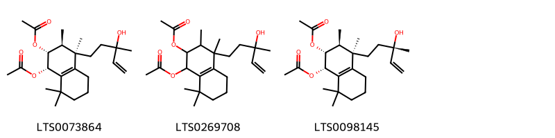
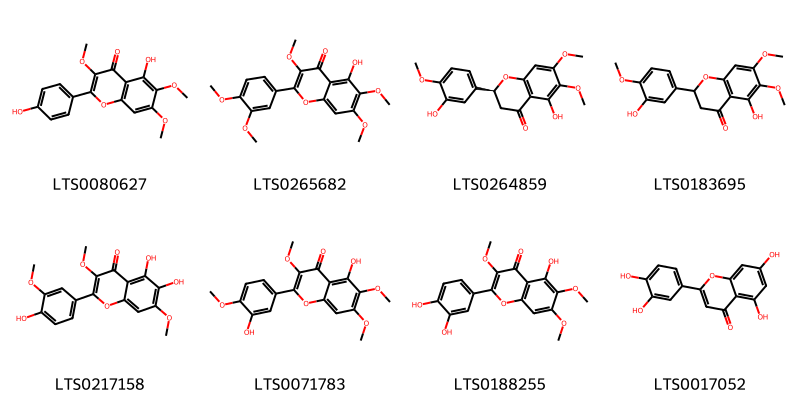
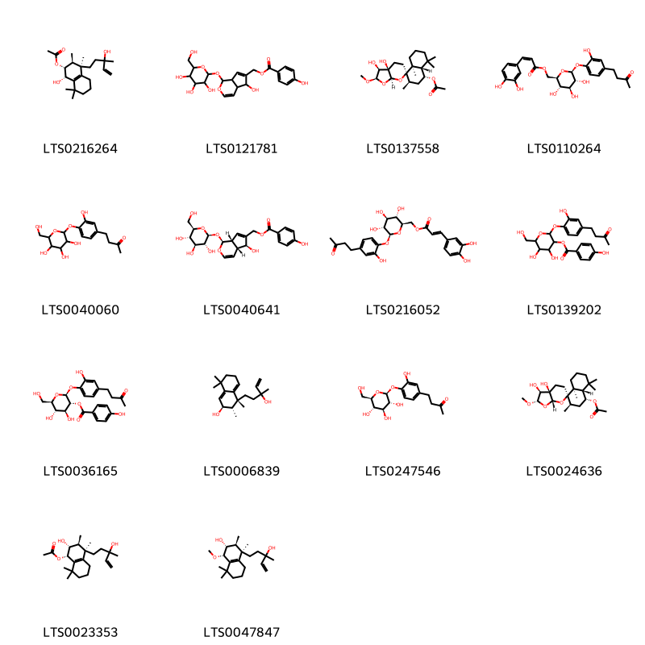
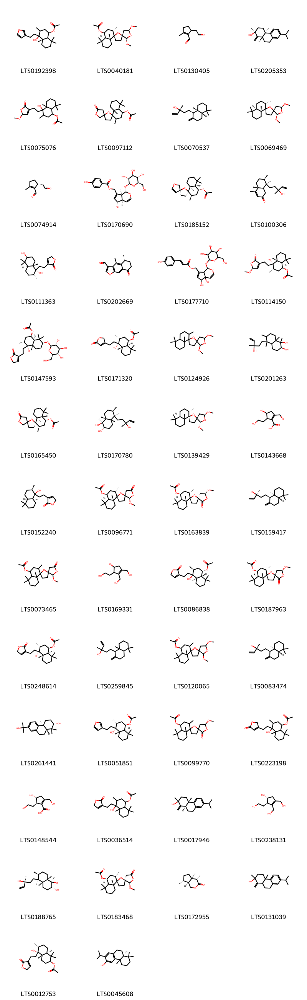

!!! abstract "Tóm tắt"

    Mạn kinh tử (Fructus Viticis trifoliae) là quả chín đã phơi hay sấy khô của cây Mạn kinh (Vitex trifolia L.) hay cây Mạn kinh lá đơn (Vitex rotundifolia L. f.), thuộc họ Cỏ roi ngựa (Verbenaccae). Mạn kinh tử có ở các tỉnh ven biển Trung Quốc, Malaysia. Ở Việt Nam, cây mọc hoang khắp nơi, đặc biệt ở các tỉnh Thanh Hóa, Nghệ An, Hà Tĩnh. Theo tài liệu cổ, mạn kinh tử vị cay, đắng, tính hơi hàn, vào 3 kinh can, phế và bàng quang. Dược liệu mạn kinh tử dùng chữa cảm mạo, nhức đầu do phong nhiệt, sưng đau răng lợi, đau mắt kèm chảy nhiều nước mắt, hoa mắt, chóng mặt, phong thấp, cân mạch co rút. Mạn kinh tử có tinh dầu, chứa nhiều thành phần hóa học như camphen, pinen, các alkaloid, flavonoid(điển hình là casticin), vitamin A...

## Thông tin về thực vật

Dược liệu **Mạn Kinh Tử (Quả)** từ bộ phận **** từ loài *Vitex trifolia*.

**Mô tả thực vật:** Màn kinh tử là một cây nhỏ hay nhỡ, mùi thơm, có thể cao tới 3m. Cành non có 4 cạnh, có lông mềm bao phủ. Lá kép và thường gồm 3 lá chét. Có thứ chỉ có 1 lá chét (var. unifoliata). Trên cùng một cành nhiều khi phía trên hay phía dưới có lá đơn, chỉ gồm một lá chét. Cuống gầy hơi tròn có lông, dài 1-3cm, lá chét không cuống, phiến lá chét hình trứng ngược hay hình mác, dài 2,45-9cm, rộng 1-3cm, phía dưới hẹp lại. Mặt trên nhẵn, mặt dưới nhiều lông trắng. Những lá chét hai bên nhỏ hơn, gần không nổi rõ. Hoa màu lơ nhạt, dài 13-14mm, mọc thành chuỳ xim ở đầu cành, nhiều khi phía dưới có lá. Quả hình bầu dục có rãnh, đầu hơi dẹt, rộng chừng 6mm, được che kín quá nửa bởi đài phát triển và tồn tại.

*Tài liệu tham khảo:* "Những cây thuốc và vị thuốc Việt Nam" - Đỗ Tất Lợi 
Trong dược điển Việt nam, một số loài có thể dùng thay thế cho nhau làm dược liệu bao gồm *Vitex trifolia, Vitex rotundifolia*

!!! info "Phân loại thực vật của *Vitex trifolia*"
    - **Kingdom:** Plantae
    - **Phylum:** Tracheophyta
    - **Order:** Lamiales
    - **Family:** Lamiaceae
    - **Genus:** Vitex
    - **Species:** *Vitex trifolia*

**Phân bố trên thế giới:** Tanzania, United Republic of, Zambia, Vanuatu, New Caledonia, Bahamas, Tonga, Singapore, Spain, Mexico, Chinese Taipei, Hong Kong, South Africa, Japan, Australia, Indonesia, Myanmar, Virgin Islands (U.S.), Mauritius, Saint Kitts and Nevis, India, Viet Nam, United States of America, Philippines, Fiji, Malaysia, Iran (Islamic Republic of), Puerto Rico, Anguilla

**Phân bố tại Việt nam:** Nam Định

!!! info "Phân loại thực vật của *Vitex rotundifolia*"
    - **Kingdom:** Plantae
    - **Phylum:** Tracheophyta
    - **Order:** Lamiales
    - **Family:** Lamiaceae
    - **Genus:** Vitex
    - **Species:** *Vitex rotundifolia*

**Phân bố trên thế giới:** Thailand, United States of America, Mexico, Chinese Taipei, Russian Federation, China, Hong Kong, Colombia, South Africa, New Caledonia, Malaysia, Korea, Republic of, Japan, United Arab Emirates, Australia, Indonesia, Georgia

**Phân bố tại Việt nam:** Không có ghi nhận ở Việt Nam

## Thông tin về dược liệu 

### Định danh

!!! info "Thông tin về tên gọi"

    - Dược liệu tiếng Việt: mạn kinh tử
    - Dược liệu tiếng Trung: 蔓荆叶 (Man Jing Ye)
    - Dược liệu tiếng Anh: Vitex Trifolia
    - Dược liệu latin thông dụng: Fructus Viticis trifoliae
    - Dược liệu latin kiểu DĐVN: *fructus viticis trifoliae*
    - Dược liệu latin kiểu DĐVN: **
    - Dược liệu latin kiểu thông tư: **
    - Bộ phận dùng:  (Fructus)

### Mô tả dược liệu 

- **Theo dược điển Việt nam V:** Quả hình cầu, đường kính 4 mm đến 6 mm, mặt ngoài màu  xám đen hoặc nâu đen, phủ lông nhung màu xám nhạt như  sương, có 4 rãnh dọc nông, đỉnh hơi lõm, đáy có đài tồn tại  màu xám nhạt và cuống quả ngắn. Lá đài bao bọc 1/3 đến  2/3 quả, có 5 răng, trong đó có 2 răng xẻ tương đối sâu,  được phủ kín lông tơ mượt. Chất nhẹ và cứng, khó đập vỡ.  Mặt cắt ngang quả có 4 ô, mỗi ô có một hạt. Mùi thơm đặc  biệt, vị nhạt, hơi cay.

- **Mô tả dược liệu theo thông tư chế biến dược liệu theo phương pháp cổ truyền:** 

### Chế biến 

- **Chế biến theo dược điển việt nam V**: Thu hoạch vào mùa thu, hái quả chín, loại bỏ tạp chất, phơi  hay sấy khô. Bào chế Mạn kinh từ sống: Loại bỏ tạp chất. Mạn kinh từ sao: Cho mạn kinh tử vào chảo, sao nhỏ lửa  cho đến khi khô thơm. Già dập khi dùng.nn

- **Chế biến theo thông tư:** 

--- 

## Thành phần hóa học

- Theo tài liệu của GS. Đỗ Tất Lợi:  Tinh dầu. camphen, pinen (55%), ditecpen ancola C20H32O (2%) và tecpenylaxetat (10%).
Theo Wehmer thì trong màn kinh tử có ancaloid và vitamin A.
    

**Thành phần hóa học từ loài **Vitex rotundifolia**

Theo cơ sở dữ liệu lotus, loài *Vitex rotundifolia* đã phân lập và xác định được **137** hoạt chất thuộc về các nhóm Oxanes, Arylnaphthalene lignans, Organooxygen compounds, Naphthalenes, Flavonoids, Fluorenes, Lactones, Furanoid lignans, Dihydrofurans, Phenols, Tetrahydrofurans, Tannins, 2-arylbenzofuran flavonoids, Carboxylic acids and derivatives, Benzene and substituted derivatives, Saturated hydrocarbons, Prenol lipids, Dibenzylbutane lignans trong bảng dưới đây. Danh sách các hoạt chất như sau vitex norditerpenoid 1 [(LTS0171807)](https://lotus.naturalproducts.net/compound/lotus_id/LTS0171807), (1s,3s,4s,4ar,8ar)-4-hydroxy-3,4a,8,8-tetramethyl-4-[2-(2-oxo-5h-furan-3-yl)ethyl]-hexahydro-1h-naphthalen-1-yl acetate [(LTS0086838)](https://lotus.naturalproducts.net/compound/lotus_id/LTS0086838), 4-[(2s,3r)-5-[(1z)-3,3-dimethoxyprop-1-en-1-yl]-3-(hydroxymethyl)-7-methoxy-2,3-dihydro-1-benzofuran-2-yl]-2-methoxyphenol [(LTS0199819)](https://lotus.naturalproducts.net/compound/lotus_id/LTS0199819), (1r,2r,4as,6s,8as)-2,5,5,8a-tetramethyl-5'-oxo-hexahydro-2h-spiro[naphthalene-1,2'-oxolan]-6-yl acetate [(LTS0192136)](https://lotus.naturalproducts.net/compound/lotus_id/LTS0192136), 4-hydroxy-3,4a,8,8-tetramethyl-4-[2-(5-oxo-2h-furan-3-yl)ethyl]-hexahydro-1h-naphthalen-1-yl acetate [(LTS0223198)](https://lotus.naturalproducts.net/compound/lotus_id/LTS0223198), 3-{2-[(1r,2r,4as,8as)-1-hydroxy-2,5,5,8a-tetramethyl-hexahydro-2h-naphthalen-1-yl]ethyl}-5h-furan-2-one [(LTS0152240)](https://lotus.naturalproducts.net/compound/lotus_id/LTS0152240), 2-(acetyloxy)-4-(3-hydroxy-3-methylpent-4-en-1-yl)-3,4,8,8-tetramethyl-1,2,3,5,6,7-hexahydronaphthalen-1-yl acetate [(LTS0269708)](https://lotus.naturalproducts.net/compound/lotus_id/LTS0269708), (1s,2s,4r,4ar,8ar)-2,5,5,8a-tetramethyl-5'-oxo-hexahydro-2h-spiro[naphthalene-1,2'-oxolan]-4-yl acetate [(LTS0055979)](https://lotus.naturalproducts.net/compound/lotus_id/LTS0055979), (1s,2r,3s,4r)-2-hydroxy-4-(3-hydroxy-3-methylpent-4-en-1-yl)-3,4,8,8-tetramethyl-1,2,3,5,6,7-hexahydronaphthalen-1-yl acetate [(LTS0023353)](https://lotus.naturalproducts.net/compound/lotus_id/LTS0023353), (1s,2s,2''s,4ar,5'r,5''s,8ar)-2'',5''-dimethoxy-2,5,5,8a-tetramethyl-hexahydro-2h-dispiro[naphthalene-1,2':5',3''-bis(oxolane)] [(LTS0139429)](https://lotus.naturalproducts.net/compound/lotus_id/LTS0139429), (1s,2s,4s,4ar,5's,5''r,8ar)-5''-methoxy-2,5,5,8a-tetramethyl-2''-oxo-hexahydro-2h-dispiro[naphthalene-1,2':5',3''-bis(oxolane)]-4-yl acetate [(LTS0163839)](https://lotus.naturalproducts.net/compound/lotus_id/LTS0163839), (5r,6r)-5-hydroxy-6-(2-hydroxyethyl)-3h,4h,5h,6h-cyclopenta[c]furan-1-one [(LTS0130803)](https://lotus.naturalproducts.net/compound/lotus_id/LTS0130803), 4-[(2s,3r)-3-(hydroxymethyl)-5-(3-hydroxypropyl)-7-methoxy-2,3-dihydro-1-benzofuran-2-yl]-2-methoxyphenol [(LTS0153479)](https://lotus.naturalproducts.net/compound/lotus_id/LTS0153479), (4ar,7r,8r)-8-(3-hydroxy-3-methylpent-4-en-1-yl)-4,4a,7,8-tetramethyl-5,6,7,8a-tetrahydro-1h-naphthalen-2-one [(LTS0100306)](https://lotus.naturalproducts.net/compound/lotus_id/LTS0100306), 2,5,5,8a-tetramethyl-5'-oxo-hexahydro-2h-spiro[naphthalene-1,2'-oxolan]-4-yl acetate [(LTS0195766)](https://lotus.naturalproducts.net/compound/lotus_id/LTS0195766), guaiacylglycerol [(LTS0120388)](https://lotus.naturalproducts.net/compound/lotus_id/LTS0120388), agnuside [(LTS0170690)](https://lotus.naturalproducts.net/compound/lotus_id/LTS0170690), [(2r,3s,4s,5r,6s)-3,4,5-trihydroxy-6-[2-hydroxy-4-(3-oxobutyl)phenoxy]oxan-2-yl]methyl (2z)-3-(3,4-dihydroxyphenyl)prop-2-enoate [(LTS0110264)](https://lotus.naturalproducts.net/compound/lotus_id/LTS0110264), (1r,2r)-2-(2-hydroxyethyl)-3,4-bis(hydroxymethyl)cyclopent-3-en-1-ol [(LTS0238131)](https://lotus.naturalproducts.net/compound/lotus_id/LTS0238131), (3ar,4s,6ar)-4,5-bis(hydroxymethyl)-3h,3ah,4h,6ah-cyclopenta[b]furan-2-one [(LTS0008668)](https://lotus.naturalproducts.net/compound/lotus_id/LTS0008668), lariciresinol [(LTS0010950)](https://lotus.naturalproducts.net/compound/lotus_id/LTS0010950), penduletin [(LTS0080627)](https://lotus.naturalproducts.net/compound/lotus_id/LTS0080627), 2,5,5,8a-tetramethyl-hexahydro-2h-spiro[naphthalene-1,2'-oxolan]-5'-one [(LTS0212506)](https://lotus.naturalproducts.net/compound/lotus_id/LTS0212506), (3r)-5-[(1r,4as,8ar)-5,5,8a-trimethyl-2-methylidene-hexahydro-1h-naphthalen-1-yl]-3-methylpent-1-en-3-ol [(LTS0070537)](https://lotus.naturalproducts.net/compound/lotus_id/LTS0070537), (1r,4as)-4-[2-(furan-3-yl)ethyl]-4-hydroxy-3,4a,8,8-tetramethyl-hexahydro-1h-naphthalen-1-yl acetate [(LTS0192398)](https://lotus.naturalproducts.net/compound/lotus_id/LTS0192398), (4a,5-dihydroxy-1-{[3,4,5-trihydroxy-6-(hydroxymethyl)oxan-2-yl]oxy}-1h,5h,7ah-cyclopenta[c]pyran-7-yl)methyl 3-(4-hydroxyphenyl)prop-2-enoate [(LTS0177710)](https://lotus.naturalproducts.net/compound/lotus_id/LTS0177710), (1r,2r,4r,4as,5's,8as)-2,5,5,8a-tetramethyl-5''-oxo-hexahydro-2h-dispiro[naphthalene-1,2':5',3''-bis(oxolane)]-4-yl acetate [(LTS0003532)](https://lotus.naturalproducts.net/compound/lotus_id/LTS0003532), 5''-methoxy-2,5,5,8a-tetramethyl-2''-oxo-hexahydro-2h-dispiro[naphthalene-1,2':5',3''-bis(oxolane)]-4-yl acetate [(LTS0099770)](https://lotus.naturalproducts.net/compound/lotus_id/LTS0099770), (1s,2r,3s,4r)-2-(acetyloxy)-4-(3-hydroxy-3-methylpent-4-en-1-yl)-3,4,8,8-tetramethyl-1,2,3,5,6,7-hexahydronaphthalen-1-yl acetate [(LTS0073864)](https://lotus.naturalproducts.net/compound/lotus_id/LTS0073864), 2-(2-hydroxyethyl)-3,4-bis(hydroxymethyl)cyclopent-3-en-1-ol [(LTS0169331)](https://lotus.naturalproducts.net/compound/lotus_id/LTS0169331), (1r,2r,4r,4as,8as)-2,5,5,8a-tetramethyl-6'-oxo-hexahydro-2h-spiro[naphthalene-1,2'-oxan]-4-yl acetate [(LTS0098581)](https://lotus.naturalproducts.net/compound/lotus_id/LTS0098581), (2s)-5-hydroxy-2-(3-hydroxy-4-methoxyphenyl)-6,7-dimethoxy-2,3-dihydro-1-benzopyran-4-one [(LTS0264859)](https://lotus.naturalproducts.net/compound/lotus_id/LTS0264859), (4s,4ar,7r,7as)-4,7-dimethyl-hexahydro-1h-cyclopenta[c]pyran-3-one [(LTS0172955)](https://lotus.naturalproducts.net/compound/lotus_id/LTS0172955), (1r,3s,4s,4ar,8ar)-4-hydroxy-3,4a,8,8-tetramethyl-4-[2-(2-oxo-5h-furan-3-yl)ethyl]-hexahydro-1h-naphthalen-1-yl acetate [(LTS0076201)](https://lotus.naturalproducts.net/compound/lotus_id/LTS0076201), luteolin [(LTS0017052)](https://lotus.naturalproducts.net/compound/lotus_id/LTS0017052), 5-(3-hydroxy-3-methylpent-4-en-1-yl)-1,5,6,8a-tetramethyl-hexahydro-2h-naphthalene-1,2-diol [(LTS0201263)](https://lotus.naturalproducts.net/compound/lotus_id/LTS0201263), (2r,4as,10ar)-7-isopropyl-2,4a-dimethyl-1-methylidene-4,9,10,10a-tetrahydro-3h-phenanthren-2-ol [(LTS0017946)](https://lotus.naturalproducts.net/compound/lotus_id/LTS0017946), 7-isopropyl-2,4a-dimethyl-1-methylidene-4,9,10,10a-tetrahydro-3h-phenanthren-2-ol [(LTS0131039)](https://lotus.naturalproducts.net/compound/lotus_id/LTS0131039), (1s,2s,4as,5r,6r,8ar)-5-[(3r)-3-hydroxy-3-methylpent-4-en-1-yl]-1,5,6,8a-tetramethyl-hexahydro-2h-naphthalene-1,2-diol [(LTS0170780)](https://lotus.naturalproducts.net/compound/lotus_id/LTS0170780), (2s,3r,4s,5s,6r)-4,5-dihydroxy-3-(4-hydroxybenzoyloxy)-6-(hydroxymethyl)oxan-2-yl 4-hydroxy-3-methoxybenzoate [(LTS0239821)](https://lotus.naturalproducts.net/compound/lotus_id/LTS0239821), 5-hydroxy-2-(3-hydroxy-4-methoxyphenyl)-6,7-dimethoxy-2,3-dihydro-1-benzopyran-4-one [(LTS0183695)](https://lotus.naturalproducts.net/compound/lotus_id/LTS0183695), 4-[(2s,3r)-5-[(1e)-3-hydroxy-3-methoxyprop-1-en-1-yl]-3-(hydroxymethyl)-7-methoxy-2,3-dihydro-1-benzofuran-2-yl]-2-methoxyphenol [(LTS0226385)](https://lotus.naturalproducts.net/compound/lotus_id/LTS0226385), (5-hydroxy-1-{[3,4,5-trihydroxy-6-(hydroxymethyl)oxan-2-yl]oxy}-1h,4ah,5h,7ah-cyclopenta[c]pyran-7-yl)methyl 4-hydroxy-3-methoxybenzoate [(LTS0253717)](https://lotus.naturalproducts.net/compound/lotus_id/LTS0253717), (1s,4as,7s,7as)-1-{[(2r,3s,4r,5r,6s)-4,5-dihydroxy-3-(4-hydroxybenzoyloxy)-6-(hydroxymethyl)oxan-2-yl]oxy}-7-hydroxy-7-methyl-1h,4ah,5h,6h,7ah-cyclopenta[c]pyran-4-carboxylic acid [(LTS0217353)](https://lotus.naturalproducts.net/compound/lotus_id/LTS0217353), viteagnusin i [(LTS0270652)](https://lotus.naturalproducts.net/compound/lotus_id/LTS0270652), 2''-methoxy-2,5,5,8a-tetramethyl-5''-oxo-hexahydro-2h-dispiro[naphthalene-1,2':5',3''-bis(oxolane)]-4-yl acetate [(LTS0073465)](https://lotus.naturalproducts.net/compound/lotus_id/LTS0073465), [(1s,4ar,5s,7as)-5-hydroxy-1-{[(2s,3r,4s,5s,6r)-3,4,5-trihydroxy-6-(hydroxymethyl)oxan-2-yl]oxy}-1h,4ah,5h,7ah-cyclopenta[c]pyran-7-yl]methyl 4-hydroxy-3-methoxybenzoate [(LTS0273907)](https://lotus.naturalproducts.net/compound/lotus_id/LTS0273907), chrysosplenol c [(LTS0217158)](https://lotus.naturalproducts.net/compound/lotus_id/LTS0217158), 4-[(2s,3r)-5-(3,3-dimethoxyprop-1-en-1-yl)-3-(hydroxymethyl)-7-methoxy-2,3-dihydro-1-benzofuran-2-yl]-2-methoxyphenol [(LTS0142925)](https://lotus.naturalproducts.net/compound/lotus_id/LTS0142925), 4-(3,4-dimethoxyphenyl)-6-hydroxy-7-methoxy-3h-naphtho[2,3-c]furan-1-one [(LTS0024758)](https://lotus.naturalproducts.net/compound/lotus_id/LTS0024758), (2s,4as,5r,6r,8as)-5-hydroxy-1,1,4a,6-tetramethyl-5-[2-(2-oxo-5h-furan-3-yl)ethyl]-hexahydro-2h-naphthalen-2-yl acetate [(LTS0012753)](https://lotus.naturalproducts.net/compound/lotus_id/LTS0012753), (1s,3s,4s,4ar,8ar)-4-hydroxy-4-{2-[(5s)-5-methoxy-2-oxo-5h-furan-3-yl]ethyl}-3,4a,8,8-tetramethyl-hexahydro-1h-naphthalen-1-yl acetate [(LTS0114150)](https://lotus.naturalproducts.net/compound/lotus_id/LTS0114150), 2,5,5,8a-tetramethyl-6'-oxo-hexahydro-2h-spiro[naphthalene-1,2'-oxan]-4-yl acetate [(LTS0235557)](https://lotus.naturalproducts.net/compound/lotus_id/LTS0235557), (4ar,5r)-5-hydroxy-7-(hydroxymethyl)-3h,4h,4ah,5h,6h-cyclopenta[c]pyran-1-one [(LTS0093639)](https://lotus.naturalproducts.net/compound/lotus_id/LTS0093639), 2-methyl-5-(2-oxoethyl)cyclopent-1-ene-1-carbaldehyde [(LTS0130405)](https://lotus.naturalproducts.net/compound/lotus_id/LTS0130405), (2r,3s)-2-(4-hydroxy-3-methoxyphenyl)-3-(hydroxymethyl)-7-methoxy-2,3-dihydro-1-benzofuran-5-carbaldehyde [(LTS0262802)](https://lotus.naturalproducts.net/compound/lotus_id/LTS0262802), (4as,5r,7as)-5-hydroxy-7-(hydroxymethyl)-2h,4h,4ah,5h,7ah-cyclopenta[b]pyran-3-one [(LTS0182493)](https://lotus.naturalproducts.net/compound/lotus_id/LTS0182493), 4,5-dimethyl-8-oxo-5h,6h,7h-naphtho[2,3-b]furan-3-carbaldehyde [(LTS0087567)](https://lotus.naturalproducts.net/compound/lotus_id/LTS0087567), (1s,2r,3s,4r)-2-(acetyloxy)-4-[(3s)-3-hydroxy-3-methylpent-4-en-1-yl]-3,4,8,8-tetramethyl-1,2,3,5,6,7-hexahydronaphthalen-1-yl acetate [(LTS0098145)](https://lotus.naturalproducts.net/compound/lotus_id/LTS0098145), (1r,2r)-1-(4-hydroxy-3-methoxyphenyl)propane-1,2,3-triol [(LTS0263325)](https://lotus.naturalproducts.net/compound/lotus_id/LTS0263325), (1s,2r,3s,4r)-1-hydroxy-4-(3-hydroxy-3-methylpent-4-en-1-yl)-3,4,8,8-tetramethyl-1,2,3,5,6,7-hexahydronaphthalen-2-yl acetate [(LTS0216264)](https://lotus.naturalproducts.net/compound/lotus_id/LTS0216264), (1s,2s,2''r,4s,4ar,5's,8ar)-2''-methoxy-2,5,5,8a-tetramethyl-5''-oxo-hexahydro-2h-dispiro[naphthalene-1,2':5',3''-bis(oxolane)]-4-yl acetate [(LTS0183468)](https://lotus.naturalproducts.net/compound/lotus_id/LTS0183468), (1r,3r,4r,4as,7s,8as)-4-hydroxy-3,4a,8,8-tetramethyl-4-[2-(2-oxo-5h-furan-3-yl)ethyl]-7-{[(2r,3r,4s,5s,6r)-3,4,5-trihydroxy-6-(hydroxymethyl)oxan-2-yl]oxy}-hexahydro-1h-naphthalen-1-yl acetate [(LTS0147593)](https://lotus.naturalproducts.net/compound/lotus_id/LTS0147593), (1r,3r,4r,4as,8as)-4-hydroxy-3,4a,8,8-tetramethyl-4-[2-(2-oxo-5h-furan-3-yl)ethyl]-hexahydro-1h-naphthalen-1-yl acetate [(LTS0248614)](https://lotus.naturalproducts.net/compound/lotus_id/LTS0248614), 4,5-dihydroxy-2-[2-hydroxy-4-(3-oxobutyl)phenoxy]-6-(hydroxymethyl)oxan-3-yl 4-hydroxybenzoate [(LTS0139202)](https://lotus.naturalproducts.net/compound/lotus_id/LTS0139202), 2'',5'',5'',8''a-tetramethyl-3'',4'',4''a,6'',7'',8''-hexahydro-2h,2''h-dispiro[furan-3,2'-oxolane-5',1''-naphthalen]-4''-yl acetate [(LTS0113159)](https://lotus.naturalproducts.net/compound/lotus_id/LTS0113159), (1s,2s,4s,4ar,8ar)-2,5,5,8a-tetramethyl-5'-oxo-hexahydro-2h-spiro[naphthalene-1,2'-oxolan]-4-yl acetate [(LTS0210156)](https://lotus.naturalproducts.net/compound/lotus_id/LTS0210156), 3,6-dihydroxy-4-(4-hydroxy-3-methoxyphenyl)-7-methoxynaphthalene-2-carbaldehyde [(LTS0157060)](https://lotus.naturalproducts.net/compound/lotus_id/LTS0157060), artemetin [(LTS0265682)](https://lotus.naturalproducts.net/compound/lotus_id/LTS0265682), (2''r,3s,4''r,4''as,5'r,8''as)-2'',5'',5'',8''a-tetramethyl-3'',4'',4''a,6'',7'',8''-hexahydro-2h,2''h-dispiro[furan-3,2'-oxolane-5',1''-naphthalen]-4''-yl acetate [(LTS0185152)](https://lotus.naturalproducts.net/compound/lotus_id/LTS0185152), (5-hydroxy-1-{[3,4,5-trihydroxy-6-(hydroxymethyl)oxan-2-yl]oxy}-1h,4ah,5h,7ah-cyclopenta[c]pyran-7-yl)methyl 4-hydroxybenzoate [(LTS0097029)](https://lotus.naturalproducts.net/compound/lotus_id/LTS0097029), hentriacontane [(LTS0046415)](https://lotus.naturalproducts.net/compound/lotus_id/LTS0046415), 4,5-dihydroxy-2-{[2-(4-hydroxy-3-methoxyphenyl)-5-(3-hydroxypropyl)-7-methoxy-2,3-dihydro-1-benzofuran-3-yl]methoxy}-6-(hydroxymethyl)oxan-3-yl 4-hydroxybenzoate [(LTS0205571)](https://lotus.naturalproducts.net/compound/lotus_id/LTS0205571), (1s,2s,4s,4ar,5'r,5''s,8ar)-5''-methoxy-2,5,5,8a-tetramethyl-2''-oxo-hexahydro-2h-dispiro[naphthalene-1,2':5',3''-bis(oxolane)]-4-yl acetate [(LTS0187963)](https://lotus.naturalproducts.net/compound/lotus_id/LTS0187963), 4,5-dihydroxy-3-(4-hydroxybenzoyloxy)-6-(hydroxymethyl)oxan-2-yl 4-hydroxy-3-methoxybenzoate [(LTS0174310)](https://lotus.naturalproducts.net/compound/lotus_id/LTS0174310), (1r,2r,4ar,5s,6s,8as)-5-[(3s)-3-hydroxy-3-methylpent-4-en-1-yl]-1,5,6,8a-tetramethyl-hexahydro-2h-naphthalene-1,2-diol [(LTS0188765)](https://lotus.naturalproducts.net/compound/lotus_id/LTS0188765), (1r,4ar,5s,8ar)-5-[2-(furan-3-yl)ethyl]-1,4a-dimethyl-6-methylidene-hexahydro-2h-naphthalene-1-carboxylic acid [(LTS0009492)](https://lotus.naturalproducts.net/compound/lotus_id/LTS0009492), 2'',5''-dimethoxy-2,5,5,8a-tetramethyl-hexahydro-2h-dispiro[naphthalene-1,2':5',3''-bis(oxolane)] [(LTS0124926)](https://lotus.naturalproducts.net/compound/lotus_id/LTS0124926), (1r,2r,4s,4as,8as)-2,5,5,8a-tetramethyl-5'-oxo-hexahydro-2h-spiro[naphthalene-1,2'-oxolan]-4-yl acetate [(LTS0113928)](https://lotus.naturalproducts.net/compound/lotus_id/LTS0113928), ferruginol [(LTS0045608)](https://lotus.naturalproducts.net/compound/lotus_id/LTS0045608), (2s,3s,4r)-4-(3-hydroxy-3-methylpent-4-en-1-yl)-3,4,8,8-tetramethyl-2,3,6,7-tetrahydronaphthalen-2-ol [(LTS0006839)](https://lotus.naturalproducts.net/compound/lotus_id/LTS0006839), 5-(5,5,8a-trimethyl-2-methylidene-hexahydro-1h-naphthalen-1-yl)-3-methylpent-1-en-3-ol [(LTS0259845)](https://lotus.naturalproducts.net/compound/lotus_id/LTS0259845), 4-(3,4-dimethoxyphenyl)-3,6-dihydroxy-5-methoxynaphthalene-2-carbaldehyde [(LTS0075712)](https://lotus.naturalproducts.net/compound/lotus_id/LTS0075712), 4-(3,4-dimethoxyphenyl)-6-hydroxy-5-methoxy-3h-naphtho[2,3-c]furan-1-one [(LTS0102325)](https://lotus.naturalproducts.net/compound/lotus_id/LTS0102325), 2-hydroxy-1,9,10-trimethoxy-7-oxobenzo[c]fluorene-6-carbaldehyde [(LTS0063457)](https://lotus.naturalproducts.net/compound/lotus_id/LTS0063457), 4,5-bis(hydroxymethyl)-3h,3ah,4h,6ah-cyclopenta[b]furan-2-one [(LTS0099902)](https://lotus.naturalproducts.net/compound/lotus_id/LTS0099902), (2s,4as,10ar)-7-(2-hydroxypropan-2-yl)-1,1,4a-trimethyl-2,3,4,9,10,10a-hexahydrophenanthren-2-ol [(LTS0261441)](https://lotus.naturalproducts.net/compound/lotus_id/LTS0261441), 5-hydroxy-7-(hydroxymethyl)-2h,4h,4ah,5h,7ah-cyclopenta[b]pyran-3-one [(LTS0090948)](https://lotus.naturalproducts.net/compound/lotus_id/LTS0090948), (3r)-5-[(1r,4as,8as)-5,5,8a-trimethyl-2-methylidene-hexahydro-1h-naphthalen-1-yl]-3-methylpent-1-en-3-ol [(LTS0083474)](https://lotus.naturalproducts.net/compound/lotus_id/LTS0083474), (1s,2s,2''r,4s,4ar,5'r,8ar)-2''-methoxy-2,5,5,8a-tetramethyl-5''-oxo-hexahydro-2h-dispiro[naphthalene-1,2':5',3''-bis(oxolane)]-4-yl acetate [(LTS0096771)](https://lotus.naturalproducts.net/compound/lotus_id/LTS0096771), (1r,2r,4r,4as,8as)-2,5,5,8a-tetramethyl-5''-oxo-hexahydro-2h-dispiro[naphthalene-1,2':5',3''-bis(oxolane)]-4-yl acetate [(LTS0165450)](https://lotus.naturalproducts.net/compound/lotus_id/LTS0165450), 4-(3-hydroxy-4-{[(2s,3r,4s,5s,6r)-3,4,5-trihydroxy-6-(hydroxymethyl)oxan-2-yl]oxy}phenyl)butan-2-one [(LTS0247546)](https://lotus.naturalproducts.net/compound/lotus_id/LTS0247546), 2'',5''-dimethoxy-2,5,5,8a-tetramethyl-hexahydro-2h-dispiro[naphthalene-1,2':5',3''-bis(oxolane)]-4-yl acetate [(LTS0120065)](https://lotus.naturalproducts.net/compound/lotus_id/LTS0120065), (2r,2'r,3s,3ar,4'r,4'as,6r,7as,8'as)-3,3a-dihydroxy-2-methoxy-2',5',5',8'a-tetramethyl-decahydro-2h,2'h-spiro[furo[2,3-b]pyran-6,1'-naphthalen]-4'-yl acetate [(LTS0137558)](https://lotus.naturalproducts.net/compound/lotus_id/LTS0137558), 4-(3,4-dimethoxyphenyl)-6-hydroxy-5-methoxynaphthalene-2-carbaldehyde [(LTS0017717)](https://lotus.naturalproducts.net/compound/lotus_id/LTS0017717), [(2r,3s,4s,5r,6s)-3,4,5-trihydroxy-6-[2-hydroxy-4-(3-oxobutyl)phenoxy]oxan-2-yl]methyl (2e)-3-(3,4-dihydroxyphenyl)prop-2-enoate [(LTS0216052)](https://lotus.naturalproducts.net/compound/lotus_id/LTS0216052), 6-hydroxy-4-(4-hydroxy-3-methoxyphenyl)-7-methoxy-3h-naphtho[2,3-c]furan-1-one [(LTS0057908)](https://lotus.naturalproducts.net/compound/lotus_id/LTS0057908), vanillic acid [(LTS0229113)](https://lotus.naturalproducts.net/compound/lotus_id/LTS0229113), (5r)-2-methyl-5-(2-oxoethyl)cyclopent-1-ene-1-carbaldehyde [(LTS0074914)](https://lotus.naturalproducts.net/compound/lotus_id/LTS0074914), 3-{2-[(1r,2r,4as,6s,8as)-1,6-dihydroxy-2,5,5,8a-tetramethyl-hexahydro-2h-naphthalen-1-yl]ethyl}-5h-furan-2-one [(LTS0111363)](https://lotus.naturalproducts.net/compound/lotus_id/LTS0111363), 5-hydroxy-7-(hydroxymethyl)-3h,4h,4ah,5h,6h-cyclopenta[c]pyran-1-one [(LTS0167775)](https://lotus.naturalproducts.net/compound/lotus_id/LTS0167775), (1s,2s,2''s,4ar,5'r,5''r,8ar)-2'',5''-dimethoxy-2,5,5,8a-tetramethyl-hexahydro-2h-dispiro[naphthalene-1,2':5',3''-bis(oxolane)] [(LTS0046193)](https://lotus.naturalproducts.net/compound/lotus_id/LTS0046193), (1s,2s,2''s,4s,4ar,5'r,5''s,8ar)-2'',5''-dimethoxy-2,5,5,8a-tetramethyl-hexahydro-2h-dispiro[naphthalene-1,2':5',3''-bis(oxolane)]-4-yl acetate [(LTS0040181)](https://lotus.naturalproducts.net/compound/lotus_id/LTS0040181), (1s,2s,2''r,4ar,5'r,5''s,8ar)-2'',5''-dimethoxy-2,5,5,8a-tetramethyl-hexahydro-2h-dispiro[naphthalene-1,2':5',3''-bis(oxolane)] [(LTS0069469)](https://lotus.naturalproducts.net/compound/lotus_id/LTS0069469), 4-hydroxy-4-[2-(5-methoxy-2-oxo-5h-furan-3-yl)ethyl]-3,4a,8,8-tetramethyl-hexahydro-1h-naphthalen-1-yl acetate [(LTS0075076)](https://lotus.naturalproducts.net/compound/lotus_id/LTS0075076), 4-(3-hydroxy-4-{[3,4,5-trihydroxy-6-(hydroxymethyl)oxan-2-yl]oxy}phenyl)butan-2-one [(LTS0040060)](https://lotus.naturalproducts.net/compound/lotus_id/LTS0040060), rotundifuran [(LTS0051851)](https://lotus.naturalproducts.net/compound/lotus_id/LTS0051851), 2,7-dihydroxy-1,9,10-trimethoxy-7h-benzo[c]fluorene-6-carbaldehyde [(LTS0260617)](https://lotus.naturalproducts.net/compound/lotus_id/LTS0260617), 4-hydroxy-5-(2-hydroxyethyl)-2-(hydroxymethyl)cyclopent-1-ene-1-carboxylic acid [(LTS0143668)](https://lotus.naturalproducts.net/compound/lotus_id/LTS0143668), 2-{4-[(1r,4r)-4-(4-hydroxy-3,5-dimethoxyphenyl)-hexahydrofuro[3,4-c]furan-1-yl]-2-methoxyphenoxy}-1-(4-hydroxy-3-methoxyphenyl)propane-1,3-diol [(LTS0044577)](https://lotus.naturalproducts.net/compound/lotus_id/LTS0044577), (1r,2r,4as,8as)-2,5,5,8a-tetramethyl-hexahydro-2h-spiro[naphthalene-1,2'-oxolan]-5'-one [(LTS0220145)](https://lotus.naturalproducts.net/compound/lotus_id/LTS0220145), [(4as,7as)-5-hydroxy-1-{[3,4,5-trihydroxy-6-(hydroxymethyl)oxan-2-yl]oxy}-1h,4ah,5h,7ah-cyclopenta[c]pyran-7-yl]methyl 4-hydroxybenzoate [(LTS0008223)](https://lotus.naturalproducts.net/compound/lotus_id/LTS0008223), (2s,3r,4s,5s,6r)-4,5-dihydroxy-2-[2-hydroxy-4-(3-oxobutyl)phenoxy]-6-(hydroxymethyl)oxan-3-yl 4-hydroxybenzoate [(LTS0036165)](https://lotus.naturalproducts.net/compound/lotus_id/LTS0036165), 4-hydroxy-3,4a,8,8-tetramethyl-4-[2-(2-oxo-5h-furan-3-yl)ethyl]-hexahydro-1h-naphthalen-1-yl acetate [(LTS0036514)](https://lotus.naturalproducts.net/compound/lotus_id/LTS0036514), [(1s,4ar,5s,7ar)-5-hydroxy-1-{[(2s,3r,4s,5s,6r)-3,4,5-trihydroxy-6-(hydroxymethyl)oxan-2-yl]oxy}-1h,4ah,5h,7ah-cyclopenta[c]pyran-6-yl]methyl 4-hydroxy-3-methoxybenzoate [(LTS0246358)](https://lotus.naturalproducts.net/compound/lotus_id/LTS0246358), (2s,2'r,3s,3ar,4'r,4'as,6r,7ar,8'as)-3,3a-dihydroxy-2-methoxy-2',5',5',8'a-tetramethyl-decahydro-2h,2'h-spiro[furo[2,3-b]pyran-6,1'-naphthalen]-4'-yl acetate [(LTS0024636)](https://lotus.naturalproducts.net/compound/lotus_id/LTS0024636), chrysosplenol d [(LTS0188255)](https://lotus.naturalproducts.net/compound/lotus_id/LTS0188255), (7r)-2,7-dihydroxy-1,9,10-trimethoxy-7h-benzo[c]fluorene-6-carbaldehyde [(LTS0145207)](https://lotus.naturalproducts.net/compound/lotus_id/LTS0145207), (1s,2s,4s,4ar,8ar)-2,5,5,8a-tetramethyl-6'-oxo-hexahydro-2h-spiro[naphthalene-1,2'-oxan]-4-yl acetate [(LTS0109134)](https://lotus.naturalproducts.net/compound/lotus_id/LTS0109134), p-hydroxybenzoic acid [(LTS0263634)](https://lotus.naturalproducts.net/compound/lotus_id/LTS0263634), casticin [(LTS0071783)](https://lotus.naturalproducts.net/compound/lotus_id/LTS0071783), 2,5,5,8a-tetramethyl-5''-oxo-hexahydro-2h-dispiro[naphthalene-1,2':5',3''-bis(oxolane)]-4-yl acetate [(LTS0097112)](https://lotus.naturalproducts.net/compound/lotus_id/LTS0097112), secoisolariciresinol [(LTS0086727)](https://lotus.naturalproducts.net/compound/lotus_id/LTS0086727), (2s,4ar,10as)-7-isopropyl-2,4a-dimethyl-1-methylidene-4,9,10,10a-tetrahydro-3h-phenanthren-2-ol [(LTS0205353)](https://lotus.naturalproducts.net/compound/lotus_id/LTS0205353), 4-[2-(furan-3-yl)ethyl]-4-hydroxy-3,4a,8,8-tetramethyl-hexahydro-1h-naphthalen-1-yl acetate [(LTS0018590)](https://lotus.naturalproducts.net/compound/lotus_id/LTS0018590), 5-hydroxy-6-(2-hydroxyethyl)-3h,4h,5h,6h-cyclopenta[c]furan-1-one [(LTS0114586)](https://lotus.naturalproducts.net/compound/lotus_id/LTS0114586), (2r,3r,4s,5s,6r)-4,5-dihydroxy-2-{[(2r,3s)-2-(4-hydroxy-3-methoxyphenyl)-5-(3-hydroxypropyl)-7-methoxy-2,3-dihydro-1-benzofuran-3-yl]methoxy}-6-(hydroxymethyl)oxan-3-yl 4-hydroxybenzoate [(LTS0137122)](https://lotus.naturalproducts.net/compound/lotus_id/LTS0137122), (13s)-vitexifolin a [(LTS0159417)](https://lotus.naturalproducts.net/compound/lotus_id/LTS0159417), (5-hydroxy-1-{[3,4,5-trihydroxy-6-(hydroxymethyl)oxan-2-yl]oxy}-1h,4ah,5h,7ah-cyclopenta[c]pyran-6-yl)methyl 4-hydroxy-3-methoxybenzoate [(LTS0268582)](https://lotus.naturalproducts.net/compound/lotus_id/LTS0268582), vitexilactone [(LTS0171320)](https://lotus.naturalproducts.net/compound/lotus_id/LTS0171320), 6-hydroxy-4-(4-hydroxy-3-methoxyphenyl)-7-methoxynaphthalene-2-carbaldehyde [(LTS0271739)](https://lotus.naturalproducts.net/compound/lotus_id/LTS0271739), (4r,5r)-4-hydroxy-5-(2-hydroxyethyl)-2-(hydroxymethyl)cyclopent-1-ene-1-carboxylic acid [(LTS0148544)](https://lotus.naturalproducts.net/compound/lotus_id/LTS0148544), (7s)-2,7-dihydroxy-1,9,10-trimethoxy-7h-benzo[c]fluorene-6-carbaldehyde [(LTS0201585)](https://lotus.naturalproducts.net/compound/lotus_id/LTS0201585), (5-hydroxy-1-{[3,4,5-trihydroxy-6-(hydroxymethyl)oxan-2-yl]oxy}-1h,4ah,5h,7ah-cyclopenta[c]pyran-6-yl)methyl 4-hydroxybenzoate [(LTS0121781)](https://lotus.naturalproducts.net/compound/lotus_id/LTS0121781), (1s,2r,3s,4r)-4-(3-hydroxy-3-methylpent-4-en-1-yl)-1-methoxy-3,4,8,8-tetramethyl-1,2,3,5,6,7-hexahydronaphthalen-2-ol [(LTS0047847)](https://lotus.naturalproducts.net/compound/lotus_id/LTS0047847), [(1s,4ar,5s,7ar)-5-hydroxy-1-{[(2s,3r,4s,5s,6r)-3,4,5-trihydroxy-6-(hydroxymethyl)oxan-2-yl]oxy}-1h,4ah,5h,7ah-cyclopenta[c]pyran-6-yl]methyl 4-hydroxybenzoate [(LTS0040641)](https://lotus.naturalproducts.net/compound/lotus_id/LTS0040641), (5r)-4,5-dimethyl-8-oxo-5h,6h,7h-naphtho[2,3-b]furan-3-carbaldehyde [(LTS0202669)](https://lotus.naturalproducts.net/compound/lotus_id/LTS0202669). 
        
| chemicalTaxonomyClassyfireClass     |   smiles_count |
|:------------------------------------|---------------:|
| 2-arylbenzofuran flavonoids         |            432 |
| Arylnaphthalene lignans             |            138 |
| Benzene and substituted derivatives |             36 |
| Carboxylic acids and derivatives    |            207 |
| Dibenzylbutane lignans              |             49 |
| Dihydrofurans                       |             55 |
| Flavonoids                          |            352 |
| Fluorenes                           |            198 |
| Furanoid lignans                    |            127 |
| Lactones                            |            679 |
| Naphthalenes                        |            168 |
| Organooxygen compounds              |            996 |
| Oxanes                              |             61 |
| Phenols                             |             55 |
| Prenol lipids                       |           3611 |
| Saturated hydrocarbons              |             31 |
| Tannins                             |            446 |
| Tetrahydrofurans                    |             55 |

            
### Nhóm 2-arylbenzofuran flavonoids
<figure markdown="span">
    { width=100% }
<figcaption>Hình ảnh cấu trúc hóa học của hoạt chất thuộc nhóm *2-arylbenzofuran flavonoids*. Tên thường gọi của các hoạt chất tương ứng là 4,5-dihydroxy-2-{[2-(4-hydroxy-3-methoxyphenyl)-5-(3-hydroxypropyl)-7-methoxy-2,3-dihydro-1-benzofuran-3-yl]methoxy}-6-(hydroxymethyl)oxan-3-yl 4-hydroxybenzoate [(LTS0205571)](https://lotus.naturalproducts.net/compound/lotus_id/LTS0205571), 4-[(2s,3r)-3-(hydroxymethyl)-5-(3-hydroxypropyl)-7-methoxy-2,3-dihydro-1-benzofuran-2-yl]-2-methoxyphenol [(LTS0153479)](https://lotus.naturalproducts.net/compound/lotus_id/LTS0153479), 4-[(2s,3r)-5-(3,3-dimethoxyprop-1-en-1-yl)-3-(hydroxymethyl)-7-methoxy-2,3-dihydro-1-benzofuran-2-yl]-2-methoxyphenol [(LTS0142925)](https://lotus.naturalproducts.net/compound/lotus_id/LTS0142925), (2r,3r,4s,5s,6r)-4,5-dihydroxy-2-{[(2r,3s)-2-(4-hydroxy-3-methoxyphenyl)-5-(3-hydroxypropyl)-7-methoxy-2,3-dihydro-1-benzofuran-3-yl]methoxy}-6-(hydroxymethyl)oxan-3-yl 4-hydroxybenzoate [(LTS0137122)](https://lotus.naturalproducts.net/compound/lotus_id/LTS0137122), 4-[(2s,3r)-5-[(1z)-3,3-dimethoxyprop-1-en-1-yl]-3-(hydroxymethyl)-7-methoxy-2,3-dihydro-1-benzofuran-2-yl]-2-methoxyphenol [(LTS0199819)](https://lotus.naturalproducts.net/compound/lotus_id/LTS0199819), 4-[(2s,3r)-5-[(1e)-3-hydroxy-3-methoxyprop-1-en-1-yl]-3-(hydroxymethyl)-7-methoxy-2,3-dihydro-1-benzofuran-2-yl]-2-methoxyphenol [(LTS0226385)](https://lotus.naturalproducts.net/compound/lotus_id/LTS0226385), (2r,3s)-2-(4-hydroxy-3-methoxyphenyl)-3-(hydroxymethyl)-7-methoxy-2,3-dihydro-1-benzofuran-5-carbaldehyde [(LTS0262802)](https://lotus.naturalproducts.net/compound/lotus_id/LTS0262802).</figcaption>
</figure>

            
            
### Nhóm 2-arylbenzofuran flavonoids
<figure markdown="span">
    { width=100% }
<figcaption>Hình ảnh cấu trúc hóa học của hoạt chất thuộc nhóm *2-arylbenzofuran flavonoids*. Tên thường gọi của các hoạt chất tương ứng là 4,5-dihydroxy-2-{[2-(4-hydroxy-3-methoxyphenyl)-5-(3-hydroxypropyl)-7-methoxy-2,3-dihydro-1-benzofuran-3-yl]methoxy}-6-(hydroxymethyl)oxan-3-yl 4-hydroxybenzoate [(LTS0205571)](https://lotus.naturalproducts.net/compound/lotus_id/LTS0205571), 4-[(2s,3r)-3-(hydroxymethyl)-5-(3-hydroxypropyl)-7-methoxy-2,3-dihydro-1-benzofuran-2-yl]-2-methoxyphenol [(LTS0153479)](https://lotus.naturalproducts.net/compound/lotus_id/LTS0153479), 4-[(2s,3r)-5-(3,3-dimethoxyprop-1-en-1-yl)-3-(hydroxymethyl)-7-methoxy-2,3-dihydro-1-benzofuran-2-yl]-2-methoxyphenol [(LTS0142925)](https://lotus.naturalproducts.net/compound/lotus_id/LTS0142925), (2r,3r,4s,5s,6r)-4,5-dihydroxy-2-{[(2r,3s)-2-(4-hydroxy-3-methoxyphenyl)-5-(3-hydroxypropyl)-7-methoxy-2,3-dihydro-1-benzofuran-3-yl]methoxy}-6-(hydroxymethyl)oxan-3-yl 4-hydroxybenzoate [(LTS0137122)](https://lotus.naturalproducts.net/compound/lotus_id/LTS0137122), 4-[(2s,3r)-5-[(1z)-3,3-dimethoxyprop-1-en-1-yl]-3-(hydroxymethyl)-7-methoxy-2,3-dihydro-1-benzofuran-2-yl]-2-methoxyphenol [(LTS0199819)](https://lotus.naturalproducts.net/compound/lotus_id/LTS0199819), 4-[(2s,3r)-5-[(1e)-3-hydroxy-3-methoxyprop-1-en-1-yl]-3-(hydroxymethyl)-7-methoxy-2,3-dihydro-1-benzofuran-2-yl]-2-methoxyphenol [(LTS0226385)](https://lotus.naturalproducts.net/compound/lotus_id/LTS0226385), (2r,3s)-2-(4-hydroxy-3-methoxyphenyl)-3-(hydroxymethyl)-7-methoxy-2,3-dihydro-1-benzofuran-5-carbaldehyde [(LTS0262802)](https://lotus.naturalproducts.net/compound/lotus_id/LTS0262802).</figcaption>
</figure>

### Nhóm Arylnaphthalene lignans
<figure markdown="span">
    { width=100% }
<figcaption>Hình ảnh cấu trúc hóa học của hoạt chất thuộc nhóm *Arylnaphthalene lignans*. Tên thường gọi của các hoạt chất tương ứng là 4-(3,4-dimethoxyphenyl)-6-hydroxy-7-methoxy-3h-naphtho[2,3-c]furan-1-one [(LTS0024758)](https://lotus.naturalproducts.net/compound/lotus_id/LTS0024758), 4-(3,4-dimethoxyphenyl)-6-hydroxy-5-methoxy-3h-naphtho[2,3-c]furan-1-one [(LTS0102325)](https://lotus.naturalproducts.net/compound/lotus_id/LTS0102325), 6-hydroxy-4-(4-hydroxy-3-methoxyphenyl)-7-methoxy-3h-naphtho[2,3-c]furan-1-one [(LTS0057908)](https://lotus.naturalproducts.net/compound/lotus_id/LTS0057908).</figcaption>
</figure>

            
            
### Nhóm 2-arylbenzofuran flavonoids
<figure markdown="span">
    { width=100% }
<figcaption>Hình ảnh cấu trúc hóa học của hoạt chất thuộc nhóm *2-arylbenzofuran flavonoids*. Tên thường gọi của các hoạt chất tương ứng là 4,5-dihydroxy-2-{[2-(4-hydroxy-3-methoxyphenyl)-5-(3-hydroxypropyl)-7-methoxy-2,3-dihydro-1-benzofuran-3-yl]methoxy}-6-(hydroxymethyl)oxan-3-yl 4-hydroxybenzoate [(LTS0205571)](https://lotus.naturalproducts.net/compound/lotus_id/LTS0205571), 4-[(2s,3r)-3-(hydroxymethyl)-5-(3-hydroxypropyl)-7-methoxy-2,3-dihydro-1-benzofuran-2-yl]-2-methoxyphenol [(LTS0153479)](https://lotus.naturalproducts.net/compound/lotus_id/LTS0153479), 4-[(2s,3r)-5-(3,3-dimethoxyprop-1-en-1-yl)-3-(hydroxymethyl)-7-methoxy-2,3-dihydro-1-benzofuran-2-yl]-2-methoxyphenol [(LTS0142925)](https://lotus.naturalproducts.net/compound/lotus_id/LTS0142925), (2r,3r,4s,5s,6r)-4,5-dihydroxy-2-{[(2r,3s)-2-(4-hydroxy-3-methoxyphenyl)-5-(3-hydroxypropyl)-7-methoxy-2,3-dihydro-1-benzofuran-3-yl]methoxy}-6-(hydroxymethyl)oxan-3-yl 4-hydroxybenzoate [(LTS0137122)](https://lotus.naturalproducts.net/compound/lotus_id/LTS0137122), 4-[(2s,3r)-5-[(1z)-3,3-dimethoxyprop-1-en-1-yl]-3-(hydroxymethyl)-7-methoxy-2,3-dihydro-1-benzofuran-2-yl]-2-methoxyphenol [(LTS0199819)](https://lotus.naturalproducts.net/compound/lotus_id/LTS0199819), 4-[(2s,3r)-5-[(1e)-3-hydroxy-3-methoxyprop-1-en-1-yl]-3-(hydroxymethyl)-7-methoxy-2,3-dihydro-1-benzofuran-2-yl]-2-methoxyphenol [(LTS0226385)](https://lotus.naturalproducts.net/compound/lotus_id/LTS0226385), (2r,3s)-2-(4-hydroxy-3-methoxyphenyl)-3-(hydroxymethyl)-7-methoxy-2,3-dihydro-1-benzofuran-5-carbaldehyde [(LTS0262802)](https://lotus.naturalproducts.net/compound/lotus_id/LTS0262802).</figcaption>
</figure>

### Nhóm Arylnaphthalene lignans
<figure markdown="span">
    { width=100% }
<figcaption>Hình ảnh cấu trúc hóa học của hoạt chất thuộc nhóm *Arylnaphthalene lignans*. Tên thường gọi của các hoạt chất tương ứng là 4-(3,4-dimethoxyphenyl)-6-hydroxy-7-methoxy-3h-naphtho[2,3-c]furan-1-one [(LTS0024758)](https://lotus.naturalproducts.net/compound/lotus_id/LTS0024758), 4-(3,4-dimethoxyphenyl)-6-hydroxy-5-methoxy-3h-naphtho[2,3-c]furan-1-one [(LTS0102325)](https://lotus.naturalproducts.net/compound/lotus_id/LTS0102325), 6-hydroxy-4-(4-hydroxy-3-methoxyphenyl)-7-methoxy-3h-naphtho[2,3-c]furan-1-one [(LTS0057908)](https://lotus.naturalproducts.net/compound/lotus_id/LTS0057908).</figcaption>
</figure>

### Nhóm Benzene and substituted derivatives
<figure markdown="span">
    { width=100% }
<figcaption>Hình ảnh cấu trúc hóa học của hoạt chất thuộc nhóm *Benzene and substituted derivatives*. Tên thường gọi của các hoạt chất tương ứng là p-hydroxybenzoic acid [(LTS0263634)](https://lotus.naturalproducts.net/compound/lotus_id/LTS0263634), vanillic acid [(LTS0229113)](https://lotus.naturalproducts.net/compound/lotus_id/LTS0229113).</figcaption>
</figure>

            
            
### Nhóm 2-arylbenzofuran flavonoids
<figure markdown="span">
    { width=100% }
<figcaption>Hình ảnh cấu trúc hóa học của hoạt chất thuộc nhóm *2-arylbenzofuran flavonoids*. Tên thường gọi của các hoạt chất tương ứng là 4,5-dihydroxy-2-{[2-(4-hydroxy-3-methoxyphenyl)-5-(3-hydroxypropyl)-7-methoxy-2,3-dihydro-1-benzofuran-3-yl]methoxy}-6-(hydroxymethyl)oxan-3-yl 4-hydroxybenzoate [(LTS0205571)](https://lotus.naturalproducts.net/compound/lotus_id/LTS0205571), 4-[(2s,3r)-3-(hydroxymethyl)-5-(3-hydroxypropyl)-7-methoxy-2,3-dihydro-1-benzofuran-2-yl]-2-methoxyphenol [(LTS0153479)](https://lotus.naturalproducts.net/compound/lotus_id/LTS0153479), 4-[(2s,3r)-5-(3,3-dimethoxyprop-1-en-1-yl)-3-(hydroxymethyl)-7-methoxy-2,3-dihydro-1-benzofuran-2-yl]-2-methoxyphenol [(LTS0142925)](https://lotus.naturalproducts.net/compound/lotus_id/LTS0142925), (2r,3r,4s,5s,6r)-4,5-dihydroxy-2-{[(2r,3s)-2-(4-hydroxy-3-methoxyphenyl)-5-(3-hydroxypropyl)-7-methoxy-2,3-dihydro-1-benzofuran-3-yl]methoxy}-6-(hydroxymethyl)oxan-3-yl 4-hydroxybenzoate [(LTS0137122)](https://lotus.naturalproducts.net/compound/lotus_id/LTS0137122), 4-[(2s,3r)-5-[(1z)-3,3-dimethoxyprop-1-en-1-yl]-3-(hydroxymethyl)-7-methoxy-2,3-dihydro-1-benzofuran-2-yl]-2-methoxyphenol [(LTS0199819)](https://lotus.naturalproducts.net/compound/lotus_id/LTS0199819), 4-[(2s,3r)-5-[(1e)-3-hydroxy-3-methoxyprop-1-en-1-yl]-3-(hydroxymethyl)-7-methoxy-2,3-dihydro-1-benzofuran-2-yl]-2-methoxyphenol [(LTS0226385)](https://lotus.naturalproducts.net/compound/lotus_id/LTS0226385), (2r,3s)-2-(4-hydroxy-3-methoxyphenyl)-3-(hydroxymethyl)-7-methoxy-2,3-dihydro-1-benzofuran-5-carbaldehyde [(LTS0262802)](https://lotus.naturalproducts.net/compound/lotus_id/LTS0262802).</figcaption>
</figure>

### Nhóm Arylnaphthalene lignans
<figure markdown="span">
    { width=100% }
<figcaption>Hình ảnh cấu trúc hóa học của hoạt chất thuộc nhóm *Arylnaphthalene lignans*. Tên thường gọi của các hoạt chất tương ứng là 4-(3,4-dimethoxyphenyl)-6-hydroxy-7-methoxy-3h-naphtho[2,3-c]furan-1-one [(LTS0024758)](https://lotus.naturalproducts.net/compound/lotus_id/LTS0024758), 4-(3,4-dimethoxyphenyl)-6-hydroxy-5-methoxy-3h-naphtho[2,3-c]furan-1-one [(LTS0102325)](https://lotus.naturalproducts.net/compound/lotus_id/LTS0102325), 6-hydroxy-4-(4-hydroxy-3-methoxyphenyl)-7-methoxy-3h-naphtho[2,3-c]furan-1-one [(LTS0057908)](https://lotus.naturalproducts.net/compound/lotus_id/LTS0057908).</figcaption>
</figure>

### Nhóm Benzene and substituted derivatives
<figure markdown="span">
    { width=100% }
<figcaption>Hình ảnh cấu trúc hóa học của hoạt chất thuộc nhóm *Benzene and substituted derivatives*. Tên thường gọi của các hoạt chất tương ứng là p-hydroxybenzoic acid [(LTS0263634)](https://lotus.naturalproducts.net/compound/lotus_id/LTS0263634), vanillic acid [(LTS0229113)](https://lotus.naturalproducts.net/compound/lotus_id/LTS0229113).</figcaption>
</figure>

### Nhóm Carboxylic acids and derivatives
<figure markdown="span">
    { width=100% }
<figcaption>Hình ảnh cấu trúc hóa học của hoạt chất thuộc nhóm *Carboxylic acids and derivatives*. Tên thường gọi của các hoạt chất tương ứng là (1s,2r,3s,4r)-2-(acetyloxy)-4-(3-hydroxy-3-methylpent-4-en-1-yl)-3,4,8,8-tetramethyl-1,2,3,5,6,7-hexahydronaphthalen-1-yl acetate [(LTS0073864)](https://lotus.naturalproducts.net/compound/lotus_id/LTS0073864), 2-(acetyloxy)-4-(3-hydroxy-3-methylpent-4-en-1-yl)-3,4,8,8-tetramethyl-1,2,3,5,6,7-hexahydronaphthalen-1-yl acetate [(LTS0269708)](https://lotus.naturalproducts.net/compound/lotus_id/LTS0269708), (1s,2r,3s,4r)-2-(acetyloxy)-4-[(3s)-3-hydroxy-3-methylpent-4-en-1-yl]-3,4,8,8-tetramethyl-1,2,3,5,6,7-hexahydronaphthalen-1-yl acetate [(LTS0098145)](https://lotus.naturalproducts.net/compound/lotus_id/LTS0098145).</figcaption>
</figure>

            
            
### Nhóm 2-arylbenzofuran flavonoids
<figure markdown="span">
    { width=100% }
<figcaption>Hình ảnh cấu trúc hóa học của hoạt chất thuộc nhóm *2-arylbenzofuran flavonoids*. Tên thường gọi của các hoạt chất tương ứng là 4,5-dihydroxy-2-{[2-(4-hydroxy-3-methoxyphenyl)-5-(3-hydroxypropyl)-7-methoxy-2,3-dihydro-1-benzofuran-3-yl]methoxy}-6-(hydroxymethyl)oxan-3-yl 4-hydroxybenzoate [(LTS0205571)](https://lotus.naturalproducts.net/compound/lotus_id/LTS0205571), 4-[(2s,3r)-3-(hydroxymethyl)-5-(3-hydroxypropyl)-7-methoxy-2,3-dihydro-1-benzofuran-2-yl]-2-methoxyphenol [(LTS0153479)](https://lotus.naturalproducts.net/compound/lotus_id/LTS0153479), 4-[(2s,3r)-5-(3,3-dimethoxyprop-1-en-1-yl)-3-(hydroxymethyl)-7-methoxy-2,3-dihydro-1-benzofuran-2-yl]-2-methoxyphenol [(LTS0142925)](https://lotus.naturalproducts.net/compound/lotus_id/LTS0142925), (2r,3r,4s,5s,6r)-4,5-dihydroxy-2-{[(2r,3s)-2-(4-hydroxy-3-methoxyphenyl)-5-(3-hydroxypropyl)-7-methoxy-2,3-dihydro-1-benzofuran-3-yl]methoxy}-6-(hydroxymethyl)oxan-3-yl 4-hydroxybenzoate [(LTS0137122)](https://lotus.naturalproducts.net/compound/lotus_id/LTS0137122), 4-[(2s,3r)-5-[(1z)-3,3-dimethoxyprop-1-en-1-yl]-3-(hydroxymethyl)-7-methoxy-2,3-dihydro-1-benzofuran-2-yl]-2-methoxyphenol [(LTS0199819)](https://lotus.naturalproducts.net/compound/lotus_id/LTS0199819), 4-[(2s,3r)-5-[(1e)-3-hydroxy-3-methoxyprop-1-en-1-yl]-3-(hydroxymethyl)-7-methoxy-2,3-dihydro-1-benzofuran-2-yl]-2-methoxyphenol [(LTS0226385)](https://lotus.naturalproducts.net/compound/lotus_id/LTS0226385), (2r,3s)-2-(4-hydroxy-3-methoxyphenyl)-3-(hydroxymethyl)-7-methoxy-2,3-dihydro-1-benzofuran-5-carbaldehyde [(LTS0262802)](https://lotus.naturalproducts.net/compound/lotus_id/LTS0262802).</figcaption>
</figure>

### Nhóm Arylnaphthalene lignans
<figure markdown="span">
    { width=100% }
<figcaption>Hình ảnh cấu trúc hóa học của hoạt chất thuộc nhóm *Arylnaphthalene lignans*. Tên thường gọi của các hoạt chất tương ứng là 4-(3,4-dimethoxyphenyl)-6-hydroxy-7-methoxy-3h-naphtho[2,3-c]furan-1-one [(LTS0024758)](https://lotus.naturalproducts.net/compound/lotus_id/LTS0024758), 4-(3,4-dimethoxyphenyl)-6-hydroxy-5-methoxy-3h-naphtho[2,3-c]furan-1-one [(LTS0102325)](https://lotus.naturalproducts.net/compound/lotus_id/LTS0102325), 6-hydroxy-4-(4-hydroxy-3-methoxyphenyl)-7-methoxy-3h-naphtho[2,3-c]furan-1-one [(LTS0057908)](https://lotus.naturalproducts.net/compound/lotus_id/LTS0057908).</figcaption>
</figure>

### Nhóm Benzene and substituted derivatives
<figure markdown="span">
    { width=100% }
<figcaption>Hình ảnh cấu trúc hóa học của hoạt chất thuộc nhóm *Benzene and substituted derivatives*. Tên thường gọi của các hoạt chất tương ứng là p-hydroxybenzoic acid [(LTS0263634)](https://lotus.naturalproducts.net/compound/lotus_id/LTS0263634), vanillic acid [(LTS0229113)](https://lotus.naturalproducts.net/compound/lotus_id/LTS0229113).</figcaption>
</figure>

### Nhóm Carboxylic acids and derivatives
<figure markdown="span">
    { width=100% }
<figcaption>Hình ảnh cấu trúc hóa học của hoạt chất thuộc nhóm *Carboxylic acids and derivatives*. Tên thường gọi của các hoạt chất tương ứng là (1s,2r,3s,4r)-2-(acetyloxy)-4-(3-hydroxy-3-methylpent-4-en-1-yl)-3,4,8,8-tetramethyl-1,2,3,5,6,7-hexahydronaphthalen-1-yl acetate [(LTS0073864)](https://lotus.naturalproducts.net/compound/lotus_id/LTS0073864), 2-(acetyloxy)-4-(3-hydroxy-3-methylpent-4-en-1-yl)-3,4,8,8-tetramethyl-1,2,3,5,6,7-hexahydronaphthalen-1-yl acetate [(LTS0269708)](https://lotus.naturalproducts.net/compound/lotus_id/LTS0269708), (1s,2r,3s,4r)-2-(acetyloxy)-4-[(3s)-3-hydroxy-3-methylpent-4-en-1-yl]-3,4,8,8-tetramethyl-1,2,3,5,6,7-hexahydronaphthalen-1-yl acetate [(LTS0098145)](https://lotus.naturalproducts.net/compound/lotus_id/LTS0098145).</figcaption>
</figure>

### Nhóm Dibenzylbutane lignans
<figure markdown="span">
    { width=100% }
<figcaption>Hình ảnh cấu trúc hóa học của hoạt chất thuộc nhóm *Dibenzylbutane lignans*. Tên thường gọi của các hoạt chất tương ứng là secoisolariciresinol [(LTS0086727)](https://lotus.naturalproducts.net/compound/lotus_id/LTS0086727).</figcaption>
</figure>

            
            
### Nhóm 2-arylbenzofuran flavonoids
<figure markdown="span">
    { width=100% }
<figcaption>Hình ảnh cấu trúc hóa học của hoạt chất thuộc nhóm *2-arylbenzofuran flavonoids*. Tên thường gọi của các hoạt chất tương ứng là 4,5-dihydroxy-2-{[2-(4-hydroxy-3-methoxyphenyl)-5-(3-hydroxypropyl)-7-methoxy-2,3-dihydro-1-benzofuran-3-yl]methoxy}-6-(hydroxymethyl)oxan-3-yl 4-hydroxybenzoate [(LTS0205571)](https://lotus.naturalproducts.net/compound/lotus_id/LTS0205571), 4-[(2s,3r)-3-(hydroxymethyl)-5-(3-hydroxypropyl)-7-methoxy-2,3-dihydro-1-benzofuran-2-yl]-2-methoxyphenol [(LTS0153479)](https://lotus.naturalproducts.net/compound/lotus_id/LTS0153479), 4-[(2s,3r)-5-(3,3-dimethoxyprop-1-en-1-yl)-3-(hydroxymethyl)-7-methoxy-2,3-dihydro-1-benzofuran-2-yl]-2-methoxyphenol [(LTS0142925)](https://lotus.naturalproducts.net/compound/lotus_id/LTS0142925), (2r,3r,4s,5s,6r)-4,5-dihydroxy-2-{[(2r,3s)-2-(4-hydroxy-3-methoxyphenyl)-5-(3-hydroxypropyl)-7-methoxy-2,3-dihydro-1-benzofuran-3-yl]methoxy}-6-(hydroxymethyl)oxan-3-yl 4-hydroxybenzoate [(LTS0137122)](https://lotus.naturalproducts.net/compound/lotus_id/LTS0137122), 4-[(2s,3r)-5-[(1z)-3,3-dimethoxyprop-1-en-1-yl]-3-(hydroxymethyl)-7-methoxy-2,3-dihydro-1-benzofuran-2-yl]-2-methoxyphenol [(LTS0199819)](https://lotus.naturalproducts.net/compound/lotus_id/LTS0199819), 4-[(2s,3r)-5-[(1e)-3-hydroxy-3-methoxyprop-1-en-1-yl]-3-(hydroxymethyl)-7-methoxy-2,3-dihydro-1-benzofuran-2-yl]-2-methoxyphenol [(LTS0226385)](https://lotus.naturalproducts.net/compound/lotus_id/LTS0226385), (2r,3s)-2-(4-hydroxy-3-methoxyphenyl)-3-(hydroxymethyl)-7-methoxy-2,3-dihydro-1-benzofuran-5-carbaldehyde [(LTS0262802)](https://lotus.naturalproducts.net/compound/lotus_id/LTS0262802).</figcaption>
</figure>

### Nhóm Arylnaphthalene lignans
<figure markdown="span">
    { width=100% }
<figcaption>Hình ảnh cấu trúc hóa học của hoạt chất thuộc nhóm *Arylnaphthalene lignans*. Tên thường gọi của các hoạt chất tương ứng là 4-(3,4-dimethoxyphenyl)-6-hydroxy-7-methoxy-3h-naphtho[2,3-c]furan-1-one [(LTS0024758)](https://lotus.naturalproducts.net/compound/lotus_id/LTS0024758), 4-(3,4-dimethoxyphenyl)-6-hydroxy-5-methoxy-3h-naphtho[2,3-c]furan-1-one [(LTS0102325)](https://lotus.naturalproducts.net/compound/lotus_id/LTS0102325), 6-hydroxy-4-(4-hydroxy-3-methoxyphenyl)-7-methoxy-3h-naphtho[2,3-c]furan-1-one [(LTS0057908)](https://lotus.naturalproducts.net/compound/lotus_id/LTS0057908).</figcaption>
</figure>

### Nhóm Benzene and substituted derivatives
<figure markdown="span">
    { width=100% }
<figcaption>Hình ảnh cấu trúc hóa học của hoạt chất thuộc nhóm *Benzene and substituted derivatives*. Tên thường gọi của các hoạt chất tương ứng là p-hydroxybenzoic acid [(LTS0263634)](https://lotus.naturalproducts.net/compound/lotus_id/LTS0263634), vanillic acid [(LTS0229113)](https://lotus.naturalproducts.net/compound/lotus_id/LTS0229113).</figcaption>
</figure>

### Nhóm Carboxylic acids and derivatives
<figure markdown="span">
    { width=100% }
<figcaption>Hình ảnh cấu trúc hóa học của hoạt chất thuộc nhóm *Carboxylic acids and derivatives*. Tên thường gọi của các hoạt chất tương ứng là (1s,2r,3s,4r)-2-(acetyloxy)-4-(3-hydroxy-3-methylpent-4-en-1-yl)-3,4,8,8-tetramethyl-1,2,3,5,6,7-hexahydronaphthalen-1-yl acetate [(LTS0073864)](https://lotus.naturalproducts.net/compound/lotus_id/LTS0073864), 2-(acetyloxy)-4-(3-hydroxy-3-methylpent-4-en-1-yl)-3,4,8,8-tetramethyl-1,2,3,5,6,7-hexahydronaphthalen-1-yl acetate [(LTS0269708)](https://lotus.naturalproducts.net/compound/lotus_id/LTS0269708), (1s,2r,3s,4r)-2-(acetyloxy)-4-[(3s)-3-hydroxy-3-methylpent-4-en-1-yl]-3,4,8,8-tetramethyl-1,2,3,5,6,7-hexahydronaphthalen-1-yl acetate [(LTS0098145)](https://lotus.naturalproducts.net/compound/lotus_id/LTS0098145).</figcaption>
</figure>

### Nhóm Dibenzylbutane lignans
<figure markdown="span">
    { width=100% }
<figcaption>Hình ảnh cấu trúc hóa học của hoạt chất thuộc nhóm *Dibenzylbutane lignans*. Tên thường gọi của các hoạt chất tương ứng là secoisolariciresinol [(LTS0086727)](https://lotus.naturalproducts.net/compound/lotus_id/LTS0086727).</figcaption>
</figure>

### Nhóm Dihydrofurans
<figure markdown="span">
    { width=100% }
<figcaption>Hình ảnh cấu trúc hóa học của hoạt chất thuộc nhóm *Dihydrofurans*. Tên thường gọi của các hoạt chất tương ứng là 5-hydroxy-6-(2-hydroxyethyl)-3h,4h,5h,6h-cyclopenta[c]furan-1-one [(LTS0114586)](https://lotus.naturalproducts.net/compound/lotus_id/LTS0114586), (5r,6r)-5-hydroxy-6-(2-hydroxyethyl)-3h,4h,5h,6h-cyclopenta[c]furan-1-one [(LTS0130803)](https://lotus.naturalproducts.net/compound/lotus_id/LTS0130803).</figcaption>
</figure>

            
            
### Nhóm 2-arylbenzofuran flavonoids
<figure markdown="span">
    { width=100% }
<figcaption>Hình ảnh cấu trúc hóa học của hoạt chất thuộc nhóm *2-arylbenzofuran flavonoids*. Tên thường gọi của các hoạt chất tương ứng là 4,5-dihydroxy-2-{[2-(4-hydroxy-3-methoxyphenyl)-5-(3-hydroxypropyl)-7-methoxy-2,3-dihydro-1-benzofuran-3-yl]methoxy}-6-(hydroxymethyl)oxan-3-yl 4-hydroxybenzoate [(LTS0205571)](https://lotus.naturalproducts.net/compound/lotus_id/LTS0205571), 4-[(2s,3r)-3-(hydroxymethyl)-5-(3-hydroxypropyl)-7-methoxy-2,3-dihydro-1-benzofuran-2-yl]-2-methoxyphenol [(LTS0153479)](https://lotus.naturalproducts.net/compound/lotus_id/LTS0153479), 4-[(2s,3r)-5-(3,3-dimethoxyprop-1-en-1-yl)-3-(hydroxymethyl)-7-methoxy-2,3-dihydro-1-benzofuran-2-yl]-2-methoxyphenol [(LTS0142925)](https://lotus.naturalproducts.net/compound/lotus_id/LTS0142925), (2r,3r,4s,5s,6r)-4,5-dihydroxy-2-{[(2r,3s)-2-(4-hydroxy-3-methoxyphenyl)-5-(3-hydroxypropyl)-7-methoxy-2,3-dihydro-1-benzofuran-3-yl]methoxy}-6-(hydroxymethyl)oxan-3-yl 4-hydroxybenzoate [(LTS0137122)](https://lotus.naturalproducts.net/compound/lotus_id/LTS0137122), 4-[(2s,3r)-5-[(1z)-3,3-dimethoxyprop-1-en-1-yl]-3-(hydroxymethyl)-7-methoxy-2,3-dihydro-1-benzofuran-2-yl]-2-methoxyphenol [(LTS0199819)](https://lotus.naturalproducts.net/compound/lotus_id/LTS0199819), 4-[(2s,3r)-5-[(1e)-3-hydroxy-3-methoxyprop-1-en-1-yl]-3-(hydroxymethyl)-7-methoxy-2,3-dihydro-1-benzofuran-2-yl]-2-methoxyphenol [(LTS0226385)](https://lotus.naturalproducts.net/compound/lotus_id/LTS0226385), (2r,3s)-2-(4-hydroxy-3-methoxyphenyl)-3-(hydroxymethyl)-7-methoxy-2,3-dihydro-1-benzofuran-5-carbaldehyde [(LTS0262802)](https://lotus.naturalproducts.net/compound/lotus_id/LTS0262802).</figcaption>
</figure>

### Nhóm Arylnaphthalene lignans
<figure markdown="span">
    { width=100% }
<figcaption>Hình ảnh cấu trúc hóa học của hoạt chất thuộc nhóm *Arylnaphthalene lignans*. Tên thường gọi của các hoạt chất tương ứng là 4-(3,4-dimethoxyphenyl)-6-hydroxy-7-methoxy-3h-naphtho[2,3-c]furan-1-one [(LTS0024758)](https://lotus.naturalproducts.net/compound/lotus_id/LTS0024758), 4-(3,4-dimethoxyphenyl)-6-hydroxy-5-methoxy-3h-naphtho[2,3-c]furan-1-one [(LTS0102325)](https://lotus.naturalproducts.net/compound/lotus_id/LTS0102325), 6-hydroxy-4-(4-hydroxy-3-methoxyphenyl)-7-methoxy-3h-naphtho[2,3-c]furan-1-one [(LTS0057908)](https://lotus.naturalproducts.net/compound/lotus_id/LTS0057908).</figcaption>
</figure>

### Nhóm Benzene and substituted derivatives
<figure markdown="span">
    { width=100% }
<figcaption>Hình ảnh cấu trúc hóa học của hoạt chất thuộc nhóm *Benzene and substituted derivatives*. Tên thường gọi của các hoạt chất tương ứng là p-hydroxybenzoic acid [(LTS0263634)](https://lotus.naturalproducts.net/compound/lotus_id/LTS0263634), vanillic acid [(LTS0229113)](https://lotus.naturalproducts.net/compound/lotus_id/LTS0229113).</figcaption>
</figure>

### Nhóm Carboxylic acids and derivatives
<figure markdown="span">
    { width=100% }
<figcaption>Hình ảnh cấu trúc hóa học của hoạt chất thuộc nhóm *Carboxylic acids and derivatives*. Tên thường gọi của các hoạt chất tương ứng là (1s,2r,3s,4r)-2-(acetyloxy)-4-(3-hydroxy-3-methylpent-4-en-1-yl)-3,4,8,8-tetramethyl-1,2,3,5,6,7-hexahydronaphthalen-1-yl acetate [(LTS0073864)](https://lotus.naturalproducts.net/compound/lotus_id/LTS0073864), 2-(acetyloxy)-4-(3-hydroxy-3-methylpent-4-en-1-yl)-3,4,8,8-tetramethyl-1,2,3,5,6,7-hexahydronaphthalen-1-yl acetate [(LTS0269708)](https://lotus.naturalproducts.net/compound/lotus_id/LTS0269708), (1s,2r,3s,4r)-2-(acetyloxy)-4-[(3s)-3-hydroxy-3-methylpent-4-en-1-yl]-3,4,8,8-tetramethyl-1,2,3,5,6,7-hexahydronaphthalen-1-yl acetate [(LTS0098145)](https://lotus.naturalproducts.net/compound/lotus_id/LTS0098145).</figcaption>
</figure>

### Nhóm Dibenzylbutane lignans
<figure markdown="span">
    { width=100% }
<figcaption>Hình ảnh cấu trúc hóa học của hoạt chất thuộc nhóm *Dibenzylbutane lignans*. Tên thường gọi của các hoạt chất tương ứng là secoisolariciresinol [(LTS0086727)](https://lotus.naturalproducts.net/compound/lotus_id/LTS0086727).</figcaption>
</figure>

### Nhóm Dihydrofurans
<figure markdown="span">
    { width=100% }
<figcaption>Hình ảnh cấu trúc hóa học của hoạt chất thuộc nhóm *Dihydrofurans*. Tên thường gọi của các hoạt chất tương ứng là 5-hydroxy-6-(2-hydroxyethyl)-3h,4h,5h,6h-cyclopenta[c]furan-1-one [(LTS0114586)](https://lotus.naturalproducts.net/compound/lotus_id/LTS0114586), (5r,6r)-5-hydroxy-6-(2-hydroxyethyl)-3h,4h,5h,6h-cyclopenta[c]furan-1-one [(LTS0130803)](https://lotus.naturalproducts.net/compound/lotus_id/LTS0130803).</figcaption>
</figure>

### Nhóm Flavonoids
<figure markdown="span">
    { width=100% }
<figcaption>Hình ảnh cấu trúc hóa học của hoạt chất thuộc nhóm *Flavonoids*. Tên thường gọi của các hoạt chất tương ứng là penduletin [(LTS0080627)](https://lotus.naturalproducts.net/compound/lotus_id/LTS0080627), artemetin [(LTS0265682)](https://lotus.naturalproducts.net/compound/lotus_id/LTS0265682), (2s)-5-hydroxy-2-(3-hydroxy-4-methoxyphenyl)-6,7-dimethoxy-2,3-dihydro-1-benzopyran-4-one [(LTS0264859)](https://lotus.naturalproducts.net/compound/lotus_id/LTS0264859), 5-hydroxy-2-(3-hydroxy-4-methoxyphenyl)-6,7-dimethoxy-2,3-dihydro-1-benzopyran-4-one [(LTS0183695)](https://lotus.naturalproducts.net/compound/lotus_id/LTS0183695), chrysosplenol c [(LTS0217158)](https://lotus.naturalproducts.net/compound/lotus_id/LTS0217158), casticin [(LTS0071783)](https://lotus.naturalproducts.net/compound/lotus_id/LTS0071783), chrysosplenol d [(LTS0188255)](https://lotus.naturalproducts.net/compound/lotus_id/LTS0188255), luteolin [(LTS0017052)](https://lotus.naturalproducts.net/compound/lotus_id/LTS0017052).</figcaption>
</figure>

            
            
### Nhóm 2-arylbenzofuran flavonoids
<figure markdown="span">
    { width=100% }
<figcaption>Hình ảnh cấu trúc hóa học của hoạt chất thuộc nhóm *2-arylbenzofuran flavonoids*. Tên thường gọi của các hoạt chất tương ứng là 4,5-dihydroxy-2-{[2-(4-hydroxy-3-methoxyphenyl)-5-(3-hydroxypropyl)-7-methoxy-2,3-dihydro-1-benzofuran-3-yl]methoxy}-6-(hydroxymethyl)oxan-3-yl 4-hydroxybenzoate [(LTS0205571)](https://lotus.naturalproducts.net/compound/lotus_id/LTS0205571), 4-[(2s,3r)-3-(hydroxymethyl)-5-(3-hydroxypropyl)-7-methoxy-2,3-dihydro-1-benzofuran-2-yl]-2-methoxyphenol [(LTS0153479)](https://lotus.naturalproducts.net/compound/lotus_id/LTS0153479), 4-[(2s,3r)-5-(3,3-dimethoxyprop-1-en-1-yl)-3-(hydroxymethyl)-7-methoxy-2,3-dihydro-1-benzofuran-2-yl]-2-methoxyphenol [(LTS0142925)](https://lotus.naturalproducts.net/compound/lotus_id/LTS0142925), (2r,3r,4s,5s,6r)-4,5-dihydroxy-2-{[(2r,3s)-2-(4-hydroxy-3-methoxyphenyl)-5-(3-hydroxypropyl)-7-methoxy-2,3-dihydro-1-benzofuran-3-yl]methoxy}-6-(hydroxymethyl)oxan-3-yl 4-hydroxybenzoate [(LTS0137122)](https://lotus.naturalproducts.net/compound/lotus_id/LTS0137122), 4-[(2s,3r)-5-[(1z)-3,3-dimethoxyprop-1-en-1-yl]-3-(hydroxymethyl)-7-methoxy-2,3-dihydro-1-benzofuran-2-yl]-2-methoxyphenol [(LTS0199819)](https://lotus.naturalproducts.net/compound/lotus_id/LTS0199819), 4-[(2s,3r)-5-[(1e)-3-hydroxy-3-methoxyprop-1-en-1-yl]-3-(hydroxymethyl)-7-methoxy-2,3-dihydro-1-benzofuran-2-yl]-2-methoxyphenol [(LTS0226385)](https://lotus.naturalproducts.net/compound/lotus_id/LTS0226385), (2r,3s)-2-(4-hydroxy-3-methoxyphenyl)-3-(hydroxymethyl)-7-methoxy-2,3-dihydro-1-benzofuran-5-carbaldehyde [(LTS0262802)](https://lotus.naturalproducts.net/compound/lotus_id/LTS0262802).</figcaption>
</figure>

### Nhóm Arylnaphthalene lignans
<figure markdown="span">
    { width=100% }
<figcaption>Hình ảnh cấu trúc hóa học của hoạt chất thuộc nhóm *Arylnaphthalene lignans*. Tên thường gọi của các hoạt chất tương ứng là 4-(3,4-dimethoxyphenyl)-6-hydroxy-7-methoxy-3h-naphtho[2,3-c]furan-1-one [(LTS0024758)](https://lotus.naturalproducts.net/compound/lotus_id/LTS0024758), 4-(3,4-dimethoxyphenyl)-6-hydroxy-5-methoxy-3h-naphtho[2,3-c]furan-1-one [(LTS0102325)](https://lotus.naturalproducts.net/compound/lotus_id/LTS0102325), 6-hydroxy-4-(4-hydroxy-3-methoxyphenyl)-7-methoxy-3h-naphtho[2,3-c]furan-1-one [(LTS0057908)](https://lotus.naturalproducts.net/compound/lotus_id/LTS0057908).</figcaption>
</figure>

### Nhóm Benzene and substituted derivatives
<figure markdown="span">
    { width=100% }
<figcaption>Hình ảnh cấu trúc hóa học của hoạt chất thuộc nhóm *Benzene and substituted derivatives*. Tên thường gọi của các hoạt chất tương ứng là p-hydroxybenzoic acid [(LTS0263634)](https://lotus.naturalproducts.net/compound/lotus_id/LTS0263634), vanillic acid [(LTS0229113)](https://lotus.naturalproducts.net/compound/lotus_id/LTS0229113).</figcaption>
</figure>

### Nhóm Carboxylic acids and derivatives
<figure markdown="span">
    { width=100% }
<figcaption>Hình ảnh cấu trúc hóa học của hoạt chất thuộc nhóm *Carboxylic acids and derivatives*. Tên thường gọi của các hoạt chất tương ứng là (1s,2r,3s,4r)-2-(acetyloxy)-4-(3-hydroxy-3-methylpent-4-en-1-yl)-3,4,8,8-tetramethyl-1,2,3,5,6,7-hexahydronaphthalen-1-yl acetate [(LTS0073864)](https://lotus.naturalproducts.net/compound/lotus_id/LTS0073864), 2-(acetyloxy)-4-(3-hydroxy-3-methylpent-4-en-1-yl)-3,4,8,8-tetramethyl-1,2,3,5,6,7-hexahydronaphthalen-1-yl acetate [(LTS0269708)](https://lotus.naturalproducts.net/compound/lotus_id/LTS0269708), (1s,2r,3s,4r)-2-(acetyloxy)-4-[(3s)-3-hydroxy-3-methylpent-4-en-1-yl]-3,4,8,8-tetramethyl-1,2,3,5,6,7-hexahydronaphthalen-1-yl acetate [(LTS0098145)](https://lotus.naturalproducts.net/compound/lotus_id/LTS0098145).</figcaption>
</figure>

### Nhóm Dibenzylbutane lignans
<figure markdown="span">
    { width=100% }
<figcaption>Hình ảnh cấu trúc hóa học của hoạt chất thuộc nhóm *Dibenzylbutane lignans*. Tên thường gọi của các hoạt chất tương ứng là secoisolariciresinol [(LTS0086727)](https://lotus.naturalproducts.net/compound/lotus_id/LTS0086727).</figcaption>
</figure>

### Nhóm Dihydrofurans
<figure markdown="span">
    { width=100% }
<figcaption>Hình ảnh cấu trúc hóa học của hoạt chất thuộc nhóm *Dihydrofurans*. Tên thường gọi của các hoạt chất tương ứng là 5-hydroxy-6-(2-hydroxyethyl)-3h,4h,5h,6h-cyclopenta[c]furan-1-one [(LTS0114586)](https://lotus.naturalproducts.net/compound/lotus_id/LTS0114586), (5r,6r)-5-hydroxy-6-(2-hydroxyethyl)-3h,4h,5h,6h-cyclopenta[c]furan-1-one [(LTS0130803)](https://lotus.naturalproducts.net/compound/lotus_id/LTS0130803).</figcaption>
</figure>

### Nhóm Flavonoids
<figure markdown="span">
    { width=100% }
<figcaption>Hình ảnh cấu trúc hóa học của hoạt chất thuộc nhóm *Flavonoids*. Tên thường gọi của các hoạt chất tương ứng là penduletin [(LTS0080627)](https://lotus.naturalproducts.net/compound/lotus_id/LTS0080627), artemetin [(LTS0265682)](https://lotus.naturalproducts.net/compound/lotus_id/LTS0265682), (2s)-5-hydroxy-2-(3-hydroxy-4-methoxyphenyl)-6,7-dimethoxy-2,3-dihydro-1-benzopyran-4-one [(LTS0264859)](https://lotus.naturalproducts.net/compound/lotus_id/LTS0264859), 5-hydroxy-2-(3-hydroxy-4-methoxyphenyl)-6,7-dimethoxy-2,3-dihydro-1-benzopyran-4-one [(LTS0183695)](https://lotus.naturalproducts.net/compound/lotus_id/LTS0183695), chrysosplenol c [(LTS0217158)](https://lotus.naturalproducts.net/compound/lotus_id/LTS0217158), casticin [(LTS0071783)](https://lotus.naturalproducts.net/compound/lotus_id/LTS0071783), chrysosplenol d [(LTS0188255)](https://lotus.naturalproducts.net/compound/lotus_id/LTS0188255), luteolin [(LTS0017052)](https://lotus.naturalproducts.net/compound/lotus_id/LTS0017052).</figcaption>
</figure>

### Nhóm Fluorenes
<figure markdown="span">
    { width=100% }
<figcaption>Hình ảnh cấu trúc hóa học của hoạt chất thuộc nhóm *Fluorenes*. Tên thường gọi của các hoạt chất tương ứng là (7r)-2,7-dihydroxy-1,9,10-trimethoxy-7h-benzo[c]fluorene-6-carbaldehyde [(LTS0145207)](https://lotus.naturalproducts.net/compound/lotus_id/LTS0145207), 2,7-dihydroxy-1,9,10-trimethoxy-7h-benzo[c]fluorene-6-carbaldehyde [(LTS0260617)](https://lotus.naturalproducts.net/compound/lotus_id/LTS0260617), (7s)-2,7-dihydroxy-1,9,10-trimethoxy-7h-benzo[c]fluorene-6-carbaldehyde [(LTS0201585)](https://lotus.naturalproducts.net/compound/lotus_id/LTS0201585), 2-hydroxy-1,9,10-trimethoxy-7-oxobenzo[c]fluorene-6-carbaldehyde [(LTS0063457)](https://lotus.naturalproducts.net/compound/lotus_id/LTS0063457).</figcaption>
</figure>

            
            
### Nhóm 2-arylbenzofuran flavonoids
<figure markdown="span">
    { width=100% }
<figcaption>Hình ảnh cấu trúc hóa học của hoạt chất thuộc nhóm *2-arylbenzofuran flavonoids*. Tên thường gọi của các hoạt chất tương ứng là 4,5-dihydroxy-2-{[2-(4-hydroxy-3-methoxyphenyl)-5-(3-hydroxypropyl)-7-methoxy-2,3-dihydro-1-benzofuran-3-yl]methoxy}-6-(hydroxymethyl)oxan-3-yl 4-hydroxybenzoate [(LTS0205571)](https://lotus.naturalproducts.net/compound/lotus_id/LTS0205571), 4-[(2s,3r)-3-(hydroxymethyl)-5-(3-hydroxypropyl)-7-methoxy-2,3-dihydro-1-benzofuran-2-yl]-2-methoxyphenol [(LTS0153479)](https://lotus.naturalproducts.net/compound/lotus_id/LTS0153479), 4-[(2s,3r)-5-(3,3-dimethoxyprop-1-en-1-yl)-3-(hydroxymethyl)-7-methoxy-2,3-dihydro-1-benzofuran-2-yl]-2-methoxyphenol [(LTS0142925)](https://lotus.naturalproducts.net/compound/lotus_id/LTS0142925), (2r,3r,4s,5s,6r)-4,5-dihydroxy-2-{[(2r,3s)-2-(4-hydroxy-3-methoxyphenyl)-5-(3-hydroxypropyl)-7-methoxy-2,3-dihydro-1-benzofuran-3-yl]methoxy}-6-(hydroxymethyl)oxan-3-yl 4-hydroxybenzoate [(LTS0137122)](https://lotus.naturalproducts.net/compound/lotus_id/LTS0137122), 4-[(2s,3r)-5-[(1z)-3,3-dimethoxyprop-1-en-1-yl]-3-(hydroxymethyl)-7-methoxy-2,3-dihydro-1-benzofuran-2-yl]-2-methoxyphenol [(LTS0199819)](https://lotus.naturalproducts.net/compound/lotus_id/LTS0199819), 4-[(2s,3r)-5-[(1e)-3-hydroxy-3-methoxyprop-1-en-1-yl]-3-(hydroxymethyl)-7-methoxy-2,3-dihydro-1-benzofuran-2-yl]-2-methoxyphenol [(LTS0226385)](https://lotus.naturalproducts.net/compound/lotus_id/LTS0226385), (2r,3s)-2-(4-hydroxy-3-methoxyphenyl)-3-(hydroxymethyl)-7-methoxy-2,3-dihydro-1-benzofuran-5-carbaldehyde [(LTS0262802)](https://lotus.naturalproducts.net/compound/lotus_id/LTS0262802).</figcaption>
</figure>

### Nhóm Arylnaphthalene lignans
<figure markdown="span">
    { width=100% }
<figcaption>Hình ảnh cấu trúc hóa học của hoạt chất thuộc nhóm *Arylnaphthalene lignans*. Tên thường gọi của các hoạt chất tương ứng là 4-(3,4-dimethoxyphenyl)-6-hydroxy-7-methoxy-3h-naphtho[2,3-c]furan-1-one [(LTS0024758)](https://lotus.naturalproducts.net/compound/lotus_id/LTS0024758), 4-(3,4-dimethoxyphenyl)-6-hydroxy-5-methoxy-3h-naphtho[2,3-c]furan-1-one [(LTS0102325)](https://lotus.naturalproducts.net/compound/lotus_id/LTS0102325), 6-hydroxy-4-(4-hydroxy-3-methoxyphenyl)-7-methoxy-3h-naphtho[2,3-c]furan-1-one [(LTS0057908)](https://lotus.naturalproducts.net/compound/lotus_id/LTS0057908).</figcaption>
</figure>

### Nhóm Benzene and substituted derivatives
<figure markdown="span">
    { width=100% }
<figcaption>Hình ảnh cấu trúc hóa học của hoạt chất thuộc nhóm *Benzene and substituted derivatives*. Tên thường gọi của các hoạt chất tương ứng là p-hydroxybenzoic acid [(LTS0263634)](https://lotus.naturalproducts.net/compound/lotus_id/LTS0263634), vanillic acid [(LTS0229113)](https://lotus.naturalproducts.net/compound/lotus_id/LTS0229113).</figcaption>
</figure>

### Nhóm Carboxylic acids and derivatives
<figure markdown="span">
    { width=100% }
<figcaption>Hình ảnh cấu trúc hóa học của hoạt chất thuộc nhóm *Carboxylic acids and derivatives*. Tên thường gọi của các hoạt chất tương ứng là (1s,2r,3s,4r)-2-(acetyloxy)-4-(3-hydroxy-3-methylpent-4-en-1-yl)-3,4,8,8-tetramethyl-1,2,3,5,6,7-hexahydronaphthalen-1-yl acetate [(LTS0073864)](https://lotus.naturalproducts.net/compound/lotus_id/LTS0073864), 2-(acetyloxy)-4-(3-hydroxy-3-methylpent-4-en-1-yl)-3,4,8,8-tetramethyl-1,2,3,5,6,7-hexahydronaphthalen-1-yl acetate [(LTS0269708)](https://lotus.naturalproducts.net/compound/lotus_id/LTS0269708), (1s,2r,3s,4r)-2-(acetyloxy)-4-[(3s)-3-hydroxy-3-methylpent-4-en-1-yl]-3,4,8,8-tetramethyl-1,2,3,5,6,7-hexahydronaphthalen-1-yl acetate [(LTS0098145)](https://lotus.naturalproducts.net/compound/lotus_id/LTS0098145).</figcaption>
</figure>

### Nhóm Dibenzylbutane lignans
<figure markdown="span">
    { width=100% }
<figcaption>Hình ảnh cấu trúc hóa học của hoạt chất thuộc nhóm *Dibenzylbutane lignans*. Tên thường gọi của các hoạt chất tương ứng là secoisolariciresinol [(LTS0086727)](https://lotus.naturalproducts.net/compound/lotus_id/LTS0086727).</figcaption>
</figure>

### Nhóm Dihydrofurans
<figure markdown="span">
    { width=100% }
<figcaption>Hình ảnh cấu trúc hóa học của hoạt chất thuộc nhóm *Dihydrofurans*. Tên thường gọi của các hoạt chất tương ứng là 5-hydroxy-6-(2-hydroxyethyl)-3h,4h,5h,6h-cyclopenta[c]furan-1-one [(LTS0114586)](https://lotus.naturalproducts.net/compound/lotus_id/LTS0114586), (5r,6r)-5-hydroxy-6-(2-hydroxyethyl)-3h,4h,5h,6h-cyclopenta[c]furan-1-one [(LTS0130803)](https://lotus.naturalproducts.net/compound/lotus_id/LTS0130803).</figcaption>
</figure>

### Nhóm Flavonoids
<figure markdown="span">
    { width=100% }
<figcaption>Hình ảnh cấu trúc hóa học của hoạt chất thuộc nhóm *Flavonoids*. Tên thường gọi của các hoạt chất tương ứng là penduletin [(LTS0080627)](https://lotus.naturalproducts.net/compound/lotus_id/LTS0080627), artemetin [(LTS0265682)](https://lotus.naturalproducts.net/compound/lotus_id/LTS0265682), (2s)-5-hydroxy-2-(3-hydroxy-4-methoxyphenyl)-6,7-dimethoxy-2,3-dihydro-1-benzopyran-4-one [(LTS0264859)](https://lotus.naturalproducts.net/compound/lotus_id/LTS0264859), 5-hydroxy-2-(3-hydroxy-4-methoxyphenyl)-6,7-dimethoxy-2,3-dihydro-1-benzopyran-4-one [(LTS0183695)](https://lotus.naturalproducts.net/compound/lotus_id/LTS0183695), chrysosplenol c [(LTS0217158)](https://lotus.naturalproducts.net/compound/lotus_id/LTS0217158), casticin [(LTS0071783)](https://lotus.naturalproducts.net/compound/lotus_id/LTS0071783), chrysosplenol d [(LTS0188255)](https://lotus.naturalproducts.net/compound/lotus_id/LTS0188255), luteolin [(LTS0017052)](https://lotus.naturalproducts.net/compound/lotus_id/LTS0017052).</figcaption>
</figure>

### Nhóm Fluorenes
<figure markdown="span">
    { width=100% }
<figcaption>Hình ảnh cấu trúc hóa học của hoạt chất thuộc nhóm *Fluorenes*. Tên thường gọi của các hoạt chất tương ứng là (7r)-2,7-dihydroxy-1,9,10-trimethoxy-7h-benzo[c]fluorene-6-carbaldehyde [(LTS0145207)](https://lotus.naturalproducts.net/compound/lotus_id/LTS0145207), 2,7-dihydroxy-1,9,10-trimethoxy-7h-benzo[c]fluorene-6-carbaldehyde [(LTS0260617)](https://lotus.naturalproducts.net/compound/lotus_id/LTS0260617), (7s)-2,7-dihydroxy-1,9,10-trimethoxy-7h-benzo[c]fluorene-6-carbaldehyde [(LTS0201585)](https://lotus.naturalproducts.net/compound/lotus_id/LTS0201585), 2-hydroxy-1,9,10-trimethoxy-7-oxobenzo[c]fluorene-6-carbaldehyde [(LTS0063457)](https://lotus.naturalproducts.net/compound/lotus_id/LTS0063457).</figcaption>
</figure>

### Nhóm Furanoid lignans
<figure markdown="span">
    { width=100% }
<figcaption>Hình ảnh cấu trúc hóa học của hoạt chất thuộc nhóm *Furanoid lignans*. Tên thường gọi của các hoạt chất tương ứng là lariciresinol [(LTS0010950)](https://lotus.naturalproducts.net/compound/lotus_id/LTS0010950), 2-{4-[(1r,4r)-4-(4-hydroxy-3,5-dimethoxyphenyl)-hexahydrofuro[3,4-c]furan-1-yl]-2-methoxyphenoxy}-1-(4-hydroxy-3-methoxyphenyl)propane-1,3-diol [(LTS0044577)](https://lotus.naturalproducts.net/compound/lotus_id/LTS0044577).</figcaption>
</figure>

            
            
### Nhóm 2-arylbenzofuran flavonoids
<figure markdown="span">
    { width=100% }
<figcaption>Hình ảnh cấu trúc hóa học của hoạt chất thuộc nhóm *2-arylbenzofuran flavonoids*. Tên thường gọi của các hoạt chất tương ứng là 4,5-dihydroxy-2-{[2-(4-hydroxy-3-methoxyphenyl)-5-(3-hydroxypropyl)-7-methoxy-2,3-dihydro-1-benzofuran-3-yl]methoxy}-6-(hydroxymethyl)oxan-3-yl 4-hydroxybenzoate [(LTS0205571)](https://lotus.naturalproducts.net/compound/lotus_id/LTS0205571), 4-[(2s,3r)-3-(hydroxymethyl)-5-(3-hydroxypropyl)-7-methoxy-2,3-dihydro-1-benzofuran-2-yl]-2-methoxyphenol [(LTS0153479)](https://lotus.naturalproducts.net/compound/lotus_id/LTS0153479), 4-[(2s,3r)-5-(3,3-dimethoxyprop-1-en-1-yl)-3-(hydroxymethyl)-7-methoxy-2,3-dihydro-1-benzofuran-2-yl]-2-methoxyphenol [(LTS0142925)](https://lotus.naturalproducts.net/compound/lotus_id/LTS0142925), (2r,3r,4s,5s,6r)-4,5-dihydroxy-2-{[(2r,3s)-2-(4-hydroxy-3-methoxyphenyl)-5-(3-hydroxypropyl)-7-methoxy-2,3-dihydro-1-benzofuran-3-yl]methoxy}-6-(hydroxymethyl)oxan-3-yl 4-hydroxybenzoate [(LTS0137122)](https://lotus.naturalproducts.net/compound/lotus_id/LTS0137122), 4-[(2s,3r)-5-[(1z)-3,3-dimethoxyprop-1-en-1-yl]-3-(hydroxymethyl)-7-methoxy-2,3-dihydro-1-benzofuran-2-yl]-2-methoxyphenol [(LTS0199819)](https://lotus.naturalproducts.net/compound/lotus_id/LTS0199819), 4-[(2s,3r)-5-[(1e)-3-hydroxy-3-methoxyprop-1-en-1-yl]-3-(hydroxymethyl)-7-methoxy-2,3-dihydro-1-benzofuran-2-yl]-2-methoxyphenol [(LTS0226385)](https://lotus.naturalproducts.net/compound/lotus_id/LTS0226385), (2r,3s)-2-(4-hydroxy-3-methoxyphenyl)-3-(hydroxymethyl)-7-methoxy-2,3-dihydro-1-benzofuran-5-carbaldehyde [(LTS0262802)](https://lotus.naturalproducts.net/compound/lotus_id/LTS0262802).</figcaption>
</figure>

### Nhóm Arylnaphthalene lignans
<figure markdown="span">
    { width=100% }
<figcaption>Hình ảnh cấu trúc hóa học của hoạt chất thuộc nhóm *Arylnaphthalene lignans*. Tên thường gọi của các hoạt chất tương ứng là 4-(3,4-dimethoxyphenyl)-6-hydroxy-7-methoxy-3h-naphtho[2,3-c]furan-1-one [(LTS0024758)](https://lotus.naturalproducts.net/compound/lotus_id/LTS0024758), 4-(3,4-dimethoxyphenyl)-6-hydroxy-5-methoxy-3h-naphtho[2,3-c]furan-1-one [(LTS0102325)](https://lotus.naturalproducts.net/compound/lotus_id/LTS0102325), 6-hydroxy-4-(4-hydroxy-3-methoxyphenyl)-7-methoxy-3h-naphtho[2,3-c]furan-1-one [(LTS0057908)](https://lotus.naturalproducts.net/compound/lotus_id/LTS0057908).</figcaption>
</figure>

### Nhóm Benzene and substituted derivatives
<figure markdown="span">
    { width=100% }
<figcaption>Hình ảnh cấu trúc hóa học của hoạt chất thuộc nhóm *Benzene and substituted derivatives*. Tên thường gọi của các hoạt chất tương ứng là p-hydroxybenzoic acid [(LTS0263634)](https://lotus.naturalproducts.net/compound/lotus_id/LTS0263634), vanillic acid [(LTS0229113)](https://lotus.naturalproducts.net/compound/lotus_id/LTS0229113).</figcaption>
</figure>

### Nhóm Carboxylic acids and derivatives
<figure markdown="span">
    { width=100% }
<figcaption>Hình ảnh cấu trúc hóa học của hoạt chất thuộc nhóm *Carboxylic acids and derivatives*. Tên thường gọi của các hoạt chất tương ứng là (1s,2r,3s,4r)-2-(acetyloxy)-4-(3-hydroxy-3-methylpent-4-en-1-yl)-3,4,8,8-tetramethyl-1,2,3,5,6,7-hexahydronaphthalen-1-yl acetate [(LTS0073864)](https://lotus.naturalproducts.net/compound/lotus_id/LTS0073864), 2-(acetyloxy)-4-(3-hydroxy-3-methylpent-4-en-1-yl)-3,4,8,8-tetramethyl-1,2,3,5,6,7-hexahydronaphthalen-1-yl acetate [(LTS0269708)](https://lotus.naturalproducts.net/compound/lotus_id/LTS0269708), (1s,2r,3s,4r)-2-(acetyloxy)-4-[(3s)-3-hydroxy-3-methylpent-4-en-1-yl]-3,4,8,8-tetramethyl-1,2,3,5,6,7-hexahydronaphthalen-1-yl acetate [(LTS0098145)](https://lotus.naturalproducts.net/compound/lotus_id/LTS0098145).</figcaption>
</figure>

### Nhóm Dibenzylbutane lignans
<figure markdown="span">
    { width=100% }
<figcaption>Hình ảnh cấu trúc hóa học của hoạt chất thuộc nhóm *Dibenzylbutane lignans*. Tên thường gọi của các hoạt chất tương ứng là secoisolariciresinol [(LTS0086727)](https://lotus.naturalproducts.net/compound/lotus_id/LTS0086727).</figcaption>
</figure>

### Nhóm Dihydrofurans
<figure markdown="span">
    { width=100% }
<figcaption>Hình ảnh cấu trúc hóa học của hoạt chất thuộc nhóm *Dihydrofurans*. Tên thường gọi của các hoạt chất tương ứng là 5-hydroxy-6-(2-hydroxyethyl)-3h,4h,5h,6h-cyclopenta[c]furan-1-one [(LTS0114586)](https://lotus.naturalproducts.net/compound/lotus_id/LTS0114586), (5r,6r)-5-hydroxy-6-(2-hydroxyethyl)-3h,4h,5h,6h-cyclopenta[c]furan-1-one [(LTS0130803)](https://lotus.naturalproducts.net/compound/lotus_id/LTS0130803).</figcaption>
</figure>

### Nhóm Flavonoids
<figure markdown="span">
    { width=100% }
<figcaption>Hình ảnh cấu trúc hóa học của hoạt chất thuộc nhóm *Flavonoids*. Tên thường gọi của các hoạt chất tương ứng là penduletin [(LTS0080627)](https://lotus.naturalproducts.net/compound/lotus_id/LTS0080627), artemetin [(LTS0265682)](https://lotus.naturalproducts.net/compound/lotus_id/LTS0265682), (2s)-5-hydroxy-2-(3-hydroxy-4-methoxyphenyl)-6,7-dimethoxy-2,3-dihydro-1-benzopyran-4-one [(LTS0264859)](https://lotus.naturalproducts.net/compound/lotus_id/LTS0264859), 5-hydroxy-2-(3-hydroxy-4-methoxyphenyl)-6,7-dimethoxy-2,3-dihydro-1-benzopyran-4-one [(LTS0183695)](https://lotus.naturalproducts.net/compound/lotus_id/LTS0183695), chrysosplenol c [(LTS0217158)](https://lotus.naturalproducts.net/compound/lotus_id/LTS0217158), casticin [(LTS0071783)](https://lotus.naturalproducts.net/compound/lotus_id/LTS0071783), chrysosplenol d [(LTS0188255)](https://lotus.naturalproducts.net/compound/lotus_id/LTS0188255), luteolin [(LTS0017052)](https://lotus.naturalproducts.net/compound/lotus_id/LTS0017052).</figcaption>
</figure>

### Nhóm Fluorenes
<figure markdown="span">
    { width=100% }
<figcaption>Hình ảnh cấu trúc hóa học của hoạt chất thuộc nhóm *Fluorenes*. Tên thường gọi của các hoạt chất tương ứng là (7r)-2,7-dihydroxy-1,9,10-trimethoxy-7h-benzo[c]fluorene-6-carbaldehyde [(LTS0145207)](https://lotus.naturalproducts.net/compound/lotus_id/LTS0145207), 2,7-dihydroxy-1,9,10-trimethoxy-7h-benzo[c]fluorene-6-carbaldehyde [(LTS0260617)](https://lotus.naturalproducts.net/compound/lotus_id/LTS0260617), (7s)-2,7-dihydroxy-1,9,10-trimethoxy-7h-benzo[c]fluorene-6-carbaldehyde [(LTS0201585)](https://lotus.naturalproducts.net/compound/lotus_id/LTS0201585), 2-hydroxy-1,9,10-trimethoxy-7-oxobenzo[c]fluorene-6-carbaldehyde [(LTS0063457)](https://lotus.naturalproducts.net/compound/lotus_id/LTS0063457).</figcaption>
</figure>

### Nhóm Furanoid lignans
<figure markdown="span">
    { width=100% }
<figcaption>Hình ảnh cấu trúc hóa học của hoạt chất thuộc nhóm *Furanoid lignans*. Tên thường gọi của các hoạt chất tương ứng là lariciresinol [(LTS0010950)](https://lotus.naturalproducts.net/compound/lotus_id/LTS0010950), 2-{4-[(1r,4r)-4-(4-hydroxy-3,5-dimethoxyphenyl)-hexahydrofuro[3,4-c]furan-1-yl]-2-methoxyphenoxy}-1-(4-hydroxy-3-methoxyphenyl)propane-1,3-diol [(LTS0044577)](https://lotus.naturalproducts.net/compound/lotus_id/LTS0044577).</figcaption>
</figure>

### Nhóm Lactones
<figure markdown="span">
    { width=100% }
<figcaption>Hình ảnh cấu trúc hóa học của hoạt chất thuộc nhóm *Lactones*. Tên thường gọi của các hoạt chất tương ứng là (1r,2r,4s,4as,8as)-2,5,5,8a-tetramethyl-5'-oxo-hexahydro-2h-spiro[naphthalene-1,2'-oxolan]-4-yl acetate [(LTS0113928)](https://lotus.naturalproducts.net/compound/lotus_id/LTS0113928), (1s,2s,4s,4ar,8ar)-2,5,5,8a-tetramethyl-6'-oxo-hexahydro-2h-spiro[naphthalene-1,2'-oxan]-4-yl acetate [(LTS0109134)](https://lotus.naturalproducts.net/compound/lotus_id/LTS0109134), (1s,2s,4s,4ar,8ar)-2,5,5,8a-tetramethyl-5'-oxo-hexahydro-2h-spiro[naphthalene-1,2'-oxolan]-4-yl acetate [(LTS0210156)](https://lotus.naturalproducts.net/compound/lotus_id/LTS0210156), 2,5,5,8a-tetramethyl-5'-oxo-hexahydro-2h-spiro[naphthalene-1,2'-oxolan]-4-yl acetate [(LTS0195766)](https://lotus.naturalproducts.net/compound/lotus_id/LTS0195766), (4ar,5r)-5-hydroxy-7-(hydroxymethyl)-3h,4h,4ah,5h,6h-cyclopenta[c]pyran-1-one [(LTS0093639)](https://lotus.naturalproducts.net/compound/lotus_id/LTS0093639), (1s,2s,4r,4ar,8ar)-2,5,5,8a-tetramethyl-5'-oxo-hexahydro-2h-spiro[naphthalene-1,2'-oxolan]-4-yl acetate [(LTS0055979)](https://lotus.naturalproducts.net/compound/lotus_id/LTS0055979), (1r,2r,4as,8as)-2,5,5,8a-tetramethyl-hexahydro-2h-spiro[naphthalene-1,2'-oxolan]-5'-one [(LTS0220145)](https://lotus.naturalproducts.net/compound/lotus_id/LTS0220145), 2,5,5,8a-tetramethyl-hexahydro-2h-spiro[naphthalene-1,2'-oxolan]-5'-one [(LTS0212506)](https://lotus.naturalproducts.net/compound/lotus_id/LTS0212506), 5-hydroxy-7-(hydroxymethyl)-3h,4h,4ah,5h,6h-cyclopenta[c]pyran-1-one [(LTS0167775)](https://lotus.naturalproducts.net/compound/lotus_id/LTS0167775), 2,5,5,8a-tetramethyl-6'-oxo-hexahydro-2h-spiro[naphthalene-1,2'-oxan]-4-yl acetate [(LTS0235557)](https://lotus.naturalproducts.net/compound/lotus_id/LTS0235557), (1r,2r,4as,6s,8as)-2,5,5,8a-tetramethyl-5'-oxo-hexahydro-2h-spiro[naphthalene-1,2'-oxolan]-6-yl acetate [(LTS0192136)](https://lotus.naturalproducts.net/compound/lotus_id/LTS0192136), (3ar,4s,6ar)-4,5-bis(hydroxymethyl)-3h,3ah,4h,6ah-cyclopenta[b]furan-2-one [(LTS0008668)](https://lotus.naturalproducts.net/compound/lotus_id/LTS0008668), (1r,2r,4r,4as,8as)-2,5,5,8a-tetramethyl-6'-oxo-hexahydro-2h-spiro[naphthalene-1,2'-oxan]-4-yl acetate [(LTS0098581)](https://lotus.naturalproducts.net/compound/lotus_id/LTS0098581), 4,5-bis(hydroxymethyl)-3h,3ah,4h,6ah-cyclopenta[b]furan-2-one [(LTS0099902)](https://lotus.naturalproducts.net/compound/lotus_id/LTS0099902).</figcaption>
</figure>

            
            
### Nhóm 2-arylbenzofuran flavonoids
<figure markdown="span">
    { width=100% }
<figcaption>Hình ảnh cấu trúc hóa học của hoạt chất thuộc nhóm *2-arylbenzofuran flavonoids*. Tên thường gọi của các hoạt chất tương ứng là 4,5-dihydroxy-2-{[2-(4-hydroxy-3-methoxyphenyl)-5-(3-hydroxypropyl)-7-methoxy-2,3-dihydro-1-benzofuran-3-yl]methoxy}-6-(hydroxymethyl)oxan-3-yl 4-hydroxybenzoate [(LTS0205571)](https://lotus.naturalproducts.net/compound/lotus_id/LTS0205571), 4-[(2s,3r)-3-(hydroxymethyl)-5-(3-hydroxypropyl)-7-methoxy-2,3-dihydro-1-benzofuran-2-yl]-2-methoxyphenol [(LTS0153479)](https://lotus.naturalproducts.net/compound/lotus_id/LTS0153479), 4-[(2s,3r)-5-(3,3-dimethoxyprop-1-en-1-yl)-3-(hydroxymethyl)-7-methoxy-2,3-dihydro-1-benzofuran-2-yl]-2-methoxyphenol [(LTS0142925)](https://lotus.naturalproducts.net/compound/lotus_id/LTS0142925), (2r,3r,4s,5s,6r)-4,5-dihydroxy-2-{[(2r,3s)-2-(4-hydroxy-3-methoxyphenyl)-5-(3-hydroxypropyl)-7-methoxy-2,3-dihydro-1-benzofuran-3-yl]methoxy}-6-(hydroxymethyl)oxan-3-yl 4-hydroxybenzoate [(LTS0137122)](https://lotus.naturalproducts.net/compound/lotus_id/LTS0137122), 4-[(2s,3r)-5-[(1z)-3,3-dimethoxyprop-1-en-1-yl]-3-(hydroxymethyl)-7-methoxy-2,3-dihydro-1-benzofuran-2-yl]-2-methoxyphenol [(LTS0199819)](https://lotus.naturalproducts.net/compound/lotus_id/LTS0199819), 4-[(2s,3r)-5-[(1e)-3-hydroxy-3-methoxyprop-1-en-1-yl]-3-(hydroxymethyl)-7-methoxy-2,3-dihydro-1-benzofuran-2-yl]-2-methoxyphenol [(LTS0226385)](https://lotus.naturalproducts.net/compound/lotus_id/LTS0226385), (2r,3s)-2-(4-hydroxy-3-methoxyphenyl)-3-(hydroxymethyl)-7-methoxy-2,3-dihydro-1-benzofuran-5-carbaldehyde [(LTS0262802)](https://lotus.naturalproducts.net/compound/lotus_id/LTS0262802).</figcaption>
</figure>

### Nhóm Arylnaphthalene lignans
<figure markdown="span">
    { width=100% }
<figcaption>Hình ảnh cấu trúc hóa học của hoạt chất thuộc nhóm *Arylnaphthalene lignans*. Tên thường gọi của các hoạt chất tương ứng là 4-(3,4-dimethoxyphenyl)-6-hydroxy-7-methoxy-3h-naphtho[2,3-c]furan-1-one [(LTS0024758)](https://lotus.naturalproducts.net/compound/lotus_id/LTS0024758), 4-(3,4-dimethoxyphenyl)-6-hydroxy-5-methoxy-3h-naphtho[2,3-c]furan-1-one [(LTS0102325)](https://lotus.naturalproducts.net/compound/lotus_id/LTS0102325), 6-hydroxy-4-(4-hydroxy-3-methoxyphenyl)-7-methoxy-3h-naphtho[2,3-c]furan-1-one [(LTS0057908)](https://lotus.naturalproducts.net/compound/lotus_id/LTS0057908).</figcaption>
</figure>

### Nhóm Benzene and substituted derivatives
<figure markdown="span">
    { width=100% }
<figcaption>Hình ảnh cấu trúc hóa học của hoạt chất thuộc nhóm *Benzene and substituted derivatives*. Tên thường gọi của các hoạt chất tương ứng là p-hydroxybenzoic acid [(LTS0263634)](https://lotus.naturalproducts.net/compound/lotus_id/LTS0263634), vanillic acid [(LTS0229113)](https://lotus.naturalproducts.net/compound/lotus_id/LTS0229113).</figcaption>
</figure>

### Nhóm Carboxylic acids and derivatives
<figure markdown="span">
    { width=100% }
<figcaption>Hình ảnh cấu trúc hóa học của hoạt chất thuộc nhóm *Carboxylic acids and derivatives*. Tên thường gọi của các hoạt chất tương ứng là (1s,2r,3s,4r)-2-(acetyloxy)-4-(3-hydroxy-3-methylpent-4-en-1-yl)-3,4,8,8-tetramethyl-1,2,3,5,6,7-hexahydronaphthalen-1-yl acetate [(LTS0073864)](https://lotus.naturalproducts.net/compound/lotus_id/LTS0073864), 2-(acetyloxy)-4-(3-hydroxy-3-methylpent-4-en-1-yl)-3,4,8,8-tetramethyl-1,2,3,5,6,7-hexahydronaphthalen-1-yl acetate [(LTS0269708)](https://lotus.naturalproducts.net/compound/lotus_id/LTS0269708), (1s,2r,3s,4r)-2-(acetyloxy)-4-[(3s)-3-hydroxy-3-methylpent-4-en-1-yl]-3,4,8,8-tetramethyl-1,2,3,5,6,7-hexahydronaphthalen-1-yl acetate [(LTS0098145)](https://lotus.naturalproducts.net/compound/lotus_id/LTS0098145).</figcaption>
</figure>

### Nhóm Dibenzylbutane lignans
<figure markdown="span">
    { width=100% }
<figcaption>Hình ảnh cấu trúc hóa học của hoạt chất thuộc nhóm *Dibenzylbutane lignans*. Tên thường gọi của các hoạt chất tương ứng là secoisolariciresinol [(LTS0086727)](https://lotus.naturalproducts.net/compound/lotus_id/LTS0086727).</figcaption>
</figure>

### Nhóm Dihydrofurans
<figure markdown="span">
    { width=100% }
<figcaption>Hình ảnh cấu trúc hóa học của hoạt chất thuộc nhóm *Dihydrofurans*. Tên thường gọi của các hoạt chất tương ứng là 5-hydroxy-6-(2-hydroxyethyl)-3h,4h,5h,6h-cyclopenta[c]furan-1-one [(LTS0114586)](https://lotus.naturalproducts.net/compound/lotus_id/LTS0114586), (5r,6r)-5-hydroxy-6-(2-hydroxyethyl)-3h,4h,5h,6h-cyclopenta[c]furan-1-one [(LTS0130803)](https://lotus.naturalproducts.net/compound/lotus_id/LTS0130803).</figcaption>
</figure>

### Nhóm Flavonoids
<figure markdown="span">
    { width=100% }
<figcaption>Hình ảnh cấu trúc hóa học của hoạt chất thuộc nhóm *Flavonoids*. Tên thường gọi của các hoạt chất tương ứng là penduletin [(LTS0080627)](https://lotus.naturalproducts.net/compound/lotus_id/LTS0080627), artemetin [(LTS0265682)](https://lotus.naturalproducts.net/compound/lotus_id/LTS0265682), (2s)-5-hydroxy-2-(3-hydroxy-4-methoxyphenyl)-6,7-dimethoxy-2,3-dihydro-1-benzopyran-4-one [(LTS0264859)](https://lotus.naturalproducts.net/compound/lotus_id/LTS0264859), 5-hydroxy-2-(3-hydroxy-4-methoxyphenyl)-6,7-dimethoxy-2,3-dihydro-1-benzopyran-4-one [(LTS0183695)](https://lotus.naturalproducts.net/compound/lotus_id/LTS0183695), chrysosplenol c [(LTS0217158)](https://lotus.naturalproducts.net/compound/lotus_id/LTS0217158), casticin [(LTS0071783)](https://lotus.naturalproducts.net/compound/lotus_id/LTS0071783), chrysosplenol d [(LTS0188255)](https://lotus.naturalproducts.net/compound/lotus_id/LTS0188255), luteolin [(LTS0017052)](https://lotus.naturalproducts.net/compound/lotus_id/LTS0017052).</figcaption>
</figure>

### Nhóm Fluorenes
<figure markdown="span">
    { width=100% }
<figcaption>Hình ảnh cấu trúc hóa học của hoạt chất thuộc nhóm *Fluorenes*. Tên thường gọi của các hoạt chất tương ứng là (7r)-2,7-dihydroxy-1,9,10-trimethoxy-7h-benzo[c]fluorene-6-carbaldehyde [(LTS0145207)](https://lotus.naturalproducts.net/compound/lotus_id/LTS0145207), 2,7-dihydroxy-1,9,10-trimethoxy-7h-benzo[c]fluorene-6-carbaldehyde [(LTS0260617)](https://lotus.naturalproducts.net/compound/lotus_id/LTS0260617), (7s)-2,7-dihydroxy-1,9,10-trimethoxy-7h-benzo[c]fluorene-6-carbaldehyde [(LTS0201585)](https://lotus.naturalproducts.net/compound/lotus_id/LTS0201585), 2-hydroxy-1,9,10-trimethoxy-7-oxobenzo[c]fluorene-6-carbaldehyde [(LTS0063457)](https://lotus.naturalproducts.net/compound/lotus_id/LTS0063457).</figcaption>
</figure>

### Nhóm Furanoid lignans
<figure markdown="span">
    { width=100% }
<figcaption>Hình ảnh cấu trúc hóa học của hoạt chất thuộc nhóm *Furanoid lignans*. Tên thường gọi của các hoạt chất tương ứng là lariciresinol [(LTS0010950)](https://lotus.naturalproducts.net/compound/lotus_id/LTS0010950), 2-{4-[(1r,4r)-4-(4-hydroxy-3,5-dimethoxyphenyl)-hexahydrofuro[3,4-c]furan-1-yl]-2-methoxyphenoxy}-1-(4-hydroxy-3-methoxyphenyl)propane-1,3-diol [(LTS0044577)](https://lotus.naturalproducts.net/compound/lotus_id/LTS0044577).</figcaption>
</figure>

### Nhóm Lactones
<figure markdown="span">
    { width=100% }
<figcaption>Hình ảnh cấu trúc hóa học của hoạt chất thuộc nhóm *Lactones*. Tên thường gọi của các hoạt chất tương ứng là (1r,2r,4s,4as,8as)-2,5,5,8a-tetramethyl-5'-oxo-hexahydro-2h-spiro[naphthalene-1,2'-oxolan]-4-yl acetate [(LTS0113928)](https://lotus.naturalproducts.net/compound/lotus_id/LTS0113928), (1s,2s,4s,4ar,8ar)-2,5,5,8a-tetramethyl-6'-oxo-hexahydro-2h-spiro[naphthalene-1,2'-oxan]-4-yl acetate [(LTS0109134)](https://lotus.naturalproducts.net/compound/lotus_id/LTS0109134), (1s,2s,4s,4ar,8ar)-2,5,5,8a-tetramethyl-5'-oxo-hexahydro-2h-spiro[naphthalene-1,2'-oxolan]-4-yl acetate [(LTS0210156)](https://lotus.naturalproducts.net/compound/lotus_id/LTS0210156), 2,5,5,8a-tetramethyl-5'-oxo-hexahydro-2h-spiro[naphthalene-1,2'-oxolan]-4-yl acetate [(LTS0195766)](https://lotus.naturalproducts.net/compound/lotus_id/LTS0195766), (4ar,5r)-5-hydroxy-7-(hydroxymethyl)-3h,4h,4ah,5h,6h-cyclopenta[c]pyran-1-one [(LTS0093639)](https://lotus.naturalproducts.net/compound/lotus_id/LTS0093639), (1s,2s,4r,4ar,8ar)-2,5,5,8a-tetramethyl-5'-oxo-hexahydro-2h-spiro[naphthalene-1,2'-oxolan]-4-yl acetate [(LTS0055979)](https://lotus.naturalproducts.net/compound/lotus_id/LTS0055979), (1r,2r,4as,8as)-2,5,5,8a-tetramethyl-hexahydro-2h-spiro[naphthalene-1,2'-oxolan]-5'-one [(LTS0220145)](https://lotus.naturalproducts.net/compound/lotus_id/LTS0220145), 2,5,5,8a-tetramethyl-hexahydro-2h-spiro[naphthalene-1,2'-oxolan]-5'-one [(LTS0212506)](https://lotus.naturalproducts.net/compound/lotus_id/LTS0212506), 5-hydroxy-7-(hydroxymethyl)-3h,4h,4ah,5h,6h-cyclopenta[c]pyran-1-one [(LTS0167775)](https://lotus.naturalproducts.net/compound/lotus_id/LTS0167775), 2,5,5,8a-tetramethyl-6'-oxo-hexahydro-2h-spiro[naphthalene-1,2'-oxan]-4-yl acetate [(LTS0235557)](https://lotus.naturalproducts.net/compound/lotus_id/LTS0235557), (1r,2r,4as,6s,8as)-2,5,5,8a-tetramethyl-5'-oxo-hexahydro-2h-spiro[naphthalene-1,2'-oxolan]-6-yl acetate [(LTS0192136)](https://lotus.naturalproducts.net/compound/lotus_id/LTS0192136), (3ar,4s,6ar)-4,5-bis(hydroxymethyl)-3h,3ah,4h,6ah-cyclopenta[b]furan-2-one [(LTS0008668)](https://lotus.naturalproducts.net/compound/lotus_id/LTS0008668), (1r,2r,4r,4as,8as)-2,5,5,8a-tetramethyl-6'-oxo-hexahydro-2h-spiro[naphthalene-1,2'-oxan]-4-yl acetate [(LTS0098581)](https://lotus.naturalproducts.net/compound/lotus_id/LTS0098581), 4,5-bis(hydroxymethyl)-3h,3ah,4h,6ah-cyclopenta[b]furan-2-one [(LTS0099902)](https://lotus.naturalproducts.net/compound/lotus_id/LTS0099902).</figcaption>
</figure>

### Nhóm Naphthalenes
<figure markdown="span">
    { width=100% }
<figcaption>Hình ảnh cấu trúc hóa học của hoạt chất thuộc nhóm *Naphthalenes*. Tên thường gọi của các hoạt chất tương ứng là 4-(3,4-dimethoxyphenyl)-3,6-dihydroxy-5-methoxynaphthalene-2-carbaldehyde [(LTS0075712)](https://lotus.naturalproducts.net/compound/lotus_id/LTS0075712), 6-hydroxy-4-(4-hydroxy-3-methoxyphenyl)-7-methoxynaphthalene-2-carbaldehyde [(LTS0271739)](https://lotus.naturalproducts.net/compound/lotus_id/LTS0271739), 3,6-dihydroxy-4-(4-hydroxy-3-methoxyphenyl)-7-methoxynaphthalene-2-carbaldehyde [(LTS0157060)](https://lotus.naturalproducts.net/compound/lotus_id/LTS0157060), 4-(3,4-dimethoxyphenyl)-6-hydroxy-5-methoxynaphthalene-2-carbaldehyde [(LTS0017717)](https://lotus.naturalproducts.net/compound/lotus_id/LTS0017717).</figcaption>
</figure>

            
            
### Nhóm 2-arylbenzofuran flavonoids
<figure markdown="span">
    { width=100% }
<figcaption>Hình ảnh cấu trúc hóa học của hoạt chất thuộc nhóm *2-arylbenzofuran flavonoids*. Tên thường gọi của các hoạt chất tương ứng là 4,5-dihydroxy-2-{[2-(4-hydroxy-3-methoxyphenyl)-5-(3-hydroxypropyl)-7-methoxy-2,3-dihydro-1-benzofuran-3-yl]methoxy}-6-(hydroxymethyl)oxan-3-yl 4-hydroxybenzoate [(LTS0205571)](https://lotus.naturalproducts.net/compound/lotus_id/LTS0205571), 4-[(2s,3r)-3-(hydroxymethyl)-5-(3-hydroxypropyl)-7-methoxy-2,3-dihydro-1-benzofuran-2-yl]-2-methoxyphenol [(LTS0153479)](https://lotus.naturalproducts.net/compound/lotus_id/LTS0153479), 4-[(2s,3r)-5-(3,3-dimethoxyprop-1-en-1-yl)-3-(hydroxymethyl)-7-methoxy-2,3-dihydro-1-benzofuran-2-yl]-2-methoxyphenol [(LTS0142925)](https://lotus.naturalproducts.net/compound/lotus_id/LTS0142925), (2r,3r,4s,5s,6r)-4,5-dihydroxy-2-{[(2r,3s)-2-(4-hydroxy-3-methoxyphenyl)-5-(3-hydroxypropyl)-7-methoxy-2,3-dihydro-1-benzofuran-3-yl]methoxy}-6-(hydroxymethyl)oxan-3-yl 4-hydroxybenzoate [(LTS0137122)](https://lotus.naturalproducts.net/compound/lotus_id/LTS0137122), 4-[(2s,3r)-5-[(1z)-3,3-dimethoxyprop-1-en-1-yl]-3-(hydroxymethyl)-7-methoxy-2,3-dihydro-1-benzofuran-2-yl]-2-methoxyphenol [(LTS0199819)](https://lotus.naturalproducts.net/compound/lotus_id/LTS0199819), 4-[(2s,3r)-5-[(1e)-3-hydroxy-3-methoxyprop-1-en-1-yl]-3-(hydroxymethyl)-7-methoxy-2,3-dihydro-1-benzofuran-2-yl]-2-methoxyphenol [(LTS0226385)](https://lotus.naturalproducts.net/compound/lotus_id/LTS0226385), (2r,3s)-2-(4-hydroxy-3-methoxyphenyl)-3-(hydroxymethyl)-7-methoxy-2,3-dihydro-1-benzofuran-5-carbaldehyde [(LTS0262802)](https://lotus.naturalproducts.net/compound/lotus_id/LTS0262802).</figcaption>
</figure>

### Nhóm Arylnaphthalene lignans
<figure markdown="span">
    { width=100% }
<figcaption>Hình ảnh cấu trúc hóa học của hoạt chất thuộc nhóm *Arylnaphthalene lignans*. Tên thường gọi của các hoạt chất tương ứng là 4-(3,4-dimethoxyphenyl)-6-hydroxy-7-methoxy-3h-naphtho[2,3-c]furan-1-one [(LTS0024758)](https://lotus.naturalproducts.net/compound/lotus_id/LTS0024758), 4-(3,4-dimethoxyphenyl)-6-hydroxy-5-methoxy-3h-naphtho[2,3-c]furan-1-one [(LTS0102325)](https://lotus.naturalproducts.net/compound/lotus_id/LTS0102325), 6-hydroxy-4-(4-hydroxy-3-methoxyphenyl)-7-methoxy-3h-naphtho[2,3-c]furan-1-one [(LTS0057908)](https://lotus.naturalproducts.net/compound/lotus_id/LTS0057908).</figcaption>
</figure>

### Nhóm Benzene and substituted derivatives
<figure markdown="span">
    { width=100% }
<figcaption>Hình ảnh cấu trúc hóa học của hoạt chất thuộc nhóm *Benzene and substituted derivatives*. Tên thường gọi của các hoạt chất tương ứng là p-hydroxybenzoic acid [(LTS0263634)](https://lotus.naturalproducts.net/compound/lotus_id/LTS0263634), vanillic acid [(LTS0229113)](https://lotus.naturalproducts.net/compound/lotus_id/LTS0229113).</figcaption>
</figure>

### Nhóm Carboxylic acids and derivatives
<figure markdown="span">
    { width=100% }
<figcaption>Hình ảnh cấu trúc hóa học của hoạt chất thuộc nhóm *Carboxylic acids and derivatives*. Tên thường gọi của các hoạt chất tương ứng là (1s,2r,3s,4r)-2-(acetyloxy)-4-(3-hydroxy-3-methylpent-4-en-1-yl)-3,4,8,8-tetramethyl-1,2,3,5,6,7-hexahydronaphthalen-1-yl acetate [(LTS0073864)](https://lotus.naturalproducts.net/compound/lotus_id/LTS0073864), 2-(acetyloxy)-4-(3-hydroxy-3-methylpent-4-en-1-yl)-3,4,8,8-tetramethyl-1,2,3,5,6,7-hexahydronaphthalen-1-yl acetate [(LTS0269708)](https://lotus.naturalproducts.net/compound/lotus_id/LTS0269708), (1s,2r,3s,4r)-2-(acetyloxy)-4-[(3s)-3-hydroxy-3-methylpent-4-en-1-yl]-3,4,8,8-tetramethyl-1,2,3,5,6,7-hexahydronaphthalen-1-yl acetate [(LTS0098145)](https://lotus.naturalproducts.net/compound/lotus_id/LTS0098145).</figcaption>
</figure>

### Nhóm Dibenzylbutane lignans
<figure markdown="span">
    { width=100% }
<figcaption>Hình ảnh cấu trúc hóa học của hoạt chất thuộc nhóm *Dibenzylbutane lignans*. Tên thường gọi của các hoạt chất tương ứng là secoisolariciresinol [(LTS0086727)](https://lotus.naturalproducts.net/compound/lotus_id/LTS0086727).</figcaption>
</figure>

### Nhóm Dihydrofurans
<figure markdown="span">
    { width=100% }
<figcaption>Hình ảnh cấu trúc hóa học của hoạt chất thuộc nhóm *Dihydrofurans*. Tên thường gọi của các hoạt chất tương ứng là 5-hydroxy-6-(2-hydroxyethyl)-3h,4h,5h,6h-cyclopenta[c]furan-1-one [(LTS0114586)](https://lotus.naturalproducts.net/compound/lotus_id/LTS0114586), (5r,6r)-5-hydroxy-6-(2-hydroxyethyl)-3h,4h,5h,6h-cyclopenta[c]furan-1-one [(LTS0130803)](https://lotus.naturalproducts.net/compound/lotus_id/LTS0130803).</figcaption>
</figure>

### Nhóm Flavonoids
<figure markdown="span">
    { width=100% }
<figcaption>Hình ảnh cấu trúc hóa học của hoạt chất thuộc nhóm *Flavonoids*. Tên thường gọi của các hoạt chất tương ứng là penduletin [(LTS0080627)](https://lotus.naturalproducts.net/compound/lotus_id/LTS0080627), artemetin [(LTS0265682)](https://lotus.naturalproducts.net/compound/lotus_id/LTS0265682), (2s)-5-hydroxy-2-(3-hydroxy-4-methoxyphenyl)-6,7-dimethoxy-2,3-dihydro-1-benzopyran-4-one [(LTS0264859)](https://lotus.naturalproducts.net/compound/lotus_id/LTS0264859), 5-hydroxy-2-(3-hydroxy-4-methoxyphenyl)-6,7-dimethoxy-2,3-dihydro-1-benzopyran-4-one [(LTS0183695)](https://lotus.naturalproducts.net/compound/lotus_id/LTS0183695), chrysosplenol c [(LTS0217158)](https://lotus.naturalproducts.net/compound/lotus_id/LTS0217158), casticin [(LTS0071783)](https://lotus.naturalproducts.net/compound/lotus_id/LTS0071783), chrysosplenol d [(LTS0188255)](https://lotus.naturalproducts.net/compound/lotus_id/LTS0188255), luteolin [(LTS0017052)](https://lotus.naturalproducts.net/compound/lotus_id/LTS0017052).</figcaption>
</figure>

### Nhóm Fluorenes
<figure markdown="span">
    { width=100% }
<figcaption>Hình ảnh cấu trúc hóa học của hoạt chất thuộc nhóm *Fluorenes*. Tên thường gọi của các hoạt chất tương ứng là (7r)-2,7-dihydroxy-1,9,10-trimethoxy-7h-benzo[c]fluorene-6-carbaldehyde [(LTS0145207)](https://lotus.naturalproducts.net/compound/lotus_id/LTS0145207), 2,7-dihydroxy-1,9,10-trimethoxy-7h-benzo[c]fluorene-6-carbaldehyde [(LTS0260617)](https://lotus.naturalproducts.net/compound/lotus_id/LTS0260617), (7s)-2,7-dihydroxy-1,9,10-trimethoxy-7h-benzo[c]fluorene-6-carbaldehyde [(LTS0201585)](https://lotus.naturalproducts.net/compound/lotus_id/LTS0201585), 2-hydroxy-1,9,10-trimethoxy-7-oxobenzo[c]fluorene-6-carbaldehyde [(LTS0063457)](https://lotus.naturalproducts.net/compound/lotus_id/LTS0063457).</figcaption>
</figure>

### Nhóm Furanoid lignans
<figure markdown="span">
    { width=100% }
<figcaption>Hình ảnh cấu trúc hóa học của hoạt chất thuộc nhóm *Furanoid lignans*. Tên thường gọi của các hoạt chất tương ứng là lariciresinol [(LTS0010950)](https://lotus.naturalproducts.net/compound/lotus_id/LTS0010950), 2-{4-[(1r,4r)-4-(4-hydroxy-3,5-dimethoxyphenyl)-hexahydrofuro[3,4-c]furan-1-yl]-2-methoxyphenoxy}-1-(4-hydroxy-3-methoxyphenyl)propane-1,3-diol [(LTS0044577)](https://lotus.naturalproducts.net/compound/lotus_id/LTS0044577).</figcaption>
</figure>

### Nhóm Lactones
<figure markdown="span">
    { width=100% }
<figcaption>Hình ảnh cấu trúc hóa học của hoạt chất thuộc nhóm *Lactones*. Tên thường gọi của các hoạt chất tương ứng là (1r,2r,4s,4as,8as)-2,5,5,8a-tetramethyl-5'-oxo-hexahydro-2h-spiro[naphthalene-1,2'-oxolan]-4-yl acetate [(LTS0113928)](https://lotus.naturalproducts.net/compound/lotus_id/LTS0113928), (1s,2s,4s,4ar,8ar)-2,5,5,8a-tetramethyl-6'-oxo-hexahydro-2h-spiro[naphthalene-1,2'-oxan]-4-yl acetate [(LTS0109134)](https://lotus.naturalproducts.net/compound/lotus_id/LTS0109134), (1s,2s,4s,4ar,8ar)-2,5,5,8a-tetramethyl-5'-oxo-hexahydro-2h-spiro[naphthalene-1,2'-oxolan]-4-yl acetate [(LTS0210156)](https://lotus.naturalproducts.net/compound/lotus_id/LTS0210156), 2,5,5,8a-tetramethyl-5'-oxo-hexahydro-2h-spiro[naphthalene-1,2'-oxolan]-4-yl acetate [(LTS0195766)](https://lotus.naturalproducts.net/compound/lotus_id/LTS0195766), (4ar,5r)-5-hydroxy-7-(hydroxymethyl)-3h,4h,4ah,5h,6h-cyclopenta[c]pyran-1-one [(LTS0093639)](https://lotus.naturalproducts.net/compound/lotus_id/LTS0093639), (1s,2s,4r,4ar,8ar)-2,5,5,8a-tetramethyl-5'-oxo-hexahydro-2h-spiro[naphthalene-1,2'-oxolan]-4-yl acetate [(LTS0055979)](https://lotus.naturalproducts.net/compound/lotus_id/LTS0055979), (1r,2r,4as,8as)-2,5,5,8a-tetramethyl-hexahydro-2h-spiro[naphthalene-1,2'-oxolan]-5'-one [(LTS0220145)](https://lotus.naturalproducts.net/compound/lotus_id/LTS0220145), 2,5,5,8a-tetramethyl-hexahydro-2h-spiro[naphthalene-1,2'-oxolan]-5'-one [(LTS0212506)](https://lotus.naturalproducts.net/compound/lotus_id/LTS0212506), 5-hydroxy-7-(hydroxymethyl)-3h,4h,4ah,5h,6h-cyclopenta[c]pyran-1-one [(LTS0167775)](https://lotus.naturalproducts.net/compound/lotus_id/LTS0167775), 2,5,5,8a-tetramethyl-6'-oxo-hexahydro-2h-spiro[naphthalene-1,2'-oxan]-4-yl acetate [(LTS0235557)](https://lotus.naturalproducts.net/compound/lotus_id/LTS0235557), (1r,2r,4as,6s,8as)-2,5,5,8a-tetramethyl-5'-oxo-hexahydro-2h-spiro[naphthalene-1,2'-oxolan]-6-yl acetate [(LTS0192136)](https://lotus.naturalproducts.net/compound/lotus_id/LTS0192136), (3ar,4s,6ar)-4,5-bis(hydroxymethyl)-3h,3ah,4h,6ah-cyclopenta[b]furan-2-one [(LTS0008668)](https://lotus.naturalproducts.net/compound/lotus_id/LTS0008668), (1r,2r,4r,4as,8as)-2,5,5,8a-tetramethyl-6'-oxo-hexahydro-2h-spiro[naphthalene-1,2'-oxan]-4-yl acetate [(LTS0098581)](https://lotus.naturalproducts.net/compound/lotus_id/LTS0098581), 4,5-bis(hydroxymethyl)-3h,3ah,4h,6ah-cyclopenta[b]furan-2-one [(LTS0099902)](https://lotus.naturalproducts.net/compound/lotus_id/LTS0099902).</figcaption>
</figure>

### Nhóm Naphthalenes
<figure markdown="span">
    { width=100% }
<figcaption>Hình ảnh cấu trúc hóa học của hoạt chất thuộc nhóm *Naphthalenes*. Tên thường gọi của các hoạt chất tương ứng là 4-(3,4-dimethoxyphenyl)-3,6-dihydroxy-5-methoxynaphthalene-2-carbaldehyde [(LTS0075712)](https://lotus.naturalproducts.net/compound/lotus_id/LTS0075712), 6-hydroxy-4-(4-hydroxy-3-methoxyphenyl)-7-methoxynaphthalene-2-carbaldehyde [(LTS0271739)](https://lotus.naturalproducts.net/compound/lotus_id/LTS0271739), 3,6-dihydroxy-4-(4-hydroxy-3-methoxyphenyl)-7-methoxynaphthalene-2-carbaldehyde [(LTS0157060)](https://lotus.naturalproducts.net/compound/lotus_id/LTS0157060), 4-(3,4-dimethoxyphenyl)-6-hydroxy-5-methoxynaphthalene-2-carbaldehyde [(LTS0017717)](https://lotus.naturalproducts.net/compound/lotus_id/LTS0017717).</figcaption>
</figure>

### Nhóm Organooxygen compounds
<figure markdown="span">
    { width=100% }
<figcaption>Hình ảnh cấu trúc hóa học của hoạt chất thuộc nhóm *Organooxygen compounds*. Tên thường gọi của các hoạt chất tương ứng là (1s,2r,3s,4r)-1-hydroxy-4-(3-hydroxy-3-methylpent-4-en-1-yl)-3,4,8,8-tetramethyl-1,2,3,5,6,7-hexahydronaphthalen-2-yl acetate [(LTS0216264)](https://lotus.naturalproducts.net/compound/lotus_id/LTS0216264), (5-hydroxy-1-{[3,4,5-trihydroxy-6-(hydroxymethyl)oxan-2-yl]oxy}-1h,4ah,5h,7ah-cyclopenta[c]pyran-6-yl)methyl 4-hydroxybenzoate [(LTS0121781)](https://lotus.naturalproducts.net/compound/lotus_id/LTS0121781), (2r,2'r,3s,3ar,4'r,4'as,6r,7as,8'as)-3,3a-dihydroxy-2-methoxy-2',5',5',8'a-tetramethyl-decahydro-2h,2'h-spiro[furo[2,3-b]pyran-6,1'-naphthalen]-4'-yl acetate [(LTS0137558)](https://lotus.naturalproducts.net/compound/lotus_id/LTS0137558), [(2r,3s,4s,5r,6s)-3,4,5-trihydroxy-6-[2-hydroxy-4-(3-oxobutyl)phenoxy]oxan-2-yl]methyl (2z)-3-(3,4-dihydroxyphenyl)prop-2-enoate [(LTS0110264)](https://lotus.naturalproducts.net/compound/lotus_id/LTS0110264), 4-(3-hydroxy-4-{[3,4,5-trihydroxy-6-(hydroxymethyl)oxan-2-yl]oxy}phenyl)butan-2-one [(LTS0040060)](https://lotus.naturalproducts.net/compound/lotus_id/LTS0040060), [(1s,4ar,5s,7ar)-5-hydroxy-1-{[(2s,3r,4s,5s,6r)-3,4,5-trihydroxy-6-(hydroxymethyl)oxan-2-yl]oxy}-1h,4ah,5h,7ah-cyclopenta[c]pyran-6-yl]methyl 4-hydroxybenzoate [(LTS0040641)](https://lotus.naturalproducts.net/compound/lotus_id/LTS0040641), [(2r,3s,4s,5r,6s)-3,4,5-trihydroxy-6-[2-hydroxy-4-(3-oxobutyl)phenoxy]oxan-2-yl]methyl (2e)-3-(3,4-dihydroxyphenyl)prop-2-enoate [(LTS0216052)](https://lotus.naturalproducts.net/compound/lotus_id/LTS0216052), 4,5-dihydroxy-2-[2-hydroxy-4-(3-oxobutyl)phenoxy]-6-(hydroxymethyl)oxan-3-yl 4-hydroxybenzoate [(LTS0139202)](https://lotus.naturalproducts.net/compound/lotus_id/LTS0139202), (2s,3r,4s,5s,6r)-4,5-dihydroxy-2-[2-hydroxy-4-(3-oxobutyl)phenoxy]-6-(hydroxymethyl)oxan-3-yl 4-hydroxybenzoate [(LTS0036165)](https://lotus.naturalproducts.net/compound/lotus_id/LTS0036165), (2s,3s,4r)-4-(3-hydroxy-3-methylpent-4-en-1-yl)-3,4,8,8-tetramethyl-2,3,6,7-tetrahydronaphthalen-2-ol [(LTS0006839)](https://lotus.naturalproducts.net/compound/lotus_id/LTS0006839), 4-(3-hydroxy-4-{[(2s,3r,4s,5s,6r)-3,4,5-trihydroxy-6-(hydroxymethyl)oxan-2-yl]oxy}phenyl)butan-2-one [(LTS0247546)](https://lotus.naturalproducts.net/compound/lotus_id/LTS0247546), (2s,2'r,3s,3ar,4'r,4'as,6r,7ar,8'as)-3,3a-dihydroxy-2-methoxy-2',5',5',8'a-tetramethyl-decahydro-2h,2'h-spiro[furo[2,3-b]pyran-6,1'-naphthalen]-4'-yl acetate [(LTS0024636)](https://lotus.naturalproducts.net/compound/lotus_id/LTS0024636), (1s,2r,3s,4r)-2-hydroxy-4-(3-hydroxy-3-methylpent-4-en-1-yl)-3,4,8,8-tetramethyl-1,2,3,5,6,7-hexahydronaphthalen-1-yl acetate [(LTS0023353)](https://lotus.naturalproducts.net/compound/lotus_id/LTS0023353), (1s,2r,3s,4r)-4-(3-hydroxy-3-methylpent-4-en-1-yl)-1-methoxy-3,4,8,8-tetramethyl-1,2,3,5,6,7-hexahydronaphthalen-2-ol [(LTS0047847)](https://lotus.naturalproducts.net/compound/lotus_id/LTS0047847).</figcaption>
</figure>

            
            
### Nhóm 2-arylbenzofuran flavonoids
<figure markdown="span">
    { width=100% }
<figcaption>Hình ảnh cấu trúc hóa học của hoạt chất thuộc nhóm *2-arylbenzofuran flavonoids*. Tên thường gọi của các hoạt chất tương ứng là 4,5-dihydroxy-2-{[2-(4-hydroxy-3-methoxyphenyl)-5-(3-hydroxypropyl)-7-methoxy-2,3-dihydro-1-benzofuran-3-yl]methoxy}-6-(hydroxymethyl)oxan-3-yl 4-hydroxybenzoate [(LTS0205571)](https://lotus.naturalproducts.net/compound/lotus_id/LTS0205571), 4-[(2s,3r)-3-(hydroxymethyl)-5-(3-hydroxypropyl)-7-methoxy-2,3-dihydro-1-benzofuran-2-yl]-2-methoxyphenol [(LTS0153479)](https://lotus.naturalproducts.net/compound/lotus_id/LTS0153479), 4-[(2s,3r)-5-(3,3-dimethoxyprop-1-en-1-yl)-3-(hydroxymethyl)-7-methoxy-2,3-dihydro-1-benzofuran-2-yl]-2-methoxyphenol [(LTS0142925)](https://lotus.naturalproducts.net/compound/lotus_id/LTS0142925), (2r,3r,4s,5s,6r)-4,5-dihydroxy-2-{[(2r,3s)-2-(4-hydroxy-3-methoxyphenyl)-5-(3-hydroxypropyl)-7-methoxy-2,3-dihydro-1-benzofuran-3-yl]methoxy}-6-(hydroxymethyl)oxan-3-yl 4-hydroxybenzoate [(LTS0137122)](https://lotus.naturalproducts.net/compound/lotus_id/LTS0137122), 4-[(2s,3r)-5-[(1z)-3,3-dimethoxyprop-1-en-1-yl]-3-(hydroxymethyl)-7-methoxy-2,3-dihydro-1-benzofuran-2-yl]-2-methoxyphenol [(LTS0199819)](https://lotus.naturalproducts.net/compound/lotus_id/LTS0199819), 4-[(2s,3r)-5-[(1e)-3-hydroxy-3-methoxyprop-1-en-1-yl]-3-(hydroxymethyl)-7-methoxy-2,3-dihydro-1-benzofuran-2-yl]-2-methoxyphenol [(LTS0226385)](https://lotus.naturalproducts.net/compound/lotus_id/LTS0226385), (2r,3s)-2-(4-hydroxy-3-methoxyphenyl)-3-(hydroxymethyl)-7-methoxy-2,3-dihydro-1-benzofuran-5-carbaldehyde [(LTS0262802)](https://lotus.naturalproducts.net/compound/lotus_id/LTS0262802).</figcaption>
</figure>

### Nhóm Arylnaphthalene lignans
<figure markdown="span">
    { width=100% }
<figcaption>Hình ảnh cấu trúc hóa học của hoạt chất thuộc nhóm *Arylnaphthalene lignans*. Tên thường gọi của các hoạt chất tương ứng là 4-(3,4-dimethoxyphenyl)-6-hydroxy-7-methoxy-3h-naphtho[2,3-c]furan-1-one [(LTS0024758)](https://lotus.naturalproducts.net/compound/lotus_id/LTS0024758), 4-(3,4-dimethoxyphenyl)-6-hydroxy-5-methoxy-3h-naphtho[2,3-c]furan-1-one [(LTS0102325)](https://lotus.naturalproducts.net/compound/lotus_id/LTS0102325), 6-hydroxy-4-(4-hydroxy-3-methoxyphenyl)-7-methoxy-3h-naphtho[2,3-c]furan-1-one [(LTS0057908)](https://lotus.naturalproducts.net/compound/lotus_id/LTS0057908).</figcaption>
</figure>

### Nhóm Benzene and substituted derivatives
<figure markdown="span">
    { width=100% }
<figcaption>Hình ảnh cấu trúc hóa học của hoạt chất thuộc nhóm *Benzene and substituted derivatives*. Tên thường gọi của các hoạt chất tương ứng là p-hydroxybenzoic acid [(LTS0263634)](https://lotus.naturalproducts.net/compound/lotus_id/LTS0263634), vanillic acid [(LTS0229113)](https://lotus.naturalproducts.net/compound/lotus_id/LTS0229113).</figcaption>
</figure>

### Nhóm Carboxylic acids and derivatives
<figure markdown="span">
    { width=100% }
<figcaption>Hình ảnh cấu trúc hóa học của hoạt chất thuộc nhóm *Carboxylic acids and derivatives*. Tên thường gọi của các hoạt chất tương ứng là (1s,2r,3s,4r)-2-(acetyloxy)-4-(3-hydroxy-3-methylpent-4-en-1-yl)-3,4,8,8-tetramethyl-1,2,3,5,6,7-hexahydronaphthalen-1-yl acetate [(LTS0073864)](https://lotus.naturalproducts.net/compound/lotus_id/LTS0073864), 2-(acetyloxy)-4-(3-hydroxy-3-methylpent-4-en-1-yl)-3,4,8,8-tetramethyl-1,2,3,5,6,7-hexahydronaphthalen-1-yl acetate [(LTS0269708)](https://lotus.naturalproducts.net/compound/lotus_id/LTS0269708), (1s,2r,3s,4r)-2-(acetyloxy)-4-[(3s)-3-hydroxy-3-methylpent-4-en-1-yl]-3,4,8,8-tetramethyl-1,2,3,5,6,7-hexahydronaphthalen-1-yl acetate [(LTS0098145)](https://lotus.naturalproducts.net/compound/lotus_id/LTS0098145).</figcaption>
</figure>

### Nhóm Dibenzylbutane lignans
<figure markdown="span">
    { width=100% }
<figcaption>Hình ảnh cấu trúc hóa học của hoạt chất thuộc nhóm *Dibenzylbutane lignans*. Tên thường gọi của các hoạt chất tương ứng là secoisolariciresinol [(LTS0086727)](https://lotus.naturalproducts.net/compound/lotus_id/LTS0086727).</figcaption>
</figure>

### Nhóm Dihydrofurans
<figure markdown="span">
    { width=100% }
<figcaption>Hình ảnh cấu trúc hóa học của hoạt chất thuộc nhóm *Dihydrofurans*. Tên thường gọi của các hoạt chất tương ứng là 5-hydroxy-6-(2-hydroxyethyl)-3h,4h,5h,6h-cyclopenta[c]furan-1-one [(LTS0114586)](https://lotus.naturalproducts.net/compound/lotus_id/LTS0114586), (5r,6r)-5-hydroxy-6-(2-hydroxyethyl)-3h,4h,5h,6h-cyclopenta[c]furan-1-one [(LTS0130803)](https://lotus.naturalproducts.net/compound/lotus_id/LTS0130803).</figcaption>
</figure>

### Nhóm Flavonoids
<figure markdown="span">
    { width=100% }
<figcaption>Hình ảnh cấu trúc hóa học của hoạt chất thuộc nhóm *Flavonoids*. Tên thường gọi của các hoạt chất tương ứng là penduletin [(LTS0080627)](https://lotus.naturalproducts.net/compound/lotus_id/LTS0080627), artemetin [(LTS0265682)](https://lotus.naturalproducts.net/compound/lotus_id/LTS0265682), (2s)-5-hydroxy-2-(3-hydroxy-4-methoxyphenyl)-6,7-dimethoxy-2,3-dihydro-1-benzopyran-4-one [(LTS0264859)](https://lotus.naturalproducts.net/compound/lotus_id/LTS0264859), 5-hydroxy-2-(3-hydroxy-4-methoxyphenyl)-6,7-dimethoxy-2,3-dihydro-1-benzopyran-4-one [(LTS0183695)](https://lotus.naturalproducts.net/compound/lotus_id/LTS0183695), chrysosplenol c [(LTS0217158)](https://lotus.naturalproducts.net/compound/lotus_id/LTS0217158), casticin [(LTS0071783)](https://lotus.naturalproducts.net/compound/lotus_id/LTS0071783), chrysosplenol d [(LTS0188255)](https://lotus.naturalproducts.net/compound/lotus_id/LTS0188255), luteolin [(LTS0017052)](https://lotus.naturalproducts.net/compound/lotus_id/LTS0017052).</figcaption>
</figure>

### Nhóm Fluorenes
<figure markdown="span">
    { width=100% }
<figcaption>Hình ảnh cấu trúc hóa học của hoạt chất thuộc nhóm *Fluorenes*. Tên thường gọi của các hoạt chất tương ứng là (7r)-2,7-dihydroxy-1,9,10-trimethoxy-7h-benzo[c]fluorene-6-carbaldehyde [(LTS0145207)](https://lotus.naturalproducts.net/compound/lotus_id/LTS0145207), 2,7-dihydroxy-1,9,10-trimethoxy-7h-benzo[c]fluorene-6-carbaldehyde [(LTS0260617)](https://lotus.naturalproducts.net/compound/lotus_id/LTS0260617), (7s)-2,7-dihydroxy-1,9,10-trimethoxy-7h-benzo[c]fluorene-6-carbaldehyde [(LTS0201585)](https://lotus.naturalproducts.net/compound/lotus_id/LTS0201585), 2-hydroxy-1,9,10-trimethoxy-7-oxobenzo[c]fluorene-6-carbaldehyde [(LTS0063457)](https://lotus.naturalproducts.net/compound/lotus_id/LTS0063457).</figcaption>
</figure>

### Nhóm Furanoid lignans
<figure markdown="span">
    { width=100% }
<figcaption>Hình ảnh cấu trúc hóa học của hoạt chất thuộc nhóm *Furanoid lignans*. Tên thường gọi của các hoạt chất tương ứng là lariciresinol [(LTS0010950)](https://lotus.naturalproducts.net/compound/lotus_id/LTS0010950), 2-{4-[(1r,4r)-4-(4-hydroxy-3,5-dimethoxyphenyl)-hexahydrofuro[3,4-c]furan-1-yl]-2-methoxyphenoxy}-1-(4-hydroxy-3-methoxyphenyl)propane-1,3-diol [(LTS0044577)](https://lotus.naturalproducts.net/compound/lotus_id/LTS0044577).</figcaption>
</figure>

### Nhóm Lactones
<figure markdown="span">
    { width=100% }
<figcaption>Hình ảnh cấu trúc hóa học của hoạt chất thuộc nhóm *Lactones*. Tên thường gọi của các hoạt chất tương ứng là (1r,2r,4s,4as,8as)-2,5,5,8a-tetramethyl-5'-oxo-hexahydro-2h-spiro[naphthalene-1,2'-oxolan]-4-yl acetate [(LTS0113928)](https://lotus.naturalproducts.net/compound/lotus_id/LTS0113928), (1s,2s,4s,4ar,8ar)-2,5,5,8a-tetramethyl-6'-oxo-hexahydro-2h-spiro[naphthalene-1,2'-oxan]-4-yl acetate [(LTS0109134)](https://lotus.naturalproducts.net/compound/lotus_id/LTS0109134), (1s,2s,4s,4ar,8ar)-2,5,5,8a-tetramethyl-5'-oxo-hexahydro-2h-spiro[naphthalene-1,2'-oxolan]-4-yl acetate [(LTS0210156)](https://lotus.naturalproducts.net/compound/lotus_id/LTS0210156), 2,5,5,8a-tetramethyl-5'-oxo-hexahydro-2h-spiro[naphthalene-1,2'-oxolan]-4-yl acetate [(LTS0195766)](https://lotus.naturalproducts.net/compound/lotus_id/LTS0195766), (4ar,5r)-5-hydroxy-7-(hydroxymethyl)-3h,4h,4ah,5h,6h-cyclopenta[c]pyran-1-one [(LTS0093639)](https://lotus.naturalproducts.net/compound/lotus_id/LTS0093639), (1s,2s,4r,4ar,8ar)-2,5,5,8a-tetramethyl-5'-oxo-hexahydro-2h-spiro[naphthalene-1,2'-oxolan]-4-yl acetate [(LTS0055979)](https://lotus.naturalproducts.net/compound/lotus_id/LTS0055979), (1r,2r,4as,8as)-2,5,5,8a-tetramethyl-hexahydro-2h-spiro[naphthalene-1,2'-oxolan]-5'-one [(LTS0220145)](https://lotus.naturalproducts.net/compound/lotus_id/LTS0220145), 2,5,5,8a-tetramethyl-hexahydro-2h-spiro[naphthalene-1,2'-oxolan]-5'-one [(LTS0212506)](https://lotus.naturalproducts.net/compound/lotus_id/LTS0212506), 5-hydroxy-7-(hydroxymethyl)-3h,4h,4ah,5h,6h-cyclopenta[c]pyran-1-one [(LTS0167775)](https://lotus.naturalproducts.net/compound/lotus_id/LTS0167775), 2,5,5,8a-tetramethyl-6'-oxo-hexahydro-2h-spiro[naphthalene-1,2'-oxan]-4-yl acetate [(LTS0235557)](https://lotus.naturalproducts.net/compound/lotus_id/LTS0235557), (1r,2r,4as,6s,8as)-2,5,5,8a-tetramethyl-5'-oxo-hexahydro-2h-spiro[naphthalene-1,2'-oxolan]-6-yl acetate [(LTS0192136)](https://lotus.naturalproducts.net/compound/lotus_id/LTS0192136), (3ar,4s,6ar)-4,5-bis(hydroxymethyl)-3h,3ah,4h,6ah-cyclopenta[b]furan-2-one [(LTS0008668)](https://lotus.naturalproducts.net/compound/lotus_id/LTS0008668), (1r,2r,4r,4as,8as)-2,5,5,8a-tetramethyl-6'-oxo-hexahydro-2h-spiro[naphthalene-1,2'-oxan]-4-yl acetate [(LTS0098581)](https://lotus.naturalproducts.net/compound/lotus_id/LTS0098581), 4,5-bis(hydroxymethyl)-3h,3ah,4h,6ah-cyclopenta[b]furan-2-one [(LTS0099902)](https://lotus.naturalproducts.net/compound/lotus_id/LTS0099902).</figcaption>
</figure>

### Nhóm Naphthalenes
<figure markdown="span">
    { width=100% }
<figcaption>Hình ảnh cấu trúc hóa học của hoạt chất thuộc nhóm *Naphthalenes*. Tên thường gọi của các hoạt chất tương ứng là 4-(3,4-dimethoxyphenyl)-3,6-dihydroxy-5-methoxynaphthalene-2-carbaldehyde [(LTS0075712)](https://lotus.naturalproducts.net/compound/lotus_id/LTS0075712), 6-hydroxy-4-(4-hydroxy-3-methoxyphenyl)-7-methoxynaphthalene-2-carbaldehyde [(LTS0271739)](https://lotus.naturalproducts.net/compound/lotus_id/LTS0271739), 3,6-dihydroxy-4-(4-hydroxy-3-methoxyphenyl)-7-methoxynaphthalene-2-carbaldehyde [(LTS0157060)](https://lotus.naturalproducts.net/compound/lotus_id/LTS0157060), 4-(3,4-dimethoxyphenyl)-6-hydroxy-5-methoxynaphthalene-2-carbaldehyde [(LTS0017717)](https://lotus.naturalproducts.net/compound/lotus_id/LTS0017717).</figcaption>
</figure>

### Nhóm Organooxygen compounds
<figure markdown="span">
    { width=100% }
<figcaption>Hình ảnh cấu trúc hóa học của hoạt chất thuộc nhóm *Organooxygen compounds*. Tên thường gọi của các hoạt chất tương ứng là (1s,2r,3s,4r)-1-hydroxy-4-(3-hydroxy-3-methylpent-4-en-1-yl)-3,4,8,8-tetramethyl-1,2,3,5,6,7-hexahydronaphthalen-2-yl acetate [(LTS0216264)](https://lotus.naturalproducts.net/compound/lotus_id/LTS0216264), (5-hydroxy-1-{[3,4,5-trihydroxy-6-(hydroxymethyl)oxan-2-yl]oxy}-1h,4ah,5h,7ah-cyclopenta[c]pyran-6-yl)methyl 4-hydroxybenzoate [(LTS0121781)](https://lotus.naturalproducts.net/compound/lotus_id/LTS0121781), (2r,2'r,3s,3ar,4'r,4'as,6r,7as,8'as)-3,3a-dihydroxy-2-methoxy-2',5',5',8'a-tetramethyl-decahydro-2h,2'h-spiro[furo[2,3-b]pyran-6,1'-naphthalen]-4'-yl acetate [(LTS0137558)](https://lotus.naturalproducts.net/compound/lotus_id/LTS0137558), [(2r,3s,4s,5r,6s)-3,4,5-trihydroxy-6-[2-hydroxy-4-(3-oxobutyl)phenoxy]oxan-2-yl]methyl (2z)-3-(3,4-dihydroxyphenyl)prop-2-enoate [(LTS0110264)](https://lotus.naturalproducts.net/compound/lotus_id/LTS0110264), 4-(3-hydroxy-4-{[3,4,5-trihydroxy-6-(hydroxymethyl)oxan-2-yl]oxy}phenyl)butan-2-one [(LTS0040060)](https://lotus.naturalproducts.net/compound/lotus_id/LTS0040060), [(1s,4ar,5s,7ar)-5-hydroxy-1-{[(2s,3r,4s,5s,6r)-3,4,5-trihydroxy-6-(hydroxymethyl)oxan-2-yl]oxy}-1h,4ah,5h,7ah-cyclopenta[c]pyran-6-yl]methyl 4-hydroxybenzoate [(LTS0040641)](https://lotus.naturalproducts.net/compound/lotus_id/LTS0040641), [(2r,3s,4s,5r,6s)-3,4,5-trihydroxy-6-[2-hydroxy-4-(3-oxobutyl)phenoxy]oxan-2-yl]methyl (2e)-3-(3,4-dihydroxyphenyl)prop-2-enoate [(LTS0216052)](https://lotus.naturalproducts.net/compound/lotus_id/LTS0216052), 4,5-dihydroxy-2-[2-hydroxy-4-(3-oxobutyl)phenoxy]-6-(hydroxymethyl)oxan-3-yl 4-hydroxybenzoate [(LTS0139202)](https://lotus.naturalproducts.net/compound/lotus_id/LTS0139202), (2s,3r,4s,5s,6r)-4,5-dihydroxy-2-[2-hydroxy-4-(3-oxobutyl)phenoxy]-6-(hydroxymethyl)oxan-3-yl 4-hydroxybenzoate [(LTS0036165)](https://lotus.naturalproducts.net/compound/lotus_id/LTS0036165), (2s,3s,4r)-4-(3-hydroxy-3-methylpent-4-en-1-yl)-3,4,8,8-tetramethyl-2,3,6,7-tetrahydronaphthalen-2-ol [(LTS0006839)](https://lotus.naturalproducts.net/compound/lotus_id/LTS0006839), 4-(3-hydroxy-4-{[(2s,3r,4s,5s,6r)-3,4,5-trihydroxy-6-(hydroxymethyl)oxan-2-yl]oxy}phenyl)butan-2-one [(LTS0247546)](https://lotus.naturalproducts.net/compound/lotus_id/LTS0247546), (2s,2'r,3s,3ar,4'r,4'as,6r,7ar,8'as)-3,3a-dihydroxy-2-methoxy-2',5',5',8'a-tetramethyl-decahydro-2h,2'h-spiro[furo[2,3-b]pyran-6,1'-naphthalen]-4'-yl acetate [(LTS0024636)](https://lotus.naturalproducts.net/compound/lotus_id/LTS0024636), (1s,2r,3s,4r)-2-hydroxy-4-(3-hydroxy-3-methylpent-4-en-1-yl)-3,4,8,8-tetramethyl-1,2,3,5,6,7-hexahydronaphthalen-1-yl acetate [(LTS0023353)](https://lotus.naturalproducts.net/compound/lotus_id/LTS0023353), (1s,2r,3s,4r)-4-(3-hydroxy-3-methylpent-4-en-1-yl)-1-methoxy-3,4,8,8-tetramethyl-1,2,3,5,6,7-hexahydronaphthalen-2-ol [(LTS0047847)](https://lotus.naturalproducts.net/compound/lotus_id/LTS0047847).</figcaption>
</figure>

### Nhóm Oxanes
<figure markdown="span">
    { width=100% }
<figcaption>Hình ảnh cấu trúc hóa học của hoạt chất thuộc nhóm *Oxanes*. Tên thường gọi của các hoạt chất tương ứng là (4as,5r,7as)-5-hydroxy-7-(hydroxymethyl)-2h,4h,4ah,5h,7ah-cyclopenta[b]pyran-3-one [(LTS0182493)](https://lotus.naturalproducts.net/compound/lotus_id/LTS0182493), 5-hydroxy-7-(hydroxymethyl)-2h,4h,4ah,5h,7ah-cyclopenta[b]pyran-3-one [(LTS0090948)](https://lotus.naturalproducts.net/compound/lotus_id/LTS0090948).</figcaption>
</figure>

            
            
### Nhóm 2-arylbenzofuran flavonoids
<figure markdown="span">
    { width=100% }
<figcaption>Hình ảnh cấu trúc hóa học của hoạt chất thuộc nhóm *2-arylbenzofuran flavonoids*. Tên thường gọi của các hoạt chất tương ứng là 4,5-dihydroxy-2-{[2-(4-hydroxy-3-methoxyphenyl)-5-(3-hydroxypropyl)-7-methoxy-2,3-dihydro-1-benzofuran-3-yl]methoxy}-6-(hydroxymethyl)oxan-3-yl 4-hydroxybenzoate [(LTS0205571)](https://lotus.naturalproducts.net/compound/lotus_id/LTS0205571), 4-[(2s,3r)-3-(hydroxymethyl)-5-(3-hydroxypropyl)-7-methoxy-2,3-dihydro-1-benzofuran-2-yl]-2-methoxyphenol [(LTS0153479)](https://lotus.naturalproducts.net/compound/lotus_id/LTS0153479), 4-[(2s,3r)-5-(3,3-dimethoxyprop-1-en-1-yl)-3-(hydroxymethyl)-7-methoxy-2,3-dihydro-1-benzofuran-2-yl]-2-methoxyphenol [(LTS0142925)](https://lotus.naturalproducts.net/compound/lotus_id/LTS0142925), (2r,3r,4s,5s,6r)-4,5-dihydroxy-2-{[(2r,3s)-2-(4-hydroxy-3-methoxyphenyl)-5-(3-hydroxypropyl)-7-methoxy-2,3-dihydro-1-benzofuran-3-yl]methoxy}-6-(hydroxymethyl)oxan-3-yl 4-hydroxybenzoate [(LTS0137122)](https://lotus.naturalproducts.net/compound/lotus_id/LTS0137122), 4-[(2s,3r)-5-[(1z)-3,3-dimethoxyprop-1-en-1-yl]-3-(hydroxymethyl)-7-methoxy-2,3-dihydro-1-benzofuran-2-yl]-2-methoxyphenol [(LTS0199819)](https://lotus.naturalproducts.net/compound/lotus_id/LTS0199819), 4-[(2s,3r)-5-[(1e)-3-hydroxy-3-methoxyprop-1-en-1-yl]-3-(hydroxymethyl)-7-methoxy-2,3-dihydro-1-benzofuran-2-yl]-2-methoxyphenol [(LTS0226385)](https://lotus.naturalproducts.net/compound/lotus_id/LTS0226385), (2r,3s)-2-(4-hydroxy-3-methoxyphenyl)-3-(hydroxymethyl)-7-methoxy-2,3-dihydro-1-benzofuran-5-carbaldehyde [(LTS0262802)](https://lotus.naturalproducts.net/compound/lotus_id/LTS0262802).</figcaption>
</figure>

### Nhóm Arylnaphthalene lignans
<figure markdown="span">
    { width=100% }
<figcaption>Hình ảnh cấu trúc hóa học của hoạt chất thuộc nhóm *Arylnaphthalene lignans*. Tên thường gọi của các hoạt chất tương ứng là 4-(3,4-dimethoxyphenyl)-6-hydroxy-7-methoxy-3h-naphtho[2,3-c]furan-1-one [(LTS0024758)](https://lotus.naturalproducts.net/compound/lotus_id/LTS0024758), 4-(3,4-dimethoxyphenyl)-6-hydroxy-5-methoxy-3h-naphtho[2,3-c]furan-1-one [(LTS0102325)](https://lotus.naturalproducts.net/compound/lotus_id/LTS0102325), 6-hydroxy-4-(4-hydroxy-3-methoxyphenyl)-7-methoxy-3h-naphtho[2,3-c]furan-1-one [(LTS0057908)](https://lotus.naturalproducts.net/compound/lotus_id/LTS0057908).</figcaption>
</figure>

### Nhóm Benzene and substituted derivatives
<figure markdown="span">
    { width=100% }
<figcaption>Hình ảnh cấu trúc hóa học của hoạt chất thuộc nhóm *Benzene and substituted derivatives*. Tên thường gọi của các hoạt chất tương ứng là p-hydroxybenzoic acid [(LTS0263634)](https://lotus.naturalproducts.net/compound/lotus_id/LTS0263634), vanillic acid [(LTS0229113)](https://lotus.naturalproducts.net/compound/lotus_id/LTS0229113).</figcaption>
</figure>

### Nhóm Carboxylic acids and derivatives
<figure markdown="span">
    { width=100% }
<figcaption>Hình ảnh cấu trúc hóa học của hoạt chất thuộc nhóm *Carboxylic acids and derivatives*. Tên thường gọi của các hoạt chất tương ứng là (1s,2r,3s,4r)-2-(acetyloxy)-4-(3-hydroxy-3-methylpent-4-en-1-yl)-3,4,8,8-tetramethyl-1,2,3,5,6,7-hexahydronaphthalen-1-yl acetate [(LTS0073864)](https://lotus.naturalproducts.net/compound/lotus_id/LTS0073864), 2-(acetyloxy)-4-(3-hydroxy-3-methylpent-4-en-1-yl)-3,4,8,8-tetramethyl-1,2,3,5,6,7-hexahydronaphthalen-1-yl acetate [(LTS0269708)](https://lotus.naturalproducts.net/compound/lotus_id/LTS0269708), (1s,2r,3s,4r)-2-(acetyloxy)-4-[(3s)-3-hydroxy-3-methylpent-4-en-1-yl]-3,4,8,8-tetramethyl-1,2,3,5,6,7-hexahydronaphthalen-1-yl acetate [(LTS0098145)](https://lotus.naturalproducts.net/compound/lotus_id/LTS0098145).</figcaption>
</figure>

### Nhóm Dibenzylbutane lignans
<figure markdown="span">
    { width=100% }
<figcaption>Hình ảnh cấu trúc hóa học của hoạt chất thuộc nhóm *Dibenzylbutane lignans*. Tên thường gọi của các hoạt chất tương ứng là secoisolariciresinol [(LTS0086727)](https://lotus.naturalproducts.net/compound/lotus_id/LTS0086727).</figcaption>
</figure>

### Nhóm Dihydrofurans
<figure markdown="span">
    { width=100% }
<figcaption>Hình ảnh cấu trúc hóa học của hoạt chất thuộc nhóm *Dihydrofurans*. Tên thường gọi của các hoạt chất tương ứng là 5-hydroxy-6-(2-hydroxyethyl)-3h,4h,5h,6h-cyclopenta[c]furan-1-one [(LTS0114586)](https://lotus.naturalproducts.net/compound/lotus_id/LTS0114586), (5r,6r)-5-hydroxy-6-(2-hydroxyethyl)-3h,4h,5h,6h-cyclopenta[c]furan-1-one [(LTS0130803)](https://lotus.naturalproducts.net/compound/lotus_id/LTS0130803).</figcaption>
</figure>

### Nhóm Flavonoids
<figure markdown="span">
    { width=100% }
<figcaption>Hình ảnh cấu trúc hóa học của hoạt chất thuộc nhóm *Flavonoids*. Tên thường gọi của các hoạt chất tương ứng là penduletin [(LTS0080627)](https://lotus.naturalproducts.net/compound/lotus_id/LTS0080627), artemetin [(LTS0265682)](https://lotus.naturalproducts.net/compound/lotus_id/LTS0265682), (2s)-5-hydroxy-2-(3-hydroxy-4-methoxyphenyl)-6,7-dimethoxy-2,3-dihydro-1-benzopyran-4-one [(LTS0264859)](https://lotus.naturalproducts.net/compound/lotus_id/LTS0264859), 5-hydroxy-2-(3-hydroxy-4-methoxyphenyl)-6,7-dimethoxy-2,3-dihydro-1-benzopyran-4-one [(LTS0183695)](https://lotus.naturalproducts.net/compound/lotus_id/LTS0183695), chrysosplenol c [(LTS0217158)](https://lotus.naturalproducts.net/compound/lotus_id/LTS0217158), casticin [(LTS0071783)](https://lotus.naturalproducts.net/compound/lotus_id/LTS0071783), chrysosplenol d [(LTS0188255)](https://lotus.naturalproducts.net/compound/lotus_id/LTS0188255), luteolin [(LTS0017052)](https://lotus.naturalproducts.net/compound/lotus_id/LTS0017052).</figcaption>
</figure>

### Nhóm Fluorenes
<figure markdown="span">
    { width=100% }
<figcaption>Hình ảnh cấu trúc hóa học của hoạt chất thuộc nhóm *Fluorenes*. Tên thường gọi của các hoạt chất tương ứng là (7r)-2,7-dihydroxy-1,9,10-trimethoxy-7h-benzo[c]fluorene-6-carbaldehyde [(LTS0145207)](https://lotus.naturalproducts.net/compound/lotus_id/LTS0145207), 2,7-dihydroxy-1,9,10-trimethoxy-7h-benzo[c]fluorene-6-carbaldehyde [(LTS0260617)](https://lotus.naturalproducts.net/compound/lotus_id/LTS0260617), (7s)-2,7-dihydroxy-1,9,10-trimethoxy-7h-benzo[c]fluorene-6-carbaldehyde [(LTS0201585)](https://lotus.naturalproducts.net/compound/lotus_id/LTS0201585), 2-hydroxy-1,9,10-trimethoxy-7-oxobenzo[c]fluorene-6-carbaldehyde [(LTS0063457)](https://lotus.naturalproducts.net/compound/lotus_id/LTS0063457).</figcaption>
</figure>

### Nhóm Furanoid lignans
<figure markdown="span">
    { width=100% }
<figcaption>Hình ảnh cấu trúc hóa học của hoạt chất thuộc nhóm *Furanoid lignans*. Tên thường gọi của các hoạt chất tương ứng là lariciresinol [(LTS0010950)](https://lotus.naturalproducts.net/compound/lotus_id/LTS0010950), 2-{4-[(1r,4r)-4-(4-hydroxy-3,5-dimethoxyphenyl)-hexahydrofuro[3,4-c]furan-1-yl]-2-methoxyphenoxy}-1-(4-hydroxy-3-methoxyphenyl)propane-1,3-diol [(LTS0044577)](https://lotus.naturalproducts.net/compound/lotus_id/LTS0044577).</figcaption>
</figure>

### Nhóm Lactones
<figure markdown="span">
    { width=100% }
<figcaption>Hình ảnh cấu trúc hóa học của hoạt chất thuộc nhóm *Lactones*. Tên thường gọi của các hoạt chất tương ứng là (1r,2r,4s,4as,8as)-2,5,5,8a-tetramethyl-5'-oxo-hexahydro-2h-spiro[naphthalene-1,2'-oxolan]-4-yl acetate [(LTS0113928)](https://lotus.naturalproducts.net/compound/lotus_id/LTS0113928), (1s,2s,4s,4ar,8ar)-2,5,5,8a-tetramethyl-6'-oxo-hexahydro-2h-spiro[naphthalene-1,2'-oxan]-4-yl acetate [(LTS0109134)](https://lotus.naturalproducts.net/compound/lotus_id/LTS0109134), (1s,2s,4s,4ar,8ar)-2,5,5,8a-tetramethyl-5'-oxo-hexahydro-2h-spiro[naphthalene-1,2'-oxolan]-4-yl acetate [(LTS0210156)](https://lotus.naturalproducts.net/compound/lotus_id/LTS0210156), 2,5,5,8a-tetramethyl-5'-oxo-hexahydro-2h-spiro[naphthalene-1,2'-oxolan]-4-yl acetate [(LTS0195766)](https://lotus.naturalproducts.net/compound/lotus_id/LTS0195766), (4ar,5r)-5-hydroxy-7-(hydroxymethyl)-3h,4h,4ah,5h,6h-cyclopenta[c]pyran-1-one [(LTS0093639)](https://lotus.naturalproducts.net/compound/lotus_id/LTS0093639), (1s,2s,4r,4ar,8ar)-2,5,5,8a-tetramethyl-5'-oxo-hexahydro-2h-spiro[naphthalene-1,2'-oxolan]-4-yl acetate [(LTS0055979)](https://lotus.naturalproducts.net/compound/lotus_id/LTS0055979), (1r,2r,4as,8as)-2,5,5,8a-tetramethyl-hexahydro-2h-spiro[naphthalene-1,2'-oxolan]-5'-one [(LTS0220145)](https://lotus.naturalproducts.net/compound/lotus_id/LTS0220145), 2,5,5,8a-tetramethyl-hexahydro-2h-spiro[naphthalene-1,2'-oxolan]-5'-one [(LTS0212506)](https://lotus.naturalproducts.net/compound/lotus_id/LTS0212506), 5-hydroxy-7-(hydroxymethyl)-3h,4h,4ah,5h,6h-cyclopenta[c]pyran-1-one [(LTS0167775)](https://lotus.naturalproducts.net/compound/lotus_id/LTS0167775), 2,5,5,8a-tetramethyl-6'-oxo-hexahydro-2h-spiro[naphthalene-1,2'-oxan]-4-yl acetate [(LTS0235557)](https://lotus.naturalproducts.net/compound/lotus_id/LTS0235557), (1r,2r,4as,6s,8as)-2,5,5,8a-tetramethyl-5'-oxo-hexahydro-2h-spiro[naphthalene-1,2'-oxolan]-6-yl acetate [(LTS0192136)](https://lotus.naturalproducts.net/compound/lotus_id/LTS0192136), (3ar,4s,6ar)-4,5-bis(hydroxymethyl)-3h,3ah,4h,6ah-cyclopenta[b]furan-2-one [(LTS0008668)](https://lotus.naturalproducts.net/compound/lotus_id/LTS0008668), (1r,2r,4r,4as,8as)-2,5,5,8a-tetramethyl-6'-oxo-hexahydro-2h-spiro[naphthalene-1,2'-oxan]-4-yl acetate [(LTS0098581)](https://lotus.naturalproducts.net/compound/lotus_id/LTS0098581), 4,5-bis(hydroxymethyl)-3h,3ah,4h,6ah-cyclopenta[b]furan-2-one [(LTS0099902)](https://lotus.naturalproducts.net/compound/lotus_id/LTS0099902).</figcaption>
</figure>

### Nhóm Naphthalenes
<figure markdown="span">
    { width=100% }
<figcaption>Hình ảnh cấu trúc hóa học của hoạt chất thuộc nhóm *Naphthalenes*. Tên thường gọi của các hoạt chất tương ứng là 4-(3,4-dimethoxyphenyl)-3,6-dihydroxy-5-methoxynaphthalene-2-carbaldehyde [(LTS0075712)](https://lotus.naturalproducts.net/compound/lotus_id/LTS0075712), 6-hydroxy-4-(4-hydroxy-3-methoxyphenyl)-7-methoxynaphthalene-2-carbaldehyde [(LTS0271739)](https://lotus.naturalproducts.net/compound/lotus_id/LTS0271739), 3,6-dihydroxy-4-(4-hydroxy-3-methoxyphenyl)-7-methoxynaphthalene-2-carbaldehyde [(LTS0157060)](https://lotus.naturalproducts.net/compound/lotus_id/LTS0157060), 4-(3,4-dimethoxyphenyl)-6-hydroxy-5-methoxynaphthalene-2-carbaldehyde [(LTS0017717)](https://lotus.naturalproducts.net/compound/lotus_id/LTS0017717).</figcaption>
</figure>

### Nhóm Organooxygen compounds
<figure markdown="span">
    { width=100% }
<figcaption>Hình ảnh cấu trúc hóa học của hoạt chất thuộc nhóm *Organooxygen compounds*. Tên thường gọi của các hoạt chất tương ứng là (1s,2r,3s,4r)-1-hydroxy-4-(3-hydroxy-3-methylpent-4-en-1-yl)-3,4,8,8-tetramethyl-1,2,3,5,6,7-hexahydronaphthalen-2-yl acetate [(LTS0216264)](https://lotus.naturalproducts.net/compound/lotus_id/LTS0216264), (5-hydroxy-1-{[3,4,5-trihydroxy-6-(hydroxymethyl)oxan-2-yl]oxy}-1h,4ah,5h,7ah-cyclopenta[c]pyran-6-yl)methyl 4-hydroxybenzoate [(LTS0121781)](https://lotus.naturalproducts.net/compound/lotus_id/LTS0121781), (2r,2'r,3s,3ar,4'r,4'as,6r,7as,8'as)-3,3a-dihydroxy-2-methoxy-2',5',5',8'a-tetramethyl-decahydro-2h,2'h-spiro[furo[2,3-b]pyran-6,1'-naphthalen]-4'-yl acetate [(LTS0137558)](https://lotus.naturalproducts.net/compound/lotus_id/LTS0137558), [(2r,3s,4s,5r,6s)-3,4,5-trihydroxy-6-[2-hydroxy-4-(3-oxobutyl)phenoxy]oxan-2-yl]methyl (2z)-3-(3,4-dihydroxyphenyl)prop-2-enoate [(LTS0110264)](https://lotus.naturalproducts.net/compound/lotus_id/LTS0110264), 4-(3-hydroxy-4-{[3,4,5-trihydroxy-6-(hydroxymethyl)oxan-2-yl]oxy}phenyl)butan-2-one [(LTS0040060)](https://lotus.naturalproducts.net/compound/lotus_id/LTS0040060), [(1s,4ar,5s,7ar)-5-hydroxy-1-{[(2s,3r,4s,5s,6r)-3,4,5-trihydroxy-6-(hydroxymethyl)oxan-2-yl]oxy}-1h,4ah,5h,7ah-cyclopenta[c]pyran-6-yl]methyl 4-hydroxybenzoate [(LTS0040641)](https://lotus.naturalproducts.net/compound/lotus_id/LTS0040641), [(2r,3s,4s,5r,6s)-3,4,5-trihydroxy-6-[2-hydroxy-4-(3-oxobutyl)phenoxy]oxan-2-yl]methyl (2e)-3-(3,4-dihydroxyphenyl)prop-2-enoate [(LTS0216052)](https://lotus.naturalproducts.net/compound/lotus_id/LTS0216052), 4,5-dihydroxy-2-[2-hydroxy-4-(3-oxobutyl)phenoxy]-6-(hydroxymethyl)oxan-3-yl 4-hydroxybenzoate [(LTS0139202)](https://lotus.naturalproducts.net/compound/lotus_id/LTS0139202), (2s,3r,4s,5s,6r)-4,5-dihydroxy-2-[2-hydroxy-4-(3-oxobutyl)phenoxy]-6-(hydroxymethyl)oxan-3-yl 4-hydroxybenzoate [(LTS0036165)](https://lotus.naturalproducts.net/compound/lotus_id/LTS0036165), (2s,3s,4r)-4-(3-hydroxy-3-methylpent-4-en-1-yl)-3,4,8,8-tetramethyl-2,3,6,7-tetrahydronaphthalen-2-ol [(LTS0006839)](https://lotus.naturalproducts.net/compound/lotus_id/LTS0006839), 4-(3-hydroxy-4-{[(2s,3r,4s,5s,6r)-3,4,5-trihydroxy-6-(hydroxymethyl)oxan-2-yl]oxy}phenyl)butan-2-one [(LTS0247546)](https://lotus.naturalproducts.net/compound/lotus_id/LTS0247546), (2s,2'r,3s,3ar,4'r,4'as,6r,7ar,8'as)-3,3a-dihydroxy-2-methoxy-2',5',5',8'a-tetramethyl-decahydro-2h,2'h-spiro[furo[2,3-b]pyran-6,1'-naphthalen]-4'-yl acetate [(LTS0024636)](https://lotus.naturalproducts.net/compound/lotus_id/LTS0024636), (1s,2r,3s,4r)-2-hydroxy-4-(3-hydroxy-3-methylpent-4-en-1-yl)-3,4,8,8-tetramethyl-1,2,3,5,6,7-hexahydronaphthalen-1-yl acetate [(LTS0023353)](https://lotus.naturalproducts.net/compound/lotus_id/LTS0023353), (1s,2r,3s,4r)-4-(3-hydroxy-3-methylpent-4-en-1-yl)-1-methoxy-3,4,8,8-tetramethyl-1,2,3,5,6,7-hexahydronaphthalen-2-ol [(LTS0047847)](https://lotus.naturalproducts.net/compound/lotus_id/LTS0047847).</figcaption>
</figure>

### Nhóm Oxanes
<figure markdown="span">
    { width=100% }
<figcaption>Hình ảnh cấu trúc hóa học của hoạt chất thuộc nhóm *Oxanes*. Tên thường gọi của các hoạt chất tương ứng là (4as,5r,7as)-5-hydroxy-7-(hydroxymethyl)-2h,4h,4ah,5h,7ah-cyclopenta[b]pyran-3-one [(LTS0182493)](https://lotus.naturalproducts.net/compound/lotus_id/LTS0182493), 5-hydroxy-7-(hydroxymethyl)-2h,4h,4ah,5h,7ah-cyclopenta[b]pyran-3-one [(LTS0090948)](https://lotus.naturalproducts.net/compound/lotus_id/LTS0090948).</figcaption>
</figure>

### Nhóm Phenols
<figure markdown="span">
    { width=100% }
<figcaption>Hình ảnh cấu trúc hóa học của hoạt chất thuộc nhóm *Phenols*. Tên thường gọi của các hoạt chất tương ứng là (1r,2r)-1-(4-hydroxy-3-methoxyphenyl)propane-1,2,3-triol [(LTS0263325)](https://lotus.naturalproducts.net/compound/lotus_id/LTS0263325), guaiacylglycerol [(LTS0120388)](https://lotus.naturalproducts.net/compound/lotus_id/LTS0120388).</figcaption>
</figure>

            
            
### Nhóm 2-arylbenzofuran flavonoids
<figure markdown="span">
    { width=100% }
<figcaption>Hình ảnh cấu trúc hóa học của hoạt chất thuộc nhóm *2-arylbenzofuran flavonoids*. Tên thường gọi của các hoạt chất tương ứng là 4,5-dihydroxy-2-{[2-(4-hydroxy-3-methoxyphenyl)-5-(3-hydroxypropyl)-7-methoxy-2,3-dihydro-1-benzofuran-3-yl]methoxy}-6-(hydroxymethyl)oxan-3-yl 4-hydroxybenzoate [(LTS0205571)](https://lotus.naturalproducts.net/compound/lotus_id/LTS0205571), 4-[(2s,3r)-3-(hydroxymethyl)-5-(3-hydroxypropyl)-7-methoxy-2,3-dihydro-1-benzofuran-2-yl]-2-methoxyphenol [(LTS0153479)](https://lotus.naturalproducts.net/compound/lotus_id/LTS0153479), 4-[(2s,3r)-5-(3,3-dimethoxyprop-1-en-1-yl)-3-(hydroxymethyl)-7-methoxy-2,3-dihydro-1-benzofuran-2-yl]-2-methoxyphenol [(LTS0142925)](https://lotus.naturalproducts.net/compound/lotus_id/LTS0142925), (2r,3r,4s,5s,6r)-4,5-dihydroxy-2-{[(2r,3s)-2-(4-hydroxy-3-methoxyphenyl)-5-(3-hydroxypropyl)-7-methoxy-2,3-dihydro-1-benzofuran-3-yl]methoxy}-6-(hydroxymethyl)oxan-3-yl 4-hydroxybenzoate [(LTS0137122)](https://lotus.naturalproducts.net/compound/lotus_id/LTS0137122), 4-[(2s,3r)-5-[(1z)-3,3-dimethoxyprop-1-en-1-yl]-3-(hydroxymethyl)-7-methoxy-2,3-dihydro-1-benzofuran-2-yl]-2-methoxyphenol [(LTS0199819)](https://lotus.naturalproducts.net/compound/lotus_id/LTS0199819), 4-[(2s,3r)-5-[(1e)-3-hydroxy-3-methoxyprop-1-en-1-yl]-3-(hydroxymethyl)-7-methoxy-2,3-dihydro-1-benzofuran-2-yl]-2-methoxyphenol [(LTS0226385)](https://lotus.naturalproducts.net/compound/lotus_id/LTS0226385), (2r,3s)-2-(4-hydroxy-3-methoxyphenyl)-3-(hydroxymethyl)-7-methoxy-2,3-dihydro-1-benzofuran-5-carbaldehyde [(LTS0262802)](https://lotus.naturalproducts.net/compound/lotus_id/LTS0262802).</figcaption>
</figure>

### Nhóm Arylnaphthalene lignans
<figure markdown="span">
    { width=100% }
<figcaption>Hình ảnh cấu trúc hóa học của hoạt chất thuộc nhóm *Arylnaphthalene lignans*. Tên thường gọi của các hoạt chất tương ứng là 4-(3,4-dimethoxyphenyl)-6-hydroxy-7-methoxy-3h-naphtho[2,3-c]furan-1-one [(LTS0024758)](https://lotus.naturalproducts.net/compound/lotus_id/LTS0024758), 4-(3,4-dimethoxyphenyl)-6-hydroxy-5-methoxy-3h-naphtho[2,3-c]furan-1-one [(LTS0102325)](https://lotus.naturalproducts.net/compound/lotus_id/LTS0102325), 6-hydroxy-4-(4-hydroxy-3-methoxyphenyl)-7-methoxy-3h-naphtho[2,3-c]furan-1-one [(LTS0057908)](https://lotus.naturalproducts.net/compound/lotus_id/LTS0057908).</figcaption>
</figure>

### Nhóm Benzene and substituted derivatives
<figure markdown="span">
    { width=100% }
<figcaption>Hình ảnh cấu trúc hóa học của hoạt chất thuộc nhóm *Benzene and substituted derivatives*. Tên thường gọi của các hoạt chất tương ứng là p-hydroxybenzoic acid [(LTS0263634)](https://lotus.naturalproducts.net/compound/lotus_id/LTS0263634), vanillic acid [(LTS0229113)](https://lotus.naturalproducts.net/compound/lotus_id/LTS0229113).</figcaption>
</figure>

### Nhóm Carboxylic acids and derivatives
<figure markdown="span">
    { width=100% }
<figcaption>Hình ảnh cấu trúc hóa học của hoạt chất thuộc nhóm *Carboxylic acids and derivatives*. Tên thường gọi của các hoạt chất tương ứng là (1s,2r,3s,4r)-2-(acetyloxy)-4-(3-hydroxy-3-methylpent-4-en-1-yl)-3,4,8,8-tetramethyl-1,2,3,5,6,7-hexahydronaphthalen-1-yl acetate [(LTS0073864)](https://lotus.naturalproducts.net/compound/lotus_id/LTS0073864), 2-(acetyloxy)-4-(3-hydroxy-3-methylpent-4-en-1-yl)-3,4,8,8-tetramethyl-1,2,3,5,6,7-hexahydronaphthalen-1-yl acetate [(LTS0269708)](https://lotus.naturalproducts.net/compound/lotus_id/LTS0269708), (1s,2r,3s,4r)-2-(acetyloxy)-4-[(3s)-3-hydroxy-3-methylpent-4-en-1-yl]-3,4,8,8-tetramethyl-1,2,3,5,6,7-hexahydronaphthalen-1-yl acetate [(LTS0098145)](https://lotus.naturalproducts.net/compound/lotus_id/LTS0098145).</figcaption>
</figure>

### Nhóm Dibenzylbutane lignans
<figure markdown="span">
    { width=100% }
<figcaption>Hình ảnh cấu trúc hóa học của hoạt chất thuộc nhóm *Dibenzylbutane lignans*. Tên thường gọi của các hoạt chất tương ứng là secoisolariciresinol [(LTS0086727)](https://lotus.naturalproducts.net/compound/lotus_id/LTS0086727).</figcaption>
</figure>

### Nhóm Dihydrofurans
<figure markdown="span">
    { width=100% }
<figcaption>Hình ảnh cấu trúc hóa học của hoạt chất thuộc nhóm *Dihydrofurans*. Tên thường gọi của các hoạt chất tương ứng là 5-hydroxy-6-(2-hydroxyethyl)-3h,4h,5h,6h-cyclopenta[c]furan-1-one [(LTS0114586)](https://lotus.naturalproducts.net/compound/lotus_id/LTS0114586), (5r,6r)-5-hydroxy-6-(2-hydroxyethyl)-3h,4h,5h,6h-cyclopenta[c]furan-1-one [(LTS0130803)](https://lotus.naturalproducts.net/compound/lotus_id/LTS0130803).</figcaption>
</figure>

### Nhóm Flavonoids
<figure markdown="span">
    { width=100% }
<figcaption>Hình ảnh cấu trúc hóa học của hoạt chất thuộc nhóm *Flavonoids*. Tên thường gọi của các hoạt chất tương ứng là penduletin [(LTS0080627)](https://lotus.naturalproducts.net/compound/lotus_id/LTS0080627), artemetin [(LTS0265682)](https://lotus.naturalproducts.net/compound/lotus_id/LTS0265682), (2s)-5-hydroxy-2-(3-hydroxy-4-methoxyphenyl)-6,7-dimethoxy-2,3-dihydro-1-benzopyran-4-one [(LTS0264859)](https://lotus.naturalproducts.net/compound/lotus_id/LTS0264859), 5-hydroxy-2-(3-hydroxy-4-methoxyphenyl)-6,7-dimethoxy-2,3-dihydro-1-benzopyran-4-one [(LTS0183695)](https://lotus.naturalproducts.net/compound/lotus_id/LTS0183695), chrysosplenol c [(LTS0217158)](https://lotus.naturalproducts.net/compound/lotus_id/LTS0217158), casticin [(LTS0071783)](https://lotus.naturalproducts.net/compound/lotus_id/LTS0071783), chrysosplenol d [(LTS0188255)](https://lotus.naturalproducts.net/compound/lotus_id/LTS0188255), luteolin [(LTS0017052)](https://lotus.naturalproducts.net/compound/lotus_id/LTS0017052).</figcaption>
</figure>

### Nhóm Fluorenes
<figure markdown="span">
    { width=100% }
<figcaption>Hình ảnh cấu trúc hóa học của hoạt chất thuộc nhóm *Fluorenes*. Tên thường gọi của các hoạt chất tương ứng là (7r)-2,7-dihydroxy-1,9,10-trimethoxy-7h-benzo[c]fluorene-6-carbaldehyde [(LTS0145207)](https://lotus.naturalproducts.net/compound/lotus_id/LTS0145207), 2,7-dihydroxy-1,9,10-trimethoxy-7h-benzo[c]fluorene-6-carbaldehyde [(LTS0260617)](https://lotus.naturalproducts.net/compound/lotus_id/LTS0260617), (7s)-2,7-dihydroxy-1,9,10-trimethoxy-7h-benzo[c]fluorene-6-carbaldehyde [(LTS0201585)](https://lotus.naturalproducts.net/compound/lotus_id/LTS0201585), 2-hydroxy-1,9,10-trimethoxy-7-oxobenzo[c]fluorene-6-carbaldehyde [(LTS0063457)](https://lotus.naturalproducts.net/compound/lotus_id/LTS0063457).</figcaption>
</figure>

### Nhóm Furanoid lignans
<figure markdown="span">
    { width=100% }
<figcaption>Hình ảnh cấu trúc hóa học của hoạt chất thuộc nhóm *Furanoid lignans*. Tên thường gọi của các hoạt chất tương ứng là lariciresinol [(LTS0010950)](https://lotus.naturalproducts.net/compound/lotus_id/LTS0010950), 2-{4-[(1r,4r)-4-(4-hydroxy-3,5-dimethoxyphenyl)-hexahydrofuro[3,4-c]furan-1-yl]-2-methoxyphenoxy}-1-(4-hydroxy-3-methoxyphenyl)propane-1,3-diol [(LTS0044577)](https://lotus.naturalproducts.net/compound/lotus_id/LTS0044577).</figcaption>
</figure>

### Nhóm Lactones
<figure markdown="span">
    { width=100% }
<figcaption>Hình ảnh cấu trúc hóa học của hoạt chất thuộc nhóm *Lactones*. Tên thường gọi của các hoạt chất tương ứng là (1r,2r,4s,4as,8as)-2,5,5,8a-tetramethyl-5'-oxo-hexahydro-2h-spiro[naphthalene-1,2'-oxolan]-4-yl acetate [(LTS0113928)](https://lotus.naturalproducts.net/compound/lotus_id/LTS0113928), (1s,2s,4s,4ar,8ar)-2,5,5,8a-tetramethyl-6'-oxo-hexahydro-2h-spiro[naphthalene-1,2'-oxan]-4-yl acetate [(LTS0109134)](https://lotus.naturalproducts.net/compound/lotus_id/LTS0109134), (1s,2s,4s,4ar,8ar)-2,5,5,8a-tetramethyl-5'-oxo-hexahydro-2h-spiro[naphthalene-1,2'-oxolan]-4-yl acetate [(LTS0210156)](https://lotus.naturalproducts.net/compound/lotus_id/LTS0210156), 2,5,5,8a-tetramethyl-5'-oxo-hexahydro-2h-spiro[naphthalene-1,2'-oxolan]-4-yl acetate [(LTS0195766)](https://lotus.naturalproducts.net/compound/lotus_id/LTS0195766), (4ar,5r)-5-hydroxy-7-(hydroxymethyl)-3h,4h,4ah,5h,6h-cyclopenta[c]pyran-1-one [(LTS0093639)](https://lotus.naturalproducts.net/compound/lotus_id/LTS0093639), (1s,2s,4r,4ar,8ar)-2,5,5,8a-tetramethyl-5'-oxo-hexahydro-2h-spiro[naphthalene-1,2'-oxolan]-4-yl acetate [(LTS0055979)](https://lotus.naturalproducts.net/compound/lotus_id/LTS0055979), (1r,2r,4as,8as)-2,5,5,8a-tetramethyl-hexahydro-2h-spiro[naphthalene-1,2'-oxolan]-5'-one [(LTS0220145)](https://lotus.naturalproducts.net/compound/lotus_id/LTS0220145), 2,5,5,8a-tetramethyl-hexahydro-2h-spiro[naphthalene-1,2'-oxolan]-5'-one [(LTS0212506)](https://lotus.naturalproducts.net/compound/lotus_id/LTS0212506), 5-hydroxy-7-(hydroxymethyl)-3h,4h,4ah,5h,6h-cyclopenta[c]pyran-1-one [(LTS0167775)](https://lotus.naturalproducts.net/compound/lotus_id/LTS0167775), 2,5,5,8a-tetramethyl-6'-oxo-hexahydro-2h-spiro[naphthalene-1,2'-oxan]-4-yl acetate [(LTS0235557)](https://lotus.naturalproducts.net/compound/lotus_id/LTS0235557), (1r,2r,4as,6s,8as)-2,5,5,8a-tetramethyl-5'-oxo-hexahydro-2h-spiro[naphthalene-1,2'-oxolan]-6-yl acetate [(LTS0192136)](https://lotus.naturalproducts.net/compound/lotus_id/LTS0192136), (3ar,4s,6ar)-4,5-bis(hydroxymethyl)-3h,3ah,4h,6ah-cyclopenta[b]furan-2-one [(LTS0008668)](https://lotus.naturalproducts.net/compound/lotus_id/LTS0008668), (1r,2r,4r,4as,8as)-2,5,5,8a-tetramethyl-6'-oxo-hexahydro-2h-spiro[naphthalene-1,2'-oxan]-4-yl acetate [(LTS0098581)](https://lotus.naturalproducts.net/compound/lotus_id/LTS0098581), 4,5-bis(hydroxymethyl)-3h,3ah,4h,6ah-cyclopenta[b]furan-2-one [(LTS0099902)](https://lotus.naturalproducts.net/compound/lotus_id/LTS0099902).</figcaption>
</figure>

### Nhóm Naphthalenes
<figure markdown="span">
    { width=100% }
<figcaption>Hình ảnh cấu trúc hóa học của hoạt chất thuộc nhóm *Naphthalenes*. Tên thường gọi của các hoạt chất tương ứng là 4-(3,4-dimethoxyphenyl)-3,6-dihydroxy-5-methoxynaphthalene-2-carbaldehyde [(LTS0075712)](https://lotus.naturalproducts.net/compound/lotus_id/LTS0075712), 6-hydroxy-4-(4-hydroxy-3-methoxyphenyl)-7-methoxynaphthalene-2-carbaldehyde [(LTS0271739)](https://lotus.naturalproducts.net/compound/lotus_id/LTS0271739), 3,6-dihydroxy-4-(4-hydroxy-3-methoxyphenyl)-7-methoxynaphthalene-2-carbaldehyde [(LTS0157060)](https://lotus.naturalproducts.net/compound/lotus_id/LTS0157060), 4-(3,4-dimethoxyphenyl)-6-hydroxy-5-methoxynaphthalene-2-carbaldehyde [(LTS0017717)](https://lotus.naturalproducts.net/compound/lotus_id/LTS0017717).</figcaption>
</figure>

### Nhóm Organooxygen compounds
<figure markdown="span">
    { width=100% }
<figcaption>Hình ảnh cấu trúc hóa học của hoạt chất thuộc nhóm *Organooxygen compounds*. Tên thường gọi của các hoạt chất tương ứng là (1s,2r,3s,4r)-1-hydroxy-4-(3-hydroxy-3-methylpent-4-en-1-yl)-3,4,8,8-tetramethyl-1,2,3,5,6,7-hexahydronaphthalen-2-yl acetate [(LTS0216264)](https://lotus.naturalproducts.net/compound/lotus_id/LTS0216264), (5-hydroxy-1-{[3,4,5-trihydroxy-6-(hydroxymethyl)oxan-2-yl]oxy}-1h,4ah,5h,7ah-cyclopenta[c]pyran-6-yl)methyl 4-hydroxybenzoate [(LTS0121781)](https://lotus.naturalproducts.net/compound/lotus_id/LTS0121781), (2r,2'r,3s,3ar,4'r,4'as,6r,7as,8'as)-3,3a-dihydroxy-2-methoxy-2',5',5',8'a-tetramethyl-decahydro-2h,2'h-spiro[furo[2,3-b]pyran-6,1'-naphthalen]-4'-yl acetate [(LTS0137558)](https://lotus.naturalproducts.net/compound/lotus_id/LTS0137558), [(2r,3s,4s,5r,6s)-3,4,5-trihydroxy-6-[2-hydroxy-4-(3-oxobutyl)phenoxy]oxan-2-yl]methyl (2z)-3-(3,4-dihydroxyphenyl)prop-2-enoate [(LTS0110264)](https://lotus.naturalproducts.net/compound/lotus_id/LTS0110264), 4-(3-hydroxy-4-{[3,4,5-trihydroxy-6-(hydroxymethyl)oxan-2-yl]oxy}phenyl)butan-2-one [(LTS0040060)](https://lotus.naturalproducts.net/compound/lotus_id/LTS0040060), [(1s,4ar,5s,7ar)-5-hydroxy-1-{[(2s,3r,4s,5s,6r)-3,4,5-trihydroxy-6-(hydroxymethyl)oxan-2-yl]oxy}-1h,4ah,5h,7ah-cyclopenta[c]pyran-6-yl]methyl 4-hydroxybenzoate [(LTS0040641)](https://lotus.naturalproducts.net/compound/lotus_id/LTS0040641), [(2r,3s,4s,5r,6s)-3,4,5-trihydroxy-6-[2-hydroxy-4-(3-oxobutyl)phenoxy]oxan-2-yl]methyl (2e)-3-(3,4-dihydroxyphenyl)prop-2-enoate [(LTS0216052)](https://lotus.naturalproducts.net/compound/lotus_id/LTS0216052), 4,5-dihydroxy-2-[2-hydroxy-4-(3-oxobutyl)phenoxy]-6-(hydroxymethyl)oxan-3-yl 4-hydroxybenzoate [(LTS0139202)](https://lotus.naturalproducts.net/compound/lotus_id/LTS0139202), (2s,3r,4s,5s,6r)-4,5-dihydroxy-2-[2-hydroxy-4-(3-oxobutyl)phenoxy]-6-(hydroxymethyl)oxan-3-yl 4-hydroxybenzoate [(LTS0036165)](https://lotus.naturalproducts.net/compound/lotus_id/LTS0036165), (2s,3s,4r)-4-(3-hydroxy-3-methylpent-4-en-1-yl)-3,4,8,8-tetramethyl-2,3,6,7-tetrahydronaphthalen-2-ol [(LTS0006839)](https://lotus.naturalproducts.net/compound/lotus_id/LTS0006839), 4-(3-hydroxy-4-{[(2s,3r,4s,5s,6r)-3,4,5-trihydroxy-6-(hydroxymethyl)oxan-2-yl]oxy}phenyl)butan-2-one [(LTS0247546)](https://lotus.naturalproducts.net/compound/lotus_id/LTS0247546), (2s,2'r,3s,3ar,4'r,4'as,6r,7ar,8'as)-3,3a-dihydroxy-2-methoxy-2',5',5',8'a-tetramethyl-decahydro-2h,2'h-spiro[furo[2,3-b]pyran-6,1'-naphthalen]-4'-yl acetate [(LTS0024636)](https://lotus.naturalproducts.net/compound/lotus_id/LTS0024636), (1s,2r,3s,4r)-2-hydroxy-4-(3-hydroxy-3-methylpent-4-en-1-yl)-3,4,8,8-tetramethyl-1,2,3,5,6,7-hexahydronaphthalen-1-yl acetate [(LTS0023353)](https://lotus.naturalproducts.net/compound/lotus_id/LTS0023353), (1s,2r,3s,4r)-4-(3-hydroxy-3-methylpent-4-en-1-yl)-1-methoxy-3,4,8,8-tetramethyl-1,2,3,5,6,7-hexahydronaphthalen-2-ol [(LTS0047847)](https://lotus.naturalproducts.net/compound/lotus_id/LTS0047847).</figcaption>
</figure>

### Nhóm Oxanes
<figure markdown="span">
    { width=100% }
<figcaption>Hình ảnh cấu trúc hóa học của hoạt chất thuộc nhóm *Oxanes*. Tên thường gọi của các hoạt chất tương ứng là (4as,5r,7as)-5-hydroxy-7-(hydroxymethyl)-2h,4h,4ah,5h,7ah-cyclopenta[b]pyran-3-one [(LTS0182493)](https://lotus.naturalproducts.net/compound/lotus_id/LTS0182493), 5-hydroxy-7-(hydroxymethyl)-2h,4h,4ah,5h,7ah-cyclopenta[b]pyran-3-one [(LTS0090948)](https://lotus.naturalproducts.net/compound/lotus_id/LTS0090948).</figcaption>
</figure>

### Nhóm Phenols
<figure markdown="span">
    { width=100% }
<figcaption>Hình ảnh cấu trúc hóa học của hoạt chất thuộc nhóm *Phenols*. Tên thường gọi của các hoạt chất tương ứng là (1r,2r)-1-(4-hydroxy-3-methoxyphenyl)propane-1,2,3-triol [(LTS0263325)](https://lotus.naturalproducts.net/compound/lotus_id/LTS0263325), guaiacylglycerol [(LTS0120388)](https://lotus.naturalproducts.net/compound/lotus_id/LTS0120388).</figcaption>
</figure>

### Nhóm Prenol lipids
<figure markdown="span">
    { width=100% }
<figcaption>Hình ảnh cấu trúc hóa học của hoạt chất thuộc nhóm *Prenol lipids*. Tên thường gọi của các hoạt chất tương ứng là (1r,4as)-4-[2-(furan-3-yl)ethyl]-4-hydroxy-3,4a,8,8-tetramethyl-hexahydro-1h-naphthalen-1-yl acetate [(LTS0192398)](https://lotus.naturalproducts.net/compound/lotus_id/LTS0192398), (1s,2s,2''s,4s,4ar,5'r,5''s,8ar)-2'',5''-dimethoxy-2,5,5,8a-tetramethyl-hexahydro-2h-dispiro[naphthalene-1,2':5',3''-bis(oxolane)]-4-yl acetate [(LTS0040181)](https://lotus.naturalproducts.net/compound/lotus_id/LTS0040181), 2-methyl-5-(2-oxoethyl)cyclopent-1-ene-1-carbaldehyde [(LTS0130405)](https://lotus.naturalproducts.net/compound/lotus_id/LTS0130405), (2s,4ar,10as)-7-isopropyl-2,4a-dimethyl-1-methylidene-4,9,10,10a-tetrahydro-3h-phenanthren-2-ol [(LTS0205353)](https://lotus.naturalproducts.net/compound/lotus_id/LTS0205353), 4-hydroxy-4-[2-(5-methoxy-2-oxo-5h-furan-3-yl)ethyl]-3,4a,8,8-tetramethyl-hexahydro-1h-naphthalen-1-yl acetate [(LTS0075076)](https://lotus.naturalproducts.net/compound/lotus_id/LTS0075076), 2,5,5,8a-tetramethyl-5''-oxo-hexahydro-2h-dispiro[naphthalene-1,2':5',3''-bis(oxolane)]-4-yl acetate [(LTS0097112)](https://lotus.naturalproducts.net/compound/lotus_id/LTS0097112), (3r)-5-[(1r,4as,8ar)-5,5,8a-trimethyl-2-methylidene-hexahydro-1h-naphthalen-1-yl]-3-methylpent-1-en-3-ol [(LTS0070537)](https://lotus.naturalproducts.net/compound/lotus_id/LTS0070537), (1s,2s,2''r,4ar,5'r,5''s,8ar)-2'',5''-dimethoxy-2,5,5,8a-tetramethyl-hexahydro-2h-dispiro[naphthalene-1,2':5',3''-bis(oxolane)] [(LTS0069469)](https://lotus.naturalproducts.net/compound/lotus_id/LTS0069469), (5r)-2-methyl-5-(2-oxoethyl)cyclopent-1-ene-1-carbaldehyde [(LTS0074914)](https://lotus.naturalproducts.net/compound/lotus_id/LTS0074914), agnuside [(LTS0170690)](https://lotus.naturalproducts.net/compound/lotus_id/LTS0170690), (2''r,3s,4''r,4''as,5'r,8''as)-2'',5'',5'',8''a-tetramethyl-3'',4'',4''a,6'',7'',8''-hexahydro-2h,2''h-dispiro[furan-3,2'-oxolane-5',1''-naphthalen]-4''-yl acetate [(LTS0185152)](https://lotus.naturalproducts.net/compound/lotus_id/LTS0185152), (4ar,7r,8r)-8-(3-hydroxy-3-methylpent-4-en-1-yl)-4,4a,7,8-tetramethyl-5,6,7,8a-tetrahydro-1h-naphthalen-2-one [(LTS0100306)](https://lotus.naturalproducts.net/compound/lotus_id/LTS0100306), 3-{2-[(1r,2r,4as,6s,8as)-1,6-dihydroxy-2,5,5,8a-tetramethyl-hexahydro-2h-naphthalen-1-yl]ethyl}-5h-furan-2-one [(LTS0111363)](https://lotus.naturalproducts.net/compound/lotus_id/LTS0111363), (5r)-4,5-dimethyl-8-oxo-5h,6h,7h-naphtho[2,3-b]furan-3-carbaldehyde [(LTS0202669)](https://lotus.naturalproducts.net/compound/lotus_id/LTS0202669), (4a,5-dihydroxy-1-{[3,4,5-trihydroxy-6-(hydroxymethyl)oxan-2-yl]oxy}-1h,5h,7ah-cyclopenta[c]pyran-7-yl)methyl 3-(4-hydroxyphenyl)prop-2-enoate [(LTS0177710)](https://lotus.naturalproducts.net/compound/lotus_id/LTS0177710), (1s,3s,4s,4ar,8ar)-4-hydroxy-4-{2-[(5s)-5-methoxy-2-oxo-5h-furan-3-yl]ethyl}-3,4a,8,8-tetramethyl-hexahydro-1h-naphthalen-1-yl acetate [(LTS0114150)](https://lotus.naturalproducts.net/compound/lotus_id/LTS0114150), (1r,3r,4r,4as,7s,8as)-4-hydroxy-3,4a,8,8-tetramethyl-4-[2-(2-oxo-5h-furan-3-yl)ethyl]-7-{[(2r,3r,4s,5s,6r)-3,4,5-trihydroxy-6-(hydroxymethyl)oxan-2-yl]oxy}-hexahydro-1h-naphthalen-1-yl acetate [(LTS0147593)](https://lotus.naturalproducts.net/compound/lotus_id/LTS0147593), vitexilactone [(LTS0171320)](https://lotus.naturalproducts.net/compound/lotus_id/LTS0171320), 2'',5''-dimethoxy-2,5,5,8a-tetramethyl-hexahydro-2h-dispiro[naphthalene-1,2':5',3''-bis(oxolane)] [(LTS0124926)](https://lotus.naturalproducts.net/compound/lotus_id/LTS0124926), 5-(3-hydroxy-3-methylpent-4-en-1-yl)-1,5,6,8a-tetramethyl-hexahydro-2h-naphthalene-1,2-diol [(LTS0201263)](https://lotus.naturalproducts.net/compound/lotus_id/LTS0201263), (1r,2r,4r,4as,8as)-2,5,5,8a-tetramethyl-5''-oxo-hexahydro-2h-dispiro[naphthalene-1,2':5',3''-bis(oxolane)]-4-yl acetate [(LTS0165450)](https://lotus.naturalproducts.net/compound/lotus_id/LTS0165450), (1s,2s,4as,5r,6r,8ar)-5-[(3r)-3-hydroxy-3-methylpent-4-en-1-yl]-1,5,6,8a-tetramethyl-hexahydro-2h-naphthalene-1,2-diol [(LTS0170780)](https://lotus.naturalproducts.net/compound/lotus_id/LTS0170780), (1s,2s,2''s,4ar,5'r,5''s,8ar)-2'',5''-dimethoxy-2,5,5,8a-tetramethyl-hexahydro-2h-dispiro[naphthalene-1,2':5',3''-bis(oxolane)] [(LTS0139429)](https://lotus.naturalproducts.net/compound/lotus_id/LTS0139429), 4-hydroxy-5-(2-hydroxyethyl)-2-(hydroxymethyl)cyclopent-1-ene-1-carboxylic acid [(LTS0143668)](https://lotus.naturalproducts.net/compound/lotus_id/LTS0143668), 3-{2-[(1r,2r,4as,8as)-1-hydroxy-2,5,5,8a-tetramethyl-hexahydro-2h-naphthalen-1-yl]ethyl}-5h-furan-2-one [(LTS0152240)](https://lotus.naturalproducts.net/compound/lotus_id/LTS0152240), (1s,2s,2''r,4s,4ar,5'r,8ar)-2''-methoxy-2,5,5,8a-tetramethyl-5''-oxo-hexahydro-2h-dispiro[naphthalene-1,2':5',3''-bis(oxolane)]-4-yl acetate [(LTS0096771)](https://lotus.naturalproducts.net/compound/lotus_id/LTS0096771), (1s,2s,4s,4ar,5's,5''r,8ar)-5''-methoxy-2,5,5,8a-tetramethyl-2''-oxo-hexahydro-2h-dispiro[naphthalene-1,2':5',3''-bis(oxolane)]-4-yl acetate [(LTS0163839)](https://lotus.naturalproducts.net/compound/lotus_id/LTS0163839), (13s)-vitexifolin a [(LTS0159417)](https://lotus.naturalproducts.net/compound/lotus_id/LTS0159417), 2''-methoxy-2,5,5,8a-tetramethyl-5''-oxo-hexahydro-2h-dispiro[naphthalene-1,2':5',3''-bis(oxolane)]-4-yl acetate [(LTS0073465)](https://lotus.naturalproducts.net/compound/lotus_id/LTS0073465), 2-(2-hydroxyethyl)-3,4-bis(hydroxymethyl)cyclopent-3-en-1-ol [(LTS0169331)](https://lotus.naturalproducts.net/compound/lotus_id/LTS0169331), (1s,3s,4s,4ar,8ar)-4-hydroxy-3,4a,8,8-tetramethyl-4-[2-(2-oxo-5h-furan-3-yl)ethyl]-hexahydro-1h-naphthalen-1-yl acetate [(LTS0086838)](https://lotus.naturalproducts.net/compound/lotus_id/LTS0086838), (1s,2s,4s,4ar,5'r,5''s,8ar)-5''-methoxy-2,5,5,8a-tetramethyl-2''-oxo-hexahydro-2h-dispiro[naphthalene-1,2':5',3''-bis(oxolane)]-4-yl acetate [(LTS0187963)](https://lotus.naturalproducts.net/compound/lotus_id/LTS0187963), (1r,3r,4r,4as,8as)-4-hydroxy-3,4a,8,8-tetramethyl-4-[2-(2-oxo-5h-furan-3-yl)ethyl]-hexahydro-1h-naphthalen-1-yl acetate [(LTS0248614)](https://lotus.naturalproducts.net/compound/lotus_id/LTS0248614), 5-(5,5,8a-trimethyl-2-methylidene-hexahydro-1h-naphthalen-1-yl)-3-methylpent-1-en-3-ol [(LTS0259845)](https://lotus.naturalproducts.net/compound/lotus_id/LTS0259845), 2'',5''-dimethoxy-2,5,5,8a-tetramethyl-hexahydro-2h-dispiro[naphthalene-1,2':5',3''-bis(oxolane)]-4-yl acetate [(LTS0120065)](https://lotus.naturalproducts.net/compound/lotus_id/LTS0120065), (3r)-5-[(1r,4as,8as)-5,5,8a-trimethyl-2-methylidene-hexahydro-1h-naphthalen-1-yl]-3-methylpent-1-en-3-ol [(LTS0083474)](https://lotus.naturalproducts.net/compound/lotus_id/LTS0083474), (2s,4as,10ar)-7-(2-hydroxypropan-2-yl)-1,1,4a-trimethyl-2,3,4,9,10,10a-hexahydrophenanthren-2-ol [(LTS0261441)](https://lotus.naturalproducts.net/compound/lotus_id/LTS0261441), rotundifuran [(LTS0051851)](https://lotus.naturalproducts.net/compound/lotus_id/LTS0051851), 5''-methoxy-2,5,5,8a-tetramethyl-2''-oxo-hexahydro-2h-dispiro[naphthalene-1,2':5',3''-bis(oxolane)]-4-yl acetate [(LTS0099770)](https://lotus.naturalproducts.net/compound/lotus_id/LTS0099770), 4-hydroxy-3,4a,8,8-tetramethyl-4-[2-(5-oxo-2h-furan-3-yl)ethyl]-hexahydro-1h-naphthalen-1-yl acetate [(LTS0223198)](https://lotus.naturalproducts.net/compound/lotus_id/LTS0223198), (4r,5r)-4-hydroxy-5-(2-hydroxyethyl)-2-(hydroxymethyl)cyclopent-1-ene-1-carboxylic acid [(LTS0148544)](https://lotus.naturalproducts.net/compound/lotus_id/LTS0148544), 4-hydroxy-3,4a,8,8-tetramethyl-4-[2-(2-oxo-5h-furan-3-yl)ethyl]-hexahydro-1h-naphthalen-1-yl acetate [(LTS0036514)](https://lotus.naturalproducts.net/compound/lotus_id/LTS0036514), (2r,4as,10ar)-7-isopropyl-2,4a-dimethyl-1-methylidene-4,9,10,10a-tetrahydro-3h-phenanthren-2-ol [(LTS0017946)](https://lotus.naturalproducts.net/compound/lotus_id/LTS0017946), (1r,2r)-2-(2-hydroxyethyl)-3,4-bis(hydroxymethyl)cyclopent-3-en-1-ol [(LTS0238131)](https://lotus.naturalproducts.net/compound/lotus_id/LTS0238131), (1r,2r,4ar,5s,6s,8as)-5-[(3s)-3-hydroxy-3-methylpent-4-en-1-yl]-1,5,6,8a-tetramethyl-hexahydro-2h-naphthalene-1,2-diol [(LTS0188765)](https://lotus.naturalproducts.net/compound/lotus_id/LTS0188765), (1s,2s,2''r,4s,4ar,5's,8ar)-2''-methoxy-2,5,5,8a-tetramethyl-5''-oxo-hexahydro-2h-dispiro[naphthalene-1,2':5',3''-bis(oxolane)]-4-yl acetate [(LTS0183468)](https://lotus.naturalproducts.net/compound/lotus_id/LTS0183468), (4s,4ar,7r,7as)-4,7-dimethyl-hexahydro-1h-cyclopenta[c]pyran-3-one [(LTS0172955)](https://lotus.naturalproducts.net/compound/lotus_id/LTS0172955), 7-isopropyl-2,4a-dimethyl-1-methylidene-4,9,10,10a-tetrahydro-3h-phenanthren-2-ol [(LTS0131039)](https://lotus.naturalproducts.net/compound/lotus_id/LTS0131039), (2s,4as,5r,6r,8as)-5-hydroxy-1,1,4a,6-tetramethyl-5-[2-(2-oxo-5h-furan-3-yl)ethyl]-hexahydro-2h-naphthalen-2-yl acetate [(LTS0012753)](https://lotus.naturalproducts.net/compound/lotus_id/LTS0012753), ferruginol [(LTS0045608)](https://lotus.naturalproducts.net/compound/lotus_id/LTS0045608), [(4as,7as)-5-hydroxy-1-{[3,4,5-trihydroxy-6-(hydroxymethyl)oxan-2-yl]oxy}-1h,4ah,5h,7ah-cyclopenta[c]pyran-7-yl]methyl 4-hydroxybenzoate [(LTS0008223)](https://lotus.naturalproducts.net/compound/lotus_id/LTS0008223), (1r,2r,4r,4as,5's,8as)-2,5,5,8a-tetramethyl-5''-oxo-hexahydro-2h-dispiro[naphthalene-1,2':5',3''-bis(oxolane)]-4-yl acetate [(LTS0003532)](https://lotus.naturalproducts.net/compound/lotus_id/LTS0003532), (1r,4ar,5s,8ar)-5-[2-(furan-3-yl)ethyl]-1,4a-dimethyl-6-methylidene-hexahydro-2h-naphthalene-1-carboxylic acid [(LTS0009492)](https://lotus.naturalproducts.net/compound/lotus_id/LTS0009492), (1s,4as,7s,7as)-1-{[(2r,3s,4r,5r,6s)-4,5-dihydroxy-3-(4-hydroxybenzoyloxy)-6-(hydroxymethyl)oxan-2-yl]oxy}-7-hydroxy-7-methyl-1h,4ah,5h,6h,7ah-cyclopenta[c]pyran-4-carboxylic acid [(LTS0217353)](https://lotus.naturalproducts.net/compound/lotus_id/LTS0217353), (1r,3s,4s,4ar,8ar)-4-hydroxy-3,4a,8,8-tetramethyl-4-[2-(2-oxo-5h-furan-3-yl)ethyl]-hexahydro-1h-naphthalen-1-yl acetate [(LTS0076201)](https://lotus.naturalproducts.net/compound/lotus_id/LTS0076201), (5-hydroxy-1-{[3,4,5-trihydroxy-6-(hydroxymethyl)oxan-2-yl]oxy}-1h,4ah,5h,7ah-cyclopenta[c]pyran-7-yl)methyl 4-hydroxybenzoate [(LTS0097029)](https://lotus.naturalproducts.net/compound/lotus_id/LTS0097029), (1s,2s,2''s,4ar,5'r,5''r,8ar)-2'',5''-dimethoxy-2,5,5,8a-tetramethyl-hexahydro-2h-dispiro[naphthalene-1,2':5',3''-bis(oxolane)] [(LTS0046193)](https://lotus.naturalproducts.net/compound/lotus_id/LTS0046193), viteagnusin i [(LTS0270652)](https://lotus.naturalproducts.net/compound/lotus_id/LTS0270652), 4-[2-(furan-3-yl)ethyl]-4-hydroxy-3,4a,8,8-tetramethyl-hexahydro-1h-naphthalen-1-yl acetate [(LTS0018590)](https://lotus.naturalproducts.net/compound/lotus_id/LTS0018590), 4,5-dimethyl-8-oxo-5h,6h,7h-naphtho[2,3-b]furan-3-carbaldehyde [(LTS0087567)](https://lotus.naturalproducts.net/compound/lotus_id/LTS0087567), 2'',5'',5'',8''a-tetramethyl-3'',4'',4''a,6'',7'',8''-hexahydro-2h,2''h-dispiro[furan-3,2'-oxolane-5',1''-naphthalen]-4''-yl acetate [(LTS0113159)](https://lotus.naturalproducts.net/compound/lotus_id/LTS0113159).</figcaption>
</figure>

            
            
### Nhóm 2-arylbenzofuran flavonoids
<figure markdown="span">
    { width=100% }
<figcaption>Hình ảnh cấu trúc hóa học của hoạt chất thuộc nhóm *2-arylbenzofuran flavonoids*. Tên thường gọi của các hoạt chất tương ứng là 4,5-dihydroxy-2-{[2-(4-hydroxy-3-methoxyphenyl)-5-(3-hydroxypropyl)-7-methoxy-2,3-dihydro-1-benzofuran-3-yl]methoxy}-6-(hydroxymethyl)oxan-3-yl 4-hydroxybenzoate [(LTS0205571)](https://lotus.naturalproducts.net/compound/lotus_id/LTS0205571), 4-[(2s,3r)-3-(hydroxymethyl)-5-(3-hydroxypropyl)-7-methoxy-2,3-dihydro-1-benzofuran-2-yl]-2-methoxyphenol [(LTS0153479)](https://lotus.naturalproducts.net/compound/lotus_id/LTS0153479), 4-[(2s,3r)-5-(3,3-dimethoxyprop-1-en-1-yl)-3-(hydroxymethyl)-7-methoxy-2,3-dihydro-1-benzofuran-2-yl]-2-methoxyphenol [(LTS0142925)](https://lotus.naturalproducts.net/compound/lotus_id/LTS0142925), (2r,3r,4s,5s,6r)-4,5-dihydroxy-2-{[(2r,3s)-2-(4-hydroxy-3-methoxyphenyl)-5-(3-hydroxypropyl)-7-methoxy-2,3-dihydro-1-benzofuran-3-yl]methoxy}-6-(hydroxymethyl)oxan-3-yl 4-hydroxybenzoate [(LTS0137122)](https://lotus.naturalproducts.net/compound/lotus_id/LTS0137122), 4-[(2s,3r)-5-[(1z)-3,3-dimethoxyprop-1-en-1-yl]-3-(hydroxymethyl)-7-methoxy-2,3-dihydro-1-benzofuran-2-yl]-2-methoxyphenol [(LTS0199819)](https://lotus.naturalproducts.net/compound/lotus_id/LTS0199819), 4-[(2s,3r)-5-[(1e)-3-hydroxy-3-methoxyprop-1-en-1-yl]-3-(hydroxymethyl)-7-methoxy-2,3-dihydro-1-benzofuran-2-yl]-2-methoxyphenol [(LTS0226385)](https://lotus.naturalproducts.net/compound/lotus_id/LTS0226385), (2r,3s)-2-(4-hydroxy-3-methoxyphenyl)-3-(hydroxymethyl)-7-methoxy-2,3-dihydro-1-benzofuran-5-carbaldehyde [(LTS0262802)](https://lotus.naturalproducts.net/compound/lotus_id/LTS0262802).</figcaption>
</figure>

### Nhóm Arylnaphthalene lignans
<figure markdown="span">
    { width=100% }
<figcaption>Hình ảnh cấu trúc hóa học của hoạt chất thuộc nhóm *Arylnaphthalene lignans*. Tên thường gọi của các hoạt chất tương ứng là 4-(3,4-dimethoxyphenyl)-6-hydroxy-7-methoxy-3h-naphtho[2,3-c]furan-1-one [(LTS0024758)](https://lotus.naturalproducts.net/compound/lotus_id/LTS0024758), 4-(3,4-dimethoxyphenyl)-6-hydroxy-5-methoxy-3h-naphtho[2,3-c]furan-1-one [(LTS0102325)](https://lotus.naturalproducts.net/compound/lotus_id/LTS0102325), 6-hydroxy-4-(4-hydroxy-3-methoxyphenyl)-7-methoxy-3h-naphtho[2,3-c]furan-1-one [(LTS0057908)](https://lotus.naturalproducts.net/compound/lotus_id/LTS0057908).</figcaption>
</figure>

### Nhóm Benzene and substituted derivatives
<figure markdown="span">
    { width=100% }
<figcaption>Hình ảnh cấu trúc hóa học của hoạt chất thuộc nhóm *Benzene and substituted derivatives*. Tên thường gọi của các hoạt chất tương ứng là p-hydroxybenzoic acid [(LTS0263634)](https://lotus.naturalproducts.net/compound/lotus_id/LTS0263634), vanillic acid [(LTS0229113)](https://lotus.naturalproducts.net/compound/lotus_id/LTS0229113).</figcaption>
</figure>

### Nhóm Carboxylic acids and derivatives
<figure markdown="span">
    { width=100% }
<figcaption>Hình ảnh cấu trúc hóa học của hoạt chất thuộc nhóm *Carboxylic acids and derivatives*. Tên thường gọi của các hoạt chất tương ứng là (1s,2r,3s,4r)-2-(acetyloxy)-4-(3-hydroxy-3-methylpent-4-en-1-yl)-3,4,8,8-tetramethyl-1,2,3,5,6,7-hexahydronaphthalen-1-yl acetate [(LTS0073864)](https://lotus.naturalproducts.net/compound/lotus_id/LTS0073864), 2-(acetyloxy)-4-(3-hydroxy-3-methylpent-4-en-1-yl)-3,4,8,8-tetramethyl-1,2,3,5,6,7-hexahydronaphthalen-1-yl acetate [(LTS0269708)](https://lotus.naturalproducts.net/compound/lotus_id/LTS0269708), (1s,2r,3s,4r)-2-(acetyloxy)-4-[(3s)-3-hydroxy-3-methylpent-4-en-1-yl]-3,4,8,8-tetramethyl-1,2,3,5,6,7-hexahydronaphthalen-1-yl acetate [(LTS0098145)](https://lotus.naturalproducts.net/compound/lotus_id/LTS0098145).</figcaption>
</figure>

### Nhóm Dibenzylbutane lignans
<figure markdown="span">
    { width=100% }
<figcaption>Hình ảnh cấu trúc hóa học của hoạt chất thuộc nhóm *Dibenzylbutane lignans*. Tên thường gọi của các hoạt chất tương ứng là secoisolariciresinol [(LTS0086727)](https://lotus.naturalproducts.net/compound/lotus_id/LTS0086727).</figcaption>
</figure>

### Nhóm Dihydrofurans
<figure markdown="span">
    { width=100% }
<figcaption>Hình ảnh cấu trúc hóa học của hoạt chất thuộc nhóm *Dihydrofurans*. Tên thường gọi của các hoạt chất tương ứng là 5-hydroxy-6-(2-hydroxyethyl)-3h,4h,5h,6h-cyclopenta[c]furan-1-one [(LTS0114586)](https://lotus.naturalproducts.net/compound/lotus_id/LTS0114586), (5r,6r)-5-hydroxy-6-(2-hydroxyethyl)-3h,4h,5h,6h-cyclopenta[c]furan-1-one [(LTS0130803)](https://lotus.naturalproducts.net/compound/lotus_id/LTS0130803).</figcaption>
</figure>

### Nhóm Flavonoids
<figure markdown="span">
    { width=100% }
<figcaption>Hình ảnh cấu trúc hóa học của hoạt chất thuộc nhóm *Flavonoids*. Tên thường gọi của các hoạt chất tương ứng là penduletin [(LTS0080627)](https://lotus.naturalproducts.net/compound/lotus_id/LTS0080627), artemetin [(LTS0265682)](https://lotus.naturalproducts.net/compound/lotus_id/LTS0265682), (2s)-5-hydroxy-2-(3-hydroxy-4-methoxyphenyl)-6,7-dimethoxy-2,3-dihydro-1-benzopyran-4-one [(LTS0264859)](https://lotus.naturalproducts.net/compound/lotus_id/LTS0264859), 5-hydroxy-2-(3-hydroxy-4-methoxyphenyl)-6,7-dimethoxy-2,3-dihydro-1-benzopyran-4-one [(LTS0183695)](https://lotus.naturalproducts.net/compound/lotus_id/LTS0183695), chrysosplenol c [(LTS0217158)](https://lotus.naturalproducts.net/compound/lotus_id/LTS0217158), casticin [(LTS0071783)](https://lotus.naturalproducts.net/compound/lotus_id/LTS0071783), chrysosplenol d [(LTS0188255)](https://lotus.naturalproducts.net/compound/lotus_id/LTS0188255), luteolin [(LTS0017052)](https://lotus.naturalproducts.net/compound/lotus_id/LTS0017052).</figcaption>
</figure>

### Nhóm Fluorenes
<figure markdown="span">
    { width=100% }
<figcaption>Hình ảnh cấu trúc hóa học của hoạt chất thuộc nhóm *Fluorenes*. Tên thường gọi của các hoạt chất tương ứng là (7r)-2,7-dihydroxy-1,9,10-trimethoxy-7h-benzo[c]fluorene-6-carbaldehyde [(LTS0145207)](https://lotus.naturalproducts.net/compound/lotus_id/LTS0145207), 2,7-dihydroxy-1,9,10-trimethoxy-7h-benzo[c]fluorene-6-carbaldehyde [(LTS0260617)](https://lotus.naturalproducts.net/compound/lotus_id/LTS0260617), (7s)-2,7-dihydroxy-1,9,10-trimethoxy-7h-benzo[c]fluorene-6-carbaldehyde [(LTS0201585)](https://lotus.naturalproducts.net/compound/lotus_id/LTS0201585), 2-hydroxy-1,9,10-trimethoxy-7-oxobenzo[c]fluorene-6-carbaldehyde [(LTS0063457)](https://lotus.naturalproducts.net/compound/lotus_id/LTS0063457).</figcaption>
</figure>

### Nhóm Furanoid lignans
<figure markdown="span">
    { width=100% }
<figcaption>Hình ảnh cấu trúc hóa học của hoạt chất thuộc nhóm *Furanoid lignans*. Tên thường gọi của các hoạt chất tương ứng là lariciresinol [(LTS0010950)](https://lotus.naturalproducts.net/compound/lotus_id/LTS0010950), 2-{4-[(1r,4r)-4-(4-hydroxy-3,5-dimethoxyphenyl)-hexahydrofuro[3,4-c]furan-1-yl]-2-methoxyphenoxy}-1-(4-hydroxy-3-methoxyphenyl)propane-1,3-diol [(LTS0044577)](https://lotus.naturalproducts.net/compound/lotus_id/LTS0044577).</figcaption>
</figure>

### Nhóm Lactones
<figure markdown="span">
    { width=100% }
<figcaption>Hình ảnh cấu trúc hóa học của hoạt chất thuộc nhóm *Lactones*. Tên thường gọi của các hoạt chất tương ứng là (1r,2r,4s,4as,8as)-2,5,5,8a-tetramethyl-5'-oxo-hexahydro-2h-spiro[naphthalene-1,2'-oxolan]-4-yl acetate [(LTS0113928)](https://lotus.naturalproducts.net/compound/lotus_id/LTS0113928), (1s,2s,4s,4ar,8ar)-2,5,5,8a-tetramethyl-6'-oxo-hexahydro-2h-spiro[naphthalene-1,2'-oxan]-4-yl acetate [(LTS0109134)](https://lotus.naturalproducts.net/compound/lotus_id/LTS0109134), (1s,2s,4s,4ar,8ar)-2,5,5,8a-tetramethyl-5'-oxo-hexahydro-2h-spiro[naphthalene-1,2'-oxolan]-4-yl acetate [(LTS0210156)](https://lotus.naturalproducts.net/compound/lotus_id/LTS0210156), 2,5,5,8a-tetramethyl-5'-oxo-hexahydro-2h-spiro[naphthalene-1,2'-oxolan]-4-yl acetate [(LTS0195766)](https://lotus.naturalproducts.net/compound/lotus_id/LTS0195766), (4ar,5r)-5-hydroxy-7-(hydroxymethyl)-3h,4h,4ah,5h,6h-cyclopenta[c]pyran-1-one [(LTS0093639)](https://lotus.naturalproducts.net/compound/lotus_id/LTS0093639), (1s,2s,4r,4ar,8ar)-2,5,5,8a-tetramethyl-5'-oxo-hexahydro-2h-spiro[naphthalene-1,2'-oxolan]-4-yl acetate [(LTS0055979)](https://lotus.naturalproducts.net/compound/lotus_id/LTS0055979), (1r,2r,4as,8as)-2,5,5,8a-tetramethyl-hexahydro-2h-spiro[naphthalene-1,2'-oxolan]-5'-one [(LTS0220145)](https://lotus.naturalproducts.net/compound/lotus_id/LTS0220145), 2,5,5,8a-tetramethyl-hexahydro-2h-spiro[naphthalene-1,2'-oxolan]-5'-one [(LTS0212506)](https://lotus.naturalproducts.net/compound/lotus_id/LTS0212506), 5-hydroxy-7-(hydroxymethyl)-3h,4h,4ah,5h,6h-cyclopenta[c]pyran-1-one [(LTS0167775)](https://lotus.naturalproducts.net/compound/lotus_id/LTS0167775), 2,5,5,8a-tetramethyl-6'-oxo-hexahydro-2h-spiro[naphthalene-1,2'-oxan]-4-yl acetate [(LTS0235557)](https://lotus.naturalproducts.net/compound/lotus_id/LTS0235557), (1r,2r,4as,6s,8as)-2,5,5,8a-tetramethyl-5'-oxo-hexahydro-2h-spiro[naphthalene-1,2'-oxolan]-6-yl acetate [(LTS0192136)](https://lotus.naturalproducts.net/compound/lotus_id/LTS0192136), (3ar,4s,6ar)-4,5-bis(hydroxymethyl)-3h,3ah,4h,6ah-cyclopenta[b]furan-2-one [(LTS0008668)](https://lotus.naturalproducts.net/compound/lotus_id/LTS0008668), (1r,2r,4r,4as,8as)-2,5,5,8a-tetramethyl-6'-oxo-hexahydro-2h-spiro[naphthalene-1,2'-oxan]-4-yl acetate [(LTS0098581)](https://lotus.naturalproducts.net/compound/lotus_id/LTS0098581), 4,5-bis(hydroxymethyl)-3h,3ah,4h,6ah-cyclopenta[b]furan-2-one [(LTS0099902)](https://lotus.naturalproducts.net/compound/lotus_id/LTS0099902).</figcaption>
</figure>

### Nhóm Naphthalenes
<figure markdown="span">
    { width=100% }
<figcaption>Hình ảnh cấu trúc hóa học của hoạt chất thuộc nhóm *Naphthalenes*. Tên thường gọi của các hoạt chất tương ứng là 4-(3,4-dimethoxyphenyl)-3,6-dihydroxy-5-methoxynaphthalene-2-carbaldehyde [(LTS0075712)](https://lotus.naturalproducts.net/compound/lotus_id/LTS0075712), 6-hydroxy-4-(4-hydroxy-3-methoxyphenyl)-7-methoxynaphthalene-2-carbaldehyde [(LTS0271739)](https://lotus.naturalproducts.net/compound/lotus_id/LTS0271739), 3,6-dihydroxy-4-(4-hydroxy-3-methoxyphenyl)-7-methoxynaphthalene-2-carbaldehyde [(LTS0157060)](https://lotus.naturalproducts.net/compound/lotus_id/LTS0157060), 4-(3,4-dimethoxyphenyl)-6-hydroxy-5-methoxynaphthalene-2-carbaldehyde [(LTS0017717)](https://lotus.naturalproducts.net/compound/lotus_id/LTS0017717).</figcaption>
</figure>

### Nhóm Organooxygen compounds
<figure markdown="span">
    { width=100% }
<figcaption>Hình ảnh cấu trúc hóa học của hoạt chất thuộc nhóm *Organooxygen compounds*. Tên thường gọi của các hoạt chất tương ứng là (1s,2r,3s,4r)-1-hydroxy-4-(3-hydroxy-3-methylpent-4-en-1-yl)-3,4,8,8-tetramethyl-1,2,3,5,6,7-hexahydronaphthalen-2-yl acetate [(LTS0216264)](https://lotus.naturalproducts.net/compound/lotus_id/LTS0216264), (5-hydroxy-1-{[3,4,5-trihydroxy-6-(hydroxymethyl)oxan-2-yl]oxy}-1h,4ah,5h,7ah-cyclopenta[c]pyran-6-yl)methyl 4-hydroxybenzoate [(LTS0121781)](https://lotus.naturalproducts.net/compound/lotus_id/LTS0121781), (2r,2'r,3s,3ar,4'r,4'as,6r,7as,8'as)-3,3a-dihydroxy-2-methoxy-2',5',5',8'a-tetramethyl-decahydro-2h,2'h-spiro[furo[2,3-b]pyran-6,1'-naphthalen]-4'-yl acetate [(LTS0137558)](https://lotus.naturalproducts.net/compound/lotus_id/LTS0137558), [(2r,3s,4s,5r,6s)-3,4,5-trihydroxy-6-[2-hydroxy-4-(3-oxobutyl)phenoxy]oxan-2-yl]methyl (2z)-3-(3,4-dihydroxyphenyl)prop-2-enoate [(LTS0110264)](https://lotus.naturalproducts.net/compound/lotus_id/LTS0110264), 4-(3-hydroxy-4-{[3,4,5-trihydroxy-6-(hydroxymethyl)oxan-2-yl]oxy}phenyl)butan-2-one [(LTS0040060)](https://lotus.naturalproducts.net/compound/lotus_id/LTS0040060), [(1s,4ar,5s,7ar)-5-hydroxy-1-{[(2s,3r,4s,5s,6r)-3,4,5-trihydroxy-6-(hydroxymethyl)oxan-2-yl]oxy}-1h,4ah,5h,7ah-cyclopenta[c]pyran-6-yl]methyl 4-hydroxybenzoate [(LTS0040641)](https://lotus.naturalproducts.net/compound/lotus_id/LTS0040641), [(2r,3s,4s,5r,6s)-3,4,5-trihydroxy-6-[2-hydroxy-4-(3-oxobutyl)phenoxy]oxan-2-yl]methyl (2e)-3-(3,4-dihydroxyphenyl)prop-2-enoate [(LTS0216052)](https://lotus.naturalproducts.net/compound/lotus_id/LTS0216052), 4,5-dihydroxy-2-[2-hydroxy-4-(3-oxobutyl)phenoxy]-6-(hydroxymethyl)oxan-3-yl 4-hydroxybenzoate [(LTS0139202)](https://lotus.naturalproducts.net/compound/lotus_id/LTS0139202), (2s,3r,4s,5s,6r)-4,5-dihydroxy-2-[2-hydroxy-4-(3-oxobutyl)phenoxy]-6-(hydroxymethyl)oxan-3-yl 4-hydroxybenzoate [(LTS0036165)](https://lotus.naturalproducts.net/compound/lotus_id/LTS0036165), (2s,3s,4r)-4-(3-hydroxy-3-methylpent-4-en-1-yl)-3,4,8,8-tetramethyl-2,3,6,7-tetrahydronaphthalen-2-ol [(LTS0006839)](https://lotus.naturalproducts.net/compound/lotus_id/LTS0006839), 4-(3-hydroxy-4-{[(2s,3r,4s,5s,6r)-3,4,5-trihydroxy-6-(hydroxymethyl)oxan-2-yl]oxy}phenyl)butan-2-one [(LTS0247546)](https://lotus.naturalproducts.net/compound/lotus_id/LTS0247546), (2s,2'r,3s,3ar,4'r,4'as,6r,7ar,8'as)-3,3a-dihydroxy-2-methoxy-2',5',5',8'a-tetramethyl-decahydro-2h,2'h-spiro[furo[2,3-b]pyran-6,1'-naphthalen]-4'-yl acetate [(LTS0024636)](https://lotus.naturalproducts.net/compound/lotus_id/LTS0024636), (1s,2r,3s,4r)-2-hydroxy-4-(3-hydroxy-3-methylpent-4-en-1-yl)-3,4,8,8-tetramethyl-1,2,3,5,6,7-hexahydronaphthalen-1-yl acetate [(LTS0023353)](https://lotus.naturalproducts.net/compound/lotus_id/LTS0023353), (1s,2r,3s,4r)-4-(3-hydroxy-3-methylpent-4-en-1-yl)-1-methoxy-3,4,8,8-tetramethyl-1,2,3,5,6,7-hexahydronaphthalen-2-ol [(LTS0047847)](https://lotus.naturalproducts.net/compound/lotus_id/LTS0047847).</figcaption>
</figure>

### Nhóm Oxanes
<figure markdown="span">
    { width=100% }
<figcaption>Hình ảnh cấu trúc hóa học của hoạt chất thuộc nhóm *Oxanes*. Tên thường gọi của các hoạt chất tương ứng là (4as,5r,7as)-5-hydroxy-7-(hydroxymethyl)-2h,4h,4ah,5h,7ah-cyclopenta[b]pyran-3-one [(LTS0182493)](https://lotus.naturalproducts.net/compound/lotus_id/LTS0182493), 5-hydroxy-7-(hydroxymethyl)-2h,4h,4ah,5h,7ah-cyclopenta[b]pyran-3-one [(LTS0090948)](https://lotus.naturalproducts.net/compound/lotus_id/LTS0090948).</figcaption>
</figure>

### Nhóm Phenols
<figure markdown="span">
    { width=100% }
<figcaption>Hình ảnh cấu trúc hóa học của hoạt chất thuộc nhóm *Phenols*. Tên thường gọi của các hoạt chất tương ứng là (1r,2r)-1-(4-hydroxy-3-methoxyphenyl)propane-1,2,3-triol [(LTS0263325)](https://lotus.naturalproducts.net/compound/lotus_id/LTS0263325), guaiacylglycerol [(LTS0120388)](https://lotus.naturalproducts.net/compound/lotus_id/LTS0120388).</figcaption>
</figure>

### Nhóm Prenol lipids
<figure markdown="span">
    { width=100% }
<figcaption>Hình ảnh cấu trúc hóa học của hoạt chất thuộc nhóm *Prenol lipids*. Tên thường gọi của các hoạt chất tương ứng là (1r,4as)-4-[2-(furan-3-yl)ethyl]-4-hydroxy-3,4a,8,8-tetramethyl-hexahydro-1h-naphthalen-1-yl acetate [(LTS0192398)](https://lotus.naturalproducts.net/compound/lotus_id/LTS0192398), (1s,2s,2''s,4s,4ar,5'r,5''s,8ar)-2'',5''-dimethoxy-2,5,5,8a-tetramethyl-hexahydro-2h-dispiro[naphthalene-1,2':5',3''-bis(oxolane)]-4-yl acetate [(LTS0040181)](https://lotus.naturalproducts.net/compound/lotus_id/LTS0040181), 2-methyl-5-(2-oxoethyl)cyclopent-1-ene-1-carbaldehyde [(LTS0130405)](https://lotus.naturalproducts.net/compound/lotus_id/LTS0130405), (2s,4ar,10as)-7-isopropyl-2,4a-dimethyl-1-methylidene-4,9,10,10a-tetrahydro-3h-phenanthren-2-ol [(LTS0205353)](https://lotus.naturalproducts.net/compound/lotus_id/LTS0205353), 4-hydroxy-4-[2-(5-methoxy-2-oxo-5h-furan-3-yl)ethyl]-3,4a,8,8-tetramethyl-hexahydro-1h-naphthalen-1-yl acetate [(LTS0075076)](https://lotus.naturalproducts.net/compound/lotus_id/LTS0075076), 2,5,5,8a-tetramethyl-5''-oxo-hexahydro-2h-dispiro[naphthalene-1,2':5',3''-bis(oxolane)]-4-yl acetate [(LTS0097112)](https://lotus.naturalproducts.net/compound/lotus_id/LTS0097112), (3r)-5-[(1r,4as,8ar)-5,5,8a-trimethyl-2-methylidene-hexahydro-1h-naphthalen-1-yl]-3-methylpent-1-en-3-ol [(LTS0070537)](https://lotus.naturalproducts.net/compound/lotus_id/LTS0070537), (1s,2s,2''r,4ar,5'r,5''s,8ar)-2'',5''-dimethoxy-2,5,5,8a-tetramethyl-hexahydro-2h-dispiro[naphthalene-1,2':5',3''-bis(oxolane)] [(LTS0069469)](https://lotus.naturalproducts.net/compound/lotus_id/LTS0069469), (5r)-2-methyl-5-(2-oxoethyl)cyclopent-1-ene-1-carbaldehyde [(LTS0074914)](https://lotus.naturalproducts.net/compound/lotus_id/LTS0074914), agnuside [(LTS0170690)](https://lotus.naturalproducts.net/compound/lotus_id/LTS0170690), (2''r,3s,4''r,4''as,5'r,8''as)-2'',5'',5'',8''a-tetramethyl-3'',4'',4''a,6'',7'',8''-hexahydro-2h,2''h-dispiro[furan-3,2'-oxolane-5',1''-naphthalen]-4''-yl acetate [(LTS0185152)](https://lotus.naturalproducts.net/compound/lotus_id/LTS0185152), (4ar,7r,8r)-8-(3-hydroxy-3-methylpent-4-en-1-yl)-4,4a,7,8-tetramethyl-5,6,7,8a-tetrahydro-1h-naphthalen-2-one [(LTS0100306)](https://lotus.naturalproducts.net/compound/lotus_id/LTS0100306), 3-{2-[(1r,2r,4as,6s,8as)-1,6-dihydroxy-2,5,5,8a-tetramethyl-hexahydro-2h-naphthalen-1-yl]ethyl}-5h-furan-2-one [(LTS0111363)](https://lotus.naturalproducts.net/compound/lotus_id/LTS0111363), (5r)-4,5-dimethyl-8-oxo-5h,6h,7h-naphtho[2,3-b]furan-3-carbaldehyde [(LTS0202669)](https://lotus.naturalproducts.net/compound/lotus_id/LTS0202669), (4a,5-dihydroxy-1-{[3,4,5-trihydroxy-6-(hydroxymethyl)oxan-2-yl]oxy}-1h,5h,7ah-cyclopenta[c]pyran-7-yl)methyl 3-(4-hydroxyphenyl)prop-2-enoate [(LTS0177710)](https://lotus.naturalproducts.net/compound/lotus_id/LTS0177710), (1s,3s,4s,4ar,8ar)-4-hydroxy-4-{2-[(5s)-5-methoxy-2-oxo-5h-furan-3-yl]ethyl}-3,4a,8,8-tetramethyl-hexahydro-1h-naphthalen-1-yl acetate [(LTS0114150)](https://lotus.naturalproducts.net/compound/lotus_id/LTS0114150), (1r,3r,4r,4as,7s,8as)-4-hydroxy-3,4a,8,8-tetramethyl-4-[2-(2-oxo-5h-furan-3-yl)ethyl]-7-{[(2r,3r,4s,5s,6r)-3,4,5-trihydroxy-6-(hydroxymethyl)oxan-2-yl]oxy}-hexahydro-1h-naphthalen-1-yl acetate [(LTS0147593)](https://lotus.naturalproducts.net/compound/lotus_id/LTS0147593), vitexilactone [(LTS0171320)](https://lotus.naturalproducts.net/compound/lotus_id/LTS0171320), 2'',5''-dimethoxy-2,5,5,8a-tetramethyl-hexahydro-2h-dispiro[naphthalene-1,2':5',3''-bis(oxolane)] [(LTS0124926)](https://lotus.naturalproducts.net/compound/lotus_id/LTS0124926), 5-(3-hydroxy-3-methylpent-4-en-1-yl)-1,5,6,8a-tetramethyl-hexahydro-2h-naphthalene-1,2-diol [(LTS0201263)](https://lotus.naturalproducts.net/compound/lotus_id/LTS0201263), (1r,2r,4r,4as,8as)-2,5,5,8a-tetramethyl-5''-oxo-hexahydro-2h-dispiro[naphthalene-1,2':5',3''-bis(oxolane)]-4-yl acetate [(LTS0165450)](https://lotus.naturalproducts.net/compound/lotus_id/LTS0165450), (1s,2s,4as,5r,6r,8ar)-5-[(3r)-3-hydroxy-3-methylpent-4-en-1-yl]-1,5,6,8a-tetramethyl-hexahydro-2h-naphthalene-1,2-diol [(LTS0170780)](https://lotus.naturalproducts.net/compound/lotus_id/LTS0170780), (1s,2s,2''s,4ar,5'r,5''s,8ar)-2'',5''-dimethoxy-2,5,5,8a-tetramethyl-hexahydro-2h-dispiro[naphthalene-1,2':5',3''-bis(oxolane)] [(LTS0139429)](https://lotus.naturalproducts.net/compound/lotus_id/LTS0139429), 4-hydroxy-5-(2-hydroxyethyl)-2-(hydroxymethyl)cyclopent-1-ene-1-carboxylic acid [(LTS0143668)](https://lotus.naturalproducts.net/compound/lotus_id/LTS0143668), 3-{2-[(1r,2r,4as,8as)-1-hydroxy-2,5,5,8a-tetramethyl-hexahydro-2h-naphthalen-1-yl]ethyl}-5h-furan-2-one [(LTS0152240)](https://lotus.naturalproducts.net/compound/lotus_id/LTS0152240), (1s,2s,2''r,4s,4ar,5'r,8ar)-2''-methoxy-2,5,5,8a-tetramethyl-5''-oxo-hexahydro-2h-dispiro[naphthalene-1,2':5',3''-bis(oxolane)]-4-yl acetate [(LTS0096771)](https://lotus.naturalproducts.net/compound/lotus_id/LTS0096771), (1s,2s,4s,4ar,5's,5''r,8ar)-5''-methoxy-2,5,5,8a-tetramethyl-2''-oxo-hexahydro-2h-dispiro[naphthalene-1,2':5',3''-bis(oxolane)]-4-yl acetate [(LTS0163839)](https://lotus.naturalproducts.net/compound/lotus_id/LTS0163839), (13s)-vitexifolin a [(LTS0159417)](https://lotus.naturalproducts.net/compound/lotus_id/LTS0159417), 2''-methoxy-2,5,5,8a-tetramethyl-5''-oxo-hexahydro-2h-dispiro[naphthalene-1,2':5',3''-bis(oxolane)]-4-yl acetate [(LTS0073465)](https://lotus.naturalproducts.net/compound/lotus_id/LTS0073465), 2-(2-hydroxyethyl)-3,4-bis(hydroxymethyl)cyclopent-3-en-1-ol [(LTS0169331)](https://lotus.naturalproducts.net/compound/lotus_id/LTS0169331), (1s,3s,4s,4ar,8ar)-4-hydroxy-3,4a,8,8-tetramethyl-4-[2-(2-oxo-5h-furan-3-yl)ethyl]-hexahydro-1h-naphthalen-1-yl acetate [(LTS0086838)](https://lotus.naturalproducts.net/compound/lotus_id/LTS0086838), (1s,2s,4s,4ar,5'r,5''s,8ar)-5''-methoxy-2,5,5,8a-tetramethyl-2''-oxo-hexahydro-2h-dispiro[naphthalene-1,2':5',3''-bis(oxolane)]-4-yl acetate [(LTS0187963)](https://lotus.naturalproducts.net/compound/lotus_id/LTS0187963), (1r,3r,4r,4as,8as)-4-hydroxy-3,4a,8,8-tetramethyl-4-[2-(2-oxo-5h-furan-3-yl)ethyl]-hexahydro-1h-naphthalen-1-yl acetate [(LTS0248614)](https://lotus.naturalproducts.net/compound/lotus_id/LTS0248614), 5-(5,5,8a-trimethyl-2-methylidene-hexahydro-1h-naphthalen-1-yl)-3-methylpent-1-en-3-ol [(LTS0259845)](https://lotus.naturalproducts.net/compound/lotus_id/LTS0259845), 2'',5''-dimethoxy-2,5,5,8a-tetramethyl-hexahydro-2h-dispiro[naphthalene-1,2':5',3''-bis(oxolane)]-4-yl acetate [(LTS0120065)](https://lotus.naturalproducts.net/compound/lotus_id/LTS0120065), (3r)-5-[(1r,4as,8as)-5,5,8a-trimethyl-2-methylidene-hexahydro-1h-naphthalen-1-yl]-3-methylpent-1-en-3-ol [(LTS0083474)](https://lotus.naturalproducts.net/compound/lotus_id/LTS0083474), (2s,4as,10ar)-7-(2-hydroxypropan-2-yl)-1,1,4a-trimethyl-2,3,4,9,10,10a-hexahydrophenanthren-2-ol [(LTS0261441)](https://lotus.naturalproducts.net/compound/lotus_id/LTS0261441), rotundifuran [(LTS0051851)](https://lotus.naturalproducts.net/compound/lotus_id/LTS0051851), 5''-methoxy-2,5,5,8a-tetramethyl-2''-oxo-hexahydro-2h-dispiro[naphthalene-1,2':5',3''-bis(oxolane)]-4-yl acetate [(LTS0099770)](https://lotus.naturalproducts.net/compound/lotus_id/LTS0099770), 4-hydroxy-3,4a,8,8-tetramethyl-4-[2-(5-oxo-2h-furan-3-yl)ethyl]-hexahydro-1h-naphthalen-1-yl acetate [(LTS0223198)](https://lotus.naturalproducts.net/compound/lotus_id/LTS0223198), (4r,5r)-4-hydroxy-5-(2-hydroxyethyl)-2-(hydroxymethyl)cyclopent-1-ene-1-carboxylic acid [(LTS0148544)](https://lotus.naturalproducts.net/compound/lotus_id/LTS0148544), 4-hydroxy-3,4a,8,8-tetramethyl-4-[2-(2-oxo-5h-furan-3-yl)ethyl]-hexahydro-1h-naphthalen-1-yl acetate [(LTS0036514)](https://lotus.naturalproducts.net/compound/lotus_id/LTS0036514), (2r,4as,10ar)-7-isopropyl-2,4a-dimethyl-1-methylidene-4,9,10,10a-tetrahydro-3h-phenanthren-2-ol [(LTS0017946)](https://lotus.naturalproducts.net/compound/lotus_id/LTS0017946), (1r,2r)-2-(2-hydroxyethyl)-3,4-bis(hydroxymethyl)cyclopent-3-en-1-ol [(LTS0238131)](https://lotus.naturalproducts.net/compound/lotus_id/LTS0238131), (1r,2r,4ar,5s,6s,8as)-5-[(3s)-3-hydroxy-3-methylpent-4-en-1-yl]-1,5,6,8a-tetramethyl-hexahydro-2h-naphthalene-1,2-diol [(LTS0188765)](https://lotus.naturalproducts.net/compound/lotus_id/LTS0188765), (1s,2s,2''r,4s,4ar,5's,8ar)-2''-methoxy-2,5,5,8a-tetramethyl-5''-oxo-hexahydro-2h-dispiro[naphthalene-1,2':5',3''-bis(oxolane)]-4-yl acetate [(LTS0183468)](https://lotus.naturalproducts.net/compound/lotus_id/LTS0183468), (4s,4ar,7r,7as)-4,7-dimethyl-hexahydro-1h-cyclopenta[c]pyran-3-one [(LTS0172955)](https://lotus.naturalproducts.net/compound/lotus_id/LTS0172955), 7-isopropyl-2,4a-dimethyl-1-methylidene-4,9,10,10a-tetrahydro-3h-phenanthren-2-ol [(LTS0131039)](https://lotus.naturalproducts.net/compound/lotus_id/LTS0131039), (2s,4as,5r,6r,8as)-5-hydroxy-1,1,4a,6-tetramethyl-5-[2-(2-oxo-5h-furan-3-yl)ethyl]-hexahydro-2h-naphthalen-2-yl acetate [(LTS0012753)](https://lotus.naturalproducts.net/compound/lotus_id/LTS0012753), ferruginol [(LTS0045608)](https://lotus.naturalproducts.net/compound/lotus_id/LTS0045608), [(4as,7as)-5-hydroxy-1-{[3,4,5-trihydroxy-6-(hydroxymethyl)oxan-2-yl]oxy}-1h,4ah,5h,7ah-cyclopenta[c]pyran-7-yl]methyl 4-hydroxybenzoate [(LTS0008223)](https://lotus.naturalproducts.net/compound/lotus_id/LTS0008223), (1r,2r,4r,4as,5's,8as)-2,5,5,8a-tetramethyl-5''-oxo-hexahydro-2h-dispiro[naphthalene-1,2':5',3''-bis(oxolane)]-4-yl acetate [(LTS0003532)](https://lotus.naturalproducts.net/compound/lotus_id/LTS0003532), (1r,4ar,5s,8ar)-5-[2-(furan-3-yl)ethyl]-1,4a-dimethyl-6-methylidene-hexahydro-2h-naphthalene-1-carboxylic acid [(LTS0009492)](https://lotus.naturalproducts.net/compound/lotus_id/LTS0009492), (1s,4as,7s,7as)-1-{[(2r,3s,4r,5r,6s)-4,5-dihydroxy-3-(4-hydroxybenzoyloxy)-6-(hydroxymethyl)oxan-2-yl]oxy}-7-hydroxy-7-methyl-1h,4ah,5h,6h,7ah-cyclopenta[c]pyran-4-carboxylic acid [(LTS0217353)](https://lotus.naturalproducts.net/compound/lotus_id/LTS0217353), (1r,3s,4s,4ar,8ar)-4-hydroxy-3,4a,8,8-tetramethyl-4-[2-(2-oxo-5h-furan-3-yl)ethyl]-hexahydro-1h-naphthalen-1-yl acetate [(LTS0076201)](https://lotus.naturalproducts.net/compound/lotus_id/LTS0076201), (5-hydroxy-1-{[3,4,5-trihydroxy-6-(hydroxymethyl)oxan-2-yl]oxy}-1h,4ah,5h,7ah-cyclopenta[c]pyran-7-yl)methyl 4-hydroxybenzoate [(LTS0097029)](https://lotus.naturalproducts.net/compound/lotus_id/LTS0097029), (1s,2s,2''s,4ar,5'r,5''r,8ar)-2'',5''-dimethoxy-2,5,5,8a-tetramethyl-hexahydro-2h-dispiro[naphthalene-1,2':5',3''-bis(oxolane)] [(LTS0046193)](https://lotus.naturalproducts.net/compound/lotus_id/LTS0046193), viteagnusin i [(LTS0270652)](https://lotus.naturalproducts.net/compound/lotus_id/LTS0270652), 4-[2-(furan-3-yl)ethyl]-4-hydroxy-3,4a,8,8-tetramethyl-hexahydro-1h-naphthalen-1-yl acetate [(LTS0018590)](https://lotus.naturalproducts.net/compound/lotus_id/LTS0018590), 4,5-dimethyl-8-oxo-5h,6h,7h-naphtho[2,3-b]furan-3-carbaldehyde [(LTS0087567)](https://lotus.naturalproducts.net/compound/lotus_id/LTS0087567), 2'',5'',5'',8''a-tetramethyl-3'',4'',4''a,6'',7'',8''-hexahydro-2h,2''h-dispiro[furan-3,2'-oxolane-5',1''-naphthalen]-4''-yl acetate [(LTS0113159)](https://lotus.naturalproducts.net/compound/lotus_id/LTS0113159).</figcaption>
</figure>

### Nhóm Saturated hydrocarbons
<figure markdown="span">
    { width=100% }
<figcaption>Hình ảnh cấu trúc hóa học của hoạt chất thuộc nhóm *Saturated hydrocarbons*. Tên thường gọi của các hoạt chất tương ứng là hentriacontane [(LTS0046415)](https://lotus.naturalproducts.net/compound/lotus_id/LTS0046415).</figcaption>
</figure>

            
            
### Nhóm 2-arylbenzofuran flavonoids
<figure markdown="span">
    { width=100% }
<figcaption>Hình ảnh cấu trúc hóa học của hoạt chất thuộc nhóm *2-arylbenzofuran flavonoids*. Tên thường gọi của các hoạt chất tương ứng là 4,5-dihydroxy-2-{[2-(4-hydroxy-3-methoxyphenyl)-5-(3-hydroxypropyl)-7-methoxy-2,3-dihydro-1-benzofuran-3-yl]methoxy}-6-(hydroxymethyl)oxan-3-yl 4-hydroxybenzoate [(LTS0205571)](https://lotus.naturalproducts.net/compound/lotus_id/LTS0205571), 4-[(2s,3r)-3-(hydroxymethyl)-5-(3-hydroxypropyl)-7-methoxy-2,3-dihydro-1-benzofuran-2-yl]-2-methoxyphenol [(LTS0153479)](https://lotus.naturalproducts.net/compound/lotus_id/LTS0153479), 4-[(2s,3r)-5-(3,3-dimethoxyprop-1-en-1-yl)-3-(hydroxymethyl)-7-methoxy-2,3-dihydro-1-benzofuran-2-yl]-2-methoxyphenol [(LTS0142925)](https://lotus.naturalproducts.net/compound/lotus_id/LTS0142925), (2r,3r,4s,5s,6r)-4,5-dihydroxy-2-{[(2r,3s)-2-(4-hydroxy-3-methoxyphenyl)-5-(3-hydroxypropyl)-7-methoxy-2,3-dihydro-1-benzofuran-3-yl]methoxy}-6-(hydroxymethyl)oxan-3-yl 4-hydroxybenzoate [(LTS0137122)](https://lotus.naturalproducts.net/compound/lotus_id/LTS0137122), 4-[(2s,3r)-5-[(1z)-3,3-dimethoxyprop-1-en-1-yl]-3-(hydroxymethyl)-7-methoxy-2,3-dihydro-1-benzofuran-2-yl]-2-methoxyphenol [(LTS0199819)](https://lotus.naturalproducts.net/compound/lotus_id/LTS0199819), 4-[(2s,3r)-5-[(1e)-3-hydroxy-3-methoxyprop-1-en-1-yl]-3-(hydroxymethyl)-7-methoxy-2,3-dihydro-1-benzofuran-2-yl]-2-methoxyphenol [(LTS0226385)](https://lotus.naturalproducts.net/compound/lotus_id/LTS0226385), (2r,3s)-2-(4-hydroxy-3-methoxyphenyl)-3-(hydroxymethyl)-7-methoxy-2,3-dihydro-1-benzofuran-5-carbaldehyde [(LTS0262802)](https://lotus.naturalproducts.net/compound/lotus_id/LTS0262802).</figcaption>
</figure>

### Nhóm Arylnaphthalene lignans
<figure markdown="span">
    { width=100% }
<figcaption>Hình ảnh cấu trúc hóa học của hoạt chất thuộc nhóm *Arylnaphthalene lignans*. Tên thường gọi của các hoạt chất tương ứng là 4-(3,4-dimethoxyphenyl)-6-hydroxy-7-methoxy-3h-naphtho[2,3-c]furan-1-one [(LTS0024758)](https://lotus.naturalproducts.net/compound/lotus_id/LTS0024758), 4-(3,4-dimethoxyphenyl)-6-hydroxy-5-methoxy-3h-naphtho[2,3-c]furan-1-one [(LTS0102325)](https://lotus.naturalproducts.net/compound/lotus_id/LTS0102325), 6-hydroxy-4-(4-hydroxy-3-methoxyphenyl)-7-methoxy-3h-naphtho[2,3-c]furan-1-one [(LTS0057908)](https://lotus.naturalproducts.net/compound/lotus_id/LTS0057908).</figcaption>
</figure>

### Nhóm Benzene and substituted derivatives
<figure markdown="span">
    { width=100% }
<figcaption>Hình ảnh cấu trúc hóa học của hoạt chất thuộc nhóm *Benzene and substituted derivatives*. Tên thường gọi của các hoạt chất tương ứng là p-hydroxybenzoic acid [(LTS0263634)](https://lotus.naturalproducts.net/compound/lotus_id/LTS0263634), vanillic acid [(LTS0229113)](https://lotus.naturalproducts.net/compound/lotus_id/LTS0229113).</figcaption>
</figure>

### Nhóm Carboxylic acids and derivatives
<figure markdown="span">
    { width=100% }
<figcaption>Hình ảnh cấu trúc hóa học của hoạt chất thuộc nhóm *Carboxylic acids and derivatives*. Tên thường gọi của các hoạt chất tương ứng là (1s,2r,3s,4r)-2-(acetyloxy)-4-(3-hydroxy-3-methylpent-4-en-1-yl)-3,4,8,8-tetramethyl-1,2,3,5,6,7-hexahydronaphthalen-1-yl acetate [(LTS0073864)](https://lotus.naturalproducts.net/compound/lotus_id/LTS0073864), 2-(acetyloxy)-4-(3-hydroxy-3-methylpent-4-en-1-yl)-3,4,8,8-tetramethyl-1,2,3,5,6,7-hexahydronaphthalen-1-yl acetate [(LTS0269708)](https://lotus.naturalproducts.net/compound/lotus_id/LTS0269708), (1s,2r,3s,4r)-2-(acetyloxy)-4-[(3s)-3-hydroxy-3-methylpent-4-en-1-yl]-3,4,8,8-tetramethyl-1,2,3,5,6,7-hexahydronaphthalen-1-yl acetate [(LTS0098145)](https://lotus.naturalproducts.net/compound/lotus_id/LTS0098145).</figcaption>
</figure>

### Nhóm Dibenzylbutane lignans
<figure markdown="span">
    { width=100% }
<figcaption>Hình ảnh cấu trúc hóa học của hoạt chất thuộc nhóm *Dibenzylbutane lignans*. Tên thường gọi của các hoạt chất tương ứng là secoisolariciresinol [(LTS0086727)](https://lotus.naturalproducts.net/compound/lotus_id/LTS0086727).</figcaption>
</figure>

### Nhóm Dihydrofurans
<figure markdown="span">
    { width=100% }
<figcaption>Hình ảnh cấu trúc hóa học của hoạt chất thuộc nhóm *Dihydrofurans*. Tên thường gọi của các hoạt chất tương ứng là 5-hydroxy-6-(2-hydroxyethyl)-3h,4h,5h,6h-cyclopenta[c]furan-1-one [(LTS0114586)](https://lotus.naturalproducts.net/compound/lotus_id/LTS0114586), (5r,6r)-5-hydroxy-6-(2-hydroxyethyl)-3h,4h,5h,6h-cyclopenta[c]furan-1-one [(LTS0130803)](https://lotus.naturalproducts.net/compound/lotus_id/LTS0130803).</figcaption>
</figure>

### Nhóm Flavonoids
<figure markdown="span">
    { width=100% }
<figcaption>Hình ảnh cấu trúc hóa học của hoạt chất thuộc nhóm *Flavonoids*. Tên thường gọi của các hoạt chất tương ứng là penduletin [(LTS0080627)](https://lotus.naturalproducts.net/compound/lotus_id/LTS0080627), artemetin [(LTS0265682)](https://lotus.naturalproducts.net/compound/lotus_id/LTS0265682), (2s)-5-hydroxy-2-(3-hydroxy-4-methoxyphenyl)-6,7-dimethoxy-2,3-dihydro-1-benzopyran-4-one [(LTS0264859)](https://lotus.naturalproducts.net/compound/lotus_id/LTS0264859), 5-hydroxy-2-(3-hydroxy-4-methoxyphenyl)-6,7-dimethoxy-2,3-dihydro-1-benzopyran-4-one [(LTS0183695)](https://lotus.naturalproducts.net/compound/lotus_id/LTS0183695), chrysosplenol c [(LTS0217158)](https://lotus.naturalproducts.net/compound/lotus_id/LTS0217158), casticin [(LTS0071783)](https://lotus.naturalproducts.net/compound/lotus_id/LTS0071783), chrysosplenol d [(LTS0188255)](https://lotus.naturalproducts.net/compound/lotus_id/LTS0188255), luteolin [(LTS0017052)](https://lotus.naturalproducts.net/compound/lotus_id/LTS0017052).</figcaption>
</figure>

### Nhóm Fluorenes
<figure markdown="span">
    { width=100% }
<figcaption>Hình ảnh cấu trúc hóa học của hoạt chất thuộc nhóm *Fluorenes*. Tên thường gọi của các hoạt chất tương ứng là (7r)-2,7-dihydroxy-1,9,10-trimethoxy-7h-benzo[c]fluorene-6-carbaldehyde [(LTS0145207)](https://lotus.naturalproducts.net/compound/lotus_id/LTS0145207), 2,7-dihydroxy-1,9,10-trimethoxy-7h-benzo[c]fluorene-6-carbaldehyde [(LTS0260617)](https://lotus.naturalproducts.net/compound/lotus_id/LTS0260617), (7s)-2,7-dihydroxy-1,9,10-trimethoxy-7h-benzo[c]fluorene-6-carbaldehyde [(LTS0201585)](https://lotus.naturalproducts.net/compound/lotus_id/LTS0201585), 2-hydroxy-1,9,10-trimethoxy-7-oxobenzo[c]fluorene-6-carbaldehyde [(LTS0063457)](https://lotus.naturalproducts.net/compound/lotus_id/LTS0063457).</figcaption>
</figure>

### Nhóm Furanoid lignans
<figure markdown="span">
    { width=100% }
<figcaption>Hình ảnh cấu trúc hóa học của hoạt chất thuộc nhóm *Furanoid lignans*. Tên thường gọi của các hoạt chất tương ứng là lariciresinol [(LTS0010950)](https://lotus.naturalproducts.net/compound/lotus_id/LTS0010950), 2-{4-[(1r,4r)-4-(4-hydroxy-3,5-dimethoxyphenyl)-hexahydrofuro[3,4-c]furan-1-yl]-2-methoxyphenoxy}-1-(4-hydroxy-3-methoxyphenyl)propane-1,3-diol [(LTS0044577)](https://lotus.naturalproducts.net/compound/lotus_id/LTS0044577).</figcaption>
</figure>

### Nhóm Lactones
<figure markdown="span">
    { width=100% }
<figcaption>Hình ảnh cấu trúc hóa học của hoạt chất thuộc nhóm *Lactones*. Tên thường gọi của các hoạt chất tương ứng là (1r,2r,4s,4as,8as)-2,5,5,8a-tetramethyl-5'-oxo-hexahydro-2h-spiro[naphthalene-1,2'-oxolan]-4-yl acetate [(LTS0113928)](https://lotus.naturalproducts.net/compound/lotus_id/LTS0113928), (1s,2s,4s,4ar,8ar)-2,5,5,8a-tetramethyl-6'-oxo-hexahydro-2h-spiro[naphthalene-1,2'-oxan]-4-yl acetate [(LTS0109134)](https://lotus.naturalproducts.net/compound/lotus_id/LTS0109134), (1s,2s,4s,4ar,8ar)-2,5,5,8a-tetramethyl-5'-oxo-hexahydro-2h-spiro[naphthalene-1,2'-oxolan]-4-yl acetate [(LTS0210156)](https://lotus.naturalproducts.net/compound/lotus_id/LTS0210156), 2,5,5,8a-tetramethyl-5'-oxo-hexahydro-2h-spiro[naphthalene-1,2'-oxolan]-4-yl acetate [(LTS0195766)](https://lotus.naturalproducts.net/compound/lotus_id/LTS0195766), (4ar,5r)-5-hydroxy-7-(hydroxymethyl)-3h,4h,4ah,5h,6h-cyclopenta[c]pyran-1-one [(LTS0093639)](https://lotus.naturalproducts.net/compound/lotus_id/LTS0093639), (1s,2s,4r,4ar,8ar)-2,5,5,8a-tetramethyl-5'-oxo-hexahydro-2h-spiro[naphthalene-1,2'-oxolan]-4-yl acetate [(LTS0055979)](https://lotus.naturalproducts.net/compound/lotus_id/LTS0055979), (1r,2r,4as,8as)-2,5,5,8a-tetramethyl-hexahydro-2h-spiro[naphthalene-1,2'-oxolan]-5'-one [(LTS0220145)](https://lotus.naturalproducts.net/compound/lotus_id/LTS0220145), 2,5,5,8a-tetramethyl-hexahydro-2h-spiro[naphthalene-1,2'-oxolan]-5'-one [(LTS0212506)](https://lotus.naturalproducts.net/compound/lotus_id/LTS0212506), 5-hydroxy-7-(hydroxymethyl)-3h,4h,4ah,5h,6h-cyclopenta[c]pyran-1-one [(LTS0167775)](https://lotus.naturalproducts.net/compound/lotus_id/LTS0167775), 2,5,5,8a-tetramethyl-6'-oxo-hexahydro-2h-spiro[naphthalene-1,2'-oxan]-4-yl acetate [(LTS0235557)](https://lotus.naturalproducts.net/compound/lotus_id/LTS0235557), (1r,2r,4as,6s,8as)-2,5,5,8a-tetramethyl-5'-oxo-hexahydro-2h-spiro[naphthalene-1,2'-oxolan]-6-yl acetate [(LTS0192136)](https://lotus.naturalproducts.net/compound/lotus_id/LTS0192136), (3ar,4s,6ar)-4,5-bis(hydroxymethyl)-3h,3ah,4h,6ah-cyclopenta[b]furan-2-one [(LTS0008668)](https://lotus.naturalproducts.net/compound/lotus_id/LTS0008668), (1r,2r,4r,4as,8as)-2,5,5,8a-tetramethyl-6'-oxo-hexahydro-2h-spiro[naphthalene-1,2'-oxan]-4-yl acetate [(LTS0098581)](https://lotus.naturalproducts.net/compound/lotus_id/LTS0098581), 4,5-bis(hydroxymethyl)-3h,3ah,4h,6ah-cyclopenta[b]furan-2-one [(LTS0099902)](https://lotus.naturalproducts.net/compound/lotus_id/LTS0099902).</figcaption>
</figure>

### Nhóm Naphthalenes
<figure markdown="span">
    { width=100% }
<figcaption>Hình ảnh cấu trúc hóa học của hoạt chất thuộc nhóm *Naphthalenes*. Tên thường gọi của các hoạt chất tương ứng là 4-(3,4-dimethoxyphenyl)-3,6-dihydroxy-5-methoxynaphthalene-2-carbaldehyde [(LTS0075712)](https://lotus.naturalproducts.net/compound/lotus_id/LTS0075712), 6-hydroxy-4-(4-hydroxy-3-methoxyphenyl)-7-methoxynaphthalene-2-carbaldehyde [(LTS0271739)](https://lotus.naturalproducts.net/compound/lotus_id/LTS0271739), 3,6-dihydroxy-4-(4-hydroxy-3-methoxyphenyl)-7-methoxynaphthalene-2-carbaldehyde [(LTS0157060)](https://lotus.naturalproducts.net/compound/lotus_id/LTS0157060), 4-(3,4-dimethoxyphenyl)-6-hydroxy-5-methoxynaphthalene-2-carbaldehyde [(LTS0017717)](https://lotus.naturalproducts.net/compound/lotus_id/LTS0017717).</figcaption>
</figure>

### Nhóm Organooxygen compounds
<figure markdown="span">
    { width=100% }
<figcaption>Hình ảnh cấu trúc hóa học của hoạt chất thuộc nhóm *Organooxygen compounds*. Tên thường gọi của các hoạt chất tương ứng là (1s,2r,3s,4r)-1-hydroxy-4-(3-hydroxy-3-methylpent-4-en-1-yl)-3,4,8,8-tetramethyl-1,2,3,5,6,7-hexahydronaphthalen-2-yl acetate [(LTS0216264)](https://lotus.naturalproducts.net/compound/lotus_id/LTS0216264), (5-hydroxy-1-{[3,4,5-trihydroxy-6-(hydroxymethyl)oxan-2-yl]oxy}-1h,4ah,5h,7ah-cyclopenta[c]pyran-6-yl)methyl 4-hydroxybenzoate [(LTS0121781)](https://lotus.naturalproducts.net/compound/lotus_id/LTS0121781), (2r,2'r,3s,3ar,4'r,4'as,6r,7as,8'as)-3,3a-dihydroxy-2-methoxy-2',5',5',8'a-tetramethyl-decahydro-2h,2'h-spiro[furo[2,3-b]pyran-6,1'-naphthalen]-4'-yl acetate [(LTS0137558)](https://lotus.naturalproducts.net/compound/lotus_id/LTS0137558), [(2r,3s,4s,5r,6s)-3,4,5-trihydroxy-6-[2-hydroxy-4-(3-oxobutyl)phenoxy]oxan-2-yl]methyl (2z)-3-(3,4-dihydroxyphenyl)prop-2-enoate [(LTS0110264)](https://lotus.naturalproducts.net/compound/lotus_id/LTS0110264), 4-(3-hydroxy-4-{[3,4,5-trihydroxy-6-(hydroxymethyl)oxan-2-yl]oxy}phenyl)butan-2-one [(LTS0040060)](https://lotus.naturalproducts.net/compound/lotus_id/LTS0040060), [(1s,4ar,5s,7ar)-5-hydroxy-1-{[(2s,3r,4s,5s,6r)-3,4,5-trihydroxy-6-(hydroxymethyl)oxan-2-yl]oxy}-1h,4ah,5h,7ah-cyclopenta[c]pyran-6-yl]methyl 4-hydroxybenzoate [(LTS0040641)](https://lotus.naturalproducts.net/compound/lotus_id/LTS0040641), [(2r,3s,4s,5r,6s)-3,4,5-trihydroxy-6-[2-hydroxy-4-(3-oxobutyl)phenoxy]oxan-2-yl]methyl (2e)-3-(3,4-dihydroxyphenyl)prop-2-enoate [(LTS0216052)](https://lotus.naturalproducts.net/compound/lotus_id/LTS0216052), 4,5-dihydroxy-2-[2-hydroxy-4-(3-oxobutyl)phenoxy]-6-(hydroxymethyl)oxan-3-yl 4-hydroxybenzoate [(LTS0139202)](https://lotus.naturalproducts.net/compound/lotus_id/LTS0139202), (2s,3r,4s,5s,6r)-4,5-dihydroxy-2-[2-hydroxy-4-(3-oxobutyl)phenoxy]-6-(hydroxymethyl)oxan-3-yl 4-hydroxybenzoate [(LTS0036165)](https://lotus.naturalproducts.net/compound/lotus_id/LTS0036165), (2s,3s,4r)-4-(3-hydroxy-3-methylpent-4-en-1-yl)-3,4,8,8-tetramethyl-2,3,6,7-tetrahydronaphthalen-2-ol [(LTS0006839)](https://lotus.naturalproducts.net/compound/lotus_id/LTS0006839), 4-(3-hydroxy-4-{[(2s,3r,4s,5s,6r)-3,4,5-trihydroxy-6-(hydroxymethyl)oxan-2-yl]oxy}phenyl)butan-2-one [(LTS0247546)](https://lotus.naturalproducts.net/compound/lotus_id/LTS0247546), (2s,2'r,3s,3ar,4'r,4'as,6r,7ar,8'as)-3,3a-dihydroxy-2-methoxy-2',5',5',8'a-tetramethyl-decahydro-2h,2'h-spiro[furo[2,3-b]pyran-6,1'-naphthalen]-4'-yl acetate [(LTS0024636)](https://lotus.naturalproducts.net/compound/lotus_id/LTS0024636), (1s,2r,3s,4r)-2-hydroxy-4-(3-hydroxy-3-methylpent-4-en-1-yl)-3,4,8,8-tetramethyl-1,2,3,5,6,7-hexahydronaphthalen-1-yl acetate [(LTS0023353)](https://lotus.naturalproducts.net/compound/lotus_id/LTS0023353), (1s,2r,3s,4r)-4-(3-hydroxy-3-methylpent-4-en-1-yl)-1-methoxy-3,4,8,8-tetramethyl-1,2,3,5,6,7-hexahydronaphthalen-2-ol [(LTS0047847)](https://lotus.naturalproducts.net/compound/lotus_id/LTS0047847).</figcaption>
</figure>

### Nhóm Oxanes
<figure markdown="span">
    { width=100% }
<figcaption>Hình ảnh cấu trúc hóa học của hoạt chất thuộc nhóm *Oxanes*. Tên thường gọi của các hoạt chất tương ứng là (4as,5r,7as)-5-hydroxy-7-(hydroxymethyl)-2h,4h,4ah,5h,7ah-cyclopenta[b]pyran-3-one [(LTS0182493)](https://lotus.naturalproducts.net/compound/lotus_id/LTS0182493), 5-hydroxy-7-(hydroxymethyl)-2h,4h,4ah,5h,7ah-cyclopenta[b]pyran-3-one [(LTS0090948)](https://lotus.naturalproducts.net/compound/lotus_id/LTS0090948).</figcaption>
</figure>

### Nhóm Phenols
<figure markdown="span">
    { width=100% }
<figcaption>Hình ảnh cấu trúc hóa học của hoạt chất thuộc nhóm *Phenols*. Tên thường gọi của các hoạt chất tương ứng là (1r,2r)-1-(4-hydroxy-3-methoxyphenyl)propane-1,2,3-triol [(LTS0263325)](https://lotus.naturalproducts.net/compound/lotus_id/LTS0263325), guaiacylglycerol [(LTS0120388)](https://lotus.naturalproducts.net/compound/lotus_id/LTS0120388).</figcaption>
</figure>

### Nhóm Prenol lipids
<figure markdown="span">
    { width=100% }
<figcaption>Hình ảnh cấu trúc hóa học của hoạt chất thuộc nhóm *Prenol lipids*. Tên thường gọi của các hoạt chất tương ứng là (1r,4as)-4-[2-(furan-3-yl)ethyl]-4-hydroxy-3,4a,8,8-tetramethyl-hexahydro-1h-naphthalen-1-yl acetate [(LTS0192398)](https://lotus.naturalproducts.net/compound/lotus_id/LTS0192398), (1s,2s,2''s,4s,4ar,5'r,5''s,8ar)-2'',5''-dimethoxy-2,5,5,8a-tetramethyl-hexahydro-2h-dispiro[naphthalene-1,2':5',3''-bis(oxolane)]-4-yl acetate [(LTS0040181)](https://lotus.naturalproducts.net/compound/lotus_id/LTS0040181), 2-methyl-5-(2-oxoethyl)cyclopent-1-ene-1-carbaldehyde [(LTS0130405)](https://lotus.naturalproducts.net/compound/lotus_id/LTS0130405), (2s,4ar,10as)-7-isopropyl-2,4a-dimethyl-1-methylidene-4,9,10,10a-tetrahydro-3h-phenanthren-2-ol [(LTS0205353)](https://lotus.naturalproducts.net/compound/lotus_id/LTS0205353), 4-hydroxy-4-[2-(5-methoxy-2-oxo-5h-furan-3-yl)ethyl]-3,4a,8,8-tetramethyl-hexahydro-1h-naphthalen-1-yl acetate [(LTS0075076)](https://lotus.naturalproducts.net/compound/lotus_id/LTS0075076), 2,5,5,8a-tetramethyl-5''-oxo-hexahydro-2h-dispiro[naphthalene-1,2':5',3''-bis(oxolane)]-4-yl acetate [(LTS0097112)](https://lotus.naturalproducts.net/compound/lotus_id/LTS0097112), (3r)-5-[(1r,4as,8ar)-5,5,8a-trimethyl-2-methylidene-hexahydro-1h-naphthalen-1-yl]-3-methylpent-1-en-3-ol [(LTS0070537)](https://lotus.naturalproducts.net/compound/lotus_id/LTS0070537), (1s,2s,2''r,4ar,5'r,5''s,8ar)-2'',5''-dimethoxy-2,5,5,8a-tetramethyl-hexahydro-2h-dispiro[naphthalene-1,2':5',3''-bis(oxolane)] [(LTS0069469)](https://lotus.naturalproducts.net/compound/lotus_id/LTS0069469), (5r)-2-methyl-5-(2-oxoethyl)cyclopent-1-ene-1-carbaldehyde [(LTS0074914)](https://lotus.naturalproducts.net/compound/lotus_id/LTS0074914), agnuside [(LTS0170690)](https://lotus.naturalproducts.net/compound/lotus_id/LTS0170690), (2''r,3s,4''r,4''as,5'r,8''as)-2'',5'',5'',8''a-tetramethyl-3'',4'',4''a,6'',7'',8''-hexahydro-2h,2''h-dispiro[furan-3,2'-oxolane-5',1''-naphthalen]-4''-yl acetate [(LTS0185152)](https://lotus.naturalproducts.net/compound/lotus_id/LTS0185152), (4ar,7r,8r)-8-(3-hydroxy-3-methylpent-4-en-1-yl)-4,4a,7,8-tetramethyl-5,6,7,8a-tetrahydro-1h-naphthalen-2-one [(LTS0100306)](https://lotus.naturalproducts.net/compound/lotus_id/LTS0100306), 3-{2-[(1r,2r,4as,6s,8as)-1,6-dihydroxy-2,5,5,8a-tetramethyl-hexahydro-2h-naphthalen-1-yl]ethyl}-5h-furan-2-one [(LTS0111363)](https://lotus.naturalproducts.net/compound/lotus_id/LTS0111363), (5r)-4,5-dimethyl-8-oxo-5h,6h,7h-naphtho[2,3-b]furan-3-carbaldehyde [(LTS0202669)](https://lotus.naturalproducts.net/compound/lotus_id/LTS0202669), (4a,5-dihydroxy-1-{[3,4,5-trihydroxy-6-(hydroxymethyl)oxan-2-yl]oxy}-1h,5h,7ah-cyclopenta[c]pyran-7-yl)methyl 3-(4-hydroxyphenyl)prop-2-enoate [(LTS0177710)](https://lotus.naturalproducts.net/compound/lotus_id/LTS0177710), (1s,3s,4s,4ar,8ar)-4-hydroxy-4-{2-[(5s)-5-methoxy-2-oxo-5h-furan-3-yl]ethyl}-3,4a,8,8-tetramethyl-hexahydro-1h-naphthalen-1-yl acetate [(LTS0114150)](https://lotus.naturalproducts.net/compound/lotus_id/LTS0114150), (1r,3r,4r,4as,7s,8as)-4-hydroxy-3,4a,8,8-tetramethyl-4-[2-(2-oxo-5h-furan-3-yl)ethyl]-7-{[(2r,3r,4s,5s,6r)-3,4,5-trihydroxy-6-(hydroxymethyl)oxan-2-yl]oxy}-hexahydro-1h-naphthalen-1-yl acetate [(LTS0147593)](https://lotus.naturalproducts.net/compound/lotus_id/LTS0147593), vitexilactone [(LTS0171320)](https://lotus.naturalproducts.net/compound/lotus_id/LTS0171320), 2'',5''-dimethoxy-2,5,5,8a-tetramethyl-hexahydro-2h-dispiro[naphthalene-1,2':5',3''-bis(oxolane)] [(LTS0124926)](https://lotus.naturalproducts.net/compound/lotus_id/LTS0124926), 5-(3-hydroxy-3-methylpent-4-en-1-yl)-1,5,6,8a-tetramethyl-hexahydro-2h-naphthalene-1,2-diol [(LTS0201263)](https://lotus.naturalproducts.net/compound/lotus_id/LTS0201263), (1r,2r,4r,4as,8as)-2,5,5,8a-tetramethyl-5''-oxo-hexahydro-2h-dispiro[naphthalene-1,2':5',3''-bis(oxolane)]-4-yl acetate [(LTS0165450)](https://lotus.naturalproducts.net/compound/lotus_id/LTS0165450), (1s,2s,4as,5r,6r,8ar)-5-[(3r)-3-hydroxy-3-methylpent-4-en-1-yl]-1,5,6,8a-tetramethyl-hexahydro-2h-naphthalene-1,2-diol [(LTS0170780)](https://lotus.naturalproducts.net/compound/lotus_id/LTS0170780), (1s,2s,2''s,4ar,5'r,5''s,8ar)-2'',5''-dimethoxy-2,5,5,8a-tetramethyl-hexahydro-2h-dispiro[naphthalene-1,2':5',3''-bis(oxolane)] [(LTS0139429)](https://lotus.naturalproducts.net/compound/lotus_id/LTS0139429), 4-hydroxy-5-(2-hydroxyethyl)-2-(hydroxymethyl)cyclopent-1-ene-1-carboxylic acid [(LTS0143668)](https://lotus.naturalproducts.net/compound/lotus_id/LTS0143668), 3-{2-[(1r,2r,4as,8as)-1-hydroxy-2,5,5,8a-tetramethyl-hexahydro-2h-naphthalen-1-yl]ethyl}-5h-furan-2-one [(LTS0152240)](https://lotus.naturalproducts.net/compound/lotus_id/LTS0152240), (1s,2s,2''r,4s,4ar,5'r,8ar)-2''-methoxy-2,5,5,8a-tetramethyl-5''-oxo-hexahydro-2h-dispiro[naphthalene-1,2':5',3''-bis(oxolane)]-4-yl acetate [(LTS0096771)](https://lotus.naturalproducts.net/compound/lotus_id/LTS0096771), (1s,2s,4s,4ar,5's,5''r,8ar)-5''-methoxy-2,5,5,8a-tetramethyl-2''-oxo-hexahydro-2h-dispiro[naphthalene-1,2':5',3''-bis(oxolane)]-4-yl acetate [(LTS0163839)](https://lotus.naturalproducts.net/compound/lotus_id/LTS0163839), (13s)-vitexifolin a [(LTS0159417)](https://lotus.naturalproducts.net/compound/lotus_id/LTS0159417), 2''-methoxy-2,5,5,8a-tetramethyl-5''-oxo-hexahydro-2h-dispiro[naphthalene-1,2':5',3''-bis(oxolane)]-4-yl acetate [(LTS0073465)](https://lotus.naturalproducts.net/compound/lotus_id/LTS0073465), 2-(2-hydroxyethyl)-3,4-bis(hydroxymethyl)cyclopent-3-en-1-ol [(LTS0169331)](https://lotus.naturalproducts.net/compound/lotus_id/LTS0169331), (1s,3s,4s,4ar,8ar)-4-hydroxy-3,4a,8,8-tetramethyl-4-[2-(2-oxo-5h-furan-3-yl)ethyl]-hexahydro-1h-naphthalen-1-yl acetate [(LTS0086838)](https://lotus.naturalproducts.net/compound/lotus_id/LTS0086838), (1s,2s,4s,4ar,5'r,5''s,8ar)-5''-methoxy-2,5,5,8a-tetramethyl-2''-oxo-hexahydro-2h-dispiro[naphthalene-1,2':5',3''-bis(oxolane)]-4-yl acetate [(LTS0187963)](https://lotus.naturalproducts.net/compound/lotus_id/LTS0187963), (1r,3r,4r,4as,8as)-4-hydroxy-3,4a,8,8-tetramethyl-4-[2-(2-oxo-5h-furan-3-yl)ethyl]-hexahydro-1h-naphthalen-1-yl acetate [(LTS0248614)](https://lotus.naturalproducts.net/compound/lotus_id/LTS0248614), 5-(5,5,8a-trimethyl-2-methylidene-hexahydro-1h-naphthalen-1-yl)-3-methylpent-1-en-3-ol [(LTS0259845)](https://lotus.naturalproducts.net/compound/lotus_id/LTS0259845), 2'',5''-dimethoxy-2,5,5,8a-tetramethyl-hexahydro-2h-dispiro[naphthalene-1,2':5',3''-bis(oxolane)]-4-yl acetate [(LTS0120065)](https://lotus.naturalproducts.net/compound/lotus_id/LTS0120065), (3r)-5-[(1r,4as,8as)-5,5,8a-trimethyl-2-methylidene-hexahydro-1h-naphthalen-1-yl]-3-methylpent-1-en-3-ol [(LTS0083474)](https://lotus.naturalproducts.net/compound/lotus_id/LTS0083474), (2s,4as,10ar)-7-(2-hydroxypropan-2-yl)-1,1,4a-trimethyl-2,3,4,9,10,10a-hexahydrophenanthren-2-ol [(LTS0261441)](https://lotus.naturalproducts.net/compound/lotus_id/LTS0261441), rotundifuran [(LTS0051851)](https://lotus.naturalproducts.net/compound/lotus_id/LTS0051851), 5''-methoxy-2,5,5,8a-tetramethyl-2''-oxo-hexahydro-2h-dispiro[naphthalene-1,2':5',3''-bis(oxolane)]-4-yl acetate [(LTS0099770)](https://lotus.naturalproducts.net/compound/lotus_id/LTS0099770), 4-hydroxy-3,4a,8,8-tetramethyl-4-[2-(5-oxo-2h-furan-3-yl)ethyl]-hexahydro-1h-naphthalen-1-yl acetate [(LTS0223198)](https://lotus.naturalproducts.net/compound/lotus_id/LTS0223198), (4r,5r)-4-hydroxy-5-(2-hydroxyethyl)-2-(hydroxymethyl)cyclopent-1-ene-1-carboxylic acid [(LTS0148544)](https://lotus.naturalproducts.net/compound/lotus_id/LTS0148544), 4-hydroxy-3,4a,8,8-tetramethyl-4-[2-(2-oxo-5h-furan-3-yl)ethyl]-hexahydro-1h-naphthalen-1-yl acetate [(LTS0036514)](https://lotus.naturalproducts.net/compound/lotus_id/LTS0036514), (2r,4as,10ar)-7-isopropyl-2,4a-dimethyl-1-methylidene-4,9,10,10a-tetrahydro-3h-phenanthren-2-ol [(LTS0017946)](https://lotus.naturalproducts.net/compound/lotus_id/LTS0017946), (1r,2r)-2-(2-hydroxyethyl)-3,4-bis(hydroxymethyl)cyclopent-3-en-1-ol [(LTS0238131)](https://lotus.naturalproducts.net/compound/lotus_id/LTS0238131), (1r,2r,4ar,5s,6s,8as)-5-[(3s)-3-hydroxy-3-methylpent-4-en-1-yl]-1,5,6,8a-tetramethyl-hexahydro-2h-naphthalene-1,2-diol [(LTS0188765)](https://lotus.naturalproducts.net/compound/lotus_id/LTS0188765), (1s,2s,2''r,4s,4ar,5's,8ar)-2''-methoxy-2,5,5,8a-tetramethyl-5''-oxo-hexahydro-2h-dispiro[naphthalene-1,2':5',3''-bis(oxolane)]-4-yl acetate [(LTS0183468)](https://lotus.naturalproducts.net/compound/lotus_id/LTS0183468), (4s,4ar,7r,7as)-4,7-dimethyl-hexahydro-1h-cyclopenta[c]pyran-3-one [(LTS0172955)](https://lotus.naturalproducts.net/compound/lotus_id/LTS0172955), 7-isopropyl-2,4a-dimethyl-1-methylidene-4,9,10,10a-tetrahydro-3h-phenanthren-2-ol [(LTS0131039)](https://lotus.naturalproducts.net/compound/lotus_id/LTS0131039), (2s,4as,5r,6r,8as)-5-hydroxy-1,1,4a,6-tetramethyl-5-[2-(2-oxo-5h-furan-3-yl)ethyl]-hexahydro-2h-naphthalen-2-yl acetate [(LTS0012753)](https://lotus.naturalproducts.net/compound/lotus_id/LTS0012753), ferruginol [(LTS0045608)](https://lotus.naturalproducts.net/compound/lotus_id/LTS0045608), [(4as,7as)-5-hydroxy-1-{[3,4,5-trihydroxy-6-(hydroxymethyl)oxan-2-yl]oxy}-1h,4ah,5h,7ah-cyclopenta[c]pyran-7-yl]methyl 4-hydroxybenzoate [(LTS0008223)](https://lotus.naturalproducts.net/compound/lotus_id/LTS0008223), (1r,2r,4r,4as,5's,8as)-2,5,5,8a-tetramethyl-5''-oxo-hexahydro-2h-dispiro[naphthalene-1,2':5',3''-bis(oxolane)]-4-yl acetate [(LTS0003532)](https://lotus.naturalproducts.net/compound/lotus_id/LTS0003532), (1r,4ar,5s,8ar)-5-[2-(furan-3-yl)ethyl]-1,4a-dimethyl-6-methylidene-hexahydro-2h-naphthalene-1-carboxylic acid [(LTS0009492)](https://lotus.naturalproducts.net/compound/lotus_id/LTS0009492), (1s,4as,7s,7as)-1-{[(2r,3s,4r,5r,6s)-4,5-dihydroxy-3-(4-hydroxybenzoyloxy)-6-(hydroxymethyl)oxan-2-yl]oxy}-7-hydroxy-7-methyl-1h,4ah,5h,6h,7ah-cyclopenta[c]pyran-4-carboxylic acid [(LTS0217353)](https://lotus.naturalproducts.net/compound/lotus_id/LTS0217353), (1r,3s,4s,4ar,8ar)-4-hydroxy-3,4a,8,8-tetramethyl-4-[2-(2-oxo-5h-furan-3-yl)ethyl]-hexahydro-1h-naphthalen-1-yl acetate [(LTS0076201)](https://lotus.naturalproducts.net/compound/lotus_id/LTS0076201), (5-hydroxy-1-{[3,4,5-trihydroxy-6-(hydroxymethyl)oxan-2-yl]oxy}-1h,4ah,5h,7ah-cyclopenta[c]pyran-7-yl)methyl 4-hydroxybenzoate [(LTS0097029)](https://lotus.naturalproducts.net/compound/lotus_id/LTS0097029), (1s,2s,2''s,4ar,5'r,5''r,8ar)-2'',5''-dimethoxy-2,5,5,8a-tetramethyl-hexahydro-2h-dispiro[naphthalene-1,2':5',3''-bis(oxolane)] [(LTS0046193)](https://lotus.naturalproducts.net/compound/lotus_id/LTS0046193), viteagnusin i [(LTS0270652)](https://lotus.naturalproducts.net/compound/lotus_id/LTS0270652), 4-[2-(furan-3-yl)ethyl]-4-hydroxy-3,4a,8,8-tetramethyl-hexahydro-1h-naphthalen-1-yl acetate [(LTS0018590)](https://lotus.naturalproducts.net/compound/lotus_id/LTS0018590), 4,5-dimethyl-8-oxo-5h,6h,7h-naphtho[2,3-b]furan-3-carbaldehyde [(LTS0087567)](https://lotus.naturalproducts.net/compound/lotus_id/LTS0087567), 2'',5'',5'',8''a-tetramethyl-3'',4'',4''a,6'',7'',8''-hexahydro-2h,2''h-dispiro[furan-3,2'-oxolane-5',1''-naphthalen]-4''-yl acetate [(LTS0113159)](https://lotus.naturalproducts.net/compound/lotus_id/LTS0113159).</figcaption>
</figure>

### Nhóm Saturated hydrocarbons
<figure markdown="span">
    { width=100% }
<figcaption>Hình ảnh cấu trúc hóa học của hoạt chất thuộc nhóm *Saturated hydrocarbons*. Tên thường gọi của các hoạt chất tương ứng là hentriacontane [(LTS0046415)](https://lotus.naturalproducts.net/compound/lotus_id/LTS0046415).</figcaption>
</figure>

### Nhóm Tannins
<figure markdown="span">
    { width=100% }
<figcaption>Hình ảnh cấu trúc hóa học của hoạt chất thuộc nhóm *Tannins*. Tên thường gọi của các hoạt chất tương ứng là 4,5-dihydroxy-3-(4-hydroxybenzoyloxy)-6-(hydroxymethyl)oxan-2-yl 4-hydroxy-3-methoxybenzoate [(LTS0174310)](https://lotus.naturalproducts.net/compound/lotus_id/LTS0174310), [(1s,4ar,5s,7as)-5-hydroxy-1-{[(2s,3r,4s,5s,6r)-3,4,5-trihydroxy-6-(hydroxymethyl)oxan-2-yl]oxy}-1h,4ah,5h,7ah-cyclopenta[c]pyran-7-yl]methyl 4-hydroxy-3-methoxybenzoate [(LTS0273907)](https://lotus.naturalproducts.net/compound/lotus_id/LTS0273907), (2s,3r,4s,5s,6r)-4,5-dihydroxy-3-(4-hydroxybenzoyloxy)-6-(hydroxymethyl)oxan-2-yl 4-hydroxy-3-methoxybenzoate [(LTS0239821)](https://lotus.naturalproducts.net/compound/lotus_id/LTS0239821), (5-hydroxy-1-{[3,4,5-trihydroxy-6-(hydroxymethyl)oxan-2-yl]oxy}-1h,4ah,5h,7ah-cyclopenta[c]pyran-6-yl)methyl 4-hydroxy-3-methoxybenzoate [(LTS0268582)](https://lotus.naturalproducts.net/compound/lotus_id/LTS0268582), [(1s,4ar,5s,7ar)-5-hydroxy-1-{[(2s,3r,4s,5s,6r)-3,4,5-trihydroxy-6-(hydroxymethyl)oxan-2-yl]oxy}-1h,4ah,5h,7ah-cyclopenta[c]pyran-6-yl]methyl 4-hydroxy-3-methoxybenzoate [(LTS0246358)](https://lotus.naturalproducts.net/compound/lotus_id/LTS0246358), (5-hydroxy-1-{[3,4,5-trihydroxy-6-(hydroxymethyl)oxan-2-yl]oxy}-1h,4ah,5h,7ah-cyclopenta[c]pyran-7-yl)methyl 4-hydroxy-3-methoxybenzoate [(LTS0253717)](https://lotus.naturalproducts.net/compound/lotus_id/LTS0253717).</figcaption>
</figure>

            
            
### Nhóm 2-arylbenzofuran flavonoids
<figure markdown="span">
    { width=100% }
<figcaption>Hình ảnh cấu trúc hóa học của hoạt chất thuộc nhóm *2-arylbenzofuran flavonoids*. Tên thường gọi của các hoạt chất tương ứng là 4,5-dihydroxy-2-{[2-(4-hydroxy-3-methoxyphenyl)-5-(3-hydroxypropyl)-7-methoxy-2,3-dihydro-1-benzofuran-3-yl]methoxy}-6-(hydroxymethyl)oxan-3-yl 4-hydroxybenzoate [(LTS0205571)](https://lotus.naturalproducts.net/compound/lotus_id/LTS0205571), 4-[(2s,3r)-3-(hydroxymethyl)-5-(3-hydroxypropyl)-7-methoxy-2,3-dihydro-1-benzofuran-2-yl]-2-methoxyphenol [(LTS0153479)](https://lotus.naturalproducts.net/compound/lotus_id/LTS0153479), 4-[(2s,3r)-5-(3,3-dimethoxyprop-1-en-1-yl)-3-(hydroxymethyl)-7-methoxy-2,3-dihydro-1-benzofuran-2-yl]-2-methoxyphenol [(LTS0142925)](https://lotus.naturalproducts.net/compound/lotus_id/LTS0142925), (2r,3r,4s,5s,6r)-4,5-dihydroxy-2-{[(2r,3s)-2-(4-hydroxy-3-methoxyphenyl)-5-(3-hydroxypropyl)-7-methoxy-2,3-dihydro-1-benzofuran-3-yl]methoxy}-6-(hydroxymethyl)oxan-3-yl 4-hydroxybenzoate [(LTS0137122)](https://lotus.naturalproducts.net/compound/lotus_id/LTS0137122), 4-[(2s,3r)-5-[(1z)-3,3-dimethoxyprop-1-en-1-yl]-3-(hydroxymethyl)-7-methoxy-2,3-dihydro-1-benzofuran-2-yl]-2-methoxyphenol [(LTS0199819)](https://lotus.naturalproducts.net/compound/lotus_id/LTS0199819), 4-[(2s,3r)-5-[(1e)-3-hydroxy-3-methoxyprop-1-en-1-yl]-3-(hydroxymethyl)-7-methoxy-2,3-dihydro-1-benzofuran-2-yl]-2-methoxyphenol [(LTS0226385)](https://lotus.naturalproducts.net/compound/lotus_id/LTS0226385), (2r,3s)-2-(4-hydroxy-3-methoxyphenyl)-3-(hydroxymethyl)-7-methoxy-2,3-dihydro-1-benzofuran-5-carbaldehyde [(LTS0262802)](https://lotus.naturalproducts.net/compound/lotus_id/LTS0262802).</figcaption>
</figure>

### Nhóm Arylnaphthalene lignans
<figure markdown="span">
    { width=100% }
<figcaption>Hình ảnh cấu trúc hóa học của hoạt chất thuộc nhóm *Arylnaphthalene lignans*. Tên thường gọi của các hoạt chất tương ứng là 4-(3,4-dimethoxyphenyl)-6-hydroxy-7-methoxy-3h-naphtho[2,3-c]furan-1-one [(LTS0024758)](https://lotus.naturalproducts.net/compound/lotus_id/LTS0024758), 4-(3,4-dimethoxyphenyl)-6-hydroxy-5-methoxy-3h-naphtho[2,3-c]furan-1-one [(LTS0102325)](https://lotus.naturalproducts.net/compound/lotus_id/LTS0102325), 6-hydroxy-4-(4-hydroxy-3-methoxyphenyl)-7-methoxy-3h-naphtho[2,3-c]furan-1-one [(LTS0057908)](https://lotus.naturalproducts.net/compound/lotus_id/LTS0057908).</figcaption>
</figure>

### Nhóm Benzene and substituted derivatives
<figure markdown="span">
    { width=100% }
<figcaption>Hình ảnh cấu trúc hóa học của hoạt chất thuộc nhóm *Benzene and substituted derivatives*. Tên thường gọi của các hoạt chất tương ứng là p-hydroxybenzoic acid [(LTS0263634)](https://lotus.naturalproducts.net/compound/lotus_id/LTS0263634), vanillic acid [(LTS0229113)](https://lotus.naturalproducts.net/compound/lotus_id/LTS0229113).</figcaption>
</figure>

### Nhóm Carboxylic acids and derivatives
<figure markdown="span">
    { width=100% }
<figcaption>Hình ảnh cấu trúc hóa học của hoạt chất thuộc nhóm *Carboxylic acids and derivatives*. Tên thường gọi của các hoạt chất tương ứng là (1s,2r,3s,4r)-2-(acetyloxy)-4-(3-hydroxy-3-methylpent-4-en-1-yl)-3,4,8,8-tetramethyl-1,2,3,5,6,7-hexahydronaphthalen-1-yl acetate [(LTS0073864)](https://lotus.naturalproducts.net/compound/lotus_id/LTS0073864), 2-(acetyloxy)-4-(3-hydroxy-3-methylpent-4-en-1-yl)-3,4,8,8-tetramethyl-1,2,3,5,6,7-hexahydronaphthalen-1-yl acetate [(LTS0269708)](https://lotus.naturalproducts.net/compound/lotus_id/LTS0269708), (1s,2r,3s,4r)-2-(acetyloxy)-4-[(3s)-3-hydroxy-3-methylpent-4-en-1-yl]-3,4,8,8-tetramethyl-1,2,3,5,6,7-hexahydronaphthalen-1-yl acetate [(LTS0098145)](https://lotus.naturalproducts.net/compound/lotus_id/LTS0098145).</figcaption>
</figure>

### Nhóm Dibenzylbutane lignans
<figure markdown="span">
    { width=100% }
<figcaption>Hình ảnh cấu trúc hóa học của hoạt chất thuộc nhóm *Dibenzylbutane lignans*. Tên thường gọi của các hoạt chất tương ứng là secoisolariciresinol [(LTS0086727)](https://lotus.naturalproducts.net/compound/lotus_id/LTS0086727).</figcaption>
</figure>

### Nhóm Dihydrofurans
<figure markdown="span">
    { width=100% }
<figcaption>Hình ảnh cấu trúc hóa học của hoạt chất thuộc nhóm *Dihydrofurans*. Tên thường gọi của các hoạt chất tương ứng là 5-hydroxy-6-(2-hydroxyethyl)-3h,4h,5h,6h-cyclopenta[c]furan-1-one [(LTS0114586)](https://lotus.naturalproducts.net/compound/lotus_id/LTS0114586), (5r,6r)-5-hydroxy-6-(2-hydroxyethyl)-3h,4h,5h,6h-cyclopenta[c]furan-1-one [(LTS0130803)](https://lotus.naturalproducts.net/compound/lotus_id/LTS0130803).</figcaption>
</figure>

### Nhóm Flavonoids
<figure markdown="span">
    { width=100% }
<figcaption>Hình ảnh cấu trúc hóa học của hoạt chất thuộc nhóm *Flavonoids*. Tên thường gọi của các hoạt chất tương ứng là penduletin [(LTS0080627)](https://lotus.naturalproducts.net/compound/lotus_id/LTS0080627), artemetin [(LTS0265682)](https://lotus.naturalproducts.net/compound/lotus_id/LTS0265682), (2s)-5-hydroxy-2-(3-hydroxy-4-methoxyphenyl)-6,7-dimethoxy-2,3-dihydro-1-benzopyran-4-one [(LTS0264859)](https://lotus.naturalproducts.net/compound/lotus_id/LTS0264859), 5-hydroxy-2-(3-hydroxy-4-methoxyphenyl)-6,7-dimethoxy-2,3-dihydro-1-benzopyran-4-one [(LTS0183695)](https://lotus.naturalproducts.net/compound/lotus_id/LTS0183695), chrysosplenol c [(LTS0217158)](https://lotus.naturalproducts.net/compound/lotus_id/LTS0217158), casticin [(LTS0071783)](https://lotus.naturalproducts.net/compound/lotus_id/LTS0071783), chrysosplenol d [(LTS0188255)](https://lotus.naturalproducts.net/compound/lotus_id/LTS0188255), luteolin [(LTS0017052)](https://lotus.naturalproducts.net/compound/lotus_id/LTS0017052).</figcaption>
</figure>

### Nhóm Fluorenes
<figure markdown="span">
    { width=100% }
<figcaption>Hình ảnh cấu trúc hóa học của hoạt chất thuộc nhóm *Fluorenes*. Tên thường gọi của các hoạt chất tương ứng là (7r)-2,7-dihydroxy-1,9,10-trimethoxy-7h-benzo[c]fluorene-6-carbaldehyde [(LTS0145207)](https://lotus.naturalproducts.net/compound/lotus_id/LTS0145207), 2,7-dihydroxy-1,9,10-trimethoxy-7h-benzo[c]fluorene-6-carbaldehyde [(LTS0260617)](https://lotus.naturalproducts.net/compound/lotus_id/LTS0260617), (7s)-2,7-dihydroxy-1,9,10-trimethoxy-7h-benzo[c]fluorene-6-carbaldehyde [(LTS0201585)](https://lotus.naturalproducts.net/compound/lotus_id/LTS0201585), 2-hydroxy-1,9,10-trimethoxy-7-oxobenzo[c]fluorene-6-carbaldehyde [(LTS0063457)](https://lotus.naturalproducts.net/compound/lotus_id/LTS0063457).</figcaption>
</figure>

### Nhóm Furanoid lignans
<figure markdown="span">
    { width=100% }
<figcaption>Hình ảnh cấu trúc hóa học của hoạt chất thuộc nhóm *Furanoid lignans*. Tên thường gọi của các hoạt chất tương ứng là lariciresinol [(LTS0010950)](https://lotus.naturalproducts.net/compound/lotus_id/LTS0010950), 2-{4-[(1r,4r)-4-(4-hydroxy-3,5-dimethoxyphenyl)-hexahydrofuro[3,4-c]furan-1-yl]-2-methoxyphenoxy}-1-(4-hydroxy-3-methoxyphenyl)propane-1,3-diol [(LTS0044577)](https://lotus.naturalproducts.net/compound/lotus_id/LTS0044577).</figcaption>
</figure>

### Nhóm Lactones
<figure markdown="span">
    { width=100% }
<figcaption>Hình ảnh cấu trúc hóa học của hoạt chất thuộc nhóm *Lactones*. Tên thường gọi của các hoạt chất tương ứng là (1r,2r,4s,4as,8as)-2,5,5,8a-tetramethyl-5'-oxo-hexahydro-2h-spiro[naphthalene-1,2'-oxolan]-4-yl acetate [(LTS0113928)](https://lotus.naturalproducts.net/compound/lotus_id/LTS0113928), (1s,2s,4s,4ar,8ar)-2,5,5,8a-tetramethyl-6'-oxo-hexahydro-2h-spiro[naphthalene-1,2'-oxan]-4-yl acetate [(LTS0109134)](https://lotus.naturalproducts.net/compound/lotus_id/LTS0109134), (1s,2s,4s,4ar,8ar)-2,5,5,8a-tetramethyl-5'-oxo-hexahydro-2h-spiro[naphthalene-1,2'-oxolan]-4-yl acetate [(LTS0210156)](https://lotus.naturalproducts.net/compound/lotus_id/LTS0210156), 2,5,5,8a-tetramethyl-5'-oxo-hexahydro-2h-spiro[naphthalene-1,2'-oxolan]-4-yl acetate [(LTS0195766)](https://lotus.naturalproducts.net/compound/lotus_id/LTS0195766), (4ar,5r)-5-hydroxy-7-(hydroxymethyl)-3h,4h,4ah,5h,6h-cyclopenta[c]pyran-1-one [(LTS0093639)](https://lotus.naturalproducts.net/compound/lotus_id/LTS0093639), (1s,2s,4r,4ar,8ar)-2,5,5,8a-tetramethyl-5'-oxo-hexahydro-2h-spiro[naphthalene-1,2'-oxolan]-4-yl acetate [(LTS0055979)](https://lotus.naturalproducts.net/compound/lotus_id/LTS0055979), (1r,2r,4as,8as)-2,5,5,8a-tetramethyl-hexahydro-2h-spiro[naphthalene-1,2'-oxolan]-5'-one [(LTS0220145)](https://lotus.naturalproducts.net/compound/lotus_id/LTS0220145), 2,5,5,8a-tetramethyl-hexahydro-2h-spiro[naphthalene-1,2'-oxolan]-5'-one [(LTS0212506)](https://lotus.naturalproducts.net/compound/lotus_id/LTS0212506), 5-hydroxy-7-(hydroxymethyl)-3h,4h,4ah,5h,6h-cyclopenta[c]pyran-1-one [(LTS0167775)](https://lotus.naturalproducts.net/compound/lotus_id/LTS0167775), 2,5,5,8a-tetramethyl-6'-oxo-hexahydro-2h-spiro[naphthalene-1,2'-oxan]-4-yl acetate [(LTS0235557)](https://lotus.naturalproducts.net/compound/lotus_id/LTS0235557), (1r,2r,4as,6s,8as)-2,5,5,8a-tetramethyl-5'-oxo-hexahydro-2h-spiro[naphthalene-1,2'-oxolan]-6-yl acetate [(LTS0192136)](https://lotus.naturalproducts.net/compound/lotus_id/LTS0192136), (3ar,4s,6ar)-4,5-bis(hydroxymethyl)-3h,3ah,4h,6ah-cyclopenta[b]furan-2-one [(LTS0008668)](https://lotus.naturalproducts.net/compound/lotus_id/LTS0008668), (1r,2r,4r,4as,8as)-2,5,5,8a-tetramethyl-6'-oxo-hexahydro-2h-spiro[naphthalene-1,2'-oxan]-4-yl acetate [(LTS0098581)](https://lotus.naturalproducts.net/compound/lotus_id/LTS0098581), 4,5-bis(hydroxymethyl)-3h,3ah,4h,6ah-cyclopenta[b]furan-2-one [(LTS0099902)](https://lotus.naturalproducts.net/compound/lotus_id/LTS0099902).</figcaption>
</figure>

### Nhóm Naphthalenes
<figure markdown="span">
    { width=100% }
<figcaption>Hình ảnh cấu trúc hóa học của hoạt chất thuộc nhóm *Naphthalenes*. Tên thường gọi của các hoạt chất tương ứng là 4-(3,4-dimethoxyphenyl)-3,6-dihydroxy-5-methoxynaphthalene-2-carbaldehyde [(LTS0075712)](https://lotus.naturalproducts.net/compound/lotus_id/LTS0075712), 6-hydroxy-4-(4-hydroxy-3-methoxyphenyl)-7-methoxynaphthalene-2-carbaldehyde [(LTS0271739)](https://lotus.naturalproducts.net/compound/lotus_id/LTS0271739), 3,6-dihydroxy-4-(4-hydroxy-3-methoxyphenyl)-7-methoxynaphthalene-2-carbaldehyde [(LTS0157060)](https://lotus.naturalproducts.net/compound/lotus_id/LTS0157060), 4-(3,4-dimethoxyphenyl)-6-hydroxy-5-methoxynaphthalene-2-carbaldehyde [(LTS0017717)](https://lotus.naturalproducts.net/compound/lotus_id/LTS0017717).</figcaption>
</figure>

### Nhóm Organooxygen compounds
<figure markdown="span">
    { width=100% }
<figcaption>Hình ảnh cấu trúc hóa học của hoạt chất thuộc nhóm *Organooxygen compounds*. Tên thường gọi của các hoạt chất tương ứng là (1s,2r,3s,4r)-1-hydroxy-4-(3-hydroxy-3-methylpent-4-en-1-yl)-3,4,8,8-tetramethyl-1,2,3,5,6,7-hexahydronaphthalen-2-yl acetate [(LTS0216264)](https://lotus.naturalproducts.net/compound/lotus_id/LTS0216264), (5-hydroxy-1-{[3,4,5-trihydroxy-6-(hydroxymethyl)oxan-2-yl]oxy}-1h,4ah,5h,7ah-cyclopenta[c]pyran-6-yl)methyl 4-hydroxybenzoate [(LTS0121781)](https://lotus.naturalproducts.net/compound/lotus_id/LTS0121781), (2r,2'r,3s,3ar,4'r,4'as,6r,7as,8'as)-3,3a-dihydroxy-2-methoxy-2',5',5',8'a-tetramethyl-decahydro-2h,2'h-spiro[furo[2,3-b]pyran-6,1'-naphthalen]-4'-yl acetate [(LTS0137558)](https://lotus.naturalproducts.net/compound/lotus_id/LTS0137558), [(2r,3s,4s,5r,6s)-3,4,5-trihydroxy-6-[2-hydroxy-4-(3-oxobutyl)phenoxy]oxan-2-yl]methyl (2z)-3-(3,4-dihydroxyphenyl)prop-2-enoate [(LTS0110264)](https://lotus.naturalproducts.net/compound/lotus_id/LTS0110264), 4-(3-hydroxy-4-{[3,4,5-trihydroxy-6-(hydroxymethyl)oxan-2-yl]oxy}phenyl)butan-2-one [(LTS0040060)](https://lotus.naturalproducts.net/compound/lotus_id/LTS0040060), [(1s,4ar,5s,7ar)-5-hydroxy-1-{[(2s,3r,4s,5s,6r)-3,4,5-trihydroxy-6-(hydroxymethyl)oxan-2-yl]oxy}-1h,4ah,5h,7ah-cyclopenta[c]pyran-6-yl]methyl 4-hydroxybenzoate [(LTS0040641)](https://lotus.naturalproducts.net/compound/lotus_id/LTS0040641), [(2r,3s,4s,5r,6s)-3,4,5-trihydroxy-6-[2-hydroxy-4-(3-oxobutyl)phenoxy]oxan-2-yl]methyl (2e)-3-(3,4-dihydroxyphenyl)prop-2-enoate [(LTS0216052)](https://lotus.naturalproducts.net/compound/lotus_id/LTS0216052), 4,5-dihydroxy-2-[2-hydroxy-4-(3-oxobutyl)phenoxy]-6-(hydroxymethyl)oxan-3-yl 4-hydroxybenzoate [(LTS0139202)](https://lotus.naturalproducts.net/compound/lotus_id/LTS0139202), (2s,3r,4s,5s,6r)-4,5-dihydroxy-2-[2-hydroxy-4-(3-oxobutyl)phenoxy]-6-(hydroxymethyl)oxan-3-yl 4-hydroxybenzoate [(LTS0036165)](https://lotus.naturalproducts.net/compound/lotus_id/LTS0036165), (2s,3s,4r)-4-(3-hydroxy-3-methylpent-4-en-1-yl)-3,4,8,8-tetramethyl-2,3,6,7-tetrahydronaphthalen-2-ol [(LTS0006839)](https://lotus.naturalproducts.net/compound/lotus_id/LTS0006839), 4-(3-hydroxy-4-{[(2s,3r,4s,5s,6r)-3,4,5-trihydroxy-6-(hydroxymethyl)oxan-2-yl]oxy}phenyl)butan-2-one [(LTS0247546)](https://lotus.naturalproducts.net/compound/lotus_id/LTS0247546), (2s,2'r,3s,3ar,4'r,4'as,6r,7ar,8'as)-3,3a-dihydroxy-2-methoxy-2',5',5',8'a-tetramethyl-decahydro-2h,2'h-spiro[furo[2,3-b]pyran-6,1'-naphthalen]-4'-yl acetate [(LTS0024636)](https://lotus.naturalproducts.net/compound/lotus_id/LTS0024636), (1s,2r,3s,4r)-2-hydroxy-4-(3-hydroxy-3-methylpent-4-en-1-yl)-3,4,8,8-tetramethyl-1,2,3,5,6,7-hexahydronaphthalen-1-yl acetate [(LTS0023353)](https://lotus.naturalproducts.net/compound/lotus_id/LTS0023353), (1s,2r,3s,4r)-4-(3-hydroxy-3-methylpent-4-en-1-yl)-1-methoxy-3,4,8,8-tetramethyl-1,2,3,5,6,7-hexahydronaphthalen-2-ol [(LTS0047847)](https://lotus.naturalproducts.net/compound/lotus_id/LTS0047847).</figcaption>
</figure>

### Nhóm Oxanes
<figure markdown="span">
    { width=100% }
<figcaption>Hình ảnh cấu trúc hóa học của hoạt chất thuộc nhóm *Oxanes*. Tên thường gọi của các hoạt chất tương ứng là (4as,5r,7as)-5-hydroxy-7-(hydroxymethyl)-2h,4h,4ah,5h,7ah-cyclopenta[b]pyran-3-one [(LTS0182493)](https://lotus.naturalproducts.net/compound/lotus_id/LTS0182493), 5-hydroxy-7-(hydroxymethyl)-2h,4h,4ah,5h,7ah-cyclopenta[b]pyran-3-one [(LTS0090948)](https://lotus.naturalproducts.net/compound/lotus_id/LTS0090948).</figcaption>
</figure>

### Nhóm Phenols
<figure markdown="span">
    { width=100% }
<figcaption>Hình ảnh cấu trúc hóa học của hoạt chất thuộc nhóm *Phenols*. Tên thường gọi của các hoạt chất tương ứng là (1r,2r)-1-(4-hydroxy-3-methoxyphenyl)propane-1,2,3-triol [(LTS0263325)](https://lotus.naturalproducts.net/compound/lotus_id/LTS0263325), guaiacylglycerol [(LTS0120388)](https://lotus.naturalproducts.net/compound/lotus_id/LTS0120388).</figcaption>
</figure>

### Nhóm Prenol lipids
<figure markdown="span">
    { width=100% }
<figcaption>Hình ảnh cấu trúc hóa học của hoạt chất thuộc nhóm *Prenol lipids*. Tên thường gọi của các hoạt chất tương ứng là (1r,4as)-4-[2-(furan-3-yl)ethyl]-4-hydroxy-3,4a,8,8-tetramethyl-hexahydro-1h-naphthalen-1-yl acetate [(LTS0192398)](https://lotus.naturalproducts.net/compound/lotus_id/LTS0192398), (1s,2s,2''s,4s,4ar,5'r,5''s,8ar)-2'',5''-dimethoxy-2,5,5,8a-tetramethyl-hexahydro-2h-dispiro[naphthalene-1,2':5',3''-bis(oxolane)]-4-yl acetate [(LTS0040181)](https://lotus.naturalproducts.net/compound/lotus_id/LTS0040181), 2-methyl-5-(2-oxoethyl)cyclopent-1-ene-1-carbaldehyde [(LTS0130405)](https://lotus.naturalproducts.net/compound/lotus_id/LTS0130405), (2s,4ar,10as)-7-isopropyl-2,4a-dimethyl-1-methylidene-4,9,10,10a-tetrahydro-3h-phenanthren-2-ol [(LTS0205353)](https://lotus.naturalproducts.net/compound/lotus_id/LTS0205353), 4-hydroxy-4-[2-(5-methoxy-2-oxo-5h-furan-3-yl)ethyl]-3,4a,8,8-tetramethyl-hexahydro-1h-naphthalen-1-yl acetate [(LTS0075076)](https://lotus.naturalproducts.net/compound/lotus_id/LTS0075076), 2,5,5,8a-tetramethyl-5''-oxo-hexahydro-2h-dispiro[naphthalene-1,2':5',3''-bis(oxolane)]-4-yl acetate [(LTS0097112)](https://lotus.naturalproducts.net/compound/lotus_id/LTS0097112), (3r)-5-[(1r,4as,8ar)-5,5,8a-trimethyl-2-methylidene-hexahydro-1h-naphthalen-1-yl]-3-methylpent-1-en-3-ol [(LTS0070537)](https://lotus.naturalproducts.net/compound/lotus_id/LTS0070537), (1s,2s,2''r,4ar,5'r,5''s,8ar)-2'',5''-dimethoxy-2,5,5,8a-tetramethyl-hexahydro-2h-dispiro[naphthalene-1,2':5',3''-bis(oxolane)] [(LTS0069469)](https://lotus.naturalproducts.net/compound/lotus_id/LTS0069469), (5r)-2-methyl-5-(2-oxoethyl)cyclopent-1-ene-1-carbaldehyde [(LTS0074914)](https://lotus.naturalproducts.net/compound/lotus_id/LTS0074914), agnuside [(LTS0170690)](https://lotus.naturalproducts.net/compound/lotus_id/LTS0170690), (2''r,3s,4''r,4''as,5'r,8''as)-2'',5'',5'',8''a-tetramethyl-3'',4'',4''a,6'',7'',8''-hexahydro-2h,2''h-dispiro[furan-3,2'-oxolane-5',1''-naphthalen]-4''-yl acetate [(LTS0185152)](https://lotus.naturalproducts.net/compound/lotus_id/LTS0185152), (4ar,7r,8r)-8-(3-hydroxy-3-methylpent-4-en-1-yl)-4,4a,7,8-tetramethyl-5,6,7,8a-tetrahydro-1h-naphthalen-2-one [(LTS0100306)](https://lotus.naturalproducts.net/compound/lotus_id/LTS0100306), 3-{2-[(1r,2r,4as,6s,8as)-1,6-dihydroxy-2,5,5,8a-tetramethyl-hexahydro-2h-naphthalen-1-yl]ethyl}-5h-furan-2-one [(LTS0111363)](https://lotus.naturalproducts.net/compound/lotus_id/LTS0111363), (5r)-4,5-dimethyl-8-oxo-5h,6h,7h-naphtho[2,3-b]furan-3-carbaldehyde [(LTS0202669)](https://lotus.naturalproducts.net/compound/lotus_id/LTS0202669), (4a,5-dihydroxy-1-{[3,4,5-trihydroxy-6-(hydroxymethyl)oxan-2-yl]oxy}-1h,5h,7ah-cyclopenta[c]pyran-7-yl)methyl 3-(4-hydroxyphenyl)prop-2-enoate [(LTS0177710)](https://lotus.naturalproducts.net/compound/lotus_id/LTS0177710), (1s,3s,4s,4ar,8ar)-4-hydroxy-4-{2-[(5s)-5-methoxy-2-oxo-5h-furan-3-yl]ethyl}-3,4a,8,8-tetramethyl-hexahydro-1h-naphthalen-1-yl acetate [(LTS0114150)](https://lotus.naturalproducts.net/compound/lotus_id/LTS0114150), (1r,3r,4r,4as,7s,8as)-4-hydroxy-3,4a,8,8-tetramethyl-4-[2-(2-oxo-5h-furan-3-yl)ethyl]-7-{[(2r,3r,4s,5s,6r)-3,4,5-trihydroxy-6-(hydroxymethyl)oxan-2-yl]oxy}-hexahydro-1h-naphthalen-1-yl acetate [(LTS0147593)](https://lotus.naturalproducts.net/compound/lotus_id/LTS0147593), vitexilactone [(LTS0171320)](https://lotus.naturalproducts.net/compound/lotus_id/LTS0171320), 2'',5''-dimethoxy-2,5,5,8a-tetramethyl-hexahydro-2h-dispiro[naphthalene-1,2':5',3''-bis(oxolane)] [(LTS0124926)](https://lotus.naturalproducts.net/compound/lotus_id/LTS0124926), 5-(3-hydroxy-3-methylpent-4-en-1-yl)-1,5,6,8a-tetramethyl-hexahydro-2h-naphthalene-1,2-diol [(LTS0201263)](https://lotus.naturalproducts.net/compound/lotus_id/LTS0201263), (1r,2r,4r,4as,8as)-2,5,5,8a-tetramethyl-5''-oxo-hexahydro-2h-dispiro[naphthalene-1,2':5',3''-bis(oxolane)]-4-yl acetate [(LTS0165450)](https://lotus.naturalproducts.net/compound/lotus_id/LTS0165450), (1s,2s,4as,5r,6r,8ar)-5-[(3r)-3-hydroxy-3-methylpent-4-en-1-yl]-1,5,6,8a-tetramethyl-hexahydro-2h-naphthalene-1,2-diol [(LTS0170780)](https://lotus.naturalproducts.net/compound/lotus_id/LTS0170780), (1s,2s,2''s,4ar,5'r,5''s,8ar)-2'',5''-dimethoxy-2,5,5,8a-tetramethyl-hexahydro-2h-dispiro[naphthalene-1,2':5',3''-bis(oxolane)] [(LTS0139429)](https://lotus.naturalproducts.net/compound/lotus_id/LTS0139429), 4-hydroxy-5-(2-hydroxyethyl)-2-(hydroxymethyl)cyclopent-1-ene-1-carboxylic acid [(LTS0143668)](https://lotus.naturalproducts.net/compound/lotus_id/LTS0143668), 3-{2-[(1r,2r,4as,8as)-1-hydroxy-2,5,5,8a-tetramethyl-hexahydro-2h-naphthalen-1-yl]ethyl}-5h-furan-2-one [(LTS0152240)](https://lotus.naturalproducts.net/compound/lotus_id/LTS0152240), (1s,2s,2''r,4s,4ar,5'r,8ar)-2''-methoxy-2,5,5,8a-tetramethyl-5''-oxo-hexahydro-2h-dispiro[naphthalene-1,2':5',3''-bis(oxolane)]-4-yl acetate [(LTS0096771)](https://lotus.naturalproducts.net/compound/lotus_id/LTS0096771), (1s,2s,4s,4ar,5's,5''r,8ar)-5''-methoxy-2,5,5,8a-tetramethyl-2''-oxo-hexahydro-2h-dispiro[naphthalene-1,2':5',3''-bis(oxolane)]-4-yl acetate [(LTS0163839)](https://lotus.naturalproducts.net/compound/lotus_id/LTS0163839), (13s)-vitexifolin a [(LTS0159417)](https://lotus.naturalproducts.net/compound/lotus_id/LTS0159417), 2''-methoxy-2,5,5,8a-tetramethyl-5''-oxo-hexahydro-2h-dispiro[naphthalene-1,2':5',3''-bis(oxolane)]-4-yl acetate [(LTS0073465)](https://lotus.naturalproducts.net/compound/lotus_id/LTS0073465), 2-(2-hydroxyethyl)-3,4-bis(hydroxymethyl)cyclopent-3-en-1-ol [(LTS0169331)](https://lotus.naturalproducts.net/compound/lotus_id/LTS0169331), (1s,3s,4s,4ar,8ar)-4-hydroxy-3,4a,8,8-tetramethyl-4-[2-(2-oxo-5h-furan-3-yl)ethyl]-hexahydro-1h-naphthalen-1-yl acetate [(LTS0086838)](https://lotus.naturalproducts.net/compound/lotus_id/LTS0086838), (1s,2s,4s,4ar,5'r,5''s,8ar)-5''-methoxy-2,5,5,8a-tetramethyl-2''-oxo-hexahydro-2h-dispiro[naphthalene-1,2':5',3''-bis(oxolane)]-4-yl acetate [(LTS0187963)](https://lotus.naturalproducts.net/compound/lotus_id/LTS0187963), (1r,3r,4r,4as,8as)-4-hydroxy-3,4a,8,8-tetramethyl-4-[2-(2-oxo-5h-furan-3-yl)ethyl]-hexahydro-1h-naphthalen-1-yl acetate [(LTS0248614)](https://lotus.naturalproducts.net/compound/lotus_id/LTS0248614), 5-(5,5,8a-trimethyl-2-methylidene-hexahydro-1h-naphthalen-1-yl)-3-methylpent-1-en-3-ol [(LTS0259845)](https://lotus.naturalproducts.net/compound/lotus_id/LTS0259845), 2'',5''-dimethoxy-2,5,5,8a-tetramethyl-hexahydro-2h-dispiro[naphthalene-1,2':5',3''-bis(oxolane)]-4-yl acetate [(LTS0120065)](https://lotus.naturalproducts.net/compound/lotus_id/LTS0120065), (3r)-5-[(1r,4as,8as)-5,5,8a-trimethyl-2-methylidene-hexahydro-1h-naphthalen-1-yl]-3-methylpent-1-en-3-ol [(LTS0083474)](https://lotus.naturalproducts.net/compound/lotus_id/LTS0083474), (2s,4as,10ar)-7-(2-hydroxypropan-2-yl)-1,1,4a-trimethyl-2,3,4,9,10,10a-hexahydrophenanthren-2-ol [(LTS0261441)](https://lotus.naturalproducts.net/compound/lotus_id/LTS0261441), rotundifuran [(LTS0051851)](https://lotus.naturalproducts.net/compound/lotus_id/LTS0051851), 5''-methoxy-2,5,5,8a-tetramethyl-2''-oxo-hexahydro-2h-dispiro[naphthalene-1,2':5',3''-bis(oxolane)]-4-yl acetate [(LTS0099770)](https://lotus.naturalproducts.net/compound/lotus_id/LTS0099770), 4-hydroxy-3,4a,8,8-tetramethyl-4-[2-(5-oxo-2h-furan-3-yl)ethyl]-hexahydro-1h-naphthalen-1-yl acetate [(LTS0223198)](https://lotus.naturalproducts.net/compound/lotus_id/LTS0223198), (4r,5r)-4-hydroxy-5-(2-hydroxyethyl)-2-(hydroxymethyl)cyclopent-1-ene-1-carboxylic acid [(LTS0148544)](https://lotus.naturalproducts.net/compound/lotus_id/LTS0148544), 4-hydroxy-3,4a,8,8-tetramethyl-4-[2-(2-oxo-5h-furan-3-yl)ethyl]-hexahydro-1h-naphthalen-1-yl acetate [(LTS0036514)](https://lotus.naturalproducts.net/compound/lotus_id/LTS0036514), (2r,4as,10ar)-7-isopropyl-2,4a-dimethyl-1-methylidene-4,9,10,10a-tetrahydro-3h-phenanthren-2-ol [(LTS0017946)](https://lotus.naturalproducts.net/compound/lotus_id/LTS0017946), (1r,2r)-2-(2-hydroxyethyl)-3,4-bis(hydroxymethyl)cyclopent-3-en-1-ol [(LTS0238131)](https://lotus.naturalproducts.net/compound/lotus_id/LTS0238131), (1r,2r,4ar,5s,6s,8as)-5-[(3s)-3-hydroxy-3-methylpent-4-en-1-yl]-1,5,6,8a-tetramethyl-hexahydro-2h-naphthalene-1,2-diol [(LTS0188765)](https://lotus.naturalproducts.net/compound/lotus_id/LTS0188765), (1s,2s,2''r,4s,4ar,5's,8ar)-2''-methoxy-2,5,5,8a-tetramethyl-5''-oxo-hexahydro-2h-dispiro[naphthalene-1,2':5',3''-bis(oxolane)]-4-yl acetate [(LTS0183468)](https://lotus.naturalproducts.net/compound/lotus_id/LTS0183468), (4s,4ar,7r,7as)-4,7-dimethyl-hexahydro-1h-cyclopenta[c]pyran-3-one [(LTS0172955)](https://lotus.naturalproducts.net/compound/lotus_id/LTS0172955), 7-isopropyl-2,4a-dimethyl-1-methylidene-4,9,10,10a-tetrahydro-3h-phenanthren-2-ol [(LTS0131039)](https://lotus.naturalproducts.net/compound/lotus_id/LTS0131039), (2s,4as,5r,6r,8as)-5-hydroxy-1,1,4a,6-tetramethyl-5-[2-(2-oxo-5h-furan-3-yl)ethyl]-hexahydro-2h-naphthalen-2-yl acetate [(LTS0012753)](https://lotus.naturalproducts.net/compound/lotus_id/LTS0012753), ferruginol [(LTS0045608)](https://lotus.naturalproducts.net/compound/lotus_id/LTS0045608), [(4as,7as)-5-hydroxy-1-{[3,4,5-trihydroxy-6-(hydroxymethyl)oxan-2-yl]oxy}-1h,4ah,5h,7ah-cyclopenta[c]pyran-7-yl]methyl 4-hydroxybenzoate [(LTS0008223)](https://lotus.naturalproducts.net/compound/lotus_id/LTS0008223), (1r,2r,4r,4as,5's,8as)-2,5,5,8a-tetramethyl-5''-oxo-hexahydro-2h-dispiro[naphthalene-1,2':5',3''-bis(oxolane)]-4-yl acetate [(LTS0003532)](https://lotus.naturalproducts.net/compound/lotus_id/LTS0003532), (1r,4ar,5s,8ar)-5-[2-(furan-3-yl)ethyl]-1,4a-dimethyl-6-methylidene-hexahydro-2h-naphthalene-1-carboxylic acid [(LTS0009492)](https://lotus.naturalproducts.net/compound/lotus_id/LTS0009492), (1s,4as,7s,7as)-1-{[(2r,3s,4r,5r,6s)-4,5-dihydroxy-3-(4-hydroxybenzoyloxy)-6-(hydroxymethyl)oxan-2-yl]oxy}-7-hydroxy-7-methyl-1h,4ah,5h,6h,7ah-cyclopenta[c]pyran-4-carboxylic acid [(LTS0217353)](https://lotus.naturalproducts.net/compound/lotus_id/LTS0217353), (1r,3s,4s,4ar,8ar)-4-hydroxy-3,4a,8,8-tetramethyl-4-[2-(2-oxo-5h-furan-3-yl)ethyl]-hexahydro-1h-naphthalen-1-yl acetate [(LTS0076201)](https://lotus.naturalproducts.net/compound/lotus_id/LTS0076201), (5-hydroxy-1-{[3,4,5-trihydroxy-6-(hydroxymethyl)oxan-2-yl]oxy}-1h,4ah,5h,7ah-cyclopenta[c]pyran-7-yl)methyl 4-hydroxybenzoate [(LTS0097029)](https://lotus.naturalproducts.net/compound/lotus_id/LTS0097029), (1s,2s,2''s,4ar,5'r,5''r,8ar)-2'',5''-dimethoxy-2,5,5,8a-tetramethyl-hexahydro-2h-dispiro[naphthalene-1,2':5',3''-bis(oxolane)] [(LTS0046193)](https://lotus.naturalproducts.net/compound/lotus_id/LTS0046193), viteagnusin i [(LTS0270652)](https://lotus.naturalproducts.net/compound/lotus_id/LTS0270652), 4-[2-(furan-3-yl)ethyl]-4-hydroxy-3,4a,8,8-tetramethyl-hexahydro-1h-naphthalen-1-yl acetate [(LTS0018590)](https://lotus.naturalproducts.net/compound/lotus_id/LTS0018590), 4,5-dimethyl-8-oxo-5h,6h,7h-naphtho[2,3-b]furan-3-carbaldehyde [(LTS0087567)](https://lotus.naturalproducts.net/compound/lotus_id/LTS0087567), 2'',5'',5'',8''a-tetramethyl-3'',4'',4''a,6'',7'',8''-hexahydro-2h,2''h-dispiro[furan-3,2'-oxolane-5',1''-naphthalen]-4''-yl acetate [(LTS0113159)](https://lotus.naturalproducts.net/compound/lotus_id/LTS0113159).</figcaption>
</figure>

### Nhóm Saturated hydrocarbons
<figure markdown="span">
    { width=100% }
<figcaption>Hình ảnh cấu trúc hóa học của hoạt chất thuộc nhóm *Saturated hydrocarbons*. Tên thường gọi của các hoạt chất tương ứng là hentriacontane [(LTS0046415)](https://lotus.naturalproducts.net/compound/lotus_id/LTS0046415).</figcaption>
</figure>

### Nhóm Tannins
<figure markdown="span">
    { width=100% }
<figcaption>Hình ảnh cấu trúc hóa học của hoạt chất thuộc nhóm *Tannins*. Tên thường gọi của các hoạt chất tương ứng là 4,5-dihydroxy-3-(4-hydroxybenzoyloxy)-6-(hydroxymethyl)oxan-2-yl 4-hydroxy-3-methoxybenzoate [(LTS0174310)](https://lotus.naturalproducts.net/compound/lotus_id/LTS0174310), [(1s,4ar,5s,7as)-5-hydroxy-1-{[(2s,3r,4s,5s,6r)-3,4,5-trihydroxy-6-(hydroxymethyl)oxan-2-yl]oxy}-1h,4ah,5h,7ah-cyclopenta[c]pyran-7-yl]methyl 4-hydroxy-3-methoxybenzoate [(LTS0273907)](https://lotus.naturalproducts.net/compound/lotus_id/LTS0273907), (2s,3r,4s,5s,6r)-4,5-dihydroxy-3-(4-hydroxybenzoyloxy)-6-(hydroxymethyl)oxan-2-yl 4-hydroxy-3-methoxybenzoate [(LTS0239821)](https://lotus.naturalproducts.net/compound/lotus_id/LTS0239821), (5-hydroxy-1-{[3,4,5-trihydroxy-6-(hydroxymethyl)oxan-2-yl]oxy}-1h,4ah,5h,7ah-cyclopenta[c]pyran-6-yl)methyl 4-hydroxy-3-methoxybenzoate [(LTS0268582)](https://lotus.naturalproducts.net/compound/lotus_id/LTS0268582), [(1s,4ar,5s,7ar)-5-hydroxy-1-{[(2s,3r,4s,5s,6r)-3,4,5-trihydroxy-6-(hydroxymethyl)oxan-2-yl]oxy}-1h,4ah,5h,7ah-cyclopenta[c]pyran-6-yl]methyl 4-hydroxy-3-methoxybenzoate [(LTS0246358)](https://lotus.naturalproducts.net/compound/lotus_id/LTS0246358), (5-hydroxy-1-{[3,4,5-trihydroxy-6-(hydroxymethyl)oxan-2-yl]oxy}-1h,4ah,5h,7ah-cyclopenta[c]pyran-7-yl)methyl 4-hydroxy-3-methoxybenzoate [(LTS0253717)](https://lotus.naturalproducts.net/compound/lotus_id/LTS0253717).</figcaption>
</figure>

### Nhóm Tetrahydrofurans
<figure markdown="span">
    { width=100% }
<figcaption>Hình ảnh cấu trúc hóa học của hoạt chất thuộc nhóm *Tetrahydrofurans*. Tên thường gọi của các hoạt chất tương ứng là vitex norditerpenoid 1 [(LTS0171807)](https://lotus.naturalproducts.net/compound/lotus_id/LTS0171807).</figcaption>
</figure>

            

---

## Tác dụng dược lý

Theo tài liệu "Những cây thuốc và vị thuốc Việt Nam" - Đỗ Tất Lợi:- Theo tài liệu cổ: có tác dụng tán phong nhiệt, chữa đầu nhức, mắt hoa, mắt đau
- Hiện nay: mạn kinh tử là vị thuốc có tác dụng chữa cảm mạo, sốt, nhức đầu, nhức bên thái dương, đau nhức trong mắt, mặt mũi tối tăm; còn có tác dụng giảm đau
- Theo dr Duke: thì Vitex trifolia còn có tác dụng diệt khuẩn, điều trị ung thư (Vú), ho, viêm mũi, khó thở.

Theo tài liệu quốc tế: For dispersing wind-coldness

---

## Dược điển Việt Nam V

### Soi bột:

Màu nâu xám, tế bào biểu bì của lá đài hình hơi tròn, thành  tế bào thường lượn sóng. Lông che chở có 2 đến 3 tế bào,  tế bào ở đỉnh lớn hơn, có hình bướu. Tế bào vỏ quả ngoài  hình nhiều cạnh, có đường vân kẻ của cutin và vết tích  lông đã rụng, có lông tiết và lông che chở. Lông tiết có  2 loại, loại lông đơn bào ở đầu và 1 đến 2 tế bào ờ chân và  loại lông có 2 đến 6 tế bào ở đầu và 1 tế bào ờ chân. Lông  che chở có 2 đến 4 tế bào, dài 14 µm đến 68 µm, thường  cong thành núm lồi. Tế bào vỏ quả giữa hình hơi tròn hay  bầu dục, thành hơi hóa gỗ, có lỗ rõ. Tế bào tiết thường bị  vỡ, có chứa các chất tiết, tế bào kế bên chứa giọt dầu màu vàng nhạt. Tế bào mô cứng của vỏ quả trong hình bầu dục  hay hình vuông, đường kính 10 µm đến 35 µm. Tế bào vỏ hạt hình tròn hoặc hơi tròn, đường kính 35 µm đến 42 µm  thành có vân lưới, hóa gỗ.

<!-- Hình ảnh soi bột sẽ được tự động chèn vào đây sau -->

### Vi phẫu:

Vỏ quả ngoài gồm 2 lớp: Biểu bì và hạ bì. Biểu bì cỏ 1 lớp  cutin khá dày, rải rác có lông tiết hình cầu. Hạ bì gồm các  tế bào dài, dẹt, thành cũng tương đối dày. Vỏ quả giữa: Phía ngoài tế bào không đều, hình nhiêu  cạnh, bầu dục hoặc tròn, thành mỏng; phía trong tế bào dài  xếp dọc, thành dày hơn. Vỏ quả trong: cấu tạo bởi tế bào mô cứng hình chữ nhật  hoặc bầu dục, thành rất dày, càng vào phía trong thành tế  bào càng dày. Vỏ hạt cấu tạo bởi 1 đến 2 lớp tế bào hình mạng. Nội nhũ gồm 1 đến 4 lớp tế bào hình bầu dục, trong có  những hạt lổn nhổn.

<!-- Hình ảnh vi phẫu sẽ được tự động chèn vào đây sau -->

### Định tính

Phương pháp sắc ký lớp mỏng (Phụ lục 5.4). Bản mỏng: Silica gel G. Dung môi khai triển. Cyclohexan – ethyl acetat (8 : 2). Dung dịch thử: cất tinh dầu từ 40 g dược liệu bẳng phương  pháp cất kéo bằng hơi nước. Pha một giọt tinh dầu trong  1 ml ether dầu hỏa (30 °C đến 60 °C) (TT). Dung dịch đối chiếu: cất tinh dầu từ 40 g Mạn kinh  tử (mẫu chuẩn) bằng phương pháp cất kéo bằng hơi  nước. Pha một giọt tinh dầu trong 1 ml  ether dầu hỏa  (30 °C đến 60 °C) (TT). Cách tiền hành: Chấm riêng biệt lên cùng bản mỏng  20 µl mỗi dung dịch thử và dung dịch đối chiếu. Sau khi  khai triển, lấy bản mỏng ra, để khô ngoài không khí rồi  phun thuốc thử vanilin – acid sulfuric (TT), sấy bản mỏng ở  110 °C trong 10 min. Trên sắc ký đồ của dung dịch thử  phải cỏ các vết cùng màu sắc và giá trị Rf với các vết trên  sắc ký đồ của dung dịch đối chiếu.

### Định lượng

Chất chiết được trong dược liệu Chất chiết được trong nước: Không dưới 11,0 % tính theo  dược liệu khô kiệt. Tiến hành theo phương pháp chiết nóng  (Phụ lục 12.10). Dùng nước làm dung môi. Chất chiết được trong  ethanol:  Không được dưới 7,0 %  tính theo dược liệu khô kiệt. Tiến hành theo phương pháp  chiết nóng (Phụ lục 12.10). Dùng ethanol 96 % (TT) làm  dung môi.

### Thông tin khác 

- ** Độ ẩm: ** Không quá 11,0 % (Phụ lục 12.13).
- ** Bảo quản:** Nơi khô mát.nn

## Dược điển Hồng kong

<!-- PDF sẽ được tự động chèn vào đây sau -->

---

## Y dược học cổ truyền

- **Tên vị thuốc:** 
- **Tính vị quy kinh:** Khổ, tân, vi hàn. Vào kinh can, phế, bàng quang, vị.
- **Công năng chủ trị:** Sơ tán phong nhiệt, khu phong thắng thấp.
Chủ trị: Cảm mạo, nhức đầu do phong nhiệt, sưng đau răng lợi, đau mắt kèm chảy nhiều nước mắt, hoa mắt, chóng mặt, phong thấp, cân mạch co rút.
- **Chú ý:** 
- **Kiêng kỵ:** Huyết hư không nên dùng.nn

## Bình luận

